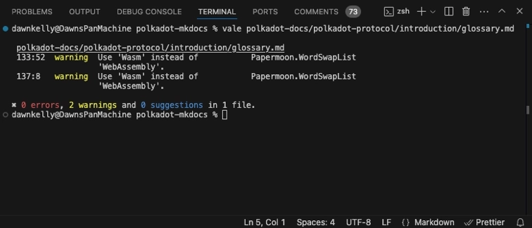

# Contribute to the Polkadot Developer Docs

The documentation source files are written in [Markdown](https://daringfireball.net/projects/markdown) and generally follow the [PaperMoon style guide](https://github.com/papermoonio/documentation-style-guide/blob/main/style-guide.md). If the PaperMoon style guide doesn't provide explicit guidance on a particular subject, please default to the [Google developer documentation style guide](https://developers.google.com/style).

This guide covers how to contribute to the documentation, including serving a local version of the site, adding new pages and directories, managing images and code snippets, and a few SEO tips.

## Contents

- [Viewing Site Locally](#view-site-locally)
  - [Clone Repositories](#clone-repositories)
  - [Install Dependencies and Serve Site](#install-dependencies)
- [Adding New Pages](#adding-new-pages)
  - [Creating a Subdirectory](#creating-a-subdirectory)
    - [Example `.pages` File](#example-pages-file)
    - [Example `index.md` File](#example-indexmd-file)
  - [Adding Pages to Existing Subdirectory](#adding-pages-to-existing-subdirectory)
- [Modifying Existing Pages](#modifying-existing-pages)
- [Adding Code and Text Snippets](#adding-code-and-text-snippets)
- [Adding Images](#adding-images)
- [Optimizing for SEO](#search-enging-optimization-seo)
- [Tools for Editing](#tools-for-editing)

## Viewing Site Locally

You may want to spin up a local version of the documentation site to preview your changes. This guide will cover the steps needed to serve a local version.

### Clone Repositories

Building and serving the site requires cloning two repositories:

- **[Polkadot MkDocs](https://github.com/papermoonio/polkadot-mkdocs)** - contains the MkDocs configuration files, theme overrides, and custom CSS for the Polkadot documentation site

- **[Polkadot Docs](https://github.com/polkadot-developers/polkadot-docs)** - the actual content is stored in the `polkadot-docs` repository and pulled into the `polkadot-mkdocs` directory during build

For everything to work correctly, the file structure needs to be as follows:

```bash
polkadot-mkdocs
|--- /material-overrides/ (folder)
|--- /polkadot-docs/ (repository)
|--- mkdocs.yml
```

To set up the structure, follow these steps:

1. Clone this repository:

    ```bash
    git clone https://github.com/papermoonio/polkadot-mkdocs
    ```

2. Inside the folder just created, clone the `polkadot-docs` repository:

    ```bash
    cd polkadot-mkdocs
    git clone https://github.com/polkadot-developers/polkadot-docs.git
    ```

### Install Dependencies and Serve Site

1. Now that the repositories are cloned and properly nested, use the [pip](https://pypi.org/project/pip/) package installer to install [mkdocs](https://www.mkdocs.org/) and other required dependencies by running the command:

    ```bash
    pip install -r requirements.txt
    ```

    This command will install all dependencies listed in the `requirements.txt` file.

2. In the `polkadot-mkdocs` folder (which should be the current one), you can build the site by running:

    ```bash
    mkdocs serve
    ```

After a successful build, the site should be available at http://127.0.0.1:8000.

## Adding New Pages

When adding new pages to the documentation site, it is important to ensure all relevant items are updated correctly to prevent broken links and unexpected behavior. This section guides you through the steps to add new documentation pages.

### Creating a New Section

To create a new section of pages, you will first need to create a subdirectory with the desired name of the section. The root directory, and every subdirectory, must contain the following files:

- `.pages` - defines the structure of the documentation site
- `index.md` - a landing page which can be used to provide more context about the content in the section

#### Example `.pages` File

```markdown
title: Application Developers
nav: 
  - index.md
  - 'Polkadot SDK': 'polkadot-sdk.md'
  - interact
  - tooling
```

This example would result in adding 'Application Developers' as a section with two files inside, `index.md` and `polkadot-sdk.md`, and two additional subdirectories named `interact` and `tooling`.

Some important things to note:

- The `title` field at the top of the page represents the display name for the section. This is displayed on the left-side navigation bar when viewing the site
- The `index.md` page should always be the first item in the `nav` list
- Files follow the convention of `'Display Name': 'file-name.md'`
- Sections are listed by their directory name in the source code. For example, the Tooling section will be added to the navigation simply by using the directory name: `tooling`

#### Example `index.md` File

```markdown
---
title: Build Chains with Polkadot
description: Learn how to build and customize blockchains with Polkadot SDK. Explore flexible tools, pre-built modules, and tutorials for efficient blockchain development.
---

<!-- Add content in markdown here -->  
```

Some important things to note:

- The `title` represents the `<title>` tag and is used for SEO purposes
- The `description` represents the meta-description and is also used for SEO purposes

### Adding Pages to Existing Section

If you are adding pages to an existing section, the steps are simplified. However, it's essential to ensure you complete these steps to display the new page and its title on the documentation site correctly:

- Add the new markdown page to the appropriate section. Note that the filename becomes part of the URL for this page. See the [style guide](https://github.com/papermoonio/documentation-style-guide/blob/main/style-guide.md#naming-conventions) for additional guidance on naming conventions.
- Ensure the new content page includes the following:
    - **`title`** - represents the `<title>` tag and is used for SEO purposes (not displayed on the published site) Titles have a maximum length of 45 characters.
    - **`description`** - represents the meta-description and is also used for SEO purposes (not displayed on the published site). Descriptions should be 120-160 characters and should provide a preview into the page topic.
    - **Page title** - an H1 heading title to be displayed at the top of the page

    - **`## Checking Prerequisites` section** - if the guide requires the user to have specific developer tools installed, for example, Docker or MetaMask, it should be listed here

- Add the 'Display Name': 'file-name.md' for the new page to the `.pages` folder in the same subdirectory where you added the new page

An example new content page might look like:

```md
---
title: Title for SEO purposes 
description: Description for SEO purposes. This should be a sentence or two that is between 120-160 characters long.
---

# Page Title

## Introduction

Write 2-3 paragraphs to serve as the introduction here.

...
```

More resources for [SEO Optimization](#search-engine-optimization-seo) of titles and descriptions.

## Modifying Existing Pages

 To modify existing pages:

1. Ensure you are in the `polkadot-docs` directory, then create a new branch for your content:

    ```bash
    git checkout -b INSERT_NEW_BRANCH_NAME
    ```

2. Modify content as desired. Remember to place images and code snippets in the appropriate folders (see the following sections for details)
3. Review the [style guide](https://github.com/papermoonio/documentation-style-guide/blob/main/style-guide.md) to ensure your new content meets the guidelines
3. Once you commit and push all of your changes, open a pull request for the new content branch against the `main` branch
4. Monitor notifications and pull requests for feedback from code owners. At least one approval is required before merging content

If your additions or modifications are limited to content on an existing page, there is no need to worry about the [`.pages`](#example-pages-file) or [`index.md`](#example-indexmd-file) files, as changes to page content don't affect these files.

## Adding Code and Text Snippets

Snippets are used to manage reusable lines of code or text. They are organized to mirror the structure of the docs site and stored under the root-level `.snippets` directory. For example, to add a code snippet to the page `develop/application-devs/tooling/chopsticks/overview.md`, you would place the code snippet in the folder `.snippets/code/application-devs/tooling/chopsticks/overview`.

Text snippets are useful for pieces of copy you find the need to reuse often, such as disclaimers. Code snippets allow you to reuse pieces of code throughout a document while maintaining a single place to update that code when needed.

To link to a snippet, you can use the following syntax in the Markdown file:

```markdown
--8<-- 'code/<subdirectory>/<snippet-file-name>.js'
```

Text snippets are written in Markdown, as `.md` files, while code snippets should be written in their individual programming languages, for example, `.py` for Python or `.js` for JavaScript.

Learn more about the effective use of [snippets](https://facelessuser.github.io/pymdown-extensions/extensions/snippets/).

## Adding Images

Images are stored in the `images` subdirectory. They are organized to mirror the structure of the docs site. For example, to add an image to the page `/develop/application-devs/tooling/chopsticks/overview.md`, you would place the image in the folder `images/application-devs/tooling/chopsticks/overview`

All images intended for display on the website should be in `.webp` format. You can look up an image converter online to convert from `.jpeg`, `.png`, or other formats to `.webp`.

To add an image to your page, you should have [alt text](https://developers.google.com/style/images#alt-text) and use the following syntax:

```markdown

```

See the [style guide](https://github.com/papermoonio/documentation-style-guide/blob/main/style-guide.md#screenshots) for more tips on handling images.

## Search Engine Optimization (SEO)

Here are some resources to help you create good titles and descriptions for SEO:

- [Google's recommendation on good titles](https://developers.google.com/search/docs/advanced/appearance/title-link?hl=en)
- [Google's recommendation on good descriptions](https://developers.google.com/search/docs/advanced/appearance/snippet?hl=en)

In general, titles should be between 50 and 60 characters and descriptions should be between 120 and 160 characters.

## Tools for Editing

There are a few tools you may find useful for proofreading and editing your contributions:

- **[Vale](https://vale.sh/)** - the `polkadot-mkdocs` repository contains configuration for Vale, an open source NLP-powered linter for text. The configuration is a work in progress with a growing custom dictionary tailored toward software engineering, blockchain, and Polkadot terms. Running Vale against your files locally can serve as a first round of feedback to speed up the review process

To use Vale locally to screen your work:

1. Visit the Vale site and follow the [installation instructions](https://vale.sh/docs/vale-cli/installation/) 
2. From the `polkadot-mkdocs` directory, run the following in your terminal:

    ```bash
      vale (INSERT_PATH_TO_FILE)
    ```

    The output will look something like:

    

3. You can use CMD+click to open the file with the flagged items. This is especially helpful if you run Vale against a directory with multiple files

4. Each flag tells you the line and location of the flagged item, the level of the flag (error, warning, or suggestion), and a suggestion for how to resolve the flag

5. Once you have addressed the flagged items and made edits as needed, you can complete the normal steps to commit your changes and open a pull request to review for merge