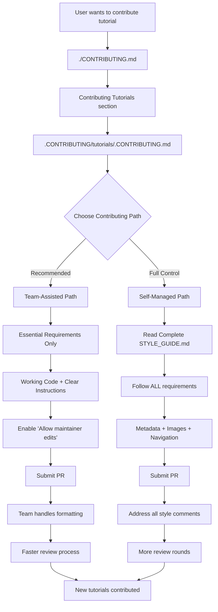

# Contributing Tutorials

## Contributing Flow



## Choose Your Contributing Path

### Team-Assisted Path (Recommended)

**Allow the Polkadot Docs team to handle formatting and style**

 **Benefits:**

- Faster review process
- Fewer style-related review comments
- Team handles technical formatting requirements

 **Your responsibility:**

- Working code and clear instructions
- Following essential requirements below

 **Important:** Enable "Allow edits by maintainers" on your PR

**Required:** You must read the [STYLE_GUIDE.md](STYLE_GUIDE.md) to understand all requirements. The difference is that with the team-assisted path, they will have the bandwidth to handle the review process.

### Self-Managed Path

**Handle all formatting and style requirements yourself**

 **Full control** over your tutorial format and style
 **More review rounds** - you must fix all style issues
 **Required reading:** [STYLE_GUIDE.md](STYLE_GUIDE.md)
 **For expedited review:** Also read the [PaperMoon Documentation Style Guide](https://github.com/papermoonio/documentation-style-guide).


---

# Team-Assisted Path: Essential Requirements

## Essential Requirements

### 1. Metadata (Required)

```yaml
---
title: Tutorial Title (max 45 chars)
description: Description 120-160 chars
tutorial_badge: Beginner | Intermediate | Advanced
categories: Category1, Category2
---
```

### 2. File Structure (Required)

Once you've defined your tutorial path, ensure images and code snippets follow the same structure.

**Tutorial file:**
```
tutorials/[category]/[subcategory]/[tutorial-name].md
```

**Supporting files:**
```
images/tutorials/[category]/[subcategory]/[tutorial-name]/
.snippets/code/tutorials/[category]/[subcategory]/[tutorial-name]/
```

**Image naming convention:**
```
images/tutorials/[category]/[subcategory]/[tutorial-name]/[tutorial-name-01.webp]
```
Where the number will be 01, 02, 03, etc.

### 3. Navigation Update (Critical)

**Must update `.nav.yml` files** or your tutorial won't appear in the left-side menu:
```yaml
# In appropriate .nav.yml file
- 'Display Title': tutorial-filename.md
```

### 4. Working Code & Tests (Required)

- All code examples must be tested and functional
- **Always specify dependency versions** (e.g., `npm install polkadot-api@1.16.0`)
- Include verification steps
- Test on clean environment before submitting

## Tutorial Categories

- **polkadot-sdk/**: Parachains, pallets, runtime development
- **smart-contracts/**: EVM, PVM, demo applications  
- **interoperability/**: XCM operations, channel management
- **dapps/**: Frontend integration, API usage
- **onchain-governance/**: Proposals, OpenGov operations

## Basic Template

```markdown
# Tutorial Title

## Introduction
[Brief explanation of what users will learn/build]

## Prerequisites
- [Required knowledge/tools]

## [Action-Oriented Section Title]
[Instructions with commands]

## [Another Action-Oriented Section Title]
[Instructions with commands]

## Verification
[How to confirm it worked]

## Where to Go Next
[Related tutorials]
```

**Note:** Use action-oriented section titles (e.g., "Environment Setup", "Client Configuration") instead of generic "Step 1", "Step 2" format.

## Image Requirements

- **Format**: `.webp` only  
- **Location**: `images/tutorials/[path]/`
- **Naming**: `tutorial-name-01.webp`, `tutorial-name-02.webp`, etc.
- **Dimensions**: 
  - Desktop screenshots: 1512px width, variable height
  - Browser extensions: 400x600px  
- **Alt text**: Always required

## Submission Checklist

- [ ] Tutorial follows a clear storytelling structure with logical flow
- [ ] Metadata complete
- [ ] Working code tested
- [ ] Images in `.webp` format
- [ ] Navigation updated (`.nav.yml`)
- [ ] Files follow naming conventions
- [ ] Verification steps included

---

# Self-Managed Path: Complete Requirements

If you choose the self-managed path, you must follow **all** requirements in [STYLE_GUIDE.md](STYLE_GUIDE.md), including:

- Complete metadata specifications
- Image optimization and formatting
- Navigation file updates (.nav.yml)
- Advanced style and formatting rules
- SEO optimization requirements

**Note:** All style-related review comments must be addressed by you.

---

## Resources

- **Templates**: [templates/](templates/) folder - Ready-to-use templates for different tutorial categories
- **Style Guide**: [STYLE_GUIDE.md](STYLE_GUIDE.md) - Complete formatting requirements (recommended for all, required for self-managed)
- **Examples**: Browse existing tutorials for reference

**Questions?** The team is here to help regardless of which path you choose!

---
