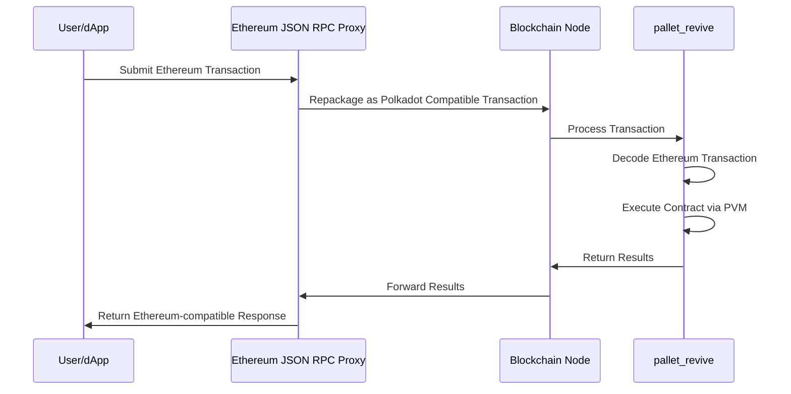

Begin New Bundle: Basics


---

Page Title: Accounts in Asset Hub Smart Contracts

- Source (raw): https://raw.githubusercontent.com/polkadot-developers/polkadot-docs/master/.ai/pages/smart-contracts-for-eth-devs-accounts.md
- Canonical (HTML): https://docs.polkadot.com/smart-contracts/for-eth-devs/accounts/
- Summary: Bridges Ethereum's 20-byte addresses with Polkadot's 32-byte accounts, enabling seamless interaction while maintaining compatibility with Ethereum tooling.

# Accounts on Asset Hub Smart Contracts

## Introduction

Asset Hub natively utilizes Polkadot's 32-byte account system while providing interoperability with Ethereum's 20-byte addresses through an automatic conversion system. When interacting with smart contracts:

- Ethereum-compatible wallets (like MetaMask) can use their familiar 20-byte addresses.
- Polkadot accounts continue using their native 32-byte format.
- The Asset Hub chain automatically handles conversion between the two formats behind the scenes:

    - 20-byte Ethereum addresses are padded with `0xEE` bytes to create valid 32-byte Polkadot accounts.
    - 32-byte Polkadot accounts can optionally register a mapping to a 20-byte address for Ethereum compatibility.

This dual-format approach enables Asset Hub to maintain compatibility with Ethereum tooling while fully integrating with the Polkadot ecosystem.

## Address Types and Mappings

The platform handles two distinct address formats:

- [Ethereum-style addresses (20 bytes)](https://ethereum.org/developers/docs/accounts/#account-creation){target=\_blank}
- [Polkadot native account IDs (32 bytes)](https://wiki.polkadot.com/learn/learn-account-advanced/#address-format){target=\_blank}


### Ethereum to Polkadot Mapping

The [`AccountId32Mapper`](https://paritytech.github.io/polkadot-sdk/master/pallet_revive/struct.AccountId32Mapper.html){target=\_blank} implementation in [`pallet_revive`](https://paritytech.github.io/polkadot-sdk/master/pallet_revive/index.html){target=\_blank} handles the core address conversion logic. For converting a 20-byte Ethereum address to a 32-byte Polkadot address, the pallet uses a simple concatenation approach:

- [**Core mechanism**](https://paritytech.github.io/polkadot-sdk/master/pallet_revive/trait.AddressMapper.html#tymethod.to_fallback_account_id){target=\_blank}: Takes a 20-byte Ethereum address and extends it to 32 bytes by adding twelve `0xEE` bytes at the end. The key benefits of this approach are:
    - Able to fully revert, allowing a smooth transition back to the Ethereum format.
    - Provides clear identification of Ethereum-controlled accounts through the `0xEE` suffix pattern.
    - Maintains cryptographic security with a `2^96` difficulty for pattern reproduction.

### Polkadot to Ethereum Mapping

The conversion from 32-byte Polkadot accounts to 20-byte Ethereum addresses is more complex than the reverse direction due to the lossy nature of the conversion. The [`AccountId32Mapper`](https://paritytech.github.io/polkadot-sdk/master/pallet_revive/struct.AccountId32Mapper.html){target=\_blank} handles this through two distinct approaches:

- **For Ethereum-derived accounts**: The system uses the [`is_eth_derived`](https://paritytech.github.io/polkadot-sdk/master/pallet_revive/fn.is_eth_derived.html){target=\_blank} function to detect accounts that were originally Ethereum addresses (identified by the `0xEE` suffix pattern). For these accounts, the conversion strips the last 12 bytes to recover the original 20-byte Ethereum address.

- **For native Polkadot accounts**: Since these accounts utilize the whole 32-byte space and weren't derived from Ethereum addresses, direct truncation would result in lost information. Instead, the system:

    1. Hashes the entire 32-byte account using Keccak-256.
    2. Takes the last 20 bytes of the hash to create the Ethereum address.
    3. This ensures a deterministic mapping while avoiding simple truncation.

The conversion process is implemented through the [`to_address`](https://paritytech.github.io/polkadot-sdk/master/pallet_revive/trait.AddressMapper.html#tymethod.to_address){target=\_blank} function, which automatically detects the account type and applies the appropriate conversion method.

**Stateful Mapping for Reversibility** : Since the conversion from 32-byte to 20-byte addresses is inherently lossy, the system provides an optional stateful mapping through the [`OriginalAccount`](https://paritytech.github.io/polkadot-sdk/master/pallet_revive/pallet/storage_types/struct.OriginalAccount.html){target=\_blank} storage. When a Polkadot account registers a mapping (via the [`map`](https://paritytech.github.io/polkadot-sdk/master/pallet_revive/trait.AddressMapper.html#tymethod.map){target=\_blank} function), the system stores the original 32-byte account ID, enabling the [`to_account_id`](https://paritytech.github.io/polkadot-sdk/master/pallet_revive/trait.AddressMapper.html#tymethod.to_account_id){target=\_blank} function to recover the exact original account rather than falling back to a default conversion.


### Account Mapping for Native Polkadot Accounts

If you have a native Polkadot account (32-byte format) that was created with a Polkadot/Substrate keypair (Ed25519/Sr25519) rather than an Ethereum-compatible keypair (secp256k1), you'll need to map your account to enable Ethereum compatibility.

To map your account, call the [`map_account`](https://paritytech.github.io/polkadot-sdk/master/pallet_revive/pallet/dispatchables/fn.map_account.html){target=\_blank} extrinsic of the [`pallet_revive`](https://paritytech.github.io/polkadot-sdk/master/pallet_revive/index.html){target=\_blank} pallet using your original Substrate account. This creates a stateful mapping that allows your 32-byte account to interact with the Ethereum-compatible smart contract system.

Once mapped, you'll be able to:

- Transfer funds between 20-byte format addresses.
- Interact with smart contracts using Ethereum-compatible tools like MetaMask.
- Maintain full reversibility to your original 32-byte account format.

!!! warning "Mapping Requirement"
    Without this mapping, native Polkadot accounts cannot transfer funds or interact with the Ethereum-compatible layer on the Hub.

## Account Registration

The registration process is implemented through the [`map`](https://paritytech.github.io/polkadot-sdk/master/pallet_revive/trait.AddressMapper.html#tymethod.map){target=\_blank} function. This process involves:

- Checking if the account is already mapped.
- Calculating and collecting required deposits based on data size.
- Storing the address suffix for future reference.
- Managing the currency holds for security.

## Fallback Accounts

The fallback mechanism is integrated into the [`to_account_id`](https://paritytech.github.io/polkadot-sdk/master/pallet_revive/trait.AddressMapper.html#tymethod.to_account_id){target=\_blank} function. It provides a safety net for address conversion by:

- First, attempting to retrieve stored mapping data.
- Falling back to the default conversion method if no mapping exists.
- Maintaining consistency in address representation.

## Contract Address Generation

The system supports two methods for generating contract addresses:

- [CREATE1 method](https://paritytech.github.io/polkadot-sdk/master/pallet_revive/fn.create1.html){target=\_blank}:

    - Uses the deployer address and nonce.
    - Generates deterministic addresses for standard contract deployment.

- [CREATE2 method](https://paritytech.github.io/polkadot-sdk/master/pallet_revive/fn.create2.html){target=\_blank}:

    - Uses the deployer address, initialization code, input data, and salt.
    - Enables predictable address generation for advanced use cases.

## Security Considerations

The address mapping system maintains security through several design choices evident in the implementation:

- The stateless mapping requires no privileged operations, as shown in the [`to_fallback_account_id`](https://paritytech.github.io/polkadot-sdk/master/pallet_revive/trait.AddressMapper.html#tymethod.to_fallback_account_id){target=\_blank} implementation.
- The stateful mapping requires a deposit managed through the [`Currency`](https://paritytech.github.io/polkadot-sdk/master/pallet_revive/pallet/trait.Config.html#associatedtype.Currency){target=\_blank} trait.
- Mapping operations are protected against common errors through explicit checks.
- The system prevents double-mapping through the [`ensure!(!Self::is_mapped(account_id))`](https://github.com/paritytech/polkadot-sdk/blob/stable2412/substrate/frame/revive/src/address.rs#L125){target=\_blank} check.

All source code references are from the [`address.rs`](https://github.com/paritytech/polkadot-sdk/blob/stable2412/substrate/frame/revive/src/address.rs){target=\_blank} file in the Revive pallet of the Polkadot SDK repository.


---

Page Title: Contract Deployment

- Source (raw): https://raw.githubusercontent.com/polkadot-developers/polkadot-docs/master/.ai/pages/smart-contracts-for-eth-devs-contract-deployment.md
- Canonical (HTML): https://docs.polkadot.com/smart-contracts/for-eth-devs/contract-deployment/
- Summary: Compare deployment flows for REVM and PVM-based smart contracts on the Polkadot Hub. Includes single-step REVM flows and PVM’s two-step deployment model.

# Contract Deployment

## Introduction

Polkadot's smart contract platform supports two distinct virtual machine backends: Rust Ethereum Virtual Machine (REVM) and PVM. Each backend has its own deployment characteristics and optimization strategies. REVM provides full Ethereum compatibility with familiar single-step deployment, while the RISC-V-based PVM uses a more structured two-step approach optimized for its architecture. Understanding these differences ensures smooth deployment regardless of which backend you choose for your smart contracts.

## REVM Deployment

The REVM backend enables seamless deployment of Ethereum contracts without modification. Contracts deploy exactly as they would on Ethereum, using familiar tools and workflows.

With REVM, deployment mirrors the Ethereum flow exactly including: 

- Contracts are bundled and deployed in a single transaction. 
- Factory contracts can create new contracts at runtime.
- Runtime code generation, including inline assembly, is supported.
- Existing familiar tools like Hardhat, Foundry, and Remix work out of the box.

## PVM Deployment

PVM implements a fundamentally different deployment model optimized for its RISC-V architecture. While simple contract deployments work seamlessly, advanced patterns like factory contracts require understanding the two-step deployment process.

### Standard Contract Deployment

For most use cases, such as deploying ERC-20 tokens, NFT collections, or standalone contracts, deployment is transparent and requires no special steps. The [Revive compiler](https://github.com/paritytech/revive){target=\_blank} handles the deployment process automatically when using standard Solidity patterns.

### Two-Step Deployment Model

PVM separates contract deployment into distinct phases:

1. **Code upload**: Contract bytecode must be uploaded to the chain before instantiation.
2. **Contract instantiation**: Contracts are created by referencing previously uploaded code via its hash.

This architecture differs from the EVM's bundled approach and has important implications for specific deployment patterns.

### Factory Pattern Considerations

The common EVM pattern, where contracts dynamically create other contracts, requires adaptation for PVM as follows:

**EVM Factory Pattern:**
```solidity
// This works on REVM but requires modification for PVM
contract Factory {
    function createToken() public returns (address) {
        // EVM bundles bytecode in the factory
        return address(new Token());
    }
}
```

**PVM Requirements:**

- **Pre-upload dependent contracts**: All contracts that will be instantiated at runtime must be uploaded to the chain before the factory attempts to create them.
- **Code hash references**: Factory contracts work with pre-uploaded code hashes rather than embedding bytecode.
- **No runtime code generation**: Dynamic bytecode generation is not supported due to PVM's RISC-V format.

### Migration Strategy for Factory Contracts

When migrating factory contracts from Ethereum to PVM:

1. **Identify all contracts**: Determine which contracts will be instantiated at runtime.
2. **Upload dependencies first**: Deploy all dependent contracts to the chain before deploying the factory.
3. **Use on-chain constructors**: Leverage PVM's on-chain constructor feature for flexible instantiation.
4. **Avoid assembly creation**: Don't use `create` or `create2` opcodes in assembly blocks for manual deployment.

### Architecture-Specific Limitations

PVM's deployment model creates several specific constraints:

- **`EXTCODECOPY` limitations**: Contracts using `EXTCODECOPY` to manipulate code at runtime will encounter issues.
- **Runtime code modification**: Patterns that construct and mutate contract code on-the-fly are not supported.
- **Assembly-based factories**: Factory contracts written in YUL assembly that generate code at runtime will fail with `CodeNotFound` errors.

These patterns are rare in practice and typically require dropping down to assembly, making them non-issues for standard Solidity development.

### On-Chain Constructors

PVM provides on-chain constructors as an elegant alternative to runtime code modification:

- Enable contract instantiation without runtime code generation.
- Support flexible initialization patterns.
- Maintain separation between code upload and contract creation.
- Provide predictable deployment costs.

## Gas Estimation vs Actual Consumption

Both REVM and PVM deployments may show significant differences between gas estimation and actual consumption. You might see estimates that are several times higher than the actual gas consumed (often around 30% of the estimate). This is normal behavior because pre-dispatch estimation cannot distinguish between computation weight and storage deposits, leading to conservative overestimation. Contract deployments are particularly affected as they consume significant storage deposits for code storage.

## Deployment Comparison

| Feature | REVM Backend | PVM Backend |
|:-------:|:-------------:|:----------------:|
| **Deployment Model** | Single-step bundled | Two-step upload and instantiate |
| **Factory Patterns** | Direct runtime creation | Requires pre-uploaded code |
| **Code Bundling** | Bytecode in transaction | Code hash references |
| **Runtime Codegen** | Fully supported | Not supported |
| **Simple Contracts** | No modifications needed | No modifications needed |
| **Assembly Creation** | Supported | Discouraged, limited support |

## Conclusion

Both backends support contract deployment effectively, with REVM offering drop-in Ethereum compatibility and PVM providing a more structured two-step approach. For the majority of use cases—deploying standard contracts like tokens or applications—both backends work seamlessly. Advanced patterns like factory contracts may require adjustment for PVM, but these adaptations are straightforward with proper planning.


---

Page Title: Deploy an ERC-20 Using Hardhat

- Source (raw): https://raw.githubusercontent.com/polkadot-developers/polkadot-docs/master/.ai/pages/smart-contracts-cookbook-smart-contracts-deploy-erc20-erc20-hardhat.md
- Canonical (HTML): https://docs.polkadot.com/smart-contracts/cookbook/smart-contracts/deploy-erc20/erc20-hardhat/
- Summary: Deploy an ERC-20 token on Polkadot Hub using PVM. This guide covers contract creation, compilation, deployment, and interaction via Hardhat.

# Deploy an ERC-20 Using Hardhat

## Introduction

[ERC-20](https://eips.ethereum.org/EIPS/eip-20){target=\_blank} tokens are fungible tokens commonly used for creating cryptocurrencies, governance tokens, and staking mechanisms. Polkadot Hub enables easy deployment of ERC-20 tokens via Ethereum-compatible smart contracts and tools.

This guide demonstrates how to deploy an ERC-20 contract on Polkadot Hub TestNet using [Hardhat](https://hardhat.org/){target=\_blank}, an Ethereum development environment. The ERC-20 contract can be retrieved from OpenZeppelin's [GitHub repository](https://github.com/OpenZeppelin/openzeppelin-contracts/tree/v5.4.0/contracts/token/ERC20){target=\_blank} or their [Contract Wizard](https://wizard.openzeppelin.com/){target=\_blank}.

## Prerequisites

Before you begin, ensure you have the following:

- A basic understanding of [Solidity](https://www.soliditylang.org/){target=\_blank} programming and [ERC-20](https://ethereum.org/developers/docs/standards/tokens/erc-20/){target=\_blank} fungible tokens.
- [Node.js](https://nodejs.org/en/download){target=\_blank} v22.13.1 or later installed.
- Test tokens for gas fees, available from the [Polkadot faucet](https://faucet.polkadot.io/){target=\_blank}. See [Get Test Tokens](/smart-contracts/faucet/#get-test-tokens){target=\_blank} for a guide to using the faucet.
- A wallet with a private key for signing transactions.

## Set Up Your Project

This tutorial uses a [Hardhat ERC-20 template](https://github.com/polkadot-developers/revm-hardhat-examples/tree/master/erc20-hardhat){target=\_blank} that contains all the necessary files. 

To get started, take the following steps:

1. Clone the GitHub repository locally:

    ```bash
    git clone https://github.com/polkadot-developers/revm-hardhat-examples/
    cd revm-hardhat-examples/erc20-hardhat
    ```

2. Install the dependencies using the following command:

    ```bash
    npm i
    ```
    
    This command will fetch all the necessary packages to help you use Hardhat to deploy an ERC-20 to Polkadot.

## Configure Hardhat

If you started with the cloned Hardhat ERC-20 template, `hardhat.config.ts` is already configured to deploy to the Polkadot TestNet as shown in the example below:

```ts title="hardhat.config.ts" hl_lines="14-19"

const config: HardhatUserConfig = {
  solidity: {
    version: "0.8.28",
    settings: {
      optimizer: {
        enabled: true,
        runs: 200,
      },
    },
  },
  networks: {
    polkadotTestnet: {
      url: vars.get("TESTNET_URL", "http://127.0.0.1:8545"),
      accounts: vars.has("TESTNET_PRIVATE_KEY") ? [vars.get("TESTNET_PRIVATE_KEY")] : [],
    },
  },
  mocha: {
    timeout: 40000,
  },
};

export default config;
```

!!! tip
    Visit the Hardhat [Configuration variables](https://v2.hardhat.org/hardhat-runner/docs/guides/configuration-variables){target=\_blank} documentation to learn how to use Hardhat to handle your private keys securely.

## Compile the Contract 

Next, compile the contract included with the template by running the following command:

```bash
npx hardhat compile
```

If everything compiles successfully, you will see output similar to the following:


## Test the Contract

You can view the predefined test file at [`test/MyToken.test.ts`](https://github.com/polkadot-developers/revm-hardhat-examples/blob/master/erc20-hardhat/test/MyToken.test.ts){target=\_blank}. This example test includes verification of the following:

- The token name and symbol exist (confirms deployment) and are correct.
- The token owner is correctly configured.
- The initial token supply is zero.
- The owner can mint tokens.
- The total supply increases after a mint.
- Successful mints to different test addresses with expected account balance and total supply changes.

Run the tests using the following command:

```bash
npx hardhat test --network polkadotTestnet
```

If tests are successful, you will see outputs similar to the following:

<div id="termynal" data-termynal markdown>
  <span data-ty="input">npx hardhat test --network polkadotTestnet</span>
  <span data-ty></span>
  <span data-ty>&nbsp;&nbsp;MyToken</span>
  <span data-ty>&nbsp;&nbsp;&nbsp;&nbsp;Deployment</span>
  <span data-ty>&nbsp;&nbsp;&nbsp;&nbsp;&nbsp;&nbsp;✔ Should have correct name and symbol</span>
  <span data-ty>&nbsp;&nbsp;&nbsp;&nbsp;&nbsp;&nbsp;✔ Should set the right owner</span>
  <span data-ty>&nbsp;&nbsp;&nbsp;&nbsp;&nbsp;&nbsp;✔ Should have zero initial supply</span>
  <span data-ty>&nbsp;&nbsp;&nbsp;&nbsp;Minting</span>
  <span data-ty>&nbsp;&nbsp;&nbsp;&nbsp;&nbsp;&nbsp;✔ Should allow owner to mint tokens</span>
  <span data-ty>&nbsp;&nbsp;&nbsp;&nbsp;&nbsp;&nbsp;✔ Should increase total supply on mint</span>
  <span data-ty>&nbsp;&nbsp;&nbsp;&nbsp;Multiple mints</span>
  <span data-ty>&nbsp;&nbsp;&nbsp;&nbsp;&nbsp;&nbsp;✔ Should correctly track balance after multiple mints</span>
  <span data-ty></span>
  <span data-ty>&nbsp;&nbsp;6 passing (369ms)</span>
  <span data-ty="input"><span class="file-path"></span></span>
</div>

## Deploy the Contract

You are now ready to deploy the contract to your chosen network. This example demonstrates deployment to the Polkadot TestNet. Deploy the contract as follows:

1. Run the following command in your terminal:

    ```bash
    npx hardhat ignition deploy ./ignition/modules/MyToken.ts --network polkadotTestnet
    ```

2. Confirm the target deployment network name and chain ID when prompted:

    <div id="termynal" data-termynal markdown>
      <span data-ty="input">npx hardhat ignition deploy ./ignition/modules/MyToken.ts --network polkadotTestnet</span>
      <span data-ty>✔ Confirm deploy to network polkadotTestnet (420420420)? … yes</span>
      <span data-ty>&nbsp;</span>
      <span data-ty>Hardhat Ignition 🚀</span>
      <span data-ty>&nbsp;</span>
      <span data-ty>Deploying [ TokenModule ]</span>
      <span data-ty>&nbsp;</span>
      <span data-ty>Batch #1</span>
      <span data-ty> Executed TokenModule#MyToken</span>
      <span data-ty>&nbsp;</span>
      <span data-ty>Batch #2</span>
      <span data-ty> Executed TokenModule#MyToken.mint</span>
      <span data-ty>&nbsp;</span>
      <span data-ty>[ TokenModule ] successfully deployed 🚀</span>
      <span data-ty>&nbsp;</span>
      <span data-ty>Deployed Addresses</span>
      <span data-ty>&nbsp;</span>
      <span data-ty>TokenModule#MyToken - 0xc01Ee7f10EA4aF4673cFff62710E1D7792aBa8f3</span>
      <span data-ty="input"><span class="file-path"></span></span>
    </div>

Congratulations! You've successfully deployed an ERC-20 token contract to Polkadot Hub TestNet using Hardhat. Consider the following resources to build upon your progress.

## Where to Go Next

<div class="grid cards" markdown>

-   <span class="badge guide">Guide</span> __Deploy an NFT__

    ---

    Walk through deploying an NFT to the Polkadot Hub using Hardhat.

    [:octicons-arrow-right-24: Get Started](/smart-contracts/cookbook/smart-contracts/deploy-nft/nft-hardhat/)

-   <span class="badge guide">Guide</span> __Create a DApp__

    ---

    Learn step-by-step how to build a fully functional dApp that interacts with a smart contract deployed via Hardhat.

    [:octicons-arrow-right-24: Get Started](/smart-contracts/cookbook/dapps/zero-to-hero/)

</div>


---

Page Title: Deploy an ERC-20 Using Remix IDE

- Source (raw): https://raw.githubusercontent.com/polkadot-developers/polkadot-docs/master/.ai/pages/smart-contracts-cookbook-smart-contracts-deploy-erc20-erc20-remix.md
- Canonical (HTML): https://docs.polkadot.com/smart-contracts/cookbook/smart-contracts/deploy-erc20/erc20-remix/
- Summary: Deploy an ERC-20 token contract on Polkadot Hub. This guide covers contract creation, compilation, deployment, and interaction via the Remix IDE.

# Deploy an ERC-20 Using Remix IDE

## Introduction

[ERC-20](https://eips.ethereum.org/EIPS/eip-20){target=\_blank} tokens are fungible tokens commonly used for creating cryptocurrencies, governance tokens, and staking mechanisms. Polkadot Hub enables easy token deployment with Ethereum-compatible smart contracts and tools via the EVM backend.

This tutorial covers deploying an ERC-20 contract on Polkadot Hub TestNet using [Remix IDE](https://remix.ethereum.org/){target=\_blank}, a web-based development tool. The ERC-20 contract can be retrieved from OpenZeppelin's [GitHub repository](https://github.com/OpenZeppelin/openzeppelin-contracts/tree/v5.4.0/contracts/token/ERC20){target=\_blank} or their [Contract Wizard](https://wizard.openzeppelin.com/){target=\_blank}.

## Prerequisites

Before you begin, ensure you have:

- A basic understanding of [Solidity](https://www.soliditylang.org/){target=\_blank} programming and [ERC-20](https://ethereum.org/developers/docs/standards/tokens/erc-20/){target=\_blank} fungible tokens.
- An EVM-compatible [wallet](/smart-contracts/connect/){target=\_blank} connected to Polkadot Hub. This example utilizes [MetaMask](https://metamask.io/){target=\_blank}.
- Test tokens for gas fees, available from the [Polkadot faucet](https://faucet.polkadot.io/){target=\_blank}. See [Get Test Tokens](/smart-contracts/faucet/#get-test-tokens){target=\_blank} for a guide to using the faucet.

## Create Your Contract

Follow the steps below to create the ERC-20 contract:

1. Navigate to [Remix IDE](https://remix.ethereum.org/){target=\_blank} in your web browser.
2. Select the **Create new file** button under the **contracts** folder, and name your contract `MyToken.sol`.

    

3. Now, paste the following ERC-20 contract code into `MyToken.sol`:

    ```solidity title="MyToken.sol"
    // SPDX-License-Identifier: MIT
    // Compatible with OpenZeppelin Contracts ^5.4.0
    pragma solidity ^0.8.27;

    import {ERC20} from "@openzeppelin/contracts/token/ERC20/ERC20.sol";
    import {ERC20Permit} from "@openzeppelin/contracts/token/ERC20/extensions/ERC20Permit.sol";
    import {Ownable} from "@openzeppelin/contracts/access/Ownable.sol";

    contract MyToken is ERC20, Ownable, ERC20Permit {
        constructor(address initialOwner)
            ERC20("MyToken", "MTK")
            Ownable(initialOwner)
            ERC20Permit("MyToken")
        {}

        function mint(address to, uint256 amount) public onlyOwner {
            _mint(to, amount);
        }
    }
    ```
    
    !!! tip
        The [OpenZeppelin Contracts Wizard](https://wizard.openzeppelin.com/){target=\_blank} was used to generate this example ERC-20 contract.
        
## Compile the Contract

Solidity source code compiles into bytecode that can be deployed on the blockchain. During this process, the compiler checks the contract for syntax errors, ensures type safety, and generates the machine-readable instructions needed for blockchain execution.

Ensure your `MyToken.sol` contract is open in the Remix IDE Editor, and use the following steps to compile:

1. Select the **Solidity Compiler** plugin from the left panel.
2. Select the **Compile MyToken.sol** button.

The **Solidity Compiler** icon will display a green checkmark once the contract compiles successfully. If any issues arise during contract compilation, errors and warnings will appear in the terminal panel at the bottom of the screen.


## Deploy the Contract

Follow these steps to deploy the contract using Remix:

1. Select **Deploy & Run Transactions** from the left panel.
2. Ensure your MetaMask wallet is connected to Polkadot Hub TestNet, then select the **Environment** dropdown and select **Injected Provider - MetaMask**.
3. Configure the contract parameters by entering the address that will own the deployed token contract.
4. Select the **Deploy** button to initiate the deployment.
4. Approve the transaction in your MetaMask wallet when prompted.
6. You will see the transaction details in the terminal when the deployment succeeds, including the contract address and deployment transaction hash.


Once successfully deployed, your contract will appear in the **Deployed Contracts** section, ready for interaction.

## Interact with the Contract

Once deployed, you can interact with your contract through Remix. Find your contract under **Deployed/Unpinned Contracts**, and select it to expand the available methods. In this example, you'll mint some tokens to a given address using the following steps:

1. Expand the **mint** function, then enter the recipient address and the amount (remember to add 18 zeros for one whole token).
2. Select **transact**.
3. Approve the transaction in your MetaMask wallet when prompted.
4. You will see a green check mark in the terminal when the transaction is successful.
5. You can also call the **balanceOf** function by passing the address of the **mint** call to confirm the new balance.


Feel free to explore and interact with the contract's other functions by selecting the method, providing any required parameters, and confirming the transaction in MetaMask when prompted.

Congratulations! You've successfully deployed an ERC-20 token contract to Polkadot Hub TestNet using Remix IDE. Consider the following resources to build upon your progress. 

## Where to Go Next

<div class="grid cards" markdown>

-   <span class="badge guide">Guide</span> __Deploy an NFT with Remix__

    ---

    Walk through deploying an ERC-721 Non-Fungible Token (NFT) using OpenZeppelin's battle-tested NFT implementation and Remix.

    [:octicons-arrow-right-24: Get Started](/smart-contracts/cookbook/smart-contracts/deploy-nft/nft-remix/)

</div>


---

Page Title: Deploy an ERC-721 NFT Using Remix

- Source (raw): https://raw.githubusercontent.com/polkadot-developers/polkadot-docs/master/.ai/pages/smart-contracts-cookbook-smart-contracts-deploy-nft-nft-remix.md
- Canonical (HTML): https://docs.polkadot.com/smart-contracts/cookbook/smart-contracts/deploy-nft/nft-remix/
- Summary: Learn how to deploy an ERC-721 NFT contract to Polkadot Hub using Remix, a browser-based IDE for quick prototyping and learning.

# Deploy an NFT with Remix

## Introduction

Non-Fungible Tokens (NFTs) represent unique digital assets commonly used for digital art, collectibles, gaming, and identity verification.

This guide demonstrates how to deploy an [ERC-721](https://eips.ethereum.org/EIPS/eip-721){target=\_blank} NFT contract to [Polkadot Hub](/smart-contracts/overview/#smart-contract-development){target=\_blank}. You'll use [OpenZeppelin's battle-tested NFT implementation](https://github.com/OpenZeppelin/openzeppelin-contracts){target=\_blank} and [Remix](https://remix.ethereum.org/){target=\_blank}, a visual, browser-based environment perfect for rapid prototyping and learning. It requires no local installation and provides an intuitive interface for contract development.

## Prerequisites

- A basic understanding of [Solidity](https://www.soliditylang.org/){target=\_blank} programming and [ERC-721 NFT](https://ethereum.org/developers/docs/standards/tokens/erc-721/) standards.
- An EVM-compatible [wallet](/smart-contracts/connect/){target=\_blank} connected to Polkadot Hub. This example utilizes [MetaMask](https://metamask.io/){target=\_blank}.
- Test tokens for gas fees (available from the [Polkadot faucet](https://faucet.polkadot.io/){target=\_blank}). See [Get Test Tokens](/smart-contracts/faucet/#get-test-tokens){target=\_blank} for a guide to using the faucet.

## Create Your Contract

Follow the steps below to create the ERC-721 contract:

1. Navigate to [Remix IDE](https://remix.ethereum.org/){target=\_blank} in your web browser.
2. Select the **Create new file** button under the **contracts** folder, and name your contract `MyNFT.sol`.

    

3. Now, paste the following ERC-721 contract code into `MyNFT.sol`:

    ```solidity title="contracts/MyNFT.sol"
    // SPDX-License-Identifier: MIT
    pragma solidity ^0.8.20;

    import "@openzeppelin/contracts/token/ERC721/ERC721.sol";
    import "@openzeppelin/contracts/access/Ownable.sol";

    contract MyNFT is ERC721, Ownable {
        uint256 private _nextTokenId;

        constructor(
            address initialOwner
        ) ERC721("MyToken", "MTK") Ownable(initialOwner) {}

        function safeMint(address to) public onlyOwner {
            uint256 tokenId = _nextTokenId++;
            _safeMint(to, tokenId);
        }
    }

    ```

    !!! tip
        The [OpenZeppelin Contracts Wizard](https://wizard.openzeppelin.com/){target=\_blank} was used to generate this example ERC-721 contract.

## Compile the Contract

Solidity source code compiles into bytecode that can be deployed on the blockchain. During this process, the compiler checks the contract for syntax errors, ensures type safety, and generates the machine-readable instructions needed for blockchain execution.

Ensure your `MyNFT.sol` contract is open in the Remix IDE Editor, and use the following steps to compile:

1. Select the **Solidity Compiler** plugin from the left panel.
2. Select the **Compile MyToken.sol** button.

The **Solidity Compiler** icon will display a green checkmark once the contract compiles successfully. If any issues arise during contract compilation, errors and warnings will appear in the terminal panel at the bottom of the screen.


## Deploy the Contract

Follow these steps to deploy the contract using Remix:

1. Select **Deploy & Run Transactions** from the left panel.
2. Ensure your MetaMask wallet is connected to Polkadot Hub TestNet, then select the **Environment** dropdown and select **Injected Provider - MetaMask**.

    

3. Configure the contract parameters by entering the address that will own the deployed NFT contract.
4. Select the **Deploy** button to initiate the deployment.
5. Approve the transaction in your MetaMask wallet when prompted.
6. You will see the transaction details in the terminal when the deployment succeeds, including the contract address and deployment transaction hash.


Once successfully deployed, your contract will appear in the **Deployed Contracts** section, ready for interaction.

Congratulations! You've successfully deployed an ERC-721 NFT contract to Polkadot Hub TestNet using Remix IDE. Consider the following resources to build upon your progress.

## Where to Go Next

<div class="grid cards" markdown>

-   <span class="badge guide">Guide</span> __Deploy an ERC-20__

    ---

    Walk through deploying a fully-functional ERC-20 to Polkadot Hub using Remix.

    [:octicons-arrow-right-24: Get Started](/smart-contracts/cookbook/smart-contracts/deploy-erc20/erc20-remix/)

</div>


---

Page Title: Deploy an ERC-721 Using Hardhat

- Source (raw): https://raw.githubusercontent.com/polkadot-developers/polkadot-docs/master/.ai/pages/smart-contracts-cookbook-smart-contracts-deploy-nft-nft-hardhat.md
- Canonical (HTML): https://docs.polkadot.com/smart-contracts/cookbook/smart-contracts/deploy-nft/nft-hardhat/
- Summary: Learn how to deploy an ERC-721 NFT contract to Polkadot Hub using Hardhat, a comprehensive development environment with built-in deployment capabilities.

# Deploy an ERC-721 Using Hardhat

## Introduction

Non-Fungible Tokens (NFTs) represent unique digital assets commonly used for digital art, collectibles, gaming, and identity verification.

This guide demonstrates how to deploy an [ERC-721](https://eips.ethereum.org/EIPS/eip-721){target=\_blank} NFT contract to [Polkadot Hub](/smart-contracts/overview/#smart-contract-development){target=\_blank} TestNet. You'll use OpenZeppelin's battle-tested [NFT implementation](https://github.com/OpenZeppelin/openzeppelin-contracts){target=\_blank} and [Hardhat](https://hardhat.org/docs/getting-started){target=\_blank}, a comprehensive development environment with built-in testing, debugging, and deployment capabilities. Hardhat uses standard Solidity compilation to generate EVM bytecode, making it fully compatible with Polkadot Hub's EVM environment.

## Prerequisites

Before you begin, ensure you have the following:

- A basic understanding of [Solidity](https://www.soliditylang.org/){target=\_blank} programming and [ERC-721](https://ethereum.org/developers/docs/standards/tokens/erc-721/){target=\_blank} non-fungible tokens.
- [Node.js](https://nodejs.org/en/download){target=\_blank} v22.13.1 or later installed.
- Test tokens for gas fees, available from the [Polkadot faucet](https://faucet.polkadot.io/){target=\_blank}. See [Get Test Tokens](/smart-contracts/faucet/#get-test-tokens){target=\_blank} for a guide to using the faucet.
- A wallet with a private key for signing transactions.

## Set Up Your Project

1. Use the following terminal commands to create a directory and initialize your Hardhat project inside of it:

    ```bash
    mkdir hardhat-nft-deployment
    cd hardhat-nft-deployment
    npx hardhat@^2.27.0 init
    ```

2. Install the OpenZeppelin contract dependencies using the command:

    ```bash
    npm install @openzeppelin/contracts
    ```

## Configure Hardhat

Open `hardhat.config.ts` and update to add `polkadotTestnet` to the `networks` configuration as highlighted in the following example code:

```typescript title="hardhat.config.ts" hl_lines='18-23'
import type { HardhatUserConfig } from 'hardhat/config';

import hardhatToolboxViemPlugin from '@nomicfoundation/hardhat-toolbox-viem';
import { vars } from 'hardhat/config';

const config: HardhatUserConfig = {
  plugins: [hardhatToolboxViemPlugin],
  solidity: {
    version: '0.8.28',
    settings: {
      optimizer: {
        enabled: true,
        runs: 200,
      },
    },
  },
  networks: {
    polkadotTestnet: {
      url: 'https://testnet-passet-hub-eth-rpc.polkadot.io',
      chainId: 420420422,
      accounts: [vars.get('PRIVATE_KEY')],
    },
  },
};

export default config;
```

!!! tip
    Visit the Hardhat [Configuration variables](https://v2.hardhat.org/hardhat-runner/docs/guides/configuration-variables){target=\_blank} documentation to learn how to use Hardhat to handle your private keys securely.

## Create the Contract

Follow these steps to create your smart contract:

1. Delete the default contract file(s) in the `contracts` directory.

2. Create a new file named `MyNFT.sol` inside the `contracts` directory.

3. Add the following code to create the `MyNFT.sol` smart contract:
    ```solidity title="contracts/MyNFT.sol"
    // SPDX-License-Identifier: MIT
    pragma solidity ^0.8.20;

    import "@openzeppelin/contracts/token/ERC721/ERC721.sol";
    import "@openzeppelin/contracts/access/Ownable.sol";

    contract MyNFT is ERC721, Ownable {
        uint256 private _nextTokenId;

        constructor(
            address initialOwner
        ) ERC721("MyToken", "MTK") Ownable(initialOwner) {}

        function safeMint(address to) public onlyOwner {
            uint256 tokenId = _nextTokenId++;
            _safeMint(to, tokenId);
        }
    }

    ```

## Compile the Contract

Compile your `MyNFT.sol` contract using the following command:

```bash
npx hardhat compile
```

You will see a message in the terminal confirming the contract was successfully compiled, similar to the following:

<div id="termynal" data-termynal>
  <span data-ty="input"><span class="file-path"></span>npx hardhat compile</span>
  <span data-ty>Downloading solc 0.8.28</span>
  <span data-ty>Downloading solc 0.8.28 (WASM build)</span>
  <span data-ty>Compiled 1 Solidity file with solc 0.8.28 (evm target: cancun)</span>
  <span data-ty="input"><span class="file-path"></span></span>
</div>
## Deploy the Contract

You are now ready to deploy the contract to your chosen network. This example demonstrates deployment to the Polkadot TestNet. Deploy the contract as follows:

1. Delete the default file(s) inside the `ignition/modules` directory.

2. Create a new file named `MyNFT.ts` inside the `ignition/modules` directory.

3. Open `ignition/modules/MyNFT.ts` and add the following code to create your deployment module:
    ```typescript title="ignition/modules/MyNFT.ts"
    import { buildModule } from '@nomicfoundation/hardhat-ignition/modules';

    export default buildModule('MyNFTModule', (m) => {
      const initialOwner = m.getParameter('initialOwner', 'INSERT_OWNER_ADDRESS');
      const myNFT = m.contract('MyNFT', [initialOwner]);
      return { myNFT };
    });

    ```

    Replace `INSERT_OWNER_ADDRESS` with your desired owner address.

4. Deploy your contract to Polkadot Hub TestNet using the following command:

    ```bash
    npx hardhat ignition deploy ignition/modules/MyNFT.ts --network polkadotTestnet
    ```

5. Confirm the target deployment network name and chain ID when prompted:

    <div id="termynal" data-termynal markdown>
      <span data-ty="input">npx hardhat ignition deploy ignition/modules/MyNFT.ts --network polkadotHubTestnet</span>
      <span data-ty>✔ Confirm deploy to network polkadotTestnet (420420420)? … yes</span>
      <span data-ty>&nbsp;</span>
      <span data-ty>Hardhat Ignition 🚀</span>
      <span data-ty>&nbsp;</span>
      <span data-ty>Deploying [ MyNFTModule ]</span>
      <span data-ty>&nbsp;</span>
      <span data-ty>Batch #1</span>
      <span data-ty> Executed MyNFTModule#MyNFT</span>
      <span data-ty>&nbsp;</span>
      <span data-ty>Batch #2</span>
      <span data-ty> Executed MyNFTModule#MyNFT.safeMint</span>
      <span data-ty>&nbsp;</span>
      <span data-ty>[ TokenModule ] successfully deployed 🚀</span>
      <span data-ty>&nbsp;</span>
      <span data-ty>Deployed Addresses</span>
      <span data-ty>&nbsp;</span>
      <span data-ty>MyNFTModule#MyNFT - 0x1234.......</span>
      <span data-ty="input"><span class="file-path"></span></span>
    </div>
Congratulations! You've successfully deployed an ERC-721 NFT contract to Polkadot Hub TestNet using Hardhat. Consider the following resources to build upon your progress. 

## Where to Go Next

<div class="grid cards" markdown>

-   <span class="badge guide">Guide</span> __Deploy an ERC-20__

    ---

    Walk through deploying a fully-functional ERC-20 to Polkadot Hub using Hardhat.

    [:octicons-arrow-right-24: Get Started](/smart-contracts/cookbook/smart-contracts/deploy-erc20/erc20-hardhat/)

-   <span class="badge guide">Guide</span> __Create a DApp__

    ---

    Learn step-by-step how to build a fully functional dApp that interacts with a smart contract deployed via Hardhat.

    [:octicons-arrow-right-24: Get Started](/smart-contracts/cookbook/dapps/zero-to-hero/)

</div>


---

Page Title: Deploy an NFT to Polkadot Hub with Foundry

- Source (raw): https://raw.githubusercontent.com/polkadot-developers/polkadot-docs/master/.ai/pages/smart-contracts-cookbook-smart-contracts-deploy-nft-.foundry.md
- Canonical (HTML): https://docs.polkadot.com/smart-contracts/cookbook/smart-contracts/deploy-nft/.foundry/
- Summary: Learn how to deploy an ERC-721 NFT contract to Polkadot Hub using Foundry, a Rust toolkit with high-performance compilation.

# Deploy an NFT with Foundry

## Introduction

Non-Fungible Tokens (NFTs) represent unique digital assets commonly used for digital art, collectibles, gaming, and identity verification.

This guide demonstrates how to deploy an [ERC-721](https://eips.ethereum.org/EIPS/eip-721){target=\_blank} NFT contract to [Polkadot Hub](/smart-contracts/overview/#smart-contract-development){target=\_blank}. It showcases a secure approach using [OpenZeppelin's battle-tested NFT implementation](https://github.com/OpenZeppelin/openzeppelin-contracts){target=\_blank} and the [Foundry](https://getfoundry.sh/){target=\_blank} toolchain. Foundry, a fast, Rust-written toolkit, ensures high-performance compilation and is fully compatible with the Hub’s EVM environment via standard Solidity compilation.

## Prerequisites

- Basic understanding of Solidity programming and NFT standards.
- Test tokens for gas fees (available from the [Polkadot faucet](https://faucet.polkadot.io/){target=\_blank}). See the [step-by-step instructions](/smart-contracts/faucet/#get-test-tokens){target=\_blank}.
- A wallet with a private key for signing transactions.

## Set Up Your Project

To get started, take the following steps:

1. Install Foundry:

    ```bash
    curl -L https://foundry.paradigm.xyz | bash
    foundryup
    ```

2. Initialize your project:

    ```bash
    forge init foundry-nft-deployment
    cd foundry-nft-deployment
    ```

3. Install OpenZeppelin contracts:

    ```bash
    forge install OpenZeppelin/openzeppelin-contracts
    ```

## Configure Foundry

Edit `foundry.toml`:

```toml title="foundry.toml"
[profile.default]
src = "src"
out = "out"
libs = ["lib"]
remappings = ['@openzeppelin/contracts/=lib/openzeppelin-contracts/contracts/']

[rpc_endpoints]
polkadot_hub_testnet = "https://testnet-passet-hub-eth-rpc.polkadot.io"
```

## Create Your Contract

Create `src/MyNFT.sol`:

```solidity title="src/MyNFT.sol"
// SPDX-License-Identifier: MIT
pragma solidity ^0.8.20;

import "@openzeppelin/contracts/token/ERC721/ERC721.sol";
import "@openzeppelin/contracts/access/Ownable.sol";

contract MyNFT is ERC721, Ownable {
    uint256 private _nextTokenId;

    constructor(address initialOwner)
        ERC721("MyToken", "MTK")
        Ownable(initialOwner)
    {}

    function safeMint(address to) public onlyOwner {
        uint256 tokenId = _nextTokenId++;
        _safeMint(to, tokenId);
    }
}
```

## Compile

```bash
forge build
```

Verify the compilation by inspecting the bytecode:

```bash
forge inspect MyNFT bytecode
```

## Deploy

Deploy to Polkadot Hub TestNet:

```bash
forge create MyNFT \
    --rpc-url polkadot_hub_testnet \
    --private-key YOUR_PRIVATE_KEY \
    --constructor-args YOUR_OWNER_ADDRESS \
    --broadcast
```

Replace `YOUR_PRIVATE_KEY` with your private key and `YOUR_OWNER_ADDRESS` with the address that will own the NFT contract.

## Where to Go Next

<div class="grid cards" markdown>

-   <span class="badge guide">Guide</span> __Verify Your Contract__

    ---

    Now that you've deployed an NFT contract, learn how to verify it with Foundry.

    [:octicons-arrow-right-24: Get Started](/smart-contracts/dev-environments/foundry/verify-a-contract/)

-   <span class="badge guide">Guide</span> __Deploy an ERC-20__

    ---

    Walk through deploying a fully-functional ERC-20 to the Polkadot Hub using Foundry.

    [:octicons-arrow-right-24: Get Started](/smart-contracts/cookbook/smart-contracts/deploy-erc20/foundry/)

</div>


---

Page Title: Dual Virtual Machine Stack

- Source (raw): https://raw.githubusercontent.com/polkadot-developers/polkadot-docs/master/.ai/pages/smart-contracts-for-eth-devs-dual-vm-stack.md
- Canonical (HTML): https://docs.polkadot.com/smart-contracts/for-eth-devs/dual-vm-stack/
- Summary: Compare Polkadot’s dual smart contract VMs—REVM for EVM compatibility and PVM for RISC-V performance, flexibility, and efficiency.

# Dual Virtual Machine Stack

## Introduction

Polkadot's smart contract platform supports two distinct virtual machine (VM) architectures, providing developers with flexibility in selecting the optimal execution backend for their specific needs. This approach strikes a balance between immediate Ethereum compatibility and long-term innovation, enabling developers to deploy either unmodified (Ethereum Virtual Machine) EVM contracts using Rust Ethereum Virtual Machine (REVM) or optimize for higher performance using PVM (PVM).

Both VM options share common infrastructure, including RPC interfaces, tooling support, and precompiles. The following sections compare architectures and guide you in selecting the best VM for your project's needs.

## Migrate from EVM

The [REVM backend](https://github.com/bluealloy/revm){target=\_blank} integrates a complete Rust implementation of the EVM, enabling Solidity contracts to run unchanged on Polkadot's smart contract platform.

REVM allows developers to use their existing Ethereum tooling and infrastructure to build on Polkadot. Choose REVM to:

- Migrate existing Ethereum contracts without modifications.
- Retain exact EVM behavior for audit tools. 
- Use developer tools that rely upon inspecting EVM bytecode.
- Prioritize rapid deployment over optimization.
- Work with established Ethereum infrastructure and tooling to build on Polkadot.

REVM enables Ethereum developers to seamlessly migrate to Polkadot, achieving performance and fee improvements without modifying their existing contracts or developer tooling stack.

## Upgrade to PVM

[**PVM**](https://github.com/paritytech/polkavm){target=\_blank} is a custom virtual machine optimized for performance with [RISC-V-based](https://en.wikipedia.org/wiki/RISC-V){target=\_blank} architecture, supporting Solidity and additional high-performance languages. It serves as the core execution environment, integrated directly within the runtime. Choose the PVM for:

- An efficient interpreter for immediate code execution.
- A planned [Just In Time (JIT)](https://en.wikipedia.org/wiki/Just-in-time_compilation){target=\_blank} compiler for optimized performance.
- Dual-mode execution capability, allowing selection of the most appropriate backend for specific workloads.
- Optimized performance for short-running contract calls through the interpreter.

The interpreter remains particularly beneficial for contracts with minimal code execution, as it enables immediate code execution through lazy interpretation.

## Architecture

The following key components of PVM work together to enable Ethereum compatibility on Polkadot-based chains. 

### Revive Pallet

[**`pallet_revive`**](https://paritytech.github.io/polkadot-sdk/master/pallet_revive/index.html){target=\_blank} is a runtime module that executes smart contracts by adding extrinsics, runtime APIs, and logic to convert Ethereum-style transactions into formats compatible with Polkadot SDK-based blockchains. It processes Ethereum-style transactions through the following workflow:



This proxy-based approach eliminates the need for node binary modifications, maintaining compatibility across different client implementations. Preserving the original Ethereum transaction payload simplifies the adaptation of existing tools, which can continue processing familiar transaction formats.

### PVM Design Fundamentals

PVM differs from the EVM in two key ways that make it faster, more hardware-efficient, and easier to extend:

- **Register-based design**: Instead of a stack machine, PVM uses a RISC-V–style register model. This design:

    - Uses a fixed set of registers to pass arguments, not an infinite stack.
    - Maps cleanly to real hardware like x86-64.
    - Simplifies compilation and boosts runtime efficiency.
    - Enables tighter control over register allocation and performance tuning.

- **64-bit word size**: PVM runs on a native 64-bit word size, aligning directly with modern CPUs. This design:

    - Executes arithmetic operations with direct hardware support.
    - Maintains compatibility with Solidity’s 256-bit types via YUL translation.
    - Accelerates computation-heavy workloads through native word alignment.
    - Integrates easily with low-level, performance-focused components.

## Where To Go Next

<div class="grid cards" markdown>

-   <span class="badge learn">Learn</span> __Contract Deployment__

    ---

    Learn how REVM and PVM compare for compiling and deploying smart contracts.

    [:octicons-arrow-right-24: Reference](/smart-contracts/for-eth-devs/contract-deployment/)

</div>


---

Page Title: Get Started with Parachain Development

- Source (raw): https://raw.githubusercontent.com/polkadot-developers/polkadot-docs/master/.ai/pages/parachains-get-started.md
- Canonical (HTML): https://docs.polkadot.com/parachains/get-started/
- Summary: Practical examples and tutorials for building and deploying Polkadot parachains, covering everything from launch to customization and cross-chain messaging.

# Get Started

The following sections provide practical recipes for building parachains on Polkadot—each focused on specific development scenarios with step-by-step, hands-on examples.

## Quick Start Guides

Quick start guides help developers set up and interact with the Polkadot parachain ecosystem using various tools and frameworks.

|                                            Tutorial                                            |         Tools         |                               Description                               |
|:----------------------------------------------------------------------------------------------:|:---------------------:|:-----------------------------------------------------------------------:|
| [Set Up the Parachain Template](/parachains/launch-a-parachain/set-up-the-parachain-template/) |     Polkadot SDK      | Learn how to set up and run the Polkadot SDK Parachain Template locally |
|            [Launch a Local Parachain](/parachains/testing/run-a-parachain-network/)            | Zombienet, Chopsticks |           Set up a local development environment for testing            |
|              [Fork an Existing Parachain](/parachains/testing/fork-a-parachain/)               |      Chopsticks       |           Create a local fork of a live parachain for testing           |

## Launch a Simple Parachain

Learn the fundamentals of launching and deploying a parachain to the Polkadot network.

|                                            Tutorial                                            |                                Description                                |
|:----------------------------------------------------------------------------------------------:|:-------------------------------------------------------------------------:|
| [Set Up the Parachain Template](/parachains/launch-a-parachain/set-up-the-parachain-template/) |                               Polkadot SDK                                |
|            [Deploy to Polkadot](/parachains/launch-a-parachain/deploy-to-polkadot/)            |       Step-by-step tutorial to deploying your parachain to Polkadot       |
|               [Obtain Coretime](/parachains/launch-a-parachain/obtain-coretime/)               | Learn how to acquire blockspace using Polkadot's coretime model (RegionX) |

## Customize Your Runtime

Build custom functionality for your parachain by composing and creating pallets.

|                                              Tutorial                                               |                            Description                            |
|:---------------------------------------------------------------------------------------------------:|:-----------------------------------------------------------------:|
|     [Add Existing Pallets to the Runtime](/parachains/customize-runtime/add-existing-pallets/)      |       Integrate pre-built pallets from the FRAME ecosystem        |
|      [Add Multiple Instances of a Pallet](/parachains/customize-runtime/add-pallet-instances/)      |      Configure and use multiple instances of the same pallet      |
| [Add Smart Contract Functionality](/parachains/customize-runtime/add-smart-contract-functionality/) | Enable smart contract capabilities using Contracts or EVM pallets |

### Pallet Development

Deep dive into creating and managing custom pallets for your parachain.

|                                             Tutorial                                              |                        Description                        |
|:-------------------------------------------------------------------------------------------------:|:---------------------------------------------------------:|
|    [Create a Custom Pallet](/parachains/customize-runtime/pallet-development/create-a-pallet/)    |       Build a pallet from scratch with custom logic       |
|        [Mock Your Runtime](/parachains/customize-runtime/pallet-development/mock-runtime/)        |       Set up a mock runtime environment for testing       |
|      [Pallet Unit Testing](/parachains/customize-runtime/pallet-development/pallet-testing/)      |      Write comprehensive tests for your pallet logic      |
| [Benchmark the Custom Pallet](/parachains/customize-runtime/pallet-development/benchmark-pallet/) | Measure and optimize pallet performance with benchmarking |

## Testing

Test your parachain in various environments before production deployment.

|                                Tutorial                                 |                       Description                       |
|:-----------------------------------------------------------------------:|:-------------------------------------------------------:|
|        [Fork a Parachain](/parachains/testing/fork-a-parachain/)        |    Use Chopsticks to create a local fork for testing    |
| [Run a Parachain Network](/parachains/testing/run-a-parachain-network/) | Launch a complete parachain test network with Zombienet |

## Runtime Upgrades and Maintenance

Manage your parachain's lifecycle with forkless upgrades and maintenance operations.

|                                 Tutorial                                  |                     Description                      |
|:-------------------------------------------------------------------------:|:----------------------------------------------------:|
|   [Runtime Upgrades](/parachains/runtime-maintenance/runtime-upgrades/)   |   Perform forkless runtime upgrades via governance   |
| [Storage Migrations](/parachains/runtime-maintenance/storage-migrations/) |  Safely migrate storage when updating runtime logic  |
|  [Unlock Parachains](/parachains/runtime-maintenance/unlock-parachains/)  | Understand parachain lifecycle and unlock mechanisms |

## Interoperability

Configure your parachain for cross-chain communication using XCM (Cross-Consensus Messaging).

|                                                  Tutorial                                                  |                      Description                       |
|:----------------------------------------------------------------------------------------------------------:|:------------------------------------------------------:|
|     [Open HRMP Channels Between Parachains](/parachains/interoperability/channels-between-parachains/)     | Establish communication channels with other parachains |
| [Open HRMP Channels with System Parachains](/parachains/interoperability/channels-with-system-parachains/) |   Connect with Asset Hub and other system parachains   |

## Integrations

Integrate your parachain with essential ecosystem tools and services.

|                    Tutorial                    |                      Description                       |
|:----------------------------------------------:|:------------------------------------------------------:|
|  [Wallets](/parachains/integrations/wallets/)  |     Integrate wallet support for user interactions     |
| [Indexers](/parachains/integrations/indexers/) | Set up indexing solutions for querying blockchain data |
|  [Oracles](/parachains/integrations/oracles/)  |    Connect your parachain to off-chain data sources    |

## Additional Resources

- [Polkadot SDK Documentation](https://paritytech.github.io/polkadot-sdk/master/polkadot_sdk_docs/polkadot_sdk/index.html)
- [Polkadot Wiki - Parachains](https://wiki.polkadot.network/docs/learn-parachains/)


---

Page Title: Get Started with Smart Contracts

- Source (raw): https://raw.githubusercontent.com/polkadot-developers/polkadot-docs/master/.ai/pages/smart-contracts-get-started.md
- Canonical (HTML): https://docs.polkadot.com/smart-contracts/get-started/
- Summary: Practical examples for building and deploying smart contracts on Polkadot Hub, from connecting and tooling to deployment, integrations, and precompiles.

# Get Started

This resource provides quick-starts for building smart contracts on Polkadot Hub. Use the tables below to jump directly to the tools and workflows you need.

## Quick Starts

Kick off development fast with curated links for connecting, funding, exploring, and deploying your first contract.

|                     Quick Start                     |         Tools         |                           Description                           |
|:---------------------------------------------------:|:---------------------:|:---------------------------------------------------------------:|
|  [Connect to Polkadot](/smart-contracts/connect/)   | Polkadot.js, MetaMask | Add the network, configure RPC, verify activity in the explorer |
|     [Get Test Tokens](/smart-contracts/faucet/)     |           -           |    Request test funds to deploy and interact with contracts     |
| [Explore Transactions](/smart-contracts/explorers/) |        Subscan        | Inspect transactions, logs, token transfers, and contract state |

## Build and Test Locally

Set up local environments and CI-friendly workflows to iterate quickly and validate changes before deploying.

|                          Build and Test Locally                           |       Tools       |                  Description                   |
|:-------------------------------------------------------------------------:|:-----------------:|:----------------------------------------------:|
| [Run a Local Dev Node](/smart-contracts/dev-environments/local-dev-node/) | Polkadot SDK node | Spin up a local node for iterative development |
|   [Use Remix for Development](/smart-contracts/dev-environments/remix/)   |       Remix       |         Connect Remix to Polkadot Hub          |
| [Use Hardhat for Development](/smart-contracts/dev-environments/hardhat/) |      Hardhat      |     Project scaffolding and configuration      |


## Ethereum Developer Resources

Bridge your Ethereum knowledge with Polkadot Hub specifics: account mapping, fees, JSON‑RPC, and deployment.

|                                 Ethereum Developer Guides                                 |                           Description                           |
|:-----------------------------------------------------------------------------------------:|:---------------------------------------------------------------:|
|                    [Accounts](/smart-contracts/for-eth-devs/accounts/)                    | How 20‑byte Ethereum addresses map to 32‑byte Polkadot accounts |
| [Blocks, Transactions, and Fees](/smart-contracts/for-eth-devs/blocks-transactions-fees/) |     Transaction types, fees, and multi‑dimensional metering     |
|                   [Gas Model](/smart-contracts/for-eth-devs/gas-model/)                   |        Gas vs. weight, proof size, and storage deposits         |
|         [Contract Deployment](/smart-contracts/for-eth-devs/contract-deployment/)         |     Deployment patterns and best practices on Polkadot Hub      |
|               [JSON‑RPC APIs](/smart-contracts/for-eth-devs/json-rpc-apis/)               |        Supported Ethereum JSON‑RPC methods and examples         |
|               [Dual VM Stack](/smart-contracts/for-eth-devs/dual-vm-stack/)               |         Overview of EVM and native execution on the Hub         |

## Cookbook: Hands‑on Tutorials

Follow step‑by‑step guides that walk through common tasks and complete dApp examples.

|                                            Tutorial                                            |        Tools        |                Description                |
|:----------------------------------------------------------------------------------------------:|:-------------------:|:-----------------------------------------:|
| [Deploy a Basic Contract](/smart-contracts/cookbook/smart-contracts/deploy-basic/basic-remix/) |        Remix        |      Minimal deployment walkthrough       |
|    [Deploy an ERC‑20](/smart-contracts/cookbook/smart-contracts/deploy-erc20/erc20-remix/)     | Remix, OpenZeppelin | Create, deploy, and mint a fungible token |
|   [Deploy an NFT (ERC‑721)](/smart-contracts/cookbook/smart-contracts/deploy-nft/nft-remix/)   | Remix, OpenZeppelin |    Build and deploy an NFT collection     |
|                 [Uniswap V2](/smart-contracts/cookbook/eth-dapps/uniswap-v2/)                  |       Hardhat       | Full dApp project: compile, test, deploy  |
|               [Zero‑to‑Hero dApp](/smart-contracts/cookbook/dapps/zero-to-hero/)               |      Multiple       |  End‑to‑end dApp patterns and practices   |

## Libraries

Choose the client libraries that fit your stack for connecting wallets and calling contracts.

|                      Library                       |                       Description                       |
|:--------------------------------------------------:|:-------------------------------------------------------:|
| [Ethers.js](/smart-contracts/libraries/ethers-js/) | Connect, sign, and interact with contracts using Ethers |
|      [viem](/smart-contracts/libraries/viem/)      |        Type‑safe EVM interactions and utilities         |
|     [Wagmi](/smart-contracts/libraries/wagmi/)     |  React hooks for wallet connections and contract calls  |
|   [Web3.js](/smart-contracts/libraries/web3-js/)   |             Web3 provider and contract APIs             |
|   [Web3.py](/smart-contracts/libraries/web3-py/)   |  Python toolkit for on‑chain interactions and scripts   |

## Integrations

Integrate essential services like wallets, indexers, and oracles to round out your dApp.

|                     Integration                     |                Description                |
|:---------------------------------------------------:|:-----------------------------------------:|
|  [Wallets](/smart-contracts/integrations/wallets/)  | Supported wallets and configuration notes |

## Precompiles

Discover precompiled system contracts available on the Hub and how to use them.

|                          Topic                           |                     Description                     |
|:--------------------------------------------------------:|:---------------------------------------------------:|
| [Overview of Precompiles](/smart-contracts/precompiles/) |      What precompiles are available on the Hub      |
|  [ETH Native](/smart-contracts/precompiles/eth-native/)  |           EVM precompiles and interfaces            |
|         [XCM](/smart-contracts/precompiles/xcm/)         |     Cross‑chain messaging helpers for contracts     |

From here, follow the quick starts to get connected, iterate locally with your preferred tools, and use the guides, libraries, integrations, and precompiles as you grow into production‑ready dApps. If you get stuck, [open an issue](https://github.com/polkadot-developers/polkadot-docs/issues/new?template=docs-issue.yml){target=\_blank} or reach out in the community channels.


---

Page Title: Get Started with XCM

- Source (raw): https://raw.githubusercontent.com/polkadot-developers/polkadot-docs/master/.ai/pages/parachains-interoperability-get-started.md
- Canonical (HTML): https://docs.polkadot.com/parachains/interoperability/get-started/
- Summary: Unlock blockchain interoperability with XCM — Polkadot's Cross-Consensus Messaging format for cross-chain interactions.

# Get Started with XCM

## Introduction

Polkadot’s unique value lies in its ability to enable interoperability between parachains and other blockchain systems. At the core of this capability is XCM (Cross-Consensus Messaging)—a flexible messaging format that facilitates communication and collaboration between independent consensus systems.

With XCM, one chain can send intents to another one, fostering a more interconnected ecosystem. Although it was developed specifically for Polkadot, XCM is a universal format, usable in any blockchain environment. This guide provides an overview of XCM’s core principles, design, and functionality, alongside practical examples of its implementation.

## Messaging Format

XCM is not a protocol but a standardized [messaging format](https://github.com/polkadot-fellows/xcm-format){target=\_blank}. It defines the structure and behavior of messages but does not handle their delivery. This separation allows developers to focus on crafting instructions for target systems without worrying about transmission mechanics.

XCM messages are intent-driven, outlining desired actions for the receiving blockchain to consider and potentially alter its state. These messages do not directly execute changes; instead, they rely on the host chain's environment to interpret and implement them. By utilizing asynchronous composability, XCM facilitates efficient execution where messages can be processed independently of their original order, similar to how RESTful services handle HTTP requests without requiring sequential processing.

## The Four Principles of XCM

XCM adheres to four guiding principles that ensure robust and reliable communication across consensus systems:

- **Asynchronous**: XCM messages operate independently of sender acknowledgment, avoiding delays due to blocked processes.
- **Absolute**: XCM messages are guaranteed to be delivered and interpreted accurately, in order, and timely. Once a message is sent, one can be sure it will be processed as intended.
- **Asymmetric**: XCM messages follow the 'fire and forget' paradigm meaning no automatic feedback is provided to the sender. Any results must be communicated separately to the sender with an additional message back to the origin.
- **Agnostic**: XCM operates independently of the specific consensus mechanisms, making it compatible across diverse systems.

These principles guarantee that XCM provides a reliable framework for cross-chain communication, even in complex environments.

## The XCM Tech Stack


The XCM tech stack is designed to facilitate seamless interoperable communication between chains that reside within the Polkadot ecosystem. XCM can be used to express the meaning of the messages over each of the communication channels.

## Core Functionalities of XCM

XCM enhances cross-consensus communication by introducing several powerful features:

- **Programmability**: Supports dynamic message handling, allowing for more comprehensive use cases. Includes branching logic, safe dispatches for version checks, and asset operations like NFT management.
- **Functional Multichain Decomposition**: Enables mechanisms such as remote asset locking, asset namespacing, and inter-chain state referencing, with contextual message identification.
- **Bridging**: Establishes a universal reference framework for multi-hop setups, connecting disparate systems like Ethereum and Bitcoin with the Polkadot relay chain acting as a universal location.

The standardized format for messages allows parachains to handle tasks like user balances, governance, and staking, freeing the Polkadot relay chain to focus on shared security. These features make XCM indispensable for implementing scalable and interoperable blockchain applications. 

## XCM Example

The following is a simplified XCM message demonstrating a token transfer from Alice to Bob on the same chain (ParaA).

```rust
let message = Xcm(vec![
    WithdrawAsset((Here, amount).into()),
    BuyExecution { 
        fees: (Here, amount).into(), 
        weight_limit: WeightLimit::Unlimited 
    },
    DepositAsset {
        assets: All.into(),
        beneficiary: MultiLocation {
            parents: 0,
            interior: Junction::AccountId32 {
                network: None,
                id: BOB.clone().into()
            }.into(),
        }.into()
    }
]);
```

The message consists of three instructions described as follows:

- **[WithdrawAsset](https://github.com/polkadot-fellows/xcm-format?tab=readme-ov-file#withdrawasset){target=\_blank}**: Transfers a specified number of tokens from Alice's account to a holding register.

    ```rust
        WithdrawAsset((Here, amount).into()),
    ```

    - **`Here`**: The native parachain token.
    - **`amount`**: The number of tokens that are transferred.

    The first instruction takes as an input the MultiAsset that should be withdrawn. The MultiAsset describes the native parachain token with the `Here` keyword. The `amount` parameter is the number of tokens that are transferred. The withdrawal account depends on the origin of the message. In this example the origin of the message is Alice. The `WithdrawAsset` instruction moves `amount` number of native tokens from Alice's account into the holding register.

- **[BuyExecution](https://github.com/polkadot-fellows/xcm-format?tab=readme-ov-file#buyexecution){target=\_blank}**: Allocates fees to cover the execution weight of the XCM instructions.

    

    ```rust
        BuyExecution { 
            fees: (Here, amount).into(), 
            weight_limit: WeightLimit::Unlimited 
        },
    ```

    - **`fees`**: Describes the asset in the holding register that should be used to pay for the weight.
    - **`weight_limit`**: Defines the maximum fees that can be used to buy weight.

- **[DepositAsset](https://github.com/polkadot-fellows/xcm-format?tab=readme-ov-file#depositasset){target=\_blank}**: Moves the remaining tokens from the holding register to Bob’s account.

    ```rust
        DepositAsset {
            assets: All.into(),
            beneficiary: MultiLocation {
                parents: 0,
                interior: Junction::AccountId32 {
                    network: None,
                    id: BOB.clone().into()
                }.into(),
            }.into()
        }
    ```

    - **`All`**: The wildcard for the asset(s) to be deposited. In this case, all assets in the holding register should be deposited.
    
This step-by-step process showcases how XCM enables precise state changes within a blockchain system. You can find a complete XCM message example in the [XCM repository](https://github.com/paritytech/xcm-docs/blob/main/examples/src/0_first_look/mod.rs){target=\_blank}.

## Overview

XCM revolutionizes cross-chain communication by enabling use cases such as:

- Token transfers between blockchains.
- Asset locking for cross-chain smart contract interactions.
- Remote execution of functions on other blockchains.

These functionalities empower developers to build innovative, multi-chain applications, leveraging the strengths of various blockchain networks. To stay updated on XCM’s evolving format or contribute, visit the [XCM repository](https://github.com/paritytech/xcm-docs/blob/main/examples/src/0_first_look/mod.rs){target=\_blank}.


---

Page Title: Install Polkadot SDK

- Source (raw): https://raw.githubusercontent.com/polkadot-developers/polkadot-docs/master/.ai/pages/parachains-install-polkadot-sdk.md
- Canonical (HTML): https://docs.polkadot.com/parachains/install-polkadot-sdk/
- Summary: Install all required Polkadot SDK dependencies, set up the SDK itself, and verify that it runs correctly on your machine.

# Install Polkadot SDK

This guide provides step-by-step instructions for installing the Polkadot SDK on macOS, Linux, and Windows. The installation process consists of two main parts:

- **Installing dependencies**: Setting up Rust, required system packages, and development tools.
- **Building the Polkadot SDK**: Cloning and compiling the Polkadot SDK repository.

Follow the appropriate section for your operating system to ensure all necessary tools are installed and configured properly.

## Install Dependencies: macOS

You can install Rust and set up a Substrate development environment on Apple macOS computers with Intel or Apple M1 processors.

### Before You Begin {: #before-you-begin-mac-os }

Before you install Rust and set up your development environment on macOS, verify that your computer meets the following basic requirements:

- Operating system version is 10.7 Lion or later.
- Processor speed of at least 2 GHz. Note that 3 GHz is recommended.
- Memory of at least 8 GB RAM. Note that 16 GB is recommended.
- Storage of at least 10 GB of available space.
- Broadband Internet connection.

### Install Homebrew

In most cases, you should use Homebrew to install and manage packages on macOS computers. If you don't already have Homebrew installed on your local computer, you should download and install it before continuing.

To install Homebrew:

1. Open the Terminal application.
2. Download and install Homebrew by running the following command:

    ```bash
    /bin/bash -c "$(curl -fsSL https://raw.githubusercontent.com/Homebrew/install/master/install.sh)"
    ```

3. Verify Homebrew has been successfully installed by running the following command:

    ```bash
    brew --version
    ```

    The command displays output similar to the following:

    <div id="termynal" data-termynal markdown>
      <span data-ty="input"><span class="file-path"></span>brew --version</span>
      <span data-ty>Homebrew 4.3.15</span>
    </div>

### Support for Apple Silicon

Protobuf must be installed before the build process can begin. To install it, run the following command:

```bash
brew install protobuf
```

### Install Required Packages and Rust {: #install-required-packages-and-rust-mac-os }

Because the blockchain requires standard cryptography to support the generation of public/private key pairs and the validation of transaction signatures, you must also have a package that provides cryptography, such as `openssl`.

To install `openssl` and the Rust toolchain on macOS:

1. Open the Terminal application.
2. Ensure you have an updated version of Homebrew by running the following command:

    ```bash
    brew update
    ```

3. Install the `openssl` package by running the following command:

    ```bash
    brew install openssl
    ```

4. Download the `rustup` installation program and use it to install Rust by running the following command:

    ```bash
    curl --proto '=https' --tlsv1.2 -sSf https://sh.rustup.rs | sh
    ```

5. Follow the prompts displayed to proceed with a default installation.
6. Update your current shell to include Cargo by running the following command:

    ```bash
    source ~/.cargo/env
    ```

7. Configure the Rust toolchain to default to the latest stable version by running the following commands:

    ```bash
    rustup default stable
    rustup update
    rustup target add wasm32-unknown-unknown
    rustup component add rust-src
    ```

8. Install `cmake` using the following command:

    ```bash
    brew install cmake
    ```

9. Proceed to [Build the Polkadot SDK](#build-the-polkadot-sdk).

## Install Dependencies: Linux

Rust supports most Linux distributions. Depending on the specific distribution and version of the operating system you use, you might need to add some software dependencies to your environment. In general, your development environment should include a linker or a C-compatible compiler, such as `clang`, and an appropriate integrated development environment (IDE).

### Before You Begin {: #before-you-begin-linux }

Check the documentation for your operating system for information about the installed packages and how to download and install any additional packages you might need. For example, if you use Ubuntu, you can use the Ubuntu Advanced Packaging Tool (`apt`) to install the `build-essential` package:

```bash
sudo apt install build-essential
```

At a minimum, you need the following packages before you install Rust:

```text
clang curl git make
```

Because the blockchain requires standard cryptography to support the generation of public/private key pairs and the validation of transaction signatures, you must also have a package that provides cryptography, such as `libssl-dev` or `openssl-devel`.

### Install Required Packages and Rust {: #install-required-packages-and-rust-linux }

To install the Rust toolchain on Linux:

1. Open a terminal shell.
2. Check the packages installed on the local computer by running the appropriate package management command for your Linux distribution.
3. Add any package dependencies you are missing to your local development environment by running the appropriate package management command for your Linux distribution:

    === "Ubuntu"

        ```bash
        sudo apt install --assume-yes git clang curl libssl-dev protobuf-compiler
        ```

    === "Debian"

        ```sh
        sudo apt install --assume-yes git clang curl libssl-dev llvm libudev-dev make protobuf-compiler
        ```

    === "Arch"

        ```sh
        pacman -Syu --needed --noconfirm curl git clang make protobuf
        ```

    === "Fedora"

        ```sh
        sudo dnf update
        sudo dnf install clang curl git openssl-devel make protobuf-compiler
        ```

    === "OpenSUSE"

        ```sh
        sudo zypper install clang curl git openssl-devel llvm-devel libudev-devel make protobuf
        ```

    Remember that different distributions might use different package managers and bundle packages in different ways. For example, depending on your installation selections, Ubuntu Desktop and Ubuntu Server might have different packages and different requirements. However, the packages listed in the command-line examples are applicable to many common Linux distributions, including Debian, Linux Mint, MX Linux, and Elementary OS.

4. Download the `rustup` installation program and use it to install Rust by running the following command:

    ```bash
    curl --proto '=https' --tlsv1.2 -sSf https://sh.rustup.rs | sh
    ```

5. Follow the prompts displayed to proceed with a default installation.
6. Update your current shell to include Cargo by running the following command:

    ```bash
    source $HOME/.cargo/env
    ```

7. Verify your installation by running the following command:

    ```bash
    rustc --version
    ```

8. Configure the Rust toolchain to default to the latest stable version by running the following commands:

    ```bash
    rustup default stable
    rustup update
    rustup target add wasm32-unknown-unknown
    rustup component add rust-src
    ```

9. Proceed to [Build the Polkadot SDK](#build-the-polkadot-sdk).

## Install Dependencies: Windows (WSL)

In general, UNIX-based operating systems—like macOS or Linux—provide a better development environment for building Substrate-based blockchains.

However, suppose your local computer uses Microsoft Windows instead of a UNIX-based operating system. In that case, you can configure it with additional software to make it a suitable development environment for building Substrate-based blockchains. To prepare a development environment on a Microsoft Windows computer, you can use Windows Subsystem for Linux (WSL) to emulate a UNIX operating environment.

### Before You Begin {: #before-you-begin-windows-wls }

Before installing on Microsoft Windows, verify the following basic requirements:

- You have a computer running a supported Microsoft Windows operating system:
    - **For Windows desktop**: You must be running Microsoft Windows 10, version 2004 or later, or Microsoft Windows 11 to install WSL.
    - **For Windows server**: You must be running Microsoft Windows Server 2019, or later, to install WSL on a server operating system.
- You have a good internet connection and access to a shell terminal on your local computer.

### Set Up Windows Subsystem for Linux

WSL enables you to emulate a Linux environment on a computer that uses the Windows operating system. The primary advantage of this approach for Substrate development is that you can use all of the code and command-line examples as described in the Substrate documentation. For example, you can run common commands—such as `ls` and `ps`—unmodified. By using WSL, you can avoid configuring a virtual machine image or a dual-boot operating system.

To prepare a development environment using WSL:

1. Check your Windows version and build number to see if WSL is enabled by default.

    If you have Microsoft Windows 10, version 2004 (Build 19041 and higher), or Microsoft Windows 11, WSL is available by default and you can continue to the next step.

    If you have an older version of Microsoft Windows installed, see the [WSL manual installation steps for older versions](https://learn.microsoft.com/en-us/windows/wsl/install-manual){target=\_blank}. If you are installing on an older version of Microsoft Windows, you can download and install WLS 2 if your computer has Windows 10, version 1903 or higher.

2. Select **Windows PowerShell** or **Command Prompt** from the **Start** menu, right-click, then **Run as administrator**.

3. In the PowerShell or Command Prompt terminal, run the following command:

    ```bash
    wsl --install
    ```

    This command enables the required WSL 2 components that are part of the Windows operating system, downloads the latest Linux kernel, and installs the Ubuntu Linux distribution by default.

    If you want to review the other Linux distributions available, run the following command:

    ```bash
    wsl --list --online
    ```

4. After the distribution is downloaded, close the terminal.

5. Click the **Start** menu, select **Shut down or sign out**, then click **Restart** to restart the computer.

    Restarting the computer is required to start the installation of the Linux distribution. It can take a few minutes for the installation to complete after you restart.

    For more information about setting up WSL as a development environment, see the [Set up a WSL development environment](https://learn.microsoft.com/en-us/windows/wsl/setup/environment){target=\_blank} docs.

### Install Required Packages and Rust {: #install-required-packages-and-rust-windows-wls }

To install the Rust toolchain on WSL:

1. Click the **Start** menu, then select **Ubuntu**.
2. Type a UNIX user name to create a user account.
3. Type a password for your UNIX user, then retype the password to confirm it.
4. Download the latest updates for the Ubuntu distribution using the Ubuntu Advanced Packaging Tool (`apt`) by running the following command:

    ```bash
    sudo apt update
    ```

5. Add the required packages for the Ubuntu distribution by running the following command:

    ```bash
    sudo apt install --assume-yes git clang curl libssl-dev llvm libudev-dev make protobuf-compiler
    ```

6. Download the `rustup` installation program and use it to install Rust for the Ubuntu distribution by running the following command:

    ```bash
    curl --proto '=https' --tlsv1.2 -sSf https://sh.rustup.rs | sh
    ```

7. Follow the prompts displayed to proceed with a default installation.

8. Update your current shell to include Cargo by running the following command:

    ```bash
    source ~/.cargo/env
    ```

9. Verify your installation by running the following command:

    ```bash
    rustc --version
    ```

10. Configure the Rust toolchain to use the latest stable version as the default toolchain by running the following commands:

    ```bash
    rustup default stable
    rustup update
    rustup target add wasm32-unknown-unknown
    rustup component add rust-src
    ```

11. Proceed to [Build the Polkadot SDK](#build-the-polkadot-sdk).

## Build the Polkadot SDK

After installing all dependencies, you can now clone and compile the Polkadot SDK repository to verify your setup.

### Clone the Polkadot SDK

1. Clone the Polkadot SDK repository:

    ```bash
    git clone https://github.com/paritytech/polkadot-sdk.git
    ```

2. Navigate into the project directory:

    ```bash
    cd polkadot-sdk
    ```

### Compile the Polkadot SDK

Compile the entire Polkadot SDK repository to ensure your environment is properly configured:

```bash
cargo build --release --locked
```

!!!note
    This initial compilation will take significant time, depending on your machine specifications. It compiles all components of the Polkadot SDK to verify your toolchain is correctly configured.

### Verify the Build

Once the build completes successfully, verify the installation by checking the compiled binaries:

```bash
ls target/release
```

You should see several binaries, including:

- `polkadot`: The Polkadot relay chain node.
- `polkadot-parachain`: The parachain collator node.
- `polkadot-omni-node`:The omni node for running parachains.
- `substrate-node`: The kitchensink node with many pre-configured pallets.

Verify the Polkadot binary works by checking its version:

```bash
./target/release/polkadot --version
```

This should display version information similar to:

```bash
polkadot 1.16.0-1234abcd567
```

If you see the version output without errors, your development environment is correctly configured and ready for Polkadot SDK development!

## Optional: Run the Kitchensink Node

The Polkadot SDK includes a feature-rich node called "kitchensink" located at `substrate/bin/node`. This node comes pre-configured with many pallets and features from the Polkadot SDK, making it an excellent reference for exploring capabilities and understanding how different components work together.

!!!note
    If you've already compiled the Polkadot SDK in the previous step, the `substrate-node` binary is already built and ready to use. You can skip directly to running the node.

### Run the Kitchensink Node in Development Mode

From the `polkadot-sdk` root directory, start the kitchensink node in development mode:

```bash
./target/release/substrate-node --dev
```

The `--dev` flag enables development mode, which:

- Runs a single-node development chain.
- Produces and finalizes blocks automatically.
- Uses pre-configured development accounts (Alice, Bob, etc.).
- Deletes all data when stopped, ensuring a clean state on restart.


You should see log output indicating the node is running and producing blocks, with increasing block numbers after `finalized`.

### Interact with the Kitchensink Node

The kitchensink node is accessible at `ws://localhost:9944`. Open [Polkadot.js Apps](https://polkadot.js.org/apps/#/explorer){target=\_blank} in your browser to explore its features and connect to the local node.

1. Click the network icon in the top left corner.
2. Scroll to **Development** and select **Local Node**.
3. Click **Switch** to connect to your local node.


Once connected, the interface updates its color scheme to indicate a successful connection to the local node.


You can now explore the various pallets and features included in the kitchensink node, making it a valuable reference as you develop your own blockchain applications.

To stop the node, press `Control-C` in the terminal.

## Where to Go Next

<div class="grid cards" markdown>

-   __Get Started with Parachain Development__

    ---

    Practical examples and tutorials for building and deploying Polkadot parachains, covering everything from launch to customization and cross-chain messaging.

    [:octicons-arrow-right-24: Get Started](/parachains/get-started/)
 
</div>


---

Page Title: Overview of FRAME

- Source (raw): https://raw.githubusercontent.com/polkadot-developers/polkadot-docs/master/.ai/pages/parachains-customize-runtime.md
- Canonical (HTML): https://docs.polkadot.com/parachains/customize-runtime/
- Summary: Learn how Polkadot SDK’s FRAME framework simplifies blockchain development with modular pallets and support libraries for efficient runtime design.

# Customize Your Runtime

## Introduction

A blockchain runtime is more than just a fixed set of rules—it's a dynamic foundation that you can shape to match your specific needs. With Polkadot SDK's [FRAME (Framework for Runtime Aggregation of Modularized Entities)](https://paritytech.github.io/polkadot-sdk/master/polkadot_sdk_docs/polkadot_sdk/frame_runtime/index.html){target=\_blank}, customizing your runtime is straightforward and modular. Instead of building everything from scratch, you combine pre-built pallets with your own custom logic to create a runtime suited to your blockchain's purpose.


This overview explains how runtime customization works, introduces the building blocks you'll use, and guides you through the key patterns for extending your runtime.

## Understanding Your Runtime

The runtime is the core logic of your blockchain—it processes transactions, manages state, and enforces the rules that govern your network. When a transaction arrives at your blockchain, the [`frame_executive`](https://paritytech.github.io/polkadot-sdk/master/frame_executive/index.html){target=\_blank} pallet receives it and routes it to the appropriate pallet for execution.

Think of your runtime as a collection of specialized modules, each handling a different aspect of your blockchain. Need token balances? Use the Balances pallet. Want governance? Add the Governance pallets. Need something custom? Create your own pallet. By mixing and matching these modules, you build a runtime that's efficient, secure, and tailored to your use case.

## Runtime Architecture

The following diagram shows how FRAME components work together to form your runtime:


The main components are:

- **`frame_executive`**: Routes all incoming transactions to the correct pallet for execution.
- **Pallets**: Domain-specific modules that implement your blockchain's features and business logic.
- **`frame_system`**: Provides core runtime primitives and storage.
- **`frame_support`**: Utilities and macros that simplify pallet development.

## Building Blocks: Pallets

[Pallets](https://paritytech.github.io/polkadot-sdk/master/polkadot_sdk_docs/polkadot_sdk/frame_runtime/pallet/index.html){target=\_blank} are the fundamental units of runtime customization. Each pallet encapsulates specific functionality and can be independently developed, tested, and integrated.

A pallet can implement virtually any blockchain feature you need:

- Expose new transactions that users can submit.
- Store data on-chain.
- Enforce business rules and validation logic.
- Emit events to notify users of state changes.
- Handle errors gracefully.

### Pre-Built Pallets vs. Custom Pallets

FRAME provides a comprehensive library of [pre-built pallets](https://github.com/paritytech/polkadot-sdk/tree/polkadot-stable2506-2/substrate/frame){target=\_blank} for common blockchain features, including consensus, staking, balances, governance, and more. These pallets are battle-tested, optimized, and ready to use.

However, you're not limited to pre-built functionality. When pre-built pallets don't meet your needs, you can create custom pallets with entirely custom logic. The real power of FRAME is the flexibility to use pre-built modules for standard features while building your own for unique requirements.

### Pallet Structure

FRAME uses Rust macros extensively, allowing you to focus on your pallet's logic while the framework handles boilerplate and integration code.

A typical pallet looks like this:

```rust
pub use pallet::*;

#[frame_support::pallet]
pub mod pallet {
  use frame_support::pallet_prelude::*;
  use frame_system::pallet_prelude::*;

  #[pallet::pallet]
  #[pallet::generate_store(pub(super) trait Store)]
  pub struct Pallet<T>(_);

  #[pallet::config]  // snip
  #[pallet::event]   // snip
  #[pallet::error]   // snip
  #[pallet::storage] // snip
  #[pallet::call]    // snip
}
```

Every pallet can implement these core macros:

- **`#[frame_support::pallet]`**: Marks your module as a FRAME pallet.
- **`#[pallet::pallet]`**: Designates the struct that holds pallet metadata.
- **`#[pallet::config]`**: Defines configuration and associated types.
- **`#[pallet::event]`**: Defines events emitted by your pallet.
- **`#[pallet::error]`**: Defines error types your pallet can return.
- **`#[pallet::storage]`**: Defines on-chain storage items.
- **`#[pallet::call]`**: Defines dispatchable functions (transactions).

For a comprehensive reference, see the [`pallet_macros` documentation](https://paritytech.github.io/polkadot-sdk/master/frame_support/pallet_macros/index.html){target=\_blank}.

## How Runtime Customization Works

Customizing your runtime typically follows these patterns:

**Adding Pre-Built Pallets**: Select pallets from the FRAME library and integrate them into your runtime configuration. This is the fastest way to add functionality.

**Creating Custom Pallets**: Write custom pallets for features that don't exist in the pre-built library. Custom pallets follow the same structure as pre-built ones and integrate seamlessly.

**Combining Multiple Pallets**: Layer multiple pallets together to create complex behaviors. Pallets can call each other and share storage when needed.

**Configuring Pallet Parameters**: Most pallets are configurable—you can adjust their behavior through configuration traits without modifying their code.

The following diagram illustrates how pallets combine to form a complete runtime:


## Starting Templates

The easiest way to begin customizing your runtime is with a starter template. These templates provide a pre-configured foundation so you can focus on customization rather than setup.

- **[Polkadot SDK Parachain Template](https://github.com/paritytech/polkadot-sdk-parachain-template){target=\_blank}**: The recommended choice for most developers, it includes pre-configured pallets for common features (balances, block production, governance), a complete runtime setup, and built-in parachain consensus support. This template offers the best balance of features and learning opportunities.

- **[Polkadot SDK Minimal Template](https://github.com/paritytech/polkadot-sdk-minimal-template){target=\_blank}**: Provides a bare-bones runtime with only essential components. Choose this if you want maximum flexibility and prefer building from a clean slate.

- **[Polkadot SDK Solochain Template](https://github.com/paritytech/polkadot-sdk/tree/master/templates/solochain){target=\_blank}**: Designed for building standalone blockchains with moderate features, simple consensus, and several core pallets. Use this if you want a sovereign blockchain independent of a relay chain.

- **[OpenZeppelin Runtime Templates](https://github.com/OpenZeppelin/polkadot-runtime-templates){target=\_blank}**: Provides security-focused configurations following industry best practices. The [generic-template](https://github.com/OpenZeppelin/polkadot-runtime-templates/tree/main/generic-template){target=\_blank} includes curated pallet selections and production-ready defaults—ideal if security is your top priority.

## Key Customization Scenarios

This section covers the most common customization patterns you'll encounter:

- **[Add Existing Pallets to Your Runtime](/parachains/customize-runtime/add-existing-pallets/)**: Integrate pre-built pallets from the FRAME library with minimal configuration.

- **[Add Multiple Instances of a Pallet](/parachains/customize-runtime/add-pallet-instances/)**: Run multiple instances of the same pallet with different configurations—useful for multi-token systems or parallel features.

- **[Add Smart Contract Functionality](/parachains/customize-runtime/add-smart-contract-functionality/)**: Enable smart contract execution on your parachain using Contracts pallets.

- **[Create Custom Pallets](/parachains/customize-runtime/pallet-development/create-a-pallet/)**: Build entirely custom pallets for features unique to your blockchain.

- **[Test Your Runtime](/parachains/customize-runtime/pallet-development/pallet-testing/)**: Unit test pallets and mock complete runtimes to ensure everything works correctly.


---

Page Title: Set Up the Polkadot SDK Parachain Template

- Source (raw): https://raw.githubusercontent.com/polkadot-developers/polkadot-docs/master/.ai/pages/parachains-launch-a-parachain-set-up-the-parachain-template.md
- Canonical (HTML): https://docs.polkadot.com/parachains/launch-a-parachain/set-up-the-parachain-template/
- Summary: Learn how to set up and run the Polkadot SDK Parachain Template locally, creating a ready-to-customize foundation for your parachain.

# Set Up the Polkadot SDK Parachain Template

## Introduction

The [Polkadot SDK](https://github.com/paritytech/polkadot-sdk){target=\_blank} includes several [templates](/parachains/customize-runtime/#starting-templates){target=\_blank} designed to help you quickly start building your own blockchain. Each template offers a different level of configuration, from minimal setups to feature-rich environments, allowing you to choose the foundation that best fits your project's needs.

Among these, the [Parachain Template](https://github.com/paritytech/polkadot-sdk-parachain-template){target=\_blank} provides a preconfigured runtime with commonly used pallets, making it an ideal starting point for most parachain development projects.

This guide walks you through the full process of working with this template. You will:

- Set up the Polkadot SDK Parachain Template.
- Understand the project structure and key components.
- Verify your template is ready for development.
- Run the parachain template locally in development mode.

By the end of this guide, you'll have a working template ready to customize and deploy as a parachain.

## Prerequisites

Before getting started, ensure you have done the following:

- Completed the [Install Polkadot SDK](/parachains/install-polkadot-sdk/){target=\_blank} guide and successfully installed [Rust](https://www.rust-lang.org/){target=\_blank} and the required packages to set up your development environment.

For this tutorial series, you need to use Rust `1.86`. Newer versions of the compiler may not work with this parachain template version.

Run the following commands to set up the correct Rust version:

=== "macOS"

    ```bash
    rustup install 1.86
    rustup default 1.86
    rustup target add wasm32-unknown-unknown --toolchain 1.86-aarch64-apple-darwin
    rustup component add rust-src --toolchain 1.86-aarch64-apple-darwin
    ```

=== "Ubuntu"

    ```bash
    rustup toolchain install 1.86.0
    rustup default 1.86.0
    rustup target add wasm32-unknown-unknown --toolchain 1.86.0
    rustup component add rust-src --toolchain 1.86.0
    ```

## Polkadot SDK Utility Tools

This tutorial requires two essential tools:

- [**Chain spec builder**](https://crates.io/crates/staging-chain-spec-builder/10.0.0){target=\_blank}: A Polkadot SDK utility for generating chain specifications. Refer to the [Generate Chain Specs](/parachains/launch-a-parachain/deploy-to-polkadot/#generate-the-chain-specification){target=\_blank} documentation for detailed usage.
    
    Install it by executing the following command:
    
    ```bash
    cargo install --locked staging-chain-spec-builder@10.0.0
    ```

    This command installs the `chain-spec-builder` binary.

- [**Polkadot Omni Node**](https://crates.io/crates/polkadot-omni-node/0.5.0){target=\_blank}: A white-labeled binary, released as a part of Polkadot SDK that can act as the collator of a parachain in production, with all the related auxiliary functionalities that a normal collator node has: RPC server, archiving state, etc. Moreover, it can also run the Wasm blob of the parachain locally for testing and development.

    To install it, run the following command:

    ```bash
    cargo install --locked polkadot-omni-node@0.5.0
    ```

    This command installs the `polkadot-omni-node` binary.

## Clone the Template

The [Polkadot SDK Parachain Template](https://github.com/paritytech/polkadot-sdk-parachain-template){target=\_blank} provides a ready-to-use development environment for building with the [Polkadot SDK](https://github.com/paritytech/polkadot-sdk){target=\_blank}. Follow these steps to set up the template:

1. Clone the template repository:

    ```bash
    git clone https://github.com/paritytech/polkadot-sdk-parachain-template.git parachain-template
    ```

2. Navigate into the project directory:

    ```bash
    cd parachain-template
    ```

## Explore the Project Structure

Before building the template, take a moment to familiarize yourself with its structure. Understanding this organization will help you navigate the codebase as you develop your parachain.

The template follows a standard Polkadot SDK project layout:

```text
parachain-template/
├── node/              # Node implementation and client
├── pallets/           # Custom pallets for your parachain
├── runtime/           # Runtime configuration and logic
├── Cargo.toml         # Workspace configuration
└── README.md          # Documentation
```

Key directories explained:

- **runtime/**: Contains your parachain's state transition function and pallet configuration. This is where you'll define what your blockchain can do.
- **node/**: Houses the client implementation that runs your blockchain, handles networking, and manages the database.
- **pallets/**: Where you'll create custom business logic modules (pallets) for your specific use case.
- **Cargo.toml**: The workspace configuration that ties all components together.

!!!note
    The runtime is compiled to WebAssembly (Wasm), enabling forkless upgrades. The node binary remains constant while the runtime can be updated on-chain.

## Compile the Runtime

Now that you understand the template structure, let's compile the runtime to ensure everything is working correctly.

1. Compile the runtime:

    ```bash
    cargo build --release --locked
    ```

    !!!tip
        Initial compilation may take several minutes, depending on your machine specifications. Use the `--release` flag for improved runtime performance compared to the default `--debug` build. If you need to troubleshoot issues, the `--debug` build provides better diagnostics.
        
        For production deployments, consider using a dedicated `--profile production` flag - this can provide an additional 15-30% performance improvement over the standard `--release` profile.

2. Upon successful compilation, you should see output indicating the build was successful. The compiled runtime will be located at:
    
    `./target/release/wbuild/parachain-template-runtime/parachain_template_runtime.compact.compressed.wasm`

## Verify the Build

After compilation completes, verify that the runtime was created successfully by checking for the Wasm blob:

```bash
ls -la ./target/release/wbuild/parachain-template-runtime/
```

You should see the `parachain_template_runtime.compact.compressed.wasm` file in the output, confirming the build was successful.

## Run the Node Locally

After successfully compiling your runtime, you can spin up a local chain and produce blocks. This process will start your local parachain using the Polkadot Omni Node and allow you to interact with it. You'll first need to generate a chain specification that defines your network's identity, initial connections, and genesis state, providing the foundational configuration for how your nodes connect and what initial state they agree upon.

Follow these steps to launch your node in development mode:

1. Generate the chain specification file of your parachain:

    ```bash
    chain-spec-builder create -t development \
    --relay-chain paseo \
    --para-id 1000 \
    --runtime ./target/release/wbuild/parachain-template-runtime/parachain_template_runtime.compact.compressed.wasm \
    named-preset development
    ```

2. Start the Omni Node with the generated chain spec. You'll start it in development mode (without a relay chain config), producing and finalizing blocks:

    ```bash
    polkadot-omni-node --chain ./chain_spec.json --dev
    ```

    The `--dev` option does the following:

    - Deletes all active data (keys, blockchain database, networking information) when stopped.
    - Ensures a clean working state each time you restart the node.

3. Verify that your node is running by reviewing the terminal output. You should see log messages indicating block production and finalization.

4. Confirm that your blockchain is producing new blocks by checking if the number after `finalized` is increasing in the output.

The details of the log output will be explored in a later tutorial. For now, knowing that your node is running and producing blocks is sufficient.

## Interact with the Node

When running the template node, it's accessible by default at `ws://localhost:9944`. To interact with your node using the [Polkadot.js Apps](https://polkadot.js.org/apps/#/explorer){target=\_blank} interface, follow these steps:

1. Open [Polkadot.js Apps](https://polkadot.js.org/apps/#/explorer){target=\_blank} in your web browser and click the network icon (which should be the Polkadot logo) in the top left corner:
    
    

2. Connect to your local node:

    1. Scroll to the bottom and select **Development**.
    2. Choose **Custom**.
    3. Enter `ws://localhost:9944` in the **custom endpoint** input field.
    4. Click the **Switch** button.
    
    

3. Once connected, you should see **parachain-template-runtime** in the top left corner, with the interface displaying information about your local blockchain.
    
    

You are now connected to your local node and can interact with it through the Polkadot.js Apps interface. This tool enables you to explore blocks, execute transactions, and interact with your blockchain's features. For in-depth guidance on using the interface effectively, refer to the [Polkadot.js Guides](https://wiki.polkadot.com/general/polkadotjs/){target=\_blank} available on the Polkadot Wiki.

## Stop the Node

When you're done exploring your local node, you can stop it to remove any state changes you've made. Since you started the node with the `--dev` option, stopping the node will purge all persistent block data, allowing you to start fresh the next time.

To stop the local node:

1. Return to the terminal window where the node output is displayed.
2. Press `Control-C` to stop the running process.
3. Verify that your terminal returns to the prompt in the `parachain-template` directory.

## Where to Go Next

<div class="grid cards" markdown>

-   <span class="badge tutorial">Tutorial</span> __Deploy to Polkadot__

    ---

    Learn how to deploy your parachain template to a relay chain testnet. Configure your chain specification, register as a parachain, and start producing blocks.

    [:octicons-arrow-right-24: Get Started](/parachains/launch-a-parachain/deploy-to-polkadot/)

</div>


---

Page Title: Smart Contracts Cookbook

- Source (raw): https://raw.githubusercontent.com/polkadot-developers/polkadot-docs/master/.ai/pages/smart-contracts-cookbook.md
- Canonical (HTML): https://docs.polkadot.com/smart-contracts/cookbook/
- Summary: Explore our full collection of tutorials and guides to learn step-by-step how to build, deploy, and work with smart contracts on Polkadot.

# Smart Contracts Cookbook

Welcome to the Polkadot smart contracts cookbook index.

This page contains a list of all relevant tutorials and guides to help you get started coding smart contracts and dApps in Polkadot.


## Get Tokens from the Faucet

| Title                              | Difficulty  | Tools | Description                                                                                                           |
|------------------------------------|:-----------:|-------|-----------------------------------------------------------------------------------------------------------------------|
| [Faucet](/smart-contracts/faucet/) | 🟢 Beginner | N/A   | Learn how to obtain test tokens from Polkadot faucets for development and testing purposes across different networks. |

## EVM Smart Contracts

| Title                                                                                                   | Difficulty  | Tools                          | Description                                                                                                                                                 |
|---------------------------------------------------------------------------------------------------------|:-----------:|--------------------------------|-------------------------------------------------------------------------------------------------------------------------------------------------------------|
| [Deploy an ERC-20 to Polkadot Hub](/smart-contracts/cookbook/smart-contracts/deploy-erc20/erc20-remix/) | 🟢 Beginner | EVM Wallet, Polkadot Remix IDE | Deploy an ERC-20 token on Polkadot Hub using PVM. This guide covers contract creation, compilation, deployment, and interaction via Polkadot Remix IDE. |
| [Deploy an NFT to Polkadot Hub](/smart-contracts/cookbook/smart-contracts/deploy-nft/nft-remix/)        | 🟢 Beginner | EVM Wallet, Polkadot Remix IDE | Deploy an NFT on Polkadot Hub using PVM and OpenZeppelin. Learn how to compile, deploy, and interact with your contract using Polkadot Remix IDE.       |

## Port Ethereum DApps

| Title                                                                               |   Difficulty    | Tools   | Description                                                                                                                      |
|-------------------------------------------------------------------------------------|:---------------:|---------|----------------------------------------------------------------------------------------------------------------------------------|
| [Deploying Uniswap V2 on Polkadot](/smart-contracts/cookbook/eth-dapps/uniswap-v2/) | 🟡 Intermediate | Hardhat | Learn how to deploy and test Uniswap V2 on Polkadot Hub using Hardhat, bringing AMM-based token swaps to the Polkadot ecosystem. |


---

Page Title: Smart Contracts Overview

- Source (raw): https://raw.githubusercontent.com/polkadot-developers/polkadot-docs/master/.ai/pages/smart-contracts-overview.md
- Canonical (HTML): https://docs.polkadot.com/smart-contracts/overview/
- Summary: Learn about smart contract development on Polkadot Hub with full Ethereum compatibility, Solidity support, and seamless cross-chain capabilities.

# Smart Contracts on Polkadot Hub

## Introduction

Polkadot Hub is a production-ready Solidity smart contract platform that brings full Ethereum compatibility to the Polkadot ecosystem. Deploy your existing Ethereum contracts without modifications, use familiar tools like Hardhat and Remix, and gain access to Polkadot's cross-chain capabilities.

## Why Build on Polkadot Hub

### Full Ethereum Compatibility

Polkadot Hub runs the REVM (Rust Ethereum Virtual Machine) backend, providing complete EVM compatibility. Your Solidity contracts work exactly as they do on Ethereum:

- **Zero modifications required**: Deploy existing Ethereum contracts directly without any code changes.
- **Complete JSON-RPC API support**: Use MetaMask, Hardhat, Remix, Foundry, and all standard Ethereum tooling.
- **Standard libraries**: Integrate Ethers.js, Web3.js, Viem, Wagmi, and Web3.py without changes.
- **Solidity development**: Write contracts in Solidity using the same patterns and best practices you already know.
- **Familiar workflows**: Maintain your existing deployment, testing, and monitoring processes.

### Cross-Chain Capabilities

Smart contracts on Polkadot Hub can interact with any service in the Polkadot ecosystem through [XCM](/smart-contracts/precompiles/xcm/){target=\_blank}, enabling:

- Token transfers across parachains
- Remote execution on other chains
- Cross-chain composability without bridges or intermediaries

### Native Polkadot Integration

Access Polkadot-native functionality directly from your Solidity contracts via [precompiles](/smart-contracts/precompiles/){target=\_blank}, including asset management, staking operations, and cross-chain messaging.

!!! note
    Polkadot Hub also supports PVM (Polkadot Virtual Machine) as an alternative execution backend for advanced use cases.

## Other Smart Contract Environments

Beyond Polkadot Hub, the ecosystem offers EVM-compatible parachains that provide access to Ethereum's extensive developer ecosystem with established tooling like Hardhat, Remix, Foundry, and OpenZeppelin:

- **Moonbeam**: The first full Ethereum-compatible parachain, serving as an interoperability hub.
- **Astar**: Features dual VM support for both EVM and WebAssembly contracts.
- **Acala**: DeFi-focused with enhanced Acala EVM+ offering advanced DeFi primitives.

## Next Steps

<div class="grid cards" markdown>

-   <span class="badge guide">Guide</span> __Get Started__

    ---

    Quick-start guides for connecting, deploying, and building your first smart contract.

    [:octicons-arrow-right-24: Get Started](/smart-contracts/get-started/)

-   <span class="badge guide">Guide</span> __Cookbook__

    ---

    Step-by-step tutorials for deploying contracts, tokens, NFTs, and full dApps.

    [:octicons-arrow-right-24: View Tutorials](/smart-contracts/cookbook/)

-   <span class="badge guide">Guide</span> __Ethereum Developers__

    ---

    Understand key differences in accounts, fees, gas model, and deployment on Polkadot Hub.

    [:octicons-arrow-right-24: Learn More](/smart-contracts/for-eth-devs/accounts/)

-   <span class="badge guide">Guide</span> __Precompiles__

    ---

    Discover advanced functionalities including XCM for cross-chain interactions.

    [:octicons-arrow-right-24: Explore Precompiles](/smart-contracts/precompiles/)

</div>


---

Page Title: Transactions and Fees on Asset Hub

- Source (raw): https://raw.githubusercontent.com/polkadot-developers/polkadot-docs/master/.ai/pages/smart-contracts-for-eth-devs-blocks-transactions-fees.md
- Canonical (HTML): https://docs.polkadot.com/smart-contracts/for-eth-devs/blocks-transactions-fees/
- Summary: Explore how Asset Hub smart contracts handle blocks, transactions, and fees with EVM compatibility, supporting various Ethereum transaction types.

# Blocks, Transactions, and Fees

## Introduction

Asset Hub smart contracts operate within the Polkadot ecosystem using the [`pallet_revive`](https://paritytech.github.io/polkadot-sdk/master/pallet_revive/){target=\_blank} implementation, which provides EVM compatibility. While many aspects of blocks and transactions are inherited from the underlying parachain architecture, there are specific considerations and mechanisms unique to smart contract operations on Asset Hub.

## Smart Contract Blocks

Smart contract blocks in Asset Hub follow the same fundamental structure as parachain blocks, inheriting all standard parachain block components. The `pallet_revive` implementation maintains this consistency while adding necessary [EVM-specific features](https://paritytech.github.io/polkadot-sdk/master/pallet_revive/evm){target=\_blank}. For detailed implementation specifics, the [`Block`](https://paritytech.github.io/polkadot-sdk/master/pallet_revive/evm/struct.Block.html){target=\_blank} struct in `pallet_revive` demonstrates how parachain and smart contract block implementations align.

## Smart Contract Transactions

Asset Hub implements a sophisticated transaction system that supports various transaction types and formats, encompassing both traditional parachain operations and EVM-specific interactions.

### EVM Transaction Types

The system provides a fundamental [`eth_transact`](https://paritytech.github.io/polkadot-sdk/master/pallet_revive/pallet/dispatchables/fn.eth_transact.html){target=\_blank} interface for processing raw EVM transactions dispatched through [Ethereum JSON-RPC APIs](/smart-contracts/for-eth-devs/json-rpc-apis/){target=\_blank}. This interface acts as a wrapper for Ethereum transactions, requiring an encoded signed transaction payload, though it cannot be dispatched directly. Building upon this foundation, the system supports multiple transaction formats to accommodate different use cases and optimization needs:

- **[Legacy transactions](https://paritytech.github.io/polkadot-sdk/master/pallet_revive/evm/struct.TransactionLegacyUnsigned.html){target=\_blank}**: The original Ethereum transaction format, providing basic transfer and contract interaction capabilities. These transactions use a simple pricing mechanism and are supported for backward compatibility.

- **[EIP-1559 transactions](https://paritytech.github.io/polkadot-sdk/master/pallet_revive/evm/struct.Transaction1559Unsigned.html){target=\_blank}**: An improved transaction format that introduces a more predictable fee mechanism with base fee and priority fee components. This format helps optimize gas fee estimation and network congestion management.

- **[EIP-2930 transactions](https://paritytech.github.io/polkadot-sdk/master/pallet_revive/evm/struct.Transaction2930Unsigned.html){target=\_blank}**: Introduces access lists to optimize gas costs for contract interactions by pre-declaring accessed addresses and storage slots.

- **[EIP-4844 transactions](https://paritytech.github.io/polkadot-sdk/master/pallet_revive/evm/struct.Transaction4844Unsigned.html){target=\_blank}**: Implements blob-carrying transactions, designed to optimize Layer 2 scaling solutions by providing dedicated space for roll-up data.

Each transaction type can exist in both signed and unsigned states, with appropriate validation and processing mechanisms for each.

## Fees and Gas

Asset Hub implements a sophisticated resource management system that combines parachain transaction fees with EVM gas mechanics, providing both Ethereum compatibility and enhanced features.

### Gas Model Overview

Gas serves as the fundamental unit for measuring computational costs, with each network operation consuming a specified amount. This implementation maintains compatibility with Ethereum's approach while adding parachain-specific optimizations.

- **Dynamic gas scaling**: Asset Hub implements a dynamic pricing mechanism that reflects actual execution performance. This results in:

    - More efficient pricing for computational instructions relative to I/O operations.
    - Better correlation between gas costs and actual resource consumption.
    - Need for developers to implement flexible gas calculation rather than hardcoding values.

- **Multi-dimensional resource metering**: Asset Hub extends beyond the traditional single-metric gas model to track three distinct resources.

    - `ref_time` (computation time):

        - Functions as traditional gas equivalent.
        - Measures actual computational resource usage.
        - Primary metric for basic operation costs.


    - `proof_size` (verification overhead):

        - Tracks state proof size required for validator verification.
        - Helps manage consensus-related resource consumption.
        - Important for cross-chain operations.


    - `storage_deposit` (state management):

        - Manages blockchain state growth.
        - Implements a deposit-based system for long-term storage.
        - Refundable when storage is freed.

These resources can be limited at both transaction and contract levels, similar to Ethereum's gas limits. For more information, check the [Gas Model](/smart-contracts/for-eth-devs/gas-model/){target=\_blank} documentation.

### Fee Components

- Base fees:

    - Storage deposit for contract deployment.
    - Minimum transaction fee for network access.
    - Network maintenance costs.

- Execution fees:

    - Computed based on gas consumption.
    - Converted to native currency using network-defined rates.
    - Reflects actual computational resource usage.

- Storage fees:

    - Deposit for long-term storage usage.
    - Refundable when storage is freed.
    - Helps prevent state bloat.

### Gas Calculation and Conversion

The system maintains precise conversion mechanisms between:

- Substrate weights and EVM gas units.
- Native currency and gas costs.
- Different resource metrics within the multi-dimensional model.

This ensures accurate fee calculation while maintaining compatibility with existing Ethereum tools and workflows.
