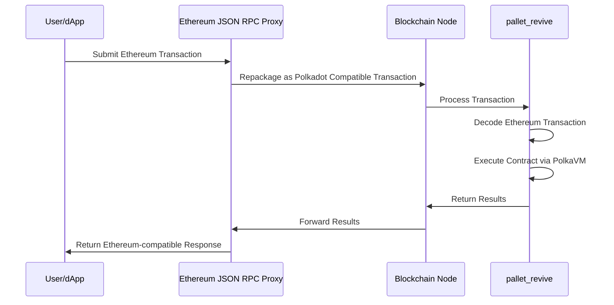
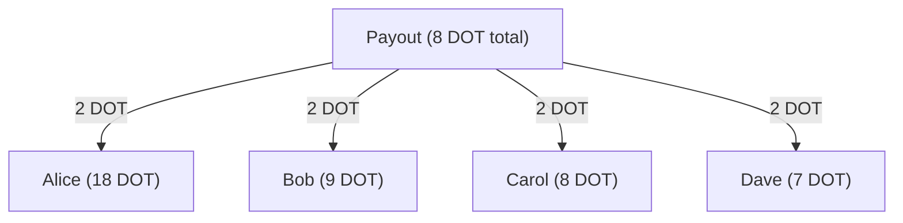
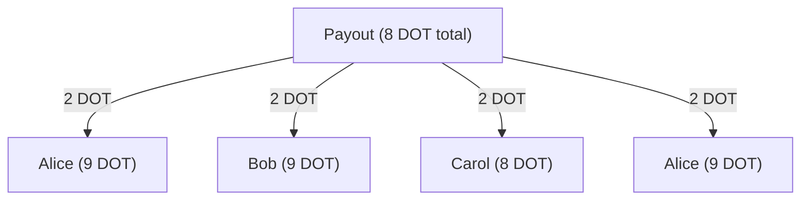
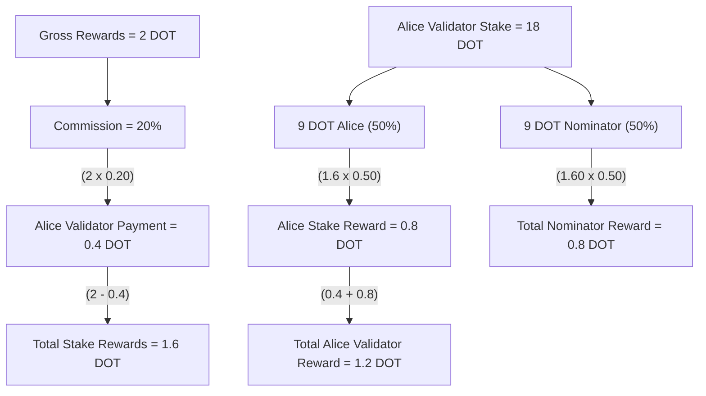
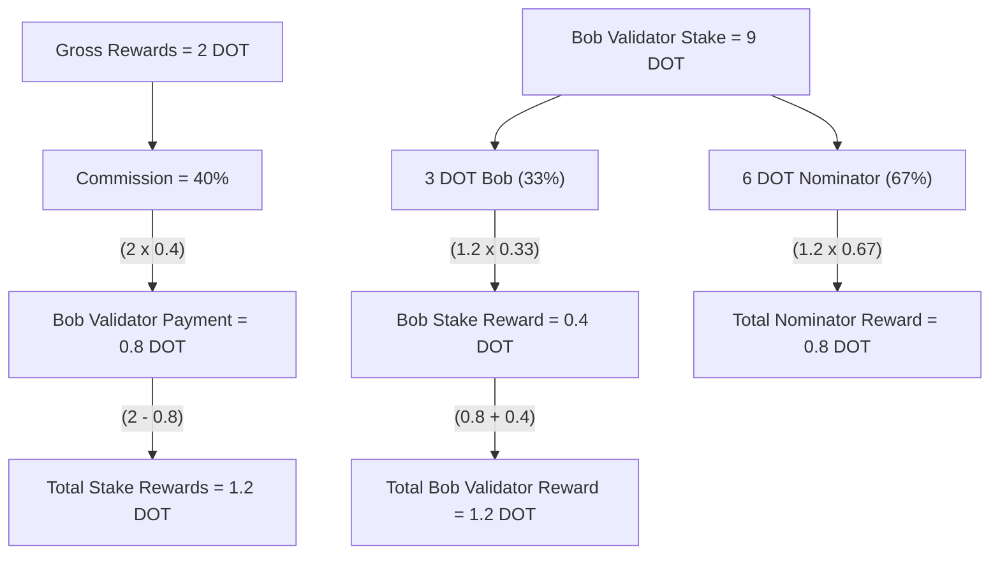

Begin New Bundle: Infrastructure
Includes shared base categories: Basics, Reference


---

Page Title: Accounts in Asset Hub Smart Contracts

- Source (raw): https://raw.githubusercontent.com/polkadot-developers/polkadot-docs/master/.ai/pages/smart-contracts-for-eth-devs-accounts.md
- Canonical (HTML): https://docs.polkadot.com/smart-contracts/for-eth-devs/accounts/
- Summary: Bridges Ethereum's 20-byte addresses with Polkadot's 32-byte accounts, enabling seamless interaction while maintaining compatibility with Ethereum tooling.

# Accounts on Asset Hub Smart Contracts

## Introduction

Asset Hub natively utilizes Polkadot's 32-byte account system while providing interoperability with Ethereum's 20-byte addresses through an automatic conversion system. When interacting with smart contracts:

- Ethereum-compatible wallets (like MetaMask) can use their familiar 20-byte addresses.
- Polkadot accounts continue using their native 32-byte format.
- The Asset Hub chain automatically handles conversion between the two formats behind the scenes:

    - 20-byte Ethereum addresses are padded with `0xEE` bytes to create valid 32-byte Polkadot accounts.
    - 32-byte Polkadot accounts can optionally register a mapping to a 20-byte address for Ethereum compatibility.

This dual-format approach enables Asset Hub to maintain compatibility with Ethereum tooling while fully integrating with the Polkadot ecosystem.

## Address Types and Mappings

The platform handles two distinct address formats:

- [Ethereum-style addresses (20 bytes)](https://ethereum.org/developers/docs/accounts/#account-creation){target=\_blank}
- [Polkadot native account IDs (32 bytes)](/reference/parachains/accounts/){target=\_blank}

### Ethereum to Polkadot Mapping

The [`AccountId32Mapper`](https://paritytech.github.io/polkadot-sdk/master/pallet_revive/struct.AccountId32Mapper.html){target=\_blank} implementation in [`pallet_revive`](https://paritytech.github.io/polkadot-sdk/master/pallet_revive/index.html){target=\_blank} handles the core address conversion logic. For converting a 20-byte Ethereum address to a 32-byte Polkadot address, the pallet uses a simple concatenation approach:

- [**Core mechanism**](https://paritytech.github.io/polkadot-sdk/master/pallet_revive/trait.AddressMapper.html#tymethod.to_fallback_account_id){target=\_blank}: Takes a 20-byte Ethereum address and extends it to 32 bytes by adding twelve `0xEE` bytes at the end. The key benefits of this approach are:
    - Able to fully revert, allowing a smooth transition back to the Ethereum format.
    - Provides clear identification of Ethereum-controlled accounts through the `0xEE` suffix pattern.
    - Maintains cryptographic security with a `2^96` difficulty for pattern reproduction.

### Polkadot to Ethereum Mapping

The conversion from 32-byte Polkadot accounts to 20-byte Ethereum addresses is more complex than the reverse direction due to the lossy nature of the conversion. The [`AccountId32Mapper`](https://paritytech.github.io/polkadot-sdk/master/pallet_revive/struct.AccountId32Mapper.html){target=\_blank} handles this through two distinct approaches:

- **For Ethereum-derived accounts**: The system uses the [`is_eth_derived`](https://paritytech.github.io/polkadot-sdk/master/pallet_revive/fn.is_eth_derived.html){target=\_blank} function to detect accounts that were originally Ethereum addresses (identified by the `0xEE` suffix pattern). For these accounts, the conversion strips the last 12 bytes to recover the original 20-byte Ethereum address.

- **For native Polkadot accounts**: Since these accounts utilize the whole 32-byte space and weren't derived from Ethereum addresses, direct truncation would result in lost information. Instead, the system:

    1. Hashes the entire 32-byte account using Keccak-256.
    2. Takes the last 20 bytes of the hash to create the Ethereum address.
    3. This ensures a deterministic mapping while avoiding simple truncation.

The conversion process is implemented through the [`to_address`](https://paritytech.github.io/polkadot-sdk/master/pallet_revive/trait.AddressMapper.html#tymethod.to_address){target=\_blank} function, which automatically detects the account type and applies the appropriate conversion method.

**Stateful Mapping for Reversibility** : Since the conversion from 32-byte to 20-byte addresses is inherently lossy, the system provides an optional stateful mapping through the [`OriginalAccount`](https://paritytech.github.io/polkadot-sdk/master/pallet_revive/pallet/storage_types/struct.OriginalAccount.html){target=\_blank} storage. When a Polkadot account registers a mapping (via the [`map`](https://paritytech.github.io/polkadot-sdk/master/pallet_revive/trait.AddressMapper.html#tymethod.map){target=\_blank} function), the system stores the original 32-byte account ID, enabling the [`to_account_id`](https://paritytech.github.io/polkadot-sdk/master/pallet_revive/trait.AddressMapper.html#tymethod.to_account_id){target=\_blank} function to recover the exact original account rather than falling back to a default conversion.


### Account Mapping for Native Polkadot Accounts

If you have a native Polkadot account (32-byte format) that was created with a Polkadot/Substrate keypair (Ed25519/Sr25519) rather than an Ethereum-compatible keypair (secp256k1), you'll need to map your account to enable Ethereum compatibility.

To map your account, call the [`map_account`](https://paritytech.github.io/polkadot-sdk/master/pallet_revive/pallet/dispatchables/fn.map_account.html){target=\_blank} extrinsic of the [`pallet_revive`](https://paritytech.github.io/polkadot-sdk/master/pallet_revive/index.html){target=\_blank} pallet using your original Substrate account. This creates a stateful mapping that allows your 32-byte account to interact with the Ethereum-compatible smart contract system.

Once mapped, you'll be able to:

- Transfer funds between 20-byte format addresses.
- Interact with smart contracts using Ethereum-compatible tools like MetaMask.
- Maintain full reversibility to your original 32-byte account format.

!!! warning "Mapping Requirement"
    Without this mapping, native Polkadot accounts cannot transfer funds or interact with the Ethereum-compatible layer on the Hub.

## Account Registration

The registration process is implemented through the [`map`](https://paritytech.github.io/polkadot-sdk/master/pallet_revive/trait.AddressMapper.html#tymethod.map){target=\_blank} function. This process involves:

- Checking if the account is already mapped.
- Calculating and collecting required deposits based on data size.
- Storing the address suffix for future reference.
- Managing the currency holds for security.

## Fallback Accounts

The fallback mechanism is integrated into the [`to_account_id`](https://paritytech.github.io/polkadot-sdk/master/pallet_revive/trait.AddressMapper.html#tymethod.to_account_id){target=\_blank} function. It provides a safety net for address conversion by:

- First, attempting to retrieve stored mapping data.
- Falling back to the default conversion method if no mapping exists.
- Maintaining consistency in address representation.

## Contract Address Generation

The system supports two methods for generating contract addresses:

- [CREATE1 method](https://paritytech.github.io/polkadot-sdk/master/pallet_revive/fn.create1.html){target=\_blank}:

    - Uses the deployer address and nonce.
    - Generates deterministic addresses for standard contract deployment.

- [CREATE2 method](https://paritytech.github.io/polkadot-sdk/master/pallet_revive/fn.create2.html){target=\_blank}:

    - Uses the deployer address, initialization code, input data, and salt.
    - Enables predictable address generation for advanced use cases.

## Security Considerations

The address mapping system maintains security through several design choices evident in the implementation:

- The stateless mapping requires no privileged operations, as shown in the [`to_fallback_account_id`](https://paritytech.github.io/polkadot-sdk/master/pallet_revive/trait.AddressMapper.html#tymethod.to_fallback_account_id){target=\_blank} implementation.
- The stateful mapping requires a deposit managed through the [`Currency`](https://paritytech.github.io/polkadot-sdk/master/pallet_revive/pallet/trait.Config.html#associatedtype.Currency){target=\_blank} trait.
- Mapping operations are protected against common errors through explicit checks.
- The system prevents double-mapping through the [`ensure!(!Self::is_mapped(account_id))`](https://github.com/paritytech/polkadot-sdk/blob/stable2412/substrate/frame/revive/src/address.rs#L125){target=\_blank} check.

All source code references are from the [`address.rs`](https://github.com/paritytech/polkadot-sdk/blob/stable2412/substrate/frame/revive/src/address.rs){target=\_blank} file in the Revive pallet of the Polkadot SDK repository.


---

Page Title: Contract Deployment

- Source (raw): https://raw.githubusercontent.com/polkadot-developers/polkadot-docs/master/.ai/pages/smart-contracts-for-eth-devs-contract-deployment.md
- Canonical (HTML): https://docs.polkadot.com/smart-contracts/for-eth-devs/contract-deployment/
- Summary: Compare deployment flows for REVM and PVM-based smart contracts on the Polkadot Hub. Includes single-step REVM flows and PVM’s two-step deployment model.

# Contract Deployment

## Introduction

Polkadot's smart contract platform supports two distinct virtual machine backends: Rust Ethereum Virtual Machine (REVM) and PolkaVM. Each backend has its own deployment characteristics and optimization strategies. REVM provides full Ethereum compatibility with familiar single-step deployment, while the RISC-V-based PolkaVM uses a more structured two-step approach optimized for its architecture. Understanding these differences ensures smooth deployment regardless of which backend you choose for your smart contracts.

## REVM Deployment

The REVM backend enables seamless deployment of Ethereum contracts without modification. Contracts deploy exactly as they would on Ethereum, using familiar tools and workflows.

With REVM, deployment mirrors the Ethereum flow exactly including: 

- Contracts are bundled and deployed in a single transaction. 
- Factory contracts can create new contracts at runtime.
- Runtime code generation, including inline assembly, is supported.
- Existing familiar tools like Hardhat, Foundry, and Remix work out of the box.

## PolkaVM Deployment

PolkaVM implements a fundamentally different deployment model optimized for its RISC-V architecture. While simple contract deployments work seamlessly, advanced patterns like factory contracts require understanding the two-step deployment process.

### Standard Contract Deployment

For most use cases, such as deploying ERC-20 tokens, NFT collections, or standalone contracts, deployment is transparent and requires no special steps. The [Revive compiler](https://github.com/paritytech/revive){target=\_blank} handles the deployment process automatically when using standard Solidity patterns.

### Two-Step Deployment Model

PolkaVM separates contract deployment into distinct phases:

1. **Code upload**: Contract bytecode must be uploaded to the chain before instantiation.
2. **Contract instantiation**: Contracts are created by referencing previously uploaded code via its hash.

This architecture differs from the EVM's bundled approach and has important implications for specific deployment patterns.

### Factory Pattern Considerations

The common EVM pattern, where contracts dynamically create other contracts, requires adaptation for PolkaVM as follows:

**EVM Factory Pattern:**
```solidity
// This works on REVM but requires modification for PolkaVM
contract Factory {
    function createToken() public returns (address) {
        // EVM bundles bytecode in the factory
        return address(new Token());
    }
}
```

**PolkaVM Requirements:**

- **Pre-upload dependent contracts**: All contracts that will be instantiated at runtime must be uploaded to the chain before the factory attempts to create them.
- **Code hash references**: Factory contracts work with pre-uploaded code hashes rather than embedding bytecode.
- **No runtime code generation**: Dynamic bytecode generation is not supported due to PolkaVM's RISC-V format.

### Migration Strategy for Factory Contracts

When migrating factory contracts from Ethereum to PolkaVM:

1. **Identify all contracts**: Determine which contracts will be instantiated at runtime.
2. **Upload dependencies first**: Deploy all dependent contracts to the chain before deploying the factory.
3. **Use on-chain constructors**: Leverage PolkaVM's on-chain constructor feature for flexible instantiation.
4. **Avoid assembly creation**: Don't use `create` or `create2` opcodes in assembly blocks for manual deployment.

### Architecture-Specific Limitations

PolkaVM's deployment model creates several specific constraints:

- **`EXTCODECOPY` limitations**: Contracts using `EXTCODECOPY` to manipulate code at runtime will encounter issues.
- **Runtime code modification**: Patterns that construct and mutate contract code on-the-fly are not supported.
- **Assembly-based factories**: Factory contracts written in YUL assembly that generate code at runtime will fail with `CodeNotFound` errors.

These patterns are rare in practice and typically require dropping down to assembly, making them non-issues for standard Solidity development.

### On-Chain Constructors

PolkaVM provides on-chain constructors as an elegant alternative to runtime code modification:

- Enable contract instantiation without runtime code generation.
- Support flexible initialization patterns.
- Maintain separation between code upload and contract creation.
- Provide predictable deployment costs.

## Gas Estimation vs Actual Consumption

Both REVM and PolkaVM deployments may show significant differences between gas estimation and actual consumption. You might see estimates that are several times higher than the actual gas consumed (often around 30% of the estimate). This is normal behavior because pre-dispatch estimation cannot distinguish between computation weight and storage deposits, leading to conservative overestimation. Contract deployments are particularly affected as they consume significant storage deposits for code storage.

## Deployment Comparison

| Feature | REVM Backend | PolkaVM Backend |
|:-------:|:-------------:|:----------------:|
| **Deployment Model** | Single-step bundled | Two-step upload and instantiate |
| **Factory Patterns** | Direct runtime creation | Requires pre-uploaded code |
| **Code Bundling** | Bytecode in transaction | Code hash references |
| **Runtime Codegen** | Fully supported | Not supported |
| **Simple Contracts** | No modifications needed | No modifications needed |
| **Assembly Creation** | Supported | Discouraged, limited support |

## Conclusion

Both backends support contract deployment effectively, with REVM offering drop-in Ethereum compatibility and PolkaVM providing a more structured two-step approach. For the majority of use cases—deploying standard contracts like tokens or applications—both backends work seamlessly. Advanced patterns like factory contracts may require adjustment for PolkaVM, but these adaptations are straightforward with proper planning.


---

Page Title: Deploy an ERC-20 Using Hardhat

- Source (raw): https://raw.githubusercontent.com/polkadot-developers/polkadot-docs/master/.ai/pages/smart-contracts-cookbook-smart-contracts-deploy-erc20-erc20-hardhat.md
- Canonical (HTML): https://docs.polkadot.com/smart-contracts/cookbook/smart-contracts/deploy-erc20/erc20-hardhat/
- Summary: Deploy an ERC-20 token on Polkadot Hub using PolkaVM. This guide covers contract creation, compilation, deployment, and interaction via Hardhat.

# Deploy an ERC-20 Using Hardhat

## Introduction

[ERC-20](https://eips.ethereum.org/EIPS/eip-20){target=\_blank} tokens are fungible tokens commonly used for creating cryptocurrencies, governance tokens, and staking mechanisms. Polkadot Hub enables easy deployment of ERC-20 tokens via Ethereum-compatible smart contracts and tools.

This guide demonstrates how to deploy an ERC-20 contract on Polkadot Hub TestNet using [Hardhat](https://hardhat.org/){target=\_blank}, an Ethereum development environment. The ERC-20 contract can be retrieved from OpenZeppelin's [GitHub repository](https://github.com/OpenZeppelin/openzeppelin-contracts/tree/v5.4.0/contracts/token/ERC20){target=\_blank} or their [Contract Wizard](https://wizard.openzeppelin.com/){target=\_blank}.

## Prerequisites

Before you begin, ensure you have the following:

- A basic understanding of [Solidity](https://www.soliditylang.org/){target=\_blank} programming and [ERC-20](https://ethereum.org/developers/docs/standards/tokens/erc-20/){target=\_blank} fungible tokens.
- [Node.js](https://nodejs.org/en/download){target=\_blank} v22.13.1 or later installed.
- Test tokens for gas fees, available from the [Polkadot faucet](https://faucet.polkadot.io/){target=\_blank}. See [Get Test Tokens](/smart-contracts/faucet/#get-test-tokens){target=\_blank} for a guide to using the faucet.
- A wallet with a private key for signing transactions.

## Set Up Your Project

This tutorial uses a [Hardhat ERC-20 template](https://github.com/polkadot-developers/revm-hardhat-examples/tree/master/erc20-hardhat){target=\_blank} that contains all the necessary files. 

To get started, take the following steps:

1. Clone the GitHub repository locally:

    ```bash
    git clone https://github.com/polkadot-developers/revm-hardhat-examples/
    cd revm-hardhat-examples/erc20-hardhat
    ```

2. Install the dependencies using the following command:

    ```bash
    npm i
    ```
    
    This command will fetch all the necessary packages to help you use Hardhat to deploy an ERC-20 to Polkadot.

## Configure Hardhat

If you started with the cloned Hardhat ERC-20 template, `hardhat.config.ts` is already configured to deploy to the Polkadot TestNet as shown in the example below:

```ts title="hardhat.config.ts" hl_lines="14-19"

const config: HardhatUserConfig = {
  solidity: {
    version: "0.8.28",
    settings: {
      optimizer: {
        enabled: true,
        runs: 200,
      },
    },
  },
  networks: {
    polkadotTestnet: {
      url: vars.get("TESTNET_URL", "http://127.0.0.1:8545"),
      accounts: vars.has("TESTNET_PRIVATE_KEY") ? [vars.get("TESTNET_PRIVATE_KEY")] : [],
    },
  },
  mocha: {
    timeout: 40000,
  },
};

export default config;
```

!!! tip
    Visit the Hardhat [Config Variables](https://hardhat.org/docs/learn-more/configuration-variables){target=\_blank} documentation to learn how to use Hardhat to handle your private keys securely.

## Compile the Contract 

Next, compile the contract included with the template by running the following command:

```bash
npx hardhat compile
```

If everything compiles successfully, you will see output similar to the following:


## Test the Contract

You can view the predefined test file at [`test/MyToken.test.ts`](https://github.com/polkadot-developers/revm-hardhat-examples/blob/master/erc20-hardhat/test/MyToken.test.ts){target=\_blank}. This example test includes verification of the following:

- The token name and symbol exist (confirms deployment) and are correct.
- The token owner is correctly configured.
- The initial token supply is zero.
- The owner can mint tokens.
- The total supply increases after a mint.
- Successful mints to different test addresses with expected account balance and total supply changes.

Run the tests using the following command:

```bash
npx hardhat test --network polkadotTestnet
```

If tests are successful, you will see outputs similar to the following:

<div id="termynal" data-termynal markdown>
  <span data-ty="input">npx hardhat test --network polkadotTestnet</span>
  <span data-ty></span>
  <span data-ty>&nbsp;&nbsp;MyToken</span>
  <span data-ty>&nbsp;&nbsp;&nbsp;&nbsp;Deployment</span>
  <span data-ty>&nbsp;&nbsp;&nbsp;&nbsp;&nbsp;&nbsp;✔ Should have correct name and symbol</span>
  <span data-ty>&nbsp;&nbsp;&nbsp;&nbsp;&nbsp;&nbsp;✔ Should set the right owner</span>
  <span data-ty>&nbsp;&nbsp;&nbsp;&nbsp;&nbsp;&nbsp;✔ Should have zero initial supply</span>
  <span data-ty>&nbsp;&nbsp;&nbsp;&nbsp;Minting</span>
  <span data-ty>&nbsp;&nbsp;&nbsp;&nbsp;&nbsp;&nbsp;✔ Should allow owner to mint tokens</span>
  <span data-ty>&nbsp;&nbsp;&nbsp;&nbsp;&nbsp;&nbsp;✔ Should increase total supply on mint</span>
  <span data-ty>&nbsp;&nbsp;&nbsp;&nbsp;Multiple mints</span>
  <span data-ty>&nbsp;&nbsp;&nbsp;&nbsp;&nbsp;&nbsp;✔ Should correctly track balance after multiple mints</span>
  <span data-ty></span>
  <span data-ty>&nbsp;&nbsp;6 passing (369ms)</span>
  <span data-ty="input"><span class="file-path"></span></span>
</div>

## Deploy the Contract

You are now ready to deploy the contract to your chosen network. This example demonstrates deployment to the Polkadot TestNet. Deploy the contract as follows:

1. Run the following command in your terminal:
  ```bash
  npx hardhat ignition deploy ./ignition/modules/MyToken.ts --network polkadotTestnet
  ```

2. Confirm the target deployment network name and chain ID when prompted:

    <div id="termynal" data-termynal markdown>
      <span data-ty="input">npx hardhat ignition deploy ./ignition/modules/MyToken.ts --network polkadotTestnet</span>
      <span data-ty>✔ Confirm deploy to network polkadotTestnet (420420420)? … yes</span>
      <span data-ty>&nbsp;</span>
      <span data-ty>Hardhat Ignition 🚀</span>
      <span data-ty>&nbsp;</span>
      <span data-ty>Deploying [ TokenModule ]</span>
      <span data-ty>&nbsp;</span>
      <span data-ty>Batch #1</span>
      <span data-ty> Executed TokenModule#MyToken</span>
      <span data-ty>&nbsp;</span>
      <span data-ty>Batch #2</span>
      <span data-ty> Executed TokenModule#MyToken.mint</span>
      <span data-ty>&nbsp;</span>
      <span data-ty>[ TokenModule ] successfully deployed 🚀</span>
      <span data-ty>&nbsp;</span>
      <span data-ty>Deployed Addresses</span>
      <span data-ty>&nbsp;</span>
      <span data-ty>TokenModule#MyToken - 0xc01Ee7f10EA4aF4673cFff62710E1D7792aBa8f3</span>
      <span data-ty="input"><span class="file-path"></span></span>
    </div>

Congratulations! You've successfully deployed an ERC-20 token contract to Polkadot Hub TestNet using Hardhat. Consider the following resources to build upon your progress.

## Where to Go Next

<div class="grid cards" markdown>

-   <span class="badge guide">Guide</span> __Deploy an NFT with Remix__

    ---

    Walk through deploying an ERC-721 Non-Fungible Token (NFT) using OpenZeppelin's battle-tested NFT implementation and Remix.

    [:octicons-arrow-right-24: Get Started](/smart-contracts/cookbook/smart-contracts/deploy-nft/nft-remix/)

</div>


---

Page Title: Deploy an ERC-20 Using Remix IDE

- Source (raw): https://raw.githubusercontent.com/polkadot-developers/polkadot-docs/master/.ai/pages/smart-contracts-cookbook-smart-contracts-deploy-erc20-erc20-remix.md
- Canonical (HTML): https://docs.polkadot.com/smart-contracts/cookbook/smart-contracts/deploy-erc20/erc20-remix/
- Summary: Deploy an ERC-20 token contract on Polkadot Hub. This guide covers contract creation, compilation, deployment, and interaction via the Remix IDE.

# Deploy an ERC-20 Using Remix IDE

## Introduction

[ERC-20](https://eips.ethereum.org/EIPS/eip-20){target=\_blank} tokens are fungible tokens commonly used for creating cryptocurrencies, governance tokens, and staking mechanisms. Polkadot Hub enables easy token deployment with Ethereum-compatible smart contracts and tools via the EVM backend.

This tutorial covers deploying an ERC-20 contract on Polkadot Hub TestNet using [Remix IDE](https://remix.ethereum.org/){target=\_blank}, a web-based development tool. The ERC-20 contract can be retrieved from OpenZeppelin's [GitHub repository](https://github.com/OpenZeppelin/openzeppelin-contracts/tree/v5.4.0/contracts/token/ERC20){target=\_blank} or their [Contract Wizard](https://wizard.openzeppelin.com/){target=\_blank}.

## Prerequisites

Before you begin, ensure you have:

- A basic understanding of [Solidity](https://www.soliditylang.org/){target=\_blank} programming and [ERC-20](https://ethereum.org/developers/docs/standards/tokens/erc-20/){target=\_blank} fungible tokens.
- An EVM-compatible [wallet](/smart-contracts/connect/){target=\_blank} connected to Polkadot Hub. This example utilizes [MetaMask](https://metamask.io/){target=\_blank}.
- Test tokens for gas fees, available from the [Polkadot faucet](https://faucet.polkadot.io/){target=\_blank}. See [Get Test Tokens](/smart-contracts/faucet/#get-test-tokens){target=\_blank} for a guide to using the faucet.

## Create Your Contract

Follow the steps below to create the ERC-20 contract:

1. Navigate to [Remix IDE](https://remix.ethereum.org/){target=\_blank} in your web browser.
2. Select the **Create new file** button under the **contracts** folder, and name your contract `MyToken.sol`.

    

3. Now, paste the following ERC-20 contract code into `MyToken.sol`:

    ```solidity title="MyToken.sol"
    // SPDX-License-Identifier: MIT
    // Compatible with OpenZeppelin Contracts ^5.4.0
    pragma solidity ^0.8.27;

    import {ERC20} from "@openzeppelin/contracts/token/ERC20/ERC20.sol";
    import {ERC20Permit} from "@openzeppelin/contracts/token/ERC20/extensions/ERC20Permit.sol";
    import {Ownable} from "@openzeppelin/contracts/access/Ownable.sol";

    contract MyToken is ERC20, Ownable, ERC20Permit {
        constructor(address initialOwner)
            ERC20("MyToken", "MTK")
            Ownable(initialOwner)
            ERC20Permit("MyToken")
        {}

        function mint(address to, uint256 amount) public onlyOwner {
            _mint(to, amount);
        }
    }
    ```
    
    !!! tip
        The [OpenZeppelin Contracts Wizard](https://wizard.openzeppelin.com/){target=\_blank} was used to generate this example ERC-20 contract.
        
## Compile the Contract

Solidity source code compiles into bytecode that can be deployed on the blockchain. During this process, the compiler checks the contract for syntax errors, ensures type safety, and generates the machine-readable instructions needed for blockchain execution.

Ensure your `MyToken.sol` contract is open in the Remix IDE Editor, and use the following steps to compile:

1. Select the **Solidity Compiler** plugin from the left panel.
2. Select the **Compile MyToken.sol** button.

The **Solidity Compiler** icon will display a green checkmark once the contract compiles successfully. If any issues arise during contract compilation, errors and warnings will appear in the terminal panel at the bottom of the screen.


## Deploy the Contract

Follow these steps to deploy the contract using Remix:

1. Select **Deploy & Run Transactions** from the left panel.
2. Ensure your MetaMask wallet is connected to Polkadot Hub TestNet, then select the **Environment** dropdown and select **Injected Provider - MetaMask**.
3. Configure the contract parameters by entering the address that will own the deployed token contract.
4. Select the **Deploy** button to initiate the deployment.
4. Approve the transaction in your MetaMask wallet when prompted.
6. You will see the transaction details in the terminal when the deployment succeeds, including the contract address and deployment transaction hash.


Once successfully deployed, your contract will appear in the **Deployed Contracts** section, ready for interaction.

## Interact with the Contract

Once deployed, you can interact with your contract through Remix. Find your contract under **Deployed/Unpinned Contracts**, and select it to expand the available methods. In this example, you'll mint some tokens to a given address using the following steps:

1. Expand the **mint** function, then enter the recipient address and the amount (remember to add 18 zeros for one whole token).
2. Select **transact**.
3. Approve the transaction in your MetaMask wallet when prompted.
4. You will see a green check mark in the terminal when the transaction is successful.
5. You can also call the **balanceOf** function by passing the address of the **mint** call to confirm the new balance.


Feel free to explore and interact with the contract's other functions by selecting the method, providing any required parameters, and confirming the transaction in MetaMask when prompted.

Congratulations! You've successfully deployed an ERC-20 token contract to Polkadot Hub TestNet using Remix IDE. Consider the following resources to build upon your progress. 

## Where to Go Next

<div class="grid cards" markdown>

-   <span class="badge guide">Guide</span> __Deploy an NFT with Remix__

    ---

    Walk through deploying an ERC-721 Non-Fungible Token (NFT) using OpenZeppelin's battle-tested NFT implementation and Remix.

    [:octicons-arrow-right-24: Get Started](/smart-contracts/cookbook/smart-contracts/deploy-nft/nft-remix/)

</div>


---

Page Title: Deploy an ERC-721 NFT Using Remix

- Source (raw): https://raw.githubusercontent.com/polkadot-developers/polkadot-docs/master/.ai/pages/smart-contracts-cookbook-smart-contracts-deploy-nft-nft-remix.md
- Canonical (HTML): https://docs.polkadot.com/smart-contracts/cookbook/smart-contracts/deploy-nft/nft-remix/
- Summary: Learn how to deploy an ERC-721 NFT contract to Polkadot Hub using Remix, a browser-based IDE for quick prototyping and learning.

# Deploy an NFT with Remix

## Introduction

Non-Fungible Tokens (NFTs) represent unique digital assets commonly used for digital art, collectibles, gaming, and identity verification.

This guide demonstrates how to deploy an [ERC-721](https://eips.ethereum.org/EIPS/eip-721){target=\_blank} NFT contract to [Polkadot Hub](/smart-contracts/overview/#smart-contract-development){target=\_blank}. You'll use [OpenZeppelin's battle-tested NFT implementation](https://github.com/OpenZeppelin/openzeppelin-contracts){target=\_blank} and [Remix](https://remix.ethereum.org/){target=\_blank}, a visual, browser-based environment perfect for rapid prototyping and learning. It requires no local installation and provides an intuitive interface for contract development.

## Prerequisites

- A basic understanding of [Solidity](https://www.soliditylang.org/){target=\_blank} programming and [ERC-721 NFT](https://ethereum.org/developers/docs/standards/tokens/erc-721/) standards.
- An EVM-compatible [wallet](/smart-contracts/connect/){target=\_blank} connected to Polkadot Hub. This example utilizes [MetaMask](https://metamask.io/){target=\_blank}.
- Test tokens for gas fees (available from the [Polkadot faucet](https://faucet.polkadot.io/){target=\_blank}). See [Get Test Tokens](/smart-contracts/faucet/#get-test-tokens){target=\_blank} for a guide to using the faucet.

## Create Your Contract

Follow the steps below to create the ERC-721 contract:

1. Navigate to [Remix IDE](https://remix.ethereum.org/){target=\_blank} in your web browser.
2. Select the **Create new file** button under the **contracts** folder, and name your contract `MyNFT.sol`.

    

3. Now, paste the following ERC-721 contract code into `MyNFT.sol`:

    ```solidity title="contracts/MyNFT.sol"
    // SPDX-License-Identifier: MIT
    pragma solidity ^0.8.20;

    import "@openzeppelin/contracts/token/ERC721/ERC721.sol";
    import "@openzeppelin/contracts/access/Ownable.sol";

    contract MyNFT is ERC721, Ownable {
        uint256 private _nextTokenId;

        constructor(
            address initialOwner
        ) ERC721("MyToken", "MTK") Ownable(initialOwner) {}

        function safeMint(address to) public onlyOwner {
            uint256 tokenId = _nextTokenId++;
            _safeMint(to, tokenId);
        }
    }

    ```

    !!! tip
        The [OpenZeppelin Contracts Wizard](https://wizard.openzeppelin.com/){target=\_blank} was used to generate this example ERC-721 contract.

## Compile the Contract

Solidity source code compiles into bytecode that can be deployed on the blockchain. During this process, the compiler checks the contract for syntax errors, ensures type safety, and generates the machine-readable instructions needed for blockchain execution.

Ensure your `MyNFT.sol` contract is open in the Remix IDE Editor, and use the following steps to compile:

1. Select the **Solidity Compiler** plugin from the left panel.
2. Select the **Compile MyToken.sol** button.

The **Solidity Compiler** icon will display a green checkmark once the contract compiles successfully. If any issues arise during contract compilation, errors and warnings will appear in the terminal panel at the bottom of the screen.


## Deploy the Contract

Follow these steps to deploy the contract using Remix:

1. Select **Deploy & Run Transactions** from the left panel.
2. Ensure your MetaMask wallet is connected to Polkadot Hub TestNet, then select the **Environment** dropdown and select **Injected Provider - MetaMask**.

    

3. Configure the contract parameters by entering the address that will own the deployed NFT contract.
4. Select the **Deploy** button to initiate the deployment.
5. Approve the transaction in your MetaMask wallet when prompted.
6. You will see the transaction details in the terminal when the deployment succeeds, including the contract address and deployment transaction hash.


Once successfully deployed, your contract will appear in the **Deployed Contracts** section, ready for interaction.

Congratulations! You've successfully deployed an ERC-721 NFT contract to Polkadot Hub TestNet using Remix IDE. Consider the following resources to build upon your progress.

## Where to Go Next

<div class="grid cards" markdown>

-   <span class="badge guide">Guide</span> __Deploy an ERC-20__

    ---

    Walk through deploying a fully-functional ERC-20 to Polkadot Hub using Remix.

    [:octicons-arrow-right-24: Get Started](/smart-contracts/cookbook/smart-contracts/deploy-erc20/erc20-remix/)

</div>


---

Page Title: Deploy an ERC-721 Using Hardhat

- Source (raw): https://raw.githubusercontent.com/polkadot-developers/polkadot-docs/master/.ai/pages/smart-contracts-cookbook-smart-contracts-deploy-nft-nft-hardhat.md
- Canonical (HTML): https://docs.polkadot.com/smart-contracts/cookbook/smart-contracts/deploy-nft/nft-hardhat/
- Summary: Learn how to deploy an ERC-721 NFT contract to Polkadot Hub using Hardhat, a comprehensive development environment with built-in deployment capabilities.

# Deploy an ERC-721 Using Hardhat

## Introduction

Non-Fungible Tokens (NFTs) represent unique digital assets commonly used for digital art, collectibles, gaming, and identity verification.

This guide demonstrates how to deploy an [ERC-721](https://eips.ethereum.org/EIPS/eip-721){target=\_blank} NFT contract to [Polkadot Hub](/smart-contracts/overview/#smart-contract-development){target=\_blank} TestNet. You'll use OpenZeppelin's battle-tested [NFT implementation](https://github.com/OpenZeppelin/openzeppelin-contracts){target=\_blank} and [Hardhat](https://hardhat.org/docs/getting-started){target=\_blank}, a comprehensive development environment with built-in testing, debugging, and deployment capabilities. Hardhat uses standard Solidity compilation to generate EVM bytecode, making it fully compatible with Polkadot Hub's EVM environment.

## Prerequisites

Before you begin, ensure you have the following:

- A basic understanding of [Solidity](https://www.soliditylang.org/){target=\_blank} programming and [ERC-721](https://ethereum.org/developers/docs/standards/tokens/erc-721/){target=\_blank} non-fungible tokens.
- [Node.js](https://nodejs.org/en/download){target=\_blank} v22.13.1 or later installed.
- Test tokens for gas fees, available from the [Polkadot faucet](https://faucet.polkadot.io/){target=\_blank}. See [Get Test Tokens](/smart-contracts/faucet/#get-test-tokens){target=\_blank} for a guide to using the faucet.
- A wallet with a private key for signing transactions.

## Set Up Your Project

1. Use the following terminal commands to create a directory and initialize your Hardhat project inside of it:

    ```bash
    mkdir hardhat-nft-deployment
    cd hardhat-nft-deployment
    npx hardhat --init
    ```

2. Install the OpenZeppelin contract dependencies using the command:

    ```bash
    npm install @openzeppelin/contracts
    ```

## Configure Hardhat

Open `hardhat.config.ts` and update to add `polkadotTestnet` to the `networks` configuration as highlighted in the following example code:

```typescript title="hardhat.config.ts" hl_lines='39-44'
import type { HardhatUserConfig } from 'hardhat/config';

import hardhatToolboxViemPlugin from '@nomicfoundation/hardhat-toolbox-viem';
import { configVariable } from 'hardhat/config';

const config: HardhatUserConfig = {
  plugins: [hardhatToolboxViemPlugin],
  solidity: {
    profiles: {
      default: {
        version: '0.8.28',
      },
      production: {
        version: '0.8.28',
        settings: {
          optimizer: {
            enabled: true,
            runs: 200,
          },
        },
      },
    },
  },
  networks: {
    hardhatMainnet: {
      type: 'edr-simulated',
      chainType: 'l1',
    },
    hardhatOp: {
      type: 'edr-simulated',
      chainType: 'op',
    },
    sepolia: {
      type: 'http',
      chainType: 'l1',
      url: configVariable('SEPOLIA_RPC_URL'),
      accounts: [configVariable('SEPOLIA_PRIVATE_KEY')],
    },
    polkadotTestnet: {
      type: 'http',
      url: 'https://testnet-passet-hub-eth-rpc.polkadot.io',
      chainId: 420420422,
      accounts: [configVariable('PRIVATE_KEY')],
    },
  },
};

export default config;
```

!!! tip
    Visit the Hardhat [Config Variables](https://hardhat.org/docs/learn-more/configuration-variables){target=\_blank} documentation to learn how to use Hardhat to handle your private keys securely.

## Create the Contract

Follow these steps to create your smart contract:

1. Delete the default contract file(s) in the `contracts` directory.

2. Create a new file named `MyNFT.sol` inside the `contracts` directory.

3. Add the following code to create the `MyNFT.sol` smart contract:
    ```solidity title="contracts/MyNFT.sol"
    // SPDX-License-Identifier: MIT
    pragma solidity ^0.8.20;

    import "@openzeppelin/contracts/token/ERC721/ERC721.sol";
    import "@openzeppelin/contracts/access/Ownable.sol";

    contract MyNFT is ERC721, Ownable {
        uint256 private _nextTokenId;

        constructor(
            address initialOwner
        ) ERC721("MyToken", "MTK") Ownable(initialOwner) {}

        function safeMint(address to) public onlyOwner {
            uint256 tokenId = _nextTokenId++;
            _safeMint(to, tokenId);
        }
    }

    ```

## Compile the Contract

Compile your `MyNFT.sol` contract using the following command:

```bash
npx hardhat compile
```

You will see a message in the terminal confirming the contract was successfully compiled, similar to the following:

<div id="termynal" data-termynal>
  <span data-ty="input"><span class="file-path"></span>npx hardhat compile</span>
  <span data-ty>Downloading solc 0.8.28</span>
  <span data-ty>Downloading solc 0.8.28 (WASM build)</span>
  <span data-ty>Compiled 1 Solidity file with solc 0.8.28 (evm target: cancun)</span>
  <span data-ty="input"><span class="file-path"></span></span>
</div>
## Deploy the Contract

You are now ready to deploy the contract to your chosen network. This example demonstrates deployment to the Polkadot TestNet. Deploy the contract as follows:

1. Delete the default file(s) inside the `ignition/modules` directory.

2. Create a new file named `MyNFT.ts` inside the `ignition/modules` directory.

3. Open `ignition/modules/MyNFT.ts` and add the following code to create your deployment module:
    ```typescript title="ignition/modules/MyNFT.ts"
    import { buildModule } from '@nomicfoundation/hardhat-ignition/modules';

    export default buildModule('MyNFTModule', (m) => {
      const initialOwner = m.getParameter('initialOwner', 'INSERT_OWNER_ADDRESS');
      const myNFT = m.contract('MyNFT', [initialOwner]);
      return { myNFT };
    });

    ```

    Replace `INSERT_OWNER_ADDRESS` with your desired owner address.

4. Deploy your contract to Polkadot Hub TestNet using the following command:

    ```bash
    npx hardhat ignition deploy ignition/modules/MyNFT.ts --network polkadotTestnet
    ```

5. Confirm the target deployment network name and chain ID when prompted:

    <div id="termynal" data-termynal markdown>
      <span data-ty="input">npx hardhat ignition deploy ignition/modules/MyNFT.ts --network polkadotHubTestnet</span>
      <span data-ty>✔ Confirm deploy to network polkadotTestnet (420420420)? … yes</span>
      <span data-ty>&nbsp;</span>
      <span data-ty>Hardhat Ignition 🚀</span>
      <span data-ty>&nbsp;</span>
      <span data-ty>Deploying [ MyNFTModule ]</span>
      <span data-ty>&nbsp;</span>
      <span data-ty>Batch #1</span>
      <span data-ty> Executed MyNFTModule#MyNFT</span>
      <span data-ty>&nbsp;</span>
      <span data-ty>Batch #2</span>
      <span data-ty> Executed MyNFTModule#MyNFT.safeMint</span>
      <span data-ty>&nbsp;</span>
      <span data-ty>[ TokenModule ] successfully deployed 🚀</span>
      <span data-ty>&nbsp;</span>
      <span data-ty>Deployed Addresses</span>
      <span data-ty>&nbsp;</span>
      <span data-ty>MyNFTModule#MyNFT - 0x1234.......</span>
      <span data-ty="input"><span class="file-path"></span></span>
    </div>
Congratulations! You've successfully deployed an ERC-721 NFT contract to Polkadot Hub TestNet using Hardhat. Consider the following resources to build upon your progress. 

## Where to Go Next

<div class="grid cards" markdown>

-   <span class="badge guide">Guide</span> __Deploy an ERC-20__

    ---

    Walk through deploying a fully-functional ERC-20 to Polkadot Hub using Hardhat.

    [:octicons-arrow-right-24: Get Started](/smart-contracts/cookbook/smart-contracts/deploy-erc20/erc20-hardhat/)

</div>


---

Page Title: Deploy an NFT to Polkadot Hub with Foundry

- Source (raw): https://raw.githubusercontent.com/polkadot-developers/polkadot-docs/master/.ai/pages/smart-contracts-cookbook-smart-contracts-deploy-nft-.foundry.md
- Canonical (HTML): https://docs.polkadot.com/smart-contracts/cookbook/smart-contracts/deploy-nft/.foundry/
- Summary: Learn how to deploy an ERC-721 NFT contract to Polkadot Hub using Foundry, a Rust toolkit with high-performance compilation.

# Deploy an NFT with Foundry

## Introduction

Non-Fungible Tokens (NFTs) represent unique digital assets commonly used for digital art, collectibles, gaming, and identity verification.

This guide demonstrates how to deploy an [ERC-721](https://eips.ethereum.org/EIPS/eip-721){target=\_blank} NFT contract to [Polkadot Hub](/smart-contracts/overview/#smart-contract-development){target=\_blank}. It showcases a secure approach using [OpenZeppelin's battle-tested NFT implementation](https://github.com/OpenZeppelin/openzeppelin-contracts){target=\_blank} and the [Foundry](https://getfoundry.sh/){target=\_blank} toolchain. Foundry, a fast, Rust-written toolkit, ensures high-performance compilation and is fully compatible with the Hub’s EVM environment via standard Solidity compilation.

## Prerequisites

- Basic understanding of Solidity programming and NFT standards.
- Test tokens for gas fees (available from the [Polkadot faucet](https://faucet.polkadot.io/){target=\_blank}). See the [step-by-step instructions](/smart-contracts/faucet/#get-test-tokens){target=\_blank}.
- A wallet with a private key for signing transactions.

## Set Up Your Project

To get started, take the following steps:

1. Install Foundry:

    ```bash
    curl -L https://foundry.paradigm.xyz | bash
    foundryup
    ```

2. Initialize your project:

    ```bash
    forge init foundry-nft-deployment
    cd foundry-nft-deployment
    ```

3. Install OpenZeppelin contracts:

    ```bash
    forge install OpenZeppelin/openzeppelin-contracts
    ```

## Configure Foundry

Edit `foundry.toml`:

```toml title="foundry.toml"
[profile.default]
src = "src"
out = "out"
libs = ["lib"]
remappings = ['@openzeppelin/contracts/=lib/openzeppelin-contracts/contracts/']

[rpc_endpoints]
polkadot_hub_testnet = "https://testnet-passet-hub-eth-rpc.polkadot.io"
```

## Create Your Contract

Create `src/MyNFT.sol`:

```solidity title="src/MyNFT.sol"
// SPDX-License-Identifier: MIT
pragma solidity ^0.8.20;

import "@openzeppelin/contracts/token/ERC721/ERC721.sol";
import "@openzeppelin/contracts/access/Ownable.sol";

contract MyNFT is ERC721, Ownable {
    uint256 private _nextTokenId;

    constructor(address initialOwner)
        ERC721("MyToken", "MTK")
        Ownable(initialOwner)
    {}

    function safeMint(address to) public onlyOwner {
        uint256 tokenId = _nextTokenId++;
        _safeMint(to, tokenId);
    }
}
```

## Compile

```bash
forge build
```

Verify the compilation by inspecting the bytecode:

```bash
forge inspect MyNFT bytecode
```

## Deploy

Deploy to Polkadot Hub TestNet:

```bash
forge create MyNFT \
    --rpc-url polkadot_hub_testnet \
    --private-key YOUR_PRIVATE_KEY \
    --constructor-args YOUR_OWNER_ADDRESS \
    --broadcast
```

Replace `YOUR_PRIVATE_KEY` with your private key and `YOUR_OWNER_ADDRESS` with the address that will own the NFT contract.

## Where to Go Next

<div class="grid cards" markdown>

-   <span class="badge guide">Guide</span> __Verify Your Contract__

    ---

    Now that you've deployed an NFT contract, learn how to verify it with Foundry.

    [:octicons-arrow-right-24: Get Started](/smart-contracts/dev-environments/foundry/verify-a-contract/)

-   <span class="badge guide">Guide</span> __Deploy an ERC-20__

    ---

    Walk through deploying a fully-functional ERC-20 to the Polkadot Hub using Foundry.

    [:octicons-arrow-right-24: Get Started](/smart-contracts/cookbook/smart-contracts/deploy-erc20/foundry/)

</div>


---

Page Title: Dual Virtual Machine Stack

- Source (raw): https://raw.githubusercontent.com/polkadot-developers/polkadot-docs/master/.ai/pages/smart-contracts-for-eth-devs-dual-vm-stack.md
- Canonical (HTML): https://docs.polkadot.com/smart-contracts/for-eth-devs/dual-vm-stack/
- Summary: Compare Polkadot’s dual smart contract VMs—REVM for EVM compatibility and PolkaVM for RISC-V performance, flexibility, and efficiency.

# Dual Virtual Machine Stack

## Introduction

Polkadot's smart contract platform supports two distinct virtual machine (VM) architectures, providing developers with flexibility in selecting the optimal execution backend for their specific needs. This approach strikes a balance between immediate Ethereum compatibility and long-term innovation, enabling developers to deploy either unmodified (Ethereum Virtual Machine) EVM contracts using Rust Ethereum Virtual Machine (REVM) or optimize for higher performance using PolkaVM (PVM).

Both VM options share common infrastructure, including RPC interfaces, tooling support, and precompiles. The following sections compare architectures and guide you in selecting the best VM for your project's needs.

## Migrate from EVM

The [REVM backend](https://github.com/bluealloy/revm){target=\_blank} integrates a complete Rust implementation of the EVM, enabling Solidity contracts to run unchanged on Polkadot's smart contract platform.

REVM allows developers to use their existing Ethereum tooling and infrastructure to build on Polkadot. Choose REVM to:

- Migrate existing Ethereum contracts without modifications.
- Retain exact EVM behavior for audit tools. 
- Use developer tools that rely upon inspecting EVM bytecode.
- Prioritize rapid deployment over optimization.
- Work with established Ethereum infrastructure and tooling to build on Polkadot.

REVM enables Ethereum developers to seamlessly migrate to Polkadot, achieving performance and fee improvements without modifying their existing contracts or developer tooling stack.

## Upgrade to PolkaVM

[**PolkaVM**](https://github.com/paritytech/polkavm){target=\_blank} is a custom virtual machine optimized for performance with [RISC-V-based](https://en.wikipedia.org/wiki/RISC-V){target=\_blank} architecture, supporting Solidity and additional high-performance languages. It serves as the core execution environment, integrated directly within the runtime. Choose the PolkaVM for:

- An efficient interpreter for immediate code execution.
- A planned [Just In Time (JIT)](https://en.wikipedia.org/wiki/Just-in-time_compilation){target=\_blank} compiler for optimized performance.
- Dual-mode execution capability, allowing selection of the most appropriate backend for specific workloads.
- Optimized performance for short-running contract calls through the interpreter.

The interpreter remains particularly beneficial for contracts with minimal code execution, as it enables immediate code execution through lazy interpretation.

## Architecture

The following key components of PolkaVM work together to enable Ethereum compatibility on Polkadot-based chains. 

### Revive Pallet

[**`pallet_revive`**](https://paritytech.github.io/polkadot-sdk/master/pallet_revive/index.html){target=\_blank} is a runtime module that executes smart contracts by adding extrinsics, runtime APIs, and logic to convert Ethereum-style transactions into formats compatible with Polkadot SDK-based blockchains. It processes Ethereum-style transactions through the following workflow:



This proxy-based approach eliminates the need for node binary modifications, maintaining compatibility across different client implementations. Preserving the original Ethereum transaction payload simplifies the adaptation of existing tools, which can continue processing familiar transaction formats.

### PolkaVM Design Fundamentals

PolkaVM differs from the EVM in two key ways that make it faster, more hardware-efficient, and easier to extend:

- **Register-based design**: Instead of a stack machine, PolkaVM uses a RISC-V–style register model. This design:

    - Uses a fixed set of registers to pass arguments, not an infinite stack.
    - Maps cleanly to real hardware like x86-64.
    - Simplifies compilation and boosts runtime efficiency.
    - Enables tighter control over register allocation and performance tuning.

- **64-bit word size**: PolkaVM runs on a native 64-bit word size, aligning directly with modern CPUs. This design:

    - Executes arithmetic operations with direct hardware support.
    - Maintains compatibility with Solidity’s 256-bit types via YUL translation.
    - Accelerates computation-heavy workloads through native word alignment.
    - Integrates easily with low-level, performance-focused components.

## Where To Go Next

<div class="grid cards" markdown>

-   <span class="badge learn">Learn</span> __Contract Deployment__

    ---

    Learn how REVM and PVM compare for compiling and deploying smart contracts.

    [:octicons-arrow-right-24: Reference](/smart-contracts/for-eth-devs/contract-deployment/)

</div>


---

Page Title: General Management

- Source (raw): https://raw.githubusercontent.com/polkadot-developers/polkadot-docs/master/.ai/pages/nodes-and-validators-run-a-validator-operational-tasks-general-management.md
- Canonical (HTML): https://docs.polkadot.com/nodes-and-validators/run-a-validator/operational-tasks/general-management/
- Summary: Optimize your Polkadot validator setup with advanced configuration techniques. Learn how to boost performance, enhance security, and ensure seamless operations.

# General Management

## Introduction

Validator performance is pivotal in maintaining the security and stability of the Polkadot network. As a validator, optimizing your setup ensures efficient transaction processing, minimizes latency, and maintains system reliability during high-demand periods. Proper configuration and proactive monitoring also help mitigate risks like slashing and service interruptions.

This guide covers essential practices for managing a validator, including performance tuning techniques, security hardening, and tools for real-time monitoring. Whether you're fine-tuning CPU settings, configuring NUMA balancing, or setting up a robust alert system, these steps will help you build a resilient and efficient validator operation.

## Configuration Optimization

For those seeking to optimize their validator's performance, the following configurations can improve responsiveness, reduce latency, and ensure consistent performance during high-demand periods.

### Deactivate Simultaneous Multithreading

Polkadot validators operate primarily in single-threaded mode for critical tasks, so optimizing single-core CPU performance can reduce latency and improve stability. Deactivating simultaneous multithreading (SMT) can prevent virtual cores from affecting performance. SMT is called Hyper-Threading on Intel and 2-way SMT on AMD Zen.

Take the following steps to deactivate every other (vCPU) core:

1. Loop though all the CPU cores and deactivate the virtual cores associated with them:

    ```bash
    for cpunum in $(cat /sys/devices/system/cpu/cpu*/topology/thread_siblings_list | \
    cut -s -d, -f2- | tr ',' '\n' | sort -un)
    do
    echo 0 > /sys/devices/system/cpu/cpu$cpunum/online
    done
    ```

2. To permanently save the changes, add `nosmt=force` to the `GRUB_CMDLINE_LINUX_DEFAULT` variable in `/etc/default/grub`:

    ```bash
    sudo nano /etc/default/grub
    # Add to GRUB_CMDLINE_LINUX_DEFAULT
    ```

    ```config title="/etc/default/grub"
    GRUB_DEFAULT = 0;
    GRUB_HIDDEN_TIMEOUT = 0;
    GRUB_HIDDEN_TIMEOUT_QUIET = true;
    GRUB_TIMEOUT = 10;
    GRUB_DISTRIBUTOR = `lsb_release -i -s 2> /dev/null || echo Debian`;
    GRUB_CMDLINE_LINUX_DEFAULT = 'nosmt=force';
    GRUB_CMDLINE_LINUX = '';
    ```

3. Update GRUB to apply changes:

    ```bash
    sudo update-grub
    ```

4. After the reboot, you should see that half of the cores are offline. To confirm, run:

    ```bash
    lscpu --extended
    ```

### Deactivate Automatic NUMA Balancing

Deactivating NUMA (Non-Uniform Memory Access) balancing for multi-CPU setups helps keep processes on the same CPU node, minimizing latency.

Follow these stpes:

1. Deactivate NUMA balancing in runtime:

    ```bash
    sysctl kernel.numa_balancing=0
    ```

2. Deactivate NUMA balancing permanently by adding `numa_balancing=disable` to the GRUB settings:

    ```bash
    sudo nano /etc/default/grub
    # Add to GRUB_CMDLINE_LINUX_DEFAULT
    ```

    ```config title="/etc/default/grub"
    GRUB_DEFAULT = 0;
    GRUB_HIDDEN_TIMEOUT = 0;
    GRUB_HIDDEN_TIMEOUT_QUIET = true;
    GRUB_TIMEOUT = 10;
    GRUB_DISTRIBUTOR = `lsb_release -i -s 2> /dev/null || echo Debian`;
    GRUB_CMDLINE_LINUX_DEFAULT = 'numa_balancing=disable';
    GRUB_CMDLINE_LINUX = '';
    ```

3. Update GRUB to apply changes:

    ```bash
    sudo update-grub
    ```

4. Confirm the deactivation:

    ```bash
    sysctl -a | grep 'kernel.numa_balancing'
    ```

If you successfully deactivated NUMA balancing, the preceding command should return `0`.

### Spectre and Meltdown Mitigations

[Spectre](https://en.wikipedia.org/wiki/Spectre_(security_vulnerability)){target=\_blank} and [Meltdown](https://en.wikipedia.org/wiki/Meltdown_(security_vulnerability)){target=\_blank} are well-known CPU vulnerabilities that exploit speculative execution to access sensitive data. These vulnerabilities have been patched in recent Linux kernels, but the mitigations can slightly impact performance, especially in high-throughput or containerized environments.

If your security requirements allow it, you can deactivate specific mitigations, such as Spectre V2 and Speculative Store Bypass Disable (SSBD), to improve performance.

To selectively deactivate the Spectre mitigations, take these steps:

1. Update the `GRUB_CMDLINE_LINUX_DEFAULT` variable in your `/etc/default/grub` configuration:

    ```bash
    sudo nano /etc/default/grub
    # Add to GRUB_CMDLINE_LINUX_DEFAULT
    ```

    ```config title="/etc/default/grub"
    GRUB_DEFAULT = 0;
    GRUB_HIDDEN_TIMEOUT = 0;
    GRUB_HIDDEN_TIMEOUT_QUIET = true;
    GRUB_TIMEOUT = 10;
    GRUB_DISTRIBUTOR = `lsb_release -i -s 2> /dev/null || echo Debian`;
    GRUB_CMDLINE_LINUX_DEFAULT =
      'spec_store_bypass_disable=prctl spectre_v2_user=prctl';
    ```

2. Update GRUB to apply changes and then reboot:

    ```bash
    sudo update-grub
    sudo reboot
    ```

This approach selectively deactivates the Spectre V2 and Spectre V4 mitigations, leaving other protections intact. For full security, keep mitigations activated unless there's a significant performance need, as disabling them could expose the system to potential attacks on affected CPUs.

## Monitor Your Node

Monitoring your node's performance is critical for network reliability and security. Tools like the following provide valuable insights:

- **[Prometheus](https://prometheus.io/){target=\_blank}**: An open-source monitoring toolkit for collecting and querying time-series data.
- **[Grafana](https://grafana.com/){target=\_blank}**: A visualization tool for real-time metrics, providing interactive dashboards.
- **[Alertmanager](https://prometheus.io/docs/alerting/latest/alertmanager/){target=\_blank}**: A tool for managing and routing alerts based on Prometheus data.

This section covers setting up these tools and configuring alerts to notify you of potential issues.

### Environment Setup

Before installing Prometheus, ensure the environment is set up securely by running Prometheus with restricted user privileges.

Follow these steps:

1. Create a Prometheus user to ensure Prometheus runs with minimal permissions:

    ```bash
    sudo useradd --no-create-home --shell /usr/sbin/nologin prometheus
    ```

2. Create directories for configuration and data storage:

    ```bash
    sudo mkdir /etc/prometheus
    sudo mkdir /var/lib/prometheus
    ```
  
3. Change directory ownership to ensure Prometheus has access:

    ```bash
    sudo chown -R prometheus:prometheus /etc/prometheus
    sudo chown -R prometheus:prometheus /var/lib/prometheus
    ```

### Install and Configure Prometheus

After setting up the environment, install and configure the latest version of Prometheus as follows:

1. Download Prometheus for your system architecture from the [releases page](https://github.com/prometheus/prometheus/releases/){target=\_blank}. Replace `INSERT_RELEASE_DOWNLOAD` with the release binary URL (e.g., `https://github.com/prometheus/prometheus/releases/download/v3.0.0/prometheus-3.0.0.linux-amd64.tar.gz`):

    ```bash
    sudo apt-get update && sudo apt-get upgrade
    wget INSERT_RELEASE_DOWNLOAD_LINK
    tar xfz prometheus-*.tar.gz
    cd prometheus-3.0.0.linux-amd64
    ```

2. Set up Prometheus:

    1. Copy binaries:

        ```bash
        sudo cp ./prometheus /usr/local/bin/
        sudo cp ./promtool /usr/local/bin/
        sudo cp ./prometheus /usr/local/bin/
        ```

    2. Copy directories and assign ownership of these files to the `prometheus` user:

        ```bash
        sudo cp -r ./consoles /etc/prometheus
        sudo cp -r ./console_libraries /etc/prometheus
        sudo chown -R prometheus:prometheus /etc/prometheus/consoles
        sudo chown -R prometheus:prometheus /etc/prometheus/console_libraries
        ```

    3. Clean up the download directory:

        ```bash
        cd .. && rm -r prometheus*
        ```

3. Create `prometheus.yml` to define global settings, rule files, and scrape targets:

    ```bash
    sudo nano /etc/prometheus/prometheus.yml
    ```

    
    ```yaml title="prometheus-config.yml"
    global:
      scrape_interval: 15s
      evaluation_interval: 15s

    rule_files:
      # - "first.rules"
      # - "second.rules"

    scrape_configs:
      - job_name: 'prometheus'
        scrape_interval: 5s
        static_configs:
          - targets: ['localhost:9090']
      - job_name: 'substrate_node'
        scrape_interval: 5s
        static_configs:
          - targets: ['localhost:9615']
    ```
    

    Prometheus is scraped every 5 seconds in this example configuration file, ensuring detailed internal metrics. Node metrics with customizable intervals are scraped from port `9615` by default.

4. Verify the configuration with `promtool`, an open source monitoring tool:

    ```bash
    promtool check config /etc/prometheus/prometheus.yml
    ```

5. Save the configuration and change the ownership of the file to `prometheus` user:

    ```bash
    sudo chown prometheus:prometheus /etc/prometheus/prometheus.yml
    ```

### Start Prometheus

1. Launch Prometheus with the appropriate configuration file, storage location, and necessary web resources, running it with restricted privileges for security:

    ```bash
    sudo -u prometheus /usr/local/bin/prometheus --config.file /etc/prometheus/prometheus.yml \
    --storage.tsdb.path /var/lib/prometheus/ \
    --web.console.templates=/etc/prometheus/consoles \
    --web.console.libraries=/etc/prometheus/console_libraries
    ```

    If you set the server up properly, you should see terminal output similar to the following:

    
2. Verify you can access the Prometheus interface by navigating to:

    ```text
    http://SERVER_IP_ADDRESS:9090/graph
    ```

    If the interface appears to work as expected, exit the process using `Control + C`.

3. Create a systemd service file to ensure Prometheus starts on boot:

    ```bash
    sudo nano /etc/systemd/system/prometheus.service
    ```

    ```bash title="prometheus.service"
    [Unit]
    Description=Prometheus Monitoring
    Wants=network-online.target
    After=network-online.target

    [Service]
    User=prometheus
    Group=prometheus
    Type=simple
    ExecStart=/usr/local/bin/prometheus \
     --config.file /etc/prometheus/prometheus.yml \
     --storage.tsdb.path /var/lib/prometheus/ \
     --web.console.templates=/etc/prometheus/consoles \
     --web.console.libraries=/etc/prometheus/console_libraries
    ExecReload=/bin/kill -HUP $MAINPID

    [Install]
    WantedBy=multi-user.target

    ```

4. Reload systemd and enable the service to start on boot:

    ```bash
    sudo systemctl daemon-reload && sudo systemctl enable prometheus && sudo systemctl start prometheus
    ```

5. Verify the service is running by visiting the Prometheus interface again at:

    ```text
    http://SERVER_IP_ADDRESS:9090/
    ```

### Install and Configure Grafana

This guide follows [Grafana's canonical installation instructions](https://grafana.com/docs/grafana/latest/setup-grafana/installation/debian/#install-from-apt-repository){target=\_blank}.

To install and configure Grafana, follow these steps:

1. Install Grafana prerequisites:

    ```bash
    sudo apt-get install -y apt-transport-https software-properties-common wget    
    ```

2. Import the [GPG key](https://gnupg.org/){target=\_blank}:

    ```bash
    sudo mkdir -p /etc/apt/keyrings/
    wget -q -O - https://apt.grafana.com/gpg.key | gpg --dearmor | sudo tee /etc/apt/keyrings/grafana.gpg > /dev/null
    ```

3. Configure the stable release repo and update packages:

    ```bash
    echo "deb [signed-by=/etc/apt/keyrings/grafana.gpg] https://apt.grafana.com stable main" | sudo tee -a /etc/apt/sources.list.d/grafana.list
    sudo apt-get update
    ```

4. Install the latest stable version of Grafana:

    ```bash
    sudo apt-get install grafana
    ```

To configure Grafana, take these steps:

1. Configure Grafana to start automatically on boot and start the service:

    ```bash
    sudo systemctl daemon-reload
    sudo systemctl enable grafana-server.service
    sudo systemctl start grafana-server
    ```

2. Check if Grafana is running:

    ```bash
    sudo systemctl status grafana-server
    ```

    If necessary, you can stop or restart the service with the following commands:

    ```bash
    sudo systemctl stop grafana-server
    sudo systemctl restart grafana-server
    ```

3. Access Grafana by navigating to the following URL and logging in with the default username and password (`admin`):

    ```text
    http://SERVER_IP_ADDRESS:3000/login
    ```

    !!! tip "Change default port"
        To change Grafana's port, edit `/usr/share/grafana/conf/defaults.ini`:

        ```bash
        sudo vim /usr/share/grafana/conf/defaults.ini
        ```

        Modify the `http_port` value, then restart Grafana:

        ```bash
        sudo systemctl restart grafana-server
        ```


To visualize node metrics, follow these steps:

1. Select the gear icon to access **Data Sources** settings.
2. Select **Add data source** to define the data source.

    

3. Select **Prometheus**.

    

4. Enter `http://localhost:9090` in the **URL** field and click **Save & Test**. If **"Data source is working"** appears, your connection is configured correctly.

    

5. Select **Import** from the left menu, choose **Prometheus** from the dropdown, and click **Import**.

6. Start your Polkadot node by running `./polkadot`. You should now be able to monitor node performance, block height, network traffic, and tasks tasks on the Grafana dashboard.

    

The [Grafana dashboards](https://grafana.com/grafana/dashboards){target=\_blank} page features user created dashboards made available for public use. For an example, see the [Substrate Node Metrics](https://grafana.com/grafana/dashboards/21715-substrate-node-metrics/){target=\_blank} dashboard.

### Install and Configure Alertmanager

[Alertmanager](https://prometheus.io/docs/alerting/latest/alertmanager/){target=\_blank} is an optional component that complements Prometheus by managing alerts and notifying users about potential issues.

Follow these steps to install and configure Alertmanager:

1. Download Alertmanager for your system architecture from the [releases page](https://github.com/prometheus/alertmanager/releases){target=\_blank}. Replace `INSERT_RELEASE_DOWNLOAD` with the release binary URL (e.g., `https://github.com/prometheus/alertmanager/releases/download/v0.28.0-rc.0/alertmanager-0.28.0-rc.0.linux-amd64.tar.gz`):

    ```bash
    wget INSERT_RELEASE_DOWNLOAD_LINK
    tar -xvzf alertmanager*
    ```

2. Copy the binaries to the system directory and set permissions:

    ```bash
    cd alertmanager-0.28.0-rc.0.linux-amd64
    sudo cp ./alertmanager /usr/local/bin/
    sudo cp ./amtool /usr/local/bin/
    sudo chown prometheus:prometheus /usr/local/bin/alertmanager
    sudo chown prometheus:prometheus /usr/local/bin/amtool
    ```

3. Create the `alertmanager.yml` configuration file under `/etc/alertmanager`:

    ```bash
    sudo mkdir /etc/alertmanager
    sudo nano /etc/alertmanager/alertmanager.yml
    ```

    Generate an [app password in your Google account](https://support.google.com/accounts/answer/185833?hl=en){target=\_blank} to enable email notifications from Alertmanager. Then, add the following code to the configuration file to define email notifications using your  email and app password: 

    
    ```yml title="alertmanager.yml"
    global:
      resolve_timeout: 1m

    route:
      receiver: 'gmail-notifications'

    receivers:
      - name: 'gmail-notifications'
        email_configs:
          - to: INSERT_YOUR_EMAIL
            from: INSERT_YOUR_EMAIL
            smarthost: smtp.gmail.com:587
            auth_username: INSERT_YOUR_EMAIL
            auth_identity: INSERT_YOUR_EMAIL
            auth_password: INSERT_YOUR_APP_PASSWORD
            send_resolved: true

    ```
    


    ```bash
    sudo chown -R prometheus:prometheus /etc/alertmanager
    ```

4. Configure Alertmanager as a service by creating a systemd service file:

    ```bash
    sudo nano /etc/systemd/system/alertmanager.service
    ```

    
    ```yml title="alertmanager.service"
    [Unit]
    Description=AlertManager Server Service
    Wants=network-online.target
    After=network-online.target

    [Service]
    User=root
    Group=root
    Type=simple
    ExecStart=/usr/local/bin/alertmanager --config.file /etc/alertmanager/alertmanager.yml --web.external-url=http://SERVER_IP:9093 --cluster.advertise-address='0.0.0.0:9093'

    [Install]
    WantedBy=multi-user.target

    ```
    

5. Reload and enable the service:

    ```bash
    sudo systemctl daemon-reload
    sudo systemctl enable alertmanager
    sudo systemctl start alertmanager
    ```

6. Verify the service status:

    ```bash
    sudo systemctl status alertmanager
    ```

    If you have configured Alertmanager properly, the **Active** field should display **active (running)** similar to below:

    <div id="termynal" data-termynal>
      <span data-ty="input"><span class="file-path"></span>sudo systemctl status alertmanager</span>
      <span data-ty>alertmanager.service - AlertManager Server Service</span>
      <span data-ty>Loaded: loaded (/etc/systemd/system/alertmanager.service; enabled; vendor preset: enabled)</span>
      <span data-ty>Active: active (running) since Thu 2020-08-20 22:01:21 CEST; 3 days ago</span>
      <span data-ty>Main PID: 20592 (alertmanager)</span>
      <span data-ty>Tasks: 70 (limit: 9830)</span>
      <span data-ty>CGroup: /system.slice/alertmanager.service</span>
      <span data-ty="input"><span class="file-path"></span></span>
    </div>

#### Grafana Plugin

There is an [Alertmanager plugin in Grafana](https://grafana.com/grafana/plugins/alertmanager/){target=\_blank} that can help you monitor alert information.

Follow these steps to use the plugin:

1. Install the plugin:

    ```bash
    sudo grafana-cli plugins install camptocamp-prometheus-alertmanager-datasource
    ```

2. Restart Grafana:

    ```bash
    sudo systemctl restart grafana-server
    ```

3. Configure Alertmanager as a data source in your Grafana dashboard (`SERVER_IP:3000`):

    1. Go to **Configuration** > **Data Sources** and search for **Prometheus Alertmanager**.
    2. Enter the server URL and port for the Alertmanager service, and select **Save & Test** to verify the connection.

4. Import the [8010](https://grafana.com/grafana/dashboards/8010-prometheus-alertmanager/){target=\_blank} dashboard for Alertmanager, selecting **Prometheus Alertmanager** in the last column, then select **Import**.

#### Integrate Alertmanager

Complete the integration by following these steps to enable communication between Prometheus and Alertmanager and configure detection and alert rules:

1. Update the `etc/prometheus/prometheus.yml` configuration file to include the following code:

    
    ```yml title="prometheus.yml"
    rule_files:
      - 'rules.yml'

    alerting:
      alertmanagers:
        - static_configs:
            - targets:
                - localhost:9093
    ```
    

    Expand the following item to view the complete `prometheus.yml` file.

    ??? code "prometheus.yml"

        
        ```yml title="prometheus.yml"
        global:
          scrape_interval: 15s
          evaluation_interval: 15s

        rule_files:
          - 'rules.yml'

        alerting:
          alertmanagers:
            - static_configs:
                - targets:
                    - localhost:9093

        scrape_configs:
          - job_name: 'prometheus'
            scrape_interval: 5s
            static_configs:
              - targets: ['localhost:9090']
          - job_name: 'substrate_node'
            scrape_interval: 5s
            static_configs:
              - targets: ['localhost:9615']

        ```
        

2. Create the rules file for detection and alerts:

    ```bash
    sudo nano /etc/prometheus/rules.yml
    ```

    Add a sample rule to trigger email notifications for node downtime over five minutes:

    
    ```yml title="rules.yml"
    groups:
      - name: alert_rules
        rules:
          - alert: InstanceDown
            expr: up == 0
            for: 5m
            labels:
              severity: critical
            annotations:
              summary: 'Instance [{{ $labels.instance }}] down'
              description: '[{{ $labels.instance }}] of job [{{ $labels.job }}] has been down for more than 5 minutes.'

    ```
    

    If any of the conditions defined in the rules file are met, an alert will be triggered. For more on alert rules, refer to [Alerting Rules](https://prometheus.io/docs/prometheus/latest/configuration/alerting_rules/){target=\_blank} and [additional alerts](https://samber.github.io/awesome-prometheus-alerts/rules.html){target=\_blank}.

3. Update the file ownership to `prometheus`:

    ```bash
    sudo chown prometheus:prometheus rules.yml
    ```

4. Validate the rules syntax:

    ```bash
    sudo -u prometheus promtool check rules rules.yml
    ```

5. Restart Prometheus and Alertmanager:

    ```bash
    sudo systemctl restart prometheus && sudo systemctl restart alertmanager
    ```

Now you will receive an email alert if one of your rule triggering conditions is met. 
        
## Secure Your Validator

Validators in Polkadot's Proof of Stake (PoS) network play a critical role in maintaining network integrity and security by keeping the network in consensus and verifying state transitions. To ensure optimal performance and minimize risks, validators must adhere to strict guidelines around security and reliable operations.

### Key Management

Though they don't transfer funds, session keys are essential for validators as they sign messages related to consensus and parachains. Securing session keys is crucial as allowing them to be exploited or used across multiple nodes can lead to a loss of staked funds via [slashing](/nodes-and-validators/run-a-validator/staking-mechanics/offenses-and-slashes/){target=\_blank}.

Given the current limitations in high-availability setups and the risks associated with double-signing, it’s recommended to run only a single validator instance. Keys should be securely managed, and processes automated to minimize human error.

There are two approaches for generating session keys:

- **Generate and store in node**: Using the `author.rotateKeys` RPC call. For most users, generating keys directly within the client is recommended. You must submit a session certificate from your staking proxy to register new keys. See the [How to Validate](/nodes-and-validators/run-a-validator/onboarding-and-offboarding/set-up-validator/){target=\_blank} guide for instructions on setting keys.

- **Generate outside node and insert**: Using the `author.setKeys` RPC call. This flexibility accommodates advanced security setups and should only be used by experienced validator operators.

### Signing Outside the Client

Polkadot plans to support external signing, allowing session keys to reside in secure environments like Hardware Security Modules (HSMs). However, these modules can sign any payload they receive, potentially enabling an attacker to perform slashable actions.

### Secure-Validator Mode

Polkadot's Secure-Validator mode offers an extra layer of protection through strict filesystem, networking, and process sandboxing. This secure mode is activated by default if the machine meets the following requirements:

- **Linux (x86-64 architecture)**: Usually Intel or AMD.
- **Enabled `seccomp`**: This kernel feature facilitates a more secure approach for process management on Linux. Verify by running.

    ```bash
    cat /boot/config-`uname -r` | grep CONFIG_SECCOMP=
    ```

    If `seccomp` is enabled, you should see output similar to the following:

    ```bash
    CONFIG_SECCOMP=y
    ```

!!! tip 
    Optionally, **Linux 5.13** may also be used, as it provides access to even more strict filesystem protections.

### Linux Best Practices

Follow these best practices to keep your validator secure:

- Use a non-root user for all operations.
- Regularly apply OS security patches.
- Enable and configure a firewall.
- Use key-based SSH authentication; deactivate password-based login.
- Regularly back up data and harden your SSH configuration. Visit this [SSH guide](https://blog.stribik.technology/2015/01/04/secure-secure-shell.html){target=\_blank} for more details.

### Validator Best Practices

Additional best practices can add an additional layer of security and operational reliability:

- Only run the Polkadot binary, and only listen on the configured p2p port.
- Run on bare-metal machines, as opposed to virtual machines.
- Provisioning of the validator machine should be automated and defined in code which is kept in private version control, reviewed, audited, and tested.
- Generate and provide session keys in a secure way.
- Start Polkadot at boot and restart if stopped for any reason.
- Run Polkadot as a non-root user.
- Establish and maintain an on-call rotation for managing alerts.
- Establish and maintain a clear protocol with actions to perform for each level of each alert with an escalation policy.

## Additional Resources

- [Certus One's Knowledge Base](https://knowledgebase.certus.com/FAQ/){target=\_blank}
- [EOS Block Producer Security List](https://github.com/slowmist/eos-bp-nodes-security-checklist){target=\_blank}
- [HSM Policies and the Importance of Validator Security](https://medium.com/loom-network/hsm-policies-and-the-importance-of-validator-security-ec8a4cc1b6f){target=\_blank}

For additional guidance, connect with other validators and the Polkadot engineering team in the [Polkadot Validator Lounge](https://matrix.to/#/#polkadotvalidatorlounge:web3.foundation){target=\_blank} on Element.


---

Page Title: Get Started with Parachain Development

- Source (raw): https://raw.githubusercontent.com/polkadot-developers/polkadot-docs/master/.ai/pages/parachains-get-started.md
- Canonical (HTML): https://docs.polkadot.com/parachains/get-started/
- Summary: Practical examples and tutorials for building and deploying Polkadot parachains, covering everything from launch to customization and cross-chain messaging.

# Get Started

The following sections provide practical recipes for building parachains on Polkadot—each focused on specific development scenarios with step-by-step, hands-on examples.

## Quick Start Guides

Quick start guides help developers set up and interact with the Polkadot parachain ecosystem using various tools and frameworks.

|                                            Tutorial                                            |             Tools              |                               Description                               |
| :--------------------------------------------------------------------------------------------: | :----------------------------: | :---------------------------------------------------------------------: |
| [Set Up the Parachain Template](/parachains/launch-a-parachain/set-up-the-parachain-template/) |          Polkadot SDK          | Learn how to set up and run the Polkadot SDK Parachain Template locally |
|            [Launch a Local Parachain](/parachains/testing/run-a-parachain-network/)            |     Zombienet, Chopsticks      |           Set up a local development environment for testing            |
|           [Connect to Polkadot](/chain-interactions/query-on-chain-data/query-sdks/)           | Polkadot.js, Substrate Connect |              Connect your application to Polkadot networks              |
|              [Fork an Existing Parachain](/parachains/testing/fork-a-parachain/)               |           Chopsticks           |           Create a local fork of a live parachain for testing           |

## Launch a Simple Parachain

Learn the fundamentals of launching and deploying a parachain to the Polkadot network.

|                                            Tutorial                                            |                                Description                                |
| :--------------------------------------------------------------------------------------------: | :-----------------------------------------------------------------------: |
| [Set Up the Parachain Template](/parachains/launch-a-parachain/set-up-the-parachain-template/) |                               Polkadot SDK                                |
|            [Deploy to Polkadot](/parachains/launch-a-parachain/deploy-to-polkadot/)            |       Step-by-step tutorial to deploying your parachain to Polkadot       |
|               [Obtain Coretime](/parachains/launch-a-parachain/obtain-coretime/)               | Learn how to acquire blockspace using Polkadot's coretime model (RegionX) |

## Customize Your Runtime

Build custom functionality for your parachain by composing and creating pallets.

|                                              Tutorial                                               |                            Description                            |
| :-------------------------------------------------------------------------------------------------: | :---------------------------------------------------------------: |
|     [Add Existing Pallets to the Runtime](/parachains/customize-runtime/add-existing-pallets/)      |       Integrate pre-built pallets from the FRAME ecosystem        |
|      [Add Multiple Instances of a Pallet](/parachains/customize-runtime/add-pallet-instances/)      |      Configure and use multiple instances of the same pallet      |
| [Add Smart Contract Functionality](/parachains/customize-runtime/add-smart-contract-functionality/) | Enable smart contract capabilities using Contracts or EVM pallets |

### Pallet Development

Deep dive into creating and managing custom pallets for your parachain.

|                                                     Tutorial                                                     |                        Description                        |
| :--------------------------------------------------------------------------------------------------------------: | :-------------------------------------------------------: |
|           [Create a Custom Pallet](/parachains/customize-runtime/pallet-development/create-a-pallet/)            |       Build a pallet from scratch with custom logic       |
|               [Mock Your Runtime](/parachains/customize-runtime/pallet-development/mock-runtime/)                |       Set up a mock runtime environment for testing       |
|             [Pallet Unit Testing](/parachains/customize-runtime/pallet-development/pallet-testing/)              |      Write comprehensive tests for your pallet logic      |
|        [Benchmark the Custom Pallet](/parachains/customize-runtime/pallet-development/benchmark-pallet/)         | Measure and optimize pallet performance with benchmarking |

## Testing

Test your parachain in various environments before production deployment.

|                                Tutorial                                 |                       Description                       |
| :---------------------------------------------------------------------: | :-----------------------------------------------------: |
|        [Fork a Parachain](/parachains/testing/fork-a-parachain/)        |    Use Chopsticks to create a local fork for testing    |
| [Run a Parachain Network](/parachains/testing/run-a-parachain-network/) | Launch a complete parachain test network with Zombienet |

## Runtime Upgrades and Maintenance

Manage your parachain's lifecycle with forkless upgrades and maintenance operations.

|                                 Tutorial                                  |                     Description                      |
| :-----------------------------------------------------------------------: | :--------------------------------------------------: |
|   [Runtime Upgrades](/parachains/runtime-maintenance/runtime-upgrades/)   |   Perform forkless runtime upgrades via governance   |
| [Storage Migrations](/parachains/runtime-maintenance/storage-migrations/) |  Safely migrate storage when updating runtime logic  |
|  [Unlock Parachains](/parachains/runtime-maintenance/unlock-parachains/)  | Understand parachain lifecycle and unlock mechanisms |

## Interoperability

Configure your parachain for cross-chain communication using XCM (Cross-Consensus Messaging).

|                                                  Tutorial                                                  |                      Description                       |
| :--------------------------------------------------------------------------------------------------------: | :----------------------------------------------------: |
|     [Open HRMP Channels Between Parachains](/parachains/interoperability/channels-between-parachains/)     | Establish communication channels with other parachains |
| [Open HRMP Channels with System Parachains](/parachains/interoperability/channels-with-system-parachains/) |   Connect with Asset Hub and other system parachains   |

## Integrations

Integrate your parachain with essential ecosystem tools and services.

|                    Tutorial                    |                      Description                       |
| :--------------------------------------------: | :----------------------------------------------------: |
|  [Wallets](/parachains/integrations/wallets/)  |     Integrate wallet support for user interactions     |
| [Indexers](/parachains/integrations/indexers/) | Set up indexing solutions for querying blockchain data |
|  [Oracles](/parachains/integrations/oracles/)  |    Connect your parachain to off-chain data sources    |

## Additional Resources

- [Polkadot SDK Documentation](https://paritytech.github.io/polkadot-sdk/master/polkadot_sdk_docs/polkadot_sdk/index.html)
- [Polkadot Wiki - Parachains](https://wiki.polkadot.network/docs/learn-parachains/)


---

Page Title: Get Started with Smart Contracts

- Source (raw): https://raw.githubusercontent.com/polkadot-developers/polkadot-docs/master/.ai/pages/smart-contracts-get-started.md
- Canonical (HTML): https://docs.polkadot.com/smart-contracts/get-started/
- Summary: Practical examples for building and deploying smart contracts on Polkadot Hub, from connecting and tooling to deployment, integrations, and precompiles.

# Get Started

This resource provides quick-starts for building smart contracts on Polkadot Hub. Use the tables below to jump directly to the tools and workflows you need.

## Quick Starts

Kick off development fast with curated links for connecting, funding, exploring, and deploying your first contract.

|                                           Quick Start                                           |         Tools         |                           Description                           |
|:-----------------------------------------------------------------------------------------------:|:---------------------:|:---------------------------------------------------------------:|
|                [Connect to Polkadot](/smart-contracts/connect/){target=\_blank}                 | Polkadot.js, MetaMask | Add the network, configure RPC, verify activity in the explorer |
|                  [Get Test Tokens](/smart-contracts/faucets/){target=\_blank}                   |           -           |    Request test funds to deploy and interact with contracts     |
|               [Explore Transactions](/smart-contracts/explorers/){target=\_blank}               |        Subscan        | Inspect transactions, logs, token transfers, and contract state |
| [Deploy with Remix](/smart-contracts/dev-environments/remix/deploy-a-contract/){target=\_blank} |         Remix         |          One‑click browser deployment to Polkadot Hub           |

## Build and Test Locally

Set up local environments and CI-friendly workflows to iterate quickly and validate changes before deploying.

|                                         Build and Test Locally                                         |       Tools       |                     Description                      |
|:------------------------------------------------------------------------------------------------------:|:-----------------:|:----------------------------------------------------:|
|       [Run a Local Dev Node](/smart-contracts/dev-environments/local-dev-node/){target=\_blank}        | Polkadot SDK node |    Spin up a local node for iterative development    |
|       [Remix: Get Started](/smart-contracts/dev-environments/remix/get-started/){target=\_blank}       |       Remix       | Connect Remix to Polkadot Hub and configure accounts |
| [Remix: Verify a Contract](/smart-contracts/dev-environments/remix/verify-a-contract/){target=\_blank} |       Remix       |         Publish verified source on explorers         |
|       [Use Hardhat for Development](/smart-contracts/dev-environments/hardhat/){target=\_blank}        |      Hardhat      |        Project scaffolding and configuration         |


## Ethereum Developer Resources

Bridge your Ethereum knowledge with Polkadot Hub specifics: account mapping, fees, JSON‑RPC, and deployment.

|                                         Ethereum Developer Guides                                         |                           Description                           |
|:---------------------------------------------------------------------------------------------------------:|:---------------------------------------------------------------:|
|                    [Accounts](/smart-contracts/for-eth-devs/accounts/){target=\_blank}                    | How 20‑byte Ethereum addresses map to 32‑byte Polkadot accounts |
| [Blocks, Transactions, and Fees](/smart-contracts/for-eth-devs/blocks-transactions-fees/){target=\_blank} |     Transaction types, fees, and multi‑dimensional metering     |
|                   [Gas Model](/smart-contracts/for-eth-devs/gas-model/){target=\_blank}                   |        Gas vs. weight, proof size, and storage deposits         |
|         [Contract Deployment](/smart-contracts/for-eth-devs/contract-deployment/){target=\_blank}         |     Deployment patterns and best practices on Polkadot Hub      |
|               [JSON‑RPC APIs](/smart-contracts/for-eth-devs/json-rpc-apis/){target=\_blank}               |        Supported Ethereum JSON‑RPC methods and examples         |
|               [Dual VM Stack](/smart-contracts/for-eth-devs/dual-vm-stack/){target=\_blank}               |         Overview of EVM and native execution on the Hub         |

## Cookbook: Hands‑on Tutorials

Follow step‑by‑step guides that walk through common tasks and complete dApp examples.

|                                                    Tutorial                                                    |        Tools        |                Description                |
|:--------------------------------------------------------------------------------------------------------------:|:-------------------:|:-----------------------------------------:|
| [Deploy a Basic Contract](/smart-contracts/cookbook/smart-contracts/deploy-basic/basic-remix/){target=\_blank} |        Remix        |      Minimal deployment walkthrough       |
|    [Deploy an ERC‑20](/smart-contracts/cookbook/smart-contracts/deploy-erc20/erc20-remix/){target=\_blank}     | Remix, OpenZeppelin | Create, deploy, and mint a fungible token |
|   [Deploy an NFT (ERC‑721)](/smart-contracts/cookbook/smart-contracts/deploy-nft/nft-remix/){target=\_blank}   | Remix, OpenZeppelin |    Build and deploy an NFT collection     |
|                 [Uniswap V2](/smart-contracts/cookbook/eth-dapps/uniswap-v2/){target=\_blank}                  |       Hardhat       | Full dApp project: compile, test, deploy  |
|               [Zero‑to‑Hero dApp](/smart-contracts/cookbook/dapps/zero-to-hero/){target=\_blank}               |      Multiple       |  End‑to‑end dApp patterns and practices   |

## Libraries

Choose the client libraries that fit your stack for connecting wallets and calling contracts.

|                              Library                               |                       Description                       |
|:------------------------------------------------------------------:|:-------------------------------------------------------:|
| [Ethers.js](/smart-contracts/libraries/ethers-js/){target=\_blank} | Connect, sign, and interact with contracts using Ethers |
|      [viem](/smart-contracts/libraries/viem/){target=\_blank}      |        Type‑safe EVM interactions and utilities         |
|     [Wagmi](/smart-contracts/libraries/wagmi/){target=\_blank}     |  React hooks for wallet connections and contract calls  |
|   [Web3.js](/smart-contracts/libraries/web3-js/){target=\_blank}   |             Web3 provider and contract APIs             |
|   [Web3.py](/smart-contracts/libraries/web3-py/){target=\_blank}   |  Python toolkit for on‑chain interactions and scripts   |

## Integrations

Integrate essential services like wallets, indexers, and oracles to round out your dApp.

|                             Integration                             |                Description                |
|:-------------------------------------------------------------------:|:-----------------------------------------:|
|  [Wallets](/smart-contracts/integrations/wallets/){target=\_blank}  | Supported wallets and configuration notes |
| [Indexers](/smart-contracts/integrations/indexers/){target=\_blank} |      Index and query blockchain data      |
|  [Oracles](/smart-contracts/integrations/oracles/){target=\_blank}  |       Bring external data on‑chain        |

## Precompiles

Discover precompiled system contracts available on the Hub and how to use them.

|                                  Topic                                   |                     Description                     |
|:------------------------------------------------------------------------:|:---------------------------------------------------:|
| [Overview of Precompiles](/smart-contracts/precompiles/){target=\_blank} |      What precompiles are available on the Hub      |
|  [ETH Native](/smart-contracts/precompiles/eth-native/){target=\_blank}  |           EVM precompiles and interfaces            |
|     [Staking](/smart-contracts/precompiles/staking/){target=\_blank}     | Interact with staking functionality via precompiles |
|         [XCM](/smart-contracts/precompiles/xcm/){target=\_blank}         |     Cross‑chain messaging helpers for contracts     |

From here, follow the quick starts to get connected, iterate locally with your preferred tools, and use the guides, libraries, integrations, and precompiles as you grow into production‑ready dApps. If you get stuck, [open an issue](https://github.com/polkadot-developers/polkadot-docs/issues/new?template=docs-issue.yml){target=\_blank} or reach out in the community channels.


---

Page Title: Get Started with XCM

- Source (raw): https://raw.githubusercontent.com/polkadot-developers/polkadot-docs/master/.ai/pages/parachains-interoperability-get-started.md
- Canonical (HTML): https://docs.polkadot.com/parachains/interoperability/get-started/
- Summary: Unlock blockchain interoperability with XCM — Polkadot's Cross-Consensus Messaging format for cross-chain interactions.

# Get Started with XCM

## Introduction

Polkadot’s unique value lies in its ability to enable interoperability between parachains and other blockchain systems. At the core of this capability is XCM (Cross-Consensus Messaging)—a flexible messaging format that facilitates communication and collaboration between independent consensus systems.

With XCM, one chain can send intents to another one, fostering a more interconnected ecosystem. Although it was developed specifically for Polkadot, XCM is a universal format, usable in any blockchain environment. This guide provides an overview of XCM’s core principles, design, and functionality, alongside practical examples of its implementation.

## Messaging Format

XCM is not a protocol but a standardized [messaging format](https://github.com/polkadot-fellows/xcm-format){target=\_blank}. It defines the structure and behavior of messages but does not handle their delivery. This separation allows developers to focus on crafting instructions for target systems without worrying about transmission mechanics.

XCM messages are intent-driven, outlining desired actions for the receiving blockchain to consider and potentially alter its state. These messages do not directly execute changes; instead, they rely on the host chain's environment to interpret and implement them. By utilizing asynchronous composability, XCM facilitates efficient execution where messages can be processed independently of their original order, similar to how RESTful services handle HTTP requests without requiring sequential processing.

## The Four Principles of XCM

XCM adheres to four guiding principles that ensure robust and reliable communication across consensus systems:

- **Asynchronous**: XCM messages operate independently of sender acknowledgment, avoiding delays due to blocked processes.
- **Absolute**: XCM messages are guaranteed to be delivered and interpreted accurately, in order, and timely. Once a message is sent, one can be sure it will be processed as intended.
- **Asymmetric**: XCM messages follow the 'fire and forget' paradigm meaning no automatic feedback is provided to the sender. Any results must be communicated separately to the sender with an additional message back to the origin.
- **Agnostic**: XCM operates independently of the specific consensus mechanisms, making it compatible across diverse systems.

These principles guarantee that XCM provides a reliable framework for cross-chain communication, even in complex environments.

## The XCM Tech Stack


The XCM tech stack is designed to facilitate seamless interoperable communication between chains that reside within the Polkadot ecosystem. XCM can be used to express the meaning of the messages over each of the communication channels.

## Core Functionalities of XCM

XCM enhances cross-consensus communication by introducing several powerful features:

- **Programmability**: Supports dynamic message handling, allowing for more comprehensive use cases. Includes branching logic, safe dispatches for version checks, and asset operations like NFT management.
- **Functional Multichain Decomposition**: Enables mechanisms such as remote asset locking, asset namespacing, and inter-chain state referencing, with contextual message identification.
- **Bridging**: Establishes a universal reference framework for multi-hop setups, connecting disparate systems like Ethereum and Bitcoin with the Polkadot relay chain acting as a universal location.

The standardized format for messages allows parachains to handle tasks like user balances, governance, and staking, freeing the Polkadot relay chain to focus on shared security. These features make XCM indispensable for implementing scalable and interoperable blockchain applications. 

## XCM Example

The following is a simplified XCM message demonstrating a token transfer from Alice to Bob on the same chain (ParaA).

```rust
let message = Xcm(vec![
    WithdrawAsset((Here, amount).into()),
    BuyExecution { 
        fees: (Here, amount).into(), 
        weight_limit: WeightLimit::Unlimited 
    },
    DepositAsset {
        assets: All.into(),
        beneficiary: MultiLocation {
            parents: 0,
            interior: Junction::AccountId32 {
                network: None,
                id: BOB.clone().into()
            }.into(),
        }.into()
    }
]);
```

The message consists of three instructions described as follows:

- **[WithdrawAsset](https://github.com/polkadot-fellows/xcm-format?tab=readme-ov-file#withdrawasset){target=\_blank}**: Transfers a specified number of tokens from Alice's account to a holding register.

    ```rust
        WithdrawAsset((Here, amount).into()),
    ```

    - **`Here`**: The native parachain token.
    - **`amount`**: The number of tokens that are transferred.

    The first instruction takes as an input the MultiAsset that should be withdrawn. The MultiAsset describes the native parachain token with the `Here` keyword. The `amount` parameter is the number of tokens that are transferred. The withdrawal account depends on the origin of the message. In this example the origin of the message is Alice. The `WithdrawAsset` instruction moves `amount` number of native tokens from Alice's account into the holding register.

- **[BuyExecution](https://github.com/polkadot-fellows/xcm-format?tab=readme-ov-file#buyexecution){target=\_blank}**: Allocates fees to cover the execution [weight](/reference/glossary/#weight){target=\_blank} of the XCM instructions.

    ```rust
        BuyExecution { 
            fees: (Here, amount).into(), 
            weight_limit: WeightLimit::Unlimited 
        },
    ```

    - **`fees`**: Describes the asset in the holding register that should be used to pay for the weight.
    - **`weight_limit`**: Defines the maximum fees that can be used to buy weight.

- **[DepositAsset](https://github.com/polkadot-fellows/xcm-format?tab=readme-ov-file#depositasset){target=\_blank}**: Moves the remaining tokens from the holding register to Bob’s account.

    ```rust
        DepositAsset {
            assets: All.into(),
            beneficiary: MultiLocation {
                parents: 0,
                interior: Junction::AccountId32 {
                    network: None,
                    id: BOB.clone().into()
                }.into(),
            }.into()
        }
    ```

    - **`All`**: The wildcard for the asset(s) to be deposited. In this case, all assets in the holding register should be deposited.
    
This step-by-step process showcases how XCM enables precise state changes within a blockchain system. You can find a complete XCM message example in the [XCM repository](https://github.com/paritytech/xcm-docs/blob/main/examples/src/0_first_look/mod.rs){target=\_blank}.

## Overview

XCM revolutionizes cross-chain communication by enabling use cases such as:

- Token transfers between blockchains.
- Asset locking for cross-chain smart contract interactions.
- Remote execution of functions on other blockchains.

These functionalities empower developers to build innovative, multi-chain applications, leveraging the strengths of various blockchain networks. To stay updated on XCM’s evolving format or contribute, visit the [XCM repository](https://github.com/paritytech/xcm-docs/blob/main/examples/src/0_first_look/mod.rs){target=\_blank}.


---

Page Title: Install Polkadot SDK

- Source (raw): https://raw.githubusercontent.com/polkadot-developers/polkadot-docs/master/.ai/pages/parachains-install-polkadot-sdk.md
- Canonical (HTML): https://docs.polkadot.com/parachains/install-polkadot-sdk/
- Summary: Install all required Polkadot SDK dependencies, set up the SDK itself, and verify that it runs correctly on your machine.

# Install Polkadot SDK

This guide provides step-by-step instructions for installing the Polkadot SDK on macOS, Linux, and Windows. The installation process consists of two main parts:

- **Installing dependencies**: Setting up Rust, required system packages, and development tools.
- **Building the Polkadot SDK**: Cloning and compiling the Polkadot SDK repository.

Follow the appropriate section for your operating system to ensure all necessary tools are installed and configured properly.

## Install Dependencies: macOS

You can install Rust and set up a Substrate development environment on Apple macOS computers with Intel or Apple M1 processors.

### Before You Begin {: #before-you-begin-mac-os }

Before you install Rust and set up your development environment on macOS, verify that your computer meets the following basic requirements:

- Operating system version is 10.7 Lion or later.
- Processor speed of at least 2 GHz. Note that 3 GHz is recommended.
- Memory of at least 8 GB RAM. Note that 16 GB is recommended.
- Storage of at least 10 GB of available space.
- Broadband Internet connection.

### Install Homebrew

In most cases, you should use Homebrew to install and manage packages on macOS computers. If you don't already have Homebrew installed on your local computer, you should download and install it before continuing.

To install Homebrew:

1. Open the Terminal application.
2. Download and install Homebrew by running the following command:

    ```bash
    /bin/bash -c "$(curl -fsSL https://raw.githubusercontent.com/Homebrew/install/master/install.sh)"
    ```

3. Verify Homebrew has been successfully installed by running the following command:

    ```bash
    brew --version
    ```

    The command displays output similar to the following:

    <div id="termynal" data-termynal markdown>
      <span data-ty="input"><span class="file-path"></span>brew --version</span>
      <span data-ty>Homebrew 4.3.15</span>
    </div>

### Support for Apple Silicon

Protobuf must be installed before the build process can begin. To install it, run the following command:

```bash
brew install protobuf
```

### Install Required Packages and Rust {: #install-required-packages-and-rust-mac-os }

Because the blockchain requires standard cryptography to support the generation of public/private key pairs and the validation of transaction signatures, you must also have a package that provides cryptography, such as `openssl`.

To install `openssl` and the Rust toolchain on macOS:

1. Open the Terminal application.
2. Ensure you have an updated version of Homebrew by running the following command:

    ```bash
    brew update
    ```

3. Install the `openssl` package by running the following command:

    ```bash
    brew install openssl
    ```

4. Download the `rustup` installation program and use it to install Rust by running the following command:

    ```bash
    curl --proto '=https' --tlsv1.2 -sSf https://sh.rustup.rs | sh
    ```

5. Follow the prompts displayed to proceed with a default installation.
6. Update your current shell to include Cargo by running the following command:

    ```bash
    source ~/.cargo/env
    ```

7. Configure the Rust toolchain to default to the latest stable version by running the following commands:

    ```bash
    rustup default stable
    rustup update
    rustup target add wasm32-unknown-unknown
    rustup component add rust-src
    ```

8. Install `cmake` using the following command:

    ```bash
    brew install cmake
    ```

9. Proceed to [Build the Polkadot SDK](#build-the-polkadot-sdk).

## Install Dependencies: Linux

Rust supports most Linux distributions. Depending on the specific distribution and version of the operating system you use, you might need to add some software dependencies to your environment. In general, your development environment should include a linker or a C-compatible compiler, such as `clang`, and an appropriate integrated development environment (IDE).

### Before You Begin {: #before-you-begin-linux }

Check the documentation for your operating system for information about the installed packages and how to download and install any additional packages you might need. For example, if you use Ubuntu, you can use the Ubuntu Advanced Packaging Tool (`apt`) to install the `build-essential` package:

```bash
sudo apt install build-essential
```

At a minimum, you need the following packages before you install Rust:

```text
clang curl git make
```

Because the blockchain requires standard cryptography to support the generation of public/private key pairs and the validation of transaction signatures, you must also have a package that provides cryptography, such as `libssl-dev` or `openssl-devel`.

### Install Required Packages and Rust {: #install-required-packages-and-rust-linux }

To install the Rust toolchain on Linux:

1. Open a terminal shell.
2. Check the packages installed on the local computer by running the appropriate package management command for your Linux distribution.
3. Add any package dependencies you are missing to your local development environment by running the appropriate package management command for your Linux distribution:

    === "Ubuntu"

        ```bash
        sudo apt install --assume-yes git clang curl libssl-dev protobuf-compiler
        ```

    === "Debian"

        ```sh
        sudo apt install --assume-yes git clang curl libssl-dev llvm libudev-dev make protobuf-compiler
        ```

    === "Arch"

        ```sh
        pacman -Syu --needed --noconfirm curl git clang make protobuf
        ```

    === "Fedora"

        ```sh
        sudo dnf update
        sudo dnf install clang curl git openssl-devel make protobuf-compiler
        ```

    === "OpenSUSE"

        ```sh
        sudo zypper install clang curl git openssl-devel llvm-devel libudev-devel make protobuf
        ```

    Remember that different distributions might use different package managers and bundle packages in different ways. For example, depending on your installation selections, Ubuntu Desktop and Ubuntu Server might have different packages and different requirements. However, the packages listed in the command-line examples are applicable to many common Linux distributions, including Debian, Linux Mint, MX Linux, and Elementary OS.

4. Download the `rustup` installation program and use it to install Rust by running the following command:

    ```bash
    curl --proto '=https' --tlsv1.2 -sSf https://sh.rustup.rs | sh
    ```

5. Follow the prompts displayed to proceed with a default installation.
6. Update your current shell to include Cargo by running the following command:

    ```bash
    source $HOME/.cargo/env
    ```

7. Verify your installation by running the following command:

    ```bash
    rustc --version
    ```

8. Configure the Rust toolchain to default to the latest stable version by running the following commands:

    ```bash
    rustup default stable
    rustup update
    rustup target add wasm32-unknown-unknown
    rustup component add rust-src
    ```

9. Proceed to [Build the Polkadot SDK](#build-the-polkadot-sdk).

## Install Dependencies: Windows (WSL)

In general, UNIX-based operating systems—like macOS or Linux—provide a better development environment for building Substrate-based blockchains.

However, suppose your local computer uses Microsoft Windows instead of a UNIX-based operating system. In that case, you can configure it with additional software to make it a suitable development environment for building Substrate-based blockchains. To prepare a development environment on a Microsoft Windows computer, you can use Windows Subsystem for Linux (WSL) to emulate a UNIX operating environment.

### Before You Begin {: #before-you-begin-windows-wls }

Before installing on Microsoft Windows, verify the following basic requirements:

- You have a computer running a supported Microsoft Windows operating system:
    - **For Windows desktop**: You must be running Microsoft Windows 10, version 2004 or later, or Microsoft Windows 11 to install WSL.
    - **For Windows server**: You must be running Microsoft Windows Server 2019, or later, to install WSL on a server operating system.
- You have a good internet connection and access to a shell terminal on your local computer.

### Set Up Windows Subsystem for Linux

WSL enables you to emulate a Linux environment on a computer that uses the Windows operating system. The primary advantage of this approach for Substrate development is that you can use all of the code and command-line examples as described in the Substrate documentation. For example, you can run common commands—such as `ls` and `ps`—unmodified. By using WSL, you can avoid configuring a virtual machine image or a dual-boot operating system.

To prepare a development environment using WSL:

1. Check your Windows version and build number to see if WSL is enabled by default.

    If you have Microsoft Windows 10, version 2004 (Build 19041 and higher), or Microsoft Windows 11, WSL is available by default and you can continue to the next step.

    If you have an older version of Microsoft Windows installed, see the [WSL manual installation steps for older versions](https://learn.microsoft.com/en-us/windows/wsl/install-manual){target=\_blank}. If you are installing on an older version of Microsoft Windows, you can download and install WLS 2 if your computer has Windows 10, version 1903 or higher.

2. Select **Windows PowerShell** or **Command Prompt** from the **Start** menu, right-click, then **Run as administrator**.

3. In the PowerShell or Command Prompt terminal, run the following command:

    ```bash
    wsl --install
    ```

    This command enables the required WSL 2 components that are part of the Windows operating system, downloads the latest Linux kernel, and installs the Ubuntu Linux distribution by default.

    If you want to review the other Linux distributions available, run the following command:

    ```bash
    wsl --list --online
    ```

4. After the distribution is downloaded, close the terminal.

5. Click the **Start** menu, select **Shut down or sign out**, then click **Restart** to restart the computer.

    Restarting the computer is required to start the installation of the Linux distribution. It can take a few minutes for the installation to complete after you restart.

    For more information about setting up WSL as a development environment, see the [Set up a WSL development environment](https://learn.microsoft.com/en-us/windows/wsl/setup/environment){target=\_blank} docs.

### Install Required Packages and Rust {: #install-required-packages-and-rust-windows-wls }

To install the Rust toolchain on WSL:

1. Click the **Start** menu, then select **Ubuntu**.
2. Type a UNIX user name to create a user account.
3. Type a password for your UNIX user, then retype the password to confirm it.
4. Download the latest updates for the Ubuntu distribution using the Ubuntu Advanced Packaging Tool (`apt`) by running the following command:

    ```bash
    sudo apt update
    ```

5. Add the required packages for the Ubuntu distribution by running the following command:

    ```bash
    sudo apt install --assume-yes git clang curl libssl-dev llvm libudev-dev make protobuf-compiler
    ```

6. Download the `rustup` installation program and use it to install Rust for the Ubuntu distribution by running the following command:

    ```bash
    curl --proto '=https' --tlsv1.2 -sSf https://sh.rustup.rs | sh
    ```

7. Follow the prompts displayed to proceed with a default installation.

8. Update your current shell to include Cargo by running the following command:

    ```bash
    source ~/.cargo/env
    ```

9. Verify your installation by running the following command:

    ```bash
    rustc --version
    ```

10. Configure the Rust toolchain to use the latest stable version as the default toolchain by running the following commands:

    ```bash
    rustup default stable
    rustup update
    rustup target add wasm32-unknown-unknown
    rustup component add rust-src
    ```

11. Proceed to [Build the Polkadot SDK](#build-the-polkadot-sdk).

## Build the Polkadot SDK

After installing all dependencies, you can now clone and compile the Polkadot SDK repository to verify your setup.

### Clone the Polkadot SDK

1. Clone the Polkadot SDK repository:

    ```bash
    git clone https://github.com/paritytech/polkadot-sdk.git
    ```

2. Navigate into the project directory:

    ```bash
    cd polkadot-sdk
    ```

### Compile the Polkadot SDK

Compile the entire Polkadot SDK repository to ensure your environment is properly configured:

```bash
cargo build --release --locked
```

!!!note
    This initial compilation will take significant time, depending on your machine specifications. It compiles all components of the Polkadot SDK to verify your toolchain is correctly configured.

### Verify the Build

Once the build completes successfully, verify the installation by checking the compiled binaries:

```bash
ls target/release
```

You should see several binaries, including:

- `polkadot`: The Polkadot relay chain node.
- `polkadot-parachain`: The parachain collator node.
- `polkadot-omni-node`:The omni node for running parachains.
- `substrate-node`: The kitchensink node with many pre-configured pallets.

Verify the Polkadot binary works by checking its version:

```bash
./target/release/polkadot --version
```

This should display version information similar to:

```bash
polkadot 1.16.0-1234abcd567
```

If you see the version output without errors, your development environment is correctly configured and ready for Polkadot SDK development!

## Optional: Run the Kitchensink Node

The Polkadot SDK includes a feature-rich node called "kitchensink" located at `substrate/bin/node`. This node comes pre-configured with many pallets and features from the Polkadot SDK, making it an excellent reference for exploring capabilities and understanding how different components work together.

!!!note
    If you've already compiled the Polkadot SDK in the previous step, the `substrate-node` binary is already built and ready to use. You can skip directly to running the node.

### Run the Kitchensink Node in Development Mode

From the `polkadot-sdk` root directory, start the kitchensink node in development mode:

```bash
./target/release/substrate-node --dev
```

The `--dev` flag enables development mode, which:

- Runs a single-node development chain.
- Produces and finalizes blocks automatically.
- Uses pre-configured development accounts (Alice, Bob, etc.).
- Deletes all data when stopped, ensuring a clean state on restart.


You should see log output indicating the node is running and producing blocks, with increasing block numbers after `finalized`.

### Interact with the Kitchensink Node

The kitchensink node is accessible at `ws://localhost:9944`. Open [Polkadot.js Apps](https://polkadot.js.org/apps/#/explorer){target=\_blank} in your browser to explore its features and connect to the local node.

1. Click the network icon in the top left corner.
2. Scroll to **Development** and select **Local Node**.
3. Click **Switch** to connect to your local node.


Once connected, the interface updates its color scheme to indicate a successful connection to the local node.


You can now explore the various pallets and features included in the kitchensink node, making it a valuable reference as you develop your own blockchain applications.

To stop the node, press `Control-C` in the terminal.

## Where to Go Next

<div class="grid cards" markdown>

-   __Get Started with Parachain Development__

    ---

    Practical examples and tutorials for building and deploying Polkadot parachains, covering everything from launch to customization and cross-chain messaging.

    [:octicons-arrow-right-24: Get Started](/parachains/get-started/)
 
</div>


---

Page Title: JSON-RPC APIs

- Source (raw): https://raw.githubusercontent.com/polkadot-developers/polkadot-docs/master/.ai/pages/smart-contracts-for-eth-devs-json-rpc-apis.md
- Canonical (HTML): https://docs.polkadot.com/smart-contracts/for-eth-devs/json-rpc-apis/
- Summary: JSON-RPC APIs guide for Polkadot Hub, covering supported methods, parameters, and examples for interacting with the chain.

# JSON-RPC APIs

## Introduction

Polkadot Hub provides Ethereum compatibility through its JSON-RPC interface, allowing developers to interact with the chain using familiar Ethereum tooling and methods. This document outlines the supported [Ethereum JSON-RPC methods](https://ethereum.org/developers/docs/apis/json-rpc/#json-rpc-methods){target=\_blank} and provides examples of how to use them.

This guide uses the Polkadot Hub TestNet endpoint:

```text
https://testnet-passet-hub-eth-rpc.polkadot.io
```

## Available Methods

### eth_accounts

Returns a list of addresses owned by the client. [Reference](https://ethereum.org/developers/docs/apis/json-rpc/#eth_accounts){target=\_blank}.

**Parameters**:

None.

**Example**:

```bash title="eth_accounts"
curl -X POST https://testnet-passet-hub-eth-rpc.polkadot.io \
-H "Content-Type: application/json" \
--data '{
    "jsonrpc":"2.0",
    "method":"eth_accounts",
    "params":[],
    "id":1
}'
```

---

### eth_blockNumber

Returns the number of the most recent block. [Reference](https://ethereum.org/developers/docs/apis/json-rpc/#eth_blocknumber){target=\_blank}.

**Parameters**:

None.

**Example**:

```bash title="eth_blockNumber"
curl -X POST https://testnet-passet-hub-eth-rpc.polkadot.io \
-H "Content-Type: application/json" \
--data '{
    "jsonrpc":"2.0",
    "method":"eth_blockNumber",
    "params":[],
    "id":1
}'
```

---

### eth_call

Executes a new message call immediately without creating a transaction. [Reference](https://ethereum.org/developers/docs/apis/json-rpc/#eth_call){target=\_blank}.

**Parameters**:

- **`transaction` ++"object"++**: The transaction call object.
    - **`to` ++"string"++**: Recipient address of the call. Must be a [20-byte data](https://ethereum.org/developers/docs/apis/json-rpc/#unformatted-data-encoding){target=\_blank} string.
    - **`data` ++"string"++**: Hash of the method signature and encoded parameters. Must be a [data](https://ethereum.org/developers/docs/apis/json-rpc/#unformatted-data-encoding){target=\_blank} string.
    - **`from` ++"string"++**: (Optional) Sender's address for the call. Must be a [20-byte data](https://ethereum.org/developers/docs/apis/json-rpc/#unformatted-data-encoding){target=\_blank} string.
    - **`gas` ++"string"++**: (Optional) Gas limit to execute the call. Must be a [quantity](https://ethereum.org/developers/docs/apis/json-rpc/#quantities-encoding){target=\_blank} string.
    - **`gasPrice` ++"string"++**: (Optional) Gas price per unit of gas. Must be a [quantity](https://ethereum.org/developers/docs/apis/json-rpc/#quantities-encoding){target=\_blank} string.
    - **`value` ++"string"++**: (Optional) Value in wei to send with the call. Must be a [quantity](https://ethereum.org/developers/docs/apis/json-rpc/#quantities-encoding){target=\_blank} string.
- **`blockValue` ++"string"++**: (Optional) Block tag or block number to execute the call at. Must be a [quantity](https://ethereum.org/developers/docs/apis/json-rpc/#quantities-encoding){target=\_blank} string or a [default block parameter](https://ethereum.org/developers/docs/apis/json-rpc/#default-block){target=\_blank}.

**Example**:

```bash title="eth_call"
curl -X POST https://testnet-passet-hub-eth-rpc.polkadot.io \
-H "Content-Type: application/json" \
--data '{
    "jsonrpc":"2.0",
    "method":"eth_call",
    "params":[{
        "to": "INSERT_RECIPIENT_ADDRESS",
        "data": "INSERT_ENCODED_CALL"
    }, "INSERT_BLOCK_VALUE"],
    "id":1
}'
```

Ensure to replace the `INSERT_RECIPIENT_ADDRESS`, `INSERT_ENCODED_CALL`, and `INSERT_BLOCK_VALUE` with the proper values.

---

### eth_chainId

Returns the chain ID used for signing transactions. [Reference](https://ethereum.org/developers/docs/apis/json-rpc/#eth_chainid){target=\_blank}.

**Parameters**:

None.

**Example**:

```bash title="eth_chainId"
curl -X POST https://testnet-passet-hub-eth-rpc.polkadot.io \
-H "Content-Type: application/json" \
--data '{
    "jsonrpc":"2.0",
    "method":"eth_chainId",
    "params":[],
    "id":1
}'
```

---

### eth_estimateGas

Estimates gas required for a transaction. [Reference](https://ethereum.org/developers/docs/apis/json-rpc/#eth_estimategas){target=\_blank}.

**Parameters**:

- **`transaction` ++"object"++**: The transaction call object.
    - **`to` ++"string"++**: Recipient address of the call. Must be a [20-byte data](https://ethereum.org/developers/docs/apis/json-rpc/#unformatted-data-encoding){target=\_blank} string.
    - **`data` ++"string"++**: Hash of the method signature and encoded parameters. Must be a [data](https://ethereum.org/developers/docs/apis/json-rpc/#unformatted-data-encoding){target=\_blank} string.
    - **`from` ++"string"++**: (Optional) Sender's address for the call. Must be a [20-byte data](https://ethereum.org/developers/docs/apis/json-rpc/#unformatted-data-encoding){target=\_blank} string.
    - **`gas` ++"string"++**: (Optional) Gas limit to execute the call. Must be a [quantity](https://ethereum.org/developers/docs/apis/json-rpc/#quantities-encoding){target=\_blank} string.
    - **`gasPrice` ++"string"++**: (Optional) Gas price per unit of gas. Must be a [quantity](https://ethereum.org/developers/docs/apis/json-rpc/#quantities-encoding){target=\_blank} string.
    - **`value` ++"string"++**: (Optional) Value in wei to send with the call. Must be a [quantity](https://ethereum.org/developers/docs/apis/json-rpc/#quantities-encoding){target=\_blank} string.
- **`blockValue` ++"string"++**: (Optional) Block tag or block number to execute the call at. Must be a [quantity](https://ethereum.org/developers/docs/apis/json-rpc/#quantities-encoding){target=\_blank} string or a [default block parameter](https://ethereum.org/developers/docs/apis/json-rpc/#default-block){target=\_blank}.

**Example**:

```bash title="eth_estimateGas"
curl -X POST https://testnet-passet-hub-eth-rpc.polkadot.io \
-H "Content-Type: application/json" \
--data '{
    "jsonrpc":"2.0",
    "method":"eth_estimateGas",
    "params":[{
        "to": "INSERT_RECIPIENT_ADDRESS",
        "data": "INSERT_ENCODED_FUNCTION_CALL"
    }],
    "id":1
}'
```

Ensure to replace the `INSERT_RECIPIENT_ADDRESS` and `INSERT_ENCODED_CALL` with the proper values.

---

### eth_gasPrice

Returns the current gas price in Wei. [Reference](https://ethereum.org/developers/docs/apis/json-rpc/#eth_gasprice){target=\_blank}.

**Parameters**:

None.

**Example**:

```bash title="eth_gasPrice"
curl -X POST https://testnet-passet-hub-eth-rpc.polkadot.io \
-H "Content-Type: application/json" \
--data '{
    "jsonrpc":"2.0",
    "method":"eth_gasPrice",
    "params":[],
    "id":1
}'
```

---

### eth_getBalance

Returns the balance of a given address. [Reference](https://ethereum.org/developers/docs/apis/json-rpc/#eth_getbalance){target=\_blank}.

**Parameters**:

- **`address` ++"string"++**: Address to query balance. Must be a [20-byte data](https://ethereum.org/developers/docs/apis/json-rpc/#unformatted-data-encoding){target=\_blank} string.
- **`blockValue` ++"string"++**: (Optional) The block value to be fetched. Must be a [quantity](https://ethereum.org/developers/docs/apis/json-rpc/#quantities-encoding){target=\_blank} string or a [default block parameter](https://ethereum.org/developers/docs/apis/json-rpc/#default-block){target=\_blank}.

**Example**:

```bash title="eth_getBalance"
curl -X POST https://testnet-passet-hub-eth-rpc.polkadot.io \
-H "Content-Type: application/json" \
--data '{
    "jsonrpc":"2.0",
    "method":"eth_getBalance",
    "params":["INSERT_ADDRESS", "INSERT_BLOCK_VALUE"],
    "id":1
}'
```

Ensure to replace the `INSERT_ADDRESS` and `INSERT_BLOCK_VALUE` with the proper values.

---

### eth_getBlockByHash

Returns information about a block by its hash. [Reference](https://ethereum.org/developers/docs/apis/json-rpc/#eth_getblockbyhash){target=\_blank}.

**Parameters**:

- **`blockHash` ++"string"++**: The hash of the block to retrieve. Must be a [32 byte data](https://ethereum.org/developers/docs/apis/json-rpc/#unformatted-data-encoding){target=\_blank} string.
- **`fullTransactions` ++"boolean"++**: If `true`, returns full transaction details; if `false`, returns only transaction hashes.

**Example**:

```bash title="eth_getBlockByHash"
curl -X POST https://testnet-passet-hub-eth-rpc.polkadot.io \
-H "Content-Type: application/json" \
--data '{
    "jsonrpc":"2.0",
    "method":"eth_getBlockByHash",
    "params":["INSERT_BLOCK_HASH", INSERT_BOOLEAN],
    "id":1
}'
```

Ensure to replace the `INSERT_BLOCK_HASH` and `INSERT_BOOLEAN` with the proper values.

---

### eth_getBlockByNumber

Returns information about a block by its number. [Reference](https://ethereum.org/developers/docs/apis/json-rpc/#eth_getblockbynumber){target=\_blank}.

**Parameters**:

- **`blockValue` ++"string"++**: (Optional) The block value to be fetched. Must be a [quantity](https://ethereum.org/developers/docs/apis/json-rpc/#quantities-encoding){target=\_blank} string or a [default block parameter](https://ethereum.org/developers/docs/apis/json-rpc/#default-block){target=\_blank}.
- **`fullTransactions` ++"boolean"++**: If `true`, returns full transaction details; if `false`, returns only transaction hashes.

**Example**:

```bash title="eth_getBlockByNumber"
curl -X POST https://testnet-passet-hub-eth-rpc.polkadot.io \
-H "Content-Type: application/json" \
--data '{
    "jsonrpc":"2.0",
    "method":"eth_getBlockByNumber",
    "params":["INSERT_BLOCK_VALUE", INSERT_BOOLEAN],
    "id":1
}'
```

Ensure to replace the `INSERT_BLOCK_VALUE` and `INSERT_BOOLEAN` with the proper values.

---

### eth_getBlockTransactionCountByNumber

Returns the number of transactions in a block from a block number. [Reference](https://ethereum.org/developers/docs/apis/json-rpc/#eth_getblocktransactioncountbynumber){target=\_blank}.

**Parameters**:

- **`blockValue` ++"string"++**: The block value to be fetched. Must be a [quantity](https://ethereum.org/developers/docs/apis/json-rpc/#quantities-encoding){target=\_blank} string or a [default block parameter](https://ethereum.org/developers/docs/apis/json-rpc/#default-block){target=\_blank}.

**Example**:

```bash title="eth_getBlockTransactionCountByNumber"
curl -X POST https://testnet-passet-hub-eth-rpc.polkadot.io \
-H "Content-Type: application/json" \
--data '{
    "jsonrpc":"2.0",
    "method":"eth_getBlockTransactionCountByNumber",
    "params":["INSERT_BLOCK_VALUE"],
    "id":1
}'
```

Ensure to replace the `INSERT_BLOCK_VALUE` with the proper values.

---

### eth_getBlockTransactionCountByHash

Returns the number of transactions in a block from a block hash. [Reference](https://ethereum.org/developers/docs/apis/json-rpc/#eth_getblocktransactioncountbyhash){target=\_blank}.

**Parameters**:

- **`blockHash` ++"string"++**: The hash of the block to retrieve. Must be a [32 byte data](https://ethereum.org/developers/docs/apis/json-rpc/#unformatted-data-encoding){target=\_blank} string.

**Example**:

```bash title="eth_getBlockTransactionCountByHash"
curl -X POST https://testnet-passet-hub-eth-rpc.polkadot.io \
-H "Content-Type: application/json" \
--data '{
    "jsonrpc":"2.0",
    "method":"eth_getBlockTransactionCountByHash",
    "params":["INSERT_BLOCK_HASH"],
    "id":1
}'
```

Ensure to replace the `INSERT_BLOCK_HASH` with the proper values.

---

### eth_getCode

Returns the code at a given address. [Reference](https://ethereum.org/developers/docs/apis/json-rpc/#eth_getcode){target=\_blank}.

**Parameters**:

- **`address` ++"string"++**: Contract or account address to query code. Must be a [20-byte data](https://ethereum.org/developers/docs/apis/json-rpc/#unformatted-data-encoding){target=\_blank} string.
- **`blockValue` ++"string"++**: (Optional) The block value to be fetched. Must be a [quantity](https://ethereum.org/developers/docs/apis/json-rpc/#quantities-encoding){target=\_blank} string or a [default block parameter](https://ethereum.org/developers/docs/apis/json-rpc/#default-block).

**Example**:

```bash title="eth_getCode"
curl -X POST https://testnet-passet-hub-eth-rpc.polkadot.io \
-H "Content-Type: application/json" \
--data '{
    "jsonrpc":"2.0",
    "method":"eth_getCode",
    "params":["INSERT_ADDRESS", "INSERT_BLOCK_VALUE"],
    "id":1
}'
```

Ensure to replace the `INSERT_ADDRESS` and `INSERT_BLOCK_VALUE` with the proper values.

---

### eth_getLogs

Returns an array of all logs matching a given filter object. [Reference](https://ethereum.org/developers/docs/apis/json-rpc/#eth_getlogs){target=\_blank}.

**Parameters**:

- **`filter` ++"object"++**: The filter object.
    - **`fromBlock` ++"string"++**: (Optional) Block number or tag to start from. Must be a [quantity](https://ethereum.org/developers/docs/apis/json-rpc/#quantities-encoding){target=\_blank} string or a [default block parameter](https://ethereum.org/developers/docs/apis/json-rpc/#default-block){target=\_blank}.
    - **`toBlock` ++"string"++**: (Optional) Block number or tag to end at. Must be a [quantity](https://ethereum.org/developers/docs/apis/json-rpc/#quantities-encoding){target=\_blank} string or a [default block parameter](https://ethereum.org/developers/docs/apis/json-rpc/#default-block){target=\_blank}.
    - **`address` ++"string" or "array of strings"++**: (Optional) Contract address or a list of addresses from which to get logs. Must be a [20-byte data](https://ethereum.org/developers/docs/apis/json-rpc/#unformatted-data-encoding){target=\_blank} string.
    - **`topics` ++"array of strings"++**: (Optional) Array of topics for filtering logs. Each topic can be a single [32 byte data](https://ethereum.org/developers/docs/apis/json-rpc/#unformatted-data-encoding){target=\_blank} string or an array of such strings (meaning OR).
    - **`blockhash` ++"string"++**: (Optional) Hash of a specific block. Cannot be used with `fromBlock` or `toBlock`. Must be a [32 byte data](https://ethereum.org/developers/docs/apis/json-rpc/#unformatted-data-encoding){target=\_blank} string.

**Example**:

```bash title="eth_getLogs"
curl -X POST https://testnet-passet-hub-eth-rpc.polkadot.io \
-H "Content-Type: application/json" \
--data '{
    "jsonrpc":"2.0",
    "method":"eth_getLogs",
    "params":[{
        "fromBlock": "latest",
        "toBlock": "latest"
    }],
    "id":1
}'
```

---

### eth_getStorageAt

Returns the value from a storage position at a given address. [Reference](https://ethereum.org/developers/docs/apis/json-rpc/#eth_getstorageat){target=\_blank}.

**Parameters**:

- **`address` ++"string"++**: Contract or account address to query code. Must be a [20-byte data](https://ethereum.org/developers/docs/apis/json-rpc/#unformatted-data-encoding){target=\_blank} string.
- **`storageKey` ++"string"++**: Position in storage to retrieve data from. Must be a [quantity](https://ethereum.org/developers/docs/apis/json-rpc/#quantities-encoding){target=\_blank} string.
- **`blockValue` ++"string"++**: (Optional) The block value to be fetched. Must be a [quantity](https://ethereum.org/developers/docs/apis/json-rpc/#quantities-encoding){target=\_blank} string or a [default block parameter](https://ethereum.org/developers/docs/apis/json-rpc/#default-block).

**Example**:

```bash title="eth_getStorageAt"
curl -X POST https://testnet-passet-hub-eth-rpc.polkadot.io \
-H "Content-Type: application/json" \
--data '{
    "jsonrpc":"2.0",
    "method":"eth_getStorageAt",
    "params":["INSERT_ADDRESS", "INSERT_STORAGE_KEY", "INSERT_BLOCK_VALUE"],
    "id":1
}'
```

Ensure to replace the `INSERT_ADDRESS`, `INSERT_STORAGE_KEY`, and `INSERT_BLOCK_VALUE` with the proper values.

---

### eth_getTransactionCount

Returns the number of transactions sent from an address (nonce). [Reference](https://ethereum.org/developers/docs/apis/json-rpc/#eth_gettransactioncount){target=\_blank}.

**Parameters**:

- **`address` ++"string"++**: Address to query balance. Must be a [20-byte data](https://ethereum.org/developers/docs/apis/json-rpc/#unformatted-data-encoding){target=\_blank} string.
- **`blockValue` ++"string"++**: (Optional) The block value to be fetched. Must be a [quantity](https://ethereum.org/developers/docs/apis/json-rpc/#quantities-encoding){target=\_blank} string or a [default block parameter](https://ethereum.org/developers/docs/apis/json-rpc/#default-block).

**Example**:

```bash title="eth_getTransactionCount"
curl -X POST https://testnet-passet-hub-eth-rpc.polkadot.io \
-H "Content-Type: application/json" \
--data '{
    "jsonrpc":"2.0",
    "method":"eth_getTransactionCount",
    "params":["INSERT_ADDRESS", "INSERT_BLOCK_VALUE"],
    "id":1
}'
```

Ensure to replace the `INSERT_ADDRESS` and `INSERT_BLOCK_VALUE` with the proper values.

---

### eth_getTransactionByHash

Returns information about a transaction by its hash. [Reference](https://ethereum.org/developers/docs/apis/json-rpc/#eth_gettransactionbyhash){target=\_blank}.

**Parameters**:

- **`transactionHash` ++"string"++**: The hash of the transaction. Must be a [32 byte data](https://ethereum.org/developers/docs/apis/json-rpc/#unformatted-data-encoding){target=\_blank} string.

**Example**:

```bash title="eth_getTransactionByHash"
curl -X POST https://testnet-passet-hub-eth-rpc.polkadot.io \
-H "Content-Type: application/json" \
--data '{
    "jsonrpc":"2.0",
    "method":"eth_getTransactionByHash",
    "params":["INSERT_TRANSACTION_HASH"],
    "id":1
}'
```

Ensure to replace the `INSERT_TRANSACTION_HASH` with the proper values.

---

### eth_getTransactionByBlockNumberAndIndex

Returns information about a transaction by block number and transaction index. [Reference](https://ethereum.org/developers/docs/apis/json-rpc/#eth_gettransactionbyblocknumberandindex){target=\_blank}.

**Parameters**:

- **`blockValue` ++"string"++**: The block value to be fetched. Must be a [quantity](https://ethereum.org/developers/docs/apis/json-rpc/#quantities-encoding){target=\_blank} string or a [default block parameter](https://ethereum.org/developers/docs/apis/json-rpc/#default-block){target=\_blank}.
- **`transactionIndex` ++"string"++**: The index of the transaction in the block. Must be a [quantity](https://ethereum.org/developers/docs/apis/json-rpc/#quantities-encoding){target=\_blank} string.

**Example**:

```bash title="eth_getTransactionByBlockNumberAndIndex"
curl -X POST https://testnet-passet-hub-eth-rpc.polkadot.io \
-H "Content-Type: application/json" \
--data '{
    "jsonrpc":"2.0",
    "method":"eth_getTransactionByBlockNumberAndIndex",
    "params":["INSERT_BLOCK_VALUE", "INSERT_TRANSACTION_INDEX"],
    "id":1
}'
```

Ensure to replace the `INSERT_BLOCK_VALUE` and `INSERT_TRANSACTION_INDEX` with the proper values.

---

### eth_getTransactionByBlockHashAndIndex

Returns information about a transaction by block hash and transaction index. [Reference](https://ethereum.org/developers/docs/apis/json-rpc/#eth_gettransactionbyblockhashandindex){target=\_blank}.

**Parameters**:

- **`blockHash` ++"string"++**: The hash of the block. Must be a [32 byte data](https://ethereum.org/developers/docs/apis/json-rpc/#unformatted-data-encoding){target=\_blank} string.
- **`transactionIndex` ++"string"++**: The index of the transaction in the block. Must be a [quantity](https://ethereum.org/developers/docs/apis/json-rpc/#quantities-encoding){target=\_blank} string.

**Example**:

```bash title="eth_getTransactionByBlockHashAndIndex"
curl -X POST https://testnet-passet-hub-eth-rpc.polkadot.io \
-H "Content-Type: application/json" \
--data '{
    "jsonrpc":"2.0",
    "method":"eth_getTransactionByBlockHashAndIndex",
    "params":["INSERT_BLOCK_HASH", "INSERT_TRANSACTION_INDEX"],
    "id":1
}'
```

Ensure to replace the `INSERT_BLOCK_HASH` and `INSERT_TRANSACTION_INDEX` with the proper values.

---

### eth_getTransactionReceipt

Returns the receipt of a transaction by transaction hash. [Reference](https://ethereum.org/developers/docs/apis/json-rpc/#eth_gettransactionreceipt){target=\_blank}.

**Parameters**:

- **`transactionHash` ++"string"++**: The hash of the transaction. Must be a [32 byte data](https://ethereum.org/developers/docs/apis/json-rpc/#unformatted-data-encoding){target=\_blank} string.

**Example**:

```bash title="eth_getTransactionReceipt"
curl -X POST https://testnet-passet-hub-eth-rpc.polkadot.io \
-H "Content-Type: application/json" \
--data '{
    "jsonrpc":"2.0",
    "method":"eth_getTransactionReceipt",
    "params":["INSERT_TRANSACTION_HASH"],
    "id":1
}'
```

Ensure to replace the `INSERT_TRANSACTION_HASH` with the proper values.

---

### eth_maxPriorityFeePerGas

Returns an estimate of the current priority fee per gas, in Wei, to be included in a block.

**Parameters**:

None.

**Example**:

```bash title="eth_maxPriorityFeePerGas"
curl -X POST https://testnet-passet-hub-eth-rpc.polkadot.io \
-H "Content-Type: application/json" \
--data '{
    "jsonrpc":"2.0",
    "method":"eth_maxPriorityFeePerGas",
    "params":[],
    "id":1
}'
```

---

### eth_sendRawTransaction

Submits a raw transaction. [Reference](https://ethereum.org/developers/docs/apis/json-rpc/#eth_sendrawtransaction){target=\_blank}.

**Parameters**:

- **`callData` ++"string"++**: Signed transaction data. Must be a [data](https://ethereum.org/developers/docs/apis/json-rpc/#unformatted-data-encoding){target=\_blank} string.

**Example**:

```bash title="eth_sendRawTransaction"
curl -X POST https://testnet-passet-hub-eth-rpc.polkadot.io \
-H "Content-Type: application/json" \
--data '{
    "jsonrpc":"2.0",
    "method":"eth_sendRawTransaction",
    "params":["INSERT_CALL_DATA"],
    "id":1
}'
```

Ensure to replace the `INSERT_CALL_DATA` with the proper values.

---

### eth_sendTransaction

Creates and sends a new transaction. [Reference](https://ethereum.org/developers/docs/apis/json-rpc/#eth_sendtransaction){target=\_blank}.

**Parameters**:

- **`transaction` ++"object"++**: The transaction object.
    - **`from` ++"string"++**: Address sending the transaction. Must be a [20-byte data](https://ethereum.org/developers/docs/apis/json-rpc/#unformatted-data-encoding){target=\_blank} string.
    - **`to` ++"string"++**: (Optional) Recipient address. No need to provide this value when deploying a contract. Must be a [20-byte data](https://ethereum.org/developers/docs/apis/json-rpc/#unformatted-data-encoding){target=\_blank} string.
    - **`gas` ++"string"++**: (optional, default: `90000`) gas limit for execution. Must be a [quantity](https://ethereum.org/developers/docs/apis/json-rpc/#quantities-encoding){target=\_blank} string.
    - **`gasPrice` ++"string"++**: (Optional) Gas price per unit. Must be a [quantity](https://ethereum.org/developers/docs/apis/json-rpc/#quantities-encoding){target=\_blank} string.
    - **`value` ++"string"++**: (Optional) Amount of Ether to send. Must be a [quantity](https://ethereum.org/developers/docs/apis/json-rpc/#quantities-encoding){target=\_blank} string.
    - **`data` ++"string"++**: (Optional) Contract bytecode or encoded method call. Must be a [data](https://ethereum.org/developers/docs/apis/json-rpc/#unformatted-data-encoding){target=\_blank} string.
    - **`nonce` ++"string"++**: (Optional) Transaction nonce. Must be a [quantity](https://ethereum.org/developers/docs/apis/json-rpc/#quantities-encoding){target=\_blank} string.

**Example**:

```bash title="eth_sendTransaction"
curl -X POST https://testnet-passet-hub-eth-rpc.polkadot.io \
-H "Content-Type: application/json" \
--data '{
    "jsonrpc":"2.0",
    "method":"eth_sendTransaction",
    "params":[{
        "from": "INSERT_SENDER_ADDRESS",
        "to": "INSERT_RECIPIENT_ADDRESS",
        "gas": "INSERT_GAS_LIMIT",
        "gasPrice": "INSERT_GAS_PRICE",
        "value": "INSERT_VALUE",
        "input": "INSERT_INPUT_DATA",
        "nonce": "INSERT_NONCE"
    }],
    "id":1
}'
```

Ensure to replace the `INSERT_SENDER_ADDRESS`, `INSERT_RECIPIENT_ADDRESS`, `INSERT_GAS_LIMIT`, `INSERT_GAS_PRICE`, `INSERT_VALUE`, `INSERT_INPUT_DATA`, and `INSERT_NONCE` with the proper values.

---

### eth_syncing

Returns an object with syncing data or `false` if not syncing. [Reference](https://ethereum.org/developers/docs/apis/json-rpc/#eth_syncing){target=\_blank}.

**Parameters**:

None.

**Example**:

```bash title="eth_syncing"
curl -X POST https://testnet-passet-hub-eth-rpc.polkadot.io \
-H "Content-Type: application/json" \
--data '{
    "jsonrpc":"2.0",
    "method":"eth_syncing",
    "params":[],
    "id":1
}'
```

---

### net_listening

Returns `true` if the client is currently listening for network connections, otherwise `false`. [Reference](https://ethereum.org/developers/docs/apis/json-rpc/#net_listening){target=\_blank}.

**Parameters**:

None.

**Example**:

```bash title="net_listening"
curl -X POST https://testnet-passet-hub-eth-rpc.polkadot.io \
-H "Content-Type: application/json" \
--data '{
    "jsonrpc":"2.0",
    "method":"net_listening",
    "params":[],
    "id":1
}'
```

---

### net_peerCount

Returns the number of peers currently connected to the client.

**Parameters**:

None.

**Example**:

```bash title="net_peerCount"
curl -X POST https://testnet-passet-hub-eth-rpc.polkadot.io \
-H "Content-Type: application/json" \
--data '{
    "jsonrpc":"2.0",
    "method":"net_peerCount",
    "params":[],
    "id":1
}'
```

---

### net_version

Returns the current network ID as a string. [Reference](https://ethereum.org/developers/docs/apis/json-rpc/#net_version){target=\_blank}.

**Parameters**:

None.

**Example**:

```bash title="net_version"
curl -X POST https://testnet-passet-hub-eth-rpc.polkadot.io \
-H "Content-Type: application/json" \
--data '{
    "jsonrpc":"2.0",
    "method":"net_version",
    "params":[],
    "id":1
}'
```

---

### system_health

Returns information about the health of the system.

**Parameters**:

None.

**Example**:

```bash title="system_health"
curl -X POST https://testnet-passet-hub-eth-rpc.polkadot.io \
-H "Content-Type: application/json" \
--data '{
    "jsonrpc":"2.0",
    "method":"system_health",
    "params":[],
    "id":1
}'
```

---

### web3_clientVersion

Returns the current client version. [Reference](https://ethereum.org/developers/docs/apis/json-rpc/#web3_clientversion){target=\_blank}.

**Parameters**:

None.

**Example**:

```bash title="web3_clientVersion"
curl -X POST https://testnet-passet-hub-eth-rpc.polkadot.io \
-H "Content-Type: application/json" \
--data '{
    "jsonrpc":"2.0",
    "method":"web3_clientVersion",
    "params":[],
    "id":1
}'
```

---

### debug_traceBlockByNumber 

Traces a block's execution by its number and returns a detailed execution trace for each transaction.

**Parameters**:

- **`blockValue` ++"string"++**: The block number or tag to trace. Must be a [quantity](https://ethereum.org/developers/docs/apis/json-rpc/#quantities-encoding){target=\_blank} string or a [default block parameter](https://ethereum.org/developers/docs/apis/json-rpc/#default-block){target=\_blank}.
- **`options` ++"object"++**: (Optional) An object containing tracer options.
    - **`tracer` ++"string"++**: The name of the tracer to use (e.g., `"callTracer"`, `"opTracer"`).
    - Other tracer-specific options may be supported.

**Example**:

```bash title="debug_traceBlockByNumber"
curl -X POST https://testnet-passet-hub-eth-rpc.polkadot.io \
-H "Content-Type: application/json" \
--data '{
    "jsonrpc":"2.0",
    "method":"debug_traceBlockByNumber",
    "params":["INSERT_BLOCK_VALUE", {"tracer": "callTracer"}],
    "id":1
}'
```

Ensure to replace `INSERT_BLOCK_VALUE` with a proper block number if needed.

---

### debug_traceTransaction

Traces the execution of a single transaction by its hash and returns a detailed execution trace.

**Parameters**:

- **`transactionHash` ++"string"++**: The hash of the transaction to trace. Must be a [32 byte data](https://ethereum.org/developers/docs/apis/json-rpc/#unformatted-data-encoding){target=\_blank} string.
- **`options` ++"object"++**: (Optional) An object containing tracer options (e.g., `tracer: "callTracer"`).

**Example**:

```bash title="debug_traceTransaction"
curl -X POST https://testnet-passet-hub-eth-rpc.polkadot.io \
-H "Content-Type: application/json" \
--data '{
    "jsonrpc":"2.0",
    "method":"debug_traceTransaction",
    "params":["INSERT_TRANSACTION_HASH", {"tracer": "callTracer"}],
    "id":1
}'
```

Ensure to replace the `INSERT_TRANSACTION_HASH` with the proper value.

---

### debug_traceCall

Executes a new message call and returns a detailed execution trace without creating a transaction on the blockchain.

**Parameters**:

- **`transaction` ++"object"++**: The transaction call object, similar to `eth_call` parameters.
    - **`to` ++"string"++**: Recipient address of the call. Must be a [20-byte data](https://ethereum.org/developers/docs/apis/json-rpc/#unformatted-data-encoding){target=\_blank} string.
    - **`data` ++"string"++**: Hash of the method signature and encoded parameters. Must be a [data](https://ethereum.org/developers/docs/apis/json-rpc/#unformatted-data-encoding){target=\_blank} string.
    - **`from` ++"string"++**: (Optional) Sender's address for the call. Must be a [20-byte data](https://ethereum.org/developers/docs/apis/json-rpc/#unformatted-data-encoding){target=\_blank} string.
    - **`gas` ++"string"++**: (Optional) Gas limit to execute the call. Must be a [quantity](https://ethereum.org/developers/docs/apis/json-rpc/#quantities-encoding){target=\_blank} string.
    - **`gasPrice` ++"string"++**: (Optional) Gas price per unit of gas. Must be a [quantity](https://ethereum.org/developers/docs/apis/json-rpc/#quantities-encoding){target=\_blank} string.
    - **`value` ++"string"++**: (Optional) Value in wei to send with the call. Must be a [quantity](https://ethereum.org/developers/docs/apis/json-rpc/#quantities-encoding){target=\_blank} string.
- **`blockValue` ++"string"++**: (Optional) Block tag or block number to execute the call at. Must be a [quantity](https://ethereum.org/developers/docs/apis/json-rpc/#quantities-encoding){target=\_blank} string or a [default block parameter](https://ethereum.org/developers/docs/apis/json-rpc/#default-block){target=\_blank}.
- **`options` ++"object"++**: (Optional) An object containing tracer options (e.g., `tracer: "callTracer"`).

**Example**:

```bash title="debug_traceCall"
curl -X POST https://testnet-passet-hub-eth-rpc.polkadot.io \
-H "Content-Type: application/json" \
--data '{
    "jsonrpc":"2.0",
    "method":"debug_traceCall",
    "params":[{
        "from": "INSERT_SENDER_ADDRESS",
        "to": "INSERT_RECIPIENT_ADDRESS",
        "data": "INSERT_ENCODED_CALL"
    }, "INSERT_BLOCK_VALUE", {"tracer": "callTracer"}],
    "id":1
}'
```

Ensure to replace the `INSERT_SENDER_ADDRESS`, `INSERT_RECIPIENT_ADDRESS`, `INSERT_ENCODED_CALL`, and `INSERT_BLOCK_VALUE` with the proper value.

---

## Response Format

All responses follow the standard JSON-RPC 2.0 format:

```json
{
    "jsonrpc": "2.0",
    "id": 1,
    "result": ... // The return value varies by method
}
```

## Error Handling

If an error occurs, the response will include an error object:

```json
{
    "jsonrpc": "2.0",
    "id": 1,
    "error": {
        "code": -32000,
        "message": "Error message here"
    }
}
```


---

Page Title: Offenses and Slashes

- Source (raw): https://raw.githubusercontent.com/polkadot-developers/polkadot-docs/master/.ai/pages/nodes-and-validators-run-a-validator-staking-mechanics-offenses-and-slashes.md
- Canonical (HTML): https://docs.polkadot.com/nodes-and-validators/run-a-validator/staking-mechanics/offenses-and-slashes/
- Summary: Learn about how Polkadot discourages validator misconduct via an offenses and slashing system, including details on offenses and their consequences.

# Offenses and Slashes

## Introduction

In Polkadot's Nominated Proof of Stake (NPoS) system, validator misconduct is deterred through a combination of slashing, disabling, and reputation penalties. Validators and nominators who stake tokens face consequences for validator misbehavior, which range from token slashes to restrictions on network participation.

This page outlines the types of offenses recognized by Polkadot, including block equivocations and invalid votes, as well as the corresponding penalties. While some parachains may implement additional custom slashing mechanisms, this guide focuses on the offenses tied to staking within the Polkadot ecosystem.

## Offenses

Polkadot is a public permissionless network. As such, it has a mechanism to disincentivize offenses and incentivize good behavior. You can review the [parachain protocol](https://wiki.polkadot.com/learn/learn-parachains-protocol/#parachain-protocol){target=\_blank} to understand better the terminology used to describe offenses. Polkadot validator offenses fall into two categories: invalid votes and equivocations. 

### Invalid Votes

A validator will be penalized for inappropriate voting activity during the block inclusion and approval processes. The invalid voting related offenses are as follows:

- **Backing an invalid block**: A para-validator backs an invalid block for inclusion in a fork of the relay chain.
- **`ForInvalid` vote**: When acting as a secondary checker, the validator votes in favor of an invalid block.
- **`AgainstValid` vote**: When acting as a secondary checker, the validator votes against a valid block. This type of vote wastes network resources required to resolve the disparate votes and resulting dispute.

### Equivocations

Equivocation occurs when a validator produces statements that conflict with each other when producing blocks or voting. Unintentional equivocations usually occur when duplicate signing keys reside on the validator host. If keys are never duplicated, the probability of an honest equivocation slash decreases to near zero. The equivocation related offenses are as follows:

- **Equivocation**: The validator produces two or more of the same block or vote.
    - **GRANDPA and BEEFY equivocation**: The validator signs two or more votes in the same round on different chains.
    - **BABE equivocation**: The validator produces two or more blocks on the relay chain in the same time slot.
- **Double seconded equivocation**: The validator attempts to second, or back, more than one block in the same round.
- **Seconded and valid equivocation**: The validator seconds, or backs, a block and then attempts to hide their role as the responsible backer by later placing a standard validation vote.

## Penalties

On Polkadot, offenses to the network incur different penalties depending on severity. There are three main penalties: slashing, disabling, and reputation changes.

### Slashing

Validators engaging in bad actor behavior in the network may be subject to slashing if they commit a qualifying offense. When a validator is slashed, they and their nominators lose a percentage of their staked DOT or KSM, from as little as 0.01% up to 100% based on the severity of the offense. Nominators are evaluated for slashing against their active validations at any given time. Validator nodes are evaluated as discrete entities, meaning an operator can't attempt to mitigate the offense on another node they operate in order to avoid a slash. 

Any slashed DOT or KSM will be added to the [Treasury](https://wiki.polkadot.com/learn/learn-polkadot-opengov-treasury/){target=\_blank} rather than burned or distributed as rewards. Moving slashed funds to the Treasury allows tokens to be quickly moved away from malicious validators while maintaining the ability to revert faulty slashes when needed.

A nominator with a very large bond may nominate several validators in a single era. In this case, a slash is proportionate to the amount staked to the offending validator. Stake allocation and validator activation is controlled by the [Phragmén algorithm](https://wiki.polkadot.com/learn/learn-phragmen/#algorithm){target=\_blank}.

A validator slash creates an `unapplied` state transition. You can view pending slashes on [Polkadot.js Apps](https://polkadot.js.org/apps/?rpc=wss%3A%2F%2Frpc.polkadot.io#/staking/slashes){target=\_blank}. The UI will display the slash per validator, the affected nominators, and the slash amounts. The unapplied state includes a 27-day grace period during which a governance proposal can be made to reverse the slash. Once this grace period expires, the slash is applied.

#### Equivocation Slash

The Web3 Foundation's [Slashing mechanisms](https://research.web3.foundation/Polkadot/security/slashing/amounts){target=\_blank} page provides guidelines for evaluating the security threat level of different offenses and determining penalties proportionate to the threat level of the offense. Offenses requiring coordination between validators or extensive computational costs to the system will typically call for harsher penalties than those more likely to be unintentional than malicious. A description of potential offenses for each threat level and the corresponding penalties is as follows:

- **Level 1**: Honest misconduct such as isolated cases of unresponsiveness.
    - **Penalty**: Validator can be kicked out or slashed up to 0.1% of stake in the validator slot.
- **Level 2**: Misconduct that can occur honestly but is a sign of bad practices. Examples include repeated cases of unresponsiveness and isolated cases of equivocation.
    - **Penalty**: Slash of up to 1% of stake in the validator slot.
- **Level 3**: Misconduct that is likely intentional but of limited effect on the performance or security of the network. This level will typically include signs of coordination between validators. Examples include repeated cases of equivocation or isolated cases of unjustified voting on GRANDPA.
    - **Penalty**: Reduction in networking reputation metrics, slash of up to 10% of stake in the validator slot.
- **Level 4**: Misconduct that poses severe security or monetary risk to the system or mass collusion. Examples include signs of extensive coordination, creating a serious security risk to the system, or forcing the system to use extensive resources to counter the misconduct.
    - **Penalty**: Slash of up to 100% of stake in the validator slot.

See the next section to understand how slash amounts for equivocations are calculated. If you want to know more details about slashing, please look at the research page on [Slashing mechanisms](https://research.web3.foundation/Polkadot/security/slashing/amounts){target=\_blank}.

#### Slash Calculation for Equivocation

The slashing penalty for GRANDPA, BABE, and BEEFY equivocations is calculated using the formula below, where `x` represents the number of offenders and `n` is the total number of validators in the active set:

```text
min((3 * x / n )^2, 1)
```

The following scenarios demonstrate how this formula means slash percentages can increase exponentially based on the number of offenders involved compared to the size of the validator pool:

- **Minor offense**: Assume 1 validator out of a 100 validator active set equivocates in a slot. A single validator committing an isolated offense is most likely a mistake rather than malicious attack on the network. This offense results in a 0.09% slash to the stake in the validator slot.

    ``` mermaid
    flowchart LR
    N["Total Validators = 100"]
    X["Offenders = 1"]
    F["min((3 * 1 / 100)^2, 1) = 0.0009"]
    G["0.09% slash of stake"]

    N --> F
    X --> F
    F --> G
    ```

- **Moderate offense**: Assume 5 validators out a 100 validator active set equivocate in a slot. This is a slightly more serious event as there may be some element of coordination involved. This offense results in a 2.25% slash to the stake in the validator slot.

    ``` mermaid
    flowchart LR
    N["Total Validators = 100"]
    X["Offenders = 5"]
    F["min((3 * 5 / 100)^2, 1) = 0.0225"]
    G["2.25% slash of stake"]

    N --> F
    X --> F
    F --> G
    ```

- **Major offense**: Assume 20 validators out a 100 validator active set equivocate in a slot. This is a major security threat as it possible represents a coordinated attack on the network. This offense results in a 36% slash and all slashed validators will also be chilled.
    ``` mermaid
    flowchart LR
    N["Total Validators = 100"]
    X["Offenders = 20"]
    F["min((3 * 20 / 100)^2, 1) = 0.36"]
    G["36% slash of stake"]

    N --> F
    X --> F
    F --> G
    ```

The examples above show the risk of nominating or running many validators in the active set. While rewards grow linearly (two validators will get you approximately twice as many staking rewards as one), slashing grows exponentially. Going from a single validator equivocating to two validators equivocating causes a slash four time as much as the single validator.

Validators may run their nodes on multiple machines to ensure they can still perform validation work if one of their nodes goes down. Still, validator operators should be cautious when setting these up. Equivocation is possible if they don't coordinate well in managing signing machines.

#### Best Practices to Avoid Slashing

The following are advised to node operators to ensure that they obtain pristine binaries or source code and to ensure the security of their node:

- Always download either source files or binaries from the official Parity repository.
- Verify the hash of downloaded files.
- Use the W3F secure validator setup or adhere to its principles.
- Ensure essential security items are checked, use a firewall, manage user access, use SSH certificates.
- Avoid using your server as a general-purpose system. Hosting a validator on your workstation or one that hosts other services increases the risk of maleficence.
- Avoid cloning servers (copying all contents) when migrating to new hardware. If an image is needed, create it before generating keys.
- High Availability (HA) systems are generally not recommended as equivocation may occur if concurrent operations happen—such as when a failed server restarts or two servers are falsely online simultaneously.
- Copying the keystore folder when moving a database between instances can cause equivocation. Even brief use of duplicated keystores can result in slashing.

Below are some examples of small equivocations that happened in the past:

| Network  | Era  | Event Type         | Details                                                                                                                                                                                                                                                                                                                                                             | Action Taken                                                                                                                      |
|----------|------|--------------------|---------------------------------------------------------------------------------------------------------------------------------------------------------------------------------------------------------------------------------------------------------------------------------------------------------------------------------------------------------------------|-----------------------------------------------------------------------------------------------------------------------------------|
| Polkadot | 774  | Small Equivocation | [The validator](https://matrix.to/#/!NZrbtteFeqYKCUGQtr:matrix.parity.io/$165562246360408hKCfC:matrix.org?via=matrix.parity.io&via=corepaper.org&via=matrix.org){target=\_blank} migrated servers and cloned the keystore folder. The on-chain event can be viewed on [Subscan](https://polkadot.subscan.io/extrinsic/11190109-0?event=11190109-5){target=\_blank}. | The validator didn't submit a request for the slash to be canceled.                                                               |
| Kusama   | 3329 | Small Equivocation | The validator operated a test machine with cloned keys. The test machine was online simultaneously as the primary, which resulted in a slash.                                                                                                                                                                                                                       | The validator requested a slash cancellation, but the council declined.                                                           |
| Kusama   | 3995 | Small Equivocation | The validator noticed several errors, after which the client crashed, and a slash was applied. The validator recorded all events and opened GitHub issues to allow for technical opinions to be shared.                                                                                                                                                             | The validator requested to cancel the slash. The council approved the request as they believed the error wasn't operator-related. |

#### Slashing Across Eras

There are three main difficulties to account for with slashing in NPoS:

- A nominator can nominate multiple validators and be slashed as a result of actions taken by any of them.
- Until slashed, the stake is reused from era to era.
- Slashable offenses can be found after the fact and out of order.

To balance this, the system applies only the maximum slash a participant can receive in a given time period rather than the sum. This ensures protection from excessive slashing.

### Disabling

The disabling mechanism is triggered when validators commit serious infractions, such as backing invalid blocks or engaging in equivocations. Disabling stops validators from performing specific actions after they have committed an offense. Disabling is further divided into:

- **On-chain disabling**: Lasts for a whole era and stops validators from authoring blocks, backing, and initiating a dispute.
- **Off-chain disabling**: Lasts for a session, is caused by losing a dispute, and stops validators from initiating a dispute.

Off-chain disabling is always a lower priority than on-chain disabling. Off-chain disabling prioritizes disabling first backers and then approval checkers.

The material in this guide reflects the changes introduced in Stage 4. For more details, see the [State of Disabling issue](https://github.com/paritytech/polkadot-sdk/issues/4359){target=\_blank} on GitHub.


### Reputation Changes

Some minor offenses, such as spamming, are only punished by networking reputation changes. Validators use a reputation metric when choosing which peers to connect with. The system adds reputation if a peer provides valuable data and behaves appropriately. If they provide faulty or spam data, the system reduces their reputation. If a validator loses enough reputation, their peers will temporarily close their channels to them. This helps in fighting against Denial of Service (DoS) attacks. Performing validator tasks under reduced reputation will be harder, resulting in lower validator rewards.

### Penalties by Offense

Refer to the Polkadot Wiki's [offenses page](https://wiki.polkadot.com/learn/learn-offenses/){target=\_blank} for a summary of penalties for specific offenses.


---

Page Title: Overview of FRAME

- Source (raw): https://raw.githubusercontent.com/polkadot-developers/polkadot-docs/master/.ai/pages/parachains-customize-runtime.md
- Canonical (HTML): https://docs.polkadot.com/parachains/customize-runtime/
- Summary: Learn how Polkadot SDK’s FRAME framework simplifies blockchain development with modular pallets and support libraries for efficient runtime design.

# Customize Your Runtime

## Introduction

A blockchain runtime is more than just a fixed set of rules—it's a dynamic foundation that you can shape to match your specific needs. With Polkadot SDK's [FRAME (Framework for Runtime Aggregation of Modularized Entities)](/reference/glossary/#frame-framework-for-runtime-aggregation-of-modularized-entities){target=\_blank}, customizing your runtime is straightforward and modular. Instead of building everything from scratch, you combine pre-built pallets with your own custom logic to create a runtime suited to your blockchain's purpose.

This overview explains how runtime customization works, introduces the building blocks you'll use, and guides you through the key patterns for extending your runtime.

## Understanding Your Runtime

The runtime is the core logic of your blockchain—it processes transactions, manages state, and enforces the rules that govern your network. When a transaction arrives at your blockchain, the [`frame_executive`](https://paritytech.github.io/polkadot-sdk/master/frame_executive/index.html){target=\_blank} pallet receives it and routes it to the appropriate pallet for execution.

Think of your runtime as a collection of specialized modules, each handling a different aspect of your blockchain. Need token balances? Use the Balances pallet. Want governance? Add the Governance pallets. Need something custom? Create your own pallet. By mixing and matching these modules, you build a runtime that's efficient, secure, and tailored to your use case.

## Runtime Architecture

The following diagram shows how FRAME components work together to form your runtime:


The main components are:

- **`frame_executive`**: Routes all incoming transactions to the correct pallet for execution.
- **Pallets**: Domain-specific modules that implement your blockchain's features and business logic.
- **`frame_system`**: Provides core runtime primitives and storage.
- **`frame_support`**: Utilities and macros that simplify pallet development.

## Building Blocks: Pallets

[Pallets](https://paritytech.github.io/polkadot-sdk/master/polkadot_sdk_docs/polkadot_sdk/frame_runtime/pallet/index.html){target=\_blank} are the fundamental units of runtime customization. Each pallet encapsulates specific functionality and can be independently developed, tested, and integrated.

A pallet can implement virtually any blockchain feature you need:

- Expose new transactions that users can submit.
- Store data on-chain.
- Enforce business rules and validation logic.
- Emit events to notify users of state changes.
- Handle errors gracefully.

### Pre-Built Pallets vs. Custom Pallets

FRAME provides a comprehensive library of [pre-built pallets](https://github.com/paritytech/polkadot-sdk/tree/polkadot-stable2506-2/substrate/frame){target=\_blank} for common blockchain features, including consensus, staking, balances, governance, and more. These pallets are battle-tested, optimized, and ready to use.

However, you're not limited to pre-built functionality. When pre-built pallets don't meet your needs, you can create custom pallets with entirely custom logic. The real power of FRAME is the flexibility to use pre-built modules for standard features while building your own for unique requirements.

### Pallet Structure

FRAME uses Rust macros extensively, allowing you to focus on your pallet's logic while the framework handles boilerplate and integration code.

A typical pallet looks like this:

```rust
pub use pallet::*;

#[frame_support::pallet]
pub mod pallet {
  use frame_support::pallet_prelude::*;
  use frame_system::pallet_prelude::*;

  #[pallet::pallet]
  #[pallet::generate_store(pub(super) trait Store)]
  pub struct Pallet<T>(_);

  #[pallet::config]  // snip
  #[pallet::event]   // snip
  #[pallet::error]   // snip
  #[pallet::storage] // snip
  #[pallet::call]    // snip
}
```

Every pallet can implement these core macros:

- **`#[frame_support::pallet]`**: Marks your module as a FRAME pallet.
- **`#[pallet::pallet]`**: Designates the struct that holds pallet metadata.
- **`#[pallet::config]`**: Defines configuration and associated types.
- **`#[pallet::event]`**: Defines events emitted by your pallet.
- **`#[pallet::error]`**: Defines error types your pallet can return.
- **`#[pallet::storage]`**: Defines on-chain storage items.
- **`#[pallet::call]`**: Defines dispatchable functions (transactions).

For a comprehensive reference, see the [`pallet_macros` documentation](https://paritytech.github.io/polkadot-sdk/master/frame_support/pallet_macros/index.html){target=\_blank}.

## How Runtime Customization Works

Customizing your runtime typically follows these patterns:

**Adding Pre-Built Pallets**: Select pallets from the FRAME library and integrate them into your runtime configuration. This is the fastest way to add functionality.

**Creating Custom Pallets**: Write custom pallets for features that don't exist in the pre-built library. Custom pallets follow the same structure as pre-built ones and integrate seamlessly.

**Combining Multiple Pallets**: Layer multiple pallets together to create complex behaviors. Pallets can call each other and share storage when needed.

**Configuring Pallet Parameters**: Most pallets are configurable—you can adjust their behavior through configuration traits without modifying their code.

The following diagram illustrates how pallets combine to form a complete runtime:


## Starting Templates

The easiest way to begin customizing your runtime is with a starter template. These templates provide a pre-configured foundation so you can focus on customization rather than setup.

- **[Polkadot SDK Parachain Template](https://github.com/paritytech/polkadot-sdk-parachain-template){target=\_blank}**: The recommended choice for most developers, it includes pre-configured pallets for common features (balances, block production, governance), a complete runtime setup, and built-in parachain consensus support. This template offers the best balance of features and learning opportunities.

- **[Polkadot SDK Minimal Template](https://github.com/paritytech/polkadot-sdk-minimal-template){target=\_blank}**: Provides a bare-bones runtime with only essential components. Choose this if you want maximum flexibility and prefer building from a clean slate.

- **[Polkadot SDK Solochain Template](https://github.com/paritytech/polkadot-sdk/tree/master/templates/solochain){target=\_blank}**: Designed for building standalone blockchains with moderate features, simple consensus, and several core pallets. Use this if you want a sovereign blockchain independent of a relay chain.

- **[OpenZeppelin Runtime Templates](https://github.com/OpenZeppelin/polkadot-runtime-templates){target=\_blank}**: Provides security-focused configurations following industry best practices. The [generic-template](https://github.com/OpenZeppelin/polkadot-runtime-templates/tree/main/generic-template){target=\_blank} includes curated pallet selections and production-ready defaults—ideal if security is your top priority.

## Key Customization Scenarios

This section covers the most common customization patterns you'll encounter:

- **[Add Existing Pallets to Your Runtime](/parachains/customize-runtime/add-existing-pallets/)**: Integrate pre-built pallets from the FRAME library with minimal configuration.

- **[Add Multiple Instances of a Pallet](/parachains/customize-runtime/add-pallet-instances/)**: Run multiple instances of the same pallet with different configurations—useful for multi-token systems or parallel features.

- **[Add Smart Contract Functionality](/parachains/customize-runtime/add-smart-contract-functionality/)**: Enable smart contract execution on your parachain using Contracts pallets.

- **[Create Custom Pallets](/parachains/customize-runtime/pallet-development/create-a-pallet/)**: Build entirely custom pallets for features unique to your blockchain.

- **[Test Your Runtime](/parachains/customize-runtime/pallet-development/pallet-testing/)**: Unit test pallets and mock complete runtimes to ensure everything works correctly.


---

Page Title: Pause Validating

- Source (raw): https://raw.githubusercontent.com/polkadot-developers/polkadot-docs/master/.ai/pages/nodes-and-validators-run-a-validator-operational-tasks-pause-validating.md
- Canonical (HTML): https://docs.polkadot.com/nodes-and-validators/run-a-validator/operational-tasks/pause-validating/
- Summary: Learn how to temporarily pause staking activity in Polkadot using the chill extrinsic, with guidance for validators and nominators.

# Pause Validating

## Introduction

If you need to temporarily stop participating in Polkadot staking activities without fully unbonding your funds, chilling your account allows you to do so efficiently. Chilling removes your node from active validation or nomination in the next era while keeping your funds bonded, making it ideal for planned downtimes or temporary pauses.

This guide covers the steps for chilling as a validator or nominator, using the `chill` and `chillOther` extrinsics, and how these affect your staking status and nominations.

## Chilling Your Node

If you need to temporarily step back from staking without unbonding your funds, you can "chill" your account. Chilling pauses your active staking participation, setting your account to inactive in the next era while keeping your funds bonded.

To chill your account, go to the **Network > Staking > Account Actions** page on [Polkadot.js Apps](https://polkadot.js.org/apps){target=\_blank}, and select **Stop**. Alternatively, you can call the [`chill`](https://paritytech.github.io/polkadot-sdk/master/pallet_staking/enum.Call.html#variant.chill){target=\_blank} extrinsic in the Staking pallet. 

## Staking Election Timing Considerations

When a node actively participates in staking but then chills, it will continue contributing for the remainder of the current era. However, its eligibility for the next election depends on the chill status at the start of the new era:

- **Chilled during previous era**: Will not participate in the current era election and will remain inactive until reactivated.
- **Chilled during current era**: Will not be selected for the next era's election.
- **Chilled after current era**: May be selected if it was active during the previous era and is now chilled.

## Chilling as a Nominator

When you choose to chill as a nominator, your active nominations are reset. Upon re-entering the nominating process, you must reselect validators to support manually. Depending on preferences, these can be the same validators as before or a new set. Remember that your previous nominations won’t be saved or automatically reactivated after chilling.

While chilled, your nominator account remains bonded, preserving your staked funds without requiring a full unbonding process. When you’re ready to start nominating again, you can issue a new nomination call to activate your bond with a fresh set of validators. This process bypasses the need for re-bonding, allowing you to maintain your stake while adjusting your involvement in active staking.

## Chilling as a Validator

When you chill as a validator, your active validator status is paused. Although your nominators remain bonded to you, the validator bond will no longer appear as an active choice for new or revised nominations until reactivated. Any existing nominators who take no action will still have their stake linked to the validator, meaning they don’t need to reselect the validator upon reactivation. However, if nominators adjust their stakes while the validator is chilled, they will not be able to nominate the chilled validator until it resumes activity.

Upon reactivating as a validator, you must also reconfigure your validator preferences, such as commission rate and other parameters. These can be set to match your previous configuration or updated as desired. This step is essential for rejoining the active validator set and regaining eligibility for nominations.

## Chill Other

Historical constraints in the runtime prevented unlimited nominators and validators from being supported. These constraints created a need for checks to keep the size of the staking system manageable. One of these checks is the `chillOther` extrinsic, allowing users to chill accounts that no longer met standards such as minimum staking requirements set through on-chain governance.

This control mechanism included a `ChillThreshold`, which was structured to define how close to the maximum number of nominators or validators the staking system would be allowed to get before users could start chilling one another. With the passage of [Referendum #90](https://polkadot-old.polkassembly.io/referendum/90){target=\_blank}, the value for `maxNominatorCount` on Polkadot was set to `None`, effectively removing the limit on how many nominators and validators can participate. This means the `ChillThreshold` will never be met; thus, `chillOther` no longer has any effect.


---

Page Title: Rewards Payout

- Source (raw): https://raw.githubusercontent.com/polkadot-developers/polkadot-docs/master/.ai/pages/nodes-and-validators-run-a-validator-staking-mechanics-rewards.md
- Canonical (HTML): https://docs.polkadot.com/nodes-and-validators/run-a-validator/staking-mechanics/rewards/
- Summary: Learn how validator rewards work on the network, including era points, payout distribution, running multiple validators, and nominator payments.

# Rewards Payout

## Introduction

Understanding how rewards are distributed to validators and nominators is essential for network participants. In Polkadot and Kusama, validators earn rewards based on their era points, which are accrued through actions like block production and parachain validation.

This guide explains the payout scheme, factors influencing rewards, and how multiple validators affect returns. Validators can also share rewards with nominators, who contribute by staking behind them. By following the payout mechanics, validators can optimize their earnings and better engage with their nominators.

## Era Points

The Polkadot ecosystem measures its reward cycles in a unit called an era. Kusama eras are approximately 6 hours long, and Polkadot eras are 24 hours long. At the end of each era, validators are paid proportionally to the amount of era points they have collected. Era points are reward points earned for payable actions like:

- Issuing validity statements for [parachain blocks](/reference/parachains/blocks-transactions-fees/blocks/){target=\_blank}.
- Producing a non-uncle block in the relay chain.
- Producing a reference to a previously unreferenced uncle block.
- Producing a referenced uncle block.

An uncle block is a relay chain block that is valid in every regard but has failed to become canonical. This can happen when two or more validators are block producers in a single slot, and the block produced by one validator reaches the next block producer before the others. The lagging blocks are called uncle blocks.

## Reward Variance

Rewards in Polkadot and Kusama staking systems can fluctuate due to differences in era points earned by para-validators and non-para-validators. Para-validators generally contribute more to the overall reward distribution due to their role in validating parachain blocks, thus influencing the variance in staking rewards.

To illustrate this relationship:

- Para-validator era points tend to have a higher impact on the expected value of staking rewards compared to non-para-validator points.
- The variance in staking rewards increases as the total number of validators grows relative to the number of para-validators.
- In simpler terms, when more validators are added to the active set without increasing the para-validator pool, the disparity in rewards between validators becomes more pronounced.

However, despite this increased variance, rewards tend to even out over time due to the continuous rotation of para-validators across eras. The network's design ensures that over multiple eras, each validator has an equal opportunity to participate in para-validation, eventually leading to a balanced distribution of rewards.

??? interface "Probability in Staking Rewards"

    This should only serve as a high-level overview of the probabilistic nature for staking rewards.

    Let:

    - `pe` = para-validator era points
    - `ne` = non-para-validator era points
    - `EV` = expected value of staking rewards

    Then, `EV(pe)` has more influence on the `EV` than `EV(ne)`.

    Since `EV(pe)` has a more weighted probability on the `EV`, the increase in variance against the `EV` becomes apparent between the different validator pools (aka. validators in the active set and the ones chosen to para-validate).

    Also, let:

    - `v` = the variance of staking rewards
    - `p` = number of para-validators
    - `w` = number validators in the active set
    - `e` = era

    Then, `v` &#8593; if `w` &#8593;, as this reduces `p` : `w`, with respect to `e`.

    Increased `v` is expected, and initially keeping `p` &#8595; using the same para-validator set for all parachains ensures [availability](https://spec.polkadot.network/chapter-anv){target=\_blank} and [voting](https://wiki.polkadot.com/learn/learn-polkadot-opengov/){target=\_blank}. In addition, despite `v` &#8593; on an `e` to `e` basis, over time, the amount of rewards each validator receives will equal out based on the continuous selection of para-validators.

    There are plans to scale the active para-validation set in the future.

## Payout Scheme

Validator rewards are distributed equally among all validators in the active set, regardless of the total stake behind each validator. However, individual payouts may differ based on the number of era points a validator has earned. Although factors like network connectivity can affect era points, well-performing validators should accumulate similar totals over time.

Validators can also receive tips from users, which incentivize them to include certain transactions in their blocks. Validators retain 100% of these tips.

Rewards are paid out in the network's native token (DOT for Polkadot and KSM for Kusama). 

The following example illustrates a four member validator set with their names, amount they have staked, and how payout of rewards is divided. This scenario assumes all validators earned the same amount of era points and no one received tips: 



Note that this is different than most other Proof of Stake (PoS) systems. As long as a validator is in the validator set, it will receive the same block reward as every other validator. Validator Alice, who had 18 DOT staked, received the same 2 DOT reward in this era as Dave, who had only 7 DOT staked.

## Running Multiple Validators

Running multiple validators can offer a more favorable risk/reward ratio compared to running a single one. If you have sufficient DOT or nominators staking on your validators, maintaining multiple validators within the active set can yield higher rewards.

In the preceding section, with 18 DOT staked and no nominators, Alice earned 2 DOT in one era. This example uses DOT, but the same principles apply for KSM on the Kusama network. By managing stake across multiple validators, you can potentially increase overall returns. Recall the set of validators from the preceding section:


Now, assume Alice decides to split their stake and run two validators, each with a nine DOT stake. This validator set only has four spots and priority is given to validators with a larger stake. In this example, Dave has the smallest stake and loses his spot in the validator set. Now, Alice will earn two shares of the total payout each era as illustrated below:



With enough stake, you could run more than two validators. However, each validator must have enough stake behind it to maintain a spot in the validator set.

## Nominators and Validator Payments

A nominator's stake allows them to vote for validators and earn a share of the rewards without managing a validator node. Although staking rewards depend on validator activity during an era, validators themselves never control or own nominator rewards. To trigger payouts, anyone can call the `staking.payoutStakers` or `staking.payoutStakerByPage` methods, which mint and distribute rewards directly to the recipients. This trustless process ensures nominators receive their earned rewards.

Validators set a commission rate as a percentage of the block reward, affecting how rewards are shared with nominators. A 0% commission means the validator keeps only rewards from their self-stake, while a 100% commission means they retain all rewards, leaving none for nominators.

The following examples model splitting validator payments between nominator and validator using various commission percentages. For simplicity, these examples assume a Polkadot-SDK based relay chain that uses DOT as a native token and a single nominator per validator. Calculations of KSM reward payouts for Kusama follow the same formula. 

Start with the original validator set from the previous section: 


The preceding diagram shows each validator receiving a 2 DOT payout, but doesn't account for sharing rewards with nominators. The following diagram shows what nominator payout might look like for validator Alice. Alice has a 20% commission rate and holds 50% of the stake for their validator:



Notice the validator commission rate is applied against the gross amount of rewards for the era. The validator commission is subtracted from the total rewards. After the commission is paid to the validator, the remaining amount is split among stake owners according to their percentage of the total stake. A validator's total rewards for an era include their commission plus their piece of the stake rewards. 

Now, consider a different scenario for validator Bob where the commission rate is 40%, and Bob holds 33% of the stake for their validator:



Bob holds a smaller percentage of their node's total stake, making their stake reward smaller than Alice's. In this scenario, Bob makes up the difference by charging a 40% commission rate and ultimately ends up with the same total payment as Alice. Each validator will need to find their ideal balance between the amount of stake and commission rate to attract nominators while still making running a validator worthwhile.


---

Page Title: Set Up a Bootnode

- Source (raw): https://raw.githubusercontent.com/polkadot-developers/polkadot-docs/master/.ai/pages/nodes-and-validators-run-a-node-bootnode.md
- Canonical (HTML): https://docs.polkadot.com/nodes-and-validators/run-a-node/bootnode/
- Summary: Learn how to configure and run a bootnode for Polkadot, including P2P, WS, and secure WSS connections with network key management and proxies.

# Set Up a Bootnode

## Introduction

Bootnodes are essential for helping blockchain nodes discover peers and join the network. When a node starts, it needs to find other nodes, and bootnodes provide an initial point of contact. Once connected, a node can expand its peer connections and play its role in the network, like participating as a validator.

This guide will walk you through setting up a Polkadot bootnode, configuring P2P, WebSocket (WS), secure WSS connections, and managing network keys. You'll also learn how to test your bootnode to ensure it is running correctly and accessible to other nodes.

## Prerequisites

Before you start, you need to have the following prerequisites:

- Verify a working Polkadot (`polkadot`) binary is available on your machine.
- Ensure you have nginx installed. Please refer to the [Installation Guide](https://nginx.org/en/docs/install.html){target=\_blank} for help with installation if needed.
- A VPS or other dedicated server setup.

## Accessing the Bootnode

Bootnodes must be accessible through three key channels to connect with other nodes in the network:

- **P2P**: A direct peer-to-peer connection, set by.

    ```bash

    --listen-addr /ip4/0.0.0.0/tcp/INSERT_PORT

    ```
    
    This is not enabled by default on non-validator nodes like archive RPC nodes.

- **P2P/WS**: A WebSocket (WS) connection, also configured via `--listen-addr`.
- **P2P/WSS**: A secure WebSocket (WSS) connection using SSL, often required for light clients. An SSL proxy is needed, as the node itself cannot handle certificates.

## Node Key

A node key is the ED25519 key used by `libp2p` to assign your node an identity or peer ID. Generating a known node key for a bootnode is crucial, as it gives you a consistent key that can be placed in chain specifications as a known, reliable bootnode.

Starting a node creates its node key in the `chains/INSERT_CHAIN/network/secret_ed25519` file.

You can create a node key using:

 ``` bash
 polkadot key generate-node-key
 ``` 
 
This key can be used in the startup command line.

It is imperative that you backup the node key. If it is included in the `polkadot` binary, it is hardcoded into the binary, which must be recompiled to change the key.

## Running the Bootnode

A bootnode can be run as follows:

 ``` bash
 polkadot --chain polkadot \
 --name dot-bootnode \
 --listen-addr /ip4/0.0.0.0/tcp/30310 \
 --listen-addr /ip4/0.0.0.0/tcp/30311/ws
 ```

This assigns the p2p to port 30310 and p2p/ws to port 30311. For the p2p/wss port, a proxy must be set up with a DNS name and a corresponding certificate. The following example is for the popular nginx server and enables p2p/wss on port 30312 by adding a proxy to the p2p/ws port 30311:

``` conf title="/etc/nginx/sites-enabled/dot-bootnode"
server {
       listen       30312 ssl http2 default_server;
       server_name  dot-bootnode.stakeworld.io;
       root         /var/www/html;

       ssl_certificate "INSERT_YOUR_CERT";
       ssl_certificate_key "INSERT_YOUR_KEY";

       location / {
         proxy_buffers 16 4k;
         proxy_buffer_size 2k;
         proxy_pass http://localhost:30311;
         proxy_http_version 1.1;
         proxy_set_header Upgrade $http_upgrade;
         proxy_set_header Connection "Upgrade";
         proxy_set_header Host $host;
   }

}
```

## Testing Bootnode Connection

If the preceding node is running with DNS name `dot-bootnode.stakeworld.io`, which contains a proxy with a valid certificate and node-id `12D3KooWAb5MyC1UJiEQJk4Hg4B2Vi3AJdqSUhTGYUqSnEqCFMFg` then the following commands should output `syncing 1 peers`.

!!!tip
    You can add `-lsub-libp2p=trace` on the end to get libp2p trace logging for debugging purposes.

### P2P

```bash
polkadot --chain polkadot \
--base-path /tmp/node \
--name "Bootnode testnode" \
--reserved-only \
--reserved-nodes "/dns/dot-bootnode.stakeworld.io/tcp/30310/p2p/12D3KooWAb5MyC1UJiEQJk4Hg4B2Vi3AJdqSUhTGYUqSnEqCFMFg" \
--no-hardware-benchmarks
```

### P2P/WS

```bash
polkadot --chain polkadot \
--base-path /tmp/node \
--name "Bootnode testnode" \
--reserved-only \
--reserved-nodes "/dns/dot-bootnode.stakeworld.io/tcp/30311/ws/p2p/12D3KooWAb5MyC1UJiEQJk4Hg4B2Vi3AJdqSUhTGYUqSnEqCFMFg" \
--no-hardware-benchmarks
```

### P2P/WSS

```bash
polkadot --chain polkadot \
--base-path /tmp/node \
--name "Bootnode testnode" \
--reserved-only \
--reserved-nodes "/dns/dot-bootnode.stakeworld.io/tcp/30312/wss/p2p/12D3KooWAb5MyC1UJiEQJk4Hg4B2Vi3AJdqSUhTGYUqSnEqCFMFg" \
--no-hardware-benchmarks
```


---

Page Title: Set Up a Node

- Source (raw): https://raw.githubusercontent.com/polkadot-developers/polkadot-docs/master/.ai/pages/nodes-and-validators-run-a-node-full-node.md
- Canonical (HTML): https://docs.polkadot.com/nodes-and-validators/run-a-node/full-node/
- Summary: Learn how to install, configure, and run Polkadot nodes, including setting up different node types and connecting to the network.

# Set Up a Node

## Introduction

Running a node on Polkadot provides direct interaction with the network, enhanced privacy, and full control over RPC requests, transactions, and data queries. As the backbone of the network, nodes ensure decentralized data propagation, transaction validation, and seamless communication across the ecosystem.

Polkadot supports multiple node types, including pruned, archive, and light nodes, each suited to specific use cases. During setup, you can use configuration flags to choose the node type you wish to run.

This guide walks you through configuring, securing, and maintaining a node on Polkadot or any Polkadot SDK-based chain. It covers instructions for the different node types and how to safely expose your node's RPC server for external access. Whether you're building a local development environment, powering dApps, or supporting network decentralization, this guide provides all the essentials.

## Set Up a Node

Now that you're familiar with the different types of nodes, this section will walk you through configuring, securing, and maintaining a node on Polkadot or any Polkadot SDK-based chain.

### Prerequisites

Before getting started, ensure the following prerequisites are met:

- Ensure [Rust](https://rust-lang.org/tools/install/){target=\_blank} is installed on your operating system.
- [Install the necessary dependencies for the Polkadot SDK](/parachains/install-polkadot-sdk/){target=\_blank}.

!!! warning
    This setup is not recommended for validators. If you plan to run a validator, refer to the [Running a Validator](/nodes-and-validators/run-a-validator/onboarding-and-offboarding/set-up-validator/){target=\_blank} guide for proper instructions.

### Install and Build the Polkadot Binary

This section will walk you through installing and building the Polkadot binary for different operating systems and methods.

??? interface "macOS"

    To get started, update and configure the Rust toolchain by running the following commands:

    ```bash
    source ~/.cargo/env

    rustup default stable
    rustup update

    rustup update nightly
    rustup target add wasm32-unknown-unknown --toolchain nightly
    rustup component add rust-src --toolchain stable-aarch64-apple-darwin
    ```

    You can verify your installation by running:

    ```bash
    rustup show
    rustup +nightly show
    ```

    You should see output similar to the following:

    <div id="termynal" data-termynal>
      <span data-ty="input"
        ><span class="file-path"></span>rustup show <br />
        rustup +nightly show</span
      >
      <span data-ty>active toolchain</span>
      <span data-ty>----------------</span>
      <span data-ty></span>
      <span data-ty>stable-aarch64-apple-darwin (default)</span>
      <span data-ty>rustc 1.82.0 (f6e511eec 2024-10-15)</span>
      <span data-ty></span>
      <span data-ty>active toolchain</span>
      <span data-ty>----------------</span>
      <span data-ty></span>
      <span data-ty>nightly-aarch64-apple-darwin (overridden by +toolchain on the command line) </span>
      <span data-ty>rustc 1.84.0-nightly (03ee48451 2024-11-18)</span>
      <span data-ty="input"><span class="file-path"></span></span>
    </div>

    Then, run the following commands to clone and build the Polkadot binary:
  
    ```bash
    git clone https://github.com/paritytech/polkadot-sdk polkadot-sdk
    cd polkadot-sdk
    cargo build --release
    ```

    Depending upon the specs of your machine, compiling the binary may take an hour or more. After building the Polkadot node from source, the executable binary will be located in the `./target/release/polkadot` directory.

??? interface "Windows"

    To get started, make sure that you have [WSL and Ubuntu](https://learn.microsoft.com/en-us/windows/wsl/install){target=\_blank} installed on your Windows machine.

    Once installed, you have a couple options for installing the Polkadot binary:

    - If Rust is installed, then `cargo` can be used similar to the macOS instructions.
    - Or, the instructions in the Linux section can be used.

??? interface "Linux (pre-built binary)"

    To grab the [latest release of the Polkadot binary](https://github.com/paritytech/polkadot-sdk/releases){target=\_blank}, you can use `wget`:

    ```bash
    wget https://github.com/paritytech/polkadot-sdk/releases/download/polkadot-INSERT_VERSION/polkadot
    ```
    
    Ensure you note the executable binary's location, as you'll need to use it when running the start-up command. If you prefer, you can specify the output location of the executable binary with the `-O` flag, for example:

    ```bash
    wget https://github.com/paritytech/polkadot-sdk/releases/download/polkadot-INSERT_VERSION/polkadot \
    - O /var/lib/polkadot-data/polkadot
    ```

    !!!tip
        The nature of pre-built binaries means that they may not work on your particular architecture or Linux distribution. If you see an error like `cannot execute binary file: Exec format error` it likely means the binary is incompatible with your system. You will either need to compile the binary or use [Docker](#use-docker).

    Ensure that you properly configure the permissions to make the Polkadot release binary executable:

    ```bash
    sudo chmod +x polkadot
    ```

??? interface "Linux (compile binary)"

    The most reliable (although perhaps not the fastest) way of launching a full node is to compile the binary yourself. Depending on your machine's specs, this may take an hour or more.

    To get started, run the following commands to configure the Rust toolchain:

    ```bash
    rustup default stable
    rustup update
    rustup update nightly
    rustup target add wasm32-unknown-unknown --toolchain nightly
    rustup target add wasm32-unknown-unknown --toolchain stable-x86_64-unknown-linux-gnu
    rustup component add rust-src --toolchain stable-x86_64-unknown-linux-gnu
    ```

    You can verify your installation by running:

    ```bash
    rustup show
    ```

    You should see output similar to the following:

    <div id="termynal" data-termynal>
      <span data-ty="input"
        ><span class="file-path"></span>rustup show <br />
        rustup +nightly show</span
      >
      <span data-ty>active toolchain</span>
      <span data-ty>----------------</span>
      <span data-ty></span>
      <span data-ty>stable-x86_64-unknown-linux-gnu (default)</span>
      <span data-ty>rustc 1.82.0 (f6e511eec 2024-10-15)</span>
    </div>

    Once Rust is configured, run the following commands to clone and build Polkadot:
  
    ```bash
    git clone https://github.com/paritytech/polkadot-sdk polkadot-sdk
    cd polkadot-sdk
    cargo build --release
    ```

    Compiling the binary may take an hour or more, depending on your machine's specs. After building the Polkadot node from the source, the executable binary will be located in the `./target/release/polkadot` directory.

??? interface "Linux (snap package)"

    Polkadot can be installed as a [snap package](https://snapcraft.io/polkadot){target=\_blank}. If you don't already have Snap installed, take the following steps to install it:

    ```bash
    sudo apt update
    sudo apt install snapd
    ```

    Install the Polkadot snap package:

    ```bash
    sudo snap install polkadot
    ```
    
    Before continuing on with the following instructions, check out the [Configure and Run Your Node](#configure-and-run-your-node) section to learn more about the configuration options.

    To configure your Polkadot node with your desired options, you'll run a command similar to the following:

    ```bash
    sudo snap set polkadot service-args="--name=MyName --chain=polkadot"
    ```

    Then to start the node service, run:

    ```bash
    sudo snap start polkadot
    ```

    You can review the logs to check on the status of the node: 

    ```bash
    snap logs polkadot -f
    ```

    And at any time, you can stop the node service:

    ```bash
    sudo snap stop polkadot
    ```

    You can optionally prevent the service from stopping when snap is updated with the following command:

    ```bash
    sudo snap set polkadot endure=true
    ```

### Use Docker

As an additional option, you can use Docker to run your node in a container. Doing this is more advanced, so it's best left up to those already familiar with Docker or who have completed the other set-up instructions in this guide. You can review the latest versions on [DockerHub](https://hub.docker.com/r/parity/polkadot/tags){target=\_blank}.

Be aware that when you run Polkadot in Docker, the process only listens on `localhost` by default. If you would like to connect to your node's services (RPC and Prometheus) you need to ensure that you run the node with the `--rpc-external`, and `--prometheus-external` commands.

```bash
docker run -p 9944:9944 -p 9615:9615 parity/polkadot:v1.16.2 --name "my-polkadot-node-calling-home" --rpc-external --prometheus-external
```

If you're running Docker on an Apple Silicon machine (e.g. M4), you'll need to adapt the command slightly:

```bash
docker run --platform linux/amd64 -p 9944:9944 -p 9615:9615 parity/polkadot:v1.16.2 --name "kearsarge-calling-home" --rpc-external --prometheus-external
```

## Configure and Run Your Node

Now that you've installed and built the Polkadot binary, the next step is to configure the start-up command depending on the type of node that you want to run. You'll need to modify the start-up command accordingly based on the location of the binary. In some cases, it may be located within the `./target/release/` folder, so you'll need to replace polkadot with `./target/release/polkadot` in the following commands.

Also, note that you can use the same binary for Polkadot as you would for Kusama or any other relay chain. You'll need to use the `--chain` flag to differentiate between chains.

The base commands for running a Polkadot node are as follows:

=== "Default pruned node"

    This uses the default pruning value of the last 256 blocks:

    ```bash
    polkadot --chain polkadot \
    --name "INSERT_NODE_NAME"
    ```

=== "Custom pruned node"

    You can customize the pruning value, for example, to the last 1000 finalized blocks:

    ```bash
    polkadot --chain polkadot \
    --name INSERT_YOUR_NODE_NAME \
    --state-pruning 1000 \
    --blocks-pruning archive \
    --rpc-cors all \
    --rpc-methods safe
    ```

=== "Archive node"

    To support the full state, use the `archive` option:

    ```bash
    polkadot --chain polkadot \
    --name INSERT_YOUR_NODE_NAME \
    --state-pruning archive \
    --blocks-pruning archive \
    ```

If you want to run an RPC node, please refer to the following [RPC Configurations](#rpc-configurations) section.

To review a complete list of the available commands, flags, and options, you can use the `--help` flag:

```bash
polkadot --help
```

Once you've fully configured your start-up command, you can execute it in your terminal and your node will start [syncing](#sync-your-node).

### RPC Configurations

The node startup settings allow you to choose what to expose, how many connections to expose, and which systems should be granted access through the RPC server.

- You can limit the methods to use with `--rpc-methods`; an easy way to set this to a safe mode is `--rpc-methods safe`.
- You can set your maximum connections through `--rpc-max-connections`, for example, `--rpc-max-connections 200`.
- By default, localhost and Polkadot.js can access the RPC server. You can change this by setting `--rpc-cors`. To allow access from everywhere, you can use `--rpc-cors all`.

For a list of important flags when running RPC nodes, refer to the Parity DevOps documentation: [Important Flags for Running an RPC Node](https://paritytech.github.io/devops-guide/guides/rpc_index.html?#important-flags-for-running-an-rpc-node){target=\_blank}.

## Sync Your Node

The syncing process will take a while, depending on your capacity, processing power, disk speed, and RAM. The process may be completed on a $10 DigitalOcean droplet in about ~36 hours. While syncing, your node name should be visible in gray on Polkadot Telemetry, and once it is fully synced, your node name will appear in white on [Polkadot Telemetry](https://telemetry.polkadot.io/#list/Polkadot){target=_blank}.

A healthy node syncing blocks will output logs like the following:

<div id="termynal" data-termynal>
  <span data-ty>2024-11-19 23:49:57 Parity Polkadot</span>
  <span data-ty>2024-11-19 23:49:57 ✌️ version 1.14.1-7c4cd60da6d</span>
  <span data-ty>2024-11-19 23:49:57 ❤️ by Parity Technologies &lt;admin@parity.io&gt;, 2017-2024</span>
  <span data-ty>2024-11-19 23:49:57 📋 Chain specification: Polkadot</span>
  <span data-ty>2024-11-19 23:49:57 🏷 Node name: myPolkadotNode</span>
  <span data-ty>2024-11-19 23:49:57 👤 Role: FULL</span>
  <span data-ty>2024-11-19 23:49:57 💾 Database: RocksDb at /home/ubuntu/.local/share/polkadot/chains/polkadot/db/full</span>
  <span data-ty>2024-11-19 23:50:00 🏷 Local node identity is: 12D3KooWDmhHEgPRJUJnUpJ4TFWn28EENqvKWH4dZGCN9TS51y9h</span>
  <span data-ty>2024-11-19 23:50:00 Running libp2p network backend</span>
  <span data-ty>2024-11-19 23:50:00 💻 Operating system: linux</span>
  <span data-ty>2024-11-19 23:50:00 💻 CPU architecture: x86_64</span>
  <span data-ty>2024-11-19 23:50:00 💻 Target environment: gnu</span>
  <span data-ty>2024-11-19 23:50:00 💻 CPU: Intel(R) Xeon(R) CPU E3-1245 V2 @ 3.40GHz</span>
  <span data-ty>2024-11-19 23:50:00 💻 CPU cores: 4</span>
  <span data-ty>2024-11-19 23:50:00 💻 Memory: 32001MB</span>
  <span data-ty>2024-11-19 23:50:00 💻 Kernel: 5.15.0-113-generic</span>
  <span data-ty>2024-11-19 23:50:00 💻 Linux distribution: Ubuntu 22.04.5 LTS</span>
  <span data-ty>2024-11-19 23:50:00 💻 Virtual machine: no</span>
  <span data-ty>2024-11-19 23:50:00 📦 Highest known block at #9319</span>
  <span data-ty>2024-11-19 23:50:00 〽️ Prometheus exporter started at 127.0.0.1:9615</span>
  <span data-ty>2024-11-19 23:50:00 Running JSON-RPC server: addr=127.0.0.1:9944, allowed origins=["http://localhost:*", "http://127.0.0.1:*", "https://localhost:*", "https://127.0.0.1:*", "https://polkadot.js.org"]</span>
  <span data-ty>2024-11-19 23:50:00 🏁 CPU score: 671.67 MiBs</span>
  <span data-ty>2024-11-19 23:50:00 🏁 Memory score: 7.96 GiBs</span>
  <span data-ty>2024-11-19 23:50:00 🏁 Disk score (seq. writes): 377.87 MiBs</span>
  <span data-ty>2024-11-19 23:50:00 🏁 Disk score (rand. writes): 147.92 MiBs</span>
  <span data-ty>2024-11-19 23:50:00 🥩 BEEFY gadget waiting for BEEFY pallet to become available...</span>
  <span data-ty>2024-11-19 23:50:00 🔍 Discovered new external address for our node: /ip4/37.187.93.17/tcp/30333/ws/p2p/12D3KooWDmhHEgPRJUJnUpJ4TFWn28EENqvKWH4dZGCN9TS51y9h</span>
  <span data-ty>2024-11-19 23:50:01 🔍 Discovered new external address for our node: /ip6/2001:41d0:a:3511::1/tcp/30333/ws/p2p/12D3KooWDmhHEgPRJUJnUpJ4TFWn28EENqvKWH4dZGCN9TS51y9h</span>
  <span data-ty>2024-11-19 23:50:05 ⚙️ Syncing, target=#23486325 (5 peers), best: #12262 (0x8fb5…f310), finalized #11776 (0x9de1…32fb), ⬇ 430.5kiB/s ⬆ 17.8kiB/s</span>
  <span data-ty>2024-11-19 23:50:10 ⚙️ Syncing 628.8 bps, target=#23486326 (6 peers), best: #15406 (0x9ce1…2d76), finalized #15360 (0x0e41…a064), ⬇ 255.0kiB/s ⬆ 1.8kiB/s</span>
</div>

Congratulations, you're now syncing a Polkadot full node! Remember that the process is identical when using any other Polkadot SDK-based chain, although individual chains may have chain-specific flag requirements.

### Connect to Your Node

Open [Polkadot.js Apps](https://polkadot.js.org/apps/?rpc=ws%3A%2F%2F127.0.0.1%3A9944#/explorer){target=\_blank} and click the logo in the top left to switch the node. Activate the **Development** toggle and input your node's domain or IP address. The default WSS endpoint for a local node is:

```bash
ws://127.0.0.1:9944
```


---

Page Title: Set Up a Validator

- Source (raw): https://raw.githubusercontent.com/polkadot-developers/polkadot-docs/master/.ai/pages/nodes-and-validators-run-a-validator-onboarding-and-offboarding-set-up-validator.md
- Canonical (HTML): https://docs.polkadot.com/nodes-and-validators/run-a-validator/onboarding-and-offboarding/set-up-validator/
- Summary: Set up a Polkadot validator node to secure the network and earn staking rewards. Follow this step-by-step guide to install, configure, and manage your node.

# Set Up a Validator

## Introduction

Setting up a Polkadot validator node is essential for securing the network and earning staking rewards. This guide walks you through the technical steps to set up a validator, from installing the necessary software to managing keys and synchronizing your node with the chain.

Running a validator requires a commitment to maintaining a stable, secure infrastructure. Validators are responsible for their own stakes and those of nominators who trust them with their tokens. Proper setup and ongoing management are critical to ensuring smooth operation and avoiding potential penalties such as slashing.

## Prerequisites

To get the most from this guide, ensure you've done the following before going forward:

- Read [Validator Requirements](/nodes-and-validators/run-a-validator/requirements/){target=\_blank} and understand the recommended minimum skill level and hardware needs.
- Read [General Management](/nodes-and-validators/run-a-validator/operational-tasks/general-management/){target=\_blank}, [Upgrade Your Node](/nodes-and-validators/run-a-validator/operational-tasks/upgrade-your-node/){target=\_blank}, and [Pause Validating](/nodes-and-validators/run-a-validator/operational-tasks/pause-validating/){target=\_blank} and understand the tasks required to keep your validator operational.
- Read [Rewards Payout](/nodes-and-validators/run-a-validator/staking-mechanics/rewards/){target=\_blank} and understand how validator rewards are determined and paid out.
- Read [Offenses and Slashes](/nodes-and-validators/run-a-validator/staking-mechanics/offenses-and-slashes/){target=\_blank} and understand how validator performance and security can affect tokens staked by you or your nominators.

## Initial Setup

Before running your validator, you must configure your server environment to meet the operational and security standards required for validating.

You must use a Linux-based operating system with Kernel 5.16 or later. Configuration includes setting up time synchronization, ensuring critical security features are active, and installing the necessary binaries. Proper setup at this stage is essential to prevent issues like block production errors or being penalized for downtime. Below are the essential steps to get your system ready.

### Install Network Time Protocol Client

Accurate timekeeping is critical to ensure your validator is synchronized with the network. Validators need local clocks in sync with the blockchain to avoid missing block authorship opportunities. Using [Network Time Protocol (NTP)](https://en.wikipedia.org/wiki/Network_Time_Protocol){target=\_blank} is the standard solution to keep your system's clock accurate.

If you are using Ubuntu version 18.04 or newer, the NTP Client should be installed by default. You can check whether you have the NTP client by running:

```sh
timedatectl
```

If NTP is running, you should see a message like the following:

``` sh
System clock synchronized: yes
```

If NTP is not installed or running, you can install it using:

```sh
sudo apt-get install ntp
```

After installation, NTP will automatically start. To check its status:

```sh
sudo ntpq -p
```

This command will return a message with the status of the NTP synchronization. Skipping this step could result in your validator node missing blocks due to minor clock drift, potentially affecting its network performance.

### Verify Landlock is Activated

[Landlock](https://docs.kernel.org/userspace-api/landlock.html){target=\_blank} is an important security feature integrated into Linux kernels starting with version 5.13. It allows processes, even those without special privileges, to limit their access to the system to reduce the machine's attack surface. This feature is crucial for validators, as it helps ensure the security and stability of the node by preventing unauthorized access or malicious behavior.

To use Landlock, ensure you use the reference kernel or newer versions. Most Linux distributions should already have Landlock activated. You can check if Landlock is activated on your machine by running the following command as root:

```sh
dmesg | grep landlock || journalctl -kg landlock
```

If Landlock is not activated, your system logs won't show any related output. In this case, you will need to activate it manually or ensure that your Linux distribution supports it. Most modern distributions with the required kernel version should have Landlock activated by default. However, if your system lacks support, you may need to build the kernel with Landlock activated. For more information on doing so, refer to the [official kernel documentation](https://docs.kernel.org/userspace-api/landlock.html#kernel-support){target=\_blank}.

Implementing Landlock ensures your node operates in a restricted, self-imposed sandbox, limiting potential damage from security breaches or bugs. While not a mandatory requirement, enabling this feature greatly improves the security of your validator setup.

## Install the Polkadot Binaries

You must install the Polkadot binaries required to run your validator node. These binaries include the main `polkadot`, `polkadot-prepare-worker`, and `polkadot-execute-worker` binaries. All three are needed to run a fully functioning validator node.

Depending on your preference and operating system setup, there are multiple methods to install these binaries. Below are the main options:

### Install from Official Releases

The preferred, most straightforward method to install the required binaries is downloading the latest versions from the official releases. You can visit the [Github Releases](https://github.com/paritytech/polkadot-sdk/releases){target=\_blank} page for the most current versions of the `polkadot`, `polkadot-prepare-worker`, and `polkadot-execute-worker` binaries.

You can also download the binaries by using the following direct links:

=== "`polkadot`"

    ``` bash
    # Download the binary
    curl -LO https://github.com/paritytech/polkadot-sdk/releases/download/polkadot-stable2506-2/polkadot

    # Verify signature
    curl -LO https://github.com/paritytech/polkadot-sdk/releases/download/polkadot-stable2506-2/polkadot.asc
    
    gpg --keyserver hkps://keyserver.ubuntu.com --receive-keys 90BD75EBBB8E95CB3DA6078F94A4029AB4B35DAE

    gpg --verify polkadot.asc
    ```

=== "`polkadot-prepare-worker`"

    ``` bash
    # Download the binary
    curl -LO https://github.com/paritytech/polkadot-sdk/releases/download/polkadot-stable2506-2/polkadot-prepare-worker

    # Verify signature
    curl -LO https://github.com/paritytech/polkadot-sdk/releases/download/polkadot-stable2506-2/polkadot-prepare-worker.asc

    gpg --keyserver hkps://keyserver.ubuntu.com --receive-keys 90BD75EBBB8E95CB3DA6078F94A4029AB4B35DAE

    gpg --verify polkadot-prepare-worker.asc
    ```

=== "`polkadot-execute-worker`"

    ``` bash
    # Download the binary
    curl -LO https://github.com/paritytech/polkadot-sdk/releases/download/polkadot-stable2506-2/polkadot-execute-worker

    # Verify signature
    curl -LO https://github.com/paritytech/polkadot-sdk/releases/download/polkadot-stable2506-2/polkadot-execute-worker.asc

    gpg --keyserver hkps://keyserver.ubuntu.com --receive-keys 90BD75EBBB8E95CB3DA6078F94A4029AB4B35DAE

    gpg --verify polkadot-execute-worker.asc
    ```


Signature verification cryptographically ensures the downloaded binaries are authentic and have not been tampered with by using GPG signing keys. Polkadot releases use two different signing keys:

- ParityReleases (release-team@parity.io) with key [`90BD75EBBB8E95CB3DA6078F94A4029AB4B35DAE`](https://keyserver.ubuntu.com/pks/lookup?search=90BD75EBBB8E95CB3DA6078F94A4029AB4B35DAE&fingerprint=on&op=index){target=\_blank} for current and new releases.
- Parity Security Team (security@parity.io) with key [`9D4B2B6EB8F97156D19669A9FF0812D491B96798`](https://keyserver.ubuntu.com/pks/lookup?search=9D4B2B6EB8F97156D19669A9FF0812D491B96798&fingerprint=on&op=index){target=\_blank} for old releases.

    !!!warning
        When verifying a signature, a "Good signature" message indicates successful verification, while any other output signals a potential security risk.

### Install with Package Managers

Users running Debian-based distributions like Ubuntu can install the binaries using the [APT](https://wiki.debian.org/Apt){target=\_blank} package manager.

Execute the following commands as root to add the official repository and install the binaries:

```bash
# Import the release-team@parity.io GPG key
gpg --keyserver hkps://keyserver.ubuntu.com --receive-keys 90BD75EBBB8E95CB3DA6078F94A4029AB4B35DAE
gpg --export 90BD75EBBB8E95CB3DA6078F94A4029AB4B35DAE > /usr/share/keyrings/parity.gpg

# Add the Parity repository and update the package index
echo 'deb [signed-by=/usr/share/keyrings/parity.gpg] https://releases.parity.io/deb release main' > /etc/apt/sources.list.d/parity.list
apt update

# Install the `parity-keyring` package - This will ensure the GPG key
# used by APT remains up-to-date
apt install parity-keyring

# Install polkadot
apt install polkadot
```

Once installation completes, verify the binaries are correctly installed by following the steps in the [verify installation](#verify-installation) section.

### Install with Ansible

You can also manage Polkadot installations using Ansible. This approach can be beneficial for users managing multiple validator nodes or requiring automated deployment. The [Parity chain operations Ansible collection](https://github.com/paritytech/ansible-galaxy/){target=\_blank} provides a Substrate node role for this purpose.

### Install with Docker

If you prefer using Docker or an OCI-compatible container runtime, the official Polkadot Docker image can be pulled directly from Docker Hub.

To pull the latest stable image, run the following command:

```bash
docker pull parity/polkadot:stable2506-2
```

### Build from Sources

You may build the binaries from source by following the instructions on the [Polkadot SDK repository](https://github.com/paritytech/polkadot-sdk/tree/polkadot-stable2506-2/polkadot#building){target=\_blank}.

## Verify Installation

Once the Polkadot binaries are installed, it's essential to verify that everything is set up correctly and that all the necessary components are in place. Follow these steps to ensure the binaries are installed and functioning as expected.

1. **Check the versions**: Run the following commands to verify the versions of the installed binaries.

    ```bash
    polkadot --version
    polkadot-execute-worker --version
    polkadot-prepare-worker --version
    ```

    The output should show the version numbers for each of the binaries. Ensure that the versions match and are consistent, similar to the following example (the specific version may vary):

    <div id="termynal" data-termynal>
      <span data-ty="input"><span class="file-path"></span>polkadot --version polkadot-execute-worker --version polkadot-prepare-worker --version</span>
      <span data-ty>1.16.1-36264cb36db</span>
      <span data-ty>1.16.1-36264cb36db</span>
      <span data-ty>1.16.1-36264cb36db</span>
      <span data-ty="input"><span class="file-path"></span></span>
    </div>

    If the versions do not match or if there is an error, double-check that all the binaries were correctly installed and are accessible within your `$PATH`.

2. **Ensure all binaries are in the same directory**: All the binaries must be in the same directory for the Polkadot validator node to function properly. If the binaries are not in the same location, move them to a unified directory and ensure this directory is added to your system's `$PATH`.

    To verify the `$PATH`, run the following command:

    ```bash
    echo $PATH
    ```

    If necessary, you can move the binaries to a shared location, such as `/usr/local/bin/`, and add it to your `$PATH`.


---

Page Title: Set Up Secure WebSocket

- Source (raw): https://raw.githubusercontent.com/polkadot-developers/polkadot-docs/master/.ai/pages/nodes-and-validators-run-a-node-secure-wss.md
- Canonical (HTML): https://docs.polkadot.com/nodes-and-validators/run-a-node/secure-wss/
- Summary: Instructions on enabling SSL for your node and setting up a secure WebSocket proxy server using nginx for remote connections.

# Set Up Secure WebSocket

## Introduction

Ensuring secure WebSocket communication is crucial for maintaining the integrity and security of a Polkadot or Kusama node when interacting with remote clients. This guide walks you through setting up a secure WebSocket (WSS) connection for your node by leveraging SSL encryption with popular web server proxies like nginx or Apache.

By the end of this guide, you'll be able to secure your node's WebSocket port, enabling safe remote connections without exposing your node to unnecessary risks. The instructions in this guide are for UNIX-based systems.

## Secure a WebSocket Port

You can convert a non-secured WebSocket port to a secure WSS port by placing it behind an SSL-enabled proxy. This approach can be used to secure a bootnode or RPC server. The SSL-enabled apache2/nginx/other proxy server redirects requests to the internal WebSocket and converts it to a secure (WSS) connection. You can use a service like [LetsEncrypt](https://letsencrypt.org/){target=\_blank} to obtain an SSL certificate.

### Obtain an SSL Certificate

LetsEncrypt suggests using the [Certbot ACME client](https://letsencrypt.org/getting-started/#with-shell-access/){target=\_blank} for your respective web server implementation to get a free SSL certificate:

- [nginx](https://certbot.eff.org/instructions?ws=nginx&os=ubuntufocal){target=\_blank}
- [apache2](https://certbot.eff.org/instructions?ws=apache&os=ubuntufocal){target=\_blank}
 
LetsEncrypt will auto-generate an SSL certificate and include it in your configuration.

When connecting, you can generate a self-signed certificate and rely on your node's raw IP address. However, self-signed certificates aren't optimal because you must include the certificate in an allowlist to access it from a browser.

Use the following command to generate a self-signed certificate using OpenSSL:

```bash
sudo openssl req -x509 -nodes -days 365 -newkey rsa:2048 -keyout /etc/ssl/private/selfsigned.key -out /etc/ssl/certs/selfsigned.crt
sudo openssl dhparam -out /etc/ssl/certs/dhparam.pem 2048
```
## Install a Proxy Server

There are a lot of different implementations of a WebSocket proxy; some of the more widely used are [nginx](https://www.f5.com/go/product/welcome-to-nginx){target=\_blank} and [apache2](https://httpd.apache.org/){target=\_blank}, both of which are commonly used web server implementations. See the following section for configuration examples for both implementations.

### Use nginx

1. Install the `nginx` web server: 
    ```bash
    apt install nginx
    ```

2. In an SSL-enabled virtual host, add:
    ```conf
    server {
        (...)
        location / {
        proxy_buffers 16 4k;
        proxy_buffer_size 2k;
        proxy_pass http://localhost:9944;
        proxy_http_version 1.1;
        proxy_set_header Upgrade $http_upgrade;
        proxy_set_header Connection "Upgrade";
        proxy_set_header Host $host;
        }
    }
    ```
3. Optionally, you can introduce some form of rate limiting:
    ```conf
    http {
        limit_req_zone  "$http_x_forwarded_for" zone=zone:10m rate=2r/s;
        (...)
    }
    location / {
        limit_req zone=zone burst=5;
        (...)
    }
    ```
### Use Apache2

Apache2 can run in various modes, including `prefork`, `worker`, and `event`. In this example, the [`event`](https://httpd.apache.org/docs/2.4/mod/event.html){target=\_blank} mode is recommended for handling higher traffic loads, as it is optimized for performance in such environments. However, depending on the specific requirements of your setup, other modes like `prefork` or `worker` may also be appropriate.

1. Install the `apache2` web server:
    ```bash
    apt install apache2
    a2dismod mpm_prefork
    a2enmod mpm_event proxy proxy_html proxy_http proxy_wstunnel rewrite ssl
    ```
2. The [`mod_proxy_wstunnel`](https://httpd.apache.org/docs/2.4/mod/mod_proxy_wstunnel.html){target=\_blank} provides support for the tunneling of WebSocket connections to a backend WebSocket server. The connection is automatically upgraded to a WebSocket connection. In an SSL-enabled virtual host add:

    ```apacheconf
    # (...)
    SSLProxyEngine on
    ProxyRequests off
    ProxyPass / ws://localhost:9944
    ProxyPassReverse / ws://localhost:9944
    ```
    !!!warning 
        Older versions of `mod_proxy_wstunnel` don't upgrade the connection automatically and will need the following config added:
        ```apacheconf
        RewriteEngine on
        RewriteCond %{HTTP:Upgrade} websocket [NC]
        RewriteRule /(.*) ws://localhost:9944/$1 [P,L]
        RewriteRule /(.*) http://localhost:9944/$1 [P,L]
        ```

3. Optionally, some form of rate limiting can be introduced by first running the following command:

    ```bash
    apt install libapache2-mod-qos
    a2enmod qos
    ```

    Then edit `/etc/apache2/mods-available/qos.conf` as follows:

    ```conf
    # allows max 50 connections from a single IP address:
    QS_SrvMaxConnPerIP                                 50
    ```

## Connect to the Node

1. Open [Polkadot.js Apps interface](https://polkadot.js.org/apps){target=\_blank} and click the logo in the top left to switch the node.
2. Activate the **Development** toggle and input either your node's domain or IP address. Remember to prefix with `wss://` and, if you're using the 443 port, append `:443` as follows:

    ```bash
    wss://example.com:443
    ```


---

Page Title: Set Up the Polkadot SDK Parachain Template

- Source (raw): https://raw.githubusercontent.com/polkadot-developers/polkadot-docs/master/.ai/pages/parachains-launch-a-parachain-set-up-the-parachain-template.md
- Canonical (HTML): https://docs.polkadot.com/parachains/launch-a-parachain/set-up-the-parachain-template/
- Summary: Learn how to set up and run the Polkadot SDK Parachain Template locally, creating a ready-to-customize foundation for your parachain.

# Set Up the Polkadot SDK Parachain Template

## Introduction

The [Polkadot SDK](https://github.com/paritytech/polkadot-sdk){target=\_blank} includes several [templates](/parachains/customize-runtime/#starting-templates){target=\_blank} designed to help you quickly start building your own blockchain. Each template offers a different level of configuration, from minimal setups to feature-rich environments, allowing you to choose the foundation that best fits your project's needs.

Among these, the [Parachain Template](https://github.com/paritytech/polkadot-sdk-parachain-template){target=\_blank} provides a preconfigured runtime with commonly used pallets, making it an ideal starting point for most parachain development projects.

This guide walks you through the full process of working with this template. You will:

- Set up the Polkadot SDK Parachain Template.
- Understand the project structure and key components.
- Verify your template is ready for development.
- Run the parachain template locally in development mode.

By the end of this guide, you'll have a working template ready to customize and deploy as a parachain.

## Prerequisites

Before getting started, ensure you have done the following:

- Completed the [Install Polkadot SDK](/parachains/install-polkadot-sdk/){target=\_blank} guide and successfully installed [Rust](https://www.rust-lang.org/){target=\_blank} and the required packages to set up your development environment.

For this tutorial series, you need to use Rust `1.86`. Newer versions of the compiler may not work with this parachain template version.

Run the following commands to set up the correct Rust version:

=== "macOS"

    ```bash
    rustup install 1.86
    rustup default 1.86
    rustup target add wasm32-unknown-unknown --toolchain 1.86-aarch64-apple-darwin
    rustup component add rust-src --toolchain 1.86-aarch64-apple-darwin
    ```

=== "Ubuntu"

    ```bash
    rustup toolchain install 1.86.0
    rustup default 1.86.0
    rustup target add wasm32-unknown-unknown --toolchain 1.86.0
    rustup component add rust-src --toolchain 1.86.0
    ```

## Polkadot SDK Utility Tools

This tutorial requires two essential tools:

- [**Chain spec builder**](https://crates.io/crates/staging-chain-spec-builder/10.0.0){target=\_blank}: A Polkadot SDK utility for generating chain specifications. Refer to the [Generate Chain Specs](/develop/parachains/deployment/generate-chain-specs/){target=\_blank} documentation for detailed usage.
    
    Install it by executing the following command:
    
    ```bash
    cargo install --locked staging-chain-spec-builder@10.0.0
    ```

    This command installs the `chain-spec-builder` binary.

- [**Polkadot Omni Node**](https://crates.io/crates/polkadot-omni-node/0.5.0){target=\_blank}: A white-labeled binary, released as a part of Polkadot SDK that can act as the collator of a parachain in production, with all the related auxiliary functionalities that a normal collator node has: RPC server, archiving state, etc. Moreover, it can also run the Wasm blob of the parachain locally for testing and development.

    To install it, run the following command:

    ```bash
    cargo install --locked polkadot-omni-node@0.5.0
    ```

    This command installs the `polkadot-omni-node` binary.

## Clone the Template

The [Polkadot SDK Parachain Template](https://github.com/paritytech/polkadot-sdk-parachain-template){target=\_blank} provides a ready-to-use development environment for building with the [Polkadot SDK](https://github.com/paritytech/polkadot-sdk){target=\_blank}. Follow these steps to set up the template:

1. Clone the template repository:

    ```bash
    git clone https://github.com/paritytech/polkadot-sdk-parachain-template.git parachain-template
    ```

2. Navigate into the project directory:

    ```bash
    cd parachain-template
    ```

## Explore the Project Structure

Before building the template, take a moment to familiarize yourself with its structure. Understanding this organization will help you navigate the codebase as you develop your parachain.

The template follows a standard Polkadot SDK project layout:

```text
parachain-template/
├── node/              # Node implementation and client
├── pallets/           # Custom pallets for your parachain
├── runtime/           # Runtime configuration and logic
├── Cargo.toml         # Workspace configuration
└── README.md          # Documentation
```

Key directories explained:

- **runtime/**: Contains your parachain's state transition function and pallet configuration. This is where you'll define what your blockchain can do.
- **node/**: Houses the client implementation that runs your blockchain, handles networking, and manages the database.
- **pallets/**: Where you'll create custom business logic modules (pallets) for your specific use case.
- **Cargo.toml**: The workspace configuration that ties all components together.

!!!note
    The runtime is compiled to WebAssembly (Wasm), enabling forkless upgrades. The node binary remains constant while the runtime can be updated on-chain.

## Compile the Runtime

Now that you understand the template structure, let's compile the runtime to ensure everything is working correctly.

1. Compile the runtime:

    ```bash
    cargo build --release --locked
    ```

    !!!tip
        Initial compilation may take several minutes, depending on your machine specifications. Use the `--release` flag for improved runtime performance compared to the default `--debug` build. If you need to troubleshoot issues, the `--debug` build provides better diagnostics.
        
        For production deployments, consider using a dedicated `--profile production` flag - this can provide an additional 15-30% performance improvement over the standard `--release` profile.

2. Upon successful compilation, you should see output indicating the build was successful. The compiled runtime will be located at:
    
    `./target/release/wbuild/parachain-template-runtime/parachain_template_runtime.compact.compressed.wasm`

## Verify the Build

After compilation completes, verify that the runtime was created successfully by checking for the Wasm blob:

```bash
ls -la ./target/release/wbuild/parachain-template-runtime/
```

You should see the `parachain_template_runtime.compact.compressed.wasm` file in the output, confirming the build was successful.

## Run the Node Locally

After successfully compiling your runtime, you can spin up a local chain and produce blocks. This process will start your local parachain using the Polkadot Omni Node and allow you to interact with it. You'll first need to generate a chain specification that defines your network's identity, initial connections, and genesis state, providing the foundational configuration for how your nodes connect and what initial state they agree upon.

Follow these steps to launch your node in development mode:

1. Generate the chain specification file of your parachain:

    ```bash
    chain-spec-builder create -t development \
    --relay-chain paseo \
    --para-id 1000 \
    --runtime ./target/release/wbuild/parachain-template-runtime/parachain_template_runtime.compact.compressed.wasm \
    named-preset development
    ```

2. Start the Omni Node with the generated chain spec. You'll start it in development mode (without a relay chain config), producing and finalizing blocks:

    ```bash
    polkadot-omni-node --chain ./chain_spec.json --dev
    ```

    The `--dev` option does the following:

    - Deletes all active data (keys, blockchain database, networking information) when stopped.
    - Ensures a clean working state each time you restart the node.

3. Verify that your node is running by reviewing the terminal output. You should see log messages indicating block production and finalization.

4. Confirm that your blockchain is producing new blocks by checking if the number after `finalized` is increasing in the output.

The details of the log output will be explored in a later tutorial. For now, knowing that your node is running and producing blocks is sufficient.

## Interact with the Node

When running the template node, it's accessible by default at `ws://localhost:9944`. To interact with your node using the [Polkadot.js Apps](https://polkadot.js.org/apps/#/explorer){target=\_blank} interface, follow these steps:

1. Open [Polkadot.js Apps](https://polkadot.js.org/apps/#/explorer){target=\_blank} in your web browser and click the network icon (which should be the Polkadot logo) in the top left corner:
    
    

2. Connect to your local node:

    1. Scroll to the bottom and select **Development**.
    2. Choose **Custom**.
    3. Enter `ws://localhost:9944` in the **custom endpoint** input field.
    4. Click the **Switch** button.
    
    

3. Once connected, you should see **parachain-template-runtime** in the top left corner, with the interface displaying information about your local blockchain.
    
    

You are now connected to your local node and can interact with it through the Polkadot.js Apps interface. This tool enables you to explore blocks, execute transactions, and interact with your blockchain's features. For in-depth guidance on using the interface effectively, refer to the [Polkadot.js Guides](https://wiki.polkadot.com/general/polkadotjs/){target=\_blank} available on the Polkadot Wiki.

## Stop the Node

When you're done exploring your local node, you can stop it to remove any state changes you've made. Since you started the node with the `--dev` option, stopping the node will purge all persistent block data, allowing you to start fresh the next time.

To stop the local node:

1. Return to the terminal window where the node output is displayed.
2. Press `Control-C` to stop the running process.
3. Verify that your terminal returns to the prompt in the `parachain-template` directory.

## Where to Go Next

<div class="grid cards" markdown>

-   <span class="badge tutorial">Tutorial</span> __Deploy to Polkadot__

    ---

    Learn how to deploy your parachain template to a relay chain testnet. Configure your chain specification, register as a parachain, and start producing blocks.

    [:octicons-arrow-right-24: Get Started](/parachains/launch-a-parachain/deploy-to-polkadot.md)

</div>


---

Page Title: Smart Contracts Cookbook

- Source (raw): https://raw.githubusercontent.com/polkadot-developers/polkadot-docs/master/.ai/pages/smart-contracts-cookbook.md
- Canonical (HTML): https://docs.polkadot.com/smart-contracts/cookbook/
- Summary: Explore our full collection of tutorials and guides to learn step-by-step how to build, deploy, and work with smart contracts on Polkadot.

# Smart Contracts Cookbook

Welcome to the Polkadot smart contracts cookbook index.

This page contains a list of all relevant tutorials and guides to help you get started coding smart contracts and dApps in Polkadot.


## Get Tokens from the Faucet

| Title                              | Difficulty  | Tools | Description                                                                                                           |
|------------------------------------|:-----------:|-------|-----------------------------------------------------------------------------------------------------------------------|
| [Faucet](/smart-contracts/faucet/) | 🟢 Beginner | N/A   | Learn how to obtain test tokens from Polkadot faucets for development and testing purposes across different networks. |

## EVM Smart Contracts

| Title                                                                                                   | Difficulty  | Tools                          | Description                                                                                                                                                 |
|---------------------------------------------------------------------------------------------------------|:-----------:|--------------------------------|-------------------------------------------------------------------------------------------------------------------------------------------------------------|
| [Deploy an ERC-20 to Polkadot Hub](/smart-contracts/cookbook/smart-contracts/deploy-erc20/erc20-remix/) | 🟢 Beginner | EVM Wallet, Polkadot Remix IDE | Deploy an ERC-20 token on Polkadot Hub using PolkaVM. This guide covers contract creation, compilation, deployment, and interaction via Polkadot Remix IDE. |
| [Deploy an NFT to Polkadot Hub](/smart-contracts/cookbook/smart-contracts/deploy-nft/nft-remix/)        | 🟢 Beginner | EVM Wallet, Polkadot Remix IDE | Deploy an NFT on Polkadot Hub using PolkaVM and OpenZeppelin. Learn how to compile, deploy, and interact with your contract using Polkadot Remix IDE.       |

## Port Ethereum DApps

| Title                                                                               |   Difficulty    | Tools   | Description                                                                                                                      |
|-------------------------------------------------------------------------------------|:---------------:|---------|----------------------------------------------------------------------------------------------------------------------------------|
| [Deploying Uniswap V2 on Polkadot](/smart-contracts/cookbook/eth-dapps/uniswap-v2/) | 🟡 Intermediate | Hardhat | Learn how to deploy and test Uniswap V2 on Polkadot Hub using Hardhat, bringing AMM-based token swaps to the Polkadot ecosystem. |


---

Page Title: Smart Contracts Overview

- Source (raw): https://raw.githubusercontent.com/polkadot-developers/polkadot-docs/master/.ai/pages/smart-contracts-overview.md
- Canonical (HTML): https://docs.polkadot.com/smart-contracts/overview/
- Summary: Learn about smart contract development capabilities in the Polkadot ecosystem, either by leveraging Polkadot Hub or other alternatives.

# Smart Contracts on Polkadot

## Introduction

Polkadot offers developers multiple approaches to building and deploying smart contracts within its ecosystem. As a multi-chain network designed for interoperability, Polkadot provides various environments optimized for different developer preferences and application requirements. From native smart contract support on Polkadot Hub to specialized parachain environments, developers can choose the platform that best suits their technical needs while benefiting from Polkadot's shared security model and cross-chain messaging capabilities.

Whether you're looking for Ethereum compatibility through EVM-based parachains like [Moonbeam](https://docs.moonbeam.network/){target=\_blank}, [Astar](https://docs.astar.network/){target=\_blank}, and [Acala](https://evmdocs.acala.network/){target=\_blank} or prefer PolkaVM-based development with [ink!](https://use.ink/docs/v6/){target=\_blank}, the Polkadot ecosystem accommodates a range of diverse developers.

These guides explore the diverse smart contract options available in the Polkadot ecosystem, helping developers understand the unique advantages of each approach and make informed decisions about where to deploy their decentralized applications.

## Native Smart Contracts

### Introduction

Polkadot Hub enables smart contract deployment and execution through PolkaVM, a cutting-edge virtual machine designed specifically for the Polkadot ecosystem. This native integration allows developers to deploy smart contracts directly on Polkadot's system chain while maintaining compatibility with Ethereum development tools and workflows.

### Smart Contract Development

The smart contract platform on Polkadot Hub combines _Polkadot's robust security and scalability_ with the extensive Ethereum development ecosystem. Developers can utilize familiar Ethereum libraries for contract interactions and leverage industry-standard development environments for writing and testing smart contracts.

Polkadot Hub provides _full Ethereum JSON-RPC API compatibility_, ensuring seamless integration with existing development tools and services. This compatibility enables developers to maintain their preferred workflows while building on Polkadot's native infrastructure.

### Technical Architecture

PolkaVM, the underlying virtual machine, utilizes a RISC-V-based register architecture _optimized for the Polkadot ecosystem_. This design choice offers several advantages:

- Enhanced performance for smart contract execution.
- Improved gas efficiency for complex operations.
- Native compatibility with Polkadot's runtime environment.
- Optimized storage and state management.

### Development Tools and Resources

Polkadot Hub supports a comprehensive suite of development tools familiar to Ethereum developers. The platform integrates with popular development frameworks, testing environments, and deployment tools. Key features include:

- Contract development in Solidity or Rust.
- Support for standard Ethereum development libraries.
- Integration with widely used development environments.
- Access to blockchain explorers and indexing solutions.
- Compatibility with contract monitoring and management tools.

### Cross-Chain Capabilities

Smart contracts deployed on Polkadot Hub can leverage Polkadot's [cross-consensus messaging (XCM) protocol](/parachains/interoperability/get-started/){target=\_blank} protocol to seamlessly _transfer tokens and call functions on other blockchain networks_ within the Polkadot ecosystem, all without complex bridging infrastructure or third-party solutions. For further references, check the [Interoperability](/develop/interoperability/){target=\_blank} section.

### Use Cases

Polkadot Hub's smart contract platform is suitable for a wide range of applications:

- DeFi protocols leveraging _cross-chain capabilities_.
- NFT platforms utilizing Polkadot's native token standards.
- Governance systems integrated with Polkadot's democracy mechanisms.
- Cross-chain bridges and asset management solutions.

## Other Smart Contract Environments

Beyond Polkadot Hub's native PolkaVM support, the ecosystem offers two main alternatives for smart contract development:

- **EVM-compatible parachains**: Provide access to Ethereum's extensive developer ecosystem, smart contract portability, and established tooling like Hardhat, Remix, Foundry, and OpenZeppelin. The main options include Moonbeam (the first full Ethereum-compatible parachain serving as an interoperability hub), Astar (featuring dual VM support for both EVM and WebAssembly contracts), and Acala (DeFi-focused with enhanced Acala EVM+ offering advanced DeFi primitives).

- **Rust (ink!)**: ink! is a Rust-based framework that can compile to PolkaVM. It uses [`#[ink(...)]`](https://use.ink/docs/v6/macros-attributes/){target=\_blank} attribute macros to create Polkadot SDK-compatible PolkaVM bytecode, offering strong memory safety from Rust, an advanced type system, high-performance PolkaVM execution, and platform independence with sandboxed security.


Each environment provides unique advantages based on developer preferences and application requirements.

## Where to Go Next

Developers can use their existing Ethereum development tools and connect to Polkadot Hub's RPC endpoints. The platform's Ethereum compatibility layer ensures a smooth transition for teams already building on Ethereum-compatible chains.

Subsequent sections of this guide provide detailed information about specific development tools, advanced features, and best practices for building on Polkadot Hub.

<div class="grid cards" markdown>

-   <span class="badge guide">Guide</span> __Libraries__

    ---

    Explore essential libraries to optimize smart contract development and interaction.

    [:octicons-arrow-right-24: Reference](/smart-contracts/libraries/ethers-js/)

-   <span class="badge guide">Guide</span> __Dev Environments__

    ---

    Set up your development environment for seamless contract deployment and testing.

    [:octicons-arrow-right-24: Reference](/smart-contracts/dev-environments/local-dev-node/)

</div>


---

Page Title: Start Validating

- Source (raw): https://raw.githubusercontent.com/polkadot-developers/polkadot-docs/master/.ai/pages/nodes-and-validators-run-a-validator-onboarding-and-offboarding-start-validating.md
- Canonical (HTML): https://docs.polkadot.com/nodes-and-validators/run-a-validator/onboarding-and-offboarding/start-validating/
- Summary: Learn how to start validating on Polkadot by choosing a network, syncing your node, bonding DOT tokens, and activating your validator.

# Start Validating

## Introduction

After configuring your node keys as shown in the [Key Management](/nodes-and-validators/run-a-validator/onboarding-and-offboarding/key-management/){target=\_blank} section and ensuring your system is set up, you're ready to begin the validator setup process. This guide will walk you through choosing a network, synchronizing your node with the blockchain, bonding your DOT tokens, and starting your validator.

## Choose a Network

Running your validator on a test network like Westend or Kusama is a smart way to familiarize yourself with the process and identify any setup issues in a lower-stakes environment before joining the Polkadot MainNet.

- **Westend**: Polkadot's primary TestNet is open to anyone for testing purposes. Validator slots are intentionally limited to keep the network stable for the Polkadot release process, so it may not support as many validators at any given time.
- **Kusama**: Often called Polkadot's "canary network," Kusama has real economic value but operates with a faster and more experimental approach. Running a validator here provides an experience closer to MainNet with the benefit of more frequent validation opportunities with an era time of 6 hours vs 24 hours for Polkadot.
- **Polkadot**: The main network, where validators secure the Polkadot relay chain. It has a slower era time of 24 hours and requires a higher minimum bond amount to participate.

## Synchronize Chain Data

The next step is to sync your node with the chosen blockchain network. Synchronization is necessary to download and validate the blockchain data, ensuring your node is ready to participate as a validator. Follow these steps to sync your node:

1. **Start syncing**: You can run a full or warp sync.

    === "Full sync"

        Polkadot defaults to using a full sync, which downloads and validates the entire blockchain history from the genesis block. Start the syncing process by running the following command:

        ```sh
        polkadot
        ```

        This command starts your Polkadot node in non-validator mode, allowing you to synchronize the chain data.

    === "Warp sync"

        You can opt to use warp sync which initially downloads only GRANDPA finality proofs and the latest finalized block's state. Use the following command to start a warp sync:

        ``` bash
        polkadot --sync warp
        ```

        Warp sync ensures that your node quickly updates to the latest finalized state. The historical blocks are downloaded in the background as the node continues to operate.

    If you're planning to run a validator on a TestNet, you can specify the chain using the `--chain` flag. For example, the following will run a validator on Kusama:

    ```sh
    polkadot --chain=kusama
    ```

2. **Monitor sync progress**: Once the sync starts, you will see a stream of logs providing information about the node's status and progress. Here's an example of what the output might look like:

    <div id="termynal" data-termynal>
      <span data-ty="input"><span class="file-path"></span>polkadot</span>
      <span data-ty>2021-06-17 03:07:07 Parity Polkadot</span>
      <span data-ty>2021-06-17 03:07:07 ✌️ version 0.9.5-95f6aa201-x86_64-linux-gnu</span>
      <span data-ty>2021-06-17 03:07:07 ❤️ by Parity Technologies &lt;admin@parity.io&gt;, 2017-2021</span>
      <span data-ty>2021-06-17 03:07:07 📋 Chain specification: Polkadot</span>
      <span data-ty>2021-06-17 03:07:07 🏷 Node name: boiling-pet-7554</span>
      <span data-ty>2021-06-17 03:07:07 👤 Role: FULL</span>
      <span data-ty>2021-06-17 03:07:07 💾 Database: RocksDb at /root/.local/share/polkadot/chains/polkadot/db</span>
      <span data-ty>2021-06-17 03:07:07 ⛓ Native runtime: polkadot-9050 (parity-polkadot-0.tx7.au0)</span>
      <span data-ty>2021-06-17 03:07:10 🏷 Local node identity is: 12D3KooWLtXFWf1oGrnxMGmPKPW54xWCHAXHbFh4Eap6KXmxoi9u</span>
      <span data-ty>2021-06-17 03:07:10 📦 Highest known block at #17914</span>
      <span data-ty>2021-06-17 03:07:10 〽️ Prometheus server started at 127.0.0.1:9615</span>
      <span data-ty>2021-06-17 03:07:10 Listening for new connections on 127.0.0.1:9944</span>
      <span data-ty>...</span>
    </div>

    The output logs provide information such as the current block number, node name, and network connections. Monitor the sync progress and any errors that might occur during the process. Look for information about the latest processed block and compare it with the current highest block using tools like [Telemetry](https://telemetry.polkadot.io/#list/Polkadot%20CC1){target=\_blank} or [Polkadot.js Apps Explorer](https://polkadot.js.org/apps/#/explorer){target=\_blank}.

### Database Snapshot Services

If you'd like to speed up the process further, you can use a database snapshot. Snapshots are compressed backups of the blockchain's database directory and can significantly reduce the time required to sync a new node. Here are a few public snapshot providers:

- [Stakeworld](https://stakeworld.io/snapshot){target=\_blank}
- [Polkachu](https://polkachu.com/substrate_snapshots){target=\_blank}
- [Polkashots](https://polkashots.io/){target=\_blank}
- [ITRocket](https://itrocket.net/services/mainnet/polkadot/#snapshot){target=\_blank}

!!!warning
    Although snapshots are convenient, syncing from scratch is recommended for security purposes. If snapshots become corrupted and most nodes rely on them, the network could inadvertently run on a non-canonical chain.

<div id="termynal" data-termynal>
  <span data-ty="input"><span class="file-path"></span>polkadot</span>
  <span data-ty>2021-06-17 03:07:07 Idle (0 peers), best: #0 (0x3fd7...5baf), finalized #0 (0x3fd7...5baf), ⬇ 2.9kiB/s ⬆ 3.7kiB/s</span>
  <span data-ty>2021-06-17 03:07:12 Idle (0 peers), best: #0 (0x3fd7...5baf), finalized #0 (0x3fd7...5baf), ⬇ 1.7kiB/s ⬆ 2.0kiB/s</span>
  <span data-ty>2021-06-17 03:07:17 Idle (0 peers), best: #0 (0x3fd7...5baf), finalized #0 (0x3fd7...5baf), ⬇ 0.9kiB/s ⬆ 1.2kiB/s</span>
  <span data-ty>2021-06-17 03:07:19 Libp2p => Random Kademlia query has yielded empty results</span>
  <span data-ty>2021-06-17 03:08:00 Idle (0 peers), best: #0 (0x3fd7...5baf), finalized #0 (0x3fd7...5baf), ⬇ 1.6kiB/s ⬆ 1.9kiB/s</span>
  <span data-ty>2021-06-17 03:08:05 Idle (0 peers), best: #0 (0x3fd7...5baf), finalized #0 (0x3fd7...5baf), ⬇ 0.6kiB/s ⬆ 0.9kiB/s</span>
  <span data-ty>...</span>
</div>

If you see terminal output similar to the preceding, and you are unable to synchronize the chain due to having zero peers, make sure you have libp2p port `30333` activated. It will take some time to discover other peers over the network.

## Bond DOT

Once your validator node is synced, the next step is bonding DOT. A bonded account, or stash, holds your staked tokens (DOT) that back your validator node. Bonding your DOT means locking it for a period, during which it cannot be transferred or spent but is used to secure your validator's role in the network. Visit the [Minimum Bond Requirement](/nodes-and-validators/run-a-validator/requirements/#minimum-bond-requirement) section for details on how much DOT is required.

The following sections will guide you through bonding DOT for your validator.

### Bonding DOT on Polkadot.js Apps

Once you're ready to bond your DOT, head over to the [Polkadot.js Apps](https://polkadot.js.org/apps/){target=\_blank} staking page by clicking the **Network** dropdown at the top of the page and selecting [**Staking**](https://polkadot.js.org/apps/#/staking/actions){target=\_blank}.

To get started with the bond submission, click on the **Accounts** tab, then the **+ Stash** button, and then enter the following information:

1. **Stash account**: Select your stash account (which is the account with the DOT/KSM balance).
2. **Value bonded**: Enter how much DOT from the stash account you want to bond/stake. You are not required to bond all of the DOT in that account and you may bond more DOT at a later time. Be aware, withdrawing any bonded amount requires waiting for the unbonding period. The unbonding period is seven days for Kusama and 28 days for Polkadot.
3. **Payment destination**: Add the recipient account for validator rewards. If you'd like to redirect payments to an account that is not the stash account, you can do it by entering the address here. Note that it is extremely unsafe to set an exchange address as the recipient of the staking rewards.

Once everything is filled in properly, select **Bond** and sign the transaction with your stash account. If successful, you should see an `ExtrinsicSuccess` message.

Your bonded account will be available under **Stashes**. After refreshing the screen, you should now see a card with all your accounts. The bonded amount on the right corresponds to the funds bonded by the stash account.

## Validate

Once your validator node is fully synced and ready, the next step is to ensure it's visible on the network and performing as expected. Below are steps for monitoring and managing your node on the Polkadot network.

### Verify Sync via Telemetry

To confirm that your validator is live and synchronized with the Polkadot network, visit the [Telemetry](https://telemetry.polkadot.io/#list/Polkadot%20CC1){target=\_blank} page. Telemetry provides real-time information on node performance and can help you check if your validator is connected properly. Search for your node by name. You can search all nodes currently active on the network, which is why you should use a unique name for easy recognition. Now, confirm that your node is fully synced by comparing the block height of your node with the network's latest block. Nodes that are fully synced will appear white in the list, while nodes that are not yet fully synced will appear gray.

### Activate using Polkadot.js Apps

Follow these steps to use Polkadot.js Apps to activate your validator:

1. In Polkadot.js Apps, navigate to **Network** and select **Staking**:

    

2. Open the **Accounts** tab and click on **+ Validator**:

    

3. Set a bond amount in the **value bonded** field and then click **next**:

    

4. Paste the hex output from `author_rotateKeys`, set the commission, allow or block new nominations, then click **Bond & Validate** to link your validator with its session keys.

    

    You can also set the **commission** and **blocked** nominations option via `staking.validate` extrinsic. By default, the blocked option is set to FALSE (i.e., the validator accepts nominations).

    

### Monitor Validation Status and Slots

On the [**Staking**](https://polkadot.js.org/apps/#/staking){target=\_blank} tab in Polkadot.js Apps, you can see your validator's status, the number of available validator slots, and the nodes that have signaled their intent to validate. Your node may initially appear in the waiting queue, especially if the validator slots are full. The following is an example view of the **Staking** tab:


The validator set refreshes each era. If there's an available slot in the next era, your node may be selected to move from the waiting queue to the active validator set, allowing it to start validating blocks. If your validator is not selected, it remains in the waiting queue. Increasing your stake or gaining more nominators may improve your chance of being selected in future eras.

## Run a Validator Using Systemd

Running your Polkadot validator as a [systemd](https://en.wikipedia.org/wiki/Systemd){target=\_blank} service is an effective way to ensure its high uptime and reliability. Using systemd allows your validator to automatically restart after server reboots or unexpected crashes, significantly reducing the risk of slashing due to downtime.

This following sections will walk you through creating and managing a systemd service for your validator, allowing you to seamlessly monitor and control it as part of your Linux system. 

Ensure the following requirements are met before proceeding with the systemd setup:

- Confirm your system meets the [requirements](/nodes-and-validators/run-a-validator/requirements/){target=\_blank} for running a validator.
- Ensure you meet the [minimum bond requirements](https://wiki.polkadot.com/general/chain-state-values/#minimum-validator-bond){target=\_blank} for validating.
- Verify the Polkadot binary is [installed](#install-the-polkadot-binaries).

### Create the Systemd Service File

First create a new unit file called `polkadot-validator.service` in `/etc/systemd/system/`:

```bash
touch /etc/systemd/system/polkadot-validator.service
```

In this unit file, you will write the commands that you want to run on server boot/restart:

```systemd title="/etc/systemd/system/polkadot-validator.service"
[Unit]
Description=Polkadot Node
After=network.target
Documentation=https://github.com/paritytech/polkadot-sdk

[Service]
EnvironmentFile=-/etc/default/polkadot
ExecStart=/usr/bin/polkadot $POLKADOT_CLI_ARGS
User=polkadot
Group=polkadot
Restart=always
RestartSec=120
CapabilityBoundingSet=
LockPersonality=true
NoNewPrivileges=true
PrivateDevices=true
PrivateMounts=true
PrivateTmp=true
PrivateUsers=true
ProtectClock=true
ProtectControlGroups=true
ProtectHostname=true
ProtectKernelModules=true
ProtectKernelTunables=true
ProtectSystem=strict
RemoveIPC=true
RestrictAddressFamilies=AF_INET AF_INET6 AF_NETLINK AF_UNIX
RestrictNamespaces=false
RestrictSUIDSGID=true
SystemCallArchitectures=native
SystemCallFilter=@system-service
SystemCallFilter=landlock_add_rule landlock_create_ruleset landlock_restrict_self seccomp mount umount2
SystemCallFilter=~@clock @module @reboot @swap @privileged
SystemCallFilter=pivot_root
UMask=0027

[Install]
WantedBy=multi-user.target
```

!!! warning "Restart delay and equivocation risk"
    It is recommended that a node's restart be delayed with `RestartSec` in the case of a crash. It's possible that when a node crashes, consensus votes in GRANDPA aren't persisted to disk. In this case, there is potential to equivocate when immediately restarting. Delaying the restart will allow the network to progress past potentially conflicting votes.

### Run the Service

Activate the systemd service to start on system boot by running:

```bash
systemctl enable polkadot-validator.service
```

To start the service manually, use:

```bash
systemctl start polkadot-validator.service
```

Check the service's status to confirm it is running:

```bash
systemctl status polkadot-validator.service
```

To view the logs in real-time, use [journalctl](https://www.freedesktop.org/software/systemd/man/latest/journalctl.html){target=\_blank} like so:

```bash
journalctl -f -u polkadot-validator
```

With these steps, you can effectively manage and monitor your validator as a systemd service.

Once your validator is active, it's officially part of Polkadot's security infrastructure. For questions or further support, you can reach out to the [Polkadot Validator chat](https://matrix.to/#/!NZrbtteFeqYKCUGQtr:matrix.parity.io?via=matrix.parity.io&via=matrix.org&via=web3.foundation){target=\_blank} for tips and troubleshooting.


---

Page Title: Stop Validating

- Source (raw): https://raw.githubusercontent.com/polkadot-developers/polkadot-docs/master/.ai/pages/nodes-and-validators-run-a-validator-onboarding-and-offboarding-stop-validating.md
- Canonical (HTML): https://docs.polkadot.com/nodes-and-validators/run-a-validator/onboarding-and-offboarding/stop-validating/
- Summary: Learn to safely stop validating on Polkadot, including chilling, unbonding tokens, and purging validator keys.

# Stop Validating

## Introduction

If you're ready to stop validating on Polkadot, there are essential steps to ensure a smooth transition while protecting your funds and account integrity. Whether you're taking a break for maintenance or unbonding entirely, you'll need to chill your validator, purge session keys, and unbond your tokens. This guide explains how to use Polkadot's tools and extrinsics to safely withdraw from validation activities, safeguarding your account's future usability.

## Pause Versus Stop

If you wish to remain a validator or nominator (for example, stopping for planned downtime or server maintenance), submitting the `chill` extrinsic in the `staking` pallet should suffice. Additional steps are only needed to unbond funds or reap an account.

The following are steps to ensure a smooth stop to validation:

- Chill the validator.
- Purge validator session keys.
- Unbond your tokens.

## Chill Validator

When stepping back from validating, the first step is to chill your validator status. This action stops your validator from being considered for the next era without fully unbonding your tokens, which can be useful for temporary pauses like maintenance or planned downtime.

Use the `staking.chill` extrinsic to initiate this. For more guidance on chilling your node, refer to the [Pause Validating](/nodes-and-validators/run-a-validator/operational-tasks/pause-validating/){target=\_blank} guide. You may also claim any pending staking rewards at this point.

## Purge Validator Session Keys

Purging validator session keys is a critical step in removing the association between your validator account and its session keys, which ensures that your account is fully disassociated from validator activities. The `session.purgeKeys` extrinsic removes the reference to your session keys from the stash or staking proxy account that originally set them.

Here are a couple of important things to know about purging keys:

- **Account used to purge keys**: Always use the same account to purge keys you originally used to set them, usually your stash or staking proxy account. Using a different account may leave an unremovable reference to the session keys on the original account, preventing its reaping.
- **Account reaping issue**: Failing to purge keys will prevent you from reaping (fully deleting) your stash account. If you attempt to transfer tokens without purging, you'll need to rebond, purge the session keys, unbond again, and wait through the unbonding period before any transfer.

## Unbond Your Tokens

After chilling your node and purging session keys, the final step is to unbond your staked tokens. This action removes them from staking and begins the unbonding period (usually 28 days for Polkadot and seven days for Kusama), after which the tokens will be transferable.

To unbond tokens, go to **Network > Staking > Account Actions** on Polkadot.js Apps. Select your stash account, click on the dropdown menu, and choose **Unbond Funds**. Alternatively, you can use the `staking.unbond` extrinsic if you handle this via a staking proxy account.

Once the unbonding period is complete, your tokens will be available for use in transactions or transfers outside of staking.


---

Page Title: Transactions and Fees on Asset Hub

- Source (raw): https://raw.githubusercontent.com/polkadot-developers/polkadot-docs/master/.ai/pages/smart-contracts-for-eth-devs-blocks-transactions-fees.md
- Canonical (HTML): https://docs.polkadot.com/smart-contracts/for-eth-devs/blocks-transactions-fees/
- Summary: Explore how Asset Hub smart contracts handle blocks, transactions, and fees with EVM compatibility, supporting various Ethereum transaction types.

# Blocks, Transactions, and Fees

## Introduction

Asset Hub smart contracts operate within the Polkadot ecosystem using the [`pallet_revive`](https://paritytech.github.io/polkadot-sdk/master/pallet_revive/){target=\_blank} implementation, which provides EVM compatibility. While many aspects of blocks and transactions are inherited from the underlying parachain architecture, there are specific considerations and mechanisms unique to smart contract operations on Asset Hub.

## Smart Contract Blocks

Smart contract blocks in Asset Hub follow the same fundamental structure as parachain blocks, inheriting all standard parachain block components. The `pallet_revive` implementation maintains this consistency while adding necessary [EVM-specific features](https://paritytech.github.io/polkadot-sdk/master/pallet_revive/evm){target=\_blank}. For detailed implementation specifics, the [`Block`](https://paritytech.github.io/polkadot-sdk/master/pallet_revive/evm/struct.Block.html){target=\_blank} struct in `pallet_revive` demonstrates how parachain and smart contract block implementations align.

## Smart Contract Transactions

Asset Hub implements a sophisticated transaction system that supports various transaction types and formats, encompassing both traditional parachain operations and EVM-specific interactions.

### EVM Transaction Types

The system provides a fundamental [`eth_transact`](https://paritytech.github.io/polkadot-sdk/master/pallet_revive/pallet/dispatchables/fn.eth_transact.html){target=\_blank} interface for processing raw EVM transactions dispatched through [Ethereum JSON-RPC APIs](/smart-contracts/for-eth-devs/json-rpc-apis/){target=\_blank}. This interface acts as a wrapper for Ethereum transactions, requiring an encoded signed transaction payload, though it cannot be dispatched directly. Building upon this foundation, the system supports multiple transaction formats to accommodate different use cases and optimization needs:

- **[Legacy transactions](https://paritytech.github.io/polkadot-sdk/master/pallet_revive/evm/struct.TransactionLegacyUnsigned.html){target=\_blank}**: The original Ethereum transaction format, providing basic transfer and contract interaction capabilities. These transactions use a simple pricing mechanism and are supported for backward compatibility.

- **[EIP-1559 transactions](https://paritytech.github.io/polkadot-sdk/master/pallet_revive/evm/struct.Transaction1559Unsigned.html){target=\_blank}**: An improved transaction format that introduces a more predictable fee mechanism with base fee and priority fee components. This format helps optimize gas fee estimation and network congestion management.

- **[EIP-2930 transactions](https://paritytech.github.io/polkadot-sdk/master/pallet_revive/evm/struct.Transaction2930Unsigned.html){target=\_blank}**: Introduces access lists to optimize gas costs for contract interactions by pre-declaring accessed addresses and storage slots.

- **[EIP-4844 transactions](https://paritytech.github.io/polkadot-sdk/master/pallet_revive/evm/struct.Transaction4844Unsigned.html){target=\_blank}**: Implements blob-carrying transactions, designed to optimize Layer 2 scaling solutions by providing dedicated space for roll-up data.

Each transaction type can exist in both signed and unsigned states, with appropriate validation and processing mechanisms for each.

## Fees and Gas

Asset Hub implements a sophisticated resource management system that combines parachain transaction fees with EVM gas mechanics, providing both Ethereum compatibility and enhanced features.

### Gas Model Overview

Gas serves as the fundamental unit for measuring computational costs, with each network operation consuming a specified amount. This implementation maintains compatibility with Ethereum's approach while adding parachain-specific optimizations.

- **Dynamic gas scaling**: Asset Hub implements a dynamic pricing mechanism that reflects actual execution performance. This results in:

    - More efficient pricing for computational instructions relative to I/O operations.
    - Better correlation between gas costs and actual resource consumption.
    - Need for developers to implement flexible gas calculation rather than hardcoding values.

- **Multi-dimensional resource metering**: Asset Hub extends beyond the traditional single-metric gas model to track three distinct resources.

    - `ref_time` (computation time):

        - Functions as traditional gas equivalent.
        - Measures actual computational resource usage.
        - Primary metric for basic operation costs.


    - `proof_size` (verification overhead):

        - Tracks state proof size required for validator verification.
        - Helps manage consensus-related resource consumption.
        - Important for cross-chain operations.


    - `storage_deposit` (state management):

        - Manages blockchain state growth.
        - Implements a deposit-based system for long-term storage.
        - Refundable when storage is freed.

These resources can be limited at both transaction and contract levels, similar to Ethereum's gas limits. For more information, check the [Gas Model](/polkadot-protocol/smart-contract-basics/evm-vs-polkavm#gas-model){target=\_blank} section in the [EVM vs PolkaVM](/polkadot-protocol/smart-contract-basics/evm-vs-polkavm/){target=\_blank} article.

### Fee Components

- Base fees:

    - Storage deposit for contract deployment.
    - Minimum transaction fee for network access.
    - Network maintenance costs.

- Execution fees:

    - Computed based on gas consumption.
    - Converted to native currency using network-defined rates.
    - Reflects actual computational resource usage.

- Storage fees:

    - Deposit for long-term storage usage.
    - Refundable when storage is freed.
    - Helps prevent state bloat.

### Gas Calculation and Conversion

The system maintains precise conversion mechanisms between:

- Substrate weights and EVM gas units.
- Native currency and gas costs.
- Different resource metrics within the multi-dimensional model.

This ensures accurate fee calculation while maintaining compatibility with existing Ethereum tools and workflows.


---

Page Title: Upgrade a Validator Node

- Source (raw): https://raw.githubusercontent.com/polkadot-developers/polkadot-docs/master/.ai/pages/nodes-and-validators-run-a-validator-operational-tasks-upgrade-your-node.md
- Canonical (HTML): https://docs.polkadot.com/nodes-and-validators/run-a-validator/operational-tasks/upgrade-your-node/
- Summary: Guide to seamlessly upgrading your Polkadot validator node, managing session keys, and executing server maintenance while avoiding downtime and slashing risks.

# Upgrade a Validator Node

## Introduction

Upgrading a Polkadot validator node is essential for staying current with network updates and maintaining optimal performance. This guide covers routine and extended maintenance scenarios, including software upgrades and major server changes. Following these steps, you can manage session keys and transition smoothly between servers without risking downtime, slashing, or network disruptions. The process requires strategic planning, especially if you need to perform long-lead maintenance, ensuring your validator remains active and compliant.

This guide will allow validators to seamlessly substitute an active validator server to allow for maintenance operations. The process can take several hours, so ensure you understand the instructions first and plan accordingly.

## Prerequisites

Before beginning the upgrade process for your validator node, ensure the following:

- You have a fully functional validator setup with all required binaries installed. See [Set Up a Validator](/nodes-and-validators/run-a-validator/onboarding-and-offboarding/set-up-validator/){target=\_blank} and [Validator Requirements](/nodes-and-validators/run-a-validator/requirements/){target=\_blank} for additional guidance.
- Your VPS infrastructure has enough capacity to run a secondary validator instance temporarily for the upgrade process.

## Session Keys

Session keys are used to sign validator operations and establish a connection between your validator node and your staking proxy account. These keys are stored in the client, and any change to them requires a waiting period. Specifically, if you modify your session keys, the change will take effect only after the current session is completed and two additional sessions have passed.

Remembering this delayed effect when planning upgrades is crucial to ensure that your validator continues to function correctly and avoids interruptions. To learn more about session keys and their importance, visit the [Keys section](https://wiki.polkadot.com/learn/learn-cryptography/#keys){target=\_blank}.

## Keystore

Your validator server's `keystore` folder holds the private keys needed for signing network-level transactions. It is important not to duplicate or transfer this folder between validator instances. Doing so could result in multiple validators signing with the duplicate keys, leading to severe consequences such as [equivocation slashing](/nodes-and-validators/run-a-validator/staking-mechanics/offenses-and-slashes/#equivocation-slash){target=\_blank}. Instead, always generate new session keys for each validator instance.

The default path to the `keystore` is as follows:

```bash
/home/polkadot/.local/share/polkadot/chains/<chain>/keystore
```

Taking care to manage your keys securely ensures that your validator operates safely and without the risk of slashing penalties.

## Upgrade Using Backup Validator

The following instructions outline how to temporarily switch between two validator nodes. The original active validator is referred to as Validator A and the backup node used for maintenance purposes as Validator B.

### Session `N`

1. **Start Validator B**: Launch a secondary node and wait until it is fully synced with the network. Once synced, start it with the `--validator` flag. This node will now act as Validator B.
2. **Generate session keys**: Create new session keys specifically for Validator B.
3. **Submit the `set_key` extrinsic**: Use your staking proxy account to submit a `set_key` extrinsic, linking the session keys for Validator B to your staking setup.
4. **Record the session**: Make a note of the session in which you executed this extrinsic.
5. **Wait for session changes**: Allow the current session to end and then wait for two additional full sessions for the new keys to take effect.

!!! warning "Keep Validator A running"

      It is crucial to keep Validator A operational during this entire waiting period. Since `set_key` does not take effect immediately, turning off Validator A too early may result in chilling or even slashing.

### Session `N+3`

At this stage, Validator B becomes your active validator. You can now safely perform any maintenance tasks on Validator A.

Complete the following steps when you are ready to bring Validator A back online:

1. **Start Validator A**: Launch Validator A, sync the blockchain database, and ensure it is running with the `--validator` flag.
2. **Generate new session keys for Validator A**: Create fresh session keys for Validator A.
3. **Submit the `set_key` extrinsic**: Using your staking proxy account, submit a `set_key` extrinsic with the new Validator A session keys.
4. **Record the session**: Again, make a note of the session in which you executed this extrinsic.

Keep Validator B active until the session during which you executed the `set-key` extrinsic completes plus two additional full sessions have passed. Once Validator A has successfully taken over, you can safely stop Validator B. This process helps ensure a smooth handoff between nodes and minimizes the risk of downtime or penalties. Verify the transition by checking for finalized blocks in the new session. The logs should indicate the successful change, similar to the example below:

<div id="termynal" data-termynal>
  <span data-ty="input"><span class="file-path"></span>INSERT_COMMAND</span>
  <span data-ty>2019-10-28 21:44:13 Applying authority set change scheduled at block #450092</span>
  <span data-ty>2019-10-28 21:44:13 Applying GRANDPA set change to new set with 20 authorities</span>
  <span data-ty="input"><span class="file-path"></span></span>
</div>


---

Page Title: Validator Key Management

- Source (raw): https://raw.githubusercontent.com/polkadot-developers/polkadot-docs/master/.ai/pages/nodes-and-validators-run-a-validator-onboarding-and-offboarding-key-management.md
- Canonical (HTML): https://docs.polkadot.com/nodes-and-validators/run-a-validator/onboarding-and-offboarding/key-management/
- Summary: Learn how to generate and manage validator keys, including session keys for consensus participation and node keys for maintaining a stable network identity.

# Key Management

## Introduction

After setting up your node environment as shown in the [Setup](/nodes-and-validators/run-a-validator/onboarding-and-offboarding/set-up-validator/){target=\_blank} section, you'll need to configure multiple keys for your validator to operate properly. This includes setting up session keys, which are essential for participating in the consensus process, and configuring a node key that maintains a stable network identity. This guide walks you through the key management process, showing you how to generate, store, and register these keys.

## Set Session Keys

Setting up your validator's session keys is essential to associate your node with your stash account on the Polkadot network. Validators use session keys to participate in the consensus process. Your validator can only perform its role in the network by properly setting session keys which consist of several key pairs for different parts of the protocol (e.g., GRANDPA, BABE). These keys must be registered on-chain and associated with your validator node to ensure it can participate in validating blocks.

### Generate Session Keys

There are multiple ways to create the session keys. It can be done by interacting with the [Polkadot.js Apps UI](https://polkadot.js.org/apps/#/explorer){target=\_blank}, using the curl command or by using [Subkey](https://paritytech.github.io/polkadot-sdk/master/subkey/index.html){target=\_blank}.

=== "Polkadot.js Apps UI"

    1. In Polkadot.js Apps, connect to your local node, navigate to the **Developer** dropdown, and select the **RPC Calls** option.

    2. Construct an `author_rotateKeys` RPC call and execute it:

        1. Select the **author** endpoint.
        2. Choose the **rotateKeys()** call.
        3. Click the **Submit RPC Call** button.
        4. Copy the hex-encoded public key from the response.

        

=== "Curl"

    Generate session keys by running the following command on your validator node:

    ``` bash
    curl -H "Content-Type: application/json" \
    -d '{"id":1, "jsonrpc":"2.0", "method": "author_rotateKeys", "params":[]}' \
    http://localhost:9944
    ```

    This command will return a JSON object. The `result` key is the hex-encoded public part of the newly created session key. Save this for later use.
    
    ```json
    {"jsonrpc":"2.0","result":"0xda3861a45e0197f3ca145c2c209f9126e5053fas503e459af4255cf8011d51010","id":1}
    ```

=== "Subkey"

    To create a keypair for your node's session keys, use the `subkey generate` command. This generates a set of cryptographic keys that must be stored in your node's keystore directory.

    When you run the command, it produces output similar to this example:

    <div id="termynal" data-termynal>
      <span data-ty="input"><span class="file-path"></span>subkey generate</span>
      <pre>
    Secret phrase:       twist buffalo mixture excess device drastic vague mammal fitness punch match hammer
      Network ID:        substrate
      Secret seed:       0x5faa9e5defe42b201388d5c2b8202d6625a344abc9aa52943a71f12cb90b88a9
      Public key (hex):  0x28cc2fdb6e28835e2bbac9a16feb65c23d448c9314ef12fe083b61bab8fc2755
      Account ID:        0x28cc2fdb6e28835e2bbac9a16feb65c23d448c9314ef12fe083b61bab8fc2755
      Public key (SS58): 5CzCRpXzHYhuo6G3gYFR3cgV6X3qCNwVt51m8q14ZcChsSXQ
      SS58 Address:      5CzCRpXzHYhuo6G3gYFR3cgV6X3qCNwVt51m8q14ZcChsSXQ
      </pre>
    </div>

    To properly store these keys, create a file in your keystore directory with a specific naming convention. The filename must consist of the hex string `61757261` (which represents "aura" in hex) followed by the public key without its `0x` prefix.

    Using the example above, you would create a file named:

    ```
    ./keystores/6175726128cc2fdb6e28835e2bbac9a16feb65c23d448c9314ef12fe083b61bab8fc2755
    ```

    And store only the secret phrase in the file:

    ```
    "twist buffalo mixture excess device drastic vague mammal fitness punch match hammer"
    ```

### Submit Transaction to Set Keys

Now that you have generated your session keys, you must submit them to the chain. Follow these steps:

1. Go to the **Network > Staking > Accounts** section on Polkadot.js Apps.
2. Select **Set Session Key** on the bonding account you generated earlier.
3. Paste the hex-encoded session key string you generated (from either the UI or CLI) into the input field and submit the transaction.


Once the transaction is signed and submitted, your session keys will be registered on-chain.

### Verify Session Key Setup

To verify that your session keys are properly set, you can use one of two RPC calls:

- **`hasKey`**: Checks if the node has a specific key by public key and key type.
- **`hasSessionKeys`**: Verifies if your node has the full session key string associated with the validator.

For example, you can [check session keys on the Polkadot.js Apps](https://polkadot.js.org/apps/#/rpc){target=\_blank} interface or by running an RPC query against your node. Once this is done, your validator node is ready for its role.

## Set the Node Key

Validators on Polkadot need a static network key (also known as the node key) to maintain a stable node identity. This key ensures that your validator can maintain a consistent peer ID, even across restarts, which is crucial for maintaining reliable network connections.

Starting with Polkadot version 1.11, validators without a stable network key may encounter the following error on startup:

<div id="termynal" data-termynal>
  <span data-ty="input"><span class="file-path"></span>polkadot --validator --name "INSERT_NAME_FROM_TELEMETRY"</span>
  <span data-ty>Error:</span>
  <span data-ty>0: Starting an authority without network key</span>
  <span data-ty>This is not a safe operation because other authorities in the network may depend on your node having a stable identity.</span>
  <span data-ty>Otherwise these other authorities may not being able to reach you.</span>
  <span data-ty>If it is the first time running your node you could use one of the following methods:</span>
  <span data-ty>1. [Preferred] Separately generate the key with: INSERT_NODE_BINARY key generate-node-key --base-path INSERT_YOUR_BASE_PATH</span>
  <span data-ty>2. [Preferred] Separately generate the key with: INSERT_NODE_BINARY key generate-node-key --file INSERT_YOUR_PATH_TO_NODE_KEY</span>
  <span data-ty>3. [Preferred] Separately generate the key with: INSERT_NODE_BINARY key generate-node-key --default-base-path</span>
  <span data-ty>4. [Unsafe] Pass --unsafe-force-node-key-generation and make sure you remove it for subsequent node restarts</span>
  <span data-ty="input"><span class="file-path"></span></span>
</div>

### Generate the Node Key

Use one of the following methods to generate your node key:

=== "Save to file"

    The recommended solution is to generate a node key and save it to a file using the following command:

    ``` bash
    polkadot key generate-node-key --file INSERT_PATH_TO_NODE_KEY
    ```
    
=== "Use default path"

    You can also generate the node key with the following command, which will automatically save the key to the base path of your node:

    ``` bash
    polkadot key generate-node-key --default-base-path
    ```

Save the file path for reference. You will need it in the next step to configure your node with a static identity.

### Set Node Key

After generating the node key, configure your node to use it by specifying the path to the key file when launching your node. Add the following flag to your validator node's startup command:

``` bash
polkadot --node-key-file INSERT_PATH_TO_NODE_KEY
```

Following these steps ensures that your node retains its identity, making it discoverable by peers without the risk of conflicting identities across sessions. For further technical background, see Polkadot SDK [Pull Request #3852](https://github.com/paritytech/polkadot-sdk/pull/3852){target=\_blank} for the rationale behind requiring static keys.


---

Page Title: Validator Requirements

- Source (raw): https://raw.githubusercontent.com/polkadot-developers/polkadot-docs/master/.ai/pages/nodes-and-validators-run-a-validator-requirements.md
- Canonical (HTML): https://docs.polkadot.com/nodes-and-validators/run-a-validator/requirements/
- Summary: Explore the technical and system requirements for running a Polkadot validator, including setup, hardware, staking prerequisites, and security best practices.

# Validator Requirements

## Introduction

Running a validator in the Polkadot ecosystem is essential for maintaining network security and decentralization. Validators are responsible for validating transactions and adding new blocks to the chain, ensuring the system operates smoothly. In return for their services, validators earn rewards. However, the role comes with inherent risks, such as slashing penalties for misbehavior or technical failures. If you’re new to validation, starting on Kusama provides a lower-stakes environment to gain valuable experience before progressing to the Polkadot network.

This guide covers everything you need to know about becoming a validator, including system requirements, staking prerequisites, and infrastructure setup. Whether you’re deploying on a VPS or running your node on custom hardware, you’ll learn how to optimize your validator for performance and security, ensuring compliance with network standards while minimizing risks.

## Prerequisites

Running a validator requires solid system administration skills and a secure, well-maintained infrastructure. Below are the primary requirements you need to be aware of before getting started:

- **System administration expertise**: Handling technical anomalies and maintaining node infrastructure is critical. Validators must be able to troubleshoot and optimize their setup.
- **Security**: Ensure your setup follows best practices for securing your node. Refer to the [Secure Your Validator](/nodes-and-validators/run-a-validator/operational-tasks/general-management/#secure-your-validator){target=\_blank} section to learn about important security measures.
- **Network choice**: Start with [Kusama](/nodes-and-validators/run-a-validator/onboarding-and-offboarding/set-up-validator/#run-a-kusama-validator){target=\_blank} to gain experience. Look for "Adjustments for Kusama" throughout these guides for tips on adapting the provided instructions for the Kusama network.
- **Staking requirements**: A minimum amount of native token (KSM or DOT) is required to be elected into the validator set. The required stake can come from your own holdings or from nominators.
- **Risk of slashing**: Any DOT you stake is at risk if your setup fails or your validator misbehaves. If you’re unsure of your ability to maintain a reliable validator, consider nominating your DOT to a trusted validator.

## Minimum Hardware Requirements

Polkadot validators rely on high-performance hardware to process blocks efficiently. The recommended minimum hardware requirements to ensure a fully functional and performant validator are as follows:

- CPU:

    - x86-64 compatible.
    - Eight physical cores @ 3.4 GHz.
    - Processor:
        - **Intel**: Ice Lake or newer (Xeon or Core series)
        - **AMD**: Zen3 or newer (EPYC or Ryzen)
    - Simultaneous multithreading disabled:
        - **Intel**: Hyper-Threading
        - **AMD**: SMT
    - [Single-threaded performance](https://www.cpubenchmark.net/singleThread.html){target=\_blank} is prioritized over higher cores count.

- Storage:

    - **NVMe SSD**: At least 2 TB for blockchain data recommended (prioritize latency rather than throughput).
    - Storage requirements will increase as the chain grows. For current estimates, see the [current chain snapshot](https://stakeworld.io/docs/dbsize){target=\_blank}.

- Memory:

    - 32 GB DDR4 ECC

- Network:

    - Symmetric networking speed of 500 Mbit/s is required to handle large numbers of parachains and ensure congestion control during peak times.

## VPS Provider List

When selecting a VPS provider for your validator node, prioritize reliability, consistent performance, and adherence to the specific hardware requirements set for Polkadot validators. The following server types have been tested and showed acceptable performance in benchmark tests. However, this is not an endorsement and actual performance may vary depending on your workload and VPS provider.

Be aware that some providers may overprovision the underlying host and use shared storage such as NVMe over TCP, which appears as local storage. These setups might result in poor or inconsistent performance. Benchmark your infrastructure before deploying.

- **[Google Cloud Platform (GCP)](https://cloud.google.com/){target=\_blank}**: `c2` and `c2d` machine families offer high-performance configurations suitable for validators.
- **[Amazon Web Services (AWS)](https://aws.amazon.com/){target=\_blank}**: `c6id` machine family provides strong performance, particularly for I/O-intensive workloads.
- **[OVH](https://www.ovhcloud.com/en-au/){target=\_blank}**: Can be a budget-friendly solution if it meets your minimum hardware specifications.
- **[Digital Ocean](https://www.digitalocean.com/){target=\_blank}**: Popular among developers, Digital Ocean's premium droplets offer configurations suitable for medium to high-intensity workloads.
- **[Vultr](https://www.vultr.com/){target=\_blank}**: Offers flexibility with plans that may meet validator requirements, especially for high-bandwidth needs.
- **[Linode](https://www.linode.com/){target=\_blank}**: Provides detailed documentation, which can be helpful for setup.
- **[Scaleway](https://www.scaleway.com/en/){target=\_blank}**: Offers high-performance cloud instances that can be suitable for validator nodes.
- **[OnFinality](https://onfinality.io/en){target=\_blank}**: Specialized in blockchain infrastructure, OnFinality provides validator-specific support and configurations.

!!! warning "Acceptable use policies"
    Different VPS providers have varying acceptable use policies, and not all allow cryptocurrency-related activities. 

    For example, Digital Ocean, requires explicit permission to use servers for cryptocurrency mining and defines unauthorized mining as [network abuse](https://www.digitalocean.com/legal/acceptable-use-policy#network-abuse){target=\_blank} in their acceptable use policy. 
    
    Review the terms for your VPS provider to avoid account suspension or server shutdown due to policy violations.

## Minimum Bond Requirement

Before bonding DOT, ensure you meet the minimum bond requirement to start a validator instance. The minimum bond is the least DOT you need to stake to enter the validator set. To become eligible for rewards, your validator node must be nominated by enough staked tokens.

For example, on November 19, 2024, the minimum stake backing a validator in Polkadot's era 1632 was 1,159,434.248 DOT. You can check the current minimum stake required using these tools:

- [**Chain State Values**](https://wiki.polkadot.com/general/chain-state-values/){target=\_blank}
- [**Subscan**](https://polkadot.subscan.io/validator_list?status=validator){target=\_blank}
- [**Staking Dashboard**](https://staking.polkadot.cloud/#/overview){target=\_blank}
