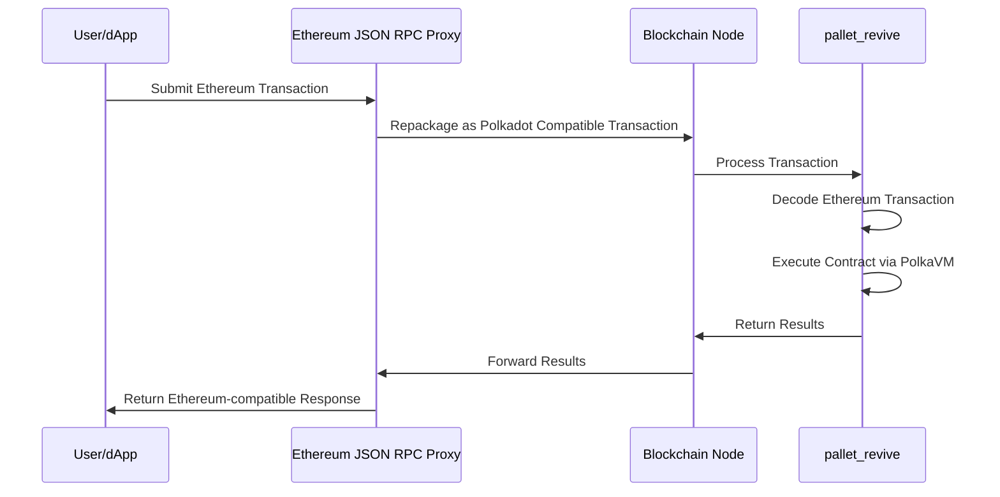

Begin New Bundle: Parachains
Includes shared base categories: Basics, Reference


---

Page Title: Accounts in Asset Hub Smart Contracts

- Source (raw): https://raw.githubusercontent.com/polkadot-developers/polkadot-docs/master/.ai/pages/smart-contracts-for-eth-devs-accounts.md
- Canonical (HTML): https://docs.polkadot.com/smart-contracts/for-eth-devs/accounts/
- Summary: Bridges Ethereum's 20-byte addresses with Polkadot's 32-byte accounts, enabling seamless interaction while maintaining compatibility with Ethereum tooling.

# Accounts on Asset Hub Smart Contracts

!!! smartcontract "PolkaVM Preview Release"
    PolkaVM smart contracts with Ethereum compatibility are in **early-stage development and may be unstable or incomplete**.
## Introduction

Asset Hub natively utilizes Polkadot's 32-byte account system while providing interoperability with Ethereum's 20-byte addresses through an automatic conversion system. When interacting with smart contracts:

- Ethereum-compatible wallets (like MetaMask) can use their familiar 20-byte addresses.
- Polkadot accounts continue using their native 32-byte format.
- The Asset Hub chain automatically handles conversion between the two formats behind the scenes:

    - 20-byte Ethereum addresses are padded with `0xEE` bytes to create valid 32-byte Polkadot accounts.
    - 32-byte Polkadot accounts can optionally register a mapping to a 20-byte address for Ethereum compatibility.

This dual-format approach enables Asset Hub to maintain compatibility with Ethereum tooling while fully integrating with the Polkadot ecosystem.

## Address Types and Mappings

The platform handles two distinct address formats:

- [Ethereum-style addresses (20 bytes)](https://ethereum.org/developers/docs/accounts/#account-creation){target=\_blank}
- [Polkadot native account IDs (32 bytes)](/reference/parachains/accounts/){target=\_blank}

### Ethereum to Polkadot Mapping

The [`AccountId32Mapper`](https://paritytech.github.io/polkadot-sdk/master/pallet_revive/struct.AccountId32Mapper.html){target=\_blank} implementation in [`pallet_revive`](https://paritytech.github.io/polkadot-sdk/master/pallet_revive/index.html){target=\_blank} handles the core address conversion logic. For converting a 20-byte Ethereum address to a 32-byte Polkadot address, the pallet uses a simple concatenation approach:

- [**Core mechanism**](https://paritytech.github.io/polkadot-sdk/master/pallet_revive/trait.AddressMapper.html#tymethod.to_fallback_account_id){target=\_blank}: Takes a 20-byte Ethereum address and extends it to 32 bytes by adding twelve `0xEE` bytes at the end. The key benefits of this approach are:
    - Able to fully revert, allowing a smooth transition back to the Ethereum format.
    - Provides clear identification of Ethereum-controlled accounts through the `0xEE` suffix pattern.
    - Maintains cryptographic security with a `2^96` difficulty for pattern reproduction.

### Polkadot to Ethereum Mapping

The conversion from 32-byte Polkadot accounts to 20-byte Ethereum addresses is more complex than the reverse direction due to the lossy nature of the conversion. The [`AccountId32Mapper`](https://paritytech.github.io/polkadot-sdk/master/pallet_revive/struct.AccountId32Mapper.html){target=\_blank} handles this through two distinct approaches:

- **For Ethereum-derived accounts**: The system uses the [`is_eth_derived`](https://paritytech.github.io/polkadot-sdk/master/pallet_revive/fn.is_eth_derived.html){target=\_blank} function to detect accounts that were originally Ethereum addresses (identified by the `0xEE` suffix pattern). For these accounts, the conversion strips the last 12 bytes to recover the original 20-byte Ethereum address.

- **For native Polkadot accounts**: Since these accounts utilize the whole 32-byte space and weren't derived from Ethereum addresses, direct truncation would result in lost information. Instead, the system:

    1. Hashes the entire 32-byte account using Keccak-256.
    2. Takes the last 20 bytes of the hash to create the Ethereum address.
    3. This ensures a deterministic mapping while avoiding simple truncation.

The conversion process is implemented through the [`to_address`](https://paritytech.github.io/polkadot-sdk/master/pallet_revive/trait.AddressMapper.html#tymethod.to_address){target=\_blank} function, which automatically detects the account type and applies the appropriate conversion method.

**Stateful Mapping for Reversibility** : Since the conversion from 32-byte to 20-byte addresses is inherently lossy, the system provides an optional stateful mapping through the [`OriginalAccount`](https://paritytech.github.io/polkadot-sdk/master/pallet_revive/pallet/storage_types/struct.OriginalAccount.html){target=\_blank} storage. When a Polkadot account registers a mapping (via the [`map`](https://paritytech.github.io/polkadot-sdk/master/pallet_revive/trait.AddressMapper.html#tymethod.map){target=\_blank} function), the system stores the original 32-byte account ID, enabling the [`to_account_id`](https://paritytech.github.io/polkadot-sdk/master/pallet_revive/trait.AddressMapper.html#tymethod.to_account_id){target=\_blank} function to recover the exact original account rather than falling back to a default conversion.


### Account Mapping for Native Polkadot Accounts

If you have a native Polkadot account (32-byte format) that was created with a Polkadot/Substrate keypair (Ed25519/Sr25519) rather than an Ethereum-compatible keypair (secp256k1), you'll need to map your account to enable Ethereum compatibility.

To map your account, call the [`map_account`](https://paritytech.github.io/polkadot-sdk/master/pallet_revive/pallet/dispatchables/fn.map_account.html){target=\_blank} extrinsic of the [`pallet_revive`](https://paritytech.github.io/polkadot-sdk/master/pallet_revive/index.html){target=\_blank} pallet using your original Substrate account. This creates a stateful mapping that allows your 32-byte account to interact with the Ethereum-compatible smart contract system.

Once mapped, you'll be able to:

- Transfer funds between 20-byte format addresses.
- Interact with smart contracts using Ethereum-compatible tools like MetaMask.
- Maintain full reversibility to your original 32-byte account format.

!!! warning "Mapping Requirement"
    Without this mapping, native Polkadot accounts cannot transfer funds or interact with the Ethereum-compatible layer on the Hub.

## Account Registration

The registration process is implemented through the [`map`](https://paritytech.github.io/polkadot-sdk/master/pallet_revive/trait.AddressMapper.html#tymethod.map){target=\_blank} function. This process involves:

- Checking if the account is already mapped.
- Calculating and collecting required deposits based on data size.
- Storing the address suffix for future reference.
- Managing the currency holds for security.

## Fallback Accounts

The fallback mechanism is integrated into the [`to_account_id`](https://paritytech.github.io/polkadot-sdk/master/pallet_revive/trait.AddressMapper.html#tymethod.to_account_id){target=\_blank} function. It provides a safety net for address conversion by:

- First, attempting to retrieve stored mapping data.
- Falling back to the default conversion method if no mapping exists.
- Maintaining consistency in address representation.

## Contract Address Generation

The system supports two methods for generating contract addresses:

- [CREATE1 method](https://paritytech.github.io/polkadot-sdk/master/pallet_revive/fn.create1.html){target=\_blank}:

    - Uses the deployer address and nonce.
    - Generates deterministic addresses for standard contract deployment.

- [CREATE2 method](https://paritytech.github.io/polkadot-sdk/master/pallet_revive/fn.create2.html){target=\_blank}:

    - Uses the deployer address, initialization code, input data, and salt.
    - Enables predictable address generation for advanced use cases.

## Security Considerations

The address mapping system maintains security through several design choices evident in the implementation:

- The stateless mapping requires no privileged operations, as shown in the [`to_fallback_account_id`](https://paritytech.github.io/polkadot-sdk/master/pallet_revive/trait.AddressMapper.html#tymethod.to_fallback_account_id){target=\_blank} implementation.
- The stateful mapping requires a deposit managed through the [`Currency`](https://paritytech.github.io/polkadot-sdk/master/pallet_revive/pallet/trait.Config.html#associatedtype.Currency){target=\_blank} trait.
- Mapping operations are protected against common errors through explicit checks.
- The system prevents double-mapping through the [`ensure!(!Self::is_mapped(account_id))`](https://github.com/paritytech/polkadot-sdk/blob/stable2412/substrate/frame/revive/src/address.rs#L125){target=\_blank} check.

All source code references are from the [`address.rs`](https://github.com/paritytech/polkadot-sdk/blob/stable2412/substrate/frame/revive/src/address.rs){target=\_blank} file in the Revive pallet of the Polkadot SDK repository.


---

Page Title: Add an Existing Pallet to the Runtime

- Source (raw): https://raw.githubusercontent.com/polkadot-developers/polkadot-docs/master/.ai/pages/parachains-customize-runtime-add-existing-pallets.md
- Canonical (HTML): https://docs.polkadot.com/parachains/customize-runtime/add-existing-pallets/
- Summary: Learn how to include and configure pallets in a Polkadot SDK-based runtime, from adding dependencies to implementing necessary traits.

# Add an Existing Pallet to the Runtime

## Introduction

The [Polkadot SDK Parachain Template](https://github.com/paritytech/polkadot-sdk-parachain-template){target=\_blank} provides a functional runtime that includes default [FRAME](https://paritytech.github.io/polkadot-sdk/master/polkadot_sdk_docs/polkadot_sdk/frame_runtime/index.html){target=\_blank} development modules ([pallets](https://paritytech.github.io/polkadot-sdk/master/polkadot_sdk_docs/polkadot_sdk/frame_runtime/pallet/index.html){target=\_blank}) to help you get started building a custom parachain. However, you'll often need to extend your runtime by adding additional pallets to enable new functionality.

Each pallet has specific configuration requirements, including the necessary parameters and types that enable its functionality. This guide walks you through the complete process of adding an existing pallet to your runtime and configuring it properly using `pallet-utility` as a practical example.

The Utility pallet offers batch transaction capabilities, enabling multiple calls to be dispatched together, as well as origin manipulation functionality for advanced use cases.

In this guide, you'll learn how to:

- Update runtime dependencies to integrate a new pallet
- Configure pallet-specific Rust traits to enable the pallet's functionality
- Run your parachain locally to test the new pallet

## Check Prerequisites

Before you begin, ensure you have:

- [Polkadot SDK dependencies installed](/parachains/install-polkadot-sdk/){target=\_blank}
- A working [Polkadot SDK development environment](/parachains/launch-a-parachain/set-up-the-parachain-template/){target=\_blank}

## Add an Existing Polkadot SDK Pallet to Your Runtime

Adding a pallet to your parachain runtime involves configuring dependencies, implementing the pallet's configuration trait, and registering the pallet in the runtime construct.

### Add an Existing Pallet as a Dependency

The Polkadot SDK utilizes a monorepo structure, where multiple pallets are available as features of the `polkadot-sdk` dependency. A list of pallets can be found in the [`substrate/frame` directory](https://github.com/paritytech/polkadot-sdk/tree/master/substrate/frame){target=\_blank} of the Polkadot SDK repository.

For [`pallet-utility`](https://github.com/paritytech/polkadot-sdk/tree/master/substrate/frame/utility){target=\_blank}, you need to add it as a dependency in the features array:

1. Open the `runtime/Cargo.toml` file.
2. Locate the `[dependencies]` section.
3. Find the `polkadot-sdk` dependency.
4. Add `pallet-utility` to the features array:

    ```toml title="runtime/Cargo.toml"
    polkadot-sdk = { workspace = true, features = [
        "pallet-utility",
        "cumulus-pallet-aura-ext",
        "cumulus-pallet-session-benchmarking",
        # ... other features
    ], default-features = false }
    ```

!!! note
    If you're adding a custom pallet that isn't part of the Polkadot SDK, you would add it as a separate dependency:

    ```toml title="runtime/Cargo.toml"
    custom-pallet = { path = "../pallets/custom-pallet", default-features = false }
    ```

    Ensure it's included in the workspace members section of the root `Cargo.toml` file.

### Enable Standard Library Features

The Polkadot SDK runtime compiles to both a native binary (for running unit tests), which includes standard Rust library functions, and a WebAssembly (Wasm) binary (a more compact size for production use), which does not include the standard library. Since `pallet-utility` is part of the `polkadot-sdk` dependency, its `std` feature is already included when you enable `polkadot-sdk/std`.

To verify that the standard library features are enabled:

1. In the `runtime/Cargo.toml` file, locate the `[features]` section.
2. Ensure `polkadot-sdk/std` is included in the `std` array:

    ```toml title="runtime/Cargo.toml"
    [features]
    default = ["std"]
    std = [
        "codec/std",
        "cumulus-pallet-parachain-system/std",
        "log/std",
        "polkadot-sdk/std",
        "scale-info/std",
        # ... other features
    ]
    ```

!!! note
    If you're adding a custom pallet, you must explicitly add its `std` feature:

    ```toml title="runtime/Cargo.toml"
    std = [
        # ... other features
        "custom-pallet/std",
    ]
    ```

### Review the Config Trait

Every pallet defines a Rust trait called `Config` that specifies the types and parameters needed for the pallet to function within a runtime. Before implementing the configuration, you should understand what the pallet requires.

The `pallet-utility` Config trait requires the following types:

```rust
pub trait Config: frame_system::Config {
    /// The overarching event type
    type RuntimeEvent: From<Event<Self>> + IsType<<Self as frame_system::Config>::RuntimeEvent>;

    /// The overarching call type
    type RuntimeCall: Parameter 
        + Dispatchable<RuntimeOrigin = Self::RuntimeOrigin>
        + GetDispatchInfo
        + From<frame_system::Call<Self>>;

    /// The caller origin, overarching type of all pallets origins
    type PalletsOrigin: Parameter + Into<<Self as frame_system::Config>::RuntimeOrigin>;

    /// Weight information for extrinsics in this pallet
    type WeightInfo: WeightInfo;
}
```

This configuration requires:

- **`RuntimeEvent`**: Links the pallet's events to the runtime's event system.
- **`RuntimeCall`**: Allows the utility pallet to dispatch calls from other pallets, which is needed for batch operations.
- **`PalletsOrigin`**: Enables origin manipulation for dispatching calls as other pallets.
- **`WeightInfo`**: Provides weight calculations for pallet operations.

!!! tip
    You can view a pallet's `Config` trait requirements in the [Polkadot SDK Rust docs](https://paritytech.github.io/polkadot-sdk/master/polkadot_sdk_docs/index.html){target=\_blank}. Search for the pallet's name and check the type defined by its [`Config`](https://paritytech.github.io/polkadot-sdk/master/polkadot_sdk_docs/guides/your_first_pallet/pallet/trait.Config.html){target=\_blank} trait.

### Implement the Config Trait

Now you'll implement the pallet's `Config` trait in your runtime to provide the concrete types the pallet needs.

To implement the Config trait:

1. Open the `runtime/src/configs/mod.rs` file.
2. Add the following implementation at the end of the file:

    ```rust title="runtime/src/configs/mod.rs"
    /// Configure the utility pallet
    impl pallet_utility::Config for Runtime {
        type RuntimeEvent = RuntimeEvent;
        type RuntimeCall = RuntimeCall;
        type PalletsOrigin = OriginCaller;
        type WeightInfo = pallet_utility::weights::SubstrateWeight<Runtime>;
    }
    ```

### Add to Runtime Construct

The final step is to register the pallet in the runtime construct using the [`#[frame_support::runtime]` macro](https://paritytech.github.io/polkadot-sdk/master/frame_support/attr.runtime.html){target=\_blank}. This macro generates the necessary boilerplate code for including pallets in the runtime.

To add the pallet to the runtime construct:

1. Open the `runtime/src/lib.rs` file.
2. Locate the `#[frame_support::runtime]` section (usually near the end of the file).
3. Add your pallet with a unique `pallet_index`:

    ```rust title="runtime/src/lib.rs"
    #[frame_support::runtime]
    mod runtime {
        #[runtime::runtime]
        #[runtime::derive(
            RuntimeCall,
            RuntimeEvent,
            RuntimeError,
            RuntimeOrigin,
            RuntimeTask,
            RuntimeFreezeReason,
            RuntimeHoldReason,
            RuntimeSlashReason,
            RuntimeLockId,
            RuntimeViewFunction
        )]
        pub struct Runtime;

        #[runtime::pallet_index(0)]
        pub type System = frame_system;

        #[runtime::pallet_index(1)]
        pub type ParachainSystem = cumulus_pallet_parachain_system;

        #[runtime::pallet_index(2)]
        pub type Timestamp = pallet_timestamp;

        // ... other pallets

        #[runtime::pallet_index(50)]
        pub type Utility = pallet_utility;
    }
    ```

When adding the pallet:

- Assign a unique `pallet_index` that doesn't conflict with existing pallets. The index determines the pallet's position in the runtime.
- Use a descriptive name for the pallet instance, such as `Utility` for `pallet_utility`.

!!! warning
    Each pallet must have a unique index. Duplicate indices will cause compilation errors.

### Verify the Runtime Compiles

After adding and configuring your pallet in the runtime, verify that everything is set up correctly by compiling the runtime.

To compile the runtime:

1. Navigate to the root directory of your project.
2. Run the following command:

    ```bash
    cargo build --release
    ```

3. Ensure the build completes successfully without errors.

This command validates the pallet configurations and prepares the build for testing or deployment.

## Run Your Chain Locally

Now that you've added the pallet to your runtime, you can launch your parachain locally to test the new functionality using the [Polkadot Omni Node](https://crates.io/crates/polkadot-omni-node){target=\_blank}. For instructions on setting up the Polkadot Omni Node and [Polkadot Chain Spec Builder](https://crates.io/crates/staging-chain-spec-builder){target=\_blank}, refer to the [Set Up a Parachain Template](/parachains/launch-a-parachain/set-up-the-parachain-template/){target=\_blank} guide.

### Generate a Chain Specification

Create a new chain specification file with the updated runtime by running the following command from your project's root directory using the `chain-spec-builder` tool:

```bash
chain-spec-builder create -t development \
--relay-chain paseo \
--para-id 1000 \
--runtime ./target/release/wbuild/parachain-template-runtime/parachain_template_runtime.compact.compressed.wasm \
named-preset development
```

This command generates a chain specification file, `chain_spec.json`, for your parachain with the updated runtime.

### Start the Parachain Node

Launch the parachain using the Polkadot Omni Node with the generated chain specification by running the following command:

```bash
polkadot-omni-node --chain ./chain_spec.json --dev
```

Verify the node starts successfully and begins producing blocks.

### Interact with the Pallet

Use the Polkadot.js Apps interface to verify you can interact with the new pallet.

To interact with the pallet:

1. Navigate to [Polkadot.js Apps](https://polkadot.js.org/apps/?rpc=ws%3A%2F%2F127.0.0.1%3A9944#/extrinsics){target=\_blank}.
2. Ensure you're connected to your local node at `ws://127.0.0.1:9944`.
3. Go to the **Developer** > **Extrinsics** tab.
4. In the **submit the following extrinsic** section, locate **utility** in the pallet dropdown.
5. Verify you can see the available extrinsics, such as:
    - **`batch(calls)`**: Dispatch multiple calls in a single transaction.
    - **`batchAll(calls)`**: Dispatch multiple calls, stopping on the first error.
    - **`asDerivative(index, call)`**: Dispatch a call as a derivative account.

    

You can now test the pallet's functionality by submitting transactions through the interface.

## Where to Go Next

<div class="grid cards" markdown>

-   <span class="badge guide">Guide</span> __Add Multiple Pallet Instances__

    ---

    Learn how to implement multiple instances of the same pallet in your Polkadot SDK-based runtime.

    [:octicons-arrow-right-24: Get Started](/parachains/customize-runtime/add-pallet-instances/)

-   <span class="badge guide">Guide</span> __Make a Custom Pallet__

    ---

    Learn how to create custom pallets using FRAME.

    [:octicons-arrow-right-24: Get Started](/parachains/customize-runtime/pallet-development/create-a-pallet/)

</div>


---

Page Title: Add Multiple Pallet Instances

- Source (raw): https://raw.githubusercontent.com/polkadot-developers/polkadot-docs/master/.ai/pages/parachains-customize-runtime-add-pallet-instances.md
- Canonical (HTML): https://docs.polkadot.com/parachains/customize-runtime/add-pallet-instances/
- Summary: Learn how to implement multiple instances of the same pallet in your Polkadot SDK-based runtime, from adding dependencies to configuring unique instances.

# Add Multiple Pallet Instances

## Introduction

The [Polkadot SDK Parachain Template](https://github.com/paritytech/polkadot-sdk-parachain-template){target=\_blank} provides a solid foundation for building custom parachains. While most pallets are typically included as single instances within a runtime, some scenarios benefit from running multiple instances of the same pallet with different configurations. This approach lets you reuse pallet logic without reimplementing it, enabling diverse functionality from a single codebase.

For example, you could create multiple governance councils with different voting rules, or several token systems with distinct parameters. The Polkadot SDK makes this possible through instantiable pallets, which allow multiple independent instances of the same pallet to coexist within a runtime.

This guide demonstrates how to add and configure multiple instances of a pallet to your runtime using [`pallet-collective`](https://paritytech.github.io/polkadot-sdk/master/pallet_collective/index.html){target=\_blank} as a practical example. The same process applies to other instantiable pallets.

In this guide, you'll learn how to:

- Identify instantiable pallets and understand their structure.
- Configure multiple instances of the same pallet with unique parameters.
- Register multiple pallet instances in your runtime.
- Run your parachain locally to test multiple pallet instances.

## Check Prerequisites

Before you begin, ensure you have:

- A working [Polkadot SDK development environment](/parachains/launch-a-parachain/choose-a-template){target=\_blank}.
- Basic understanding of [adding pallets to a runtime](/parachains/customize-runtime/add-a-pallet){target=\_blank}.

## Understanding Instantiable Pallets

Not all pallets support multiple instances. Instantiable pallets are specifically designed to allow multiple independent copies within the same runtime. These pallets include an additional generic parameter `I` that creates a unique identity for each instance.

### Identifying an Instantiable Pallet

You can identify an instantiable pallet by examining its `Pallet` struct definition. An instantiable pallet will include both the standard generic `T` (for the runtime configuration) and the instantiation generic `I`:

```rust
#[pallet::pallet]
pub struct Pallet<T, I = ()>(PhantomData<(T, I)>);
```

The `I` generic parameter:

- Creates a unique type identity for each pallet instance.
- Appears throughout the pallet's components (`Config` trait, storage items, events, errors).
- Defaults to `()` (unit type) when only one instance is needed.
- Must be explicitly specified when creating multiple instances.

### How Instance Generics Work

The instantiation generic `I` affects how the pallet's types are structured:

- **`Config` trait**: `trait Config<I: 'static = ()>` - accepts the instance parameter.
- **Storage items**: Automatically namespaced by instance to prevent conflicts.
- **Events**: `Event<T, I>` - includes instance information.
- **Calls**: `Call<T, I>` - dispatched to the correct instance.

This design ensures that multiple instances of the same pallet maintain completely separate states and don't interfere with each other.

## Add Multiple Instances of a Pallet to Your Runtime

Adding multiple pallet instances involves the same basic steps as adding a single pallet, but with specific configuration for each instance.

In this example, you'll add two instances of [`pallet-collective`](https://github.com/paritytech/polkadot-sdk/tree/master/substrate/frame/collective){target=\_blank} to create different governance bodies.

### Add the Pallet as a Dependency

First, ensure the instantiable pallet is available in your runtime dependencies. For `pallet-collective`, add it as a feature of the `polkadot-sdk` dependency:

1. Open the `runtime/Cargo.toml` file.
2. Locate the `[dependencies]` section.
3. Find the `polkadot-sdk` dependency.
4. Add `pallet-collective` to the features array:

    ```toml title="Cargo.toml"
    polkadot-sdk = { workspace = true, features = [
        "pallet-collective",
        "cumulus-pallet-aura-ext",
        "cumulus-pallet-session-benchmarking",
        # ... other features
    ], default-features = false }
    ```

### Enable Standard Library Features

Ensure the pallet's standard library features are enabled for native builds:

1. In the `runtime/Cargo.toml` file, locate the `[features]` section.
2. Ensure `polkadot-sdk/std` is included in the `std` array:

    ```toml title="Cargo.toml"
    [features]
    default = ["std"]
    std = [
        "codec/std",
        "cumulus-pallet-parachain-system/std",
        "log/std",
        "polkadot-sdk/std",
        "scale-info/std",
        # ... other features
    ]
    ```

### Review the Config Trait

Before configuring multiple instances, understand what the pallet requires. The `pallet-collective` `Config` trait is defined with the instance generic:

```rust
pub trait Config<I: 'static = ()>: frame_system::Config {
    /// The runtime origin type
    type RuntimeOrigin: From<RawOrigin<Self::AccountId, I>>;

    /// The runtime call type
    type Proposal: Parameter 
        + Dispatchable<RuntimeOrigin = Self::RuntimeOrigin>
        + From<frame_system::Call<Self>>;

    /// The overarching event type
    type RuntimeEvent: From<Event<Self, I>> 
        + IsType<<Self as frame_system::Config>::RuntimeEvent>;

    /// Duration in blocks for a motion to remain active
    type MotionDuration: Get<BlockNumberFor<Self>>;

    /// Maximum number of proposals allowed at once
    type MaxProposals: Get<u32>;

    /// Maximum number of members in the collective
    type MaxMembers: Get<u32>;

    /// Default voting strategy when a member abstains
    type DefaultVote: DefaultVote;

    /// Origin that can modify the members
    type SetMembersOrigin: EnsureOrigin<Self::RuntimeOrigin>;

    /// Weight information for extrinsics
    type WeightInfo: WeightInfo;

    /// Maximum weight for a proposal
    type MaxProposalWeight: Get<Weight>;

    /// Origin that can disapprove proposals
    type DisapproveOrigin: EnsureOrigin<Self::RuntimeOrigin>;

    /// Origin that can kill proposals
    type KillOrigin: EnsureOrigin<Self::RuntimeOrigin>;

    /// Consideration mechanism (e.g., deposits)
    type Consideration: Consideration<Self::AccountId>;
}
```

This configuration enables the collective pallet to manage a group of accounts that can propose and vote on proposals together.

### Define Pallet Parameters

Before implementing the `Config` trait for each instance, define the common parameters that both instances will use. These parameters are defined once and can be shared across instances or customized per instance.

To define pallet parameters:

1. Open the `runtime/src/configs/mod.rs` file.
2. Add parameter type definitions for the collective pallet:

    ```rust title="runtime/src/configs/mod.rs"
    parameter_types! {
        pub const MotionDuration: BlockNumber = 24 * HOURS;
        pub const MaxProposals: u32 = 100;
        pub const MaxMembers: u32 = 100;
        pub MaxProposalWeight: Weight = Perbill::from_percent(50) * RuntimeBlockWeights::get().max_block;
    }
    ```

!!! tip
    You can define separate parameters for each instance if you need different configurations. For example, you might want a technical committee with a shorter motion duration and fewer members than a general council.

### Create Instance Type Definitions

Each pallet instance needs a unique type identifier. The Polkadot SDK provides numbered instance types (`Instance1`, `Instance2`, etc.) that you can use to create these identifiers.

In the `runtime/src/configs/mod.rs` file, add type definitions for each instance:

```rust title="runtime/src/configs/mod.rs"
// Technical Committee instance
pub type TechnicalCollective = pallet_collective::Instance1;

// Council instance  
pub type CouncilCollective = pallet_collective::Instance2;
```

These type aliases:

- Create distinct identities for each instance.
- Make your code more readable and maintainable.
- Are used when implementing the `Config` trait and adding to the runtime construct.

!!! note
    The names `TechnicalCollective` and `CouncilCollective` are descriptive examples. Choose names that reflect the purpose of each instance in your specific use case.

### Implement Config Trait for First Instance

Now implement the `Config` trait for your first instance. The implementation includes the instance type as a generic parameter.

In the `runtime/src/configs/mod.rs` file, add the following implementation:

```rust title="runtime/src/configs/mod.rs"
/// Configure the Technical Committee collective
impl pallet_collective::Config<TechnicalCollective> for Runtime {
    type RuntimeOrigin = RuntimeOrigin;
    type Proposal = RuntimeCall;
    type RuntimeEvent = RuntimeEvent;
    type MotionDuration = MotionDuration;
    type MaxProposals = MaxProposals;
    type MaxMembers = MaxMembers;
    type DefaultVote = pallet_collective::MoreThanMajorityThenPrimeDefaultVote;
    type SetMembersOrigin = EnsureRoot<AccountId>;
    type WeightInfo = pallet_collective::weights::SubstrateWeight<Runtime>;
    type MaxProposalWeight = MaxProposalWeight;
    type DisapproveOrigin = EnsureRoot<Self::AccountId>;
    type KillOrigin = EnsureRoot<Self::AccountId>;
    type Consideration = ();
}
```

Key configuration details:

- **`RuntimeOrigin`, `RuntimeCall`, `RuntimeEvent`**: Connect to the runtime's aggregated types.
- **`MotionDuration`**: How long proposals remain active (5 days in this example).
- **`MaxProposals`**: Maximum number of active proposals (100).
- **`MaxMembers`**: Maximum collective members (100).
- **`DefaultVote`**: Voting strategy when members abstain (majority with prime member tiebreaker).
- **`SetMembersOrigin`**: Who can modify membership (root in this example).
- **`MaxProposalWeight`**: Maximum computational weight for proposals (50% of block weight).
- **`DisapproveOrigin`/`KillOrigin`**: Who can reject proposals (root in this example).
- **`Consideration`**: Deposit mechanism (none in this example).

### Implement Config Trait for Second Instance

Implement the `Config` trait for your second instance with the same or a different configuration.

In the `runtime/src/configs/mod.rs` file, add the following implementation:

```rust title="runtime/src/configs/mod.rs"
/// Configure the Council collective
impl pallet_collective::Config<CouncilCollective> for Runtime {
    type RuntimeOrigin = RuntimeOrigin;
    type Proposal = RuntimeCall;
    type RuntimeEvent = RuntimeEvent;
    type MotionDuration = MotionDuration;
    type MaxProposals = MaxProposals;
    type MaxMembers = MaxMembers;
    type DefaultVote = pallet_collective::MoreThanMajorityThenPrimeDefaultVote;
    type SetMembersOrigin = EnsureRoot<AccountId>;
    type WeightInfo = pallet_collective::weights::SubstrateWeight<Runtime>;
    type MaxProposalWeight = MaxProposalWeight;
    type DisapproveOrigin = EnsureRoot<Self::AccountId>;
    type KillOrigin = EnsureRoot<Self::AccountId>;
    type Consideration = ();
}
```

!!! tip
    While this example uses identical configurations for both instances, you can customize each instance's parameters to serve different purposes. For example, you might configure the technical committee with stricter voting requirements or shorter motion durations than the general council.

### Add Instances to Runtime Construct

The final configuration step is registering both pallet instances in the runtime construct. Each instance needs a unique pallet index and must specify its instance type.

To add the pallet instances to the runtime construct:

1. Open the `runtime/src/lib.rs` file.
2. Locate the `#[frame_support::runtime]` section.
3. Add both pallet instances with unique indices:

    ```rust title="runtime/src/lib.rs"
    #[frame_support::runtime]
    mod runtime {
        #[runtime::runtime]
        #[runtime::derive(
            RuntimeCall,
            RuntimeEvent,
            RuntimeError,
            RuntimeOrigin,
            RuntimeTask,
            RuntimeFreezeReason,
            RuntimeHoldReason,
            RuntimeSlashReason,
            RuntimeLockId,
            RuntimeViewFunction
        )]
        pub struct Runtime;

        #[runtime::pallet_index(0)]
        pub type System = frame_system;

        #[runtime::pallet_index(1)]
        pub type ParachainSystem = cumulus_pallet_parachain_system;

        // ... other pallets

        #[runtime::pallet_index(50)]
        pub type TechnicalCommittee = pallet_collective<TechnicalCollective>;

        #[runtime::pallet_index(51)]
        pub type Council = pallet_collective<CouncilCollective>;
    }
    ```

Important considerations when adding instances:

- **Unique indices**: Each instance must have a different `pallet_index`.
- **Instance type**: Specify the instance type in angle brackets (e.g., `<TechnicalCollective>`).
- **Descriptive names**: Use names that reflect the instance's purpose (e.g., `TechnicalCommittee`, `Council`).
- **Index management**: Track which indices are used to avoid conflicts.

!!! warning
    Duplicate pallet indices will cause compilation errors. Keep a list of used indices to prevent conflicts when adding new pallets or instances.

### Verify the Runtime Compiles

After adding and configuring both pallet instances, verify that everything is set up correctly by compiling the runtime from your project's root directory:

```bash
cargo build --release
```

Ensure the build completes successfully without errors.

This command validates:

- All pallet instances are properly configured
- No index conflicts exist
- Type definitions are correct
- Dependencies are properly resolved

## Run Your Chain Locally

Now that you've added multiple pallet instances to your runtime, you can launch your parachain locally to test the new functionality using the [Polkadot Omni Node](https://crates.io/crates/polkadot-omni-node){target=\_blank}. For instructions on setting up the Polkadot Omni Node and [Polkadot Chain Spec Builder](https://crates.io/crates/staging-chain-spec-builder){target=\_blank}, refer to the [Set Up the Parachain Template](/parachains/launch-a-parachain/set-up-the-parachain-template/){target=\_blank} page.

### Generate a Chain Specification

Create a new chain specification file with the updated runtime containing both pallet instances by running the following command from your project's root directory:

```bash
chain-spec-builder create -t development \
    --relay-chain paseo \
    --para-id 1000 \
    --runtime ./target/release/wbuild/parachain-template-runtime/parachain_template_runtime.compact.compressed.wasm \
    named-preset development
```

This command generates a chain specification file (`chain_spec.json`) for your parachain with the updated runtime.

### Start the Parachain Node

Launch the parachain using the Polkadot Omni Node with the generated chain specification:

```bash
polkadot-omni-node --chain ./chain_spec.json --dev
```

Verify the node starts successfully and begins producing blocks. You should see log messages indicating that both pallet instances are initialized.

### Interact with Both Pallet Instances

Use the Polkadot.js Apps interface to verify you can interact with both pallet instances independently.

To interact with the pallet instances:

1. Navigate to [Polkadot.js Apps](https://polkadot.js.org/apps/?rpc=ws%3A%2F%2F127.0.0.1%3A9944#/extrinsics){target=\_blank}.
2. Ensure you're connected to your local node at `ws://127.0.0.1:9944`.
3. Go to the **Developer** > **Extrinsics** tab.
4. In the **submit the following extrinsic** section, open the pallet dropdown. Verify that both pallet instances appear and contain the expected extrinsics.

    === "Technical Committee"

        Select **`technicalCommittee`** and open the extrinsics dropdown.

        

    === "Council"

        Select **`council`** and open the extrinsics dropdown.

        

Each instance should display the following extrinsics (this is not an exhaustive list):

- **`close(proposalHash, index, proposalWeightBound, lengthBound)`**: Close voting.
- **`propose(threshold, proposal, lengthBound)`**: Submit a proposal.
- **`setMembers(newMembers, prime, oldCount)`**: Update membership.
- **`vote(proposal, index, approve)`**: Vote on a proposal.

### Test Instance Independence

Verify that both instances operate independently by testing their separate functionality.

To test instance independence:

1. In Polkadot.js Apps, go to **Developer** > **Chain state**.
2. Query storage for each instance:

    === "Technical Committee"

        Select **`technicalCommittee` > `members()`** to view technical committee members.

        

    === "Council"

        Select **`council` > `members()`** to view council members.

        

3. Verify that:
    - Each instance maintains separate storage.
    - Changes to one instance don't affect the other.
    - Both instances can process proposals simultaneously.

You can now use both collective instances for different governance purposes in your parachain, such as technical decisions that require expertise and general governance decisions that require broader consensus.

## Where to Go Next

<div class="grid cards" markdown>

-   <span class="badge guide">Guide</span> __Make a Custom Pallet__

    ---

    Learn how to create custom pallets using FRAME.

    [:octicons-arrow-right-24: Reference](/parachains/customize-runtime/pallet-development/create-a-pallet/)

</div>


---

Page Title: Add Smart Contract Functionality

- Source (raw): https://raw.githubusercontent.com/polkadot-developers/polkadot-docs/master/.ai/pages/parachains-customize-runtime-add-smart-contract-functionality.md
- Canonical (HTML): https://docs.polkadot.com/parachains/customize-runtime/add-smart-contract-functionality/
- Summary: Add smart contract capabilities to your Polkadot SDK-based blockchain. Explore PVM, EVM, and Wasm integration for enhanced chain functionality.

# Add Smart Contract Functionality

## Introduction

When building your custom blockchain with the Polkadot SDK, you can add smart contract capabilities through specialized pallets. These pallets enable users to deploy and execute smart contracts, enhancing your chain's programmability and allowing developers to build decentralized applications on your network.

This guide covers three approaches to adding smart contracts to your blockchain:

- **[`pallet-revive`](#pallet-revive)**: Modern unified solution supporting both PolkaVM and EVM bytecode
- **[Frontier](#frontier)**: Ethereum compatibility layer for Polkadot SDK-based chains
- **[`pallet-contracts`](#pallet-contracts-legacy)**: Wasm smart contract support

## pallet-revive

[`pallet-revive`](https://github.com/paritytech/polkadot-sdk/tree/master/substrate/frame/revive){target=\_blank} is the modern smart contract solution for Polkadot SDK-based chains. It provides a unified execution environment that supports both PolkaVM and EVM bytecode through dual execution backends.

### Core Components

**Essential Pallet:**
**[`pallet-revive`](https://github.com/paritytech/polkadot-sdk/tree/master/substrate/frame/revive){target=\_blank}** provides the core smart contract execution environment with [PolkaVM](https://github.com/polkadot-developers/polkadot-docs/blob/71e1b51bb42ef55e20c2f3b953db86e8c26cd591/smart-contracts/for-eth-devs/dual-vm-stack.md#upgrade-to-polkavm){target=\_blank} and [REVM](https://github.com/polkadot-developers/polkadot-docs/blob/71e1b51bb42ef55e20c2f3b953db86e8c26cd591/smart-contracts/for-eth-devs/dual-vm-stack.md#migrate-from-evm){target=\_blank} backends.

**RPC Adapter:**
**[`pallet-revive-eth-rpc`](https://crates.io/crates/pallet-revive-eth-rpc){target=\_blank}** adds full Ethereum RPC compatibility for Ethereum tooling integration.

### Supported Languages and Compilers

`pallet-revive` accepts smart contracts from multiple languages and compilation paths:

| Language | Compiler | Output Bytecode | Execution Backend |
|----------|----------|-----------------|-------------------|
| Solidity | `resolc` | PolkaVM | PolkaVM |
| Solidity | `solc` | EVM | REVM |
| Rust (ink!) | `cargo-contract` | PolkaVM | PolkaVM | 

Any language that can compile to PolkaVM bytecode and utilize `pallet-revive`'s host functions (via [`pallet-revive-uapi`](https://paritytech.github.io/polkadot-sdk/master/pallet_revive_uapi/index.html){target=\_blank}) is supported.

### How It Works

**Dual Execution Model:**

1. **PolkaVM Backend**: Executes PolkaVM bytecode with native performance optimization.
2. **REVM Backend**: Implements EVM bytecode for compatibility with existing Ethereum contracts, ensuring seamless migration.

### Key Benefits

- **Unified platform**: Deploys both PolkaVM-optimized and EVM-compatible contracts using a single pallet.
- **Performance**: PolkaVM execution provides improved performance compared to the traditional EVM, leveraging the [RISC-V](https://en.wikipedia.org/wiki/RISC-V){target=\_blank} architecture to map instructions to the CPU and requires little transpiling.
- **Ethereum compatibility**: Supports full integration with Ethereum tooling via RPC adapter.

### Implementation Examples

See a real-world implementation in the [Polkadot Hub TestNet](https://github.com/paseo-network/runtimes/blob/c965c42a4e0bc9d1e9cc0a340322bc3b8e347bcf/system-parachains/asset-hub-paseo/src/lib.rs#L1122-L1157){target=\_blank} in the Polkadot Fellows repository.

## Frontier

[Frontier](https://github.com/polkadot-evm/frontier){target=\_blank} is the Ethereum compatibility layer designed for maximum compatibility with the Ethereum ecosystem. It's the ideal choice when you need seamless integration with existing Ethereum tools, dApps, and infrastructure.

### Integration Options

Frontier offers flexible integration depending on your compatibility needs:

### EVM Execution Only

For basic EVM support using Polkadot SDK native APIs:

- **[`pallet-evm`](https://github.com/polkadot-evm/frontier/tree/master/frame/evm){target=\_blank}**: Provides the core EVM execution environment.

This configuration allows EVM contract execution but requires using Polkadot SDK-specific APIs for interaction.

### Full Ethereum Compatibility

For complete Ethereum ecosystem integration with Ethereum RPC support:

- **[`pallet-evm`](https://github.com/polkadot-evm/frontier/tree/master/frame/evm){target=\_blank}**: Integrates core EVM execution environment.
- **[`pallet-ethereum`](https://github.com/polkadot-evm/frontier/tree/master/frame/ethereum){target=\_blank}**: Emulates Ethereum blocks and handles Ethereum-formatted transactions.
- **[`fc-rpc`](https://github.com/polkadot-evm/frontier/tree/master/client/rpc){target=\_blank}**: Provides Ethereum JSON-RPC endpoints.

### Key Benefits

- **Ethereum tooling compatibility**: Full compatibility with MetaMask, Hardhat, Remix, Foundry, and other Ethereum development tools.
- **Minimal-friction migration**: Deployment of existing Ethereum dApps with minimal or no modifications.
- **Native Ethereum formats**: Support for Ethereum transaction formats, signatures, and gas mechanics.
- **Block emulation**: Ethereum-style block structure within Substrate's block production.

### Implementation Examples

Production implementations demonstrate Frontier's capabilities:

- **Moonbeam**: See their implementation of [`pallet-evm`](https://github.com/moonbeam-foundation/moonbeam/blob/9e2ddbc9ae8bf65f11701e7ccde50075e5fe2790/runtime/moonbeam/src/lib.rs#L532){target=\_blank} and [`pallet-ethereum`](https://github.com/moonbeam-foundation/moonbeam/blob/9e2ddbc9ae8bf65f11701e7ccde50075e5fe2790/runtime/moonbeam/src/lib.rs#L698){target=\_blank}.

## pallet-contracts (Legacy)

[`pallet-contracts`](https://docs.rs/pallet-contracts/latest/pallet_contracts/index.html#contracts-pallet){target=\_blank} is the original Wasm-based smart contract pallet for Polkadot SDK chains. While still functional, it's considered legacy as development efforts have shifted to `pallet-revive`.

### Implementation Example

For reference, Astar's implementation of [`pallet-contracts`](https://github.com/AstarNetwork/Astar/blob/b6f7a408d31377130c3713ed52941a06b5436402/runtime/astar/src/lib.rs#L693){target=\_blank} demonstrates production usage.

## Where to Go Next

<div class="grid cards" markdown>

-   <span class="badge guide">Guide</span> __Add a Pallet to the Runtime__

    ---

    Learn the step-by-step process for integrating Polkadot SDK pallets into your blockchain's runtime.

    [:octicons-arrow-right-24: Get Started](/parachains/customize-runtime/add-existing-pallets/)

</div>


---

Page Title: Benchmark Your Pallet

- Source (raw): https://raw.githubusercontent.com/polkadot-developers/polkadot-docs/master/.ai/pages/parachains-customize-runtime-pallet-development-benchmark-pallet.md
- Canonical (HTML): https://docs.polkadot.com/parachains/customize-runtime/pallet-development/benchmark-pallet/
- Summary: Learn how to benchmark extrinsics in your custom pallet to generate precise weight calculations suitable for production use.

## Introduction

Benchmarking is the process of measuring the computational resources (execution time and storage) required by your pallet's extrinsics. Accurate [weight](https://paritytech.github.io/polkadot-sdk/master/frame_support/weights/index.html){target=\_blank} calculations are essential for ensuring your blockchain can process transactions efficiently while protecting against denial-of-service attacks.

This guide demonstrates how to benchmark a pallet and incorporate the resulting weight values. This example uses the custom counter pallet from previous guides in this series, but you can replace it with the code from another pallet if desired.

## Prerequisites

Before you begin, ensure you have:

- A pallet to benchmark. If you followed the pallet development tutorials, you can use the counter pallet from the [Create a Pallet](/parachains/customize-runtime/pallet-development/create-a-pallet/){target=\_blank} guide. You can also follow these steps to benchmark a custom pallet by updating the `benchmarking.rs` functions, and instances of usage in future steps, to calculate weights using your specific pallet functionality.
- Basic understanding of [computational complexity](https://en.wikipedia.org/wiki/Computational_complexity){target=\_blank}.
- Familiarity with [Rust's testing framework](https://doc.rust-lang.org/book/ch11-00-testing.html){target=\_blank}.
- Familiarity setting up the Polkadot Omni Node and [Polkadot Chain Spec Builder](https://crates.io/crates/staging-chain-spec-builder){target=\_blank}. Refer to the [Set Up a Parachain Template](/parachains/launch-a-parachain/set-up-the-parachain-template/){target=\_blank} guide for instructions if needed.

## Create the Benchmarking Module

Create a new file `benchmarking.rs` in your pallet's `src` directory and add the following code:

```rust title="pallets/pallet-custom/src/benchmarking.rs"
#![cfg(feature = "runtime-benchmarks")]

use super::*;
use frame::deps::frame_benchmarking::v2::*;
use frame::benchmarking::prelude::RawOrigin;

#[benchmarks]
mod benchmarks {
    use super::*;

    #[benchmark]
    fn set_counter_value() {
        let new_value: u32 = 100;

        #[extrinsic_call]
        _(RawOrigin::Root, new_value);

        assert_eq!(CounterValue::<T>::get(), new_value);
    }

    #[benchmark]
    fn increment() {
        let caller: T::AccountId = whitelisted_caller();
        let amount: u32 = 50;

        #[extrinsic_call]
        _(RawOrigin::Signed(caller.clone()), amount);

        assert_eq!(CounterValue::<T>::get(), amount);
        assert_eq!(UserInteractions::<T>::get(caller), 1);
    }

    #[benchmark]
    fn decrement() {
        // First, set the counter to a non-zero value
        CounterValue::<T>::put(100);

        let caller: T::AccountId = whitelisted_caller();
        let amount: u32 = 30;

        #[extrinsic_call]
        _(RawOrigin::Signed(caller.clone()), amount);

        assert_eq!(CounterValue::<T>::get(), 70);
        assert_eq!(UserInteractions::<T>::get(caller), 1);
    }

    impl_benchmark_test_suite!(Pallet, crate::mock::new_test_ext(), crate::mock::Test);
}
```

This module contains all the [benchmarking definitions](https://paritytech.github.io/polkadot-sdk/master/frame_benchmarking/v2/index.html){target=\_blank} for your pallet. If you are benchmarking a different pallet, update the testing logic as needed to test your pallet's functionality. 

## Define the Weight Trait

Add a `weights` module to your pallet that defines the `WeightInfo` trait using the following code:

```rust title="pallets/pallet-custom/src/weights.rs"
#[frame::pallet]
pub mod pallet {
    use frame::prelude::*;
    pub use weights::WeightInfo;

    pub mod weights {
        use frame::prelude::*;

        pub trait WeightInfo {
            fn set_counter_value() -> Weight;
            fn increment() -> Weight;
            fn decrement() -> Weight;
        }

        impl WeightInfo for () {
            fn set_counter_value() -> Weight {
                Weight::from_parts(10_000, 0)
            }
            fn increment() -> Weight {
                Weight::from_parts(15_000, 0)
            }
            fn decrement() -> Weight {
                Weight::from_parts(15_000, 0)
            }
        }
    }

    // ... rest of pallet
}
```

The `WeightInfo for ()` implementation provides placeholder weights for development. If you are using a different pallet, update the `weights` module to use your pallet's function names.

## Add WeightInfo to Config 

Update your pallet's `Config` trait to include `WeightInfo` by adding the following code:

```rust title="pallets/pallet-custom/src/lib.rs"
#[pallet::config]
pub trait Config: frame_system::Config {
    type RuntimeEvent: From<Event<Self>> + IsType<<Self as frame_system::Config>::RuntimeEvent>;

    #[pallet::constant]
    type CounterMaxValue: Get<u32>;

    type WeightInfo: weights::WeightInfo;
}
```

The [`WeightInfo`](https://paritytech.github.io/polkadot-sdk/master/frame_support/weights/trait.WeightInfo.html){target=\_blank} trait provides an abstraction layer that allows weights to be swapped at runtime configuration. By making `WeightInfo` an associated type in the `Config` trait, you will enable each runtime that uses your pallet to specify which weight implementation to use.

## Update Extrinsic Weight Annotations

Replace the placeholder weights in your extrinsics with calls to the `WeightInfo` trait by adding the following code:

```rust title="pallets/pallet-custom/src/lib.rs"
#[pallet::call]
impl<T: Config> Pallet<T> {
    #[pallet::call_index(0)]
    #[pallet::weight(T::WeightInfo::set_counter_value())]
    pub fn set_counter_value(origin: OriginFor<T>, new_value: u32) -> DispatchResult {
        // ... implementation
    }

    #[pallet::call_index(1)]
    #[pallet::weight(T::WeightInfo::increment())]
    pub fn increment(origin: OriginFor<T>, amount: u32) -> DispatchResult {
        // ... implementation
    }

    #[pallet::call_index(2)]
    #[pallet::weight(T::WeightInfo::decrement())]
    pub fn decrement(origin: OriginFor<T>, amount: u32) -> DispatchResult {
        // ... implementation
    }
}
```

By calling `T::WeightInfo::function_name()` instead of using hardcoded `Weight::from_parts()` values, your extrinsics automatically use whichever weight implementation is configured in the runtime. You can switch between placeholder weights for testing and benchmarked weights for production easily, without changing any pallet code.

If you are using a different pallet, be sure to update the functions for `WeightInfo` accordingly.

## Include the Benchmarking Module

At the top of your `lib.rs`, add the module declaration by adding the following code:

```rust title="pallets/pallet-custom/src/lib.rs"
#![cfg_attr(not(feature = "std"), no_std)]

extern crate alloc;
use alloc::vec::Vec;

pub use pallet::*;

#[cfg(feature = "runtime-benchmarks")]
mod benchmarking;

// Additional pallet code
```

The `#[cfg(feature = "runtime-benchmarks")]` attribute ensures that benchmarking code is only compiled when explicitly needed to keep your production runtime efficient.

## Configure Pallet Dependencies

Update your pallet's `Cargo.toml` to enable the benchmarking feature by adding the following code:

```toml title="pallets/pallet-custom/Cargo.toml"
[dependencies]
codec = { features = ["derive"], workspace = true }
scale-info = { features = ["derive"], workspace = true }
frame = { features = ["experimental", "runtime"], workspace = true }

[features]
default = ["std"]
runtime-benchmarks = [
    "frame/runtime-benchmarks",
]
std = [
    "codec/std",
    "scale-info/std",
    "frame/std",
]
```

The Cargo feature flag system lets you conditionally compile code based on which features are enabled. By defining a `runtime-benchmarks` feature that cascades to FRAME's benchmarking features, you create a clean way to build your pallet with or without benchmarking support, ensuring all necessary dependencies are available when needed but excluded from production builds.

## Update Mock Runtime

Add the `WeightInfo` type to your test configuration in `mock.rs` by adding the following code:

```rust title="pallets/pallet-custom/src/mock.rs"
impl pallet_custom::Config for Test {
    type RuntimeEvent = RuntimeEvent;
    type CounterMaxValue = ConstU32<1000>;
    type WeightInfo = ();
}
```

In your mock runtime for testing, use the placeholder `()` implementation of `WeightInfo`, since unit tests focus on verifying functional correctness rather than performance.

## Configure Runtime Benchmarking

To execute benchmarks, your pallet must be integrated into the runtime's benchmarking infrastructure. Follow these steps to update the runtime configuration:

1. **Update `runtime/Cargo.toml`**: Add your pallet to the runtime's `runtime-benchmarks` feature as follows:

    ```toml title="runtime/Cargo.toml"
    runtime-benchmarks = [
        "cumulus-pallet-parachain-system/runtime-benchmarks",
        "hex-literal",
        "pallet-parachain-template/runtime-benchmarks",
        "polkadot-sdk/runtime-benchmarks",
        "pallet-custom/runtime-benchmarks",
    ]
    ```

    When you build the runtime with `--features runtime-benchmarks`, this configuration ensures all necessary benchmarking code across all pallets (including yours) is included.

2. **Update runtime configuration**: Using the the placeholder implementation, run development benchmarks as follows:

    ```rust title="runtime/src/configs/mod.rs"
    impl pallet_custom::Config for Runtime {
        type RuntimeEvent = RuntimeEvent;
        type CounterMaxValue = ConstU32<1000>;
        type WeightInfo = ();
    }
    ```

3. **Register benchmarks**: Add your pallet to the benchmark list in `runtime/src/benchmarks.rs` as follows:

    ```rust title="runtime/src/benchmarks.rs"
    polkadot_sdk::frame_benchmarking::define_benchmarks!(
        [frame_system, SystemBench::<Runtime>]
        [pallet_balances, Balances]
        // ... other pallets
        [pallet_custom, CustomPallet]
    );
    ```

    The [`define_benchmarks!`](https://paritytech.github.io/polkadot-sdk/master/frame_benchmarking/macro.define_benchmarks.html){target=\_blank} macro creates the infrastructure that allows the benchmarking CLI tool to discover and execute your pallet's benchmarks.

## Test Benchmark Compilation

Run the following command to verify your benchmarks compile and run as tests:

```bash
cargo test -p pallet-custom --features runtime-benchmarks
```

You will see terminal output similar to the following as your benchmark tests pass:

<div id="termynal" data-termynal>
  <span data-ty="input"><span class="file-path"></span>cargo test -p pallet-custom --features runtime-benchmarks</span>
  <span data-ty>test benchmarking::benchmarks::bench_set_counter_value ... ok</span>
  <span data-ty>test benchmarking::benchmarks::bench_increment ... ok</span>
  <span data-ty>test benchmarking::benchmarks::bench_decrement ... ok</span>
  <span data-ty="input"><span class="file-path"></span></span>
</div>

The `impl_benchmark_test_suite!` macro generates unit tests for each benchmark. Running these tests verifies that your benchmarks compile correctly, execute without panicking, and pass their assertions, catching issues early before building the entire runtime.

## Build the Runtime with Benchmarks

Compile the runtime with benchmarking enabled to generate the Wasm binary using the following command:

```bash
cargo build --release --features runtime-benchmarks
```

This command produces the runtime WASM file needed for benchmarking, typically located at: `target/release/wbuild/parachain-template-runtime/parachain_template_runtime.wasm`

The build includes all the benchmarking infrastructure and special host functions needed for measurement. The resulting WASM runtime contains your benchmark code and can communicate with the benchmarking tool's execution environment. You'll create a different build later for operating your chain in production.

## Install the Benchmarking Tool

Install the `frame-omni-bencher` CLI tool using the following command:

```bash
cargo install frame-omni-bencher --locked
```

[`frame-omni-bencher`](https://paritytech.github.io/polkadot-sdk/master/frame_omni_bencher/index.html){target=\_blank} is the official Polkadot SDK tool designed explicitly for FRAME pallet benchmarking. It provides a standardized way to execute benchmarks, measure execution times and storage operations, and generate properly formatted weight files with full integration into the FRAME weight system.

## Download the Weight Template

Download the official weight template file using the following commands:

```bash
curl -L https://raw.githubusercontent.com/paritytech/polkadot-sdk/refs/tags/polkadot-stable2412/substrate/.maintain/frame-weight-template.hbs \
--output ./pallets/pallet-custom/frame-weight-template.hbs
```

The weight template is a Handlebars file that transforms raw benchmark data into a correctly formatted Rust source file. It defines the structure of the generated `weights.rs` file, including imports, trait definitions, documentation comments, and formatting. Using the official template ensures your weight files follow the Polkadot SDK conventions and include all necessary metadata, such as benchmark execution parameters, storage operation counts, and hardware information.

## Execute Benchmarks

Run benchmarks for your pallet to generate weight files using the following commands:

```bash
frame-omni-bencher v1 benchmark pallet \
    --runtime ./target/release/wbuild/parachain-template-runtime/parachain_template_runtime.wasm \
    --pallet pallet_custom \
    --extrinsic "" \
    --template ./pallets/pallet-custom/frame-weight-template.hbs \
    --output ./pallets/pallet-custom/src/weights.rs
```

Benchmarks execute against the compiled WASM runtime rather than native code because WASM is what actually runs in production on the blockchain. WASM execution can have different performance characteristics than native code due to compilation and sandboxing overhead, so benchmarking against the WASM ensures your weight measurements reflect real-world conditions.

??? note "Additional customization"

    You can customize benchmark execution with additional parameters for more detailed measurements, as shown in the sample code below:

    ```bash
    frame-omni-bencher v1 benchmark pallet \
        --runtime ./target/release/wbuild/parachain-template-runtime/parachain_template_runtime.wasm \
        --pallet pallet_custom \
        --extrinsic "" \
        --steps 50 \
        --repeat 20 \
        --template ./pallets/pallet-custom/frame-weight-template.hbs \
        --output ./pallets/pallet-custom/src/weights.rs
    ```
    
    - **`--steps 50`**: Number of different input values to test when using linear components (default: 50). More steps provide finer granularity for detecting complexity trends but increase benchmarking time.
    - **`--repeat 20`**: Number of repetitions for each measurement (default: 20). More repetitions improve statistical accuracy by averaging out variance, reducing the impact of system noise, and providing more reliable weight estimates.
    - **`--heap-pages 4096`**: WASM heap pages allocation. Affects available memory during execution.
    - **`--wasm-execution compiled`**: WASM execution method. Use `compiled` for performance closest to production conditions.

## Use Generated Weights

After running benchmarks, a `weights.rs` file is generated containing measured weights based on actual measurements of your code running on real hardware, accounting for the specific complexity of your logic, storage access patterns, and computational requirements.

Follow these steps to use the generated weights with your pallet:

1. Integrate the generated weights by adding the weights module to your pallet's `lib.rs` as follows:

    ```rust title="pallets/pallet-custom/src/lib.rs"
    #![cfg_attr(not(feature = "std"), no_std)]

    extern crate alloc;
    use alloc::vec::Vec;

    pub use pallet::*;

    #[cfg(feature = "runtime-benchmarks")]
    mod benchmarking;

    pub mod weights;

    #[frame::pallet]
    pub mod pallet {
        use super::*;
        use frame::prelude::*;
        use crate::weights::WeightInfo;
        // ... rest of pallet
    }
    ```

    Unlike the benchmarking module (which is only needed when running benchmarks), the weights module must be available in all builds because the runtime needs to call the weight functions during regular operation to calculate transaction fees and enforce block limits.

2. Update your runtime configuration to use the generated weights instead of the placeholder `()` implementation by adding the following code:

    ```rust title="runtime/src/configs/mod.rs"
    impl pallet_custom::Config for Runtime {
        type RuntimeEvent = RuntimeEvent;
        type CounterMaxValue = ConstU32<1000>;
        type WeightInfo = pallet_custom::weights::SubstrateWeight<Runtime>;
    }
    ```

    This change activates your benchmarked weights in the production runtime. Now, when users submit transactions that call your pallet's extrinsics, the runtime will use the actual measured weights to calculate fees and enforce block limits.

??? code "Example generated weight file"
    
    The generated `weights.rs` file will look similar to this:

    ```rust title="pallets/pallet-custom/src/weights.rs"
    //! Autogenerated weights for `pallet_custom`
    //!
    //! THIS FILE WAS AUTO-GENERATED USING THE SUBSTRATE BENCHMARK CLI VERSION 32.0.0
    //! DATE: 2025-01-15, STEPS: `50`, REPEAT: `20`

    #![cfg_attr(rustfmt, rustfmt_skip)]
    #![allow(unused_parens)]
    #![allow(unused_imports)]
    #![allow(missing_docs)]

    use frame_support::{traits::Get, weights::{Weight, constants::RocksDbWeight}};
    use core::marker::PhantomData;

    pub trait WeightInfo {
        fn set_counter_value() -> Weight;
        fn increment() -> Weight;
        fn decrement() -> Weight;
    }

    pub struct SubstrateWeight<T>(PhantomData<T>);
    impl<T: frame_system::Config> WeightInfo for SubstrateWeight<T> {
        fn set_counter_value() -> Weight {
            Weight::from_parts(8_234_000, 0)
                .saturating_add(T::DbWeight::get().reads(1))
                .saturating_add(T::DbWeight::get().writes(1))
        }

        fn increment() -> Weight {
            Weight::from_parts(12_456_000, 0)
                .saturating_add(T::DbWeight::get().reads(2))
                .saturating_add(T::DbWeight::get().writes(2))
        }

        fn decrement() -> Weight {
            Weight::from_parts(11_987_000, 0)
                .saturating_add(T::DbWeight::get().reads(2))
                .saturating_add(T::DbWeight::get().writes(2))
        }
    }
    ```

    The actual numbers in your `weights.rs` file will vary based on your hardware and implementation complexity. The [`DbWeight`](https://paritytech.github.io/polkadot-sdk/master/frame_support/weights/struct.RuntimeDbWeight.html){target=\_blank} accounts for database read and write operations.

Congratulations, you've successfully benchmarked a pallet and updated your runtime to use the generated weight values.

## Related Resources

- [FRAME Benchmarking Documentation](https://paritytech.github.io/polkadot-sdk/master/frame_benchmarking/index.html){target=\_blank}
- [Weight Struct Documentation](https://paritytech.github.io/polkadot-sdk/master/frame_support/weights/struct.Weight.html){target=\_blank}
- [Benchmarking v2 API](https://paritytech.github.io/polkadot-sdk/master/frame_benchmarking/v2/index.html){target=\_blank}
- [frame-omni-bencher Tool](https://paritytech.github.io/polkadot-sdk/master/frame_omni_bencher/index.html){target=\_blank}


---

Page Title: Contract Deployment

- Source (raw): https://raw.githubusercontent.com/polkadot-developers/polkadot-docs/master/.ai/pages/smart-contracts-for-eth-devs-contract-deployment.md
- Canonical (HTML): https://docs.polkadot.com/smart-contracts/for-eth-devs/contract-deployment/
- Summary: Compare deployment flows for REVM and PVM-based smart contracts on the Polkadot Hub. Includes single-step REVM flows and PVM’s two-step deployment model.

# Contract Deployment

## Introduction

Polkadot's smart contract platform supports two distinct virtual machine backends: Rust Ethereum Virtual Machine (REVM) and PolkaVM. Each backend has its own deployment characteristics and optimization strategies. REVM provides full Ethereum compatibility with familiar single-step deployment, while the RISC-V-based PolkaVM uses a more structured two-step approach optimized for its architecture. Understanding these differences ensures smooth deployment regardless of which backend you choose for your smart contracts.

## REVM Deployment

The REVM backend enables seamless deployment of Ethereum contracts without modification. Contracts deploy exactly as they would on Ethereum, using familiar tools and workflows.

With REVM, deployment mirrors the Ethereum flow exactly including: 

- Contracts are bundled and deployed in a single transaction. 
- Factory contracts can create new contracts at runtime.
- Runtime code generation, including inline assembly, is supported.
- Existing familiar tools like Hardhat, Foundry, and Remix work out of the box.

## PolkaVM Deployment

PolkaVM implements a fundamentally different deployment model optimized for its RISC-V architecture. While simple contract deployments work seamlessly, advanced patterns like factory contracts require understanding the two-step deployment process.

### Standard Contract Deployment

For most use cases, such as deploying ERC-20 tokens, NFT collections, or standalone contracts, deployment is transparent and requires no special steps. The [Revive compiler](https://github.com/paritytech/revive){target=\_blank} handles the deployment process automatically when using standard Solidity patterns.

### Two-Step Deployment Model

PolkaVM separates contract deployment into distinct phases:

1. **Code upload**: Contract bytecode must be uploaded to the chain before instantiation.
2. **Contract instantiation**: Contracts are created by referencing previously uploaded code via its hash.

This architecture differs from the EVM's bundled approach and has important implications for specific deployment patterns.

### Factory Pattern Considerations

The common EVM pattern, where contracts dynamically create other contracts, requires adaptation for PolkaVM as follows:

**EVM Factory Pattern:**
```solidity
// This works on REVM but requires modification for PolkaVM
contract Factory {
    function createToken() public returns (address) {
        // EVM bundles bytecode in the factory
        return address(new Token());
    }
}
```

**PolkaVM Requirements:**

- **Pre-upload dependent contracts**: All contracts that will be instantiated at runtime must be uploaded to the chain before the factory attempts to create them.
- **Code hash references**: Factory contracts work with pre-uploaded code hashes rather than embedding bytecode.
- **No runtime code generation**: Dynamic bytecode generation is not supported due to PolkaVM's RISC-V format.

### Migration Strategy for Factory Contracts

When migrating factory contracts from Ethereum to PolkaVM:

1. **Identify all contracts**: Determine which contracts will be instantiated at runtime.
2. **Upload dependencies first**: Deploy all dependent contracts to the chain before deploying the factory.
3. **Use on-chain constructors**: Leverage PolkaVM's on-chain constructor feature for flexible instantiation.
4. **Avoid assembly creation**: Don't use `create` or `create2` opcodes in assembly blocks for manual deployment.

### Architecture-Specific Limitations

PolkaVM's deployment model creates several specific constraints:

- **`EXTCODECOPY` limitations**: Contracts using `EXTCODECOPY` to manipulate code at runtime will encounter issues.
- **Runtime code modification**: Patterns that construct and mutate contract code on-the-fly are not supported.
- **Assembly-based factories**: Factory contracts written in YUL assembly that generate code at runtime will fail with `CodeNotFound` errors.

These patterns are rare in practice and typically require dropping down to assembly, making them non-issues for standard Solidity development.

### On-Chain Constructors

PolkaVM provides on-chain constructors as an elegant alternative to runtime code modification:

- Enable contract instantiation without runtime code generation.
- Support flexible initialization patterns.
- Maintain separation between code upload and contract creation.
- Provide predictable deployment costs.

## Gas Estimation vs Actual Consumption

Both REVM and PolkaVM deployments may show significant differences between gas estimation and actual consumption. You might see estimates that are several times higher than the actual gas consumed (often around 30% of the estimate). This is normal behavior because pre-dispatch estimation cannot distinguish between computation weight and storage deposits, leading to conservative overestimation. Contract deployments are particularly affected as they consume significant storage deposits for code storage.

## Deployment Comparison

| Feature | REVM Backend | PolkaVM Backend |
|:-------:|:-------------:|:----------------:|
| **Deployment Model** | Single-step bundled | Two-step upload and instantiate |
| **Factory Patterns** | Direct runtime creation | Requires pre-uploaded code |
| **Code Bundling** | Bytecode in transaction | Code hash references |
| **Runtime Codegen** | Fully supported | Not supported |
| **Simple Contracts** | No modifications needed | No modifications needed |
| **Assembly Creation** | Supported | Discouraged, limited support |

## Conclusion

Both backends support contract deployment effectively, with REVM offering drop-in Ethereum compatibility and PolkaVM providing a more structured two-step approach. For the majority of use cases—deploying standard contracts like tokens or applications—both backends work seamlessly. Advanced patterns like factory contracts may require adjustment for PolkaVM, but these adaptations are straightforward with proper planning.


---

Page Title: Create a Custom Pallet

- Source (raw): https://raw.githubusercontent.com/polkadot-developers/polkadot-docs/master/.ai/pages/parachains-customize-runtime-pallet-development-create-a-pallet.md
- Canonical (HTML): https://docs.polkadot.com/parachains/customize-runtime/pallet-development/create-a-pallet/
- Summary: Learn how to create custom pallets using FRAME, allowing for flexible, modular, and scalable blockchain development. Follow the step-by-step guide.

# Create a Custom Pallet

## Introduction

[Framework for Runtime Aggregation of Modular Entities (FRAME)](https://paritytech.github.io/polkadot-sdk/master/polkadot_sdk_docs/polkadot_sdk/frame_runtime/index.html){target=\_blank} provides a powerful set of tools for blockchain development through modular components called [pallets](https://paritytech.github.io/polkadot-sdk/master/polkadot_sdk_docs/polkadot_sdk/frame_runtime/pallet/index.html){target=\_blank}. These Rust-based runtime modules allow you to build custom blockchain functionality with precision and flexibility. While FRAME includes a library of pre-built pallets, its true strength lies in creating custom pallets tailored to your specific needs.

In this guide, you'll learn how to build a custom counter pallet from scratch that demonstrates core pallet development concepts.

## Prerequisites

Before you begin, ensure you have:

- [Polkadot SDK dependencies installed](/parachains/install-polkadot-sdk/){target=\_blank}.
- A [Polkadot SDK Parchain Template](/parachains/launch-a-parachain/set-up-the-parachain-template/){target=\_blank} set up locally.
- Basic familiarity with [FRAME concepts](/parachains/customize-runtime/){target=\_blank}.

## Core Pallet Components

As you build your custom pallet, you'll work with these key sections:

- **Imports and dependencies**: Bring in necessary FRAME libraries and external modules.
- **Runtime configuration trait**: Specify types and constants for pallet-runtime interaction.
- **Runtime events**: Define signals that communicate state changes.
- **Runtime errors**: Define error types returned from dispatchable calls.
- **Runtime storage**: Declare on-chain storage items for your pallet's state.
- **Genesis configuration**: Set initial blockchain state.
- **Dispatchable functions (extrinsics)**: Create callable functions for user interactions.

For additional macros beyond those covered here, refer to the [pallet_macros](https://paritytech.github.io/polkadot-sdk/master/frame_support/pallet_macros/index.html){target=\_blank} section of the Polkadot SDK Docs.

## Create the Pallet Project

Begin by creating a new Rust library project for your custom pallet within the [Polkadot SDK Parachain Template](https://github.com/paritytech/polkadot-sdk-parachain-template){target=\_blank}:

1. Navigate to the root directory of your parachain template:

    ```bash
    cd polkadot-sdk-parachain-template
    ```

2. Navigate to the `pallets` directory:

    ```bash
    cd pallets
    ```

3. Create a new Rust library project:

    ```bash
    cargo new --lib pallet-custom
    ```

4. Enter the new project directory:

    ```bash
    cd pallet-custom
    ```

5. Verify the project structure. It should look like:

    ```
    pallet-custom/
    ├── Cargo.toml
    └── src/
        └── lib.rs
    ```

## Configure Dependencies

To integrate your custom pallet into the Polkadot SDK-based runtime, configure the `Cargo.toml` file with the required dependencies. Since your pallet exists within the parachain template workspace, you'll use workspace inheritance to maintain version consistency.

1. Open `Cargo.toml` and replace its contents with:

    ```toml title="pallet-custom/Cargo.toml"
    [package]
        name = "pallet-custom"
        description = "A custom counter pallet for demonstration purposes."
        version = "0.1.0"
        license = "Unlicense"
        authors.workspace = true
        homepage.workspace = true
        repository.workspace = true
        edition.workspace = true
        publish = false

        [package.metadata.docs.rs]
        targets = ["x86_64-unknown-linux-gnu"]

        [dependencies]
        codec = { features = ["derive"], workspace = true }
        scale-info = { features = ["derive"], workspace = true }
        frame = { features = ["experimental", "runtime"], workspace = true }

        [features]
        default = ["std"]
        std = [
            "codec/std",
            "scale-info/std",
            "frame/std",
        ]
    ```

    !!!note "Version Management"
        The parachain template uses workspace inheritance to maintain consistent dependency versions across all packages. The actual versions are defined in the root `Cargo.toml` file, ensuring compatibility throughout the project. By using `workspace = true`, your pallet automatically inherits the correct versions.

2. The parachain template already includes `pallets/*` in the workspace members, so your new pallet is automatically recognized. Verify this by checking the root `Cargo.toml`:

    ```toml title="Cargo.toml"
        [workspace.members]
        members = [
            "node",
            "pallets/*",
            "runtime",
        ]
    ```

## Initialize the Pallet Structure

With dependencies configured, set up the basic scaffold that will hold your pallet's logic:

1. Open `src/lib.rs` and delete all existing content.

2. Add the initial scaffold structure using the unified `frame` dependency:

    ```rust title="src/lib.rs"
    #![cfg_attr(not(feature = "std"), no_std)]

    pub use pallet::*;

    #[frame::pallet]
    pub mod pallet {
        use frame::prelude::*;

        #[pallet::pallet]
        pub struct Pallet<T>(_);

        #[pallet::config]
        pub trait Config: frame_system::Config {
            // Configuration will be added here
        }

        #[pallet::storage]
        pub type CounterValue<T> = StorageValue<_, u32, ValueQuery>;

        #[pallet::call]
        impl<T: Config> Pallet<T> {
            // Dispatchable functions will be added here
        }
    }
    ```

    This setup starts with a minimal scaffold without events and errors. These will be added in the following sections after the `Config` trait is correctly configured with the required `RuntimeEvent` type.

3. Verify it compiles using the following command:

    ```bash
    cargo build --package pallet-custom
    ```

## Configure the Pallet

The [`Config`](https://paritytech.github.io/polkadot-sdk/master/frame_system/pallet/trait.Config.html){target=\_blank} trait exposes configurable options and links your pallet to the runtime. All types and constants the pallet depends on must be declared here. These types are defined generically and become concrete when the pallet is instantiated at runtime.

Replace the [`#[pallet::config]`](https://paritytech.github.io/polkadot-sdk/master/frame_support/pallet_macros/attr.config.html){target=\_blank} section with:

```rust title="src/lib.rs"
#[pallet::config]
pub trait Config: frame_system::Config {
    /// The overarching runtime event type.
    type RuntimeEvent: From<Event<Self>> + IsType<<Self as frame_system::Config>::RuntimeEvent>;

    /// Maximum value the counter can reach.
    #[pallet::constant]
    type CounterMaxValue: Get<u32>;
}

```

Key configuration elements include the following:

- **[`RuntimeEvent`](https://paritytech.github.io/polkadot-sdk/master/frame_system/pallet/trait.Config.html#associatedtype.RuntimeEvent){target=\_blank}**: Required for the pallet to emit events that the runtime can process.
- **`CounterMaxValue`**: A constant that sets an upper limit on counter values, configurable per runtime.

## Define Events

Events inform external entities (dApps, explorers, users) about significant runtime changes. Event details are included in the node's metadata, making them accessible to external tools.

The [`#[pallet::generate_deposit]`](https://paritytech.github.io/polkadot-sdk/master/frame_support/pallet_macros/attr.generate_deposit.html){target=\_blank} macro automatically generates a `deposit_event` function that converts your pallet's events into the `RuntimeEvent` type and deposits them via [`frame_system::Pallet::deposit_event`](https://paritytech.github.io/polkadot-sdk/master/frame_system/pallet/struct.Pallet.html#method.deposit_event){target=\_blank}.

Add the [`#[pallet::event]`](https://paritytech.github.io/polkadot-sdk/master/frame_support/pallet_macros/attr.event.html){target=\_blank} section after the `Config` trait:

```rust title="src/lib.rs"
#[pallet::event]
#[pallet::generate_deposit(pub(super) fn deposit_event)]
pub enum Event<T: Config> {
    /// Counter value was explicitly set. [new_value]
    CounterValueSet {
        new_value: u32,
    },
    /// Counter was incremented. [new_value, who, amount]
    CounterIncremented {
        new_value: u32,
        who: T::AccountId,
        amount: u32,
    },
    /// Counter was decremented. [new_value, who, amount]
    CounterDecremented {
        new_value: u32,
        who: T::AccountId,
        amount: u32,
    },
}

```

## Define Errors

Errors indicate when and why a call fails. Use informative names and descriptions, as error documentation is included in the node's metadata.

Error types must implement the [`TypeInfo`](https://paritytech.github.io/polkadot-sdk/master/frame_support/pallet_prelude/trait.TypeInfo.html){target=\_blank} trait, and runtime errors can be up to 4 bytes in size.

Add the [`#[pallet::error]`](https://paritytech.github.io/polkadot-sdk/master/frame_support/pallet_macros/attr.error.html){target=\_blank} section after the events:

```rust title="src/lib.rs"
#[pallet::error]
pub enum Error<T> {
    /// The counter value has not been set yet.
    NoneValue,
    /// Arithmetic operation would cause overflow.
    Overflow,
    /// Arithmetic operation would cause underflow.
    Underflow,
    /// The counter value would exceed the maximum allowed value.
    CounterMaxValueExceeded,
}

```

## Add Storage Items

Storage items persist state on-chain. This pallet uses two storage items:

- **`CounterValue`**: Stores the current counter value.
- **`UserInteractions`**: Tracks interaction counts per user account.

The initial scaffold already includes the `CounterValue` storage item. Now add the `UserInteractions` storage map after it:

```rust title="src/lib.rs"
/// Tracks the number of interactions per user.
#[pallet::storage]
pub type UserInteractions<T: Config> = StorageMap<_, Blake2_128Concat, T::AccountId, u32, ValueQuery>;
```

Your storage section should now look like this:

```rust title="src/lib.rs"
/// The current value of the counter.
#[pallet::storage]
pub type CounterValue<T> = StorageValue<_, u32, ValueQuery>;

/// Tracks the number of interactions per user.
#[pallet::storage]
pub type UserInteractions<T: Config> = StorageMap<_, Blake2_128Concat, T::AccountId, u32, ValueQuery>;
```

For more storage types and patterns, explore the [Polkadot SDK storage documentation](https://paritytech.github.io/polkadot-sdk/master/frame_support/storage/types/index.html){target=\_blank}.

## Configure Genesis State

Genesis configuration allows you to set the initial state of your pallet when the blockchain first starts and is essential for both production networks and testing environments. It is beneficial for:

- Setting initial parameter values.
- Pre-allocating resources or accounts.
- Establishing starting conditions for testing.
- Configuring network-specific initial state.

Add the [`#[pallet::genesis_config]`](https://paritytech.github.io/polkadot-sdk/master/frame_support/pallet_macros/attr.genesis_config.html){target=\_blank} and [`#[pallet::genesis_build]`](https://paritytech.github.io/polkadot-sdk/master/frame_support/pallet_macros/attr.genesis_build.html){target=\_blank} sections after your storage items:

```rust title="src/lib.rs"
#[pallet::genesis_config]
#[derive(DefaultNoBound)]
pub struct GenesisConfig<T: Config> {
    /// Initial value for the counter
    pub initial_counter_value: u32,
    /// Pre-populated user interactions
    pub initial_user_interactions: Vec<(T::AccountId, u32)>,
}

#[pallet::genesis_build]
impl<T: Config> BuildGenesisConfig for GenesisConfig<T> {
    fn build(&self) {
        // Set the initial counter value
        CounterValue::<T>::put(self.initial_counter_value);

        // Set initial user interactions
        for (account, count) in &self.initial_user_interactions {
            UserInteractions::<T>::insert(account, count);
        }
    }
}

```

Genesis configuration components include the following:

- **`GenesisConfig` struct**: Defines what can be configured at genesis.
- **`#[derive(DefaultNoBound)]`**: Provides sensible defaults (empty vec and 0 for the counter).
- **`BuildGenesisConfig` implementation**: Executes the logic to set initial storage values.
- **`build()` method**: Called once when the blockchain initializes.

## Implement Dispatchable Functions

Dispatchable functions (extrinsics) allow users to interact with your pallet and trigger state changes. Each function must:

- Return a [`DispatchResult`](https://paritytech.github.io/polkadot-sdk/master/frame_support/dispatch/type.DispatchResult.html){target=\_blank}.
- Be annotated with a weight (computational cost).
- Have an explicit call index for backward compatibility.

Replace the [`#[pallet::call]`](https://paritytech.github.io/polkadot-sdk/master/frame_support/pallet_macros/attr.call.html){target=\_blank} section with:

```rust title="src/lib.rs"
#[pallet::call]
impl<T: Config> Pallet<T> {
    /// Set the counter to a specific value. Root origin only.
    #[pallet::call_index(0)]
    #[pallet::weight(0)]
    pub fn set_counter_value(origin: OriginFor<T>, new_value: u32) -> DispatchResult {
        // Ensure the caller is root
        ensure_root(origin)?;

        // Validate the new value doesn't exceed the maximum
        ensure!(new_value <= T::CounterMaxValue::get(), Error::<T>::CounterMaxValueExceeded);

        // Update storage
        CounterValue::<T>::put(new_value);

        // Emit event
        Self::deposit_event(Event::CounterValueSet { new_value });

        Ok(())
    }

    /// Increment the counter by a specified amount.
    #[pallet::call_index(1)]
    #[pallet::weight(0)]
    pub fn increment(origin: OriginFor<T>, amount: u32) -> DispatchResult {
        // Ensure the caller is signed
        let who = ensure_signed(origin)?;

        // Get current counter value
        let current_value = CounterValue::<T>::get();

        // Check for overflow
        let new_value = current_value.checked_add(amount).ok_or(Error::<T>::Overflow)?;

        // Ensure new value doesn't exceed maximum
        ensure!(new_value <= T::CounterMaxValue::get(), Error::<T>::CounterMaxValueExceeded);

        // Update counter storage
        CounterValue::<T>::put(new_value);

        // Track user interaction
        UserInteractions::<T>::mutate(&who, |count| {
            *count = count.saturating_add(1);
        });

        // Emit event
        Self::deposit_event(Event::CounterIncremented {
            new_value,
            who,
            amount,
        });

        Ok(())
    }

    /// Decrement the counter by a specified amount.
    #[pallet::call_index(2)]
    #[pallet::weight(0)]
    pub fn decrement(origin: OriginFor<T>, amount: u32) -> DispatchResult {
        // Ensure the caller is signed
        let who = ensure_signed(origin)?;

        // Get current counter value
        let current_value = CounterValue::<T>::get();

        // Check for underflow
        let new_value = current_value.checked_sub(amount).ok_or(Error::<T>::Underflow)?;

        // Update counter storage
        CounterValue::<T>::put(new_value);

        // Track user interaction
        UserInteractions::<T>::mutate(&who, |count| {
            *count = count.saturating_add(1);
        });

        // Emit event
        Self::deposit_event(Event::CounterDecremented {
            new_value,
            who,
            amount,
        });

        Ok(())
    }
}

```

### Dispatchable Function Details

???+ interface "`set_counter_value`"

    - **Access**: Root origin only (privileged operations).
    - **Purpose**: Set counter to a specific value.
    - **Validations**: New value must not exceed `CounterMaxValue`.
    - **State changes**: Updates `CounterValue` storage.
    - **Events**: Emits `CounterValueSet`.

??? interface "`increment`"

    - **Access**: Any signed account.
    - **Purpose**: Increase counter by specified amount.
    - **Validations**: Checks for overflow and max value compliance.
    - **State changes**: Updates `CounterValue` and `UserInteractions`.
    - **Events**: Emits `CounterIncremented`.

??? interface "`decrement`"

    - **Access**: Any signed account.
    - **Purpose**: Decrease counter by specified amount.
    - **Validations**: Checks for underflow.
    - **State changes**: Updates `CounterValue` and `UserInteractions`.
    - **Events**: Emits `CounterDecremented`.

## Verify Pallet Compilation

Before proceeding, ensure your pallet compiles without errors by running the following command:

```bash
cargo build --package pallet-custom
```

If you encounter errors, carefully review the code against this guide. Once the build completes successfully, your custom pallet is ready for integration.

??? code "Complete Pallet Implementation"
    
    ```rust title="src/lib.rs"
    #![cfg_attr(not(feature = "std"), no_std)]

    pub use pallet::*;

    #[frame::pallet]
    pub mod pallet {
        use frame::prelude::*;

        #[pallet::pallet]
        pub struct Pallet<T>(_);

        #[pallet::config]
        pub trait Config: frame_system::Config {
            type RuntimeEvent: From<Event<Self>> + IsType<<Self as frame_system::Config>::RuntimeEvent>;

            #[pallet::constant]
            type CounterMaxValue: Get<u32>;
        }

        #[pallet::event]
        #[pallet::generate_deposit(pub(super) fn deposit_event)]
        pub enum Event<T: Config> {
            CounterValueSet {
                new_value: u32,
            },
            CounterIncremented {
                new_value: u32,
                who: T::AccountId,
                amount: u32,
            },
            CounterDecremented {
                new_value: u32,
                who: T::AccountId,
                amount: u32,
            },
        }

        #[pallet::error]
        pub enum Error<T> {
            NoneValue,
            Overflow,
            Underflow,
            CounterMaxValueExceeded,
        }

        #[pallet::storage]
        pub type CounterValue<T> = StorageValue<_, u32, ValueQuery>;

        #[pallet::storage]
        pub type UserInteractions<T: Config> = StorageMap<
            _,
            Blake2_128Concat,
            T::AccountId,
            u32,
            ValueQuery
        >;

        #[pallet::genesis_config]
        #[derive(DefaultNoBound)]
        pub struct GenesisConfig<T: Config> {
            pub initial_counter_value: u32,
            pub initial_user_interactions: Vec<(T::AccountId, u32)>,
        }

        #[pallet::genesis_build]
        impl<T: Config> BuildGenesisConfig for GenesisConfig<T> {
            fn build(&self) {
                CounterValue::<T>::put(self.initial_counter_value);
                for (account, count) in &self.initial_user_interactions {
                    UserInteractions::<T>::insert(account, count);
                }
            }
        }

        #[pallet::call]
        impl<T: Config> Pallet<T> {
            #[pallet::call_index(0)]
            #[pallet::weight(0)]
            pub fn set_counter_value(origin: OriginFor<T>, new_value: u32) -> DispatchResult {
                ensure_root(origin)?;
                ensure!(new_value <= T::CounterMaxValue::get(), Error::<T>::CounterMaxValueExceeded);
                CounterValue::<T>::put(new_value);
                Self::deposit_event(Event::CounterValueSet { new_value });
                Ok(())
            }

            #[pallet::call_index(1)]
            #[pallet::weight(0)]
            pub fn increment(origin: OriginFor<T>, amount: u32) -> DispatchResult {
                let who = ensure_signed(origin)?;
                let current_value = CounterValue::<T>::get();
                let new_value = current_value.checked_add(amount).ok_or(Error::<T>::Overflow)?;
                ensure!(new_value <= T::CounterMaxValue::get(), Error::<T>::CounterMaxValueExceeded);
                CounterValue::<T>::put(new_value);
                UserInteractions::<T>::mutate(&who, |count| {
                    *count = count.saturating_add(1);
                });
                Self::deposit_event(Event::CounterIncremented { new_value, who, amount });
                Ok(())
            }

            #[pallet::call_index(2)]
            #[pallet::weight(0)]
            pub fn decrement(origin: OriginFor<T>, amount: u32) -> DispatchResult {
                let who = ensure_signed(origin)?;
                let current_value = CounterValue::<T>::get();
                let new_value = current_value.checked_sub(amount).ok_or(Error::<T>::Underflow)?;
                CounterValue::<T>::put(new_value);
                UserInteractions::<T>::mutate(&who, |count| {
                    *count = count.saturating_add(1);
                });
                Self::deposit_event(Event::CounterDecremented { new_value, who, amount });
                Ok(())
            }
        }
    }

    ```

## Add the Pallet to Your Runtime

Now that your custom pallet is complete, you can integrate it into the parachain runtime.

### Add Runtime Dependency

1. In the `runtime/Cargo.toml`, add your custom pallet to the `[dependencies]` section:

    ```toml title="runtime/Cargo.toml"
    [dependencies]
    # Local dependencies
    pallet-custom = { path = "../pallets/pallet-custom", default-features = false }
    
    # Other dependencies
    ```

2. Enable the `std` feature by adding it to the `[features]` section:

    ```toml title="runtime/Cargo.toml"
    [features]
    default = ["std"]
    std = [
        "codec/std",
        "pallet-custom/std",
        # ... other features
    ]
    ```

### Implement the Config Trait

At the end of the `runtime/src/configs/mod.rs` file, add the implementation: 

```rust title="runtime/src/configs/mod.rs"
/// Configure the custom counter pallet
impl pallet_custom::Config for Runtime {
    type RuntimeEvent = RuntimeEvent;
    type CounterMaxValue = ConstU32<1000>;
}
```

This configuration:

- Links the pallet's events to the runtime's event system.
- Sets a maximum counter value of 1000 using [`ConstU32`](https://paritytech.github.io/polkadot-sdk/master/frame_support/traits/struct.ConstU32.html){target=\_blank}.

### Add to Runtime Construct

In the `runtime/src/lib.rs` file, locate the [`#[frame_support::runtime]`](https://paritytech.github.io/polkadot-sdk/master/frame_support/attr.runtime.html){target=\_blank} section and add your pallet with a unique `pallet_index`:

```rust title="runtime/src/lib.rs"
#[frame_support::runtime]
mod runtime {
    #[runtime::runtime]
    #[runtime::derive(
        RuntimeCall,
        RuntimeEvent,
        RuntimeError,
        RuntimeOrigin,
        RuntimeTask,
        RuntimeFreezeReason,
        RuntimeHoldReason,
        RuntimeSlashReason,
        RuntimeLockId,
        RuntimeViewFunction
    )]
    pub struct Runtime;

    #[runtime::pallet_index(0)]
    pub type System = frame_system;

    // ... other pallets

    #[runtime::pallet_index(51)]
    pub type CustomPallet = pallet_custom;
}
```

!!!warning
    Each pallet must have a unique index. Duplicate indices will cause compilation errors. Choose an index that doesn't conflict with existing pallets.

### Configure Genesis for Your Runtime

To set initial values for your pallet when the chain starts, you'll need to configure the genesis in your chain specification. Genesis configuration is typically done in the `node/src/chain_spec.rs` file or when generating the chain specification.

For development and testing, you can use the default values provided by the `#[derive(DefaultNoBound)]` macro. For production networks, you'll want to explicitly set these values in your chain specification.

### Verify Runtime Compilation

Compile the runtime to ensure everything is configured correctly:

```bash
cargo build --release
```

This command validates all pallet configurations and prepares the build for deployment.

## Run Your Chain Locally

Launch your parachain locally to test the new pallet functionality using the [Polkadot Omni Node](https://crates.io/crates/polkadot-omni-node){target=\_blank}. For instructions on setting up the Polkadot Omni Node and [Polkadot Chain Spec Builder](https://crates.io/crates/staging-chain-spec-builder){target=\_blank}, refer to the [Set Up a Parachain Template](/parachains/launch-a-parachain/set-up-the-parachain-template/){target=\_blank} guide.

### Generate a Chain Specification

Create a chain specification file with the updated runtime:

```bash
chain-spec-builder create -t development \
--relay-chain paseo \
--para-id 1000 \
--runtime ./target/release/wbuild/parachain-template-runtime/parachain_template_runtime.compact.compressed.wasm \
named-preset development
```

This command generates a `chain_spec.json` that includes your custom pallet.

### Start the Parachain Node

Launch the parachain:

```bash
polkadot-omni-node --chain ./chain_spec.json --dev
```

Verify the node starts successfully and begins producing blocks.

## Interact with Your Pallet

Use the Polkadot.js Apps interface to test your pallet:

1. Navigate to [Polkadot.js Apps](https://polkadot.js.org/apps/?rpc=ws%3A%2F%2F127.0.0.1%3A9944#/extrinsics){target=\_blank}.

2. Ensure you're connected to your local node at `ws://127.0.0.1:9944`.

3. Go to **Developer** > **Extrinsics**.

4. Locate **customPallet** in the pallet dropdown.

5. You should see the available extrinsics:

    - **`increment(amount)`**: Increase the counter by a specified amount.
    - **`decrement(amount)`**: Decrease the counter by a specified amount.
    - **`setCounterValue(newValue)`**: Set counter to a specific value (requires sudo/root).


## Key Takeaways

You've successfully created and integrated a custom pallet into a Polkadot SDK-based runtime. You have now successfully:

- Defined runtime-specific types and constants via the `Config` trait.
- Implemented on-chain state using `StorageValue` and `StorageMap`.
- Created signals to communicate state changes to external systems.
- Established clear error handling with descriptive error types.
- Configured initial blockchain state for both production and testing.
- Built callable functions with proper validation and access control.
- Added the pallet to a runtime and tested it locally.

These components form the foundation for developing sophisticated blockchain logic in Polkadot SDK-based chains.

## Where to Go Next

<div class="grid cards" markdown>

-   <span class="badge guide">Guide</span> __Mock Your Runtime__

    ---

    Learn to create a mock runtime environment for testing your pallet in isolation before integration.

    [:octicons-arrow-right-24: Continue](/parachains/customize-runtime/pallet-development/mock-runtime/)

</div>


---

Page Title: Deploy an ERC-20 to Polkadot Hub

- Source (raw): https://raw.githubusercontent.com/polkadot-developers/polkadot-docs/master/.ai/pages/smart-contracts-cookbook-smart-contracts-deploy-erc20-erc20-hardhat.md
- Canonical (HTML): https://docs.polkadot.com/smart-contracts/cookbook/smart-contracts/deploy-erc20/erc20-hardhat/
- Summary: Deploy an ERC-20 token on Polkadot Hub using PolkaVM. This guide covers contract creation, compilation, deployment, and interaction via Hardhat.

# Deploy an ERC-20 to Polkadot Hub

## Introduction

[ERC-20](https://eips.ethereum.org/EIPS/eip-20){target=\_blank} tokens are fungible tokens commonly used for creating cryptocurrencies, governance tokens, and staking mechanisms. Polkadot Hub enables easy token deployment with Ethereum-compatible smart contracts and tools via the EVM backend.

This tutorial covers deploying an ERC-20 contract on the Polkadot Hub TestNet using [Hardhat](https://hardhat.org/){target=\_blank}, an Ethereum development environment. The ERC-20 contract can be retrieved from OpenZeppelin's [GitHub repository](https://github.com/OpenZeppelin/openzeppelin-contracts/tree/v5.4.0/contracts/token/ERC20){target=\_blank}  or their [Contract Wizard](https://wizard.openzeppelin.com/){target=\_blank}.

## Prerequisites

Before starting, make sure you have:

- Basic understanding of Solidity programming and fungible tokens.
- Node.js v22.13.1 or later.
- A funded account with tokens for transaction fees. This example will deploy the contract to the Polkadot TestNet, so you'll [need some TestNet tokens](/smart-contracts/faucet/#get-test-tokens){target=\_blank} from the [Polkadot Faucet](https://faucet.polkadot.io/?parachain=1111){target=\_blank}.

## Set Up Your Project

This tutorial uses a [Hardhat ERC-20 template](https://github.com/polkadot-developers/revm-hardhat-examples/tree/master/erc20-hardhat){target=\_blank} that contains all the necessary files. To get started, take the following steps:

1. Clone the GitHub repository locally:

    ```bash
    git clone https://github.com/polkadot-developers/revm-hardhat-examples/
    cd revm-hardhat-examples/erc20-hardhat
    ```

2. Install the dependencies:

    ```bash
    npm i
    ```

This will fetch all the necessary packages to help you deploy an ERC-20 with Hardhat to Polkadot.

## Configure Hardhat

Once you've [setup your project](#set-up-your-project), you can configure the `hardhat.config.ts` to your needs. This tutorial has the file prepared to deploy to the Polkadot TestNet.

To store and use private keys or network URLs, you can use Hardhat's configuration variables. This can be set via tasks in the **vars** scope. For example, to store the private key to deploy to the Polkadot TestNet, run the following command:

```bash
npx hardhat vars set TESTNET_PRIVATE_KEY
```

The command will initiate a wizard in which you'll have to enter the value to be stored:

<div id="termynal" data-termynal markdown>
  <span data-ty="input">npx hardhat vars set TESTNET_PRIVATE_KEY</span>
  <span data-ty>✔ Enter value: · •••••••••</span>
  <span data-ty>The configuration variable has been stored in /Users/albertoviera/Library/Preferences/hardhat-nodejs/vars.json</span>
</div>

??? warning "Key Encryption"
    This solution just prevents variables to be included in the code repository. You should find a solution that encrypts private keys and access them securely.

You can now use the account related to this private key by importing it into the Hardhat configuration file:

```ts title="hardhat.config.ts" hl_lines="1 17"

const config: HardhatUserConfig = {
  solidity: {
    version: "0.8.28",
    settings: {
      optimizer: {
        enabled: true,
        runs: 200,
      },
    },
  },
  networks: {
    polkadotTestnet: {
      url: vars.get("TESTNET_URL", "http://127.0.0.1:8545"),
      accounts: vars.has("TESTNET_PRIVATE_KEY") ? [vars.get("TESTNET_PRIVATE_KEY")] : [],
    },
  },
  mocha: {
    timeout: 40000,
  },
};

export default config;
```

## Compile your Contract

Once you've configured Hardhat, you can compile the contract. 

In this tutorial, a simple ERC-20 is provided. Therefore, to compile the contract you can run the following command:

```bash
npx hardhat compile
```

If everything compiles successfully, you should see the following output:

<div id="termynal" data-termynal markdown>
  <span data-ty="input">npx hardhat compile</span>
  <span data-ty>Generating typings for: 23 artifacts in dir: typechain-types for target: ethers-v6</span>
  <span data-ty>Successfully generated 62 typings!</span>
  <span data-ty>Compiled 21 Solidity files successfully (evm target: paris).</span>
</div>

## Test your Contract

Hardhat has a native feature to test contracts. You can run tests against the local Hardhat development node, but it could have some technical differences to Polkadot. Therefore, in this tutorial, you'll be testing against the Polkadot TestNet

This example has a predefined test file located in [`test/Token.test.js`](https://github.com/polkadot-developers/revm-hardhat-examples/blob/master/erc20-hardhat/test/MyToken.test.ts){target=\_blank}, that runs the following tests:

1. The token was deployed by verifying its **name** and **symbol**.
2. The token has the right owner configured.
3. The token has an initial supply of zero.
4. The owner can mint tokens.
5. The total supply is increased after a mint.
6. Perform multiple mints to different addresses and checks the balance of each address and the new total supply.

To run the test, you can execute the following command:

```bash
npx hardhat test --network polkadotTestnet
```

If tests are successful, you should see the following logs:

<div id="termynal" data-termynal markdown>
  <span data-ty="input">npx hardhat test --network polkadotTestnet</span>
  <span data-ty></span>
  <span data-ty>&nbsp;&nbsp;MyToken</span>
  <span data-ty>&nbsp;&nbsp;&nbsp;&nbsp;Deployment</span>
  <span data-ty>&nbsp;&nbsp;&nbsp;&nbsp;&nbsp;&nbsp;✔ Should have correct name and symbol</span>
  <span data-ty>&nbsp;&nbsp;&nbsp;&nbsp;&nbsp;&nbsp;✔ Should set the right owner</span>
  <span data-ty>&nbsp;&nbsp;&nbsp;&nbsp;&nbsp;&nbsp;✔ Should have zero initial supply</span>
  <span data-ty>&nbsp;&nbsp;&nbsp;&nbsp;Minting</span>
  <span data-ty>&nbsp;&nbsp;&nbsp;&nbsp;&nbsp;&nbsp;✔ Should allow owner to mint tokens</span>
  <span data-ty>&nbsp;&nbsp;&nbsp;&nbsp;&nbsp;&nbsp;✔ Should increase total supply on mint</span>
  <span data-ty>&nbsp;&nbsp;&nbsp;&nbsp;Multiple mints</span>
  <span data-ty>&nbsp;&nbsp;&nbsp;&nbsp;&nbsp;&nbsp;✔ Should correctly track balance after multiple mints</span>
  <span data-ty></span>
  <span data-ty>&nbsp;&nbsp;6 passing (369ms)</span>
</div>

## Deploy your Contract

With the Hardhat configuration file ready, the private key stored as a variable under **vars**, and the contract compiled, you can proceed to deploy the contract to a given network. In this tutorial, you are deploying it to the Polkadot TestNet.

To deploy the contract, run the following command:

```bash
npx hardhat ignition deploy ./ignition/modules/MyToken.ts --network polkadotTestnet
```

You'll need to confirm the target network (by chain ID):

<div id="termynal" data-termynal markdown>
  <span data-ty="input">npx hardhat ignition deploy ./ignition/modules/MyToken.ts --network polkadotTestnet</span>
  <span data-ty>✔ Confirm deploy to network polkadotTestnet (420420420)? … yes</span>
  <span data-ty>&nbsp;</span>
  <span data-ty>Hardhat Ignition 🚀</span>
  <span data-ty>&nbsp;</span>
  <span data-ty>Deploying [ TokenModule ]</span>
  <span data-ty>&nbsp;</span>
  <span data-ty>Batch #1</span>
  <span data-ty>  Executed TokenModule#MyToken</span>
  <span data-ty>&nbsp;</span>
  <span data-ty>Batch #2</span>
  <span data-ty>  Executed TokenModule#MyToken.mint</span>
  <span data-ty>&nbsp;</span>
  <span data-ty>[ TokenModule ] successfully deployed 🚀</span>
  <span data-ty>&nbsp;</span>
  <span data-ty>Deployed Addresses</span>
  <span data-ty>&nbsp;</span>
  <span data-ty>TokenModule#MyToken - 0xc01Ee7f10EA4aF4673cFff62710E1D7792aBa8f3</span>
</div>

And that is it! You've successfully deployed an ERC-20 token contract to the Polkadot TestNet using Hardhat.

## Where to Go Next

<div class="grid cards" markdown>

-   <span class="badge guide">Guide</span> __Deploy an NFT with Remix__

    ---

    Walk through deploying an ERC-721 Non-Fungible Token (NFT) using OpenZeppelin's battle-tested NFT implementation and Remix.

    [:octicons-arrow-right-24: Get Started](/smart-contracts/cookbook/smart-contracts/deploy-nft/remix/)

</div>


---

Page Title: Deploy an ERC-20 to Polkadot Hub

- Source (raw): https://raw.githubusercontent.com/polkadot-developers/polkadot-docs/master/.ai/pages/smart-contracts-cookbook-smart-contracts-deploy-erc20-erc20-remix.md
- Canonical (HTML): https://docs.polkadot.com/smart-contracts/cookbook/smart-contracts/deploy-erc20/erc20-remix/
- Summary: Deploy an ERC-20 token contract on Polkadot Hub. This guide covers contract creation, compilation, deployment, and interaction via the Remix IDE.

# Deploy an ERC-20 to Polkadot Hub

## Introduction

[ERC-20](https://eips.ethereum.org/EIPS/eip-20){target=\_blank} tokens are fungible tokens commonly used for creating cryptocurrencies, governance tokens, and staking mechanisms. Polkadot Hub enables easy token deployment with Ethereum-compatible smart contracts and tools via the EVM backend.

This tutorial covers deploying an ERC-20 contract on the Polkadot Hub TestNet using [Remix IDE](https://remix.ethereum.org/){target=\_blank}, a web-based development tool. The ERC-20 contract can be retrieved from OpenZeppelin's [GitHub repository](https://github.com/OpenZeppelin/openzeppelin-contracts/tree/v5.4.0/contracts/token/ERC20){target=\_blank}  or their [Contract Wizard](https://wizard.openzeppelin.com/){target=\_blank}.

## Prerequisites

Before starting, make sure you have:

- Basic understanding of Solidity programming and fungible tokens.
- An EVM-compatible wallet [connected to Polkadot Hub](/smart-contracts/integrations/wallets){target=\_blank}. This example utilizes [MetaMask](https://metamask.io/){target=\_blank}.
- A funded account with tokens for transaction fees. This example will deploy the contract to the Polkadot TestNet, so you'll [need some TestNet tokens](/smart-contracts/faucet/#get-test-tokens){target=\_blank} from the [Polkadot Faucet](https://faucet.polkadot.io/?parachain=1111){target=\_blank}.

## Create Your Contract

To create the ERC-20 contract, you can follow the steps below:

1. Navigate to the [Polkadot Remix IDE](https://remix.polkadot.io){target=\_blank}.
2. Click in the **Create new file** button under the **contracts** folder, and name your contract as `MyToken.sol`.

    

3. Now, paste the following ERC-20 contract code into the editor:

    ```solidity title="MyToken.sol"
    // SPDX-License-Identifier: MIT
    // Compatible with OpenZeppelin Contracts ^5.4.0
    pragma solidity ^0.8.27;

    import {ERC20} from "@openzeppelin/contracts/token/ERC20/ERC20.sol";
    import {ERC20Permit} from "@openzeppelin/contracts/token/ERC20/extensions/ERC20Permit.sol";
    import {Ownable} from "@openzeppelin/contracts/access/Ownable.sol";

    contract MyToken is ERC20, Ownable, ERC20Permit {
        constructor(address initialOwner)
            ERC20("MyToken", "MTK")
            Ownable(initialOwner)
            ERC20Permit("MyToken")
        {}

        function mint(address to, uint256 amount) public onlyOwner {
            _mint(to, amount);
        }
    }
    ```

    The key components of the code above are:

    - Contract imports:

        - **[`ERC20.sol`](https://github.com/OpenZeppelin/openzeppelin-contracts/tree/v5.4.0/contracts/token/ERC20/ERC20.sol){target=\_blank}**: The base contract for fungible tokens, implementing core functionality like transfers, approvals, and balance tracking.
        - **[`ERC20Permit.sol`](https://github.com/OpenZeppelin/openzeppelin-contracts/tree/v5.4.0/contracts/token/ERC20/extensions/ERC20Permit.sol){target=\_blank}**: [EIP-2612](https://eips.ethereum.org/EIPS/eip-2612){target=\_blank} extension for ERC-20 that adds the [permit function](https://docs.openzeppelin.com/contracts/5.x/api/token/erc20#ERC20Permit-permit-address-address-uint256-uint256-uint8-bytes32-bytes32-){target=\_blank}, allowing approvals via off-chain signatures (no on-chain tx from the holder). Manages nonces and EIP-712 domain separator and updates allowances when a valid signature is presented.
        - **[`Ownable.sol`](https://github.com/OpenZeppelin/openzeppelin-contracts/tree/v5.4.0/contracts/access/Ownable.sol){target=\_blank}**: Provides basic authorization control, ensuring only the contract owner can mint new tokens.
    
    - Constructor parameters:

        - **`initialOwner`**: Sets the address that will have administrative rights over the contract.
        - **`"MyToken"`**: The full name of your token.
        - **`"MTK"`**: The symbol representing your token in wallets and exchanges.

    - Key functions:

        - **`mint(address to, uint256 amount)`**: Allows the contract owner to create new tokens for any address. The amount should include 18 decimals (e.g., 1 token = 1000000000000000000).
        - Inherited [Standard ERC-20](https://ethereum.org/en/developers/docs/standards/tokens/erc-20/){target=\_blank} functions:
            - **`transfer(address recipient, uint256 amount)`**: Sends a specified amount of tokens to another address.
            - **`approve(address spender, uint256 amount)`**: Grants permission for another address to spend a specific number of tokens on behalf of the token owner.
            - **`transferFrom(address sender, address recipient, uint256 amount)`**: Transfers tokens from one address to another, if previously approved.
            - **`balanceOf(address account)`**: Returns the token balance of a specific address.
            - **`allowance(address owner, address spender)`**: Checks how many tokens an address is allowed to spend on behalf of another address.

    !!! tip
        Use the [OpenZeppelin Contracts Wizard](https://wizard.openzeppelin.com/){target=\_blank} to generate customized smart contracts quickly. Simply configure your contract, copy the generated code, and paste it into the Remix IDE for deployment. Below is an example of an ERC-20 token contract created with it:

        
        

## Compile 

The compilation transforms your Solidity source code into bytecode that can be deployed on the blockchain. During this process, the compiler checks your contract for syntax errors, ensures type safety, and generates the machine-readable instructions needed for blockchain execution. 

To compile your contract, ensure you have it opened in the Remix IDE Editor, and follow the instructions below:

1. Select the **Solidity Compiler** plugin from the left panel.
2. Click the **Compile MyToken.sol** button.
3. If the compilation succeeded, you'll see a green checkmark indicating success in the **Solidity Compiler** icon.


## Deploy

Deployment is the process of publishing your compiled smart contract to the blockchain, making it permanently available for interaction. During deployment, you'll create a new instance of your contract on the blockchain, which involves:

1. Select the **Deploy & Run Transactions** plugin from the left panel.
2. Configure the deployment settings:
    1. From the **ENVIRONMENT** dropdown, select **Injected Provider - MetaMask** (check the [Deploying Contracts](/smart-contracts/dev-environments/remix/deploy-a-contract/){target=\_blank} section of the Remix IDE guide for more details).
    2. (Optional) From the **ACCOUNT** dropdown, select the acccount you want to use for the deploy.

3. Configure the contract parameters:
    1. Enter the address that will own the deployed token contract.
    2. Click the **Deploy** button to initiate the deployment.

4. **MetaMask will pop up**: Review the transaction details. Click **Confirm** to deploy your contract.
5. If the deployment process succeeded, you will see the transaction details in the terminal, including the contract address and deployment transaction hash.


## Interact with Your Contract

Once deployed, you can interact with your contract through Remix. Find your contract under **Deployed/Unpinned Contracts**, and click it to expand the available methods. In this example, you'll mint some tokens to a given address:

1. Expand the **mint** function:
    1. Enter the recipient address and the amount (remember to add 18 zeros for 1 whole token).
    2. Click **transact**.

2. Click **Approve** to confirm the transaction in the MetaMask popup.

3. If the transaction succeeds, you will see a green check mark in the terminal.

4. You can also call the **balanceOf** function by passing the address of the **mint** call to confirm the new balance.


Other standard functions you can use:

- **`transfer(address to, uint256 amount)`**: Send tokens to another address.
- **`approve(address spender, uint256 amount)`**: Allow another address to spend your tokens.

Feel free to explore and interact with the contract's other functions using the same approach: select the method, provide any required parameters, and confirm the transaction in MetaMask when needed.

## Where to Go Next

<div class="grid cards" markdown>

-   <span class="badge guide">Guide</span> __Deploy an NFT with Remix__

    ---

    Walk through deploying an ERC-721 Non-Fungible Token (NFT) using OpenZeppelin's battle-tested NFT implementation and Remix.

    [:octicons-arrow-right-24: Get Started](/smart-contracts/cookbook/smart-contracts/deploy-nft/remix/)

</div>


---

Page Title: Deploy an NFT to Polkadot Hub with Foundry

- Source (raw): https://raw.githubusercontent.com/polkadot-developers/polkadot-docs/master/.ai/pages/smart-contracts-cookbook-smart-contracts-deploy-nft-.foundry.md
- Canonical (HTML): https://docs.polkadot.com/smart-contracts/cookbook/smart-contracts/deploy-nft/.foundry/
- Summary: Learn how to deploy an ERC-721 NFT contract to Polkadot Hub using Foundry, a Rust toolkit with high-performance compilation.

# Deploy an NFT with Foundry

## Introduction

Non-Fungible Tokens (NFTs) represent unique digital assets commonly used for digital art, collectibles, gaming, and identity verification.

This guide demonstrates how to deploy an [ERC-721](https://eips.ethereum.org/EIPS/eip-721){target=\_blank} NFT contract to [Polkadot Hub](/smart-contracts/overview/#smart-contract-development){target=\_blank}. It showcases a secure approach using [OpenZeppelin's battle-tested NFT implementation](https://github.com/OpenZeppelin/openzeppelin-contracts){target=\_blank} and the [Foundry](https://getfoundry.sh/){target=\_blank} toolchain. Foundry, a fast, Rust-written toolkit, ensures high-performance compilation and is fully compatible with the Hub’s EVM environment via standard Solidity compilation.

## Prerequisites

- Basic understanding of Solidity programming and NFT standards.
- Test tokens for gas fees (available from the [Polkadot faucet](https://faucet.polkadot.io/){target=\_blank}). See the [step-by-step instructions](/smart-contracts/faucet/#get-test-tokens){target=\_blank}.
- A wallet with a private key for signing transactions.

## Set Up Your Project

To get started, take the following steps:

1. Install Foundry:

    ```bash
    curl -L https://foundry.paradigm.xyz | bash
    foundryup
    ```

2. Initialize your project:

    ```bash
    forge init foundry-nft-deployment
    cd foundry-nft-deployment
    ```

3. Install OpenZeppelin contracts:

    ```bash
    forge install OpenZeppelin/openzeppelin-contracts
    ```

## Configure Foundry

Edit `foundry.toml`:

```toml title="foundry.toml"
[profile.default]
src = "src"
out = "out"
libs = ["lib"]
remappings = ['@openzeppelin/contracts/=lib/openzeppelin-contracts/contracts/']

[rpc_endpoints]
polkadot_hub_testnet = "https://testnet-passet-hub-eth-rpc.polkadot.io"
```

## Create Your Contract

Create `src/MyNFT.sol`:

```solidity title="src/MyNFT.sol"
// SPDX-License-Identifier: MIT
pragma solidity ^0.8.20;

import "@openzeppelin/contracts/token/ERC721/ERC721.sol";
import "@openzeppelin/contracts/access/Ownable.sol";

contract MyNFT is ERC721, Ownable {
    uint256 private _nextTokenId;

    constructor(address initialOwner)
        ERC721("MyToken", "MTK")
        Ownable(initialOwner)
    {}

    function safeMint(address to) public onlyOwner {
        uint256 tokenId = _nextTokenId++;
        _safeMint(to, tokenId);
    }
}
```

## Compile

```bash
forge build
```

Verify the compilation by inspecting the bytecode:

```bash
forge inspect MyNFT bytecode
```

## Deploy

Deploy to Polkadot Hub TestNet:

```bash
forge create MyNFT \
    --rpc-url polkadot_hub_testnet \
    --private-key YOUR_PRIVATE_KEY \
    --constructor-args YOUR_OWNER_ADDRESS \
    --broadcast
```

Replace `YOUR_PRIVATE_KEY` with your private key and `YOUR_OWNER_ADDRESS` with the address that will own the NFT contract.

## Where to Go Next

<div class="grid cards" markdown>

-   <span class="badge guide">Guide</span> __Verify Your Contract__

    ---

    Now that you've deployed an NFT contract, learn how to verify it with Foundry.

    [:octicons-arrow-right-24: Get Started](/smart-contracts/dev-environments/foundry/verify-a-contract/)

-   <span class="badge guide">Guide</span> __Deploy an ERC-20__

    ---

    Walk through deploying a fully-functional ERC-20 to the Polkadot Hub using Foundry.

    [:octicons-arrow-right-24: Get Started](/smart-contracts/cookbook/smart-contracts/deploy-erc20/foundry/)

</div>


---

Page Title: Deploy an NFT to Polkadot Hub with Hardhat

- Source (raw): https://raw.githubusercontent.com/polkadot-developers/polkadot-docs/master/.ai/pages/smart-contracts-cookbook-smart-contracts-deploy-nft-hardhat.md
- Canonical (HTML): https://docs.polkadot.com/smart-contracts/cookbook/smart-contracts/deploy-nft/hardhat/
- Summary: Learn how to deploy an ERC-721 NFT contract to Polkadot Hub with Hardhat, a comprehenive development environment with built-in deployment capabilities.

# Deploy an NFT with Hardhat

## Introduction

Non-Fungible Tokens (NFTs) represent unique digital assets commonly used for digital art, collectibles, gaming, and identity verification.

This guide demonstrates how to deploy an [ERC-721](https://eips.ethereum.org/EIPS/eip-721){target=\_blank} NFT contract to [Polkadot Hub](/smart-contracts/overview/#smart-contract-development){target=\_blank}. You'll use [OpenZeppelin's battle-tested NFT implementation](https://github.com/OpenZeppelin/openzeppelin-contracts){target=\_blank} and [Hardhat](https://hardhat.org/docs/getting-started){target=\_blank}, a comprehensive development environment with built-in testing, debugging, and deployment capabilities. Hardhat uses standard Solidity compilation to generate EVM bytecode, making it fully compatible with Polkadot Hub's EVM environment.

## Prerequisites

- Basic understanding of Solidity programming and NFT standards.
- Node.js v22.13.1 or later.
- A funded account with tokens for transaction fees. This example will deploy the contract to the Polkadot TestNet, so you'll [need some TestNet tokens](/smart-contracts/faucet/#get-test-tokens){target=\_blank} from the [Polkadot Faucet](https://faucet.polkadot.io/?parachain=1111){target=\_blank}.
- A wallet with a private key for signing transactions.

## Set Up Your Project

Take the following steps to get started:

1. Initialize your Hardhat project:

    ```bash
    mkdir hardhat-nft-deployment
    cd hardhat-nft-deployment
    npx hardhat --init
    ```

2. Install OpenZeppelin contracts:

    ```bash
    npm install @openzeppelin/contracts
    ```

## Configure Hardhat

Edit `hardhat.config.ts`:

```typescript title="hardhat.config.ts"
import type { HardhatUserConfig } from 'hardhat/config';

import hardhatToolboxViemPlugin from '@nomicfoundation/hardhat-toolbox-viem';
import { configVariable } from 'hardhat/config';

const config: HardhatUserConfig = {
  plugins: [hardhatToolboxViemPlugin],
  solidity: {
    profiles: {
      default: {
        version: '0.8.28',
      },
      production: {
        version: '0.8.28',
        settings: {
          optimizer: {
            enabled: true,
            runs: 200,
          },
        },
      },
    },
  },
  networks: {
    hardhatMainnet: {
      type: 'edr-simulated',
      chainType: 'l1',
    },
    hardhatOp: {
      type: 'edr-simulated',
      chainType: 'op',
    },
    sepolia: {
      type: 'http',
      chainType: 'l1',
      url: configVariable('SEPOLIA_RPC_URL'),
      accounts: [configVariable('SEPOLIA_PRIVATE_KEY')],
    },
    polkadotHubTestnet: {
      type: 'http',
      url: 'https://testnet-passet-hub-eth-rpc.polkadot.io',
      chainId: 420420422,
      accounts: [configVariable('PRIVATE_KEY')],
    },
  },
};

export default config;
```

!!! tip
    Learn how to use Hardhat's [Config Variables](https://hardhat.org/docs/learn-more/configuration-variables){target=\_blank} to handle your private keys in a secure way.

## Create Your Contract

Create `contracts/MyNFT.sol`:

```solidity title="contracts/MyNFT.sol"
// SPDX-License-Identifier: MIT
pragma solidity ^0.8.20;

import "@openzeppelin/contracts/token/ERC721/ERC721.sol";
import "@openzeppelin/contracts/access/Ownable.sol";

contract MyNFT is ERC721, Ownable {
    uint256 private _nextTokenId;

    constructor(address initialOwner)
        ERC721("MyToken", "MTK")
        Ownable(initialOwner)
    {}

    function safeMint(address to) public onlyOwner {
        uint256 tokenId = _nextTokenId++;
        _safeMint(to, tokenId);
    }
}
```

## Compile

```bash
npx hardhat compile
```

## Set Up Deployment

Create a deployment module in `ignition/modules/MyNFT.ts`:

```typescript title="ignition/modules/MyNFT.ts"
import { buildModule } from '@nomicfoundation/hardhat-ignition/modules';

export default buildModule('MyNFTModule', (m) => {
  const initialOwner = m.getParameter('initialOwner', 'INSERT_OWNER_ADDRESS');
  const myNFT = m.contract('MyNFT', [initialOwner]);
  return { myNFT };
});
```

Replace `INSERT_OWNER_ADDRESS` with your desired owner address.

## Deploy

Deploy to Polkadot Hub TestNet:

```bash
npx hardhat ignition deploy ignition/modules/MyNFT.ts --network polkadotHubTestnet
```

## Where to Go Next

<div class="grid cards" markdown>

-   <span class="badge guide">Guide</span> __Verify Your Contract__

    ---

    Now that you've deployed an NFT contract, learn how to verify it with Hardhat.

    [:octicons-arrow-right-24: Get Started](/smart-contracts/dev-environments/hardhat/verify-a-contract/)


-   <span class="badge guide">Guide</span> __Deploy an ERC-20__

    ---

    Walk through deploying a fully-functional ERC-20 to the Polkadot Hub using Hardhat.

    [:octicons-arrow-right-24: Get Started](/smart-contracts/cookbook/smart-contracts/deploy-erc20/hardhat/)

</div>


---

Page Title: Deploy an NFT to Polkadot Hub with Remix

- Source (raw): https://raw.githubusercontent.com/polkadot-developers/polkadot-docs/master/.ai/pages/smart-contracts-cookbook-smart-contracts-deploy-nft-remix.md
- Canonical (HTML): https://docs.polkadot.com/smart-contracts/cookbook/smart-contracts/deploy-nft/remix/
- Summary: Learn how to deploy an ERC-721 NFT contract to Polkadot Hub using Remix, a browser-based IDE for quick prototyping and learning.

# Deploy an NFT with Remix

## Introduction

Non-Fungible Tokens (NFTs) represent unique digital assets commonly used for digital art, collectibles, gaming, and identity verification.

This guide demonstrates how to deploy an [ERC-721](https://eips.ethereum.org/EIPS/eip-721){target=\_blank} NFT contract to [Polkadot Hub](/smart-contracts/overview/#smart-contract-development){target=\_blank}. You'll use [OpenZeppelin's battle-tested NFT implementation](https://github.com/OpenZeppelin/openzeppelin-contracts){target=\_blank} and [Remix](https://remix.ethereum.org/){target=\_blank}, a visual, browser-based environment perfect for rapid prototyping and learning. It requires no local installation and provides an intuitive interface for contract development.

## Prerequisites

- Basic understanding of Solidity programming and NFT standards.
- Test tokens for gas fees (available from the [Polkadot faucet](https://faucet.polkadot.io/){target=\_blank}). See the [step-by-step instructions](/smart-contracts/faucet/#get-test-tokens){target=\_blank}
- A wallet with a private key for signing transactions.

## Access Remix

Navigate to [Remix](https://remix.ethereum.org/){target=\_blank} in your web browser.

The interface will load with a default workspace containing sample contracts. In this interface, you can access a file explorer, edit your code, interact with various plugins for development, and use a terminal.

## Create Your Contract

1. Create a new file `contracts/MyNFT.sol`.
2. Paste the following code:

    ```solidity title="contracts/MyNFT.sol"
    // SPDX-License-Identifier: MIT
    pragma solidity ^0.8.20;

    import "@openzeppelin/contracts/token/ERC721/ERC721.sol";
    import "@openzeppelin/contracts/access/Ownable.sol";

    contract MyNFT is ERC721, Ownable {
        uint256 private _nextTokenId;

        constructor(address initialOwner)
            ERC721("MyToken", "MTK")
            Ownable(initialOwner)
        {}

        function safeMint(address to) public onlyOwner {
            uint256 tokenId = _nextTokenId++;
            _safeMint(to, tokenId);
        }
    }
    ```


## Compile

1. Navigate to the **Solidity Compiler** tab (third icon in the left sidebar).
2. Click **Compile MyNFT.sol** or press `Ctrl+S`.


Compilation errors and warnings appear in the terminal panel at the bottom of the screen.

## Deploy

1. Navigate to the **Deploy & Run Transactions** tab.
2. Click the **Environment** dropdown, select **Browser Extension**, and click on **Injected Provider - MetaMask**.

    

3. In the deploy section, enter the initial owner address in the constructor parameter field.
4. Click **Deploy**.

    

5. Approve the transaction in your MetaMask wallet.

Your deployed contract will appear in the **Deployed Contracts** section, ready for interaction.

## Where to Go Next

<div class="grid cards" markdown>

-   <span class="badge guide">Guide</span> __Verify Your Contract__

    ---

    Now that you've deployed an NFT contract, learn how to verify it with Remix.

    [:octicons-arrow-right-24: Get Started](/smart-contracts/dev-environments/remix/verify-a-contract/)

-   <span class="badge guide">Guide</span> __Deploy an ERC-20__

    ---

    Walk through deploying a fully-functional ERC-20 to the Polkadot Hub using Remix.

    [:octicons-arrow-right-24: Get Started](/smart-contracts/cookbook/smart-contracts/deploy-erc20/remix/)

</div>


---

Page Title: Deploy on Polkadot

- Source (raw): https://raw.githubusercontent.com/polkadot-developers/polkadot-docs/master/.ai/pages/parachains-launch-a-parachain-deploy-to-polkadot.md
- Canonical (HTML): https://docs.polkadot.com/parachains/launch-a-parachain/deploy-to-polkadot/
- Summary: This guide walks you through the journey of deploying your Polkadot SDK parachain on the Polkadot TestNet, detailing each step to a successful deployment.

# Deploy on Polkadot

## Introduction

Previously, you learned how to [choose and set up a parachain template](/parachains/launch-a-parachain/choose-a-template/){target=\_blank}. Now, you'll take the next step towards a production-like environment by deploying your parachain to the Polkadot TestNet. Deploying to a TestNet is a crucial step for validating your parachain's functionality and preparing it for eventual MainNet deployment.

## Get Started with an Account and Tokens

To perform any action on the Polkadot TestNet, you need PAS tokens, which can be requested from the [Polkadot Faucet](https://faucet.polkadot.io/?parachain=0){target=\_blank}. To store the tokens, you must have access to a Polkadot-SDK-compatible wallet. Go to the [Polkadot Wallets](https://polkadot.com/get-started/wallets/){target=\_blank} page to view different options for a Polkadot wallet, or use the [Polkadot.js browser extension](https://polkadot.js.org/extension/){target=\_blank}, which is suitable for development purposes.

!!!warning 
    Development keys and accounts should never hold assets of actual value and should not be used for production.

The [Polkadot.js Apps](https://polkadot.js.org/apps/){target=\_blank} interface can be used to get you started for testing purposes.

To prepare an account, follow these steps:

1. Open the [Polkadot.js Apps: Paseo](https://polkadot.js.org/apps/?rpc=wss://paseo.dotters.network#/explorer){target=\_blank} interface and connect to the Polkadot TestNet (Paseo).

    

2. Navigate to the **Accounts** section:

    1. Click on the **Accounts** tab in the top menu.
    2. Select the **Accounts** option from the dropdown menu.
  
    

3. Copy the address of the account you want to use for the parachain deployment.

    

4. Visit the [Polkadot Faucet](https://faucet.polkadot.io/?parachain=0){target=\_blank} and paste the copied address in the input field. Ensure that the network is set to Paseo and click on the **Get some PASs** button.

    

    After a few seconds, you will receive 5000 PAS tokens in your account.

## Reserve a Parachain Identifier

You must reserve a parachain identifier (ID) before registering your parachain on Paseo. You'll be assigned the next available identifier.

To reserve a parachain identifier, follow these steps:

1. Navigate to the **Parachains** section:

    1. Click on the **Network** tab in the top menu.
    2. Select the **Parachains** option from the dropdown menu.

    

2. Register a ParaId:

    1. Select the **Parathreads** tab.
    2. Click on the **+ ParaId** button.

    

3. Review the transaction and click on the **+ Submit** button.

    

    For this case, the next available parachain identifier is `4508`.

4. After submitting the transaction, you can navigate to the **Explorer** tab and check the list of recent events for successful `registrar.Reserved`.

    

## Generate Custom Keys for Your Collators

To securely deploy your parachain, it is essential to generate custom keys specifically for your [collators](/reference/glossary/#collator){target=\_blank} (block producers). You should generate two sets of keys for each collator:

- **Account keys**: Used to interact with the network and manage funds. These should be protected carefully and should never exist on the filesystem of the collator node.

- **Session keys**: Used in block production to identify your node and its blocks on the network. These keys are stored in the parachain keystore and function as disposable "hot wallet" keys. If these keys are leaked, someone could impersonate your node, which could result in the slashing of your funds. To minimize these risks, rotating your session keys frequently is essential. Treat them with the same level of caution as you would a hot wallet to ensure the security of your node.

To perform this step, you can use [subkey](https://docs.rs/crate/subkey/latest){target=\_blank}, a command-line tool for generating and managing keys:

```bash
docker run -it parity/subkey:latest generate --scheme sr25519
```

The output should look similar to the following:

<div id="termynal" data-termynal>
  <span data-ty="input"><span class="file-path"></span>docker run -it parity/subkey:latest generate --scheme sr25519</span>
  <span> <br />Secret phrase: lemon play remain picture leopard frog mad bridge hire hazard best buddy <br />Network ID: substrate <br />Secret seed: 0xb748b501de061bae1fcab1c0b814255979d74d9637b84e06414a57a1a149c004 <br />Public key (hex): 0xf4ec62ec6e70a3c0f8dcbe0531e2b1b8916cf16d30635bbe9232f6ed3f0bf422 <br />Account ID: 0xf4ec62ec6e70a3c0f8dcbe0531e2b1b8916cf16d30635bbe9232f6ed3f0bf422 <br />Public key (SS58): 5HbqmBBJ5ALUzho7tw1k1jEgKBJM7dNsQwrtfSfUskT1a3oe <br />SS58 Address: 5HbqmBBJ5ALUzho7tw1k1jEgKBJM7dNsQwrtfSfUskT1a3oe </span>
</div>

Ensure that this command is executed twice to generate the keys for both the account and session keys. Save them for future reference.

## Generate the Chain Specification

Polkadot SDK-based parachains are defined by a file called the [chain specification](/reference/glossary/#chain-specification){target=\_blank}, or chain spec for short. There are two types of chain spec files:

- **Plain chain spec**: A human-readable JSON file that can be modified to suit your parachain's requirements. It serves as a template for initial configuration and includes human-readable keys and structures.
- **Raw chain spec**: A binary-encoded file used to start your parachain node. This file is generated from the plain chain spec and contains the encoded information necessary for the parachain node to synchronize with the blockchain network. It ensures compatibility across different runtime versions by providing data in a format directly interpretable by the node's runtime, regardless of upgrades since the chain's genesis.

The chain spec file is only required during the initial blockchain creation (genesis). You do not need to generate a new chain spec when performing runtime upgrades after your chain is already running.

The files required to register a parachain must specify the correct relay chain to connect to and the parachain identifier you have been assigned. To make these changes, you must build and modify the chain specification file for your parachain. In this tutorial, the relay chain is `paseo`, and the parachain identifier is `4508`.

To define your chain specification:

1. Generate the plain chain specification for the parachain template node by running the following command. Make sure to use the `*.compact.compressed.wasm` version of your compiled runtime when generating your chain specification, and replace `INSERT_PARA_ID` with the ID you obtained in the [Reserve a Parachain Identifier](#reserve-a-parachain-identifier) section:

    ```bash
    chain-spec-builder \
    --chain-spec-path ./plain_chain_spec.json \
    create \
    --relay-chain paseo \
    --para-id INSERT_PARA_ID \
    --runtime target/release/wbuild/parachain-template-runtime/parachain_template_runtime.compact.compressed.wasm \
    named-preset local_testnet
    ```

2. Edit the `plain_chain_spec.json` file:

    - Update the `name`, `id`, and `protocolId` fields to unique values for your parachain.
    - Change `para_id` and `parachainInfo.parachainId` fields to the parachain ID you obtained previously. Make sure to use a number without quotes.
    - Modify the `balances` field to specify the initial balances for your accounts in SS58 format.
    - Insert the account IDs and session keys in SS58 format generated for your collators in the `collatorSelection.invulnerables` and `session.keys` fields.
    - Modify the `sudo` value to specify the account that will have sudo access to the parachain.
  
    ```json
    {
        "bootNodes": [],
        "chainType": "Live",
        "codeSubstitutes": {},
        "genesis": {
            "runtimeGenesis": {
                "code": "0x...",
                "patch": {
                    "aura": {
                        "authorities": []
                    },
                    "auraExt": {},
                    "balances": {
                        "balances": [["INSERT_SUDO_ACCOUNT", 1152921504606846976]]
                    },
                    "collatorSelection": {
                        "candidacyBond": 16000000000,
                        "desiredCandidates": 0,
                        "invulnerables": ["INSERT_ACCOUNT_ID_COLLATOR_1"]
                    },
                    "parachainInfo": {
                        "parachainId": "INSERT_PARA_ID"
                    },
                    "parachainSystem": {},
                    "polkadotXcm": {
                        "safeXcmVersion": 4
                    },
                    "session": {
                        "keys": [
                            [
                                "INSERT_ACCOUNT_ID_COLLATOR_1",
                                "INSERT_ACCOUNT_ID_COLLATOR_1",
                                {
                                    "aura": "INSERT_SESSION_KEY_COLLATOR_1"
                                }
                            ]
                        ],
                        "nonAuthorityKeys": []
                    },
                    "sudo": {
                        "key": "INSERT_SUDO_ACCOUNT"
                    },
                    "system": {},
                    "transactionPayment": {
                        "multiplier": "1000000000000000000"
                    }
                }
            }
        },
        "id": "INSERT_ID",
        "name": "INSERT_NAME",
        "para_id": "INSERT_PARA_ID",
        "properties": {
            "tokenDecimals": 12,
            "tokenSymbol": "UNIT"
        },
        "protocolId": "INSERT_PROTOCOL_ID",
        "relay_chain": "paseo",
        "telemetryEndpoints": null
    }

    ```

    For this tutorial, the `plain_chain_spec.json` file should look similar to the following. Take into account that the same account is being used for the collator and sudo, which must not be the case in a production environment:

    ??? code "View complete script"

        ```json title="plain_chain_spec.json"
        {
            "bootNodes": [],
            "chainType": "Live",
            "codeSubstitutes": {},
            "genesis": {
                "runtimeGenesis": {
                    "code": "0x...",
                    "patch": {
                        "aura": {
                            "authorities": []
                        },
                        "auraExt": {},
                        "balances": {
                            "balances": [
                                [
                                    "5F9Zteceg3Q4ywi63AxQNVb2b2r5caFSqjQxBkCrux6j8ZpS",
                                    1152921504606846976
                                ]
                            ]
                        },
                        "collatorSelection": {
                            "candidacyBond": 16000000000,
                            "desiredCandidates": 0,
                            "invulnerables": [
                                "5F9Zteceg3Q4ywi63AxQNVb2b2r5caFSqjQxBkCrux6j8ZpS"
                            ]
                        },
                        "parachainInfo": {
                            "parachainId": 4508
                        },
                        "parachainSystem": {},
                        "polkadotXcm": {
                            "safeXcmVersion": 4
                        },
                        "session": {
                            "keys": [
                                [
                                    "5F9Zteceg3Q4ywi63AxQNVb2b2r5caFSqjQxBkCrux6j8ZpS",
                                    "5F9Zteceg3Q4ywi63AxQNVb2b2r5caFSqjQxBkCrux6j8ZpS",
                                    {
                                        "aura": "5GcAKNdYcw5ybb2kAnta8WVFyiQbGJ5od3aH9MsgYDmVcrhJ"
                                    }
                                ]
                            ],
                            "nonAuthorityKeys": []
                        },
                        "sudo": {
                            "key": "5F9Zteceg3Q4ywi63AxQNVb2b2r5caFSqjQxBkCrux6j8ZpS"
                        },
                        "system": {},
                        "transactionPayment": {
                            "multiplier": "1000000000000000000"
                        }
                    }
                }
            },
            "id": "custom",
            "name": "Custom",
            "para_id": 4508,
            "properties": {
                "tokenDecimals": 12,
                "tokenSymbol": "UNIT"
            },
            "protocolId": null,
            "relay_chain": "paseo",
            "telemetryEndpoints": null
        }

        ```

3. Save your changes and close the plain text chain specification file.

4. Convert the modified plain chain specification file to a raw chain specification file:

    ```bash
    chain-spec-builder \
    --chain-spec-path ./raw_chain_spec.json \
    convert-to-raw plain_chain_spec.json
    ```

    You should now see your chain specification containing SCALE-encoded hex values versus plain text.


!!!note "`para_id` Considerations"

    The `para_id` field in JSON chain specifications, added through the [`chain-spec-builder`](https://paritytech.github.io/polkadot-sdk/master/staging_chain_spec_builder/index.html){target=\_blank} command, is used by nodes for configuration purposes. Beginning with Polkadot SDK release `stable2509`, runtimes can optionally implement the [`cumulus_primitives_core::GetParachainInfo`](https://paritytech.github.io/polkadot-sdk/master/cumulus_primitives_core/trait.GetParachainInfo.html){target=\_blank} trait as an alternative method for parachain identification.

    However, the `para_id` field will remain supported in chain specifications for backwards compatibility. This ensures that nodes can still sync from genesis or from runtime states that existed before the `GetParachainInfo` runtime API was introduced.

## Export Required Files

To prepare the parachain collator to be registered on Paseo, follow these steps:

1. Export the Wasm runtime for the parachain by running the following command:

    ```bash
    polkadot-omni-node export-genesis-wasm \
    --chain raw_chain_spec.json para-wasm
    ```

2. Export the genesis state for the parachain by running the following command:

    ```bash
    polkadot-omni-node export-genesis-head \
    --chain raw_chain_spec.json para-state
    ```

## Register a Parathread

Once you have the genesis state and runtime, you can now register these with your parachain ID.

1. Go to the [Parachains > Parathreads](https://polkadot.js.org/apps/#/parachains/parathreads){target=\_blank} tab, and select **+ Parathread**.
   
2. You should see fields to place your runtime Wasm and genesis state respectively, along with the parachain ID. Select your parachain ID, and upload `para-wasm` in the **code** field and `para-state` in the **initial state** field.

    
   
3. Confirm your details and click the **+ Submit** button, where there should be a new Parathread with your parachain ID and an active **Deregister** button.

    

Your parachain's runtime logic and genesis are now part of the relay chain. The next step is to ensure you are able to run a collator to produce blocks for your parachain.

!!!note 
    You may need to wait several hours for your parachain to onboard. Until it has onboarded, you will be unable to purchase coretime, and therefore will not be able to perform transactions on your network.

## Start the Collator Node

Before starting a collator, you need to generate a node key. This key is responsible for communicating with other nodes over Libp2p:

```bash
polkadot-omni-node key generate-node-key \
--base-path data \
--chain raw_chain_spec.json
```

After running the command, you should see the following output, indicating the base path now has a suitable node key: 

<div id="termynal" data-termynal>
  <span data-ty="input"><span class="file-path"></span>polkadot-omni-node key generate-node-key --base-path data --chain raw_chain_spec.json</span>
  <br />
  <span data-ty="progress">Generating key in "/data/chains/custom/network/secret_ed25519"</span>
  <span data-ty="progress">12D3KooWKGW964eG4fAwsNMFdckbj3GwhpmSGFU9dd8LFAVAa4EE</span>
</div>

You must have the ports for the collator publicly accessible and discoverable to enable parachain nodes to peer with Paseo validator nodes to produce blocks. You can specify the ports with the `--port` command-line option. You can start the collator with a command similar to the following:

```bash
polkadot-omni-node --collator \
--chain raw_chain_spec.json \
--base-path data \
--port 40333 \
--rpc-port 8845 \
--force-authoring \
--node-key-file ./data/chains/custom/network/secret_ed25519 \
-- \
--sync warp \
--chain paseo \
--port 50343 \
--rpc-port 9988
```

In this example, the first `--port` setting specifies the port for the collator node, and the second `--port` specifies the embedded relay chain node port. The first `--rpc-port` setting specifies the port you can connect to the collator. The second `--rpc-port` specifies the port for connecting to the embedded relay chain.

Before proceeding, ensure that the collator node is running. Then, open a new terminal and insert your generated session key into the collator keystore by running the following command. Use the same port specified in the `--rpc-port` parameter when starting the collator node (`8845` in this example) to connect to it. Replace `INSERT_SECRET_PHRASE` and `INSERT_PUBLIC_KEY_HEX_FORMAT` with the values from the session key you generated in the [Generate Custom Keys for Your Collators](#generate-custom-keys-for-your-collators) section:

```bash
curl -H "Content-Type: application/json" \
--data '{
  "jsonrpc":"2.0",
  "method":"author_insertKey",
  "params":[
    "aura",
    "INSERT_SECRET_PHRASE",
    "INSERT_PUBLIC_KEY_HEX_FORMAT"
  ],
  "id":1
}' \
http://localhost:8845
```

If successful, you should see the following response:

```json
{"jsonrpc":"2.0","result":null,"id":1}
```

Once your collator is synced with the Paseo relay chain, and your parathread finished onboarding, it will be ready to start producing blocks. This process may take some time.

## Producing Blocks

With your parachain collator operational, the next step is acquiring coretime. This is essential for ensuring your parachain's security through the relay chain. [Agile Coretime](https://wiki.polkadot.com/learn/learn-agile-coretime/){target=\_blank} enhances Polkadot's resource management, offering developers greater economic adaptability. Once you have configured your parachain, you can follow two paths:

- Bulk coretime is purchased via the Broker pallet on the respective coretime system parachain. You can purchase bulk coretime on the coretime chain and assign the purchased core to the registered `ParaID`.
- On-demand coretime is ordered via the [`OnDemand`](https://paritytech.github.io/polkadot-sdk/master/polkadot_runtime_parachains/on_demand/index.html){target=\_blank} pallet, which is located on the respective relay chain.

Once coretime is correctly assigned to your parachain, whether bulk or on-demand, blocks should be produced (provided your collator is running).


---

Page Title: Dual Virtual Machine Stack

- Source (raw): https://raw.githubusercontent.com/polkadot-developers/polkadot-docs/master/.ai/pages/smart-contracts-for-eth-devs-dual-vm-stack.md
- Canonical (HTML): https://docs.polkadot.com/smart-contracts/for-eth-devs/dual-vm-stack/
- Summary: Compare Polkadot’s dual smart contract VMs—REVM for EVM compatibility and PolkaVM for RISC-V performance, flexibility, and efficiency.

# Dual Virtual Machine Stack

!!! smartcontract "PolkaVM Preview Release"
    PolkaVM smart contracts with Ethereum compatibility are in **early-stage development and may be unstable or incomplete**.
## Introduction

Polkadot's smart contract platform supports two distinct virtual machine (VM) architectures, providing developers with flexibility in selecting the optimal execution backend for their specific needs. This approach strikes a balance between immediate Ethereum compatibility and long-term innovation, enabling developers to deploy either unmodified (Ethereum Virtual Machine) EVM contracts using Rust Ethereum Virtual Machine (REVM) or optimize for higher performance using PolkaVM (PVM).

Both VM options share common infrastructure, including RPC interfaces, tooling support, and precompiles. The following sections compare architectures and guide you in selecting the best VM for your project's needs.

## Migrate from EVM

The [REVM backend](https://github.com/bluealloy/revm){target=\_blank} integrates a complete Rust implementation of the EVM, enabling Solidity contracts to run unchanged on Polkadot's smart contract platform.

REVM allows developers to use their existing Ethereum tooling and infrastructure to build on Polkadot. Choose REVM to:

- Migrate existing Ethereum contracts without modifications.
- Retain exact EVM behavior for audit tools. 
- Use developer tools that rely upon inspecting EVM bytecode.
- Prioritize rapid deployment over optimization.
- Work with established Ethereum infrastructure and tooling to build on Polkadot.

REVM enables Ethereum developers to seamlessly migrate to Polkadot, achieving performance and fee improvements without modifying their existing contracts or developer tooling stack.

## Upgrade to PolkaVM

[**PolkaVM**](https://github.com/paritytech/polkavm){target=\_blank} is a custom virtual machine optimized for performance with [RISC-V-based](https://en.wikipedia.org/wiki/RISC-V){target=\_blank} architecture, supporting Solidity and additional high-performance languages. It serves as the core execution environment, integrated directly within the runtime. Choose the PolkaVM for:

- An efficient interpreter for immediate code execution.
- A planned [Just In Time (JIT)](https://en.wikipedia.org/wiki/Just-in-time_compilation){target=\_blank} compiler for optimized performance.
- Dual-mode execution capability, allowing selection of the most appropriate backend for specific workloads.
- Optimized performance for short-running contract calls through the interpreter.

The interpreter remains particularly beneficial for contracts with minimal code execution, as it enables immediate code execution through lazy interpretation.

## Architecture

The following key components of PolkaVM work together to enable Ethereum compatibility on Polkadot-based chains. 

### Revive Pallet

[**`pallet_revive`**](https://paritytech.github.io/polkadot-sdk/master/pallet_revive/index.html){target=\_blank} is a runtime module that executes smart contracts by adding extrinsics, runtime APIs, and logic to convert Ethereum-style transactions into formats compatible with Polkadot SDK-based blockchains. It processes Ethereum-style transactions through the following workflow:



This proxy-based approach eliminates the need for node binary modifications, maintaining compatibility across different client implementations. Preserving the original Ethereum transaction payload simplifies the adaptation of existing tools, which can continue processing familiar transaction formats.

### PolkaVM Design Fundamentals

PolkaVM differs from the EVM in two key ways that make it faster, more hardware-efficient, and easier to extend:

- **Register-based design**: Instead of a stack machine, PolkaVM uses a RISC-V–style register model. This design:

    - Uses a fixed set of registers to pass arguments, not an infinite stack.
    - Maps cleanly to real hardware like x86-64.
    - Simplifies compilation and boosts runtime efficiency.
    - Enables tighter control over register allocation and performance tuning.

- **64-bit word size**: PolkaVM runs on a native 64-bit word size, aligning directly with modern CPUs. This design:

    - Executes arithmetic operations with direct hardware support.
    - Maintains compatibility with Solidity’s 256-bit types via YUL translation.
    - Accelerates computation-heavy workloads through native word alignment.
    - Integrates easily with low-level, performance-focused components.

## Where To Go Next

<div class="grid cards" markdown>

-   <span class="badge learn">Learn</span> __Contract Deployment__

    ---

    Learn how REVM and PVM compare for compiling and deploying smart contracts.

    [:octicons-arrow-right-24: Reference](/smart-contracts/for-eth-devs/contract-deployment/)

</div>


---

Page Title: Fork a Parachain Using Chopsticks

- Source (raw): https://raw.githubusercontent.com/polkadot-developers/polkadot-docs/master/.ai/pages/parachains-testing-fork-a-parachain.md
- Canonical (HTML): https://docs.polkadot.com/parachains/testing/fork-a-parachain/
- Summary: Simplify Polkadot SDK development with Chopsticks. Learn essential features, how to install Chopsticks, and how to configure local blockchain forks.

# Fork a Parachain Using Chopsticks

## Introduction

[Chopsticks](https://github.com/AcalaNetwork/chopsticks/){target=\_blank}, developed by the [Acala Foundation](https://github.com/AcalaNetwork){target=\_blank}, is a versatile tool tailored for developers working on Polkadot SDK-based blockchains. With Chopsticks, you can fork live chains locally, replay blocks to analyze extrinsics, and simulate complex scenarios like XCM interactions all without deploying to a live network.

This guide walks you through installing Chopsticks and provides information on configuring a local blockchain fork. By streamlining testing and experimentation, Chopsticks empowers developers to innovate and accelerate their blockchain projects within the Polkadot ecosystem.

For additional support and information, please reach out through [GitHub Issues](https://github.com/AcalaNetwork/chopsticks/issues){target=_blank}.

!!! warning
    Chopsticks uses [Smoldot](https://github.com/smol-dot/smoldot){target=_blank} light client, which only supports the native Polkadot SDK API. Consequently, a Chopsticks-based fork doesn't support Ethereum JSON-RPC calls, meaning you cannot use it to fork your chain and connect Metamask.

## Prerequisites

Before you begin, ensure you have the following installed:

- [Node.js](https://nodejs.org/en/){target=\_blank}.
- A package manager such as [npm](https://www.npmjs.com/){target=\_blank}, which should be installed with Node.js by default, or [Yarn](https://yarnpkg.com/){target=\_blank}.

## Install Chopsticks

You can install Chopsticks globally or locally in your project. Choose the option that best fits your development workflow. This documentation explains the features of Chopsticks version `1.2.2`. Make sure you're using the correct version to match these instructions.

### Global Installation

To install Chopsticks globally, allowing you to use it across multiple projects, run:

```bash
npm i -g @acala-network/chopsticks@1.2.2
```

Now, you should be able to run the `chopsticks` command from your terminal.

### Local Installation

To use Chopsticks in a specific project, first create a new directory and initialize a Node.js project:

```bash
mkdir my-chopsticks-project
cd my-chopsticks-project
npm init -y
```

Then, install Chopsticks as a local dependency:

```bash
npm i @acala-network/chopsticks@1.2.2
```

Finally, you can run Chopsticks using the `npx` command. To see all available options and commands, run it with the `--help` flag:

```bash
npx @acala-network/chopsticks --help
```

## Configure Chopsticks

To run Chopsticks, you need to configure some parameters. This can be set either through using a configuration file or the command line interface (CLI). The parameters that can be configured are as follows:

- **`genesis`**: The link to a parachain's raw genesis file to build the fork from, instead of an endpoint.
- **`timestamp`**: Timestamp of the block to fork from.
- **`endpoint`**: The endpoint of the parachain to fork.
- **`block`**: Use to specify at which block hash or number to replay the fork.
- **`wasm-override`**: Path of the Wasm to use as the parachain runtime, instead of an endpoint's runtime.
- **`db`**: Path to the name of the file that stores or will store the parachain's database.
- **`config`**: Path or URL of the config file.
- **`port`**: The port to expose an endpoint on.
- **`build-block-mode`**: How blocks should be built in the fork: batch, manual, instant.
- **`import-storage`**: A pre-defined JSON/YAML storage path to override in the parachain's storage.
- **`allow-unresolved-imports`**: Whether to allow Wasm unresolved imports when using a Wasm to build the parachain.
- **`html`**: Include to generate storage diff preview between blocks.
- **`mock-signature-host`**: Mock signature host so that any signature starts with `0xdeadbeef` and filled by `0xcd` is considered valid.

### Configuration File

The Chopsticks source repository includes a collection of [YAML](https://yaml.org/){target=\_blank} files that can be used to set up various Polkadot SDK chains locally. You can download these configuration files from the [repository's `configs` folder](https://github.com/AcalaNetwork/chopsticks/tree/master/configs){target=\_blank}.

An example of a configuration file for Polkadot is as follows:


```yaml
endpoint:
  - wss://rpc.ibp.network/polkadot
  - wss://polkadot-rpc.dwellir.com
mock-signature-host: true
block: ${env.POLKADOT_BLOCK_NUMBER}
db: ./db.sqlite
runtime-log-level: 5

import-storage:
  System:
    Account:
      - - - 5GrwvaEF5zXb26Fz9rcQpDWS57CtERHpNehXCPcNoHGKutQY
        - providers: 1
          data:
            free: '10000000000000000000'
  ParasDisputes:
    $removePrefix: ['disputes'] # those can makes block building super slow

```


The configuration file allows you to modify the storage of the forked network by rewriting the pallet, state component and value that you want to change. For example, Polkadot's file rewrites Alice's `system.Account` storage so that the free balance is set to `10000000000000000000`.

### CLI Flags

Alternatively, all settings (except for genesis and timestamp) can be configured via command-line flags, providing a comprehensive method to set up the environment.

## WebSocket Commands

Chopstick's internal WebSocket server has special endpoints that allow the manipulation of the local Polkadot SDK chain.

These are the methods that can be invoked and their parameters:

- **dev_newBlock** (newBlockParams): Generates one or more new blocks.

    === "Parameters"

        - **`newBlockParams` ++"NewBlockParams"++**: The parameters to build the new block with. Where the `NewBlockParams` interface includes the following properties.

            - **`count` ++"number"++**: The number of blocks to build.
            - **`dmp` ++"{ msg: string, sentAt: number }[]"++**: The downward messages to include in the block.
            - **`hrmp` ++"Record<string | number, { data: string, sentAt: number }[]>"++**: The horizontal messages to include in the block.
            - **`to` ++"number"++**: The block number to build to.
            - **`transactions` ++"string[]"++**: The transactions to include in the block.
            - **`ump` ++"Record<number, string[]>"++**: The upward messages to include in the block.
            - **`unsafeBlockHeight` ++"number"++**: Build block using a specific block height (unsafe).

    === "Example"

        ```js
        import { ApiPromise, WsProvider } from '@polkadot/api';

        async function main() {
          const wsProvider = new WsProvider('ws://localhost:8000');
          const api = await ApiPromise.create({ provider: wsProvider });
          await api.isReady;
          await api.rpc('dev_newBlock', { count: 1 });
        }

        main();

        ```

- **dev_setBlockBuildMode** (buildBlockMode): Sets block build mode.

    === "Parameter"
    
        - **`buildBlockMode` ++"BuildBlockMode"++**: The build mode. Can be any of the following modes:

            ```ts
            export enum BuildBlockMode {
              Batch = 'Batch', /** One block per batch (default) */
              Instant = 'Instant', /** One block per transaction */
              Manual = 'Manual', /** Only build when triggered */
            }
            ```
            
    === "Example"

        ```js
        import { ApiPromise, WsProvider } from '@polkadot/api';

        async function main() {
          const wsProvider = new WsProvider('ws://localhost:8000');
          const api = await ApiPromise.create({ provider: wsProvider });
          await api.isReady;
          await api.rpc('dev_setBlockBuildMode', 'Instant');
        }

        main();

        ```

- **dev_setHead** (hashOrNumber): Sets the head of the blockchain to a specific hash or number.

    === "Parameter"

        - **`hashOrNumber` ++"string | number"++**: The block hash or number to set as head.

    === "Example"

        ```js
        import { ApiPromise, WsProvider } from '@polkadot/api';

        async function main() {
          const wsProvider = new WsProvider('ws://localhost:8000');
          const api = await ApiPromise.create({ provider: wsProvider });
          await api.isReady;
          await api.rpc('dev_setHead', 500);
        }

        main();

        ```

- **dev_setRuntimeLogLevel** (runtimeLogLevel): Sets the runtime log level.

    === "Parameter"

        - **`runtimeLogLevel` ++"number"++**: The runtime log level to set.

    === "Example"

        ```js
        import { ApiPromise, WsProvider } from '@polkadot/api';

        async function main() {
          const wsProvider = new WsProvider('ws://localhost:8000');
          const api = await ApiPromise.create({ provider: wsProvider });
          await api.isReady;
          await api.rpc('dev_setRuntimeLogLevel', 1);
        }

        main();

        ```

- **dev_setStorage** (values, blockHash): Creates or overwrites the value of any storage.

    === "Parameters"

        - **`values` ++"object"++**: JSON object resembling the path to a storage value.
        - **`blockHash` ++"string"++**: The block hash to set the storage value.

    === "Example"

        ```js
        import { ApiPromise, WsProvider } from '@polkadot/api';

        import { Keyring } from '@polkadot/keyring';
        async function main() {
          const wsProvider = new WsProvider('ws://localhost:8000');
          const api = await ApiPromise.create({ provider: wsProvider });
          await api.isReady;
          const keyring = new Keyring({ type: 'ed25519' });
          const bob = keyring.addFromUri('//Bob');
          const storage = {
            System: {
              Account: [[[bob.address], { data: { free: 100000 }, nonce: 1 }]],
            },
          };
          await api.rpc('dev_setStorage', storage);
        }

        main();

        ```

- **dev_timeTravel** (date): Sets the timestamp of the block to a specific date".

    === "Parameter"

        - **`date` ++"string"++**: Timestamp or date string to set. All future blocks will be sequentially created after this point in time.

    === "Example"

        ```js
        import { ApiPromise, WsProvider } from '@polkadot/api';

        async function main() {
          const wsProvider = new WsProvider('ws://localhost:8000');
          const api = await ApiPromise.create({ provider: wsProvider });
          await api.isReady;
          await api.rpc('dev_timeTravel', '2030-08-15T00:00:00');
        }

        main();

        ```

## Where to Go Next

<div class="grid cards" markdown>

-   <span class="badge tutorial">Tutorial</span> __Fork a Chain with Chopsticks__

    ---

    Visit this guide for step-by-step instructions for configuring and interacting with your forked chain.

    [:octicons-arrow-right-24: Reference](/tutorials/polkadot-sdk/testing/fork-live-chains/)

</div>


---

Page Title: Get Started with Parachain Development

- Source (raw): https://raw.githubusercontent.com/polkadot-developers/polkadot-docs/master/.ai/pages/parachains-get-started.md
- Canonical (HTML): https://docs.polkadot.com/parachains/get-started/
- Summary: Practical examples and tutorials for building and deploying Polkadot parachains, covering everything from launch to customization and cross-chain messaging.

# Get Started

The following sections provide practical recipes for building parachains on Polkadot—each focused on specific development scenarios with step-by-step, hands-on examples.

## Quick Start Guides

Quick start guides help developers set up and interact with the Polkadot parachain ecosystem using various tools and frameworks.

|                                            Tutorial                                            |             Tools              |                               Description                               |
| :--------------------------------------------------------------------------------------------: | :----------------------------: | :---------------------------------------------------------------------: |
| [Set Up the Parachain Template](/parachains/launch-a-parachain/set-up-the-parachain-template/) |          Polkadot SDK          | Learn how to set up and run the Polkadot SDK Parachain Template locally |
|            [Launch a Local Parachain](/parachains/testing/run-a-parachain-network/)            |     Zombienet, Chopsticks      |           Set up a local development environment for testing            |
|           [Connect to Polkadot](/chain-interactions/query-on-chain-data/query-sdks/)           | Polkadot.js, Substrate Connect |              Connect your application to Polkadot networks              |
|              [Fork an Existing Parachain](/parachains/testing/fork-a-parachain/)               |           Chopsticks           |           Create a local fork of a live parachain for testing           |

## Launch a Simple Parachain

Learn the fundamentals of launching and deploying a parachain to the Polkadot network.

|                                            Tutorial                                            |                                Description                                |
| :--------------------------------------------------------------------------------------------: | :-----------------------------------------------------------------------: |
| [Set Up the Parachain Template](/parachains/launch-a-parachain/set-up-the-parachain-template/) |                               Polkadot SDK                                |
|            [Deploy to Polkadot](/parachains/launch-a-parachain/deploy-to-polkadot/)            |       Step-by-step tutorial to deploying your parachain to Polkadot       |
|               [Obtain Coretime](/parachains/launch-a-parachain/obtain-coretime/)               | Learn how to acquire blockspace using Polkadot's coretime model (RegionX) |

## Customize Your Runtime

Build custom functionality for your parachain by composing and creating pallets.

|                                              Tutorial                                               |                            Description                            |
| :-------------------------------------------------------------------------------------------------: | :---------------------------------------------------------------: |
|     [Add Existing Pallets to the Runtime](/parachains/customize-runtime/add-existing-pallets/)      |       Integrate pre-built pallets from the FRAME ecosystem        |
|      [Add Multiple Instances of a Pallet](/parachains/customize-runtime/add-pallet-instances/)      |      Configure and use multiple instances of the same pallet      |
| [Add Smart Contract Functionality](/parachains/customize-runtime/add-smart-contract-functionality/) | Enable smart contract capabilities using Contracts or EVM pallets |

### Pallet Development

Deep dive into creating and managing custom pallets for your parachain.

|                                                     Tutorial                                                     |                        Description                        |
| :--------------------------------------------------------------------------------------------------------------: | :-------------------------------------------------------: |
|           [Create a Custom Pallet](/parachains/customize-runtime/pallet-development/create-a-pallet/)            |       Build a pallet from scratch with custom logic       |
|               [Mock Your Runtime](/parachains/customize-runtime/pallet-development/mock-runtime/)                |       Set up a mock runtime environment for testing       |
|             [Pallet Unit Testing](/parachains/customize-runtime/pallet-development/pallet-testing/)              |      Write comprehensive tests for your pallet logic      |
|        [Benchmark the Custom Pallet](/parachains/customize-runtime/pallet-development/benchmark-pallet/)         | Measure and optimize pallet performance with benchmarking |

## Testing

Test your parachain in various environments before production deployment.

|                                Tutorial                                 |                       Description                       |
| :---------------------------------------------------------------------: | :-----------------------------------------------------: |
|        [Fork a Parachain](/parachains/testing/fork-a-parachain/)        |    Use Chopsticks to create a local fork for testing    |
| [Run a Parachain Network](/parachains/testing/run-a-parachain-network/) | Launch a complete parachain test network with Zombienet |

## Runtime Upgrades and Maintenance

Manage your parachain's lifecycle with forkless upgrades and maintenance operations.

|                                 Tutorial                                  |                     Description                      |
| :-----------------------------------------------------------------------: | :--------------------------------------------------: |
|   [Runtime Upgrades](/parachains/runtime-maintenance/runtime-upgrades/)   |   Perform forkless runtime upgrades via governance   |
| [Storage Migrations](/parachains/runtime-maintenance/storage-migrations/) |  Safely migrate storage when updating runtime logic  |
|  [Unlock Parachains](/parachains/runtime-maintenance/unlock-parachains/)  | Understand parachain lifecycle and unlock mechanisms |

## Interoperability

Configure your parachain for cross-chain communication using XCM (Cross-Consensus Messaging).

|                                                  Tutorial                                                  |                      Description                       |
| :--------------------------------------------------------------------------------------------------------: | :----------------------------------------------------: |
|     [Open HRMP Channels Between Parachains](/parachains/interoperability/channels-between-parachains/)     | Establish communication channels with other parachains |
| [Open HRMP Channels with System Parachains](/parachains/interoperability/channels-with-system-parachains/) |   Connect with Asset Hub and other system parachains   |

## Integrations

Integrate your parachain with essential ecosystem tools and services.

|                    Tutorial                    |                      Description                       |
| :--------------------------------------------: | :----------------------------------------------------: |
|  [Wallets](/parachains/integrations/wallets/)  |     Integrate wallet support for user interactions     |
| [Indexers](/parachains/integrations/indexers/) | Set up indexing solutions for querying blockchain data |
|  [Oracles](/parachains/integrations/oracles/)  |    Connect your parachain to off-chain data sources    |

## Additional Resources

- [Polkadot SDK Documentation](https://paritytech.github.io/polkadot-sdk/master/polkadot_sdk_docs/polkadot_sdk/index.html)
- [Polkadot Wiki - Parachains](https://wiki.polkadot.network/docs/learn-parachains/)


---

Page Title: Get Started with Smart Contracts

- Source (raw): https://raw.githubusercontent.com/polkadot-developers/polkadot-docs/master/.ai/pages/smart-contracts-get-started.md
- Canonical (HTML): https://docs.polkadot.com/smart-contracts/get-started/
- Summary: Practical examples for building and deploying smart contracts on Polkadot Hub, from connecting and tooling to deployment, integrations, and precompiles.

# Get Started

This resource provides quick-starts for building smart contracts on Polkadot Hub. Use the tables below to jump directly to the tools and workflows you need.

## Quick Starts

Kick off development fast with curated links for connecting, funding, exploring, and deploying your first contract.

|                                             Quick Start                                             |         Tools         |                           Description                           |
|:---------------------------------------------------------------------------------------------------:|:---------------------:|:---------------------------------------------------------------:|
|                  [Connect to Polkadot](/smart-contracts/connect/){target=\_blank}                   | Polkadot.js, MetaMask | Add the network, configure RPC, verify activity in the explorer |
|                    [Get Test Tokens](/smart-contracts/faucets/){target=\_blank}                     |           -           |    Request test funds to deploy and interact with contracts     |
|                 [Explore Transactions](/smart-contracts/explorers/){target=\_blank}                 |        Subscan        | Inspect transactions, logs, token transfers, and contract state |
|   [Deploy with Remix](/smart-contracts/dev-environments/remix/deploy-a-contract/){target=\_blank}   |         Remix         |          One‑click browser deployment to Polkadot Hub           |
| [Deploy with Foundry](/smart-contracts/dev-environments/foundry/deploy-a-contract/){target=\_blank} |        Foundry        |          Scripted deployments and testing from the CLI          |
| [Deploy with Hardhat](/smart-contracts/dev-environments/hardhat/deploy-a-contract/){target=\_blank} |        Hardhat        |          Project scaffolding, testing, and deployments          |

## Build and Test Locally

Set up local environments and CI-friendly workflows to iterate quickly and validate changes before deploying.

|                                            Build and Test Locally                                            |       Tools       |                     Description                      |
|:------------------------------------------------------------------------------------------------------------:|:-----------------:|:----------------------------------------------------:|
|          [Run a Local Dev Node](/smart-contracts/dev-environments/local-dev-node/){target=\_blank}           | Polkadot SDK node |    Spin up a local node for iterative development    |
|          [Remix: Get Started](/smart-contracts/dev-environments/remix/get-started/){target=\_blank}          |       Remix       | Connect Remix to Polkadot Hub and configure accounts |
|    [Remix: Verify a Contract](/smart-contracts/dev-environments/remix/verify-a-contract/){target=\_blank}    |       Remix       |         Publish verified source on explorers         |
| [Foundry: Install and Config](/smart-contracts/dev-environments/foundry/install-and-config/){target=\_blank} |      Foundry      |       Install toolchain and configure networks       |
|   [Foundry: Compile and Test](/smart-contracts/dev-environments/foundry/compile-and-test/){target=\_blank}   |      Foundry      |         Write and run Solidity tests locally         |
|  [Foundry: Verify a Contract](/smart-contracts/dev-environments/foundry/verify-a-contract/){target=\_blank}  |      Foundry      |        Verify deployed bytecode and metadata         |
| [Hardhat: Install and Config](/smart-contracts/dev-environments/hardhat/install-and-config/){target=\_blank} |      Hardhat      |     Initialize a project and configure networks      |
|   [Hardhat: Compile and Test](/smart-contracts/dev-environments/hardhat/compile-and-test/){target=\_blank}   |      Hardhat      |         Unit test contracts and run scripts          |
|  [Hardhat: Verify a Contract](/smart-contracts/dev-environments/hardhat/verify-a-contract/){target=\_blank}  |      Hardhat      |           Verify deployments on explorers            |

## Ethereum Developer Resources

Bridge your Ethereum knowledge with Polkadot Hub specifics: account mapping, fees, JSON‑RPC, and deployment.

|                                         Ethereum Developer Guides                                         |                           Description                           |
|:---------------------------------------------------------------------------------------------------------:|:---------------------------------------------------------------:|
|                    [Accounts](/smart-contracts/for-eth-devs/accounts/){target=\_blank}                    | How 20‑byte Ethereum addresses map to 32‑byte Polkadot accounts |
| [Blocks, Transactions, and Fees](/smart-contracts/for-eth-devs/blocks-transactions-fees/){target=\_blank} |     Transaction types, fees, and multi‑dimensional metering     |
|                   [Gas Model](/smart-contracts/for-eth-devs/gas-model/){target=\_blank}                   |        Gas vs. weight, proof size, and storage deposits         |
|         [Contract Deployment](/smart-contracts/for-eth-devs/contract-deployment/){target=\_blank}         |     Deployment patterns and best practices on Polkadot Hub      |
|               [JSON‑RPC APIs](/smart-contracts/for-eth-devs/json-rpc-apis/){target=\_blank}               |        Supported Ethereum JSON‑RPC methods and examples         |
|                   [Migration](/smart-contracts/for-eth-devs/migration/){target=\_blank}                   |         Port existing apps and tooling to Polkadot Hub          |
|               [Dual VM Stack](/smart-contracts/for-eth-devs/dual-vm-stack/){target=\_blank}               |         Overview of EVM and native execution on the Hub         |

## Cookbook: Hands‑on Tutorials

Follow step‑by‑step guides that walk through common tasks and complete dApp examples.

|                                                 Tutorial                                                 |        Tools        |                Description                |
|:--------------------------------------------------------------------------------------------------------:|:-------------------:|:-----------------------------------------:|
| [Deploy a Basic Contract](/smart-contracts/cookbook/smart-contracts/deploy-basic/remix/){target=\_blank} |        Remix        |      Minimal deployment walkthrough       |
|    [Deploy an ERC‑20](/smart-contracts/cookbook/smart-contracts/deploy-erc20/remix/){target=\_blank}     | Remix, OpenZeppelin | Create, deploy, and mint a fungible token |
|  [Deploy an NFT (ERC‑721)](/smart-contracts/cookbook/smart-contracts/deploy-nft/remix/){target=\_blank}  | Remix, OpenZeppelin |    Build and deploy an NFT collection     |
|              [Uniswap V2](/smart-contracts/cookbook/eth-dapps/uniswap-v2/){target=\_blank}               |       Hardhat       | Full dApp project: compile, test, deploy  |
|            [Zero‑to‑Hero dApp](/smart-contracts/cookbook/dapps/zero-to-hero/){target=\_blank}            |      Multiple       |  End‑to‑end dApp patterns and practices   |

## Libraries

Choose the client libraries that fit your stack for connecting wallets and calling contracts.

|                              Library                               |                       Description                       |
|:------------------------------------------------------------------:|:-------------------------------------------------------:|
| [Ethers.js](/smart-contracts/libraries/ethers-js/){target=\_blank} | Connect, sign, and interact with contracts using Ethers |
|      [viem](/smart-contracts/libraries/viem/){target=\_blank}      |        Type‑safe EVM interactions and utilities         |
|     [Wagmi](/smart-contracts/libraries/wagmi/){target=\_blank}     |  React hooks for wallet connections and contract calls  |
|   [Web3.js](/smart-contracts/libraries/web3-js/){target=\_blank}   |             Web3 provider and contract APIs             |
|   [Web3.py](/smart-contracts/libraries/web3-py/){target=\_blank}   |  Python toolkit for on‑chain interactions and scripts   |

## Integrations

Integrate essential services like wallets, indexers, and oracles to round out your dApp.

|                             Integration                             |                Description                |
|:-------------------------------------------------------------------:|:-----------------------------------------:|
|  [Wallets](/smart-contracts/integrations/wallets/){target=\_blank}  | Supported wallets and configuration notes |
| [Indexers](/smart-contracts/integrations/indexers/){target=\_blank} |      Index and query blockchain data      |
|  [Oracles](/smart-contracts/integrations/oracles/){target=\_blank}  |       Bring external data on‑chain        |

## Precompiles

Discover precompiled system contracts available on the Hub and how to use them.

|                                  Topic                                   |                     Description                     |
|:------------------------------------------------------------------------:|:---------------------------------------------------:|
| [Overview of Precompiles](/smart-contracts/precompiles/){target=\_blank} |      What precompiles are available on the Hub      |
|  [ETH Native](/smart-contracts/precompiles/eth-native/){target=\_blank}  |           EVM precompiles and interfaces            |
|     [Staking](/smart-contracts/precompiles/staking/){target=\_blank}     | Interact with staking functionality via precompiles |
|         [XCM](/smart-contracts/precompiles/xcm/){target=\_blank}         |     Cross‑chain messaging helpers for contracts     |

From here, follow the quick starts to get connected, iterate locally with your preferred tools, and use the guides, libraries, integrations, and precompiles as you grow into production‑ready dApps. If you get stuck, [open an issue](https://github.com/polkadot-developers/polkadot-docs/issues/new?template=docs-issue.yml){target=\_blank} or reach out in the community channels.


---

Page Title: Get Started with XCM

- Source (raw): https://raw.githubusercontent.com/polkadot-developers/polkadot-docs/master/.ai/pages/parachains-interoperability-get-started.md
- Canonical (HTML): https://docs.polkadot.com/parachains/interoperability/get-started/
- Summary: Unlock blockchain interoperability with XCM — Polkadot's Cross-Consensus Messaging format for cross-chain interactions.

# Get Started with XCM

## Introduction

Polkadot’s unique value lies in its ability to enable interoperability between parachains and other blockchain systems. At the core of this capability is XCM (Cross-Consensus Messaging)—a flexible messaging format that facilitates communication and collaboration between independent consensus systems.

With XCM, one chain can send intents to another one, fostering a more interconnected ecosystem. Although it was developed specifically for Polkadot, XCM is a universal format, usable in any blockchain environment. This guide provides an overview of XCM’s core principles, design, and functionality, alongside practical examples of its implementation.

## Messaging Format

XCM is not a protocol but a standardized [messaging format](https://github.com/polkadot-fellows/xcm-format){target=\_blank}. It defines the structure and behavior of messages but does not handle their delivery. This separation allows developers to focus on crafting instructions for target systems without worrying about transmission mechanics.

XCM messages are intent-driven, outlining desired actions for the receiving blockchain to consider and potentially alter its state. These messages do not directly execute changes; instead, they rely on the host chain's environment to interpret and implement them. By utilizing asynchronous composability, XCM facilitates efficient execution where messages can be processed independently of their original order, similar to how RESTful services handle HTTP requests without requiring sequential processing.

## The Four Principles of XCM

XCM adheres to four guiding principles that ensure robust and reliable communication across consensus systems:

- **Asynchronous**: XCM messages operate independently of sender acknowledgment, avoiding delays due to blocked processes.
- **Absolute**: XCM messages are guaranteed to be delivered and interpreted accurately, in order, and timely. Once a message is sent, one can be sure it will be processed as intended.
- **Asymmetric**: XCM messages follow the 'fire and forget' paradigm meaning no automatic feedback is provided to the sender. Any results must be communicated separately to the sender with an additional message back to the origin.
- **Agnostic**: XCM operates independently of the specific consensus mechanisms, making it compatible across diverse systems.

These principles guarantee that XCM provides a reliable framework for cross-chain communication, even in complex environments.

## The XCM Tech Stack


The XCM tech stack is designed to facilitate seamless interoperable communication between chains that reside within the Polkadot ecosystem. XCM can be used to express the meaning of the messages over each of the communication channels.

## Core Functionalities of XCM

XCM enhances cross-consensus communication by introducing several powerful features:

- **Programmability**: Supports dynamic message handling, allowing for more comprehensive use cases. Includes branching logic, safe dispatches for version checks, and asset operations like NFT management.
- **Functional Multichain Decomposition**: Enables mechanisms such as remote asset locking, asset namespacing, and inter-chain state referencing, with contextual message identification.
- **Bridging**: Establishes a universal reference framework for multi-hop setups, connecting disparate systems like Ethereum and Bitcoin with the Polkadot relay chain acting as a universal location.

The standardized format for messages allows parachains to handle tasks like user balances, governance, and staking, freeing the Polkadot relay chain to focus on shared security. These features make XCM indispensable for implementing scalable and interoperable blockchain applications. 

## XCM Example

The following is a simplified XCM message demonstrating a token transfer from Alice to Bob on the same chain (ParaA).

```rust
let message = Xcm(vec![
    WithdrawAsset((Here, amount).into()),
    BuyExecution { 
        fees: (Here, amount).into(), 
        weight_limit: WeightLimit::Unlimited 
    },
    DepositAsset {
        assets: All.into(),
        beneficiary: MultiLocation {
            parents: 0,
            interior: Junction::AccountId32 {
                network: None,
                id: BOB.clone().into()
            }.into(),
        }.into()
    }
]);
```

The message consists of three instructions described as follows:

- **[WithdrawAsset](https://github.com/polkadot-fellows/xcm-format?tab=readme-ov-file#withdrawasset){target=\_blank}**: Transfers a specified number of tokens from Alice's account to a holding register.

    ```rust
        WithdrawAsset((Here, amount).into()),
    ```

    - **`Here`**: The native parachain token.
    - **`amount`**: The number of tokens that are transferred.

    The first instruction takes as an input the MultiAsset that should be withdrawn. The MultiAsset describes the native parachain token with the `Here` keyword. The `amount` parameter is the number of tokens that are transferred. The withdrawal account depends on the origin of the message. In this example the origin of the message is Alice. The `WithdrawAsset` instruction moves `amount` number of native tokens from Alice's account into the holding register.

- **[BuyExecution](https://github.com/polkadot-fellows/xcm-format?tab=readme-ov-file#buyexecution){target=\_blank}**: Allocates fees to cover the execution [weight](/reference/glossary/#weight){target=\_blank} of the XCM instructions.

    ```rust
        BuyExecution { 
            fees: (Here, amount).into(), 
            weight_limit: WeightLimit::Unlimited 
        },
    ```

    - **`fees`**: Describes the asset in the holding register that should be used to pay for the weight.
    - **`weight_limit`**: Defines the maximum fees that can be used to buy weight.

- **[DepositAsset](https://github.com/polkadot-fellows/xcm-format?tab=readme-ov-file#depositasset){target=\_blank}**: Moves the remaining tokens from the holding register to Bob’s account.

    ```rust
        DepositAsset {
            assets: All.into(),
            beneficiary: MultiLocation {
                parents: 0,
                interior: Junction::AccountId32 {
                    network: None,
                    id: BOB.clone().into()
                }.into(),
            }.into()
        }
    ```

    - **`All`**: The wildcard for the asset(s) to be deposited. In this case, all assets in the holding register should be deposited.
    
This step-by-step process showcases how XCM enables precise state changes within a blockchain system. You can find a complete XCM message example in the [XCM repository](https://github.com/paritytech/xcm-docs/blob/main/examples/src/0_first_look/mod.rs){target=\_blank}.

## Overview

XCM revolutionizes cross-chain communication by enabling use cases such as:

- Token transfers between blockchains.
- Asset locking for cross-chain smart contract interactions.
- Remote execution of functions on other blockchains.

These functionalities empower developers to build innovative, multi-chain applications, leveraging the strengths of various blockchain networks. To stay updated on XCM’s evolving format or contribute, visit the [XCM repository](https://github.com/paritytech/xcm-docs/blob/main/examples/src/0_first_look/mod.rs){target=\_blank}.


---

Page Title: Install Polkadot SDK

- Source (raw): https://raw.githubusercontent.com/polkadot-developers/polkadot-docs/master/.ai/pages/parachains-install-polkadot-sdk.md
- Canonical (HTML): https://docs.polkadot.com/parachains/install-polkadot-sdk/
- Summary: Install all required Polkadot SDK dependencies, set up the SDK itself, and verify that it runs correctly on your machine.

# Install Polkadot SDK

This guide provides step-by-step instructions for installing the Polkadot SDK on macOS, Linux, and Windows. The installation process consists of two main parts:

- **Installing dependencies**: Setting up Rust, required system packages, and development tools.
- **Building the Polkadot SDK**: Cloning and compiling the Polkadot SDK repository.

Follow the appropriate section for your operating system to ensure all necessary tools are installed and configured properly.

## Install Dependencies: macOS

You can install Rust and set up a Substrate development environment on Apple macOS computers with Intel or Apple M1 processors.

### Before You Begin {: #before-you-begin-mac-os }

Before you install Rust and set up your development environment on macOS, verify that your computer meets the following basic requirements:

- Operating system version is 10.7 Lion or later.
- Processor speed of at least 2 GHz. Note that 3 GHz is recommended.
- Memory of at least 8 GB RAM. Note that 16 GB is recommended.
- Storage of at least 10 GB of available space.
- Broadband Internet connection.

### Install Homebrew

In most cases, you should use Homebrew to install and manage packages on macOS computers. If you don't already have Homebrew installed on your local computer, you should download and install it before continuing.

To install Homebrew:

1. Open the Terminal application.
2. Download and install Homebrew by running the following command:

    ```bash
    /bin/bash -c "$(curl -fsSL https://raw.githubusercontent.com/Homebrew/install/master/install.sh)"
    ```

3. Verify Homebrew has been successfully installed by running the following command:

    ```bash
    brew --version
    ```

    The command displays output similar to the following:

    <div id="termynal" data-termynal markdown>
      <span data-ty="input"><span class="file-path"></span>brew --version</span>
      <span data-ty>Homebrew 4.3.15</span>
    </div>

### Support for Apple Silicon

Protobuf must be installed before the build process can begin. To install it, run the following command:

```bash
brew install protobuf
```

### Install Required Packages and Rust {: #install-required-packages-and-rust-mac-os }

Because the blockchain requires standard cryptography to support the generation of public/private key pairs and the validation of transaction signatures, you must also have a package that provides cryptography, such as `openssl`.

To install `openssl` and the Rust toolchain on macOS:

1. Open the Terminal application.
2. Ensure you have an updated version of Homebrew by running the following command:

    ```bash
    brew update
    ```

3. Install the `openssl` package by running the following command:

    ```bash
    brew install openssl
    ```

4. Download the `rustup` installation program and use it to install Rust by running the following command:

    ```bash
    curl --proto '=https' --tlsv1.2 -sSf https://sh.rustup.rs | sh
    ```

5. Follow the prompts displayed to proceed with a default installation.
6. Update your current shell to include Cargo by running the following command:

    ```bash
    source ~/.cargo/env
    ```

7. Configure the Rust toolchain to default to the latest stable version by running the following commands:

    ```bash
    rustup default stable
    rustup update
    rustup target add wasm32-unknown-unknown
    rustup component add rust-src
    ```

8. Install `cmake` using the following command:

    ```bash
    brew install cmake
    ```

9. Proceed to [Build the Polkadot SDK](#build-the-polkadot-sdk).

## Install Dependencies: Linux

Rust supports most Linux distributions. Depending on the specific distribution and version of the operating system you use, you might need to add some software dependencies to your environment. In general, your development environment should include a linker or a C-compatible compiler, such as `clang`, and an appropriate integrated development environment (IDE).

### Before You Begin {: #before-you-begin-linux }

Check the documentation for your operating system for information about the installed packages and how to download and install any additional packages you might need. For example, if you use Ubuntu, you can use the Ubuntu Advanced Packaging Tool (`apt`) to install the `build-essential` package:

```bash
sudo apt install build-essential
```

At a minimum, you need the following packages before you install Rust:

```text
clang curl git make
```

Because the blockchain requires standard cryptography to support the generation of public/private key pairs and the validation of transaction signatures, you must also have a package that provides cryptography, such as `libssl-dev` or `openssl-devel`.

### Install Required Packages and Rust {: #install-required-packages-and-rust-linux }

To install the Rust toolchain on Linux:

1. Open a terminal shell.
2. Check the packages installed on the local computer by running the appropriate package management command for your Linux distribution.
3. Add any package dependencies you are missing to your local development environment by running the appropriate package management command for your Linux distribution:

    === "Ubuntu"

        ```bash
        sudo apt install --assume-yes git clang curl libssl-dev protobuf-compiler
        ```

    === "Debian"

        ```sh
        sudo apt install --assume-yes git clang curl libssl-dev llvm libudev-dev make protobuf-compiler
        ```

    === "Arch"

        ```sh
        pacman -Syu --needed --noconfirm curl git clang make protobuf
        ```

    === "Fedora"

        ```sh
        sudo dnf update
        sudo dnf install clang curl git openssl-devel make protobuf-compiler
        ```

    === "OpenSUSE"

        ```sh
        sudo zypper install clang curl git openssl-devel llvm-devel libudev-devel make protobuf
        ```

    Remember that different distributions might use different package managers and bundle packages in different ways. For example, depending on your installation selections, Ubuntu Desktop and Ubuntu Server might have different packages and different requirements. However, the packages listed in the command-line examples are applicable to many common Linux distributions, including Debian, Linux Mint, MX Linux, and Elementary OS.

4. Download the `rustup` installation program and use it to install Rust by running the following command:

    ```bash
    curl --proto '=https' --tlsv1.2 -sSf https://sh.rustup.rs | sh
    ```

5. Follow the prompts displayed to proceed with a default installation.
6. Update your current shell to include Cargo by running the following command:

    ```bash
    source $HOME/.cargo/env
    ```

7. Verify your installation by running the following command:

    ```bash
    rustc --version
    ```

8. Configure the Rust toolchain to default to the latest stable version by running the following commands:

    ```bash
    rustup default stable
    rustup update
    rustup target add wasm32-unknown-unknown
    rustup component add rust-src
    ```

9. Proceed to [Build the Polkadot SDK](#build-the-polkadot-sdk).

## Install Dependencies: Windows (WSL)

In general, UNIX-based operating systems—like macOS or Linux—provide a better development environment for building Substrate-based blockchains.

However, suppose your local computer uses Microsoft Windows instead of a UNIX-based operating system. In that case, you can configure it with additional software to make it a suitable development environment for building Substrate-based blockchains. To prepare a development environment on a Microsoft Windows computer, you can use Windows Subsystem for Linux (WSL) to emulate a UNIX operating environment.

### Before You Begin {: #before-you-begin-windows-wls }

Before installing on Microsoft Windows, verify the following basic requirements:

- You have a computer running a supported Microsoft Windows operating system:
    - **For Windows desktop**: You must be running Microsoft Windows 10, version 2004 or later, or Microsoft Windows 11 to install WSL.
    - **For Windows server**: You must be running Microsoft Windows Server 2019, or later, to install WSL on a server operating system.
- You have a good internet connection and access to a shell terminal on your local computer.

### Set Up Windows Subsystem for Linux

WSL enables you to emulate a Linux environment on a computer that uses the Windows operating system. The primary advantage of this approach for Substrate development is that you can use all of the code and command-line examples as described in the Substrate documentation. For example, you can run common commands—such as `ls` and `ps`—unmodified. By using WSL, you can avoid configuring a virtual machine image or a dual-boot operating system.

To prepare a development environment using WSL:

1. Check your Windows version and build number to see if WSL is enabled by default.

    If you have Microsoft Windows 10, version 2004 (Build 19041 and higher), or Microsoft Windows 11, WSL is available by default and you can continue to the next step.

    If you have an older version of Microsoft Windows installed, see the [WSL manual installation steps for older versions](https://learn.microsoft.com/en-us/windows/wsl/install-manual){target=\_blank}. If you are installing on an older version of Microsoft Windows, you can download and install WLS 2 if your computer has Windows 10, version 1903 or higher.

2. Select **Windows PowerShell** or **Command Prompt** from the **Start** menu, right-click, then **Run as administrator**.

3. In the PowerShell or Command Prompt terminal, run the following command:

    ```bash
    wsl --install
    ```

    This command enables the required WSL 2 components that are part of the Windows operating system, downloads the latest Linux kernel, and installs the Ubuntu Linux distribution by default.

    If you want to review the other Linux distributions available, run the following command:

    ```bash
    wsl --list --online
    ```

4. After the distribution is downloaded, close the terminal.

5. Click the **Start** menu, select **Shut down or sign out**, then click **Restart** to restart the computer.

    Restarting the computer is required to start the installation of the Linux distribution. It can take a few minutes for the installation to complete after you restart.

    For more information about setting up WSL as a development environment, see the [Set up a WSL development environment](https://learn.microsoft.com/en-us/windows/wsl/setup/environment){target=\_blank} docs.

### Install Required Packages and Rust {: #install-required-packages-and-rust-windows-wls }

To install the Rust toolchain on WSL:

1. Click the **Start** menu, then select **Ubuntu**.
2. Type a UNIX user name to create a user account.
3. Type a password for your UNIX user, then retype the password to confirm it.
4. Download the latest updates for the Ubuntu distribution using the Ubuntu Advanced Packaging Tool (`apt`) by running the following command:

    ```bash
    sudo apt update
    ```

5. Add the required packages for the Ubuntu distribution by running the following command:

    ```bash
    sudo apt install --assume-yes git clang curl libssl-dev llvm libudev-dev make protobuf-compiler
    ```

6. Download the `rustup` installation program and use it to install Rust for the Ubuntu distribution by running the following command:

    ```bash
    curl --proto '=https' --tlsv1.2 -sSf https://sh.rustup.rs | sh
    ```

7. Follow the prompts displayed to proceed with a default installation.

8. Update your current shell to include Cargo by running the following command:

    ```bash
    source ~/.cargo/env
    ```

9. Verify your installation by running the following command:

    ```bash
    rustc --version
    ```

10. Configure the Rust toolchain to use the latest stable version as the default toolchain by running the following commands:

    ```bash
    rustup default stable
    rustup update
    rustup target add wasm32-unknown-unknown
    rustup component add rust-src
    ```

11. Proceed to [Build the Polkadot SDK](#build-the-polkadot-sdk).

## Build the Polkadot SDK

After installing all dependencies, you can now clone and compile the Polkadot SDK repository to verify your setup.

### Clone the Polkadot SDK

1. Clone the Polkadot SDK repository:

    ```bash
    git clone https://github.com/paritytech/polkadot-sdk.git
    ```

2. Navigate into the project directory:

    ```bash
    cd polkadot-sdk
    ```

### Compile the Polkadot SDK

Compile the entire Polkadot SDK repository to ensure your environment is properly configured:

```bash
cargo build --release --locked
```

!!!note
    This initial compilation will take significant time, depending on your machine specifications. It compiles all components of the Polkadot SDK to verify your toolchain is correctly configured.

### Verify the Build

Once the build completes successfully, verify the installation by checking the compiled binaries:

```bash
ls target/release
```

You should see several binaries, including:

- `polkadot`: The Polkadot relay chain node.
- `polkadot-parachain`: The parachain collator node.
- `polkadot-omni-node`:The omni node for running parachains.
- `substrate-node`: The kitchensink node with many pre-configured pallets.

Verify the Polkadot binary works by checking its version:

```bash
./target/release/polkadot --version
```

This should display version information similar to:

```bash
polkadot 1.16.0-1234abcd567
```

If you see the version output without errors, your development environment is correctly configured and ready for Polkadot SDK development!

## Optional: Run the Kitchensink Node

The Polkadot SDK includes a feature-rich node called "kitchensink" located at `substrate/bin/node`. This node comes pre-configured with many pallets and features from the Polkadot SDK, making it an excellent reference for exploring capabilities and understanding how different components work together.

!!!note
    If you've already compiled the Polkadot SDK in the previous step, the `substrate-node` binary is already built and ready to use. You can skip directly to running the node.

### Run the Kitchensink Node in Development Mode

From the `polkadot-sdk` root directory, start the kitchensink node in development mode:

```bash
./target/release/substrate-node --dev
```

The `--dev` flag enables development mode, which:

- Runs a single-node development chain.
- Produces and finalizes blocks automatically.
- Uses pre-configured development accounts (Alice, Bob, etc.).
- Deletes all data when stopped, ensuring a clean state on restart.


You should see log output indicating the node is running and producing blocks, with increasing block numbers after `finalized`.

### Interact with the Kitchensink Node

The kitchensink node is accessible at `ws://localhost:9944`. Open [Polkadot.js Apps](https://polkadot.js.org/apps/#/explorer){target=\_blank} in your browser to explore its features and connect to the local node.

1. Click the network icon in the top left corner.
2. Scroll to **Development** and select **Local Node**.
3. Click **Switch** to connect to your local node.


Once connected, the interface updates its color scheme to indicate a successful connection to the local node.


You can now explore the various pallets and features included in the kitchensink node, making it a valuable reference as you develop your own blockchain applications.

To stop the node, press `Control-C` in the terminal.

## Where to Go Next

<div class="grid cards" markdown>

-   __Get Started with Parachain Development__

    ---

    Practical examples and tutorials for building and deploying Polkadot parachains, covering everything from launch to customization and cross-chain messaging.

    [:octicons-arrow-right-24: Get Started](/parachains/get-started/)
 
</div>


---

Page Title: JSON-RPC APIs

- Source (raw): https://raw.githubusercontent.com/polkadot-developers/polkadot-docs/master/.ai/pages/smart-contracts-for-eth-devs-json-rpc-apis.md
- Canonical (HTML): https://docs.polkadot.com/smart-contracts/for-eth-devs/json-rpc-apis/
- Summary: JSON-RPC APIs guide for Polkadot Hub, covering supported methods, parameters, and examples for interacting with the chain.

# JSON-RPC APIs

!!! smartcontract "PolkaVM Preview Release"
    PolkaVM smart contracts with Ethereum compatibility are in **early-stage development and may be unstable or incomplete**.
## Introduction

Polkadot Hub provides Ethereum compatibility through its JSON-RPC interface, allowing developers to interact with the chain using familiar Ethereum tooling and methods. This document outlines the supported [Ethereum JSON-RPC methods](https://ethereum.org/developers/docs/apis/json-rpc/#json-rpc-methods){target=\_blank} and provides examples of how to use them.

This guide uses the Polkadot Hub TestNet endpoint:

```text
https://testnet-passet-hub-eth-rpc.polkadot.io
```

## Available Methods

### eth_accounts

Returns a list of addresses owned by the client. [Reference](https://ethereum.org/developers/docs/apis/json-rpc/#eth_accounts){target=\_blank}.

**Parameters**:

None.

**Example**:

```bash title="eth_accounts"
curl -X POST https://testnet-passet-hub-eth-rpc.polkadot.io \
-H "Content-Type: application/json" \
--data '{
    "jsonrpc":"2.0",
    "method":"eth_accounts",
    "params":[],
    "id":1
}'
```

---

### eth_blockNumber

Returns the number of the most recent block. [Reference](https://ethereum.org/developers/docs/apis/json-rpc/#eth_blocknumber){target=\_blank}.

**Parameters**:

None.

**Example**:

```bash title="eth_blockNumber"
curl -X POST https://testnet-passet-hub-eth-rpc.polkadot.io \
-H "Content-Type: application/json" \
--data '{
    "jsonrpc":"2.0",
    "method":"eth_blockNumber",
    "params":[],
    "id":1
}'
```

---

### eth_call

Executes a new message call immediately without creating a transaction. [Reference](https://ethereum.org/developers/docs/apis/json-rpc/#eth_call){target=\_blank}.

**Parameters**:

- **`transaction` ++"object"++**: The transaction call object.
    - **`to` ++"string"++**: Recipient address of the call. Must be a [20-byte data](https://ethereum.org/developers/docs/apis/json-rpc/#unformatted-data-encoding){target=\_blank} string.
    - **`data` ++"string"++**: Hash of the method signature and encoded parameters. Must be a [data](https://ethereum.org/developers/docs/apis/json-rpc/#unformatted-data-encoding){target=\_blank} string.
    - **`from` ++"string"++**: (Optional) Sender's address for the call. Must be a [20-byte data](https://ethereum.org/developers/docs/apis/json-rpc/#unformatted-data-encoding){target=\_blank} string.
    - **`gas` ++"string"++**: (Optional) Gas limit to execute the call. Must be a [quantity](https://ethereum.org/developers/docs/apis/json-rpc/#quantities-encoding){target=\_blank} string.
    - **`gasPrice` ++"string"++**: (Optional) Gas price per unit of gas. Must be a [quantity](https://ethereum.org/developers/docs/apis/json-rpc/#quantities-encoding){target=\_blank} string.
    - **`value` ++"string"++**: (Optional) Value in wei to send with the call. Must be a [quantity](https://ethereum.org/developers/docs/apis/json-rpc/#quantities-encoding){target=\_blank} string.
- **`blockValue` ++"string"++**: (Optional) Block tag or block number to execute the call at. Must be a [quantity](https://ethereum.org/developers/docs/apis/json-rpc/#quantities-encoding){target=\_blank} string or a [default block parameter](https://ethereum.org/developers/docs/apis/json-rpc/#default-block){target=\_blank}.

**Example**:

```bash title="eth_call"
curl -X POST https://testnet-passet-hub-eth-rpc.polkadot.io \
-H "Content-Type: application/json" \
--data '{
    "jsonrpc":"2.0",
    "method":"eth_call",
    "params":[{
        "to": "INSERT_RECIPIENT_ADDRESS",
        "data": "INSERT_ENCODED_CALL"
    }, "INSERT_BLOCK_VALUE"],
    "id":1
}'
```

Ensure to replace the `INSERT_RECIPIENT_ADDRESS`, `INSERT_ENCODED_CALL`, and `INSERT_BLOCK_VALUE` with the proper values.

---

### eth_chainId

Returns the chain ID used for signing transactions. [Reference](https://ethereum.org/developers/docs/apis/json-rpc/#eth_chainid){target=\_blank}.

**Parameters**:

None.

**Example**:

```bash title="eth_chainId"
curl -X POST https://testnet-passet-hub-eth-rpc.polkadot.io \
-H "Content-Type: application/json" \
--data '{
    "jsonrpc":"2.0",
    "method":"eth_chainId",
    "params":[],
    "id":1
}'
```

---

### eth_estimateGas

Estimates gas required for a transaction. [Reference](https://ethereum.org/developers/docs/apis/json-rpc/#eth_estimategas){target=\_blank}.

**Parameters**:

- **`transaction` ++"object"++**: The transaction call object.
    - **`to` ++"string"++**: Recipient address of the call. Must be a [20-byte data](https://ethereum.org/developers/docs/apis/json-rpc/#unformatted-data-encoding){target=\_blank} string.
    - **`data` ++"string"++**: Hash of the method signature and encoded parameters. Must be a [data](https://ethereum.org/developers/docs/apis/json-rpc/#unformatted-data-encoding){target=\_blank} string.
    - **`from` ++"string"++**: (Optional) Sender's address for the call. Must be a [20-byte data](https://ethereum.org/developers/docs/apis/json-rpc/#unformatted-data-encoding){target=\_blank} string.
    - **`gas` ++"string"++**: (Optional) Gas limit to execute the call. Must be a [quantity](https://ethereum.org/developers/docs/apis/json-rpc/#quantities-encoding){target=\_blank} string.
    - **`gasPrice` ++"string"++**: (Optional) Gas price per unit of gas. Must be a [quantity](https://ethereum.org/developers/docs/apis/json-rpc/#quantities-encoding){target=\_blank} string.
    - **`value` ++"string"++**: (Optional) Value in wei to send with the call. Must be a [quantity](https://ethereum.org/developers/docs/apis/json-rpc/#quantities-encoding){target=\_blank} string.
- **`blockValue` ++"string"++**: (Optional) Block tag or block number to execute the call at. Must be a [quantity](https://ethereum.org/developers/docs/apis/json-rpc/#quantities-encoding){target=\_blank} string or a [default block parameter](https://ethereum.org/developers/docs/apis/json-rpc/#default-block){target=\_blank}.

**Example**:

```bash title="eth_estimateGas"
curl -X POST https://testnet-passet-hub-eth-rpc.polkadot.io \
-H "Content-Type: application/json" \
--data '{
    "jsonrpc":"2.0",
    "method":"eth_estimateGas",
    "params":[{
        "to": "INSERT_RECIPIENT_ADDRESS",
        "data": "INSERT_ENCODED_FUNCTION_CALL"
    }],
    "id":1
}'
```

Ensure to replace the `INSERT_RECIPIENT_ADDRESS` and `INSERT_ENCODED_CALL` with the proper values.

---

### eth_gasPrice

Returns the current gas price in Wei. [Reference](https://ethereum.org/developers/docs/apis/json-rpc/#eth_gasprice){target=\_blank}.

**Parameters**:

None.

**Example**:

```bash title="eth_gasPrice"
curl -X POST https://testnet-passet-hub-eth-rpc.polkadot.io \
-H "Content-Type: application/json" \
--data '{
    "jsonrpc":"2.0",
    "method":"eth_gasPrice",
    "params":[],
    "id":1
}'
```

---

### eth_getBalance

Returns the balance of a given address. [Reference](https://ethereum.org/developers/docs/apis/json-rpc/#eth_getbalance){target=\_blank}.

**Parameters**:

- **`address` ++"string"++**: Address to query balance. Must be a [20-byte data](https://ethereum.org/developers/docs/apis/json-rpc/#unformatted-data-encoding){target=\_blank} string.
- **`blockValue` ++"string"++**: (Optional) The block value to be fetched. Must be a [quantity](https://ethereum.org/developers/docs/apis/json-rpc/#quantities-encoding){target=\_blank} string or a [default block parameter](https://ethereum.org/developers/docs/apis/json-rpc/#default-block){target=\_blank}.

**Example**:

```bash title="eth_getBalance"
curl -X POST https://testnet-passet-hub-eth-rpc.polkadot.io \
-H "Content-Type: application/json" \
--data '{
    "jsonrpc":"2.0",
    "method":"eth_getBalance",
    "params":["INSERT_ADDRESS", "INSERT_BLOCK_VALUE"],
    "id":1
}'
```

Ensure to replace the `INSERT_ADDRESS` and `INSERT_BLOCK_VALUE` with the proper values.

---

### eth_getBlockByHash

Returns information about a block by its hash. [Reference](https://ethereum.org/developers/docs/apis/json-rpc/#eth_getblockbyhash){target=\_blank}.

**Parameters**:

- **`blockHash` ++"string"++**: The hash of the block to retrieve. Must be a [32 byte data](https://ethereum.org/developers/docs/apis/json-rpc/#unformatted-data-encoding){target=\_blank} string.
- **`fullTransactions` ++"boolean"++**: If `true`, returns full transaction details; if `false`, returns only transaction hashes.

**Example**:

```bash title="eth_getBlockByHash"
curl -X POST https://testnet-passet-hub-eth-rpc.polkadot.io \
-H "Content-Type: application/json" \
--data '{
    "jsonrpc":"2.0",
    "method":"eth_getBlockByHash",
    "params":["INSERT_BLOCK_HASH", INSERT_BOOLEAN],
    "id":1
}'
```

Ensure to replace the `INSERT_BLOCK_HASH` and `INSERT_BOOLEAN` with the proper values.

---

### eth_getBlockByNumber

Returns information about a block by its number. [Reference](https://ethereum.org/developers/docs/apis/json-rpc/#eth_getblockbynumber){target=\_blank}.

**Parameters**:

- **`blockValue` ++"string"++**: (Optional) The block value to be fetched. Must be a [quantity](https://ethereum.org/developers/docs/apis/json-rpc/#quantities-encoding){target=\_blank} string or a [default block parameter](https://ethereum.org/developers/docs/apis/json-rpc/#default-block){target=\_blank}.
- **`fullTransactions` ++"boolean"++**: If `true`, returns full transaction details; if `false`, returns only transaction hashes.

**Example**:

```bash title="eth_getBlockByNumber"
curl -X POST https://testnet-passet-hub-eth-rpc.polkadot.io \
-H "Content-Type: application/json" \
--data '{
    "jsonrpc":"2.0",
    "method":"eth_getBlockByNumber",
    "params":["INSERT_BLOCK_VALUE", INSERT_BOOLEAN],
    "id":1
}'
```

Ensure to replace the `INSERT_BLOCK_VALUE` and `INSERT_BOOLEAN` with the proper values.

---

### eth_getBlockTransactionCountByNumber

Returns the number of transactions in a block from a block number. [Reference](https://ethereum.org/developers/docs/apis/json-rpc/#eth_getblocktransactioncountbynumber){target=\_blank}.

**Parameters**:

- **`blockValue` ++"string"++**: The block value to be fetched. Must be a [quantity](https://ethereum.org/developers/docs/apis/json-rpc/#quantities-encoding){target=\_blank} string or a [default block parameter](https://ethereum.org/developers/docs/apis/json-rpc/#default-block){target=\_blank}.

**Example**:

```bash title="eth_getBlockTransactionCountByNumber"
curl -X POST https://testnet-passet-hub-eth-rpc.polkadot.io \
-H "Content-Type: application/json" \
--data '{
    "jsonrpc":"2.0",
    "method":"eth_getBlockTransactionCountByNumber",
    "params":["INSERT_BLOCK_VALUE"],
    "id":1
}'
```

Ensure to replace the `INSERT_BLOCK_VALUE` with the proper values.

---

### eth_getBlockTransactionCountByHash

Returns the number of transactions in a block from a block hash. [Reference](https://ethereum.org/developers/docs/apis/json-rpc/#eth_getblocktransactioncountbyhash){target=\_blank}.

**Parameters**:

- **`blockHash` ++"string"++**: The hash of the block to retrieve. Must be a [32 byte data](https://ethereum.org/developers/docs/apis/json-rpc/#unformatted-data-encoding){target=\_blank} string.

**Example**:

```bash title="eth_getBlockTransactionCountByHash"
curl -X POST https://testnet-passet-hub-eth-rpc.polkadot.io \
-H "Content-Type: application/json" \
--data '{
    "jsonrpc":"2.0",
    "method":"eth_getBlockTransactionCountByHash",
    "params":["INSERT_BLOCK_HASH"],
    "id":1
}'
```

Ensure to replace the `INSERT_BLOCK_HASH` with the proper values.

---

### eth_getCode

Returns the code at a given address. [Reference](https://ethereum.org/developers/docs/apis/json-rpc/#eth_getcode){target=\_blank}.

**Parameters**:

- **`address` ++"string"++**: Contract or account address to query code. Must be a [20-byte data](https://ethereum.org/developers/docs/apis/json-rpc/#unformatted-data-encoding){target=\_blank} string.
- **`blockValue` ++"string"++**: (Optional) The block value to be fetched. Must be a [quantity](https://ethereum.org/developers/docs/apis/json-rpc/#quantities-encoding){target=\_blank} string or a [default block parameter](https://ethereum.org/developers/docs/apis/json-rpc/#default-block).

**Example**:

```bash title="eth_getCode"
curl -X POST https://testnet-passet-hub-eth-rpc.polkadot.io \
-H "Content-Type: application/json" \
--data '{
    "jsonrpc":"2.0",
    "method":"eth_getCode",
    "params":["INSERT_ADDRESS", "INSERT_BLOCK_VALUE"],
    "id":1
}'
```

Ensure to replace the `INSERT_ADDRESS` and `INSERT_BLOCK_VALUE` with the proper values.

---

### eth_getLogs

Returns an array of all logs matching a given filter object. [Reference](https://ethereum.org/developers/docs/apis/json-rpc/#eth_getlogs){target=\_blank}.

**Parameters**:

- **`filter` ++"object"++**: The filter object.
    - **`fromBlock` ++"string"++**: (Optional) Block number or tag to start from. Must be a [quantity](https://ethereum.org/developers/docs/apis/json-rpc/#quantities-encoding){target=\_blank} string or a [default block parameter](https://ethereum.org/developers/docs/apis/json-rpc/#default-block){target=\_blank}.
    - **`toBlock` ++"string"++**: (Optional) Block number or tag to end at. Must be a [quantity](https://ethereum.org/developers/docs/apis/json-rpc/#quantities-encoding){target=\_blank} string or a [default block parameter](https://ethereum.org/developers/docs/apis/json-rpc/#default-block){target=\_blank}.
    - **`address` ++"string" or "array of strings"++**: (Optional) Contract address or a list of addresses from which to get logs. Must be a [20-byte data](https://ethereum.org/developers/docs/apis/json-rpc/#unformatted-data-encoding){target=\_blank} string.
    - **`topics` ++"array of strings"++**: (Optional) Array of topics for filtering logs. Each topic can be a single [32 byte data](https://ethereum.org/developers/docs/apis/json-rpc/#unformatted-data-encoding){target=\_blank} string or an array of such strings (meaning OR).
    - **`blockhash` ++"string"++**: (Optional) Hash of a specific block. Cannot be used with `fromBlock` or `toBlock`. Must be a [32 byte data](https://ethereum.org/developers/docs/apis/json-rpc/#unformatted-data-encoding){target=\_blank} string.

**Example**:

```bash title="eth_getLogs"
curl -X POST https://testnet-passet-hub-eth-rpc.polkadot.io \
-H "Content-Type: application/json" \
--data '{
    "jsonrpc":"2.0",
    "method":"eth_getLogs",
    "params":[{
        "fromBlock": "latest",
        "toBlock": "latest"
    }],
    "id":1
}'
```

---

### eth_getStorageAt

Returns the value from a storage position at a given address. [Reference](https://ethereum.org/developers/docs/apis/json-rpc/#eth_getstorageat){target=\_blank}.

**Parameters**:

- **`address` ++"string"++**: Contract or account address to query code. Must be a [20-byte data](https://ethereum.org/developers/docs/apis/json-rpc/#unformatted-data-encoding){target=\_blank} string.
- **`storageKey` ++"string"++**: Position in storage to retrieve data from. Must be a [quantity](https://ethereum.org/developers/docs/apis/json-rpc/#quantities-encoding){target=\_blank} string.
- **`blockValue` ++"string"++**: (Optional) The block value to be fetched. Must be a [quantity](https://ethereum.org/developers/docs/apis/json-rpc/#quantities-encoding){target=\_blank} string or a [default block parameter](https://ethereum.org/developers/docs/apis/json-rpc/#default-block).

**Example**:

```bash title="eth_getStorageAt"
curl -X POST https://testnet-passet-hub-eth-rpc.polkadot.io \
-H "Content-Type: application/json" \
--data '{
    "jsonrpc":"2.0",
    "method":"eth_getStorageAt",
    "params":["INSERT_ADDRESS", "INSERT_STORAGE_KEY", "INSERT_BLOCK_VALUE"],
    "id":1
}'
```

Ensure to replace the `INSERT_ADDRESS`, `INSERT_STORAGE_KEY`, and `INSERT_BLOCK_VALUE` with the proper values.

---

### eth_getTransactionCount

Returns the number of transactions sent from an address (nonce). [Reference](https://ethereum.org/developers/docs/apis/json-rpc/#eth_gettransactioncount){target=\_blank}.

**Parameters**:

- **`address` ++"string"++**: Address to query balance. Must be a [20-byte data](https://ethereum.org/developers/docs/apis/json-rpc/#unformatted-data-encoding){target=\_blank} string.
- **`blockValue` ++"string"++**: (Optional) The block value to be fetched. Must be a [quantity](https://ethereum.org/developers/docs/apis/json-rpc/#quantities-encoding){target=\_blank} string or a [default block parameter](https://ethereum.org/developers/docs/apis/json-rpc/#default-block).

**Example**:

```bash title="eth_getTransactionCount"
curl -X POST https://testnet-passet-hub-eth-rpc.polkadot.io \
-H "Content-Type: application/json" \
--data '{
    "jsonrpc":"2.0",
    "method":"eth_getTransactionCount",
    "params":["INSERT_ADDRESS", "INSERT_BLOCK_VALUE"],
    "id":1
}'
```

Ensure to replace the `INSERT_ADDRESS` and `INSERT_BLOCK_VALUE` with the proper values.

---

### eth_getTransactionByHash

Returns information about a transaction by its hash. [Reference](https://ethereum.org/developers/docs/apis/json-rpc/#eth_gettransactionbyhash){target=\_blank}.

**Parameters**:

- **`transactionHash` ++"string"++**: The hash of the transaction. Must be a [32 byte data](https://ethereum.org/developers/docs/apis/json-rpc/#unformatted-data-encoding){target=\_blank} string.

**Example**:

```bash title="eth_getTransactionByHash"
curl -X POST https://testnet-passet-hub-eth-rpc.polkadot.io \
-H "Content-Type: application/json" \
--data '{
    "jsonrpc":"2.0",
    "method":"eth_getTransactionByHash",
    "params":["INSERT_TRANSACTION_HASH"],
    "id":1
}'
```

Ensure to replace the `INSERT_TRANSACTION_HASH` with the proper values.

---

### eth_getTransactionByBlockNumberAndIndex

Returns information about a transaction by block number and transaction index. [Reference](https://ethereum.org/developers/docs/apis/json-rpc/#eth_gettransactionbyblocknumberandindex){target=\_blank}.

**Parameters**:

- **`blockValue` ++"string"++**: The block value to be fetched. Must be a [quantity](https://ethereum.org/developers/docs/apis/json-rpc/#quantities-encoding){target=\_blank} string or a [default block parameter](https://ethereum.org/developers/docs/apis/json-rpc/#default-block){target=\_blank}.
- **`transactionIndex` ++"string"++**: The index of the transaction in the block. Must be a [quantity](https://ethereum.org/developers/docs/apis/json-rpc/#quantities-encoding){target=\_blank} string.

**Example**:

```bash title="eth_getTransactionByBlockNumberAndIndex"
curl -X POST https://testnet-passet-hub-eth-rpc.polkadot.io \
-H "Content-Type: application/json" \
--data '{
    "jsonrpc":"2.0",
    "method":"eth_getTransactionByBlockNumberAndIndex",
    "params":["INSERT_BLOCK_VALUE", "INSERT_TRANSACTION_INDEX"],
    "id":1
}'
```

Ensure to replace the `INSERT_BLOCK_VALUE` and `INSERT_TRANSACTION_INDEX` with the proper values.

---

### eth_getTransactionByBlockHashAndIndex

Returns information about a transaction by block hash and transaction index. [Reference](https://ethereum.org/developers/docs/apis/json-rpc/#eth_gettransactionbyblockhashandindex){target=\_blank}.

**Parameters**:

- **`blockHash` ++"string"++**: The hash of the block. Must be a [32 byte data](https://ethereum.org/developers/docs/apis/json-rpc/#unformatted-data-encoding){target=\_blank} string.
- **`transactionIndex` ++"string"++**: The index of the transaction in the block. Must be a [quantity](https://ethereum.org/developers/docs/apis/json-rpc/#quantities-encoding){target=\_blank} string.

**Example**:

```bash title="eth_getTransactionByBlockHashAndIndex"
curl -X POST https://testnet-passet-hub-eth-rpc.polkadot.io \
-H "Content-Type: application/json" \
--data '{
    "jsonrpc":"2.0",
    "method":"eth_getTransactionByBlockHashAndIndex",
    "params":["INSERT_BLOCK_HASH", "INSERT_TRANSACTION_INDEX"],
    "id":1
}'
```

Ensure to replace the `INSERT_BLOCK_HASH` and `INSERT_TRANSACTION_INDEX` with the proper values.

---

### eth_getTransactionReceipt

Returns the receipt of a transaction by transaction hash. [Reference](https://ethereum.org/developers/docs/apis/json-rpc/#eth_gettransactionreceipt){target=\_blank}.

**Parameters**:

- **`transactionHash` ++"string"++**: The hash of the transaction. Must be a [32 byte data](https://ethereum.org/developers/docs/apis/json-rpc/#unformatted-data-encoding){target=\_blank} string.

**Example**:

```bash title="eth_getTransactionReceipt"
curl -X POST https://testnet-passet-hub-eth-rpc.polkadot.io \
-H "Content-Type: application/json" \
--data '{
    "jsonrpc":"2.0",
    "method":"eth_getTransactionReceipt",
    "params":["INSERT_TRANSACTION_HASH"],
    "id":1
}'
```

Ensure to replace the `INSERT_TRANSACTION_HASH` with the proper values.

---

### eth_maxPriorityFeePerGas

Returns an estimate of the current priority fee per gas, in Wei, to be included in a block.

**Parameters**:

None.

**Example**:

```bash title="eth_maxPriorityFeePerGas"
curl -X POST https://testnet-passet-hub-eth-rpc.polkadot.io \
-H "Content-Type: application/json" \
--data '{
    "jsonrpc":"2.0",
    "method":"eth_maxPriorityFeePerGas",
    "params":[],
    "id":1
}'
```

---

### eth_sendRawTransaction

Submits a raw transaction. [Reference](https://ethereum.org/developers/docs/apis/json-rpc/#eth_sendrawtransaction){target=\_blank}.

**Parameters**:

- **`callData` ++"string"++**: Signed transaction data. Must be a [data](https://ethereum.org/developers/docs/apis/json-rpc/#unformatted-data-encoding){target=\_blank} string.

**Example**:

```bash title="eth_sendRawTransaction"
curl -X POST https://testnet-passet-hub-eth-rpc.polkadot.io \
-H "Content-Type: application/json" \
--data '{
    "jsonrpc":"2.0",
    "method":"eth_sendRawTransaction",
    "params":["INSERT_CALL_DATA"],
    "id":1
}'
```

Ensure to replace the `INSERT_CALL_DATA` with the proper values.

---

### eth_sendTransaction

Creates and sends a new transaction. [Reference](https://ethereum.org/developers/docs/apis/json-rpc/#eth_sendtransaction){target=\_blank}.

**Parameters**:

- **`transaction` ++"object"++**: The transaction object.
    - **`from` ++"string"++**: Address sending the transaction. Must be a [20-byte data](https://ethereum.org/developers/docs/apis/json-rpc/#unformatted-data-encoding){target=\_blank} string.
    - **`to` ++"string"++**: (Optional) Recipient address. No need to provide this value when deploying a contract. Must be a [20-byte data](https://ethereum.org/developers/docs/apis/json-rpc/#unformatted-data-encoding){target=\_blank} string.
    - **`gas` ++"string"++**: (optional, default: `90000`) gas limit for execution. Must be a [quantity](https://ethereum.org/developers/docs/apis/json-rpc/#quantities-encoding){target=\_blank} string.
    - **`gasPrice` ++"string"++**: (Optional) Gas price per unit. Must be a [quantity](https://ethereum.org/developers/docs/apis/json-rpc/#quantities-encoding){target=\_blank} string.
    - **`value` ++"string"++**: (Optional) Amount of Ether to send. Must be a [quantity](https://ethereum.org/developers/docs/apis/json-rpc/#quantities-encoding){target=\_blank} string.
    - **`data` ++"string"++**: (Optional) Contract bytecode or encoded method call. Must be a [data](https://ethereum.org/developers/docs/apis/json-rpc/#unformatted-data-encoding){target=\_blank} string.
    - **`nonce` ++"string"++**: (Optional) Transaction nonce. Must be a [quantity](https://ethereum.org/developers/docs/apis/json-rpc/#quantities-encoding){target=\_blank} string.

**Example**:

```bash title="eth_sendTransaction"
curl -X POST https://testnet-passet-hub-eth-rpc.polkadot.io \
-H "Content-Type: application/json" \
--data '{
    "jsonrpc":"2.0",
    "method":"eth_sendTransaction",
    "params":[{
        "from": "INSERT_SENDER_ADDRESS",
        "to": "INSERT_RECIPIENT_ADDRESS",
        "gas": "INSERT_GAS_LIMIT",
        "gasPrice": "INSERT_GAS_PRICE",
        "value": "INSERT_VALUE",
        "input": "INSERT_INPUT_DATA",
        "nonce": "INSERT_NONCE"
    }],
    "id":1
}'
```

Ensure to replace the `INSERT_SENDER_ADDRESS`, `INSERT_RECIPIENT_ADDRESS`, `INSERT_GAS_LIMIT`, `INSERT_GAS_PRICE`, `INSERT_VALUE`, `INSERT_INPUT_DATA`, and `INSERT_NONCE` with the proper values.

---

### eth_syncing

Returns an object with syncing data or `false` if not syncing. [Reference](https://ethereum.org/developers/docs/apis/json-rpc/#eth_syncing){target=\_blank}.

**Parameters**:

None.

**Example**:

```bash title="eth_syncing"
curl -X POST https://testnet-passet-hub-eth-rpc.polkadot.io \
-H "Content-Type: application/json" \
--data '{
    "jsonrpc":"2.0",
    "method":"eth_syncing",
    "params":[],
    "id":1
}'
```

---

### net_listening

Returns `true` if the client is currently listening for network connections, otherwise `false`. [Reference](https://ethereum.org/developers/docs/apis/json-rpc/#net_listening){target=\_blank}.

**Parameters**:

None.

**Example**:

```bash title="net_listening"
curl -X POST https://testnet-passet-hub-eth-rpc.polkadot.io \
-H "Content-Type: application/json" \
--data '{
    "jsonrpc":"2.0",
    "method":"net_listening",
    "params":[],
    "id":1
}'
```

---

### net_peerCount

Returns the number of peers currently connected to the client.

**Parameters**:

None.

**Example**:

```bash title="net_peerCount"
curl -X POST https://testnet-passet-hub-eth-rpc.polkadot.io \
-H "Content-Type: application/json" \
--data '{
    "jsonrpc":"2.0",
    "method":"net_peerCount",
    "params":[],
    "id":1
}'
```

---

### net_version

Returns the current network ID as a string. [Reference](https://ethereum.org/developers/docs/apis/json-rpc/#net_version){target=\_blank}.

**Parameters**:

None.

**Example**:

```bash title="net_version"
curl -X POST https://testnet-passet-hub-eth-rpc.polkadot.io \
-H "Content-Type: application/json" \
--data '{
    "jsonrpc":"2.0",
    "method":"net_version",
    "params":[],
    "id":1
}'
```

---

### system_health

Returns information about the health of the system.

**Parameters**:

None.

**Example**:

```bash title="system_health"
curl -X POST https://testnet-passet-hub-eth-rpc.polkadot.io \
-H "Content-Type: application/json" \
--data '{
    "jsonrpc":"2.0",
    "method":"system_health",
    "params":[],
    "id":1
}'
```

---

### web3_clientVersion

Returns the current client version. [Reference](https://ethereum.org/developers/docs/apis/json-rpc/#web3_clientversion){target=\_blank}.

**Parameters**:

None.

**Example**:

```bash title="web3_clientVersion"
curl -X POST https://testnet-passet-hub-eth-rpc.polkadot.io \
-H "Content-Type: application/json" \
--data '{
    "jsonrpc":"2.0",
    "method":"web3_clientVersion",
    "params":[],
    "id":1
}'
```

---

### debug_traceBlockByNumber 

Traces a block's execution by its number and returns a detailed execution trace for each transaction.

**Parameters**:

- **`blockValue` ++"string"++**: The block number or tag to trace. Must be a [quantity](https://ethereum.org/developers/docs/apis/json-rpc/#quantities-encoding){target=\_blank} string or a [default block parameter](https://ethereum.org/developers/docs/apis/json-rpc/#default-block){target=\_blank}.
- **`options` ++"object"++**: (Optional) An object containing tracer options.
    - **`tracer` ++"string"++**: The name of the tracer to use (e.g., `"callTracer"`, `"opTracer"`).
    - Other tracer-specific options may be supported.

**Example**:

```bash title="debug_traceBlockByNumber"
curl -X POST https://testnet-passet-hub-eth-rpc.polkadot.io \
-H "Content-Type: application/json" \
--data '{
    "jsonrpc":"2.0",
    "method":"debug_traceBlockByNumber",
    "params":["INSERT_BLOCK_VALUE", {"tracer": "callTracer"}],
    "id":1
}'
```

Ensure to replace `INSERT_BLOCK_VALUE` with a proper block number if needed.

---

### debug_traceTransaction

Traces the execution of a single transaction by its hash and returns a detailed execution trace.

**Parameters**:

- **`transactionHash` ++"string"++**: The hash of the transaction to trace. Must be a [32 byte data](https://ethereum.org/developers/docs/apis/json-rpc/#unformatted-data-encoding){target=\_blank} string.
- **`options` ++"object"++**: (Optional) An object containing tracer options (e.g., `tracer: "callTracer"`).

**Example**:

```bash title="debug_traceTransaction"
curl -X POST https://testnet-passet-hub-eth-rpc.polkadot.io \
-H "Content-Type: application/json" \
--data '{
    "jsonrpc":"2.0",
    "method":"debug_traceTransaction",
    "params":["INSERT_TRANSACTION_HASH", {"tracer": "callTracer"}],
    "id":1
}'
```

Ensure to replace the `INSERT_TRANSACTION_HASH` with the proper value.

---

### debug_traceCall

Executes a new message call and returns a detailed execution trace without creating a transaction on the blockchain.

**Parameters**:

- **`transaction` ++"object"++**: The transaction call object, similar to `eth_call` parameters.
    - **`to` ++"string"++**: Recipient address of the call. Must be a [20-byte data](https://ethereum.org/developers/docs/apis/json-rpc/#unformatted-data-encoding){target=\_blank} string.
    - **`data` ++"string"++**: Hash of the method signature and encoded parameters. Must be a [data](https://ethereum.org/developers/docs/apis/json-rpc/#unformatted-data-encoding){target=\_blank} string.
    - **`from` ++"string"++**: (Optional) Sender's address for the call. Must be a [20-byte data](https://ethereum.org/developers/docs/apis/json-rpc/#unformatted-data-encoding){target=\_blank} string.
    - **`gas` ++"string"++**: (Optional) Gas limit to execute the call. Must be a [quantity](https://ethereum.org/developers/docs/apis/json-rpc/#quantities-encoding){target=\_blank} string.
    - **`gasPrice` ++"string"++**: (Optional) Gas price per unit of gas. Must be a [quantity](https://ethereum.org/developers/docs/apis/json-rpc/#quantities-encoding){target=\_blank} string.
    - **`value` ++"string"++**: (Optional) Value in wei to send with the call. Must be a [quantity](https://ethereum.org/developers/docs/apis/json-rpc/#quantities-encoding){target=\_blank} string.
- **`blockValue` ++"string"++**: (Optional) Block tag or block number to execute the call at. Must be a [quantity](https://ethereum.org/developers/docs/apis/json-rpc/#quantities-encoding){target=\_blank} string or a [default block parameter](https://ethereum.org/developers/docs/apis/json-rpc/#default-block){target=\_blank}.
- **`options` ++"object"++**: (Optional) An object containing tracer options (e.g., `tracer: "callTracer"`).

**Example**:

```bash title="debug_traceCall"
curl -X POST https://testnet-passet-hub-eth-rpc.polkadot.io \
-H "Content-Type: application/json" \
--data '{
    "jsonrpc":"2.0",
    "method":"debug_traceCall",
    "params":[{
        "from": "INSERT_SENDER_ADDRESS",
        "to": "INSERT_RECIPIENT_ADDRESS",
        "data": "INSERT_ENCODED_CALL"
    }, "INSERT_BLOCK_VALUE", {"tracer": "callTracer"}],
    "id":1
}'
```

Ensure to replace the `INSERT_SENDER_ADDRESS`, `INSERT_RECIPIENT_ADDRESS`, `INSERT_ENCODED_CALL`, and `INSERT_BLOCK_VALUE` with the proper value.

---

## Response Format

All responses follow the standard JSON-RPC 2.0 format:

```json
{
    "jsonrpc": "2.0",
    "id": 1,
    "result": ... // The return value varies by method
}
```

## Error Handling

If an error occurs, the response will include an error object:

```json
{
    "jsonrpc": "2.0",
    "id": 1,
    "error": {
        "code": -32000,
        "message": "Error message here"
    }
}
```


---

Page Title: Mock Your Runtime

- Source (raw): https://raw.githubusercontent.com/polkadot-developers/polkadot-docs/master/.ai/pages/parachains-customize-runtime-pallet-development-mock-runtime.md
- Canonical (HTML): https://docs.polkadot.com/parachains/customize-runtime/pallet-development/mock-runtime/
- Summary: Learn how to create a mock runtime environment for testing your custom pallets in isolation, enabling comprehensive unit testing before runtime integration.

# Mock Your Runtime

## Introduction

Testing is a critical part of pallet development. Before integrating your pallet into a full runtime, you need a way to test its functionality in isolation. A mock runtime provides a minimal, simulated blockchain environment where you can verify your pallet's logic without the overhead of running a full node.

In this guide, you'll learn how to create a mock runtime for the custom counter pallet built in the [Make a Custom Pallet](/parachains/customize-runtime/pallet-development/create-a-pallet/){target=\_blank} guide. This mock runtime will enable you to write comprehensive unit tests that verify:

- Dispatchable function behavior.
- Storage state changes.
- Event emission.
- Error handling.
- Access control and origin validation.
- Genesis configuration.

## Prerequisites

Before you begin, ensure you have:

- Completed the [Make a Custom Pallet](/parachains/customize-runtime/pallet-development/create-a-pallet/){target=\_blank} guide.
- The custom counter pallet from the Make a Custom Pallet guide. Available in `pallets/pallet-custom`.
- Basic understanding of [Rust testing](https://doc.rust-lang.org/book/ch11-00-testing.html){target=\_blank}.

## Understand Mock Runtimes

A mock runtime is a minimal implementation of the runtime environment that:

- Simulates blockchain state to provide storage and state management.
- Satisfies your pallet's `Config` trait requirements.
- Allows isolated testing without external dependencies.
- Supports genesis configuration to set initial blockchain state for tests.
- Provides instant feedback on code changes for a faster development cycle.

Mock runtimes are used exclusively for testing and are never deployed to a live blockchain.

## Create the Mock Runtime Module

Start by creating a new module file within your pallet to house the mock runtime code.

1. Navigate to your pallet directory:

    ```bash
    cd pallets/pallet-custom/src
    ```

2. Create a new file named `mock.rs`:

    ```bash
    touch mock.rs
    ```

3. Next, open `src/lib.rs` and add the mock module declaration at the top of the file, right after the `pub use pallet::*;` line:

    ```rust title="src/lib.rs"
    #![cfg_attr(not(feature = "std"), no_std)]

    pub use pallet::*;

    #[cfg(test)]
    mod mock;

    #[frame::pallet]
    pub mod pallet {
        // ... existing pallet code
    }

    ```

    The `#[cfg(test)]` attribute ensures this module is only compiled during testing.

## Set Up Basic Mock

Open `src/mock.rs` and add the foundational imports and type definitions:

```rust title="src/mock.rs"
use crate as pallet_custom;
use frame::{
    deps::{
        frame_support::{ derive_impl, traits::ConstU32 },
        sp_io,
        sp_runtime::{ traits::IdentityLookup, BuildStorage },
    },
    prelude::*,
};

type Block = frame_system::mocking::MockBlock<Test>;

// Configure a mock runtime to test the pallet.
frame::deps::frame_support::construct_runtime!(
        pub enum Test
        {
            System: frame_system,
            CustomPallet: pallet_custom,
        }
    );
```

The preceding code includes the following key components: 

- **[`construct_runtime!`](https://paritytech.github.io/polkadot-sdk/master/polkadot_sdk_frame/runtime/apis/trait.ConstructRuntimeApi.html#tymethod.construct_runtime_api){target=\_blank}**: Macro that builds a minimal runtime with only the pallets needed for testing.
- **`Test`**: The mock runtime type used in tests.
- **`Block`**: Type alias for the mock block type that the runtime will use.

## Implement Essential Configuration

The [`frame_system`](https://paritytech.github.io/polkadot-sdk/master/frame_system/index.html){target=\_blank} pallet provides core blockchain functionality and is required by all other pallets. Configure it for the test environment as follows:

```rust title="src/mock.rs"
#[derive_impl(frame_system::config_preludes::TestDefaultConfig)]
impl frame_system::Config for Test {
    type Block = Block;
    type AccountId = u64;
    type Lookup = IdentityLookup<Self::AccountId>;
}
```

This simplified configuration for testing includes the following:

- **`#[derive_impl]`**: Automatically provides sensible test defaults for most `frame_system::Config` types.
- **`AccountId = u64`**: Uses simple integers instead of cryptographic account IDs.
- **`Lookup = IdentityLookup`**: Direct account ID mapping (no address conversion).
- **`Block = Block`**: Uses the mock block type we defined earlier.

This approach is much more concise than manually specifying every configuration type, as the `TestDefaultConfig` preset provides appropriate defaults for testing.

## Implement Your Pallet's Configuration

Now implement the `Config` trait for your custom pallet. This trait must match the one defined in your pallet's `src/lib.rs`:

```rust title="src/mock.rs"
impl pallet_custom::Config for Test {
    type RuntimeEvent = RuntimeEvent;
    type CounterMaxValue = ConstU32<1000>;
}
```

Configuration details include:

- **`RuntimeEvent`**: Connects your pallet's events to the mock runtime's event system.
- **`CounterMaxValue`**: Sets the maximum counter value to 1000, matching the production configuration.

The configuration here should mirror what you'll use in production unless you specifically need different values for testing.

## Configure Genesis Storage

Genesis storage defines the initial state of your blockchain before any blocks are produced. Since your counter pallet includes the genesis configuration (added in the previous guide), you can now set up test environments with different initial states.

### Basic Test Environment

Create a helper function for the default test environment:

```rust title="src/mock.rs"
// Build genesis storage according to the mock runtime.
pub fn new_test_ext() -> sp_io::TestExternalities {
    let mut t = frame_system::GenesisConfig::<Test>::default().build_storage().unwrap();

    (pallet_custom::GenesisConfig::<Test> {
        initial_counter_value: 0,
        initial_user_interactions: vec![],
    })
        .assimilate_storage(&mut t)
        .unwrap();

    t.into()
}
```

This function creates a clean blockchain state with an initial counter value of 0 and no user interactions.

### Custom Genesis Configurations

For testing specific scenarios, create additional helper functions with customized genesis states:

```rust title="src/mock.rs"
// Helper function to create a test externalities with a specific initial counter value
pub fn new_test_ext_with_counter(initial_value: u32) -> sp_io::TestExternalities {
    let mut t = frame_system::GenesisConfig::<Test>::default().build_storage().unwrap();

    (pallet_custom::GenesisConfig::<Test> {
        initial_counter_value: initial_value,
        initial_user_interactions: vec![],
    })
        .assimilate_storage(&mut t)
        .unwrap();

    t.into()
}

// Helper function to create a test externalities with initial user interactions
pub fn new_test_ext_with_interactions(
    initial_value: u32,
    interactions: Vec<(u64, u32)>
) -> sp_io::TestExternalities {
    let mut t = frame_system::GenesisConfig::<Test>::default().build_storage().unwrap();

    (pallet_custom::GenesisConfig::<Test> {
        initial_counter_value: initial_value,
        initial_user_interactions: interactions,
    })
        .assimilate_storage(&mut t)
        .unwrap();

    t.into()
}
```

Key methods used in this step include:

- **[`BuildStorage::build_storage()`](https://paritytech.github.io/polkadot-sdk/master/sp_runtime/trait.BuildStorage.html#method.build_storage){target=\_blank}**: Creates the initial storage state.
- **[`assimilate_storage`](https://paritytech.github.io/polkadot-sdk/master/sp_runtime/trait.BuildStorage.html#method.assimilate_storage){target=\_blank}**: Merges pallet genesis config into the existing storage.

You can chain multiple `assimilate_storage` calls to configure multiple pallets.

## Verify Mock Compilation

Before proceeding to write tests, ensure your mock runtime compiles correctly:

```bash
cargo test --package pallet-custom --lib
```

This command compiles the test code (including the mock and genesis configuration) without running tests yet. Address any compilation errors before continuing.

??? code "Complete mock runtime script"

    Here's the complete `mock.rs` file for reference:

    ```rust title="src/mock.rs"
    use crate as pallet_custom;
    use frame::{
        deps::{
            frame_support::{ derive_impl, traits::ConstU32 },
            sp_io,
            sp_runtime::{ traits::IdentityLookup, BuildStorage },
        },
        prelude::*,
    };

    type Block = frame_system::mocking::MockBlock<Test>;

    // Configure a mock runtime to test the pallet.
    frame::deps::frame_support::construct_runtime!(
            pub enum Test
            {
                System: frame_system,
                CustomPallet: pallet_custom,
            }
        );

    #[derive_impl(frame_system::config_preludes::TestDefaultConfig)]
    impl frame_system::Config for Test {
        type Block = Block;
        type AccountId = u64;
        type Lookup = IdentityLookup<Self::AccountId>;
    }

    impl pallet_custom::Config for Test {
        type RuntimeEvent = RuntimeEvent;
        type CounterMaxValue = ConstU32<1000>;
    }

    // Build genesis storage according to the mock runtime.
    pub fn new_test_ext() -> sp_io::TestExternalities {
        let mut t = frame_system::GenesisConfig::<Test>::default().build_storage().unwrap();

        (pallet_custom::GenesisConfig::<Test> {
            initial_counter_value: 0,
            initial_user_interactions: vec![],
        })
            .assimilate_storage(&mut t)
            .unwrap();

        t.into()
    }

    // Helper function to create a test externalities with a specific initial counter value
    pub fn new_test_ext_with_counter(initial_value: u32) -> sp_io::TestExternalities {
        let mut t = frame_system::GenesisConfig::<Test>::default().build_storage().unwrap();

        (pallet_custom::GenesisConfig::<Test> {
            initial_counter_value: initial_value,
            initial_user_interactions: vec![],
        })
            .assimilate_storage(&mut t)
            .unwrap();

        t.into()
    }

    // Helper function to create a test externalities with initial user interactions
    pub fn new_test_ext_with_interactions(
        initial_value: u32,
        interactions: Vec<(u64, u32)>
    ) -> sp_io::TestExternalities {
        let mut t = frame_system::GenesisConfig::<Test>::default().build_storage().unwrap();

        (pallet_custom::GenesisConfig::<Test> {
            initial_counter_value: initial_value,
            initial_user_interactions: interactions,
        })
            .assimilate_storage(&mut t)
            .unwrap();

        t.into()
    }
    ```

## Key Takeaways

You've successfully created a mock runtime with a genesis configuration for your custom pallet. You can now:

- Test your pallet without a full runtime.
- Set initial blockchain state for different test scenarios.
- Create different genesis setups for various testing needs.
- Use this minimal setup to test all pallet functionality.

The mock runtime with a genesis configuration is essential for test-driven development, enabling you to verify logic under different initial conditions before integrating it into the actual parachain runtime.

## Where to Go Next

<div class="grid cards" markdown>

-   <span class="badge guide">Guide</span> __Pallet Unit Testing__

    ---

    Learn to write comprehensive unit tests for your pallet using the mock runtime you just created.

    [:octicons-arrow-right-24: Continue](/parachains/customize-runtime/pallet-development/pallet-testing/)

</div>


---

Page Title: Obtain Coretime

- Source (raw): https://raw.githubusercontent.com/polkadot-developers/polkadot-docs/master/.ai/pages/parachains-launch-a-parachain-obtain-coretime.md
- Canonical (HTML): https://docs.polkadot.com/parachains/launch-a-parachain/obtain-coretime/
- Summary: Learn how to obtain coretime for block production with this guide, covering both on-demand and bulk options for smooth operations.

# Obtain Coretime

## Introduction

After deploying a parachain to Paseo in the [Deploy on Polkadot](/parachains/launch-a-parachain/deploy-to-polkadot/){target=\_blank} tutorial, the next critical step is obtaining coretime. Coretime is the mechanism through which validation resources are allocated from the relay chain to your parachain. Your parachain can only produce and finalize blocks on the relay chain by obtaining coretime.

There are two primary ways to obtain coretime:

- **[On-demand coretime](#order-on-demand-coretime)**: Purchase coretime on a block-by-block basis, ideal for variable or unpredictable workloads.
- **[Bulk coretime](#purchase-bulk-coretime)**: Obtain a core or portion of a core for an extended period (up to 28 days), requiring renewal upon lease expiration.

In this tutorial, you will:

- Understand the different coretime options available.
- Learn how to purchase a core via bulk coretime.
- Assign your parachain to a core for block production.
- Explore on-demand coretime as an alternative approach.

## Prerequisites

Before proceeding, ensure you have the following:

- A parachain ID reserved on Paseo.
- A properly configured chain specification file (both plain and raw versions).
- A registered parathread with the correct genesis state and runtime.
- A synced collator node running and connected to the Paseo relay chain.
- [PAS tokens](https://faucet.polkadot.io/?parachain=1005){target=\_blank} in your account on the Coretime Chain for transaction fees.

If you haven't completed these prerequisites, start by referring to the [Deploy on Polkadot](/parachains/launch-a-parachain/deploy-to-polkadot/){target=\_blank} tutorial.

## Order On-Demand Coretime

On-demand coretime allows you to purchase validation resources on a per-block basis. This approach is useful when you don't need continuous block production or want to test your parachain before committing to bulk coretime.

### On-Demand Extrinsics

There are two extrinsics available for ordering on-demand coretime:

- **[`onDemand.placeOrderAllowDeath`](https://paritytech.github.io/polkadot-sdk/master/polkadot_runtime_parachains/on_demand/pallet/struct.Pallet.html#method.place_order_allow_death){target=\_blank}**: Will [reap](https://wiki.polkadot.com/learn/learn-accounts/#existential-deposit-and-reaping){target=\_blank} the account once the provided funds are depleted.
- **[`onDemand.placeOrderKeepAlive`](https://paritytech.github.io/polkadot-sdk/master/polkadot_runtime_parachains/on_demand/pallet/struct.Pallet.html#method.place_order_keep_alive){target=\_blank}**: Includes a check to prevent reaping the account, ensuring it remains alive even if funds run out.

### Place an On-Demand Order

To place an on-demand coretime order, follow these steps:

1. Open the [Polkadot.js Apps interface connected to the Polkadot TestNet (Paseo)](https://polkadot.js.org/apps/?rpc=wss://paseo.dotters.network){target=\_blank}.

2. Navigate to **Developer > Extrinsics** in the top menu.

3. Select the account that registered your parachain ID.

4. From the **submit the following extrinsic** dropdown, select **onDemand** and then choose **placeOrderAllowDeath** as the extrinsic.

5. Configure the parameters:

    - **maxAmount**: The maximum amount of tokens you're willing to spend (e.g., `1000000000000`). This value may vary depending on network conditions.
    - **paraId**: Your reserved parachain ID (e.g., `4508`).

6. Review the transaction details and click **Submit Transaction**.


Upon successful submission, your parachain will produce a new block. You can verify this by checking your collator node logs, which should display output confirming block production.

!!!note
    Each successful on-demand extrinsic will trigger one block production cycle. For continuous block production, you'll need to place multiple orders or consider bulk coretime.

## Purchase Bulk Coretime

Bulk coretime offers a cost-effective way to maintain continuous block production. It lets you reserve a core for up to 28 days and renew it as needed.

You can purchase and manage cores on the [Coretime Chain](https://wiki.polkadot.com/learn/learn-system-chains/#coretime-chain){target=\_blank}, a system parachain that runs the [`pallet_broker`](https://paritytech.github.io/polkadot-sdk/master/pallet_broker/index.html){target=\_blank} to handle core sales, allocation, and renewal across the Polkadot ecosystem.

!!!tip
    Paseo has a unique process for obtaining coretime cores. Refer to the [PAS-10 Onboard Paras Coretime](https://github.com/paseo-network/paseo-action-submission/blob/main/pas/PAS-10-Onboard-paras-coretime.md#summary){target=\_blank} guide for detailed instructions.

This tutorial shows you how to purchase bulk coretime using the [RegionX Coretime Marketplace](https://app.regionx.tech){target=\_blank}, a user-friendly interface for buying and managing cores on both the Polkadot TestNet and production networks.


### Connect Your Wallet to RegionX

1. Visit the [RegionX App](https://app.regionx.tech){target=\_blank}.

2. Click the **Connect Wallet** button in the upper right corner.

3. Select your wallet provider and approve the connection.

### Obtain Coretime Chain Funds

To purchase a core, you need funds on the Coretime Chain. You can fund your account directly on the Coretime Chain using the Polkadot Faucet:

1. Visit the [Polkadot Faucet](https://faucet.polkadot.io/?parachain=0){target=\_blank}.

2. Select the **Coretime (Paseo)** network from the dropdown menu.

3. Paste your wallet address in the input field.

4. Click **Get some PASs** to receive 5000 PAS tokens.

!!!note
    The Polkadot Faucet has a daily limit of 5,000 PAS tokens per account. If you need more tokens than this limit allows, you have two options:
    
    - Return to the faucet on consecutive days to accumulate additional tokens.
    - Create additional accounts, fund each one separately, and then transfer the tokens to your primary account that will be making the bulk coretime purchase.

    Alternatively, to expedite the process, you can send a message to the [Paseo Support channel](https://matrix.to/#/#paseo-testnet-support:parity.io){target=\_blank} on Matrix, and the Paseo team will assist you in funding your account.

### Purchase a Core

1. From the RegionX home page, ensure the correct network is selected using the network switch in the top right corner (set to **Paseo**).

2. Review the information displayed on the home page, including:
    - **Cores Remaining**: Number of available cores
    - **Cores Offered**: Total cores in the current sale
    - **Current price**: The price per core in PAS tokens
    - **Auction Phase Status**: Current phase and progress

3. Click the **Purchase New Core** button displayed on the page.

4. A modal will appear detailing the transaction details and fees. Review the information carefully.

5. Click **Ok** and sign the transaction using your connected wallet.

6. Wait for the transaction to be confirmed on-chain.

### Verify Your Purchase

1. Once the transaction is confirmed, navigate to [**My Regions**](https://app.regionx.tech/regions){target=\_blank} from the left menu.

2. You should see your newly purchased core listed in your dashboard.

Congratulations! You've successfully purchased a core using RegionX.

### Assign Your Parachain to the Core

With your core purchased, you now need to assign your parachain to it for block production:

1. From the **My Regions** page, click on your core to select it.

2. Click the **Assign** option from the left-hand menu.

3. A modal will appear, allowing you to add a new task.

4. Click **Add Task** and enter the following information:

    - **Parachain ID**: Your reserved parachain identifier
    - **Project Name**: The name of your parachain project

5. Click **Add Task** to proceed.

6. Select your parachain task from the list.

7. Set the core's **Finality** setting:

    - **Provisional**: Allows interlacing and partitioning of the core, but the region cannot be renewed as-is.
    - **Final**: Prevents modification of the core but allows renewal. Choose this if you plan to renew the core.

8. Sign and submit the transaction.

Once confirmed, your parachain will be assigned to the core and should begin producing blocks (provided your collator is running and synced with the relay chain).

## Next Steps

Your parachain is now set up for block production. Consider the following:

- **Monitor your collator**: Keep your collator node running and monitor its performance.
- **Plan coretime renewal**: If using bulk coretime, plan to renew your core before the current lease expires.
- **Explore runtime upgrades**: Once comfortable with your setup, explore how to upgrade your parachain's runtime without interrupting block production.


---

Page Title: Opening HRMP Channels Between Parachains

- Source (raw): https://raw.githubusercontent.com/polkadot-developers/polkadot-docs/master/.ai/pages/parachains-interoperability-channels-between-parachains.md
- Canonical (HTML): https://docs.polkadot.com/parachains/interoperability/channels-between-parachains/
- Summary: Learn how to open HRMP channels between parachains on Polkadot. Discover the step-by-step process for establishing uni- and bidirectional communication.

# Opening HRMP Channels Between Parachains

## Introduction

For establishing communication channels between parachains on the Polkadot network using the Horizontal Relay-routed Message Passing (HRMP) protocol, the following steps are required:

1. **Channel request**: The parachain that wants to open an HRMP channel must make a request to the parachain it wishes to have an open channel with.
2. **Channel acceptance**: The other parachain must then accept this request to complete the channel establishment.

This process results in a unidirectional HRMP channel, where messages can flow in only one direction between the two parachains.

An additional HRMP channel must be established in the opposite direction to enable bidirectional communication. This requires repeating the request and acceptance process but with the parachains reversing their roles.

Once both unidirectional channels are established, the parachains can send messages back and forth freely through the bidirectional HRMP communication channel.

## Prerequisites

Before proceeding, ensure you meet the following requirements:

- Blockchain network with a relay chain and at least two connected parachains.
- Wallet with sufficient funds to execute transactions on the participant chains.

## Procedure to Initiate an HRMP Channel

This example will demonstrate how to open a channel between parachain 2500 and parachain 2600, using Rococo Local as the relay chain.

### Fund Sender Sovereign Account


The [sovereign account](https://github.com/polkadot-fellows/xcm-format/blob/10726875bd3016c5e528c85ed6e82415e4b847d7/README.md?plain=1#L50){target=_blank} for parachain 2500 on the relay chain must be funded so it can take care of any XCM transact fees.

Use [Polkadot.js Apps](https://polkadot.js.org/apps/#/explorer){target=\_blank} UI to connect to the relay chain and transfer funds from your account to the parachain 2500 sovereign account.


??? note "Calculating Parachain Sovereign Account"
    To generate the sovereign account address for a parachain, you'll need to follow these steps:

    1. Determine if the parachain is an "up/down" chain (parent or child) or a "sibling" chain:

        - Up/down chains use the prefix `0x70617261` (which decodes to `b"para"`).
        - Sibling chains use the prefix `0x7369626c` (which decodes to `b"sibl"`).

    2. Calculate the u32 scale encoded value of the parachain ID:

        - Parachain 2500 would be encoded as `c4090000`.

    3. Combine the prefix and parachain ID encoding to form the full sovereign account address:

        The sovereign account of parachain 2500 in relay chain will be `0x70617261c4090000000000000000000000000000000000000000000000000000`
        and the SS58 format of this address is `5Ec4AhPSY2GEE4VoHUVheqv5wwq2C1HMKa7c9fVJ1WKivX1Y`.
    
    To perform this conversion, you can also use the **"Para ID" to Address** section in [Substrate Utilities](https://www.shawntabrizi.com/substrate-js-utilities/){target=_blank}.

### Create Channel Opening Extrinsic

1. In Polkadot.js Apps, connect to the relay chain, navigate to the **Developer** dropdown and select the **Extrinsics** option.

    

2. Construct an `hrmpInitOpenChannel` extrinsic call:

    1. Select the **`hrmp`** pallet.
    2. Choose the **`hrmpInitOpenChannel`** extrinsic.
    3. Fill in the parameters:
        - **`recipient`**: Parachain ID of the target chain (in this case, 2600).
        - **`proposedMaxCapacity`**: Max number of messages that can be pending in the channel at once.
        - **`proposedMaxMessageSize`**: Max message size that could be put into the channel.
    4. Copy the encoded call data.

    

    The encoded call data for opening a channel with parachain 2600 is `0x3c00280a00000800000000001000`.

### Craft and Submit the XCM Message from the Sender

To initiate the HRMP channel opening process, you need to create an XCM message that includes the encoded `hrmpInitOpenChannel` call data from the previous step. This message will be sent from your parachain to the relay chain.

This example uses the `sudo` pallet to dispatch the extrinsic. Verify the XCM configuration of the parachain you're working with and ensure you're using an origin with the necessary privileges to execute the `polkadotXcm.send` extrinsic.

The XCM message should contain the following instructions:

- **`WithdrawAsset`**: Withdraws assets from the origin's ownership and places them in the Holding Register.
- **`BuyExecution`**: Pays for the execution of the current message using the assets in the Holding Register.
- **`Transact`**: Execute the encoded transaction call.
- **`RefundSurplus`**: Increases the Refunded Weight Register to the value of the Surplus Weight Register, attempting to reclaim any excess fees paid via BuyExecution.
- **`DepositAsset`**: Subtracts assets from the Holding Register and deposits equivalent on-chain assets under the specified beneficiary's ownership.

!!!note 
    For more detailed information about XCM's functionality, complexities, and instruction set, refer to the [xcm-format](https://github.com/polkadot-fellows/xcm-format){target=_blank} documentation.

In essence, this process withdraws funds from the parachain's sovereign account to the XCVM Holding Register, then uses these funds to purchase execution time for the XCM `Transact` instruction, executes `Transact`, refunds any unused execution time and deposits any remaining funds into a specified account.

To send the XCM message to the relay chain, connect to parachain 2500 in Polkadot.js Apps. Fill in the required parameters as shown in the image below, ensuring that you:

1. Replace the **`call`** field with your encoded `hrmpInitOpenChannel` call data from the previous step.
2. Use the correct beneficiary information.
3. Click the **Submit Transaction** button to dispatch the XCM message to the relay chain.


!!! note
    The exact process and parameters for submitting this XCM message may vary depending on your specific parachain and relay chain configurations. Always refer to the most current documentation for your particular network setup.

After submitting the XCM message to initiate the HRMP channel opening, you should verify that the request was successful. Follow these steps to check the status of your channel request:

1. Using Polkadot.js Apps, connect to the relay chain and navigate to the **Developer** dropdown, then select the **Chain state** option.

    

2. Query the HRMP open channel requests:

    1. Select **`hrmp`**.
    2. Choose the **`hrmpOpenChannelRequests`** call.
    3. Click the **+** button to execute the query.
    4. Check the status of all pending channel requests.

    

If your channel request was successful, you should see an entry for your parachain ID in the list of open channel requests. This confirms that your request has been properly registered on the relay chain and is awaiting acceptance by the target parachain.

## Procedure to Accept an HRMP Channel

For the channel to be fully established, the target parachain must accept the channel request by submitting an XCM message to the relay chain.

### Fund Receiver Sovereign Account

Before proceeding, ensure that the sovereign account of parachain 2600 on the relay chain is funded. This account will be responsible for covering any XCM transact fees.
To fund the account, follow the same process described in the previous section, [Fund Sovereign Account](#fund-sender-sovereign-account).

### Create Channel Accepting Extrinsic

1. In Polkadot.js Apps, connect to the relay chain, navigate to the **Developer** dropdown and select the **Extrinsics** option.

    

2. Construct an `hrmpAcceptOpenChannel` extrinsic call:

    1. Select the **`hrmp`** pallet.
    2. Choose the **`hrmpAcceptOpenChannel`** extrinsic.
    3. Fill in the parameters:
        - **`sender`**: Parachain ID of the requesting chain (in this case, 2500).
    4. Copy the encoded call data.

    
    
    The encoded call data for accepting a channel with parachain 2500 should be `0x3c01c4090000`.

### Craft and Submit the XCM Message from the Receiver

To accept the HRMP channel opening, you need to create and submit an XCM message that includes the encoded `hrmpAcceptOpenChannel` call data from the previous step. This process is similar to the one described in the previous section, [Craft and Submit the XCM Message](#craft-and-submit-the-xcm-message-from-the-sender), with a few key differences:

- Use the encoded call data for `hrmpAcceptOpenChannel` obtained in step 2 of this section.
- In the last XCM instruction (DepositAsset), set the beneficiary to parachain 2600's sovereign account to receive any surplus funds.

To send the XCM message to the relay chain, connect to parachain 2600 in Polkadot.js Apps. Fill in the required parameters as shown in the image below, ensuring that you:

1. Replace the **`call`** field with your encoded `hrmpAcceptOpenChannel` call data from the previous step.
2. Use the correct beneficiary information.
3. Click the **Submit Transaction** button to dispatch the XCM message to the relay chain.


After submitting the XCM message to accept the HRMP channel opening, verify that the channel has been set up correctly.

1. Using Polkadot.js Apps, connect to the relay chain and navigate to the **Developer** dropdown, then select the **Chain state** option.

    

2. Query the HRMP channels:

    1. Select **`hrmp`**.
    2. Choose the **`hrmpChannels`** call.
    3. Click the **+** button to execute the query.
    4. Check the status of the opened channel.

    

If the channel has been successfully established, you should see the channel details in the query results.

By following these steps, you will have successfully accepted the HRMP channel request and established a unidirectional channel between the two parachains. 

!!! note
    Remember that for full bidirectional communication, you'll need to repeat this process in the opposite direction, with parachain 2600 initiating a channel request to parachain 2500.


---

Page Title: Opening HRMP Channels with System Parachains

- Source (raw): https://raw.githubusercontent.com/polkadot-developers/polkadot-docs/master/.ai/pages/parachains-interoperability-channels-with-system-parachains.md
- Canonical (HTML): https://docs.polkadot.com/parachains/interoperability/channels-with-system-parachains/
- Summary: Learn how to open HRMP channels with Polkadot system parachains. Discover the process for establishing bi-directional communication using a single XCM message.

# Opening HRMP Channels with System Parachains

## Introduction

While establishing Horizontal Relay-routed Message Passing (HRMP) channels between regular parachains involves a two-step request and acceptance procedure, opening channels with system parachains follows a more straightforward approach.

System parachains are specialized chains that provide core functionality to the Polkadot network. Examples include Asset Hub for cross-chain asset transfers and Bridge Hub for connecting to external networks. Given their critical role, establishing communication channels with these system parachains has been optimized for efficiency and ease of use.

Any parachain can establish a bidirectional channel with a system chain through a single operation, requiring just one XCM message from the parachain to the relay chain.

## Prerequisites

To successfully complete this process, you'll need to have the following in place:

- Access to a blockchain network consisting of:
    - A relay chain
    - A parachain
    - An Asset Hub system chain
- A wallet containing enough funds to cover transaction fees on each of the participating chains.

## Procedure to Establish an HRMP Channel

This guide demonstrates opening an HRMP channel between parachain 2500 and system chain Asset Hub (parachain 1000) on the Rococo Local relay chain.

### Fund Parachain Sovereign Account

The [sovereign account](https://github.com/polkadot-fellows/xcm-format/blob/10726875bd3016c5e528c85ed6e82415e4b847d7/README.md?plain=1#L50){target=_blank} for parachain 2500 on the relay chain must be funded so it can take care of any XCM transact fees.

Use [Polkadot.js Apps](https://polkadot.js.org/apps/#/explorer){target=\_blank} UI to connect to the relay chain and transfer funds from your account to the parachain 2500 sovereign account.


??? note "Calculating Parachain Sovereign Account"
    To generate the sovereign account address for a parachain, you'll need to follow these steps:

    1. Determine if the parachain is an "up/down" chain (parent or child) or a "sibling" chain:

        - Up/down chains use the prefix `0x70617261` (which decodes to `b"para"`).
        - Sibling chains use the prefix `0x7369626c` (which decodes to `b"sibl"`).

    2. Calculate the u32 scale encoded value of the parachain ID:

        - Parachain 2500 would be encoded as `c4090000`.

    3. Combine the prefix and parachain ID encoding to form the full sovereign account address:

        The sovereign account of parachain 2500 in relay chain will be `0x70617261c4090000000000000000000000000000000000000000000000000000`
        and the SS58 format of this address is `5Ec4AhPSY2GEE4VoHUVheqv5wwq2C1HMKa7c9fVJ1WKivX1Y`.
    
    To perform this conversion, you can also use the **"Para ID" to Address** section in [Substrate Utilities](https://www.shawntabrizi.com/substrate-js-utilities/){target=\_blank}.

### Create Establish Channel with System Extrinsic

1. In Polkadot.js Apps, connect to the relay chain, navigate to the **Developer** dropdown and select the **Extrinsics** option.

    

2. Construct an `establish_channel_with_system` extrinsic call:

    1. Select the **`hrmp`** pallet.
    2. Choose the **`establish_channel_with_system`** extrinsic.
    3. Fill in the parameters:
        - **`target_system_chain`**: Parachain ID of the target system chain (in this case, 1000).
    4. Copy the encoded call data.
    

    The encoded call data for establishing a channel with system parachain 1000 should be `0x3c0ae8030000`.

### Craft and Submit the XCM Message

Connect to parachain 2500 using Polkadot.js Apps to send the XCM message to the relay chain. Input the necessary parameters as illustrated in the image below. Make sure to:

1. Insert your previously encoded `establish_channel_with_system` call data into the **`call`** field.
2. Provide beneficiary details.
3. Dispatch the XCM message to the relay chain by clicking the **Submit Transaction** button.


!!! note
    The exact process and parameters for submitting this XCM message may vary depending on your specific parachain and relay chain configurations. Always refer to the most current documentation for your particular network setup.

After successfully submitting the XCM message to the relay chain, two [`HrmpSystemChannelOpened`](https://paritytech.github.io/polkadot-sdk/master/polkadot_runtime_parachains/hrmp/pallet/enum.Event.html#variant.HrmpSystemChannelOpened){target=\_blank} events are emitted, indicating that the channels are now present in storage under [`HrmpOpenChannelRequests`](https://paritytech.github.io/polkadot-sdk/master/polkadot_runtime_parachains/hrmp/pallet/storage_types/struct.HrmpOpenChannelRequests.html){target=\_blank}. However, the channels are not actually set up until the start of the next session, at which point bidirectional communication between parachain 2500 and system chain 1000 is established.

To verify this, wait for the next session and then follow these steps:

1. Using Polkadot.js Apps, connect to the relay chain and navigate to the **Developer** dropdown, then select **Chain state**.

    

2. Query the HRMP channels:

    1. Select **`hrmp`** from the options.
    2. Choose the **`hrmpChannels`** call.
    3. Click the **+** button to execute the query.

    
    
3. Examine the query results. You should see output similar to the following:

    ```json
    [
        [
            [
                {
                    "sender": 1000,
                    "recipient": 2500
                }
            ],
            {
                "maxCapacity": 8,
                "maxTotalSize": 8192,
                "maxMessageSize": 1048576,
                "msgCount": 0,
                "totalSize": 0,
                "mqcHead": null,
                "senderDeposit": 0,
                "recipientDeposit": 0
            }
        ],
        [
            [
                {
                    "sender": 2500,
                    "recipient": 1000
                }
            ],
            {
                "maxCapacity": 8,
                "maxTotalSize": 8192,
                "maxMessageSize": 1048576,
                "msgCount": 0,
                "totalSize": 0,
                "mqcHead": null,
                "senderDeposit": 0,
                "recipientDeposit": 0
            }
        ]
    ]

    ```

The output confirms the successful establishment of two HRMP channels:

- From chain 1000 (system chain) to chain 2500 (parachain).
- From chain 2500 (parachain) to chain 1000 (system chain).

This bidirectional channel enables direct communication between the system chain and the parachain, allowing for cross-chain message passing.


---

Page Title: Overview of FRAME

- Source (raw): https://raw.githubusercontent.com/polkadot-developers/polkadot-docs/master/.ai/pages/parachains-customize-runtime.md
- Canonical (HTML): https://docs.polkadot.com/parachains/customize-runtime/
- Summary: Learn how Polkadot SDK’s FRAME framework simplifies blockchain development with modular pallets and support libraries for efficient runtime design.

# Customize Your Runtime

## Introduction

A blockchain runtime is more than just a fixed set of rules—it's a dynamic foundation that you can shape to match your specific needs. With Polkadot SDK's [FRAME (Framework for Runtime Aggregation of Modularized Entities)](/reference/glossary/#frame-framework-for-runtime-aggregation-of-modularized-entities){target=\_blank}, customizing your runtime is straightforward and modular. Instead of building everything from scratch, you combine pre-built pallets with your own custom logic to create a runtime suited to your blockchain's purpose.

This overview explains how runtime customization works, introduces the building blocks you'll use, and guides you through the key patterns for extending your runtime.

## Understanding Your Runtime

The runtime is the core logic of your blockchain—it processes transactions, manages state, and enforces the rules that govern your network. When a transaction arrives at your blockchain, the [`frame_executive`](https://paritytech.github.io/polkadot-sdk/master/frame_executive/index.html){target=\_blank} pallet receives it and routes it to the appropriate pallet for execution.

Think of your runtime as a collection of specialized modules, each handling a different aspect of your blockchain. Need token balances? Use the Balances pallet. Want governance? Add the Governance pallets. Need something custom? Create your own pallet. By mixing and matching these modules, you build a runtime that's efficient, secure, and tailored to your use case.

## Runtime Architecture

The following diagram shows how FRAME components work together to form your runtime:


The main components are:

- **`frame_executive`**: Routes all incoming transactions to the correct pallet for execution.
- **Pallets**: Domain-specific modules that implement your blockchain's features and business logic.
- **`frame_system`**: Provides core runtime primitives and storage.
- **`frame_support`**: Utilities and macros that simplify pallet development.

## Building Blocks: Pallets

[Pallets](https://paritytech.github.io/polkadot-sdk/master/polkadot_sdk_docs/polkadot_sdk/frame_runtime/pallet/index.html){target=\_blank} are the fundamental units of runtime customization. Each pallet encapsulates specific functionality and can be independently developed, tested, and integrated.

A pallet can implement virtually any blockchain feature you need:

- Expose new transactions that users can submit.
- Store data on-chain.
- Enforce business rules and validation logic.
- Emit events to notify users of state changes.
- Handle errors gracefully.

### Pre-Built Pallets vs. Custom Pallets

FRAME provides a comprehensive library of [pre-built pallets](https://github.com/paritytech/polkadot-sdk/tree/polkadot-stable2506-2/substrate/frame){target=\_blank} for common blockchain features, including consensus, staking, balances, governance, and more. These pallets are battle-tested, optimized, and ready to use.

However, you're not limited to pre-built functionality. When pre-built pallets don't meet your needs, you can create custom pallets with entirely custom logic. The real power of FRAME is the flexibility to use pre-built modules for standard features while building your own for unique requirements.

### Pallet Structure

FRAME uses Rust macros extensively, allowing you to focus on your pallet's logic while the framework handles boilerplate and integration code.

A typical pallet looks like this:

```rust
pub use pallet::*;

#[frame_support::pallet]
pub mod pallet {
  use frame_support::pallet_prelude::*;
  use frame_system::pallet_prelude::*;

  #[pallet::pallet]
  #[pallet::generate_store(pub(super) trait Store)]
  pub struct Pallet<T>(_);

  #[pallet::config]  // snip
  #[pallet::event]   // snip
  #[pallet::error]   // snip
  #[pallet::storage] // snip
  #[pallet::call]    // snip
}
```

Every pallet can implement these core macros:

- **`#[frame_support::pallet]`**: Marks your module as a FRAME pallet.
- **`#[pallet::pallet]`**: Designates the struct that holds pallet metadata.
- **`#[pallet::config]`**: Defines configuration and associated types.
- **`#[pallet::event]`**: Defines events emitted by your pallet.
- **`#[pallet::error]`**: Defines error types your pallet can return.
- **`#[pallet::storage]`**: Defines on-chain storage items.
- **`#[pallet::call]`**: Defines dispatchable functions (transactions).

For a comprehensive reference, see the [`pallet_macros` documentation](https://paritytech.github.io/polkadot-sdk/master/frame_support/pallet_macros/index.html){target=\_blank}.

## How Runtime Customization Works

Customizing your runtime typically follows these patterns:

**Adding Pre-Built Pallets**: Select pallets from the FRAME library and integrate them into your runtime configuration. This is the fastest way to add functionality.

**Creating Custom Pallets**: Write custom pallets for features that don't exist in the pre-built library. Custom pallets follow the same structure as pre-built ones and integrate seamlessly.

**Combining Multiple Pallets**: Layer multiple pallets together to create complex behaviors. Pallets can call each other and share storage when needed.

**Configuring Pallet Parameters**: Most pallets are configurable—you can adjust their behavior through configuration traits without modifying their code.

The following diagram illustrates how pallets combine to form a complete runtime:


## Starting Templates

The easiest way to begin customizing your runtime is with a starter template. These templates provide a pre-configured foundation so you can focus on customization rather than setup.

- **[Polkadot SDK Parachain Template](https://github.com/paritytech/polkadot-sdk-parachain-template){target=\_blank}**: The recommended choice for most developers, it includes pre-configured pallets for common features (balances, block production, governance), a complete runtime setup, and built-in parachain consensus support. This template offers the best balance of features and learning opportunities.

- **[Polkadot SDK Minimal Template](https://github.com/paritytech/polkadot-sdk-minimal-template){target=\_blank}**: Provides a bare-bones runtime with only essential components. Choose this if you want maximum flexibility and prefer building from a clean slate.

- **[Polkadot SDK Solochain Template](https://github.com/paritytech/polkadot-sdk/tree/master/templates/solochain){target=\_blank}**: Designed for building standalone blockchains with moderate features, simple consensus, and several core pallets. Use this if you want a sovereign blockchain independent of a relay chain.

- **[OpenZeppelin Runtime Templates](https://github.com/OpenZeppelin/polkadot-runtime-templates){target=\_blank}**: Provides security-focused configurations following industry best practices. The [generic-template](https://github.com/OpenZeppelin/polkadot-runtime-templates/tree/main/generic-template){target=\_blank} includes curated pallet selections and production-ready defaults—ideal if security is your top priority.

## Key Customization Scenarios

This section covers the most common customization patterns you'll encounter:

- **[Add Existing Pallets to Your Runtime](/parachains/customize-runtime/add-existing-pallets/)**: Integrate pre-built pallets from the FRAME library with minimal configuration.

- **[Add Multiple Instances of a Pallet](/parachains/customize-runtime/add-pallet-instances/)**: Run multiple instances of the same pallet with different configurations—useful for multi-token systems or parallel features.

- **[Add Smart Contract Functionality](/parachains/customize-runtime/add-smart-contract-functionality/)**: Enable smart contract execution on your parachain using Contracts pallets.

- **[Create Custom Pallets](/parachains/customize-runtime/pallet-development/create-a-pallet/)**: Build entirely custom pallets for features unique to your blockchain.

- **[Test Your Runtime](/parachains/customize-runtime/pallet-development/pallet-testing/)**: Unit test pallets and mock complete runtimes to ensure everything works correctly.


---

Page Title: Run a Parachain Network

- Source (raw): https://raw.githubusercontent.com/polkadot-developers/polkadot-docs/master/.ai/pages/parachains-testing-run-a-parachain-network.md
- Canonical (HTML): https://docs.polkadot.com/parachains/testing/run-a-parachain-network/
- Summary: Quickly install and configure Zombienet to deploy and test Polkadot-based blockchain networks with this comprehensive getting-started guide.

# Run a Parachain Network Using Zombienet

## Introduction

Zombienet is a robust testing framework designed for Polkadot SDK-based blockchain networks. It enables developers to efficiently deploy and test ephemeral blockchain environments on platforms like Kubernetes, Podman, and native setups. With its simple and versatile CLI, Zombienet provides an all-in-one solution for spawning networks, running tests, and validating performance.

This guide will outline the different installation methods for Zombienet, provide step-by-step instructions for setting up on various platforms, and highlight essential provider-specific features and requirements.

By following this guide, Zombienet will be up and running quickly, ready to streamline your blockchain testing and development workflows.

## Install Zombienet

Zombienet releases are available on the [Zombienet repository](https://github.com/paritytech/zombienet){target=\_blank}.

Multiple options are available for installing Zombienet, depending on the user's preferences and the environment where it will be used. The following section will guide you through the installation process for each option.

=== "Use the executable"

    Install Zombienet using executables by visiting the [latest release](https://github.com/paritytech/zombienet/releases){target=\_blank} page and selecting the appropriate asset for your operating system. You can download the executable and move it to a directory in your PATH. 

    Each release includes executables for Linux and macOS. Executables are generated using [pkg](https://github.com/vercel/pkg){target=\_blank}, which allows the Zombienet CLI to operate without requiring Node.js to be installed. 

    Then, ensure the downloaded file is executable:

    ```bash
    chmod +x zombienet-macos-arm64
    ```

    Finally, you can run the following command to check if the installation was successful. If so, it will display the version of the installed Zombienet:

    ```bash
    ./zombienet-macos-arm64 version
    ```

    If you want to add the `zombienet` executable to your PATH, you can move it to a directory in your PATH, such as `/usr/local/bin`:

    ```bash
    mv zombienet-macos-arm64 /usr/local/bin/zombienet
    ```

    Now you can refer to the `zombienet` executable directly.

    ```bash
    zombienet version
    ```

=== "Use Nix"

    For Nix users, the Zombienet repository provides a [`flake.nix`](https://github.com/paritytech/zombienet/blob/main/flake.nix){target=\_blank} file to install Zombienet making it easy to incorporate Zombienet into Nix-based projects.
    
    To install Zombienet utilizing Nix, users can run the following command, triggering the fetching of the flake and subsequently installing the Zombienet package:

    ```bash
    nix run github:paritytech/zombienet/INSERT_ZOMBIENET_VERSION -- \
    spawn INSERT_ZOMBIENET_CONFIG_FILE_NAME.toml
    ```

    Replace the `INSERT_ZOMBIENET_VERSION` with the desired version of Zombienet and the `INSERT_ZOMBIENET_CONFIG_FILE_NAME` with the name of the configuration file you want to use.

    To run the command above, you need to have [Flakes](https://nixos.wiki/wiki/Flakes#Enable_flakes){target=\_blank} enabled.

    Alternatively, you can also include the Zombienet binary in the PATH for the current shell using the following command:
    
    ```bash
    nix shell github:paritytech/zombienet/INSERT_ZOMBIENET_VERSION
    ```

=== "Use Docker"

    Zombienet can also be run using Docker. The Zombienet repository provides a Docker image that can be used to run the Zombienet CLI. To run Zombienet using Docker, you can use the following command:

    ```bash
    docker run -it --rm \
    -v $(pwd):/home/nonroot/zombie-net/host-current-files \
    paritytech/zombienet
    ```

    The command above will run the Zombienet CLI inside a Docker container and mount the current directory to the `/home/nonroot/zombie-net/host-current-files` directory. This allows Zombienet to access the configuration file and other files in the current directory. If you want to mount a different directory, replace `$(pwd)` with the desired directory path.

    Inside the Docker container, you can run the Zombienet CLI commands. First, you need to set up Zombienet to download the necessary binaries:

    ```bash
    npm run zombie -- setup polkadot polkadot-parachain
    ```

    After that, you need to add those binaries to the PATH:

    ```bash
    export PATH=/home/nonroot/zombie-net:$PATH
    ```

    Finally, you can run the Zombienet CLI commands. For example, to spawn a network using a specific configuration file, you can run the following command:

    ```bash
    npm run zombie -- -p native spawn host-current-files/minimal.toml
    ```

    The command above mounts the current directory to the `/workspace` directory inside the Docker container, allowing Zombienet to access the configuration file and other files in the current directory. If you want to mount a different directory, replace `$(pwd)` with the desired directory path.

## Providers

Zombienet supports different backend providers for running the nodes. At this moment, [Kubernetes](https://kubernetes.io/){target=\_blank}, [Podman](https://podman.io/){target=\_blank}, and local providers are supported, which can be declared as `kubernetes`, `podman`, or `native`, respectively.

To use a particular provider, you can specify it in the network file or use the `--provider` flag in the CLI:

```bash
zombienet spawn network.toml --provider INSERT_PROVIDER
```

Alternatively, you can set the provider in the network file:

```toml
[settings]
provider = "INSERT_PROVIDER"
...
```

It's important to note that each provider has specific requirements and associated features. The following sections cover each provider's requirements and added features.

### Kubernetes

Kubernetes is a portable, extensible, open-source platform for managing containerized workloads and services. Zombienet is designed to be compatible with a variety of Kubernetes clusters, including: 

- [Google Kubernetes Engine (GKE)](https://cloud.google.com/kubernetes-engine){target=\_blank}
- [Docker Desktop](https://docs.docker.com/desktop/features/kubernetes/){target=\_blank}
- [kind](https://kind.sigs.k8s.io/){target=\_blank}

#### Requirements
    
To effectively interact with your cluster, you'll need to ensure that [`kubectl`](https://kubernetes.io/docs/reference/kubectl/){target=\_blank} is installed on your system. This Kubernetes command-line tool allows you to run commands against Kubernetes clusters. If you don't have `kubectl` installed, you can follow the instructions provided in the [Kubernetes documentation](https://kubernetes.io/docs/tasks/tools/#kubectl){target=\_blank}.

To create resources such as namespaces, pods, and CronJobs within the target cluster, you must grant your user or service account the appropriate permissions. These permissions are essential for managing and deploying applications effectively within Kubernetes.

#### Features
    
If available, Zombienet uses the Prometheus operator to oversee monitoring and visibility. This configuration ensures that only essential networking-related pods are deployed. Using the Prometheus operator, Zombienet improves its ability to monitor and manage network activities within the Kubernetes cluster efficiently.  

### Podman

Podman is a daemonless container engine for developing, managing, and running Open Container Initiative (OCI) containers and container images on Linux-based systems. Zombienet supports Podman rootless as a provider on Linux machines. Although Podman has support for macOS through an internal virtual machine (VM), the Zombienet provider code requires Podman to run natively on Linux.

#### Requirements
     
To use Podman as a provider, you need to have Podman installed on your system. You can install Podman by following the instructions provided on the [Podman website](https://podman.io/getting-started/installation){target=\_blank}.

#### Features
    
Using Podman, Zombienet deploys additional pods to enhance the monitoring and visibility of the active network. Specifically, pods for [Prometheus](https://prometheus.io/){target=\_blank}, [Tempo](https://grafana.com/docs/tempo/latest/operations/monitor/){target=\_blank}, and [Grafana](https://grafana.com/){target=\_blank} are included in the deployment. Grafana is configured with Prometheus and Tempo as data sources.

Upon launching Zombienet, access to these monitoring services is facilitated through specific URLs provided in the output:

- **Prometheus**: `http://127.0.0.1:34123`
- **Tempo**: `http://127.0.0.1:34125`
- **Grafana**: `http://127.0.0.1:41461`

It's important to note that Grafana is deployed with default administrator access. 
    
When network operations cease, either from halting a running spawn with the `Ctrl+C` command or test completion, Zombienet automatically removes all associated pods.

### Local Provider

The Zombienet local provider, also called native, enables you to run nodes as local processes in your environment.

#### Requirements
     
You must have the necessary binaries for your network (such as `polkadot` and `polkadot-parachain`). These binaries should be available in your PATH, allowing Zombienet to spawn the nodes as local processes.

To install the necessary binaries, you can use the Zombienet CLI command:

```bash
zombienet setup polkadot polkadot-parachain
```

This command will download and prepare the necessary binaries for Zombienet's use.

If you need to use a custom binary, ensure the binary is available in your PATH. You can also specify the binary path in the network configuration file. The following example uses the custom [OpenZeppelin template](https://github.com/OpenZeppelin/polkadot-runtime-templates){target=\_blank}:

First, clone the OpenZeppelin template repository using the following command:

```bash
git clone https://github.com/OpenZeppelin/polkadot-runtime-templates \
&& cd polkadot-runtime-templates/generic-template
```

Next, run the command to build the custom binary:

```bash
cargo build --release
```

Finally, add the custom binary to your PATH as follows:

```bash
export PATH=$PATH:INSERT_PATH_TO_RUNTIME_TEMPLATES/parachain-template-node/target/release
```

Alternatively, you can specify the binary path in the network configuration file. The local provider exclusively utilizes the command configuration for nodes, which supports both relative and absolute paths. You can employ the `default_command` configuration to specify the binary for spawning all nodes in the relay chain.

```toml
[relaychain]
chain = "rococo-local"
default_command = "./bin-v1.6.0/polkadot"

[parachain]
id = 1000

    [parachain.collators]
    name = "collator01"
    command = "./target/release/parachain-template-node"
```

#### Features

The local provider does not offer any additional features.

## Configure Zombienet

Effective network configuration is crucial for deploying and managing blockchain systems. Zombienet simplifies this process by offering versatile configuration options in both JSON and TOML formats. Whether setting up a simple test network or a complex multi-node system, Zombienet's tools provide the flexibility to customize every aspect of your network's setup.

The following sections will explore the structure and usage of Zombienet configuration files, explain key settings for network customization, and walk through CLI commands and flags to optimize your development workflow.

### Configuration Files

The network configuration file can be either JSON or TOML format. The Zombienet repository also provides a collection of [example configuration files](https://github.com/paritytech/zombienet/tree/main/examples){target=\_blank} that can be used as a reference.

Each section may include provider-specific keys that aren't recognized by other providers. For example, if you use the local provider, any references to images for nodes will be disregarded.

### CLI Usage

Zombienet provides a CLI that allows interaction with the tool. The CLI can receive commands and flags to perform different kinds of operations. These operations use the following syntax:

```bash
zombienet <arguments> <commands>
```

The following sections will guide you through the primary usage of the Zombienet CLI and the available commands and flags.

#### CLI Commands

- **`spawn <networkConfig>`**: Spawn the network defined in the [configuration file](#configuration-files).
- **`test <testFile>`**: Run tests on the spawned network using the assertions and tests defined in the [test file](/develop/toolkit/parachains/spawn-chains/zombienet/write-tests/#the-test-file){target=\_blank}.
- **`setup <binaries>`**: Set up the Zombienet development environment to download and use the `polkadot` or `polkadot-parachain` executable.
- **`convert <filePath>`**: Transforms a [polkadot-launch](https://github.com/paritytech/polkadot-launch){target=\_blank} configuration file with a `.js` or `.json` extension into a Zombienet configuration file.
- **`version`**: Prints Zombienet version.
- **`help`**: Prints help information.

#### CLI Flags

You can use the following flags to customize the behavior of the CLI:

- **`-p`, `--provider`**: Override the [provider](#providers) to use.
- **`-d`, `--dir`**: Specify a directory path for placing the network files instead of using the default temporary path.
- **`-f`, `--force`**: Force override all prompt commands.
- **`-l`, `--logType`**: Type of logging on the console. Defaults to `table`.
- **`-m`, `--monitor`**: Start as monitor and don't auto clean up network.
- **`-c`, `--spawn-concurrency`**: Number of concurrent spawning processes to launch. Defaults to `1`.
- **`-h`, `--help`**: Display help for command.

### Settings

Through the keyword `settings`, it's possible to define the general settings for the network. The available keys are:

- **`global_volumes?`** ++"GlobalVolume[]"++: A list of global volumes to use.

    ??? child "`GlobalVolume` interface definition"
        ```js
        export interface GlobalVolume {
          name: string;
          fs_type: string;
          mount_path: string;
        }
        ```

- **`bootnode`** ++"boolean"++: Add bootnode to network. Defaults to `true`.
- **`bootnode_domain?`** ++"string"++: Domain to use for bootnode.
- **`timeout`** ++"number"++: Global timeout to use for spawning the whole network.
- **`node_spawn_timeout?`** ++"number"++: Timeout to spawn pod/process.
- **`grafana?`** ++"boolean"++: Deploy an instance of Grafana.
- **`prometheus?`** ++"boolean"++: Deploy an instance of Prometheus.
- **`telemetry?`** ++"boolean"++: Enable telemetry for the network.
- **`jaeger_agent?`** ++"string"++: The Jaeger agent endpoint passed to the nodes. Only available on Kubernetes.
- **`tracing_collator_url?`** ++"string"++: The URL of the tracing collator used to query by the tracing assertion. Should be tempo query compatible.
- **`tracing_collator_service_name?`** ++"string"++: Service name for tempo query frontend. Only available on Kubernetes. Defaults to `tempo-tempo-distributed-query-frontend`.
- **`tracing_collator_service_namespace?`** ++"string"++: Namespace where tempo is running. Only available on Kubernetes. Defaults to `tempo`.
- **`tracing_collator_service_port?`** ++"number"++: Port of the query instance of tempo. Only available on Kubernetes. Defaults to `3100`.
- **`enable_tracing?`** ++"boolean"++: Enable the tracing system. Only available on Kubernetes. Defaults to `true`.
- **`provider`** ++"string"++: Provider to use. Default is `kubernetes`".
- **`polkadot_introspector?`** ++"boolean"++: Deploy an instance of polkadot-introspector. Only available on Podman and Kubernetes. Defaults to `false`.
- **`backchannel?`** ++"boolean"++: Deploy an instance of backchannel server. Only available on Kubernetes. Defaults to `false`.
- **`image_pull_policy?`** ++"string"++: Image pull policy to use in the network. Possible values are `Always`, `IfNotPresent`, and `Never`.
- **`local_ip?`** ++"string"++: IP used for exposing local services (rpc/metrics/monitors). Defaults to `"127.0.0.1"`.
- **`global_delay_network_global_settings?`** ++"number"++: Delay in seconds to apply to the network.
- **`node_verifier?`** ++"string"++: Specify how to verify node readiness or deactivate by using `None`. Possible values are `None` and `Metric`. Defaults to `Metric`.

For example, the following configuration file defines a minimal example for the settings:

=== "TOML"

    ```toml title="base-example.toml"
    [settings]
    timeout = 1000
    bootnode = false
    provider = "kubernetes"
    backchannel = false
    # ...

    ```

=== "JSON"

    ```json title="base-example.json"
    {
        "settings": {
            "timeout": 1000,
            "bootnode": false,
            "provider": "kubernetes",
            "backchannel": false,
            "...": {}
        },
        "...": {}
    }

    ```

### Relay Chain Configuration

You can use the `relaychain` keyword to define further parameters for the relay chain at start-up. The available keys are:

- **`default_command?`** ++"string"++: The default command to run. Defaults to `polkadot`.
- **`default_image?`** ++"string"++: The default Docker image to use.
- **`default_resources?`** ++"Resources"++: Represents the resource limits/reservations the nodes need by default. Only available on Kubernetes.

    ??? child "`Resources` interface definition"
        ```js
        export interface Resources {
          resources: {
            requests?: {
              memory?: string;
              cpu?: string;
            };
            limits?: {
              memory?: string;
              cpu?: string;
            };
          };
        }
        ```

- **`default_db_snapshot?`** ++"string"++: The default database snapshot to use.
- **`default_prometheus_prefix`** ++"string"++: A parameter for customizing the metric's prefix. Defaults to `substrate`.
- **`default_substrate_cli_args_version?`** ++"SubstrateCliArgsVersion"++: Set the Substrate CLI arguments version.

    ??? child "`SubstrateCliArgsVersion` enum definition"
        ```js
        export enum SubstrateCliArgsVersion {
          V0 = 0,
          V1 = 1,
          V2 = 2,
          V3 = 3,
        }
        ```

- **`default_keystore_key_types?`** ++"string[]"++: Defines which keystore keys should be created.
- **`chain`** ++"string"++: The chain name.
- **`chain_spec_path?`** ++"string"++: Path to the chain spec file. Should be the plain version to allow customizations.
- **`chain_spec_command?`** ++"string"++: Command to generate the chain spec. It can't be used in combination with `chain_spec_path`.
- **`default_args?`** ++"string[]"++: An array of arguments to use as default to pass to the command.
- **`default_overrides?`** ++"Override[]"++: An array of overrides to upload to the node.

    ??? child "`Override` interface definition"
        ```js
        export interface Override {
          local_path: string;
          remote_name: string;
        } 
        ```

- **`random_nominators_count?`** ++"number"++: If set and the stacking pallet is enabled, Zombienet will generate the input quantity of nominators and inject them into the genesis.
- **`max_nominations`** ++"number"++: The max number of nominations allowed by a nominator. Should match the value set in the runtime. Defaults to `24`.
- **`nodes?`** ++"Node[]"++: An array of nodes to spawn. It is further defined in the [Node Configuration](#node-configuration) section.
- **`node_groups?`** ++"NodeGroup[]"++: An array of node groups to spawn. It is further defined in the [Node Group Configuration](#node-group-configuration) section.
- **`total_node_in_group?`** ++"number"++: The total number of nodes in the group. Defaults to `1`.
- **`genesis`** ++"JSON"++: The genesis configuration.
- **`default_delay_network_settings?`** ++"DelayNetworkSettings"++: Sets the expected configuration to delay the network.

    ??? child "`DelayNetworkSettings` interface definition"
        ```js
        export interface DelayNetworkSettings {
          latency: string;
          correlation?: string; // should be parsable as float by k8s
          jitter?: string;
        }
        ```

#### Node Configuration

One specific key capable of receiving more subkeys is the `nodes` key. This key is used to define further parameters for the nodes. The available keys:

- **`name`** ++"string"++: Name of the node. Any whitespace will be replaced with a dash (for example, `new alice` will be converted to `new-alice`).
- **`image?`** ++"string"++: Override default Docker image to use for this node.
- **`command?`** ++"string"++: Override default command to run.
- **`command_with_args?`** ++"string"++: Override default command and arguments.
- **`args?`** ++"string[]"++: Arguments to be passed to the command.
- **`env?`** ++"envVars[]"++: Environment variables to set in the container.

    ??? child "`envVars` interface definition"
        ```js
        export interface EnvVars {
          name: string;
          value: string;
        }
        ```

- **`prometheus_prefix?`** ++"string"++: Customizes the metric's prefix for the specific node. Defaults to `substrate`.
- **`db_snapshot?`** ++"string"++: Database snapshot to use.
- **`substrate_cli_args_version?`** ++"SubstrateCliArgsVersion"++: Set the Substrate CLI arguments version directly to skip binary evaluation overhead.

    ??? child "`SubstrateCliArgsVersion` enum definition"
        ```js
        export enum SubstrateCliArgsVersion {
          V0 = 0,
          V1 = 1,
          V2 = 2,
          V3 = 3,
        }
        ```

- **`resources?`** ++"Resources"++: Represent the resources limits/reservations needed by the node.

    ??? child "`Resources` interface definition"
        ```js
        export interface Resources {
          resources: {
            requests?: {
              memory?: string;
              cpu?: string;
            };
            limits?: {
              memory?: string;
              cpu?: string;
            };
          };
        }
        ```

- **`keystore_key_types?`** ++"string[]"++: Defines which keystore keys should be created.
- **`validator`** ++"boolean"++: Pass the `--validator` flag to the command. Defaults to `true`.
- **`invulnerable`** ++"boolean"++: If true, add the node to invulnerables in the chain spec. Defaults to `false`.
- **`balance`** ++"number"++: Balance to set in balances for node's account. Defaults to `2000000000000`.
- **`bootnodes?`** ++"string[]"++: Array of bootnodes to use.
- **`add_to_bootnodes?`** ++"boolean"++: Add this node to the bootnode list. Defaults to `false`.
- **`ws_port?`** ++"number"++: WS port to use.
- **`rpc_port?`** ++"number"++: RPC port to use.
- **`prometheus_port?`** ++"number"++: Prometheus port to use.
- **`p2p_cert_hash?`** ++"string"++: Libp2p certhash to use with webRTC transport.
- **`delay_network_settings?`** ++"DelayNetworkSettings"++: Sets the expected configuration to delay the network.

    ??? child "`DelayNetworkSettings` interface definition"
        ```js
        export interface DelayNetworkSettings {
          latency: string;
          correlation?: string; // should be parsable as float by k8s
          jitter?: string;
        }
        ```

The following configuration file defines a minimal example for the relay chain, including the `nodes` key:

=== "TOML"

    ```toml title="relaychain-example-nodes.toml"
    [relaychain]
    default_command = "polkadot"
    default_image = "polkadot-debug:master"
    chain = "rococo-local"
    chain_spec_path = "INSERT_PATH_TO_CHAIN_SPEC"
    default_args = ["--chain", "rococo-local"]

    [[relaychain.nodes]]
    name = "alice"
    validator = true
    balance = 1000000000000

    [[relaychain.nodes]]
    name = "bob"
    validator = true
    balance = 1000000000000
    # ...

    ```

=== "JSON"

    ```json title="relaychain-example-nodes.json"
    {
        "relaychain": {
            "default_command": "polkadot",
            "default_image": "polkadot-debug:master",
            "chain": "rococo-local",
            "chain_spec_path": "INSERT_PATH_TO_CHAIN-SPEC.JSON",
            "default_args": ["--chain", "rococo-local"],
            "nodes": [
                {
                    "name": "alice",
                    "validator": true,
                    "balance": 1000000000000
                },
                {
                    "name": "bob",
                    "validator": true,
                    "balance": 1000000000000
                }
            ]
        }
    }

    ```

#### Node Group Configuration

The `node_groups` key defines further parameters for the node groups. The available keys are:

- **`name`** ++"string"++: Name of the node. Any whitespace will be replaced with a dash (for example, `new alice` will be converted to `new-alice`).
- **`image?`** ++"string"++: Override default Docker image to use for this node.
- **`command?`** ++"string"++: Override default command to run.
- **`args?`** ++"string[]"++: Arguments to be passed to the command.
- **`env?`** ++"envVars[]"++: Environment variables to set in the container.
    
    ??? child "`envVars` interface definition"
        ```js
        export interface EnvVars {
          name: string;
          value: string;
        }
        ```

- **`overrides?`** ++"Override[]"++: Array of overrides definitions.

    ??? child "`Override` interface definition"
        ```js
        export interface Override {
          local_path: string;
          remote_name: string;
        }
        ```

- **`prometheus_prefix?`** ++"string"++: Customizes the metric's prefix for the specific node. Defaults to `substrate`.
- **`db_snapshot?`** ++"string"++: Database snapshot to use.
- **`substrate_cli_args_version?`** ++"SubstrateCliArgsVersion"++: Set the Substrate CLI arguments version directly to skip binary evaluation overhead.

    ??? child "`SubstrateCliArgsVersion` enum definition"
        ```js
        export enum SubstrateCliArgsVersion {
          V0 = 0,
          V1 = 1,
          V2 = 2,
          V3 = 3,
        }
        ```

- **`resources?`** ++"Resources"++: Represent the resources limits/reservations needed by the node.

    ??? child "`Resources` interface definition"
        ```js
        export interface Resources {
          resources: {
            requests?: {
              memory?: string;
              cpu?: string;
            };
            limits?: {
              memory?: string;
              cpu?: string;
            };
          };
        }
        ```

- **`keystore_key_types?`** ++"string[]"++: Defines which keystore keys should be created.
- **`count`** ++"number | string"++: Number of nodes to launch for this group.
- **`delay_network_settings?`** ++"DelayNetworkSettings"++: Sets the expected configuration to delay the network.

    ??? child "`DelayNetworkSettings` interface definition"
        ```js
        export interface DelayNetworkSettings {
          latency: string;
          correlation?: string; // should be parsable as float by k8s
          jitter?: string;
        }
        ```

The following configuration file defines a minimal example for the relay chain, including the `node_groups` key:

=== "TOML"

    ```toml title="relaychain-example-node-groups.toml"
    [relaychain]
    default_command = "polkadot"
    default_image = "polkadot-debug:master"
    chain = "rococo-local"
    chain_spec_path = "INSERT_PATH_TO_CHAIN_SPEC"
    default_args = ["--chain", "rococo-local"]

    [[relaychain.node_groups]]
    name = "group-1"
    count = 2
    image = "polkadot-debug:master"
    command = "polkadot"
    args = ["--chain", "rococo-local"]
    # ...

    ```

=== "JSON"

    ```json title="relaychain-example-node-groups.json"
    {
        "relaychain": {
            "default_command": "polkadot",
            "default_image": "polkadot-debug:master",
            "chain": "rococo-local",
            "chain_spec_path": "INSERT_PATH_TO_CHAIN-SPEC.JSON",
            "default_args": ["--chain", "rococo-local"],
            "node_groups": [
                {
                    "name": "group-1",
                    "count": 2,
                    "image": "polkadot-debug:master",
                    "command": "polkadot",
                    "args": ["--chain", "rococo-local"]
                }
            ],
            "...": {}
        },
        "...": {}
    }

    ```

### Parachain Configuration

The `parachain` keyword defines further parameters for the parachain. The available keys are:

- **`id`** ++"number"++: The id to assign to this parachain. Must be unique.
- **`chain?`** ++"string"++: The chain name.
- **`force_decorator?`** ++"string"++: Force the use of a specific decorator.
- **`genesis?`** ++"JSON"++: The genesis configuration.
- **`balance?`** ++"number"++: Balance to set in balances for parachain's account.
- **`delay_network_settings?`** ++"DelayNetworkSettings"++: Sets the expected configuration to delay the network.

    ??? child "`DelayNetworkSettings` interface definition"
        ```js
        export interface DelayNetworkSettings {
          latency: string;
          correlation?: string; // should be parsable as float by k8s
          jitter?: string;
        }
        ```

- **`add_to_genesis?`** ++"boolean"++: Flag to add parachain to genesis or register in runtime. Defaults to `true`.
- **`register_para?`** ++"boolean"++: Flag to specify whether the para should be registered. The `add_to_genesis` flag must be set to false for this flag to have any effect. Defaults to `true`.
- **`onboard_as_parachain?`** ++"boolean"++: Flag to specify whether the para should be onboarded as a parachain, rather than remaining a parathread. Defaults to `true`.
- **`genesis_wasm_path?`** ++"string"++: Path to the Wasm file to use.
- **`genesis_wasm_generator?`** ++"string"++: Command to generate the Wasm file.
- **`genesis_state_path?`** ++"string"++: Path to the state file to use.
- **`genesis_state_generator?`** ++"string"++: Command to generate the state file.
- **`chain_spec_path?`** ++"string"++: Path to the chain spec file.
- **`chain_spec_command?`** ++"string"++: Command to generate the chain spec.
- **`cumulus_based?`** ++"boolean"++: Flag to use cumulus command generation. Defaults to `true`.
- **`bootnodes?`** ++"string[]"++: Array of bootnodes to use.
- **`prometheus_prefix?`** ++"string"++: Parameter for customizing the metric's prefix for all parachain nodes/collators. Defaults to `substrate`.
- **`collator?`** ++"Collator"++: Further defined in the [Collator Configuration](#collator-configuration) section.
- **`collator_groups?`** ++"CollatorGroup[]"++: An array of collator groups to spawn. It is further defined in the [Collator Groups Configuration](#collator-groups-configuration) section.
 
For example, the following configuration file defines a minimal example for the parachain:

=== "TOML"

    ```toml title="parachain-example.toml"
    [parachain]
    id = 100
    add_to_genesis = true
    cumulus_based = true
    genesis_wasm_path = "INSERT_PATH_TO_WASM"
    genesis_state_path = "INSERT_PATH_TO_STATE"
    # ...

    ```

=== "JSON"

    ```json title="parachain-example.json"
    {
        "parachain": {
            "id": 100,
            "add_to_genesis": true,
            "cumulus_based": true,
            "genesis_wasm_path": "INSERT_PATH_TO_WASM",
            "genesis_state_path": "INSERT_PATH_TO_STATE",
            "...": {}
        },
        "...": {}
    }

    ```

#### Collator Configuration

One specific key capable of receiving more subkeys is the `collator` key. This key defines further parameters for the nodes. The available keys are:

- **`name`** ++"string"++: Name of the collator. Any whitespace will be replaced with a dash (for example, `new alice` will be converted to `new-alice`).
- **`image?`** ++"string"++: Image to use for the collator.
- **`command_with_args?`** ++"string"++: Overrides both command and arguments for the collator.
- **`validator`** ++"boolean"++: Pass the `--validator` flag to the command. Defaults to `true`.
- **`invulnerable`** ++"boolean"++: If true, add the collator to invulnerables in the chain spec. Defaults to `false`.
- **`balance`** ++"number"++: Balance to set in balances for collator's account. Defaults to `2000000000000`.
- **`bootnodes?`** ++"string[]"++: Array of bootnodes to use.
- **`add_to_bootnodes?`** ++"boolean"++: Add this collator to the bootnode list. Defaults to `false`.
- **`ws_port?`** ++"number"++: WS port to use.
- **`rpc_port?`** ++"number"++: RPC port to use.
- **`prometheus_port?`** ++"number"++: Prometheus port to use.
- **`p2p_port?`** ++"number"++: P2P port to use.
- **`p2p_cert_hash?`** ++"string"++: Libp2p certhash to use with webRTC transport.
- **`delay_network_settings?`** ++"DelayNetworkSettings"++: Sets the expected configuration to delay the network.

    ??? child "`DelayNetworkSettings` interface definition"
        ```js
        export interface DelayNetworkSettings {
          latency: string;
          correlation?: string; // should be parsable as float by k8s
          jitter?: string;
        }
        ```

- **`command?`** ++"string"++: Override default command to run.
- **`args?`** ++"string[]"++: Arguments to be passed to the command.
- **`env?`** ++"envVars[]"++: Environment variables to set in the container.

    ??? child "`envVars` interface definition"
        ```js
        export interface EnvVars {
          name: string;
          value: string;
        }
        ```

- **`overrides?`** ++"Override[]"++: Array of overrides definitions.

    ??? child "`Override` interface definition"
        ```js
        export interface Override {
          local_path: string;
          remote_name: string;
        }
        ```

- **`prometheus_prefix?`** ++"string"++: Customizes the metric's prefix for the specific node. Defaults to `substrate`.
- **`db_snapshot?`** ++"string"++: Database snapshot to use.
- **`substrate_cli_args_version?`** ++"SubstrateCliArgsVersion"++: Set the Substrate CLI arguments version directly to skip binary evaluation overhead.

    ??? child "`SubstrateCliArgsVersion` enum definition"
        ```js
        export enum SubstrateCliArgsVersion {
          V0 = 0,
          V1 = 1,
          V2 = 2,
          V3 = 3,
        }
        ```

- **`resources?`** ++"Resources"++: Represent the resources limits/reservations needed by the node.

    ??? child "`Resources` interface definition"
        ```js
        export interface Resources {
          resources: {
            requests?: {
              memory?: string;
              cpu?: string;
            };
            limits?: {
              memory?: string;
              cpu?: string;
            };
          };
        }
        ```

- **`keystore_key_types?`** ++"string[]"++: Defines which keystore keys should be created.

The configuration file below defines a minimal example for the collator:

=== "TOML"

    ```toml title="collator-example.toml"
    [parachain]
    id = 100
    add_to_genesis = true
    cumulus_based = true
    genesis_wasm_path = "INSERT_PATH_TO_WASM"
    genesis_state_path = "INSERT_PATH_TO_STATE"

    [[parachain.collators]]
    name = "alice"
    image = "polkadot-parachain"
    command = "polkadot-parachain"
    # ...

    ```

=== "JSON"

    ```json title="collator-example.json"
    {
        "parachain": {
            "id": 100,
            "add_to_genesis": true,
            "cumulus_based": true,
            "genesis_wasm_path": "INSERT_PATH_TO_WASM",
            "genesis_state_path": "INSERT_PATH_TO_STATE",
            "collators": [
                {
                    "name": "alice",
                    "image": "polkadot-parachain",
                    "command": "polkadot-parachain",
                    "...": {}
                }
            ]
        },
        "...": {}
    }

    ```

#### Collator Groups Configuration

The `collator_groups` key defines further parameters for the collator groups. The available keys are:

- **`name`** ++"string"++: Name of the node. Any whitespace will be replaced with a dash (for example, `new alice` will be converted to `new-alice`).
- **`image?`** ++"string"++: Override default Docker image to use for this node.
- **`command?`** ++"string"++: Override default command to run.
- **`args?`** ++"string[]"++: Arguments to be passed to the command.
- **`env?`** ++"envVars[]"++: Environment variables to set in the container.

    ??? child "`envVars` interface definition"
        ```js
        export interface EnvVars {
          name: string;
          value: string;
        }
        ```

- **`overrides?`** ++"Override[]"++: Array of overrides definitions.

    ??? child "`Override` interface definition"
        ```js
        export interface Override {
          local_path: string;
          remote_name: string;
        }
        ```

- **`prometheus_prefix?`** ++"string"++: Customizes the metric's prefix for the specific node. Defaults to `substrate`.
- **`db_snapshot?`** ++"string"++: Database snapshot to use.
- **`substrate_cli_args_version?`** ++"SubstrateCliArgsVersion"++: Set the Substrate CLI arguments version directly to skip binary evaluation overhead.

    ??? child "`SubstrateCliArgsVersion` enum definition"
        ```js
        export enum SubstrateCliArgsVersion {
          V0 = 0,
          V1 = 1,
          V2 = 2,
          V3 = 3,
        }
        ```

- **`resources?`** ++"Resources"++: Represent the resources limits/reservations needed by the node.

    ??? child "`Resources` interface definition"
        ```js
        export interface Resources {
          resources: {
            requests?: {
              memory?: string;
              cpu?: string;
            };
            limits?: {
              memory?: string;
              cpu?: string;
            };
          };
        }
        ```

- **`keystore_key_types?`** ++"string[]"++: Defines which keystore keys should be created.
- **`count`** ++"number | string"++: Number of nodes to launch for this group.
- **`delay_network_settings?`** ++"DelayNetworkSettings"++: Sets the expected configuration to delay the network.

    ??? child "`DelayNetworkSettings` interface definition"
        ```js
        export interface DelayNetworkSettings {
          latency: string;
          correlation?: string; // should be parsable as float by k8s
          jitter?: string;
        }
        ```

For instance, the configuration file below defines a minimal example for the collator groups:

=== "TOML"

    ```toml title="collator-groups-example.toml"
    [parachain]
    id = 100
    add_to_genesis = true
    cumulus_based = true
    genesis_wasm_path = "INSERT_PATH_TO_WASM"
    genesis_state_path = "INSERT_PATH_TO_STATE"

    [[parachain.collator_groups]]
    name = "group-1"
    count = 2
    image = "polkadot-parachain"
    command = "polkadot-parachain"
    # ...

    ```

=== "JSON"

    ```json title="collator-groups-example.json"
    {
        "parachain": {
            "id": 100,
            "add_to_genesis": true,
            "cumulus_based": true,
            "genesis_wasm_path": "INSERT_PATH_TO_WASM",
            "genesis_state_path": "INSERT_PATH_TO_STATE",
            "collator_groups": [
                {
                    "name": "group-1",
                    "count": 2,
                    "image": "polkadot-parachain",
                    "command": "polkadot-parachain",
                    "...": {}
                }
            ]
        },
        "...": {}
    }

    ```

### XCM Configuration

You can use the `hrmp_channels` keyword to define further parameters for the XCM channels at start-up. The available keys are:

- **`hrmp_channels`** ++"HrmpChannelsConfig[]"++: Array of Horizontal Relay-routed Message Passing (HRMP) channel configurations.

    ??? child "`HrmpChannelsConfig` interface definition"
        ```js
        export interface HrmpChannelsConfig {
          sender: number;
          recipient: number;
          max_capacity: number;
          max_message_size: number;
        }
        ```
        Each of the `HrmpChannelsConfig` keys are defined as follows:

        - **`sender` ++"number"++**: Parachain ID of the sender.
        - **`recipient` ++"number"++**: Parachain ID of the recipient.
        - **`max_capacity` ++"number"++**: Maximum capacity of the HRMP channel.
        - **`max_message_size` ++"number"++**: Maximum message size allowed in the HRMP channel.

## Where to Go Next

<div class="grid cards" markdown>

-  <span class="badge external">External</span> __Zombienet Support__

    ---

    [Parity Technologies](https://www.parity.io/){target=\_blank} has designed and developed this framework, now maintained by the Zombienet team. 

    For further support and information, refer to the following contact points:

    [:octicons-arrow-right-24: Zombienet repository](https://github.com/paritytech/zombienet){target=\_blank}

    [:octicons-arrow-right-24: Element public channel](https://matrix.to/#/!FWyuEyNvIFygLnWNMh:parity.io?via=parity.io&via=matrix.org&via=web3.foundation){target=\_blank}


-   <span class="badge tutorial">Tutorial</span> __Spawn a Basic Chain with Zombienet__

    ---

    Learn to spawn, connect to and monitor a basic blockchain network with Zombienet, using customizable configurations for streamlined development and debugging.

    [:octicons-arrow-right-24: Reference](/tutorials/polkadot-sdk/testing/spawn-basic-chain/)

</div>


---

Page Title: Runtime Upgrades

- Source (raw): https://raw.githubusercontent.com/polkadot-developers/polkadot-docs/master/.ai/pages/parachains-runtime-maintenance-runtime-upgrades.md
- Canonical (HTML): https://docs.polkadot.com/parachains/runtime-maintenance/runtime-upgrades/
- Summary: This page covers how runtime versioning and storage migration support forkless upgrades for Polkadot SDK-based networks and how they factor into chain upgrades.

# Runtime Upgrades

## Introduction

One of the defining features of Polkadot SDK-based blockchains is the ability to perform forkless runtime upgrades. Unlike traditional blockchains, which require hard forks and node coordination for upgrades, Polkadot networks enable seamless updates without network disruption.

Forkless upgrades are achieved through WebAssembly (Wasm) runtimes stored on-chain, which can be securely swapped and upgraded as part of the blockchain's state. By leveraging decentralized consensus, runtime updates can happen trustlessly, ensuring continuous improvement and evolution without halting operations.

This guide explains how Polkadot's runtime versioning, Wasm deployment, and storage migrations enable these upgrades, ensuring the blockchain evolves smoothly and securely. You'll also learn how different upgrade processes apply to solo chains and parachains, depending on the network setup.

## How Runtime Upgrades Work

In FRAME, the [`system`](https://paritytech.github.io/polkadot-sdk/master/frame_system/index.html){target=\_blank} pallet uses the [`set_code`](https://paritytech.github.io/polkadot-sdk/master/frame_system/pallet/enum.Call.html#variant.set_code){target=\_blank} extrinsic to update the Wasm code for the runtime. This method allows solo chains to upgrade without disruption. 

For parachains, upgrades are more complex. Parachains must first call `authorize_upgrade`, followed by `apply_authorized_upgrade`, to ensure the relay chain approves and applies the changes. Additionally, changes to current functionality that impact storage often require a [storage migration](#storage-migrations).

### Runtime Versioning

The executor is the component that selects the runtime execution environment to communicate with. Although you can override the default execution strategies for custom scenarios, in most cases, the executor selects the appropriate binary to use by evaluating and comparing key parameters from the native and Wasm runtime binaries.

The runtime includes a [runtime version struct](https://paritytech.github.io/polkadot-sdk/master/sp_version/struct.RuntimeVersion.html){target=\_blank} to provide the needed parameter information to the executor process. A sample runtime version struct might look as follows:

```rust
pub const VERSION: RuntimeVersion = RuntimeVersion {
    spec_name: create_runtime_str!("node-template"),
    impl_name: create_runtime_str!("node-template"),
    authoring_version: 1,
    spec_version: 1,
    impl_version: 1,
    apis: RUNTIME_API_VERSIONS,
    transaction_version: 1,
};
```

The struct provides the following parameter information to the executor:

- **`spec_name`**: The identifier for the different runtimes.
- **`impl_name`**: The name of the implementation of the spec. Serves only to differentiate code of different implementation teams.
- **`authoring_version`**: The version of the authorship interface. An authoring node won't attempt to author blocks unless this is equal to its native runtime.
- **`spec_version`**: The version of the runtime specification. A full node won't attempt to use its native runtime in substitute for the on-chain Wasm runtime unless the `spec_name`, `spec_version`, and `authoring_version` are all the same between the Wasm and native binaries. Updates to the `spec_version` can be automated as a CI process. This parameter is typically incremented when there's an update to the `transaction_version`.
- **`impl_version`**: The version of the implementation of the specification. Nodes can ignore this. It is only used to indicate that the code is different. As long as the `authoring_version` and the `spec_version` are the same, the code might have changed, but the native and Wasm binaries do the same thing. In general, only non-logic-breaking optimizations would result in a change of the `impl_version`.
- **`transaction_version`**: The version of the interface for handling transactions. This parameter can be useful to synchronize firmware updates for hardware wallets or other signing devices to verify that runtime transactions are valid and safe to sign. This number must be incremented if there is a change in the index of the pallets in the `construct_runtime!` macro or if there are any changes to dispatchable functions, such as the number of parameters or parameter types. If `transaction_version` is updated, then the `spec_version` must also be updated.
- **`apis`**: A list of supported [runtime APIs](https://paritytech.github.io/polkadot-sdk/master/sp_api/macro.impl_runtime_apis.html){target=\_blank} along with their versions.

The executor follows the same consensus-driven logic for both the native runtime and the Wasm runtime before deciding which to execute. Because runtime versioning is a manual process, there is a risk that the executor could make incorrect decisions if the runtime version is misrepresented or incorrectly defined.

### Accessing the Runtime Version

The runtime version can be accessed through the `state.getRuntimeVersion` RPC endpoint, which accepts an optional block identifier. It can also be accessed through the runtime metadata to understand the APIs the runtime exposes and how to interact with them.

The runtime metadata should only change when the chain's [runtime `spec_version`](https://paritytech.github.io/polkadot-sdk/master/sp_version/struct.RuntimeVersion.html#structfield.spec_version){target=\_blank} changes.

## Storage Migrations

Some runtime upgrades require updating how data is stored to match new formats or layouts. This process is called a Storage Migration. It ensures the runtime can interpret existing state correctly after an upgrade.

For detailed guidance, scenarios, and implementation patterns, see the [Storage Migrations](/parachains/runtime-maintenance/storage-migrations/){target=\_blank} page.


---

Page Title: Set Up the Polkadot SDK Parachain Template

- Source (raw): https://raw.githubusercontent.com/polkadot-developers/polkadot-docs/master/.ai/pages/parachains-launch-a-parachain-set-up-the-parachain-template.md
- Canonical (HTML): https://docs.polkadot.com/parachains/launch-a-parachain/set-up-the-parachain-template/
- Summary: Learn how to set up and run the Polkadot SDK Parachain Template locally, creating a ready-to-customize foundation for your parachain.

# Set Up the Polkadot SDK Parachain Template

## Introduction

The [Polkadot SDK](https://github.com/paritytech/polkadot-sdk){target=\_blank} includes several [templates](/parachains/customize-runtime/#starting-templates){target=\_blank} designed to help you quickly start building your own blockchain. Each template offers a different level of configuration, from minimal setups to feature-rich environments, allowing you to choose the foundation that best fits your project's needs.

Among these, the [Parachain Template](https://github.com/paritytech/polkadot-sdk-parachain-template){target=\_blank} provides a preconfigured runtime with commonly used pallets, making it an ideal starting point for most parachain development projects.

This guide walks you through the full process of working with this template. You will:

- Set up the Polkadot SDK Parachain Template.
- Understand the project structure and key components.
- Verify your template is ready for development.
- Run the parachain template locally in development mode.

By the end of this guide, you'll have a working template ready to customize and deploy as a parachain.

## Prerequisites

Before getting started, ensure you have done the following:

- Completed the [Install Polkadot SDK](/parachains/install-polkadot-sdk/){target=\_blank} guide and successfully installed [Rust](https://www.rust-lang.org/){target=\_blank} and the required packages to set up your development environment.

For this tutorial series, you need to use Rust `1.86`. Newer versions of the compiler may not work with this parachain template version.

Run the following commands to set up the correct Rust version:

=== "macOS"

    ```bash
    rustup install 1.86
    rustup default 1.86
    rustup target add wasm32-unknown-unknown --toolchain 1.86-aarch64-apple-darwin
    rustup component add rust-src --toolchain 1.86-aarch64-apple-darwin
    ```

=== "Ubuntu"

    ```bash
    rustup toolchain install 1.86.0
    rustup default 1.86.0
    rustup target add wasm32-unknown-unknown --toolchain 1.86.0
    rustup component add rust-src --toolchain 1.86.0
    ```

## Polkadot SDK Utility Tools

This tutorial requires two essential tools:

- [**Chain spec builder**](https://crates.io/crates/staging-chain-spec-builder/10.0.0){target=\_blank}: A Polkadot SDK utility for generating chain specifications. Refer to the [Generate Chain Specs](/develop/parachains/deployment/generate-chain-specs/){target=\_blank} documentation for detailed usage.
    
    Install it by executing the following command:
    
    ```bash
    cargo install --locked staging-chain-spec-builder@10.0.0
    ```

    This command installs the `chain-spec-builder` binary.

- [**Polkadot Omni Node**](https://crates.io/crates/polkadot-omni-node/0.5.0){target=\_blank}: A white-labeled binary, released as a part of Polkadot SDK that can act as the collator of a parachain in production, with all the related auxiliary functionalities that a normal collator node has: RPC server, archiving state, etc. Moreover, it can also run the Wasm blob of the parachain locally for testing and development.

    To install it, run the following command:

    ```bash
    cargo install --locked polkadot-omni-node@0.5.0
    ```

    This command installs the `polkadot-omni-node` binary.

## Clone the Template

The [Polkadot SDK Parachain Template](https://github.com/paritytech/polkadot-sdk-parachain-template){target=\_blank} provides a ready-to-use development environment for building with the [Polkadot SDK](https://github.com/paritytech/polkadot-sdk){target=\_blank}. Follow these steps to set up the template:

1. Clone the template repository:

    ```bash
    git clone https://github.com/paritytech/polkadot-sdk-parachain-template.git parachain-template
    ```

2. Navigate into the project directory:

    ```bash
    cd parachain-template
    ```

## Explore the Project Structure

Before building the template, take a moment to familiarize yourself with its structure. Understanding this organization will help you navigate the codebase as you develop your parachain.

The template follows a standard Polkadot SDK project layout:

```text
parachain-template/
├── node/              # Node implementation and client
├── pallets/           # Custom pallets for your parachain
├── runtime/           # Runtime configuration and logic
├── Cargo.toml         # Workspace configuration
└── README.md          # Documentation
```

Key directories explained:

- **runtime/**: Contains your parachain's state transition function and pallet configuration. This is where you'll define what your blockchain can do.
- **node/**: Houses the client implementation that runs your blockchain, handles networking, and manages the database.
- **pallets/**: Where you'll create custom business logic modules (pallets) for your specific use case.
- **Cargo.toml**: The workspace configuration that ties all components together.

!!!note
    The runtime is compiled to WebAssembly (Wasm), enabling forkless upgrades. The node binary remains constant while the runtime can be updated on-chain.

## Compile the Runtime

Now that you understand the template structure, let's compile the runtime to ensure everything is working correctly.

1. Compile the runtime:

    ```bash
    cargo build --release --locked
    ```

    !!!tip
        Initial compilation may take several minutes, depending on your machine specifications. Use the `--release` flag for improved runtime performance compared to the default `--debug` build. If you need to troubleshoot issues, the `--debug` build provides better diagnostics.
        
        For production deployments, consider using a dedicated `--profile production` flag - this can provide an additional 15-30% performance improvement over the standard `--release` profile.

2. Upon successful compilation, you should see output indicating the build was successful. The compiled runtime will be located at:
    
    `./target/release/wbuild/parachain-template-runtime/parachain_template_runtime.compact.compressed.wasm`

## Verify the Build

After compilation completes, verify that the runtime was created successfully by checking for the Wasm blob:

```bash
ls -la ./target/release/wbuild/parachain-template-runtime/
```

You should see the `parachain_template_runtime.compact.compressed.wasm` file in the output, confirming the build was successful.

## Run the Node Locally

After successfully compiling your runtime, you can spin up a local chain and produce blocks. This process will start your local parachain using the Polkadot Omni Node and allow you to interact with it. You'll first need to generate a chain specification that defines your network's identity, initial connections, and genesis state, providing the foundational configuration for how your nodes connect and what initial state they agree upon.

Follow these steps to launch your node in development mode:

1. Generate the chain specification file of your parachain:

    ```bash
    chain-spec-builder create -t development \
    --relay-chain paseo \
    --para-id 1000 \
    --runtime ./target/release/wbuild/parachain-template-runtime/parachain_template_runtime.compact.compressed.wasm \
    named-preset development
    ```

2. Start the Omni Node with the generated chain spec. You'll start it in development mode (without a relay chain config), producing and finalizing blocks:

    ```bash
    polkadot-omni-node --chain ./chain_spec.json --dev
    ```

    The `--dev` option does the following:

    - Deletes all active data (keys, blockchain database, networking information) when stopped.
    - Ensures a clean working state each time you restart the node.

3. Verify that your node is running by reviewing the terminal output. You should see log messages indicating block production and finalization.

4. Confirm that your blockchain is producing new blocks by checking if the number after `finalized` is increasing in the output.

The details of the log output will be explored in a later tutorial. For now, knowing that your node is running and producing blocks is sufficient.

## Interact with the Node

When running the template node, it's accessible by default at `ws://localhost:9944`. To interact with your node using the [Polkadot.js Apps](https://polkadot.js.org/apps/#/explorer){target=\_blank} interface, follow these steps:

1. Open [Polkadot.js Apps](https://polkadot.js.org/apps/#/explorer){target=\_blank} in your web browser and click the network icon (which should be the Polkadot logo) in the top left corner:
    
    

2. Connect to your local node:

    1. Scroll to the bottom and select **Development**.
    2. Choose **Custom**.
    3. Enter `ws://localhost:9944` in the **custom endpoint** input field.
    4. Click the **Switch** button.
    
    

3. Once connected, you should see **parachain-template-runtime** in the top left corner, with the interface displaying information about your local blockchain.
    
    

You are now connected to your local node and can interact with it through the Polkadot.js Apps interface. This tool enables you to explore blocks, execute transactions, and interact with your blockchain's features. For in-depth guidance on using the interface effectively, refer to the [Polkadot.js Guides](https://wiki.polkadot.com/general/polkadotjs/){target=\_blank} available on the Polkadot Wiki.

## Stop the Node

When you're done exploring your local node, you can stop it to remove any state changes you've made. Since you started the node with the `--dev` option, stopping the node will purge all persistent block data, allowing you to start fresh the next time.

To stop the local node:

1. Return to the terminal window where the node output is displayed.
2. Press `Control-C` to stop the running process.
3. Verify that your terminal returns to the prompt in the `parachain-template` directory.

## Where to Go Next

<div class="grid cards" markdown>

-   <span class="badge tutorial">Tutorial</span> __Deploy to Polkadot__

    ---

    Learn how to deploy your parachain template to a relay chain testnet. Configure your chain specification, register as a parachain, and start producing blocks.

    [:octicons-arrow-right-24: Get Started](/parachains/launch-a-parachain/deploy-to-polkadot.md)

</div>


---

Page Title: Smart Contracts Cookbook Index

- Source (raw): https://raw.githubusercontent.com/polkadot-developers/polkadot-docs/master/.ai/pages/smart-contracts-cookbook.md
- Canonical (HTML): https://docs.polkadot.com/smart-contracts/cookbook/
- Summary: Explore our full collection of tutorials and guides to learn step-by-step how to build, deploy, and work with smart contracts on Polkadot.

# Smart Contracts Cookbook

Welcome to the Polkadot smart contracts cookbook index.

This page contains a list of all relevant tutorials and guides to help you get started coding smart contracts and dApps in Polkadot.


## Get Tokens from the Faucet

| Title                              | Difficulty  | Tools | Description                                                                                                           |
|------------------------------------|:-----------:|-------|-----------------------------------------------------------------------------------------------------------------------|
| [Faucet](/smart-contracts/faucet/) | 🟢 Beginner | N/A   | Learn how to obtain test tokens from Polkadot faucets for development and testing purposes across different networks. |

## EVM/PVM Smart Contracts

| Title                                                                                             | Difficulty  | Tools                          | Description                                                                                                                                                 |
|---------------------------------------------------------------------------------------------------|:-----------:|--------------------------------|-------------------------------------------------------------------------------------------------------------------------------------------------------------|
| [Deploy an ERC-20 to Polkadot Hub](/smart-contracts/cookbook/smart-contracts/deploy-erc20/remix/) | 🟢 Beginner | EVM Wallet, Polkadot Remix IDE | Deploy an ERC-20 token on Polkadot Hub using PolkaVM. This guide covers contract creation, compilation, deployment, and interaction via Polkadot Remix IDE. |
| [Deploy an NFT to Polkadot Hub](/smart-contracts/cookbook/smart-contracts/deploy-nft/remix/)      | 🟢 Beginner | EVM Wallet, Polkadot Remix IDE | Deploy an NFT on Polkadot Hub using PolkaVM and OpenZeppelin. Learn how to compile, deploy, and interact with your contract using Polkadot Remix IDE.       |

## Port Ethereum DApps

| Title                                                                               |   Difficulty    | Tools   | Description                                                                                                                      |
|-------------------------------------------------------------------------------------|:---------------:|---------|----------------------------------------------------------------------------------------------------------------------------------|
| [Deploying Uniswap V2 on Polkadot](/smart-contracts/cookbook/eth-dapps/uniswap-v2/) | 🟡 Intermediate | Hardhat | Learn how to deploy and test Uniswap V2 on Polkadot Hub using Hardhat, bringing AMM-based token swaps to the Polkadot ecosystem. |


---

Page Title: Smart Contracts Overview

- Source (raw): https://raw.githubusercontent.com/polkadot-developers/polkadot-docs/master/.ai/pages/smart-contracts-overview.md
- Canonical (HTML): https://docs.polkadot.com/smart-contracts/overview/
- Summary: Learn about smart contract development capabilities in the Polkadot ecosystem, either by leveraging Polkadot Hub or other alternatives.

# Smart Contracts on Polkadot

!!! smartcontract "PolkaVM Preview Release"
    PolkaVM smart contracts with Ethereum compatibility are in **early-stage development and may be unstable or incomplete**.
## Introduction

Polkadot offers developers multiple approaches to building and deploying smart contracts within its ecosystem. As a multi-chain network designed for interoperability, Polkadot provides various environments optimized for different developer preferences and application requirements. From native smart contract support on Polkadot Hub to specialized parachain environments, developers can choose the platform that best suits their technical needs while benefiting from Polkadot's shared security model and cross-chain messaging capabilities.

Whether you're looking for Ethereum compatibility through EVM-based parachains like [Moonbeam](https://docs.moonbeam.network/){target=\_blank}, [Astar](https://docs.astar.network/){target=\_blank}, and [Acala](https://evmdocs.acala.network/){target=\_blank} or prefer PolkaVM-based development with [ink!](https://use.ink/docs/v6/){target=\_blank}, the Polkadot ecosystem accommodates a range of diverse developers.

These guides explore the diverse smart contract options available in the Polkadot ecosystem, helping developers understand the unique advantages of each approach and make informed decisions about where to deploy their decentralized applications.

## Native Smart Contracts

### Introduction

Polkadot Hub enables smart contract deployment and execution through PolkaVM, a cutting-edge virtual machine designed specifically for the Polkadot ecosystem. This native integration allows developers to deploy smart contracts directly on Polkadot's system chain while maintaining compatibility with Ethereum development tools and workflows.

### Smart Contract Development

The smart contract platform on Polkadot Hub combines _Polkadot's robust security and scalability_ with the extensive Ethereum development ecosystem. Developers can utilize familiar Ethereum libraries for contract interactions and leverage industry-standard development environments for writing and testing smart contracts.

Polkadot Hub provides _full Ethereum JSON-RPC API compatibility_, ensuring seamless integration with existing development tools and services. This compatibility enables developers to maintain their preferred workflows while building on Polkadot's native infrastructure.

### Technical Architecture

PolkaVM, the underlying virtual machine, utilizes a RISC-V-based register architecture _optimized for the Polkadot ecosystem_. This design choice offers several advantages:

- Enhanced performance for smart contract execution.
- Improved gas efficiency for complex operations.
- Native compatibility with Polkadot's runtime environment.
- Optimized storage and state management.

### Development Tools and Resources

Polkadot Hub supports a comprehensive suite of development tools familiar to Ethereum developers. The platform integrates with popular development frameworks, testing environments, and deployment tools. Key features include:

- Contract development in Solidity or Rust.
- Support for standard Ethereum development libraries.
- Integration with widely used development environments.
- Access to blockchain explorers and indexing solutions.
- Compatibility with contract monitoring and management tools.

### Cross-Chain Capabilities

Smart contracts deployed on Polkadot Hub can leverage Polkadot's [cross-consensus messaging (XCM) protocol](/parachains/interoperability/get-started/){target=\_blank} protocol to seamlessly _transfer tokens and call functions on other blockchain networks_ within the Polkadot ecosystem, all without complex bridging infrastructure or third-party solutions. For further references, check the [Interoperability](/develop/interoperability/){target=\_blank} section.

### Use Cases

Polkadot Hub's smart contract platform is suitable for a wide range of applications:

- DeFi protocols leveraging _cross-chain capabilities_.
- NFT platforms utilizing Polkadot's native token standards.
- Governance systems integrated with Polkadot's democracy mechanisms.
- Cross-chain bridges and asset management solutions.

## Other Smart Contract Environments

Beyond Polkadot Hub's native PolkaVM support, the ecosystem offers two main alternatives for smart contract development:

- **EVM-compatible parachains**: Provide access to Ethereum's extensive developer ecosystem, smart contract portability, and established tooling like Hardhat, Remix, Foundry, and OpenZeppelin. The main options include Moonbeam (the first full Ethereum-compatible parachain serving as an interoperability hub), Astar (featuring dual VM support for both EVM and WebAssembly contracts), and Acala (DeFi-focused with enhanced Acala EVM+ offering advanced DeFi primitives).

- **Rust (ink!)**: ink! is a Rust-based framework that can compile to PolkaVM. It uses [`#[ink(...)]`](https://use.ink/docs/v6/macros-attributes/){target=\_blank} attribute macros to create Polkadot SDK-compatible PolkaVM bytecode, offering strong memory safety from Rust, an advanced type system, high-performance PolkaVM execution, and platform independence with sandboxed security.


Each environment provides unique advantages based on developer preferences and application requirements.

## Where to Go Next

Developers can use their existing Ethereum development tools and connect to Polkadot Hub's RPC endpoints. The platform's Ethereum compatibility layer ensures a smooth transition for teams already building on Ethereum-compatible chains.

Subsequent sections of this guide provide detailed information about specific development tools, advanced features, and best practices for building on Polkadot Hub.

<div class="grid cards" markdown>

-   <span class="badge guide">Guide</span> __Libraries__

    ---

    Explore essential libraries to optimize smart contract development and interaction.

    [:octicons-arrow-right-24: Reference](/smart-contracts/libraries/ethers-js/)

-   <span class="badge guide">Guide</span> __Dev Environments__

    ---

    Set up your development environment for seamless contract deployment and testing.

    [:octicons-arrow-right-24: Reference](/smart-contracts/dev-environments/local-dev-node/)

</div>


---

Page Title: Storage Migrations

- Source (raw): https://raw.githubusercontent.com/polkadot-developers/polkadot-docs/master/.ai/pages/parachains-runtime-maintenance-storage-migrations.md
- Canonical (HTML): https://docs.polkadot.com/parachains/runtime-maintenance/storage-migrations/
- Summary: Ensure smooth runtime upgrades with storage migrations, update data formats, and prevent errors. Learn when and how to implement migrations efficiently.

# Storage Migrations

## Introduction

Storage migrations are a crucial part of the runtime upgrade process. They allow you to update the [storage items](https://paritytech.github.io/polkadot-sdk/master/frame_support/pallet_macros/attr.storage.html){target=\_blank} of your blockchain, adapting to changes in the runtime. Whenever you change the encoding or data types used to represent data in storage, you'll need to provide a storage migration to ensure the runtime can correctly interpret the existing stored values in the new runtime state.

Storage migrations must be executed precisely during the runtime upgrade process to ensure data consistency and prevent [runtime panics](https://doc.rust-lang.org/std/macro.panic.html){target=\_blank}. The migration code needs to run as follows:

- After the new runtime is deployed.
- Before any other code from the new runtime executes.
- Before any [`on_initialize`](https://paritytech.github.io/polkadot-sdk/master/frame_support/traits/trait.Hooks.html#method.on_initialize){target=\_blank} hooks run.
- Before any transactions are processed.

This timing is critical because the new runtime expects data to be in the updated format. Any attempt to decode the old data format without proper migration could result in runtime panics or undefined behavior.

## Storage Migration Scenarios

A storage migration is necessary whenever a runtime upgrade changes the storage layout or the encoding/interpretation of existing data. Even if the underlying data type appears to still "fit" the new storage representation, a migration may be required if the interpretation of the stored values has changed.

Storage migrations ensure data consistency and prevent corruption during runtime upgrades. Below are common scenarios categorized by their impact on storage and migration requirements:

- Migration required:
    - Reordering or mutating fields of an existing data type to change the encoded/decoded data representation.
    - Removal of a pallet or storage item warrants cleaning up storage via a migration to avoid state bloat.

- Migration not required:
    - Adding a new storage item would not require any migration since no existing data needs transformation.
    - Adding or removing an extrinsic introduces no new interpretation of preexisting data, so no migration is required.

The following are some common scenarios where a storage migration is needed:

- **Changing data types**: Changing the underlying data type requires a migration to convert the existing values.

    ```rust
    #[pallet::storage]
    pub type FooValue = StorageValue<_, Foo>;
    // old
    pub struct Foo(u32)
    // new
    pub struct Foo(u64)
    ```

- **Changing data representation**: Modifying the representation of the stored data, even if the size appears unchanged, requires a migration to ensure the runtime can correctly interpret the existing values.

    ```rust
    #[pallet::storage]
    pub type FooValue = StorageValue<_, Foo>;
    // old
    pub struct Foo(u32)
    // new
    pub struct Foo(i32)
    // or
    pub struct Foo(u16, u16)
    ```

- **Extending an enum**: Adding new variants to an enum requires a migration if you reorder existing variants, insert new variants between existing ones, or change the data type of existing variants. No migration is required when adding new variants at the end of the enum.

    ```rust
    #[pallet::storage]
    pub type FooValue = StorageValue<_, Foo>;
    // old
    pub enum Foo { A(u32), B(u32) }
    // new (New variant added at the end. No migration required)
    pub enum Foo { A(u32), B(u32), C(u128) }
    // new (Reordered variants. Requires migration)
    pub enum Foo { A(u32), C(u128), B(u32) }
    ```

- **Changing the storage key**: Modifying the storage key, even if the underlying data type remains the same, requires a migration to ensure the runtime can locate the correct stored values.

    ```rust
    #[pallet::storage]
    pub type FooValue = StorageValue<_, u32>;
    // new
    #[pallet::storage]
    pub type BarValue = StorageValue<_, u32>;
    ```

!!!warning
    In general, any change to the storage layout or data encoding used in your runtime requires careful consideration of the need for a storage migration. Overlooking a necessary migration can lead to undefined behavior or data loss during a runtime upgrade.

## Implement Storage Migrations

The [`OnRuntimeUpgrade`](https://paritytech.github.io/polkadot-sdk/master/frame_support/traits/trait.OnRuntimeUpgrade.html){target=\_blank} trait provides the foundation for implementing storage migrations in your runtime. Here's a detailed look at its essential functions:

```rust
pub trait OnRuntimeUpgrade {
    fn on_runtime_upgrade() -> Weight { ... }
    fn try_on_runtime_upgrade(checks: bool) -> Result<Weight, TryRuntimeError> { ... }
    fn pre_upgrade() -> Result<Vec<u8>, TryRuntimeError> { ... }
    fn post_upgrade(_state: Vec<u8>) -> Result<(), TryRuntimeError> { ... }
}
```

### Core Migration Function

The [`on_runtime_upgrade`](https://paritytech.github.io/polkadot-sdk/master/frame_support/traits/trait.Hooks.html#method.on_runtime_upgrade){target=\_blank} function executes when the FRAME Executive pallet detects a runtime upgrade. Important considerations when using this function include:

- It runs before any pallet's `on_initialize` hooks.
- Critical storage items (like [`block_number`](https://paritytech.github.io/polkadot-sdk/master/frame_system/pallet/struct.Pallet.html#method.block_number){target=\_blank}) may not be set.
- Execution is mandatory and must be completed.
- Careful weight calculation is required to prevent bricking the chain.

When implementing the migration logic, your code must handle several vital responsibilities. A migration implementation must do the following to operate correctly:

- Read existing storage values in their original format.
- Transform data to match the new format.
- Write updated values back to storage.
- Calculate and return consumed weight.

### Migration Testing Hooks

The `OnRuntimeUpgrade` trait provides some functions designed specifically for testing migrations. These functions never execute on-chain but are essential for validating migration behavior in test environments. The migration test hooks are as follows:

- **[`try_on_runtime_upgrade`](https://paritytech.github.io/polkadot-sdk/master/frame_support/traits/trait.OnRuntimeUpgrade.html#method.try_on_runtime_upgrade){target=\_blank}**: This function serves as the primary orchestrator for testing the complete migration process. It coordinates the execution flow from `pre-upgrade` checks through the actual migration to `post-upgrade` verification. Handling the entire migration sequence ensures that storage modifications occur correctly and in the proper order. Preserving this sequence is particularly valuable when testing multiple dependent migrations, where the execution order matters.

- **[`pre_upgrade`](https://paritytech.github.io/polkadot-sdk/master/frame_support/traits/trait.Hooks.html#method.pre_upgrade){target=\_blank}**: Before a runtime upgrade begins, the `pre_upgrade` function performs preliminary checks and captures the current state. It returns encoded state data that can be used for `post-upgrade` verification. This function must never modify storage: it should only read and verify the existing state. The data it returns includes critical state values that should remain consistent or transform predictably during migration.

- **[`post_upgrade`](https://paritytech.github.io/polkadot-sdk/master/frame_support/traits/trait.Hooks.html#method.post_upgrade){target=\_blank}**: After the migration completes, `post_upgrade` validates its success. It receives the state data captured by `pre_upgrade` to verify that the migration was executed correctly. This function checks for storage consistency and ensures all data transformations are completed as expected. Like `pre_upgrade`, it operates exclusively in testing environments and should not modify storage.

### Migration Structure

There are two approaches to implementing storage migrations. The first method involves directly implementing `OnRuntimeUpgrade` on structs. This approach requires manually checking the on-chain storage version against the new [`StorageVersion`](https://paritytech.github.io/polkadot-sdk/master/frame_support/traits/struct.StorageVersion.html){target=\_blank} and executing the transformation logic only when the check passes. This version verification prevents multiple executions of the migration during subsequent runtime upgrades.

The recommended approach is to implement [`UncheckedOnRuntimeUpgrade`](https://paritytech.github.io/polkadot-sdk/master/frame_support/traits/trait.UncheckedOnRuntimeUpgrade.html){target=\_blank} and wrap it with [`VersionedMigration`](https://paritytech.github.io/polkadot-sdk/master/frame_support/migrations/struct.VersionedMigration.html){target=\_blank}. `VersionedMigration` implements `OnRuntimeUpgrade` and handles storage version management automatically, following best practices and reducing potential errors.

`VersionedMigration` requires five type parameters:

- **`From`**: The source version for the upgrade.
- **`To`**: The target version for the upgrade.
- **`Inner`**: The `UncheckedOnRuntimeUpgrade` implementation.
- **`Pallet`**: The pallet being upgraded.
- **`Weight`**: The runtime's [`RuntimeDbWeight`](https://paritytech.github.io/polkadot-sdk/master/frame_support/weights/struct.RuntimeDbWeight.html){target=\_blank} implementation.

Examine the following migration example that transforms a simple `StorageValue` storing a `u32` into a more complex structure that tracks both current and previous values using the `CurrentAndPreviousValue` struct:

- Old `StorageValue` format:

    ```rust
    #[pallet::storage]
    pub type Value<T: Config> = StorageValue<_, u32>;
    ```

- New `StorageValue` format:

    ```rust
    /// Example struct holding the most recently set [`u32`] and the
    /// second most recently set [`u32`] (if one existed).
    #[docify::export]
    #[derive(
    	Clone, Eq, PartialEq, Encode, Decode, RuntimeDebug, scale_info::TypeInfo, MaxEncodedLen,
    )]
    pub struct CurrentAndPreviousValue {
    	/// The most recently set value.
    	pub current: u32,
    	/// The previous value, if one existed.
    	pub previous: Option<u32>,
    }
    #[pallet::storage]
    	pub type Value<T: Config> = StorageValue<_, CurrentAndPreviousValue>;
    ```

- Migration:

    ```rust
    use frame_support::{
    	storage_alias,
    	traits::{Get, UncheckedOnRuntimeUpgrade},
    };

    #[cfg(feature = "try-runtime")]
    use alloc::vec::Vec;

    /// Collection of storage item formats from the previous storage version.
    ///
    /// Required so we can read values in the v0 storage format during the migration.
    mod v0 {
    	use super::*;

    	/// V0 type for [`crate::Value`].
    	#[storage_alias]
    	pub type Value<T: crate::Config> = StorageValue<crate::Pallet<T>, u32>;
    }

    /// Implements [`UncheckedOnRuntimeUpgrade`], migrating the state of this pallet from V0 to V1.
    ///
    /// In V0 of the template [`crate::Value`] is just a `u32`. In V1, it has been upgraded to
    /// contain the struct [`crate::CurrentAndPreviousValue`].
    ///
    /// In this migration, update the on-chain storage for the pallet to reflect the new storage
    /// layout.
    pub struct InnerMigrateV0ToV1<T: crate::Config>(core::marker::PhantomData<T>);

    impl<T: crate::Config> UncheckedOnRuntimeUpgrade for InnerMigrateV0ToV1<T> {
    	/// Return the existing [`crate::Value`] so we can check that it was correctly set in
    	/// `InnerMigrateV0ToV1::post_upgrade`.
    	#[cfg(feature = "try-runtime")]
    	fn pre_upgrade() -> Result<Vec<u8>, sp_runtime::TryRuntimeError> {
    		use codec::Encode;

    		// Access the old value using the `storage_alias` type
    		let old_value = v0::Value::<T>::get();
    		// Return it as an encoded `Vec<u8>`
    		Ok(old_value.encode())
    	}

    	/// Migrate the storage from V0 to V1.
    	///
    	/// - If the value doesn't exist, there is nothing to do.
    	/// - If the value exists, it is read and then written back to storage inside a
    	/// [`crate::CurrentAndPreviousValue`].
    	fn on_runtime_upgrade() -> frame_support::weights::Weight {
    		// Read the old value from storage
    		if let Some(old_value) = v0::Value::<T>::take() {
    			// Write the new value to storage
    			let new = crate::CurrentAndPreviousValue { current: old_value, previous: None };
    			crate::Value::<T>::put(new);
    			// One read + write for taking the old value, and one write for setting the new value
    			T::DbWeight::get().reads_writes(1, 2)
    		} else {
    			// No writes since there was no old value, just one read for checking
    			T::DbWeight::get().reads(1)
    		}
    	}

    	/// Verifies the storage was migrated correctly.
    	///
    	/// - If there was no old value, the new value should not be set.
    	/// - If there was an old value, the new value should be a [`crate::CurrentAndPreviousValue`].
    	#[cfg(feature = "try-runtime")]
    	fn post_upgrade(state: Vec<u8>) -> Result<(), sp_runtime::TryRuntimeError> {
    		use codec::Decode;
    		use frame_support::ensure;

    		let maybe_old_value = Option::<u32>::decode(&mut &state[..]).map_err(|_| {
    			sp_runtime::TryRuntimeError::Other("Failed to decode old value from storage")
    		})?;

    		match maybe_old_value {
    			Some(old_value) => {
    				let expected_new_value =
    					crate::CurrentAndPreviousValue { current: old_value, previous: None };
    				let actual_new_value = crate::Value::<T>::get();

    				ensure!(actual_new_value.is_some(), "New value not set");
    				ensure!(
    					actual_new_value == Some(expected_new_value),
    					"New value not set correctly"
    				);
    			},
    			None => {
    				ensure!(crate::Value::<T>::get().is_none(), "New value unexpectedly set");
    			},
    		};
    		Ok(())
    	}
    }

    /// [`UncheckedOnRuntimeUpgrade`] implementation [`InnerMigrateV0ToV1`] wrapped in a
    /// [`VersionedMigration`](frame_support::migrations::VersionedMigration), which ensures that:
    /// - The migration only runs once when the on-chain storage version is 0
    /// - The on-chain storage version is updated to `1` after the migration executes
    /// - Reads/Writes from checking/settings the on-chain storage version are accounted for
    pub type MigrateV0ToV1<T> = frame_support::migrations::VersionedMigration<
    	0, // The migration will only execute when the on-chain storage version is 0
    	1, // The on-chain storage version will be set to 1 after the migration is complete
    	InnerMigrateV0ToV1<T>,
    	crate::pallet::Pallet<T>,
    	<T as frame_system::Config>::DbWeight,
    >;
    ```

### Migration Organization

Best practices recommend organizing migrations in a separate module within your pallet. Here's the recommended file structure:

```plain
my-pallet/
├── src/
│   ├── lib.rs       # Main pallet implementation
│   └── migrations/  # All migration-related code
│       ├── mod.rs   # Migrations module definition
│       ├── v1.rs    # V0 -> V1 migration
│       └── v2.rs    # V1 -> V2 migration
└── Cargo.toml
```

This structure provides several benefits:

- Separates migration logic from core pallet functionality.
- Makes migrations easier to test and maintain.
- Provides explicit versioning of storage changes.
- Simplifies the addition of future migrations.

### Scheduling Migrations

To execute migrations during a runtime upgrade, you must configure them in your runtime's Executive pallet. Add your migrations in `runtime/src/lib.rs`:

```rust
/// Tuple of migrations (structs that implement `OnRuntimeUpgrade`)
type Migrations = (
    pallet_my_pallet::migrations::v1::Migration,
    // More migrations can be added here
);
pub type Executive = frame_executive::Executive<
    Runtime,
    Block,
    frame_system::ChainContext<Runtime>,
    Runtime,
    AllPalletsWithSystem,
    Migrations, // Include migrations here
>;

```

## Single-Block Migrations

Single-block migrations execute their logic within one block immediately following a runtime upgrade. They run as part of the runtime upgrade process through the `OnRuntimeUpgrade` trait implementation and must be completed before any other runtime logic executes.

While single-block migrations are straightforward to implement and provide immediate data transformation, they carry significant risks. The most critical consideration is that they must complete within one block's weight limits. This is especially crucial for parachains, where exceeding block weight limits will brick the chain.

Use single-block migrations only when you can guarantee:

- The migration has a bounded execution time.
- Weight calculations are thoroughly tested.
- Total weight will never exceed block limits.

For a complete implementation example of a single-block migration, refer to the [single-block migration example]( https://paritytech.github.io/polkadot-sdk/master/pallet_example_single_block_migrations/index.html){target=\_blank} in the Polkadot SDK documentation.

## Multi Block Migrations

Multi-block migrations distribute the migration workload across multiple blocks, providing a safer approach for production environments. The migration state is tracked in storage, allowing the process to pause and resume across blocks.

This approach is essential for production networks and parachains as the risk of exceeding block weight limits is eliminated. Multi-block migrations can safely handle large storage collections, unbounded data structures, and complex nested data types where weight consumption might be unpredictable.

Multi-block migrations are ideal when dealing with:

- Large-scale storage migrations.
- Unbounded storage items or collections.
- Complex data structures with uncertain weight costs.

The primary trade-off is increased implementation complexity, as you must manage the migration state and handle partial completion scenarios. However, multi-block migrations' significant safety benefits and operational reliability are typically worth the increased complexity.

For a complete implementation example of multi-block migrations, refer to the [official example](https://github.com/paritytech/polkadot-sdk/tree/polkadot-stable2506-2/substrate/frame/examples/multi-block-migrations){target=\_blank} in the Polkadot SDK.


---

Page Title: Transactions and Fees on Asset Hub

- Source (raw): https://raw.githubusercontent.com/polkadot-developers/polkadot-docs/master/.ai/pages/smart-contracts-for-eth-devs-blocks-transactions-fees.md
- Canonical (HTML): https://docs.polkadot.com/smart-contracts/for-eth-devs/blocks-transactions-fees/
- Summary: Explore how Asset Hub smart contracts handle blocks, transactions, and fees with EVM compatibility, supporting various Ethereum transaction types.

# Blocks, Transactions, and Fees

!!! smartcontract "PolkaVM Preview Release"
    PolkaVM smart contracts with Ethereum compatibility are in **early-stage development and may be unstable or incomplete**.
## Introduction

Asset Hub smart contracts operate within the Polkadot ecosystem using the [`pallet_revive`](https://paritytech.github.io/polkadot-sdk/master/pallet_revive/){target=\_blank} implementation, which provides EVM compatibility. While many aspects of blocks and transactions are inherited from the underlying parachain architecture, there are specific considerations and mechanisms unique to smart contract operations on Asset Hub.

## Smart Contract Blocks

Smart contract blocks in Asset Hub follow the same fundamental structure as parachain blocks, inheriting all standard parachain block components. The `pallet_revive` implementation maintains this consistency while adding necessary [EVM-specific features](https://paritytech.github.io/polkadot-sdk/master/pallet_revive/evm){target=\_blank}. For detailed implementation specifics, the [`Block`](https://paritytech.github.io/polkadot-sdk/master/pallet_revive/evm/struct.Block.html){target=\_blank} struct in `pallet_revive` demonstrates how parachain and smart contract block implementations align.

## Smart Contract Transactions

Asset Hub implements a sophisticated transaction system that supports various transaction types and formats, encompassing both traditional parachain operations and EVM-specific interactions.

### EVM Transaction Types

The system provides a fundamental [`eth_transact`](https://paritytech.github.io/polkadot-sdk/master/pallet_revive/pallet/dispatchables/fn.eth_transact.html){target=\_blank} interface for processing raw EVM transactions dispatched through [Ethereum JSON-RPC APIs](/smart-contracts/for-eth-devs/json-rpc-apis/){target=\_blank}. This interface acts as a wrapper for Ethereum transactions, requiring an encoded signed transaction payload, though it cannot be dispatched directly. Building upon this foundation, the system supports multiple transaction formats to accommodate different use cases and optimization needs:

- **[Legacy transactions](https://paritytech.github.io/polkadot-sdk/master/pallet_revive/evm/struct.TransactionLegacyUnsigned.html){target=\_blank}**: The original Ethereum transaction format, providing basic transfer and contract interaction capabilities. These transactions use a simple pricing mechanism and are supported for backward compatibility.

- **[EIP-1559 transactions](https://paritytech.github.io/polkadot-sdk/master/pallet_revive/evm/struct.Transaction1559Unsigned.html){target=\_blank}**: An improved transaction format that introduces a more predictable fee mechanism with base fee and priority fee components. This format helps optimize gas fee estimation and network congestion management.

- **[EIP-2930 transactions](https://paritytech.github.io/polkadot-sdk/master/pallet_revive/evm/struct.Transaction2930Unsigned.html){target=\_blank}**: Introduces access lists to optimize gas costs for contract interactions by pre-declaring accessed addresses and storage slots.

- **[EIP-4844 transactions](https://paritytech.github.io/polkadot-sdk/master/pallet_revive/evm/struct.Transaction4844Unsigned.html){target=\_blank}**: Implements blob-carrying transactions, designed to optimize Layer 2 scaling solutions by providing dedicated space for roll-up data.

Each transaction type can exist in both signed and unsigned states, with appropriate validation and processing mechanisms for each.

## Fees and Gas

Asset Hub implements a sophisticated resource management system that combines parachain transaction fees with EVM gas mechanics, providing both Ethereum compatibility and enhanced features.

### Gas Model Overview

Gas serves as the fundamental unit for measuring computational costs, with each network operation consuming a specified amount. This implementation maintains compatibility with Ethereum's approach while adding parachain-specific optimizations.

- **Dynamic gas scaling**: Asset Hub implements a dynamic pricing mechanism that reflects actual execution performance. This results in:

    - More efficient pricing for computational instructions relative to I/O operations.
    - Better correlation between gas costs and actual resource consumption.
    - Need for developers to implement flexible gas calculation rather than hardcoding values.

- **Multi-dimensional resource metering**: Asset Hub extends beyond the traditional single-metric gas model to track three distinct resources.

    - `ref_time` (computation time):

        - Functions as traditional gas equivalent.
        - Measures actual computational resource usage.
        - Primary metric for basic operation costs.


    - `proof_size` (verification overhead):

        - Tracks state proof size required for validator verification.
        - Helps manage consensus-related resource consumption.
        - Important for cross-chain operations.


    - `storage_deposit` (state management):

        - Manages blockchain state growth.
        - Implements a deposit-based system for long-term storage.
        - Refundable when storage is freed.

These resources can be limited at both transaction and contract levels, similar to Ethereum's gas limits. For more information, check the [Gas Model](/polkadot-protocol/smart-contract-basics/evm-vs-polkavm#gas-model){target=\_blank} section in the [EVM vs PolkaVM](/polkadot-protocol/smart-contract-basics/evm-vs-polkavm/){target=\_blank} article.

### Fee Components

- Base fees:

    - Storage deposit for contract deployment.
    - Minimum transaction fee for network access.
    - Network maintenance costs.

- Execution fees:

    - Computed based on gas consumption.
    - Converted to native currency using network-defined rates.
    - Reflects actual computational resource usage.

- Storage fees:

    - Deposit for long-term storage usage.
    - Refundable when storage is freed.
    - Helps prevent state bloat.

### Gas Calculation and Conversion

The system maintains precise conversion mechanisms between:

- Substrate weights and EVM gas units.
- Native currency and gas costs.
- Different resource metrics within the multi-dimensional model.

This ensures accurate fee calculation while maintaining compatibility with existing Ethereum tools and workflows.


---

Page Title: Unit Test Pallets

- Source (raw): https://raw.githubusercontent.com/polkadot-developers/polkadot-docs/master/.ai/pages/parachains-customize-runtime-pallet-development-pallet-testing.md
- Canonical (HTML): https://docs.polkadot.com/parachains/customize-runtime/pallet-development/pallet-testing/
- Summary: Learn how to efficiently test pallets in the Polkadot SDK, ensuring the reliability and security of your pallets operations.

# Unit Test Pallets

## Introduction

Unit testing in the Polkadot SDK helps ensure that the functions provided by a pallet behave as expected. It also confirms that data and events associated with a pallet are processed correctly during interactions. The Polkadot SDK offers a set of APIs to create a test environment to simulate runtime and mock transaction execution for extrinsics and queries.

To begin unit testing, you must first set up a mock runtime that simulates blockchain behavior, incorporating the necessary pallets. For a deeper understanding, consult the [Mock Runtime](/parachains/customize-runtime/pallet-development/mock-runtime/){target=\_blank} guide.

## Writing Unit Tests

Once the mock runtime is in place, the next step is to write unit tests that evaluate the functionality of your pallet. Unit tests allow you to test specific pallet features in isolation, ensuring that each function behaves correctly under various conditions. These tests typically reside in your pallet module's `test.rs` file.

Unit tests in the Polkadot SDK use the Rust testing framework, and the mock runtime you've defined earlier will serve as the test environment. Below are the typical steps involved in writing unit tests for a pallet.

The tests confirm that:

- **Pallets initialize correctly**: At the start of each test, the system should initialize with block number 0, and the pallets should be in their default states.
- **Pallets modify each other's state**: The second test shows how one pallet can trigger changes in another pallet's internal state, confirming proper cross-pallet interactions.
- **State transitions between blocks are seamless**: By simulating block transitions, the tests validate that the runtime responds correctly to changes in the block number.

Testing pallet interactions within the runtime is critical for ensuring the blockchain behaves as expected under real-world conditions. Writing integration tests allows validation of how pallets function together, preventing issues that might arise when the system is fully assembled.

This approach provides a comprehensive view of the runtime's functionality, ensuring the blockchain is stable and reliable.

### Test Initialization

Each test starts by initializing the runtime environment, typically using the `new_test_ext()` function, which sets up the mock storage and environment.

```rust
#[test]
fn test_pallet_functionality() {
    new_test_ext().execute_with(|| {
        // Test logic goes here
    });
}
```

### Function Call Testing

Call the pallet's extrinsics or functions to simulate user interaction or internal logic. Use the `assert_ok!` macro to check for successful execution and `assert_err!` to verify that errors are correctly handled.

```rust
#[test]
fn it_works_for_valid_input() {
    new_test_ext().execute_with(|| {
        // Call an extrinsic or function
        assert_ok!(TemplateModule::some_function(Origin::signed(1), valid_param));
    });
}

#[test]
fn it_fails_for_invalid_input() {
    new_test_ext().execute_with(|| {
        // Call an extrinsic with invalid input and expect an error
        assert_err!(
            TemplateModule::some_function(Origin::signed(1), invalid_param),
            Error::<Test>::InvalidInput
        );
    });
}
```

### Storage Testing

After calling a function or extrinsic in your pallet, it's essential to verify that the state changes in the pallet's storage match the expected behavior to ensure data is updated correctly based on the actions taken.

The following example shows how to test the storage behavior before and after the function call:

```rust
#[test]
fn test_storage_update_on_extrinsic_call() {
    new_test_ext().execute_with(|| {
        // Check the initial storage state (before the call)
        assert_eq!(Something::<Test>::get(), None);

        // Dispatch a signed extrinsic, which modifies storage
        assert_ok!(TemplateModule::do_something(RuntimeOrigin::signed(1), 42));

        // Validate that the storage has been updated as expected (after the call)
        assert_eq!(Something::<Test>::get(), Some(42));
    });
}

```

### Event Testing

It's also crucial to test the events that your pallet emits during execution. By default, events generated in a pallet using the [`#generate_deposit`](https://paritytech.github.io/polkadot-sdk/master/frame_support/pallet_macros/attr.generate_deposit.html){target=\_blank} macro are stored under the system's event storage key (system/events) as [`EventRecord`](https://paritytech.github.io/polkadot-sdk/master/frame_system/struct.EventRecord.html){target=\_blank} entries. These can be accessed using [`System::events()`](https://paritytech.github.io/polkadot-sdk/master/frame_system/pallet/struct.Pallet.html#method.events){target=\_blank} or verified with specific helper methods provided by the system pallet, such as [`assert_has_event`](https://paritytech.github.io/polkadot-sdk/master/frame_system/pallet/struct.Pallet.html#method.assert_has_event){target=\_blank} and [`assert_last_event`](https://paritytech.github.io/polkadot-sdk/master/frame_system/pallet/struct.Pallet.html#method.assert_last_event){target=\_blank}.

Here's an example of testing events in a mock runtime:

```rust
#[test]
fn it_emits_events_on_success() {
    new_test_ext().execute_with(|| {
        // Call an extrinsic or function
        assert_ok!(TemplateModule::some_function(Origin::signed(1), valid_param));

        // Verify that the expected event was emitted
        assert!(System::events().iter().any(|record| {
            record.event == Event::TemplateModule(TemplateEvent::SomeEvent)
        }));
    });
}
```

Some key considerations are:

- **Block number**: Events are not emitted on the genesis block, so you need to set the block number using [`System::set_block_number()`](https://paritytech.github.io/polkadot-sdk/master/frame_system/pallet/struct.Pallet.html#method.set_block_number){target=\_blank} to ensure events are triggered.
- **Converting events**: Use `.into()` when instantiating your pallet's event to convert it into a generic event type, as required by the system's event storage.

## Where to Go Next

- Dive into the full implementation of the [`mock.rs`](https://github.com/paritytech/polkadot-sdk/blob/master/templates/solochain/pallets/template/src/mock.rs){target=\_blank} and [`test.rs`](https://github.com/paritytech/polkadot-sdk/blob/master/templates/solochain/pallets/template/src/tests.rs){target=\_blank} files in the [Solochain Template](https://github.com/paritytech/polkadot-sdk/tree/master/templates/solochain){target=_blank}.

<div class="grid cards" markdown>

-   <span class="badge guide">Guide</span> __Benchmarking__

    ---

    Explore methods to measure the performance and execution cost of your pallet.

    [:octicons-arrow-right-24: Reference](/develop/parachains/testing/benchmarking)

</div>


---

Page Title: Unlock a Parachain

- Source (raw): https://raw.githubusercontent.com/polkadot-developers/polkadot-docs/master/.ai/pages/parachains-runtime-maintenance-unlock-parachains.md
- Canonical (HTML): https://docs.polkadot.com/parachains/runtime-maintenance/unlock-parachains/
- Summary: Learn how to unlock your parachain. This step-by-step guide covers verifying lock status, preparing calls, and executing the unlock process.

# Unlock a Parachain

## Introduction

Parachain locks are a critical security mechanism in the Polkadot ecosystem designed to maintain decentralization during the parachain lifecycle. These locks prevent potential centralization risks that could emerge during the early stages of parachain operation.

The locking system follows strict, well-defined conditions that distribute control across multiple authorities:

- Relay chain governance has the authority to lock any parachain.
- A parachain can lock its own lock.
- Parachain managers have permission to lock the parachain.
- Parachains are locked automatically when they successfully produce their first block.

Similarly, unlocking a parachain follows controlled procedures:

- Relay chain governance retains the authority to unlock any parachain.
- A parachain can unlock its own lock.

This document guides you through checking a parachain's lock status and safely executing the unlock procedure from a parachain using [XCM (Cross-Consensus Messaging)](/parachains/interoperability/get-started/){target=\_blank}.

## Check If the Parachain Is Locked

Before unlocking a parachain, you should verify its current lock status. This can be done through the Polkadot.js interface:

1. In [Polkadot.js Apps](https://polkadot.js.org/apps/#/explorer){target=\_blank}, connect to the relay chain, navigate to the **Developer** dropdown and select the **Chain State** option.

2. Query the parachain locked status:
    1. Select **`registrar`**.
    2. Choose the **`paras`** option.
    3. Input the parachain ID you want to check as a parameter (e.g. `2006`).
    4. Click the **+** button to execute the query.
    5. Check the status of the parachain lock.
        - **`manager`**: The account that has placed a deposit for registering this parachain.
        - **`deposit`**: The amount reserved by the `manager` account for the registration.
        - **`locked`**: Whether the parachain registration should be locked from being controlled by the manager.

    

## How to Unlock a Parachain

Unlocking a parachain requires sending an XCM (Cross-Consensus Message) to the relay chain from the parachain itself, sending a message with Root origin, or this can be accomplished through the relay chain's governance mechanism, executing a root call.

If sending an XCM, the parachain origin must have proper authorization, typically from either the parachain's sudo pallet (if enabled) or its governance system.

This guide demonstrates the unlocking process using a parachain with the sudo pallet. For parachains using governance-based authorization instead, the process will require adjustments to how the XCM is sent.

### Prepare the Unlock Call

Before sending the XCM, you need to construct the relay chain call that will be executed. Follow these steps to prepare the `registrar.removeLock` extrinsic:

1. In [Polkadot.js Apps](https://polkadot.js.org/apps/#/explorer){target=\_blank}, connect to the relay chain, navigate to the **Developer** dropdown and select the **Extrinsics** option.

2. Build the `registrar.removeLock` extrinsic:

    1. Select the **registrar** pallet.
    2. Choose the **removeLock** extrinsic.
    3. Fill in the parachain ID parameter (e.g., `2006`).
    4. Copy the **encoded call data**.

    

    To ensure your encoded call data is correct, check this [example](https://polkadot.js.org/apps/?rpc=wss%3A%2F%2Fdot-rpc.stakeworld.io#/extrinsics/decode/0x4604d6070000){target=\_blank} of a decoded `removeLock` call for parachain 2006. Your encoded data should follow the same pattern.

3. Determine the transaction weight required for executing the call. You can estimate this by executing the `transactionPaymentCallApi.queryCallInfo` runtime call with the encoded call data previously obtained:

    

    This weight information is crucial for properly configuring your XCM message's execution parameters in the next steps.

### Fund the Sovereign Account

For a successful XCM execution, the [sovereign account](https://github.com/polkadot-fellows/xcm-format/blob/10726875bd3016c5e528c85ed6e82415e4b847d7/README.md?plain=1#L50){target=\_blank} of your parachain on the relay chain must have sufficient funds to cover transaction fees. The sovereign account is a deterministic address derived from your parachain ID.

You can identify your parachain's sovereign account using either of these methods:

=== "Runtime API"

    Execute the `locationToAccountApi.convertLocation` runtime API call to convert your parachain's location into its sovereign account address on the relay chain.

    

=== "Substrate Utilities"

    Use the **"Para ID" to Address** section in [Substrate Utilities](https://www.shawntabrizi.com/substrate-js-utilities/){target=\_blank} with the **Child** option selected.

=== "Manual Calculation"

    1. Identify the appropriate prefix:

        - For parent/child chains use the prefix `0x70617261` (which decodes to `b"para"`).
         
    2. Encode your parachain ID as a u32 [SCALE](/polkadot-protocol/parachain-basics/data-encoding#data-types){target=\_blank} value:

        - For parachain 2006, this would be `d6070000`.

    3. Combine the prefix with the encoded ID to form the sovereign account address:

        - **Hex**: `0x70617261d6070000000000000000000000000000000000000000000000000000`
        - **SS58 format**: `5Ec4AhPW97z4ZyYkd3mYkJrSeZWcwVv4wiANES2QrJi1x17F`

You can transfer funds to this account from any account on the relay chain using a standard transfer. To calculate the amount needed, refer to the [XCM Payment API](/develop/interoperability/xcm-runtime-apis/#xcm-payment-api){target=\_blank}. The calculation will depend on the XCM built in the next step.

### Craft and Submit the XCM

With the call data prepared and the sovereign account funded, you can now construct and send the XCM from your parachain to the relay chain. The XCM will need to perform several operations in sequence:

1. Withdraw DOT from your parachain's sovereign account.
2. Buy execution to pay for transaction fees.
3. Execute the `registrar.removeLock` extrinsic.
4. Return any unused funds to your sovereign account.

Here's how to submit this XCM using Astar (Parachain 2006) as an example:

1. In [Polkadot.js Apps](https://polkadot.js.org/apps/#/explorer){target=\_blank}, connect to the parachain, navigate to the **Developer** dropdown and select the **Extrinsics** option.

2. Create a `sudo.sudo` extrinsic that executes `polkadotXcm.send`:

    1. Use the `sudo.sudo` extrinsic to execute the following call as Root.
    2. Select the **polkadotXcm** pallet.
    3. Choose the **send** extrinsic.
    4. Set the **dest** parameter as the relay chain.

    

3. Construct the XCM and submit it:

    1. Add a **WithdrawAsset** instruction.
    2. Add a **BuyExecution** instruction.
        - **fees**:
            - **id**: The asset location to use for the fee payment. In this example, the relay chain native asset is used.
            - **fun**: Select `Fungible` and use the same amount you withdrew from the sovereign account in the previous step.
        - **weightLimit**: Use `Unlimited`.
    3. Add a **Transact** instruction with the following parameters:
        - **originKind**: Use `Native`.
        - **requireWeightAtMost**: Use the weight calculated previously.
        - **call**: Use the encoded call data generated before.
    4. Add a **RefundSurplus** instruction.
    5. Add a **DepositAsset** instruction to send the remaining funds to the parachain sovereign account.
    6. Click the **Submit Transaction** button.

    

    If the amount withdrawn in the first instruction is exactly the amount needed to pay the transaction fees, instructions 4 and 5 can be omitted.

    To validate your XCM, examine the following reference [extrinsic](https://polkadot.js.org/apps/?rpc=wss%3A%2F%2Fastar.public.curie.radiumblock.co%2Fws#/extrinsics/decode/0x63003300040100041400040000000700e40b5402130000000700e40b540200060042d3c91800184604d6070000140d0100000100591f){target=_blank} showing the proper instruction sequence and parameter formatting. Following this structure will help ensure successful execution of your message.

After submitting the transaction, wait for it to be finalized and then verify that your parachain has been successfully unlocked by following the steps described in the [Check if the Parachain is Locked](#check-if-the-parachain-is-locked) section. If the parachain shows as unlocked, your operation has been successful. If it still appears locked, verify that your XCM transaction was processed correctly and consider troubleshooting the XCM built.


