# Bundle: Parachains
> Includes shared base categories: Basics, Reference


---

# Accounts in Asset Hub Smart Contracts

> Source (raw): https://raw.githubusercontent.com/polkadot-developers/polkadot-docs/master/.ai/pages/polkadot-protocol-smart-contract-basics-accounts.md
> Canonical (HTML): https://docs.polkadot.com/polkadot-protocol/smart-contract-basics/accounts/
> Summary: Bridges Ethereum's 20-byte addresses with Polkadot's 32-byte accounts, enabling seamless interaction while maintaining compatibility with Ethereum tooling.

# Accounts on Asset Hub Smart Contracts

-!!! smartcontract "PolkaVM Preview Release"
    PolkaVM smart contracts with Ethereum compatibility are in **early-stage development and may be unstable or incomplete**.

## Introduction

Asset Hub natively utilizes Polkadot's 32-byte account system while providing interoperability with Ethereum's 20-byte addresses through an automatic conversion system. When interacting with smart contracts:

- Ethereum-compatible wallets (like MetaMask) can use their familiar 20-byte addresses.
- Polkadot accounts continue using their native 32-byte format.
- The Asset Hub chain automatically handles conversion between the two formats behind the scenes:

    - 20-byte Ethereum addresses are padded with `0xEE` bytes to create valid 32-byte Polkadot accounts.
    - 32-byte Polkadot accounts can optionally register a mapping to a 20-byte address for Ethereum compatibility.

This dual-format approach enables Asset Hub to maintain compatibility with Ethereum tooling while fully integrating with the Polkadot ecosystem.

## Address Types and Mappings

The platform handles two distinct address formats:

- [Ethereum-style addresses (20 bytes)](https://ethereum.org/en/developers/docs/accounts/#account-creation){target=\_blank}
- [Polkadot native account IDs (32 bytes)](/polkadot-protocol/parachain-basics/accounts/){target=\_blank}

### Ethereum to Polkadot Mapping

The [`AccountId32Mapper`](https://paritytech.github.io/polkadot-sdk/master/pallet_revive/struct.AccountId32Mapper.html){target=\_blank} implementation in [`pallet_revive`](https://paritytech.github.io/polkadot-sdk/master/pallet_revive/index.html){target=\_blank} handles the core address conversion logic. For converting a 20-byte Ethereum address to a 32-byte Polkadot address, the pallet uses a simple concatenation approach:

- [**Core mechanism**](https://paritytech.github.io/polkadot-sdk/master/pallet_revive/trait.AddressMapper.html#tymethod.to_fallback_account_id){target=\_blank}: Takes a 20-byte Ethereum address and extends it to 32 bytes by adding twelve `0xEE` bytes at the end. The key benefits of this approach are:
    - Able to fully revert, allowing a smooth transition back to the Ethereum format.
    - Provides clear identification of Ethereum-controlled accounts through the `0xEE` suffix pattern.
    - Maintains cryptographic security with a `2^96` difficulty for pattern reproduction.

### Polkadot to Ethereum Mapping

The conversion from 32-byte Polkadot accounts to 20-byte Ethereum addresses is more complex than the reverse direction due to the lossy nature of the conversion. The [`AccountId32Mapper`](https://paritytech.github.io/polkadot-sdk/master/pallet_revive/struct.AccountId32Mapper.html){target=\_blank} handles this through two distinct approaches:

- **For Ethereum-derived accounts**: The system uses the [`is_eth_derived`](https://paritytech.github.io/polkadot-sdk/master/pallet_revive/fn.is_eth_derived.html){target=\_blank} function to detect accounts that were originally Ethereum addresses (identified by the `0xEE` suffix pattern). For these accounts, the conversion strips the last 12 bytes to recover the original 20-byte Ethereum address.

- **For native Polkadot accounts**: Since these accounts utilize the whole 32-byte space and weren't derived from Ethereum addresses, direct truncation would result in lost information. Instead, the system:

    1. Hashes the entire 32-byte account using Keccak-256.
    2. Takes the last 20 bytes of the hash to create the Ethereum address.
    3. This ensures a deterministic mapping while avoiding simple truncation.

The conversion process is implemented through the [`to_address`](https://paritytech.github.io/polkadot-sdk/master/pallet_revive/trait.AddressMapper.html#tymethod.to_address){target=\_blank} function, which automatically detects the account type and applies the appropriate conversion method.

**Stateful Mapping for Reversibility** : Since the conversion from 32-byte to 20-byte addresses is inherently lossy, the system provides an optional stateful mapping through the [`OriginalAccount`](https://paritytech.github.io/polkadot-sdk/master/pallet_revive/pallet/storage_types/struct.OriginalAccount.html){target=\_blank} storage. When a Polkadot account registers a mapping (via the [`map`](https://paritytech.github.io/polkadot-sdk/master/pallet_revive/trait.AddressMapper.html#tymethod.map){target=\_blank} function), the system stores the original 32-byte account ID, enabling the [`to_account_id`](https://paritytech.github.io/polkadot-sdk/master/pallet_revive/trait.AddressMapper.html#tymethod.to_account_id){target=\_blank} function to recover the exact original account rather than falling back to a default conversion.


### Account Mapping for Native Polkadot Accounts

If you have a native Polkadot account (32-byte format) that was created with a Polkadot/Substrate keypair (Ed25519/Sr25519) rather than an Ethereum-compatible keypair (secp256k1), you'll need to map your account to enable Ethereum compatibility.

To map your account, call the [`map_account`](https://paritytech.github.io/polkadot-sdk/master/pallet_revive/pallet/dispatchables/fn.map_account.html){target=\_blank} extrinsic of the [`pallet_revive`](https://paritytech.github.io/polkadot-sdk/master/pallet_revive/index.html){target=\_blank} pallet using your original Substrate account. This creates a stateful mapping that allows your 32-byte account to interact with the Ethereum-compatible smart contract system.

Once mapped, you'll be able to:

- Transfer funds between 20-byte format addresses.
- Interact with smart contracts using Ethereum-compatible tools like MetaMask.
- Maintain full reversibility to your original 32-byte account format.

!!! warning "Mapping Requirement"
    Without this mapping, native Polkadot accounts cannot transfer funds or interact with the Ethereum-compatible layer on the Hub.

## Account Registration

The registration process is implemented through the [`map`](https://paritytech.github.io/polkadot-sdk/master/pallet_revive/trait.AddressMapper.html#tymethod.map){target=\_blank} function. This process involves:

- Checking if the account is already mapped.
- Calculating and collecting required deposits based on data size.
- Storing the address suffix for future reference.
- Managing the currency holds for security.

## Fallback Accounts

The fallback mechanism is integrated into the [`to_account_id`](https://paritytech.github.io/polkadot-sdk/master/pallet_revive/trait.AddressMapper.html#tymethod.to_account_id){target=\_blank} function. It provides a safety net for address conversion by:

- First, attempting to retrieve stored mapping data.
- Falling back to the default conversion method if no mapping exists.
- Maintaining consistency in address representation.

## Contract Address Generation

The system supports two methods for generating contract addresses:

- [CREATE1 method](https://paritytech.github.io/polkadot-sdk/master/pallet_revive/fn.create1.html){target=\_blank}:

    - Uses the deployer address and nonce.
    - Generates deterministic addresses for standard contract deployment.

- [CREATE2 method](https://paritytech.github.io/polkadot-sdk/master/pallet_revive/fn.create2.html){target=\_blank}:

    - Uses the deployer address, initialization code, input data, and salt.
    - Enables predictable address generation for advanced use cases.

## Security Considerations

The address mapping system maintains security through several design choices evident in the implementation:

- The stateless mapping requires no privileged operations, as shown in the [`to_fallback_account_id`](https://paritytech.github.io/polkadot-sdk/master/pallet_revive/trait.AddressMapper.html#tymethod.to_fallback_account_id){target=\_blank} implementation.
- The stateful mapping requires a deposit managed through the [`Currency`](https://paritytech.github.io/polkadot-sdk/master/pallet_revive/pallet/trait.Config.html#associatedtype.Currency){target=\_blank} trait.
- Mapping operations are protected against common errors through explicit checks.
- The system prevents double-mapping through the [`ensure!(!Self::is_mapped(account_id))`](https://github.com/paritytech/polkadot-sdk/blob/stable2412/substrate/frame/revive/src/address.rs#L125){target=\_blank} check.

All source code references are from the [`address.rs`](https://github.com/paritytech/polkadot-sdk/blob/stable2412/substrate/frame/revive/src/address.rs){target=\_blank} file in the Revive pallet of the Polkadot SDK repository.


---

# Add a Pallet to the Runtime

> Source (raw): https://raw.githubusercontent.com/polkadot-developers/polkadot-docs/master/.ai/pages/develop-parachains-customize-parachain-add-existing-pallets.md
> Canonical (HTML): https://docs.polkadot.com/develop/parachains/customize-parachain/add-existing-pallets/
> Summary: Learn how to include and configure pallets in a Polkadot SDK-based runtime, from adding dependencies to implementing necessary traits.

# Add a Pallet to the Runtime

## Introduction

The [Polkadot SDK Solochain Template](https://github.com/paritytech/polkadot-sdk-solochain-template){target=\_blank} provides a functional runtime that includes default FRAME development modules (pallets) to help you get started with building a custom blockchain.

Each pallet has specific configuration requirements, such as the parameters and types needed to enable the pallet's functionality. In this guide, you'll learn how to add a pallet to a runtime and configure the settings specific to that pallet.

The purpose of this article is to help you:

- Learn how to update runtime dependencies to integrate a new pallet.
- Understand how to configure pallet-specific Rust traits to enable the pallet's functionality.
- Grasp the entire workflow of integrating a new pallet into your runtime.

## Configuring Runtime Dependencies

For Rust programs, this configuration is defined in the `Cargo.toml` file, which specifies the settings and dependencies that control what gets compiled into the final binary. Since the Polkadot SDK runtime compiles to both a native binary (which includes standard Rust library functions) and a Wasm binary (which does not include the standard Rust library), the `runtime/Cargo.toml` file manages two key aspects:

- The locations and versions of the pallets that are to be imported as dependencies for the runtime.
- The features in each pallet that should be enabled when compiling the native Rust binary. By enabling the standard (`std`) feature set from each pallet, you ensure that the runtime includes the functions, types, and primitives necessary for the native build, which are otherwise excluded when compiling the Wasm binary.


For information about adding dependencies in `Cargo.toml` files, see the [Dependencies](https://doc.rust-lang.org/cargo/guide/dependencies.html){target=\_blank} page in the Cargo documentation. To learn more about enabling and managing features from dependent packages, see the [Features](https://doc.rust-lang.org/cargo/reference/features.html){target=\_blank} section in the Cargo documentation.

## Dependencies for a New Pallet

To add the dependencies for a new pallet to the runtime, you must modify the `Cargo.toml` file by adding a new line into the `[workspace.dependencies]` section with the pallet you want to add. This pallet definition might look like:

```toml title="Cargo.toml"
pallet-example = { version = "4.0.0-dev", default-features = false }
```

This line imports the `pallet-example` crate as a dependency and specifies the following:

- **`version`**: The specific version of the crate to import.
- **`default-features`**: Determines the behavior for including pallet features when compiling the runtime with standard Rust libraries.

!!! tip
    If you're importing a pallet that isn't available on [`crates.io`](https://crates.io/){target=\_blank}, you can specify the pallet's location (either locally or from a remote repository) by using the `git` or `path` key. For example:

    ```toml title="Cargo.toml"
    pallet-example = { 
        version = "4.0.0-dev",
        default-features = false,
        git = "INSERT_PALLET_REMOTE_URL",
    }
    ```

    In this case, replace `INSERT_PALLET_REMOTE_URL` with the correct repository URL. For local paths, use the path key like so:

    ```toml title="Cargo.toml"
    pallet-example = { 
        version = "4.0.0-dev",
        default-features = false,
        path = "INSERT_PALLET_RELATIVE_PATH",
    }
    ```

    Ensure that you substitute `INSERT_PALLET_RELATIVE_PATH` with the appropriate local path to the pallet.

Next, add this dependency to the `[dependencies]` section of the `runtime/Cargo.toml` file, so it inherits from the main `Cargo.toml` file:

```toml title="runtime/Cargo.toml"
pallet-examples.workspace = true
```

To enable the `std` feature of the pallet, add the pallet to the following section:

```toml title="runtime/Cargo.toml"
[features]
default = ["std"]
std = [
    ...
    "pallet-example/std",
    ...
]
```

This section specifies the default feature set for the runtime, which includes the `std` features for each pallet. When the runtime is compiled with the `std` feature set, the standard library features for all listed pallets are enabled. If you forget to update the features section in the `Cargo.toml` file, you might encounter `cannot find function` errors when compiling the runtime.

For more details about how the runtime is compiled as both a native binary (using `std`) and a Wasm binary (using `no_std`), refer to the [Wasm build](https://paritytech.github.io/polkadot-sdk/master/polkadot_sdk_docs/polkadot_sdk/substrate/index.html#wasm-build){target=\_blank} section in the Polkadot SDK documentation.

To ensure that the new dependencies resolve correctly for the runtime, you can run the following command:

```bash
cargo check --release
```

## Config Trait for Pallets

Every Polkadot SDK pallet defines a Rust trait called `Config`. This trait specifies the types and parameters that the pallet needs to integrate with the runtime and perform its functions. The primary purpose of this trait is to act as an interface between this pallet and the runtime in which it is embedded. A type, function, or constant in this trait is essentially left to be configured by the runtime that includes this pallet.

Consequently, a runtime that wants to include this pallet must implement this trait.

You can inspect any pallet’s `Config` trait by reviewing its Rust documentation or source code. The `Config` trait ensures the pallet has access to the necessary types (like events, calls, or origins) and integrates smoothly with the rest of the runtime.

At its core, the `Config` trait typically looks like this:

```rust
-#[pallet::config]
pub trait Config: frame_system::Config {
    /// Event type used by the pallet.
    type RuntimeEvent: From<Event> + IsType<<Self as frame_system::Config>::RuntimeEvent>;

    /// Weight information for controlling extrinsic execution costs.
    type WeightInfo: WeightInfo;
}
```

This basic structure shows that every pallet must define certain types, such as `RuntimeEvent` and `WeightInfo`, to function within the runtime. The actual implementation can vary depending on the pallet’s specific needs.

### Utility Pallet Example

For instance, in the [`utility`](https://github.com/paritytech/polkadot-sdk/tree/polkadot-stable2506/substrate/frame/utility){target=\_blank} pallet, the `Config` trait is implemented with the following types:

```rust
-#[pallet::config]
pub trait Config: frame_system::Config {
    /// The overarching event type.
    type RuntimeEvent: From<Event> + IsType<<Self as frame_system::Config>::RuntimeEvent>;

    /// The overarching call type.
    type RuntimeCall: Parameter
    + Dispatchable<RuntimeOrigin = Self::RuntimeOrigin, PostInfo = PostDispatchInfo>
    + GetDispatchInfo
    + From<frame_system::Call<Self>>
    + UnfilteredDispatchable<RuntimeOrigin = Self::RuntimeOrigin>
    + IsSubType<Call<Self>>
    + IsType<<Self as frame_system::Config>::RuntimeCall>;

    /// The caller origin, overarching type of all pallets origins.
    type PalletsOrigin: Parameter +
    Into<<Self as frame_system::Config>::RuntimeOrigin> +
    IsType<<<Self as frame_system::Config>::RuntimeOrigin as frame_support::traits::OriginTrait>::PalletsOrigin>;

    /// Weight information for extrinsics in this pallet.
    type WeightInfo: WeightInfo;
}
```

This example shows how the `Config` trait defines types like `RuntimeEvent`, `RuntimeCall`, `PalletsOrigin`, and `WeightInfo`, which the pallet will use when interacting with the runtime.

## Parameter Configuration for Pallets

Traits in Rust define shared behavior, and within the Polkadot SDK, they allow runtimes to integrate and utilize a pallet's functionality by implementing its associated configuration trait and parameters. Some of these parameters may require constant values, which can be defined using the [`parameter_types!`](https://paritytech.github.io/polkadot-sdk/master/frame_support/macro.parameter_types.html){target=\_blank} macro. This macro simplifies development by expanding the constants into the appropriate struct types with functions that the runtime can use to access their types and values in a consistent manner.

For example, the following code snippet shows how the solochain template configures certain parameters through the [`parameter_types!`](https://github.com/paritytech/polkadot-sdk-solochain-template/blob/v0.0.2/runtime/src/lib.rs#L138){target=\_blank} macro in the `runtime/lib.rs` file:

```rust
-parameter_types! {
    pub const BlockHashCount: BlockNumber = 2400;
    pub const Version: RuntimeVersion = VERSION;
    /// We allow for 2 seconds of compute with a 6 second average block time.
    pub BlockWeights: frame_system::limits::BlockWeights =
        frame_system::limits::BlockWeights::with_sensible_defaults(
            Weight::from_parts(2u64 * WEIGHT_REF_TIME_PER_SECOND, u64::MAX),
            NORMAL_DISPATCH_RATIO,
        );
    pub BlockLength: frame_system::limits::BlockLength = frame_system::limits::BlockLength
        ::max_with_normal_ratio(5 * 1024 * 1024, NORMAL_DISPATCH_RATIO);
    pub const SS58Prefix: u8 = 42;
}
```

## Pallet Config in the Runtime

To integrate a new pallet into the runtime, you must implement its `Config` trait in the `runtime/lib.rs` file. This is done by specifying the necessary types and parameters in Rust, as shown below:

```rust
-impl pallet_example::Config for Runtime {
    type RuntimeEvent = RuntimeEvent;
    type WeightInfo = pallet_template::weights::SubstrateWeight<Runtime>;
    ...
}
```

Finally, to compose the runtime, update the list of pallets in the same file by modifying the [`#[frame_support::runtime]`](https://paritytech.github.io/polkadot-sdk/master/frame_support/attr.runtime.html){target=\_blank} section. This Rust macro constructs the runtime with your specified name and pallets, wraps the runtime's configuration, and automatically generates boilerplate code for pallet inclusion. 

Use the following format when adding your pallet:

```rust
-#[frame_support::runtime]
mod runtime {
    #[runtime::runtime]
    #[runtime::derive(
        RuntimeCall,
        RuntimeEvent,
        RuntimeError,
        RuntimeOrigin,
        RuntimeFreezeReason,
        RuntimeHoldReason,
        RuntimeSlashReason,
        RuntimeLockId,
        RuntimeTask
    )]
    pub struct Runtime;

    #[runtime::pallet_index(0)]
    pub type System = frame_system;

    #[runtime::pallet_index(1)]
    pub type Example = pallet_example;
```

## Where to Go Next

With the pallet successfully added and configured, the runtime is ready to be compiled and used. Following this guide’s steps, you’ve integrated a new pallet into the runtime, set up its dependencies, and ensured proper configuration. You can now proceed to any of the following points:

<div class="grid cards" markdown>

-   <span class="badge guide">Guide</span> __Add Multiple Pallet Instances__

    ---

    Learn how to implement multiple instances of the same pallet in your Polkadot SDK-based runtime to create and interact with modular blockchain components.

    [:octicons-arrow-right-24: Reference](/develop/parachains/customize-parachain/add-pallet-instances/)

-   <span class="badge guide">Guide</span> __Make a Custom Pallet__

    ---

    Learn how to create custom pallets using FRAME, allowing for flexible, modular, and scalable blockchain development. Follow the step-by-step guide.

    [:octicons-arrow-right-24: Reference](/develop/parachains/customize-parachain/make-custom-pallet/)

-   <span class="badge guide">Guide</span> __Pallet Testing__

    ---

    Learn how to efficiently test pallets in the Polkadot SDK, ensuring the reliability and security of your pallets operations.

    [:octicons-arrow-right-24: Reference](/develop/parachains/testing)

</div>


---

# Add Multiple Pallet Instances

> Source (raw): https://raw.githubusercontent.com/polkadot-developers/polkadot-docs/master/.ai/pages/develop-parachains-customize-parachain-add-pallet-instances.md
> Canonical (HTML): https://docs.polkadot.com/develop/parachains/customize-parachain/add-pallet-instances/
> Summary: Learn how to implement multiple instances of the same pallet in your Polkadot SDK-based runtime to create and interact with modular blockchain components.

# Add Multiple Pallet Instances

## Introduction

Running multiple instances of the same pallet within a runtime is a powerful technique in Polkadot SDK development. This approach lets you reuse pallet functionality without reimplementing it, enabling diverse use cases with the same codebase. The Polkadot SDK provides developer-friendly traits for creating instantiable pallets and, in most cases, handles unique storage allocation for different instances automatically. This guide teaches you how to implement and configure multiple instances of a pallet in your runtime.

## Understanding Instantiable Pallets

Unlike standard pallets that exist as a single instance in a runtime, instantiable pallets require special configuration through an additional [generic parameter](https://doc.rust-lang.org/reference/items/generics.html){target=\_blank} `I`.
This generic `I` creates a unique [lifetime](https://doc.rust-lang.org/rust-by-example/scope/lifetime.html){target=\_blank} for each pallet instance, affecting the pallet's generic types and its configuration trait `T`.

You can identify an instantiable pallet by examining its `Pallet` struct definition, which will include both the standard generic `T` and the instantiation generic `I`:

```rust
#[pallet::pallet]
pub struct Pallet<T, I = ()>(PhantomData<(T, I)>);
```

The instantiation generic also appears throughout the pallet's components, including the `Config` trait, storage items, events, errors, and genesis configuration.

## Adding Instantiable Pallets to Your Runtime

The process resembles adding a standard pallet with some key differences. In this example you will see how adding two instances of the [pallet-collective](https://github.com/paritytech/polkadot-sdk/tree/polkadot-stable2506/substrate/frame/collective){target=\_blank} is implemented.

### Define Pallet Parameters

First, define the parameters needed to configure the pallet instances. This step is identical whether implementing single or multiple instances:

```rust
parameter_types! {
    pub const MotionDuration: BlockNumber = 24 * HOURS;
    pub MaxProposalWeight: Weight = Perbill::from_percent(50) * RuntimeBlockWeights::get().max_block;
    pub const MaxProposals: u32 = 100;
    pub const MaxMembers: u32 = 100;
}
```

### Configure the Pallet Instances

For a single instance, the configuration would look like this:

```rust hl_lines="1"
impl pallet_collective::Config for Runtime {
    type RuntimeOrigin = RuntimeOrigin;
    type Proposal = RuntimeCall;
    type RuntimeEvent = RuntimeEvent;
    type MotionDuration = MotionDuration;
    type MaxProposals = MaxProposals;
    type MaxMembers = MaxMembers;
    type DefaultVote = pallet_collective::MoreThanMajorityThenPrimeDefaultVote;
    type SetMembersOrigin = EnsureRoot<AccountId>;
    type WeightInfo = pallet_collective::weights::SubstrateWeight<Runtime>;
    type MaxProposalWeight = MaxProposalWeight;
    type DisapproveOrigin = EnsureRoot<Self::AccountId>;
    type KillOrigin = EnsureRoot<Self::AccountId>;
    type Consideration = ();
}
```

For multiple instances, you need to create a unique identifier for each instance using the `Instance` type with a number suffix, then implement the configuration for each one:

```rust hl_lines="2-3"
// Configure first instance
type Collective1 = pallet_collective::Instance1;
impl pallet_collective::Config<Collective1> for Runtime {
    type RuntimeOrigin = RuntimeOrigin;
    type Proposal = RuntimeCall;
    type RuntimeEvent = RuntimeEvent;
    type MotionDuration = MotionDuration;
    type MaxProposals = MaxProposals;
    type MaxMembers = MaxMembers;
    type DefaultVote = pallet_collective::MoreThanMajorityThenPrimeDefaultVote;
    type SetMembersOrigin = EnsureRoot<AccountId>;
    type WeightInfo = pallet_collective::weights::SubstrateWeight<Runtime>;
    type MaxProposalWeight = MaxProposalWeight;
    type DisapproveOrigin = EnsureRoot<Self::AccountId>;
    type KillOrigin = EnsureRoot<Self::AccountId>;
    type Consideration = ();
}
```
```rust hl_lines="2-3"
// Configure second instance
type Collective2 = pallet_collective::Instance2;
impl pallet_collective::Config<Collective2> for Runtime {
    type RuntimeOrigin = RuntimeOrigin;
    type Proposal = RuntimeCall;
    type RuntimeEvent = RuntimeEvent;
    type MotionDuration = MotionDuration;
    type MaxProposals = MaxProposals;
    type MaxMembers = MaxMembers;
    type DefaultVote = pallet_collective::MoreThanMajorityThenPrimeDefaultVote;
    type SetMembersOrigin = EnsureRoot<AccountId>;
    type WeightInfo = pallet_collective::weights::SubstrateWeight<Runtime>;
    type MaxProposalWeight = MaxProposalWeight;
    type DisapproveOrigin = EnsureRoot<Self::AccountId>;
    type KillOrigin = EnsureRoot<Self::AccountId>;
    type Consideration = ();
}
```

While the example above uses identical configurations for both instances, you can customize each instance's parameters to serve different purposes within your runtime.

### Add Pallet Instances to the Runtime

Finally, add both pallet instances to your runtime definition, ensuring each has:

- A unique pallet index
- The correct instance type specified

```rust hl_lines="6-10"
#[frame_support::runtime]
mod runtime {
    #[runtime::runtime]
    // ... other runtime configuration

    #[runtime::pallet_index(16)]
    pub type Collective1 = pallet_collective<Instance1>;
    
    #[runtime::pallet_index(17)]
    pub type Collective2 = pallet_collective<Instance2>;
    
    // ... other pallets
}
```

## Where to Go Next

If you've followed all the steps correctly, you should now be able to compile your runtime and interact with both instances of the pallet. Each instance will operate independently with its own storage, events, and configured parameters.

Now that you've mastered implementing multiple pallet instances, the next step is creating your own custom pallets. Explore the following resources:

<div class="grid cards" markdown>

-   <span class="badge guide">Guide</span> __Make a Custom Pallet__

    ---

    Learn how to create custom pallets using FRAME, allowing for flexible, modular, and scalable blockchain development. Follow the step-by-step guide.

    [:octicons-arrow-right-24: Reference](/develop/parachains/customize-parachain/make-custom-pallet/)

</div>


---

# Add Pallets to the Runtime

> Source (raw): https://raw.githubusercontent.com/polkadot-developers/polkadot-docs/master/.ai/pages/tutorials-polkadot-sdk-parachains-zero-to-hero-add-pallets-to-runtime.md
> Canonical (HTML): https://docs.polkadot.com/tutorials/polkadot-sdk/parachains/zero-to-hero/add-pallets-to-runtime/
> Summary: Add pallets to your runtime for custom functionality. Learn to configure and integrate pallets in Polkadot SDK-based blockchains.

# Add Pallets to the Runtime

## Introduction

In previous tutorials, you learned how to [create a custom pallet](/tutorials/polkadot-sdk/parachains/zero-to-hero/build-custom-pallet/){target=\_blank} and [test it](/tutorials/polkadot-sdk/parachains/zero-to-hero/pallet-unit-testing/){target=\_blank}. The next step is to include this pallet in your runtime, integrating it into the core logic of your blockchain.

This tutorial will guide you through adding two pallets to your runtime: the custom pallet you previously developed and the [utility pallet](https://paritytech.github.io/polkadot-sdk/master/pallet_utility/index.html){target=\_blank}. This standard Polkadot SDK pallet provides powerful dispatch functionality. The utility pallet offers, for example, batch dispatch, a stateless operation that enables executing multiple calls in a single transaction.

## Add the Pallets as Dependencies

First, you'll update the runtime's `Cargo.toml` file to include the Utility pallet and your custom pallets as dependencies for the runtime. Follow these steps:

1. Open the `runtime/Cargo.toml` file and locate the `[dependencies]` section. Add pallet-utility as one of the features for the `polkadot-sdk` dependency with the following line:

    ```toml hl_lines="4" title="runtime/Cargo.toml"
    -[dependencies]
    ...
    -polkadot-sdk = { workspace = true, features = [
  "pallet-utility",
        ...
    -], default-features = false }
    ```

2. In the same `[dependencies]` section, add the custom pallet that you built from scratch with the following line:

    ```toml hl_lines="3" title="Cargo.toml"
    -[dependencies]
    ...
    -custom-pallet = { path = "../pallets/custom-pallet", default-features = false }
    ```

3. In the `[features]` section, add the custom pallet to the `std` feature list:

    ```toml hl_lines="5" title="Cargo.toml"
    -[features]
default = ["std"]
std = [
      ...
      -"custom-pallet/std",
      ...
    ]
    ```

3. Save the changes and close the `Cargo.toml` file.

    Once you have saved your file, it should look like the following:

    ???- code "runtime/Cargo.toml"
        
        ```rust title="runtime/Cargo.toml"
        -[package]
name = "parachain-template-runtime"
description = "A parachain runtime template built with Substrate and Cumulus, part of Polkadot Sdk."
version = "0.1.0"
license = "Unlicense"
authors.workspace = true
homepage.workspace = true
repository.workspace = true
edition.workspace = true
publish = false

[package.metadata.docs.rs]
targets = ["x86_64-unknown-linux-gnu"]

[build-dependencies]
docify = { workspace = true }
substrate-wasm-builder = { optional = true, workspace = true, default-features = true }

[dependencies]
codec = { features = ["derive"], workspace = true }
cumulus-pallet-parachain-system.workspace = true
docify = { workspace = true }
hex-literal = { optional = true, workspace = true, default-features = true }
log = { workspace = true }
pallet-parachain-template = { path = "../pallets/template", default-features = false }
polkadot-sdk = { workspace = true, features = [
  "pallet-utility",
  "cumulus-pallet-aura-ext",
  "cumulus-pallet-session-benchmarking",
  "cumulus-pallet-weight-reclaim",
  "cumulus-pallet-xcm",
  "cumulus-pallet-xcmp-queue",
  "cumulus-primitives-aura",
  "cumulus-primitives-core",
  "cumulus-primitives-utility",
  "pallet-aura",
  "pallet-authorship",
  "pallet-balances",
  "pallet-collator-selection",
  "pallet-message-queue",
  "pallet-session",
  "pallet-sudo",
  "pallet-timestamp",
  "pallet-transaction-payment",
  "pallet-transaction-payment-rpc-runtime-api",
  "pallet-xcm",
  "parachains-common",
  "polkadot-parachain-primitives",
  "polkadot-runtime-common",
  "runtime",
  "staging-parachain-info",
  "staging-xcm",
  "staging-xcm-builder",
  "staging-xcm-executor",
], default-features = false }
scale-info = { features = ["derive"], workspace = true }
serde_json = { workspace = true, default-features = false, features = [
  "alloc",
] }
smallvec = { workspace = true, default-features = true }

custom-pallet = { path = "../pallets/custom-pallet", default-features = false }

[features]
default = ["std"]
std = [
  "codec/std",
  "cumulus-pallet-parachain-system/std",
  "log/std",
  "pallet-parachain-template/std",
  "polkadot-sdk/std",
  "scale-info/std",
  "serde_json/std",
  "substrate-wasm-builder",
  "custom-pallet/std",
]

runtime-benchmarks = [
  "cumulus-pallet-parachain-system/runtime-benchmarks",
  "hex-literal",
  "pallet-parachain-template/runtime-benchmarks",
  "polkadot-sdk/runtime-benchmarks",
]

try-runtime = [
  "cumulus-pallet-parachain-system/try-runtime",
  "pallet-parachain-template/try-runtime",
  "polkadot-sdk/try-runtime",
]

# Enable the metadata hash generation.
#
# This is hidden behind a feature because it increases the compile time.
# The wasm binary needs to be compiled twice, once to fetch the metadata,
# generate the metadata hash and then a second time with the
# `RUNTIME_METADATA_HASH` environment variable set for the `CheckMetadataHash`
# extension.
metadata-hash = ["substrate-wasm-builder/metadata-hash"]

# A convenience feature for enabling things when doing a build
# for an on-chain release.
on-chain-release-build = ["metadata-hash"]

        ```

Update your root parachain template's `Cargo.toml` file to include your custom pallet as a dependency. Follow these steps:

1. Open the `./Cargo.toml` file and locate the `[workspace]` section. 
    
    Make sure the `custom-pallet` is a member of the workspace:

    ```toml hl_lines="4" title="Cargo.toml"
     -[workspace]
default-members = ["pallets/template", "runtime"]
members = [
    "node", "pallets/custom-pallet",
    "pallets/template",
    "runtime",
]
    ```

???- code "./Cargo.toml"

    ```rust title="./Cargo.toml"
    -[workspace.package]
license = "MIT-0"
authors = ["Parity Technologies <admin@parity.io>"]
homepage = "https://paritytech.github.io/polkadot-sdk/"
repository = "https://github.com/paritytech/polkadot-sdk-parachain-template.git"
edition = "2021"

[workspace]
default-members = ["pallets/template", "runtime"]
members = [
    "node", "pallets/custom-pallet",
    "pallets/template",
    "runtime",
]
resolver = "2"

[workspace.dependencies]
parachain-template-runtime = { path = "./runtime", default-features = false }
pallet-parachain-template = { path = "./pallets/template", default-features = false }
clap = { version = "4.5.13" }
color-print = { version = "0.3.4" }
docify = { version = "0.2.9" }
futures = { version = "0.3.31" }
jsonrpsee = { version = "0.24.3" }
log = { version = "0.4.22", default-features = false }
polkadot-sdk = { version = "2503.0.1", default-features = false }
prometheus-endpoint = { version = "0.17.2", default-features = false, package = "substrate-prometheus-endpoint" }
serde = { version = "1.0.214", default-features = false }
codec = { version = "3.7.4", default-features = false, package = "parity-scale-codec" }
cumulus-pallet-parachain-system = { version = "0.20.0", default-features = false }
hex-literal = { version = "0.4.1", default-features = false }
scale-info = { version = "2.11.6", default-features = false }
serde_json = { version = "1.0.132", default-features = false }
smallvec = { version = "1.11.0", default-features = false }
substrate-wasm-builder = { version = "26.0.1", default-features = false }
frame = { version = "0.9.1", default-features = false, package = "polkadot-sdk-frame" }

[profile.release]
opt-level = 3
panic = "unwind"

[profile.production]
codegen-units = 1
inherits = "release"
lto = true
    ```


### Update the Runtime Configuration

Configure the pallets by implementing their `Config` trait and update the runtime macro to include the new pallets:

1. Add the `OriginCaller` import:

    ```rust title="mod.rs" hl_lines="8"
    -// Local module imports
use super::OriginCaller;
    ...
    ```

2. Implement the [`Config`](https://paritytech.github.io/polkadot-sdk/master/pallet_utility/pallet/trait.Config.html){target=\_blank} trait for both pallets at the end of the `runtime/src/config/mod.rs` file:

    ```rust title="mod.rs" hl_lines="8-25"
    ...
    -/// Configure the pallet template in pallets/template.
impl pallet_parachain_template::Config for Runtime {
    type RuntimeEvent = RuntimeEvent;
    type WeightInfo = pallet_parachain_template::weights::SubstrateWeight<Runtime>;
}

// Configure utility pallet.
impl pallet_utility::Config for Runtime {
    type RuntimeEvent = RuntimeEvent;
    type RuntimeCall = RuntimeCall;
    type PalletsOrigin = OriginCaller;
    type WeightInfo = pallet_utility::weights::SubstrateWeight<Runtime>;
}
    -// Define counter max value runtime constant.
parameter_types! {
    pub const CounterMaxValue: u32 = 500;
}

// Configure custom pallet.
impl custom_pallet::Config for Runtime {
    type RuntimeEvent = RuntimeEvent;
    type CounterMaxValue = CounterMaxValue;
    }
    ```

3. Locate the `#[frame_support::runtime]` macro in the `runtime/src/lib.rs` file and add the pallets:

    ```rust hl_lines="9-14" title="lib.rs"
    -#[frame_support::runtime]
mod runtime {
    #[runtime::runtime]
    #[runtime::derive(
            ...
        -    )]
    pub struct Runtime;

    -    #[runtime::pallet_index(51)]
    pub type Utility = pallet_utility;

    #[runtime::pallet_index(52)]
    pub type CustomPallet = custom_pallet;
    }
    ```

## Recompile the Runtime

After adding and configuring your pallets in the runtime, the next step is to ensure everything is set up correctly. To do this, recompile the runtime with the following command (make sure you're in the project's root directory):

```bash
cargo build --release
```

This command ensures the runtime compiles without errors, validates the pallet configurations, and prepares the build for subsequent testing or deployment.

## Run Your Chain Locally

Launch your parachain locally and start producing blocks:

!!!tip
    Generated chain TestNet specifications include development accounts "Alice" and "Bob." These accounts are pre-funded with native parachain currency, allowing you to sign and send TestNet transactions. Take a look at the [Polkadot.js Accounts section](https://polkadot.js.org/apps/#/accounts){target=\_blank} to view the development accounts for your chain.

1. Create a new chain specification file with the updated runtime:

    ```bash
    chain-spec-builder create -t development \
    --relay-chain paseo \
    --para-id 1000 \
    --runtime ./target/release/wbuild/parachain-template-runtime/parachain_template_runtime.compact.compressed.wasm \
    named-preset development
    ```

2. Start the omni node with the generated chain specification:

    ```bash
    polkadot-omni-node --chain ./chain_spec.json --dev
    ```

3. Verify you can interact with the new pallets using the [Polkadot.js Apps](https://polkadot.js.org/apps/?rpc=ws%3A%2F%2F127.0.0.1%3A9944#/extrinsics){target=\_blank} interface. Navigate to the **Extrinsics** tab and check that you can see both pallets:

    - Utility pallet

        
    

    - Custom pallet

        

## Where to Go Next

<div class="grid cards" markdown>

-   <span class="badge tutorial">Tutorial</span> __Deploy on Paseo TestNet__

    ---

    Deploy your Polkadot SDK blockchain on Paseo! Follow this step-by-step guide for a seamless journey to a successful TestNet deployment.

    [:octicons-arrow-right-24: Get Started](/tutorials/polkadot-sdk/parachains/zero-to-hero/deploy-to-testnet/)

-   <span class="badge tutorial">Tutorial</span> __Pallet Benchmarking (Optional)__

    ---

    Discover how to measure extrinsic costs and assign precise weights to optimize your pallet for accurate fees and runtime performance.

    [:octicons-arrow-right-24: Get Started](/tutorials/polkadot-sdk/parachains/zero-to-hero/pallet-benchmarking/)

</div>


---

# Add Smart Contract Functionality

> Source (raw): https://raw.githubusercontent.com/polkadot-developers/polkadot-docs/master/.ai/pages/develop-parachains-customize-parachain-add-smart-contract-functionality.md
> Canonical (HTML): https://docs.polkadot.com/develop/parachains/customize-parachain/add-smart-contract-functionality/
> Summary: Add smart contract capabilities to your Polkadot SDK-based blockchain. Explore EVM and Wasm integration for enhanced chain functionality.

# Add Smart Contract Functionality

## Introduction

When building your custom blockchain with the Polkadot SDK, you have the flexibility to add smart contract capabilities through specialized pallets. These pallets allow blockchain users to deploy and execute smart contracts, enhancing your chain's functionality and programmability.

Polkadot SDK-based blockchains support two distinct smart contract execution environments: [EVM (Ethereum Virtual Machine)](#evm-smart-contracts) and [Wasm (WebAssembly)](#wasm-smart-contracts). Each environment allows developers to deploy and execute different types of smart contracts, providing flexibility in choosing the most suitable solution for their needs.

## EVM Smart Contracts

To enable Ethereum-compatible smart contracts in your blockchain, you'll need to integrate [Frontier](https://github.com/polkadot-evm/frontier){target=\_blank}, the Ethereum compatibility layer for Polkadot SDK-based chains. This requires adding two essential pallets to your runtime:

- **[`pallet-evm`](https://github.com/polkadot-evm/frontier/tree/master/frame/evm){target=\_blank}**: Provides the EVM execution environment.
- **[`pallet-ethereum`](https://github.com/polkadot-evm/frontier/tree/master/frame/ethereum){target=\_blank}**: Handles Ethereum-formatted transactions and RPC capabilities.

For step-by-step guidance on adding these pallets to your runtime, refer to [Add a Pallet to the Runtime](/develop/parachains/customize-parachain/add-existing-pallets/){target=\_blank}.

For a real-world example of how these pallets are implemented in production, you can check Moonbeam's implementation of [`pallet-evm`](https://github.com/moonbeam-foundation/moonbeam/blob/9e2ddbc9ae8bf65f11701e7ccde50075e5fe2790/runtime/moonbeam/src/lib.rs#L532){target=\_blank} and [`pallet-ethereum`](https://github.com/moonbeam-foundation/moonbeam/blob/9e2ddbc9ae8bf65f11701e7ccde50075e5fe2790/runtime/moonbeam/src/lib.rs#L698){target=\_blank}.

## Wasm Smart Contracts

To support Wasm-based smart contracts, you'll need to integrate:

- **[`pallet-contracts`](https://docs.rs/pallet-contracts/latest/pallet_contracts/index.html#contracts-pallet){target=\_blank}**: Provides the Wasm smart contract execution environment.

This pallet enables the deployment and execution of Wasm-based smart contracts on your blockchain. For detailed instructions on adding this pallet to your runtime, see [Add a Pallet to the Runtime](/develop/parachains/customize-parachain/add-existing-pallets/){target=\_blank}.

For a real-world example of how this pallet is implemented in production, you can check Astar's implementation of [`pallet-contracts`](https://github.com/AstarNetwork/Astar/blob/b6f7a408d31377130c3713ed52941a06b5436402/runtime/astar/src/lib.rs#L693){target=\_blank}.

## Where to Go Next

Now that you understand how to enable smart contract functionality in your blockchain, you might want to:

<div class="grid cards" markdown>

-   <span class="badge guide">Guide</span> __Smart Contracts Overview__

    ---

    Learn how developers can build smart contracts on Polkadot by leveraging the PolkaVM, Wasm/ink! or EVM contracts across many parachains.

    [:octicons-arrow-right-24: Reference](/develop/smart-contracts/overview/)

-   <span class="badge guide">Guide</span> __Wasm (ink!) Contracts__

    ---

    Learn to build Wasm smart contracts with ink!, a Rust-based eDSL. Explore installation, contract structure, and key features.

    [:octicons-arrow-right-24: Reference](/develop/smart-contracts/overview#wasm-ink)
    
-   <span class="badge guide">Guide</span> __EVM Contracts__

    ---

    Learn how Polkadot parachains such as Moonbeam, Astar, Acala, and Manta leverage the Ethereum Virtual Machine (EVM) and integrate it into their parachains.

    [:octicons-arrow-right-24: Reference](/develop/smart-contracts/overview#parachain-contracts)

</div>


---

# Asset Transfer API

> Source (raw): https://raw.githubusercontent.com/polkadot-developers/polkadot-docs/master/.ai/pages/develop-toolkit-interoperability-asset-transfer-api-overview.md
> Canonical (HTML): https://docs.polkadot.com/develop/toolkit/interoperability/asset-transfer-api/overview/
> Summary: Asset Transfer API is a library that simplifies the transfer of assets for Polkadot SDK-based chains. It provides methods for cross-chain and local transfers.

# Asset Transfer API

## Introduction

[Asset Transfer API](https://github.com/paritytech/asset-transfer-api){target=\_blank}, a tool developed and maintained by [Parity](https://www.parity.io/){target=\_blank}, is a specialized library designed to streamline asset transfers for Polkadot SDK-based blockchains. This API provides a simplified set of methods for users to:

- Execute asset transfers to other parachains or locally within the same chain.
- Facilitate transactions involving system parachains like Asset Hub (Polkadot and Kusama).

Using this API, developers can manage asset transfers more efficiently, reducing the complexity of cross-chain transactions and enabling smoother operations within the ecosystem.

For additional support and information, please reach out through [GitHub Issues](https://github.com/paritytech/asset-transfer-api/issues){target=\_blank}.

## Prerequisites

Before you begin, ensure you have the following installed:

- [Node.js](https://nodejs.org/en/){target=\_blank} (recommended version 21 or greater).
- A package manager like [npm](https://www.npmjs.com/){target=\_blank} should be installed with Node.js by default. Alternatively, you can use other package managers like [Yarn](https://yarnpkg.com/){target=\_blank}.

This documentation covers version `1.0.0` of Asset Transfer API. 

## Install Asset Transfer API

To use `asset-transfer-api`, you need a TypeScript project. If you don't have one, you can create a new one:

1. Create a new directory for your project:

    ```bash
    mkdir my-asset-transfer-project \
    && cd my-asset-transfer-project
    ```

2. Initialize a new TypeScript project:

    ```bash
    npm init -y \
    && npm install typescript ts-node @types/node --save-dev \
    && npx tsc --init
    ```

Once you have a project set up, you can install the `asset-transfer-api` package. Run the following command to install the package:

```bash
npm install @substrate/asset-transfer-api@1.0.0
```

## Set Up Asset Transfer API

To initialize the Asset Transfer API, you need three key components:

- A Polkadot.js API instance
- The `specName` of the chain
- The XCM version to use

### Using Helper Function from Library

Leverage the `constructApiPromise` helper function provided by the library for the simplest setup process. It not only constructs a Polkadot.js `ApiPromise` but also automatically retrieves the chain's `specName` and fetches a safe XCM version. By using this function, developers can significantly reduce boilerplate code and potential configuration errors, making the initial setup both quicker and more robust.

```ts
-import {
  AssetTransferApi,
  constructApiPromise,
} from '@substrate/asset-transfer-api';

async function main() {
  const { api, specName, safeXcmVersion } = await constructApiPromise(
    'INSERT_WEBSOCKET_URL',
  );

  const assetsApi = new AssetTransferApi(api, specName, safeXcmVersion);

  // Your code using assetsApi goes here
}

main();

```

!!!warning
    The code example is enclosed in an async main function to provide the necessary asynchronous context. However, you can use the code directly if you're already working within an async environment. The key is to ensure you're in an async context when working with these asynchronous operations, regardless of your specific setup.

## Asset Transfer API Reference

For detailed information on the Asset Transfer API, including available methods, data types, and functionalities, refer to the [Asset Transfer API Reference](/develop/toolkit/interoperability/asset-transfer-api/reference){target=\_blank} section. This resource provides in-depth explanations and technical specifications to help you integrate and utilize the API effectively.

## Examples

### Relay to System Parachain Transfer

This example demonstrates how to initiate a cross-chain token transfer from a relay chain to a system parachain. Specifically, 1 WND will be transferred from a Westend (relay chain) account to a Westmint (system parachain) account.

```ts
-import {
  AssetTransferApi,
  constructApiPromise,
} from '@substrate/asset-transfer-api';

async function main() {
  const { api, specName, safeXcmVersion } = await constructApiPromise(
    'wss://westend-rpc.polkadot.io',
  );
  const assetApi = new AssetTransferApi(api, specName, safeXcmVersion);
  let callInfo;
  try {
    callInfo = await assetApi.createTransferTransaction(
      '1000',
      '5EWNeodpcQ6iYibJ3jmWVe85nsok1EDG8Kk3aFg8ZzpfY1qX',
      ['WND'],
      ['1000000000000'],
      {
        format: 'call',
        xcmVersion: safeXcmVersion,
      },
    );

    console.log(`Call data:\n${JSON.stringify(callInfo, null, 4)}`);
  } catch (e) {
    console.error(e);
    throw Error(e as string);
  }

  const decoded = assetApi.decodeExtrinsic(callInfo.tx, 'call');
  console.log(`\nDecoded tx:\n${JSON.stringify(JSON.parse(decoded), null, 4)}`);
}

main()
  .catch((err) => console.error(err))
  .finally(() => process.exit());

```

After running the script, you'll see the following output in the terminal, which shows the call data for the cross-chain transfer and its decoded extrinsic details:

-<div id="termynal" data-termynal>
    <span data-ty="input"><span class="file-path"></span>ts-node relayToSystem.ts</span>
    <br>
	<span data-ty>Call data:</span>
	<span data-ty>{</span>
	<span data-ty>    "origin": "westend",</span>
	<span data-ty>    "dest": "westmint",</span>
	<span data-ty>    "direction": "RelayToSystem",</span>
	<span data-ty>    "xcmVersion": 3,</span>
	<span data-ty>    "method": "transferAssets",</span>
	<span data-ty>    "format": "call",</span>
	<span data-ty>    "tx": "0x630b03000100a10f03000101006c0c32faf970eacb2d4d8e538ac0dab3642492561a1be6f241c645876c056c1d030400000000070010a5d4e80000000000"</span>
	<span data-ty>}</span>
	<span data-ty></span>
	<span data-ty>Decoded tx:</span>
	<span data-ty>{</span>
	<span data-ty>    "args": {</span>
	<span data-ty>        "dest": {</span>
	<span data-ty>            "V3": {</span>
	<span data-ty>                "parents": "0",</span>
	<span data-ty>                "interior": {</span>
	<span data-ty>                    "X1": {</span>
	<span data-ty>                        "Parachain": "1,000"</span>
	<span data-ty>                    }</span>
	<span data-ty>                }</span>
	<span data-ty>            }</span>
	<span data-ty>        },</span>
	<span data-ty>        "beneficiary": {</span>
	<span data-ty>            "V3": {</span>
	<span data-ty>                "parents": "0",</span>
	<span data-ty>                "interior": {</span>
	<span data-ty>                    "X1": {</span>
	<span data-ty>                        "AccountId32": {</span>
	<span data-ty>                            "network": null,</span>
	<span data-ty>                            "id": "0x6c0c32faf970eacb2d4d8e538ac0dab3642492561a1be6f241c645876c056c1d"</span>
	<span data-ty>                        }</span>
	<span data-ty>                    }</span>
	<span data-ty>                }</span>
	<span data-ty>            }</span>
	<span data-ty>        },</span>
	<span data-ty>        "assets": {</span>
	<span data-ty>            "V3": [</span>
	<span data-ty>                {</span>
	<span data-ty>                    "id": {</span>
	<span data-ty>                        "Concrete": {</span>
	<span data-ty>                            "parents": "0",</span>
	<span data-ty>                            "interior": "Here"</span>
	<span data-ty>                        }</span>
	<span data-ty>                    },</span>
	<span data-ty>                    "fun": {</span>
	<span data-ty>                        "Fungible": "1,000,000,000,000"</span>
	<span data-ty>                    }</span>
	<span data-ty>                }</span>
	<span data-ty>            ]</span>
	<span data-ty>        },</span>
	<span data-ty>        "fee_asset_item": "0",</span>
	<span data-ty>        "weight_limit": "Unlimited"</span>
	<span data-ty>    },</span>
	<span data-ty>    "method": "transferAssets",</span>
	<span data-ty>    "section": "xcmPallet"</span>
	<span data-ty>}</span>
</div>

### Local Parachain Transfer

The following example demonstrates a local GLMR transfer within Moonbeam, using the `balances` pallet. It transfers 1 GLMR token from one account to another account, where both the sender and recipient accounts are located on the same parachain.

```ts
-import {
  AssetTransferApi,
  constructApiPromise,
} from '@substrate/asset-transfer-api';

async function main() {
  const { api, specName, safeXcmVersion } = await constructApiPromise(
    'wss://wss.api.moonbeam.network',
  );
  const assetApi = new AssetTransferApi(api, specName, safeXcmVersion);

  let callInfo;
  try {
    callInfo = await assetApi.createTransferTransaction(
      '2004',
      '0xF977814e90dA44bFA03b6295A0616a897441aceC',
      [],
      ['1000000000000000000'],
      {
        format: 'call',
        keepAlive: true,
      },
    );

    console.log(`Call data:\n${JSON.stringify(callInfo, null, 4)}`);
  } catch (e) {
    console.error(e);
    throw Error(e as string);
  }

  const decoded = assetApi.decodeExtrinsic(callInfo.tx, 'call');
  console.log(`\nDecoded tx:\n${JSON.stringify(JSON.parse(decoded), null, 4)}`);
}

main()
  .catch((err) => console.error(err))
  .finally(() => process.exit());

```

Upon executing this script, the terminal will display the following output, illustrating the encoded extrinsic for the cross-chain message and its corresponding decoded format:

-<div id="termynal" data-termynal>
    <span data-ty="input"><span class="file-path"></span>ts-node localParachainTx.ts</span>
    <br>
	<span data-ty>Call data:</span>
	<span data-ty>{</span>
	<span data-ty>    "origin": "moonbeam",</span>
	<span data-ty>    "dest": "moonbeam",</span>
	<span data-ty>    "direction": "local",</span>
	<span data-ty>    "xcmVersion": null,</span>
	<span data-ty>    "method": "balances::transferKeepAlive",</span>
	<span data-ty>    "format": "call",</span>
	<span data-ty>    "tx": "0x0a03f977814e90da44bfa03b6295a0616a897441acec821a0600"</span>
	<span data-ty>}</span>
	<span data-ty></span>
	<span data-ty>Decoded tx:</span>
	<span data-ty>{</span>
	<span data-ty>    "args": {</span>
	<span data-ty>        "dest": "0xF977814e90dA44bFA03b6295A0616a897441aceC",</span>
	<span data-ty>        "value": "1,000,000,000,000,000,000"</span>
	<span data-ty>    },</span>
	<span data-ty>    "method": "transferKeepAlive",</span>
	<span data-ty>    "section": "balances"</span>
	<span data-ty>}</span>
</div>

### Parachain to Parachain Transfer

This example demonstrates creating a cross-chain asset transfer between two parachains. It shows how to send vMOVR and vBNC from a Moonriver account to a Bifrost Kusama account using the safe XCM version. It connects to Moonriver, initializes the API, and uses the `createTransferTransaction` method to prepare a transaction.

```ts
-import {
  AssetTransferApi,
  constructApiPromise,
} from '@substrate/asset-transfer-api';

async function main() {
  const { api, specName, safeXcmVersion } = await constructApiPromise(
    'wss://moonriver.public.blastapi.io',
  );
  const assetApi = new AssetTransferApi(api, specName, safeXcmVersion);
  let callInfo;
  try {
    callInfo = await assetApi.createTransferTransaction(
      '2001',
      '0xc4db7bcb733e117c0b34ac96354b10d47e84a006b9e7e66a229d174e8ff2a063',
      ['vMOVR', '72145018963825376852137222787619937732'],
      ['1000000', '10000000000'],
      {
        format: 'call',
        xcmVersion: safeXcmVersion,
      },
    );

    console.log(`Call data:\n${JSON.stringify(callInfo, null, 4)}`);
  } catch (e) {
    console.error(e);
    throw Error(e as string);
  }

  const decoded = assetApi.decodeExtrinsic(callInfo.tx, 'call');
  console.log(`\nDecoded tx:\n${JSON.stringify(JSON.parse(decoded), null, 4)}`);
}

main()
  .catch((err) => console.error(err))
  .finally(() => process.exit());

```

After running this script, you'll see the following output in your terminal. This output presents the encoded extrinsic for the cross-chain message, along with its decoded format, providing a clear view of the transaction details.

-<div id='termynal' data-termynal>
    <span data-ty='input'><span class='file-path'></span>ts-node paraToPara.ts</span>

    <br>
    <span data-ty>Call data:</span>
    <span data-ty>{</span>
    <span data-ty>    "origin": "moonriver",</span>
    <span data-ty>    "dest": "bifrost",</span>
    <span data-ty>    "direction": "ParaToPara",</span>
    <span data-ty>    "xcmVersion": 2,</span>
    <span data-ty>    "method": "transferMultiassets",</span>
    <span data-ty>    "format": "call",</span>
    <span data-ty>    "tx": "0x6a05010800010200451f06080101000700e40b540200010200451f0608010a0002093d000000000001010200451f0100c4db7bcb733e117c0b34ac96354b10d47e84a006b9e7e66a229d174e8ff2a06300"</span>
    <span data-ty>}</span>
    <span data-ty></span>
    <span data-ty>Decoded tx:</span>
    <span data-ty>{</span>
    <span data-ty>    "args": {</span>
    <span data-ty>        "assets": {</span>
    <span data-ty>            "V2": [</span>
    <span data-ty>                {</span>
    <span data-ty>                    "id": {</span>
    <span data-ty>                        "Concrete": {</span>
    <span data-ty>                            "parents": "1",</span>
    <span data-ty>                            "interior": {</span>
    <span data-ty>                                "X2": [</span>
    <span data-ty>                                    {</span>
    <span data-ty>                                        "Parachain": "2,001"</span>
    <span data-ty>                                    },</span>
    <span data-ty>                                    {</span>
    <span data-ty>                                        "GeneralKey": "0x0101"</span>
    <span data-ty>                                    }</span>
    <span data-ty>                                ]</span>
    <span data-ty>                            }</span>
    <span data-ty>                        }</span>
    <span data-ty>                    },</span>
    <span data-ty>                    "fun": {</span>
    <span data-ty>                        "Fungible": "10,000,000,000"</span>
    <span data-ty>                    }</span>
    <span data-ty>                },</span>
    <span data-ty>                {</span>
    <span data-ty>                    "id": {</span>
    <span data-ty>                        "Concrete": {</span>
    <span data-ty>                            "parents": "1",</span>
    <span data-ty>                            "interior": {</span>
    <span data-ty>                                "X2": [</span>
    <span data-ty>                                    {</span>
    <span data-ty>                                        "Parachain": "2,001"</span>
    <span data-ty>                                    },</span>
    <span data-ty>                                    {</span>
    <span data-ty>                                        "GeneralKey": "0x010a"</span>
    <span data-ty>                                    }</span>
    <span data-ty>                                ]</span>
    <span data-ty>                            }</span>
    <span data-ty>                        }</span>
    <span data-ty>                    },</span>
    <span data-ty>                    "fun": {</span>
    <span data-ty>                        "Fungible": "1,000,000"</span>
    <span data-ty>                    }</span>
    <span data-ty>                }</span>
    <span data-ty>            ]</span>
    <span data-ty>        },</span>
    <span data-ty>        "fee_item": "0",</span>
    <span data-ty>        "dest": {</span>
    <span data-ty>            "V2": {</span>
    <span data-ty>                "parents": "1",</span>
    <span data-ty>                "interior": {</span>
    <span data-ty>                    "X2": [</span>
    <span data-ty>                        {</span>
    <span data-ty>                            "Parachain": "2,001"</span>
    <span data-ty>                        },</span>
    <span data-ty>                        {</span>
    <span data-ty>                            "AccountId32": {</span>
    <span data-ty>                                "network": "Any",</span>
    <span data-ty>                                "id": "0xc4db7bcb733e117c0b34ac96354b10d47e84a006b9e7e66a229d174e8ff2a063"</span>
    <span data-ty>                            }</span>
    <span data-ty>                        }</span>
    <span data-ty>                    ]</span>
    <span data-ty>                }</span>
    <span data-ty>            }</span>
    <span data-ty>        },</span>
    <span data-ty>        "dest_weight_limit": "Unlimited"</span>
    <span data-ty>    },</span>
    <span data-ty>    "method": "transferMultiassets",</span>
    <span data-ty>    "section": "xTokens"</span>
    <span data-ty>}</span>
</div>


---

# Asset Transfer API Reference

> Source (raw): https://raw.githubusercontent.com/polkadot-developers/polkadot-docs/master/.ai/pages/develop-toolkit-interoperability-asset-transfer-api-reference.md
> Canonical (HTML): https://docs.polkadot.com/develop/toolkit/interoperability/asset-transfer-api/reference/
> Summary: Explore the Asset Transfer API Reference for comprehensive details on methods, data types, and functionalities. Essential for cross-chain asset transfers.

# Asset Transfer API Reference

<br>
<div class="grid cards" markdown>
-   :octicons-download-16:{ .lg .middle } __Install the Asset Transfer API__

    ---

    Learn how to install [`asset-transfer-api`](https://github.com/paritytech/asset-transfer-api){target=\_blank} into a new or existing project.

    <br>
    [:octicons-arrow-right-24: Get started](/develop/toolkit/interoperability/asset-transfer-api/overview/#install-asset-transfer-api){target=\_blank}

-   :octicons-code-16:{ .lg .middle } __Dive in with a tutorial__

    ---

    Ready to start coding? Follow along with a step-by-step tutorial.

    <br>
    [:octicons-arrow-right-24: How to use the Asset Transfer API](/develop/toolkit/interoperability/asset-transfer-api/overview/#examples)
</div>
<br>


## Asset Transfer API Class

Holds open an API connection to a specified chain within the `ApiPromise` to help construct transactions for assets and estimate fees.

For a more in-depth explanation of the Asset Transfer API class structure, check the [source code](https://github.com/paritytech/asset-transfer-api/blob/v1.0.0/src/AssetTransferApi.ts#L128){target=\_blank}.

### Methods

#### Create Transfer Transaction

Generates an XCM transaction for transferring assets between chains. It simplifies the process by inferring what type of transaction is required given the inputs, ensuring that the assets are valid, and that the transaction details are correctly formatted.

After obtaining the transaction, you must handle the signing and submission process separately.

```ts
-public async createTransferTransaction<T extends Format>(
		destChainId: string,
		destAddr: string,
		assetIds: string[],
		amounts: string[],
		opts: TransferArgsOpts<T> = {},
	): Promise<TxResult<T>> {
```

??? interface "Request parameters"

    `destChainId` ++"string"++ <span class="required" markdown>++"required"++</span>
    
    ID of the destination chain (`'0'` for relay chain, other values for parachains).

    ---

    `destAddr` ++"string"++ <span class="required" markdown>++"required"++</span>

    Address of the recipient account on the destination chain.

    ---

    `assetIds` ++"string[]"++ <span class="required" markdown>++"required"++</span>

    Array of asset IDs to be transferred.

    When asset IDs are provided, the API dynamically selects the appropriate pallet for the current chain to handle these specific assets. If the array is empty, the API defaults to using the `balances` pallet.

    ---

    `amounts` ++"string[]"++ <span class="required" markdown>++"required"++</span>

    Array of amounts corresponding to each asset in `assetIds`.

    ---

    `opts` ++"TransferArgsOpts<T>"++

    -Options for customizing the claim assets transaction. These options allow you to specify the transaction format, fee payment details, weight limits, XCM versions, and more.

??? child "Show more"

    `format` ++"T extends Format"++ 
        
    Specifies the format for returning a transaction.

    ??? child "Type `Format`"

        ```ts
        -export type Format = 'payload' | 'call' | 'submittable';
        ```

    ---

    `paysWithFeeOrigin` ++"string"++
    
    The Asset ID to pay fees on the current common good parachain. The defaults are as follows:

    - **Polkadot Asset Hub**: `'DOT'`
    - **Kusama Asset Hub**: `'KSM'`

    ---

    `paysWithFeeDest` ++"string"++
    
    Asset ID to pay fees on the destination parachain.

    ---

    `weightLimit` ++"{ refTime?: string, proofSize?: string }"++
    
    Custom weight limit option. If not provided, it will default to unlimited.

    ---

    `xcmVersion` ++"number"++
    
    Sets the XCM version for message construction. If this is not present a supported version will be queried, and if there is no supported version a safe version will be queried.

    ---

    `keepAlive` ++"boolean"++
    
    Enables `transferKeepAlive` for local asset transfers. For creating local asset transfers, if `true` this will allow for a `transferKeepAlive` as opposed to a `transfer`.

    ---

    `transferLiquidToken` ++"boolean"++
    
    Declares if this will transfer liquidity tokens. Default is `false`.

    ---

    `assetTransferType` ++"string"++
    
    The XCM transfer type used to transfer assets. The `AssetTransferType` type defines the possible values for this parameter.

    ??? child "Type `AssetTransferType`"

        ```ts
        -export type AssetTransferType = LocalReserve | DestinationReserve | Teleport | RemoteReserve;
        ```
        
        !!! note
            To use the `assetTransferType` parameter, which is a string, you should use the `AssetTransferType` type as if each of its variants are strings. For example: `assetTransferType = 'LocalReserve'`.


    ---

    `remoteReserveAssetTransferTypeLocation` ++"string"++
    
    The remove reserve location for the XCM transfer. Should be provided when specifying an `assetTransferType` of `RemoteReserve`.

    ---

    `feesTransferType` ++"string"++
    
    XCM TransferType used to pay fees for XCM transfer. The `AssetTransferType` type defines the possible values for this parameter.

    ??? child "Type `AssetTransferType`"

        ```ts
        -export type AssetTransferType = LocalReserve | DestinationReserve | Teleport | RemoteReserve;
        ```
        
        !!! note
            To use the `feesTransferType` parameter, which is a string, you should use the `AssetTransferType` type as if each of its variants are strings. For example: `feesTransferType = 'LocalReserve'`.

    ---

    `remoteReserveFeesTransferTypeLocation` ++"string"++
    
    The remote reserve location for the XCM transfer fees. Should be provided when specifying a `feesTransferType` of `RemoteReserve`.

    ---

    `customXcmOnDest` ++"string"++
    
    A custom XCM message to be executed on the destination chain. Should be provided if a custom XCM message is needed after transferring assets. Defaults to:

    ```bash
    Xcm(vec![DepositAsset { assets: Wild(AllCounted(assets.len())), beneficiary }])
    ```


??? interface "Response parameters"

    ++"Promise<TxResult<T>"++

    -A promise containing the result of constructing the transaction.

??? child "Show more"

    `dest` ++"string"++

    The destination `specName` of the transaction.

    ---

    `origin` ++"string"++

    The origin `specName` of the transaction.

    ---

    `format` ++"Format | 'local'"++

    The format type the transaction is outputted in.

    ??? child "Type `Format`"

        ```ts
        -export type Format = 'payload' | 'call' | 'submittable';
        ```

    ---

    `xcmVersion` ++"number | null"++

    The XCM version that was used to construct the transaction.

    ---

    `direction` ++"Direction | 'local'"++

    The direction of the cross-chain transfer.

    ??? child "Enum `Direction` values"

        `Local`

        Local transaction.

        ---

        `SystemToPara`

        System parachain to parachain.

        ---

        `SystemToRelay`

        System paracahin to system relay chain.

        ---

        `SystemToSystem`

        System parachain to System parachain chain.

        ---

        `SystemToBridge`

        System parachain to an external `GlobalConsensus` chain.
        
        ---

        `ParaToPara`

        Parachain to Parachain.

        ---

        `ParaToRelay`

        Parachain to Relay chain.

        ---
        
        `ParaToSystem`

        Parachain to System parachain.

        ---

        `RelayToSystem`

        Relay to System Parachain.

        ---

        `RelayToPara`

        Relay chain to Parachain.

        ---

        `RelayToBridge`

        Relay chain to an external `GlobalConsensus` chain.

    `method` ++"Methods"++

    The method used in the transaction.

    ??? child "Type `Methods`"

        ```ts
        -export type Methods =
	| LocalTransferTypes
	| 'transferAssets'
	| 'transferAssetsUsingTypeAndThen'
	| 'limitedReserveTransferAssets'
	| 'limitedTeleportAssets'
	| 'transferMultiasset'
	| 'transferMultiassets'
	| 'transferMultiassetWithFee'
	| 'claimAssets';
        ```

        ??? child "Type `LocalTransferTypes`"


            ```ts
            -export type LocalTransferTypes =
	| 'assets::transfer'
	| 'assets::transferKeepAlive'
	| 'assets::transferAll'
	| 'foreignAssets::transfer'
	| 'foreignAssets::transferKeepAlive'
	| 'foreignAssets::transferAll'
	| 'balances::transfer'
	| 'balances::transferKeepAlive'
	| 'balances::transferAll'
	| 'poolAssets::transfer'
	| 'poolAssets::transferKeepAlive'
	| 'poolAssets::transferAll'
	| 'tokens::transfer'
	| 'tokens::transferKeepAlive'
	| 'tokens::transferAll';
            ```

    ---

    `tx` ++"ConstructedFormat<T>"++

    The constructed transaction.

    ??? child "Type `ConstructedFormat<T>`"

        ```ts
        -export type ConstructedFormat<T> = T extends 'payload'
	? GenericExtrinsicPayload
	: T extends 'call'
		? `0x${string}`
		: T extends 'submittable'
			? SubmittableExtrinsic<'promise', ISubmittableResult>
			: never;
        ```

        The `ConstructedFormat` type is a conditional type that returns a specific type based on the value of the TxResult `format` field.

        - **Payload format**: If the format field is set to `'payload'`, the `ConstructedFormat` type will return a [`GenericExtrinsicPayload`](https://github.com/polkadot-js/api/blob/v15.8.1/packages/types/src/extrinsic/ExtrinsicPayload.ts#L87){target=\_blank}.
        - **Call format**: If the format field is set to `'call'`, the `ConstructedFormat` type will return a hexadecimal string (`0x${string}`). This is the encoded representation of the extrinsic call.
        - **Submittable format**: If the format field is set to `'submittable'`, the `ConstructedFormat` type will return a [`SubmittableExtrinsic`](https://github.com/polkadot-js/api/blob/v15.8.1/packages/api-base/src/types/submittable.ts#L56){target=\_blank}. This is a Polkadot.js type that represents a transaction that can be submitted to the blockchain.


??? interface "Example"

    ***Request***

    ```ts
    -import {
  AssetTransferApi,
  constructApiPromise,
} from '@substrate/asset-transfer-api';

async function main() {
  const { api, specName, safeXcmVersion } = await constructApiPromise(
    'wss://wss.api.moonbeam.network',
  );
  const assetsApi = new AssetTransferApi(api, specName, safeXcmVersion);

  let callInfo;
  try {
    callInfo = await assetsApi.createTransferTransaction(
      '2004',
      '0xF977814e90dA44bFA03b6295A0616a897441aceC',
      [],
      ['1000000000000000000'],
      {
        format: 'call',
        keepAlive: true,
      },
    );

    console.log(`Call data:\n${JSON.stringify(callInfo, null, 4)}`);
  } catch (e) {
    console.error(e);
    throw Error(e as string);
  }
}

main()
  .catch((err) => console.error(err))
  .finally(() => process.exit());

    ```

    ***Response***

    -<div id="termynal" data-termynal>
    <span data-ty>Call data:</span>
    <span data-ty>{</span>
    <span data-ty>    "origin": "moonbeam",</span>
    <span data-ty>    "dest": "moonbeam",</span>
    <span data-ty>    "direction": "local",</span>
    <span data-ty>    "xcmVersion": null,</span>
    <span data-ty>    "method": "balances::transferKeepAlive",</span>
    <span data-ty>    "format": "call",</span>
    <span data-ty>    "tx": "0x0a03f977814e90da44bfa03b6295a0616a897441acec821a0600"</span>
    <span data-ty>}</span>
<div>

#### Claim Assets

Creates a local XCM transaction to retrieve trapped assets. This function can be used to claim assets either locally on a system parachain, on the relay chain, or on any chain that supports the `claimAssets` runtime call.


```ts
-public async claimAssets<T extends Format>(
		assetIds: string[],
		amounts: string[],
		beneficiary: string,
		opts: TransferArgsOpts<T>,
	): Promise<TxResult<T>> {
```

??? interface "Request parameters"

    `assetIds` ++"string[]"++ <span class="required" markdown>++"required"++</span>

    Array of asset IDs to be claimed from the `AssetTrap`.

    ---

    `amounts` ++"string[]"++ <span class="required" markdown>++"required"++</span>

    Array of amounts corresponding to each asset in `assetIds`.

    ---

    `beneficiary` ++"string"++ <span class="required" markdown>++"required"++</span>

    Address of the account to receive the trapped assets.

    ---

    `opts` ++"TransferArgsOpts<T>"++

    -Options for customizing the claim assets transaction. These options allow you to specify the transaction format, fee payment details, weight limits, XCM versions, and more.

??? child "Show more"

    `format` ++"T extends Format"++ 
        
    Specifies the format for returning a transaction.

    ??? child "Type `Format`"

        ```ts
        -export type Format = 'payload' | 'call' | 'submittable';
        ```

    ---

    `paysWithFeeOrigin` ++"string"++
    
    The Asset ID to pay fees on the current common good parachain. The defaults are as follows:

    - **Polkadot Asset Hub**: `'DOT'`
    - **Kusama Asset Hub**: `'KSM'`

    ---

    `paysWithFeeDest` ++"string"++
    
    Asset ID to pay fees on the destination parachain.

    ---

    `weightLimit` ++"{ refTime?: string, proofSize?: string }"++
    
    Custom weight limit option. If not provided, it will default to unlimited.

    ---

    `xcmVersion` ++"number"++
    
    Sets the XCM version for message construction. If this is not present a supported version will be queried, and if there is no supported version a safe version will be queried.

    ---

    `keepAlive` ++"boolean"++
    
    Enables `transferKeepAlive` for local asset transfers. For creating local asset transfers, if `true` this will allow for a `transferKeepAlive` as opposed to a `transfer`.

    ---

    `transferLiquidToken` ++"boolean"++
    
    Declares if this will transfer liquidity tokens. Default is `false`.

    ---

    `assetTransferType` ++"string"++
    
    The XCM transfer type used to transfer assets. The `AssetTransferType` type defines the possible values for this parameter.

    ??? child "Type `AssetTransferType`"

        ```ts
        -export type AssetTransferType = LocalReserve | DestinationReserve | Teleport | RemoteReserve;
        ```
        
        !!! note
            To use the `assetTransferType` parameter, which is a string, you should use the `AssetTransferType` type as if each of its variants are strings. For example: `assetTransferType = 'LocalReserve'`.


    ---

    `remoteReserveAssetTransferTypeLocation` ++"string"++
    
    The remove reserve location for the XCM transfer. Should be provided when specifying an `assetTransferType` of `RemoteReserve`.

    ---

    `feesTransferType` ++"string"++
    
    XCM TransferType used to pay fees for XCM transfer. The `AssetTransferType` type defines the possible values for this parameter.

    ??? child "Type `AssetTransferType`"

        ```ts
        -export type AssetTransferType = LocalReserve | DestinationReserve | Teleport | RemoteReserve;
        ```
        
        !!! note
            To use the `feesTransferType` parameter, which is a string, you should use the `AssetTransferType` type as if each of its variants are strings. For example: `feesTransferType = 'LocalReserve'`.

    ---

    `remoteReserveFeesTransferTypeLocation` ++"string"++
    
    The remote reserve location for the XCM transfer fees. Should be provided when specifying a `feesTransferType` of `RemoteReserve`.

    ---

    `customXcmOnDest` ++"string"++
    
    A custom XCM message to be executed on the destination chain. Should be provided if a custom XCM message is needed after transferring assets. Defaults to:

    ```bash
    Xcm(vec![DepositAsset { assets: Wild(AllCounted(assets.len())), beneficiary }])
    ```


??? interface "Response parameters"

    ++"Promise<TxResult<T>>"++

    -A promise containing the result of constructing the transaction.

??? child "Show more"

    `dest` ++"string"++

    The destination `specName` of the transaction.

    ---

    `origin` ++"string"++

    The origin `specName` of the transaction.

    ---

    `format` ++"Format | 'local'"++

    The format type the transaction is outputted in.

    ??? child "Type `Format`"

        ```ts
        -export type Format = 'payload' | 'call' | 'submittable';
        ```

    ---

    `xcmVersion` ++"number | null"++

    The XCM version that was used to construct the transaction.

    ---

    `direction` ++"Direction | 'local'"++

    The direction of the cross-chain transfer.

    ??? child "Enum `Direction` values"

        `Local`

        Local transaction.

        ---

        `SystemToPara`

        System parachain to parachain.

        ---

        `SystemToRelay`

        System paracahin to system relay chain.

        ---

        `SystemToSystem`

        System parachain to System parachain chain.

        ---

        `SystemToBridge`

        System parachain to an external `GlobalConsensus` chain.
        
        ---

        `ParaToPara`

        Parachain to Parachain.

        ---

        `ParaToRelay`

        Parachain to Relay chain.

        ---
        
        `ParaToSystem`

        Parachain to System parachain.

        ---

        `RelayToSystem`

        Relay to System Parachain.

        ---

        `RelayToPara`

        Relay chain to Parachain.

        ---

        `RelayToBridge`

        Relay chain to an external `GlobalConsensus` chain.

    `method` ++"Methods"++

    The method used in the transaction.

    ??? child "Type `Methods`"

        ```ts
        -export type Methods =
	| LocalTransferTypes
	| 'transferAssets'
	| 'transferAssetsUsingTypeAndThen'
	| 'limitedReserveTransferAssets'
	| 'limitedTeleportAssets'
	| 'transferMultiasset'
	| 'transferMultiassets'
	| 'transferMultiassetWithFee'
	| 'claimAssets';
        ```

        ??? child "Type `LocalTransferTypes`"


            ```ts
            -export type LocalTransferTypes =
	| 'assets::transfer'
	| 'assets::transferKeepAlive'
	| 'assets::transferAll'
	| 'foreignAssets::transfer'
	| 'foreignAssets::transferKeepAlive'
	| 'foreignAssets::transferAll'
	| 'balances::transfer'
	| 'balances::transferKeepAlive'
	| 'balances::transferAll'
	| 'poolAssets::transfer'
	| 'poolAssets::transferKeepAlive'
	| 'poolAssets::transferAll'
	| 'tokens::transfer'
	| 'tokens::transferKeepAlive'
	| 'tokens::transferAll';
            ```

    ---

    `tx` ++"ConstructedFormat<T>"++

    The constructed transaction.

    ??? child "Type `ConstructedFormat<T>`"

        ```ts
        -export type ConstructedFormat<T> = T extends 'payload'
	? GenericExtrinsicPayload
	: T extends 'call'
		? `0x${string}`
		: T extends 'submittable'
			? SubmittableExtrinsic<'promise', ISubmittableResult>
			: never;
        ```

        The `ConstructedFormat` type is a conditional type that returns a specific type based on the value of the TxResult `format` field.

        - **Payload format**: If the format field is set to `'payload'`, the `ConstructedFormat` type will return a [`GenericExtrinsicPayload`](https://github.com/polkadot-js/api/blob/v15.8.1/packages/types/src/extrinsic/ExtrinsicPayload.ts#L87){target=\_blank}.
        - **Call format**: If the format field is set to `'call'`, the `ConstructedFormat` type will return a hexadecimal string (`0x${string}`). This is the encoded representation of the extrinsic call.
        - **Submittable format**: If the format field is set to `'submittable'`, the `ConstructedFormat` type will return a [`SubmittableExtrinsic`](https://github.com/polkadot-js/api/blob/v15.8.1/packages/api-base/src/types/submittable.ts#L56){target=\_blank}. This is a Polkadot.js type that represents a transaction that can be submitted to the blockchain.


??? interface "Example"

    ***Request***

    ```ts
    -import {
  AssetTransferApi,
  constructApiPromise,
} from '@substrate/asset-transfer-api';

async function main() {
  const { api, specName, safeXcmVersion } = await constructApiPromise(
    'wss://westend-rpc.polkadot.io',
  );
  const assetsApi = new AssetTransferApi(api, specName, safeXcmVersion);

  let callInfo;
  try {
    callInfo = await assetsApi.claimAssets(
      [
        `{"parents":"0","interior":{"X2":[{"PalletInstance":"50"},{"GeneralIndex":"1984"}]}}`,
      ],
      ['1000000000000'],
      '0xf5d5714c084c112843aca74f8c498da06cc5a2d63153b825189baa51043b1f0b',
      {
        format: 'call',
        xcmVersion: 2,
      },
    );

    console.log(`Call data:\n${JSON.stringify(callInfo, null, 4)}`);
  } catch (e) {
    console.error(e);
    throw Error(e as string);
  }
}

main()
  .catch((err) => console.error(err))
  .finally(() => process.exit());

    ```

    ***Response***

    -<div id="termynal" data-termynal>
    <span data-ty>Call data:</span>
    <span data-ty>{</span>
    <span data-ty>    "origin": "0",</span>
    <span data-ty>    "dest": "westend",</span>
    <span data-ty>    "direction": "local",</span>
    <span data-ty>    "xcmVersion": 2,</span>
    <span data-ty>    "method": "claimAssets",</span>
    <span data-ty>    "format": "call",</span>
    <span data-ty>    "tx": "0x630c0104000002043205011f00070010a5d4e80100010100f5d5714c084c112843aca74f8c498da06cc5a2d63153b825189baa51043b1f0b"</span>
    <span data-ty>}</span>
<div>


#### Decode Extrinsic

Decodes the hex of an extrinsic into a string readable format.

```ts
-public decodeExtrinsic<T extends Format>(encodedTransaction: string, format: T): string {
```

??? interface "Request parameters"

    `encodedTransaction` ++"string"++ <span class="required" markdown>++"required"++</span>

    A hex encoded extrinsic.

    ---

    `format` ++"T extends Format"++ <span class="required" markdown>++"required"++</span>
    
    Specifies the format for returning a transaction.

    ??? child "Type `Format`"

        ```ts
        -export type Format = 'payload' | 'call' | 'submittable';
        ```

??? interface "Response parameters"

    ++"string"++

    Decoded extrinsic in string readable format.

??? interface "Example"

    ***Request***

    ```ts
    -import {
  AssetTransferApi,
  constructApiPromise,
} from '@substrate/asset-transfer-api';

async function main() {
  const { api, specName, safeXcmVersion } = await constructApiPromise(
    'wss://wss.api.moonbeam.network',
  );
  const assetsApi = new AssetTransferApi(api, specName, safeXcmVersion);

  const encodedExt = '0x0a03f977814e90da44bfa03b6295a0616a897441acec821a0600';

  try {
    const decodedExt = assetsApi.decodeExtrinsic(encodedExt, 'call');
    console.log(
      `Decoded tx:\n ${JSON.stringify(JSON.parse(decodedExt), null, 4)}`,
    );
  } catch (e) {
    console.error(e);
    throw Error(e as string);
  }
}

main()
  .catch((err) => console.error(err))
  .finally(() => process.exit());

    ```

    ***Response***

    -<div id='termynal' data-termynal>
	<span data-ty>Decoded tx:</span>
	<span data-ty> {</span>
	<span data-ty>    "args": {</span>
	<span data-ty>        "dest": "0xF977814e90dA44bFA03b6295A0616a897441aceC",</span>
	<span data-ty>        "value": "100,000"</span>
	<span data-ty>    },</span>
	<span data-ty>    "method": "transferKeepAlive",</span>
	<span data-ty>    "section": "balances"</span>
	<span data-ty>}</span>
</div>

#### Fetch Fee Info

Fetch estimated fee information for an extrinsic.

```ts
-public async fetchFeeInfo<T extends Format>(
		tx: ConstructedFormat<T>,
		format: T,
	): Promise<RuntimeDispatchInfo | RuntimeDispatchInfoV1 | null> {
```

??? interface "Request parameters"

    `tx` ++"ConstructedFormat<T>"++ <span class="required" markdown>++"required"++</span>

    The constructed transaction.

    ??? child "Type `ConstructedFormat<T>`"

        ```ts
        -export type ConstructedFormat<T> = T extends 'payload'
	? GenericExtrinsicPayload
	: T extends 'call'
		? `0x${string}`
		: T extends 'submittable'
			? SubmittableExtrinsic<'promise', ISubmittableResult>
			: never;
        ```

        The `ConstructedFormat` type is a conditional type that returns a specific type based on the value of the TxResult `format` field.

        - **Payload format**: If the format field is set to `'payload'`, the `ConstructedFormat` type will return a [`GenericExtrinsicPayload`](https://github.com/polkadot-js/api/blob/v16.2.2/packages/types/src/extrinsic/ExtrinsicPayload.ts#L87){target=\_blank}.
        - **Call format**: If the format field is set to `'call'`, the `ConstructedFormat` type will return a hexadecimal string (`0x${string}`). This is the encoded representation of the extrinsic call.
        - **Submittable format**: If the format field is set to `'submittable'`, the `ConstructedFormat` type will return a [`SubmittableExtrinsic`](https://github.com/polkadot-js/api/blob/v16.2.2/packages/api-base/src/types/submittable.ts#L56){target=\_blank}. This is a Polkadot.js type that represents a transaction that can be submitted to the blockchain.

    ---

    `format` ++"T extends Format"++ <span class="required" markdown>++"required"++</span>

    Specifies the format for returning a transaction.

    ??? child "Type `Format`"

        ```ts
        -export type Format = 'payload' | 'call' | 'submittable';
        ```

??? interface "Response parameters"

    ++"Promise<RuntimeDispatchInfo | RuntimeDispatchInfoV1 | null>"++

    A promise containing the estimated fee information for the provided extrinsic.

    ??? child "Type `RuntimeDispatchInfo`"

        ```ts
        export interface RuntimeDispatchInfo extends Struct {
          readonly weight: Weight;
          readonly class: DispatchClass;
          readonly partialFee: Balance;
        }
        ```

        For more information on the underlying types and fields of `RuntimeDispatchInfo`, check the [`RuntimeDispatchInfo`](https://github.com/polkadot-js/api/blob/v16.2.2/packages/types/src/interfaces/payment/types.ts#L21){target=\_blank} source code.

    ??? child "Type `RuntimeDispatchInfoV1`"

        ```ts
        export interface RuntimeDispatchInfoV1 extends Struct {
          readonly weight: WeightV1;
          readonly class: DispatchClass;
          readonly partialFee: Balance;
        }
        ```

        For more information on the underlying types and fields of `RuntimeDispatchInfoV1`, check the [`RuntimeDispatchInfoV1`](https://github.com/polkadot-js/api/blob/v16.2.2/packages/types/src/interfaces/payment/types.ts#L28){target=\_blank} source code.

??? interface "Example"

    ***Request***

    ```ts
    -import {
  AssetTransferApi,
  constructApiPromise,
} from '@substrate/asset-transfer-api';

async function main() {
  const { api, specName, safeXcmVersion } = await constructApiPromise(
    'wss://wss.api.moonbeam.network',
  );
  const assetsApi = new AssetTransferApi(api, specName, safeXcmVersion);

  const encodedExt = '0x0a03f977814e90da44bfa03b6295a0616a897441acec821a0600';

  try {
    const decodedExt = await assetsApi.fetchFeeInfo(encodedExt, 'call');
    console.log(`Fee info:\n${JSON.stringify(decodedExt, null, 4)}`);
  } catch (e) {
    console.error(e);
    throw Error(e as string);
  }
}

main()
  .catch((err) => console.error(err))
  .finally(() => process.exit());

    ```

    ***Response***

    -<div id='termynal' data-termynal>
    <span data-ty>Fee info:</span>
    <span data-ty>{</span>
    <span data-ty>    "weight": {</span>
    <span data-ty>        "refTime": 163777000,</span>
    <span data-ty>        "proofSize": 3581</span>
    <span data-ty>    },</span>
    <span data-ty>    "class": "Normal",</span>
    <span data-ty>    "partialFee": 0</span>
    <span data-ty>}</span>
</div>


---

# Benchmarking FRAME Pallets

> Source (raw): https://raw.githubusercontent.com/polkadot-developers/polkadot-docs/master/.ai/pages/develop-parachains-testing-benchmarking.md
> Canonical (HTML): https://docs.polkadot.com/develop/parachains/testing/benchmarking/
> Summary: Learn how to use FRAME's benchmarking framework to measure extrinsic execution costs and provide accurate weights for on-chain computations.

# Benchmarking

## Introduction

Benchmarking is a critical component of developing efficient and secure blockchain runtimes. In the Polkadot ecosystem, accurately benchmarking your custom pallets ensures that each extrinsic has a precise [weight](/polkadot-protocol/glossary/#weight){target=\_blank}, representing its computational and storage demands. This process is vital for maintaining the blockchain's performance and preventing potential vulnerabilities, such as Denial of Service (DoS) attacks.

The Polkadot SDK leverages the [FRAME](/polkadot-protocol/glossary/#frame-framework-for-runtime-aggregation-of-modularized-entities){target=\_blank} benchmarking framework, offering tools to measure and assign weights to extrinsics. These weights help determine the maximum number of transactions or system-level calls processed within a block. This guide covers how to use FRAME's [benchmarking framework](https://paritytech.github.io/polkadot-sdk/master/frame_benchmarking/v2/index.html){target=\_blank}, from setting up your environment to writing and running benchmarks for your custom pallets. You'll understand how to generate accurate weights by the end, ensuring your runtime remains performant and secure.

## The Case for Benchmarking

Benchmarking helps validate that the required execution time for different functions is within reasonable boundaries to ensure your blockchain runtime can handle transactions efficiently and securely. By accurately measuring the weight of each extrinsic, you can prevent service interruptions caused by computationally intensive calls that exceed block time limits. Without benchmarking, runtime performance could be vulnerable to DoS attacks, where malicious users exploit functions with unoptimized weights.

Benchmarking also ensures predictable transaction fees. Weights derived from benchmark tests accurately reflect the resource usage of function calls, allowing fair fee calculation. This approach discourages abuse while maintaining network reliability.

### Benchmarking and Weight 

In Polkadot SDK-based chains, weight quantifies the computational effort needed to process transactions. This weight includes factors such as:

- Computational complexity.
- Storage complexity (proof size).
- Database reads and writes.
- Hardware specifications.

Benchmarking uses real-world testing to simulate worst-case scenarios for extrinsics. The framework generates a linear model for weight calculation by running multiple iterations with varied parameters. These worst-case weights ensure blocks remain within execution limits, enabling the runtime to maintain throughput under varying loads. Excess fees can be refunded if a call uses fewer resources than expected, offering users a fair cost model.
  
Because weight is a generic unit of measurement based on computation time for a specific physical machine, the weight of any function can change based on the specifications of hardware used for benchmarking. By modeling the expected weight of each runtime function, the blockchain can calculate the number of transactions or system-level calls it can execute within a certain period.

Within FRAME, each function call that is dispatched must have a `#[pallet::weight]` annotation that can return the expected weight for the worst-case scenario execution of that function given its inputs:

```rust hl_lines="2"
-#[pallet::call_index(0)]
#[pallet::weight(T::WeightInfo::do_something())]
pub fn do_something(origin: OriginFor<T>) -> DispatchResultWithPostInfo { Ok(()) }
```

The `WeightInfo` file is automatically generated during benchmarking. Based on these tests, this file provides accurate weights for each extrinsic.

## Benchmarking Process

Benchmarking a pallet involves the following steps: 

1. Creating a `benchmarking.rs` file within your pallet's structure.
2. Writing a benchmarking test for each extrinsic.
3. Executing the benchmarking tool to calculate weights based on performance metrics.

The benchmarking tool runs multiple iterations to model worst-case execution times and determine the appropriate weight. By default, the benchmarking pipeline is deactivated. To activate it, compile your runtime with the `runtime-benchmarks` feature flag.

### Prepare Your Environment

Install the [`frame-omni-bencher`](https://crates.io/crates/frame-omni-bencher){target=\_blank} command-line tool:

```bash
cargo install frame-omni-bencher
```

Before writing benchmark tests, you need to ensure the `frame-benchmarking` crate is included in your pallet's `Cargo.toml` similar to the following:

```toml title="Cargo.toml"
-frame-benchmarking = { version = "37.0.0", default-features = false }
runtime-benchmarks = [
  "frame-benchmarking/runtime-benchmarks",
  "frame-support/runtime-benchmarks",
  "frame-system/runtime-benchmarks",
  "sp-runtime/runtime-benchmarks",
]
std = [
  # ...
  "frame-benchmarking?/std",
  # ...
]

```

You must also ensure that you add the `runtime-benchmarks` feature flag as follows under the `[features]` section of your pallet's `Cargo.toml`:

```toml title="Cargo.toml"
-runtime-benchmarks = [
  "frame-benchmarking/runtime-benchmarks",
  "frame-support/runtime-benchmarks",
  "frame-system/runtime-benchmarks",
  "sp-runtime/runtime-benchmarks",
]
```

Lastly, ensure that `frame-benchmarking` is included in `std = []`: 

```toml title="Cargo.toml"
-std = [
  # ...
  "frame-benchmarking?/std",
  # ...
]
```

Once complete, you have the required dependencies for writing benchmark tests for your pallet.

### Write Benchmark Tests

Create a `benchmarking.rs` file in your pallet's `src/`. Your directory structure should look similar to the following:

```
my-pallet/
├── src/
│   ├── lib.rs          # Main pallet implementation
│   └── benchmarking.rs # Benchmarking
└── Cargo.toml
```

With the directory structure set, you can use the [`polkadot-sdk-parachain-template`](https://github.com/paritytech/polkadot-sdk-parachain-template/tree/master/pallets){target=\_blank} to get started as follows:

```rust title="benchmarking.rs (starter template)"
-//! Benchmarking setup for pallet-template
#![cfg(feature = "runtime-benchmarks")]

use super::*;
use frame_benchmarking::v2::*;

#[benchmarks]
mod benchmarks {
	use super::*;
	#[cfg(test)]
	use crate::pallet::Pallet as Template;
	use frame_system::RawOrigin;

	#[benchmark]
	fn do_something() {
		let caller: T::AccountId = whitelisted_caller();
		#[extrinsic_call]
		do_something(RawOrigin::Signed(caller), 100);

		assert_eq!(Something::<T>::get().map(|v| v.block_number), Some(100u32.into()));
	}

	#[benchmark]
	fn cause_error() {
		Something::<T>::put(CompositeStruct { block_number: 100u32.into() });
		let caller: T::AccountId = whitelisted_caller();
		#[extrinsic_call]
		cause_error(RawOrigin::Signed(caller));

		assert_eq!(Something::<T>::get().map(|v| v.block_number), Some(101u32.into()));
	}

	impl_benchmark_test_suite!(Template, crate::mock::new_test_ext(), crate::mock::Test);
}
```

In your benchmarking tests, employ these best practices:

- **Write custom testing functions**: The function `do_something` in the preceding example is a placeholder. Similar to writing unit tests, you must write custom functions to benchmark test your extrinsics. Access the mock runtime and use functions such as `whitelisted_caller()` to sign transactions and facilitate testing.
- **Use the `#[extrinsic_call]` macro**: This macro is used when calling the extrinsic itself and is a required part of a benchmarking function. See the [`extrinsic_call`](https://paritytech.github.io/polkadot-sdk/master/frame_benchmarking/v2/index.html#extrinsic_call-and-block){target=\_blank} docs for more details.
- **Validate extrinsic behavior**: The `assert_eq` expression ensures that the extrinsic is working properly within the benchmark context.

Add the `benchmarking` module to your pallet. In the pallet `lib.rs` file add the following:

```rust
#[cfg(feature = "runtime-benchmarks")]
mod benchmarking;
```

### Add Benchmarks to Runtime

Before running the benchmarking tool, you must integrate benchmarks with your runtime as follows:

1. Navigate to your `runtime/src` directory and check if a `benchmarks.rs` file exists. If not, create one. This file will contain the macro that registers all pallets for benchmarking along with their respective configurations:

    ```rust title="benchmarks.rs"
    -frame_benchmarking::define_benchmarks!(
    [frame_system, SystemBench::<Runtime>]
    [pallet_parachain_template, TemplatePallet]
    [pallet_balances, Balances]
    [pallet_session, SessionBench::<Runtime>]
    [pallet_timestamp, Timestamp]
    [pallet_message_queue, MessageQueue]
    [pallet_sudo, Sudo]
    [pallet_collator_selection, CollatorSelection]
    [cumulus_pallet_parachain_system, ParachainSystem]
    [cumulus_pallet_xcmp_queue, XcmpQueue]
);
    ```

    For example, to add a new pallet named `pallet_parachain_template` for benchmarking, include it in the macro as shown:
    ```rust title="benchmarks.rs" hl_lines="3"
    -frame_benchmarking::define_benchmarks!(
    [frame_system, SystemBench::<Runtime>]
    [pallet_parachain_template, TemplatePallet]
    [pallet_balances, Balances]
    [pallet_session, SessionBench::<Runtime>]
    [pallet_timestamp, Timestamp]
    [pallet_message_queue, MessageQueue]
    [pallet_sudo, Sudo]
    [pallet_collator_selection, CollatorSelection]
    [cumulus_pallet_parachain_system, ParachainSystem]
    [cumulus_pallet_xcmp_queue, XcmpQueue]
);
    );
    ```

    !!!warning "Updating `define_benchmarks!` macro is required"
        Any pallet that needs to be benchmarked must be included in the [`define_benchmarks!`](https://paritytech.github.io/polkadot-sdk/master/frame_benchmarking/macro.define_benchmarks.html){target=\_blank} macro. The CLI will only be able to access and benchmark pallets that are registered here.

2. Check your runtime's `lib.rs` file to ensure the `benchmarks` module is imported. The import should look like this:

    ```rust title="lib.rs"
    #[cfg(feature = "runtime-benchmarks")]
    mod benchmarks;
    ```

    The `runtime-benchmarks` feature gate ensures benchmark tests are isolated from production runtime code.

3. Enable runtime benchmarking for your pallet in `runtime/Cargo.toml`:

    ```toml
    -runtime-benchmarks = [
  # ...
  "pallet_parachain_template/runtime-benchmarks",
]

    ```

### Run Benchmarks

You can now compile your runtime with the `runtime-benchmarks` feature flag. This feature flag is crucial as the benchmarking tool will look for this feature being enabled to know when it should run benchmark tests. Follow these steps to compile the runtime with benchmarking enabled:

1. Run `build` with the feature flag included:

    ```bash
    cargo build --features runtime-benchmarks --release
    ```

2. Create a `weights.rs` file in your pallet's `src/` directory. This file will store the auto-generated weight calculations:

    ```bash
    touch weights.rs
    ```

3. Before running the benchmarking tool, you'll need a template file that defines how weight information should be formatted. Download the official template from the Polkadot SDK repository and save it in your project folders for future use:

    ```bash
    curl https://raw.githubusercontent.com/paritytech/polkadot-sdk/refs/tags/polkadot-stable2412/substrate/.maintain/frame-weight-template.hbs \
    --output ./pallets/benchmarking/frame-weight-template.hbs
    ```

4. Run the benchmarking tool to measure extrinsic weights:

    ```bash
    frame-omni-bencher v1 benchmark pallet \
    --runtime INSERT_PATH_TO_WASM_RUNTIME \
    --pallet INSERT_NAME_OF_PALLET \
    --extrinsic "" \
    --template ./frame-weight-template.hbs \
    --output weights.rs
    ```

    !!! tip "Flag definitions"
        - **`--runtime`**: The path to your runtime's Wasm.
        - **`--pallet`**: The name of the pallet you wish to benchmark. This pallet must be configured in your runtime and defined in `define_benchmarks`.
        - **`--extrinsic`**: Which extrinsic to test. Using `""` implies all extrinsics will be benchmarked.
        - **`--template`**: Defines how weight information should be formatted.
        - **`--output`**: Where the output of the auto-generated weights will reside.

The generated `weights.rs` file contains weight annotations for your extrinsics, ready to be added to your pallet. The output should be similar to the following. Some output is omitted for brevity:

-<div id="termynal" data-termynal>
  <span data-ty="input"><span class="file-path"></span>frame-omni-bencher v1 benchmark pallet \</span>
  <span data-ty>--runtime INSERT_PATH_TO_WASM_RUNTIME \</span>
  <span data-ty>--pallet "INSERT_NAME_OF_PALLET" \</span>
  <span data-ty>--extrinsic "" \</span>
  <span data-ty>--template ./frame-weight-template.hbs \</span>
  <span data-ty>--output ./weights.rs</span>
  <span data-ty>...</span>
  <span data-ty>2025-01-15T16:41:33.557045Z INFO polkadot_sdk_frame::benchmark::pallet: [ 0 % ] Starting benchmark: pallet_parachain_template::do_something</span>
  <span data-ty>2025-01-15T16:41:33.564644Z INFO polkadot_sdk_frame::benchmark::pallet: [ 50 % ] Starting benchmark: pallet_parachain_template::cause_error</span>
  <span data-ty>...</span>
  <span data-ty>Created file: "weights.rs"</span>
  <span data-ty="input"><span class="file-path"></span></span>
</div>


#### Add Benchmark Weights to Pallet

Once the `weights.rs` is generated, you must integrate it with your pallet. 

1. To begin the integration, import the `weights` module and the `WeightInfo` trait, then add both to your pallet's `Config` trait. Complete the following steps to set up the configuration:

    ```rust title="lib.rs"
    -pub mod weights;
use crate::weights::WeightInfo;

/// Configure the pallet by specifying the parameters and types on which it depends.
#[pallet::config]
pub trait Config: frame_system::Config {
    // ...
    /// A type representing the weights required by the dispatchables of this pallet.
    type WeightInfo: WeightInfo;
}
    ```

2. Next, you must add this to the `#[pallet::weight]` annotation in all the extrinsics via the `Config` as follows:

    ```rust hl_lines="2" title="lib.rs"
    -#[pallet::call_index(0)]
#[pallet::weight(T::WeightInfo::do_something())]
pub fn do_something(origin: OriginFor<T>) -> DispatchResultWithPostInfo { Ok(()) }
    ```

3. Finally, configure the actual weight values in your runtime. In `runtime/src/config/mod.rs`, add the following code:

    ```rust title="mod.rs"
    -// Configure pallet.
impl pallet_parachain_template::Config for Runtime {
    // ...
    type WeightInfo = pallet_parachain_template::weights::SubstrateWeight<Runtime>;
}
    ```

## Where to Go Next

- View the Rust Docs for a more comprehensive, low-level view of the [FRAME V2 Benchmarking Suite](https://paritytech.github.io/polkadot-sdk/master/frame_benchmarking/v2/index.html){target=_blank}.
- Read the [FRAME Benchmarking and Weights](https://paritytech.github.io/polkadot-sdk/master/polkadot_sdk_docs/reference_docs/frame_benchmarking_weight/index.html){target=_blank} reference document, a concise guide which details how weights and benchmarking work.


---

# Blocks

> Source (raw): https://raw.githubusercontent.com/polkadot-developers/polkadot-docs/master/.ai/pages/polkadot-protocol-parachain-basics-blocks-transactions-fees-blocks.md
> Canonical (HTML): https://docs.polkadot.com/polkadot-protocol/parachain-basics/blocks-transactions-fees/blocks/
> Summary: Understand how blocks are produced, validated, and imported in Polkadot SDK-based blockchains, covering initialization, finalization, and authoring processes.

# Blocks

## Introduction

In the Polkadot SDK, blocks are fundamental to the functioning of the blockchain, serving as containers for [transactions](/polkadot-protocol/parachain-basics/blocks-transactions-fees/transactions/){target=\_blank} and changes to the chain's state. Blocks consist of headers and an array of transactions, ensuring the integrity and validity of operations on the network. This guide explores the essential components of a block, the process of block production, and how blocks are validated and imported across the network. By understanding these concepts, developers can better grasp how blockchains maintain security, consistency, and performance within the Polkadot ecosystem.

## What is a Block?

In the Polkadot SDK, a block is a fundamental unit that encapsulates both the header and an array of transactions. The block header includes critical metadata to ensure the integrity and sequence of the blockchain. Here's a breakdown of its components:

- **Block height**: Indicates the number of blocks created in the chain so far.
- **Parent hash**: The hash of the previous block, providing a link to maintain the blockchain's immutability.
- **Transaction root**: Cryptographic digest summarizing all transactions in the block.
- **State root**: A cryptographic digest representing the post-execution state.
- **Digest**: Additional information that can be attached to a block, such as consensus-related messages.

Each transaction is part of a series that is executed according to the runtime's rules. The transaction root is a cryptographic digest of this series, which prevents alterations and enables succinct verification by light clients. This verification process allows light clients to confirm whether a transaction exists in a block with only the block header, avoiding downloading the entire block.

## Block Production

When an authoring node is authorized to create a new block, it selects transactions from the transaction queue based on priority. This step, known as block production, relies heavily on the executive module to manage the initialization and finalization of blocks. The process is summarized as follows:

### Initialize Block

The block initialization process begins with a series of function calls that prepare the block for transaction execution:

1. **Call `on_initialize`**: The executive module calls the [`on_initialize`](https://paritytech.github.io/polkadot-sdk/master/frame_support/traits/trait.Hooks.html#method.on_initialize){target=\_blank} hook from the system pallet and other runtime pallets to prepare for the block's transactions.
2. **Coordinate runtime calls**: Coordinates function calls in the order defined by the transaction queue.
3. **Verify information**: Once [`on_initialize`](https://paritytech.github.io/polkadot-sdk/master/frame_support/traits/trait.Hooks.html#method.on_initialize){target=\_blank} functions are executed, the executive module checks the parent hash in the block header and the trie root to verify information is consistent.

### Finalize Block

Once transactions are processed, the block must be finalized before being broadcast to the network. The finalization steps are as follows:

1. **Call `on_finalize`**: The executive module calls the [`on_finalize`](https://paritytech.github.io/polkadot-sdk/master/frame_support/traits/trait.Hooks.html#method.on_finalize){target=\_blank} hooks in each pallet to ensure any remaining state updates or checks are completed before the block is sealed and published.
2. **Verify information**: The block's digest and storage root in the header are checked against the initialized block to ensure consistency.
3. **Call `on_idle`**: The [`on_idle`](https://paritytech.github.io/polkadot-sdk/master/frame_support/traits/trait.Hooks.html#method.on_idle){target=\_blank} hook is triggered to process any remaining tasks using the leftover weight from the block.

## Block Authoring and Import

Once the block is finalized, it is gossiped to other nodes in the network. Nodes follow this procedure:

1. **Receive transactions**: The authoring node collects transactions from the network.
2. **Validate**: Transactions are checked for validity.
3. **Queue**: Valid transactions are placed in the transaction pool for execution.
4. **Execute**: State changes are made as the transactions are executed.
5. **Publish**: The finalized block is broadcast to the network.

### Block Import Queue

After a block is published, other nodes on the network can import it into their chain state. The block import queue is part of the outer node in every Polkadot SDK-based node and ensures incoming blocks are valid before adding them to the node's state.

In most cases, you don't need to know details about how transactions are gossiped or how other nodes on the network import blocks. The following traits are relevant, however, if you plan to write any custom consensus logic or want a deeper dive into the block import queue:

- **[`ImportQueue`](https://paritytech.github.io/polkadot-sdk/master/sc_consensus/import_queue/trait.ImportQueue.html){target=\_blank}**: The trait that defines the block import queue.
- **[`Link`](https://paritytech.github.io/polkadot-sdk/master/sc_consensus/import_queue/trait.Link.html){target=\_blank}**: The trait that defines the link between the block import queue and the network.
- **[`BasicQueue`](https://paritytech.github.io/polkadot-sdk/master/sc_consensus/import_queue/struct.BasicQueue.html){target=\_blank}**: A basic implementation of the block import queue.
- **[`Verifier`](https://paritytech.github.io/polkadot-sdk/master/sc_consensus/import_queue/trait.Verifier.html){target=\_blank}**: The trait that defines the block verifier.
- **[`BlockImport`](https://paritytech.github.io/polkadot-sdk/master/sc_consensus/block_import/trait.BlockImport.html){target=\_blank}**: The trait that defines the block import process.

These traits govern how blocks are validated and imported across the network, ensuring consistency and security.

## Additional Resources

To learn more about the block structure in the Polkadot SDK runtime, see the [`Block` reference](https://paritytech.github.io/polkadot-sdk/master/sp_runtime/traits/trait.Block.html){target=\_blank} entry in the Rust Docs.


---

# Build a Custom Pallet

> Source (raw): https://raw.githubusercontent.com/polkadot-developers/polkadot-docs/master/.ai/pages/tutorials-polkadot-sdk-parachains-zero-to-hero-build-custom-pallet.md
> Canonical (HTML): https://docs.polkadot.com/tutorials/polkadot-sdk/parachains/zero-to-hero/build-custom-pallet/
> Summary: Learn how to build a custom pallet for Polkadot SDK-based blockchains with this step-by-step guide. Create and configure a simple counter pallet from scratch.

# Build a Custom Pallet

## Introduction

In Polkadot SDK-based blockchains, runtime functionality is built through modular components called [pallets](/polkadot-protocol/glossary#pallet){target=\_blank}. These pallets are Rust-based runtime modules created using [FRAME (Framework for Runtime Aggregation of Modular Entities)](/develop/parachains/customize-parachain/overview/){target=\_blank}, a powerful library that simplifies blockchain development by providing specialized macros and standardized patterns for building blockchain logic.
A pallet encapsulates a specific set of blockchain functionalities, such as managing token balances, implementing governance mechanisms, or creating custom state transitions.

In this tutorial, you'll learn how to create a custom pallet from scratch. You will develop a simple counter pallet with the following features:

- Users can increment and decrement a counter.
- Only a [root origin](https://paritytech.github.io/polkadot-sdk/master/frame_system/pallet/type.Origin.html#variant.Root){target=\_blank} can set an arbitrary counter value.

## Prerequisites

You'll use the [Polkadot SDK Parachain Template](https://github.com/paritytech/polkadot-sdk/tree/master/templates/parachain){target=\_blank} created in the [Set Up a Template](/tutorials/polkadot-sdk/parachains/zero-to-hero/set-up-a-template/){target=\_blank} tutorial. 

## Create a New Project

In this tutorial, you'll build a custom pallet from scratch to demonstrate the complete workflow, rather than starting with the pre-built `pallet-template`. The first step is to create a new Rust package for your pallet:

1. Navigate to the `pallets` directory in your workspace:

    ```bash
    cd pallets
    ```

2. Create a new Rust library project for your custom pallet by running the following command:

    ```bash
    cargo new --lib custom-pallet
    ```

3. Enter the new project directory:

    ```bash
    cd custom-pallet
    ```

4. Ensure the project was created successfully by checking its structure. The file layout should resemble the following:

    ```
    custom-pallet 
    ├── Cargo.toml
    └── src
        └── lib.rs
    ```

    If the files are in place, your project setup is complete, and you're ready to start building your custom pallet.

## Add Dependencies

To build and integrate your custom pallet into a Polkadot SDK-based runtime, you must add specific dependencies to the `Cargo.toml` file of your pallet's project. These dependencies provide essential modules and features required for pallet development. Since your custom pallet is part of a workspace that includes other components, such as the runtime, the configuration must align with the workspace structure. Follow the steps below to set up your `Cargo.toml` file properly:

1. Open your `Cargo.toml` file.

2. Add the required dependencies in the `[dependencies]` section:

    ```toml
    -[dependencies]
codec = { features = ["derive"], workspace = true }
scale-info = { features = ["derive"], workspace = true }
frame = { features = ["experimental", "runtime"], workspace = true }
    ```

3. Enable `std` features:

    ```toml
    -[features]
default = ["std"]
std = ["codec/std", "frame/std", "scale-info/std"]
    ```

The final `Cargo.toml` file should resemble the following:

??? code "Cargo.toml"

    ```toml
    -[package]
name = "custom-pallet"
version = "0.1.0"
license.workspace = true
authors.workspace = true
homepage.workspace = true
repository.workspace = true
edition.workspace = true

[dependencies]
codec = { features = ["derive"], workspace = true }
scale-info = { features = ["derive"], workspace = true }
frame = { features = ["experimental", "runtime"], workspace = true }

[features]
default = ["std"]
std = ["codec/std", "frame/std", "scale-info/std"]
runtime-benchmarks = ["frame/runtime-benchmarks"]

    ```

## Implement the Pallet Logic

In this section, you will construct the core structure of your custom pallet, starting with setting up its basic scaffold. This scaffold acts as the foundation, enabling you to later add functionality such as storage items, events, errors, and dispatchable calls.

### Add Scaffold Pallet Structure

You now have the bare minimum of package dependencies that your pallet requires specified in the `Cargo.toml` file. The next step is to prepare the scaffolding for your new pallet.

1. Open `src/lib.rs` in a text editor and delete all the content.
   
2. Prepare the scaffolding for the pallet by adding the following:

    ```rust title="lib.rs"
    -#![cfg_attr(not(feature = "std"), no_std)]

pub use pallet::*;

    -#[frame::pallet]
pub mod pallet {
    use super::*;
    use frame::prelude::*;
    #[pallet::pallet]
    pub struct Pallet<T>(_);

    // Configuration trait for the pallet.
    #[pallet::config]
    pub trait Config: frame_system::Config {
        // Defines the event type for the pallet.
        -    }
    -}
    ```

3. Verify that it compiles by running the following command:

    ```bash
    cargo build --package custom-pallet
    ```

### Pallet Configuration

Implementing the `#[pallet::config]` macro is mandatory and sets the module's dependency on other modules and the types and values specified by the runtime-specific settings.

In this step, you will configure two essential components that are critical for the pallet's functionality:

- **`RuntimeEvent`**: Since this pallet emits events, the [`RuntimeEvent`](https://paritytech.github.io/polkadot-sdk/master/frame_system/pallet/trait.Config.html#associatedtype.RuntimeEvent){target=\_blank} type is required to handle them. This ensures that events generated by the pallet can be correctly processed and interpreted by the runtime.

- **`CounterMaxValue`**: A constant that sets an upper limit on the value of the counter, ensuring that the counter remains within a predefined range.

Add the following `Config` trait definition to your pallet:

```rust title="lib.rs"
-    #[pallet::config]
    pub trait Config: frame_system::Config {
        // Defines the event type for the pallet.
        type RuntimeEvent: From<Event<Self>> + IsType<<Self as frame_system::Config>::RuntimeEvent>;

        // Defines the maximum value the counter can hold.
        #[pallet::constant]
        type CounterMaxValue: Get<u32>;
-    }
```

### Add Events

Events allow the pallet to communicate with the outside world by emitting signals when specific actions occur. These events are critical for transparency, debugging, and integration with external systems such as UIs or monitoring tools.

Below are the events defined for this pallet:

- **`CounterValueSet`**: Is emitted when the counter is explicitly set to a new value. This event includes the counter's updated value.

- **`CounterIncremented`**: Is emitted after a successful increment operation. It includes.

    - The new counter value.
    - The account responsible for the increment.
    - The amount by which the counter was incremented.

- **`CounterDecremented`**: Is emitted after a successful decrement operation. It includes.

    - The new counter value.
    - The account responsible for the decrement.
    - The amount by which the counter was decremented.

Define the events in the pallet as follows:

```rust title="lib.rs"
-    #[pallet::event]
    #[pallet::generate_deposit(pub(super) fn deposit_event)]
    pub enum Event<T: Config> {
        /// The counter value has been set to a new value by Root.
        CounterValueSet {
            /// The new value set.
            counter_value: u32,
        },
        /// A user has successfully incremented the counter.
        CounterIncremented {
            /// The new value set.
            counter_value: u32,
            /// The account who incremented the counter.
            who: T::AccountId,
            /// The amount by which the counter was incremented.
            incremented_amount: u32,
        },
        /// A user has successfully decremented the counter.
        CounterDecremented {
            /// The new value set.
            counter_value: u32,
            /// The account who decremented the counter.
            who: T::AccountId,
            /// The amount by which the counter was decremented.
            decremented_amount: u32,
        },
    }

```

### Add Storage Items

Storage items are used to manage the pallet's state. This pallet defines two items to handle the counter's state and user interactions:

- **`CounterValue`**: A single storage value that keeps track of the current value of the counter. This value is the core state variable manipulated by the pallet's functions.

- **`UserInteractions`**: A storage map that tracks the number of times each account interacts with the counter.
  
Define the storage items as follows:

```rust title="lib.rs"
-    #[pallet::storage]
    pub type CounterValue<T> = StorageValue<_, u32>;

    /// Storage map to track the number of interactions performed by each account.
    #[pallet::storage]
    pub type UserInteractions<T: Config> = StorageMap<_, Twox64Concat, T::AccountId, u32>;

```

### Implement Custom Errors

The `#[pallet::error]` macro defines a custom `Error` enum to handle specific failure conditions within the pallet. Errors help provide meaningful feedback to users and external systems when an extrinsic cannot be completed successfully. They are critical for maintaining the pallet's clarity and robustness.

To add custom errors, use the `#[pallet::error]` macro to define the `Error` enum. Each variant represents a unique error that the pallet can emit, and these errors should align with the logic and constraints of the pallet. 

Add the following errors to the pallet:

```rust title="lib.rs"
-    #[pallet::error]
    pub enum Error<T> {
        /// The counter value exceeds the maximum allowed value.
        CounterValueExceedsMax,
        /// The counter value cannot be decremented below zero.
        CounterValueBelowZero,
        /// Overflow occurred in the counter.
        CounterOverflow,
        /// Overflow occurred in user interactions.
        UserInteractionOverflow,
    }

```

### Implement Calls

The `#[pallet::call]` macro defines the dispatchable functions (or calls) the pallet exposes. These functions allow users or the runtime to interact with the pallet's logic and state. Each call includes comprehensive validations, modifies the state, and optionally emits events to signal successful execution.

The structure of the dispatchable calls in this pallet is as follows:

```rust title="lib.rs"
-    #[pallet::call]
    impl<T: Config> Pallet<T> {
        /// Set the value of the counter.
        ///
        /// The dispatch origin of this call must be _Root_.
        ///
        /// - `new_value`: The new value to set for the counter.
        ///
        /// Emits `CounterValueSet` event when successful.
        #[pallet::call_index(0)]
    #[pallet::weight(0)]
    -        pub fn set_counter_value(origin: OriginFor<T>, new_value: u32) -> DispatchResult {
    -        }

    -        /// Increment the counter by a specified amount.
        ///
        /// This function can be called by any signed account.
        ///
        /// - `amount_to_increment`: The amount by which to increment the counter.
        ///
        /// Emits `CounterIncremented` event when successful.
        #[pallet::call_index(1)]
    #[pallet::weight(0)]
    -        pub fn increment(origin: OriginFor<T>, amount_to_increment: u32) -> DispatchResult {
    -        }

    -        /// Decrement the counter by a specified amount.
        ///
        /// This function can be called by any signed account.
        ///
        /// - `amount_to_decrement`: The amount by which to decrement the counter.
        ///
        /// Emits `CounterDecremented` event when successful.
        #[pallet::call_index(2)]
    #[pallet::weight(0)]
    -        pub fn decrement(origin: OriginFor<T>, amount_to_decrement: u32) -> DispatchResult {
    -    }
-}
```

Expand the following items to view the implementations of each dispatchable call in this pallet.

???- code "set_counter_value(origin: OriginFor<T>, new_value: u32) -> DispatchResult"
    This call sets the counter to a specific value. It is restricted to the Root origin, meaning it can only be invoked by privileged users or entities.

    - Parameters:
        - **`new_value`**: The value to set the counter to.
    - Validations:
        - The new value must not exceed the maximum allowed counter value (`CounterMaxValue`).
    - Behavior:
        - Updates the `CounterValue` storage item.
        - Emits a `CounterValueSet` event on success.

    ```rust title="lib.rs"
    -        /// Set the value of the counter.
        ///
        /// The dispatch origin of this call must be _Root_.
        ///
        /// - `new_value`: The new value to set for the counter.
        ///
        /// Emits `CounterValueSet` event when successful.
        #[pallet::call_index(0)]
    #[pallet::weight(0)]
    -        pub fn set_counter_value(origin: OriginFor<T>, new_value: u32) -> DispatchResult {
            ensure_root(origin)?;

            ensure!(
                new_value <= T::CounterMaxValue::get(),
                Error::<T>::CounterValueExceedsMax
            );

            CounterValue::<T>::put(new_value);

            Self::deposit_event(Event::<T>::CounterValueSet {
                counter_value: new_value,
            });

            Ok(())
        }
    ```

???- code "increment(origin: OriginFor<T>, amount_to_increment: u32) -> DispatchResult"
    This call increments the counter by a specified amount. It is accessible to any signed account.

    - Parameters:
        - **`amount_to_increment`**: The amount to add to the counter.
    - Validations:
        - Prevents overflow during the addition.
        - Ensures the resulting counter value does not exceed `CounterMaxValue`.
    - Behavior:
        - Updates the `CounterValue` storage item.
        - Tracks the number of interactions by the user in the `UserInteractions` storage map.
        - Emits a `CounterIncremented` event on success.

    ```rust title="lib.rs"
    -        /// Increment the counter by a specified amount.
        ///
        /// This function can be called by any signed account.
        ///
        /// - `amount_to_increment`: The amount by which to increment the counter.
        ///
        /// Emits `CounterIncremented` event when successful.
        #[pallet::call_index(1)]
    #[pallet::weight(0)]
    -        pub fn increment(origin: OriginFor<T>, amount_to_increment: u32) -> DispatchResult {
            let who = ensure_signed(origin)?;

            let current_value = CounterValue::<T>::get().unwrap_or(0);

            let new_value = current_value
                .checked_add(amount_to_increment)
                .ok_or(Error::<T>::CounterOverflow)?;

            ensure!(
                new_value <= T::CounterMaxValue::get(),
                Error::<T>::CounterValueExceedsMax
            );

            CounterValue::<T>::put(new_value);

            UserInteractions::<T>::try_mutate(&who, |interactions| -> Result<_, Error<T>> {
                let new_interactions = interactions
                    .unwrap_or(0)
                    .checked_add(1)
                    .ok_or(Error::<T>::UserInteractionOverflow)?;
                *interactions = Some(new_interactions); // Store the new value.

                Ok(())
            })?;

            Self::deposit_event(Event::<T>::CounterIncremented {
                counter_value: new_value,
                who,
                incremented_amount: amount_to_increment,
            });

            Ok(())
        }
    ```

???- code "decrement(origin: OriginFor<T>, amount_to_decrement: u32) -> DispatchResult"
    This call decrements the counter by a specified amount. It is accessible to any signed account.

    - Parameters:
        - **`amount_to_decrement`**: The amount to subtract from the counter.
    - Validations:
        - Prevents underflow during the subtraction.
        - Ensures the counter does not drop below zero.
    - Behavior:
        - Updates the `CounterValue` storage item.
        - Tracks the number of interactions by the user in the `UserInteractions` storage map.
        - Emits a `CounterDecremented` event on success.

    ```rust title="lib.rs"
    -        /// Decrement the counter by a specified amount.
        ///
        /// This function can be called by any signed account.
        ///
        /// - `amount_to_decrement`: The amount by which to decrement the counter.
        ///
        /// Emits `CounterDecremented` event when successful.
        #[pallet::call_index(2)]
    #[pallet::weight(0)]
    -        pub fn decrement(origin: OriginFor<T>, amount_to_decrement: u32) -> DispatchResult {
            let who = ensure_signed(origin)?;

            let current_value = CounterValue::<T>::get().unwrap_or(0);

            let new_value = current_value
                .checked_sub(amount_to_decrement)
                .ok_or(Error::<T>::CounterValueBelowZero)?;

            CounterValue::<T>::put(new_value);

            UserInteractions::<T>::try_mutate(&who, |interactions| -> Result<_, Error<T>> {
                let new_interactions = interactions
                    .unwrap_or(0)
                    .checked_add(1)
                    .ok_or(Error::<T>::UserInteractionOverflow)?;
                *interactions = Some(new_interactions); // Store the new value.

                Ok(())
            })?;

            Self::deposit_event(Event::<T>::CounterDecremented {
                counter_value: new_value,
                who,
                decremented_amount: amount_to_decrement,
            });

            Ok(())
        }
    ```

## Verify Compilation

After implementing all the pallet components, verifying that the code still compiles successfully is crucial. Run the following command in your terminal to ensure there are no errors:

```bash
cargo build --package custom-pallet
```

If you encounter any errors or warnings, carefully review your code to resolve the issues. Once the build is complete without errors, your pallet implementation is ready.

## Key Takeaways

In this tutorial, you learned how to create a custom pallet by defining storage, implementing errors, adding dispatchable calls, and emitting events. These are the foundational building blocks for developing robust Polkadot SDK-based blockchain logic.

Expand the following item to review this implementation and the complete pallet code.

???- code "src/lib.rs"

    ```rust title="lib.rs"
    -#![cfg_attr(not(feature = "std"), no_std)]

pub use pallet::*;

    -#[frame::pallet]
pub mod pallet {
    use super::*;
    use frame::prelude::*;
    #[pallet::pallet]
    pub struct Pallet<T>(_);

    // Configuration trait for the pallet.
    #[pallet::config]
    pub trait Config: frame_system::Config {
        // Defines the event type for the pallet.
        type RuntimeEvent: From<Event<Self>> + IsType<<Self as frame_system::Config>::RuntimeEvent>;

        // Defines the maximum value the counter can hold.
        #[pallet::constant]
        type CounterMaxValue: Get<u32>;
        -    }

    #[pallet::event]
    #[pallet::generate_deposit(pub(super) fn deposit_event)]
    pub enum Event<T: Config> {
        /// The counter value has been set to a new value by Root.
        CounterValueSet {
            /// The new value set.
            counter_value: u32,
        },
        /// A user has successfully incremented the counter.
        CounterIncremented {
            /// The new value set.
            counter_value: u32,
            /// The account who incremented the counter.
            who: T::AccountId,
            /// The amount by which the counter was incremented.
            incremented_amount: u32,
        },
        /// A user has successfully decremented the counter.
        CounterDecremented {
            /// The new value set.
            counter_value: u32,
            /// The account who decremented the counter.
            who: T::AccountId,
            /// The amount by which the counter was decremented.
            decremented_amount: u32,
        },
    }

    /// Storage for the current value of the counter.
    #[pallet::storage]
    pub type CounterValue<T> = StorageValue<_, u32>;

    /// Storage map to track the number of interactions performed by each account.
    #[pallet::storage]
    pub type UserInteractions<T: Config> = StorageMap<_, Twox64Concat, T::AccountId, u32>;

    #[pallet::error]
    pub enum Error<T> {
        /// The counter value exceeds the maximum allowed value.
        CounterValueExceedsMax,
        /// The counter value cannot be decremented below zero.
        CounterValueBelowZero,
        /// Overflow occurred in the counter.
        CounterOverflow,
        /// Overflow occurred in user interactions.
        UserInteractionOverflow,
    }

    #[pallet::call]
    impl<T: Config> Pallet<T> {
        /// Set the value of the counter.
        ///
        /// The dispatch origin of this call must be _Root_.
        ///
        /// - `new_value`: The new value to set for the counter.
        ///
        /// Emits `CounterValueSet` event when successful.
        #[pallet::call_index(0)]
            #[pallet::weight(0)]
            -        pub fn set_counter_value(origin: OriginFor<T>, new_value: u32) -> DispatchResult {
            ensure_root(origin)?;

            ensure!(
                new_value <= T::CounterMaxValue::get(),
                Error::<T>::CounterValueExceedsMax
            );

            CounterValue::<T>::put(new_value);

            Self::deposit_event(Event::<T>::CounterValueSet {
                counter_value: new_value,
            });

            Ok(())
        }

        /// Increment the counter by a specified amount.
        ///
        /// This function can be called by any signed account.
        ///
        /// - `amount_to_increment`: The amount by which to increment the counter.
        ///
        /// Emits `CounterIncremented` event when successful.
        #[pallet::call_index(1)]
            #[pallet::weight(0)]
            -        pub fn increment(origin: OriginFor<T>, amount_to_increment: u32) -> DispatchResult {
            let who = ensure_signed(origin)?;

            let current_value = CounterValue::<T>::get().unwrap_or(0);

            let new_value = current_value
                .checked_add(amount_to_increment)
                .ok_or(Error::<T>::CounterOverflow)?;

            ensure!(
                new_value <= T::CounterMaxValue::get(),
                Error::<T>::CounterValueExceedsMax
            );

            CounterValue::<T>::put(new_value);

            UserInteractions::<T>::try_mutate(&who, |interactions| -> Result<_, Error<T>> {
                let new_interactions = interactions
                    .unwrap_or(0)
                    .checked_add(1)
                    .ok_or(Error::<T>::UserInteractionOverflow)?;
                *interactions = Some(new_interactions); // Store the new value.

                Ok(())
            })?;

            Self::deposit_event(Event::<T>::CounterIncremented {
                counter_value: new_value,
                who,
                incremented_amount: amount_to_increment,
            });

            Ok(())
        }

        /// Decrement the counter by a specified amount.
        ///
        /// This function can be called by any signed account.
        ///
        /// - `amount_to_decrement`: The amount by which to decrement the counter.
        ///
        /// Emits `CounterDecremented` event when successful.
        #[pallet::call_index(2)]
            #[pallet::weight(0)]
    -// This file is part of 'custom-pallet'.

// SPDX-License-Identifier: MIT-0

// Permission is hereby granted, free of charge, to any person obtaining a copy
// of this software and associated documentation files (the "Software"), to deal
// in the Software without restriction, including without limitation the rights
// to use, copy, modify, merge, publish, distribute, sublicense, and/or sell
// copies of the Software, and to permit persons to whom the Software is
// furnished to do so.
//
// THE SOFTWARE IS PROVIDED "AS IS", WITHOUT WARRANTY OF ANY KIND, EXPRESS OR
// IMPLIED, INCLUDING BUT NOT LIMITED TO THE WARRANTIES OF MERCHANTABILITY,
// FITNESS FOR A PARTICULAR PURPOSE AND NONINFRINGEMENT. IN NO EVENT SHALL THE
// AUTHORS OR COPYRIGHT HOLDERS BE LIABLE FOR ANY CLAIM, DAMAGES OR OTHER
// LIABILITY, WHETHER IN AN ACTION OF CONTRACT, TORT OR OTHERWISE, ARISING FROM,
// OUT OF OR IN CONNECTION WITH THE SOFTWARE OR THE USE OR OTHER DEALINGS IN THE
// SOFTWARE.

#![cfg_attr(not(feature = "std"), no_std)]

pub use pallet::*;

#[cfg(test)]
mod mock;

#[cfg(test)]
mod tests;

#[cfg(feature = "runtime-benchmarks")]
mod benchmarking;

pub mod weights;
use crate::weights::WeightInfo;

#[frame::pallet]
pub mod pallet {
    use super::*;
    use frame::prelude::*;
    #[pallet::pallet]
    pub struct Pallet<T>(_);

    // Configuration trait for the pallet.
    #[pallet::config]
    pub trait Config: frame_system::Config {
        // Defines the event type for the pallet.
        type RuntimeEvent: From<Event<Self>> + IsType<<Self as frame_system::Config>::RuntimeEvent>;

        // Defines the maximum value the counter can hold.
        #[pallet::constant]
        type CounterMaxValue: Get<u32>;

        /// A type representing the weights required by the dispatchables of this pallet.
        type WeightInfo: WeightInfo;
    }

    #[pallet::event]
    #[pallet::generate_deposit(pub(super) fn deposit_event)]
    pub enum Event<T: Config> {
        /// The counter value has been set to a new value by Root.
        CounterValueSet {
            /// The new value set.
            counter_value: u32,
        },
        /// A user has successfully incremented the counter.
        CounterIncremented {
            /// The new value set.
            counter_value: u32,
            /// The account who incremented the counter.
            who: T::AccountId,
            /// The amount by which the counter was incremented.
            incremented_amount: u32,
        },
        /// A user has successfully decremented the counter.
        CounterDecremented {
            /// The new value set.
            counter_value: u32,
            /// The account who decremented the counter.
            who: T::AccountId,
            /// The amount by which the counter was decremented.
            decremented_amount: u32,
        },
    }

    /// Storage for the current value of the counter.
    #[pallet::storage]
    pub type CounterValue<T> = StorageValue<_, u32>;

    /// Storage map to track the number of interactions performed by each account.
    #[pallet::storage]
    pub type UserInteractions<T: Config> = StorageMap<_, Twox64Concat, T::AccountId, u32>;

    #[pallet::error]
    pub enum Error<T> {
        /// The counter value exceeds the maximum allowed value.
        CounterValueExceedsMax,
        /// The counter value cannot be decremented below zero.
        CounterValueBelowZero,
        /// Overflow occurred in the counter.
        CounterOverflow,
        /// Overflow occurred in user interactions.
        UserInteractionOverflow,
    }

    #[pallet::call]
    impl<T: Config> Pallet<T> {
        /// Set the value of the counter.
        ///
        /// The dispatch origin of this call must be _Root_.
        ///
        /// - `new_value`: The new value to set for the counter.
        ///
        /// Emits `CounterValueSet` event when successful.
        #[pallet::call_index(0)]
        #[pallet::weight(T::WeightInfo::set_counter_value())]
        pub fn set_counter_value(origin: OriginFor<T>, new_value: u32) -> DispatchResult {
            ensure_root(origin)?;

            ensure!(
                new_value <= T::CounterMaxValue::get(),
                Error::<T>::CounterValueExceedsMax
            );

            CounterValue::<T>::put(new_value);

            Self::deposit_event(Event::<T>::CounterValueSet {
                counter_value: new_value,
            });

            Ok(())
        }

        /// Increment the counter by a specified amount.
        ///
        /// This function can be called by any signed account.
        ///
        /// - `amount_to_increment`: The amount by which to increment the counter.
        ///
        /// Emits `CounterIncremented` event when successful.
        #[pallet::call_index(1)]
        #[pallet::weight(T::WeightInfo::increment())]
        pub fn increment(origin: OriginFor<T>, amount_to_increment: u32) -> DispatchResult {
            let who = ensure_signed(origin)?;

            let current_value = CounterValue::<T>::get().unwrap_or(0);

            let new_value = current_value
                .checked_add(amount_to_increment)
                .ok_or(Error::<T>::CounterOverflow)?;

            ensure!(
                new_value <= T::CounterMaxValue::get(),
                Error::<T>::CounterValueExceedsMax
            );

            CounterValue::<T>::put(new_value);

            UserInteractions::<T>::try_mutate(&who, |interactions| -> Result<_, Error<T>> {
                let new_interactions = interactions
                    .unwrap_or(0)
                    .checked_add(1)
                    .ok_or(Error::<T>::UserInteractionOverflow)?;
                *interactions = Some(new_interactions); // Store the new value.

                Ok(())
            })?;

            Self::deposit_event(Event::<T>::CounterIncremented {
                counter_value: new_value,
                who,
                incremented_amount: amount_to_increment,
            });

            Ok(())
        }

        /// Decrement the counter by a specified amount.
        ///
        /// This function can be called by any signed account.
        ///
        /// - `amount_to_decrement`: The amount by which to decrement the counter.
        ///
        /// Emits `CounterDecremented` event when successful.
        #[pallet::call_index(2)]
        #[pallet::weight(T::WeightInfo::decrement())]
        pub fn decrement(origin: OriginFor<T>, amount_to_decrement: u32) -> DispatchResult {
            let who = ensure_signed(origin)?;

            let current_value = CounterValue::<T>::get().unwrap_or(0);

            let new_value = current_value
                .checked_sub(amount_to_decrement)
                .ok_or(Error::<T>::CounterValueBelowZero)?;

            CounterValue::<T>::put(new_value);

            UserInteractions::<T>::try_mutate(&who, |interactions| -> Result<_, Error<T>> {
                let new_interactions = interactions
                    .unwrap_or(0)
                    .checked_add(1)
                    .ok_or(Error::<T>::UserInteractionOverflow)?;
                *interactions = Some(new_interactions); // Store the new value.

                Ok(())
            })?;

            Self::deposit_event(Event::<T>::CounterDecremented {
                counter_value: new_value,
                who,
                decremented_amount: amount_to_decrement,
            });

            Ok(())
        }
    }
}

    ```

## Where to Go Next

<div class="grid cards" markdown>

-   <span class="badge tutorial">Tutorial</span> __Pallet Unit Testing__

    ---

    Learn to write effective unit tests for Polkadot SDK pallets! Use a custom pallet as a practical example in this comprehensive guide.

    [:octicons-arrow-right-24: Get Started](/tutorials/polkadot-sdk/parachains/zero-to-hero/pallet-unit-testing/)

</div>


---

# Build a deterministic runtime

> Source (raw): https://raw.githubusercontent.com/polkadot-developers/polkadot-docs/master/.ai/pages/develop-parachains-deployment-build-deterministic-runtime.md
> Canonical (HTML): https://docs.polkadot.com/develop/parachains/deployment/build-deterministic-runtime/
> Summary: Explains how to use the Polkadot SDK runtime toolbox and Docker to build deterministic Wasm binaries for Polkadot SDK-based chains.

# Build a Deterministic Runtime

## Introduction

By default, the Rust compiler produces optimized Wasm binaries. These binaries are suitable for working in an isolated environment, such as local development. However, the Wasm binaries the compiler builds by default aren't guaranteed to be deterministically reproducible. Each time the compiler generates the Wasm runtime, it might produce a slightly different Wasm byte code. This is problematic in a blockchain network where all nodes must use exactly the same raw chain specification file.

Working with builds that aren't guaranteed to be deterministically reproducible can cause other problems, too. For example, for automating the build processes for a blockchain, it is ideal that the same code always produces the same result (in terms of bytecode). Compiling the Wasm runtime with every push would produce inconsistent and unpredictable results without a deterministic build, making it difficult to integrate with any automation and likely to break a CI/CD pipeline continuously. Deterministic builds—code that always compiles to exactly the same bytecode—ensure that the Wasm runtime can be inspected, audited, and independently verified.

## Prerequisites

Before you begin, ensure you have [Docker](https://www.docker.com/get-started/){target=\_blank} installed.

## Tooling for Wasm Runtime

To compile the Wasm runtime deterministically, the same tooling that produces the runtime for Polkadot, Kusama, and other Polkadot SDK-based chains can be used. This tooling, referred to collectively as the Substrate Runtime Toolbox or [`srtool`](https://github.com/paritytech/srtool){target=\_blank}, ensures that the same source code consistently compiles to an identical Wasm blob.

The core component of `srtool` is a Docker container executed as part of a Docker image. The name of the `srtool` Docker image specifies the version of the Rust compiler used to compile the code included in the image. For example, the image `paritytech/srtool:1.88.0` indicates that the code in the image was compiled with version `1.88.0` of the `rustc` compiler.

## Working with the Docker Container

The [`srtool-cli`](https://github.com/chevdor/srtool-cli){target=\_blank} package is a command-line utility written in Rust that installs an executable program called `srtool`. This program simplifies the interactions with the `srtool` Docker container.

Over time, the tooling around the `srtool` Docker image has expanded to include the following tools and helper programs:

- **[`srtool-cli`](https://github.com/chevdor/srtool-cli){target=\_blank}**: Provides a command-line interface to pull the srtool Docker image, get information about the image and tooling used to interact with it, and build the runtime using the `srtool` Docker container.
- **[`subwasm`](https://github.com/chevdor/subwasm){target=\_blank}**: Provides command-line options for working with the metadata and Wasm runtime built using srtool. The `subwasm` program is also used internally to perform tasks in the `srtool` image.
- **[`srtool-actions`](https://github.com/chevdor/srtool-actions){target=\_blank}**: Provides GitHub actions to integrate builds produced using the `srtool` image with your GitHub CI/CD pipelines.
- **[`srtool-app`](https://gitlab.com/chevdor/srtool-app){target=\_blank}**: Provides a simple graphical user interface for building the runtime using the `srtool` Docker image.

## Prepare the Environment

It is recommended to install the `srtool-cli` program to work with the Docker image using a simple command-line interface.

To prepare the environment:

1. Verify that Docker is installed by running the following command:

    ```bash
    docker --version
    ```

    If Docker is installed, the command will display version information:

    -<div id="termynal" data-termynal>
  <span data-ty="input"><span class="file-path"></span>docker --version</span>
  <span data-ty>Docker version 20.10.17, build 100c701</span>
</div>


2. Install the `srtool` command-line interface by running the following command:

    ```bash
    cargo install --git https://github.com/chevdor/srtool-cli
    ```

3. View usage information for the `srtool` command-line interface by running the following command:

    ```bash
    srtool help
    ```

4. Download the latest `srtool` Docker image by running the following command:

    ```bash
    srtool pull
    ```

## Start a Deterministic Build

After preparing the environment, the Wasm runtime can be compiled using the `srtool` Docker image.

To build the runtime, you need to open your Polkadot SDK-based project in a terminal shell and run the following command:

```bash
srtool build --app --package INSERT_RUNTIME_PACKAGE_NAME --runtime-dir INSERT_RUNTIME_PATH 
```

- The name specified for the `--package` should be the name defined in the `Cargo.toml` file for the runtime.
- The path specified for the `--runtime-dir` should be the path to the `Cargo.toml` file for the runtime. For example:

    ```plain
    node/
    pallets/
    runtime/
    ├──lib.rs
    └──Cargo.toml # INSERT_RUNTIME_PATH should be the path to this file
    ...
    ```

- If the `Cargo.toml` file for the runtime is located in a `runtime` subdirectory, for example, `runtime/kusama`, the `--runtime-dir` parameter can be omitted.

## Use srtool in GitHub Actions

To add a GitHub workflow for building the runtime:

1. Create a `.github/workflows` directory in the chain's directory.
2. In the `.github/workflows` directory, click **Add file**, then select **Create new file**.
3. Copy the sample GitHub action from `basic.yml` example in the [`srtools-actions`](https://github.com/chevdor/srtool-actions){target=\_blank} repository and paste it into the file you created in the previous step.

    ??? interface "`basic.yml`"

        ```yml
        -name: Srtool build

on: push

jobs:
  srtool:
    runs-on: ubuntu-latest
    strategy:
      matrix:
        chain: ["asset-hub-kusama", "asset-hub-westend"]
    steps:
      - uses: actions/checkout@v3
      - name: Srtool build
        id: srtool_build
        uses: chevdor/srtool-actions@v0.8.0
        with:
          chain: ${{ matrix.chain }}
          runtime_dir: polkadot-parachains/${{ matrix.chain }}-runtime
      - name: Summary
        run: |
          echo '${{ steps.srtool_build.outputs.json }}' | jq . > ${{ matrix.chain }}-srtool-digest.json
          cat ${{ matrix.chain }}-srtool-digest.json
          echo "Runtime location: ${{ steps.srtool_build.outputs.wasm }}"
        ```

4. Modify the settings in the sample action.

    For example, modify the following settings:

    - The name of the chain.
    - The name of the runtime package.
    - The location of the runtime.

5. Type a name for the action file and commit.

## Use the srtool Image via Docker Hub

If utilizing [`srtool-cli`](https://github.com/chevdor/srtool-cli){target=\_blank} or [`srtool-app`](https://gitlab.com/chevdor/srtool-app){target=\_blank} isn't an option, the `paritytech/srtool` container image can be used directly via Docker Hub.

To pull the image from Docker Hub:

1. Sign in to Docker Hub.
2. Type `paritytech/srtool` in the search field and press enter.
3. Click **paritytech/srtool**, then click **Tags**.
4. Copy the command for the image you want to pull.
5. Open a terminal shell on your local computer.
6. Paste the command you copied from the Docker Hub. For example, you might run a command similar to the following, which downloads and unpacks the image:

    ```bash
    docker pull paritytech/srtool:1.88.0
    ```

### Naming Convention for Images

Keep in mind that there is no `latest` tag for the `srtool` image. Ensure that the image selected is compatible with the locally available version of the Rust compiler.

The naming convention for `paritytech/srtool` Docker images specifies the version of the Rust compiler used to compile the code included in the image. Some images specify both a compiler version and the version of the build script used. For example, an image named `paritytech/srtool:1.62.0-0.9.19` was compiled with version `1.62.0` of the `rustc` compiler and version `0.9.19` of the build script. Images that only specify the compiler version always contain the software's latest version.


---

# Chain Data

> Source (raw): https://raw.githubusercontent.com/polkadot-developers/polkadot-docs/master/.ai/pages/polkadot-protocol-parachain-basics-chain-data.md
> Canonical (HTML): https://docs.polkadot.com/polkadot-protocol/parachain-basics/chain-data/
> Summary: Learn how to expose and utilize chain data for blockchain applications. Discover runtime metadata, RPC APIs, and tools for efficient development.

# Chain Data

## Introduction

Understanding and leveraging on-chain data is a fundamental aspect of blockchain development. Whether you're building frontend applications or backend systems, accessing and decoding runtime metadata is vital to interacting with the blockchain. This guide introduces you to the tools and processes for generating and retrieving metadata, explains its role in application development, and outlines the additional APIs available for interacting with a Polkadot node. By mastering these components, you can ensure seamless communication between your applications and the blockchain.

## Application Development

You might not be directly involved in building frontend applications as a blockchain developer. However, most applications that run on a blockchain require some form of frontend or user-facing client to enable users or other programs to access and modify the data that the blockchain stores. For example, you might develop a browser-based, mobile, or desktop application that allows users to submit transactions, post articles, view their assets, or track previous activity. The backend for that application is configured in the runtime logic for your blockchain, but the frontend client makes the runtime features accessible to your users.

For your custom chain to be useful to others, you'll need to provide a client application that allows users to view, interact with, or update information that the blockchain keeps track of. In this article, you'll learn how to expose information about your runtime so that client applications can use it, see examples of the information exposed, and explore tools and libraries that use it.

## Understand Metadata

Polkadot SDK-based blockchain networks are designed to expose their runtime information, allowing developers to learn granular details regarding pallets, RPC calls, and runtime APIs. The metadata also exposes their related documentation. The chain's metadata is [SCALE-encoded](/polkadot-protocol/parachain-basics/data-encoding/){target=\_blank}, allowing for the development of browser-based, mobile, or desktop applications to support the chain's runtime upgrades seamlessly. It is also possible to develop applications compatible with multiple Polkadot SDK-based chains simultaneously.

## Expose Runtime Information as Metadata

To interact with a node or the state of the blockchain, you need to know how to connect to the chain and access the exposed runtime features. This interaction involves a Remote Procedure Call (RPC) through a node endpoint address, commonly through a secure web socket connection.

An application developer typically needs to know the contents of the runtime logic, including the following details:

- Version of the runtime the application is connecting to.
- Supported APIs.
- Implemented pallets.
- Defined functions and corresponding type signatures.
- Defined custom types.
- Exposed parameters users can set.

As the Polkadot SDK is modular and provides a composable framework for building blockchains, there are limitless opportunities to customize the schema of properties. Each runtime can be configured with its properties, including function calls and types, which can be changed over time with runtime upgrades.

The Polkadot SDK enables you to generate the runtime metadata schema to capture information unique to a runtime. The metadata for a runtime describes the pallets in use and types defined for a specific runtime version. The metadata includes information about each pallet's storage items, functions, events, errors, and constants. The metadata also provides type definitions for any custom types included in the runtime.

Metadata provides a complete inventory of a chain's runtime. It is key to enabling client applications to interact with the node, parse responses, and correctly format message payloads sent back to that chain.

## Generate Metadata

To efficiently use the blockchain's networking resources and minimize the data transmitted over the network, the metadata schema is encoded using the [Parity SCALE Codec](https://github.com/paritytech/parity-scale-codec?tab=readme-ov-file#parity-scale-codec){target=\_blank}. This encoding is done automatically through the [`scale-info`](https://docs.rs/scale-info/latest/scale_info/){target=\_blank}crate.

At a high level, generating the metadata involves the following steps:

1. The pallets in the runtime logic expose callable functions, types, parameters, and documentation that need to be encoded in the metadata.
2. The `scale-info` crate collects type information for the pallets in the runtime, builds a registry of the pallets that exist in a particular runtime, and the relevant types for each pallet in the registry. The type information is detailed enough to enable encoding and decoding for every type.
3. The [`frame-metadata`](https://github.com/paritytech/frame-metadata){target=\_blank} crate describes the structure of the runtime based on the registry provided by the `scale-info` crate.
4. Nodes provide the RPC method `state_getMetadata` to return a complete description of all the types in the current runtime as a hex-encoded vector of SCALE-encoded bytes.

## Retrieve Runtime Metadata

The type information provided by the metadata enables applications to communicate with nodes using different runtime versions and across chains that expose different calls, events, types, and storage items. The metadata also allows libraries to generate a substantial portion of the code needed to communicate with a given node, enabling libraries like [`subxt`](https://github.com/paritytech/subxt){target=\_blank} to generate frontend interfaces that are specific to a target chain.

### Use Polkadot.js

Visit the [Polkadot.js Portal](https://polkadot.js.org/apps/#/rpc){target=\_blank} and select the **Developer** dropdown in the top banner. Select **RPC Calls** to make the call to request metadata. Follow these steps to make the RPC call:

1. Select **state** as the endpoint to call.
2. Select **`getMetadata(at)`** as the method to call.
3. Click **Submit RPC call** to submit the call and return the metadata in JSON format.

### Use Curl 

You can fetch the metadata for the network by calling the node's RPC endpoint. This request returns the metadata in bytes rather than human-readable JSON:

```sh
curl -H "Content-Type: application/json" \
-d '{"id":1, "jsonrpc":"2.0", "method": "state_getMetadata"}' \
https://rpc.polkadot.io

```

### Use Subxt

[`subxt`](https://github.com/paritytech/subxt){target=\_blank} may also be used to fetch the metadata of any data in a human-readable JSON format: 

```sh
subxt metadata  --url wss://rpc.polkadot.io --format json > spec.json
```

Another option is to use the [`subxt` explorer web UI](https://paritytech.github.io/subxt-explorer/#/){target=\_blank}.

## Client Applications and Metadata

The metadata exposes the expected way to decode each type, meaning applications can send, retrieve, and process application information without manual encoding and decoding. Client applications must use the [SCALE codec library](https://github.com/paritytech/parity-scale-codec?tab=readme-ov-file#parity-scale-codec){target=\_blank} to encode and decode RPC payloads to use the metadata. Client applications use the metadata to interact with the node, parse responses, and format message payloads sent to the node.

## Metadata Format

Although the SCALE-encoded bytes can be decoded using the `frame-metadata` and [`parity-scale-codec`](https://github.com/paritytech/parity-scale-codec){target=\_blank} libraries, there are other tools, such as `subxt` and the Polkadot-JS API, that can convert the raw data to human-readable JSON format.

The types and type definitions included in the metadata returned by the `state_getMetadata` RPC call depend on the runtime's metadata version.

In general, the metadata includes the following information:

- A constant identifying the file as containing metadata.
- The version of the metadata format used in the runtime.
- Type definitions for all types used in the runtime and generated by the `scale-info` crate.
- Pallet information for the pallets included in the runtime in the order that they are defined in the `construct_runtime` macro.

!!!tip 
    Depending on the frontend library used (such as the [Polkadot API](https://papi.how/){target=\_blank}), they may format the metadata differently than the raw format shown.

The following example illustrates a condensed and annotated section of metadata decoded and converted to JSON:

```json
-[
    1635018093,
    {
        "V14": {
            "types": {
                "types": [{}]
            },
            "pallets": [{}],
            "extrinsic": {
                "ty": 126,
                "version": 4,
                "signed_extensions": [{}]
            },
            "ty": 141
        }
    }
]

```

The constant `1635018093` is a magic number that identifies the file as a metadata file. The rest of the metadata is divided into the `types`, `pallets`, and `extrinsic` sections:

- The `types` section contains an index of the types and information about each type's type signature.
- The `pallets` section contains information about each pallet in the runtime.
- The `extrinsic` section describes the type identifier and transaction format version that the runtime uses.

Different extrinsic versions can have varying formats, especially when considering [signed transactions](/polkadot-protocol/parachain-basics/blocks-transactions-fees/transactions/#signed-transactions){target=\_blank}. 

### Pallets

The following is a condensed and annotated example of metadata for a single element in the `pallets` array (the [`sudo`](https://paritytech.github.io/polkadot-sdk/master/pallet_sudo/index.html){target=\_blank} pallet):

```json
-{
    "name": "Sudo",
    "storage": {
        "prefix": "Sudo",
        "entries": [
            {
                "name": "Key",
                "modifier": "Optional",
                "ty": {
                    "Plain": 0
                },
                "default": [0],
                "docs": ["The `AccountId` of the sudo key."]
            }
        ]
    },
    "calls": {
        "ty": 117
    },
    "event": {
        "ty": 42
    },
    "constants": [],
    "error": {
        "ty": 124
    },
    "index": 8
}

```

Every element metadata contains the name of the pallet it represents and information about its storage, calls, events, and errors. You can look up details about the definition of the calls, events, and errors by viewing the type index identifier. The type index identifier is the `u32` integer used to access the type information for that item. For example, the type index identifier for calls in the Sudo pallet is 117. If you view information for that type identifier in the `types` section of the metadata, it provides information about the available calls, including the documentation for each call.

For example, the following is a condensed excerpt of the calls for the Sudo pallet:

```json
-{
    "id": 117,
    "type": {
        "path": ["pallet_sudo", "pallet", "Call"],
        "params": [
            {
                "name": "T",
                "type": null
            }
        ],
        "def": {
            "variant": {
                "variants": [
                    {
                        "name": "sudo",
                        "fields": [
                            {
                                "name": "call",
                                "type": 114,
                                "typeName": "Box<<T as Config>::RuntimeCall>"
                            }
                        ],
                        "index": 0,
                        "docs": [
                            "Authenticates sudo key, dispatches a function call with `Root` origin"
                        ]
                    },
                    {
                        "name": "sudo_unchecked_weight",
                        "fields": [
                            {
                                "name": "call",
                                "type": 114,
                                "typeName": "Box<<T as Config>::RuntimeCall>"
                            },
                            {
                                "name": "weight",
                                "type": 8,
                                "typeName": "Weight"
                            }
                        ],
                        "index": 1,
                        "docs": [
                            "Authenticates sudo key, dispatches a function call with `Root` origin"
                        ]
                    },
                    {
                        "name": "set_key",
                        "fields": [
                            {
                                "name": "new",
                                "type": 103,
                                "typeName": "AccountIdLookupOf<T>"
                            }
                        ],
                        "index": 2,
                        "docs": [
                            "Authenticates current sudo key, sets the given AccountId (`new`) as the new sudo"
                        ]
                    },
                    {
                        "name": "sudo_as",
                        "fields": [
                            {
                                "name": "who",
                                "type": 103,
                                "typeName": "AccountIdLookupOf<T>"
                            },
                            {
                                "name": "call",
                                "type": 114,
                                "typeName": "Box<<T as Config>::RuntimeCall>"
                            }
                        ],
                        "index": 3,
                        "docs": [
                            "Authenticates sudo key, dispatches a function call with `Signed` origin from a given account"
                        ]
                    }
                ]
            }
        }
    }
}

```

For each field, you can access type information and metadata for the following:

- **Storage metadata**: Provides the information required to enable applications to get information for specific storage items.
- **Call metadata**: Includes information about the runtime calls defined by the `#[pallet]` macro including call names, arguments and documentation.
- **Event metadata**: Provides the metadata generated by the `#[pallet::event]` macro, including the name, arguments, and documentation for each pallet event.
- **Constants metadata**: Provides metadata generated by the `#[pallet::constant]` macro, including the name, type, and hex-encoded value of the constant.
- **Error metadata**: Provides metadata generated by the `#[pallet::error]` macro, including the name and documentation for each pallet error.

!!!tip
    Type identifiers change from time to time, so you should avoid relying on specific type identifiers in your applications.

### Extrinsic

The runtime generates extrinsic metadata and provides useful information about transaction format. When decoded, the metadata contains the transaction version and the list of signed extensions.

For example:

```json
-{
    "extrinsic": {
        "ty": 126,
        "version": 4,
        "signed_extensions": [
            {
                "identifier": "CheckNonZeroSender",
                "ty": 132,
                "additional_signed": 41
            },
            {
                "identifier": "CheckSpecVersion",
                "ty": 133,
                "additional_signed": 4
            },
            {
                "identifier": "CheckTxVersion",
                "ty": 134,
                "additional_signed": 4
            },
            {
                "identifier": "CheckGenesis",
                "ty": 135,
                "additional_signed": 11
            },
            {
                "identifier": "CheckMortality",
                "ty": 136,
                "additional_signed": 11
            },
            {
                "identifier": "CheckNonce",
                "ty": 138,
                "additional_signed": 41
            },
            {
                "identifier": "CheckWeight",
                "ty": 139,
                "additional_signed": 41
            },
            {
                "identifier": "ChargeTransactionPayment",
                "ty": 140,
                "additional_signed": 41
            }
        ]
    },
    "ty": 141
}

```

The type system is [composite](https://paritytech.github.io/polkadot-sdk/master/polkadot_sdk_docs/reference_docs/frame_runtime_types/index.html){target=\_blank}, meaning each type identifier contains a reference to a specific type or to another type identifier that provides information about the associated primitive types.

For example, you can encode the `BitVec<Order, Store>` type, but to decode it properly, you must know the types used for the `Order` and `Store` types. To find type information for `Order` and `Store`, you can use the path in the decoded JSON to locate their type identifiers.

## Included RPC APIs

A standard node comes with the following APIs to interact with a node:

- **[`AuthorApiServer`](https://paritytech.github.io/polkadot-sdk/master/sc_rpc/author/trait.AuthorApiServer.html){target=\_blank}**: Make calls into a full node, including authoring extrinsics and verifying session keys.
- **[`ChainApiServer`](https://paritytech.github.io/polkadot-sdk/master/sc_rpc/chain/trait.ChainApiServer.html){target=\_blank}**: Retrieve block header and finality information.
- **[`OffchainApiServer`](https://paritytech.github.io/polkadot-sdk/master/sc_rpc/offchain/trait.OffchainApiServer.html){target=\_blank}**: Make RPC calls for off-chain workers.
- **[`StateApiServer`](https://paritytech.github.io/polkadot-sdk/master/sc_rpc/state/trait.StateApiServer.html){target=\_blank}**: Query information about on-chain state such as runtime version, storage items, and proofs.
- **[`SystemApiServer`](https://paritytech.github.io/polkadot-sdk/master/sc_rpc/system/trait.SystemApiServer.html){target=\_blank}**: Retrieve information about network state, such as connected peers and node roles.

## Additional Resources

The following tools can help you locate and decode metadata:

- [Subxt Explorer](https://paritytech.github.io/subxt-explorer/#/){target=\_blank}
- [Metadata Portal 🌗](https://github.com/paritytech/metadata-portal){target=\_blank}
- [De[code] Sub[strate]](https://github.com/paritytech/desub){target=\_blank}


---

# Coretime Renewal

> Source (raw): https://raw.githubusercontent.com/polkadot-developers/polkadot-docs/master/.ai/pages/develop-parachains-deployment-coretime-renewal.md
> Canonical (HTML): https://docs.polkadot.com/develop/parachains/deployment/coretime-renewal/
> Summary: Learn how to renew coretime manually or automatically to ensure uninterrupted parachain operation with predictable pricing and minimal risk.

# Coretime Renewal

## Introduction

Coretime can be purchased in bulk for a period of 28 days, providing access to Polkadot's shared security and interoperability for Polkadot parachains. The bulk purchase of coretime includes a rent-control mechanism that keeps future purchases within a predictable price range of the initial purchase. This allows cores to be renewed at a known price without competing against other participants in the open market.

## Bulk Sale Phases

The bulk sale process consists of three distinct phases:

1. **Interlude phase**: The period between bulk sales when renewals are prioritized.
2. **Lead-in phase**: Following the interlude phase, a new `start_price` is set, and a Dutch auction begins, lasting for `leadin_length` blocks. During this phase, prices experience downward pressure as the system aims to find market equilibrium. The final price at the end of this phase becomes the `regular_price`, which will be used in the subsequent fixed price phase.
3. **Fixed price phase**: The final phase where remaining cores are sold at the `regular_price` established during the lead-in phase. This provides a stable and predictable pricing environment for participants who did not purchase during the price discovery period.

For more comprehensive information about the coretime sales process, refer to the [Coretime Sales](https://wiki.polkadot.com/learn/learn-agile-coretime/#coretime-sales){target=\_blank} section in the Polkadot Wiki.

## Renewal Timing

While renewals can technically be made during any phase, it is strongly recommended that they be completed during the interlude phase. Delaying renewal introduces the risk that the core could be sold to another market participant, preventing successful renewal. Renewals must be initiated well in advance to avoid the scenario above. 

For example, if you purchase a core in bulk sale #1, you obtain coretime for the upcoming bulk period (during which bulk sale #2 takes place).
Your renewal must be completed during bulk sale #2, ideally during its interlude phase, to secure coretime for the subsequent period.

## Manual Renewal

Cores can be renewed by issuing the [`broker.renew(core)`](https://paritytech.github.io/polkadot-sdk/master/pallet_broker/pallet/struct.Pallet.html#method.renew){target=\_blank} extrinsic during the coretime sale period. While this process is straightforward, it requires manual action that must not be overlooked. Failure to complete this renewal step before all available cores are sold could result in your parachain being unable to secure a core for the next operational period.

To manually renew a core:

1. In [Polkadot.js Apps](https://polkadot.js.org/apps/#/explorer){target=\_blank}, connect to the Coretime chain, navigate to the **Developer** dropdown, and select the **Extrinsics** option.

    

2. Submit the `broker.renew` extrinsic:

    1. Select the **broker** pallet.
    2. Choose the **renew** extrinsic.
    3. Fill in the **core** parameter.
    4. Click the **Submit Transaction** button.

    

For optimal results, the renewal should be performed during the interlude phase. Upon successful submission, your core will be renewed for the next coretime period, ensuring the continued operation of your parachain.

## Auto-Renewal

The coretime auto-renewal feature simplifies maintaining continuous coretime allocation by automatically renewing cores at the beginning of each sale period. This eliminates the need for parachains to manually renew their cores for each bulk period, reducing operational overhead and the risk of missing renewal deadlines.

When auto-renewal is enabled, the system follows this process at the start of each sale:

1. The system scans all registered auto-renewal records.
2. For each record, it attempts to process renewal payments from the task's [sovereign account](/polkadot-protocol/glossary/#sovereign-account){target=\_blank} (which is the sibling account on the Coretime chain derived from the parachain ID).
3. Upon successful payment, the system emits a `Renewed` event and secures the core for the next period.
4. If payment fails due to insufficient funds or other issues, the system emits an `AutoRenewalFailed` event.

Even if an auto-renewal attempt fails, the auto-renewal setting remains active for subsequent sales. This means the setting persists across multiple periods once you've configured auto-renewal.

To enable auto-renewal for your parachain, you must configure several components, as detailed in the following sections.

### Set Up an HRMP Channel

A Horizontal Relay-routed Message Passing (HRMP) channel must be opened between your parachain and the Coretime system chain before configuring auto-renewal. 

For instructions on establishing this connection, consult the [Opening HRMP Channels with System Parachains](/tutorials/interoperability/xcm-channels/para-to-system/){target=\_blank} guide.

### Fund Sovereign Account

The [sovereign account](https://github.com/polkadot-fellows/xcm-format/blob/10726875bd3016c5e528c85ed6e82415e4b847d7/README.md?plain=1#L50){target=\_blank} of your parachain on the Coretime chain needs adequate funding to cover both XCM transaction fees and the recurring coretime renewal payments.

To determine your parachain's sovereign account address, you can:

- Use the **"Para ID" to Address** section in [Substrate Utilities](https://www.shawntabrizi.com/substrate-js-utilities/){target=\_blank} with the **Sibling** option selected.

- Calculate it manually:

    1. Identify the appropriate prefix:

        - **For sibling chains**: `0x7369626c` (decodes to `b"sibl"`).
         
    2. Encode your parachain ID as a u32 [SCALE](/polkadot-protocol/parachain-basics/data-encoding#data-types){target=\_blank} value:

        - For parachain 2000, this would be `d0070000`.

    3. Combine the prefix with the encoded ID to form the sovereign account address:

        - **Hex**: `0x7369626cd0070000000000000000000000000000000000000000000000000000`
        - **SS58 format**: `5Eg2fntJ27qsari4FGrGhrMqKFDRnkNSR6UshkZYBGXmSuC8`

### Auto-Renewal Configuration Extrinsics

The Coretime chain provides two primary extrinsics for managing the auto-renewal functionality:

- **[`enable_auto_renew(core, task, workload_end_hint)`](https://paritytech.github.io/polkadot-sdk/master/pallet_broker/pallet/struct.Pallet.html#method.enable_auto_renew){target=\_blank}**: Use this extrinsic to activate automatic renewals for a specific core. This transaction must originate from the sovereign account of the parachain task.

    **Parameters:**

    - **`core`**: The core currently assigned to the task.
    - **`task`**: The task for which auto-renewal is being enabled.
    - **`workload_end_hint`**: The timeslice at which the currently assigned core will stop being used. This value helps the system determine when auto-renewal should begin. It is recommended to always provide this value to avoid ambiguity.

        - If the coretime expires in the current sale period, use the last timeslice of the current sale period.

        - If the coretime expires at the end of the next sale period (e.g., because you've already renewed), use the last timeslice of the next sale period.

        - If a lease is active, use the timeslice when the lease ends.

- **[`disable_auto_renew(core, task)`](https://paritytech.github.io/polkadot-sdk/master/pallet_broker/pallet/struct.Pallet.html#method.disable_auto_renew){target=\_blank}**: Use this extrinsic to stop automatic renewals. This extrinsic also requires that the origin is the sovereign account of the parachain task.

     **Parameters:**

    - **`core`**: The core currently assigned to the task.
    - **`task`**: The task for which auto-renewal is enabled.

### Construct the Enable Auto-Renewal Extrinsic

To configure auto-renewal, you'll need to gather specific information for the `enable_auto_renew` extrinsic parameters:

- **`core`**: Identify which core your parachain is assigned to when it expires. This requires checking both current assignments and planned future assignments.
    - **For current period**: Query `broker.workload()`.
    - **For next period**: Query `broker.workplan()`.

    **Example for parachain `2000`:**
    
    - Current assignment (workload):

        ```txt
        [
          [50]
          [{
            mask: 0xffffffffffffffffffff
            assignment: {Task: 2,000}
          }]
        ]
        ```

    - Future assignment (workplan):

        ```txt
        [
          [[322,845, 48]]
          [{
            mask: 0xffffffffffffffffffff
            assignment: {Task: 2,000}
          }]
        ]
        ```

    **Note:** Use the core from workplan (`48` in this example) if your task appears there. Only use the core from workload if it's not listed in workplan.

- **`task`**: Use your parachain ID, which can be verified by connecting to your parachain and querying `parachainInfo.parachainId()`.

- **`workload_end_hint`**: You should always set it explicitly to avoid misbehavior. This value indicates when your assigned core will expire. Here's how to calculate the correct value based on how your core is assigned.
    - If the parachain uses bulk coretime, query `broker.saleinfo`. You’ll get a result like:

        ```json
        {
        "saleStart": 1544949,
        "leadinLength": 100800,
        "endPrice": 922760076,
        "regionBegin": 322845,
        "regionEnd": 327885,
        "idealCoresSold": 18,
        "coresOffered": 18,
        "firstCore": 44,
        "selloutPrice": 92272712073,
        "coresSold": 18
        }
        ```

        - If the core expires in the current sale, use the `regionBegin` value, which in this case is  `322845`.

        - If the core has already been renewed and will expire in the next sale, use the `regionEnd` value. In this example, that would be `327885`.


    - If the parachain has a lease, query `broker.leases`, which returns entries like:

        ```json
        [
          {
            "until": 359280,
            "task": 2035
          },
          ...
        ]
        ```

        - Use the `until` value of the lease that corresponds to your task. For example, `359280` would be the value for `workload_end_hint` in the case of task `2035`.

Once you have these values, construct the extrinsic:

1. In [Polkadot.js Apps](https://polkadot.js.org/apps/#/explorer){target=\_blank}, connect to the Coretime chain, navigate to the **Developer** dropdown, and select the **Extrinsics** option.

    

2. Create the `broker.enable_auto_renew` extrinsic:

    1. Select the **broker** pallet.
    2. Choose the **enableAutoRenew** extrinsic.
    3. Fill in the parameters.
    4. Copy the encoded call data.

    

    For parachain `2000` on core `48` with `workload_end_hint` `327885`, the **encoded call data** is:`0x32153000d007000001cd000500`.

3. Check the transaction weight for executing the call. You can estimate this by executing the `transactionPaymentCallApi.queryCallInfo` runtime call with the encoded call data previously obtained.

    

### Submit the XCM from Your Parachain

To activate auto-renewal, you must submit an XCM from your parachain to the Coretime chain using Root origin.  This can be done through the sudo pallet (if available) or your parachain's governance system.

The XCM needs to execute these operations:

1. Withdraw DOT from your parachain's sovereign account on the Coretime chain.
2. Buy execution to pay for transaction fees.
3. Execute the auto-renewal extrinsic.
4. Refund surplus DOT back to the sovereign account.

Here's how to submit this XCM using Acala (Parachain 2000) as an example:

1. In [Polkadot.js Apps](https://polkadot.js.org/apps/#/explorer){target=\_blank}, connect to your parachain, navigate to the **Developer** dropdown and select the **Extrinsics** option.

2. Create a `sudo.sudo` extrinsic that executes `polkadotXcm.send`:
    1. Use the `sudo.sudo` extrinsic to execute the following call as Root.
    2. Select the **polkadotXcm** pallet.
    3. Choose the **send** extrinsic.
    4. Set the **dest** parameter as the Coretime chain (Parachain 1005).

    


3. Construct the XCM and submit it:

    1. Add a **WithdrawAsset** instruction.
    2. Add a **BuyExecution** instruction.
    3. Add a **Transact** instruction with the following parameters:

        - **originKind**: Use `SovereignAccount`.
        - **requireWeightAtMost**: Use the weight calculated previously.
        - **call**: Use the encoded call data generated before.

    4. Add a **RefundSurplus** instruction.
    5. Add a **DepositAsset** instruction to send the remaining funds to the parachain sovereign account.
    6. Click the **Submit Transaction** button.

    

After successful execution, your parachain should have auto-renewal enabled. To verify this, check the events emitted in the Coretime chain. You should see a confirmation event named `broker.AutoRenewalEnabled`, which includes two parameters:

- **core**: The core currently assigned to your task, in this example, `48`.
- **task**: The task for which auto-renewal was enabled, in this example, `2000`.

You can find this event in the list of recent events. It should look similar to the following:


---

# Create a Smart Contract

> Source (raw): https://raw.githubusercontent.com/polkadot-developers/polkadot-docs/master/.ai/pages/tutorials-smart-contracts-launch-your-first-project-create-contracts.md
> Canonical (HTML): https://docs.polkadot.com/tutorials/smart-contracts/launch-your-first-project/create-contracts/
> Summary: Learn how to write a basic smart contract using just a text editor. This guide covers creating and preparing a contract for deployment on Polkadot Hub.

# Create a Smart Contract

-!!! smartcontract "PolkaVM Preview Release"
    PolkaVM smart contracts with Ethereum compatibility are in **early-stage development and may be unstable or incomplete**.

## Introduction

Creating [smart contracts](/develop/smart-contracts/overview/){target=\_blank} is fundamental to blockchain development. While many frameworks and tools are available, understanding how to write a contract from scratch with just a text editor is essential knowledge.

This tutorial will guide you through creating a basic smart contract that can be used with other tutorials for deployment and integration on Polkadot Hub. To understand how smart contracts work in Polkadot Hub, check the [Smart Contract Basics](/polkadot-protocol/smart-contract-basics/){target=\_blank} guide for more information.

## Prerequisites

Before starting, make sure you have:

- A text editor of your choice ([VS Code](https://code.visualstudio.com/){target=\_blank}, [Sublime Text](https://www.sublimetext.com/){target=\_blank}, etc.).
- Basic understanding of programming concepts.
- Familiarity with the Solidity programming language syntax. For further references, check the official [Solidity documentation](https://docs.soliditylang.org/en/latest/){target=\_blank}.

## Understanding Smart Contract Structure

Let's explore these components before building the contract:

- **[SPDX license identifier](https://docs.soliditylang.org/en/v0.6.8/layout-of-source-files.html){target=\_blank}**: A standardized way to declare the license under which your code is released. This helps with legal compliance and is required by the Solidity compiler to avoid warnings.
- **Pragma directive**: Specifies which version of Solidity compiler should be used for your contract.
- **Contract declaration**: Similar to a class in object-oriented programming, it defines the boundaries of your smart contract.
- **State variables**: Data stored directly in the contract that persists between function calls. These represent the contract's "state" on the blockchain.
- **Functions**: Executable code that can read or modify the contract's state variables.
- **Events**: Notification mechanisms that applications can subscribe to in order to track blockchain changes.

## Create the Smart Contract

In this section, you'll build a simple storage contract step by step. This basic Storage contract is a great starting point for beginners. It introduces key concepts like state variables, functions, and events in a simple way, demonstrating how data is stored and updated on the blockchain. Later, you'll explore each component in more detail to understand what's happening behind the scenes.

This contract will:

- Store a number.
- Allow updating the stored number.
- Emit an event when the number changes.

To build the smart contract, follow the steps below:

1. Create a new file named `Storage.sol`.

2. Add the SPDX license identifier at the top of the file:

    ```solidity
    // SPDX-License-Identifier: MIT
    ```

    This line tells users and tools which license governs your code. The [MIT license](https://opensource.org/license/mit){target=\_blank} is commonly used for open-source projects. The Solidity compiler requires this line to avoid licensing-related warnings.

3. Specify the Solidity version:

    ```solidity
    pragma solidity ^0.8.28;
    ```

    The caret `^` means "this version or any compatible newer version." This helps ensure your contract compiles correctly with the intended compiler features.

4. Create the contract structure:

    ```solidity
    contract Storage {
        // Contract code will go here
    }
    ```

    This defines a contract named "Storage", similar to how you would define a class in other programming languages.

5. Add the state variables and event:

    ```solidity
    contract Storage {
        // State variable to store a number
        uint256 private number;
        
        // Event to notify when the number changes
        event NumberChanged(uint256 newNumber);
    }
    ```

    Here, you're defining:

    - A state variable named `number` of type `uint256` (unsigned integer with 256 bits), which is marked as `private` so it can only be accessed via functions within this contract.
    - An event named `NumberChanged` that will be triggered whenever the number changes. The event includes the new value as data.

6. Add the getter and setter functions:

    ```solidity
    -// SPDX-License-Identifier: MIT
pragma solidity ^0.8.28;

contract Storage {
    // State variable to store our number
    uint256 private number;

    // Event to notify when the number changes
    event NumberChanged(uint256 newNumber);

    // Function to store a new number
    function store(uint256 newNumber) public {
        number = newNumber;
        emit NumberChanged(newNumber);
    }

    // Function to retrieve the stored number
    function retrieve() public view returns (uint256) {
        return number;
    }
}
    ```

??? code "Complete Storage.sol contract"

    ```solidity title="Storage.sol"
    -// SPDX-License-Identifier: MIT
pragma solidity ^0.8.28;

contract Storage {
    // State variable to store our number
    uint256 private number;

    // Event to notify when the number changes
    event NumberChanged(uint256 newNumber);

    // Function to store a new number
    function store(uint256 newNumber) public {
        number = newNumber;
        emit NumberChanged(newNumber);
    }

    // Function to retrieve the stored number
    function retrieve() public view returns (uint256) {
        return number;
    }
}
    ```

## Understanding the Code

Let's break down the key components of the contract:

- **State Variable**

    - **`uint256 private number`**: A private variable that can only be accessed through the contract's functions.
    - The `private` keyword prevents direct access from other contracts, but it's important to note that while other contracts cannot read this variable directly, the data itself is still visible on the blockchain and can be read by external tools or applications that interact with the blockchain. "Private" in Solidity doesn't mean the data is encrypted or truly hidden.
    - State variables in Solidity are permanent storage on the blockchain, making them different from variables in traditional programming. Every change to a state variable requires a transaction and costs gas (the fee paid for blockchain operations).

- **Event**

    - **`event NumberChanged(uint256 newNumber)`**: Emitted when the stored number changes.
    - When triggered, events write data to the blockchain's log, which can be efficiently queried by applications.
    - Unlike state variables, events cannot be read by smart contracts, only by external applications.
    - Events are much more gas-efficient than storing data when you only need to notify external systems of changes.

- **Functions**

    - **`store(uint256 newNumber)`**: Updates the stored number and emits an event.
        - This function changes the state of the contract and requires a transaction to execute.
        - The `emit` keyword is used to trigger the defined event.

    - **`retrieve()`**: Returns the current stored number.
        - The `view` keyword indicates that this function only reads data and doesn't modify the contract's state.
        - View functions don't require a transaction and don't cost gas when called externally.

    For those new to Solidity, this naming pattern (getter/setter functions) is a common design pattern. Instead of directly accessing state variables, the convention is to use functions to control access and add additional logic if needed.

This basic contract serves as a foundation for learning smart contract development. Real-world contracts often require additional security considerations, more complex logic, and thorough testing before deployment.

For more detailed information about Solidity types, functions, and best practices, refer to the [Solidity documentation](https://docs.soliditylang.org/en/latest/){target=\_blank} or this [beginner's guide to Solidity](https://www.tutorialspoint.com/solidity/index.htm){target=\_blank}.

## Where to Go Next


<div class="grid cards" markdown>

-   <span class="badge tutorial">Tutorial</span> __Test and Deploy with Hardhat__

    ---

    Learn how to test and deploy the smart contract you created by using Hardhat.

    [:octicons-arrow-right-24: Get Started](/tutorials/smart-contracts/launch-your-first-project/test-and-deploy-with-hardhat/)

</div>


---

# Cryptography

> Source (raw): https://raw.githubusercontent.com/polkadot-developers/polkadot-docs/master/.ai/pages/polkadot-protocol-parachain-basics-cryptography.md
> Canonical (HTML): https://docs.polkadot.com/polkadot-protocol/parachain-basics/cryptography/
> Summary: A concise guide to cryptography in blockchain, covering hash functions, encryption types, digital signatures, and elliptic curve applications.

# Cryptography

## Introduction

Cryptography forms the backbone of blockchain technology, providing the mathematical verifiability crucial for consensus systems, data integrity, and user security. While a deep understanding of the underlying mathematical processes isn't necessary for most blockchain developers, grasping the fundamental applications of cryptography is essential. This page comprehensively overviews cryptographic implementations used across Polkadot SDK-based chains and the broader blockchain ecosystem.

## Hash Functions

Hash functions are fundamental to blockchain technology, creating a unique digital fingerprint for any piece of data, including simple text, images, or any other form of file. They map input data of any size to a fixed-size output (typically 32 bytes) using complex mathematical operations. Hashing is used to verify data integrity, create digital signatures, and provide a secure way to store passwords. This form of mapping is known as the ["pigeonhole principle,"](https://en.wikipedia.org/wiki/Pigeonhole_principle){target=\_blank} it is primarily implemented to efficiently and verifiably identify data from large sets.

### Key Properties of Hash Functions

- **Deterministic**: The same input always produces the same output.
- **Quick computation**: It's easy to calculate the hash value for any given input.
- **Pre-image resistance**: It's infeasible to generate the input data from its hash.
- **Small changes in input yield large changes in output**: Known as the ["avalanche effect"](https://en.wikipedia.org/wiki/Avalanche_effect){target=\_blank}.
- **Collision resistance**: The probabilities are extremely low to find two different inputs with the same hash.

### Blake2

The Polkadot SDK utilizes Blake2, a state-of-the-art hashing method that offers:

- Equal or greater security compared to [SHA-2](https://en.wikipedia.org/wiki/SHA-2){target=\_blank}.
- Significantly faster performance than other algorithms.

These properties make Blake2 ideal for blockchain systems, reducing sync times for new nodes and lowering the resources required for validation. For detailed technical specifications about Blake2, see the [official Blake2 paper](https://www.blake2.net/blake2.pdf){target=\_blank}.

## Types of Cryptography

There are two different ways that cryptographic algorithms are implemented: symmetric cryptography and asymmetric cryptography.

### Symmetric Cryptography

Symmetric encryption is a branch of cryptography that isn't based on one-way functions, unlike asymmetric cryptography. It uses the same cryptographic key to encrypt plain text and decrypt the resulting ciphertext.

Symmetric cryptography is a type of encryption that has been used throughout history, such as the Enigma Cipher and the Caesar Cipher. It is still widely used today and can be found in Web2 and Web3 applications alike. There is only one single key, and a recipient must also have access to it to access the contained information.

#### Advantages {: #symmetric-advantages }

- Fast and efficient for large amounts of data.
- Requires less computational power.

#### Disadvantages {: #symmetric-disadvantages }

- Key distribution can be challenging.
- Scalability issues in systems with many users.

### Asymmetric Cryptography

Asymmetric encryption is a type of cryptography that uses two different keys, known as a keypair: a public key, used to encrypt plain text, and a private counterpart, used to decrypt the ciphertext.

The public key encrypts a fixed-length message that can only be decrypted with the recipient's private key and, sometimes, a set password. The public key can be used to cryptographically verify that the corresponding private key was used to create a piece of data without compromising the private key, such as with digital signatures. This has obvious implications for identity, ownership, and properties and is used in many different protocols across Web2 and Web3.

#### Advantages {: #asymmetric-advantages }

- Solves the key distribution problem.
- Enables digital signatures and secure key exchange.

#### Disadvantages {: #asymmetric-disadvantages }

- Slower than symmetric encryption.
- Requires more computational resources.

### Trade-offs and Compromises

Symmetric cryptography is faster and requires fewer bits in the key to achieve the same level of security that asymmetric cryptography provides. However, it requires a shared secret before communication can occur, which poses issues to its integrity and a potential compromise point. On the other hand, asymmetric cryptography doesn't require the secret to be shared ahead of time, allowing for far better end-user security.

Hybrid symmetric and asymmetric cryptography is often used to overcome the engineering issues of asymmetric cryptography, as it is slower and requires more bits in the key to achieve the same level of security. It encrypts a key and then uses the comparatively lightweight symmetric cipher to do the "heavy lifting" with the message.

## Digital Signatures

Digital signatures are a way of verifying the authenticity of a document or message using asymmetric keypairs. They are used to ensure that a sender or signer's document or message hasn't been tampered with in transit, and for recipients to verify that the data is accurate and from the expected sender.

Signing digital signatures only requires a low-level understanding of mathematics and cryptography. For a conceptual example -- when signing a check, it is expected that it cannot be cashed multiple times. This isn't a feature of the signature system but rather the check serialization system. The bank will check that the serial number on the check hasn't already been used. Digital signatures essentially combine these two concepts, allowing the signature to provide the serialization via a unique cryptographic fingerprint that cannot be reproduced.

Unlike pen-and-paper signatures, knowledge of a digital signature cannot be used to create other signatures. Digital signatures are often used in bureaucratic processes, as they are more secure than simply scanning in a signature and pasting it onto a document.

Polkadot SDK provides multiple different cryptographic schemes and is generic so that it can support anything that implements the [`Pair` trait](https://paritytech.github.io/polkadot-sdk/master/sp_core/crypto/trait.Pair.html){target=\_blank}.

### Example of Creating a Digital Signature

The process of creating and verifying a digital signature involves several steps:

1. The sender creates a hash of the message.
2. The hash is encrypted using the sender's private key, creating the signature.
3. The message and signature are sent to the recipient.
4. The recipient decrypts the signature using the sender's public key.
5. The recipient hashes the received message and compares it to the decrypted hash.

If the hashes match, the signature is valid, confirming the message's integrity and the sender's identity.

## Elliptic Curve

Blockchain technology requires the ability to have multiple keys creating a signature for block proposal and validation. To this end, Elliptic Curve Digital Signature Algorithm (ECDSA) and Schnorr signatures are two of the most commonly used methods. While ECDSA is a far simpler implementation, Schnorr signatures are more efficient when it comes to multi-signatures.

Schnorr signatures bring some noticeable features over the ECDSA/EdDSA schemes:

- It is better for hierarchical deterministic key derivations.
- It allows for native multi-signature through [signature aggregation](https://bitcoincore.org/en/2017/03/23/schnorr-signature-aggregation/){target=\_blank}.
- It is generally more resistant to misuse.

One sacrifice that is made when using Schnorr signatures over ECDSA is that both require 64 bytes, but only ECDSA signatures communicate their public key.

### Various Implementations

- **[ECDSA](https://en.wikipedia.org/wiki/Elliptic_Curve_Digital_Signature_Algorithm){target=\_blank}**: Polkadot SDK provides an ECDSA signature scheme using the [secp256k1](https://en.bitcoin.it/wiki/Secp256k1){target=\_blank} curve. This is the same cryptographic algorithm used to secure [Bitcoin](https://en.wikipedia.org/wiki/Bitcoin){target=\_blank} and [Ethereum](https://en.wikipedia.org/wiki/Ethereum){target=\_blank}.

- **[Ed25519](https://en.wikipedia.org/wiki/EdDSA#Ed25519){target=\_blank}**: An EdDSA signature scheme using [Curve25519](https://en.wikipedia.org/wiki/Curve25519){target=\_blank}. It is carefully engineered at several levels of design and implementation to achieve very high speeds without compromising security.

- **[SR25519](https://research.web3.foundation/Polkadot/security/keys/accounts-more){target=\_blank}**: Based on the same underlying curve as Ed25519. However, it uses Schnorr signatures instead of the EdDSA scheme.


---

# Data Encoding

> Source (raw): https://raw.githubusercontent.com/polkadot-developers/polkadot-docs/master/.ai/pages/polkadot-protocol-parachain-basics-data-encoding.md
> Canonical (HTML): https://docs.polkadot.com/polkadot-protocol/parachain-basics/data-encoding/
> Summary: SCALE codec enables fast, efficient data encoding, ideal for resource-constrained environments like Wasm, supporting custom types and compact encoding.

# Data Encoding

## Introduction

The Polkadot SDK uses a lightweight and efficient encoding/decoding mechanism to optimize data transmission across the network. This mechanism, known as the _SCALE_ codec, is used for serializing and deserializing data.

The SCALE codec enables communication between the runtime and the outer node. This mechanism is designed for high-performance, copy-free data encoding and decoding in resource-constrained environments like the Polkadot SDK [Wasm runtime](/develop/parachains/deployment/build-deterministic-runtime/#introduction){target=\_blank}.

It is not self-describing, meaning the decoding context must fully know the encoded data types. 

Parity's libraries utilize the [`parity-scale-codec`](https://github.com/paritytech/parity-scale-codec){target=\_blank} crate (a Rust implementation of the SCALE codec) to handle encoding and decoding for interactions between RPCs and the runtime.

The `codec` mechanism is ideal for Polkadot SDK-based chains because:

- It is lightweight compared to generic serialization frameworks like [`serde`](https://serde.rs/){target=\_blank}, which add unnecessary bulk to binaries.
- It doesn’t rely on Rust’s `libstd`, making it compatible with `no_std` environments like Wasm runtime.
- It integrates seamlessly with Rust, allowing easy derivation of encoding and decoding logic for new types using `#[derive(Encode, Decode)]`.

Defining a custom encoding scheme in the Polkadot SDK-based chains, rather than using an existing Rust codec library, is crucial for enabling cross-platform and multi-language support. 

## SCALE Codec

The codec is implemented using the following traits:

- [`Encode`](#encode)
- [`Decode`](#decode)
- [`CompactAs`](#compactas)
- [`HasCompact`](#hascompact)
- [`EncodeLike`](#encodelike)

### Encode

The [`Encode`](https://docs.rs/parity-scale-codec/latest/parity_scale_codec/trait.Encode.html){target=\_blank} trait handles data encoding into SCALE format and includes the following key functions:

- **`size_hint(&self) -> usize`**: Estimates the number of bytes required for encoding to prevent multiple memory allocations. This should be inexpensive and avoid complex operations. Optional if the size isn’t known.
- **`encode_to<T: Output>(&self, dest: &mut T)`**: Encodes the data, appending it to a destination buffer.
- **`encode(&self) -> Vec<u8>`**: Encodes the data and returns it as a byte vector.
- **`using_encoded<R, F: FnOnce(&[u8]) -> R>(&self, f: F) -> R`**: Encodes the data and passes it to a closure, returning the result.
- **`encoded_size(&self) -> usize`**: Calculates the encoded size. Should be used when the encoded data isn’t required.

!!!tip
    For best performance, value types should override `using_encoded`, and allocating types should override `encode_to`. It's recommended to implement `size_hint` for all types where possible.

### Decode

The [`Decode`](https://docs.rs/parity-scale-codec/latest/parity_scale_codec/trait.Decode.html){target=\_blank} trait handles decoding SCALE-encoded data back into the appropriate types:

- **`fn decode<I: Input>(value: &mut I) -> Result<Self, Error>`**: Decodes data from the SCALE format, returning an error if decoding fails.

### CompactAs

The [`CompactAs`](https://docs.rs/parity-scale-codec/latest/parity_scale_codec/trait.CompactAs.html){target=\_blank} trait wraps custom types for compact encoding:

- **`encode_as(&self) -> &Self::As`**: Encodes the type as a compact type.
- **`decode_from(_: Self::As) -> Result<Self, Error>`**: decodes from a compact encoded type.

### HasCompact

The [`HasCompact`](https://docs.rs/parity-scale-codec/latest/parity_scale_codec/trait.HasCompact.html){target=\_blank} trait indicates a type supports compact encoding.

### EncodeLike

The [`EncodeLike`](https://docs.rs/parity-scale-codec/latest/parity_scale_codec/trait.EncodeLike.html){target=\_blank} trait is used to ensure multiple types that encode similarly are accepted by the same function. When using `derive`, it is automatically implemented.

### Data Types

The table below outlines how the Rust implementation of the Parity SCALE codec encodes different data types.

| Type                          | Description                                                                                                                                                                                                                                                                                                                | Example SCALE Decoded Value                                                                                                                        | SCALE Encoded Value                                                     |
|-------------------------------|----------------------------------------------------------------------------------------------------------------------------------------------------------------------------------------------------------------------------------------------------------------------------------------------------------------------------|----------------------------------------------------------------------------------------------------------------------------------------------------|-------------------------------------------------------------------------|
| Boolean                       | Boolean values are encoded using the least significant bit of a single byte.                                                                                                                                                                                                                                               | `false` / `true`                                                                                                                                   | `0x00` / `0x01`                                                         |
| Compact/general integers      | A "compact" or general integer encoding is sufficient for encoding large integers (up to 2^536) and is more efficient at encoding most values than the fixed-width version.                                                                                                                                                | `unsigned integer 0` / `unsigned integer 1` / `unsigned integer 42` / `unsigned integer 69` / `unsigned integer 65535` / `BigInt(100000000000000)` | `0x00` / `0x04` / `0xa8` / `0x1501` / `0xfeff0300` / `0x0b00407a10f35a` |
| Enumerations (tagged-unions)  | A fixed number of variants, each mutually exclusive and potentially implying a further value or series of values. Encoded as the first byte identifying the index of the variant that the value is. Any further bytes are used to encode any data that the variant implies. Thus, no more than 256 variants are supported. | `Int(42)` and `Bool(true)` where `enum IntOrBool { Int(u8), Bool(bool) }`                                                                          | `0x002a` and `0x0101`                                                   |
| Fixed-width integers          | Basic integers are encoded using a fixed-width little-endian (LE) format.                                                                                                                                                                                                                                                  | `signed 8-bit integer 69` / `unsigned 16-bit integer 42` / `unsigned 32-bit integer 16777215`                                                      | `0x45` / `0x2a00` / `0xffffff00`                                        |
| Options                       | One or zero values of a particular type.                                                                                                                                                                                                                                                                                   | `Some` / `None`                                                                                                                                    | `0x01` followed by the encoded value / `0x00`                           |
| Results                       | Results are commonly used enumerations which indicate whether certain operations were successful or unsuccessful.                                                                                                                                                                                                          | `Ok(42)` / `Err(false)`                                                                                                                            | `0x002a` / `0x0100`                                                     |
| Strings                       | Strings are Vectors of bytes (Vec<u8>) containing a valid UTF8 sequence.                                                                                                                                                                                                                                                   |                                                                                                                                                    |                                                                         |
| Structs                       | For structures, the values are named, but that is irrelevant for the encoding (names are ignored - only order matters).                                                                                                                                                                                                    | `SortedVecAsc::from([3, 5, 2, 8])`                                                                                                                 | `[3, 2, 5, 8] `                                                         |
| Tuples                        | A fixed-size series of values, each with a possibly different but predetermined and fixed type. This is simply the concatenation of each encoded value.                                                                                                                                                                    | Tuple of compact unsigned integer and boolean: `(3, false)`                                                                                        | `0x0c00`                                                                |
| Vectors (lists, series, sets) | A collection of same-typed values is encoded, prefixed with a compact encoding of the number of items, followed by each item's encoding concatenated in turn.                                                                                                                                                              | Vector of unsigned `16`-bit integers: `[4, 8, 15, 16, 23, 42]`                                                                                     | `0x18040008000f00100017002a00`                                          |

## Encode and Decode Rust Trait Implementations

Here's how the `Encode` and `Decode` traits are implemented:


```rust
-use parity_scale_codec::{Encode, Decode};

[derive(Debug, PartialEq, Encode, Decode)]
enum EnumType {
    #[codec(index = 15)]
    A,
    B(u32, u64),
    C {
        a: u32,
        b: u64,
    },
}

let a = EnumType::A;
let b = EnumType::B(1, 2);
let c = EnumType::C { a: 1, b: 2 };

a.using_encoded(|ref slice| {
    assert_eq!(slice, &b"\x0f");
});

b.using_encoded(|ref slice| {
    assert_eq!(slice, &b"\x01\x01\0\0\0\x02\0\0\0\0\0\0\0");
});

c.using_encoded(|ref slice| {
    assert_eq!(slice, &b"\x02\x01\0\0\0\x02\0\0\0\0\0\0\0");
});

let mut da: &[u8] = b"\x0f";
assert_eq!(EnumType::decode(&mut da).ok(), Some(a));

let mut db: &[u8] = b"\x01\x01\0\0\0\x02\0\0\0\0\0\0\0";
assert_eq!(EnumType::decode(&mut db).ok(), Some(b));

let mut dc: &[u8] = b"\x02\x01\0\0\0\x02\0\0\0\0\0\0\0";
assert_eq!(EnumType::decode(&mut dc).ok(), Some(c));

let mut dz: &[u8] = &[0];
assert_eq!(EnumType::decode(&mut dz).ok(), None);
```

## SCALE Codec Libraries

Several SCALE codec implementations are available in various languages. Here's a list of them:

- **AssemblyScript**: [`LimeChain/as-scale-codec`](https://github.com/LimeChain/as-scale-codec){target=\_blank}
- **C**: [`MatthewDarnell/cScale`](https://github.com/MatthewDarnell/cScale){target=\_blank}
- **C++**: [`qdrvm/scale-codec-cpp`](https://github.com/qdrvm/scale-codec-cpp){target=\_blank}
- **JavaScript**: [`polkadot-js/api`](https://github.com/polkadot-js/api){target=\_blank}
- **Dart**: [`leonardocustodio/polkadart`](https://github.com/leonardocustodio/polkadart){target=\_blank}
- **Haskell**: [`airalab/hs-web3`](https://github.com/airalab/hs-web3/tree/master/packages/scale){target=\_blank}
- **Golang**: [`itering/scale.go`](https://github.com/itering/scale.go){target=\_blank}
- **Java**: [`splix/polkaj`](https://github.com/splix/polkaj){target=\_blank}
- **Python**: [`polkascan/py-scale-codec`](https://github.com/polkascan/py-scale-codec){target=\_blank}
- **Ruby**: [` wuminzhe/scale_rb`](https://github.com/wuminzhe/scale_rb){target=\_blank}
- **TypeScript**: [`parity-scale-codec-ts`](https://github.com/tjjfvi/subshape){target=\_blank}, [`scale-ts`](https://github.com/unstoppablejs/unstoppablejs/tree/main/packages/scale-ts#scale-ts){target=\_blank}, [`soramitsu/scale-codec-js-library`](https://github.com/soramitsu/scale-codec-js-library){target=\_blank}, [`subsquid/scale-codec`](https://github.com/subsquid/squid-sdk/tree/master/substrate/scale-codec){target=\_blank}


---

# Deploy an ERC-20 to Polkadot Hub

> Source (raw): https://raw.githubusercontent.com/polkadot-developers/polkadot-docs/master/.ai/pages/tutorials-smart-contracts-deploy-erc20.md
> Canonical (HTML): https://docs.polkadot.com/tutorials/smart-contracts/deploy-erc20/
> Summary: Deploy an ERC-20 token on Polkadot Hub using PolkaVM. This guide covers contract creation, compilation, deployment, and interaction via Polkadot Remix IDE.

# Deploy an ERC-20 to Polkadot Hub

-!!! smartcontract "PolkaVM Preview Release"
    PolkaVM smart contracts with Ethereum compatibility are in **early-stage development and may be unstable or incomplete**.

## Introduction

[ERC-20](https://eips.ethereum.org/EIPS/eip-20){target=\_blank} tokens are fungible tokens commonly used for creating cryptocurrencies, governance tokens, and staking mechanisms. Polkadot Hub enables easy token deployment with Ethereum-compatible smart contracts via PolkaVM.

This tutorial covers deploying an ERC-20 contract on the Polkadot Hub TestNet using [Polkadot Remix IDE](https://remix.polkadot.io){target=\_blank}, a web-based development tool. [OpenZeppelin's ERC-20 contracts](https://github.com/OpenZeppelin/openzeppelin-contracts/tree/v5.4.0/contracts/token/ERC20){target=\_blank} are used for security and compliance.

## Prerequisites

Before starting, make sure you have:

- [MetaMask](https://metamask.io/){target=\_blank} installed and connected to Polkadot Hub. For detailed instructions, see the [Connect Your Wallet](/develop/smart-contracts/wallets){target=\_blank} section.
- A funded account with some PAS tokens (you can get them from the [Polkadot Faucet](https://faucet.polkadot.io/?parachain=1111){target=\_blank}). To learn how to get test tokens, check out the [Test Tokens](/develop/smart-contracts/connect-to-polkadot#test-tokens){target=\_blank} section.
- Basic understanding of Solidity and fungible tokens.

## Create the ERC-20 Contract

To create the ERC-20 contract, you can follow the steps below:

1. Navigate to the [Polkadot Remix IDE](https://remix.polkadot.io){target=\_blank}.
2. Click in the **Create new file** button under the **contracts** folder, and name your contract as `MyToken.sol`.

    

3. Now, paste the following ERC-20 contract code into the editor:

    ```solidity title="MyToken.sol"
    -// SPDX-License-Identifier: MIT
// Compatible with OpenZeppelin Contracts ^5.0.0
pragma solidity ^0.8.22;

import {ERC20} from "@openzeppelin/contracts/token/ERC20/ERC20.sol";
import {Ownable} from "@openzeppelin/contracts/access/Ownable.sol";

contract MyToken is ERC20, Ownable {
    constructor(address initialOwner)
        ERC20("MyToken", "MTK")
        Ownable(initialOwner)
    {}

    function mint(address to, uint256 amount) public onlyOwner {
        _mint(to, amount);
    }
}
    ```

    The key components of the code above are:

    - Contract imports:

        - **[`ERC20.sol`](https://github.com/OpenZeppelin/openzeppelin-contracts/tree/v5.4.0/contracts/token/ERC20/ERC20.sol){target=\_blank}**: The base contract for fungible tokens, implementing core functionality like transfers, approvals, and balance tracking.
        - **[`Ownable.sol`](https://github.com/OpenZeppelin/openzeppelin-contracts/tree/v5.4.0/contracts/access/Ownable.sol){target=\_blank}**: Provides basic authorization control, ensuring only the contract owner can mint new tokens.
    
    - Constructor parameters:

        - **`initialOwner`**: Sets the address that will have administrative rights over the contract.
        - **`"MyToken"`**: The full name of your token.
        - **`"MTK"`**: The symbol representing your token in wallets and exchanges.

    - Key functions:

        - **`mint(address to, uint256 amount)`**: Allows the contract owner to create new tokens for any address. The amount should include 18 decimals (e.g., 1 token = 1000000000000000000).
        - Inherited [Standard ERC-20](https://ethereum.org/en/developers/docs/standards/tokens/erc-20/){target=\_blank} functions:
            - **`transfer(address recipient, uint256 amount)`**: Sends a specified amount of tokens to another address.
            - **`approve(address spender, uint256 amount)`**: Grants permission for another address to spend a specific number of tokens on behalf of the token owner.
            - **`transferFrom(address sender, address recipient, uint256 amount)`**: Transfers tokens from one address to another, if previously approved.
            - **`balanceOf(address account)`**: Returns the token balance of a specific address.
            - **`allowance(address owner, address spender)`**: Checks how many tokens an address is allowed to spend on behalf of another address.

    !!! tip
        Use the [OpenZeppelin Contracts Wizard](https://wizard.openzeppelin.com/){target=\_blank} to quickly generate customized smart contracts. Simply configure your contract, copy the generated code, and paste it into Polkadot Remix IDE for deployment. Below is an example of an ERC-20 token contract created with it:

        
        

## Compile the Contract

The compilation transforms your Solidity source code into bytecode that can be deployed on the blockchain. During this process, the compiler checks your contract for syntax errors, ensures type safety, and generates the machine-readable instructions needed for blockchain execution. To compile your contract, follow the instructions below:

1. Select the **Solidity Compiler** plugin from the left panel.

    

2. Click the **Compile MyToken.sol** button.

    

3. If the compilation succeeded, you'll see a green checkmark indicating success in the **Solidity Compiler** icon.

    

## Deploy the Contract

Deployment is the process of publishing your compiled smart contract to the blockchain, making it permanently available for interaction. During deployment, you'll create a new instance of your contract on the blockchain, which involves:

1. Select the **Deploy & Run Transactions** plugin from the left panel.

    

2. Configure the deployment settings.
    1. From the **ENVIRONMENT** dropdown, select **Injected Provider - Talisman** (check the [Deploying Contracts](/develop/smart-contracts/dev-environments/remix/#deploying-contracts){target=\_blank} section of the Remix IDE guide for more details).
    2. From the **ACCOUNT** dropdown, select the account you want to use for the deploy.

    

3. Configure the contract parameters:

    1. Enter the address that will own the deployed token contract.
    2. Click the **Deploy** button to initiate the deployment.

    

4. **Talisman will pop up**: Review the transaction details. Click **Approve** to deploy your contract.

     {: .browser-extension}

    If the deployment process succeeded, you will see the transaction details in the terminal, including the contract address and deployment transaction hash:

    

## Interact with Your ERC-20 Contract

Once deployed, you can interact with your contract through Remix:

1. Find your contract under **Deployed/Unpinned Contracts**, and click it to expand the available methods.

    

2. To mint new tokens:

    1. Click in the contract to expand its associated methods.
    2. Expand the **mint** function.
    3. Enter:
        - The recipient address.
        - The amount (remember to add 18 zeros for 1 whole token).
    4. Click **Transact**.

    

3. Click **Approve** to confirm the transaction in the Talisman popup.

    {: .browser-extension}

    If the transaction succeeds, you will see the following output in the terminal:

    

Other common functions you can use:

- **`balanceOf(address)`**: Check token balance of any address.
- **`transfer(address to, uint256 amount)`**: Send tokens to another address.
- **`approve(address spender, uint256 amount)`**: Allow another address to spend your tokens.

Feel free to explore and interact with the contract's other functions using the same approach - selecting the method, providing any required parameters, and confirming the transaction through Talisman when needed.


---

# Deploy an NFT to Polkadot Hub

> Source (raw): https://raw.githubusercontent.com/polkadot-developers/polkadot-docs/master/.ai/pages/tutorials-smart-contracts-deploy-nft.md
> Canonical (HTML): https://docs.polkadot.com/tutorials/smart-contracts/deploy-nft/
> Summary: Deploy an NFT on Polkadot Hub using PolkaVM and OpenZeppelin. Learn how to compile, deploy, and interact with your contract using Polkadot Remix IDE.

# Deploy an NFT to Polkadot Hub

-!!! smartcontract "PolkaVM Preview Release"
    PolkaVM smart contracts with Ethereum compatibility are in **early-stage development and may be unstable or incomplete**.

## Introduction

Non-Fungible Tokens (NFTs) represent unique digital assets commonly used for digital art, collectibles, gaming, and identity verification. Polkadot Hub supports Ethereum-compatible smart contracts through PolkaVM, enabling straightforward NFT deployment.

This tutorial guides you through deploying an [ERC-721](https://eips.ethereum.org/EIPS/eip-721){target=\_blank} NFT contract on the Polkadot Hub TestNet using the [Polkadot Remix IDE](https://remix.polkadot.io){target=\_blank}, a web-based development environment. To ensure security and standard compliance, it uses [OpenZeppelin's NFT contracts](https://github.com/OpenZeppelin/openzeppelin-contracts/tree/v5.4.0){target=\_blank} implementation.

## Prerequisites

Before starting, make sure you have:

- [Talisman](https://talisman.xyz/){target=\_blank} installed and connected to the Polkadot Hub TestNet. Check the [Connect to Polkadot](/develop/smart-contracts/connect-to-polkadot/){target=\_blank} guide for more information.
- A funded account with some PAS tokens (you can get them from the [Faucet](https://faucet.polkadot.io/?parachain=1111){target=\_blank}, noting that the faucet imposes a daily token limit, which may require multiple requests to obtain sufficient funds for testing).
- Basic understanding of Solidity and NFTs, see the [Solidity Basics](https://soliditylang.org/){target=\_blank} and the [NFT Overview](https://ethereum.org/en/nft/){target=\_blank} guides for more details.

## Create the NFT Contract

To create the NFT contract, you can follow the steps below:

1. Navigate to the [Polkadot Remix IDE](https://remix.polkadot.io/){target=\_blank}.
2. Click in the **Create new file** button under the **contracts** folder, and name your contract as `MyNFT.sol`.

    

3. Now, paste the following NFT contract code into the editor.

    ```solidity title="MyNFT.sol"
    -// SPDX-License-Identifier: MIT
// Compatible with OpenZeppelin Contracts ^5.0.0
pragma solidity ^0.8.22;

import {ERC721} from "@openzeppelin/contracts/token/ERC721/ERC721.sol";
import {Ownable} from "@openzeppelin/contracts/access/Ownable.sol";

contract MyToken is ERC721, Ownable {
    uint256 private _nextTokenId;

    constructor(address initialOwner)
        ERC721("MyToken", "MTK")
        Ownable(initialOwner)
    {}

    function safeMint(address to) public onlyOwner {
        uint256 tokenId = _nextTokenId++;
        _safeMint(to, tokenId);
    }
}
    ```

    The key components of the code above are:

    - Contract imports:

        - **[`ERC721.sol`](https://github.com/OpenZeppelin/openzeppelin-contracts/blob/v5.4.0/contracts/token/ERC721/ERC721.sol){target=\_blank}**: The base contract for non-fungible tokens, implementing core NFT functionality like transfers and approvals.
        - **[`Ownable.sol`](https://github.com/OpenZeppelin/openzeppelin-contracts/blob/v5.4.0/contracts/access/Ownable.sol){target=\_blank}**: Provides basic authorization control, ensuring only the contract owner can mint new tokens.
    
    - Constructor parameters:

        - **`initialOwner`**: Sets the address that will have administrative rights over the contract.
        - **`"MyToken"`**: The full name of your NFT collection.
        - **`"MTK"`**: The symbol representing your token in wallets and marketplaces.

    - Key functions:

        - **[`_safeMint(to, tokenId)`](https://github.com/OpenZeppelin/openzeppelin-contracts/blob/v5.4.0/contracts/token/ERC721/ERC721.sol#L304){target=\_blank}**: An internal function from `ERC721` that safely mints new tokens. It includes checks to ensure the recipient can handle `ERC721` tokens, with the `_nextTokenId` mechanism automatically generating unique sequential token IDs and the `onlyOwner` modifier restricting minting rights to the contract owner.
        - Inherited [Standard ERC721](https://ethereum.org/en/developers/docs/standards/tokens/erc-721/){target=\_blank} functions provide a standardized set of methods that enable interoperability across different platforms, wallets, and marketplaces, ensuring that your NFT can be easily transferred, traded, and managed by any system that supports the `ERC721` standard:
            - **`transferFrom(address from, address to, uint256 tokenId)`**: Transfers a specific NFT from one address to another.
            - **`safeTransferFrom(address from, address to, uint256 tokenId)`**: Safely transfers an NFT, including additional checks to prevent loss.
            - **`approve(address to, uint256 tokenId)`**: Grants permission for another address to transfer a specific NFT.
            - **`setApprovalForAll(address operator, bool approved)`**: Allows an address to manage all of the owner's NFTs.
            - **`balanceOf(address owner)`**: Returns the number of NFTs owned by a specific address.
            - **`ownerOf(uint256 tokenId)`**: Returns the current owner of a specific NFT.

    !!! tip
        Use the [OpenZeppelin Contracts Wizard](https://wizard.openzeppelin.com/){target=\_blank} to generate customized smart contracts quickly. Simply configure your contract, copy the generated code, and paste it into Polkadot Remix IDE for deployment. Below is an example of an ERC-721 token contract created with it:

        


## Compile the Contract

Compilation is a stage that converts your Solidity source code into bytecode suitable for deployment on the blockchain. Throughout this process, the compiler examines your contract for syntax errors, verifies type safety, and produces machine-readable instructions for execution on the blockchain.

1. Select the **Solidity Compiler** plugin from the left panel.

    

2. Click in the **Compile MyNFT.sol** button.

    

3. If the compilation succeeded, you can see a green checkmark indicating success in the **Solidity Compiler** icon.

    

## Deploy the Contract

Deployment is the process of uploading your compiled smart contract to the blockchain, allowing for interaction. During deployment, you will instantiate your contract on the blockchain, which involves:

1. Select the **Deploy & Run Transactions** plugin from the left panel.

    

2. Configure the deployment settings:

    1. From the **ENVIRONMENT** dropdown, select **Injected Provider - Talisman** (check the [Deploying Contracts](/develop/smart-contracts/dev-environments/remix/#deploying-contracts){target=\_blank} section of the Remix IDE guide for more details).
    2. From the **ACCOUNT** dropdown, select the account you want to use for the deploy.

    

3. Configure the contract parameters:

    1. Enter the address that will own the deployed NFT.
    2. Click the **Deploy** button to initiate the deployment.

    

4. **Talisman will pop up**: Review the transaction details. Click **Approve** to deploy your contract.

    {: .browser-extension}

    Deploying this contract requires paying gas fees in PAS tokens on the Polkadot Hub TestNet. Ensure your Talisman account is funded with sufficient PAS tokens from the faucet before confirming the transaction, check the [Test Tokens](/develop/smart-contracts/connect-to-polkadot/#test-tokens){target=\_blank} section for more information. Gas fees cover the computational resources needed to deploy and execute the smart contract on the blockchain.

    If the deployment process succeeded, you will see the following output in the terminal:

    

## Interact with Your NFT Contract

Once deployed, you can interact with your contract through Remix:

1. Find your contract under **Deployed/Unpinned Contracts**, and click it to expand the available methods for the contract.

    

2. To mint an NFT:

    1. Click on the contract to expand its associated methods.
    2. Expand the **safeMint** function.
    3. Enter the recipient address.
    4. Click **Transact**.

    

3. Click **Approve** to confirm the transaction in the Talisman popup.

    {: .browser-extension}

    If the transaction is successful, the terminal will display the following output, which details the information about the transaction, including the transaction hash, the block number, the associated logs, and so on.

    

Feel free to explore and interact with the contract's other functions using the same approach - selecting the method, providing any required parameters, and confirming the transaction through Talisman when needed.


---

# Deploy on Paseo TestNet

> Source (raw): https://raw.githubusercontent.com/polkadot-developers/polkadot-docs/master/.ai/pages/tutorials-polkadot-sdk-parachains-zero-to-hero-deploy-to-testnet.md
> Canonical (HTML): https://docs.polkadot.com/tutorials/polkadot-sdk/parachains/zero-to-hero/deploy-to-testnet/
> Summary: This guide walks you through the journey of deploying your Polkadot SDK blockchain on Paseo, detailing each step to a successful TestNet deployment.

# Deploy on Paseo TestNet

## Introduction

Previously, you learned how to [build and run a blockchain locally](/tutorials/polkadot-sdk/parachains/zero-to-hero/add-pallets-to-runtime/){target=\_blank}. Now, you'll take the next step towards a production-like environment by deploying your parachain to a public test network.

This tutorial guides you through deploying a parachain on the Paseo network, a public TestNet that provides a more realistic blockchain ecosystem. While public testnets have a higher barrier to entry compared to private networks, they are crucial for validating your parachain's functionality and preparing it for eventual mainnet deployment.

## Get Started with an Account and Tokens

To perform any action on Paseo, you need PAS tokens, which can be requested from the [Polkadot Faucet](https://faucet.polkadot.io/){target=\_blank}. To store the tokens, you must have access to a Substrate-compatible wallet. Go to the [Polkadot Wallets](https://polkadot.com/get-started/wallets/){target=\_blank} page on the Polkadot Wiki to view different options for a wallet, or use the [Polkadot.js browser extension](https://polkadot.js.org/extension/){target=\_blank}, which is suitable for development purposes.

!!!warning 
    Development keys and accounts should never hold assets of actual value and should not be used for production.

The [Polkadot.js Apps](https://polkadot.js.org/apps/){target=\_blank} interface can be used to get you started for testing purposes.

To prepare an account, follow these steps:

1. Open the [Polkadot.js Apps: Paseo](https://polkadot.js.org/apps/?rpc=wss://paseo.dotters.network#/explorer){target=\_blank} interface and connect to the Paseo network. Alternatively use this link to connect directly to Paseo.

    

2. Navigate to the **Accounts** section:

    1. Click on the **Accounts** tab in the top menu.
    2. Select the **Accounts** option from the dropdown menu.
  
    

3. Copy the address of the account you want to use for the parachain deployment.

    

4. Visit the [Polkadot Faucet](https://faucet.polkadot.io){target=\_blank} and paste the copied address in the input field. Ensure that the network is set to Paseo and click on the **Get some PASs** button.

    

    After a few seconds, you will receive 5000 PAS tokens in your account.

## Reserve a Parachain Identifier

You must reserve a parachain identifier (ID) before registering your parachain on Paseo. You'll be assigned the next available identifier.

To reserve a parachain identifier, follow these steps:

1. Navigate to the **Parachains** section:

    1. Click on the **Network** tab in the top menu.
    2. Select the **Parachains** option from the dropdown menu.

    

2. Register a ParaId:

    1. Select the **Parathreads** tab.
    2. Click on the **+ ParaId** button.

    

3. Review the transaction and click on the **+ Submit** button.

    

    For this case, the next available parachain identifier is `4508`.

4. After submitting the transaction, you can navigate to the **Explorer** tab and check the list of recent events for successful `registrar.Reserved`.

    

## Generate Customs Keys for Your Collator

To securely deploy your parachain, it is essential to generate custom keys specifically for your collators (block producers). You should generate two sets of keys for each collator:

- **Account keys**: Used to interact with the network and manage funds. These should be protected carefully and should never exist on the filesystem of the collator node.

- **Session keys**: Used in block production to identify your node and its blocks on the network. These keys are stored in the parachain keystore and function as disposable "hot wallet" keys. If these keys are leaked, someone could impersonate your node, which could result in the slashing of your funds. To minimize these risks, rotating your session keys frequently is essential. Treat them with the same level of caution as you would a hot wallet to ensure the security of your node.

To perform this step, you can use [subkey](https://docs.rs/crate/subkey/latest){target=\_blank}, a command-line tool for generating and managing keys:

```bash
docker run -it parity/subkey:latest generate --scheme sr25519
```

The output should look similar to the following:

-<div id="termynal" data-termynal>
  <span data-ty="input"><span class="file-path"></span>docker run -it parity/subkey:latest generate --scheme sr25519</span>
  <span> <br />Secret phrase: lemon play remain picture leopard frog mad bridge hire hazard best buddy <br />Network ID: substrate <br />Secret seed: 0xb748b501de061bae1fcab1c0b814255979d74d9637b84e06414a57a1a149c004 <br />Public key (hex): 0xf4ec62ec6e70a3c0f8dcbe0531e2b1b8916cf16d30635bbe9232f6ed3f0bf422 <br />Account ID: 0xf4ec62ec6e70a3c0f8dcbe0531e2b1b8916cf16d30635bbe9232f6ed3f0bf422 <br />Public key (SS58): 5HbqmBBJ5ALUzho7tw1k1jEgKBJM7dNsQwrtfSfUskT1a3oe <br />SS58 Address: 5HbqmBBJ5ALUzho7tw1k1jEgKBJM7dNsQwrtfSfUskT1a3oe </span>
</div>


Ensure that this command is executed twice to generate the keys for both the account and session keys. Save them for future reference.

## Generate the Chain Specification

Polkadot SDK-based blockchains are defined by a file called the [chain specification](/develop/parachains/deployment/generate-chain-specs/){target=\_blank}, or chain spec for short. There are two types of chain spec files:

- **Plain chain spec**: A human-readable JSON file that can be modified to suit your parachain's requirements. It serves as a template for initial configuration and includes human-readable keys and structures.
- **Raw chain spec**: A binary-encoded file used to start your parachain node. This file is generated from the plain chain spec and contains the encoded information necessary for the parachain node to synchronize with the blockchain network. It ensures compatibility across different runtime versions by providing data in a format directly interpretable by the node's runtime, regardless of upgrades since the chain's genesis.

The chain spec file is only required during the initial blockchain creation (genesis). You do not need to generate a new chain spec when performing runtime upgrades after your chain is already running.

The files required to register a parachain must specify the correct relay chain to connect to and the parachain identifier you have been assigned. To make these changes, you must build and modify the chain specification file for your parachain. In this tutorial, the relay chain is `paseo`, and the parachain identifier is `4508`.

To define your chain specification:

1. Generate the plain chain specification for the parachain template node by running the following command. Make sure to use the `*.compact.compressed.wasm` version of your compiled runtime when generating your chain specification, and replace `INSERT_PARA_ID` with the ID you obtained in the [Reserve a Parachain Identifier](#reserve-a-parachain-identifier) section:

    ```bash
    chain-spec-builder \
    --chain-spec-path ./plain_chain_spec.json \
    create \
    --relay-chain paseo \
    --para-id INSERT_PARA_ID \
    --runtime target/release/wbuild/parachain-template-runtime/parachain_template_runtime.compact.compressed.wasm \
    named-preset local_testnet
    ```

2. Edit the `plain_chain_spec.json` file:

    - Update the `name`, `id`, and `protocolId` fields to unique values for your parachain.
    - Change `para_id` and `parachainInfo.parachainId` fields to the parachain ID you obtained previously. Make sure to use a number without quotes.
    - Modify the `balances` field to specify the initial balances for your accounts in SS58 format.
    - Insert the account IDs and session keys in SS58 format generated for your collators in the `collatorSelection.invulnerables` and `session.keys` fields.
    - Modify the `sudo` value to specify the account that will have sudo access to the parachain.
  
    ```json
    -{
    "bootNodes": [],
    "chainType": "Live",
    "codeSubstitutes": {},
    "genesis": {
        "runtimeGenesis": {
            "code": "0x...",
            "patch": {
                "aura": {
                    "authorities": []
                },
                "auraExt": {},
                "balances": {
                    "balances": [["INSERT_SUDO_ACCOUNT", 1152921504606846976]]
                },
                "collatorSelection": {
                    "candidacyBond": 16000000000,
                    "desiredCandidates": 0,
                    "invulnerables": ["INSERT_ACCOUNT_ID_COLLATOR_1"]
                },
                "parachainInfo": {
                    "parachainId": "INSERT_PARA_ID"
                },
                "parachainSystem": {},
                "polkadotXcm": {
                    "safeXcmVersion": 4
                },
                "session": {
                    "keys": [
                        [
                            "INSERT_ACCOUNT_ID_COLLATOR_1",
                            "INSERT_ACCOUNT_ID_COLLATOR_1",
                            {
                                "aura": "INSERT_SESSION_KEY_COLLATOR_1"
                            }
                        ]
                    ],
                    "nonAuthorityKeys": []
                },
                "sudo": {
                    "key": "INSERT_SUDO_ACCOUNT"
                },
                "system": {},
                "transactionPayment": {
                    "multiplier": "1000000000000000000"
                }
            }
        }
    },
    "id": "INSERT_ID",
    "name": "INSERT_NAME",
    "para_id": "INSERT_PARA_ID",
    "properties": {
        "tokenDecimals": 12,
        "tokenSymbol": "UNIT"
    },
    "protocolId": "INSERT_PROTOCOL_ID",
    "relay_chain": "paseo",
    "telemetryEndpoints": null
}

    ```

    For this tutorial, the `plain_chain_spec.json` file should look similar to the following. Take into account that the same account is being used for the collator and sudo, which must not be the case in a production environment:

    ??? code "View complete script"

        ```json title="plain_chain_spec.json"
        -{
    "bootNodes": [],
    "chainType": "Live",
    "codeSubstitutes": {},
    "genesis": {
        "runtimeGenesis": {
            "code": "0x...",
            "patch": {
                "aura": {
                    "authorities": []
                },
                "auraExt": {},
                "balances": {
                    "balances": [
                        [
                            "5F9Zteceg3Q4ywi63AxQNVb2b2r5caFSqjQxBkCrux6j8ZpS",
                            1152921504606846976
                        ]
                    ]
                },
                "collatorSelection": {
                    "candidacyBond": 16000000000,
                    "desiredCandidates": 0,
                    "invulnerables": [
                        "5F9Zteceg3Q4ywi63AxQNVb2b2r5caFSqjQxBkCrux6j8ZpS"
                    ]
                },
                "parachainInfo": {
                    "parachainId": 4508
                },
                "parachainSystem": {},
                "polkadotXcm": {
                    "safeXcmVersion": 4
                },
                "session": {
                    "keys": [
                        [
                            "5F9Zteceg3Q4ywi63AxQNVb2b2r5caFSqjQxBkCrux6j8ZpS",
                            "5F9Zteceg3Q4ywi63AxQNVb2b2r5caFSqjQxBkCrux6j8ZpS",
                            {
                                "aura": "5GcAKNdYcw5ybb2kAnta8WVFyiQbGJ5od3aH9MsgYDmVcrhJ"
                            }
                        ]
                    ],
                    "nonAuthorityKeys": []
                },
                "sudo": {
                    "key": "5F9Zteceg3Q4ywi63AxQNVb2b2r5caFSqjQxBkCrux6j8ZpS"
                },
                "system": {},
                "transactionPayment": {
                    "multiplier": "1000000000000000000"
                }
            }
        }
    },
    "id": "custom",
    "name": "Custom",
    "para_id": 4508,
    "properties": {
        "tokenDecimals": 12,
        "tokenSymbol": "UNIT"
    },
    "protocolId": null,
    "relay_chain": "paseo",
    "telemetryEndpoints": null
}

        ```

3. Save your changes and close the plain text chain specification file.

4. Convert the modified plain chain specification file to a raw chain specification file:

    ```bash
    chain-spec-builder \
    --chain-spec-path ./raw_chain_spec.json \
    convert-to-raw plain_chain_spec.json
    ```

    You should now see your chain specification containing SCALE-encoded hex values versus plain text.


!!!note "`para_id` Considerations"

    The `para_id` field in JSON chain specifications, added through the [`chain-spec-builder`](https://paritytech.github.io/polkadot-sdk/master/staging_chain_spec_builder/index.html){target=\_blank} command, is used by nodes for configuration purposes. Beginning with Polkadot SDK release `stable2509`, runtimes can optionally implement the [`cumulus_primitives_core::GetParachainInfo`](https://paritytech.github.io/polkadot-sdk/master/cumulus_primitives_core/trait.GetParachainInfo.html){target=\_blank} trait as an alternative method for parachain identification.

    However, the `para_id` field will remain supported in chain specifications for backwards compatibility. This ensures that nodes can still sync from genesis or from runtime states that existed before the `GetParachainInfo` runtime API was introduced.

    For guidance on performing runtime upgrades to implement the `GetParachainInfo` trait, refer to the [runtime upgrade tutorial](/tutorials/polkadot-sdk/parachains/zero-to-hero/runtime-upgrade/){target=\_blank}.

## Export Required Files

To prepare the parachain collator to be registered on Paseo, follow these steps:

1. Export the Wasm runtime for the parachain by running the following command:

    ```bash
    polkadot-omni-node export-genesis-wasm \
    --chain raw_chain_spec.json para-wasm
    ```

2. Export the genesis state for the parachain by running the following command:

    ```bash
    polkadot-omni-node export-genesis-head \
    --chain raw_chain_spec.json para-state
    ```

## Register a Parathread

Once you have the genesis state and runtime, you can now register these with your parachain ID.

1. Go to the [Parachains > Parathreads](https://polkadot.js.org/apps/#/parachains/parathreads){target=\_blank} tab, and select **+ Parathread**.
   
2. You should see fields to place your runtime Wasm and genesis state respectively, along with the parachain ID. Select your parachain ID, and upload `para-wasm` in the **code** field and `para-state` in the **initial state** field.

    
   
3. Confirm your details and **+ Submit** button, where there should be a new Parathread with your parachain ID and an active **Deregister** button.

    

Your parachain's runtime logic and genesis are now part of the relay chain. The next step is to ensure you are able to run a collator to produce blocks for your parachain.

!!!note 
    You may need to wait several hours for your parachain to onboard. Until it has onboarded, you will be unable to purchase coretime, and therefore will not be able to perform transactions on your network.

## Start the Collator Node

Before starting a collator, you need to generate a node key. This key is responsible for communicating with other nodes over Libp2p:

```bash
polkadot-omni-node key generate-node-key \
--base-path data \
--chain raw_chain_spec.json
```

After running the command, you should see the following output, indicating the base path now has a suitable node key: 

-<div id="termynal" data-termynal>
  <span data-ty="input"><span class="file-path"></span>polkadot-omni-node key generate-node-key --base-path data --chain raw_chain_spec.json</span>
  <br />
  <span data-ty="progress">Generating key in "/data/chains/custom/network/secret_ed25519"</span>
  <span data-ty="progress">12D3KooWKGW964eG4fAwsNMFdckbj3GwhpmSGFU9dd8LFAVAa4EE</span>
</div>


You must have the ports for the collator publicly accessible and discoverable to enable parachain nodes to peer with Paseo validator nodes to produce blocks. You can specify the ports with the `--port` command-line option. You can start the collator with a command similar to the following:

```bash
polkadot-omni-node --collator \
--chain raw_chain_spec.json \
--base-path data \
--port 40333 \
--rpc-port 8845 \
--force-authoring \
--node-key-file ./data/chains/custom/network/secret_ed25519 \
-- \
--sync warp \
--chain paseo \
--port 50343 \
--rpc-port 9988
```

In this example, the first `--port` setting specifies the port for the collator node, and the second `--port` specifies the embedded relay chain node port. The first `--rpc-port` setting specifies the port you can connect to the collator. The second `--rpc-port` specifies the port for connecting to the embedded relay chain.

Before proceeding, ensure that the collator node is running. Then, open a new terminal and insert your generated session key into the collator keystore by running the following command. Use the same port specified in the `--rpc-port` parameter when starting the collator node (`8845` in this example) to connect to it. Replace `INSERT_SECRET_PHRASE` and `INSERT_PUBLIC_KEY_HEX_FORMAT` with the values from the session key you generated in the [Generate Customs Keys for Your Collator](#generate-customs-keys-for-your-collator) section:

```bash
curl -H "Content-Type: application/json" \
--data '{
  "jsonrpc":"2.0",
  "method":"author_insertKey",
  "params":[
    "aura",
    "INSERT_SECRET_PHRASE",
    "INSERT_PUBLIC_KEY_HEX_FORMAT"
  ],
  "id":1
}' \
http://localhost:8845
```

If successful, you should see the following response:

```json
{"jsonrpc":"2.0","result":null,"id":1}
```

Once your collator is synced with the Paseo relay chain, and your parathread finished onboarding, it will be ready to start producing blocks. This process may take some time.

## Producing Blocks

With your parachain collator operational, the next step is acquiring coretime. This is essential for ensuring your parachain's security through the relay chain. [Agile Coretime](https://wiki.polkadot.com/learn/learn-agile-coretime/){target=\_blank} enhances Polkadot's resource management, offering developers greater economic adaptability. Once you have configured your parachain, you can follow two paths:

- Bulk coretime is purchased via the Broker pallet on the respective coretime system parachain. You can purchase bulk coretime on the coretime chain and assign the purchased core to the registered `ParaID`.
- On-demand coretime is ordered via the `OnDemandAssignment` pallet, which is located on the respective relay chain.

Once coretime is correctly assigned to your parachain, whether bulk or on-demand, blocks should be produced (provided your collator is running).

For more information on coretime, refer to the [Coretime](/polkadot-protocol/architecture/system-chains/coretime/){target=\_blank} documentation.

## Where to Go Next

<div class="grid cards" markdown>

-   <span class="badge tutorial">Tutorial</span> __Obtain Coretime__

    ---

    Get coretime for block production now! Follow this guide to explore on-demand and bulk options for seamless and efficient operations.

    [:octicons-arrow-right-24: Get Started](/tutorials/polkadot-sdk/parachains/zero-to-hero/obtain-coretime/)

</div>


---

# E2E Testing with Moonwall

> Source (raw): https://raw.githubusercontent.com/polkadot-developers/polkadot-docs/master/.ai/pages/develop-toolkit-parachains-e2e-testing-moonwall.md
> Canonical (HTML): https://docs.polkadot.com/develop/toolkit/parachains/e2e-testing/moonwall/
> Summary: Enhance blockchain end-to-end testing with Moonwall's standardized environment setup, comprehensive configuration management, and simple network interactions.

# E2E Testing with Moonwall

## Introduction

Moonwall is an end-to-end testing framework designed explicitly for Polkadot SDK-based blockchain networks. It addresses one of the most significant challenges in blockchain development: managing complex test environments and network configurations.

Moonwall consolidates this complexity by providing the following:

- A centralized configuration management system that explicitly defines all network parameters.
- A standardized approach to environment setup across different Substrate-based chains.
- Built-in utilities for common testing scenarios and network interactions.

Developers can focus on writing meaningful tests rather than managing infrastructure complexities or searching through documentation for configuration options.

## Prerequisites

Before you begin, ensure you have the following installed:

- [Node.js](https://nodejs.org/en/){target=\_blank} (version 20.10 or higher).
- A package manager such as [npm](https://www.npmjs.com/){target=\_blank}, [yarn](https://yarnpkg.com/){target=\_blank}, or [pnpm](https://pnpm.io/){target=\_blank}.

## Install Moonwall

Moonwall can be installed globally for system-wide access or locally within specific projects. This section covers both installation methods.

!!! tip
    This documentation corresponds to Moonwall version `5.13.5`. To avoid compatibility issues with the documented features, ensure you're using the matching version.

### Global Installation

Global installation provides system-wide access to the Moonwall CLI, making it ideal for developers working across multiple blockchain projects. Install it by running one of the following commands:

=== "npm"

    ```bash
    npm install -g @moonwall/cli@5.13.5
    ```

=== "pnpm"

    ```bash
    pnpm -g install @moonwall/cli@5.13.5
    ```

=== "yarn"

    ```bash
    yarn global add @moonwall/cli@5.13.5
    ```

Now, you can run the `moonwall` command from your terminal.

### Local Installation

Local installation is recommended for better dependency management and version control within a specific project. First, initialize your project:

```bash
mkdir my-moonwall-project
cd my-moonwall-project
npm init -y
```

Then, install it as a local dependency:

=== "npm"

    ```bash
    npm install @moonwall/cli@5.13.5
    ```

=== "pnpm"

    ```bash
    pnpm install @moonwall/cli@5.13.5
    ```

=== "yarn"

    ```bash
    yarn add @moonwall/cli@5.13.5
    ```

## Initialize Moonwall

The `moonwall init` command launches an interactive wizard to create your configuration file:

```bash
moonwall init
```

During setup, you will see prompts for the following parameters:

- **`label`**: Identifies your test configuration.
- **`global timeout`**: Maximum time (ms) for test execution.
- **`environment name`**: Name for your testing environment.
- **`network foundation`**: Type of blockchain environment to use.
- **`tests directory`**: Location of your test files.

Select `Enter` to accept defaults or input custom values. You should see something like this:

-<div id="termynal" data-termynal>
  <span data-ty="input"><span class="file-path"></span>moonwall init</span>
  <span data-ty>✔ Provide a label for the config file moonwall_config</span>
  <span data-ty>✔ Provide a global timeout value 30000</span>
  <span data-ty>✔ Provide a name for this environment default_env</span>
  <span data-ty>✔ What type of network foundation is this? dev</span>
  <span data-ty>✔ Provide the path for where tests for this environment are kept tests/</span>
  <span data-ty>? Would you like to generate this config? (no to restart from beginning) (Y/n)</span>
</div>


The wizard generates a `moonwall.config` file:

```json
-{
    "label": "moonwall_config",
    "defaultTestTimeout": 30000,
    "environments": [
        {
            "name": "default_env",
            "testFileDir": ["tests/"],
            "foundation": {
                "type": "dev"
            }
        }
    ]
}

```

The default configuration requires specific details about your blockchain node and test requirements:

- The `foundation` object defines how your test blockchain node will be launched and managed. The dev foundation, which runs a local node binary, is used for local development.

    For more information about available options, check the [Foundations](https://moonsong-labs.github.io/moonwall/guide/intro/foundations.html){target=\_blank} section.

- The `connections` array specifies how your tests will interact with the blockchain node. This typically includes provider configuration and endpoint details.

    A provider is a tool that allows you or your application to connect to a blockchain network and simplifies the low-level details of the process. A provider handles submitting transactions, reading state, and more. For more information on available providers, check the [Providers supported](https://moonsong-labs.github.io/moonwall/guide/intro/providers.html#providers-supported){target=\_blank} page in the Moonwall documentation.

Here's a complete configuration example for testing a local node using Polkadot.js as a provider:

```json
-{
    "label": "moonwall_config",
    "defaultTestTimeout": 30000,
    "environments": [
        {
            "name": "default_env",
            "testFileDir": ["tests/"],
            "foundation": {
                "launchSpec": [
                    {
                        "binPath": "./node-template",
                        "newRpcBehaviour": true,
                        "ports": { "rpcPort": 9944 }
                    }
                ],
                "type": "dev"
            },
            "connections": [
                {
                    "name": "myconnection",
                    "type": "polkadotJs",
                    "endpoints": ["ws://127.0.0.1:9944"]
                }
            ]
        }
    ]
}

```

## Writing Tests

Moonwall uses the [`describeSuite`](https://github.com/Moonsong-Labs/moonwall/blob/7568048c52e9f7844f38fb4796ae9e1b9205fdaa/packages/cli/src/lib/runnerContext.ts#L65){target=\_blank} function to define test suites, like using [Mocha](https://mochajs.org/){target=\_blank}. Each test suite requires the following:

- **`id`**: Unique identifier for the suite.
- **`title`**: Descriptive name for the suite.
- **`foundationMethods`**: Specifies the testing environment (e.g., `dev` for local node testing).
- **`testCases`**: A callback function that houses the individual test cases of this suite.

The following example shows how to test a balance transfer between two accounts:

```ts
-import '@polkadot/api-augment';
import { describeSuite, expect } from '@moonwall/cli';
import { Keyring } from '@polkadot/api';

describeSuite({
  id: 'D1',
  title: 'Demo suite',
  foundationMethods: 'dev',
  testCases: ({ it, context, log }) => {
    it({
      id: 'T1',
      title: 'Test Case',
      test: async () => {
        // Set up polkadot.js API and testing accounts
        let api = context.polkadotJs();
        let alice = new Keyring({ type: 'sr25519' }).addFromUri('//Alice');
        let charlie = new Keyring({ type: 'sr25519' }).addFromUri('//Charlie');

        // Query Charlie's account balance before transfer
        const balanceBefore = (await api.query.system.account(charlie.address))
          .data.free;

        // Before transfer, Charlie's account balance should be 0
        expect(balanceBefore.toString()).toEqual('0');
        log('Balance before: ' + balanceBefore.toString());

        // Transfer from Alice to Charlie
        const amount = 1000000000000000;
        await api.tx.balances
          .transferAllowDeath(charlie.address, amount)
          .signAndSend(alice);

        // Wait for the transaction to be included in a block.
        // This is necessary because the balance is not updated immediately.
        // Block time is 6 seconds.
        await new Promise((resolve) => setTimeout(resolve, 6000));

        // Query Charlie's account balance after transfer
        const balanceAfter = (await api.query.system.account(charlie.address))
          .data.free;

        // After transfer, Charlie's account balance should be 1000000000000000
        expect(balanceAfter.toString()).toEqual(amount.toString());
        log('Balance after: ' + balanceAfter.toString());
      },
    });
  },
});

```

This test demonstrates several key concepts:

- Initializing the Polkadot.js API through Moonwall's context and setting up test accounts.
- Querying on-chain state.
- Executing transactions.
- Waiting for block inclusion.
- Verifying results using assertions.

## Running the Tests

Execute your tests using the `test` Moonwall CLI command. For the default environment setup run:

```bash
moonwall test default_env -c moonwall.config
```

The test runner will output detailed results showing:

- Test suite execution status.
- Individual test case results.
- Execution time.
- Detailed logs and error messages (if any).

Example output:
-<div id="termynal" data-termynal>
  <span data-ty="input"><span class="file-path"></span>moonwall test default_env -c moonwall.config</span>
  <span data-ty>stdout | tests/test1.ts > 🗃️ D1 Demo suite > 📁 D1T1 Test Case</span>
  <span data-ty>2025-01-21T19:27:55.624Z test:default_env Balance before: 0</span>
  <span data-ty></span>
  <span data-ty>stdout | tests/test1.ts > 🗃️ D1 Demo suite > 📁 D1T1 Test Case</span>
  <span data-ty>2025-01-21T19:28:01.637Z test:default_env Balance after: 1000000000000000</span>
  <span data-ty></span>
  <span data-ty> ✓ default_env tests/test1.ts (1 test) 6443ms</span>
  <span data-ty> ✓ 🗃️ D1 Demo suite > 📁 D1T1 Test Case 6028ms</span>
  <span data-ty></span>
  <span data-ty> Test Files 1 passed (1)</span>
  <span data-ty> Tests 1 passed (1)</span>
  <span data-ty> Start at 16:27:53</span>
  <span data-ty> Duration 7.95s (transform 72ms, setup 0ms, collect 1.31s, tests 6.44s, environment 0ms, prepare 46ms)</span>
  <span data-ty></span>
  <span data-ty>✅ All tests passed</span>
</div>


## Where to Go Next

For a comprehensive guide to Moonwall's full capabilities, available configurations, and advanced usage, see the official [Moonwall](https://moonsong-labs.github.io/moonwall/){target=\_blank} documentation.


---

# EVM vs PolkaVM

> Source (raw): https://raw.githubusercontent.com/polkadot-developers/polkadot-docs/master/.ai/pages/polkadot-protocol-smart-contract-basics-evm-vs-polkavm.md
> Canonical (HTML): https://docs.polkadot.com/polkadot-protocol/smart-contract-basics/evm-vs-polkavm/
> Summary: Compares EVM and PolkaVM, highlighting key architectural differences, gas models, memory management, and account handling while ensuring Solidity compatibility.

# EVM vs PolkaVM

-!!! smartcontract "PolkaVM Preview Release"
    PolkaVM smart contracts with Ethereum compatibility are in **early-stage development and may be unstable or incomplete**.

## Introduction

While [PolkaVM](/polkadot-protocol/smart-contract-basics/polkavm-design/){target=\_blank} strives for maximum Ethereum compatibility, several fundamental design decisions create necessary divergences from the [EVM](https://ethereum.org/en/developers/docs/evm/){target=\_blank}. These differences represent trade-offs that enhance performance and resource management while maintaining accessibility for Solidity developers.

## Core Virtual Machine Architecture

The most significant departure from Ethereum comes from PolkaVM's foundation itself. Rather than implementing the EVM, PolkaVM utilizes a RISC-V instruction set. For most Solidity developers, this architectural change remains transparent thanks to the [Revive compiler's](https://github.com/paritytech/revive){target=\_blank} complete Solidity support, including inline assembler functionality.

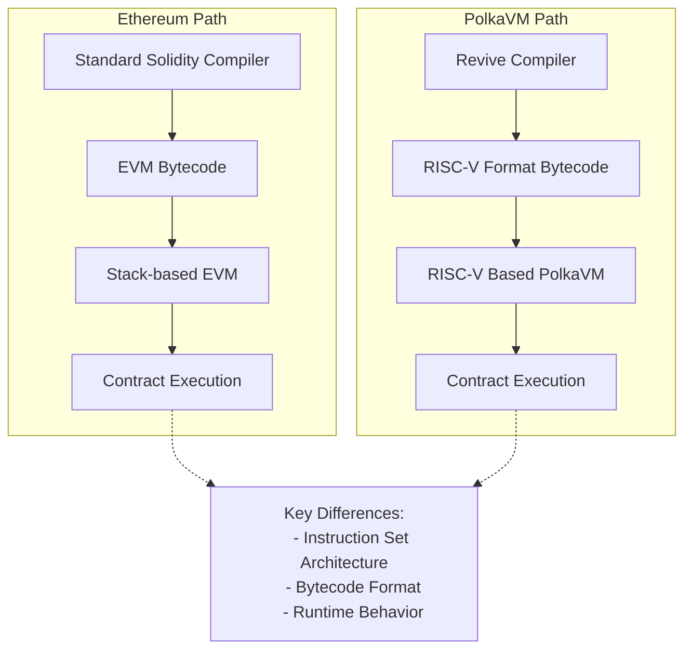

However, this architectural difference becomes relevant in specific scenarios. Tools that attempt to download and inspect contract bytecode will fail, as they expect EVM bytecode rather than PolkaVM's RISC-V format. Most applications typically pass bytecode as an opaque blob, making this a non-issue for standard use cases.

This primarily affects contracts using [`EXTCODECOPY`](https://www.evm.codes/?fork=cancun#3c){target=\_blank} to manipulate code at runtime. A contract encounters problems specifically when it uses `EXTCODECOPY` to copy contract code into memory and then attempts to mutate it. This pattern is not possible in standard Solidity and requires dropping down to YUL assembly. An example would be a factory contract written in assembly that constructs and instantiates new contracts by generating code at runtime. Such contracts are rare in practice.

PolkaVM offers an elegant alternative through its [on-chain constructors](https://paritytech.github.io/polkadot-sdk/master/pallet_revive/pallet/struct.Pallet.html#method.bare_instantiate){target=\_blank}, enabling contract instantiation without runtime code modification, making this pattern unnecessary. This architectural difference also impacts how contract deployment works more broadly, as discussed in the [Contract Deployment](#contract-deployment) section.

### High-Level Architecture Comparison

|            Feature            |                            Ethereum Virtual Machine (EVM)                            |                        PolkaVM                         |
|:-----------------------------:|:------------------------------------------------------------------------------------:|:------------------------------------------------------:|
|      **Instruction Set**      |                               Stack-based architecture                               |                 RISC-V instruction set                 |
|      **Bytecode Format**      |                                     EVM bytecode                                     |                     RISC-V format                      |
|    **Contract Size Limit**    |                                 24KB code size limit                                 |            Contract-specific memory limits             |
|         **Compiler**          |                                  Solidity Compiler                                   |                    Revive Compiler                     |
|      **Inline Assembly**      |                                      Supported                                       |         Supported with the compatibility layer         |
|    **Code Introspection**     | Supported via [`EXTCODECOPY`](https://www.evm.codes/?fork=cancun#3c){target=\_blank} | Limited support, alternative via on-chain constructors |
|     **Resource Metering**     |                                  Single gas metric                                   |                   Multi-dimensional                    |
| **Runtime Code Modification** |                                      Supported                                       |               Limited, with alternatives               |
|  **Contract Instantiation**   |                                 Standard deployment                                  |    On-chain constructors for flexible instantiation    |

## Gas Model

Ethereum's resource model relies on a single metric: [gas](https://ethereum.org/en/developers/docs/gas/#what-is-gas){target=\_blank}, which serves as the universal unit for measuring computational costs. Each operation on the network consumes a specific amount of gas. Most platforms aiming for Ethereum compatibility typically adopt identical gas values to ensure seamless integration.

The significant changes to Ethereum's gas model will be outlined in the following sections.

### Dynamic Gas Value Scaling

Instead of adhering to Ethereum's fixed gas values, PolkaVM implements benchmark-based pricing that better reflects its improved execution performance. This makes instructions cheaper relative to I/O-bound operations but requires developers to avoid hardcoding gas values, particularly in cross-contract calls.

### Multi-Dimensional Resource Metering

Moving beyond Ethereum's single gas metric, PolkaVM meters three distinct resources:

- **`ref_time`**: Equivalent to traditional gas, measuring computation time.
- **`proof_size`**: Tracks state proof size for validator verification.
- **`storage_deposit`**: Manages state bloat through a deposit system.

All three resources can be limited at the transaction level, just like gas on Ethereum. The [Ethereum RPC proxy](https://github.com/paritytech/polkadot-sdk/tree/master/substrate/frame/revive/rpc){target=\_blank} maps all three dimensions into the single gas dimension, ensuring everything behaves as expected for users.

These resources can also be limited when making cross-contract calls, which is essential for security when interacting with untrusted contracts. However, Solidity only allows specifying `gas_limit` for cross-contract calls. The `gas_limit` is most similar to Polkadots `ref_time_limit`, but the Revive compiler doesn't supply any imposed `gas_limit` for cross-contract calls for two key reasons:

- **Semantic differences**: `gas_limit` and `ref_time_limit` are not semantically identical; blindly passing EVM gas as `ref_time_limit` can lead to unexpected behavior.
- **Incomplete protection**: The other two resources (`proof_size` and `storage_deposit`) would remain uncapped anyway, making it insufficient to prevent malicious callees from performing DOS attacks.

When resources are "uncapped" in cross-contract calls, they remain constrained by transaction-specified limits, preventing abuse of the transaction signer.

!!! note
    The runtime will provide a special precompile, allowing cross-contract calls with limits specified for all weight dimensions in the future.

All gas-related opcodes like [`GAS`](https://www.evm.codes/?fork=cancun#5a){target=\_blank} or [`GAS_LIMIT`](https://www.evm.codes/?fork=cancun#45){target=\_blank} return only the `ref_time` value as it's the closest match to traditional gas. Extended APIs will be provided through precompiles to make full use of all resources, including cross-contract calls with all three resources specified.

## Memory Management

The EVM and the PolkaVM take fundamentally different approaches to memory constraints:

|         Feature          |      Ethereum Virtual Machine (EVM)       |                    PolkaVM                     |
|:------------------------:|:-----------------------------------------:|:----------------------------------------------:|
|  **Memory Constraints**  |      Indirect control via gas costs       |        Hard memory limits per contract         |
|      **Cost Model**      | Increasing gas curve with allocation size |    Fixed costs separated from execution gas    |
|    **Memory Limits**     | Soft limits through prohibitive gas costs |         Hard fixed limits per contract         |
|  **Pricing Efficiency**  |     Potential overcharging for memory     | More efficient through separation of concerns  |
|   **Contract Nesting**   |         Limited by available gas          |    Limited by constant memory per contract     |
|   **Memory Metering**    |     Dynamic based on total allocation     |      Static limits per contract instance       |
| **Future Improvements**  |       Incremental gas cost updates        | Potential dynamic metering for deeper nesting  |
| **Cross-Contract Calls** |      Handled through gas forwarding       | Requires careful boundary limit implementation |

The architecture establishes a constant memory limit per contract, which is the basis for calculating maximum contract nesting depth. This calculation assumes worst-case memory usage for each nested contract, resulting in a straightforward but conservative limit that operates independently of actual memory consumption. Future iterations may introduce dynamic memory metering, allowing deeper nesting depths for contracts with smaller memory footprints. However, such an enhancement would require careful implementation of cross-contract boundary limits before API stabilization, as it would introduce an additional resource metric to the system.

### Current Memory Limits

The following table depicts memory-related limits at the time of writing:

|                   Limit                    |     Maximum     |
|:------------------------------------------:|:---------------:|
|              Call stack depth              |        5        |
|                Event topics                |        4        |
| Event data payload size (including topics) |    416 bytes    |
|             Storage value size             |    416 bytes    |
|        Transient storage variables         | 128 uint values |
|            Immutable variables             | 16 uint values  |
|          Contract code blob size           | ~100 kilobytes  |

!!! note
    Limits might be increased in the future. To guarantee existing contracts work as expected, limits will never be decreased.

## Account Management - Existential Deposit

Ethereum and Polkadot handle account persistence differently, affecting state management and contract interactions:

### Account Management Comparison

|          Feature          |                   Ethereum Approach                   |               PolkaVM/Polkadot Approach                |
|:-------------------------:|:-----------------------------------------------------:|:------------------------------------------------------:|
|  **Account Persistence**  | Accounts persist indefinitely, even with zero balance | Requires existential deposit (ED) to maintain account  |
|    **Minimum Balance**    |                         None                          |                      ED required                       |
|   **Account Deletion**    |               Accounts remain in state                |      Accounts below ED are automatically deleted       |
|   **Contract Accounts**   |                  Exist indefinitely                   |                    Must maintain ED                    |
|   **Balance Reporting**   |                 Reports full balance                  |      Reports ED-adjusted balance via Ethereum RPC      |
| **New Account Transfers** |                   Standard transfer                   |     Includes ED automatically with extra fee cost      |
| **Contract-to-Contract**  |                   Direct transfers                    | ED drawn from transaction signer, not sending contract |
|   **State Management**    |      Potential bloat from zero-balance accounts       |     Optimized with auto-deletion of dust accounts      |

This difference introduces potential compatibility challenges for Ethereum-based contracts and tools, particularly wallets. To mitigate this, PolkaVM implements several transparent adjustments:

- Balance queries via Ethereum RPC automatically deduct the ED, ensuring reported balances match spendable amounts.
- Account balance checks through EVM opcodes reflect the ED-adjusted balance.
- Transfers to new accounts automatically include the ED (`x + ED`), with the extra cost incorporated into transaction fees.
- Contract-to-contract transfers handle ED requirements by:
    - Drawing ED from the transaction signer instead of the sending contract.
    - Keeping transfer amounts transparent for contract logic.
    - Treating ED like other storage deposit costs.

This approach ensures that Ethereum contracts work without modifications while maintaining Polkadot's optimized state management.

## Contract Deployment

For most users deploying contracts (like ERC-20 tokens), contract deployment works seamlessly without requiring special steps. However, when using advanced patterns like factory contracts that dynamically create other contracts at runtime, you'll need to understand PolkaVM's unique deployment model.

In the PolkaVM, contract deployment follows a fundamentally different model from EVM. The EVM allows contracts to be deployed with a single transaction, where the contract code is bundled with the deployment transaction. In contrast, PolkaVM has a different process for contract instantiation.

- **Code must be pre-uploaded**: Unlike EVM, where contract code is bundled within the deploying contract, PolkaVM requires all contract bytecode to be uploaded to the chain before instantiation.
- **Factory pattern limitations**: The common EVM pattern, where contracts dynamically create other contracts, will fail with a `CodeNotFound` error unless the dependent contract code was previously uploaded.
- **Separate upload and instantiation**: This creates a two-step process where developers must first upload all contract code, then instantiate relationships between contracts.

This architecture impacts several common EVM patterns and requires developers to adapt their deployment strategies accordingly. _Factory contracts must be modified to work with pre-uploaded code rather than embedding bytecode_, and runtime code generation is not supported due to PolkaVM's RISC-V bytecode format. The specific behavior of contract creation opcodes is detailed in the [YUL IR Translation](#yul-function-translation-differences) section.

When migrating EVM projects to PolkaVM, developers should identify all contracts that will be instantiated at runtime and ensure they are pre-uploaded to the chain before any instantiation attempts.

## Solidity and YUL IR Translation Incompatibilities

While PolkaVM maintains high-level compatibility with Solidity, several low-level differences exist in the translation of YUL IR and specific Solidity constructs. These differences are particularly relevant for developers working with assembly code or utilizing advanced contract patterns.

### Contract Code Structure

PolkaVM's contract runtime does not differentiate between runtime code and deploy (constructor) code. Instead, both are emitted into a single PolkaVM contract code blob and live on-chain. Therefore, in EVM terminology, the deploy code equals the runtime code. For most standard Solidity contracts, this is transparent. However, if you are analyzing raw bytecode or building tools that expect separate deploy and runtime sections, you'll need to adjust for this unified structure.

In the constructor code, the `codesize` instruction returns the call data size instead of the actual code blob size, which differs from standard EVM behavior. Developers might consider that the constructor logic uses `codesize` to inspect the deployed contract's size (e.g., for self-validation or specific deployment patterns); this will return an incorrect value on PolkaVM. Re-evaluate such logic or use alternative methods to achieve your goal.

### Solidity-Specific Differences

Solidity constructs behave differently under PolkaVM:

- **`address.creationCode`**: Returns the bytecode keccak256 hash instead of the actual creation code, reflecting PolkaVM's hash-based code referencing system.
    - If your contract relies on `address.creationCode` to verify or interact with the full raw bytecode of a newly deployed contract, this will not work as expected. You will receive a hash, not the code itself. This typically affects highly specialized factory contracts or introspection tools.

### YUL Function Translation Differences

The following YUL functions exhibit notable behavioral differences in PolkaVM:

- Memory operations:

    - **`mload`, `mstore`, `msize`, `mcopy`**: PolkaVM preserves memory layout but implements several constraints.

        - EVM linear heap memory is emulated using a fixed 64KB byte buffer, limiting maximum contract memory usage.
        - Accessing memory offsets larger than the buffer size traps the contract with an `OutOfBound` error.
        - Compiler optimizations may eliminate unused memory operations, potentially causing `msize` to differ from EVM behavior.

        For Solidity developers, the compiler generally handles memory efficiently within this 64KB limit. However, if you are writing low-level YUL assembly and perform direct memory manipulations, you must respect the 64KB buffer limit. Attempting to access memory outside this range will cause your transaction to revert. Be aware that `msize` might not always reflect the exact EVM behavior if compiler optimizations occur.

- Call data operations:

    - **`calldataload`, `calldatacopy`**: In constructor code, the offset parameter is ignored and these functions always return `0`, diverging from EVM behavior where call data represents constructor arguments.

        - If your constructor logic in YUL assembly attempts to read constructor arguments using `calldataload` or `calldatacopy` with specific offsets, this will not yield the expected constructor arguments. Instead, these functions will return `zeroed` values. Standard Solidity constructors are handled correctly by the compiler, but manual YUL assembly for constructor argument parsing will need adjustment.

- Code operations:

    - **`codecopy`**: Only supported within constructor code, reflecting PolkaVM's different approach to code handling and the unified code blob structure.

        - If your contracts use `codecopy` (e.g., for self-modifying code or inspecting other contract's runtime bytecode) outside of the constructor, this will not be supported and will likely result in a compile-time error or runtime trap. This implies that patterns like dynamically generating or modifying contract code at runtime are not directly feasible with `codecopy` on PolkaVM.

- Control flow:

    - **`invalid`**: Traps the contract execution but does not consume remaining gas, unlike EVM where it consumes all available gas.

        - While `invalid` still reverts the transaction, the difference in gas consumption could subtly affect very specific error handling or gas accounting patterns that rely on `invalid` to consume all remaining gas. For most error scenarios, `revert()` is the standard and recommended practice.

- Cross-contract calls:

    - **`call`, `delegatecall`, `staticall`**: These functions ignore supplied gas limits and forward all remaining resources due to PolkaVM's multi-dimensional resource model. This creates important security implications:

        - Contract authors must implement reentrancy protection since gas stipends don't provide protection.
        - The compiler detects `address payable.{send,transfer}` patterns and disables call reentrancy as a protective heuristic.
        - Using `address payable.{send,transfer}` is already deprecated; PolkaVM will provide dedicated precompiles for safe balance transfers.

        The traditional EVM pattern of limiting gas in cross-contract calls (especially with the 2300 gas stipend for send/transfer) does not provide reentrancy protection on PolkaVM. Developers must explicitly implement reentrancy guards (e.g., using a reentrancy lock mutex) in their Solidity code when making external calls to untrusted contracts. Relying on gas limits alone for reentrancy prevention is unsafe and will lead to vulnerabilities on PolkaVM.

        !!! warning
            The 2300 gas stipend that is provided by solc for address payable.{send, transfer} calls offers no reentrancy protection in PolkaVM. While the compiler attempts to detect and mitigate this pattern, developers should avoid these deprecated functions.

- Contract creation:

    - **`create`, `create2`**: Contract instantiation works fundamentally differently in PolkaVM. Instead of supplying deploy code concatenated with constructor arguments, the runtime expects:

        1. A buffer containing the code hash to deploy.
        2. The constructor arguments buffer.

        PolkaVM translates `dataoffset` and `datasize` instructions to handle contract hashes instead of contract code, enabling seamless use of the `new` keyword in Solidity. However, this translation may fail for contracts creating other contracts within `assembly` blocks.

        If you use the Solidity `new` keyword to deploy contracts, the Revive compiler handles this transparently. However, if you are creating contracts manually in YUL assembly using `create` or `create2` opcodes, you must provide the code hash of the contract to be deployed, not its raw bytecode. Attempting to pass raw bytecode will fail. This fundamentally changes how manual contract creation is performed in assembly.

        !!! warning
            Avoid using `create` family opcodes for manual deployment crafting in `assembly` blocks. This pattern is discouraged due to translation complexity and offers no gas savings benefits in PolkaVM.

- Data operations:

    - **`dataoffset`**: Returns the contract hash instead of code offset, aligning with PolkaVM's hash-based code referencing.
    - **`datasize`**: Returns the constant contract hash size (32 bytes) rather than variable code size.

    These changes are primarily relevant for low-level YUL assembly developers who are trying to inspect or manipulate contract code directly. `dataoffset` will provide a hash, not a memory offset to the code, and `datasize` will always be 32 bytes (the size of a hash). This reinforces that direct manipulation of contract bytecode at runtime, as might be done in some EVM patterns, is not supported.

- Resource queries:

    - **`gas`, `gaslimit`**: Return only the `ref_time` component of PolkaVM's multi-dimensional weight system, providing the closest analog to traditional gas measurements.

        - While `gas` and `gaslimit` still provide a useful metric, consider that they represent `ref_time` (computation time) only. If your contract logic depends on precise knowledge of other resource costs (like `proof_size` or `storage_deposit`), you won't get that information from these opcodes. You'll need to use future precompiles for full multi-dimensional resource queries.

- Blockchain state:

    - **`prevrandao`, `difficulty`**: Both translate to a constant value of `2500000000000000`, as PolkaVM doesn't implement Ethereum's difficulty adjustment or randomness mechanisms.

        - If your Solidity contract relies on `block.difficulty` (or its equivalent YUL opcode `difficulty`) for randomness generation or any logic tied to Ethereum's proof-of-work difficulty, this will not provide true randomness on PolkaVM. The value will always be constant. Developers needing on-chain randomness should utilize Polkadot's native randomness sources or dedicated VRF (Verifiable Random Function) solutions if available. 

### Unsupported Operations

Several EVM operations are not supported in PolkaVM and produce compile-time errors:

- **`pc`, `extcodecopy`**: These operations are EVM-specific and have no equivalent functionality in PolkaVM's RISC-V architecture.

    - Any Solidity contracts that utilize inline assembly to interact with `pc` (program counter) or `extcodecopy` will fail to compile or behave unexpectedly. This means patterns involving introspection of the current execution location or copying external contract bytecode at runtime are not supported.

- **`blobhash`, `blobbasefee`**: Related to Ethereum's rollup model and blob data handling, these operations are unnecessary given Polkadot's superior rollup architecture.

    - If you are porting contracts designed for Ethereum's EIP-4844 (proto-danksharding) and rely on these blob-related opcodes, they will not be available on PolkaVM.

- **`extcodecopy`, `selfdestruct`**: These deprecated operations are not supported and generate compile-time errors.

    - The `selfdestruct` opcode, which allowed contracts to remove themselves from the blockchain, is not supported. Contracts cannot be self-destroyed on PolkaVM. This affects contract upgradeability patterns that rely on self-destruction and redeployment. Similarly, `extcodecopy` is unsupported, impacting contracts that intend to inspect or copy the bytecode of other deployed contracts.

### Compilation Pipeline Considerations

PolkaVM processes YUL IR exclusively, meaning all contracts exhibit behavior consistent with Solidity's `via-ir` compilation mode. Developers familiar with the legacy compilation pipeline should expect [IR-based codegen behavior](https://docs.soliditylang.org/en/latest/ir-breaking-changes.html){target=\_blank} when working with PolkaVM contracts.

If you've previously worked with older Solidity compilers that did not use the `via-ir` pipeline by default, you might observe subtle differences in compiled bytecode size or gas usage. It's recommended to familiarize yourself with Solidity's IR-based codegen behavior, as this is the standard for PolkaVM.

### Memory Pointer Limitations

YUL functions accepting memory buffer offset pointers or size arguments are limited by PolkaVM's 32-bit pointer size. Supplying values above `2^32-1` will trap the contract immediately. The Solidity compiler typically generates valid memory references, making this primarily a concern for low-level assembly code.

For standard Solidity development, this limitation is unlikely to be hit as the compiler handles memory addresses correctly within typical contract sizes. However, if you are writing extremely large contracts using YUL assembly that manually and extensively manipulate memory addresses, ensure that your memory offsets and sizes do not exceed PolkaVM's **fixed 64KB memory limit per contract**. While the YUL functions might accept 32-bit pointers (up to 2^32-1), attempting to access memory beyond the allocated 64KB buffer will trap the contract immediately.

These incompatibilities reflect the fundamental architectural differences between EVM and PolkaVM while maintaining high-level Solidity compatibility. Most developers using standard Solidity patterns will encounter no issues, but those working with assembly code or advanced contract patterns should carefully review these differences during migration.


---

# Fork a Chain with Chopsticks

> Source (raw): https://raw.githubusercontent.com/polkadot-developers/polkadot-docs/master/.ai/pages/tutorials-polkadot-sdk-testing-fork-live-chains.md
> Canonical (HTML): https://docs.polkadot.com/tutorials/polkadot-sdk/testing/fork-live-chains/
> Summary: Learn how to fork live Polkadot SDK chains with Chopsticks. Configure forks, replay blocks, test XCM, and interact programmatically or via UI.

# Fork a Chain with Chopsticks

## Introduction

Chopsticks is an innovative tool that simplifies the process of forking live Polkadot SDK chains. This guide provides step-by-step instructions to configure and fork chains, enabling developers to:

- Replay blocks for state analysis.
- Test cross-chain messaging (XCM).
- Simulate blockchain environments for debugging and experimentation.

With support for both configuration files and CLI commands, Chopsticks offers flexibility for diverse development workflows. Whether you're testing locally or exploring complex blockchain scenarios, Chopsticks empowers developers to gain deeper insights and accelerate application development.

Chopsticks uses the [Smoldot](https://github.com/smol-dot/smoldot){target=\_blank} light client, which does not support calls made through the Ethereum JSON-RPC. As a result, you can't fork your chain using Chopsticks and then interact with it using tools like MetaMask.

For additional support and information, please reach out through [GitHub Issues](https://github.com/AcalaNetwork/chopsticks/issues){target=\_blank}.

## Prerequisites

To follow this tutorial, ensure you have completed the following:

- **Installed Chopsticks**: If you still need to do so, see the [Install Chopsticks](/develop/toolkit/parachains/fork-chains/chopsticks/get-started/#install-chopsticks){target=\_blank} guide for assistance.
- **Reviewed** [Configure Chopsticks](/develop/toolkit/parachains/fork-chains/chopsticks/get-started/#configure-chopsticks){target=\_blank}: And understand how forked chains are configured.

## Configuration File 

To run Chopsticks using a configuration file, utilize the `--config` flag. You can use a raw GitHub URL, a path to a local file, or simply the chain's name. The following commands all look different but they use the `polkadot` configuration in the same way:

=== "GitHub URL"

    ```bash
    npx @acala-network/chopsticks \
    --config=https://raw.githubusercontent.com/AcalaNetwork/chopsticks/master/configs/polkadot.yml
    ```

=== "Local File Path"

    ```bash
    npx @acala-network/chopsticks --config=configs/polkadot.yml
    ```

=== "Chain Name"

    ```bash
    npx @acala-network/chopsticks --config=polkadot
    ```

Regardless of which method you choose from the preceding examples, you'll see an output similar to the following:

-<div id="termynal" data-termynal>
  <span data-ty="input"><span class="file-path"></span>npx @acala-network/chopsticks --config=polkadot</span>
  <br />
  <span data-ty>[18:38:26.155] INFO: Loading config file https://raw.githubusercontent.com/AcalaNetwork/chopsticks/master/configs/polkadot.yml</span>
  <span data-ty> app: "chopsticks"</span>
  <span data-ty> chopsticks::executor TRACE: Calling Metadata_metadata</span>
  <span data-ty> chopsticks::executor TRACE: Completed Metadata_metadata</span>
  <span data-ty>[18:38:28.186] INFO: Polkadot RPC listening on port 8000</span>
  <span data-ty> app: "chopsticks"</span>
</div>


If using a file path, make sure you've downloaded the [Polkadot configuration file](https://github.com/AcalaNetwork/chopsticks/blob/master/configs/polkadot.yml){target=\_blank}, or have created your own.

## Create a Fork

Once you've configured Chopsticks, use the following command to fork Polkadot at block 100:

```bash
npx @acala-network/chopsticks \
--endpoint wss://polkadot-rpc.dwellir.com \
--block 100
```

If the fork is successful, you will see output similar to the following:

<div id="termynal" data-termynal>
  <span data-ty="input"><span class="file-path"></span>npx @acala-network/chopsticks \ --endpoint wss://polkadot-rpc.dwellir.com \ --block 100</span>
  <br />
  <span data-ty>[19:12:21.023] INFO: Polkadot RPC listening on port 8000</span>
  <span data-ty> app: "chopsticks"</span>
</div>


Access the running Chopsticks fork using the default address.

```bash
ws://localhost:8000
```

## Interact with a Fork

You can interact with the forked chain using various [libraries](/develop/toolkit/#libraries){target=\_blank} such as [Polkadot.js](https://polkadot.js.org/docs/){target=\_blank} and its user interface, [Polkadot.js Apps](https://polkadot.js.org/apps/#/explorer){target=\_blank}.

### Use Polkadot.js Apps

To interact with Chopsticks via the hosted user interface, visit [Polkadot.js Apps](https://polkadot.js.org/apps/#/explorer){target=\_blank} and follow these steps:

1. Select the network icon in the top left corner.

    

2. Scroll to the bottom and select **Development**.
3. Choose **Custom**.
4. Enter `ws://localhost:8000` in the input field.
5. Select the **Switch** button.

    

You should now be connected to your local fork and can interact with it as you would with a real chain.

### Use Polkadot.js Library

For programmatic interaction, you can use the Polkadot.js library. The following is a basic example:

```js
-import { ApiPromise, WsProvider } from '@polkadot/api';

async function connectToFork() {
  const wsProvider = new WsProvider('ws://localhost:8000');
  const api = await ApiPromise.create({ provider: wsProvider });
  await api.isReady;

  // Now you can use 'api' to interact with your fork
  console.log(`Connected to chain: ${await api.rpc.system.chain()}`);
}

connectToFork();

```

## Replay Blocks

Chopsticks allows you to replay specific blocks from a chain, which is useful for debugging and analyzing state changes. You can use the parameters in the [Configuration](/develop/toolkit/parachains/fork-chains/chopsticks/get-started/#configure-chopsticks){target=\_blank} section to set up the chain configuration, and then use the run-block subcommand with the following additional options:

- **`output-path`**: Path to print output.
- **`html`**: Generate HTML with storage diff.
- **`open`**: Open generated HTML.

For example, the command to replay block 1000 from Polkadot and save the output to a JSON file would be as follows:

```bash
npx @acala-network/chopsticks run-block  \
--endpoint wss://polkadot-rpc.dwellir.com  \
--output-path ./polkadot-output.json  \
--block 1000
```

??? code "polkadot-output.json"

    ```json
    -{
    "Call": {
        "result": "0xba754e7478944d07a1f7e914422b4d973b0855abeb6f81138fdca35beb474b44a10f6fc59a4d90c3b78e38fac100fc6adc6f9e69a07565ec8abce6165bd0d24078cc7bf34f450a2cc7faacc1fa1e244b959f0ed65437f44208876e1e5eefbf8dd34c040642414245b501030100000083e2cc0f00000000d889565422338aa58c0fd8ebac32234149c7ce1f22ac2447a02ef059b58d4430ca96ba18fbf27d06fe92ec86d8b348ef42f6d34435c791b952018d0a82cae40decfe5faf56203d88fdedee7b25f04b63f41f23da88c76c876db5c264dad2f70c",
        "storageDiff": [
            [
                "0x0b76934f4cc08dee01012d059e1b83eebbd108c4899964f707fdaffb82636065",
                "0x00"
            ],
            [
                "0x1cb6f36e027abb2091cfb5110ab5087f0323475657e0890fbdbf66fb24b4649e",
                null
            ],
            [
                "0x1cb6f36e027abb2091cfb5110ab5087f06155b3cd9a8c9e5e9a23fd5dc13a5ed",
                "0x83e2cc0f00000000"
            ],
            [
                "0x1cb6f36e027abb2091cfb5110ab5087ffa92de910a7ce2bd58e99729c69727c1",
                null
            ],
            [
                "0x26aa394eea5630e07c48ae0c9558cef702a5c1b19ab7a04f536c519aca4983ac",
                null
            ],
            [
                "0x26aa394eea5630e07c48ae0c9558cef70a98fdbe9ce6c55837576c60c7af3850",
                "0x02000000"
            ],
            [
                "0x26aa394eea5630e07c48ae0c9558cef734abf5cb34d6244378cddbf18e849d96",
                "0xc03b86ae010000000000000000000000"
            ],
            [
                "0x26aa394eea5630e07c48ae0c9558cef780d41e5e16056765bc8461851072c9d7",
                "0x080000000000000080e36a09000000000200000001000000000000ca9a3b00000000020000"
            ],
            [
                "0x26aa394eea5630e07c48ae0c9558cef78a42f33323cb5ced3b44dd825fda9fcc",
                null
            ],
            [
                "0x26aa394eea5630e07c48ae0c9558cef799e7f93fc6a98f0874fd057f111c4d2d",
                null
            ],
            [
                "0x26aa394eea5630e07c48ae0c9558cef7a44704b568d21667356a5a050c118746d366e7fe86e06375e7030000",
                "0xba754e7478944d07a1f7e914422b4d973b0855abeb6f81138fdca35beb474b44"
            ],
            [
                "0x26aa394eea5630e07c48ae0c9558cef7a86da5a932684f199539836fcb8c886f",
                null
            ],
            [
                "0x26aa394eea5630e07c48ae0c9558cef7b06c3320c6ac196d813442e270868d63",
                null
            ],
            [
                "0x26aa394eea5630e07c48ae0c9558cef7bdc0bd303e9855813aa8a30d4efc5112",
                null
            ],
            [
                "0x26aa394eea5630e07c48ae0c9558cef7df1daeb8986837f21cc5d17596bb78d15153cb1f00942ff401000000",
                null
            ],
            [
                "0x26aa394eea5630e07c48ae0c9558cef7df1daeb8986837f21cc5d17596bb78d1b4def25cfda6ef3a00000000",
                null
            ],
            [
                "0x26aa394eea5630e07c48ae0c9558cef7ff553b5a9862a516939d82b3d3d8661a",
                null
            ],
            [
                "0x2b06af9719ac64d755623cda8ddd9b94b1c371ded9e9c565e89ba783c4d5f5f9b4def25cfda6ef3a000000006f3d6b177c8acbd8dc9974cdb3cebfac4d31333c30865ff66c35c1bf898df5c5dd2924d3280e7201",
                "0x9b000000"
            ],
            ["0x3a65787472696e7369635f696e646578", null],
            [
                "0x3f1467a096bcd71a5b6a0c8155e208103f2edf3bdf381debe331ab7446addfdc",
                "0x550057381efedcffffffffffffffffff"
            ],
            [
                "0x3fba98689ebed1138735e0e7a5a790ab0f41321f75df7ea5127be2db4983c8b2",
                "0x00"
            ],
            [
                "0x3fba98689ebed1138735e0e7a5a790ab21a5051453bd3ae7ed269190f4653f3b",
                "0x080000"
            ],
            [
                "0x3fba98689ebed1138735e0e7a5a790abb984cfb497221deefcefb70073dcaac1",
                "0x00"
            ],
            [
                "0x5f3e4907f716ac89b6347d15ececedca80cc6574281671b299c1727d7ac68cabb4def25cfda6ef3a00000000",
                "0x204e0000183887050ecff59f58658b3df63a16d03a00f92890f1517f48c2f6ccd215e5450e380e00005809fd84af6483070acbb92378e3498dbc02fb47f8e97f006bb83f60d7b2b15d980d000082104c22c383925323bf209d771dec6e1388285abe22c22d50de968467e0bb6ce00b000088ee494d719d68a18aade04903839ea37b6be99552ceceb530674b237afa9166480d0000dc9974cdb3cebfac4d31333c30865ff66c35c1bf898df5c5dd2924d3280e72011c0c0000e240d12c7ad07bb0e7785ee6837095ddeebb7aef84d6ed7ea87da197805b343a0c0d0000"
            ],
            [
                "0xae394d879ddf7f99595bc0dd36e355b5bbd108c4899964f707fdaffb82636065",
                null
            ],
            [
                "0xbd2a529379475088d3e29a918cd478721a39ec767bd5269111e6492a1675702a",
                "0x4501407565175cfbb5dca18a71e2433f838a3d946ef532c7bff041685db1a7c13d74252fffe343a960ef84b15187ea0276687d8cb3168aeea5202ea6d651cb646517102b81ff629ee6122430db98f2cadf09db7f298b49589b265dae833900f24baa8fb358d87e12f3e9f7986a9bf920c2fb48ce29886199646d2d12c6472952519463e80b411adef7e422a1595f1c1af4b5dd9b30996fba31fa6a30bd94d2022d6b35c8bc5a8a51161d47980bf4873e01d15afc364f8939a6ce5a09454ab7f2dd53bf4ee59f2c418e85aa6eb764ad218d0097fb656900c3bdd859771858f87bf7f06fc9b6db154e65d50d28e8b2374898f4f519517cd0bedc05814e0f5297dc04beb307b296a93cc14d53afb122769dfd402166568d8912a4dff9c2b1d4b6b34d811b40e5f3763e5f3ab5cd1da60d75c0ff3c12bcef3639f5f792a85709a29b752ffd1233c2ccae88ed3364843e2fa92bdb49021ee36b36c7cdc91b3e9ad32b9216082b6a2728fccd191a5cd43896f7e98460859ca59afbf7c7d93cd48da96866f983f5ff8e9ace6f47ee3e6c6edb074f578efbfb0907673ebca82a7e1805bc5c01cd2fa5a563777feeb84181654b7b738847c8e48d4f575c435ad798aec01631e03cf30fe94016752b5f087f05adf1713910767b7b0e6521013be5370776471191641c282fdfe7b7ccf3b2b100a83085cd3af2b0ad4ab3479448e71fc44ff987ec3a26be48161974b507fb3bc8ad23838f2d0c54c9685de67dc6256e71e739e9802d0e6e3b456f6dca75600bc04a19b3cc1605784f46595bfb10d5e077ce9602ae3820436166aa1905a7686b31a32d6809686462bc9591c0bc82d9e49825e5c68352d76f1ac6e527d8ac02db3213815080afad4c2ecb95b0386e3e9ab13d4f538771dac70d3059bd75a33d0b9b581ec33bb16d0e944355d4718daccb35553012adfcdacb1c5200a2aec3756f6ad5a2beffd30018c439c1b0c4c0f86dbf19d0ad59b1c9efb7fe90906febdb9001af1e7e15101089c1ab648b199a40794d30fe387894db25e614b23e833291a604d07eec2ade461b9b139d51f9b7e88475f16d6d23de6fe7831cc1dbba0da5efb22e3b26cd2732f45a2f9a5d52b6d6eaa38782357d9ae374132d647ef60816d5c98e6959f8858cfa674c8b0d340a8f607a68398a91b3a965585cc91e46d600b1310b8f59c65b7c19e9d14864a83c4ad6fa4ba1f75bba754e7478944d07a1f7e914422b4d973b0855abeb6f81138fdca35beb474b44c7736fc3ab2969878810153aa3c93fc08c99c478ed1bb57f647d3eb02f25cee122c70424643f4b106a7643acaa630a5c4ac39364c3cb14453055170c01b44e8b1ef007c7727494411958932ae8b3e0f80d67eec8e94dd2ff7bbe8c9e51ba7e27d50bd9f52cbaf9742edecb6c8af1aaf3e7c31542f7d946b52e0c37d194b3dd13c3fddd39db0749755c7044b3db1143a027ad428345d930afcefc0d03c3a0217147900bdea1f5830d826f7e75ecd1c4e2bc8fd7de3b35c6409acae1b2215e9e4fd7e360d6825dc712cbf9d87ae0fd4b349b624d19254e74331d66a39657da81e73d7b13adc1e5efa8efd65aa32c1a0a0315913166a590ae551c395c476116156cf9d872fd863893edb41774f33438161f9b973e3043f819d087ba18a0f1965e189012496b691f342f7618fa9db74e8089d4486c8bd1993efd30ff119976f5cc0558e29b417115f60fd8897e13b6de1a48fbeee38ed812fd267ae25bffea0caa71c09309899b34235676d5573a8c3cf994a3d7f0a5dbd57ab614c6caf2afa2e1a860c6307d6d9341884f1b16ef22945863335bb4af56e5ef5e239a55dbd449a4d4d3555c8a3ec5bd3260f88cabca88385fe57920d2d2dfc5d70812a8934af5691da5b91206e29df60065a94a0a8178d118f1f7baf768d934337f570f5ec68427506391f51ab4802c666cc1749a84b5773b948fcbe460534ed0e8d48a15c149d27d67deb8ea637c4cc28240ee829c386366a0b1d6a275763100da95374e46528a0adefd4510c38c77871e66aeda6b6bfd629d32af9b2fad36d392a1de23a683b7afd13d1e3d45dad97c740106a71ee308d8d0f94f6771164158c6cd3715e72ccfbc49a9cc49f21ead8a3c5795d64e95c15348c6bf8571478650192e52e96dd58f95ec2c0fb4f2ccc05b0ab749197db8d6d1c6de07d6e8cb2620d5c308881d1059b50ffef3947c273eaed7e56c73848e0809c4bd93619edd9fd08c8c5c88d5f230a55d2c6a354e5dd94440e7b5bf99326cf4a112fe843e7efdea56e97af845761d98f40ed2447bd04a424976fcf0fe0a0c72b97619f85cf431fe4c3aa6b3a4f61df8bc1179c11e77783bfedb7d374bd1668d0969333cb518bd20add8329462f2c9a9f04d150d60413fdd27271586405fd85048481fc2ae25b6826cb2c947e4231dc7b9a0d02a9a03f88460bced3fef5d78f732684bd218a1954a4acfc237d79ccf397913ab6864cd8a07e275b82a8a72520624738368d1c5f7e0eaa2b445cf6159f2081d3483618f7fc7b16ec4e6e4d67ab5541bcda0ca1af40efd77ef8653e223191448631a8108c5e50e340cd405767ecf932c1015aa8856b834143dc81fa0e8b9d1d8c32278fca390f2ff08181df0b74e2d13c9b7b1d85543416a0dae3a77530b9cd1366213fcf3cd12a9cd3ae0a006d6b29b5ffc5cdc1ab24343e2ab882abfd719892fca5bf2134731332c5d3bef6c6e4013d84a853cb03d972146b655f0f8541bcd36c3c0c8a775bb606edfe50d07a5047fd0fe01eb125e83673930bc89e91609fd6dfe97132679374d3de4a0b3db8d3f76f31bed53e247da591401d508d65f9ee01d3511ee70e3644f3ab5d333ca7dbf737fe75217b4582d50d98b5d59098ea11627b7ed3e3e6ee3012eadd326cf74ec77192e98619427eb0591e949bf314db0fb932ed8be58258fb4f08e0ccd2cd18b997fb5cf50c90d5df66a9f3bb203bd22061956128b800e0157528d45c7f7208c65d0592ad846a711fa3c5601d81bb318a45cc1313b122d4361a7d7a954645b04667ff3f81d3366109772a41f66ece09eb93130abe04f2a51bb30e767dd37ec6ee6a342a4969b8b342f841193f4f6a9f0fac4611bc31b6cab1d25262feb31db0b8889b6f8d78be23f033994f2d3e18e00f3b0218101e1a7082782aa3680efc8502e1536c30c8c336b06ae936e2bcf9bbfb20dd514ed2867c03d4f44954867c97db35677d30760f37622b85089cc5d182a89e29ab0c6b9ef18138b16ab91d59c2312884172afa4874e6989172014168d3ed8db3d9522d6cbd631d581d166787c93209bec845d112e0cbd825f6df8b64363411270921837cfb2f9e7f2e74cdb9cd0d2b02058e5efd9583e2651239654b887ea36ce9537c392fc5dfca8c5a0facbe95b87dfc4232f229bd12e67937d32b7ffae2e837687d2d292c08ff6194a2256b17254748857c7e3c871c3fff380115e6f7faf435a430edf9f8a589f6711720cfc5cec6c8d0d94886a39bb9ac6c50b2e8ef6cf860415192ca4c1c3aaa97d36394021a62164d5a63975bcd84b8e6d74f361c17101e3808b4d8c31d1ee1a5cf3a2feda1ca2c0fd5a50edc9d95e09fb5158c9f9b0eb5e2c90a47deb0459cea593201ae7597e2e9245aa5848680f546256f3"
            ],
            [
                "0xd57bce545fb382c34570e5dfbf338f5e326d21bc67a4b34023d577585d72bfd7",
                null
            ],
            [
                "0xd57bce545fb382c34570e5dfbf338f5ea36180b5cfb9f6541f8849df92a6ec93",
                "0x00"
            ],
            [
                "0xd57bce545fb382c34570e5dfbf338f5ebddf84c5eb23e6f53af725880d8ffe90",
                null
            ],
            [
                "0xd5c41b52a371aa36c9254ce34324f2a53b996bb988ea8ee15bad3ffd2f68dbda",
                "0x00"
            ],
            [
                "0xf0c365c3cf59d671eb72da0e7a4113c49f1f0515f462cdcf84e0f1d6045dfcbb",
                "0x50defc5172010000"
            ],
            [
                "0xf0c365c3cf59d671eb72da0e7a4113c4bbd108c4899964f707fdaffb82636065",
                null
            ],
            [
                "0xf68f425cf5645aacb2ae59b51baed90420d49a14a763e1cbc887acd097f92014",
                "0x9501800300008203000082030000840300008503000086030000870300008703000089030000890300008b0300008b0300008d0300008d0300008f0300008f0300009103000092030000920300009403000094030000960300009603000098030000990300009a0300009b0300009b0300009d0300009d0300009f0300009f030000a1030000a2030000a3030000a4030000a5030000a6030000a6030000a8030000a8030000aa030000ab030000ac030000ad030000ae030000af030000b0030000b1030000b1030000b3030000b3030000b5030000b6030000b7030000b8030000b9030000ba030000ba030000bc030000bc030000be030000be030000c0030000c1030000c2030000c2030000c4030000c5030000c5030000c7030000c7030000c9030000c9030000cb030000cc030000cd030000ce030000cf030000d0030000d0030000d2030000d2030000d4030000d4030000d6030000d7030000d8030000d9030000da030000db030000db030000dd030000dd030000df030000e0030000e1030000e2030000e3030000e4030000e4030000"
            ],
            [
                "0xf68f425cf5645aacb2ae59b51baed9049b58374218f48eaf5bc23b7b3e7cf08a",
                "0xb3030000"
            ],
            [
                "0xf68f425cf5645aacb2ae59b51baed904b97380ce5f4e70fbf9d6b5866eb59527",
                "0x9501800300008203000082030000840300008503000086030000870300008703000089030000890300008b0300008b0300008d0300008d0300008f0300008f0300009103000092030000920300009403000094030000960300009603000098030000990300009a0300009b0300009b0300009d0300009d0300009f0300009f030000a1030000a2030000a3030000a4030000a5030000a6030000a6030000a8030000a8030000aa030000ab030000ac030000ad030000ae030000af030000b0030000b1030000b1030000b3030000b3030000b5030000b6030000b7030000b8030000b9030000ba030000ba030000bc030000bc030000be030000be030000c0030000c1030000c2030000c2030000c4030000c5030000c5030000c7030000c7030000c9030000c9030000cb030000cc030000cd030000ce030000cf030000d0030000d0030000d2030000d2030000d4030000d4030000d6030000d7030000d8030000d9030000da030000db030000db030000dd030000dd030000df030000e0030000e1030000e2030000e3030000e4030000e4030000"
            ]
        ],
        "offchainStorageDiff": [],
        "runtimeLogs": []
    }
}

    ```

## XCM Testing

To test XCM (Cross-Consensus Messaging) messages between networks, you can fork multiple parachains and a relay chain locally using Chopsticks.

- **`relaychain`**: Relay chain config file.
- **`parachain`**: Parachain config file.

For example, to fork Moonbeam, Astar, and Polkadot enabling XCM between them, you can use the following command:

```bash
npx @acala-network/chopsticks xcm \
--r polkadot \
--p moonbeam \
--p astar
```

After running it, you should see output similar to the following:

-<div id="termynal" data-termynal>
  <span data-ty="input"><span class="file-path"></span>npx @acala-network/chopsticks xcm \</span>
  <span data-ty>--r polkadot \</span>
  <span data-ty>--p moonbeam \</span>
  <span data-ty>--p astar</span>
  <br />
  <span data-ty>[13:46:07.901] INFO: Loading config file https://raw.githubusercontent.com/AcalaNetwork/chopsticks/master/configs/moonbeam.yml</span>
  <span data-ty> app: "chopsticks"</span>
  <span data-ty>[13:46:12.631] INFO: Moonbeam RPC listening on port 8000</span>
  <span data-ty> app: "chopsticks"</span>
  <span data-ty>[13:46:12.632] INFO: Loading config file https://raw.githubusercontent.com/AcalaNetwork/chopsticks/master/configs/astar.yml</span>
  <span data-ty> app: "chopsticks"</span>
  <span data-ty> chopsticks::executor TRACE: Calling Metadata_metadata</span>
  <span data-ty> chopsticks::executor TRACE: Completed Metadata_metadata</span>
  <span data-ty>[13:46:23.669] INFO: Astar RPC listening on port 8001</span>
  <span data-ty> app: "chopsticks"</span>
  <span data-ty>[13:46:25.144] INFO (xcm): Connected parachains [2004,2006]</span>
  <span data-ty> app: "chopsticks"</span>
  <span data-ty>[13:46:25.144] INFO: Loading config file https://raw.githubusercontent.com/AcalaNetwork/chopsticks/master/configs/polkadot.yml</span>
  <span data-ty> app: "chopsticks"</span>
  <span data-ty> chopsticks::executor TRACE: Calling Metadata_metadata</span>
  <span data-ty> chopsticks::executor TRACE: Completed Metadata_metadata</span>
  <span data-ty>[13:46:53.320] INFO: Polkadot RPC listening on port 8002</span>
  <span data-ty> app: "chopsticks"</span>
  <span data-ty>[13:46:54.038] INFO (xcm): Connected relaychain 'Polkadot' with parachain 'Moonbeam'</span>
  <span data-ty> app: "chopsticks"</span>
  <span data-ty>[13:46:55.028] INFO (xcm): Connected relaychain 'Polkadot' with parachain 'Astar'</span>
  <span data-ty> app: "chopsticks"</span>
</div>


Now you can interact with your forked chains using the ports specified in the output.


---

# Generate Chain Specs

> Source (raw): https://raw.githubusercontent.com/polkadot-developers/polkadot-docs/master/.ai/pages/develop-parachains-deployment-generate-chain-specs.md
> Canonical (HTML): https://docs.polkadot.com/develop/parachains/deployment/generate-chain-specs/
> Summary: Describes the role of the chain specification in a network, how to specify its parameters when starting a node, and how to customize and distribute it.

# Generate Chain Specs

## Introduction

A chain specification collects information that describes a Polkadot SDK-based network. A chain specification is a crucial parameter when starting a node, providing the genesis configurations, bootnodes, and other parameters relating to that particular network. It identifies the network a blockchain node connects to, the other nodes it initially communicates with, and the initial state that nodes must agree on to produce blocks.

The chain specification is defined using the [`ChainSpec`](https://paritytech.github.io/polkadot-sdk/master/sc_chain_spec/struct.GenericChainSpec.html){target=\_blank} struct. This struct separates the information required for a chain into two parts:

- **Client specification**: Contains information the _node_ uses to communicate with network participants and send data to telemetry endpoints. Many of these chain specification settings can be overridden by command-line options when starting a node or can be changed after the blockchain has started.

- **Initial genesis state**: Agreed upon by all nodes in the network. It must be set when the blockchain is first started and cannot be changed after that without starting a whole new blockchain.

## Node Settings Customization

For the node, the chain specification controls information such as:

- The bootnodes the node will communicate with.
- The server endpoints for the node to send telemetry data to.
- The human and machine-readable names for the network the node will connect to.

The chain specification can be customized to include additional information. For example, you can configure the node to connect to specific blocks at specific heights to prevent long-range attacks when syncing a new node from genesis.

Note that you can customize node settings after genesis. However, nodes only add peers that use the same [`protocolId`](https://paritytech.github.io/polkadot-sdk/master/sc_service/struct.GenericChainSpec.html#method.protocol_id){target=_blank}.

## Genesis Configuration Customization

All nodes in the network must agree on the genesis state before they can agree on any subsequent blocks. The information configured in the genesis portion of a chain specification is used to create a genesis block. When you start the first node, it takes effect and cannot be overridden with command-line options. However, you can configure some information in the genesis section of a chain specification. For example, you can customize it to include information such as:

- Initial account balances.
- Accounts that are initially part of a governance council.
- The account that controls the `sudo` key.
- Any other genesis state for a pallet.

Nodes also require the compiled Wasm to execute the runtime logic on the chain, so the initial runtime must also be supplied in the chain specification. For a more detailed look at customizing the genesis chain specification, be sure to check out the [Polkadot SDK Docs](https://paritytech.github.io/polkadot-sdk/master/polkadot_sdk_docs/reference_docs/chain_spec_genesis/index.html){target=_blank}.

## Declaring Storage Items for a Runtime

A runtime usually requires some storage items to be configured at genesis. This includes the initial state for pallets, for example, how much balance specific accounts have, or which account will have sudo permissions.

These storage values are configured in the genesis portion of the chain specification. You can create a [patch](https://paritytech.github.io/polkadot-sdk/master/sc_chain_spec/index.html#chain-spec-formats){target=_blank} file and ingest it using the [`chain-spec-builder`](https://paritytech.github.io/polkadot-sdk/master/staging_chain_spec_builder/index.html){target=_blank} utility, that is explained in the [Creating a Custom Chain Specification](#creating-a-custom-chain-specification) section.

## Chain Specification JSON Format

Users generally work with the JSON format of the chain specification. Internally, the chain specification is embedded in the [`GenericChainSpec`](https://paritytech.github.io/polkadot-sdk/master/sc_chain_spec/struct.GenericChainSpec.html){target=\_blank} struct, with specific properties accessible through the [`ChainSpec`](https://paritytech.github.io/polkadot-sdk/master/sc_chain_spec/trait.ChainSpec.html){target=\_blank} struct. The chain specification includes the following keys:

- **`name`**: The human-readable name for the network.
- **`id`**: The machine-readable identifier for the network.
- **`chainType`**: The type of chain to start (refer to [`ChainType`](https://paritytech.github.io/polkadot-sdk/master/sc_chain_spec/enum.ChainType.html){target=\_blank} for more details).
- **`bootNodes`**: A list of multiaddresses belonging to the chain's boot nodes.
- **`telemetryEndpoints`**: An optional list of multiaddresses for telemetry endpoints with verbosity levels ranging from 0 to 9 (0 being the lowest verbosity).
- **`protocolId`**: The optional protocol identifier for the network.
- **`forkId`**: An optional fork ID that should typically be left empty; it can be used to signal a fork at the network level when two chains share the same genesis hash.
- **`properties`**: Custom properties provided as a key-value JSON object.
- **`codeSubstitutes`**: An optional mapping of block numbers to Wasm code.
- **`genesis`**: The genesis configuration for the chain.

For example, the following JSON shows a basic chain specification file:

```json
-{
    "name": "chainName",
    "id": "chainId",
    "chainType": "Local",
    "bootNodes": [],
    "telemetryEndpoints": null,
    "protocolId": null,
    "properties": null,
    "codeSubstitutes": {},
    "genesis": {
        "code": "0x..."
    }
}

``` 

## Creating a Custom Chain Specification

To create a custom chain specification, you can use the [`chain-spec-builder`](https://paritytech.github.io/polkadot-sdk/master/staging_chain_spec_builder/index.html){target=\_blank} tool. This is a CLI tool that is used to generate chain specifications from the runtime of a node. To install the tool, run the following command:

```bash
cargo install --git https://github.com/paritytech/polkadot-sdk --force staging-chain-spec-builder
```

To verify the installation, run the following:

```bash
chain-spec-builder --help
```

### Plain Chain Specifications

To create a plain chain specification, first ensure that the runtime has been compiled and is available at the specified path. Next, you can use the following utility within your project:

```bash
chain-spec-builder create -r INSERT_RUNTIME_WASM_PATH INSERT_COMMAND
```

Replace `INSERT_RUNTIME_WASM_PATH` with the path to the runtime Wasm file and `INSERT_COMMAND` with the command to insert the runtime into the chain specification. 

The available commands are:

- **`patch`**: Overwrites the runtime's default genesis config with the provided patch. You can check the following [patch file](https://github.com/paritytech/polkadot-sdk/blob/polkadot-stable2506/substrate/bin/utils/chain-spec-builder/tests/input/patch.json){target=\_blank} as a reference.
- **`full`**: Build the genesis config for runtime using the JSON file. No defaults will be used. As a reference, you can check the following [full file](https://github.com/paritytech/polkadot-sdk/blob/polkadot-stable2506/substrate/bin/utils/chain-spec-builder/tests/input/full.json){target=\_blank}.
- **`default`**: Gets the default genesis config for the runtime and uses it in `ChainSpec`. Please note that the default genesis config may not be valid. For some runtimes, initial values should be added there (e.g., session keys, BABE epoch).
- **`named-preset`**: Uses named preset provided by the runtime to build the chain spec.

### Raw Chain Specifications

With runtime upgrades, the blockchain's runtime can be upgraded with newer business logic. Chain specifications contain information structured in a way that the node's runtime can understand. For example, consider this excerpt of a common entry for a chain specification:

```json
"sudo": {
    "key": "5GrwvaEF5zXb26Fz9rcQpDWS57CtERHpNehXCPcNoHGKutQY"
}
```

In the plain chain spec JSON file, the keys and associated values are in a human-readable format, which can be used to initialize the genesis storage. When the chain specification is loaded, the runtime converts these readable values into storage items within the trie. However, for long-lived networks like testnets or production chains, using the raw format for storage initialization is preferred. This avoids the need for conversion by the runtime and ensures that storage items remain consistent, even when runtime upgrades occur.

To enable a node with an upgraded runtime to synchronize with a chain from genesis, the plain chain specification is encoded in a raw format. The raw format allows the distribution of chain specifications that all nodes can use to synchronize the chain even after runtime upgrades.

To convert a plain chain specification to a raw chain specification, you can use the following utility:

```bash
chain-spec-builder convert-to-raw chain_spec.json
```

After the conversion to the raw format, the `sudo key` snippet looks like this:

```json
"0x50a63a871aced22e88ee6466fe5aa5d9": "0xd43593c715fdd31c61141abd04a99fd6822c8558854ccde39a5684e7a56da27d",
```

The raw chain specification can be used to initialize the genesis storage for a node.

## Generate Custom Keys for Your Collator

To securely deploy your parachain, you must generate custom cryptographic keys for your collators (block producers). Each collator requires two distinct sets of keys with different security requirements and operational purposes.

- **Account keys**: Serve as the primary identity and financial controller for your collator. These keys are used to interact with the network and manage funds. They should be treated as cold storage and must never exist on the filesystem of the collator node. Secure offline backup is essential.

- **Session keys**: Handle block production operations to identify your node and sign blocks on the network. These keys are stored in the parachain keystore and function as operational "hot wallet" keys. If compromised, an attacker could impersonate your node, potentially resulting in slashing of your funds. To minimize these risks, implement regular session key rotation and treat them with the same caution as hot wallet keys.

To perform this step, you can use [Subkey](https://docs.rs/crate/subkey/latest){target=\_blank}, a command-line tool for generating and managing keys:

```bash
docker run -it parity/subkey:latest generate --scheme sr25519
```

The output should look similar to the following:

-<div id="termynal" data-termynal>
  <span data-ty="input"><span class="file-path"></span>docker run -it parity/subkey:latest generate --scheme sr25519</span>
  <span> <br />Secret phrase: lemon play remain picture leopard frog mad bridge hire hazard best buddy <br />Network ID: substrate <br />Secret seed: 0xb748b501de061bae1fcab1c0b814255979d74d9637b84e06414a57a1a149c004 <br />Public key (hex): 0xf4ec62ec6e70a3c0f8dcbe0531e2b1b8916cf16d30635bbe9232f6ed3f0bf422 <br />Account ID: 0xf4ec62ec6e70a3c0f8dcbe0531e2b1b8916cf16d30635bbe9232f6ed3f0bf422 <br />Public key (SS58): 5HbqmBBJ5ALUzho7tw1k1jEgKBJM7dNsQwrtfSfUskT1a3oe <br />SS58 Address: 5HbqmBBJ5ALUzho7tw1k1jEgKBJM7dNsQwrtfSfUskT1a3oe </span>
</div>


Ensure that this command is executed twice to generate the keys for both the account and session keys. Save them for future reference.

After generating the plain chain specification, you need to edit this file by inserting the account IDs and session keys in SS58 format generated for your collators in the `collatorSelection.invulnerables` and `session.keys` fields.

### Add Invulnerables

In the `collatorSelection.invulnerables` array, add the SS58 addresses (account keys) of your collators. These addresses will be automatically included in the active collator set:

```json
-    "collatorSelection": {
        "candidacyBond": 16000000000,
        "desiredCandidates": 0,
        "invulnerables": [
            "INSERT_ACCOUNT_ID_COLLATOR_1",
            "INSERT_ACCOUNT_ID_COLLATOR_2",
            "INSERT_ACCOUNT_ID_COLLATOR_3"
        ]
    }
```

- **`candidacyBond`**: Minimum stake required for collator candidates (in Planck units).
- **`desiredCandidates`**: Number of candidates beyond invulnerables (set to 0 for invulnerables-only).
- **`invulnerables`**: Use the SS58 addresses from your generated account keys as collators.

### Add Session Keys

For each invulnerable collator, add a corresponding entry in the `session.keys` array. This maps each collator's account ID to their session keys:

```json
-    "session": {
        "keys": [
            [
                "INSERT_ACCOUNT_ID_COLLATOR_1",
                "INSERT_ACCOUNT_ID_COLLATOR_1",
                {
                    "aura": "INSERT_SESSION_KEY_COLLATOR_1"
                }
            ],
            [
                "INSERT_ACCOUNT_ID_COLLATOR_2",
                "INSERT_ACCOUNT_ID_COLLATOR_2",
                {
                    "aura": "INSERT_SESSION_KEY_COLLATOR_2"
                }
            ],
            [
                "INSERT_ACCOUNT_ID_COLLATOR_3",
                "INSERT_ACCOUNT_ID_COLLATOR_3",
                {
                    "aura": "INSERT_SESSION_KEY_COLLATOR_3"
                }
            ]
        ],
        "nonAuthorityKeys": []
    }
```

## Where to Go Next

After generating a chain specification, you can use it to initialize the genesis storage for a node. Refer to the following guides to learn how to proceed with the deployment of your blockchain:

<div class="grid cards" markdown>

-   <span class="badge guide">Guide</span> __Obtain Coretime__

    ---

    Learn how to obtain the necessary coretime configuration to synchronize your blockchain’s timestamping and enhance its performance.

    [:octicons-arrow-right-24: Reference](/develop/parachains/deployment/obtain-coretime/)

-   <span class="badge guide">Guide</span> __Deployment__

    ---

    Explore the steps required to deploy your chain specification, ensuring a smooth launch of your network and proper node operation.


    [:octicons-arrow-right-24: Reference](/develop/parachains/deployment/)

-   <span class="badge guide">Guide</span> __Maintenance__

    ---

    Discover best practices for maintaining your blockchain post-deployment, including how to manage upgrades and monitor network health.


    [:octicons-arrow-right-24: Reference](/develop/parachains/maintenance/)

</div>


---

# Get Started

> Source (raw): https://raw.githubusercontent.com/polkadot-developers/polkadot-docs/master/.ai/pages/develop-toolkit-parachains-fork-chains-chopsticks-get-started.md
> Canonical (HTML): https://docs.polkadot.com/develop/toolkit/parachains/fork-chains/chopsticks/get-started/
> Summary: Simplify Polkadot SDK development with Chopsticks. Learn essential features, how to install Chopsticks, and how to configure local blockchain forks.

# Get Started

## Introduction

[Chopsticks](https://github.com/AcalaNetwork/chopsticks/){target=\_blank}, developed by the [Acala Foundation](https://github.com/AcalaNetwork){target=\_blank}, is a versatile tool tailored for developers working on Polkadot SDK-based blockchains. With Chopsticks, you can fork live chains locally, replay blocks to analyze extrinsics, and simulate complex scenarios like XCM interactions all without deploying to a live network.

This guide walks you through installing Chopsticks and provides information on configuring a local blockchain fork. By streamlining testing and experimentation, Chopsticks empowers developers to innovate and accelerate their blockchain projects within the Polkadot ecosystem.

For additional support and information, please reach out through [GitHub Issues](https://github.com/AcalaNetwork/chopsticks/issues){target=_blank}.

!!! warning
    Chopsticks uses [Smoldot](https://github.com/smol-dot/smoldot){target=_blank} light client, which only supports the native Polkadot SDK API. Consequently, a Chopsticks-based fork doesn't support Ethereum JSON-RPC calls, meaning you cannot use it to fork your chain and connect Metamask.

## Prerequisites

Before you begin, ensure you have the following installed:

- [Node.js](https://nodejs.org/en/){target=\_blank}.
- A package manager such as [npm](https://www.npmjs.com/){target=\_blank}, which should be installed with Node.js by default, or [Yarn](https://yarnpkg.com/){target=\_blank}.

## Install Chopsticks

You can install Chopsticks globally or locally in your project. Choose the option that best fits your development workflow. This documentation explains the features of Chopsticks version `1.2.1`. Make sure you're using the correct version to match these instructions.

### Global Installation

To install Chopsticks globally, allowing you to use it across multiple projects, run:

```bash
npm i -g @acala-network/chopsticks@1.2.1
```

Now, you should be able to run the `chopsticks` command from your terminal.

### Local Installation

To use Chopsticks in a specific project, first create a new directory and initialize a Node.js project:

```bash
mkdir my-chopsticks-project
cd my-chopsticks-project
npm init -y
```

Then, install Chopsticks as a local dependency:

```bash
npm i @acala-network/chopsticks@1.2.1
```

Finally, you can run Chopsticks using the `npx` command. To see all available options and commands, run it with the `--help` flag:

```bash
npx @acala-network/chopsticks --help
```

## Configure Chopsticks

To run Chopsticks, you need to configure some parameters. This can be set either through using a configuration file or the command line interface (CLI). The parameters that can be configured are as follows:

- **`genesis`**: The link to a parachain's raw genesis file to build the fork from, instead of an endpoint.
- **`timestamp`**: Timestamp of the block to fork from.
- **`endpoint`**: The endpoint of the parachain to fork.
- **`block`**: Use to specify at which block hash or number to replay the fork.
- **`wasm-override`**: Path of the Wasm to use as the parachain runtime, instead of an endpoint's runtime.
- **`db`**: Path to the name of the file that stores or will store the parachain's database.
- **`config`**: Path or URL of the config file.
- **`port`**: The port to expose an endpoint on.
- **`build-block-mode`**: How blocks should be built in the fork: batch, manual, instant.
- **`import-storage`**: A pre-defined JSON/YAML storage path to override in the parachain's storage.
- **`allow-unresolved-imports`**: Whether to allow Wasm unresolved imports when using a Wasm to build the parachain.
- **`html`**: Include to generate storage diff preview between blocks.
- **`mock-signature-host`**: Mock signature host so that any signature starts with `0xdeadbeef` and filled by `0xcd` is considered valid.

### Configuration File

The Chopsticks source repository includes a collection of [YAML](https://yaml.org/){target=\_blank} files that can be used to set up various Polkadot SDK chains locally. You can download these configuration files from the [repository's `configs` folder](https://github.com/AcalaNetwork/chopsticks/tree/master/configs){target=\_blank}.

An example of a configuration file for Polkadot is as follows:

```yaml
-endpoint:
  - wss://rpc.ibp.network/polkadot
  - wss://polkadot-rpc.dwellir.com
mock-signature-host: true
block: ${env.POLKADOT_BLOCK_NUMBER}
db: ./db.sqlite
runtime-log-level: 5

import-storage:
  System:
    Account:
      - - - 5GrwvaEF5zXb26Fz9rcQpDWS57CtERHpNehXCPcNoHGKutQY
        - providers: 1
          data:
            free: '10000000000000000000'
  ParasDisputes:
    $removePrefix: ['disputes'] # those can makes block building super slow

```

The configuration file allows you to modify the storage of the forked network by rewriting the pallet, state component and value that you want to change. For example, Polkadot's file rewrites Alice's `system.Account` storage so that the free balance is set to `10000000000000000000`.

### CLI Flags

Alternatively, all settings (except for genesis and timestamp) can be configured via command-line flags, providing a comprehensive method to set up the environment.

## WebSocket Commands

Chopstick's internal WebSocket server has special endpoints that allow the manipulation of the local Polkadot SDK chain.

These are the methods that can be invoked and their parameters:

- **dev_newBlock** (newBlockParams): Generates one or more new blocks.

    === "Parameters"

        - **`newBlockParams` ++"NewBlockParams"++**: The parameters to build the new block with. Where the `NewBlockParams` interface includes the following properties.

            - **`count` ++"number"++**: The number of blocks to build.
            - **`dmp` ++"{ msg: string, sentAt: number }[]"++**: The downward messages to include in the block.
            - **`hrmp` ++"Record<string | number, { data: string, sentAt: number }[]>"++**: The horizontal messages to include in the block.
            - **`to` ++"number"++**: The block number to build to.
            - **`transactions` ++"string[]"++**: The transactions to include in the block.
            - **`ump` ++"Record<number, string[]>"++**: The upward messages to include in the block.
            - **`unsafeBlockHeight` ++"number"++**: Build block using a specific block height (unsafe).

    === "Example"

        ```js
        -import { ApiPromise, WsProvider } from '@polkadot/api';

async function main() {
  const wsProvider = new WsProvider('ws://localhost:8000');
  const api = await ApiPromise.create({ provider: wsProvider });
  await api.isReady;
  await api.rpc('dev_newBlock', { count: 1 });
}

main();

        ```

- **dev_setBlockBuildMode** (buildBlockMode): Sets block build mode.

    === "Parameter"
    
        - **`buildBlockMode` ++"BuildBlockMode"++**: The build mode. Can be any of the following modes:

            ```ts
            export enum BuildBlockMode {
              Batch = 'Batch', /** One block per batch (default) */
              Instant = 'Instant', /** One block per transaction */
              Manual = 'Manual', /** Only build when triggered */
            }
            ```
            
    === "Example"

        ```js
        -import { ApiPromise, WsProvider } from '@polkadot/api';

async function main() {
  const wsProvider = new WsProvider('ws://localhost:8000');
  const api = await ApiPromise.create({ provider: wsProvider });
  await api.isReady;
  await api.rpc('dev_setBlockBuildMode', 'Instant');
}

main();

        ```

- **dev_setHead** (hashOrNumber): Sets the head of the blockchain to a specific hash or number.

    === "Parameter"

        - **`hashOrNumber` ++"string | number"++**: The block hash or number to set as head.

    === "Example"

        ```js
        -import { ApiPromise, WsProvider } from '@polkadot/api';

async function main() {
  const wsProvider = new WsProvider('ws://localhost:8000');
  const api = await ApiPromise.create({ provider: wsProvider });
  await api.isReady;
  await api.rpc('dev_setHead', 500);
}

main();

        ```

- **dev_setRuntimeLogLevel** (runtimeLogLevel): Sets the runtime log level.

    === "Parameter"

        - **`runtimeLogLevel` ++"number"++**: The runtime log level to set.

    === "Example"

        ```js
        -import { ApiPromise, WsProvider } from '@polkadot/api';

async function main() {
  const wsProvider = new WsProvider('ws://localhost:8000');
  const api = await ApiPromise.create({ provider: wsProvider });
  await api.isReady;
  await api.rpc('dev_setRuntimeLogLevel', 1);
}

main();

        ```

- **dev_setStorage** (values, blockHash): Creates or overwrites the value of any storage.

    === "Parameters"

        - **`values` ++"object"++**: JSON object resembling the path to a storage value.
        - **`blockHash` ++"string"++**: The block hash to set the storage value.

    === "Example"

        ```js
        -import { ApiPromise, WsProvider } from '@polkadot/api';

import { Keyring } from '@polkadot/keyring';
async function main() {
  const wsProvider = new WsProvider('ws://localhost:8000');
  const api = await ApiPromise.create({ provider: wsProvider });
  await api.isReady;
  const keyring = new Keyring({ type: 'ed25519' });
  const bob = keyring.addFromUri('//Bob');
  const storage = {
    System: {
      Account: [[[bob.address], { data: { free: 100000 }, nonce: 1 }]],
    },
  };
  await api.rpc('dev_setStorage', storage);
}

main();

        ```

- **dev_timeTravel** (date): Sets the timestamp of the block to a specific date".

    === "Parameter"

        - **`date` ++"string"++**: Timestamp or date string to set. All future blocks will be sequentially created after this point in time.

    === "Example"

        ```js
        -import { ApiPromise, WsProvider } from '@polkadot/api';

async function main() {
  const wsProvider = new WsProvider('ws://localhost:8000');
  const api = await ApiPromise.create({ provider: wsProvider });
  await api.isReady;
  await api.rpc('dev_timeTravel', '2030-08-15T00:00:00');
}

main();

        ```

## Where to Go Next

<div class="grid cards" markdown>

-   <span class="badge tutorial">Tutorial</span> __Fork a Chain with Chopsticks__

    ---

    Visit this guide for step-by-step instructions for configuring and interacting with your forked chain.

    [:octicons-arrow-right-24: Reference](/tutorials/polkadot-sdk/testing/fork-live-chains/)

</div>


---

# Get Started

> Source (raw): https://raw.githubusercontent.com/polkadot-developers/polkadot-docs/master/.ai/pages/develop-toolkit-parachains-spawn-chains-zombienet-get-started.md
> Canonical (HTML): https://docs.polkadot.com/develop/toolkit/parachains/spawn-chains/zombienet/get-started/
> Summary: Quickly install and configure Zombienet to deploy and test Polkadot-based blockchain networks with this comprehensive getting-started guide.

# Get Started

## Introduction

Zombienet is a robust testing framework designed for Polkadot SDK-based blockchain networks. It enables developers to efficiently deploy and test ephemeral blockchain environments on platforms like Kubernetes, Podman, and native setups. With its simple and versatile CLI, Zombienet provides an all-in-one solution for spawning networks, running tests, and validating performance.

This guide will outline the different installation methods for Zombienet, provide step-by-step instructions for setting up on various platforms, and highlight essential provider-specific features and requirements.

By following this guide, Zombienet will be up and running quickly, ready to streamline your blockchain testing and development workflows.

## Install Zombienet

Zombienet releases are available on the [Zombienet repository](https://github.com/paritytech/zombienet){target=\_blank}.

Multiple options are available for installing Zombienet, depending on the user's preferences and the environment where it will be used. The following section will guide you through the installation process for each option.

=== "Use the executable"

    Install Zombienet using executables by visiting the [latest release](https://github.com/paritytech/zombienet/releases){target=\_blank} page and selecting the appropriate asset for your operating system. You can download the executable and move it to a directory in your PATH. 

    Each release includes executables for Linux and macOS. Executables are generated using [pkg](https://github.com/vercel/pkg){target=\_blank}, which allows the Zombienet CLI to operate without requiring Node.js to be installed. 

    Then, ensure the downloaded file is executable:

    ```bash
    chmod +x zombienet-macos-arm64
    ```

    Finally, you can run the following command to check if the installation was successful. If so, it will display the version of the installed Zombienet:

    ```bash
    ./zombienet-macos-arm64 version
    ```

    If you want to add the `zombienet` executable to your PATH, you can move it to a directory in your PATH, such as `/usr/local/bin`:

    ```bash
    mv zombienet-macos-arm64 /usr/local/bin/zombienet
    ```

    Now you can refer to the `zombienet` executable directly.

    ```bash
    zombienet version
    ```

=== "Use Nix"

    For Nix users, the Zombienet repository provides a [`flake.nix`](https://github.com/paritytech/zombienet/blob/main/flake.nix){target=\_blank} file to install Zombienet making it easy to incorporate Zombienet into Nix-based projects.
    
    To install Zombienet utilizing Nix, users can run the following command, triggering the fetching of the flake and subsequently installing the Zombienet package:

    ```bash
    nix run github:paritytech/zombienet/INSERT_ZOMBIENET_VERSION -- \
    spawn INSERT_ZOMBIENET_CONFIG_FILE_NAME.toml
    ```

    Replace the `INSERT_ZOMBIENET_VERSION` with the desired version of Zombienet and the `INSERT_ZOMBIENET_CONFIG_FILE_NAME` with the name of the configuration file you want to use.

    To run the command above, you need to have [Flakes](https://nixos.wiki/wiki/Flakes#Enable_flakes){target=\_blank} enabled.

    Alternatively, you can also include the Zombienet binary in the PATH for the current shell using the following command:
    
    ```bash
    nix shell github:paritytech/zombienet/INSERT_ZOMBIENET_VERSION
    ```

=== "Use Docker"

    Zombienet can also be run using Docker. The Zombienet repository provides a Docker image that can be used to run the Zombienet CLI. To run Zombienet using Docker, you can use the following command:

    ```bash
    docker run -it --rm \
    -v $(pwd):/home/nonroot/zombie-net/host-current-files \
    paritytech/zombienet
    ```

    The command above will run the Zombienet CLI inside a Docker container and mount the current directory to the `/home/nonroot/zombie-net/host-current-files` directory. This allows Zombienet to access the configuration file and other files in the current directory. If you want to mount a different directory, replace `$(pwd)` with the desired directory path.

    Inside the Docker container, you can run the Zombienet CLI commands. First, you need to set up Zombienet to download the necessary binaries:

    ```bash
    npm run zombie -- setup polkadot polkadot-parachain
    ```

    After that, you need to add those binaries to the PATH:

    ```bash
    export PATH=/home/nonroot/zombie-net:$PATH
    ```

    Finally, you can run the Zombienet CLI commands. For example, to spawn a network using a specific configuration file, you can run the following command:

    ```bash
    npm run zombie -- -p native spawn host-current-files/minimal.toml
    ```

    The command above mounts the current directory to the `/workspace` directory inside the Docker container, allowing Zombienet to access the configuration file and other files in the current directory. If you want to mount a different directory, replace `$(pwd)` with the desired directory path.

## Providers

Zombienet supports different backend providers for running the nodes. At this moment, [Kubernetes](https://kubernetes.io/){target=\_blank}, [Podman](https://podman.io/){target=\_blank}, and local providers are supported, which can be declared as `kubernetes`, `podman`, or `native`, respectively.

To use a particular provider, you can specify it in the network file or use the `--provider` flag in the CLI:

```bash
zombienet spawn network.toml --provider INSERT_PROVIDER
```

Alternatively, you can set the provider in the network file:

```toml
[settings]
provider = "INSERT_PROVIDER"
...
```

It's important to note that each provider has specific requirements and associated features. The following sections cover each provider's requirements and added features.

### Kubernetes

Kubernetes is a portable, extensible, open-source platform for managing containerized workloads and services. Zombienet is designed to be compatible with a variety of Kubernetes clusters, including: 

- [Google Kubernetes Engine (GKE)](https://cloud.google.com/kubernetes-engine){target=\_blank}
- [Docker Desktop](https://docs.docker.com/desktop/features/kubernetes/){target=\_blank}
- [kind](https://kind.sigs.k8s.io/){target=\_blank}

#### Requirements
    
To effectively interact with your cluster, you'll need to ensure that [`kubectl`](https://kubernetes.io/docs/reference/kubectl/){target=\_blank} is installed on your system. This Kubernetes command-line tool allows you to run commands against Kubernetes clusters. If you don't have `kubectl` installed, you can follow the instructions provided in the [Kubernetes documentation](https://kubernetes.io/docs/tasks/tools/#kubectl){target=\_blank}.

To create resources such as namespaces, pods, and CronJobs within the target cluster, you must grant your user or service account the appropriate permissions. These permissions are essential for managing and deploying applications effectively within Kubernetes.

#### Features
    
If available, Zombienet uses the Prometheus operator to oversee monitoring and visibility. This configuration ensures that only essential networking-related pods are deployed. Using the Prometheus operator, Zombienet improves its ability to monitor and manage network activities within the Kubernetes cluster efficiently.  

### Podman

Podman is a daemonless container engine for developing, managing, and running Open Container Initiative (OCI) containers and container images on Linux-based systems. Zombienet supports Podman rootless as a provider on Linux machines. Although Podman has support for macOS through an internal virtual machine (VM), the Zombienet provider code requires Podman to run natively on Linux.

#### Requirements
     
To use Podman as a provider, you need to have Podman installed on your system. You can install Podman by following the instructions provided on the [Podman website](https://podman.io/getting-started/installation){target=\_blank}.

#### Features
    
Using Podman, Zombienet deploys additional pods to enhance the monitoring and visibility of the active network. Specifically, pods for [Prometheus](https://prometheus.io/){target=\_blank}, [Tempo](https://grafana.com/docs/tempo/latest/operations/monitor/){target=\_blank}, and [Grafana](https://grafana.com/){target=\_blank} are included in the deployment. Grafana is configured with Prometheus and Tempo as data sources.

Upon launching Zombienet, access to these monitoring services is facilitated through specific URLs provided in the output:

- **Prometheus**: `http://127.0.0.1:34123`
- **Tempo**: `http://127.0.0.1:34125`
- **Grafana**: `http://127.0.0.1:41461`

It's important to note that Grafana is deployed with default administrator access. 
    
When network operations cease, either from halting a running spawn with the `Ctrl+C` command or test completion, Zombienet automatically removes all associated pods.

### Local Provider

The Zombienet local provider, also called native, enables you to run nodes as local processes in your environment.

#### Requirements
     
You must have the necessary binaries for your network (such as `polkadot` and `polkadot-parachain`). These binaries should be available in your PATH, allowing Zombienet to spawn the nodes as local processes.

To install the necessary binaries, you can use the Zombienet CLI command:

```bash
zombienet setup polkadot polkadot-parachain
```

This command will download and prepare the necessary binaries for Zombienet's use.

If you need to use a custom binary, ensure the binary is available in your PATH. You can also specify the binary path in the network configuration file. The following example uses the custom [OpenZeppelin template](https://github.com/OpenZeppelin/polkadot-runtime-templates){target=\_blank}:

First, clone the OpenZeppelin template repository using the following command:

```bash
git clone https://github.com/OpenZeppelin/polkadot-runtime-templates \
&& cd polkadot-runtime-templates/generic-template
```

Next, run the command to build the custom binary:

```bash
cargo build --release
```

Finally, add the custom binary to your PATH as follows:

```bash
export PATH=$PATH:INSERT_PATH_TO_RUNTIME_TEMPLATES/parachain-template-node/target/release
```

Alternatively, you can specify the binary path in the network configuration file. The local provider exclusively utilizes the command configuration for nodes, which supports both relative and absolute paths. You can employ the `default_command` configuration to specify the binary for spawning all nodes in the relay chain.

```toml
[relaychain]
chain = "rococo-local"
default_command = "./bin-v1.6.0/polkadot"

[parachain]
id = 1000

    [parachain.collators]
    name = "collator01"
    command = "./target/release/parachain-template-node"
```

#### Features

The local provider does not offer any additional features.

## Configure Zombienet

Effective network configuration is crucial for deploying and managing blockchain systems. Zombienet simplifies this process by offering versatile configuration options in both JSON and TOML formats. Whether setting up a simple test network or a complex multi-node system, Zombienet's tools provide the flexibility to customize every aspect of your network's setup.

The following sections will explore the structure and usage of Zombienet configuration files, explain key settings for network customization, and walk through CLI commands and flags to optimize your development workflow.

### Configuration Files

The network configuration file can be either JSON or TOML format. The Zombienet repository also provides a collection of [example configuration files](https://github.com/paritytech/zombienet/tree/main/examples){target=\_blank} that can be used as a reference.

Each section may include provider-specific keys that aren't recognized by other providers. For example, if you use the local provider, any references to images for nodes will be disregarded.

### CLI Usage

Zombienet provides a CLI that allows interaction with the tool. The CLI can receive commands and flags to perform different kinds of operations. These operations use the following syntax:

```bash
zombienet <arguments> <commands>
```

The following sections will guide you through the primary usage of the Zombienet CLI and the available commands and flags.

#### CLI Commands

- **`spawn <networkConfig>`**: Spawn the network defined in the [configuration file](#configuration-files).
- **`test <testFile>`**: Run tests on the spawned network using the assertions and tests defined in the [test file](/develop/toolkit/parachains/spawn-chains/zombienet/write-tests/#the-test-file){target=\_blank}.
- **`setup <binaries>`**: Set up the Zombienet development environment to download and use the `polkadot` or `polkadot-parachain` executable.
- **`convert <filePath>`**: Transforms a [polkadot-launch](https://github.com/paritytech/polkadot-launch){target=\_blank} configuration file with a `.js` or `.json` extension into a Zombienet configuration file.
- **`version`**: Prints Zombienet version.
- **`help`**: Prints help information.

#### CLI Flags

You can use the following flags to customize the behavior of the CLI:

- **`-p`, `--provider`**: Override the [provider](#providers) to use.
- **`-d`, `--dir`**: Specify a directory path for placing the network files instead of using the default temporary path.
- **`-f`, `--force`**: Force override all prompt commands.
- **`-l`, `--logType`**: Type of logging on the console. Defaults to `table`.
- **`-m`, `--monitor`**: Start as monitor and don't auto clean up network.
- **`-c`, `--spawn-concurrency`**: Number of concurrent spawning processes to launch. Defaults to `1`.
- **`-h`, `--help`**: Display help for command.

### Settings

Through the keyword `settings`, it's possible to define the general settings for the network. The available keys are:

- **`global_volumes?`** ++"GlobalVolume[]"++: A list of global volumes to use.

    ??? child "`GlobalVolume` interface definition"
        ```js
        export interface GlobalVolume {
          name: string;
          fs_type: string;
          mount_path: string;
        }
        ```

- **`bootnode`** ++"boolean"++: Add bootnode to network. Defaults to `true`.
- **`bootnode_domain?`** ++"string"++: Domain to use for bootnode.
- **`timeout`** ++"number"++: Global timeout to use for spawning the whole network.
- **`node_spawn_timeout?`** ++"number"++: Timeout to spawn pod/process.
- **`grafana?`** ++"boolean"++: Deploy an instance of Grafana.
- **`prometheus?`** ++"boolean"++: Deploy an instance of Prometheus.
- **`telemetry?`** ++"boolean"++: Enable telemetry for the network.
- **`jaeger_agent?`** ++"string"++: The Jaeger agent endpoint passed to the nodes. Only available on Kubernetes.
- **`tracing_collator_url?`** ++"string"++: The URL of the tracing collator used to query by the tracing assertion. Should be tempo query compatible.
- **`tracing_collator_service_name?`** ++"string"++: Service name for tempo query frontend. Only available on Kubernetes. Defaults to `tempo-tempo-distributed-query-frontend`.
- **`tracing_collator_service_namespace?`** ++"string"++: Namespace where tempo is running. Only available on Kubernetes. Defaults to `tempo`.
- **`tracing_collator_service_port?`** ++"number"++: Port of the query instance of tempo. Only available on Kubernetes. Defaults to `3100`.
- **`enable_tracing?`** ++"boolean"++: Enable the tracing system. Only available on Kubernetes. Defaults to `true`.
- **`provider`** ++"string"++: Provider to use. Default is `kubernetes`".
- **`polkadot_introspector?`** ++"boolean"++: Deploy an instance of polkadot-introspector. Only available on Podman and Kubernetes. Defaults to `false`.
- **`backchannel?`** ++"boolean"++: Deploy an instance of backchannel server. Only available on Kubernetes. Defaults to `false`.
- **`image_pull_policy?`** ++"string"++: Image pull policy to use in the network. Possible values are `Always`, `IfNotPresent`, and `Never`.
- **`local_ip?`** ++"string"++: IP used for exposing local services (rpc/metrics/monitors). Defaults to `"127.0.0.1"`.
- **`global_delay_network_global_settings?`** ++"number"++: Delay in seconds to apply to the network.
- **`node_verifier?`** ++"string"++: Specify how to verify node readiness or deactivate by using `None`. Possible values are `None` and `Metric`. Defaults to `Metric`.

For example, the following configuration file defines a minimal example for the settings:

=== "TOML"

    ```toml title="base-example.toml"
    -[settings]
timeout = 1000
bootnode = false
provider = "kubernetes"
backchannel = false
# ...

    ```

=== "JSON"

    ```json title="base-example.json"
    -{
    "settings": {
        "timeout": 1000,
        "bootnode": false,
        "provider": "kubernetes",
        "backchannel": false,
        "...": {}
    },
    "...": {}
}

    ```

### Relay Chain Configuration

You can use the `relaychain` keyword to define further parameters for the relay chain at start-up. The available keys are:

- **`default_command?`** ++"string"++: The default command to run. Defaults to `polkadot`.
- **`default_image?`** ++"string"++: The default Docker image to use.
- **`default_resources?`** ++"Resources"++: Represents the resource limits/reservations the nodes need by default. Only available on Kubernetes.

    ??? child "`Resources` interface definition"
        ```js
        export interface Resources {
          resources: {
            requests?: {
              memory?: string;
              cpu?: string;
            };
            limits?: {
              memory?: string;
              cpu?: string;
            };
          };
        }
        ```

- **`default_db_snapshot?`** ++"string"++: The default database snapshot to use.
- **`default_prometheus_prefix`** ++"string"++: A parameter for customizing the metric's prefix. Defaults to `substrate`.
- **`default_substrate_cli_args_version?`** ++"SubstrateCliArgsVersion"++: Set the Substrate CLI arguments version.

    ??? child "`SubstrateCliArgsVersion` enum definition"
        ```js
        export enum SubstrateCliArgsVersion {
          V0 = 0,
          V1 = 1,
          V2 = 2,
          V3 = 3,
        }
        ```

- **`default_keystore_key_types?`** ++"string[]"++: Defines which keystore keys should be created.
- **`chain`** ++"string"++: The chain name.
- **`chain_spec_path?`** ++"string"++: Path to the chain spec file. Should be the plain version to allow customizations.
- **`chain_spec_command?`** ++"string"++: Command to generate the chain spec. It can't be used in combination with `chain_spec_path`.
- **`default_args?`** ++"string[]"++: An array of arguments to use as default to pass to the command.
- **`default_overrides?`** ++"Override[]"++: An array of overrides to upload to the node.

    ??? child "`Override` interface definition"
        ```js
        export interface Override {
          local_path: string;
          remote_name: string;
        } 
        ```

- **`random_nominators_count?`** ++"number"++: If set and the stacking pallet is enabled, Zombienet will generate the input quantity of nominators and inject them into the genesis.
- **`max_nominations`** ++"number"++: The max number of nominations allowed by a nominator. Should match the value set in the runtime. Defaults to `24`.
- **`nodes?`** ++"Node[]"++: An array of nodes to spawn. It is further defined in the [Node Configuration](#node-configuration) section.
- **`node_groups?`** ++"NodeGroup[]"++: An array of node groups to spawn. It is further defined in the [Node Group Configuration](#node-group-configuration) section.
- **`total_node_in_group?`** ++"number"++: The total number of nodes in the group. Defaults to `1`.
- **`genesis`** ++"JSON"++: The genesis configuration.
- **`default_delay_network_settings?`** ++"DelayNetworkSettings"++: Sets the expected configuration to delay the network.

    ??? child "`DelayNetworkSettings` interface definition"
        ```js
        export interface DelayNetworkSettings {
          latency: string;
          correlation?: string; // should be parsable as float by k8s
          jitter?: string;
        }
        ```

#### Node Configuration

One specific key capable of receiving more subkeys is the `nodes` key. This key is used to define further parameters for the nodes. The available keys:

- **`name`** ++"string"++: Name of the node. Any whitespace will be replaced with a dash (for example, `new alice` will be converted to `new-alice`).
- **`image?`** ++"string"++: Override default Docker image to use for this node.
- **`command?`** ++"string"++: Override default command to run.
- **`command_with_args?`** ++"string"++: Override default command and arguments.
- **`args?`** ++"string[]"++: Arguments to be passed to the command.
- **`env?`** ++"envVars[]"++: Environment variables to set in the container.

    ??? child "`envVars` interface definition"
        ```js
        export interface EnvVars {
          name: string;
          value: string;
        }
        ```

- **`prometheus_prefix?`** ++"string"++: Customizes the metric's prefix for the specific node. Defaults to `substrate`.
- **`db_snapshot?`** ++"string"++: Database snapshot to use.
- **`substrate_cli_args_version?`** ++"SubstrateCliArgsVersion"++: Set the Substrate CLI arguments version directly to skip binary evaluation overhead.

    ??? child "`SubstrateCliArgsVersion` enum definition"
        ```js
        export enum SubstrateCliArgsVersion {
          V0 = 0,
          V1 = 1,
          V2 = 2,
          V3 = 3,
        }
        ```

- **`resources?`** ++"Resources"++: Represent the resources limits/reservations needed by the node.

    ??? child "`Resources` interface definition"
        ```js
        export interface Resources {
          resources: {
            requests?: {
              memory?: string;
              cpu?: string;
            };
            limits?: {
              memory?: string;
              cpu?: string;
            };
          };
        }
        ```

- **`keystore_key_types?`** ++"string[]"++: Defines which keystore keys should be created.
- **`validator`** ++"boolean"++: Pass the `--validator` flag to the command. Defaults to `true`.
- **`invulnerable`** ++"boolean"++: If true, add the node to invulnerables in the chain spec. Defaults to `false`.
- **`balance`** ++"number"++: Balance to set in balances for node's account. Defaults to `2000000000000`.
- **`bootnodes?`** ++"string[]"++: Array of bootnodes to use.
- **`add_to_bootnodes?`** ++"boolean"++: Add this node to the bootnode list. Defaults to `false`.
- **`ws_port?`** ++"number"++: WS port to use.
- **`rpc_port?`** ++"number"++: RPC port to use.
- **`prometheus_port?`** ++"number"++: Prometheus port to use.
- **`p2p_cert_hash?`** ++"string"++: Libp2p certhash to use with webRTC transport.
- **`delay_network_settings?`** ++"DelayNetworkSettings"++: Sets the expected configuration to delay the network.

    ??? child "`DelayNetworkSettings` interface definition"
        ```js
        export interface DelayNetworkSettings {
          latency: string;
          correlation?: string; // should be parsable as float by k8s
          jitter?: string;
        }
        ```

The following configuration file defines a minimal example for the relay chain, including the `nodes` key:

=== "TOML"

    ```toml title="relaychain-example-nodes.toml"
    -[relaychain]
default_command = "polkadot"
default_image = "polkadot-debug:master"
chain = "rococo-local"
chain_spec_path = "INSERT_PATH_TO_CHAIN_SPEC"
default_args = ["--chain", "rococo-local"]

[[relaychain.nodes]]
name = "alice"
validator = true
balance = 1000000000000

[[relaychain.nodes]]
name = "bob"
validator = true
balance = 1000000000000
# ...

    ```

=== "JSON"

    ```json title="relaychain-example-nodes.json"
    -{
    "relaychain": {
        "default_command": "polkadot",
        "default_image": "polkadot-debug:master",
        "chain": "rococo-local",
        "chain_spec_path": "INSERT_PATH_TO_CHAIN-SPEC.JSON",
        "default_args": ["--chain", "rococo-local"],
        "nodes": [
            {
                "name": "alice",
                "validator": true,
                "balance": 1000000000000
            },
            {
                "name": "bob",
                "validator": true,
                "balance": 1000000000000
            }
        ]
    }
}

    ```

#### Node Group Configuration

The `node_groups` key defines further parameters for the node groups. The available keys are:

- **`name`** ++"string"++: Name of the node. Any whitespace will be replaced with a dash (for example, `new alice` will be converted to `new-alice`).
- **`image?`** ++"string"++: Override default Docker image to use for this node.
- **`command?`** ++"string"++: Override default command to run.
- **`args?`** ++"string[]"++: Arguments to be passed to the command.
- **`env?`** ++"envVars[]"++: Environment variables to set in the container.
    
    ??? child "`envVars` interface definition"
        ```js
        export interface EnvVars {
          name: string;
          value: string;
        }
        ```

- **`overrides?`** ++"Override[]"++: Array of overrides definitions.

    ??? child "`Override` interface definition"
        ```js
        export interface Override {
          local_path: string;
          remote_name: string;
        }
        ```

- **`prometheus_prefix?`** ++"string"++: Customizes the metric's prefix for the specific node. Defaults to `substrate`.
- **`db_snapshot?`** ++"string"++: Database snapshot to use.
- **`substrate_cli_args_version?`** ++"SubstrateCliArgsVersion"++: Set the Substrate CLI arguments version directly to skip binary evaluation overhead.

    ??? child "`SubstrateCliArgsVersion` enum definition"
        ```js
        export enum SubstrateCliArgsVersion {
          V0 = 0,
          V1 = 1,
          V2 = 2,
          V3 = 3,
        }
        ```

- **`resources?`** ++"Resources"++: Represent the resources limits/reservations needed by the node.

    ??? child "`Resources` interface definition"
        ```js
        export interface Resources {
          resources: {
            requests?: {
              memory?: string;
              cpu?: string;
            };
            limits?: {
              memory?: string;
              cpu?: string;
            };
          };
        }
        ```

- **`keystore_key_types?`** ++"string[]"++: Defines which keystore keys should be created.
- **`count`** ++"number | string"++: Number of nodes to launch for this group.
- **`delay_network_settings?`** ++"DelayNetworkSettings"++: Sets the expected configuration to delay the network.

    ??? child "`DelayNetworkSettings` interface definition"
        ```js
        export interface DelayNetworkSettings {
          latency: string;
          correlation?: string; // should be parsable as float by k8s
          jitter?: string;
        }
        ```

The following configuration file defines a minimal example for the relay chain, including the `node_groups` key:

=== "TOML"

    ```toml title="relaychain-example-node-groups.toml"
    -[relaychain]
default_command = "polkadot"
default_image = "polkadot-debug:master"
chain = "rococo-local"
chain_spec_path = "INSERT_PATH_TO_CHAIN_SPEC"
default_args = ["--chain", "rococo-local"]

[[relaychain.node_groups]]
name = "group-1"
count = 2
image = "polkadot-debug:master"
command = "polkadot"
args = ["--chain", "rococo-local"]
# ...

    ```

=== "JSON"

    ```json title="relaychain-example-node-groups.json"
    -{
    "relaychain": {
        "default_command": "polkadot",
        "default_image": "polkadot-debug:master",
        "chain": "rococo-local",
        "chain_spec_path": "INSERT_PATH_TO_CHAIN-SPEC.JSON",
        "default_args": ["--chain", "rococo-local"],
        "node_groups": [
            {
                "name": "group-1",
                "count": 2,
                "image": "polkadot-debug:master",
                "command": "polkadot",
                "args": ["--chain", "rococo-local"]
            }
        ],
        "...": {}
    },
    "...": {}
}

    ```

### Parachain Configuration

The `parachain` keyword defines further parameters for the parachain. The available keys are:

- **`id`** ++"number"++: The id to assign to this parachain. Must be unique.
- **`chain?`** ++"string"++: The chain name.
- **`force_decorator?`** ++"string"++: Force the use of a specific decorator.
- **`genesis?`** ++"JSON"++: The genesis configuration.
- **`balance?`** ++"number"++: Balance to set in balances for parachain's account.
- **`delay_network_settings?`** ++"DelayNetworkSettings"++: Sets the expected configuration to delay the network.

    ??? child "`DelayNetworkSettings` interface definition"
        ```js
        export interface DelayNetworkSettings {
          latency: string;
          correlation?: string; // should be parsable as float by k8s
          jitter?: string;
        }
        ```

- **`add_to_genesis?`** ++"boolean"++: Flag to add parachain to genesis or register in runtime. Defaults to `true`.
- **`register_para?`** ++"boolean"++: Flag to specify whether the para should be registered. The `add_to_genesis` flag must be set to false for this flag to have any effect. Defaults to `true`.
- **`onboard_as_parachain?`** ++"boolean"++: Flag to specify whether the para should be onboarded as a parachain, rather than remaining a parathread. Defaults to `true`.
- **`genesis_wasm_path?`** ++"string"++: Path to the Wasm file to use.
- **`genesis_wasm_generator?`** ++"string"++: Command to generate the Wasm file.
- **`genesis_state_path?`** ++"string"++: Path to the state file to use.
- **`genesis_state_generator?`** ++"string"++: Command to generate the state file.
- **`chain_spec_path?`** ++"string"++: Path to the chain spec file.
- **`chain_spec_command?`** ++"string"++: Command to generate the chain spec.
- **`cumulus_based?`** ++"boolean"++: Flag to use cumulus command generation. Defaults to `true`.
- **`bootnodes?`** ++"string[]"++: Array of bootnodes to use.
- **`prometheus_prefix?`** ++"string"++: Parameter for customizing the metric's prefix for all parachain nodes/collators. Defaults to `substrate`.
- **`collator?`** ++"Collator"++: Further defined in the [Collator Configuration](#collator-configuration) section.
- **`collator_groups?`** ++"CollatorGroup[]"++: An array of collator groups to spawn. It is further defined in the [Collator Groups Configuration](#collator-groups-configuration) section.
 
For example, the following configuration file defines a minimal example for the parachain:

=== "TOML"

    ```toml title="parachain-example.toml"
    -[parachain]
id = 100
add_to_genesis = true
cumulus_based = true
genesis_wasm_path = "INSERT_PATH_TO_WASM"
genesis_state_path = "INSERT_PATH_TO_STATE"
# ...

    ```

=== "JSON"

    ```json title="parachain-example.json"
    -{
    "parachain": {
        "id": 100,
        "add_to_genesis": true,
        "cumulus_based": true,
        "genesis_wasm_path": "INSERT_PATH_TO_WASM",
        "genesis_state_path": "INSERT_PATH_TO_STATE",
        "...": {}
    },
    "...": {}
}

    ```

#### Collator Configuration

One specific key capable of receiving more subkeys is the `collator` key. This key defines further parameters for the nodes. The available keys are:

- **`name`** ++"string"++: Name of the collator. Any whitespace will be replaced with a dash (for example, `new alice` will be converted to `new-alice`).
- **`image?`** ++"string"++: Image to use for the collator.
- **`command_with_args?`** ++"string"++: Overrides both command and arguments for the collator.
- **`validator`** ++"boolean"++: Pass the `--validator` flag to the command. Defaults to `true`.
- **`invulnerable`** ++"boolean"++: If true, add the collator to invulnerables in the chain spec. Defaults to `false`.
- **`balance`** ++"number"++: Balance to set in balances for collator's account. Defaults to `2000000000000`.
- **`bootnodes?`** ++"string[]"++: Array of bootnodes to use.
- **`add_to_bootnodes?`** ++"boolean"++: Add this collator to the bootnode list. Defaults to `false`.
- **`ws_port?`** ++"number"++: WS port to use.
- **`rpc_port?`** ++"number"++: RPC port to use.
- **`prometheus_port?`** ++"number"++: Prometheus port to use.
- **`p2p_port?`** ++"number"++: P2P port to use.
- **`p2p_cert_hash?`** ++"string"++: Libp2p certhash to use with webRTC transport.
- **`delay_network_settings?`** ++"DelayNetworkSettings"++: Sets the expected configuration to delay the network.

    ??? child "`DelayNetworkSettings` interface definition"
        ```js
        export interface DelayNetworkSettings {
          latency: string;
          correlation?: string; // should be parsable as float by k8s
          jitter?: string;
        }
        ```

- **`command?`** ++"string"++: Override default command to run.
- **`args?`** ++"string[]"++: Arguments to be passed to the command.
- **`env?`** ++"envVars[]"++: Environment variables to set in the container.

    ??? child "`envVars` interface definition"
        ```js
        export interface EnvVars {
          name: string;
          value: string;
        }
        ```

- **`overrides?`** ++"Override[]"++: Array of overrides definitions.

    ??? child "`Override` interface definition"
        ```js
        export interface Override {
          local_path: string;
          remote_name: string;
        }
        ```

- **`prometheus_prefix?`** ++"string"++: Customizes the metric's prefix for the specific node. Defaults to `substrate`.
- **`db_snapshot?`** ++"string"++: Database snapshot to use.
- **`substrate_cli_args_version?`** ++"SubstrateCliArgsVersion"++: Set the Substrate CLI arguments version directly to skip binary evaluation overhead.

    ??? child "`SubstrateCliArgsVersion` enum definition"
        ```js
        export enum SubstrateCliArgsVersion {
          V0 = 0,
          V1 = 1,
          V2 = 2,
          V3 = 3,
        }
        ```

- **`resources?`** ++"Resources"++: Represent the resources limits/reservations needed by the node.

    ??? child "`Resources` interface definition"
        ```js
        export interface Resources {
          resources: {
            requests?: {
              memory?: string;
              cpu?: string;
            };
            limits?: {
              memory?: string;
              cpu?: string;
            };
          };
        }
        ```

- **`keystore_key_types?`** ++"string[]"++: Defines which keystore keys should be created.

The configuration file below defines a minimal example for the collator:

=== "TOML"

    ```toml title="collator-example.toml"
    -[parachain]
id = 100
add_to_genesis = true
cumulus_based = true
genesis_wasm_path = "INSERT_PATH_TO_WASM"
genesis_state_path = "INSERT_PATH_TO_STATE"

[[parachain.collators]]
name = "alice"
image = "polkadot-parachain"
command = "polkadot-parachain"
# ...

    ```

=== "JSON"

    ```json title="collator-example.json"
    -{
    "parachain": {
        "id": 100,
        "add_to_genesis": true,
        "cumulus_based": true,
        "genesis_wasm_path": "INSERT_PATH_TO_WASM",
        "genesis_state_path": "INSERT_PATH_TO_STATE",
        "collators": [
            {
                "name": "alice",
                "image": "polkadot-parachain",
                "command": "polkadot-parachain",
                "...": {}
            }
        ]
    },
    "...": {}
}

    ```

#### Collator Groups Configuration

The `collator_groups` key defines further parameters for the collator groups. The available keys are:

- **`name`** ++"string"++: Name of the node. Any whitespace will be replaced with a dash (for example, `new alice` will be converted to `new-alice`).
- **`image?`** ++"string"++: Override default Docker image to use for this node.
- **`command?`** ++"string"++: Override default command to run.
- **`args?`** ++"string[]"++: Arguments to be passed to the command.
- **`env?`** ++"envVars[]"++: Environment variables to set in the container.

    ??? child "`envVars` interface definition"
        ```js
        export interface EnvVars {
          name: string;
          value: string;
        }
        ```

- **`overrides?`** ++"Override[]"++: Array of overrides definitions.

    ??? child "`Override` interface definition"
        ```js
        export interface Override {
          local_path: string;
          remote_name: string;
        }
        ```

- **`prometheus_prefix?`** ++"string"++: Customizes the metric's prefix for the specific node. Defaults to `substrate`.
- **`db_snapshot?`** ++"string"++: Database snapshot to use.
- **`substrate_cli_args_version?`** ++"SubstrateCliArgsVersion"++: Set the Substrate CLI arguments version directly to skip binary evaluation overhead.

    ??? child "`SubstrateCliArgsVersion` enum definition"
        ```js
        export enum SubstrateCliArgsVersion {
          V0 = 0,
          V1 = 1,
          V2 = 2,
          V3 = 3,
        }
        ```

- **`resources?`** ++"Resources"++: Represent the resources limits/reservations needed by the node.

    ??? child "`Resources` interface definition"
        ```js
        export interface Resources {
          resources: {
            requests?: {
              memory?: string;
              cpu?: string;
            };
            limits?: {
              memory?: string;
              cpu?: string;
            };
          };
        }
        ```

- **`keystore_key_types?`** ++"string[]"++: Defines which keystore keys should be created.
- **`count`** ++"number | string"++: Number of nodes to launch for this group.
- **`delay_network_settings?`** ++"DelayNetworkSettings"++: Sets the expected configuration to delay the network.

    ??? child "`DelayNetworkSettings` interface definition"
        ```js
        export interface DelayNetworkSettings {
          latency: string;
          correlation?: string; // should be parsable as float by k8s
          jitter?: string;
        }
        ```

For instance, the configuration file below defines a minimal example for the collator groups:

=== "TOML"

    ```toml title="collator-groups-example.toml"
    -[parachain]
id = 100
add_to_genesis = true
cumulus_based = true
genesis_wasm_path = "INSERT_PATH_TO_WASM"
genesis_state_path = "INSERT_PATH_TO_STATE"

[[parachain.collator_groups]]
name = "group-1"
count = 2
image = "polkadot-parachain"
command = "polkadot-parachain"
# ...

    ```

=== "JSON"

    ```json title="collator-groups-example.json"
    -{
    "parachain": {
        "id": 100,
        "add_to_genesis": true,
        "cumulus_based": true,
        "genesis_wasm_path": "INSERT_PATH_TO_WASM",
        "genesis_state_path": "INSERT_PATH_TO_STATE",
        "collator_groups": [
            {
                "name": "group-1",
                "count": 2,
                "image": "polkadot-parachain",
                "command": "polkadot-parachain",
                "...": {}
            }
        ]
    },
    "...": {}
}

    ```

### XCM Configuration

You can use the `hrmp_channels` keyword to define further parameters for the XCM channels at start-up. The available keys are:

- **`hrmp_channels`** ++"HrmpChannelsConfig[]"++: Array of Horizontal Relay-routed Message Passing (HRMP) channel configurations.

    ??? child "`HrmpChannelsConfig` interface definition"
        ```js
        export interface HrmpChannelsConfig {
          sender: number;
          recipient: number;
          max_capacity: number;
          max_message_size: number;
        }
        ```
        Each of the `HrmpChannelsConfig` keys are defined as follows:

        - **`sender` ++"number"++**: Parachain ID of the sender.
        - **`recipient` ++"number"++**: Parachain ID of the recipient.
        - **`max_capacity` ++"number"++**: Maximum capacity of the HRMP channel.
        - **`max_message_size` ++"number"++**: Maximum message size allowed in the HRMP channel.

## Where to Go Next

<div class="grid cards" markdown>

-  <span class="badge external">External</span> __Zombienet Support__

    ---

    [Parity Technologies](https://www.parity.io/){target=\_blank} has designed and developed this framework, now maintained by the Zombienet team. 

    For further support and information, refer to the following contact points:

    [:octicons-arrow-right-24: Zombienet repository](https://github.com/paritytech/zombienet){target=\_blank}

    [:octicons-arrow-right-24: Element public channel](https://matrix.to/#/!FWyuEyNvIFygLnWNMh:parity.io?via=parity.io&via=matrix.org&via=web3.foundation){target=\_blank}


-   <span class="badge tutorial">Tutorial</span> __Spawn a Basic Chain with Zombienet__

    ---

    Learn to spawn, connect to and monitor a basic blockchain network with Zombienet, using customizable configurations for streamlined development and debugging.

    [:octicons-arrow-right-24: Reference](/tutorials/polkadot-sdk/testing/spawn-basic-chain/)

</div>


---

# Glossary

> Source (raw): https://raw.githubusercontent.com/polkadot-developers/polkadot-docs/master/.ai/pages/polkadot-protocol-glossary.md
> Canonical (HTML): https://docs.polkadot.com/polkadot-protocol/glossary/
> Summary: Glossary of terms used within the Polkadot ecosystem, Polkadot SDK, its subsequent libraries, and other relevant Web3 terminology.

# Glossary

Key definitions, concepts, and terminology specific to the Polkadot ecosystem are included here.

Additional glossaries from around the ecosystem you might find helpful:

- [Polkadot Wiki Glossary](https://wiki.polkadot.com/general/glossary){target=\_blank}
- [Polkadot SDK Glossary](https://paritytech.github.io/polkadot-sdk/master/polkadot_sdk_docs/reference_docs/glossary/index.html){target=\_blank}

## Authority

The role in a blockchain that can participate in consensus mechanisms. 

- **[GRANDPA](#grandpa)**: The authorities vote on chains they consider final.
- **[Blind Assignment of Blockchain Extension](#blind-assignment-of-blockchain-extension-babe) (BABE)**: The authorities are also [block authors](#block-author).

Authority sets can be used as a basis for consensus mechanisms such as the [Nominated Proof of Stake (NPoS)](#nominated-proof-of-stake-npos) protocol.

## Authority Round (Aura)

A deterministic [consensus](#consensus) protocol where block production is limited to a rotating list of [authorities](#authority) that take turns creating blocks. In authority round (Aura) consensus, most online authorities are assumed to be honest. It is often used in combination with [GRANDPA](#grandpa) as a [hybrid consensus](#hybrid-consensus) protocol.

Learn more by reading the official [Aura consensus algorithm](https://openethereum.github.io/Aura){target=\_blank} wiki article.

## Blind Assignment of Blockchain Extension (BABE)

A [block authoring](#block-author) protocol similar to [Aura](#authority-round-aura), except [authorities](#authority) win [slots](#slot) based on a Verifiable Random Function (VRF) instead of the round-robin selection method. The winning authority can select a chain and submit a new block.

Learn more by reading the official Web3 Foundation [BABE research document](https://research.web3.foundation/Polkadot/protocols/block-production/Babe){target=\_blank}.

## Block Author

The node responsible for the creation of a block, also called _block producers_. In a Proof of Work (PoW) blockchain, these nodes are called _miners_.

## Byzantine Fault Tolerance (BFT)

The ability of a distributed computer network to remain operational if a certain proportion of its nodes or [authorities](#authority) are defective or behaving maliciously. A distributed network is typically considered Byzantine fault tolerant if it can remain functional, with up to one-third of nodes assumed to be defective, offline, actively malicious, and part of a coordinated attack.

### Byzantine Failure

The loss of a network service due to node failures that exceed the proportion of nodes required to reach consensus.

### Practical Byzantine Fault Tolerance (pBFT)

An early approach to Byzantine fault tolerance (BFT), practical Byzantine fault tolerance (pBFT) systems tolerate Byzantine behavior from up to one-third of participants.

The communication overhead for such systems is `O(n²)`, where `n` is the number of nodes (participants) in the system.

### Preimage

A preimage is the data that is input into a hash function to calculate a hash. Since a hash function is a [one-way function](https://en.wikipedia.org/wiki/One-way_function){target=\_blank}, the output, the hash, cannot be used to reveal the input, the preimage.

## Call

In the context of pallets containing functions to be dispatched to the runtime, `Call` is an enumeration data type that describes the functions that can be dispatched with one variant per pallet. A `Call` represents a [dispatch](#dispatchable) data structure object.

## Chain Specification 

A chain specification file defines the properties required to run a node in an active or new Polkadot SDK-built network. It often contains the initial genesis runtime code, network properties (such as the network's name), the initial state for some pallets, and the boot node list. The chain specification file makes it easy to use a single Polkadot SDK codebase as the foundation for multiple independently configured chains.

## Collator

An [author](#block-author) of a [parachain](#parachain) network.
They aren't [authorities](#authority) in themselves, as they require a [relay chain](#relay-chain) to coordinate [consensus](#consensus).

More details are found on the [Polkadot Collator Wiki](https://wiki.polkadot.com/learn/learn-collator/){target=\_blank}.

## Collective

Most often used to refer to an instance of the Collective pallet on Polkadot SDK-based networks such as [Kusama](#kusama) or [Polkadot](#polkadot) if the Collective pallet is part of the FRAME-based runtime for the network.

## Consensus

Consensus is the process blockchain nodes use to agree on a chain's canonical fork. It is composed of [authorship](#block-author), finality, and [fork-choice rule](#fork-choice-rulestrategy). In the Polkadot ecosystem, these three components are usually separate and the term consensus often refers specifically to authorship.

See also [hybrid consensus](#hybrid-consensus).

## Consensus Algorithm

Ensures a set of [actors](#authority)—who don't necessarily trust each other—can reach an agreement about the state as the result of some computation. Most consensus algorithms assume that up to one-third of the actors or nodes can be [Byzantine fault tolerant](#byzantine-fault-tolerance-bft).

Consensus algorithms are generally concerned with ensuring two properties:

- **Safety**: Indicating that all honest nodes eventually agreed on the state of the chain.
- **Liveness**: Indicating the ability of the chain to keep progressing.

## Consensus Engine

The node subsystem responsible for consensus tasks.

For detailed information about the consensus strategies of the [Polkadot](#polkadot) network, see the [Polkadot Consensus](/polkadot-protocol/architecture/polkadot-chain/pos-consensus/){target=\_blank} blog series.

See also [hybrid consensus](#hybrid-consensus).

## Coretime

The time allocated for utilizing a core, measured in relay chain blocks. There are two types of coretime: *on-demand* and *bulk*.

On-demand coretime refers to coretime acquired through bidding in near real-time for the validation of a single parachain block on one of the cores reserved specifically for on-demand orders. They are available as an on-demand coretime pool. Set of cores that are available on-demand. Cores reserved through bulk coretime could also be made available in the on-demand coretime pool, in parts or in entirety.

Bulk coretime is a fixed duration of continuous coretime represented by an NFT that can be split, shared, or resold. It is managed by the [Broker pallet](https://paritytech.github.io/polkadot-sdk/master/pallet_broker/index.html){target=\_blank}.

## Development Phrase

A [mnemonic phrase](https://en.wikipedia.org/wiki/Mnemonic#For_numerical_sequences_and_mathematical_operations){target=\_blank} that is intentionally made public.

Well-known development accounts, such as Alice, Bob, Charlie, Dave, Eve, and Ferdie, are generated from the same secret phrase:

```
bottom drive obey lake curtain smoke basket hold race lonely fit walk
```

Many tools in the Polkadot SDK ecosystem, such as [`subkey`](https://github.com/paritytech/polkadot-sdk/tree/polkadot-stable2506/substrate/bin/utils/subkey){target=\_blank}, allow you to implicitly specify an account using a derivation path such as `//Alice`.

## Digest

An extensible field of the [block header](#header) that encodes information needed by several actors in a blockchain network, including:

- [Light clients](#light-client) for chain synchronization.
- Consensus engines for block verification.
- The runtime itself, in the case of pre-runtime digests.

## Dispatchable

Function objects that act as the entry points in FRAME [pallets](#pallet). Internal or external entities can call them to interact with the blockchain’s state. They are a core aspect of the runtime logic, handling [transactions](#transaction) and other state-changing operations.

## Events

A means of recording that some particular [state](#state) transition happened.

In the context of [FRAME](#frame-framework-for-runtime-aggregation-of-modularized-entities), events are composable data types that each [pallet](#pallet) can individually define. Events in FRAME are implemented as a set of transient storage items inspected immediately after a block has been executed and reset during block initialization.

## Executor

A means of executing a function call in a given [runtime](#runtime) with a set of dependencies.
There are two orchestration engines in Polkadot SDK, _WebAssembly_ and _native_.

- The _native executor_ uses a natively compiled runtime embedded in the node to execute calls. This is a performance optimization available to up-to-date nodes.

- The _WebAssembly executor_ uses a [Wasm](#webassembly-wasm) binary and a Wasm interpreter to execute calls. The binary is guaranteed to be up-to-date regardless of the version of the blockchain node because it is persisted in the [state](#state) of the Polkadot SDK-based chain.

## Existential Deposit

The minimum balance an account is allowed to have in the [Balances pallet](https://paritytech.github.io/polkadot-sdk/master/pallet_balances/index.html){target=\_blank}. Accounts cannot be created with a balance less than the existential deposit amount. 

If an account balance drops below this amount, the Balances pallet uses [a FRAME System API](https://paritytech.github.io/substrate/master/frame_system/pallet/struct.Pallet.html#method.dec_ref){target=\_blank} to drop its references to that account.

If the Balances pallet reference to an account is dropped, the account can be [reaped](https://paritytech.github.io/substrate/master/frame_system/pallet/struct.Pallet.html#method.allow_death){target=\_blank}.

## Extrinsic

A general term for data that originates outside the runtime, is included in a block, and leads to some action. This includes user-initiated transactions and inherent transactions placed into the block by the block builder.

It is a SCALE-encoded array typically consisting of a version number, signature, and varying data types indicating the resulting runtime function to be called. Extrinsics can take two forms: [inherents](#inherent-transactions) and [transactions](#transaction). 

For more technical details, see the [Polkadot spec](https://spec.polkadot.network/id-extrinsics){target=\_blank}.

## Fork Choice Rule/Strategy

A fork choice rule or strategy helps determine which chain is valid when reconciling several network forks. A common fork choice rule is the [longest chain](https://paritytech.github.io/polkadot-sdk/master/sc_consensus/struct.LongestChain.html){target=\_blank}, in which the chain with the most blocks is selected.

## FRAME (Framework for Runtime Aggregation of Modularized Entities)

Enables developers to create blockchain [runtime](#runtime) environments from a modular set of components called [pallets](#pallet). It utilizes a set of procedural macros to construct runtimes.

[Visit the Polkadot SDK docs for more details on FRAME.](https://paritytech.github.io/polkadot-sdk/master/polkadot_sdk_docs/polkadot_sdk/frame_runtime/index.html){target=\_blank}

## Full Node

A node that prunes historical states, keeping only recently finalized block states to reduce storage needs. Full nodes provide current chain state access and allow direct submission and validation of [extrinsics](#extrinsic), maintaining network decentralization.

## Genesis Configuration

A mechanism for specifying the initial state of a blockchain. By convention, this initial state or first block is commonly referred to as the genesis state or genesis block. The genesis configuration for Polkadot SDK-based chains is accomplished by way of a [chain specification](#chain-specification) file.

## GRANDPA

A deterministic finality mechanism for blockchains that is implemented in the [Rust](https://www.rust-lang.org/){target=\_blank} programming language.

The [formal specification](https://github.com/w3f/consensus/blob/master/pdf/grandpa-old.pdf){target=\_blank} is maintained by the [Web3 Foundation](https://web3.foundation/){target=\_blank}.

## Header

A structure that aggregates the information used to summarize a block. Primarily, it consists of cryptographic information used by [light clients](#light-client) to get minimally secure but very efficient chain synchronization.

## Hybrid Consensus

A blockchain consensus protocol that consists of independent or loosely coupled mechanisms for [block production](#block-author) and finality.

Hybrid consensus allows the chain to grow as fast as probabilistic consensus protocols, such as [Aura](#authority-round-aura), while maintaining the same level of security as deterministic finality consensus protocols, such as [GRANDPA](#grandpa).

## Inherent Transactions

A special type of unsigned transaction, referred to as _inherents_, that enables a block authoring node to insert information that doesn't require validation directly into a block.

Only the block-authoring node that calls the inherent transaction function can insert data into its block. In general, validators assume the data inserted using an inherent transaction is valid and reasonable even if it can't be deterministically verified.

## JSON-RPC

A stateless, lightweight remote procedure call protocol encoded in JavaScript Object Notation (JSON). JSON-RPC provides a standard way to call functions on a remote system by using JSON.

For Polkadot SDK, this protocol is implemented through the [Parity JSON-RPC](https://github.com/paritytech/jsonrpc){target=\_blank} crate.

## Keystore

A subsystem for managing keys for the purpose of producing new blocks.

## Kusama

[Kusama](https://kusama.network/){target=\_blank} is a Polkadot SDK-based blockchain that implements a design similar to the [Polkadot](#polkadot) network.

Kusama is a [canary](https://en.wiktionary.org/wiki/canary_in_a_coal_mine){target=\_blank} network and is referred to as [Polkadot's "wild cousin."](https://wiki.polkadot.com/learn/learn-comparisons-kusama/){target=\_blank}.

As a canary network, Kusama is expected to be more stable than a test network like [Westend](#westend) but less stable than a production network like [Polkadot](#polkadot). Kusama is controlled by its network participants and is intended to be stable enough to encourage meaningful experimentation.

## libp2p

A peer-to-peer networking stack that allows the use of many transport mechanisms, including WebSockets (usable in a web browser).

Polkadot SDK uses the [Rust implementation](https://github.com/libp2p/rust-libp2p){target=\_blank} of the `libp2p` networking stack.

## Light Client

A type of blockchain node that doesn't store the [chain state](#state) or produce blocks.

A light client can verify cryptographic primitives and provides a [remote procedure call (RPC)](https://en.wikipedia.org/wiki/Remote_procedure_call){target=\_blank} server, enabling blockchain users to interact with the network.

## Metadata

Data that provides information about one or more aspects of a system.
The metadata that exposes information about a Polkadot SDK blockchain enables you to interact with that system.

## Nominated Proof of Stake (NPoS)

A method for determining [validators](#validator) or _[authorities](#authority)_ based on a willingness to commit their stake to the proper functioning of one or more block-producing nodes.

## Oracle

An entity that connects a blockchain to a non-blockchain data source. Oracles enable the blockchain to access and act upon information from existing data sources and incorporate data from non-blockchain systems and services.

## Origin

A [FRAME](#frame-framework-for-runtime-aggregation-of-modularized-entities) primitive that identifies the source of a [dispatched](#dispatchable) function call into the [runtime](#runtime). The FRAME System pallet defines three built-in [origins](#origin). As a [pallet](#pallet) developer, you can also define custom origins, such as those defined by the [Collective pallet](https://paritytech.github.io/substrate/master/pallet_collective/enum.RawOrigin.html){target=\_blank}.

## Pallet

A module that can be used to extend the capabilities of a [FRAME](#frame-framework-for-runtime-aggregation-of-modularized-entities)-based [runtime](#runtime).
Pallets bundle domain-specific logic with runtime primitives like [events](#events) and [storage items](#storage-item).

## Parachain

A parachain is a blockchain that derives shared infrastructure and security from a _[relay chain](#relay-chain)_.
You can learn more about parachains on the [Polkadot Wiki](https://wiki.polkadot.com/learn/learn-parachains/){target=\_blank}.

## Paseo

Paseo TestNet provisions testing on Polkadot's "production" runtime, which means less chance of feature or code mismatch when developing parachain apps. Specifically, after the [Polkadot Technical fellowship](https://wiki.polkadot.com/learn/learn-polkadot-technical-fellowship/){target=\_blank} proposes a runtime upgrade for Polkadot, this TestNet is updated, giving a period where the TestNet will be ahead of Polkadot to allow for testing.

## Polkadot

The [Polkadot network](https://polkadot.com/){target=\_blank} is a blockchain that serves as the central hub of a heterogeneous blockchain network. It serves the role of the [relay chain](#relay-chain) and provides shared infrastructure and security to support [parachains](#parachain).

## Polkadot Cloud

Polkadot Cloud is a platform for deploying resilient, customizable and scalable Web3 applications through Polkadot's functionality. It encompasses the wider Polkadot network infrastructure and security layer where parachains operate. The platform enables users to launch Ethereum-compatible chains, build specialized blockchains, and flexibly manage computing resources through on-demand or bulk coretime purchases. Initially launched with basic parachain functionality, Polkadot Cloud has evolved to offer enhanced flexibility with features like coretime, elastic scaling, and async backing for improved performance.

## Polkadot Hub

Polkadot Hub is a Layer 1 platform that serves as the primary entry point to the Polkadot ecosystem, providing essential functionality without requiring parachain deployment. It offers core services including smart contracts, identity management, staking, governance, and interoperability with other ecosystems, making it simple and fast for both builders and users to get started in Web3.

## PolkaVM

PolkaVM is a custom virtual machine optimized for performance, leveraging a RISC-V-based architecture to support Solidity and any language that compiles to RISC-V. It is specifically designed for the Polkadot ecosystem, enabling smart contract deployment and execution.

## Relay Chain

Relay chains are blockchains that provide shared infrastructure and security to the [parachains](#parachain) in the network. In addition to providing [consensus](#consensus) capabilities, relay chains allow parachains to communicate and exchange digital assets without needing to trust one another.

## Rococo

A [parachain](#parachain) test network for the Polkadot network. The [Rococo](#rococo) network is a Polkadot SDK-based blockchain with an October 14, 2024 deprecation date. Development teams are encouraged to use the Paseo TestNet instead.

## Runtime

The runtime represents the [state transition function](#state-transition-function-stf) for a blockchain. In Polkadot SDK, the runtime is stored as a [Wasm](#webassembly-wasm) binary in the chain state. The Runtime is stored under a unique state key and can be modified during the execution of the state transition function.

## Slot

A fixed, equal interval of time used by consensus engines such as [Aura](#authority-round-aura) and [BABE](#blind-assignment-of-blockchain-extension-babe). In each slot, a subset of [authorities](#authority) is permitted, or obliged, to [author](#block-author) a block.

## Sovereign Account

The unique account identifier for each chain in the relay chain ecosystem. It is often used in cross-consensus (XCM) interactions to sign XCM messages sent to the relay chain or other chains in the ecosystem.

The sovereign account for each chain is a root-level account that can only be accessed using the Sudo pallet or through governance. The account identifier is calculated by concatenating the Blake2 hash of a specific text string and the registered parachain identifier.

## SS58 Address Format

A public key address based on the Bitcoin [`Base-58-check`](https://en.bitcoin.it/wiki/Base58Check_encoding){target=\_blank} encoding. Each Polkadot SDK SS58 address uses a `base-58` encoded value to identify a specific account on a specific Polkadot SDK-based chain

The [canonical `ss58-registry`](https://github.com/paritytech/ss58-registry){target=\_blank} provides additional details about the address format used by different Polkadot SDK-based chains, including the network prefix and website used for different networks

## State Transition Function (STF)

The logic of a blockchain that determines how the state changes when a block is processed. In Polkadot SDK, the state transition function is effectively equivalent to the [runtime](#runtime).

## Storage Item

[FRAME](#frame-framework-for-runtime-aggregation-of-modularized-entities) primitives that provide type-safe data persistence capabilities to the [runtime](#runtime).
Learn more in the [storage items](https://paritytech.github.io/polkadot-sdk/master/frame_support/storage/types/index.html){target=\_blank} reference document in the Polkadot SDK.

## Substrate

A flexible framework for building modular, efficient, and upgradeable blockchains. Substrate is written in the [Rust](https://www.rust-lang.org/){target=\_blank} programming language and is maintained by [Parity Technologies](https://www.parity.io/){target=\_blank}.

## Transaction

An [extrinsic](#extrinsic) that includes a signature that can be used to verify the account authorizing it inherently or via [signed extensions](https://paritytech.github.io/polkadot-sdk/master/polkadot_sdk_docs/reference_docs/signed_extensions/index.html){target=\_blank}.

## Transaction Era

A definable period expressed as a range of block numbers during which a transaction can be included in a block.
Transaction eras are used to protect against transaction replay attacks if an account is reaped and its replay-protecting nonce is reset to zero.

## Trie (Patricia Merkle Tree)

A data structure used to represent sets of key-value pairs and enables the items in the data set to be stored and retrieved using a cryptographic hash. Because incremental changes to the data set result in a new hash, retrieving data is efficient even if the data set is very large. With this data structure, you can also prove whether the data set includes any particular key-value pair without access to the entire data set.

In Polkadot SDK-based blockchains, state is stored in a trie data structure that supports the efficient creation of incremental digests. This trie is exposed to the [runtime](#runtime) as [a simple key/value map](#storage-item) where both keys and values can be arbitrary byte arrays.

## Validator

A validator is a node that participates in the consensus mechanism of the network. Its roles include block production, transaction validation, network integrity, and security maintenance.

## WebAssembly (Wasm)

An execution architecture that allows for the efficient, platform-neutral expression of
deterministic, machine-executable logic.

[Wasm](https://webassembly.org/){target=\_blank} can be compiled from many languages, including
the [Rust](https://www.rust-lang.org/){target=\_blank} programming language. Polkadot SDK-based chains use a Wasm binary to provide portable [runtimes](#runtime) that can be included as part of the chain's state.

## Weight

A convention used in Polkadot SDK-based blockchains to measure and manage the time it takes to validate a block.
Polkadot SDK defines one unit of weight as one picosecond of execution time on reference hardware.

The maximum block weight should be equivalent to one-third of the target block time with an allocation of one-third each for:

- Block construction
- Network propagation
- Import and verification

By defining weights, you can trade-off the number of transactions per second and the hardware required to maintain the target block time appropriate for your use case. Weights are defined in the runtime, meaning you can tune them using runtime updates to keep up with hardware and software improvements.

## Westend

Westend is a Parity-maintained, Polkadot SDK-based blockchain that serves as a test network for the [Polkadot](#polkadot) network.


---

# Install Polkadot SDK Dependencies

> Source (raw): https://raw.githubusercontent.com/polkadot-developers/polkadot-docs/master/.ai/pages/develop-parachains-install-polkadot-sdk.md
> Canonical (HTML): https://docs.polkadot.com/develop/parachains/install-polkadot-sdk/
> Summary: Install everything you need to begin working with Substrated-based blockchains and the Polkadot SDK, the framework for building blockchains.

# Install Polkadot SDK Dependencies

This guide provides step-by-step instructions for installing the dependencies you need to work with the Polkadot SDK-based chains on macOS, Linux, and Windows. Follow the appropriate section for your operating system to ensure all necessary tools are installed and configured properly.

## macOS

You can install Rust and set up a Substrate development environment on Apple macOS computers with Intel or Apple M1 processors.

### Before You Begin

Before you install Rust and set up your development environment on macOS, verify that your computer meets the following basic requirements:

- Operating system version is 10.7 Lion or later.
- Processor speed of at least 2 GHz. Note that 3 GHz is recommended.
- Memory of at least 8 GB RAM. Note that 16 GB is recommended.
- Storage of at least 10 GB of available space.
- Broadband Internet connection.

#### Install Homebrew

In most cases, you should use Homebrew to install and manage packages on macOS computers. If you don't already have Homebrew installed on your local computer, you should download and install it before continuing.

To install Homebrew:

1. Open the Terminal application.
2. Download and install Homebrew by running the following command:

    ```bash
    /bin/bash -c "$(curl -fsSL https://raw.githubusercontent.com/Homebrew/install/master/install.sh)"
    ```

3. Verify Homebrew has been successfully installed by running the following command:

    ```bash
    brew --version
    ```

    The command displays output similar to the following:

    -<div id="termynal" data-termynal markdown>
  <span data-ty="input"><span class="file-path"></span>brew --version</span>
  <span data-ty>Homebrew 4.3.15</span>
</div>


#### Support for Apple Silicon

Protobuf must be installed before the build process can begin. To install it, run the following command:

```bash
brew install protobuf
```

### Install Required Packages and Rust

Because the blockchain requires standard cryptography to support the generation of public/private key pairs and the validation of transaction signatures, you must also have a package that provides cryptography, such as `openssl`.

To install `openssl` and the Rust toolchain on macOS:

1. Open the Terminal application.
2. Ensure you have an updated version of Homebrew by running the following command:

    ```bash
    brew update
    ```

3. Install the `openssl` package by running the following command:

    ```bash
    brew install openssl
    ```

4. Download the `rustup` installation program and use it to install Rust by running the following command:

    ```bash
    curl --proto '=https' --tlsv1.2 -sSf https://sh.rustup.rs | sh
    ```

5. Follow the prompts displayed to proceed with a default installation.
6. Update your current shell to include Cargo by running the following command:

    ```bash
    source ~/.cargo/env
    ```

7. Configure the Rust toolchain to default to the latest stable version by running the following commands:

    ```bash
    rustup default stable
    rustup update
    rustup target add wasm32-unknown-unknown
    rustup component add rust-src
    ```

8. [Verify your installation](#verifying-installation).
9. Install `cmake` using the following command:

    ```bash
    brew install cmake
    ```

## Linux

Rust supports most Linux distributions. Depending on the specific distribution and version of the operating system you use, you might need to add some software dependencies to your environment. In general, your development environment should include a linker or C-compatible compiler, such as `clang` and an appropriate integrated development environment (IDE).

### Before You Begin {: #before-you-begin-linux }

Check the documentation for your operating system for information about the installed packages and how to download and install any additional packages you might need. For example, if you use Ubuntu, you can use the Ubuntu Advanced Packaging Tool (`apt`) to install the `build-essential` package:

```bash
sudo apt install build-essential
```

At a minimum, you need the following packages before you install Rust:

```text
clang curl git make
```

Because the blockchain requires standard cryptography to support the generation of public/private key pairs and the validation of transaction signatures, you must also have a package that provides cryptography, such as `libssl-dev` or `openssl-devel`.

### Install Required Packages and Rust {: #install-required-packages-and-rust-linux }

To install the Rust toolchain on Linux:

1. Open a terminal shell.
2. Check the packages you have installed on the local computer by running an appropriate package management command for your Linux distribution.
3. Add any package dependencies you are missing to your local development environment by running the appropriate package management command for your Linux distribution:

    === "Ubuntu"

        ```bash
        sudo apt install --assume-yes git clang curl libssl-dev protobuf-compiler
        ```

    === "Debian"

        ```sh
        sudo apt install --assume-yes git clang curl libssl-dev llvm libudev-dev make protobuf-compiler
        ```

    === "Arch"

        ```sh
        pacman -Syu --needed --noconfirm curl git clang make protobuf
        ```

    === "Fedora"

        ```sh
        sudo dnf update
        sudo dnf install clang curl git openssl-devel make protobuf-compiler
        ```

    === "OpenSUSE"

        ```sh
        sudo zypper install clang curl git openssl-devel llvm-devel libudev-devel make protobuf
        ```

    Remember that different distributions might use different package managers and bundle packages in different ways. For example, depending on your installation selections, Ubuntu Desktop and Ubuntu Server might have different packages and different requirements. However, the packages listed in the command-line examples are applicable for many common Linux distributions, including Debian, Linux Mint, MX Linux, and Elementary OS.

4. Download the `rustup` installation program and use it to install Rust by running the following command:

    ```bash
    curl --proto '=https' --tlsv1.2 -sSf https://sh.rustup.rs | sh
    ```

5. Follow the prompts displayed to proceed with a default installation.
6. Update your current shell to include Cargo by running the following command:

    ```bash
    source $HOME/.cargo/env
    ```

7. Verify your installation by running the following command:

    ```bash
    rustc --version
    ```

8. Configure the Rust toolchain to default to the latest stable version by running the following commands:

    ```bash
    rustup default stable
    rustup update
    rustup target add wasm32-unknown-unknown
    rustup component add rust-src
    ```

9. [Verify your installation](#verifying-installation).

## Windows (WSL)

In general, UNIX-based operating systems—like macOS or Linux—provide a better development environment for building Substrate-based blockchains.

However, suppose your local computer uses Microsoft Windows instead of a UNIX-based operating system. In that case, you can configure it with additional software to make it a suitable development environment for building Substrate-based blockchains. To prepare a development environment on a Microsoft Windows computer, you can use Windows Subsystem for Linux (WSL) to emulate a UNIX operating environment.

### Before You Begin {: #before-you-begin-windows }

Before installing on Microsoft Windows, verify the following basic requirements:

- You have a computer running a supported Microsoft Windows operating system:
    - **For Windows desktop**: You must be running Microsoft Windows 10, version 2004 or later, or Microsoft Windows 11 to install WSL.
    - **For Windows server**: You must be running Microsoft Windows Server 2019, or later, to install WSL on a server operating system.
- You have good internet connection and access to a shell terminal on your local computer.

### Set Up Windows Subsystem for Linux

WSL enables you to emulate a Linux environment on a computer that uses the Windows operating system. The primary advantage of this approach for Substrate development is that you can use all of the code and command-line examples as described in the Substrate documentation. For example, you can run common commands—such as `ls` and `ps`—unmodified. By using WSL, you can avoid configuring a virtual machine image or a dual-boot operating system.

To prepare a development environment using WSL:

1. Check your Windows version and build number to see if WSL is enabled by default.

    If you have Microsoft Windows 10, version 2004 (Build 19041 and higher), or Microsoft Windows 11, WSL is available by default and you can continue to the next step.

    If you have an older version of Microsoft Windows installed, see the [WSL manual installation steps for older versions](https://learn.microsoft.com/en-us/windows/wsl/install-manual){target=\_blank}. If you are installing on an older version of Microsoft Windows, you can download and install WLS 2 if your computer has Windows 10, version 1903 or higher.

2. Select **Windows PowerShell** or **Command Prompt** from the **Start** menu, right-click, then **Run as administrator**.

3. In the PowerShell or Command Prompt terminal, run the following command:

    ```bash
    wsl --install
    ```

    This command enables the required WSL 2 components that are part of the Windows operating system, downloads the latest Linux kernel, and installs the Ubuntu Linux distribution by default.

    If you want to review the other Linux distributions available, run the following command:

    ```bash
    wsl --list --online
    ```

4. After the distribution is downloaded, close the terminal.

5. Click the **Start** menu, select **Shut down or sign out**, then click **Restart** to restart the computer.

    Restarting the computer is required to start the installation of the Linux distribution. It can take a few minutes for the installation to complete after you restart.

    For more information about setting up WSL as a development environment, see the [Set up a WSL development environment](https://learn.microsoft.com/en-us/windows/wsl/setup/environment){target=\_blank} docs.

### Install Required Packages and Rust {: #install-required-packages-and-rust-windows }

To install the Rust toolchain on WSL:

1. Click the **Start** menu, then select **Ubuntu**.
2. Type a UNIX user name to create user account.
3. Type a password for your UNIX user, then retype the password to confirm it.
4. Download the latest updates for the Ubuntu distribution using the Ubuntu Advanced Packaging Tool (`apt`) by running the following command:

    ```bash
    sudo apt update
    ```

5. Add the required packages for the Ubuntu distribution by running the following command:

    ```bash
    sudo apt install --assume-yes git clang curl libssl-dev llvm libudev-dev make protobuf-compiler
    ```

6. Download the `rustup` installation program and use it to install Rust for the Ubuntu distribution by running the following command:

    ```bash
    curl --proto '=https' --tlsv1.2 -sSf https://sh.rustup.rs | sh
    ```

7. Follow the prompts displayed to proceed with a default installation.

8. Update your current shell to include Cargo by running the following command:

    ```bash
    source ~/.cargo/env
    ```

9. Verify your installation by running the following command:

    ```bash
    rustc --version
    ```

10. Configure the Rust toolchain to use the latest stable version as the default toolchain by running the following commands:

    ```bash
    rustup default stable
    rustup update
    rustup target add wasm32-unknown-unknown
    rustup component add rust-src
    ```

11. [Verify your installation](#verifying-installation).

## Verifying Installation

Verify the configuration of your development environment by running the following command:

```bash
rustup show
```

The command displays output similar to the following:

-<div id="termynal" data-termynal>
  <span data-ty="input"><span class="file-path"></span>rustup show</span>
  <span data-ty>...</span>
  <br />
  <span data-ty>active toolchain</span>
  <span data-ty>----------------</span>
  <span data-ty>name: stable-aarch64-apple-darwin</span>
  <span data-ty>active because: it's the default toolchain</span>
  <span data-ty>installed targets:</span>
  <span data-ty>  aarch64-apple-darwin</span>
  <span data-ty>  wasm32-unknown-unknown</span>
</div>


## Where to Go Next

- **[Parachain Zero to Hero Tutorials](/tutorials/polkadot-sdk/parachains/zero-to-hero/){target=\_blank}**: A series of step-by-step guides to building, testing, and deploying custom pallets and runtimes using the Polkadot SDK.


---

# Interoperability

> Source (raw): https://raw.githubusercontent.com/polkadot-developers/polkadot-docs/master/.ai/pages/polkadot-protocol-parachain-basics-interoperability.md
> Canonical (HTML): https://docs.polkadot.com/polkadot-protocol/parachain-basics/interoperability/
> Summary: Explore the importance of interoperability in the Polkadot ecosystem, covering XCM, bridges, and cross-chain communication.

# Interoperability

## Introduction

Interoperability lies at the heart of the Polkadot ecosystem, enabling communication and collaboration across a diverse range of blockchains. By bridging the gaps between parachains, relay chains, and even external networks, Polkadot unlocks the potential for truly decentralized applications, efficient resource sharing, and scalable solutions.

Polkadot’s design ensures that blockchains can transcend their individual limitations by working together as part of a unified system. This cooperative architecture is what sets Polkadot apart in the blockchain landscape.

## Why Interoperability Matters

The blockchain ecosystem is inherently fragmented. Different blockchains excel in specialized domains such as finance, gaming, or supply chain management, but these chains function in isolation without interoperability. This lack of connectivity stifles the broader utility of blockchain technology.

Interoperability solves this problem by enabling blockchains to:

- **Collaborate across networks**: Chains can interact to share assets, functionality, and data, creating synergies that amplify their individual strengths.
- **Achieve greater scalability**: Specialized chains can offload tasks to others, optimizing performance and resource utilization.
- **Expand use-case potential**: Cross-chain applications can leverage features from multiple blockchains, unlocking novel user experiences and solutions.

In the Polkadot ecosystem, interoperability transforms a collection of isolated chains into a cohesive, efficient network, pushing the boundaries of what blockchains can achieve together.

## Key Mechanisms for Interoperability

At the core of Polkadot's cross-chain collaboration are foundational technologies designed to break down barriers between networks. These mechanisms empower blockchains to communicate, share resources, and operate as a cohesive ecosystem.

### Cross-Consensus Messaging (XCM): The Backbone of Communication

Polkadot's Cross-Consensus Messaging (XCM) is the standard framework for interaction between parachains, relay chains, and, eventually, external blockchains. XCM provides a trustless, secure messaging format for exchanging assets, sharing data, and executing cross-chain operations.

Through XCM, decentralized applications can:

- Transfer tokens and other assets across chains.
- Coordinate complex workflows that span multiple blockchains.
- Enable seamless user experiences where underlying blockchain differences are invisible.
- XCM exemplifies Polkadot’s commitment to creating a robust and interoperable ecosystem.

For further information about XCM, check the [Introduction to XCM](/develop/interoperability/intro-to-xcm/){target=\_blank} article.

### Bridges: Connecting External Networks

While XCM enables interoperability within the Polkadot ecosystem, bridges extend this functionality to external blockchains such as Ethereum and Bitcoin. By connecting these networks, bridges allow Polkadot-based chains to access external liquidity, additional functionalities, and broader user bases.

With bridges, developers and users gain the ability to:

- Integrate external assets into Polkadot-based applications.
- Combine the strengths of Polkadot’s scalability with the liquidity of other networks.
- Facilitate accurate multi-chain applications that transcend ecosystem boundaries.

For more information about bridges in the Polkadot ecosystem, see the [Bridge Hub](/polkadot-protocol/architecture/system-chains/bridge-hub/){target=\_blank} guide.

## The Polkadot Advantage

Polkadot was purpose-built for interoperability. Unlike networks that add interoperability as an afterthought, Polkadot integrates it as a fundamental design principle. This approach offers several distinct advantages:

- **Developer empowerment**: Polkadot’s interoperability tools allow developers to build applications that leverage multiple chains’ capabilities without added complexity.
- **Enhanced ecosystem collaboration**: Chains in Polkadot can focus on their unique strengths while contributing to the ecosystem’s overall growth.
- **Future-proofing blockchain**: By enabling seamless communication, Polkadot ensures its ecosystem can adapt to evolving demands and technologies.

## Looking Ahead

Polkadot’s vision of interoperability extends beyond technical functionality, representing a shift towards a more collaborative blockchain landscape. By enabling chains to work together, Polkadot fosters innovation, efficiency, and accessibility, paving the way for a decentralized future where blockchains are not isolated competitors but interconnected collaborators.


---

# Introduction to Polkadot SDK

> Source (raw): https://raw.githubusercontent.com/polkadot-developers/polkadot-docs/master/.ai/pages/develop-parachains-intro-polkadot-sdk.md
> Canonical (HTML): https://docs.polkadot.com/develop/parachains/intro-polkadot-sdk/
> Summary: Learn about the Polkadot SDK, a robust developer toolkit for building custom blockchains. Explore its components and how it powers the Polkadot protocol.

# Introduction to Polkadot SDK

## Introduction

The [Polkadot SDK](https://github.com/paritytech/polkadot-sdk/tree/polkadot-stable2506){target=\_blank} is a powerful and versatile developer kit designed to facilitate building on the Polkadot network. It provides the necessary components for creating custom blockchains, parachains, generalized rollups, and more. Written in the Rust programming language, it puts security and robustness at the forefront of its design.

Whether you're building a standalone chain or deploying a parachain on Polkadot, this SDK equips developers with the libraries and tools needed to manage runtime logic, compile the codebase, and utilize core features like staking, governance, and Cross-Consensus Messaging (XCM). It also provides a means for building generalized peer-to-peer systems beyond blockchains. The Polkadot SDK houses the following overall functionality:

- Networking and peer-to-peer communication (powered by [Libp2p](/polkadot-protocol/glossary#libp2p){target=\_blank}).
- Consensus protocols, such as [BABE](/polkadot-protocol/glossary#blind-assignment-of-blockchain-extension-babe){target=\_blank}, [GRANDPA](/polkadot-protocol/glossary#grandpa){target=\_blank}, or [Aura](/polkadot-protocol/glossary#authority-round-aura){target=\_blank}.
- Cryptography.
- The ability to create portable Wasm runtimes.
- A selection of pre-built modules, called [pallets](/polkadot-protocol/glossary#pallet){target=\_blank}.
- Benchmarking and testing suites.

For an in-depth look at the monorepo, see the [Polkadot SDK Rust documentation](https://paritytech.github.io/polkadot-sdk/master/polkadot_sdk_docs/polkadot_sdk/index.html){target=\_blank}.

## Polkadot SDK Overview

The Polkadot SDK is composed of five major components:


- **[Substrate](https://paritytech.github.io/polkadot-sdk/master/polkadot_sdk_docs/polkadot_sdk/substrate/index.html){target=\_blank}**: A set of libraries and primitives for building blockchains.
- **[FRAME](https://paritytech.github.io/polkadot-sdk/master/polkadot_sdk_docs/polkadot_sdk/frame_runtime/index.html){target=\_blank}**: A blockchain development framework built on top of Substrate.
- **[Cumulus](https://paritytech.github.io/polkadot-sdk/master/polkadot_sdk_docs/polkadot_sdk/cumulus/index.html){target=\_blank}**: A set of libraries and pallets to add parachain capabilities to a Substrate/FRAME runtime.
- **[XCM (Cross Consensus Messaging)](https://paritytech.github.io/polkadot-sdk/master/polkadot_sdk_docs/polkadot_sdk/xcm/index.html){target=\_blank}**: The primary format for conveying messages between parachains.
- **[Polkadot](https://paritytech.github.io/polkadot-sdk/master/polkadot_sdk_docs/polkadot_sdk/polkadot/index.html){target=\_blank}**: The node implementation for the Polkadot protocol.

### Substrate

Substrate is a Software Development Kit (SDK) that uses Rust-based libraries and tools to enable you to build application-specific blockchains from modular and extensible components. Application-specific blockchains built with Substrate can run as standalone services or in parallel with other chains to take advantage of the shared security provided by the Polkadot ecosystem. Substrate includes default implementations of the core components of the blockchain infrastructure to allow you to focus on the application logic.

Every blockchain platform relies on a decentralized network of computers—called nodes—that communicate with each other about transactions and blocks. In general, a node in this context is the software running on the connected devices rather than the physical or virtual machine in the network. As software, Substrate-based nodes consist of two main parts with separate responsibilities:

- **Client**: Services to handle network and blockchain infrastructure activity.

    - Native binary.
    - Executes the Wasm runtime.
    - Manages components like database, networking, mempool, consensus, and others.
    - Also known as "Host".

- **Runtime**: Business logic for state transitions.

    - Application logic.
    - Compiled to [Wasm](https://webassembly.org/){target=\_blank}.
    - Stored as a part of the chain state.
    - Also known as State Transition Function (STF).

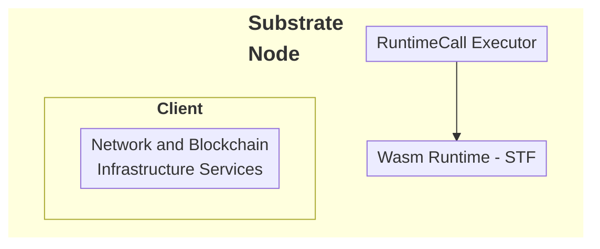

### FRAME

FRAME provides the core modular and extensible components that make the Substrate SDK flexible and adaptable to different use cases. FRAME includes Rust-based libraries that simplify the development of application-specific logic. Most of the functionality that FRAME provides takes the form of plug-in modules called [pallets](/polkadot-protocol/glossary#pallet){target=\_blank} that you can add and configure to suit your requirements for a custom runtime.

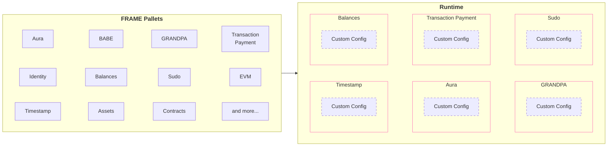

### Cumulus

Cumulus provides utilities and libraries to turn FRAME-based runtimes into runtimes that can be a parachain on Polkadot. Cumulus runtimes are still FRAME runtimes but contain the necessary functionality that allows that runtime to become a parachain on a relay chain.

## Why Use Polkadot SDK?

Using the Polkadot SDK, you can build application-specific blockchains without the complexity of building a blockchain from scratch or the limitations of building on a general-purpose blockchain. You can focus on crafting the business logic that makes your chain unique and innovative with the additional benefits of flexibility, upgradeability, open-source licensing, and cross-consensus interoperability.

## Create a Custom Blockchain Using the SDK

Before starting your blockchain development journey, you'll need to decide whether you want to build a standalone chain or a parachain that connects to the Polkadot network. Each path has its considerations and requirements. Once you've made this decision, follow these development stages:

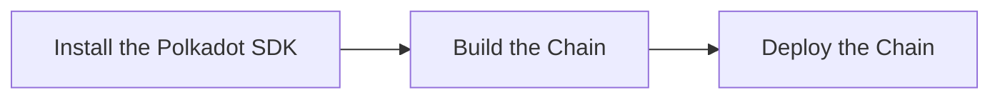

1. **[Install the Polkadot SDK](/develop/parachains/install-polkadot-sdk/)**: Set up your development environment with all necessary dependencies and tools.
2. **[Build the chain](/develop/parachains/customize-parachain)**: Learn how to create and customize your blockchain's runtime, configure pallets, and implement your chain's unique features.
3. **[Deploy the chain](/develop/parachains/deployment)**: Follow the steps to launch your blockchain, whether as a standalone network or as a parachain on Polkadot.

Each stage is covered in detail in its respective guide, walking you through the process from initial setup to final deployment.


---

# Introduction to XCM

> Source (raw): https://raw.githubusercontent.com/polkadot-developers/polkadot-docs/master/.ai/pages/develop-interoperability-intro-to-xcm.md
> Canonical (HTML): https://docs.polkadot.com/develop/interoperability/intro-to-xcm/
> Summary: Unlock blockchain interoperability with XCM — Polkadot's Cross-Consensus Messaging format for cross-chain interactions.

# Introduction to XCM

## Introduction

Polkadot’s unique value lies in its ability to enable interoperability between parachains and other blockchain systems. At the core of this capability is XCM (Cross-Consensus Messaging)—a flexible messaging format that facilitates communication and collaboration between independent consensus systems.

With XCM, one chain can send intents to another one, fostering a more interconnected ecosystem. Although it was developed specifically for Polkadot, XCM is a universal format, usable in any blockchain environment. This guide provides an overview of XCM’s core principles, design, and functionality, alongside practical examples of its implementation.

## Messaging Format

XCM is not a protocol but a standardized [messaging format](https://github.com/polkadot-fellows/xcm-format){target=\_blank}. It defines the structure and behavior of messages but does not handle their delivery. This separation allows developers to focus on crafting instructions for target systems without worrying about transmission mechanics.

XCM messages are intent-driven, outlining desired actions for the receiving blockchain to consider and potentially alter its state. These messages do not directly execute changes; instead, they rely on the host chain's environment to interpret and implement them. By utilizing asynchronous composability, XCM facilitates efficient execution where messages can be processed independently of their original order, similar to how RESTful services handle HTTP requests without requiring sequential processing.

## The Four Principles of XCM

XCM adheres to four guiding principles that ensure robust and reliable communication across consensus systems:

- **Asynchronous**: XCM messages operate independently of sender acknowledgment, avoiding delays due to blocked processes.
- **Absolute**: XCM messages are guaranteed to be delivered and interpreted accurately, in order, and timely. Once a message is sent, one can be sure it will be processed as intended.
- **Asymmetric**: XCM messages follow the 'fire and forget' paradigm meaning no automatic feedback is provided to the sender. Any results must be communicated separately to the sender with an additional message back to the origin.
- **Agnostic**: XCM operates independently of the specific consensus mechanisms, making it compatible across diverse systems.

These principles guarantee that XCM provides a reliable framework for cross-chain communication, even in complex environments.

## The XCM Tech Stack


The XCM tech stack is designed to facilitate seamless interoperable communication between chains that reside within the Polkadot ecosystem. XCM can be used to express the meaning of the messages over each of the communication channels.

## Core Functionalities of XCM

XCM enhances cross-consensus communication by introducing several powerful features:

- **Programmability**: Supports dynamic message handling, allowing for more comprehensive use cases. Includes branching logic, safe dispatches for version checks, and asset operations like NFT management.
- **Functional Multichain Decomposition**: Enables mechanisms such as remote asset locking, asset namespacing, and inter-chain state referencing, with contextual message identification.
- **Bridging**: Establishes a universal reference framework for multi-hop setups, connecting disparate systems like Ethereum and Bitcoin with the Polkadot relay chain acting as a universal location.

The standardized format for messages allows parachains to handle tasks like user balances, governance, and staking, freeing the Polkadot relay chain to focus on shared security. These features make XCM indispensable for implementing scalable and interoperable blockchain applications. 

## XCM Example

The following is a simplified XCM message demonstrating a token transfer from Alice to Bob on the same chain (ParaA).

```rust
-let message = Xcm(vec![
    WithdrawAsset((Here, amount).into()),
    BuyExecution { 
        fees: (Here, amount).into(), 
        weight_limit: WeightLimit::Unlimited 
    },
    DepositAsset {
        assets: All.into(),
        beneficiary: MultiLocation {
            parents: 0,
            interior: Junction::AccountId32 {
                network: None,
                id: BOB.clone().into()
            }.into(),
        }.into()
    }
]);
```

The message consists of three instructions described as follows:

- **[WithdrawAsset](https://github.com/polkadot-fellows/xcm-format?tab=readme-ov-file#withdrawasset){target=\_blank}**: Transfers a specified number of tokens from Alice's account to a holding register.

    ```rust
    -    WithdrawAsset((Here, amount).into()),
    ```

    - **`Here`**: The native parachain token.
    - **`amount`**: The number of tokens that are transferred.

    The first instruction takes as an input the MultiAsset that should be withdrawn. The MultiAsset describes the native parachain token with the `Here` keyword. The `amount` parameter is the number of tokens that are transferred. The withdrawal account depends on the origin of the message. In this example the origin of the message is Alice. The `WithdrawAsset` instruction moves `amount` number of native tokens from Alice's account into the holding register.

- **[BuyExecution](https://github.com/polkadot-fellows/xcm-format?tab=readme-ov-file#buyexecution){target=\_blank}**: Allocates fees to cover the execution [weight](/polkadot-protocol/glossary/#weight){target=\_blank} of the XCM instructions.

    ```rust
    -    BuyExecution { 
        fees: (Here, amount).into(), 
        weight_limit: WeightLimit::Unlimited 
    },
    ```

    - **`fees`**: Describes the asset in the holding register that should be used to pay for the weight.
    - **`weight_limit`**: Defines the maximum fees that can be used to buy weight.

- **[DepositAsset](https://github.com/polkadot-fellows/xcm-format?tab=readme-ov-file#depositasset){target=\_blank}**: Moves the remaining tokens from the holding register to Bob’s account.

    ```rust
    -    DepositAsset {
        assets: All.into(),
        beneficiary: MultiLocation {
            parents: 0,
            interior: Junction::AccountId32 {
                network: None,
                id: BOB.clone().into()
            }.into(),
        }.into()
    }
    ```

    - **`All`**: The wildcard for the asset(s) to be deposited. In this case, all assets in the holding register should be deposited.
    
This step-by-step process showcases how XCM enables precise state changes within a blockchain system. You can find a complete XCM message example in the [XCM repository](https://github.com/paritytech/xcm-docs/blob/main/examples/src/0_first_look/mod.rs){target=\_blank}.

## Overview

XCM revolutionizes cross-chain communication by enabling use cases such as:

- Token transfers between blockchains.
- Asset locking for cross-chain smart contract interactions.
- Remote execution of functions on other blockchains.

These functionalities empower developers to build innovative, multi-chain applications, leveraging the strengths of various blockchain networks. To stay updated on XCM’s evolving format or contribute, visit the [XCM repository](https://github.com/paritytech/xcm-docs/blob/main/examples/src/0_first_look/mod.rs){target=\_blank}.


---

# JSON-RPC APIs

> Source (raw): https://raw.githubusercontent.com/polkadot-developers/polkadot-docs/master/.ai/pages/develop-smart-contracts-json-rpc-apis.md
> Canonical (HTML): https://docs.polkadot.com/develop/smart-contracts/json-rpc-apis/
> Summary: JSON-RPC APIs guide for Polkadot Hub, covering supported methods, parameters, and examples for interacting with the chain.

# JSON-RPC APIs

-!!! smartcontract "PolkaVM Preview Release"
    PolkaVM smart contracts with Ethereum compatibility are in **early-stage development and may be unstable or incomplete**.

## Introduction

Polkadot Hub provides Ethereum compatibility through its JSON-RPC interface, allowing developers to interact with the chain using familiar Ethereum tooling and methods. This document outlines the supported [Ethereum JSON-RPC methods](https://ethereum.org/en/developers/docs/apis/json-rpc/#json-rpc-methods){target=\_blank} and provides examples of how to use them.

This guide uses the Polkadot Hub TestNet endpoint:

```text
https://testnet-passet-hub-eth-rpc.polkadot.io
```

## Available Methods

### eth_accounts

Returns a list of addresses owned by the client. [Reference](https://ethereum.org/en/developers/docs/apis/json-rpc/#eth_accounts){target=\_blank}.

**Parameters**:

None.

**Example**:

```bash title="eth_accounts"
curl -X POST https://testnet-passet-hub-eth-rpc.polkadot.io \
-H "Content-Type: application/json" \
--data '{
    "jsonrpc":"2.0",
    "method":"eth_accounts",
    "params":[],
    "id":1
}'
```

---

### eth_blockNumber

Returns the number of the most recent block. [Reference](https://ethereum.org/en/developers/docs/apis/json-rpc/#eth_blocknumber){target=\_blank}.

**Parameters**:

None.

**Example**:

```bash title="eth_blockNumber"
curl -X POST https://testnet-passet-hub-eth-rpc.polkadot.io \
-H "Content-Type: application/json" \
--data '{
    "jsonrpc":"2.0",
    "method":"eth_blockNumber",
    "params":[],
    "id":1
}'
```

---

### eth_call

Executes a new message call immediately without creating a transaction. [Reference](https://ethereum.org/en/developers/docs/apis/json-rpc/#eth_call){target=\_blank}.

**Parameters**:

- **`transaction` ++"object"++**: The transaction call object.
    - **`to` ++"string"++**: Recipient address of the call. Must be a [20-byte data](https://ethereum.org/en/developers/docs/apis/json-rpc/#unformatted-data-encoding){target=\_blank} string.
    - **`data` ++"string"++**: Hash of the method signature and encoded parameters. Must be a [data](https://ethereum.org/en/developers/docs/apis/json-rpc/#unformatted-data-encoding){target=\_blank} string.
    - **`from` ++"string"++**: (Optional) Sender's address for the call. Must be a [20-byte data](https://ethereum.org/en/developers/docs/apis/json-rpc/#unformatted-data-encoding){target=\_blank} string.
    - **`gas` ++"string"++**: (Optional) Gas limit to execute the call. Must be a [quantity](https://ethereum.org/en/developers/docs/apis/json-rpc/#quantities-encoding){target=\_blank} string.
    - **`gasPrice` ++"string"++**: (Optional) Gas price per unit of gas. Must be a [quantity](https://ethereum.org/en/developers/docs/apis/json-rpc/#quantities-encoding){target=\_blank} string.
    - **`value` ++"string"++**: (Optional) Value in wei to send with the call. Must be a [quantity](https://ethereum.org/en/developers/docs/apis/json-rpc/#quantities-encoding){target=\_blank} string.
- **`blockValue` ++"string"++**: (Optional) Block tag or block number to execute the call at. Must be a [quantity](https://ethereum.org/en/developers/docs/apis/json-rpc/#quantities-encoding){target=\_blank} string or a [default block parameter](https://ethereum.org/en/developers/docs/apis/json-rpc/#default-block){target=\_blank}.

**Example**:

```bash title="eth_call"
curl -X POST https://testnet-passet-hub-eth-rpc.polkadot.io \
-H "Content-Type: application/json" \
--data '{
    "jsonrpc":"2.0",
    "method":"eth_call",
    "params":[{
        "to": "INSERT_RECIPIENT_ADDRESS",
        "data": "INSERT_ENCODED_CALL"
    }, "INSERT_BLOCK_VALUE"],
    "id":1
}'
```

Ensure to replace the `INSERT_RECIPIENT_ADDRESS`, `INSERT_ENCODED_CALL`, and `INSERT_BLOCK_VALUE` with the proper values.

---

### eth_chainId

Returns the chain ID used for signing transactions. [Reference](https://ethereum.org/en/developers/docs/apis/json-rpc/#eth_chainid){target=\_blank}.

**Parameters**:

None.

**Example**:

```bash title="eth_chainId"
curl -X POST https://testnet-passet-hub-eth-rpc.polkadot.io \
-H "Content-Type: application/json" \
--data '{
    "jsonrpc":"2.0",
    "method":"eth_chainId",
    "params":[],
    "id":1
}'
```

---

### eth_estimateGas

Estimates gas required for a transaction. [Reference](https://ethereum.org/en/developers/docs/apis/json-rpc/#eth_estimategas){target=\_blank}.

**Parameters**:

- **`transaction` ++"object"++**: The transaction call object.
    - **`to` ++"string"++**: Recipient address of the call. Must be a [20-byte data](https://ethereum.org/en/developers/docs/apis/json-rpc/#unformatted-data-encoding){target=\_blank} string.
    - **`data` ++"string"++**: Hash of the method signature and encoded parameters. Must be a [data](https://ethereum.org/en/developers/docs/apis/json-rpc/#unformatted-data-encoding){target=\_blank} string.
    - **`from` ++"string"++**: (Optional) Sender's address for the call. Must be a [20-byte data](https://ethereum.org/en/developers/docs/apis/json-rpc/#unformatted-data-encoding){target=\_blank} string.
    - **`gas` ++"string"++**: (Optional) Gas limit to execute the call. Must be a [quantity](https://ethereum.org/en/developers/docs/apis/json-rpc/#quantities-encoding){target=\_blank} string.
    - **`gasPrice` ++"string"++**: (Optional) Gas price per unit of gas. Must be a [quantity](https://ethereum.org/en/developers/docs/apis/json-rpc/#quantities-encoding){target=\_blank} string.
    - **`value` ++"string"++**: (Optional) Value in wei to send with the call. Must be a [quantity](https://ethereum.org/en/developers/docs/apis/json-rpc/#quantities-encoding){target=\_blank} string.
- **`blockValue` ++"string"++**: (Optional) Block tag or block number to execute the call at. Must be a [quantity](https://ethereum.org/en/developers/docs/apis/json-rpc/#quantities-encoding){target=\_blank} string or a [default block parameter](https://ethereum.org/en/developers/docs/apis/json-rpc/#default-block){target=\_blank}.

**Example**:

```bash title="eth_estimateGas"
curl -X POST https://testnet-passet-hub-eth-rpc.polkadot.io \
-H "Content-Type: application/json" \
--data '{
    "jsonrpc":"2.0",
    "method":"eth_estimateGas",
    "params":[{
        "to": "INSERT_RECIPIENT_ADDRESS",
        "data": "INSERT_ENCODED_FUNCTION_CALL"
    }],
    "id":1
}'
```

Ensure to replace the `INSERT_RECIPIENT_ADDRESS` and `INSERT_ENCODED_CALL` with the proper values.

---

### eth_gasPrice

Returns the current gas price in Wei. [Reference](https://ethereum.org/en/developers/docs/apis/json-rpc/#eth_gasprice){target=\_blank}.

**Parameters**:

None.

**Example**:

```bash title="eth_gasPrice"
curl -X POST https://testnet-passet-hub-eth-rpc.polkadot.io \
-H "Content-Type: application/json" \
--data '{
    "jsonrpc":"2.0",
    "method":"eth_gasPrice",
    "params":[],
    "id":1
}'
```

---

### eth_getBalance

Returns the balance of a given address. [Reference](https://ethereum.org/en/developers/docs/apis/json-rpc/#eth_getbalance){target=\_blank}.

**Parameters**:

- **`address` ++"string"++**: Address to query balance. Must be a [20-byte data](https://ethereum.org/en/developers/docs/apis/json-rpc/#unformatted-data-encoding){target=\_blank} string.
- **`blockValue` ++"string"++**: (Optional) The block value to be fetched. Must be a [quantity](https://ethereum.org/en/developers/docs/apis/json-rpc/#quantities-encoding){target=\_blank} string or a [default block parameter](https://ethereum.org/en/developers/docs/apis/json-rpc/#default-block){target=\_blank}.

**Example**:

```bash title="eth_getBalance"
curl -X POST https://testnet-passet-hub-eth-rpc.polkadot.io \
-H "Content-Type: application/json" \
--data '{
    "jsonrpc":"2.0",
    "method":"eth_getBalance",
    "params":["INSERT_ADDRESS", "INSERT_BLOCK_VALUE"],
    "id":1
}'
```

Ensure to replace the `INSERT_ADDRESS` and `INSERT_BLOCK_VALUE` with the proper values.

---

### eth_getBlockByHash

Returns information about a block by its hash. [Reference](https://ethereum.org/en/developers/docs/apis/json-rpc/#eth_getblockbyhash){target=\_blank}.

**Parameters**:

- **`blockHash` ++"string"++**: The hash of the block to retrieve. Must be a [32 byte data](https://ethereum.org/en/developers/docs/apis/json-rpc/#unformatted-data-encoding){target=\_blank} string.
- **`fullTransactions` ++"boolean"++**: If `true`, returns full transaction details; if `false`, returns only transaction hashes.

**Example**:

```bash title="eth_getBlockByHash"
curl -X POST https://testnet-passet-hub-eth-rpc.polkadot.io \
-H "Content-Type: application/json" \
--data '{
    "jsonrpc":"2.0",
    "method":"eth_getBlockByHash",
    "params":["INSERT_BLOCK_HASH", INSERT_BOOLEAN],
    "id":1
}'
```

Ensure to replace the `INSERT_BLOCK_HASH` and `INSERT_BOOLEAN` with the proper values.

---

### eth_getBlockByNumber

Returns information about a block by its number. [Reference](https://ethereum.org/en/developers/docs/apis/json-rpc/#eth_getblockbynumber){target=\_blank}.

**Parameters**:

- **`blockValue` ++"string"++**: (Optional) The block value to be fetched. Must be a [quantity](https://ethereum.org/en/developers/docs/apis/json-rpc/#quantities-encoding){target=\_blank} string or a [default block parameter](https://ethereum.org/en/developers/docs/apis/json-rpc/#default-block){target=\_blank}.
- **`fullTransactions` ++"boolean"++**: If `true`, returns full transaction details; if `false`, returns only transaction hashes.

**Example**:

```bash title="eth_getBlockByNumber"
curl -X POST https://testnet-passet-hub-eth-rpc.polkadot.io \
-H "Content-Type: application/json" \
--data '{
    "jsonrpc":"2.0",
    "method":"eth_getBlockByNumber",
    "params":["INSERT_BLOCK_VALUE", INSERT_BOOLEAN],
    "id":1
}'
```

Ensure to replace the `INSERT_BLOCK_VALUE` and `INSERT_BOOLEAN` with the proper values.

---

### eth_getBlockTransactionCountByNumber

Returns the number of transactions in a block from a block number. [Reference](https://ethereum.org/en/developers/docs/apis/json-rpc/#eth_getblocktransactioncountbynumber){target=\_blank}.

**Parameters**:

- **`blockValue` ++"string"++**: The block value to be fetched. Must be a [quantity](https://ethereum.org/en/developers/docs/apis/json-rpc/#quantities-encoding){target=\_blank} string or a [default block parameter](https://ethereum.org/en/developers/docs/apis/json-rpc/#default-block){target=\_blank}.

**Example**:

```bash title="eth_getBlockTransactionCountByNumber"
curl -X POST https://testnet-passet-hub-eth-rpc.polkadot.io \
-H "Content-Type: application/json" \
--data '{
    "jsonrpc":"2.0",
    "method":"eth_getBlockTransactionCountByNumber",
    "params":["INSERT_BLOCK_VALUE"],
    "id":1
}'
```

Ensure to replace the `INSERT_BLOCK_VALUE` with the proper values.

---

### eth_getBlockTransactionCountByHash

Returns the number of transactions in a block from a block hash. [Reference](https://ethereum.org/en/developers/docs/apis/json-rpc/#eth_getblocktransactioncountbyhash){target=\_blank}.

**Parameters**:

- **`blockHash` ++"string"++**: The hash of the block to retrieve. Must be a [32 byte data](https://ethereum.org/en/developers/docs/apis/json-rpc/#unformatted-data-encoding){target=\_blank} string.

**Example**:

```bash title="eth_getBlockTransactionCountByHash"
curl -X POST https://testnet-passet-hub-eth-rpc.polkadot.io \
-H "Content-Type: application/json" \
--data '{
    "jsonrpc":"2.0",
    "method":"eth_getBlockTransactionCountByHash",
    "params":["INSERT_BLOCK_HASH"],
    "id":1
}'
```

Ensure to replace the `INSERT_BLOCK_HASH` with the proper values.

---

### eth_getCode

Returns the code at a given address. [Reference](https://ethereum.org/en/developers/docs/apis/json-rpc/#eth_getcode){target=\_blank}.

**Parameters**:

- **`address` ++"string"++**: Contract or account address to query code. Must be a [20-byte data](https://ethereum.org/en/developers/docs/apis/json-rpc/#unformatted-data-encoding){target=\_blank} string.
- **`blockValue` ++"string"++**: (Optional) The block value to be fetched. Must be a [quantity](https://ethereum.org/en/developers/docs/apis/json-rpc/#quantities-encoding){target=\_blank} string or a [default block parameter](https://ethereum.org/en/developers/docs/apis/json-rpc/#default-block).

**Example**:

```bash title="eth_getCode"
curl -X POST https://testnet-passet-hub-eth-rpc.polkadot.io \
-H "Content-Type: application/json" \
--data '{
    "jsonrpc":"2.0",
    "method":"eth_getCode",
    "params":["INSERT_ADDRESS", "INSERT_BLOCK_VALUE"],
    "id":1
}'
```

Ensure to replace the `INSERT_ADDRESS` and `INSERT_BLOCK_VALUE` with the proper values.

---

### eth_getLogs

Returns an array of all logs matching a given filter object. [Reference](https://ethereum.org/en/developers/docs/apis/json-rpc/#eth_getlogs){target=\_blank}.

**Parameters**:

- **`filter` ++"object"++**: The filter object.
    - **`fromBlock` ++"string"++**: (Optional) Block number or tag to start from. Must be a [quantity](https://ethereum.org/en/developers/docs/apis/json-rpc/#quantities-encoding){target=\_blank} string or a [default block parameter](https://ethereum.org/en/developers/docs/apis/json-rpc/#default-block){target=\_blank}.
    - **`toBlock` ++"string"++**: (Optional) Block number or tag to end at. Must be a [quantity](https://ethereum.org/en/developers/docs/apis/json-rpc/#quantities-encoding){target=\_blank} string or a [default block parameter](https://ethereum.org/en/developers/docs/apis/json-rpc/#default-block){target=\_blank}.
    - **`address` ++"string" or "array of strings"++**: (Optional) Contract address or a list of addresses from which to get logs. Must be a [20-byte data](https://ethereum.org/en/developers/docs/apis/json-rpc/#unformatted-data-encoding){target=\_blank} string.
    - **`topics` ++"array of strings"++**: (Optional) Array of topics for filtering logs. Each topic can be a single [32 byte data](https://ethereum.org/en/developers/docs/apis/json-rpc/#unformatted-data-encoding){target=\_blank} string or an array of such strings (meaning OR).
    - **`blockhash` ++"string"++**: (Optional) Hash of a specific block. Cannot be used with `fromBlock` or `toBlock`. Must be a [32 byte data](https://ethereum.org/en/developers/docs/apis/json-rpc/#unformatted-data-encoding){target=\_blank} string.

**Example**:

```bash title="eth_getLogs"
curl -X POST https://testnet-passet-hub-eth-rpc.polkadot.io \
-H "Content-Type: application/json" \
--data '{
    "jsonrpc":"2.0",
    "method":"eth_getLogs",
    "params":[{
        "fromBlock": "latest",
        "toBlock": "latest"
    }],
    "id":1
}'
```

---

### eth_getStorageAt

Returns the value from a storage position at a given address. [Reference](https://ethereum.org/en/developers/docs/apis/json-rpc/#eth_getstorageat){target=\_blank}.

**Parameters**:

- **`address` ++"string"++**: Contract or account address to query code. Must be a [20-byte data](https://ethereum.org/en/developers/docs/apis/json-rpc/#unformatted-data-encoding){target=\_blank} string.
- **`storageKey` ++"string"++**: Position in storage to retrieve data from. Must be a [quantity](https://ethereum.org/en/developers/docs/apis/json-rpc/#quantities-encoding){target=\_blank} string.
- **`blockValue` ++"string"++**: (Optional) The block value to be fetched. Must be a [quantity](https://ethereum.org/en/developers/docs/apis/json-rpc/#quantities-encoding){target=\_blank} string or a [default block parameter](https://ethereum.org/en/developers/docs/apis/json-rpc/#default-block).

**Example**:

```bash title="eth_getStorageAt"
curl -X POST https://testnet-passet-hub-eth-rpc.polkadot.io \
-H "Content-Type: application/json" \
--data '{
    "jsonrpc":"2.0",
    "method":"eth_getStorageAt",
    "params":["INSERT_ADDRESS", "INSERT_STORAGE_KEY", "INSERT_BLOCK_VALUE"],
    "id":1
}'
```

Ensure to replace the `INSERT_ADDRESS`, `INSERT_STORAGE_KEY`, and `INSERT_BLOCK_VALUE` with the proper values.

---

### eth_getTransactionCount

Returns the number of transactions sent from an address (nonce). [Reference](https://ethereum.org/en/developers/docs/apis/json-rpc/#eth_gettransactioncount){target=\_blank}.

**Parameters**:

- **`address` ++"string"++**: Address to query balance. Must be a [20-byte data](https://ethereum.org/en/developers/docs/apis/json-rpc/#unformatted-data-encoding){target=\_blank} string.
- **`blockValue` ++"string"++**: (Optional) The block value to be fetched. Must be a [quantity](https://ethereum.org/en/developers/docs/apis/json-rpc/#quantities-encoding){target=\_blank} string or a [default block parameter](https://ethereum.org/en/developers/docs/apis/json-rpc/#default-block).

**Example**:

```bash title="eth_getTransactionCount"
curl -X POST https://testnet-passet-hub-eth-rpc.polkadot.io \
-H "Content-Type: application/json" \
--data '{
    "jsonrpc":"2.0",
    "method":"eth_getTransactionCount",
    "params":["INSERT_ADDRESS", "INSERT_BLOCK_VALUE"],
    "id":1
}'
```

Ensure to replace the `INSERT_ADDRESS` and `INSERT_BLOCK_VALUE` with the proper values.

---

### eth_getTransactionByHash

Returns information about a transaction by its hash. [Reference](https://ethereum.org/en/developers/docs/apis/json-rpc/#eth_gettransactionbyhash){target=\_blank}.

**Parameters**:

- **`transactionHash` ++"string"++**: The hash of the transaction. Must be a [32 byte data](https://ethereum.org/en/developers/docs/apis/json-rpc/#unformatted-data-encoding){target=\_blank} string.

**Example**:

```bash title="eth_getTransactionByHash"
curl -X POST https://testnet-passet-hub-eth-rpc.polkadot.io \
-H "Content-Type: application/json" \
--data '{
    "jsonrpc":"2.0",
    "method":"eth_getTransactionByHash",
    "params":["INSERT_TRANSACTION_HASH"],
    "id":1
}'
```

Ensure to replace the `INSERT_TRANSACTION_HASH` with the proper values.

---

### eth_getTransactionByBlockNumberAndIndex

Returns information about a transaction by block number and transaction index. [Reference](https://ethereum.org/en/developers/docs/apis/json-rpc/#eth_gettransactionbyblocknumberandindex){target=\_blank}.

**Parameters**:

- **`blockValue` ++"string"++**: The block value to be fetched. Must be a [quantity](https://ethereum.org/en/developers/docs/apis/json-rpc/#quantities-encoding){target=\_blank} string or a [default block parameter](https://ethereum.org/en/developers/docs/apis/json-rpc/#default-block){target=\_blank}.
- **`transactionIndex` ++"string"++**: The index of the transaction in the block. Must be a [quantity](https://ethereum.org/en/developers/docs/apis/json-rpc/#quantities-encoding){target=\_blank} string.

**Example**:

```bash title="eth_getTransactionByBlockNumberAndIndex"
curl -X POST https://testnet-passet-hub-eth-rpc.polkadot.io \
-H "Content-Type: application/json" \
--data '{
    "jsonrpc":"2.0",
    "method":"eth_getTransactionByBlockNumberAndIndex",
    "params":["INSERT_BLOCK_VALUE", "INSERT_TRANSACTION_INDEX"],
    "id":1
}'
```

Ensure to replace the `INSERT_BLOCK_VALUE` and `INSERT_TRANSACTION_INDEX` with the proper values.

---

### eth_getTransactionByBlockHashAndIndex

Returns information about a transaction by block hash and transaction index. [Reference](https://ethereum.org/en/developers/docs/apis/json-rpc/#eth_gettransactionbyblockhashandindex){target=\_blank}.

**Parameters**:

- **`blockHash` ++"string"++**: The hash of the block. Must be a [32 byte data](https://ethereum.org/en/developers/docs/apis/json-rpc/#unformatted-data-encoding){target=\_blank} string.
- **`transactionIndex` ++"string"++**: The index of the transaction in the block. Must be a [quantity](https://ethereum.org/en/developers/docs/apis/json-rpc/#quantities-encoding){target=\_blank} string.

**Example**:

```bash title="eth_getTransactionByBlockHashAndIndex"
curl -X POST https://testnet-passet-hub-eth-rpc.polkadot.io \
-H "Content-Type: application/json" \
--data '{
    "jsonrpc":"2.0",
    "method":"eth_getTransactionByBlockHashAndIndex",
    "params":["INSERT_BLOCK_HASH", "INSERT_TRANSACTION_INDEX"],
    "id":1
}'
```

Ensure to replace the `INSERT_BLOCK_HASH` and `INSERT_TRANSACTION_INDEX` with the proper values.

---

### eth_getTransactionReceipt

Returns the receipt of a transaction by transaction hash. [Reference](https://ethereum.org/en/developers/docs/apis/json-rpc/#eth_gettransactionreceipt){target=\_blank}.

**Parameters**:

- **`transactionHash` ++"string"++**: The hash of the transaction. Must be a [32 byte data](https://ethereum.org/en/developers/docs/apis/json-rpc/#unformatted-data-encoding){target=\_blank} string.

**Example**:

```bash title="eth_getTransactionReceipt"
curl -X POST https://testnet-passet-hub-eth-rpc.polkadot.io \
-H "Content-Type: application/json" \
--data '{
    "jsonrpc":"2.0",
    "method":"eth_getTransactionReceipt",
    "params":["INSERT_TRANSACTION_HASH"],
    "id":1
}'
```

Ensure to replace the `INSERT_TRANSACTION_HASH` with the proper values.

---

### eth_maxPriorityFeePerGas

Returns an estimate of the current priority fee per gas, in Wei, to be included in a block.

**Parameters**:

None.

**Example**:

```bash title="eth_maxPriorityFeePerGas"
curl -X POST https://testnet-passet-hub-eth-rpc.polkadot.io \
-H "Content-Type: application/json" \
--data '{
    "jsonrpc":"2.0",
    "method":"eth_maxPriorityFeePerGas",
    "params":[],
    "id":1
}'
```

---

### eth_sendRawTransaction

Submits a raw transaction. [Reference](https://ethereum.org/en/developers/docs/apis/json-rpc/#eth_sendrawtransaction){target=\_blank}.

**Parameters**:

- **`callData` ++"string"++**: Signed transaction data. Must be a [data](https://ethereum.org/en/developers/docs/apis/json-rpc/#unformatted-data-encoding){target=\_blank} string.

**Example**:

```bash title="eth_sendRawTransaction"
curl -X POST https://testnet-passet-hub-eth-rpc.polkadot.io \
-H "Content-Type: application/json" \
--data '{
    "jsonrpc":"2.0",
    "method":"eth_sendRawTransaction",
    "params":["INSERT_CALL_DATA"],
    "id":1
}'
```

Ensure to replace the `INSERT_CALL_DATA` with the proper values.

---

### eth_sendTransaction

Creates and sends a new transaction. [Reference](https://ethereum.org/en/developers/docs/apis/json-rpc/#eth_sendtransaction){target=\_blank}.

**Parameters**:

- **`transaction` ++"object"++**: The transaction object.
    - **`from` ++"string"++**: Address sending the transaction. Must be a [20-byte data](https://ethereum.org/en/developers/docs/apis/json-rpc/#unformatted-data-encoding){target=\_blank} string.
    - **`to` ++"string"++**: (Optional) Recipient address. No need to provide this value when deploying a contract. Must be a [20-byte data](https://ethereum.org/en/developers/docs/apis/json-rpc/#unformatted-data-encoding){target=\_blank} string.
    - **`gas` ++"string"++**: (optional, default: `90000`) gas limit for execution. Must be a [quantity](https://ethereum.org/en/developers/docs/apis/json-rpc/#quantities-encoding){target=\_blank} string.
    - **`gasPrice` ++"string"++**: (Optional) Gas price per unit. Must be a [quantity](https://ethereum.org/en/developers/docs/apis/json-rpc/#quantities-encoding){target=\_blank} string.
    - **`value` ++"string"++**: (Optional) Amount of Ether to send. Must be a [quantity](https://ethereum.org/en/developers/docs/apis/json-rpc/#quantities-encoding){target=\_blank} string.
    - **`data` ++"string"++**: (Optional) Contract bytecode or encoded method call. Must be a [data](https://ethereum.org/en/developers/docs/apis/json-rpc/#unformatted-data-encoding){target=\_blank} string.
    - **`nonce` ++"string"++**: (Optional) Transaction nonce. Must be a [quantity](https://ethereum.org/en/developers/docs/apis/json-rpc/#quantities-encoding){target=\_blank} string.

**Example**:

```bash title="eth_sendTransaction"
curl -X POST https://testnet-passet-hub-eth-rpc.polkadot.io \
-H "Content-Type: application/json" \
--data '{
    "jsonrpc":"2.0",
    "method":"eth_sendTransaction",
    "params":[{
        "from": "INSERT_SENDER_ADDRESS",
        "to": "INSERT_RECIPIENT_ADDRESS",
        "gas": "INSERT_GAS_LIMIT",
        "gasPrice": "INSERT_GAS_PRICE",
        "value": "INSERT_VALUE",
        "input": "INSERT_INPUT_DATA",
        "nonce": "INSERT_NONCE"
    }],
    "id":1
}'
```

Ensure to replace the `INSERT_SENDER_ADDRESS`, `INSERT_RECIPIENT_ADDRESS`, `INSERT_GAS_LIMIT`, `INSERT_GAS_PRICE`, `INSERT_VALUE`, `INSERT_INPUT_DATA`, and `INSERT_NONCE` with the proper values.

---

### eth_syncing

Returns an object with syncing data or `false` if not syncing. [Reference](https://ethereum.org/en/developers/docs/apis/json-rpc/#eth_syncing){target=\_blank}.

**Parameters**:

None.

**Example**:

```bash title="eth_syncing"
curl -X POST https://testnet-passet-hub-eth-rpc.polkadot.io \
-H "Content-Type: application/json" \
--data '{
    "jsonrpc":"2.0",
    "method":"eth_syncing",
    "params":[],
    "id":1
}'
```

---

### net_listening

Returns `true` if the client is currently listening for network connections, otherwise `false`. [Reference](https://ethereum.org/en/developers/docs/apis/json-rpc/#net_listening){target=\_blank}.

**Parameters**:

None.

**Example**:

```bash title="net_listening"
curl -X POST https://testnet-passet-hub-eth-rpc.polkadot.io \
-H "Content-Type: application/json" \
--data '{
    "jsonrpc":"2.0",
    "method":"net_listening",
    "params":[],
    "id":1
}'
```

---

### net_peerCount

Returns the number of peers currently connected to the client.

**Parameters**:

None.

**Example**:

```bash title="net_peerCount"
curl -X POST https://testnet-passet-hub-eth-rpc.polkadot.io \
-H "Content-Type: application/json" \
--data '{
    "jsonrpc":"2.0",
    "method":"net_peerCount",
    "params":[],
    "id":1
}'
```

---

### net_version

Returns the current network ID as a string. [Reference](https://ethereum.org/en/developers/docs/apis/json-rpc/#net_version){target=\_blank}.

**Parameters**:

None.

**Example**:

```bash title="net_version"
curl -X POST https://testnet-passet-hub-eth-rpc.polkadot.io \
-H "Content-Type: application/json" \
--data '{
    "jsonrpc":"2.0",
    "method":"net_version",
    "params":[],
    "id":1
}'
```

---

### system_health

Returns information about the health of the system.

**Parameters**:

None.

**Example**:

```bash title="system_health"
curl -X POST https://testnet-passet-hub-eth-rpc.polkadot.io \
-H "Content-Type: application/json" \
--data '{
    "jsonrpc":"2.0",
    "method":"system_health",
    "params":[],
    "id":1
}'
```

---

### web3_clientVersion

Returns the current client version. [Reference](https://ethereum.org/en/developers/docs/apis/json-rpc/#web3_clientversion){target=\_blank}.

**Parameters**:

None.

**Example**:

```bash title="web3_clientVersion"
curl -X POST https://testnet-passet-hub-eth-rpc.polkadot.io \
-H "Content-Type: application/json" \
--data '{
    "jsonrpc":"2.0",
    "method":"web3_clientVersion",
    "params":[],
    "id":1
}'
```

---

### debug_traceBlockByNumber 

Traces a block's execution by its number and returns a detailed execution trace for each transaction.

**Parameters**:

- **`blockValue` ++"string"++**: The block number or tag to trace. Must be a [quantity](https://ethereum.org/en/developers/docs/apis/json-rpc/#quantities-encoding){target=\_blank} string or a [default block parameter](https://ethereum.org/en/developers/docs/apis/json-rpc/#default-block){target=\_blank}.
- **`options` ++"object"++**: (Optional) An object containing tracer options.
    - **`tracer` ++"string"++**: The name of the tracer to use (e.g., `"callTracer"`, `"opTracer"`).
    - Other tracer-specific options may be supported.

**Example**:

```bash title="debug_traceBlockByNumber"
curl -X POST https://testnet-passet-hub-eth-rpc.polkadot.io \
-H "Content-Type: application/json" \
--data '{
    "jsonrpc":"2.0",
    "method":"debug_traceBlockByNumber",
    "params":["INSERT_BLOCK_VALUE", {"tracer": "callTracer"}],
    "id":1
}'
```

Ensure to replace `INSERT_BLOCK_VALUE` with a proper block number if needed.

---

### debug_traceTransaction

Traces the execution of a single transaction by its hash and returns a detailed execution trace.

**Parameters**:

- **`transactionHash` ++"string"++**: The hash of the transaction to trace. Must be a [32 byte data](https://ethereum.org/en/developers/docs/apis/json-rpc/#unformatted-data-encoding){target=\_blank} string.
- **`options` ++"object"++**: (Optional) An object containing tracer options (e.g., `tracer: "callTracer"`).

**Example**:

```bash title="debug_traceTransaction"
curl -X POST https://testnet-passet-hub-eth-rpc.polkadot.io \
-H "Content-Type: application/json" \
--data '{
    "jsonrpc":"2.0",
    "method":"debug_traceTransaction",
    "params":["INSERT_TRANSACTION_HASH", {"tracer": "callTracer"}],
    "id":1
}'
```

Ensure to replace the `INSERT_TRANSACTION_HASH` with the proper value.

---

### debug_traceCall

Executes a new message call and returns a detailed execution trace without creating a transaction on the blockchain.

**Parameters**:

- **`transaction` ++"object"++**: The transaction call object, similar to `eth_call` parameters.
    - **`to` ++"string"++**: Recipient address of the call. Must be a [20-byte data](https://ethereum.org/en/developers/docs/apis/json-rpc/#unformatted-data-encoding){target=\_blank} string.
    - **`data` ++"string"++**: Hash of the method signature and encoded parameters. Must be a [data](https://ethereum.org/en/developers/docs/apis/json-rpc/#unformatted-data-encoding){target=\_blank} string.
    - **`from` ++"string"++**: (Optional) Sender's address for the call. Must be a [20-byte data](https://ethereum.org/en/developers/docs/apis/json-rpc/#unformatted-data-encoding){target=\_blank} string.
    - **`gas` ++"string"++**: (Optional) Gas limit to execute the call. Must be a [quantity](https://ethereum.org/en/developers/docs/apis/json-rpc/#quantities-encoding){target=\_blank} string.
    - **`gasPrice` ++"string"++**: (Optional) Gas price per unit of gas. Must be a [quantity](https://ethereum.org/en/developers/docs/apis/json-rpc/#quantities-encoding){target=\_blank} string.
    - **`value` ++"string"++**: (Optional) Value in wei to send with the call. Must be a [quantity](https://ethereum.org/en/developers/docs/apis/json-rpc/#quantities-encoding){target=\_blank} string.
- **`blockValue` ++"string"++**: (Optional) Block tag or block number to execute the call at. Must be a [quantity](https://ethereum.org/en/developers/docs/apis/json-rpc/#quantities-encoding){target=\_blank} string or a [default block parameter](https://ethereum.org/en/developers/docs/apis/json-rpc/#default-block){target=\_blank}.
- **`options` ++"object"++**: (Optional) An object containing tracer options (e.g., `tracer: "callTracer"`).

**Example**:

```bash title="debug_traceCall"
curl -X POST https://testnet-passet-hub-eth-rpc.polkadot.io \
-H "Content-Type: application/json" \
--data '{
    "jsonrpc":"2.0",
    "method":"debug_traceCall",
    "params":[{
        "from": "INSERT_SENDER_ADDRESS",
        "to": "INSERT_RECIPIENT_ADDRESS",
        "data": "INSERT_ENCODED_CALL"
    }, "INSERT_BLOCK_VALUE", {"tracer": "callTracer"}],
    "id":1
}'
```

Ensure to replace the `INSERT_SENDER_ADDRESS`, `INSERT_RECIPIENT_ADDRESS`, `INSERT_ENCODED_CALL`, and `INSERT_BLOCK_VALUE` with the proper value.

---

## Response Format

All responses follow the standard JSON-RPC 2.0 format:

```json
{
    "jsonrpc": "2.0",
    "id": 1,
    "result": ... // The return value varies by method
}
```

## Error Handling

If an error occurs, the response will include an error object:

```json
{
    "jsonrpc": "2.0",
    "id": 1,
    "error": {
        "code": -32000,
        "message": "Error message here"
    }
}
```


---

# Make a Custom Pallet

> Source (raw): https://raw.githubusercontent.com/polkadot-developers/polkadot-docs/master/.ai/pages/develop-parachains-customize-parachain-make-custom-pallet.md
> Canonical (HTML): https://docs.polkadot.com/develop/parachains/customize-parachain/make-custom-pallet/
> Summary: Learn how to create custom pallets using FRAME, allowing for flexible, modular, and scalable blockchain development. Follow the step-by-step guide.

# Make a Custom Pallet

## Introduction

FRAME provides a powerful set of tools for blockchain development, including a library of pre-built pallets. However, its true strength lies in the ability to create custom pallets tailored to your specific needs. This section will guide you through creating your own custom pallet, allowing you to extend your blockchain's functionality in unique ways.

To get the most out of this guide, ensure you're familiar with [FRAME concepts](/develop/parachains/customize-parachain/overview/){target=\_blank}.

Creating custom pallets offers several advantages over relying on pre-built pallets:

- **Flexibility**: Define runtime behavior that precisely matches your project requirements.
- **Modularity**: Combine pre-built and custom pallets to achieve the desired blockchain functionality.
- **Scalability**: Add or modify features as your project evolves.

As you follow this guide to create your custom pallet, you'll work with the following key sections:

1. **Imports and dependencies**: Bring in necessary FRAME libraries and external modules.
2. **Runtime configuration trait**: Specify the types and constants required for your pallet to interact with the runtime.
3. **Runtime events**: Define events that your pallet can emit to communicate state changes.
4. **Runtime errors**: Define the error types that can be returned from the function calls dispatched to the runtime.
5. **Runtime storage**: Declare on-chain storage items for your pallet's state.
6. **Extrinsics (function calls)**: Create callable functions that allow users to interact with your pallet and execute transactions.

For additional macros you can include in a pallet, beyond those covered in this guide, refer to the [pallet_macros](https://paritytech.github.io/polkadot-sdk/master/frame_support/pallet_macros/index.html){target=\_blank} section of the Polkadot SDK Docs.

## Initial Setup

This section will guide you through the initial steps of creating the foundation for your custom FRAME pallet. You'll create a new Rust library project and set up the necessary dependencies.

1. Create a new Rust library project using the following `cargo` command:

    ```bash
    cargo new --lib custom-pallet \
    && cd custom-pallet
    ```

    This command creates a new library project named `custom-pallet` and navigates into its directory.

2.  Configure the dependencies required for FRAME pallet development in the `Cargo.toml` file as follows:

    ```toml
    -[package]
name = "custom-pallet"
version = "0.1.0"
edition = "2021"

[dependencies]
frame-support = { version = "37.0.0", default-features = false }
frame-system = { version = "37.0.0", default-features = false }
codec = { version = "3.6.12", default-features = false, package = "parity-scale-codec", features = [
  "derive",
] }
scale-info = { version = "2.11.1", default-features = false, features = [
  "derive",
] }
sp-runtime = { version = "39.0.0", default-features = false }

[features]
default = ["std"]
std = [
  "frame-support/std",
  "frame-system/std",
  "codec/std",
  "scale-info/std",
  "sp-runtime/std",
]

    ```

    !!!note
        Proper version management is crucial for ensuring compatibility and reducing potential conflicts in your project. Carefully select the versions of the packages according to your project's specific requirements:

        - When developing for a specific Polkadot SDK runtime, ensure that your pallet's dependency versions match those of the target runtime.
        - If you're creating this pallet within a Polkadot SDK workspace:

            - Define the actual versions in the root `Cargo.toml` file.
            - Use workspace inheritance in your pallet's `Cargo.toml` to maintain consistency across your project.

        - Regularly check for updates to FRAME and Polkadot SDK dependencies to benefit from the latest features, performance improvements, and security patches.

    For detailed information about workspace inheritance and how to properly integrate your pallet with the runtime, see the [Add an Existing Pallet to the Runtime](/develop/parachains/customize-parachain/add-existing-pallets/){target=\_blank} page.

3.  Initialize the pallet structure by replacing the contents of `src/lib.rs` with the following scaffold code:

    ```rust
    -pub use pallet::*;

#[frame_support::pallet]
pub mod pallet {
    use frame_support::pallet_prelude::*;
    use frame_system::pallet_prelude::*;

    #[pallet::pallet]
    pub struct Pallet<T>(_);

    #[pallet::config]  // snip
    #[pallet::event]   // snip
    #[pallet::error]   // snip
    #[pallet::storage] // snip
    #[pallet::call]    // snip
}
    ```

    With this scaffold in place, you're ready to start implementing your custom pallet's specific logic and features. The subsequent sections of this guide will walk you through populating each of these components with the necessary code for your pallet's functionality.

## Pallet Configuration

Every pallet includes a Rust trait called [`Config`](https://paritytech.github.io/polkadot-sdk/master/frame_system/pallet/trait.Config.html){target=\_blank}, which exposes configurable options and links your pallet to other parts of the runtime. All types and constants the pallet depends on must be declared within this trait. These types are defined generically and made concrete when the pallet is instantiated in the `runtime/src/lib.rs` file of your blockchain.

In this step, you'll only configure the common types used by all pallets:

- **`RuntimeEvent`**: Since this pallet emits events, the runtime event type is required to handle them. This ensures that events generated by the pallet can be correctly processed and interpreted by the runtime.
- **`WeightInfo`**: This type defines the weights associated with the pallet's callable functions (also known as dispatchables). Weights help measure the computational cost of executing these functions. However, the `WeightInfo` type will be left unconfigured since setting up custom weights is outside the scope of this guide.

Replace the line containing the [`#[pallet::config]`](https://paritytech.github.io/polkadot-sdk/master/frame_support/pallet_macros/attr.config.html){target=\_blank} macro with the following code block:

```rust
-#[pallet::config]
pub trait Config: frame_system::Config {
    /// The overarching runtime event type.
    type RuntimeEvent: From<Event<Self>> + IsType<<Self as frame_system::Config>::RuntimeEvent>;
    /// A type representing the weights required by the dispatchables of this pallet.
    type WeightInfo;
}
```

## Pallet Events

After configuring the pallet to emit events, the next step is to define the events that can be triggered by functions within the pallet. Events provide a straightforward way to inform external entities, such as dApps, chain explorers, or users, that a significant change has occurred in the runtime. In a FRAME pallet, the details of each event and its parameters are included in the node’s metadata, making them accessible to external tools and interfaces.

The [`generate_deposit`](https://paritytech.github.io/polkadot-sdk/master/frame_support/pallet_macros/attr.generate_deposit.html){target=\_blank} macro generates a `deposit_event` function on the `Pallet`, which converts the pallet’s event type into the [`RuntimeEvent`](https://paritytech.github.io/polkadot-sdk/master/frame_system/pallet/trait.Config.html#associatedtype.RuntimeEvent){target=\_blank} (as specified in the `Config` trait) and deposits it using [`frame_system::Pallet::deposit_event`](https://paritytech.github.io/polkadot-sdk/master/frame_system/pallet/struct.Pallet.html#method.deposit_event){target=\_blank}.

This step adds an event called `SomethingStored`, which is triggered when a user successfully stores a value in the pallet. The event records both the value and the account that performed the action.

To define events, replace the [`#[pallet::event]`](https://paritytech.github.io/polkadot-sdk/master/frame_support/pallet_macros/attr.event.html){target=\_blank} line with the following code block:

```rust
-#[pallet::event]
#[pallet::generate_deposit(pub(super) fn deposit_event)]
pub enum Event<T: Config> {
    /// A user has successfully set a new value.
    SomethingStored {
        /// The new value set.
        something: u32,
        /// The account who set the new value.
        who: T::AccountId,
    },
}
```

## Pallet Errors

While events signal the successful completion of calls, errors indicate when and why a call has failed. It's essential to use informative names for errors to clearly communicate the cause of failure. Like events, error documentation is included in the node's metadata, so providing helpful descriptions is crucial.

Errors are defined as an enum named `Error` with a generic type. Variants can have fields or be fieldless. Any field type specified in the error must implement the [`TypeInfo`](https://paritytech.github.io/polkadot-sdk/master/frame_support/pallet_prelude/trait.TypeInfo.html){target=\_blank} trait, and the encoded size of each field should be as small as possible. Runtime errors can be up to 4 bytes in size, allowing the return of additional information when needed.

This step defines two basic errors: one for handling cases where no value has been set and another for managing arithmetic overflow.

To define errors, replace the [`#[pallet::error]`](https://paritytech.github.io/polkadot-sdk/master/frame_support/pallet_macros/attr.error.html){target=\_blank} line with the following code block:

```rust
-#[pallet::error]
pub enum Error<T> {
    /// The value retrieved was `None` as no value was previously set.
    NoneValue,
    /// There was an attempt to increment the value in storage over `u32::MAX`.
    StorageOverflow,
}
```

## Pallet Storage

To persist and store state/data within the pallet (and subsequently, the blockchain you are building), the `#[pallet::storage]` macro is used. This macro allows the definition of abstract storage within the runtime and sets metadata for that storage. It can be applied multiple times to define different storage items. Several types are available for defining storage, which you can explore in the [Polkadot SDK documentation](https://paritytech.github.io/polkadot-sdk/master/frame_support/storage/types/index.html){target=\_blank}.

This step adds a simple storage item, `Something`, which stores a single `u32` value in the pallet's runtime storage

To define storage, replace the [`#[pallet::storage]`](https://paritytech.github.io/polkadot-sdk/master/frame_support/pallet_macros/attr.storage.html){target=\_blank} line with the following code block:

```rust
-#[pallet::storage]
pub type Something<T> = StorageValue<_, u32>;
```

## Pallet Dispatchable Extrinsics

Dispatchable functions enable users to interact with the pallet and trigger state changes. These functions are represented as "extrinsics," which are similar to transactions. They must return a [`DispatchResult`](https://paritytech.github.io/polkadot-sdk/master/frame_support/dispatch/type.DispatchResult.html){target=\_blank} and be annotated with a weight and a call index.

The `#[pallet::call_index]` macro is used to explicitly define an index for calls in the `Call` enum. This is useful for maintaining backward compatibility in the event of new dispatchables being introduced, as changing the order of dispatchables would otherwise alter their index.

The `#[pallet::weight]` macro assigns a weight to each call, determining its execution cost.

This section adds two dispatchable functions:

- **`do_something`**: Takes a single `u32` value, stores it in the pallet's storage, and emits an event.
- **`cause_error`**: Checks if a value exists in storage. If the value is found, it increments and is stored back. If no value is present or an overflow occurs, a custom error is returned.

To implement these calls, replace the [`#[pallet::call]`](https://paritytech.github.io/polkadot-sdk/master/frame_support/pallet_macros/attr.call.html){target=\_blank} line with the following code block:

```rust
-#[pallet::call]
impl<T: Config> Pallet<T> {
    #[pallet::call_index(0)]
    #[pallet::weight(Weight::default())]
    pub fn do_something(origin: OriginFor<T>, something: u32) -> DispatchResult {
        // Check that the extrinsic was signed and get the signer.
        let who = ensure_signed(origin)?;

        // Update storage.
        Something::<T>::put(something);

        // Emit an event.
        Self::deposit_event(Event::SomethingStored { something, who });

        // Return a successful `DispatchResult`
        Ok(())
    }

    #[pallet::call_index(1)]
    #[pallet::weight(Weight::default())]
    pub fn cause_error(origin: OriginFor<T>) -> DispatchResult {
        let _who = ensure_signed(origin)?;

        // Read a value from storage.
        match Something::<T>::get() {
            // Return an error if the value has not been set.
            None => Err(Error::<T>::NoneValue.into()),
            Some(old) => {
                // Increment the value read from storage. This will cause an error in the event
                // of overflow.
                let new = old.checked_add(1).ok_or(Error::<T>::StorageOverflow)?;
                // Update the value in storage with the incremented result.
                Something::<T>::put(new);
                Ok(())
            },
        }
    }
}
```

## Pallet Implementation Overview

After following all the previous steps, the pallet is now fully implemented. Below is the complete code, combining the configuration, events, errors, storage, and dispatchable functions:

???code
    ```rust
    -pub use pallet::*;

#[frame_support::pallet]
pub mod pallet {
    use frame_support::pallet_prelude::*;
    use frame_system::pallet_prelude::*;

    #[pallet::pallet]
    pub struct Pallet<T>(_);

    #[pallet::config]
    pub trait Config: frame_system::Config {
        /// The overarching runtime event type.
        type RuntimeEvent: From<Event<Self>> + IsType<<Self as frame_system::Config>::RuntimeEvent>;
        /// A type representing the weights required by the dispatchables of this pallet.
        type WeightInfo;
    }

    #[pallet::event]
    #[pallet::generate_deposit(pub(super) fn deposit_event)]
    pub enum Event<T: Config> {
        /// A user has successfully set a new value.
        SomethingStored {
            /// The new value set.
            something: u32,
            /// The account who set the new value.
            who: T::AccountId,
        },
    }
    
    #[pallet::error]
    pub enum Error<T> {
        /// The value retrieved was `None` as no value was previously set.
        NoneValue,
        /// There was an attempt to increment the value in storage over `u32::MAX`.
        StorageOverflow,
    }

    #[pallet::storage]
    pub type Something<T> = StorageValue<_, u32>;

    #[pallet::call]
    impl<T: Config> Pallet<T> {
        #[pallet::call_index(0)]
        #[pallet::weight(Weight::default())]
        pub fn do_something(origin: OriginFor<T>, something: u32) -> DispatchResult {
            // Check that the extrinsic was signed and get the signer.
            let who = ensure_signed(origin)?;
    
            // Update storage.
            Something::<T>::put(something);
    
            // Emit an event.
            Self::deposit_event(Event::SomethingStored { something, who });
    
            // Return a successful `DispatchResult`
            Ok(())
        }
    
        #[pallet::call_index(1)]
        #[pallet::weight(Weight::default())]
        pub fn cause_error(origin: OriginFor<T>) -> DispatchResult {
            let _who = ensure_signed(origin)?;
    
            // Read a value from storage.
            match Something::<T>::get() {
                // Return an error if the value has not been set.
                None => Err(Error::<T>::NoneValue.into()),
                Some(old) => {
                    // Increment the value read from storage. This will cause an error in the event
                    // of overflow.
                    let new = old.checked_add(1).ok_or(Error::<T>::StorageOverflow)?;
                    // Update the value in storage with the incremented result.
                    Something::<T>::put(new);
                    Ok(())
                },
            }
        }
    }
}
    ```

## Where to Go Next

With the pallet implemented, the next steps involve ensuring its reliability and performance before integrating it into a runtime. Check the following sections:

<div class="grid cards" markdown>

-   <span class="badge guide">Guide</span> __Testing__

    ---

    Learn how to effectively test the functionality and reliability of your pallet to ensure it behaves as expected.

    [:octicons-arrow-right-24: Reference](/develop/parachains/testing/)

-   <span class="badge guide">Guide</span> __Benchmarking__

    ---

    Explore methods to measure the performance and execution cost of your pallet.

    [:octicons-arrow-right-24: Reference](/develop/parachains/testing/benchmarking)

-   <span class="badge guide">Guide</span> __Add a Pallet to the Runtime__

    ---

    Follow this guide to include your pallet in a Polkadot SDK-based runtime, making it ready for use in your blockchain.

    [:octicons-arrow-right-24: Reference](/develop/parachains/customize-parachain/add-existing-pallets/)

</div>


---

# Manage Coretime

> Source (raw): https://raw.githubusercontent.com/polkadot-developers/polkadot-docs/master/.ai/pages/develop-parachains-deployment-manage-coretime.md
> Canonical (HTML): https://docs.polkadot.com/develop/parachains/deployment/manage-coretime/
> Summary: Learn to manage bulk coretime regions through transfer, partition, interlace, assign, and pool operations for optimal resource allocation.

# Manage Coretime

## Introduction

Coretime management involves manipulating [bulk coretime](/develop/parachains/deployment/obtain-coretime/#bulk-coretime){target=\_blank} regions to optimize resource allocation and usage. Regions represent allocated computational resources on cores and can be modified through various operations to meet different project requirements. This guide covers the essential operations for managing your coretime regions effectively.

## Transfer

[Transfer](https://paritytech.github.io/polkadot-sdk/master/pallet_broker/pallet/struct.Pallet.html#method.transfer){target=\_blank} ownership of a bulk coretime region to a new owner. This operation allows you to change who controls and manages a specific region. 

Use this operation when you need to delegate control of computational resources to another account or when selling regions to other parties.

```rust
pub fn transfer<T: Config>(region_id: RegionId, new_owner: T::AccountId)
```

**Parameters:**

- **`origin`**: Must be a signed origin of the account which owns the region `region_id`.
- **`region_id`**: The region whose ownership should change.
- **`new_owner`**: The new owner for the region.

## Partition

Split a bulk coretime region into two non-overlapping regions at a specific time point. This operation divides a region temporally, creating two shorter regions that together span the same duration as the original.

The [partition](https://paritytech.github.io/polkadot-sdk/master/pallet_broker/pallet/struct.Pallet.html#method.partition){target=\_blank} operation removes the original region and creates two new regions with the same owner and core mask. The first new region spans from the original start time to the pivot point, while the second spans from the pivot point to the original end time.

This is useful when you want to use part of your allocated time immediately and reserve the remainder for later use or when you want to sell or transfer only a portion of your time allocation.

```rust
pub fn partition<T: Config>(region_id: RegionId, pivot: Timeslice)
```

**Parameters:**

- **`origin`**: Must be a signed origin of the account which owns the region `region_id`.
- **`region_id`**: The region which should be partitioned into two non-overlapping regions.
- **`pivot`**: The offset in time into the region at which to make the split.

## Interlace

Split a bulk coretime region into two wholly-overlapping regions with complementary interlace masks. This operation allows core sharing by dividing computational resources between two projects that run simultaneously.

The [interlace](https://paritytech.github.io/polkadot-sdk/master/pallet_broker/pallet/struct.Pallet.html#method.interlace){target=\_blank} operation removes the original region and creates two new regions with the same time span and owner. One region receives the specified core mask, while the other receives the XOR of the specified mask and the original region's core mask.

Use interlacing when you want to share core resources between multiple tasks or when you need to optimize resource utilization by running complementary workloads simultaneously.

```rust
pub fn interlace<T: Config>(region_id: RegionId, pivot: CoreMask)
```

Parameters:

- **`origin`**: Must be a signed origin of the account which owns the region `region_id`.
- **`region_id`**: The region which should become two interlaced regions of incomplete regularity.
- **`pivot`**: The interlace mask of one of the two new regions (the other is its partial complement).

## Assign

[Assign](https://paritytech.github.io/polkadot-sdk/master/pallet_broker/pallet/struct.Pallet.html#method.assign){target=\_blank} a bulk coretime region to a specific task for execution.

This operation places an item in the work plan corresponding to the region's properties and assigns it to the target task. If the region's end time has already passed, the operation becomes a no-op. If the region's beginning has passed, it effectively starts from the next schedulable timeslice.

Use this operation to execute your tasks on the allocated cores. Choose a final assignment when you're certain about the task allocation or provisional when you might need flexibility for later changes.

```rust
pub fn assign<T: Config>(region_id: RegionId, task: TaskId, finality: Finality)
```

**Parameters:**

- **`origin`**: Must be a signed origin of the account which owns the region `region_id`.
- **`region_id`**: The region which should be assigned to the task.
- **`task`**: The task to assign.
- **`finality`**: Indication of whether this assignment is final or provisional.

## Pool

Place a bulk coretime region into the instantaneous coretime pool to earn revenue from unused computational resources.

The [pool](https://paritytech.github.io/polkadot-sdk/master/pallet_broker/pallet/struct.Pallet.html#method.pool){target=\_blank} operation places the region in the workplan and assigns it to the instantaneous coretime pool. The region details are recorded to calculate a pro rata share of the instantaneous coretime sales revenue relative to other pool providers.

Use pooling when you have unused coretime that you want to monetize, or when you want to contribute to the network's available computational resources while earning passive income.

```rust
pub fn pool<T: Config>(region_id: RegionId, payee: T::AccountId, finality: Finality)
```

**Parameters:**

- **`origin`**: Must be a signed origin of the account which owns the region `region_id`.
- **`region_id`**: The region which should be assigned to the pool.
- **`payee`**: The account which can collect revenue from the usage of this region.
- **`finality`**: Indication of whether this pool assignment is final or provisional.


---

# Mock Runtime for Pallet Testing

> Source (raw): https://raw.githubusercontent.com/polkadot-developers/polkadot-docs/master/.ai/pages/develop-parachains-testing-mock-runtime.md
> Canonical (HTML): https://docs.polkadot.com/develop/parachains/testing/mock-runtime/
> Summary: Learn to create a mock environment in the Polkadot SDK for testing intra-pallet functionality and inter-pallet interactions seamlessly.

# Mock Runtime

## Introduction

Testing is essential in Polkadot SDK development to ensure your blockchain operates as intended and effectively handles various potential scenarios. This guide walks you through setting up an environment to test pallets within the [runtime](/polkadot-protocol/glossary#runtime){target=_blank}, allowing you to evaluate how different pallets, their configurations, and system components interact to ensure reliable blockchain functionality.

## Configuring a Mock Runtime

### Testing Module

The mock runtime includes all the necessary pallets and configurations needed for testing. To ensure proper testing, you must create a module that integrates all components, enabling assessment of interactions between pallets and system elements.

Here's a simple example of how to create a testing module that simulates these interactions:

```rust
-pub mod tests {
    use crate::*;
    // ...
}
```

The `crate::*;` snippet imports all the components from your crate (including runtime configurations, pallet modules, and utility functions) into the `tests` module. This allows you to write tests without manually importing each piece, making the code more concise and readable. You can opt to instead create a separate `mock.rs` file to define the configuration for your mock runtime and a companion `tests.rs` file to house the specific logic for each test.

Once the testing module is configured, you can craft your mock runtime using the [`frame_support::runtime`](https://paritytech.github.io/polkadot-sdk/master/frame_support/attr.runtime.html){target=\_blank} macro. This macro allows you to define a runtime environment that will be created for testing purposes:

```rust
-pub mod tests {
    use crate::*;

    #[frame_support::runtime]
    mod runtime {
        #[runtime::runtime]
        #[runtime::derive(
            RuntimeCall,
            RuntimeEvent,
            RuntimeError,
            RuntimeOrigin,
            RuntimeFreezeReason,
            RuntimeHoldReason,
            RuntimeSlashReason,
            RuntimeLockId,
            RuntimeTask
        )]
        pub struct Test;

        #[runtime::pallet_index(0)]
        pub type System = frame_system::Pallet<Test>;

        // Other pallets...
    }
}
```
### Genesis Storage

The next step is configuring the genesis storage—the initial state of your runtime. Genesis storage sets the starting conditions for the runtime, defining how pallets are configured before any blocks are produced. You can only customize the initial state only of those items that implement the [`[pallet::genesis_config]`](https://paritytech.github.io/polkadot-sdk/master/frame_support/pallet_macros/attr.genesis_config.html){target=\_blank} and [`[pallet::genesis_build]`](https://paritytech.github.io/polkadot-sdk/master/frame_support/pallet_macros/attr.genesis_build.html){target=\_blank} macros within their respective pallets.

In Polkadot SDK, you can create this storage using the [`BuildStorage`](https://paritytech.github.io/polkadot-sdk/master/sp_runtime/trait.BuildStorage.html){target=\_blank} trait from the [`sp_runtime`](https://paritytech.github.io/polkadot-sdk/master/sp_runtime){target=\_blank} crate. This trait is essential for building the configuration that initializes the blockchain's state. 

The function `new_test_ext()` demonstrates setting up this environment. It uses `frame_system::GenesisConfig::<Test>::default()` to generate a default genesis configuration for the runtime, followed by `.build_storage()` to create the initial storage state. This storage is then converted into a format usable by the testing framework, [`sp_io::TestExternalities`](https://paritytech.github.io/polkadot-sdk/master/sp_io/type.TestExternalities.html){target=\_blank}, allowing tests to be executed in a simulated blockchain environment.

Here's the code that sets the genesis storage configuration:

```rust
-pub mod tests {
    use crate::*;
    use sp_runtime::BuildStorage;

    #[frame_support::runtime]
    mod runtime {
        #[runtime::runtime]
        #[runtime::derive(
            RuntimeCall,
            RuntimeEvent,
            RuntimeError,
            RuntimeOrigin,
            RuntimeFreezeReason,
            RuntimeHoldReason,
            RuntimeSlashReason,
            RuntimeLockId,
            RuntimeTask
        )]
        pub struct Test;

        #[runtime::pallet_index(0)]
        pub type System = frame_system::Pallet<Test>;

        // Other pallets...
    }

    pub fn new_test_ext() -> sp_io::TestExternalities {
        frame_system::GenesisConfig::<Test>::default()
            .build_storage()
            .unwrap()
            .into()
    }
}
```

You can also customize the genesis storage to set initial values for your runtime pallets. For example, you can set the initial balance for accounts like this:

```rust
-// Build genesis storage according to the runtime's configuration
pub fn new_test_ext() -> sp_io::TestExternalities {
    // Define the initial balances for accounts
    let initial_balances: Vec<(AccountId32, u128)> = vec![
        (AccountId32::from([0u8; 32]), 1_000_000_000_000),
        (AccountId32::from([1u8; 32]), 2_000_000_000_000),
    ];

    let mut t = frame_system::GenesisConfig::<Test>::default()
        .build_storage()
        .unwrap();

    // Adding balances configuration to the genesis config
    pallet_balances::GenesisConfig::<Test> {
        balances: initial_balances,
    }
    .assimilate_storage(&mut t)
    .unwrap();

    t.into()
}
```

For a more idiomatic approach, see the [Your First Pallet](https://paritytech.github.io/polkadot-sdk/master/polkadot_sdk_docs/guides/your_first_pallet/index.html#better-test-setup){target=\_blank} guide from the Polkadot SDK Rust documentation.

### Pallet Configuration

Each pallet in the mocked runtime requires an associated configuration, specifying the types and values it depends on to function. These configurations often use basic or primitive types (e.g., u32, bool) instead of more complex types like structs or traits, ensuring the setup remains straightforward and manageable.

```rust
-#[derive_impl(frame_system::config_preludes::TestDefaultConfig)]
impl frame_system::Config for Test {
    ...
    type Index = u64;
    type BlockNumber = u64;
    type Hash = H256;
    type Hashing = BlakeTwo256;
    type AccountId = u64;
    ...
}

impl pallet_template::Config for Test {
	type RuntimeEvent = RuntimeEvent;
	type WeightInfo = ();
    ...
}
```

The configuration should be set for each pallet existing in the mocked runtime. The simplification of types is for simplifying the testing process. For example, `AccountId` is `u64`, meaning a valid account address can be an unsigned integer:

```rust
let alice_account: u64 = 1;
```

## Where to Go Next

With the mock environment in place, developers can now test and explore how pallets interact and ensure they work seamlessly together. For further details about mocking runtimes, see the following [Polkadot SDK docs guide](https://paritytech.github.io/polkadot-sdk/master/polkadot_sdk_docs/guides/your_first_pallet/index.html#your-first-test-runtime){target=\_blank}.

<div class="grid cards" markdown>

-   <span class="badge guide">Guide</span> __Pallet Testing__

    ---

    Learn how to efficiently test pallets in the Polkadot SDK, ensuring your pallet operations are reliable and secure.

    [:octicons-arrow-right-24: Reference](/develop/parachains/testing/pallet-testing/)

</div>


---

# Networks

> Source (raw): https://raw.githubusercontent.com/polkadot-developers/polkadot-docs/master/.ai/pages/develop-networks.md
> Canonical (HTML): https://docs.polkadot.com/develop/networks/
> Summary: Explore the Polkadot ecosystem networks and learn the unique purposes of each, tailored for blockchain innovation, testing, and enterprise-grade solutions.

# Networks

## Introduction

The Polkadot ecosystem consists of multiple networks designed to support different stages of blockchain development, from main networks to test networks. Each network serves a unique purpose, providing developers with flexible environments for building, testing, and deploying blockchain applications.

This section includes essential network information such as RPC endpoints, currency symbols and decimals, and how to acquire TestNet tokens for the Polkadot ecosystem of networks.

## Production Networks

### Polkadot

Polkadot is the primary production blockchain network for high-stakes, enterprise-grade applications. Polkadot MainNet has been running since May 2020 and has implementations in various programming languages ranging from Rust to JavaScript.

=== "Network Details"

    **Currency symbol**: `DOT`

    ---
    
    **Currency decimals**: 10

    ---

    **Block explorer**: [Polkadot Subscan](https://polkadot.subscan.io/){target=\_blank}

=== "RPC Endpoints"

    Blockops

    ```
    wss://polkadot-public-rpc.blockops.network/ws
    ```

    ---

    Dwellir

    ```
    wss://polkadot-rpc.dwellir.com
    ```

    ---

    Dwellir Tunisia

    ```
    wss://polkadot-rpc-tn.dwellir.com
    ```

    ---

    IBP1

    ```
    wss://rpc.ibp.network/polkadot
    ```

    ---

    IBP2

    ```
    wss://polkadot.dotters.network
    ```

    ---

    LuckyFriday

    ```
    wss://rpc-polkadot.luckyfriday.io
    ```

    ---

    OnFinality

    ```
    wss://polkadot.api.onfinality.io/public-ws
    ```

    ---

    RadiumBlock

    ```
    wss://polkadot.public.curie.radiumblock.co/ws
    ```

    ---

    RockX

    ```
    wss://rockx-dot.w3node.com/polka-public-dot/ws
    ```

    ---

    Stakeworld

    ```
    wss://dot-rpc.stakeworld.io
    ```

    ---

    SubQuery

    ```
    wss://polkadot.rpc.subquery.network/public/ws
    ```

    ---

    Light client

    ```
    light://substrate-connect/polkadot
    ```

### Kusama

Kusama is a network built as a risk-taking, fast-moving "canary in the coal mine" for its cousin Polkadot. As it is built on top of the same infrastructure, Kusama often acts as a final testing ground for new features before they are launched on Polkadot. Unlike true TestNets, however, the Kusama KSM native token does have economic value. This incentive encourages participants to maintain this robust and performant structure for the benefit of the community.

=== "Network Details"

    **Currency symbol**: `KSM`

    ---

    **Currency decimals**: 12

    ---
    
    **Block explorer**: [Kusama Subscan](https://kusama.subscan.io/){target=\_blank}

=== "RPC Endpoints"

    Dwellir

    ```
    wss://kusama-rpc.dwellir.com
    ```

    ---

    Dwellir Tunisia

    ```
    wss://kusama-rpc-tn.dwellir.com
    ```

    ---

    IBP1

    ```
    wss://rpc.ibp.network/kusama
    ```

    ---

    IBP2

    ```
    wss://kusama.dotters.network
    ```

    ---

    LuckyFriday

    ```
    wss://rpc-kusama.luckyfriday.io
    ```

    ---

    OnFinality

    ```
    wss://kusama.api.onfinality.io/public-ws
    ```

    ---

    RadiumBlock

    ```
    wss://kusama.public.curie.radiumblock.co/ws
    ```

    ---

    RockX

    ```
    wss://rockx-ksm.w3node.com/polka-public-ksm/ws
    ```

    ---

    Stakeworld

    ```
    wss://rockx-ksm.w3node.com/polka-public-ksm/ws
    ```

    ---

    Light client

    ```
    light://substrate-connect/kusama
    ```

## Test Networks

### Westend

Westend is the primary test network that mirrors Polkadot's functionality for protocol-level feature development. As a true TestNet, the WND native token intentionally does not have any economic value. Use the faucet information in the following section to obtain WND tokens.

=== "Network Information"

    **Currency symbol**: `WND`

    ---

    **Currency decimals**: 12

    ---
    
    **Block explorer**: [Westend Subscan](https://westend.subscan.io/){target=\_blank}

    ---

    **Faucet**: [Official Westend faucet](https://faucet.polkadot.io/westend){target=\_blank}


=== "RPC Endpoints"

    Dwellir

    ```
    wss://westend-rpc.dwellir.com
    ```

    ---

    Dwellir Tunisia

    ```
    wss://westend-rpc-tn.dwellir.com
    ```

    ---

    IBP1

    ```
    wss://rpc.ibp.network/westend
    ```

    ---

    IBP2

    ```
    wss://westend.dotters.network
    ```

    ---

    OnFinality

    ```
    wss://westend.api.onfinality.io/public-ws
    ```

    ---

    Parity

    ```
    wss://westend-rpc.polkadot.io
    ```

    ---

    Light client

    ```
    light://substrate-connect/westend
    ```

### Paseo

Paseo is a decentralised, community run, stable testnet for parachain and dapp developers to build and test their applications. Unlike Westend, Paseo is not intended for protocol-level testing. As a true TestNet, the PAS native token intentionally does not have any economic value. Use the faucet information in the following section to obtain PAS tokens.

=== "Network Information"

    **Currency symbol**: `PAS`

    ---

    **Currency decimals**: 10

    ---
    
    **Block explorer**: [Paseo Subscan](https://paseo.subscan.io/){target=\_blank}

    ---

    **Faucet**: [Official Paseo faucet](https://faucet.polkadot.io/){target=\_blank}

=== "RPC Endpoints"

    Amforc
    
    ```
    wss://paseo.rpc.amforc.com
    ```
    
    ---
    
    Dwellir
    
    ```
    wss://paseo-rpc.dwellir.com
    ```
    
    ---
    
    IBP1
    
    ```
    wss://rpc.ibp.network/paseo
    ```
    
    ---
    
    IBP2
    
    ```
    wss://paseo.dotters.network
    ```
    
    ---
    
    StakeWorld
    
    ```
    wss://pas-rpc.stakeworld.io
    ```

## Additional Resources

- [**Polkadot Fellowship runtimes repository**](https://github.com/polkadot-fellows/runtimes){target=\_blank}: Find a collection of runtimes for Polkadot, Kusama, and their system-parachains as maintained by the community via the [Polkadot Technical Fellowship](https://wiki.polkadot.com/learn/learn-polkadot-technical-fellowship/){target=\_blank}.


---

# Networks

> Source (raw): https://raw.githubusercontent.com/polkadot-developers/polkadot-docs/master/.ai/pages/polkadot-protocol-parachain-basics-networks.md
> Canonical (HTML): https://docs.polkadot.com/polkadot-protocol/parachain-basics/networks/
> Summary: Explore Polkadot's testing and production networks, including Westend, Kusama, and Paseo, for efficient development, deployment, and testing.

# Networks

## Introduction

The Polkadot ecosystem is built on a robust set of networks designed to enable secure and scalable development. Whether you are testing new features or deploying to live production, Polkadot offers several layers of networks tailored for each stage of the development process. From local environments to experimental networks like Kusama and community-run TestNets such as Paseo, developers can thoroughly test, iterate, and validate their applications. This guide will introduce you to Polkadot's various networks and explain how they fit into the development workflow.

## Network Overview 

Polkadot's development process is structured to ensure new features and upgrades are rigorously tested before being deployed on live production networks. The progression follows a well-defined path, starting from local environments and advancing through TestNets, ultimately reaching the Polkadot MainNet. The diagram below outlines the typical progression of the Polkadot development cycle:

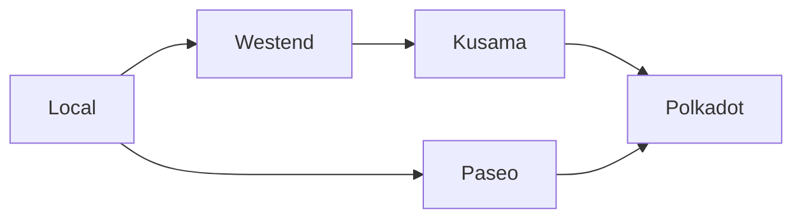
This flow ensures developers can thoroughly test and iterate without risking real tokens or affecting production networks. Testing tools like [Chopsticks](#chopsticks) and various TestNets make it easier to experiment safely before releasing to production.

A typical journey through the Polkadot core protocol development process might look like this:

1. **Local development node**: Development starts in a local environment, where developers can create, test, and iterate on upgrades or new features using a local development node. This stage allows rapid experimentation in an isolated setup without any external dependencies.

2. **Westend**: After testing locally, upgrades are deployed to [Westend](#westend), Polkadot's primary TestNet. Westend simulates real-world conditions without using real tokens, making it the ideal place for rigorous feature testing before moving on to production networks.

3. **Kusama**: Once features have passed extensive testing on Westend, they move to Kusama, Polkadot's experimental and fast-moving "canary" network. Kusama operates as a high-fidelity testing ground with actual economic incentives, giving developers insights into how their features will perform in a real-world environment.

4. **Polkadot**: After passing tests on Westend and Kusama, features are considered ready for deployment to Polkadot, the live production network.

    In addition, parachain developers can leverage local TestNets like [Zombienet](#zombienet) and deploy upgrades on parachain TestNets.

5. **Paseo**: For parachain and dApp developers, Paseo serves as a community-run TestNet that mirrors Polkadot's runtime. Like Westend for core protocol development, Paseo provides a testing ground for parachain development without affecting live networks.

!!!note
    The Rococo TestNet deprecation date was October 14, 2024. Teams should use Westend for Polkadot protocol and feature testing and Paseo for chain development-related testing.

## Polkadot Development Networks

Development and testing are crucial to building robust dApps and parachains and performing network upgrades within the Polkadot ecosystem. To achieve this, developers can leverage various networks and tools that provide a risk-free environment for experimentation and validation before deploying features to live networks. These networks help avoid the costs and risks associated with real tokens, enabling testing for functionalities like governance, cross-chain messaging, and runtime upgrades.

## Kusama Network

Kusama is the experimental version of Polkadot, designed for developers who want to move quickly and test their applications in a real-world environment with economic incentives. Kusama serves as a production-grade testing ground where developers can deploy features and upgrades with the pressure of game theory and economics in mind. It mirrors Polkadot but operates as a more flexible space for innovation.

The native token for Kusama is KSM. For more information about KSM, visit the [Native Assets](https://guide.kusama.network/docs/learn-DOT#kusama-tokens){target=\_blank} page.

## Test Networks

The following test networks provide controlled environments for testing upgrades and new features. TestNet tokens are available from the [Polkadot faucet](https://faucet.polkadot.io/){target=\_blank}.

### Westend

Westend is Polkadot's primary permanent TestNet. Unlike temporary test networks, Westend is not reset to the genesis block, making it an ongoing environment for testing Polkadot core features. Managed by Parity Technologies, Westend ensures that developers can test features in a real-world simulation without using actual tokens.

The native token for Westend is WND. More details about WND can be found on the [Native Assets](https://wiki.polkadot.com/learn/learn-dot/#__tabbed_2_2){target=\_blank} page.

### Paseo

[Paseo](https://github.com/paseo-network){target=\_blank} is a community-managed TestNet designed for parachain and dApp developers. It mirrors Polkadot's runtime and is maintained by Polkadot community members. Paseo provides a dedicated space for parachain developers to test their applications in a Polkadot-like environment without the risks associated with live networks.

The native token for Paseo is PAS. Additional information on PAS is available on the [Native Assets](https://wiki.polkadot.com/learn/learn-dot/#__tabbed_2_1){target=\_blank} page.

## Local Test Networks

Local test networks are an essential part of the development cycle for blockchain developers using the Polkadot SDK. They allow for fast, iterative testing in controlled, private environments without connecting to public TestNets. Developers can quickly spin up local instances to experiment, debug, and validate their code before deploying to larger TestNets like Westend or Paseo. Two key tools for local network testing are Zombienet and Chopsticks.

### Zombienet

[Zombienet](https://github.com/paritytech/zombienet){target=\_blank} is a flexible testing framework for Polkadot SDK-based blockchains. It enables developers to create and manage ephemeral, short-lived networks. This feature makes Zombienet particularly useful for quick iterations, as it allows you to run multiple local networks concurrently, mimicking different runtime conditions. Whether you're developing a parachain or testing your custom blockchain logic, Zombienet gives you the tools to automate local testing.

Key features of Zombienet include:

- Creating dynamic, local networks with different configurations.
- Running parachains and relay chains in a simulated environment.
- Efficient testing of network components like cross-chain messaging and governance.

Zombienet is ideal for developers looking to test quickly and thoroughly before moving to more resource-intensive public TestNets.

### Chopsticks

[Chopsticks](https://github.com/AcalaNetwork/chopsticks){target=\_blank} is a tool designed to create forks of Polkadot SDK-based blockchains, allowing developers to interact with network forks as part of their testing process. This capability makes Chopsticks a powerful option for testing upgrades, runtime changes, or cross-chain applications in a forked network environment.

Key features of Chopsticks include:

- Forking live Polkadot SDK-based blockchains for isolated testing.
- Simulating cross-chain messages in a private, controlled setup.
- Debugging network behavior by interacting with the fork in real-time.

Chopsticks provides a controlled environment for developers to safely explore the effects of runtime changes. It ensures that network behavior is tested and verified before upgrades are deployed to live networks.


---

# Networks for Polkadot Hub Smart Contracts

> Source (raw): https://raw.githubusercontent.com/polkadot-developers/polkadot-docs/master/.ai/pages/polkadot-protocol-smart-contract-basics-networks.md
> Canonical (HTML): https://docs.polkadot.com/polkadot-protocol/smart-contract-basics/networks/
> Summary: Explore the available networks for smart contract development on Polkadot Hub, including Westend Hub, Kusama Hub, and Polkadot Hub.

# Networks

-!!! smartcontract "PolkaVM Preview Release"
    PolkaVM smart contracts with Ethereum compatibility are in **early-stage development and may be unstable or incomplete**.

## Introduction

Polkadot Hub provides smart contract functionality across multiple networks to facilitate smart contract development in the Polkadot ecosystem. Whether you're testing new contracts or deploying to production, Polkadot Hub offers several network environments tailored for each stage of development. Developers can thoroughly test, iterate, and validate their smart contracts from local testing environments to production networks like Polkadot Hub.

This guide will introduce you to the current and upcoming networks available for smart contract development and explain how they fit into the development workflow.

## Network Overview

Smart contract development on Polkadot Hub follows a structured process to ensure rigorous testing of new contracts and upgrades before deployment on production networks. Development progresses through a well-defined path, beginning with local environments, advancing through TestNets, and ultimately reaching MainNets. The diagram below illustrates this progression:

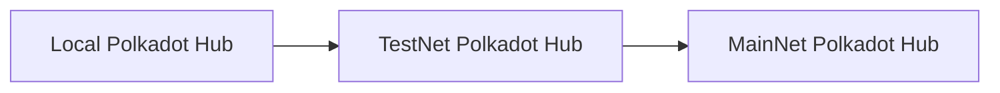

This progression ensures developers can thoroughly test and iterate their smart contracts without risking real tokens or affecting production networks. A typical development journey consists of three main stages:

1. Local development:

    - Developers start in a local environment to create, test, and iterate on smart contracts.
    - Provides rapid experimentation in an isolated setup without external dependencies.

2. TestNet development:

    - Contracts move to TestNets like Westend Hub and Passet Hub.
    - Enables testing in simulated real-world conditions without using real tokens.

3. Production deployment:

    - Final deployment to MainNets like Kusama Hub and Polkadot Hub.
    - Represents the live environment where contracts interact with real economic value.

## Local Development

The local development environment is crucial for smart contract development on Polkadot Hub. It provides developers a controlled space for rapid testing and iteration before moving to public networks. The local setup consists of several key components:

- **[Kitchensink node](https://paritytech.github.io/polkadot-sdk/master/kitchensink_runtime/index.html){target=\_blank}**: A local node that can be run for development and testing. It includes logging capabilities for debugging contract execution and provides a pre-configured development environment with pre-funded accounts for testing purposes.
- **[Ethereum RPC proxy](https://paritytech.github.io/polkadot-sdk/master/pallet_revive_eth_rpc/index.html){target=\_blank}**: Bridges Ethereum-compatible tools with the Polkadot SDK-based network. It enables seamless integration with popular development tools like MetaMask and Remix IDE. The purpose of this component is to translate Ethereum RPC calls into Substrate format.

## Test Networks

The following test networks provide controlled environments for testing smart contracts. TestNet tokens are available from the [Polkadot faucet](https://faucet.polkadot.io/){target=\_blank}. They provide a stable environment for testing your contracts without using real tokens.

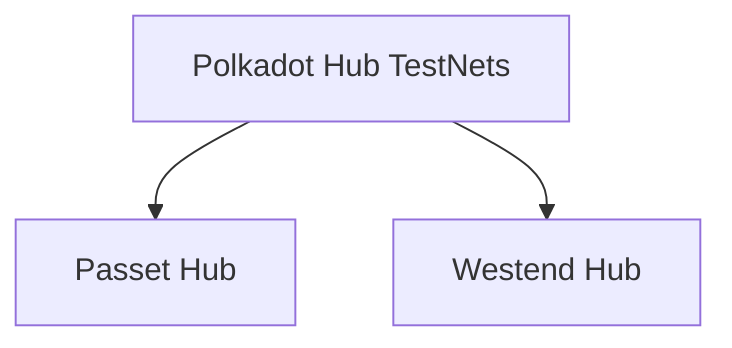

### Passet Hub

The Passet Hub will be a community-managed TestNet designed specifically for smart contract development. It will mirror Asset Hub's runtime and provide developers with an additional environment for testing their contracts before deployment to production networks.

### Westend Hub

Westend Hub is the TestNet for smart contract development and its cutting-edge features. The network maintains the same features and capabilities as the production Polkadot Hub, and also incorporates the latest features developed by core developers.

## Production Networks

The MainNet environments represent the final destination for thoroughly tested and validated smart contracts, where they operate with real economic value and serve actual users.

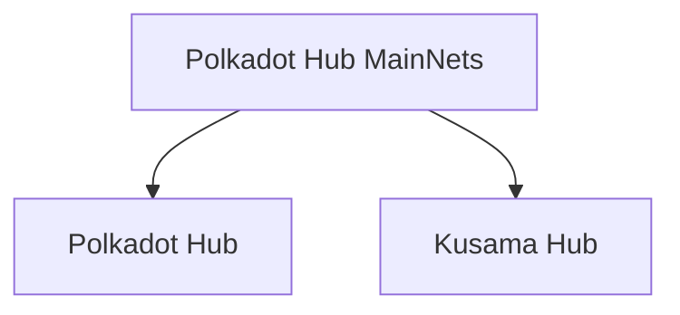

### Polkadot Hub

Polkadot Hub is the primary production network for deploying smart contracts in the Polkadot ecosystem. It provides a secure and stable environment for running smart contracts with real economic value. The network supports PolkaVM-compatible contracts written in Solidity or Rust, maintaining compatibility with Ethereum-based development tools.

### Kusama Hub

Kusama Hub is the canary version of Polkadot Hub. It is designed for developers who want to move quickly and test their smart contracts in a real-world environment with economic incentives. It provides a more flexible space for innovation while maintaining the same core functionality as Polkadot Hub.


---

# Node and Runtime

> Source (raw): https://raw.githubusercontent.com/polkadot-developers/polkadot-docs/master/.ai/pages/polkadot-protocol-parachain-basics-node-and-runtime.md
> Canonical (HTML): https://docs.polkadot.com/polkadot-protocol/parachain-basics/node-and-runtime/
> Summary: Learn how Polkadot SDK-based nodes function, how the client and runtime are separated, and how they communicate using SCALE-encoded data.

# Node and Runtime

## Introduction

Every blockchain platform relies on a decentralized network of computers, called nodes, that communicate with each other about transactions and blocks. In this context, a node refers to the software running on the connected devices rather than the physical or virtual machines in the network.

Polkadot SDK-based nodes consist of two main components, each with distinct responsibilities: the client (also called node) and the runtime.

If the system were a monolithic protocol, any modification would require updating the entire system. Instead, Polkadot achieves true upgradeability by defining an immutable meta-protocol (the client) and a protocol (the runtime) that can be upgraded independently.

This separation gives the [Polkadot Relay Chain](/polkadot-protocol/architecture/polkadot-chain){target=\_blank} and all connected [parachains](/polkadot-protocol/architecture/parachains){target=\_blank} an evolutionary advantage over other blockchain platforms.

## Architectural Principles

The Polkadot SDK-based blockchain architecture is fundamentally built on two distinct yet interconnected components:

- Client (Meta-protocol):
    - Handles the foundational infrastructure of the blockchain.
    - Manages runtime execution, networking, consensus, and other off-chain components.
    - Provides an immutable base layer that ensures network stability.
    - Upgradable only through hard forks.

- Runtime (Protocol):
    - Defines the blockchain's state transition logic.
    - Determines the specific rules and behaviors of the blockchain.
    - Compiled to WebAssembly (Wasm) for platform-independent execution.
    - Capable of being upgraded without network-wide forking.

### Advantages of this Architecture

- **Forkless upgrades**: Runtime can be updated without disrupting the entire network.
- **Modularity**: Clear separation allows independent development of client and runtime.
- **Flexibility**: Enables rapid iteration and evolution of blockchain logic.
- **Performance**: WebAssembly compilation provides efficient, cross-platform execution.

## Node (Client)

The node, also known as the client, is the core component responsible for executing the Wasm runtime and orchestrating various essential blockchain components. It ensures the correct execution of the state transition function and manages multiple critical subsystems, including:

- **Wasm execution**: Runs the blockchain runtime, which defines the state transition rules.
- **Database management**: Stores blockchain data.
- **Networking**: Facilitates peer-to-peer communication, block propagation, and transaction gossiping.
- **Transaction pool (Mempool)**: Manages pending transactions before they are included in a block.
- **Consensus mechanism**: Ensures agreement on the blockchain state across nodes.
- **RPC services**: Provides external interfaces for applications and users to interact with the node.

## Runtime

The runtime is more than just a set of rules. It's the fundamental logic engine that defines a blockchain's entire behavior. In Polkadot SDK-based blockchains, the runtime represents a complete, self-contained description of the blockchain's state transition function.

### Characteristics

The runtime is distinguished by three key characteristics:

- **Business logic**: Defines the complete application-specific blockchain behavior.
- **WebAssembly compilation**: Ensures platform-independent, secure execution.
- **On-chain storage**: Stored within the blockchain's state, allowing dynamic updates.

### Key Functions

The runtime performs several critical functions, such as:

- Define state transition rules.
- Implement blockchain-specific logic.
- Manage account interactions.
- Control transaction processing.
- Define governance mechanisms.
- Handle custom pallets and modules.

## Communication Between Node and Runtime

The client and runtime communicate exclusively using [SCALE-encoded](/polkadot-protocol/parachain-basics/data-encoding){target=\_blank} communication. This ensures efficient and compact data exchange between the two components.

### Runtime APIs

The Runtime API consists of well-defined functions and constants a client assumes are implemented in the Runtime Wasm blob. These APIs enable the client to interact with the runtime to execute blockchain operations and retrieve information. The client invokes these APIs to:

- Build, execute, and finalize blocks.
- Access metadata.
- Access consensus related information.
- Handle transaction execution.

### Host Functions

During execution, the runtime can access certain external client functionalities via host functions. The specific functions the client exposes allow the runtime to perform operations outside the WebAssembly domain. Host functions enable the runtime to:

- Perform cryptographic operations.
- Access the current blockchain state.
- Handle storage modifications.
- Allocate memory.


---

# Obtain Coretime

> Source (raw): https://raw.githubusercontent.com/polkadot-developers/polkadot-docs/master/.ai/pages/develop-parachains-deployment-obtain-coretime.md
> Canonical (HTML): https://docs.polkadot.com/develop/parachains/deployment/obtain-coretime/
> Summary: Learn how to obtain and manage coretime for your Polkadot parachain. Explore bulk and on-demand options, prerequisites, and initial setup.

# Obtain Coretime

## Introduction

Securing coretime is essential for operating a parachain on Polkadot. It provides your parachain with guaranteed computational resources and access to Polkadot's shared security model, ensuring your blockchain can process transactions, maintain its state, and interact securely with other parachains in the network. Without coretime, a parachain cannot participate in the ecosystem or leverage the relay chain's validator set for security.

Coretime represents the computational resources allocated to your parachain on the Polkadot network. It determines when and how often your parachain can produce blocks and have them validated by the relay chain.

There are two primary methods to obtain coretime:

- **Bulk coretime**: Purchase computational resources in advance for a full month.
- **On-demand coretime**: Buy computational resources as needed for individual block production.

This guide explains the different methods of obtaining coretime and walks through the necessary steps to get your parachain running. 

## Prerequisites

Before obtaining coretime, ensure you have:

- Developed your parachain runtime using the Polkadot SDK.
- Set up and configured a parachain collator for your target relay chain.
- Successfully compiled your parachain collator node.
- Generated and exported your parachain's genesis state.
- Generated and exported your parachain's validation code (Wasm).

## Initial Setup Steps

1. Reserve a unique identifier, `ParaID`, for your parachain:

    1. Connect to the relay chain.
    2. Submit the [`registrar.reserve`](https://paritytech.github.io/polkadot-sdk/master/polkadot_runtime_common/paras_registrar/pallet/dispatchables/fn.reserve.html){target=\_blank} extrinsic.

    Upon success, you'll receive a registered `ParaID`.

2. Register your parachain's essential information by submitting the [`registrar.register`](https://paritytech.github.io/polkadot-sdk/master/polkadot_runtime_common/paras_registrar/pallet/dispatchables/fn.register.html){target=\_blank} extrinsic with the following parameters:

    - **`id`**: Your reserved `ParaID`.
    - **`genesisHead`**: Your exported genesis state.
    - **`validationCode`**: Your exported Wasm validation code.

3. Start your parachain collator and begin synchronization with the relay chain.

## Obtaining Coretime

### Bulk Coretime

Bulk coretime provides several advantages:

- Monthly allocation of resources
- Guaranteed block production slots (every 12 seconds, or 6 seconds with [Asynchronous Backing](https://wiki.polkadot.com/learn/learn-async-backing/#asynchronous-backing){target=\_blank})
- Priority renewal rights
- Protection against price fluctuations
- Ability to split and resell unused coretime

To purchase bulk coretime:

1. Access the Coretime system parachain.
2. Interact with the Broker pallet.
3. Purchase your desired amount of coretime.
4. Assign the purchased core to your registered `ParaID`.

After successfully obtaining coretime, your parachain will automatically start producing blocks at regular intervals.

For current marketplaces and pricing, consult the [Coretime Marketplaces](https://wiki.polkadot.com/learn/learn-guides-coretime-marketplaces/){target=\_blank} page on the Polkadot Wiki.

### On-demand Coretime

On-demand coretime allows for flexible, as-needed block production. To purchase:

1. Ensure your collator node is fully synchronized with the relay chain.
2. Submit the `onDemand.placeOrderAllowDeath` extrinsic on the relay chain with:

    - **`maxAmountFor`**: Sufficient funds for the transaction.
    - **`paraId`**: Your registered `ParaID`.

After successfully executing the extrinsic, your parachain will produce a block.


---

# Obtain Coretime

> Source (raw): https://raw.githubusercontent.com/polkadot-developers/polkadot-docs/master/.ai/pages/tutorials-polkadot-sdk-parachains-zero-to-hero-obtain-coretime.md
> Canonical (HTML): https://docs.polkadot.com/tutorials/polkadot-sdk/parachains/zero-to-hero/obtain-coretime/
> Summary: Learn how to obtain coretime for block production with this guide, covering both on-demand and bulk options for smooth operations.

## Introduction

After deploying a parachain to the Paseo TestNet in the [Deploy to TestNet](/tutorials/polkadot-sdk/parachains/zero-to-hero/deploy-to-testnet/){target=\_blank} tutorial, the focus shifts to understanding Coretime, which is the mechanism in which validation resources are allocated from the relay chain to the respective task, such as a parachain. A parachain could only produce blocks and finalize them on the relay chain by obtaining coretime.

There are two ways to obtain coretime:

- **[On-demand coretime](#order-on-demand-coretime)**: On-demand coretime allows you to buy coretime on a block-by-block basis.
- **[Bulk coretime](#purchase-bulk-coretime)**: Bulk coretime allows you to obtain a core or part of a core. It is purchased for some time, up to 28 days. It must be renewed once the lease finishes.

In this tutorial, you will:

- Learn about the different coretime interfaces available.
- Learn how to purchase a core via bulk coretime.
- Assign a task / parachain to the core for block production.
- Alternatively, use on-demand coretime to produce blocks as required.

## Prerequisites 

Before proceeding, you should have the following items:

- A parachain ID.
- A chain specification.
- A registered parathread with the correct genesis, runtime, and parachain ID that matches the chain specification.
- A properly configured and synced (with the relay chain) collator.

Once the above is complete, obtaining coretime is the last step to enable your parachain to start producing and finalizing blocks using the relay chain's validator set. If you don't, refer to the previous tutorial: [Deploy on Paseo TestNet](/tutorials/polkadot-sdk/parachains/zero-to-hero/deploy-to-testnet/){target=\_blank}.

## Order On Demand Coretime

There are two extrinsics which allow you to place orders for on-demand coretime:

- [**`onDemand.placeOrderAllowDeath`**](https://paritytech.github.io/polkadot-sdk/master/polkadot_runtime_parachains/on_demand/pallet/dispatchables/fn.place_order_allow_death.html){target=\_blank}: Will [reap](https://wiki.polkadot.com/learn/learn-accounts/#existential-deposit-and-reaping){target=\_blank} the account once the provided funds run out.
- [**`onDemand.placeOrderKeepAlive`**](https://paritytech.github.io/polkadot-sdk/master/polkadot_runtime_parachains/on_demand/pallet/dispatchables/fn.place_order_keep_alive.html){target=\_blank}: Includes a check that will **not** reap the account if the provided funds run out, ensuring the account is kept alive.

To produce a block in your parachain, navigate to Polkadot.js Apps and ensure you're connected to the Paseo relay chain. Then, access the [**Developer > Extrinsics**](https://polkadot.js.org/apps/#/extrinsics){target=\_blank} tab and execute the `onDemand.placeOrderAllowDeath` extrinsic from the account that registered the `ParaID`. For this example, `maxAmount` is set to `1000000000000` (this value may vary depending on the network conditions), and `paraId` is set to `4518`:


With each successful on-demand extrinsic, the parachain will produce a new block. You can verify this by checking the collator logs. If the extrinsic is successful, you should see output similar to the following:

-<div id="termynal" data-termynal>
  <span data-ty="progress">2024-12-11 18:03:29 [Parachain] 🙌 Starting consensus session on top of parent </span>
  <span data-ty="progress">0x860e5e37dbc04e736e76c4a42c64e71e069084548862d4007d32958578b26d87 (#214) </span>
  <span data-ty="progress">2024-12-11 18:03:30 [Parachain] 🎁 Prepared block for proposing at 215 (701 ms) hash: </span>
  <span data-ty="progress">0xee48b7dd559ab4cbff679f59e5cd37f2fd5b60c53a25b11d770dce999968076c; parent_hash: 0x860e…6d87; end: NoMoreTransactions; extrinsics_count: 2 </span>
  <span data-ty="progress">2024-12-11 18:03:30 [Parachain] 🏆 Imported #215 (0x860e…6d87 → 0xee48…076c)</span>
</div>


## Purchase Bulk Coretime

Purchasing bulk coretime involves purchasing a core from the [Coretime Chain](/polkadot-protocol/architecture/system-chains/coretime/){target=\_blank}, which has an instance of [`pallet_broker`](https://paritytech.github.io/polkadot-sdk/master/pallet_broker/index.html){target=\_blank} (the Broker pallet). Although this can be done via sending extrinsics through a tool like Polkadot.js Apps, the [RegionX Coretime Marketplace](https://app.regionx.tech){target=\_blank} (includes Paseo support) also provides a user interface for purchasing and managing bulk coretime.
  
!!!tip
    Obtaining a core for bulk coretime on Paseo follows a different process from Polkadot or Kusama. To apply for a core on Paseo, visit their guide for doing so: [PAS-10 Onboard Paras Coretime](https://github.com/paseo-network/paseo-action-submission/blob/main/pas/PAS-10-Onboard-paras-coretime.md#summary){target=\_blank}. 

### Get Coretime Funds

First, ensure your wallet is connected to the [RegionX](https://app.regionx.tech){target=\_blank} interface. To do so, go to **Home** in the RegionX app and click the **Connect Wallet** button in the upper right.

After connecting your wallet, you must obtain funds on the Coretime chain. You can use the [RegionX Transfer](https://app.regionx.tech/transfer){target=\_blank} page to perform a cross-chain transfer from the relay to the system chain.


If you are purchasing a core on a TestNet, be sure to visit the [Polkadot Faucet](https://faucet.polkadot.io/westend){target=\_blank} for TestNet tokens.

If successful, you should see the balance in the upper right of the **Transfer** page update with balances on the relay and Coretime chain, respectively.


### Purchase a Core

For this tutorial, we will use [RegionX](https://app.regionx.tech){target=\_blank}. Once you open the app, you should be presented with the following screen:


On the top left is a network switch. Ensure you have selected your parachain and that it is registered before purchasing a core.

To purchase a core, go to the menu on the left and select the **Purchase A Core** item under **Primary Market**. Here, you should see the cores available for purchase, details regarding the sale period, and its current phase. Alternatively, you may use this link to visit it: [**Primary Market > Purchase A Core**](https://app.regionx.tech/purchase){target=\_blank}.


At the bottom-right corner of the page, select the **Purchase a Core** button. A modal detailing the fees will appear. Review the details, then click **Ok** and sign the transaction using the wallet of your choice.


Once the transaction is confirmed, click [**My Regions**](https://app.regionx.tech/regions){target=\_blank} on the left-hand menu, and you will see your purchased core.


Congratulations, you just purchased a core using RegionX! You can assign the core to your parachain, partition, interlace, and more using RegionX.

### Assign a Core

Once you have the core as shown in the dashboard, select it by clicking on it, then click the **Assign** option on the left-hand side. You will be presented with a modal in which you can add a new task.


Click the **Add Task** button and input the parachain identifier, along with the name of your project, and finalize it by clicking **Add Task**.


You may now select a task from the list. You must also set the core's finality, which determines whether you can renew this specific core. Provisional finality allows for interlacing and partitioning, whereas Final finality does not allow the region to be modified. A core must not be interlaced or partitioned to be renewable, so Finality should be selected if you want to renew this specific core.

Once you sign and send this transaction, your parachain will be assigned to that core.


---

# On-Chain Governance Overview

> Source (raw): https://raw.githubusercontent.com/polkadot-developers/polkadot-docs/master/.ai/pages/polkadot-protocol-onchain-governance-overview.md
> Canonical (HTML): https://docs.polkadot.com/polkadot-protocol/onchain-governance/overview/
> Summary: Discover Polkadot’s cutting-edge OpenGov system, enabling transparent, decentralized decision-making through direct democracy and flexible governance tracks.

# On-Chain Governance 

## Introduction

Polkadot’s governance system exemplifies decentralized decision-making, empowering its community of stakeholders to shape the network’s future through active participation. The latest evolution, OpenGov, builds on Polkadot’s foundation by providing a more inclusive and efficient governance model.

This guide will explain the principles and structure of OpenGov and walk you through its key components, such as Origins, Tracks, and Delegation. You will learn about improvements over earlier governance systems, including streamlined voting processes and enhanced stakeholder participation.

With OpenGov, Polkadot achieves a flexible, scalable, and democratic governance framework that allows multiple proposals to proceed simultaneously, ensuring the network evolves in alignment with its community's needs.

## Governance Evolution

Polkadot’s governance journey began with [Governance V1](https://wiki.polkadot.com/learn/learn-polkadot-opengov/#governance-summary){target=\_blank}, a system that proved effective in managing treasury funds and protocol upgrades. However, it faced limitations, such as:

- Slow voting cycles, causing delays in decision-making.
- Inflexibility in handling multiple referendums, restricting scalability.

To address these challenges, Polkadot introduced OpenGov, a governance model designed for greater inclusivity, efficiency, and scalability. OpenGov replaces the centralized structures of Governance V1, such as the Council and Technical Committee, with a fully decentralized and dynamic framework.

For a full comparison of the historic and current governance models, visit the [Gov1 vs. Polkadot OpenGov](https://wiki.polkadot.com/learn/learn-polkadot-opengov/#gov1-vs-polkadot-opengov){target=\_blank} section of the Polkadot Wiki.

## OpenGov Key Features

OpenGov transforms Polkadot’s governance into a decentralized, stakeholder-driven model, eliminating centralized decision-making bodies like the Council. Key enhancements include:

- **Decentralization**: Shifts all decision-making power to the public, ensuring a more democratic process.
- **Enhanced delegation**: Allows users to delegate their votes to trusted experts across specific governance tracks.
- **Simultaneous referendums**: Multiple proposals can progress at once, enabling faster decision-making.
- **Polkadot Technical Fellowship**: A broad, community-driven group replacing the centralized Technical Committee.

This new system ensures Polkadot governance remains agile and inclusive, even as the ecosystem grows.

## Origins and Tracks

In OpenGov, origins and tracks are central to managing proposals and votes.

- **Origin**: Determines the authority level of a proposal (e.g., Treasury, Root) which decides the track of all referendums from that origin.
- **Track**: Define the procedural flow of a proposal, such as voting duration, approval thresholds, and enactment timelines.

Developers must be aware that referendums from different origins and tracks will take varying amounts of time to reach approval and enactment. The [Polkadot Technical Fellowship](https://wiki.polkadot.com/learn/learn-polkadot-technical-fellowship/){target=\_blank} has the option to shorten this timeline by whitelisting a proposal and allowing it to be enacted through the [Whitelist Caller](https://wiki.polkadot.com/learn/learn-polkadot-opengov-origins/#whitelisted-caller){target=\_blank} origin.

Visit [Origins and Tracks Info](https://wiki.polkadot.com/learn/learn-polkadot-opengov/#origins-and-tracks){target=\_blank} for details on current origins and tracks, associated terminology, and parameters.

## Referendums

In OpenGov, anyone can submit a referendum, fostering an open and participatory system. The timeline for a referendum depends on the privilege level of the origin with more significant changes offering more time for community voting and participation before enactment. 

The timeline for an individual referendum includes four distinct periods:

- **Lead-in**: A minimum amount of time to allow for community participation, available room in the origin, and payment of the decision deposit. Voting is open during this period.
- **Decision**: Voting continues.
- **Confirmation**: Referendum must meet [approval and support](https://wiki.polkadot.com/learn/learn-polkadot-opengov/#approval-and-support){target=\_blank} criteria during entire period to avoid rejection.
- **Enactment**: Changes approved by the referendum are executed.

### Vote on Referendums

Voters can vote with their tokens on each referendum. Polkadot uses a voluntary token locking mechanism, called conviction voting, as a way for voters to increase their voting power. A token holder signals they have a stronger preference for approving a proposal based upon their willingness to lock up tokens. Longer voluntary token locks are seen as a signal of continual approval and translate to increased voting weight.

See [Voting on a Referendum](https://wiki.polkadot.com/learn/learn-polkadot-opengov/#voting-on-a-referendum){target=\_blank} for a deeper look at conviction voting and related token locks.

### Delegate Voting Power

The OpenGov system also supports multi-role delegations, allowing token holders to assign their voting power on different tracks to entities with expertise in those areas. 

For example, if a token holder lacks the technical knowledge to evaluate proposals on the [Root track](https://wiki.polkadot.com/learn/learn-polkadot-opengov-origins/#root){target=\_blank}, they can delegate their voting power for that track to an expert they trust to vote in the best interest of the network. This ensures informed decision-making across tracks while maintaining flexibility for token holders.

Visit [Multirole Delegation](https://wiki.polkadot.com/learn/learn-polkadot-opengov/#multirole-delegation){target=\_blank} for more details on delegating voting power.

### Cancel a Referendum

Polkadot OpenGov has two origins for rejecting ongoing referendums: 

- [**Referendum Canceller**](https://wiki.polkadot.com/learn/learn-polkadot-opengov-origins/#referendum-canceller){target=\_blank}: Cancels an active referendum when non-malicious errors occur and refunds the deposits to the originators.
- [**Referendum Killer**](https://wiki.polkadot.com/learn/learn-polkadot-opengov-origins/#referendum-killer){target=\_blank}: Used for urgent, malicious cases this origin instantly terminates an active referendum and slashes deposits.

See [Cancelling, Killing, and Blacklisting](https://wiki.polkadot.com/learn/learn-polkadot-opengov/#cancelling-killing--blacklisting){target=\_blank} for additional information on rejecting referendums.

## Additional Resources

- **[Democracy pallet](https://github.com/paritytech/polkadot-sdk/tree/polkadot-stable2506/substrate/frame/democracy/src){target=\_blank}**: Handles administration of general stakeholder voting.
- **[Gov2: Polkadot’s Next Generation of Decentralised Governance](https://medium.com/polkadot-network/gov2-polkadots-next-generation-of-decentralised-governance-4d9ef657d11b){target=\_blank}**: Medium article by Gavin Wood.
- **[Polkadot Direction](https://matrix.to/#/#Polkadot-Direction:parity.io){target=\_blank}**: Matrix Element client.
- **[Polkassembly](https://polkadot.polkassembly.io/){target=\_blank}**: OpenGov dashboard and UI.
- **[Polkadot.js Apps Governance](https://polkadot.js.org/apps/#/referenda){target=\_blank}**: Overview of active referendums.


---

# Opening HRMP Channels Between Parachains

> Source (raw): https://raw.githubusercontent.com/polkadot-developers/polkadot-docs/master/.ai/pages/tutorials-interoperability-xcm-channels-para-to-para.md
> Canonical (HTML): https://docs.polkadot.com/tutorials/interoperability/xcm-channels/para-to-para/
> Summary: Learn how to open HRMP channels between parachains on Polkadot. Discover the step-by-step process for establishing uni- and bidirectional communication.

# Opening HRMP Channels Between Parachains

## Introduction

For establishing communication channels between parachains on the Polkadot network using the Horizontal Relay-routed Message Passing (HRMP) protocol, the following steps are required:

1. **Channel request**: The parachain that wants to open an HRMP channel must make a request to the parachain it wishes to have an open channel with.
2. **Channel acceptance**: The other parachain must then accept this request to complete the channel establishment.

This process results in a unidirectional HRMP channel, where messages can flow in only one direction between the two parachains.

An additional HRMP channel must be established in the opposite direction to enable bidirectional communication. This requires repeating the request and acceptance process but with the parachains reversing their roles.

Once both unidirectional channels are established, the parachains can send messages back and forth freely through the bidirectional HRMP communication channel.

## Prerequisites

Before proceeding, ensure you meet the following requirements:

- Blockchain network with a relay chain and at least two connected parachains.
- Wallet with sufficient funds to execute transactions on the participant chains.

## Procedure to Initiate an HRMP Channel

This example will demonstrate how to open a channel between parachain 2500 and parachain 2600, using Rococo Local as the relay chain.

### Fund Sender Sovereign Account


The [sovereign account](https://github.com/polkadot-fellows/xcm-format/blob/10726875bd3016c5e528c85ed6e82415e4b847d7/README.md?plain=1#L50){target=_blank} for parachain 2500 on the relay chain must be funded so it can take care of any XCM transact fees.

Use [Polkadot.js Apps](https://polkadot.js.org/apps/#/explorer){target=\_blank} UI to connect to the relay chain and transfer funds from your account to the parachain 2500 sovereign account.


??? note "Calculating Parachain Sovereign Account"
    To generate the sovereign account address for a parachain, you'll need to follow these steps:

    1. Determine if the parachain is an "up/down" chain (parent or child) or a "sibling" chain:

        - Up/down chains use the prefix `0x70617261` (which decodes to `b"para"`).
        - Sibling chains use the prefix `0x7369626c` (which decodes to `b"sibl"`).

    2. Calculate the u32 scale encoded value of the parachain ID:

        - Parachain 2500 would be encoded as `c4090000`.

    3. Combine the prefix and parachain ID encoding to form the full sovereign account address:

        The sovereign account of parachain 2500 in relay chain will be `0x70617261c4090000000000000000000000000000000000000000000000000000`
        and the SS58 format of this address is `5Ec4AhPSY2GEE4VoHUVheqv5wwq2C1HMKa7c9fVJ1WKivX1Y`.
    
    To perform this conversion, you can also use the **"Para ID" to Address** section in [Substrate Utilities](https://www.shawntabrizi.com/substrate-js-utilities/){target=_blank}.

### Create Channel Opening Extrinsic

1. In Polkadot.js Apps, connect to the relay chain, navigate to the **Developer** dropdown and select the **Extrinsics** option.

    

2. Construct an `hrmpInitOpenChannel` extrinsic call:

    1. Select the **`hrmp`** pallet.
    2. Choose the **`hrmpInitOpenChannel`** extrinsic.
    3. Fill in the parameters:
        - **`recipient`**: Parachain ID of the target chain (in this case, 2600).
        - **`proposedMaxCapacity`**: Max number of messages that can be pending in the channel at once.
        - **`proposedMaxMessageSize`**: Max message size that could be put into the channel.
    4. Copy the encoded call data.

    

    The encoded call data for opening a channel with parachain 2600 is `0x3c00280a00000800000000001000`.

### Craft and Submit the XCM Message from the Sender

To initiate the HRMP channel opening process, you need to create an XCM message that includes the encoded `hrmpInitOpenChannel` call data from the previous step. This message will be sent from your parachain to the relay chain.

This example uses the `sudo` pallet to dispatch the extrinsic. Verify the XCM configuration of the parachain you're working with and ensure you're using an origin with the necessary privileges to execute the `polkadotXcm.send` extrinsic.

The XCM message should contain the following instructions:

- **`WithdrawAsset`**: Withdraws assets from the origin's ownership and places them in the Holding Register.
- **`BuyExecution`**: Pays for the execution of the current message using the assets in the Holding Register.
- **`Transact`**: Execute the encoded transaction call.
- **`RefundSurplus`**: Increases the Refunded Weight Register to the value of the Surplus Weight Register, attempting to reclaim any excess fees paid via BuyExecution.
- **`DepositAsset`**: Subtracts assets from the Holding Register and deposits equivalent on-chain assets under the specified beneficiary's ownership.

!!!note 
    For more detailed information about XCM's functionality, complexities, and instruction set, refer to the [xcm-format](https://github.com/polkadot-fellows/xcm-format){target=_blank} documentation.

In essence, this process withdraws funds from the parachain's sovereign account to the XCVM Holding Register, then uses these funds to purchase execution time for the XCM `Transact` instruction, executes `Transact`, refunds any unused execution time and deposits any remaining funds into a specified account.

To send the XCM message to the relay chain, connect to parachain 2500 in Polkadot.js Apps. Fill in the required parameters as shown in the image below, ensuring that you:

1. Replace the **`call`** field with your encoded `hrmpInitOpenChannel` call data from the previous step.
2. Use the correct beneficiary information.
3. Click the **Submit Transaction** button to dispatch the XCM message to the relay chain.


!!! note
    The exact process and parameters for submitting this XCM message may vary depending on your specific parachain and relay chain configurations. Always refer to the most current documentation for your particular network setup.

After submitting the XCM message to initiate the HRMP channel opening, you should verify that the request was successful. Follow these steps to check the status of your channel request:

1. Using Polkadot.js Apps, connect to the relay chain and navigate to the **Developer** dropdown, then select the **Chain state** option.

    

2. Query the HRMP open channel requests:

    1. Select **`hrmp`**.
    2. Choose the **`hrmpOpenChannelRequests`** call.
    3. Click the **+** button to execute the query.
    4. Check the status of all pending channel requests.

    

If your channel request was successful, you should see an entry for your parachain ID in the list of open channel requests. This confirms that your request has been properly registered on the relay chain and is awaiting acceptance by the target parachain.

## Procedure to Accept an HRMP Channel

For the channel to be fully established, the target parachain must accept the channel request by submitting an XCM message to the relay chain.

### Fund Receiver Sovereign Account

Before proceeding, ensure that the sovereign account of parachain 2600 on the relay chain is funded. This account will be responsible for covering any XCM transact fees.
To fund the account, follow the same process described in the previous section, [Fund Sovereign Account](#fund-sender-sovereign-account).

### Create Channel Accepting Extrinsic

1. In Polkadot.js Apps, connect to the relay chain, navigate to the **Developer** dropdown and select the **Extrinsics** option.

    

2. Construct an `hrmpAcceptOpenChannel` extrinsic call:

    1. Select the **`hrmp`** pallet.
    2. Choose the **`hrmpAcceptOpenChannel`** extrinsic.
    3. Fill in the parameters:
        - **`sender`**: Parachain ID of the requesting chain (in this case, 2500).
    4. Copy the encoded call data.

    
    
    The encoded call data for accepting a channel with parachain 2500 should be `0x3c01c4090000`.

### Craft and Submit the XCM Message from the Receiver

To accept the HRMP channel opening, you need to create and submit an XCM message that includes the encoded `hrmpAcceptOpenChannel` call data from the previous step. This process is similar to the one described in the previous section, [Craft and Submit the XCM Message](#craft-and-submit-the-xcm-message-from-the-sender), with a few key differences:

- Use the encoded call data for `hrmpAcceptOpenChannel` obtained in step 2 of this section.
- In the last XCM instruction (DepositAsset), set the beneficiary to parachain 2600's sovereign account to receive any surplus funds.

To send the XCM message to the relay chain, connect to parachain 2600 in Polkadot.js Apps. Fill in the required parameters as shown in the image below, ensuring that you:

1. Replace the **`call`** field with your encoded `hrmpAcceptOpenChannel` call data from the previous step.
2. Use the correct beneficiary information.
3. Click the **Submit Transaction** button to dispatch the XCM message to the relay chain.


After submitting the XCM message to accept the HRMP channel opening, verify that the channel has been set up correctly.

1. Using Polkadot.js Apps, connect to the relay chain and navigate to the **Developer** dropdown, then select the **Chain state** option.

    

2. Query the HRMP channels:

    1. Select **`hrmp`**.
    2. Choose the **`hrmpChannels`** call.
    3. Click the **+** button to execute the query.
    4. Check the status of the opened channel.

    

If the channel has been successfully established, you should see the channel details in the query results.

By following these steps, you will have successfully accepted the HRMP channel request and established a unidirectional channel between the two parachains. 

!!! note
    Remember that for full bidirectional communication, you'll need to repeat this process in the opposite direction, with parachain 2600 initiating a channel request to parachain 2500.


---

# Opening HRMP Channels with System Parachains

> Source (raw): https://raw.githubusercontent.com/polkadot-developers/polkadot-docs/master/.ai/pages/tutorials-interoperability-xcm-channels-para-to-system.md
> Canonical (HTML): https://docs.polkadot.com/tutorials/interoperability/xcm-channels/para-to-system/
> Summary: Learn how to open HRMP channels with Polkadot system parachains. Discover the process for establishing bi-directional communication using a single XCM message.

# Opening HRMP Channels with System Parachains

## Introduction

While establishing Horizontal Relay-routed Message Passing (HRMP) channels between regular parachains involves a two-step request and acceptance procedure, opening channels with system parachains follows a more straightforward approach.

System parachains are specialized chains that provide core functionality to the Polkadot network. Examples include Asset Hub for cross-chain asset transfers and Bridge Hub for connecting to external networks. Given their critical role, establishing communication channels with these system parachains has been optimized for efficiency and ease of use.

Any parachain can establish a bidirectional channel with a system chain through a single operation, requiring just one XCM message from the parachain to the relay chain.

## Prerequisites

To successfully complete this process, you'll need to have the following in place:

- Access to a blockchain network consisting of:
    - A relay chain
    - A parachain
    - An Asset Hub system chain
- A wallet containing enough funds to cover transaction fees on each of the participating chains.

## Procedure to Establish an HRMP Channel

This guide demonstrates opening an HRMP channel between parachain 2500 and system chain Asset Hub (parachain 1000) on the Rococo Local relay chain.

### Fund Parachain Sovereign Account

The [sovereign account](https://github.com/polkadot-fellows/xcm-format/blob/10726875bd3016c5e528c85ed6e82415e4b847d7/README.md?plain=1#L50){target=_blank} for parachain 2500 on the relay chain must be funded so it can take care of any XCM transact fees.

Use [Polkadot.js Apps](https://polkadot.js.org/apps/#/explorer){target=\_blank} UI to connect to the relay chain and transfer funds from your account to the parachain 2500 sovereign account.


??? note "Calculating Parachain Sovereign Account"
    To generate the sovereign account address for a parachain, you'll need to follow these steps:

    1. Determine if the parachain is an "up/down" chain (parent or child) or a "sibling" chain:

        - Up/down chains use the prefix `0x70617261` (which decodes to `b"para"`).
        - Sibling chains use the prefix `0x7369626c` (which decodes to `b"sibl"`).

    2. Calculate the u32 scale encoded value of the parachain ID:

        - Parachain 2500 would be encoded as `c4090000`.

    3. Combine the prefix and parachain ID encoding to form the full sovereign account address:

        The sovereign account of parachain 2500 in relay chain will be `0x70617261c4090000000000000000000000000000000000000000000000000000`
        and the SS58 format of this address is `5Ec4AhPSY2GEE4VoHUVheqv5wwq2C1HMKa7c9fVJ1WKivX1Y`.
    
    To perform this conversion, you can also use the **"Para ID" to Address** section in [Substrate Utilities](https://www.shawntabrizi.com/substrate-js-utilities/){target=\_blank}.

### Create Establish Channel with System Extrinsic

1. In Polkadot.js Apps, connect to the relay chain, navigate to the **Developer** dropdown and select the **Extrinsics** option.

    

2. Construct an `establish_channel_with_system` extrinsic call:

    1. Select the **`hrmp`** pallet.
    2. Choose the **`establish_channel_with_system`** extrinsic.
    3. Fill in the parameters:
        - **`target_system_chain`**: Parachain ID of the target system chain (in this case, 1000).
    4. Copy the encoded call data.
    

    The encoded call data for establishing a channel with system parachain 1000 should be `0x3c0ae8030000`.

### Craft and Submit the XCM Message

Connect to parachain 2500 using Polkadot.js Apps to send the XCM message to the relay chain. Input the necessary parameters as illustrated in the image below. Make sure to:

1. Insert your previously encoded `establish_channel_with_system` call data into the **`call`** field.
2. Provide beneficiary details.
3. Dispatch the XCM message to the relay chain by clicking the **Submit Transaction** button.


!!! note
    The exact process and parameters for submitting this XCM message may vary depending on your specific parachain and relay chain configurations. Always refer to the most current documentation for your particular network setup.

After successfully submitting the XCM message to the relay chain, two [`HrmpSystemChannelOpened`](https://paritytech.github.io/polkadot-sdk/master/polkadot_runtime_parachains/hrmp/pallet/enum.Event.html#variant.HrmpSystemChannelOpened){target=\_blank} events are emitted, indicating that the channels are now present in storage under [`HrmpOpenChannelRequests`](https://paritytech.github.io/polkadot-sdk/master/polkadot_runtime_parachains/hrmp/pallet/storage_types/struct.HrmpOpenChannelRequests.html){target=\_blank}. However, the channels are not actually set up until the start of the next session, at which point bidirectional communication between parachain 2500 and system chain 1000 is established.

To verify this, wait for the next session and then follow these steps:

1. Using Polkadot.js Apps, connect to the relay chain and navigate to the **Developer** dropdown, then select **Chain state**.

    

2. Query the HRMP channels:

    1. Select **`hrmp`** from the options.
    2. Choose the **`hrmpChannels`** call.
    3. Click the **+** button to execute the query.

    
    
3. Examine the query results. You should see output similar to the following:

    ```json
    -[
    [
        [
            {
                "sender": 1000,
                "recipient": 2500
            }
        ],
        {
            "maxCapacity": 8,
            "maxTotalSize": 8192,
            "maxMessageSize": 1048576,
            "msgCount": 0,
            "totalSize": 0,
            "mqcHead": null,
            "senderDeposit": 0,
            "recipientDeposit": 0
        }
    ],
    [
        [
            {
                "sender": 2500,
                "recipient": 1000
            }
        ],
        {
            "maxCapacity": 8,
            "maxTotalSize": 8192,
            "maxMessageSize": 1048576,
            "msgCount": 0,
            "totalSize": 0,
            "mqcHead": null,
            "senderDeposit": 0,
            "recipientDeposit": 0
        }
    ]
]

    ```

The output confirms the successful establishment of two HRMP channels:

- From chain 1000 (system chain) to chain 2500 (parachain).
- From chain 2500 (parachain) to chain 1000 (system chain).

This bidirectional channel enables direct communication between the system chain and the parachain, allowing for cross-chain message passing.


---

# Overview

> Source (raw): https://raw.githubusercontent.com/polkadot-developers/polkadot-docs/master/.ai/pages/polkadot-protocol-architecture-parachains-overview.md
> Canonical (HTML): https://docs.polkadot.com/polkadot-protocol/architecture/parachains/overview/
> Summary: Learn about the role, functionality, and implementation of parachains as a developer in the wider Polkadot architecture.

## Introduction 

A [_parachain_](/polkadot-protocol/glossary#parachain){target=\_blank} is a coherent, application-specific blockchain that derives security from its respective relay chain. Parachains on Polkadot are each their own separate, fully functioning blockchain. The primary difference between a parachain and a regular, "solo" blockchain is that the relay chain verifies the state of all parachains that are connected to it.  In many ways, parachains can be thought of as a ["cynical" rollup](#cryptoeconomic-security-elves-protocol), as the crypto-economic protocol used (ELVES) assumes the worst-case scenario, rather than the typical optimistic approach that many roll-up mechanisms take. Once enough validators attest that a block is valid, then the probability of that block being valid is high.

As each parachain’s state is validated by the relay chain, the relay chain represents the collective state of all parachains.

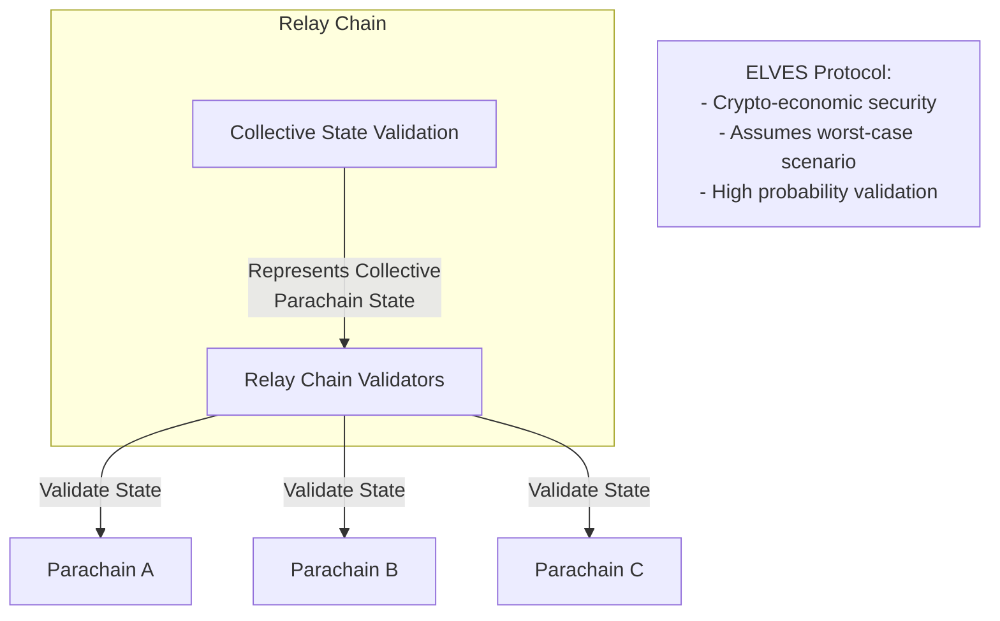

## Coherent Systems
    
Coherency refers to the degree of synchronization, consistency, and interoperability between different components or chains within a system. It encompasses the internal coherence of individual chains and the external coherence between chains regarding how they interact.
    
A single-state machine like Ethereum is very coherent, as all of its components (smart contracts, dApps/applications, staking, consensus) operate within a single environment with the downside of less scalability. Multi-protocol state machines, such as Polkadot, offer less coherency due to their sharded nature but more scalability due to the parallelization of their architecture.

Parachains are coherent, as they are self-contained environments with domain-specific functionality.

## Flexible Ecosystem

Parachains enable parallelization of different services within the same network. However, unlike most layer two rollups, parachains don't suffer the same interoperability pitfalls that most rollups suffer. [Cross-Consensus Messaging (XCM)](/develop/interoperability/intro-to-xcm/){target=\_blank} provides a common communication format for each parachain and can be configured to allow a parachain to communicate with just the relay chain or certain parachains. 

The diagram below highlights the flexibility of the Polkadot ecosystem, where each parachain specializes in a distinct domain. This example illustrates how parachains, like DeFi and GameFi, leverage XCM for cross-chain operations such as asset transfers and credential verification.

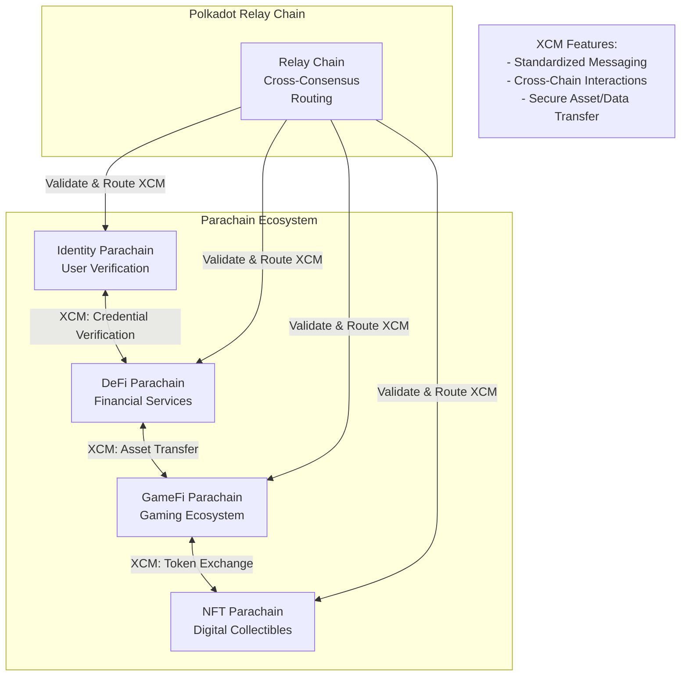

Most parachains are built using the Polkadot SDK, which provides all the tools to create a fully functioning parachain. However, it is possible to construct a parachain that can inherit the security of the relay chain as long as it implements the correct mechanisms expected by the relay chain.

## State Transition Functions (Runtimes)

Determinism is a fundamental property where given the same input, a system will consistently produce identical outputs. In blockchain systems, this predictable behavior is essential for state machines, which are algorithms that transition between different states based on specific inputs to generate a new state.

At their core, parachains, like most blockchains, are deterministic, finite-state machines that are often backed by game theory and economics. The previous state of the parachain, combined with external input in the form of [extrinsics](/polkadot-protocol/glossary#extrinsic){target=\_blank}, allows the state machine to progress forward, one block at a time.

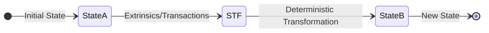

The primary driver of this progression is the state transition function (STF), commonly referred to as a runtime. Each time a block is submitted, it represents the next proposed state for a parachain. By applying the state transition function to the previous state and including a new block that contains the proposed changes in the form of a list of extrinsics/transactions, the runtime defines just exactly how the parachain is to advance from state A to state B.

The STF in a Polkadot SDK-based chain is compiled to Wasm and uploaded on the relay chain. This STF is crucial for the relay chain to validate the state changes coming from the parachain, as it is used to ensure that all proposed state transitions are happening correctly as part of the validation process.

For more information on the Wasm meta protocol that powers runtimes, see the [WASM Meta Protocol](https://paritytech.github.io/polkadot-sdk/master/polkadot_sdk_docs/reference_docs/wasm_meta_protocol/index.html){target=\blank} in the Polkadot SDK Rust Docs.

## Shared Security: Validated by the Relay Chain

The relay chain provides a layer of economic security for its parachains. Parachains submit proof of validation (PoV) data to the relay chain for validation through [collators](/polkadot-protocol/glossary/#collator), upon which the relay chains' validators ensure the validity of this data in accordance with the STF for that particular parachain. In other words, the consensus for a parachain follows the relay chain. While parachains choose how a block is authored, what it contains, and who authors it, the relay chain ultimately provides finality and consensus for those blocks.

For more information about the parachain and relay chain validation process, see the [Parachains' Protocol Overview: Protocols' Summary](https://wiki.polkadot.com/learn/learn-parachains-protocol/#protocols-summary){target=\blank} entry in the Polkadot Wiki.

Parachains need at least one honest collator to submit PoV data to the relay chain. Without this, the parachain can't progress. The mechanisms that facilitate this are found in the Cumulus portion of the Polkadot SDK, some of which are found in the [`cumulus_pallet_parachain_system`](https://paritytech.github.io/polkadot-sdk/master/cumulus_pallet_parachain_system/index.html){target=\blank}

### Cryptoeconomic Security: ELVES Protocol

The [ELVES (Economic Last Validation Enforcement System)](https://eprint.iacr.org/2024/961){target=\_blank} protocol forms the foundation of Polkadot's cryptoeconomic security model. ELVES assumes a worst-case scenario by enforcing strict validation rules before any state transitions are finalized. Unlike optimistic approaches that rely on post-facto dispute resolution, ELVES ensures that validators collectively confirm the validity of a block before it becomes part of the parachain's state.

Validators are incentivized through staking and penalized for malicious or erroneous actions, ensuring adherence to the protocol. This approach minimizes the probability of invalid states being propagated across the network, providing robust security for parachains.

## Interoperability

Polkadot's interoperability framework allows parachains to communicate with each other, fostering a diverse ecosystem of interconnected blockchains. Through [Cross-Consensus Messaging (XCM)](/develop/interoperability/intro-to-xcm/){target=_blank}, parachains can transfer assets, share data, and invoke functionalities on other chains securely. This standardized messaging protocol ensures that parachains can interact with the relay chain and each other, supporting efficient cross-chain operations.

The XCM protocol mitigates common interoperability challenges in isolated blockchain networks, such as fragmented ecosystems and limited collaboration. By enabling decentralized applications to leverage resources and functionality across parachains, Polkadot promotes a scalable, cooperative blockchain environment that benefits all participants.

## Where to Go Next

For further information about the consensus protocol used by parachains, see the [Consensus](/polkadot-protocol/architecture/parachains/consensus/) page.

<div class="grid cards" markdown>

-   <span class="badge learn">Learn</span> __Consensus__

    ---

    Understand how the blocks authored by parachain collators are secured by the relay chain validators and how the parachain transactions achieve finality.

    [:octicons-arrow-right-24: Reference](/polkadot-protocol/architecture/parachains/consensus/)

</div>


---

# Overview of FRAME

> Source (raw): https://raw.githubusercontent.com/polkadot-developers/polkadot-docs/master/.ai/pages/develop-parachains-customize-parachain-overview.md
> Canonical (HTML): https://docs.polkadot.com/develop/parachains/customize-parachain/overview/
> Summary: Learn how Polkadot SDK’s FRAME framework simplifies blockchain development with modular pallets and support libraries for efficient runtime design.

# Overview

## Introduction

The runtime is the heart of any Polkadot SDK-based blockchain, handling the essential logic that governs state changes and transaction processing. With Polkadot SDK’s [FRAME (Framework for Runtime Aggregation of Modularized Entities)](/polkadot-protocol/glossary/#frame-framework-for-runtime-aggregation-of-modularized-entities){target=\_bank}, developers gain access to a powerful suite of tools for building custom blockchain runtimes. FRAME offers a modular architecture, featuring reusable pallets and support libraries, to streamline development.

This guide provides an overview of FRAME, its core components like pallets and system libraries, and demonstrates how to compose a runtime tailored to your specific blockchain use case. Whether you’re integrating pre-built modules or designing custom logic, FRAME equips you with the tools to create scalable, feature-rich blockchains.

## FRAME Runtime Architecture

The following diagram illustrates how FRAME components integrate into the runtime:


All transactions sent to the runtime are handled by the `frame_executive` pallet, which dispatches them to the appropriate pallet for execution. These runtime modules contain the logic for specific blockchain features. The `frame_system` module provides core functions, while `frame_support` libraries offer useful tools to simplify pallet development. Together, these components form the backbone of a FRAME-based blockchain's runtime.

### Pallets

Pallets are modular components within the FRAME ecosystem that encapsulate specific blockchain functionalities. These modules offer customizable business logic for various use cases and features that can be integrated into a runtime.

Developers have the flexibility to implement any desired behavior in the core logic of the blockchain, such as:

- Exposing new transactions.
- Storing information.
- Enforcing business rules.

Pallets also include necessary wiring code to ensure proper integration and functionality within the runtime. FRAME provides a range of [pre-built pallets](https://github.com/paritytech/polkadot-sdk/tree/polkadot-stable2506/substrate/frame){target=\_blank} for standard and common blockchain functionalities, including consensus algorithms, staking mechanisms, governance systems, and more. These pre-existing pallets serve as building blocks or templates, which developers can use as-is, modify, or reference when creating custom functionalities. 

#### Pallet Structure

Polkadot SDK heavily utilizes Rust macros, allowing developers to focus on specific functional requirements when writing pallets instead of dealing with technicalities and scaffolding code.

A typical pallet skeleton looks like this:

```rust
-pub use pallet::*;

#[frame_support::pallet]
pub mod pallet {
  use frame_support::pallet_prelude::*;
  use frame_system::pallet_prelude::*;

  #[pallet::pallet]
  #[pallet::generate_store(pub(super) trait Store)]
  pub struct Pallet<T>(_);

  #[pallet::config]  // snip
  #[pallet::event]   // snip
  #[pallet::error]   // snip
  #[pallet::storage] // snip
  #[pallet::call]    // snip
}
```

All pallets, including custom ones, can implement these attribute macros:

- **`#[frame_support::pallet]`**: Marks the module as usable in the runtime.
- **`#[pallet::pallet]`**: Applied to a structure used to retrieve module information easily.
- **`#[pallet::config]`**: Defines the configuration for the pallets's data types.
- **`#[pallet::event]`**: Defines events to provide additional information to users.
- **`#[pallet::error]`**: Lists possible errors in an enum to be returned upon unsuccessful execution.
- **`#[pallet::storage]`**: Defines elements to be persisted in storage.
- **`#[pallet::call]`**: Defines functions exposed as transactions, allowing dispatch to the runtime.

These macros are applied as attributes to Rust modules, functions, structures, enums, and types and serve as the core components of a pallet. They enable the pallet to be built and added to the runtime, exposing the custom logic to the outer world.

For a comprehensive guide on these and additional macros, see the [`pallet_macros`](https://paritytech.github.io/polkadot-sdk/master/frame_support/pallet_macros/index.html){target=\_blank} section in the Polkadot SDK documentation.

### Support Libraries

In addition to purpose-specific pallets, FRAME offers services and core libraries that facilitate composing and interacting with the runtime:

- **[`frame_system` pallet](https://paritytech.github.io/polkadot-sdk/master/frame_system/index.html){target=\_blank}**: Provides low-level types, storage, and functions for the runtime.
- **[`frame_executive` pallet](https://paritytech.github.io/polkadot-sdk/master/frame_executive/index.html){target=\_blank}**: Orchestrates the execution of incoming function calls to the respective pallets in the runtime.
- **[`frame_support` crate](https://paritytech.github.io/polkadot-sdk/master/frame_support/index.html){target=\_blank}**: Is a collection of Rust macros, types, traits, and modules that simplify the development of Substrate pallets.
- **[`frame_benchmarking` crate](https://paritytech.github.io/polkadot-sdk/master/frame_benchmarking/trait.Benchmark.html){target=\_blank}**: Contains common runtime patterns for benchmarking and testing purposes.

## Compose a Runtime with Pallets

The Polkadot SDK allows developers to construct a runtime by combining various pallets, both built-in and custom-made. This modular approach enables the creation of unique blockchain behaviors tailored to specific requirements.

The following diagram illustrates the process of selecting and combining FRAME pallets to compose a runtime:


This modular design allows developers to:

- Rapidly prototype blockchain systems.
- Easily add or remove features by including or excluding pallets.
- Customize blockchain behavior without rebuilding core components.
- Leverage tested and optimized code from built-in pallets.

## Starting from Templates

Using pre-built templates is an efficient way to begin building a custom blockchain. Templates provide a foundational setup with pre-configured modules, letting developers avoid starting from scratch and instead focus on customization. Depending on your project’s goals—whether you want a simple test chain, a standalone chain, or a parachain that integrates with Polkadot’s relay chains—there are templates designed to suit different levels of complexity and scalability.

### Solochain Templates

Solochain templates are designed for developers who want to create standalone blockchains that operate independently without connecting to a relay chain:

- **[`minimal-template`](https://github.com/paritytech/polkadot-sdk/tree/master/templates/minimal){target=\_blank}**: Includes only the essential components necessary for a functioning blockchain. It’s ideal for developers who want to gain familiarity with blockchain basics and test simple customizations before scaling up.

- **[`solochain-template`](https://github.com/paritytech/polkadot-sdk/tree/master/templates/solochain){target=\_blank}**: Provides a foundation for creating standalone blockchains with moderate features, including a simple consensus mechanism and several core FRAME pallets. It’s a solid starting point for developers who want a fully functional chain that doesn’t depend on a relay chain.

### Parachain Templates

Parachain templates are specifically designed for chains that will connect to and interact with relay chains in the Polkadot ecosystem:

- **[`parachain-template`](https://github.com/paritytech/polkadot-sdk/tree/master/templates/parachain){target=\_blank}**: Designed for connecting to relay chains like Polkadot, Kusama, or Paseo, this template enables a chain to operate as a parachain. For projects aiming to integrate with Polkadot’s ecosystem, this template offers a great starting point.

- **[`OpenZeppelin`](https://github.com/OpenZeppelin/polkadot-runtime-templates/tree/main){target=\_blank}**: Offers two flexible starting points.
    - The [`generic-runtime-template`](https://github.com/OpenZeppelin/polkadot-runtime-templates/tree/main/generic-template){target=\_blank} provides a minimal setup with essential pallets and secure defaults, creating a reliable foundation for custom blockchain development.
    - The [`evm-runtime-template`](https://github.com/OpenZeppelin/polkadot-runtime-templates/tree/main/evm-template){target=\_blank} enables EVM compatibility, allowing developers to migrate Solidity contracts and EVM-based dApps. This template is ideal for Ethereum developers looking to leverage Substrate's capabilities.

Choosing a suitable template depends on your project’s unique requirements, level of customization, and integration needs. Starting from a template speeds up development and lets you focus on implementing your chain’s unique features rather than the foundational blockchain setup.

## Where to Go Next

For more detailed information on implementing this process, refer to the following sections:

- [Add a Pallet to Your Runtime](/develop/parachains/customize-parachain/add-existing-pallets/)
- [Create a Custom Pallet](/develop/parachains/customize-parachain/make-custom-pallet/)


---

# Overview of Polkadot's System Chains

> Source (raw): https://raw.githubusercontent.com/polkadot-developers/polkadot-docs/master/.ai/pages/polkadot-protocol-architecture-system-chains-overview.md
> Canonical (HTML): https://docs.polkadot.com/polkadot-protocol/architecture/system-chains/overview/
> Summary: Discover how system parachains enhance Polkadot's scalability and performance by offloading tasks like governance, asset management, and bridging from the relay chain.

## Introduction

Polkadot's relay chain is designed to secure parachains and facilitate seamless inter-chain communication. However, resource-intensive—tasks like governance, asset management, and bridging are more efficiently handled by system parachains. These specialized chains offload functionality from the relay chain, leveraging Polkadot's parallel execution model to improve performance and scalability. By distributing key functionalities across system parachains, Polkadot can maximize its relay chain's blockspace for its core purpose of securing and validating parachains.

This guide will explore how system parachains operate within Polkadot and Kusama, detailing their critical roles in network governance, asset management, and bridging. You'll learn about the currently deployed system parachains, their unique functions, and how they enhance Polkadot's decentralized ecosystem.

## System Chains

System parachains contain core Polkadot protocol features, but in parachains rather than the relay chain. Execution cores for system chains are allocated via network [governance](/polkadot-protocol/onchain-governance/overview/){target=\_blank} rather than purchasing coretime on a marketplace.

System parachains defer to on-chain governance to manage their upgrades and other sensitive actions as they do not have native tokens or governance systems separate from DOT or KSM. It is not uncommon to see a system parachain implemented specifically to manage network governance.

!!!note
    You may see system parachains called common good parachains in articles and discussions. This nomenclature caused confusion as the network evolved, so system parachains is preferred. 
    
    For more details on this evolution, review this [parachains forum discussion](https://forum.polkadot.network/t/polkadot-protocol-and-common-good-parachains/866){target=\_blank}.

## Existing System Chains

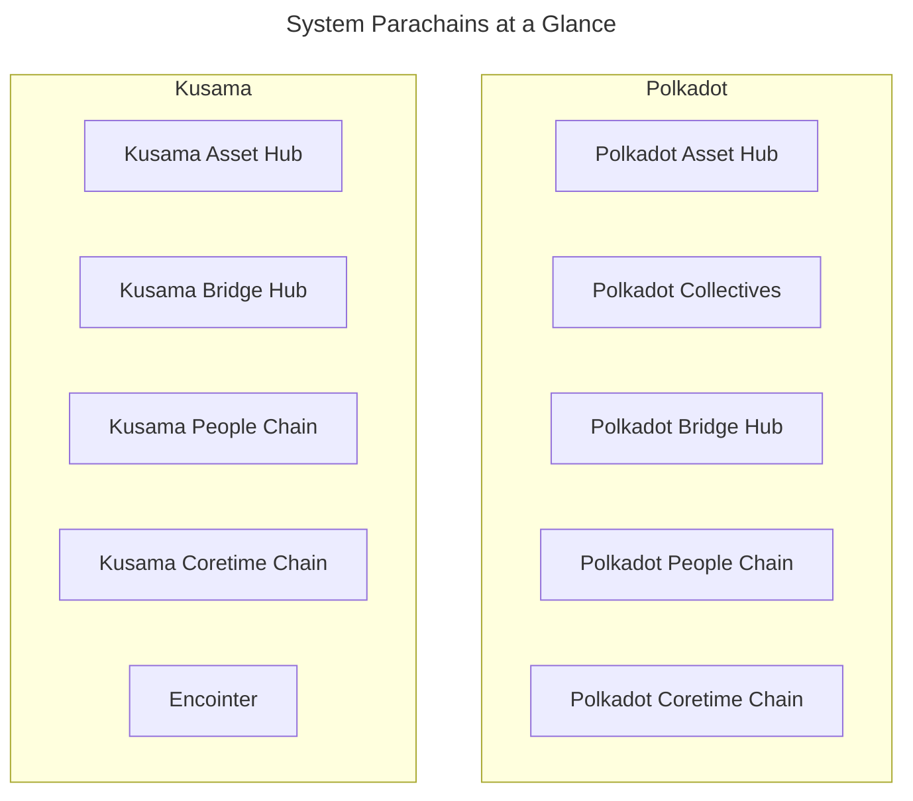

All system parachains are on both Polkadot and Kusama with the following exceptions:

- **[Collectives](#collectives)**: Only on Polkadot
- **[Encointer](#encointer)**: Only on Kusama

### Asset Hub

The [Asset Hub](https://github.com/paritytech/polkadot-sdk/tree/polkadot-stable2506/cumulus#asset-hub-){target=\_blank} is an asset portal for the entire network. It helps asset creators, such as reserve-backed stablecoin issuers, track the total issuance of an asset in the network, including amounts transferred to other parachains. It also serves as the hub where asset creators can perform on-chain operations, such as minting and burning, to manage their assets effectively.

This asset management logic is encoded directly in the runtime of the chain rather than in smart contracts. The efficiency of executing logic in a parachain allows for fees and deposits that are about 1/10th of what is required on the relay chain. These low fees mean that the Asset Hub is well suited for handling the frequent transactions required when managing balances, transfers, and on-chain assets.

The Asset Hub also supports non-fungible assets (NFTs) via the [Uniques pallet](https://polkadot.js.org/docs/substrate/extrinsics#uniques){target=\_blank} and [NFTs pallet](https://polkadot.js.org/docs/substrate/extrinsics#nfts){target=\_blank}. For more information about NFTs, see the Polkadot Wiki section on [NFT Pallets](https://wiki.polkadot.com/learn/learn-nft-pallets/){target=\_blank}.

### Collectives

The Polkadot Collectives parachain was added in [Referendum 81](https://polkadot-old.polkassembly.io/referendum/81){target=\_blank} and exists on Polkadot but not on Kusama. The Collectives chain hosts on-chain collectives that serve the Polkadot network, including the following:

- [**Polkadot Alliance**](https://polkadot-old.polkassembly.io/referendum/94){target=\_blank}: Provides a set of ethics and standards for the community to follow. Includes an on-chain means to call out bad actors.
- [**Polkadot Technical Fellowship**](https://wiki.polkadot.com/learn/learn-polkadot-technical-fellowship/){target=\_blank}: A rules-based social organization to support and incentivize highly-skilled developers to contribute to the technical stability, security, and progress of the network.

These on-chain collectives will play essential roles in the future of network stewardship and decentralized governance. Networks can use a bridge hub to help them act as collectives and express their legislative voices as single opinions within other networks.

### Bridge Hub

Before parachains, the only way to design a bridge was to put the logic onto the relay chain. Since both networks now support parachains and the isolation they provide, each network can have a parachain dedicated to bridges. 

The Bridge Hub system parachain operates on the relay chain, and is responsible for facilitating bridges to the wider Web3 space. It contains the required bridge [pallets](/polkadot-protocol/glossary/#pallet){target=\_blank} in its runtime, which enable trustless bridging with other blockchain networks like Polkadot, Kusama, and Ethereum. The Bridge Hub uses the native token of the relay chain.

See the [Bridge Hub](/polkadot-protocol/architecture/system-chains/bridge-hub/){target=\_blank} documentation for additional information.

### People Chain

The People Chain provides a naming system that allows users to manage and verify their account [identity](https://wiki.polkadot.com/learn/learn-identity/){target=\_blank}.

### Coretime Chain

The Coretime system chain lets users buy coretime to access Polkadot's computation. [Coretime marketplaces](https://wiki.polkadot.com/learn/learn-guides-coretime-marketplaces/){target=\_blank} run on top of the Coretime chain. Kusama does not use the Collectives system chain. Instead, Kusama relies on the Encointer system chain, which provides Sybil resistance as a service to the entire Kusama ecosystem.

Visit [Introduction to Agile Coretime](https://wiki.polkadot.com/learn/learn-agile-coretime/#introduction-to-agile-coretime){target=\_blank} in the Polkadot Wiki for more information.

### Encointer

[Encointer](https://encointer.org/encointer-for-web3/){target=\_blank} is a blockchain platform for self-sovereign ID and a global [universal basic income (UBI)](https://book.encointer.org/economics-ubi.html){target=\_blank}. The Encointer protocol uses a novel Proof of Personhood (PoP) system to create unique identities and resist Sybil attacks. PoP is based on the notion that a person can only be in one place at any given time. Encointer offers a framework that allows for any group of real people to create, distribute, and use their own digital community tokens.

Participants are requested to attend physical key-signing ceremonies with small groups of random people at randomized locations. These local meetings are part of one global signing ceremony occurring at the same time. Participants use the Encointer wallet app to participate in these ceremonies and manage local community currencies. 

To learn more about Encointer, see the official [Encointer book](https://book.encointer.org/introduction.html){target=\_blank} or watch an [Encointer ceremony](https://www.youtube.com/watch?v=tcgpCCYBqko){target=\_blank} in action.


---

# Overview of the Polkadot Relay Chain

> Source (raw): https://raw.githubusercontent.com/polkadot-developers/polkadot-docs/master/.ai/pages/polkadot-protocol-architecture-polkadot-chain-overview.md
> Canonical (HTML): https://docs.polkadot.com/polkadot-protocol/architecture/polkadot-chain/overview/
> Summary: Explore Polkadot's core architecture, including its multi-chain vision, shared security, and the DOT token's governance and staking roles.

# Overview

## Introduction

Polkadot is a next-generation blockchain protocol designed to support a multi-chain future by enabling secure communication and interoperability between different blockchains. Built as a Layer-0 protocol, Polkadot introduces innovations like application-specific Layer-1 chains ([parachains](/polkadot-protocol/architecture/parachains/){targe=\_blank}), shared security through [Nominated Proof of Stake (NPoS)](/polkadot-protocol/glossary/#nominated-proof-of-stake-npos){target=\_blank}, and cross-chain interactions via its native [Cross-Consensus Messaging Format (XCM)](/develop/interoperability/intro-to-xcm/){target=\_blank}.

This guide covers key aspects of Polkadot’s architecture, including its high-level protocol structure, blockspace commoditization, and the role of its native token, DOT, in governance, staking, and resource allocation.

## Polkadot 1.0

Polkadot 1.0 represents the state of Polkadot as of 2023, coinciding with the release of [Polkadot runtime v1.0.0](https://github.com/paritytech/polkadot/releases/tag/v1.0.0){target=\_blank}. This section will focus on Polkadot 1.0, along with philosophical insights into network resilience and blockspace.

As a Layer-0 blockchain, Polkadot contributes to the multi-chain vision through several key innovations and initiatives, including:

- **Application-specific Layer-1 blockchains (parachains)**: Polkadot's sharded network allows for parallel transaction processing, with shards that can have unique state transition functions, enabling custom-built L1 chains optimized for specific applications.

- **Shared security and scalability**: L1 chains connected to Polkadot benefit from its [Nominated Proof of Stake (NPoS)](/polkadot-protocol/architecture/polkadot-chain/pos-consensus/#nominated-proof-of-stake){target=\_blank} system, providing security out-of-the-box without the need to bootstrap their own.

- **Secure interoperability**: Polkadot's native interoperability enables seamless data and value exchange between parachains. This interoperability can also be used outside of the ecosystem for bridging with external networks.

- **Resilient infrastructure**: Decentralized and scalable, Polkadot ensures ongoing support for development and community initiatives via its on-chain [treasury](https://wiki.polkadot.com/learn/learn-polkadot-opengov-treasury/){target=\_blank} and governance.

- **Rapid L1 development**: The [Polkadot SDK](/develop/parachains/intro-polkadot-sdk/){target=\_blank} allows fast, flexible creation and deployment of Layer-1 chains.

- **Cultivating the next generation of Web3 developers**: Polkadot supports the growth of Web3 core developers through initiatives such as.

    - [Polkadot Blockchain Academy](https://polkadot.com/blockchain-academy){target=\_blank}
    - [EdX courses](https://www.edx.org/school/web3x){target=\_blank}
    - Rust and Substrate courses (coming soon)

### High-Level Architecture

Polkadot features a chain that serves as the central component of the system. This chain is depicted as a ring encircled by several parachains that are connected to it.

According to Polkadot's design, any blockchain that can compile to WebAssembly (Wasm) and adheres to the Parachains Protocol becomes a parachain on the Polkadot network.

Here’s a high-level overview of the Polkadot protocol architecture:


Parachains propose blocks to Polkadot validators, who check for availability and validity before finalizing them. With the relay chain providing security, collators—full nodes of parachains—can focus on their tasks without needing strong incentives.

The [Cross-Consensus Messaging Format (XCM)](/develop/interoperability/intro-to-xcm/){target=\_blank} allows parachains to exchange messages freely, leveraging the chain's security for trust-free communication.

In order to interact with chains that want to use their own finalization process (e.g., Bitcoin), Polkadot has [bridges](/polkadot-protocol/parachain-basics/interoperability/#bridges-connecting-external-networks){target=\_blank} that offer two-way compatibility, meaning that transactions can be made between different parachains.

### Polkadot's Additional Functionalities

Historically, obtaining core slots on Polkadot chain relied upon crowdloans and auctions. Chain cores were leased through auctions for three-month periods, up to a maximum of two years. Crowdloans enabled users to securely lend funds to teams for lease deposits in exchange for pre-sale tokens, which is the only way to access slots on Polkadot 1.0. Auctions are now deprecated in favor of [coretime](/polkadot-protocol/architecture/system-chains/coretime/){target=\_blank}.

Additionally, the chain handles [staking](https://wiki.polkadot.com/learn/learn-staking/){target=\_blank}, [accounts](/polkadot-protocol/parachain-basics/accounts/){target=\_blank}, balances, and [governance](/polkadot-protocol/onchain-governance/){target=\_blank}.

#### Agile Coretime

The new and more efficient way of obtaining core on Polkadot is to go through the process of purchasing coretime.

[Agile coretime](/polkadot-protocol/architecture/polkadot-chain/agile-coretime/){target=\_blank} improves the efficient use of Polkadot's network resources and offers economic flexibility for developers, extending Polkadot's capabilities far beyond the original vision outlined in the [whitepaper](https://polkadot.com/papers/Polkadot-whitepaper.pdf){target=\_blank}.

It enables parachains to purchase monthly "bulk" allocations of coretime (the time allocated for utilizing a core, measured in Polkadot relay chain blocks), ensuring heavy-duty parachains that can author a block every six seconds with [Asynchronous Backing](https://wiki.polkadot.com/learn/learn-async-backing/#asynchronous-backing){target=\_blank} can reliably renew their coretime each month. Although six-second block times are now the default, parachains have the option of producing blocks less frequently.

Renewal orders are prioritized over new orders, offering stability against price fluctuations and helping parachains budget more effectively for project costs.

### Polkadot's Resilience

Decentralization is a vital component of blockchain networks, but it comes with trade-offs:

- An overly decentralized network may face challenges in reaching consensus and require significant energy to operate.
- Also, a network that achieves consensus quickly risks centralization, making it easier to manipulate or attack.

A network should be decentralized enough to prevent manipulative or malicious influence. In this sense, decentralization is a tool for achieving resilience.

Polkadot 1.0 currently achieves resilience through several strategies:

- **Nominated Proof of Stake (NPoS)**: Ensures that the stake per validator is maximized and evenly distributed among validators.

- **Decentralized nodes**: Designed to encourage operators to join the network. This program aims to expand and diversify the validators in the ecosystem who aim to become independent of the program during their term. Feel free to explore more about the program on the official [Decentralized Nodes](https://nodes.web3.foundation/){target=\_blank} page.

- **On-chain treasury and governance**: Known as [OpenGov](/polkadot-protocol/onchain-governance/overview/){target=\_blank}, this system allows every decision to be made through public referenda, enabling any token holder to cast a vote.

### Polkadot's Blockspace

Polkadot 1.0’s design allows for the commoditization of blockspace.

Blockspace is a blockchain's capacity to finalize and commit operations, encompassing its security, computing, and storage capabilities. Its characteristics can vary across different blockchains, affecting security, flexibility, and availability.

- **Security**: Measures the robustness of blockspace in Proof of Stake (PoS) networks linked to the stake locked on validator nodes, the variance in stake among validators, and the total number of validators. It also considers social centralization (how many validators are owned by single operators) and physical centralization (how many validators run on the same service provider).

- **Flexibility**: Reflects the functionalities and types of data that can be stored, with high-quality data essential to avoid bottlenecks in critical processes.

- **Availability**: Indicates how easily users can access blockspace. It should be easily accessible, allowing diverse business models to thrive, ideally regulated by a marketplace based on demand and supplemented by options for "second-hand" blockspace.

Polkadot is built on core blockspace principles, but there's room for improvement. Tasks like balance transfers, staking, and governance are managed on the relay chain.

Delegating these responsibilities to [system chains](/polkadot-protocol/architecture/system-chains/){target=\_blank} could enhance flexibility and allow the relay chain to concentrate on providing shared security and interoperability.

For more information about blockspace, watch [Robert Habermeier’s interview](https://www.youtube.com/watch?v=e1vISppPwe4){target=\_blank} or read his [technical blog post](https://www.rob.tech/blog/polkadot-blockspace-over-blockchains/){target=\_blank}.

## DOT Token

DOT is the native token of the Polkadot network, much like BTC for Bitcoin and Ether for the Ethereum blockchain. DOT has 10 decimals, uses the Planck base unit, and has a balance type of `u128`. The same is true for Kusama's KSM token with the exception of having 12 decimals.

### Redenomination of DOT
    
Polkadot conducted a community poll, which ended on 27 July 2020 at block 888,888, to decide whether to redenominate the DOT token. The stakeholders chose to redenominate the token, changing the value of 1 DOT from 1e12 plancks to 1e10 plancks.

Importantly, this did not affect the network's total number of base units (plancks); it only affects how a single DOT is represented. The redenomination became effective 72 hours after transfers were enabled, occurring at block 1,248,328 on 21 August 2020 around 16:50 UTC.

### The Planck Unit

The smallest unit of account balance on Polkadot SDK-based blockchains (such as Polkadot and Kusama) is called _Planck_, named after the Planck length, the smallest measurable distance in the physical universe.

Similar to how BTC's smallest unit is the Satoshi and ETH's is the Wei, Polkadot's native token DOT equals 1e10 Planck, while Kusama's native token KSM equals 1e12 Planck.

### Uses for DOT

DOT serves three primary functions within the Polkadot network:

- **Governance**: It is used to participate in the governance of the network.
- **Staking**: DOT is staked to support the network's operation and security.
- **Buying coretime**: Used to purchase coretime in-bulk or on-demand and access the  chain to benefit from Polkadot's security and interoperability.

Additionally, DOT can serve as a transferable token. For example, DOT, held in the treasury, can be allocated to teams developing projects that benefit the Polkadot ecosystem.

## JAM and the Road Ahead

The Join-Accumulate Machine (JAM) represents a transformative redesign of Polkadot's core architecture, envisioned as the successor to the current relay chain. Unlike traditional blockchain architectures, JAM introduces a unique computational model that processes work through two primary functions:

- **Join**: Handles data integration.
- **Accumulate**: Folds computations into the chain's state.

JAM removes many of the opinions and constraints of the current relay chain while maintaining its core security properties. Expected improvements include:

- **Permissionless code execution**: JAM is designed to be more generic and flexible, allowing for permissionless code execution through services that can be deployed without governance approval.
- **More effective block time utilization**: JAM's efficient pipeline processing model places the prior state root in block headers instead of the posterior state root, enabling more effective utilization of block time for computations.

This architectural evolution promises to enhance Polkadot's scalability and flexibility while maintaining robust security guarantees. JAM is planned to be rolled out to Polkadot as a single, complete upgrade rather than a stream of smaller updates. This approach seeks to minimize the developer overhead required to address any breaking changes.


---

# Pallet Benchmarking

> Source (raw): https://raw.githubusercontent.com/polkadot-developers/polkadot-docs/master/.ai/pages/tutorials-polkadot-sdk-parachains-zero-to-hero-pallet-benchmarking.md
> Canonical (HTML): https://docs.polkadot.com/tutorials/polkadot-sdk/parachains/zero-to-hero/pallet-benchmarking/
> Summary: Learn how to benchmark Polkadot SDK-based pallets, assigning precise weights to extrinsics for accurate fee calculation and runtime optimization.

## Introduction

After validating your pallet through testing and integrating it into your runtime, the next crucial step is benchmarking. Testing procedures were detailed in the [Pallet Unit Testing](/tutorials/polkadot-sdk/parachains/zero-to-hero/pallet-unit-testing/){target=\_blank} tutorial, while runtime integration was covered in the [Add Pallets to the Runtime](/tutorials/polkadot-sdk/parachains/zero-to-hero/add-pallets-to-runtime/){target=\_blank} guide.

Benchmarking assigns precise [weight](/polkadot-protocol/glossary/#weight){target=\_blank} to each extrinsic, 
measuring their computational and storage costs. These derived weights enable accurate fee calculation and resource 
allocation within the runtime.

This tutorial demonstrates how to:

- Configure your development environment for benchmarking.
- Create and implement benchmark tests for your extrinsics.
- Apply benchmark results to your pallet's extrinsics.

For comprehensive information about benchmarking concepts, refer to the [Benchmarking](/develop/parachains/testing/benchmarking/){target=\_blank} guide.

## Environment Setup

Follow these steps to prepare your environment for pallet benchmarking:

1. Install the [`frame-omni-bencher`](https://crates.io/crates/frame-omni-bencher/0.13.0){target=\_blank} command-line tool:
    
    ```bash
    cargo install --locked frame-omni-bencher@0.13.0
    ```

2. Update your pallet's `Cargo.toml` file in the `pallets/custom-pallet` directory by adding the `runtime-benchmarks` feature flag:

    ```toml hl_lines="4" title="Cargo.toml"
    -[package]
name = "custom-pallet"
version = "0.1.0"
license.workspace = true
authors.workspace = true
homepage.workspace = true
repository.workspace = true
edition.workspace = true

[dependencies]
codec = { features = ["derive"], workspace = true }
scale-info = { features = ["derive"], workspace = true }
frame = { features = ["experimental", "runtime"], workspace = true }

[features]
default = ["std"]
std = ["codec/std", "frame/std", "scale-info/std"]
runtime-benchmarks = ["frame/runtime-benchmarks"]

    ```

3. Add your pallet to the runtime's benchmark configuration:

    1.  Register your pallet in `runtime/src/benchmarks.rs`:

        ```rust hl_lines="11" title="benchmarks.rs"
        -polkadot_sdk::frame_benchmarking::define_benchmarks!(
    [frame_system, SystemBench::<Runtime>]
    [pallet_balances, Balances]
    [pallet_session, SessionBench::<Runtime>]
    [pallet_timestamp, Timestamp]
    [pallet_message_queue, MessageQueue]
    [pallet_sudo, Sudo]
    [pallet_collator_selection, CollatorSelection]
    [cumulus_pallet_parachain_system, ParachainSystem]
    [cumulus_pallet_xcmp_queue, XcmpQueue]
    [custom_pallet, CustomPallet]
);
        ```

    2. Enable runtime benchmarking for your pallet in `runtime/Cargo.toml`:

        ```toml hl_lines="6" title="Cargo.toml"
        -runtime-benchmarks = [
	"cumulus-pallet-parachain-system/runtime-benchmarks",
	"hex-literal",
	"pallet-parachain-template/runtime-benchmarks",
	"polkadot-sdk/runtime-benchmarks",
	"custom-pallet/runtime-benchmarks",
]
        ```

4. Set up the benchmarking module in your pallet:
    1. Create a `benchmarking.rs` file in your pallet's `src/` directory:
    
        ```bash
        touch benchmarking.rs
        ```

    2. Add the benchmarking module to your pallet. In the pallet `lib.rs` file add the following:

        ```rust hl_lines="9-10" title="lib.rs"
        -
pub use pallet::*;

#[cfg(test)]
mod mock;

#[cfg(test)]
mod tests;

#[cfg(feature = "runtime-benchmarks")]
mod benchmarking;

        ```

    The `benchmarking` module is gated behind the `runtime-benchmarks` feature flag. It will only be compiled when this flag is explicitly enabled in your project's `Cargo.toml` or via the `--features runtime-benchmarks` compilation flag.

## Implement Benchmark Tests

When writing benchmarking tests for your pallet, you'll create specialized test functions for each extrinsic, similar to unit tests. These tests use the mock runtime you created earlier for testing, allowing you to leverage its utility functions.

Every benchmark test must follow a three-step pattern:

1. **Setup**: Perform any necessary setup before calling the extrinsic. This might include creating accounts, setting initial states, or preparing test data.
2. **Execute the extrinsic**: Execute the actual extrinsic using the [`#[extrinsic_call]`](https://paritytech.github.io/polkadot-sdk/master/frame_benchmarking/v2/attr.extrinsic_call.html){target=\_blank} macro. This must be a single line that calls your extrinsic function with the origin as its first argument.
3. **Verification**: Check that the extrinsic worked correctly within the benchmark context by checking the expected state changes.

Check the following example on how to benchmark the `increment` extrinsic:

```rust
-    #[benchmark]
    fn increment() {
        let caller: T::AccountId = whitelisted_caller();

        assert_ok!(CustomPallet::<T>::set_counter_value(
            RawOrigin::Root.into(),
            5u32
        ));

        #[extrinsic_call]
        increment(RawOrigin::Signed(caller.clone()), 1);

        assert_eq!(CounterValue::<T>::get(), Some(6u32.into()));
        assert_eq!(UserInteractions::<T>::get(caller), 1u32.into());
    }
```

This benchmark test:

1. Creates a whitelisted caller and sets an initial counter value of 5.
2. Calls the increment extrinsic to increase the counter by 1.
3. Verifies that the counter was properly incremented to 6 and that the user's interaction was recorded in storage.

This example demonstrates how to properly set up state, execute an extrinsic, and verify its effects during benchmarking.

Now, implement the complete set of benchmark tests. Copy the following content in the `benchmarking.rs` file:

```rust title="benchmarking.rs"
-// This file is part of 'custom-pallet'.

// SPDX-License-Identifier: MIT-0

// Permission is hereby granted, free of charge, to any person obtaining a copy
// of this software and associated documentation files (the "Software"), to deal
// in the Software without restriction, including without limitation the rights
// to use, copy, modify, merge, publish, distribute, sublicense, and/or sell
// copies of the Software, and to permit persons to whom the Software is
// furnished to do so.
//
// THE SOFTWARE IS PROVIDED "AS IS", WITHOUT WARRANTY OF ANY KIND, EXPRESS OR
// IMPLIED, INCLUDING BUT NOT LIMITED TO THE WARRANTIES OF MERCHANTABILITY,
// FITNESS FOR A PARTICULAR PURPOSE AND NONINFRINGEMENT. IN NO EVENT SHALL THE
// AUTHORS OR COPYRIGHT HOLDERS BE LIABLE FOR ANY CLAIM, DAMAGES OR OTHER
// LIABILITY, WHETHER IN AN ACTION OF CONTRACT, TORT OR OTHERWISE, ARISING FROM,
// OUT OF OR IN CONNECTION WITH THE SOFTWARE OR THE USE OR OTHER DEALINGS IN THE
// SOFTWARE.

#![cfg(feature = "runtime-benchmarks")]

use super::{Pallet as CustomPallet, *};
use frame::deps::frame_support::assert_ok;
use frame::{deps::frame_benchmarking::v2::*, prelude::*};

#[benchmarks]
mod benchmarks {
    use super::*;
    #[cfg(test)]
    use crate::pallet::Pallet as CustomPallet;
    use frame_system::RawOrigin;

    #[benchmark]
    fn set_counter_value() {
        #[extrinsic_call]
        set_counter_value(RawOrigin::Root, 5);

        assert_eq!(CounterValue::<T>::get(), Some(5u32.into()));
    }

    #[benchmark]
    fn increment() {
        let caller: T::AccountId = whitelisted_caller();

        assert_ok!(CustomPallet::<T>::set_counter_value(
            RawOrigin::Root.into(),
            5u32
        ));

        #[extrinsic_call]
        increment(RawOrigin::Signed(caller.clone()), 1);

        assert_eq!(CounterValue::<T>::get(), Some(6u32.into()));
        assert_eq!(UserInteractions::<T>::get(caller), 1u32.into());
    }

    #[benchmark]
    fn decrement() {
        let caller: T::AccountId = whitelisted_caller();

        assert_ok!(CustomPallet::<T>::set_counter_value(
            RawOrigin::Root.into(),
            5u32
        ));

        #[extrinsic_call]
        decrement(RawOrigin::Signed(caller.clone()), 1);

        assert_eq!(CounterValue::<T>::get(), Some(4u32.into()));
        assert_eq!(UserInteractions::<T>::get(caller), 1u32.into());
    }

    impl_benchmark_test_suite!(CustomPallet, crate::mock::new_test_ext(), crate::mock::Test);
}

```

The [`#[benchmark]`](https://paritytech.github.io/polkadot-sdk/master/frame_benchmarking/v2/attr.benchmark.html){target=\_blank} macro marks these functions as benchmark tests, while the `#[extrinsic_call]` macro specifically identifies which line contains the extrinsic being measured. For more information, see the [frame_benchmarking](https://paritytech.github.io/polkadot-sdk/master/frame_benchmarking/v2/index.html){target=\_blank} Rust docs.

## Execute the Benchmarking

After implementing your benchmark test suite, you'll need to execute the tests and generate the weights for your extrinsics. This process involves building your runtime with benchmarking features enabled and using the `frame-omni-bencher` CLI tool. To do that, follow these steps:

1. Build your runtime with the `runtime-benchmarks` feature enabled:

    ```bash
    cargo build --features runtime-benchmarks --release
    ```

    This special build includes all the necessary benchmarking code that's normally excluded from production builds.

2. Create a `weights.rs` file in your pallet's `src/` directory. This file will store the auto-generated weight calculations:

    ```bash
    touch weights.rs
    ```

3. Before running the benchmarking tool, you'll need a template file that defines how weight information should be formatted. Download the official template from the Polkadot SDK repository and save it in your project folders for future use:

    ```bash
    mkdir ./pallets/benchmarking && \
    curl https://raw.githubusercontent.com/paritytech/polkadot-sdk/refs/heads/stable2412/substrate/.maintain/frame-umbrella-weight-template.hbs \
    --output ./pallets/benchmarking/frame-umbrella-weight-template.hbs
    ```

4. Execute the benchmarking process using the `frame-omni-bencher` CLI:

    ```bash
    frame-omni-bencher v1 benchmark pallet \
    --runtime target/release/wbuild/parachain-template-runtime/parachain_template_runtime.compact.compressed.wasm \
    --pallet "custom_pallet" \
    --extrinsic "" \
    --template ./pallets/benchmarking/frame-umbrella-weight-template.hbs \
    --output ./pallets/custom-pallet/src/weights.rs
    ```

When the benchmarking process completes, your `weights.rs` file will contain auto-generated code with weight calculations for each of your pallet's extrinsics. These weights help ensure fair and accurate fee calculations when your pallet is used in a production environment.

## Add Benchmarking Weights to the Pallet

After generating the weight calculations, you need to integrate these weights into your pallet's code. This integration ensures your pallet properly accounts for computational costs in its extrinsics.

First, add the necessary module imports to your pallet. These imports make the weights available to your code:

```rust hl_lines="4-5" title="lib.rs"
-#[cfg(feature = "runtime-benchmarks")]
mod benchmarking;

pub mod weights;
use crate::weights::WeightInfo;
```

Next, update your pallet's `Config` trait to include weight information. Define the `WeightInfo` type:

```rust hl_lines="9-10" title="lib.rs"
-    pub trait Config: frame_system::Config {
        // Defines the event type for the pallet.
        type RuntimeEvent: From<Event<Self>> + IsType<<Self as frame_system::Config>::RuntimeEvent>;

        // Defines the maximum value the counter can hold.
        #[pallet::constant]
        type CounterMaxValue: Get<u32>;

        /// A type representing the weights required by the dispatchables of this pallet.
        type WeightInfo: WeightInfo;
    }
```

Now you can assign weights to your extrinsics. Here's how to add weight calculations to the `set_counter_value` function:

```rust hl_lines="1" title="lib.rs"
-        #[pallet::weight(T::WeightInfo::set_counter_value())]
        pub fn set_counter_value(origin: OriginFor<T>, new_value: u32) -> DispatchResult {
            ensure_root(origin)?;

            ensure!(
                new_value <= T::CounterMaxValue::get(),
                Error::<T>::CounterValueExceedsMax
            );

            CounterValue::<T>::put(new_value);

            Self::deposit_event(Event::<T>::CounterValueSet {
                counter_value: new_value,
            });

            Ok(())
        }

```

You must apply similar weight annotations to the other extrinsics in your pallet. Add the `#[pallet::weight(T::WeightInfo::function_name())]` attribute to both `increment` and `decrement`, replacing `function_name` with the respective function names from your `WeightInfo` trait.

For testing purposes, you must implement the weight calculations in your mock runtime. Open `custom-pallet/src/mock.rs` and add:

```rust hl_lines="4" title="mock.rs"
-impl custom_pallet::Config for Test {
    type RuntimeEvent = RuntimeEvent;
    type CounterMaxValue = CounterMaxValue;
    type WeightInfo = custom_pallet::weights::SubstrateWeight<Test>;
}
```

Finally, configure the actual weight values in your production runtime. In `runtime/src/config/mod.rs`, add:

```rust hl_lines="5" title="mod.rs"
-
// Define counter max value runtime constant.
parameter_types! {
    pub const CounterMaxValue: u32 = 500;
}

```

Your pallet is now complete with full testing and benchmarking support, ready for production use.

## Where to Go Next

<div class="grid cards" markdown>

-   <span class="badge tutorial">Tutorial</span> __Runtime Upgrade__

    ---

    Learn how to safely perform runtime upgrades for your Polkadot SDK-based blockchain, including step-by-step instructions for preparing, submitting, and verifying upgrades.

    [:octicons-arrow-right-24: Get Started](/tutorials/polkadot-sdk/parachains/zero-to-hero/runtime-upgrade/)

</div>


---

# Pallet Testing

> Source (raw): https://raw.githubusercontent.com/polkadot-developers/polkadot-docs/master/.ai/pages/develop-parachains-testing-pallet-testing.md
> Canonical (HTML): https://docs.polkadot.com/develop/parachains/testing/pallet-testing/
> Summary: Learn how to efficiently test pallets in the Polkadot SDK, ensuring the reliability and security of your pallets operations.

# Pallet Testing

## Introduction

Unit testing in the Polkadot SDK helps ensure that the functions provided by a pallet behave as expected. It also confirms that data and events associated with a pallet are processed correctly during interactions. The Polkadot SDK offers a set of APIs to create a test environment to simulate runtime and mock transaction execution for extrinsics and queries.

To begin unit testing, you must first set up a mock runtime that simulates blockchain behavior, incorporating the necessary pallets. For a deeper understanding, consult the [Mock Runtime](/develop/parachains/testing/mock-runtime/){target=\_blank} guide.

## Writing Unit Tests

Once the mock runtime is in place, the next step is to write unit tests that evaluate the functionality of your pallet. Unit tests allow you to test specific pallet features in isolation, ensuring that each function behaves correctly under various conditions. These tests typically reside in your pallet module's `test.rs` file.

Unit tests in the Polkadot SDK use the Rust testing framework, and the mock runtime you've defined earlier will serve as the test environment. Below are the typical steps involved in writing unit tests for a pallet.

The tests confirm that:

- **Pallets initialize correctly**: At the start of each test, the system should initialize with block number 0, and the pallets should be in their default states.
- **Pallets modify each other's state**: The second test shows how one pallet can trigger changes in another pallet's internal state, confirming proper cross-pallet interactions.
- **State transitions between blocks are seamless**: By simulating block transitions, the tests validate that the runtime responds correctly to changes in the block number.

Testing pallet interactions within the runtime is critical for ensuring the blockchain behaves as expected under real-world conditions. Writing integration tests allows validation of how pallets function together, preventing issues that might arise when the system is fully assembled.

This approach provides a comprehensive view of the runtime's functionality, ensuring the blockchain is stable and reliable.

### Test Initialization

Each test starts by initializing the runtime environment, typically using the `new_test_ext()` function, which sets up the mock storage and environment.

```rust
-#[test]
fn test_pallet_functionality() {
    new_test_ext().execute_with(|| {
        // Test logic goes here
    });
}
```

### Function Call Testing

Call the pallet's extrinsics or functions to simulate user interaction or internal logic. Use the `assert_ok!` macro to check for successful execution and `assert_err!` to verify that errors are correctly handled.

```rust
-#[test]
fn it_works_for_valid_input() {
    new_test_ext().execute_with(|| {
        // Call an extrinsic or function
        assert_ok!(TemplateModule::some_function(Origin::signed(1), valid_param));
    });
}

#[test]
fn it_fails_for_invalid_input() {
    new_test_ext().execute_with(|| {
        // Call an extrinsic with invalid input and expect an error
        assert_err!(
            TemplateModule::some_function(Origin::signed(1), invalid_param),
            Error::<Test>::InvalidInput
        );
    });
}
```

### Storage Testing

After calling a function or extrinsic in your pallet, it's essential to verify that the state changes in the pallet's storage match the expected behavior to ensure data is updated correctly based on the actions taken.

The following example shows how to test the storage behavior before and after the function call:

```rust
-#[test]
fn test_storage_update_on_extrinsic_call() {
    new_test_ext().execute_with(|| {
        // Check the initial storage state (before the call)
        assert_eq!(Something::<Test>::get(), None);

        // Dispatch a signed extrinsic, which modifies storage
        assert_ok!(TemplateModule::do_something(RuntimeOrigin::signed(1), 42));

        // Validate that the storage has been updated as expected (after the call)
        assert_eq!(Something::<Test>::get(), Some(42));
    });
}

```

### Event Testing

It's also crucial to test the events that your pallet emits during execution. By default, events generated in a pallet using the [`#generate_deposit`](https://paritytech.github.io/polkadot-sdk/master/frame_support/pallet_macros/attr.generate_deposit.html){target=\_blank} macro are stored under the system's event storage key (system/events) as [`EventRecord`](https://paritytech.github.io/polkadot-sdk/master/frame_system/struct.EventRecord.html){target=\_blank} entries. These can be accessed using [`System::events()`](https://paritytech.github.io/polkadot-sdk/master/frame_system/pallet/struct.Pallet.html#method.events){target=\_blank} or verified with specific helper methods provided by the system pallet, such as [`assert_has_event`](https://paritytech.github.io/polkadot-sdk/master/frame_system/pallet/struct.Pallet.html#method.assert_has_event){target=\_blank} and [`assert_last_event`](https://paritytech.github.io/polkadot-sdk/master/frame_system/pallet/struct.Pallet.html#method.assert_last_event){target=\_blank}.

Here's an example of testing events in a mock runtime:

```rust
-#[test]
fn it_emits_events_on_success() {
    new_test_ext().execute_with(|| {
        // Call an extrinsic or function
        assert_ok!(TemplateModule::some_function(Origin::signed(1), valid_param));

        // Verify that the expected event was emitted
        assert!(System::events().iter().any(|record| {
            record.event == Event::TemplateModule(TemplateEvent::SomeEvent)
        }));
    });
}
```

Some key considerations are:

- **Block number**: Events are not emitted on the genesis block, so you need to set the block number using [`System::set_block_number()`](https://paritytech.github.io/polkadot-sdk/master/frame_system/pallet/struct.Pallet.html#method.set_block_number){target=\_blank} to ensure events are triggered.
- **Converting events**: Use `.into()` when instantiating your pallet's event to convert it into a generic event type, as required by the system's event storage.

## Where to Go Next

- Dive into the full implementation of the [`mock.rs`](https://github.com/paritytech/polkadot-sdk/blob/master/templates/solochain/pallets/template/src/mock.rs){target=\_blank} and [`test.rs`](https://github.com/paritytech/polkadot-sdk/blob/master/templates/solochain/pallets/template/src/tests.rs){target=\_blank} files in the [Solochain Template](https://github.com/paritytech/polkadot-sdk/tree/master/templates/solochain){target=_blank}.

<div class="grid cards" markdown>

-   <span class="badge guide">Guide</span> __Benchmarking__

    ---

    Explore methods to measure the performance and execution cost of your pallet.

    [:octicons-arrow-right-24: Reference](/develop/parachains/testing/benchmarking)

</div>


---

# Pallet Unit Testing

> Source (raw): https://raw.githubusercontent.com/polkadot-developers/polkadot-docs/master/.ai/pages/tutorials-polkadot-sdk-parachains-zero-to-hero-pallet-unit-testing.md
> Canonical (HTML): https://docs.polkadot.com/tutorials/polkadot-sdk/parachains/zero-to-hero/pallet-unit-testing/
> Summary: Discover how to create thorough unit tests for pallets built with the Polkadot SDK, using a custom pallet as a practical example.

# Pallet Unit Testing

## Introduction

You have learned how to create a new pallet in the [Build a Custom Pallet](/tutorials/polkadot-sdk/parachains/zero-to-hero/build-custom-pallet/){target=\_blank} tutorial; now you will see how to test the pallet to ensure that it works as expected. As stated in the [Pallet Testing](/develop/parachains/testing/pallet-testing/){target=\_blank} article, unit testing is crucial for ensuring the reliability and correctness of pallets in Polkadot SDK-based blockchains. Comprehensive testing helps validate pallet functionality, prevent potential bugs, and maintain the integrity of your blockchain logic.

This tutorial will guide you through creating a unit testing suite for a custom pallet created in the [Build a Custom Pallet](/tutorials/polkadot-sdk/parachains/zero-to-hero/build-custom-pallet/){target=\_blank} tutorial, covering essential testing aspects and steps.

## Prerequisites

To set up your testing environment for Polkadot SDK pallets, you'll need:

- [Polkadot SDK dependencies](/develop/parachains/install-polkadot-sdk/){target=\_blank} installed.
- Basic understanding of Substrate/Polkadot SDK concepts.
- A custom pallet implementation, check the [Build a Custom Pallet](/tutorials/polkadot-sdk/parachains/zero-to-hero/build-custom-pallet/){target=\_blank} tutorial.
- Familiarity with [Rust testing frameworks](https://doc.rust-lang.org/book/ch11-01-writing-tests.html){target=\_blank}.

## Set Up the Testing Environment

To effectively create the test environment for your pallet, you'll need to follow these steps:

1. Move to the project directory:

    ```bash
    cd custom-pallet
    ```

2. Create a `mock.rs` and a `tests.rs` files (leave these files empty for now, they will be filled in later):

    ```bash
    touch src/mock.rs
    touch src/tests.rs
    ```

3. Include them in your `lib.rs` module:

    ```rust hl_lines="5-9" title="lib.rs"
    -#![cfg_attr(not(feature = "std"), no_std)]

pub use pallet::*;

#[cfg(test)]
mod mock;

#[cfg(test)]
mod tests;
    ```

## Implement Mocked Runtime

The following portion of code sets up a mock runtime (`Test`) to test the `custom-pallet` in an isolated environment. Using [`frame_support`](https://paritytech.github.io/polkadot-sdk/master/frame_support/index.html){target=\_blank} macros, it defines a minimal runtime configuration with traits such as `RuntimeCall` and `RuntimeEvent` to simulate runtime behavior. The mock runtime integrates the [`System pallet`](https://paritytech.github.io/polkadot-sdk/master/frame_system/index.html){target=\_blank}, which provides core functionality, and the `custom pallet` under specific indices. Copy and paste the following snippet of code into your `mock.rs` file:

```rust title="mock.rs"
-use crate as custom_pallet;
use frame::{prelude::*, runtime::prelude::*, testing_prelude::*};

type Block = frame_system::mocking::MockBlock<Test>;

// Configure a mock runtime to test the pallet.
#[frame_construct_runtime]
mod runtime {
    #[runtime::runtime]
    #[runtime::derive(
        RuntimeCall,
        RuntimeEvent,
        RuntimeError,
        RuntimeOrigin,
        RuntimeFreezeReason,
        RuntimeHoldReason,
        RuntimeSlashReason,
        RuntimeLockId,
        RuntimeTask
    )]
    pub struct Test;

    #[runtime::pallet_index(0)]
    pub type System = frame_system;

    #[runtime::pallet_index(1)]
    pub type CustomPallet = custom_pallet;
}
```

Once you have your mock runtime set up, you can customize it by implementing the configuration traits for the `System pallet` and your `custom-pallet`, along with additional constants and initial states for testing. Here's an example of how to extend the runtime configuration. Copy and paste the following snippet of code below the previous one you added to `mock.rs`:

```rust title="mock.rs"
-// System pallet configuration
#[derive_impl(frame_system::config_preludes::TestDefaultConfig)]
impl frame_system::Config for Test {
    type Block = Block;
}

// Custom pallet configuration
parameter_types! {
    pub const CounterMaxValue: u32 = 10;
}

impl custom_pallet::Config for Test {
    type RuntimeEvent = RuntimeEvent;
    type CounterMaxValue = CounterMaxValue;
-// This file is part of 'custom-pallet'.

// SPDX-License-Identifier: MIT-0

// Permission is hereby granted, free of charge, to any person obtaining a copy
// of this software and associated documentation files (the "Software"), to deal
// in the Software without restriction, including without limitation the rights
// to use, copy, modify, merge, publish, distribute, sublicense, and/or sell
// copies of the Software, and to permit persons to whom the Software is
// furnished to do so.
//
// THE SOFTWARE IS PROVIDED "AS IS", WITHOUT WARRANTY OF ANY KIND, EXPRESS OR
// IMPLIED, INCLUDING BUT NOT LIMITED TO THE WARRANTIES OF MERCHANTABILITY,
// FITNESS FOR A PARTICULAR PURPOSE AND NONINFRINGEMENT. IN NO EVENT SHALL THE
// AUTHORS OR COPYRIGHT HOLDERS BE LIABLE FOR ANY CLAIM, DAMAGES OR OTHER
// LIABILITY, WHETHER IN AN ACTION OF CONTRACT, TORT OR OTHERWISE, ARISING FROM,
// OUT OF OR IN CONNECTION WITH THE SOFTWARE OR THE USE OR OTHER DEALINGS IN THE
// SOFTWARE.

use crate as custom_pallet;
use frame::{prelude::*, runtime::prelude::*, testing_prelude::*};

type Block = frame_system::mocking::MockBlock<Test>;

// Configure a mock runtime to test the pallet.
#[frame_construct_runtime]
mod runtime {
    #[runtime::runtime]
    #[runtime::derive(
        RuntimeCall,
        RuntimeEvent,
        RuntimeError,
        RuntimeOrigin,
        RuntimeFreezeReason,
        RuntimeHoldReason,
        RuntimeSlashReason,
        RuntimeLockId,
        RuntimeTask
    )]
    pub struct Test;

    #[runtime::pallet_index(0)]
    pub type System = frame_system;

    #[runtime::pallet_index(1)]
    pub type CustomPallet = custom_pallet;
}

// System pallet configuration
#[derive_impl(frame_system::config_preludes::TestDefaultConfig)]
impl frame_system::Config for Test {
    type Block = Block;
}

// Custom pallet configuration
parameter_types! {
    pub const CounterMaxValue: u32 = 10;
}

impl custom_pallet::Config for Test {
    type RuntimeEvent = RuntimeEvent;
    type CounterMaxValue = CounterMaxValue;
    type WeightInfo = custom_pallet::weights::SubstrateWeight<Test>;
}

// Test externalities initialization
pub fn new_test_ext() -> TestExternalities {
    frame_system::GenesisConfig::<Test>::default()
        .build_storage()
        .unwrap()
        .into()
}

```

Explanation of the additions:

- **System pallet configuration**: Implements the `frame_system::Config` trait for the mock runtime, setting up the basic system functionality and specifying the block type.
- **Custom pallet configuration**: Defines the `Config` trait for the `custom-pallet`, including a constant (`CounterMaxValue`) to set the maximum allowed counter value. In this case, that value is set to 10 for testing purposes.
- **Test externalities initialization**: The `new_test_ext()` function initializes the mock runtime with default configurations, creating a controlled environment for testing.

### Full Mocked Runtime

Expand the following item to see the complete `mock.rs` implementation for the mock runtime.

??? code "mock.rs"

    ```rust title="mock.rs"
    -use crate as custom_pallet;
use frame::{prelude::*, runtime::prelude::*, testing_prelude::*};

type Block = frame_system::mocking::MockBlock<Test>;

// Configure a mock runtime to test the pallet.
#[frame_construct_runtime]
mod runtime {
    #[runtime::runtime]
    #[runtime::derive(
        RuntimeCall,
        RuntimeEvent,
        RuntimeError,
        RuntimeOrigin,
        RuntimeFreezeReason,
        RuntimeHoldReason,
        RuntimeSlashReason,
        RuntimeLockId,
        RuntimeTask
    )]
    pub struct Test;

    #[runtime::pallet_index(0)]
    pub type System = frame_system;

    #[runtime::pallet_index(1)]
    pub type CustomPallet = custom_pallet;
}

// System pallet configuration
#[derive_impl(frame_system::config_preludes::TestDefaultConfig)]
impl frame_system::Config for Test {
    type Block = Block;
}

// Custom pallet configuration
parameter_types! {
    pub const CounterMaxValue: u32 = 10;
}

impl custom_pallet::Config for Test {
    type RuntimeEvent = RuntimeEvent;
    type CounterMaxValue = CounterMaxValue;
    -// This file is part of 'custom-pallet'.

// SPDX-License-Identifier: MIT-0

// Permission is hereby granted, free of charge, to any person obtaining a copy
// of this software and associated documentation files (the "Software"), to deal
// in the Software without restriction, including without limitation the rights
// to use, copy, modify, merge, publish, distribute, sublicense, and/or sell
// copies of the Software, and to permit persons to whom the Software is
// furnished to do so.
//
// THE SOFTWARE IS PROVIDED "AS IS", WITHOUT WARRANTY OF ANY KIND, EXPRESS OR
// IMPLIED, INCLUDING BUT NOT LIMITED TO THE WARRANTIES OF MERCHANTABILITY,
// FITNESS FOR A PARTICULAR PURPOSE AND NONINFRINGEMENT. IN NO EVENT SHALL THE
// AUTHORS OR COPYRIGHT HOLDERS BE LIABLE FOR ANY CLAIM, DAMAGES OR OTHER
// LIABILITY, WHETHER IN AN ACTION OF CONTRACT, TORT OR OTHERWISE, ARISING FROM,
// OUT OF OR IN CONNECTION WITH THE SOFTWARE OR THE USE OR OTHER DEALINGS IN THE
// SOFTWARE.

use crate as custom_pallet;
use frame::{prelude::*, runtime::prelude::*, testing_prelude::*};

type Block = frame_system::mocking::MockBlock<Test>;

// Configure a mock runtime to test the pallet.
#[frame_construct_runtime]
mod runtime {
    #[runtime::runtime]
    #[runtime::derive(
        RuntimeCall,
        RuntimeEvent,
        RuntimeError,
        RuntimeOrigin,
        RuntimeFreezeReason,
        RuntimeHoldReason,
        RuntimeSlashReason,
        RuntimeLockId,
        RuntimeTask
    )]
    pub struct Test;

    #[runtime::pallet_index(0)]
    pub type System = frame_system;

    #[runtime::pallet_index(1)]
    pub type CustomPallet = custom_pallet;
}

// System pallet configuration
#[derive_impl(frame_system::config_preludes::TestDefaultConfig)]
impl frame_system::Config for Test {
    type Block = Block;
}

// Custom pallet configuration
parameter_types! {
    pub const CounterMaxValue: u32 = 10;
}

impl custom_pallet::Config for Test {
    type RuntimeEvent = RuntimeEvent;
    type CounterMaxValue = CounterMaxValue;
    type WeightInfo = custom_pallet::weights::SubstrateWeight<Test>;
}

// Test externalities initialization
pub fn new_test_ext() -> TestExternalities {
    frame_system::GenesisConfig::<Test>::default()
        .build_storage()
        .unwrap()
        .into()
}

    ```

## Implement Test Cases

Unit testing a pallet involves creating a comprehensive test suite that validates various scenarios. You ensure your pallet’s reliability, security, and expected behavior under different conditions by systematically testing successful operations, error handling, event emissions, state modifications, and access control.

Expand the following item to see the pallet calls to be tested.

??? code "Custom pallet calls"

    ```rust
    -    #[pallet::call]
    impl<T: Config> Pallet<T> {
        /// Set the value of the counter.
        ///
        /// The dispatch origin of this call must be _Root_.
        ///
        /// - `new_value`: The new value to set for the counter.
        ///
        /// Emits `CounterValueSet` event when successful.
        #[pallet::call_index(0)]
        #[pallet::weight(0)]
        -        pub fn set_counter_value(origin: OriginFor<T>, new_value: u32) -> DispatchResult {
            ensure_root(origin)?;

            ensure!(
                new_value <= T::CounterMaxValue::get(),
                Error::<T>::CounterValueExceedsMax
            );

            CounterValue::<T>::put(new_value);

            Self::deposit_event(Event::<T>::CounterValueSet {
                counter_value: new_value,
            });

            Ok(())
        }

        /// Increment the counter by a specified amount.
        ///
        /// This function can be called by any signed account.
        ///
        /// - `amount_to_increment`: The amount by which to increment the counter.
        ///
        /// Emits `CounterIncremented` event when successful.
        #[pallet::call_index(1)]
        #[pallet::weight(0)]
        -        pub fn increment(origin: OriginFor<T>, amount_to_increment: u32) -> DispatchResult {
            let who = ensure_signed(origin)?;

            let current_value = CounterValue::<T>::get().unwrap_or(0);

            let new_value = current_value
                .checked_add(amount_to_increment)
                .ok_or(Error::<T>::CounterOverflow)?;

            ensure!(
                new_value <= T::CounterMaxValue::get(),
                Error::<T>::CounterValueExceedsMax
            );

            CounterValue::<T>::put(new_value);

            UserInteractions::<T>::try_mutate(&who, |interactions| -> Result<_, Error<T>> {
                let new_interactions = interactions
                    .unwrap_or(0)
                    .checked_add(1)
                    .ok_or(Error::<T>::UserInteractionOverflow)?;
                *interactions = Some(new_interactions); // Store the new value.

                Ok(())
            })?;

            Self::deposit_event(Event::<T>::CounterIncremented {
                counter_value: new_value,
                who,
                incremented_amount: amount_to_increment,
            });

            Ok(())
        }

        /// Decrement the counter by a specified amount.
        ///
        /// This function can be called by any signed account.
        ///
        /// - `amount_to_decrement`: The amount by which to decrement the counter.
        ///
        /// Emits `CounterDecremented` event when successful.
        #[pallet::call_index(2)]
        #[pallet::weight(0)]
    -        pub fn decrement(origin: OriginFor<T>, amount_to_decrement: u32) -> DispatchResult {
            let who = ensure_signed(origin)?;

            let current_value = CounterValue::<T>::get().unwrap_or(0);

            let new_value = current_value
                .checked_sub(amount_to_decrement)
                .ok_or(Error::<T>::CounterValueBelowZero)?;

            CounterValue::<T>::put(new_value);

            UserInteractions::<T>::try_mutate(&who, |interactions| -> Result<_, Error<T>> {
                let new_interactions = interactions
                    .unwrap_or(0)
                    .checked_add(1)
                    .ok_or(Error::<T>::UserInteractionOverflow)?;
                *interactions = Some(new_interactions); // Store the new value.

                Ok(())
            })?;

            Self::deposit_event(Event::<T>::CounterDecremented {
                counter_value: new_value,
                who,
                decremented_amount: amount_to_decrement,
            });

            Ok(())
        }
    }
}
    ```

The following sub-sections outline various scenarios in which the `custom-pallet` can be tested. Feel free to add these snippets to your `tests.rs` while you read the examples.

### Successful Operations

Verify that the counter can be successfully incremented under normal conditions, ensuring the increment works and the correct event is emitted.

```rust title="tests.rs"
-// Test successful counter increment
#[test]
fn it_works_for_increment() {
    new_test_ext().execute_with(|| {
        System::set_block_number(1);
        // Initialize the counter value to 0
        assert_ok!(CustomPallet::set_counter_value(RuntimeOrigin::root(), 0));

        // Increment the counter by 5
        assert_ok!(CustomPallet::increment(RuntimeOrigin::signed(1), 5));
        // Check that the event emitted matches the increment operation
        System::assert_last_event(
            Event::CounterIncremented {
                counter_value: 5,
                who: 1,
                incremented_amount: 5,
            }
            .into(),
        );
    });
}
```

### Preventing Value Overflow

Test that the pallet prevents incrementing beyond the maximum allowed value, protecting against unintended state changes.

```rust title="tests.rs"
-// Verify increment is blocked when it would exceed max value
#[test]
fn increment_fails_for_max_value_exceeded() {
    new_test_ext().execute_with(|| {
        System::set_block_number(1);
        // Set counter value close to max (10)
        assert_ok!(CustomPallet::set_counter_value(RuntimeOrigin::root(), 7));
        // Ensure that incrementing by 4 exceeds max value (10) and fails
        assert_noop!(
            CustomPallet::increment(RuntimeOrigin::signed(1), 4),
            Error::<Test>::CounterValueExceedsMax // Expecting CounterValueExceedsMax error
        );
    });
}
```

### Origin and Access Control

Confirm that sensitive operations like setting counter value are restricted to authorized origins, preventing unauthorized modifications.

```rust title="tests.rs"
-// Ensure non-root accounts cannot set counter value
#[test]
fn set_counter_value_fails_for_non_root() {
    new_test_ext().execute_with(|| {
        System::set_block_number(1);
        // Ensure only root (privileged account) can set counter value
        assert_noop!(
            CustomPallet::set_counter_value(RuntimeOrigin::signed(1), 5), // non-root account
            sp_runtime::traits::BadOrigin // Expecting a BadOrigin error
        );
    });
}
```

### Edge Case Handling

Ensure the pallet gracefully handles edge cases, such as preventing increment operations that would cause overflow.

```rust title="tests.rs"
-// Ensure increment fails on u32 overflow
#[test]
fn increment_handles_overflow() {
    new_test_ext().execute_with(|| {
        System::set_block_number(1);
        // Set to max value
        assert_ok!(CustomPallet::set_counter_value(RuntimeOrigin::root(), 1));
        assert_noop!(
            CustomPallet::increment(RuntimeOrigin::signed(1), u32::MAX),
            Error::<Test>::CounterOverflow
        );
    });
}
```

### Verify State Changes

Test that pallet operations modify the internal state correctly and maintain expected storage values across different interactions.

```rust title="tests.rs"
-// Check that user interactions are correctly tracked
#[test]
fn user_interactions_increment() {
    new_test_ext().execute_with(|| {
        System::set_block_number(1);
        // Initialize counter value to 0
        assert_ok!(CustomPallet::set_counter_value(RuntimeOrigin::root(), 0));

        // Increment by 5 and decrement by 2
        assert_ok!(CustomPallet::increment(RuntimeOrigin::signed(1), 5));
        assert_ok!(CustomPallet::decrement(RuntimeOrigin::signed(1), 2));

        // Check if the user interactions are correctly tracked
        assert_eq!(UserInteractions::<Test>::get(1).unwrap_or(0), 2); // User should have 2 interactions
    });
}
```

### Full Test Suite

Expand the following item to see the complete `tests.rs` implementation for the custom pallet.

??? code "tests.rs"

    ```rust title="tests.rs"
    -// This file is part of 'custom-pallet'.

// SPDX-License-Identifier: MIT-0

// Permission is hereby granted, free of charge, to any person obtaining a copy
// of this software and associated documentation files (the "Software"), to deal
// in the Software without restriction, including without limitation the rights
// to use, copy, modify, merge, publish, distribute, sublicense, and/or sell
// copies of the Software, and to permit persons to whom the Software is
// furnished to do so.
//
// THE SOFTWARE IS PROVIDED "AS IS", WITHOUT WARRANTY OF ANY KIND, EXPRESS OR
// IMPLIED, INCLUDING BUT NOT LIMITED TO THE WARRANTIES OF MERCHANTABILITY,
// FITNESS FOR A PARTICULAR PURPOSE AND NONINFRINGEMENT. IN NO EVENT SHALL THE
// AUTHORS OR COPYRIGHT HOLDERS BE LIABLE FOR ANY CLAIM, DAMAGES OR OTHER
// LIABILITY, WHETHER IN AN ACTION OF CONTRACT, TORT OR OTHERWISE, ARISING FROM,
// OUT OF OR IN CONNECTION WITH THE SOFTWARE OR THE USE OR OTHER DEALINGS IN THE
// SOFTWARE.

use crate::{mock::*, Error, Event, UserInteractions};
use frame::deps::sp_runtime;
use frame::testing_prelude::*;

// Verify root can successfully set counter value
#[test]
fn it_works_for_set_counter_value() {
    new_test_ext().execute_with(|| {
        System::set_block_number(1);
        // Set counter value within max allowed (10)
        assert_ok!(CustomPallet::set_counter_value(RuntimeOrigin::root(), 5));
        // Ensure that the correct event is emitted when the value is set
        System::assert_last_event(Event::CounterValueSet { counter_value: 5 }.into());
    });
}

// Ensure non-root accounts cannot set counter value
#[test]
fn set_counter_value_fails_for_non_root() {
    new_test_ext().execute_with(|| {
        System::set_block_number(1);
        // Ensure only root (privileged account) can set counter value
        assert_noop!(
            CustomPallet::set_counter_value(RuntimeOrigin::signed(1), 5), // non-root account
            sp_runtime::traits::BadOrigin // Expecting a BadOrigin error
        );
    });
}

// Check that setting value above max is prevented
#[test]
fn set_counter_value_fails_for_max_value_exceeded() {
    new_test_ext().execute_with(|| {
        System::set_block_number(1);
        // Ensure the counter value cannot be set above the max limit (10)
        assert_noop!(
            CustomPallet::set_counter_value(RuntimeOrigin::root(), 11),
            Error::<Test>::CounterValueExceedsMax // Expecting CounterValueExceedsMax error
        );
    });
}

// Test successful counter increment
#[test]
fn it_works_for_increment() {
    new_test_ext().execute_with(|| {
        System::set_block_number(1);
        // Initialize the counter value to 0
        assert_ok!(CustomPallet::set_counter_value(RuntimeOrigin::root(), 0));

        // Increment the counter by 5
        assert_ok!(CustomPallet::increment(RuntimeOrigin::signed(1), 5));
        // Check that the event emitted matches the increment operation
        System::assert_last_event(
            Event::CounterIncremented {
                counter_value: 5,
                who: 1,
                incremented_amount: 5,
            }
            .into(),
        );
    });
}

// Verify increment is blocked when it would exceed max value
#[test]
fn increment_fails_for_max_value_exceeded() {
    new_test_ext().execute_with(|| {
        System::set_block_number(1);
        // Set counter value close to max (10)
        assert_ok!(CustomPallet::set_counter_value(RuntimeOrigin::root(), 7));
        // Ensure that incrementing by 4 exceeds max value (10) and fails
        assert_noop!(
            CustomPallet::increment(RuntimeOrigin::signed(1), 4),
            Error::<Test>::CounterValueExceedsMax // Expecting CounterValueExceedsMax error
        );
    });
}

// Ensure increment fails on u32 overflow
#[test]
fn increment_handles_overflow() {
    new_test_ext().execute_with(|| {
        System::set_block_number(1);
        // Set to max value
        assert_ok!(CustomPallet::set_counter_value(RuntimeOrigin::root(), 1));
        assert_noop!(
            CustomPallet::increment(RuntimeOrigin::signed(1), u32::MAX),
            Error::<Test>::CounterOverflow
        );
    });
}

// Test successful counter decrement
#[test]
fn it_works_for_decrement() {
    new_test_ext().execute_with(|| {
        System::set_block_number(1);
        // Initialize counter value to 8
        assert_ok!(CustomPallet::set_counter_value(RuntimeOrigin::root(), 8));

        // Decrement counter by 3
        assert_ok!(CustomPallet::decrement(RuntimeOrigin::signed(1), 3));
        // Ensure the event matches the decrement action
        System::assert_last_event(
            Event::CounterDecremented {
                counter_value: 5,
                who: 1,
                decremented_amount: 3,
            }
            .into(),
        );
    });
}

// Verify decrement is blocked when it would go below zero
#[test]
fn decrement_fails_for_below_zero() {
    new_test_ext().execute_with(|| {
        System::set_block_number(1);
        // Set counter value to 5
        assert_ok!(CustomPallet::set_counter_value(RuntimeOrigin::root(), 5));
        // Ensure that decrementing by 6 fails as it would result in a negative value
        assert_noop!(
            CustomPallet::decrement(RuntimeOrigin::signed(1), 6),
            Error::<Test>::CounterValueBelowZero // Expecting CounterValueBelowZero error
        );
    });
}

// Check that user interactions are correctly tracked
#[test]
fn user_interactions_increment() {
    new_test_ext().execute_with(|| {
        System::set_block_number(1);
        // Initialize counter value to 0
        assert_ok!(CustomPallet::set_counter_value(RuntimeOrigin::root(), 0));

        // Increment by 5 and decrement by 2
        assert_ok!(CustomPallet::increment(RuntimeOrigin::signed(1), 5));
        assert_ok!(CustomPallet::decrement(RuntimeOrigin::signed(1), 2));

        // Check if the user interactions are correctly tracked
        assert_eq!(UserInteractions::<Test>::get(1).unwrap_or(0), 2); // User should have 2 interactions
    });
}

// Ensure user interactions prevent overflow
#[test]
fn user_interactions_overflow() {
    new_test_ext().execute_with(|| {
        System::set_block_number(1);
        // Initialize counter value to 0
        assert_ok!(CustomPallet::set_counter_value(RuntimeOrigin::root(), 0));

        // Set user interactions to max value (u32::MAX)
        UserInteractions::<Test>::insert(1, u32::MAX);
        // Ensure that incrementing by 5 fails due to overflow in user interactions
        assert_noop!(
            CustomPallet::increment(RuntimeOrigin::signed(1), 5),
            Error::<Test>::UserInteractionOverflow // Expecting UserInteractionOverflow error
        );
    });
}

    ```

## Run the Tests

Execute the test suite for your custom pallet using Cargo's test command. This will run all defined test cases and provide detailed output about the test results.

```bash
cargo test --package custom-pallet
```

After running the test suite, you should see the following output in your terminal:

-<div id="termynal" data-termynal>
  <span data-ty="input"><span class="file-path"></span>cargo test --package custom-pallet</span>
  <pre>
running 12 tests
test mock::__construct_runtime_integrity_test::runtime_integrity_tests ... ok
test mock::test_genesis_config_builds ... ok
test test::set_counter_value_fails_for_max_value_exceeded ... ok
test test::set_counter_value_fails_for_non_root ... ok
test test::user_interactions_increment ... ok
test test::it_works_for_increment ... ok
test test::it_works_for_set_counter_value ... ok
test test::it_works_for_decrement ... ok
test test::increment_handles_overflow ... ok
test test::decrement_fails_for_below_zero ... ok
test test::increment_fails_for_max_value_exceeded ... ok
test test::user_interactions_overflow ... ok
test result: ok. 12 passed; 0 failed; 0 ignored; 0 measured; 0 filtered out; finished in 0.01s

Doc-tests custom_pallet
running 0 tests
test result: ok. 0 passed; 0 failed; 0 ignored; 0 measured; 0 filtered out; finished in 0.00s
    </pre
  >
</div>


## Where to Go Next

<div class="grid cards" markdown>

-   <span class="badge tutorial">Tutorial</span> __Add Pallets to the Runtime__

    ---

    Learn how to add and integrate custom pallets in your Polkadot SDK-based blockchain

    [:octicons-arrow-right-24: Get Started](/tutorials/polkadot-sdk/parachains/zero-to-hero/add-pallets-to-runtime/)

</div>


---

# Parachain Consensus

> Source (raw): https://raw.githubusercontent.com/polkadot-developers/polkadot-docs/master/.ai/pages/polkadot-protocol-architecture-parachains-consensus.md
> Canonical (HTML): https://docs.polkadot.com/polkadot-protocol/architecture/parachains/consensus/
> Summary: Understand how the blocks authored by parachain collators are secured by the relay chain validators and how the parachain transactions achieve finality.

# Parachain Consensus

## Introduction

Parachains are independent blockchains built with the Polkadot SDK, designed to leverage Polkadot’s relay chain for shared security and transaction finality. These specialized chains operate as part of Polkadot’s execution sharding model, where each parachain manages its own state and transactions while relying on the relay chain for validation and consensus.

At the core of parachain functionality are collators, specialized nodes that sequence transactions into blocks and maintain the parachain’s state. Collators optimize Polkadot’s architecture by offloading state management from the relay chain, allowing relay chain validators to focus solely on validating parachain blocks.

This guide explores how parachain consensus works, including the roles of collators and validators, and the steps involved in securing parachain blocks within Polkadot’s scalable and decentralized framework.

## The Role of Collators

Collators are responsible for sequencing end-user transactions into blocks and maintaining the current state of their respective parachains. Their role is akin to Ethereum’s sequencers but optimized for Polkadot's architecture.

Key responsibilities include:

- **Transaction sequencing**: Organizing transactions into [Proof of Validity (PoV)](https://wiki.polkadot.com/general/glossary/#proof-of-validity){target=\_blank} blocks.
- **State management**: Maintaining parachain states without burdening the relay chain validators.
- **Consensus participation**: Sending PoV blocks to relay chain validators for approval.

## Consensus and Validation

Parachain consensus operates in tandem with the relay chain, leveraging Nominated Proof of Stake (NPoS) for shared security. The process ensures parachain transactions achieve finality through the following steps:

1. **Packaging transactions**: Collators bundle transactions into PoV blocks (parablocks).
2. **Submission to validator**: Parablocks are submitted to a randomly selected subset of relay chain validators, known as paravalidators.
3. **Validation of PoV Blocks**: Paravalidators use the parachain’s state transition function (already available on the relay chain) to verify transaction validity.
4. **Backing and inclusion**: If a sufficient number of positive validations are received, the parablock is backed and included via a para-header on the relay chain.

The following sections describe the actions taking place during each stage of the process. 

### Path of a Parachain Block

Polkadot achieves scalability through execution sharding, where each parachain operates as an independent shard with its own blockchain and state. Shared security for all parachains is provided by the relay chain, powered by [Nominated Proof of Staking (NPoS)](/polkadot-protocol/glossary/#nominated-proof-of-stake-npos){target=\_blank}. This framework allows parachains to focus on transaction processing and state management, while the relay chain ensures validation and finality.

The journey parachain transactions follow to reach consensus and finality can be described as follows:

- Collators and parablocks:

    - Collators, specialized nodes on parachains, package network transactions into Proof of Validity (PoV) blocks, also called parablocks.
    - These parablocks are sent to a subset of relay chain validators, known as paravalidators, for validation.
    - The parachain's state transition function (Wasm blob) is not re-sent, as it is already stored on the relay chain.

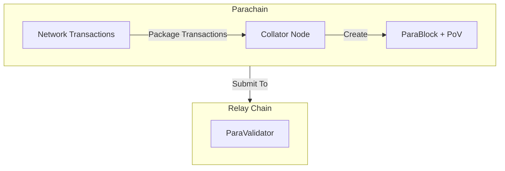

- Validation by paravalidators:

    - Paravalidators are groups of approximately five relay chain validators, randomly assigned to parachains and shuffled every minute.
    - Each paravalidator downloads the parachain's Wasm blob and validates the parablock by ensuring all transactions comply with the parachain’s state transition rules.
    - Paravalidators sign positive or negative validation statements based on the block’s validity.

- Backing and approval:

    - If a parablock receives sufficient positive validation statements, it is backed and included on the relay chain as a para-header.
    - An additional approval process resolves disputes. If a parablock contains invalid transactions, additional validators are tasked with verification.
    - Validators who back invalid parablocks are penalized through slashing, creating strong incentives for honest behavior.

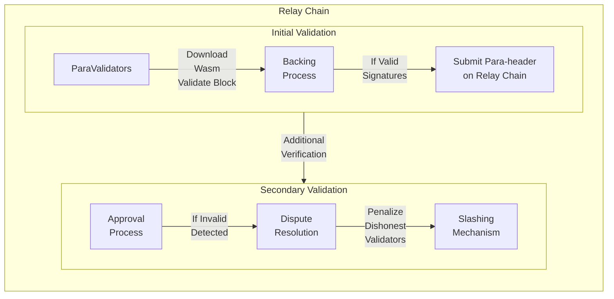

It is important to understand that relay chain blocks do not store full parachain blocks (parablocks). Instead, they include para-headers, which serve as summaries of the backed parablocks. The complete parablock remains within the parachain network, maintaining its autonomy while relying on the relay chain for validation and finality.

## Where to Go Next

For more technical details, refer to the:

- [Parachain Wiki](https://wiki.polkadot.com/learn/learn-parachains/){target=\_blank} page


---

# Polkadot Omni Node

> Source (raw): https://raw.githubusercontent.com/polkadot-developers/polkadot-docs/master/.ai/pages/develop-toolkit-parachains-polkadot-omni-node.md
> Canonical (HTML): https://docs.polkadot.com/develop/toolkit/parachains/polkadot-omni-node/
> Summary: Run parachain nodes easily with the polkadot-omni-node, a white-labeled binary that can run parachain nodes using a single pre-built solution.

# Polkadot Omni Node

## Introduction

The [`polkadot-omni-node`](https://crates.io/crates/polkadot-omni-node/0.7.0){target=\_blank} crate is a versatile, pre-built binary designed to simplify running parachains in the Polkadot ecosystem. Unlike traditional node binaries that are tightly coupled to specific runtime code, the `polkadot-omni-node` operates using an external [chain specification](/polkadot-protocol/glossary#chain-specification){target=\_blank} file, allowing it to adapt dynamically to different parachains.

This approach enables it to act as a white-labeled node binary, capable of running most parachains that do not require custom node-level logic or extensions. Developers can leverage this flexibility to test, deploy, or operate parachain nodes without maintaining a dedicated codebase for each network.

This guide provides step-by-step instructions for installing the `polkadot-omni-node`, obtaining a chain specification, and spinning up a parachain node.

## Prerequisites

Before getting started, ensure you have the following prerequisites:

- **[Rust](https://www.rust-lang.org/tools/install){target=\_blank}**: Required to build and install the `polkadot-omni-node` binary.

Ensure Rust's `cargo` command is available in your terminal by running:

```bash
cargo --version
```

## Install Polkadot Omni Node

To install `polkadot-omni-node` globally using `cargo`, run:

```bash
cargo install --locked polkadot-omni-node@0.7.0
```

This command downloads and installs version 0.7.0 of the binary, making it available system-wide.

To confirm the installation, run:

```bash
polkadot-omni-node --version
```

You should see the installed version number printed to the terminal, confirming a successful installation.

## Obtain Chain Specifications

The `polkadot-omni-node` binary uses a chain specification file to configure and launch a parachain node. This file defines the parachain's genesis state and network settings.

The most common source for official chain specifications is the [`paritytech/chainspecs`](https://github.com/paritytech/chainspecs){target=\_blank} repository. These specifications are also browsable in a user-friendly format via the [Chainspec Collection](https://paritytech.github.io/chainspecs/){target=\_blank} website.

To obtain a chain specification:

1. Visit the [Chainspec Collection](https://paritytech.github.io/chainspecs/){target=\_blank} website.
2. Find the parachain you want to run.
3. Click the chain spec to open it.
4. Copy the JSON content and save it locally as a `.json` file, e.g., `chain_spec.json`.

## Run a Parachain Full Node

Once you've installed `polkadot-omni-node` and saved the appropriate chain specification file, you can start a full node for your chosen parachain.

To see all available flags and configuration options, run:

```bash
polkadot-omni-node --help
```

To launch the node, run the following command, replacing `./INSERT_PARACHAIN_CHAIN_SPEC.json` with the actual path to your saved chain spec file.

This command will:

- Load the chain specification.
- Initialize the node using the provided network configuration.
- Begin syncing with the parachain network.

```bash
polkadot-omni-node --chain ./INSERT_PARACHAIN_CHAIN_SPEC.json --sync warp
```

- The `--chain` flag tells the `polkadot-omni-node` which parachain to run by pointing to its chain specification file.
- The `--sync warp` flag enables warp sync, allowing the node to quickly catch up to the latest finalized state. Historical blocks are fetched in the background as the node continues operating.

Once started, the node will begin connecting to peers and syncing with the network. You’ll see logs in your terminal reflecting its progress.

## Interact with the Node

By default, `polkadot-omni-node` exposes a WebSocket endpoint at `ws://localhost:9944`,  which you can use to interact with the running node. You can connect using:

- **[Polkadot.js Apps](https://polkadot.js.org/apps/#/explorer){target=\_blank}**: A web-based interface for exploring and interacting with Polkadot SDK-based chains.
- Custom scripts using compatible [libraries](/develop/toolkit/api-libraries/){target=\_blank}.

Once connected, you can review blocks, call extrinsics, inspect storage, and interact with the runtime.

## Parachain Compatibility

The `polkadot-omni-node` is designed to work with most parachains out of the box; however, your parachain's runtime must meet specific requirements and follow certain conventions to be compatible. This section outlines what your runtime needs to implement and configure to work seamlessly with the `polkadot-omni-node`:

- Your runtime must implement the required runtime APIs (see below).
- Your runtime must include and configure the required pallets.

The [`parachain-template`](https://github.com/paritytech/polkadot-sdk-parachain-template/tree/v0.0.4){target=_blank} provides a complete reference implementation that is fully compatible with the `polkadot-omni-node`. You can use it as a starting point or reference for ensuring your runtime meets all compatibility requirements.

### Required Runtime APIs

Your parachain runtime must implement the following runtime APIs for the `polkadot-omni-node` to function properly:

- **GetParachainInfo Runtime API**: The omni-node requires the [`GetParachainInfo`](https://paritytech.github.io/polkadot-sdk/master/cumulus_primitives_core/trait.GetParachainInfo.html){target=\_blank} runtime API to identify and configure the parachain correctly. This API provides the parachain ID to the node.

    ```rust title="runtime/src/apis.rs"
    impl cumulus_primitives_core::GetParachainInfo<Block> for Runtime {
        fn parachain_id() -> cumulus_primitives_core::ParaId {
            // Return your parachain ID
            ParachainInfo::parachain_id()
        }
    }
    ```

- **Aura Runtime API**: For consensus, the `polkadot-omni-node` expects the [Aura runtime API](https://paritytech.github.io/polkadot-sdk/master/polkadot_sdk_frame/runtime/apis/trait.AuraApi.html){target=\_blank} to be implemented.

    ```rust title="runtime/src/apis.rs"
    impl sp_consensus_aura::AuraApi<Block, AuraId> for Runtime {
        fn slot_duration() -> sp_consensus_aura::SlotDuration {
            sp_consensus_aura::SlotDuration::from_millis(SLOT_DURATION)
        }

        fn authorities() -> Vec<AuraId> {
            Aura::authorities().into_inner()
        }
    }
    ```

### Required Pallets

Your runtime must include and properly configure the following pallets:

- **System Pallet**: The System pallet ([`frame-system`](https://paritytech.github.io/polkadot-sdk/master/polkadot_sdk_frame/prelude/frame_system/index.html){target=\_blank}) is fundamental and must be configured with appropriate types.

    ```rust title="runtime/src/lib.rs"
    #[frame_support::runtime]
    impl frame_system::Config for Runtime {
        type Block = Block;
        type BlockNumber = BlockNumber;
        // ... other configurations
    }

    // Must be named "System" for omni-node compatibility
    pub type System = frame_system::Pallet<Runtime>;
    ```

- **ParachainSystem Pallet**: This pallet ([`cumulus-pallet-parachain-system`](https://paritytech.github.io/polkadot-sdk/master/cumulus_pallet_parachain_system/index.html){target=\_blank}) enables parachain functionality and handles low-level details of being a parachain.

    ```rust title="runtime/src/lib.rs"
    impl cumulus_pallet_parachain_system::Config for Runtime {
        type RuntimeEvent = RuntimeEvent;
        type OnSystemEvent = ();
        // ... other configurations
    }

    // Must be named "ParachainSystem" for omni-node compatibility  
    pub type ParachainSystem = cumulus_pallet_parachain_system::Pallet<Runtime>;
    ```

- **Aura Pallet**: For block authoring consensus ([`pallet-aura`](https://paritytech.github.io/polkadot-sdk/master/pallet_aura/index.html){target=\_blank}).

    ```rust title="runtime/src/lib.rs"
    impl pallet_aura::Config for Runtime {
        type AuthorityId = AuraId;
        type DisabledValidators = ();
        type MaxAuthorities = MaxAuthorities;
        type AllowMultipleBlocksPerSlot = ConstBool<false>;
    }

    pub type Aura = pallet_aura::Pallet<Runtime>;
    ```

- **ParachainInfo Pallet**: Provides parachain metadata ([`parachain-info`](https://paritytech.github.io/polkadot-sdk/master/staging_parachain_info/index.html){target=\_blank}).

    ```rust title="runtime/src/lib.rs"
    impl parachain_info::Config for Runtime {}

    pub type ParachainInfo = parachain_info::Pallet<Runtime>;
    ```

If you're migrating an existing parachain to use the `polkadot-omni-node`, you may need to perform runtime upgrades to add the required runtime APIs and pallets. Follow the standard parachain [runtime upgrade](/develop/parachains/maintenance/runtime-upgrades/){target=\_blank} procedures to implement these changes on your live network.


---

# Polkadot SDK Accounts

> Source (raw): https://raw.githubusercontent.com/polkadot-developers/polkadot-docs/master/.ai/pages/polkadot-protocol-parachain-basics-accounts.md
> Canonical (HTML): https://docs.polkadot.com/polkadot-protocol/parachain-basics/accounts/
> Summary: Learn about account structures, balances, and address formats in the Polkadot SDK, including how to manage lifecycle, references, and balances.

# Accounts

## Introduction

Accounts are essential for managing identity, transactions, and governance on the network in the Polkadot SDK. Understanding these components is critical for seamless development and operation on the network, whether you're building or interacting with Polkadot-based chains.

This page will guide you through the essential aspects of accounts, including their data structure, balance types, reference counters, and address formats. You’ll learn how accounts are managed within the runtime, how balances are categorized, and how addresses are encoded and validated. 

## Account Data Structure

Accounts are foundational to any blockchain, and the Polkadot SDK provides a flexible management system. This section explains how the Polkadot SDK defines accounts and manages their lifecycle through data structures within the runtime.

### Account

The [`Account` data type](https://paritytech.github.io/polkadot-sdk/master/frame_system/pallet/type.Account.html){target=\_blank} is a storage map within the [System pallet](https://paritytech.github.io/polkadot-sdk/master/src/frame_system/lib.rs.html){target=\_blank} that links an account ID to its corresponding data. This structure is fundamental for mapping account-related information within the chain.

The code snippet below shows how accounts are defined:

```rs
 -/// The full account information for a particular account ID.
	#[pallet::storage]
	#[pallet::getter(fn account)]
	pub type Account<T: Config> = StorageMap<
		_,
		Blake2_128Concat,
		T::AccountId,
		AccountInfo<T::Nonce, T::AccountData>,
		ValueQuery,
	>;
```

The preceding code block defines a storage map named `Account`. The `StorageMap` is a type of on-chain storage that maps keys to values. In the `Account` map, the key is an account ID, and the value is the account's information. Here, `T` represents the generic parameter for the runtime configuration, which is defined by the pallet's configuration trait (`Config`).

The `StorageMap` consists of the following parameters:

- **`_`**: Used in macro expansion and acts as a placeholder for the storage prefix type. Tells the macro to insert the default prefix during expansion.
- **`Blake2_128Concat`**: The hashing function applied to keys in the storage map.
- **`T: :AccountId`**: Represents the key type, which corresponds to the account’s unique ID.
- **`AccountInfo<T: :Nonce, T::AccountData>`**: The value type stored in the map. For each account ID, the map stores an `AccountInfo` struct containing:

    - **`T::Nonce`**: A nonce for the account, which is incremented with each transaction to ensure transaction uniqueness.
    - **`T: :AccountData`**: Custom account data defined by the runtime configuration, which could include balances, locked funds, or other relevant information.
    
- **`ValueQuery`**: Defines how queries to the storage map behave when no value is found; returns a default value instead of `None`.

For a detailed explanation of storage maps, see the [`StorageMap`](https://paritytech.github.io/polkadot-sdk/master/frame_support/storage/types/struct.StorageMap.html){target=\_blank} entry in the Rust docs.

### Account Info

The `AccountInfo` structure is another key element within the [System pallet](https://paritytech.github.io/polkadot-sdk/master/src/frame_system/lib.rs.html){target=\_blank}, providing more granular details about each account's state. This structure tracks vital data, such as the number of transactions and the account’s relationships with other modules.

```rs
-/// Information of an account.
#[derive(Clone, Eq, PartialEq, Default, RuntimeDebug, Encode, Decode, TypeInfo, MaxEncodedLen)]
pub struct AccountInfo<Nonce, AccountData> {
	/// The number of transactions this account has sent.
	pub nonce: Nonce,
	/// The number of other modules that currently depend on this account's existence. The account
	/// cannot be reaped until this is zero.
	pub consumers: RefCount,
	/// The number of other modules that allow this account to exist. The account may not be reaped
	/// until this and `sufficients` are both zero.
	pub providers: RefCount,
	/// The number of modules that allow this account to exist for their own purposes only. The
	/// account may not be reaped until this and `providers` are both zero.
	pub sufficients: RefCount,
	/// The additional data that belongs to this account. Used to store the balance(s) in a lot of
	/// chains.
	pub data: AccountData,
}
```

The `AccountInfo` structure includes the following components:

- **`nonce`**: Tracks the number of transactions initiated by the account, which ensures transaction uniqueness and prevents replay attacks.
- **`consumers`**: Counts how many other modules or pallets rely on this account’s existence. The account cannot be removed from the chain (reaped) until this count reaches zero.
- **`providers`**: Tracks how many modules permit this account’s existence. An account can only be reaped once both `providers` and `sufficients` are zero.
- **`sufficients`**: Represents the number of modules that allow the account to exist for internal purposes, independent of any other modules.
- **`AccountData`**: A flexible data structure that can be customized in the runtime configuration, usually containing balances or other user-specific data.

This structure helps manage an account's state and prevents its premature removal while it is still referenced by other on-chain data or modules. The [`AccountInfo`](https://paritytech.github.io/polkadot-sdk/master/frame_system/struct.AccountInfo.html){target=\_blank} structure can vary as long as it satisfies the trait bounds defined by the `AccountData` associated type in the [`frame-system::pallet::Config`](https://paritytech.github.io/polkadot-sdk/master/frame_system/pallet/trait.Config.html){target=\_blank} trait.

### Account Reference Counters

Polkadot SDK uses reference counters to track an account’s dependencies across different runtime modules. These counters ensure that accounts remain active while data is associated with them.

The reference counters include:

- **`consumers`**: Prevents account removal while other pallets still rely on the account.
- **`providers`**: Ensures an account is active before other pallets store data related to it.
- **`sufficients`**: Indicates the account’s independence, ensuring it can exist even without a native token balance, such as when holding sufficient alternative assets.

#### Providers Reference Counters

The `providers` counter ensures that an account is ready to be depended upon by other runtime modules. For example, it is incremented when an account has a balance above the existential deposit, which marks the account as active.

The system requires this reference counter to be greater than zero for the `consumers` counter to be incremented, ensuring the account is stable before any dependencies are added.

#### Consumers Reference Counters

The `consumers` counter ensures that the account cannot be reaped until all references to it across the runtime have been removed. This check prevents the accidental deletion of accounts that still have active on-chain data.

It is the user’s responsibility to clear out any data from other runtime modules if they wish to remove their account and reclaim their existential deposit.

#### Sufficients Reference Counter

The `sufficients` counter tracks accounts that can exist independently without relying on a native account balance. This is useful for accounts holding other types of assets, like tokens, without needing a minimum balance in the native token.

For instance, the [Assets pallet](https://paritytech.github.io/polkadot-sdk/master/pallet_assets/index.html){target=\_blank}, may increment this counter for an account holding sufficient tokens.

#### Account Deactivation

In Polkadot SDK-based chains, an account is deactivated when its reference counters (such as `providers`, `consumers`, and `sufficient`) reach zero. These counters ensure the account remains active as long as other runtime modules or pallets reference it.

When all dependencies are cleared and the counters drop to zero, the account becomes deactivated and may be removed from the chain (reaped). This is particularly important in Polkadot SDK-based blockchains, where accounts with balances below the existential deposit threshold are pruned from storage to conserve state resources.

Each pallet that references an account has cleanup functions that decrement these counters when the pallet no longer depends on the account. Once these counters reach zero, the account is marked for deactivation.

#### Updating Counters

The Polkadot SDK provides runtime developers with various methods to manage account lifecycle events, such as deactivation or incrementing reference counters. These methods ensure that accounts cannot be reaped while still in use.

The following helper functions manage these counters:

- **`inc_consumers()`**: Increments the `consumer` reference counter for an account, signaling that another pallet depends on it.
- **`dec_consumers()`**: Decrements the `consumer` reference counter, signaling that a pallet no longer relies on the account.
- **`inc_providers()`**: Increments the `provider` reference counter, ensuring the account remains active.
- **`dec_providers()`**: Decrements the `provider` reference counter, allowing for account deactivation when no longer in use.
- **`inc_sufficients()`**: Increments the `sufficient` reference counter for accounts that hold sufficient assets.
- **`dec_sufficients()`**: Decrements the `sufficient` reference counter.

To ensure proper account cleanup and lifecycle management, a corresponding decrement should be made for each increment action.

The `System` pallet offers three query functions to assist developers in tracking account states:

- **[`can_inc_consumer()`](https://paritytech.github.io/polkadot-sdk/master/frame_system/pallet/struct.Pallet.html#method.can_inc_consumer){target=\_blank}**: Checks if the account can safely increment the consumer reference.
- **[`can_dec_provider()`](https://paritytech.github.io/polkadot-sdk/master/frame_system/pallet/struct.Pallet.html#method.can_dec_provider){target=\_blank}**: Ensures that no consumers exist before allowing the decrement of the provider counter.
- **[`is_provider_required()`](https://paritytech.github.io/polkadot-sdk/master/frame_system/pallet/struct.Pallet.html#method.is_provider_required){target=\_blank}**: Verifies whether the account still has any active consumer references.

This modular and flexible system of reference counters tightly controls the lifecycle of accounts in Polkadot SDK-based blockchains, preventing the accidental removal or retention of unneeded accounts. You can refer to the [System pallet Rust docs](https://paritytech.github.io/polkadot-sdk/master/frame_system/pallet/struct.Pallet.html){target=\_blank} for more details.
    

## Account Balance Types

In the Polkadot ecosystem, account balances are categorized into different types based on how the funds are utilized and their availability. These balance types determine the actions that can be performed, such as transferring tokens, paying transaction fees, or participating in governance activities. Understanding these balance types helps developers manage user accounts and implement balance-dependent logic.

!!! note "A more efficient distribution of account balance types is in development"
    Soon, pallets in the Polkadot SDK will implement the [`Fungible` trait](https://paritytech.github.io/polkadot-sdk/master/frame_support/traits/tokens/fungible/index.html){target=\_blank} (see the [tracking issue](https://github.com/paritytech/polkadot-sdk/issues/226){target=\_blank} for more details). For example, the [`transaction-storage`](https://paritytech.github.io/polkadot-sdk/master/pallet_transaction_storage/index.html){target=\_blank} pallet changed the implementation of the [`Currency`](https://paritytech.github.io/polkadot-sdk/master/frame_support/traits/tokens/currency/index.html){target=\_blank} trait (see the [Refactor transaction storage pallet to use fungible traits](https://github.com/paritytech/polkadot-sdk/pull/1800){target=\_blank} PR for further details):

    ```rust
    type BalanceOf<T> = <<T as Config>::Currency as Currency<<T as frame_system::Config>::AccountId>>::Balance;
    ```
    
    To the [`Fungible`](https://paritytech.github.io/polkadot-sdk/master/frame_support/traits/tokens/fungible/index.html){target=\_blank} trait:

    ```rust
    type BalanceOf<T> = <<T as Config>::Currency as FnInspect<<T as frame_system::Config>::AccountId>>::Balance;
    ```
    
    This update will enable more efficient use of account balances, allowing the free balance to be utilized for on-chain activities such as setting proxies and managing identities.

### Balance Types

The five main balance types are:

- **Free balance**: Represents the total tokens available to the account for any on-chain activity, including staking, governance, and voting. However, it may not be fully spendable or transferrable if portions of it are locked or reserved.
- **Locked balance**: Portions of the free balance that cannot be spent or transferred because they are tied up in specific activities like [staking](https://wiki.polkadot.com/learn/learn-staking/#nominating-validators){target=\_blank}, [vesting](https://wiki.polkadot.com/learn/learn-guides-transfers/#vested-transfers-with-the-polkadot-js-ui){target=\_blank}, or participating in [governance](https://wiki.polkadot.com/learn/learn-polkadot-opengov/#voting-on-a-referendum){target=\_blank}. While the tokens remain part of the free balance, they are non-transferable for the duration of the lock.
- **Reserved balance**: Funds locked by specific system actions, such as setting up an [identity](https://wiki.polkadot.com/learn/learn-identity/){target=\_blank}, creating [proxies](https://wiki.polkadot.com/learn/learn-proxies/){target=\_blank}, or submitting [deposits for governance proposals](https://wiki.polkadot.com/learn/learn-guides-polkadot-opengov/#claiming-opengov-deposits){target=\_blank}. These tokens are not part of the free balance and cannot be spent unless they are unreserved.
- **Spendable balance**: The portion of the free balance that is available for immediate spending or transfers. It is calculated by subtracting the maximum of locked or reserved amounts from the free balance, ensuring that existential deposit limits are met.
- **Untouchable balance**: Funds that cannot be directly spent or transferred but may still be utilized for on-chain activities, such as governance participation or staking. These tokens are typically tied to certain actions or locked for a specific period.

The spendable balance is calculated as follows:

```text
spendable = free - max(locked - reserved, ED)
```

Here, `free`, `locked`, and `reserved` are defined above. The `ED` represents the [existential deposit](https://wiki.polkadot.com/learn/learn-accounts/#existential-deposit-and-reaping){target=\_blank}, the minimum balance required to keep an account active and prevent it from being reaped. You may find you can't see all balance types when looking at your account via a wallet. Wallet providers often display only spendable, locked, and reserved balances.

### Locks

Locks are applied to an account's free balance, preventing that portion from being spent or transferred. Locks are automatically placed when an account participates in specific on-chain activities, such as staking or governance. Although multiple locks may be applied simultaneously, they do not stack. Instead, the largest lock determines the total amount of locked tokens.

Locks follow these basic rules:

- If different locks apply to varying amounts, the largest lock amount takes precedence.
- If multiple locks apply to the same amount, the lock with the longest duration governs when the balance can be unlocked.

#### Locks Example

Consider an example where an account has 80 DOT locked for both staking and governance purposes like so:

- 80 DOT is staked with a 28-day lock period.
- 24 DOT is locked for governance with a 1x conviction and a 7-day lock period.
- 4 DOT is locked for governance with a 6x conviction and a 224-day lock period.

In this case, the total locked amount is 80 DOT because only the largest lock (80 DOT from staking) governs the locked balance. These 80 DOT will be released at different times based on the lock durations. In this example, the 24 DOT locked for governance will be released first since the shortest lock period is seven days. The 80 DOT stake with a 28-day lock period is released next. Now, all that remains locked is the 4 DOT for governance. After 224 days, all 80 DOT (minus the existential deposit) will be free and transferable.


#### Edge Cases for Locks

In scenarios where multiple convictions and lock periods are active, the lock duration and amount are determined by the longest period and largest amount. For example, if you delegate with different convictions and attempt to undelegate during an active lock period, the lock may be extended for the full amount of tokens. For a detailed discussion on edge case lock behavior, see this [Stack Exchange post](https://substrate.stackexchange.com/questions/5067/delegating-and-undelegating-during-the-lock-period-extends-it-for-the-initial-am){target=\_blank}.

### Balance Types on Polkadot.js

Polkadot.js provides a user-friendly interface for managing and visualizing various account balances on Polkadot and Kusama networks. When interacting with Polkadot.js, you will encounter multiple balance types that are critical for understanding how your funds are distributed and restricted. This section explains how different balances are displayed in the Polkadot.js UI and what each type represents.


The most common balance types displayed on Polkadot.js are:

- **Total balance**: The total number of tokens available in the account. This includes all tokens, whether they are transferable, locked, reserved, or vested. However, the total balance does not always reflect what can be spent immediately. In this example, the total balance is 0.6274 KSM.

- **Transferable balance**: Shows how many tokens are immediately available for transfer. It is calculated by subtracting the locked and reserved balances from the total balance. For example, if an account has a total balance of 0.6274 KSM and a transferable balance of 0.0106 KSM, only the latter amount can be sent or spent freely.

- **Vested balance**: Tokens that allocated to the account but released according to a specific schedule. Vested tokens remain locked and cannot be transferred until fully vested. For example, an account with a vested balance of 0.2500 KSM means that this amount is owned but not yet transferable.

- **Locked balance**: Tokens that are temporarily restricted from being transferred or spent. These locks typically result from participating in staking, governance, or vested transfers. In Polkadot.js, locked balances do not stack—only the largest lock is applied. For instance, if an account has 0.5500 KSM locked for governance and staking, the locked balance would display 0.5500 KSM, not the sum of all locked amounts.

- **Reserved balance**: Refers to tokens locked for specific on-chain actions, such as setting an identity, creating a proxy, or making governance deposits. Reserved tokens are not part of the free balance, but can be freed by performing certain actions. For example, removing an identity would unreserve those funds.

- **Bonded balance**: The tokens locked for staking purposes. Bonded tokens are not transferable until they are unbonded after the unbonding period.

- **Redeemable balance**: The number of tokens that have completed the unbonding period and are ready to be unlocked and transferred again. For example, if an account has a redeemable balance of 0.1000 KSM, those tokens are now available for spending.

- **Democracy balance**: Reflects the number of tokens locked for governance activities, such as voting on referenda. These tokens are locked for the duration of the governance action and are only released after the lock period ends.

By understanding these balance types and their implications, developers and users can better manage their funds and engage with on-chain activities more effectively.

## Address Formats

The SS58 address format is a core component of the Polkadot SDK that enables accounts to be uniquely identified across Polkadot-based networks. This format is a modified version of Bitcoin's Base58Check encoding, specifically designed to accommodate the multi-chain nature of the Polkadot ecosystem. SS58 encoding allows each chain to define its own set of addresses while maintaining compatibility and checksum validation for security. 

### Basic Format

SS58 addresses consist of three main components:

```text
base58encode(concat(<address-type>, <address>, <checksum>))
```

- **Address type**: A byte or set of bytes that define the network (or chain) for which the address is intended. This ensures that addresses are unique across different Polkadot SDK-based chains.
- **Address**: The public key of the account encoded as bytes.
- **Checksum**: A hash-based checksum which ensures that addresses are valid and unaltered. The checksum is derived from the concatenated address type and address components, ensuring integrity.

The encoding process transforms the concatenated components into a Base58 string, providing a compact and human-readable format that avoids easily confused characters (e.g., zero '0', capital 'O', lowercase 'l'). This encoding function ([`encode`](https://docs.rs/bs58/latest/bs58/fn.encode.html){target=\_blank}) is implemented exactly as defined in Bitcoin and IPFS specifications, using the same alphabet as both implementations.

For more details about the SS58 address format implementation, see the [`Ss58Codec`](https://paritytech.github.io/polkadot-sdk/master/sp_core/crypto/trait.Ss58Codec.html){target=\_blank} trait in the Rust Docs.

### Address Type

The address type defines how an address is interpreted and to which network it belongs. Polkadot SDK uses different prefixes to distinguish between various chains and address formats:

- **Address types `0-63`**: Simple addresses, commonly used for network identifiers.
- **Address types `64-127`**: Full addresses that support a wider range of network identifiers.
- **Address types `128-255`**: Reserved for future address format extensions.

For example, Polkadot’s main network uses an address type of 0, while Kusama uses 2. This ensures that addresses can be used without confusion between networks.

The address type is always encoded as part of the SS58 address, making it easy to quickly identify the network. Refer to the [SS58 registry](https://github.com/paritytech/ss58-registry){target=\_blank} for the canonical listing of all address type identifiers and how they map to Polkadot SDK-based networks.

### Address Length

SS58 addresses can have different lengths depending on the specific format. Address lengths range from as short as 3 to 35 bytes, depending on the complexity of the address and network requirements. This flexibility allows SS58 addresses to adapt to different chains while providing a secure encoding mechanism.

| Total | Type | Raw account | Checksum |
|-------|------|-------------|----------|
| 3     | 1    | 1           | 1        |
| 4     | 1    | 2           | 1        |
| 5     | 1    | 2           | 2        |
| 6     | 1    | 4           | 1        |
| 7     | 1    | 4           | 2        |
| 8     | 1    | 4           | 3        |
| 9     | 1    | 4           | 4        |
| 10    | 1    | 8           | 1        |
| 11    | 1    | 8           | 2        |
| 12    | 1    | 8           | 3        |
| 13    | 1    | 8           | 4        |
| 14    | 1    | 8           | 5        |
| 15    | 1    | 8           | 6        |
| 16    | 1    | 8           | 7        |
| 17    | 1    | 8           | 8        |
| 35    | 1    | 32          | 2        |

SS58 addresses also support different payload sizes, allowing a flexible range of account identifiers.

### Checksum Types

A checksum is applied to validate SS58 addresses. Polkadot SDK uses a Blake2b-512 hash function to calculate the checksum, which is appended to the address before encoding. The checksum length can vary depending on the address format (e.g., 1-byte, 2-byte, or longer), providing varying levels of validation strength.

The checksum ensures that an address is not modified or corrupted, adding an extra layer of security for account management.

### Validating Addresses

SS58 addresses can be validated using the subkey command-line interface or the Polkadot.js API. These tools help ensure an address is correctly formatted and valid for the intended network. The following sections will provide an overview of how validation works with these tools.

#### Using Subkey

[Subkey](https://paritytech.github.io/polkadot-sdk/master/subkey/index.html){target=\_blank} is a CLI tool provided by Polkadot SDK for generating and managing keys. It can inspect and validate SS58 addresses.

The `inspect` command gets a public key and an SS58 address from the provided secret URI. The basic syntax for the `subkey inspect` command is:

```bash
subkey inspect [flags] [options] uri
```

For the `uri` command-line argument, you can specify the secret seed phrase, a hex-encoded private key, or an SS58 address. If the input is a valid address, the `subkey` program displays the corresponding hex-encoded public key, account identifier, and SS58 addresses.

For example, to inspect the public keys derived from a secret seed phrase, you can run a command similar to the following:

```bash
subkey inspect "caution juice atom organ advance problem want pledge someone senior holiday very"
```

The command displays output similar to the following:

-<div id="termynal" data-termynal markdown>
  <span data-ty="input"><span class="file-path"></span>subkey inspect "caution juice atom organ advance problem want pledge someone senior holiday very"</span>
  <span data-ty>Secret phrase `caution juice atom organ advance problem want pledge someone senior holiday very` is account:</span>
  <span data-ty> Secret seed: 0xc8fa03532fb22ee1f7f6908b9c02b4e72483f0dbd66e4cd456b8f34c6230b849</span>
  <span data-ty> Public key (hex): 0xd6a3105d6768e956e9e5d41050ac29843f98561410d3a47f9dd5b3b227ab8746</span>
  <span data-ty> Public key (SS58): 5Gv8YYFu8H1btvmrJy9FjjAWfb99wrhV3uhPFoNEr918utyR</span>
  <span data-ty> Account ID: 0xd6a3105d6768e956e9e5d41050ac29843f98561410d3a47f9dd5b3b227ab8746</span>
  <span data-ty> SS58 Address: 5Gv8YYFu8H1btvmrJy9FjjAWfb99wrhV3uhPFoNEr918utyR</span>
</div>


The `subkey` program assumes an address is based on a public/private key pair. If you inspect an address, the command returns the 32-byte account identifier.

However, not all addresses in Polkadot SDK-based networks are based on keys.

Depending on the command-line options you specify and the input you provided, the command output might also display the network for which the address has been encoded. For example:

```bash
subkey inspect "12bzRJfh7arnnfPPUZHeJUaE62QLEwhK48QnH9LXeK2m1iZU"
```

The command displays output similar to the following:

-<div id="termynal" data-termynal markdown>
  <span data-ty="input"><span class="file-path"></span>subkey inspect "12bzRJfh7arnnfPPUZHeJUaE62QLEwhK48QnH9LXeK2m1iZU"</span>
  <span data-ty>Public Key URI `12bzRJfh7arnnfPPUZHeJUaE62QLEwhK48QnH9LXeK2m1iZU` is account:</span>
  <span data-ty> Network ID/Version: polkadot</span>
  <span data-ty> Public key (hex): 0x46ebddef8cd9bb167dc30878d7113b7e168e6f0646beffd77d69d39bad76b47a</span>
  <span data-ty> Account ID: 0x46ebddef8cd9bb167dc30878d7113b7e168e6f0646beffd77d69d39bad76b47a</span>
  <span data-ty> Public key (SS58): 12bzRJfh7arnnfPPUZHeJUaE62QLEwhK48QnH9LXeK2m1iZU</span>
  <span data-ty> SS58 Address: 12bzRJfh7arnnfPPUZHeJUaE62QLEwhK48QnH9LXeK2m1iZU</span>
</div>


#### Using Polkadot.js API

To verify an address in JavaScript or TypeScript projects, you can use the functions built into the [Polkadot.js API](https://polkadot.js.org/docs/){target=\_blank}. For example:

```js
-// Import Polkadot.js API dependencies
const { decodeAddress, encodeAddress } = require('@polkadot/keyring');
const { hexToU8a, isHex } = require('@polkadot/util');

// Specify an address to test.
const address = 'INSERT_ADDRESS_TO_TEST';

// Check address
const isValidSubstrateAddress = () => {
  try {
    encodeAddress(isHex(address) ? hexToU8a(address) : decodeAddress(address));

    return true;
  } catch (error) {
    return false;
  }
};

// Query result
const isValid = isValidSubstrateAddress();
console.log(isValid);

```

If the function returns `true`, the specified address is a valid address.

#### Other SS58 Implementations

Support for encoding and decoding Polkadot SDK SS58 addresses has been implemented in several other languages and libraries.

- **Crystal**: [`wyhaines/base58.cr`](https://github.com/wyhaines/base58.cr){target=\_blank}
- **Go**: [`itering/subscan-plugin`](https://github.com/itering/subscan-plugin){target=\_blank}
- **Python**: [`polkascan/py-scale-codec`](https://github.com/polkascan/py-scale-codec){target=\_blank}
- **TypeScript**: [`subsquid/squid-sdk`](https://github.com/subsquid/squid-sdk){target=\_blank}


---

# PolkaVM Design

> Source (raw): https://raw.githubusercontent.com/polkadot-developers/polkadot-docs/master/.ai/pages/polkadot-protocol-smart-contract-basics-polkavm-design.md
> Canonical (HTML): https://docs.polkadot.com/polkadot-protocol/smart-contract-basics/polkavm-design/
> Summary: Discover PolkaVM, a high-performance smart contract VM for Polkadot, enabling Ethereum compatibility via pallet_revive, Solidity support & optimized execution.

# PolkaVM Design

-!!! smartcontract "PolkaVM Preview Release"
    PolkaVM smart contracts with Ethereum compatibility are in **early-stage development and may be unstable or incomplete**.

## Introduction

The Asset Hub smart contracts solution includes multiple components to ensure Ethereum compatibility and high performance. Its architecture allows for integration with current Ethereum tools, while its innovative virtual machine design enhances performance characteristics.

## PolkaVM

[**PolkaVM**](https://github.com/paritytech/polkavm){target=\_blank} is a custom virtual machine optimized for performance with [RISC-V-based](https://en.wikipedia.org/wiki/RISC-V){target=\_blank} architecture, supporting Solidity and additional high-performance languages. It serves as the core execution environment, integrated directly within the runtime. It features:

- An efficient interpreter for immediate code execution.
- A planned JIT compiler for optimized performance.
- Dual-mode execution capability, allowing selection of the most appropriate backend for specific workloads.
- Optimized performance for short-running contract calls through the interpreter.

The interpreter remains particularly beneficial for contracts with minimal code execution, as it eliminates JIT compilation overhead and enables immediate code execution through lazy interpretation.

## Architecture

The smart contract solution consists of the following key components that work together to enable Ethereum compatibility on Polkadot-based chains.

### Pallet Revive

[**`pallet_revive`**](https://paritytech.github.io/polkadot-sdk/master/pallet_revive/index.html){target=\_blank} is a runtime module that executes smart contracts by adding extrinsics, runtime APIs, and logic to convert Ethereum-style transactions into formats compatible with Polkadot SDK-based blockchains. It processes Ethereum-style transactions through the following workflow:


This proxy-based approach eliminates the need for node binary modifications, maintaining compatibility across different client implementations. Preserving the original Ethereum transaction payload simplifies adapting existing tools, which can continue processing familiar transaction formats.

### PolkaVM Design Fundamentals

PolkaVM introduces two fundamental architectural differences compared to the Ethereum Virtual Machine (EVM):

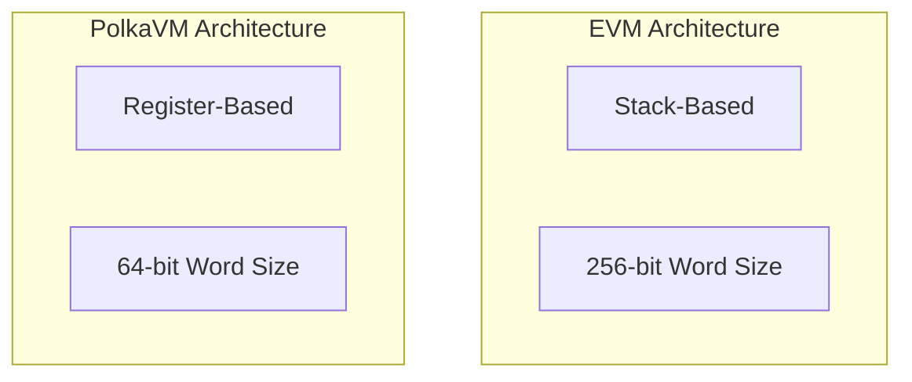

- **Register-based design**: PolkaVM utilizes a RISC-V register-based approach. This design:

    - Employs a finite set of registers for argument passing instead of an infinite stack.
    - Facilitates efficient translation to underlying hardware architectures.
    - Optimizes register allocation through careful register count selection.
    - Enables simple 1:1 mapping to x86-64 instruction sets.
    - Reduces compilation complexity through strategic register limitation.
    - Improves overall execution performance through hardware-aligned design.

- **64-bit word size**: PolkaVM operates with a 64-bit word size. This design:

    - Enables direct hardware-supported arithmetic operations.
    - Maintains compatibility with Solidity's 256-bit operations through YUL translation.
    - Allows integration of performance-critical components written in lower-level languages.
    - Optimizes computation-intensive operations through native word size alignment.
    - Reduces overhead for operations not requiring extended precision.
    - Facilitates efficient integration with modern CPU architectures.

## Compilation Process

When compiling a Solidity smart contract, the code passes through the following stages:

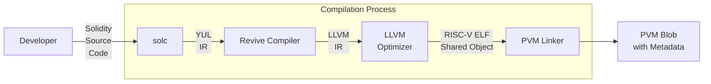

The compilation process integrates several specialized components:

1. **Solc**: The standard Ethereum Solidity compiler that translates Solidity source code to [YUL IR](https://docs.soliditylang.org/en/latest/yul.html){target=\_blank}.
2. **Revive Compiler**: Takes YUL IR and transforms it to [LLVM IR](https://llvm.org/){target=\_blank}.
3. **LLVM**: A compiler infrastructure that optimizes the code and generates RISC-V ELF objects.
4. **PVM linker**: Links the RISC-V ELF object into a final PolkaVM blob with metadata.


---

# Quickstart Parachain Development with Pop CLI

> Source (raw): https://raw.githubusercontent.com/polkadot-developers/polkadot-docs/master/.ai/pages/develop-toolkit-parachains-quickstart-pop-cli.md
> Canonical (HTML): https://docs.polkadot.com/develop/toolkit/parachains/quickstart/pop-cli/
> Summary: Quickly bootstrap parachain projects, scaffold templates, deploy local networks, and streamline development workflows using Pop CLI.

# Quickstart Parachain Development With Pop CLI

## Introduction

[Pop CLI](https://onpop.io/cli/){target=\_blank} is a powerful command-line tool designed explicitly for rapid parachain development within the Polkadot ecosystem. It addresses essential developer needs by providing streamlined commands to set up development environments, scaffold parachain templates, and manage local blockchain networks.

Pop CLI simplifies parachain development with features like:

- Quick initialization of parachain development environments.
- Project scaffolding from predefined parachain templates.
- Easy deployment and management of local development networks.

Developers can quickly begin coding and testing, significantly reducing setup overhead.

### Install Pop CLI

To install Pop CLI, run the following command:

```bash
cargo install --force --locked pop-cli
```

Confirm that Pop CLI is installed by running `pop --help` in your terminal:

```bash
pop --help
```

### Set Up Your Development Environment

To develop and build Polkadot SDK-based chains, preparing your local environment with the necessary tools and dependencies is essential. The [Install Polkadot SDK Dependencies](/develop/parachains/install-polkadot-sdk/){target=\_blank} guide walks you through this setup step-by-step.

However, you can automate this entire process by running:

```bash
pop install
```

This command provides an interactive experience that checks and installs all necessary dependencies for you. It’s the fastest and easiest way to prepare your development environment for building parachains with Pop CLI.

-<div id="termynal" data-termynal>
  <span data-ty="input"><span class="file-path"></span>pop install</span>
  <span data-ty>┌ Pop CLI : Install dependencies for development</span>
  <span data-ty>│ </span>
  <span data-ty></span>
  <span data-ty>⚙ ℹ️ Mac OS (Darwin) detected.</span>
  <span data-ty>│ </span>
  <span data-ty>⚙ More information about the packages to be installed here: https://docs.substrate.io/install/macos/</span>
  <span data-ty>│ </span>
  <span data-ty>◆ 📦 Do you want to proceed with the installation of the following packages: homebrew, protobuf, openssl, rustup and cmake ?</span>
  <span data-ty>│ ● Yes / ○ No </span>
</div>


### Initialize a Project

Start a new project quickly using Pop CLI's `pop new parachain` command:

-<div id="termynal" data-termynal>
  
</div>


The command above scaffolds a new parachain project using the default template included with Pop CLI. For more specialized implementations, additional templates are available; you can explore them by running `pop new parachain --help`.

Once the project is generated, move into the new directory and build your parachain:

```
cd my-parachain
pop build --release
```

!!! note
    Under the hood, `pop build --release` runs `cargo build --release`, but `pop build` adds functionality specific to Polkadot SDK projects, such as [deterministic runtime builds](/develop/parachains/deployment/build-deterministic-runtime/){target=\_blank} and automatic management of feature flags like `benchmark` or `try-runtime`.

Pop CLI integrates the [Zombienet SDK](https://github.com/paritytech/zombienet-sdk){target=\_blank} allowing you to easily launch ephemeral local networks for development and testing. To start a network, simply run the following:

```bash
pop up network -f ./network.toml
```

This command will automatically fetch the necessary binaries and spin up a Polkadot network with your configured parachains.

You can also interact with your local network using Pop CLI's `pop call chain` command:

-<div id="termynal" data-termynal>
  
</div>


## Where to Go Next

For a comprehensive guide to all Pop CLI features and advanced usage, see the official [Pop CLI](https://learn.onpop.io/appchains) documentation.

!!! tip
    Pop CLI also offers powerful solutions for smart contract developers. If you're interested in that path, check out the [Pop CLI Smart Contracts](https://learn.onpop.io/contracts) documentation.


---

# Randomness

> Source (raw): https://raw.githubusercontent.com/polkadot-developers/polkadot-docs/master/.ai/pages/polkadot-protocol-parachain-basics-randomness.md
> Canonical (HTML): https://docs.polkadot.com/polkadot-protocol/parachain-basics/randomness/
> Summary: Explore the importance of randomness in PoS blockchains, focusing on Polkadot’s VRF-based approach to ensure fairness and security in validator selection.

# Randomness

## Introduction

Randomness is crucial in Proof of Stake (PoS) blockchains to ensure a fair and unpredictable distribution of validator duties. However, computers are inherently deterministic, meaning the same input always produces the same output. What we typically refer to as "random" numbers on a computer are actually pseudo-random. These numbers rely on an initial "seed," which can come from external sources like [atmospheric noise](https://www.random.org/randomness/){target=\_blank}, [heart rates](https://mdpi.altmetric.com/details/47574324){target=\_blank}, or even [lava lamps](https://en.wikipedia.org/wiki/Lavarand){target=\_blank}. While this may seem random, given the same "seed," the same sequence of numbers will always be generated.

In a global blockchain network, relying on real-world entropy for randomness isn’t feasible because these inputs vary by time and location. If nodes use different inputs, blockchains can fork. Hence, real-world randomness isn't suitable for use as a seed in blockchain systems.

Currently, two primary methods for generating randomness in blockchains are used: [`RANDAO`](#randao) and [`VRF`](#vrf) (Verifiable Random Function). Polkadot adopts the `VRF` approach for its randomness.

## VRF

A Verifiable Random Function (VRF) is a cryptographic function that generates a random number and proof that ensures the submitter produced the number. This proof allows anyone to verify the validity of the random number.

Polkadot's VRF is similar to the one used in [**Ouroboros Praos**](https://eprint.iacr.org/2017/573.pdf){target=\_blank}, which secures randomness for block production in systems like [BABE](/polkadot-protocol/architecture/polkadot-chain/pos-consensus/#block-production-babe){target=\_blank} (Polkadot’s block production mechanism). 

The key difference is that Polkadot's VRF doesn’t rely on a central clock—avoiding the issue of whose clock to trust. Instead, it uses its own past results and slot numbers to simulate time and determine future outcomes.

### How VRF Works

Slots on Polkadot are discrete units of time, each lasting six seconds, and can potentially hold a block. Multiple slots form an epoch, with 2400 slots making up one four-hour epoch.

In each slot, validators execute a "die roll" using a VRF. The VRF uses three inputs:

1. A "secret key," unique to each validator, is used for the die roll.
2. An epoch randomness value, derived from the hash of VRF outputs from blocks two epochs ago (N-2), so past randomness influences the current epoch (N).
3. The current slot number.

This process helps maintain fair randomness across the network.

Here is a graphical representation:


The VRF produces two outputs: a result (the random number) and a proof (verifying that the number was generated correctly).

The result is checked by the validator against a protocol threshold. If it's below the threshold, the validator becomes a candidate for block production in that slot. 

The validator then attempts to create a block, submitting it along with the `PROOF` and `RESULT`.

So, VRF can be expressed like:

`(RESULT, PROOF) = VRF(SECRET, EPOCH_RANDOMNESS_VALUE, CURRENT_SLOT_NUMBER)`

Put simply, performing a "VRF roll" generates a random number along with proof that the number was genuinely produced and not arbitrarily chosen.

After executing the VRF, the `RESULT` is compared to a protocol-defined `THRESHOLD`. If the `RESULT` is below the `THRESHOLD`, the validator becomes a valid candidate to propose a block for that slot. Otherwise, the validator skips the slot.

As a result, there may be multiple validators eligible to propose a block for a slot. In this case, the block accepted by other nodes will prevail, provided it is on the chain with the latest finalized block as determined by the GRANDPA finality gadget. It's also possible for no block producers to be available for a slot, in which case the AURA consensus takes over. AURA is a fallback mechanism that randomly selects a validator to produce a block, running in parallel with BABE and only stepping in when no block producers exist for a slot. Otherwise, it remains inactive.

Because validators roll independently, no block candidates may appear in some slots if all roll numbers are above the threshold. 

To verify resolution of this issue and that Polkadot block times remain near constant-time, see the [PoS Consensus](/polkadot-protocol/architecture/polkadot-chain/pos-consensus/){target=\_blank} page of this documentation.

## RANDAO

An alternative on-chain randomness method is Ethereum's RANDAO, where validators perform thousands of hashes on a seed and publish the final hash during a round. The collective input from all validators forms the random number, and as long as one honest validator participates, the randomness is secure.

To enhance security, RANDAO can optionally be combined with a Verifiable Delay Function (VDF), ensuring that randomness can't be predicted or manipulated during computation.

For more information about RANDAO, see the [Randomness - RANDAO](https://eth2book.info/capella/part2/building_blocks/randomness/){target=\_blank} section of the Upgrading Ethereum documentation.

## VDFs

Verifiable Delay Functions (VDFs) are time-bound computations that, even on parallel computers, take a set amount of time to complete. 

They produce a unique result that can be quickly verified publicly. When combined with RANDAO, feeding RANDAO's output into a VDF introduces a delay that nullifies an attacker's chance to influence the randomness.

However, VDF likely requires specialized ASIC devices to run separately from standard nodes.

!!!warning 
    While only one is needed to secure the system, and they will be open-source and inexpensive, running VDF devices involves significant costs without direct incentives, adding friction for blockchain users.

## Additional Resources

For more information about the reasoning for choices made along with proofs, see Polkadot's research on blockchain randomness and sortition in the [Block production](https://research.web3.foundation/Polkadot/protocols/block-production){target=\_blank} entry of the Polkadot Wiki. 

For a discussion with Web3 Foundation researchers about when and under what conditions Polkadot's randomness can be utilized, see the [Discussion on Randomness used in Polkadot](https://github.com/use-ink/ink/issues/57){target=\_blank} issue on GitHub.


---

# Register a Local Asset

> Source (raw): https://raw.githubusercontent.com/polkadot-developers/polkadot-docs/master/.ai/pages/tutorials-polkadot-sdk-system-chains-asset-hub-register-local-asset.md
> Canonical (HTML): https://docs.polkadot.com/tutorials/polkadot-sdk/system-chains/asset-hub/register-local-asset/
> Summary: Comprehensive guide to registering a local asset on the Asset Hub system parachain, including step-by-step instructions.

# Register a Local Asset on Asset Hub

## Introduction

As detailed in the [Asset Hub Overview](/polkadot-protocol/architecture/system-chains/asset-hub){target=\_blank} page, Asset Hub accommodates two types of assets: local and foreign. Local assets are those that were created in Asset Hub and are identifiable by an integer ID. On the other hand, foreign assets originate from a sibling parachain and are identified by a Multilocation.

This guide will take you through the steps of registering a local asset on the Asset Hub parachain.

## Prerequisites

Before you begin, ensure you have access to the [Polkadot.js Apps](https://polkadot.js.org/apps/){target=\_blank} interface and a funded wallet with DOT or KSM.

- For Polkadot Asset Hub, you would need a deposit of 10 DOT and around 0.201 DOT for the metadata.
- For Kusama Asset Hub, the deposit is 0.1 KSM and around 0.000669 KSM for the metadata.

You need to ensure that your Asset Hub account balance is a bit more than the sum of those two deposits, which should seamlessly account for the required deposits and transaction fees.

## Steps to Register a Local Asset

To register a local asset on the Asset Hub parachain, follow these steps:

1. Open the [Polkadot.js Apps](https://polkadot.js.org/apps/){target=\_blank} interface and connect to the Asset Hub parachain using the network selector in the top left corner.

      - You may prefer to test local asset registration on TestNet before registering the asset on a MainNet hub. If you still need to set up a local testing environment, review the [Environment setup](#test-setup-environment) section for instructions. Once the local environment is set up, connect to the Local Node (Chopsticks) available on `ws://127.0.0.1:8000`.
      - For the live network, connect to the **Asset Hub** parachain. Either Polkadot or Kusama Asset Hub can be selected from the dropdown list, choosing the desired RPC provider.

2. Click on the **Network** tab on the top navigation bar and select **Assets** from the dropdown list.

      

3. Now, you need to examine all the registered asset IDs. This step is crucial to ensure that the asset ID you are about to register is unique. Asset IDs are displayed in the **assets** column.

      

4. Once you have confirmed that the asset ID is unique, click on the **Create** button on the top right corner of the page.

      

5. Fill in the required fields in the **Create Asset** form:

    1. **creator account**: The account to be used for creating this asset and setting up the initial metadata.
    2. **asset name**: The descriptive name of the asset you are registering.
    3. **asset symbol**: The symbol that will be used to represent the asset.
    4. **asset decimals**: The number of decimal places for this token, with a maximum of 20 allowed through the user interface.
    5. **minimum balance**: The minimum balance for the asset. This is specified in the units and decimals as requested.
    6. **asset ID**: The selected id for the asset. This should not match an already-existing asset id.
    7. Click on the **Next** button.
 
    

6. Choose the accounts for the roles listed below:

    1. **admin account**: The account designated for continuous administration of the token.
    2. **issuer account**: The account that will be used for issuing this token.
    3. **freezer account**: The account that will be used for performing token freezing operations.
    4. Click on the **Create** button.

    

7. Click on the **Sign and Submit** button to complete the asset registration process.

    

## Verify Asset Registration

After completing these steps, the asset will be successfully registered. You can now view your asset listed on the [**Assets**](https://polkadot.js.org/apps/?rpc=wss%3A%2F%2Fasset-hub-polkadot-rpc.dwellir.com#/assets){target=\_blank} section of the Polkadot.js Apps interface.


!!! tip
    Take into consideration that the **Assets** section’s link may differ depending on the network you are using. For the local environment, enter `ws://127.0.0.1:8000` into the **Custom Endpoint** field.

In this way, you have successfully registered a local asset on the Asset Hub parachain.

For an in-depth explanation about Asset Hub and its features, see the [Asset Hub](/tutorials/polkadot-sdk/system-chains/asset-hub/asset-conversion/){target=\_blank} entry in the Polkadot Wiki.

## Test Setup Environment

You can set up a local parachain environment to test the asset registration process before deploying it on the live network. This guide uses Chopsticks to simulate that process. For further information on chopsticks usage, refer to the [Chopsticks](/develop/toolkit/parachains/fork-chains/chopsticks/get-started){target=\_blank} documentation.

To set up a test environment, execute the following command:

```bash
npx @acala-network/chopsticks \
--config=https://raw.githubusercontent.com/AcalaNetwork/chopsticks/master/configs/polkadot-asset-hub.yml
```

The above command will spawn a lazy fork of Polkadot Asset Hub with the latest block data from the network. If you need to test Kusama Asset Hub, replace `polkadot-asset-hub.yml` with `kusama-asset-hub.yml` in the command.

An Asset Hub instance is now running locally, and you can proceed with the asset registration process. Note that the local registration process does not differ from the live network process. Once you have a successful TestNet transaction, you can use the same steps to register the asset on MainNet.


---

# Runtime Metrics and Monitoring

> Source (raw): https://raw.githubusercontent.com/polkadot-developers/polkadot-docs/master/.ai/pages/develop-parachains-maintenance-runtime-metrics-monitoring.md
> Canonical (HTML): https://docs.polkadot.com/develop/parachains/maintenance/runtime-metrics-monitoring/
> Summary: Learn how to monitor and visualize node performance in Polkadot SDK-based networks using telemetry, Prometheus, and Grafana for efficient runtime monitoring.

# Runtime Metrics and Monitoring

## Introduction

Maintaining a stable, secure, and efficient network requires continuous monitoring. Polkadot SDK-based nodes are equipped with built-in telemetry components that automatically collect and transmit detailed data about node performance in real-time. This telemetry system is a core feature of the Substrate framework, allowing for easy monitoring of network health without complex setup.

[Substrate's client telemetry](https://paritytech.github.io/polkadot-sdk/master/sc_telemetry/index.html){target=\_blank} enables real-time data ingestion, which can be visualized on a client dashboard. The telemetry process uses tracing and logging to gather operational data. This data is sent through a tracing layer to a background task called the [`TelemetryWorker`](https://paritytech.github.io/polkadot-sdk/master/sc_telemetry/struct.TelemetryWorker.html){target=\_blank}, which then forwards it to configured remote telemetry servers.

If multiple Substrate nodes run within the same process, the telemetry system uses a `tracing::Span` to distinguish data from each node. This ensures that each task, managed by the `sc-service`'s [`TaskManager`](https://paritytech.github.io/polkadot-sdk/master/sc_service/struct.TaskManager.html){target=\_blank}, inherits a span for data consistency, making it easy to track parallel node operations. Each node can be monitored for basic metrics, such as block height, peer connections, CPU usage, and memory. Substrate nodes expose these metrics at the `host:9615/metrics` endpoint, accessible locally by default. To expose metrics on all interfaces, start a node with the `--prometheus-external` flag.

As a developer or node operator, the telemetry system handles most of the technical setup. Collected data is automatically sent to a default telemetry server, where it’s aggregated and displayed on a dashboard, making it easy to monitor network performance and identify issues.

## Runtime Metrics

Substrate exposes a variety of metrics about the operation of your network, such as the number of peer connections, memory usage, and block production. To capture and visualize these metrics, you can configure and use tools like [Prometheus](https://prometheus.io/){target=\_blank} and [Grafana](https://grafana.com/){target=\_blank}. At a high level, Substrate exposes telemetry data that can be consumed by the Prometheus endpoint and then presented as visual information in a Grafana dashboard or graph. The provided diagram offers a simplified overview of how the interaction between Substrate, Prometheus, and Grafana can be configured to display information about node operations.

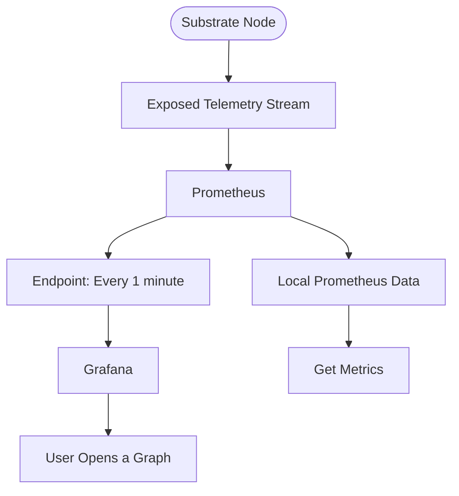

The diagram shows the flow of data from the Substrate node to the monitoring and visualization components. The Substrate node exposes a telemetry stream, which is consumed by Prometheus. Prometheus is configured to collect data every minute and store it. Grafana is then used to visualize the data, allowing the user to open graphs and retrieve specific metrics from the telemetry stream.

## Visual Monitoring

The [Polkadot telemetry](https://telemetry.polkadot.io/){target=\_blank} dashboard provides a real-time view of how currently online nodes are performing. This dashboard, allows users to select the network you need to check on, and also the information you want to display by turning visible columns on and off from the list of columns available. The monitoring dashboard provides the following indicators and metrics:

- **Validator**: Identifies whether the node is a validator node or not.
- **Location**: Displays the geographical location of the node.
- **Implementation**: Shows the version of the software running on the node.
- **Network ID**: Displays the public network identifier for the node.
- **Peer count**: Indicates the number of peers connected to the node.
- **Transactions in queue**: Shows the number of transactions waiting in the [`Ready` queue](https://paritytech.github.io/polkadot-sdk/master/sc_transaction_pool_api/enum.TransactionStatus.html#variant.Ready){target=\_blank} for a block author.
- **Upload bandwidth**: Graphs the node's recent upload activity in MB/s.
- **Download bandwidth**: Graphs the node's recent download activity in MB/s.
- **State cache size**: Graphs the size of the node's state cache in MB.
- **Block**: Displays the current best block number to ensure synchronization with peers.
- **Block hash**: Shows the block hash for the current best block number.
- **Finalized block**: Displays the most recently finalized block number to ensure synchronization with peers.
- **Finalized block hash**: Shows the block hash for the most recently finalized block.
- **Block time**: Indicates the time between block executions.
- **Block propagation time**: Displays the time it took to import the most recent block.
- **Last block time**: Shows the time it took to author the most recent block.
- **Node uptime**: Indicates the number of days the node has been online without restarting.

## Displaying Network-Wide Statistics

In addition to the details available for individual nodes, you can view statistics that provide insights into the broader network. The network statistics provide detailed information about the hardware and software configurations of the nodes in the network, including:

- Software version
- Operating system
- CPU architecture and model
- Number of physical CPU cores
- Total memory
- Whether the node is a virtual machine
- Linux distribution and kernel version
- CPU and memory speed
- Disk speed

## Customizing Monitoring Tools

The default telemetry dashboard offers core metrics without additional setup. However, many projects prefer custom telemetry setups with more advanced monitoring and alerting policies.

Typically, setting up a custom telemetry solution involves establishing monitoring and alerting policies for both on-chain events and individual node operations. This allows for more tailored monitoring and reporting compared to the default telemetry setup.

### On-Chain Activity

You can monitor specific on-chain events like transactions from certain addresses or changes in the validator set. Connecting to RPC nodes allows tracking for delays or specific event timings. Running your own RPC servers is recommended for reliable queries, as public RPC nodes may occasionally be unreliable.

## Monitoring Tools

To implement customized monitoring and alerting, consider using the following stack:

- **[Prometheus](https://prometheus.io/){target=\_blank}**: Collects metrics at intervals, stores data in a time series database, and applies rules for evaluation.
- **[Grafana](https://grafana.com/){target=\_blank}**: Visualizes collected data through customizable dashboards.
- **[Node exporter](https://github.com/prometheus/node_exporter){target=\_blank}**: Reports host metrics, including CPU, memory, and bandwidth usage.
- **[Alert manager](https://github.com/prometheus/alertmanager){target=\_blank}**: Manages alerts, routing them based on defined rules.
- **[Loki](https://github.com/grafana/loki){target=\_blank}**: Scalable log aggregator for searching and viewing logs across infrastructure.

### Change the Telemetry Server

Once backend monitoring is configured, use the `--telemetry-url` flag when starting a node to specify telemetry endpoints and verbosity levels. Multiple telemetry URLs can be provided, and verbosity ranges from 0 (least verbose) to 9 (most verbose).

For instance, setting a custom telemetry server with verbosity level 5 would look like:

```bash
./target/release/node-template --dev \
  --telemetry-url "wss://192.168.48.1:9616 5" \
  --prometheus-port 9616 \
  --prometheus-external
```

For more information on the backend components for telemetry or configuring your own server, you can refer to the [`substrate-telemetry`](https://github.com/paritytech/substrate-telemetry){target=\_blank} project or the [Substrate Telemetry Helm Chart](https://github.com/paritytech/helm-charts/blob/main/charts/substrate-telemetry/README.md){target=\_blank} for Kubernetes deployments.


---

# Runtime Upgrades

> Source (raw): https://raw.githubusercontent.com/polkadot-developers/polkadot-docs/master/.ai/pages/develop-parachains-maintenance-runtime-upgrades.md
> Canonical (HTML): https://docs.polkadot.com/develop/parachains/maintenance/runtime-upgrades/
> Summary: This page covers how runtime versioning and storage migration support forkless upgrades for Polkadot SDK-based networks and how they factor into chain upgrades.

# Runtime Upgrades

## Introduction

One of the defining features of Polkadot SDK-based blockchains is the ability to perform forkless runtime upgrades. Unlike traditional blockchains, which require hard forks and node coordination for upgrades, Polkadot networks enable seamless updates without network disruption.

Forkless upgrades are achieved through WebAssembly (Wasm) runtimes stored on-chain, which can be securely swapped and upgraded as part of the blockchain's state. By leveraging decentralized consensus, runtime updates can happen trustlessly, ensuring continuous improvement and evolution without halting operations.

This guide explains how Polkadot's runtime versioning, Wasm deployment, and storage migrations enable these upgrades, ensuring the blockchain evolves smoothly and securely. You'll also learn how different upgrade processes apply to solo chains and parachains, depending on the network setup.

## How Runtime Upgrades Work

In FRAME, the [`system`](https://paritytech.github.io/polkadot-sdk/master/frame_system/index.html){target=\_blank} pallet uses the [`set_code`](https://paritytech.github.io/polkadot-sdk/master/frame_system/pallet/enum.Call.html#variant.set_code){target=\_blank} extrinsic to update the Wasm code for the runtime. This method allows solo chains to upgrade without disruption. 

For parachains, upgrades are more complex. Parachains must first call `authorize_upgrade`, followed by `apply_authorized_upgrade`, to ensure the relay chain approves and applies the changes. Additionally, changes to current functionality that impact storage often require a [storage migration](#storage-migrations).

### Runtime Versioning

The executor is the component that selects the runtime execution environment to communicate with. Although you can override the default execution strategies for custom scenarios, in most cases, the executor selects the appropriate binary to use by evaluating and comparing key parameters from the native and Wasm runtime binaries.

The runtime includes a [runtime version struct](https://paritytech.github.io/polkadot-sdk/master/sp_version/struct.RuntimeVersion.html){target=\_blank} to provide the needed parameter information to the executor process. A sample runtime version struct might look as follows:

```rust
-pub const VERSION: RuntimeVersion = RuntimeVersion {
    spec_name: create_runtime_str!("node-template"),
    impl_name: create_runtime_str!("node-template"),
    authoring_version: 1,
    spec_version: 1,
    impl_version: 1,
    apis: RUNTIME_API_VERSIONS,
    transaction_version: 1,
};
```

The struct provides the following parameter information to the executor:

- **`spec_name`**: The identifier for the different runtimes.
- **`impl_name`**: The name of the implementation of the spec. Serves only to differentiate code of different implementation teams.
- **`authoring_version`**: The version of the authorship interface. An authoring node won't attempt to author blocks unless this is equal to its native runtime.
- **`spec_version`**: The version of the runtime specification. A full node won't attempt to use its native runtime in substitute for the on-chain Wasm runtime unless the `spec_name`, `spec_version`, and `authoring_version` are all the same between the Wasm and native binaries. Updates to the `spec_version` can be automated as a CI process. This parameter is typically incremented when there's an update to the `transaction_version`.
- **`impl_version`**: The version of the implementation of the specification. Nodes can ignore this. It is only used to indicate that the code is different. As long as the `authoring_version` and the `spec_version` are the same, the code might have changed, but the native and Wasm binaries do the same thing. In general, only non-logic-breaking optimizations would result in a change of the `impl_version`.
- **`transaction_version`**: The version of the interface for handling transactions. This parameter can be useful to synchronize firmware updates for hardware wallets or other signing devices to verify that runtime transactions are valid and safe to sign. This number must be incremented if there is a change in the index of the pallets in the `construct_runtime!` macro or if there are any changes to dispatchable functions, such as the number of parameters or parameter types. If `transaction_version` is updated, then the `spec_version` must also be updated.
- **`apis`**: A list of supported [runtime APIs](https://paritytech.github.io/polkadot-sdk/master/sp_api/macro.impl_runtime_apis.html){target=\_blank} along with their versions.

The executor follows the same consensus-driven logic for both the native runtime and the Wasm runtime before deciding which to execute. Because runtime versioning is a manual process, there is a risk that the executor could make incorrect decisions if the runtime version is misrepresented or incorrectly defined.

### Accessing the Runtime Version

The runtime version can be accessed through the `state.getRuntimeVersion` RPC endpoint, which accepts an optional block identifier. It can also be accessed through the runtime metadata to understand the APIs the runtime exposes and how to interact with them.

The runtime metadata should only change when the chain's [runtime `spec_version`](https://paritytech.github.io/polkadot-sdk/master/sp_version/struct.RuntimeVersion.html#structfield.spec_version){target=\_blank} changes.

## Storage Migrations

Some runtime upgrades require updating how data is stored to match new formats or layouts. This process is called a Storage Migration. It ensures the runtime can interpret existing state correctly after an upgrade.

For detailed guidance, scenarios, and implementation patterns, see the [Storage Migrations](/develop/parachains/maintenance/storage-migrations/){target=\_blank} page.


---

# Send XCM Messages

> Source (raw): https://raw.githubusercontent.com/polkadot-developers/polkadot-docs/master/.ai/pages/develop-interoperability-send-messages.md
> Canonical (HTML): https://docs.polkadot.com/develop/interoperability/send-messages/
> Summary: Send cross-chain messages using XCM, Polkadot's Cross-Consensus Messaging format, designed to support secure communication between chains.

# Send XCM Messages

## Introduction

One of the core FRAME pallets that enables parachains to engage in cross-chain communication using the Cross-Consensus Message (XCM) format is [`pallet-xcm`](https://paritytech.github.io/polkadot-sdk/master/pallet_xcm/pallet/index.html){target=\_blank}. It facilitates the sending, execution, and management of XCM messages, thereby allowing parachains to interact with other chains within the ecosystem. Additionally, `pallet-xcm`, also referred to as the XCM pallet, supports essential operations like asset transfers, version negotiation, and message routing.

This page provides a detailed overview of the XCM pallet's key features, its primary roles in XCM operations, and the main extrinsics it offers. Whether aiming to execute XCM messages locally or send them to external chains, this guide covers the foundational concepts and practical applications you need to know.

## XCM Frame Pallet Overview

The [`pallet-xcm`](https://paritytech.github.io/polkadot-sdk/master/pallet_xcm/pallet/index.html){target=\_blank} provides a set of pre-defined, commonly used [XCVM programs](https://github.com/polkadot-fellows/xcm-format?tab=readme-ov-file#12-the-xcvm){target=\_blank} in the form of a [set of extrinsics](https://paritytech.github.io/polkadot-sdk/master/pallet_xcm/pallet/dispatchables/index.html){target=\blank}. This pallet provides some [default implementations](https://paritytech.github.io/polkadot-sdk/master/pallet_xcm/pallet/struct.Pallet.html#implementations){target=\_blank} for traits required by [`XcmConfig`](https://paritytech.github.io/polkadot-sdk/master/pallet_xcm_benchmarks/trait.Config.html#associatedtype.XcmConfig){target=\_blank}. The [XCM executor](https://paritytech.github.io/polkadot-sdk/master/staging_xcm_executor/struct.XcmExecutor.html){target=\_blank} is also included as an associated type within the pallet's configuration. 

For further details about the XCM configuration, see the [XCM Configuration](/develop/interoperability/xcm-config/){target=\_blank} page.

Where the [XCM format](https://github.com/polkadot-fellows/xcm-format){target=\_blank} defines a set of instructions used to construct XCVM programs, `pallet-xcm` defines a set of extrinsics that can be utilized to build XCVM programs, either to target the local or external chains. The `pallet-xcm` functionality is divided into three categories:

- **Primitive**: Dispatchable functions to execute XCM locally.
- **High-level**: Functions for asset transfers between chains.
- **Version negotiation-specific**: Functions for managing XCM version compatibility.

### Key Roles of the XCM Pallet

The XCM pallet plays a central role in managing cross-chain messages, with its primary responsibilities including:

- **Execute XCM messages**: Interacts with the XCM executor to validate and execute messages, adhering to predefined security and filter criteria.
- **Send messages across chains**: Allows authorized origins to send XCM messages, enabling controlled cross-chain communication.
- **Reserve-based transfers and teleports**: Supports asset movement between chains, governed by filters that restrict operations to authorized origins.
- **XCM version negotiation**: Ensures compatibility by selecting the appropriate XCM version for inter-chain communication.
- **Asset trapping and recovery**: Manages trapped assets, enabling safe reallocation or recovery when issues occur during cross-chain transfers.
- **Support for XCVM operations**: Oversees state and configuration requirements necessary for executing cross-consensus programs within the XCVM framework.

## Primary Extrinsics of the XCM Pallet

This page will highlight the two **Primary Primitive Calls** responsible for sending and executing XCVM programs as dispatchable functions within the pallet.

### Execute

The [`execute`](https://paritytech.github.io/polkadot-sdk/master/pallet_xcm/pallet/enum.Call.html#variant.execute){target=\_blank} call directly interacts with the XCM executor, allowing for the execution of XCM messages originating from a locally signed origin. The executor validates the message, ensuring it complies with any configured barriers or filters before executing.

Once validated, the message is executed locally, and an event is emitted to indicate the result—whether the message was fully executed or only partially completed. Execution is capped by a maximum weight ([`max_weight`](https://paritytech.github.io/polkadot-sdk/master/pallet_xcm/pallet/enum.Call.html#variant.execute.field.max_weight){target=\_blank}); if the required weight exceeds this limit, the message will not be executed.

```rust
pub fn execute<T: Config>(
    message: Box<VersionedXcm<<T as Config>::RuntimeCall>>,
    max_weight: Weight,
)
```

For further details about the `execute` extrinsic, see the [`pallet-xcm` documentation](https://paritytech.github.io/polkadot-sdk/master/pallet_xcm/pallet/struct.Pallet.html){target=\_blank}.

!!!warning
    Partial execution of messages may occur depending on the constraints or barriers applied.


### Send

The [`send`](https://paritytech.github.io/polkadot-sdk/master/pallet_xcm/pallet/enum.Call.html#variant.send){target=\_blank} call enables XCM messages to be sent to a specified destination. This could be a parachain, smart contract, or any external system governed by consensus. Unlike the execute call, the message is not executed locally but is transported to the destination chain for processing.

The destination is defined using a [Location](https://paritytech.github.io/polkadot-sdk/master/xcm_docs/glossary/index.html#location){target=\_blank}, which describes the target chain or system. This ensures precise delivery through the configured XCM transport mechanism.

```rust
pub fn send<T: Config>(
    dest: Box<MultiLocation>,
    message: Box<VersionedXcm<<T as Config>::RuntimeCall>>,
)
```

For further information about the `send` extrinsic, see the [`pallet-xcm` documentation](https://paritytech.github.io/polkadot-sdk/master/pallet_xcm/pallet/struct.Pallet.html){target=\_blank}.


## XCM Router

The [`XcmRouter`](https://paritytech.github.io/polkadot-sdk/master/pallet_xcm/pallet/trait.Config.html#associatedtype.XcmRouter){target=\_blank} is a critical component the XCM pallet requires to facilitate sending XCM messages. It defines where messages can be sent and determines the appropriate XCM transport protocol for the operation.

For instance, the Kusama network employs the [`ChildParachainRouter`](https://paritytech.github.io/polkadot-sdk/master/polkadot_runtime_common/xcm_sender/struct.ChildParachainRouter.html){target=\_blank}, which restricts routing to [Downward Message Passing (DMP)](https://wiki.polkadot.com/learn/learn-xcm-transport/#dmp-downward-message-passing){target=\_blank} from the relay chain to parachains, ensuring secure and controlled communication.

```rust
-pub type XcmRouter = WithUniqueTopic<(
	// Only one router so far - use DMP to communicate with child parachains.
	ChildParachainRouter<Runtime, XcmPallet, PriceForChildParachainDelivery>,
)>;
```

For more details about XCM transport protocols, see the [XCM Channels](/develop/interoperability/xcm-channels/){target=\_blank} page.


---

# Set Up a Template

> Source (raw): https://raw.githubusercontent.com/polkadot-developers/polkadot-docs/master/.ai/pages/tutorials-polkadot-sdk-parachains-zero-to-hero-set-up-a-template.md
> Canonical (HTML): https://docs.polkadot.com/tutorials/polkadot-sdk/parachains/zero-to-hero/set-up-a-template/
> Summary: Learn to compile and run a local parachain node using Polkadot SDK. Launch, run, and interact with a pre-configured runtime template.

# Set Up a Template

## Introduction

[Polkadot SDK](https://github.com/paritytech/polkadot-sdk){target=\_blank} offers a versatile and extensible blockchain development framework, enabling you to create custom blockchains tailored to your specific application or business requirements. 

This tutorial guides you through compiling and running a parachain node using the [Polkadot SDK Parachain Template](https://github.com/paritytech/polkadot-sdk/tree/master/templates/parachain){target=\_blank}.

The parachain template provides a pre-configured, functional runtime you can use in your local development environment. It includes several key components, such as user accounts and account balances.

These predefined elements allow you to experiment with common blockchain operations without requiring initial template modifications.
In this tutorial, you will:

- Build and start a local parachain node using the node template.
- Explore how to use a front-end interface to:
    - View information about blockchain activity.
    - Submit a transaction.

By the end of this tutorial, you'll have a working local parachain and understand how to interact with it, setting the foundation for further customization and development.

## Prerequisites

Before getting started, ensure you have done the following:

- Completed the [Install Polkadot SDK Dependencies](/develop/parachains/install-polkadot-sdk/){target=\_blank} guide and successfully installed [Rust](https://www.rust-lang.org/){target=\_blank} and the required packages to set up your development environment.

For this tutorial series, you need to use Rust `1.86`. Newer versions of the compiler may not work with this parachain template version.

Run the following commands to set up the correct Rust version:

```bash
rustup default 1.86
rustup target add wasm32-unknown-unknown --toolchain 1.86-aarch64-apple-darwin
rustup component add rust-src --toolchain 1.86-aarch64-apple-darwin
```

## Utility Tools

This tutorial requires two essential tools:

- [**Chain spec builder**](https://crates.io/crates/staging-chain-spec-builder/10.0.0){target=\_blank}: A Polkadot SDK utility for generating chain specifications. Refer to the [Generate Chain Specs](/develop/parachains/deployment/generate-chain-specs/){target=\_blank} documentation for detailed usage.
    
    Install it by executing the following command:
    
    ```bash
    cargo install --locked staging-chain-spec-builder@10.0.0
    ```

    This installs the `chain-spec-builder` binary.

- [**Polkadot Omni Node**](https://crates.io/crates/polkadot-omni-node/0.5.0){target=\_blank}: A white-labeled binary, released as a part of Polkadot SDK that can act as the collator of a parachain in production, with all the related auxiliary functionalities that a normal collator node has: RPC server, archiving state, etc. Moreover, it can also run the wasm blob of the parachain locally for testing and development.

    To install it, run the following command:

    ```bash
    cargo install --locked polkadot-omni-node@0.5.0
    ```

    This installs the `polkadot-omni-node` binary.

## Compile the Runtime

The [Polkadot SDK Parachain Template](https://github.com/paritytech/polkadot-sdk/tree/master/templates/parachain){target=\_blank} provides a ready-to-use development environment for building using the [Polkadot SDK](https://github.com/paritytech/polkadot-sdk){target=\_blank}. Follow these steps to compile the runtime:

1. Clone the template repository:

    ```bash
    git clone -b v0.0.4 https://github.com/paritytech/polkadot-sdk-parachain-template.git parachain-template
    ```

2. Navigate into the project directory:

    ```bash
    cd parachain-template
    ```

3. Compile the runtime:

    ```bash
    cargo build --release --locked
    ```

    !!!tip
        Initial compilation may take several minutes, depending on your machine specifications. Use the `--release` flag for improved runtime performance compared to the default `--debug` build. If you need to troubleshoot issues, the `--debug` build provides better diagnostics.
        
        For production deployments, consider using a dedicated [`--profile production`](https://github.com/paritytech/polkadot-sdk-parachain-template/blob/v0.0.4/Cargo.toml#L42-L45){target=\_blank} flag - this can provide an additional 15-30% performance improvement over the standard `--release` profile.

4. Upon successful compilation, you should see output similar to:

    -<div id="termynal" data-termynal>
  <span data-ty="input"><span class="file-path"></span>cargo build --release --locked</span>
  <span data-ty>...</span>
  <span data-ty>Finished `release` profile [optimized] target(s) in 1.79s</span>
  <span data-ty="input"><span class="file-path"></span></span>
</div>


## Start the Local Chain

After successfully compiling your runtime, you can spin up a local chain and produce blocks. This process will start your local parachain and allow you to interact with it. You'll first need to generate a chain specification that defines your network's identity, initial connections, and genesis state, providing the foundational configuration for how your nodes connect and what initial state they agree upon, and then run the chain. 

Follow these steps to launch your node in development mode:

1. Generate the chain specification file of your parachain:

    ```bash
    chain-spec-builder create -t development \
    --relay-chain paseo \
    --para-id 1000 \
    --runtime ./target/release/wbuild/parachain-template-runtime/parachain_template_runtime.compact.compressed.wasm \
    named-preset development
    ```

2. Start the omni node with the generated chain spec. You'll start it in development mode (without a relay chain config), producing and finalizing blocks:

    ```bash
    polkadot-omni-node --chain ./chain_spec.json --dev
    ```

    The `--dev` option does the following:

    - Deletes all active data (keys, blockchain database, networking information) when stopped.
    - Ensures a clean working state each time you restart the node.

3. Verify that your node is running by reviewing the terminal output. You should see something similar to:

    -<div id="termynal" data-termynal>
  <span data-ty="input"><span class="file-path"></span>polkadot-omni-node --chain ./chain_spec.json --dev</span>
  <br />
  <span data-ty>2024-12-12 12:44:02 polkadot-omni-node</span>
  <span data-ty>2024-12-12 12:44:02 ✌️ version 0.1.0-da2dd9b7737</span>
  <span data-ty>2024-12-12 12:44:02 ❤️ by Parity Technologies admin@parity.io, 2017-2024</span>
  <span data-ty>2024-12-12 12:44:02 📋 Chain specification: Custom</span>
  <span data-ty>2024-12-12 12:44:02 🏷 Node name: grieving-drum-1926</span>
  <span data-ty>2024-12-12 12:44:02 👤 Role: AUTHORITY</span>
  <span data-ty>2024-12-12 12:44:02 💾 Database: RocksDb at /var/folders/x0/xl_kjddj3ql3bx7752yr09hc0000gn/T/substrateoUrZMQ/chains/custom/db/full</span>
  <span data-ty>2024-12-12 12:44:03 [Parachain] assembling new collators for new session 0 at #0</span>
  <span data-ty>2024-12-12 12:44:03 [Parachain] assembling new collators for new session 1 at #0</span>
  <span data-ty>2024-12-12 12:44:03 [Parachain] 🔨 Initializing Genesis block/state (state: 0xa6f8…5b46, header-hash: 0x0579…2153)</span>
  <span data-ty>2024-12-12 12:44:03 [Parachain] creating SingleState txpool Limit { count: 8192, total_bytes: 20971520 }/Limit { count: 819, total_bytes: 2097152 }.</span>
  <span data-ty>2024-12-12 12:44:03 [Parachain] Using default protocol ID "sup" because none is configured in the chain specs</span>
  <span data-ty>2024-12-12 12:44:03 [Parachain] 🏷 Local node identity is: 12D3KooWCSXy6rBuJVsn5mx8uyNqkdfNfFzEbToi4hR31v3PwdgX</span>
  <span data-ty>2024-12-12 12:44:03 [Parachain] Running libp2p network backend</span>
  <span data-ty>2024-12-12 12:44:03 [Parachain] 💻 Operating system: macos</span>
  <span data-ty>2024-12-12 12:44:03 [Parachain] 💻 CPU architecture: aarch64</span>
  <span data-ty>2024-12-12 12:44:03 [Parachain] 📦 Highest known block at #0</span>
  <span data-ty>2024-12-12 12:44:03 [Parachain] 〽️ Prometheus exporter started at 127.0.0.1:9615</span>
  <span data-ty>2024-12-12 12:44:03 [Parachain] Running JSON-RPC server: addr=127.0.0.1:9944,[::1]:9944</span>
  <span data-ty>2024-12-12 12:44:06 [Parachain] 🙌 Starting consensus session on top of parent 0x05794f9adcdaa23a5edd335e8310637d3a7e6e9393f2b0794af7d3e219f62153 (#0)</span>
  <span data-ty>2024-12-12 12:44:06 [Parachain] 🎁 Prepared block for proposing at 1 (2 ms) hash: 0x6fbea46711e9b38bab8e7877071423cd03feab03d3f4a0d578a03ab42dcee34b; parent_hash: 0x0579…2153; end: NoMoreTransactions; extrinsics_count: 2</span>
  <span data-ty>2024-12-12 12:44:06 [Parachain] 🏆 Imported #1 (0x0579…2153 → 0x6fbe…e34b)</span>
  <span data-ty>...</span>
</div>


4. Confirm that your blockchain is producing new blocks by checking if the number after `finalized` is increasing.

    -<div id="termynal" data-termynal>
  <span data-ty>...</span>
  <span data-ty>2024-12-12 12:49:20 [Parachain] 💤 Idle (0 peers), best: #1 (0x6fbe…e34b), finalized #1 (0x6fbe…e34b), ⬇ 0 ⬆ 0</span>
  <span data-ty>...</span>
  <span data-ty>2024-12-12 12:49:25 [Parachain] 💤 Idle (0 peers), best: #3 (0x7543…bcfc), finalized #3 (0x7543…bcfc), ⬇ 0 ⬆ 0</span>
  <span data-ty>...</span>
  <span data-ty>2024-12-12 12:49:30 [Parachain] 💤 Idle (0 peers), best: #4 (0x0478…8d63), finalized #4 (0x0478…8d63), ⬇ 0 ⬆ 0</span>
  <span data-ty>...</span>
</div>


The details of the log output will be explored in a later tutorial. For now, knowing that your node is running and producing blocks is sufficient.

## Interact with the Node

When running the template node, it's accessible by default at `ws://localhost:9944`. To interact with your node using the [Polkadot.js Apps](https://polkadot.js.org/apps/#/explorer){target=\_blank} interface, follow these steps:

1. Open [Polkadot.js Apps](https://polkadot.js.org/apps/#/explorer){target=\_blank} in your web browser and click the network icon (which should be the Polkadot logo) in the top left corner as shown in the image below:
    
    

2. Connect to your local node:

    1. Scroll to the bottom and select **Development**.
    2. Choose **Custom**.
    3. **Enter `ws**: //localhost:9944` in the input field.
    4. Click the **Switch** button.
    
    

3. Verify connection:

    - Once connected, you should see **parachain-template-runtime** in the top left corner.
    - The interface will display information about your local blockchain.
    
    

You are now connected to your local node and can now interact with it through the Polkadot.js Apps interface. This tool enables you to explore blocks, execute transactions, and interact with your blockchain's features. For in-depth guidance on using the interface effectively, refer to the [Polkadot.js Guides](https://wiki.polkadot.com/general/polkadotjs/){target=\_blank} available on the Polkadot Wiki.

## Stop the Node

When you're done exploring your local node, you can stop it to remove any state changes you've made. Since you started the node with the `--dev` option, stopping the node will purge all persistent block data, allowing you to start fresh the next time.

To stop the local node:

1. Return to the terminal window where the node output is displayed.
2. Press `Control-C` to stop the running process.
3. Verify that your terminal returns to the prompt in the `parachain-template` directory.

## Where to Go Next

<div class="grid cards" markdown>

-   <span class="badge tutorial">Tutorial</span> __Build a Custom Pallet__

    ---

    Build your own custom pallet for Polkadot SDK-based blockchains! Follow this step-by-step guide to create and configure a simple counter pallet from scratch.

    [:octicons-arrow-right-24: Get Started](/tutorials/polkadot-sdk/parachains/zero-to-hero/build-custom-pallet/)

</div>


---

# Smart Contracts Basics Overview

> Source (raw): https://raw.githubusercontent.com/polkadot-developers/polkadot-docs/master/.ai/pages/polkadot-protocol-smart-contract-basics-overview.md
> Canonical (HTML): https://docs.polkadot.com/polkadot-protocol/smart-contract-basics/overview/
> Summary: Learn how developers can build smart contracts on Polkadot by leveraging either Wasm/ink! or EVM contracts across many parachains.

# An Overview of the Smart Contract Landscape on Polkadot

-!!! smartcontract "PolkaVM Preview Release"
    PolkaVM smart contracts with Ethereum compatibility are in **early-stage development and may be unstable or incomplete**.

## Introduction

Polkadot is designed to support an ecosystem of parachains, rather than hosting smart contracts directly. Developers aiming to build smart contract applications on Polkadot rely on parachains within the ecosystem that provide smart contract functionality.

This guide outlines the primary approaches to developing smart contracts in the Polkadot ecosystem:

- **PolkaVM-compatible contracts**: Support Solidity and any language that compiles down to RISC-V while maintaining compatibility with Ethereum based tools.
- **EVM-compatible contracts**: Support languages like [Solidity](https://soliditylang.org/){target=\_blank} and [Vyper](https://vyperlang.org/){target=\_blank}, offering compatibility with popular Ethereum tools and wallets.
- **Wasm-based smart contracts**: Using [ink!](https://use.ink/){target=\_blank}, a Rust-based embedded domain-specific language (eDSL), enabling developers to leverage Rust’s safety and tooling.

You'll explore the key differences between these development paths, along with considerations for parachain developers integrating smart contract functionality.

!!!note "Parachain Developer?"
    If you are a parachain developer looking to add smart contract functionality to your chain, please refer to the [Add Smart Contract Functionality](/develop/parachains/customize-parachain/add-smart-contract-functionality/){target=\_blank} page, which covers both Wasm and EVM-based contract implementations.

## Smart Contracts Versus Parachains

A smart contract is a program that executes specific logic isolated to the chain on which it is being executed. All the logic executed is bound to the same state transition rules determined by the underlying virtual machine (VM). Consequently, smart contracts are more streamlined to develop, and programs can easily interact with each other through similar interfaces.

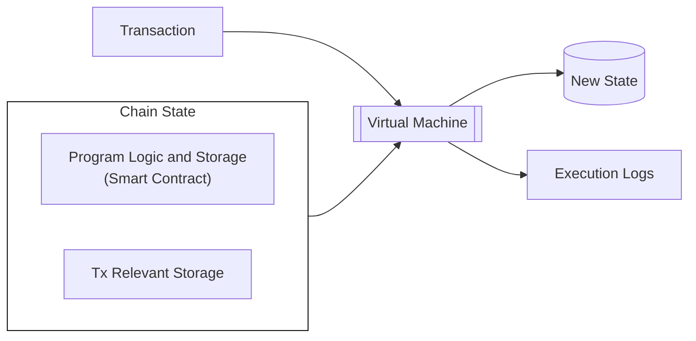

In addition, because smart contracts are programs that execute on top of existing chains, teams don't have to think about the underlying consensus they are built on.

These strengths do come with certain limitations. Some smart contracts environments, like EVM, tend to be immutable by default. Developers have developed different [proxy strategies](https://blog.openzeppelin.com/proxy-patterns){target=\_blank} to be able to upgrade smart contracts over time. The typical pattern relies on a proxy contract which holds the program storage forwarding a call to an implementation contract where the execution logic resides. Smart contract upgrades require changing the implementation contract while retaining the same storage structure, necessitating careful planning.

Another downside is that smart contracts often follow a gas metering model, where program execution is associated with a given unit and a marketplace is set up to pay for such an execution unit. This fee system is often very rigid, and some complex flows, like account abstraction, have been developed to circumvent this problem.

In contrast, parachains can create their own custom logics (known as pallets or modules), and combine them as the state transition function (STF or runtime) thanks to the modularity provided by the [Polkadot-SDK](https://github.com/paritytech/polkadot-sdk/){target=\_blank}. The different pallets within the parachain runtime can give developers a lot of flexibility when building applications on top of it.

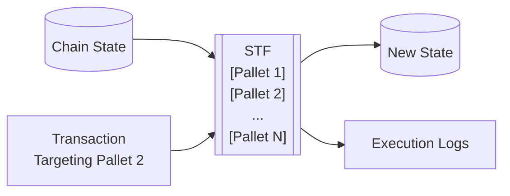

Parachains inherently offer features such as logic upgradeability, flexible transaction fee mechanisms, and chain abstraction logic. More so, by using Polkadot, parachains can benefit from robust consensus guarantees with little engineering overhead.

To read more about the differences between smart contracts and parachain runtimes, see the [Runtime vs. Smart Contracts](https://paritytech.github.io/polkadot-sdk/master/polkadot_sdk_docs/reference_docs/runtime_vs_smart_contract/index.html){target=\_blank} section of the Polkadot SDK Rust docs. For a more in-depth discussion about choosing between runtime development and smart contract development, see the Stack Overflow post on [building a Polkadot SDK runtime versus a smart contract](https://stackoverflow.com/a/56041305){target=\_blank}.

## Building a Smart Contract

The Polkadot SDK supports multiple smart contract execution environments:

- **PolkaVM**: A cutting-edge virtual machine tailored to optimize smart contract execution on Polkadot. Unlike traditional EVMs, PolkaVM is built with a [RISC-V-based register architecture](https://en.wikipedia.org/wiki/RISC-V){target=\_blank} for increased performance and scalability.
- **EVM**: Through [Frontier](https://github.com/polkadot-evm/frontier){target=\_blank}. It consists of a full Ethereum JSON RPC compatible client, an Ethereum emulation layer, and a [Rust-based EVM](https://github.com/rust-ethereum/evm){target=\_blank}. This is used by chains like [Acala](https://acala.network/){target=\_blank}, [Astar](https://astar.network/){target=\_blank}, [Moonbeam](https://moonbeam.network){target=\_blank} and more.
- **Wasm**: [ink!](https://use.ink/){target=\_blank} is a domain-specific language (DSL) for Rust smart contract development that uses the [Contracts pallet](https://github.com/paritytech/polkadot-sdk/blob/master/substrate/frame/contracts/){target=\_blank} with [`cargo-contract`](https://github.com/use-ink/cargo-contract){target=\_blank} serving as the compiler to WebAssembly. Wasm contracts can be used by chains like [Astar](https://astar.network/){target=\_blank}.

### PolkaVM Contracts

A component of the Asset Hub parachain, PolkaVM helps enable the deployment of Solidity-based smart contracts directly on Asset Hub. Learn more about how this cutting edge virtual machine facilitates using familiar Ethereum-compatible contracts and tools with Asset Hub by visiting the [Native Smart Contracts](/develop/smart-contracts/overview#native-smart-contracts){target=\_blank} guide.

### EVM Contracts

The [Frontier](https://github.com/polkadot-evm/frontier){target=\_blank} project provides a set of modules that enables a Polkadot SDK-based chain to run an Ethereum emulation layer that allows the execution of EVM smart contracts natively with the same API/RPC interface.

[Ethereum addresses (ECDSA)](https://ethereum.org/en/glossary/#address){target=\_blank} can also be mapped directly to and from the Polkadot SDK's SS58 scheme from existing accounts. Moreover, you can modify Polkadot SDK to use the ECDSA signature scheme directly to avoid any mapping.

At a high level, [Frontier](https://github.com/polkadot-evm/frontier){target=\_blank} is composed of three main components:

- **[Ethereum Client](https://github.com/polkadot-evm/frontier/tree/master/client){target=\_blank}**: An Ethereum JSON RPC compliant client that allows any request coming from an Ethereum tool, such as [Remix](https://remix.ethereum.org/){target=\_blank}, [Hardhat](https://hardhat.org/){target=\_blank} or [Foundry](https://getfoundry.sh/){target=\_blank}, to be admitted by the network.
- **[Pallet Ethereum](https://docs.rs/pallet-ethereum/latest/pallet_ethereum/){target=\_blank}**: A block emulation and Ethereum transaction validation layer that works jointly with the Ethereum client to ensure compatibility with Ethereum tools.
- **[Pallet EVM](https://docs.rs/pallet-evm/latest/pallet_evm/){target=\_blank}**: Access layer to the [Rust-based EVM](https://github.com/rust-ethereum/evm){target=\_blank}, enabling the execution of EVM smart contract logic natively.

The following diagram illustrates a high-level overview of the path an EVM transaction follows when using this configuration:

``` mermaid
flowchart TD
    A[Users and Devs] -->|Send Tx| B[Frontier RPC Ext]
    subgraph C[Pallet Ethereum]
        D[Validate Tx]
        E[Send<br/>Valid Tx]    
    end
    B -->|Interact with| C
    D --> E
    subgraph F[Pallet EVM]
        G[Rust EVM]
    end
    I[(Current EVM<br/>Emulated State)]

    H[Smart Contract<br/>Solidity, Vyper...] <-->|Compiled to EVM<br/>Bytecode| I

    C --> F
    I --> F
    F --> J[(New Ethereum<br/>Emulated State)]
    F --> K[Execution Logs]

    style C fill:#ffffff,stroke:#000000,stroke-width:1px
    style F fill:#ffffff,stroke:#000000,stroke-width:1px
```

Although it seems complex, users and developers are abstracted of that complexity, and tools can easily interact with the parachain as they would with any other Ethereum-compatible environment.

The Rust EVM is capable of executing regular [EVM bytecode](https://www.ethervm.io/){target=\_blank}. Consequently, any language that compiles to EVM bytecode can be used to create programs that the parachain can execute.

### Wasm Contracts

The [`pallet_contracts`](https://docs.rs/pallet-contracts/latest/pallet_contracts/index.html#contracts-pallet){target=\_blank} provides the execution environment for Wasm-based smart contracts. Consequently, any smart contract language that compiles to Wasm can be executed in a parachain that enables this module.

At the time of writing there are two main languages that can be used for Wasm programs:

- **[ink!](https://use.ink/){target=\_blank}**: A Rust-based language that compiles to Wasm. It allows developers to inherit all its safety guarantees and use normal Rust tooling, being the dedicated domain-specific language.
- **Solidity**: Can be compiled to Wasm via the [Solang](https://github.com/hyperledger-solang/solang/){target=\_blank} compiler. Consequently, developers can write Solidity 0.8 smart contracts that can be executed as Wasm programs in parachains.

The following diagram illustrates a high-level overview of the path a transaction follows when using [`pallet_contracts`](https://docs.rs/pallet-contracts/latest/pallet_contracts/index.html#contracts-pallet){target=\_blank}:

``` mermaid
flowchart TD
    
    subgraph A[Wasm Bytecode API]
        C[Pallet Contracts]
    end

    B[Users and Devs] -- Interact with ---> A
    
    D[(Current State)]

    E[Smart Contract<br/>ink!, Solidity...] <-->|Compiled to Wasm<br/>Bytecode| D

    D --> A
    A --> F[(New State)]
    A --> G[Execution Logs]

    style A fill:#ffffff,stroke:#000000,stroke-width:1px
```


---

# Smart Contracts Overview

> Source (raw): https://raw.githubusercontent.com/polkadot-developers/polkadot-docs/master/.ai/pages/develop-smart-contracts-overview.md
> Canonical (HTML): https://docs.polkadot.com/develop/smart-contracts/overview/
> Summary: Learn about smart contract development capabilities in the Polkadot ecosystem, either by leveraging Polkadot Hub or other alternatives.

# Smart Contracts on Polkadot

-!!! smartcontract "PolkaVM Preview Release"
    PolkaVM smart contracts with Ethereum compatibility are in **early-stage development and may be unstable or incomplete**.

## Introduction

Polkadot offers developers multiple approaches to building and deploying smart contracts within its ecosystem. As a multi-chain network designed for interoperability, Polkadot provides various environments optimized for different developer preferences and application requirements. From native smart contract support on Polkadot Hub to specialized parachain environments, developers can choose the platform that best suits their technical needs while benefiting from Polkadot's shared security model and cross-chain messaging capabilities.

Whether you're looking for Ethereum compatibility through EVM-based parachains like [Moonbeam](https://docs.moonbeam.network/){target=\_blank}, [Astar](https://docs.astar.network/){target=\_blank}, and [Acala](https://evmdocs.acala.network/){target=\_blank} or prefer PolkaVM-based development with [ink!](https://use.ink/docs/v6/){target=\_blank}, the Polkadot ecosystem accommodates a range of diverse developers.

These guides explore the diverse smart contract options available in the Polkadot ecosystem, helping developers understand the unique advantages of each approach and make informed decisions about where to deploy their decentralized applications.

## Native Smart Contracts

### Introduction

Polkadot Hub enables smart contract deployment and execution through PolkaVM, a cutting-edge virtual machine designed specifically for the Polkadot ecosystem. This native integration allows developers to deploy smart contracts directly on Polkadot's system chain while maintaining compatibility with Ethereum development tools and workflows.

### Smart Contract Development

The smart contract platform on Polkadot Hub combines _Polkadot's robust security and scalability_ with the extensive Ethereum development ecosystem. Developers can utilize familiar Ethereum libraries for contract interactions and leverage industry-standard development environments for writing and testing smart contracts.

Polkadot Hub provides _full Ethereum JSON-RPC API compatibility_, ensuring seamless integration with existing development tools and services. This compatibility enables developers to maintain their preferred workflows while building on Polkadot's native infrastructure.

### Technical Architecture

PolkaVM, the underlying virtual machine, utilizes a RISC-V-based register architecture _optimized for the Polkadot ecosystem_. This design choice offers several advantages:

- Enhanced performance for smart contract execution.
- Improved gas efficiency for complex operations.
- Native compatibility with Polkadot's runtime environment.
- Optimized storage and state management.

### Development Tools and Resources

Polkadot Hub supports a comprehensive suite of development tools familiar to Ethereum developers. The platform integrates with popular development frameworks, testing environments, and deployment tools. Key features include:

- Contract development in Solidity or Rust.
- Support for standard Ethereum development libraries.
- Integration with widely used development environments.
- Access to blockchain explorers and indexing solutions.
- Compatibility with contract monitoring and management tools.

### Cross-Chain Capabilities

Smart contracts deployed on Polkadot Hub can leverage Polkadot's [cross-consensus messaging (XCM) protocol](/develop/interoperability/intro-to-xcm/){target=\_blank} protocol to seamlessly _transfer tokens and call functions on other blockchain networks_ within the Polkadot ecosystem, all without complex bridging infrastructure or third-party solutions. For further references, check the [Interoperability](/develop/interoperability/){target=\_blank} section.

### Use Cases

Polkadot Hub's smart contract platform is suitable for a wide range of applications:

- DeFi protocols leveraging _cross-chain capabilities_.
- NFT platforms utilizing Polkadot's native token standards.
- Governance systems integrated with Polkadot's democracy mechanisms.
- Cross-chain bridges and asset management solutions.

## Other Smart Contract Environments

Beyond Polkadot Hub's native PolkaVM support, the ecosystem offers two main alternatives for smart contract development:

- **EVM-compatible parachains**: Provide access to Ethereum's extensive developer ecosystem, smart contract portability, and established tooling like Hardhat, Remix, Foundry, and OpenZeppelin. The main options include Moonbeam (the first full Ethereum-compatible parachain serving as an interoperability hub), Astar (featuring dual VM support for both EVM and WebAssembly contracts), and Acala (DeFi-focused with enhanced Acala EVM+ offering advanced DeFi primitives).

- **Rust (ink!)**: ink! is a Rust-based framework that can compile to PolkaVM. It uses [`#[ink(...)]`](https://use.ink/docs/v6/macros-attributes/){target=\_blank} attribute macros to create Polkadot SDK-compatible PolkaVM bytecode, offering strong memory safety from Rust, an advanced type system, high-performance PolkaVM execution, and platform independence with sandboxed security.


Each environment provides unique advantages based on developer preferences and application requirements.

## Where to Go Next

Developers can use their existing Ethereum development tools and connect to Polkadot Hub's RPC endpoints. The platform's Ethereum compatibility layer ensures a smooth transition for teams already building on Ethereum-compatible chains.

Subsequent sections of this guide provide detailed information about specific development tools, advanced features, and best practices for building on Polkadot Hub.

<div class="grid cards" markdown>

-   <span class="badge guide">Guide</span> __Libraries__

    ---

    Explore essential libraries to optimize smart contract development and interaction.

    [:octicons-arrow-right-24: Reference](/develop/smart-contracts/libraries/)

-   <span class="badge guide">Guide</span> __Dev Environments__

    ---

    Set up your development environment for seamless contract deployment and testing.

    [:octicons-arrow-right-24: Reference](/develop/smart-contracts/dev-environments/)

</div>


---

# Spawn a Basic Chain with Zombienet

> Source (raw): https://raw.githubusercontent.com/polkadot-developers/polkadot-docs/master/.ai/pages/tutorials-polkadot-sdk-testing-spawn-basic-chain.md
> Canonical (HTML): https://docs.polkadot.com/tutorials/polkadot-sdk/testing/spawn-basic-chain/
> Summary: Learn to spawn, connect to and monitor a basic blockchain network with Zombienet, using customizable configurations for streamlined development and debugging.

# Spawn a Basic Chain with Zombienet

## Introduction

Zombienet simplifies blockchain development by enabling developers to create temporary, customizable networks for testing and validation. These ephemeral chains are ideal for experimenting with configurations, debugging applications, and validating functionality in a controlled environment.

In this guide, you'll learn how to define a basic network configuration file, spawn a blockchain network using Zombienet's CLI, and interact with nodes and monitor network activity using tools like Polkadot.js Apps and Prometheus

By the end of this tutorial, you'll be equipped to deploy and test your own blockchain networks, paving the way for more advanced setups and use cases.

## Prerequisites

To successfully complete this tutorial, you must ensure you've first:

- [Installed Zombienet](/develop/toolkit/parachains/spawn-chains/zombienet/get-started/#install-zombienet){target=\_blank}. This tutorial requires Zombienet version `v1.3.133`. Verify that you're using the specified version to ensure compatibility with the instructions.
- Reviewed the information in [Configure Zombienet](/develop/toolkit/parachains/spawn-chains/zombienet/get-started/#configure-zombienet){target=\_blank} and understand how to customize a spawned network.

## Set Up Local Provider

In this tutorial, you will use the Zombienet [local provider](/develop/toolkit/parachains/spawn-chains/zombienet/get-started/#local-provider){target=\_blank} (also called native provider) that enables you to run nodes as local processes in your development environment.

You must have the necessary binaries installed (such as `polkadot` and `polkadot-parachain`) to spin up your network successfully.

To install the required binaries, use the following Zombienet CLI command:

```bash
zombienet setup polkadot polkadot-parachain
```

This command downloads the following binaries:

- `polkadot`
- `polkadot-execute-worker`
- `polkadot-parachain`
- `polkadot-prepare-worker`

Finally, add these binaries to your PATH environment variable to ensure Zombienet can locate them when spawning the network.

For example, you can move the binaries to a directory in your PATH, such as `/usr/local/bin`:

```bash
sudo mv ./polkadot ./polkadot-execute-worker ./polkadot-parachain ./polkadot-prepare-worker /usr/local/bin
```

## Define the Network

Zombienet uses a [configuration file](/develop/toolkit/parachains/spawn-chains/zombienet/get-started/#configuration-files){target=\_blank} to define the ephemeral network that will be spawned. Follow these steps to create and define the configuration file:

1. Create a file named `spawn-a-basic-network.toml`:

    ```bash
    touch spawn-a-basic-network.toml
    ```

2. Add the following code to the file you just created:

    ```toml title="spawn-a-basic-network.toml"
    -[settings]
timeout = 120

[relaychain]

[[relaychain.nodes]]
name = "alice"
validator = true

[[relaychain.nodes]]
name = "bob"
validator = true

[[parachains]]
id = 100

[parachains.collator]
name = "collator01"

    ```

This configuration file defines a network with the following chains:

- **relaychain**: With two nodes named `alice` and `bob`.
- **parachain**: With a collator named `collator01`.

Settings also defines a timeout of 120 seconds for the network to be ready.

## Spawn the Network

To spawn the network, run the following command:

```bash
zombienet -p native spawn spawn-a-basic-network.toml
```

This command will spawn the network defined in the `spawn-a-basic-network.toml` configuration file. The `-p native` flag specifies that the network will be spawned using the native provider.

If successful, you will see the following output:

-<div id="termynal" class="table-termynal" data-termynal>
  <span data-ty="input"><span class="file-path"></span>zombienet -p native spawn spawn-a-basic-network.toml</span>
  <table>
    <thead>
      <tr>
        <th colspan="2" class="center-header">Network launched 🚀🚀</th>
      </tr>
    </thead>
    <tr>
      <th class="left-header">Namespace</th>
      <td>zombie-75a01b93c92d571f6198a67bcb380fcd</td>
    </tr>
    <tr>
      <th class="left-header">Provider</th>
      <td>native</td>
    </tr>
    <tr>
      <th colspan="3" class="center-header">Node Information</th>
    </tr>
    <tr>
      <th class="left-header">Name</th>
      <td>alice</td>
    </tr>
    <tr>
      <th class="left-header">Direct Link</th>
      <td><a href="https://polkadot.js.org/apps/?rpc=ws://127.0.0.1:55308#explorer">https://polkadot.js.org/apps/?rpc=ws://127.0.0.1:55308#explorer</a></td>
    </tr>
    <tr>
      <th class="left-header">Prometheus Link</th>
      <td>http://127.0.0.1:55310/metrics</td>
    </tr>
    <tr>
      <th class="left-header">Log Cmd</th>
      <td>tail -f /tmp/zombie-794af21178672e1ff32c612c3c7408dc_-2397036-6717MXDxcS55/alice.log</td>
    </tr>
    <tr>
      <th colspan="3" class="center-header">Node Information</th>
    </tr>
    <tr>
      <th class="left-header">Name</th>
      <td>bob</td>
    </tr>
    <tr>
      <th class="left-header">Direct Link</th>
      <td><a href="https://polkadot.js.org/apps/?rpc=ws://127.0.0.1:50312#explorer">https://polkadot.js.org/apps/?rpc=ws://127.0.0.1:55312#explorer</a></td>
    </tr>
    <tr>
      <th class="left-header">Prometheus Link</th>
      <td>http://127.0.0.1:50634/metrics</td>
    </tr>
    <tr>
      <th class="left-header">Log Cmd</th>
      <td>tail -f /tmp/zombie-794af21178672e1ff32c612c3c7408dc_-2397036-6717MXDxcS55/bob.log</td>
    </tr>
    <tr>
      <th colspan="3" class="center-header">Node Information</th>
    </tr>
    <tr>
      <th class="left-header">Name</th>
      <td>collator01</td>
    </tr>
    <tr>
      <th class="left-header">Direct Link</th>
      <td><a href="https://polkadot.js.org/apps/?rpc=ws://127.0.0.1:55316#explorer">https://polkadot.js.org/apps/?rpc=ws://127.0.0.1:55316#explorer</a></td>
    </tr>
    <tr>
      <th class="left-header">Prometheus Link</th>
      <td>http://127.0.0.1:55318/metrics</td>
    </tr>
    <tr>
      <th class="left-header">Log Cmd</th>
      <td>tail -f /tmp/zombie-794af21178672e1ff32c612c3c7408dc_-2397036-6717MXDxcS55/collator01.log</td>
    </tr>
    <tr>
      <th class="left-header">Parachain ID</th>
      <td>100</td>
    </tr>
    <tr>
      <th class="left-header">ChainSpec Path</th>
      <td>/tmp/zombie-794af21178672e1ff32c612c3c7408dc_-2397036-6717MXDxcS55/100-rococo-local.json</td>
    </tr>
  </table>
</div>


!!! note 
    If the IPs and ports aren't explicitly defined in the configuration file, they may change each time the network is started, causing the links provided in the output to differ from the example.

## Interact with the Spawned Network

After the network is launched, you can interact with it using [Polkadot.js Apps](https://polkadot.js.org/apps/){target=\_blank}. To do so, open your browser and use the provided links listed by the output as `Direct Link`.

### Connect to the Nodes

Use the [55308 port address](https://polkadot.js.org/apps/?rpc=ws://127.0.0.1:55308#explorer){target=\_blank} to interact with the same `alice` node used for this tutorial. Ports can change from spawn to spawn so be sure to locate the link in the output when spawning your own node to ensure you are accessing the correct port.

If you want to interact with the nodes more programmatically, you can also use the [Polkadot.js API](https://polkadot.js.org/docs/api/){target=\_blank}. For example, the following code snippet shows how to connect to the `alice` node using the Polkadot.js API and log some information about the chain and node:

```typescript
-import { ApiPromise, WsProvider } from '@polkadot/api';

async function main() {
  const wsProvider = new WsProvider('ws://127.0.0.1:55308');
  const api = await ApiPromise.create({ provider: wsProvider });

  // Retrieve the chain & node information via rpc calls
  const [chain, nodeName, nodeVersion] = await Promise.all([
    api.rpc.system.chain(),
    api.rpc.system.name(),
    api.rpc.system.version(),
  ]);

  console.log(
    `You are connected to chain ${chain} using ${nodeName} v${nodeVersion}`
  );
}

main()
  .catch(console.error)
  .finally(() => process.exit());

```

Both methods allow you to interact easily with the network and its nodes.

### Check Metrics

You can also check the metrics of the nodes by accessing the links provided in the output as `Prometheus Link`. [Prometheus](https://prometheus.io/){target=\_blank} is a monitoring and alerting toolkit that collects metrics from the nodes. By accessing the provided links, you can see the metrics of the nodes in a web interface. So, for example, the following image shows the Prometheus metrics for Bob's node from the Zombienet test:


### Check Logs

To view individual node logs, locate the `Log Cmd` command in Zombienet's startup output. For example, to see what the alice node is doing, find the log command that references `alice.log` in its file path. Note that Zombienet will show you the correct path for your instance when it starts up, so use that path rather than copying from the below example:

```bash
tail -f  /tmp/zombie-794af21178672e1ff32c612c3c7408dc_-2397036-6717MXDxcS55/alice.log
```

After running this command, you will see the logs of the `alice` node in real-time, which can be useful for debugging purposes. The logs of the `bob` and `collator01` nodes can be checked similarly.


---

# Storage Migrations

> Source (raw): https://raw.githubusercontent.com/polkadot-developers/polkadot-docs/master/.ai/pages/develop-parachains-maintenance-storage-migrations.md
> Canonical (HTML): https://docs.polkadot.com/develop/parachains/maintenance/storage-migrations/
> Summary: Ensure smooth runtime upgrades with storage migrations, update data formats, and prevent errors. Learn when and how to implement migrations efficiently.

# Storage Migrations

## Introduction

Storage migrations are a crucial part of the runtime upgrade process. They allow you to update the [storage items](https://paritytech.github.io/polkadot-sdk/master/frame_support/pallet_macros/attr.storage.html){target=\_blank} of your blockchain, adapting to changes in the runtime. Whenever you change the encoding or data types used to represent data in storage, you'll need to provide a storage migration to ensure the runtime can correctly interpret the existing stored values in the new runtime state.

Storage migrations must be executed precisely during the runtime upgrade process to ensure data consistency and prevent [runtime panics](https://doc.rust-lang.org/std/macro.panic.html){target=\_blank}. The migration code needs to run as follows:

- After the new runtime is deployed.
- Before any other code from the new runtime executes.
- Before any [`on_initialize`](https://paritytech.github.io/polkadot-sdk/master/frame_support/traits/trait.Hooks.html#method.on_initialize){target=\_blank} hooks run.
- Before any transactions are processed.

This timing is critical because the new runtime expects data to be in the updated format. Any attempt to decode the old data format without proper migration could result in runtime panics or undefined behavior.

## Storage Migration Scenarios

A storage migration is necessary whenever a runtime upgrade changes the storage layout or the encoding/interpretation of existing data. Even if the underlying data type appears to still "fit" the new storage representation, a migration may be required if the interpretation of the stored values has changed.

Storage migrations ensure data consistency and prevent corruption during runtime upgrades. Below are common scenarios categorized by their impact on storage and migration requirements:

- Migration required:
    - Reordering or mutating fields of an existing data type to change the encoded/decoded data representation.
    - Removal of a pallet or storage item warrants cleaning up storage via a migration to avoid state bloat.

- Migration not required:
    - Adding a new storage item would not require any migration since no existing data needs transformation.
    - Adding or removing an extrinsic introduces no new interpretation of preexisting data, so no migration is required.

The following are some common scenarios where a storage migration is needed:

- **Changing data types**: Changing the underlying data type requires a migration to convert the existing values.

    ```rust
    -#[pallet::storage]
pub type FooValue = StorageValue<_, Foo>;
// old
pub struct Foo(u32)
// new
pub struct Foo(u64)
    ```

- **Changing data representation**: Modifying the representation of the stored data, even if the size appears unchanged, requires a migration to ensure the runtime can correctly interpret the existing values.

    ```rust
    -#[pallet::storage]
pub type FooValue = StorageValue<_, Foo>;
// old
pub struct Foo(u32)
// new
pub struct Foo(i32)
// or
pub struct Foo(u16, u16)
    ```

- **Extending an enum**: Adding new variants to an enum requires a migration if you reorder existing variants, insert new variants between existing ones, or change the data type of existing variants. No migration is required when adding new variants at the end of the enum.

    ```rust
    -#[pallet::storage]
pub type FooValue = StorageValue<_, Foo>;
// old
pub enum Foo { A(u32), B(u32) }
// new (New variant added at the end. No migration required)
pub enum Foo { A(u32), B(u32), C(u128) }
// new (Reordered variants. Requires migration)
pub enum Foo { A(u32), C(u128), B(u32) }
    ```

- **Changing the storage key**: Modifying the storage key, even if the underlying data type remains the same, requires a migration to ensure the runtime can locate the correct stored values.

    ```rust
    -#[pallet::storage]
pub type FooValue = StorageValue<_, u32>;
// new
#[pallet::storage]
pub type BarValue = StorageValue<_, u32>;
    ```

!!!warning
    In general, any change to the storage layout or data encoding used in your runtime requires careful consideration of the need for a storage migration. Overlooking a necessary migration can lead to undefined behavior or data loss during a runtime upgrade.

## Implement Storage Migrations

The [`OnRuntimeUpgrade`](https://paritytech.github.io/polkadot-sdk/master/frame_support/traits/trait.OnRuntimeUpgrade.html){target=\_blank} trait provides the foundation for implementing storage migrations in your runtime. Here's a detailed look at its essential functions:

```rust
-pub trait OnRuntimeUpgrade {
    fn on_runtime_upgrade() -> Weight { ... }
    fn try_on_runtime_upgrade(checks: bool) -> Result<Weight, TryRuntimeError> { ... }
    fn pre_upgrade() -> Result<Vec<u8>, TryRuntimeError> { ... }
    fn post_upgrade(_state: Vec<u8>) -> Result<(), TryRuntimeError> { ... }
}
```

### Core Migration Function

The [`on_runtime_upgrade`](https://paritytech.github.io/polkadot-sdk/master/frame_support/traits/trait.Hooks.html#method.on_runtime_upgrade){target=\_blank} function executes when the FRAME Executive pallet detects a runtime upgrade. Important considerations when using this function include:

- It runs before any pallet's `on_initialize` hooks.
- Critical storage items (like [`block_number`](https://paritytech.github.io/polkadot-sdk/master/frame_system/pallet/struct.Pallet.html#method.block_number){target=\_blank}) may not be set.
- Execution is mandatory and must be completed.
- Careful weight calculation is required to prevent bricking the chain.

When implementing the migration logic, your code must handle several vital responsibilities. A migration implementation must do the following to operate correctly:

- Read existing storage values in their original format.
- Transform data to match the new format.
- Write updated values back to storage.
- Calculate and return consumed weight.

### Migration Testing Hooks

The `OnRuntimeUpgrade` trait provides some functions designed specifically for testing migrations. These functions never execute on-chain but are essential for validating migration behavior in test environments. The migration test hooks are as follows:

- **[`try_on_runtime_upgrade`](https://paritytech.github.io/polkadot-sdk/master/frame_support/traits/trait.OnRuntimeUpgrade.html#method.try_on_runtime_upgrade){target=\_blank}**: This function serves as the primary orchestrator for testing the complete migration process. It coordinates the execution flow from `pre-upgrade` checks through the actual migration to `post-upgrade` verification. Handling the entire migration sequence ensures that storage modifications occur correctly and in the proper order. Preserving this sequence is particularly valuable when testing multiple dependent migrations, where the execution order matters.

- **[`pre_upgrade`](https://paritytech.github.io/polkadot-sdk/master/frame_support/traits/trait.Hooks.html#method.pre_upgrade){target=\_blank}**: Before a runtime upgrade begins, the `pre_upgrade` function performs preliminary checks and captures the current state. It returns encoded state data that can be used for `post-upgrade` verification. This function must never modify storage: it should only read and verify the existing state. The data it returns includes critical state values that should remain consistent or transform predictably during migration.

- **[`post_upgrade`](https://paritytech.github.io/polkadot-sdk/master/frame_support/traits/trait.Hooks.html#method.post_upgrade){target=\_blank}**: After the migration completes, `post_upgrade` validates its success. It receives the state data captured by `pre_upgrade` to verify that the migration was executed correctly. This function checks for storage consistency and ensures all data transformations are completed as expected. Like `pre_upgrade`, it operates exclusively in testing environments and should not modify storage.

### Migration Structure

There are two approaches to implementing storage migrations. The first method involves directly implementing `OnRuntimeUpgrade` on structs. This approach requires manually checking the on-chain storage version against the new [`StorageVersion`](https://paritytech.github.io/polkadot-sdk/master/frame_support/traits/struct.StorageVersion.html){target=\_blank} and executing the transformation logic only when the check passes. This version verification prevents multiple executions of the migration during subsequent runtime upgrades.

The recommended approach is to implement [`UncheckedOnRuntimeUpgrade`](https://paritytech.github.io/polkadot-sdk/master/frame_support/traits/trait.UncheckedOnRuntimeUpgrade.html){target=\_blank} and wrap it with [`VersionedMigration`](https://paritytech.github.io/polkadot-sdk/master/frame_support/migrations/struct.VersionedMigration.html){target=\_blank}. `VersionedMigration` implements `OnRuntimeUpgrade` and handles storage version management automatically, following best practices and reducing potential errors.

`VersionedMigration` requires five type parameters:

- **`From`**: The source version for the upgrade.
- **`To`**: The target version for the upgrade.
- **`Inner`**: The `UncheckedOnRuntimeUpgrade` implementation.
- **`Pallet`**: The pallet being upgraded.
- **`Weight`**: The runtime's [`RuntimeDbWeight`](https://paritytech.github.io/polkadot-sdk/master/frame_support/weights/struct.RuntimeDbWeight.html){target=\_blank} implementation.

Examine the following migration example that transforms a simple `StorageValue` storing a `u32` into a more complex structure that tracks both current and previous values using the `CurrentAndPreviousValue` struct:

- Old `StorageValue` format:

    ```rust
    #[pallet::storage]
    pub type Value<T: Config> = StorageValue<_, u32>;
    ```

- New `StorageValue` format:

    ```rust
    -/// Example struct holding the most recently set [`u32`] and the
/// second most recently set [`u32`] (if one existed).
#[docify::export]
#[derive(
	Clone, Eq, PartialEq, Encode, Decode, RuntimeDebug, scale_info::TypeInfo, MaxEncodedLen,
)]
pub struct CurrentAndPreviousValue {
	/// The most recently set value.
	pub current: u32,
	/// The previous value, if one existed.
	pub previous: Option<u32>,
}

    -#[pallet::storage]
	pub type Value<T: Config> = StorageValue<_, CurrentAndPreviousValue>;
    ```

- Migration:

    ```rust
    -use frame_support::{
	storage_alias,
	traits::{Get, UncheckedOnRuntimeUpgrade},
};

#[cfg(feature = "try-runtime")]
use alloc::vec::Vec;

/// Collection of storage item formats from the previous storage version.
///
/// Required so we can read values in the v0 storage format during the migration.
mod v0 {
	use super::*;

	/// V0 type for [`crate::Value`].
	#[storage_alias]
	pub type Value<T: crate::Config> = StorageValue<crate::Pallet<T>, u32>;
}

/// Implements [`UncheckedOnRuntimeUpgrade`], migrating the state of this pallet from V0 to V1.
///
/// In V0 of the template [`crate::Value`] is just a `u32`. In V1, it has been upgraded to
/// contain the struct [`crate::CurrentAndPreviousValue`].
///
/// In this migration, update the on-chain storage for the pallet to reflect the new storage
/// layout.
pub struct InnerMigrateV0ToV1<T: crate::Config>(core::marker::PhantomData<T>);

impl<T: crate::Config> UncheckedOnRuntimeUpgrade for InnerMigrateV0ToV1<T> {
	/// Return the existing [`crate::Value`] so we can check that it was correctly set in
	/// `InnerMigrateV0ToV1::post_upgrade`.
	#[cfg(feature = "try-runtime")]
	fn pre_upgrade() -> Result<Vec<u8>, sp_runtime::TryRuntimeError> {
		use codec::Encode;

		// Access the old value using the `storage_alias` type
		let old_value = v0::Value::<T>::get();
		// Return it as an encoded `Vec<u8>`
		Ok(old_value.encode())
	}

	/// Migrate the storage from V0 to V1.
	///
	/// - If the value doesn't exist, there is nothing to do.
	/// - If the value exists, it is read and then written back to storage inside a
	/// [`crate::CurrentAndPreviousValue`].
	fn on_runtime_upgrade() -> frame_support::weights::Weight {
		// Read the old value from storage
		if let Some(old_value) = v0::Value::<T>::take() {
			// Write the new value to storage
			let new = crate::CurrentAndPreviousValue { current: old_value, previous: None };
			crate::Value::<T>::put(new);
			// One read + write for taking the old value, and one write for setting the new value
			T::DbWeight::get().reads_writes(1, 2)
		} else {
			// No writes since there was no old value, just one read for checking
			T::DbWeight::get().reads(1)
		}
	}

	/// Verifies the storage was migrated correctly.
	///
	/// - If there was no old value, the new value should not be set.
	/// - If there was an old value, the new value should be a [`crate::CurrentAndPreviousValue`].
	#[cfg(feature = "try-runtime")]
	fn post_upgrade(state: Vec<u8>) -> Result<(), sp_runtime::TryRuntimeError> {
		use codec::Decode;
		use frame_support::ensure;

		let maybe_old_value = Option::<u32>::decode(&mut &state[..]).map_err(|_| {
			sp_runtime::TryRuntimeError::Other("Failed to decode old value from storage")
		})?;

		match maybe_old_value {
			Some(old_value) => {
				let expected_new_value =
					crate::CurrentAndPreviousValue { current: old_value, previous: None };
				let actual_new_value = crate::Value::<T>::get();

				ensure!(actual_new_value.is_some(), "New value not set");
				ensure!(
					actual_new_value == Some(expected_new_value),
					"New value not set correctly"
				);
			},
			None => {
				ensure!(crate::Value::<T>::get().is_none(), "New value unexpectedly set");
			},
		};
		Ok(())
	}
}

/// [`UncheckedOnRuntimeUpgrade`] implementation [`InnerMigrateV0ToV1`] wrapped in a
/// [`VersionedMigration`](frame_support::migrations::VersionedMigration), which ensures that:
/// - The migration only runs once when the on-chain storage version is 0
/// - The on-chain storage version is updated to `1` after the migration executes
/// - Reads/Writes from checking/settings the on-chain storage version are accounted for
pub type MigrateV0ToV1<T> = frame_support::migrations::VersionedMigration<
	0, // The migration will only execute when the on-chain storage version is 0
	1, // The on-chain storage version will be set to 1 after the migration is complete
	InnerMigrateV0ToV1<T>,
	crate::pallet::Pallet<T>,
	<T as frame_system::Config>::DbWeight,
>;
    ```

### Migration Organization

Best practices recommend organizing migrations in a separate module within your pallet. Here's the recommended file structure:

```plain
my-pallet/
├── src/
│   ├── lib.rs       # Main pallet implementation
│   └── migrations/  # All migration-related code
│       ├── mod.rs   # Migrations module definition
│       ├── v1.rs    # V0 -> V1 migration
│       └── v2.rs    # V1 -> V2 migration
└── Cargo.toml
```

This structure provides several benefits:

- Separates migration logic from core pallet functionality.
- Makes migrations easier to test and maintain.
- Provides explicit versioning of storage changes.
- Simplifies the addition of future migrations.

### Scheduling Migrations

To execute migrations during a runtime upgrade, you must configure them in your runtime's Executive pallet. Add your migrations in `runtime/src/lib.rs`:

```rust
-/// Tuple of migrations (structs that implement `OnRuntimeUpgrade`)
type Migrations = (
    pallet_my_pallet::migrations::v1::Migration,
    // More migrations can be added here
);
pub type Executive = frame_executive::Executive<
    Runtime,
    Block,
    frame_system::ChainContext<Runtime>,
    Runtime,
    AllPalletsWithSystem,
    Migrations, // Include migrations here
>;

```

## Single-Block Migrations

Single-block migrations execute their logic within one block immediately following a runtime upgrade. They run as part of the runtime upgrade process through the `OnRuntimeUpgrade` trait implementation and must be completed before any other runtime logic executes.

While single-block migrations are straightforward to implement and provide immediate data transformation, they carry significant risks. The most critical consideration is that they must complete within one block's weight limits. This is especially crucial for parachains, where exceeding block weight limits will brick the chain.

Use single-block migrations only when you can guarantee:

- The migration has a bounded execution time.
- Weight calculations are thoroughly tested.
- Total weight will never exceed block limits.

For a complete implementation example of a single-block migration, refer to the [single-block migration example]( https://paritytech.github.io/polkadot-sdk/master/pallet_example_single_block_migrations/index.html){target=\_blank} in the Polkadot SDK documentation.

## Multi Block Migrations

Multi-block migrations distribute the migration workload across multiple blocks, providing a safer approach for production environments. The migration state is tracked in storage, allowing the process to pause and resume across blocks.

This approach is essential for production networks and parachains as the risk of exceeding block weight limits is eliminated. Multi-block migrations can safely handle large storage collections, unbounded data structures, and complex nested data types where weight consumption might be unpredictable.

Multi-block migrations are ideal when dealing with:

- Large-scale storage migrations.
- Unbounded storage items or collections.
- Complex data structures with uncertain weight costs.

The primary trade-off is increased implementation complexity, as you must manage the migration state and handle partial completion scenarios. However, multi-block migrations' significant safety benefits and operational reliability are typically worth the increased complexity.

For a complete implementation example of multi-block migrations, refer to the [official example](https://github.com/paritytech/polkadot-sdk/tree/polkadot-stable2506/substrate/frame/examples/multi-block-migrations){target=\_blank} in the Polkadot SDK.


---

# Testing and Debugging

> Source (raw): https://raw.githubusercontent.com/polkadot-developers/polkadot-docs/master/.ai/pages/develop-interoperability-test-and-debug.md
> Canonical (HTML): https://docs.polkadot.com/develop/interoperability/test-and-debug/
> Summary: Learn how to test and debug cross-chain communication via the XCM Emulator to ensure interoperability and reliable execution.

# Testing and Debugging

## Introduction

Cross-Consensus Messaging (XCM) is a core feature of the Polkadot ecosystem, enabling communication between parachains, relay chains, and system chains. To ensure the reliability of XCM-powered blockchains, thorough testing and debugging are essential before production deployment.

This guide covers the XCM Emulator, a tool designed to facilitate onboarding and testing for developers. Use the emulator if:

- A live runtime is not yet available.
- Extensive configuration adjustments are needed, as emulated chains differ from live networks.
- Rust-based tests are preferred for automation and integration.

For scenarios where real blockchain state is required, [Chopsticks](/tutorials/polkadot-sdk/testing/fork-live-chains/#xcm-testing){target=\_blank} allows testing with any client compatible with Polkadot SDK-based chains.

## XCM Emulator

Setting up a live network with multiple interconnected parachains for XCM testing can be complex and resource-intensive. 

The [`xcm-emulator`](https://github.com/paritytech/polkadot-sdk/tree/polkadot-stable2506/cumulus/xcm/xcm-emulator){target=\_blank} is a tool designed to simulate the execution of XCM programs using predefined runtime configurations. These configurations include those utilized by live networks like Kusama, Polkadot, and Asset Hub.

This tool enables testing of cross-chain message passing, providing a way to verify outcomes, weights, and side effects efficiently. It achieves this by utilizing mocked runtimes for both the relay chain and connected parachains, enabling developers to focus on message logic and configuration without needing a live network.

The `xcm-emulator` relies on transport layer pallets. However, the messages do not leverage the same messaging infrastructure as live networks since the transport mechanism is mocked. Additionally, consensus-related events are not covered, such as disputes and staking events. Parachains should use end-to-end (E2E) tests to validate these events.

### Advantages and Limitations

The XCM Emulator provides both advantages and limitations when testing cross-chain communication in simulated environments.

- **Advantages**:
    - **Interactive debugging**: Offers tracing capabilities similar to EVM, enabling detailed analysis of issues.
    - **Runtime composability**: Facilitates testing and integration of multiple runtime components.
    - **Immediate feedback**: Supports Test-Driven Development (TDD) by providing rapid test results.
    - **Seamless integration testing**: Simplifies the process of testing new runtime versions in an isolated environment.

- **Limitations**:
    - **Simplified emulation**: Always assumes message delivery, which may not mimic real-world network behavior.
    - **Dependency challenges**: Requires careful management of dependency versions and patching. Refer to the [Cargo dependency documentation](https://doc.rust-lang.org/cargo/reference/overriding-dependencies.html){target=\_blank}.
    - **Compilation overhead**: Testing environments can be resource-intensive, requiring frequent compilation updates.

### How Does It Work?

The `xcm-emulator` provides macros for defining a mocked testing environment. Check all the existing macros and functionality in the [XCM Emulator source code](https://github.com/paritytech/polkadot-sdk/blob/polkadot-stable2506/cumulus/xcm/xcm-emulator/src/lib.rs){target=\_blank}. The most important macros are:

- **[`decl_test_relay_chains`](https://github.com/paritytech/polkadot-sdk/blob/polkadot-stable2506/cumulus/xcm/xcm-emulator/src/lib.rs#L361){target=\_blank}**: Defines runtime and configuration for the relay chains. Example:

    ```rust
    -decl_test_relay_chains! {
	#[api_version(13)]
	pub struct Westend {
		genesis = genesis::genesis(),
		on_init = (),
		runtime = westend_runtime,
		core = {
			SovereignAccountOf: westend_runtime::xcm_config::LocationConverter,
		},
		pallets = {
			XcmPallet: westend_runtime::XcmPallet,
			Sudo: westend_runtime::Sudo,
			Balances: westend_runtime::Balances,
			Treasury: westend_runtime::Treasury,
			AssetRate: westend_runtime::AssetRate,
			Hrmp: westend_runtime::Hrmp,
			Identity: westend_runtime::Identity,
			IdentityMigrator: westend_runtime::IdentityMigrator,
		}
	},
}
    ```

- **[`decl_test_parachains`](https://github.com/paritytech/polkadot-sdk/blob/polkadot-stable2506/cumulus/xcm/xcm-emulator/src/lib.rs#L596){target=\_blank}**: Defines runtime and configuration for parachains. Example:

    ```rust
    -decl_test_parachains! {
	pub struct AssetHubWestend {
		genesis = genesis::genesis(),
		on_init = {
			asset_hub_westend_runtime::AuraExt::on_initialize(1);
		},
		runtime = asset_hub_westend_runtime,
		core = {
			XcmpMessageHandler: asset_hub_westend_runtime::XcmpQueue,
			LocationToAccountId: asset_hub_westend_runtime::xcm_config::LocationToAccountId,
			ParachainInfo: asset_hub_westend_runtime::ParachainInfo,
			MessageOrigin: cumulus_primitives_core::AggregateMessageOrigin,
			DigestProvider: (),
		},
		pallets = {
			PolkadotXcm: asset_hub_westend_runtime::PolkadotXcm,
			Balances: asset_hub_westend_runtime::Balances,
			Assets: asset_hub_westend_runtime::Assets,
			ForeignAssets: asset_hub_westend_runtime::ForeignAssets,
			PoolAssets: asset_hub_westend_runtime::PoolAssets,
			AssetConversion: asset_hub_westend_runtime::AssetConversion,
			SnowbridgeSystemFrontend: asset_hub_westend_runtime::SnowbridgeSystemFrontend,
			Revive: asset_hub_westend_runtime::Revive,
		}
	},
}
    ```

- **[`decl_test_bridges`](https://github.com/paritytech/polkadot-sdk/blob/polkadot-stable2506/cumulus/xcm/xcm-emulator/src/lib.rs#L1221){target=\_blank}**: Creates bridges between chains, specifying the source, target, and message handler. Example:

    ```rust
    -decl_test_bridges! {
	pub struct RococoWestendMockBridge {
		source = BridgeHubRococoPara,
		target = BridgeHubWestendPara,
		handler = RococoWestendMessageHandler
	},
	pub struct WestendRococoMockBridge {
		source = BridgeHubWestendPara,
		target = BridgeHubRococoPara,
		handler = WestendRococoMessageHandler
	}
}
    ```

- **[`decl_test_networks`](https://github.com/paritytech/polkadot-sdk/blob/polkadot-stable2506/cumulus/xcm/xcm-emulator/src/lib.rs#L958){target=\_blank}**: Defines a testing network with relay chains, parachains, and bridges, implementing message transport and processing logic. Example:

    ```rust
    -decl_test_networks! {
	pub struct WestendMockNet {
		relay_chain = Westend,
		parachains = vec![
			AssetHubWestend,
			BridgeHubWestend,
			CollectivesWestend,
			CoretimeWestend,
			PeopleWestend,
			PenpalA,
			PenpalB,
		],
		bridge = ()
	},
}
    ```

By leveraging these macros, developers can customize their testing networks by defining relay chains and parachains tailored to their needs. For guidance on implementing a mock runtime for a Polkadot SDK-based chain, refer to the [Pallet Testing](/develop/parachains/testing/pallet-testing/){target=\_blank} article. 

This framework enables thorough testing of runtime and cross-chain interactions, enabling developers to effectively design, test, and optimize cross-chain functionality.

To see a complete example of implementing and executing tests, refer to the [integration tests](https://github.com/paritytech/polkadot-sdk/tree/polkadot-stable2506/cumulus/parachains/integration-tests/emulated){target=\_blank} in the Polkadot SDK repository.


---

# Transactions

> Source (raw): https://raw.githubusercontent.com/polkadot-developers/polkadot-docs/master/.ai/pages/polkadot-protocol-parachain-basics-blocks-transactions-fees-transactions.md
> Canonical (HTML): https://docs.polkadot.com/polkadot-protocol/parachain-basics/blocks-transactions-fees/transactions/
> Summary: Learn how to construct, submit, and validate transactions in the Polkadot SDK, covering signed, unsigned, and inherent types of transactions.

# Transactions

## Introduction

Transactions are essential components of blockchain networks, enabling state changes and the execution of key operations. In the Polkadot SDK, transactions, often called extrinsics, come in multiple forms, including signed, unsigned, and inherent transactions.

This guide walks you through the different transaction types and how they're formatted, validated, and processed within the Polkadot ecosystem. You'll also learn how to customize transaction formats and construct transactions for FRAME-based runtimes, ensuring a complete understanding of how transactions are built and executed in Polkadot SDK-based chains.

## What Is a Transaction?

In the Polkadot SDK, transactions represent operations that modify the chain's state, bundled into blocks for execution. The term extrinsic is often used to refer to any data that originates outside the runtime and is included in the chain. While other blockchain systems typically refer to these operations as "transactions," the Polkadot SDK adopts the broader term "extrinsic" to capture the wide variety of data types that can be added to a block.

There are three primary types of transactions (extrinsics) in the Polkadot SDK:

- **Signed transactions**: Signed by the submitting account, often carrying transaction fees.
- **Unsigned transactions**: Submitted without a signature, often requiring custom validation logic.
- **Inherent transactions**: Typically inserted directly into blocks by block authoring nodes, without gossiping between peers.

Each type serves a distinct purpose, and understanding when and how to use each is key to efficiently working with the Polkadot SDK.

### Signed Transactions

Signed transactions require an account's signature and typically involve submitting a request to execute a runtime call. The signature serves as a form of cryptographic proof that the sender has authorized the action, using their private key. These transactions often involve a transaction fee to cover the cost of execution and incentivize block producers.

Signed transactions are the most common type of transaction and are integral to user-driven actions, such as token transfers. For instance, when you transfer tokens from one account to another, the sending account must sign the transaction to authorize the operation.

For example, the [`pallet_balances::Call::transfer_allow_death`](https://paritytech.github.io/polkadot-sdk/master/pallet_balances/pallet/struct.Pallet.html#method.transfer_allow_death){target=\_blank} extrinsic in the Balances pallet allows you to transfer tokens. Since your account initiates this transaction, your account key is used to sign it. You'll also be responsible for paying the associated transaction fee, with the option to include an additional tip to incentivize faster inclusion in the block.

### Unsigned Transactions

Unsigned transactions do not require a signature or account-specific data from the sender. Unlike signed transactions, they do not come with any form of economic deterrent, such as fees, which makes them susceptible to spam or replay attacks. Custom validation logic must be implemented to mitigate these risks and ensure these transactions are secure.

Unsigned transactions typically involve scenarios where including a fee or signature is unnecessary or counterproductive. However, due to the absence of fees, they require careful validation to protect the network. For example, [`pallet_im_online::Call::heartbeat`](https://paritytech.github.io/polkadot-sdk/master/pallet_im_online/pallet/struct.Pallet.html#method.heartbeat){target=\_blank} extrinsic allows validators to send a heartbeat signal, indicating they are active. Since only validators can make this call, the logic embedded in the transaction ensures that the sender is a validator, making the need for a signature or fee redundant.

Unsigned transactions are more resource-intensive than signed ones because custom validation is required, but they play a crucial role in certain operational scenarios, especially when regular user accounts aren't involved.

### Inherent Transactions

Inherent transactions are a specialized type of unsigned transaction that is used primarily for block authoring. Unlike signed or other unsigned transactions, inherent transactions are added directly by block producers and are not broadcasted to the network or stored in the transaction queue. They don't require signatures or the usual validation steps and are generally used to insert system-critical data directly into blocks.

A key example of an inherent transaction is inserting a timestamp into each block. The [`pallet_timestamp::Call::now`](https://paritytech.github.io/polkadot-sdk/master/pallet_timestamp/pallet/struct.Pallet.html#method.now-1){target=\_blank} extrinsic allows block authors to include the current time in the block they are producing. Since the block producer adds this information, there is no need for transaction validation, like signature verification. The validation in this case is done indirectly by the validators, who check whether the timestamp is within an acceptable range before finalizing the block.

Another example is the [`paras_inherent::Call::enter`](https://paritytech.github.io/polkadot-sdk/master/polkadot_runtime_parachains/paras_inherent/pallet/struct.Pallet.html#method.enter){target=\_blank} extrinsic, which enables parachain collator nodes to send validation data to the relay chain. This inherent transaction ensures that the necessary parachain data is included in each block without the overhead of gossiped transactions.

Inherent transactions serve a critical role in block authoring by allowing important operational data to be added directly to the chain without needing the validation processes required for standard transactions.

## Transaction Formats

Understanding the structure of signed and unsigned transactions is crucial for developers building on Polkadot SDK-based chains. Whether you're optimizing transaction processing, customizing formats, or interacting with the transaction pool, knowing the format of extrinsics, Polkadot's term for transactions, is essential.

### Types of Transaction Formats

In Polkadot SDK-based chains, extrinsics can fall into three main categories:

- **Unchecked extrinsics**: Typically used for signed transactions that require validation. They contain a signature and additional data, such as a nonce and information for fee calculation. Unchecked extrinsics are named as such because they require validation checks before being accepted into the transaction pool.
- **Checked extrinsics**: Typically used for inherent extrinsics (unsigned transactions); these don't require signature verification. Instead, they carry information such as where the extrinsic originates and any additional data required for the block authoring process.
- **Opaque extrinsics**: Used when the format of an extrinsic is not yet fully committed or finalized. They are still decodable, but their structure can be flexible depending on the context.

### Signed Transaction Data Structure

A signed transaction typically includes the following components:

- **Signature**: Verifies the authenticity of the transaction sender.
- **Call**: The actual function or method call the transaction is requesting (for example, transferring funds).
- **Nonce**: Tracks the number of prior transactions sent from the account, helping to prevent replay attacks.
- **Tip**: An optional incentive to prioritize the transaction in block inclusion.
- **Additional data**: Includes details such as spec version, block hash, and genesis hash to ensure the transaction is valid within the correct runtime and chain context.

Here's a simplified breakdown of how signed transactions are typically constructed in a Polkadot SDK runtime:

``` code
<signing account ID> + <signature> + <additional data>
```

Each part of the signed transaction has a purpose, ensuring the transaction's authenticity and context within the blockchain.

### Signed Extensions

Polkadot SDK also provides the concept of [signed extensions](https://paritytech.github.io/polkadot-sdk/master/polkadot_sdk_docs/reference_docs/signed_extensions/index.html){target=\_blank}, which allow developers to extend extrinsics with additional data or validation logic before they are included in a block. The [`SignedExtension`](https://paritytech.github.io/try-runtime-cli/sp_runtime/traits/trait.SignedExtension.html){target=\_blank} set helps enforce custom rules or protections, such as ensuring the transaction's validity or calculating priority.

The transaction queue regularly calls signed extensions to verify a transaction's validity before placing it in the ready queue. This safeguard ensures transactions won't fail in a block. Signed extensions are commonly used to enforce validation logic and protect the transaction pool from spam and replay attacks.

In FRAME, a signed extension can hold any of the following types by default:

- **[`AccountId`](https://paritytech.github.io/polkadot-sdk/master/polkadot_sdk_frame/runtime/types_common/type.AccountId.html){target=\_blank}**: To encode the sender's identity.
- **[`Call`](https://paritytech.github.io/polkadot-sdk/master/polkadot_sdk_frame/traits/trait.SignedExtension.html#associatedtype.Call){target=\_blank}**: To encode the pallet call to be dispatched. This data is used to calculate transaction fees.
- **[`AdditionalSigned`](https://paritytech.github.io/polkadot-sdk/master/polkadot_sdk_frame/traits/trait.SignedExtension.html#associatedtype.AdditionalSigned){target=\_blank}**: To handle any additional data to go into the signed payload allowing you to attach any custom logic prior to dispatching a transaction.
- **[`Pre`](https://paritytech.github.io/polkadot-sdk/master/polkadot_sdk_frame/traits/trait.SignedExtension.html#associatedtype.Pre){target=\_blank}**: To encode the information that can be passed from before a call is dispatched to after it gets dispatched.

Signed extensions can enforce checks like:

- **[`CheckSpecVersion`](https://paritytech.github.io/polkadot-sdk/master/src/frame_system/extensions/check_spec_version.rs.html){target=\_blank}**: Ensures the transaction is compatible with the runtime's current version.
- **[`CheckWeight`](https://paritytech.github.io/polkadot-sdk/master/frame_system/struct.CheckWeight.html){target=\_blank}**: Calculates the weight (or computational cost) of the transaction, ensuring the block doesn't exceed the maximum allowed weight.

These extensions are critical in the transaction lifecycle, ensuring that only valid and prioritized transactions are processed.

## Transaction Construction

Building transactions in the Polkadot SDK involves constructing a payload that can be verified, signed, and submitted for inclusion in a block. Each runtime in the Polkadot SDK has its own rules for validating and executing transactions, but there are common patterns for constructing a signed transaction.

### Construct a Signed Transaction

A signed transaction in the Polkadot SDK includes various pieces of data to ensure security, prevent replay attacks, and prioritize processing. Here's an overview of how to construct one:

1. **Construct the unsigned payload**: Gather the necessary information for the call, including:

    - **Pallet index**: Identifies the pallet where the runtime function resides.
    - **Function index**: Specifies the particular function to call in the pallet.
    - **Parameters**: Any additional arguments required by the function call.

2. **Create a signing payload**: Once the unsigned payload is ready, additional data must be included:

    - **Transaction nonce**: Unique identifier to prevent replay attacks.
    - **Era information**: Defines how long the transaction is valid before it's dropped from the pool.
    - **Block hash**: Ensures the transaction doesn't execute on the wrong chain or fork.

3. **Sign the payload**: Using the sender's private key, sign the payload to ensure that the transaction can only be executed by the account holder.
4. **Serialize the signed payload**: Once signed, the transaction must be serialized into a binary format, ensuring the data is compact and easy to transmit over the network.
5. **Submit the serialized transaction**: Finally, submit the serialized transaction to the network, where it will enter the transaction pool and wait for processing by an authoring node.

The following is an example of how a signed transaction might look:

``` rust
-node_runtime::UncheckedExtrinsic::new_signed(
    function.clone(),                                      // some call
    sp_runtime::AccountId32::from(sender.public()).into(), // some sending account
    node_runtime::Signature::Sr25519(signature.clone()),   // the account's signature
    extra.clone(),                                         // the signed extensions
)
```

### Transaction Encoding

Before a transaction is sent to the network, it is serialized and encoded using a structured encoding process that ensures consistency and prevents tampering:

- **`[1]`**: Compact encoded length in bytes of the entire transaction.
- **`[2]`**: A u8 containing 1 byte to indicate whether the transaction is signed or unsigned (1 bit) and the encoded transaction version ID (7 bits).
- **`[3]`**: If signed, this field contains an account ID, an SR25519 signature, and some extra data.
- **`[4]`**: Encoded call data, including pallet and function indices and any required arguments.

This encoded format ensures consistency and efficiency in processing transactions across the network. By adhering to this format, applications can construct valid transactions and pass them to the network for execution.

To learn more about how compact encoding works using SCALE, see the [SCALE Codec](https://github.com/paritytech/parity-scale-codec){target=\_blank} README on GitHub.

### Customize Transaction Construction

Although the basic steps for constructing transactions are consistent across Polkadot SDK-based chains, developers can customize transaction formats and validation rules. For example:

- **Custom pallets**: You can define new pallets with custom function calls, each with its own parameters and validation logic.
- **Signed extensions**: Developers can implement custom extensions that modify how transactions are prioritized, validated, or included in blocks.

By leveraging Polkadot SDK's modular design, developers can create highly specialized transaction logic tailored to their chain's needs.

## Lifecycle of a Transaction

In the Polkadot SDK, transactions are often referred to as extrinsics because the data in transactions originates outside of the runtime. These transactions contain data that initiates changes to the chain state. The most common type of extrinsic is a signed transaction, which is cryptographically verified and typically incurs a fee. This section focuses on how signed transactions are processed, validated, and ultimately included in a block.

### Define Transaction Properties

The Polkadot SDK runtime defines key transaction properties, such as:

- **Transaction validity**: Ensures the transaction meets all runtime requirements.
- **Signed or unsigned**: Identifies whether a transaction needs to be signed by an account.
- **State changes**: Determines how the transaction modifies the state of the chain.

Pallets, which compose the runtime's logic, define the specific transactions that your chain supports. When a user submits a transaction, such as a token transfer, it becomes a signed transaction, verified by the user's account signature. If the account has enough funds to cover fees, the transaction is executed, and the chain's state is updated accordingly.

### Process on a Block Authoring Node

In Polkadot SDK-based networks, some nodes are authorized to author blocks. These nodes validate and process transactions. When a transaction is sent to a node that can produce blocks, it undergoes a lifecycle that involves several stages, including validation and execution. Non-authoring nodes gossip the transaction across the network until an authoring node receives it. The following diagram illustrates the lifecycle of a transaction that's submitted to a network and processed by an authoring node.


### Validate and Queue

Once a transaction reaches an authoring node, it undergoes an initial validation process to ensure it meets specific conditions defined in the runtime. This validation includes checks for:

- **Correct nonce**: Ensures the transaction is sequentially valid for the account.
- **Sufficient funds**: Confirms the account can cover any associated transaction fees.
- **Signature validity**: Verifies that the sender's signature matches the transaction data.

After these checks, valid transactions are placed in the transaction pool, where they are queued for inclusion in a block. The transaction pool regularly re-validates queued transactions to ensure they remain valid before being processed. To reach consensus, two-thirds of the nodes must agree on the order of the transactions executed and the resulting state change. Transactions are validated and queued on the local node in a transaction pool to prepare for consensus.

#### Transaction Pool

The transaction pool is responsible for managing valid transactions. It ensures that only transactions that pass initial validity checks are queued. Transactions that fail validation, expire, or become invalid for other reasons are removed from the pool.

The transaction pool organizes transactions into two queues:

- **Ready queue**: Transactions that are valid and ready to be included in a block.
- **Future queue**: Transactions that are not yet valid but could be in the future, such as transactions with a nonce too high for the current state.

Details on how the transaction pool validates transactions, including fee and signature handling, can be found in the [`validate_transaction`](https://paritytech.github.io/polkadot-sdk/master/sp_transaction_pool/runtime_api/trait.TaggedTransactionQueue.html#method.validate_transaction){target=\_blank} method.

#### Invalid Transactions

If a transaction is invalid, for example, due to an invalid signature or insufficient funds, it is rejected and won't be added to the block. Invalid transactions might be rejected for reasons such as:

- The transaction has already been included in a block.
- The transaction's signature does not match the sender.
- The transaction is too large to fit in the current block.

### Transaction Ordering and Priority

When a node is selected as the next block author, it prioritizes transactions based on weight, length, and tip amount. The goal is to fill the block with high-priority transactions without exceeding its maximum size or computational limits. Transactions are ordered as follows:

- **Inherents first**: Inherent transactions, such as block timestamp updates, are always placed first.
- **Nonce-based ordering**: Transactions from the same account are ordered by their nonce.
- **Fee-based ordering**: Among transactions with the same nonce or priority level, those with higher fees are prioritized.

### Transaction Execution

Once a block author selects transactions from the pool, the transactions are executed in priority order. As each transaction is processed, the state changes are written directly to the chain's storage. It's important to note that these changes are not cached, meaning a failed transaction won't revert earlier state changes, which could leave the block in an inconsistent state.

Events are also written to storage. Runtime logic should not emit an event before performing the associated actions. If the associated transaction fails after the event was emitted, the event will not revert.

## Transaction Mortality

Transactions in the network can be configured as either mortal (with expiration) or immortal (without expiration). Every transaction payload contains a block checkpoint (reference block number and hash) and an era/validity period that determines how many blocks after the checkpoint the transaction remains valid.

When a transaction is submitted, the network validates it against these parameters. If the transaction is not included in a block within the specified validity window, it is automatically removed from the transaction queue.

- **Mortal transactions**: Have a finite lifespan and will expire after a specified number of blocks. For example, a transaction with a block checkpoint of 1000 and a validity period of 64 blocks will be valid from blocks 1000 to 1064.

- **Immortal transactions**: Never expire and remain valid indefinitely. To create an immortal transaction, set the block checkpoint to 0 (genesis block), use the genesis hash as a reference, and set the validity period to 0.

However, immortal transactions pose significant security risks through replay attacks. If an account is reaped (balance drops to zero, account removed) and later re-funded, malicious actors can replay old immortal transactions.

The blockchain maintains only a limited number of prior block hashes for reference validation, called `BlockHashCount`. If your validity period exceeds `BlockHashCount`, the effective validity period becomes the minimum of your specified period and the block hash count.

## Unique Identifiers for Extrinsics

Transaction hashes are **not unique identifiers** in Polkadot SDK-based chains.

Key differences from traditional blockchains:

- Transaction hashes serve only as fingerprints of transaction information.
- Multiple valid transactions can share the same hash.
- Hash uniqueness assumptions lead to serious issues.

For example, when an account is reaped (removed due to insufficient balance) and later recreated, it resets to nonce 0, allowing identical transactions to be valid at different points:

| Block | Extrinsic Index | Hash | Origin    | Nonce | Call                | Result                        |
|-------|----------------|------|-----------|-------|---------------------|-------------------------------|
| 100   | 0              | 0x01 | Account A | 0     | Transfer 5 DOT to B | Account A reaped              |
| 150   | 5              | 0x02 | Account B | 4     | Transfer 7 DOT to A | Account A created (nonce = 0) |
| 200   | 2              | 0x01 | Account A | 0     | Transfer 5 DOT to B | Successful transaction        |

Notice that blocks 100 and 200 contain transactions with identical hashes (0x01) but are completely different, valid operations occurring at different times.

Additional complexity comes from Polkadot SDK's origin abstraction. Origins can represent collectives, governance bodies, or other non-account entities that don't maintain nonces like regular accounts and might dispatch identical calls multiple times with the same hash values. Each execution occurs in different chain states with different results.

The correct way to uniquely identify an extrinsic on a Polkadot SDK-based chain is to use the block ID (height or hash) and the extrinsic index. Since the Polkadot SDK defines blocks as headers plus ordered arrays of extrinsics, the index position within a canonical block provides guaranteed uniqueness.

## Additional Resources

For a video overview of the lifecycle of transactions and the types of transactions that exist, see the [Transaction lifecycle](https://www.youtube.com/watch?v=3pfM0GOp02c){target=\_blank} seminar from Parity Tech.


---

# Transactions and Fees on Asset Hub

> Source (raw): https://raw.githubusercontent.com/polkadot-developers/polkadot-docs/master/.ai/pages/polkadot-protocol-smart-contract-basics-blocks-transactions-fees.md
> Canonical (HTML): https://docs.polkadot.com/polkadot-protocol/smart-contract-basics/blocks-transactions-fees/
> Summary: Explore how Asset Hub smart contracts handle blocks, transactions, and fees with EVM compatibility, supporting various Ethereum transaction types.

# Blocks, Transactions, and Fees

-!!! smartcontract "PolkaVM Preview Release"
    PolkaVM smart contracts with Ethereum compatibility are in **early-stage development and may be unstable or incomplete**.

## Introduction

Asset Hub smart contracts operate within the Polkadot ecosystem using the [`pallet_revive`](https://paritytech.github.io/polkadot-sdk/master/pallet_revive/){target=\_blank} implementation, which provides EVM compatibility. While many aspects of blocks and transactions are inherited from the underlying parachain architecture, there are specific considerations and mechanisms unique to smart contract operations on Asset Hub.

## Smart Contract Blocks

Smart contract blocks in Asset Hub follow the same fundamental structure as parachain blocks, inheriting all standard parachain block components. The `pallet_revive` implementation maintains this consistency while adding necessary [EVM-specific features](https://paritytech.github.io/polkadot-sdk/master/pallet_revive/evm){target=\_blank}. For detailed implementation specifics, the [`Block`](https://paritytech.github.io/polkadot-sdk/master/pallet_revive/evm/struct.Block.html){target=\_blank} struct in `pallet_revive` demonstrates how parachain and smart contract block implementations align.

## Smart Contract Transactions

Asset Hub implements a sophisticated transaction system that supports various transaction types and formats, encompassing both traditional parachain operations and EVM-specific interactions.

### EVM Transaction Types

The system provides a fundamental [`eth_transact`](https://paritytech.github.io/polkadot-sdk/master/pallet_revive/pallet/dispatchables/fn.eth_transact.html){target=\_blank} interface for processing raw EVM transactions dispatched through [Ethereum JSON-RPC APIs](/develop/smart-contracts/json-rpc-apis/){target=\_blank}. This interface acts as a wrapper for Ethereum transactions, requiring an encoded signed transaction payload, though it cannot be dispatched directly. Building upon this foundation, the system supports multiple transaction formats to accommodate different use cases and optimization needs:

- **[Legacy transactions](https://paritytech.github.io/polkadot-sdk/master/pallet_revive/evm/struct.TransactionLegacyUnsigned.html){target=\_blank}**: The original Ethereum transaction format, providing basic transfer and contract interaction capabilities. These transactions use a simple pricing mechanism and are supported for backward compatibility.

- **[EIP-1559 transactions](https://paritytech.github.io/polkadot-sdk/master/pallet_revive/evm/struct.Transaction1559Unsigned.html){target=\_blank}**: An improved transaction format that introduces a more predictable fee mechanism with base fee and priority fee components. This format helps optimize gas fee estimation and network congestion management.

- **[EIP-2930 transactions](https://paritytech.github.io/polkadot-sdk/master/pallet_revive/evm/struct.Transaction2930Unsigned.html){target=\_blank}**: Introduces access lists to optimize gas costs for contract interactions by pre-declaring accessed addresses and storage slots.

- **[EIP-4844 transactions](https://paritytech.github.io/polkadot-sdk/master/pallet_revive/evm/struct.Transaction4844Unsigned.html){target=\_blank}**: Implements blob-carrying transactions, designed to optimize Layer 2 scaling solutions by providing dedicated space for roll-up data.

Each transaction type can exist in both signed and unsigned states, with appropriate validation and processing mechanisms for each.

## Fees and Gas

Asset Hub implements a sophisticated resource management system that combines parachain transaction fees with EVM gas mechanics, providing both Ethereum compatibility and enhanced features.

### Gas Model Overview

Gas serves as the fundamental unit for measuring computational costs, with each network operation consuming a specified amount. This implementation maintains compatibility with Ethereum's approach while adding parachain-specific optimizations.

- **Dynamic gas scaling**: Asset Hub implements a dynamic pricing mechanism that reflects actual execution performance. This results in:

    - More efficient pricing for computational instructions relative to I/O operations.
    - Better correlation between gas costs and actual resource consumption.
    - Need for developers to implement flexible gas calculation rather than hardcoding values.

- **Multi-dimensional resource metering**: Asset Hub extends beyond the traditional single-metric gas model to track three distinct resources.

    - `ref_time` (computation time):

        - Functions as traditional gas equivalent.
        - Measures actual computational resource usage.
        - Primary metric for basic operation costs.


    - `proof_size` (verification overhead):

        - Tracks state proof size required for validator verification.
        - Helps manage consensus-related resource consumption.
        - Important for cross-chain operations.


    - `storage_deposit` (state management):

        - Manages blockchain state growth.
        - Implements a deposit-based system for long-term storage.
        - Refundable when storage is freed.

These resources can be limited at both transaction and contract levels, similar to Ethereum's gas limits. For more information, check the [Gas Model](/polkadot-protocol/smart-contract-basics/evm-vs-polkavm#gas-model){target=\_blank} section in the [EVM vs PolkaVM](/polkadot-protocol/smart-contract-basics/evm-vs-polkavm/){target=\_blank} article.

### Fee Components

- Base fees:

    - Storage deposit for contract deployment.
    - Minimum transaction fee for network access.
    - Network maintenance costs.

- Execution fees:

    - Computed based on gas consumption.
    - Converted to native currency using network-defined rates.
    - Reflects actual computational resource usage.

- Storage fees:

    - Deposit for long-term storage usage.
    - Refundable when storage is freed.
    - Helps prevent state bloat.

### Gas Calculation and Conversion

The system maintains precise conversion mechanisms between:

- Substrate weights and EVM gas units.
- Native currency and gas costs.
- Different resource metrics within the multi-dimensional model.

This ensures accurate fee calculation while maintaining compatibility with existing Ethereum tools and workflows.


---

# Transactions Weights and Fees

> Source (raw): https://raw.githubusercontent.com/polkadot-developers/polkadot-docs/master/.ai/pages/polkadot-protocol-parachain-basics-blocks-transactions-fees-fees.md
> Canonical (HTML): https://docs.polkadot.com/polkadot-protocol/parachain-basics/blocks-transactions-fees/fees/
> Summary: Overview of transaction weights and fees in Polkadot SDK chains, detailing how fees are calculated using a defined formula and runtime specifics.

# Transactions Weights and Fees

## Introductions

When transactions are executed, or data is stored on-chain, the activity changes the chain's state and consumes blockchain resources. Because the resources available to a blockchain are limited, managing how operations on-chain consume them is important. In addition to being limited in practical terms, such as storage capacity, blockchain resources represent a potential attack vector for malicious users. For example, a malicious user might attempt to overload the network with messages to stop the network from producing new blocks. To protect blockchain resources from being drained or overloaded, you need to manage how they are made available and how they are consumed. The resources to be aware of include:

- Memory usage
- Storage input and output
- Computation
- Transaction and block size
- State database size

The Polkadot SDK provides block authors with several ways to manage access to resources and to prevent individual components of the chain from consuming too much of any single resource. Two of the most important mechanisms available to block authors are weights and transaction fees.

[Weights](/polkadot-protocol/glossary/#weight){target=\_blank} manage the time it takes to validate a block and characterize the time it takes to execute the calls in the block's body. By controlling the execution time a block can consume, weights set limits on storage input, output, and computation.

Some of the weight allowed for a block is consumed as part of the block's initialization and finalization. The weight might also be used to execute mandatory inherent extrinsic calls. To help ensure blocks don’t consume too much execution time and prevent malicious users from overloading the system with unnecessary calls, weights are combined with transaction fees.

[Transaction fees](/polkadot-protocol/parachain-basics/blocks-transactions-fees/transactions/#transaction-fees){target=\_blank} provide an economic incentive to limit execution time, computation, and the number of calls required to perform operations. Transaction fees are also used to make the blockchain economically sustainable because they are typically applied to transactions initiated by users and deducted before a transaction request is executed.

## How Fees are Calculated

The final fee for a transaction is calculated using the following parameters:

- **`base fee`**: This is the minimum amount a user pays for a transaction. It is declared a base weight in the runtime and converted to a fee using the [`WeightToFee`](https://docs.rs/pallet-transaction-payment/latest/pallet_transaction_payment/pallet/trait.Config.html#associatedtype.WeightToFee){target=\_blank} conversion.
- **`weight fee`**: A fee proportional to the execution time (input and output and computation) that a transaction consumes.
- **`length fee`**: A fee proportional to the encoded length of the transaction.
- **`tip`**: An optional tip to increase the transaction’s priority, giving it a higher chance to be included in the transaction queue.

The base fee and proportional weight and length fees constitute the inclusion fee. The inclusion fee is the minimum fee that must be available for a transaction to be included in a block.

```text
inclusion fee = base fee + weight fee + length fee
```

Transaction fees are withdrawn before the transaction is executed. After the transaction is executed, the weight can be adjusted to reflect the resources used. If a transaction uses fewer resources than expected, the transaction fee is corrected, and the adjusted transaction fee is deposited.

## Using the Transaction Payment Pallet

The [Transaction Payment pallet](https://github.com/paritytech/polkadot-sdk/tree/polkadot-stable2506/substrate/frame/transaction-payment){target=\_blank} provides the basic logic for calculating the inclusion fee. You can also use the Transaction Payment pallet to:

- Convert a weight value into a deductible fee based on a currency type using [`Config::WeightToFee`](https://docs.rs/pallet-transaction-payment/latest/pallet_transaction_payment/pallet/trait.Config.html#associatedtype.WeightToFee){target=\_blank}.
- Update the fee for the next block by defining a multiplier based on the chain’s final state at the end of the previous block using [`Config::FeeMultiplierUpdate`](https://docs.rs/pallet-transaction-payment/latest/pallet_transaction_payment/pallet/trait.Config.html#associatedtype.FeeMultiplierUpdate){target=\_blank}.
- Manage the withdrawal, refund, and deposit of transaction fees using [`Config::OnChargeTransaction`](https://docs.rs/pallet-transaction-payment/latest/pallet_transaction_payment/pallet/trait.Config.html#associatedtype.OnChargeTransaction){target=\_blank}.

You can learn more about these configuration traits in the [Transaction Payment documentation](https://paritytech.github.io/polkadot-sdk/master/pallet_transaction_payment/index.html){target=\_blank}.

### Understanding the Inclusion Fee

The formula for calculating the inclusion fee is as follows:

```text
inclusion_fee = base_fee + length_fee + [targeted_fee_adjustment * weight_fee]
```

And then, for calculating the final fee:

```text
final_fee = inclusion_fee + tip
```

In the first formula, the `targeted_fee_adjustment` is a multiplier that can tune the final fee based on the network’s congestion.

- The `base_fee` derived from the base weight covers inclusion overhead like signature verification.
- The `length_fee` is a per-byte fee that is multiplied by the length of the encoded extrinsic.
- The `weight_fee` fee is calculated using two parameters:
  - The `ExtrinsicBaseWeight` that is declared in the runtime and applies to all extrinsics.
  - The `#[pallet::weight]` annotation that accounts for an extrinsic's complexity.

To convert the weight to `Currency`, the runtime must define a `WeightToFee` struct that implements a conversion function, [`Convert<Weight,Balance>`](https://docs.rs/pallet-transaction-payment/latest/pallet_transaction_payment/pallet/struct.Pallet.html#method.weight_to_fee){target=\_blank}.

Note that the extrinsic sender is charged the inclusion fee before the extrinsic is invoked. The fee is deducted from the sender's balance even if the transaction fails upon execution.

### Accounts with an Insufficient Balance

If an account does not have a sufficient balance to pay the inclusion fee and remain alive—that is, enough to pay the inclusion fee and maintain the minimum existential deposit—then you should ensure the transaction is canceled so that no fee is deducted and the transaction does not begin execution.

The Polkadot SDK doesn't enforce this rollback behavior. However, this scenario would be rare because the transaction queue and block-making logic perform checks to prevent it before adding an extrinsic to a block.

### Fee Multipliers

The inclusion fee formula always results in the same fee for the same input. However, weight can be dynamic and—based on how [`WeightToFee`](https://docs.rs/pallet-transaction-payment/latest/pallet_transaction_payment/pallet/trait.Config.html#associatedtype.WeightToFee){target=\_blank} is defined—the final fee can include some degree of variability.
The Transaction Payment pallet provides the [`FeeMultiplierUpdate`](https://docs.rs/pallet-transaction-payment/latest/pallet_transaction_payment/pallet/trait.Config.html#associatedtype.FeeMultiplierUpdate){target=\_blank} configurable parameter to account for this variability.

The Polkadot network inspires the default update function and implements a targeted adjustment in which a target saturation level of block weight is defined. If the previous block is more saturated, the fees increase slightly. Similarly, if the last block has fewer transactions than the target, fees are decreased by a small amount. For more information about fee multiplier adjustments, see the [Web3 Research Page](https://research.web3.foundation/Polkadot/overview/token-economics#relay-chain-transaction-fees-and-per-block-transaction-limits){target=\_blank}.

## Transactions with Special Requirements

Inclusion fees must be computable before execution and can only represent fixed logic. Some transactions warrant limiting resources with other strategies. For example:

- Bonds are a type of fee that might be returned or slashed after some on-chain event. For example, you might want to require users to place a bond to participate in a vote. The bond might then be returned at the end of the referendum or slashed if the voter attempted malicious behavior.
- Deposits are fees that might be returned later. For example, you might require users to pay a deposit to execute an operation that uses storage. The user’s deposit could be returned if a subsequent operation frees up storage.
- Burn operations are used to pay for a transaction based on its internal logic. For example, a transaction might burn funds from the sender if the transaction creates new storage items to pay for the increased state size.
- Limits enable you to enforce constant or configurable limits on specific operations. For example, the default [Staking pallet](https://github.com/paritytech/polkadot-sdk/tree/polkadot-stable2506/substrate/frame/staking){target=\_blank} only allows nominators to nominate 16 validators to limit the complexity of the validator election process.

It is important to note that if you query the chain for a transaction fee, it only returns the inclusion fee.

## Default Weight Annotations

All dispatchable functions in the Polkadot SDK must specify a weight. The way of doing that is using the annotation-based system that lets you combine fixed values for database read/write weight and/or fixed values based on benchmarks. The most basic example would look like this:

```rust
-#[pallet::weight(100_000)]
fn my_dispatchable() {
    // ...
}
```

Note that the [`ExtrinsicBaseWeight`](https://crates.parity.io/frame_support/weights/constants/struct.ExtrinsicBaseWeight.html){target=\_blank} is automatically added to the declared weight to account for the costs of simply including an empty extrinsic into a block.

### Weights and Database Read/Write Operations

To make weight annotations independent of the deployed database backend, they are defined as a constant and then used in the annotations when expressing database accesses performed by the dispatchable:

```rust
-#[pallet::weight(T::DbWeight::get().reads_writes(1, 2) + 20_000)]
fn my_dispatchable() {
    // ...
}
```

This dispatchable allows one database to read and two to write, in addition to other things that add the additional 20,000. Database access is generally every time a value declared inside the [`#[pallet::storage]`](https://paritytech.github.io/polkadot-sdk/master/frame_support/pallet_macros/attr.storage.html){target=\_blank} block is accessed. However, unique accesses are counted because after a value is accessed, it is cached, and reaccessing it does not result in a database operation. That is:

- Multiple reads of the exact value count as one read.
- Multiple writes of the exact value count as one write.
- Multiple reads of the same value, followed by a write to that value, count as one read and one write.
- A write followed by a read-only counts as one write.

### Dispatch Classes

Dispatches are broken into three classes:

- Normal
- Operational
- Mandatory

If a dispatch is not defined as `Operational` or `Mandatory` in the weight annotation, the dispatch is identified as `Normal` by default. You can specify that the dispatchable uses another class like this:

```rust
-#[pallet::dispatch((DispatchClass::Operational))]
fn my_dispatchable() {
    // ...
}
```

This tuple notation also allows you to specify a final argument determining whether the user is charged based on the annotated weight. If you don't specify otherwise, `Pays::Yes` is assumed:

```rust
-#[pallet::dispatch(DispatchClass::Normal, Pays::No)]
fn my_dispatchable() {
    // ...
}
```

#### Normal Dispatches

Dispatches in this class represent normal user-triggered transactions. These types of dispatches only consume a portion of a block's total weight limit. For information about the maximum portion of a block that can be consumed for normal dispatches, see [`AvailableBlockRatio`](https://paritytech.github.io/polkadot-sdk/master/frame_system/limits/struct.BlockLength.html){target=\_blank}. Normal dispatches are sent to the transaction pool.

#### Operational Dispatches

Unlike normal dispatches, which represent the usage of network capabilities, operational dispatches are those that provide network capabilities. Operational dispatches can consume the entire weight limit of a block. They are not bound by the [`AvailableBlockRatio`](https://paritytech.github.io/polkadot-sdk/master/frame_system/limits/struct.BlockLength.html){target=\_blank}. Dispatches in this class are given maximum priority and are exempt from paying the [`length_fee`](https://docs.rs/pallet-transaction-payment/latest/pallet_transaction_payment/){target=\_blank}.

#### Mandatory Dispatches

Mandatory dispatches are included in a block even if they cause the block to surpass its weight limit. You can only use the mandatory dispatch class for inherent transactions that the block author submits. This dispatch class is intended to represent functions in the block validation process. Because these dispatches are always included in a block regardless of the function weight, the validation process must prevent malicious nodes from abusing the function to craft valid but impossibly heavy blocks. You can typically accomplish this by ensuring that:

- The operation performed is always light.
- The operation can only be included in a block once.

To make it more difficult for malicious nodes to abuse mandatory dispatches, they cannot be included in blocks that return errors. This dispatch class serves the assumption that it is better to allow an overweight block to be created than not to allow any block to be created at all.

### Dynamic Weights

In addition to purely fixed weights and constants, the weight calculation can consider the input arguments of a dispatchable. The weight should be trivially computable from the input arguments with some basic arithmetic:

```rust
-use frame_support:: {
    dispatch:: {
        DispatchClass::Normal,
        Pays::Yes,
    },
   weights::Weight,
};

#[pallet::weight(FunctionOf(
  |args: (&Vec<User>,)| args.0.len().saturating_mul(10_000),
  )
]
fn handle_users(origin, calls: Vec<User>) {
    // Do something per user
}
```

## Post Dispatch Weight Correction

Depending on the execution logic, a dispatchable function might consume less weight than was prescribed pre-dispatch. To correct weight, the function declares a different return type and returns its actual weight:

```rust
-#[pallet::weight(10_000 + 500_000_000)]
fn expensive_or_cheap(input: u64) -> DispatchResultWithPostInfo {
    let was_heavy = do_calculation(input);

    if (was_heavy) {
        // None means "no correction" from the weight annotation.
        Ok(None.into())
    } else {
        // Return the actual weight consumed.
        Ok(Some(10_000).into())
    }
}
```

## Custom Fees

You can also define custom fee systems through custom weight functions or inclusion fee functions.

### Custom Weights

Instead of using the default weight annotations, you can create a custom weight calculation type using the weights module. The custom weight calculation type must implement the following traits:

- [`WeighData<T>`](https://crates.parity.io/frame_support/weights/trait.WeighData.html){target=\_blank} to determine the weight of the dispatch.
- [`ClassifyDispatch<T>`](https://crates.parity.io/frame_support/weights/trait.ClassifyDispatch.html){target=\_blank} to determine the class of the dispatch.
- [`PaysFee<T>`](https://crates.parity.io/frame_support/weights/trait.PaysFee.html){target=\_blank} to determine whether the sender of the dispatch pays fees.
 
The Polkadot SDK then bundles the output information of the three traits into the [`DispatchInfo`](https://paritytech.github.io/polkadot-sdk/master/frame_support/dispatch/struct.DispatchInfo.html){target=\_blank} struct and provides it by implementing the [`GetDispatchInfo`](https://docs.rs/frame-support/latest/frame_support/dispatch/trait.GetDispatchInfo.html){target=\_blank} for all `Call` variants and opaque extrinsic types. This is used internally by the System and Executive modules.

`ClassifyDispatch`, `WeighData`, and `PaysFee` are generic over T, which gets resolved into the tuple of all dispatch arguments except for the origin. The following example illustrates a struct that calculates the weight as `m * len(args)`, where `m` is a given multiplier and args is the concatenated tuple of all dispatch arguments. In this example, the dispatch class is `Operational` if the transaction has more than 100 bytes of length in arguments and will pay fees if the encoded length exceeds 10 bytes.

```rust
-struct LenWeight(u32);
impl<T> WeighData<T> for LenWeight {
    fn weigh_data(&self, target: T) -> Weight {
        let multiplier = self.0;
        let encoded_len = target.encode().len() as u32;
        multiplier * encoded_len
    }
}

impl<T> ClassifyDispatch<T> for LenWeight {
    fn classify_dispatch(&self, target: T) -> DispatchClass {
        let encoded_len = target.encode().len() as u32;
        if encoded_len > 100 {
            DispatchClass::Operational
        } else {
            DispatchClass::Normal
        }
    }
}

impl<T> PaysFee<T> {
    fn pays_fee(&self, target: T) -> Pays {
        let encoded_len = target.encode().len() as u32;
        if encoded_len > 10 {
            Pays::Yes
        } else {
            Pays::No
        }
    }
}
```

A weight calculator function can also be coerced to the final type of the argument instead of defining it as a vague type that can be encoded. The code would roughly look like this:

```rust
-struct CustomWeight;
impl WeighData<(&u32, &u64)> for CustomWeight {
    fn weigh_data(&self, target: (&u32, &u64)) -> Weight {
        ...
    }
}

// given a dispatch:
#[pallet::call]
impl<T: Config<I>, I: 'static> Pallet<T, I> {
    #[pallet::weight(CustomWeight)]
    fn foo(a: u32, b: u64) { ... }
}
```

In this example, the `CustomWeight` can only be used in conjunction with a dispatch with a particular signature `(u32, u64)`, as opposed to `LenWeight`, which can be used with anything because there aren't any assumptions about `<T>`.

#### Custom Inclusion Fee

The following example illustrates how to customize your inclusion fee. You must configure the appropriate associated types in the respective module.

```rust
-// Assume this is the balance type
type Balance = u64;

// Assume we want all the weights to have a `100 + 2 * w` conversion to fees
struct CustomWeightToFee;
impl WeightToFee<Weight, Balance> for CustomWeightToFee {
    fn convert(w: Weight) -> Balance {
        let a = Balance::from(100);
        let b = Balance::from(2);
        let w = Balance::from(w);
        a + b * w
    }
}

parameter_types! {
    pub const ExtrinsicBaseWeight: Weight = 10_000_000;
}

impl frame_system::Config for Runtime {
    type ExtrinsicBaseWeight = ExtrinsicBaseWeight;
}

parameter_types! {
    pub const TransactionByteFee: Balance = 10;
}

impl transaction_payment::Config {
    type TransactionByteFee = TransactionByteFee;
    type WeightToFee = CustomWeightToFee;
    type FeeMultiplierUpdate = TargetedFeeAdjustment<TargetBlockFullness>;
}

struct TargetedFeeAdjustment<T>(sp_std::marker::PhantomData<T>);
impl<T: Get<Perquintill>> WeightToFee<Fixed128, Fixed128> for TargetedFeeAdjustment<T> {
    fn convert(multiplier: Fixed128) -> Fixed128 {
        // Don't change anything. Put any fee update info here.
        multiplier
    }
}
```

## Additional Resources

You now know the weight system, how it affects transaction fee computation, and how to specify weights for your dispatchable calls. The next step is determining the correct weight for your dispatchable operations. You can use Substrate benchmarking functions and frame-benchmarking calls to test your functions with different parameters and empirically determine the proper weight in their worst-case scenarios.

- [Benchmark](/develop/parachains/testing/benchmarking/)
- [`SignedExtension`](https://paritytech.github.io/polkadot-sdk/master/sp_runtime/traits/trait.SignedExtension.html){target=\_blank}
- [Custom weights for the Example pallet](https://github.com/paritytech/polkadot-sdk/blob/polkadot-stable2506/substrate/frame/examples/basic/src/weights.rs){target=\_blank}
- [Web3 Foundation Research](https://research.web3.foundation/Polkadot/overview/token-economics#relay-chain-transaction-fees-and-per-block-transaction-limits){target=\_blank}


---

# Unlock a Parachain

> Source (raw): https://raw.githubusercontent.com/polkadot-developers/polkadot-docs/master/.ai/pages/develop-parachains-maintenance-unlock-parachain.md
> Canonical (HTML): https://docs.polkadot.com/develop/parachains/maintenance/unlock-parachain/
> Summary: Learn how to unlock your parachain. This step-by-step guide covers verifying lock status, preparing calls, and executing the unlock process.

# Unlock a Parachain

## Introduction

Parachain locks are a critical security mechanism in the Polkadot ecosystem designed to maintain decentralization during the parachain lifecycle. These locks prevent potential centralization risks that could emerge during the early stages of parachain operation.

The locking system follows strict, well-defined conditions that distribute control across multiple authorities:

- Relay chain governance has the authority to lock any parachain.
- A parachain can lock its own lock.
- Parachain managers have permission to lock the parachain.
- Parachains are locked automatically when they successfully produce their first block.

Similarly, unlocking a parachain follows controlled procedures:

- Relay chain governance retains the authority to unlock any parachain.
- A parachain can unlock its own lock.

This document guides you through checking a parachain's lock status and safely executing the unlock procedure from a parachain using [XCM (Cross-Consensus Messaging)](/develop/interoperability/intro-to-xcm/){target=\_blank}.

## Check If the Parachain Is Locked

Before unlocking a parachain, you should verify its current lock status. This can be done through the Polkadot.js interface:

1. In [Polkadot.js Apps](https://polkadot.js.org/apps/#/explorer){target=\_blank}, connect to the relay chain, navigate to the **Developer** dropdown and select the **Chain State** option.

2. Query the parachain locked status:
    1. Select **`registrar`**.
    2. Choose the **`paras`** option.
    3. Input the parachain ID you want to check as a parameter (e.g. `2006`).
    4. Click the **+** button to execute the query.
    5. Check the status of the parachain lock.
        - **`manager`**: The account that has placed a deposit for registering this parachain.
        - **`deposit`**: The amount reserved by the `manager` account for the registration.
        - **`locked`**: Whether the parachain registration should be locked from being controlled by the manager.

    

## How to Unlock a Parachain

Unlocking a parachain requires sending an XCM (Cross-Consensus Message) to the relay chain from the parachain itself, sending a message with Root origin, or this can be accomplished through the relay chain's governance mechanism, executing a root call.

If sending an XCM, the parachain origin must have proper authorization, typically from either the parachain's sudo pallet (if enabled) or its governance system.

This guide demonstrates the unlocking process using a parachain with the sudo pallet. For parachains using governance-based authorization instead, the process will require adjustments to how the XCM is sent.

### Prepare the Unlock Call

Before sending the XCM, you need to construct the relay chain call that will be executed. Follow these steps to prepare the `registrar.removeLock` extrinsic:

1. In [Polkadot.js Apps](https://polkadot.js.org/apps/#/explorer){target=\_blank}, connect to the relay chain, navigate to the **Developer** dropdown and select the **Extrinsics** option.

2. Build the `registrar.removeLock` extrinsic:

    1. Select the **registrar** pallet.
    2. Choose the **removeLock** extrinsic.
    3. Fill in the parachain ID parameter (e.g., `2006`).
    4. Copy the **encoded call data**.

    

    To ensure your encoded call data is correct, check this [example](https://polkadot.js.org/apps/?rpc=wss%3A%2F%2Fdot-rpc.stakeworld.io#/extrinsics/decode/0x4604d6070000){target=\_blank} of a decoded `removeLock` call for parachain 2006. Your encoded data should follow the same pattern.

3. Determine the transaction weight required for executing the call. You can estimate this by executing the `transactionPaymentCallApi.queryCallInfo` runtime call with the encoded call data previously obtained:

    

    This weight information is crucial for properly configuring your XCM message's execution parameters in the next steps.

### Fund the Sovereign Account

For a successful XCM execution, the [sovereign account](https://github.com/polkadot-fellows/xcm-format/blob/10726875bd3016c5e528c85ed6e82415e4b847d7/README.md?plain=1#L50){target=\_blank} of your parachain on the relay chain must have sufficient funds to cover transaction fees. The sovereign account is a deterministic address derived from your parachain ID.

You can identify your parachain's sovereign account using either of these methods:

=== "Runtime API"

    Execute the `locationToAccountApi.convertLocation` runtime API call to convert your parachain's location into its sovereign account address on the relay chain.

    

=== "Substrate Utilities"

    Use the **"Para ID" to Address** section in [Substrate Utilities](https://www.shawntabrizi.com/substrate-js-utilities/){target=\_blank} with the **Child** option selected.

=== "Manual Calculation"

    1. Identify the appropriate prefix:

        - For parent/child chains use the prefix `0x70617261` (which decodes to `b"para"`).
         
    2. Encode your parachain ID as a u32 [SCALE](/polkadot-protocol/parachain-basics/data-encoding#data-types){target=\_blank} value:

        - For parachain 2006, this would be `d6070000`.

    3. Combine the prefix with the encoded ID to form the sovereign account address:

        - **Hex**: `0x70617261d6070000000000000000000000000000000000000000000000000000`
        - **SS58 format**: `5Ec4AhPW97z4ZyYkd3mYkJrSeZWcwVv4wiANES2QrJi1x17F`

You can transfer funds to this account from any account on the relay chain using a standard transfer. To calculate the amount needed, refer to the [XCM Payment API](/develop/interoperability/xcm-runtime-apis/#xcm-payment-api){target=\_blank}. The calculation will depend on the XCM built in the next step.

### Craft and Submit the XCM

With the call data prepared and the sovereign account funded, you can now construct and send the XCM from your parachain to the relay chain. The XCM will need to perform several operations in sequence:

1. Withdraw DOT from your parachain's sovereign account.
2. Buy execution to pay for transaction fees.
3. Execute the `registrar.removeLock` extrinsic.
4. Return any unused funds to your sovereign account.

Here's how to submit this XCM using Astar (Parachain 2006) as an example:

1. In [Polkadot.js Apps](https://polkadot.js.org/apps/#/explorer){target=\_blank}, connect to the parachain, navigate to the **Developer** dropdown and select the **Extrinsics** option.

2. Create a `sudo.sudo` extrinsic that executes `polkadotXcm.send`:

    1. Use the `sudo.sudo` extrinsic to execute the following call as Root.
    2. Select the **polkadotXcm** pallet.
    3. Choose the **send** extrinsic.
    4. Set the **dest** parameter as the relay chain.

    

3. Construct the XCM and submit it:

    1. Add a **WithdrawAsset** instruction.
    2. Add a **BuyExecution** instruction.
        - **fees**:
            - **id**: The asset location to use for the fee payment. In this example, the relay chain native asset is used.
            - **fun**: Select `Fungible` and use the same amount you withdrew from the sovereign account in the previous step.
        - **weightLimit**: Use `Unlimited`.
    3. Add a **Transact** instruction with the following parameters:
        - **originKind**: Use `Native`.
        - **requireWeightAtMost**: Use the weight calculated previously.
        - **call**: Use the encoded call data generated before.
    4. Add a **RefundSurplus** instruction.
    5. Add a **DepositAsset** instruction to send the remaining funds to the parachain sovereign account.
    6. Click the **Submit Transaction** button.

    

    If the amount withdrawn in the first instruction is exactly the amount needed to pay the transaction fees, instructions 4 and 5 can be omitted.

    To validate your XCM, examine the following reference [extrinsic](https://polkadot.js.org/apps/?rpc=wss%3A%2F%2Fastar.public.curie.radiumblock.co%2Fws#/extrinsics/decode/0x63003300040100041400040000000700e40b5402130000000700e40b540200060042d3c91800184604d6070000140d0100000100591f){target=_blank} showing the proper instruction sequence and parameter formatting. Following this structure will help ensure successful execution of your message.

After submitting the transaction, wait for it to be finalized and then verify that your parachain has been successfully unlocked by following the steps described in the [Check if the Parachain is Locked](#check-if-the-parachain-is-locked) section. If the parachain shows as unlocked, your operation has been successful. If it still appears locked, verify that your XCM transaction was processed correctly and consider troubleshooting the XCM built.


---

# Write Tests

> Source (raw): https://raw.githubusercontent.com/polkadot-developers/polkadot-docs/master/.ai/pages/develop-toolkit-parachains-spawn-chains-zombienet-write-tests.md
> Canonical (HTML): https://docs.polkadot.com/develop/toolkit/parachains/spawn-chains/zombienet/write-tests/
> Summary: Write and execute tests for blockchain networks with Zombienet's DSL. Learn to evaluate metrics, logs, events, and more for robust validation.

# Write Tests

## Introduction

Testing is a critical step in blockchain development, ensuring reliability, performance, and security. Zombienet simplifies this process with its intuitive Domain Specific Language (DSL), enabling developers to write natural-language test scripts tailored to their network needs.

This guide provides an in-depth look at how to create and execute test scenarios using Zombienet's flexible testing framework. You’ll learn how to define tests for metrics, logs, events, and more, allowing for comprehensive evaluation of your blockchain network’s behavior and performance.

## Testing DSL

Zombienet provides a Domain Specific Language (DSL) for writing tests. The DSL is designed to be human-readable and allows you to write tests using natural language expressions. You can define assertions and tests against the spawned network using this DSL. This way, users can evaluate different metrics, such as:

- **On-chain storage**: The storage of each of the chains running via Zombienet.
- **Metrics**: The metrics provided by the nodes.
- **Histograms**: Visual representations of metrics data.
- **Logs**: Detailed records of system activities and events.
- **System events**: Notifications of significant occurrences within the network.
- **Tracing**: Detailed analysis of execution paths and operations.
- **Custom API calls (through Polkadot.js)**: Personalized interfaces for interacting with the network.
- **Commands**: Instructions or directives executed by the network.

These abstractions are expressed by sentences defined in a natural language style. Therefore, each test line will be mapped to a test to run. Also, the test file (`*.zndsl`) includes pre-defined header fields used to define information about the suite, such as network configuration and credentials location.

For more details about the Zombienet DSL, see the [Testing DSL](https://paritytech.github.io/zombienet/cli/test-dsl-definition-spec.html){target=\_blank} specification.

## The Test File

The test file is a text file with the extension `.zndsl`. It is divided into two parts: the header and the body. The header contains the network configuration and the credentials to use, while the body contains the tests to run.

The header is defined by the following fields:

- **`description`** ++"string"++: Long description of the test suite (optional).
- **`network`** ++"string"++: Path to the network definition file, supported in both `.json` and `.toml` formats.
- **`creds`** ++"string"++: Credentials filename or path to use (available only with Kubernetes provider). Looks in the current directory or `$HOME/.kube/` if a filename is passed.

The body contains the tests to run. Each test is defined by a sentence in the DSL, which is mapped to a test to run. Each test line defines an assertion or a command to be executed against the spawned network.

### Name

The test name in Zombienet is derived from the filename by removing any leading numeric characters before the first hyphen. For example, a file named `0001-zombienet-test.zndsl` will result in a test name of `zombienet-test`, which will be displayed in the test report output of the runner.

### Assertions

Assertions are defined by sentences in the DSL that evaluate different metrics, such as on-chain storage, metrics, histograms, logs, system events, tracing, and custom API calls. Each assertion is defined by a sentence in the DSL, which is mapped to a test to run.

- **`Well known functions`**: Already mapped test function.

    === "Syntax"

        `node-name well-known_defined_test [within x seconds]`

    === "Examples"

        ```bash
        alice: is up
        alice: parachain 100 is registered within 225 seconds
        alice: parachain 100 block height is at least 10 within 250 seconds
        
        ```

- **`Histogram`**: Get metrics from Prometheus, calculate the histogram, and assert on the target value.

    === "Syntax"

        `node-name reports histogram metric_name has comparator target_value samples in buckets ["bucket","bucket",...] [within x seconds]`

    === "Example"

        ```bash
        alice: reports histogram polkadot_pvf_execution_time has at least 2 samples in buckets ["0.1", "0.25", "0.5", "+Inf"] within 100 seconds
        
        ```

- **`Metric`**: Get metric from Prometheus and assert on the target value.

    === "Syntax"

        `node-name reports metric_name comparator target_value (e.g "is at least x", "is greater than x") [within x seconds]`

    === "Examples"

        ```bash
        alice: reports node_roles is 4
        alice: reports sub_libp2p_is_major_syncing is 0
        
        ```

- **`Log line`**: Get logs from nodes and assert on the matching pattern.

    === "Syntax"

        `node-name log line (contains|matches) (regex|glob) "pattern" [within x seconds]`

    === "Example"

        ```bash
        alice: log line matches glob "rted #1" within 10 seconds
        
        ```

- **`Count of log lines`**: Get logs from nodes and assert on the number of lines matching pattern.

    === "Syntax"

        `node-name count of log lines (containing|matching) (regex|glob) "pattern" [within x seconds]`

    === "Example"

        ```bash
        alice: count of log lines matching glob "rted #1" within 10 seconds
        ```

- **`System events`**: Find a system event from subscription by matching a pattern.

    === "Syntax"

        `node-name system event (contains|matches)(regex| glob) "pattern" [within x seconds]`

    === "Example"

        ```bash
        alice: system event matches ""paraId":[0-9]+" within 10 seconds
        ```

- **`Tracing`**: Match an array of span names from the supplied `traceID`.

    === "Syntax"

        `node-name trace with traceID contains ["name", "name2",...]`

    === "Example"

        ```bash
        alice: trace with traceID 94c1501a78a0d83c498cc92deec264d9 contains ["answer-chunk-request", "answer-chunk-request"]
        ```

- **`Custom JS scripts`**: Run a custom JavaScript script and assert on the return value.

    === "Syntax"

        `node-name js-script script_relative_path [return is comparator target_value] [within x seconds]`

    === "Example"

        ```bash
        alice: js-script ./0008-custom.js return is greater than 1 within 200 seconds
        ```

- **`Custom TS scripts`**: Run a custom TypeScript script and assert on the return value.

    === "Syntax"

        `node-name ts-script script_relative_path [return is comparator target_value] [within x seconds]`

    === "Example"

        ```bash
        alice: ts-script ./0008-custom-ts.ts return is greater than 1 within 200 seconds
        ```

- **`Backchannel`**: Wait for a value and register to use.

    === "Syntax"

        `node-name wait for var name and use as X [within x seconds]`

    === "Example"

        ```bash
        alice: wait for name and use as X within 30 seconds
        ```

### Commands

Commands allow interaction with the nodes and can run pre-defined commands or an arbitrary command in the node. Commonly used commands are as follows:

- **`restart`**: Stop the process and start again after the `X` amount of seconds or immediately.
- **`pause`**: Pause (SIGSTOP) the process.
- **`resume`**: Resume (SIGCONT) the process.
- **`sleep`**: Sleep the test-runner for `x` amount of seconds.

## Running a Test

To run a test against the spawned network, you can use the [Zombienet DSL](#testing-dsl) to define the test scenario. Follow these steps to create an example test:

1. Create a file named `spawn-a-basic-network-test.zndsl`.

    ```bash
    touch spawn-a-basic-network-test.zndsl
    ```

2. Add the following code to the file you just created.

    ```toml title="spawn-a-basic-network-test.zndsl"
    -Description = "Test the basic functionality of the network (minimal example)"
Network = "./spawn-a-basic-network.toml"
Creds = "config"

# Alice's tasks
[[tasks]]
name = "alice"
is_up = true
parachain_100_registered = { condition = "within", timeout = 225 }
parachain_100_block_height = { condition = "at least 10", timeout = 250 }

# Bob's tasks
[[tasks]]
name = "bob"
is_up = true
parachain_100_registered = { condition = "within", timeout = 225 }
parachain_100_block_height = { condition = "at least 10", timeout = 250 }

# Metrics
[[metrics]]
name = "alice"
node_roles = 4
sub_libp2p_is_major_syncing = 0

[[metrics]]
name = "bob"
node_roles = 4

[[metrics]]
name = "collator01"
node_roles = 4

    ```

This test scenario checks to verify the following:

- Nodes are running.
- The parachain with ID 100 is registered within a certain timeframe (255 seconds in this example).
- Parachain block height is at least a certain number within a timeframe (in this case, 10 within 255 seconds).
- Nodes are reporting metrics.

You can define any test scenario you need following the Zombienet DSL syntax.

To run the test, execute the following command:

```bash
zombienet -p native test spawn-a-basic-network-test.zndsl
```

This command will execute the test scenario defined in the `spawn-a-basic-network-test.zndsl` file on the network. If successful, the terminal will display the test output, indicating whether the test passed or failed.

## Example Test Files

The following example test files define two tests, a small network test and a big network test. Each test defines a network configuration file and credentials to use.

The tests define assertions to evaluate the network’s metrics and logs. The assertions are defined by sentences in the DSL, which are mapped to tests to run.

```toml title="small-network-test.zndsl"
-Description = "Small Network test"
Network = "./0000-test-config-small-network.toml"
Creds = "config"

# Metrics
[[metrics]]
node_roles = 4
sub_libp2p_is_major_syncing = 0

# Logs
[[logs]]
bob_log_line_glob = "*rted #1*"
bob_log_line_regex = "Imported #[0-9]+"

```

And the second test file:

```toml title="big-network-test.zndsl"
-Description = "Big Network test"
Network = "./0001-test-config-big-network.toml"
Creds = "config"

# Metrics
[[metrics]]
node_roles = 4
sub_libp2p_is_major_syncing = 0

# Logs
[[logs]]
bob_log_line_glob = "*rted #1*"
bob_log_line_regex = "Imported #[0-9]+"

# Custom JS script
[[custom_scripts]]
alice_js_script = { path = "./0008-custom.js", condition = "return is greater than 1", timeout = 200 }

# Custom TS script
[[custom_scripts]]
alice_ts_script = { path = "./0008-custom-ts.ts", condition = "return is greater than 1", timeout = 200 }

# Backchannel
[[backchannel]]
alice_wait_for_name = { use_as = "X", timeout = 30 }

# Well-known functions
[[functions]]
alice_is_up = true
alice_parachain_100_registered = { condition = "within", timeout = 225 }
alice_parachain_100_block_height = { condition = "at least 10", timeout = 250 }

# Histogram
[[histogram]]
alice_polkadot_pvf_execution_time = { min_samples = 2, buckets = [
  "0.1",
  "0.25",
  "0.5",
  "+Inf",
], timeout = 100 }

# System events
[[system_events]]
alice_system_event_matches = { pattern = "\"paraId\":[0-9]+", timeout = 10 }

# Tracing
[[tracing]]
alice_trace = { traceID = "94c1501a78a0d83c498cc92deec264d9", contains = [
  "answer-chunk-request",
  "answer-chunk-request",
] }

```


---

# XCM Channels

> Source (raw): https://raw.githubusercontent.com/polkadot-developers/polkadot-docs/master/.ai/pages/develop-interoperability-xcm-channels.md
> Canonical (HTML): https://docs.polkadot.com/develop/interoperability/xcm-channels/
> Summary: Learn how Polkadot's cross-consensus messaging (XCM) channels connect parachains, facilitating communication and blockchain interaction.

# XCM Channels

## Introduction

Polkadot is designed to enable interoperability between its connected parachains. At the core of this interoperability is the [Cross-Consensus Message Format (XCM)](/develop/interoperability/intro-to-xcm/){target=\_blank}, a standard language that allows parachains to communicate and interact with each other.

The network-layer protocol responsible for delivering XCM-formatted messages between parachains is the [Cross-Chain Message Passing (XCMP)](https://wiki.polkadot.com/learn/learn-xcm-transport/#xcmp-cross-chain-message-passing){target=\_blank} protocol. XCMP maintains messaging queues on the relay chain, serving as a bridge to facilitate cross-chain interactions.

As XCMP is still under development, Polkadot has implemented a temporary alternative called [Horizontal Relay-routed Message Passing (HRMP)](https://wiki.polkadot.com/learn/learn-xcm-transport/#hrmp-xcmp-lite){target=\_blank}. HRMP offers the same interface and functionality as the planned XCMP but it has a crucial difference, it stores all messages directly in the relay chain's storage, which is more resource-intensive.

Once XCMP is fully implemented, HRMP will be deprecated in favor of the native XCMP protocol. XCMP will offer a more efficient and scalable solution for cross-chain message passing, as it will not require the relay chain to store all the messages.

## Establishing HRMP Channels

To enable communication between parachains using the HRMP protocol, the parachains must explicitly establish communication channels by registering them on the relay chain.

Downward and upward channels from and to the relay chain are implicitly available, meaning they do not need to be explicitly opened.

Opening an HRMP channel requires the parachains involved to make a deposit on the relay chain. This deposit serves a specific purpose, it covers the costs associated with using the relay chain's storage for the message queues linked to the channel. The amount of this deposit varies based on parameters defined by the specific relay chain being used.

### Relay Chain Parameters

Each Polkadot relay chain has a set of configurable parameters that control the behavior of the message channels between parachains. These parameters include [`hrmpSenderDeposit`](https://paritytech.github.io/polkadot-sdk/master/polkadot_runtime_parachains/configuration/struct.HostConfiguration.html#structfield.hrmp_sender_deposit){target=\_blank}, [`hrmpRecipientDeposit`](https://paritytech.github.io/polkadot-sdk/master/polkadot_runtime_parachains/configuration/struct.HostConfiguration.html#structfield.hrmp_recipient_deposit){target=\_blank}, [`hrmpChannelMaxMessageSize`](https://paritytech.github.io/polkadot-sdk/master/polkadot_runtime_parachains/configuration/struct.HostConfiguration.html#structfield.hrmp_channel_max_message_size){target=\_blank}, [`hrmpChannelMaxCapacity`](https://paritytech.github.io/polkadot-sdk/master/polkadot_runtime_parachains/configuration/struct.HostConfiguration.html#structfield.hrmp_channel_max_capacity){target=\_blank}, and more.

When a parachain wants to open a new channel, it must consider these parameter values to ensure the channel is configured correctly.

To view the current values of these parameters in the Polkadot network:

1. Visit [Polkadot.js Apps](https://polkadot.js.org/apps/?rpc=wss%3A%2F%2Fpolkadot.api.onfinality.io%2Fpublic-ws#/explorer), navigate to the **Developer** dropdown and select the **Chain state** option.

    

2. Query the chain configuration parameters. The result will display the current settings for all the Polkadot network parameters, including the HRMP channel settings.

    1. Select **`configuration`**.
    2. Choose the **`activeConfig()`** call.
    3. Click the **+** button to execute the query.
    4. Check the chain configuration.

        

### Dispatching Extrinsics

Establishing new HRMP channels between parachains requires dispatching specific extrinsic calls on the Polkadot Relay Chain from the parachain's origin.

The most straightforward approach is to implement the channel opening logic off-chain, then use the XCM pallet's [`send`](https://paritytech.github.io/polkadot-sdk/master/pallet_xcm/pallet/dispatchables/fn.send.html){target=\_blank} extrinsic to submit the necessary instructions to the relay chain. However, the ability to send arbitrary programs through the [`Transact`](https://github.com/polkadot-fellows/xcm-format?tab=readme-ov-file#transact){target=\_blank} instruction in XCM is typically restricted to privileged origins, such as the [`sudo`](https://paritytech.github.io/polkadot-sdk/master/pallet_sudo/pallet/dispatchables/fn.sudo.html){target=\_blank} pallet or governance mechanisms.

Parachain developers have a few options for triggering the required extrinsic calls from their parachain's origin, depending on the configuration and access controls defined:

- **Sudo**: If the parachain has a `sudo` pallet configured, the sudo key holder can use the sudo extrinsic to dispatch the necessary channel opening calls.
- **Governance**: The parachain's governance system, such as a council or OpenGov, can be used to authorize the channel opening calls.
- **Privileged accounts**: The parachain may have other designated privileged accounts that are allowed to dispatch the HRMP channel opening extrinsics.

## Where to Go Next

Explore the following tutorials for detailed, step-by-step guidance on setting up cross-chain communication channels in Polkadot:

<div class="grid cards" markdown>

-   <span class="badge tutorial">Tutorial</span> __Opening HRMP Channels Between Parachains__

    ---

    Learn how to open HRMP channels between parachains on Polkadot. Discover the step-by-step process for establishing uni- and bidirectional communication.

    [:octicons-arrow-right-24: Reference](/tutorials/interoperability/xcm-channels/para-to-para/)

-   <span class="badge tutorial">Tutorial</span> __Opening HRMP Channels with System Parachains__

    ---

    Learn how to open HRMP channels with Polkadot system parachains. Discover the process for establishing bi-directional communication using a single XCM message.

    [:octicons-arrow-right-24: Reference](/tutorials/interoperability/xcm-channels/para-to-system/)

</div>


---

# XCM Config

> Source (raw): https://raw.githubusercontent.com/polkadot-developers/polkadot-docs/master/.ai/pages/develop-interoperability-xcm-config.md
> Canonical (HTML): https://docs.polkadot.com/develop/interoperability/xcm-config/
> Summary: Learn how the XCM Executor configuration works for your custom Polkadot SDK-based runtime with detailed guidance and references.

# XCM Config

## Introduction

The [XCM executor](https://paritytech.github.io/polkadot-sdk/master/staging_xcm_executor/index.html){target=\_blank} is a crucial component responsible for interpreting and executing XCM messages (XCMs) with Polkadot SDK-based chains. It processes and manages XCM instructions, ensuring they are executed correctly and in sequentially. Adhering to the [Cross-Consensus Virtual Machine (XCVM) specification](https://paritytech.github.io/xcm-docs/overview/xcvm.html#the-xcvm){target=\_blank}, the XCM executor can be customized or replaced with an alternative that also complies with the [XCVM standards](https://github.com/polkadot-fellows/xcm-format?tab=readme-ov-file#12-the-xcvm){target=\_blank}.

The `XcmExecutor` is not a pallet but a struct parameterized by a `Config` trait. The `Config` trait is the inner configuration, parameterizing the outer `XcmExecutor<Config>` struct. Both configurations are set up within the runtime.

The executor is highly configurable, with the [XCM builder](https://paritytech.github.io/polkadot-sdk/master/staging_xcm_builder/index.html){target=\_blank} offering building blocks to tailor the configuration to specific needs. While they serve as a foundation, users can easily create custom blocks to suit unique configurations. Users can also create their building blocks to address unique needs. This article examines the XCM configuration process, explains each configurable item, and provides examples of the tools and types available to help customize these settings.

## XCM Executor Configuration

The `Config` trait defines the XCM executor’s configuration, which requires several associated types. Each type has specific trait bounds that the concrete implementation must fulfill. Some types, such as `RuntimeCall`, come with a default implementation in most cases, while others use the unit type `()` as the default. For many of these types, selecting the appropriate implementation carefully is crucial. Predefined solutions and building blocks can be adapted to your specific needs. These solutions can be found in the [`xcm-builder`](https://github.com/paritytech/polkadot-sdk/tree/polkadot-stable2506/polkadot/xcm/xcm-builder){target=\_blank} folder.

Each type is explained below, along with an overview of some of its implementations:

```rust
-pub trait Config {
    type RuntimeCall: Parameter + Dispatchable<PostInfo = PostDispatchInfo> + GetDispatchInfo;
    type XcmSender: SendXcm;
    type AssetTransactor: TransactAsset;
    type OriginConverter: ConvertOrigin<<Self::RuntimeCall as Dispatchable>::RuntimeOrigin>;
    type IsReserve: ContainsPair<MultiAsset, MultiLocation>;
    type IsTeleporter: ContainsPair<MultiAsset, MultiLocation>;
    type Aliasers: ContainsPair<Location, Location>;
    type UniversalLocation: Get<InteriorMultiLocation>;
    type Barrier: ShouldExecute;
    type Weigher: WeightBounds<Self::RuntimeCall>;
    type Trader: WeightTrader;
    type ResponseHandler: OnResponse;
    type AssetTrap: DropAssets;
    type AssetClaims: ClaimAssets;
    type AssetLocker: AssetLock;
    type AssetExchanger: AssetExchange;
    type SubscriptionService: VersionChangeNotifier;
    type PalletInstancesInfo: PalletsInfoAccess;
    type MaxAssetsIntoHolding: Get<u32>;
    type FeeManager: FeeManager;
    type MessageExporter: ExportXcm;
    type UniversalAliases: Contains<(MultiLocation, Junction)>;
    type CallDispatcher: CallDispatcher<Self::RuntimeCall>;
    type SafeCallFilter: Contains<Self::RuntimeCall>;
    type TransactionalProcessor: ProcessTransaction;
    type HrmpNewChannelOpenRequestHandler: HandleHrmpNewChannelOpenRequest;
    type HrmpChannelAcceptedHandler: HandleHrmpChannelAccepted;
    type HrmpChannelClosingHandler: HandleHrmpChannelClosing;
    type XcmRecorder: RecordXcm;
}
```

## Config Items

Each configuration item is explained below, detailing the associated type’s purpose and role in the XCM executor. Many of these types have predefined solutions available in the `xcm-builder`. Therefore, the available configuration items are:

- **[`RuntimeCall`](https://paritytech.github.io/polkadot-sdk/master/staging_xcm_executor/trait.Config.html#associatedtype.RuntimeCall){target=\_blank}**: Defines the runtime's callable functions, created via the [`frame::runtime`](https://paritytech.github.io/polkadot-sdk/master/frame_support/attr.runtime.html){target=\_blank} macro. It represents an enum listing the callable functions of all implemented pallets.

    ```rust
    type RuntimeCall: Parameter + Dispatchable<PostInfo = PostDispatchInfo> + GetDispatchInfo
    ```
   The associated traits signify:

    - **`Parameter`**: Ensures the type is encodable, decodable, and usable as a parameter.
    - **`Dispatchable`**: Indicates it can be executed in the runtime.
    - **`GetDispatchInfo`**: Provides weight details, determining how long execution takes.

- **[`XcmSender`](https://paritytech.github.io/polkadot-sdk/master/staging_xcm_executor/trait.Config.html#associatedtype.XcmSender){target=\_blank}**: Implements the [`SendXcm`](https://paritytech.github.io/polkadot-sdk/master/staging_xcm/v4/trait.SendXcm.html){target=\_blank} trait, specifying how the executor sends XCMs using transport layers (e.g., UMP for relay chains or XCMP for sibling chains). If a runtime lacks certain transport layers, such as [HRMP](https://wiki.polkadot.com/learn/learn-xcm-transport/#hrmp-xcmp-lite){target=\_blank} (or [XCMP](https://wiki.polkadot.com/learn/learn-xcm-transport/#xcmp-cross-consensus-message-passing-design-summary){target=\_blank}).

    ```rust
    type XcmSender: SendXcm;
    ```

- **[`AssetTransactor`](https://paritytech.github.io/polkadot-sdk/master/staging_xcm_executor/trait.Config.html#associatedtype.AssetTransactor){target=\_blank}**: Implements the [`TransactAsset`](https://paritytech.github.io/polkadot-sdk/master/staging_xcm_executor/traits/trait.TransactAsset.html){target=\_blank} trait, handling the conversion and transfer of MultiAssets between accounts or registers. It can be configured to support native tokens, fungibles, and non-fungibles or multiple tokens using pre-defined adapters like [`FungibleAdapter`](https://paritytech.github.io/polkadot-sdk/master/staging_xcm_builder/struct.FungibleAdapter.html){target=\_blank} or custom solutions.

    ```rust
    type AssetTransactor: TransactAsset;
    ```

- **[`OriginConverter`](https://paritytech.github.io/polkadot-sdk/master/staging_xcm_executor/trait.Config.html#associatedtype.OriginConverter){target=\_blank}**: Implements the [`ConvertOrigin`](https://paritytech.github.io/polkadot-sdk/master/staging_xcm_executor/traits/trait.ConvertOrigin.html){target=\_blank} trait to map `MultiLocation` origins to `RuntimeOrigin`. Multiple implementations can be combined, and [`OriginKind`](https://paritytech.github.io/polkadot-sdk/master/staging_xcm_builder/test_utils/enum.OriginKind.html){target=\_blank} is used to resolve conflicts. Pre-defined converters like [`SovereignSignedViaLocation`](https://paritytech.github.io/polkadot-sdk/master/staging_xcm_builder/struct.SovereignSignedViaLocation.html){target=\_blank} and [`SignedAccountId32AsNative`](https://paritytech.github.io/polkadot-sdk/master/staging_xcm_builder/struct.SignedAccountId32AsNative.html){target=\_blank} handle sovereign and local accounts respectively.

    ```rust
    type OriginConverter: ConvertOrigin<<Self::RuntimeCall as Dispatchable>::RuntimeOrigin>;
    ```

- **[`IsReserve`](https://paritytech.github.io/polkadot-sdk/master/staging_xcm_executor/trait.Config.html#associatedtype.IsReserve){target=\_blank}**: Specifies trusted `<MultiAsset, MultiLocation>` pairs for depositing reserve assets. Using the unit type `()` blocks reserve deposits. The [`NativeAsset`](https://paritytech.github.io/polkadot-sdk/master/staging_xcm_builder/struct.NativeAsset.html){target=\_blank} struct is an example of a reserve implementation.

    ```rust
    type IsReserve: ContainsPair<MultiAsset, MultiLocation>;
    ```

- **[`IsTeleporter`](https://paritytech.github.io/polkadot-sdk/master/staging_xcm_executor/trait.Config.html#associatedtype.IsTeleporter){target=\_blank}**: Defines trusted `<MultiAsset, MultiLocation>` pairs for teleporting assets to the chain. Using `()` blocks the [`ReceiveTeleportedAssets`](https://paritytech.github.io/polkadot-sdk/master/staging_xcm_builder/test_utils/enum.Instruction.html#variant.ReceiveTeleportedAsset){target=\_blank} instruction. The [`NativeAsset`](https://paritytech.github.io/polkadot-sdk/master/staging_xcm_builder/struct.NativeAsset.html){target=\_blank} struct can act as an implementation.

    ```rust
    type IsTeleporter: ContainsPair<MultiAsset, MultiLocation>;
    ```

- **[`Aliasers`](https://paritytech.github.io/polkadot-sdk/master/staging_xcm_executor/trait.Config.html#associatedtype.Aliasers){target=\_blank}**: A list of `(Origin, Target)` pairs enabling each `Origin` to be replaced with its corresponding `Target`.

    ```rust
    type Aliasers: ContainsPair<Location, Location>;
    ```

- **[`UniversalLocation`](https://paritytech.github.io/polkadot-sdk/master/staging_xcm_executor/trait.Config.html#associatedtype.UniversalLocation){target=\_blank}**: Specifies the runtime's location in the consensus universe.

    ```rust
    type UniversalLocation: Get<InteriorMultiLocation>;
    ```

    - Some examples are:
        - `X1(GlobalConsensus(NetworkId::Polkadot))` for Polkadot
        - `X1(GlobalConsensus(NetworkId::Kusama))` for Kusama
        - `X2(GlobalConsensus(NetworkId::Polkadot), Parachain(1000))` for Statemint

- **[`Barrier`](https://paritytech.github.io/polkadot-sdk/master/staging_xcm_executor/trait.Config.html#associatedtype.Barrier){target=\_blank}**: Implements the [`ShouldExecute`](https://paritytech.github.io/polkadot-sdk/master/staging_xcm_executor/traits/trait.ShouldExecute.html){target=\_blank} trait, functioning as a firewall for XCM execution. Multiple barriers can be combined in a tuple, where execution halts if one succeeds.

    ```rust
    type Barrier: ShouldExecute;
    ```

- **[`Weigher`](https://paritytech.github.io/polkadot-sdk/master/staging_xcm_executor/trait.Config.html#associatedtype.Weigher){target=\_blank}**: Calculates the weight of XCMs and instructions, enforcing limits and refunding unused weight. Common solutions include [`FixedWeightBounds`](https://paritytech.github.io/polkadot-sdk/master/staging_xcm_builder/struct.FixedWeightBounds.html){target=\_blank}, which uses a base weight and limits on instructions.

    ```rust
    type Weigher: WeightBounds<Self::RuntimeCall>;
    ```

- **[`Trader`](https://paritytech.github.io/polkadot-sdk/master/staging_xcm_executor/trait.Config.html#associatedtype.Trader){target=\_blank}**: Manages asset-based weight purchases and refunds for `BuyExecution` instructions. The [`UsingComponents`](https://paritytech.github.io/polkadot-sdk/master/staging_xcm_builder/struct.UsingComponents.html){target=\_blank} trader is a common implementation.

    ```rust
    type Trader: WeightTrader;
    ```

- **[`ResponseHandler`](https://paritytech.github.io/polkadot-sdk/master/staging_xcm_executor/trait.Config.html#associatedtype.ResponseHandler){target=\_blank}**: Handles `QueryResponse` instructions, implementing the [`OnResponse`](https://paritytech.github.io/polkadot-sdk/master/staging_xcm_executor/traits/trait.OnResponse.html){target=\_blank} trait. FRAME systems typically use the pallet-xcm implementation.

    ```rust
    type ResponseHandler: OnResponse;
    ```

- **[`AssetTrap`](https://paritytech.github.io/polkadot-sdk/master/staging_xcm_executor/trait.Config.html#associatedtype.AssetTrap){target=\_blank}**: Handles leftover assets in the holding register after XCM execution, allowing them to be claimed via `ClaimAsset`. If unsupported, assets are burned.

    ```rust
    type AssetTrap: DropAssets;
    ```

- **[`AssetClaims`](https://paritytech.github.io/polkadot-sdk/master/staging_xcm_executor/trait.Config.html#associatedtype.AssetClaims){target=\_blank}**: Facilitates the claiming of trapped assets during the execution of the `ClaimAsset` instruction. Commonly implemented via pallet-xcm.

    ```rust
    type AssetClaims: ClaimAssets;
    ```

- **[`AssetLocker`](https://paritytech.github.io/polkadot-sdk/master/staging_xcm_executor/trait.Config.html#associatedtype.AssetLocker){target=\_blank}**: Handles the locking and unlocking of assets. Can be omitted using `()` if asset locking is unnecessary.

    ```rust
    type AssetLocker: AssetLock;
    ```

- **[`AssetExchanger`](https://paritytech.github.io/polkadot-sdk/master/staging_xcm_executor/trait.Config.html#associatedtype.AssetExchanger){target=\_blank}**: Implements the [`AssetExchange`](https://paritytech.github.io/polkadot-sdk/master/staging_xcm_executor/traits/trait.AssetExchange.html){target=\_blank} trait to manage asset exchanges during the `ExchangeAsset` instruction. The unit type `()` disables this functionality.

    ```rust
    type AssetExchanger: AssetExchange;
    ```

- **[`SubscriptionService`](https://paritytech.github.io/polkadot-sdk/master/staging_xcm_executor/trait.Config.html#associatedtype.SubscriptionService){target=\_blank}**: Manages `(Un)SubscribeVersion` instructions and returns the XCM version via `QueryResponse`. Typically implemented by pallet-xcm.

    ```rust
    type SubscriptionService: VersionChangeNotifier;
    ```

- **[`PalletInstancesInfo`](https://paritytech.github.io/polkadot-sdk/master/staging_xcm_executor/trait.Config.html#associatedtype.PalletInstancesInfo){target=\_blank}**: Provides runtime pallet information for `QueryPallet` and `ExpectPallet` instructions. FRAME-specific systems often use this, or it can be disabled with `()`.

    ```rust
    type PalletInstancesInfo: PalletsInfoAccess;
    ```

 
- [**`MaxAssetsIntoHolding`**](https://paritytech.github.io/polkadot-sdk/master/staging_xcm_executor/trait.Config.html#associatedtype.MaxAssetsIntoHolding){target=\_blank}: Limits the number of assets in the [Holding register](https://wiki.polkadot.com/learn/learn-xcm/#holding-register){target=\_blank}. At most, twice this limit can be held under worst-case conditions.
    ```rust
    type MaxAssetsIntoHolding: Get<u32>;
    ```

- **[`FeeManager`](https://paritytech.github.io/polkadot-sdk/master/staging_xcm_executor/trait.Config.html#associatedtype.FeeManager){target=\_blank}**: Manages fees for XCM instructions, determining whether fees should be paid, waived, or handled in specific ways. Fees can be waived entirely using `()`.

    ```rust
    type FeeManager: FeeManager;
    ```

- **[`MessageExporter`](https://paritytech.github.io/polkadot-sdk/master/staging_xcm_executor/trait.Config.html#associatedtype.MessageExporter){target=\_blank}**: Implements the [`ExportXcm`](https://paritytech.github.io/polkadot-sdk/master/staging_xcm_executor/traits/trait.ExportXcm.html){target=\_blank} trait, enabling XCMs export to other consensus systems. It can spoof origins for use in bridges. Use `()` to disable exporting.

    ```rust
    type MessageExporter: ExportXcm;
    ```

- **[`UniversalAliases`](https://paritytech.github.io/polkadot-sdk/master/staging_xcm_executor/trait.Config.html#associatedtype.UniversalAliases){target=\_blank}**: Lists origin locations and universal junctions allowed to elevate themselves in the `UniversalOrigin` instruction. Using `Nothing` prevents origin aliasing.

    ```rust
    type UniversalAliases: Contains<(MultiLocation, Junction)>;
    ```

- **[`CallDispatcher`](https://paritytech.github.io/polkadot-sdk/master/staging_xcm_executor/trait.Config.html#associatedtype.CallDispatcher){target=\_blank}**: Dispatches calls from the `Transact` instruction, adapting the origin or modifying the call as needed. Can default to `RuntimeCall`.

    ```rust
    type CallDispatcher: CallDispatcher<Self::RuntimeCall>;
    ```

- **[`SafeCallFilter`](https://paritytech.github.io/polkadot-sdk/master/staging_xcm_executor/trait.Config.html#associatedtype.SafeCallFilter){target=\_blank}**: Whitelists calls permitted in the `Transact` instruction. Using `Everything` allows all calls, though this is temporary until proof size weights are accounted for.

    ```rust
    type SafeCallFilter: Contains<Self::RuntimeCall>;
    ```

- **[`TransactionalProcessor`](https://paritytech.github.io/polkadot-sdk/master/staging_xcm_executor/trait.Config.html#associatedtype.TransactionalProcessor){target=\_blank}**: Implements the [`ProccessTransaction`](https://paritytech.github.io/polkadot-sdk/master/staging_xcm_executor/traits/trait.ProcessTransaction.html){target=\_blank} trait. It ensures that XCM instructions are executed atomically, meaning they either fully succeed or fully fail without any partial effects. This type allows for non-transactional XCM instruction processing by setting the `()` type.

    ```rust
    type TransactionalProcessor: ProcessTransaction;
    ```

- **[`HrmpNewChannelOpenRequestHandler`](https://paritytech.github.io/polkadot-sdk/master/staging_xcm_executor/trait.Config.html#associatedtype.HrmpNewChannelOpenRequestHandler){target=\_blank}**: Enables optional logic execution in response to the `HrmpNewChannelOpenRequest` XCM notification.

    ```rust
    type HrmpNewChannelOpenRequestHandler: HandleHrmpNewChannelOpenRequest;
    ```

- **[`HrmpChannelAcceptedHandler`](https://paritytech.github.io/polkadot-sdk/master/staging_xcm_executor/trait.Config.html#associatedtype.HrmpChannelAcceptedHandler){target=\_blank}**: Enables optional logic execution in response to the `HrmpChannelAccepted` XCM notification.

    ```rust
    type HrmpChannelAcceptedHandler: HandleHrmpChannelAccepted;
    ```

- **[`HrmpChannelClosingHandler`](https://paritytech.github.io/polkadot-sdk/master/staging_xcm_executor/trait.Config.html#associatedtype.HrmpChannelClosingHandler){target=\_blank}**: Enables optional logic execution in response to the `HrmpChannelClosing` XCM notification.

    ```rust
    type HrmpChannelClosingHandler: HandleHrmpChannelClosing;
    ```

- **[`XcmRecorder`](https://paritytech.github.io/polkadot-sdk/master/staging_xcm_executor/trait.Config.html#associatedtype.XcmRecorder){target=\_blank}**: Allows tracking of the most recently executed XCM, primarily for use with dry-run runtime APIs.

    ```rust
    type XcmRecorder: RecordXcm;
    ```

### Inner Config

The `Config` trait underpins the `XcmExecutor`, defining its core behavior through associated types for asset handling, XCM processing, and permission management. These types are categorized as follows:

- **Handlers**: Manage XCMs sending, asset transactions, and special notifications.
- **Filters**: Define trusted combinations, origin substitutions, and execution barriers.
- **Converters**: Handle origin conversion for call execution.
- **Accessors**: Provide weight determination and pallet information.
- **Constants**: Specify universal locations and asset limits.
- **Common Configs**: Include shared settings like `RuntimeCall`.

The following diagram outlines this categorization:

```mermaid
flowchart LR
    A[Inner Config] --> B[Handlers]
    A --> C[Filters]
    A --> D[Converters]
    A --> E[Accessors]
    A --> F[Constants]
    A --> G[Common Configs]

    B --> H[XcmSender]
    B --> I[AssetTransactor]
    B --> J[Trader]
    B --> K[ResponseHandler]
    B --> L[AssetTrap]
    B --> M[AssetLocker]
    B --> N[AssetExchanger]
    B --> O[AssetClaims]
    B --> P[SubscriptionService]
    B --> Q[FeeManager]
    B --> R[MessageExporter]
    B --> S[CallDispatcher]
    B --> T[HrmpNewChannelOpenRequestHandler]
    B --> U[HrmpChannelAcceptedHandler]
    B --> V[HrmpChannelClosingHandler]

    C --> W[IsReserve]
    C --> X[IsTeleporter]
    C --> Y[Aliasers]
    C --> Z[Barrier]
    C --> AA[UniversalAliases]
    C --> AB[SafeCallFilter]

    D --> AC[OriginConverter]

    E --> AD[Weigher]
    E --> AE[PalletInstancesInfo]

    F --> AF[UniversalLocation]
    F --> AG[MaxAssetsIntoHolding]

    G --> AH[RuntimeCall]
```

### Outer Config

The `XcmExecutor<Config>` struct extends the functionality of the inner config by introducing fields for execution context, asset handling, error tracking, and operational management. For further details, see the documentation for [`XcmExecutor<Config>`](https://paritytech.github.io/polkadot-sdk/master/staging_xcm_executor/struct.XcmExecutor.html#impl-XcmExecutor%3CConfig%3E){target=\_blank}.

## Multiple Implementations

Some associated types in the `Config` trait are highly configurable and may have multiple implementations (e.g., Barrier). These implementations are organized into a tuple `(impl_1, impl_2, ..., impl_n)`, and the execution follows a sequential order. Each item in the tuple is evaluated individually, each being checked to see if it fails. If an item passes (e.g., returns `Ok` or `true`), the execution stops, and the remaining items are not evaluated. The following example of the `Barrier` type demonstrates how this grouping operates (understanding each item in the tuple is unnecessary for this explanation).

In the following example, the system will first check the `TakeWeightCredit` type when evaluating the barrier. If it fails, it will check `AllowTopLevelPaidExecutionFrom`, and so on, until one of them returns a positive result. If all checks fail, a Barrier error will be triggered.

```rust
-pub type Barrier = (
    TakeWeightCredit,
    AllowTopLevelPaidExecutionFrom<Everything>,
    AllowKnownQueryResponses<XcmPallet>,
    AllowSubscriptionsFrom<Everything>,
);

pub struct XcmConfig;
impl xcm_executor::Config for XcmConfig {
    ...
    type Barrier = Barrier;
    ...
}
```


---

# XCM Runtime APIs

> Source (raw): https://raw.githubusercontent.com/polkadot-developers/polkadot-docs/master/.ai/pages/develop-interoperability-xcm-runtime-apis.md
> Canonical (HTML): https://docs.polkadot.com/develop/interoperability/xcm-runtime-apis/
> Summary: Learn about XCM Runtime APIs in Polkadot for cross-chain communication. Explore the APIs to simulate and test XCM messages before execution on the network.

# XCM Runtime APIs

## Introduction

Runtime APIs allow node-side code to extract information from the runtime state. While simple storage access retrieves stored values directly, runtime APIs enable arbitrary computation, making them a powerful tool for interacting with the chain's state.

Unlike direct storage access, runtime APIs can derive values from storage based on arguments or perform computations that don't require storage access. For example, a runtime API might expose a formula for fee calculation, using only the provided arguments as inputs rather than fetching data from storage.

In general, runtime APIs are used for:

- Accessing a storage item.
- Retrieving a bundle of related storage items.
- Deriving a value from storage based on arguments.
- Exposing formulas for complex computational calculations.

This section will teach you about specific runtime APIs that support XCM processing and manipulation.

## Dry Run API

The [Dry-run API](https://paritytech.github.io/polkadot-sdk/master/xcm_runtime_apis/dry_run/trait.DryRunApi.html){target=\_blank}, given an extrinsic, or an XCM program, returns its effects:

- Execution result
- Local XCM (in the case of an extrinsic)
- Forwarded XCMs
- List of events

This API can be used independently for dry-running, double-checking, or testing. However, it mainly shines when used with the [Xcm Payment API](#xcm-payment-api), given that it only estimates fees if you know the specific XCM you want to execute or send.

### Dry Run Call

This API allows a dry-run of any extrinsic and obtaining the outcome if it fails or succeeds, as well as the local xcm and remote xcm messages sent to other chains.

```rust
-fn dry_run_call(origin: OriginCaller, call: Call, result_xcms_version: XcmVersion) -> Result<CallDryRunEffects<Event>, Error>;
```

??? interface "Input parameters"

    `origin` ++"OriginCaller"++ <span class="required" markdown>++"required"++</span>
    
    The origin used for executing the transaction.

    ---

    `call` ++"Call"++ <span class="required" markdown>++"required"++</span>

    The extrinsic to be executed.

    ---

??? interface "Output parameters"

    ++"Result<CallDryRunEffects<Event>, Error>"++

    Effects of dry-running an extrinsic. If an error occurs, it is returned instead of the effects.

    ??? child "Type `CallDryRunEffects<Event>`"

        `execution_result` ++"DispatchResultWithPostInfo"++

        The result of executing the extrinsic.

        ---

        `emitted_events` ++"Vec<Event>"++

        The list of events fired by the extrinsic.

        ---

        `local_xcm` ++"Option<VersionedXcm<()>>"++

        The local XCM that was attempted to be executed, if any.

        ---

        `forwarded_xcms` ++"Vec<(VersionedLocation, Vec<VersionedXcm<()>>)>"++

        The list of XCMs that were queued for sending.

    ??? child "Type `Error`"

        Enum:

        - **`Unimplemented`**: An API part is unsupported.
        - **`VersionedConversionFailed`**: Converting a versioned data structure from one version to another failed.

??? interface "Example"

    This example demonstrates how to simulate a cross-chain asset transfer from the Paseo network to the Pop Network using a [reserve transfer](https://wiki.polkadot.com/learn/learn-xcm-usecases/#reserve-asset-transfer){target=\_blank} mechanism. Instead of executing the actual transfer, the code shows how to test and verify the transaction's behavior through a dry run before performing it on the live network.

    Replace `INSERT_USER_ADDRESS` with your SS58 address before running the script.

    ***Usage with PAPI***

    ```js
    -import { paseo } from '@polkadot-api/descriptors';
import { createClient } from 'polkadot-api';
import { getWsProvider } from 'polkadot-api/ws-provider/web';
import { withPolkadotSdkCompat } from 'polkadot-api/polkadot-sdk-compat';
import {
  PolkadotRuntimeOriginCaller,
  XcmVersionedLocation,
  XcmVersionedAssets,
  XcmV3Junction,
  XcmV3Junctions,
  XcmV3WeightLimit,
  XcmV3MultiassetFungibility,
  XcmV3MultiassetAssetId,
} from '@polkadot-api/descriptors';
import { DispatchRawOrigin } from '@polkadot-api/descriptors';
import { Binary } from 'polkadot-api';
import { ss58Decode } from '@polkadot-labs/hdkd-helpers';

// Connect to the Paseo relay chain
const client = createClient(
  withPolkadotSdkCompat(getWsProvider('wss://paseo-rpc.dwellir.com')),
);

const paseoApi = client.getTypedApi(paseo);

const popParaID = 4001;
const userAddress = 'INSERT_USER_ADDRESS';
const userPublicKey = ss58Decode(userAddress)[0];
const idBeneficiary = Binary.fromBytes(userPublicKey);

// Define the origin caller
// This is a regular signed account owned by a user
let origin = PolkadotRuntimeOriginCaller.system(
  DispatchRawOrigin.Signed(userAddress),
);

// Define a transaction to transfer assets from Polkadot to Pop Network using a Reserve Transfer
const tx = paseoApi.tx.XcmPallet.limited_reserve_transfer_assets({
  dest: XcmVersionedLocation.V3({
    parents: 0,
    interior: XcmV3Junctions.X1(
      XcmV3Junction.Parachain(popParaID), // Destination is the Pop Network parachain
    ),
  }),
  beneficiary: XcmVersionedLocation.V3({
    parents: 0,
    interior: XcmV3Junctions.X1(
      XcmV3Junction.AccountId32({
        // Beneficiary address on Pop Network
        network: undefined,
        id: idBeneficiary,
      }),
    ),
  }),
  assets: XcmVersionedAssets.V3([
    {
      id: XcmV3MultiassetAssetId.Concrete({
        parents: 0,
        interior: XcmV3Junctions.Here(), // Native asset from the sender. In this case PAS
      }),
      fun: XcmV3MultiassetFungibility.Fungible(120000000000n), // Asset amount to transfer
    },
  ]),
  fee_asset_item: 0, // Asset used to pay transaction fees
  weight_limit: XcmV3WeightLimit.Unlimited(), // No weight limit on transaction
});

// Execute the dry run call to simulate the transaction
const dryRunResult = await paseoApi.apis.DryRunApi.dry_run_call(
  origin,
  tx.decodedCall,
);

// Extract the data from the dry run result
const {
  execution_result: executionResult,
  emitted_events: emmittedEvents,
  local_xcm: localXcm,
  forwarded_xcms: forwardedXcms,
} = dryRunResult.value;

// Extract the XCM generated by this call
const xcmsToPop = forwardedXcms.find(
  ([location, _]) =>
    location.type === 'V4' &&
    location.value.parents === 0 &&
    location.value.interior.type === 'X1' &&
    location.value.interior.value.type === 'Parachain' &&
    location.value.interior.value.value === popParaID, // Pop network's ParaID
);
const destination = xcmsToPop[0];
const remoteXcm = xcmsToPop[1][0];

// Print the results
const resultObject = {
  execution_result: executionResult,
  emitted_events: emmittedEvents,
  local_xcm: localXcm,
  destination: destination,
  remote_xcm: remoteXcm,
};

console.dir(resultObject, { depth: null });

client.destroy();

    ```

    ***Output***

    -<div id="termynal" data-termynal>
  <pre>
    {
      execution_result: {
        success: true,
        value: {
          actual_weight: undefined,
          pays_fee: { type: 'Yes', value: undefined }
        }
      },
      emitted_events: [
        {
          type: 'Balances',
          value: {
            type: 'Transfer',
            value: {
              from: '12pGtwHPL4tUAUcyeCoJ783NKRspztpWmXv4uxYRwiEnYNET',
              to: '13YMK2ePPKQeW7ynqLozB65WYjMnNgffQ9uR4AzyGmqnKeLq',
              amount: 120000000000n
            }
          }
        },
        {
          type: 'Balances',
          value: { type: 'Issued', value: { amount: 0n } }
        },
        {
          type: 'XcmPallet',
          value: {
            type: 'Attempted',
            value: {
              outcome: {
                type: 'Complete',
                value: { used: { ref_time: 251861000n, proof_size: 6196n } }
              }
            }
          }
        },
        {
          type: 'Balances',
          value: {
            type: 'Burned',
            value: {
              who: '12pGtwHPL4tUAUcyeCoJ783NKRspztpWmXv4uxYRwiEnYNET',
              amount: 397000000n
            }
          }
        },
        {
          type: 'Balances',
          value: {
            type: 'Minted',
            value: {
              who: '13UVJyLnbVp9RBZYFwFGyDvVd1y27Tt8tkntv6Q7JVPhFsTB',
              amount: 397000000n
            }
          }
        },
        {
          type: 'XcmPallet',
          value: {
            type: 'FeesPaid',
            value: {
              paying: {
                parents: 0,
                interior: {
                  type: 'X1',
                  value: {
                    type: 'AccountId32',
                    value: {
                      network: { type: 'Polkadot', value: undefined },
                      id: FixedSizeBinary {
                        asText: [Function (anonymous)],
                        asHex: [Function (anonymous)],
                        asOpaqueHex: [Function (anonymous)],
                        asBytes: [Function (anonymous)],
                        asOpaqueBytes: [Function (anonymous)]
                      }
                    }
                  }
                }
              },
              fees: [
                {
                  id: {
                    parents: 0,
                    interior: { type: 'Here', value: undefined }
                  },
                  fun: { type: 'Fungible', value: 397000000n }
                }
              ]
            }
          }
        },
        {
          type: 'XcmPallet',
          value: {
            type: 'Sent',
            value: {
              origin: {
                parents: 0,
                interior: {
                  type: 'X1',
                  value: {
                    type: 'AccountId32',
                    value: {
                      network: { type: 'Polkadot', value: undefined },
                      id: FixedSizeBinary {
                        asText: [Function (anonymous)],
                        asHex: [Function (anonymous)],
                        asOpaqueHex: [Function (anonymous)],
                        asBytes: [Function (anonymous)],
                        asOpaqueBytes: [Function (anonymous)]
                      }
                    }
                  }
                }
              },
              destination: {
                parents: 0,
                interior: { type: 'X1', value: { type: 'Parachain', value: 4001 } }
              },
              message: [
                {
                  type: 'ReserveAssetDeposited',
                  value: [
                    {
                      id: {
                        parents: 1,
                        interior: { type: 'Here', value: undefined }
                      },
                      fun: { type: 'Fungible', value: 120000000000n }
                    }
                  ]
                },
                { type: 'ClearOrigin', value: undefined },
                {
                  type: 'BuyExecution',
                  value: {
                    fees: {
                      id: {
                        parents: 1,
                        interior: { type: 'Here', value: undefined }
                      },
                      fun: { type: 'Fungible', value: 120000000000n }
                    },
                    weight_limit: { type: 'Unlimited', value: undefined }
                  }
                },
                {
                  type: 'DepositAsset',
                  value: {
                    assets: {
                      type: 'Wild',
                      value: { type: 'AllCounted', value: 1 }
                    },
                    beneficiary: {
                      parents: 0,
                      interior: {
                        type: 'X1',
                        value: {
                          type: 'AccountId32',
                          value: {
                            network: undefined,
                            id: FixedSizeBinary {
                              asText: [Function (anonymous)],
                              asHex: [Function (anonymous)],
                              asOpaqueHex: [Function (anonymous)],
                              asBytes: [Function (anonymous)],
                              asOpaqueBytes: [Function (anonymous)]
                            }
                          }
                        }
                      }
                    }
                  }
                }
              ],
              message_id: FixedSizeBinary {
                asText: [Function (anonymous)],
                asHex: [Function (anonymous)],
                asOpaqueHex: [Function (anonymous)],
                asBytes: [Function (anonymous)],
                asOpaqueBytes: [Function (anonymous)]
              }
            }
          }
        }
      ],
      local_xcm: undefined,
      destination: {
        type: 'V4',
        value: {
          parents: 0,
          interior: { type: 'X1', value: { type: 'Parachain', value: 4001 } }
        }
      },
      remote_xcm: {
        type: 'V3',
        value: [
          {
            type: 'ReserveAssetDeposited',
            value: [
              {
                id: {
                  type: 'Concrete',
                  value: {
                    parents: 1,
                    interior: { type: 'Here', value: undefined }
                  }
                },
                fun: { type: 'Fungible', value: 120000000000n }
              }
            ]
          },
          { type: 'ClearOrigin', value: undefined },
          {
            type: 'BuyExecution',
            value: {
              fees: {
                id: {
                  type: 'Concrete',
                  value: {
                    parents: 1,
                    interior: { type: 'Here', value: undefined }
                  }
                },
                fun: { type: 'Fungible', value: 120000000000n }
              },
              weight_limit: { type: 'Unlimited', value: undefined }
            }
          },
          {
            type: 'DepositAsset',
            value: {
              assets: { type: 'Wild', value: { type: 'AllCounted', value: 1 } },
              beneficiary: {
                parents: 0,
                interior: {
                  type: 'X1',
                  value: {
                    type: 'AccountId32',
                    value: {
                      network: undefined,
                      id: FixedSizeBinary {
                        asText: [Function (anonymous)],
                        asHex: [Function (anonymous)],
                        asOpaqueHex: [Function (anonymous)],
                        asBytes: [Function (anonymous)],
                        asOpaqueBytes: [Function (anonymous)]
                      }
                    }
                  }
                }
              }
            }
          },
          {
            type: 'SetTopic',
            value: FixedSizeBinary {
              asText: [Function (anonymous)],
              asHex: [Function (anonymous)],
              asOpaqueHex: [Function (anonymous)],
              asBytes: [Function (anonymous)],
              asOpaqueBytes: [Function (anonymous)]
            }
          }
        ]
      }
    }      
  </pre>
</div>

                ...
    -<div id="termynal" data-termynal>
  <pre>
    {
      execution_result: {
        success: true,
        value: {
          actual_weight: undefined,
          pays_fee: { type: 'Yes', value: undefined }
        }
      },
      emitted_events: [
        {
          type: 'Balances',
          value: {
            type: 'Transfer',
            value: {
              from: '12pGtwHPL4tUAUcyeCoJ783NKRspztpWmXv4uxYRwiEnYNET',
              to: '13YMK2ePPKQeW7ynqLozB65WYjMnNgffQ9uR4AzyGmqnKeLq',
              amount: 120000000000n
            }
          }
        },
        {
          type: 'Balances',
          value: { type: 'Issued', value: { amount: 0n } }
        },
        {
          type: 'XcmPallet',
          value: {
            type: 'Attempted',
            value: {
              outcome: {
                type: 'Complete',
                value: { used: { ref_time: 251861000n, proof_size: 6196n } }
              }
            }
          }
        },
        {
          type: 'Balances',
          value: {
            type: 'Burned',
            value: {
              who: '12pGtwHPL4tUAUcyeCoJ783NKRspztpWmXv4uxYRwiEnYNET',
              amount: 397000000n
            }
          }
        },
        {
          type: 'Balances',
          value: {
            type: 'Minted',
            value: {
              who: '13UVJyLnbVp9RBZYFwFGyDvVd1y27Tt8tkntv6Q7JVPhFsTB',
              amount: 397000000n
            }
          }
        },
        {
          type: 'XcmPallet',
          value: {
            type: 'FeesPaid',
            value: {
              paying: {
                parents: 0,
                interior: {
                  type: 'X1',
                  value: {
                    type: 'AccountId32',
                    value: {
                      network: { type: 'Polkadot', value: undefined },
                      id: FixedSizeBinary {
                        asText: [Function (anonymous)],
                        asHex: [Function (anonymous)],
                        asOpaqueHex: [Function (anonymous)],
                        asBytes: [Function (anonymous)],
                        asOpaqueBytes: [Function (anonymous)]
                      }
                    }
                  }
                }
              },
              fees: [
                {
                  id: {
                    parents: 0,
                    interior: { type: 'Here', value: undefined }
                  },
                  fun: { type: 'Fungible', value: 397000000n }
                }
              ]
            }
          }
        },
        {
          type: 'XcmPallet',
          value: {
            type: 'Sent',
            value: {
              origin: {
                parents: 0,
                interior: {
                  type: 'X1',
                  value: {
                    type: 'AccountId32',
                    value: {
                      network: { type: 'Polkadot', value: undefined },
                      id: FixedSizeBinary {
                        asText: [Function (anonymous)],
                        asHex: [Function (anonymous)],
                        asOpaqueHex: [Function (anonymous)],
                        asBytes: [Function (anonymous)],
                        asOpaqueBytes: [Function (anonymous)]
                      }
                    }
                  }
                }
              },
              destination: {
                parents: 0,
                interior: { type: 'X1', value: { type: 'Parachain', value: 4001 } }
              },
              message: [
                {
                  type: 'ReserveAssetDeposited',
                  value: [
                    {
                      id: {
                        parents: 1,
                        interior: { type: 'Here', value: undefined }
                      },
                      fun: { type: 'Fungible', value: 120000000000n }
                    }
                  ]
                },
                { type: 'ClearOrigin', value: undefined },
                {
                  type: 'BuyExecution',
                  value: {
                    fees: {
                      id: {
                        parents: 1,
                        interior: { type: 'Here', value: undefined }
                      },
                      fun: { type: 'Fungible', value: 120000000000n }
                    },
                    weight_limit: { type: 'Unlimited', value: undefined }
                  }
                },
                {
                  type: 'DepositAsset',
                  value: {
                    assets: {
                      type: 'Wild',
                      value: { type: 'AllCounted', value: 1 }
                    },
                    beneficiary: {
                      parents: 0,
                      interior: {
                        type: 'X1',
                        value: {
                          type: 'AccountId32',
                          value: {
                            network: undefined,
                            id: FixedSizeBinary {
                              asText: [Function (anonymous)],
                              asHex: [Function (anonymous)],
                              asOpaqueHex: [Function (anonymous)],
                              asBytes: [Function (anonymous)],
                              asOpaqueBytes: [Function (anonymous)]
                            }
                          }
                        }
                      }
                    }
                  }
                }
              ],
              message_id: FixedSizeBinary {
                asText: [Function (anonymous)],
                asHex: [Function (anonymous)],
                asOpaqueHex: [Function (anonymous)],
                asBytes: [Function (anonymous)],
                asOpaqueBytes: [Function (anonymous)]
              }
            }
          }
        }
      ],
      local_xcm: undefined,
      destination: {
        type: 'V4',
        value: {
          parents: 0,
          interior: { type: 'X1', value: { type: 'Parachain', value: 4001 } }
        }
      },
      remote_xcm: {
        type: 'V3',
        value: [
          {
            type: 'ReserveAssetDeposited',
            value: [
              {
                id: {
                  type: 'Concrete',
                  value: {
                    parents: 1,
                    interior: { type: 'Here', value: undefined }
                  }
                },
                fun: { type: 'Fungible', value: 120000000000n }
              }
            ]
          },
          { type: 'ClearOrigin', value: undefined },
          {
            type: 'BuyExecution',
            value: {
              fees: {
                id: {
                  type: 'Concrete',
                  value: {
                    parents: 1,
                    interior: { type: 'Here', value: undefined }
                  }
                },
                fun: { type: 'Fungible', value: 120000000000n }
              },
              weight_limit: { type: 'Unlimited', value: undefined }
            }
          },
          {
            type: 'DepositAsset',
            value: {
              assets: { type: 'Wild', value: { type: 'AllCounted', value: 1 } },
              beneficiary: {
                parents: 0,
                interior: {
                  type: 'X1',
                  value: {
                    type: 'AccountId32',
                    value: {
                      network: undefined,
                      id: FixedSizeBinary {
                        asText: [Function (anonymous)],
                        asHex: [Function (anonymous)],
                        asOpaqueHex: [Function (anonymous)],
                        asBytes: [Function (anonymous)],
                        asOpaqueBytes: [Function (anonymous)]
                      }
                    }
                  }
                }
              }
            }
          },
          {
            type: 'SetTopic',
            value: FixedSizeBinary {
              asText: [Function (anonymous)],
              asHex: [Function (anonymous)],
              asOpaqueHex: [Function (anonymous)],
              asBytes: [Function (anonymous)],
              asOpaqueBytes: [Function (anonymous)]
            }
          }
        ]
      }
    }      
  </pre>
</div>


    ---

### Dry Run XCM

This API allows the direct dry-run of an xcm message instead of an extrinsic one, checks if it will execute successfully, and determines what other xcm messages will be forwarded to other chains.

```rust
-fn dry_run_xcm(origin_location: VersionedLocation, xcm: VersionedXcm<Call>) -> Result<XcmDryRunEffects<Event>, Error>;
```

??? interface "Input parameters"

    `origin_location` ++"VersionedLocation"++ <span class="required" markdown>++"required"++</span>

    The location of the origin that will execute the xcm message.

    ---

    `xcm` ++"VersionedXcm<Call>"++ <span class="required" markdown>++"required"++</span>

    A versioned XCM message.

    ---

??? interface "Output parameters"

    ++"Result<XcmDryRunEffects<Event>, Error>"++

    Effects of dry-running an extrinsic. If an error occurs, it is returned instead of the effects.

    ??? child "Type `XcmDryRunEffects<Event>`"

        `execution_result` ++"DispatchResultWithPostInfo"++

        The result of executing the extrinsic.

        ---

        `emitted_events` ++"Vec<Event>"++

        The list of events fired by the extrinsic.

        ---

        `forwarded_xcms` ++"Vec<(VersionedLocation, Vec<VersionedXcm<()>>)>"++

        The list of XCMs that were queued for sending.

    ??? child "Type `Error`"

        Enum:

        - **`Unimplemented`**: An API part is unsupported.
        - **`VersionedConversionFailed`**: Converting a versioned data structure from one version to another failed.

    ---

??? interface "Example"

    This example demonstrates how to simulate a [teleport asset transfer](https://wiki.polkadot.com/learn/learn-xcm-usecases/#asset-teleportation){target=\_blank} from the Paseo network to the Paseo Asset Hub parachain. The code shows how to test and verify the received XCM message's behavior in the destination chain through a dry run on the live network.

    Replace `INSERT_USER_ADDRESS` with your SS58 address before running the script.

     ***Usage with PAPI***

    ```js
    -import { createClient } from 'polkadot-api';
import { getWsProvider } from 'polkadot-api/ws-provider/web';
import { withPolkadotSdkCompat } from 'polkadot-api/polkadot-sdk-compat';
import {
  XcmVersionedXcm,
  paseoAssetHub,
  XcmVersionedLocation,
  XcmV3Junction,
  XcmV3Junctions,
  XcmV3WeightLimit,
  XcmV3MultiassetFungibility,
  XcmV3MultiassetAssetId,
  XcmV3Instruction,
  XcmV3MultiassetMultiAssetFilter,
  XcmV3MultiassetWildMultiAsset,
} from '@polkadot-api/descriptors';
import { Binary } from 'polkadot-api';
import { ss58Decode } from '@polkadot-labs/hdkd-helpers';

// Connect to Paseo Asset Hub
const client = createClient(
  withPolkadotSdkCompat(getWsProvider('wss://asset-hub-paseo-rpc.dwellir.com')),
);

const paseoAssetHubApi = client.getTypedApi(paseoAssetHub);

const userAddress = 'INSERT_USER_ADDRESS';
const userPublicKey = ss58Decode(userAddress)[0];
const idBeneficiary = Binary.fromBytes(userPublicKey);

// Define the origin
const origin = XcmVersionedLocation.V3({
  parents: 1,
  interior: XcmV3Junctions.Here(),
});

// Define a xcm message comming from the Paseo relay chain to Asset Hub to Teleport some tokens
const xcm = XcmVersionedXcm.V3([
  XcmV3Instruction.ReceiveTeleportedAsset([
    {
      id: XcmV3MultiassetAssetId.Concrete({
        parents: 1,
        interior: XcmV3Junctions.Here(),
      }),
      fun: XcmV3MultiassetFungibility.Fungible(12000000000n),
    },
  ]),
  XcmV3Instruction.ClearOrigin(),
  XcmV3Instruction.BuyExecution({
    fees: {
      id: XcmV3MultiassetAssetId.Concrete({
        parents: 1,
        interior: XcmV3Junctions.Here(),
      }),
      fun: XcmV3MultiassetFungibility.Fungible(BigInt(12000000000n)),
    },
    weight_limit: XcmV3WeightLimit.Unlimited(),
  }),
  XcmV3Instruction.DepositAsset({
    assets: XcmV3MultiassetMultiAssetFilter.Wild(
      XcmV3MultiassetWildMultiAsset.All(),
    ),
    beneficiary: {
      parents: 0,
      interior: XcmV3Junctions.X1(
        XcmV3Junction.AccountId32({
          network: undefined,
          id: idBeneficiary,
        }),
      ),
    },
  }),
]);

// Execute dry run xcm
const dryRunResult = await paseoAssetHubApi.apis.DryRunApi.dry_run_xcm(
  origin,
  xcm,
);

// Print the results
console.dir(dryRunResult.value, { depth: null });

client.destroy();

    ```

    ***Output***

    -<div id="termynal" data-termynal>
  <pre>
    {
      execution_result: {
        type: 'Complete',
        value: { used: { ref_time: 15574200000n, proof_size: 359300n } }
      },
      emitted_events: [
        {
          type: 'System',
          value: {
            type: 'NewAccount',
            value: { account: '12pGtwHPL4tUAUcyeCoJ783NKRspztpWmXv4uxYRwiEnYNET' }
          }
        },
        {
          type: 'Balances',
          value: {
            type: 'Endowed',
            value: {
              account: '12pGtwHPL4tUAUcyeCoJ783NKRspztpWmXv4uxYRwiEnYNET',
              free_balance: 10203500000n
            }
          }
        },
        {
          type: 'Balances',
          value: {
            type: 'Minted',
            value: {
              who: '12pGtwHPL4tUAUcyeCoJ783NKRspztpWmXv4uxYRwiEnYNET',
              amount: 10203500000n
            }
          }
        },
        {
          type: 'Balances',
          value: { type: 'Issued', value: { amount: 1796500000n } }
        },
        {
          type: 'Balances',
          value: {
            type: 'Deposit',
            value: {
              who: '13UVJyLgBASGhE2ok3TvxUfaQBGUt88JCcdYjHvUhvQkFTTx',
              amount: 1796500000n
            }
          }
        }
      ],
      forwarded_xcms: [
        [
          {
            type: 'V4',
            value: { parents: 1, interior: { type: 'Here', value: undefined } }
          },
          []
        ]
      ]
    }
  </pre>
</div>


    ---

## XCM Payment API

The [XCM Payment API](https://paritytech.github.io/polkadot-sdk/master/xcm_runtime_apis/fees/trait.XcmPaymentApi.html){target=\_blank} provides a standardized way to determine the costs and payment options for executing XCM messages. Specifically, it enables clients to:

- Retrieve the [weight](/polkadot-protocol/glossary/#weight) required to execute an XCM message.
- Obtain a list of acceptable `AssetIds` for paying execution fees.
- Calculate the cost of the weight in a specified `AssetId`.
- Estimate the fees for XCM message delivery.

This API eliminates the need for clients to guess execution fees or identify acceptable assets manually. Instead, clients can query the list of supported asset IDs formatted according to the XCM version they understand. With this information, they can weigh the XCM program they intend to execute and convert the computed weight into its cost using one of the acceptable assets.

To use the API effectively, the client must already know the XCM program to be executed and the chains involved in the program's execution.

### Query Acceptable Payment Assets

Retrieves the list of assets that are acceptable for paying fees when using a specific XCM version

```rust
-fn query_acceptable_payment_assets(xcm_version: Version) -> Result<Vec<VersionedAssetId>, Error>;
```

??? interface "Input parameters"

    `xcm_version` ++"Version"++ <span class="required" markdown>++"required"++</span>

    Specifies the XCM version that will be used to send the XCM message.

    ---

??? interface "Output parameters"

    ++"Result<Vec<VersionedAssetId>, Error>"++

    A list of acceptable payment assets. Each asset is provided in a versioned format (`VersionedAssetId`) that matches the specified XCM version. If an error occurs, it is returned instead of the asset list.

    ??? child "Type `Error`"

        Enum:

        - **`Unimplemented`**: An API part is unsupported.
        - **`VersionedConversionFailed`**: Converting a versioned data structure from one version to another failed.
        - **`WeightNotComputable`**: XCM message weight calculation failed.
        - **`UnhandledXcmVersion`**: XCM version not able to be handled.
        - **`AssetNotFound`**: The given asset is not handled as a fee asset.
        - **`Unroutable`**: Destination is known to be unroutable.

    ---

??? interface "Example"

    This example demonstrates how to query the acceptable payment assets for executing XCM messages on the Paseo Asset Hub network using XCM version 3.

    ***Usage with PAPI***

    ```js
    -import { paseoAssetHub } from '@polkadot-api/descriptors';
import { createClient } from 'polkadot-api';
import { getWsProvider } from 'polkadot-api/ws-provider/web';
import { withPolkadotSdkCompat } from 'polkadot-api/polkadot-sdk-compat';

// Connect to the polkadot relay chain
const client = createClient(
  withPolkadotSdkCompat(getWsProvider('wss://asset-hub-paseo-rpc.dwellir.com')),
);

const paseoAssetHubApi = client.getTypedApi(paseoAssetHub);

// Define the xcm version to use
const xcmVersion = 3;

// Execute the runtime call to query the assets
const result =
  await paseoAssetHubApi.apis.XcmPaymentApi.query_acceptable_payment_assets(
    xcmVersion,
  );

// Print the assets
console.dir(result.value, { depth: null });

client.destroy();

    ```

    ***Output***

    -<div id="termynal" data-termynal>
  <pre>
    [
      {
        type: 'V3',
        value: {
          type: 'Concrete',
          value: { parents: 1, interior: { type: 'Here', value: undefined } }
        }
      }
    ]
  </pre>
</div>


    ---

### Query XCM Weight

Calculates the weight required to execute a given XCM message. It is useful for estimating the execution cost of a cross-chain message in the destination chain before sending it.

```rust
-fn query_xcm_weight(message: VersionedXcm<()>) -> Result<Weight, Error>;
```

??? interface "Input parameters"

    `message` ++"VersionedXcm<()>"++ <span class="required" markdown>++"required"++</span>
    
    A versioned XCM message whose execution weight is being queried.

    ---

??? interface "Output parameters"

    ++"Result<Weight, Error>"++
    
    The calculated weight required to execute the provided XCM message. If the calculation fails, an error is returned instead.

    ??? child "Type `Weight`"

        `ref_time` ++"u64"++

        The weight of computational time used based on some reference hardware.

        ---

        `proof_size` ++"u64"++

        The weight of storage space used by proof of validity.

        ---

    ??? child "Type `Error`"

        Enum:

        - **`Unimplemented`**: An API part is unsupported.
        - **`VersionedConversionFailed`**: Converting a versioned data structure from one version to another failed.
        - **`WeightNotComputable`**: XCM message weight calculation failed.
        - **`UnhandledXcmVersion`**: XCM version not able to be handled.
        - **`AssetNotFound`**: The given asset is not handled as a fee asset.
        - **`Unroutable`**: Destination is known to be unroutable.

    ---

??? interface "Example"

    This example demonstrates how to calculate the weight needed to execute a [teleport transfer](https://wiki.polkadot.com/learn/learn-xcm-usecases/#asset-teleportation){target=\_blank} from the Paseo network to the Paseo Asset Hub parachain using the XCM Payment API. The result shows the required weight in terms of reference time and proof size needed in the destination chain.

    Replace `INSERT_USER_ADDRESS` with your SS58 address before running the script.

    ***Usage with PAPI***

    ```js
    -import { createClient } from 'polkadot-api';
import { getWsProvider } from 'polkadot-api/ws-provider/web';
import { withPolkadotSdkCompat } from 'polkadot-api/polkadot-sdk-compat';
import {
  XcmVersionedXcm,
  paseoAssetHub,
  XcmV3Junction,
  XcmV3Junctions,
  XcmV3WeightLimit,
  XcmV3MultiassetFungibility,
  XcmV3MultiassetAssetId,
  XcmV3Instruction,
  XcmV3MultiassetMultiAssetFilter,
  XcmV3MultiassetWildMultiAsset,
} from '@polkadot-api/descriptors';
import { Binary } from 'polkadot-api';
import { ss58Decode } from '@polkadot-labs/hdkd-helpers';

// Connect to Paseo Asset Hub
const client = createClient(
  withPolkadotSdkCompat(getWsProvider('wss://asset-hub-paseo-rpc.dwellir.com')),
);

const paseoAssetHubApi = client.getTypedApi(paseoAssetHub);

const userAddress = 'INSERT_USER_ADDRESS';
const userPublicKey = ss58Decode(userAddress)[0];
const idBeneficiary = Binary.fromBytes(userPublicKey);

// Define a xcm message comming from the Paseo relay chain to Asset Hub to Teleport some tokens
const xcm = XcmVersionedXcm.V3([
  XcmV3Instruction.ReceiveTeleportedAsset([
    {
      id: XcmV3MultiassetAssetId.Concrete({
        parents: 1,
        interior: XcmV3Junctions.Here(),
      }),
      fun: XcmV3MultiassetFungibility.Fungible(12000000000n),
    },
  ]),
  XcmV3Instruction.ClearOrigin(),
  XcmV3Instruction.BuyExecution({
    fees: {
      id: XcmV3MultiassetAssetId.Concrete({
        parents: 1,
        interior: XcmV3Junctions.Here(),
      }),
      fun: XcmV3MultiassetFungibility.Fungible(BigInt(12000000000n)),
    },
    weight_limit: XcmV3WeightLimit.Unlimited(),
  }),
  XcmV3Instruction.DepositAsset({
    assets: XcmV3MultiassetMultiAssetFilter.Wild(
      XcmV3MultiassetWildMultiAsset.All(),
    ),
    beneficiary: {
      parents: 0,
      interior: XcmV3Junctions.X1(
        XcmV3Junction.AccountId32({
          network: undefined,
          id: idBeneficiary,
        }),
      ),
    },
  }),
]);

// Execute the query weight runtime call
const result = await paseoAssetHubApi.apis.XcmPaymentApi.query_xcm_weight(xcm);

// Print the results
console.dir(result.value, { depth: null });

client.destroy();

    ```

    ***Output***

    -<div id="termynal" data-termynal>
  <span data-ty>{ ref_time: 15574200000n, proof_size: 359300n }</span>
</div>


    ---

### Query Weight to Asset Fee

Converts a given weight into the corresponding fee for a specified `AssetId`. It allows clients to determine the cost of execution in terms of the desired asset.

```rust
-fn query_weight_to_asset_fee(weight: Weight, asset: VersionedAssetId) -> Result<u128, Error>;
```

??? interface "Input parameters"

    `weight` ++"Weight"++ <span class="required" markdown>++"required"++</span>
    
    The execution weight to be converted into a fee.

    ??? child "Type `Weight`"

        `ref_time` ++"u64"++

        The weight of computational time used based on some reference hardware.

        ---

        `proof_size` ++"u64"++

        The weight of storage space used by proof of validity.

        ---

    ---

    `asset` ++"VersionedAssetId"++ <span class="required" markdown>++"required"++</span>
    
    The asset in which the fee will be calculated. This must be a versioned asset ID compatible with the runtime.

    ---

??? interface "Output parameters"

    ++"Result<u128, Error>"++
    
    The fee needed to pay for the execution for the given `AssetId.`

    ??? child "Type `Error`"

        Enum:

        - **`Unimplemented`**: An API part is unsupported.
        - **`VersionedConversionFailed`**: Converting a versioned data structure from one version to another failed.
        - **`WeightNotComputable`**: XCM message weight calculation failed.
        - **`UnhandledXcmVersion`**: XCM version not able to be handled.
        - **`AssetNotFound`**: The given asset is not handled as a fee asset.
        - **`Unroutable`**: Destination is known to be unroutable.

    ---

??? interface "Example"

    This example demonstrates how to calculate the fee for a given execution weight using a specific versioned asset ID (PAS token) on Paseo Asset Hub.

    ***Usage with PAPI***

    ```js
    -import { paseoAssetHub } from '@polkadot-api/descriptors';
import { createClient } from 'polkadot-api';
import { getWsProvider } from 'polkadot-api/ws-provider/web';
import { withPolkadotSdkCompat } from 'polkadot-api/polkadot-sdk-compat';

// Connect to the polkadot relay chain
const client = createClient(
  withPolkadotSdkCompat(getWsProvider('wss://asset-hub-paseo-rpc.dwellir.com')),
);

const paseoAssetHubApi = client.getTypedApi(paseoAssetHub);

// Define the weight to convert to fee
const weight = { ref_time: 15574200000n, proof_size: 359300n };

// Define the versioned asset id
const versionedAssetId = {
  type: 'V4',
  value: { parents: 1, interior: { type: 'Here', value: undefined } },
};

// Execute the runtime call to convert the weight to fee
const result =
  await paseoAssetHubApi.apis.XcmPaymentApi.query_weight_to_asset_fee(
    weight,
    versionedAssetId,
  );

// Print the fee
console.dir(result.value, { depth: null });

client.destroy();

    ```

    ***Output***

    -<div id="termynal" data-termynal>
  <span data-ty>1796500000n</span>
</div>

    ---

### Query Delivery Fees

Retrieves the delivery fees for sending a specific XCM message to a designated destination. The fees are always returned in a specific asset defined by the destination chain.

```rust
-fn query_delivery_fees(destination: VersionedLocation, message: VersionedXcm<()>) -> Result<VersionedAssets, Error>;
```

??? interface "Input parameters"

    `destination` ++"VersionedLocation"++ <span class="required" markdown>++"required"++</span>
    
    The target location where the message will be sent. Fees may vary depending on the destination, as different destinations often have unique fee structures and sender mechanisms.

    ---

    `message` ++"VersionedXcm<()>"++ <span class="required" markdown>++"required"++</span>
    
    The XCM message to be sent. The delivery fees are calculated based on the message's content and size, which can influence the cost.

    ---

??? interface "Output parameters"

    ++"Result<VersionedAssets, Error>"++
    
    The calculated delivery fees expressed in a specific asset supported by the destination chain. If an error occurs during the query, it returns an error instead.

    ??? child "Type `Error`"

        Enum:

        - **`Unimplemented`**: An API part is unsupported.
        - **`VersionedConversionFailed`**: Converting a versioned data structure from one version to another failed.
        - **`WeightNotComputable`**: XCM message weight calculation failed.
        - **`UnhandledXcmVersion`**: XCM version not able to be handled.
        - **`AssetNotFound`**: The given asset is not handled as a fee asset.
        - **`Unroutable`**: Destination is known to be unroutable.

    ---

??? interface "Example"

    This example demonstrates how to query the delivery fees for sending an XCM message from Paseo to Paseo Asset Hub.

    Replace `INSERT_USER_ADDRESS` with your SS58 address before running the script.

    ***Usage with PAPI***

    ```js
    -import { createClient } from 'polkadot-api';
import { getWsProvider } from 'polkadot-api/ws-provider/web';
import { withPolkadotSdkCompat } from 'polkadot-api/polkadot-sdk-compat';
import {
  XcmVersionedXcm,
  paseo,
  XcmVersionedLocation,
  XcmV3Junction,
  XcmV3Junctions,
  XcmV3WeightLimit,
  XcmV3MultiassetFungibility,
  XcmV3MultiassetAssetId,
  XcmV3Instruction,
  XcmV3MultiassetMultiAssetFilter,
  XcmV3MultiassetWildMultiAsset,
} from '@polkadot-api/descriptors';
import { Binary } from 'polkadot-api';
import { ss58Decode } from '@polkadot-labs/hdkd-helpers';

const client = createClient(
  withPolkadotSdkCompat(getWsProvider('wss://paseo-rpc.dwellir.com')),
);

const paseoApi = client.getTypedApi(paseo);

const paseoAssetHubParaID = 1000;
const userAddress = 'INSERT_USER_ADDRESS';
const userPublicKey = ss58Decode(userAddress)[0];
const idBeneficiary = Binary.fromBytes(userPublicKey);

// Define the destination
const destination = XcmVersionedLocation.V3({
  parents: 0,
  interior: XcmV3Junctions.X1(XcmV3Junction.Parachain(paseoAssetHubParaID)),
});

// Define the xcm message that will be sent to the destination
const xcm = XcmVersionedXcm.V3([
  XcmV3Instruction.ReceiveTeleportedAsset([
    {
      id: XcmV3MultiassetAssetId.Concrete({
        parents: 1,
        interior: XcmV3Junctions.Here(),
      }),
      fun: XcmV3MultiassetFungibility.Fungible(12000000000n),
    },
  ]),
  XcmV3Instruction.ClearOrigin(),
  XcmV3Instruction.BuyExecution({
    fees: {
      id: XcmV3MultiassetAssetId.Concrete({
        parents: 1,
        interior: XcmV3Junctions.Here(),
      }),
      fun: XcmV3MultiassetFungibility.Fungible(BigInt(12000000000n)),
    },
    weight_limit: XcmV3WeightLimit.Unlimited(),
  }),
  XcmV3Instruction.DepositAsset({
    assets: XcmV3MultiassetMultiAssetFilter.Wild(
      XcmV3MultiassetWildMultiAsset.All(),
    ),
    beneficiary: {
      parents: 0,
      interior: XcmV3Junctions.X1(
        XcmV3Junction.AccountId32({
          network: undefined,
          id: idBeneficiary,
        }),
      ),
    },
  }),
]);

// Execute the query delivery fees runtime call
const result = await paseoApi.apis.XcmPaymentApi.query_delivery_fees(
  destination,
  xcm,
);

// Print the results
console.dir(result.value, { depth: null });

client.destroy();

    ```

    ***Output***

    -<div id="termynal" data-termynal>
  <pre>
    {
      type: 'V3',
      value: [
        {
          id: {
            type: 'Concrete',
            value: { parents: 0, interior: { type: 'Here', value: undefined } }
          },
          fun: { type: 'Fungible', value: 396000000n }
        }
      ]
    }
  </pre>
</div>

    ---


---

# XCM Tools

> Source (raw): https://raw.githubusercontent.com/polkadot-developers/polkadot-docs/master/.ai/pages/develop-toolkit-interoperability-xcm-tools.md
> Canonical (HTML): https://docs.polkadot.com/develop/toolkit/interoperability/xcm-tools/
> Summary: Explore essential XCM tools across Polkadot, crafted to enhance cross-chain functionality and integration within the ecosystem.

# XCM Tools

## Introduction

As described in the [Interoperability](/develop/interoperability){target=\_blank} section, XCM (Cross-Consensus Messaging) is a protocol used in the Polkadot and Kusama ecosystems to enable communication and interaction between chains. It facilitates cross-chain communication, allowing assets, data, and messages to flow seamlessly across the ecosystem.

As XCM is central to enabling communication between blockchains, developers need robust tools to help interact with, build, and test XCM messages. Several XCM tools simplify working with the protocol by providing libraries, frameworks, and utilities that enhance the development process, ensuring that applications built within the Polkadot ecosystem can efficiently use cross-chain functionalities.

## Popular XCM Tools

### Moonsong Labs XCM Tools

[Moonsong Labs XCM Tools](https://github.com/Moonsong-Labs/xcm-tools){target=\_blank} provides a collection of scripts for managing and testing XCM operations between Polkadot SDK-based runtimes. These tools allow performing tasks like asset registration, channel setup, and XCM initialization. Key features include:

- **Asset registration**: Registers assets, setting units per second (up-front fees), and configuring error (revert) codes.
- **XCM initializer**: Initializes XCM, sets default XCM versions, and configures revert codes for XCM-related precompiles.
- **HRMP manipulator**: Manages HRMP channel actions, including opening, accepting, or closing channels.
- **XCM-Transactor-Info-Setter**: Configures transactor information, including extra weight and fee settings.
- **Decode XCM**: Decodes XCM messages on the relay chain or parachains to help interpret cross-chain communication.

To get started, clone the repository and install the required dependencies:

```bash
git clone https://github.com/Moonsong-Labs/xcm-tools && 
cd xcm-tools &&
yarn install
```

For a full overview of each script, visit the [scripts](https://github.com/Moonsong-Labs/xcm-tools/tree/main/scripts){target=\_blank} directory or refer to the [official documentation](https://github.com/Moonsong-Labs/xcm-tools/blob/main/README.md){target=\_blank} on GitHub.

### ParaSpell

[ParaSpell](https://paraspell.xyz/){target=\_blank} is a collection of open-source XCM tools designed to streamline cross-chain asset transfers and interactions within the Polkadot and Kusama ecosystems. It equips developers with an intuitive interface to manage and optimize XCM-based functionalities. Some key points included by ParaSpell are:

- **[XCM SDK](https://paraspell.xyz/#xcm-sdk){target=\_blank}**: Provides a unified layer to incorporate XCM into decentralized applications, simplifying complex cross-chain interactions.
- **[XCM API](https://paraspell.xyz/#xcm-api){target=\_blank}**: Offers an efficient, package-free approach to integrating XCM functionality while offloading heavy computing tasks, minimizing costs and improving application performance.
- **[XCM router](https://paraspell.xyz/#xcm-router){target=\_blank}**: Enables cross-chain asset swaps in a single command, allowing developers to send one asset type (such as DOT on Polkadot) and receive a different asset on another chain (like ASTR on Astar).
- **[XCM analyser](https://paraspell.xyz/#xcm-analyser){target=\_blank}**: Decodes and translates complex XCM multilocation data into readable information, supporting easier troubleshooting and debugging.
- **[XCM visualizator](https://paraspell.xyz/#xcm-visualizator){target=\_blank}**: A tool designed to give developers a clear, interactive view of XCM activity across the Polkadot ecosystem, providing insights into cross-chain communication flow.

ParaSpell's tools make it simple for developers to build, test, and deploy cross-chain solutions without needing extensive knowledge of the XCM protocol. With features like message composition, decoding, and practical utility functions for parachain interactions, ParaSpell is especially useful for debugging and optimizing cross-chain communications.

### Astar XCM Tools

The [Astar parachain](https://github.com/AstarNetwork/Astar/tree/master){target=\_blank} offers a crate with a set of utilities for interacting with the XCM protocol. The [xcm-tools](https://github.com/AstarNetwork/Astar/tree/master/bin/xcm-tools){target=\_blank} crate provides a straightforward method for users to locate a sovereign account or calculate an XC20 asset ID. Some commands included by the xcm-tools crate allow users to perform the following tasks:

- **Sovereign accounts**: Obtain the sovereign account address for any parachain, either on the Relay Chain or for sibling parachains, using a simple command.
- **XC20 EVM addresses**: Generate XC20-compatible Ethereum addresses for assets by entering the asset ID, making it easy to integrate assets across Ethereum-compatible environments.
- **Remote accounts**: Retrieve remote account addresses needed for multi-location compatibility, using flexible options to specify account types and parachain IDs.

To start using these tools, clone the [Astar repository](https://github.com/AstarNetwork/Astar){target=\_blank} and compile the xcm-tools package:

```bash
git clone https://github.com/AstarNetwork/Astar &&
cd Astar &&
cargo build --release -p xcm-tools
```

After compiling, verify the setup with the following command:

```bash
./target/release/xcm-tools --help
```
For more details on using Astar xcm-tools, consult the [official documentation](https://docs.astar.network/docs/learn/interoperability/xcm/integration/tools/){target=\_blank}.

### Chopsticks

The Chopsticks library provides XCM functionality for testing XCM messages across networks, enabling you to fork multiple parachains along with a relay chain. For further details, see the [Chopsticks documentation](/tutorials/polkadot-sdk/testing/fork-live-chains/){target=\_blank} about XCM.

### Moonbeam XCM SDK

The [Moonbeam XCM SDK](https://github.com/moonbeam-foundation/xcm-sdk){target=\_blank} enables developers to easily transfer assets between chains, either between parachains or between a parachain and the relay chain, within the Polkadot/Kusama ecosystem. With the SDK, you don't need to worry about determining the [Multilocation](https://github.com/polkadot-fellows/xcm-format?tab=readme-ov-file#7-universal-consensus-location-identifiers){target=\_blank} of the origin or destination assets or which extrinsics are used on which networks.

The SDK consists of two main packages:

- **[XCM SDK](https://github.com/moonbeam-foundation/xcm-sdk/tree/main/packages/sdk){target=\_blank}**: Core SDK for executing XCM transfers between chains in the Polkadot/Kusama ecosystem.
- **[MRL SDK](https://github.com/moonbeam-foundation/xcm-sdk/tree/main/packages/mrl){target=\_blank}**: Extension of the XCM SDK for transferring liquidity into and across the Polkadot ecosystem from other ecosystems like Ethereum.

Key features include:

- **Simplified asset transfers**: Abstracts away complex multilocation determinations and extrinsic selection.
- **Cross-ecosystem support**: Enables transfers between Polkadot/Kusama chains and external ecosystems.
- **Developer-friendly API**: Provides intuitive interfaces for cross-chain functionality.
- **Comprehensive documentation**: Includes usage guides and API references for both packages.

For detailed usage examples and API documentation, visit the [official Moonbeam XCM SDK documentation](https://moonbeam-foundation.github.io/xcm-sdk/latest/){target=\_blank}.


---

# XCM Transfers from Relay Chain to Parachain

> Source (raw): https://raw.githubusercontent.com/polkadot-developers/polkadot-docs/master/.ai/pages/tutorials-interoperability-xcm-transfers-from-relaychain-to-parachain.md
> Canonical (HTML): https://docs.polkadot.com/tutorials/interoperability/xcm-transfers/from-relaychain-to-parachain/
> Summary: Learn how to perform a reserve-backed asset transfer between a relay chain and a parachain using XCM for cross-chain interoperability.

# From Relay Chain to Parachain

## Introduction

[Cross-Consensus Messaging (XCM)](/develop/interoperability/intro-to-xcm/){target=\_blank} facilitates asset transfers both within the same consensus system and between different ones, such as between a relay chain and its parachains. For cross-system transfers, two main methods are available:

- **[Asset teleportation](https://paritytech.github.io/xcm-docs/journey/transfers/teleports.html){target=\_blank}**: A simple and efficient method involving only the source and destination chains, ideal for systems with a high level of trust.
- **[Reserve-backed transfers](https://paritytech.github.io/xcm-docs/journey/transfers/reserve.html){target=\_blank}**: Involves a trusted reserve holding real assets and mints derivative tokens to track ownership. This method is suited for systems with lower trust levels.

In this tutorial, you will learn how to perform a reserve-backed transfer of DOT between a relay chain (Polkadot) and a parachain (Astar).

## Prerequisites

When adapting this tutorial for other chains, before you can send messages between different consensus systems, you must first open HRMP channels. For detailed guidance, refer to the [XCM Channels](/develop/interoperability/xcm-channels/#xcm-channels){target=\_blank} article before for further information about.

This tutorial uses Chopsticks to fork a relay chain and a parachain connected via HRMP channels. For more details on this setup, see the [XCM Testing](/tutorials/polkadot-sdk/testing/fork-live-chains/#xcm-testing){target=\_blank} section on the Chopsticks page.

## Setup

To simulate XCM operations between different consensus systems, start by forking the network with the following command:

```bash
chopsticks xcm -r polkadot -p astar
```
After executing this command, the relay chain and parachain will expose the following WebSocket endpoints:

| Chain                  | WebSocket Endpoint                   |
|------------------------|--------------------------------------|
| Polkadot (relay chain) | <pre>```ws://localhost:8001```</pre> |
| Astar (parachain)      | <pre>```ws://localhost:8000```</pre> |

You can perform the reserve-backed transfer using either the [Polkadot.js Apps interface](#using-polkadotjs-apps) or the [Polkadot API](#using-papi), depending on your preference. Both methods provide the same functionality to facilitate asset transfers between the relay chain and parachain.

## Use Polkadot.js Apps

Use the [Polkadot.js Apps](https://polkadot.js.org/apps/){target=\_blank} interface to connect to each chain. Open two browser tabs—one for each chain—and follow these steps:

a. Add the custom endpoint for each chain, as defined above.

b. Click **Switch** to connect to the respective network.


This reserve-backed transfer method facilitates asset transfers from a local chain to a destination chain by trusting a third party called a reserve to store the real assets. Fees on the destination chain are deducted from the asset specified in the assets vector at the `fee_asset_item` index, covering up to the specified `weight_limit.` The operation fails if the required weight exceeds this limit, potentially putting the transferred assets at risk.

The following steps outline how to execute a reserve-backed transfer from the Polkadot relay chain to the Astar parachain.

### From the Relay Chain Perspective

1. Navigate to the Extrinsics page:

    1. Click on the **Developer** tab from the top navigation bar.
    2. Select **Extrinsics** from the dropdown.

    

2. Select **xcmPallet**.

    

3. Select the **limitedReservedAssetTransfer** extrinsic from the dropdown list.

    

4. Fill out the required fields:

    1. **dest**: Specifies the destination context for the assets. Commonly set to `[Parent, Parachain(..)]` for parachain-to-parachain transfers or `[Parachain(..)]` for relay chain-to-parachain transfers. In this case, since the transfer is from a relay chain to a parachain, the destination ([`Location`](https://paritytech.github.io/xcm-docs/fundamentals/multilocation/index.html){target=\_blank}) is the following:

        ```bash
        { parents: 0, interior: { X1: [{ Parachain: 2006 }] } }
        ```

    2. **beneficiary**: Defines the recipient of the assets within the destination context, typically represented as an `AccountId32` value. This example uses the following account present in the destination chain:

        ```bash
        X2mE9hCGX771c3zzV6tPa8U2cDz4U4zkqUdmBrQn83M3cm7
        ```

    3. **assets**: Lists the assets to be withdrawn, including those designated for fee payment on the destination chain.
    4. **feeAssetItem**: Indicates the index of the asset within the assets list to be used for paying fees.
    5. **weightLimit**: Specifies the weight limit, if applicable, for the fee payment on the remote chain.
    6. Click on the **Submit Transaction** button to send the transaction.

        

After submitting the transaction, verify that the `xcmPallet.FeesPaid` and `xcmPallet.Sent` events have been emitted:


### From the Parachain Perspective

After submitting the transaction from the relay chain, confirm its success by checking the parachain's events. Look for the `assets.Issued` event, which verifies that the assets have been issued to the destination as expected:


## Use PAPI

To programmatically execute the reserve-backed asset transfer between the relay chain and the parachain, you can use [Polkadot API (PAPI)](/develop/toolkit/api-libraries/papi/){target=\_blank}. PAPI is a robust toolkit that simplifies interactions with Polkadot-based chains. For this project, you'll first need to set up your environment, install necessary dependencies, and create a script to handle the transfer process.

1. Start by creating a folder for your project:

   ```bash
   mkdir reserve-backed-asset-transfer
   cd reserve-backed-asset
   ```

2. Initialize a Node.js project and install the required dependencies. Execute the following commands:

    ```bash
    npm init
    npm install polkadot-api @polkadot-labs/hdkd @polkadot-labs/hdkd-helpers
    ```

3. To enable static, type-safe APIs for interacting with the Polkadot and Astar chains, add their metadata to your project using PAPI:

    ```bash
    npx papi add dot -n polkadot
    npx papi add astar -w wss://rpc.astar.network
    ```

    !!! note 
        - `dot` and `astar` are arbitrary names you assign to the chains, allowing you to access their metadata information.
        - The first command uses the well-known Polkadot chain, while the second connects to the Astar chain using its WebSocket endpoint.

4. Create a `index.js` file and insert the following code to configure the clients and handle the asset transfer:

    ```js
    -// Import necessary modules from Polkadot API and helpers
import {
  astar, // Astar chain metadata
  dot, // Polkadot chain metadata
  XcmVersionedLocation,
  XcmVersionedAssets,
  XcmV3Junction,
  XcmV3Junctions,
  XcmV3WeightLimit,
  XcmV3MultiassetFungibility,
  XcmV3MultiassetAssetId,
} from '@polkadot-api/descriptors';
import { createClient } from 'polkadot-api';
import { sr25519CreateDerive } from '@polkadot-labs/hdkd';
import {
  DEV_PHRASE,
  entropyToMiniSecret,
  mnemonicToEntropy,
  ss58Decode,
} from '@polkadot-labs/hdkd-helpers';
import { getPolkadotSigner } from 'polkadot-api/signer';
import { getWsProvider } from 'polkadot-api/ws-provider/web';
import { withPolkadotSdkCompat } from 'polkadot-api/polkadot-sdk-compat';
import { Binary } from 'polkadot-api';

// Create Polkadot client using WebSocket provider for Polkadot chain
const polkadotClient = createClient(
  withPolkadotSdkCompat(getWsProvider('ws://127.0.0.1:8001'))
);
const dotApi = polkadotClient.getTypedApi(dot);

// Create Astar client using WebSocket provider for Astar chain
const astarClient = createClient(
  withPolkadotSdkCompat(getWsProvider('ws://localhost:8000'))
);
const astarApi = astarClient.getTypedApi(astar);

// Create keypair for Alice using dev phrase to sign transactions
const miniSecret = entropyToMiniSecret(mnemonicToEntropy(DEV_PHRASE));
const derive = sr25519CreateDerive(miniSecret);
const aliceKeyPair = derive('//Alice');
const alice = getPolkadotSigner(
  aliceKeyPair.publicKey,
  'Sr25519',
  aliceKeyPair.sign
);

// Define recipient (Dave) address on Astar chain
const daveAddress = 'X2mE9hCGX771c3zzV6tPa8U2cDz4U4zkqUdmBrQn83M3cm7';
const davePublicKey = ss58Decode(daveAddress)[0];
const idBenef = Binary.fromBytes(davePublicKey);

// Define Polkadot Asset ID on Astar chain (example)
const polkadotAssetId = 340282366920938463463374607431768211455n;

// Fetch asset balance of recipient (Dave) before transaction
let assetMetadata = await astarApi.query.Assets.Account.getValue(
  polkadotAssetId,
  daveAddress
);
console.log('Asset balance before tx:', assetMetadata?.balance ?? 0);

// Prepare and submit transaction to transfer assets from Polkadot to Astar
const tx = dotApi.tx.XcmPallet.limited_reserve_transfer_assets({
  dest: XcmVersionedLocation.V3({
    parents: 0,
    interior: XcmV3Junctions.X1(
      XcmV3Junction.Parachain(2006) // Destination is the Astar parachain
    ),
  }),
  beneficiary: XcmVersionedLocation.V3({
    parents: 0,
    interior: XcmV3Junctions.X1(
      XcmV3Junction.AccountId32({
        // Beneficiary address on Astar
        network: undefined,
        id: idBenef,
      })
    ),
  }),
  assets: XcmVersionedAssets.V3([
    {
      id: XcmV3MultiassetAssetId.Concrete({
        parents: 0,
        interior: XcmV3Junctions.Here(), // Asset from the sender's location
      }),
      fun: XcmV3MultiassetFungibility.Fungible(120000000000), // Asset amount to transfer
    },
  ]),
  fee_asset_item: 0, // Asset used to pay transaction fees
  weight_limit: XcmV3WeightLimit.Unlimited(), // No weight limit on transaction
});

// Sign and submit the transaction
tx.signSubmitAndWatch(alice).subscribe({
  next: async (event) => {
    if (event.type === 'finalized') {
      console.log('Transaction completed successfully');
    }
  },
  error: console.error,
  complete() {
    polkadotClient.destroy(); // Clean up after transaction
  },
});

// Wait for transaction to complete
await new Promise((resolve) => setTimeout(resolve, 20000));

// Fetch asset balance of recipient (Dave) after transaction
assetMetadata = await astarApi.query.Assets.Account.getValue(
  polkadotAssetId,
  daveAddress
);
console.log('Asset balance after tx:', assetMetadata?.balance ?? 0);

// Exit the process
process.exit(0);

    ```

    !!! note
        To use this script with real-world blockchains, you'll need to update the WebSocket endpoint to the appropriate one, replace the Alice account with a valid account, and ensure the account has sufficient funds to cover transaction fees.

4. Execute the script:

    ```bash 
    node index.js
    ```

5. Check the terminal output. If the operation is successful, you should see the following message:

    -<div id="termynal" data-termynal>
  <span data-ty="input"><span class="file-path"></span>node index.js</span>
  <span data-ty> Asset balance before tx: 0</span>
  <span data-ty> Transaction completed successfully</span>
  <span data-ty> Asset balance after tx: 119999114907n</span>
</div>


## Additional Resources

You can perform these operations using [ParaSpell](https://paraspell.xyz/){target=\_blank} for an alternative approach.
