Begin New Bundle: Polkadot Protocol
Includes shared base categories: Basics, Reference


---

Page Title: Accounts in Asset Hub Smart Contracts

- Source (raw): https://raw.githubusercontent.com/polkadot-developers/polkadot-docs/master/.ai/pages/smart-contracts-for-eth-devs-accounts.md
- Canonical (HTML): https://docs.polkadot.com/smart-contracts/for-eth-devs/accounts/
- Summary: Bridges Ethereum's 20-byte addresses with Polkadot's 32-byte accounts, enabling seamless interaction while maintaining compatibility with Ethereum tooling.

# Accounts on Asset Hub Smart Contracts

## Introduction

Asset Hub natively utilizes Polkadot's 32-byte account system while providing interoperability with Ethereum's 20-byte addresses through an automatic conversion system. When interacting with smart contracts:

- Ethereum-compatible wallets (like MetaMask) can use their familiar 20-byte addresses.
- Polkadot accounts continue using their native 32-byte format.
- The Asset Hub chain automatically handles conversion between the two formats behind the scenes:

    - 20-byte Ethereum addresses are padded with `0xEE` bytes to create valid 32-byte Polkadot accounts.
    - 32-byte Polkadot accounts can optionally register a mapping to a 20-byte address for Ethereum compatibility.

This dual-format approach enables Asset Hub to maintain compatibility with Ethereum tooling while fully integrating with the Polkadot ecosystem.

## Address Types and Mappings

The platform handles two distinct address formats:

- [Ethereum-style addresses (20 bytes)](https://ethereum.org/developers/docs/accounts/#account-creation){target=\_blank}
- [Polkadot native account IDs (32 bytes)](https://wiki.polkadot.com/learn/learn-account-advanced/#address-format){target=\_blank}


### Ethereum to Polkadot Mapping

The [`AccountId32Mapper`](https://paritytech.github.io/polkadot-sdk/master/pallet_revive/struct.AccountId32Mapper.html){target=\_blank} implementation in [`pallet_revive`](https://paritytech.github.io/polkadot-sdk/master/pallet_revive/index.html){target=\_blank} handles the core address conversion logic. For converting a 20-byte Ethereum address to a 32-byte Polkadot address, the pallet uses a simple concatenation approach:

- [**Core mechanism**](https://paritytech.github.io/polkadot-sdk/master/pallet_revive/trait.AddressMapper.html#tymethod.to_fallback_account_id){target=\_blank}: Takes a 20-byte Ethereum address and extends it to 32 bytes by adding twelve `0xEE` bytes at the end. The key benefits of this approach are:
    - Able to fully revert, allowing a smooth transition back to the Ethereum format.
    - Provides clear identification of Ethereum-controlled accounts through the `0xEE` suffix pattern.
    - Maintains cryptographic security with a `2^96` difficulty for pattern reproduction.

### Polkadot to Ethereum Mapping

The conversion from 32-byte Polkadot accounts to 20-byte Ethereum addresses is more complex than the reverse direction due to the lossy nature of the conversion. The [`AccountId32Mapper`](https://paritytech.github.io/polkadot-sdk/master/pallet_revive/struct.AccountId32Mapper.html){target=\_blank} handles this through two distinct approaches:

- **For Ethereum-derived accounts**: The system uses the [`is_eth_derived`](https://paritytech.github.io/polkadot-sdk/master/pallet_revive/fn.is_eth_derived.html){target=\_blank} function to detect accounts that were originally Ethereum addresses (identified by the `0xEE` suffix pattern). For these accounts, the conversion strips the last 12 bytes to recover the original 20-byte Ethereum address.

- **For native Polkadot accounts**: Since these accounts utilize the whole 32-byte space and weren't derived from Ethereum addresses, direct truncation would result in lost information. Instead, the system:

    1. Hashes the entire 32-byte account using Keccak-256.
    2. Takes the last 20 bytes of the hash to create the Ethereum address.
    3. This ensures a deterministic mapping while avoiding simple truncation.

The conversion process is implemented through the [`to_address`](https://paritytech.github.io/polkadot-sdk/master/pallet_revive/trait.AddressMapper.html#tymethod.to_address){target=\_blank} function, which automatically detects the account type and applies the appropriate conversion method.

**Stateful Mapping for Reversibility** : Since the conversion from 32-byte to 20-byte addresses is inherently lossy, the system provides an optional stateful mapping through the [`OriginalAccount`](https://paritytech.github.io/polkadot-sdk/master/pallet_revive/pallet/storage_types/struct.OriginalAccount.html){target=\_blank} storage. When a Polkadot account registers a mapping (via the [`map`](https://paritytech.github.io/polkadot-sdk/master/pallet_revive/trait.AddressMapper.html#tymethod.map){target=\_blank} function), the system stores the original 32-byte account ID, enabling the [`to_account_id`](https://paritytech.github.io/polkadot-sdk/master/pallet_revive/trait.AddressMapper.html#tymethod.to_account_id){target=\_blank} function to recover the exact original account rather than falling back to a default conversion.


### Account Mapping for Native Polkadot Accounts

If you have a native Polkadot account (32-byte format) that was created with a Polkadot/Substrate keypair (Ed25519/Sr25519) rather than an Ethereum-compatible keypair (secp256k1), you'll need to map your account to enable Ethereum compatibility.

To map your account, call the [`map_account`](https://paritytech.github.io/polkadot-sdk/master/pallet_revive/pallet/dispatchables/fn.map_account.html){target=\_blank} extrinsic of the [`pallet_revive`](https://paritytech.github.io/polkadot-sdk/master/pallet_revive/index.html){target=\_blank} pallet using your original Substrate account. This creates a stateful mapping that allows your 32-byte account to interact with the Ethereum-compatible smart contract system.

Once mapped, you'll be able to:

- Transfer funds between 20-byte format addresses.
- Interact with smart contracts using Ethereum-compatible tools like MetaMask.
- Maintain full reversibility to your original 32-byte account format.

!!! warning "Mapping Requirement"
    Without this mapping, native Polkadot accounts cannot transfer funds or interact with the Ethereum-compatible layer on the Hub.

## Account Registration

The registration process is implemented through the [`map`](https://paritytech.github.io/polkadot-sdk/master/pallet_revive/trait.AddressMapper.html#tymethod.map){target=\_blank} function. This process involves:

- Checking if the account is already mapped.
- Calculating and collecting required deposits based on data size.
- Storing the address suffix for future reference.
- Managing the currency holds for security.

## Fallback Accounts

The fallback mechanism is integrated into the [`to_account_id`](https://paritytech.github.io/polkadot-sdk/master/pallet_revive/trait.AddressMapper.html#tymethod.to_account_id){target=\_blank} function. It provides a safety net for address conversion by:

- First, attempting to retrieve stored mapping data.
- Falling back to the default conversion method if no mapping exists.
- Maintaining consistency in address representation.

## Contract Address Generation

The system supports two methods for generating contract addresses:

- [CREATE1 method](https://paritytech.github.io/polkadot-sdk/master/pallet_revive/fn.create1.html){target=\_blank}:

    - Uses the deployer address and nonce.
    - Generates deterministic addresses for standard contract deployment.

- [CREATE2 method](https://paritytech.github.io/polkadot-sdk/master/pallet_revive/fn.create2.html){target=\_blank}:

    - Uses the deployer address, initialization code, input data, and salt.
    - Enables predictable address generation for advanced use cases.

## Security Considerations

The address mapping system maintains security through several design choices evident in the implementation:

- The stateless mapping requires no privileged operations, as shown in the [`to_fallback_account_id`](https://paritytech.github.io/polkadot-sdk/master/pallet_revive/trait.AddressMapper.html#tymethod.to_fallback_account_id){target=\_blank} implementation.
- The stateful mapping requires a deposit managed through the [`Currency`](https://paritytech.github.io/polkadot-sdk/master/pallet_revive/pallet/trait.Config.html#associatedtype.Currency){target=\_blank} trait.
- Mapping operations are protected against common errors through explicit checks.
- The system prevents double-mapping through the [`ensure!(!Self::is_mapped(account_id))`](https://github.com/paritytech/polkadot-sdk/blob/stable2412/substrate/frame/revive/src/address.rs#L125){target=\_blank} check.

All source code references are from the [`address.rs`](https://github.com/paritytech/polkadot-sdk/blob/stable2412/substrate/frame/revive/src/address.rs){target=\_blank} file in the Revive pallet of the Polkadot SDK repository.


---

Page Title: Agile Coretime

- Source (raw): https://raw.githubusercontent.com/polkadot-developers/polkadot-docs/master/.ai/pages/reference-polkadot-hub-consensus-and-security-agile-coretime.md
- Canonical (HTML): https://docs.polkadot.com/reference/polkadot-hub/consensus-and-security/agile-coretime/
- Summary: Explore the efficient scheduling mechanisms to access Polkadot cores to produce blockspace continuously or on-demand.

# Agile Coretime

## Introduction

Agile Coretime is the [scheduling](https://en.wikipedia.org/wiki/Scheduling_(computing)){target=\_blank} framework on Polkadot that lets parachains efficiently access cores, which comprise an active validator set tasked with parablock validation. As the first blockchain to enable a flexible scheduling system for blockspace production, Polkadot offers unparalleled adaptability for parachains.

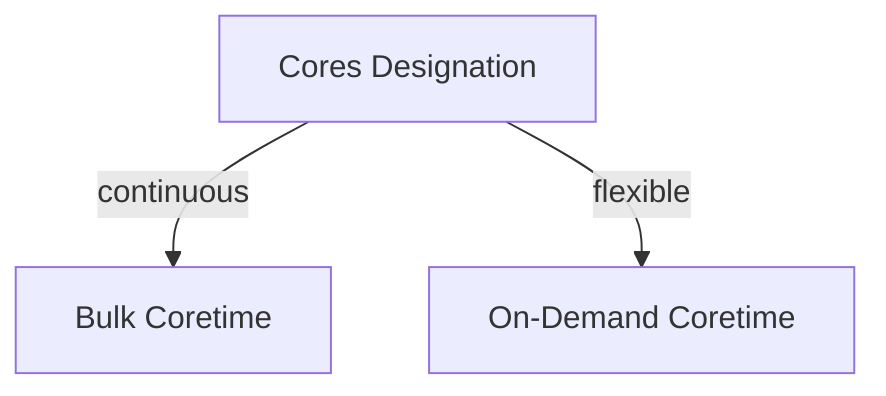

Cores can be designated to a parachain either continuously through [bulk coretime](#bulk-coretime) or dynamically via [on-demand coretime](#on-demand-coretime). Additionally, Polkadot supports scheduling multiple cores in parallel through [elastic scaling](https://wiki.polkadot.com/learn/learn-elastic-scaling/){target=\_blank}, which is a feature under active development on Polkadot. This flexibility empowers parachains to optimize their resource usage and block production according to their unique needs.

In this guide, you'll learn how bulk coretime enables continuous core access with features like interlacing and splitting, and how on-demand coretime provides flexible, pay-per-use scheduling for parachains. For a deep dive on Agile Coretime and its terminology, refer to the [Wiki doc](https://wiki.polkadot.com/learn/learn-agile-coretime/#introduction-to-agile-coretime){target=\_blank}.

## Bulk Coretime

Bulk coretime is a fixed duration of continuous coretime represented by an NFT that can be purchased through [coretime sales](#coretime-sales) in DOT and can be split, shared, or resold. Currently, the duration of bulk coretime is set to 28 days. Coretime purchased in bulk and assigned to a single parachain is eligible for a price-capped renewal, providing a form of rent-controlled access, which is important for predicting the running costs in the near future. Suppose the bulk coretime is [interlaced](#coretime-interlacing) or [split](#coretime-splitting) or is kept idle without assigning it to a parachain. In that case, it will be ineligible for the price-capped renewal.

### Coretime Interlacing

It is the action of dividing bulk coretime across multiple parachains that produce blocks spaced uniformly in time. For example, think of multiple parachains taking turns producing blocks, demonstrating a simple form of interlacing. This feature can be used by parachains with a low transaction volume and need not continuously produce blocks.

### Coretime Splitting

It is the action of dividing bulk coretime into multiple contiguous regions. This feature can be used by parachains that need to produce blocks continuously but do not require the whole 28 days of bulk coretime and require only part of it.

## On-Demand Coretime

Polkadot has dedicated cores assigned to provide core time on demand. These cores are excluded from the coretime sales and are reserved for on-demand parachains, which pay in DOT per block.


---

Page Title: Asset Hub

- Source (raw): https://raw.githubusercontent.com/polkadot-developers/polkadot-docs/master/.ai/pages/reference-polkadot-hub-assets-and-smart-contracts.md
- Canonical (HTML): https://docs.polkadot.com/reference/polkadot-hub/assets-and-smart-contracts/
- Summary: Learn about Asset Hub in Polkadot, managing on-chain assets, foreign asset integration, and using XCM for cross-chain asset transfers.

# Asset Hub

## Introduction

The Asset Hub is a critical component in the Polkadot ecosystem, enabling the management of fungible and non-fungible assets across the network. Since the relay chain focuses on maintaining security and consensus without direct asset management, Asset Hub provides a streamlined platform for creating, managing, and using on-chain assets in a fee-efficient manner. This guide outlines the core features of Asset Hub, including how it handles asset operations, cross-chain transfers, and asset integration using XCM, as well as essential tools like [API Sidecar](#api-sidecar) and [`TxWrapper`](#txwrapper) for developers working with on-chain assets.

## Assets Basics

In the Polkadot ecosystem, the relay chain does not natively support additional assets beyond its native token (DOT for Polkadot, KSM for Kusama). The Asset Hub parachain on Polkadot and Kusama provides a fungible and non-fungible assets framework. Asset Hub allows developers and users to create, manage, and use assets across the ecosystem.

Asset creators can use Asset Hub to track their asset issuance across multiple parachains and manage assets through operations such as minting, burning, and transferring. Projects that need a standardized method of handling on-chain assets will find this particularly useful. The fungible asset interface provided by Asset Hub closely resembles Ethereum's ERC-20 standard but is directly integrated into Polkadot's runtime, making it more efficient in terms of speed and transaction fees.

Integrating with Asset Hub offers several key benefits, particularly for infrastructure providers and users:

- **Support for non-native on-chain assets**: Asset Hub enables seamless asset creation and management, allowing projects to develop tokens or assets that can interact with the broader ecosystem.
- **Lower transaction fees**: Asset Hub offers significantly lower transaction costs—approximately one-tenth of the fees on the relay chain, providing cost-efficiency for regular operations.
- **Reduced deposit requirements**: Depositing assets in Asset Hub is more accessible, with deposit requirements that are around one one-hundredth of those on the relay chain.
- **Payment of transaction fees with non-native assets**: Users can pay transaction fees in assets other than the native token (DOT or KSM), offering more flexibility for developers and users.

Assets created on the Asset Hub are stored as part of a map, where each asset has a unique ID that links to information about the asset, including details like:

- The management team.
- The total supply.
- The number of accounts holding the asset.
- **Sufficiency for account existence**: Whether the asset alone is enough to maintain an account without a native token balance.
- The metadata of the asset, including its name, symbol, and the number of decimals for representation.

Some assets can be regarded as sufficient to maintain an account's existence, meaning that users can create accounts on the network without needing a native token balance (i.e., no existential deposit required). Developers can also set minimum balances for their assets. If an account's balance drops below the minimum, the balance is considered dust and may be cleared.

## Assets Pallet

The Polkadot SDK's Assets pallet is a powerful module designated for creating and managing fungible asset classes with a fixed supply. It offers a secure and flexible way to issue, transfer, freeze, and destroy assets. The pallet supports various operations and includes permissioned and non-permissioned functions to cater to simple and advanced use cases.

Visit the [Assets Pallet Rust docs](https://paritytech.github.io/polkadot-sdk/master/pallet_assets/index.html){target=\_blank} for more in-depth information.

### Key Features

Key features of the Assets pallet include:

- **Asset issuance**: Allows the creation of a new asset, where the total supply is assigned to the creator's account.
- **Asset transfer**: Enables transferring assets between accounts while maintaining a balance in both accounts.
- **Asset freezing**: Prevents transfers of a specific asset from one account, locking it from further transactions.
- **Asset destruction**: Allows accounts to burn or destroy their holdings, removing those assets from circulation.
- **Non-custodial transfers**: A non-custodial mechanism to enable one account to approve a transfer of assets on behalf of another.

### Main Functions

The Assets pallet provides a broad interface for managing fungible assets. Some of the main dispatchable functions include:

- **`create()`**: Create a new asset class by placing a deposit, applicable when asset creation is permissionless.
- **`issue()`**: Mint a fixed supply of a new asset and assign it to the creator's account.
- **`transfer()`**: Transfer a specified amount of an asset between two accounts.
- **`approve_transfer()`**: Approve a non-custodial transfer, allowing a third party to move assets between accounts.
- **`destroy()`**: Destroy an entire asset class, removing it permanently from the chain.
- **`freeze()` and `thaw()`**: Administrators or privileged users can lock or unlock assets from being transferred.

For a full list of dispatchable and privileged functions, see the [dispatchables Rust docs](https://docs.rs/pallet-assets/latest/pallet_assets/pallet/enum.Call.html){target=\_blank}.

### Querying Functions

The Assets pallet exposes several key querying functions that developers can interact with programmatically. These functions allow you to query asset information and perform operations essential for managing assets across accounts. The two main querying functions are:

- **`balance(asset_id, account)`**: Retrieves the balance of a given asset for a specified account. Useful for checking the holdings of an asset class across different accounts.

- **`total_supply(asset_id)`**: Returns the total supply of the asset identified by `asset_id`. Allows users to verify how much of the asset exists on-chain.

In addition to these basic functions, other utility functions are available for querying asset metadata and performing asset transfers. You can view the complete list of querying functions in the [Struct Pallet Rust docs](https://docs.rs/pallet-assets/latest/pallet_assets/pallet/struct.Pallet.html){target=\_blank}.

### Permission Models and Roles

The Assets pallet incorporates a robust permission model, enabling control over who can perform specific operations like minting, transferring, or freezing assets. The key roles within the permission model are:

- **Admin**: Can freeze (preventing transfers) and forcibly transfer assets between accounts. Admins also have the power to reduce the balance of an asset class across arbitrary accounts. They manage the more sensitive and administrative aspects of the asset class.
- **Issuer**: Responsible for minting new tokens. When new assets are created, the Issuer is the account that controls their distribution to other accounts.
- **Freezer**: Can lock the transfer of assets from an account, preventing the account holder from moving their balance. This function is useful for freezing accounts involved in disputes or fraud.
- **Owner**: Has overarching control, including destroying an entire asset class. Owners can also set or update the Issuer, Freezer, and Admin roles.

These permissions provide fine-grained control over assets, enabling developers and asset managers to ensure secure, controlled operations. Each of these roles is crucial for managing asset lifecycles and ensuring that assets are used appropriately across the network.

### Asset Freezing

The Assets pallet allows you to freeze assets. This feature prevents transfers or spending from a specific account, effectively locking the balance of an asset class until it is explicitly unfrozen. Asset freezing is beneficial when assets are restricted due to security concerns or disputes.

Freezing assets is controlled by the Freezer role, as mentioned earlier. Only the account with the Freezer privilege can perform these operations. Here are the key freezing functions:

- **`freeze(asset_id, account)`**: Locks the specified asset of the account. While the asset is frozen, no transfers can be made from the frozen account.
- **`thaw(asset_id, account)`**: Corresponding function for unfreezing, allowing the asset to be transferred again.

This approach enables secure and flexible asset management, providing administrators the tools to control asset movement in special circumstances.

### Non-Custodial Transfers (Approval API)

The Assets pallet also supports non-custodial transfers through the Approval API. This feature allows one account to approve another account to transfer a specific amount of its assets to a third-party recipient without granting full control over the account's balance. Non-custodial transfers enable secure transactions where trust is required between multiple parties.

Here's a brief overview of the key functions for non-custodial asset transfers:

- **`approve_transfer(asset_id, delegate, amount)`**: Approves a delegate to transfer up to a certain amount of the asset on behalf of the original account holder.
- **`cancel_approval(asset_id, delegate)`**: Cancels a previous approval for the delegate. Once canceled, the delegate no longer has permission to transfer the approved amount.
- **`transfer_approved(asset_id, owner, recipient, amount)`**: Executes the approved asset transfer from the owner’s account to the recipient. The delegate account can call this function once approval is granted.

These delegated operations make it easier to manage multi-step transactions and dApps that require complex asset flows between participants.

## Foreign Assets

Foreign assets in Asset Hub refer to assets originating from external blockchains or parachains that are registered in the Asset Hub. These assets are typically native tokens from other parachains within the Polkadot ecosystem or bridged tokens from external blockchains such as Ethereum.

Once a foreign asset is registered in the Asset Hub by its originating blockchain's root origin, users are able to send these tokens to the Asset Hub and interact with them as they would any other asset within the Polkadot ecosystem.

### Handling Foreign Assets

The Foreign Assets pallet, an instance of the Assets pallet, manages these assets. Since foreign assets are integrated into the same interface as native assets, developers can use the same functionalities, such as transferring and querying balances. However, there are important distinctions when dealing with foreign assets.

- **Asset identifier**: Unlike native assets, foreign assets are identified using an XCM Multilocation rather than a simple numeric `AssetId`. This multilocation identifier represents the cross-chain location of the asset and provides a standardized way to reference it across different parachains and relay chains.

- **Transfers**: Once registered in the Asset Hub, foreign assets can be transferred between accounts, just like native assets. Users can also send these assets back to their originating blockchain if supported by the relevant cross-chain messaging mechanisms.

## Integration

Asset Hub supports a variety of integration tools that make it easy for developers to manage assets and interact with the blockchain in their applications. The tools and libraries provided by Parity Technologies enable streamlined operations, such as querying asset information, building transactions, and monitoring cross-chain asset transfers.

Developers can integrate Asset Hub into their projects using these core tools:

### API Sidecar

[API Sidecar](https://github.com/paritytech/substrate-api-sidecar){target=\_blank} is a RESTful service that can be deployed alongside Polkadot and Kusama nodes. It provides endpoints to retrieve real-time blockchain data, including asset information. When used with Asset Hub, Sidecar allows querying:

- **Asset look-ups**: Retrieve specific assets using `AssetId`.
- **Asset balances**: View the balance of a particular asset on Asset Hub.

Public instances of API Sidecar connected to Asset Hub are available, such as:

- [Polkadot Asset Hub Sidecar](https://polkadot-asset-hub-public-sidecar.parity-chains.parity.io/){target=\_blank}
- [Kusama Asset Hub Sidecar](https://kusama-asset-hub-public-sidecar.parity-chains.parity.io/){target=\_blank}

These public instances are primarily for ad-hoc testing and quick checks.

### TxWrapper

[`TxWrapper`](https://github.com/paritytech/txwrapper-core){target=\_blank} is a library that simplifies constructing and signing transactions for Polkadot SDK-based chains, including Polkadot and Kusama. This tool includes support for working with Asset Hub, enabling developers to:

- Construct offline transactions.
- Leverage asset-specific functions such as minting, burning, and transferring assets.

`TxWrapper` provides the flexibility needed to integrate asset operations into custom applications while maintaining the security and efficiency of Polkadot's transaction model.


### Parachain Node

To fully leverage the Asset Hub's functionality, developers will need to run a system parachain node. Setting up an Asset Hub node allows users to interact with the parachain in real time, syncing data and participating in the broader Polkadot ecosystem. Guidelines for setting up an [Asset Hub node](https://github.com/paritytech/polkadot-sdk/tree/polkadot-stable2506-2/cumulus#asset-hub-){target=\_blank} are available in the Parity documentation.

Using these integration tools, developers can manage assets seamlessly and integrate Asset Hub functionality into their applications, leveraging Polkadot's powerful infrastructure.

## XCM Transfer Monitoring

Since Asset Hub facilitates cross-chain asset transfers across the Polkadot ecosystem, XCM transfer monitoring becomes an essential practice for developers and infrastructure providers. This section outlines how to monitor the cross-chain movement of assets between parachains, the relay chain, and other systems.

### Monitor XCM Deposits

As assets move between chains, tracking the cross-chain transfers in real time is crucial. Whether assets are transferred via a teleport from system parachains or through a reserve-backed transfer from any other parachain, each transfer emits a relevant event (such as the `balances.minted` event).

To ensure accurate monitoring of these events:

- **Track XCM deposits**: Query every new block created in the relay chain or Asset Hub, loop through the events array, and filter for any `balances.minted` events which confirm the asset was successfully transferred to the account.
- **Track event origins**: Each `balances.minted` event points to a specific address. By monitoring this, service providers can verify that assets have arrived in the correct account.

### Track XCM Information Back to the Source

While the `balances.minted` event confirms the arrival of assets, there may be instances where you need to trace the origin of the cross-chain message that triggered the event. In such cases, you can:

1. Query the relevant chain at the block where the `balances.minted` event was emitted.
2. Look for a `messageQueue(Processed)` event within that block's initialization. This event contains a parameter (`Id`) that identifies the cross-chain message received by the relay chain or Asset Hub. You can use this `Id` to trace the message back to its origin chain, offering full visibility of the asset transfer's journey.

### Practical Monitoring Examples

The preceding sections outline the process of monitoring XCM deposits to specific accounts and then tracing back the origin of these deposits. The process of tracking an XCM transfer and the specific events to monitor may vary based on the direction of the XCM message. Here are some examples to showcase the slight differences:

- **Transfer from parachain to relay chain**: Track `parachainsystem(UpwardMessageSent)` on the parachain and `messagequeue(Processed)` on the relay chain.
- **Transfer from relay chain to parachain**: Track `xcmPallet(sent)` on the relay chain and `dmpqueue(ExecutedDownward)` on the parachain.
- **Transfer between parachains**: Track `xcmpqueue(XcmpMessageSent)` on the system parachain and `xcmpqueue(Success)` on the destination parachain.

### Monitor for Failed XCM Transfers

Sometimes, XCM transfers may fail due to liquidity or other errors. Failed transfers emit specific error events, which are key to resolving issues in asset transfers. Monitoring for these failure events helps catch issues before they affect asset balances.

- **Relay chain to system parachain**: Look for the `dmpqueue(ExecutedDownward)` event on the parachain with an `Incomplete` outcome and an error type such as `UntrustedReserveLocation`.
- **Parachain to parachain**: Monitor for `xcmpqueue(Fail)` on the destination parachain with error types like `TooExpensive`.

For detailed error management in XCM, see Gavin Wood's blog post on [XCM Execution and Error Management](https://polkadot.com/blog/xcm-part-three-execution-and-error-management/){target=\_blank}.

## Where to Go Next

<div class="grid cards" markdown>

-   <span class="badge tutorial">Tutorial</span> __Register a Local Asset__

    ---

    Comprehensive guide to registering a local asset on the Asset Hub system parachain, including step-by-step instructions.

    [:octicons-arrow-right-24: Reference](/chain-interactions/token-operations/register-local-asset/)

-   <span class="badge tutorial">Tutorial</span> __Register a Foreign Asset__

    ---

    An in-depth guide to registering a foreign asset on the Asset Hub parachain, providing clear, step-by-step instructions.

    [:octicons-arrow-right-24: Reference](/chain-interactions/token-operations/register-foreign-asset/)

-   <span class="badge tutorial">Tutorial</span> __Convert Assets__

    ---

    A guide detailing the step-by-step process of converting assets on Asset Hub, helping users efficiently navigate asset management on the platform.

    [:octicons-arrow-right-24: Reference](/chain-interactions/token-operations/convert-assets/)

</div>


---

Page Title: Asynchronous Backing

- Source (raw): https://raw.githubusercontent.com/polkadot-developers/polkadot-docs/master/.ai/pages/reference-parachains-consensus-async-backing.md
- Canonical (HTML): https://docs.polkadot.com/reference/parachains/consensus/async-backing/
- Summary: Understand how asynchronous backing pipelines parachain block production, the protocol changes it introduces on the Relay Chain, and how parachains participate safely and efficiently.

# Asynchronous Backing

## Introduction

Asynchronous backing often shortened to _Async Backing_ is a parachain protocol feature that significantly improves performance, enabling parachains to produce blocks twice as fast (every 6 seconds instead of every 12) and to provide 4x more execution time per block (2 seconds instead of 0.5). 

Technically, async backing is a parachain [configuration](https://paritytech.github.io/polkadot-sdk/master/cumulus_primitives_core/relay_chain/struct.AsyncBackingParams.html){target=\_blank} that allows collators and validators to build blocks ahead of the relay chain during the generation and backing stages of the [Inclusion Pipeline](/reference/parachains/consensus/inclusion-pipeline){target=\_blank} by using unincluded segments, which are chains of parachain blocks that have not yet been fully included in the relay chain. This decouples parachain block production from relay chain inclusion, improves coretime efficiency, and enables the parallel processing required for parachains to further scale throughput using [Elastic Scaling](/reference/parachains/consensus/elastic-scaling){target=\_blank}.

## Configurations
The following configurations can be set by on-chain governance, dictating how many blocks ahead of the relay chain a given parachain's collators can run:

- [**`max_candidate_depth`**](https://paritytech.github.io/polkadot-sdk/master/cumulus_primitives_core/relay_chain/struct.AsyncBackingParams.html#structfield.max_candidate_depth){target=\_blank}: the number of parablocks a collator can produce that are not yet included in the relay chain. A value of `2` means that there can be a maximum of 3 unincluded parablocks at any given time.
- [**`allowed_ancestry_len`**](https://paritytech.github.io/polkadot-sdk/master/cumulus_primitives_core/relay_chain/struct.AsyncBackingParams.html#structfield.allowed_ancestry_len){target=\_blank}: the oldest relay parent a parablock can be built on top of. A value of `1` means collators can start building blocks 6 seconds in advance.

## Synchronous VS. Asynchronous Processing

The Polkadot-parachain protocol originally operated in synchronous mode, where both collators and validators drew context exclusively from the relay parent of the prior parablock, which lives on the relay chain. This made the Backing and Generation steps tightly coupled to the prior parablock completing the entire inclusion pipeline. As a result, one parablock could only be processed every other relay block, with just 0.5 seconds assigned for execution.

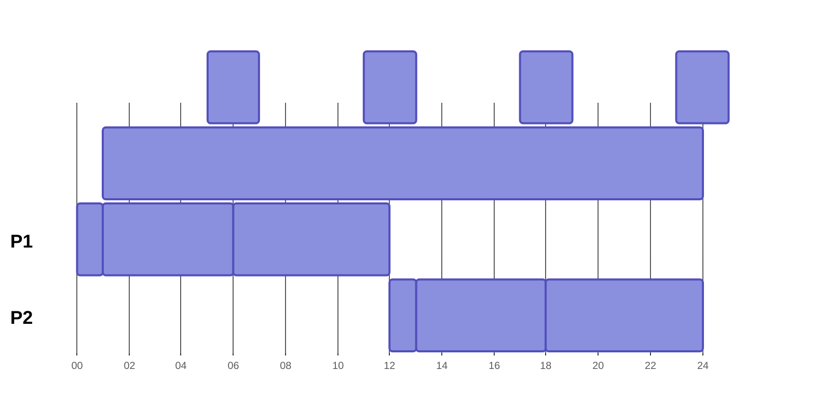

The modern protocol now uses asynchronous backing, where both collators and validators have access to [unincluded segments](/reference/parachains/consensus/inclusion-pipeline){target=\_blank} as an additional context source. The Backing and Generation steps are no longer coupled to the prior block completing the full inclusion pipeline. Instead, the prior parablock only needs to complete the generation step and be added to the Unincluded Segments before the next parablock can begin the Backing and Generation steps.

This results in one parablock being processed every relay block (instead of every other relay block), and allows for more time to execute during the Generation step (0.5s → 2s).

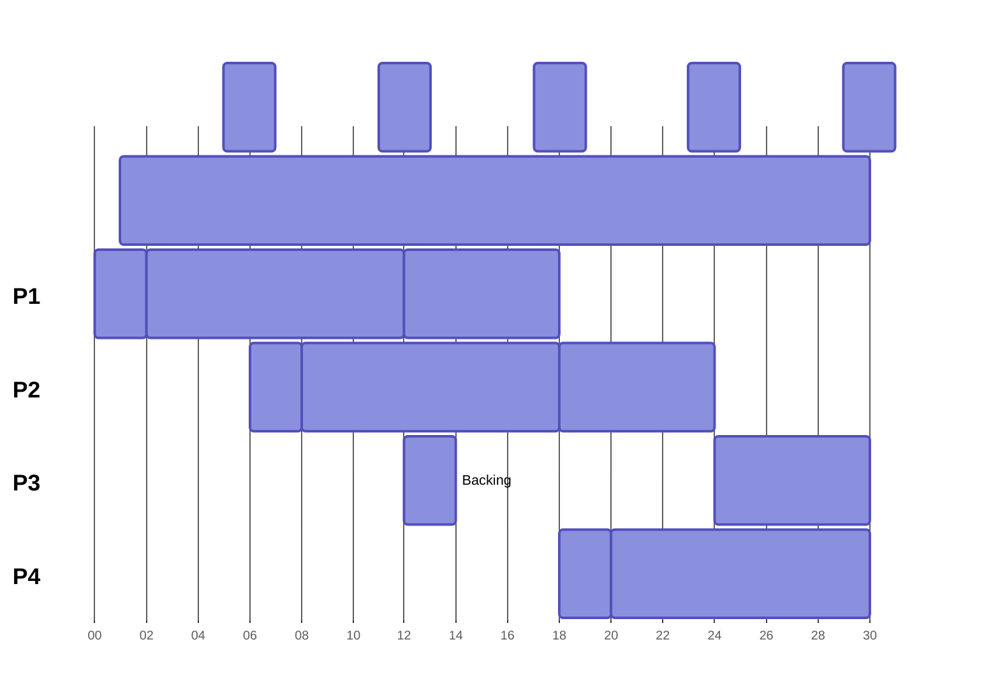


---

Page Title: Blocks

- Source (raw): https://raw.githubusercontent.com/polkadot-developers/polkadot-docs/master/.ai/pages/reference-parachains-blocks-transactions-fees-blocks.md
- Canonical (HTML): https://docs.polkadot.com/reference/parachains/blocks-transactions-fees/blocks/
- Summary: Understand how blocks are produced, validated, and imported in Polkadot SDK-based blockchains, covering initialization, finalization, and authoring processes.

# Blocks

## Introduction

In the Polkadot SDK, blocks are fundamental to the functioning of the blockchain, serving as containers for [transactions](/reference/parachains/blocks-transactions-fees/transactions/){target=\_blank} and changes to the chain's state. Blocks consist of headers and an array of transactions, ensuring the integrity and validity of operations on the network. This guide explores the essential components of a block, the process of block production, and how blocks are validated and imported across the network. By understanding these concepts, developers can better grasp how blockchains maintain security, consistency, and performance within the Polkadot ecosystem.

## What is a Block?

In the Polkadot SDK, a block is a fundamental unit that encapsulates both the header and an array of transactions. The block header includes critical metadata to ensure the integrity and sequence of the blockchain. Here's a breakdown of its components:

- **Block height**: Indicates the number of blocks created in the chain so far.
- **Parent hash**: The hash of the previous block, providing a link to maintain the blockchain's immutability.
- **Transaction root**: Cryptographic digest summarizing all transactions in the block.
- **State root**: A cryptographic digest representing the post-execution state.
- **Digest**: Additional information that can be attached to a block, such as consensus-related messages.

Each transaction is part of a series that is executed according to the runtime's rules. The transaction root is a cryptographic digest of this series, which prevents alterations and enables succinct verification by light clients. This verification process allows light clients to confirm whether a transaction exists in a block with only the block header, avoiding downloading the entire block.

## Block Production

When an authoring node is authorized to create a new block, it selects transactions from the transaction queue based on priority. This step, known as block production, relies heavily on the executive module to manage the initialization and finalization of blocks. The process is summarized as follows:

### Initialize Block

The block initialization process begins with a series of function calls that prepare the block for transaction execution:

1. **Call `on_initialize`**: The executive module calls the [`on_initialize`](https://paritytech.github.io/polkadot-sdk/master/frame_support/traits/trait.Hooks.html#method.on_initialize){target=\_blank} hook from the system pallet and other runtime pallets to prepare for the block's transactions.
2. **Coordinate runtime calls**: Coordinates function calls in the order defined by the transaction queue.
3. **Verify information**: Once [`on_initialize`](https://paritytech.github.io/polkadot-sdk/master/frame_support/traits/trait.Hooks.html#method.on_initialize){target=\_blank} functions are executed, the executive module checks the parent hash in the block header and the trie root to verify information is consistent.

### Finalize Block

Once transactions are processed, the block must be finalized before being broadcast to the network. The finalization steps are as follows:

1. **Call `on_finalize`**: The executive module calls the [`on_finalize`](https://paritytech.github.io/polkadot-sdk/master/frame_support/traits/trait.Hooks.html#method.on_finalize){target=\_blank} hooks in each pallet to ensure any remaining state updates or checks are completed before the block is sealed and published.
2. **Verify information**: The block's digest and storage root in the header are checked against the initialized block to ensure consistency.
3. **Call `on_idle`**: The [`on_idle`](https://paritytech.github.io/polkadot-sdk/master/frame_support/traits/trait.Hooks.html#method.on_idle){target=\_blank} hook is triggered to process any remaining tasks using the leftover weight from the block.

## Block Authoring and Import

Once the block is finalized, it is gossiped to other nodes in the network. Nodes follow this procedure:

1. **Receive transactions**: The authoring node collects transactions from the network.
2. **Validate**: Transactions are checked for validity.
3. **Queue**: Valid transactions are placed in the transaction pool for execution.
4. **Execute**: State changes are made as the transactions are executed.
5. **Publish**: The finalized block is broadcast to the network.

### Block Import Queue

After a block is published, other nodes on the network can import it into their chain state. The block import queue is part of the outer node in every Polkadot SDK-based node and ensures incoming blocks are valid before adding them to the node's state.

In most cases, you don't need to know details about how transactions are gossiped or how other nodes on the network import blocks. The following traits are relevant, however, if you plan to write any custom consensus logic or want a deeper dive into the block import queue:

- **[`ImportQueue`](https://paritytech.github.io/polkadot-sdk/master/sc_consensus/import_queue/trait.ImportQueue.html){target=\_blank}**: The trait that defines the block import queue.
- **[`Link`](https://paritytech.github.io/polkadot-sdk/master/sc_consensus/import_queue/trait.Link.html){target=\_blank}**: The trait that defines the link between the block import queue and the network.
- **[`BasicQueue`](https://paritytech.github.io/polkadot-sdk/master/sc_consensus/import_queue/struct.BasicQueue.html){target=\_blank}**: A basic implementation of the block import queue.
- **[`Verifier`](https://paritytech.github.io/polkadot-sdk/master/sc_consensus/import_queue/trait.Verifier.html){target=\_blank}**: The trait that defines the block verifier.
- **[`BlockImport`](https://paritytech.github.io/polkadot-sdk/master/sc_consensus/block_import/trait.BlockImport.html){target=\_blank}**: The trait that defines the block import process.

These traits govern how blocks are validated and imported across the network, ensuring consistency and security.

## Additional Resources

To learn more about the block structure in the Polkadot SDK runtime, see the [`Block` reference](https://paritytech.github.io/polkadot-sdk/master/sp_runtime/traits/trait.Block.html){target=\_blank} entry in the Rust Docs.


---

Page Title: Bridge Hub

- Source (raw): https://raw.githubusercontent.com/polkadot-developers/polkadot-docs/master/.ai/pages/reference-polkadot-hub-bridging.md
- Canonical (HTML): https://docs.polkadot.com/reference/polkadot-hub/bridging/
- Summary: Learn about the Bridge Hub system parachain, a parachain that facilitates the interactions from Polkadot to the rest of Web3.

# Bridge Hub

## Introduction

The Bridge Hub system parachain plays a crucial role in facilitating trustless interactions between Polkadot, Kusama, Ethereum, and other blockchain ecosystems. By implementing on-chain light clients and supporting protocols like BEEFY and GRANDPA, Bridge Hub ensures seamless message transmission and state verification across chains. It also provides essential [pallets](/reference/glossary/#pallet){target=\_blank} for sending and receiving messages, making it a cornerstone of Polkadot’s interoperability framework. With built-in support for XCM (Cross-Consensus Messaging), Bridge Hub enables secure, efficient communication between diverse blockchain networks.

This guide covers the architecture, components, and deployment of the Bridge Hub system. You'll explore its trustless bridging mechanisms, key pallets for various blockchains, and specific implementations like Snowbridge and the Polkadot <> Kusama bridge. By the end, you'll understand how Bridge Hub enhances connectivity within the Polkadot ecosystem and beyond.

## Trustless Bridging

Bridge Hub provides a mode of trustless bridging through its implementation of on-chain light clients and trustless relayers. Trustless bridges are essentially two one-way bridges, where each chain has a method of verifying the state of the other in a trustless manner through consensus proofs. In this context, "trustless" refers to the lack of need to trust a human when interacting with various system components. Trustless systems are based instead on trusting mathematics, cryptography, and code. The target chain and source chain both provide ways of verifying one another's state and actions (such as a transfer) based on the consensus and finality of both chains rather than an external mechanism controlled by a third party.

[BEEFY (Bridge Efficiency Enabling Finality Yielder)](/reference/polkadot-hub/consensus-and-security/pos-consensus/#bridging-beefy){target=\_blank} is instrumental in this solution. It provides a more efficient way to verify the consensus on the relay chain. It allows the participants in a network to verify finality proofs, meaning a remote chain like Ethereum can verify the state of Polkadot at a given block height. 

For example, the Ethereum and Polkadot bridging solution that [Snowbridge](https://docs.snowbridge.network/){target=\_blank} implements involves two light clients: one which verifies the state of Polkadot and the other which verifies the state of Ethereum. The light client for Polkadot is implemented in the runtime as a pallet, whereas the light client for Ethereum is implemented as a smart contract on the beacon chain.

## Bridging Components

In any given Bridge Hub implementation (Kusama, Polkadot, or other relay chains), there are a few primary pallets that are utilized:

- **[Pallet Bridge GRANDPA](https://paritytech.github.io/polkadot-sdk/master/pallet_bridge_grandpa/index.html){target=\_blank}**: An on-chain GRANDPA light client for Substrate based chains.
- **[Pallet Bridge Parachains](https://paritytech.github.io/polkadot-sdk/master/pallet_bridge_parachains/index.html){target=\_blank}**: A finality module for parachains.
- **[Pallet Bridge Messages](https://paritytech.github.io/polkadot-sdk/master/pallet_bridge_messages/index.html){target=\_blank}**: A pallet which allows sending, receiving, and tracking of inbound and outbound messages.
- **[Pallet XCM Bridge](https://paritytech.github.io/polkadot-sdk/master/pallet_xcm_bridge_hub/index.html){target=\_blank}**: A pallet which, with the Bridge Messages pallet, adds XCM support to bridge pallets.

### Ethereum-Specific Support

Bridge Hub also has a set of components and pallets that support a bridge between Polkadot and Ethereum through [Snowbridge](https://github.com/Snowfork/snowbridge){target=\_blank}.

To view the complete list of which pallets are included in Bridge Hub, visit the Subscan [Runtime Modules](https://bridgehub-polkadot.subscan.io/runtime){target=\_blank} page. Alternatively, the source code for those pallets can be found in the Polkadot SDK [Snowbridge Pallets](https://github.com/paritytech/polkadot-sdk/tree/polkadot-stable2506-2/bridges/snowbridge/pallets){target=\_blank} repository.

## Deployed Bridges

- [**Snowbridge**](https://wiki.polkadot.com/learn/learn-snowbridge/){target=\_blank}: A general-purpose, trustless bridge between Polkadot and Ethereum.
- [**Hyperbridge**](https://wiki.polkadot.com/learn/learn-hyperbridge/){target=\_blank}: A cross-chain solution built as an interoperability coprocessor, providing state-proof-based interoperability across all blockchains.
- [**Polkadot <> Kusama Bridge**](https://wiki.polkadot.com/learn/learn-dot-ksm-bridge/){target=\_blank}: A bridge that utilizes relayers to bridge the Polkadot and Kusama relay chains trustlessly.

## Where to Go Next

- Go over the Bridge Hub README in the Polkadot SDK [Bridge-hub Parachains](https://github.com/paritytech/polkadot-sdk/blob/polkadot-stable2506-2/cumulus/parachains/runtimes/bridge-hubs/README.md){target=\_blank} repository.
- Take a deeper dive into bridging architecture in the Polkadot SDK [High-Level Bridge](https://github.com/paritytech/polkadot-sdk/blob/polkadot-stable2506-2/bridges/docs/high-level-overview.md){target=\_blank} documentation.
- Read more about [BEEFY and Bridging in the Polkadot Wiki](/reference/polkadot-hub/consensus-and-security/pos-consensus/#bridging-beefy){target=\_blank}.


---

Page Title: Chain Data

- Source (raw): https://raw.githubusercontent.com/polkadot-developers/polkadot-docs/master/.ai/pages/reference-parachains-chain-data.md
- Canonical (HTML): https://docs.polkadot.com/reference/parachains/chain-data/
- Summary: Learn how to expose and utilize chain data for blockchain applications. Discover runtime metadata, RPC APIs, and tools for efficient development.

# Chain Data

## Introduction

Understanding and leveraging on-chain data is a fundamental aspect of blockchain development. Whether you're building frontend applications or backend systems, accessing and decoding runtime metadata is vital to interacting with the blockchain. This guide introduces you to the tools and processes for generating and retrieving metadata, explains its role in application development, and outlines the additional APIs available for interacting with a Polkadot node. By mastering these components, you can ensure seamless communication between your applications and the blockchain.

## Application Development

You might not be directly involved in building frontend applications as a blockchain developer. However, most applications that run on a blockchain require some form of frontend or user-facing client to enable users or other programs to access and modify the data that the blockchain stores. For example, you might develop a browser-based, mobile, or desktop application that allows users to submit transactions, post articles, view their assets, or track previous activity. The backend for that application is configured in the runtime logic for your blockchain, but the frontend client makes the runtime features accessible to your users.

For your custom chain to be useful to others, you'll need to provide a client application that allows users to view, interact with, or update information that the blockchain keeps track of. In this article, you'll learn how to expose information about your runtime so that client applications can use it, see examples of the information exposed, and explore tools and libraries that use it.

## Understand Metadata

Polkadot SDK-based blockchain networks are designed to expose their runtime information, allowing developers to learn granular details regarding pallets, RPC calls, and runtime APIs. The metadata also exposes their related documentation. The chain's metadata is [SCALE-encoded](/reference/parachains/data-encoding/){target=\_blank}, allowing for the development of browser-based, mobile, or desktop applications to support the chain's runtime upgrades seamlessly. It is also possible to develop applications compatible with multiple Polkadot SDK-based chains simultaneously.

## Expose Runtime Information as Metadata

To interact with a node or the state of the blockchain, you need to know how to connect to the chain and access the exposed runtime features. This interaction involves a Remote Procedure Call (RPC) through a node endpoint address, commonly through a secure web socket connection.

An application developer typically needs to know the contents of the runtime logic, including the following details:

- Version of the runtime the application is connecting to.
- Supported APIs.
- Implemented pallets.
- Defined functions and corresponding type signatures.
- Defined custom types.
- Exposed parameters users can set.

As the Polkadot SDK is modular and provides a composable framework for building blockchains, there are limitless opportunities to customize the schema of properties. Each runtime can be configured with its properties, including function calls and types, which can be changed over time with runtime upgrades.

The Polkadot SDK enables you to generate the runtime metadata schema to capture information unique to a runtime. The metadata for a runtime describes the pallets in use and types defined for a specific runtime version. The metadata includes information about each pallet's storage items, functions, events, errors, and constants. The metadata also provides type definitions for any custom types included in the runtime.

Metadata provides a complete inventory of a chain's runtime. It is key to enabling client applications to interact with the node, parse responses, and correctly format message payloads sent back to that chain.

## Generate Metadata

To efficiently use the blockchain's networking resources and minimize the data transmitted over the network, the metadata schema is encoded using the [Parity SCALE Codec](https://github.com/paritytech/parity-scale-codec?tab=readme-ov-file#parity-scale-codec){target=\_blank}. This encoding is done automatically through the [`scale-info`](https://docs.rs/scale-info/latest/scale_info/){target=\_blank}crate.

At a high level, generating the metadata involves the following steps:

1. The pallets in the runtime logic expose callable functions, types, parameters, and documentation that need to be encoded in the metadata.
2. The `scale-info` crate collects type information for the pallets in the runtime, builds a registry of the pallets that exist in a particular runtime, and the relevant types for each pallet in the registry. The type information is detailed enough to enable encoding and decoding for every type.
3. The [`frame-metadata`](https://github.com/paritytech/frame-metadata){target=\_blank} crate describes the structure of the runtime based on the registry provided by the `scale-info` crate.
4. Nodes provide the RPC method `state_getMetadata` to return a complete description of all the types in the current runtime as a hex-encoded vector of SCALE-encoded bytes.

## Retrieve Runtime Metadata

The type information provided by the metadata enables applications to communicate with nodes using different runtime versions and across chains that expose different calls, events, types, and storage items. The metadata also allows libraries to generate a substantial portion of the code needed to communicate with a given node, enabling libraries like [`subxt`](https://github.com/paritytech/subxt){target=\_blank} to generate frontend interfaces that are specific to a target chain.

### Use Polkadot.js

Visit the [Polkadot.js Portal](https://polkadot.js.org/apps/#/rpc){target=\_blank} and select the **Developer** dropdown in the top banner. Select **RPC Calls** to make the call to request metadata. Follow these steps to make the RPC call:

1. Select **state** as the endpoint to call.
2. Select **`getMetadata(at)`** as the method to call.
3. Click **Submit RPC call** to submit the call and return the metadata in JSON format.

### Use Curl 

You can fetch the metadata for the network by calling the node's RPC endpoint. This request returns the metadata in bytes rather than human-readable JSON:

```sh
curl -H "Content-Type: application/json" \
-d '{"id":1, "jsonrpc":"2.0", "method": "state_getMetadata"}' \
https://rpc.polkadot.io

```

### Use Subxt

[`subxt`](https://github.com/paritytech/subxt){target=\_blank} may also be used to fetch the metadata of any data in a human-readable JSON format: 

```sh
subxt metadata  --url wss://rpc.polkadot.io --format json > spec.json
```

Another option is to use the [`subxt` explorer web UI](https://paritytech.github.io/subxt-explorer/#/){target=\_blank}.

## Client Applications and Metadata

The metadata exposes the expected way to decode each type, meaning applications can send, retrieve, and process application information without manual encoding and decoding. Client applications must use the [SCALE codec library](https://github.com/paritytech/parity-scale-codec?tab=readme-ov-file#parity-scale-codec){target=\_blank} to encode and decode RPC payloads to use the metadata. Client applications use the metadata to interact with the node, parse responses, and format message payloads sent to the node.

## Metadata Format

Although the SCALE-encoded bytes can be decoded using the `frame-metadata` and [`parity-scale-codec`](https://github.com/paritytech/parity-scale-codec){target=\_blank} libraries, there are other tools, such as `subxt` and the Polkadot-JS API, that can convert the raw data to human-readable JSON format.

The types and type definitions included in the metadata returned by the `state_getMetadata` RPC call depend on the runtime's metadata version.

In general, the metadata includes the following information:

- A constant identifying the file as containing metadata.
- The version of the metadata format used in the runtime.
- Type definitions for all types used in the runtime and generated by the `scale-info` crate.
- Pallet information for the pallets included in the runtime in the order that they are defined in the `construct_runtime` macro.

!!!tip 
    Depending on the frontend library used (such as the [Polkadot API](https://papi.how/){target=\_blank}), they may format the metadata differently than the raw format shown.

The following example illustrates a condensed and annotated section of metadata decoded and converted to JSON:

```json
[
    1635018093,
    {
        "V14": {
            "types": {
                "types": [{}]
            },
            "pallets": [{}],
            "extrinsic": {
                "ty": 126,
                "version": 4,
                "signed_extensions": [{}]
            },
            "ty": 141
        }
    }
]

```

The constant `1635018093` is a magic number that identifies the file as a metadata file. The rest of the metadata is divided into the `types`, `pallets`, and `extrinsic` sections:

- The `types` section contains an index of the types and information about each type's type signature.
- The `pallets` section contains information about each pallet in the runtime.
- The `extrinsic` section describes the type identifier and transaction format version that the runtime uses.

Different extrinsic versions can have varying formats, especially when considering [signed transactions](/reference/parachains/blocks-transactions-fees/transactions/#signed-transactions){target=\_blank}. 

### Pallets

The following is a condensed and annotated example of metadata for a single element in the `pallets` array (the [`sudo`](https://paritytech.github.io/polkadot-sdk/master/pallet_sudo/index.html){target=\_blank} pallet):

```json
{
    "name": "Sudo",
    "storage": {
        "prefix": "Sudo",
        "entries": [
            {
                "name": "Key",
                "modifier": "Optional",
                "ty": {
                    "Plain": 0
                },
                "default": [0],
                "docs": ["The `AccountId` of the sudo key."]
            }
        ]
    },
    "calls": {
        "ty": 117
    },
    "event": {
        "ty": 42
    },
    "constants": [],
    "error": {
        "ty": 124
    },
    "index": 8
}

```

Every element metadata contains the name of the pallet it represents and information about its storage, calls, events, and errors. You can look up details about the definition of the calls, events, and errors by viewing the type index identifier. The type index identifier is the `u32` integer used to access the type information for that item. For example, the type index identifier for calls in the Sudo pallet is 117. If you view information for that type identifier in the `types` section of the metadata, it provides information about the available calls, including the documentation for each call.

For example, the following is a condensed excerpt of the calls for the Sudo pallet:

```json
{
    "id": 117,
    "type": {
        "path": ["pallet_sudo", "pallet", "Call"],
        "params": [
            {
                "name": "T",
                "type": null
            }
        ],
        "def": {
            "variant": {
                "variants": [
                    {
                        "name": "sudo",
                        "fields": [
                            {
                                "name": "call",
                                "type": 114,
                                "typeName": "Box<<T as Config>::RuntimeCall>"
                            }
                        ],
                        "index": 0,
                        "docs": [
                            "Authenticates sudo key, dispatches a function call with `Root` origin"
                        ]
                    },
                    {
                        "name": "sudo_unchecked_weight",
                        "fields": [
                            {
                                "name": "call",
                                "type": 114,
                                "typeName": "Box<<T as Config>::RuntimeCall>"
                            },
                            {
                                "name": "weight",
                                "type": 8,
                                "typeName": "Weight"
                            }
                        ],
                        "index": 1,
                        "docs": [
                            "Authenticates sudo key, dispatches a function call with `Root` origin"
                        ]
                    },
                    {
                        "name": "set_key",
                        "fields": [
                            {
                                "name": "new",
                                "type": 103,
                                "typeName": "AccountIdLookupOf<T>"
                            }
                        ],
                        "index": 2,
                        "docs": [
                            "Authenticates current sudo key, sets the given AccountId (`new`) as the new sudo"
                        ]
                    },
                    {
                        "name": "sudo_as",
                        "fields": [
                            {
                                "name": "who",
                                "type": 103,
                                "typeName": "AccountIdLookupOf<T>"
                            },
                            {
                                "name": "call",
                                "type": 114,
                                "typeName": "Box<<T as Config>::RuntimeCall>"
                            }
                        ],
                        "index": 3,
                        "docs": [
                            "Authenticates sudo key, dispatches a function call with `Signed` origin from a given account"
                        ]
                    }
                ]
            }
        }
    }
}

```

For each field, you can access type information and metadata for the following:

- **Storage metadata**: Provides the information required to enable applications to get information for specific storage items.
- **Call metadata**: Includes information about the runtime calls defined by the `#[pallet]` macro including call names, arguments and documentation.
- **Event metadata**: Provides the metadata generated by the `#[pallet::event]` macro, including the name, arguments, and documentation for each pallet event.
- **Constants metadata**: Provides metadata generated by the `#[pallet::constant]` macro, including the name, type, and hex-encoded value of the constant.
- **Error metadata**: Provides metadata generated by the `#[pallet::error]` macro, including the name and documentation for each pallet error.

!!!tip
    Type identifiers change from time to time, so you should avoid relying on specific type identifiers in your applications.

### Extrinsic

The runtime generates extrinsic metadata and provides useful information about transaction format. When decoded, the metadata contains the transaction version and the list of signed extensions.

For example:

```json
{
    "extrinsic": {
        "ty": 126,
        "version": 4,
        "signed_extensions": [
            {
                "identifier": "CheckNonZeroSender",
                "ty": 132,
                "additional_signed": 41
            },
            {
                "identifier": "CheckSpecVersion",
                "ty": 133,
                "additional_signed": 4
            },
            {
                "identifier": "CheckTxVersion",
                "ty": 134,
                "additional_signed": 4
            },
            {
                "identifier": "CheckGenesis",
                "ty": 135,
                "additional_signed": 11
            },
            {
                "identifier": "CheckMortality",
                "ty": 136,
                "additional_signed": 11
            },
            {
                "identifier": "CheckNonce",
                "ty": 138,
                "additional_signed": 41
            },
            {
                "identifier": "CheckWeight",
                "ty": 139,
                "additional_signed": 41
            },
            {
                "identifier": "ChargeTransactionPayment",
                "ty": 140,
                "additional_signed": 41
            }
        ]
    },
    "ty": 141
}

```

The type system is [composite](https://paritytech.github.io/polkadot-sdk/master/polkadot_sdk_docs/reference_docs/frame_runtime_types/index.html){target=\_blank}, meaning each type identifier contains a reference to a specific type or to another type identifier that provides information about the associated primitive types.

For example, you can encode the `BitVec<Order, Store>` type, but to decode it properly, you must know the types used for the `Order` and `Store` types. To find type information for `Order` and `Store`, you can use the path in the decoded JSON to locate their type identifiers.

## Included RPC APIs

A standard node comes with the following APIs to interact with a node:

- **[`AuthorApiServer`](https://paritytech.github.io/polkadot-sdk/master/sc_rpc/author/trait.AuthorApiServer.html){target=\_blank}**: Make calls into a full node, including authoring extrinsics and verifying session keys.
- **[`ChainApiServer`](https://paritytech.github.io/polkadot-sdk/master/sc_rpc/chain/trait.ChainApiServer.html){target=\_blank}**: Retrieve block header and finality information.
- **[`OffchainApiServer`](https://paritytech.github.io/polkadot-sdk/master/sc_rpc/offchain/trait.OffchainApiServer.html){target=\_blank}**: Make RPC calls for off-chain workers.
- **[`StateApiServer`](https://paritytech.github.io/polkadot-sdk/master/sc_rpc/state/trait.StateApiServer.html){target=\_blank}**: Query information about on-chain state such as runtime version, storage items, and proofs.
- **[`SystemApiServer`](https://paritytech.github.io/polkadot-sdk/master/sc_rpc/system/trait.SystemApiServer.html){target=\_blank}**: Retrieve information about network state, such as connected peers and node roles.

## Additional Resources

The following tools can help you locate and decode metadata:

- [Subxt Explorer](https://paritytech.github.io/subxt-explorer/#/){target=\_blank}
- [Metadata Portal 🌗](https://github.com/paritytech/metadata-portal){target=\_blank}
- [De[code] Sub[strate]](https://github.com/paritytech/desub){target=\_blank}


---

Page Title: Collectives Chain

- Source (raw): https://raw.githubusercontent.com/polkadot-developers/polkadot-docs/master/.ai/pages/reference-polkadot-hub-collectives-and-daos.md
- Canonical (HTML): https://docs.polkadot.com/reference/polkadot-hub/collectives-and-daos/
- Summary: Learn how the Collectives chain provides infrastructure for governance organizations, enabling decentralized network stewardship and decision-making.

## Introduction

Established through [Referendum 81](https://polkadot-old.polkassembly.io/referendum/81){target=\_blank}, the Collectives chain operates as a dedicated parachain exclusive to the Polkadot network with no counterpart on Kusama. This specialized infrastructure provides a foundation for various on-chain governance groups essential to Polkadot's ecosystem.

The architecture enables entire networks to function as unified entities, allowing them to present cohesive positions and participate in cross-network governance through [Bridge Hub](/polkadot-protocol/architecture/system-chains/bridge-hub){target=\_blank}. This capability represents a fundamental advancement in Web3 principles, eliminating dependencies on traditional third-party intermediaries such as legal systems or jurisdictional authorities.

## Key Collectives

The Collectives chain hosts several important governance bodies:

- [**Polkadot Technical Fellowship**](https://wiki.polkadot.com/learn/learn-polkadot-technical-fellowship/){target=\_blank}: A self-governing assembly of protocol experts and developers who oversee technical aspects of the Polkadot and Kusama networks. The Fellowship operates both on-chain through the collectives system and off-chain via GitHub repositories, public discussion forums, and monthly development calls that are publicly accessible.

- [**Polkadot Alliance**](https://wiki.polkadot.com/general/glossary/#polkadot-alliance){target=\_blank}: A consortium founded by seven leading parachain projects (Acala, Astar, Interlay, Kilt, Moonbeam, Phala, and Subscan) to establish development standards and ethical guidelines within the ecosystem. This ranked collective, comprised of "Fellows" and "Allies," focuses on promoting best practices and identifying potential bad actors. Membership is primarily designed for organizations, projects, and other networks rather than individuals.

These collectives serve as pillars of Polkadot's decentralized governance model, enabling community-driven decision-making and establishing technical standards that shape the network's evolution. Through structured on-chain representation, they provide transparent mechanisms for ecosystem development while maintaining the core Web3 principles of trustlessness and decentralization.


---

Page Title: Contract Deployment

- Source (raw): https://raw.githubusercontent.com/polkadot-developers/polkadot-docs/master/.ai/pages/smart-contracts-for-eth-devs-contract-deployment.md
- Canonical (HTML): https://docs.polkadot.com/smart-contracts/for-eth-devs/contract-deployment/
- Summary: Compare deployment flows for REVM and PVM-based smart contracts on the Polkadot Hub. Includes single-step REVM flows and PVM’s two-step deployment model.

# Contract Deployment

## Introduction

Polkadot's smart contract platform supports two distinct virtual machine backends: Rust Ethereum Virtual Machine (REVM) and PolkaVM. Each backend has its own deployment characteristics and optimization strategies. REVM provides full Ethereum compatibility with familiar single-step deployment, while the RISC-V-based PolkaVM uses a more structured two-step approach optimized for its architecture. Understanding these differences ensures smooth deployment regardless of which backend you choose for your smart contracts.

## REVM Deployment

The REVM backend enables seamless deployment of Ethereum contracts without modification. Contracts deploy exactly as they would on Ethereum, using familiar tools and workflows.

With REVM, deployment mirrors the Ethereum flow exactly including: 

- Contracts are bundled and deployed in a single transaction. 
- Factory contracts can create new contracts at runtime.
- Runtime code generation, including inline assembly, is supported.
- Existing familiar tools like Hardhat, Foundry, and Remix work out of the box.

## PolkaVM Deployment

PolkaVM implements a fundamentally different deployment model optimized for its RISC-V architecture. While simple contract deployments work seamlessly, advanced patterns like factory contracts require understanding the two-step deployment process.

### Standard Contract Deployment

For most use cases, such as deploying ERC-20 tokens, NFT collections, or standalone contracts, deployment is transparent and requires no special steps. The [Revive compiler](https://github.com/paritytech/revive){target=\_blank} handles the deployment process automatically when using standard Solidity patterns.

### Two-Step Deployment Model

PolkaVM separates contract deployment into distinct phases:

1. **Code upload**: Contract bytecode must be uploaded to the chain before instantiation.
2. **Contract instantiation**: Contracts are created by referencing previously uploaded code via its hash.

This architecture differs from the EVM's bundled approach and has important implications for specific deployment patterns.

### Factory Pattern Considerations

The common EVM pattern, where contracts dynamically create other contracts, requires adaptation for PolkaVM as follows:

**EVM Factory Pattern:**
```solidity
// This works on REVM but requires modification for PolkaVM
contract Factory {
    function createToken() public returns (address) {
        // EVM bundles bytecode in the factory
        return address(new Token());
    }
}
```

**PolkaVM Requirements:**

- **Pre-upload dependent contracts**: All contracts that will be instantiated at runtime must be uploaded to the chain before the factory attempts to create them.
- **Code hash references**: Factory contracts work with pre-uploaded code hashes rather than embedding bytecode.
- **No runtime code generation**: Dynamic bytecode generation is not supported due to PolkaVM's RISC-V format.

### Migration Strategy for Factory Contracts

When migrating factory contracts from Ethereum to PolkaVM:

1. **Identify all contracts**: Determine which contracts will be instantiated at runtime.
2. **Upload dependencies first**: Deploy all dependent contracts to the chain before deploying the factory.
3. **Use on-chain constructors**: Leverage PolkaVM's on-chain constructor feature for flexible instantiation.
4. **Avoid assembly creation**: Don't use `create` or `create2` opcodes in assembly blocks for manual deployment.

### Architecture-Specific Limitations

PolkaVM's deployment model creates several specific constraints:

- **`EXTCODECOPY` limitations**: Contracts using `EXTCODECOPY` to manipulate code at runtime will encounter issues.
- **Runtime code modification**: Patterns that construct and mutate contract code on-the-fly are not supported.
- **Assembly-based factories**: Factory contracts written in YUL assembly that generate code at runtime will fail with `CodeNotFound` errors.

These patterns are rare in practice and typically require dropping down to assembly, making them non-issues for standard Solidity development.

### On-Chain Constructors

PolkaVM provides on-chain constructors as an elegant alternative to runtime code modification:

- Enable contract instantiation without runtime code generation.
- Support flexible initialization patterns.
- Maintain separation between code upload and contract creation.
- Provide predictable deployment costs.

## Gas Estimation vs Actual Consumption

Both REVM and PolkaVM deployments may show significant differences between gas estimation and actual consumption. You might see estimates that are several times higher than the actual gas consumed (often around 30% of the estimate). This is normal behavior because pre-dispatch estimation cannot distinguish between computation weight and storage deposits, leading to conservative overestimation. Contract deployments are particularly affected as they consume significant storage deposits for code storage.

## Deployment Comparison

| Feature | REVM Backend | PolkaVM Backend |
|:-------:|:-------------:|:----------------:|
| **Deployment Model** | Single-step bundled | Two-step upload and instantiate |
| **Factory Patterns** | Direct runtime creation | Requires pre-uploaded code |
| **Code Bundling** | Bytecode in transaction | Code hash references |
| **Runtime Codegen** | Fully supported | Not supported |
| **Simple Contracts** | No modifications needed | No modifications needed |
| **Assembly Creation** | Supported | Discouraged, limited support |

## Conclusion

Both backends support contract deployment effectively, with REVM offering drop-in Ethereum compatibility and PolkaVM providing a more structured two-step approach. For the majority of use cases—deploying standard contracts like tokens or applications—both backends work seamlessly. Advanced patterns like factory contracts may require adjustment for PolkaVM, but these adaptations are straightforward with proper planning.


---

Page Title: Cryptography

- Source (raw): https://raw.githubusercontent.com/polkadot-developers/polkadot-docs/master/.ai/pages/reference-parachains-cryptography.md
- Canonical (HTML): https://docs.polkadot.com/reference/parachains/cryptography/
- Summary: A concise guide to cryptography in blockchain, covering hash functions, encryption types, digital signatures, and elliptic curve applications.

# Cryptography

## Introduction

Cryptography forms the backbone of blockchain technology, providing the mathematical verifiability crucial for consensus systems, data integrity, and user security. While a deep understanding of the underlying mathematical processes isn't necessary for most blockchain developers, grasping the fundamental applications of cryptography is essential. This page comprehensively overviews cryptographic implementations used across Polkadot SDK-based chains and the broader blockchain ecosystem.

## Hash Functions

Hash functions are fundamental to blockchain technology, creating a unique digital fingerprint for any piece of data, including simple text, images, or any other form of file. They map input data of any size to a fixed-size output (typically 32 bytes) using complex mathematical operations. Hashing is used to verify data integrity, create digital signatures, and provide a secure way to store passwords. This form of mapping is known as the ["pigeonhole principle,"](https://en.wikipedia.org/wiki/Pigeonhole_principle){target=\_blank} it is primarily implemented to efficiently and verifiably identify data from large sets.

### Key Properties of Hash Functions

- **Deterministic**: The same input always produces the same output.
- **Quick computation**: It's easy to calculate the hash value for any given input.
- **Pre-image resistance**: It's infeasible to generate the input data from its hash.
- **Small changes in input yield large changes in output**: Known as the ["avalanche effect"](https://en.wikipedia.org/wiki/Avalanche_effect){target=\_blank}.
- **Collision resistance**: The probabilities are extremely low to find two different inputs with the same hash.

### Blake2

The Polkadot SDK utilizes Blake2, a state-of-the-art hashing method that offers:

- Equal or greater security compared to [SHA-2](https://en.wikipedia.org/wiki/SHA-2){target=\_blank}.
- Significantly faster performance than other algorithms.

These properties make Blake2 ideal for blockchain systems, reducing sync times for new nodes and lowering the resources required for validation. For detailed technical specifications about Blake2, see the [official Blake2 paper](https://www.blake2.net/blake2.pdf){target=\_blank}.

## Types of Cryptography

There are two different ways that cryptographic algorithms are implemented: symmetric cryptography and asymmetric cryptography.

### Symmetric Cryptography

Symmetric encryption is a branch of cryptography that isn't based on one-way functions, unlike asymmetric cryptography. It uses the same cryptographic key to encrypt plain text and decrypt the resulting ciphertext.

Symmetric cryptography is a type of encryption that has been used throughout history, such as the Enigma Cipher and the Caesar Cipher. It is still widely used today and can be found in Web2 and Web3 applications alike. There is only one single key, and a recipient must also have access to it to access the contained information.

#### Advantages {: #symmetric-advantages }

- Fast and efficient for large amounts of data.
- Requires less computational power.

#### Disadvantages {: #symmetric-disadvantages }

- Key distribution can be challenging.
- Scalability issues in systems with many users.

### Asymmetric Cryptography

Asymmetric encryption is a type of cryptography that uses two different keys, known as a keypair: a public key, used to encrypt plain text, and a private counterpart, used to decrypt the ciphertext.

The public key encrypts a fixed-length message that can only be decrypted with the recipient's private key and, sometimes, a set password. The public key can be used to cryptographically verify that the corresponding private key was used to create a piece of data without compromising the private key, such as with digital signatures. This has obvious implications for identity, ownership, and properties and is used in many different protocols across Web2 and Web3.

#### Advantages {: #asymmetric-advantages }

- Solves the key distribution problem.
- Enables digital signatures and secure key exchange.

#### Disadvantages {: #asymmetric-disadvantages }

- Slower than symmetric encryption.
- Requires more computational resources.

### Trade-offs and Compromises

Symmetric cryptography is faster and requires fewer bits in the key to achieve the same level of security that asymmetric cryptography provides. However, it requires a shared secret before communication can occur, which poses issues to its integrity and a potential compromise point. On the other hand, asymmetric cryptography doesn't require the secret to be shared ahead of time, allowing for far better end-user security.

Hybrid symmetric and asymmetric cryptography is often used to overcome the engineering issues of asymmetric cryptography, as it is slower and requires more bits in the key to achieve the same level of security. It encrypts a key and then uses the comparatively lightweight symmetric cipher to do the "heavy lifting" with the message.

## Digital Signatures

Digital signatures are a way of verifying the authenticity of a document or message using asymmetric keypairs. They are used to ensure that a sender or signer's document or message hasn't been tampered with in transit, and for recipients to verify that the data is accurate and from the expected sender.

Signing digital signatures only requires a low-level understanding of mathematics and cryptography. For a conceptual example -- when signing a check, it is expected that it cannot be cashed multiple times. This isn't a feature of the signature system but rather the check serialization system. The bank will check that the serial number on the check hasn't already been used. Digital signatures essentially combine these two concepts, allowing the signature to provide the serialization via a unique cryptographic fingerprint that cannot be reproduced.

Unlike pen-and-paper signatures, knowledge of a digital signature cannot be used to create other signatures. Digital signatures are often used in bureaucratic processes, as they are more secure than simply scanning in a signature and pasting it onto a document.

Polkadot SDK provides multiple different cryptographic schemes and is generic so that it can support anything that implements the [`Pair` trait](https://paritytech.github.io/polkadot-sdk/master/sp_core/crypto/trait.Pair.html){target=\_blank}.

### Example of Creating a Digital Signature

The process of creating and verifying a digital signature involves several steps:

1. The sender creates a hash of the message.
2. The hash is encrypted using the sender's private key, creating the signature.
3. The message and signature are sent to the recipient.
4. The recipient decrypts the signature using the sender's public key.
5. The recipient hashes the received message and compares it to the decrypted hash.

If the hashes match, the signature is valid, confirming the message's integrity and the sender's identity.

## Elliptic Curve

Blockchain technology requires the ability to have multiple keys creating a signature for block proposal and validation. To this end, Elliptic Curve Digital Signature Algorithm (ECDSA) and Schnorr signatures are two of the most commonly used methods. While ECDSA is a far simpler implementation, Schnorr signatures are more efficient when it comes to multi-signatures.

Schnorr signatures bring some noticeable features over the ECDSA/EdDSA schemes:

- It is better for hierarchical deterministic key derivations.
- It allows for native multi-signature through [signature aggregation](https://bitcoincore.org/en/2017/03/23/schnorr-signature-aggregation/){target=\_blank}.
- It is generally more resistant to misuse.

One sacrifice that is made when using Schnorr signatures over ECDSA is that both require 64 bytes, but only ECDSA signatures communicate their public key.

### Various Implementations

- **[ECDSA](https://en.wikipedia.org/wiki/Elliptic_Curve_Digital_Signature_Algorithm){target=\_blank}**: Polkadot SDK provides an ECDSA signature scheme using the [secp256k1](https://en.bitcoin.it/wiki/Secp256k1){target=\_blank} curve. This is the same cryptographic algorithm used to secure [Bitcoin](https://en.wikipedia.org/wiki/Bitcoin){target=\_blank} and [Ethereum](https://en.wikipedia.org/wiki/Ethereum){target=\_blank}.

- **[Ed25519](https://en.wikipedia.org/wiki/EdDSA#Ed25519){target=\_blank}**: An EdDSA signature scheme using [Curve25519](https://en.wikipedia.org/wiki/Curve25519){target=\_blank}. It is carefully engineered at several levels of design and implementation to achieve very high speeds without compromising security.

- **[SR25519](https://research.web3.foundation/Polkadot/security/keys/accounts-more){target=\_blank}**: Based on the same underlying curve as Ed25519. However, it uses Schnorr signatures instead of the EdDSA scheme.


---

Page Title: Data Encoding

- Source (raw): https://raw.githubusercontent.com/polkadot-developers/polkadot-docs/master/.ai/pages/reference-parachains-data-encoding.md
- Canonical (HTML): https://docs.polkadot.com/reference/parachains/data-encoding/
- Summary: SCALE codec enables fast, efficient data encoding, ideal for resource-constrained environments like Wasm, supporting custom types and compact encoding.

# Data Encoding

## Introduction

The Polkadot SDK uses a lightweight and efficient encoding/decoding mechanism to optimize data transmission across the network. This mechanism, known as the _SCALE_ codec, is used for serializing and deserializing data.

The SCALE codec enables communication between the runtime and the outer node. This mechanism is designed for high-performance, copy-free data encoding and decoding in resource-constrained environments like the Polkadot SDK [Wasm runtime](/develop/parachains/deployment/build-deterministic-runtime/#introduction){target=\_blank}.

It is not self-describing, meaning the decoding context must fully know the encoded data types. 

Parity's libraries utilize the [`parity-scale-codec`](https://github.com/paritytech/parity-scale-codec){target=\_blank} crate (a Rust implementation of the SCALE codec) to handle encoding and decoding for interactions between RPCs and the runtime.

The `codec` mechanism is ideal for Polkadot SDK-based chains because:

- It is lightweight compared to generic serialization frameworks like [`serde`](https://serde.rs/){target=\_blank}, which add unnecessary bulk to binaries.
- It doesn’t rely on Rust’s `libstd`, making it compatible with `no_std` environments like Wasm runtime.
- It integrates seamlessly with Rust, allowing easy derivation of encoding and decoding logic for new types using `#[derive(Encode, Decode)]`.

Defining a custom encoding scheme in the Polkadot SDK-based chains, rather than using an existing Rust codec library, is crucial for enabling cross-platform and multi-language support. 

## SCALE Codec

The codec is implemented using the following traits:

- [`Encode`](#encode)
- [`Decode`](#decode)
- [`CompactAs`](#compactas)
- [`HasCompact`](#hascompact)
- [`EncodeLike`](#encodelike)

### Encode

The [`Encode`](https://docs.rs/parity-scale-codec/latest/parity_scale_codec/trait.Encode.html){target=\_blank} trait handles data encoding into SCALE format and includes the following key functions:

- **`size_hint(&self) -> usize`**: Estimates the number of bytes required for encoding to prevent multiple memory allocations. This should be inexpensive and avoid complex operations. Optional if the size isn’t known.
- **`encode_to<T: Output>(&self, dest: &mut T)`**: Encodes the data, appending it to a destination buffer.
- **`encode(&self) -> Vec<u8>`**: Encodes the data and returns it as a byte vector.
- **`using_encoded<R, F: FnOnce(&[u8]) -> R>(&self, f: F) -> R`**: Encodes the data and passes it to a closure, returning the result.
- **`encoded_size(&self) -> usize`**: Calculates the encoded size. Should be used when the encoded data isn’t required.

!!!tip
    For best performance, value types should override `using_encoded`, and allocating types should override `encode_to`. It's recommended to implement `size_hint` for all types where possible.

### Decode

The [`Decode`](https://docs.rs/parity-scale-codec/latest/parity_scale_codec/trait.Decode.html){target=\_blank} trait handles decoding SCALE-encoded data back into the appropriate types:

- **`fn decode<I: Input>(value: &mut I) -> Result<Self, Error>`**: Decodes data from the SCALE format, returning an error if decoding fails.

### CompactAs

The [`CompactAs`](https://docs.rs/parity-scale-codec/latest/parity_scale_codec/trait.CompactAs.html){target=\_blank} trait wraps custom types for compact encoding:

- **`encode_as(&self) -> &Self::As`**: Encodes the type as a compact type.
- **`decode_from(_: Self::As) -> Result<Self, Error>`**: decodes from a compact encoded type.

### HasCompact

The [`HasCompact`](https://docs.rs/parity-scale-codec/latest/parity_scale_codec/trait.HasCompact.html){target=\_blank} trait indicates a type supports compact encoding.

### EncodeLike

The [`EncodeLike`](https://docs.rs/parity-scale-codec/latest/parity_scale_codec/trait.EncodeLike.html){target=\_blank} trait is used to ensure multiple types that encode similarly are accepted by the same function. When using `derive`, it is automatically implemented.

### Data Types

The table below outlines how the Rust implementation of the Parity SCALE codec encodes different data types.

| Type                          | Description                                                                                                                                                                                                                                                                                                                | Example SCALE Decoded Value                                                                                                                        | SCALE Encoded Value                                                     |
|-------------------------------|----------------------------------------------------------------------------------------------------------------------------------------------------------------------------------------------------------------------------------------------------------------------------------------------------------------------------|----------------------------------------------------------------------------------------------------------------------------------------------------|-------------------------------------------------------------------------|
| Boolean                       | Boolean values are encoded using the least significant bit of a single byte.                                                                                                                                                                                                                                               | `false` / `true`                                                                                                                                   | `0x00` / `0x01`                                                         |
| Compact/general integers      | A "compact" or general integer encoding is sufficient for encoding large integers (up to 2^536) and is more efficient at encoding most values than the fixed-width version.                                                                                                                                                | `unsigned integer 0` / `unsigned integer 1` / `unsigned integer 42` / `unsigned integer 69` / `unsigned integer 65535` / `BigInt(100000000000000)` | `0x00` / `0x04` / `0xa8` / `0x1501` / `0xfeff0300` / `0x0b00407a10f35a` |
| Enumerations (tagged-unions)  | A fixed number of variants, each mutually exclusive and potentially implying a further value or series of values. Encoded as the first byte identifying the index of the variant that the value is. Any further bytes are used to encode any data that the variant implies. Thus, no more than 256 variants are supported. | `Int(42)` and `Bool(true)` where `enum IntOrBool { Int(u8), Bool(bool) }`                                                                          | `0x002a` and `0x0101`                                                   |
| Fixed-width integers          | Basic integers are encoded using a fixed-width little-endian (LE) format.                                                                                                                                                                                                                                                  | `signed 8-bit integer 69` / `unsigned 16-bit integer 42` / `unsigned 32-bit integer 16777215`                                                      | `0x45` / `0x2a00` / `0xffffff00`                                        |
| Options                       | One or zero values of a particular type.                                                                                                                                                                                                                                                                                   | `Some` / `None`                                                                                                                                    | `0x01` followed by the encoded value / `0x00`                           |
| Results                       | Results are commonly used enumerations which indicate whether certain operations were successful or unsuccessful.                                                                                                                                                                                                          | `Ok(42)` / `Err(false)`                                                                                                                            | `0x002a` / `0x0100`                                                     |
| Strings                       | Strings are Vectors of bytes (Vec<u8>) containing a valid UTF8 sequence.                                                                                                                                                                                                                                                   |                                                                                                                                                    |                                                                         |
| Structs                       | For structures, the values are named, but that is irrelevant for the encoding (names are ignored - only order matters).                                                                                                                                                                                                    | `SortedVecAsc::from([3, 5, 2, 8])`                                                                                                                 | `[3, 2, 5, 8] `                                                         |
| Tuples                        | A fixed-size series of values, each with a possibly different but predetermined and fixed type. This is simply the concatenation of each encoded value.                                                                                                                                                                    | Tuple of compact unsigned integer and boolean: `(3, false)`                                                                                        | `0x0c00`                                                                |
| Vectors (lists, series, sets) | A collection of same-typed values is encoded, prefixed with a compact encoding of the number of items, followed by each item's encoding concatenated in turn.                                                                                                                                                              | Vector of unsigned `16`-bit integers: `[4, 8, 15, 16, 23, 42]`                                                                                     | `0x18040008000f00100017002a00`                                          |

## Encode and Decode Rust Trait Implementations

Here's how the `Encode` and `Decode` traits are implemented:


```rust
use parity_scale_codec::{Encode, Decode};

[derive(Debug, PartialEq, Encode, Decode)]
enum EnumType {
    #[codec(index = 15)]
    A,
    B(u32, u64),
    C {
        a: u32,
        b: u64,
    },
}

let a = EnumType::A;
let b = EnumType::B(1, 2);
let c = EnumType::C { a: 1, b: 2 };

a.using_encoded(|ref slice| {
    assert_eq!(slice, &b"\x0f");
});

b.using_encoded(|ref slice| {
    assert_eq!(slice, &b"\x01\x01\0\0\0\x02\0\0\0\0\0\0\0");
});

c.using_encoded(|ref slice| {
    assert_eq!(slice, &b"\x02\x01\0\0\0\x02\0\0\0\0\0\0\0");
});

let mut da: &[u8] = b"\x0f";
assert_eq!(EnumType::decode(&mut da).ok(), Some(a));

let mut db: &[u8] = b"\x01\x01\0\0\0\x02\0\0\0\0\0\0\0";
assert_eq!(EnumType::decode(&mut db).ok(), Some(b));

let mut dc: &[u8] = b"\x02\x01\0\0\0\x02\0\0\0\0\0\0\0";
assert_eq!(EnumType::decode(&mut dc).ok(), Some(c));

let mut dz: &[u8] = &[0];
assert_eq!(EnumType::decode(&mut dz).ok(), None);
```

## SCALE Codec Libraries

Several SCALE codec implementations are available in various languages. Here's a list of them:

- **AssemblyScript**: [`LimeChain/as-scale-codec`](https://github.com/LimeChain/as-scale-codec){target=\_blank}
- **C**: [`MatthewDarnell/cScale`](https://github.com/MatthewDarnell/cScale){target=\_blank}
- **C++**: [`qdrvm/scale-codec-cpp`](https://github.com/qdrvm/scale-codec-cpp){target=\_blank}
- **JavaScript**: [`polkadot-js/api`](https://github.com/polkadot-js/api){target=\_blank}
- **Dart**: [`leonardocustodio/polkadart`](https://github.com/leonardocustodio/polkadart){target=\_blank}
- **Haskell**: [`airalab/hs-web3`](https://github.com/airalab/hs-web3/tree/master/packages/scale){target=\_blank}
- **Golang**: [`itering/scale.go`](https://github.com/itering/scale.go){target=\_blank}
- **Java**: [`splix/polkaj`](https://github.com/splix/polkaj){target=\_blank}
- **Python**: [`polkascan/py-scale-codec`](https://github.com/polkascan/py-scale-codec){target=\_blank}
- **Ruby**: [` wuminzhe/scale_rb`](https://github.com/wuminzhe/scale_rb){target=\_blank}
- **TypeScript**: [`parity-scale-codec-ts`](https://github.com/tjjfvi/subshape){target=\_blank}, [`scale-ts`](https://github.com/unstoppablejs/unstoppablejs/tree/main/packages/scale-ts#scale-ts){target=\_blank}, [`soramitsu/scale-codec-js-library`](https://github.com/soramitsu/scale-codec-js-library){target=\_blank}, [`subsquid/scale-codec`](https://github.com/subsquid/squid-sdk/tree/master/substrate/scale-codec){target=\_blank}


---

Page Title: Deploy an ERC-20 Using Hardhat

- Source (raw): https://raw.githubusercontent.com/polkadot-developers/polkadot-docs/master/.ai/pages/smart-contracts-cookbook-smart-contracts-deploy-erc20-erc20-hardhat.md
- Canonical (HTML): https://docs.polkadot.com/smart-contracts/cookbook/smart-contracts/deploy-erc20/erc20-hardhat/
- Summary: Deploy an ERC-20 token on Polkadot Hub using PolkaVM. This guide covers contract creation, compilation, deployment, and interaction via Hardhat.

# Deploy an ERC-20 Using Hardhat

## Introduction

[ERC-20](https://eips.ethereum.org/EIPS/eip-20){target=\_blank} tokens are fungible tokens commonly used for creating cryptocurrencies, governance tokens, and staking mechanisms. Polkadot Hub enables easy deployment of ERC-20 tokens via Ethereum-compatible smart contracts and tools.

This guide demonstrates how to deploy an ERC-20 contract on Polkadot Hub TestNet using [Hardhat](https://hardhat.org/){target=\_blank}, an Ethereum development environment. The ERC-20 contract can be retrieved from OpenZeppelin's [GitHub repository](https://github.com/OpenZeppelin/openzeppelin-contracts/tree/v5.4.0/contracts/token/ERC20){target=\_blank} or their [Contract Wizard](https://wizard.openzeppelin.com/){target=\_blank}.

## Prerequisites

Before you begin, ensure you have the following:

- A basic understanding of [Solidity](https://www.soliditylang.org/){target=\_blank} programming and [ERC-20](https://ethereum.org/developers/docs/standards/tokens/erc-20/){target=\_blank} fungible tokens.
- [Node.js](https://nodejs.org/en/download){target=\_blank} v22.13.1 or later installed.
- Test tokens for gas fees, available from the [Polkadot faucet](https://faucet.polkadot.io/){target=\_blank}. See [Get Test Tokens](/smart-contracts/faucet/#get-test-tokens){target=\_blank} for a guide to using the faucet.
- A wallet with a private key for signing transactions.

## Set Up Your Project

This tutorial uses a [Hardhat ERC-20 template](https://github.com/polkadot-developers/revm-hardhat-examples/tree/master/erc20-hardhat){target=\_blank} that contains all the necessary files. 

To get started, take the following steps:

1. Clone the GitHub repository locally:

    ```bash
    git clone https://github.com/polkadot-developers/revm-hardhat-examples/
    cd revm-hardhat-examples/erc20-hardhat
    ```

2. Install the dependencies using the following command:

    ```bash
    npm i
    ```
    
    This command will fetch all the necessary packages to help you use Hardhat to deploy an ERC-20 to Polkadot.

## Configure Hardhat

If you started with the cloned Hardhat ERC-20 template, `hardhat.config.ts` is already configured to deploy to the Polkadot TestNet as shown in the example below:

```ts title="hardhat.config.ts" hl_lines="14-19"

const config: HardhatUserConfig = {
  solidity: {
    version: "0.8.28",
    settings: {
      optimizer: {
        enabled: true,
        runs: 200,
      },
    },
  },
  networks: {
    polkadotTestnet: {
      url: vars.get("TESTNET_URL", "http://127.0.0.1:8545"),
      accounts: vars.has("TESTNET_PRIVATE_KEY") ? [vars.get("TESTNET_PRIVATE_KEY")] : [],
    },
  },
  mocha: {
    timeout: 40000,
  },
};

export default config;
```

!!! tip
    Visit the Hardhat [Configuration variables](https://v2.hardhat.org/hardhat-runner/docs/guides/configuration-variables){target=\_blank} documentation to learn how to use Hardhat to handle your private keys securely.

## Compile the Contract 

Next, compile the contract included with the template by running the following command:

```bash
npx hardhat compile
```

If everything compiles successfully, you will see output similar to the following:


## Test the Contract

You can view the predefined test file at [`test/MyToken.test.ts`](https://github.com/polkadot-developers/revm-hardhat-examples/blob/master/erc20-hardhat/test/MyToken.test.ts){target=\_blank}. This example test includes verification of the following:

- The token name and symbol exist (confirms deployment) and are correct.
- The token owner is correctly configured.
- The initial token supply is zero.
- The owner can mint tokens.
- The total supply increases after a mint.
- Successful mints to different test addresses with expected account balance and total supply changes.

Run the tests using the following command:

```bash
npx hardhat test --network polkadotTestnet
```

If tests are successful, you will see outputs similar to the following:

<div id="termynal" data-termynal markdown>
  <span data-ty="input">npx hardhat test --network polkadotTestnet</span>
  <span data-ty></span>
  <span data-ty>&nbsp;&nbsp;MyToken</span>
  <span data-ty>&nbsp;&nbsp;&nbsp;&nbsp;Deployment</span>
  <span data-ty>&nbsp;&nbsp;&nbsp;&nbsp;&nbsp;&nbsp;✔ Should have correct name and symbol</span>
  <span data-ty>&nbsp;&nbsp;&nbsp;&nbsp;&nbsp;&nbsp;✔ Should set the right owner</span>
  <span data-ty>&nbsp;&nbsp;&nbsp;&nbsp;&nbsp;&nbsp;✔ Should have zero initial supply</span>
  <span data-ty>&nbsp;&nbsp;&nbsp;&nbsp;Minting</span>
  <span data-ty>&nbsp;&nbsp;&nbsp;&nbsp;&nbsp;&nbsp;✔ Should allow owner to mint tokens</span>
  <span data-ty>&nbsp;&nbsp;&nbsp;&nbsp;&nbsp;&nbsp;✔ Should increase total supply on mint</span>
  <span data-ty>&nbsp;&nbsp;&nbsp;&nbsp;Multiple mints</span>
  <span data-ty>&nbsp;&nbsp;&nbsp;&nbsp;&nbsp;&nbsp;✔ Should correctly track balance after multiple mints</span>
  <span data-ty></span>
  <span data-ty>&nbsp;&nbsp;6 passing (369ms)</span>
  <span data-ty="input"><span class="file-path"></span></span>
</div>

## Deploy the Contract

You are now ready to deploy the contract to your chosen network. This example demonstrates deployment to the Polkadot TestNet. Deploy the contract as follows:

1. Run the following command in your terminal:

    ```bash
    npx hardhat ignition deploy ./ignition/modules/MyToken.ts --network polkadotTestnet
    ```

2. Confirm the target deployment network name and chain ID when prompted:

    <div id="termynal" data-termynal markdown>
      <span data-ty="input">npx hardhat ignition deploy ./ignition/modules/MyToken.ts --network polkadotTestnet</span>
      <span data-ty>✔ Confirm deploy to network polkadotTestnet (420420420)? … yes</span>
      <span data-ty>&nbsp;</span>
      <span data-ty>Hardhat Ignition 🚀</span>
      <span data-ty>&nbsp;</span>
      <span data-ty>Deploying [ TokenModule ]</span>
      <span data-ty>&nbsp;</span>
      <span data-ty>Batch #1</span>
      <span data-ty> Executed TokenModule#MyToken</span>
      <span data-ty>&nbsp;</span>
      <span data-ty>Batch #2</span>
      <span data-ty> Executed TokenModule#MyToken.mint</span>
      <span data-ty>&nbsp;</span>
      <span data-ty>[ TokenModule ] successfully deployed 🚀</span>
      <span data-ty>&nbsp;</span>
      <span data-ty>Deployed Addresses</span>
      <span data-ty>&nbsp;</span>
      <span data-ty>TokenModule#MyToken - 0xc01Ee7f10EA4aF4673cFff62710E1D7792aBa8f3</span>
      <span data-ty="input"><span class="file-path"></span></span>
    </div>

Congratulations! You've successfully deployed an ERC-20 token contract to Polkadot Hub TestNet using Hardhat. Consider the following resources to build upon your progress.

## Where to Go Next

<div class="grid cards" markdown>

-   <span class="badge guide">Guide</span> __Deploy an NFT__

    ---

    Walk through deploying an NFT to the Polkadot Hub using Hardhat.

    [:octicons-arrow-right-24: Get Started](/smart-contracts/cookbook/smart-contracts/deploy-nft/nft-hardhat/)

-   <span class="badge guide">Guide</span> __Create a DApp__

    ---

    Learn step-by-step how to build a fully functional dApp that interacts with a smart contract deployed via Hardhat.

    [:octicons-arrow-right-24: Get Started](/smart-contracts/cookbook/dapps/zero-to-hero/)

</div>


---

Page Title: Deploy an ERC-20 Using Remix IDE

- Source (raw): https://raw.githubusercontent.com/polkadot-developers/polkadot-docs/master/.ai/pages/smart-contracts-cookbook-smart-contracts-deploy-erc20-erc20-remix.md
- Canonical (HTML): https://docs.polkadot.com/smart-contracts/cookbook/smart-contracts/deploy-erc20/erc20-remix/
- Summary: Deploy an ERC-20 token contract on Polkadot Hub. This guide covers contract creation, compilation, deployment, and interaction via the Remix IDE.

# Deploy an ERC-20 Using Remix IDE

## Introduction

[ERC-20](https://eips.ethereum.org/EIPS/eip-20){target=\_blank} tokens are fungible tokens commonly used for creating cryptocurrencies, governance tokens, and staking mechanisms. Polkadot Hub enables easy token deployment with Ethereum-compatible smart contracts and tools via the EVM backend.

This tutorial covers deploying an ERC-20 contract on Polkadot Hub TestNet using [Remix IDE](https://remix.ethereum.org/){target=\_blank}, a web-based development tool. The ERC-20 contract can be retrieved from OpenZeppelin's [GitHub repository](https://github.com/OpenZeppelin/openzeppelin-contracts/tree/v5.4.0/contracts/token/ERC20){target=\_blank} or their [Contract Wizard](https://wizard.openzeppelin.com/){target=\_blank}.

## Prerequisites

Before you begin, ensure you have:

- A basic understanding of [Solidity](https://www.soliditylang.org/){target=\_blank} programming and [ERC-20](https://ethereum.org/developers/docs/standards/tokens/erc-20/){target=\_blank} fungible tokens.
- An EVM-compatible [wallet](/smart-contracts/connect/){target=\_blank} connected to Polkadot Hub. This example utilizes [MetaMask](https://metamask.io/){target=\_blank}.
- Test tokens for gas fees, available from the [Polkadot faucet](https://faucet.polkadot.io/){target=\_blank}. See [Get Test Tokens](/smart-contracts/faucet/#get-test-tokens){target=\_blank} for a guide to using the faucet.

## Create Your Contract

Follow the steps below to create the ERC-20 contract:

1. Navigate to [Remix IDE](https://remix.ethereum.org/){target=\_blank} in your web browser.
2. Select the **Create new file** button under the **contracts** folder, and name your contract `MyToken.sol`.

    

3. Now, paste the following ERC-20 contract code into `MyToken.sol`:

    ```solidity title="MyToken.sol"
    // SPDX-License-Identifier: MIT
    // Compatible with OpenZeppelin Contracts ^5.4.0
    pragma solidity ^0.8.27;

    import {ERC20} from "@openzeppelin/contracts/token/ERC20/ERC20.sol";
    import {ERC20Permit} from "@openzeppelin/contracts/token/ERC20/extensions/ERC20Permit.sol";
    import {Ownable} from "@openzeppelin/contracts/access/Ownable.sol";

    contract MyToken is ERC20, Ownable, ERC20Permit {
        constructor(address initialOwner)
            ERC20("MyToken", "MTK")
            Ownable(initialOwner)
            ERC20Permit("MyToken")
        {}

        function mint(address to, uint256 amount) public onlyOwner {
            _mint(to, amount);
        }
    }
    ```
    
    !!! tip
        The [OpenZeppelin Contracts Wizard](https://wizard.openzeppelin.com/){target=\_blank} was used to generate this example ERC-20 contract.
        
## Compile the Contract

Solidity source code compiles into bytecode that can be deployed on the blockchain. During this process, the compiler checks the contract for syntax errors, ensures type safety, and generates the machine-readable instructions needed for blockchain execution.

Ensure your `MyToken.sol` contract is open in the Remix IDE Editor, and use the following steps to compile:

1. Select the **Solidity Compiler** plugin from the left panel.
2. Select the **Compile MyToken.sol** button.

The **Solidity Compiler** icon will display a green checkmark once the contract compiles successfully. If any issues arise during contract compilation, errors and warnings will appear in the terminal panel at the bottom of the screen.


## Deploy the Contract

Follow these steps to deploy the contract using Remix:

1. Select **Deploy & Run Transactions** from the left panel.
2. Ensure your MetaMask wallet is connected to Polkadot Hub TestNet, then select the **Environment** dropdown and select **Injected Provider - MetaMask**.
3. Configure the contract parameters by entering the address that will own the deployed token contract.
4. Select the **Deploy** button to initiate the deployment.
4. Approve the transaction in your MetaMask wallet when prompted.
6. You will see the transaction details in the terminal when the deployment succeeds, including the contract address and deployment transaction hash.


Once successfully deployed, your contract will appear in the **Deployed Contracts** section, ready for interaction.

## Interact with the Contract

Once deployed, you can interact with your contract through Remix. Find your contract under **Deployed/Unpinned Contracts**, and select it to expand the available methods. In this example, you'll mint some tokens to a given address using the following steps:

1. Expand the **mint** function, then enter the recipient address and the amount (remember to add 18 zeros for one whole token).
2. Select **transact**.
3. Approve the transaction in your MetaMask wallet when prompted.
4. You will see a green check mark in the terminal when the transaction is successful.
5. You can also call the **balanceOf** function by passing the address of the **mint** call to confirm the new balance.


Feel free to explore and interact with the contract's other functions by selecting the method, providing any required parameters, and confirming the transaction in MetaMask when prompted.

Congratulations! You've successfully deployed an ERC-20 token contract to Polkadot Hub TestNet using Remix IDE. Consider the following resources to build upon your progress. 

## Where to Go Next

<div class="grid cards" markdown>

-   <span class="badge guide">Guide</span> __Deploy an NFT with Remix__

    ---

    Walk through deploying an ERC-721 Non-Fungible Token (NFT) using OpenZeppelin's battle-tested NFT implementation and Remix.

    [:octicons-arrow-right-24: Get Started](/smart-contracts/cookbook/smart-contracts/deploy-nft/nft-remix/)

</div>


---

Page Title: Deploy an ERC-721 NFT Using Remix

- Source (raw): https://raw.githubusercontent.com/polkadot-developers/polkadot-docs/master/.ai/pages/smart-contracts-cookbook-smart-contracts-deploy-nft-nft-remix.md
- Canonical (HTML): https://docs.polkadot.com/smart-contracts/cookbook/smart-contracts/deploy-nft/nft-remix/
- Summary: Learn how to deploy an ERC-721 NFT contract to Polkadot Hub using Remix, a browser-based IDE for quick prototyping and learning.

# Deploy an NFT with Remix

## Introduction

Non-Fungible Tokens (NFTs) represent unique digital assets commonly used for digital art, collectibles, gaming, and identity verification.

This guide demonstrates how to deploy an [ERC-721](https://eips.ethereum.org/EIPS/eip-721){target=\_blank} NFT contract to [Polkadot Hub](/smart-contracts/overview/#smart-contract-development){target=\_blank}. You'll use [OpenZeppelin's battle-tested NFT implementation](https://github.com/OpenZeppelin/openzeppelin-contracts){target=\_blank} and [Remix](https://remix.ethereum.org/){target=\_blank}, a visual, browser-based environment perfect for rapid prototyping and learning. It requires no local installation and provides an intuitive interface for contract development.

## Prerequisites

- A basic understanding of [Solidity](https://www.soliditylang.org/){target=\_blank} programming and [ERC-721 NFT](https://ethereum.org/developers/docs/standards/tokens/erc-721/) standards.
- An EVM-compatible [wallet](/smart-contracts/connect/){target=\_blank} connected to Polkadot Hub. This example utilizes [MetaMask](https://metamask.io/){target=\_blank}.
- Test tokens for gas fees (available from the [Polkadot faucet](https://faucet.polkadot.io/){target=\_blank}). See [Get Test Tokens](/smart-contracts/faucet/#get-test-tokens){target=\_blank} for a guide to using the faucet.

## Create Your Contract

Follow the steps below to create the ERC-721 contract:

1. Navigate to [Remix IDE](https://remix.ethereum.org/){target=\_blank} in your web browser.
2. Select the **Create new file** button under the **contracts** folder, and name your contract `MyNFT.sol`.

    

3. Now, paste the following ERC-721 contract code into `MyNFT.sol`:

    ```solidity title="contracts/MyNFT.sol"
    // SPDX-License-Identifier: MIT
    pragma solidity ^0.8.20;

    import "@openzeppelin/contracts/token/ERC721/ERC721.sol";
    import "@openzeppelin/contracts/access/Ownable.sol";

    contract MyNFT is ERC721, Ownable {
        uint256 private _nextTokenId;

        constructor(
            address initialOwner
        ) ERC721("MyToken", "MTK") Ownable(initialOwner) {}

        function safeMint(address to) public onlyOwner {
            uint256 tokenId = _nextTokenId++;
            _safeMint(to, tokenId);
        }
    }

    ```

    !!! tip
        The [OpenZeppelin Contracts Wizard](https://wizard.openzeppelin.com/){target=\_blank} was used to generate this example ERC-721 contract.

## Compile the Contract

Solidity source code compiles into bytecode that can be deployed on the blockchain. During this process, the compiler checks the contract for syntax errors, ensures type safety, and generates the machine-readable instructions needed for blockchain execution.

Ensure your `MyNFT.sol` contract is open in the Remix IDE Editor, and use the following steps to compile:

1. Select the **Solidity Compiler** plugin from the left panel.
2. Select the **Compile MyToken.sol** button.

The **Solidity Compiler** icon will display a green checkmark once the contract compiles successfully. If any issues arise during contract compilation, errors and warnings will appear in the terminal panel at the bottom of the screen.


## Deploy the Contract

Follow these steps to deploy the contract using Remix:

1. Select **Deploy & Run Transactions** from the left panel.
2. Ensure your MetaMask wallet is connected to Polkadot Hub TestNet, then select the **Environment** dropdown and select **Injected Provider - MetaMask**.

    

3. Configure the contract parameters by entering the address that will own the deployed NFT contract.
4. Select the **Deploy** button to initiate the deployment.
5. Approve the transaction in your MetaMask wallet when prompted.
6. You will see the transaction details in the terminal when the deployment succeeds, including the contract address and deployment transaction hash.


Once successfully deployed, your contract will appear in the **Deployed Contracts** section, ready for interaction.

Congratulations! You've successfully deployed an ERC-721 NFT contract to Polkadot Hub TestNet using Remix IDE. Consider the following resources to build upon your progress.

## Where to Go Next

<div class="grid cards" markdown>

-   <span class="badge guide">Guide</span> __Deploy an ERC-20__

    ---

    Walk through deploying a fully-functional ERC-20 to Polkadot Hub using Remix.

    [:octicons-arrow-right-24: Get Started](/smart-contracts/cookbook/smart-contracts/deploy-erc20/erc20-remix/)

</div>


---

Page Title: Deploy an ERC-721 Using Hardhat

- Source (raw): https://raw.githubusercontent.com/polkadot-developers/polkadot-docs/master/.ai/pages/smart-contracts-cookbook-smart-contracts-deploy-nft-nft-hardhat.md
- Canonical (HTML): https://docs.polkadot.com/smart-contracts/cookbook/smart-contracts/deploy-nft/nft-hardhat/
- Summary: Learn how to deploy an ERC-721 NFT contract to Polkadot Hub using Hardhat, a comprehensive development environment with built-in deployment capabilities.

# Deploy an ERC-721 Using Hardhat

## Introduction

Non-Fungible Tokens (NFTs) represent unique digital assets commonly used for digital art, collectibles, gaming, and identity verification.

This guide demonstrates how to deploy an [ERC-721](https://eips.ethereum.org/EIPS/eip-721){target=\_blank} NFT contract to [Polkadot Hub](/smart-contracts/overview/#smart-contract-development){target=\_blank} TestNet. You'll use OpenZeppelin's battle-tested [NFT implementation](https://github.com/OpenZeppelin/openzeppelin-contracts){target=\_blank} and [Hardhat](https://hardhat.org/docs/getting-started){target=\_blank}, a comprehensive development environment with built-in testing, debugging, and deployment capabilities. Hardhat uses standard Solidity compilation to generate EVM bytecode, making it fully compatible with Polkadot Hub's EVM environment.

## Prerequisites

Before you begin, ensure you have the following:

- A basic understanding of [Solidity](https://www.soliditylang.org/){target=\_blank} programming and [ERC-721](https://ethereum.org/developers/docs/standards/tokens/erc-721/){target=\_blank} non-fungible tokens.
- [Node.js](https://nodejs.org/en/download){target=\_blank} v22.13.1 or later installed.
- Test tokens for gas fees, available from the [Polkadot faucet](https://faucet.polkadot.io/){target=\_blank}. See [Get Test Tokens](/smart-contracts/faucet/#get-test-tokens){target=\_blank} for a guide to using the faucet.
- A wallet with a private key for signing transactions.

## Set Up Your Project

1. Use the following terminal commands to create a directory and initialize your Hardhat project inside of it:

    ```bash
    mkdir hardhat-nft-deployment
    cd hardhat-nft-deployment
    npx hardhat@^2.27.0 init
    ```

2. Install the OpenZeppelin contract dependencies using the command:

    ```bash
    npm install @openzeppelin/contracts
    ```

## Configure Hardhat

Open `hardhat.config.ts` and update to add `polkadotTestnet` to the `networks` configuration as highlighted in the following example code:

```typescript title="hardhat.config.ts" hl_lines='18-23'
import type { HardhatUserConfig } from 'hardhat/config';

import hardhatToolboxViemPlugin from '@nomicfoundation/hardhat-toolbox-viem';
import { vars } from 'hardhat/config';

const config: HardhatUserConfig = {
  plugins: [hardhatToolboxViemPlugin],
  solidity: {
    version: '0.8.28',
    settings: {
      optimizer: {
        enabled: true,
        runs: 200,
      },
    },
  },
  networks: {
    polkadotTestnet: {
      url: 'https://testnet-passet-hub-eth-rpc.polkadot.io',
      chainId: 420420422,
      accounts: [vars.get('PRIVATE_KEY')],
    },
  },
};

export default config;
```

!!! tip
    Visit the Hardhat [Configuration variables](https://v2.hardhat.org/hardhat-runner/docs/guides/configuration-variables){target=\_blank} documentation to learn how to use Hardhat to handle your private keys securely.

## Create the Contract

Follow these steps to create your smart contract:

1. Delete the default contract file(s) in the `contracts` directory.

2. Create a new file named `MyNFT.sol` inside the `contracts` directory.

3. Add the following code to create the `MyNFT.sol` smart contract:
    ```solidity title="contracts/MyNFT.sol"
    // SPDX-License-Identifier: MIT
    pragma solidity ^0.8.20;

    import "@openzeppelin/contracts/token/ERC721/ERC721.sol";
    import "@openzeppelin/contracts/access/Ownable.sol";

    contract MyNFT is ERC721, Ownable {
        uint256 private _nextTokenId;

        constructor(
            address initialOwner
        ) ERC721("MyToken", "MTK") Ownable(initialOwner) {}

        function safeMint(address to) public onlyOwner {
            uint256 tokenId = _nextTokenId++;
            _safeMint(to, tokenId);
        }
    }

    ```

## Compile the Contract

Compile your `MyNFT.sol` contract using the following command:

```bash
npx hardhat compile
```

You will see a message in the terminal confirming the contract was successfully compiled, similar to the following:

<div id="termynal" data-termynal>
  <span data-ty="input"><span class="file-path"></span>npx hardhat compile</span>
  <span data-ty>Downloading solc 0.8.28</span>
  <span data-ty>Downloading solc 0.8.28 (WASM build)</span>
  <span data-ty>Compiled 1 Solidity file with solc 0.8.28 (evm target: cancun)</span>
  <span data-ty="input"><span class="file-path"></span></span>
</div>
## Deploy the Contract

You are now ready to deploy the contract to your chosen network. This example demonstrates deployment to the Polkadot TestNet. Deploy the contract as follows:

1. Delete the default file(s) inside the `ignition/modules` directory.

2. Create a new file named `MyNFT.ts` inside the `ignition/modules` directory.

3. Open `ignition/modules/MyNFT.ts` and add the following code to create your deployment module:
    ```typescript title="ignition/modules/MyNFT.ts"
    import { buildModule } from '@nomicfoundation/hardhat-ignition/modules';

    export default buildModule('MyNFTModule', (m) => {
      const initialOwner = m.getParameter('initialOwner', 'INSERT_OWNER_ADDRESS');
      const myNFT = m.contract('MyNFT', [initialOwner]);
      return { myNFT };
    });

    ```

    Replace `INSERT_OWNER_ADDRESS` with your desired owner address.

4. Deploy your contract to Polkadot Hub TestNet using the following command:

    ```bash
    npx hardhat ignition deploy ignition/modules/MyNFT.ts --network polkadotTestnet
    ```

5. Confirm the target deployment network name and chain ID when prompted:

    <div id="termynal" data-termynal markdown>
      <span data-ty="input">npx hardhat ignition deploy ignition/modules/MyNFT.ts --network polkadotHubTestnet</span>
      <span data-ty>✔ Confirm deploy to network polkadotTestnet (420420420)? … yes</span>
      <span data-ty>&nbsp;</span>
      <span data-ty>Hardhat Ignition 🚀</span>
      <span data-ty>&nbsp;</span>
      <span data-ty>Deploying [ MyNFTModule ]</span>
      <span data-ty>&nbsp;</span>
      <span data-ty>Batch #1</span>
      <span data-ty> Executed MyNFTModule#MyNFT</span>
      <span data-ty>&nbsp;</span>
      <span data-ty>Batch #2</span>
      <span data-ty> Executed MyNFTModule#MyNFT.safeMint</span>
      <span data-ty>&nbsp;</span>
      <span data-ty>[ TokenModule ] successfully deployed 🚀</span>
      <span data-ty>&nbsp;</span>
      <span data-ty>Deployed Addresses</span>
      <span data-ty>&nbsp;</span>
      <span data-ty>MyNFTModule#MyNFT - 0x1234.......</span>
      <span data-ty="input"><span class="file-path"></span></span>
    </div>
Congratulations! You've successfully deployed an ERC-721 NFT contract to Polkadot Hub TestNet using Hardhat. Consider the following resources to build upon your progress. 

## Where to Go Next

<div class="grid cards" markdown>

-   <span class="badge guide">Guide</span> __Deploy an ERC-20__

    ---

    Walk through deploying a fully-functional ERC-20 to Polkadot Hub using Hardhat.

    [:octicons-arrow-right-24: Get Started](/smart-contracts/cookbook/smart-contracts/deploy-erc20/erc20-hardhat/)

-   <span class="badge guide">Guide</span> __Create a DApp__

    ---

    Learn step-by-step how to build a fully functional dApp that interacts with a smart contract deployed via Hardhat.

    [:octicons-arrow-right-24: Get Started](/smart-contracts/cookbook/dapps/zero-to-hero/)

</div>


---

Page Title: Deploy an NFT to Polkadot Hub with Foundry

- Source (raw): https://raw.githubusercontent.com/polkadot-developers/polkadot-docs/master/.ai/pages/smart-contracts-cookbook-smart-contracts-deploy-nft-.foundry.md
- Canonical (HTML): https://docs.polkadot.com/smart-contracts/cookbook/smart-contracts/deploy-nft/.foundry/
- Summary: Learn how to deploy an ERC-721 NFT contract to Polkadot Hub using Foundry, a Rust toolkit with high-performance compilation.

# Deploy an NFT with Foundry

## Introduction

Non-Fungible Tokens (NFTs) represent unique digital assets commonly used for digital art, collectibles, gaming, and identity verification.

This guide demonstrates how to deploy an [ERC-721](https://eips.ethereum.org/EIPS/eip-721){target=\_blank} NFT contract to [Polkadot Hub](/smart-contracts/overview/#smart-contract-development){target=\_blank}. It showcases a secure approach using [OpenZeppelin's battle-tested NFT implementation](https://github.com/OpenZeppelin/openzeppelin-contracts){target=\_blank} and the [Foundry](https://getfoundry.sh/){target=\_blank} toolchain. Foundry, a fast, Rust-written toolkit, ensures high-performance compilation and is fully compatible with the Hub’s EVM environment via standard Solidity compilation.

## Prerequisites

- Basic understanding of Solidity programming and NFT standards.
- Test tokens for gas fees (available from the [Polkadot faucet](https://faucet.polkadot.io/){target=\_blank}). See the [step-by-step instructions](/smart-contracts/faucet/#get-test-tokens){target=\_blank}.
- A wallet with a private key for signing transactions.

## Set Up Your Project

To get started, take the following steps:

1. Install Foundry:

    ```bash
    curl -L https://foundry.paradigm.xyz | bash
    foundryup
    ```

2. Initialize your project:

    ```bash
    forge init foundry-nft-deployment
    cd foundry-nft-deployment
    ```

3. Install OpenZeppelin contracts:

    ```bash
    forge install OpenZeppelin/openzeppelin-contracts
    ```

## Configure Foundry

Edit `foundry.toml`:

```toml title="foundry.toml"
[profile.default]
src = "src"
out = "out"
libs = ["lib"]
remappings = ['@openzeppelin/contracts/=lib/openzeppelin-contracts/contracts/']

[rpc_endpoints]
polkadot_hub_testnet = "https://testnet-passet-hub-eth-rpc.polkadot.io"
```

## Create Your Contract

Create `src/MyNFT.sol`:

```solidity title="src/MyNFT.sol"
// SPDX-License-Identifier: MIT
pragma solidity ^0.8.20;

import "@openzeppelin/contracts/token/ERC721/ERC721.sol";
import "@openzeppelin/contracts/access/Ownable.sol";

contract MyNFT is ERC721, Ownable {
    uint256 private _nextTokenId;

    constructor(address initialOwner)
        ERC721("MyToken", "MTK")
        Ownable(initialOwner)
    {}

    function safeMint(address to) public onlyOwner {
        uint256 tokenId = _nextTokenId++;
        _safeMint(to, tokenId);
    }
}
```

## Compile

```bash
forge build
```

Verify the compilation by inspecting the bytecode:

```bash
forge inspect MyNFT bytecode
```

## Deploy

Deploy to Polkadot Hub TestNet:

```bash
forge create MyNFT \
    --rpc-url polkadot_hub_testnet \
    --private-key YOUR_PRIVATE_KEY \
    --constructor-args YOUR_OWNER_ADDRESS \
    --broadcast
```

Replace `YOUR_PRIVATE_KEY` with your private key and `YOUR_OWNER_ADDRESS` with the address that will own the NFT contract.

## Where to Go Next

<div class="grid cards" markdown>

-   <span class="badge guide">Guide</span> __Verify Your Contract__

    ---

    Now that you've deployed an NFT contract, learn how to verify it with Foundry.

    [:octicons-arrow-right-24: Get Started](/smart-contracts/dev-environments/foundry/verify-a-contract/)

-   <span class="badge guide">Guide</span> __Deploy an ERC-20__

    ---

    Walk through deploying a fully-functional ERC-20 to the Polkadot Hub using Foundry.

    [:octicons-arrow-right-24: Get Started](/smart-contracts/cookbook/smart-contracts/deploy-erc20/foundry/)

</div>


---

Page Title: Dual Virtual Machine Stack

- Source (raw): https://raw.githubusercontent.com/polkadot-developers/polkadot-docs/master/.ai/pages/smart-contracts-for-eth-devs-dual-vm-stack.md
- Canonical (HTML): https://docs.polkadot.com/smart-contracts/for-eth-devs/dual-vm-stack/
- Summary: Compare Polkadot’s dual smart contract VMs—REVM for EVM compatibility and PolkaVM for RISC-V performance, flexibility, and efficiency.

# Dual Virtual Machine Stack

## Introduction

Polkadot's smart contract platform supports two distinct virtual machine (VM) architectures, providing developers with flexibility in selecting the optimal execution backend for their specific needs. This approach strikes a balance between immediate Ethereum compatibility and long-term innovation, enabling developers to deploy either unmodified (Ethereum Virtual Machine) EVM contracts using Rust Ethereum Virtual Machine (REVM) or optimize for higher performance using PolkaVM (PVM).

Both VM options share common infrastructure, including RPC interfaces, tooling support, and precompiles. The following sections compare architectures and guide you in selecting the best VM for your project's needs.

## Migrate from EVM

The [REVM backend](https://github.com/bluealloy/revm){target=\_blank} integrates a complete Rust implementation of the EVM, enabling Solidity contracts to run unchanged on Polkadot's smart contract platform.

REVM allows developers to use their existing Ethereum tooling and infrastructure to build on Polkadot. Choose REVM to:

- Migrate existing Ethereum contracts without modifications.
- Retain exact EVM behavior for audit tools. 
- Use developer tools that rely upon inspecting EVM bytecode.
- Prioritize rapid deployment over optimization.
- Work with established Ethereum infrastructure and tooling to build on Polkadot.

REVM enables Ethereum developers to seamlessly migrate to Polkadot, achieving performance and fee improvements without modifying their existing contracts or developer tooling stack.

## Upgrade to PolkaVM

[**PolkaVM**](https://github.com/paritytech/polkavm){target=\_blank} is a custom virtual machine optimized for performance with [RISC-V-based](https://en.wikipedia.org/wiki/RISC-V){target=\_blank} architecture, supporting Solidity and additional high-performance languages. It serves as the core execution environment, integrated directly within the runtime. Choose the PolkaVM for:

- An efficient interpreter for immediate code execution.
- A planned [Just In Time (JIT)](https://en.wikipedia.org/wiki/Just-in-time_compilation){target=\_blank} compiler for optimized performance.
- Dual-mode execution capability, allowing selection of the most appropriate backend for specific workloads.
- Optimized performance for short-running contract calls through the interpreter.

The interpreter remains particularly beneficial for contracts with minimal code execution, as it enables immediate code execution through lazy interpretation.

## Architecture

The following key components of PolkaVM work together to enable Ethereum compatibility on Polkadot-based chains. 

### Revive Pallet

[**`pallet_revive`**](https://paritytech.github.io/polkadot-sdk/master/pallet_revive/index.html){target=\_blank} is a runtime module that executes smart contracts by adding extrinsics, runtime APIs, and logic to convert Ethereum-style transactions into formats compatible with Polkadot SDK-based blockchains. It processes Ethereum-style transactions through the following workflow:

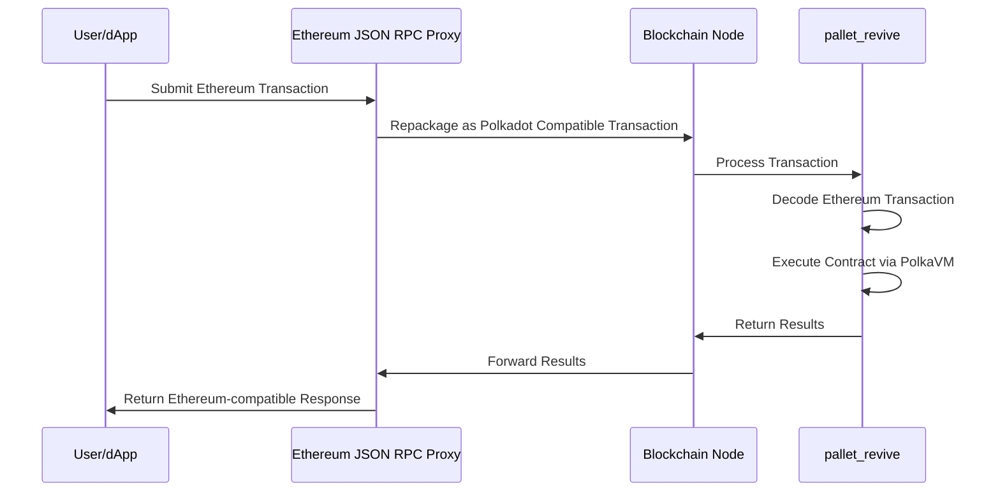

This proxy-based approach eliminates the need for node binary modifications, maintaining compatibility across different client implementations. Preserving the original Ethereum transaction payload simplifies the adaptation of existing tools, which can continue processing familiar transaction formats.

### PolkaVM Design Fundamentals

PolkaVM differs from the EVM in two key ways that make it faster, more hardware-efficient, and easier to extend:

- **Register-based design**: Instead of a stack machine, PolkaVM uses a RISC-V–style register model. This design:

    - Uses a fixed set of registers to pass arguments, not an infinite stack.
    - Maps cleanly to real hardware like x86-64.
    - Simplifies compilation and boosts runtime efficiency.
    - Enables tighter control over register allocation and performance tuning.

- **64-bit word size**: PolkaVM runs on a native 64-bit word size, aligning directly with modern CPUs. This design:

    - Executes arithmetic operations with direct hardware support.
    - Maintains compatibility with Solidity’s 256-bit types via YUL translation.
    - Accelerates computation-heavy workloads through native word alignment.
    - Integrates easily with low-level, performance-focused components.

## Where To Go Next

<div class="grid cards" markdown>

-   <span class="badge learn">Learn</span> __Contract Deployment__

    ---

    Learn how REVM and PVM compare for compiling and deploying smart contracts.

    [:octicons-arrow-right-24: Reference](/smart-contracts/for-eth-devs/contract-deployment/)

</div>


---

Page Title: Elastic Scaling

- Source (raw): https://raw.githubusercontent.com/polkadot-developers/polkadot-docs/master/.ai/pages/reference-parachains-consensus-elastic-scaling.md
- Canonical (HTML): https://docs.polkadot.com/reference/parachains/consensus/elastic-scaling/
- Summary: Learn how elastic scaling in Polkadot boosts parachain throughput, reduces latency, and supports dynamic, cost-efficient resource allocation.

# Elastic Scaling

## Introduction

Polkadot's architecture delivers scalability and security through its shared security model, where the relay chain coordinates and validates multiple parallel chains. 

Elastic scaling enhances this architecture by allowing parachains to utilize multiple computational cores simultaneously, breaking the previous 1:1 relationship between parachain and relay chain blocks.

This technical advancement enables parachains to process multiple blocks within a single relay chain block, significantly increasing throughput capabilities. By leveraging [Agile Coretime](/polkadot-protocol/architecture/polkadot-chain/agile-coretime){target=\_blank}, parachains can dynamically adjust their processing capacity based on demand, creating an efficient and responsive infrastructure for high-throughput applications.

## How Elastic Scaling Works

Elastic scaling enables parachains to process multiple blocks in parallel by utilizing additional cores on the relay chain. This section provides a technical analysis of the performance advantages and details of the implementation.

Consider a parachain that needs to process four consecutive parablocks. With traditional single-core allocation, the validation process follows a strictly sequential pattern. Each parablock undergoes a two-phase process on the relay chain:

1. **Backing phase**: Validators create and distribute validity statements.
2. **Inclusion phase**: The parablock is included in the relay chain after availability verification.

Throughout the following diagrams, specific notation is used to represent different components of the system:

- **R1, R2, ...**: Relay chain blocks (produced at ~6-second intervals).
- **P1, P2, ...**: Parachain blocks that need validation and inclusion.
- **C1, C2, ...**: Cores on the relay chain.

In the single-core scenario (assuming a 6-second relay chain block time), processing four parablocks requires approximately 30 seconds:

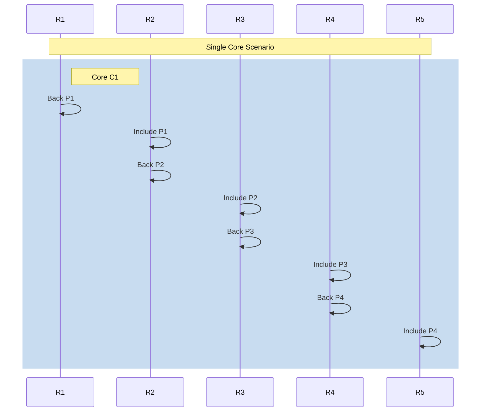

With elastic scaling utilizing two cores simultaneously, the same four parablocks can be processed in approximately 18 seconds:

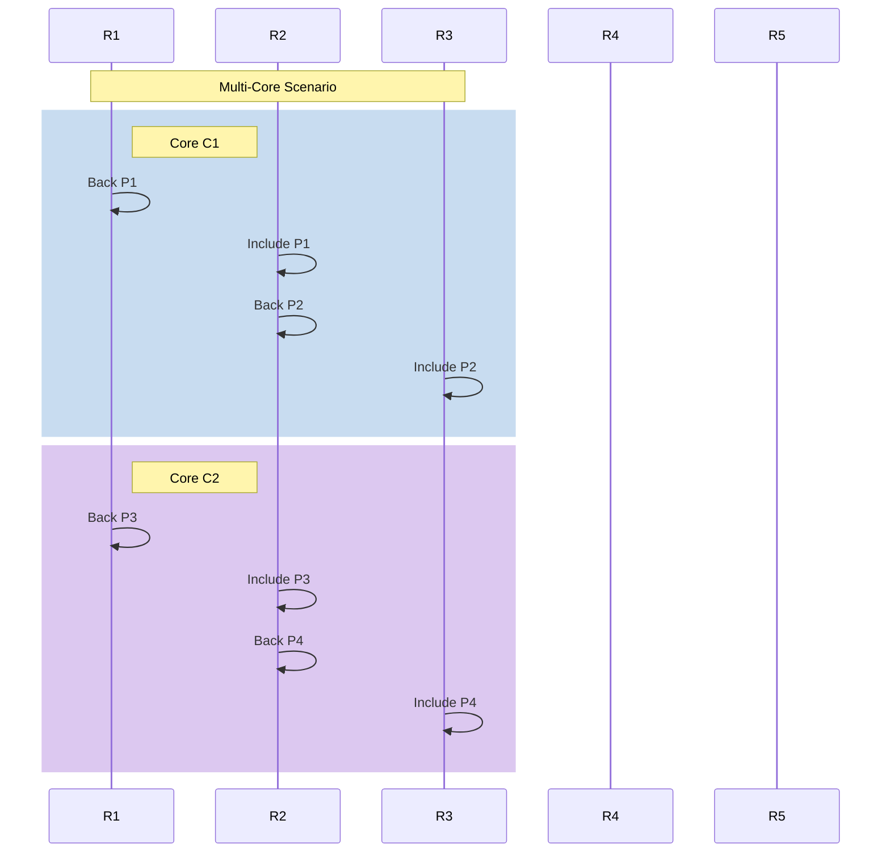

To help interpret the sequence diagrams above, note the following key elements:

- The horizontal axis represents time progression through relay chain blocks (R1-R5).
- Each colored rectangle shows processing on a specific core (C1 or C2).
- In the single-core scenario, all blocks must be processed sequentially on one core.
- In the multi-core scenario, blocks are processed in parallel across multiple cores, reducing total time.

The relay chain processes these multiple parablocks as independent validation units during the backing, availability, and approval phases. However, during inclusion, it verifies that their state roots align properly to maintain chain consistency.

From an implementation perspective:

- **Parachain side**: Collators must increase their block production rate to utilize multiple cores fully.
- **Validation process**: Each core operates independently, but with coordinated state verification.
- **Resource management**: Cores are dynamically allocated based on parachain requirements.
- **State consistency**: While backed and processed in parallel, the parablocks maintain sequential state transitions.

## Benefits of Elastic Scaling

- **Increased throughput**: Multiple concurrent cores enable parachains to process transactions at multiples of their previous capacity. By allowing multiple parachain blocks to be validated within each relay chain block cycle, applications can achieve significantly higher transaction volumes.

- **Lower latency**: Transaction finality improves substantially with multi-core processing. Parachains currently achieve 2-second latency with three cores, with projected improvements to 500ms using 12 cores, enabling near-real-time application responsiveness.

- **Resource efficiency**: Applications acquire computational resources precisely matched to their needs, eliminating wasteful over-provisioning. Coretime can be purchased at granular intervals (blocks, hours, days), creating cost-effective operations, particularly for applications with variable transaction patterns.

- **Scalable growth**: New applications can launch with minimal initial resource commitment and scale dynamically as adoption increases. This eliminates the traditional paradox of either over-allocating resources (increasing costs) or under-allocating (degrading performance) during growth phases.

- **Workload distribution**: Parachains intelligently distribute workloads across cores during peak demand periods and release resources when traffic subsides. Paired with secondary coretime markets, this ensures maximum resource utilization across the entire network ecosystem.

- **Reliable performance**: End-users experience reliable application performance regardless of network congestion levels. Applications maintain responsiveness even during traffic spikes, eliminating performance degradation that commonly impacts blockchain applications during high-demand periods.

## Use Cases

Elastic scaling enables applications to dynamically adjust their resource consumption based on real-time demand. This is especially valuable for decentralized applications where usage patterns can be highly variable. The following examples illustrate common scenarios where elastic scaling delivers significant performance and cost-efficiency benefits.

### Handling Sudden Traffic Spikes

Many decentralized applications experience unpredictable, high-volume traffic bursts, especially in gaming, DeFi protocols, NFT auctions, messaging platforms, and social media. Elastic scaling allows these systems to acquire additional coretime during peak usage and release it during quieter periods, ensuring responsiveness without incurring constant high infrastructure costs.

### Supporting Early-Stage Growth

Startups and new projects often begin with uncertain or volatile demand. With elastic scaling, teams can launch with minimal compute resources (e.g., a single core) and gradually scale as adoption increases. This prevents overprovisioning and enables cost-efficient growth until the application is ready for more permanent or horizontal scaling.

### Scaling Massive IoT Networks

Internet of Things (IoT) applications often involve processing data from millions of devices in real time. Elastic scaling supports this need by enabling high-throughput transaction processing as demand fluctuates. Combined with Polkadot’s shared security model, it provides a reliable and privacy-preserving foundation for large-scale IoT deployments.

### Powering Real-Time, Low-Latency Systems

Applications like payment processors, trading platforms, gaming engines, or real-time data feeds require fast, consistent performance. Elastic scaling can reduce execution latency during demand spikes, helping ensure low-latency, reliable service even under heavy load.


---

Page Title: Get Started with Parachain Development

- Source (raw): https://raw.githubusercontent.com/polkadot-developers/polkadot-docs/master/.ai/pages/parachains-get-started.md
- Canonical (HTML): https://docs.polkadot.com/parachains/get-started/
- Summary: Practical examples and tutorials for building and deploying Polkadot parachains, covering everything from launch to customization and cross-chain messaging.

# Get Started

The following sections provide practical recipes for building parachains on Polkadot—each focused on specific development scenarios with step-by-step, hands-on examples.

## Quick Start Guides

Quick start guides help developers set up and interact with the Polkadot parachain ecosystem using various tools and frameworks.

|                                            Tutorial                                            |         Tools         |                               Description                               |
|:----------------------------------------------------------------------------------------------:|:---------------------:|:-----------------------------------------------------------------------:|
| [Set Up the Parachain Template](/parachains/launch-a-parachain/set-up-the-parachain-template/) |     Polkadot SDK      | Learn how to set up and run the Polkadot SDK Parachain Template locally |
|            [Launch a Local Parachain](/parachains/testing/run-a-parachain-network/)            | Zombienet, Chopsticks |           Set up a local development environment for testing            |
|              [Fork an Existing Parachain](/parachains/testing/fork-a-parachain/)               |      Chopsticks       |           Create a local fork of a live parachain for testing           |

## Launch a Simple Parachain

Learn the fundamentals of launching and deploying a parachain to the Polkadot network.

|                                            Tutorial                                            |                                Description                                |
|:----------------------------------------------------------------------------------------------:|:-------------------------------------------------------------------------:|
| [Set Up the Parachain Template](/parachains/launch-a-parachain/set-up-the-parachain-template/) |                               Polkadot SDK                                |
|            [Deploy to Polkadot](/parachains/launch-a-parachain/deploy-to-polkadot/)            |       Step-by-step tutorial to deploying your parachain to Polkadot       |
|               [Obtain Coretime](/parachains/launch-a-parachain/obtain-coretime/)               | Learn how to acquire blockspace using Polkadot's coretime model (RegionX) |

## Customize Your Runtime

Build custom functionality for your parachain by composing and creating pallets.

|                                              Tutorial                                               |                            Description                            |
|:---------------------------------------------------------------------------------------------------:|:-----------------------------------------------------------------:|
|     [Add Existing Pallets to the Runtime](/parachains/customize-runtime/add-existing-pallets/)      |       Integrate pre-built pallets from the FRAME ecosystem        |
|      [Add Multiple Instances of a Pallet](/parachains/customize-runtime/add-pallet-instances/)      |      Configure and use multiple instances of the same pallet      |
| [Add Smart Contract Functionality](/parachains/customize-runtime/add-smart-contract-functionality/) | Enable smart contract capabilities using Contracts or EVM pallets |

### Pallet Development

Deep dive into creating and managing custom pallets for your parachain.

|                                             Tutorial                                              |                        Description                        |
|:-------------------------------------------------------------------------------------------------:|:---------------------------------------------------------:|
|    [Create a Custom Pallet](/parachains/customize-runtime/pallet-development/create-a-pallet/)    |       Build a pallet from scratch with custom logic       |
|        [Mock Your Runtime](/parachains/customize-runtime/pallet-development/mock-runtime/)        |       Set up a mock runtime environment for testing       |
|      [Pallet Unit Testing](/parachains/customize-runtime/pallet-development/pallet-testing/)      |      Write comprehensive tests for your pallet logic      |
| [Benchmark the Custom Pallet](/parachains/customize-runtime/pallet-development/benchmark-pallet/) | Measure and optimize pallet performance with benchmarking |

## Testing

Test your parachain in various environments before production deployment.

|                                Tutorial                                 |                       Description                       |
|:-----------------------------------------------------------------------:|:-------------------------------------------------------:|
|        [Fork a Parachain](/parachains/testing/fork-a-parachain/)        |    Use Chopsticks to create a local fork for testing    |
| [Run a Parachain Network](/parachains/testing/run-a-parachain-network/) | Launch a complete parachain test network with Zombienet |

## Runtime Upgrades and Maintenance

Manage your parachain's lifecycle with forkless upgrades and maintenance operations.

|                                 Tutorial                                  |                     Description                      |
|:-------------------------------------------------------------------------:|:----------------------------------------------------:|
|   [Runtime Upgrades](/parachains/runtime-maintenance/runtime-upgrades/)   |   Perform forkless runtime upgrades via governance   |
| [Storage Migrations](/parachains/runtime-maintenance/storage-migrations/) |  Safely migrate storage when updating runtime logic  |
|  [Unlock Parachains](/parachains/runtime-maintenance/unlock-parachains/)  | Understand parachain lifecycle and unlock mechanisms |

## Interoperability

Configure your parachain for cross-chain communication using XCM (Cross-Consensus Messaging).

|                                                  Tutorial                                                  |                      Description                       |
|:----------------------------------------------------------------------------------------------------------:|:------------------------------------------------------:|
|     [Open HRMP Channels Between Parachains](/parachains/interoperability/channels-between-parachains/)     | Establish communication channels with other parachains |
| [Open HRMP Channels with System Parachains](/parachains/interoperability/channels-with-system-parachains/) |   Connect with Asset Hub and other system parachains   |

## Integrations

Integrate your parachain with essential ecosystem tools and services.

|                    Tutorial                    |                      Description                       |
|:----------------------------------------------:|:------------------------------------------------------:|
|  [Wallets](/parachains/integrations/wallets/)  |     Integrate wallet support for user interactions     |
| [Indexers](/parachains/integrations/indexers/) | Set up indexing solutions for querying blockchain data |
|  [Oracles](/parachains/integrations/oracles/)  |    Connect your parachain to off-chain data sources    |

## Additional Resources

- [Polkadot SDK Documentation](https://paritytech.github.io/polkadot-sdk/master/polkadot_sdk_docs/polkadot_sdk/index.html)
- [Polkadot Wiki - Parachains](https://wiki.polkadot.network/docs/learn-parachains/)


---

Page Title: Get Started with Smart Contracts

- Source (raw): https://raw.githubusercontent.com/polkadot-developers/polkadot-docs/master/.ai/pages/smart-contracts-get-started.md
- Canonical (HTML): https://docs.polkadot.com/smart-contracts/get-started/
- Summary: Practical examples for building and deploying smart contracts on Polkadot Hub, from connecting and tooling to deployment, integrations, and precompiles.

# Get Started

This resource provides quick-starts for building smart contracts on Polkadot Hub. Use the tables below to jump directly to the tools and workflows you need.

## Quick Starts

Kick off development fast with curated links for connecting, funding, exploring, and deploying your first contract.

|                     Quick Start                     |         Tools         |                           Description                           |
|:---------------------------------------------------:|:---------------------:|:---------------------------------------------------------------:|
|  [Connect to Polkadot](/smart-contracts/connect/)   | Polkadot.js, MetaMask | Add the network, configure RPC, verify activity in the explorer |
|     [Get Test Tokens](/smart-contracts/faucet/)     |           -           |    Request test funds to deploy and interact with contracts     |
| [Explore Transactions](/smart-contracts/explorers/) |        Subscan        | Inspect transactions, logs, token transfers, and contract state |

## Build and Test Locally

Set up local environments and CI-friendly workflows to iterate quickly and validate changes before deploying.

|                          Build and Test Locally                           |       Tools       |                  Description                   |
|:-------------------------------------------------------------------------:|:-----------------:|:----------------------------------------------:|
| [Run a Local Dev Node](/smart-contracts/dev-environments/local-dev-node/) | Polkadot SDK node | Spin up a local node for iterative development |
|   [Use Remix for Development](/smart-contracts/dev-environments/remix/)   |       Remix       |         Connect Remix to Polkadot Hub          |
| [Use Hardhat for Development](/smart-contracts/dev-environments/hardhat/) |      Hardhat      |     Project scaffolding and configuration      |


## Ethereum Developer Resources

Bridge your Ethereum knowledge with Polkadot Hub specifics: account mapping, fees, JSON‑RPC, and deployment.

|                                 Ethereum Developer Guides                                 |                           Description                           |
|:-----------------------------------------------------------------------------------------:|:---------------------------------------------------------------:|
|                    [Accounts](/smart-contracts/for-eth-devs/accounts/)                    | How 20‑byte Ethereum addresses map to 32‑byte Polkadot accounts |
| [Blocks, Transactions, and Fees](/smart-contracts/for-eth-devs/blocks-transactions-fees/) |     Transaction types, fees, and multi‑dimensional metering     |
|                   [Gas Model](/smart-contracts/for-eth-devs/gas-model/)                   |        Gas vs. weight, proof size, and storage deposits         |
|         [Contract Deployment](/smart-contracts/for-eth-devs/contract-deployment/)         |     Deployment patterns and best practices on Polkadot Hub      |
|               [JSON‑RPC APIs](/smart-contracts/for-eth-devs/json-rpc-apis/)               |        Supported Ethereum JSON‑RPC methods and examples         |
|               [Dual VM Stack](/smart-contracts/for-eth-devs/dual-vm-stack/)               |         Overview of EVM and native execution on the Hub         |

## Cookbook: Hands‑on Tutorials

Follow step‑by‑step guides that walk through common tasks and complete dApp examples.

|                                            Tutorial                                            |        Tools        |                Description                |
|:----------------------------------------------------------------------------------------------:|:-------------------:|:-----------------------------------------:|
| [Deploy a Basic Contract](/smart-contracts/cookbook/smart-contracts/deploy-basic/basic-remix/) |        Remix        |      Minimal deployment walkthrough       |
|    [Deploy an ERC‑20](/smart-contracts/cookbook/smart-contracts/deploy-erc20/erc20-remix/)     | Remix, OpenZeppelin | Create, deploy, and mint a fungible token |
|   [Deploy an NFT (ERC‑721)](/smart-contracts/cookbook/smart-contracts/deploy-nft/nft-remix/)   | Remix, OpenZeppelin |    Build and deploy an NFT collection     |
|                 [Uniswap V2](/smart-contracts/cookbook/eth-dapps/uniswap-v2/)                  |       Hardhat       | Full dApp project: compile, test, deploy  |
|               [Zero‑to‑Hero dApp](/smart-contracts/cookbook/dapps/zero-to-hero/)               |      Multiple       |  End‑to‑end dApp patterns and practices   |

## Libraries

Choose the client libraries that fit your stack for connecting wallets and calling contracts.

|                      Library                       |                       Description                       |
|:--------------------------------------------------:|:-------------------------------------------------------:|
| [Ethers.js](/smart-contracts/libraries/ethers-js/) | Connect, sign, and interact with contracts using Ethers |
|      [viem](/smart-contracts/libraries/viem/)      |        Type‑safe EVM interactions and utilities         |
|     [Wagmi](/smart-contracts/libraries/wagmi/)     |  React hooks for wallet connections and contract calls  |
|   [Web3.js](/smart-contracts/libraries/web3-js/)   |             Web3 provider and contract APIs             |
|   [Web3.py](/smart-contracts/libraries/web3-py/)   |  Python toolkit for on‑chain interactions and scripts   |

## Integrations

Integrate essential services like wallets, indexers, and oracles to round out your dApp.

|                     Integration                     |                Description                |
|:---------------------------------------------------:|:-----------------------------------------:|
|  [Wallets](/smart-contracts/integrations/wallets/)  | Supported wallets and configuration notes |

## Precompiles

Discover precompiled system contracts available on the Hub and how to use them.

|                          Topic                           |                     Description                     |
|:--------------------------------------------------------:|:---------------------------------------------------:|
| [Overview of Precompiles](/smart-contracts/precompiles/) |      What precompiles are available on the Hub      |
|  [ETH Native](/smart-contracts/precompiles/eth-native/)  |           EVM precompiles and interfaces            |
|         [XCM](/smart-contracts/precompiles/xcm/)         |     Cross‑chain messaging helpers for contracts     |

From here, follow the quick starts to get connected, iterate locally with your preferred tools, and use the guides, libraries, integrations, and precompiles as you grow into production‑ready dApps. If you get stuck, [open an issue](https://github.com/polkadot-developers/polkadot-docs/issues/new?template=docs-issue.yml){target=\_blank} or reach out in the community channels.


---

Page Title: Get Started with XCM

- Source (raw): https://raw.githubusercontent.com/polkadot-developers/polkadot-docs/master/.ai/pages/parachains-interoperability-get-started.md
- Canonical (HTML): https://docs.polkadot.com/parachains/interoperability/get-started/
- Summary: Unlock blockchain interoperability with XCM — Polkadot's Cross-Consensus Messaging format for cross-chain interactions.

# Get Started with XCM

## Introduction

Polkadot’s unique value lies in its ability to enable interoperability between parachains and other blockchain systems. At the core of this capability is XCM (Cross-Consensus Messaging)—a flexible messaging format that facilitates communication and collaboration between independent consensus systems.

With XCM, one chain can send intents to another one, fostering a more interconnected ecosystem. Although it was developed specifically for Polkadot, XCM is a universal format, usable in any blockchain environment. This guide provides an overview of XCM’s core principles, design, and functionality, alongside practical examples of its implementation.

## Messaging Format

XCM is not a protocol but a standardized [messaging format](https://github.com/polkadot-fellows/xcm-format){target=\_blank}. It defines the structure and behavior of messages but does not handle their delivery. This separation allows developers to focus on crafting instructions for target systems without worrying about transmission mechanics.

XCM messages are intent-driven, outlining desired actions for the receiving blockchain to consider and potentially alter its state. These messages do not directly execute changes; instead, they rely on the host chain's environment to interpret and implement them. By utilizing asynchronous composability, XCM facilitates efficient execution where messages can be processed independently of their original order, similar to how RESTful services handle HTTP requests without requiring sequential processing.

## The Four Principles of XCM

XCM adheres to four guiding principles that ensure robust and reliable communication across consensus systems:

- **Asynchronous**: XCM messages operate independently of sender acknowledgment, avoiding delays due to blocked processes.
- **Absolute**: XCM messages are guaranteed to be delivered and interpreted accurately, in order, and timely. Once a message is sent, one can be sure it will be processed as intended.
- **Asymmetric**: XCM messages follow the 'fire and forget' paradigm meaning no automatic feedback is provided to the sender. Any results must be communicated separately to the sender with an additional message back to the origin.
- **Agnostic**: XCM operates independently of the specific consensus mechanisms, making it compatible across diverse systems.

These principles guarantee that XCM provides a reliable framework for cross-chain communication, even in complex environments.

## The XCM Tech Stack


The XCM tech stack is designed to facilitate seamless interoperable communication between chains that reside within the Polkadot ecosystem. XCM can be used to express the meaning of the messages over each of the communication channels.

## Core Functionalities of XCM

XCM enhances cross-consensus communication by introducing several powerful features:

- **Programmability**: Supports dynamic message handling, allowing for more comprehensive use cases. Includes branching logic, safe dispatches for version checks, and asset operations like NFT management.
- **Functional Multichain Decomposition**: Enables mechanisms such as remote asset locking, asset namespacing, and inter-chain state referencing, with contextual message identification.
- **Bridging**: Establishes a universal reference framework for multi-hop setups, connecting disparate systems like Ethereum and Bitcoin with the Polkadot relay chain acting as a universal location.

The standardized format for messages allows parachains to handle tasks like user balances, governance, and staking, freeing the Polkadot relay chain to focus on shared security. These features make XCM indispensable for implementing scalable and interoperable blockchain applications. 

## XCM Example

The following is a simplified XCM message demonstrating a token transfer from Alice to Bob on the same chain (ParaA).

```rust
let message = Xcm(vec![
    WithdrawAsset((Here, amount).into()),
    BuyExecution { 
        fees: (Here, amount).into(), 
        weight_limit: WeightLimit::Unlimited 
    },
    DepositAsset {
        assets: All.into(),
        beneficiary: MultiLocation {
            parents: 0,
            interior: Junction::AccountId32 {
                network: None,
                id: BOB.clone().into()
            }.into(),
        }.into()
    }
]);
```

The message consists of three instructions described as follows:

- **[WithdrawAsset](https://github.com/polkadot-fellows/xcm-format?tab=readme-ov-file#withdrawasset){target=\_blank}**: Transfers a specified number of tokens from Alice's account to a holding register.

    ```rust
        WithdrawAsset((Here, amount).into()),
    ```

    - **`Here`**: The native parachain token.
    - **`amount`**: The number of tokens that are transferred.

    The first instruction takes as an input the MultiAsset that should be withdrawn. The MultiAsset describes the native parachain token with the `Here` keyword. The `amount` parameter is the number of tokens that are transferred. The withdrawal account depends on the origin of the message. In this example the origin of the message is Alice. The `WithdrawAsset` instruction moves `amount` number of native tokens from Alice's account into the holding register.

- **[BuyExecution](https://github.com/polkadot-fellows/xcm-format?tab=readme-ov-file#buyexecution){target=\_blank}**: Allocates fees to cover the execution weight of the XCM instructions.

    

    ```rust
        BuyExecution { 
            fees: (Here, amount).into(), 
            weight_limit: WeightLimit::Unlimited 
        },
    ```

    - **`fees`**: Describes the asset in the holding register that should be used to pay for the weight.
    - **`weight_limit`**: Defines the maximum fees that can be used to buy weight.

- **[DepositAsset](https://github.com/polkadot-fellows/xcm-format?tab=readme-ov-file#depositasset){target=\_blank}**: Moves the remaining tokens from the holding register to Bob’s account.

    ```rust
        DepositAsset {
            assets: All.into(),
            beneficiary: MultiLocation {
                parents: 0,
                interior: Junction::AccountId32 {
                    network: None,
                    id: BOB.clone().into()
                }.into(),
            }.into()
        }
    ```

    - **`All`**: The wildcard for the asset(s) to be deposited. In this case, all assets in the holding register should be deposited.
    
This step-by-step process showcases how XCM enables precise state changes within a blockchain system. You can find a complete XCM message example in the [XCM repository](https://github.com/paritytech/xcm-docs/blob/main/examples/src/0_first_look/mod.rs){target=\_blank}.

## Overview

XCM revolutionizes cross-chain communication by enabling use cases such as:

- Token transfers between blockchains.
- Asset locking for cross-chain smart contract interactions.
- Remote execution of functions on other blockchains.

These functionalities empower developers to build innovative, multi-chain applications, leveraging the strengths of various blockchain networks. To stay updated on XCM’s evolving format or contribute, visit the [XCM repository](https://github.com/paritytech/xcm-docs/blob/main/examples/src/0_first_look/mod.rs){target=\_blank}.


---

Page Title: Glossary

- Source (raw): https://raw.githubusercontent.com/polkadot-developers/polkadot-docs/master/.ai/pages/reference-glossary.md
- Canonical (HTML): https://docs.polkadot.com/reference/glossary/
- Summary: Glossary of terms used within the Polkadot ecosystem, Polkadot SDK, its subsequent libraries, and other relevant Web3 terminology.

# Glossary

Key definitions, concepts, and terminology specific to the Polkadot ecosystem are included here.

Additional glossaries from around the ecosystem you might find helpful:

- [Polkadot Wiki Glossary](https://wiki.polkadot.com/general/glossary){target=\_blank}
- [Polkadot SDK Glossary](https://paritytech.github.io/polkadot-sdk/master/polkadot_sdk_docs/reference_docs/glossary/index.html){target=\_blank}

## Authority

The role in a blockchain that can participate in consensus mechanisms. 

- **[GRANDPA](#grandpa)**: The authorities vote on chains they consider final.
- **[Blind Assignment of Blockchain Extension](#blind-assignment-of-blockchain-extension-babe) (BABE)**: The authorities are also [block authors](#block-author).

Authority sets can be used as a basis for consensus mechanisms such as the [Nominated Proof of Stake (NPoS)](#nominated-proof-of-stake-npos) protocol.

## Authority Round (Aura)

A deterministic [consensus](#consensus) protocol where block production is limited to a rotating list of [authorities](#authority) that take turns creating blocks. In authority round (Aura) consensus, most online authorities are assumed to be honest. It is often used in combination with [GRANDPA](#grandpa) as a [hybrid consensus](#hybrid-consensus) protocol.

Learn more by reading the official [Aura consensus algorithm](https://openethereum.github.io/Aura){target=\_blank} wiki article.

## Blind Assignment of Blockchain Extension (BABE)

A [block authoring](#block-author) protocol similar to [Aura](#authority-round-aura), except [authorities](#authority) win [slots](#slot) based on a Verifiable Random Function (VRF) instead of the round-robin selection method. The winning authority can select a chain and submit a new block.

Learn more by reading the official Web3 Foundation [BABE research document](https://research.web3.foundation/Polkadot/protocols/block-production/Babe){target=\_blank}.

## Block Author

The node responsible for the creation of a block, also called _block producers_. In a Proof of Work (PoW) blockchain, these nodes are called _miners_.

## Byzantine Fault Tolerance (BFT)

The ability of a distributed computer network to remain operational if a certain proportion of its nodes or [authorities](#authority) are defective or behaving maliciously. A distributed network is typically considered Byzantine fault tolerant if it can remain functional, with up to one-third of nodes assumed to be defective, offline, actively malicious, and part of a coordinated attack.

### Byzantine Failure

The loss of a network service due to node failures that exceed the proportion of nodes required to reach consensus.

### Practical Byzantine Fault Tolerance (pBFT)

An early approach to Byzantine fault tolerance (BFT), practical Byzantine fault tolerance (pBFT) systems tolerate Byzantine behavior from up to one-third of participants.

The communication overhead for such systems is `O(n²)`, where `n` is the number of nodes (participants) in the system.

### Preimage

A preimage is the data that is input into a hash function to calculate a hash. Since a hash function is a [one-way function](https://en.wikipedia.org/wiki/One-way_function){target=\_blank}, the output, the hash, cannot be used to reveal the input, the preimage.

## Call

In the context of pallets containing functions to be dispatched to the runtime, `Call` is an enumeration data type that describes the functions that can be dispatched with one variant per pallet. A `Call` represents a [dispatch](#dispatchable) data structure object.

## Chain Specification 

A chain specification file defines the properties required to run a node in an active or new Polkadot SDK-built network. It often contains the initial genesis runtime code, network properties (such as the network's name), the initial state for some pallets, and the boot node list. The chain specification file makes it easy to use a single Polkadot SDK codebase as the foundation for multiple independently configured chains.

## Collator

An [author](#block-author) of a [parachain](#parachain) network.
They aren't [authorities](#authority) in themselves, as they require a [relay chain](#relay-chain) to coordinate [consensus](#consensus).

More details are found on the [Polkadot Collator Wiki](https://wiki.polkadot.com/learn/learn-collator/){target=\_blank}.

## Collective

Most often used to refer to an instance of the Collective pallet on Polkadot SDK-based networks such as [Kusama](#kusama) or [Polkadot](#polkadot) if the Collective pallet is part of the FRAME-based runtime for the network.

## Consensus

Consensus is the process blockchain nodes use to agree on a chain's canonical fork. It is composed of [authorship](#block-author), finality, and [fork-choice rule](#fork-choice-rulestrategy). In the Polkadot ecosystem, these three components are usually separate and the term consensus often refers specifically to authorship.

See also [hybrid consensus](#hybrid-consensus).

## Consensus Algorithm

Ensures a set of [actors](#authority)—who don't necessarily trust each other—can reach an agreement about the state as the result of some computation. Most consensus algorithms assume that up to one-third of the actors or nodes can be [Byzantine fault tolerant](#byzantine-fault-tolerance-bft).

Consensus algorithms are generally concerned with ensuring two properties:

- **Safety**: Indicating that all honest nodes eventually agreed on the state of the chain.
- **Liveness**: Indicating the ability of the chain to keep progressing.

## Consensus Engine

The node subsystem responsible for consensus tasks.

For detailed information about the consensus strategies of the [Polkadot](#polkadot) network, see the [Polkadot Consensus](/reference/polkadot-hub/consensus-and-security/pos-consensus/){target=\_blank} blog series.

See also [hybrid consensus](#hybrid-consensus).

## Coretime

The time allocated for utilizing a core, measured in relay chain blocks. There are two types of coretime: *on-demand* and *bulk*.

On-demand coretime refers to coretime acquired through bidding in near real-time for the validation of a single parachain block on one of the cores reserved specifically for on-demand orders. They are available as an on-demand coretime pool. Set of cores that are available on-demand. Cores reserved through bulk coretime could also be made available in the on-demand coretime pool, in parts or in entirety.

Bulk coretime is a fixed duration of continuous coretime represented by an NFT that can be split, shared, or resold. It is managed by the [Broker pallet](https://paritytech.github.io/polkadot-sdk/master/pallet_broker/index.html){target=\_blank}.

## Development Phrase

A [mnemonic phrase](https://en.wikipedia.org/wiki/Mnemonic#For_numerical_sequences_and_mathematical_operations){target=\_blank} that is intentionally made public.

Well-known development accounts, such as Alice, Bob, Charlie, Dave, Eve, and Ferdie, are generated from the same secret phrase:

```
bottom drive obey lake curtain smoke basket hold race lonely fit walk
```

Many tools in the Polkadot SDK ecosystem, such as [`subkey`](https://github.com/paritytech/polkadot-sdk/tree/polkadot-stable2506-2/substrate/bin/utils/subkey){target=\_blank}, allow you to implicitly specify an account using a derivation path such as `//Alice`.

## Digest

An extensible field of the [block header](#header) that encodes information needed by several actors in a blockchain network, including:

- [Light clients](#light-client) for chain synchronization.
- Consensus engines for block verification.
- The runtime itself, in the case of pre-runtime digests.

## Dispatchable

Function objects that act as the entry points in FRAME [pallets](#pallet). Internal or external entities can call them to interact with the blockchain’s state. They are a core aspect of the runtime logic, handling [transactions](#transaction) and other state-changing operations.

## Events

A means of recording that some particular [state](#state) transition happened.

In the context of [FRAME](#frame-framework-for-runtime-aggregation-of-modularized-entities), events are composable data types that each [pallet](#pallet) can individually define. Events in FRAME are implemented as a set of transient storage items inspected immediately after a block has been executed and reset during block initialization.

## Executor

A means of executing a function call in a given [runtime](#runtime) with a set of dependencies.
There are two orchestration engines in Polkadot SDK, _WebAssembly_ and _native_.

- The _native executor_ uses a natively compiled runtime embedded in the node to execute calls. This is a performance optimization available to up-to-date nodes.

- The _WebAssembly executor_ uses a [Wasm](#webassembly-wasm) binary and a Wasm interpreter to execute calls. The binary is guaranteed to be up-to-date regardless of the version of the blockchain node because it is persisted in the [state](#state) of the Polkadot SDK-based chain.

## Existential Deposit

The minimum balance an account is allowed to have in the [Balances pallet](https://paritytech.github.io/polkadot-sdk/master/pallet_balances/index.html){target=\_blank}. Accounts cannot be created with a balance less than the existential deposit amount. 

If an account balance drops below this amount, the Balances pallet uses [a FRAME System API](https://paritytech.github.io/substrate/master/frame_system/pallet/struct.Pallet.html#method.dec_ref){target=\_blank} to drop its references to that account.

If the Balances pallet reference to an account is dropped, the account can be [reaped](https://paritytech.github.io/substrate/master/frame_system/pallet/struct.Pallet.html#method.allow_death){target=\_blank}.

## Extrinsic

A general term for data that originates outside the runtime, is included in a block, and leads to some action. This includes user-initiated transactions and inherent transactions placed into the block by the block builder.

It is a SCALE-encoded array typically consisting of a version number, signature, and varying data types indicating the resulting runtime function to be called. Extrinsics can take two forms: [inherents](#inherent-transactions) and [transactions](#transaction). 

For more technical details, see the [Polkadot spec](https://spec.polkadot.network/id-extrinsics){target=\_blank}.

## Fork Choice Rule/Strategy

A fork choice rule or strategy helps determine which chain is valid when reconciling several network forks. A common fork choice rule is the [longest chain](https://paritytech.github.io/polkadot-sdk/master/sc_consensus/struct.LongestChain.html){target=\_blank}, in which the chain with the most blocks is selected.

## FRAME (Framework for Runtime Aggregation of Modularized Entities)

Enables developers to create blockchain [runtime](#runtime) environments from a modular set of components called [pallets](#pallet). It utilizes a set of procedural macros to construct runtimes.

[Visit the Polkadot SDK docs for more details on FRAME.](https://paritytech.github.io/polkadot-sdk/master/polkadot_sdk_docs/polkadot_sdk/frame_runtime/index.html){target=\_blank}

## Full Node

A node that prunes historical states, keeping only recently finalized block states to reduce storage needs. Full nodes provide current chain state access and allow direct submission and validation of [extrinsics](#extrinsic), maintaining network decentralization.

## Genesis Configuration

A mechanism for specifying the initial state of a blockchain. By convention, this initial state or first block is commonly referred to as the genesis state or genesis block. The genesis configuration for Polkadot SDK-based chains is accomplished by way of a [chain specification](#chain-specification) file.

## GRANDPA

A deterministic finality mechanism for blockchains that is implemented in the [Rust](https://www.rust-lang.org/){target=\_blank} programming language.

The [formal specification](https://github.com/w3f/consensus/blob/master/pdf/grandpa-old.pdf){target=\_blank} is maintained by the [Web3 Foundation](https://web3.foundation/){target=\_blank}.

## Header

A structure that aggregates the information used to summarize a block. Primarily, it consists of cryptographic information used by [light clients](#light-client) to get minimally secure but very efficient chain synchronization.

## Hybrid Consensus

A blockchain consensus protocol that consists of independent or loosely coupled mechanisms for [block production](#block-author) and finality.

Hybrid consensus allows the chain to grow as fast as probabilistic consensus protocols, such as [Aura](#authority-round-aura), while maintaining the same level of security as deterministic finality consensus protocols, such as [GRANDPA](#grandpa).

## Inherent Transactions

A special type of unsigned transaction, referred to as _inherents_, that enables a block authoring node to insert information that doesn't require validation directly into a block.

Only the block-authoring node that calls the inherent transaction function can insert data into its block. In general, validators assume the data inserted using an inherent transaction is valid and reasonable even if it can't be deterministically verified.

## JSON-RPC

A stateless, lightweight remote procedure call protocol encoded in JavaScript Object Notation (JSON). JSON-RPC provides a standard way to call functions on a remote system by using JSON.

For Polkadot SDK, this protocol is implemented through the [Parity JSON-RPC](https://github.com/paritytech/jsonrpc){target=\_blank} crate.

## Keystore

A subsystem for managing keys for the purpose of producing new blocks.

## Kusama

[Kusama](https://kusama.network/){target=\_blank} is a Polkadot SDK-based blockchain that implements a design similar to the [Polkadot](#polkadot) network.

Kusama is a [canary](https://en.wiktionary.org/wiki/canary_in_a_coal_mine){target=\_blank} network and is referred to as [Polkadot's "wild cousin."](https://wiki.polkadot.com/learn/learn-comparisons-kusama/){target=\_blank}.

As a canary network, Kusama is expected to be more stable than a test network like [Westend](#westend) but less stable than a production network like [Polkadot](#polkadot). Kusama is controlled by its network participants and is intended to be stable enough to encourage meaningful experimentation.

## libp2p

A peer-to-peer networking stack that allows the use of many transport mechanisms, including WebSockets (usable in a web browser).

Polkadot SDK uses the [Rust implementation](https://github.com/libp2p/rust-libp2p){target=\_blank} of the `libp2p` networking stack.

## Light Client

A type of blockchain node that doesn't store the [chain state](#state) or produce blocks.

A light client can verify cryptographic primitives and provides a [remote procedure call (RPC)](https://en.wikipedia.org/wiki/Remote_procedure_call){target=\_blank} server, enabling blockchain users to interact with the network.

## Metadata

Data that provides information about one or more aspects of a system.
The metadata that exposes information about a Polkadot SDK blockchain enables you to interact with that system.

## Nominated Proof of Stake (NPoS)

A method for determining [validators](#validator) or _[authorities](#authority)_ based on a willingness to commit their stake to the proper functioning of one or more block-producing nodes.

## Oracle

An entity that connects a blockchain to a non-blockchain data source. Oracles enable the blockchain to access and act upon information from existing data sources and incorporate data from non-blockchain systems and services.

## Origin

A [FRAME](#frame-framework-for-runtime-aggregation-of-modularized-entities) primitive that identifies the source of a [dispatched](#dispatchable) function call into the [runtime](#runtime). The FRAME System pallet defines three built-in [origins](#origin). As a [pallet](#pallet) developer, you can also define custom origins, such as those defined by the [Collective pallet](https://paritytech.github.io/substrate/master/pallet_collective/enum.RawOrigin.html){target=\_blank}.

## Pallet

A module that can be used to extend the capabilities of a [FRAME](#frame-framework-for-runtime-aggregation-of-modularized-entities)-based [runtime](#runtime).
Pallets bundle domain-specific logic with runtime primitives like [events](#events) and [storage items](#storage-item).

## Parachain

A parachain is a blockchain that derives shared infrastructure and security from a _[relay chain](#relay-chain)_.
You can learn more about parachains on the [Polkadot Wiki](https://wiki.polkadot.com/learn/learn-parachains/){target=\_blank}.

## Paseo

Paseo TestNet provisions testing on Polkadot's "production" runtime, which means less chance of feature or code mismatch when developing parachain apps. Specifically, after the [Polkadot Technical fellowship](https://wiki.polkadot.com/learn/learn-polkadot-technical-fellowship/){target=\_blank} proposes a runtime upgrade for Polkadot, this TestNet is updated, giving a period where the TestNet will be ahead of Polkadot to allow for testing.

## Polkadot

The [Polkadot network](https://polkadot.com/){target=\_blank} is a blockchain that serves as the central hub of a heterogeneous blockchain network. It serves the role of the [relay chain](#relay-chain) and provides shared infrastructure and security to support [parachains](#parachain).

## Polkadot Cloud

Polkadot Cloud is a platform for deploying resilient, customizable and scalable Web3 applications through Polkadot's functionality. It encompasses the wider Polkadot network infrastructure and security layer where parachains operate. The platform enables users to launch Ethereum-compatible chains, build specialized blockchains, and flexibly manage computing resources through on-demand or bulk coretime purchases. Initially launched with basic parachain functionality, Polkadot Cloud has evolved to offer enhanced flexibility with features like coretime, elastic scaling, and async backing for improved performance.

## Polkadot Hub

Polkadot Hub is a Layer 1 platform that serves as the primary entry point to the Polkadot ecosystem, providing essential functionality without requiring parachain deployment. It offers core services including smart contracts, identity management, staking, governance, and interoperability with other ecosystems, making it simple and fast for both builders and users to get started in Web3.

## PolkaVM

PolkaVM is a custom virtual machine optimized for performance, leveraging a RISC-V-based architecture to support Solidity and any language that compiles to RISC-V. It is specifically designed for the Polkadot ecosystem, enabling smart contract deployment and execution.

## Relay Chain

Relay chains are blockchains that provide shared infrastructure and security to the [parachains](#parachain) in the network. In addition to providing [consensus](#consensus) capabilities, relay chains allow parachains to communicate and exchange digital assets without needing to trust one another.

## Rococo

A [parachain](#parachain) test network for the Polkadot network. The [Rococo](#rococo) network is a Polkadot SDK-based blockchain with an October 14, 2024 deprecation date. Development teams are encouraged to use the Paseo TestNet instead.

## Runtime

The runtime represents the [state transition function](#state-transition-function-stf) for a blockchain. In Polkadot SDK, the runtime is stored as a [Wasm](#webassembly-wasm) binary in the chain state. The Runtime is stored under a unique state key and can be modified during the execution of the state transition function.

## Slot

A fixed, equal interval of time used by consensus engines such as [Aura](#authority-round-aura) and [BABE](#blind-assignment-of-blockchain-extension-babe). In each slot, a subset of [authorities](#authority) is permitted, or obliged, to [author](#block-author) a block.

## Sovereign Account

The unique account identifier for each chain in the relay chain ecosystem. It is often used in cross-consensus (XCM) interactions to sign XCM messages sent to the relay chain or other chains in the ecosystem.

The sovereign account for each chain is a root-level account that can only be accessed using the Sudo pallet or through governance. The account identifier is calculated by concatenating the Blake2 hash of a specific text string and the registered parachain identifier.

## SS58 Address Format

A public key address based on the Bitcoin [`Base-58-check`](https://en.bitcoin.it/wiki/Base58Check_encoding){target=\_blank} encoding. Each Polkadot SDK SS58 address uses a `base-58` encoded value to identify a specific account on a specific Polkadot SDK-based chain

The [canonical `ss58-registry`](https://github.com/paritytech/ss58-registry){target=\_blank} provides additional details about the address format used by different Polkadot SDK-based chains, including the network prefix and website used for different networks

## State Transition Function (STF)

The logic of a blockchain that determines how the state changes when a block is processed. In Polkadot SDK, the state transition function is effectively equivalent to the [runtime](#runtime).

## Storage Item

[FRAME](#frame-framework-for-runtime-aggregation-of-modularized-entities) primitives that provide type-safe data persistence capabilities to the [runtime](#runtime).
Learn more in the [storage items](https://paritytech.github.io/polkadot-sdk/master/frame_support/storage/types/index.html){target=\_blank} reference document in the Polkadot SDK.

## Substrate

A flexible framework for building modular, efficient, and upgradeable blockchains. Substrate is written in the [Rust](https://www.rust-lang.org/){target=\_blank} programming language and is maintained by [Parity Technologies](https://www.parity.io/){target=\_blank}.

## Transaction

An [extrinsic](#extrinsic) that includes a signature that can be used to verify the account authorizing it inherently or via [signed extensions](https://paritytech.github.io/polkadot-sdk/master/polkadot_sdk_docs/reference_docs/signed_extensions/index.html){target=\_blank}.

## Transaction Era

A definable period expressed as a range of block numbers during which a transaction can be included in a block.
Transaction eras are used to protect against transaction replay attacks if an account is reaped and its replay-protecting nonce is reset to zero.

## Trie (Patricia Merkle Tree)

A data structure used to represent sets of key-value pairs and enables the items in the data set to be stored and retrieved using a cryptographic hash. Because incremental changes to the data set result in a new hash, retrieving data is efficient even if the data set is very large. With this data structure, you can also prove whether the data set includes any particular key-value pair without access to the entire data set.

In Polkadot SDK-based blockchains, state is stored in a trie data structure that supports the efficient creation of incremental digests. This trie is exposed to the [runtime](#runtime) as [a simple key/value map](#storage-item) where both keys and values can be arbitrary byte arrays.

## Validator

A validator is a node that participates in the consensus mechanism of the network. Its roles include block production, transaction validation, network integrity, and security maintenance.

## WebAssembly (Wasm)

An execution architecture that allows for the efficient, platform-neutral expression of
deterministic, machine-executable logic.

[Wasm](https://webassembly.org/){target=\_blank} can be compiled from many languages, including
the [Rust](https://www.rust-lang.org/){target=\_blank} programming language. Polkadot SDK-based chains use a Wasm binary to provide portable [runtimes](#runtime) that can be included as part of the chain's state.

## Weight

A convention used in Polkadot SDK-based blockchains to measure and manage the time it takes to validate a block.
Polkadot SDK defines one unit of weight as one picosecond of execution time on reference hardware.

The maximum block weight should be equivalent to one-third of the target block time with an allocation of one-third each for:

- Block construction
- Network propagation
- Import and verification

By defining weights, you can trade-off the number of transactions per second and the hardware required to maintain the target block time appropriate for your use case. Weights are defined in the runtime, meaning you can tune them using runtime updates to keep up with hardware and software improvements.

## Westend

Westend is a Parity-maintained, Polkadot SDK-based blockchain that serves as a test network for the [Polkadot](#polkadot) network.


---

Page Title: Inclusion Pipeline

- Source (raw): https://raw.githubusercontent.com/polkadot-developers/polkadot-docs/master/.ai/pages/reference-parachains-consensus-inclusion-pipeline.md
- Canonical (HTML): https://docs.polkadot.com/reference/parachains/consensus/inclusion-pipeline/
- Summary: Learn how Polkadot validates parachain blocks through the Inclusion Pipeline, detailing context, generation, backing, and inclusion stages.

# Inclusion Pipeline

## Introduction

The inclusion pipeline is the multi-stage process through which every parachain block (parablock) is validated and secured before being finalized in the Polkadot relay chain. This pipeline ensures that all parachain blocks meet validity requirements through progressive verification by multiple sets of validators.

The pipeline exists to provide Polkadot's security guarantees, rather than relying on a single validator group. Each parablock passes through multiple validation stages with different validator sets, ensuring that invalid blocks cannot be finalized even if some validators are malicious or compromised.

Whether a parachain uses synchronous or [asynchronous backing](/reference/parachains/consensus/async-backing){target=\_blank}, all parablocks follow the same inclusion pipeline. The difference is in the timing: asynchronous backing allows multiple blocks to be at different stages of the pipeline simultaneously (pipelining), while synchronous backing processes one block through the entire pipeline before starting the next.

## Pipeline Stages

The inclusion pipeline consists of three main stages:

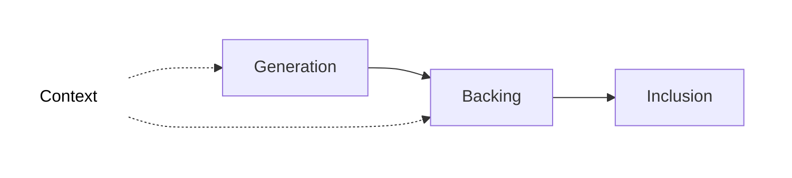
### Context

To build a parablock during the generation and backing stages, collators and validators require access to the state context of the parachain. This context is derived from two sources:

  - **Relay Parent**: The relay chain block to which the parablock is anchored. Note that the relay parent of a parablock is always different from the relay chain block that eventually includes it. This context source resides on the relay chain.

  - **Unincluded Segments**: Chains of candidate parablocks that have not yet been included in the relay chain. These segments represent sequences of block ancestors and may contain candidates at any stage pre-inclusion. A key feature enabled by [async backing](/reference/parachains/consensus/async-backing){target=\_blank} is that collators can build new parablocks on top of these unincluded ancestors rather than being limited to ancestors already included in the relay chain state. This context source resides on the collators.

### Generation

Collators execute their blockchain core functionality to generate a new block, producing a [proof-of-validity](https://wiki.polkadot.com/general/glossary/#proof-of-validity){target=\_blank} (PoV), which is passed to validators selected for backing. The PoV is composed of:

  - A list of state transitions called the **block candidate**
  - The values in the parachain's database that the block modifies
  - The hashes of the unaffected points in the Merkle tree


### Backing 

A subset of active validators verify that the parablock follows the state transition rules of the parachain and sign a [validity statement](https://paritytech.github.io/polkadot-sdk/book/types/backing.html?#validity-attestation){target=\_blank} about the PoV which can have a positive or negative outcome. With enough positive statements (at least 2/3 of assigned validators), the candidate is considered backable. It is then noted in a fork on the relay chain, at which point it is considered backed, ready for the next stage of the pipeline.

### Inclusion

 Validators gossip [erasure code chunks](https://paritytech.github.io/polkadot-sdk/book/types/availability.html#erasure-chunk){target=\_blank} and put the parablock through the final [approval process](https://paritytech.github.io/polkadot-sdk/book/protocol-approval.html){target=\_blank} before it is considered *included* in the relay chain.


---

Page Title: Install Polkadot SDK

- Source (raw): https://raw.githubusercontent.com/polkadot-developers/polkadot-docs/master/.ai/pages/parachains-install-polkadot-sdk.md
- Canonical (HTML): https://docs.polkadot.com/parachains/install-polkadot-sdk/
- Summary: Install all required Polkadot SDK dependencies, set up the SDK itself, and verify that it runs correctly on your machine.

# Install Polkadot SDK

This guide provides step-by-step instructions for installing the Polkadot SDK on macOS, Linux, and Windows. The installation process consists of two main parts:

- **Installing dependencies**: Setting up Rust, required system packages, and development tools.
- **Building the Polkadot SDK**: Cloning and compiling the Polkadot SDK repository.

Follow the appropriate section for your operating system to ensure all necessary tools are installed and configured properly.

## Install Dependencies: macOS

You can install Rust and set up a Substrate development environment on Apple macOS computers with Intel or Apple M1 processors.

### Before You Begin {: #before-you-begin-mac-os }

Before you install Rust and set up your development environment on macOS, verify that your computer meets the following basic requirements:

- Operating system version is 10.7 Lion or later.
- Processor speed of at least 2 GHz. Note that 3 GHz is recommended.
- Memory of at least 8 GB RAM. Note that 16 GB is recommended.
- Storage of at least 10 GB of available space.
- Broadband Internet connection.

### Install Homebrew

In most cases, you should use Homebrew to install and manage packages on macOS computers. If you don't already have Homebrew installed on your local computer, you should download and install it before continuing.

To install Homebrew:

1. Open the Terminal application.
2. Download and install Homebrew by running the following command:

    ```bash
    /bin/bash -c "$(curl -fsSL https://raw.githubusercontent.com/Homebrew/install/master/install.sh)"
    ```

3. Verify Homebrew has been successfully installed by running the following command:

    ```bash
    brew --version
    ```

    The command displays output similar to the following:

    <div id="termynal" data-termynal markdown>
      <span data-ty="input"><span class="file-path"></span>brew --version</span>
      <span data-ty>Homebrew 4.3.15</span>
    </div>

### Support for Apple Silicon

Protobuf must be installed before the build process can begin. To install it, run the following command:

```bash
brew install protobuf
```

### Install Required Packages and Rust {: #install-required-packages-and-rust-mac-os }

Because the blockchain requires standard cryptography to support the generation of public/private key pairs and the validation of transaction signatures, you must also have a package that provides cryptography, such as `openssl`.

To install `openssl` and the Rust toolchain on macOS:

1. Open the Terminal application.
2. Ensure you have an updated version of Homebrew by running the following command:

    ```bash
    brew update
    ```

3. Install the `openssl` package by running the following command:

    ```bash
    brew install openssl
    ```

4. Download the `rustup` installation program and use it to install Rust by running the following command:

    ```bash
    curl --proto '=https' --tlsv1.2 -sSf https://sh.rustup.rs | sh
    ```

5. Follow the prompts displayed to proceed with a default installation.
6. Update your current shell to include Cargo by running the following command:

    ```bash
    source ~/.cargo/env
    ```

7. Configure the Rust toolchain to default to the latest stable version by running the following commands:

    ```bash
    rustup default stable
    rustup update
    rustup target add wasm32-unknown-unknown
    rustup component add rust-src
    ```

8. Install `cmake` using the following command:

    ```bash
    brew install cmake
    ```

9. Proceed to [Build the Polkadot SDK](#build-the-polkadot-sdk).

## Install Dependencies: Linux

Rust supports most Linux distributions. Depending on the specific distribution and version of the operating system you use, you might need to add some software dependencies to your environment. In general, your development environment should include a linker or a C-compatible compiler, such as `clang`, and an appropriate integrated development environment (IDE).

### Before You Begin {: #before-you-begin-linux }

Check the documentation for your operating system for information about the installed packages and how to download and install any additional packages you might need. For example, if you use Ubuntu, you can use the Ubuntu Advanced Packaging Tool (`apt`) to install the `build-essential` package:

```bash
sudo apt install build-essential
```

At a minimum, you need the following packages before you install Rust:

```text
clang curl git make
```

Because the blockchain requires standard cryptography to support the generation of public/private key pairs and the validation of transaction signatures, you must also have a package that provides cryptography, such as `libssl-dev` or `openssl-devel`.

### Install Required Packages and Rust {: #install-required-packages-and-rust-linux }

To install the Rust toolchain on Linux:

1. Open a terminal shell.
2. Check the packages installed on the local computer by running the appropriate package management command for your Linux distribution.
3. Add any package dependencies you are missing to your local development environment by running the appropriate package management command for your Linux distribution:

    === "Ubuntu"

        ```bash
        sudo apt install --assume-yes git clang curl libssl-dev protobuf-compiler
        ```

    === "Debian"

        ```sh
        sudo apt install --assume-yes git clang curl libssl-dev llvm libudev-dev make protobuf-compiler
        ```

    === "Arch"

        ```sh
        pacman -Syu --needed --noconfirm curl git clang make protobuf
        ```

    === "Fedora"

        ```sh
        sudo dnf update
        sudo dnf install clang curl git openssl-devel make protobuf-compiler
        ```

    === "OpenSUSE"

        ```sh
        sudo zypper install clang curl git openssl-devel llvm-devel libudev-devel make protobuf
        ```

    Remember that different distributions might use different package managers and bundle packages in different ways. For example, depending on your installation selections, Ubuntu Desktop and Ubuntu Server might have different packages and different requirements. However, the packages listed in the command-line examples are applicable to many common Linux distributions, including Debian, Linux Mint, MX Linux, and Elementary OS.

4. Download the `rustup` installation program and use it to install Rust by running the following command:

    ```bash
    curl --proto '=https' --tlsv1.2 -sSf https://sh.rustup.rs | sh
    ```

5. Follow the prompts displayed to proceed with a default installation.
6. Update your current shell to include Cargo by running the following command:

    ```bash
    source $HOME/.cargo/env
    ```

7. Verify your installation by running the following command:

    ```bash
    rustc --version
    ```

8. Configure the Rust toolchain to default to the latest stable version by running the following commands:

    ```bash
    rustup default stable
    rustup update
    rustup target add wasm32-unknown-unknown
    rustup component add rust-src
    ```

9. Proceed to [Build the Polkadot SDK](#build-the-polkadot-sdk).

## Install Dependencies: Windows (WSL)

In general, UNIX-based operating systems—like macOS or Linux—provide a better development environment for building Substrate-based blockchains.

However, suppose your local computer uses Microsoft Windows instead of a UNIX-based operating system. In that case, you can configure it with additional software to make it a suitable development environment for building Substrate-based blockchains. To prepare a development environment on a Microsoft Windows computer, you can use Windows Subsystem for Linux (WSL) to emulate a UNIX operating environment.

### Before You Begin {: #before-you-begin-windows-wls }

Before installing on Microsoft Windows, verify the following basic requirements:

- You have a computer running a supported Microsoft Windows operating system:
    - **For Windows desktop**: You must be running Microsoft Windows 10, version 2004 or later, or Microsoft Windows 11 to install WSL.
    - **For Windows server**: You must be running Microsoft Windows Server 2019, or later, to install WSL on a server operating system.
- You have a good internet connection and access to a shell terminal on your local computer.

### Set Up Windows Subsystem for Linux

WSL enables you to emulate a Linux environment on a computer that uses the Windows operating system. The primary advantage of this approach for Substrate development is that you can use all of the code and command-line examples as described in the Substrate documentation. For example, you can run common commands—such as `ls` and `ps`—unmodified. By using WSL, you can avoid configuring a virtual machine image or a dual-boot operating system.

To prepare a development environment using WSL:

1. Check your Windows version and build number to see if WSL is enabled by default.

    If you have Microsoft Windows 10, version 2004 (Build 19041 and higher), or Microsoft Windows 11, WSL is available by default and you can continue to the next step.

    If you have an older version of Microsoft Windows installed, see the [WSL manual installation steps for older versions](https://learn.microsoft.com/en-us/windows/wsl/install-manual){target=\_blank}. If you are installing on an older version of Microsoft Windows, you can download and install WLS 2 if your computer has Windows 10, version 1903 or higher.

2. Select **Windows PowerShell** or **Command Prompt** from the **Start** menu, right-click, then **Run as administrator**.

3. In the PowerShell or Command Prompt terminal, run the following command:

    ```bash
    wsl --install
    ```

    This command enables the required WSL 2 components that are part of the Windows operating system, downloads the latest Linux kernel, and installs the Ubuntu Linux distribution by default.

    If you want to review the other Linux distributions available, run the following command:

    ```bash
    wsl --list --online
    ```

4. After the distribution is downloaded, close the terminal.

5. Click the **Start** menu, select **Shut down or sign out**, then click **Restart** to restart the computer.

    Restarting the computer is required to start the installation of the Linux distribution. It can take a few minutes for the installation to complete after you restart.

    For more information about setting up WSL as a development environment, see the [Set up a WSL development environment](https://learn.microsoft.com/en-us/windows/wsl/setup/environment){target=\_blank} docs.

### Install Required Packages and Rust {: #install-required-packages-and-rust-windows-wls }

To install the Rust toolchain on WSL:

1. Click the **Start** menu, then select **Ubuntu**.
2. Type a UNIX user name to create a user account.
3. Type a password for your UNIX user, then retype the password to confirm it.
4. Download the latest updates for the Ubuntu distribution using the Ubuntu Advanced Packaging Tool (`apt`) by running the following command:

    ```bash
    sudo apt update
    ```

5. Add the required packages for the Ubuntu distribution by running the following command:

    ```bash
    sudo apt install --assume-yes git clang curl libssl-dev llvm libudev-dev make protobuf-compiler
    ```

6. Download the `rustup` installation program and use it to install Rust for the Ubuntu distribution by running the following command:

    ```bash
    curl --proto '=https' --tlsv1.2 -sSf https://sh.rustup.rs | sh
    ```

7. Follow the prompts displayed to proceed with a default installation.

8. Update your current shell to include Cargo by running the following command:

    ```bash
    source ~/.cargo/env
    ```

9. Verify your installation by running the following command:

    ```bash
    rustc --version
    ```

10. Configure the Rust toolchain to use the latest stable version as the default toolchain by running the following commands:

    ```bash
    rustup default stable
    rustup update
    rustup target add wasm32-unknown-unknown
    rustup component add rust-src
    ```

11. Proceed to [Build the Polkadot SDK](#build-the-polkadot-sdk).

## Build the Polkadot SDK

After installing all dependencies, you can now clone and compile the Polkadot SDK repository to verify your setup.

### Clone the Polkadot SDK

1. Clone the Polkadot SDK repository:

    ```bash
    git clone https://github.com/paritytech/polkadot-sdk.git
    ```

2. Navigate into the project directory:

    ```bash
    cd polkadot-sdk
    ```

### Compile the Polkadot SDK

Compile the entire Polkadot SDK repository to ensure your environment is properly configured:

```bash
cargo build --release --locked
```

!!!note
    This initial compilation will take significant time, depending on your machine specifications. It compiles all components of the Polkadot SDK to verify your toolchain is correctly configured.

### Verify the Build

Once the build completes successfully, verify the installation by checking the compiled binaries:

```bash
ls target/release
```

You should see several binaries, including:

- `polkadot`: The Polkadot relay chain node.
- `polkadot-parachain`: The parachain collator node.
- `polkadot-omni-node`:The omni node for running parachains.
- `substrate-node`: The kitchensink node with many pre-configured pallets.

Verify the Polkadot binary works by checking its version:

```bash
./target/release/polkadot --version
```

This should display version information similar to:

```bash
polkadot 1.16.0-1234abcd567
```

If you see the version output without errors, your development environment is correctly configured and ready for Polkadot SDK development!

## Optional: Run the Kitchensink Node

The Polkadot SDK includes a feature-rich node called "kitchensink" located at `substrate/bin/node`. This node comes pre-configured with many pallets and features from the Polkadot SDK, making it an excellent reference for exploring capabilities and understanding how different components work together.

!!!note
    If you've already compiled the Polkadot SDK in the previous step, the `substrate-node` binary is already built and ready to use. You can skip directly to running the node.

### Run the Kitchensink Node in Development Mode

From the `polkadot-sdk` root directory, start the kitchensink node in development mode:

```bash
./target/release/substrate-node --dev
```

The `--dev` flag enables development mode, which:

- Runs a single-node development chain.
- Produces and finalizes blocks automatically.
- Uses pre-configured development accounts (Alice, Bob, etc.).
- Deletes all data when stopped, ensuring a clean state on restart.


You should see log output indicating the node is running and producing blocks, with increasing block numbers after `finalized`.

### Interact with the Kitchensink Node

The kitchensink node is accessible at `ws://localhost:9944`. Open [Polkadot.js Apps](https://polkadot.js.org/apps/#/explorer){target=\_blank} in your browser to explore its features and connect to the local node.

1. Click the network icon in the top left corner.
2. Scroll to **Development** and select **Local Node**.
3. Click **Switch** to connect to your local node.


Once connected, the interface updates its color scheme to indicate a successful connection to the local node.


You can now explore the various pallets and features included in the kitchensink node, making it a valuable reference as you develop your own blockchain applications.

To stop the node, press `Control-C` in the terminal.

## Where to Go Next

<div class="grid cards" markdown>

-   __Get Started with Parachain Development__

    ---

    Practical examples and tutorials for building and deploying Polkadot parachains, covering everything from launch to customization and cross-chain messaging.

    [:octicons-arrow-right-24: Get Started](/parachains/get-started/)
 
</div>


---

Page Title: Interoperability

- Source (raw): https://raw.githubusercontent.com/polkadot-developers/polkadot-docs/master/.ai/pages/reference-parachains-interoperability.md
- Canonical (HTML): https://docs.polkadot.com/reference/parachains/interoperability/
- Summary: Explore the importance of interoperability in the Polkadot ecosystem, covering XCM, bridges, and cross-chain communication.

# Interoperability

## Introduction

Interoperability lies at the heart of the Polkadot ecosystem, enabling communication and collaboration across a diverse range of blockchains. By bridging the gaps between parachains, relay chains, and even external networks, Polkadot unlocks the potential for truly decentralized applications, efficient resource sharing, and scalable solutions.

Polkadot’s design ensures that blockchains can transcend their individual limitations by working together as part of a unified system. This cooperative architecture is what sets Polkadot apart in the blockchain landscape.

## Why Interoperability Matters

The blockchain ecosystem is inherently fragmented. Different blockchains excel in specialized domains such as finance, gaming, or supply chain management, but these chains function in isolation without interoperability. This lack of connectivity stifles the broader utility of blockchain technology.

Interoperability solves this problem by enabling blockchains to:

- **Collaborate across networks**: Chains can interact to share assets, functionality, and data, creating synergies that amplify their individual strengths.
- **Achieve greater scalability**: Specialized chains can offload tasks to others, optimizing performance and resource utilization.
- **Expand use-case potential**: Cross-chain applications can leverage features from multiple blockchains, unlocking novel user experiences and solutions.

In the Polkadot ecosystem, interoperability transforms a collection of isolated chains into a cohesive, efficient network, pushing the boundaries of what blockchains can achieve together.

## Key Mechanisms for Interoperability

At the core of Polkadot's cross-chain collaboration are foundational technologies designed to break down barriers between networks. These mechanisms empower blockchains to communicate, share resources, and operate as a cohesive ecosystem.

### Cross-Consensus Messaging (XCM): The Backbone of Communication

Polkadot's Cross-Consensus Messaging (XCM) is the standard framework for interaction between parachains, relay chains, and, eventually, external blockchains. XCM provides a trustless, secure messaging format for exchanging assets, sharing data, and executing cross-chain operations.

Through XCM, decentralized applications can:

- Transfer tokens and other assets across chains.
- Coordinate complex workflows that span multiple blockchains.
- Enable seamless user experiences where underlying blockchain differences are invisible.
- XCM exemplifies Polkadot’s commitment to creating a robust and interoperable ecosystem.

For further information about XCM, check the [Get Started with XCM](/parachains/interoperability/get-started/){target=\_blank} article.

### Bridges: Connecting External Networks

While XCM enables interoperability within the Polkadot ecosystem, bridges extend this functionality to external blockchains such as Ethereum and Bitcoin. By connecting these networks, bridges allow Polkadot-based chains to access external liquidity, additional functionalities, and broader user bases.

With bridges, developers and users gain the ability to:

- Integrate external assets into Polkadot-based applications.
- Combine the strengths of Polkadot’s scalability with the liquidity of other networks.
- Facilitate accurate multi-chain applications that transcend ecosystem boundaries.

For more information about bridges in the Polkadot ecosystem, see the [Bridge Hub](/reference/polkadot-hub/bridging/){target=\_blank} guide.

## The Polkadot Advantage

Polkadot was purpose-built for interoperability. Unlike networks that add interoperability as an afterthought, Polkadot integrates it as a fundamental design principle. This approach offers several distinct advantages:

- **Developer empowerment**: Polkadot’s interoperability tools allow developers to build applications that leverage multiple chains’ capabilities without added complexity.
- **Enhanced ecosystem collaboration**: Chains in Polkadot can focus on their unique strengths while contributing to the ecosystem’s overall growth.
- **Future-proofing blockchain**: By enabling seamless communication, Polkadot ensures its ecosystem can adapt to evolving demands and technologies.

## Looking Ahead

Polkadot’s vision of interoperability extends beyond technical functionality, representing a shift towards a more collaborative blockchain landscape. By enabling chains to work together, Polkadot fosters innovation, efficiency, and accessibility, paving the way for a decentralized future where blockchains are not isolated competitors but interconnected collaborators.


---

Page Title: JSON-RPC APIs

- Source (raw): https://raw.githubusercontent.com/polkadot-developers/polkadot-docs/master/.ai/pages/smart-contracts-for-eth-devs-json-rpc-apis.md
- Canonical (HTML): https://docs.polkadot.com/smart-contracts/for-eth-devs/json-rpc-apis/
- Summary: JSON-RPC APIs guide for Polkadot Hub, covering supported methods, parameters, and examples for interacting with the chain.

# JSON-RPC APIs

## Introduction

Polkadot Hub provides Ethereum compatibility through its JSON-RPC interface, allowing developers to interact with the chain using familiar Ethereum tooling and methods. This document outlines the supported [Ethereum JSON-RPC methods](https://ethereum.org/developers/docs/apis/json-rpc/#json-rpc-methods){target=\_blank} and provides examples of how to use them.

This guide uses the Polkadot Hub TestNet endpoint:

```text
https://testnet-passet-hub-eth-rpc.polkadot.io
```

## Available Methods

### eth_accounts

Returns a list of addresses owned by the client. [Reference](https://ethereum.org/developers/docs/apis/json-rpc/#eth_accounts){target=\_blank}.

**Parameters**:

None.

**Example**:

```bash title="eth_accounts"
curl -X POST https://testnet-passet-hub-eth-rpc.polkadot.io \
-H "Content-Type: application/json" \
--data '{
    "jsonrpc":"2.0",
    "method":"eth_accounts",
    "params":[],
    "id":1
}'
```

---

### eth_blockNumber

Returns the number of the most recent block. [Reference](https://ethereum.org/developers/docs/apis/json-rpc/#eth_blocknumber){target=\_blank}.

**Parameters**:

None.

**Example**:

```bash title="eth_blockNumber"
curl -X POST https://testnet-passet-hub-eth-rpc.polkadot.io \
-H "Content-Type: application/json" \
--data '{
    "jsonrpc":"2.0",
    "method":"eth_blockNumber",
    "params":[],
    "id":1
}'
```

---

### eth_call

Executes a new message call immediately without creating a transaction. [Reference](https://ethereum.org/developers/docs/apis/json-rpc/#eth_call){target=\_blank}.

**Parameters**:

- **`transaction` ++"object"++**: The transaction call object.
    - **`to` ++"string"++**: Recipient address of the call. Must be a [20-byte data](https://ethereum.org/developers/docs/apis/json-rpc/#unformatted-data-encoding){target=\_blank} string.
    - **`data` ++"string"++**: Hash of the method signature and encoded parameters. Must be a [data](https://ethereum.org/developers/docs/apis/json-rpc/#unformatted-data-encoding){target=\_blank} string.
    - **`from` ++"string"++**: (Optional) Sender's address for the call. Must be a [20-byte data](https://ethereum.org/developers/docs/apis/json-rpc/#unformatted-data-encoding){target=\_blank} string.
    - **`gas` ++"string"++**: (Optional) Gas limit to execute the call. Must be a [quantity](https://ethereum.org/developers/docs/apis/json-rpc/#quantities-encoding){target=\_blank} string.
    - **`gasPrice` ++"string"++**: (Optional) Gas price per unit of gas. Must be a [quantity](https://ethereum.org/developers/docs/apis/json-rpc/#quantities-encoding){target=\_blank} string.
    - **`value` ++"string"++**: (Optional) Value in wei to send with the call. Must be a [quantity](https://ethereum.org/developers/docs/apis/json-rpc/#quantities-encoding){target=\_blank} string.
- **`blockValue` ++"string"++**: (Optional) Block tag or block number to execute the call at. Must be a [quantity](https://ethereum.org/developers/docs/apis/json-rpc/#quantities-encoding){target=\_blank} string or a [default block parameter](https://ethereum.org/developers/docs/apis/json-rpc/#default-block){target=\_blank}.

**Example**:

```bash title="eth_call"
curl -X POST https://testnet-passet-hub-eth-rpc.polkadot.io \
-H "Content-Type: application/json" \
--data '{
    "jsonrpc":"2.0",
    "method":"eth_call",
    "params":[{
        "to": "INSERT_RECIPIENT_ADDRESS",
        "data": "INSERT_ENCODED_CALL"
    }, "INSERT_BLOCK_VALUE"],
    "id":1
}'
```

Ensure to replace the `INSERT_RECIPIENT_ADDRESS`, `INSERT_ENCODED_CALL`, and `INSERT_BLOCK_VALUE` with the proper values.

---

### eth_chainId

Returns the chain ID used for signing transactions. [Reference](https://ethereum.org/developers/docs/apis/json-rpc/#eth_chainid){target=\_blank}.

**Parameters**:

None.

**Example**:

```bash title="eth_chainId"
curl -X POST https://testnet-passet-hub-eth-rpc.polkadot.io \
-H "Content-Type: application/json" \
--data '{
    "jsonrpc":"2.0",
    "method":"eth_chainId",
    "params":[],
    "id":1
}'
```

---

### eth_estimateGas

Estimates gas required for a transaction. [Reference](https://ethereum.org/developers/docs/apis/json-rpc/#eth_estimategas){target=\_blank}.

**Parameters**:

- **`transaction` ++"object"++**: The transaction call object.
    - **`to` ++"string"++**: Recipient address of the call. Must be a [20-byte data](https://ethereum.org/developers/docs/apis/json-rpc/#unformatted-data-encoding){target=\_blank} string.
    - **`data` ++"string"++**: Hash of the method signature and encoded parameters. Must be a [data](https://ethereum.org/developers/docs/apis/json-rpc/#unformatted-data-encoding){target=\_blank} string.
    - **`from` ++"string"++**: (Optional) Sender's address for the call. Must be a [20-byte data](https://ethereum.org/developers/docs/apis/json-rpc/#unformatted-data-encoding){target=\_blank} string.
    - **`gas` ++"string"++**: (Optional) Gas limit to execute the call. Must be a [quantity](https://ethereum.org/developers/docs/apis/json-rpc/#quantities-encoding){target=\_blank} string.
    - **`gasPrice` ++"string"++**: (Optional) Gas price per unit of gas. Must be a [quantity](https://ethereum.org/developers/docs/apis/json-rpc/#quantities-encoding){target=\_blank} string.
    - **`value` ++"string"++**: (Optional) Value in wei to send with the call. Must be a [quantity](https://ethereum.org/developers/docs/apis/json-rpc/#quantities-encoding){target=\_blank} string.
- **`blockValue` ++"string"++**: (Optional) Block tag or block number to execute the call at. Must be a [quantity](https://ethereum.org/developers/docs/apis/json-rpc/#quantities-encoding){target=\_blank} string or a [default block parameter](https://ethereum.org/developers/docs/apis/json-rpc/#default-block){target=\_blank}.

**Example**:

```bash title="eth_estimateGas"
curl -X POST https://testnet-passet-hub-eth-rpc.polkadot.io \
-H "Content-Type: application/json" \
--data '{
    "jsonrpc":"2.0",
    "method":"eth_estimateGas",
    "params":[{
        "to": "INSERT_RECIPIENT_ADDRESS",
        "data": "INSERT_ENCODED_FUNCTION_CALL"
    }],
    "id":1
}'
```

Ensure to replace the `INSERT_RECIPIENT_ADDRESS` and `INSERT_ENCODED_CALL` with the proper values.

---

### eth_gasPrice

Returns the current gas price in Wei. [Reference](https://ethereum.org/developers/docs/apis/json-rpc/#eth_gasprice){target=\_blank}.

**Parameters**:

None.

**Example**:

```bash title="eth_gasPrice"
curl -X POST https://testnet-passet-hub-eth-rpc.polkadot.io \
-H "Content-Type: application/json" \
--data '{
    "jsonrpc":"2.0",
    "method":"eth_gasPrice",
    "params":[],
    "id":1
}'
```

---

### eth_getBalance

Returns the balance of a given address. [Reference](https://ethereum.org/developers/docs/apis/json-rpc/#eth_getbalance){target=\_blank}.

**Parameters**:

- **`address` ++"string"++**: Address to query balance. Must be a [20-byte data](https://ethereum.org/developers/docs/apis/json-rpc/#unformatted-data-encoding){target=\_blank} string.
- **`blockValue` ++"string"++**: (Optional) The block value to be fetched. Must be a [quantity](https://ethereum.org/developers/docs/apis/json-rpc/#quantities-encoding){target=\_blank} string or a [default block parameter](https://ethereum.org/developers/docs/apis/json-rpc/#default-block){target=\_blank}.

**Example**:

```bash title="eth_getBalance"
curl -X POST https://testnet-passet-hub-eth-rpc.polkadot.io \
-H "Content-Type: application/json" \
--data '{
    "jsonrpc":"2.0",
    "method":"eth_getBalance",
    "params":["INSERT_ADDRESS", "INSERT_BLOCK_VALUE"],
    "id":1
}'
```

Ensure to replace the `INSERT_ADDRESS` and `INSERT_BLOCK_VALUE` with the proper values.

---

### eth_getBlockByHash

Returns information about a block by its hash. [Reference](https://ethereum.org/developers/docs/apis/json-rpc/#eth_getblockbyhash){target=\_blank}.

**Parameters**:

- **`blockHash` ++"string"++**: The hash of the block to retrieve. Must be a [32 byte data](https://ethereum.org/developers/docs/apis/json-rpc/#unformatted-data-encoding){target=\_blank} string.
- **`fullTransactions` ++"boolean"++**: If `true`, returns full transaction details; if `false`, returns only transaction hashes.

**Example**:

```bash title="eth_getBlockByHash"
curl -X POST https://testnet-passet-hub-eth-rpc.polkadot.io \
-H "Content-Type: application/json" \
--data '{
    "jsonrpc":"2.0",
    "method":"eth_getBlockByHash",
    "params":["INSERT_BLOCK_HASH", INSERT_BOOLEAN],
    "id":1
}'
```

Ensure to replace the `INSERT_BLOCK_HASH` and `INSERT_BOOLEAN` with the proper values.

---

### eth_getBlockByNumber

Returns information about a block by its number. [Reference](https://ethereum.org/developers/docs/apis/json-rpc/#eth_getblockbynumber){target=\_blank}.

**Parameters**:

- **`blockValue` ++"string"++**: (Optional) The block value to be fetched. Must be a [quantity](https://ethereum.org/developers/docs/apis/json-rpc/#quantities-encoding){target=\_blank} string or a [default block parameter](https://ethereum.org/developers/docs/apis/json-rpc/#default-block){target=\_blank}.
- **`fullTransactions` ++"boolean"++**: If `true`, returns full transaction details; if `false`, returns only transaction hashes.

**Example**:

```bash title="eth_getBlockByNumber"
curl -X POST https://testnet-passet-hub-eth-rpc.polkadot.io \
-H "Content-Type: application/json" \
--data '{
    "jsonrpc":"2.0",
    "method":"eth_getBlockByNumber",
    "params":["INSERT_BLOCK_VALUE", INSERT_BOOLEAN],
    "id":1
}'
```

Ensure to replace the `INSERT_BLOCK_VALUE` and `INSERT_BOOLEAN` with the proper values.

---

### eth_getBlockTransactionCountByNumber

Returns the number of transactions in a block from a block number. [Reference](https://ethereum.org/developers/docs/apis/json-rpc/#eth_getblocktransactioncountbynumber){target=\_blank}.

**Parameters**:

- **`blockValue` ++"string"++**: The block value to be fetched. Must be a [quantity](https://ethereum.org/developers/docs/apis/json-rpc/#quantities-encoding){target=\_blank} string or a [default block parameter](https://ethereum.org/developers/docs/apis/json-rpc/#default-block){target=\_blank}.

**Example**:

```bash title="eth_getBlockTransactionCountByNumber"
curl -X POST https://testnet-passet-hub-eth-rpc.polkadot.io \
-H "Content-Type: application/json" \
--data '{
    "jsonrpc":"2.0",
    "method":"eth_getBlockTransactionCountByNumber",
    "params":["INSERT_BLOCK_VALUE"],
    "id":1
}'
```

Ensure to replace the `INSERT_BLOCK_VALUE` with the proper values.

---

### eth_getBlockTransactionCountByHash

Returns the number of transactions in a block from a block hash. [Reference](https://ethereum.org/developers/docs/apis/json-rpc/#eth_getblocktransactioncountbyhash){target=\_blank}.

**Parameters**:

- **`blockHash` ++"string"++**: The hash of the block to retrieve. Must be a [32 byte data](https://ethereum.org/developers/docs/apis/json-rpc/#unformatted-data-encoding){target=\_blank} string.

**Example**:

```bash title="eth_getBlockTransactionCountByHash"
curl -X POST https://testnet-passet-hub-eth-rpc.polkadot.io \
-H "Content-Type: application/json" \
--data '{
    "jsonrpc":"2.0",
    "method":"eth_getBlockTransactionCountByHash",
    "params":["INSERT_BLOCK_HASH"],
    "id":1
}'
```

Ensure to replace the `INSERT_BLOCK_HASH` with the proper values.

---

### eth_getCode

Returns the code at a given address. [Reference](https://ethereum.org/developers/docs/apis/json-rpc/#eth_getcode){target=\_blank}.

**Parameters**:

- **`address` ++"string"++**: Contract or account address to query code. Must be a [20-byte data](https://ethereum.org/developers/docs/apis/json-rpc/#unformatted-data-encoding){target=\_blank} string.
- **`blockValue` ++"string"++**: (Optional) The block value to be fetched. Must be a [quantity](https://ethereum.org/developers/docs/apis/json-rpc/#quantities-encoding){target=\_blank} string or a [default block parameter](https://ethereum.org/developers/docs/apis/json-rpc/#default-block).

**Example**:

```bash title="eth_getCode"
curl -X POST https://testnet-passet-hub-eth-rpc.polkadot.io \
-H "Content-Type: application/json" \
--data '{
    "jsonrpc":"2.0",
    "method":"eth_getCode",
    "params":["INSERT_ADDRESS", "INSERT_BLOCK_VALUE"],
    "id":1
}'
```

Ensure to replace the `INSERT_ADDRESS` and `INSERT_BLOCK_VALUE` with the proper values.

---

### eth_getLogs

Returns an array of all logs matching a given filter object. [Reference](https://ethereum.org/developers/docs/apis/json-rpc/#eth_getlogs){target=\_blank}.

**Parameters**:

- **`filter` ++"object"++**: The filter object.
    - **`fromBlock` ++"string"++**: (Optional) Block number or tag to start from. Must be a [quantity](https://ethereum.org/developers/docs/apis/json-rpc/#quantities-encoding){target=\_blank} string or a [default block parameter](https://ethereum.org/developers/docs/apis/json-rpc/#default-block){target=\_blank}.
    - **`toBlock` ++"string"++**: (Optional) Block number or tag to end at. Must be a [quantity](https://ethereum.org/developers/docs/apis/json-rpc/#quantities-encoding){target=\_blank} string or a [default block parameter](https://ethereum.org/developers/docs/apis/json-rpc/#default-block){target=\_blank}.
    - **`address` ++"string" or "array of strings"++**: (Optional) Contract address or a list of addresses from which to get logs. Must be a [20-byte data](https://ethereum.org/developers/docs/apis/json-rpc/#unformatted-data-encoding){target=\_blank} string.
    - **`topics` ++"array of strings"++**: (Optional) Array of topics for filtering logs. Each topic can be a single [32 byte data](https://ethereum.org/developers/docs/apis/json-rpc/#unformatted-data-encoding){target=\_blank} string or an array of such strings (meaning OR).
    - **`blockhash` ++"string"++**: (Optional) Hash of a specific block. Cannot be used with `fromBlock` or `toBlock`. Must be a [32 byte data](https://ethereum.org/developers/docs/apis/json-rpc/#unformatted-data-encoding){target=\_blank} string.

**Example**:

```bash title="eth_getLogs"
curl -X POST https://testnet-passet-hub-eth-rpc.polkadot.io \
-H "Content-Type: application/json" \
--data '{
    "jsonrpc":"2.0",
    "method":"eth_getLogs",
    "params":[{
        "fromBlock": "latest",
        "toBlock": "latest"
    }],
    "id":1
}'
```

---

### eth_getStorageAt

Returns the value from a storage position at a given address. [Reference](https://ethereum.org/developers/docs/apis/json-rpc/#eth_getstorageat){target=\_blank}.

**Parameters**:

- **`address` ++"string"++**: Contract or account address to query code. Must be a [20-byte data](https://ethereum.org/developers/docs/apis/json-rpc/#unformatted-data-encoding){target=\_blank} string.
- **`storageKey` ++"string"++**: Position in storage to retrieve data from. Must be a [quantity](https://ethereum.org/developers/docs/apis/json-rpc/#quantities-encoding){target=\_blank} string.
- **`blockValue` ++"string"++**: (Optional) The block value to be fetched. Must be a [quantity](https://ethereum.org/developers/docs/apis/json-rpc/#quantities-encoding){target=\_blank} string or a [default block parameter](https://ethereum.org/developers/docs/apis/json-rpc/#default-block).

**Example**:

```bash title="eth_getStorageAt"
curl -X POST https://testnet-passet-hub-eth-rpc.polkadot.io \
-H "Content-Type: application/json" \
--data '{
    "jsonrpc":"2.0",
    "method":"eth_getStorageAt",
    "params":["INSERT_ADDRESS", "INSERT_STORAGE_KEY", "INSERT_BLOCK_VALUE"],
    "id":1
}'
```

Ensure to replace the `INSERT_ADDRESS`, `INSERT_STORAGE_KEY`, and `INSERT_BLOCK_VALUE` with the proper values.

---

### eth_getTransactionCount

Returns the number of transactions sent from an address (nonce). [Reference](https://ethereum.org/developers/docs/apis/json-rpc/#eth_gettransactioncount){target=\_blank}.

**Parameters**:

- **`address` ++"string"++**: Address to query balance. Must be a [20-byte data](https://ethereum.org/developers/docs/apis/json-rpc/#unformatted-data-encoding){target=\_blank} string.
- **`blockValue` ++"string"++**: (Optional) The block value to be fetched. Must be a [quantity](https://ethereum.org/developers/docs/apis/json-rpc/#quantities-encoding){target=\_blank} string or a [default block parameter](https://ethereum.org/developers/docs/apis/json-rpc/#default-block).

**Example**:

```bash title="eth_getTransactionCount"
curl -X POST https://testnet-passet-hub-eth-rpc.polkadot.io \
-H "Content-Type: application/json" \
--data '{
    "jsonrpc":"2.0",
    "method":"eth_getTransactionCount",
    "params":["INSERT_ADDRESS", "INSERT_BLOCK_VALUE"],
    "id":1
}'
```

Ensure to replace the `INSERT_ADDRESS` and `INSERT_BLOCK_VALUE` with the proper values.

---

### eth_getTransactionByHash

Returns information about a transaction by its hash. [Reference](https://ethereum.org/developers/docs/apis/json-rpc/#eth_gettransactionbyhash){target=\_blank}.

**Parameters**:

- **`transactionHash` ++"string"++**: The hash of the transaction. Must be a [32 byte data](https://ethereum.org/developers/docs/apis/json-rpc/#unformatted-data-encoding){target=\_blank} string.

**Example**:

```bash title="eth_getTransactionByHash"
curl -X POST https://testnet-passet-hub-eth-rpc.polkadot.io \
-H "Content-Type: application/json" \
--data '{
    "jsonrpc":"2.0",
    "method":"eth_getTransactionByHash",
    "params":["INSERT_TRANSACTION_HASH"],
    "id":1
}'
```

Ensure to replace the `INSERT_TRANSACTION_HASH` with the proper values.

---

### eth_getTransactionByBlockNumberAndIndex

Returns information about a transaction by block number and transaction index. [Reference](https://ethereum.org/developers/docs/apis/json-rpc/#eth_gettransactionbyblocknumberandindex){target=\_blank}.

**Parameters**:

- **`blockValue` ++"string"++**: The block value to be fetched. Must be a [quantity](https://ethereum.org/developers/docs/apis/json-rpc/#quantities-encoding){target=\_blank} string or a [default block parameter](https://ethereum.org/developers/docs/apis/json-rpc/#default-block){target=\_blank}.
- **`transactionIndex` ++"string"++**: The index of the transaction in the block. Must be a [quantity](https://ethereum.org/developers/docs/apis/json-rpc/#quantities-encoding){target=\_blank} string.

**Example**:

```bash title="eth_getTransactionByBlockNumberAndIndex"
curl -X POST https://testnet-passet-hub-eth-rpc.polkadot.io \
-H "Content-Type: application/json" \
--data '{
    "jsonrpc":"2.0",
    "method":"eth_getTransactionByBlockNumberAndIndex",
    "params":["INSERT_BLOCK_VALUE", "INSERT_TRANSACTION_INDEX"],
    "id":1
}'
```

Ensure to replace the `INSERT_BLOCK_VALUE` and `INSERT_TRANSACTION_INDEX` with the proper values.

---

### eth_getTransactionByBlockHashAndIndex

Returns information about a transaction by block hash and transaction index. [Reference](https://ethereum.org/developers/docs/apis/json-rpc/#eth_gettransactionbyblockhashandindex){target=\_blank}.

**Parameters**:

- **`blockHash` ++"string"++**: The hash of the block. Must be a [32 byte data](https://ethereum.org/developers/docs/apis/json-rpc/#unformatted-data-encoding){target=\_blank} string.
- **`transactionIndex` ++"string"++**: The index of the transaction in the block. Must be a [quantity](https://ethereum.org/developers/docs/apis/json-rpc/#quantities-encoding){target=\_blank} string.

**Example**:

```bash title="eth_getTransactionByBlockHashAndIndex"
curl -X POST https://testnet-passet-hub-eth-rpc.polkadot.io \
-H "Content-Type: application/json" \
--data '{
    "jsonrpc":"2.0",
    "method":"eth_getTransactionByBlockHashAndIndex",
    "params":["INSERT_BLOCK_HASH", "INSERT_TRANSACTION_INDEX"],
    "id":1
}'
```

Ensure to replace the `INSERT_BLOCK_HASH` and `INSERT_TRANSACTION_INDEX` with the proper values.

---

### eth_getTransactionReceipt

Returns the receipt of a transaction by transaction hash. [Reference](https://ethereum.org/developers/docs/apis/json-rpc/#eth_gettransactionreceipt){target=\_blank}.

**Parameters**:

- **`transactionHash` ++"string"++**: The hash of the transaction. Must be a [32 byte data](https://ethereum.org/developers/docs/apis/json-rpc/#unformatted-data-encoding){target=\_blank} string.

**Example**:

```bash title="eth_getTransactionReceipt"
curl -X POST https://testnet-passet-hub-eth-rpc.polkadot.io \
-H "Content-Type: application/json" \
--data '{
    "jsonrpc":"2.0",
    "method":"eth_getTransactionReceipt",
    "params":["INSERT_TRANSACTION_HASH"],
    "id":1
}'
```

Ensure to replace the `INSERT_TRANSACTION_HASH` with the proper values.

---

### eth_maxPriorityFeePerGas

Returns an estimate of the current priority fee per gas, in Wei, to be included in a block.

**Parameters**:

None.

**Example**:

```bash title="eth_maxPriorityFeePerGas"
curl -X POST https://testnet-passet-hub-eth-rpc.polkadot.io \
-H "Content-Type: application/json" \
--data '{
    "jsonrpc":"2.0",
    "method":"eth_maxPriorityFeePerGas",
    "params":[],
    "id":1
}'
```

---

### eth_sendRawTransaction

Submits a raw transaction. [Reference](https://ethereum.org/developers/docs/apis/json-rpc/#eth_sendrawtransaction){target=\_blank}.

**Parameters**:

- **`callData` ++"string"++**: Signed transaction data. Must be a [data](https://ethereum.org/developers/docs/apis/json-rpc/#unformatted-data-encoding){target=\_blank} string.

**Example**:

```bash title="eth_sendRawTransaction"
curl -X POST https://testnet-passet-hub-eth-rpc.polkadot.io \
-H "Content-Type: application/json" \
--data '{
    "jsonrpc":"2.0",
    "method":"eth_sendRawTransaction",
    "params":["INSERT_CALL_DATA"],
    "id":1
}'
```

Ensure to replace the `INSERT_CALL_DATA` with the proper values.

---

### eth_sendTransaction

Creates and sends a new transaction. [Reference](https://ethereum.org/developers/docs/apis/json-rpc/#eth_sendtransaction){target=\_blank}.

**Parameters**:

- **`transaction` ++"object"++**: The transaction object.
    - **`from` ++"string"++**: Address sending the transaction. Must be a [20-byte data](https://ethereum.org/developers/docs/apis/json-rpc/#unformatted-data-encoding){target=\_blank} string.
    - **`to` ++"string"++**: (Optional) Recipient address. No need to provide this value when deploying a contract. Must be a [20-byte data](https://ethereum.org/developers/docs/apis/json-rpc/#unformatted-data-encoding){target=\_blank} string.
    - **`gas` ++"string"++**: (optional, default: `90000`) gas limit for execution. Must be a [quantity](https://ethereum.org/developers/docs/apis/json-rpc/#quantities-encoding){target=\_blank} string.
    - **`gasPrice` ++"string"++**: (Optional) Gas price per unit. Must be a [quantity](https://ethereum.org/developers/docs/apis/json-rpc/#quantities-encoding){target=\_blank} string.
    - **`value` ++"string"++**: (Optional) Amount of Ether to send. Must be a [quantity](https://ethereum.org/developers/docs/apis/json-rpc/#quantities-encoding){target=\_blank} string.
    - **`data` ++"string"++**: (Optional) Contract bytecode or encoded method call. Must be a [data](https://ethereum.org/developers/docs/apis/json-rpc/#unformatted-data-encoding){target=\_blank} string.
    - **`nonce` ++"string"++**: (Optional) Transaction nonce. Must be a [quantity](https://ethereum.org/developers/docs/apis/json-rpc/#quantities-encoding){target=\_blank} string.

**Example**:

```bash title="eth_sendTransaction"
curl -X POST https://testnet-passet-hub-eth-rpc.polkadot.io \
-H "Content-Type: application/json" \
--data '{
    "jsonrpc":"2.0",
    "method":"eth_sendTransaction",
    "params":[{
        "from": "INSERT_SENDER_ADDRESS",
        "to": "INSERT_RECIPIENT_ADDRESS",
        "gas": "INSERT_GAS_LIMIT",
        "gasPrice": "INSERT_GAS_PRICE",
        "value": "INSERT_VALUE",
        "input": "INSERT_INPUT_DATA",
        "nonce": "INSERT_NONCE"
    }],
    "id":1
}'
```

Ensure to replace the `INSERT_SENDER_ADDRESS`, `INSERT_RECIPIENT_ADDRESS`, `INSERT_GAS_LIMIT`, `INSERT_GAS_PRICE`, `INSERT_VALUE`, `INSERT_INPUT_DATA`, and `INSERT_NONCE` with the proper values.

---

### eth_syncing

Returns an object with syncing data or `false` if not syncing. [Reference](https://ethereum.org/developers/docs/apis/json-rpc/#eth_syncing){target=\_blank}.

**Parameters**:

None.

**Example**:

```bash title="eth_syncing"
curl -X POST https://testnet-passet-hub-eth-rpc.polkadot.io \
-H "Content-Type: application/json" \
--data '{
    "jsonrpc":"2.0",
    "method":"eth_syncing",
    "params":[],
    "id":1
}'
```

---

### net_listening

Returns `true` if the client is currently listening for network connections, otherwise `false`. [Reference](https://ethereum.org/developers/docs/apis/json-rpc/#net_listening){target=\_blank}.

**Parameters**:

None.

**Example**:

```bash title="net_listening"
curl -X POST https://testnet-passet-hub-eth-rpc.polkadot.io \
-H "Content-Type: application/json" \
--data '{
    "jsonrpc":"2.0",
    "method":"net_listening",
    "params":[],
    "id":1
}'
```

---

### net_peerCount

Returns the number of peers currently connected to the client.

**Parameters**:

None.

**Example**:

```bash title="net_peerCount"
curl -X POST https://testnet-passet-hub-eth-rpc.polkadot.io \
-H "Content-Type: application/json" \
--data '{
    "jsonrpc":"2.0",
    "method":"net_peerCount",
    "params":[],
    "id":1
}'
```

---

### net_version

Returns the current network ID as a string. [Reference](https://ethereum.org/developers/docs/apis/json-rpc/#net_version){target=\_blank}.

**Parameters**:

None.

**Example**:

```bash title="net_version"
curl -X POST https://testnet-passet-hub-eth-rpc.polkadot.io \
-H "Content-Type: application/json" \
--data '{
    "jsonrpc":"2.0",
    "method":"net_version",
    "params":[],
    "id":1
}'
```

---

### system_health

Returns information about the health of the system.

**Parameters**:

None.

**Example**:

```bash title="system_health"
curl -X POST https://testnet-passet-hub-eth-rpc.polkadot.io \
-H "Content-Type: application/json" \
--data '{
    "jsonrpc":"2.0",
    "method":"system_health",
    "params":[],
    "id":1
}'
```

---

### web3_clientVersion

Returns the current client version. [Reference](https://ethereum.org/developers/docs/apis/json-rpc/#web3_clientversion){target=\_blank}.

**Parameters**:

None.

**Example**:

```bash title="web3_clientVersion"
curl -X POST https://testnet-passet-hub-eth-rpc.polkadot.io \
-H "Content-Type: application/json" \
--data '{
    "jsonrpc":"2.0",
    "method":"web3_clientVersion",
    "params":[],
    "id":1
}'
```

---

### debug_traceBlockByNumber 

Traces a block's execution by its number and returns a detailed execution trace for each transaction.

**Parameters**:

- **`blockValue` ++"string"++**: The block number or tag to trace. Must be a [quantity](https://ethereum.org/developers/docs/apis/json-rpc/#quantities-encoding){target=\_blank} string or a [default block parameter](https://ethereum.org/developers/docs/apis/json-rpc/#default-block){target=\_blank}.
- **`options` ++"object"++**: (Optional) An object containing tracer options.
    - **`tracer` ++"string"++**: The name of the tracer to use (e.g., `"callTracer"`, `"opTracer"`).
    - Other tracer-specific options may be supported.

**Example**:

```bash title="debug_traceBlockByNumber"
curl -X POST https://testnet-passet-hub-eth-rpc.polkadot.io \
-H "Content-Type: application/json" \
--data '{
    "jsonrpc":"2.0",
    "method":"debug_traceBlockByNumber",
    "params":["INSERT_BLOCK_VALUE", {"tracer": "callTracer"}],
    "id":1
}'
```

Ensure to replace `INSERT_BLOCK_VALUE` with a proper block number if needed.

---

### debug_traceTransaction

Traces the execution of a single transaction by its hash and returns a detailed execution trace.

**Parameters**:

- **`transactionHash` ++"string"++**: The hash of the transaction to trace. Must be a [32 byte data](https://ethereum.org/developers/docs/apis/json-rpc/#unformatted-data-encoding){target=\_blank} string.
- **`options` ++"object"++**: (Optional) An object containing tracer options (e.g., `tracer: "callTracer"`).

**Example**:

```bash title="debug_traceTransaction"
curl -X POST https://testnet-passet-hub-eth-rpc.polkadot.io \
-H "Content-Type: application/json" \
--data '{
    "jsonrpc":"2.0",
    "method":"debug_traceTransaction",
    "params":["INSERT_TRANSACTION_HASH", {"tracer": "callTracer"}],
    "id":1
}'
```

Ensure to replace the `INSERT_TRANSACTION_HASH` with the proper value.

---

### debug_traceCall

Executes a new message call and returns a detailed execution trace without creating a transaction on the blockchain.

**Parameters**:

- **`transaction` ++"object"++**: The transaction call object, similar to `eth_call` parameters.
    - **`to` ++"string"++**: Recipient address of the call. Must be a [20-byte data](https://ethereum.org/developers/docs/apis/json-rpc/#unformatted-data-encoding){target=\_blank} string.
    - **`data` ++"string"++**: Hash of the method signature and encoded parameters. Must be a [data](https://ethereum.org/developers/docs/apis/json-rpc/#unformatted-data-encoding){target=\_blank} string.
    - **`from` ++"string"++**: (Optional) Sender's address for the call. Must be a [20-byte data](https://ethereum.org/developers/docs/apis/json-rpc/#unformatted-data-encoding){target=\_blank} string.
    - **`gas` ++"string"++**: (Optional) Gas limit to execute the call. Must be a [quantity](https://ethereum.org/developers/docs/apis/json-rpc/#quantities-encoding){target=\_blank} string.
    - **`gasPrice` ++"string"++**: (Optional) Gas price per unit of gas. Must be a [quantity](https://ethereum.org/developers/docs/apis/json-rpc/#quantities-encoding){target=\_blank} string.
    - **`value` ++"string"++**: (Optional) Value in wei to send with the call. Must be a [quantity](https://ethereum.org/developers/docs/apis/json-rpc/#quantities-encoding){target=\_blank} string.
- **`blockValue` ++"string"++**: (Optional) Block tag or block number to execute the call at. Must be a [quantity](https://ethereum.org/developers/docs/apis/json-rpc/#quantities-encoding){target=\_blank} string or a [default block parameter](https://ethereum.org/developers/docs/apis/json-rpc/#default-block){target=\_blank}.
- **`options` ++"object"++**: (Optional) An object containing tracer options (e.g., `tracer: "callTracer"`).

**Example**:

```bash title="debug_traceCall"
curl -X POST https://testnet-passet-hub-eth-rpc.polkadot.io \
-H "Content-Type: application/json" \
--data '{
    "jsonrpc":"2.0",
    "method":"debug_traceCall",
    "params":[{
        "from": "INSERT_SENDER_ADDRESS",
        "to": "INSERT_RECIPIENT_ADDRESS",
        "data": "INSERT_ENCODED_CALL"
    }, "INSERT_BLOCK_VALUE", {"tracer": "callTracer"}],
    "id":1
}'
```

Ensure to replace the `INSERT_SENDER_ADDRESS`, `INSERT_RECIPIENT_ADDRESS`, `INSERT_ENCODED_CALL`, and `INSERT_BLOCK_VALUE` with the proper value.

---

## Response Format

All responses follow the standard JSON-RPC 2.0 format:

```json
{
    "jsonrpc": "2.0",
    "id": 1,
    "result": ... // The return value varies by method
}
```

## Error Handling

If an error occurs, the response will include an error object:

```json
{
    "jsonrpc": "2.0",
    "id": 1,
    "error": {
        "code": -32000,
        "message": "Error message here"
    }
}
```


---

Page Title: Networks

- Source (raw): https://raw.githubusercontent.com/polkadot-developers/polkadot-docs/master/.ai/pages/reference-parachains-networks.md
- Canonical (HTML): https://docs.polkadot.com/reference/parachains/networks/
- Summary: Explore Polkadot's testing and production networks, including Westend, Kusama, and Paseo, for efficient development, deployment, and testing.

# Networks

## Introduction

The Polkadot ecosystem is built on a robust set of networks designed to enable secure and scalable development. Whether you are testing new features or deploying to live production, Polkadot offers several layers of networks tailored for each stage of the development process. From local environments to experimental networks like Kusama and community-run TestNets such as Paseo, developers can thoroughly test, iterate, and validate their applications. This guide will introduce you to Polkadot's various networks and explain how they fit into the development workflow.

## Network Overview 

Polkadot's development process is structured to ensure new features and upgrades are rigorously tested before being deployed on live production networks. The progression follows a well-defined path, starting from local environments and advancing through TestNets, ultimately reaching the Polkadot MainNet. The diagram below outlines the typical progression of the Polkadot development cycle:

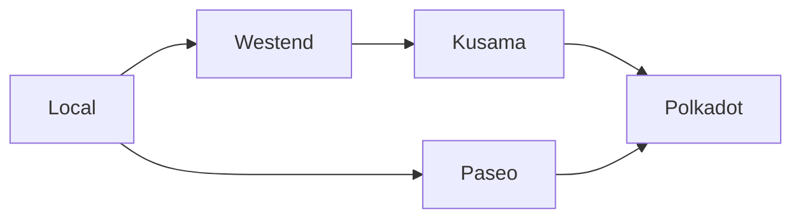

This flow ensures developers can thoroughly test and iterate without risking real tokens or affecting production networks. Testing tools like [Chopsticks](#chopsticks) and various TestNets make it easier to experiment safely before releasing to production.

A typical journey through the Polkadot core protocol development process might look like this:

1. **Local development node**: Development starts in a local environment, where developers can create, test, and iterate on upgrades or new features using a local development node. This stage allows rapid experimentation in an isolated setup without any external dependencies.

2. **Westend**: After testing locally, upgrades are deployed to [Westend](#westend), Polkadot's primary TestNet. Westend simulates real-world conditions without using real tokens, making it the ideal place for rigorous feature testing before moving on to production networks.

3. **Kusama**: Once features have passed extensive testing on Westend, they move to Kusama, Polkadot's experimental and fast-moving "canary" network. Kusama operates as a high-fidelity testing ground with actual economic incentives, giving developers insights into how their features will perform in a real-world environment.

4. **Polkadot**: After passing tests on Westend and Kusama, features are considered ready for deployment to Polkadot, the live production network.

    In addition, parachain developers can leverage local TestNets like [Zombienet](#zombienet) and deploy upgrades on parachain TestNets.

5. **Paseo**: For parachain and dApp developers, Paseo serves as a community-run TestNet that mirrors Polkadot's runtime. Like Westend for core protocol development, Paseo provides a testing ground for parachain development without affecting live networks.

!!!note
    The Rococo TestNet deprecation date was October 14, 2024. Teams should use Westend for Polkadot protocol and feature testing and Paseo for chain development-related testing.

## Polkadot Development Networks

Development and testing are crucial to building robust dApps and parachains and performing network upgrades within the Polkadot ecosystem. To achieve this, developers can leverage various networks and tools that provide a risk-free environment for experimentation and validation before deploying features to live networks. These networks help avoid the costs and risks associated with real tokens, enabling testing for functionalities like governance, cross-chain messaging, and runtime upgrades.

## Kusama Network

Kusama is the experimental version of Polkadot, designed for developers who want to move quickly and test their applications in a real-world environment with economic incentives. Kusama serves as a production-grade testing ground where developers can deploy features and upgrades with the pressure of game theory and economics in mind. It mirrors Polkadot but operates as a more flexible space for innovation.

The native token for Kusama is KSM. For more information about KSM, visit the [Native Assets](https://wiki.polkadot.com/kusama/kusama-getting-started/){target=\_blank} page.

## Test Networks

The following test networks provide controlled environments for testing upgrades and new features. TestNet tokens are available from the [Polkadot faucet](https://faucet.polkadot.io/){target=\_blank}.

### Westend

Westend is Polkadot's primary permanent TestNet. Unlike temporary test networks, Westend is not reset to the genesis block, making it an ongoing environment for testing Polkadot core features. Managed by Parity Technologies, Westend ensures that developers can test features in a real-world simulation without using actual tokens.

The native token for Westend is WND. More details about WND can be found on the [Native Assets](https://wiki.polkadot.com/learn/learn-dot/#__tabbed_2_2){target=\_blank} page.

### Paseo

[Paseo](https://github.com/paseo-network){target=\_blank} is a community-managed TestNet designed for parachain and dApp developers. It mirrors Polkadot's runtime and is maintained by Polkadot community members. Paseo provides a dedicated space for parachain developers to test their applications in a Polkadot-like environment without the risks associated with live networks.

The native token for Paseo is PAS. Additional information on PAS is available on the [Native Assets](https://wiki.polkadot.com/learn/learn-dot/#__tabbed_2_1){target=\_blank} page.

## Local Test Networks

Local test networks are an essential part of the development cycle for blockchain developers using the Polkadot SDK. They allow for fast, iterative testing in controlled, private environments without connecting to public TestNets. Developers can quickly spin up local instances to experiment, debug, and validate their code before deploying to larger TestNets like Westend or Paseo. Two key tools for local network testing are Zombienet and Chopsticks.

### Zombienet

[Zombienet](https://github.com/paritytech/zombienet){target=\_blank} is a flexible testing framework for Polkadot SDK-based blockchains. It enables developers to create and manage ephemeral, short-lived networks. This feature makes Zombienet particularly useful for quick iterations, as it allows you to run multiple local networks concurrently, mimicking different runtime conditions. Whether you're developing a parachain or testing your custom blockchain logic, Zombienet gives you the tools to automate local testing.

Key features of Zombienet include:

- Creating dynamic, local networks with different configurations.
- Running parachains and relay chains in a simulated environment.
- Efficient testing of network components like cross-chain messaging and governance.

Zombienet is ideal for developers looking to test quickly and thoroughly before moving to more resource-intensive public TestNets.

### Chopsticks

[Chopsticks](https://github.com/AcalaNetwork/chopsticks){target=\_blank} is a tool designed to create forks of Polkadot SDK-based blockchains, allowing developers to interact with network forks as part of their testing process. This capability makes Chopsticks a powerful option for testing upgrades, runtime changes, or cross-chain applications in a forked network environment.

Key features of Chopsticks include:

- Forking live Polkadot SDK-based blockchains for isolated testing.
- Simulating cross-chain messages in a private, controlled setup.
- Debugging network behavior by interacting with the fork in real-time.

Chopsticks provides a controlled environment for developers to safely explore the effects of runtime changes. It ensures that network behavior is tested and verified before upgrades are deployed to live networks.


---

Page Title: Node and Runtime

- Source (raw): https://raw.githubusercontent.com/polkadot-developers/polkadot-docs/master/.ai/pages/reference-parachains-node-and-runtime.md
- Canonical (HTML): https://docs.polkadot.com/reference/parachains/node-and-runtime/
- Summary: Learn how Polkadot SDK-based nodes function, how the client and runtime are separated, and how they communicate using SCALE-encoded data.

# Node and Runtime

## Introduction

Every blockchain platform relies on a decentralized network of computers, called nodes, that communicate with each other about transactions and blocks. In this context, a node refers to the software running on the connected devices rather than the physical or virtual machines in the network.

Polkadot SDK-based nodes consist of two main components, each with distinct responsibilities: the client (also called node) and the runtime.

If the system were a monolithic protocol, any modification would require updating the entire system. Instead, Polkadot achieves true upgradeability by defining an immutable meta-protocol (the client) and a protocol (the runtime) that can be upgraded independently.

This separation gives the [Polkadot Relay Chain](/polkadot-protocol/architecture/polkadot-chain){target=\_blank} and all connected [parachains](/polkadot-protocol/architecture/parachains){target=\_blank} an evolutionary advantage over other blockchain platforms.

## Architectural Principles

The Polkadot SDK-based blockchain architecture is fundamentally built on two distinct yet interconnected components:

- Client (Meta-protocol):
    - Handles the foundational infrastructure of the blockchain.
    - Manages runtime execution, networking, consensus, and other off-chain components.
    - Provides an immutable base layer that ensures network stability.
    - Upgradable only through hard forks.

- Runtime (Protocol):
    - Defines the blockchain's state transition logic.
    - Determines the specific rules and behaviors of the blockchain.
    - Compiled to WebAssembly (Wasm) for platform-independent execution.
    - Capable of being upgraded without network-wide forking.

### Advantages of this Architecture

- **Forkless upgrades**: Runtime can be updated without disrupting the entire network.
- **Modularity**: Clear separation allows independent development of client and runtime.
- **Flexibility**: Enables rapid iteration and evolution of blockchain logic.
- **Performance**: WebAssembly compilation provides efficient, cross-platform execution.

## Node (Client)

The node, also known as the client, is the core component responsible for executing the Wasm runtime and orchestrating various essential blockchain components. It ensures the correct execution of the state transition function and manages multiple critical subsystems, including:

- **Wasm execution**: Runs the blockchain runtime, which defines the state transition rules.
- **Database management**: Stores blockchain data.
- **Networking**: Facilitates peer-to-peer communication, block propagation, and transaction gossiping.
- **Transaction pool (Mempool)**: Manages pending transactions before they are included in a block.
- **Consensus mechanism**: Ensures agreement on the blockchain state across nodes.
- **RPC services**: Provides external interfaces for applications and users to interact with the node.

## Runtime

The runtime is more than just a set of rules. It's the fundamental logic engine that defines a blockchain's entire behavior. In Polkadot SDK-based blockchains, the runtime represents a complete, self-contained description of the blockchain's state transition function.

### Characteristics

The runtime is distinguished by three key characteristics:

- **Business logic**: Defines the complete application-specific blockchain behavior.
- **WebAssembly compilation**: Ensures platform-independent, secure execution.
- **On-chain storage**: Stored within the blockchain's state, allowing dynamic updates.

### Key Functions

The runtime performs several critical functions, such as:

- Define state transition rules.
- Implement blockchain-specific logic.
- Manage account interactions.
- Control transaction processing.
- Define governance mechanisms.
- Handle custom pallets and modules.

## Communication Between Node and Runtime

The client and runtime communicate exclusively using [SCALE-encoded](/polkadot-protocol/parachain-basics/data-encoding){target=\_blank} communication. This ensures efficient and compact data exchange between the two components.

### Runtime APIs

The Runtime API consists of well-defined functions and constants a client assumes are implemented in the Runtime Wasm blob. These APIs enable the client to interact with the runtime to execute blockchain operations and retrieve information. The client invokes these APIs to:

- Build, execute, and finalize blocks.
- Access metadata.
- Access consensus related information.
- Handle transaction execution.

### Host Functions

During execution, the runtime can access certain external client functionalities via host functions. The specific functions the client exposes allow the runtime to perform operations outside the WebAssembly domain. Host functions enable the runtime to:

- Perform cryptographic operations.
- Access the current blockchain state.
- Handle storage modifications.
- Allocate memory.


---

Page Title: On-Chain Governance Overview

- Source (raw): https://raw.githubusercontent.com/polkadot-developers/polkadot-docs/master/.ai/pages/reference-governance.md
- Canonical (HTML): https://docs.polkadot.com/reference/governance/
- Summary: Discover Polkadot’s cutting-edge OpenGov system, enabling transparent, decentralized decision-making through direct democracy and flexible governance tracks.

# On-Chain Governance 

## Introduction

Polkadot’s governance system exemplifies decentralized decision-making, empowering its community of stakeholders to shape the network’s future through active participation. The latest evolution, OpenGov, builds on Polkadot’s foundation by providing a more inclusive and efficient governance model.

This guide will explain the principles and structure of OpenGov and walk you through its key components, such as Origins, Tracks, and Delegation. You will learn about improvements over earlier governance systems, including streamlined voting processes and enhanced stakeholder participation.

With OpenGov, Polkadot achieves a flexible, scalable, and democratic governance framework that allows multiple proposals to proceed simultaneously, ensuring the network evolves in alignment with its community's needs.

## Governance Evolution

Polkadot’s governance journey began with [Governance V1](https://wiki.polkadot.com/learn/learn-polkadot-opengov/#governance-summary){target=\_blank}, a system that proved effective in managing treasury funds and protocol upgrades. However, it faced limitations, such as:

- Slow voting cycles, causing delays in decision-making.
- Inflexibility in handling multiple referendums, restricting scalability.

To address these challenges, Polkadot introduced OpenGov, a governance model designed for greater inclusivity, efficiency, and scalability. OpenGov replaces the centralized structures of Governance V1, such as the Council and Technical Committee, with a fully decentralized and dynamic framework.

For a full comparison of the historic and current governance models, visit the [Gov1 vs. Polkadot OpenGov](https://wiki.polkadot.com/learn/learn-polkadot-opengov/#gov1-vs-polkadot-opengov){target=\_blank} section of the Polkadot Wiki.

## OpenGov Key Features

OpenGov transforms Polkadot’s governance into a decentralized, stakeholder-driven model, eliminating centralized decision-making bodies like the Council. Key enhancements include:

- **Decentralization**: Shifts all decision-making power to the public, ensuring a more democratic process.
- **Enhanced delegation**: Allows users to delegate their votes to trusted experts across specific governance tracks.
- **Simultaneous referendums**: Multiple proposals can progress at once, enabling faster decision-making.
- **Polkadot Technical Fellowship**: A broad, community-driven group replacing the centralized Technical Committee.

This new system ensures Polkadot governance remains agile and inclusive, even as the ecosystem grows.

## Origins and Tracks

In OpenGov, origins and tracks are central to managing proposals and votes.

- **Origin**: Determines the authority level of a proposal (e.g., Treasury, Root) which decides the track of all referendums from that origin.
- **Track**: Define the procedural flow of a proposal, such as voting duration, approval thresholds, and enactment timelines.

Developers must be aware that referendums from different origins and tracks will take varying amounts of time to reach approval and enactment. The [Polkadot Technical Fellowship](https://wiki.polkadot.com/learn/learn-polkadot-technical-fellowship/){target=\_blank} has the option to shorten this timeline by whitelisting a proposal and allowing it to be enacted through the [Whitelist Caller](https://wiki.polkadot.com/learn/learn-polkadot-opengov-origins/#whitelisted-caller){target=\_blank} origin.

Visit [Origins and Tracks Info](https://wiki.polkadot.com/learn/learn-polkadot-opengov/#origins-and-tracks){target=\_blank} for details on current origins and tracks, associated terminology, and parameters.

## Referendums

In OpenGov, anyone can submit a referendum, fostering an open and participatory system. The timeline for a referendum depends on the privilege level of the origin with more significant changes offering more time for community voting and participation before enactment. 

The timeline for an individual referendum includes four distinct periods:

- **Lead-in**: A minimum amount of time to allow for community participation, available room in the origin, and payment of the decision deposit. Voting is open during this period.
- **Decision**: Voting continues.
- **Confirmation**: Referendum must meet [approval and support](https://wiki.polkadot.com/learn/learn-polkadot-opengov/#approval-and-support){target=\_blank} criteria during entire period to avoid rejection.
- **Enactment**: Changes approved by the referendum are executed.

### Vote on Referendums

Voters can vote with their tokens on each referendum. Polkadot uses a voluntary token locking mechanism, called conviction voting, as a way for voters to increase their voting power. A token holder signals they have a stronger preference for approving a proposal based upon their willingness to lock up tokens. Longer voluntary token locks are seen as a signal of continual approval and translate to increased voting weight.

See [Voting on a Referendum](https://wiki.polkadot.com/learn/learn-polkadot-opengov/#voting-on-a-referendum){target=\_blank} for a deeper look at conviction voting and related token locks.

### Delegate Voting Power

The OpenGov system also supports multi-role delegations, allowing token holders to assign their voting power on different tracks to entities with expertise in those areas. 

For example, if a token holder lacks the technical knowledge to evaluate proposals on the [Root track](https://wiki.polkadot.com/learn/learn-polkadot-opengov-origins/#root){target=\_blank}, they can delegate their voting power for that track to an expert they trust to vote in the best interest of the network. This ensures informed decision-making across tracks while maintaining flexibility for token holders.

Visit [Multirole Delegation](https://wiki.polkadot.com/learn/learn-polkadot-opengov/#multirole-delegation){target=\_blank} for more details on delegating voting power.

### Cancel a Referendum

Polkadot OpenGov has two origins for rejecting ongoing referendums: 

- [**Referendum Canceller**](https://wiki.polkadot.com/learn/learn-polkadot-opengov-origins/#referendum-canceller){target=\_blank}: Cancels an active referendum when non-malicious errors occur and refunds the deposits to the originators.
- [**Referendum Killer**](https://wiki.polkadot.com/learn/learn-polkadot-opengov-origins/#referendum-killer){target=\_blank}: Used for urgent, malicious cases this origin instantly terminates an active referendum and slashes deposits.

See [Cancelling, Killing, and Blacklisting](https://wiki.polkadot.com/learn/learn-polkadot-opengov/#cancelling-killing--blacklisting){target=\_blank} for additional information on rejecting referendums.

## Additional Resources

- **[Democracy pallet](https://github.com/paritytech/polkadot-sdk/tree/polkadot-stable2506-2/substrate/frame/democracy/src){target=\_blank}**: Handles administration of general stakeholder voting.
- **[Gov2: Polkadot’s Next Generation of Decentralised Governance](https://medium.com/polkadot-network/gov2-polkadots-next-generation-of-decentralised-governance-4d9ef657d11b){target=\_blank}**: Medium article by Gavin Wood.
- **[Polkadot Direction](https://matrix.to/#/#Polkadot-Direction:parity.io){target=\_blank}**: Matrix Element client.
- **[Polkassembly](https://polkadot.polkassembly.io/){target=\_blank}**: OpenGov dashboard and UI.
- **[Polkadot.js Apps Governance](https://polkadot.js.org/apps/#/referenda){target=\_blank}**: Overview of active referendums.


---

Page Title: Origins and Tracks

- Source (raw): https://raw.githubusercontent.com/polkadot-developers/polkadot-docs/master/.ai/pages/reference-governance-origins-tracks.md
- Canonical (HTML): https://docs.polkadot.com/reference/governance/origins-tracks/
- Summary: Explore Polkadot's OpenGov origins and tracks system, defining privilege levels, decision processes, and tailored pathways for network proposals.

# Origins and Tracks

## Introduction

Polkadot's OpenGov system empowers decentralized decision-making and active community participation by tailoring the governance process to the impact of proposed changes. Through a system of origins and tracks, OpenGov ensures that every referendum receives the appropriate scrutiny, balancing security, inclusivity, and efficiency.

This guide will help you understand the role of origins in classifying proposals by privilege and priority. You will learn how tracks guide proposals through tailored stages like voting, confirmation, and enactment and how to select the correct origin for your referendum to align with community expectations and network governance.

Origins and tracks are vital in streamlining the governance workflow and maintaining Polkadot's resilience and adaptability.

## Origins

Origins are the foundation of Polkadot's OpenGov governance system. They categorize proposals by privilege and define their decision-making rules. Each origin corresponds to a specific level of importance and risk, guiding how referendums progress through the governance process.

- High-privilege origins like Root Origin govern critical network changes, such as core software upgrades.
- Lower-privilege origins like Small Spender handle minor requests, such as community project funding under 10,000 DOT.

Proposers select an origin based on the nature of their referendum. Origins determine parameters like approval thresholds, required deposits, and timeframes for voting and confirmation. Each origin is paired with a track, which acts as a roadmap for the proposal's lifecycle, including preparation, voting, and enactment.

For a detailed list of origins and their associated parameters, see the [Polkadot OpenGov Origins](https://wiki.polkadot.com/learn/learn-polkadot-opengov-origins/){target=\_blank} entry in the Polkadot Wiki.

## Tracks

Tracks define a referendum's journey from submission to enactment, tailoring governance parameters to the impact of proposed changes. Each track operates independently and includes several key stages:

- **Preparation**: Time for community discussion before voting begins.
- **Voting**: Period for token holders to cast their votes.
- **Decision**: Finalization of results and determination of the proposal's outcome.
- **Confirmation**: Period to verify sustained community support before enactment.
- **Enactment**: Final waiting period before the proposal takes effect.

Tracks customize these stages with parameters like decision deposit requirements, voting durations, and approval thresholds, ensuring proposals from each origin receive the required scrutiny and process. For example, a runtime upgrade in the Root Origin track will have longer timeframes and stricter thresholds than a treasury request in the Small Spender track.

## Additional Resources

- For a list of origins and tracks for Polkadot and Kusama, including associated parameters, see the [Origins and Tracks Info](https://wiki.polkadot.com/learn/learn-polkadot-opengov-origins/#origins-and-tracks-info){target=\_blank} entry in the Polkadot Wiki.

- For a deeper dive into the approval and support system, see the [Approval and Support](https://wiki.polkadot.com/learn/learn-polkadot-opengov/#approval-and-support){target=\_blank} entry of the Polkadot Wiki.


---

Page Title: Overview of FRAME

- Source (raw): https://raw.githubusercontent.com/polkadot-developers/polkadot-docs/master/.ai/pages/parachains-customize-runtime.md
- Canonical (HTML): https://docs.polkadot.com/parachains/customize-runtime/
- Summary: Learn how Polkadot SDK’s FRAME framework simplifies blockchain development with modular pallets and support libraries for efficient runtime design.

# Customize Your Runtime

## Introduction

A blockchain runtime is more than just a fixed set of rules—it's a dynamic foundation that you can shape to match your specific needs. With Polkadot SDK's [FRAME (Framework for Runtime Aggregation of Modularized Entities)](https://paritytech.github.io/polkadot-sdk/master/polkadot_sdk_docs/polkadot_sdk/frame_runtime/index.html){target=\_blank}, customizing your runtime is straightforward and modular. Instead of building everything from scratch, you combine pre-built pallets with your own custom logic to create a runtime suited to your blockchain's purpose.


This overview explains how runtime customization works, introduces the building blocks you'll use, and guides you through the key patterns for extending your runtime.

## Understanding Your Runtime

The runtime is the core logic of your blockchain—it processes transactions, manages state, and enforces the rules that govern your network. When a transaction arrives at your blockchain, the [`frame_executive`](https://paritytech.github.io/polkadot-sdk/master/frame_executive/index.html){target=\_blank} pallet receives it and routes it to the appropriate pallet for execution.

Think of your runtime as a collection of specialized modules, each handling a different aspect of your blockchain. Need token balances? Use the Balances pallet. Want governance? Add the Governance pallets. Need something custom? Create your own pallet. By mixing and matching these modules, you build a runtime that's efficient, secure, and tailored to your use case.

## Runtime Architecture

The following diagram shows how FRAME components work together to form your runtime:


The main components are:

- **`frame_executive`**: Routes all incoming transactions to the correct pallet for execution.
- **Pallets**: Domain-specific modules that implement your blockchain's features and business logic.
- **`frame_system`**: Provides core runtime primitives and storage.
- **`frame_support`**: Utilities and macros that simplify pallet development.

## Building Blocks: Pallets

[Pallets](https://paritytech.github.io/polkadot-sdk/master/polkadot_sdk_docs/polkadot_sdk/frame_runtime/pallet/index.html){target=\_blank} are the fundamental units of runtime customization. Each pallet encapsulates specific functionality and can be independently developed, tested, and integrated.

A pallet can implement virtually any blockchain feature you need:

- Expose new transactions that users can submit.
- Store data on-chain.
- Enforce business rules and validation logic.
- Emit events to notify users of state changes.
- Handle errors gracefully.

### Pre-Built Pallets vs. Custom Pallets

FRAME provides a comprehensive library of [pre-built pallets](https://github.com/paritytech/polkadot-sdk/tree/polkadot-stable2506-2/substrate/frame){target=\_blank} for common blockchain features, including consensus, staking, balances, governance, and more. These pallets are battle-tested, optimized, and ready to use.

However, you're not limited to pre-built functionality. When pre-built pallets don't meet your needs, you can create custom pallets with entirely custom logic. The real power of FRAME is the flexibility to use pre-built modules for standard features while building your own for unique requirements.

### Pallet Structure

FRAME uses Rust macros extensively, allowing you to focus on your pallet's logic while the framework handles boilerplate and integration code.

A typical pallet looks like this:

```rust
pub use pallet::*;

#[frame_support::pallet]
pub mod pallet {
  use frame_support::pallet_prelude::*;
  use frame_system::pallet_prelude::*;

  #[pallet::pallet]
  #[pallet::generate_store(pub(super) trait Store)]
  pub struct Pallet<T>(_);

  #[pallet::config]  // snip
  #[pallet::event]   // snip
  #[pallet::error]   // snip
  #[pallet::storage] // snip
  #[pallet::call]    // snip
}
```

Every pallet can implement these core macros:

- **`#[frame_support::pallet]`**: Marks your module as a FRAME pallet.
- **`#[pallet::pallet]`**: Designates the struct that holds pallet metadata.
- **`#[pallet::config]`**: Defines configuration and associated types.
- **`#[pallet::event]`**: Defines events emitted by your pallet.
- **`#[pallet::error]`**: Defines error types your pallet can return.
- **`#[pallet::storage]`**: Defines on-chain storage items.
- **`#[pallet::call]`**: Defines dispatchable functions (transactions).

For a comprehensive reference, see the [`pallet_macros` documentation](https://paritytech.github.io/polkadot-sdk/master/frame_support/pallet_macros/index.html){target=\_blank}.

## How Runtime Customization Works

Customizing your runtime typically follows these patterns:

**Adding Pre-Built Pallets**: Select pallets from the FRAME library and integrate them into your runtime configuration. This is the fastest way to add functionality.

**Creating Custom Pallets**: Write custom pallets for features that don't exist in the pre-built library. Custom pallets follow the same structure as pre-built ones and integrate seamlessly.

**Combining Multiple Pallets**: Layer multiple pallets together to create complex behaviors. Pallets can call each other and share storage when needed.

**Configuring Pallet Parameters**: Most pallets are configurable—you can adjust their behavior through configuration traits without modifying their code.

The following diagram illustrates how pallets combine to form a complete runtime:


## Starting Templates

The easiest way to begin customizing your runtime is with a starter template. These templates provide a pre-configured foundation so you can focus on customization rather than setup.

- **[Polkadot SDK Parachain Template](https://github.com/paritytech/polkadot-sdk-parachain-template){target=\_blank}**: The recommended choice for most developers, it includes pre-configured pallets for common features (balances, block production, governance), a complete runtime setup, and built-in parachain consensus support. This template offers the best balance of features and learning opportunities.

- **[Polkadot SDK Minimal Template](https://github.com/paritytech/polkadot-sdk-minimal-template){target=\_blank}**: Provides a bare-bones runtime with only essential components. Choose this if you want maximum flexibility and prefer building from a clean slate.

- **[Polkadot SDK Solochain Template](https://github.com/paritytech/polkadot-sdk/tree/master/templates/solochain){target=\_blank}**: Designed for building standalone blockchains with moderate features, simple consensus, and several core pallets. Use this if you want a sovereign blockchain independent of a relay chain.

- **[OpenZeppelin Runtime Templates](https://github.com/OpenZeppelin/polkadot-runtime-templates){target=\_blank}**: Provides security-focused configurations following industry best practices. The [generic-template](https://github.com/OpenZeppelin/polkadot-runtime-templates/tree/main/generic-template){target=\_blank} includes curated pallet selections and production-ready defaults—ideal if security is your top priority.

## Key Customization Scenarios

This section covers the most common customization patterns you'll encounter:

- **[Add Existing Pallets to Your Runtime](/parachains/customize-runtime/add-existing-pallets/)**: Integrate pre-built pallets from the FRAME library with minimal configuration.

- **[Add Multiple Instances of a Pallet](/parachains/customize-runtime/add-pallet-instances/)**: Run multiple instances of the same pallet with different configurations—useful for multi-token systems or parallel features.

- **[Add Smart Contract Functionality](/parachains/customize-runtime/add-smart-contract-functionality/)**: Enable smart contract execution on your parachain using Contracts pallets.

- **[Create Custom Pallets](/parachains/customize-runtime/pallet-development/create-a-pallet/)**: Build entirely custom pallets for features unique to your blockchain.

- **[Test Your Runtime](/parachains/customize-runtime/pallet-development/pallet-testing/)**: Unit test pallets and mock complete runtimes to ensure everything works correctly.


---

Page Title: Overview of the Polkadot Relay Chain

- Source (raw): https://raw.githubusercontent.com/polkadot-developers/polkadot-docs/master/.ai/pages/reference-polkadot-hub-consensus-and-security-relay-chain.md
- Canonical (HTML): https://docs.polkadot.com/reference/polkadot-hub/consensus-and-security/relay-chain/
- Summary: Explore Polkadot's core architecture, including its multi-chain vision, shared security, and the DOT token's governance and staking roles.

# Overview

## Introduction

Polkadot is a next-generation blockchain protocol designed to support a multi-chain future by enabling secure communication and interoperability between different blockchains. Built as a Layer-0 protocol, Polkadot introduces innovations like application-specific Layer-1 chains ([parachains](/polkadot-protocol/architecture/parachains/){targe=\_blank}), shared security through [Nominated Proof of Stake (NPoS)](/reference/glossary/#nominated-proof-of-stake-npos){target=\_blank}, and cross-chain interactions via its native [Cross-Consensus Messaging Format (XCM)](/parachains/interoperability/get-started/){target=\_blank}.

This guide covers key aspects of Polkadot’s architecture, including its high-level protocol structure, blockspace commoditization, and the role of its native token, DOT, in governance, staking, and resource allocation.

## Polkadot 1.0

Polkadot 1.0 represents the state of Polkadot as of 2023, coinciding with the release of [Polkadot runtime v1.0.0](https://github.com/paritytech/polkadot/releases/tag/v1.0.0){target=\_blank}. This section will focus on Polkadot 1.0, along with philosophical insights into network resilience and blockspace.

As a Layer-0 blockchain, Polkadot contributes to the multi-chain vision through several key innovations and initiatives, including:

- **Application-specific Layer-1 blockchains (parachains)**: Polkadot's sharded network allows for parallel transaction processing, with shards that can have unique state transition functions, enabling custom-built L1 chains optimized for specific applications.

- **Shared security and scalability**: L1 chains connected to Polkadot benefit from its [Nominated Proof of Stake (NPoS)](/reference/polkadot-hub/consensus-and-security/pos-consensus/#nominated-proof-of-stake){target=\_blank} system, providing security out-of-the-box without the need to bootstrap their own.

- **Secure interoperability**: Polkadot's native interoperability enables seamless data and value exchange between parachains. This interoperability can also be used outside of the ecosystem for bridging with external networks.

- **Resilient infrastructure**: Decentralized and scalable, Polkadot ensures ongoing support for development and community initiatives via its on-chain [treasury](https://wiki.polkadot.com/learn/learn-polkadot-opengov-treasury/){target=\_blank} and governance.

- **Rapid L1 development**: The [Polkadot SDK](/reference/parachains/){target=\_blank} allows fast, flexible creation and deployment of Layer-1 chains.

- **Cultivating the next generation of Web3 developers**: Polkadot supports the growth of Web3 core developers through initiatives such as.

    - [Polkadot Blockchain Academy](https://polkadot.com/blockchain-academy){target=\_blank}
    - [EdX courses](https://www.edx.org/school/web3x){target=\_blank}
    - Rust and Substrate courses (coming soon)

### High-Level Architecture

Polkadot features a chain that serves as the central component of the system. This chain is depicted as a ring encircled by several parachains that are connected to it.

According to Polkadot's design, any blockchain that can compile to WebAssembly (Wasm) and adheres to the Parachains Protocol becomes a parachain on the Polkadot network.

Here’s a high-level overview of the Polkadot protocol architecture:

{ style="background:white" }

Parachains propose blocks to Polkadot validators, who check for availability and validity before finalizing them. With the relay chain providing security, collators—full nodes of parachains—can focus on their tasks without needing strong incentives.

The [Cross-Consensus Messaging Format (XCM)](/parachains/interoperability/get-started/){target=\_blank} allows parachains to exchange messages freely, leveraging the chain's security for trust-free communication.

In order to interact with chains that want to use their own finalization process (e.g., Bitcoin), Polkadot has [bridges](/reference/parachains/interoperability/#bridges-connecting-external-networks){target=\_blank} that offer two-way compatibility, meaning that transactions can be made between different parachains.

### Polkadot's Additional Functionalities

Historically, obtaining core slots on Polkadot chain relied upon crowdloans and auctions. Chain cores were leased through auctions for three-month periods, up to a maximum of two years. Crowdloans enabled users to securely lend funds to teams for lease deposits in exchange for pre-sale tokens, which is the only way to access slots on Polkadot 1.0. Auctions are now deprecated in favor of [coretime](/polkadot-protocol/architecture/system-chains/coretime/){target=\_blank}.

Additionally, the chain handles [staking](https://wiki.polkadot.com/learn/learn-staking/){target=\_blank}, [accounts](/reference/parachains/accounts/){target=\_blank}, balances, and [governance](/reference/governance/){target=\_blank}.

#### Agile Coretime

The new and more efficient way of obtaining core on Polkadot is to go through the process of purchasing coretime.

[Agile coretime](/reference/polkadot-hub/consensus-and-security/agile-coretime/){target=\_blank} improves the efficient use of Polkadot's network resources and offers economic flexibility for developers, extending Polkadot's capabilities far beyond the original vision outlined in the [whitepaper](https://polkadot.com/papers/Polkadot-whitepaper.pdf){target=\_blank}.

It enables parachains to purchase monthly "bulk" allocations of coretime (the time allocated for utilizing a core, measured in Polkadot relay chain blocks), ensuring heavy-duty parachains that can author a block every six seconds with [Asynchronous Backing](https://wiki.polkadot.com/learn/learn-async-backing/#asynchronous-backing){target=\_blank} can reliably renew their coretime each month. Although six-second block times are now the default, parachains have the option of producing blocks less frequently.

Renewal orders are prioritized over new orders, offering stability against price fluctuations and helping parachains budget more effectively for project costs.

### Polkadot's Resilience

Decentralization is a vital component of blockchain networks, but it comes with trade-offs:

- An overly decentralized network may face challenges in reaching consensus and require significant energy to operate.
- Also, a network that achieves consensus quickly risks centralization, making it easier to manipulate or attack.

A network should be decentralized enough to prevent manipulative or malicious influence. In this sense, decentralization is a tool for achieving resilience.

Polkadot 1.0 currently achieves resilience through several strategies:

- **Nominated Proof of Stake (NPoS)**: Ensures that the stake per validator is maximized and evenly distributed among validators.

- **Decentralized nodes**: Designed to encourage operators to join the network. This program aims to expand and diversify the validators in the ecosystem who aim to become independent of the program during their term. Feel free to explore more about the program on the official [Decentralized Nodes](https://nodes.web3.foundation/){target=\_blank} page.

- **On-chain treasury and governance**: Known as [OpenGov](/reference/governance/){target=\_blank}, this system allows every decision to be made through public referenda, enabling any token holder to cast a vote.

### Polkadot's Blockspace

Polkadot 1.0’s design allows for the commoditization of blockspace.

Blockspace is a blockchain's capacity to finalize and commit operations, encompassing its security, computing, and storage capabilities. Its characteristics can vary across different blockchains, affecting security, flexibility, and availability.

- **Security**: Measures the robustness of blockspace in Proof of Stake (PoS) networks linked to the stake locked on validator nodes, the variance in stake among validators, and the total number of validators. It also considers social centralization (how many validators are owned by single operators) and physical centralization (how many validators run on the same service provider).

- **Flexibility**: Reflects the functionalities and types of data that can be stored, with high-quality data essential to avoid bottlenecks in critical processes.

- **Availability**: Indicates how easily users can access blockspace. It should be easily accessible, allowing diverse business models to thrive, ideally regulated by a marketplace based on demand and supplemented by options for "second-hand" blockspace.

Polkadot is built on core blockspace principles, but there's room for improvement. Tasks like balance transfers, staking, and governance are managed on the relay chain.

Delegating these responsibilities to [system chains](/polkadot-protocol/architecture/system-chains/){target=\_blank} could enhance flexibility and allow the relay chain to concentrate on providing shared security and interoperability.

For more information about blockspace, watch [Robert Habermeier’s interview](https://www.youtube.com/watch?v=e1vISppPwe4){target=\_blank} or read his [technical blog post](https://www.rob.tech/blog/polkadot-blockspace-over-blockchains/){target=\_blank}.

## DOT Token

DOT is the native token of the Polkadot network, much like BTC for Bitcoin and Ether for the Ethereum blockchain. DOT has 10 decimals, uses the Planck base unit, and has a balance type of `u128`. The same is true for Kusama's KSM token with the exception of having 12 decimals.

### Redenomination of DOT
    
Polkadot conducted a community poll, which ended on 27 July 2020 at block 888,888, to decide whether to redenominate the DOT token. The stakeholders chose to redenominate the token, changing the value of 1 DOT from 1e12 plancks to 1e10 plancks.

Importantly, this did not affect the network's total number of base units (plancks); it only affects how a single DOT is represented. The redenomination became effective 72 hours after transfers were enabled, occurring at block 1,248,328 on 21 August 2020 around 16:50 UTC.

### The Planck Unit

The smallest unit of account balance on Polkadot SDK-based blockchains (such as Polkadot and Kusama) is called _Planck_, named after the Planck length, the smallest measurable distance in the physical universe.

Similar to how BTC's smallest unit is the Satoshi and ETH's is the Wei, Polkadot's native token DOT equals 1e10 Planck, while Kusama's native token KSM equals 1e12 Planck.

### Uses for DOT

DOT serves three primary functions within the Polkadot network:

- **Governance**: It is used to participate in the governance of the network.
- **Staking**: DOT is staked to support the network's operation and security.
- **Buying coretime**: Used to purchase coretime in-bulk or on-demand and access the  chain to benefit from Polkadot's security and interoperability.

Additionally, DOT can serve as a transferable token. For example, DOT, held in the treasury, can be allocated to teams developing projects that benefit the Polkadot ecosystem.

## JAM and the Road Ahead

The Join-Accumulate Machine (JAM) represents a transformative redesign of Polkadot's core architecture, envisioned as the successor to the current relay chain. Unlike traditional blockchain architectures, JAM introduces a unique computational model that processes work through two primary functions:

- **Join**: Handles data integration.
- **Accumulate**: Folds computations into the chain's state.

JAM removes many of the opinions and constraints of the current relay chain while maintaining its core security properties. Expected improvements include:

- **Permissionless code execution**: JAM is designed to be more generic and flexible, allowing for permissionless code execution through services that can be deployed without governance approval.
- **More effective block time utilization**: JAM's efficient pipeline processing model places the prior state root in block headers instead of the posterior state root, enabling more effective utilization of block time for computations.

This architectural evolution promises to enhance Polkadot's scalability and flexibility while maintaining robust security guarantees. JAM is planned to be rolled out to Polkadot as a single, complete upgrade rather than a stream of smaller updates. This approach seeks to minimize the developer overhead required to address any breaking changes.


---

Page Title: Parachain Consensus

- Source (raw): https://raw.githubusercontent.com/polkadot-developers/polkadot-docs/master/.ai/pages/reference-parachains-consensus-overview.md
- Canonical (HTML): https://docs.polkadot.com/reference/parachains/consensus/overview/
- Summary: Understand how the blocks authored by parachain collators are secured by the relay chain validators and how the parachain transactions achieve finality.

# Parachain Consensus

## Introduction

Parachains are independent blockchains built with the Polkadot SDK, designed to leverage Polkadot’s relay chain for shared security and transaction finality. These specialized chains operate as part of Polkadot’s execution sharding model, where each parachain manages its own state and transactions while relying on the relay chain for validation and consensus.

At the core of parachain functionality are collators, specialized nodes that sequence transactions into blocks and maintain the parachain’s state. Collators optimize Polkadot’s architecture by offloading state management from the relay chain, allowing relay chain validators to focus solely on validating parachain blocks.

This guide explores how parachain consensus works, including the roles of collators and validators, and the steps involved in securing parachain blocks within Polkadot’s scalable and decentralized framework.

## The Role of Collators

Collators are responsible for sequencing end-user transactions into blocks and maintaining the current state of their respective parachains. Their role is akin to Ethereum’s sequencers but optimized for Polkadot's architecture.

Key responsibilities include:

- **Transaction sequencing**: Organizing transactions into [Proof of Validity (PoV)](https://wiki.polkadot.com/general/glossary/#proof-of-validity){target=\_blank} blocks.
- **State management**: Maintaining parachain states without burdening the relay chain validators.
- **Consensus participation**: Sending PoV blocks to relay chain validators for approval.

## Consensus and Validation

Parachain consensus operates in tandem with the relay chain, leveraging [Nominated Proof of Stake (NPoS)](/reference/glossary/#nominated-proof-of-stake-npos){target=\_blank} for shared security. The process ensures parachain transactions achieve finality through the following steps:

1. **Packaging transactions**: Collators bundle transactions into PoV blocks (parablocks).
2. **Submission to validator**: Parablocks are submitted to a randomly selected subset of relay chain validators, known as paravalidators.
3. **Validation of PoV Blocks**: Paravalidators use the parachain’s state transition function (already available on the relay chain) to verify transaction validity.
4. **Backing and inclusion**: If a sufficient number of positive validations are received, the parablock is backed and included via a para-header on the relay chain.

The following sections describe the actions taking place during each stage of the process. 

### Path of a Parachain Block

Polkadot achieves scalability through execution sharding, where each parachain operates as an independent shard with its own blockchain and state. Shared security for all parachains is provided by the relay chain, powered by Nominated Proof of Stake (NPoS). This framework allows parachains to focus on transaction processing and state management, while the relay chain ensures validation and finality.

The journey of parachain transactions to reach consensus and finality can be described as follows:

- Collators and parablocks:

    - Collators, specialized nodes on parachains, package transactions into Proof of Validity (PoV) blocks, also called parablocks.
    - These parablocks are sent to a subset of relay chain validators, known as paravalidators, for validation.
    - The parachain's state transition function (Wasm blob) is not re-sent, as it is already stored on the relay chain.

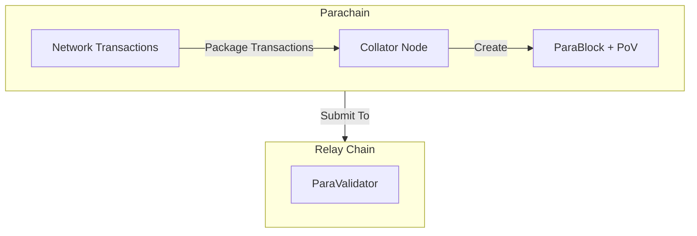

- Validation by paravalidators:

    - Paravalidators are groups of approximately five relay chain validators, randomly assigned to parachains and shuffled every minute.
    - Each paravalidator downloads the parachain's Wasm blob and validates the parablock by ensuring all transactions comply with the parachain’s state transition rules.
    - Paravalidators sign positive or negative validation statements based on the block’s validity.

- Backing and approval:

    - If a parablock receives sufficient positive validation statements, it is backed and included on the relay chain as a para-header.
    - An additional approval process resolves disputes. If a parablock contains invalid transactions, additional validators are tasked with verification.
    - Validators who back invalid parablocks are penalized through slashing, creating strong incentives for honest behavior.

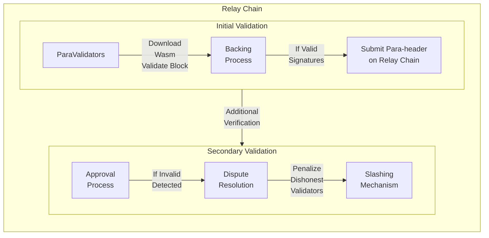

It is important to understand that relay chain blocks do not store full parachain blocks (parablocks). Instead, they include para-headers, which serve as summaries of the backed parablocks. The complete parablock remains within the parachain network, maintaining its autonomy while relying on the relay chain for validation and finality.


## Where to Go Next

Explore more about Parachain consensus through these resources:

<div class="grid cards" markdown>

-   <span class="badge learn">Learn</span> __Elastic Scaling__

    ---

    Learn more about how Elastic Scaling boosts parachain performance.

    [:octicons-arrow-right-24: Elastic Scaling](/reference/parachains/consensus/elastic-scaling/){target=\_blank}

-   <span class="badge learn">Learn</span> __Asynchronous Backing__

    ---

    Read about pipelining parachain block production via Async Backing.

    [:octicons-arrow-right-24: Asynchronous Backing](/reference/parachains/consensus/async-backing/){target=\_blank}


-   <span class="badge external">Learn</span> __Parachain Wiki__

    ---

    Explore more on Parachains in the Wiki.

    [:octicons-arrow-right-24: Parachains](https://wiki.polkadot.com/learn/learn-parachains/){target=\_blank}


</div>


---

Page Title: Parachains Overview

- Source (raw): https://raw.githubusercontent.com/polkadot-developers/polkadot-docs/master/.ai/pages/reference-parachains.md
- Canonical (HTML): https://docs.polkadot.com/reference/parachains/
- Summary: Learn about parachains, specialized blockchains on Polkadot that gain shared security and interoperability. Discover how they work and the tools to build them.

# Parachains Overview

## Introduction

A parachain is a specialized blockchain that connects to the Polkadot relay chain, benefiting from shared security, interoperability, and scalability. Parachains are built using the [Polkadot SDK](https://github.com/paritytech/polkadot-sdk){target=\_blank}, a powerful toolkit written in Rust that provides everything needed to create custom blockchain logic while integrating seamlessly with the Polkadot network.

Unlike standalone blockchains that must bootstrap their own validator sets and security, parachains leverage Polkadot's pooled security model. This allows parachain developers to focus on their application-specific functionality rather than consensus and security infrastructure. Parachains can communicate with each other through Cross-Consensus Messaging (XCM), enabling seamless interoperability across the Polkadot ecosystem.

Key capabilities that parachains provide include:

- **Shared security**: Inherit security from Polkadot's validator set without maintaining your own.
- **Interoperability**: Communicate trustlessly with other parachains via XCM.
- **Scalability**: Process transactions in parallel with other parachains.
- **Customization**: Build application-specific logic tailored to your use case.
- **Upgradeability**: Upgrade runtime logic without hard forks.

## Polkadot SDK: Parachain Architecture

Building a parachain involves understanding and utilizing several key components of the Polkadot SDK:


- **[Substrate](https://paritytech.github.io/polkadot-sdk/master/polkadot_sdk_docs/polkadot_sdk/substrate/index.html){target=\_blank}**: The foundation providing core blockchain primitives and libraries.
- **[FRAME](https://paritytech.github.io/polkadot-sdk/master/polkadot_sdk_docs/polkadot_sdk/frame_runtime/index.html){target=\_blank}**: A modular framework for building your parachain's runtime logic.
- **[Cumulus](https://paritytech.github.io/polkadot-sdk/master/polkadot_sdk_docs/polkadot_sdk/cumulus/index.html){target=\_blank}**: Essential libraries and pallets that enable parachain functionality.
- **[XCM (Cross Consensus Messaging)](https://paritytech.github.io/polkadot-sdk/master/polkadot_sdk_docs/polkadot_sdk/xcm/index.html){target=\_blank}**: The messaging format for communicating with other parachains and the relay chain.
- **[Polkadot](https://paritytech.github.io/polkadot-sdk/master/polkadot_sdk_docs/polkadot_sdk/polkadot/index.html){target=\_blank}**: The relay chain that provides security and coordination.

### Substrate: The Foundation

Substrate provides the core infrastructure that every parachain is built upon. It handles the low-level blockchain functionality, allowing you to focus on your application's unique features. Substrate includes implementations for networking, database management, consensus participation, and the execution environment for your runtime.

Every Polkadot SDK node consists of two main components:

- **Client (Host)**: Handles infrastructure services.

    - Native binary that runs on validator and collator nodes.
    - Executes the Wasm-compiled runtime.
    - Manages networking, database, mempool, and block production.
    - Interfaces with the relay chain for validation.

- **Runtime (State Transition Function)**: Contains your business logic.

    - Defines how your Polkadot SDK node processes transactions.
    - Compiled to [Wasm](https://webassembly.org/){target=\_blank} for deterministic execution.
    - Stored on-chain and upgradeable via governance.

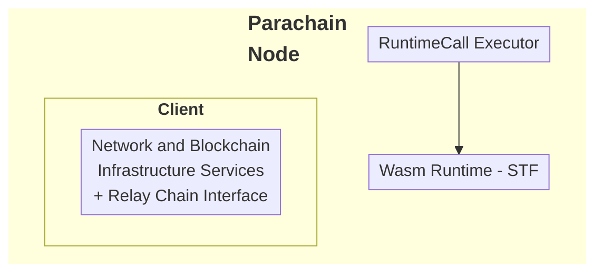

### FRAME: Building Blocks for Your Runtime

FRAME provides modular components called [pallets](/reference/glossary#pallet){target=\_blank} that you can compose to build your parachain's runtime. Each pallet provides specific functionality that you can customize and configure for your needs. This modular approach allows you to quickly assemble complex functionality without writing everything from scratch.

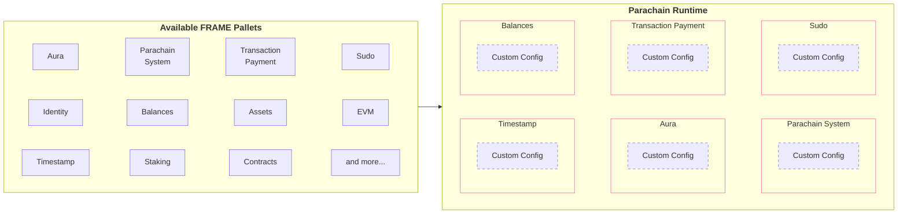

### Cumulus: Parachain-Specific Functionality

Cumulus is what transforms a Polkadot SDK-based runtime into a parachain-capable runtime. It provides the essential components for communicating with the relay chain, participating in Polkadot's consensus, and handling parachain-specific operations like block validation and collation.

Key Cumulus components include:

- **Parachain system pallet**: Core parachain functionality and relay chain communication.
- **Collator consensus**: Block production logic for parachain collators.
- **Relay chain interface**: APIs for interacting with the Polkadot relay chain.
- **Validation data**: Handling proof-of-validity data required by relay chain validators.

## Where to Go Next

Building a parachain requires understanding the relationship between your chain and the Polkadot relay chain. The Polkadot SDK provides all the tools needed to design custom runtime logic, enable cross-chain communication, and deploy your parachain to production.

The following sections provide detailed guidance on each aspect of parachain development, from initial design through deployment and ongoing maintenance.

<div class="grid cards" markdown>

-   <span class="badge guide">Guide</span> __Launch a Simple Parachain__

    ---

    Walk through the complete parachain launch flow: from setup and deployment to obtaining coretime.

    [:octicons-arrow-right-24: Deploy](/parachains/launch-a-parachain/set-up-the-parachain-template/)


-   <span class="badge guide">Guide</span> __Customize Your Runtime__

    ---

    Design your parachain's runtime logic and choose appropriate pallets for your use case.

    [:octicons-arrow-right-24: Get Started](/parachains/customize-runtime/)

-   <span class="badge guide">Guide</span> __Interoperability__

    ---

    Implement XCM for trustless cross-chain communication with other parachains.

    [:octicons-arrow-right-24: Learn More](/parachains/interoperability/get-started/)

-   <span class="badge guide">Guide</span> __Runtime Upgrades__

    ---

    Upgrade your parachain's runtime without hard forks using forkless upgrade mechanisms.

    [:octicons-arrow-right-24: Maintain](/parachains/runtime-maintenance/runtime-upgrades/)

</div>


---

Page Title: People Chain

- Source (raw): https://raw.githubusercontent.com/polkadot-developers/polkadot-docs/master/.ai/pages/reference-polkadot-hub-people-and-identity.md
- Canonical (HTML): https://docs.polkadot.com/reference/polkadot-hub/people-and-identity/
- Summary: Learn how People chain secures decentralized identity management, empowering users to control and verify digital identities without central authorities.

# People Chain

## Introduction

People chain is a specialized parachain within the Polkadot ecosystem dedicated to secure, decentralized identity management. 

This solution empowers users to create, control, and verify their digital identities without reliance on centralized authorities. By prioritizing user sovereignty and data privacy, People chain establishes a foundation for trusted interactions throughout the Polkadot ecosystem while returning control of personal information to individuals.

## Identity Management System

People chain provides a comprehensive identity framework allowing users to:

- Establish verifiable on-chain identities.
- Control disclosure of personal information.
- Receive verification from trusted registrars.
- Link multiple accounts under a unified identity.

Users must reserve funds in a bond to store their information on chain. These funds are locked, not spent, and returned when the identity is cleared.

### Sub-Identities

The platform supports hierarchical identity structures through sub-accounts:

- Primary accounts can establish up to 100 linked sub-accounts.
- Each sub-account maintains its own distinct identity.
- All sub-accounts require a separate bond deposit.

## Verification Process

### Judgment Requests

After establishing an on-chain identity, users can request verification from [registrars](#registrars):

1. Users specify the maximum fee they're willing to pay for judgment.
2. Only registrars whose fees fall below this threshold can provide verification.
3. Registrars assess the provided information and issue a judgment.

### Judgment Classifications

Registrars can assign the following confidence levels to identity information:

- **Unknown**: Default status; no judgment rendered yet.
- **Reasonable**: Data appears valid but without formal verification (standard for most verified identities).
- **Known good**: Information certified correct through formal verification (requires documentation; limited to registrars).
- **Out of date**: Previously verified information that requires updating.
- **Low quality**: Imprecise information requiring correction.
- **Erroneous**: Incorrect information, potentially indicating fraudulent intent.

A temporary "Fee Paid" status indicates judgment in progress. Both "Fee Paid" and "Erroneous" statuses lock identity information from modification until resolved.

### Registrars

Registrars serve as trusted verification authorities within the People chain ecosystem. These entities validate user identities and provide attestations that build trust in the network.

- Registrars set specific fees for their verification services.
- They can specialize in verifying particular identity fields.
- Verification costs vary based on complexity and thoroughness.

When requesting verification, users specify their maximum acceptable fee. Only registrars whose fees fall below this threshold can provide judgment. Upon completing the verification process, the user pays the registrar's fee, and the registrar issues an appropriate confidence level classification based on their assessment.

Multiple registrars operate across the Polkadot and People chain ecosystems, each with unique specializations and fee structures. To request verification:

1. Research available registrars and their verification requirements.
2. Contact your chosen registrar directly through their specified channels.
3. Submit required documentation according to their verification process.
4. Pay the associated verification fee.

You must contact specific registrars individually to request judgment. Each registrar maintains its own verification procedures and communication channels.

## Where to Go Next

<div class="grid cards" markdown>

-   <span class="badge external">External</span> __Polkadot.js Guides about Identity__

    ---

    Step-by-step instructions for managing identities through the Polkadot.js interface, with practical examples and visual guides.

    [:octicons-arrow-right-24: Reference](https://wiki.polkadot.com/learn/learn-guides-identity/)

-   <span class="badge external">External</span> __How to Set and Clear an Identity__

    ---

    Practical walkthrough covering identity setup and removal process on People chain.

    [:octicons-arrow-right-24: Reference](https://support.polkadot.network/support/solutions/articles/65000181981-how-to-set-and-clear-an-identity)

-   <span class="badge external">External</span> __People Chain Runtime Implementation__

    ---

    Source code for the People chain runtime, detailing the technical architecture of decentralized identity management.

    [:octicons-arrow-right-24: Reference](https://github.com/polkadot-fellows/runtimes/tree/main/system-parachains/people)

</div>


---

Page Title: Polkadot Hub Overview

- Source (raw): https://raw.githubusercontent.com/polkadot-developers/polkadot-docs/master/.ai/pages/reference-polkadot-hub.md
- Canonical (HTML): https://docs.polkadot.com/reference/polkadot-hub/
- Summary: Learn how Polkadot Hub serves as the entry point to Polkadot, providing access to smart contracts, staking, governance, identity management, and cross-ecosystem interoperability.

## Introduction

Polkadot Hub is the entry point for all users and application developers to Polkadot. It provides access to essential Web3 services, including smart contracts, staking, governance, identity management, and cross-ecosystem interoperability—without requiring you to deploy or manage a parachain.

The Hub encompasses a set of core functionality that enables developers and users to build and interact with applications on Polkadot. This specialized system of parachains and services works together seamlessly to deliver a unified platform experience. The modular approach lets you interact with services optimized for specific use cases, while still benefiting from Polkadot's shared security.

## Polkadot Hub Capabilities

Whether you're just getting started or building complex applications, the Hub supports the ability to:
 
- Hold, send, and receive DOT and other assets across the network.
- Stake DOT to participate in network security and earn rewards.
- Vote in governance referendums and shape Polkadot's future.
- Create both fungible and non-fungible tokens and assets for your projects.
- Pay transaction fees in any asset, not just DOT.
- Register as an individual and establish your on-chain identity.

For more sophisticated development use cases, the Hub enables you to:

- Deploy Ethereum-compatible smart contracts using Solidity or other EVM languages.
- Build decentralized applications that leverage Polkadot's security and interoperability.
- Create and manage fungible tokens and NFTs with low fees and flexible operations.
- Manage cross-chain interactions through XCM messaging with other parachains.
- Set verified identities and apply for network opportunities like the Ambassador Program.
- Join collectives and participate in governance organizations with specialized roles.

## Core Components

The Polkadot Hub consists of several specialized system parachains and services working together as described in the following sections. 

### Smart Contracts

[Smart Contracts](/reference/polkadot-hub/smart-contracts/){target=\_blank} on Polkadot Hub enable developers to deploy Ethereum-compatible smart contracts written in Solidity and other familiar EVM languages. Build decentralized applications with full access to Polkadot's security, interoperability, and cross-chain capabilities. Smart contracts on the Hub benefit from lower fees and integration with native Polkadot features, such as identity management and asset operations.

### Asset Management

[Asset Management](/reference/polkadot-hub/assets/){target=\_blank} provides the foundation for on-chain asset management. Create, manage, and transfer fungible tokens and NFTs across the ecosystem. Asset Management offers significantly lower transaction fees—approximately one-tenth the cost of relay chain transactions—and reduced deposit requirements, making it ideal for projects managing digital assets at scale. It also enables payment of transaction fees in non-native assets, providing developers and users with greater flexibility.

### People Chain

[People Chain](/reference/polkadot-hub/people-and-identity/){target=\_blank} powers Polkadot's decentralized identity system. Establish verifiable on-chain identities, control disclosure of personal information, and receive verification from trusted registrars. People Chain enables secure identity management with hierarchical sub-account support, forming the foundation for trusted interactions throughout the ecosystem.

### Bridge Hub

[Bridge Hub](/reference/polkadot-hub/bridging/){target=\_blank} facilitates trustless interactions between Polkadot and external blockchains like Ethereum and Kusama. Through implementations such as Snowbridge, Bridge Hub enables secure cross-chain communication via on-chain light clients and trustless relayers. This component ensures seamless interoperability beyond the Polkadot ecosystem.

### Consensus & Security

[Consensus and Security](/reference/polkadot-hub/consensus-and-security/){target=\_blank} covers the fundamental mechanisms that protect the network. Learn about validator participation, how the relay chain validates all transactions, and the cryptoeconomic incentives that secure Polkadot. Understanding these mechanisms is essential for validators and anyone building critical infrastructure on the network.

### Collectives & DAOs

[Collectives and DAOs](/reference/polkadot-hub/collectives-and-daos/){target=\_blank} enable specialized governance organizations within Polkadot. Participate in collective membership, manage treasury operations, and engage in coordinated decision-making with groups aligned around specific purposes. This functionality supports the creation of autonomous organizations on Polkadot.

## Where to Go Next

Consider the following resources to explore specific Hub functionality.

<div class="grid cards" markdown>

- <span class="badge learn">Learn</span> **Smart Contracts**

    ---

    Deploy Ethereum-compatible smart contracts and build decentralized applications.

    [:octicons-arrow-right-24: Reference](/reference/polkadot-hub/smart-contracts/)

- <span class="badge learn">Learn</span> **Asset Management**

    ---

    Manage fungible tokens and NFTs with low fees and flexible asset operations.

    [:octicons-arrow-right-24: Reference](/reference/polkadot-hub/assets/)

- <span class="badge learn">Learn</span> **People Chain**

    ---

    Establish and verify decentralized identities for trusted interactions on Polkadot.

    [:octicons-arrow-right-24: Reference](/reference/polkadot-hub/people-and-identity/)

- <span class="badge learn">Learn</span> **Bridge Hub**

    ---

    Facilitate trustless cross-chain interactions with Ethereum and other blockchains.

    [:octicons-arrow-right-24: Reference](/reference/polkadot-hub/bridging/)

- <span class="badge learn">Learn</span> **Consensus & Security**

    ---

    Understand how Polkadot validates transactions and secures the network.

    [:octicons-arrow-right-24: Reference](/reference/polkadot-hub/consensus-and-security/)

- <span class="badge learn">Learn</span> **Collectives & DAOs**

    ---

    Participate in specialized governance organizations with coordinated decision-making.

    [:octicons-arrow-right-24: Reference](/reference/polkadot-hub/collectives-and-daos/)

</div>


---

Page Title: Polkadot SDK Accounts

- Source (raw): https://raw.githubusercontent.com/polkadot-developers/polkadot-docs/master/.ai/pages/reference-parachains-accounts.md
- Canonical (HTML): https://docs.polkadot.com/reference/parachains/accounts/
- Summary: Learn about account structures, balances, and address formats in the Polkadot SDK, including how to manage lifecycle, references, and balances.

# Accounts

## Introduction

Accounts are essential for managing identity, transactions, and governance on the network in the Polkadot SDK. Understanding these components is critical for seamless development and operation on the network, whether you're building or interacting with Polkadot-based chains.

This page will guide you through the essential aspects of accounts, including their data structure, balance types, reference counters, and address formats. You’ll learn how accounts are managed within the runtime, how balances are categorized, and how addresses are encoded and validated. 

## Account Data Structure

Accounts are foundational to any blockchain, and the Polkadot SDK provides a flexible management system. This section explains how the Polkadot SDK defines accounts and manages their lifecycle through data structures within the runtime.

### Account

The [`Account` data type](https://paritytech.github.io/polkadot-sdk/master/frame_system/pallet/type.Account.html){target=\_blank} is a storage map within the [System pallet](https://paritytech.github.io/polkadot-sdk/master/src/frame_system/lib.rs.html){target=\_blank} that links an account ID to its corresponding data. This structure is fundamental for mapping account-related information within the chain.

The code snippet below shows how accounts are defined:

```rs
 /// The full account information for a particular account ID.
 	#[pallet::storage]
 	#[pallet::getter(fn account)]
 	pub type Account<T: Config> = StorageMap<
 		_,
 		Blake2_128Concat,
 		T::AccountId,
 		AccountInfo<T::Nonce, T::AccountData>,
 		ValueQuery,
 	>;
```

The preceding code block defines a storage map named `Account`. The `StorageMap` is a type of on-chain storage that maps keys to values. In the `Account` map, the key is an account ID, and the value is the account's information. Here, `T` represents the generic parameter for the runtime configuration, which is defined by the pallet's configuration trait (`Config`).

The `StorageMap` consists of the following parameters:

- **`_`**: Used in macro expansion and acts as a placeholder for the storage prefix type. Tells the macro to insert the default prefix during expansion.
- **`Blake2_128Concat`**: The hashing function applied to keys in the storage map.
- **`T: :AccountId`**: Represents the key type, which corresponds to the account’s unique ID.
- **`AccountInfo<T: :Nonce, T::AccountData>`**: The value type stored in the map. For each account ID, the map stores an `AccountInfo` struct containing:

    - **`T::Nonce`**: A nonce for the account, which is incremented with each transaction to ensure transaction uniqueness.
    - **`T: :AccountData`**: Custom account data defined by the runtime configuration, which could include balances, locked funds, or other relevant information.
    
- **`ValueQuery`**: Defines how queries to the storage map behave when no value is found; returns a default value instead of `None`.

For a detailed explanation of storage maps, see the [`StorageMap`](https://paritytech.github.io/polkadot-sdk/master/frame_support/storage/types/struct.StorageMap.html){target=\_blank} entry in the Rust docs.

### Account Info

The `AccountInfo` structure is another key element within the [System pallet](https://paritytech.github.io/polkadot-sdk/master/src/frame_system/lib.rs.html){target=\_blank}, providing more granular details about each account's state. This structure tracks vital data, such as the number of transactions and the account’s relationships with other modules.

```rs
/// Information of an account.
#[derive(Clone, Eq, PartialEq, Default, RuntimeDebug, Encode, Decode, TypeInfo, MaxEncodedLen)]
pub struct AccountInfo<Nonce, AccountData> {
	/// The number of transactions this account has sent.
	pub nonce: Nonce,
	/// The number of other modules that currently depend on this account's existence. The account
	/// cannot be reaped until this is zero.
	pub consumers: RefCount,
	/// The number of other modules that allow this account to exist. The account may not be reaped
	/// until this and `sufficients` are both zero.
	pub providers: RefCount,
	/// The number of modules that allow this account to exist for their own purposes only. The
	/// account may not be reaped until this and `providers` are both zero.
	pub sufficients: RefCount,
	/// The additional data that belongs to this account. Used to store the balance(s) in a lot of
	/// chains.
	pub data: AccountData,
}
```

The `AccountInfo` structure includes the following components:

- **`nonce`**: Tracks the number of transactions initiated by the account, which ensures transaction uniqueness and prevents replay attacks.
- **`consumers`**: Counts how many other modules or pallets rely on this account’s existence. The account cannot be removed from the chain (reaped) until this count reaches zero.
- **`providers`**: Tracks how many modules permit this account’s existence. An account can only be reaped once both `providers` and `sufficients` are zero.
- **`sufficients`**: Represents the number of modules that allow the account to exist for internal purposes, independent of any other modules.
- **`AccountData`**: A flexible data structure that can be customized in the runtime configuration, usually containing balances or other user-specific data.

This structure helps manage an account's state and prevents its premature removal while it is still referenced by other on-chain data or modules. The [`AccountInfo`](https://paritytech.github.io/polkadot-sdk/master/frame_system/struct.AccountInfo.html){target=\_blank} structure can vary as long as it satisfies the trait bounds defined by the `AccountData` associated type in the [`frame-system::pallet::Config`](https://paritytech.github.io/polkadot-sdk/master/frame_system/pallet/trait.Config.html){target=\_blank} trait.

### Account Reference Counters

Polkadot SDK uses reference counters to track an account’s dependencies across different runtime modules. These counters ensure that accounts remain active while data is associated with them.

The reference counters include:

- **`consumers`**: Prevents account removal while other pallets still rely on the account.
- **`providers`**: Ensures an account is active before other pallets store data related to it.
- **`sufficients`**: Indicates the account’s independence, ensuring it can exist even without a native token balance, such as when holding sufficient alternative assets.

#### Providers Reference Counters

The `providers` counter ensures that an account is ready to be depended upon by other runtime modules. For example, it is incremented when an account has a balance above the existential deposit, which marks the account as active.

The system requires this reference counter to be greater than zero for the `consumers` counter to be incremented, ensuring the account is stable before any dependencies are added.

#### Consumers Reference Counters

The `consumers` counter ensures that the account cannot be reaped until all references to it across the runtime have been removed. This check prevents the accidental deletion of accounts that still have active on-chain data.

It is the user’s responsibility to clear out any data from other runtime modules if they wish to remove their account and reclaim their existential deposit.

#### Sufficients Reference Counter

The `sufficients` counter tracks accounts that can exist independently without relying on a native account balance. This is useful for accounts holding other types of assets, like tokens, without needing a minimum balance in the native token.

For instance, the [Assets pallet](https://paritytech.github.io/polkadot-sdk/master/pallet_assets/index.html){target=\_blank}, may increment this counter for an account holding sufficient tokens.

#### Account Deactivation

In Polkadot SDK-based chains, an account is deactivated when its reference counters (such as `providers`, `consumers`, and `sufficient`) reach zero. These counters ensure the account remains active as long as other runtime modules or pallets reference it.

When all dependencies are cleared and the counters drop to zero, the account becomes deactivated and may be removed from the chain (reaped). This is particularly important in Polkadot SDK-based blockchains, where accounts with balances below the existential deposit threshold are pruned from storage to conserve state resources.

Each pallet that references an account has cleanup functions that decrement these counters when the pallet no longer depends on the account. Once these counters reach zero, the account is marked for deactivation.

#### Updating Counters

The Polkadot SDK provides runtime developers with various methods to manage account lifecycle events, such as deactivation or incrementing reference counters. These methods ensure that accounts cannot be reaped while still in use.

The following helper functions manage these counters:

- **`inc_consumers()`**: Increments the `consumer` reference counter for an account, signaling that another pallet depends on it.
- **`dec_consumers()`**: Decrements the `consumer` reference counter, signaling that a pallet no longer relies on the account.
- **`inc_providers()`**: Increments the `provider` reference counter, ensuring the account remains active.
- **`dec_providers()`**: Decrements the `provider` reference counter, allowing for account deactivation when no longer in use.
- **`inc_sufficients()`**: Increments the `sufficient` reference counter for accounts that hold sufficient assets.
- **`dec_sufficients()`**: Decrements the `sufficient` reference counter.

To ensure proper account cleanup and lifecycle management, a corresponding decrement should be made for each increment action.

The `System` pallet offers three query functions to assist developers in tracking account states:

- **[`can_inc_consumer()`](https://paritytech.github.io/polkadot-sdk/master/frame_system/pallet/struct.Pallet.html#method.can_inc_consumer){target=\_blank}**: Checks if the account can safely increment the consumer reference.
- **[`can_dec_provider()`](https://paritytech.github.io/polkadot-sdk/master/frame_system/pallet/struct.Pallet.html#method.can_dec_provider){target=\_blank}**: Ensures that no consumers exist before allowing the decrement of the provider counter.
- **[`is_provider_required()`](https://paritytech.github.io/polkadot-sdk/master/frame_system/pallet/struct.Pallet.html#method.is_provider_required){target=\_blank}**: Verifies whether the account still has any active consumer references.

This modular and flexible system of reference counters tightly controls the lifecycle of accounts in Polkadot SDK-based blockchains, preventing the accidental removal or retention of unneeded accounts. You can refer to the [System pallet Rust docs](https://paritytech.github.io/polkadot-sdk/master/frame_system/pallet/struct.Pallet.html){target=\_blank} for more details.
    

## Account Balance Types

In the Polkadot ecosystem, account balances are categorized into different types based on how the funds are utilized and their availability. These balance types determine the actions that can be performed, such as transferring tokens, paying transaction fees, or participating in governance activities. Understanding these balance types helps developers manage user accounts and implement balance-dependent logic.

!!! note "A more efficient distribution of account balance types is in development"
    Soon, pallets in the Polkadot SDK will implement the [`Fungible` trait](https://paritytech.github.io/polkadot-sdk/master/frame_support/traits/tokens/fungible/index.html){target=\_blank} (see the [tracking issue](https://github.com/paritytech/polkadot-sdk/issues/226){target=\_blank} for more details). For example, the [`transaction-storage`](https://paritytech.github.io/polkadot-sdk/master/pallet_transaction_storage/index.html){target=\_blank} pallet changed the implementation of the [`Currency`](https://paritytech.github.io/polkadot-sdk/master/frame_support/traits/tokens/currency/index.html){target=\_blank} trait (see the [Refactor transaction storage pallet to use fungible traits](https://github.com/paritytech/polkadot-sdk/pull/1800){target=\_blank} PR for further details):

    ```rust
    type BalanceOf<T> = <<T as Config>::Currency as Currency<<T as frame_system::Config>::AccountId>>::Balance;
    ```
    
    To the [`Fungible`](https://paritytech.github.io/polkadot-sdk/master/frame_support/traits/tokens/fungible/index.html){target=\_blank} trait:

    ```rust
    type BalanceOf<T> = <<T as Config>::Currency as FnInspect<<T as frame_system::Config>::AccountId>>::Balance;
    ```
    
    This update will enable more efficient use of account balances, allowing the free balance to be utilized for on-chain activities such as setting proxies and managing identities.

### Balance Types

The five main balance types are:

- **Free balance**: Represents the total tokens available to the account for any on-chain activity, including staking, governance, and voting. However, it may not be fully spendable or transferrable if portions of it are locked or reserved.
- **Locked balance**: Portions of the free balance that cannot be spent or transferred because they are tied up in specific activities like [staking](https://wiki.polkadot.com/learn/learn-staking/#nominating-validators){target=\_blank}, [vesting](https://wiki.polkadot.com/learn/learn-guides-transfers/#vested-transfers-with-the-polkadot-js-ui){target=\_blank}, or participating in [governance](https://wiki.polkadot.com/learn/learn-polkadot-opengov/#voting-on-a-referendum){target=\_blank}. While the tokens remain part of the free balance, they are non-transferable for the duration of the lock.
- **Reserved balance**: Funds locked by specific system actions, such as setting up an [identity](https://wiki.polkadot.com/learn/learn-identity/){target=\_blank}, creating [proxies](https://wiki.polkadot.com/learn/learn-proxies/){target=\_blank}, or submitting [deposits for governance proposals](https://wiki.polkadot.com/learn/learn-guides-polkadot-opengov/#claiming-opengov-deposits){target=\_blank}. These tokens are not part of the free balance and cannot be spent unless they are unreserved.
- **Spendable balance**: The portion of the free balance that is available for immediate spending or transfers. It is calculated by subtracting the maximum of locked or reserved amounts from the free balance, ensuring that existential deposit limits are met.
- **Untouchable balance**: Funds that cannot be directly spent or transferred but may still be utilized for on-chain activities, such as governance participation or staking. These tokens are typically tied to certain actions or locked for a specific period.

The spendable balance is calculated as follows:

```text
spendable = free - max(locked - reserved, ED)
```

Here, `free`, `locked`, and `reserved` are defined above. The `ED` represents the [existential deposit](https://wiki.polkadot.com/learn/learn-accounts/#existential-deposit-and-reaping){target=\_blank}, the minimum balance required to keep an account active and prevent it from being reaped. You may find you can't see all balance types when looking at your account via a wallet. Wallet providers often display only spendable, locked, and reserved balances.

### Locks

Locks are applied to an account's free balance, preventing that portion from being spent or transferred. Locks are automatically placed when an account participates in specific on-chain activities, such as staking or governance. Although multiple locks may be applied simultaneously, they do not stack. Instead, the largest lock determines the total amount of locked tokens.

Locks follow these basic rules:

- If different locks apply to varying amounts, the largest lock amount takes precedence.
- If multiple locks apply to the same amount, the lock with the longest duration governs when the balance can be unlocked.

#### Locks Example

Consider an example where an account has 80 DOT locked for both staking and governance purposes like so:

- 80 DOT is staked with a 28-day lock period.
- 24 DOT is locked for governance with a 1x conviction and a 7-day lock period.
- 4 DOT is locked for governance with a 6x conviction and a 224-day lock period.

In this case, the total locked amount is 80 DOT because only the largest lock (80 DOT from staking) governs the locked balance. These 80 DOT will be released at different times based on the lock durations. In this example, the 24 DOT locked for governance will be released first since the shortest lock period is seven days. The 80 DOT stake with a 28-day lock period is released next. Now, all that remains locked is the 4 DOT for governance. After 224 days, all 80 DOT (minus the existential deposit) will be free and transferable.


#### Edge Cases for Locks

In scenarios where multiple convictions and lock periods are active, the lock duration and amount are determined by the longest period and largest amount. For example, if you delegate with different convictions and attempt to undelegate during an active lock period, the lock may be extended for the full amount of tokens. For a detailed discussion on edge case lock behavior, see this [Stack Exchange post](https://substrate.stackexchange.com/questions/5067/delegating-and-undelegating-during-the-lock-period-extends-it-for-the-initial-am){target=\_blank}.

### Balance Types on Polkadot.js

Polkadot.js provides a user-friendly interface for managing and visualizing various account balances on Polkadot and Kusama networks. When interacting with Polkadot.js, you will encounter multiple balance types that are critical for understanding how your funds are distributed and restricted. This section explains how different balances are displayed in the Polkadot.js UI and what each type represents.


The most common balance types displayed on Polkadot.js are:

- **Total balance**: The total number of tokens available in the account. This includes all tokens, whether they are transferable, locked, reserved, or vested. However, the total balance does not always reflect what can be spent immediately. In this example, the total balance is 0.6274 KSM.

- **Transferable balance**: Shows how many tokens are immediately available for transfer. It is calculated by subtracting the locked and reserved balances from the total balance. For example, if an account has a total balance of 0.6274 KSM and a transferable balance of 0.0106 KSM, only the latter amount can be sent or spent freely.

- **Vested balance**: Tokens that allocated to the account but released according to a specific schedule. Vested tokens remain locked and cannot be transferred until fully vested. For example, an account with a vested balance of 0.2500 KSM means that this amount is owned but not yet transferable.

- **Locked balance**: Tokens that are temporarily restricted from being transferred or spent. These locks typically result from participating in staking, governance, or vested transfers. In Polkadot.js, locked balances do not stack—only the largest lock is applied. For instance, if an account has 0.5500 KSM locked for governance and staking, the locked balance would display 0.5500 KSM, not the sum of all locked amounts.

- **Reserved balance**: Refers to tokens locked for specific on-chain actions, such as setting an identity, creating a proxy, or making governance deposits. Reserved tokens are not part of the free balance, but can be freed by performing certain actions. For example, removing an identity would unreserve those funds.

- **Bonded balance**: The tokens locked for staking purposes. Bonded tokens are not transferable until they are unbonded after the unbonding period.

- **Redeemable balance**: The number of tokens that have completed the unbonding period and are ready to be unlocked and transferred again. For example, if an account has a redeemable balance of 0.1000 KSM, those tokens are now available for spending.

- **Democracy balance**: Reflects the number of tokens locked for governance activities, such as voting on referenda. These tokens are locked for the duration of the governance action and are only released after the lock period ends.

By understanding these balance types and their implications, developers and users can better manage their funds and engage with on-chain activities more effectively.

## Address Formats

The SS58 address format is a core component of the Polkadot SDK that enables accounts to be uniquely identified across Polkadot-based networks. This format is a modified version of Bitcoin's Base58Check encoding, specifically designed to accommodate the multi-chain nature of the Polkadot ecosystem. SS58 encoding allows each chain to define its own set of addresses while maintaining compatibility and checksum validation for security. 

### Basic Format

SS58 addresses consist of three main components:

```text
base58encode(concat(<address-type>, <address>, <checksum>))
```

- **Address type**: A byte or set of bytes that define the network (or chain) for which the address is intended. This ensures that addresses are unique across different Polkadot SDK-based chains.
- **Address**: The public key of the account encoded as bytes.
- **Checksum**: A hash-based checksum which ensures that addresses are valid and unaltered. The checksum is derived from the concatenated address type and address components, ensuring integrity.

The encoding process transforms the concatenated components into a Base58 string, providing a compact and human-readable format that avoids easily confused characters (e.g., zero '0', capital 'O', lowercase 'l'). This encoding function ([`encode`](https://docs.rs/bs58/latest/bs58/fn.encode.html){target=\_blank}) is implemented exactly as defined in Bitcoin and IPFS specifications, using the same alphabet as both implementations.

For more details about the SS58 address format implementation, see the [`Ss58Codec`](https://paritytech.github.io/polkadot-sdk/master/sp_core/crypto/trait.Ss58Codec.html){target=\_blank} trait in the Rust Docs.

### Address Type

The address type defines how an address is interpreted and to which network it belongs. Polkadot SDK uses different prefixes to distinguish between various chains and address formats:

- **Address types `0-63`**: Simple addresses, commonly used for network identifiers.
- **Address types `64-127`**: Full addresses that support a wider range of network identifiers.
- **Address types `128-255`**: Reserved for future address format extensions.

For example, Polkadot’s main network uses an address type of 0, while Kusama uses 2. This ensures that addresses can be used without confusion between networks.

The address type is always encoded as part of the SS58 address, making it easy to quickly identify the network. Refer to the [SS58 registry](https://github.com/paritytech/ss58-registry){target=\_blank} for the canonical listing of all address type identifiers and how they map to Polkadot SDK-based networks.

### Address Length

SS58 addresses can have different lengths depending on the specific format. Address lengths range from as short as 3 to 35 bytes, depending on the complexity of the address and network requirements. This flexibility allows SS58 addresses to adapt to different chains while providing a secure encoding mechanism.

| Total | Type | Raw account | Checksum |
|-------|------|-------------|----------|
| 3     | 1    | 1           | 1        |
| 4     | 1    | 2           | 1        |
| 5     | 1    | 2           | 2        |
| 6     | 1    | 4           | 1        |
| 7     | 1    | 4           | 2        |
| 8     | 1    | 4           | 3        |
| 9     | 1    | 4           | 4        |
| 10    | 1    | 8           | 1        |
| 11    | 1    | 8           | 2        |
| 12    | 1    | 8           | 3        |
| 13    | 1    | 8           | 4        |
| 14    | 1    | 8           | 5        |
| 15    | 1    | 8           | 6        |
| 16    | 1    | 8           | 7        |
| 17    | 1    | 8           | 8        |
| 35    | 1    | 32          | 2        |

SS58 addresses also support different payload sizes, allowing a flexible range of account identifiers.

### Checksum Types

A checksum is applied to validate SS58 addresses. Polkadot SDK uses a Blake2b-512 hash function to calculate the checksum, which is appended to the address before encoding. The checksum length can vary depending on the address format (e.g., 1-byte, 2-byte, or longer), providing varying levels of validation strength.

The checksum ensures that an address is not modified or corrupted, adding an extra layer of security for account management.

### Validating Addresses

SS58 addresses can be validated using the subkey command-line interface or the Polkadot.js API. These tools help ensure an address is correctly formatted and valid for the intended network. The following sections will provide an overview of how validation works with these tools.

#### Using Subkey

[Subkey](https://paritytech.github.io/polkadot-sdk/master/subkey/index.html){target=\_blank} is a CLI tool provided by Polkadot SDK for generating and managing keys. It can inspect and validate SS58 addresses.

The `inspect` command gets a public key and an SS58 address from the provided secret URI. The basic syntax for the `subkey inspect` command is:

```bash
subkey inspect [flags] [options] uri
```

For the `uri` command-line argument, you can specify the secret seed phrase, a hex-encoded private key, or an SS58 address. If the input is a valid address, the `subkey` program displays the corresponding hex-encoded public key, account identifier, and SS58 addresses.

For example, to inspect the public keys derived from a secret seed phrase, you can run a command similar to the following:

```bash
subkey inspect "caution juice atom organ advance problem want pledge someone senior holiday very"
```

The command displays output similar to the following:

<div id="termynal" data-termynal markdown>
  <span data-ty="input"><span class="file-path"></span>subkey inspect "caution juice atom organ advance problem want pledge someone senior holiday very"</span>
  <span data-ty>Secret phrase `caution juice atom organ advance problem want pledge someone senior holiday very` is account:</span>
  <span data-ty> Secret seed: 0xc8fa03532fb22ee1f7f6908b9c02b4e72483f0dbd66e4cd456b8f34c6230b849</span>
  <span data-ty> Public key (hex): 0xd6a3105d6768e956e9e5d41050ac29843f98561410d3a47f9dd5b3b227ab8746</span>
  <span data-ty> Public key (SS58): 5Gv8YYFu8H1btvmrJy9FjjAWfb99wrhV3uhPFoNEr918utyR</span>
  <span data-ty> Account ID: 0xd6a3105d6768e956e9e5d41050ac29843f98561410d3a47f9dd5b3b227ab8746</span>
  <span data-ty> SS58 Address: 5Gv8YYFu8H1btvmrJy9FjjAWfb99wrhV3uhPFoNEr918utyR</span>
</div>

The `subkey` program assumes an address is based on a public/private key pair. If you inspect an address, the command returns the 32-byte account identifier.

However, not all addresses in Polkadot SDK-based networks are based on keys.

Depending on the command-line options you specify and the input you provided, the command output might also display the network for which the address has been encoded. For example:

```bash
subkey inspect "12bzRJfh7arnnfPPUZHeJUaE62QLEwhK48QnH9LXeK2m1iZU"
```

The command displays output similar to the following:

<div id="termynal" data-termynal markdown>
  <span data-ty="input"><span class="file-path"></span>subkey inspect "12bzRJfh7arnnfPPUZHeJUaE62QLEwhK48QnH9LXeK2m1iZU"</span>
  <span data-ty>Public Key URI `12bzRJfh7arnnfPPUZHeJUaE62QLEwhK48QnH9LXeK2m1iZU` is account:</span>
  <span data-ty> Network ID/Version: polkadot</span>
  <span data-ty> Public key (hex): 0x46ebddef8cd9bb167dc30878d7113b7e168e6f0646beffd77d69d39bad76b47a</span>
  <span data-ty> Account ID: 0x46ebddef8cd9bb167dc30878d7113b7e168e6f0646beffd77d69d39bad76b47a</span>
  <span data-ty> Public key (SS58): 12bzRJfh7arnnfPPUZHeJUaE62QLEwhK48QnH9LXeK2m1iZU</span>
  <span data-ty> SS58 Address: 12bzRJfh7arnnfPPUZHeJUaE62QLEwhK48QnH9LXeK2m1iZU</span>
</div>

#### Using Polkadot.js API

To verify an address in JavaScript or TypeScript projects, you can use the functions built into the [Polkadot.js API](https://polkadot.js.org/docs/){target=\_blank}. For example:

```js
// Import Polkadot.js API dependencies
const { decodeAddress, encodeAddress } = require('@polkadot/keyring');
const { hexToU8a, isHex } = require('@polkadot/util');

// Specify an address to test.
const address = 'INSERT_ADDRESS_TO_TEST';

// Check address
const isValidSubstrateAddress = () => {
  try {
    encodeAddress(isHex(address) ? hexToU8a(address) : decodeAddress(address));

    return true;
  } catch (error) {
    return false;
  }
};

// Query result
const isValid = isValidSubstrateAddress();
console.log(isValid);

```

If the function returns `true`, the specified address is a valid address.

#### Other SS58 Implementations

Support for encoding and decoding Polkadot SDK SS58 addresses has been implemented in several other languages and libraries.

- **Crystal**: [`wyhaines/base58.cr`](https://github.com/wyhaines/base58.cr){target=\_blank}
- **Go**: [`itering/subscan-plugin`](https://github.com/itering/subscan-plugin){target=\_blank}
- **Python**: [`polkascan/py-scale-codec`](https://github.com/polkascan/py-scale-codec){target=\_blank}
- **TypeScript**: [`subsquid/squid-sdk`](https://github.com/subsquid/squid-sdk){target=\_blank}


---

Page Title: Proof of Stake Consensus

- Source (raw): https://raw.githubusercontent.com/polkadot-developers/polkadot-docs/master/.ai/pages/reference-polkadot-hub-consensus-and-security-pos-consensus.md
- Canonical (HTML): https://docs.polkadot.com/reference/polkadot-hub/consensus-and-security/pos-consensus/
- Summary: Explore Polkadot's consensus protocols for secure, scalable, and decentralized network operation, including NPoS, BABE, GRANDPA, and BEEFY.

# Proof of Stake Consensus

## Introduction

Polkadot's Proof of Stake consensus model leverages a unique hybrid approach by design to promote decentralized and secure network operations. In traditional Proof of Stake (PoS) systems, a node's ability to validate transactions is tied to its token holdings, which can lead to centralization risks and limited validator participation. Polkadot addresses these concerns through its [Nominated Proof of Stake (NPoS)](/reference/glossary/#nominated-proof-of-stake-npos){target=\_blank} model and a combination of advanced consensus mechanisms to ensure efficient block production and strong finality guarantees. This combination enables the Polkadot network to scale while maintaining security and decentralization.

## Nominated Proof of Stake

Polkadot uses Nominated Proof of Stake (NPoS) to select the validator set and secure the network. This model is designed to maximize decentralization and security by balancing the roles of [validators](https://wiki.polkadot.com/learn/learn-validator/){target=\_blank} and [nominators](https://wiki.polkadot.com/learn/learn-nominator/){target=\_blank}.

- **Validators**: Play a key role in maintaining the network's integrity. They produce new blocks, validate parachain blocks, and ensure the finality of transactions across the relay chain.
- **Nominators**: Support the network by selecting validators to back with their stake. This mechanism allows users who don't want to run a validator node to still participate in securing the network and earn rewards based on the validators they support.

In Polkadot's NPoS system, nominators can delegate their tokens to trusted validators, giving them voting power in selecting validators while spreading security responsibilities across the network.

## Hybrid Consensus

Polkadot employs a hybrid consensus model that combines two key protocols: a finality gadget called [GRANDPA](#finality-gadget-grandpa) and a block production mechanism known as [BABE](#block-production-babe). This hybrid approach enables the network to benefit from both rapid block production and provable finality, ensuring security and performance.

The hybrid consensus model has some key advantages:

- **Probabilistic finality**: With BABE constantly producing new blocks, Polkadot ensures that the network continues to make progress, even when a final decision has not yet been reached on which chain is the true canonical chain.

- **Provable finality**: GRANDPA guarantees that once a block is finalized, it can never be reverted, ensuring that all network participants agree on the finalized chain.

By using separate protocols for block production and finality, Polkadot can achieve rapid block creation and strong guarantees of finality while avoiding the typical trade-offs seen in traditional consensus mechanisms.

## Block Production - BABE

Blind Assignment for Blockchain Extension (BABE) is Polkadot's block production mechanism, working with GRANDPA to ensure blocks are produced consistently across the network. As validators participate in BABE, they are assigned block production slots through a randomness-based lottery system. This helps determine which validator is responsible for producing a block at a given time. BABE shares similarities with [Ouroboros Praos](https://eprint.iacr.org/2017/573.pdf){target=\_blank} but differs in key aspects like chain selection rules and slot timing.

Key features of BABE include:

- **Epochs and slots**: BABE operates in phases called epochs, each of which is divided into slots (around 6 seconds per slot). Validators are assigned slots at the beginning of each epoch based on stake and randomness.

- **Randomized block production**: Validators enter a lottery to determine which will produce a block in a specific slot. This randomness is sourced from the relay chain's [randomness cycle](/reference/parachains/randomness/){target=\_blank}.

- **Multiple block producers per slot**: In some cases, more than one validator might win the lottery for the same slot, resulting in multiple blocks being produced. These blocks are broadcasted, and the network's fork choice rule helps decide which chain to follow.

- **Handling empty slots**: If no validators win the lottery for a slot, a secondary selection algorithm ensures that a block is still produced. Validators selected through this method always produce a block, ensuring no slots are skipped.

BABE's combination of randomness and slot allocation creates a secure, decentralized system for consistent block production while also allowing for fork resolution when multiple validators produce blocks for the same slot.

### Validator Participation

In BABE, validators participate in a lottery for every slot to determine whether they are responsible for producing a block during that slot. This process's randomness ensures a decentralized and unpredictable block production mechanism.

There are two lottery outcomes for any given slot that initiate additional processes:

- **Multiple validators in a slot**: Due to the randomness, multiple validators can be selected to produce a block for the same slot. When this happens, each validator produces a block and broadcasts it to the network resulting in a race condition. The network's topology and latency then determine which block reaches the majority of nodes first. BABE allows both chains to continue building until the finalization process resolves which one becomes canonical. The [Fork Choice](#fork-choice) rule is then used to decide which chain the network should follow.

- **No validators in a slot**: On occasions when no validator is selected by the lottery, a [secondary validator selection algorithm](https://spec.polkadot.network/sect-block-production#defn-babe-secondary-slots){target=\_blank} steps in. This backup ensures that a block is still produced, preventing skipped slots. However, if the primary block produced by a verifiable random function [(VRF)-selected](/reference/parachains/randomness/#vrf){target=\_blank} validator exists for that slot, the secondary block will be ignored. As a result, every slot will have either a primary or a secondary block.

This design ensures continuous block production, even in cases of multiple competing validators or an absence of selected validators.

### Additional Resources

For further technical insights about BABE, including cryptographic details and formal proofs, see the [BABE paper](https://research.web3.foundation/Polkadot/protocols/block-production/Babe){target=\_blank} from Web3 Foundation.

For BABE technical definitions, constants, and formulas, see the [Block Production Lottery](https://spec.polkadot.network/sect-block-production#sect-block-production-lottery){target=\_blank} section of the Polkadot Protocol Specification.

## Finality Gadget - GRANDPA

GRANDPA (GHOST-based Recursive ANcestor Deriving Prefix Agreement) serves as the finality gadget for Polkadot's relay chain. Operating alongside the BABE block production mechanism, it ensures provable finality, giving participants confidence that blocks finalized by GRANDPA cannot be reverted.

Key features of GRANDPA include:

- **Independent finality service**: GRANDPA runs separately from the block production process, operating in parallel to ensure seamless finalization.
- **Chain-based finalization**: Instead of finalizing one block at a time, GRANDPA finalizes entire chains, speeding up the process significantly.
- **Batch finalization**: Can finalize multiple blocks in a single round, enhancing efficiency and minimizing delays in the network.
- **Partial synchrony tolerance**: GRANDPA works effectively in a partially synchronous network environment, managing both asynchronous and synchronous conditions.
- **Byzantine fault tolerance**: Can handle up to 1/5 Byzantine (malicious) nodes, ensuring the system remains secure even when faced with adversarial behavior.

??? note "What is GHOST?"
    [GHOST (Greedy Heaviest-Observed Subtree)](https://eprint.iacr.org/2018/104.pdf){target=\blank} is a consensus protocol used in blockchain networks to select the heaviest branch in a block tree. Unlike traditional longest-chain rules, GHOST can more efficiently handle high block production rates by considering the weight of subtrees rather than just the chain length.

### Probabilistic vs. Provable Finality

In traditional Proof of Work (PoW) blockchains, finality is probabilistic. As blocks are added to the chain, the probability that a block is final increases, but it can never be guaranteed. Eventual consensus means that all nodes will agree on a single version of the blockchain over time, but this process can be unpredictable and slow.

Conversely, GRANDPA provides provable finality, which means that once a block is finalized, it is irreversible. By using Byzantine fault-tolerant agreements, GRANDPA finalizes blocks more efficiently and securely than probabilistic mechanisms like Nakamoto consensus. Like Ethereum's Casper the Friendly Finality Gadget (FFG), GRANDPA ensures that finalized blocks cannot be reverted, offering stronger consensus guarantees.

### Additional Resources

For technical insights, including formal proofs and detailed algorithms, see the [GRANDPA paper](https://github.com/w3f/consensus/blob/master/pdf/grandpa.pdf){target=\_blank} from Web3 Foundation.

For a deeper look at the code behind GRANDPA, see the following GitHub repositories:

- [GRANDPA Rust implementation](https://github.com/paritytech/finality-grandpa){target=\_blank}
- [GRANDPA Pallet](https://github.com/paritytech/polkadot-sdk/blob/polkadot-stable2506-2/substrate/frame/grandpa/src/lib.rs){target=\_blank}

## Fork Choice

The fork choice of the relay chain combines BABE and GRANDPA:

1. BABE must always build on the chain that GRANDPA has finalized.
2. When there are forks after the finalized head, BABE builds on the chain with the most primary blocks to provide probabilistic finality.


In the preceding diagram, finalized blocks are black, and non-finalized blocks are yellow. Primary blocks are labeled '1', and secondary blocks are labeled '2.' The topmost chain is the longest chain originating from the last finalized block, but it is not selected because it only has one primary block at the time of evaluation. In comparison, the one below it originates from the last finalized block and has three primary blocks.

### Additional Resources

To learn more about how BABE and GRANDPA work together to produce and finalize blocks on Kusama, see this [Block Production and Finalization in Polkadot](https://youtu.be/FiEAnVECa8c){target=\_blank} talk from Web3 Foundation's Bill Laboon. 

For an in-depth academic discussion about Polkadot's hybrid consensus model, see this [Block Production and Finalization in Polkadot: Understanding the BABE and GRANDPA Protocols](https://www.youtube.com/watch?v=1CuTSluL7v4&t=4s){target=\_blank} MIT Cryptoeconomic Systems 2020 talk by Web3 Foundation's Bill Laboon.

## Bridging - BEEFY

Bridge Efficiency Enabling Finality Yielder (BEEFY) is a specialized protocol that extends the finality guarantees provided by GRANDPA. It is specifically designed to facilitate efficient bridging between Polkadot relay chains (such as Polkadot and Kusama) and external blockchains like Ethereum. While GRANDPA is well-suited for finalizing blocks within Polkadot, it has limitations when bridging external chains that weren't built with Polkadot's interoperability features in mind. BEEFY addresses these limitations by ensuring other networks can efficiently verify finality proofs.

Key features of BEEFY include:

- **Efficient finality proof verification**: BEEFY enables external networks to easily verify Polkadot finality proofs, ensuring seamless communication between chains.
- **Merkle Mountain Ranges (MMR)**: This data structure is used to efficiently store and transmit proofs between chains, optimizing data storage and reducing transmission overhead.
- **ECDSA signature schemes**: BEEFY uses ECDSA signatures, which are widely supported on Ethereum and other EVM-based chains, making integration with these ecosystems smoother.
- **Light client optimization**: BEEFY reduces the computational burden on light clients by allowing them to check for a super-majority of validator votes rather than needing to process all validator signatures, improving performance.

### Additional Resources

For BEEFY technical definitions, constants, and formulas, see the [Bridge design (BEEFY)](https://spec.polkadot.network/sect-finality#sect-grandpa-beefy){target=\_blank} section of the Polkadot Protocol Specification.


---

Page Title: Randomness

- Source (raw): https://raw.githubusercontent.com/polkadot-developers/polkadot-docs/master/.ai/pages/reference-parachains-randomness.md
- Canonical (HTML): https://docs.polkadot.com/reference/parachains/randomness/
- Summary: Explore the importance of randomness in PoS blockchains, focusing on Polkadot’s VRF-based approach to ensure fairness and security in validator selection.

# Randomness

## Introduction

Randomness is crucial in Proof of Stake (PoS) blockchains to ensure a fair and unpredictable distribution of validator duties. However, computers are inherently deterministic, meaning the same input always produces the same output. What we typically refer to as "random" numbers on a computer are actually pseudo-random. These numbers rely on an initial "seed," which can come from external sources like [atmospheric noise](https://www.random.org/randomness/){target=\_blank}, [heart rates](https://mdpi.altmetric.com/details/47574324){target=\_blank}, or even [lava lamps](https://en.wikipedia.org/wiki/Lavarand){target=\_blank}. While this may seem random, given the same "seed," the same sequence of numbers will always be generated.

In a global blockchain network, relying on real-world entropy for randomness isn’t feasible because these inputs vary by time and location. If nodes use different inputs, blockchains can fork. Hence, real-world randomness isn't suitable for use as a seed in blockchain systems.

Currently, two primary methods for generating randomness in blockchains are used: [`RANDAO`](#randao) and [`VRF`](#vrf) (Verifiable Random Function). Polkadot adopts the `VRF` approach for its randomness.

## VRF

A Verifiable Random Function (VRF) is a cryptographic function that generates a random number and proof that ensures the submitter produced the number. This proof allows anyone to verify the validity of the random number.

Polkadot's VRF is similar to the one used in [**Ouroboros Praos**](https://eprint.iacr.org/2017/573.pdf){target=\_blank}, which secures randomness for block production in systems like [BABE](/reference/polkadot-hub/consensus-and-security/pos-consensus/#block-production-babe){target=\_blank} (Polkadot’s block production mechanism). 

The key difference is that Polkadot's VRF doesn’t rely on a central clock—avoiding the issue of whose clock to trust. Instead, it uses its own past results and slot numbers to simulate time and determine future outcomes.

### How VRF Works

Slots on Polkadot are discrete units of time, each lasting six seconds, and can potentially hold a block. Multiple slots form an epoch, with 2400 slots making up one four-hour epoch.

In each slot, validators execute a "die roll" using a VRF. The VRF uses three inputs:

1. A "secret key," unique to each validator, is used for the die roll.
2. An epoch randomness value, derived from the hash of VRF outputs from blocks two epochs ago (N-2), so past randomness influences the current epoch (N).
3. The current slot number.

This process helps maintain fair randomness across the network.

Here is a graphical representation:


The VRF produces two outputs: a result (the random number) and a proof (verifying that the number was generated correctly).

The result is checked by the validator against a protocol threshold. If it's below the threshold, the validator becomes a candidate for block production in that slot. 

The validator then attempts to create a block, submitting it along with the `PROOF` and `RESULT`.

So, VRF can be expressed like:

`(RESULT, PROOF) = VRF(SECRET, EPOCH_RANDOMNESS_VALUE, CURRENT_SLOT_NUMBER)`

Put simply, performing a "VRF roll" generates a random number along with proof that the number was genuinely produced and not arbitrarily chosen.

After executing the VRF, the `RESULT` is compared to a protocol-defined `THRESHOLD`. If the `RESULT` is below the `THRESHOLD`, the validator becomes a valid candidate to propose a block for that slot. Otherwise, the validator skips the slot.

As a result, there may be multiple validators eligible to propose a block for a slot. In this case, the block accepted by other nodes will prevail, provided it is on the chain with the latest finalized block as determined by the GRANDPA finality gadget. It's also possible for no block producers to be available for a slot, in which case the AURA consensus takes over. AURA is a fallback mechanism that randomly selects a validator to produce a block, running in parallel with BABE and only stepping in when no block producers exist for a slot. Otherwise, it remains inactive.

Because validators roll independently, no block candidates may appear in some slots if all roll numbers are above the threshold. 

To verify resolution of this issue and that Polkadot block times remain near constant-time, see the [PoS Consensus](/reference/polkadot-hub/consensus-and-security/pos-consensus/){target=\_blank} page of this documentation.

## RANDAO

An alternative on-chain randomness method is Ethereum's RANDAO, where validators perform thousands of hashes on a seed and publish the final hash during a round. The collective input from all validators forms the random number, and as long as one honest validator participates, the randomness is secure.

To enhance security, RANDAO can optionally be combined with a Verifiable Delay Function (VDF), ensuring that randomness can't be predicted or manipulated during computation.

For more information about RANDAO, see the [Randomness - RANDAO](https://eth2book.info/capella/part2/building_blocks/randomness/){target=\_blank} section of the Upgrading Ethereum documentation.

## VDFs

Verifiable Delay Functions (VDFs) are time-bound computations that, even on parallel computers, take a set amount of time to complete. 

They produce a unique result that can be quickly verified publicly. When combined with RANDAO, feeding RANDAO's output into a VDF introduces a delay that nullifies an attacker's chance to influence the randomness.

However, VDF likely requires specialized ASIC devices to run separately from standard nodes.

!!!warning 
    While only one is needed to secure the system, and they will be open-source and inexpensive, running VDF devices involves significant costs without direct incentives, adding friction for blockchain users.

## Additional Resources

For more information about the reasoning for choices made along with proofs, see Polkadot's research on blockchain randomness and sortition in the [Block production](https://research.web3.foundation/Polkadot/protocols/block-production){target=\_blank} entry of the Polkadot Wiki. 

For a discussion with Web3 Foundation researchers about when and under what conditions Polkadot's randomness can be utilized, see the [Discussion on Randomness used in Polkadot](https://github.com/use-ink/ink/issues/57){target=\_blank} issue on GitHub.


---

Page Title: Set Up the Polkadot SDK Parachain Template

- Source (raw): https://raw.githubusercontent.com/polkadot-developers/polkadot-docs/master/.ai/pages/parachains-launch-a-parachain-set-up-the-parachain-template.md
- Canonical (HTML): https://docs.polkadot.com/parachains/launch-a-parachain/set-up-the-parachain-template/
- Summary: Learn how to set up and run the Polkadot SDK Parachain Template locally, creating a ready-to-customize foundation for your parachain.

# Set Up the Polkadot SDK Parachain Template

## Introduction

The [Polkadot SDK](https://github.com/paritytech/polkadot-sdk){target=\_blank} includes several [templates](/parachains/customize-runtime/#starting-templates){target=\_blank} designed to help you quickly start building your own blockchain. Each template offers a different level of configuration, from minimal setups to feature-rich environments, allowing you to choose the foundation that best fits your project's needs.

Among these, the [Parachain Template](https://github.com/paritytech/polkadot-sdk-parachain-template){target=\_blank} provides a preconfigured runtime with commonly used pallets, making it an ideal starting point for most parachain development projects.

This guide walks you through the full process of working with this template. You will:

- Set up the Polkadot SDK Parachain Template.
- Understand the project structure and key components.
- Verify your template is ready for development.
- Run the parachain template locally in development mode.

By the end of this guide, you'll have a working template ready to customize and deploy as a parachain.

## Prerequisites

Before getting started, ensure you have done the following:

- Completed the [Install Polkadot SDK](/parachains/install-polkadot-sdk/){target=\_blank} guide and successfully installed [Rust](https://www.rust-lang.org/){target=\_blank} and the required packages to set up your development environment.

For this tutorial series, you need to use Rust `1.86`. Newer versions of the compiler may not work with this parachain template version.

Run the following commands to set up the correct Rust version:

=== "macOS"

    ```bash
    rustup install 1.86
    rustup default 1.86
    rustup target add wasm32-unknown-unknown --toolchain 1.86-aarch64-apple-darwin
    rustup component add rust-src --toolchain 1.86-aarch64-apple-darwin
    ```

=== "Ubuntu"

    ```bash
    rustup toolchain install 1.86.0
    rustup default 1.86.0
    rustup target add wasm32-unknown-unknown --toolchain 1.86.0
    rustup component add rust-src --toolchain 1.86.0
    ```

## Polkadot SDK Utility Tools

This tutorial requires two essential tools:

- [**Chain spec builder**](https://crates.io/crates/staging-chain-spec-builder/10.0.0){target=\_blank}: A Polkadot SDK utility for generating chain specifications. Refer to the [Generate Chain Specs](/parachains/launch-a-parachain/deploy-to-polkadot/#generate-the-chain-specification){target=\_blank} documentation for detailed usage.
    
    Install it by executing the following command:
    
    ```bash
    cargo install --locked staging-chain-spec-builder@10.0.0
    ```

    This command installs the `chain-spec-builder` binary.

- [**Polkadot Omni Node**](https://crates.io/crates/polkadot-omni-node/0.5.0){target=\_blank}: A white-labeled binary, released as a part of Polkadot SDK that can act as the collator of a parachain in production, with all the related auxiliary functionalities that a normal collator node has: RPC server, archiving state, etc. Moreover, it can also run the Wasm blob of the parachain locally for testing and development.

    To install it, run the following command:

    ```bash
    cargo install --locked polkadot-omni-node@0.5.0
    ```

    This command installs the `polkadot-omni-node` binary.

## Clone the Template

The [Polkadot SDK Parachain Template](https://github.com/paritytech/polkadot-sdk-parachain-template){target=\_blank} provides a ready-to-use development environment for building with the [Polkadot SDK](https://github.com/paritytech/polkadot-sdk){target=\_blank}. Follow these steps to set up the template:

1. Clone the template repository:

    ```bash
    git clone https://github.com/paritytech/polkadot-sdk-parachain-template.git parachain-template
    ```

2. Navigate into the project directory:

    ```bash
    cd parachain-template
    ```

## Explore the Project Structure

Before building the template, take a moment to familiarize yourself with its structure. Understanding this organization will help you navigate the codebase as you develop your parachain.

The template follows a standard Polkadot SDK project layout:

```text
parachain-template/
├── node/              # Node implementation and client
├── pallets/           # Custom pallets for your parachain
├── runtime/           # Runtime configuration and logic
├── Cargo.toml         # Workspace configuration
└── README.md          # Documentation
```

Key directories explained:

- **runtime/**: Contains your parachain's state transition function and pallet configuration. This is where you'll define what your blockchain can do.
- **node/**: Houses the client implementation that runs your blockchain, handles networking, and manages the database.
- **pallets/**: Where you'll create custom business logic modules (pallets) for your specific use case.
- **Cargo.toml**: The workspace configuration that ties all components together.

!!!note
    The runtime is compiled to WebAssembly (Wasm), enabling forkless upgrades. The node binary remains constant while the runtime can be updated on-chain.

## Compile the Runtime

Now that you understand the template structure, let's compile the runtime to ensure everything is working correctly.

1. Compile the runtime:

    ```bash
    cargo build --release --locked
    ```

    !!!tip
        Initial compilation may take several minutes, depending on your machine specifications. Use the `--release` flag for improved runtime performance compared to the default `--debug` build. If you need to troubleshoot issues, the `--debug` build provides better diagnostics.
        
        For production deployments, consider using a dedicated `--profile production` flag - this can provide an additional 15-30% performance improvement over the standard `--release` profile.

2. Upon successful compilation, you should see output indicating the build was successful. The compiled runtime will be located at:
    
    `./target/release/wbuild/parachain-template-runtime/parachain_template_runtime.compact.compressed.wasm`

## Verify the Build

After compilation completes, verify that the runtime was created successfully by checking for the Wasm blob:

```bash
ls -la ./target/release/wbuild/parachain-template-runtime/
```

You should see the `parachain_template_runtime.compact.compressed.wasm` file in the output, confirming the build was successful.

## Run the Node Locally

After successfully compiling your runtime, you can spin up a local chain and produce blocks. This process will start your local parachain using the Polkadot Omni Node and allow you to interact with it. You'll first need to generate a chain specification that defines your network's identity, initial connections, and genesis state, providing the foundational configuration for how your nodes connect and what initial state they agree upon.

Follow these steps to launch your node in development mode:

1. Generate the chain specification file of your parachain:

    ```bash
    chain-spec-builder create -t development \
    --relay-chain paseo \
    --para-id 1000 \
    --runtime ./target/release/wbuild/parachain-template-runtime/parachain_template_runtime.compact.compressed.wasm \
    named-preset development
    ```

2. Start the Omni Node with the generated chain spec. You'll start it in development mode (without a relay chain config), producing and finalizing blocks:

    ```bash
    polkadot-omni-node --chain ./chain_spec.json --dev
    ```

    The `--dev` option does the following:

    - Deletes all active data (keys, blockchain database, networking information) when stopped.
    - Ensures a clean working state each time you restart the node.

3. Verify that your node is running by reviewing the terminal output. You should see log messages indicating block production and finalization.

4. Confirm that your blockchain is producing new blocks by checking if the number after `finalized` is increasing in the output.

The details of the log output will be explored in a later tutorial. For now, knowing that your node is running and producing blocks is sufficient.

## Interact with the Node

When running the template node, it's accessible by default at `ws://localhost:9944`. To interact with your node using the [Polkadot.js Apps](https://polkadot.js.org/apps/#/explorer){target=\_blank} interface, follow these steps:

1. Open [Polkadot.js Apps](https://polkadot.js.org/apps/#/explorer){target=\_blank} in your web browser and click the network icon (which should be the Polkadot logo) in the top left corner:
    
    

2. Connect to your local node:

    1. Scroll to the bottom and select **Development**.
    2. Choose **Custom**.
    3. Enter `ws://localhost:9944` in the **custom endpoint** input field.
    4. Click the **Switch** button.
    
    

3. Once connected, you should see **parachain-template-runtime** in the top left corner, with the interface displaying information about your local blockchain.
    
    

You are now connected to your local node and can interact with it through the Polkadot.js Apps interface. This tool enables you to explore blocks, execute transactions, and interact with your blockchain's features. For in-depth guidance on using the interface effectively, refer to the [Polkadot.js Guides](https://wiki.polkadot.com/general/polkadotjs/){target=\_blank} available on the Polkadot Wiki.

## Stop the Node

When you're done exploring your local node, you can stop it to remove any state changes you've made. Since you started the node with the `--dev` option, stopping the node will purge all persistent block data, allowing you to start fresh the next time.

To stop the local node:

1. Return to the terminal window where the node output is displayed.
2. Press `Control-C` to stop the running process.
3. Verify that your terminal returns to the prompt in the `parachain-template` directory.

## Where to Go Next

<div class="grid cards" markdown>

-   <span class="badge tutorial">Tutorial</span> __Deploy to Polkadot__

    ---

    Learn how to deploy your parachain template to a relay chain testnet. Configure your chain specification, register as a parachain, and start producing blocks.

    [:octicons-arrow-right-24: Get Started](/parachains/launch-a-parachain/deploy-to-polkadot/)

</div>


---

Page Title: Smart Contracts Cookbook

- Source (raw): https://raw.githubusercontent.com/polkadot-developers/polkadot-docs/master/.ai/pages/smart-contracts-cookbook.md
- Canonical (HTML): https://docs.polkadot.com/smart-contracts/cookbook/
- Summary: Explore our full collection of tutorials and guides to learn step-by-step how to build, deploy, and work with smart contracts on Polkadot.

# Smart Contracts Cookbook

Welcome to the Polkadot smart contracts cookbook index.

This page contains a list of all relevant tutorials and guides to help you get started coding smart contracts and dApps in Polkadot.


## Get Tokens from the Faucet

| Title                              | Difficulty  | Tools | Description                                                                                                           |
|------------------------------------|:-----------:|-------|-----------------------------------------------------------------------------------------------------------------------|
| [Faucet](/smart-contracts/faucet/) | 🟢 Beginner | N/A   | Learn how to obtain test tokens from Polkadot faucets for development and testing purposes across different networks. |

## EVM Smart Contracts

| Title                                                                                                   | Difficulty  | Tools                          | Description                                                                                                                                                 |
|---------------------------------------------------------------------------------------------------------|:-----------:|--------------------------------|-------------------------------------------------------------------------------------------------------------------------------------------------------------|
| [Deploy an ERC-20 to Polkadot Hub](/smart-contracts/cookbook/smart-contracts/deploy-erc20/erc20-remix/) | 🟢 Beginner | EVM Wallet, Polkadot Remix IDE | Deploy an ERC-20 token on Polkadot Hub using PolkaVM. This guide covers contract creation, compilation, deployment, and interaction via Polkadot Remix IDE. |
| [Deploy an NFT to Polkadot Hub](/smart-contracts/cookbook/smart-contracts/deploy-nft/nft-remix/)        | 🟢 Beginner | EVM Wallet, Polkadot Remix IDE | Deploy an NFT on Polkadot Hub using PolkaVM and OpenZeppelin. Learn how to compile, deploy, and interact with your contract using Polkadot Remix IDE.       |

## Port Ethereum DApps

| Title                                                                               |   Difficulty    | Tools   | Description                                                                                                                      |
|-------------------------------------------------------------------------------------|:---------------:|---------|----------------------------------------------------------------------------------------------------------------------------------|
| [Deploying Uniswap V2 on Polkadot](/smart-contracts/cookbook/eth-dapps/uniswap-v2/) | 🟡 Intermediate | Hardhat | Learn how to deploy and test Uniswap V2 on Polkadot Hub using Hardhat, bringing AMM-based token swaps to the Polkadot ecosystem. |


---

Page Title: Smart Contracts Overview

- Source (raw): https://raw.githubusercontent.com/polkadot-developers/polkadot-docs/master/.ai/pages/smart-contracts-overview.md
- Canonical (HTML): https://docs.polkadot.com/smart-contracts/overview/
- Summary: Learn about smart contract development on Polkadot Hub with native PolkaVM support, dual-VM execution, and seamless cross-chain capabilities.

# Smart Contracts on Polkadot Hub

## Introduction

Polkadot Hub provides a production-ready smart contract platform that combines Ethereum compatibility with the performance and cross-chain capabilities of the Polkadot ecosystem. Developers can deploy smart contracts directly on Polkadot Hub while using familiar Ethereum tooling, workflows, and programming languages.

Built with a dual-VM approach, Polkadot Hub offers two execution backends: REVM for unmodified EVM compatibility and native PolkaVM for optimized computationally expensive workloads. This dual-VM architecture enables developers to migrate existing Ethereum contracts instantly or optimize for speed and efficiency with native execution.

## Why Build on Polkadot Hub

### Ethereum Compatibility

Deploy existing Ethereum contracts with zero modifications while maintaining full compatibility with your existing development stack:

- **Complete JSON-RPC API support**: Use MetaMask, Hardhat, Remix, Foundry, and all standard Ethereum tooling.
- **Standard libraries**: Integrate Ethers.js, Web3.js, Viem, Wagmi, and Web3.py without changes.
- **Solidity development**: Write contracts in Solidity or migrate existing code directly.
- **Familiar workflows**: Maintain your existing deployment, testing, and monitoring processes.

### Performance Options

Choose between two execution backends:

- **REVM**: Run unmodified Ethereum contracts with full EVM/Ethereum compatibility.
- **PolkaVM**: Compile to optimized RISC-V bytecode for enhanced performance and lower fees while keeping Ethereum-compatibility.

Both backends share the same RPC interface and tooling support, allowing seamless transitions. In addition, smart contracts can interact with Polkadot native services via [precompile contracts](/smart-contracts/precompiles/){target=\_blank}.

### Cross-VM  & Cross-Chain Capabilities

Smart contracts written for one VM (for example, EVM) can interact directly with other smart contracts written for the RISC-V PolkaVM, and back. This allows to use full EVM compatible contracts but extend to heavy/complex execution workloads to the PolkaVM RISC-V backend.

Furthermore, all smart contracts in Polkadot Hub can interact with any service in the Polkadot ecosystem through [XCM](/smart-contracts/precompiles/xcm/){target=\_blank}, enabling token transfers, remote execution, and cross-chain composability without bridges or intermediaries.

## Other Smart Contract Environments

Beyond Polkadot Hub's native PolkaVM support, the ecosystem offers two main alternatives for smart contract development:

- **EVM-compatible parachains**: Provide access to Ethereum's extensive developer ecosystem, smart contract portability, and established tooling like Hardhat, Remix, Foundry, and OpenZeppelin. The main options include Moonbeam (the first full Ethereum-compatible parachain serving as an interoperability hub), Astar (featuring dual VM support for both EVM and WebAssembly contracts), and Acala (DeFi-focused with enhanced Acala EVM+ offering advanced DeFi primitives).

- **Rust (ink!)**: ink! is a Rust-based framework that can compile to PolkaVM. It uses [`#[ink(...)]`](https://use.ink/docs/v6/macros-attributes/){target=\_blank} attribute macros to create Polkadot SDK-compatible PolkaVM bytecode, offering strong memory safety from Rust, an advanced type system, high-performance PolkaVM execution, and platform independence with sandboxed security.

## Next Steps

<div class="grid cards" markdown>

-   <span class="badge guide">Guide</span> __Get Started__

    ---

    Quick-start guides for connecting, deploying, and building your first smart contract.

    [:octicons-arrow-right-24: Get Started](/smart-contracts/get-started/)

-   <span class="badge guide">Guide</span> __Cookbook__

    ---

    Step-by-step tutorials for deploying contracts, tokens, NFTs, and full dApps.

    [:octicons-arrow-right-24: View Tutorials](/smart-contracts/cookbook/)

-   <span class="badge guide">Guide</span> __Ethereum Developers__

    ---

    Understand key differences in accounts, fees, gas model, and deployment on Polkadot Hub.

    [:octicons-arrow-right-24: Learn More](/smart-contracts/for-eth-devs/accounts/)

-   <span class="badge guide">Guide</span> __Precompiles__

    ---

    Discover advanced functionalities including XCM for cross-chain interactions.

    [:octicons-arrow-right-24: Explore Precompiles](/smart-contracts/precompiles/)

</div>


---

Page Title: Technical Reference Overview

- Source (raw): https://raw.githubusercontent.com/polkadot-developers/polkadot-docs/master/.ai/pages/reference.md
- Canonical (HTML): https://docs.polkadot.com/reference/
- Summary: Learn about Polkadot's technical architecture, governance framework, parachain ecosystem, and the tools you need to build and interact with the network.

## Introduction

The Technical Reference section provides comprehensive documentation of Polkadot's architecture, core concepts, and development tooling. Whether you're exploring how Polkadot's relay chain coordinates parachains, understanding governance mechanisms, or building applications on the network, this reference covers the technical foundations you need.

Polkadot is a multi-chain network that enables diverse, interconnected blockchains to share security and communicate seamlessly. Understanding how these components interact from the [relay chain](/polkadot-protocol/glossary#relay-chain){target=\_blank} that validates [parachains](/polkadot-protocol/glossary#parachain){target=\_blank} to the [governance](/reference/glossary#governance){target=\_blank} mechanisms that evolve the protocol is essential for developers, validators, and network participants.

This guide organizes technical documentation across five core areas: Polkadot Hub, Parachains, On-Chain Governance, Glossary, and Tools, each providing detailed information on different aspects of the Polkadot ecosystem.

## Polkadot Hub

[Polkadot Hub](/reference/polkadot-hub/){target=\_blank} is the entry point to Polkadot for all users and application developers. It provides access to essential Web3 services including smart contracts, asset management, staking, governance, identity management, and cross-ecosystem interoperability—without requiring you to deploy or manage a parachain.

The Hub encompasses a set of core functionality that enables developers and users to build and interact with applications on Polkadot. Key capabilities include:

- **Smart contracts**: Deploy Ethereum-compatible smart contracts and build decentralized applications.
- **Asset management**: Create, manage, and transfer fungible tokens and NFTs across the ecosystem.
- **Staking**: Participate in network security and earn rewards by staking DOT.
- **Governance**: Vote on proposals and participate in Polkadot's decentralized decision-making through OpenGov.
- **Identity services**: Register and manage on-chain identities, enabling access to governance roles and network opportunities.
- **Cross-chain interoperability**: Leverage XCM messaging to interact securely with other chains in the Polkadot ecosystem.
- **Collectives and DAOs**: Participate in governance collectives and decentralized autonomous organizations.

## Parachains

[Parachains](/reference/parachains/){target=\_blank} are specialized blockchains that connect to the Polkadot relay chain, inheriting its security while maintaining their own application-specific logic. The parachains documentation covers:

- **Accounts**: Deep dive into account types, storage, and management on parachains.
- **Blocks, transactions and fees**: Understand block production, transaction inclusion, and fee mechanisms.
- **Consensus**: Learn how parachain blocks are validated and finalized through the relay chain's consensus.
- **Chain data**: Explore data structures, storage layouts, and state management.
- **Cryptography**: Study cryptographic primitives used in Polkadot SDK-based chains.
- **Data encoding**: Understand how data is encoded and decoded for blockchain compatibility.
- **Networks**: Learn about networking protocols and peer-to-peer communication.
- **Interoperability**: Discover [Cross-Consensus Messaging (XCM)](/parachains/interoperability/get-started/){target=\_blank}, the standard for cross-chain communication.
- **Randomness**: Understand how randomness is generated and used in Polkadot chains.
- **Node and runtime**: Learn about parachain nodes, runtime environments, and the [Polkadot SDK](https://github.com/paritytech/polkadot-sdk){target=\_blank}.

## On-Chain Governance

[On-Chain governance](/reference/governance/){target=\_blank} is the decentralized decision-making mechanism for the Polkadot network. It manages the evolution and modification of the network's runtime logic, enabling community oversight and approval for proposed changes. The governance documentation details:

- **OpenGov framework**: Understand Polkadot's next-generation governance system with enhanced delegation, flexible tracks, and simultaneous referendums.
- **Origins and tracks**: Learn how governance proposals are categorized, prioritized, and executed based on their privilege level and complexity.
- **Voting and delegation**: Explore conviction voting, vote delegation, and how token holders participate in governance.
- **Governance evolution**: See how Polkadot's governance has evolved from Governance V1 to the current OpenGov system.

## Glossary

The [Glossary](/reference/glossary/){target=\_blank} provides quick-reference definitions for Polkadot-specific terminology. Essential terms include:

- Blockchain concepts (blocks, transactions, state)
- Consensus mechanisms (validators, collators, finality)
- Polkadot-specific terms (relay chain, parachain, XCM, FRAME)
- Network components (nodes, runtimes, storage)
- Governance terminology (origins, tracks, referendums)

## Tools

The [Tools](/reference/tools/){target=\_blank} section documents essential development and interaction tools for the Polkadot ecosystem:

- **Light clients**: Lightweight solutions for interacting with the network without running full nodes.
- **JavaScript/TypeScript tools**: Libraries like [Polkadot.js API](/reference/tools/polkadot-js-api/){target=\_blank} and [PAPI](/reference/tools/papi/){target=\_blank} for building applications.
- **Rust tools**: [Polkadart](/reference/tools/polkadart/){target=\_blank} and other Rust-based libraries for SDK development.
- **Python tools**: [py-substrate-interface](/reference/tools/py-substrate-interface/){target=\_blank} for Python developers.
- **Testing and development**: Tools like [Moonwall](/reference/tools/moonwall/){target=\_blank}, [Chopsticks](/reference/tools/chopsticks/){target=\_blank}, and [Omninode](/reference/tools/omninode/){target=\_blank} for smart contract and parachain testing.
- **Indexing and monitoring**: [Sidecar](/reference/tools/sidecar/){target=\_blank} for data indexing and [Dedot](/reference/tools/dedot/){target=\_blank} for substrate interaction.
- **Cross-chain tools**: [ParaSpell](/reference/tools/paraspell/){target=\_blank} for XCM integration and asset transfers.

## Where to Go Next

For detailed exploration of specific areas, proceed to any of the main sections:

<div class="grid cards" markdown>

- <span class="badge learn">Learn</span> **Polkadot Hub**

    ---

    Understand the relay chain's role in coordinating parachains, providing shared security, and enabling governance.

    [:octicons-arrow-right-24: Reference](/reference/polkadot-hub/)

- <span class="badge learn">Learn</span> **Parachains**

    ---

    Deep dive into parachain architecture, consensus, data structures, and building application-specific blockchains.

    [:octicons-arrow-right-24: Reference](/reference/parachains/)

- <span class="badge learn">Learn</span> **On-Chain Governance**

    ---

    Explore Polkadot's decentralized governance framework and how to participate in network decision-making.

    [:octicons-arrow-right-24: Reference](/reference/governance/)

- <span class="badge guide">Guide</span> **Glossary**

    ---

    Quick reference for Polkadot-specific terminology and concepts used throughout the documentation.

    [:octicons-arrow-right-24: Reference](/reference/glossary/)

- <span class="badge guide">Guide</span> **Tools**

    ---

    Discover development tools, libraries, and frameworks for building and interacting with Polkadot.

    [:octicons-arrow-right-24: Reference](/reference/tools/)

</div>


---

Page Title: Transactions

- Source (raw): https://raw.githubusercontent.com/polkadot-developers/polkadot-docs/master/.ai/pages/reference-parachains-blocks-transactions-fees-transactions.md
- Canonical (HTML): https://docs.polkadot.com/reference/parachains/blocks-transactions-fees/transactions/
- Summary: Learn how to construct, submit, and validate transactions in the Polkadot SDK, covering signed, unsigned, and inherent types of transactions.

# Transactions

## Introduction

Transactions are essential components of blockchain networks, enabling state changes and the execution of key operations. In the Polkadot SDK, transactions, often called extrinsics, come in multiple forms, including signed, unsigned, and inherent transactions.

This guide walks you through the different transaction types and how they're formatted, validated, and processed within the Polkadot ecosystem. You'll also learn how to customize transaction formats and construct transactions for FRAME-based runtimes, ensuring a complete understanding of how transactions are built and executed in Polkadot SDK-based chains.

## What Is a Transaction?

In the Polkadot SDK, transactions represent operations that modify the chain's state, bundled into blocks for execution. The term extrinsic is often used to refer to any data that originates outside the runtime and is included in the chain. While other blockchain systems typically refer to these operations as "transactions," the Polkadot SDK adopts the broader term "extrinsic" to capture the wide variety of data types that can be added to a block.

There are three primary types of transactions (extrinsics) in the Polkadot SDK:

- **Signed transactions**: Signed by the submitting account, often carrying transaction fees.
- **Unsigned transactions**: Submitted without a signature, often requiring custom validation logic.
- **Inherent transactions**: Typically inserted directly into blocks by block authoring nodes, without gossiping between peers.

Each type serves a distinct purpose, and understanding when and how to use each is key to efficiently working with the Polkadot SDK.

### Signed Transactions

Signed transactions require an account's signature and typically involve submitting a request to execute a runtime call. The signature serves as a form of cryptographic proof that the sender has authorized the action, using their private key. These transactions often involve a transaction fee to cover the cost of execution and incentivize block producers.

Signed transactions are the most common type of transaction and are integral to user-driven actions, such as token transfers. For instance, when you transfer tokens from one account to another, the sending account must sign the transaction to authorize the operation.

For example, the [`pallet_balances::Call::transfer_allow_death`](https://paritytech.github.io/polkadot-sdk/master/pallet_balances/pallet/struct.Pallet.html#method.transfer_allow_death){target=\_blank} extrinsic in the Balances pallet allows you to transfer tokens. Since your account initiates this transaction, your account key is used to sign it. You'll also be responsible for paying the associated transaction fee, with the option to include an additional tip to incentivize faster inclusion in the block.

### Unsigned Transactions

Unsigned transactions do not require a signature or account-specific data from the sender. Unlike signed transactions, they do not come with any form of economic deterrent, such as fees, which makes them susceptible to spam or replay attacks. Custom validation logic must be implemented to mitigate these risks and ensure these transactions are secure.

Unsigned transactions typically involve scenarios where including a fee or signature is unnecessary or counterproductive. However, due to the absence of fees, they require careful validation to protect the network. For example, [`pallet_im_online::Call::heartbeat`](https://paritytech.github.io/polkadot-sdk/master/pallet_im_online/pallet/struct.Pallet.html#method.heartbeat){target=\_blank} extrinsic allows validators to send a heartbeat signal, indicating they are active. Since only validators can make this call, the logic embedded in the transaction ensures that the sender is a validator, making the need for a signature or fee redundant.

Unsigned transactions are more resource-intensive than signed ones because custom validation is required, but they play a crucial role in certain operational scenarios, especially when regular user accounts aren't involved.

### Inherent Transactions

Inherent transactions are a specialized type of unsigned transaction that is used primarily for block authoring. Unlike signed or other unsigned transactions, inherent transactions are added directly by block producers and are not broadcasted to the network or stored in the transaction queue. They don't require signatures or the usual validation steps and are generally used to insert system-critical data directly into blocks.

A key example of an inherent transaction is inserting a timestamp into each block. The [`pallet_timestamp::Call::now`](https://paritytech.github.io/polkadot-sdk/master/pallet_timestamp/pallet/struct.Pallet.html#method.now-1){target=\_blank} extrinsic allows block authors to include the current time in the block they are producing. Since the block producer adds this information, there is no need for transaction validation, like signature verification. The validation in this case is done indirectly by the validators, who check whether the timestamp is within an acceptable range before finalizing the block.

Another example is the [`paras_inherent::Call::enter`](https://paritytech.github.io/polkadot-sdk/master/polkadot_runtime_parachains/paras_inherent/pallet/struct.Pallet.html#method.enter){target=\_blank} extrinsic, which enables parachain collator nodes to send validation data to the relay chain. This inherent transaction ensures that the necessary parachain data is included in each block without the overhead of gossiped transactions.

Inherent transactions serve a critical role in block authoring by allowing important operational data to be added directly to the chain without needing the validation processes required for standard transactions.

## Transaction Formats

Understanding the structure of signed and unsigned transactions is crucial for developers building on Polkadot SDK-based chains. Whether you're optimizing transaction processing, customizing formats, or interacting with the transaction pool, knowing the format of extrinsics, Polkadot's term for transactions, is essential.

### Types of Transaction Formats

In Polkadot SDK-based chains, extrinsics can fall into three main categories:

- **Unchecked extrinsics**: Typically used for signed transactions that require validation. They contain a signature and additional data, such as a nonce and information for fee calculation. Unchecked extrinsics are named as such because they require validation checks before being accepted into the transaction pool.
- **Checked extrinsics**: Typically used for inherent extrinsics (unsigned transactions); these don't require signature verification. Instead, they carry information such as where the extrinsic originates and any additional data required for the block authoring process.
- **Opaque extrinsics**: Used when the format of an extrinsic is not yet fully committed or finalized. They are still decodable, but their structure can be flexible depending on the context.

### Signed Transaction Data Structure

A signed transaction typically includes the following components:

- **Signature**: Verifies the authenticity of the transaction sender.
- **Call**: The actual function or method call the transaction is requesting (for example, transferring funds).
- **Nonce**: Tracks the number of prior transactions sent from the account, helping to prevent replay attacks.
- **Tip**: An optional incentive to prioritize the transaction in block inclusion.
- **Additional data**: Includes details such as spec version, block hash, and genesis hash to ensure the transaction is valid within the correct runtime and chain context.

Here's a simplified breakdown of how signed transactions are typically constructed in a Polkadot SDK runtime:

``` code
<signing account ID> + <signature> + <additional data>
```

Each part of the signed transaction has a purpose, ensuring the transaction's authenticity and context within the blockchain.

### Signed Extensions

Polkadot SDK also provides the concept of [signed extensions](https://paritytech.github.io/polkadot-sdk/master/polkadot_sdk_docs/reference_docs/signed_extensions/index.html){target=\_blank}, which allow developers to extend extrinsics with additional data or validation logic before they are included in a block. The [`SignedExtension`](https://paritytech.github.io/try-runtime-cli/sp_runtime/traits/trait.SignedExtension.html){target=\_blank} set helps enforce custom rules or protections, such as ensuring the transaction's validity or calculating priority.

The transaction queue regularly calls signed extensions to verify a transaction's validity before placing it in the ready queue. This safeguard ensures transactions won't fail in a block. Signed extensions are commonly used to enforce validation logic and protect the transaction pool from spam and replay attacks.

In FRAME, a signed extension can hold any of the following types by default:

- **[`AccountId`](https://paritytech.github.io/polkadot-sdk/master/polkadot_sdk_frame/runtime/types_common/type.AccountId.html){target=\_blank}**: To encode the sender's identity.
- **[`Call`](https://paritytech.github.io/polkadot-sdk/master/polkadot_sdk_frame/traits/trait.SignedExtension.html#associatedtype.Call){target=\_blank}**: To encode the pallet call to be dispatched. This data is used to calculate transaction fees.
- **[`AdditionalSigned`](https://paritytech.github.io/polkadot-sdk/master/polkadot_sdk_frame/traits/trait.SignedExtension.html#associatedtype.AdditionalSigned){target=\_blank}**: To handle any additional data to go into the signed payload allowing you to attach any custom logic prior to dispatching a transaction.
- **[`Pre`](https://paritytech.github.io/polkadot-sdk/master/polkadot_sdk_frame/traits/trait.SignedExtension.html#associatedtype.Pre){target=\_blank}**: To encode the information that can be passed from before a call is dispatched to after it gets dispatched.

Signed extensions can enforce checks like:

- **[`CheckSpecVersion`](https://paritytech.github.io/polkadot-sdk/master/src/frame_system/extensions/check_spec_version.rs.html){target=\_blank}**: Ensures the transaction is compatible with the runtime's current version.
- **[`CheckWeight`](https://paritytech.github.io/polkadot-sdk/master/frame_system/struct.CheckWeight.html){target=\_blank}**: Calculates the weight (or computational cost) of the transaction, ensuring the block doesn't exceed the maximum allowed weight.

These extensions are critical in the transaction lifecycle, ensuring that only valid and prioritized transactions are processed.

## Transaction Construction

Building transactions in the Polkadot SDK involves constructing a payload that can be verified, signed, and submitted for inclusion in a block. Each runtime in the Polkadot SDK has its own rules for validating and executing transactions, but there are common patterns for constructing a signed transaction.

### Construct a Signed Transaction

A signed transaction in the Polkadot SDK includes various pieces of data to ensure security, prevent replay attacks, and prioritize processing. Here's an overview of how to construct one:

1. **Construct the unsigned payload**: Gather the necessary information for the call, including:

    - **Pallet index**: Identifies the pallet where the runtime function resides.
    - **Function index**: Specifies the particular function to call in the pallet.
    - **Parameters**: Any additional arguments required by the function call.

2. **Create a signing payload**: Once the unsigned payload is ready, additional data must be included:

    - **Transaction nonce**: Unique identifier to prevent replay attacks.
    - **Era information**: Defines how long the transaction is valid before it's dropped from the pool.
    - **Block hash**: Ensures the transaction doesn't execute on the wrong chain or fork.

3. **Sign the payload**: Using the sender's private key, sign the payload to ensure that the transaction can only be executed by the account holder.
4. **Serialize the signed payload**: Once signed, the transaction must be serialized into a binary format, ensuring the data is compact and easy to transmit over the network.
5. **Submit the serialized transaction**: Finally, submit the serialized transaction to the network, where it will enter the transaction pool and wait for processing by an authoring node.

The following is an example of how a signed transaction might look:

``` rust
node_runtime::UncheckedExtrinsic::new_signed(
    function.clone(),                                      // some call
    sp_runtime::AccountId32::from(sender.public()).into(), // some sending account
    node_runtime::Signature::Sr25519(signature.clone()),   // the account's signature
    extra.clone(),                                         // the signed extensions
)
```

### Transaction Encoding

Before a transaction is sent to the network, it is serialized and encoded using a structured encoding process that ensures consistency and prevents tampering:

- **`[1]`**: Compact encoded length in bytes of the entire transaction.
- **`[2]`**: A u8 containing 1 byte to indicate whether the transaction is signed or unsigned (1 bit) and the encoded transaction version ID (7 bits).
- **`[3]`**: If signed, this field contains an account ID, an SR25519 signature, and some extra data.
- **`[4]`**: Encoded call data, including pallet and function indices and any required arguments.

This encoded format ensures consistency and efficiency in processing transactions across the network. By adhering to this format, applications can construct valid transactions and pass them to the network for execution.

To learn more about how compact encoding works using SCALE, see the [SCALE Codec](https://github.com/paritytech/parity-scale-codec){target=\_blank} README on GitHub.

### Customize Transaction Construction

Although the basic steps for constructing transactions are consistent across Polkadot SDK-based chains, developers can customize transaction formats and validation rules. For example:

- **Custom pallets**: You can define new pallets with custom function calls, each with its own parameters and validation logic.
- **Signed extensions**: Developers can implement custom extensions that modify how transactions are prioritized, validated, or included in blocks.

By leveraging Polkadot SDK's modular design, developers can create highly specialized transaction logic tailored to their chain's needs.

## Lifecycle of a Transaction

In the Polkadot SDK, transactions are often referred to as extrinsics because the data in transactions originates outside of the runtime. These transactions contain data that initiates changes to the chain state. The most common type of extrinsic is a signed transaction, which is cryptographically verified and typically incurs a fee. This section focuses on how signed transactions are processed, validated, and ultimately included in a block.

### Define Transaction Properties

The Polkadot SDK runtime defines key transaction properties, such as:

- **Transaction validity**: Ensures the transaction meets all runtime requirements.
- **Signed or unsigned**: Identifies whether a transaction needs to be signed by an account.
- **State changes**: Determines how the transaction modifies the state of the chain.

Pallets, which compose the runtime's logic, define the specific transactions that your chain supports. When a user submits a transaction, such as a token transfer, it becomes a signed transaction, verified by the user's account signature. If the account has enough funds to cover fees, the transaction is executed, and the chain's state is updated accordingly.

### Process on a Block Authoring Node

In Polkadot SDK-based networks, some nodes are authorized to author blocks. These nodes validate and process transactions. When a transaction is sent to a node that can produce blocks, it undergoes a lifecycle that involves several stages, including validation and execution. Non-authoring nodes gossip the transaction across the network until an authoring node receives it. The following diagram illustrates the lifecycle of a transaction that's submitted to a network and processed by an authoring node.

{ style="background:white" }

### Validate and Queue

Once a transaction reaches an authoring node, it undergoes an initial validation process to ensure it meets specific conditions defined in the runtime. This validation includes checks for:

- **Correct nonce**: Ensures the transaction is sequentially valid for the account.
- **Sufficient funds**: Confirms the account can cover any associated transaction fees.
- **Signature validity**: Verifies that the sender's signature matches the transaction data.

After these checks, valid transactions are placed in the transaction pool, where they are queued for inclusion in a block. The transaction pool regularly re-validates queued transactions to ensure they remain valid before being processed. To reach consensus, two-thirds of the nodes must agree on the order of the transactions executed and the resulting state change. Transactions are validated and queued on the local node in a transaction pool to prepare for consensus.

#### Transaction Pool

The transaction pool is responsible for managing valid transactions. It ensures that only transactions that pass initial validity checks are queued. Transactions that fail validation, expire, or become invalid for other reasons are removed from the pool.

The transaction pool organizes transactions into two queues:

- **Ready queue**: Transactions that are valid and ready to be included in a block.
- **Future queue**: Transactions that are not yet valid but could be in the future, such as transactions with a nonce too high for the current state.

Details on how the transaction pool validates transactions, including fee and signature handling, can be found in the [`validate_transaction`](https://paritytech.github.io/polkadot-sdk/master/sp_transaction_pool/runtime_api/trait.TaggedTransactionQueue.html#method.validate_transaction){target=\_blank} method.

#### Invalid Transactions

If a transaction is invalid, for example, due to an invalid signature or insufficient funds, it is rejected and won't be added to the block. Invalid transactions might be rejected for reasons such as:

- The transaction has already been included in a block.
- The transaction's signature does not match the sender.
- The transaction is too large to fit in the current block.

### Transaction Ordering and Priority

When a node is selected as the next block author, it prioritizes transactions based on weight, length, and tip amount. The goal is to fill the block with high-priority transactions without exceeding its maximum size or computational limits. Transactions are ordered as follows:

- **Inherents first**: Inherent transactions, such as block timestamp updates, are always placed first.
- **Nonce-based ordering**: Transactions from the same account are ordered by their nonce.
- **Fee-based ordering**: Among transactions with the same nonce or priority level, those with higher fees are prioritized.

### Transaction Execution

Once a block author selects transactions from the pool, the transactions are executed in priority order. As each transaction is processed, the state changes are written directly to the chain's storage. It's important to note that these changes are not cached, meaning a failed transaction won't revert earlier state changes, which could leave the block in an inconsistent state.

Events are also written to storage. Runtime logic should not emit an event before performing the associated actions. If the associated transaction fails after the event was emitted, the event will not revert.

## Transaction Mortality

Transactions in the network can be configured as either mortal (with expiration) or immortal (without expiration). Every transaction payload contains a block checkpoint (reference block number and hash) and an era/validity period that determines how many blocks after the checkpoint the transaction remains valid.

When a transaction is submitted, the network validates it against these parameters. If the transaction is not included in a block within the specified validity window, it is automatically removed from the transaction queue.

- **Mortal transactions**: Have a finite lifespan and will expire after a specified number of blocks. For example, a transaction with a block checkpoint of 1000 and a validity period of 64 blocks will be valid from blocks 1000 to 1064.

- **Immortal transactions**: Never expire and remain valid indefinitely. To create an immortal transaction, set the block checkpoint to 0 (genesis block), use the genesis hash as a reference, and set the validity period to 0.

However, immortal transactions pose significant security risks through replay attacks. If an account is reaped (balance drops to zero, account removed) and later re-funded, malicious actors can replay old immortal transactions.

The blockchain maintains only a limited number of prior block hashes for reference validation, called `BlockHashCount`. If your validity period exceeds `BlockHashCount`, the effective validity period becomes the minimum of your specified period and the block hash count.

## Unique Identifiers for Extrinsics

Transaction hashes are **not unique identifiers** in Polkadot SDK-based chains.

Key differences from traditional blockchains:

- Transaction hashes serve only as fingerprints of transaction information.
- Multiple valid transactions can share the same hash.
- Hash uniqueness assumptions lead to serious issues.

For example, when an account is reaped (removed due to insufficient balance) and later recreated, it resets to nonce 0, allowing identical transactions to be valid at different points:

| Block | Extrinsic Index | Hash | Origin    | Nonce | Call                | Result                        |
|-------|----------------|------|-----------|-------|---------------------|-------------------------------|
| 100   | 0              | 0x01 | Account A | 0     | Transfer 5 DOT to B | Account A reaped              |
| 150   | 5              | 0x02 | Account B | 4     | Transfer 7 DOT to A | Account A created (nonce = 0) |
| 200   | 2              | 0x01 | Account A | 0     | Transfer 5 DOT to B | Successful transaction        |

Notice that blocks 100 and 200 contain transactions with identical hashes (0x01) but are completely different, valid operations occurring at different times.

Additional complexity comes from Polkadot SDK's origin abstraction. Origins can represent collectives, governance bodies, or other non-account entities that don't maintain nonces like regular accounts and might dispatch identical calls multiple times with the same hash values. Each execution occurs in different chain states with different results.

The correct way to uniquely identify an extrinsic on a Polkadot SDK-based chain is to use the block ID (height or hash) and the extrinsic index. Since the Polkadot SDK defines blocks as headers plus ordered arrays of extrinsics, the index position within a canonical block provides guaranteed uniqueness.

## Additional Resources

For a video overview of the lifecycle of transactions and the types of transactions that exist, see the [Transaction lifecycle](https://www.youtube.com/watch?v=3pfM0GOp02c){target=\_blank} seminar from Parity Tech.


---

Page Title: Transactions and Fees on Asset Hub

- Source (raw): https://raw.githubusercontent.com/polkadot-developers/polkadot-docs/master/.ai/pages/smart-contracts-for-eth-devs-blocks-transactions-fees.md
- Canonical (HTML): https://docs.polkadot.com/smart-contracts/for-eth-devs/blocks-transactions-fees/
- Summary: Explore how Asset Hub smart contracts handle blocks, transactions, and fees with EVM compatibility, supporting various Ethereum transaction types.

# Blocks, Transactions, and Fees

## Introduction

Asset Hub smart contracts operate within the Polkadot ecosystem using the [`pallet_revive`](https://paritytech.github.io/polkadot-sdk/master/pallet_revive/){target=\_blank} implementation, which provides EVM compatibility. While many aspects of blocks and transactions are inherited from the underlying parachain architecture, there are specific considerations and mechanisms unique to smart contract operations on Asset Hub.

## Smart Contract Blocks

Smart contract blocks in Asset Hub follow the same fundamental structure as parachain blocks, inheriting all standard parachain block components. The `pallet_revive` implementation maintains this consistency while adding necessary [EVM-specific features](https://paritytech.github.io/polkadot-sdk/master/pallet_revive/evm){target=\_blank}. For detailed implementation specifics, the [`Block`](https://paritytech.github.io/polkadot-sdk/master/pallet_revive/evm/struct.Block.html){target=\_blank} struct in `pallet_revive` demonstrates how parachain and smart contract block implementations align.

## Smart Contract Transactions

Asset Hub implements a sophisticated transaction system that supports various transaction types and formats, encompassing both traditional parachain operations and EVM-specific interactions.

### EVM Transaction Types

The system provides a fundamental [`eth_transact`](https://paritytech.github.io/polkadot-sdk/master/pallet_revive/pallet/dispatchables/fn.eth_transact.html){target=\_blank} interface for processing raw EVM transactions dispatched through [Ethereum JSON-RPC APIs](/smart-contracts/for-eth-devs/json-rpc-apis/){target=\_blank}. This interface acts as a wrapper for Ethereum transactions, requiring an encoded signed transaction payload, though it cannot be dispatched directly. Building upon this foundation, the system supports multiple transaction formats to accommodate different use cases and optimization needs:

- **[Legacy transactions](https://paritytech.github.io/polkadot-sdk/master/pallet_revive/evm/struct.TransactionLegacyUnsigned.html){target=\_blank}**: The original Ethereum transaction format, providing basic transfer and contract interaction capabilities. These transactions use a simple pricing mechanism and are supported for backward compatibility.

- **[EIP-1559 transactions](https://paritytech.github.io/polkadot-sdk/master/pallet_revive/evm/struct.Transaction1559Unsigned.html){target=\_blank}**: An improved transaction format that introduces a more predictable fee mechanism with base fee and priority fee components. This format helps optimize gas fee estimation and network congestion management.

- **[EIP-2930 transactions](https://paritytech.github.io/polkadot-sdk/master/pallet_revive/evm/struct.Transaction2930Unsigned.html){target=\_blank}**: Introduces access lists to optimize gas costs for contract interactions by pre-declaring accessed addresses and storage slots.

- **[EIP-4844 transactions](https://paritytech.github.io/polkadot-sdk/master/pallet_revive/evm/struct.Transaction4844Unsigned.html){target=\_blank}**: Implements blob-carrying transactions, designed to optimize Layer 2 scaling solutions by providing dedicated space for roll-up data.

Each transaction type can exist in both signed and unsigned states, with appropriate validation and processing mechanisms for each.

## Fees and Gas

Asset Hub implements a sophisticated resource management system that combines parachain transaction fees with EVM gas mechanics, providing both Ethereum compatibility and enhanced features.

### Gas Model Overview

Gas serves as the fundamental unit for measuring computational costs, with each network operation consuming a specified amount. This implementation maintains compatibility with Ethereum's approach while adding parachain-specific optimizations.

- **Dynamic gas scaling**: Asset Hub implements a dynamic pricing mechanism that reflects actual execution performance. This results in:

    - More efficient pricing for computational instructions relative to I/O operations.
    - Better correlation between gas costs and actual resource consumption.
    - Need for developers to implement flexible gas calculation rather than hardcoding values.

- **Multi-dimensional resource metering**: Asset Hub extends beyond the traditional single-metric gas model to track three distinct resources.

    - `ref_time` (computation time):

        - Functions as traditional gas equivalent.
        - Measures actual computational resource usage.
        - Primary metric for basic operation costs.


    - `proof_size` (verification overhead):

        - Tracks state proof size required for validator verification.
        - Helps manage consensus-related resource consumption.
        - Important for cross-chain operations.


    - `storage_deposit` (state management):

        - Manages blockchain state growth.
        - Implements a deposit-based system for long-term storage.
        - Refundable when storage is freed.

These resources can be limited at both transaction and contract levels, similar to Ethereum's gas limits. For more information, check the [Gas Model](/smart-contracts/for-eth-devs/gas-model/){target=\_blank} documentation.

### Fee Components

- Base fees:

    - Storage deposit for contract deployment.
    - Minimum transaction fee for network access.
    - Network maintenance costs.

- Execution fees:

    - Computed based on gas consumption.
    - Converted to native currency using network-defined rates.
    - Reflects actual computational resource usage.

- Storage fees:

    - Deposit for long-term storage usage.
    - Refundable when storage is freed.
    - Helps prevent state bloat.

### Gas Calculation and Conversion

The system maintains precise conversion mechanisms between:

- Substrate weights and EVM gas units.
- Native currency and gas costs.
- Different resource metrics within the multi-dimensional model.

This ensures accurate fee calculation while maintaining compatibility with existing Ethereum tools and workflows.


---

Page Title: Transactions Weights and Fees

- Source (raw): https://raw.githubusercontent.com/polkadot-developers/polkadot-docs/master/.ai/pages/reference-parachains-blocks-transactions-fees-fees.md
- Canonical (HTML): https://docs.polkadot.com/reference/parachains/blocks-transactions-fees/fees/
- Summary: Overview of transaction weights and fees in Polkadot SDK chains, detailing how fees are calculated using a defined formula and runtime specifics.

# Transactions Weights and Fees

## Introductions

When transactions are executed, or data is stored on-chain, the activity changes the chain's state and consumes blockchain resources. Because the resources available to a blockchain are limited, managing how operations on-chain consume them is important. In addition to being limited in practical terms, such as storage capacity, blockchain resources represent a potential attack vector for malicious users. For example, a malicious user might attempt to overload the network with messages to stop the network from producing new blocks. To protect blockchain resources from being drained or overloaded, you need to manage how they are made available and how they are consumed. The resources to be aware of include:

- Memory usage
- Storage input and output
- Computation
- Transaction and block size
- State database size

The Polkadot SDK provides block authors with several ways to manage access to resources and to prevent individual components of the chain from consuming too much of any single resource. Two of the most important mechanisms available to block authors are weights and transaction fees.

[Weights](/reference/glossary/#weight){target=\_blank} manage the time it takes to validate a block and characterize the time it takes to execute the calls in the block's body. By controlling the execution time a block can consume, weights set limits on storage input, output, and computation.

Some of the weight allowed for a block is consumed as part of the block's initialization and finalization. The weight might also be used to execute mandatory inherent extrinsic calls. To help ensure blocks don’t consume too much execution time and prevent malicious users from overloading the system with unnecessary calls, weights are combined with transaction fees.

[Transaction fees](/reference/parachains/blocks-transactions-fees/transactions/#transaction-fees){target=\_blank} provide an economic incentive to limit execution time, computation, and the number of calls required to perform operations. Transaction fees are also used to make the blockchain economically sustainable because they are typically applied to transactions initiated by users and deducted before a transaction request is executed.

## How Fees are Calculated

The final fee for a transaction is calculated using the following parameters:

- **`base fee`**: This is the minimum amount a user pays for a transaction. It is declared a base weight in the runtime and converted to a fee using the [`WeightToFee`](https://docs.rs/pallet-transaction-payment/latest/pallet_transaction_payment/pallet/trait.Config.html#associatedtype.WeightToFee){target=\_blank} conversion.
- **`weight fee`**: A fee proportional to the execution time (input and output and computation) that a transaction consumes.
- **`length fee`**: A fee proportional to the encoded length of the transaction.
- **`tip`**: An optional tip to increase the transaction’s priority, giving it a higher chance to be included in the transaction queue.

The base fee and proportional weight and length fees constitute the inclusion fee. The inclusion fee is the minimum fee that must be available for a transaction to be included in a block.

```text
inclusion fee = base fee + weight fee + length fee
```

Transaction fees are withdrawn before the transaction is executed. After the transaction is executed, the weight can be adjusted to reflect the resources used. If a transaction uses fewer resources than expected, the transaction fee is corrected, and the adjusted transaction fee is deposited.

## Using the Transaction Payment Pallet

The [Transaction Payment pallet](https://github.com/paritytech/polkadot-sdk/tree/polkadot-stable2506-2/substrate/frame/transaction-payment){target=\_blank} provides the basic logic for calculating the inclusion fee. You can also use the Transaction Payment pallet to:

- Convert a weight value into a deductible fee based on a currency type using [`Config::WeightToFee`](https://docs.rs/pallet-transaction-payment/latest/pallet_transaction_payment/pallet/trait.Config.html#associatedtype.WeightToFee){target=\_blank}.
- Update the fee for the next block by defining a multiplier based on the chain’s final state at the end of the previous block using [`Config::FeeMultiplierUpdate`](https://docs.rs/pallet-transaction-payment/latest/pallet_transaction_payment/pallet/trait.Config.html#associatedtype.FeeMultiplierUpdate){target=\_blank}.
- Manage the withdrawal, refund, and deposit of transaction fees using [`Config::OnChargeTransaction`](https://docs.rs/pallet-transaction-payment/latest/pallet_transaction_payment/pallet/trait.Config.html#associatedtype.OnChargeTransaction){target=\_blank}.

You can learn more about these configuration traits in the [Transaction Payment documentation](https://paritytech.github.io/polkadot-sdk/master/pallet_transaction_payment/index.html){target=\_blank}.

### Understanding the Inclusion Fee

The formula for calculating the inclusion fee is as follows:

```text
inclusion_fee = base_fee + length_fee + [targeted_fee_adjustment * weight_fee]
```

And then, for calculating the final fee:

```text
final_fee = inclusion_fee + tip
```

In the first formula, the `targeted_fee_adjustment` is a multiplier that can tune the final fee based on the network’s congestion.

- The `base_fee` derived from the base weight covers inclusion overhead like signature verification.
- The `length_fee` is a per-byte fee that is multiplied by the length of the encoded extrinsic.
- The `weight_fee` fee is calculated using two parameters:
  - The `ExtrinsicBaseWeight` that is declared in the runtime and applies to all extrinsics.
  - The `#[pallet::weight]` annotation that accounts for an extrinsic's complexity.

To convert the weight to `Currency`, the runtime must define a `WeightToFee` struct that implements a conversion function, [`Convert<Weight,Balance>`](https://docs.rs/pallet-transaction-payment/latest/pallet_transaction_payment/pallet/struct.Pallet.html#method.weight_to_fee){target=\_blank}.

Note that the extrinsic sender is charged the inclusion fee before the extrinsic is invoked. The fee is deducted from the sender's balance even if the transaction fails upon execution.

### Accounts with an Insufficient Balance

If an account does not have a sufficient balance to pay the inclusion fee and remain alive—that is, enough to pay the inclusion fee and maintain the minimum existential deposit—then you should ensure the transaction is canceled so that no fee is deducted and the transaction does not begin execution.

The Polkadot SDK doesn't enforce this rollback behavior. However, this scenario would be rare because the transaction queue and block-making logic perform checks to prevent it before adding an extrinsic to a block.

### Fee Multipliers

The inclusion fee formula always results in the same fee for the same input. However, weight can be dynamic and—based on how [`WeightToFee`](https://docs.rs/pallet-transaction-payment/latest/pallet_transaction_payment/pallet/trait.Config.html#associatedtype.WeightToFee){target=\_blank} is defined—the final fee can include some degree of variability.
The Transaction Payment pallet provides the [`FeeMultiplierUpdate`](https://docs.rs/pallet-transaction-payment/latest/pallet_transaction_payment/pallet/trait.Config.html#associatedtype.FeeMultiplierUpdate){target=\_blank} configurable parameter to account for this variability.

The Polkadot network inspires the default update function and implements a targeted adjustment in which a target saturation level of block weight is defined. If the previous block is more saturated, the fees increase slightly. Similarly, if the last block has fewer transactions than the target, fees are decreased by a small amount. For more information about fee multiplier adjustments, see the [Web3 Research Page](https://research.web3.foundation/Polkadot/overview/token-economics#relay-chain-transaction-fees-and-per-block-transaction-limits){target=\_blank}.

## Transactions with Special Requirements

Inclusion fees must be computable before execution and can only represent fixed logic. Some transactions warrant limiting resources with other strategies. For example:

- Bonds are a type of fee that might be returned or slashed after some on-chain event. For example, you might want to require users to place a bond to participate in a vote. The bond might then be returned at the end of the referendum or slashed if the voter attempted malicious behavior.
- Deposits are fees that might be returned later. For example, you might require users to pay a deposit to execute an operation that uses storage. The user’s deposit could be returned if a subsequent operation frees up storage.
- Burn operations are used to pay for a transaction based on its internal logic. For example, a transaction might burn funds from the sender if the transaction creates new storage items to pay for the increased state size.
- Limits enable you to enforce constant or configurable limits on specific operations. For example, the default [Staking pallet](https://github.com/paritytech/polkadot-sdk/tree/polkadot-stable2506-2/substrate/frame/staking){target=\_blank} only allows nominators to nominate 16 validators to limit the complexity of the validator election process.

It is important to note that if you query the chain for a transaction fee, it only returns the inclusion fee.

## Default Weight Annotations

All dispatchable functions in the Polkadot SDK must specify a weight. The way of doing that is using the annotation-based system that lets you combine fixed values for database read/write weight and/or fixed values based on benchmarks. The most basic example would look like this:

```rust
#[pallet::weight(100_000)]
fn my_dispatchable() {
    // ...
}
```

Note that the [`ExtrinsicBaseWeight`](https://crates.parity.io/frame_support/weights/constants/struct.ExtrinsicBaseWeight.html){target=\_blank} is automatically added to the declared weight to account for the costs of simply including an empty extrinsic into a block.

### Weights and Database Read/Write Operations

To make weight annotations independent of the deployed database backend, they are defined as a constant and then used in the annotations when expressing database accesses performed by the dispatchable:

```rust
#[pallet::weight(T::DbWeight::get().reads_writes(1, 2) + 20_000)]
fn my_dispatchable() {
    // ...
}
```

This dispatchable allows one database to read and two to write, in addition to other things that add the additional 20,000. Database access is generally every time a value declared inside the [`#[pallet::storage]`](https://paritytech.github.io/polkadot-sdk/master/frame_support/pallet_macros/attr.storage.html){target=\_blank} block is accessed. However, unique accesses are counted because after a value is accessed, it is cached, and reaccessing it does not result in a database operation. That is:

- Multiple reads of the exact value count as one read.
- Multiple writes of the exact value count as one write.
- Multiple reads of the same value, followed by a write to that value, count as one read and one write.
- A write followed by a read-only counts as one write.

### Dispatch Classes

Dispatches are broken into three classes:

- Normal
- Operational
- Mandatory

If a dispatch is not defined as `Operational` or `Mandatory` in the weight annotation, the dispatch is identified as `Normal` by default. You can specify that the dispatchable uses another class like this:

```rust
#[pallet::dispatch((DispatchClass::Operational))]
fn my_dispatchable() {
    // ...
}
```

This tuple notation also allows you to specify a final argument determining whether the user is charged based on the annotated weight. If you don't specify otherwise, `Pays::Yes` is assumed:

```rust
#[pallet::dispatch(DispatchClass::Normal, Pays::No)]
fn my_dispatchable() {
    // ...
}
```

#### Normal Dispatches

Dispatches in this class represent normal user-triggered transactions. These types of dispatches only consume a portion of a block's total weight limit. For information about the maximum portion of a block that can be consumed for normal dispatches, see [`AvailableBlockRatio`](https://paritytech.github.io/polkadot-sdk/master/frame_system/limits/struct.BlockLength.html){target=\_blank}. Normal dispatches are sent to the transaction pool.

#### Operational Dispatches

Unlike normal dispatches, which represent the usage of network capabilities, operational dispatches are those that provide network capabilities. Operational dispatches can consume the entire weight limit of a block. They are not bound by the [`AvailableBlockRatio`](https://paritytech.github.io/polkadot-sdk/master/frame_system/limits/struct.BlockLength.html){target=\_blank}. Dispatches in this class are given maximum priority and are exempt from paying the [`length_fee`](https://docs.rs/pallet-transaction-payment/latest/pallet_transaction_payment/){target=\_blank}.

#### Mandatory Dispatches

Mandatory dispatches are included in a block even if they cause the block to surpass its weight limit. You can only use the mandatory dispatch class for inherent transactions that the block author submits. This dispatch class is intended to represent functions in the block validation process. Because these dispatches are always included in a block regardless of the function weight, the validation process must prevent malicious nodes from abusing the function to craft valid but impossibly heavy blocks. You can typically accomplish this by ensuring that:

- The operation performed is always light.
- The operation can only be included in a block once.

To make it more difficult for malicious nodes to abuse mandatory dispatches, they cannot be included in blocks that return errors. This dispatch class serves the assumption that it is better to allow an overweight block to be created than not to allow any block to be created at all.

### Dynamic Weights

In addition to purely fixed weights and constants, the weight calculation can consider the input arguments of a dispatchable. The weight should be trivially computable from the input arguments with some basic arithmetic:

```rust
use frame_support:: {
    dispatch:: {
        DispatchClass::Normal,
        Pays::Yes,
    },
   weights::Weight,
};

#[pallet::weight(FunctionOf(
  |args: (&Vec<User>,)| args.0.len().saturating_mul(10_000),
  )
]
fn handle_users(origin, calls: Vec<User>) {
    // Do something per user
}
```

## Post Dispatch Weight Correction

Depending on the execution logic, a dispatchable function might consume less weight than was prescribed pre-dispatch. To correct weight, the function declares a different return type and returns its actual weight:

```rust
#[pallet::weight(10_000 + 500_000_000)]
fn expensive_or_cheap(input: u64) -> DispatchResultWithPostInfo {
    let was_heavy = do_calculation(input);

    if (was_heavy) {
        // None means "no correction" from the weight annotation.
        Ok(None.into())
    } else {
        // Return the actual weight consumed.
        Ok(Some(10_000).into())
    }
}
```

## Custom Fees

You can also define custom fee systems through custom weight functions or inclusion fee functions.

### Custom Weights

Instead of using the default weight annotations, you can create a custom weight calculation type using the weights module. The custom weight calculation type must implement the following traits:

- [`WeighData<T>`](https://crates.parity.io/frame_support/weights/trait.WeighData.html){target=\_blank} to determine the weight of the dispatch.
- [`ClassifyDispatch<T>`](https://crates.parity.io/frame_support/weights/trait.ClassifyDispatch.html){target=\_blank} to determine the class of the dispatch.
- [`PaysFee<T>`](https://crates.parity.io/frame_support/weights/trait.PaysFee.html){target=\_blank} to determine whether the sender of the dispatch pays fees.
 
The Polkadot SDK then bundles the output information of the three traits into the [`DispatchInfo`](https://paritytech.github.io/polkadot-sdk/master/frame_support/dispatch/struct.DispatchInfo.html){target=\_blank} struct and provides it by implementing the [`GetDispatchInfo`](https://docs.rs/frame-support/latest/frame_support/dispatch/trait.GetDispatchInfo.html){target=\_blank} for all `Call` variants and opaque extrinsic types. This is used internally by the System and Executive modules.

`ClassifyDispatch`, `WeighData`, and `PaysFee` are generic over T, which gets resolved into the tuple of all dispatch arguments except for the origin. The following example illustrates a struct that calculates the weight as `m * len(args)`, where `m` is a given multiplier and args is the concatenated tuple of all dispatch arguments. In this example, the dispatch class is `Operational` if the transaction has more than 100 bytes of length in arguments and will pay fees if the encoded length exceeds 10 bytes.

```rust
struct LenWeight(u32);
impl<T> WeighData<T> for LenWeight {
    fn weigh_data(&self, target: T) -> Weight {
        let multiplier = self.0;
        let encoded_len = target.encode().len() as u32;
        multiplier * encoded_len
    }
}

impl<T> ClassifyDispatch<T> for LenWeight {
    fn classify_dispatch(&self, target: T) -> DispatchClass {
        let encoded_len = target.encode().len() as u32;
        if encoded_len > 100 {
            DispatchClass::Operational
        } else {
            DispatchClass::Normal
        }
    }
}

impl<T> PaysFee<T> {
    fn pays_fee(&self, target: T) -> Pays {
        let encoded_len = target.encode().len() as u32;
        if encoded_len > 10 {
            Pays::Yes
        } else {
            Pays::No
        }
    }
}
```

A weight calculator function can also be coerced to the final type of the argument instead of defining it as a vague type that can be encoded. The code would roughly look like this:

```rust
struct CustomWeight;
impl WeighData<(&u32, &u64)> for CustomWeight {
    fn weigh_data(&self, target: (&u32, &u64)) -> Weight {
        ...
    }
}

// given a dispatch:
#[pallet::call]
impl<T: Config<I>, I: 'static> Pallet<T, I> {
    #[pallet::weight(CustomWeight)]
    fn foo(a: u32, b: u64) { ... }
}
```

In this example, the `CustomWeight` can only be used in conjunction with a dispatch with a particular signature `(u32, u64)`, as opposed to `LenWeight`, which can be used with anything because there aren't any assumptions about `<T>`.

#### Custom Inclusion Fee

The following example illustrates how to customize your inclusion fee. You must configure the appropriate associated types in the respective module.

```rust
// Assume this is the balance type
type Balance = u64;

// Assume we want all the weights to have a `100 + 2 * w` conversion to fees
struct CustomWeightToFee;
impl WeightToFee<Weight, Balance> for CustomWeightToFee {
    fn convert(w: Weight) -> Balance {
        let a = Balance::from(100);
        let b = Balance::from(2);
        let w = Balance::from(w);
        a + b * w
    }
}

parameter_types! {
    pub const ExtrinsicBaseWeight: Weight = 10_000_000;
}

impl frame_system::Config for Runtime {
    type ExtrinsicBaseWeight = ExtrinsicBaseWeight;
}

parameter_types! {
    pub const TransactionByteFee: Balance = 10;
}

impl transaction_payment::Config {
    type TransactionByteFee = TransactionByteFee;
    type WeightToFee = CustomWeightToFee;
    type FeeMultiplierUpdate = TargetedFeeAdjustment<TargetBlockFullness>;
}

struct TargetedFeeAdjustment<T>(sp_std::marker::PhantomData<T>);
impl<T: Get<Perquintill>> WeightToFee<Fixed128, Fixed128> for TargetedFeeAdjustment<T> {
    fn convert(multiplier: Fixed128) -> Fixed128 {
        // Don't change anything. Put any fee update info here.
        multiplier
    }
}
```

## Additional Resources

You now know the weight system, how it affects transaction fee computation, and how to specify weights for your dispatchable calls. The next step is determining the correct weight for your dispatchable operations. You can use Substrate benchmarking functions and frame-benchmarking calls to test your functions with different parameters and empirically determine the proper weight in their worst-case scenarios.

- [Benchmark](/parachains/customize-runtime/pallet-development/benchmark-pallet/)
- [`SignedExtension`](https://paritytech.github.io/polkadot-sdk/master/sp_runtime/traits/trait.SignedExtension.html){target=\_blank}
- [Custom weights for the Example pallet](https://github.com/paritytech/polkadot-sdk/blob/polkadot-stable2506-2/substrate/frame/examples/basic/src/weights.rs){target=\_blank}
- [Web3 Foundation Research](https://research.web3.foundation/Polkadot/overview/token-economics#relay-chain-transaction-fees-and-per-block-transaction-limits){target=\_blank}


---

Page Title: XCM Tools

- Source (raw): https://raw.githubusercontent.com/polkadot-developers/polkadot-docs/master/.ai/pages/reference-tools-xcm-tools.md
- Canonical (HTML): https://docs.polkadot.com/reference/tools/xcm-tools/
- Summary: Explore essential XCM tools across Polkadot, crafted to enhance cross-chain functionality and integration within the ecosystem.

# XCM Tools

## Introduction

As described in the [Interoperability](/develop/interoperability){target=\_blank} section, XCM (Cross-Consensus Messaging) is a protocol used in the Polkadot and Kusama ecosystems to enable communication and interaction between chains. It facilitates cross-chain communication, allowing assets, data, and messages to flow seamlessly across the ecosystem.

As XCM is central to enabling communication between blockchains, developers need robust tools to help interact with, build, and test XCM messages. Several XCM tools simplify working with the protocol by providing libraries, frameworks, and utilities that enhance the development process, ensuring that applications built within the Polkadot ecosystem can efficiently use cross-chain functionalities.

## Popular XCM Tools

### Moonsong Labs XCM Tools

[Moonsong Labs XCM Tools](https://github.com/Moonsong-Labs/xcm-tools){target=\_blank} provides a collection of scripts for managing and testing XCM operations between Polkadot SDK-based runtimes. These tools allow performing tasks like asset registration, channel setup, and XCM initialization. Key features include:

- **Asset registration**: Registers assets, setting units per second (up-front fees), and configuring error (revert) codes.
- **XCM initializer**: Initializes XCM, sets default XCM versions, and configures revert codes for XCM-related precompiles.
- **HRMP manipulator**: Manages HRMP channel actions, including opening, accepting, or closing channels.
- **XCM-Transactor-Info-Setter**: Configures transactor information, including extra weight and fee settings.
- **Decode XCM**: Decodes XCM messages on the relay chain or parachains to help interpret cross-chain communication.

To get started, clone the repository and install the required dependencies:

```bash
git clone https://github.com/Moonsong-Labs/xcm-tools && 
cd xcm-tools &&
yarn install
```

For a full overview of each script, visit the [scripts](https://github.com/Moonsong-Labs/xcm-tools/tree/main/scripts){target=\_blank} directory or refer to the [official documentation](https://github.com/Moonsong-Labs/xcm-tools/blob/main/README.md){target=\_blank} on GitHub.

### ParaSpell

[ParaSpell](/reference/tools/paraspell/){target=\_blank} is a collection of open-source XCM tools that streamline cross-chain asset transfers and interactions across the Polkadot and Kusama ecosystems. It provides developers with an intuitive interface to build, test, and deploy interoperable dApps, featuring message composition, decoding, and practical utilities for parachain interactions that simplify debugging and cross-chain communication optimization.

### Astar XCM Tools

The [Astar parachain](https://github.com/AstarNetwork/Astar/tree/master){target=\_blank} offers a crate with a set of utilities for interacting with the XCM protocol. The [xcm-tools](https://github.com/AstarNetwork/Astar/tree/master/bin/xcm-tools){target=\_blank} crate provides a straightforward method for users to locate a sovereign account or calculate an XC20 asset ID. Some commands included by the xcm-tools crate allow users to perform the following tasks:

- **Sovereign accounts**: Obtain the sovereign account address for any parachain, either on the Relay Chain or for sibling parachains, using a simple command.
- **XC20 EVM addresses**: Generate XC20-compatible Ethereum addresses for assets by entering the asset ID, making it easy to integrate assets across Ethereum-compatible environments.
- **Remote accounts**: Retrieve remote account addresses needed for multi-location compatibility, using flexible options to specify account types and parachain IDs.

To start using these tools, clone the [Astar repository](https://github.com/AstarNetwork/Astar){target=\_blank} and compile the xcm-tools package:

```bash
git clone https://github.com/AstarNetwork/Astar &&
cd Astar &&
cargo build --release -p xcm-tools
```

After compiling, verify the setup with the following command:

```bash
./target/release/xcm-tools --help
```
For more details on using Astar xcm-tools, consult the [official documentation](https://docs.astar.network/docs/learn/interoperability/xcm/integration/tools/){target=\_blank}.

### Chopsticks

The Chopsticks library provides XCM functionality for testing XCM messages across networks, enabling you to fork multiple parachains along with a relay chain. For further details, see the [Chopsticks documentation](/tutorials/polkadot-sdk/testing/fork-live-chains/){target=\_blank} about XCM.

### Moonbeam XCM SDK

The [Moonbeam XCM SDK](https://github.com/moonbeam-foundation/xcm-sdk){target=\_blank} enables developers to easily transfer assets between chains, either between parachains or between a parachain and the relay chain, within the Polkadot/Kusama ecosystem. With the SDK, you don't need to worry about determining the [Multilocation](https://github.com/polkadot-fellows/xcm-format?tab=readme-ov-file#7-universal-consensus-location-identifiers){target=\_blank} of the origin or destination assets or which extrinsics are used on which networks.

The SDK consists of two main packages:

- **[XCM SDK](https://github.com/moonbeam-foundation/xcm-sdk/tree/main/packages/sdk){target=\_blank}**: Core SDK for executing XCM transfers between chains in the Polkadot/Kusama ecosystem.
- **[MRL SDK](https://github.com/moonbeam-foundation/xcm-sdk/tree/main/packages/mrl){target=\_blank}**: Extension of the XCM SDK for transferring liquidity into and across the Polkadot ecosystem from other ecosystems like Ethereum.

Key features include:

- **Simplified asset transfers**: Abstracts away complex multilocation determinations and extrinsic selection.
- **Cross-ecosystem support**: Enables transfers between Polkadot/Kusama chains and external ecosystems.
- **Developer-friendly API**: Provides intuitive interfaces for cross-chain functionality.
- **Comprehensive documentation**: Includes usage guides and API references for both packages.

For detailed usage examples and API documentation, visit the [official Moonbeam XCM SDK documentation](https://moonbeam-foundation.github.io/xcm-sdk/latest/){target=\_blank}.
