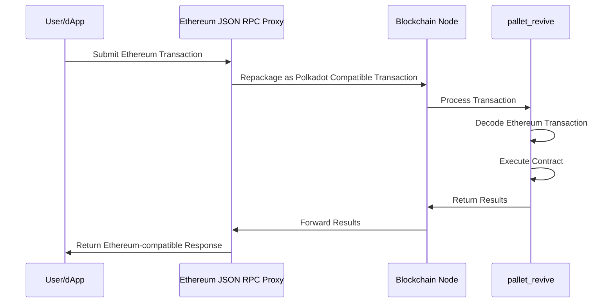

Begin New Bundle: Tooling
Includes shared base categories: Basics, Reference


---

Page Title: Accounts in Asset Hub Smart Contracts

- Source (raw): https://raw.githubusercontent.com/polkadot-developers/polkadot-docs/master/.ai/pages/smart-contracts-for-eth-devs-accounts.md
- Canonical (HTML): https://docs.polkadot.com/smart-contracts/for-eth-devs/accounts/
- Summary: Bridges Ethereum's 20-byte addresses with Polkadot's 32-byte accounts, enabling seamless interaction while maintaining compatibility with Ethereum tooling.

# Accounts on Asset Hub Smart Contracts

## Introduction

Asset Hub natively utilizes Polkadot's 32-byte account system while providing interoperability with Ethereum's 20-byte addresses through an automatic conversion system. When interacting with smart contracts:

- Ethereum-compatible wallets (like MetaMask) can use their familiar 20-byte addresses.
- Polkadot accounts continue using their native 32-byte format.
- The Asset Hub chain automatically handles conversion between the two formats behind the scenes:

    - 20-byte Ethereum addresses are padded with `0xEE` bytes to create valid 32-byte Polkadot accounts.
    - 32-byte Polkadot accounts can optionally register a mapping to a 20-byte address for Ethereum compatibility.

This dual-format approach enables Asset Hub to maintain compatibility with Ethereum tooling while fully integrating with the Polkadot ecosystem.

## Address Types and Mappings

The platform handles two distinct address formats:

- [Ethereum-style addresses (20 bytes)](https://ethereum.org/developers/docs/accounts/#account-creation){target=\_blank}
- [Polkadot native account IDs (32 bytes)](https://wiki.polkadot.com/learn/learn-account-advanced/#address-format){target=\_blank}


### Ethereum to Polkadot Mapping

The [`AccountId32Mapper`](https://paritytech.github.io/polkadot-sdk/master/pallet_revive/struct.AccountId32Mapper.html){target=\_blank} implementation in [`pallet_revive`](https://paritytech.github.io/polkadot-sdk/master/pallet_revive/index.html){target=\_blank} handles the core address conversion logic. For converting a 20-byte Ethereum address to a 32-byte Polkadot address, the pallet uses a simple concatenation approach:

- [**Core mechanism**](https://paritytech.github.io/polkadot-sdk/master/pallet_revive/trait.AddressMapper.html#tymethod.to_fallback_account_id){target=\_blank}: Takes a 20-byte Ethereum address and extends it to 32 bytes by adding twelve `0xEE` bytes at the end. The key benefits of this approach are:
    - Able to fully revert, allowing a smooth transition back to the Ethereum format.
    - Provides clear identification of Ethereum-controlled accounts through the `0xEE` suffix pattern.
    - Maintains cryptographic security with a `2^96` difficulty for pattern reproduction.

### Polkadot to Ethereum Mapping

The conversion from 32-byte Polkadot accounts to 20-byte Ethereum addresses is more complex than the reverse direction due to the lossy nature of the conversion. The [`AccountId32Mapper`](https://paritytech.github.io/polkadot-sdk/master/pallet_revive/struct.AccountId32Mapper.html){target=\_blank} handles this through two distinct approaches:

- **For Ethereum-derived accounts**: The system uses the [`is_eth_derived`](https://paritytech.github.io/polkadot-sdk/master/pallet_revive/fn.is_eth_derived.html){target=\_blank} function to detect accounts that were originally Ethereum addresses (identified by the `0xEE` suffix pattern). For these accounts, the conversion strips the last 12 bytes to recover the original 20-byte Ethereum address.

- **For native Polkadot accounts**: Since these accounts utilize the whole 32-byte space and weren't derived from Ethereum addresses, direct truncation would result in lost information. Instead, the system:

    1. Hashes the entire 32-byte account using Keccak-256.
    2. Takes the last 20 bytes of the hash to create the Ethereum address.
    3. This ensures a deterministic mapping while avoiding simple truncation.

The conversion process is implemented through the [`to_address`](https://paritytech.github.io/polkadot-sdk/master/pallet_revive/trait.AddressMapper.html#tymethod.to_address){target=\_blank} function, which automatically detects the account type and applies the appropriate conversion method.

**Stateful Mapping for Reversibility** : Since the conversion from 32-byte to 20-byte addresses is inherently lossy, the system provides an optional stateful mapping through the [`OriginalAccount`](https://paritytech.github.io/polkadot-sdk/master/pallet_revive/pallet/storage_types/struct.OriginalAccount.html){target=\_blank} storage. When a Polkadot account registers a mapping (via the [`map`](https://paritytech.github.io/polkadot-sdk/master/pallet_revive/trait.AddressMapper.html#tymethod.map){target=\_blank} function), the system stores the original 32-byte account ID, enabling the [`to_account_id`](https://paritytech.github.io/polkadot-sdk/master/pallet_revive/trait.AddressMapper.html#tymethod.to_account_id){target=\_blank} function to recover the exact original account rather than falling back to a default conversion.


### Account Mapping for Native Polkadot Accounts

If you have a native Polkadot account (32-byte format) that was created with a Polkadot/Substrate keypair (Ed25519/Sr25519) rather than an Ethereum-compatible keypair (secp256k1), you'll need to map your account to enable Ethereum compatibility.

To map your account, call the [`map_account`](https://paritytech.github.io/polkadot-sdk/master/pallet_revive/pallet/dispatchables/fn.map_account.html){target=\_blank} extrinsic of the [`pallet_revive`](https://paritytech.github.io/polkadot-sdk/master/pallet_revive/index.html){target=\_blank} pallet using your original Substrate account. This creates a stateful mapping that allows your 32-byte account to interact with the Ethereum-compatible smart contract system.

Once mapped, you'll be able to:

- Transfer funds between 20-byte format addresses.
- Interact with smart contracts using Ethereum-compatible tools like MetaMask.
- Maintain full reversibility to your original 32-byte account format.

!!! warning "Mapping Requirement"
    Without this mapping, native Polkadot accounts cannot transfer funds or interact with the Ethereum-compatible layer on the Hub.

## Account Registration

The registration process is implemented through the [`map`](https://paritytech.github.io/polkadot-sdk/master/pallet_revive/trait.AddressMapper.html#tymethod.map){target=\_blank} function. This process involves:

- Checking if the account is already mapped.
- Calculating and collecting required deposits based on data size.
- Storing the address suffix for future reference.
- Managing the currency holds for security.

## Fallback Accounts

The fallback mechanism is integrated into the [`to_account_id`](https://paritytech.github.io/polkadot-sdk/master/pallet_revive/trait.AddressMapper.html#tymethod.to_account_id){target=\_blank} function. It provides a safety net for address conversion by:

- First, attempting to retrieve stored mapping data.
- Falling back to the default conversion method if no mapping exists.
- Maintaining consistency in address representation.

## Contract Address Generation

The system supports two methods for generating contract addresses:

- [CREATE1 method](https://paritytech.github.io/polkadot-sdk/master/pallet_revive/fn.create1.html){target=\_blank}:

    - Uses the deployer address and nonce.
    - Generates deterministic addresses for standard contract deployment.

- [CREATE2 method](https://paritytech.github.io/polkadot-sdk/master/pallet_revive/fn.create2.html){target=\_blank}:

    - Uses the deployer address, initialization code, input data, and salt.
    - Enables predictable address generation for advanced use cases.

## Security Considerations

The address mapping system maintains security through several design choices evident in the implementation:

- The stateless mapping requires no privileged operations, as shown in the [`to_fallback_account_id`](https://paritytech.github.io/polkadot-sdk/master/pallet_revive/trait.AddressMapper.html#tymethod.to_fallback_account_id){target=\_blank} implementation.
- The stateful mapping requires a deposit managed through the [`Currency`](https://paritytech.github.io/polkadot-sdk/master/pallet_revive/pallet/trait.Config.html#associatedtype.Currency){target=\_blank} trait.
- Mapping operations are protected against common errors through explicit checks.
- The system prevents double-mapping through the [`ensure!(!Self::is_mapped(account_id))`](https://github.com/paritytech/polkadot-sdk/blob/stable2412/substrate/frame/revive/src/address.rs#L125){target=\_blank} check.

All source code references are from the [`address.rs`](https://github.com/paritytech/polkadot-sdk/blob/stable2412/substrate/frame/revive/src/address.rs){target=\_blank} file in the Revive pallet of the Polkadot SDK repository.


---

Page Title: Block Explorers

- Source (raw): https://raw.githubusercontent.com/polkadot-developers/polkadot-docs/master/.ai/pages/smart-contracts-explorers.md
- Canonical (HTML): https://docs.polkadot.com/smart-contracts/explorers/
- Summary: Access block explorers like Subscan, BlockScout, and Routescan to track transactions, analyze contracts, and view on-chain data from smart contracts.

# Block Explorers

## Introduction

Block explorers serve as comprehensive blockchain analytics platforms that provide access to on-chain data. These web applications function as search engines for blockchain networks, allowing users to query, visualize, and analyze blockchain data in real time through intuitive interfaces.

## Core Functionality

Block explorers provide essential capabilities for interacting with smart contracts on Polkadot Hub:

- **Transaction tracking**: Monitor transaction status, confirmations, fees, and metadata.
- **Address analysis**: View account balances, transaction history, and associated contracts.
- **Block information**: Examine block contents.
- **Smart contract interaction**: Review contract code, verification status, and interaction history.
- **Token tracking**: Monitor ERC-20, ERC-721, and other token standards with transfer history and holder analytics.
- **Network statistics**: Access metrics on transaction volume, gas usage, and other network parameters.

## Available Block Explorers

The following block explorers are available for Polkadot Hub smart contracts, providing specialized tools for monitoring and analyzing contract activity.


### BlockScout

BlockScout is an open-source explorer platform with a user-friendly interface. It excels at detailed contract analytics and provides developers with comprehensive API access.

- [Polkadot Hub TestNet BlockScout](https://blockscout-passet-hub.parity-testnet.parity.io/){target=\_blank}


---

Page Title: Contract Deployment

- Source (raw): https://raw.githubusercontent.com/polkadot-developers/polkadot-docs/master/.ai/pages/smart-contracts-for-eth-devs-contract-deployment.md
- Canonical (HTML): https://docs.polkadot.com/smart-contracts/for-eth-devs/contract-deployment/
- Summary: Learn how to deploy Solidity smart contracts to Polkadot Hub using familiar Ethereum tooling and workflows.

# Contract Deployment

## Introduction

Deploying smart contracts to Polkadot Hub works exactly like deploying to Ethereum. Use your existing Solidity contracts, familiar tools like Hardhat, Foundry, or Remix, and deploy without any modifications.

## Deployment Process

Polkadot Hub uses the REVM backend, which provides full Ethereum compatibility. This means:

- **Single-step deployment**: Contracts deploy in a single transaction, just like Ethereum.
- **Factory patterns work**: Create new contracts at runtime using standard factory patterns.
- **Full Solidity support**: All Solidity features including inline assembly are supported.
- **Familiar tools**: Hardhat, Foundry, Remix, and other Ethereum tools work out of the box.

## Using Your Existing Workflow

### With Hardhat

```bash
npx hardhat ignition deploy ./ignition/modules/MyContract.ts --network polkadotHub
```

### With Foundry

```bash
forge create --rpc-url $POLKADOT_HUB_RPC --private-key $PRIVATE_KEY src/MyContract.sol:MyContract
```

### With Remix

1. Connect MetaMask to Polkadot Hub
2. Select "Injected Provider - MetaMask" in Remix
3. Deploy as you would to any EVM chain

## Gas Estimation

You might notice that gas estimates are higher than actual consumption (often around 30% of the estimate is used). This is normal behavior because:

- Pre-dispatch estimation cannot distinguish between computation weight and storage deposits
- Contract deployments consume significant storage deposits for code storage
- The system uses conservative overestimation to ensure transactions succeed

## Network Configuration

Add Polkadot Hub to your development environment:

| Parameter | Value |
|-----------|-------|
| Network Name | Polkadot Hub TestNet |
| RPC URL | `https://testnet-passet-hub-eth-rpc.polkadot.io` |
| Chain ID | `420420421` |
| Currency Symbol | PAS |
| Block Explorer | [BlockScout](https://blockscout-passet-hub.parity-testnet.parity.io/){target=\_blank} |

## Next Steps

Once deployed, your contracts can:

- Interact with other contracts on Polkadot Hub
- Access Polkadot-native functionality via [precompiles](/smart-contracts/precompiles/)
- Communicate cross-chain using [XCM](/smart-contracts/precompiles/xcm/)


---

Page Title: Deploy an ERC-20 Using Hardhat

- Source (raw): https://raw.githubusercontent.com/polkadot-developers/polkadot-docs/master/.ai/pages/smart-contracts-cookbook-smart-contracts-deploy-erc20-erc20-hardhat.md
- Canonical (HTML): https://docs.polkadot.com/smart-contracts/cookbook/smart-contracts/deploy-erc20/erc20-hardhat/
- Summary: Deploy an ERC-20 token on Polkadot Hub using PVM. This guide covers contract creation, compilation, deployment, and interaction via Hardhat.

# Deploy an ERC-20 Using Hardhat

## Introduction

[ERC-20](https://eips.ethereum.org/EIPS/eip-20){target=\_blank} tokens are fungible tokens commonly used for creating cryptocurrencies, governance tokens, and staking mechanisms. Polkadot Hub enables easy deployment of ERC-20 tokens via Ethereum-compatible smart contracts and tools.

This guide demonstrates how to deploy an ERC-20 contract on Polkadot Hub TestNet using [Hardhat](https://hardhat.org/){target=\_blank}, an Ethereum development environment. The ERC-20 contract can be retrieved from OpenZeppelin's [GitHub repository](https://github.com/OpenZeppelin/openzeppelin-contracts/tree/v5.4.0/contracts/token/ERC20){target=\_blank} or their [Contract Wizard](https://wizard.openzeppelin.com/){target=\_blank}.

## Prerequisites

Before you begin, ensure you have the following:

- A basic understanding of [Solidity](https://www.soliditylang.org/){target=\_blank} programming and [ERC-20](https://ethereum.org/developers/docs/standards/tokens/erc-20/){target=\_blank} fungible tokens.
- [Node.js](https://nodejs.org/en/download){target=\_blank} v22.13.1 or later installed.
- Test tokens for gas fees, available from the [Polkadot faucet](https://faucet.polkadot.io/){target=\_blank}. See [Get Test Tokens](/smart-contracts/faucet/#get-test-tokens){target=\_blank} for a guide to using the faucet.
- A wallet with a private key for signing transactions.

## Set Up Your Project

This tutorial uses a [Hardhat ERC-20 template](https://github.com/polkadot-developers/revm-hardhat-examples/tree/master/erc20-hardhat){target=\_blank} that contains all the necessary files. 

To get started, take the following steps:

1. Clone the GitHub repository locally:

    ```bash
    git clone https://github.com/polkadot-developers/revm-hardhat-examples/
    cd revm-hardhat-examples/erc20-hardhat
    ```

2. Install the dependencies using the following command:

    ```bash
    npm i
    ```
    
    This command will fetch all the necessary packages to help you use Hardhat to deploy an ERC-20 to Polkadot.

## Configure Hardhat

If you started with the cloned Hardhat ERC-20 template, `hardhat.config.ts` is already configured to deploy to the Polkadot TestNet as shown in the example below:

```ts title="hardhat.config.ts" hl_lines="14-19"

const config: HardhatUserConfig = {
  solidity: {
    version: "0.8.28",
    settings: {
      optimizer: {
        enabled: true,
        runs: 200,
      },
    },
  },
  networks: {
    polkadotTestnet: {
      url: vars.get("TESTNET_URL", "http://127.0.0.1:8545"),
      accounts: vars.has("TESTNET_PRIVATE_KEY") ? [vars.get("TESTNET_PRIVATE_KEY")] : [],
    },
  },
  mocha: {
    timeout: 40000,
  },
};

export default config;
```

!!! tip
    Visit the Hardhat [Configuration variables](https://v2.hardhat.org/hardhat-runner/docs/guides/configuration-variables){target=\_blank} documentation to learn how to use Hardhat to handle your private keys securely.

## Compile the Contract 

Next, compile the contract included with the template by running the following command:

```bash
npx hardhat compile
```

If everything compiles successfully, you will see output similar to the following:


## Test the Contract

You can view the predefined test file at [`test/MyToken.test.ts`](https://github.com/polkadot-developers/revm-hardhat-examples/blob/master/erc20-hardhat/test/MyToken.test.ts){target=\_blank}. This example test includes verification of the following:

- The token name and symbol exist (confirms deployment) and are correct.
- The token owner is correctly configured.
- The initial token supply is zero.
- The owner can mint tokens.
- The total supply increases after a mint.
- Successful mints to different test addresses with expected account balance and total supply changes.

Run the tests using the following command:

```bash
npx hardhat test --network polkadotTestnet
```

If tests are successful, you will see outputs similar to the following:

<div id="termynal" data-termynal markdown>
  <span data-ty="input">npx hardhat test --network polkadotTestnet</span>
  <span data-ty></span>
  <span data-ty>&nbsp;&nbsp;MyToken</span>
  <span data-ty>&nbsp;&nbsp;&nbsp;&nbsp;Deployment</span>
  <span data-ty>&nbsp;&nbsp;&nbsp;&nbsp;&nbsp;&nbsp;✔ Should have correct name and symbol</span>
  <span data-ty>&nbsp;&nbsp;&nbsp;&nbsp;&nbsp;&nbsp;✔ Should set the right owner</span>
  <span data-ty>&nbsp;&nbsp;&nbsp;&nbsp;&nbsp;&nbsp;✔ Should have zero initial supply</span>
  <span data-ty>&nbsp;&nbsp;&nbsp;&nbsp;Minting</span>
  <span data-ty>&nbsp;&nbsp;&nbsp;&nbsp;&nbsp;&nbsp;✔ Should allow owner to mint tokens</span>
  <span data-ty>&nbsp;&nbsp;&nbsp;&nbsp;&nbsp;&nbsp;✔ Should increase total supply on mint</span>
  <span data-ty>&nbsp;&nbsp;&nbsp;&nbsp;Multiple mints</span>
  <span data-ty>&nbsp;&nbsp;&nbsp;&nbsp;&nbsp;&nbsp;✔ Should correctly track balance after multiple mints</span>
  <span data-ty></span>
  <span data-ty>&nbsp;&nbsp;6 passing (369ms)</span>
  <span data-ty="input"><span class="file-path"></span></span>
</div>

## Deploy the Contract

You are now ready to deploy the contract to your chosen network. This example demonstrates deployment to the Polkadot TestNet. Deploy the contract as follows:

1. Run the following command in your terminal:

    ```bash
    npx hardhat ignition deploy ./ignition/modules/MyToken.ts --network polkadotTestnet
    ```

2. Confirm the target deployment network name and chain ID when prompted:

    <div id="termynal" data-termynal markdown>
      <span data-ty="input">npx hardhat ignition deploy ./ignition/modules/MyToken.ts --network polkadotTestnet</span>
      <span data-ty>✔ Confirm deploy to network polkadotTestnet (420420420)? … yes</span>
      <span data-ty>&nbsp;</span>
      <span data-ty>Hardhat Ignition 🚀</span>
      <span data-ty>&nbsp;</span>
      <span data-ty>Deploying [ TokenModule ]</span>
      <span data-ty>&nbsp;</span>
      <span data-ty>Batch #1</span>
      <span data-ty> Executed TokenModule#MyToken</span>
      <span data-ty>&nbsp;</span>
      <span data-ty>Batch #2</span>
      <span data-ty> Executed TokenModule#MyToken.mint</span>
      <span data-ty>&nbsp;</span>
      <span data-ty>[ TokenModule ] successfully deployed 🚀</span>
      <span data-ty>&nbsp;</span>
      <span data-ty>Deployed Addresses</span>
      <span data-ty>&nbsp;</span>
      <span data-ty>TokenModule#MyToken - 0xc01Ee7f10EA4aF4673cFff62710E1D7792aBa8f3</span>
      <span data-ty="input"><span class="file-path"></span></span>
    </div>

Congratulations! You've successfully deployed an ERC-20 token contract to Polkadot Hub TestNet using Hardhat. Consider the following resources to build upon your progress.

## Where to Go Next

<div class="grid cards" markdown>

-   <span class="badge guide">Guide</span> __Deploy an NFT__

    ---

    Walk through deploying an NFT to the Polkadot Hub using Hardhat.

    [:octicons-arrow-right-24: Get Started](/smart-contracts/cookbook/smart-contracts/deploy-nft/nft-hardhat/)

-   <span class="badge guide">Guide</span> __Create a DApp__

    ---

    Learn step-by-step how to build a fully functional dApp that interacts with a smart contract deployed via Hardhat.

    [:octicons-arrow-right-24: Get Started](/smart-contracts/cookbook/dapps/zero-to-hero/)

</div>


---

Page Title: Deploy an ERC-20 Using Remix IDE

- Source (raw): https://raw.githubusercontent.com/polkadot-developers/polkadot-docs/master/.ai/pages/smart-contracts-cookbook-smart-contracts-deploy-erc20-erc20-remix.md
- Canonical (HTML): https://docs.polkadot.com/smart-contracts/cookbook/smart-contracts/deploy-erc20/erc20-remix/
- Summary: Deploy an ERC-20 token contract on Polkadot Hub. This guide covers contract creation, compilation, deployment, and interaction via the Remix IDE.

# Deploy an ERC-20 Using Remix IDE

## Introduction

[ERC-20](https://eips.ethereum.org/EIPS/eip-20){target=\_blank} tokens are fungible tokens commonly used for creating cryptocurrencies, governance tokens, and staking mechanisms. Polkadot Hub enables easy token deployment with Ethereum-compatible smart contracts and tools via the EVM backend.

This tutorial covers deploying an ERC-20 contract on Polkadot Hub TestNet using [Remix IDE](https://remix.ethereum.org/){target=\_blank}, a web-based development tool. The ERC-20 contract can be retrieved from OpenZeppelin's [GitHub repository](https://github.com/OpenZeppelin/openzeppelin-contracts/tree/v5.4.0/contracts/token/ERC20){target=\_blank} or their [Contract Wizard](https://wizard.openzeppelin.com/){target=\_blank}.

## Prerequisites

Before you begin, ensure you have:

- A basic understanding of [Solidity](https://www.soliditylang.org/){target=\_blank} programming and [ERC-20](https://ethereum.org/developers/docs/standards/tokens/erc-20/){target=\_blank} fungible tokens.
- An EVM-compatible [wallet](/smart-contracts/connect/){target=\_blank} connected to Polkadot Hub. This example utilizes [MetaMask](https://metamask.io/){target=\_blank}.
- Test tokens for gas fees, available from the [Polkadot faucet](https://faucet.polkadot.io/){target=\_blank}. See [Get Test Tokens](/smart-contracts/faucet/#get-test-tokens){target=\_blank} for a guide to using the faucet.

## Create Your Contract

Follow the steps below to create the ERC-20 contract:

1. Navigate to [Remix IDE](https://remix.ethereum.org/){target=\_blank} in your web browser.
2. Select the **Create new file** button under the **contracts** folder, and name your contract `MyToken.sol`.

    

3. Now, paste the following ERC-20 contract code into `MyToken.sol`:

    ```solidity title="MyToken.sol"
    // SPDX-License-Identifier: MIT
    // Compatible with OpenZeppelin Contracts ^5.4.0
    pragma solidity ^0.8.27;

    import {ERC20} from "@openzeppelin/contracts/token/ERC20/ERC20.sol";
    import {ERC20Permit} from "@openzeppelin/contracts/token/ERC20/extensions/ERC20Permit.sol";
    import {Ownable} from "@openzeppelin/contracts/access/Ownable.sol";

    contract MyToken is ERC20, Ownable, ERC20Permit {
        constructor(address initialOwner)
            ERC20("MyToken", "MTK")
            Ownable(initialOwner)
            ERC20Permit("MyToken")
        {}

        function mint(address to, uint256 amount) public onlyOwner {
            _mint(to, amount);
        }
    }
    ```
    
    !!! tip
        The [OpenZeppelin Contracts Wizard](https://wizard.openzeppelin.com/){target=\_blank} was used to generate this example ERC-20 contract.
        
## Compile the Contract

Solidity source code compiles into bytecode that can be deployed on the blockchain. During this process, the compiler checks the contract for syntax errors, ensures type safety, and generates the machine-readable instructions needed for blockchain execution.

Ensure your `MyToken.sol` contract is open in the Remix IDE Editor, and use the following steps to compile:

1. Select the **Solidity Compiler** plugin from the left panel.
2. Select the **Compile MyToken.sol** button.

The **Solidity Compiler** icon will display a green checkmark once the contract compiles successfully. If any issues arise during contract compilation, errors and warnings will appear in the terminal panel at the bottom of the screen.


## Deploy the Contract

Follow these steps to deploy the contract using Remix:

1. Select **Deploy & Run Transactions** from the left panel.
2. Ensure your MetaMask wallet is connected to Polkadot Hub TestNet, then select the **Environment** dropdown and select **Injected Provider - MetaMask**.
3. Configure the contract parameters by entering the address that will own the deployed token contract.
4. Select the **Deploy** button to initiate the deployment.
4. Approve the transaction in your MetaMask wallet when prompted.
6. You will see the transaction details in the terminal when the deployment succeeds, including the contract address and deployment transaction hash.


Once successfully deployed, your contract will appear in the **Deployed Contracts** section, ready for interaction.

## Interact with the Contract

Once deployed, you can interact with your contract through Remix. Find your contract under **Deployed/Unpinned Contracts**, and select it to expand the available methods. In this example, you'll mint some tokens to a given address using the following steps:

1. Expand the **mint** function, then enter the recipient address and the amount (remember to add 18 zeros for one whole token).
2. Select **transact**.
3. Approve the transaction in your MetaMask wallet when prompted.
4. You will see a green check mark in the terminal when the transaction is successful.
5. You can also call the **balanceOf** function by passing the address of the **mint** call to confirm the new balance.


Feel free to explore and interact with the contract's other functions by selecting the method, providing any required parameters, and confirming the transaction in MetaMask when prompted.

Congratulations! You've successfully deployed an ERC-20 token contract to Polkadot Hub TestNet using Remix IDE. Consider the following resources to build upon your progress. 

## Where to Go Next

<div class="grid cards" markdown>

-   <span class="badge guide">Guide</span> __Deploy an NFT with Remix__

    ---

    Walk through deploying an ERC-721 Non-Fungible Token (NFT) using OpenZeppelin's battle-tested NFT implementation and Remix.

    [:octicons-arrow-right-24: Get Started](/smart-contracts/cookbook/smart-contracts/deploy-nft/nft-remix/)

</div>


---

Page Title: Deploy an ERC-721 NFT Using Remix

- Source (raw): https://raw.githubusercontent.com/polkadot-developers/polkadot-docs/master/.ai/pages/smart-contracts-cookbook-smart-contracts-deploy-nft-nft-remix.md
- Canonical (HTML): https://docs.polkadot.com/smart-contracts/cookbook/smart-contracts/deploy-nft/nft-remix/
- Summary: Learn how to deploy an ERC-721 NFT contract to Polkadot Hub using Remix, a browser-based IDE for quick prototyping and learning.

# Deploy an NFT with Remix

## Introduction

Non-Fungible Tokens (NFTs) represent unique digital assets commonly used for digital art, collectibles, gaming, and identity verification.

This guide demonstrates how to deploy an [ERC-721](https://eips.ethereum.org/EIPS/eip-721){target=\_blank} NFT contract to [Polkadot Hub](/smart-contracts/overview/#smart-contract-development){target=\_blank}. You'll use [OpenZeppelin's battle-tested NFT implementation](https://github.com/OpenZeppelin/openzeppelin-contracts){target=\_blank} and [Remix](https://remix.ethereum.org/){target=\_blank}, a visual, browser-based environment perfect for rapid prototyping and learning. It requires no local installation and provides an intuitive interface for contract development.

## Prerequisites

- A basic understanding of [Solidity](https://www.soliditylang.org/){target=\_blank} programming and [ERC-721 NFT](https://ethereum.org/developers/docs/standards/tokens/erc-721/) standards.
- An EVM-compatible [wallet](/smart-contracts/connect/){target=\_blank} connected to Polkadot Hub. This example utilizes [MetaMask](https://metamask.io/){target=\_blank}.
- Test tokens for gas fees (available from the [Polkadot faucet](https://faucet.polkadot.io/){target=\_blank}). See [Get Test Tokens](/smart-contracts/faucet/#get-test-tokens){target=\_blank} for a guide to using the faucet.

## Create Your Contract

Follow the steps below to create the ERC-721 contract:

1. Navigate to [Remix IDE](https://remix.ethereum.org/){target=\_blank} in your web browser.
2. Select the **Create new file** button under the **contracts** folder, and name your contract `MyNFT.sol`.

    

3. Now, paste the following ERC-721 contract code into `MyNFT.sol`:

    ```solidity title="contracts/MyNFT.sol"
    // SPDX-License-Identifier: MIT
    pragma solidity ^0.8.20;

    import "@openzeppelin/contracts/token/ERC721/ERC721.sol";
    import "@openzeppelin/contracts/access/Ownable.sol";

    contract MyNFT is ERC721, Ownable {
        uint256 private _nextTokenId;

        constructor(
            address initialOwner
        ) ERC721("MyToken", "MTK") Ownable(initialOwner) {}

        function safeMint(address to) public onlyOwner {
            uint256 tokenId = _nextTokenId++;
            _safeMint(to, tokenId);
        }
    }

    ```

    !!! tip
        The [OpenZeppelin Contracts Wizard](https://wizard.openzeppelin.com/){target=\_blank} was used to generate this example ERC-721 contract.

## Compile the Contract

Solidity source code compiles into bytecode that can be deployed on the blockchain. During this process, the compiler checks the contract for syntax errors, ensures type safety, and generates the machine-readable instructions needed for blockchain execution.

Ensure your `MyNFT.sol` contract is open in the Remix IDE Editor, and use the following steps to compile:

1. Select the **Solidity Compiler** plugin from the left panel.
2. Select the **Compile MyToken.sol** button.

The **Solidity Compiler** icon will display a green checkmark once the contract compiles successfully. If any issues arise during contract compilation, errors and warnings will appear in the terminal panel at the bottom of the screen.


## Deploy the Contract

Follow these steps to deploy the contract using Remix:

1. Select **Deploy & Run Transactions** from the left panel.
2. Ensure your MetaMask wallet is connected to Polkadot Hub TestNet, then select the **Environment** dropdown and select **Injected Provider - MetaMask**.

    

3. Configure the contract parameters by entering the address that will own the deployed NFT contract.
4. Select the **Deploy** button to initiate the deployment.
5. Approve the transaction in your MetaMask wallet when prompted.
6. You will see the transaction details in the terminal when the deployment succeeds, including the contract address and deployment transaction hash.


Once successfully deployed, your contract will appear in the **Deployed Contracts** section, ready for interaction.

Congratulations! You've successfully deployed an ERC-721 NFT contract to Polkadot Hub TestNet using Remix IDE. Consider the following resources to build upon your progress.

## Where to Go Next

<div class="grid cards" markdown>

-   <span class="badge guide">Guide</span> __Deploy an ERC-20__

    ---

    Walk through deploying a fully-functional ERC-20 to Polkadot Hub using Remix.

    [:octicons-arrow-right-24: Get Started](/smart-contracts/cookbook/smart-contracts/deploy-erc20/erc20-remix/)

</div>


---

Page Title: Deploy an ERC-721 Using Hardhat

- Source (raw): https://raw.githubusercontent.com/polkadot-developers/polkadot-docs/master/.ai/pages/smart-contracts-cookbook-smart-contracts-deploy-nft-nft-hardhat.md
- Canonical (HTML): https://docs.polkadot.com/smart-contracts/cookbook/smart-contracts/deploy-nft/nft-hardhat/
- Summary: Learn how to deploy an ERC-721 NFT contract to Polkadot Hub using Hardhat, a comprehensive development environment with built-in deployment capabilities.

# Deploy an ERC-721 Using Hardhat

## Introduction

Non-Fungible Tokens (NFTs) represent unique digital assets commonly used for digital art, collectibles, gaming, and identity verification.

This guide demonstrates how to deploy an [ERC-721](https://eips.ethereum.org/EIPS/eip-721){target=\_blank} NFT contract to [Polkadot Hub](/smart-contracts/overview/#smart-contract-development){target=\_blank} TestNet. You'll use OpenZeppelin's battle-tested [NFT implementation](https://github.com/OpenZeppelin/openzeppelin-contracts){target=\_blank} and [Hardhat](https://hardhat.org/docs/getting-started){target=\_blank}, a comprehensive development environment with built-in testing, debugging, and deployment capabilities. Hardhat uses standard Solidity compilation to generate EVM bytecode, making it fully compatible with Polkadot Hub's EVM environment.

## Prerequisites

Before you begin, ensure you have the following:

- A basic understanding of [Solidity](https://www.soliditylang.org/){target=\_blank} programming and [ERC-721](https://ethereum.org/developers/docs/standards/tokens/erc-721/){target=\_blank} non-fungible tokens.
- [Node.js](https://nodejs.org/en/download){target=\_blank} v22.13.1 or later installed.
- Test tokens for gas fees, available from the [Polkadot faucet](https://faucet.polkadot.io/){target=\_blank}. See [Get Test Tokens](/smart-contracts/faucet/#get-test-tokens){target=\_blank} for a guide to using the faucet.
- A wallet with a private key for signing transactions.

## Set Up Your Project

1. Use the following terminal commands to create a directory and initialize your Hardhat project inside of it:

    ```bash
    mkdir hardhat-nft-deployment
    cd hardhat-nft-deployment
    npx hardhat@^2.27.0 init
    ```

2. Install the OpenZeppelin contract dependencies using the command:

    ```bash
    npm install @openzeppelin/contracts
    ```

## Configure Hardhat

Open `hardhat.config.ts` and update to add `polkadotTestnet` to the `networks` configuration as highlighted in the following example code:

```typescript title="hardhat.config.ts" hl_lines='18-23'
import type { HardhatUserConfig } from 'hardhat/config';

import hardhatToolboxViemPlugin from '@nomicfoundation/hardhat-toolbox-viem';
import { vars } from 'hardhat/config';

const config: HardhatUserConfig = {
  plugins: [hardhatToolboxViemPlugin],
  solidity: {
    version: '0.8.28',
    settings: {
      optimizer: {
        enabled: true,
        runs: 200,
      },
    },
  },
  networks: {
    polkadotTestnet: {
      url: 'https://testnet-passet-hub-eth-rpc.polkadot.io',
      chainId: 420420422,
      accounts: [vars.get('PRIVATE_KEY')],
    },
  },
};

export default config;
```

!!! tip
    Visit the Hardhat [Configuration variables](https://v2.hardhat.org/hardhat-runner/docs/guides/configuration-variables){target=\_blank} documentation to learn how to use Hardhat to handle your private keys securely.

## Create the Contract

Follow these steps to create your smart contract:

1. Delete the default contract file(s) in the `contracts` directory.

2. Create a new file named `MyNFT.sol` inside the `contracts` directory.

3. Add the following code to create the `MyNFT.sol` smart contract:
    ```solidity title="contracts/MyNFT.sol"
    // SPDX-License-Identifier: MIT
    pragma solidity ^0.8.20;

    import "@openzeppelin/contracts/token/ERC721/ERC721.sol";
    import "@openzeppelin/contracts/access/Ownable.sol";

    contract MyNFT is ERC721, Ownable {
        uint256 private _nextTokenId;

        constructor(
            address initialOwner
        ) ERC721("MyToken", "MTK") Ownable(initialOwner) {}

        function safeMint(address to) public onlyOwner {
            uint256 tokenId = _nextTokenId++;
            _safeMint(to, tokenId);
        }
    }

    ```

## Compile the Contract

Compile your `MyNFT.sol` contract using the following command:

```bash
npx hardhat compile
```

You will see a message in the terminal confirming the contract was successfully compiled, similar to the following:

<div id="termynal" data-termynal>
  <span data-ty="input"><span class="file-path"></span>npx hardhat compile</span>
  <span data-ty>Downloading solc 0.8.28</span>
  <span data-ty>Downloading solc 0.8.28 (WASM build)</span>
  <span data-ty>Compiled 1 Solidity file with solc 0.8.28 (evm target: cancun)</span>
  <span data-ty="input"><span class="file-path"></span></span>
</div>
## Deploy the Contract

You are now ready to deploy the contract to your chosen network. This example demonstrates deployment to the Polkadot TestNet. Deploy the contract as follows:

1. Delete the default file(s) inside the `ignition/modules` directory.

2. Create a new file named `MyNFT.ts` inside the `ignition/modules` directory.

3. Open `ignition/modules/MyNFT.ts` and add the following code to create your deployment module:
    ```typescript title="ignition/modules/MyNFT.ts"
    import { buildModule } from '@nomicfoundation/hardhat-ignition/modules';

    export default buildModule('MyNFTModule', (m) => {
      const initialOwner = m.getParameter('initialOwner', 'INSERT_OWNER_ADDRESS');
      const myNFT = m.contract('MyNFT', [initialOwner]);
      return { myNFT };
    });

    ```

    Replace `INSERT_OWNER_ADDRESS` with your desired owner address.

4. Deploy your contract to Polkadot Hub TestNet using the following command:

    ```bash
    npx hardhat ignition deploy ignition/modules/MyNFT.ts --network polkadotTestnet
    ```

5. Confirm the target deployment network name and chain ID when prompted:

    <div id="termynal" data-termynal markdown>
      <span data-ty="input">npx hardhat ignition deploy ignition/modules/MyNFT.ts --network polkadotHubTestnet</span>
      <span data-ty>✔ Confirm deploy to network polkadotTestnet (420420420)? … yes</span>
      <span data-ty>&nbsp;</span>
      <span data-ty>Hardhat Ignition 🚀</span>
      <span data-ty>&nbsp;</span>
      <span data-ty>Deploying [ MyNFTModule ]</span>
      <span data-ty>&nbsp;</span>
      <span data-ty>Batch #1</span>
      <span data-ty> Executed MyNFTModule#MyNFT</span>
      <span data-ty>&nbsp;</span>
      <span data-ty>Batch #2</span>
      <span data-ty> Executed MyNFTModule#MyNFT.safeMint</span>
      <span data-ty>&nbsp;</span>
      <span data-ty>[ TokenModule ] successfully deployed 🚀</span>
      <span data-ty>&nbsp;</span>
      <span data-ty>Deployed Addresses</span>
      <span data-ty>&nbsp;</span>
      <span data-ty>MyNFTModule#MyNFT - 0x1234.......</span>
      <span data-ty="input"><span class="file-path"></span></span>
    </div>
Congratulations! You've successfully deployed an ERC-721 NFT contract to Polkadot Hub TestNet using Hardhat. Consider the following resources to build upon your progress. 

## Where to Go Next

<div class="grid cards" markdown>

-   <span class="badge guide">Guide</span> __Deploy an ERC-20__

    ---

    Walk through deploying a fully-functional ERC-20 to Polkadot Hub using Hardhat.

    [:octicons-arrow-right-24: Get Started](/smart-contracts/cookbook/smart-contracts/deploy-erc20/erc20-hardhat/)

-   <span class="badge guide">Guide</span> __Create a DApp__

    ---

    Learn step-by-step how to build a fully functional dApp that interacts with a smart contract deployed via Hardhat.

    [:octicons-arrow-right-24: Get Started](/smart-contracts/cookbook/dapps/zero-to-hero/)

</div>


---

Page Title: Deploy an NFT to Polkadot Hub with Foundry

- Source (raw): https://raw.githubusercontent.com/polkadot-developers/polkadot-docs/master/.ai/pages/smart-contracts-cookbook-smart-contracts-deploy-nft-.foundry.md
- Canonical (HTML): https://docs.polkadot.com/smart-contracts/cookbook/smart-contracts/deploy-nft/.foundry/
- Summary: Learn how to deploy an ERC-721 NFT contract to Polkadot Hub using Foundry, a Rust toolkit with high-performance compilation.

# Deploy an NFT with Foundry

## Introduction

Non-Fungible Tokens (NFTs) represent unique digital assets commonly used for digital art, collectibles, gaming, and identity verification.

This guide demonstrates how to deploy an [ERC-721](https://eips.ethereum.org/EIPS/eip-721){target=\_blank} NFT contract to [Polkadot Hub](/smart-contracts/overview/#smart-contract-development){target=\_blank}. It showcases a secure approach using [OpenZeppelin's battle-tested NFT implementation](https://github.com/OpenZeppelin/openzeppelin-contracts){target=\_blank} and the [Foundry](https://getfoundry.sh/){target=\_blank} toolchain. Foundry, a fast, Rust-written toolkit, ensures high-performance compilation and is fully compatible with the Hub’s EVM environment via standard Solidity compilation.

## Prerequisites

- Basic understanding of Solidity programming and NFT standards.
- Test tokens for gas fees (available from the [Polkadot faucet](https://faucet.polkadot.io/){target=\_blank}). See the [step-by-step instructions](/smart-contracts/faucet/#get-test-tokens){target=\_blank}.
- A wallet with a private key for signing transactions.

## Set Up Your Project

To get started, take the following steps:

1. Install Foundry:

    ```bash
    curl -L https://foundry.paradigm.xyz | bash
    foundryup
    ```

2. Initialize your project:

    ```bash
    forge init foundry-nft-deployment
    cd foundry-nft-deployment
    ```

3. Install OpenZeppelin contracts:

    ```bash
    forge install OpenZeppelin/openzeppelin-contracts
    ```

## Configure Foundry

Edit `foundry.toml`:

```toml title="foundry.toml"
[profile.default]
src = "src"
out = "out"
libs = ["lib"]
remappings = ['@openzeppelin/contracts/=lib/openzeppelin-contracts/contracts/']

[rpc_endpoints]
polkadot_hub_testnet = "https://testnet-passet-hub-eth-rpc.polkadot.io"
```

## Create Your Contract

Create `src/MyNFT.sol`:

```solidity title="src/MyNFT.sol"
// SPDX-License-Identifier: MIT
pragma solidity ^0.8.20;

import "@openzeppelin/contracts/token/ERC721/ERC721.sol";
import "@openzeppelin/contracts/access/Ownable.sol";

contract MyNFT is ERC721, Ownable {
    uint256 private _nextTokenId;

    constructor(address initialOwner)
        ERC721("MyToken", "MTK")
        Ownable(initialOwner)
    {}

    function safeMint(address to) public onlyOwner {
        uint256 tokenId = _nextTokenId++;
        _safeMint(to, tokenId);
    }
}
```

## Compile

```bash
forge build
```

Verify the compilation by inspecting the bytecode:

```bash
forge inspect MyNFT bytecode
```

## Deploy

Deploy to Polkadot Hub TestNet:

```bash
forge create MyNFT \
    --rpc-url polkadot_hub_testnet \
    --private-key YOUR_PRIVATE_KEY \
    --constructor-args YOUR_OWNER_ADDRESS \
    --broadcast
```

Replace `YOUR_PRIVATE_KEY` with your private key and `YOUR_OWNER_ADDRESS` with the address that will own the NFT contract.

## Where to Go Next

<div class="grid cards" markdown>

-   <span class="badge guide">Guide</span> __Verify Your Contract__

    ---

    Now that you've deployed an NFT contract, learn how to verify it with Foundry.

    [:octicons-arrow-right-24: Get Started](/smart-contracts/dev-environments/foundry/verify-a-contract/)

-   <span class="badge guide">Guide</span> __Deploy an ERC-20__

    ---

    Walk through deploying a fully-functional ERC-20 to the Polkadot Hub using Foundry.

    [:octicons-arrow-right-24: Get Started](/smart-contracts/cookbook/smart-contracts/deploy-erc20/foundry/)

</div>


---

Page Title: Deploy Contracts to Polkadot Hub with Ethers.js

- Source (raw): https://raw.githubusercontent.com/polkadot-developers/polkadot-docs/master/.ai/pages/smart-contracts-libraries-ethers-js.md
- Canonical (HTML): https://docs.polkadot.com/smart-contracts/libraries/ethers-js/
- Summary: Learn how to interact with Polkadot Hub using Ethers.js, from compiling and deploying Solidity contracts to interacting with deployed smart contracts.

# Ethers.js

## Introduction

[Ethers.js](https://docs.ethers.org/v6/){target=\_blank} is a lightweight library that enables interaction with Ethereum Virtual Machine (EVM)-compatible blockchains through JavaScript. Ethers is widely used as a toolkit to establish connections and read and write blockchain data. This article demonstrates using Ethers.js to interact and deploy smart contracts to Polkadot Hub.

This guide is intended for developers who are familiar with JavaScript and want to interact with Polkadot Hub using Ethers.js.

## Prerequisites

Before getting started, ensure you have the following installed:

- **Node.js**: v22.13.1 or later, check the [Node.js installation guide](https://nodejs.org/en/download/current/){target=\_blank}.
- **npm**: v6.13.4 or later (comes bundled with Node.js).
- **Solidity**: This guide uses Solidity `^0.8.9` for smart contract development.

## Project Structure

This project organizes contracts, scripts, and compiled artifacts for easy development and deployment.

```text title="Ethers.js Polkadot Hub"
ethers-project
├── contracts
│   ├── Storage.sol
├── scripts
│   ├── connectToProvider.js
│   ├── fetchLastBlock.js
│   ├── compile.js
│   ├── deploy.js
│   ├── checkStorage.js
├── abis
│   ├── Storage.json
├── artifacts
│   ├── Storage.bin
├── contract-address.json
├── node_modules/
├── package.json
├── package-lock.json
└── README.md
```

## Set Up the Project

To start working with Ethers.js, create a new folder and initialize your project by running the following commands in your terminal:

```bash
mkdir ethers-project
cd ethers-project
npm init -y
```

## Install Dependencies

Next, run the following command to install the Ethers.js library:

```bash
npm install ethers
```

Add the Solidity compiler so you can generate standard EVM bytecode:

```bash
npm install --save-dev solc
```

This guide uses `solc` version `0.8.33`.

!!! tip
    The sample scripts use ECMAScript modules. Add `"type": "module"` to your `package.json` (or rename the files to `.mjs`) so that `node` can run the `import` statements.

## Set Up the Ethers.js Provider

A [`Provider`](https://docs.ethers.org/v6/api/providers/#Provider){target=\_blank} is an abstraction of a connection to the Ethereum network, allowing you to query blockchain data and send transactions. It serves as a bridge between your application and the blockchain.

To interact with Polkadot Hub, you must set up an Ethers.js provider. This provider connects to a blockchain node, allowing you to query blockchain data and interact with smart contracts. In the root of your project, create a file named `connectToProvider.js` and add the following code:

```js title="scripts/connectToProvider.js"
const { JsonRpcProvider } = require('ethers');

const createProvider = (rpcUrl, chainId, chainName) => {
  const provider = new JsonRpcProvider(rpcUrl, {
    chainId: chainId,
    name: chainName,
  });

  return provider;
};

const PROVIDER_RPC = {
  rpc: 'INSERT_RPC_URL',
  chainId: 'INSERT_CHAIN_ID',
  name: 'INSERT_CHAIN_NAME',
};

createProvider(PROVIDER_RPC.rpc, PROVIDER_RPC.chainId, PROVIDER_RPC.name);

```

!!! note
    Replace `INSERT_RPC_URL`, `INSERT_CHAIN_ID`, and `INSERT_CHAIN_NAME` with the appropriate values. For example, to connect to Polkadot Hub TestNet's Ethereum RPC instance, you can use the following parameters:

    ```js
    const PROVIDER_RPC = {
        rpc: 'https://testnet-passet-hub-eth-rpc.polkadot.io',
        chainId: 420420422,
        name: 'polkadot-hub-testnet'
    };
    ```

To connect to the provider, execute:

```bash
node scripts/connectToProvider.js
```

With the provider set up, you can start querying the blockchain. For instance, to fetch the latest block number:

??? code "fetchLastBlock.js code"

    ```js title="scripts/fetchLastBlock.js"
    const { JsonRpcProvider } = require('ethers');

    const createProvider = (rpcUrl, chainId, chainName) => {
      const provider = new JsonRpcProvider(rpcUrl, {
        chainId: chainId,
        name: chainName,
      });

      return provider;
    };

    const PROVIDER_RPC = {
      rpc: 'https://testnet-passet-hub-eth-rpc.polkadot.io',
      chainId: 420420422,
      name: 'polkadot-hub-testnet',
    };

    const main = async () => {
      try {
        const provider = createProvider(
          PROVIDER_RPC.rpc,
          PROVIDER_RPC.chainId,
          PROVIDER_RPC.name,
        );
        const latestBlock = await provider.getBlockNumber();
        console.log(`Latest block: ${latestBlock}`);
      } catch (error) {
        console.error('Error connecting to Polkadot Hub TestNet: ' + error.message);
      }
    };

    main();

    ```

## Compile Contracts

Polkadot Hub exposes an Ethereum JSON-RPC endpoint, so you can compile Solidity contracts to familiar EVM bytecode with the upstream [`solc`](https://www.npmjs.com/package/solc){target=\_blank} compiler. The resulting artifacts work with any EVM-compatible toolchain and can be deployed through Ethers.js.

### Sample Storage Smart Contract

This example demonstrates compiling a `Storage.sol` Solidity contract for deployment to Polkadot Hub. The contract's functionality stores a number and permits users to update it with a new value.

```solidity title="contracts/Storage.sol"
//SPDX-License-Identifier: MIT

// Solidity files have to start with this pragma.
// It will be used by the Solidity compiler to validate its version.
pragma solidity ^0.8.9;

contract Storage {
    // Public state variable to store a number
    uint256 public storedNumber;

    /**
    * Updates the stored number.
    *
    * The `public` modifier allows anyone to call this function.
    *
    * @param _newNumber - The new value to store.
    */
    function setNumber(uint256 _newNumber) public {
        storedNumber = _newNumber;
    }
}
```

### Compile the Smart Contract

To compile this contract, use the following script:

```js title="scripts/compile.js"
const solc = require('solc');
const { readFileSync, writeFileSync, mkdirSync, existsSync } = require('fs');
const { basename, join } = require('path');

const ensureDir = (dirPath) => {
  if (!existsSync(dirPath)) {
    mkdirSync(dirPath, { recursive: true });
  }
};

const compileContract = (solidityFilePath, abiDir, artifactsDir) => {
  try {
    // Read the Solidity file
    const source = readFileSync(solidityFilePath, 'utf8');
    const fileName = basename(solidityFilePath);
    
    // Construct the input object for the Solidity compiler
    const input = {
      language: 'Solidity',
      sources: {
        [fileName]: {
          content: source,
        },
      },
      settings: {
        outputSelection: {
          '*': {
            '*': ['abi', 'evm.bytecode'],
          },
        },
      },
    };
    
    console.log(`Compiling contract: ${fileName}...`);
    
    // Compile the contract
    const output = JSON.parse(solc.compile(JSON.stringify(input)));
    
    // Check for errors
    if (output.errors) {
      const errors = output.errors.filter(error => error.severity === 'error');
      if (errors.length > 0) {
        console.error('Compilation errors:');
        errors.forEach(err => console.error(err.formattedMessage));
        return;
      }
      // Show warnings
      const warnings = output.errors.filter(error => error.severity === 'warning');
      warnings.forEach(warn => console.warn(warn.formattedMessage));
    }
    
    // Ensure output directories exist
    ensureDir(abiDir);
    ensureDir(artifactsDir);

    // Process compiled contracts
    for (const [sourceFile, contracts] of Object.entries(output.contracts)) {
      for (const [contractName, contract] of Object.entries(contracts)) {
        console.log(`Compiled contract: ${contractName}`);
        
        // Write the ABI
        const abiPath = join(abiDir, `${contractName}.json`);
        writeFileSync(abiPath, JSON.stringify(contract.abi, null, 2));
        console.log(`ABI saved to ${abiPath}`);
        
        // Write the bytecode
        const bytecodePath = join(artifactsDir, `${contractName}.bin`);
        writeFileSync(bytecodePath, contract.evm.bytecode.object);
        console.log(`Bytecode saved to ${bytecodePath}`);
      }
    }
  } catch (error) {
    console.error('Error compiling contracts:', error);
  }
};

const solidityFilePath = join(__dirname, '../contracts/Storage.sol');
const abiDir = join(__dirname, '../abis');
const artifactsDir = join(__dirname, '../artifacts');

compileContract(solidityFilePath, abiDir, artifactsDir);
```

!!! note 
     The script above is tailored to the `Storage.sol` contract. It can be adjusted for other contracts by changing the file name or modifying the ABI and bytecode paths.

The ABI (Application Binary Interface) is a JSON representation of your contract's functions, events, and their parameters. It serves as the interface between your JavaScript code and the deployed smart contract, allowing your application to know how to format function calls and interpret returned data.

Execute the script above by running:

```bash
node scripts/compile.js
```

After executing the script, the Solidity contract is compiled into standard EVM bytecode. The ABI and bytecode are saved into files with `.json` and `.bin` extensions, respectively. You can now proceed with deploying the contract to Polkadot Hub, as outlined in the next section.

## Deploy the Compiled Contract

To deploy your compiled contract to Polkadot Hub, you'll need a wallet with a private key to sign the deployment transaction.

You can create a `deploy.js` script in the root of your project to achieve this. The deployment script can be divided into key components:

1. Set up the required imports and utilities:

    ```js title="scripts/deploy.js"
    const { writeFileSync, existsSync, readFileSync } = require('fs');
    const { join } = require('path');
    const { ethers, JsonRpcProvider } = require('ethers');

    ```

2. Create a provider to connect to Polkadot Hub:

    ```js title="scripts/deploy.js"

    // Creates a provider with specified RPC URL and chain details
    const createProvider = (rpcUrl, chainId, chainName) => {
      const provider = new JsonRpcProvider(rpcUrl, {
        chainId: chainId,
        name: chainName,
      });
      return provider;
    };
    ```
 
3. Set up functions to read contract artifacts:

    ```js title="scripts/deploy.js"
    // Reads and parses the ABI file for a given contract
    const getAbi = (contractName) => {
      try {
        const abiPath = join(artifactsDir, `${contractName}.json`);
        return JSON.parse(readFileSync(abiPath, 'utf8'));
      } catch (error) {
        console.error(
          `Could not find ABI for contract ${contractName}:`,
          error.message,
        );
        throw error;
      }
    };

    // Reads the compiled bytecode for a given contract
    const getByteCode = (contractName) => {
      try {
        const bytecodePath = join(artifactsDir, `${contractName}.bin`);
        const bytecode = readFileSync(bytecodePath, 'utf8').trim();
        // Add 0x prefix if not present
        return bytecode.startsWith('0x') ? bytecode : `0x${bytecode}`;
      } catch (error) {
        console.error(
          `Could not find bytecode for contract ${contractName}:`,
          error.message,
        );
        throw error;
      }
    };

    ```

4. Create the main deployment function:

    ```js title="scripts/deploy.js"
    const deployContract = async (contractName, mnemonic, providerConfig) => {
      console.log(`Deploying ${contractName}...`);
      try {
        // Step 1: Set up provider and wallet
        const provider = createProvider(
          providerConfig.rpc,
          providerConfig.chainId,
          providerConfig.name,
        );
        const walletMnemonic = ethers.Wallet.fromPhrase(mnemonic);
        const wallet = walletMnemonic.connect(provider);

        // Step 2: Create and deploy the contract
        const factory = new ethers.ContractFactory(
          getAbi(contractName),
          getByteCode(contractName),
          wallet,
        );
        const contract = await factory.deploy();
        await contract.waitForDeployment();

        // Step 3: Save deployment information
        const address = await contract.getAddress();
        console.log(`Contract ${contractName} deployed at: ${address}`);

        const addressesFile = join(scriptsDir, 'contract-address.json');
        const addresses = existsSync(addressesFile)
          ? JSON.parse(readFileSync(addressesFile, 'utf8'))
          : {};

        addresses[contractName] = address;
        writeFileSync(addressesFile, JSON.stringify(addresses, null, 2), 'utf8');
      } catch (error) {
        console.error(`Failed to deploy contract ${contractName}:`, error);
      }
    };
    ```

5. Configure and execute the deployment:

    ```js title="scripts/deploy.js"
    const providerConfig = {
      rpc: 'https://testnet-passet-hub-eth-rpc.polkadot.io', //TODO: replace to `https://services.polkadothub-rpc.com/testnet` when ready
      chainId: 420420422,
      name: 'polkadot-hub-testnet',
    };

    const mnemonic = 'INSERT_MNEMONIC';

    deployContract('Storage', mnemonic, providerConfig);
    ```

    !!! note
        A mnemonic (seed phrase) is a series of words that can generate multiple private keys and their corresponding addresses. It's used here to derive the wallet that will sign and pay for the deployment transaction. **Always keep your mnemonic secure and never share it publicly**.

        Ensure to replace the `INSERT_MNEMONIC` placeholder with your actual mnemonic.

??? code "View complete script"

    ```js title="scripts/deploy.js"
    const { writeFileSync, existsSync, readFileSync } = require('fs');
    const { join } = require('path');
    const { ethers, JsonRpcProvider } = require('ethers');

    const scriptsDir = __dirname;
    const artifactsDir = join(__dirname, '../contracts');

    // Creates a provider with specified RPC URL and chain details
    const createProvider = (rpcUrl, chainId, chainName) => {
      const provider = new JsonRpcProvider(rpcUrl, {
        chainId: chainId,
        name: chainName,
      });
      return provider;
    };

    // Reads and parses the ABI file for a given contract
    const getAbi = (contractName) => {
      try {
        const abiPath = join(artifactsDir, `${contractName}.json`);
        return JSON.parse(readFileSync(abiPath, 'utf8'));
      } catch (error) {
        console.error(
          `Could not find ABI for contract ${contractName}:`,
          error.message,
        );
        throw error;
      }
    };

    // Reads the compiled bytecode for a given contract
    const getByteCode = (contractName) => {
      try {
        const bytecodePath = join(artifactsDir, `${contractName}.bin`);
        const bytecode = readFileSync(bytecodePath, 'utf8').trim();
        // Add 0x prefix if not present
        return bytecode.startsWith('0x') ? bytecode : `0x${bytecode}`;
      } catch (error) {
        console.error(
          `Could not find bytecode for contract ${contractName}:`,
          error.message,
        );
        throw error;
      }
    };

    const deployContract = async (contractName, mnemonic, providerConfig) => {
      console.log(`Deploying ${contractName}...`);
      try {
        // Step 1: Set up provider and wallet
        const provider = createProvider(
          providerConfig.rpc,
          providerConfig.chainId,
          providerConfig.name,
        );
        const walletMnemonic = ethers.Wallet.fromPhrase(mnemonic);
        const wallet = walletMnemonic.connect(provider);

        // Step 2: Create and deploy the contract
        const factory = new ethers.ContractFactory(
          getAbi(contractName),
          getByteCode(contractName),
          wallet,
        );
        const contract = await factory.deploy();
        await contract.waitForDeployment();

        // Step 3: Save deployment information
        const address = await contract.getAddress();
        console.log(`Contract ${contractName} deployed at: ${address}`);

        const addressesFile = join(scriptsDir, 'contract-address.json');
        const addresses = existsSync(addressesFile)
          ? JSON.parse(readFileSync(addressesFile, 'utf8'))
          : {};

        addresses[contractName] = address;
        writeFileSync(addressesFile, JSON.stringify(addresses, null, 2), 'utf8');
      } catch (error) {
        console.error(`Failed to deploy contract ${contractName}:`, error);
      }
    };

    const providerConfig = {
      rpc: 'https://testnet-passet-hub-eth-rpc.polkadot.io', //TODO: replace to `https://services.polkadothub-rpc.com/testnet` when ready
      chainId: 420420422,
      name: 'polkadot-hub-testnet',
    };

    const mnemonic = 'INSERT_MNEMONIC';

    deployContract('Storage', mnemonic, providerConfig);
    ```

To run the script, execute the following command:

```bash
node scripts/deploy.js
```

After running this script, your contract will be deployed to Polkadot Hub, and its address will be saved in `contract-address.json` within your project directory. You can use this address for future contract interactions.

## Interact with the Contract

Once the contract is deployed, you can interact with it by calling its functions. For example, to set a number, read it and then modify that number by its double, you can create a file named `checkStorage.js` in the root of your project and add the following code:

```js title="scripts/checkStorage.js"
const { ethers } = require('ethers');
const { readFileSync } = require('fs');
const { join } = require('path');

const artifactsDir = join(__dirname, '../contracts');

const createProvider = (providerConfig) => {
  return new ethers.JsonRpcProvider(providerConfig.rpc, {
    chainId: providerConfig.chainId,
    name: providerConfig.name,
  });
};

const createWallet = (mnemonic, provider) => {
  return ethers.Wallet.fromPhrase(mnemonic).connect(provider);
};

const loadContractAbi = (contractName, directory = artifactsDir) => {
  const contractPath = join(directory, `${contractName}.json`);
  const contractJson = JSON.parse(readFileSync(contractPath, 'utf8'));
  return contractJson.abi || contractJson; // Depending on JSON structure
};

const createContract = (contractAddress, abi, wallet) => {
  return new ethers.Contract(contractAddress, abi, wallet);
};

const interactWithStorageContract = async (
  contractName,
  contractAddress,
  mnemonic,
  providerConfig,
  numberToSet,
) => {
  try {
    console.log(`Setting new number in Storage contract: ${numberToSet}`);

    // Create provider and wallet
    const provider = createProvider(providerConfig);
    const wallet = createWallet(mnemonic, provider);

    // Load the contract ABI and create the contract instance
    const abi = loadContractAbi(contractName);
    const contract = createContract(contractAddress, abi, wallet);

    // Send a transaction to set the stored number
    const tx1 = await contract.setNumber(numberToSet);
    await tx1.wait(); // Wait for the transaction to be mined
    console.log(`Number successfully set to ${numberToSet}`);

    // Retrieve the updated number
    const storedNumber = await contract.storedNumber();
    console.log(`Retrieved stored number:`, storedNumber.toString());

    // Send a transaction to set the stored number
    const tx2 = await contract.setNumber(numberToSet * 2);
    await tx2.wait(); // Wait for the transaction to be mined
    console.log(`Number successfully set to ${numberToSet * 2}`);

    // Retrieve the updated number
    const updatedNumber = await contract.storedNumber();
    console.log(`Retrieved stored number:`, updatedNumber.toString());
  } catch (error) {
    console.error('Error interacting with Storage contract:', error.message);
  }
};

const providerConfig = {
  name: 'asset-hub-smart-contracts',
  rpc: 'https://testnet-passet-hub-eth-rpc.polkadot.io',
  chainId: 420420422,
};

const mnemonic = 'INSERT_MNEMONIC'
const contractName = 'Storage';
const contractAddress = 'INSERT_CONTRACT_ADDRESS'
const newNumber = 42;

interactWithStorageContract(
  contractName,
  contractAddress,
  mnemonic,
  providerConfig,
  newNumber,
);
```

Ensure you replace the `INSERT_MNEMONIC` and `INSERT_CONTRACT_ADDRESS` placeholders with actual values. Also, ensure the contract ABI file (`Storage.json`) is correctly referenced. The script prints the balance for `ADDRESS_TO_CHECK` before it writes and doubles the stored value, so pick any account you want to monitor.

To interact with the contract, run:

```bash
node scripts/checkStorage.js
```

## Where to Go Next

Now that you have the foundational knowledge to use Ethers.js with Polkadot Hub, you can:

- **Dive into Ethers.js utilities**: Discover additional Ethers.js features, such as wallet management, signing messages, etc.
- **Implement batch transactions**: Use Ethers.js to execute batch transactions for efficient multi-step contract interactions.
- **Build scalable applications**: Combine Ethers.js with frameworks like [`Next.js`](https://nextjs.org/docs){target=\_blank} or [`Node.js`](https://nodejs.org/en){target=\_blank} to create full-stack decentralized applications (dApps).


---

Page Title: Deploy Contracts to Polkadot Hub with Web3.js

- Source (raw): https://raw.githubusercontent.com/polkadot-developers/polkadot-docs/master/.ai/pages/smart-contracts-libraries-web3-js.md
- Canonical (HTML): https://docs.polkadot.com/smart-contracts/libraries/web3-js/
- Summary: Learn how to interact with Polkadot Hub using Web3.js, from compiling and deploying Solidity contracts to interacting with deployed smart contracts.

# Web3.js

!!! warning
    Web3.js has been [sunset](https://blog.chainsafe.io/web3-js-sunset/){target=\_blank}. You can find guides on using [Ethers.js](/smart-contracts/libraries/ethers-js/){target=\_blank} and [viem](/smart-contracts/libraries/viem/){target=\_blank} in the Libraries section. 

## Introduction

Interacting with blockchains typically requires an interface between your application and the network. [Web3.js](https://web3js.readthedocs.io/){target=\_blank} offers this interface through a comprehensive collection of libraries, facilitating seamless interaction with the nodes using HTTP or WebSocket protocols. This guide illustrates how to utilize Web3.js specifically for interactions with Polkadot Hub.

This guide is intended for developers who are familiar with JavaScript and want to interact with the Polkadot Hub using Web3.js.

## Prerequisites

Before getting started, ensure you have the following installed:

- **Node.js**: v22.13.1 or later, check the [Node.js installation guide](https://nodejs.org/en/download/current/){target=\_blank}.
- **npm**: v6.13.4 or later (comes bundled with Node.js).
- **Solidity**: This guide uses Solidity `^0.8.9` for smart contract development.

## Project Structure

This project organizes contracts, scripts, and compiled artifacts for easy development and deployment.

```text
web3js-project
├── contracts
│   ├── Storage.sol
├── scripts
│   ├── connectToProvider.js
│   ├── fetchLastBlock.js
│   ├── compile.js
│   ├── deploy.js
│   ├── updateStorage.js
├── abis
│   ├── Storage.json
├── artifacts
│   ├── Storage.bin
├── contract-address.json
├── node_modules/
├── package.json
├── package-lock.json
└── README.md
```

## Set Up the Project

To start working with Web3.js, create a new folder and initialize your project by running the following commands in your terminal:

```bash
mkdir web3js-project
cd web3js-project
npm init -y
```

## Install Dependencies

Next, run the following command to install the Web3.js library:

```bash
npm install web3
```

Add the Solidity compiler so you can generate standard EVM bytecode:

```bash
npm install --save-dev solc
```

## Set Up the Web3 Provider

The provider configuration is the foundation of any Web3.js application. It serves as a bridge between your application and the blockchain, allowing you to query blockchain data and interact with smart contracts.

To interact with Polkadot Hub, you must set up a Web3.js provider. This provider connects to a blockchain node, allowing you to query blockchain data and interact with smart contracts. In the `scripts` directory of your project, create a file named `connectToProvider.js` and add the following code:

```js title="scripts/connectToProvider.js"
const { Web3 } = require('web3');

const createProvider = (rpcUrl) => {
  const web3 = new Web3(rpcUrl);
  return web3;
};

const PROVIDER_RPC = {
  rpc: 'INSERT_RPC_URL',
  chainId: 'INSERT_CHAIN_ID',
  name: 'INSERT_CHAIN_NAME',
};

createProvider(PROVIDER_RPC.rpc);

```

!!! note
    Replace `INSERT_RPC_URL`, `INSERT_CHAIN_ID`, and `INSERT_CHAIN_NAME` with the appropriate values. For example, to connect to Polkadot Hub TestNet's Ethereum RPC instance, you can use the following parameters:

    ```js
    const PROVIDER_RPC = {
      rpc: 'https://testnet-passet-hub-eth-rpc.polkadot.io',
      chainId: 420420422,
      name: 'polkadot-hub-testnet'
    };
    ```

To connect to the provider, execute:

```bash
node scripts/connectToProvider.js
```

With the provider set up, you can start querying the blockchain. For instance, to fetch the latest block number.

??? code "Fetch last block example"

    ```js title="scripts/fetchLastBlock.js"
    const { Web3 } = require('web3');

    const createProvider = (rpcUrl) => {
      const web3 = new Web3(rpcUrl);
      return web3;
    };

    const PROVIDER_RPC = {
      rpc: 'https://testnet-passet-hub-eth-rpc.polkadot.io',
      chainId: 420420422,
      name: 'polkadotTestNet',
    };

    const main = async () => {
      try {
        const web3 = createProvider(PROVIDER_RPC.rpc);
        const latestBlock = await web3.eth.getBlockNumber();
        console.log('Last block: ' + latestBlock);
      } catch (error) {
        console.error('Error connecting to Polkadot Hub TestNet: ' + error.message);
      }
    };

    main();

    ```

## Compile Contracts

Polkadot Hub exposes an Ethereum JSON-RPC endpoint, so you can compile Solidity contracts to familiar EVM bytecode with the upstream [`solc`](https://www.npmjs.com/package/solc){target=\_blank} compiler. The resulting artifacts work with any EVM-compatible toolchain and can be deployed through Web3.js.

### Sample Storage Smart Contract

This example demonstrates compiling a `Storage.sol` Solidity contract for deployment to Polkadot Hub. The contract's functionality stores a number and permits users to update it with a new value.

```solidity title="contracts/Storage.sol"
//SPDX-License-Identifier: MIT
pragma solidity ^0.8.9;

contract Storage {
    // Public state variable to store a number
    uint256 public storedNumber;

    /**
    * Updates the stored number.
    *
    * The `public` modifier allows anyone to call this function.
    *
    * @param _newNumber - The new value to store.
    */
    function setNumber(uint256 _newNumber) public {
        storedNumber = _newNumber;
    }
}
```

### Compile the Smart Contract

To compile this contract, use the following script:

```js title="scripts/compile.js"
const solc = require('solc');
const { readFileSync, writeFileSync, mkdirSync, existsSync } = require('fs');
const { basename, join } = require('path');

const ensureDir = (dirPath) => {
  if (!existsSync(dirPath)) {
    mkdirSync(dirPath, { recursive: true });
  }
};

const compileContract = (solidityFilePath, abiDir, artifactsDir) => {
  try {
    // Read the Solidity file
    const source = readFileSync(solidityFilePath, 'utf8');
    const fileName = basename(solidityFilePath);
    
    // Construct the input object for the Solidity compiler
    const input = {
      language: 'Solidity',
      sources: {
        [fileName]: {
          content: source,
        },
      },
      settings: {
        outputSelection: {
          '*': {
            '*': ['abi', 'evm.bytecode'],
          },
        },
      },
    };
    
    console.log(`Compiling contract: ${fileName}...`);
    
    // Compile the contract
    const output = JSON.parse(solc.compile(JSON.stringify(input)));
    
    // Check for errors
    if (output.errors) {
      const errors = output.errors.filter(error => error.severity === 'error');
      if (errors.length > 0) {
        console.error('Compilation errors:');
        errors.forEach(err => console.error(err.formattedMessage));
        return;
      }
      // Show warnings
      const warnings = output.errors.filter(error => error.severity === 'warning');
      warnings.forEach(warn => console.warn(warn.formattedMessage));
    }
    
    // Ensure output directories exist
    ensureDir(abiDir);
    ensureDir(artifactsDir);

    // Process compiled contracts
    for (const [sourceFile, contracts] of Object.entries(output.contracts)) {
      for (const [contractName, contract] of Object.entries(contracts)) {
        console.log(`Compiled contract: ${contractName}`);
        
        // Write the ABI
        const abiPath = join(abiDir, `${contractName}.json`);
        writeFileSync(abiPath, JSON.stringify(contract.abi, null, 2));
        console.log(`ABI saved to ${abiPath}`);
        
        // Write the bytecode
        const bytecodePath = join(artifactsDir, `${contractName}.bin`);
        writeFileSync(bytecodePath, contract.evm.bytecode.object);
        console.log(`Bytecode saved to ${bytecodePath}`);
      }
    }
  } catch (error) {
    console.error('Error compiling contracts:', error);
  }
};

const solidityFilePath = join(__dirname, '../contracts/Storage.sol');
const abiDir = join(__dirname, '../abis');
const artifactsDir = join(__dirname, '../artifacts');

compileContract(solidityFilePath, abiDir, artifactsDir);
```

!!! note 
     The script above is tailored to the `Storage.sol` contract. It can be adjusted for other contracts by changing the file name or modifying the ABI and bytecode paths.

The ABI (Application Binary Interface) is a JSON representation of your contract's functions, events, and their parameters. It serves as the interface between your JavaScript code and the deployed smart contract, allowing your application to know how to format function calls and interpret returned data.

Execute the script above by running:

```bash
node scripts/compile.js
```

After executing the script, the Solidity contract is compiled into standard EVM bytecode. The ABI and bytecode are saved into files with `.json` and `.bin` extensions, respectively. You can now proceed with deploying the contract to Polkadot Hub, as outlined in the next section.

## Deploy the Compiled Contract

To deploy your compiled contract to Polkadot Hub, you'll need a wallet with a private key to sign the deployment transaction.

You can create a `deploy.js` script in the `scripts` directory of your project to achieve this. The deployment script can be divided into key components:

1. Set up the required imports and utilities:

    ```js title="scripts/deploy.js"
    const { writeFileSync, existsSync, readFileSync } = require('fs');
    const { join } = require('path');
    const { Web3 } = require('web3');

    const scriptsDir = __dirname;
    const abisDir = join(__dirname, '../abis');
    const artifactsDir = join(__dirname, '../artifacts');
    ```

2. Create a provider to connect to Polkadot Hub:

    ```js title="scripts/deploy.js"
    const createProvider = (rpcUrl, chainId, chainName) => {
      const web3 = new Web3(rpcUrl);
      return web3;
    };
    ```

3. Set up functions to read contract artifacts:

    ```js title="scripts/deploy.js"
    const getAbi = (contractName) => {
      try {
        const abiPath = join(abisDir, `${contractName}.json`);
        return JSON.parse(readFileSync(abiPath, 'utf8'));
      } catch (error) {
        console.error(
          `Could not find ABI for contract ${contractName}:`,
          error.message,
        );
        throw error;
      }
    };

    const getByteCode = (contractName) => {
      try {
        const bytecodePath = join(artifactsDir, `${contractName}.bin`);
        const bytecode = readFileSync(bytecodePath, 'utf8').trim();
        return bytecode.startsWith('0x') ? bytecode : `0x${bytecode}`;
      } catch (error) {
        console.error(
          `Could not find bytecode for contract ${contractName}:`,
          error.message,
        );
        throw error;
      }
    };
    ```

4. Create the main deployment function:

    ```js title="scripts/deploy.js"
    const deployContract = async (contractName, privateKey, providerConfig) => {
      console.log(`Deploying ${contractName}...`);
      try {
        const web3 = createProvider(
          providerConfig.rpc,
          providerConfig.chainId,
          providerConfig.name,
        );

        const formattedPrivateKey = privateKey.startsWith('0x') ? privateKey : `0x${privateKey}`;
        const account = web3.eth.accounts.privateKeyToAccount(formattedPrivateKey);
        web3.eth.accounts.wallet.add(account);
        web3.eth.defaultAccount = account.address;

        const abi = getAbi(contractName);
        const bytecode = getByteCode(contractName);
        const contract = new web3.eth.Contract(abi);
        const deployTx = contract.deploy({
          data: bytecode,
        });

        const gas = await deployTx.estimateGas();
        const gasPrice = await web3.eth.getGasPrice();

        console.log(`Estimated gas: ${gas}`);
        console.log(`Gas price: ${web3.utils.fromWei(gasPrice, 'gwei')} gwei`);

        const deployedContract = await deployTx.send({
          from: account.address,
          gas: gas,
          gasPrice: gasPrice,
        });

        const address = deployedContract.options.address;
        console.log(`Contract ${contractName} deployed at: ${address}`);

        const addressesFile = join(scriptsDir, 'contract-address.json');
        const addresses = existsSync(addressesFile)
          ? JSON.parse(readFileSync(addressesFile, 'utf8'))
          : {};

        addresses[contractName] = address;
        writeFileSync(addressesFile, JSON.stringify(addresses, null, 2), 'utf8');
      } catch (error) {
        console.error(`Failed to deploy contract ${contractName}:`, error);
      }
    };
    ```

5. Configure and execute the deployment:

    ```js title="scripts/deploy.js"
    const providerConfig = {
      rpc: 'https://testnet-passet-hub-eth-rpc.polkadot.io', // TODO: replace to `https://services.polkadothub-rpc.com/testnet` when ready
      chainId: 420420422,
      name: 'polkadotTestNet',
    };

    const privateKey = 'INSERT_PRIVATE_KEY';

    deployContract('Storage', privateKey, providerConfig);
    ```

    !!! note

        A private key is a hexadecimal string that is used to sign and pay for the deployment transaction. **Always keep your private key secure and never share it publicly**.

        Ensure to replace the `INSERT_PRIVATE_KEY` placeholder with your actual private key.

??? code "View complete script"

    ```js title="scripts/deploy.js"
    const { writeFileSync, existsSync, readFileSync } = require('fs');
    const { join } = require('path');
    const { Web3 } = require('web3');

    const scriptsDir = __dirname;
    const abisDir = join(__dirname, '../abis');
    const artifactsDir = join(__dirname, '../artifacts');

    const createProvider = (rpcUrl, chainId, chainName) => {
      const web3 = new Web3(rpcUrl);
      return web3;
    };

    const getAbi = (contractName) => {
      try {
        const abiPath = join(abisDir, `${contractName}.json`);
        return JSON.parse(readFileSync(abiPath, 'utf8'));
      } catch (error) {
        console.error(
          `Could not find ABI for contract ${contractName}:`,
          error.message,
        );
        throw error;
      }
    };

    const getByteCode = (contractName) => {
      try {
        const bytecodePath = join(artifactsDir, `${contractName}.bin`);
        const bytecode = readFileSync(bytecodePath, 'utf8').trim();
        return bytecode.startsWith('0x') ? bytecode : `0x${bytecode}`;
      } catch (error) {
        console.error(
          `Could not find bytecode for contract ${contractName}:`,
          error.message,
        );
        throw error;
      }
    };

    const deployContract = async (contractName, privateKey, providerConfig) => {
      console.log(`Deploying ${contractName}...`);
      try {
        const web3 = createProvider(
          providerConfig.rpc,
          providerConfig.chainId,
          providerConfig.name,
        );

        const formattedPrivateKey = privateKey.startsWith('0x') ? privateKey : `0x${privateKey}`;
        const account = web3.eth.accounts.privateKeyToAccount(formattedPrivateKey);
        web3.eth.accounts.wallet.add(account);
        web3.eth.defaultAccount = account.address;

        const abi = getAbi(contractName);
        const bytecode = getByteCode(contractName);
        const contract = new web3.eth.Contract(abi);
        const deployTx = contract.deploy({
          data: bytecode,
        });

        const gas = await deployTx.estimateGas();
        const gasPrice = await web3.eth.getGasPrice();

        console.log(`Estimated gas: ${gas}`);
        console.log(`Gas price: ${web3.utils.fromWei(gasPrice, 'gwei')} gwei`);

        const deployedContract = await deployTx.send({
          from: account.address,
          gas: gas,
          gasPrice: gasPrice,
        });

        const address = deployedContract.options.address;
        console.log(`Contract ${contractName} deployed at: ${address}`);

        const addressesFile = join(scriptsDir, 'contract-address.json');
        const addresses = existsSync(addressesFile)
          ? JSON.parse(readFileSync(addressesFile, 'utf8'))
          : {};

        addresses[contractName] = address;
        writeFileSync(addressesFile, JSON.stringify(addresses, null, 2), 'utf8');
      } catch (error) {
        console.error(`Failed to deploy contract ${contractName}:`, error);
      }
    };

    const providerConfig = {
      rpc: 'https://testnet-passet-hub-eth-rpc.polkadot.io', // TODO: replace to `https://services.polkadothub-rpc.com/testnet` when ready
      chainId: 420420422,
      name: 'polkadotTestNet',
    };

    const privateKey = 'INSERT_PRIVATE_KEY';

    deployContract('Storage', privateKey, providerConfig);


    ```

To run the script, execute the following command:

```bash
node scripts/deploy.js
```

After running this script, your contract will be deployed to Polkadot Hub, and its address will be saved in `contract-address.json` within your project directory. You can use this address for future contract interactions.

## Interact with the Contract

Once the contract is deployed, you can interact with it by calling its functions. For example, to read the current stored value and then update it to a new value, you can create a file named `updateStorage.js` in the `scripts` directory of your project and add the following code:

```js title="scripts/updateStorage.js"
const { readFileSync } = require('fs');
const { join } = require('path');
const { Web3 } = require('web3');

const abisDir = join(__dirname, '../abis');

const getAbi = (contractName) => {
  try {
    const abiPath = join(abisDir, `${contractName}.json`);
    return JSON.parse(readFileSync(abiPath, 'utf8'));
  } catch (error) {
    console.error(
      `Could not find ABI for contract ${contractName}:`,
      error.message,
    );
    throw error;
  }
};

const updateStorage = async (config) => {
  try {
    const web3 = new Web3(config.rpcUrl);
    const formattedPrivateKey = config.privateKey.startsWith('0x') ? config.privateKey : `0x${config.privateKey}`;
    const account = web3.eth.accounts.privateKeyToAccount(formattedPrivateKey);
    web3.eth.accounts.wallet.add(account);

    const abi = getAbi('Storage');
    const contract = new web3.eth.Contract(abi, config.contractAddress);

    const initialValue = await contract.methods.storedNumber().call();
    console.log('Current stored value:', initialValue);

    const updateTransaction = contract.methods.setNumber(1);
    const gasEstimate = await updateTransaction.estimateGas({
      from: account.address,
    });
    const gasPrice = await web3.eth.getGasPrice();

    const receipt = await updateTransaction.send({
      from: account.address,
      gas: gasEstimate,
      gasPrice: gasPrice,
    });

    console.log(`Transaction hash: ${receipt.transactionHash}`);

    const newValue = await contract.methods.storedNumber().call();
    console.log('New stored value:', newValue);

    return receipt;
  } catch (error) {
    console.error('Update failed:', error);
    throw error;
  }
};

const config = {
  rpcUrl: 'https://testnet-passet-hub-eth-rpc.polkadot.io',
  privateKey: 'INSERT_PRIVATE_KEY',
  contractAddress: 'INSERT_CONTRACT_ADDRESS',
};

updateStorage(config)
  .then((receipt) => console.log('Update successful'))
  .catch((error) => console.error('Update error'));
```

Ensure you replace the `INSERT_PRIVATE_KEY` and `INSERT_CONTRACT_ADDRESS` placeholders with actual values. Also, ensure the contract ABI file (`Storage.json`) is correctly referenced. The script reads the current stored value, sets it to 1, and then displays the updated value.

To interact with the contract, run:

```bash
node scripts/updateStorage.js
```

## Where to Go Next

<div class="grid cards" markdown>

-   <span class="badge external">External</span> __Web3.js Docs__

    ---

    Explore the Web3.js documentation to learn how to use additional features, such as wallet management, signing messages, subscribing to events, and more.

    [:octicons-arrow-right-24: Get Started](https://web3js.readthedocs.io/en/v1.10.0/){target=\_blank}

</div>


---

Page Title: Deploying Uniswap V2 on Polkadot

- Source (raw): https://raw.githubusercontent.com/polkadot-developers/polkadot-docs/master/.ai/pages/smart-contracts-cookbook-eth-dapps-uniswap-v2.md
- Canonical (HTML): https://docs.polkadot.com/smart-contracts/cookbook/eth-dapps/uniswap-v2/
- Summary: Learn how to deploy and test Uniswap V2 on Polkadot Hub using Hardhat, bringing AMM-based token swaps to the Polkadot ecosystem.

# Deploy Uniswap V2

## Introduction

Decentralized exchanges (DEXs) are a cornerstone of the DeFi ecosystem, allowing for permissionless token swaps without intermediaries. [Uniswap V2](https://docs.uniswap.org/contracts/v2/overview){target=\_blank}, with its Automated Market Maker (AMM) model, revolutionized DEXs by enabling liquidity provision for any ERC-20 token pair.

This tutorial will guide you through how Uniswap V2 works so you can take advantage of it in your projects deployed to Polkadot Hub. By understanding these contracts, you'll gain hands-on experience with one of the most influential DeFi protocols and understand how it functions across blockchain ecosystems.

## Prerequisites

Before starting, make sure you have:

- Node.js (v16.0.0 or later) and npm installed.
- Basic understanding of Solidity and JavaScript.
- Familiarity with [Hardhat](/smart-contracts/dev-environments/hardhat/){target=\_blank} development environment.
- Some test tokens to cover transaction fees (obtained from the [Polkadot faucet](https://faucet.polkadot.io/?parachain=1111){target=\_blank}).
- Basic understanding of how AMMs and liquidity pools work.

## Set Up the Project

Start by cloning the Uniswap V2 project:

1. Clone the Uniswap V2 repository:

    ```
    git clone https://github.com/polkadot-developers/polkavm-hardhat-examples.git
    git checkout hardhat-polkadot-evm
    cd polkavm-hardhat-examples/uniswap-v2-polkadot/
    ```

2. Install the required dependencies:

    ```bash
    npm install
    ```

3. Create a `.env` file in your project root to store your private keys (you can use as an example the `env.example` file):

    ```text title=".env"
    LOCAL_PRIV_KEY="INSERT_LOCAL_PRIVATE_KEY"
    AH_PRIV_KEY="INSERT_AH_PRIVATE_KEY"
    ```

    Ensure to replace `"INSERT_LOCAL_PRIVATE_KEY"` with a private key available in the local environment (you can get them from this [file](https://github.com/paritytech/hardhat-polkadot/blob/main/packages/hardhat-polkadot-node/src/constants.ts#L21){target=\_blank}). And `"INSERT_AH_PRIVATE_KEY"` with the account's private key you want to use to deploy the contracts. You can get this by exporting the private key from your wallet (e.g., MetaMask).

    !!!warning
        Keep your private key safe, and never share it with anyone. If it is compromised, your funds can be stolen.

5. Compile the contracts:

    ```bash
    npx hardhat compile
    ```

If the compilation is successful, you should see the following output:

<div id="termynal" data-termynal>
  <span data-ty="input"><span class="file-path"></span>npx hardhat compile</span>
  <span data-ty>Compiling 12 Solidity files</span>
  <span data-ty>Successfully compiled 12 Solidity files</span>
</div>

After running the above command, you should see the compiled contracts in the `artifacts` directory. This directory contains the ABI and bytecode of your contracts.

## Understanding Uniswap V2 Architecture

Before interacting with the contracts, it's essential to understand the core architecture that powers Uniswap V2. This model forms the basis of nearly every modern DEX implementation and operates under automated market making, token pair liquidity pools, and deterministic pricing principles.

At the heart of Uniswap V2 lies a simple but powerful system composed of two major smart contracts:

- **Factory contract**: The factory acts as a registry and creator of new trading pairs. When two ERC-20 tokens are to be traded, the Factory contract is responsible for generating a new Pair contract that will manage that specific token pair’s liquidity pool. It keeps track of all deployed pairs and ensures uniqueness—no duplicate pools can exist for the same token combination.
- **Pair contract**: Each pair contract is a decentralized liquidity pool that holds reserves of two ERC-20 tokens. These contracts implement the core logic of the AMM, maintaining a constant product invariant (x \* y = k) to facilitate swaps and price determination. Users can contribute tokens to these pools in return for LP (liquidity provider) tokens, which represent their proportional share of the reserves.

This minimal architecture enables Uniswap to be highly modular, trustless, and extensible. By distributing responsibilities across these components, developers, and users can engage with the protocol in a composable and predictable manner, making it an ideal foundation for DEX functionality across ecosystems, including Polkadot Hub.

The project scaffolding is as follows:

```bash
uniswap-V2-polkadot
├── bin/
├── contracts/
│   ├── interfaces/
│   │   ├── IERC20.sol
│   │   ├── IUniswapV2Callee.sol
│   │   ├── IUniswapV2ERC20.sol
│   │   ├── IUniswapV2Factory.sol
│   │   └── IUniswapV2Pair.sol
│   ├── libraries/
│   │   ├── Math.sol
│   │   ├── SafeMath.sol
│   │   └── UQ112x112.sol
│   ├── test/
│   │   └── ERC20.sol
│   ├── UniswapV2ERC20.sol
│   ├── UniswapV2Factory.sol
│   └── UniswapV2Pair.sol
├── ignition/
├── scripts/
│   └── deploy.js
├── node_modules/
├── test/
│   ├── shared/
│   │   ├── fixtures.js
│   │   └── utilities.js
│   ├── UniswapV2ERC20.js
│   ├── UniswapV2Factory.js
│   └── UniswapV2Pair.js
├── .env.example
├── .gitignore
├── hardhat.config.js
├── package.json
└── README.md
```

## Test the Contracts

You can run the provided test suite to ensure the contracts are working as expected. The tests cover various scenarios, including creating pairs, adding liquidity, and executing swaps.

To test it locally, you can run the following commands:

1. Run the local `revive-dev-node`, for this, you can check the [Local Development Node](/smart-contracts/dev-environments/local-dev-node/){target=\_blank} guide.

2. In a new terminal, run the tests:

    ```bash
    npx hardhat test --network localNode
    ```

The result should look like this:

<div id="termynal" data-termynal>
  <span data-ty="input"><span class="file-path"></span>npx hardhat test --network localNode</span>
  <span data-ty>Compiling 12 Solidity files</span>
  <span data-ty>Successfully compiled 12 Solidity files</span>
  <span data-ty></span>
  <span data-ty>UniswapV2ERC20</span>
  <span data-ty> ✔ name, symbol, decimals, totalSupply, balanceOf, DOMAIN_SEPARATOR, PERMIT_TYPEHASH (44ms)</span>
  <span data-ty> ✔ approve (5128ms)</span>
  <span data-ty> ✔ transfer (5133ms)</span>
  <span data-ty> ✔ transfer:fail</span>
  <span data-ty> ✔ transferFrom (6270ms)</span>
  <span data-ty> ✔ transferFrom:max (6306ms)</span>
  <span data-ty></span>
  <span data-ty>UniswapV2Factory</span>
  <span data-ty> ✔ feeTo, feeToSetter, allPairsLength</span>
  <span data-ty> ✔ createPair (176ms)</span>
  <span data-ty> ✔ createPair:reverse (1224ms)</span>
  <span data-ty> ✔ setFeeTo (1138ms)</span>
  <span data-ty> ✔ setFeeToSetter (1125ms)</span>
  <span data-ty></span>
  <span data-ty>UniswapV2Pair</span>
  <span data-ty> ✔ mint (11425ms)</span>
  <span data-ty> ✔ getInputPrice:0 (12590ms)</span>
  <span data-ty> ✔ getInputPrice:1 (17600ms)</span>
  <span data-ty> ✔ getInputPrice:2 (17618ms)</span>
  <span data-ty> ✔ getInputPrice:3 (17704ms)</span>
  <span data-ty> ✔ getInputPrice:4 (17649ms)</span>
  <span data-ty> ✔ getInputPrice:5 (17594ms)</span>
  <span data-ty> ✔ getInputPrice:6 (13643ms)</span>
  <span data-ty> ✔ optimistic:0 (17647ms)</span>
  <span data-ty> ✔ optimistic:1 (17946ms)</span>
  <span data-ty> ✔ optimistic:2 (17657ms)</span>
  <span data-ty> ✔ optimistic:3 (21625ms)</span>
  <span data-ty> ✔ swap:token0 (12665ms)</span>
  <span data-ty> ✔ swap:token1 (17631ms)</span>
  <span data-ty> ✔ burn (17690ms)</span>
  <span data-ty> ✔ feeTo:off (23900ms)</span>
  <span data-ty> ✔ feeTo:on (24991ms)</span>
  <span data-ty></span>
  <span data-ty>28 passing (12m)</span>
</div>

## Deploy the Contracts

After successfully testing the contracts, you can deploy them to the local node or Polkadot Hub. The deployment script is located in the `scripts` directory and is named `deploy.js`. This script deploys the `Factory` and `Pair` contracts to the network.

To deploy the contracts, run the following command:

```bash
npx hardhat run scripts/deploy.js --network localNode
```

This command deploys the contracts to your local blockchain for development and testing. If you want to deploy to Polkadot Hub, you can use the following command:

```bash
npx hardhat run scripts/deploy.js --network polkadotHubTestNet
```

The command above deploys to the actual Polkadot Hub TestNet. It requires test tokens, persists on the network, and operates under real network conditions.

The deployment script will output the addresses of the deployed contracts. Save these addresses, as you will need them to interact with the contracts. For example, the output should look like this:

<div id="termynal" data-termynal>
  <span data-ty="input"><span class="file-path"></span>npx hardhat run scripts/deploy.js --network localNode</span>
  <span data-ty>Successfully compiled 12 Solidity files</span>
  <span data-ty>Deploying contracts using 0xf24FF3a9CF04c71Dbc94D0b566f7A27B94566cac</span>
  <span data-ty>Deploying UniswapV2ERC20...</span>
  <span data-ty>ETH deployed to : 0x7acc1aC65892CF3547b1b0590066FB93199b430D</span>
  <span data-ty>Deploying UniswapV2Factory...</span>
  <span data-ty>Factory deployed to : 0x85b108660f47caDfAB9e0503104C08C1c96e0DA9</span>
  <span data-ty>Deploying UniswapV2Pair with JsonRpcProvider workaround...</span>
  <span data-ty>Pair deployed to : 0xF0e46847c8bFD122C4b5EEE1D4494FF7C5FC5104</span>
</div>

## Conclusion

This tutorial guided you through deploying Uniswap V2 contracts to Polkadot Hub. This implementation brings the powerful AMM architecture to the Polkadot ecosystem, laying the foundation for the decentralized trading of ERC-20 token pairs.

By following this guide, you've gained practical experience with:

- Setting up a Hardhat project for deploying to Polkadot Hub.
- Understanding the Uniswap V2 architecture.
- Testing Uniswap V2 contracts in a local environment.
- Deploying contracts to both local and testnet environments.

To build on this foundation, you could extend this project by implementing functionality to create liquidity pools, execute token swaps, and build a user interface for interacting with your deployment.

This knowledge can be leveraged to build more complex DeFi applications or to integrate Uniswap V2 functionality into your existing projects on Polkadot.


---

Page Title: Ethereum Compatibility

- Source (raw): https://raw.githubusercontent.com/polkadot-developers/polkadot-docs/master/.ai/pages/smart-contracts-for-eth-devs-ethereum-compatibility.md
- Canonical (HTML): https://docs.polkadot.com/smart-contracts/for-eth-devs/ethereum-compatibility/
- Summary: Learn how Polkadot Hub provides full Ethereum compatibility through REVM, enabling seamless migration of Solidity contracts and tooling.

# Ethereum Compatibility

## Introduction

Polkadot Hub provides full Ethereum compatibility through the REVM (Rust Ethereum Virtual Machine) backend. This enables developers to deploy existing Solidity contracts without modifications, use familiar Ethereum tooling, and benefit from Polkadot's cross-chain capabilities.

## REVM Backend

The [REVM backend](https://github.com/bluealloy/revm){target=\_blank} is a complete Rust implementation of the Ethereum Virtual Machine, enabling Solidity contracts to run unchanged on Polkadot Hub.

### Key Benefits

- **Zero modifications required**: Deploy existing Ethereum contracts exactly as they are.
- **Full EVM compatibility**: Exact EVM behavior for audit tools and bytecode inspection.
- **Familiar tooling**: Use Hardhat, Foundry, Remix, and all standard Ethereum development tools.
- **Rapid deployment**: Get your contracts running on Polkadot immediately.
- **Established infrastructure**: Work with the Ethereum tooling ecosystem you already know.

### How It Works

REVM enables Ethereum developers to seamlessly migrate to Polkadot, achieving improved performance and lower fees without modifying their existing contracts or development workflows.

## Architecture

### Revive Pallet

[**`pallet_revive`**](https://paritytech.github.io/polkadot-sdk/master/pallet_revive/index.html){target=\_blank} is the runtime module that executes smart contracts. It processes Ethereum-style transactions through the following workflow:



This proxy-based approach eliminates the need for node binary modifications, maintaining compatibility across different client implementations. Preserving the original Ethereum transaction payload simplifies the adaptation of existing tools, which can continue processing familiar transaction formats.

### Full JSON-RPC Support

Polkadot Hub supports the standard Ethereum JSON-RPC API, ensuring compatibility with:

- **Wallets**: MetaMask, Rainbow, and other Ethereum wallets
- **Development tools**: Hardhat, Foundry, Remix IDE
- **Libraries**: Ethers.js, Web3.js, Viem, Wagmi
- **Infrastructure**: The Graph, Tenderly, and other Ethereum infrastructure

## Alternative: PVM Backend

For advanced use cases requiring maximum performance, Polkadot Hub also supports the [PVM (Polkadot Virtual Machine)](https://github.com/paritytech/polkavm){target=\_blank} backend. PVM uses a RISC-V-based architecture that can provide performance optimizations for computationally intensive workloads. Solidity contracts can be compiled to PVM bytecode using the `resolc` compiler.

Most developers should start with REVM for its simplicity and full Ethereum compatibility. PVM is available for projects with specific performance requirements.

## Where To Go Next

<div class="grid cards" markdown>

-   <span class="badge learn">Learn</span> __Contract Deployment__

    ---

    Learn how to deploy your Solidity contracts to Polkadot Hub.

    [:octicons-arrow-right-24: Reference](/smart-contracts/for-eth-devs/contract-deployment/)

</div>


---

Page Title: Fork a Parachain Using Chopsticks

- Source (raw): https://raw.githubusercontent.com/polkadot-developers/polkadot-docs/master/.ai/pages/parachains-testing-fork-a-parachain.md
- Canonical (HTML): https://docs.polkadot.com/parachains/testing/fork-a-parachain/
- Summary: Simplify Polkadot SDK development with Chopsticks. Learn essential features, how to install Chopsticks, and how to configure local blockchain forks.

# Fork a Parachain Using Chopsticks

## Introduction

[Chopsticks](https://github.com/AcalaNetwork/chopsticks/){target=\_blank}, developed by the [Acala Foundation](https://github.com/AcalaNetwork){target=\_blank}, is a versatile tool tailored for developers working on Polkadot SDK-based blockchains. With Chopsticks, you can fork live chains locally, replay blocks to analyze extrinsics, and simulate complex scenarios like XCM interactions all without deploying to a live network.

This guide walks you through installing Chopsticks and provides information on configuring a local blockchain fork. By streamlining testing and experimentation, Chopsticks empowers developers to innovate and accelerate their blockchain projects within the Polkadot ecosystem.

For additional support and information, please reach out through [GitHub Issues](https://github.com/AcalaNetwork/chopsticks/issues){target=_blank}.

!!! warning
    Chopsticks uses [Smoldot](https://github.com/smol-dot/smoldot){target=_blank} light client, which only supports the native Polkadot SDK API. Consequently, a Chopsticks-based fork doesn't support Ethereum JSON-RPC calls, meaning you cannot use it to fork your chain and connect Metamask.

## Prerequisites

Before you begin, ensure you have the following installed:

- [Node.js](https://nodejs.org/en/){target=\_blank}.
- A package manager such as [npm](https://www.npmjs.com/){target=\_blank}, which should be installed with Node.js by default, or [Yarn](https://yarnpkg.com/){target=\_blank}.

## Install Chopsticks

You can install Chopsticks globally or locally in your project. Choose the option that best fits your development workflow. This documentation explains the features of Chopsticks version `1.2.2`. Make sure you're using the correct version to match these instructions.

### Global Installation

To install Chopsticks globally, allowing you to use it across multiple projects, run:

```bash
npm i -g @acala-network/chopsticks@1.2.2
```

Now, you should be able to run the `chopsticks` command from your terminal.

### Local Installation

To use Chopsticks in a specific project, first create a new directory and initialize a Node.js project:

```bash
mkdir my-chopsticks-project
cd my-chopsticks-project
npm init -y
```

Then, install Chopsticks as a local dependency:

```bash
npm i @acala-network/chopsticks@1.2.2
```

Finally, you can run Chopsticks using the `npx` command. To see all available options and commands, run it with the `--help` flag:

```bash
npx @acala-network/chopsticks --help
```

## Configure Chopsticks

To run Chopsticks, you need to configure some parameters. This can be set either through using a configuration file or the command line interface (CLI). The parameters that can be configured are as follows:

- **`genesis`**: The link to a parachain's raw genesis file to build the fork from, instead of an endpoint.
- **`timestamp`**: Timestamp of the block to fork from.
- **`endpoint`**: The endpoint of the parachain to fork.
- **`block`**: Use to specify at which block hash or number to replay the fork.
- **`wasm-override`**: Path of the Wasm to use as the parachain runtime, instead of an endpoint's runtime.
- **`db`**: Path to the name of the file that stores or will store the parachain's database.
- **`config`**: Path or URL of the config file.
- **`port`**: The port to expose an endpoint on.
- **`build-block-mode`**: How blocks should be built in the fork: batch, manual, instant.
- **`import-storage`**: A pre-defined JSON/YAML storage path to override in the parachain's storage.
- **`allow-unresolved-imports`**: Whether to allow Wasm unresolved imports when using a Wasm to build the parachain.
- **`html`**: Include to generate storage diff preview between blocks.
- **`mock-signature-host`**: Mock signature host so that any signature starts with `0xdeadbeef` and filled by `0xcd` is considered valid.

### Configuration File

The Chopsticks source repository includes a collection of [YAML](https://yaml.org/){target=\_blank} files that can be used to set up various Polkadot SDK chains locally. You can download these configuration files from the [repository's `configs` folder](https://github.com/AcalaNetwork/chopsticks/tree/master/configs){target=\_blank}.

An example of a configuration file for Polkadot is as follows:


```yaml
endpoint:
  - wss://rpc.ibp.network/polkadot
  - wss://polkadot-rpc.dwellir.com
mock-signature-host: true
block: ${env.POLKADOT_BLOCK_NUMBER}
db: ./db.sqlite
runtime-log-level: 5

import-storage:
  System:
    Account:
      - - - 5GrwvaEF5zXb26Fz9rcQpDWS57CtERHpNehXCPcNoHGKutQY
        - providers: 1
          data:
            free: '10000000000000000000'
  ParasDisputes:
    $removePrefix: ['disputes'] # those can makes block building super slow

```


The configuration file allows you to modify the storage of the forked network by rewriting the pallet, state component and value that you want to change. For example, Polkadot's file rewrites Alice's `system.Account` storage so that the free balance is set to `10000000000000000000`.

### CLI Flags

Alternatively, all settings (except for genesis and timestamp) can be configured via command-line flags, providing a comprehensive method to set up the environment.

## WebSocket Commands

Chopstick's internal WebSocket server has special endpoints that allow the manipulation of the local Polkadot SDK chain.

These are the methods that can be invoked and their parameters:

- **dev_newBlock** (newBlockParams): Generates one or more new blocks.

    === "Parameters"

        - **`newBlockParams` ++"NewBlockParams"++**: The parameters to build the new block with. Where the `NewBlockParams` interface includes the following properties.

            - **`count` ++"number"++**: The number of blocks to build.
            - **`dmp` ++"{ msg: string, sentAt: number }[]"++**: The downward messages to include in the block.
            - **`hrmp` ++"Record<string | number, { data: string, sentAt: number }[]>"++**: The horizontal messages to include in the block.
            - **`to` ++"number"++**: The block number to build to.
            - **`transactions` ++"string[]"++**: The transactions to include in the block.
            - **`ump` ++"Record<number, string[]>"++**: The upward messages to include in the block.
            - **`unsafeBlockHeight` ++"number"++**: Build block using a specific block height (unsafe).

    === "Example"

        ```js
        import { ApiPromise, WsProvider } from '@polkadot/api';

        async function main() {
          const wsProvider = new WsProvider('ws://localhost:8000');
          const api = await ApiPromise.create({ provider: wsProvider });
          await api.isReady;
          await api.rpc('dev_newBlock', { count: 1 });
        }

        main();

        ```

- **dev_setBlockBuildMode** (buildBlockMode): Sets block build mode.

    === "Parameter"
    
        - **`buildBlockMode` ++"BuildBlockMode"++**: The build mode. Can be any of the following modes:

            ```ts
            export enum BuildBlockMode {
              Batch = 'Batch', /** One block per batch (default) */
              Instant = 'Instant', /** One block per transaction */
              Manual = 'Manual', /** Only build when triggered */
            }
            ```
            
    === "Example"

        ```js
        import { ApiPromise, WsProvider } from '@polkadot/api';

        async function main() {
          const wsProvider = new WsProvider('ws://localhost:8000');
          const api = await ApiPromise.create({ provider: wsProvider });
          await api.isReady;
          await api.rpc('dev_setBlockBuildMode', 'Instant');
        }

        main();

        ```

- **dev_setHead** (hashOrNumber): Sets the head of the blockchain to a specific hash or number.

    === "Parameter"

        - **`hashOrNumber` ++"string | number"++**: The block hash or number to set as head.

    === "Example"

        ```js
        import { ApiPromise, WsProvider } from '@polkadot/api';

        async function main() {
          const wsProvider = new WsProvider('ws://localhost:8000');
          const api = await ApiPromise.create({ provider: wsProvider });
          await api.isReady;
          await api.rpc('dev_setHead', 500);
        }

        main();

        ```

- **dev_setRuntimeLogLevel** (runtimeLogLevel): Sets the runtime log level.

    === "Parameter"

        - **`runtimeLogLevel` ++"number"++**: The runtime log level to set.

    === "Example"

        ```js
        import { ApiPromise, WsProvider } from '@polkadot/api';

        async function main() {
          const wsProvider = new WsProvider('ws://localhost:8000');
          const api = await ApiPromise.create({ provider: wsProvider });
          await api.isReady;
          await api.rpc('dev_setRuntimeLogLevel', 1);
        }

        main();

        ```

- **dev_setStorage** (values, blockHash): Creates or overwrites the value of any storage.

    === "Parameters"

        - **`values` ++"object"++**: JSON object resembling the path to a storage value.
        - **`blockHash` ++"string"++**: The block hash to set the storage value.

    === "Example"

        ```js
        import { ApiPromise, WsProvider } from '@polkadot/api';

        import { Keyring } from '@polkadot/keyring';
        async function main() {
          const wsProvider = new WsProvider('ws://localhost:8000');
          const api = await ApiPromise.create({ provider: wsProvider });
          await api.isReady;
          const keyring = new Keyring({ type: 'ed25519' });
          const bob = keyring.addFromUri('//Bob');
          const storage = {
            System: {
              Account: [[[bob.address], { data: { free: 100000 }, nonce: 1 }]],
            },
          };
          await api.rpc('dev_setStorage', storage);
        }

        main();

        ```

- **dev_timeTravel** (date): Sets the timestamp of the block to a specific date".

    === "Parameter"

        - **`date` ++"string"++**: Timestamp or date string to set. All future blocks will be sequentially created after this point in time.

    === "Example"

        ```js
        import { ApiPromise, WsProvider } from '@polkadot/api';

        async function main() {
          const wsProvider = new WsProvider('ws://localhost:8000');
          const api = await ApiPromise.create({ provider: wsProvider });
          await api.isReady;
          await api.rpc('dev_timeTravel', '2030-08-15T00:00:00');
        }

        main();

        ```

## Where to Go Next

<div class="grid cards" markdown>

-   <span class="badge external">External</span> __Chopsticks Documentation__

    ---

    For reference documentation on the methods exposed by Chopsticks, see the official Chopsticks documentation.

    [:octicons-arrow-right-24: Get Started](https://acalanetwork.github.io/chopsticks/docs/){target=\_blank}

</div>


---

Page Title: Get Started with Parachain Development

- Source (raw): https://raw.githubusercontent.com/polkadot-developers/polkadot-docs/master/.ai/pages/parachains-get-started.md
- Canonical (HTML): https://docs.polkadot.com/parachains/get-started/
- Summary: Practical examples and tutorials for building and deploying Polkadot parachains, covering everything from launch to customization and cross-chain messaging.

# Get Started

The following sections provide practical recipes for building parachains on Polkadot—each focused on specific development scenarios with step-by-step, hands-on examples.

## Quick Start Guides

Quick start guides help developers set up and interact with the Polkadot parachain ecosystem using various tools and frameworks.

|                                            Tutorial                                            |         Tools         |                               Description                               |
|:----------------------------------------------------------------------------------------------:|:---------------------:|:-----------------------------------------------------------------------:|
| [Set Up the Parachain Template](/parachains/launch-a-parachain/set-up-the-parachain-template/) |     Polkadot SDK      | Learn how to set up and run the Polkadot SDK Parachain Template locally |
|            [Launch a Local Parachain](/parachains/testing/run-a-parachain-network/)            | Zombienet, Chopsticks |           Set up a local development environment for testing            |
|              [Fork an Existing Parachain](/parachains/testing/fork-a-parachain/)               |      Chopsticks       |           Create a local fork of a live parachain for testing           |

## Launch a Simple Parachain

Learn the fundamentals of launching and deploying a parachain to the Polkadot network.

|                                            Tutorial                                            |                                Description                                |
|:----------------------------------------------------------------------------------------------:|:-------------------------------------------------------------------------:|
| [Set Up the Parachain Template](/parachains/launch-a-parachain/set-up-the-parachain-template/) |                               Polkadot SDK                                |
|            [Deploy to Polkadot](/parachains/launch-a-parachain/deploy-to-polkadot/)            |       Step-by-step tutorial to deploying your parachain to Polkadot       |
|               [Obtain Coretime](/parachains/launch-a-parachain/obtain-coretime/)               | Learn how to acquire blockspace using Polkadot's coretime model (RegionX) |

## Customize Your Runtime

Build custom functionality for your parachain by composing and creating pallets.

|                                              Tutorial                                               |                            Description                            |
|:---------------------------------------------------------------------------------------------------:|:-----------------------------------------------------------------:|
|     [Add Existing Pallets to the Runtime](/parachains/customize-runtime/add-existing-pallets/)      |       Integrate pre-built pallets from the FRAME ecosystem        |
|      [Add Multiple Instances of a Pallet](/parachains/customize-runtime/add-pallet-instances/)      |      Configure and use multiple instances of the same pallet      |
| [Add Smart Contract Functionality](/parachains/customize-runtime/add-smart-contract-functionality/) | Enable smart contract capabilities using Contracts or EVM pallets |

### Pallet Development

Deep dive into creating and managing custom pallets for your parachain.

|                                             Tutorial                                              |                        Description                        |
|:-------------------------------------------------------------------------------------------------:|:---------------------------------------------------------:|
|    [Create a Custom Pallet](/parachains/customize-runtime/pallet-development/create-a-pallet/)    |       Build a pallet from scratch with custom logic       |
|        [Mock Your Runtime](/parachains/customize-runtime/pallet-development/mock-runtime/)        |       Set up a mock runtime environment for testing       |
|      [Pallet Unit Testing](/parachains/customize-runtime/pallet-development/pallet-testing/)      |      Write comprehensive tests for your pallet logic      |
| [Benchmark the Custom Pallet](/parachains/customize-runtime/pallet-development/benchmark-pallet/) | Measure and optimize pallet performance with benchmarking |

## Testing

Test your parachain in various environments before production deployment.

|                                Tutorial                                 |                       Description                       |
|:-----------------------------------------------------------------------:|:-------------------------------------------------------:|
|        [Fork a Parachain](/parachains/testing/fork-a-parachain/)        |    Use Chopsticks to create a local fork for testing    |
| [Run a Parachain Network](/parachains/testing/run-a-parachain-network/) | Launch a complete parachain test network with Zombienet |

## Runtime Upgrades and Maintenance

Manage your parachain's lifecycle with forkless upgrades and maintenance operations.

|                                 Tutorial                                  |                     Description                      |
|:-------------------------------------------------------------------------:|:----------------------------------------------------:|
|   [Runtime Upgrades](/parachains/runtime-maintenance/runtime-upgrades/)   |   Perform forkless runtime upgrades via governance   |
| [Storage Migrations](/parachains/runtime-maintenance/storage-migrations/) |  Safely migrate storage when updating runtime logic  |
|  [Unlock Parachains](/parachains/runtime-maintenance/unlock-parachains/)  | Understand parachain lifecycle and unlock mechanisms |

## Interoperability

Configure your parachain for cross-chain communication using XCM (Cross-Consensus Messaging).

|                                                  Tutorial                                                  |                      Description                       |
|:----------------------------------------------------------------------------------------------------------:|:------------------------------------------------------:|
|     [Open HRMP Channels Between Parachains](/parachains/interoperability/channels-between-parachains/)     | Establish communication channels with other parachains |
| [Open HRMP Channels with System Parachains](/parachains/interoperability/channels-with-system-parachains/) |   Connect with Asset Hub and other system parachains   |

## Integrations

Integrate your parachain with essential ecosystem tools and services.

|                    Tutorial                    |                      Description                       |
|:----------------------------------------------:|:------------------------------------------------------:|
|  [Wallets](/parachains/integrations/wallets/)  |     Integrate wallet support for user interactions     |
| [Indexers](/parachains/integrations/indexers/) | Set up indexing solutions for querying blockchain data |
|  [Oracles](/parachains/integrations/oracles/)  |    Connect your parachain to off-chain data sources    |

## Additional Resources

- [Polkadot SDK Documentation](https://paritytech.github.io/polkadot-sdk/master/polkadot_sdk_docs/polkadot_sdk/index.html)
- [Polkadot Wiki - Parachains](https://wiki.polkadot.network/docs/learn-parachains/)


---

Page Title: Get Started with Smart Contracts

- Source (raw): https://raw.githubusercontent.com/polkadot-developers/polkadot-docs/master/.ai/pages/smart-contracts-get-started.md
- Canonical (HTML): https://docs.polkadot.com/smart-contracts/get-started/
- Summary: Practical examples for building and deploying smart contracts on Polkadot Hub, from connecting and tooling to deployment, integrations, and precompiles.

# Get Started

This resource provides quick-starts for building smart contracts on Polkadot Hub. Use the tables below to jump directly to the tools and workflows you need.

## Quick Starts

Kick off development fast with curated links for connecting, funding, exploring, and deploying your first contract.

|                     Quick Start                     |         Tools         |                           Description                           |
|:---------------------------------------------------:|:---------------------:|:---------------------------------------------------------------:|
|  [Connect to Polkadot](/smart-contracts/connect/)   | Polkadot.js, MetaMask | Add the network, configure RPC, verify activity in the explorer |
|     [Get Test Tokens](/smart-contracts/faucet/)     |           -           |    Request test funds to deploy and interact with contracts     |
| [Explore Transactions](/smart-contracts/explorers/) |        Subscan        | Inspect transactions, logs, token transfers, and contract state |

## Build and Test Locally

Set up local environments and CI-friendly workflows to iterate quickly and validate changes before deploying.

|                          Build and Test Locally                           |       Tools       |                  Description                   |
|:-------------------------------------------------------------------------:|:-----------------:|:----------------------------------------------:|
| [Run a Local Dev Node](/smart-contracts/dev-environments/local-dev-node/) | Polkadot SDK node | Spin up a local node for iterative development |
|   [Use Remix for Development](/smart-contracts/dev-environments/remix/)   |       Remix       |         Connect Remix to Polkadot Hub          |
| [Use Hardhat for Development](/smart-contracts/dev-environments/hardhat/) |      Hardhat      |     Project scaffolding and configuration      |


## Ethereum Developer Resources

Bridge your Ethereum knowledge with Polkadot Hub specifics: account mapping, fees, JSON‑RPC, and deployment.

|                                 Ethereum Developer Guides                                 |                           Description                           |
|:-----------------------------------------------------------------------------------------:|:---------------------------------------------------------------:|
|                    [Accounts](/smart-contracts/for-eth-devs/accounts/)                    | How 20‑byte Ethereum addresses map to 32‑byte Polkadot accounts |
| [Blocks, Transactions, and Fees](/smart-contracts/for-eth-devs/blocks-transactions-fees/) |     Transaction types, fees, and multi‑dimensional metering     |
|                   [Gas Model](/smart-contracts/for-eth-devs/gas-model/)                   |        Gas vs. weight, proof size, and storage deposits         |
|         [Contract Deployment](/smart-contracts/for-eth-devs/contract-deployment/)         |     Deployment patterns and best practices on Polkadot Hub      |
|               [JSON‑RPC APIs](/smart-contracts/for-eth-devs/json-rpc-apis/)               |        Supported Ethereum JSON‑RPC methods and examples         |
|               [Dual VM Stack](/smart-contracts/for-eth-devs/dual-vm-stack/)               |         Overview of EVM and native execution on the Hub         |

## Cookbook: Hands‑on Tutorials

Follow step‑by‑step guides that walk through common tasks and complete dApp examples.

|                                            Tutorial                                            |        Tools        |                Description                |
|:----------------------------------------------------------------------------------------------:|:-------------------:|:-----------------------------------------:|
| [Deploy a Basic Contract](/smart-contracts/cookbook/smart-contracts/deploy-basic/basic-remix/) |        Remix        |      Minimal deployment walkthrough       |
|    [Deploy an ERC‑20](/smart-contracts/cookbook/smart-contracts/deploy-erc20/erc20-remix/)     | Remix, OpenZeppelin | Create, deploy, and mint a fungible token |
|   [Deploy an NFT (ERC‑721)](/smart-contracts/cookbook/smart-contracts/deploy-nft/nft-remix/)   | Remix, OpenZeppelin |    Build and deploy an NFT collection     |
|                 [Uniswap V2](/smart-contracts/cookbook/eth-dapps/uniswap-v2/)                  |       Hardhat       | Full dApp project: compile, test, deploy  |
|               [Zero‑to‑Hero dApp](/smart-contracts/cookbook/dapps/zero-to-hero/)               |      Multiple       |  End‑to‑end dApp patterns and practices   |

## Libraries

Choose the client libraries that fit your stack for connecting wallets and calling contracts.

|                      Library                       |                       Description                       |
|:--------------------------------------------------:|:-------------------------------------------------------:|
| [Ethers.js](/smart-contracts/libraries/ethers-js/) | Connect, sign, and interact with contracts using Ethers |
|      [viem](/smart-contracts/libraries/viem/)      |        Type‑safe EVM interactions and utilities         |
|     [Wagmi](/smart-contracts/libraries/wagmi/)     |  React hooks for wallet connections and contract calls  |
|   [Web3.js](/smart-contracts/libraries/web3-js/)   |             Web3 provider and contract APIs             |
|   [Web3.py](/smart-contracts/libraries/web3-py/)   |  Python toolkit for on‑chain interactions and scripts   |

## Integrations

Integrate essential services like wallets, indexers, and oracles to round out your dApp.

|                     Integration                     |                Description                |
|:---------------------------------------------------:|:-----------------------------------------:|
|  [Wallets](/smart-contracts/integrations/wallets/)  | Supported wallets and configuration notes |

## Precompiles

Discover precompiled system contracts available on the Hub and how to use them.

|                          Topic                           |                     Description                     |
|:--------------------------------------------------------:|:---------------------------------------------------:|
| [Overview of Precompiles](/smart-contracts/precompiles/) |      What precompiles are available on the Hub      |
|  [ETH Native](/smart-contracts/precompiles/eth-native/)  |           EVM precompiles and interfaces            |
|         [XCM](/smart-contracts/precompiles/xcm/)         |     Cross‑chain messaging helpers for contracts     |

From here, follow the quick starts to get connected, iterate locally with your preferred tools, and use the guides, libraries, integrations, and precompiles as you grow into production‑ready dApps. If you get stuck, [open an issue](https://github.com/polkadot-developers/polkadot-docs/issues/new?template=docs-issue.yml){target=\_blank} or reach out in the community channels.


---

Page Title: Get Started with XCM

- Source (raw): https://raw.githubusercontent.com/polkadot-developers/polkadot-docs/master/.ai/pages/parachains-interoperability-get-started.md
- Canonical (HTML): https://docs.polkadot.com/parachains/interoperability/get-started/
- Summary: Unlock blockchain interoperability with XCM — Polkadot's Cross-Consensus Messaging format for cross-chain interactions.

# Get Started with XCM

## Introduction

Polkadot’s unique value lies in its ability to enable interoperability between parachains and other blockchain systems. At the core of this capability is XCM (Cross-Consensus Messaging)—a flexible messaging format that facilitates communication and collaboration between independent consensus systems.

With XCM, one chain can send intents to another one, fostering a more interconnected ecosystem. Although it was developed specifically for Polkadot, XCM is a universal format, usable in any blockchain environment. This guide provides an overview of XCM’s core principles, design, and functionality, alongside practical examples of its implementation.

## Messaging Format

XCM is not a protocol but a standardized [messaging format](https://github.com/polkadot-fellows/xcm-format){target=\_blank}. It defines the structure and behavior of messages but does not handle their delivery. This separation allows developers to focus on crafting instructions for target systems without worrying about transmission mechanics.

XCM messages are intent-driven, outlining desired actions for the receiving blockchain to consider and potentially alter its state. These messages do not directly execute changes; instead, they rely on the host chain's environment to interpret and implement them. By utilizing asynchronous composability, XCM facilitates efficient execution where messages can be processed independently of their original order, similar to how RESTful services handle HTTP requests without requiring sequential processing.

## The Four Principles of XCM

XCM adheres to four guiding principles that ensure robust and reliable communication across consensus systems:

- **Asynchronous**: XCM messages operate independently of sender acknowledgment, avoiding delays due to blocked processes.
- **Absolute**: XCM messages are guaranteed to be delivered and interpreted accurately, in order, and timely. Once a message is sent, one can be sure it will be processed as intended.
- **Asymmetric**: XCM messages follow the 'fire and forget' paradigm meaning no automatic feedback is provided to the sender. Any results must be communicated separately to the sender with an additional message back to the origin.
- **Agnostic**: XCM operates independently of the specific consensus mechanisms, making it compatible across diverse systems.

These principles guarantee that XCM provides a reliable framework for cross-chain communication, even in complex environments.

## The XCM Tech Stack


The XCM tech stack is designed to facilitate seamless interoperable communication between chains that reside within the Polkadot ecosystem. XCM can be used to express the meaning of the messages over each of the communication channels.

## Core Functionalities of XCM

XCM enhances cross-consensus communication by introducing several powerful features:

- **Programmability**: Supports dynamic message handling, allowing for more comprehensive use cases. Includes branching logic, safe dispatches for version checks, and asset operations like NFT management.
- **Functional Multichain Decomposition**: Enables mechanisms such as remote asset locking, asset namespacing, and inter-chain state referencing, with contextual message identification.
- **Bridging**: Establishes a universal reference framework for multi-hop setups, connecting disparate systems like Ethereum and Bitcoin with the Polkadot relay chain acting as a universal location.

The standardized format for messages allows parachains to handle tasks like user balances, governance, and staking, freeing the Polkadot relay chain to focus on shared security. These features make XCM indispensable for implementing scalable and interoperable blockchain applications. 

## XCM Example

The following is a simplified XCM message demonstrating a token transfer from Alice to Bob on the same chain (ParaA).

```rust
let message = Xcm(vec![
    WithdrawAsset((Here, amount).into()),
    BuyExecution { 
        fees: (Here, amount).into(), 
        weight_limit: WeightLimit::Unlimited 
    },
    DepositAsset {
        assets: All.into(),
        beneficiary: MultiLocation {
            parents: 0,
            interior: Junction::AccountId32 {
                network: None,
                id: BOB.clone().into()
            }.into(),
        }.into()
    }
]);
```

The message consists of three instructions described as follows:

- **[WithdrawAsset](https://github.com/polkadot-fellows/xcm-format?tab=readme-ov-file#withdrawasset){target=\_blank}**: Transfers a specified number of tokens from Alice's account to a holding register.

    ```rust
        WithdrawAsset((Here, amount).into()),
    ```

    - **`Here`**: The native parachain token.
    - **`amount`**: The number of tokens that are transferred.

    The first instruction takes as an input the MultiAsset that should be withdrawn. The MultiAsset describes the native parachain token with the `Here` keyword. The `amount` parameter is the number of tokens that are transferred. The withdrawal account depends on the origin of the message. In this example the origin of the message is Alice. The `WithdrawAsset` instruction moves `amount` number of native tokens from Alice's account into the holding register.

- **[BuyExecution](https://github.com/polkadot-fellows/xcm-format?tab=readme-ov-file#buyexecution){target=\_blank}**: Allocates fees to cover the execution weight of the XCM instructions.

    

    ```rust
        BuyExecution { 
            fees: (Here, amount).into(), 
            weight_limit: WeightLimit::Unlimited 
        },
    ```

    - **`fees`**: Describes the asset in the holding register that should be used to pay for the weight.
    - **`weight_limit`**: Defines the maximum fees that can be used to buy weight.

- **[DepositAsset](https://github.com/polkadot-fellows/xcm-format?tab=readme-ov-file#depositasset){target=\_blank}**: Moves the remaining tokens from the holding register to Bob’s account.

    ```rust
        DepositAsset {
            assets: All.into(),
            beneficiary: MultiLocation {
                parents: 0,
                interior: Junction::AccountId32 {
                    network: None,
                    id: BOB.clone().into()
                }.into(),
            }.into()
        }
    ```

    - **`All`**: The wildcard for the asset(s) to be deposited. In this case, all assets in the holding register should be deposited.
    
This step-by-step process showcases how XCM enables precise state changes within a blockchain system. You can find a complete XCM message example in the [XCM repository](https://github.com/paritytech/xcm-docs/blob/main/examples/src/0_first_look/mod.rs){target=\_blank}.

## Overview

XCM revolutionizes cross-chain communication by enabling use cases such as:

- Token transfers between blockchains.
- Asset locking for cross-chain smart contract interactions.
- Remote execution of functions on other blockchains.

These functionalities empower developers to build innovative, multi-chain applications, leveraging the strengths of various blockchain networks. To stay updated on XCM’s evolving format or contribute, visit the [XCM repository](https://github.com/paritytech/xcm-docs/blob/main/examples/src/0_first_look/mod.rs){target=\_blank}.


---

Page Title: Indexers

- Source (raw): https://raw.githubusercontent.com/polkadot-developers/polkadot-docs/master/.ai/pages/parachains-integrations-indexers.md
- Canonical (HTML): https://docs.polkadot.com/parachains/integrations/indexers/
- Summary: Discover blockchain indexers. Enhance data access, enable fast and complex queries, and optimize blockchain data for seamless app performance.

# Indexers

## The Challenge of Blockchain Data Access

Blockchain data is inherently sequential and distributed, with information stored chronologically across numerous blocks. While retrieving data from a single block through JSON-RPC API calls is straightforward, more complex queries that span multiple blocks present significant challenges:

- Data is scattered and unorganized across the blockchain.
- Retrieving large datasets can take days or weeks to sync.
- Complex operations (like aggregations, averages, or cross-chain queries) require additional processing.
- Direct blockchain queries can impact dApp performance and responsiveness.

## What is a Blockchain Indexer?

A blockchain indexer is a specialized infrastructure tool that processes, organizes, and stores blockchain data in an optimized format for efficient querying. Think of it as a search engine for blockchain data that:

- Continuously monitors the blockchain for new blocks and transactions.
- Processes and categorizes this data according to predefined schemas.
- Stores the processed data in an easily queryable database.
- Provides efficient APIs (typically [GraphQL](https://graphql.org/){target=\_blank}) for data retrieval.

## Indexer Implementations

<div class="grid cards" markdown>

-   __Subsquid__

    ---

    Subsquid is a data network that allows rapid and cost-efficient retrieval of blockchain data from 100+ chains using Subsquid's decentralized data lake and open-source SDK. In simple terms, Subsquid can be considered an ETL (extract, transform, and load) tool with a GraphQL server included. It enables comprehensive filtering, pagination, and even full-text search capabilities. Subsquid has native and full support for EVM and Substrate data, even within the same project.

    [:octicons-arrow-right-24: Reference](https://www.sqd.ai/){target=\_blank}

-   __Subquery__

    ---

    SubQuery is a fast, flexible, and reliable open-source data decentralised infrastructure network that provides both RPC and indexed data to consumers worldwide.
    It provides custom APIs for your web3 project across multiple supported chains.

    [:octicons-arrow-right-24: Reference](https://subquery.network/){target=\_blank}

</div>


---

Page Title: Install Polkadot SDK

- Source (raw): https://raw.githubusercontent.com/polkadot-developers/polkadot-docs/master/.ai/pages/parachains-install-polkadot-sdk.md
- Canonical (HTML): https://docs.polkadot.com/parachains/install-polkadot-sdk/
- Summary: Install all required Polkadot SDK dependencies, set up the SDK itself, and verify that it runs correctly on your machine.

# Install Polkadot SDK

This guide provides step-by-step instructions for installing the Polkadot SDK on macOS, Linux, and Windows. The installation process consists of two main parts:

- **Installing dependencies**: Setting up Rust, required system packages, and development tools.
- **Building the Polkadot SDK**: Cloning and compiling the Polkadot SDK repository.

Follow the appropriate section for your operating system to ensure all necessary tools are installed and configured properly.

## Install Dependencies: macOS

You can install Rust and set up a Substrate development environment on Apple macOS computers with Intel or Apple M1 processors.

### Before You Begin {: #before-you-begin-mac-os }

Before you install Rust and set up your development environment on macOS, verify that your computer meets the following basic requirements:

- Operating system version is 10.7 Lion or later.
- Processor speed of at least 2 GHz. Note that 3 GHz is recommended.
- Memory of at least 8 GB RAM. Note that 16 GB is recommended.
- Storage of at least 10 GB of available space.
- Broadband Internet connection.

### Install Homebrew

In most cases, you should use Homebrew to install and manage packages on macOS computers. If you don't already have Homebrew installed on your local computer, you should download and install it before continuing.

To install Homebrew:

1. Open the Terminal application.
2. Download and install Homebrew by running the following command:

    ```bash
    /bin/bash -c "$(curl -fsSL https://raw.githubusercontent.com/Homebrew/install/master/install.sh)"
    ```

3. Verify Homebrew has been successfully installed by running the following command:

    ```bash
    brew --version
    ```

    The command displays output similar to the following:

    <div id="termynal" data-termynal markdown>
      <span data-ty="input"><span class="file-path"></span>brew --version</span>
      <span data-ty>Homebrew 4.3.15</span>
    </div>

### Support for Apple Silicon

Protobuf must be installed before the build process can begin. To install it, run the following command:

```bash
brew install protobuf
```

### Install Required Packages and Rust {: #install-required-packages-and-rust-mac-os }

Because the blockchain requires standard cryptography to support the generation of public/private key pairs and the validation of transaction signatures, you must also have a package that provides cryptography, such as `openssl`.

To install `openssl` and the Rust toolchain on macOS:

1. Open the Terminal application.
2. Ensure you have an updated version of Homebrew by running the following command:

    ```bash
    brew update
    ```

3. Install the `openssl` package by running the following command:

    ```bash
    brew install openssl
    ```

4. Download the `rustup` installation program and use it to install Rust by running the following command:

    ```bash
    curl --proto '=https' --tlsv1.2 -sSf https://sh.rustup.rs | sh
    ```

5. Follow the prompts displayed to proceed with a default installation.
6. Update your current shell to include Cargo by running the following command:

    ```bash
    source ~/.cargo/env
    ```

7. Configure the Rust toolchain to default to the latest stable version by running the following commands:

    ```bash
    rustup default stable
    rustup update
    rustup target add wasm32-unknown-unknown
    rustup component add rust-src
    ```

8. Install `cmake` using the following command:

    ```bash
    brew install cmake
    ```

9. Proceed to [Build the Polkadot SDK](#build-the-polkadot-sdk).

## Install Dependencies: Linux

Rust supports most Linux distributions. Depending on the specific distribution and version of the operating system you use, you might need to add some software dependencies to your environment. In general, your development environment should include a linker or a C-compatible compiler, such as `clang`, and an appropriate integrated development environment (IDE).

### Before You Begin {: #before-you-begin-linux }

Check the documentation for your operating system for information about the installed packages and how to download and install any additional packages you might need. For example, if you use Ubuntu, you can use the Ubuntu Advanced Packaging Tool (`apt`) to install the `build-essential` package:

```bash
sudo apt install build-essential
```

At a minimum, you need the following packages before you install Rust:

```text
clang curl git make
```

Because the blockchain requires standard cryptography to support the generation of public/private key pairs and the validation of transaction signatures, you must also have a package that provides cryptography, such as `libssl-dev` or `openssl-devel`.

### Install Required Packages and Rust {: #install-required-packages-and-rust-linux }

To install the Rust toolchain on Linux:

1. Open a terminal shell.
2. Check the packages installed on the local computer by running the appropriate package management command for your Linux distribution.
3. Add any package dependencies you are missing to your local development environment by running the appropriate package management command for your Linux distribution:

    === "Ubuntu"

        ```bash
        sudo apt install --assume-yes git clang curl libssl-dev protobuf-compiler
        ```

    === "Debian"

        ```sh
        sudo apt install --assume-yes git clang curl libssl-dev llvm libudev-dev make protobuf-compiler
        ```

    === "Arch"

        ```sh
        pacman -Syu --needed --noconfirm curl git clang make protobuf
        ```

    === "Fedora"

        ```sh
        sudo dnf update
        sudo dnf install clang curl git openssl-devel make protobuf-compiler
        ```

    === "OpenSUSE"

        ```sh
        sudo zypper install clang curl git openssl-devel llvm-devel libudev-devel make protobuf
        ```

    Remember that different distributions might use different package managers and bundle packages in different ways. For example, depending on your installation selections, Ubuntu Desktop and Ubuntu Server might have different packages and different requirements. However, the packages listed in the command-line examples are applicable to many common Linux distributions, including Debian, Linux Mint, MX Linux, and Elementary OS.

4. Download the `rustup` installation program and use it to install Rust by running the following command:

    ```bash
    curl --proto '=https' --tlsv1.2 -sSf https://sh.rustup.rs | sh
    ```

5. Follow the prompts displayed to proceed with a default installation.
6. Update your current shell to include Cargo by running the following command:

    ```bash
    source $HOME/.cargo/env
    ```

7. Verify your installation by running the following command:

    ```bash
    rustc --version
    ```

8. Configure the Rust toolchain to default to the latest stable version by running the following commands:

    ```bash
    rustup default stable
    rustup update
    rustup target add wasm32-unknown-unknown
    rustup component add rust-src
    ```

9. Proceed to [Build the Polkadot SDK](#build-the-polkadot-sdk).

## Install Dependencies: Windows (WSL)

In general, UNIX-based operating systems—like macOS or Linux—provide a better development environment for building Substrate-based blockchains.

However, suppose your local computer uses Microsoft Windows instead of a UNIX-based operating system. In that case, you can configure it with additional software to make it a suitable development environment for building Substrate-based blockchains. To prepare a development environment on a Microsoft Windows computer, you can use Windows Subsystem for Linux (WSL) to emulate a UNIX operating environment.

### Before You Begin {: #before-you-begin-windows-wls }

Before installing on Microsoft Windows, verify the following basic requirements:

- You have a computer running a supported Microsoft Windows operating system:
    - **For Windows desktop**: You must be running Microsoft Windows 10, version 2004 or later, or Microsoft Windows 11 to install WSL.
    - **For Windows server**: You must be running Microsoft Windows Server 2019, or later, to install WSL on a server operating system.
- You have a good internet connection and access to a shell terminal on your local computer.

### Set Up Windows Subsystem for Linux

WSL enables you to emulate a Linux environment on a computer that uses the Windows operating system. The primary advantage of this approach for Substrate development is that you can use all of the code and command-line examples as described in the Substrate documentation. For example, you can run common commands—such as `ls` and `ps`—unmodified. By using WSL, you can avoid configuring a virtual machine image or a dual-boot operating system.

To prepare a development environment using WSL:

1. Check your Windows version and build number to see if WSL is enabled by default.

    If you have Microsoft Windows 10, version 2004 (Build 19041 and higher), or Microsoft Windows 11, WSL is available by default and you can continue to the next step.

    If you have an older version of Microsoft Windows installed, see the [WSL manual installation steps for older versions](https://learn.microsoft.com/en-us/windows/wsl/install-manual){target=\_blank}. If you are installing on an older version of Microsoft Windows, you can download and install WLS 2 if your computer has Windows 10, version 1903 or higher.

2. Select **Windows PowerShell** or **Command Prompt** from the **Start** menu, right-click, then **Run as administrator**.

3. In the PowerShell or Command Prompt terminal, run the following command:

    ```bash
    wsl --install
    ```

    This command enables the required WSL 2 components that are part of the Windows operating system, downloads the latest Linux kernel, and installs the Ubuntu Linux distribution by default.

    If you want to review the other Linux distributions available, run the following command:

    ```bash
    wsl --list --online
    ```

4. After the distribution is downloaded, close the terminal.

5. Click the **Start** menu, select **Shut down or sign out**, then click **Restart** to restart the computer.

    Restarting the computer is required to start the installation of the Linux distribution. It can take a few minutes for the installation to complete after you restart.

    For more information about setting up WSL as a development environment, see the [Set up a WSL development environment](https://learn.microsoft.com/en-us/windows/wsl/setup/environment){target=\_blank} docs.

### Install Required Packages and Rust {: #install-required-packages-and-rust-windows-wls }

To install the Rust toolchain on WSL:

1. Click the **Start** menu, then select **Ubuntu**.
2. Type a UNIX user name to create a user account.
3. Type a password for your UNIX user, then retype the password to confirm it.
4. Download the latest updates for the Ubuntu distribution using the Ubuntu Advanced Packaging Tool (`apt`) by running the following command:

    ```bash
    sudo apt update
    ```

5. Add the required packages for the Ubuntu distribution by running the following command:

    ```bash
    sudo apt install --assume-yes git clang curl libssl-dev llvm libudev-dev make protobuf-compiler
    ```

6. Download the `rustup` installation program and use it to install Rust for the Ubuntu distribution by running the following command:

    ```bash
    curl --proto '=https' --tlsv1.2 -sSf https://sh.rustup.rs | sh
    ```

7. Follow the prompts displayed to proceed with a default installation.

8. Update your current shell to include Cargo by running the following command:

    ```bash
    source ~/.cargo/env
    ```

9. Verify your installation by running the following command:

    ```bash
    rustc --version
    ```

10. Configure the Rust toolchain to use the latest stable version as the default toolchain by running the following commands:

    ```bash
    rustup default stable
    rustup update
    rustup target add wasm32-unknown-unknown
    rustup component add rust-src
    ```

11. Proceed to [Build the Polkadot SDK](#build-the-polkadot-sdk).

## Build the Polkadot SDK

After installing all dependencies, you can now clone and compile the Polkadot SDK repository to verify your setup.

### Clone the Polkadot SDK

1. Clone the Polkadot SDK repository:

    ```bash
    git clone https://github.com/paritytech/polkadot-sdk.git
    ```

2. Navigate into the project directory:

    ```bash
    cd polkadot-sdk
    ```

### Compile the Polkadot SDK

Compile the entire Polkadot SDK repository to ensure your environment is properly configured:

```bash
cargo build --release --locked
```

!!!note
    This initial compilation will take significant time, depending on your machine specifications. It compiles all components of the Polkadot SDK to verify your toolchain is correctly configured.

### Verify the Build

Once the build completes successfully, verify the installation by checking the compiled binaries:

```bash
ls target/release
```

You should see several binaries, including:

- `polkadot`: The Polkadot relay chain node.
- `polkadot-parachain`: The parachain collator node.
- `polkadot-omni-node`:The omni node for running parachains.
- `substrate-node`: The kitchensink node with many pre-configured pallets.

Verify the Polkadot binary works by checking its version:

```bash
./target/release/polkadot --version
```

This should display version information similar to:

```bash
polkadot 1.16.0-1234abcd567
```

If you see the version output without errors, your development environment is correctly configured and ready for Polkadot SDK development!

## Optional: Run the Kitchensink Node

The Polkadot SDK includes a feature-rich node called "kitchensink" located at `substrate/bin/node`. This node comes pre-configured with many pallets and features from the Polkadot SDK, making it an excellent reference for exploring capabilities and understanding how different components work together.

!!!note
    If you've already compiled the Polkadot SDK in the previous step, the `substrate-node` binary is already built and ready to use. You can skip directly to running the node.

### Run the Kitchensink Node in Development Mode

From the `polkadot-sdk` root directory, start the kitchensink node in development mode:

```bash
./target/release/substrate-node --dev
```

The `--dev` flag enables development mode, which:

- Runs a single-node development chain.
- Produces and finalizes blocks automatically.
- Uses pre-configured development accounts (Alice, Bob, etc.).
- Deletes all data when stopped, ensuring a clean state on restart.


You should see log output indicating the node is running and producing blocks, with increasing block numbers after `finalized`.

### Interact with the Kitchensink Node

The kitchensink node is accessible at `ws://localhost:9944`. Open [Polkadot.js Apps](https://polkadot.js.org/apps/#/explorer){target=\_blank} in your browser to explore its features and connect to the local node.

1. Click the network icon in the top left corner.
2. Scroll to **Development** and select **Local Node**.
3. Click **Switch** to connect to your local node.


Once connected, the interface updates its color scheme to indicate a successful connection to the local node.


You can now explore the various pallets and features included in the kitchensink node, making it a valuable reference as you develop your own blockchain applications.

To stop the node, press `Control-C` in the terminal.

## Where to Go Next

<div class="grid cards" markdown>

-   __Get Started with Parachain Development__

    ---

    Practical examples and tutorials for building and deploying Polkadot parachains, covering everything from launch to customization and cross-chain messaging.

    [:octicons-arrow-right-24: Get Started](/parachains/get-started/)
 
</div>


---

Page Title: JSON-RPC APIs

- Source (raw): https://raw.githubusercontent.com/polkadot-developers/polkadot-docs/master/.ai/pages/smart-contracts-for-eth-devs-json-rpc-apis.md
- Canonical (HTML): https://docs.polkadot.com/smart-contracts/for-eth-devs/json-rpc-apis/
- Summary: JSON-RPC APIs guide for Polkadot Hub, covering supported methods, parameters, and examples for interacting with the chain.

# JSON-RPC APIs

## Introduction

Polkadot Hub provides Ethereum compatibility through its JSON-RPC interface, allowing developers to interact with the chain using familiar Ethereum tooling and methods. This document outlines the supported [Ethereum JSON-RPC methods](https://ethereum.org/developers/docs/apis/json-rpc/#json-rpc-methods){target=\_blank} and provides examples of how to use them.

This guide uses the Polkadot Hub TestNet endpoint:

```text
https://testnet-passet-hub-eth-rpc.polkadot.io
```

## Available Methods

### eth_accounts

Returns a list of addresses owned by the client. [Reference](https://ethereum.org/developers/docs/apis/json-rpc/#eth_accounts){target=\_blank}.

**Parameters**:

None.

**Example**:

```bash title="eth_accounts"
curl -X POST https://testnet-passet-hub-eth-rpc.polkadot.io \
-H "Content-Type: application/json" \
--data '{
    "jsonrpc":"2.0",
    "method":"eth_accounts",
    "params":[],
    "id":1
}'
```

---

### eth_blockNumber

Returns the number of the most recent block. [Reference](https://ethereum.org/developers/docs/apis/json-rpc/#eth_blocknumber){target=\_blank}.

**Parameters**:

None.

**Example**:

```bash title="eth_blockNumber"
curl -X POST https://testnet-passet-hub-eth-rpc.polkadot.io \
-H "Content-Type: application/json" \
--data '{
    "jsonrpc":"2.0",
    "method":"eth_blockNumber",
    "params":[],
    "id":1
}'
```

---

### eth_call

Executes a new message call immediately without creating a transaction. [Reference](https://ethereum.org/developers/docs/apis/json-rpc/#eth_call){target=\_blank}.

**Parameters**:

- **`transaction` ++"object"++**: The transaction call object.
    - **`to` ++"string"++**: Recipient address of the call. Must be a [20-byte data](https://ethereum.org/developers/docs/apis/json-rpc/#unformatted-data-encoding){target=\_blank} string.
    - **`data` ++"string"++**: Hash of the method signature and encoded parameters. Must be a [data](https://ethereum.org/developers/docs/apis/json-rpc/#unformatted-data-encoding){target=\_blank} string.
    - **`from` ++"string"++**: (Optional) Sender's address for the call. Must be a [20-byte data](https://ethereum.org/developers/docs/apis/json-rpc/#unformatted-data-encoding){target=\_blank} string.
    - **`gas` ++"string"++**: (Optional) Gas limit to execute the call. Must be a [quantity](https://ethereum.org/developers/docs/apis/json-rpc/#quantities-encoding){target=\_blank} string.
    - **`gasPrice` ++"string"++**: (Optional) Gas price per unit of gas. Must be a [quantity](https://ethereum.org/developers/docs/apis/json-rpc/#quantities-encoding){target=\_blank} string.
    - **`value` ++"string"++**: (Optional) Value in wei to send with the call. Must be a [quantity](https://ethereum.org/developers/docs/apis/json-rpc/#quantities-encoding){target=\_blank} string.
- **`blockValue` ++"string"++**: (Optional) Block tag or block number to execute the call at. Must be a [quantity](https://ethereum.org/developers/docs/apis/json-rpc/#quantities-encoding){target=\_blank} string or a [default block parameter](https://ethereum.org/developers/docs/apis/json-rpc/#default-block){target=\_blank}.

**Example**:

```bash title="eth_call"
curl -X POST https://testnet-passet-hub-eth-rpc.polkadot.io \
-H "Content-Type: application/json" \
--data '{
    "jsonrpc":"2.0",
    "method":"eth_call",
    "params":[{
        "to": "INSERT_RECIPIENT_ADDRESS",
        "data": "INSERT_ENCODED_CALL"
    }, "INSERT_BLOCK_VALUE"],
    "id":1
}'
```

Ensure to replace the `INSERT_RECIPIENT_ADDRESS`, `INSERT_ENCODED_CALL`, and `INSERT_BLOCK_VALUE` with the proper values.

---

### eth_chainId

Returns the chain ID used for signing transactions. [Reference](https://ethereum.org/developers/docs/apis/json-rpc/#eth_chainid){target=\_blank}.

**Parameters**:

None.

**Example**:

```bash title="eth_chainId"
curl -X POST https://testnet-passet-hub-eth-rpc.polkadot.io \
-H "Content-Type: application/json" \
--data '{
    "jsonrpc":"2.0",
    "method":"eth_chainId",
    "params":[],
    "id":1
}'
```

---

### eth_estimateGas

Estimates gas required for a transaction. [Reference](https://ethereum.org/developers/docs/apis/json-rpc/#eth_estimategas){target=\_blank}.

**Parameters**:

- **`transaction` ++"object"++**: The transaction call object.
    - **`to` ++"string"++**: Recipient address of the call. Must be a [20-byte data](https://ethereum.org/developers/docs/apis/json-rpc/#unformatted-data-encoding){target=\_blank} string.
    - **`data` ++"string"++**: Hash of the method signature and encoded parameters. Must be a [data](https://ethereum.org/developers/docs/apis/json-rpc/#unformatted-data-encoding){target=\_blank} string.
    - **`from` ++"string"++**: (Optional) Sender's address for the call. Must be a [20-byte data](https://ethereum.org/developers/docs/apis/json-rpc/#unformatted-data-encoding){target=\_blank} string.
    - **`gas` ++"string"++**: (Optional) Gas limit to execute the call. Must be a [quantity](https://ethereum.org/developers/docs/apis/json-rpc/#quantities-encoding){target=\_blank} string.
    - **`gasPrice` ++"string"++**: (Optional) Gas price per unit of gas. Must be a [quantity](https://ethereum.org/developers/docs/apis/json-rpc/#quantities-encoding){target=\_blank} string.
    - **`value` ++"string"++**: (Optional) Value in wei to send with the call. Must be a [quantity](https://ethereum.org/developers/docs/apis/json-rpc/#quantities-encoding){target=\_blank} string.
- **`blockValue` ++"string"++**: (Optional) Block tag or block number to execute the call at. Must be a [quantity](https://ethereum.org/developers/docs/apis/json-rpc/#quantities-encoding){target=\_blank} string or a [default block parameter](https://ethereum.org/developers/docs/apis/json-rpc/#default-block){target=\_blank}.

**Example**:

```bash title="eth_estimateGas"
curl -X POST https://testnet-passet-hub-eth-rpc.polkadot.io \
-H "Content-Type: application/json" \
--data '{
    "jsonrpc":"2.0",
    "method":"eth_estimateGas",
    "params":[{
        "to": "INSERT_RECIPIENT_ADDRESS",
        "data": "INSERT_ENCODED_FUNCTION_CALL"
    }],
    "id":1
}'
```

Ensure to replace the `INSERT_RECIPIENT_ADDRESS` and `INSERT_ENCODED_CALL` with the proper values.

---

### eth_gasPrice

Returns the current gas price in Wei. [Reference](https://ethereum.org/developers/docs/apis/json-rpc/#eth_gasprice){target=\_blank}.

**Parameters**:

None.

**Example**:

```bash title="eth_gasPrice"
curl -X POST https://testnet-passet-hub-eth-rpc.polkadot.io \
-H "Content-Type: application/json" \
--data '{
    "jsonrpc":"2.0",
    "method":"eth_gasPrice",
    "params":[],
    "id":1
}'
```

---

### eth_getBalance

Returns the balance of a given address. [Reference](https://ethereum.org/developers/docs/apis/json-rpc/#eth_getbalance){target=\_blank}.

**Parameters**:

- **`address` ++"string"++**: Address to query balance. Must be a [20-byte data](https://ethereum.org/developers/docs/apis/json-rpc/#unformatted-data-encoding){target=\_blank} string.
- **`blockValue` ++"string"++**: (Optional) The block value to be fetched. Must be a [quantity](https://ethereum.org/developers/docs/apis/json-rpc/#quantities-encoding){target=\_blank} string or a [default block parameter](https://ethereum.org/developers/docs/apis/json-rpc/#default-block){target=\_blank}.

**Example**:

```bash title="eth_getBalance"
curl -X POST https://testnet-passet-hub-eth-rpc.polkadot.io \
-H "Content-Type: application/json" \
--data '{
    "jsonrpc":"2.0",
    "method":"eth_getBalance",
    "params":["INSERT_ADDRESS", "INSERT_BLOCK_VALUE"],
    "id":1
}'
```

Ensure to replace the `INSERT_ADDRESS` and `INSERT_BLOCK_VALUE` with the proper values.

---

### eth_getBlockByHash

Returns information about a block by its hash. [Reference](https://ethereum.org/developers/docs/apis/json-rpc/#eth_getblockbyhash){target=\_blank}.

**Parameters**:

- **`blockHash` ++"string"++**: The hash of the block to retrieve. Must be a [32 byte data](https://ethereum.org/developers/docs/apis/json-rpc/#unformatted-data-encoding){target=\_blank} string.
- **`fullTransactions` ++"boolean"++**: If `true`, returns full transaction details; if `false`, returns only transaction hashes.

**Example**:

```bash title="eth_getBlockByHash"
curl -X POST https://testnet-passet-hub-eth-rpc.polkadot.io \
-H "Content-Type: application/json" \
--data '{
    "jsonrpc":"2.0",
    "method":"eth_getBlockByHash",
    "params":["INSERT_BLOCK_HASH", INSERT_BOOLEAN],
    "id":1
}'
```

Ensure to replace the `INSERT_BLOCK_HASH` and `INSERT_BOOLEAN` with the proper values.

---

### eth_getBlockByNumber

Returns information about a block by its number. [Reference](https://ethereum.org/developers/docs/apis/json-rpc/#eth_getblockbynumber){target=\_blank}.

**Parameters**:

- **`blockValue` ++"string"++**: (Optional) The block value to be fetched. Must be a [quantity](https://ethereum.org/developers/docs/apis/json-rpc/#quantities-encoding){target=\_blank} string or a [default block parameter](https://ethereum.org/developers/docs/apis/json-rpc/#default-block){target=\_blank}.
- **`fullTransactions` ++"boolean"++**: If `true`, returns full transaction details; if `false`, returns only transaction hashes.

**Example**:

```bash title="eth_getBlockByNumber"
curl -X POST https://testnet-passet-hub-eth-rpc.polkadot.io \
-H "Content-Type: application/json" \
--data '{
    "jsonrpc":"2.0",
    "method":"eth_getBlockByNumber",
    "params":["INSERT_BLOCK_VALUE", INSERT_BOOLEAN],
    "id":1
}'
```

Ensure to replace the `INSERT_BLOCK_VALUE` and `INSERT_BOOLEAN` with the proper values.

---

### eth_getBlockTransactionCountByNumber

Returns the number of transactions in a block from a block number. [Reference](https://ethereum.org/developers/docs/apis/json-rpc/#eth_getblocktransactioncountbynumber){target=\_blank}.

**Parameters**:

- **`blockValue` ++"string"++**: The block value to be fetched. Must be a [quantity](https://ethereum.org/developers/docs/apis/json-rpc/#quantities-encoding){target=\_blank} string or a [default block parameter](https://ethereum.org/developers/docs/apis/json-rpc/#default-block){target=\_blank}.

**Example**:

```bash title="eth_getBlockTransactionCountByNumber"
curl -X POST https://testnet-passet-hub-eth-rpc.polkadot.io \
-H "Content-Type: application/json" \
--data '{
    "jsonrpc":"2.0",
    "method":"eth_getBlockTransactionCountByNumber",
    "params":["INSERT_BLOCK_VALUE"],
    "id":1
}'
```

Ensure to replace the `INSERT_BLOCK_VALUE` with the proper values.

---

### eth_getBlockTransactionCountByHash

Returns the number of transactions in a block from a block hash. [Reference](https://ethereum.org/developers/docs/apis/json-rpc/#eth_getblocktransactioncountbyhash){target=\_blank}.

**Parameters**:

- **`blockHash` ++"string"++**: The hash of the block to retrieve. Must be a [32 byte data](https://ethereum.org/developers/docs/apis/json-rpc/#unformatted-data-encoding){target=\_blank} string.

**Example**:

```bash title="eth_getBlockTransactionCountByHash"
curl -X POST https://testnet-passet-hub-eth-rpc.polkadot.io \
-H "Content-Type: application/json" \
--data '{
    "jsonrpc":"2.0",
    "method":"eth_getBlockTransactionCountByHash",
    "params":["INSERT_BLOCK_HASH"],
    "id":1
}'
```

Ensure to replace the `INSERT_BLOCK_HASH` with the proper values.

---

### eth_getCode

Returns the code at a given address. [Reference](https://ethereum.org/developers/docs/apis/json-rpc/#eth_getcode){target=\_blank}.

**Parameters**:

- **`address` ++"string"++**: Contract or account address to query code. Must be a [20-byte data](https://ethereum.org/developers/docs/apis/json-rpc/#unformatted-data-encoding){target=\_blank} string.
- **`blockValue` ++"string"++**: (Optional) The block value to be fetched. Must be a [quantity](https://ethereum.org/developers/docs/apis/json-rpc/#quantities-encoding){target=\_blank} string or a [default block parameter](https://ethereum.org/developers/docs/apis/json-rpc/#default-block).

**Example**:

```bash title="eth_getCode"
curl -X POST https://testnet-passet-hub-eth-rpc.polkadot.io \
-H "Content-Type: application/json" \
--data '{
    "jsonrpc":"2.0",
    "method":"eth_getCode",
    "params":["INSERT_ADDRESS", "INSERT_BLOCK_VALUE"],
    "id":1
}'
```

Ensure to replace the `INSERT_ADDRESS` and `INSERT_BLOCK_VALUE` with the proper values.

---

### eth_getLogs

Returns an array of all logs matching a given filter object. [Reference](https://ethereum.org/developers/docs/apis/json-rpc/#eth_getlogs){target=\_blank}.

**Parameters**:

- **`filter` ++"object"++**: The filter object.
    - **`fromBlock` ++"string"++**: (Optional) Block number or tag to start from. Must be a [quantity](https://ethereum.org/developers/docs/apis/json-rpc/#quantities-encoding){target=\_blank} string or a [default block parameter](https://ethereum.org/developers/docs/apis/json-rpc/#default-block){target=\_blank}.
    - **`toBlock` ++"string"++**: (Optional) Block number or tag to end at. Must be a [quantity](https://ethereum.org/developers/docs/apis/json-rpc/#quantities-encoding){target=\_blank} string or a [default block parameter](https://ethereum.org/developers/docs/apis/json-rpc/#default-block){target=\_blank}.
    - **`address` ++"string" or "array of strings"++**: (Optional) Contract address or a list of addresses from which to get logs. Must be a [20-byte data](https://ethereum.org/developers/docs/apis/json-rpc/#unformatted-data-encoding){target=\_blank} string.
    - **`topics` ++"array of strings"++**: (Optional) Array of topics for filtering logs. Each topic can be a single [32 byte data](https://ethereum.org/developers/docs/apis/json-rpc/#unformatted-data-encoding){target=\_blank} string or an array of such strings (meaning OR).
    - **`blockhash` ++"string"++**: (Optional) Hash of a specific block. Cannot be used with `fromBlock` or `toBlock`. Must be a [32 byte data](https://ethereum.org/developers/docs/apis/json-rpc/#unformatted-data-encoding){target=\_blank} string.

**Example**:

```bash title="eth_getLogs"
curl -X POST https://testnet-passet-hub-eth-rpc.polkadot.io \
-H "Content-Type: application/json" \
--data '{
    "jsonrpc":"2.0",
    "method":"eth_getLogs",
    "params":[{
        "fromBlock": "latest",
        "toBlock": "latest"
    }],
    "id":1
}'
```

---

### eth_getStorageAt

Returns the value from a storage position at a given address. [Reference](https://ethereum.org/developers/docs/apis/json-rpc/#eth_getstorageat){target=\_blank}.

**Parameters**:

- **`address` ++"string"++**: Contract or account address to query code. Must be a [20-byte data](https://ethereum.org/developers/docs/apis/json-rpc/#unformatted-data-encoding){target=\_blank} string.
- **`storageKey` ++"string"++**: Position in storage to retrieve data from. Must be a [quantity](https://ethereum.org/developers/docs/apis/json-rpc/#quantities-encoding){target=\_blank} string.
- **`blockValue` ++"string"++**: (Optional) The block value to be fetched. Must be a [quantity](https://ethereum.org/developers/docs/apis/json-rpc/#quantities-encoding){target=\_blank} string or a [default block parameter](https://ethereum.org/developers/docs/apis/json-rpc/#default-block).

**Example**:

```bash title="eth_getStorageAt"
curl -X POST https://testnet-passet-hub-eth-rpc.polkadot.io \
-H "Content-Type: application/json" \
--data '{
    "jsonrpc":"2.0",
    "method":"eth_getStorageAt",
    "params":["INSERT_ADDRESS", "INSERT_STORAGE_KEY", "INSERT_BLOCK_VALUE"],
    "id":1
}'
```

Ensure to replace the `INSERT_ADDRESS`, `INSERT_STORAGE_KEY`, and `INSERT_BLOCK_VALUE` with the proper values.

---

### eth_getTransactionCount

Returns the number of transactions sent from an address (nonce). [Reference](https://ethereum.org/developers/docs/apis/json-rpc/#eth_gettransactioncount){target=\_blank}.

**Parameters**:

- **`address` ++"string"++**: Address to query balance. Must be a [20-byte data](https://ethereum.org/developers/docs/apis/json-rpc/#unformatted-data-encoding){target=\_blank} string.
- **`blockValue` ++"string"++**: (Optional) The block value to be fetched. Must be a [quantity](https://ethereum.org/developers/docs/apis/json-rpc/#quantities-encoding){target=\_blank} string or a [default block parameter](https://ethereum.org/developers/docs/apis/json-rpc/#default-block).

**Example**:

```bash title="eth_getTransactionCount"
curl -X POST https://testnet-passet-hub-eth-rpc.polkadot.io \
-H "Content-Type: application/json" \
--data '{
    "jsonrpc":"2.0",
    "method":"eth_getTransactionCount",
    "params":["INSERT_ADDRESS", "INSERT_BLOCK_VALUE"],
    "id":1
}'
```

Ensure to replace the `INSERT_ADDRESS` and `INSERT_BLOCK_VALUE` with the proper values.

---

### eth_getTransactionByHash

Returns information about a transaction by its hash. [Reference](https://ethereum.org/developers/docs/apis/json-rpc/#eth_gettransactionbyhash){target=\_blank}.

**Parameters**:

- **`transactionHash` ++"string"++**: The hash of the transaction. Must be a [32 byte data](https://ethereum.org/developers/docs/apis/json-rpc/#unformatted-data-encoding){target=\_blank} string.

**Example**:

```bash title="eth_getTransactionByHash"
curl -X POST https://testnet-passet-hub-eth-rpc.polkadot.io \
-H "Content-Type: application/json" \
--data '{
    "jsonrpc":"2.0",
    "method":"eth_getTransactionByHash",
    "params":["INSERT_TRANSACTION_HASH"],
    "id":1
}'
```

Ensure to replace the `INSERT_TRANSACTION_HASH` with the proper values.

---

### eth_getTransactionByBlockNumberAndIndex

Returns information about a transaction by block number and transaction index. [Reference](https://ethereum.org/developers/docs/apis/json-rpc/#eth_gettransactionbyblocknumberandindex){target=\_blank}.

**Parameters**:

- **`blockValue` ++"string"++**: The block value to be fetched. Must be a [quantity](https://ethereum.org/developers/docs/apis/json-rpc/#quantities-encoding){target=\_blank} string or a [default block parameter](https://ethereum.org/developers/docs/apis/json-rpc/#default-block){target=\_blank}.
- **`transactionIndex` ++"string"++**: The index of the transaction in the block. Must be a [quantity](https://ethereum.org/developers/docs/apis/json-rpc/#quantities-encoding){target=\_blank} string.

**Example**:

```bash title="eth_getTransactionByBlockNumberAndIndex"
curl -X POST https://testnet-passet-hub-eth-rpc.polkadot.io \
-H "Content-Type: application/json" \
--data '{
    "jsonrpc":"2.0",
    "method":"eth_getTransactionByBlockNumberAndIndex",
    "params":["INSERT_BLOCK_VALUE", "INSERT_TRANSACTION_INDEX"],
    "id":1
}'
```

Ensure to replace the `INSERT_BLOCK_VALUE` and `INSERT_TRANSACTION_INDEX` with the proper values.

---

### eth_getTransactionByBlockHashAndIndex

Returns information about a transaction by block hash and transaction index. [Reference](https://ethereum.org/developers/docs/apis/json-rpc/#eth_gettransactionbyblockhashandindex){target=\_blank}.

**Parameters**:

- **`blockHash` ++"string"++**: The hash of the block. Must be a [32 byte data](https://ethereum.org/developers/docs/apis/json-rpc/#unformatted-data-encoding){target=\_blank} string.
- **`transactionIndex` ++"string"++**: The index of the transaction in the block. Must be a [quantity](https://ethereum.org/developers/docs/apis/json-rpc/#quantities-encoding){target=\_blank} string.

**Example**:

```bash title="eth_getTransactionByBlockHashAndIndex"
curl -X POST https://testnet-passet-hub-eth-rpc.polkadot.io \
-H "Content-Type: application/json" \
--data '{
    "jsonrpc":"2.0",
    "method":"eth_getTransactionByBlockHashAndIndex",
    "params":["INSERT_BLOCK_HASH", "INSERT_TRANSACTION_INDEX"],
    "id":1
}'
```

Ensure to replace the `INSERT_BLOCK_HASH` and `INSERT_TRANSACTION_INDEX` with the proper values.

---

### eth_getTransactionReceipt

Returns the receipt of a transaction by transaction hash. [Reference](https://ethereum.org/developers/docs/apis/json-rpc/#eth_gettransactionreceipt){target=\_blank}.

**Parameters**:

- **`transactionHash` ++"string"++**: The hash of the transaction. Must be a [32 byte data](https://ethereum.org/developers/docs/apis/json-rpc/#unformatted-data-encoding){target=\_blank} string.

**Example**:

```bash title="eth_getTransactionReceipt"
curl -X POST https://testnet-passet-hub-eth-rpc.polkadot.io \
-H "Content-Type: application/json" \
--data '{
    "jsonrpc":"2.0",
    "method":"eth_getTransactionReceipt",
    "params":["INSERT_TRANSACTION_HASH"],
    "id":1
}'
```

Ensure to replace the `INSERT_TRANSACTION_HASH` with the proper values.

---

### eth_maxPriorityFeePerGas

Returns an estimate of the current priority fee per gas, in Wei, to be included in a block.

**Parameters**:

None.

**Example**:

```bash title="eth_maxPriorityFeePerGas"
curl -X POST https://testnet-passet-hub-eth-rpc.polkadot.io \
-H "Content-Type: application/json" \
--data '{
    "jsonrpc":"2.0",
    "method":"eth_maxPriorityFeePerGas",
    "params":[],
    "id":1
}'
```

---

### eth_sendRawTransaction

Submits a raw transaction. [Reference](https://ethereum.org/developers/docs/apis/json-rpc/#eth_sendrawtransaction){target=\_blank}.

**Parameters**:

- **`callData` ++"string"++**: Signed transaction data. Must be a [data](https://ethereum.org/developers/docs/apis/json-rpc/#unformatted-data-encoding){target=\_blank} string.

**Example**:

```bash title="eth_sendRawTransaction"
curl -X POST https://testnet-passet-hub-eth-rpc.polkadot.io \
-H "Content-Type: application/json" \
--data '{
    "jsonrpc":"2.0",
    "method":"eth_sendRawTransaction",
    "params":["INSERT_CALL_DATA"],
    "id":1
}'
```

Ensure to replace the `INSERT_CALL_DATA` with the proper values.

---

### eth_sendTransaction

Creates and sends a new transaction. [Reference](https://ethereum.org/developers/docs/apis/json-rpc/#eth_sendtransaction){target=\_blank}.

**Parameters**:

- **`transaction` ++"object"++**: The transaction object.
    - **`from` ++"string"++**: Address sending the transaction. Must be a [20-byte data](https://ethereum.org/developers/docs/apis/json-rpc/#unformatted-data-encoding){target=\_blank} string.
    - **`to` ++"string"++**: (Optional) Recipient address. No need to provide this value when deploying a contract. Must be a [20-byte data](https://ethereum.org/developers/docs/apis/json-rpc/#unformatted-data-encoding){target=\_blank} string.
    - **`gas` ++"string"++**: (optional, default: `90000`) gas limit for execution. Must be a [quantity](https://ethereum.org/developers/docs/apis/json-rpc/#quantities-encoding){target=\_blank} string.
    - **`gasPrice` ++"string"++**: (Optional) Gas price per unit. Must be a [quantity](https://ethereum.org/developers/docs/apis/json-rpc/#quantities-encoding){target=\_blank} string.
    - **`value` ++"string"++**: (Optional) Amount of Ether to send. Must be a [quantity](https://ethereum.org/developers/docs/apis/json-rpc/#quantities-encoding){target=\_blank} string.
    - **`data` ++"string"++**: (Optional) Contract bytecode or encoded method call. Must be a [data](https://ethereum.org/developers/docs/apis/json-rpc/#unformatted-data-encoding){target=\_blank} string.
    - **`nonce` ++"string"++**: (Optional) Transaction nonce. Must be a [quantity](https://ethereum.org/developers/docs/apis/json-rpc/#quantities-encoding){target=\_blank} string.

**Example**:

```bash title="eth_sendTransaction"
curl -X POST https://testnet-passet-hub-eth-rpc.polkadot.io \
-H "Content-Type: application/json" \
--data '{
    "jsonrpc":"2.0",
    "method":"eth_sendTransaction",
    "params":[{
        "from": "INSERT_SENDER_ADDRESS",
        "to": "INSERT_RECIPIENT_ADDRESS",
        "gas": "INSERT_GAS_LIMIT",
        "gasPrice": "INSERT_GAS_PRICE",
        "value": "INSERT_VALUE",
        "input": "INSERT_INPUT_DATA",
        "nonce": "INSERT_NONCE"
    }],
    "id":1
}'
```

Ensure to replace the `INSERT_SENDER_ADDRESS`, `INSERT_RECIPIENT_ADDRESS`, `INSERT_GAS_LIMIT`, `INSERT_GAS_PRICE`, `INSERT_VALUE`, `INSERT_INPUT_DATA`, and `INSERT_NONCE` with the proper values.

---

### eth_syncing

Returns an object with syncing data or `false` if not syncing. [Reference](https://ethereum.org/developers/docs/apis/json-rpc/#eth_syncing){target=\_blank}.

**Parameters**:

None.

**Example**:

```bash title="eth_syncing"
curl -X POST https://testnet-passet-hub-eth-rpc.polkadot.io \
-H "Content-Type: application/json" \
--data '{
    "jsonrpc":"2.0",
    "method":"eth_syncing",
    "params":[],
    "id":1
}'
```

---

### net_listening

Returns `true` if the client is currently listening for network connections, otherwise `false`. [Reference](https://ethereum.org/developers/docs/apis/json-rpc/#net_listening){target=\_blank}.

**Parameters**:

None.

**Example**:

```bash title="net_listening"
curl -X POST https://testnet-passet-hub-eth-rpc.polkadot.io \
-H "Content-Type: application/json" \
--data '{
    "jsonrpc":"2.0",
    "method":"net_listening",
    "params":[],
    "id":1
}'
```

---

### net_peerCount

Returns the number of peers currently connected to the client.

**Parameters**:

None.

**Example**:

```bash title="net_peerCount"
curl -X POST https://testnet-passet-hub-eth-rpc.polkadot.io \
-H "Content-Type: application/json" \
--data '{
    "jsonrpc":"2.0",
    "method":"net_peerCount",
    "params":[],
    "id":1
}'
```

---

### net_version

Returns the current network ID as a string. [Reference](https://ethereum.org/developers/docs/apis/json-rpc/#net_version){target=\_blank}.

**Parameters**:

None.

**Example**:

```bash title="net_version"
curl -X POST https://testnet-passet-hub-eth-rpc.polkadot.io \
-H "Content-Type: application/json" \
--data '{
    "jsonrpc":"2.0",
    "method":"net_version",
    "params":[],
    "id":1
}'
```

---

### system_health

Returns information about the health of the system.

**Parameters**:

None.

**Example**:

```bash title="system_health"
curl -X POST https://testnet-passet-hub-eth-rpc.polkadot.io \
-H "Content-Type: application/json" \
--data '{
    "jsonrpc":"2.0",
    "method":"system_health",
    "params":[],
    "id":1
}'
```

---

### web3_clientVersion

Returns the current client version. [Reference](https://ethereum.org/developers/docs/apis/json-rpc/#web3_clientversion){target=\_blank}.

**Parameters**:

None.

**Example**:

```bash title="web3_clientVersion"
curl -X POST https://testnet-passet-hub-eth-rpc.polkadot.io \
-H "Content-Type: application/json" \
--data '{
    "jsonrpc":"2.0",
    "method":"web3_clientVersion",
    "params":[],
    "id":1
}'
```

---

### debug_traceBlockByNumber 

Traces a block's execution by its number and returns a detailed execution trace for each transaction.

**Parameters**:

- **`blockValue` ++"string"++**: The block number or tag to trace. Must be a [quantity](https://ethereum.org/developers/docs/apis/json-rpc/#quantities-encoding){target=\_blank} string or a [default block parameter](https://ethereum.org/developers/docs/apis/json-rpc/#default-block){target=\_blank}.
- **`options` ++"object"++**: (Optional) An object containing tracer options.
    - **`tracer` ++"string"++**: The name of the tracer to use (e.g., `"callTracer"`, `"opTracer"`).
    - Other tracer-specific options may be supported.

**Example**:

```bash title="debug_traceBlockByNumber"
curl -X POST https://testnet-passet-hub-eth-rpc.polkadot.io \
-H "Content-Type: application/json" \
--data '{
    "jsonrpc":"2.0",
    "method":"debug_traceBlockByNumber",
    "params":["INSERT_BLOCK_VALUE", {"tracer": "callTracer"}],
    "id":1
}'
```

Ensure to replace `INSERT_BLOCK_VALUE` with a proper block number if needed.

---

### debug_traceTransaction

Traces the execution of a single transaction by its hash and returns a detailed execution trace.

**Parameters**:

- **`transactionHash` ++"string"++**: The hash of the transaction to trace. Must be a [32 byte data](https://ethereum.org/developers/docs/apis/json-rpc/#unformatted-data-encoding){target=\_blank} string.
- **`options` ++"object"++**: (Optional) An object containing tracer options (e.g., `tracer: "callTracer"`).

**Example**:

```bash title="debug_traceTransaction"
curl -X POST https://testnet-passet-hub-eth-rpc.polkadot.io \
-H "Content-Type: application/json" \
--data '{
    "jsonrpc":"2.0",
    "method":"debug_traceTransaction",
    "params":["INSERT_TRANSACTION_HASH", {"tracer": "callTracer"}],
    "id":1
}'
```

Ensure to replace the `INSERT_TRANSACTION_HASH` with the proper value.

---

### debug_traceCall

Executes a new message call and returns a detailed execution trace without creating a transaction on the blockchain.

**Parameters**:

- **`transaction` ++"object"++**: The transaction call object, similar to `eth_call` parameters.
    - **`to` ++"string"++**: Recipient address of the call. Must be a [20-byte data](https://ethereum.org/developers/docs/apis/json-rpc/#unformatted-data-encoding){target=\_blank} string.
    - **`data` ++"string"++**: Hash of the method signature and encoded parameters. Must be a [data](https://ethereum.org/developers/docs/apis/json-rpc/#unformatted-data-encoding){target=\_blank} string.
    - **`from` ++"string"++**: (Optional) Sender's address for the call. Must be a [20-byte data](https://ethereum.org/developers/docs/apis/json-rpc/#unformatted-data-encoding){target=\_blank} string.
    - **`gas` ++"string"++**: (Optional) Gas limit to execute the call. Must be a [quantity](https://ethereum.org/developers/docs/apis/json-rpc/#quantities-encoding){target=\_blank} string.
    - **`gasPrice` ++"string"++**: (Optional) Gas price per unit of gas. Must be a [quantity](https://ethereum.org/developers/docs/apis/json-rpc/#quantities-encoding){target=\_blank} string.
    - **`value` ++"string"++**: (Optional) Value in wei to send with the call. Must be a [quantity](https://ethereum.org/developers/docs/apis/json-rpc/#quantities-encoding){target=\_blank} string.
- **`blockValue` ++"string"++**: (Optional) Block tag or block number to execute the call at. Must be a [quantity](https://ethereum.org/developers/docs/apis/json-rpc/#quantities-encoding){target=\_blank} string or a [default block parameter](https://ethereum.org/developers/docs/apis/json-rpc/#default-block){target=\_blank}.
- **`options` ++"object"++**: (Optional) An object containing tracer options (e.g., `tracer: "callTracer"`).

**Example**:

```bash title="debug_traceCall"
curl -X POST https://testnet-passet-hub-eth-rpc.polkadot.io \
-H "Content-Type: application/json" \
--data '{
    "jsonrpc":"2.0",
    "method":"debug_traceCall",
    "params":[{
        "from": "INSERT_SENDER_ADDRESS",
        "to": "INSERT_RECIPIENT_ADDRESS",
        "data": "INSERT_ENCODED_CALL"
    }, "INSERT_BLOCK_VALUE", {"tracer": "callTracer"}],
    "id":1
}'
```

Ensure to replace the `INSERT_SENDER_ADDRESS`, `INSERT_RECIPIENT_ADDRESS`, `INSERT_ENCODED_CALL`, and `INSERT_BLOCK_VALUE` with the proper value.

---

## Response Format

All responses follow the standard JSON-RPC 2.0 format:

```json
{
    "jsonrpc": "2.0",
    "id": 1,
    "result": ... // The return value varies by method
}
```

## Error Handling

If an error occurs, the response will include an error object:

```json
{
    "jsonrpc": "2.0",
    "id": 1,
    "error": {
        "code": -32000,
        "message": "Error message here"
    }
}
```


---

Page Title: Oracles

- Source (raw): https://raw.githubusercontent.com/polkadot-developers/polkadot-docs/master/.ai/pages/parachains-integrations-oracles.md
- Canonical (HTML): https://docs.polkadot.com/parachains/integrations/oracles/
- Summary: Learn about blockchain oracles, the essential bridges connecting blockchains with real-world data for decentralized applications in the Polkadot ecosystem.

# Oracles

## What is a Blockchain Oracle?

Oracles enable blockchains to access external data sources. Since blockchains operate as isolated networks, they cannot natively interact with external systems - this limitation is known as the "blockchain oracle problem." Oracles solves this by extracting data from external sources (like APIs, IoT devices, or other blockchains), validating it, and submitting it on-chain.

While simple oracle implementations may rely on a single trusted provider, more sophisticated solutions use decentralized networks where multiple providers stake assets and reach consensus on data validity. Typical applications include DeFi price feeds, weather data for insurance contracts, and cross-chain asset verification.

## Oracle Implementations

<div class="grid cards" markdown>

-   __Acurast__

    ---

    Acurast is a decentralized, serverless cloud platform that uses a distributed network of mobile devices for oracle services, addressing centralized trust and data ownership issues. In the Polkadot ecosystem, it allows developers to define off-chain data and computation needs, which are processed by these devices acting as decentralized oracle nodes, delivering results to Substrate (Wasm) and EVM environments.

    [:octicons-arrow-right-24: Reference](https://acurast.com/){target=\_blank}

</div>


---

Page Title: Overview of FRAME

- Source (raw): https://raw.githubusercontent.com/polkadot-developers/polkadot-docs/master/.ai/pages/parachains-customize-runtime.md
- Canonical (HTML): https://docs.polkadot.com/parachains/customize-runtime/
- Summary: Learn how Polkadot SDK’s FRAME framework simplifies blockchain development with modular pallets and support libraries for efficient runtime design.

# Customize Your Runtime

## Introduction

A blockchain runtime is more than just a fixed set of rules—it's a dynamic foundation that you can shape to match your specific needs. With Polkadot SDK's [FRAME (Framework for Runtime Aggregation of Modularized Entities)](https://paritytech.github.io/polkadot-sdk/master/polkadot_sdk_docs/polkadot_sdk/frame_runtime/index.html){target=\_blank}, customizing your runtime is straightforward and modular. Instead of building everything from scratch, you combine pre-built pallets with your own custom logic to create a runtime suited to your blockchain's purpose.


This overview explains how runtime customization works, introduces the building blocks you'll use, and guides you through the key patterns for extending your runtime.

## Understanding Your Runtime

The runtime is the core logic of your blockchain—it processes transactions, manages state, and enforces the rules that govern your network. When a transaction arrives at your blockchain, the [`frame_executive`](https://paritytech.github.io/polkadot-sdk/master/frame_executive/index.html){target=\_blank} pallet receives it and routes it to the appropriate pallet for execution.

Think of your runtime as a collection of specialized modules, each handling a different aspect of your blockchain. Need token balances? Use the Balances pallet. Want governance? Add the Governance pallets. Need something custom? Create your own pallet. By mixing and matching these modules, you build a runtime that's efficient, secure, and tailored to your use case.

## Runtime Architecture

The following diagram shows how FRAME components work together to form your runtime:


The main components are:

- **`frame_executive`**: Routes all incoming transactions to the correct pallet for execution.
- **Pallets**: Domain-specific modules that implement your blockchain's features and business logic.
- **`frame_system`**: Provides core runtime primitives and storage.
- **`frame_support`**: Utilities and macros that simplify pallet development.

## Building Blocks: Pallets

[Pallets](https://paritytech.github.io/polkadot-sdk/master/polkadot_sdk_docs/polkadot_sdk/frame_runtime/pallet/index.html){target=\_blank} are the fundamental units of runtime customization. Each pallet encapsulates specific functionality and can be independently developed, tested, and integrated.

A pallet can implement virtually any blockchain feature you need:

- Expose new transactions that users can submit.
- Store data on-chain.
- Enforce business rules and validation logic.
- Emit events to notify users of state changes.
- Handle errors gracefully.

### Pre-Built Pallets vs. Custom Pallets

FRAME provides a comprehensive library of [pre-built pallets](https://github.com/paritytech/polkadot-sdk/tree/polkadot-stable2506-2/substrate/frame){target=\_blank} for common blockchain features, including consensus, staking, balances, governance, and more. These pallets are battle-tested, optimized, and ready to use.

However, you're not limited to pre-built functionality. When pre-built pallets don't meet your needs, you can create custom pallets with entirely custom logic. The real power of FRAME is the flexibility to use pre-built modules for standard features while building your own for unique requirements.

### Pallet Structure

FRAME uses Rust macros extensively, allowing you to focus on your pallet's logic while the framework handles boilerplate and integration code.

A typical pallet looks like this:

```rust
pub use pallet::*;

#[frame_support::pallet]
pub mod pallet {
  use frame_support::pallet_prelude::*;
  use frame_system::pallet_prelude::*;

  #[pallet::pallet]
  #[pallet::generate_store(pub(super) trait Store)]
  pub struct Pallet<T>(_);

  #[pallet::config]  // snip
  #[pallet::event]   // snip
  #[pallet::error]   // snip
  #[pallet::storage] // snip
  #[pallet::call]    // snip
}
```

Every pallet can implement these core macros:

- **`#[frame_support::pallet]`**: Marks your module as a FRAME pallet.
- **`#[pallet::pallet]`**: Designates the struct that holds pallet metadata.
- **`#[pallet::config]`**: Defines configuration and associated types.
- **`#[pallet::event]`**: Defines events emitted by your pallet.
- **`#[pallet::error]`**: Defines error types your pallet can return.
- **`#[pallet::storage]`**: Defines on-chain storage items.
- **`#[pallet::call]`**: Defines dispatchable functions (transactions).

For a comprehensive reference, see the [`pallet_macros` documentation](https://paritytech.github.io/polkadot-sdk/master/frame_support/pallet_macros/index.html){target=\_blank}.

## How Runtime Customization Works

Customizing your runtime typically follows these patterns:

**Adding Pre-Built Pallets**: Select pallets from the FRAME library and integrate them into your runtime configuration. This is the fastest way to add functionality.

**Creating Custom Pallets**: Write custom pallets for features that don't exist in the pre-built library. Custom pallets follow the same structure as pre-built ones and integrate seamlessly.

**Combining Multiple Pallets**: Layer multiple pallets together to create complex behaviors. Pallets can call each other and share storage when needed.

**Configuring Pallet Parameters**: Most pallets are configurable—you can adjust their behavior through configuration traits without modifying their code.

The following diagram illustrates how pallets combine to form a complete runtime:


## Starting Templates

The easiest way to begin customizing your runtime is with a starter template. These templates provide a pre-configured foundation so you can focus on customization rather than setup.

- **[Polkadot SDK Parachain Template](https://github.com/paritytech/polkadot-sdk-parachain-template){target=\_blank}**: The recommended choice for most developers, it includes pre-configured pallets for common features (balances, block production, governance), a complete runtime setup, and built-in parachain consensus support. This template offers the best balance of features and learning opportunities.

- **[Polkadot SDK Minimal Template](https://github.com/paritytech/polkadot-sdk-minimal-template){target=\_blank}**: Provides a bare-bones runtime with only essential components. Choose this if you want maximum flexibility and prefer building from a clean slate.

- **[Polkadot SDK Solochain Template](https://github.com/paritytech/polkadot-sdk/tree/master/templates/solochain){target=\_blank}**: Designed for building standalone blockchains with moderate features, simple consensus, and several core pallets. Use this if you want a sovereign blockchain independent of a relay chain.

- **[OpenZeppelin Runtime Templates](https://github.com/OpenZeppelin/polkadot-runtime-templates){target=\_blank}**: Provides security-focused configurations following industry best practices. The [generic-template](https://github.com/OpenZeppelin/polkadot-runtime-templates/tree/main/generic-template){target=\_blank} includes curated pallet selections and production-ready defaults—ideal if security is your top priority.

## Key Customization Scenarios

This section covers the most common customization patterns you'll encounter:

- **[Add Existing Pallets to Your Runtime](/parachains/customize-runtime/add-existing-pallets/)**: Integrate pre-built pallets from the FRAME library with minimal configuration.

- **[Add Multiple Instances of a Pallet](/parachains/customize-runtime/add-pallet-instances/)**: Run multiple instances of the same pallet with different configurations—useful for multi-token systems or parallel features.

- **[Add Smart Contract Functionality](/parachains/customize-runtime/add-smart-contract-functionality/)**: Enable smart contract execution on your parachain using Contracts pallets.

- **[Create Custom Pallets](/parachains/customize-runtime/pallet-development/create-a-pallet/)**: Build entirely custom pallets for features unique to your blockchain.

- **[Test Your Runtime](/parachains/customize-runtime/pallet-development/pallet-testing/)**: Unit test pallets and mock complete runtimes to ensure everything works correctly.


---

Page Title: Run a Parachain Network

- Source (raw): https://raw.githubusercontent.com/polkadot-developers/polkadot-docs/master/.ai/pages/parachains-testing-run-a-parachain-network.md
- Canonical (HTML): https://docs.polkadot.com/parachains/testing/run-a-parachain-network/
- Summary: Quickly install and configure Zombienet to deploy and test Polkadot-based blockchain networks with this comprehensive getting-started guide.

# Run a Parachain Network Using Zombienet

## Introduction

Zombienet is a robust testing framework designed for Polkadot SDK-based blockchain networks. It enables developers to efficiently deploy and test ephemeral blockchain environments on platforms like Kubernetes, Podman, and native setups. With its simple and versatile CLI, Zombienet provides an all-in-one solution for spawning networks, running tests, and validating performance.

This guide will outline the different installation methods for Zombienet, provide step-by-step instructions for setting up on various platforms, and highlight essential provider-specific features and requirements.

By following this guide, Zombienet will be up and running quickly, ready to streamline your blockchain testing and development workflows.

## Install Zombienet

Zombienet releases are available on the [Zombienet repository](https://github.com/paritytech/zombienet){target=\_blank}.

Multiple options are available for installing Zombienet, depending on the user's preferences and the environment where it will be used. The following section will guide you through the installation process for each option.

=== "Use the executable"

    Install Zombienet using executables by visiting the [latest release](https://github.com/paritytech/zombienet/releases){target=\_blank} page and selecting the appropriate asset for your operating system. You can download the executable and move it to a directory in your PATH. 

    Each release includes executables for Linux and macOS. Executables are generated using [pkg](https://github.com/vercel/pkg){target=\_blank}, which allows the Zombienet CLI to operate without requiring Node.js to be installed. 

    Then, ensure the downloaded file is executable:

    ```bash
    chmod +x zombienet-macos-arm64
    ```

    Finally, you can run the following command to check if the installation was successful. If so, it will display the version of the installed Zombienet:

    ```bash
    ./zombienet-macos-arm64 version
    ```

    If you want to add the `zombienet` executable to your PATH, you can move it to a directory in your PATH, such as `/usr/local/bin`:

    ```bash
    mv zombienet-macos-arm64 /usr/local/bin/zombienet
    ```

    Now you can refer to the `zombienet` executable directly.

    ```bash
    zombienet version
    ```

=== "Use Nix"

    For Nix users, the Zombienet repository provides a [`flake.nix`](https://github.com/paritytech/zombienet/blob/main/flake.nix){target=\_blank} file to install Zombienet making it easy to incorporate Zombienet into Nix-based projects.
    
    To install Zombienet utilizing Nix, users can run the following command, triggering the fetching of the flake and subsequently installing the Zombienet package:

    ```bash
    nix run github:paritytech/zombienet/INSERT_ZOMBIENET_VERSION -- \
    spawn INSERT_ZOMBIENET_CONFIG_FILE_NAME.toml
    ```

    Replace the `INSERT_ZOMBIENET_VERSION` with the desired version of Zombienet and the `INSERT_ZOMBIENET_CONFIG_FILE_NAME` with the name of the configuration file you want to use.

    To run the command above, you need to have [Flakes](https://nixos.wiki/wiki/Flakes#Enable_flakes){target=\_blank} enabled.

    Alternatively, you can also include the Zombienet binary in the PATH for the current shell using the following command:
    
    ```bash
    nix shell github:paritytech/zombienet/INSERT_ZOMBIENET_VERSION
    ```

=== "Use Docker"

    Zombienet can also be run using Docker. The Zombienet repository provides a Docker image that can be used to run the Zombienet CLI. To run Zombienet using Docker, you can use the following command:

    ```bash
    docker run -it --rm \
    -v $(pwd):/home/nonroot/zombie-net/host-current-files \
    paritytech/zombienet
    ```

    The command above will run the Zombienet CLI inside a Docker container and mount the current directory to the `/home/nonroot/zombie-net/host-current-files` directory. This allows Zombienet to access the configuration file and other files in the current directory. If you want to mount a different directory, replace `$(pwd)` with the desired directory path.

    Inside the Docker container, you can run the Zombienet CLI commands. First, you need to set up Zombienet to download the necessary binaries:

    ```bash
    npm run zombie -- setup polkadot polkadot-parachain
    ```

    After that, you need to add those binaries to the PATH:

    ```bash
    export PATH=/home/nonroot/zombie-net:$PATH
    ```

    Finally, you can run the Zombienet CLI commands. For example, to spawn a network using a specific configuration file, you can run the following command:

    ```bash
    npm run zombie -- -p native spawn host-current-files/minimal.toml
    ```

    The command above mounts the current directory to the `/workspace` directory inside the Docker container, allowing Zombienet to access the configuration file and other files in the current directory. If you want to mount a different directory, replace `$(pwd)` with the desired directory path.

## Providers

Zombienet supports different backend providers for running the nodes. At this moment, [Kubernetes](https://kubernetes.io/){target=\_blank}, [Podman](https://podman.io/){target=\_blank}, and local providers are supported, which can be declared as `kubernetes`, `podman`, or `native`, respectively.

To use a particular provider, you can specify it in the network file or use the `--provider` flag in the CLI:

```bash
zombienet spawn network.toml --provider INSERT_PROVIDER
```

Alternatively, you can set the provider in the network file:

```toml
[settings]
provider = "INSERT_PROVIDER"
...
```

It's important to note that each provider has specific requirements and associated features. The following sections cover each provider's requirements and added features.

### Kubernetes

Kubernetes is a portable, extensible, open-source platform for managing containerized workloads and services. Zombienet is designed to be compatible with a variety of Kubernetes clusters, including: 

- [Google Kubernetes Engine (GKE)](https://cloud.google.com/kubernetes-engine){target=\_blank}
- [Docker Desktop](https://docs.docker.com/desktop/features/kubernetes/){target=\_blank}
- [kind](https://kind.sigs.k8s.io/){target=\_blank}

#### Requirements
    
To effectively interact with your cluster, you'll need to ensure that [`kubectl`](https://kubernetes.io/docs/reference/kubectl/){target=\_blank} is installed on your system. This Kubernetes command-line tool allows you to run commands against Kubernetes clusters. If you don't have `kubectl` installed, you can follow the instructions provided in the [Kubernetes documentation](https://kubernetes.io/docs/tasks/tools/#kubectl){target=\_blank}.

To create resources such as namespaces, pods, and CronJobs within the target cluster, you must grant your user or service account the appropriate permissions. These permissions are essential for managing and deploying applications effectively within Kubernetes.

#### Features
    
If available, Zombienet uses the Prometheus operator to oversee monitoring and visibility. This configuration ensures that only essential networking-related pods are deployed. Using the Prometheus operator, Zombienet improves its ability to monitor and manage network activities within the Kubernetes cluster efficiently.  

### Podman

Podman is a daemonless container engine for developing, managing, and running Open Container Initiative (OCI) containers and container images on Linux-based systems. Zombienet supports Podman rootless as a provider on Linux machines. Although Podman has support for macOS through an internal virtual machine (VM), the Zombienet provider code requires Podman to run natively on Linux.

#### Requirements
     
To use Podman as a provider, you need to have Podman installed on your system. You can install Podman by following the instructions provided on the [Podman website](https://podman.io/getting-started/installation){target=\_blank}.

#### Features
    
Using Podman, Zombienet deploys additional pods to enhance the monitoring and visibility of the active network. Specifically, pods for [Prometheus](https://prometheus.io/){target=\_blank}, [Tempo](https://grafana.com/docs/tempo/latest/operations/monitor/){target=\_blank}, and [Grafana](https://grafana.com/){target=\_blank} are included in the deployment. Grafana is configured with Prometheus and Tempo as data sources.

Upon launching Zombienet, access to these monitoring services is facilitated through specific URLs provided in the output:

- **Prometheus**: `http://127.0.0.1:34123`
- **Tempo**: `http://127.0.0.1:34125`
- **Grafana**: `http://127.0.0.1:41461`

It's important to note that Grafana is deployed with default administrator access. 
    
When network operations cease, either from halting a running spawn with the `Ctrl+C` command or test completion, Zombienet automatically removes all associated pods.

### Local Provider

The Zombienet local provider, also called native, enables you to run nodes as local processes in your environment.

#### Requirements
     
You must have the necessary binaries for your network (such as `polkadot` and `polkadot-parachain`). These binaries should be available in your PATH, allowing Zombienet to spawn the nodes as local processes.

To install the necessary binaries, you can use the Zombienet CLI command:

```bash
zombienet setup polkadot polkadot-parachain
```

This command will download and prepare the necessary binaries for Zombienet's use.

If you need to use a custom binary, ensure the binary is available in your PATH. You can also specify the binary path in the network configuration file. The following example uses the custom [OpenZeppelin template](https://github.com/OpenZeppelin/polkadot-runtime-templates){target=\_blank}:

First, clone the OpenZeppelin template repository using the following command:

```bash
git clone https://github.com/OpenZeppelin/polkadot-runtime-templates \
&& cd polkadot-runtime-templates/generic-template
```

Next, run the command to build the custom binary:

```bash
cargo build --release
```

Finally, add the custom binary to your PATH as follows:

```bash
export PATH=$PATH:INSERT_PATH_TO_RUNTIME_TEMPLATES/parachain-template-node/target/release
```

Alternatively, you can specify the binary path in the network configuration file. The local provider exclusively utilizes the command configuration for nodes, which supports both relative and absolute paths. You can employ the `default_command` configuration to specify the binary for spawning all nodes in the relay chain.

```toml
[relaychain]
chain = "rococo-local"
default_command = "./bin-v1.6.0/polkadot"

[parachain]
id = 1000

    [parachain.collators]
    name = "collator01"
    command = "./target/release/parachain-template-node"
```

#### Features

The local provider does not offer any additional features.

## Configure Zombienet

Effective network configuration is crucial for deploying and managing blockchain systems. Zombienet simplifies this process by offering versatile configuration options in both JSON and TOML formats. Whether setting up a simple test network or a complex multi-node system, Zombienet's tools provide the flexibility to customize every aspect of your network's setup.

The following sections will explore the structure and usage of Zombienet configuration files, explain key settings for network customization, and walk through CLI commands and flags to optimize your development workflow.

### Configuration Files

The network configuration file can be either JSON or TOML format. The Zombienet repository also provides a collection of [example configuration files](https://github.com/paritytech/zombienet/tree/main/examples){target=\_blank} that can be used as a reference.

Each section may include provider-specific keys that aren't recognized by other providers. For example, if you use the local provider, any references to images for nodes will be disregarded.

### CLI Usage

Zombienet provides a CLI that allows interaction with the tool. The CLI can receive commands and flags to perform different kinds of operations. These operations use the following syntax:

```bash
zombienet <arguments> <commands>
```

The following sections will guide you through the primary usage of the Zombienet CLI and the available commands and flags.

#### CLI Commands

- **`spawn <networkConfig>`**: Spawn the network defined in the [configuration file](#configuration-files).
- **`test <testFile>`**: Run tests on the spawned network using the assertions and tests defined in the test file.
- **`setup <binaries>`**: Set up the Zombienet development environment to download and use the `polkadot` or `polkadot-parachain` executable.
- **`convert <filePath>`**: Transforms a [polkadot-launch](https://github.com/paritytech/polkadot-launch){target=\_blank} configuration file with a `.js` or `.json` extension into a Zombienet configuration file.
- **`version`**: Prints Zombienet version.
- **`help`**: Prints help information.

#### CLI Flags

You can use the following flags to customize the behavior of the CLI:

- **`-p`, `--provider`**: Override the [provider](#providers) to use.
- **`-d`, `--dir`**: Specify a directory path for placing the network files instead of using the default temporary path.
- **`-f`, `--force`**: Force override all prompt commands.
- **`-l`, `--logType`**: Type of logging on the console. Defaults to `table`.
- **`-m`, `--monitor`**: Start as monitor and don't auto clean up network.
- **`-c`, `--spawn-concurrency`**: Number of concurrent spawning processes to launch. Defaults to `1`.
- **`-h`, `--help`**: Display help for command.

### Settings

Through the keyword `settings`, it's possible to define the general settings for the network. The available keys are:

- **`global_volumes?`** ++"GlobalVolume[]"++: A list of global volumes to use.

    ??? child "`GlobalVolume` interface definition"
        ```js
        export interface GlobalVolume {
          name: string;
          fs_type: string;
          mount_path: string;
        }
        ```

- **`bootnode`** ++"boolean"++: Add bootnode to network. Defaults to `true`.
- **`bootnode_domain?`** ++"string"++: Domain to use for bootnode.
- **`timeout`** ++"number"++: Global timeout to use for spawning the whole network.
- **`node_spawn_timeout?`** ++"number"++: Timeout to spawn pod/process.
- **`grafana?`** ++"boolean"++: Deploy an instance of Grafana.
- **`prometheus?`** ++"boolean"++: Deploy an instance of Prometheus.
- **`telemetry?`** ++"boolean"++: Enable telemetry for the network.
- **`jaeger_agent?`** ++"string"++: The Jaeger agent endpoint passed to the nodes. Only available on Kubernetes.
- **`tracing_collator_url?`** ++"string"++: The URL of the tracing collator used to query by the tracing assertion. Should be tempo query compatible.
- **`tracing_collator_service_name?`** ++"string"++: Service name for tempo query frontend. Only available on Kubernetes. Defaults to `tempo-tempo-distributed-query-frontend`.
- **`tracing_collator_service_namespace?`** ++"string"++: Namespace where tempo is running. Only available on Kubernetes. Defaults to `tempo`.
- **`tracing_collator_service_port?`** ++"number"++: Port of the query instance of tempo. Only available on Kubernetes. Defaults to `3100`.
- **`enable_tracing?`** ++"boolean"++: Enable the tracing system. Only available on Kubernetes. Defaults to `true`.
- **`provider`** ++"string"++: Provider to use. Default is `kubernetes`".
- **`polkadot_introspector?`** ++"boolean"++: Deploy an instance of polkadot-introspector. Only available on Podman and Kubernetes. Defaults to `false`.
- **`backchannel?`** ++"boolean"++: Deploy an instance of backchannel server. Only available on Kubernetes. Defaults to `false`.
- **`image_pull_policy?`** ++"string"++: Image pull policy to use in the network. Possible values are `Always`, `IfNotPresent`, and `Never`.
- **`local_ip?`** ++"string"++: IP used for exposing local services (rpc/metrics/monitors). Defaults to `"127.0.0.1"`.
- **`global_delay_network_global_settings?`** ++"number"++: Delay in seconds to apply to the network.
- **`node_verifier?`** ++"string"++: Specify how to verify node readiness or deactivate by using `None`. Possible values are `None` and `Metric`. Defaults to `Metric`.

For example, the following configuration file defines a minimal example for the settings:

=== "TOML"

    ```toml title="base-example.toml"
    [settings]
    timeout = 1000
    bootnode = false
    provider = "kubernetes"
    backchannel = false
    # ...

    ```

=== "JSON"

    ```json title="base-example.json"
    {
        "settings": {
            "timeout": 1000,
            "bootnode": false,
            "provider": "kubernetes",
            "backchannel": false,
            "...": {}
        },
        "...": {}
    }

    ```

### Relay Chain Configuration

You can use the `relaychain` keyword to define further parameters for the relay chain at start-up. The available keys are:

- **`default_command?`** ++"string"++: The default command to run. Defaults to `polkadot`.
- **`default_image?`** ++"string"++: The default Docker image to use.
- **`default_resources?`** ++"Resources"++: Represents the resource limits/reservations the nodes need by default. Only available on Kubernetes.

    ??? child "`Resources` interface definition"
        ```js
        export interface Resources {
          resources: {
            requests?: {
              memory?: string;
              cpu?: string;
            };
            limits?: {
              memory?: string;
              cpu?: string;
            };
          };
        }
        ```

- **`default_db_snapshot?`** ++"string"++: The default database snapshot to use.
- **`default_prometheus_prefix`** ++"string"++: A parameter for customizing the metric's prefix. Defaults to `substrate`.
- **`default_substrate_cli_args_version?`** ++"SubstrateCliArgsVersion"++: Set the Substrate CLI arguments version.

    ??? child "`SubstrateCliArgsVersion` enum definition"
        ```js
        export enum SubstrateCliArgsVersion {
          V0 = 0,
          V1 = 1,
          V2 = 2,
          V3 = 3,
        }
        ```

- **`default_keystore_key_types?`** ++"string[]"++: Defines which keystore keys should be created.
- **`chain`** ++"string"++: The chain name.
- **`chain_spec_path?`** ++"string"++: Path to the chain spec file. Should be the plain version to allow customizations.
- **`chain_spec_command?`** ++"string"++: Command to generate the chain spec. It can't be used in combination with `chain_spec_path`.
- **`default_args?`** ++"string[]"++: An array of arguments to use as default to pass to the command.
- **`default_overrides?`** ++"Override[]"++: An array of overrides to upload to the node.

    ??? child "`Override` interface definition"
        ```js
        export interface Override {
          local_path: string;
          remote_name: string;
        } 
        ```

- **`random_nominators_count?`** ++"number"++: If set and the stacking pallet is enabled, Zombienet will generate the input quantity of nominators and inject them into the genesis.
- **`max_nominations`** ++"number"++: The max number of nominations allowed by a nominator. Should match the value set in the runtime. Defaults to `24`.
- **`nodes?`** ++"Node[]"++: An array of nodes to spawn. It is further defined in the [Node Configuration](#node-configuration) section.
- **`node_groups?`** ++"NodeGroup[]"++: An array of node groups to spawn. It is further defined in the [Node Group Configuration](#node-group-configuration) section.
- **`total_node_in_group?`** ++"number"++: The total number of nodes in the group. Defaults to `1`.
- **`genesis`** ++"JSON"++: The genesis configuration.
- **`default_delay_network_settings?`** ++"DelayNetworkSettings"++: Sets the expected configuration to delay the network.

    ??? child "`DelayNetworkSettings` interface definition"
        ```js
        export interface DelayNetworkSettings {
          latency: string;
          correlation?: string; // should be parsable as float by k8s
          jitter?: string;
        }
        ```

#### Node Configuration

One specific key capable of receiving more subkeys is the `nodes` key. This key is used to define further parameters for the nodes. The available keys:

- **`name`** ++"string"++: Name of the node. Any whitespace will be replaced with a dash (for example, `new alice` will be converted to `new-alice`).
- **`image?`** ++"string"++: Override default Docker image to use for this node.
- **`command?`** ++"string"++: Override default command to run.
- **`command_with_args?`** ++"string"++: Override default command and arguments.
- **`args?`** ++"string[]"++: Arguments to be passed to the command.
- **`env?`** ++"envVars[]"++: Environment variables to set in the container.

    ??? child "`envVars` interface definition"
        ```js
        export interface EnvVars {
          name: string;
          value: string;
        }
        ```

- **`prometheus_prefix?`** ++"string"++: Customizes the metric's prefix for the specific node. Defaults to `substrate`.
- **`db_snapshot?`** ++"string"++: Database snapshot to use.
- **`substrate_cli_args_version?`** ++"SubstrateCliArgsVersion"++: Set the Substrate CLI arguments version directly to skip binary evaluation overhead.

    ??? child "`SubstrateCliArgsVersion` enum definition"
        ```js
        export enum SubstrateCliArgsVersion {
          V0 = 0,
          V1 = 1,
          V2 = 2,
          V3 = 3,
        }
        ```

- **`resources?`** ++"Resources"++: Represent the resources limits/reservations needed by the node.

    ??? child "`Resources` interface definition"
        ```js
        export interface Resources {
          resources: {
            requests?: {
              memory?: string;
              cpu?: string;
            };
            limits?: {
              memory?: string;
              cpu?: string;
            };
          };
        }
        ```

- **`keystore_key_types?`** ++"string[]"++: Defines which keystore keys should be created.
- **`validator`** ++"boolean"++: Pass the `--validator` flag to the command. Defaults to `true`.
- **`invulnerable`** ++"boolean"++: If true, add the node to invulnerables in the chain spec. Defaults to `false`.
- **`balance`** ++"number"++: Balance to set in balances for node's account. Defaults to `2000000000000`.
- **`bootnodes?`** ++"string[]"++: Array of bootnodes to use.
- **`add_to_bootnodes?`** ++"boolean"++: Add this node to the bootnode list. Defaults to `false`.
- **`ws_port?`** ++"number"++: WS port to use.
- **`rpc_port?`** ++"number"++: RPC port to use.
- **`prometheus_port?`** ++"number"++: Prometheus port to use.
- **`p2p_cert_hash?`** ++"string"++: Libp2p certhash to use with webRTC transport.
- **`delay_network_settings?`** ++"DelayNetworkSettings"++: Sets the expected configuration to delay the network.

    ??? child "`DelayNetworkSettings` interface definition"
        ```js
        export interface DelayNetworkSettings {
          latency: string;
          correlation?: string; // should be parsable as float by k8s
          jitter?: string;
        }
        ```

The following configuration file defines a minimal example for the relay chain, including the `nodes` key:

=== "TOML"

    ```toml title="relaychain-example-nodes.toml"
    [relaychain]
    default_command = "polkadot"
    default_image = "polkadot-debug:master"
    chain = "rococo-local"
    chain_spec_path = "INSERT_PATH_TO_CHAIN_SPEC"
    default_args = ["--chain", "rococo-local"]

    [[relaychain.nodes]]
    name = "alice"
    validator = true
    balance = 1000000000000

    [[relaychain.nodes]]
    name = "bob"
    validator = true
    balance = 1000000000000
    # ...

    ```

=== "JSON"

    ```json title="relaychain-example-nodes.json"
    {
        "relaychain": {
            "default_command": "polkadot",
            "default_image": "polkadot-debug:master",
            "chain": "rococo-local",
            "chain_spec_path": "INSERT_PATH_TO_CHAIN-SPEC.JSON",
            "default_args": ["--chain", "rococo-local"],
            "nodes": [
                {
                    "name": "alice",
                    "validator": true,
                    "balance": 1000000000000
                },
                {
                    "name": "bob",
                    "validator": true,
                    "balance": 1000000000000
                }
            ]
        }
    }

    ```

#### Node Group Configuration

The `node_groups` key defines further parameters for the node groups. The available keys are:

- **`name`** ++"string"++: Name of the node. Any whitespace will be replaced with a dash (for example, `new alice` will be converted to `new-alice`).
- **`image?`** ++"string"++: Override default Docker image to use for this node.
- **`command?`** ++"string"++: Override default command to run.
- **`args?`** ++"string[]"++: Arguments to be passed to the command.
- **`env?`** ++"envVars[]"++: Environment variables to set in the container.
    
    ??? child "`envVars` interface definition"
        ```js
        export interface EnvVars {
          name: string;
          value: string;
        }
        ```

- **`overrides?`** ++"Override[]"++: Array of overrides definitions.

    ??? child "`Override` interface definition"
        ```js
        export interface Override {
          local_path: string;
          remote_name: string;
        }
        ```

- **`prometheus_prefix?`** ++"string"++: Customizes the metric's prefix for the specific node. Defaults to `substrate`.
- **`db_snapshot?`** ++"string"++: Database snapshot to use.
- **`substrate_cli_args_version?`** ++"SubstrateCliArgsVersion"++: Set the Substrate CLI arguments version directly to skip binary evaluation overhead.

    ??? child "`SubstrateCliArgsVersion` enum definition"
        ```js
        export enum SubstrateCliArgsVersion {
          V0 = 0,
          V1 = 1,
          V2 = 2,
          V3 = 3,
        }
        ```

- **`resources?`** ++"Resources"++: Represent the resources limits/reservations needed by the node.

    ??? child "`Resources` interface definition"
        ```js
        export interface Resources {
          resources: {
            requests?: {
              memory?: string;
              cpu?: string;
            };
            limits?: {
              memory?: string;
              cpu?: string;
            };
          };
        }
        ```

- **`keystore_key_types?`** ++"string[]"++: Defines which keystore keys should be created.
- **`count`** ++"number | string"++: Number of nodes to launch for this group.
- **`delay_network_settings?`** ++"DelayNetworkSettings"++: Sets the expected configuration to delay the network.

    ??? child "`DelayNetworkSettings` interface definition"
        ```js
        export interface DelayNetworkSettings {
          latency: string;
          correlation?: string; // should be parsable as float by k8s
          jitter?: string;
        }
        ```

The following configuration file defines a minimal example for the relay chain, including the `node_groups` key:

=== "TOML"

    ```toml title="relaychain-example-node-groups.toml"
    [relaychain]
    default_command = "polkadot"
    default_image = "polkadot-debug:master"
    chain = "rococo-local"
    chain_spec_path = "INSERT_PATH_TO_CHAIN_SPEC"
    default_args = ["--chain", "rococo-local"]

    [[relaychain.node_groups]]
    name = "group-1"
    count = 2
    image = "polkadot-debug:master"
    command = "polkadot"
    args = ["--chain", "rococo-local"]
    # ...

    ```

=== "JSON"

    ```json title="relaychain-example-node-groups.json"
    {
        "relaychain": {
            "default_command": "polkadot",
            "default_image": "polkadot-debug:master",
            "chain": "rococo-local",
            "chain_spec_path": "INSERT_PATH_TO_CHAIN-SPEC.JSON",
            "default_args": ["--chain", "rococo-local"],
            "node_groups": [
                {
                    "name": "group-1",
                    "count": 2,
                    "image": "polkadot-debug:master",
                    "command": "polkadot",
                    "args": ["--chain", "rococo-local"]
                }
            ],
            "...": {}
        },
        "...": {}
    }

    ```

### Parachain Configuration

The `parachain` keyword defines further parameters for the parachain. The available keys are:

- **`id`** ++"number"++: The id to assign to this parachain. Must be unique.
- **`chain?`** ++"string"++: The chain name.
- **`force_decorator?`** ++"string"++: Force the use of a specific decorator.
- **`genesis?`** ++"JSON"++: The genesis configuration.
- **`balance?`** ++"number"++: Balance to set in balances for parachain's account.
- **`delay_network_settings?`** ++"DelayNetworkSettings"++: Sets the expected configuration to delay the network.

    ??? child "`DelayNetworkSettings` interface definition"
        ```js
        export interface DelayNetworkSettings {
          latency: string;
          correlation?: string; // should be parsable as float by k8s
          jitter?: string;
        }
        ```

- **`add_to_genesis?`** ++"boolean"++: Flag to add parachain to genesis or register in runtime. Defaults to `true`.
- **`register_para?`** ++"boolean"++: Flag to specify whether the para should be registered. The `add_to_genesis` flag must be set to false for this flag to have any effect. Defaults to `true`.
- **`onboard_as_parachain?`** ++"boolean"++: Flag to specify whether the para should be onboarded as a parachain, rather than remaining a parathread. Defaults to `true`.
- **`genesis_wasm_path?`** ++"string"++: Path to the Wasm file to use.
- **`genesis_wasm_generator?`** ++"string"++: Command to generate the Wasm file.
- **`genesis_state_path?`** ++"string"++: Path to the state file to use.
- **`genesis_state_generator?`** ++"string"++: Command to generate the state file.
- **`chain_spec_path?`** ++"string"++: Path to the chain spec file.
- **`chain_spec_command?`** ++"string"++: Command to generate the chain spec.
- **`cumulus_based?`** ++"boolean"++: Flag to use cumulus command generation. Defaults to `true`.
- **`bootnodes?`** ++"string[]"++: Array of bootnodes to use.
- **`prometheus_prefix?`** ++"string"++: Parameter for customizing the metric's prefix for all parachain nodes/collators. Defaults to `substrate`.
- **`collator?`** ++"Collator"++: Further defined in the [Collator Configuration](#collator-configuration) section.
- **`collator_groups?`** ++"CollatorGroup[]"++: An array of collator groups to spawn. It is further defined in the [Collator Groups Configuration](#collator-groups-configuration) section.
 
For example, the following configuration file defines a minimal example for the parachain:

=== "TOML"

    ```toml title="parachain-example.toml"
    [parachain]
    id = 100
    add_to_genesis = true
    cumulus_based = true
    genesis_wasm_path = "INSERT_PATH_TO_WASM"
    genesis_state_path = "INSERT_PATH_TO_STATE"
    # ...

    ```

=== "JSON"

    ```json title="parachain-example.json"
    {
        "parachain": {
            "id": 100,
            "add_to_genesis": true,
            "cumulus_based": true,
            "genesis_wasm_path": "INSERT_PATH_TO_WASM",
            "genesis_state_path": "INSERT_PATH_TO_STATE",
            "...": {}
        },
        "...": {}
    }

    ```

#### Collator Configuration

One specific key capable of receiving more subkeys is the `collator` key. This key defines further parameters for the nodes. The available keys are:

- **`name`** ++"string"++: Name of the collator. Any whitespace will be replaced with a dash (for example, `new alice` will be converted to `new-alice`).
- **`image?`** ++"string"++: Image to use for the collator.
- **`command_with_args?`** ++"string"++: Overrides both command and arguments for the collator.
- **`validator`** ++"boolean"++: Pass the `--validator` flag to the command. Defaults to `true`.
- **`invulnerable`** ++"boolean"++: If true, add the collator to invulnerables in the chain spec. Defaults to `false`.
- **`balance`** ++"number"++: Balance to set in balances for collator's account. Defaults to `2000000000000`.
- **`bootnodes?`** ++"string[]"++: Array of bootnodes to use.
- **`add_to_bootnodes?`** ++"boolean"++: Add this collator to the bootnode list. Defaults to `false`.
- **`ws_port?`** ++"number"++: WS port to use.
- **`rpc_port?`** ++"number"++: RPC port to use.
- **`prometheus_port?`** ++"number"++: Prometheus port to use.
- **`p2p_port?`** ++"number"++: P2P port to use.
- **`p2p_cert_hash?`** ++"string"++: Libp2p certhash to use with webRTC transport.
- **`delay_network_settings?`** ++"DelayNetworkSettings"++: Sets the expected configuration to delay the network.

    ??? child "`DelayNetworkSettings` interface definition"
        ```js
        export interface DelayNetworkSettings {
          latency: string;
          correlation?: string; // should be parsable as float by k8s
          jitter?: string;
        }
        ```

- **`command?`** ++"string"++: Override default command to run.
- **`args?`** ++"string[]"++: Arguments to be passed to the command.
- **`env?`** ++"envVars[]"++: Environment variables to set in the container.

    ??? child "`envVars` interface definition"
        ```js
        export interface EnvVars {
          name: string;
          value: string;
        }
        ```

- **`overrides?`** ++"Override[]"++: Array of overrides definitions.

    ??? child "`Override` interface definition"
        ```js
        export interface Override {
          local_path: string;
          remote_name: string;
        }
        ```

- **`prometheus_prefix?`** ++"string"++: Customizes the metric's prefix for the specific node. Defaults to `substrate`.
- **`db_snapshot?`** ++"string"++: Database snapshot to use.
- **`substrate_cli_args_version?`** ++"SubstrateCliArgsVersion"++: Set the Substrate CLI arguments version directly to skip binary evaluation overhead.

    ??? child "`SubstrateCliArgsVersion` enum definition"
        ```js
        export enum SubstrateCliArgsVersion {
          V0 = 0,
          V1 = 1,
          V2 = 2,
          V3 = 3,
        }
        ```

- **`resources?`** ++"Resources"++: Represent the resources limits/reservations needed by the node.

    ??? child "`Resources` interface definition"
        ```js
        export interface Resources {
          resources: {
            requests?: {
              memory?: string;
              cpu?: string;
            };
            limits?: {
              memory?: string;
              cpu?: string;
            };
          };
        }
        ```

- **`keystore_key_types?`** ++"string[]"++: Defines which keystore keys should be created.

The configuration file below defines a minimal example for the collator:

=== "TOML"

    ```toml title="collator-example.toml"
    [parachain]
    id = 100
    add_to_genesis = true
    cumulus_based = true
    genesis_wasm_path = "INSERT_PATH_TO_WASM"
    genesis_state_path = "INSERT_PATH_TO_STATE"

    [[parachain.collators]]
    name = "alice"
    image = "polkadot-parachain"
    command = "polkadot-parachain"
    # ...

    ```

=== "JSON"

    ```json title="collator-example.json"
    {
        "parachain": {
            "id": 100,
            "add_to_genesis": true,
            "cumulus_based": true,
            "genesis_wasm_path": "INSERT_PATH_TO_WASM",
            "genesis_state_path": "INSERT_PATH_TO_STATE",
            "collators": [
                {
                    "name": "alice",
                    "image": "polkadot-parachain",
                    "command": "polkadot-parachain",
                    "...": {}
                }
            ]
        },
        "...": {}
    }

    ```

#### Collator Groups Configuration

The `collator_groups` key defines further parameters for the collator groups. The available keys are:

- **`name`** ++"string"++: Name of the node. Any whitespace will be replaced with a dash (for example, `new alice` will be converted to `new-alice`).
- **`image?`** ++"string"++: Override default Docker image to use for this node.
- **`command?`** ++"string"++: Override default command to run.
- **`args?`** ++"string[]"++: Arguments to be passed to the command.
- **`env?`** ++"envVars[]"++: Environment variables to set in the container.

    ??? child "`envVars` interface definition"
        ```js
        export interface EnvVars {
          name: string;
          value: string;
        }
        ```

- **`overrides?`** ++"Override[]"++: Array of overrides definitions.

    ??? child "`Override` interface definition"
        ```js
        export interface Override {
          local_path: string;
          remote_name: string;
        }
        ```

- **`prometheus_prefix?`** ++"string"++: Customizes the metric's prefix for the specific node. Defaults to `substrate`.
- **`db_snapshot?`** ++"string"++: Database snapshot to use.
- **`substrate_cli_args_version?`** ++"SubstrateCliArgsVersion"++: Set the Substrate CLI arguments version directly to skip binary evaluation overhead.

    ??? child "`SubstrateCliArgsVersion` enum definition"
        ```js
        export enum SubstrateCliArgsVersion {
          V0 = 0,
          V1 = 1,
          V2 = 2,
          V3 = 3,
        }
        ```

- **`resources?`** ++"Resources"++: Represent the resources limits/reservations needed by the node.

    ??? child "`Resources` interface definition"
        ```js
        export interface Resources {
          resources: {
            requests?: {
              memory?: string;
              cpu?: string;
            };
            limits?: {
              memory?: string;
              cpu?: string;
            };
          };
        }
        ```

- **`keystore_key_types?`** ++"string[]"++: Defines which keystore keys should be created.
- **`count`** ++"number | string"++: Number of nodes to launch for this group.
- **`delay_network_settings?`** ++"DelayNetworkSettings"++: Sets the expected configuration to delay the network.

    ??? child "`DelayNetworkSettings` interface definition"
        ```js
        export interface DelayNetworkSettings {
          latency: string;
          correlation?: string; // should be parsable as float by k8s
          jitter?: string;
        }
        ```

For instance, the configuration file below defines a minimal example for the collator groups:

=== "TOML"

    ```toml title="collator-groups-example.toml"
    [parachain]
    id = 100
    add_to_genesis = true
    cumulus_based = true
    genesis_wasm_path = "INSERT_PATH_TO_WASM"
    genesis_state_path = "INSERT_PATH_TO_STATE"

    [[parachain.collator_groups]]
    name = "group-1"
    count = 2
    image = "polkadot-parachain"
    command = "polkadot-parachain"
    # ...

    ```

=== "JSON"

    ```json title="collator-groups-example.json"
    {
        "parachain": {
            "id": 100,
            "add_to_genesis": true,
            "cumulus_based": true,
            "genesis_wasm_path": "INSERT_PATH_TO_WASM",
            "genesis_state_path": "INSERT_PATH_TO_STATE",
            "collator_groups": [
                {
                    "name": "group-1",
                    "count": 2,
                    "image": "polkadot-parachain",
                    "command": "polkadot-parachain",
                    "...": {}
                }
            ]
        },
        "...": {}
    }

    ```

### XCM Configuration

You can use the `hrmp_channels` keyword to define further parameters for the XCM channels at start-up. The available keys are:

- **`hrmp_channels`** ++"HrmpChannelsConfig[]"++: Array of Horizontal Relay-routed Message Passing (HRMP) channel configurations.

    ??? child "`HrmpChannelsConfig` interface definition"
        ```js
        export interface HrmpChannelsConfig {
          sender: number;
          recipient: number;
          max_capacity: number;
          max_message_size: number;
        }
        ```
        Each of the `HrmpChannelsConfig` keys are defined as follows:

        - **`sender` ++"number"++**: Parachain ID of the sender.
        - **`recipient` ++"number"++**: Parachain ID of the recipient.
        - **`max_capacity` ++"number"++**: Maximum capacity of the HRMP channel.
        - **`max_message_size` ++"number"++**: Maximum message size allowed in the HRMP channel.

## Where to Go Next

<div class="grid cards" markdown>

-  <span class="badge external">External</span> __Zombienet Support__

    ---

    [Parity Technologies](https://www.parity.io/){target=\_blank} has designed and developed this framework, now maintained by the Zombienet team. 

    For further support and information, refer to the following contact points:

    [:octicons-arrow-right-24: Zombienet repository](https://github.com/paritytech/zombienet){target=\_blank}

    [:octicons-arrow-right-24: Element public channel](https://matrix.to/#/!FWyuEyNvIFygLnWNMh:parity.io?via=parity.io&via=matrix.org&via=web3.foundation){target=\_blank}

</div>


---

Page Title: Set Up the Polkadot SDK Parachain Template

- Source (raw): https://raw.githubusercontent.com/polkadot-developers/polkadot-docs/master/.ai/pages/parachains-launch-a-parachain-set-up-the-parachain-template.md
- Canonical (HTML): https://docs.polkadot.com/parachains/launch-a-parachain/set-up-the-parachain-template/
- Summary: Learn how to set up and run the Polkadot SDK Parachain Template locally, creating a ready-to-customize foundation for your parachain.

# Set Up the Polkadot SDK Parachain Template

## Introduction

The [Polkadot SDK](https://github.com/paritytech/polkadot-sdk){target=\_blank} includes several [templates](/parachains/customize-runtime/#starting-templates){target=\_blank} designed to help you quickly start building your own blockchain. Each template offers a different level of configuration, from minimal setups to feature-rich environments, allowing you to choose the foundation that best fits your project's needs.

Among these, the [Parachain Template](https://github.com/paritytech/polkadot-sdk-parachain-template){target=\_blank} provides a preconfigured runtime with commonly used pallets, making it an ideal starting point for most parachain development projects.

This guide walks you through the full process of working with this template. You will:

- Set up the Polkadot SDK Parachain Template.
- Understand the project structure and key components.
- Verify your template is ready for development.
- Run the parachain template locally in development mode.

By the end of this guide, you'll have a working template ready to customize and deploy as a parachain.

## Prerequisites

Before getting started, ensure you have done the following:

- Completed the [Install Polkadot SDK](/parachains/install-polkadot-sdk/){target=\_blank} guide and successfully installed [Rust](https://www.rust-lang.org/){target=\_blank} and the required packages to set up your development environment.

For this tutorial series, you need to use Rust `1.86`. Newer versions of the compiler may not work with this parachain template version.

Run the following commands to set up the correct Rust version:

=== "macOS"

    ```bash
    rustup install 1.86
    rustup default 1.86
    rustup target add wasm32-unknown-unknown --toolchain 1.86-aarch64-apple-darwin
    rustup component add rust-src --toolchain 1.86-aarch64-apple-darwin
    ```

=== "Ubuntu"

    ```bash
    rustup toolchain install 1.86.0
    rustup default 1.86.0
    rustup target add wasm32-unknown-unknown --toolchain 1.86.0
    rustup component add rust-src --toolchain 1.86.0
    ```

## Polkadot SDK Utility Tools

This tutorial requires two essential tools:

- [**Chain spec builder**](https://crates.io/crates/staging-chain-spec-builder/10.0.0){target=\_blank}: A Polkadot SDK utility for generating chain specifications. Refer to the [Generate Chain Specs](/parachains/launch-a-parachain/deploy-to-polkadot/#generate-the-chain-specification){target=\_blank} documentation for detailed usage.
    
    Install it by executing the following command:
    
    ```bash
    cargo install --locked staging-chain-spec-builder@10.0.0
    ```

    This command installs the `chain-spec-builder` binary.

- [**Polkadot Omni Node**](https://crates.io/crates/polkadot-omni-node/0.5.0){target=\_blank}: A white-labeled binary, released as a part of Polkadot SDK that can act as the collator of a parachain in production, with all the related auxiliary functionalities that a normal collator node has: RPC server, archiving state, etc. Moreover, it can also run the Wasm blob of the parachain locally for testing and development.

    To install it, run the following command:

    ```bash
    cargo install --locked polkadot-omni-node@0.5.0
    ```

    This command installs the `polkadot-omni-node` binary.

## Clone the Template

The [Polkadot SDK Parachain Template](https://github.com/paritytech/polkadot-sdk-parachain-template){target=\_blank} provides a ready-to-use development environment for building with the [Polkadot SDK](https://github.com/paritytech/polkadot-sdk){target=\_blank}. Follow these steps to set up the template:

1. Clone the template repository:

    ```bash
    git clone https://github.com/paritytech/polkadot-sdk-parachain-template.git parachain-template
    ```

2. Navigate into the project directory:

    ```bash
    cd parachain-template
    ```

## Explore the Project Structure

Before building the template, take a moment to familiarize yourself with its structure. Understanding this organization will help you navigate the codebase as you develop your parachain.

The template follows a standard Polkadot SDK project layout:

```text
parachain-template/
├── node/              # Node implementation and client
├── pallets/           # Custom pallets for your parachain
├── runtime/           # Runtime configuration and logic
├── Cargo.toml         # Workspace configuration
└── README.md          # Documentation
```

Key directories explained:

- **runtime/**: Contains your parachain's state transition function and pallet configuration. This is where you'll define what your blockchain can do.
- **node/**: Houses the client implementation that runs your blockchain, handles networking, and manages the database.
- **pallets/**: Where you'll create custom business logic modules (pallets) for your specific use case.
- **Cargo.toml**: The workspace configuration that ties all components together.

!!!note
    The runtime is compiled to WebAssembly (Wasm), enabling forkless upgrades. The node binary remains constant while the runtime can be updated on-chain.

## Compile the Runtime

Now that you understand the template structure, let's compile the runtime to ensure everything is working correctly.

1. Compile the runtime:

    ```bash
    cargo build --release --locked
    ```

    !!!tip
        Initial compilation may take several minutes, depending on your machine specifications. Use the `--release` flag for improved runtime performance compared to the default `--debug` build. If you need to troubleshoot issues, the `--debug` build provides better diagnostics.
        
        For production deployments, consider using a dedicated `--profile production` flag - this can provide an additional 15-30% performance improvement over the standard `--release` profile.

2. Upon successful compilation, you should see output indicating the build was successful. The compiled runtime will be located at:
    
    `./target/release/wbuild/parachain-template-runtime/parachain_template_runtime.compact.compressed.wasm`

## Verify the Build

After compilation completes, verify that the runtime was created successfully by checking for the Wasm blob:

```bash
ls -la ./target/release/wbuild/parachain-template-runtime/
```

You should see the `parachain_template_runtime.compact.compressed.wasm` file in the output, confirming the build was successful.

## Run the Node Locally

After successfully compiling your runtime, you can spin up a local chain and produce blocks. This process will start your local parachain using the Polkadot Omni Node and allow you to interact with it. You'll first need to generate a chain specification that defines your network's identity, initial connections, and genesis state, providing the foundational configuration for how your nodes connect and what initial state they agree upon.

Follow these steps to launch your node in development mode:

1. Generate the chain specification file of your parachain:

    ```bash
    chain-spec-builder create -t development \
    --relay-chain paseo \
    --para-id 1000 \
    --runtime ./target/release/wbuild/parachain-template-runtime/parachain_template_runtime.compact.compressed.wasm \
    named-preset development
    ```

2. Start the Omni Node with the generated chain spec. You'll start it in development mode (without a relay chain config), producing and finalizing blocks:

    ```bash
    polkadot-omni-node --chain ./chain_spec.json --dev
    ```

    The `--dev` option does the following:

    - Deletes all active data (keys, blockchain database, networking information) when stopped.
    - Ensures a clean working state each time you restart the node.

3. Verify that your node is running by reviewing the terminal output. You should see log messages indicating block production and finalization.

4. Confirm that your blockchain is producing new blocks by checking if the number after `finalized` is increasing in the output.

The details of the log output will be explored in a later tutorial. For now, knowing that your node is running and producing blocks is sufficient.

## Interact with the Node

When running the template node, it's accessible by default at `ws://localhost:9944`. To interact with your node using the [Polkadot.js Apps](https://polkadot.js.org/apps/#/explorer){target=\_blank} interface, follow these steps:

1. Open [Polkadot.js Apps](https://polkadot.js.org/apps/#/explorer){target=\_blank} in your web browser and click the network icon (which should be the Polkadot logo) in the top left corner:
    
    

2. Connect to your local node:

    1. Scroll to the bottom and select **Development**.
    2. Choose **Custom**.
    3. Enter `ws://localhost:9944` in the **custom endpoint** input field.
    4. Click the **Switch** button.
    
    

3. Once connected, you should see **parachain-template-runtime** in the top left corner, with the interface displaying information about your local blockchain.
    
    

You are now connected to your local node and can interact with it through the Polkadot.js Apps interface. This tool enables you to explore blocks, execute transactions, and interact with your blockchain's features. For in-depth guidance on using the interface effectively, refer to the [Polkadot.js Guides](https://wiki.polkadot.com/general/polkadotjs/){target=\_blank} available on the Polkadot Wiki.

## Stop the Node

When you're done exploring your local node, you can stop it to remove any state changes you've made. Since you started the node with the `--dev` option, stopping the node will purge all persistent block data, allowing you to start fresh the next time.

To stop the local node:

1. Return to the terminal window where the node output is displayed.
2. Press `Control-C` to stop the running process.
3. Verify that your terminal returns to the prompt in the `parachain-template` directory.

## Where to Go Next

<div class="grid cards" markdown>

-   <span class="badge tutorial">Tutorial</span> __Deploy to Polkadot__

    ---

    Learn how to deploy your parachain template to a relay chain testnet. Configure your chain specification, register as a parachain, and start producing blocks.

    [:octicons-arrow-right-24: Get Started](/parachains/launch-a-parachain/deploy-to-polkadot/)

</div>


---

Page Title: Smart Contracts Cookbook

- Source (raw): https://raw.githubusercontent.com/polkadot-developers/polkadot-docs/master/.ai/pages/smart-contracts-cookbook.md
- Canonical (HTML): https://docs.polkadot.com/smart-contracts/cookbook/
- Summary: Explore our full collection of tutorials and guides to learn step-by-step how to build, deploy, and work with smart contracts on Polkadot.

# Smart Contracts Cookbook

Welcome to the Polkadot smart contracts cookbook index.

This page contains a list of all relevant tutorials and guides to help you get started coding smart contracts and dApps in Polkadot.


## Get Tokens from the Faucet

| Title                              | Difficulty  | Tools | Description                                                                                                           |
|------------------------------------|:-----------:|-------|-----------------------------------------------------------------------------------------------------------------------|
| [Faucet](/smart-contracts/faucet/) | 🟢 Beginner | N/A   | Learn how to obtain test tokens from Polkadot faucets for development and testing purposes across different networks. |

## EVM Smart Contracts

| Title                                                                                                   | Difficulty  | Tools                          | Description                                                                                                                                                 |
|---------------------------------------------------------------------------------------------------------|:-----------:|--------------------------------|-------------------------------------------------------------------------------------------------------------------------------------------------------------|
| [Deploy an ERC-20 to Polkadot Hub](/smart-contracts/cookbook/smart-contracts/deploy-erc20/erc20-remix/) | 🟢 Beginner | EVM Wallet, Polkadot Remix IDE | Deploy an ERC-20 token on Polkadot Hub. This guide covers contract creation, compilation, deployment, and interaction via Polkadot Remix IDE. |
| [Deploy an NFT to Polkadot Hub](/smart-contracts/cookbook/smart-contracts/deploy-nft/nft-remix/)        | 🟢 Beginner | EVM Wallet, Polkadot Remix IDE | Deploy an NFT on Polkadot Hub with OpenZeppelin. Learn how to compile, deploy, and interact with your contract using Polkadot Remix IDE.       |

## Port Ethereum DApps

| Title                                                                               |   Difficulty    | Tools   | Description                                                                                                                      |
|-------------------------------------------------------------------------------------|:---------------:|---------|----------------------------------------------------------------------------------------------------------------------------------|
| [Deploying Uniswap V2 on Polkadot](/smart-contracts/cookbook/eth-dapps/uniswap-v2/) | 🟡 Intermediate | Hardhat | Learn how to deploy and test Uniswap V2 on Polkadot Hub using Hardhat, bringing AMM-based token swaps to the Polkadot ecosystem. |


---

Page Title: Smart Contracts Overview

- Source (raw): https://raw.githubusercontent.com/polkadot-developers/polkadot-docs/master/.ai/pages/smart-contracts-overview.md
- Canonical (HTML): https://docs.polkadot.com/smart-contracts/overview/
- Summary: Learn about smart contract development on Polkadot Hub with full Ethereum compatibility, Solidity support, and seamless cross-chain capabilities.

# Smart Contracts on Polkadot Hub

## Introduction

Polkadot Hub is a production-ready Solidity smart contract platform that brings full Ethereum compatibility to the Polkadot ecosystem. Deploy your existing Ethereum contracts without modifications, use familiar tools like Hardhat and Remix, and gain access to Polkadot's cross-chain capabilities.

## Why Build on Polkadot Hub

### Full Ethereum Compatibility

Polkadot Hub runs the REVM (Rust Ethereum Virtual Machine) backend, providing complete EVM compatibility. Your Solidity contracts work exactly as they do on Ethereum:

- **Zero modifications required**: Deploy existing Ethereum contracts directly without any code changes.
- **Complete JSON-RPC API support**: Use MetaMask, Hardhat, Remix, Foundry, and all standard Ethereum tooling.
- **Standard libraries**: Integrate Ethers.js, Web3.js, Viem, Wagmi, and Web3.py without changes.
- **Solidity development**: Write contracts in Solidity using the same patterns and best practices you already know.
- **Familiar workflows**: Maintain your existing deployment, testing, and monitoring processes.

### Cross-Chain Capabilities

Smart contracts on Polkadot Hub can interact with any service in the Polkadot ecosystem through [XCM](/smart-contracts/precompiles/xcm/){target=\_blank}, enabling:

- Token transfers across parachains
- Remote execution on other chains
- Cross-chain composability without bridges or intermediaries

### Native Polkadot Integration

Access Polkadot-native functionality directly from your Solidity contracts via [precompiles](/smart-contracts/precompiles/){target=\_blank}, including asset management, staking operations, and cross-chain messaging.

!!! note
    Polkadot Hub also supports PVM (Polkadot Virtual Machine) as an alternative execution backend for advanced use cases.

## Other Smart Contract Environments

Beyond Polkadot Hub, the ecosystem offers EVM-compatible parachains that provide access to Ethereum's extensive developer ecosystem with established tooling like Hardhat, Remix, Foundry, and OpenZeppelin:

- **Moonbeam**: The first full Ethereum-compatible parachain, serving as an interoperability hub.
- **Astar**: Features dual VM support for both EVM and WebAssembly contracts.
- **Acala**: DeFi-focused with enhanced Acala EVM+ offering advanced DeFi primitives.

## Next Steps

<div class="grid cards" markdown>

-   <span class="badge guide">Guide</span> __Get Started__

    ---

    Quick-start guides for connecting, deploying, and building your first smart contract.

    [:octicons-arrow-right-24: Get Started](/smart-contracts/get-started/)

-   <span class="badge guide">Guide</span> __Cookbook__

    ---

    Step-by-step tutorials for deploying contracts, tokens, NFTs, and full dApps.

    [:octicons-arrow-right-24: View Tutorials](/smart-contracts/cookbook/)

-   <span class="badge guide">Guide</span> __Ethereum Developers__

    ---

    Understand key differences in accounts, fees, gas model, and deployment on Polkadot Hub.

    [:octicons-arrow-right-24: Learn More](/smart-contracts/for-eth-devs/accounts/)

-   <span class="badge guide">Guide</span> __Precompiles__

    ---

    Discover advanced functionalities including XCM for cross-chain interactions.

    [:octicons-arrow-right-24: Explore Precompiles](/smart-contracts/precompiles/)

</div>


---

Page Title: Transactions and Fees on Asset Hub

- Source (raw): https://raw.githubusercontent.com/polkadot-developers/polkadot-docs/master/.ai/pages/smart-contracts-for-eth-devs-blocks-transactions-fees.md
- Canonical (HTML): https://docs.polkadot.com/smart-contracts/for-eth-devs/blocks-transactions-fees/
- Summary: Explore how Asset Hub smart contracts handle blocks, transactions, and fees with EVM compatibility, supporting various Ethereum transaction types.

# Blocks, Transactions, and Fees

## Introduction

Asset Hub smart contracts operate within the Polkadot ecosystem using the [`pallet_revive`](https://paritytech.github.io/polkadot-sdk/master/pallet_revive/){target=\_blank} implementation, which provides EVM compatibility. While many aspects of blocks and transactions are inherited from the underlying parachain architecture, there are specific considerations and mechanisms unique to smart contract operations on Asset Hub.

## Smart Contract Blocks

Smart contract blocks in Asset Hub follow the same fundamental structure as parachain blocks, inheriting all standard parachain block components. The `pallet_revive` implementation maintains this consistency while adding necessary [EVM-specific features](https://paritytech.github.io/polkadot-sdk/master/pallet_revive/evm){target=\_blank}. For detailed implementation specifics, the [`Block`](https://paritytech.github.io/polkadot-sdk/master/pallet_revive/evm/struct.Block.html){target=\_blank} struct in `pallet_revive` demonstrates how parachain and smart contract block implementations align.

## Smart Contract Transactions

Asset Hub implements a sophisticated transaction system that supports various transaction types and formats, encompassing both traditional parachain operations and EVM-specific interactions.

### EVM Transaction Types

The system provides a fundamental [`eth_transact`](https://paritytech.github.io/polkadot-sdk/master/pallet_revive/pallet/dispatchables/fn.eth_transact.html){target=\_blank} interface for processing raw EVM transactions dispatched through [Ethereum JSON-RPC APIs](/smart-contracts/for-eth-devs/json-rpc-apis/){target=\_blank}. This interface acts as a wrapper for Ethereum transactions, requiring an encoded signed transaction payload, though it cannot be dispatched directly. Building upon this foundation, the system supports multiple transaction formats to accommodate different use cases and optimization needs:

- **[Legacy transactions](https://paritytech.github.io/polkadot-sdk/master/pallet_revive/evm/struct.TransactionLegacyUnsigned.html){target=\_blank}**: The original Ethereum transaction format, providing basic transfer and contract interaction capabilities. These transactions use a simple pricing mechanism and are supported for backward compatibility.

- **[EIP-1559 transactions](https://paritytech.github.io/polkadot-sdk/master/pallet_revive/evm/struct.Transaction1559Unsigned.html){target=\_blank}**: An improved transaction format that introduces a more predictable fee mechanism with base fee and priority fee components. This format helps optimize gas fee estimation and network congestion management.

- **[EIP-2930 transactions](https://paritytech.github.io/polkadot-sdk/master/pallet_revive/evm/struct.Transaction2930Unsigned.html){target=\_blank}**: Introduces access lists to optimize gas costs for contract interactions by pre-declaring accessed addresses and storage slots.

- **[EIP-4844 transactions](https://paritytech.github.io/polkadot-sdk/master/pallet_revive/evm/struct.Transaction4844Unsigned.html){target=\_blank}**: Implements blob-carrying transactions, designed to optimize Layer 2 scaling solutions by providing dedicated space for roll-up data.

Each transaction type can exist in both signed and unsigned states, with appropriate validation and processing mechanisms for each.

## Fees and Gas

Asset Hub implements a sophisticated resource management system that combines parachain transaction fees with EVM gas mechanics, providing both Ethereum compatibility and enhanced features.

### Gas Model Overview

Gas serves as the fundamental unit for measuring computational costs, with each network operation consuming a specified amount. This implementation maintains compatibility with Ethereum's approach while adding parachain-specific optimizations.

- **Dynamic gas scaling**: Asset Hub implements a dynamic pricing mechanism that reflects actual execution performance. This results in:

    - More efficient pricing for computational instructions relative to I/O operations.
    - Better correlation between gas costs and actual resource consumption.
    - Need for developers to implement flexible gas calculation rather than hardcoding values.

- **Multi-dimensional resource metering**: Asset Hub extends beyond the traditional single-metric gas model to track three distinct resources.

    - `ref_time` (computation time):

        - Functions as traditional gas equivalent.
        - Measures actual computational resource usage.
        - Primary metric for basic operation costs.


    - `proof_size` (verification overhead):

        - Tracks state proof size required for validator verification.
        - Helps manage consensus-related resource consumption.
        - Important for cross-chain operations.


    - `storage_deposit` (state management):

        - Manages blockchain state growth.
        - Implements a deposit-based system for long-term storage.
        - Refundable when storage is freed.

These resources can be limited at both transaction and contract levels, similar to Ethereum's gas limits. For more information, check the [Gas Model](/smart-contracts/for-eth-devs/gas-model/){target=\_blank} documentation.

### Fee Components

- Base fees:

    - Storage deposit for contract deployment.
    - Minimum transaction fee for network access.
    - Network maintenance costs.

- Execution fees:

    - Computed based on gas consumption.
    - Converted to native currency using network-defined rates.
    - Reflects actual computational resource usage.

- Storage fees:

    - Deposit for long-term storage usage.
    - Refundable when storage is freed.
    - Helps prevent state bloat.

### Gas Calculation and Conversion

The system maintains precise conversion mechanisms between:

- Substrate weights and EVM gas units.
- Native currency and gas costs.
- Different resource metrics within the multi-dimensional model.

This ensures accurate fee calculation while maintaining compatibility with existing Ethereum tools and workflows.


---

Page Title: Use Hardhat with Polkadot Hub

- Source (raw): https://raw.githubusercontent.com/polkadot-developers/polkadot-docs/master/.ai/pages/smart-contracts-dev-environments-hardhat.md
- Canonical (HTML): https://docs.polkadot.com/smart-contracts/dev-environments/hardhat/
- Summary: Learn how to create, compile, test, and deploy smart contracts on Polkadot Hub using Hardhat, a powerful development environment for blockchain developers.

# Hardhat

## Introduction

[Hardhat](https://hardhat.org/){target=\_blank} is a flexible development environment for building, testing, and deploying smart contracts on Polkadot. Its task runner and plugin system support organizing contract code, running tests, managing deployments, and adding custom tooling. This page demonstrates how to set up a Hardhat project for Polkadot Hub.

## Prerequisites

Before setting up Hardhat, make sure the following are installed:

- [Node.js](https://nodejs.org/){target=\_blank} (Hardhat requires an LTS Node version, even major numbers like 18.x, 20.x, or 22.x)
- A package manager like [npm](https://www.npmjs.com/){target=\_blank}, [pnpm](https://pnpm.io/){target=\_blank}, or [yarn](https://yarnpkg.com/){target=\_blank}

## Initialize a Hardhat Project

1. Create a directory to hold your project files:

    ```bash
    mkdir hardhat-example
    cd hardhat-example
    ```

2. Initialize a Hardhat project:

    === "npm"

        This single command sets up your project, installs Hardhat (and optionally the Toolbox), and intializes the project:

        ```bash
        npx hardhat@^2.27.0 init
        ```

    === "pnpm"

        This single command sets up your project, installs Hardhat (and optionally the Toolbox), and intializes the project:

        ```bash
        pnpm dlx hardhat@^2.27.0 init
        ```

    === "yarn"

        These commands manually set up your project, install Hardhat (and optionally the Toolbox), and initializes the project:

        ```bash
        # Initialize a new Node.js project
        yarn init -y

        # Install Hardhat and the Hardhat Toolbox locally
        yarn add --dev hardhat@^2.27.0 @nomicfoundation/hardhat-toolbox

        # Initialize a Hardhat project
        npx hardhat --init
        ```

3. You will be prompted to select certain configurations for your project. To quickly create a working setup, you can accept the default answers, which will create a JavaScript project, initialize it in the current directory, add a `.gitignore`, and install all dependencies.

After completing the setup, your Hardhat project will be fully initialized with all necessary files and dependencies. You'll see the following core components in your project:

- **`contracts`**: Stores your Solidity smart contracts.
- **`ignition`**: Contains deployment modules for safely deploying your contracts to various networks.
- **`test`**: Contains test files that validate contract functionality.
- **`hardhat.config.js | .ts`**: Defines your project's settings, including networks, compiler options, and plugins.

## Configure Hardhat for Polkadot Hub

To use Hardhat with Polkadot Hub, define the network configuration in your `hardhat.config.ts` file:

=== "Polkadot TestNet"

    ```ts title='hardhat.config.ts'
    import type { HardhatUserConfig } from 'hardhat/config';
    import '@nomicfoundation/hardhat-toolbox';

    // If you want to use a variable for your private key
    import { vars } from 'hardhat/config';

    const config: HardhatUserConfig = {
    solidity: '0.8.28',
    networks: {
        polkadotTestnet: {
        url: 'https://testnet-passet-hub-eth-rpc.polkadot.io',
        chainId: 420420422,
        accounts: [vars.get('PRIVATE_KEY')],
        },
    },
    };

    export default config;
    ```

!!! tip

    To define a [configuration variable](https://v2.hardhat.org/hardhat-runner/docs/guides/configuration-variables){target=\_blank} for your private key, run:

    ```bash
    npx hardhat vars set PRIVATE_KEY
    ```

    Hardhat will prompt you to enter your private key and store it so it can be referenced in your configuration file.

## Where to Go Next

<div class="grid cards" markdown>

-   <span class="badge guide">Guide</span> __Deploy a Basic Contract__

    ---

    Ready to start using Hardhat? Learn how to compile, test, and deploy a basic contract.

    [:octicons-arrow-right-24: Get Started](/smart-contracts/cookbook/smart-contracts/deploy-basic/basic-hardhat/)

-   <span class="badge guide">Guide</span> __Deploy an ERC-20__

    ---

    Walk through deploying a fully-functional ERC-20 to Polkadot Hub using Hardhat.

    [:octicons-arrow-right-24: Get Started](/smart-contracts/cookbook/smart-contracts/deploy-erc20/erc20-hardhat/)

-   <span class="badge guide">Guide</span> __Deploy an NFT__

    ---

    Walk through deploying an NFT to Polkadot Hub using Hardhat.

    [:octicons-arrow-right-24: Get Started](/smart-contracts/cookbook/smart-contracts/deploy-nft/nft-hardhat/)

-   <span class="badge guide">Guide</span> __Create a DApp__

    ---

    Learn step-by-step how to build a fully functional dApp that interacts with a smart contract deployed via Hardhat.

    [:octicons-arrow-right-24: Get Started](/smart-contracts/cookbook/dapps/zero-to-hero/)

</div>


---

Page Title: Use the Remix IDE on Polkadot Hub

- Source (raw): https://raw.githubusercontent.com/polkadot-developers/polkadot-docs/master/.ai/pages/smart-contracts-dev-environments-remix.md
- Canonical (HTML): https://docs.polkadot.com/smart-contracts/dev-environments/remix/
- Summary: Explore the smart contract development and deployment process on Polkadot Hub using Remix IDE, a visual IDE for blockchain developers.

# Remix IDE

## Introduction

[Remix](https://remix.ethereum.org/){target=\_blank} is a browser-based IDE that makes it easy to write, compile, and deploy smart contracts without installing any local tools. It’s a great place to experiment, learn, and quickly test contracts on Polkadot. This page introduces the main parts of the Remix interface and shows how to connect it to Polkadot so you can deploy and interact with contracts directly from your browser.

## Prerequisites

Before getting started, ensure you have:

- A browser with the [MetaMask](https://metamask.io/){target=\_blank} extension installed
- MetaMask connected to Polkadot (see the [Wallet Integrations](/smart-contracts/integrations/wallets/#metamask){target=\_blank} guide for setup steps)

## Access Remix IDE

Navigate to [https://remix.ethereum.org/](https://remix.ethereum.org/){target=\_blank}. The interface will load with a default workspace containing sample contracts. In this interface, you can access the following:

- **Editor panel**: The main coding area where you write and modify your smart contract files. Supports syntax highlighting, auto-completion, and linting.
- **Terminal**: Shows logs from the compiler, deployment events, transactions, and console.log output. Useful for debugging and tracking execution.
- **Plugin panel**: Displays icons for each of the preloaded plugins, the plugin manager, and the settings menu. You'll see a few icons there for each of the preloaded plugins:

    - **File explorer**: Displays your project workspace. You can create, open, rename, and organize Solidity files, scripts, and folders.
    - **File search**: A quick search tool for finding symbols, functions, or text within your project files.
    - **Solidity compiler**: A plugin that compiles your Solidity contracts. It allows you to select compiler versions, enable optimizations, and view compilation errors or warnings.
    - **Deploy & run transactions**: Used to deploy contracts and interact with them. Allows you to choose an environment (JavaScript VM, injected provider, or custom RPC), deploy contracts, send transactions, and call read/write functions.
    - **Debugger**: Allows you to step through a transaction execution line-by-line. You can inspect variables, stack values, storage slots, and opcodes to understand exactly how your contract behaved during a specific transaction.
    - **Git**: Enables basic Git version control directly inside Remix. You can initialize repositories, view diffs, commit changes, and browse project history without needing an external Git client.


## Connect Remix to Polkadot

You can connect Remix to Polkadot from the **Deploy & run transactions** tab in the plugin panel:

1. Switch your MetaMask network to Polkadot. For detailed steps on setting up MetaMask for Polkadot, see the [Wallet Integrations](/smart-contracts/integrations/wallets/#metamask){target=\_blank} guide.
2. Click on the **Environment** dropdown.
3. Hover over **browser extension**.
4. Select **Injected Provider - MetaMask**.


Once connected, Remix will display your MetaMask account address under **Accounts**. To switch accounts, change it in MetaMask—Remix updates automatically.

## Where to Go Next

<div class="grid cards" markdown>

-   <span class="badge guide">Guide</span> __Deploy a Basic Contract__

    ---

    Ready to start using Remix? Learn how to compile, test, and deploy a basic contract.

    [:octicons-arrow-right-24: Get Started](/smart-contracts/cookbook/smart-contracts/deploy-basic/basic-remix/)

-   <span class="badge guide">Guide</span> __Deploy an ERC-20__

    ---

    Walk through deploying a fully-functional ERC-20 to Polkadot Hub using Remix.

    [:octicons-arrow-right-24: Get Started](/smart-contracts/cookbook/smart-contracts/deploy-erc20/erc20-remix/)

-   <span class="badge guide">Guide</span> __Deploy an NFT__

    ---

    Walk through deploying an NFT to Polkadot Hub using Remix.

    [:octicons-arrow-right-24: Get Started](/smart-contracts/cookbook/smart-contracts/deploy-nft/nft-remix/)

</div>


---

Page Title: viem for Polkadot Hub Smart Contracts

- Source (raw): https://raw.githubusercontent.com/polkadot-developers/polkadot-docs/master/.ai/pages/smart-contracts-libraries-viem.md
- Canonical (HTML): https://docs.polkadot.com/smart-contracts/libraries/viem/
- Summary: This guide covers deploying and interacting with contracts on Polkadot Hub using viem, a TypeScript library for Ethereum-compatible chains.

# viem

## Introduction

[viem](https://viem.sh/){target=\_blank} is a lightweight TypeScript library designed for interacting with Ethereum-compatible blockchains. This comprehensive guide will walk you through using viem to interact with and deploy smart contracts to Polkadot Hub.

## Prerequisites

Before getting started, ensure you have the following installed:

- **Node.js**: v22.13.1 or later, check the [Node.js installation guide](https://nodejs.org/en/download/current/){target=\_blank}.
- **npm**: v6.13.4 or later (comes bundled with Node.js).
- **Solidity**: This guide uses Solidity `^0.8.9` for smart contract development.

## Project Structure

This project organizes contracts, scripts, and compiled artifacts for easy development and deployment.

```text
viem-project/
├── package.json
├── tsconfig.json
├── src/
│   ├── chainConfig.ts
│   ├── createClient.ts
│   ├── createWallet.ts
│   ├── compile.ts
│   ├── deploy.ts
│   └── interact.ts
├── contracts/
│   └── Storage.sol
├── abis/
│   └── Storage.json
└── artifacts/
    └── Storage.bin
```

## Set Up the Project
First, create a new folder and initialize your project:

```bash
mkdir viem-project
cd viem-project
npm init -y
```

## Install Dependencies

Install viem along with other necessary dependencies, including [`solc`](https://www.npmjs.com/package/solc){target=\_blank}, which enables compiling smart contracts' EVM bytecode.

```bash
# Install viem and resolc
npm install viem solc

# Install TypeScript and development dependencies
npm install --save-dev typescript ts-node @types/node
```

## Initialize Project

Initialize a TypeScript project by running the following command:

```bash
npx tsc --init
```

Add the following scripts to your `package.json` file to enable running TypeScript files:

```json
{
    "scripts": {
        "client": "ts-node src/createClient.ts",
        "compile": "ts-node src/compile.ts",
        "deploy": "ts-node src/deploy.ts",
        "interact": "ts-node src/interact.ts"
    },
}
```

Create a directory for your TypeScript source files:

```bash
mkdir src
```

## Set Up the Chain Configuration

The first step is to set up the chain configuration. Create a new file at `src/chainConfig.ts`:

```typescript title="src/chainConfig.ts"
import { http } from 'viem';

export const TRANSPORT = http('INSERT_RPC_URL');

// Configure the Polkadot Hub chain
export const POLKADOT_HUB = {
  id: INSERT_CHAIN_ID,
  name: 'INSERT_CHAIN_NAME',
  network: 'INSERT_NETWORK_NAME',
  nativeCurrency: {
    decimals: INSERT_CHAIN_DECIMALS,
    name: 'INSERT_CURRENCY_NAME',
    symbol: 'INSERT_CURRENCY_SYMBOL',
  },
  rpcUrls: {
    default: {
      http: ['INSERT_RPC_URL'],
    },
  },
} as const;
```

Ensure to replace `INSERT_RPC_URL`, `INSERT_CHAIN_ID`, `INSERT_CHAIN_NAME`, `INSERT_NETWORK_NAME`, `INSERT_CHAIN_DECIMALS`, `INSERT_CURRENCY_NAME`, and `INSERT_CURRENCY_SYMBOL` with the proper values. Check the [Connect to Polkadot](/smart-contracts/connect/){target=\_blank} page for more information on the possible values.

## Set Up the viem Client

To interact with the chain, you need to create a client that is used solely for reading data. To accomplish this, create a new file at `src/createClient.ts`:

```typescript title="src/createClient.ts"
import { createPublicClient, createWalletClient, http } from 'viem';

const transport = http('INSERT_RPC_URL');

// Configure the Polkadot Hub chain
const assetHub = {
  id: INSERT_CHAIN_ID,
  name: 'INSERT_CHAIN_NAME',
  network: 'INSERT_NETWORK_NAME',
  nativeCurrency: {
    decimals: INSERT_CHAIN_DECIMALS,
    name: 'INSERT_CURRENCY_NAME',
    symbol: 'INSERT_CURRENCY_SYMBOL',
  },
  rpcUrls: {
    default: {
      http: ['INSERT_RPC_URL'],
    },
  },
} as const;

// Create a public client for reading data
export const publicClient = createPublicClient({
  chain: assetHub,
  transport,
});

```

After setting up the [Public Client](https://viem.sh/docs/clients/public#public-client){target=\_blank}, you can begin querying the blockchain. Here's an example of fetching the latest block number:

??? code "Fetch Last Block code"

    ```js title="src/fetchLastBlock.ts"
    import { createPublicClient, http } from 'viem';

    const transport = http('https://testnet-passet-hub-eth-rpc.polkadot.io'); // TODO: change to paseo asset hub once ready

    // Configure the Polkadot Hub chain
    const polkadotHubTestnet = {
      id: 420420422,
      name: 'Polkadot Hub TestNet',
      network: 'polkadot-hub-testnet',
      nativeCurrency: {
        decimals: 18,
        name: 'PAS',
        symbol: 'PAS',
      },
      rpcUrls: {
        default: {
          http: ['https://testnet-passet-hub-eth-rpc.polkadot.io'], // TODO: change to paseo asset hub once ready
        },
      },
    } as const;

    // Create a public client for reading data
    export const publicClient = createPublicClient({
      chain: polkadotHubTestnet,
      transport,
    });

    const main = async () => {
      try {
        const block = await publicClient.getBlock();
        console.log('Last block: ' + block.number.toString());
      } catch (error: unknown) {
        console.error('Error connecting to Polkadot Hub TestNet: ' + error);
      }
    };

    main();
    ```

## Set Up a Wallet

In case you need to sign transactions, you will need to instantiate a [Wallet Client](https://viem.sh/docs/clients/wallet#wallet-client){target=\_blank} object within your project. To do so, create `src/createWallet.ts`:

```typescript title="src/createWallet.ts"
import { privateKeyToAccount } from 'viem/accounts';
import { createWalletClient, http } from 'viem';

const transport = http('INSERT_RPC_URL');

// Configure the Polkadot Hub chain
const assetHub = {
  id: INSERT_CHAIN_ID,
  name: 'INSERT_CHAIN_NAME',
  network: 'INSERT_NETWORK_NAME',
  nativeCurrency: {
    decimals: INSERT_CHAIN_DECIMALS,
    name: 'INSERT_CURRENCY_NAME',
    symbol: 'INSERT_CURRENCY_SYMBOL',
  },
  rpcUrls: {
    default: {
      http: ['INSERT_RPC_URL'],
    },
    public: {
      http: ['INSERT_RPC_URL'],
    },
  },
} as const;

// Create a wallet client for writing data
export const createWallet = (privateKey: `0x${string}`) => {
  const account = privateKeyToAccount(privateKey);
  return createWalletClient({
    account,
    chain: assetHub,
    transport,
  });
};
```

!!!note
    The wallet you import with your private key must have sufficient funds to pay for transaction fees when deploying contracts or interacting with them. Make sure to fund your wallet with the appropriate native tokens for the network you're connecting to.

## Sample Smart Contract

This example demonstrates compiling a `Storage.sol` Solidity contract for deployment to Polkadot Hub. The contract's functionality stores a number and permits users to update it with a new value.

```bash
mkdir contracts artifacts
```

You can use the following contract to interact with the blockchain. Paste the following contract in `contracts/Storage.sol`:

```solidity title="contracts/Storage.sol"
//SPDX-License-Identifier: MIT

// Solidity files have to start with this pragma.
// It will be used by the Solidity compiler to validate its version.
pragma solidity ^0.8.9;

contract Storage {
    // Public state variable to store a number
    uint256 public storedNumber;

    /**
    * Updates the stored number.
    *
    * The `public` modifier allows anyone to call this function.
    *
    * @param _newNumber - The new value to store.
    */
    function setNumber(uint256 _newNumber) public {
        storedNumber = _newNumber;
    }
}
```

## Compile the Contract

Create a new file at `src/compile.ts` for handling contract compilation:

```typescript title="src/compile.ts"
import solc from 'solc';
import { readFileSync, writeFileSync, mkdirSync, existsSync } from 'fs';
import { basename, join } from 'path';

const ensureDir = (dirPath: string): void => {
  if (!existsSync(dirPath)) {
    mkdirSync(dirPath, { recursive: true });
  }
};

const compileContract = (
  solidityFilePath: string,
  abiDir: string,
  artifactsDir: string
): void => {
  try {
    // Read the Solidity file
    const source: string = readFileSync(solidityFilePath, 'utf8');
    const fileName: string = basename(solidityFilePath);
    
    // Construct the input object for the Solidity compiler
    const input = {
      language: 'Solidity',
      sources: {
        [fileName]: {
          content: source,
        },
      },
      settings: {
        outputSelection: {
          '*': {
            '*': ['abi', 'evm.bytecode'],
          },
        },
      },
    };
    
    console.log(`Compiling contract: ${fileName}...`);
    
    // Compile the contract
    const output = JSON.parse(solc.compile(JSON.stringify(input)));
    
    // Check for errors
    if (output.errors) {
      const errors = output.errors.filter((error: any) => error.severity === 'error');
      if (errors.length > 0) {
        console.error('Compilation errors:');
        errors.forEach((err: any) => console.error(err.formattedMessage));
        return;
      }
      // Show warnings
      const warnings = output.errors.filter((error: any) => error.severity === 'warning');
      warnings.forEach((warn: any) => console.warn(warn.formattedMessage));
    }
    
    // Ensure output directories exist
    ensureDir(abiDir);
    ensureDir(artifactsDir);
    
    // Process compiled contracts
    for (const [sourceFile, contracts] of Object.entries(output.contracts)) {
      for (const [contractName, contract] of Object.entries(contracts as any)) {
        console.log(`Compiled contract: ${contractName}`);
        
        // Write the ABI
        const abiPath = join(abiDir, `${contractName}.json`);
        writeFileSync(abiPath, JSON.stringify((contract as any).abi, null, 2));
        console.log(`ABI saved to ${abiPath}`);
        
        // Write the bytecode
        const bytecodePath = join(artifactsDir, `${contractName}.bin`);
        writeFileSync(bytecodePath, (contract as any).evm.bytecode.object);
        console.log(`Bytecode saved to ${bytecodePath}`);
      }
    }
  } catch (error) {
    console.error('Error compiling contracts:', error);
  }
};

const solidityFilePath: string = './contracts/Storage.sol';
const abiDir: string = './abis';
const artifactsDir: string = './artifacts';

compileContract(solidityFilePath, abiDir, artifactsDir);
```

To compile your contract:

```bash
npm run compile
```

After executing this script, you will see the compilation results including the generated `Storage.json` (containing the contract's ABI) and `Storage.bin` (containing the compiled bytecode).

## Deploy the Contract

Create a new file at `src/deploy.ts` for handling contract deployment:

```typescript title="src/deploy.ts"
import { existsSync, readFileSync } from 'fs';
import { dirname, join } from 'path';
import { fileURLToPath } from 'url';
import { createWallet } from './createWallet.ts';
import { publicClient } from './createClient.ts';

const __filename = fileURLToPath(import.meta.url);
const __dirname = dirname(__filename);
const ABIS_DIR = join(__dirname, '../abis');
const ARTIFACTS_DIR = join(__dirname, '../artifacts');

const deployContract = async (
  contractName: string,
  privateKey: `0x${string}`
) => {
  try {
    console.log(`Deploying ${contractName}...`);

    const abiPath = join(ABIS_DIR, `${contractName}.json`);
    const bytecodePath = join(ARTIFACTS_DIR, `${contractName}.bin`);

    if (!existsSync(abiPath) || !existsSync(bytecodePath)) {
      throw new Error(
        `Missing artifacts for ${contractName}. Try running "npm run compile" first.`
      );
    }

    // Read contract artifacts
    const abi = JSON.parse(
      readFileSync(abiPath, 'utf8')
    );
    const bytecode = `0x${readFileSync(bytecodePath, 'utf8').trim()}` as `0x${string}`;

    // Create wallet
    const wallet = createWallet(privateKey);

    // Deploy contract
    const hash = await wallet.deployContract({
      abi,
      bytecode,
      args: [], // Add constructor arguments if needed
    });

    // Wait for deployment
    const receipt = await publicClient.waitForTransactionReceipt({ hash });
    const contractAddress = receipt.contractAddress;

    console.log(`Contract deployed at: ${contractAddress}`);
    return contractAddress;
  } catch (error) {
    console.error('Deployment failed:', error);
    throw error;
  }
};

const privateKey = 'INSERT_PRIVATE_KEY';
deployContract('Storage', privateKey);
```

Ensure to replace `INSERT_PRIVATE_KEY` with the proper value. For further details on private key exportation, refer to the article [How to export an account's private key](https://support.metamask.io/configure/accounts/how-to-export-an-accounts-private-key/){target=\_blank}.

!!! warning
    Never commit or share your private key. Exposed keys can lead to immediate theft of all associated funds. Use environment variables instead.

To deploy, run the following command:

```bash
npm run deploy
```

If everything is successful, you will see the address of your deployed contract displayed in the terminal. This address is unique to your contract on the network you defined in the chain configuration, and you'll need it for any future interactions with your contract.

## Interact with the Contract

Create a new file at `src/interact.ts` for interacting with your deployed contract:

```typescript title="src/interact.ts"
import { readFileSync } from 'fs';
import { dirname, join } from 'path';
import { fileURLToPath } from 'url';
import { publicClient } from './createClient.ts';
import { createWallet } from './createWallet.ts';

const __filename = fileURLToPath(import.meta.url);
const __dirname = dirname(__filename);
const ABI_PATH = join(__dirname, '../abis/Storage.json');

const STORAGE_ABI = JSON.parse(readFileSync(ABI_PATH, 'utf8'));

const interactWithStorage = async (
  contractAddress: `0x${string}`,
  privateKey: `0x${string}`
) => {
  try {
    const wallet = createWallet(privateKey);
    const currentNumber = await publicClient.readContract({
      address: contractAddress,
      abi: STORAGE_ABI,
      functionName: 'storedNumber',
      args: [],
    });
    console.log(`Stored number: ${currentNumber}`);

    const newNumber = BigInt(42);
    const { request } = await publicClient.simulateContract({
      address: contractAddress,
      abi: STORAGE_ABI,
      functionName: 'setNumber',
      args: [newNumber],
      account: wallet.account,
    });

    const hash = await wallet.writeContract(request);
    await publicClient.waitForTransactionReceipt({ hash });
    console.log(`Number updated to ${newNumber}`);

    const updatedNumber = await publicClient.readContract({
      address: contractAddress,
      abi: STORAGE_ABI,
      functionName: 'storedNumber',
      args: [],
    });
    console.log('Updated stored number:', updatedNumber);
  } catch (error) {
    console.error('Interaction failed:', error);
  }
};

const PRIVATE_KEY = 'INSERT_PRIVATE_KEY';
const CONTRACT_ADDRESS = 'INSERT_CONTRACT_ADDRESS';

interactWithStorage(CONTRACT_ADDRESS, PRIVATE_KEY);
```

Ensure to replace `INSERT_PRIVATE_KEY` and `INSERT_CONTRACT_ADDRESS` with the proper values.

To interact with the contract:

```bash
npm run interact
```

Following a successful interaction, you will see the stored value before and after the transaction. The output will show the initial stored number (0 if you haven't modified it yet), confirm when the transaction to set the number to 42 is complete, and then display the updated stored number value. This demonstrates both reading from and writing to your smart contract.

## Where to Go Next

Now that you have the foundation for using viem with Polkadot Hub, consider exploring:

<div class="grid cards" markdown>

-   <span class="badge external">External</span> __Advanced viem Features__

    ---
    Explore viem's documentation:
    <ul class="card-list">
    <li>[:octicons-arrow-right-24: Multi call](https://viem.sh/docs/contract/multicall#multicall){target=\_blank}</li>

    <li>[:octicons-arrow-right-24: Batch transactions](https://viem.sh/docs/clients/transports/http#batch-json-rpc){target=\_blank}</li>

    <li>[:octicons-arrow-right-24: Custom actions](https://viem.sh/docs/clients/custom#extending-with-actions-or-configuration){target=\_blank}</li>
    </ul>

-   <span class="badge external">External</span> __Test Frameworks__

    ---

    Integrate viem with the following frameworks for comprehensive testing:
    <ul class="card-list">
    <li>[:octicons-arrow-right-24: Hardhat](https://hardhat.org/){target=\_blank}</li>

    <li>[:octicons-arrow-right-24: Foundry](https://getfoundry.sh/){target=\_blank}</li>
    </ul>

-   <span class="badge external">External</span> __Event Handling__

    ---

    Learn how to subscribe to and process contract events:
    <ul class="card-list">
    <li>[:octicons-arrow-right-24: Event subscription](https://viem.sh/docs/actions/public/watchEvent#watchevent){target=\_blank}</li>
    </ul>

-   <span class="badge external">External</span> __Building dApps__

    ---

    Combine viem the following technologies to create full-stack applications:
    <ul class="card-list">
    <li>[:octicons-arrow-right-24: Next.js](https://nextjs.org/docs){target=\_blank}</li>

    <li>[:octicons-arrow-right-24: Node.js](https://nodejs.org/en){target=\_blank}</li>
    </ul>

</div>


---

Page Title: Wagmi for Polkadot Hub Smart Contracts

- Source (raw): https://raw.githubusercontent.com/polkadot-developers/polkadot-docs/master/.ai/pages/smart-contracts-libraries-wagmi.md
- Canonical (HTML): https://docs.polkadot.com/smart-contracts/libraries/wagmi/
- Summary: Learn how to use Wagmi React Hooks to fetch and interact with smart contracts on Polkadot Hub for seamless dApp integration.

# Wagmi

## Introduction

[Wagmi](https://wagmi.sh/){target=\_blank} is a collection of [React Hooks](https://wagmi.sh/react/api/hooks){target=\_blank} for interacting with Ethereum-compatible blockchains, focusing on developer experience, feature richness, and reliability.

This guide demonstrates how to use Wagmi to interact with and deploy smart contracts to Polkadot Hub, providing a seamless frontend integration for your dApps.

## Set Up the Project

To start working with Wagmi, create a new React project and initialize it by running the following commands in your terminal:

```bash
npx create-next-app@latest wagmi-polkadot-hub
cd wagmi-polkadot-hub
```

## Install Dependencies

Install Wagmi v3 and its peer dependencies:

```bash
npm install wagmi@3 viem @tanstack/react-query
```

## Configure Wagmi for Polkadot Hub

Create a configuration file to initialize Wagmi with Polkadot Hub. In your project, create a file named `app/lib/wagmi.ts` and add the code below. Be sure to replace `INSERT_RPC_URL`, `INSERT_CHAIN_ID`, `INSERT_CHAIN_NAME`, `INSERT_NETWORK_NAME`, `INSERT_CHAIN_DECIMALS`, `INSERT_CURRENCY_NAME`, and `INSERT_CURRENCY_SYMBOL` with your specific values.

```typescript title="app/lib/wagmi.ts"
import { http, createConfig } from 'wagmi'

// Configure the Polkadot Hub chain
const assetHub = {
  id: INSERT_CHAIN_ID,
  name: 'INSERT_CHAIN_NAME',
  network: 'INSERT_NETWORK_NAME',
  nativeCurrency: {
    decimals: INSERT_CHAIN_DECIMALS,
    name: 'INSERT_CURRENCY_NAME',
    symbol: 'INSERT_CURRENCY_SYMBOL',
  },
  rpcUrls: {
    default: {
      http: ['INSERT_RPC_URL'],
    },
  },
} as const;

// Create Wagmi config
export const config = createConfig({
  chains: [assetHub],
  transports: {
    [assetHub.id]: http(),
  },
})
```

??? code "Example Polkadot Hub TestNet Configuration"

    ```typescript title="src/lib/wagmi.ts"
    import { http, createConfig } from 'wagmi';

    // Configure the Polkadot Hub chain
    const assetHub = {
      id: 420420422,
      name: 'polkadot-hub-testnet',
      network: 'polkadot-hub-testnet',
      nativeCurrency: {
        decimals: 18,
        name: 'PAS',
        symbol: 'PAS',
      },
      rpcUrls: {
        default: {
          http: ['https://testnet-passet-hub-eth-rpc.polkadot.io'], // TODO: change to paseo asset hub once ready
        },
      },
    } as const;

    // Create wagmi config
    export const config = createConfig({
      chains: [assetHub],
      transports: {
        [assetHub.id]: http(),
      },
    });
    ```

## Set Up the Wagmi Provider

To enable Wagmi in your React application, you need to wrap your app with the [`WagmiProvider`](https://wagmi.sh/react/api/WagmiProvider#wagmiprovider){target=\_blank}. Update your `app/layout.tsx` file (for Next.js app router) with the following code:

```typescript title="app/layout.tsx"
// For app router (src/app/layout.tsx)
"use client";

import { WagmiProvider } from "wagmi";
import { QueryClient, QueryClientProvider } from "@tanstack/react-query";
import { config } from "./lib/wagmi";

// Create a query client
const queryClient = new QueryClient();

export default function RootLayout({
  children,
}: {
  children: React.ReactNode;
}) {
  return (
    <html lang="en">
      <body>
        <WagmiProvider config={config}>
          <QueryClientProvider client={queryClient}>
            {children}
          </QueryClientProvider>
        </WagmiProvider>
      </body>
    </html>
  );
}

```

!!!note
    If you are using a Next.js pages router, you should modify the `src/pages/_app.tsx` instead.

## Connect a Wallet

Create a component to connect wallets to your dApp. Create a file named `app/components/ConnectWallet.tsx`:

```typescript title="app/components/ConnectWallet.tsx"
"use client";

import React from "react";
import { useConnect, useConnection, useDisconnect } from "wagmi";
import { injected } from "wagmi/connectors";

export function ConnectWallet() {
  const { connect } = useConnect();
  const { address, isConnected } = useConnection();
  const { disconnect } = useDisconnect();

  if (isConnected) {
    return (
      <div>
        <div>Connected to {address}</div>
        <button onClick={() => disconnect()}>Disconnect</button>
      </div>
    );
  }

  return (
    <button onClick={() => connect({ connector: injected() })}>
      Connect Wallet
    </button>
  );
}

```

This component uses the following React hooks:

- **[`useConnect`](https://wagmi.sh/react/api/hooks/useConnect#useconnect){target=\_blank}**: Provides functions and state for connecting the user's wallet to your dApp. The `connect` function initiates the connection flow with the specified connector.
- **[`useDisconnect`](https://wagmi.sh/react/api/hooks/useDisconnect#usedisconnect){target=\_blank}**: Provides a function to disconnect the currently connected wallet.
- **[`useConnection`](https://wagmi.sh/react/api/hooks/useConnection#useconnection){target=\_blank}**: Returns data about the connected account, including the address and connection status. In Wagmi v3, `useAccount` has been renamed to `useConnection`.

## Fetch Blockchain Data

Wagmi provides various hooks to fetch blockchain data. Here's an example component that demonstrates some of these hooks:

```typescript title="app/components/BlockchainInfo.tsx"
"use client";

import { useBlockNumber, useBalance, useConnection } from "wagmi";

export function BlockchainInfo() {
  const { address } = useConnection();
  // Get the latest block number
  const { data: blockNumber } = useBlockNumber({ watch: true });

  // Get balance for the connected wallet
  const { data: balance } = useBalance({
    address,
  });

  return (
    <div>
      <h2>Blockchain Information</h2>
      <div>
        <p>Current Block: {blockNumber?.toString() || "Loading..."}</p>

        {address && balance && (
          <p>
            Balance:{" "}
            {(
              BigInt(balance.value) / BigInt(10 ** balance.decimals)
            ).toLocaleString()}{" "}
            {balance.symbol}
          </p>
        )}
      </div>
    </div>
  );
}

```

This component uses the following React hooks:

- **[`useBlockNumber`](https://wagmi.sh/react/api/hooks/useBlockNumber#useBlockNumber){target=\_blank}**: Fetches the current block number of the connected chain. The `watch` parameter enables real-time updates when new blocks are mined.
- **[`useBalance`](https://wagmi.sh/react/api/hooks/useBalance#useBalance){target=\_blank}**: Retrieves the native token balance for a specified address, including value, symbol, and decimals information.

## Interact with Deployed Contract

This guide uses a simple Storage contract already deployed to the Polkadot Hub TestNet. The code of that contract is:

??? code "Storage.sol"

    ```solidity title="Storage.sol"
    //SPDX-License-Identifier: MIT

    // Solidity files have to start with this pragma.
    // It will be used by the Solidity compiler to validate its version.
    pragma solidity ^0.8.9;

    contract Storage {
        // Public state variable to store a number
        uint256 public storedNumber;

        /**
        * Updates the stored number.
        *
        * The `public` modifier allows anyone to call this function.
        *
        * @param _newNumber - The new value to store.
        */
        function setNumber(uint256 _newNumber) public {
            storedNumber = _newNumber;
        }
    }
    ```

Create a component to interact with your deployed contract. Create a file named `app/components/StorageContract.tsx`:

```typescript title="app/components/StorageContract.tsx"
"use client";

import { useState } from "react";
import {
  useReadContract,
  useWriteContract,
  useWaitForTransactionReceipt,
} from "wagmi";

const CONTRACT_ADDRESS =
  "INSERT_CONTRACT_ADDRESS" as `0x${string}`;

export function StorageContract() {
  const [number, setNumber] = useState<string>("42");

  // Contract ABI (should match your compiled contract)
  const abi = [
    {
      inputs: [],
      name: "storedNumber",
      outputs: [{ internalType: "uint256", name: "", type: "uint256" }],
      stateMutability: "view",
      type: "function",
    },
    {
      inputs: [
        { internalType: "uint256", name: "_newNumber", type: "uint256" },
      ],
      name: "setNumber",
      outputs: [],
      stateMutability: "nonpayable",
      type: "function",
    },
  ];

  // Read the current stored number
  const { data: storedNumber, refetch } = useReadContract({
    address: CONTRACT_ADDRESS,
    abi,
    functionName: "storedNumber",
  });

  // Write to the contract
  const { writeContract, data: hash, error, isPending } = useWriteContract();

  // Wait for transaction to be mined
  const { isLoading: isConfirming, isSuccess: isConfirmed } =
    useWaitForTransactionReceipt({
      hash,
    });

  const handleSetNumber = () => {
    writeContract({
      address: CONTRACT_ADDRESS,
      abi,
      functionName: "setNumber",
      args: [BigInt(number)],
    });
  };

  return (
    <div>
      <h2>Storage Contract Interaction</h2>
      <div>
        <p>Contract Address: {CONTRACT_ADDRESS}</p>
        <p>Current Stored Number: {storedNumber?.toString() || "Loading..."}</p>
      </div>

      <div>
        <input
          type="number"
          value={number}
          onChange={(e) => setNumber(e.target.value)}
          disabled={isPending || isConfirming}
        />
        <button onClick={handleSetNumber} disabled={isPending || isConfirming}>
          {isPending
            ? "Waiting for approval..."
            : isConfirming
            ? "Confirming..."
            : "Set Number"}
        </button>
      </div>

      {error && <div className="error-message">Error: {error.message}</div>}

      {isConfirmed && (
        <div className="success-message">
          Successfully updated!{" "}
          <button onClick={() => refetch()}>Refresh</button>
        </div>
      )}
    </div>
  );
}

```

This component demonstrates how to interact with a smart contract using Wagmi's hooks:

- **[`useReadContract`](https://wagmi.sh/react/api/hooks/useReadContract#useReadContract){target=\_blank}**: Calls a read-only function on your smart contract to retrieve data without modifying the blockchain state.
- **[`useWriteContract`](https://wagmi.sh/react/api/hooks/useWriteContract#useWriteContract){target=\_blank}**: Calls a state-modifying function on your smart contract, which requires a transaction to be signed and sent.
- **[`useWaitForTransactionReceipt`](https://wagmi.sh/react/api/hooks/useWaitForTransactionReceipt#useWaitForTransactionReceipt){target=\_blank}**: Tracks the status of a transaction after it's been submitted, allowing you to know when it's been confirmed.

The component also includes proper state handling to:

- Show the current value stored in the contract.
- Allow users to input a new value.
- Display transaction status (pending, confirming, or completed).
- Handle errors.
- Provide feedback when a transaction is successful.

## Integrate Components

Update your main page to combine all the components. Create or update the file `src/app/page.tsx`:

```typescript title="src/app/page.tsx"
"use client";

import { BlockchainInfo } from "./components/BlockchainInfo";
import { ConnectWallet } from "./components/ConnectWallet";
import { StorageContract } from "./components/StorageContract";
import { useConnection } from "wagmi";

export default function Home() {
  const { isConnected } = useConnection();

  return (
    <main>
      <h1>Wagmi - Polkadot Hub Smart Contracts</h1>
      <ConnectWallet />
      {isConnected ? <BlockchainInfo /> : <span>Connect your wallet</span>}
      {isConnected ? <StorageContract /> : <span>Connect your wallet</span>}
    </main>
  );
}

```

## Where to Go Next

Now that you have the foundational knowledge to use Wagmi with Polkadot Hub, consider exploring:

<div class="grid cards" markdown>

-   <span class="badge external">External</span> __Advanced Wagmi__

    ---

    Explore Wagmi's advanced features:

    <ul class="card-list">
    <li>[:octicons-arrow-right-24: Watch Contract Events](https://wagmi.sh/core/api/actions/watchContractEvent#eventname){target=\_blank}</li>
    <li>[:octicons-arrow-right-24: Different Transports](https://wagmi.sh/react/api/transports){target=\_blank}</li>
    <li>[:octicons-arrow-right-24: Actions](https://wagmi.sh/react/api/actions){target=\_blank}</li>
    </ul>

-   <span class="badge external">External</span> __Wallet Integration__

    ---

    Connect your dApp with popular wallet providers:

    <ul class="card-list">
    <li>[:octicons-arrow-right-24: MetaMask](https://wagmi.sh/core/api/connectors/metaMask){target=\_blank}</li>
    <li>[:octicons-arrow-right-24: WalletConnect](https://wagmi.sh/core/api/connectors/walletConnect){target=\_blank}</li>
    <li>[:octicons-arrow-right-24: Coinbase Wallet](https://wagmi.sh/core/api/connectors/coinbaseWallet){target=\_blank}</li>
    </ul>

-   <span class="badge external">External</span> __Testing & Development__

    ---

    Enhance your development workflow:

    <ul class="card-list">
    <li>[:octicons-arrow-right-24: Test Suite](https://wagmi.sh/dev/contributing#_6-running-the-test-suite){target=\_blank}</li>
    <li>[:octicons-arrow-right-24: Dev Playground](https://wagmi.sh/dev/contributing#_5-running-the-dev-playgrounds){target=\_blank}</li>
    </ul>
</div>


---

Page Title: Wallets

- Source (raw): https://raw.githubusercontent.com/polkadot-developers/polkadot-docs/master/.ai/pages/parachains-integrations-wallets.md
- Canonical (HTML): https://docs.polkadot.com/parachains/integrations/wallets/
- Summary: Explore blockchain wallets. Securely manage digital assets with hot wallets for online access or cold wallets for offline, enhanced security.

# Wallets

## What is a Blockchain Wallet?

A wallet serves as your gateway to interacting with blockchain networks. Rather than storing funds, wallets secure your private keys, controlling access to your blockchain assets. Your private key provides complete control over all permitted transactions on your blockchain account, making it essential to keep it secure.

Wallet types fall into two categories based on their connection to the internet:

- **[Hot wallets](#hot-wallets)**: Online storage through websites, browser extensions or smartphone apps.
- **[Cold wallets](#cold-wallets)**: Offline storage using hardware devices or air-gapped systems.
- **[Wallet tools](#wallet-tools)**: Libraries and SDKs for integrating wallet functionality into dApps.

## Hot Wallets

<div class="grid cards" markdown>

-   __Nova Wallet__

    ---

    A non-custodial, mobile-first wallet for managing assets and interacting with the Polkadot and Kusama ecosystems. It supports staking, governance, cross-chain transfers, and crowdloans. With advanced features, seamless multi-network support, and strong security, Nova Wallet empowers users to explore the full potential of Polkadot parachains on the go.

    [:octicons-arrow-right-24: Reference](https://novawallet.io/){target=\_blank}

-   __Talisman__

    ---

    A non-custodial web browser extension that allows you to manage your portfolio and interact with Polkadot and Ethereum applications. It supports Web3 apps, asset storage, and account management across over 150 Polkadot SDK-based and EVM networks. Features include NFT management, Ledger support, fiat on-ramp, and portfolio tracking.

    [:octicons-arrow-right-24: Reference](https://talisman.xyz/){target=\_blank}

-  __Subwallet__

    ---

    A non-custodial web browser extension and mobile wallet for Polkadot and Ethereum. Track, send, receive, and monitor multi-chain assets on 150+ networks. Import account with seed phrase, private key, QR code, and JSON file. Import token & NFT, attach read-only account. XCM Transfer, NFT Management, Parity Signer & Ledger support, light clients support, EVM dApp support, MetaMask compatibility, custom endpoints, fiat on-ramp, phishing detection, transaction history.

    [:octicons-arrow-right-24: Reference](https://www.subwallet.app/){target=\_blank}

</div>

## Cold Wallets

<div class="grid cards" markdown>

-   __Ledger__

    ---

    A hardware wallet that securely stores cryptocurrency private keys offline, protecting them from online threats. Using a secure chip and the Ledger Live app allows safe transactions and asset management while keeping keys secure.

    [:octicons-arrow-right-24: Reference](https://www.ledger.com/){target=\_blank}

-   __Polkadot Vault__

    ---

    This cold storage solution lets you use a phone in airplane mode as an air-gapped wallet, turning any spare phone, tablet, or iOS/Android device into a hardware wallet.

    [:octicons-arrow-right-24: Reference](https://vault.novasama.io/){target=\_blank}

</div>

## Wallet Tools

<div class="grid cards" markdown>

-   __LunoKit__

    ---

    A React library for integrating Polkadot wallet connections into dApps. It offers a unified API for major wallets like Polkadot.js, SubWallet, Talisman, Nova Wallet, PolkaGate, WalletConnect, Enkrypt, Fearless, and Mimir. Includes customizable UI components, React hooks, full TypeScript and multi-chain support, and flexible integration with APIs such as Dedot, PAPI, or Polkadot.js.

    [:octicons-arrow-right-24: Reference](https://www.lunolab.xyz/){target=\_blank}


</div>


---

Page Title: Wallets for Polkadot Hub

- Source (raw): https://raw.githubusercontent.com/polkadot-developers/polkadot-docs/master/.ai/pages/smart-contracts-integrations-wallets.md
- Canonical (HTML): https://docs.polkadot.com/smart-contracts/integrations/wallets/
- Summary: Comprehensive guide to connecting and managing wallets for Polkadot Hub, covering step-by-step instructions for interacting with the ecosystem.

# Wallets for Polkadot Hub

## Introduction

Connecting a compatible wallet is the first essential step for interacting with the Polkadot Hub ecosystem. This guide explores wallet options that support both Substrate and Ethereum compatible layers, enabling transactions and smart contract interactions. Whether you're a developer testing on Polkadot Hub or a user accessing the MainNet, understanding wallet configuration is crucial for accessing the full range of Polkadot Hub's capabilities.

## Connect Your Wallet

### MetaMask

[MetaMask](https://metamask.io/){target=\_blank} is a popular wallet for interacting with Ethereum-compatible chains. It allows users to connect to test networks that support Ethereum-based smart contracts. However, it's important to emphasize that MetaMask primarily facilitates interactions with smart contracts, giving users access to various chain functionalities. 

To get started with MetaMask, you need to install the [MetaMask extension](https://metamask.io/download/){target=\_blank} and add it to the browser. Once you install MetaMask, you can set up a new wallet and securely store your seed phrase. This phrase is crucial for recovery in case you lose access.

For example, to connect to the Polkadot Hub TestNet via MetaMask, you need to follow these steps:

1. Open the MetaMask extension and click on the network icon to switch to the Polkadot Hub TestNet.

    {: .browser-extension}

2. Click on the **Add a custom network** button.

    {: .browser-extension}

3. Complete the necessary fields, then click the **Save** button (refer to the [Networks](/smart-contracts/connect/#networks-details){target=\_blank} section for copy and paste parameters).

    {: .browser-extension}

4. Click on **Polkadot Hub TestNet** to switch the network.

    {: .browser-extension}

The steps in the preceding section can be used to connect to any chain by modifying the network specification and endpoint parameters.

### SubWallet

[SubWallet](https://www.subwallet.app/){target=\_blank} is a popular non-custodial wallet solution for Polkadot and Ethereum ecosystems. It offers seamless integration with Polkadot SDK-based networks while maintaining Ethereum compatibility, making the wallet an ideal choice for users and developers to interact with Polkadot Hub.

SubWallet now fully supports the [Polkadot Hub TestNet](/smart-contracts/connect/){target=\_blank} where developers can deploy and interact with Ethereum-compatible, Solidity smart contracts.

You can easily view and manage your Paseo native token (PAS) using the Ethereum RPC endpoint (Passet Hub EVM) or the Substrate node RPC endpoint (passet-hub).

??? code "Polkadot Hub TestNet"
    You can see support here for Polkadot Hub's TestNet. The **Passet Hub EVM** network uses an ETH RPC endpoint, and the **passet-hub** uses a Substrate endpoint.
    The ETH RPC endpoint will let you send transactions that follow an ETH format, while the Substrate endpoint will follow a Substrate transaction format.
    Note the PAS token, which is the native token of the Polkadot Hub TestNet.

    {: .browser-extension}

To connect to Polkadot Hub TestNet using SubWallet, follow these steps:

1. Install the [SubWallet browser extension](https://chromewebstore.google.com/detail/subwallet-polkadot-wallet/onhogfjeacnfoofkfgppdlbmlmnplgbn?hl=en){target=\_blank} and set up your wallet by following the on-screen instructions, or refer to our [step-by-step guide](https://docs.subwallet.app/main/extension-user-guide/getting-started/install-subwallet){target=\_blank} for assistance.

2. After setting up your wallet, click the List icon at the top left corner of the extension window to open **Settings**.

    {: .browser-extension}

3. Scroll down and select **Manage networks**.

    {: .browser-extension}

4. In the Manage network screen, either scroll down or type in the search bar to find the networks. Once done, enable the toggle next to the network name.

    {: .browser-extension}

   You are now ready to use SubWallet to interact with [Polkadot Hub TestNet](/smart-contracts/connect/#networks-details){target=\_blank} seamlessly!

{: .browser-extension}

### Talisman

[Talisman](https://talisman.xyz/){target=\_blank} is a specialized wallet for the Polkadot ecosystem that supports both Substrate and EVM accounts, making it an excellent choice for Polkadot Hub interactions. Talisman offers a more integrated experience for Polkadot-based chains while still providing Ethereum compatibility.

To use Talisman with Polkadot Hub TestNet:

1. Install the [Talisman extension](https://talisman.xyz/download){target=\_blank} and set up your wallet by following the on-screen instructions.

2. Once installed, click on the Talisman icon in your browser extensions and click on the **Settings** button.

    {: .browser-extension}

3. Click the button **All settings**.

    {: .browser-extension}

4. Go to the **Networks & Tokens** section.

    

5. Click the **Manage networks** button.

    

6. Click the **+ Add network** button.

    

7. Fill in the form with the required parameters and click the **Add network** button.

    

8. After that, you can switch to the Polkadot Hub TestNet by clicking on the network icon and selecting **Polkadot Hub TestNet**.

    

After selecting the network, Talisman will automatically configure the necessary RPC URL and chain ID for you. You can now use Talisman to interact with the Polkadot Hub TestNet.


## Conclusion

Choosing the right wallet for Polkadot Hub interactions depends on your specific requirements and familiarity with different interfaces. MetaMask provides a familiar entry point for developers with Ethereum experience, while Talisman offers deeper integration with Polkadot's unique features and native support for both EVM and Substrate accounts. By properly configuring your wallet connection, you gain access to the full spectrum of Polkadot Hub's capabilities.

!!!info
    Remember to always verify network parameters when connecting to ensure a secure and reliable connection to the Polkadot ecosystem.


---

Page Title: Web3.py

- Source (raw): https://raw.githubusercontent.com/polkadot-developers/polkadot-docs/master/.ai/pages/smart-contracts-libraries-web3-py.md
- Canonical (HTML): https://docs.polkadot.com/smart-contracts/libraries/web3-py/
- Summary: Learn how to interact with Polkadot Hub using the Web3 python library, deploying Solidity contracts, and interacting with deployed smart contracts.

# Web3.py

## Introduction

Interacting with blockchains typically requires an interface between your application and the network. [Web3.py](https://web3py.readthedocs.io/en/stable/index.html){target=\_blank} offers this interface through a collection of libraries, facilitating seamless interaction with the nodes using HTTP or WebSocket protocols. 

This guide illustrates how to utilize Web3.py for interactions with Polkadot Hub.

## Set Up the Project

1. To start working with Web3.py, begin by initializing your project:

    ```bash
    mkdir web3py-project
    cd web3py-project
    ```

2. Create and activate a virtual environment for your project:

    ```bash
    python -m venv venv
    source venv/bin/activate
    ```

3. Next, install the Web3.py library:

    ```bash
    pip install web3
    ```

## Set Up the Web3 Provider

The [provider](https://web3py.readthedocs.io/en/stable/providers.html){target=\_blank} configuration is the foundation of any Web3.py application.  It serves as a bridge between your application and the blockchain, allowing you to query blockchain data and interact with smart contracts.

To interact with Polkadot Hub, you must set up a Web3.py provider. This provider connects to a blockchain node, allowing you to query blockchain data and interact with smart contracts. The following code sets up the provider configuration:

```python
from web3 import Web3

PROVIDER_RPC = "INSERT_RPC_URL"
web3 = Web3(Web3.HTTPProvider(PROVIDER_RPC))

```

!!! note
    Replace `INSERT_RPC_URL` with the appropriate value. For instance, to connect to Polkadot Hub TestNet, use the following parameter:

    ```python
    PROVIDER_RPC = 'https://testnet-passet-hub-eth-rpc.polkadot.io'
    ```

With the Web3 provider set up, start querying the blockchain. For instance, you can use the following code snippet to fetch the latest block number of the chain.

??? code "Fetch last block example"

    ```python title="fetch_last_block.py"
    from web3 import Web3


    def main():
        try:
            PROVIDER_RPC = "https://testnet-passet-hub-eth-rpc.polkadot.io"
            web3 = Web3(Web3.HTTPProvider(PROVIDER_RPC))
            latest_block = web3.eth.block_number
            print("Last block: " + str(latest_block))
        except Exception as error:
            print("Error connecting to Polkadot Hub TestNet: " + str(error))


    if __name__ == "__main__":
        main()

    ```

## Compile Contracts

Polkadot Hub exposes an Ethereum JSON-RPC endpoint, so you can compile Solidity contracts to familiar EVM bytecode with the [`py-solc-x`](https://solcx.readthedocs.io/en/latest/){target=\_blank} compiler. The resulting artifacts work with any EVM-compatible toolchain and can be deployed through Web3.py.

First, install the `py-solc-x` package:

```bash
pip install py-solc-x
```

### Sample Storage Smart Contract

This example demonstrates compiling a `Storage.sol` Solidity contract for deployment to Polkadot Hub. The contract's functionality stores a number and permits users to update it with a new value.

```solidity title="Storage.sol"
//SPDX-License-Identifier: MIT

// Solidity files have to start with this pragma.
// It will be used by the Solidity compiler to validate its version.
pragma solidity ^0.8.9;

contract Storage {
    // Public state variable to store a number
    uint256 public storedNumber;

    /**
    * Updates the stored number.
    *
    * The `public` modifier allows anyone to call this function.
    *
    * @param _newNumber - The new value to store.
    */
    function setNumber(uint256 _newNumber) public {
        storedNumber = _newNumber;
    }
}
```

### Compile the Smart Contract

To compile this contract, create a Python script named `compile.py`:

```python title="compile.py"
import json
import solcx
from pathlib import Path

SOLC_VERSION = '0.8.9'
try:
    solcx.install_solc(SOLC_VERSION)
except Exception as e:
    print(f"Solc version {SOLC_VERSION} already installed or error: {e}")

solcx.set_solc_version(SOLC_VERSION)

contract_path = Path('Storage.sol')
with open(contract_path, 'r') as file:
    contract_source = file.read()

compiled_sol = solcx.compile_source(
    contract_source,
    output_values=['abi', 'bin'],
    solc_version=SOLC_VERSION
)

contract_id, contract_interface = compiled_sol.popitem()

bytecode = contract_interface['bin']
abi = contract_interface['abi']

Path('abis').mkdir(exist_ok=True)
Path('artifacts').mkdir(exist_ok=True)

with open('abis/Storage.json', 'w') as abi_file:
    json.dump(abi, abi_file, indent=2)

with open('artifacts/Storage.bin', 'w') as bin_file:
    bin_file.write(bytecode)

print("✅ Contract compiled successfully!")
print(f"📄 ABI saved to: abis/Storage.json")
print(f"📦 Bytecode saved to: artifacts/Storage.bin")
```

!!! note 
    The script above is tailored to the `Storage.sol` contract. It can be adjusted for other contracts by changing the file name or modifying the ABI and bytecode paths.

The ABI (Application Binary Interface) is a JSON representation of your contract's functions, events, and their parameters. It serves as the interface between your Python code and the deployed smart contract, allowing your application to know how to format function calls and interpret returned data.

Execute the script by running:

```bash
python compile.py
```

After executing the script, the Solidity contract is compiled into standard EVM bytecode. The ABI and bytecode are saved into files with `.json` and `.bin` extensions, respectively:

- **ABI file (`abis/Storage.json`)**: Provides a JSON interface describing the contract's functions and how to interact with it.
- **Bytecode file (`artifacts/Storage.bin`)**: Contains the low-level machine code executable on EVM that represents the compiled smart contract ready for blockchain deployment.

You can now proceed with deploying the contract to Polkadot Hub, as outlined in the next section.

## Contract Deployment

To deploy your compiled contract to Polkadot Hub using Web3.py, you'll need an account with a private key to sign the deployment transaction. The deployment process is exactly the same as for any Ethereum-compatible chain, involving creating a contract instance, estimating gas, and sending a deployment transaction. Here's how to deploy the contract. Replace `INSERT_RPC_URL` and `INSERT_PRIVATE_KEY` with the appropriate values:

```python title="deploy.py"
from web3 import Web3
import json
import time
from pathlib import Path

ARTIFACTS_DIR = Path(__file__).parent
ABI_DIR = ARTIFACTS_DIR / "abis"
BYTECODE_DIR = ARTIFACTS_DIR / "artifacts"

def get_abi(contract_name):
    try:
        with open(ABI_DIR / f"{contract_name}.json", 'r') as file:
            return json.load(file)
    except Exception as error:
        print(f"❌ Could not find ABI for contract {contract_name}: {error}")
        raise error

def get_bytecode(contract_name):
    try:
        with open(BYTECODE_DIR / f"{contract_name}.bin", 'r') as file:
            bytecode = file.read().strip()
            return bytecode if bytecode.startswith('0x') else f"0x{bytecode}"
    except Exception as error:
        print(f"❌ Could not find bytecode for contract {contract_name}: {error}")
        raise error

def deploy_with_retry(config, max_retries=3):
    """Deploy with retry logic for RPC errors"""
    for attempt in range(max_retries):
        try:
            return deploy(config)
        except Exception as error:
            error_str = str(error)
            if "500" in error_str or "Internal Server Error" in error_str or "Connection" in error_str:
                if attempt < max_retries - 1:
                    wait_time = (attempt + 1) * 3
                    print(f"RPC error, retrying in {wait_time} seconds... (attempt {attempt + 1}/{max_retries})")
                    time.sleep(wait_time)
                    continue
            raise error

def deploy(config):
    try:
        # Initialize Web3 with RPC URL and longer timeout
        web3 = Web3(Web3.HTTPProvider(
            config["rpc_url"],
            request_kwargs={'timeout': 120}
        ))
        
        # Prepare account
        formatted_private_key = config["private_key"] if config["private_key"].startswith('0x') else f"0x{config['private_key']}"
        account = web3.eth.account.from_key(formatted_private_key)
        print(f"Deploying from address: {account.address}")
        
        # Load ABI and bytecode
        abi = get_abi('Storage')
        bytecode = get_bytecode('Storage')
        print(f"Bytecode length: {len(bytecode)}")
        
        # Create contract instance
        contract = web3.eth.contract(abi=abi, bytecode=bytecode)
        
        # Get current nonce (this will test the connection)
        print("Getting nonce...")
        nonce = web3.eth.get_transaction_count(account.address)
        print(f"Nonce: {nonce}")
        
        # Estimate gas
        print("Estimating gas...")
        gas_estimate = web3.eth.estimate_gas({
            'from': account.address,
            'data': bytecode
        })
        print(f"Estimated gas: {gas_estimate}")
        
        # Get gas price
        print("Getting gas price...")
        gas_price = web3.eth.gas_price
        print(f"Gas price: {web3.from_wei(gas_price, 'gwei')} gwei")
        
        # Build deployment transaction
        print("Building transaction...")
        construct_txn = contract.constructor().build_transaction({
            'from': account.address,
            'nonce': nonce,
            'gas': gas_estimate,
            'gasPrice': gas_price,
        })
        
        # Sign transaction
        print("Signing transaction...")
        signed_txn = web3.eth.account.sign_transaction(construct_txn, private_key=formatted_private_key)
        
        # Send transaction
        print("Sending transaction...")
        tx_hash = web3.eth.send_raw_transaction(signed_txn.raw_transaction)
        print(f"Transaction hash: {tx_hash.hex()}")
        
        # Wait for transaction receipt
        print("Waiting for transaction receipt...")
        tx_receipt = web3.eth.wait_for_transaction_receipt(tx_hash, timeout=300)
        contract_address = tx_receipt.contractAddress
        
        # Log results
        print(f"✅ Contract deployed at: {contract_address}")
        print(f"Gas used: {tx_receipt.gasUsed}")
        print(f"Block number: {tx_receipt.blockNumber}")
        
        return web3.eth.contract(address=contract_address, abi=abi)
    
    except Exception as error:
        print(f'❌ Deployment failed: {error}')
        raise error

if __name__ == "__main__":
    deployment_config = {
        "rpc_url": "https://testnet-passet-hub-eth-rpc.polkadot.io",
        "private_key": "0xd505c673c48556d560696d129f0e611f041638cd42d81c33ddc0e490cdcf65fc"
    }
    
    deploy_with_retry(deployment_config)
```

!!!warning
    Never commit or share your private key. Exposed keys can lead to immediate theft of all associated funds.

To run the script, execute the following command:

```bash
python deploy.py
```

After running this script, your contract will be deployed to Polkadot Hub, and its address will be printed in your terminal. You can use this address for future contract interactions.

## Interact with the Contract

After deployment, interact with your contract using Web3.py methods. The example below demonstrates how to set and retrieve a number.

```python title="update_storage.py"
from web3 import Web3
import json


def get_abi(contract_name):
    try:
        with open(f"{contract_name}.json", "r") as file:
            return json.load(file)
    except Exception as error:
        print(f"❌ Could not find ABI for contract {contract_name}: {error}")
        raise error


async def update_storage(config):
    try:
        # Initialize Web3 with RPC URL
        web3 = Web3(Web3.HTTPProvider(config["rpc_url"]))

        # Prepare account
        account = web3.eth.account.from_key(config["private_key"])

        # Load ABI
        abi = get_abi("Storage")

        # Create contract instance
        contract = web3.eth.contract(address=config["contract_address"], abi=abi)

        # Get initial value
        initial_value = contract.functions.storedNumber().call()
        print("Current stored value:", initial_value)

        # Get current nonce
        nonce = web3.eth.get_transaction_count(account.address)

        # Prepare transaction
        transaction = contract.functions.setNumber(1).build_transaction(
            {"from": account.address, "nonce": nonce}
        )

        # Sign transaction
        signed_txn = web3.eth.account.sign_transaction(
            transaction, private_key=config["private_key"]
        )

        # Send transaction
        tx_hash = web3.eth.send_raw_transaction(signed_txn.raw_transaction)
        print(f"Transaction hash: {tx_hash.hex()}")

        # Wait for receipt
        receipt = web3.eth.wait_for_transaction_receipt(tx_hash)

        # Get updated value
        new_value = contract.functions.storedNumber().call()
        print("New stored value:", new_value)

        return receipt

    except Exception as error:
        print("Update failed:", error)
        raise error


if __name__ == "__main__":
    # Example usage
    import asyncio

    config = {
        "rpc_url": "INSERT_RPC_URL",
        "private_key": "INSERT_PRIVATE_KEY",
        "contract_address": "INSERT_CONTRACT_ADDRESS",
    }

    asyncio.run(update_storage(config))

```

Be sure to replace the `INSERT_RPC_URL`, `INSERT_PRIVATE_KEY`, and `INSERT_CONTRACT_ADDRESS` placeholders with your specific values.

To interact with the contract, run:

```bash
python update_storage.py
```

## Where to Go Next

<div class="grid cards" markdown>

-   <span class="badge external">External</span> __Web3.py Docs__

    ---

    Explore the Web3.py documentation to learn how to use additional features, such as wallet management, signing messages, subscribing to events, and more.

    [:octicons-arrow-right-24: Get Started](https://web3py.readthedocs.io/en/stable/){target=\_blank}

</div>


---

Page Title: Zero to Hero Smart Contract DApp

- Source (raw): https://raw.githubusercontent.com/polkadot-developers/polkadot-docs/master/.ai/pages/smart-contracts-cookbook-dapps-zero-to-hero.md
- Canonical (HTML): https://docs.polkadot.com/smart-contracts/cookbook/dapps/zero-to-hero/
- Summary: Learn how to build a decentralized application on Polkadot Hub using Viem and Next.js by creating a simple dApp that interacts with a smart contract.

# Zero to Hero Smart Contract DApp

Decentralized applications (dApps) are a key component of the Web3 ecosystem, enabling developers to build applications that communicate directly with blockchain networks. Polkadot Hub, a blockchain with smart contract support, serves as a robust platform for deploying and interacting with dApps.

This tutorial will guide you through building a fully functional dApp that interacts with a smart contract on Polkadot Hub. You'll create and deploy a smart contract with Hardhat, and then use [Viem](https://viem.sh/){target=\_blank} for blockchain interactions and [Next.js](https://nextjs.org/){target=\_blank} for the frontend. By the end, you'll have a dApp that lets users connect their wallets, retrieve on-chain data, and execute transactions.

## Prerequisites

Before getting started, ensure you have the following:

- [Node.js](https://nodejs.org/en){target=\_blank} v22.10.0 or later installed on your system.
- A crypto wallet (such as MetaMask) funded with test tokens. Refer to the [Connect to Polkadot](/smart-contracts/connect){target=\_blank} guide for more details.
- A basic understanding of React and JavaScript.
- Some familiarity with blockchain fundamentals and Solidity (helpful but not required).

## Project Overview

This dApp will interact with a basic Storage contract that you will create and deploy with Hardhat. The contract will allow you to:

- Store a number on the blockchain.
- Retrieve the stored number from the blockchain.
- Update the stored number with a new value.

Your project directory will be organized as follows:

```bash
polkadot-hub-tutorial/
├── storage-contract/          # Hardhat project for smart contract
│   ├── contracts/
│   │   └── Storage.sol
│   ├── scripts/
│   │   └── deploy.ts
│   ├── artifacts/
│   │   └── contracts/
│   │       └── Storage.sol/
│   │           └── Storage.json
│   ├── hardhat.config.ts
│   ├── .env
│   └── package.json
│
└── dapp/                 # Next.js dApp project
    ├── abis/
    │   └── Storage.json
    └── app/
        ├── components/
        │   ├── ReadContract.tsx
        │   ├── WalletConnect.tsx
        │   └── WriteContract.tsx
        ├── utils/
        │   ├── contract.ts
        │   └── viem.ts
        ├── favicon.ico
        ├── globals.css
        ├── layout.tsx
        └── page.tsx
```

Create the main folder for the project:

```bash
mkdir polkadot-hub-tutorial
cd polkadot-hub-tutorial
```

## Create and Deploy the Storage Contract

Before building the dApp, you'll need to create and deploy the Storage smart contract. This section will guide you through using Hardhat to write, compile, and deploy the contract to Polkadot Hub TestNet.

### Set Up Hardhat Project

First, create a new directory for your Hardhat project and initialize it:

```bash
mkdir storage-contract
cd storage-contract
npm init -y
```

Install Hardhat and its dependencies:

```bash
npm install --save-dev hardhat@3.0.9
```

Initialize a new Hardhat project:

```bash
npx hardhat --init
```

Select **Create a TypeScript project** and accept the default options.

### Create the Storage Contract

In the `contracts` directory, create a new file called `Storage.sol` and add the following code:

```solidity title="Storage.sol"
// SPDX-License-Identifier: MIT
pragma solidity ^0.8.0;

contract Storage {
    uint256 private storedNumber;

    event NumberStored(uint256 newNumber);

    function setNumber(uint256 _number) public {
        storedNumber = _number;
        emit NumberStored(_number);
    }
}
```

This simple contract stores a single number and provides functions to read and update it.

### Configure Hardhat for Polkadot Hub

Update your `hardhat.config.ts` file to include the Polkadot Hub TestNet configuration:

```typescript title="hardhat.config.ts" hl_lines="39-44"
import type { HardhatUserConfig } from "hardhat/config";

import hardhatToolboxViemPlugin from "@nomicfoundation/hardhat-toolbox-viem";
import { configVariable } from "hardhat/config";

const config: HardhatUserConfig = {
  plugins: [hardhatToolboxViemPlugin],
  solidity: {
    profiles: {
      default: {
        version: "0.8.28",
      },
      production: {
        version: "0.8.28",
        settings: {
          optimizer: {
            enabled: true,
            runs: 200,
          },
        },
      },
    },
  },
  networks: {
    hardhatMainnet: {
      type: "edr-simulated",
      chainType: "l1",
    },
    hardhatOp: {
      type: "edr-simulated",
      chainType: "op",
    },
    sepolia: {
      type: "http",
      chainType: "l1",
      url: configVariable("SEPOLIA_RPC_URL"),
      accounts: [configVariable("SEPOLIA_PRIVATE_KEY")],
    },
    polkadotTestNet: {
      type: "http",
      chainType: "l1",
      url: 'http://127.0.0.1:8545',
      accounts: [process.env.PRIVATE_KEY || ''],
    },
  },
};

export default config;
```

Create a `.env` file in the root of your Hardhat project:

```text title=".env"
PRIVATE_KEY=INSERT_PRIVATE_KEY_HERE
```

Replace `INSERT_PRIVATE_KEY_HERE` with your actual private key. You can get this by exporting the private key from your wallet (e.g., MetaMask).

!!! warning
    Never commit your private key to version control. Use environment variables or a `.env` file (and add it to `.gitignore`) to manage sensitive information. Keep your private key safe, and never share it with anyone. If it is compromised, your funds can be stolen.


### Compile the Contract

Compile your Storage contract:

```bash
npx hardhat compile
```

You should see output indicating successful compilation.

### Deploy the Contract

Create a deployment script in the `ignition/modules` directory called `Storage.ts`:

```typescript title="Storage.ts"
import { buildModule } from "@nomicfoundation/hardhat-ignition/modules";

export default buildModule("StorageModule", (m) => {
  const storage = m.contract("Storage");

  return { storage };
});
```

Deploy the contract to Polkadot Hub TestNet:

```bash
npx hardhat ignition deploy ./ignition/modules/Storage.ts --network polkadotTestNet
```

You should see output similar to:

<div id="termynal" data-termynal>
  <span data-ty="input"><span class="file-path"></span>npx hardhat ignition deploy ./ignition/modules/Storage.ts --network polkadotTestNet</span>
  <span data-ty>WARNING: You are using Node.js 23.11.0 which is not supported by Hardhat.</span>
  <span data-ty>Please upgrade to 22.10.0 or a later LTS version (even major version number)</span>
  <span data-ty>✔ Confirm deploy to network polkadotTestNet (420420420)? … yes</span>
  <span data-ty>Hardhat Ignition 🚀</span>
  <span data-ty>Deploying [ StorageModule ]</span>
  <span data-ty>Batch #1</span>
  <span data-ty>  Executed StorageModule#Storage</span>
  <span data-ty>[ StorageModule ] successfully deployed 🚀</span>
  <span data-ty>Deployed Addresses</span>
  <span data-ty>StorageModule#Storage - 0xc01Ee7f10EA4aF4673cFff62710E1D7792aBa8f3</span>
</div>

!!! note
    Save the deployed contract address - you'll need it when building your dApp. In the following sections, we'll reference a pre-deployed contract at `0xc01Ee7f10EA4aF4673cFff62710E1D7792aBa8f3`, but you can use your own deployed contract address instead.

### Export the Contract ABI

After deployment, you'll need the contract's Application Binary Interface (ABI) for your dApp. You can find it in the `artifacts/contracts/Storage.sol/Storage.json` file generated by Hardhat. You'll use this in the next section when setting up your dApp.

Now that you have your contract deployed, you're ready to build the dApp that will interact with it!

## Set Up the DApp Project

Navigate to the root of the project, and create a new Next.js project called `dapp`:

```bash
npx create-next-app dapp --ts --eslint --tailwind --app --yes
cd dapp
```

## Install Dependencies

Install viem and related packages:

```bash
npm install viem@2.38.5
npm install --save-dev typescript@5.9.3 @types/node@22.19.24
```

## Connect to Polkadot Hub

To interact with Polkadot Hub, you need to set up a [Public Client](https://viem.sh/docs/clients/public#public-client){target=\_blank} that connects to the blockchain. In this example, you will interact with the Polkadot Hub TestNet, to experiment safely. Start by creating a new file called `utils/viem.ts` and add the following code:

```typescript title="viem.ts"
import { createPublicClient, http, createWalletClient, custom } from 'viem'
import 'viem/window';

const transport = http('http://127.0.0.1:8545') // TODO: change to the paseo asset hub RPC URL when it's available

// Configure the Polkadot Testnet Hub chain
export const polkadotTestnet = {
  id: 420420420,
  name: 'Polkadot Testnet',
  network: 'polkadot-testnet',
  nativeCurrency: {
    decimals: 18,
    name: 'PAS',
    symbol: 'PAS',
  },
  rpcUrls: {
    default: {
      http: ['http://127.0.0.1:8545'], // TODO: change to the paseo asset hub RPC URL
    },
  },
} as const

// Create a public client for reading data
export const publicClient = createPublicClient({
  chain: polkadotTestnet,
  transport
})

// Create a wallet client for signing transactions
export const getWalletClient = async () => {
  if (typeof window !== 'undefined' && window.ethereum) {
    const [account] = await window.ethereum.request({ method: 'eth_requestAccounts' });
    return createWalletClient({
      chain: polkadotTestnet,
      transport: custom(window.ethereum),
      account,
    });
  }
  throw new Error('No Ethereum browser provider detected');
};
```

This file initializes a viem client, providing helper functions for obtaining a Public Client and a [Wallet Client](https://viem.sh/docs/clients/wallet#wallet-client){target=\_blank}. The Public Client enables reading blockchain data, while the Wallet Client allows users to sign and send transactions. Also, note that by importing `viem/window` the global `window.ethereum` will be typed as an `EIP1193Provider`, check the [`window` Polyfill](https://viem.sh/docs/typescript#window-polyfill){target=\_blank} reference for more information.

## Set Up the Smart Contract Interface

For this dApp, you'll use a simple [Storage contract](/smart-contracts/cookbook/smart-contracts/deploy-basic/basic-hardhat/#create-the-contract){target=\_blank} that's already deployed in the Polkadot Hub TestNet: `0xc01Ee7f10EA4aF4673cFff62710E1D7792aBa8f3`. To interact with it, you need to define the contract interface.

Create a folder called `abis` at the root of your project, then create a file named `Storage.json` and paste the corresponding ABI of the Storage contract. You can copy and paste the following:

```bash
cp ./storage-contract/artifacts/contracts/Storage.sol/Storage.json ./dapp/abis/Storage.json
```

Next, create a file called `utils/contract.ts`:

```typescript title="contract.ts"
import { getContract } from 'viem';
import { publicClient, getWalletClient } from './viem';
import StorageABI from '../abis/Storage.json';

export const CONTRACT_ADDRESS = '0xc01Ee7f10EA4aF4673cFff62710E1D7792aBa8f3'; // TODO: change when the paseo asset hub RPC URL is available, and the contract is redeployed
export const CONTRACT_ABI = StorageABI.abi;

// Create a function to get a contract instance for reading
export const getContractInstance = () => {
  return getContract({
    address: CONTRACT_ADDRESS,
    abi: CONTRACT_ABI,
    client: publicClient,
  });
};

// Create a function to get a contract instance with a signer for writing
export const getSignedContract = async () => {
  const walletClient = await getWalletClient();
  return getContract({
    address: CONTRACT_ADDRESS,
    abi: CONTRACT_ABI,
    client: walletClient,
  });
};
```

This file defines the contract address, ABI, and functions to create a viem [contract instance](https://viem.sh/docs/contract/getContract#contract-instances){target=\_blank} for reading and writing operations. viem's contract utilities enable more efficient, type-safe interaction with smart contracts.

## Create the Wallet Connection Component

Now, you can create a component to handle wallet connections. Create a new file called `components/WalletConnect.tsx`:

```typescript title="WalletConnect.tsx"
"use client";

import React, { useState, useEffect } from "react";
import { polkadotTestnet } from "../utils/viem";

interface WalletConnectProps {
  onConnect: (account: string) => void;
}

const WalletConnect: React.FC<WalletConnectProps> = ({ onConnect }) => {
  const [account, setAccount] = useState<string | null>(null);
  const [chainId, setChainId] = useState<number | null>(null);
  const [error, setError] = useState<string | null>(null);

  useEffect(() => {
    // Check if user already has an authorized wallet connection
    const checkConnection = async () => {
      if (typeof window !== 'undefined' && window.ethereum) {
        try {
          // eth_accounts doesn't trigger the wallet popup
          const accounts = await window.ethereum.request({
            method: 'eth_accounts',
          }) as string[];
          
          if (accounts.length > 0) {
            setAccount(accounts[0]);
            const chainIdHex = await window.ethereum.request({
              method: 'eth_chainId',
            }) as string;
            setChainId(parseInt(chainIdHex, 16));
            onConnect(accounts[0]);
          }
        } catch (err) {
          console.error('Error checking connection:', err);
          setError('Failed to check wallet connection');
        }
      }
    };

    checkConnection();

    if (typeof window !== 'undefined' && window.ethereum) {
      // Setup wallet event listeners
      window.ethereum.on('accountsChanged', (accounts: string[]) => {
        setAccount(accounts[0] || null);
        if (accounts[0]) onConnect(accounts[0]);
      });

      window.ethereum.on('chainChanged', (chainIdHex: string) => {
        setChainId(parseInt(chainIdHex, 16));
      });
    }

    return () => {
      // Cleanup event listeners
      if (typeof window !== 'undefined' && window.ethereum) {
        window.ethereum.removeListener('accountsChanged', () => {});
        window.ethereum.removeListener('chainChanged', () => {});
      }
    };
  }, [onConnect]);

  const connectWallet = async () => {
    if (typeof window === 'undefined' || !window.ethereum) {
      setError(
        'MetaMask not detected! Please install MetaMask to use this dApp.'
      );
      return;
    }

    try {
      // eth_requestAccounts triggers the wallet popup
      const accounts = await window.ethereum.request({
        method: 'eth_requestAccounts',
      }) as string[];
      
      setAccount(accounts[0]);

      const chainIdHex = await window.ethereum.request({
        method: 'eth_chainId',
      }) as string;
      
      const currentChainId = parseInt(chainIdHex, 16);
      setChainId(currentChainId);

      // Prompt user to switch networks if needed
      if (currentChainId !== polkadotTestnet.id) {
        await switchNetwork();
      }

      onConnect(accounts[0]);
    } catch (err) {
      console.error('Error connecting to wallet:', err);
      setError('Failed to connect wallet');
    }
  };

  const switchNetwork = async () => {
    console.log('Switch network')
    try {
      await window.ethereum.request({
        method: 'wallet_switchEthereumChain',
        params: [{ chainId: `0x${polkadotTestnet.id.toString(16)}` }],
      });
    } catch (switchError: any) {
      // Error 4902 means the chain hasn't been added to MetaMask
      if (switchError.code === 4902) {
        try {
          await window.ethereum.request({
            method: 'wallet_addEthereumChain',
            params: [
              {
                chainId: `0x${polkadotTestnet.id.toString(16)}`,
                chainName: polkadotTestnet.name,
                rpcUrls: [polkadotTestnet.rpcUrls.default.http[0]],
                nativeCurrency: {
                  name: polkadotTestnet.nativeCurrency.name,
                  symbol: polkadotTestnet.nativeCurrency.symbol,
                  decimals: polkadotTestnet.nativeCurrency.decimals,
                },
              },
            ],
          });
        } catch (addError) {
          setError('Failed to add network to wallet');
        }
      } else {
        setError('Failed to switch network');
      }
    }
  };

  // UI-only disconnection - MetaMask doesn't support programmatic disconnection
  const disconnectWallet = () => {
    setAccount(null);
  };

  return (
    <div className="border border-pink-500 rounded-lg p-4 shadow-md bg-white text-pink-500 max-w-sm mx-auto">
      {error && <p className="text-red-500 text-sm mb-2">{error}</p>}

      {!account ? (
        <button
          onClick={connectWallet}
          className="w-full bg-pink-500 hover:bg-pink-600 text-white font-bold py-2 px-4 rounded-lg transition"
        >
          Connect Wallet
        </button>
      ) : (
        <div className="flex flex-col items-center">
          <span className="text-sm font-mono bg-pink-100 px-2 py-1 rounded-md text-pink-700">
            {`${account.substring(0, 6)}...${account.substring(38)}`}
          </span>
          <button
            onClick={disconnectWallet}
            className="mt-3 w-full bg-gray-200 hover:bg-gray-300 text-pink-500 py-2 px-4 rounded-lg transition"
          >
            Disconnect
          </button>
          {chainId !== polkadotTestnet.id && (
            <button
              onClick={switchNetwork}
              className="mt-3 w-full bg-yellow-500 hover:bg-yellow-600 text-white font-bold py-2 px-4 rounded-lg transition"
            >
              Switch to Polkadot Testnet
            </button>
          )}
        </div>
      )}
    </div>
  );
};

export default WalletConnect;
```

This component handles connecting to the wallet, switching networks if necessary, and keeping track of the connected account. It provides a button for users to connect their wallet and displays the connected account address once connected.

## Create the Read Contract Component

Next, create a component to read data from the contract. Create a file called `components/ReadContract.tsx`:

```typescript title="ReadContract.tsx"
'use client';

import React, { useState, useEffect } from 'react';
import { publicClient } from '../utils/viem';
import { CONTRACT_ADDRESS, CONTRACT_ABI } from '../utils/contract';

const ReadContract: React.FC = () => {
  const [storedNumber, setStoredNumber] = useState<string | null>(null);
  const [loading, setLoading] = useState<boolean>(true);
  const [error, setError] = useState<string | null>(null);

  useEffect(() => {
    // Function to read data from the blockchain
    const fetchData = async () => {
      try {
        setLoading(true);
        // Call the smart contract's storedNumber function
        const number = await publicClient.readContract({
            address: CONTRACT_ADDRESS,
            abi: CONTRACT_ABI,
            functionName: 'storedNumber',
            args: [],
          }) as bigint;

        setStoredNumber(number.toString());
        setError(null);
      } catch (err) {
        console.error('Error fetching stored number:', err);
        setError('Failed to fetch data from the contract');
      } finally {
        setLoading(false);
      }
    };

    fetchData();

    // Poll for updates every 10 seconds to keep UI in sync with blockchain
    const interval = setInterval(fetchData, 10000);

    // Clean up interval on component unmount
    return () => clearInterval(interval);
  }, []);

  return (
    <div className="border border-pink-500 rounded-lg p-4 shadow-md bg-white text-pink-500 max-w-sm mx-auto">
      <h2 className="text-lg font-bold text-center mb-4">Contract Data</h2>
      {loading ? (
        <div className="flex justify-center my-4">
          <div className="w-6 h-6 border-4 border-pink-500 border-t-transparent rounded-full animate-spin"></div>
        </div>
      ) : error ? (
        <p className="text-red-500 text-center">{error}</p>
      ) : (
        <div className="text-center">
          <p className="text-sm font-mono bg-pink-100 px-2 py-1 rounded-md text-pink-700">
            <strong>Stored Number:</strong> {storedNumber}
          </p>
        </div>
      )}
    </div>
  );
};

export default ReadContract;
```

This component reads the `storedNumber` value from the contract and displays it to the user. It also sets up a polling interval to refresh the data periodically, ensuring that the UI stays in sync with the blockchain state.

## Create the Write Contract Component

Finally, create a component that allows users to update the stored number. Create a file called `components/WriteContract.tsx`:

```typescript title="WriteContract.tsx"
"use client";

import React, { useState, useEffect } from "react";
import { publicClient, getWalletClient } from '../utils/viem';
import { CONTRACT_ADDRESS, CONTRACT_ABI } from '../utils/contract';

interface WriteContractProps {
  account: string | null;
}

const WriteContract: React.FC<WriteContractProps> = ({ account }) => {
  const [newNumber, setNewNumber] = useState<string>("");
  const [status, setStatus] = useState<{
    type: string | null;
    message: string;
  }>({
    type: null,
    message: "",
  });
  const [isSubmitting, setIsSubmitting] = useState<boolean>(false);
  const [isCorrectNetwork, setIsCorrectNetwork] = useState<boolean>(true);

  // Check if the account is on the correct network
  useEffect(() => {
    const checkNetwork = async () => {
      if (!account) return;

      try {
        // Get the chainId from the public client
        const chainId = await publicClient.getChainId();

        // Get the user's current chainId from their wallet
        const walletClient = await getWalletClient();
        if (!walletClient) return;

        const walletChainId = await walletClient.getChainId();

        // Check if they match
        setIsCorrectNetwork(chainId === walletChainId);
      } catch (err) {
        console.error("Error checking network:", err);
        setIsCorrectNetwork(false);
      }
    };

    checkNetwork();
  }, [account]);

  const handleSubmit = async (e: React.FormEvent) => {
    e.preventDefault();

    // Validation checks
    if (!account) {
      setStatus({ type: "error", message: "Please connect your wallet first" });
      return;
    }

    if (!isCorrectNetwork) {
      setStatus({
        type: "error",
        message: "Please switch to the correct network in your wallet",
      });
      return;
    }

    if (!newNumber || isNaN(Number(newNumber))) {
      setStatus({ type: "error", message: "Please enter a valid number" });
      return;
    }

    try {
      setIsSubmitting(true);
      setStatus({ type: "info", message: "Initiating transaction..." });

      // Get wallet client for transaction signing
      const walletClient = await getWalletClient();

      if (!walletClient) {
        setStatus({ type: "error", message: "Wallet client not available" });
        return;
      }

      // Check if account matches
      if (
        walletClient.account?.address.toLowerCase() !== account.toLowerCase()
      ) {
        setStatus({
          type: "error",
          message:
            "Connected wallet account doesn't match the selected account",
        });
        return;
      }

      // Prepare transaction and wait for user confirmation in wallet
      setStatus({
        type: "info",
        message: "Please confirm the transaction in your wallet...",
      });

      // Simulate the contract call first
      console.log('newNumber', newNumber);
      const { request } = await publicClient.simulateContract({
        address: CONTRACT_ADDRESS,
        abi: CONTRACT_ABI,
        functionName: "setNumber",
        args: [BigInt(newNumber)],
        account: walletClient.account,
      });

      // Send the transaction with wallet client
      const hash = await walletClient.writeContract(request);

      // Wait for transaction to be mined
      setStatus({
        type: "info",
        message: "Transaction submitted. Waiting for confirmation...",
      });

      const receipt = await publicClient.waitForTransactionReceipt({
        hash,
      });

      setStatus({
        type: "success",
        message: `Transaction confirmed! Transaction hash: ${receipt.transactionHash}`,
      });

      setNewNumber("");
    } catch (err: any) {
      console.error("Error updating number:", err);

      // Handle specific errors
      if (err.code === 4001) {
        // User rejected transaction
        setStatus({ type: "error", message: "Transaction rejected by user." });
      } else if (err.message?.includes("Account not found")) {
        // Account not found on the network
        setStatus({
          type: "error",
          message:
            "Account not found on current network. Please check your wallet is connected to the correct network.",
        });
      } else if (err.message?.includes("JSON is not a valid request object")) {
        // JSON error - specific to your current issue
        setStatus({
          type: "error",
          message:
            "Invalid request format. Please try again or contact support.",
        });
      } else {
        // Other errors
        setStatus({
          type: "error",
          message: `Error: ${err.message || "Failed to send transaction"}`,
        });
      }
    } finally {
      setIsSubmitting(false);
    }
  };

  return (
    <div className="border border-pink-500 rounded-lg p-4 shadow-md bg-white text-pink-500 max-w-sm mx-auto space-y-4">
      <h2 className="text-lg font-bold">Update Stored Number</h2>

      {!isCorrectNetwork && account && (
        <div className="p-2 rounded-md bg-yellow-100 text-yellow-700 text-sm">
          ⚠️ You are not connected to the correct network. Please switch
          networks in your wallet.
        </div>
      )}

      {status.message && (
        <div
          className={`p-2 rounded-md break-words h-fit text-sm ${
            status.type === "error"
              ? "bg-red-100 text-red-500"
              : status.type === "success"
              ? "bg-green-100 text-green-700"
              : "bg-blue-100 text-blue-700"
          }`}
        >
          {status.message}
        </div>
      )}

      <form onSubmit={handleSubmit} className="space-y-4">
        <input
          type="number"
          placeholder="New Number"
          value={newNumber}
          onChange={(e) => setNewNumber(e.target.value)}
          disabled={isSubmitting || !account}
          className="w-full p-2 border rounded-md focus:outline-none focus:ring-2 focus:ring-pink-400"
        />
        <button
          type="submit"
          disabled={
            isSubmitting || !account || (!isCorrectNetwork && !!account)
          }
          className="w-full bg-pink-500 hover:bg-pink-600 text-white font-bold py-2 px-4 rounded-lg transition disabled:bg-gray-300"
        >
          {isSubmitting ? "Updating..." : "Update"}
        </button>
      </form>

      {!account && (
        <p className="text-sm text-gray-500">
          Connect your wallet to update the stored number.
        </p>
      )}
    </div>
  );
};

export default WriteContract;
```

This component allows users to input a new number and send a transaction to update the value stored in the contract. It provides appropriate feedback during each step of the transaction process and handles error scenarios.

Update the `app/page.tsx` file to integrate all components:

```typescript title="page.tsx"
"use client";

import { useState } from "react";
import WalletConnect from "./components/WalletConnect";
import ReadContract from "./components/ReadContract";
import WriteContract from "./components/WriteContract";

export default function Home() {
  const [account, setAccount] = useState<string | null>(null);

  const handleConnect = (connectedAccount: string) => {
    setAccount(connectedAccount);
  };

  return (
    <section className="min-h-screen bg-white text-black flex flex-col justify-center items-center gap-4 py-10">
      <h1 className="text-2xl font-semibold text-center">
        Polkadot Hub - Zero To Hero DApp
      </h1>
      <WalletConnect onConnect={handleConnect} />
      <ReadContract />
      <WriteContract account={account} />
    </section>
  );
}
```

Run the dApp:

```bash
npm run dev
```

Navigate to `http://localhost:3000` in your browser, and you should see your dApp with the wallet connection button, the stored number displayed, and the form to update the number. You should see something like this:


## How It Works

This dApp uses components to interact with the blockchain in several ways.

### Wallet Connection 

The `WalletConnect` component uses the browser's Ethereum provider (MetaMask) to connect to the user's wallet and handles network switching to ensure the user is connected to the Polkadot Hub TestNet. Once connected, it provides the user's account address to the parent component.

### Data Reads

The `ReadContract` component uses viem's `readContract` function to call the `storedNumber` view function and periodically poll for updates to keep the UI in sync with the blockchain state. The component also displays a loading indicator while fetching data and handles error states.

### Data Writes

The `WriteContract` component uses viem's `writeContract` function to send a transaction to the `setNumber` function and ensures the wallet is connected before allowing a transaction. The component shows detailed feedback during transaction submission and confirmation. After a successful transaction, the value displayed in the `ReadContract` component will update on the next poll.

## Conclusion

Congratulations! You've successfully built a fully functional dApp that interacts with a smart contract on Polkadot Hub using viem and Next.js. Your application can now:

- Create a smart contract with Hardhat and deploy it to Polkadot Hub TestNet.
- Connect to a user's wallet and handle network switching.
- Read data from a smart contract and keep it updated.
- Write data to the blockchain through transactions.

These fundamental skills provide the foundation for building more complex dApps on Polkadot Hub. With this knowledge, you can extend your application to interact with more sophisticated smart contracts and create advanced user interfaces.

To get started right away with a working example, you can clone the repository and navigate to the implementation:

```bash
git clone https://github.com/polkadot-developers/revm-hardhat-examples.git
cd zero-to-hero-dapp
```

## Where to Go Next

<div class="grid cards" markdown>

-   <span class="badge guide">Guide</span> __Port Ethereum Projects to Polkadot Hub__

    ---

    Learn how to port an Ethereum project to Polkadot Hub using Hardhat and Viem.

    [:octicons-arrow-right-24: Get Started](/smart-contracts/cookbook/eth-dapps/uniswap-v2/)

-   <span class="badge guide">Guide</span> __Dive Deeper into Polkadot Precompiles__

    ---

    Learn how to use the Polkadot precompiles to interact with the blockchain.

    [:octicons-arrow-right-24: Get Started](/smart-contracts/precompiles/)
</div>
