# Bundle: Tooling
> Includes shared base categories: Basics, Reference


---

# Accounts in Asset Hub Smart Contracts

> Source (raw): https://raw.githubusercontent.com/polkadot-developers/polkadot-docs/master/.ai/pages/polkadot-protocol-smart-contract-basics-accounts.md
> Canonical (HTML): https://docs.polkadot.com/polkadot-protocol/smart-contract-basics/accounts/
> Summary: Bridges Ethereum's 20-byte addresses with Polkadot's 32-byte accounts, enabling seamless interaction while maintaining compatibility with Ethereum tooling.

# Accounts on Asset Hub Smart Contracts

!!! smartcontract "PolkaVM Preview Release"
    PolkaVM smart contracts with Ethereum compatibility are in **early-stage development and may be unstable or incomplete**.

## Introduction

Asset Hub natively utilizes Polkadot's 32-byte account system while providing interoperability with Ethereum's 20-byte addresses through an automatic conversion system. When interacting with smart contracts:

- Ethereum-compatible wallets (like MetaMask) can use their familiar 20-byte addresses.
- Polkadot accounts continue using their native 32-byte format.
- The Asset Hub chain automatically handles conversion between the two formats behind the scenes:

    - 20-byte Ethereum addresses are padded with `0xEE` bytes to create valid 32-byte Polkadot accounts.
    - 32-byte Polkadot accounts can optionally register a mapping to a 20-byte address for Ethereum compatibility.

This dual-format approach enables Asset Hub to maintain compatibility with Ethereum tooling while fully integrating with the Polkadot ecosystem.

## Address Types and Mappings

The platform handles two distinct address formats:

- [Ethereum-style addresses (20 bytes)](https://ethereum.org/en/developers/docs/accounts/#account-creation){target=\_blank}
- [Polkadot native account IDs (32 bytes)](/polkadot-protocol/parachain-basics/accounts/){target=\_blank}

### Ethereum to Polkadot Mapping

The [`AccountId32Mapper`](https://paritytech.github.io/polkadot-sdk/master/pallet_revive/struct.AccountId32Mapper.html){target=\_blank} implementation in [`pallet_revive`](https://paritytech.github.io/polkadot-sdk/master/pallet_revive/index.html){target=\_blank} handles the core address conversion logic. For converting a 20-byte Ethereum address to a 32-byte Polkadot address, the pallet uses a simple concatenation approach:

- [**Core mechanism**](https://paritytech.github.io/polkadot-sdk/master/pallet_revive/trait.AddressMapper.html#tymethod.to_fallback_account_id){target=\_blank}: Takes a 20-byte Ethereum address and extends it to 32 bytes by adding twelve `0xEE` bytes at the end. The key benefits of this approach are:
    - Able to fully revert, allowing a smooth transition back to the Ethereum format.
    - Provides clear identification of Ethereum-controlled accounts through the `0xEE` suffix pattern.
    - Maintains cryptographic security with a `2^96` difficulty for pattern reproduction.

### Polkadot to Ethereum Mapping

The conversion from 32-byte Polkadot accounts to 20-byte Ethereum addresses is more complex than the reverse direction due to the lossy nature of the conversion. The [`AccountId32Mapper`](https://paritytech.github.io/polkadot-sdk/master/pallet_revive/struct.AccountId32Mapper.html){target=\_blank} handles this through two distinct approaches:

- **For Ethereum-derived accounts**: The system uses the [`is_eth_derived`](https://paritytech.github.io/polkadot-sdk/master/pallet_revive/fn.is_eth_derived.html){target=\_blank} function to detect accounts that were originally Ethereum addresses (identified by the `0xEE` suffix pattern). For these accounts, the conversion strips the last 12 bytes to recover the original 20-byte Ethereum address.

- **For native Polkadot accounts**: Since these accounts utilize the whole 32-byte space and weren't derived from Ethereum addresses, direct truncation would result in lost information. Instead, the system:

    1. Hashes the entire 32-byte account using Keccak-256.
    2. Takes the last 20 bytes of the hash to create the Ethereum address.
    3. This ensures a deterministic mapping while avoiding simple truncation.

The conversion process is implemented through the [`to_address`](https://paritytech.github.io/polkadot-sdk/master/pallet_revive/trait.AddressMapper.html#tymethod.to_address){target=\_blank} function, which automatically detects the account type and applies the appropriate conversion method.

**Stateful Mapping for Reversibility** : Since the conversion from 32-byte to 20-byte addresses is inherently lossy, the system provides an optional stateful mapping through the [`OriginalAccount`](https://paritytech.github.io/polkadot-sdk/master/pallet_revive/pallet/storage_types/struct.OriginalAccount.html){target=\_blank} storage. When a Polkadot account registers a mapping (via the [`map`](https://paritytech.github.io/polkadot-sdk/master/pallet_revive/trait.AddressMapper.html#tymethod.map){target=\_blank} function), the system stores the original 32-byte account ID, enabling the [`to_account_id`](https://paritytech.github.io/polkadot-sdk/master/pallet_revive/trait.AddressMapper.html#tymethod.to_account_id){target=\_blank} function to recover the exact original account rather than falling back to a default conversion.


### Account Mapping for Native Polkadot Accounts

If you have a native Polkadot account (32-byte format) that was created with a Polkadot/Substrate keypair (Ed25519/Sr25519) rather than an Ethereum-compatible keypair (secp256k1), you'll need to map your account to enable Ethereum compatibility.

To map your account, call the [`map_account`](https://paritytech.github.io/polkadot-sdk/master/pallet_revive/pallet/dispatchables/fn.map_account.html){target=\_blank} extrinsic of the [`pallet_revive`](https://paritytech.github.io/polkadot-sdk/master/pallet_revive/index.html){target=\_blank} pallet using your original Substrate account. This creates a stateful mapping that allows your 32-byte account to interact with the Ethereum-compatible smart contract system.

Once mapped, you'll be able to:

- Transfer funds between 20-byte format addresses.
- Interact with smart contracts using Ethereum-compatible tools like MetaMask.
- Maintain full reversibility to your original 32-byte account format.

!!! warning "Mapping Requirement"
    Without this mapping, native Polkadot accounts cannot transfer funds or interact with the Ethereum-compatible layer on the Hub.

## Account Registration

The registration process is implemented through the [`map`](https://paritytech.github.io/polkadot-sdk/master/pallet_revive/trait.AddressMapper.html#tymethod.map){target=\_blank} function. This process involves:

- Checking if the account is already mapped.
- Calculating and collecting required deposits based on data size.
- Storing the address suffix for future reference.
- Managing the currency holds for security.

## Fallback Accounts

The fallback mechanism is integrated into the [`to_account_id`](https://paritytech.github.io/polkadot-sdk/master/pallet_revive/trait.AddressMapper.html#tymethod.to_account_id){target=\_blank} function. It provides a safety net for address conversion by:

- First, attempting to retrieve stored mapping data.
- Falling back to the default conversion method if no mapping exists.
- Maintaining consistency in address representation.

## Contract Address Generation

The system supports two methods for generating contract addresses:

- [CREATE1 method](https://paritytech.github.io/polkadot-sdk/master/pallet_revive/fn.create1.html){target=\_blank}:

    - Uses the deployer address and nonce.
    - Generates deterministic addresses for standard contract deployment.

- [CREATE2 method](https://paritytech.github.io/polkadot-sdk/master/pallet_revive/fn.create2.html){target=\_blank}:

    - Uses the deployer address, initialization code, input data, and salt.
    - Enables predictable address generation for advanced use cases.

## Security Considerations

The address mapping system maintains security through several design choices evident in the implementation:

- The stateless mapping requires no privileged operations, as shown in the [`to_fallback_account_id`](https://paritytech.github.io/polkadot-sdk/master/pallet_revive/trait.AddressMapper.html#tymethod.to_fallback_account_id){target=\_blank} implementation.
- The stateful mapping requires a deposit managed through the [`Currency`](https://paritytech.github.io/polkadot-sdk/master/pallet_revive/pallet/trait.Config.html#associatedtype.Currency){target=\_blank} trait.
- Mapping operations are protected against common errors through explicit checks.
- The system prevents double-mapping through the [`ensure!(!Self::is_mapped(account_id))`](https://github.com/paritytech/polkadot-sdk/blob/stable2412/substrate/frame/revive/src/address.rs#L125){target=\_blank} check.

All source code references are from the [`address.rs`](https://github.com/paritytech/polkadot-sdk/blob/stable2412/substrate/frame/revive/src/address.rs){target=\_blank} file in the Revive pallet of the Polkadot SDK repository.


---

# Add Pallets to the Runtime

> Source (raw): https://raw.githubusercontent.com/polkadot-developers/polkadot-docs/master/.ai/pages/tutorials-polkadot-sdk-parachains-zero-to-hero-add-pallets-to-runtime.md
> Canonical (HTML): https://docs.polkadot.com/tutorials/polkadot-sdk/parachains/zero-to-hero/add-pallets-to-runtime/
> Summary: Add pallets to your runtime for custom functionality. Learn to configure and integrate pallets in Polkadot SDK-based blockchains.

# Add Pallets to the Runtime

## Introduction

In previous tutorials, you learned how to [create a custom pallet](/tutorials/polkadot-sdk/parachains/zero-to-hero/build-custom-pallet/){target=\_blank} and [test it](/tutorials/polkadot-sdk/parachains/zero-to-hero/pallet-unit-testing/){target=\_blank}. The next step is to include this pallet in your runtime, integrating it into the core logic of your blockchain.

This tutorial will guide you through adding two pallets to your runtime: the custom pallet you previously developed and the [utility pallet](https://paritytech.github.io/polkadot-sdk/master/pallet_utility/index.html){target=\_blank}. This standard Polkadot SDK pallet provides powerful dispatch functionality. The utility pallet offers, for example, batch dispatch, a stateless operation that enables executing multiple calls in a single transaction.

## Add the Pallets as Dependencies

First, you'll update the runtime's `Cargo.toml` file to include the Utility pallet and your custom pallets as dependencies for the runtime. Follow these steps:

1. Open the `runtime/Cargo.toml` file and locate the `[dependencies]` section. Add pallet-utility as one of the features for the `polkadot-sdk` dependency with the following line:

    ```toml hl_lines="4" title="runtime/Cargo.toml"
    [dependencies]
    ...
    polkadot-sdk = { workspace = true, features = [
  "pallet-utility",
        ...
    ], default-features = false }
    ```

2. In the same `[dependencies]` section, add the custom pallet that you built from scratch with the following line:

    ```toml hl_lines="3" title="Cargo.toml"
    [dependencies]
    ...
    custom-pallet = { path = "../pallets/custom-pallet", default-features = false }
    ```

3. In the `[features]` section, add the custom pallet to the `std` feature list:

    ```toml hl_lines="5" title="Cargo.toml"
    [features]
default = ["std"]
std = [
      ...
      "custom-pallet/std",
      ...
    ]
    ```

3. Save the changes and close the `Cargo.toml` file.

    Once you have saved your file, it should look like the following:

    ???- code "runtime/Cargo.toml"
        
        ```rust title="runtime/Cargo.toml"
        [package]
name = "parachain-template-runtime"
description = "A parachain runtime template built with Substrate and Cumulus, part of Polkadot Sdk."
version = "0.1.0"
license = "Unlicense"
authors.workspace = true
homepage.workspace = true
repository.workspace = true
edition.workspace = true
publish = false

[package.metadata.docs.rs]
targets = ["x86_64-unknown-linux-gnu"]

[build-dependencies]
docify = { workspace = true }
substrate-wasm-builder = { optional = true, workspace = true, default-features = true }

[dependencies]
codec = { features = ["derive"], workspace = true }
cumulus-pallet-parachain-system.workspace = true
docify = { workspace = true }
hex-literal = { optional = true, workspace = true, default-features = true }
log = { workspace = true }
pallet-parachain-template = { path = "../pallets/template", default-features = false }
polkadot-sdk = { workspace = true, features = [
  "pallet-utility",
  "cumulus-pallet-aura-ext",
  "cumulus-pallet-session-benchmarking",
  "cumulus-pallet-weight-reclaim",
  "cumulus-pallet-xcm",
  "cumulus-pallet-xcmp-queue",
  "cumulus-primitives-aura",
  "cumulus-primitives-core",
  "cumulus-primitives-utility",
  "pallet-aura",
  "pallet-authorship",
  "pallet-balances",
  "pallet-collator-selection",
  "pallet-message-queue",
  "pallet-session",
  "pallet-sudo",
  "pallet-timestamp",
  "pallet-transaction-payment",
  "pallet-transaction-payment-rpc-runtime-api",
  "pallet-xcm",
  "parachains-common",
  "polkadot-parachain-primitives",
  "polkadot-runtime-common",
  "runtime",
  "staging-parachain-info",
  "staging-xcm",
  "staging-xcm-builder",
  "staging-xcm-executor",
], default-features = false }
scale-info = { features = ["derive"], workspace = true }
serde_json = { workspace = true, default-features = false, features = [
  "alloc",
] }
smallvec = { workspace = true, default-features = true }

custom-pallet = { path = "../pallets/custom-pallet", default-features = false }

[features]
default = ["std"]
std = [
  "codec/std",
  "cumulus-pallet-parachain-system/std",
  "log/std",
  "pallet-parachain-template/std",
  "polkadot-sdk/std",
  "scale-info/std",
  "serde_json/std",
  "substrate-wasm-builder",
  "custom-pallet/std",
]

runtime-benchmarks = [
  "cumulus-pallet-parachain-system/runtime-benchmarks",
  "hex-literal",
  "pallet-parachain-template/runtime-benchmarks",
  "polkadot-sdk/runtime-benchmarks",
]

try-runtime = [
  "cumulus-pallet-parachain-system/try-runtime",
  "pallet-parachain-template/try-runtime",
  "polkadot-sdk/try-runtime",
]

# Enable the metadata hash generation.
#
# This is hidden behind a feature because it increases the compile time.
# The wasm binary needs to be compiled twice, once to fetch the metadata,
# generate the metadata hash and then a second time with the
# `RUNTIME_METADATA_HASH` environment variable set for the `CheckMetadataHash`
# extension.
metadata-hash = ["substrate-wasm-builder/metadata-hash"]

# A convenience feature for enabling things when doing a build
# for an on-chain release.
on-chain-release-build = ["metadata-hash"]

        ```

Update your root parachain template's `Cargo.toml` file to include your custom pallet as a dependency. Follow these steps:

1. Open the `./Cargo.toml` file and locate the `[workspace]` section. 
    
    Make sure the `custom-pallet` is a member of the workspace:

    ```toml hl_lines="4" title="Cargo.toml"
     [workspace]
default-members = ["pallets/template", "runtime"]
members = [
    "node", "pallets/custom-pallet",
    "pallets/template",
    "runtime",
]
    ```

???- code "./Cargo.toml"

    ```rust title="./Cargo.toml"
    [workspace.package]
license = "MIT-0"
authors = ["Parity Technologies <admin@parity.io>"]
homepage = "https://paritytech.github.io/polkadot-sdk/"
repository = "https://github.com/paritytech/polkadot-sdk-parachain-template.git"
edition = "2021"

[workspace]
default-members = ["pallets/template", "runtime"]
members = [
    "node", "pallets/custom-pallet",
    "pallets/template",
    "runtime",
]
resolver = "2"

[workspace.dependencies]
parachain-template-runtime = { path = "./runtime", default-features = false }
pallet-parachain-template = { path = "./pallets/template", default-features = false }
clap = { version = "4.5.13" }
color-print = { version = "0.3.4" }
docify = { version = "0.2.9" }
futures = { version = "0.3.31" }
jsonrpsee = { version = "0.24.3" }
log = { version = "0.4.22", default-features = false }
polkadot-sdk = { version = "2503.0.1", default-features = false }
prometheus-endpoint = { version = "0.17.2", default-features = false, package = "substrate-prometheus-endpoint" }
serde = { version = "1.0.214", default-features = false }
codec = { version = "3.7.4", default-features = false, package = "parity-scale-codec" }
cumulus-pallet-parachain-system = { version = "0.20.0", default-features = false }
hex-literal = { version = "0.4.1", default-features = false }
scale-info = { version = "2.11.6", default-features = false }
serde_json = { version = "1.0.132", default-features = false }
smallvec = { version = "1.11.0", default-features = false }
substrate-wasm-builder = { version = "26.0.1", default-features = false }
frame = { version = "0.9.1", default-features = false, package = "polkadot-sdk-frame" }

[profile.release]
opt-level = 3
panic = "unwind"

[profile.production]
codegen-units = 1
inherits = "release"
lto = true
    ```


### Update the Runtime Configuration

Configure the pallets by implementing their `Config` trait and update the runtime macro to include the new pallets:

1. Add the `OriginCaller` import:

    ```rust title="mod.rs" hl_lines="8"
    // Local module imports
use super::OriginCaller;
    ...
    ```

2. Implement the [`Config`](https://paritytech.github.io/polkadot-sdk/master/pallet_utility/pallet/trait.Config.html){target=\_blank} trait for both pallets at the end of the `runtime/src/config/mod.rs` file:

    ```rust title="mod.rs" hl_lines="8-25"
    ...
    /// Configure the pallet template in pallets/template.
impl pallet_parachain_template::Config for Runtime {
    type RuntimeEvent = RuntimeEvent;
    type WeightInfo = pallet_parachain_template::weights::SubstrateWeight<Runtime>;
}

// Configure utility pallet.
impl pallet_utility::Config for Runtime {
    type RuntimeEvent = RuntimeEvent;
    type RuntimeCall = RuntimeCall;
    type PalletsOrigin = OriginCaller;
    type WeightInfo = pallet_utility::weights::SubstrateWeight<Runtime>;
}
    // Define counter max value runtime constant.
parameter_types! {
    pub const CounterMaxValue: u32 = 500;
}

// Configure custom pallet.
impl custom_pallet::Config for Runtime {
    type RuntimeEvent = RuntimeEvent;
    type CounterMaxValue = CounterMaxValue;
    }
    ```

3. Locate the `#[frame_support::runtime]` macro in the `runtime/src/lib.rs` file and add the pallets:

    ```rust hl_lines="9-14" title="lib.rs"
    #[frame_support::runtime]
mod runtime {
    #[runtime::runtime]
    #[runtime::derive(
            ...
            )]
    pub struct Runtime;

        #[runtime::pallet_index(51)]
    pub type Utility = pallet_utility;

    #[runtime::pallet_index(52)]
    pub type CustomPallet = custom_pallet;
    }
    ```

## Recompile the Runtime

After adding and configuring your pallets in the runtime, the next step is to ensure everything is set up correctly. To do this, recompile the runtime with the following command (make sure you're in the project's root directory):

```bash
cargo build --release
```

This command ensures the runtime compiles without errors, validates the pallet configurations, and prepares the build for subsequent testing or deployment.

## Run Your Chain Locally

Launch your parachain locally and start producing blocks:

!!!tip
    Generated chain TestNet specifications include development accounts "Alice" and "Bob." These accounts are pre-funded with native parachain currency, allowing you to sign and send TestNet transactions. Take a look at the [Polkadot.js Accounts section](https://polkadot.js.org/apps/#/accounts){target=\_blank} to view the development accounts for your chain.

1. Create a new chain specification file with the updated runtime:

    ```bash
    chain-spec-builder create -t development \
    --relay-chain paseo \
    --para-id 1000 \
    --runtime ./target/release/wbuild/parachain-template-runtime/parachain_template_runtime.compact.compressed.wasm \
    named-preset development
    ```

2. Start the omni node with the generated chain specification:

    ```bash
    polkadot-omni-node --chain ./chain_spec.json --dev
    ```

3. Verify you can interact with the new pallets using the [Polkadot.js Apps](https://polkadot.js.org/apps/?rpc=ws%3A%2F%2F127.0.0.1%3A9944#/extrinsics){target=\_blank} interface. Navigate to the **Extrinsics** tab and check that you can see both pallets:

    - Utility pallet

        
    

    - Custom pallet

        

## Where to Go Next

<div class="grid cards" markdown>

-   <span class="badge tutorial">Tutorial</span> __Deploy on Paseo TestNet__

    ---

    Deploy your Polkadot SDK blockchain on Paseo! Follow this step-by-step guide for a seamless journey to a successful TestNet deployment.

    [:octicons-arrow-right-24: Get Started](/tutorials/polkadot-sdk/parachains/zero-to-hero/deploy-to-testnet/)

-   <span class="badge tutorial">Tutorial</span> __Pallet Benchmarking (Optional)__

    ---

    Discover how to measure extrinsic costs and assign precise weights to optimize your pallet for accurate fees and runtime performance.

    [:octicons-arrow-right-24: Get Started](/tutorials/polkadot-sdk/parachains/zero-to-hero/pallet-benchmarking/)

</div>


---

# Blocks

> Source (raw): https://raw.githubusercontent.com/polkadot-developers/polkadot-docs/master/.ai/pages/polkadot-protocol-parachain-basics-blocks-transactions-fees-blocks.md
> Canonical (HTML): https://docs.polkadot.com/polkadot-protocol/parachain-basics/blocks-transactions-fees/blocks/
> Summary: Understand how blocks are produced, validated, and imported in Polkadot SDK-based blockchains, covering initialization, finalization, and authoring processes.

# Blocks

## Introduction

In the Polkadot SDK, blocks are fundamental to the functioning of the blockchain, serving as containers for [transactions](/polkadot-protocol/parachain-basics/blocks-transactions-fees/transactions/){target=\_blank} and changes to the chain's state. Blocks consist of headers and an array of transactions, ensuring the integrity and validity of operations on the network. This guide explores the essential components of a block, the process of block production, and how blocks are validated and imported across the network. By understanding these concepts, developers can better grasp how blockchains maintain security, consistency, and performance within the Polkadot ecosystem.

## What is a Block?

In the Polkadot SDK, a block is a fundamental unit that encapsulates both the header and an array of transactions. The block header includes critical metadata to ensure the integrity and sequence of the blockchain. Here's a breakdown of its components:

- **Block height**: Indicates the number of blocks created in the chain so far.
- **Parent hash**: The hash of the previous block, providing a link to maintain the blockchain's immutability.
- **Transaction root**: Cryptographic digest summarizing all transactions in the block.
- **State root**: A cryptographic digest representing the post-execution state.
- **Digest**: Additional information that can be attached to a block, such as consensus-related messages.

Each transaction is part of a series that is executed according to the runtime's rules. The transaction root is a cryptographic digest of this series, which prevents alterations and enables succinct verification by light clients. This verification process allows light clients to confirm whether a transaction exists in a block with only the block header, avoiding downloading the entire block.

## Block Production

When an authoring node is authorized to create a new block, it selects transactions from the transaction queue based on priority. This step, known as block production, relies heavily on the executive module to manage the initialization and finalization of blocks. The process is summarized as follows:

### Initialize Block

The block initialization process begins with a series of function calls that prepare the block for transaction execution:

1. **Call `on_initialize`**: The executive module calls the [`on_initialize`](https://paritytech.github.io/polkadot-sdk/master/frame_support/traits/trait.Hooks.html#method.on_initialize){target=\_blank} hook from the system pallet and other runtime pallets to prepare for the block's transactions.
2. **Coordinate runtime calls**: Coordinates function calls in the order defined by the transaction queue.
3. **Verify information**: Once [`on_initialize`](https://paritytech.github.io/polkadot-sdk/master/frame_support/traits/trait.Hooks.html#method.on_initialize){target=\_blank} functions are executed, the executive module checks the parent hash in the block header and the trie root to verify information is consistent.

### Finalize Block

Once transactions are processed, the block must be finalized before being broadcast to the network. The finalization steps are as follows:

1. **Call `on_finalize`**: The executive module calls the [`on_finalize`](https://paritytech.github.io/polkadot-sdk/master/frame_support/traits/trait.Hooks.html#method.on_finalize){target=\_blank} hooks in each pallet to ensure any remaining state updates or checks are completed before the block is sealed and published.
2. **Verify information**: The block's digest and storage root in the header are checked against the initialized block to ensure consistency.
3. **Call `on_idle`**: The [`on_idle`](https://paritytech.github.io/polkadot-sdk/master/frame_support/traits/trait.Hooks.html#method.on_idle){target=\_blank} hook is triggered to process any remaining tasks using the leftover weight from the block.

## Block Authoring and Import

Once the block is finalized, it is gossiped to other nodes in the network. Nodes follow this procedure:

1. **Receive transactions**: The authoring node collects transactions from the network.
2. **Validate**: Transactions are checked for validity.
3. **Queue**: Valid transactions are placed in the transaction pool for execution.
4. **Execute**: State changes are made as the transactions are executed.
5. **Publish**: The finalized block is broadcast to the network.

### Block Import Queue

After a block is published, other nodes on the network can import it into their chain state. The block import queue is part of the outer node in every Polkadot SDK-based node and ensures incoming blocks are valid before adding them to the node's state.

In most cases, you don't need to know details about how transactions are gossiped or how other nodes on the network import blocks. The following traits are relevant, however, if you plan to write any custom consensus logic or want a deeper dive into the block import queue:

- **[`ImportQueue`](https://paritytech.github.io/polkadot-sdk/master/sc_consensus/import_queue/trait.ImportQueue.html){target=\_blank}**: The trait that defines the block import queue.
- **[`Link`](https://paritytech.github.io/polkadot-sdk/master/sc_consensus/import_queue/trait.Link.html){target=\_blank}**: The trait that defines the link between the block import queue and the network.
- **[`BasicQueue`](https://paritytech.github.io/polkadot-sdk/master/sc_consensus/import_queue/struct.BasicQueue.html){target=\_blank}**: A basic implementation of the block import queue.
- **[`Verifier`](https://paritytech.github.io/polkadot-sdk/master/sc_consensus/import_queue/trait.Verifier.html){target=\_blank}**: The trait that defines the block verifier.
- **[`BlockImport`](https://paritytech.github.io/polkadot-sdk/master/sc_consensus/block_import/trait.BlockImport.html){target=\_blank}**: The trait that defines the block import process.

These traits govern how blocks are validated and imported across the network, ensuring consistency and security.

## Additional Resources

To learn more about the block structure in the Polkadot SDK runtime, see the [`Block` reference](https://paritytech.github.io/polkadot-sdk/master/sp_runtime/traits/trait.Block.html){target=\_blank} entry in the Rust Docs.


---

# Build a Custom Pallet

> Source (raw): https://raw.githubusercontent.com/polkadot-developers/polkadot-docs/master/.ai/pages/tutorials-polkadot-sdk-parachains-zero-to-hero-build-custom-pallet.md
> Canonical (HTML): https://docs.polkadot.com/tutorials/polkadot-sdk/parachains/zero-to-hero/build-custom-pallet/
> Summary: Learn how to build a custom pallet for Polkadot SDK-based blockchains with this step-by-step guide. Create and configure a simple counter pallet from scratch.

# Build a Custom Pallet

## Introduction

In Polkadot SDK-based blockchains, runtime functionality is built through modular components called [pallets](/polkadot-protocol/glossary#pallet){target=\_blank}. These pallets are Rust-based runtime modules created using [FRAME (Framework for Runtime Aggregation of Modular Entities)](/develop/parachains/customize-parachain/overview/){target=\_blank}, a powerful library that simplifies blockchain development by providing specialized macros and standardized patterns for building blockchain logic.
A pallet encapsulates a specific set of blockchain functionalities, such as managing token balances, implementing governance mechanisms, or creating custom state transitions.

In this tutorial, you'll learn how to create a custom pallet from scratch. You will develop a simple counter pallet with the following features:

- Users can increment and decrement a counter.
- Only a [root origin](https://paritytech.github.io/polkadot-sdk/master/frame_system/pallet/type.Origin.html#variant.Root){target=\_blank} can set an arbitrary counter value.

## Prerequisites

You'll use the [Polkadot SDK Parachain Template](https://github.com/paritytech/polkadot-sdk/tree/master/templates/parachain){target=\_blank} created in the [Set Up a Template](/tutorials/polkadot-sdk/parachains/zero-to-hero/set-up-a-template/){target=\_blank} tutorial. 

## Create a New Project

In this tutorial, you'll build a custom pallet from scratch to demonstrate the complete workflow, rather than starting with the pre-built `pallet-template`. The first step is to create a new Rust package for your pallet:

1. Navigate to the `pallets` directory in your workspace:

    ```bash
    cd pallets
    ```

2. Create a new Rust library project for your custom pallet by running the following command:

    ```bash
    cargo new --lib custom-pallet
    ```

3. Enter the new project directory:

    ```bash
    cd custom-pallet
    ```

4. Ensure the project was created successfully by checking its structure. The file layout should resemble the following:

    ```
    custom-pallet 
    ├── Cargo.toml
    └── src
        └── lib.rs
    ```

    If the files are in place, your project setup is complete, and you're ready to start building your custom pallet.

## Add Dependencies

To build and integrate your custom pallet into a Polkadot SDK-based runtime, you must add specific dependencies to the `Cargo.toml` file of your pallet's project. These dependencies provide essential modules and features required for pallet development. Since your custom pallet is part of a workspace that includes other components, such as the runtime, the configuration must align with the workspace structure. Follow the steps below to set up your `Cargo.toml` file properly:

1. Open your `Cargo.toml` file.

2. Add the required dependencies in the `[dependencies]` section:

    ```toml
    [dependencies]
codec = { features = ["derive"], workspace = true }
scale-info = { features = ["derive"], workspace = true }
frame = { features = ["experimental", "runtime"], workspace = true }
    ```

3. Enable `std` features:

    ```toml
    [features]
default = ["std"]
std = ["codec/std", "frame/std", "scale-info/std"]
    ```

The final `Cargo.toml` file should resemble the following:

??? code "Cargo.toml"

    ```toml
    [package]
name = "custom-pallet"
version = "0.1.0"
license.workspace = true
authors.workspace = true
homepage.workspace = true
repository.workspace = true
edition.workspace = true

[dependencies]
codec = { features = ["derive"], workspace = true }
scale-info = { features = ["derive"], workspace = true }
frame = { features = ["experimental", "runtime"], workspace = true }

[features]
default = ["std"]
std = ["codec/std", "frame/std", "scale-info/std"]
runtime-benchmarks = ["frame/runtime-benchmarks"]

    ```

## Implement the Pallet Logic

In this section, you will construct the core structure of your custom pallet, starting with setting up its basic scaffold. This scaffold acts as the foundation, enabling you to later add functionality such as storage items, events, errors, and dispatchable calls.

### Add Scaffold Pallet Structure

You now have the bare minimum of package dependencies that your pallet requires specified in the `Cargo.toml` file. The next step is to prepare the scaffolding for your new pallet.

1. Open `src/lib.rs` in a text editor and delete all the content.
   
2. Prepare the scaffolding for the pallet by adding the following:

    ```rust title="lib.rs"
    #![cfg_attr(not(feature = "std"), no_std)]

pub use pallet::*;

    #[frame::pallet]
pub mod pallet {
    use super::*;
    use frame::prelude::*;
    #[pallet::pallet]
    pub struct Pallet<T>(_);

    // Configuration trait for the pallet.
    #[pallet::config]
    pub trait Config: frame_system::Config {
        // Defines the event type for the pallet.
            }
    }
    ```

3. Verify that it compiles by running the following command:

    ```bash
    cargo build --package custom-pallet
    ```

### Pallet Configuration

Implementing the `#[pallet::config]` macro is mandatory and sets the module's dependency on other modules and the types and values specified by the runtime-specific settings.

In this step, you will configure two essential components that are critical for the pallet's functionality:

- **`RuntimeEvent`**: Since this pallet emits events, the [`RuntimeEvent`](https://paritytech.github.io/polkadot-sdk/master/frame_system/pallet/trait.Config.html#associatedtype.RuntimeEvent){target=\_blank} type is required to handle them. This ensures that events generated by the pallet can be correctly processed and interpreted by the runtime.

- **`CounterMaxValue`**: A constant that sets an upper limit on the value of the counter, ensuring that the counter remains within a predefined range.

Add the following `Config` trait definition to your pallet:

```rust title="lib.rs"
    #[pallet::config]
    pub trait Config: frame_system::Config {
        // Defines the event type for the pallet.
        type RuntimeEvent: From<Event<Self>> + IsType<<Self as frame_system::Config>::RuntimeEvent>;

        // Defines the maximum value the counter can hold.
        #[pallet::constant]
        type CounterMaxValue: Get<u32>;
    }
```

### Add Events

Events allow the pallet to communicate with the outside world by emitting signals when specific actions occur. These events are critical for transparency, debugging, and integration with external systems such as UIs or monitoring tools.

Below are the events defined for this pallet:

- **`CounterValueSet`**: Is emitted when the counter is explicitly set to a new value. This event includes the counter's updated value.

- **`CounterIncremented`**: Is emitted after a successful increment operation. It includes.

    - The new counter value.
    - The account responsible for the increment.
    - The amount by which the counter was incremented.

- **`CounterDecremented`**: Is emitted after a successful decrement operation. It includes.

    - The new counter value.
    - The account responsible for the decrement.
    - The amount by which the counter was decremented.

Define the events in the pallet as follows:

```rust title="lib.rs"
    #[pallet::event]
    #[pallet::generate_deposit(pub(super) fn deposit_event)]
    pub enum Event<T: Config> {
        /// The counter value has been set to a new value by Root.
        CounterValueSet {
            /// The new value set.
            counter_value: u32,
        },
        /// A user has successfully incremented the counter.
        CounterIncremented {
            /// The new value set.
            counter_value: u32,
            /// The account who incremented the counter.
            who: T::AccountId,
            /// The amount by which the counter was incremented.
            incremented_amount: u32,
        },
        /// A user has successfully decremented the counter.
        CounterDecremented {
            /// The new value set.
            counter_value: u32,
            /// The account who decremented the counter.
            who: T::AccountId,
            /// The amount by which the counter was decremented.
            decremented_amount: u32,
        },
    }

```

### Add Storage Items

Storage items are used to manage the pallet's state. This pallet defines two items to handle the counter's state and user interactions:

- **`CounterValue`**: A single storage value that keeps track of the current value of the counter. This value is the core state variable manipulated by the pallet's functions.

- **`UserInteractions`**: A storage map that tracks the number of times each account interacts with the counter.
  
Define the storage items as follows:

```rust title="lib.rs"
    #[pallet::storage]
    pub type CounterValue<T> = StorageValue<_, u32>;

    /// Storage map to track the number of interactions performed by each account.
    #[pallet::storage]
    pub type UserInteractions<T: Config> = StorageMap<_, Twox64Concat, T::AccountId, u32>;

```

### Implement Custom Errors

The `#[pallet::error]` macro defines a custom `Error` enum to handle specific failure conditions within the pallet. Errors help provide meaningful feedback to users and external systems when an extrinsic cannot be completed successfully. They are critical for maintaining the pallet's clarity and robustness.

To add custom errors, use the `#[pallet::error]` macro to define the `Error` enum. Each variant represents a unique error that the pallet can emit, and these errors should align with the logic and constraints of the pallet. 

Add the following errors to the pallet:

```rust title="lib.rs"
    #[pallet::error]
    pub enum Error<T> {
        /// The counter value exceeds the maximum allowed value.
        CounterValueExceedsMax,
        /// The counter value cannot be decremented below zero.
        CounterValueBelowZero,
        /// Overflow occurred in the counter.
        CounterOverflow,
        /// Overflow occurred in user interactions.
        UserInteractionOverflow,
    }

```

### Implement Calls

The `#[pallet::call]` macro defines the dispatchable functions (or calls) the pallet exposes. These functions allow users or the runtime to interact with the pallet's logic and state. Each call includes comprehensive validations, modifies the state, and optionally emits events to signal successful execution.

The structure of the dispatchable calls in this pallet is as follows:

```rust title="lib.rs"
    #[pallet::call]
    impl<T: Config> Pallet<T> {
        /// Set the value of the counter.
        ///
        /// The dispatch origin of this call must be _Root_.
        ///
        /// - `new_value`: The new value to set for the counter.
        ///
        /// Emits `CounterValueSet` event when successful.
        #[pallet::call_index(0)]
    #[pallet::weight(0)]
            pub fn set_counter_value(origin: OriginFor<T>, new_value: u32) -> DispatchResult {
            }

            /// Increment the counter by a specified amount.
        ///
        /// This function can be called by any signed account.
        ///
        /// - `amount_to_increment`: The amount by which to increment the counter.
        ///
        /// Emits `CounterIncremented` event when successful.
        #[pallet::call_index(1)]
    #[pallet::weight(0)]
            pub fn increment(origin: OriginFor<T>, amount_to_increment: u32) -> DispatchResult {
            }

            /// Decrement the counter by a specified amount.
        ///
        /// This function can be called by any signed account.
        ///
        /// - `amount_to_decrement`: The amount by which to decrement the counter.
        ///
        /// Emits `CounterDecremented` event when successful.
        #[pallet::call_index(2)]
    #[pallet::weight(0)]
            pub fn decrement(origin: OriginFor<T>, amount_to_decrement: u32) -> DispatchResult {
        }
}
```

Expand the following items to view the implementations of each dispatchable call in this pallet.

???- code "set_counter_value(origin: OriginFor<T>, new_value: u32) -> DispatchResult"
    This call sets the counter to a specific value. It is restricted to the Root origin, meaning it can only be invoked by privileged users or entities.

    - Parameters:
        - **`new_value`**: The value to set the counter to.
    - Validations:
        - The new value must not exceed the maximum allowed counter value (`CounterMaxValue`).
    - Behavior:
        - Updates the `CounterValue` storage item.
        - Emits a `CounterValueSet` event on success.

    ```rust title="lib.rs"
            /// Set the value of the counter.
        ///
        /// The dispatch origin of this call must be _Root_.
        ///
        /// - `new_value`: The new value to set for the counter.
        ///
        /// Emits `CounterValueSet` event when successful.
        #[pallet::call_index(0)]
    #[pallet::weight(0)]
            pub fn set_counter_value(origin: OriginFor<T>, new_value: u32) -> DispatchResult {
            ensure_root(origin)?;

            ensure!(
                new_value <= T::CounterMaxValue::get(),
                Error::<T>::CounterValueExceedsMax
            );

            CounterValue::<T>::put(new_value);

            Self::deposit_event(Event::<T>::CounterValueSet {
                counter_value: new_value,
            });

            Ok(())
        }
    ```

???- code "increment(origin: OriginFor<T>, amount_to_increment: u32) -> DispatchResult"
    This call increments the counter by a specified amount. It is accessible to any signed account.

    - Parameters:
        - **`amount_to_increment`**: The amount to add to the counter.
    - Validations:
        - Prevents overflow during the addition.
        - Ensures the resulting counter value does not exceed `CounterMaxValue`.
    - Behavior:
        - Updates the `CounterValue` storage item.
        - Tracks the number of interactions by the user in the `UserInteractions` storage map.
        - Emits a `CounterIncremented` event on success.

    ```rust title="lib.rs"
            /// Increment the counter by a specified amount.
        ///
        /// This function can be called by any signed account.
        ///
        /// - `amount_to_increment`: The amount by which to increment the counter.
        ///
        /// Emits `CounterIncremented` event when successful.
        #[pallet::call_index(1)]
    #[pallet::weight(0)]
            pub fn increment(origin: OriginFor<T>, amount_to_increment: u32) -> DispatchResult {
            let who = ensure_signed(origin)?;

            let current_value = CounterValue::<T>::get().unwrap_or(0);

            let new_value = current_value
                .checked_add(amount_to_increment)
                .ok_or(Error::<T>::CounterOverflow)?;

            ensure!(
                new_value <= T::CounterMaxValue::get(),
                Error::<T>::CounterValueExceedsMax
            );

            CounterValue::<T>::put(new_value);

            UserInteractions::<T>::try_mutate(&who, |interactions| -> Result<_, Error<T>> {
                let new_interactions = interactions
                    .unwrap_or(0)
                    .checked_add(1)
                    .ok_or(Error::<T>::UserInteractionOverflow)?;
                *interactions = Some(new_interactions); // Store the new value.

                Ok(())
            })?;

            Self::deposit_event(Event::<T>::CounterIncremented {
                counter_value: new_value,
                who,
                incremented_amount: amount_to_increment,
            });

            Ok(())
        }
    ```

???- code "decrement(origin: OriginFor<T>, amount_to_decrement: u32) -> DispatchResult"
    This call decrements the counter by a specified amount. It is accessible to any signed account.

    - Parameters:
        - **`amount_to_decrement`**: The amount to subtract from the counter.
    - Validations:
        - Prevents underflow during the subtraction.
        - Ensures the counter does not drop below zero.
    - Behavior:
        - Updates the `CounterValue` storage item.
        - Tracks the number of interactions by the user in the `UserInteractions` storage map.
        - Emits a `CounterDecremented` event on success.

    ```rust title="lib.rs"
            /// Decrement the counter by a specified amount.
        ///
        /// This function can be called by any signed account.
        ///
        /// - `amount_to_decrement`: The amount by which to decrement the counter.
        ///
        /// Emits `CounterDecremented` event when successful.
        #[pallet::call_index(2)]
    #[pallet::weight(0)]
            pub fn decrement(origin: OriginFor<T>, amount_to_decrement: u32) -> DispatchResult {
            let who = ensure_signed(origin)?;

            let current_value = CounterValue::<T>::get().unwrap_or(0);

            let new_value = current_value
                .checked_sub(amount_to_decrement)
                .ok_or(Error::<T>::CounterValueBelowZero)?;

            CounterValue::<T>::put(new_value);

            UserInteractions::<T>::try_mutate(&who, |interactions| -> Result<_, Error<T>> {
                let new_interactions = interactions
                    .unwrap_or(0)
                    .checked_add(1)
                    .ok_or(Error::<T>::UserInteractionOverflow)?;
                *interactions = Some(new_interactions); // Store the new value.

                Ok(())
            })?;

            Self::deposit_event(Event::<T>::CounterDecremented {
                counter_value: new_value,
                who,
                decremented_amount: amount_to_decrement,
            });

            Ok(())
        }
    ```

## Verify Compilation

After implementing all the pallet components, verifying that the code still compiles successfully is crucial. Run the following command in your terminal to ensure there are no errors:

```bash
cargo build --package custom-pallet
```

If you encounter any errors or warnings, carefully review your code to resolve the issues. Once the build is complete without errors, your pallet implementation is ready.

## Key Takeaways

In this tutorial, you learned how to create a custom pallet by defining storage, implementing errors, adding dispatchable calls, and emitting events. These are the foundational building blocks for developing robust Polkadot SDK-based blockchain logic.

Expand the following item to review this implementation and the complete pallet code.

???- code "src/lib.rs"

    ```rust title="lib.rs"
    #![cfg_attr(not(feature = "std"), no_std)]

pub use pallet::*;

    #[frame::pallet]
pub mod pallet {
    use super::*;
    use frame::prelude::*;
    #[pallet::pallet]
    pub struct Pallet<T>(_);

    // Configuration trait for the pallet.
    #[pallet::config]
    pub trait Config: frame_system::Config {
        // Defines the event type for the pallet.
        type RuntimeEvent: From<Event<Self>> + IsType<<Self as frame_system::Config>::RuntimeEvent>;

        // Defines the maximum value the counter can hold.
        #[pallet::constant]
        type CounterMaxValue: Get<u32>;
            }

    #[pallet::event]
    #[pallet::generate_deposit(pub(super) fn deposit_event)]
    pub enum Event<T: Config> {
        /// The counter value has been set to a new value by Root.
        CounterValueSet {
            /// The new value set.
            counter_value: u32,
        },
        /// A user has successfully incremented the counter.
        CounterIncremented {
            /// The new value set.
            counter_value: u32,
            /// The account who incremented the counter.
            who: T::AccountId,
            /// The amount by which the counter was incremented.
            incremented_amount: u32,
        },
        /// A user has successfully decremented the counter.
        CounterDecremented {
            /// The new value set.
            counter_value: u32,
            /// The account who decremented the counter.
            who: T::AccountId,
            /// The amount by which the counter was decremented.
            decremented_amount: u32,
        },
    }

    /// Storage for the current value of the counter.
    #[pallet::storage]
    pub type CounterValue<T> = StorageValue<_, u32>;

    /// Storage map to track the number of interactions performed by each account.
    #[pallet::storage]
    pub type UserInteractions<T: Config> = StorageMap<_, Twox64Concat, T::AccountId, u32>;

    #[pallet::error]
    pub enum Error<T> {
        /// The counter value exceeds the maximum allowed value.
        CounterValueExceedsMax,
        /// The counter value cannot be decremented below zero.
        CounterValueBelowZero,
        /// Overflow occurred in the counter.
        CounterOverflow,
        /// Overflow occurred in user interactions.
        UserInteractionOverflow,
    }

    #[pallet::call]
    impl<T: Config> Pallet<T> {
        /// Set the value of the counter.
        ///
        /// The dispatch origin of this call must be _Root_.
        ///
        /// - `new_value`: The new value to set for the counter.
        ///
        /// Emits `CounterValueSet` event when successful.
        #[pallet::call_index(0)]
            #[pallet::weight(0)]
                    pub fn set_counter_value(origin: OriginFor<T>, new_value: u32) -> DispatchResult {
            ensure_root(origin)?;

            ensure!(
                new_value <= T::CounterMaxValue::get(),
                Error::<T>::CounterValueExceedsMax
            );

            CounterValue::<T>::put(new_value);

            Self::deposit_event(Event::<T>::CounterValueSet {
                counter_value: new_value,
            });

            Ok(())
        }

        /// Increment the counter by a specified amount.
        ///
        /// This function can be called by any signed account.
        ///
        /// - `amount_to_increment`: The amount by which to increment the counter.
        ///
        /// Emits `CounterIncremented` event when successful.
        #[pallet::call_index(1)]
            #[pallet::weight(0)]
                    pub fn increment(origin: OriginFor<T>, amount_to_increment: u32) -> DispatchResult {
            let who = ensure_signed(origin)?;

            let current_value = CounterValue::<T>::get().unwrap_or(0);

            let new_value = current_value
                .checked_add(amount_to_increment)
                .ok_or(Error::<T>::CounterOverflow)?;

            ensure!(
                new_value <= T::CounterMaxValue::get(),
                Error::<T>::CounterValueExceedsMax
            );

            CounterValue::<T>::put(new_value);

            UserInteractions::<T>::try_mutate(&who, |interactions| -> Result<_, Error<T>> {
                let new_interactions = interactions
                    .unwrap_or(0)
                    .checked_add(1)
                    .ok_or(Error::<T>::UserInteractionOverflow)?;
                *interactions = Some(new_interactions); // Store the new value.

                Ok(())
            })?;

            Self::deposit_event(Event::<T>::CounterIncremented {
                counter_value: new_value,
                who,
                incremented_amount: amount_to_increment,
            });

            Ok(())
        }

        /// Decrement the counter by a specified amount.
        ///
        /// This function can be called by any signed account.
        ///
        /// - `amount_to_decrement`: The amount by which to decrement the counter.
        ///
        /// Emits `CounterDecremented` event when successful.
        #[pallet::call_index(2)]
            #[pallet::weight(0)]
    // This file is part of 'custom-pallet'.

// SPDX-License-Identifier: MIT-0

// Permission is hereby granted, free of charge, to any person obtaining a copy
// of this software and associated documentation files (the "Software"), to deal
// in the Software without restriction, including without limitation the rights
// to use, copy, modify, merge, publish, distribute, sublicense, and/or sell
// copies of the Software, and to permit persons to whom the Software is
// furnished to do so.
//
// THE SOFTWARE IS PROVIDED "AS IS", WITHOUT WARRANTY OF ANY KIND, EXPRESS OR
// IMPLIED, INCLUDING BUT NOT LIMITED TO THE WARRANTIES OF MERCHANTABILITY,
// FITNESS FOR A PARTICULAR PURPOSE AND NONINFRINGEMENT. IN NO EVENT SHALL THE
// AUTHORS OR COPYRIGHT HOLDERS BE LIABLE FOR ANY CLAIM, DAMAGES OR OTHER
// LIABILITY, WHETHER IN AN ACTION OF CONTRACT, TORT OR OTHERWISE, ARISING FROM,
// OUT OF OR IN CONNECTION WITH THE SOFTWARE OR THE USE OR OTHER DEALINGS IN THE
// SOFTWARE.

#![cfg_attr(not(feature = "std"), no_std)]

pub use pallet::*;

#[cfg(test)]
mod mock;

#[cfg(test)]
mod tests;

#[cfg(feature = "runtime-benchmarks")]
mod benchmarking;

pub mod weights;
use crate::weights::WeightInfo;

#[frame::pallet]
pub mod pallet {
    use super::*;
    use frame::prelude::*;
    #[pallet::pallet]
    pub struct Pallet<T>(_);

    // Configuration trait for the pallet.
    #[pallet::config]
    pub trait Config: frame_system::Config {
        // Defines the event type for the pallet.
        type RuntimeEvent: From<Event<Self>> + IsType<<Self as frame_system::Config>::RuntimeEvent>;

        // Defines the maximum value the counter can hold.
        #[pallet::constant]
        type CounterMaxValue: Get<u32>;

        /// A type representing the weights required by the dispatchables of this pallet.
        type WeightInfo: WeightInfo;
    }

    #[pallet::event]
    #[pallet::generate_deposit(pub(super) fn deposit_event)]
    pub enum Event<T: Config> {
        /// The counter value has been set to a new value by Root.
        CounterValueSet {
            /// The new value set.
            counter_value: u32,
        },
        /// A user has successfully incremented the counter.
        CounterIncremented {
            /// The new value set.
            counter_value: u32,
            /// The account who incremented the counter.
            who: T::AccountId,
            /// The amount by which the counter was incremented.
            incremented_amount: u32,
        },
        /// A user has successfully decremented the counter.
        CounterDecremented {
            /// The new value set.
            counter_value: u32,
            /// The account who decremented the counter.
            who: T::AccountId,
            /// The amount by which the counter was decremented.
            decremented_amount: u32,
        },
    }

    /// Storage for the current value of the counter.
    #[pallet::storage]
    pub type CounterValue<T> = StorageValue<_, u32>;

    /// Storage map to track the number of interactions performed by each account.
    #[pallet::storage]
    pub type UserInteractions<T: Config> = StorageMap<_, Twox64Concat, T::AccountId, u32>;

    #[pallet::error]
    pub enum Error<T> {
        /// The counter value exceeds the maximum allowed value.
        CounterValueExceedsMax,
        /// The counter value cannot be decremented below zero.
        CounterValueBelowZero,
        /// Overflow occurred in the counter.
        CounterOverflow,
        /// Overflow occurred in user interactions.
        UserInteractionOverflow,
    }

    #[pallet::call]
    impl<T: Config> Pallet<T> {
        /// Set the value of the counter.
        ///
        /// The dispatch origin of this call must be _Root_.
        ///
        /// - `new_value`: The new value to set for the counter.
        ///
        /// Emits `CounterValueSet` event when successful.
        #[pallet::call_index(0)]
        #[pallet::weight(T::WeightInfo::set_counter_value())]
        pub fn set_counter_value(origin: OriginFor<T>, new_value: u32) -> DispatchResult {
            ensure_root(origin)?;

            ensure!(
                new_value <= T::CounterMaxValue::get(),
                Error::<T>::CounterValueExceedsMax
            );

            CounterValue::<T>::put(new_value);

            Self::deposit_event(Event::<T>::CounterValueSet {
                counter_value: new_value,
            });

            Ok(())
        }

        /// Increment the counter by a specified amount.
        ///
        /// This function can be called by any signed account.
        ///
        /// - `amount_to_increment`: The amount by which to increment the counter.
        ///
        /// Emits `CounterIncremented` event when successful.
        #[pallet::call_index(1)]
        #[pallet::weight(T::WeightInfo::increment())]
        pub fn increment(origin: OriginFor<T>, amount_to_increment: u32) -> DispatchResult {
            let who = ensure_signed(origin)?;

            let current_value = CounterValue::<T>::get().unwrap_or(0);

            let new_value = current_value
                .checked_add(amount_to_increment)
                .ok_or(Error::<T>::CounterOverflow)?;

            ensure!(
                new_value <= T::CounterMaxValue::get(),
                Error::<T>::CounterValueExceedsMax
            );

            CounterValue::<T>::put(new_value);

            UserInteractions::<T>::try_mutate(&who, |interactions| -> Result<_, Error<T>> {
                let new_interactions = interactions
                    .unwrap_or(0)
                    .checked_add(1)
                    .ok_or(Error::<T>::UserInteractionOverflow)?;
                *interactions = Some(new_interactions); // Store the new value.

                Ok(())
            })?;

            Self::deposit_event(Event::<T>::CounterIncremented {
                counter_value: new_value,
                who,
                incremented_amount: amount_to_increment,
            });

            Ok(())
        }

        /// Decrement the counter by a specified amount.
        ///
        /// This function can be called by any signed account.
        ///
        /// - `amount_to_decrement`: The amount by which to decrement the counter.
        ///
        /// Emits `CounterDecremented` event when successful.
        #[pallet::call_index(2)]
        #[pallet::weight(T::WeightInfo::decrement())]
        pub fn decrement(origin: OriginFor<T>, amount_to_decrement: u32) -> DispatchResult {
            let who = ensure_signed(origin)?;

            let current_value = CounterValue::<T>::get().unwrap_or(0);

            let new_value = current_value
                .checked_sub(amount_to_decrement)
                .ok_or(Error::<T>::CounterValueBelowZero)?;

            CounterValue::<T>::put(new_value);

            UserInteractions::<T>::try_mutate(&who, |interactions| -> Result<_, Error<T>> {
                let new_interactions = interactions
                    .unwrap_or(0)
                    .checked_add(1)
                    .ok_or(Error::<T>::UserInteractionOverflow)?;
                *interactions = Some(new_interactions); // Store the new value.

                Ok(())
            })?;

            Self::deposit_event(Event::<T>::CounterDecremented {
                counter_value: new_value,
                who,
                decremented_amount: amount_to_decrement,
            });

            Ok(())
        }
    }
}

    ```

## Where to Go Next

<div class="grid cards" markdown>

-   <span class="badge tutorial">Tutorial</span> __Pallet Unit Testing__

    ---

    Learn to write effective unit tests for Polkadot SDK pallets! Use a custom pallet as a practical example in this comprehensive guide.

    [:octicons-arrow-right-24: Get Started](/tutorials/polkadot-sdk/parachains/zero-to-hero/pallet-unit-testing/)

</div>


---

# Chain Data

> Source (raw): https://raw.githubusercontent.com/polkadot-developers/polkadot-docs/master/.ai/pages/polkadot-protocol-parachain-basics-chain-data.md
> Canonical (HTML): https://docs.polkadot.com/polkadot-protocol/parachain-basics/chain-data/
> Summary: Learn how to expose and utilize chain data for blockchain applications. Discover runtime metadata, RPC APIs, and tools for efficient development.

# Chain Data

## Introduction

Understanding and leveraging on-chain data is a fundamental aspect of blockchain development. Whether you're building frontend applications or backend systems, accessing and decoding runtime metadata is vital to interacting with the blockchain. This guide introduces you to the tools and processes for generating and retrieving metadata, explains its role in application development, and outlines the additional APIs available for interacting with a Polkadot node. By mastering these components, you can ensure seamless communication between your applications and the blockchain.

## Application Development

You might not be directly involved in building frontend applications as a blockchain developer. However, most applications that run on a blockchain require some form of frontend or user-facing client to enable users or other programs to access and modify the data that the blockchain stores. For example, you might develop a browser-based, mobile, or desktop application that allows users to submit transactions, post articles, view their assets, or track previous activity. The backend for that application is configured in the runtime logic for your blockchain, but the frontend client makes the runtime features accessible to your users.

For your custom chain to be useful to others, you'll need to provide a client application that allows users to view, interact with, or update information that the blockchain keeps track of. In this article, you'll learn how to expose information about your runtime so that client applications can use it, see examples of the information exposed, and explore tools and libraries that use it.

## Understand Metadata

Polkadot SDK-based blockchain networks are designed to expose their runtime information, allowing developers to learn granular details regarding pallets, RPC calls, and runtime APIs. The metadata also exposes their related documentation. The chain's metadata is [SCALE-encoded](/polkadot-protocol/parachain-basics/data-encoding/){target=\_blank}, allowing for the development of browser-based, mobile, or desktop applications to support the chain's runtime upgrades seamlessly. It is also possible to develop applications compatible with multiple Polkadot SDK-based chains simultaneously.

## Expose Runtime Information as Metadata

To interact with a node or the state of the blockchain, you need to know how to connect to the chain and access the exposed runtime features. This interaction involves a Remote Procedure Call (RPC) through a node endpoint address, commonly through a secure web socket connection.

An application developer typically needs to know the contents of the runtime logic, including the following details:

- Version of the runtime the application is connecting to.
- Supported APIs.
- Implemented pallets.
- Defined functions and corresponding type signatures.
- Defined custom types.
- Exposed parameters users can set.

As the Polkadot SDK is modular and provides a composable framework for building blockchains, there are limitless opportunities to customize the schema of properties. Each runtime can be configured with its properties, including function calls and types, which can be changed over time with runtime upgrades.

The Polkadot SDK enables you to generate the runtime metadata schema to capture information unique to a runtime. The metadata for a runtime describes the pallets in use and types defined for a specific runtime version. The metadata includes information about each pallet's storage items, functions, events, errors, and constants. The metadata also provides type definitions for any custom types included in the runtime.

Metadata provides a complete inventory of a chain's runtime. It is key to enabling client applications to interact with the node, parse responses, and correctly format message payloads sent back to that chain.

## Generate Metadata

To efficiently use the blockchain's networking resources and minimize the data transmitted over the network, the metadata schema is encoded using the [Parity SCALE Codec](https://github.com/paritytech/parity-scale-codec?tab=readme-ov-file#parity-scale-codec){target=\_blank}. This encoding is done automatically through the [`scale-info`](https://docs.rs/scale-info/latest/scale_info/){target=\_blank}crate.

At a high level, generating the metadata involves the following steps:

1. The pallets in the runtime logic expose callable functions, types, parameters, and documentation that need to be encoded in the metadata.
2. The `scale-info` crate collects type information for the pallets in the runtime, builds a registry of the pallets that exist in a particular runtime, and the relevant types for each pallet in the registry. The type information is detailed enough to enable encoding and decoding for every type.
3. The [`frame-metadata`](https://github.com/paritytech/frame-metadata){target=\_blank} crate describes the structure of the runtime based on the registry provided by the `scale-info` crate.
4. Nodes provide the RPC method `state_getMetadata` to return a complete description of all the types in the current runtime as a hex-encoded vector of SCALE-encoded bytes.

## Retrieve Runtime Metadata

The type information provided by the metadata enables applications to communicate with nodes using different runtime versions and across chains that expose different calls, events, types, and storage items. The metadata also allows libraries to generate a substantial portion of the code needed to communicate with a given node, enabling libraries like [`subxt`](https://github.com/paritytech/subxt){target=\_blank} to generate frontend interfaces that are specific to a target chain.

### Use Polkadot.js

Visit the [Polkadot.js Portal](https://polkadot.js.org/apps/#/rpc){target=\_blank} and select the **Developer** dropdown in the top banner. Select **RPC Calls** to make the call to request metadata. Follow these steps to make the RPC call:

1. Select **state** as the endpoint to call.
2. Select **`getMetadata(at)`** as the method to call.
3. Click **Submit RPC call** to submit the call and return the metadata in JSON format.

### Use Curl 

You can fetch the metadata for the network by calling the node's RPC endpoint. This request returns the metadata in bytes rather than human-readable JSON:

```sh
curl -H "Content-Type: application/json" \
-d '{"id":1, "jsonrpc":"2.0", "method": "state_getMetadata"}' \
https://rpc.polkadot.io

```

### Use Subxt

[`subxt`](https://github.com/paritytech/subxt){target=\_blank} may also be used to fetch the metadata of any data in a human-readable JSON format: 

```sh
subxt metadata  --url wss://rpc.polkadot.io --format json > spec.json
```

Another option is to use the [`subxt` explorer web UI](https://paritytech.github.io/subxt-explorer/#/){target=\_blank}.

## Client Applications and Metadata

The metadata exposes the expected way to decode each type, meaning applications can send, retrieve, and process application information without manual encoding and decoding. Client applications must use the [SCALE codec library](https://github.com/paritytech/parity-scale-codec?tab=readme-ov-file#parity-scale-codec){target=\_blank} to encode and decode RPC payloads to use the metadata. Client applications use the metadata to interact with the node, parse responses, and format message payloads sent to the node.

## Metadata Format

Although the SCALE-encoded bytes can be decoded using the `frame-metadata` and [`parity-scale-codec`](https://github.com/paritytech/parity-scale-codec){target=\_blank} libraries, there are other tools, such as `subxt` and the Polkadot-JS API, that can convert the raw data to human-readable JSON format.

The types and type definitions included in the metadata returned by the `state_getMetadata` RPC call depend on the runtime's metadata version.

In general, the metadata includes the following information:

- A constant identifying the file as containing metadata.
- The version of the metadata format used in the runtime.
- Type definitions for all types used in the runtime and generated by the `scale-info` crate.
- Pallet information for the pallets included in the runtime in the order that they are defined in the `construct_runtime` macro.

!!!tip 
    Depending on the frontend library used (such as the [Polkadot API](https://papi.how/){target=\_blank}), they may format the metadata differently than the raw format shown.

The following example illustrates a condensed and annotated section of metadata decoded and converted to JSON:

```json
[
    1635018093,
    {
        "V14": {
            "types": {
                "types": [{}]
            },
            "pallets": [{}],
            "extrinsic": {
                "ty": 126,
                "version": 4,
                "signed_extensions": [{}]
            },
            "ty": 141
        }
    }
]

```

The constant `1635018093` is a magic number that identifies the file as a metadata file. The rest of the metadata is divided into the `types`, `pallets`, and `extrinsic` sections:

- The `types` section contains an index of the types and information about each type's type signature.
- The `pallets` section contains information about each pallet in the runtime.
- The `extrinsic` section describes the type identifier and transaction format version that the runtime uses.

Different extrinsic versions can have varying formats, especially when considering [signed transactions](/polkadot-protocol/parachain-basics/blocks-transactions-fees/transactions/#signed-transactions){target=\_blank}. 

### Pallets

The following is a condensed and annotated example of metadata for a single element in the `pallets` array (the [`sudo`](https://paritytech.github.io/polkadot-sdk/master/pallet_sudo/index.html){target=\_blank} pallet):

```json
{
    "name": "Sudo",
    "storage": {
        "prefix": "Sudo",
        "entries": [
            {
                "name": "Key",
                "modifier": "Optional",
                "ty": {
                    "Plain": 0
                },
                "default": [0],
                "docs": ["The `AccountId` of the sudo key."]
            }
        ]
    },
    "calls": {
        "ty": 117
    },
    "event": {
        "ty": 42
    },
    "constants": [],
    "error": {
        "ty": 124
    },
    "index": 8
}

```

Every element metadata contains the name of the pallet it represents and information about its storage, calls, events, and errors. You can look up details about the definition of the calls, events, and errors by viewing the type index identifier. The type index identifier is the `u32` integer used to access the type information for that item. For example, the type index identifier for calls in the Sudo pallet is 117. If you view information for that type identifier in the `types` section of the metadata, it provides information about the available calls, including the documentation for each call.

For example, the following is a condensed excerpt of the calls for the Sudo pallet:

```json
{
    "id": 117,
    "type": {
        "path": ["pallet_sudo", "pallet", "Call"],
        "params": [
            {
                "name": "T",
                "type": null
            }
        ],
        "def": {
            "variant": {
                "variants": [
                    {
                        "name": "sudo",
                        "fields": [
                            {
                                "name": "call",
                                "type": 114,
                                "typeName": "Box<<T as Config>::RuntimeCall>"
                            }
                        ],
                        "index": 0,
                        "docs": [
                            "Authenticates sudo key, dispatches a function call with `Root` origin"
                        ]
                    },
                    {
                        "name": "sudo_unchecked_weight",
                        "fields": [
                            {
                                "name": "call",
                                "type": 114,
                                "typeName": "Box<<T as Config>::RuntimeCall>"
                            },
                            {
                                "name": "weight",
                                "type": 8,
                                "typeName": "Weight"
                            }
                        ],
                        "index": 1,
                        "docs": [
                            "Authenticates sudo key, dispatches a function call with `Root` origin"
                        ]
                    },
                    {
                        "name": "set_key",
                        "fields": [
                            {
                                "name": "new",
                                "type": 103,
                                "typeName": "AccountIdLookupOf<T>"
                            }
                        ],
                        "index": 2,
                        "docs": [
                            "Authenticates current sudo key, sets the given AccountId (`new`) as the new sudo"
                        ]
                    },
                    {
                        "name": "sudo_as",
                        "fields": [
                            {
                                "name": "who",
                                "type": 103,
                                "typeName": "AccountIdLookupOf<T>"
                            },
                            {
                                "name": "call",
                                "type": 114,
                                "typeName": "Box<<T as Config>::RuntimeCall>"
                            }
                        ],
                        "index": 3,
                        "docs": [
                            "Authenticates sudo key, dispatches a function call with `Signed` origin from a given account"
                        ]
                    }
                ]
            }
        }
    }
}

```

For each field, you can access type information and metadata for the following:

- **Storage metadata**: Provides the information required to enable applications to get information for specific storage items.
- **Call metadata**: Includes information about the runtime calls defined by the `#[pallet]` macro including call names, arguments and documentation.
- **Event metadata**: Provides the metadata generated by the `#[pallet::event]` macro, including the name, arguments, and documentation for each pallet event.
- **Constants metadata**: Provides metadata generated by the `#[pallet::constant]` macro, including the name, type, and hex-encoded value of the constant.
- **Error metadata**: Provides metadata generated by the `#[pallet::error]` macro, including the name and documentation for each pallet error.

!!!tip
    Type identifiers change from time to time, so you should avoid relying on specific type identifiers in your applications.

### Extrinsic

The runtime generates extrinsic metadata and provides useful information about transaction format. When decoded, the metadata contains the transaction version and the list of signed extensions.

For example:

```json
{
    "extrinsic": {
        "ty": 126,
        "version": 4,
        "signed_extensions": [
            {
                "identifier": "CheckNonZeroSender",
                "ty": 132,
                "additional_signed": 41
            },
            {
                "identifier": "CheckSpecVersion",
                "ty": 133,
                "additional_signed": 4
            },
            {
                "identifier": "CheckTxVersion",
                "ty": 134,
                "additional_signed": 4
            },
            {
                "identifier": "CheckGenesis",
                "ty": 135,
                "additional_signed": 11
            },
            {
                "identifier": "CheckMortality",
                "ty": 136,
                "additional_signed": 11
            },
            {
                "identifier": "CheckNonce",
                "ty": 138,
                "additional_signed": 41
            },
            {
                "identifier": "CheckWeight",
                "ty": 139,
                "additional_signed": 41
            },
            {
                "identifier": "ChargeTransactionPayment",
                "ty": 140,
                "additional_signed": 41
            }
        ]
    },
    "ty": 141
}

```

The type system is [composite](https://paritytech.github.io/polkadot-sdk/master/polkadot_sdk_docs/reference_docs/frame_runtime_types/index.html){target=\_blank}, meaning each type identifier contains a reference to a specific type or to another type identifier that provides information about the associated primitive types.

For example, you can encode the `BitVec<Order, Store>` type, but to decode it properly, you must know the types used for the `Order` and `Store` types. To find type information for `Order` and `Store`, you can use the path in the decoded JSON to locate their type identifiers.

## Included RPC APIs

A standard node comes with the following APIs to interact with a node:

- **[`AuthorApiServer`](https://paritytech.github.io/polkadot-sdk/master/sc_rpc/author/trait.AuthorApiServer.html){target=\_blank}**: Make calls into a full node, including authoring extrinsics and verifying session keys.
- **[`ChainApiServer`](https://paritytech.github.io/polkadot-sdk/master/sc_rpc/chain/trait.ChainApiServer.html){target=\_blank}**: Retrieve block header and finality information.
- **[`OffchainApiServer`](https://paritytech.github.io/polkadot-sdk/master/sc_rpc/offchain/trait.OffchainApiServer.html){target=\_blank}**: Make RPC calls for off-chain workers.
- **[`StateApiServer`](https://paritytech.github.io/polkadot-sdk/master/sc_rpc/state/trait.StateApiServer.html){target=\_blank}**: Query information about on-chain state such as runtime version, storage items, and proofs.
- **[`SystemApiServer`](https://paritytech.github.io/polkadot-sdk/master/sc_rpc/system/trait.SystemApiServer.html){target=\_blank}**: Retrieve information about network state, such as connected peers and node roles.

## Additional Resources

The following tools can help you locate and decode metadata:

- [Subxt Explorer](https://paritytech.github.io/subxt-explorer/#/){target=\_blank}
- [Metadata Portal 🌗](https://github.com/paritytech/metadata-portal){target=\_blank}
- [De[code] Sub[strate]](https://github.com/paritytech/desub){target=\_blank}


---

# Create a dApp With Ethers.js

> Source (raw): https://raw.githubusercontent.com/polkadot-developers/polkadot-docs/master/.ai/pages/tutorials-smart-contracts-launch-your-first-project-create-dapp-ethers-js.md
> Canonical (HTML): https://docs.polkadot.com/tutorials/smart-contracts/launch-your-first-project/create-dapp-ethers-js/
> Summary: Learn how to build a decentralized application on Polkadot Hub using Ethers.js and Next.js by creating a simple dApp that interacts with a smart contract.

# Create a DApp With Ethers.js

!!! smartcontract "PolkaVM Preview Release"
    PolkaVM smart contracts with Ethereum compatibility are in **early-stage development and may be unstable or incomplete**.

## Introduction

Decentralized applications (dApps) have become a cornerstone of the Web3 ecosystem, allowing developers to create applications that interact directly with blockchain networks. Polkadot Hub, a blockchain that supports smart contract functionality, provides an excellent platform for deploying and interacting with dApps.

In this tutorial, you'll build a complete dApp that interacts with a smart contract deployed on the Polkadot Hub TestNet. It will use [Ethers.js](/develop/smart-contracts/libraries/ethers-js){target=\_blank} to interact with the blockchain and [Next.js](https://nextjs.org/){target=\_blank} as the frontend framework. By the end of this tutorial, you'll have a functional dApp that allows users to connect their wallets, read data from the blockchain, and execute transactions.

## Prerequisites

Before you begin, make sure you have:

- [Node.js](https://nodejs.org/en){target=\_blank} v16 or newer installed on your machine.
- A crypto wallet (like MetaMask) with some test tokens. For further information, check the [Connect to Polkadot](/develop/smart-contracts/connect-to-polkadot){target=\_blank} guide.
- Basic understanding of React and JavaScript.
- Familiarity with blockchain concepts and Solidity (helpful but not mandatory).

## Project Overview

The dApp will interact with a simple Storage contract. For a step-by-step guide on creating it, refer to the [Create Contracts](/tutorials/smart-contracts/launch-your-first-project/create-contracts){target=\_blank} tutorial. This contract allows:

- Reading a stored number from the blockchain.
- Updating the stored number with a new value.

The contract has already been deployed to the Polkadot Hub TestNet for testing purposes: `0x58053f0e8ede1a47a1af53e43368cd04ddcaf66f`. If you want to deploy your own, follow the [Deploying Contracts](/develop/smart-contracts/dev-environments/remix/#deploying-contracts){target=\_blank} section.

Here's a simplified view of what you'll be building:


The general structure of the project should end up as follows:

```bash
ethers-dapp
├── abis
│   └── Storage.json
└── app
    ├── components
    │   ├── ReadContract.js
    │   ├── WalletConnect.js
    │   └── WriteContract.js
    ├── favicon.ico
    ├── globals.css
    ├── layout.js
    ├── page.js
    └── utils
        ├── contract.js
        └── ethers.js
```

## Set Up the Project

Let's start by creating a new Next.js project:

```bash
npx create-next-app ethers-dapp --js --eslint --tailwind --app --yes
cd ethers-dapp
```

Next, install the needed dependencies:

```bash
npm install ethers@6.13.5
```

## Connect to Polkadot Hub

To interact with the Polkadot Hub, you need to set up an [Ethers.js Provider](/develop/smart-contracts/libraries/ethers-js/#set-up-the-ethersjs-provider){target=\_blank} that connects to the blockchain. In this example, you will interact with the Polkadot Hub TestNet, so you can experiment safely. Start by creating a new file called `utils/ethers.js` and add the following code:

```javascript title="app/utils/ethers.js"
import { JsonRpcProvider } from 'ethers';

export const PASSET_HUB_CONFIG = {
  name: 'Passet Hub',
  rpc: 'https://testnet-passet-hub-eth-rpc.polkadot.io/', // Passet Hub testnet RPC
  chainId: 420420422, // Passet Hub testnet chainId
  blockExplorer: 'https://blockscout-passet-hub.parity-testnet.parity.io/',
};

export const getProvider = () => {
  return new JsonRpcProvider(PASSET_HUB_CONFIG.rpc, {
    chainId: PASSET_HUB_CONFIG.chainId,
    name: PASSET_HUB_CONFIG.name,
  });
};

// Helper to get a signer from a provider
export const getSigner = async (provider) => {
  if (window.ethereum) {
    await window.ethereum.request({ method: 'eth_requestAccounts' });
    const ethersProvider = new ethers.BrowserProvider(window.ethereum);
    return ethersProvider.getSigner();
  }
  throw new Error('No Ethereum browser provider detected');
};
```

This file establishes a connection to the Polkadot Hub TestNet and provides helper functions for obtaining a [Provider](https://docs.ethers.org/v5/api/providers/provider/){target=_blank} and [Signer](https://docs.ethers.org/v5/api/signer/){target=_blank}. The provider allows you to read data from the blockchain, while the signer enables users to send transactions and modify the blockchain state.

## Set Up the Smart Contract Interface

For this dApp, you'll use a simple Storage contract already deployed. So, you need to create an interface to interact with it. First, ensure to create a folder called `abis` at the root of your project, create a file `Storage.json`, and paste the corresponding ABI (Application Binary Interface) of the Storage contract. You can copy and paste the following:

???+ code "Storage.sol ABI"

    ```json title="abis/Storage.json"
    [
    {
        "inputs": [
            {
                "internalType": "uint256",
                "name": "_newNumber",
                "type": "uint256"
            }
        ],
        "name": "setNumber",
        "outputs": [],
        "stateMutability": "nonpayable",
        "type": "function"
    },
    {
        "inputs": [],
        "name": "storedNumber",
        "outputs": [
            {
                "internalType": "uint256",
                "name": "",
                "type": "uint256"
            }
        ],
        "stateMutability": "view",
        "type": "function"
    }
]
    ```

Now, create a file called `app/utils/contract.js`:

```javascript title="app/utils/contract.js"
import { Contract } from 'ethers';
import { getProvider } from './ethers';
import StorageABI from '../../abis/Storage.json';

export const CONTRACT_ADDRESS = '0x58053f0e8ede1a47a1af53e43368cd04ddcaf66f';

export const CONTRACT_ABI = StorageABI;

export const getContract = () => {
  const provider = getProvider();
  return new Contract(CONTRACT_ADDRESS, CONTRACT_ABI, provider);
};

export const getSignedContract = async (signer) => {
  return new Contract(CONTRACT_ADDRESS, CONTRACT_ABI, signer);
};
```

This file defines the contract address, ABI, and functions to create instances of the contract for reading and writing.

## Create the Wallet Connection Component

Next, let's create a component to handle wallet connections. Create a new file called `app/components/WalletConnect.js`:

```javascript title="app/components/WalletConnect.js"
'use client';

import React, { useState, useEffect } from 'react';
import { PASSET_HUB_CONFIG } from '../utils/ethers';

const WalletConnect = ({ onConnect }) => {
  const [account, setAccount] = useState(null);
  const [chainId, setChainId] = useState(null);
  const [error, setError] = useState(null);

  useEffect(() => {
    // Check if user already has an authorized wallet connection
    const checkConnection = async () => {
      if (window.ethereum) {
        try {
          // eth_accounts doesn't trigger the wallet popup
          const accounts = await window.ethereum.request({
            method: 'eth_accounts',
          });
          if (accounts.length > 0) {
            setAccount(accounts[0]);
            const chainIdHex = await window.ethereum.request({
              method: 'eth_chainId',
            });
            setChainId(parseInt(chainIdHex, 16));
          }
        } catch (err) {
          console.error('Error checking connection:', err);
          setError('Failed to check wallet connection');
        }
      }
    };

    checkConnection();

    if (window.ethereum) {
      // Setup wallet event listeners
      window.ethereum.on('accountsChanged', (accounts) => {
        setAccount(accounts[0] || null);
        if (accounts[0] && onConnect) onConnect(accounts[0]);
      });

      window.ethereum.on('chainChanged', (chainIdHex) => {
        setChainId(parseInt(chainIdHex, 16));
      });
    }

    return () => {
      // Cleanup event listeners
      if (window.ethereum) {
        window.ethereum.removeListener('accountsChanged', () => {});
        window.ethereum.removeListener('chainChanged', () => {});
      }
    };
  }, [onConnect]);

  const connectWallet = async () => {
    if (!window.ethereum) {
      setError(
        'MetaMask not detected! Please install MetaMask to use this dApp.'
      );
      return;
    }

    try {
      // eth_requestAccounts triggers the wallet popup
      const accounts = await window.ethereum.request({
        method: 'eth_requestAccounts',
      });
      setAccount(accounts[0]);

      const chainIdHex = await window.ethereum.request({
        method: 'eth_chainId',
      });
      const currentChainId = parseInt(chainIdHex, 16);
      setChainId(currentChainId);

      // Prompt user to switch networks if needed
      if (currentChainId !== PASSET_HUB_CONFIG.chainId) {
        await switchNetwork();
      }

      if (onConnect) onConnect(accounts[0]);
    } catch (err) {
      console.error('Error connecting to wallet:', err);
      setError('Failed to connect wallet');
    }
  };

  const switchNetwork = async () => {
    try {
      await window.ethereum.request({
        method: 'wallet_switchEthereumChain',
        params: [{ chainId: `0x${PASSET_HUB_CONFIG.chainId.toString(16)}` }],
      });
    } catch (switchError) {
      // Error 4902 means the chain hasn't been added to MetaMask
      if (switchError.code === 4902) {
        try {
          await window.ethereum.request({
            method: 'wallet_addEthereumChain',
            params: [
              {
                chainId: `0x${PASSET_HUB_CONFIG.chainId.toString(16)}`,
                chainName: PASSET_HUB_CONFIG.name,
                rpcUrls: [PASSET_HUB_CONFIG.rpc],
                blockExplorerUrls: [PASSET_HUB_CONFIG.blockExplorer],
              },
            ],
          });
        } catch (addError) {
          setError('Failed to add network to wallet');
        }
      } else {
        setError('Failed to switch network');
      }
    }
  };

  // UI-only disconnection - MetaMask doesn't support programmatic disconnection
  const disconnectWallet = () => {
    setAccount(null);
  };

  return (
    <div className="border border-pink-500 rounded-lg p-4 shadow-md bg-white text-pink-500 max-w-sm mx-auto">
      {error && <p className="text-red-500 text-sm mb-2">{error}</p>}

      {!account ? (
        <button
          onClick={connectWallet}
          className="w-full bg-pink-500 hover:bg-pink-600 text-white font-bold py-2 px-4 rounded-lg transition"
        >
          Connect Wallet
        </button>
      ) : (
        <div className="flex flex-col items-center">
          <span className="text-sm font-mono bg-pink-100 px-2 py-1 rounded-md text-pink-700">
            {`${account.substring(0, 6)}...${account.substring(38)}`}
          </span>
          <button
            onClick={disconnectWallet}
            className="mt-3 w-full bg-gray-200 hover:bg-gray-300 text-pink-500 py-2 px-4 rounded-lg transition"
          >
            Disconnect
          </button>
          {chainId !== PASSET_HUB_CONFIG.chainId && (
            <button
              onClick={switchNetwork}
              className="mt-3 w-full bg-yellow-500 hover:bg-yellow-600 text-white font-bold py-2 px-4 rounded-lg transition"
            >
              Switch to Passet Hub
            </button>
          )}
        </div>
      )}
    </div>
  );
};

export default WalletConnect;
```

This component handles connecting to the wallet, switching networks if necessary, and keeping track of the connected account. 

To integrate this component to your dApp, you need to overwrite the existing boilerplate in `app/page.js` with the following code:

```javascript title="app/page.js"

import { useState } from 'react';

import WalletConnect from './components/WalletConnect';
export default function Home() {
  const [account, setAccount] = useState(null);

  const handleConnect = (connectedAccount) => {
    setAccount(connectedAccount);
  };

  return (
    <section className="min-h-screen bg-white text-black flex flex-col justify-center items-center gap-4 py-10">
      <h1 className="text-2xl font-semibold text-center">
        Ethers.js dApp - Passet Hub Smart Contracts
      </h1>
      <WalletConnect onConnect={handleConnect} />
</section>
  );
}
```

In your terminal, you can launch your project by running:

```bash
npm run dev
```

And you will see the following:


## Read Data from the Blockchain

Now, let's create a component to read data from the contract. Create a file called `app/components/ReadContract.js`:

```javascript title="app/components/ReadContract.js"
'use client';

import React, { useState, useEffect } from 'react';
import { getContract } from '../utils/contract';

const ReadContract = () => {
  const [storedNumber, setStoredNumber] = useState(null);
  const [loading, setLoading] = useState(true);
  const [error, setError] = useState(null);

  useEffect(() => {
    // Function to read data from the blockchain
    const fetchData = async () => {
      try {
        setLoading(true);
        const contract = getContract();
        // Call the smart contract's storedNumber function
        const number = await contract.storedNumber();
        setStoredNumber(number.toString());
        setError(null);
      } catch (err) {
        console.error('Error fetching stored number:', err);
        setError('Failed to fetch data from the contract');
      } finally {
        setLoading(false);
      }
    };

    fetchData();

    // Poll for updates every 10 seconds to keep UI in sync with blockchain
    const interval = setInterval(fetchData, 10000);

    // Clean up interval on component unmount
    return () => clearInterval(interval);
  }, []);

  return (
    <div className="border border-pink-500 rounded-lg p-4 shadow-md bg-white text-pink-500 max-w-sm mx-auto">
      <h2 className="text-lg font-bold text-center mb-4">Contract Data</h2>
      {loading ? (
        <div className="flex justify-center my-4">
          <div className="w-6 h-6 border-4 border-pink-500 border-t-transparent rounded-full animate-spin"></div>
        </div>
      ) : error ? (
        <p className="text-red-500 text-center">{error}</p>
      ) : (
        <div className="text-center">
          <p className="text-sm font-mono bg-pink-100 px-2 py-1 rounded-md text-pink-700">
            <strong>Stored Number:</strong> {storedNumber}
          </p>
        </div>
      )}
    </div>
  );
};

export default ReadContract;
```

This component reads the `storedNumber` value from the contract and displays it to the user. It also sets up a polling interval to refresh the data periodically.

To see this change in your dApp, you need to integrate this component into the `app/page.js` file:

```javascript title="app/page.js"

import { useState } from 'react';

import WalletConnect from './components/WalletConnect';
import ReadContract from './components/ReadContract';
export default function Home() {
  const [account, setAccount] = useState(null);

  const handleConnect = (connectedAccount) => {
    setAccount(connectedAccount);
  };

  return (
    <section className="min-h-screen bg-white text-black flex flex-col justify-center items-center gap-4 py-10">
      <h1 className="text-2xl font-semibold text-center">
        Ethers.js dApp - Passet Hub Smart Contracts
      </h1>
      <WalletConnect onConnect={handleConnect} />
      <ReadContract />
</section>
  );
}
```

Your dApp will automatically be updated to the following:


## Write Data to the Blockchain

Finally, let's create a component that allows users to update the stored number. Create a file called `app/components/WriteContract.js`:

```javascript title="app/components/WriteContract.js"
'use client';

import { useState } from 'react';
import { getSignedContract } from '../utils/contract';
import { ethers } from 'ethers';

const WriteContract = ({ account }) => {
  const [newNumber, setNewNumber] = useState('');
  const [status, setStatus] = useState({ type: null, message: '' });
  const [isSubmitting, setIsSubmitting] = useState(false);

  const handleSubmit = async (e) => {
    e.preventDefault();

    // Validation checks
    if (!account) {
      setStatus({ type: 'error', message: 'Please connect your wallet first' });
      return;
    }

    if (!newNumber || isNaN(Number(newNumber))) {
      setStatus({ type: 'error', message: 'Please enter a valid number' });
      return;
    }

    try {
      setIsSubmitting(true);
      setStatus({ type: 'info', message: 'Initiating transaction...' });

      // Get a signer from the connected wallet
      const provider = new ethers.BrowserProvider(window.ethereum);
      const signer = await provider.getSigner();
      const contract = await getSignedContract(signer);

      // Send transaction to blockchain and wait for user confirmation in wallet
      setStatus({
        type: 'info',
        message: 'Please confirm the transaction in your wallet...',
      });

      // Call the contract's setNumber function
      const tx = await contract.setNumber(newNumber);

      // Wait for transaction to be mined
      setStatus({
        type: 'info',
        message: 'Transaction submitted. Waiting for confirmation...',
      });
      const receipt = await tx.wait();

      setStatus({
        type: 'success',
        message: `Transaction confirmed! Transaction hash: ${receipt.hash}`,
      });
      setNewNumber('');
    } catch (err) {
      console.error('Error updating number:', err);

      // Error code 4001 is MetaMask's code for user rejection
      if (err.code === 4001) {
        setStatus({ type: 'error', message: 'Transaction rejected by user.' });
      } else {
        setStatus({
          type: 'error',
          message: `Error: ${err.message || 'Failed to send transaction'}`,
        });
      }
    } finally {
      setIsSubmitting(false);
    }
  };

  return (
    <div className="border border-pink-500 rounded-lg p-4 shadow-md bg-white text-pink-500 max-w-sm mx-auto space-y-4">
      <h2 className="text-lg font-bold">Update Stored Number</h2>
      {status.message && (
        <div
          className={`p-2 rounded-md break-words h-fit text-sm ${
            status.type === 'error'
              ? 'bg-red-100 text-red-500'
              : 'bg-green-100 text-green-700'
          }`}
        >
          {status.message}
        </div>
      )}
      <form onSubmit={handleSubmit} className="space-y-4">
        <input
          type="number"
          placeholder="New Number"
          value={newNumber}
          onChange={(e) => setNewNumber(e.target.value)}
          disabled={isSubmitting || !account}
          className="w-full p-2 border rounded-md focus:outline-none focus:ring-2 focus:ring-pink-400"
        />
        <button
          type="submit"
          disabled={isSubmitting || !account}
          className="w-full bg-pink-500 hover:bg-pink-600 text-white font-bold py-2 px-4 rounded-lg transition disabled:bg-gray-300"
        >
          {isSubmitting ? 'Updating...' : 'Update'}
        </button>
      </form>
      {!account && (
        <p className="text-sm text-gray-500">
          Connect your wallet to update the stored number.
        </p>
      )}
    </div>
  );
};

export default WriteContract;
```

This component allows users to input a new number and send a transaction to update the value stored in the contract. When the transaction is successful, users will see the stored value update in the `ReadContract` component after the transaction is confirmed.

Update the `app/page.js` file to integrate all components:

```javascript title="app/page.js"
'use client';

import { useState } from 'react';

import WalletConnect from './components/WalletConnect';
import ReadContract from './components/ReadContract';
import WriteContract from './components/WriteContract';

export default function Home() {
  const [account, setAccount] = useState(null);

  const handleConnect = (connectedAccount) => {
    setAccount(connectedAccount);
  };

  return (
    <section className="min-h-screen bg-white text-black flex flex-col justify-center items-center gap-4 py-10">
      <h1 className="text-2xl font-semibold text-center">
        Ethers.js dApp - Passet Hub Smart Contracts
      </h1>
      <WalletConnect onConnect={handleConnect} />
      <ReadContract />
      <WriteContract account={account} />
    </section>
  );
}
```

The completed UI will display:


## Conclusion

Congratulations! You've built a complete dApp that interacts with a smart contract on the Polkadot Hub TestNet using Ethers.js and Next.js. Your application can now:

- Connect to a user's wallet.
- Read data from a smart contract.
- Send transactions to update the contract state.

These fundamental skills provide the foundation for building more complex dApps on Polkadot Hub. With these building blocks, you can extend your application to interact with more sophisticated smart contracts and create more advanced user interfaces.

To get started right away with a working example, you can clone the repository and navigate to the implementation:

```
git clone https://github.com/polkadot-developers/polkavm-storage-contract-dapps.git -b v0.0.2
cd polkavm-storage-contract-dapps/ethers-dapp
```


---

# Create a dApp With Viem

> Source (raw): https://raw.githubusercontent.com/polkadot-developers/polkadot-docs/master/.ai/pages/tutorials-smart-contracts-launch-your-first-project-create-dapp-viem.md
> Canonical (HTML): https://docs.polkadot.com/tutorials/smart-contracts/launch-your-first-project/create-dapp-viem/
> Summary: Learn how to build a decentralized application on Polkadot Hub using Viem and Next.js by creating a simple dApp that interacts with a smart contract.

# Create a DApp with Viem

!!! smartcontract "PolkaVM Preview Release"
    PolkaVM smart contracts with Ethereum compatibility are in **early-stage development and may be unstable or incomplete**.

Decentralized applications (dApps) are a key component of the Web3 ecosystem, enabling developers to build applications that communicate directly with blockchain networks. Polkadot Hub, a blockchain with smart contract support, serves as a robust platform for deploying and interacting with dApps.

This tutorial will guide you through building a fully functional dApp that interacts with a smart contract on Polkadot Hub. You'll use [Viem](https://viem.sh/){target=\_blank} for blockchain interactions and [Next.js](https://nextjs.org/){target=\_blank} for the frontend. By the end, you'll have a dApp that lets users connect their wallets, retrieve on-chain data, and execute transactions.

## Prerequisites

Before getting started, ensure you have the following:

- [Node.js](https://nodejs.org/en){target=\_blank} v16 or later installed on your system.
- A crypto wallet (such as MetaMask) funded with test tokens. Refer to the [Connect to Polkadot](/develop/smart-contracts/connect-to-polkadot){target=\_blank} guide for more details.
- A basic understanding of React and JavaScript.
- Some familiarity with blockchain fundamentals and Solidity (useful but not required).

## Project Overview

This dApp will interact with a basic Storage contract. Refer to the [Create Contracts](/tutorials/smart-contracts/launch-your-first-project/create-contracts){target=\_blank} tutorial for a step-by-step guide on creating this contract. The contract allows:

- Retrieving a stored number from the blockchain.
- Updating the stored number with a new value.


Below is a high-level overview of what you'll be building:


Your project directory will be organized as follows:

```bash
viem-dapp
├── abis
│   └── Storage.json
└── app
    ├── components
    │   ├── ReadContract.tsx
    │   ├── WalletConnect.tsx
    │   └── WriteContract.tsx
    ├── favicon.ico
    ├── globals.css
    ├── layout.tsx
    ├── page.tsx
    └── utils
        ├── contract.ts
        └── viem.ts
```

## Set Up the Project

Create a new Next.js project:

```bash
npx create-next-app viem-dapp --ts --eslint --tailwind --app --yes
cd viem-dapp
```

## Install Dependencies

Install viem and related packages:

```bash
npm install viem@2.23.6
npm install --save-dev typescript @types/node
```

## Connect to Polkadot Hub

To interact with Polkadot Hub, you need to set up a [Public Client](https://viem.sh/docs/clients/public#public-client){target=\_blank} that connects to the blockchain. In this example, you will interact with the Polkadot Hub TestNet, so you can experiment safely. Start by creating a new file called `utils/viem.ts` and add the following code:

```typescript title="viem.ts"
import { createPublicClient, http, createWalletClient, custom } from 'viem'
import 'viem/window';


const transport = http('https://testnet-passet-hub-eth-rpc.polkadot.io')

// Configure the Passet Hub chain
export const passetHub = {
  id: 420420422,
  name: 'Passet Hub',
  network: 'passet-hub',
  nativeCurrency: {
    decimals: 18,
    name: 'PAS',
    symbol: 'PAS',
  },
  rpcUrls: {
    default: {
      http: ['https://testnet-passet-hub-eth-rpc.polkadot.io'],
    },
  },
} as const

// Create a public client for reading data
export const publicClient = createPublicClient({
  chain: passetHub,
  transport
})

// Create a wallet client for signing transactions
export const getWalletClient = async () => {
  if (typeof window !== 'undefined' && window.ethereum) {
    const [account] = await window.ethereum.request({ method: 'eth_requestAccounts' });
    return createWalletClient({
      chain: passetHub,
      transport: custom(window.ethereum),
      account,
    });
  }
  throw new Error('No Ethereum browser provider detected');
};
```

This file initializes a viem client, providing helper functions for obtaining a Public Client and a [Wallet Client](https://viem.sh/docs/clients/wallet#wallet-client){target=\_blank}. The Public Client enables reading blockchain data, while the Wallet Client allows users to sign and send transactions. Also, note that by importing `'viem/window'` the global `window.ethereum` will be typed as an `EIP1193Provider`, check the [`window` Polyfill](https://viem.sh/docs/typescript#window-polyfill){target=\_blank} reference for more information.

## Set Up the Smart Contract Interface

For this dApp, you'll use a simple [Storage contract](/tutorials/smart-contracts/launch-your-first-project/create-contracts){target=\_blank} that's already deployed in the Polkadot Hub TestNet: `0x58053f0e8ede1a47a1af53e43368cd04ddcaf66f`. To interact with it, you need to define the contract interface.

Create a folder called `abis` at the root of your project, then create a file named `Storage.json` and paste the corresponding ABI (Application Binary Interface) of the Storage contract. You can copy and paste the following:

??? code "Storage.sol ABI"
    ```json title="Storage.json"
    [
    {
        "inputs": [
            {
                "internalType": "uint256",
                "name": "_newNumber",
                "type": "uint256"
            }
        ],
        "name": "setNumber",
        "outputs": [],
        "stateMutability": "nonpayable",
        "type": "function"
    },
    {
        "inputs": [],
        "name": "storedNumber",
        "outputs": [
            {
                "internalType": "uint256",
                "name": "",
                "type": "uint256"
            }
        ],
        "stateMutability": "view",
        "type": "function"
    }
]
    ```

Next, create a file called `utils/contract.ts`:

```typescript title="contract.ts"
import { getContract } from 'viem';
import { publicClient, getWalletClient } from './viem';
import StorageABI from '../../abis/Storage.json';

export const CONTRACT_ADDRESS = '0x58053f0e8ede1a47a1af53e43368cd04ddcaf66f';
export const CONTRACT_ABI = StorageABI;

// Create a function to get a contract instance for reading
export const getContractInstance = () => {
  return getContract({
    address: CONTRACT_ADDRESS,
    abi: CONTRACT_ABI,
    client: publicClient,
  });
};

// Create a function to get a contract instance with a signer for writing
export const getSignedContract = async () => {
  const walletClient = await getWalletClient();
  return getContract({
    address: CONTRACT_ADDRESS,
    abi: CONTRACT_ABI,
    client: walletClient,
  });
};
```

This file defines the contract address, ABI, and functions to create a viem [contract instance](https://viem.sh/docs/contract/getContract#contract-instances){target=\_blank} for reading and writing operations. viem's contract utilities ensure a more efficient and type-safe interaction with smart contracts.

## Create the Wallet Connection Component

Now, let's create a component to handle wallet connections. Create a new file called `components/WalletConnect.tsx`:

```typescript title="WalletConnect.tsx"
"use client";

import React, { useState, useEffect } from "react";
import { passetHub } from "../utils/viem";

interface WalletConnectProps {
  onConnect: (account: string) => void;
}

const WalletConnect: React.FC<WalletConnectProps> = ({ onConnect }) => {
  const [account, setAccount] = useState<string | null>(null);
  const [chainId, setChainId] = useState<number | null>(null);
  const [error, setError] = useState<string | null>(null);

  useEffect(() => {
    // Check if user already has an authorized wallet connection
    const checkConnection = async () => {
      if (typeof window !== 'undefined' && window.ethereum) {
        try {
          // eth_accounts doesn't trigger the wallet popup
          const accounts = await window.ethereum.request({
            method: 'eth_accounts',
          }) as string[];
          
          if (accounts.length > 0) {
            setAccount(accounts[0]);
            const chainIdHex = await window.ethereum.request({
              method: 'eth_chainId',
            }) as string;
            setChainId(parseInt(chainIdHex, 16));
            onConnect(accounts[0]);
          }
        } catch (err) {
          console.error('Error checking connection:', err);
          setError('Failed to check wallet connection');
        }
      }
    };

    checkConnection();

    if (typeof window !== 'undefined' && window.ethereum) {
      // Setup wallet event listeners
      window.ethereum.on('accountsChanged', (accounts: string[]) => {
        setAccount(accounts[0] || null);
        if (accounts[0]) onConnect(accounts[0]);
      });

      window.ethereum.on('chainChanged', (chainIdHex: string) => {
        setChainId(parseInt(chainIdHex, 16));
      });
    }

    return () => {
      // Cleanup event listeners
      if (typeof window !== 'undefined' && window.ethereum) {
        window.ethereum.removeListener('accountsChanged', () => {});
        window.ethereum.removeListener('chainChanged', () => {});
      }
    };
  }, [onConnect]);

  const connectWallet = async () => {
    if (typeof window === 'undefined' || !window.ethereum) {
      setError(
        'MetaMask not detected! Please install MetaMask to use this dApp.'
      );
      return;
    }

    try {
      // eth_requestAccounts triggers the wallet popup
      const accounts = await window.ethereum.request({
        method: 'eth_requestAccounts',
      }) as string[];
      
      setAccount(accounts[0]);

      const chainIdHex = await window.ethereum.request({
        method: 'eth_chainId',
      }) as string;
      
      const currentChainId = parseInt(chainIdHex, 16);
      setChainId(currentChainId);

      // Prompt user to switch networks if needed
      if (currentChainId !== passetHub.id) {
        await switchNetwork();
      }

      onConnect(accounts[0]);
    } catch (err) {
      console.error('Error connecting to wallet:', err);
      setError('Failed to connect wallet');
    }
  };

  const switchNetwork = async () => {
    console.log('Switch network')
    try {
      await window.ethereum.request({
        method: 'wallet_switchEthereumChain',
        params: [{ chainId: `0x${passetHub.id.toString(16)}` }],
      });
    } catch (switchError: any) {
      // Error 4902 means the chain hasn't been added to MetaMask
      if (switchError.code === 4902) {
        try {
          await window.ethereum.request({
            method: 'wallet_addEthereumChain',
            params: [
              {
                chainId: `0x${passetHub.id.toString(16)}`,
                chainName: passetHub.name,
                rpcUrls: [passetHub.rpcUrls.default.http[0]],
                nativeCurrency: {
                  name: passetHub.nativeCurrency.name,
                  symbol: passetHub.nativeCurrency.symbol,
                  decimals: passetHub.nativeCurrency.decimals,
                },
              },
            ],
          });
        } catch (addError) {
          setError('Failed to add network to wallet');
        }
      } else {
        setError('Failed to switch network');
      }
    }
  };

  // UI-only disconnection - MetaMask doesn't support programmatic disconnection
  const disconnectWallet = () => {
    setAccount(null);
  };

  return (
    <div className="border border-pink-500 rounded-lg p-4 shadow-md bg-white text-pink-500 max-w-sm mx-auto">
      {error && <p className="text-red-500 text-sm mb-2">{error}</p>}

      {!account ? (
        <button
          onClick={connectWallet}
          className="w-full bg-pink-500 hover:bg-pink-600 text-white font-bold py-2 px-4 rounded-lg transition"
        >
          Connect Wallet
        </button>
      ) : (
        <div className="flex flex-col items-center">
          <span className="text-sm font-mono bg-pink-100 px-2 py-1 rounded-md text-pink-700">
            {`${account.substring(0, 6)}...${account.substring(38)}`}
          </span>
          <button
            onClick={disconnectWallet}
            className="mt-3 w-full bg-gray-200 hover:bg-gray-300 text-pink-500 py-2 px-4 rounded-lg transition"
          >
            Disconnect
          </button>
          {chainId !== passetHub.id && (
            <button
              onClick={switchNetwork}
              className="mt-3 w-full bg-yellow-500 hover:bg-yellow-600 text-white font-bold py-2 px-4 rounded-lg transition"
            >
              Switch to Passet Hub
            </button>
          )}
        </div>
      )}
    </div>
  );
};

export default WalletConnect;
```

This component handles connecting to the wallet, switching networks if necessary, and keeping track of the connected account. It provides a button for users to connect their wallet and displays the connected account address once connected.

To use this component in your dApp, replace the existing boilerplate in `app/page.tsx` with the following code:

```typescript title="page.tsx"

import { useState } from "react";
import WalletConnect from "./components/WalletConnect";
export default function Home() {
  const [account, setAccount] = useState<string | null>(null);

  const handleConnect = (connectedAccount: string) => {
    setAccount(connectedAccount);
  };

  return (
    <section className="min-h-screen bg-white text-black flex flex-col justify-center items-center gap-4 py-10">
      <h1 className="text-2xl font-semibold text-center">
        Viem dApp - Passet Hub Smart Contracts
      </h1>
      <WalletConnect onConnect={handleConnect} />
</section>
  );
}
```

Now you're ready to run your dApp. From your project directory, execute:

```bash
npm run dev
```

Navigate to `http://localhost:3000` in your browser, and you should see your dApp with the wallet connection button, the stored number display, and the form to update the number.


## Create the Read Contract Component

Now, let's create a component to read data from the contract. Create a file called `components/ReadContract.tsx`:

```typescript title="ReadContract.tsx"
'use client';

import React, { useState, useEffect } from 'react';
import { publicClient } from '../utils/viem';
import { CONTRACT_ADDRESS, CONTRACT_ABI } from '../utils/contract';

const ReadContract: React.FC = () => {
  const [storedNumber, setStoredNumber] = useState<string | null>(null);
  const [loading, setLoading] = useState<boolean>(true);
  const [error, setError] = useState<string | null>(null);

  useEffect(() => {
    // Function to read data from the blockchain
    const fetchData = async () => {
      try {
        setLoading(true);
        // Call the smart contract's storedNumber function
        const number = await publicClient.readContract({
            address: CONTRACT_ADDRESS,
            abi: CONTRACT_ABI,
            functionName: 'storedNumber',
            args: [],
          }) as bigint;

        setStoredNumber(number.toString());
        setError(null);
      } catch (err) {
        console.error('Error fetching stored number:', err);
        setError('Failed to fetch data from the contract');
      } finally {
        setLoading(false);
      }
    };

    fetchData();

    // Poll for updates every 10 seconds to keep UI in sync with blockchain
    const interval = setInterval(fetchData, 10000);

    // Clean up interval on component unmount
    return () => clearInterval(interval);
  }, []);

  return (
    <div className="border border-pink-500 rounded-lg p-4 shadow-md bg-white text-pink-500 max-w-sm mx-auto">
      <h2 className="text-lg font-bold text-center mb-4">Contract Data</h2>
      {loading ? (
        <div className="flex justify-center my-4">
          <div className="w-6 h-6 border-4 border-pink-500 border-t-transparent rounded-full animate-spin"></div>
        </div>
      ) : error ? (
        <p className="text-red-500 text-center">{error}</p>
      ) : (
        <div className="text-center">
          <p className="text-sm font-mono bg-pink-100 px-2 py-1 rounded-md text-pink-700">
            <strong>Stored Number:</strong> {storedNumber}
          </p>
        </div>
      )}
    </div>
  );
};

export default ReadContract;
```

This component reads the `storedNumber` value from the contract and displays it to the user. It also sets up a polling interval to refresh the data periodically, ensuring that the UI stays in sync with the blockchain state.

To reflect this change in your dApp, incorporate this component into the `app/page.tsx` file.

```typescript title="page.tsx"

import { useState } from "react";
import WalletConnect from "./components/WalletConnect";
import ReadContract from "./components/ReadContract";
export default function Home() {
  const [account, setAccount] = useState<string | null>(null);

  const handleConnect = (connectedAccount: string) => {
    setAccount(connectedAccount);
  };

  return (
    <section className="min-h-screen bg-white text-black flex flex-col justify-center items-center gap-4 py-10">
      <h1 className="text-2xl font-semibold text-center">
        Viem dApp - Passet Hub Smart Contracts
      </h1>
      <WalletConnect onConnect={handleConnect} />
      <ReadContract />
</section>
  );
}
```

And you will see in your browser:


## Create the Write Contract Component

Finally, let's create a component that allows users to update the stored number. Create a file called `components/WriteContract.tsx`:

```typescript title="WriteContract.tsx"
"use client";

import React, { useState, useEffect } from "react";
import { publicClient, getWalletClient } from "../utils/viem";
import { CONTRACT_ADDRESS, CONTRACT_ABI } from "../utils/contract";

interface WriteContractProps {
  account: string | null;
}

const WriteContract: React.FC<WriteContractProps> = ({ account }) => {
  const [newNumber, setNewNumber] = useState<string>("");
  const [status, setStatus] = useState<{
    type: string | null;
    message: string;
  }>({
    type: null,
    message: "",
  });
  const [isSubmitting, setIsSubmitting] = useState<boolean>(false);
  const [isCorrectNetwork, setIsCorrectNetwork] = useState<boolean>(true);

  // Check if the account is on the correct network
  useEffect(() => {
    const checkNetwork = async () => {
      if (!account) return;

      try {
        // Get the chainId from the public client
        const chainId = await publicClient.getChainId();

        // Get the user's current chainId from their wallet
        const walletClient = await getWalletClient();
        if (!walletClient) return;

        const walletChainId = await walletClient.getChainId();

        // Check if they match
        setIsCorrectNetwork(chainId === walletChainId);
      } catch (err) {
        console.error("Error checking network:", err);
        setIsCorrectNetwork(false);
      }
    };

    checkNetwork();
  }, [account]);

  const handleSubmit = async (e: React.FormEvent) => {
    e.preventDefault();

    // Validation checks
    if (!account) {
      setStatus({ type: "error", message: "Please connect your wallet first" });
      return;
    }

    if (!isCorrectNetwork) {
      setStatus({
        type: "error",
        message: "Please switch to the correct network in your wallet",
      });
      return;
    }

    if (!newNumber || isNaN(Number(newNumber))) {
      setStatus({ type: "error", message: "Please enter a valid number" });
      return;
    }

    try {
      setIsSubmitting(true);
      setStatus({ type: "info", message: "Initiating transaction..." });

      // Get wallet client for transaction signing
      const walletClient = await getWalletClient();

      if (!walletClient) {
        setStatus({ type: "error", message: "Wallet client not available" });
        return;
      }

      // Check if account matches
      if (
        walletClient.account?.address.toLowerCase() !== account.toLowerCase()
      ) {
        setStatus({
          type: "error",
          message:
            "Connected wallet account doesn't match the selected account",
        });
        return;
      }

      // Prepare transaction and wait for user confirmation in wallet
      setStatus({
        type: "info",
        message: "Please confirm the transaction in your wallet...",
      });

      // Simulate the contract call first
      console.log('newNumber', newNumber);
      const { request } = await publicClient.simulateContract({
        address: CONTRACT_ADDRESS,
        abi: CONTRACT_ABI,
        functionName: "setNumber",
        args: [BigInt(newNumber)],
        account: walletClient.account,
      });

      // Send the transaction with wallet client
      const hash = await walletClient.writeContract(request);

      // Wait for transaction to be mined
      setStatus({
        type: "info",
        message: "Transaction submitted. Waiting for confirmation...",
      });

      const receipt = await publicClient.waitForTransactionReceipt({
        hash,
      });

      setStatus({
        type: "success",
        message: `Transaction confirmed! Transaction hash: ${receipt.transactionHash}`,
      });

      setNewNumber("");
    } catch (err: any) {
      console.error("Error updating number:", err);

      // Handle specific errors
      if (err.code === 4001) {
        // User rejected transaction
        setStatus({ type: "error", message: "Transaction rejected by user." });
      } else if (err.message?.includes("Account not found")) {
        // Account not found on the network
        setStatus({
          type: "error",
          message:
            "Account not found on current network. Please check your wallet is connected to the correct network.",
        });
      } else if (err.message?.includes("JSON is not a valid request object")) {
        // JSON error - specific to your current issue
        setStatus({
          type: "error",
          message:
            "Invalid request format. Please try again or contact support.",
        });
      } else {
        // Other errors
        setStatus({
          type: "error",
          message: `Error: ${err.message || "Failed to send transaction"}`,
        });
      }
    } finally {
      setIsSubmitting(false);
    }
  };

  return (
    <div className="border border-pink-500 rounded-lg p-4 shadow-md bg-white text-pink-500 max-w-sm mx-auto space-y-4">
      <h2 className="text-lg font-bold">Update Stored Number</h2>

      {!isCorrectNetwork && account && (
        <div className="p-2 rounded-md bg-yellow-100 text-yellow-700 text-sm">
          ⚠️ You are not connected to the correct network. Please switch
          networks in your wallet.
        </div>
      )}

      {status.message && (
        <div
          className={`p-2 rounded-md break-words h-fit text-sm ${
            status.type === "error"
              ? "bg-red-100 text-red-500"
              : status.type === "success"
              ? "bg-green-100 text-green-700"
              : "bg-blue-100 text-blue-700"
          }`}
        >
          {status.message}
        </div>
      )}

      <form onSubmit={handleSubmit} className="space-y-4">
        <input
          type="number"
          placeholder="New Number"
          value={newNumber}
          onChange={(e) => setNewNumber(e.target.value)}
          disabled={isSubmitting || !account}
          className="w-full p-2 border rounded-md focus:outline-none focus:ring-2 focus:ring-pink-400"
        />
        <button
          type="submit"
          disabled={
            isSubmitting || !account || (!isCorrectNetwork && !!account)
          }
          className="w-full bg-pink-500 hover:bg-pink-600 text-white font-bold py-2 px-4 rounded-lg transition disabled:bg-gray-300"
        >
          {isSubmitting ? "Updating..." : "Update"}
        </button>
      </form>

      {!account && (
        <p className="text-sm text-gray-500">
          Connect your wallet to update the stored number.
        </p>
      )}
    </div>
  );
};

export default WriteContract;
```

This component allows users to input a new number and send a transaction to update the value stored in the contract. It provides appropriate feedback during each step of the transaction process and handles error scenarios.

Update the `app/page.tsx` file to integrate all components:

```typescript title="page.tsx"
"use client";

import { useState } from "react";
import WalletConnect from "./components/WalletConnect";
import ReadContract from "./components/ReadContract";
import WriteContract from "./components/WriteContract";

export default function Home() {
  const [account, setAccount] = useState<string | null>(null);

  const handleConnect = (connectedAccount: string) => {
    setAccount(connectedAccount);
  };

  return (
    <section className="min-h-screen bg-white text-black flex flex-col justify-center items-center gap-4 py-10">
      <h1 className="text-2xl font-semibold text-center">
        Viem dApp - Passet Hub Smart Contracts
      </h1>
      <WalletConnect onConnect={handleConnect} />
      <ReadContract />
      <WriteContract account={account} />
    </section>
  );
}
```
After that, you will see:


## How It Works

Let's examine how the dApp interacts with the blockchain:

1. Wallet connection: 

    - The `WalletConnect` component uses the browser's Ethereum provider (MetaMask) to connect to the user's wallet.
    - It handles network switching to ensure the user is connected to the Polkadot Hub TestNet.
    - Once connected, it provides the user's account address to the parent component.

2. Reading data:

    - The `ReadContract` component uses viem's `readContract` function to call the `storedNumber` view function.
    - It periodically polls for updates to keep the UI in sync with the blockchain state.
    - The component displays a loading indicator while fetching data and handles error states.

3. Writing data:

    - The `WriteContract` component uses viem's `writeContract` function to send a transaction to the `setNumber` function.
    - It ensures the wallet is connected before allowing a transaction.
    - The component shows detailed feedback during transaction submission and confirmation.
    - After a successful transaction, the value displayed in the `ReadContract` component will update on the next poll.

## Conclusion

Congratulations! You've successfully built a fully functional dApp that interacts with a smart contract on Polkadot Hub using viem and Next.js. Your application can now:

- Connect to a user's wallet and handle network switching.
- Read data from a smart contract and keep it updated.
- Write data to the blockchain through transactions.

These fundamental skills provide the foundation for building more complex dApps on Polkadot Hub. With this knowledge, you can extend your application to interact with more sophisticated smart contracts and create advanced user interfaces.

To get started right away with a working example, you can clone the repository and navigate to the implementation:

```
git clone https://github.com/polkadot-developers/polkavm-storage-contract-dapps.git -b v0.0.2
cd polkavm-storage-contract-dapps/viem-dapp
```

## Where to Go Next

<div class="grid cards" markdown>

-   <span class="badge guide">Guide</span> __Create a dApp with Wagmi__

    ---

    Learn how to build a decentralized application by using the Wagmi framework.

    [:octicons-arrow-right-24: Get Started](/develop/smart-contracts/libraries/wagmi)

</div>


---

# Create a Smart Contract

> Source (raw): https://raw.githubusercontent.com/polkadot-developers/polkadot-docs/master/.ai/pages/tutorials-smart-contracts-launch-your-first-project-create-contracts.md
> Canonical (HTML): https://docs.polkadot.com/tutorials/smart-contracts/launch-your-first-project/create-contracts/
> Summary: Learn how to write a basic smart contract using just a text editor. This guide covers creating and preparing a contract for deployment on Polkadot Hub.

# Create a Smart Contract

!!! smartcontract "PolkaVM Preview Release"
    PolkaVM smart contracts with Ethereum compatibility are in **early-stage development and may be unstable or incomplete**.

## Introduction

Creating [smart contracts](/develop/smart-contracts/overview/){target=\_blank} is fundamental to blockchain development. While many frameworks and tools are available, understanding how to write a contract from scratch with just a text editor is essential knowledge.

This tutorial will guide you through creating a basic smart contract that can be used with other tutorials for deployment and integration on Polkadot Hub. To understand how smart contracts work in Polkadot Hub, check the [Smart Contract Basics](/polkadot-protocol/smart-contract-basics/){target=\_blank} guide for more information.

## Prerequisites

Before starting, make sure you have:

- A text editor of your choice ([VS Code](https://code.visualstudio.com/){target=\_blank}, [Sublime Text](https://www.sublimetext.com/){target=\_blank}, etc.).
- Basic understanding of programming concepts.
- Familiarity with the Solidity programming language syntax. For further references, check the official [Solidity documentation](https://docs.soliditylang.org/en/latest/){target=\_blank}.

## Understanding Smart Contract Structure

Let's explore these components before building the contract:

- **[SPDX license identifier](https://docs.soliditylang.org/en/v0.6.8/layout-of-source-files.html){target=\_blank}**: A standardized way to declare the license under which your code is released. This helps with legal compliance and is required by the Solidity compiler to avoid warnings.
- **Pragma directive**: Specifies which version of Solidity compiler should be used for your contract.
- **Contract declaration**: Similar to a class in object-oriented programming, it defines the boundaries of your smart contract.
- **State variables**: Data stored directly in the contract that persists between function calls. These represent the contract's "state" on the blockchain.
- **Functions**: Executable code that can read or modify the contract's state variables.
- **Events**: Notification mechanisms that applications can subscribe to in order to track blockchain changes.

## Create the Smart Contract

In this section, you'll build a simple storage contract step by step. This basic Storage contract is a great starting point for beginners. It introduces key concepts like state variables, functions, and events in a simple way, demonstrating how data is stored and updated on the blockchain. Later, you'll explore each component in more detail to understand what's happening behind the scenes.

This contract will:

- Store a number.
- Allow updating the stored number.
- Emit an event when the number changes.

To build the smart contract, follow the steps below:

1. Create a new file named `Storage.sol`.

2. Add the SPDX license identifier at the top of the file:

    ```solidity
    // SPDX-License-Identifier: MIT
    ```

    This line tells users and tools which license governs your code. The [MIT license](https://opensource.org/license/mit){target=\_blank} is commonly used for open-source projects. The Solidity compiler requires this line to avoid licensing-related warnings.

3. Specify the Solidity version:

    ```solidity
    pragma solidity ^0.8.28;
    ```

    The caret `^` means "this version or any compatible newer version." This helps ensure your contract compiles correctly with the intended compiler features.

4. Create the contract structure:

    ```solidity
    contract Storage {
        // Contract code will go here
    }
    ```

    This defines a contract named "Storage", similar to how you would define a class in other programming languages.

5. Add the state variables and event:

    ```solidity
    contract Storage {
        // State variable to store a number
        uint256 private number;
        
        // Event to notify when the number changes
        event NumberChanged(uint256 newNumber);
    }
    ```

    Here, you're defining:

    - A state variable named `number` of type `uint256` (unsigned integer with 256 bits), which is marked as `private` so it can only be accessed via functions within this contract.
    - An event named `NumberChanged` that will be triggered whenever the number changes. The event includes the new value as data.

6. Add the getter and setter functions:

    ```solidity
    // SPDX-License-Identifier: MIT
pragma solidity ^0.8.28;

contract Storage {
    // State variable to store our number
    uint256 private number;

    // Event to notify when the number changes
    event NumberChanged(uint256 newNumber);

    // Function to store a new number
    function store(uint256 newNumber) public {
        number = newNumber;
        emit NumberChanged(newNumber);
    }

    // Function to retrieve the stored number
    function retrieve() public view returns (uint256) {
        return number;
    }
}
    ```

??? code "Complete Storage.sol contract"

    ```solidity title="Storage.sol"
    // SPDX-License-Identifier: MIT
pragma solidity ^0.8.28;

contract Storage {
    // State variable to store our number
    uint256 private number;

    // Event to notify when the number changes
    event NumberChanged(uint256 newNumber);

    // Function to store a new number
    function store(uint256 newNumber) public {
        number = newNumber;
        emit NumberChanged(newNumber);
    }

    // Function to retrieve the stored number
    function retrieve() public view returns (uint256) {
        return number;
    }
}
    ```

## Understanding the Code

Let's break down the key components of the contract:

- **State Variable**

    - **`uint256 private number`**: A private variable that can only be accessed through the contract's functions.
    - The `private` keyword prevents direct access from other contracts, but it's important to note that while other contracts cannot read this variable directly, the data itself is still visible on the blockchain and can be read by external tools or applications that interact with the blockchain. "Private" in Solidity doesn't mean the data is encrypted or truly hidden.
    - State variables in Solidity are permanent storage on the blockchain, making them different from variables in traditional programming. Every change to a state variable requires a transaction and costs gas (the fee paid for blockchain operations).

- **Event**

    - **`event NumberChanged(uint256 newNumber)`**: Emitted when the stored number changes.
    - When triggered, events write data to the blockchain's log, which can be efficiently queried by applications.
    - Unlike state variables, events cannot be read by smart contracts, only by external applications.
    - Events are much more gas-efficient than storing data when you only need to notify external systems of changes.

- **Functions**

    - **`store(uint256 newNumber)`**: Updates the stored number and emits an event.
        - This function changes the state of the contract and requires a transaction to execute.
        - The `emit` keyword is used to trigger the defined event.

    - **`retrieve()`**: Returns the current stored number.
        - The `view` keyword indicates that this function only reads data and doesn't modify the contract's state.
        - View functions don't require a transaction and don't cost gas when called externally.

    For those new to Solidity, this naming pattern (getter/setter functions) is a common design pattern. Instead of directly accessing state variables, the convention is to use functions to control access and add additional logic if needed.

This basic contract serves as a foundation for learning smart contract development. Real-world contracts often require additional security considerations, more complex logic, and thorough testing before deployment.

For more detailed information about Solidity types, functions, and best practices, refer to the [Solidity documentation](https://docs.soliditylang.org/en/latest/){target=\_blank} or this [beginner's guide to Solidity](https://www.tutorialspoint.com/solidity/index.htm){target=\_blank}.

## Where to Go Next


<div class="grid cards" markdown>

-   <span class="badge tutorial">Tutorial</span> __Test and Deploy with Hardhat__

    ---

    Learn how to test and deploy the smart contract you created by using Hardhat.

    [:octicons-arrow-right-24: Get Started](/tutorials/smart-contracts/launch-your-first-project/test-and-deploy-with-hardhat/)

</div>


---

# Cryptography

> Source (raw): https://raw.githubusercontent.com/polkadot-developers/polkadot-docs/master/.ai/pages/polkadot-protocol-parachain-basics-cryptography.md
> Canonical (HTML): https://docs.polkadot.com/polkadot-protocol/parachain-basics/cryptography/
> Summary: A concise guide to cryptography in blockchain, covering hash functions, encryption types, digital signatures, and elliptic curve applications.

# Cryptography

## Introduction

Cryptography forms the backbone of blockchain technology, providing the mathematical verifiability crucial for consensus systems, data integrity, and user security. While a deep understanding of the underlying mathematical processes isn't necessary for most blockchain developers, grasping the fundamental applications of cryptography is essential. This page comprehensively overviews cryptographic implementations used across Polkadot SDK-based chains and the broader blockchain ecosystem.

## Hash Functions

Hash functions are fundamental to blockchain technology, creating a unique digital fingerprint for any piece of data, including simple text, images, or any other form of file. They map input data of any size to a fixed-size output (typically 32 bytes) using complex mathematical operations. Hashing is used to verify data integrity, create digital signatures, and provide a secure way to store passwords. This form of mapping is known as the ["pigeonhole principle,"](https://en.wikipedia.org/wiki/Pigeonhole_principle){target=\_blank} it is primarily implemented to efficiently and verifiably identify data from large sets.

### Key Properties of Hash Functions

- **Deterministic**: The same input always produces the same output.
- **Quick computation**: It's easy to calculate the hash value for any given input.
- **Pre-image resistance**: It's infeasible to generate the input data from its hash.
- **Small changes in input yield large changes in output**: Known as the ["avalanche effect"](https://en.wikipedia.org/wiki/Avalanche_effect){target=\_blank}.
- **Collision resistance**: The probabilities are extremely low to find two different inputs with the same hash.

### Blake2

The Polkadot SDK utilizes Blake2, a state-of-the-art hashing method that offers:

- Equal or greater security compared to [SHA-2](https://en.wikipedia.org/wiki/SHA-2){target=\_blank}.
- Significantly faster performance than other algorithms.

These properties make Blake2 ideal for blockchain systems, reducing sync times for new nodes and lowering the resources required for validation. For detailed technical specifications about Blake2, see the [official Blake2 paper](https://www.blake2.net/blake2.pdf){target=\_blank}.

## Types of Cryptography

There are two different ways that cryptographic algorithms are implemented: symmetric cryptography and asymmetric cryptography.

### Symmetric Cryptography

Symmetric encryption is a branch of cryptography that isn't based on one-way functions, unlike asymmetric cryptography. It uses the same cryptographic key to encrypt plain text and decrypt the resulting ciphertext.

Symmetric cryptography is a type of encryption that has been used throughout history, such as the Enigma Cipher and the Caesar Cipher. It is still widely used today and can be found in Web2 and Web3 applications alike. There is only one single key, and a recipient must also have access to it to access the contained information.

#### Advantages {: #symmetric-advantages }

- Fast and efficient for large amounts of data.
- Requires less computational power.

#### Disadvantages {: #symmetric-disadvantages }

- Key distribution can be challenging.
- Scalability issues in systems with many users.

### Asymmetric Cryptography

Asymmetric encryption is a type of cryptography that uses two different keys, known as a keypair: a public key, used to encrypt plain text, and a private counterpart, used to decrypt the ciphertext.

The public key encrypts a fixed-length message that can only be decrypted with the recipient's private key and, sometimes, a set password. The public key can be used to cryptographically verify that the corresponding private key was used to create a piece of data without compromising the private key, such as with digital signatures. This has obvious implications for identity, ownership, and properties and is used in many different protocols across Web2 and Web3.

#### Advantages {: #asymmetric-advantages }

- Solves the key distribution problem.
- Enables digital signatures and secure key exchange.

#### Disadvantages {: #asymmetric-disadvantages }

- Slower than symmetric encryption.
- Requires more computational resources.

### Trade-offs and Compromises

Symmetric cryptography is faster and requires fewer bits in the key to achieve the same level of security that asymmetric cryptography provides. However, it requires a shared secret before communication can occur, which poses issues to its integrity and a potential compromise point. On the other hand, asymmetric cryptography doesn't require the secret to be shared ahead of time, allowing for far better end-user security.

Hybrid symmetric and asymmetric cryptography is often used to overcome the engineering issues of asymmetric cryptography, as it is slower and requires more bits in the key to achieve the same level of security. It encrypts a key and then uses the comparatively lightweight symmetric cipher to do the "heavy lifting" with the message.

## Digital Signatures

Digital signatures are a way of verifying the authenticity of a document or message using asymmetric keypairs. They are used to ensure that a sender or signer's document or message hasn't been tampered with in transit, and for recipients to verify that the data is accurate and from the expected sender.

Signing digital signatures only requires a low-level understanding of mathematics and cryptography. For a conceptual example -- when signing a check, it is expected that it cannot be cashed multiple times. This isn't a feature of the signature system but rather the check serialization system. The bank will check that the serial number on the check hasn't already been used. Digital signatures essentially combine these two concepts, allowing the signature to provide the serialization via a unique cryptographic fingerprint that cannot be reproduced.

Unlike pen-and-paper signatures, knowledge of a digital signature cannot be used to create other signatures. Digital signatures are often used in bureaucratic processes, as they are more secure than simply scanning in a signature and pasting it onto a document.

Polkadot SDK provides multiple different cryptographic schemes and is generic so that it can support anything that implements the [`Pair` trait](https://paritytech.github.io/polkadot-sdk/master/sp_core/crypto/trait.Pair.html){target=\_blank}.

### Example of Creating a Digital Signature

The process of creating and verifying a digital signature involves several steps:

1. The sender creates a hash of the message.
2. The hash is encrypted using the sender's private key, creating the signature.
3. The message and signature are sent to the recipient.
4. The recipient decrypts the signature using the sender's public key.
5. The recipient hashes the received message and compares it to the decrypted hash.

If the hashes match, the signature is valid, confirming the message's integrity and the sender's identity.

## Elliptic Curve

Blockchain technology requires the ability to have multiple keys creating a signature for block proposal and validation. To this end, Elliptic Curve Digital Signature Algorithm (ECDSA) and Schnorr signatures are two of the most commonly used methods. While ECDSA is a far simpler implementation, Schnorr signatures are more efficient when it comes to multi-signatures.

Schnorr signatures bring some noticeable features over the ECDSA/EdDSA schemes:

- It is better for hierarchical deterministic key derivations.
- It allows for native multi-signature through [signature aggregation](https://bitcoincore.org/en/2017/03/23/schnorr-signature-aggregation/){target=\_blank}.
- It is generally more resistant to misuse.

One sacrifice that is made when using Schnorr signatures over ECDSA is that both require 64 bytes, but only ECDSA signatures communicate their public key.

### Various Implementations

- **[ECDSA](https://en.wikipedia.org/wiki/Elliptic_Curve_Digital_Signature_Algorithm){target=\_blank}**: Polkadot SDK provides an ECDSA signature scheme using the [secp256k1](https://en.bitcoin.it/wiki/Secp256k1){target=\_blank} curve. This is the same cryptographic algorithm used to secure [Bitcoin](https://en.wikipedia.org/wiki/Bitcoin){target=\_blank} and [Ethereum](https://en.wikipedia.org/wiki/Ethereum){target=\_blank}.

- **[Ed25519](https://en.wikipedia.org/wiki/EdDSA#Ed25519){target=\_blank}**: An EdDSA signature scheme using [Curve25519](https://en.wikipedia.org/wiki/Curve25519){target=\_blank}. It is carefully engineered at several levels of design and implementation to achieve very high speeds without compromising security.

- **[SR25519](https://research.web3.foundation/Polkadot/security/keys/accounts-more){target=\_blank}**: Based on the same underlying curve as Ed25519. However, it uses Schnorr signatures instead of the EdDSA scheme.


---

# Data Encoding

> Source (raw): https://raw.githubusercontent.com/polkadot-developers/polkadot-docs/master/.ai/pages/polkadot-protocol-parachain-basics-data-encoding.md
> Canonical (HTML): https://docs.polkadot.com/polkadot-protocol/parachain-basics/data-encoding/
> Summary: SCALE codec enables fast, efficient data encoding, ideal for resource-constrained environments like Wasm, supporting custom types and compact encoding.

# Data Encoding

## Introduction

The Polkadot SDK uses a lightweight and efficient encoding/decoding mechanism to optimize data transmission across the network. This mechanism, known as the _SCALE_ codec, is used for serializing and deserializing data.

The SCALE codec enables communication between the runtime and the outer node. This mechanism is designed for high-performance, copy-free data encoding and decoding in resource-constrained environments like the Polkadot SDK [Wasm runtime](/develop/parachains/deployment/build-deterministic-runtime/#introduction){target=\_blank}.

It is not self-describing, meaning the decoding context must fully know the encoded data types. 

Parity's libraries utilize the [`parity-scale-codec`](https://github.com/paritytech/parity-scale-codec){target=\_blank} crate (a Rust implementation of the SCALE codec) to handle encoding and decoding for interactions between RPCs and the runtime.

The `codec` mechanism is ideal for Polkadot SDK-based chains because:

- It is lightweight compared to generic serialization frameworks like [`serde`](https://serde.rs/){target=\_blank}, which add unnecessary bulk to binaries.
- It doesn’t rely on Rust’s `libstd`, making it compatible with `no_std` environments like Wasm runtime.
- It integrates seamlessly with Rust, allowing easy derivation of encoding and decoding logic for new types using `#[derive(Encode, Decode)]`.

Defining a custom encoding scheme in the Polkadot SDK-based chains, rather than using an existing Rust codec library, is crucial for enabling cross-platform and multi-language support. 

## SCALE Codec

The codec is implemented using the following traits:

- [`Encode`](#encode)
- [`Decode`](#decode)
- [`CompactAs`](#compactas)
- [`HasCompact`](#hascompact)
- [`EncodeLike`](#encodelike)

### Encode

The [`Encode`](https://docs.rs/parity-scale-codec/latest/parity_scale_codec/trait.Encode.html){target=\_blank} trait handles data encoding into SCALE format and includes the following key functions:

- **`size_hint(&self) -> usize`**: Estimates the number of bytes required for encoding to prevent multiple memory allocations. This should be inexpensive and avoid complex operations. Optional if the size isn’t known.
- **`encode_to<T: Output>(&self, dest: &mut T)`**: Encodes the data, appending it to a destination buffer.
- **`encode(&self) -> Vec<u8>`**: Encodes the data and returns it as a byte vector.
- **`using_encoded<R, F: FnOnce(&[u8]) -> R>(&self, f: F) -> R`**: Encodes the data and passes it to a closure, returning the result.
- **`encoded_size(&self) -> usize`**: Calculates the encoded size. Should be used when the encoded data isn’t required.

!!!tip
    For best performance, value types should override `using_encoded`, and allocating types should override `encode_to`. It's recommended to implement `size_hint` for all types where possible.

### Decode

The [`Decode`](https://docs.rs/parity-scale-codec/latest/parity_scale_codec/trait.Decode.html){target=\_blank} trait handles decoding SCALE-encoded data back into the appropriate types:

- **`fn decode<I: Input>(value: &mut I) -> Result<Self, Error>`**: Decodes data from the SCALE format, returning an error if decoding fails.

### CompactAs

The [`CompactAs`](https://docs.rs/parity-scale-codec/latest/parity_scale_codec/trait.CompactAs.html){target=\_blank} trait wraps custom types for compact encoding:

- **`encode_as(&self) -> &Self::As`**: Encodes the type as a compact type.
- **`decode_from(_: Self::As) -> Result<Self, Error>`**: decodes from a compact encoded type.

### HasCompact

The [`HasCompact`](https://docs.rs/parity-scale-codec/latest/parity_scale_codec/trait.HasCompact.html){target=\_blank} trait indicates a type supports compact encoding.

### EncodeLike

The [`EncodeLike`](https://docs.rs/parity-scale-codec/latest/parity_scale_codec/trait.EncodeLike.html){target=\_blank} trait is used to ensure multiple types that encode similarly are accepted by the same function. When using `derive`, it is automatically implemented.

### Data Types

The table below outlines how the Rust implementation of the Parity SCALE codec encodes different data types.

| Type                          | Description                                                                                                                                                                                                                                                                                                                | Example SCALE Decoded Value                                                                                                                        | SCALE Encoded Value                                                     |
|-------------------------------|----------------------------------------------------------------------------------------------------------------------------------------------------------------------------------------------------------------------------------------------------------------------------------------------------------------------------|----------------------------------------------------------------------------------------------------------------------------------------------------|-------------------------------------------------------------------------|
| Boolean                       | Boolean values are encoded using the least significant bit of a single byte.                                                                                                                                                                                                                                               | `false` / `true`                                                                                                                                   | `0x00` / `0x01`                                                         |
| Compact/general integers      | A "compact" or general integer encoding is sufficient for encoding large integers (up to 2^536) and is more efficient at encoding most values than the fixed-width version.                                                                                                                                                | `unsigned integer 0` / `unsigned integer 1` / `unsigned integer 42` / `unsigned integer 69` / `unsigned integer 65535` / `BigInt(100000000000000)` | `0x00` / `0x04` / `0xa8` / `0x1501` / `0xfeff0300` / `0x0b00407a10f35a` |
| Enumerations (tagged-unions)  | A fixed number of variants, each mutually exclusive and potentially implying a further value or series of values. Encoded as the first byte identifying the index of the variant that the value is. Any further bytes are used to encode any data that the variant implies. Thus, no more than 256 variants are supported. | `Int(42)` and `Bool(true)` where `enum IntOrBool { Int(u8), Bool(bool) }`                                                                          | `0x002a` and `0x0101`                                                   |
| Fixed-width integers          | Basic integers are encoded using a fixed-width little-endian (LE) format.                                                                                                                                                                                                                                                  | `signed 8-bit integer 69` / `unsigned 16-bit integer 42` / `unsigned 32-bit integer 16777215`                                                      | `0x45` / `0x2a00` / `0xffffff00`                                        |
| Options                       | One or zero values of a particular type.                                                                                                                                                                                                                                                                                   | `Some` / `None`                                                                                                                                    | `0x01` followed by the encoded value / `0x00`                           |
| Results                       | Results are commonly used enumerations which indicate whether certain operations were successful or unsuccessful.                                                                                                                                                                                                          | `Ok(42)` / `Err(false)`                                                                                                                            | `0x002a` / `0x0100`                                                     |
| Strings                       | Strings are Vectors of bytes (Vec<u8>) containing a valid UTF8 sequence.                                                                                                                                                                                                                                                   |                                                                                                                                                    |                                                                         |
| Structs                       | For structures, the values are named, but that is irrelevant for the encoding (names are ignored - only order matters).                                                                                                                                                                                                    | `SortedVecAsc::from([3, 5, 2, 8])`                                                                                                                 | `[3, 2, 5, 8] `                                                         |
| Tuples                        | A fixed-size series of values, each with a possibly different but predetermined and fixed type. This is simply the concatenation of each encoded value.                                                                                                                                                                    | Tuple of compact unsigned integer and boolean: `(3, false)`                                                                                        | `0x0c00`                                                                |
| Vectors (lists, series, sets) | A collection of same-typed values is encoded, prefixed with a compact encoding of the number of items, followed by each item's encoding concatenated in turn.                                                                                                                                                              | Vector of unsigned `16`-bit integers: `[4, 8, 15, 16, 23, 42]`                                                                                     | `0x18040008000f00100017002a00`                                          |

## Encode and Decode Rust Trait Implementations

Here's how the `Encode` and `Decode` traits are implemented:


```rust
use parity_scale_codec::{Encode, Decode};

[derive(Debug, PartialEq, Encode, Decode)]
enum EnumType {
    #[codec(index = 15)]
    A,
    B(u32, u64),
    C {
        a: u32,
        b: u64,
    },
}

let a = EnumType::A;
let b = EnumType::B(1, 2);
let c = EnumType::C { a: 1, b: 2 };

a.using_encoded(|ref slice| {
    assert_eq!(slice, &b"\x0f");
});

b.using_encoded(|ref slice| {
    assert_eq!(slice, &b"\x01\x01\0\0\0\x02\0\0\0\0\0\0\0");
});

c.using_encoded(|ref slice| {
    assert_eq!(slice, &b"\x02\x01\0\0\0\x02\0\0\0\0\0\0\0");
});

let mut da: &[u8] = b"\x0f";
assert_eq!(EnumType::decode(&mut da).ok(), Some(a));

let mut db: &[u8] = b"\x01\x01\0\0\0\x02\0\0\0\0\0\0\0";
assert_eq!(EnumType::decode(&mut db).ok(), Some(b));

let mut dc: &[u8] = b"\x02\x01\0\0\0\x02\0\0\0\0\0\0\0";
assert_eq!(EnumType::decode(&mut dc).ok(), Some(c));

let mut dz: &[u8] = &[0];
assert_eq!(EnumType::decode(&mut dz).ok(), None);
```

## SCALE Codec Libraries

Several SCALE codec implementations are available in various languages. Here's a list of them:

- **AssemblyScript**: [`LimeChain/as-scale-codec`](https://github.com/LimeChain/as-scale-codec){target=\_blank}
- **C**: [`MatthewDarnell/cScale`](https://github.com/MatthewDarnell/cScale){target=\_blank}
- **C++**: [`qdrvm/scale-codec-cpp`](https://github.com/qdrvm/scale-codec-cpp){target=\_blank}
- **JavaScript**: [`polkadot-js/api`](https://github.com/polkadot-js/api){target=\_blank}
- **Dart**: [`leonardocustodio/polkadart`](https://github.com/leonardocustodio/polkadart){target=\_blank}
- **Haskell**: [`airalab/hs-web3`](https://github.com/airalab/hs-web3/tree/master/packages/scale){target=\_blank}
- **Golang**: [`itering/scale.go`](https://github.com/itering/scale.go){target=\_blank}
- **Java**: [`splix/polkaj`](https://github.com/splix/polkaj){target=\_blank}
- **Python**: [`polkascan/py-scale-codec`](https://github.com/polkascan/py-scale-codec){target=\_blank}
- **Ruby**: [` wuminzhe/scale_rb`](https://github.com/wuminzhe/scale_rb){target=\_blank}
- **TypeScript**: [`parity-scale-codec-ts`](https://github.com/tjjfvi/subshape){target=\_blank}, [`scale-ts`](https://github.com/unstoppablejs/unstoppablejs/tree/main/packages/scale-ts#scale-ts){target=\_blank}, [`soramitsu/scale-codec-js-library`](https://github.com/soramitsu/scale-codec-js-library){target=\_blank}, [`subsquid/scale-codec`](https://github.com/subsquid/squid-sdk/tree/master/substrate/scale-codec){target=\_blank}


---

# Dedot

> Source (raw): https://raw.githubusercontent.com/polkadot-developers/polkadot-docs/master/.ai/pages/develop-toolkit-api-libraries-dedot.md
> Canonical (HTML): https://docs.polkadot.com/develop/toolkit/api-libraries/dedot/
> Summary: Dedot is a next-gen JavaScript client for Polkadot and Polkadot SDK-based blockchains, offering lightweight, tree-shakable APIs with strong TypeScript support.

# Dedot

## Introduction

[Dedot](https://github.com/dedotdev/dedot){target=\_blank} is a next-generation JavaScript client for Polkadot and Polkadot SDK-based blockchains. Designed to elevate the dApp development experience, Dedot is built and optimized to be lightweight and tree-shakable, offering precise types and APIs suggestions for individual Polkadot SDK-based blockchains and [ink! smart contracts](https://use.ink/){target=\_blank}.

### Key Features

- **Lightweight and tree-shakable**: No more bn.js or WebAssembly blobs, optimized for dapps bundle size.
- **Fully typed API**: Comprehensive TypeScript support for seamless on-chain interaction and ink! smart contract integration.
- **Multi-version JSON-RPC support**: Compatible with both [legacy](https://github.com/w3f/PSPs/blob/master/PSPs/drafts/psp-6.md){target=\_blank} and [new](https://paritytech.github.io/json-rpc-interface-spec/introduction.html){target=\_blank} JSON-RPC APIs for broad ecosystem interoperability.
- **Light client support**: Designed to work with light clients such as [Smoldot](https://github.com/smol-dot/smoldot){target=\_blank}.
- **Native TypeScript for scale codec**: Implements scale codec parsing directly in TypeScript without relying on custom wrappers.
- **Wallet integration**: Works out-of-the-box with [@polkadot/extension-based](https://github.com/polkadot-js/extension?tab=readme-ov-file#api-interface){target=\_blank} wallets.
- **Familiar API design**: Similar API style to Polkadot.js for easy and fast migration.

## Installation

To add Dedot to your project, use the following command:

=== "npm"

    ```bash
    npm i dedot
    ```

=== "pnpm"

    ```bash
    pnpm add dedot
    ```

=== "yarn"

    ```bash
    yarn add dedot
    ```

To enable auto-completion/IntelliSense for individual chains, install the [`@dedot/chaintypes`](https://www.npmjs.com/package/@dedot/chaintypes){target=\_blank} package as a development dependency:

=== "npm"

    ```bash
    npm i -D @dedot/chaintypes
    ```

=== "pnpm"

    ```bash
    pnpm add -D @dedot/chaintypes
    ```

=== "yarn"

    ```bash
    yarn add -D @dedot/chaintypes
    ```

## Get Started

### Initialize a Client Instance

To connect to and interact with different networks, Dedot provides two client options depending on your needs:

- **[`DedotClient`](https://docs.dedot.dev/clients-and-providers/clients#dedotclient){target=\_blank}**: Interacts with chains via the [new JSON-RPC APIs](https://paritytech.github.io/json-rpc-interface-spec/introduction.html){target=\_blank}.
- **[`LegacyClient`](https://docs.dedot.dev/clients-and-providers/clients#legacyclient){target=\_blank}**: Interacts with chains via the [legacy JSON-RPC APIs](https://github.com/w3f/PSPs/blob/master/PSPs/drafts/psp-6.md){target=\_blank}.

Use the following snippets to connect to Polkadot using `DedotClient`:

=== "WebSocket"

    ```typescript
    import { DedotClient, WsProvider } from 'dedot';
import type { PolkadotApi } from '@dedot/chaintypes';

// Initialize providers & clients
const provider = new WsProvider('wss://rpc.polkadot.io');
const client = await DedotClient.new<PolkadotApi>(provider);

    ```

=== "Light Client (Smoldot)"

    ```typescript
    import { DedotClient, SmoldotProvider } from 'dedot';
import type { PolkadotApi } from '@dedot/chaintypes';
import * as smoldot from 'smoldot';

// import `polkadot` chain spec to connect to Polkadot
import { polkadot } from '@substrate/connect-known-chains';

// Start smoldot instance & initialize a chain
const client = smoldot.start();
const chain = await client.addChain({ chainSpec: polkadot });

// Initialize providers & clients
const provider = new SmoldotProvider(chain);
const client = await DedotClient.new<PolkadotApi>(provider);

    ```

If the node doesn't support new JSON-RPC APIs yet, you can connect to the network using the `LegacyClient`, which is built on top of the legacy JSON-RPC APIs.

```typescript
import { LegacyClient, WsProvider } from 'dedot';
import type { PolkadotApi } from '@dedot/chaintypes';

const provider = new WsProvider('wss://rpc.polkadot.io');
const client = await LegacyClient.new<PolkadotApi>(provider);

```

### Enable Type and API Suggestions

It is recommended to specify the `ChainApi` interface (e.g., `PolkadotApi` in the example in the previous section) of the chain you want to interact with. This enables type and API suggestions/autocompletion for that particular chain (via IntelliSense). If you don't specify a `ChainApi` interface, a default `SubstrateApi` interface will be used.

```typescript
import { DedotClient, WsProvider } from 'dedot';
import type { PolkadotApi, KusamaApi } from '@dedot/chaintypes';

const polkadotClient = await DedotClient.new<PolkadotApi>(
  new WsProvider('wss://rpc.polkadot.io')
);
const kusamaClient = await DedotClient.new<KusamaApi>(
  new WsProvider('wss://kusama-rpc.polkadot.io')
);
const genericClient = await DedotClient.new(
  new WsProvider('ws://localhost:9944')
);

```

If you don't find the `ChainApi` for the network you're working with in [the list](https://github.com/dedotdev/chaintypes?tab=readme-ov-file#supported-networks){target=\_blank}, you can generate the `ChainApi` (types and APIs) using the built-in [`dedot` cli](https://docs.dedot.dev/cli){target=\_blank}.

```bash
# Generate ChainApi interface for Polkadot network via rpc endpoint: wss://rpc.polkadot.io
npx dedot chaintypes -w wss://rpc.polkadot.io
```

Or open a pull request to add your favorite network to the [`@dedot/chaintypes`](https://github.com/dedotdev/chaintypes){target=\_blank} repo.

### Read On-Chain Data

Dedot provides several ways to read data from the chain:

- **Access runtime constants**: Use the syntax `client.consts.<pallet>.<constantName>` to inspect runtime constants (parameter types).

    ```typescript
    const ss58Prefix = client.consts.system.ss58Prefix;
console.log('Polkadot ss58Prefix:', ss58Prefix);

    ```

- **Storage queries**: Use the syntax `client.query.<pallet>.<storgeEntry>` to query on-chain storage.

    ```typescript
    const balance = await client.query.system.account('INSERT_ADDRESS');
console.log('Balance:', balance.data.free);

    ```

- **Subscribe to storage changes**:

    ```typescript
    const unsub = await client.query.system.number((blockNumber) => {
  console.log(`Current block number: ${blockNumber}`);
});

    ```

- **Call Runtime APIs**: Use the syntax `client.call.<runtimeApi>.<methodName>` to execute Runtime APIs.

    ```typescript
    const metadata = await client.call.metadata.metadataAtVersion(15);
console.log('Metadata V15', metadata);

    ```

- **Watch on-chain events**: Use the syntax `client.events.<pallet>.<eventName>` to access pallet events.
    
    ```typescript
    const unsub = await client.events.system.NewAccount.watch((events) => {
  console.log('New Account Created', events);
});

    ```

### Sign and Send Transactions

Sign the transaction using `IKeyringPair` from Keyring ([`@polkadot/keyring`](https://polkadot.js.org/docs/keyring/start/sign-verify/){target=\_blank}) and send the transaction.

```typescript
import { cryptoWaitReady } from '@polkadot/util-crypto';
import { Keyring } from '@polkadot/keyring';
// Setup keyring
await cryptoWaitReady();
const keyring = new Keyring({ type: 'sr25519' });
const alice = keyring.addFromUri('//Alice');
// Send transaction
const unsub = await client.tx.balances
  .transferKeepAlive('INSERT_DEST_ADDRESS', 2_000_000_000_000n)
  .signAndSend(alice, async ({ status }) => {
    console.log('Transaction status', status.type);
    if (status.type === 'BestChainBlockIncluded') {
      console.log(`Transaction is included in best block`);
    }
    if (status.type === 'Finalized') {
      console.log(
        `Transaction completed at block hash ${status.value.blockHash}`
      );
      await unsub();
    }
  });

```

You can also use `Signer` from wallet extensions:

```typescript
const injected = await window.injectedWeb3['polkadot-js'].enable('My dApp');
const account = (await injected.accounts.get())[0];
const signer = injected.signer;
const unsub = await client.tx.balances
  .transferKeepAlive('INSERT_DEST_ADDRESS', 2_000_000_000_000n)
  .signAndSend(account.address, { signer }, async ({ status }) => {
    console.log('Transaction status', status.type);
    if (status.type === 'BestChainBlockIncluded') {
      console.log(`Transaction is included in best block`);
    }
    if (status.type === 'Finalized') {
      console.log(
        `Transaction completed at block hash ${status.value.blockHash}`
      );
      await unsub();
    }
  });

```

## Where to Go Next

For more detailed information about Dedot, check the [official documentation](https://dedot.dev/){target=\_blank}.


---

# Deploy an ERC-20 to Polkadot Hub

> Source (raw): https://raw.githubusercontent.com/polkadot-developers/polkadot-docs/master/.ai/pages/tutorials-smart-contracts-deploy-erc20.md
> Canonical (HTML): https://docs.polkadot.com/tutorials/smart-contracts/deploy-erc20/
> Summary: Deploy an ERC-20 token on Polkadot Hub using PolkaVM. This guide covers contract creation, compilation, deployment, and interaction via Polkadot Remix IDE.

# Deploy an ERC-20 to Polkadot Hub

!!! smartcontract "PolkaVM Preview Release"
    PolkaVM smart contracts with Ethereum compatibility are in **early-stage development and may be unstable or incomplete**.

## Introduction

[ERC-20](https://eips.ethereum.org/EIPS/eip-20){target=\_blank} tokens are fungible tokens commonly used for creating cryptocurrencies, governance tokens, and staking mechanisms. Polkadot Hub enables easy token deployment with Ethereum-compatible smart contracts via PolkaVM.

This tutorial covers deploying an ERC-20 contract on the Polkadot Hub TestNet using [Polkadot Remix IDE](https://remix.polkadot.io){target=\_blank}, a web-based development tool. [OpenZeppelin's ERC-20 contracts](https://github.com/OpenZeppelin/openzeppelin-contracts/tree/v5.4.0/contracts/token/ERC20){target=\_blank} are used for security and compliance.

## Prerequisites

Before starting, make sure you have:

- [MetaMask](https://metamask.io/){target=\_blank} installed and connected to Polkadot Hub. For detailed instructions, see the [Connect Your Wallet](/develop/smart-contracts/wallets){target=\_blank} section.
- A funded account with some PAS tokens (you can get them from the [Polkadot Faucet](https://faucet.polkadot.io/?parachain=1111){target=\_blank}). To learn how to get test tokens, check out the [Test Tokens](/develop/smart-contracts/connect-to-polkadot#test-tokens){target=\_blank} section.
- Basic understanding of Solidity and fungible tokens.

## Create the ERC-20 Contract

To create the ERC-20 contract, you can follow the steps below:

1. Navigate to the [Polkadot Remix IDE](https://remix.polkadot.io){target=\_blank}.
2. Click in the **Create new file** button under the **contracts** folder, and name your contract as `MyToken.sol`.

    

3. Now, paste the following ERC-20 contract code into the editor:

    ```solidity title="MyToken.sol"
    // SPDX-License-Identifier: MIT
// Compatible with OpenZeppelin Contracts ^5.0.0
pragma solidity ^0.8.22;

import {ERC20} from "@openzeppelin/contracts/token/ERC20/ERC20.sol";
import {Ownable} from "@openzeppelin/contracts/access/Ownable.sol";

contract MyToken is ERC20, Ownable {
    constructor(address initialOwner)
        ERC20("MyToken", "MTK")
        Ownable(initialOwner)
    {}

    function mint(address to, uint256 amount) public onlyOwner {
        _mint(to, amount);
    }
}
    ```

    The key components of the code above are:

    - Contract imports:

        - **[`ERC20.sol`](https://github.com/OpenZeppelin/openzeppelin-contracts/tree/v5.4.0/contracts/token/ERC20/ERC20.sol){target=\_blank}**: The base contract for fungible tokens, implementing core functionality like transfers, approvals, and balance tracking.
        - **[`Ownable.sol`](https://github.com/OpenZeppelin/openzeppelin-contracts/tree/v5.4.0/contracts/access/Ownable.sol){target=\_blank}**: Provides basic authorization control, ensuring only the contract owner can mint new tokens.
    
    - Constructor parameters:

        - **`initialOwner`**: Sets the address that will have administrative rights over the contract.
        - **`"MyToken"`**: The full name of your token.
        - **`"MTK"`**: The symbol representing your token in wallets and exchanges.

    - Key functions:

        - **`mint(address to, uint256 amount)`**: Allows the contract owner to create new tokens for any address. The amount should include 18 decimals (e.g., 1 token = 1000000000000000000).
        - Inherited [Standard ERC-20](https://ethereum.org/en/developers/docs/standards/tokens/erc-20/){target=\_blank} functions:
            - **`transfer(address recipient, uint256 amount)`**: Sends a specified amount of tokens to another address.
            - **`approve(address spender, uint256 amount)`**: Grants permission for another address to spend a specific number of tokens on behalf of the token owner.
            - **`transferFrom(address sender, address recipient, uint256 amount)`**: Transfers tokens from one address to another, if previously approved.
            - **`balanceOf(address account)`**: Returns the token balance of a specific address.
            - **`allowance(address owner, address spender)`**: Checks how many tokens an address is allowed to spend on behalf of another address.

    !!! tip
        Use the [OpenZeppelin Contracts Wizard](https://wizard.openzeppelin.com/){target=\_blank} to quickly generate customized smart contracts. Simply configure your contract, copy the generated code, and paste it into Polkadot Remix IDE for deployment. Below is an example of an ERC-20 token contract created with it:

        
        

## Compile the Contract

The compilation transforms your Solidity source code into bytecode that can be deployed on the blockchain. During this process, the compiler checks your contract for syntax errors, ensures type safety, and generates the machine-readable instructions needed for blockchain execution. To compile your contract, follow the instructions below:

1. Select the **Solidity Compiler** plugin from the left panel.

    

2. Click the **Compile MyToken.sol** button.

    

3. If the compilation succeeded, you'll see a green checkmark indicating success in the **Solidity Compiler** icon.

    

## Deploy the Contract

Deployment is the process of publishing your compiled smart contract to the blockchain, making it permanently available for interaction. During deployment, you'll create a new instance of your contract on the blockchain, which involves:

1. Select the **Deploy & Run Transactions** plugin from the left panel.

    

2. Configure the deployment settings.
    1. From the **ENVIRONMENT** dropdown, select **Injected Provider - Talisman** (check the [Deploying Contracts](/develop/smart-contracts/dev-environments/remix/#deploying-contracts){target=\_blank} section of the Remix IDE guide for more details).
    2. From the **ACCOUNT** dropdown, select the account you want to use for the deploy.

    

3. Configure the contract parameters:

    1. Enter the address that will own the deployed token contract.
    2. Click the **Deploy** button to initiate the deployment.

    

4. **Talisman will pop up**: Review the transaction details. Click **Approve** to deploy your contract.

     {: .browser-extension}

    If the deployment process succeeded, you will see the transaction details in the terminal, including the contract address and deployment transaction hash:

    

## Interact with Your ERC-20 Contract

Once deployed, you can interact with your contract through Remix:

1. Find your contract under **Deployed/Unpinned Contracts**, and click it to expand the available methods.

    

2. To mint new tokens:

    1. Click in the contract to expand its associated methods.
    2. Expand the **mint** function.
    3. Enter:
        - The recipient address.
        - The amount (remember to add 18 zeros for 1 whole token).
    4. Click **Transact**.

    

3. Click **Approve** to confirm the transaction in the Talisman popup.

    {: .browser-extension}

    If the transaction succeeds, you will see the following output in the terminal:

    

Other common functions you can use:

- **`balanceOf(address)`**: Check token balance of any address.
- **`transfer(address to, uint256 amount)`**: Send tokens to another address.
- **`approve(address spender, uint256 amount)`**: Allow another address to spend your tokens.

Feel free to explore and interact with the contract's other functions using the same approach - selecting the method, providing any required parameters, and confirming the transaction through Talisman when needed.


---

# Deploy an NFT to Polkadot Hub

> Source (raw): https://raw.githubusercontent.com/polkadot-developers/polkadot-docs/master/.ai/pages/tutorials-smart-contracts-deploy-nft.md
> Canonical (HTML): https://docs.polkadot.com/tutorials/smart-contracts/deploy-nft/
> Summary: Deploy an NFT on Polkadot Hub using PolkaVM and OpenZeppelin. Learn how to compile, deploy, and interact with your contract using Polkadot Remix IDE.

# Deploy an NFT to Polkadot Hub

!!! smartcontract "PolkaVM Preview Release"
    PolkaVM smart contracts with Ethereum compatibility are in **early-stage development and may be unstable or incomplete**.

## Introduction

Non-Fungible Tokens (NFTs) represent unique digital assets commonly used for digital art, collectibles, gaming, and identity verification. Polkadot Hub supports Ethereum-compatible smart contracts through PolkaVM, enabling straightforward NFT deployment.

This tutorial guides you through deploying an [ERC-721](https://eips.ethereum.org/EIPS/eip-721){target=\_blank} NFT contract on the Polkadot Hub TestNet using the [Polkadot Remix IDE](https://remix.polkadot.io){target=\_blank}, a web-based development environment. To ensure security and standard compliance, it uses [OpenZeppelin's NFT contracts](https://github.com/OpenZeppelin/openzeppelin-contracts/tree/v5.4.0){target=\_blank} implementation.

## Prerequisites

Before starting, make sure you have:

- [Talisman](https://talisman.xyz/){target=\_blank} installed and connected to the Polkadot Hub TestNet. Check the [Connect to Polkadot](/develop/smart-contracts/connect-to-polkadot/){target=\_blank} guide for more information.
- A funded account with some PAS tokens (you can get them from the [Faucet](https://faucet.polkadot.io/?parachain=1111){target=\_blank}, noting that the faucet imposes a daily token limit, which may require multiple requests to obtain sufficient funds for testing).
- Basic understanding of Solidity and NFTs, see the [Solidity Basics](https://soliditylang.org/){target=\_blank} and the [NFT Overview](https://ethereum.org/en/nft/){target=\_blank} guides for more details.

## Create the NFT Contract

To create the NFT contract, you can follow the steps below:

1. Navigate to the [Polkadot Remix IDE](https://remix.polkadot.io/){target=\_blank}.
2. Click in the **Create new file** button under the **contracts** folder, and name your contract as `MyNFT.sol`.

    

3. Now, paste the following NFT contract code into the editor.

    ```solidity title="MyNFT.sol"
    // SPDX-License-Identifier: MIT
// Compatible with OpenZeppelin Contracts ^5.0.0
pragma solidity ^0.8.22;

import {ERC721} from "@openzeppelin/contracts/token/ERC721/ERC721.sol";
import {Ownable} from "@openzeppelin/contracts/access/Ownable.sol";

contract MyToken is ERC721, Ownable {
    uint256 private _nextTokenId;

    constructor(address initialOwner)
        ERC721("MyToken", "MTK")
        Ownable(initialOwner)
    {}

    function safeMint(address to) public onlyOwner {
        uint256 tokenId = _nextTokenId++;
        _safeMint(to, tokenId);
    }
}
    ```

    The key components of the code above are:

    - Contract imports:

        - **[`ERC721.sol`](https://github.com/OpenZeppelin/openzeppelin-contracts/blob/v5.4.0/contracts/token/ERC721/ERC721.sol){target=\_blank}**: The base contract for non-fungible tokens, implementing core NFT functionality like transfers and approvals.
        - **[`Ownable.sol`](https://github.com/OpenZeppelin/openzeppelin-contracts/blob/v5.4.0/contracts/access/Ownable.sol){target=\_blank}**: Provides basic authorization control, ensuring only the contract owner can mint new tokens.
    
    - Constructor parameters:

        - **`initialOwner`**: Sets the address that will have administrative rights over the contract.
        - **`"MyToken"`**: The full name of your NFT collection.
        - **`"MTK"`**: The symbol representing your token in wallets and marketplaces.

    - Key functions:

        - **[`_safeMint(to, tokenId)`](https://github.com/OpenZeppelin/openzeppelin-contracts/blob/v5.4.0/contracts/token/ERC721/ERC721.sol#L304){target=\_blank}**: An internal function from `ERC721` that safely mints new tokens. It includes checks to ensure the recipient can handle `ERC721` tokens, with the `_nextTokenId` mechanism automatically generating unique sequential token IDs and the `onlyOwner` modifier restricting minting rights to the contract owner.
        - Inherited [Standard ERC721](https://ethereum.org/en/developers/docs/standards/tokens/erc-721/){target=\_blank} functions provide a standardized set of methods that enable interoperability across different platforms, wallets, and marketplaces, ensuring that your NFT can be easily transferred, traded, and managed by any system that supports the `ERC721` standard:
            - **`transferFrom(address from, address to, uint256 tokenId)`**: Transfers a specific NFT from one address to another.
            - **`safeTransferFrom(address from, address to, uint256 tokenId)`**: Safely transfers an NFT, including additional checks to prevent loss.
            - **`approve(address to, uint256 tokenId)`**: Grants permission for another address to transfer a specific NFT.
            - **`setApprovalForAll(address operator, bool approved)`**: Allows an address to manage all of the owner's NFTs.
            - **`balanceOf(address owner)`**: Returns the number of NFTs owned by a specific address.
            - **`ownerOf(uint256 tokenId)`**: Returns the current owner of a specific NFT.

    !!! tip
        Use the [OpenZeppelin Contracts Wizard](https://wizard.openzeppelin.com/){target=\_blank} to generate customized smart contracts quickly. Simply configure your contract, copy the generated code, and paste it into Polkadot Remix IDE for deployment. Below is an example of an ERC-721 token contract created with it:

        


## Compile the Contract

Compilation is a stage that converts your Solidity source code into bytecode suitable for deployment on the blockchain. Throughout this process, the compiler examines your contract for syntax errors, verifies type safety, and produces machine-readable instructions for execution on the blockchain.

1. Select the **Solidity Compiler** plugin from the left panel.

    

2. Click in the **Compile MyNFT.sol** button.

    

3. If the compilation succeeded, you can see a green checkmark indicating success in the **Solidity Compiler** icon.

    

## Deploy the Contract

Deployment is the process of uploading your compiled smart contract to the blockchain, allowing for interaction. During deployment, you will instantiate your contract on the blockchain, which involves:

1. Select the **Deploy & Run Transactions** plugin from the left panel.

    

2. Configure the deployment settings:

    1. From the **ENVIRONMENT** dropdown, select **Injected Provider - Talisman** (check the [Deploying Contracts](/develop/smart-contracts/dev-environments/remix/#deploying-contracts){target=\_blank} section of the Remix IDE guide for more details).
    2. From the **ACCOUNT** dropdown, select the account you want to use for the deploy.

    

3. Configure the contract parameters:

    1. Enter the address that will own the deployed NFT.
    2. Click the **Deploy** button to initiate the deployment.

    

4. **Talisman will pop up**: Review the transaction details. Click **Approve** to deploy your contract.

    {: .browser-extension}

    Deploying this contract requires paying gas fees in PAS tokens on the Polkadot Hub TestNet. Ensure your Talisman account is funded with sufficient PAS tokens from the faucet before confirming the transaction, check the [Test Tokens](/develop/smart-contracts/connect-to-polkadot/#test-tokens){target=\_blank} section for more information. Gas fees cover the computational resources needed to deploy and execute the smart contract on the blockchain.

    If the deployment process succeeded, you will see the following output in the terminal:

    

## Interact with Your NFT Contract

Once deployed, you can interact with your contract through Remix:

1. Find your contract under **Deployed/Unpinned Contracts**, and click it to expand the available methods for the contract.

    

2. To mint an NFT:

    1. Click on the contract to expand its associated methods.
    2. Expand the **safeMint** function.
    3. Enter the recipient address.
    4. Click **Transact**.

    

3. Click **Approve** to confirm the transaction in the Talisman popup.

    {: .browser-extension}

    If the transaction is successful, the terminal will display the following output, which details the information about the transaction, including the transaction hash, the block number, the associated logs, and so on.

    

Feel free to explore and interact with the contract's other functions using the same approach - selecting the method, providing any required parameters, and confirming the transaction through Talisman when needed.


---

# Deploy Contracts to Polkadot Hub with Ethers.js

> Source (raw): https://raw.githubusercontent.com/polkadot-developers/polkadot-docs/master/.ai/pages/develop-smart-contracts-libraries-ethers-js.md
> Canonical (HTML): https://docs.polkadot.com/develop/smart-contracts/libraries/ethers-js/
> Summary: Learn how to interact with Polkadot Hub using Ethers.js, from compiling and deploying Solidity contracts to interacting with deployed smart contracts.

# Ethers.js

!!! smartcontract "PolkaVM Preview Release"
    PolkaVM smart contracts with Ethereum compatibility are in **early-stage development and may be unstable or incomplete**.

## Introduction

[Ethers.js](https://docs.ethers.org/v6/){target=\_blank} is a lightweight library that enables interaction with Ethereum Virtual Machine (EVM)-compatible blockchains through JavaScript. Ethers is widely used as a toolkit to establish connections and read and write blockchain data. This article demonstrates using Ethers.js to interact and deploy smart contracts to Polkadot Hub.

This guide is intended for developers who are familiar with JavaScript and want to interact with Polkadot Hub using Ethers.js.

## Prerequisites

Before getting started, ensure you have the following installed:

- **Node.js**: v22.13.1 or later, check the [Node.js installation guide](https://nodejs.org/en/download/current/){target=\_blank}.
- **npm**: v6.13.4 or later (comes bundled with Node.js).
- **Solidity**: This guide uses Solidity `^0.8.9` for smart contract development.

## Project Structure

This project organizes contracts, scripts, and compiled artifacts for easy development and deployment.

```text title="Ethers.js Polkadot Hub"
ethers-project
├── contracts
│   ├── Storage.sol
├── scripts
│   ├── connectToProvider.js
│   ├── fetchLastBlock.js
│   ├── compile.js
│   ├── deploy.js
│   ├── checkStorage.js
├── abis
│   ├── Storage.json
├── artifacts
│   ├── Storage.polkavm
├── contract-address.json
├── node_modules/
├── package.json
├── package-lock.json
└── README.md
```

## Set Up the Project

To start working with Ethers.js, create a new folder and initialize your project by running the following commands in your terminal:

```bash
mkdir ethers-project
cd ethers-project
npm init -y
```

## Install Dependencies

Next, run the following command to install the Ethers.js library:

```bash
npm install ethers
```

## Set Up the Ethers.js Provider

A [`Provider`](https://docs.ethers.org/v6/api/providers/#Provider){target=\_blank} is an abstraction of a connection to the Ethereum network, allowing you to query blockchain data and send transactions. It serves as a bridge between your application and the blockchain.

To interact with Polkadot Hub, you must set up an Ethers.js provider. This provider connects to a blockchain node, allowing you to query blockchain data and interact with smart contracts. In the root of your project, create a file named `connectToProvider.js` and add the following code:

```js title="scripts/connectToProvider.js"
const { JsonRpcProvider } = require('ethers');

const createProvider = (rpcUrl, chainId, chainName) => {
  const provider = new JsonRpcProvider(rpcUrl, {
    chainId: chainId,
    name: chainName,
  });

  return provider;
};

const PROVIDER_RPC = {
  rpc: 'INSERT_RPC_URL',
  chainId: 'INSERT_CHAIN_ID',
  name: 'INSERT_CHAIN_NAME',
};

createProvider(PROVIDER_RPC.rpc, PROVIDER_RPC.chainId, PROVIDER_RPC.name);

```

!!! note
    Replace `INSERT_RPC_URL`, `INSERT_CHAIN_ID`, and `INSERT_CHAIN_NAME` with the appropriate values. For example, to connect to Polkadot Hub TestNet's Ethereum RPC instance, you can use the following parameters:

    ```js
    const PROVIDER_RPC = {
        rpc: 'https://testnet-passet-hub-eth-rpc.polkadot.io',
        chainId: 420420422,
        name: 'polkadot-hub-testnet'
    };
    ```

To connect to the provider, execute:

```bash
node connectToProvider
```

With the provider set up, you can start querying the blockchain. For instance, to fetch the latest block number:

??? code "Fetch Last Block code"

    ```js title="scripts/fetchLastBlock.js"
    const { JsonRpcProvider } = require('ethers');

const createProvider = (rpcUrl, chainId, chainName) => {
  const provider = new JsonRpcProvider(rpcUrl, {
    chainId: chainId,
    name: chainName,
  });

  return provider;
};

const PROVIDER_RPC = {
  rpc: 'https://testnet-passet-hub-eth-rpc.polkadot.io',
  chainId: 420420422,
  name: 'polkadot-hub-testnet',
};

const main = async () => {
  try {
    const provider = createProvider(
      PROVIDER_RPC.rpc,
      PROVIDER_RPC.chainId,
      PROVIDER_RPC.name,
    );
    const latestBlock = await provider.getBlockNumber();
    console.log(`Latest block: ${latestBlock}`);
  } catch (error) {
    console.error('Error connecting to Polkadot Hub TestNet: ' + error.message);
  }
};

main();

    ```

## Compile Contracts

!!! note "Contracts Code Blob Size Disclaimer"
    The maximum contract code blob size on Polkadot Hub networks is _100 kilobytes_, significantly larger than Ethereum’s EVM limit of 24 kilobytes.

    For detailed comparisons and migration guidelines, see the [EVM vs. PolkaVM](/polkadot-protocol/smart-contract-basics/evm-vs-polkavm/#current-memory-limits){target=\_blank} documentation page.


The `revive` compiler transforms Solidity smart contracts into [PolkaVM](/develop/smart-contracts/overview#native-smart-contracts){target=\_blank} bytecode for deployment on Polkadot Hub. Revive's Ethereum RPC interface allows you to use familiar tools like Ethers.js and MetaMask to interact with contracts.

### Install the Revive Library

The [`@parity/resolc`](https://www.npmjs.com/package/@parity/resolc){target=\_blank} library will compile your Solidity code for deployment on Polkadot Hub. Run the following command in your terminal to install the library:

```bash
npm install --save-dev @parity/resolc 
```

This guide uses `@parity/resolc` version `0.2.0`.

### Sample Storage Smart Contract

This example demonstrates compiling a `Storage.sol` Solidity contract for deployment to Polkadot Hub. The contract's functionality stores a number and permits users to update it with a new value.

```solidity title="contracts/Storage.sol"
//SPDX-License-Identifier: MIT

// Solidity files have to start with this pragma.
// It will be used by the Solidity compiler to validate its version.
pragma solidity ^0.8.9;

contract Storage {
    // Public state variable to store a number
    uint256 public storedNumber;

    /**
    * Updates the stored number.
    *
    * The `public` modifier allows anyone to call this function.
    *
    * @param _newNumber - The new value to store.
    */
    function setNumber(uint256 _newNumber) public {
        storedNumber = _newNumber;
    }
}
```

### Compile the Smart Contract

To compile this contract, use the following script:

```js title="scripts/compile.js"
const { compile } = require('@parity/resolc');
const { readFileSync, writeFileSync } = require('fs');
const { basename, join } = require('path');

const compileContract = async (solidityFilePath, outputDir) => {
  try {
    // Read the Solidity file
    const source = readFileSync(solidityFilePath, 'utf8');

    // Construct the input object for the compiler
    const input = {
      [basename(solidityFilePath)]: { content: source },
    };

    console.log(`Compiling contract: ${basename(solidityFilePath)}...`);

    // Compile the contract
    const out = await compile(input);

    for (const contracts of Object.values(out.contracts)) {
      for (const [name, contract] of Object.entries(contracts)) {
        console.log(`Compiled contract: ${name}`);

        // Write the ABI
        const abiPath = join(outputDir, `${name}.json`);
        writeFileSync(abiPath, JSON.stringify(contract.abi, null, 2));
        console.log(`ABI saved to ${abiPath}`);

        // Write the bytecode
        const bytecodePath = join(outputDir, `${name}.polkavm`);
        writeFileSync(
          bytecodePath,
          Buffer.from(contract.evm.bytecode.object, 'hex'),
        );
        console.log(`Bytecode saved to ${bytecodePath}`);
      }
    }
  } catch (error) {
    console.error('Error compiling contracts:', error);
  }
};

const solidityFilePath = join(__dirname, '../contracts/Storage.sol');
const outputDir = join(__dirname, '../contracts');

compileContract(solidityFilePath, outputDir);

```

!!! note 
     The script above is tailored to the `Storage.sol` contract. It can be adjusted for other contracts by changing the file name or modifying the ABI and bytecode paths.

The ABI (Application Binary Interface) is a JSON representation of your contract's functions, events, and their parameters. It serves as the interface between your JavaScript code and the deployed smart contract, allowing your application to know how to format function calls and interpret returned data.

Execute the script above by running:

```bash
node compile
```

After executing the script, the Solidity contract will be compiled into the required PolkaVM bytecode format. The ABI and bytecode will be saved into files with `.json` and `.polkavm` extensions, respectively. You can now proceed with deploying the contract to Polkadot Hub, as outlined in the next section.

## Deploy the Compiled Contract

To deploy your compiled contract to Polkadot Hub, you'll need a wallet with a private key to sign the deployment transaction.

You can create a `deploy.js` script in the root of your project to achieve this. The deployment script can be divided into key components:

1. Set up the required imports and utilities:

    ```js title="scripts/deploy.js"
    // Deploy an EVM-compatible smart contract using ethers.js
const { writeFileSync, existsSync, readFileSync } = require('fs');
const { join } = require('path');
const { ethers, JsonRpcProvider } = require('ethers');

const codegenDir = join(__dirname);
    ```

2. Create a provider to connect to Polkadot Hub:

    ```js title="scripts/deploy.js"
    
// Creates an Ethereum provider with specified RPC URL and chain details
const createProvider = (rpcUrl, chainId, chainName) => {
  const provider = new JsonRpcProvider(rpcUrl, {
    chainId: chainId,
    name: chainName,
  });
  return provider;
};
    ```
 
3. Set up functions to read contract artifacts:

    ```js title="scripts/deploy.js"
    // Reads and parses the ABI file for a given contract
const getAbi = (contractName) => {
  try {
    return JSON.parse(
      readFileSync(join(codegenDir, `${contractName}.json`), 'utf8'),
    );
  } catch (error) {
    console.error(
      `Could not find ABI for contract ${contractName}:`,
      error.message,
    );
    throw error;
  }
};

// Reads the compiled bytecode for a given contract
const getByteCode = (contractName) => {
  try {
    const bytecodePath = join(
      codegenDir,
      '../contracts',
      `${contractName}.polkavm`,
    );
    return `0x${readFileSync(bytecodePath).toString('hex')}`;
  } catch (error) {
    console.error(
      `Could not find bytecode for contract ${contractName}:`,
      error.message,
    );
    throw error;
  }
};
    ```

4. Create the main deployment function:

    ```js title="scripts/deploy.js"
    
const deployContract = async (contractName, mnemonic, providerConfig) => {
  console.log(`Deploying ${contractName}...`);

  try {
    // Step 1: Set up provider and wallet
    const provider = createProvider(
      providerConfig.rpc,
      providerConfig.chainId,
      providerConfig.name,
    );
    const walletMnemonic = ethers.Wallet.fromPhrase(mnemonic);
    const wallet = walletMnemonic.connect(provider);

    // Step 2: Create and deploy the contract
    const factory = new ethers.ContractFactory(
      getAbi(contractName),
      getByteCode(contractName),
      wallet,
    );
    const contract = await factory.deploy();
    await contract.waitForDeployment();

    // Step 3: Save deployment information
    const address = await contract.getAddress();
    console.log(`Contract ${contractName} deployed at: ${address}`);

    const addressesFile = join(codegenDir, 'contract-address.json');
    const addresses = existsSync(addressesFile)
      ? JSON.parse(readFileSync(addressesFile, 'utf8'))
      : {};
    addresses[contractName] = address;
    writeFileSync(addressesFile, JSON.stringify(addresses, null, 2), 'utf8');
  } catch (error) {
    console.error(`Failed to deploy contract ${contractName}:`, error);
  }
};
    ```

5. Configure and execute the deployment:

    ```js title="scripts/deploy.js"
    const providerConfig = {
  rpc: 'https://testnet-passet-hub-eth-rpc.polkadot.io',
  chainId: 420420422,
  name: 'polkadot-hub-testnet',
};

const mnemonic = 'INSERT_MNEMONIC';

deployContract('Storage', mnemonic, providerConfig);
    ```

    !!! note
        A mnemonic (seed phrase) is a series of words that can generate multiple private keys and their corresponding addresses. It's used here to derive the wallet that will sign and pay for the deployment transaction. **Always keep your mnemonic secure and never share it publicly**.

        Ensure to replace the `INSERT_MNEMONIC` placeholder with your actual mnemonic.

??? code "View complete script"

    ```js title="scripts/deploy.js"
    // Deploy an EVM-compatible smart contract using ethers.js
const { writeFileSync, existsSync, readFileSync } = require('fs');
const { join } = require('path');
const { ethers, JsonRpcProvider } = require('ethers');

const codegenDir = join(__dirname);

// Creates an Ethereum provider with specified RPC URL and chain details
const createProvider = (rpcUrl, chainId, chainName) => {
  const provider = new JsonRpcProvider(rpcUrl, {
    chainId: chainId,
    name: chainName,
  });
  return provider;
};

// Reads and parses the ABI file for a given contract
const getAbi = (contractName) => {
  try {
    return JSON.parse(
      readFileSync(join(codegenDir, `${contractName}.json`), 'utf8'),
    );
  } catch (error) {
    console.error(
      `Could not find ABI for contract ${contractName}:`,
      error.message,
    );
    throw error;
  }
};

// Reads the compiled bytecode for a given contract
const getByteCode = (contractName) => {
  try {
    const bytecodePath = join(
      codegenDir,
      '../contracts',
      `${contractName}.polkavm`,
    );
    return `0x${readFileSync(bytecodePath).toString('hex')}`;
  } catch (error) {
    console.error(
      `Could not find bytecode for contract ${contractName}:`,
      error.message,
    );
    throw error;
  }
};

const deployContract = async (contractName, mnemonic, providerConfig) => {
  console.log(`Deploying ${contractName}...`);

  try {
    // Step 1: Set up provider and wallet
    const provider = createProvider(
      providerConfig.rpc,
      providerConfig.chainId,
      providerConfig.name,
    );
    const walletMnemonic = ethers.Wallet.fromPhrase(mnemonic);
    const wallet = walletMnemonic.connect(provider);

    // Step 2: Create and deploy the contract
    const factory = new ethers.ContractFactory(
      getAbi(contractName),
      getByteCode(contractName),
      wallet,
    );
    const contract = await factory.deploy();
    await contract.waitForDeployment();

    // Step 3: Save deployment information
    const address = await contract.getAddress();
    console.log(`Contract ${contractName} deployed at: ${address}`);

    const addressesFile = join(codegenDir, 'contract-address.json');
    const addresses = existsSync(addressesFile)
      ? JSON.parse(readFileSync(addressesFile, 'utf8'))
      : {};
    addresses[contractName] = address;
    writeFileSync(addressesFile, JSON.stringify(addresses, null, 2), 'utf8');
  } catch (error) {
    console.error(`Failed to deploy contract ${contractName}:`, error);
  }
};

const providerConfig = {
  rpc: 'https://testnet-passet-hub-eth-rpc.polkadot.io',
  chainId: 420420422,
  name: 'polkadot-hub-testnet',
};

const mnemonic = 'INSERT_MNEMONIC';

deployContract('Storage', mnemonic, providerConfig);

    ```

To run the script, execute the following command:

```bash
node deploy
```

After running this script, your contract will be deployed to Polkadot Hub, and its address will be saved in `contract-address.json` within your project directory. You can use this address for future contract interactions.

## Interact with the Contract

Once the contract is deployed, you can interact with it by calling its functions. For example, to set a number, read it and then modify that number by its double, you can create a file named `checkStorage.js` in the root of your project and add the following code:

```js title="scripts/checkStorage.js"
const { ethers } = require('ethers');
const { readFileSync } = require('fs');
const { join } = require('path');

const createProvider = (providerConfig) => {
  return new ethers.JsonRpcProvider(providerConfig.rpc, {
    chainId: providerConfig.chainId,
    name: providerConfig.name,
  });
};

const createWallet = (mnemonic, provider) => {
  return ethers.Wallet.fromPhrase(mnemonic).connect(provider);
};

const loadContractAbi = (contractName, directory = __dirname) => {
  const contractPath = join(directory, `${contractName}.json`);
  const contractJson = JSON.parse(readFileSync(contractPath, 'utf8'));
  return contractJson.abi || contractJson; // Depending on JSON structure
};

const createContract = (contractAddress, abi, wallet) => {
  return new ethers.Contract(contractAddress, abi, wallet);
};

const interactWithStorageContract = async (
  contractName,
  contractAddress,
  mnemonic,
  providerConfig,
  numberToSet,
) => {
  try {
    console.log(`Setting new number in Storage contract: ${numberToSet}`);

    // Create provider and wallet
    const provider = createProvider(providerConfig);
    const wallet = createWallet(mnemonic, provider);

    // Load the contract ABI and create the contract instance
    const abi = loadContractAbi(contractName);
    const contract = createContract(contractAddress, abi, wallet);

    // Send a transaction to set the stored number
    const tx1 = await contract.setNumber(numberToSet);
    await tx1.wait(); // Wait for the transaction to be mined
    console.log(`Number successfully set to ${numberToSet}`);

    // Retrieve the updated number
    const storedNumber = await contract.storedNumber();
    console.log(`Retrieved stored number:`, storedNumber.toString());

    // Send a transaction to set the stored number
    const tx2 = await contract.setNumber(numberToSet * 2);
    await tx2.wait(); // Wait for the transaction to be mined
    console.log(`Number successfully set to ${numberToSet * 2}`);

    // Retrieve the updated number
    const updatedNumber = await contract.storedNumber();
    console.log(`Retrieved stored number:`, updatedNumber.toString());
  } catch (error) {
    console.error('Error interacting with Storage contract:', error.message);
  }
};

const providerConfig = {
  name: 'asset-hub-smart-contracts',
  rpc: 'https://testnet-passet-hub-eth-rpc.polkadot.io',
  chainId: 420420422,
};

const mnemonic = 'INSERT_MNEMONIC';
const contractName = 'Storage';
const contractAddress = 'INSERT_CONTRACT_ADDRESS';
const newNumber = 42;

interactWithStorageContract(
  contractName,
  contractAddress,
  mnemonic,
  providerConfig,
  newNumber,
);

```

Ensure you replace the `INSERT_MNEMONIC`, `INSERT_CONTRACT_ADDRESS`, and `INSERT_ADDRESS_TO_CHECK` placeholders with actual values. Also, ensure the contract ABI file (`Storage.json`) is correctly referenced.

To interact with the contract, run:

```bash
node checkStorage
```

## Where to Go Next

Now that you have the foundational knowledge to use Ethers.js with Polkadot Hub, you can:

- **Dive into Ethers.js utilities**: Discover additional Ethers.js features, such as wallet management, signing messages, etc.
- **Implement batch transactions**: Use Ethers.js to execute batch transactions for efficient multi-step contract interactions.
- **Build scalable applications**: Combine Ethers.js with frameworks like [`Next.js`](https://nextjs.org/docs){target=\_blank} or [`Node.js`](https://nodejs.org/en){target=\_blank} to create full-stack decentralized applications (dApps).


---

# Deploying Uniswap V2 on Polkadot

> Source (raw): https://raw.githubusercontent.com/polkadot-developers/polkadot-docs/master/.ai/pages/tutorials-smart-contracts-demo-aplications-deploying-uniswap-v2.md
> Canonical (HTML): https://docs.polkadot.com/tutorials/smart-contracts/demo-aplications/deploying-uniswap-v2/
> Summary: Learn how to deploy and test Uniswap V2 on Polkadot Hub using Hardhat, bringing AMM-based token swaps to the Polkadot ecosystem.

# Deploy Uniswap V2

!!! smartcontract "PolkaVM Preview Release"
    PolkaVM smart contracts with Ethereum compatibility are in **early-stage development and may be unstable or incomplete**.

## Introduction

Decentralized exchanges (DEXs) are a cornerstone of the DeFi ecosystem, allowing for permissionless token swaps without intermediaries. [Uniswap V2](https://docs.uniswap.org/contracts/v2/overview){target=\_blank}, with its Automated Market Maker (AMM) model, revolutionized DEXs by enabling liquidity provision for any ERC-20 token pair.

This tutorial will guide you through how Uniswap V2 works so you can take advantage of it in your projects deployed to Polkadot Hub. By understanding these contracts, you'll gain hands-on experience with one of the most influential DeFi protocols and understand how it functions across blockchain ecosystems.

## Prerequisites

Before starting, make sure you have:

- Node.js (v16.0.0 or later) and npm installed.
- Basic understanding of Solidity and JavaScript.
- Familiarity with [`hardhat-polkadot`](/develop/smart-contracts/dev-environments/hardhat){target=\_blank} development environment.
- Some PAS test tokens to cover transaction fees (obtained from the [Polkadot faucet](https://faucet.polkadot.io/?parachain=1111){target=\_blank}).
- Basic understanding of how AMMs and liquidity pools work.

## Set Up the Project

Let's start by cloning the Uniswap V2 project:

1. Clone the Uniswap V2 repository:

    ```
    git clone https://github.com/polkadot-developers/polkavm-hardhat-examples.git -b v0.0.6
    cd polkavm-hardhat-examples/uniswap-v2-polkadot/
    ```

2. Install the required dependencies:

    ```bash
    npm install
    ```

3. Update the `hardhat.config.js` file so the paths for the Substrate node and the ETH-RPC adapter match with the paths on your machine. For more info, check the [Testing your Contract](/develop/smart-contracts/dev-environments/hardhat/#testing-your-contract){target=\_blank} section in the Hardhat guide.

    ```js title="hardhat.config.js"
    hardhat: {
      polkavm: true,
      nodeConfig: {
        nodeBinaryPath: '../bin/substrate-node',
        rpcPort: 8000,
        dev: true,
      },
      adapterConfig: {
        adapterBinaryPath: '../bin/eth-rpc',
        dev: true,
      },
    },
    ```

4. Create a `.env` file in your project root to store your private keys (you can use as an example the `env.example` file):

    ```text title=".env"
    LOCAL_PRIV_KEY="INSERT_LOCAL_PRIVATE_KEY"
    AH_PRIV_KEY="INSERT_AH_PRIVATE_KEY"
    ```

    Ensure to replace `"INSERT_LOCAL_PRIVATE_KEY"` with a private key available in the local environment (you can get them from this [file](https://github.com/paritytech/hardhat-polkadot/blob/main/packages/hardhat-polkadot-node/src/constants.ts#L22){target=\_blank}). And `"INSERT_AH_PRIVATE_KEY"` with the account's private key you want to use to deploy the contracts. You can get this by exporting the private key from your wallet (e.g., MetaMask).

    !!!warning
        Keep your private key safe, and never share it with anyone. If it is compromised, your funds can be stolen.

5. Compile the contracts:

    ```bash
    npx hardhat compile
    ```

If the compilation is successful, you should see the following output:

<div id="termynal" data-termynal>
  <span data-ty="input"><span class="file-path"></span>npx hardhat compile</span>
  <span data-ty>Compiling 12 Solidity files</span>
  <span data-ty>Successfully compiled 12 Solidity files</span>
</div>


After running the above command, you should see the compiled contracts in the `artifacts-pvm` directory. This directory contains the ABI and bytecode of your contracts.

## Understanding Uniswap V2 Architecture

Before interacting with the contracts, it's essential to understand the core architecture that powers Uniswap V2. This model forms the basis of nearly every modern DEX implementation and operates under automated market making, token pair liquidity pools, and deterministic pricing principles.

At the heart of Uniswap V2 lies a simple but powerful system composed of two major smart contracts:

- **Factory contract**: The factory acts as a registry and creator of new trading pairs. When two ERC-20 tokens are to be traded, the Factory contract is responsible for generating a new Pair contract that will manage that specific token pair’s liquidity pool. It keeps track of all deployed pairs and ensures uniqueness—no duplicate pools can exist for the same token combination.
- **Pair contract**: Each pair contract is a decentralized liquidity pool that holds reserves of two ERC-20 tokens. These contracts implement the core logic of the AMM, maintaining a constant product invariant (x \* y = k) to facilitate swaps and price determination. Users can contribute tokens to these pools in return for LP (liquidity provider) tokens, which represent their proportional share of the reserves.

This minimal architecture enables Uniswap to be highly modular, trustless, and extensible. By distributing responsibilities across these components, developers, and users can engage with the protocol in a composable and predictable manner, making it an ideal foundation for DEX functionality across ecosystems, including Polkadot Hub.

The project scaffolding is as follows:

```bash
uniswap-V2-polkadot
├── bin/
├── contracts/
│   ├── interfaces/
│   │   ├── IERC20.sol
│   │   ├── IUniswapV2Callee.sol
│   │   ├── IUniswapV2ERC20.sol
│   │   ├── IUniswapV2Factory.sol
│   │   └── IUniswapV2Pair.sol
│   ├── libraries/
│   │   ├── Math.sol
│   │   ├── SafeMath.sol
│   │   └── UQ112x112.sol
│   ├── test/
│   │   └── ERC20.sol
│   ├── UniswapV2ERC20.sol
│   ├── UniswapV2Factory.sol
│   └── UniswapV2Pair.sol
├── ignition/
├── scripts/
│   └── deploy.js
├── node_modules/
├── test/
│   ├── shared/
│   │   ├── fixtures.js
│   │   └── utilities.js
│   ├── UniswapV2ERC20.js
│   ├── UniswapV2Factory.js
│   └── UniswapV2Pair.js
├── .env.example
├── .gitignore
├── hardhat.config.js
├── package.json
└── README.md
```

## Test the Contracts

You can run the provided test suite to ensure the contracts are working as expected. The tests cover various scenarios, including creating pairs, adding liquidity, and executing swaps.

To test it locally, you can run the following commands:

1. Spawn a local node for testing:

    ```bash
    npx hardhat node
    ```

    This command will spawn a local Substrate node along with the ETH-RPC adapter. The node will be available at `ws://127.0.0.1:8000` and the ETH-RPC adapter at `http://localhost:8545`.

2. In a new terminal, run the tests:

    ```bash
    npx hardhat test --network localNode
    ```

The result should look like this:

<div id="termynal" data-termynal>
  <span data-ty="input"><span class="file-path"></span>npx hardhat test --network localNode</span>
  <span data-ty>Compiling 12 Solidity files</span>
  <span data-ty>Successfully compiled 12 Solidity files</span>
  <span data-ty></span>
  <span data-ty>UniswapV2ERC20</span>
  <span data-ty> ✔ name, symbol, decimals, totalSupply, balanceOf, DOMAIN_SEPARATOR, PERMIT_TYPEHASH (44ms)</span>
  <span data-ty> ✔ approve (5128ms)</span>
  <span data-ty> ✔ transfer (5133ms)</span>
  <span data-ty> ✔ transfer:fail</span>
  <span data-ty> ✔ transferFrom (6270ms)</span>
  <span data-ty> ✔ transferFrom:max (6306ms)</span>
  <span data-ty></span>
  <span data-ty>UniswapV2Factory</span>
  <span data-ty> ✔ feeTo, feeToSetter, allPairsLength</span>
  <span data-ty> ✔ createPair (176ms)</span>
  <span data-ty> ✔ createPair:reverse (1224ms)</span>
  <span data-ty> ✔ setFeeTo (1138ms)</span>
  <span data-ty> ✔ setFeeToSetter (1125ms)</span>
  <span data-ty></span>
  <span data-ty>UniswapV2Pair</span>
  <span data-ty> ✔ mint (11425ms)</span>
  <span data-ty> ✔ getInputPrice:0 (12590ms)</span>
  <span data-ty> ✔ getInputPrice:1 (17600ms)</span>
  <span data-ty> ✔ getInputPrice:2 (17618ms)</span>
  <span data-ty> ✔ getInputPrice:3 (17704ms)</span>
  <span data-ty> ✔ getInputPrice:4 (17649ms)</span>
  <span data-ty> ✔ getInputPrice:5 (17594ms)</span>
  <span data-ty> ✔ getInputPrice:6 (13643ms)</span>
  <span data-ty> ✔ optimistic:0 (17647ms)</span>
  <span data-ty> ✔ optimistic:1 (17946ms)</span>
  <span data-ty> ✔ optimistic:2 (17657ms)</span>
  <span data-ty> ✔ optimistic:3 (21625ms)</span>
  <span data-ty> ✔ swap:token0 (12665ms)</span>
  <span data-ty> ✔ swap:token1 (17631ms)</span>
  <span data-ty> ✔ burn (17690ms)</span>
  <span data-ty> ✔ feeTo:off (23900ms)</span>
  <span data-ty> ✔ feeTo:on (24991ms)</span>
  <span data-ty></span>
  <span data-ty>28 passing (12m)</span>
</div>


## Deploy the Contracts

After successfully testing the contracts, you can deploy them to the local node or Polkadot Hub. The deployment script is located in the `scripts` directory and is named `deploy.js`. This script deploys the `Factory` and `Pair` contracts to the network.

To deploy the contracts, run the following command:

```bash
npx hardhat run scripts/deploy.js --network localNode
```

This command deploys the contracts to your local blockchain for development and testing. If you want to deploy to Polkadot Hub, you can use the following command:

```bash
npx hardhat run scripts/deploy.js --network passetHub
```

The command above deploys to the actual Polkadot TestNet. It requires PAS test tokens, persists on the network, and operates under real network conditions.

The deployment script will output the addresses of the deployed contracts. Save these addresses, as you will need them to interact with the contracts. For example, the output should look like this:

<div id="termynal" data-termynal>
  <span data-ty="input"><span class="file-path"></span>npx hardhat run scripts/deploy.js --network localNode</span>
  <span data-ty>Successfully compiled 12 Solidity files</span>
  <span data-ty>Deploying contracts using 0xf24FF3a9CF04c71Dbc94D0b566f7A27B94566cac</span>
  <span data-ty>Deploying UniswapV2ERC20...</span>
  <span data-ty>ETH deployed to : 0x7acc1aC65892CF3547b1b0590066FB93199b430D</span>
  <span data-ty>Deploying UniswapV2Factory...</span>
  <span data-ty>Factory deployed to : 0x85b108660f47caDfAB9e0503104C08C1c96e0DA9</span>
  <span data-ty>Deploying UniswapV2Pair with JsonRpcProvider workaround...</span>
  <span data-ty>Pair deployed to : 0xF0e46847c8bFD122C4b5EEE1D4494FF7C5FC5104</span>
</div>


## Conclusion

This tutorial guided you through deploying Uniswap V2 contracts to Polkadot Hub. This implementation brings the powerful AMM architecture to the Polkadot ecosystem, laying the foundation for the decentralized trading of ERC-20 token pairs.

By following this guide, you've gained practical experience with:

- Setting up a Hardhat project for deploying to Polkadot Hub.
- Understanding the Uniswap V2 architecture.
- Testing Uniswap V2 contracts in a local environment.
- Deploying contracts to both local and testnet environments.

To build on this foundation, you could extend this project by implementing functionality to create liquidity pools, execute token swaps, and build a user interface for interacting with your deployment.

This knowledge can be leveraged to build more complex DeFi applications or to integrate Uniswap V2 functionality into your existing projects on Polkadot.


---

# E2E Testing with Moonwall

> Source (raw): https://raw.githubusercontent.com/polkadot-developers/polkadot-docs/master/.ai/pages/develop-toolkit-parachains-e2e-testing-moonwall.md
> Canonical (HTML): https://docs.polkadot.com/develop/toolkit/parachains/e2e-testing/moonwall/
> Summary: Enhance blockchain end-to-end testing with Moonwall's standardized environment setup, comprehensive configuration management, and simple network interactions.

# E2E Testing with Moonwall

## Introduction

Moonwall is an end-to-end testing framework designed explicitly for Polkadot SDK-based blockchain networks. It addresses one of the most significant challenges in blockchain development: managing complex test environments and network configurations.

Moonwall consolidates this complexity by providing the following:

- A centralized configuration management system that explicitly defines all network parameters.
- A standardized approach to environment setup across different Substrate-based chains.
- Built-in utilities for common testing scenarios and network interactions.

Developers can focus on writing meaningful tests rather than managing infrastructure complexities or searching through documentation for configuration options.

## Prerequisites

Before you begin, ensure you have the following installed:

- [Node.js](https://nodejs.org/en/){target=\_blank} (version 20.10 or higher).
- A package manager such as [npm](https://www.npmjs.com/){target=\_blank}, [yarn](https://yarnpkg.com/){target=\_blank}, or [pnpm](https://pnpm.io/){target=\_blank}.

## Install Moonwall

Moonwall can be installed globally for system-wide access or locally within specific projects. This section covers both installation methods.

!!! tip
    This documentation corresponds to Moonwall version `5.13.5`. To avoid compatibility issues with the documented features, ensure you're using the matching version.

### Global Installation

Global installation provides system-wide access to the Moonwall CLI, making it ideal for developers working across multiple blockchain projects. Install it by running one of the following commands:

=== "npm"

    ```bash
    npm install -g @moonwall/cli@5.13.5
    ```

=== "pnpm"

    ```bash
    pnpm -g install @moonwall/cli@5.13.5
    ```

=== "yarn"

    ```bash
    yarn global add @moonwall/cli@5.13.5
    ```

Now, you can run the `moonwall` command from your terminal.

### Local Installation

Local installation is recommended for better dependency management and version control within a specific project. First, initialize your project:

```bash
mkdir my-moonwall-project
cd my-moonwall-project
npm init -y
```

Then, install it as a local dependency:

=== "npm"

    ```bash
    npm install @moonwall/cli@5.13.5
    ```

=== "pnpm"

    ```bash
    pnpm install @moonwall/cli@5.13.5
    ```

=== "yarn"

    ```bash
    yarn add @moonwall/cli@5.13.5
    ```

## Initialize Moonwall

The `moonwall init` command launches an interactive wizard to create your configuration file:

```bash
moonwall init
```

During setup, you will see prompts for the following parameters:

- **`label`**: Identifies your test configuration.
- **`global timeout`**: Maximum time (ms) for test execution.
- **`environment name`**: Name for your testing environment.
- **`network foundation`**: Type of blockchain environment to use.
- **`tests directory`**: Location of your test files.

Select `Enter` to accept defaults or input custom values. You should see something like this:

<div id="termynal" data-termynal>
  <span data-ty="input"><span class="file-path"></span>moonwall init</span>
  <span data-ty>✔ Provide a label for the config file moonwall_config</span>
  <span data-ty>✔ Provide a global timeout value 30000</span>
  <span data-ty>✔ Provide a name for this environment default_env</span>
  <span data-ty>✔ What type of network foundation is this? dev</span>
  <span data-ty>✔ Provide the path for where tests for this environment are kept tests/</span>
  <span data-ty>? Would you like to generate this config? (no to restart from beginning) (Y/n)</span>
</div>


The wizard generates a `moonwall.config` file:

```json
{
    "label": "moonwall_config",
    "defaultTestTimeout": 30000,
    "environments": [
        {
            "name": "default_env",
            "testFileDir": ["tests/"],
            "foundation": {
                "type": "dev"
            }
        }
    ]
}

```

The default configuration requires specific details about your blockchain node and test requirements:

- The `foundation` object defines how your test blockchain node will be launched and managed. The dev foundation, which runs a local node binary, is used for local development.

    For more information about available options, check the [Foundations](https://moonsong-labs.github.io/moonwall/guide/intro/foundations.html){target=\_blank} section.

- The `connections` array specifies how your tests will interact with the blockchain node. This typically includes provider configuration and endpoint details.

    A provider is a tool that allows you or your application to connect to a blockchain network and simplifies the low-level details of the process. A provider handles submitting transactions, reading state, and more. For more information on available providers, check the [Providers supported](https://moonsong-labs.github.io/moonwall/guide/intro/providers.html#providers-supported){target=\_blank} page in the Moonwall documentation.

Here's a complete configuration example for testing a local node using Polkadot.js as a provider:

```json
{
    "label": "moonwall_config",
    "defaultTestTimeout": 30000,
    "environments": [
        {
            "name": "default_env",
            "testFileDir": ["tests/"],
            "foundation": {
                "launchSpec": [
                    {
                        "binPath": "./node-template",
                        "newRpcBehaviour": true,
                        "ports": { "rpcPort": 9944 }
                    }
                ],
                "type": "dev"
            },
            "connections": [
                {
                    "name": "myconnection",
                    "type": "polkadotJs",
                    "endpoints": ["ws://127.0.0.1:9944"]
                }
            ]
        }
    ]
}

```

## Writing Tests

Moonwall uses the [`describeSuite`](https://github.com/Moonsong-Labs/moonwall/blob/7568048c52e9f7844f38fb4796ae9e1b9205fdaa/packages/cli/src/lib/runnerContext.ts#L65){target=\_blank} function to define test suites, like using [Mocha](https://mochajs.org/){target=\_blank}. Each test suite requires the following:

- **`id`**: Unique identifier for the suite.
- **`title`**: Descriptive name for the suite.
- **`foundationMethods`**: Specifies the testing environment (e.g., `dev` for local node testing).
- **`testCases`**: A callback function that houses the individual test cases of this suite.

The following example shows how to test a balance transfer between two accounts:

```ts
import '@polkadot/api-augment';
import { describeSuite, expect } from '@moonwall/cli';
import { Keyring } from '@polkadot/api';

describeSuite({
  id: 'D1',
  title: 'Demo suite',
  foundationMethods: 'dev',
  testCases: ({ it, context, log }) => {
    it({
      id: 'T1',
      title: 'Test Case',
      test: async () => {
        // Set up polkadot.js API and testing accounts
        let api = context.polkadotJs();
        let alice = new Keyring({ type: 'sr25519' }).addFromUri('//Alice');
        let charlie = new Keyring({ type: 'sr25519' }).addFromUri('//Charlie');

        // Query Charlie's account balance before transfer
        const balanceBefore = (await api.query.system.account(charlie.address))
          .data.free;

        // Before transfer, Charlie's account balance should be 0
        expect(balanceBefore.toString()).toEqual('0');
        log('Balance before: ' + balanceBefore.toString());

        // Transfer from Alice to Charlie
        const amount = 1000000000000000;
        await api.tx.balances
          .transferAllowDeath(charlie.address, amount)
          .signAndSend(alice);

        // Wait for the transaction to be included in a block.
        // This is necessary because the balance is not updated immediately.
        // Block time is 6 seconds.
        await new Promise((resolve) => setTimeout(resolve, 6000));

        // Query Charlie's account balance after transfer
        const balanceAfter = (await api.query.system.account(charlie.address))
          .data.free;

        // After transfer, Charlie's account balance should be 1000000000000000
        expect(balanceAfter.toString()).toEqual(amount.toString());
        log('Balance after: ' + balanceAfter.toString());
      },
    });
  },
});

```

This test demonstrates several key concepts:

- Initializing the Polkadot.js API through Moonwall's context and setting up test accounts.
- Querying on-chain state.
- Executing transactions.
- Waiting for block inclusion.
- Verifying results using assertions.

## Running the Tests

Execute your tests using the `test` Moonwall CLI command. For the default environment setup run:

```bash
moonwall test default_env -c moonwall.config
```

The test runner will output detailed results showing:

- Test suite execution status.
- Individual test case results.
- Execution time.
- Detailed logs and error messages (if any).

Example output:
<div id="termynal" data-termynal>
  <span data-ty="input"><span class="file-path"></span>moonwall test default_env -c moonwall.config</span>
  <span data-ty>stdout | tests/test1.ts > 🗃️ D1 Demo suite > 📁 D1T1 Test Case</span>
  <span data-ty>2025-01-21T19:27:55.624Z test:default_env Balance before: 0</span>
  <span data-ty></span>
  <span data-ty>stdout | tests/test1.ts > 🗃️ D1 Demo suite > 📁 D1T1 Test Case</span>
  <span data-ty>2025-01-21T19:28:01.637Z test:default_env Balance after: 1000000000000000</span>
  <span data-ty></span>
  <span data-ty> ✓ default_env tests/test1.ts (1 test) 6443ms</span>
  <span data-ty> ✓ 🗃️ D1 Demo suite > 📁 D1T1 Test Case 6028ms</span>
  <span data-ty></span>
  <span data-ty> Test Files 1 passed (1)</span>
  <span data-ty> Tests 1 passed (1)</span>
  <span data-ty> Start at 16:27:53</span>
  <span data-ty> Duration 7.95s (transform 72ms, setup 0ms, collect 1.31s, tests 6.44s, environment 0ms, prepare 46ms)</span>
  <span data-ty></span>
  <span data-ty>✅ All tests passed</span>
</div>


## Where to Go Next

For a comprehensive guide to Moonwall's full capabilities, available configurations, and advanced usage, see the official [Moonwall](https://moonsong-labs.github.io/moonwall/){target=\_blank} documentation.


---

# EVM vs PolkaVM

> Source (raw): https://raw.githubusercontent.com/polkadot-developers/polkadot-docs/master/.ai/pages/polkadot-protocol-smart-contract-basics-evm-vs-polkavm.md
> Canonical (HTML): https://docs.polkadot.com/polkadot-protocol/smart-contract-basics/evm-vs-polkavm/
> Summary: Compares EVM and PolkaVM, highlighting key architectural differences, gas models, memory management, and account handling while ensuring Solidity compatibility.

# EVM vs PolkaVM

!!! smartcontract "PolkaVM Preview Release"
    PolkaVM smart contracts with Ethereum compatibility are in **early-stage development and may be unstable or incomplete**.

## Introduction

While [PolkaVM](/polkadot-protocol/smart-contract-basics/polkavm-design/){target=\_blank} strives for maximum Ethereum compatibility, several fundamental design decisions create necessary divergences from the [EVM](https://ethereum.org/en/developers/docs/evm/){target=\_blank}. These differences represent trade-offs that enhance performance and resource management while maintaining accessibility for Solidity developers.

## Core Virtual Machine Architecture

The most significant departure from Ethereum comes from PolkaVM's foundation itself. Rather than implementing the EVM, PolkaVM utilizes a RISC-V instruction set. For most Solidity developers, this architectural change remains transparent thanks to the [Revive compiler's](https://github.com/paritytech/revive){target=\_blank} complete Solidity support, including inline assembler functionality.

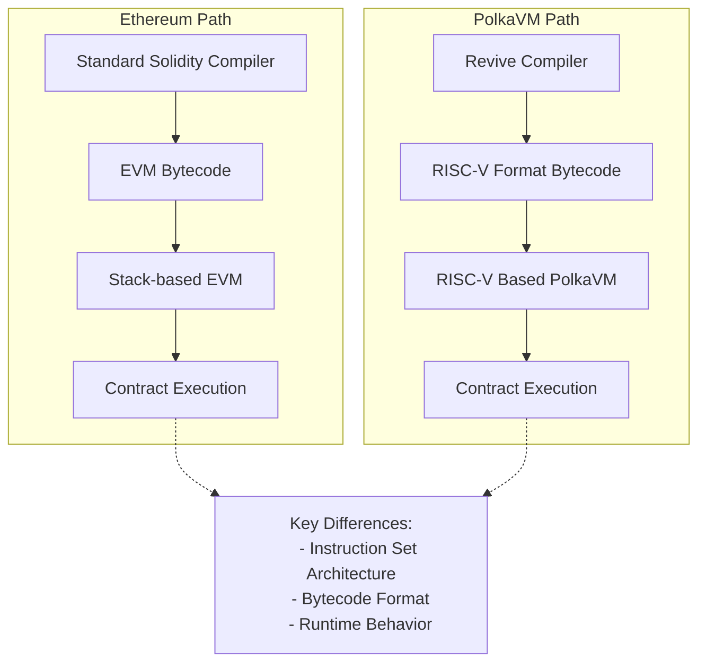

However, this architectural difference becomes relevant in specific scenarios. Tools that attempt to download and inspect contract bytecode will fail, as they expect EVM bytecode rather than PolkaVM's RISC-V format. Most applications typically pass bytecode as an opaque blob, making this a non-issue for standard use cases.

This primarily affects contracts using [`EXTCODECOPY`](https://www.evm.codes/?fork=cancun#3c){target=\_blank} to manipulate code at runtime. A contract encounters problems specifically when it uses `EXTCODECOPY` to copy contract code into memory and then attempts to mutate it. This pattern is not possible in standard Solidity and requires dropping down to YUL assembly. An example would be a factory contract written in assembly that constructs and instantiates new contracts by generating code at runtime. Such contracts are rare in practice.

PolkaVM offers an elegant alternative through its [on-chain constructors](https://paritytech.github.io/polkadot-sdk/master/pallet_revive/pallet/struct.Pallet.html#method.bare_instantiate){target=\_blank}, enabling contract instantiation without runtime code modification, making this pattern unnecessary. This architectural difference also impacts how contract deployment works more broadly, as discussed in the [Contract Deployment](#contract-deployment) section.

### High-Level Architecture Comparison

|            Feature            |                            Ethereum Virtual Machine (EVM)                            |                        PolkaVM                         |
|:-----------------------------:|:------------------------------------------------------------------------------------:|:------------------------------------------------------:|
|      **Instruction Set**      |                               Stack-based architecture                               |                 RISC-V instruction set                 |
|      **Bytecode Format**      |                                     EVM bytecode                                     |                     RISC-V format                      |
|    **Contract Size Limit**    |                                 24KB code size limit                                 |            Contract-specific memory limits             |
|         **Compiler**          |                                  Solidity Compiler                                   |                    Revive Compiler                     |
|      **Inline Assembly**      |                                      Supported                                       |         Supported with the compatibility layer         |
|    **Code Introspection**     | Supported via [`EXTCODECOPY`](https://www.evm.codes/?fork=cancun#3c){target=\_blank} | Limited support, alternative via on-chain constructors |
|     **Resource Metering**     |                                  Single gas metric                                   |                   Multi-dimensional                    |
| **Runtime Code Modification** |                                      Supported                                       |               Limited, with alternatives               |
|  **Contract Instantiation**   |                                 Standard deployment                                  |    On-chain constructors for flexible instantiation    |

## Gas Model

Ethereum's resource model relies on a single metric: [gas](https://ethereum.org/en/developers/docs/gas/#what-is-gas){target=\_blank}, which serves as the universal unit for measuring computational costs. Each operation on the network consumes a specific amount of gas. Most platforms aiming for Ethereum compatibility typically adopt identical gas values to ensure seamless integration.

The significant changes to Ethereum's gas model will be outlined in the following sections.

### Dynamic Gas Value Scaling

Instead of adhering to Ethereum's fixed gas values, PolkaVM implements benchmark-based pricing that better reflects its improved execution performance. This makes instructions cheaper relative to I/O-bound operations but requires developers to avoid hardcoding gas values, particularly in cross-contract calls.

### Multi-Dimensional Resource Metering

Moving beyond Ethereum's single gas metric, PolkaVM meters three distinct resources:

- **`ref_time`**: Equivalent to traditional gas, measuring computation time.
- **`proof_size`**: Tracks state proof size for validator verification.
- **`storage_deposit`**: Manages state bloat through a deposit system.

All three resources can be limited at the transaction level, just like gas on Ethereum. The [Ethereum RPC proxy](https://github.com/paritytech/polkadot-sdk/tree/master/substrate/frame/revive/rpc){target=\_blank} maps all three dimensions into the single gas dimension, ensuring everything behaves as expected for users.

These resources can also be limited when making cross-contract calls, which is essential for security when interacting with untrusted contracts. However, Solidity only allows specifying `gas_limit` for cross-contract calls. The `gas_limit` is most similar to Polkadots `ref_time_limit`, but the Revive compiler doesn't supply any imposed `gas_limit` for cross-contract calls for two key reasons:

- **Semantic differences**: `gas_limit` and `ref_time_limit` are not semantically identical; blindly passing EVM gas as `ref_time_limit` can lead to unexpected behavior.
- **Incomplete protection**: The other two resources (`proof_size` and `storage_deposit`) would remain uncapped anyway, making it insufficient to prevent malicious callees from performing DOS attacks.

When resources are "uncapped" in cross-contract calls, they remain constrained by transaction-specified limits, preventing abuse of the transaction signer.

!!! note
    The runtime will provide a special precompile, allowing cross-contract calls with limits specified for all weight dimensions in the future.

All gas-related opcodes like [`GAS`](https://www.evm.codes/?fork=cancun#5a){target=\_blank} or [`GAS_LIMIT`](https://www.evm.codes/?fork=cancun#45){target=\_blank} return only the `ref_time` value as it's the closest match to traditional gas. Extended APIs will be provided through precompiles to make full use of all resources, including cross-contract calls with all three resources specified.

## Memory Management

The EVM and the PolkaVM take fundamentally different approaches to memory constraints:

|         Feature          |      Ethereum Virtual Machine (EVM)       |                    PolkaVM                     |
|:------------------------:|:-----------------------------------------:|:----------------------------------------------:|
|  **Memory Constraints**  |      Indirect control via gas costs       |        Hard memory limits per contract         |
|      **Cost Model**      | Increasing gas curve with allocation size |    Fixed costs separated from execution gas    |
|    **Memory Limits**     | Soft limits through prohibitive gas costs |         Hard fixed limits per contract         |
|  **Pricing Efficiency**  |     Potential overcharging for memory     | More efficient through separation of concerns  |
|   **Contract Nesting**   |         Limited by available gas          |    Limited by constant memory per contract     |
|   **Memory Metering**    |     Dynamic based on total allocation     |      Static limits per contract instance       |
| **Future Improvements**  |       Incremental gas cost updates        | Potential dynamic metering for deeper nesting  |
| **Cross-Contract Calls** |      Handled through gas forwarding       | Requires careful boundary limit implementation |

The architecture establishes a constant memory limit per contract, which is the basis for calculating maximum contract nesting depth. This calculation assumes worst-case memory usage for each nested contract, resulting in a straightforward but conservative limit that operates independently of actual memory consumption. Future iterations may introduce dynamic memory metering, allowing deeper nesting depths for contracts with smaller memory footprints. However, such an enhancement would require careful implementation of cross-contract boundary limits before API stabilization, as it would introduce an additional resource metric to the system.

### Current Memory Limits

The following table depicts memory-related limits at the time of writing:

|                   Limit                    |     Maximum     |
|:------------------------------------------:|:---------------:|
|              Call stack depth              |        5        |
|                Event topics                |        4        |
| Event data payload size (including topics) |    416 bytes    |
|             Storage value size             |    416 bytes    |
|        Transient storage variables         | 128 uint values |
|            Immutable variables             | 16 uint values  |
|          Contract code blob size           | ~100 kilobytes  |

!!! note
    Limits might be increased in the future. To guarantee existing contracts work as expected, limits will never be decreased.

## Account Management - Existential Deposit

Ethereum and Polkadot handle account persistence differently, affecting state management and contract interactions:

### Account Management Comparison

|          Feature          |                   Ethereum Approach                   |               PolkaVM/Polkadot Approach                |
|:-------------------------:|:-----------------------------------------------------:|:------------------------------------------------------:|
|  **Account Persistence**  | Accounts persist indefinitely, even with zero balance | Requires existential deposit (ED) to maintain account  |
|    **Minimum Balance**    |                         None                          |                      ED required                       |
|   **Account Deletion**    |               Accounts remain in state                |      Accounts below ED are automatically deleted       |
|   **Contract Accounts**   |                  Exist indefinitely                   |                    Must maintain ED                    |
|   **Balance Reporting**   |                 Reports full balance                  |      Reports ED-adjusted balance via Ethereum RPC      |
| **New Account Transfers** |                   Standard transfer                   |     Includes ED automatically with extra fee cost      |
| **Contract-to-Contract**  |                   Direct transfers                    | ED drawn from transaction signer, not sending contract |
|   **State Management**    |      Potential bloat from zero-balance accounts       |     Optimized with auto-deletion of dust accounts      |

This difference introduces potential compatibility challenges for Ethereum-based contracts and tools, particularly wallets. To mitigate this, PolkaVM implements several transparent adjustments:

- Balance queries via Ethereum RPC automatically deduct the ED, ensuring reported balances match spendable amounts.
- Account balance checks through EVM opcodes reflect the ED-adjusted balance.
- Transfers to new accounts automatically include the ED (`x + ED`), with the extra cost incorporated into transaction fees.
- Contract-to-contract transfers handle ED requirements by:
    - Drawing ED from the transaction signer instead of the sending contract.
    - Keeping transfer amounts transparent for contract logic.
    - Treating ED like other storage deposit costs.

This approach ensures that Ethereum contracts work without modifications while maintaining Polkadot's optimized state management.

## Contract Deployment

For most users deploying contracts (like ERC-20 tokens), contract deployment works seamlessly without requiring special steps. However, when using advanced patterns like factory contracts that dynamically create other contracts at runtime, you'll need to understand PolkaVM's unique deployment model.

In the PolkaVM, contract deployment follows a fundamentally different model from EVM. The EVM allows contracts to be deployed with a single transaction, where the contract code is bundled with the deployment transaction. In contrast, PolkaVM has a different process for contract instantiation.

- **Code must be pre-uploaded**: Unlike EVM, where contract code is bundled within the deploying contract, PolkaVM requires all contract bytecode to be uploaded to the chain before instantiation.
- **Factory pattern limitations**: The common EVM pattern, where contracts dynamically create other contracts, will fail with a `CodeNotFound` error unless the dependent contract code was previously uploaded.
- **Separate upload and instantiation**: This creates a two-step process where developers must first upload all contract code, then instantiate relationships between contracts.

This architecture impacts several common EVM patterns and requires developers to adapt their deployment strategies accordingly. _Factory contracts must be modified to work with pre-uploaded code rather than embedding bytecode_, and runtime code generation is not supported due to PolkaVM's RISC-V bytecode format. The specific behavior of contract creation opcodes is detailed in the [YUL IR Translation](#yul-function-translation-differences) section.

When migrating EVM projects to PolkaVM, developers should identify all contracts that will be instantiated at runtime and ensure they are pre-uploaded to the chain before any instantiation attempts.

## Solidity and YUL IR Translation Incompatibilities

While PolkaVM maintains high-level compatibility with Solidity, several low-level differences exist in the translation of YUL IR and specific Solidity constructs. These differences are particularly relevant for developers working with assembly code or utilizing advanced contract patterns.

### Contract Code Structure

PolkaVM's contract runtime does not differentiate between runtime code and deploy (constructor) code. Instead, both are emitted into a single PolkaVM contract code blob and live on-chain. Therefore, in EVM terminology, the deploy code equals the runtime code. For most standard Solidity contracts, this is transparent. However, if you are analyzing raw bytecode or building tools that expect separate deploy and runtime sections, you'll need to adjust for this unified structure.

In the constructor code, the `codesize` instruction returns the call data size instead of the actual code blob size, which differs from standard EVM behavior. Developers might consider that the constructor logic uses `codesize` to inspect the deployed contract's size (e.g., for self-validation or specific deployment patterns); this will return an incorrect value on PolkaVM. Re-evaluate such logic or use alternative methods to achieve your goal.

### Solidity-Specific Differences

Solidity constructs behave differently under PolkaVM:

- **`address.creationCode`**: Returns the bytecode keccak256 hash instead of the actual creation code, reflecting PolkaVM's hash-based code referencing system.
    - If your contract relies on `address.creationCode` to verify or interact with the full raw bytecode of a newly deployed contract, this will not work as expected. You will receive a hash, not the code itself. This typically affects highly specialized factory contracts or introspection tools.

### YUL Function Translation Differences

The following YUL functions exhibit notable behavioral differences in PolkaVM:

- Memory operations:

    - **`mload`, `mstore`, `msize`, `mcopy`**: PolkaVM preserves memory layout but implements several constraints.

        - EVM linear heap memory is emulated using a fixed 64KB byte buffer, limiting maximum contract memory usage.
        - Accessing memory offsets larger than the buffer size traps the contract with an `OutOfBound` error.
        - Compiler optimizations may eliminate unused memory operations, potentially causing `msize` to differ from EVM behavior.

        For Solidity developers, the compiler generally handles memory efficiently within this 64KB limit. However, if you are writing low-level YUL assembly and perform direct memory manipulations, you must respect the 64KB buffer limit. Attempting to access memory outside this range will cause your transaction to revert. Be aware that `msize` might not always reflect the exact EVM behavior if compiler optimizations occur.

- Call data operations:

    - **`calldataload`, `calldatacopy`**: In constructor code, the offset parameter is ignored and these functions always return `0`, diverging from EVM behavior where call data represents constructor arguments.

        - If your constructor logic in YUL assembly attempts to read constructor arguments using `calldataload` or `calldatacopy` with specific offsets, this will not yield the expected constructor arguments. Instead, these functions will return `zeroed` values. Standard Solidity constructors are handled correctly by the compiler, but manual YUL assembly for constructor argument parsing will need adjustment.

- Code operations:

    - **`codecopy`**: Only supported within constructor code, reflecting PolkaVM's different approach to code handling and the unified code blob structure.

        - If your contracts use `codecopy` (e.g., for self-modifying code or inspecting other contract's runtime bytecode) outside of the constructor, this will not be supported and will likely result in a compile-time error or runtime trap. This implies that patterns like dynamically generating or modifying contract code at runtime are not directly feasible with `codecopy` on PolkaVM.

- Control flow:

    - **`invalid`**: Traps the contract execution but does not consume remaining gas, unlike EVM where it consumes all available gas.

        - While `invalid` still reverts the transaction, the difference in gas consumption could subtly affect very specific error handling or gas accounting patterns that rely on `invalid` to consume all remaining gas. For most error scenarios, `revert()` is the standard and recommended practice.

- Cross-contract calls:

    - **`call`, `delegatecall`, `staticall`**: These functions ignore supplied gas limits and forward all remaining resources due to PolkaVM's multi-dimensional resource model. This creates important security implications:

        - Contract authors must implement reentrancy protection since gas stipends don't provide protection.
        - The compiler detects `address payable.{send,transfer}` patterns and disables call reentrancy as a protective heuristic.
        - Using `address payable.{send,transfer}` is already deprecated; PolkaVM will provide dedicated precompiles for safe balance transfers.

        The traditional EVM pattern of limiting gas in cross-contract calls (especially with the 2300 gas stipend for send/transfer) does not provide reentrancy protection on PolkaVM. Developers must explicitly implement reentrancy guards (e.g., using a reentrancy lock mutex) in their Solidity code when making external calls to untrusted contracts. Relying on gas limits alone for reentrancy prevention is unsafe and will lead to vulnerabilities on PolkaVM.

        !!! warning
            The 2300 gas stipend that is provided by solc for address payable.{send, transfer} calls offers no reentrancy protection in PolkaVM. While the compiler attempts to detect and mitigate this pattern, developers should avoid these deprecated functions.

- Contract creation:

    - **`create`, `create2`**: Contract instantiation works fundamentally differently in PolkaVM. Instead of supplying deploy code concatenated with constructor arguments, the runtime expects:

        1. A buffer containing the code hash to deploy.
        2. The constructor arguments buffer.

        PolkaVM translates `dataoffset` and `datasize` instructions to handle contract hashes instead of contract code, enabling seamless use of the `new` keyword in Solidity. However, this translation may fail for contracts creating other contracts within `assembly` blocks.

        If you use the Solidity `new` keyword to deploy contracts, the Revive compiler handles this transparently. However, if you are creating contracts manually in YUL assembly using `create` or `create2` opcodes, you must provide the code hash of the contract to be deployed, not its raw bytecode. Attempting to pass raw bytecode will fail. This fundamentally changes how manual contract creation is performed in assembly.

        !!! warning
            Avoid using `create` family opcodes for manual deployment crafting in `assembly` blocks. This pattern is discouraged due to translation complexity and offers no gas savings benefits in PolkaVM.

- Data operations:

    - **`dataoffset`**: Returns the contract hash instead of code offset, aligning with PolkaVM's hash-based code referencing.
    - **`datasize`**: Returns the constant contract hash size (32 bytes) rather than variable code size.

    These changes are primarily relevant for low-level YUL assembly developers who are trying to inspect or manipulate contract code directly. `dataoffset` will provide a hash, not a memory offset to the code, and `datasize` will always be 32 bytes (the size of a hash). This reinforces that direct manipulation of contract bytecode at runtime, as might be done in some EVM patterns, is not supported.

- Resource queries:

    - **`gas`, `gaslimit`**: Return only the `ref_time` component of PolkaVM's multi-dimensional weight system, providing the closest analog to traditional gas measurements.

        - While `gas` and `gaslimit` still provide a useful metric, consider that they represent `ref_time` (computation time) only. If your contract logic depends on precise knowledge of other resource costs (like `proof_size` or `storage_deposit`), you won't get that information from these opcodes. You'll need to use future precompiles for full multi-dimensional resource queries.

- Blockchain state:

    - **`prevrandao`, `difficulty`**: Both translate to a constant value of `2500000000000000`, as PolkaVM doesn't implement Ethereum's difficulty adjustment or randomness mechanisms.

        - If your Solidity contract relies on `block.difficulty` (or its equivalent YUL opcode `difficulty`) for randomness generation or any logic tied to Ethereum's proof-of-work difficulty, this will not provide true randomness on PolkaVM. The value will always be constant. Developers needing on-chain randomness should utilize Polkadot's native randomness sources or dedicated VRF (Verifiable Random Function) solutions if available. 

### Unsupported Operations

Several EVM operations are not supported in PolkaVM and produce compile-time errors:

- **`pc`, `extcodecopy`**: These operations are EVM-specific and have no equivalent functionality in PolkaVM's RISC-V architecture.

    - Any Solidity contracts that utilize inline assembly to interact with `pc` (program counter) or `extcodecopy` will fail to compile or behave unexpectedly. This means patterns involving introspection of the current execution location or copying external contract bytecode at runtime are not supported.

- **`blobhash`, `blobbasefee`**: Related to Ethereum's rollup model and blob data handling, these operations are unnecessary given Polkadot's superior rollup architecture.

    - If you are porting contracts designed for Ethereum's EIP-4844 (proto-danksharding) and rely on these blob-related opcodes, they will not be available on PolkaVM.

- **`extcodecopy`, `selfdestruct`**: These deprecated operations are not supported and generate compile-time errors.

    - The `selfdestruct` opcode, which allowed contracts to remove themselves from the blockchain, is not supported. Contracts cannot be self-destroyed on PolkaVM. This affects contract upgradeability patterns that rely on self-destruction and redeployment. Similarly, `extcodecopy` is unsupported, impacting contracts that intend to inspect or copy the bytecode of other deployed contracts.

### Compilation Pipeline Considerations

PolkaVM processes YUL IR exclusively, meaning all contracts exhibit behavior consistent with Solidity's `via-ir` compilation mode. Developers familiar with the legacy compilation pipeline should expect [IR-based codegen behavior](https://docs.soliditylang.org/en/latest/ir-breaking-changes.html){target=\_blank} when working with PolkaVM contracts.

If you've previously worked with older Solidity compilers that did not use the `via-ir` pipeline by default, you might observe subtle differences in compiled bytecode size or gas usage. It's recommended to familiarize yourself with Solidity's IR-based codegen behavior, as this is the standard for PolkaVM.

### Memory Pointer Limitations

YUL functions accepting memory buffer offset pointers or size arguments are limited by PolkaVM's 32-bit pointer size. Supplying values above `2^32-1` will trap the contract immediately. The Solidity compiler typically generates valid memory references, making this primarily a concern for low-level assembly code.

For standard Solidity development, this limitation is unlikely to be hit as the compiler handles memory addresses correctly within typical contract sizes. However, if you are writing extremely large contracts using YUL assembly that manually and extensively manipulate memory addresses, ensure that your memory offsets and sizes do not exceed PolkaVM's **fixed 64KB memory limit per contract**. While the YUL functions might accept 32-bit pointers (up to 2^32-1), attempting to access memory beyond the allocated 64KB buffer will trap the contract immediately.

These incompatibilities reflect the fundamental architectural differences between EVM and PolkaVM while maintaining high-level Solidity compatibility. Most developers using standard Solidity patterns will encounter no issues, but those working with assembly code or advanced contract patterns should carefully review these differences during migration.


---

# Fast Track a Governance Proposal

> Source (raw): https://raw.githubusercontent.com/polkadot-developers/polkadot-docs/master/.ai/pages/tutorials-onchain-governance-fast-track-gov-proposal.md
> Canonical (HTML): https://docs.polkadot.com/tutorials/onchain-governance/fast-track-gov-proposal/
> Summary: Learn how to fast-track governance proposals in Polkadot's OpenGov using Chopsticks. Simulate, test, and execute proposals confidently.

# Fast Track a Governance Proposal

## Introduction

Polkadot's [OpenGov](/polkadot-protocol/onchain-governance/overview){target=\_blank} is a sophisticated governance mechanism designed to allow the network to evolve gracefully over time, guided by its stakeholders. This system features multiple [tracks](https://wiki.polkadot.com/learn/learn-polkadot-opengov-origins/#origins-and-tracks-info){target=\_blank} for different types of proposals, each with parameters for approval, support, and confirmation period. While this flexibility is powerful, it also introduces complexity that can lead to failed proposals or unexpected outcomes.

Testing governance proposals before submission is crucial for the ecosystem. This process enhances efficiency by reducing the need for repeated submissions, improves security by identifying potential risks, and allows proposal optimization based on simulated outcomes. It also serves as an educational tool, providing stakeholders with a safe environment to understand the impacts of different voting scenarios. 

By leveraging simulation tools like [Chopsticks](/develop/toolkit/parachains/fork-chains/chopsticks){target=\_blank}, developers can:

- Simulate the entire lifecycle of a proposal.
- Test the voting outcomes by varying the support and approval levels.
- Analyze the effects of a successfully executed proposal on the network's state.
- Identify and troubleshoot potential issues or unexpected consequences before submitting the proposals.

This tutorial will guide you through using Chopsticks to test OpenGov proposals thoroughly. This ensures that when you submit a proposal to the live network, you can do so with confidence in its effects and viability.

## Prerequisites

Before proceeding, ensure the following prerequisites are met:

- **Chopsticks installation**: If you have not installed Chopsticks yet, refer to the [Install Chopsticks](/develop/toolkit/parachains/fork-chains/chopsticks/get-started/#install-chopsticks){target=\_blank} guide for detailed instructions.
- **Familiarity with key concepts**:
    - [Polkadot.js](/develop/toolkit/api-libraries/polkadot-js-api){target=\_blank}
    - [OpenGov](/polkadot-protocol/onchain-governance/overview){target=\_blank}

## Set Up the Project

Before testing OpenGov proposals, you need to set up your development environment. 
You'll set up a TypeScript project and install the required dependencies to simulate and evaluate proposals. You'll use Chopsticks to fork the Polkadot network and simulate the proposal lifecycle, while Polkadot.js will be your interface for interacting with the forked network and submitting proposals.

Follow these steps to set up your project:

1. Create a new project directory and navigate into it:
    ```bash
    mkdir opengov-chopsticks && cd opengov-chopsticks
    ```

2. Initialize a new TypeScript project:
    ```bash
    npm init -y \
    && npm install typescript ts-node @types/node --save-dev \
    && npx tsc --init
    ```

3. Install the required dependencies:
    ```bash
    npm install @polkadot/api @acala-network/chopsticks
    ```

4. Create a new TypeScript file for your script:
    ```bash
    touch test-proposal.ts
    ```

    !!!note
        You'll write your code to simulate and test OpenGov proposals in the `test-proposal.ts` file.

5. Open the `tsconfig.json` file and ensure it includes these compiler options:
    ```json
    {
    "compilerOptions": {
        "module": "CommonJS",
        "esModuleInterop": true,
        "target": "esnext",
        "moduleResolution": "node",
        "declaration": true,
        "sourceMap": true,
        "skipLibCheck": true,
        "outDir": "dist",
        "composite": true
    }
}

    ```

## Submit and Execute a Proposal Using Chopsticks

You should identify the right track and origin for your proposal. For example, select the appropriate treasury track based on the spending limits if you're requesting funds from the treasury. For more detailed information, refer to [Polkadot OpenGov Origins](https://wiki.polkadot.com/learn/learn-polkadot-opengov-origins/){target=\_blank}.

!!!note
    This tutorial will focus on the main steps and core logic within the main function. For clarity and conciseness, the implementation details of individual functions will be available in expandable tabs below each section. You'll find the complete code for reference at the end of the tutorial.

### Spin Up the Polkadot Fork

To set up your Polkadot fork using Chopsticks, open a new terminal window and run the following command:

```bash
npx @acala-network/chopsticks --config=polkadot
```

This command will start a local fork of the Polkadot network accessible at `ws://localhost:8000`. Keep this terminal window open and running throughout your testing process.

Once your forked network is up and running, you can proceed with the following steps.

### Set Up Dependencies and Structure

Begin by adding the necessary imports and a basic structure to the `test-proposal.ts` file:

```typescript
// --8<-- [start:imports]
import '@polkadot/api-augment/polkadot';
import { FrameSupportPreimagesBounded } from '@polkadot/types/lookup';
import { blake2AsHex } from '@polkadot/util-crypto';
import { ApiPromise, Keyring, WsProvider } from '@polkadot/api';
import { type SubmittableExtrinsic } from '@polkadot/api/types';
import { ISubmittableResult } from '@polkadot/types/types';
// --8<-- [end:imports]

// --8<-- [start:connectToFork]
/**
 * Establishes a connection to the local forked chain.
 *
 * @returns A promise that resolves to an `ApiPromise` instance connected to the local chain.
 */
async function connectToFork(): Promise<ApiPromise> {
  const wsProvider = new WsProvider('ws://localhost:8000');
  const api = await ApiPromise.create({ provider: wsProvider });
  await api.isReady;
  console.log(`Connected to chain: ${await api.rpc.system.chain()}`);
  return api;
}
// --8<-- [end:connectToFork]

// --8<-- [start:generateProposal]
/**
 * Generates a proposal by submitting a preimage, creating the proposal, and placing a deposit.
 *
 * @param api - An instance of the Polkadot.js API promise used to interact with the blockchain.
 * @param call - The extrinsic to be executed, encapsulating the specific action to be proposed.
 * @param origin - The origin of the proposal, specifying the source authority (e.g., `{ System: 'Root' }`).
 * @returns A promise that resolves to the proposal ID of the generated proposal.
 *
 */
async function generateProposal(
  api: ApiPromise,
  call: SubmittableExtrinsic<'promise', ISubmittableResult>,
  origin: any
): Promise<number> {
  // Initialize the keyring
  const keyring = new Keyring({ type: 'sr25519' });

  // Set up Alice development account
  const alice = keyring.addFromUri('//Alice');

  // Get the next available proposal index
  const proposalIndex = (
    await api.query.referenda.referendumCount()
  ).toNumber();

  // Execute the batch transaction
  await new Promise<void>(async (resolve) => {
    const unsub = await api.tx.utility
      .batch([
        // Register the preimage for your proposal
        api.tx.preimage.notePreimage(call.method.toHex()),
        // Submit your proposal to the referenda system
        api.tx.referenda.submit(
          origin as any,
          {
            Lookup: {
              Hash: call.method.hash.toHex(),
              len: call.method.encodedLength,
            },
          },
          { At: 0 }
        ),
        // Place the required decision deposit
        api.tx.referenda.placeDecisionDeposit(proposalIndex),
      ])
      .signAndSend(alice, (status: any) => {
        if (status.blockNumber) {
          unsub();
          resolve();
        }
      });
  });
  return proposalIndex;
}
// --8<-- [end:generateProposal]

// --8<-- [start:moveScheduledCallTo]
/**
 * Moves a scheduled call to a specified future block if it matches the given verifier criteria.
 *
 * @param api - An instance of the Polkadot.js API promise used to interact with the blockchain.
 * @param blockCounts - The number of blocks to move the scheduled call forward.
 * @param verifier - A function to verify if a scheduled call matches the desired criteria.
 * @throws An error if no matching scheduled call is found.
 */
async function moveScheduledCallTo(
  api: ApiPromise,
  blockCounts: number,
  verifier: (call: FrameSupportPreimagesBounded) => boolean
) {
  // Get the current block number
  const blockNumber = (await api.rpc.chain.getHeader()).number.toNumber();
  
  // Retrieve the scheduler's agenda entries
  const agenda = await api.query.scheduler.agenda.entries();
  
  // Initialize a flag to track if a matching scheduled call is found
  let found = false;
  
  // Iterate through the scheduler's agenda entries
  for (const agendaEntry of agenda) {
    // Iterate through the scheduled entries in the current agenda entry
    for (const scheduledEntry of agendaEntry[1]) {
      // Check if the scheduled entry is valid and matches the verifier criteria
      if (scheduledEntry.isSome && verifier(scheduledEntry.unwrap().call)) {
        found = true;
        
        // Overwrite the agendaEntry item in storage
        const result = await api.rpc('dev_setStorage', [
          [agendaEntry[0]], // require to ensure unique id
          [
            await api.query.scheduler.agenda.key(blockNumber + blockCounts),
            agendaEntry[1].toHex(),
          ],
        ]);
        
        // Check if the scheduled call has an associated lookup
        if (scheduledEntry.unwrap().maybeId.isSome) {
          // Get the lookup ID
          const id = scheduledEntry.unwrap().maybeId.unwrap().toHex();
          const lookup = await api.query.scheduler.lookup(id);

          // Check if the lookup exists
          if (lookup.isSome) {
            // Get the lookup key
            const lookupKey = await api.query.scheduler.lookup.key(id);
            
            // Create a new lookup object with the updated block number
            const fastLookup = api.registry.createType('Option<(u32,u32)>', [
              blockNumber + blockCounts,
              0,
            ]);
            
            // Overwrite the lookup entry in storage
            const result = await api.rpc('dev_setStorage', [
              [lookupKey, fastLookup.toHex()],
            ]);
          }
        }
      }
    }
  }
  
  // Throw an error if no matching scheduled call is found
  if (!found) {
    throw new Error('No scheduled call found');
  }
}
// --8<-- [end:moveScheduledCallTo]

// --8<-- [start:forceProposalExecution]
/**
 * Forces the execution of a specific proposal by updating its referendum state and ensuring the execution process is triggered.
 *
 * @param api - An instance of the Polkadot.js API promise used to interact with the blockchain.
 * @param proposalIndex - The index of the proposal to be executed.
 * @throws An error if the referendum is not found or not in an ongoing state.
 */
async function forceProposalExecution(api: ApiPromise, proposalIndex: number) {
  // Retrieve the referendum data for the given proposal index
  const referendumData = await api.query.referenda.referendumInfoFor(
    proposalIndex
  );
  // Get the storage key for the referendum data
  const referendumKey =
    api.query.referenda.referendumInfoFor.key(proposalIndex);

  // Check if the referendum data exists
  if (!referendumData.isSome) {
    throw new Error(`Referendum ${proposalIndex} not found`);
  }

  const referendumInfo = referendumData.unwrap();

  // Check if the referendum is in an ongoing state
  if (!referendumInfo.isOngoing) {
    throw new Error(`Referendum ${proposalIndex} is not ongoing`);
  }

  // Get the ongoing referendum data
  const ongoingData = referendumInfo.asOngoing;
  // Convert the ongoing data to JSON
  const ongoingJson = ongoingData.toJSON();

  // Support Lookup, Inline or Legacy proposals
  const callHash = ongoingData.proposal.isLookup
    ? ongoingData.proposal.asLookup.toHex()
    : ongoingData.proposal.isInline
    ? blake2AsHex(ongoingData.proposal.asInline.toHex())
    : ongoingData.proposal.asLegacy.toHex();

  // Get the total issuance of the native token
  const totalIssuance = (await api.query.balances.totalIssuance()).toBigInt();

  // Get the current block number
  const proposalBlockTarget = (
    await api.rpc.chain.getHeader()
  ).number.toNumber();

  // Create a new proposal data object with the updated fields
  const fastProposalData = {
    ongoing: {
      ...ongoingJson,
      enactment: { after: 0 },
      deciding: {
        since: proposalBlockTarget - 1,
        confirming: proposalBlockTarget - 1,
      },
      tally: {
        ayes: totalIssuance - 1n,
        nays: 0,
        support: totalIssuance - 1n,
      },
      alarm: [proposalBlockTarget + 1, [proposalBlockTarget + 1, 0]],
    },
  };

  // Create a new proposal object from the proposal data
  let fastProposal;
  try {
    fastProposal = api.registry.createType(
      `Option<PalletReferendaReferendumInfo>`,
      fastProposalData
    );
  } catch {
    fastProposal = api.registry.createType(
      `Option<PalletReferendaReferendumInfoConvictionVotingTally>`,
      fastProposalData
    );
  }

  // Update the storage with the new proposal object
  const result = await api.rpc('dev_setStorage', [
    [referendumKey, fastProposal.toHex()],
  ]);

  // Fast forward the nudge referendum to the next block to get the refendum to be scheduled
  await moveScheduledCallTo(api, 1, (call) => {
    if (!call.isInline) {
      return false;
    }

    const callData = api.createType('Call', call.asInline.toHex());

    return (
      callData.method == 'nudgeReferendum' &&
      (callData.args[0] as any).toNumber() == proposalIndex
    );
  });

  // Create a new block
  await api.rpc('dev_newBlock', { count: 1 });

  // Move the scheduled call to the next block
  await moveScheduledCallTo(api, 1, (call) =>
    call.isLookup
      ? call.asLookup.toHex() == callHash
      : call.isInline
      ? blake2AsHex(call.asInline.toHex()) == callHash
      : call.asLegacy.toHex() == callHash
  );

  // Create another new block
  await api.rpc('dev_newBlock', { count: 1 });
}
// --8<-- [end:forceProposalExecution]

// --8<-- [start:main]
const main = async () => {
  // Connect to the forked chain
  const api = await connectToFork();

  // Select the call to perform
  const call = api.tx.system.setCodeWithoutChecks('0x1234');

  // Select the origin
  const origin = {
    System: 'Root',
  };

  // Submit preimage, submit proposal, and place decision deposit
  const proposalIndex = await generateProposal(api, call, origin);

  // Force the proposal to be executed
  await forceProposalExecution(api, proposalIndex);

  process.exit(0);
};
// --8<-- [end:main]

// --8<-- [start:try-catch-block]
try {
  main();
} catch (e) {
  console.log(e);
  process.exit(1);
}
// --8<-- [end:try-catch-block]


const main = async () => {
  // The code will be added here

  process.exit(0);
}

// --8<-- [start:imports]
import '@polkadot/api-augment/polkadot';
import { FrameSupportPreimagesBounded } from '@polkadot/types/lookup';
import { blake2AsHex } from '@polkadot/util-crypto';
import { ApiPromise, Keyring, WsProvider } from '@polkadot/api';
import { type SubmittableExtrinsic } from '@polkadot/api/types';
import { ISubmittableResult } from '@polkadot/types/types';
// --8<-- [end:imports]

// --8<-- [start:connectToFork]
/**
 * Establishes a connection to the local forked chain.
 *
 * @returns A promise that resolves to an `ApiPromise` instance connected to the local chain.
 */
async function connectToFork(): Promise<ApiPromise> {
  const wsProvider = new WsProvider('ws://localhost:8000');
  const api = await ApiPromise.create({ provider: wsProvider });
  await api.isReady;
  console.log(`Connected to chain: ${await api.rpc.system.chain()}`);
  return api;
}
// --8<-- [end:connectToFork]

// --8<-- [start:generateProposal]
/**
 * Generates a proposal by submitting a preimage, creating the proposal, and placing a deposit.
 *
 * @param api - An instance of the Polkadot.js API promise used to interact with the blockchain.
 * @param call - The extrinsic to be executed, encapsulating the specific action to be proposed.
 * @param origin - The origin of the proposal, specifying the source authority (e.g., `{ System: 'Root' }`).
 * @returns A promise that resolves to the proposal ID of the generated proposal.
 *
 */
async function generateProposal(
  api: ApiPromise,
  call: SubmittableExtrinsic<'promise', ISubmittableResult>,
  origin: any
): Promise<number> {
  // Initialize the keyring
  const keyring = new Keyring({ type: 'sr25519' });

  // Set up Alice development account
  const alice = keyring.addFromUri('//Alice');

  // Get the next available proposal index
  const proposalIndex = (
    await api.query.referenda.referendumCount()
  ).toNumber();

  // Execute the batch transaction
  await new Promise<void>(async (resolve) => {
    const unsub = await api.tx.utility
      .batch([
        // Register the preimage for your proposal
        api.tx.preimage.notePreimage(call.method.toHex()),
        // Submit your proposal to the referenda system
        api.tx.referenda.submit(
          origin as any,
          {
            Lookup: {
              Hash: call.method.hash.toHex(),
              len: call.method.encodedLength,
            },
          },
          { At: 0 }
        ),
        // Place the required decision deposit
        api.tx.referenda.placeDecisionDeposit(proposalIndex),
      ])
      .signAndSend(alice, (status: any) => {
        if (status.blockNumber) {
          unsub();
          resolve();
        }
      });
  });
  return proposalIndex;
}
// --8<-- [end:generateProposal]

// --8<-- [start:moveScheduledCallTo]
/**
 * Moves a scheduled call to a specified future block if it matches the given verifier criteria.
 *
 * @param api - An instance of the Polkadot.js API promise used to interact with the blockchain.
 * @param blockCounts - The number of blocks to move the scheduled call forward.
 * @param verifier - A function to verify if a scheduled call matches the desired criteria.
 * @throws An error if no matching scheduled call is found.
 */
async function moveScheduledCallTo(
  api: ApiPromise,
  blockCounts: number,
  verifier: (call: FrameSupportPreimagesBounded) => boolean
) {
  // Get the current block number
  const blockNumber = (await api.rpc.chain.getHeader()).number.toNumber();
  
  // Retrieve the scheduler's agenda entries
  const agenda = await api.query.scheduler.agenda.entries();
  
  // Initialize a flag to track if a matching scheduled call is found
  let found = false;
  
  // Iterate through the scheduler's agenda entries
  for (const agendaEntry of agenda) {
    // Iterate through the scheduled entries in the current agenda entry
    for (const scheduledEntry of agendaEntry[1]) {
      // Check if the scheduled entry is valid and matches the verifier criteria
      if (scheduledEntry.isSome && verifier(scheduledEntry.unwrap().call)) {
        found = true;
        
        // Overwrite the agendaEntry item in storage
        const result = await api.rpc('dev_setStorage', [
          [agendaEntry[0]], // require to ensure unique id
          [
            await api.query.scheduler.agenda.key(blockNumber + blockCounts),
            agendaEntry[1].toHex(),
          ],
        ]);
        
        // Check if the scheduled call has an associated lookup
        if (scheduledEntry.unwrap().maybeId.isSome) {
          // Get the lookup ID
          const id = scheduledEntry.unwrap().maybeId.unwrap().toHex();
          const lookup = await api.query.scheduler.lookup(id);

          // Check if the lookup exists
          if (lookup.isSome) {
            // Get the lookup key
            const lookupKey = await api.query.scheduler.lookup.key(id);
            
            // Create a new lookup object with the updated block number
            const fastLookup = api.registry.createType('Option<(u32,u32)>', [
              blockNumber + blockCounts,
              0,
            ]);
            
            // Overwrite the lookup entry in storage
            const result = await api.rpc('dev_setStorage', [
              [lookupKey, fastLookup.toHex()],
            ]);
          }
        }
      }
    }
  }
  
  // Throw an error if no matching scheduled call is found
  if (!found) {
    throw new Error('No scheduled call found');
  }
}
// --8<-- [end:moveScheduledCallTo]

// --8<-- [start:forceProposalExecution]
/**
 * Forces the execution of a specific proposal by updating its referendum state and ensuring the execution process is triggered.
 *
 * @param api - An instance of the Polkadot.js API promise used to interact with the blockchain.
 * @param proposalIndex - The index of the proposal to be executed.
 * @throws An error if the referendum is not found or not in an ongoing state.
 */
async function forceProposalExecution(api: ApiPromise, proposalIndex: number) {
  // Retrieve the referendum data for the given proposal index
  const referendumData = await api.query.referenda.referendumInfoFor(
    proposalIndex
  );
  // Get the storage key for the referendum data
  const referendumKey =
    api.query.referenda.referendumInfoFor.key(proposalIndex);

  // Check if the referendum data exists
  if (!referendumData.isSome) {
    throw new Error(`Referendum ${proposalIndex} not found`);
  }

  const referendumInfo = referendumData.unwrap();

  // Check if the referendum is in an ongoing state
  if (!referendumInfo.isOngoing) {
    throw new Error(`Referendum ${proposalIndex} is not ongoing`);
  }

  // Get the ongoing referendum data
  const ongoingData = referendumInfo.asOngoing;
  // Convert the ongoing data to JSON
  const ongoingJson = ongoingData.toJSON();

  // Support Lookup, Inline or Legacy proposals
  const callHash = ongoingData.proposal.isLookup
    ? ongoingData.proposal.asLookup.toHex()
    : ongoingData.proposal.isInline
    ? blake2AsHex(ongoingData.proposal.asInline.toHex())
    : ongoingData.proposal.asLegacy.toHex();

  // Get the total issuance of the native token
  const totalIssuance = (await api.query.balances.totalIssuance()).toBigInt();

  // Get the current block number
  const proposalBlockTarget = (
    await api.rpc.chain.getHeader()
  ).number.toNumber();

  // Create a new proposal data object with the updated fields
  const fastProposalData = {
    ongoing: {
      ...ongoingJson,
      enactment: { after: 0 },
      deciding: {
        since: proposalBlockTarget - 1,
        confirming: proposalBlockTarget - 1,
      },
      tally: {
        ayes: totalIssuance - 1n,
        nays: 0,
        support: totalIssuance - 1n,
      },
      alarm: [proposalBlockTarget + 1, [proposalBlockTarget + 1, 0]],
    },
  };

  // Create a new proposal object from the proposal data
  let fastProposal;
  try {
    fastProposal = api.registry.createType(
      `Option<PalletReferendaReferendumInfo>`,
      fastProposalData
    );
  } catch {
    fastProposal = api.registry.createType(
      `Option<PalletReferendaReferendumInfoConvictionVotingTally>`,
      fastProposalData
    );
  }

  // Update the storage with the new proposal object
  const result = await api.rpc('dev_setStorage', [
    [referendumKey, fastProposal.toHex()],
  ]);

  // Fast forward the nudge referendum to the next block to get the refendum to be scheduled
  await moveScheduledCallTo(api, 1, (call) => {
    if (!call.isInline) {
      return false;
    }

    const callData = api.createType('Call', call.asInline.toHex());

    return (
      callData.method == 'nudgeReferendum' &&
      (callData.args[0] as any).toNumber() == proposalIndex
    );
  });

  // Create a new block
  await api.rpc('dev_newBlock', { count: 1 });

  // Move the scheduled call to the next block
  await moveScheduledCallTo(api, 1, (call) =>
    call.isLookup
      ? call.asLookup.toHex() == callHash
      : call.isInline
      ? blake2AsHex(call.asInline.toHex()) == callHash
      : call.asLegacy.toHex() == callHash
  );

  // Create another new block
  await api.rpc('dev_newBlock', { count: 1 });
}
// --8<-- [end:forceProposalExecution]

// --8<-- [start:main]
const main = async () => {
  // Connect to the forked chain
  const api = await connectToFork();

  // Select the call to perform
  const call = api.tx.system.setCodeWithoutChecks('0x1234');

  // Select the origin
  const origin = {
    System: 'Root',
  };

  // Submit preimage, submit proposal, and place decision deposit
  const proposalIndex = await generateProposal(api, call, origin);

  // Force the proposal to be executed
  await forceProposalExecution(api, proposalIndex);

  process.exit(0);
};
// --8<-- [end:main]

// --8<-- [start:try-catch-block]
try {
  main();
} catch (e) {
  console.log(e);
  process.exit(1);
}
// --8<-- [end:try-catch-block]

```

This structure provides the foundation for your script. It imports all the necessary dependencies and sets up a main function that will contain the core logic of your proposal submission process.

### Connect to the Forked Chain

Create a `connectToFork` function outside the `main` function to connect your locally forked chain to the Polkadot.js API:

```typescript
    // --8<-- [start:imports]
import '@polkadot/api-augment/polkadot';
import { FrameSupportPreimagesBounded } from '@polkadot/types/lookup';
import { blake2AsHex } from '@polkadot/util-crypto';
import { ApiPromise, Keyring, WsProvider } from '@polkadot/api';
import { type SubmittableExtrinsic } from '@polkadot/api/types';
import { ISubmittableResult } from '@polkadot/types/types';
// --8<-- [end:imports]

// --8<-- [start:connectToFork]
/**
 * Establishes a connection to the local forked chain.
 *
 * @returns A promise that resolves to an `ApiPromise` instance connected to the local chain.
 */
async function connectToFork(): Promise<ApiPromise> {
  const wsProvider = new WsProvider('ws://localhost:8000');
  const api = await ApiPromise.create({ provider: wsProvider });
  await api.isReady;
  console.log(`Connected to chain: ${await api.rpc.system.chain()}`);
  return api;
}
// --8<-- [end:connectToFork]

// --8<-- [start:generateProposal]
/**
 * Generates a proposal by submitting a preimage, creating the proposal, and placing a deposit.
 *
 * @param api - An instance of the Polkadot.js API promise used to interact with the blockchain.
 * @param call - The extrinsic to be executed, encapsulating the specific action to be proposed.
 * @param origin - The origin of the proposal, specifying the source authority (e.g., `{ System: 'Root' }`).
 * @returns A promise that resolves to the proposal ID of the generated proposal.
 *
 */
async function generateProposal(
  api: ApiPromise,
  call: SubmittableExtrinsic<'promise', ISubmittableResult>,
  origin: any
): Promise<number> {
  // Initialize the keyring
  const keyring = new Keyring({ type: 'sr25519' });

  // Set up Alice development account
  const alice = keyring.addFromUri('//Alice');

  // Get the next available proposal index
  const proposalIndex = (
    await api.query.referenda.referendumCount()
  ).toNumber();

  // Execute the batch transaction
  await new Promise<void>(async (resolve) => {
    const unsub = await api.tx.utility
      .batch([
        // Register the preimage for your proposal
        api.tx.preimage.notePreimage(call.method.toHex()),
        // Submit your proposal to the referenda system
        api.tx.referenda.submit(
          origin as any,
          {
            Lookup: {
              Hash: call.method.hash.toHex(),
              len: call.method.encodedLength,
            },
          },
          { At: 0 }
        ),
        // Place the required decision deposit
        api.tx.referenda.placeDecisionDeposit(proposalIndex),
      ])
      .signAndSend(alice, (status: any) => {
        if (status.blockNumber) {
          unsub();
          resolve();
        }
      });
  });
  return proposalIndex;
}
// --8<-- [end:generateProposal]

// --8<-- [start:moveScheduledCallTo]
/**
 * Moves a scheduled call to a specified future block if it matches the given verifier criteria.
 *
 * @param api - An instance of the Polkadot.js API promise used to interact with the blockchain.
 * @param blockCounts - The number of blocks to move the scheduled call forward.
 * @param verifier - A function to verify if a scheduled call matches the desired criteria.
 * @throws An error if no matching scheduled call is found.
 */
async function moveScheduledCallTo(
  api: ApiPromise,
  blockCounts: number,
  verifier: (call: FrameSupportPreimagesBounded) => boolean
) {
  // Get the current block number
  const blockNumber = (await api.rpc.chain.getHeader()).number.toNumber();
  
  // Retrieve the scheduler's agenda entries
  const agenda = await api.query.scheduler.agenda.entries();
  
  // Initialize a flag to track if a matching scheduled call is found
  let found = false;
  
  // Iterate through the scheduler's agenda entries
  for (const agendaEntry of agenda) {
    // Iterate through the scheduled entries in the current agenda entry
    for (const scheduledEntry of agendaEntry[1]) {
      // Check if the scheduled entry is valid and matches the verifier criteria
      if (scheduledEntry.isSome && verifier(scheduledEntry.unwrap().call)) {
        found = true;
        
        // Overwrite the agendaEntry item in storage
        const result = await api.rpc('dev_setStorage', [
          [agendaEntry[0]], // require to ensure unique id
          [
            await api.query.scheduler.agenda.key(blockNumber + blockCounts),
            agendaEntry[1].toHex(),
          ],
        ]);
        
        // Check if the scheduled call has an associated lookup
        if (scheduledEntry.unwrap().maybeId.isSome) {
          // Get the lookup ID
          const id = scheduledEntry.unwrap().maybeId.unwrap().toHex();
          const lookup = await api.query.scheduler.lookup(id);

          // Check if the lookup exists
          if (lookup.isSome) {
            // Get the lookup key
            const lookupKey = await api.query.scheduler.lookup.key(id);
            
            // Create a new lookup object with the updated block number
            const fastLookup = api.registry.createType('Option<(u32,u32)>', [
              blockNumber + blockCounts,
              0,
            ]);
            
            // Overwrite the lookup entry in storage
            const result = await api.rpc('dev_setStorage', [
              [lookupKey, fastLookup.toHex()],
            ]);
          }
        }
      }
    }
  }
  
  // Throw an error if no matching scheduled call is found
  if (!found) {
    throw new Error('No scheduled call found');
  }
}
// --8<-- [end:moveScheduledCallTo]

// --8<-- [start:forceProposalExecution]
/**
 * Forces the execution of a specific proposal by updating its referendum state and ensuring the execution process is triggered.
 *
 * @param api - An instance of the Polkadot.js API promise used to interact with the blockchain.
 * @param proposalIndex - The index of the proposal to be executed.
 * @throws An error if the referendum is not found or not in an ongoing state.
 */
async function forceProposalExecution(api: ApiPromise, proposalIndex: number) {
  // Retrieve the referendum data for the given proposal index
  const referendumData = await api.query.referenda.referendumInfoFor(
    proposalIndex
  );
  // Get the storage key for the referendum data
  const referendumKey =
    api.query.referenda.referendumInfoFor.key(proposalIndex);

  // Check if the referendum data exists
  if (!referendumData.isSome) {
    throw new Error(`Referendum ${proposalIndex} not found`);
  }

  const referendumInfo = referendumData.unwrap();

  // Check if the referendum is in an ongoing state
  if (!referendumInfo.isOngoing) {
    throw new Error(`Referendum ${proposalIndex} is not ongoing`);
  }

  // Get the ongoing referendum data
  const ongoingData = referendumInfo.asOngoing;
  // Convert the ongoing data to JSON
  const ongoingJson = ongoingData.toJSON();

  // Support Lookup, Inline or Legacy proposals
  const callHash = ongoingData.proposal.isLookup
    ? ongoingData.proposal.asLookup.toHex()
    : ongoingData.proposal.isInline
    ? blake2AsHex(ongoingData.proposal.asInline.toHex())
    : ongoingData.proposal.asLegacy.toHex();

  // Get the total issuance of the native token
  const totalIssuance = (await api.query.balances.totalIssuance()).toBigInt();

  // Get the current block number
  const proposalBlockTarget = (
    await api.rpc.chain.getHeader()
  ).number.toNumber();

  // Create a new proposal data object with the updated fields
  const fastProposalData = {
    ongoing: {
      ...ongoingJson,
      enactment: { after: 0 },
      deciding: {
        since: proposalBlockTarget - 1,
        confirming: proposalBlockTarget - 1,
      },
      tally: {
        ayes: totalIssuance - 1n,
        nays: 0,
        support: totalIssuance - 1n,
      },
      alarm: [proposalBlockTarget + 1, [proposalBlockTarget + 1, 0]],
    },
  };

  // Create a new proposal object from the proposal data
  let fastProposal;
  try {
    fastProposal = api.registry.createType(
      `Option<PalletReferendaReferendumInfo>`,
      fastProposalData
    );
  } catch {
    fastProposal = api.registry.createType(
      `Option<PalletReferendaReferendumInfoConvictionVotingTally>`,
      fastProposalData
    );
  }

  // Update the storage with the new proposal object
  const result = await api.rpc('dev_setStorage', [
    [referendumKey, fastProposal.toHex()],
  ]);

  // Fast forward the nudge referendum to the next block to get the refendum to be scheduled
  await moveScheduledCallTo(api, 1, (call) => {
    if (!call.isInline) {
      return false;
    }

    const callData = api.createType('Call', call.asInline.toHex());

    return (
      callData.method == 'nudgeReferendum' &&
      (callData.args[0] as any).toNumber() == proposalIndex
    );
  });

  // Create a new block
  await api.rpc('dev_newBlock', { count: 1 });

  // Move the scheduled call to the next block
  await moveScheduledCallTo(api, 1, (call) =>
    call.isLookup
      ? call.asLookup.toHex() == callHash
      : call.isInline
      ? blake2AsHex(call.asInline.toHex()) == callHash
      : call.asLegacy.toHex() == callHash
  );

  // Create another new block
  await api.rpc('dev_newBlock', { count: 1 });
}
// --8<-- [end:forceProposalExecution]

// --8<-- [start:main]
const main = async () => {
  // Connect to the forked chain
  const api = await connectToFork();

  // Select the call to perform
  const call = api.tx.system.setCodeWithoutChecks('0x1234');

  // Select the origin
  const origin = {
    System: 'Root',
  };

  // Submit preimage, submit proposal, and place decision deposit
  const proposalIndex = await generateProposal(api, call, origin);

  // Force the proposal to be executed
  await forceProposalExecution(api, proposalIndex);

  process.exit(0);
};
// --8<-- [end:main]

// --8<-- [start:try-catch-block]
try {
  main();
} catch (e) {
  console.log(e);
  process.exit(1);
}
// --8<-- [end:try-catch-block]

```

Inside the `main` function, add the code to establish a connection to your local Polkadot fork:

```typescript hl_lines="2-3"
const main = async () => {
  // Connect to the forked chain
  const api = await connectToFork();
  ...
}
```

### Create and Submit the Proposal

Create a `generateProposal` function that will be responsible for preparing and submitting the on-chain proposal:

```typescript
async function generateProposal(
  api: ApiPromise,
  call: SubmittableExtrinsic<'promise', ISubmittableResult>,
  origin: any
): Promise<number> {
    ...
}
```

Now, you need to implement the following logic:

1. Set up the keyring and use the Alice development account:

    ```typescript
      // Initialize the keyring
  const keyring = new Keyring({ type: 'sr25519' });

  // Set up Alice development account
  const alice = keyring.addFromUri('//Alice');
    ```
 
    !!!note
        When using Chopsticks, this development account is pre-funded to execute all necessary actions.

2. Retrieve the proposal index:

    ```typescript
      // Get the next available proposal index
  const proposalIndex = (
    await api.query.referenda.referendumCount()
  ).toNumber();
    ```

3. Execute a batch transaction that comprises the following three operations:

    1. **`preimage.notePreimage`**: Registers a [preimage](/polkadot-protocol/glossary#preimage){target=\_blank} using the selected call.

        !!!note
            The preimage hash is simply the hash of the proposal to be enacted. The on-chain proposals do not require the entire image of extrinsics and data (for instance, the Wasm code, in case of upgrades) to be submitted but would need that image's hash. That preimage can be submitted and stored on-chain against the hash later upon the proposal's dispatch.

    2. **`referenda.submit`**: Submits the proposal to the referenda system. It uses the preimage hash extracted from the call as part of the proposal submission process. The proposal is submitted with the selected origin.

    3. **`referenda.placeDecisionDeposit`**: Places the required decision deposit for the referendum. This deposit is required to move the referendum from the preparing phase to the deciding phase.

    ```typescript
      // Execute the batch transaction
  await new Promise<void>(async (resolve) => {
    const unsub = await api.tx.utility
      .batch([
        // Register the preimage for your proposal
        api.tx.preimage.notePreimage(call.method.toHex()),
        // Submit your proposal to the referenda system
        api.tx.referenda.submit(
          origin as any,
          {
            Lookup: {
              Hash: call.method.hash.toHex(),
              len: call.method.encodedLength,
            },
          },
          { At: 0 }
        ),
        // Place the required decision deposit
        api.tx.referenda.placeDecisionDeposit(proposalIndex),
      ])
      .signAndSend(alice, (status: any) => {
        if (status.blockNumber) {
          unsub();
          resolve();
        }
      });
  });
    ```

4. Return the proposal index:

    ```typescript
      return proposalIndex;
    ```

If you followed all the steps correctly, the function should look like this:

??? code "`generateProposal` code"
    ```typescript
    // --8<-- [start:imports]
import '@polkadot/api-augment/polkadot';
import { FrameSupportPreimagesBounded } from '@polkadot/types/lookup';
import { blake2AsHex } from '@polkadot/util-crypto';
import { ApiPromise, Keyring, WsProvider } from '@polkadot/api';
import { type SubmittableExtrinsic } from '@polkadot/api/types';
import { ISubmittableResult } from '@polkadot/types/types';
// --8<-- [end:imports]

// --8<-- [start:connectToFork]
/**
 * Establishes a connection to the local forked chain.
 *
 * @returns A promise that resolves to an `ApiPromise` instance connected to the local chain.
 */
async function connectToFork(): Promise<ApiPromise> {
  const wsProvider = new WsProvider('ws://localhost:8000');
  const api = await ApiPromise.create({ provider: wsProvider });
  await api.isReady;
  console.log(`Connected to chain: ${await api.rpc.system.chain()}`);
  return api;
}
// --8<-- [end:connectToFork]

// --8<-- [start:generateProposal]
/**
 * Generates a proposal by submitting a preimage, creating the proposal, and placing a deposit.
 *
 * @param api - An instance of the Polkadot.js API promise used to interact with the blockchain.
 * @param call - The extrinsic to be executed, encapsulating the specific action to be proposed.
 * @param origin - The origin of the proposal, specifying the source authority (e.g., `{ System: 'Root' }`).
 * @returns A promise that resolves to the proposal ID of the generated proposal.
 *
 */
async function generateProposal(
  api: ApiPromise,
  call: SubmittableExtrinsic<'promise', ISubmittableResult>,
  origin: any
): Promise<number> {
  // Initialize the keyring
  const keyring = new Keyring({ type: 'sr25519' });

  // Set up Alice development account
  const alice = keyring.addFromUri('//Alice');

  // Get the next available proposal index
  const proposalIndex = (
    await api.query.referenda.referendumCount()
  ).toNumber();

  // Execute the batch transaction
  await new Promise<void>(async (resolve) => {
    const unsub = await api.tx.utility
      .batch([
        // Register the preimage for your proposal
        api.tx.preimage.notePreimage(call.method.toHex()),
        // Submit your proposal to the referenda system
        api.tx.referenda.submit(
          origin as any,
          {
            Lookup: {
              Hash: call.method.hash.toHex(),
              len: call.method.encodedLength,
            },
          },
          { At: 0 }
        ),
        // Place the required decision deposit
        api.tx.referenda.placeDecisionDeposit(proposalIndex),
      ])
      .signAndSend(alice, (status: any) => {
        if (status.blockNumber) {
          unsub();
          resolve();
        }
      });
  });
  return proposalIndex;
}
// --8<-- [end:generateProposal]

// --8<-- [start:moveScheduledCallTo]
/**
 * Moves a scheduled call to a specified future block if it matches the given verifier criteria.
 *
 * @param api - An instance of the Polkadot.js API promise used to interact with the blockchain.
 * @param blockCounts - The number of blocks to move the scheduled call forward.
 * @param verifier - A function to verify if a scheduled call matches the desired criteria.
 * @throws An error if no matching scheduled call is found.
 */
async function moveScheduledCallTo(
  api: ApiPromise,
  blockCounts: number,
  verifier: (call: FrameSupportPreimagesBounded) => boolean
) {
  // Get the current block number
  const blockNumber = (await api.rpc.chain.getHeader()).number.toNumber();
  
  // Retrieve the scheduler's agenda entries
  const agenda = await api.query.scheduler.agenda.entries();
  
  // Initialize a flag to track if a matching scheduled call is found
  let found = false;
  
  // Iterate through the scheduler's agenda entries
  for (const agendaEntry of agenda) {
    // Iterate through the scheduled entries in the current agenda entry
    for (const scheduledEntry of agendaEntry[1]) {
      // Check if the scheduled entry is valid and matches the verifier criteria
      if (scheduledEntry.isSome && verifier(scheduledEntry.unwrap().call)) {
        found = true;
        
        // Overwrite the agendaEntry item in storage
        const result = await api.rpc('dev_setStorage', [
          [agendaEntry[0]], // require to ensure unique id
          [
            await api.query.scheduler.agenda.key(blockNumber + blockCounts),
            agendaEntry[1].toHex(),
          ],
        ]);
        
        // Check if the scheduled call has an associated lookup
        if (scheduledEntry.unwrap().maybeId.isSome) {
          // Get the lookup ID
          const id = scheduledEntry.unwrap().maybeId.unwrap().toHex();
          const lookup = await api.query.scheduler.lookup(id);

          // Check if the lookup exists
          if (lookup.isSome) {
            // Get the lookup key
            const lookupKey = await api.query.scheduler.lookup.key(id);
            
            // Create a new lookup object with the updated block number
            const fastLookup = api.registry.createType('Option<(u32,u32)>', [
              blockNumber + blockCounts,
              0,
            ]);
            
            // Overwrite the lookup entry in storage
            const result = await api.rpc('dev_setStorage', [
              [lookupKey, fastLookup.toHex()],
            ]);
          }
        }
      }
    }
  }
  
  // Throw an error if no matching scheduled call is found
  if (!found) {
    throw new Error('No scheduled call found');
  }
}
// --8<-- [end:moveScheduledCallTo]

// --8<-- [start:forceProposalExecution]
/**
 * Forces the execution of a specific proposal by updating its referendum state and ensuring the execution process is triggered.
 *
 * @param api - An instance of the Polkadot.js API promise used to interact with the blockchain.
 * @param proposalIndex - The index of the proposal to be executed.
 * @throws An error if the referendum is not found or not in an ongoing state.
 */
async function forceProposalExecution(api: ApiPromise, proposalIndex: number) {
  // Retrieve the referendum data for the given proposal index
  const referendumData = await api.query.referenda.referendumInfoFor(
    proposalIndex
  );
  // Get the storage key for the referendum data
  const referendumKey =
    api.query.referenda.referendumInfoFor.key(proposalIndex);

  // Check if the referendum data exists
  if (!referendumData.isSome) {
    throw new Error(`Referendum ${proposalIndex} not found`);
  }

  const referendumInfo = referendumData.unwrap();

  // Check if the referendum is in an ongoing state
  if (!referendumInfo.isOngoing) {
    throw new Error(`Referendum ${proposalIndex} is not ongoing`);
  }

  // Get the ongoing referendum data
  const ongoingData = referendumInfo.asOngoing;
  // Convert the ongoing data to JSON
  const ongoingJson = ongoingData.toJSON();

  // Support Lookup, Inline or Legacy proposals
  const callHash = ongoingData.proposal.isLookup
    ? ongoingData.proposal.asLookup.toHex()
    : ongoingData.proposal.isInline
    ? blake2AsHex(ongoingData.proposal.asInline.toHex())
    : ongoingData.proposal.asLegacy.toHex();

  // Get the total issuance of the native token
  const totalIssuance = (await api.query.balances.totalIssuance()).toBigInt();

  // Get the current block number
  const proposalBlockTarget = (
    await api.rpc.chain.getHeader()
  ).number.toNumber();

  // Create a new proposal data object with the updated fields
  const fastProposalData = {
    ongoing: {
      ...ongoingJson,
      enactment: { after: 0 },
      deciding: {
        since: proposalBlockTarget - 1,
        confirming: proposalBlockTarget - 1,
      },
      tally: {
        ayes: totalIssuance - 1n,
        nays: 0,
        support: totalIssuance - 1n,
      },
      alarm: [proposalBlockTarget + 1, [proposalBlockTarget + 1, 0]],
    },
  };

  // Create a new proposal object from the proposal data
  let fastProposal;
  try {
    fastProposal = api.registry.createType(
      `Option<PalletReferendaReferendumInfo>`,
      fastProposalData
    );
  } catch {
    fastProposal = api.registry.createType(
      `Option<PalletReferendaReferendumInfoConvictionVotingTally>`,
      fastProposalData
    );
  }

  // Update the storage with the new proposal object
  const result = await api.rpc('dev_setStorage', [
    [referendumKey, fastProposal.toHex()],
  ]);

  // Fast forward the nudge referendum to the next block to get the refendum to be scheduled
  await moveScheduledCallTo(api, 1, (call) => {
    if (!call.isInline) {
      return false;
    }

    const callData = api.createType('Call', call.asInline.toHex());

    return (
      callData.method == 'nudgeReferendum' &&
      (callData.args[0] as any).toNumber() == proposalIndex
    );
  });

  // Create a new block
  await api.rpc('dev_newBlock', { count: 1 });

  // Move the scheduled call to the next block
  await moveScheduledCallTo(api, 1, (call) =>
    call.isLookup
      ? call.asLookup.toHex() == callHash
      : call.isInline
      ? blake2AsHex(call.asInline.toHex()) == callHash
      : call.asLegacy.toHex() == callHash
  );

  // Create another new block
  await api.rpc('dev_newBlock', { count: 1 });
}
// --8<-- [end:forceProposalExecution]

// --8<-- [start:main]
const main = async () => {
  // Connect to the forked chain
  const api = await connectToFork();

  // Select the call to perform
  const call = api.tx.system.setCodeWithoutChecks('0x1234');

  // Select the origin
  const origin = {
    System: 'Root',
  };

  // Submit preimage, submit proposal, and place decision deposit
  const proposalIndex = await generateProposal(api, call, origin);

  // Force the proposal to be executed
  await forceProposalExecution(api, proposalIndex);

  process.exit(0);
};
// --8<-- [end:main]

// --8<-- [start:try-catch-block]
try {
  main();
} catch (e) {
  console.log(e);
  process.exit(1);
}
// --8<-- [end:try-catch-block]

    ```

Then, within the `main` function, define the specific call you want to execute and its corresponding origin, then invoke the `generateProposal` method:

```typescript hl_lines="5-14"
const main = async () => {
  // Connect to the forked chain
  const api = await connectToFork();

  // Select the call to perform
  const call = api.tx.system.setCodeWithoutChecks('0x1234');

  // Select the origin
  const origin = {
    System: 'Root',
  };

  // Submit preimage, submit proposal, and place decision deposit
  const proposalIndex = await generateProposal(api, call, origin);
  ...
}
```

!!!note
    The [`setCodeWithoutChecks`](https://paritytech.github.io/polkadot-sdk/master/frame_system/pallet/struct.Pallet.html#method.set_code_without_checks){target=\_blank} extrinsic used in this example is for demonstration purposes only. Replace it with the specific extrinsic that matches your governance proposal's intended functionality. Ensure the call matches your target Polkadot SDK-based network's runtime requirements and governance process.

### Force Proposal Execution

After submitting your proposal, you can test its execution by directly manipulating the chain state and scheduler using Chopsticks, bypassing the standard voting and enactment periods.

Create a new function called `forceProposalExecution`:

```typescript
async function forceProposalExecution(api: ApiPromise, proposalIndex: number) {
  ...
}
```

This function will accomplish two primary objectives:

- Modify the chain storage to set the proposal's approvals and support artificially, ensuring its passage.
- Override the scheduler to execute the proposal immediately in the subsequent blocks, circumventing standard waiting periods.

Implement the functionality through the following steps:

1. Get the referendum information and its hash:
    ```typescript
      // Retrieve the referendum data for the given proposal index
  const referendumData = await api.query.referenda.referendumInfoFor(
    proposalIndex
  );
  // Get the storage key for the referendum data
  const referendumKey =
    api.query.referenda.referendumInfoFor.key(proposalIndex);

  // Check if the referendum data exists
  if (!referendumData.isSome) {
    throw new Error(`Referendum ${proposalIndex} not found`);
  }

  const referendumInfo = referendumData.unwrap();

  // Check if the referendum is in an ongoing state
  if (!referendumInfo.isOngoing) {
    throw new Error(`Referendum ${proposalIndex} is not ongoing`);
  }

  // Get the ongoing referendum data
  const ongoingData = referendumInfo.asOngoing;
  // Convert the ongoing data to JSON
  const ongoingJson = ongoingData.toJSON();

  // Support Lookup, Inline or Legacy proposals
  const callHash = ongoingData.proposal.isLookup
    ? ongoingData.proposal.asLookup.toHex()
    : ongoingData.proposal.isInline
    ? blake2AsHex(ongoingData.proposal.asInline.toHex())
    : ongoingData.proposal.asLegacy.toHex();
    ```

2. Determine the total amount of existing native tokens:
    ```typescript
      // Get the total issuance of the native token
  const totalIssuance = (await api.query.balances.totalIssuance()).toBigInt();
    ```

3. Fetch the current block number:
    ```typescript
      // Get the current block number
  const proposalBlockTarget = (
    await api.rpc.chain.getHeader()
  ).number.toNumber();
    ```

4. Modify the proposal data and overwrite the storage:
    ```typescript
      // Create a new proposal data object with the updated fields
  const fastProposalData = {
    ongoing: {
      ...ongoingJson,
      enactment: { after: 0 },
      deciding: {
        since: proposalBlockTarget - 1,
        confirming: proposalBlockTarget - 1,
      },
      tally: {
        ayes: totalIssuance - 1n,
        nays: 0,
        support: totalIssuance - 1n,
      },
      alarm: [proposalBlockTarget + 1, [proposalBlockTarget + 1, 0]],
    },
  };

  // Create a new proposal object from the proposal data
  let fastProposal;
  try {
    fastProposal = api.registry.createType(
      `Option<PalletReferendaReferendumInfo>`,
      fastProposalData
    );
  } catch {
    fastProposal = api.registry.createType(
      `Option<PalletReferendaReferendumInfoConvictionVotingTally>`,
      fastProposalData
    );
  }

  // Update the storage with the new proposal object
  const result = await api.rpc('dev_setStorage', [
    [referendumKey, fastProposal.toHex()],
  ]);
    ```

5. Manipulate the scheduler to execute the proposal in the next blocks:
    ```typescript
      // Fast forward the nudge referendum to the next block to get the refendum to be scheduled
  await moveScheduledCallTo(api, 1, (call) => {
    if (!call.isInline) {
      return false;
    }

    const callData = api.createType('Call', call.asInline.toHex());

    return (
      callData.method == 'nudgeReferendum' &&
      (callData.args[0] as any).toNumber() == proposalIndex
    );
  });

  // Create a new block
  await api.rpc('dev_newBlock', { count: 1 });

  // Move the scheduled call to the next block
  await moveScheduledCallTo(api, 1, (call) =>
    call.isLookup
      ? call.asLookup.toHex() == callHash
      : call.isInline
      ? blake2AsHex(call.asInline.toHex()) == callHash
      : call.asLegacy.toHex() == callHash
  );

  // Create another new block
  await api.rpc('dev_newBlock', { count: 1 });
    ```

    ???+ child "Utility Function"
        This section utilizes a `moveScheduledCallTo` utility function to move a scheduled call matching specific criteria to a designated future block. Include this function in the same file:

        ??? code "`moveScheduledCallTo`"
            ```typescript
            // --8<-- [start:imports]
import '@polkadot/api-augment/polkadot';
import { FrameSupportPreimagesBounded } from '@polkadot/types/lookup';
import { blake2AsHex } from '@polkadot/util-crypto';
import { ApiPromise, Keyring, WsProvider } from '@polkadot/api';
import { type SubmittableExtrinsic } from '@polkadot/api/types';
import { ISubmittableResult } from '@polkadot/types/types';
// --8<-- [end:imports]

// --8<-- [start:connectToFork]
/**
 * Establishes a connection to the local forked chain.
 *
 * @returns A promise that resolves to an `ApiPromise` instance connected to the local chain.
 */
async function connectToFork(): Promise<ApiPromise> {
  const wsProvider = new WsProvider('ws://localhost:8000');
  const api = await ApiPromise.create({ provider: wsProvider });
  await api.isReady;
  console.log(`Connected to chain: ${await api.rpc.system.chain()}`);
  return api;
}
// --8<-- [end:connectToFork]

// --8<-- [start:generateProposal]
/**
 * Generates a proposal by submitting a preimage, creating the proposal, and placing a deposit.
 *
 * @param api - An instance of the Polkadot.js API promise used to interact with the blockchain.
 * @param call - The extrinsic to be executed, encapsulating the specific action to be proposed.
 * @param origin - The origin of the proposal, specifying the source authority (e.g., `{ System: 'Root' }`).
 * @returns A promise that resolves to the proposal ID of the generated proposal.
 *
 */
async function generateProposal(
  api: ApiPromise,
  call: SubmittableExtrinsic<'promise', ISubmittableResult>,
  origin: any
): Promise<number> {
  // Initialize the keyring
  const keyring = new Keyring({ type: 'sr25519' });

  // Set up Alice development account
  const alice = keyring.addFromUri('//Alice');

  // Get the next available proposal index
  const proposalIndex = (
    await api.query.referenda.referendumCount()
  ).toNumber();

  // Execute the batch transaction
  await new Promise<void>(async (resolve) => {
    const unsub = await api.tx.utility
      .batch([
        // Register the preimage for your proposal
        api.tx.preimage.notePreimage(call.method.toHex()),
        // Submit your proposal to the referenda system
        api.tx.referenda.submit(
          origin as any,
          {
            Lookup: {
              Hash: call.method.hash.toHex(),
              len: call.method.encodedLength,
            },
          },
          { At: 0 }
        ),
        // Place the required decision deposit
        api.tx.referenda.placeDecisionDeposit(proposalIndex),
      ])
      .signAndSend(alice, (status: any) => {
        if (status.blockNumber) {
          unsub();
          resolve();
        }
      });
  });
  return proposalIndex;
}
// --8<-- [end:generateProposal]

// --8<-- [start:moveScheduledCallTo]
/**
 * Moves a scheduled call to a specified future block if it matches the given verifier criteria.
 *
 * @param api - An instance of the Polkadot.js API promise used to interact with the blockchain.
 * @param blockCounts - The number of blocks to move the scheduled call forward.
 * @param verifier - A function to verify if a scheduled call matches the desired criteria.
 * @throws An error if no matching scheduled call is found.
 */
async function moveScheduledCallTo(
  api: ApiPromise,
  blockCounts: number,
  verifier: (call: FrameSupportPreimagesBounded) => boolean
) {
  // Get the current block number
  const blockNumber = (await api.rpc.chain.getHeader()).number.toNumber();
  
  // Retrieve the scheduler's agenda entries
  const agenda = await api.query.scheduler.agenda.entries();
  
  // Initialize a flag to track if a matching scheduled call is found
  let found = false;
  
  // Iterate through the scheduler's agenda entries
  for (const agendaEntry of agenda) {
    // Iterate through the scheduled entries in the current agenda entry
    for (const scheduledEntry of agendaEntry[1]) {
      // Check if the scheduled entry is valid and matches the verifier criteria
      if (scheduledEntry.isSome && verifier(scheduledEntry.unwrap().call)) {
        found = true;
        
        // Overwrite the agendaEntry item in storage
        const result = await api.rpc('dev_setStorage', [
          [agendaEntry[0]], // require to ensure unique id
          [
            await api.query.scheduler.agenda.key(blockNumber + blockCounts),
            agendaEntry[1].toHex(),
          ],
        ]);
        
        // Check if the scheduled call has an associated lookup
        if (scheduledEntry.unwrap().maybeId.isSome) {
          // Get the lookup ID
          const id = scheduledEntry.unwrap().maybeId.unwrap().toHex();
          const lookup = await api.query.scheduler.lookup(id);

          // Check if the lookup exists
          if (lookup.isSome) {
            // Get the lookup key
            const lookupKey = await api.query.scheduler.lookup.key(id);
            
            // Create a new lookup object with the updated block number
            const fastLookup = api.registry.createType('Option<(u32,u32)>', [
              blockNumber + blockCounts,
              0,
            ]);
            
            // Overwrite the lookup entry in storage
            const result = await api.rpc('dev_setStorage', [
              [lookupKey, fastLookup.toHex()],
            ]);
          }
        }
      }
    }
  }
  
  // Throw an error if no matching scheduled call is found
  if (!found) {
    throw new Error('No scheduled call found');
  }
}
// --8<-- [end:moveScheduledCallTo]

// --8<-- [start:forceProposalExecution]
/**
 * Forces the execution of a specific proposal by updating its referendum state and ensuring the execution process is triggered.
 *
 * @param api - An instance of the Polkadot.js API promise used to interact with the blockchain.
 * @param proposalIndex - The index of the proposal to be executed.
 * @throws An error if the referendum is not found or not in an ongoing state.
 */
async function forceProposalExecution(api: ApiPromise, proposalIndex: number) {
  // Retrieve the referendum data for the given proposal index
  const referendumData = await api.query.referenda.referendumInfoFor(
    proposalIndex
  );
  // Get the storage key for the referendum data
  const referendumKey =
    api.query.referenda.referendumInfoFor.key(proposalIndex);

  // Check if the referendum data exists
  if (!referendumData.isSome) {
    throw new Error(`Referendum ${proposalIndex} not found`);
  }

  const referendumInfo = referendumData.unwrap();

  // Check if the referendum is in an ongoing state
  if (!referendumInfo.isOngoing) {
    throw new Error(`Referendum ${proposalIndex} is not ongoing`);
  }

  // Get the ongoing referendum data
  const ongoingData = referendumInfo.asOngoing;
  // Convert the ongoing data to JSON
  const ongoingJson = ongoingData.toJSON();

  // Support Lookup, Inline or Legacy proposals
  const callHash = ongoingData.proposal.isLookup
    ? ongoingData.proposal.asLookup.toHex()
    : ongoingData.proposal.isInline
    ? blake2AsHex(ongoingData.proposal.asInline.toHex())
    : ongoingData.proposal.asLegacy.toHex();

  // Get the total issuance of the native token
  const totalIssuance = (await api.query.balances.totalIssuance()).toBigInt();

  // Get the current block number
  const proposalBlockTarget = (
    await api.rpc.chain.getHeader()
  ).number.toNumber();

  // Create a new proposal data object with the updated fields
  const fastProposalData = {
    ongoing: {
      ...ongoingJson,
      enactment: { after: 0 },
      deciding: {
        since: proposalBlockTarget - 1,
        confirming: proposalBlockTarget - 1,
      },
      tally: {
        ayes: totalIssuance - 1n,
        nays: 0,
        support: totalIssuance - 1n,
      },
      alarm: [proposalBlockTarget + 1, [proposalBlockTarget + 1, 0]],
    },
  };

  // Create a new proposal object from the proposal data
  let fastProposal;
  try {
    fastProposal = api.registry.createType(
      `Option<PalletReferendaReferendumInfo>`,
      fastProposalData
    );
  } catch {
    fastProposal = api.registry.createType(
      `Option<PalletReferendaReferendumInfoConvictionVotingTally>`,
      fastProposalData
    );
  }

  // Update the storage with the new proposal object
  const result = await api.rpc('dev_setStorage', [
    [referendumKey, fastProposal.toHex()],
  ]);

  // Fast forward the nudge referendum to the next block to get the refendum to be scheduled
  await moveScheduledCallTo(api, 1, (call) => {
    if (!call.isInline) {
      return false;
    }

    const callData = api.createType('Call', call.asInline.toHex());

    return (
      callData.method == 'nudgeReferendum' &&
      (callData.args[0] as any).toNumber() == proposalIndex
    );
  });

  // Create a new block
  await api.rpc('dev_newBlock', { count: 1 });

  // Move the scheduled call to the next block
  await moveScheduledCallTo(api, 1, (call) =>
    call.isLookup
      ? call.asLookup.toHex() == callHash
      : call.isInline
      ? blake2AsHex(call.asInline.toHex()) == callHash
      : call.asLegacy.toHex() == callHash
  );

  // Create another new block
  await api.rpc('dev_newBlock', { count: 1 });
}
// --8<-- [end:forceProposalExecution]

// --8<-- [start:main]
const main = async () => {
  // Connect to the forked chain
  const api = await connectToFork();

  // Select the call to perform
  const call = api.tx.system.setCodeWithoutChecks('0x1234');

  // Select the origin
  const origin = {
    System: 'Root',
  };

  // Submit preimage, submit proposal, and place decision deposit
  const proposalIndex = await generateProposal(api, call, origin);

  // Force the proposal to be executed
  await forceProposalExecution(api, proposalIndex);

  process.exit(0);
};
// --8<-- [end:main]

// --8<-- [start:try-catch-block]
try {
  main();
} catch (e) {
  console.log(e);
  process.exit(1);
}
// --8<-- [end:try-catch-block]

            ```

After implementing the complete logic, your function will resemble:

??? code "`forceProposalExecution`"
    ```typescript
    // --8<-- [start:imports]
import '@polkadot/api-augment/polkadot';
import { FrameSupportPreimagesBounded } from '@polkadot/types/lookup';
import { blake2AsHex } from '@polkadot/util-crypto';
import { ApiPromise, Keyring, WsProvider } from '@polkadot/api';
import { type SubmittableExtrinsic } from '@polkadot/api/types';
import { ISubmittableResult } from '@polkadot/types/types';
// --8<-- [end:imports]

// --8<-- [start:connectToFork]
/**
 * Establishes a connection to the local forked chain.
 *
 * @returns A promise that resolves to an `ApiPromise` instance connected to the local chain.
 */
async function connectToFork(): Promise<ApiPromise> {
  const wsProvider = new WsProvider('ws://localhost:8000');
  const api = await ApiPromise.create({ provider: wsProvider });
  await api.isReady;
  console.log(`Connected to chain: ${await api.rpc.system.chain()}`);
  return api;
}
// --8<-- [end:connectToFork]

// --8<-- [start:generateProposal]
/**
 * Generates a proposal by submitting a preimage, creating the proposal, and placing a deposit.
 *
 * @param api - An instance of the Polkadot.js API promise used to interact with the blockchain.
 * @param call - The extrinsic to be executed, encapsulating the specific action to be proposed.
 * @param origin - The origin of the proposal, specifying the source authority (e.g., `{ System: 'Root' }`).
 * @returns A promise that resolves to the proposal ID of the generated proposal.
 *
 */
async function generateProposal(
  api: ApiPromise,
  call: SubmittableExtrinsic<'promise', ISubmittableResult>,
  origin: any
): Promise<number> {
  // Initialize the keyring
  const keyring = new Keyring({ type: 'sr25519' });

  // Set up Alice development account
  const alice = keyring.addFromUri('//Alice');

  // Get the next available proposal index
  const proposalIndex = (
    await api.query.referenda.referendumCount()
  ).toNumber();

  // Execute the batch transaction
  await new Promise<void>(async (resolve) => {
    const unsub = await api.tx.utility
      .batch([
        // Register the preimage for your proposal
        api.tx.preimage.notePreimage(call.method.toHex()),
        // Submit your proposal to the referenda system
        api.tx.referenda.submit(
          origin as any,
          {
            Lookup: {
              Hash: call.method.hash.toHex(),
              len: call.method.encodedLength,
            },
          },
          { At: 0 }
        ),
        // Place the required decision deposit
        api.tx.referenda.placeDecisionDeposit(proposalIndex),
      ])
      .signAndSend(alice, (status: any) => {
        if (status.blockNumber) {
          unsub();
          resolve();
        }
      });
  });
  return proposalIndex;
}
// --8<-- [end:generateProposal]

// --8<-- [start:moveScheduledCallTo]
/**
 * Moves a scheduled call to a specified future block if it matches the given verifier criteria.
 *
 * @param api - An instance of the Polkadot.js API promise used to interact with the blockchain.
 * @param blockCounts - The number of blocks to move the scheduled call forward.
 * @param verifier - A function to verify if a scheduled call matches the desired criteria.
 * @throws An error if no matching scheduled call is found.
 */
async function moveScheduledCallTo(
  api: ApiPromise,
  blockCounts: number,
  verifier: (call: FrameSupportPreimagesBounded) => boolean
) {
  // Get the current block number
  const blockNumber = (await api.rpc.chain.getHeader()).number.toNumber();
  
  // Retrieve the scheduler's agenda entries
  const agenda = await api.query.scheduler.agenda.entries();
  
  // Initialize a flag to track if a matching scheduled call is found
  let found = false;
  
  // Iterate through the scheduler's agenda entries
  for (const agendaEntry of agenda) {
    // Iterate through the scheduled entries in the current agenda entry
    for (const scheduledEntry of agendaEntry[1]) {
      // Check if the scheduled entry is valid and matches the verifier criteria
      if (scheduledEntry.isSome && verifier(scheduledEntry.unwrap().call)) {
        found = true;
        
        // Overwrite the agendaEntry item in storage
        const result = await api.rpc('dev_setStorage', [
          [agendaEntry[0]], // require to ensure unique id
          [
            await api.query.scheduler.agenda.key(blockNumber + blockCounts),
            agendaEntry[1].toHex(),
          ],
        ]);
        
        // Check if the scheduled call has an associated lookup
        if (scheduledEntry.unwrap().maybeId.isSome) {
          // Get the lookup ID
          const id = scheduledEntry.unwrap().maybeId.unwrap().toHex();
          const lookup = await api.query.scheduler.lookup(id);

          // Check if the lookup exists
          if (lookup.isSome) {
            // Get the lookup key
            const lookupKey = await api.query.scheduler.lookup.key(id);
            
            // Create a new lookup object with the updated block number
            const fastLookup = api.registry.createType('Option<(u32,u32)>', [
              blockNumber + blockCounts,
              0,
            ]);
            
            // Overwrite the lookup entry in storage
            const result = await api.rpc('dev_setStorage', [
              [lookupKey, fastLookup.toHex()],
            ]);
          }
        }
      }
    }
  }
  
  // Throw an error if no matching scheduled call is found
  if (!found) {
    throw new Error('No scheduled call found');
  }
}
// --8<-- [end:moveScheduledCallTo]

// --8<-- [start:forceProposalExecution]
/**
 * Forces the execution of a specific proposal by updating its referendum state and ensuring the execution process is triggered.
 *
 * @param api - An instance of the Polkadot.js API promise used to interact with the blockchain.
 * @param proposalIndex - The index of the proposal to be executed.
 * @throws An error if the referendum is not found or not in an ongoing state.
 */
async function forceProposalExecution(api: ApiPromise, proposalIndex: number) {
  // Retrieve the referendum data for the given proposal index
  const referendumData = await api.query.referenda.referendumInfoFor(
    proposalIndex
  );
  // Get the storage key for the referendum data
  const referendumKey =
    api.query.referenda.referendumInfoFor.key(proposalIndex);

  // Check if the referendum data exists
  if (!referendumData.isSome) {
    throw new Error(`Referendum ${proposalIndex} not found`);
  }

  const referendumInfo = referendumData.unwrap();

  // Check if the referendum is in an ongoing state
  if (!referendumInfo.isOngoing) {
    throw new Error(`Referendum ${proposalIndex} is not ongoing`);
  }

  // Get the ongoing referendum data
  const ongoingData = referendumInfo.asOngoing;
  // Convert the ongoing data to JSON
  const ongoingJson = ongoingData.toJSON();

  // Support Lookup, Inline or Legacy proposals
  const callHash = ongoingData.proposal.isLookup
    ? ongoingData.proposal.asLookup.toHex()
    : ongoingData.proposal.isInline
    ? blake2AsHex(ongoingData.proposal.asInline.toHex())
    : ongoingData.proposal.asLegacy.toHex();

  // Get the total issuance of the native token
  const totalIssuance = (await api.query.balances.totalIssuance()).toBigInt();

  // Get the current block number
  const proposalBlockTarget = (
    await api.rpc.chain.getHeader()
  ).number.toNumber();

  // Create a new proposal data object with the updated fields
  const fastProposalData = {
    ongoing: {
      ...ongoingJson,
      enactment: { after: 0 },
      deciding: {
        since: proposalBlockTarget - 1,
        confirming: proposalBlockTarget - 1,
      },
      tally: {
        ayes: totalIssuance - 1n,
        nays: 0,
        support: totalIssuance - 1n,
      },
      alarm: [proposalBlockTarget + 1, [proposalBlockTarget + 1, 0]],
    },
  };

  // Create a new proposal object from the proposal data
  let fastProposal;
  try {
    fastProposal = api.registry.createType(
      `Option<PalletReferendaReferendumInfo>`,
      fastProposalData
    );
  } catch {
    fastProposal = api.registry.createType(
      `Option<PalletReferendaReferendumInfoConvictionVotingTally>`,
      fastProposalData
    );
  }

  // Update the storage with the new proposal object
  const result = await api.rpc('dev_setStorage', [
    [referendumKey, fastProposal.toHex()],
  ]);

  // Fast forward the nudge referendum to the next block to get the refendum to be scheduled
  await moveScheduledCallTo(api, 1, (call) => {
    if (!call.isInline) {
      return false;
    }

    const callData = api.createType('Call', call.asInline.toHex());

    return (
      callData.method == 'nudgeReferendum' &&
      (callData.args[0] as any).toNumber() == proposalIndex
    );
  });

  // Create a new block
  await api.rpc('dev_newBlock', { count: 1 });

  // Move the scheduled call to the next block
  await moveScheduledCallTo(api, 1, (call) =>
    call.isLookup
      ? call.asLookup.toHex() == callHash
      : call.isInline
      ? blake2AsHex(call.asInline.toHex()) == callHash
      : call.asLegacy.toHex() == callHash
  );

  // Create another new block
  await api.rpc('dev_newBlock', { count: 1 });
}
// --8<-- [end:forceProposalExecution]

// --8<-- [start:main]
const main = async () => {
  // Connect to the forked chain
  const api = await connectToFork();

  // Select the call to perform
  const call = api.tx.system.setCodeWithoutChecks('0x1234');

  // Select the origin
  const origin = {
    System: 'Root',
  };

  // Submit preimage, submit proposal, and place decision deposit
  const proposalIndex = await generateProposal(api, call, origin);

  // Force the proposal to be executed
  await forceProposalExecution(api, proposalIndex);

  process.exit(0);
};
// --8<-- [end:main]

// --8<-- [start:try-catch-block]
try {
  main();
} catch (e) {
  console.log(e);
  process.exit(1);
}
// --8<-- [end:try-catch-block]

    ```

Invoke `forceProposalExecution` from the `main` function using the `proposalIndex` obtained from the previous `generateProposal` call:

```typescript hl_lines="16-17"
// --8<-- [start:imports]
import '@polkadot/api-augment/polkadot';
import { FrameSupportPreimagesBounded } from '@polkadot/types/lookup';
import { blake2AsHex } from '@polkadot/util-crypto';
import { ApiPromise, Keyring, WsProvider } from '@polkadot/api';
import { type SubmittableExtrinsic } from '@polkadot/api/types';
import { ISubmittableResult } from '@polkadot/types/types';
// --8<-- [end:imports]

// --8<-- [start:connectToFork]
/**
 * Establishes a connection to the local forked chain.
 *
 * @returns A promise that resolves to an `ApiPromise` instance connected to the local chain.
 */
async function connectToFork(): Promise<ApiPromise> {
  const wsProvider = new WsProvider('ws://localhost:8000');
  const api = await ApiPromise.create({ provider: wsProvider });
  await api.isReady;
  console.log(`Connected to chain: ${await api.rpc.system.chain()}`);
  return api;
}
// --8<-- [end:connectToFork]

// --8<-- [start:generateProposal]
/**
 * Generates a proposal by submitting a preimage, creating the proposal, and placing a deposit.
 *
 * @param api - An instance of the Polkadot.js API promise used to interact with the blockchain.
 * @param call - The extrinsic to be executed, encapsulating the specific action to be proposed.
 * @param origin - The origin of the proposal, specifying the source authority (e.g., `{ System: 'Root' }`).
 * @returns A promise that resolves to the proposal ID of the generated proposal.
 *
 */
async function generateProposal(
  api: ApiPromise,
  call: SubmittableExtrinsic<'promise', ISubmittableResult>,
  origin: any
): Promise<number> {
  // Initialize the keyring
  const keyring = new Keyring({ type: 'sr25519' });

  // Set up Alice development account
  const alice = keyring.addFromUri('//Alice');

  // Get the next available proposal index
  const proposalIndex = (
    await api.query.referenda.referendumCount()
  ).toNumber();

  // Execute the batch transaction
  await new Promise<void>(async (resolve) => {
    const unsub = await api.tx.utility
      .batch([
        // Register the preimage for your proposal
        api.tx.preimage.notePreimage(call.method.toHex()),
        // Submit your proposal to the referenda system
        api.tx.referenda.submit(
          origin as any,
          {
            Lookup: {
              Hash: call.method.hash.toHex(),
              len: call.method.encodedLength,
            },
          },
          { At: 0 }
        ),
        // Place the required decision deposit
        api.tx.referenda.placeDecisionDeposit(proposalIndex),
      ])
      .signAndSend(alice, (status: any) => {
        if (status.blockNumber) {
          unsub();
          resolve();
        }
      });
  });
  return proposalIndex;
}
// --8<-- [end:generateProposal]

// --8<-- [start:moveScheduledCallTo]
/**
 * Moves a scheduled call to a specified future block if it matches the given verifier criteria.
 *
 * @param api - An instance of the Polkadot.js API promise used to interact with the blockchain.
 * @param blockCounts - The number of blocks to move the scheduled call forward.
 * @param verifier - A function to verify if a scheduled call matches the desired criteria.
 * @throws An error if no matching scheduled call is found.
 */
async function moveScheduledCallTo(
  api: ApiPromise,
  blockCounts: number,
  verifier: (call: FrameSupportPreimagesBounded) => boolean
) {
  // Get the current block number
  const blockNumber = (await api.rpc.chain.getHeader()).number.toNumber();
  
  // Retrieve the scheduler's agenda entries
  const agenda = await api.query.scheduler.agenda.entries();
  
  // Initialize a flag to track if a matching scheduled call is found
  let found = false;
  
  // Iterate through the scheduler's agenda entries
  for (const agendaEntry of agenda) {
    // Iterate through the scheduled entries in the current agenda entry
    for (const scheduledEntry of agendaEntry[1]) {
      // Check if the scheduled entry is valid and matches the verifier criteria
      if (scheduledEntry.isSome && verifier(scheduledEntry.unwrap().call)) {
        found = true;
        
        // Overwrite the agendaEntry item in storage
        const result = await api.rpc('dev_setStorage', [
          [agendaEntry[0]], // require to ensure unique id
          [
            await api.query.scheduler.agenda.key(blockNumber + blockCounts),
            agendaEntry[1].toHex(),
          ],
        ]);
        
        // Check if the scheduled call has an associated lookup
        if (scheduledEntry.unwrap().maybeId.isSome) {
          // Get the lookup ID
          const id = scheduledEntry.unwrap().maybeId.unwrap().toHex();
          const lookup = await api.query.scheduler.lookup(id);

          // Check if the lookup exists
          if (lookup.isSome) {
            // Get the lookup key
            const lookupKey = await api.query.scheduler.lookup.key(id);
            
            // Create a new lookup object with the updated block number
            const fastLookup = api.registry.createType('Option<(u32,u32)>', [
              blockNumber + blockCounts,
              0,
            ]);
            
            // Overwrite the lookup entry in storage
            const result = await api.rpc('dev_setStorage', [
              [lookupKey, fastLookup.toHex()],
            ]);
          }
        }
      }
    }
  }
  
  // Throw an error if no matching scheduled call is found
  if (!found) {
    throw new Error('No scheduled call found');
  }
}
// --8<-- [end:moveScheduledCallTo]

// --8<-- [start:forceProposalExecution]
/**
 * Forces the execution of a specific proposal by updating its referendum state and ensuring the execution process is triggered.
 *
 * @param api - An instance of the Polkadot.js API promise used to interact with the blockchain.
 * @param proposalIndex - The index of the proposal to be executed.
 * @throws An error if the referendum is not found or not in an ongoing state.
 */
async function forceProposalExecution(api: ApiPromise, proposalIndex: number) {
  // Retrieve the referendum data for the given proposal index
  const referendumData = await api.query.referenda.referendumInfoFor(
    proposalIndex
  );
  // Get the storage key for the referendum data
  const referendumKey =
    api.query.referenda.referendumInfoFor.key(proposalIndex);

  // Check if the referendum data exists
  if (!referendumData.isSome) {
    throw new Error(`Referendum ${proposalIndex} not found`);
  }

  const referendumInfo = referendumData.unwrap();

  // Check if the referendum is in an ongoing state
  if (!referendumInfo.isOngoing) {
    throw new Error(`Referendum ${proposalIndex} is not ongoing`);
  }

  // Get the ongoing referendum data
  const ongoingData = referendumInfo.asOngoing;
  // Convert the ongoing data to JSON
  const ongoingJson = ongoingData.toJSON();

  // Support Lookup, Inline or Legacy proposals
  const callHash = ongoingData.proposal.isLookup
    ? ongoingData.proposal.asLookup.toHex()
    : ongoingData.proposal.isInline
    ? blake2AsHex(ongoingData.proposal.asInline.toHex())
    : ongoingData.proposal.asLegacy.toHex();

  // Get the total issuance of the native token
  const totalIssuance = (await api.query.balances.totalIssuance()).toBigInt();

  // Get the current block number
  const proposalBlockTarget = (
    await api.rpc.chain.getHeader()
  ).number.toNumber();

  // Create a new proposal data object with the updated fields
  const fastProposalData = {
    ongoing: {
      ...ongoingJson,
      enactment: { after: 0 },
      deciding: {
        since: proposalBlockTarget - 1,
        confirming: proposalBlockTarget - 1,
      },
      tally: {
        ayes: totalIssuance - 1n,
        nays: 0,
        support: totalIssuance - 1n,
      },
      alarm: [proposalBlockTarget + 1, [proposalBlockTarget + 1, 0]],
    },
  };

  // Create a new proposal object from the proposal data
  let fastProposal;
  try {
    fastProposal = api.registry.createType(
      `Option<PalletReferendaReferendumInfo>`,
      fastProposalData
    );
  } catch {
    fastProposal = api.registry.createType(
      `Option<PalletReferendaReferendumInfoConvictionVotingTally>`,
      fastProposalData
    );
  }

  // Update the storage with the new proposal object
  const result = await api.rpc('dev_setStorage', [
    [referendumKey, fastProposal.toHex()],
  ]);

  // Fast forward the nudge referendum to the next block to get the refendum to be scheduled
  await moveScheduledCallTo(api, 1, (call) => {
    if (!call.isInline) {
      return false;
    }

    const callData = api.createType('Call', call.asInline.toHex());

    return (
      callData.method == 'nudgeReferendum' &&
      (callData.args[0] as any).toNumber() == proposalIndex
    );
  });

  // Create a new block
  await api.rpc('dev_newBlock', { count: 1 });

  // Move the scheduled call to the next block
  await moveScheduledCallTo(api, 1, (call) =>
    call.isLookup
      ? call.asLookup.toHex() == callHash
      : call.isInline
      ? blake2AsHex(call.asInline.toHex()) == callHash
      : call.asLegacy.toHex() == callHash
  );

  // Create another new block
  await api.rpc('dev_newBlock', { count: 1 });
}
// --8<-- [end:forceProposalExecution]

// --8<-- [start:main]
const main = async () => {
  // Connect to the forked chain
  const api = await connectToFork();

  // Select the call to perform
  const call = api.tx.system.setCodeWithoutChecks('0x1234');

  // Select the origin
  const origin = {
    System: 'Root',
  };

  // Submit preimage, submit proposal, and place decision deposit
  const proposalIndex = await generateProposal(api, call, origin);

  // Force the proposal to be executed
  await forceProposalExecution(api, proposalIndex);

  process.exit(0);
};
// --8<-- [end:main]

// --8<-- [start:try-catch-block]
try {
  main();
} catch (e) {
  console.log(e);
  process.exit(1);
}
// --8<-- [end:try-catch-block]

```

## Execute the Proposal Script

To run the proposal execution script, use the following command in your terminal:

```bash
npx ts-node test-proposal.ts
```

When executing the script, you should expect the following key actions and outputs:

- **Chain forking**: The script connects to a forked version of the Polkadot network, allowing safe manipulation of the chain state without affecting the live network.

- **Proposal generation**: A new governance proposal is created using the specified extrinsic (in this example, `setCodeWithoutChecks`).

- **State manipulation**: The referendum's storage is modified to simulate immediate approval by adjusting tally and support values to force proposal passing. Scheduled calls are then redirected to ensure immediate execution.

- **Execution**: The script advances the chain to trigger the scheduled call execution. The specified call (e.g., `setCodeWithoutChecks`) is processed.

## Summary

In this tutorial, you've learned how to use Chopsticks to test OpenGov proposals on a local fork of the Polkadot network. You've set up a TypeScript project, connected to a local fork, submitted a proposal, and forced its execution for testing purposes. This process allows you to:

- Safely experiment with different types of proposals.
- Test the effects of proposals without affecting the live network.
- Rapidly iterate and debug your governance ideas.

Using these techniques, you can develop and refine your proposals before submitting them to the Polkadot network, ensuring they're well-tested and likely to achieve their intended effects.

## Full Code

Here's the complete code for the `test-proposal.ts` file, incorporating all the steps we've covered:

??? code "`test-proposal.ts`"
    ```typescript
    // --8<-- [start:imports]
import '@polkadot/api-augment/polkadot';
import { FrameSupportPreimagesBounded } from '@polkadot/types/lookup';
import { blake2AsHex } from '@polkadot/util-crypto';
import { ApiPromise, Keyring, WsProvider } from '@polkadot/api';
import { type SubmittableExtrinsic } from '@polkadot/api/types';
import { ISubmittableResult } from '@polkadot/types/types';
// --8<-- [end:imports]

// --8<-- [start:connectToFork]
/**
 * Establishes a connection to the local forked chain.
 *
 * @returns A promise that resolves to an `ApiPromise` instance connected to the local chain.
 */
async function connectToFork(): Promise<ApiPromise> {
  const wsProvider = new WsProvider('ws://localhost:8000');
  const api = await ApiPromise.create({ provider: wsProvider });
  await api.isReady;
  console.log(`Connected to chain: ${await api.rpc.system.chain()}`);
  return api;
}
// --8<-- [end:connectToFork]

// --8<-- [start:generateProposal]
/**
 * Generates a proposal by submitting a preimage, creating the proposal, and placing a deposit.
 *
 * @param api - An instance of the Polkadot.js API promise used to interact with the blockchain.
 * @param call - The extrinsic to be executed, encapsulating the specific action to be proposed.
 * @param origin - The origin of the proposal, specifying the source authority (e.g., `{ System: 'Root' }`).
 * @returns A promise that resolves to the proposal ID of the generated proposal.
 *
 */
async function generateProposal(
  api: ApiPromise,
  call: SubmittableExtrinsic<'promise', ISubmittableResult>,
  origin: any
): Promise<number> {
  // Initialize the keyring
  const keyring = new Keyring({ type: 'sr25519' });

  // Set up Alice development account
  const alice = keyring.addFromUri('//Alice');

  // Get the next available proposal index
  const proposalIndex = (
    await api.query.referenda.referendumCount()
  ).toNumber();

  // Execute the batch transaction
  await new Promise<void>(async (resolve) => {
    const unsub = await api.tx.utility
      .batch([
        // Register the preimage for your proposal
        api.tx.preimage.notePreimage(call.method.toHex()),
        // Submit your proposal to the referenda system
        api.tx.referenda.submit(
          origin as any,
          {
            Lookup: {
              Hash: call.method.hash.toHex(),
              len: call.method.encodedLength,
            },
          },
          { At: 0 }
        ),
        // Place the required decision deposit
        api.tx.referenda.placeDecisionDeposit(proposalIndex),
      ])
      .signAndSend(alice, (status: any) => {
        if (status.blockNumber) {
          unsub();
          resolve();
        }
      });
  });
  return proposalIndex;
}
// --8<-- [end:generateProposal]

// --8<-- [start:moveScheduledCallTo]
/**
 * Moves a scheduled call to a specified future block if it matches the given verifier criteria.
 *
 * @param api - An instance of the Polkadot.js API promise used to interact with the blockchain.
 * @param blockCounts - The number of blocks to move the scheduled call forward.
 * @param verifier - A function to verify if a scheduled call matches the desired criteria.
 * @throws An error if no matching scheduled call is found.
 */
async function moveScheduledCallTo(
  api: ApiPromise,
  blockCounts: number,
  verifier: (call: FrameSupportPreimagesBounded) => boolean
) {
  // Get the current block number
  const blockNumber = (await api.rpc.chain.getHeader()).number.toNumber();
  
  // Retrieve the scheduler's agenda entries
  const agenda = await api.query.scheduler.agenda.entries();
  
  // Initialize a flag to track if a matching scheduled call is found
  let found = false;
  
  // Iterate through the scheduler's agenda entries
  for (const agendaEntry of agenda) {
    // Iterate through the scheduled entries in the current agenda entry
    for (const scheduledEntry of agendaEntry[1]) {
      // Check if the scheduled entry is valid and matches the verifier criteria
      if (scheduledEntry.isSome && verifier(scheduledEntry.unwrap().call)) {
        found = true;
        
        // Overwrite the agendaEntry item in storage
        const result = await api.rpc('dev_setStorage', [
          [agendaEntry[0]], // require to ensure unique id
          [
            await api.query.scheduler.agenda.key(blockNumber + blockCounts),
            agendaEntry[1].toHex(),
          ],
        ]);
        
        // Check if the scheduled call has an associated lookup
        if (scheduledEntry.unwrap().maybeId.isSome) {
          // Get the lookup ID
          const id = scheduledEntry.unwrap().maybeId.unwrap().toHex();
          const lookup = await api.query.scheduler.lookup(id);

          // Check if the lookup exists
          if (lookup.isSome) {
            // Get the lookup key
            const lookupKey = await api.query.scheduler.lookup.key(id);
            
            // Create a new lookup object with the updated block number
            const fastLookup = api.registry.createType('Option<(u32,u32)>', [
              blockNumber + blockCounts,
              0,
            ]);
            
            // Overwrite the lookup entry in storage
            const result = await api.rpc('dev_setStorage', [
              [lookupKey, fastLookup.toHex()],
            ]);
          }
        }
      }
    }
  }
  
  // Throw an error if no matching scheduled call is found
  if (!found) {
    throw new Error('No scheduled call found');
  }
}
// --8<-- [end:moveScheduledCallTo]

// --8<-- [start:forceProposalExecution]
/**
 * Forces the execution of a specific proposal by updating its referendum state and ensuring the execution process is triggered.
 *
 * @param api - An instance of the Polkadot.js API promise used to interact with the blockchain.
 * @param proposalIndex - The index of the proposal to be executed.
 * @throws An error if the referendum is not found or not in an ongoing state.
 */
async function forceProposalExecution(api: ApiPromise, proposalIndex: number) {
  // Retrieve the referendum data for the given proposal index
  const referendumData = await api.query.referenda.referendumInfoFor(
    proposalIndex
  );
  // Get the storage key for the referendum data
  const referendumKey =
    api.query.referenda.referendumInfoFor.key(proposalIndex);

  // Check if the referendum data exists
  if (!referendumData.isSome) {
    throw new Error(`Referendum ${proposalIndex} not found`);
  }

  const referendumInfo = referendumData.unwrap();

  // Check if the referendum is in an ongoing state
  if (!referendumInfo.isOngoing) {
    throw new Error(`Referendum ${proposalIndex} is not ongoing`);
  }

  // Get the ongoing referendum data
  const ongoingData = referendumInfo.asOngoing;
  // Convert the ongoing data to JSON
  const ongoingJson = ongoingData.toJSON();

  // Support Lookup, Inline or Legacy proposals
  const callHash = ongoingData.proposal.isLookup
    ? ongoingData.proposal.asLookup.toHex()
    : ongoingData.proposal.isInline
    ? blake2AsHex(ongoingData.proposal.asInline.toHex())
    : ongoingData.proposal.asLegacy.toHex();

  // Get the total issuance of the native token
  const totalIssuance = (await api.query.balances.totalIssuance()).toBigInt();

  // Get the current block number
  const proposalBlockTarget = (
    await api.rpc.chain.getHeader()
  ).number.toNumber();

  // Create a new proposal data object with the updated fields
  const fastProposalData = {
    ongoing: {
      ...ongoingJson,
      enactment: { after: 0 },
      deciding: {
        since: proposalBlockTarget - 1,
        confirming: proposalBlockTarget - 1,
      },
      tally: {
        ayes: totalIssuance - 1n,
        nays: 0,
        support: totalIssuance - 1n,
      },
      alarm: [proposalBlockTarget + 1, [proposalBlockTarget + 1, 0]],
    },
  };

  // Create a new proposal object from the proposal data
  let fastProposal;
  try {
    fastProposal = api.registry.createType(
      `Option<PalletReferendaReferendumInfo>`,
      fastProposalData
    );
  } catch {
    fastProposal = api.registry.createType(
      `Option<PalletReferendaReferendumInfoConvictionVotingTally>`,
      fastProposalData
    );
  }

  // Update the storage with the new proposal object
  const result = await api.rpc('dev_setStorage', [
    [referendumKey, fastProposal.toHex()],
  ]);

  // Fast forward the nudge referendum to the next block to get the refendum to be scheduled
  await moveScheduledCallTo(api, 1, (call) => {
    if (!call.isInline) {
      return false;
    }

    const callData = api.createType('Call', call.asInline.toHex());

    return (
      callData.method == 'nudgeReferendum' &&
      (callData.args[0] as any).toNumber() == proposalIndex
    );
  });

  // Create a new block
  await api.rpc('dev_newBlock', { count: 1 });

  // Move the scheduled call to the next block
  await moveScheduledCallTo(api, 1, (call) =>
    call.isLookup
      ? call.asLookup.toHex() == callHash
      : call.isInline
      ? blake2AsHex(call.asInline.toHex()) == callHash
      : call.asLegacy.toHex() == callHash
  );

  // Create another new block
  await api.rpc('dev_newBlock', { count: 1 });
}
// --8<-- [end:forceProposalExecution]

// --8<-- [start:main]
const main = async () => {
  // Connect to the forked chain
  const api = await connectToFork();

  // Select the call to perform
  const call = api.tx.system.setCodeWithoutChecks('0x1234');

  // Select the origin
  const origin = {
    System: 'Root',
  };

  // Submit preimage, submit proposal, and place decision deposit
  const proposalIndex = await generateProposal(api, call, origin);

  // Force the proposal to be executed
  await forceProposalExecution(api, proposalIndex);

  process.exit(0);
};
// --8<-- [end:main]

// --8<-- [start:try-catch-block]
try {
  main();
} catch (e) {
  console.log(e);
  process.exit(1);
}
// --8<-- [end:try-catch-block]


    // --8<-- [start:imports]
import '@polkadot/api-augment/polkadot';
import { FrameSupportPreimagesBounded } from '@polkadot/types/lookup';
import { blake2AsHex } from '@polkadot/util-crypto';
import { ApiPromise, Keyring, WsProvider } from '@polkadot/api';
import { type SubmittableExtrinsic } from '@polkadot/api/types';
import { ISubmittableResult } from '@polkadot/types/types';
// --8<-- [end:imports]

// --8<-- [start:connectToFork]
/**
 * Establishes a connection to the local forked chain.
 *
 * @returns A promise that resolves to an `ApiPromise` instance connected to the local chain.
 */
async function connectToFork(): Promise<ApiPromise> {
  const wsProvider = new WsProvider('ws://localhost:8000');
  const api = await ApiPromise.create({ provider: wsProvider });
  await api.isReady;
  console.log(`Connected to chain: ${await api.rpc.system.chain()}`);
  return api;
}
// --8<-- [end:connectToFork]

// --8<-- [start:generateProposal]
/**
 * Generates a proposal by submitting a preimage, creating the proposal, and placing a deposit.
 *
 * @param api - An instance of the Polkadot.js API promise used to interact with the blockchain.
 * @param call - The extrinsic to be executed, encapsulating the specific action to be proposed.
 * @param origin - The origin of the proposal, specifying the source authority (e.g., `{ System: 'Root' }`).
 * @returns A promise that resolves to the proposal ID of the generated proposal.
 *
 */
async function generateProposal(
  api: ApiPromise,
  call: SubmittableExtrinsic<'promise', ISubmittableResult>,
  origin: any
): Promise<number> {
  // Initialize the keyring
  const keyring = new Keyring({ type: 'sr25519' });

  // Set up Alice development account
  const alice = keyring.addFromUri('//Alice');

  // Get the next available proposal index
  const proposalIndex = (
    await api.query.referenda.referendumCount()
  ).toNumber();

  // Execute the batch transaction
  await new Promise<void>(async (resolve) => {
    const unsub = await api.tx.utility
      .batch([
        // Register the preimage for your proposal
        api.tx.preimage.notePreimage(call.method.toHex()),
        // Submit your proposal to the referenda system
        api.tx.referenda.submit(
          origin as any,
          {
            Lookup: {
              Hash: call.method.hash.toHex(),
              len: call.method.encodedLength,
            },
          },
          { At: 0 }
        ),
        // Place the required decision deposit
        api.tx.referenda.placeDecisionDeposit(proposalIndex),
      ])
      .signAndSend(alice, (status: any) => {
        if (status.blockNumber) {
          unsub();
          resolve();
        }
      });
  });
  return proposalIndex;
}
// --8<-- [end:generateProposal]

// --8<-- [start:moveScheduledCallTo]
/**
 * Moves a scheduled call to a specified future block if it matches the given verifier criteria.
 *
 * @param api - An instance of the Polkadot.js API promise used to interact with the blockchain.
 * @param blockCounts - The number of blocks to move the scheduled call forward.
 * @param verifier - A function to verify if a scheduled call matches the desired criteria.
 * @throws An error if no matching scheduled call is found.
 */
async function moveScheduledCallTo(
  api: ApiPromise,
  blockCounts: number,
  verifier: (call: FrameSupportPreimagesBounded) => boolean
) {
  // Get the current block number
  const blockNumber = (await api.rpc.chain.getHeader()).number.toNumber();
  
  // Retrieve the scheduler's agenda entries
  const agenda = await api.query.scheduler.agenda.entries();
  
  // Initialize a flag to track if a matching scheduled call is found
  let found = false;
  
  // Iterate through the scheduler's agenda entries
  for (const agendaEntry of agenda) {
    // Iterate through the scheduled entries in the current agenda entry
    for (const scheduledEntry of agendaEntry[1]) {
      // Check if the scheduled entry is valid and matches the verifier criteria
      if (scheduledEntry.isSome && verifier(scheduledEntry.unwrap().call)) {
        found = true;
        
        // Overwrite the agendaEntry item in storage
        const result = await api.rpc('dev_setStorage', [
          [agendaEntry[0]], // require to ensure unique id
          [
            await api.query.scheduler.agenda.key(blockNumber + blockCounts),
            agendaEntry[1].toHex(),
          ],
        ]);
        
        // Check if the scheduled call has an associated lookup
        if (scheduledEntry.unwrap().maybeId.isSome) {
          // Get the lookup ID
          const id = scheduledEntry.unwrap().maybeId.unwrap().toHex();
          const lookup = await api.query.scheduler.lookup(id);

          // Check if the lookup exists
          if (lookup.isSome) {
            // Get the lookup key
            const lookupKey = await api.query.scheduler.lookup.key(id);
            
            // Create a new lookup object with the updated block number
            const fastLookup = api.registry.createType('Option<(u32,u32)>', [
              blockNumber + blockCounts,
              0,
            ]);
            
            // Overwrite the lookup entry in storage
            const result = await api.rpc('dev_setStorage', [
              [lookupKey, fastLookup.toHex()],
            ]);
          }
        }
      }
    }
  }
  
  // Throw an error if no matching scheduled call is found
  if (!found) {
    throw new Error('No scheduled call found');
  }
}
// --8<-- [end:moveScheduledCallTo]

// --8<-- [start:forceProposalExecution]
/**
 * Forces the execution of a specific proposal by updating its referendum state and ensuring the execution process is triggered.
 *
 * @param api - An instance of the Polkadot.js API promise used to interact with the blockchain.
 * @param proposalIndex - The index of the proposal to be executed.
 * @throws An error if the referendum is not found or not in an ongoing state.
 */
async function forceProposalExecution(api: ApiPromise, proposalIndex: number) {
  // Retrieve the referendum data for the given proposal index
  const referendumData = await api.query.referenda.referendumInfoFor(
    proposalIndex
  );
  // Get the storage key for the referendum data
  const referendumKey =
    api.query.referenda.referendumInfoFor.key(proposalIndex);

  // Check if the referendum data exists
  if (!referendumData.isSome) {
    throw new Error(`Referendum ${proposalIndex} not found`);
  }

  const referendumInfo = referendumData.unwrap();

  // Check if the referendum is in an ongoing state
  if (!referendumInfo.isOngoing) {
    throw new Error(`Referendum ${proposalIndex} is not ongoing`);
  }

  // Get the ongoing referendum data
  const ongoingData = referendumInfo.asOngoing;
  // Convert the ongoing data to JSON
  const ongoingJson = ongoingData.toJSON();

  // Support Lookup, Inline or Legacy proposals
  const callHash = ongoingData.proposal.isLookup
    ? ongoingData.proposal.asLookup.toHex()
    : ongoingData.proposal.isInline
    ? blake2AsHex(ongoingData.proposal.asInline.toHex())
    : ongoingData.proposal.asLegacy.toHex();

  // Get the total issuance of the native token
  const totalIssuance = (await api.query.balances.totalIssuance()).toBigInt();

  // Get the current block number
  const proposalBlockTarget = (
    await api.rpc.chain.getHeader()
  ).number.toNumber();

  // Create a new proposal data object with the updated fields
  const fastProposalData = {
    ongoing: {
      ...ongoingJson,
      enactment: { after: 0 },
      deciding: {
        since: proposalBlockTarget - 1,
        confirming: proposalBlockTarget - 1,
      },
      tally: {
        ayes: totalIssuance - 1n,
        nays: 0,
        support: totalIssuance - 1n,
      },
      alarm: [proposalBlockTarget + 1, [proposalBlockTarget + 1, 0]],
    },
  };

  // Create a new proposal object from the proposal data
  let fastProposal;
  try {
    fastProposal = api.registry.createType(
      `Option<PalletReferendaReferendumInfo>`,
      fastProposalData
    );
  } catch {
    fastProposal = api.registry.createType(
      `Option<PalletReferendaReferendumInfoConvictionVotingTally>`,
      fastProposalData
    );
  }

  // Update the storage with the new proposal object
  const result = await api.rpc('dev_setStorage', [
    [referendumKey, fastProposal.toHex()],
  ]);

  // Fast forward the nudge referendum to the next block to get the refendum to be scheduled
  await moveScheduledCallTo(api, 1, (call) => {
    if (!call.isInline) {
      return false;
    }

    const callData = api.createType('Call', call.asInline.toHex());

    return (
      callData.method == 'nudgeReferendum' &&
      (callData.args[0] as any).toNumber() == proposalIndex
    );
  });

  // Create a new block
  await api.rpc('dev_newBlock', { count: 1 });

  // Move the scheduled call to the next block
  await moveScheduledCallTo(api, 1, (call) =>
    call.isLookup
      ? call.asLookup.toHex() == callHash
      : call.isInline
      ? blake2AsHex(call.asInline.toHex()) == callHash
      : call.asLegacy.toHex() == callHash
  );

  // Create another new block
  await api.rpc('dev_newBlock', { count: 1 });
}
// --8<-- [end:forceProposalExecution]

// --8<-- [start:main]
const main = async () => {
  // Connect to the forked chain
  const api = await connectToFork();

  // Select the call to perform
  const call = api.tx.system.setCodeWithoutChecks('0x1234');

  // Select the origin
  const origin = {
    System: 'Root',
  };

  // Submit preimage, submit proposal, and place decision deposit
  const proposalIndex = await generateProposal(api, call, origin);

  // Force the proposal to be executed
  await forceProposalExecution(api, proposalIndex);

  process.exit(0);
};
// --8<-- [end:main]

// --8<-- [start:try-catch-block]
try {
  main();
} catch (e) {
  console.log(e);
  process.exit(1);
}
// --8<-- [end:try-catch-block]


    // --8<-- [start:imports]
import '@polkadot/api-augment/polkadot';
import { FrameSupportPreimagesBounded } from '@polkadot/types/lookup';
import { blake2AsHex } from '@polkadot/util-crypto';
import { ApiPromise, Keyring, WsProvider } from '@polkadot/api';
import { type SubmittableExtrinsic } from '@polkadot/api/types';
import { ISubmittableResult } from '@polkadot/types/types';
// --8<-- [end:imports]

// --8<-- [start:connectToFork]
/**
 * Establishes a connection to the local forked chain.
 *
 * @returns A promise that resolves to an `ApiPromise` instance connected to the local chain.
 */
async function connectToFork(): Promise<ApiPromise> {
  const wsProvider = new WsProvider('ws://localhost:8000');
  const api = await ApiPromise.create({ provider: wsProvider });
  await api.isReady;
  console.log(`Connected to chain: ${await api.rpc.system.chain()}`);
  return api;
}
// --8<-- [end:connectToFork]

// --8<-- [start:generateProposal]
/**
 * Generates a proposal by submitting a preimage, creating the proposal, and placing a deposit.
 *
 * @param api - An instance of the Polkadot.js API promise used to interact with the blockchain.
 * @param call - The extrinsic to be executed, encapsulating the specific action to be proposed.
 * @param origin - The origin of the proposal, specifying the source authority (e.g., `{ System: 'Root' }`).
 * @returns A promise that resolves to the proposal ID of the generated proposal.
 *
 */
async function generateProposal(
  api: ApiPromise,
  call: SubmittableExtrinsic<'promise', ISubmittableResult>,
  origin: any
): Promise<number> {
  // Initialize the keyring
  const keyring = new Keyring({ type: 'sr25519' });

  // Set up Alice development account
  const alice = keyring.addFromUri('//Alice');

  // Get the next available proposal index
  const proposalIndex = (
    await api.query.referenda.referendumCount()
  ).toNumber();

  // Execute the batch transaction
  await new Promise<void>(async (resolve) => {
    const unsub = await api.tx.utility
      .batch([
        // Register the preimage for your proposal
        api.tx.preimage.notePreimage(call.method.toHex()),
        // Submit your proposal to the referenda system
        api.tx.referenda.submit(
          origin as any,
          {
            Lookup: {
              Hash: call.method.hash.toHex(),
              len: call.method.encodedLength,
            },
          },
          { At: 0 }
        ),
        // Place the required decision deposit
        api.tx.referenda.placeDecisionDeposit(proposalIndex),
      ])
      .signAndSend(alice, (status: any) => {
        if (status.blockNumber) {
          unsub();
          resolve();
        }
      });
  });
  return proposalIndex;
}
// --8<-- [end:generateProposal]

// --8<-- [start:moveScheduledCallTo]
/**
 * Moves a scheduled call to a specified future block if it matches the given verifier criteria.
 *
 * @param api - An instance of the Polkadot.js API promise used to interact with the blockchain.
 * @param blockCounts - The number of blocks to move the scheduled call forward.
 * @param verifier - A function to verify if a scheduled call matches the desired criteria.
 * @throws An error if no matching scheduled call is found.
 */
async function moveScheduledCallTo(
  api: ApiPromise,
  blockCounts: number,
  verifier: (call: FrameSupportPreimagesBounded) => boolean
) {
  // Get the current block number
  const blockNumber = (await api.rpc.chain.getHeader()).number.toNumber();
  
  // Retrieve the scheduler's agenda entries
  const agenda = await api.query.scheduler.agenda.entries();
  
  // Initialize a flag to track if a matching scheduled call is found
  let found = false;
  
  // Iterate through the scheduler's agenda entries
  for (const agendaEntry of agenda) {
    // Iterate through the scheduled entries in the current agenda entry
    for (const scheduledEntry of agendaEntry[1]) {
      // Check if the scheduled entry is valid and matches the verifier criteria
      if (scheduledEntry.isSome && verifier(scheduledEntry.unwrap().call)) {
        found = true;
        
        // Overwrite the agendaEntry item in storage
        const result = await api.rpc('dev_setStorage', [
          [agendaEntry[0]], // require to ensure unique id
          [
            await api.query.scheduler.agenda.key(blockNumber + blockCounts),
            agendaEntry[1].toHex(),
          ],
        ]);
        
        // Check if the scheduled call has an associated lookup
        if (scheduledEntry.unwrap().maybeId.isSome) {
          // Get the lookup ID
          const id = scheduledEntry.unwrap().maybeId.unwrap().toHex();
          const lookup = await api.query.scheduler.lookup(id);

          // Check if the lookup exists
          if (lookup.isSome) {
            // Get the lookup key
            const lookupKey = await api.query.scheduler.lookup.key(id);
            
            // Create a new lookup object with the updated block number
            const fastLookup = api.registry.createType('Option<(u32,u32)>', [
              blockNumber + blockCounts,
              0,
            ]);
            
            // Overwrite the lookup entry in storage
            const result = await api.rpc('dev_setStorage', [
              [lookupKey, fastLookup.toHex()],
            ]);
          }
        }
      }
    }
  }
  
  // Throw an error if no matching scheduled call is found
  if (!found) {
    throw new Error('No scheduled call found');
  }
}
// --8<-- [end:moveScheduledCallTo]

// --8<-- [start:forceProposalExecution]
/**
 * Forces the execution of a specific proposal by updating its referendum state and ensuring the execution process is triggered.
 *
 * @param api - An instance of the Polkadot.js API promise used to interact with the blockchain.
 * @param proposalIndex - The index of the proposal to be executed.
 * @throws An error if the referendum is not found or not in an ongoing state.
 */
async function forceProposalExecution(api: ApiPromise, proposalIndex: number) {
  // Retrieve the referendum data for the given proposal index
  const referendumData = await api.query.referenda.referendumInfoFor(
    proposalIndex
  );
  // Get the storage key for the referendum data
  const referendumKey =
    api.query.referenda.referendumInfoFor.key(proposalIndex);

  // Check if the referendum data exists
  if (!referendumData.isSome) {
    throw new Error(`Referendum ${proposalIndex} not found`);
  }

  const referendumInfo = referendumData.unwrap();

  // Check if the referendum is in an ongoing state
  if (!referendumInfo.isOngoing) {
    throw new Error(`Referendum ${proposalIndex} is not ongoing`);
  }

  // Get the ongoing referendum data
  const ongoingData = referendumInfo.asOngoing;
  // Convert the ongoing data to JSON
  const ongoingJson = ongoingData.toJSON();

  // Support Lookup, Inline or Legacy proposals
  const callHash = ongoingData.proposal.isLookup
    ? ongoingData.proposal.asLookup.toHex()
    : ongoingData.proposal.isInline
    ? blake2AsHex(ongoingData.proposal.asInline.toHex())
    : ongoingData.proposal.asLegacy.toHex();

  // Get the total issuance of the native token
  const totalIssuance = (await api.query.balances.totalIssuance()).toBigInt();

  // Get the current block number
  const proposalBlockTarget = (
    await api.rpc.chain.getHeader()
  ).number.toNumber();

  // Create a new proposal data object with the updated fields
  const fastProposalData = {
    ongoing: {
      ...ongoingJson,
      enactment: { after: 0 },
      deciding: {
        since: proposalBlockTarget - 1,
        confirming: proposalBlockTarget - 1,
      },
      tally: {
        ayes: totalIssuance - 1n,
        nays: 0,
        support: totalIssuance - 1n,
      },
      alarm: [proposalBlockTarget + 1, [proposalBlockTarget + 1, 0]],
    },
  };

  // Create a new proposal object from the proposal data
  let fastProposal;
  try {
    fastProposal = api.registry.createType(
      `Option<PalletReferendaReferendumInfo>`,
      fastProposalData
    );
  } catch {
    fastProposal = api.registry.createType(
      `Option<PalletReferendaReferendumInfoConvictionVotingTally>`,
      fastProposalData
    );
  }

  // Update the storage with the new proposal object
  const result = await api.rpc('dev_setStorage', [
    [referendumKey, fastProposal.toHex()],
  ]);

  // Fast forward the nudge referendum to the next block to get the refendum to be scheduled
  await moveScheduledCallTo(api, 1, (call) => {
    if (!call.isInline) {
      return false;
    }

    const callData = api.createType('Call', call.asInline.toHex());

    return (
      callData.method == 'nudgeReferendum' &&
      (callData.args[0] as any).toNumber() == proposalIndex
    );
  });

  // Create a new block
  await api.rpc('dev_newBlock', { count: 1 });

  // Move the scheduled call to the next block
  await moveScheduledCallTo(api, 1, (call) =>
    call.isLookup
      ? call.asLookup.toHex() == callHash
      : call.isInline
      ? blake2AsHex(call.asInline.toHex()) == callHash
      : call.asLegacy.toHex() == callHash
  );

  // Create another new block
  await api.rpc('dev_newBlock', { count: 1 });
}
// --8<-- [end:forceProposalExecution]

// --8<-- [start:main]
const main = async () => {
  // Connect to the forked chain
  const api = await connectToFork();

  // Select the call to perform
  const call = api.tx.system.setCodeWithoutChecks('0x1234');

  // Select the origin
  const origin = {
    System: 'Root',
  };

  // Submit preimage, submit proposal, and place decision deposit
  const proposalIndex = await generateProposal(api, call, origin);

  // Force the proposal to be executed
  await forceProposalExecution(api, proposalIndex);

  process.exit(0);
};
// --8<-- [end:main]

// --8<-- [start:try-catch-block]
try {
  main();
} catch (e) {
  console.log(e);
  process.exit(1);
}
// --8<-- [end:try-catch-block]


    // --8<-- [start:imports]
import '@polkadot/api-augment/polkadot';
import { FrameSupportPreimagesBounded } from '@polkadot/types/lookup';
import { blake2AsHex } from '@polkadot/util-crypto';
import { ApiPromise, Keyring, WsProvider } from '@polkadot/api';
import { type SubmittableExtrinsic } from '@polkadot/api/types';
import { ISubmittableResult } from '@polkadot/types/types';
// --8<-- [end:imports]

// --8<-- [start:connectToFork]
/**
 * Establishes a connection to the local forked chain.
 *
 * @returns A promise that resolves to an `ApiPromise` instance connected to the local chain.
 */
async function connectToFork(): Promise<ApiPromise> {
  const wsProvider = new WsProvider('ws://localhost:8000');
  const api = await ApiPromise.create({ provider: wsProvider });
  await api.isReady;
  console.log(`Connected to chain: ${await api.rpc.system.chain()}`);
  return api;
}
// --8<-- [end:connectToFork]

// --8<-- [start:generateProposal]
/**
 * Generates a proposal by submitting a preimage, creating the proposal, and placing a deposit.
 *
 * @param api - An instance of the Polkadot.js API promise used to interact with the blockchain.
 * @param call - The extrinsic to be executed, encapsulating the specific action to be proposed.
 * @param origin - The origin of the proposal, specifying the source authority (e.g., `{ System: 'Root' }`).
 * @returns A promise that resolves to the proposal ID of the generated proposal.
 *
 */
async function generateProposal(
  api: ApiPromise,
  call: SubmittableExtrinsic<'promise', ISubmittableResult>,
  origin: any
): Promise<number> {
  // Initialize the keyring
  const keyring = new Keyring({ type: 'sr25519' });

  // Set up Alice development account
  const alice = keyring.addFromUri('//Alice');

  // Get the next available proposal index
  const proposalIndex = (
    await api.query.referenda.referendumCount()
  ).toNumber();

  // Execute the batch transaction
  await new Promise<void>(async (resolve) => {
    const unsub = await api.tx.utility
      .batch([
        // Register the preimage for your proposal
        api.tx.preimage.notePreimage(call.method.toHex()),
        // Submit your proposal to the referenda system
        api.tx.referenda.submit(
          origin as any,
          {
            Lookup: {
              Hash: call.method.hash.toHex(),
              len: call.method.encodedLength,
            },
          },
          { At: 0 }
        ),
        // Place the required decision deposit
        api.tx.referenda.placeDecisionDeposit(proposalIndex),
      ])
      .signAndSend(alice, (status: any) => {
        if (status.blockNumber) {
          unsub();
          resolve();
        }
      });
  });
  return proposalIndex;
}
// --8<-- [end:generateProposal]

// --8<-- [start:moveScheduledCallTo]
/**
 * Moves a scheduled call to a specified future block if it matches the given verifier criteria.
 *
 * @param api - An instance of the Polkadot.js API promise used to interact with the blockchain.
 * @param blockCounts - The number of blocks to move the scheduled call forward.
 * @param verifier - A function to verify if a scheduled call matches the desired criteria.
 * @throws An error if no matching scheduled call is found.
 */
async function moveScheduledCallTo(
  api: ApiPromise,
  blockCounts: number,
  verifier: (call: FrameSupportPreimagesBounded) => boolean
) {
  // Get the current block number
  const blockNumber = (await api.rpc.chain.getHeader()).number.toNumber();
  
  // Retrieve the scheduler's agenda entries
  const agenda = await api.query.scheduler.agenda.entries();
  
  // Initialize a flag to track if a matching scheduled call is found
  let found = false;
  
  // Iterate through the scheduler's agenda entries
  for (const agendaEntry of agenda) {
    // Iterate through the scheduled entries in the current agenda entry
    for (const scheduledEntry of agendaEntry[1]) {
      // Check if the scheduled entry is valid and matches the verifier criteria
      if (scheduledEntry.isSome && verifier(scheduledEntry.unwrap().call)) {
        found = true;
        
        // Overwrite the agendaEntry item in storage
        const result = await api.rpc('dev_setStorage', [
          [agendaEntry[0]], // require to ensure unique id
          [
            await api.query.scheduler.agenda.key(blockNumber + blockCounts),
            agendaEntry[1].toHex(),
          ],
        ]);
        
        // Check if the scheduled call has an associated lookup
        if (scheduledEntry.unwrap().maybeId.isSome) {
          // Get the lookup ID
          const id = scheduledEntry.unwrap().maybeId.unwrap().toHex();
          const lookup = await api.query.scheduler.lookup(id);

          // Check if the lookup exists
          if (lookup.isSome) {
            // Get the lookup key
            const lookupKey = await api.query.scheduler.lookup.key(id);
            
            // Create a new lookup object with the updated block number
            const fastLookup = api.registry.createType('Option<(u32,u32)>', [
              blockNumber + blockCounts,
              0,
            ]);
            
            // Overwrite the lookup entry in storage
            const result = await api.rpc('dev_setStorage', [
              [lookupKey, fastLookup.toHex()],
            ]);
          }
        }
      }
    }
  }
  
  // Throw an error if no matching scheduled call is found
  if (!found) {
    throw new Error('No scheduled call found');
  }
}
// --8<-- [end:moveScheduledCallTo]

// --8<-- [start:forceProposalExecution]
/**
 * Forces the execution of a specific proposal by updating its referendum state and ensuring the execution process is triggered.
 *
 * @param api - An instance of the Polkadot.js API promise used to interact with the blockchain.
 * @param proposalIndex - The index of the proposal to be executed.
 * @throws An error if the referendum is not found or not in an ongoing state.
 */
async function forceProposalExecution(api: ApiPromise, proposalIndex: number) {
  // Retrieve the referendum data for the given proposal index
  const referendumData = await api.query.referenda.referendumInfoFor(
    proposalIndex
  );
  // Get the storage key for the referendum data
  const referendumKey =
    api.query.referenda.referendumInfoFor.key(proposalIndex);

  // Check if the referendum data exists
  if (!referendumData.isSome) {
    throw new Error(`Referendum ${proposalIndex} not found`);
  }

  const referendumInfo = referendumData.unwrap();

  // Check if the referendum is in an ongoing state
  if (!referendumInfo.isOngoing) {
    throw new Error(`Referendum ${proposalIndex} is not ongoing`);
  }

  // Get the ongoing referendum data
  const ongoingData = referendumInfo.asOngoing;
  // Convert the ongoing data to JSON
  const ongoingJson = ongoingData.toJSON();

  // Support Lookup, Inline or Legacy proposals
  const callHash = ongoingData.proposal.isLookup
    ? ongoingData.proposal.asLookup.toHex()
    : ongoingData.proposal.isInline
    ? blake2AsHex(ongoingData.proposal.asInline.toHex())
    : ongoingData.proposal.asLegacy.toHex();

  // Get the total issuance of the native token
  const totalIssuance = (await api.query.balances.totalIssuance()).toBigInt();

  // Get the current block number
  const proposalBlockTarget = (
    await api.rpc.chain.getHeader()
  ).number.toNumber();

  // Create a new proposal data object with the updated fields
  const fastProposalData = {
    ongoing: {
      ...ongoingJson,
      enactment: { after: 0 },
      deciding: {
        since: proposalBlockTarget - 1,
        confirming: proposalBlockTarget - 1,
      },
      tally: {
        ayes: totalIssuance - 1n,
        nays: 0,
        support: totalIssuance - 1n,
      },
      alarm: [proposalBlockTarget + 1, [proposalBlockTarget + 1, 0]],
    },
  };

  // Create a new proposal object from the proposal data
  let fastProposal;
  try {
    fastProposal = api.registry.createType(
      `Option<PalletReferendaReferendumInfo>`,
      fastProposalData
    );
  } catch {
    fastProposal = api.registry.createType(
      `Option<PalletReferendaReferendumInfoConvictionVotingTally>`,
      fastProposalData
    );
  }

  // Update the storage with the new proposal object
  const result = await api.rpc('dev_setStorage', [
    [referendumKey, fastProposal.toHex()],
  ]);

  // Fast forward the nudge referendum to the next block to get the refendum to be scheduled
  await moveScheduledCallTo(api, 1, (call) => {
    if (!call.isInline) {
      return false;
    }

    const callData = api.createType('Call', call.asInline.toHex());

    return (
      callData.method == 'nudgeReferendum' &&
      (callData.args[0] as any).toNumber() == proposalIndex
    );
  });

  // Create a new block
  await api.rpc('dev_newBlock', { count: 1 });

  // Move the scheduled call to the next block
  await moveScheduledCallTo(api, 1, (call) =>
    call.isLookup
      ? call.asLookup.toHex() == callHash
      : call.isInline
      ? blake2AsHex(call.asInline.toHex()) == callHash
      : call.asLegacy.toHex() == callHash
  );

  // Create another new block
  await api.rpc('dev_newBlock', { count: 1 });
}
// --8<-- [end:forceProposalExecution]

// --8<-- [start:main]
const main = async () => {
  // Connect to the forked chain
  const api = await connectToFork();

  // Select the call to perform
  const call = api.tx.system.setCodeWithoutChecks('0x1234');

  // Select the origin
  const origin = {
    System: 'Root',
  };

  // Submit preimage, submit proposal, and place decision deposit
  const proposalIndex = await generateProposal(api, call, origin);

  // Force the proposal to be executed
  await forceProposalExecution(api, proposalIndex);

  process.exit(0);
};
// --8<-- [end:main]

// --8<-- [start:try-catch-block]
try {
  main();
} catch (e) {
  console.log(e);
  process.exit(1);
}
// --8<-- [end:try-catch-block]


    // --8<-- [start:imports]
import '@polkadot/api-augment/polkadot';
import { FrameSupportPreimagesBounded } from '@polkadot/types/lookup';
import { blake2AsHex } from '@polkadot/util-crypto';
import { ApiPromise, Keyring, WsProvider } from '@polkadot/api';
import { type SubmittableExtrinsic } from '@polkadot/api/types';
import { ISubmittableResult } from '@polkadot/types/types';
// --8<-- [end:imports]

// --8<-- [start:connectToFork]
/**
 * Establishes a connection to the local forked chain.
 *
 * @returns A promise that resolves to an `ApiPromise` instance connected to the local chain.
 */
async function connectToFork(): Promise<ApiPromise> {
  const wsProvider = new WsProvider('ws://localhost:8000');
  const api = await ApiPromise.create({ provider: wsProvider });
  await api.isReady;
  console.log(`Connected to chain: ${await api.rpc.system.chain()}`);
  return api;
}
// --8<-- [end:connectToFork]

// --8<-- [start:generateProposal]
/**
 * Generates a proposal by submitting a preimage, creating the proposal, and placing a deposit.
 *
 * @param api - An instance of the Polkadot.js API promise used to interact with the blockchain.
 * @param call - The extrinsic to be executed, encapsulating the specific action to be proposed.
 * @param origin - The origin of the proposal, specifying the source authority (e.g., `{ System: 'Root' }`).
 * @returns A promise that resolves to the proposal ID of the generated proposal.
 *
 */
async function generateProposal(
  api: ApiPromise,
  call: SubmittableExtrinsic<'promise', ISubmittableResult>,
  origin: any
): Promise<number> {
  // Initialize the keyring
  const keyring = new Keyring({ type: 'sr25519' });

  // Set up Alice development account
  const alice = keyring.addFromUri('//Alice');

  // Get the next available proposal index
  const proposalIndex = (
    await api.query.referenda.referendumCount()
  ).toNumber();

  // Execute the batch transaction
  await new Promise<void>(async (resolve) => {
    const unsub = await api.tx.utility
      .batch([
        // Register the preimage for your proposal
        api.tx.preimage.notePreimage(call.method.toHex()),
        // Submit your proposal to the referenda system
        api.tx.referenda.submit(
          origin as any,
          {
            Lookup: {
              Hash: call.method.hash.toHex(),
              len: call.method.encodedLength,
            },
          },
          { At: 0 }
        ),
        // Place the required decision deposit
        api.tx.referenda.placeDecisionDeposit(proposalIndex),
      ])
      .signAndSend(alice, (status: any) => {
        if (status.blockNumber) {
          unsub();
          resolve();
        }
      });
  });
  return proposalIndex;
}
// --8<-- [end:generateProposal]

// --8<-- [start:moveScheduledCallTo]
/**
 * Moves a scheduled call to a specified future block if it matches the given verifier criteria.
 *
 * @param api - An instance of the Polkadot.js API promise used to interact with the blockchain.
 * @param blockCounts - The number of blocks to move the scheduled call forward.
 * @param verifier - A function to verify if a scheduled call matches the desired criteria.
 * @throws An error if no matching scheduled call is found.
 */
async function moveScheduledCallTo(
  api: ApiPromise,
  blockCounts: number,
  verifier: (call: FrameSupportPreimagesBounded) => boolean
) {
  // Get the current block number
  const blockNumber = (await api.rpc.chain.getHeader()).number.toNumber();
  
  // Retrieve the scheduler's agenda entries
  const agenda = await api.query.scheduler.agenda.entries();
  
  // Initialize a flag to track if a matching scheduled call is found
  let found = false;
  
  // Iterate through the scheduler's agenda entries
  for (const agendaEntry of agenda) {
    // Iterate through the scheduled entries in the current agenda entry
    for (const scheduledEntry of agendaEntry[1]) {
      // Check if the scheduled entry is valid and matches the verifier criteria
      if (scheduledEntry.isSome && verifier(scheduledEntry.unwrap().call)) {
        found = true;
        
        // Overwrite the agendaEntry item in storage
        const result = await api.rpc('dev_setStorage', [
          [agendaEntry[0]], // require to ensure unique id
          [
            await api.query.scheduler.agenda.key(blockNumber + blockCounts),
            agendaEntry[1].toHex(),
          ],
        ]);
        
        // Check if the scheduled call has an associated lookup
        if (scheduledEntry.unwrap().maybeId.isSome) {
          // Get the lookup ID
          const id = scheduledEntry.unwrap().maybeId.unwrap().toHex();
          const lookup = await api.query.scheduler.lookup(id);

          // Check if the lookup exists
          if (lookup.isSome) {
            // Get the lookup key
            const lookupKey = await api.query.scheduler.lookup.key(id);
            
            // Create a new lookup object with the updated block number
            const fastLookup = api.registry.createType('Option<(u32,u32)>', [
              blockNumber + blockCounts,
              0,
            ]);
            
            // Overwrite the lookup entry in storage
            const result = await api.rpc('dev_setStorage', [
              [lookupKey, fastLookup.toHex()],
            ]);
          }
        }
      }
    }
  }
  
  // Throw an error if no matching scheduled call is found
  if (!found) {
    throw new Error('No scheduled call found');
  }
}
// --8<-- [end:moveScheduledCallTo]

// --8<-- [start:forceProposalExecution]
/**
 * Forces the execution of a specific proposal by updating its referendum state and ensuring the execution process is triggered.
 *
 * @param api - An instance of the Polkadot.js API promise used to interact with the blockchain.
 * @param proposalIndex - The index of the proposal to be executed.
 * @throws An error if the referendum is not found or not in an ongoing state.
 */
async function forceProposalExecution(api: ApiPromise, proposalIndex: number) {
  // Retrieve the referendum data for the given proposal index
  const referendumData = await api.query.referenda.referendumInfoFor(
    proposalIndex
  );
  // Get the storage key for the referendum data
  const referendumKey =
    api.query.referenda.referendumInfoFor.key(proposalIndex);

  // Check if the referendum data exists
  if (!referendumData.isSome) {
    throw new Error(`Referendum ${proposalIndex} not found`);
  }

  const referendumInfo = referendumData.unwrap();

  // Check if the referendum is in an ongoing state
  if (!referendumInfo.isOngoing) {
    throw new Error(`Referendum ${proposalIndex} is not ongoing`);
  }

  // Get the ongoing referendum data
  const ongoingData = referendumInfo.asOngoing;
  // Convert the ongoing data to JSON
  const ongoingJson = ongoingData.toJSON();

  // Support Lookup, Inline or Legacy proposals
  const callHash = ongoingData.proposal.isLookup
    ? ongoingData.proposal.asLookup.toHex()
    : ongoingData.proposal.isInline
    ? blake2AsHex(ongoingData.proposal.asInline.toHex())
    : ongoingData.proposal.asLegacy.toHex();

  // Get the total issuance of the native token
  const totalIssuance = (await api.query.balances.totalIssuance()).toBigInt();

  // Get the current block number
  const proposalBlockTarget = (
    await api.rpc.chain.getHeader()
  ).number.toNumber();

  // Create a new proposal data object with the updated fields
  const fastProposalData = {
    ongoing: {
      ...ongoingJson,
      enactment: { after: 0 },
      deciding: {
        since: proposalBlockTarget - 1,
        confirming: proposalBlockTarget - 1,
      },
      tally: {
        ayes: totalIssuance - 1n,
        nays: 0,
        support: totalIssuance - 1n,
      },
      alarm: [proposalBlockTarget + 1, [proposalBlockTarget + 1, 0]],
    },
  };

  // Create a new proposal object from the proposal data
  let fastProposal;
  try {
    fastProposal = api.registry.createType(
      `Option<PalletReferendaReferendumInfo>`,
      fastProposalData
    );
  } catch {
    fastProposal = api.registry.createType(
      `Option<PalletReferendaReferendumInfoConvictionVotingTally>`,
      fastProposalData
    );
  }

  // Update the storage with the new proposal object
  const result = await api.rpc('dev_setStorage', [
    [referendumKey, fastProposal.toHex()],
  ]);

  // Fast forward the nudge referendum to the next block to get the refendum to be scheduled
  await moveScheduledCallTo(api, 1, (call) => {
    if (!call.isInline) {
      return false;
    }

    const callData = api.createType('Call', call.asInline.toHex());

    return (
      callData.method == 'nudgeReferendum' &&
      (callData.args[0] as any).toNumber() == proposalIndex
    );
  });

  // Create a new block
  await api.rpc('dev_newBlock', { count: 1 });

  // Move the scheduled call to the next block
  await moveScheduledCallTo(api, 1, (call) =>
    call.isLookup
      ? call.asLookup.toHex() == callHash
      : call.isInline
      ? blake2AsHex(call.asInline.toHex()) == callHash
      : call.asLegacy.toHex() == callHash
  );

  // Create another new block
  await api.rpc('dev_newBlock', { count: 1 });
}
// --8<-- [end:forceProposalExecution]

// --8<-- [start:main]
const main = async () => {
  // Connect to the forked chain
  const api = await connectToFork();

  // Select the call to perform
  const call = api.tx.system.setCodeWithoutChecks('0x1234');

  // Select the origin
  const origin = {
    System: 'Root',
  };

  // Submit preimage, submit proposal, and place decision deposit
  const proposalIndex = await generateProposal(api, call, origin);

  // Force the proposal to be executed
  await forceProposalExecution(api, proposalIndex);

  process.exit(0);
};
// --8<-- [end:main]

// --8<-- [start:try-catch-block]
try {
  main();
} catch (e) {
  console.log(e);
  process.exit(1);
}
// --8<-- [end:try-catch-block]


    // --8<-- [start:imports]
import '@polkadot/api-augment/polkadot';
import { FrameSupportPreimagesBounded } from '@polkadot/types/lookup';
import { blake2AsHex } from '@polkadot/util-crypto';
import { ApiPromise, Keyring, WsProvider } from '@polkadot/api';
import { type SubmittableExtrinsic } from '@polkadot/api/types';
import { ISubmittableResult } from '@polkadot/types/types';
// --8<-- [end:imports]

// --8<-- [start:connectToFork]
/**
 * Establishes a connection to the local forked chain.
 *
 * @returns A promise that resolves to an `ApiPromise` instance connected to the local chain.
 */
async function connectToFork(): Promise<ApiPromise> {
  const wsProvider = new WsProvider('ws://localhost:8000');
  const api = await ApiPromise.create({ provider: wsProvider });
  await api.isReady;
  console.log(`Connected to chain: ${await api.rpc.system.chain()}`);
  return api;
}
// --8<-- [end:connectToFork]

// --8<-- [start:generateProposal]
/**
 * Generates a proposal by submitting a preimage, creating the proposal, and placing a deposit.
 *
 * @param api - An instance of the Polkadot.js API promise used to interact with the blockchain.
 * @param call - The extrinsic to be executed, encapsulating the specific action to be proposed.
 * @param origin - The origin of the proposal, specifying the source authority (e.g., `{ System: 'Root' }`).
 * @returns A promise that resolves to the proposal ID of the generated proposal.
 *
 */
async function generateProposal(
  api: ApiPromise,
  call: SubmittableExtrinsic<'promise', ISubmittableResult>,
  origin: any
): Promise<number> {
  // Initialize the keyring
  const keyring = new Keyring({ type: 'sr25519' });

  // Set up Alice development account
  const alice = keyring.addFromUri('//Alice');

  // Get the next available proposal index
  const proposalIndex = (
    await api.query.referenda.referendumCount()
  ).toNumber();

  // Execute the batch transaction
  await new Promise<void>(async (resolve) => {
    const unsub = await api.tx.utility
      .batch([
        // Register the preimage for your proposal
        api.tx.preimage.notePreimage(call.method.toHex()),
        // Submit your proposal to the referenda system
        api.tx.referenda.submit(
          origin as any,
          {
            Lookup: {
              Hash: call.method.hash.toHex(),
              len: call.method.encodedLength,
            },
          },
          { At: 0 }
        ),
        // Place the required decision deposit
        api.tx.referenda.placeDecisionDeposit(proposalIndex),
      ])
      .signAndSend(alice, (status: any) => {
        if (status.blockNumber) {
          unsub();
          resolve();
        }
      });
  });
  return proposalIndex;
}
// --8<-- [end:generateProposal]

// --8<-- [start:moveScheduledCallTo]
/**
 * Moves a scheduled call to a specified future block if it matches the given verifier criteria.
 *
 * @param api - An instance of the Polkadot.js API promise used to interact with the blockchain.
 * @param blockCounts - The number of blocks to move the scheduled call forward.
 * @param verifier - A function to verify if a scheduled call matches the desired criteria.
 * @throws An error if no matching scheduled call is found.
 */
async function moveScheduledCallTo(
  api: ApiPromise,
  blockCounts: number,
  verifier: (call: FrameSupportPreimagesBounded) => boolean
) {
  // Get the current block number
  const blockNumber = (await api.rpc.chain.getHeader()).number.toNumber();
  
  // Retrieve the scheduler's agenda entries
  const agenda = await api.query.scheduler.agenda.entries();
  
  // Initialize a flag to track if a matching scheduled call is found
  let found = false;
  
  // Iterate through the scheduler's agenda entries
  for (const agendaEntry of agenda) {
    // Iterate through the scheduled entries in the current agenda entry
    for (const scheduledEntry of agendaEntry[1]) {
      // Check if the scheduled entry is valid and matches the verifier criteria
      if (scheduledEntry.isSome && verifier(scheduledEntry.unwrap().call)) {
        found = true;
        
        // Overwrite the agendaEntry item in storage
        const result = await api.rpc('dev_setStorage', [
          [agendaEntry[0]], // require to ensure unique id
          [
            await api.query.scheduler.agenda.key(blockNumber + blockCounts),
            agendaEntry[1].toHex(),
          ],
        ]);
        
        // Check if the scheduled call has an associated lookup
        if (scheduledEntry.unwrap().maybeId.isSome) {
          // Get the lookup ID
          const id = scheduledEntry.unwrap().maybeId.unwrap().toHex();
          const lookup = await api.query.scheduler.lookup(id);

          // Check if the lookup exists
          if (lookup.isSome) {
            // Get the lookup key
            const lookupKey = await api.query.scheduler.lookup.key(id);
            
            // Create a new lookup object with the updated block number
            const fastLookup = api.registry.createType('Option<(u32,u32)>', [
              blockNumber + blockCounts,
              0,
            ]);
            
            // Overwrite the lookup entry in storage
            const result = await api.rpc('dev_setStorage', [
              [lookupKey, fastLookup.toHex()],
            ]);
          }
        }
      }
    }
  }
  
  // Throw an error if no matching scheduled call is found
  if (!found) {
    throw new Error('No scheduled call found');
  }
}
// --8<-- [end:moveScheduledCallTo]

// --8<-- [start:forceProposalExecution]
/**
 * Forces the execution of a specific proposal by updating its referendum state and ensuring the execution process is triggered.
 *
 * @param api - An instance of the Polkadot.js API promise used to interact with the blockchain.
 * @param proposalIndex - The index of the proposal to be executed.
 * @throws An error if the referendum is not found or not in an ongoing state.
 */
async function forceProposalExecution(api: ApiPromise, proposalIndex: number) {
  // Retrieve the referendum data for the given proposal index
  const referendumData = await api.query.referenda.referendumInfoFor(
    proposalIndex
  );
  // Get the storage key for the referendum data
  const referendumKey =
    api.query.referenda.referendumInfoFor.key(proposalIndex);

  // Check if the referendum data exists
  if (!referendumData.isSome) {
    throw new Error(`Referendum ${proposalIndex} not found`);
  }

  const referendumInfo = referendumData.unwrap();

  // Check if the referendum is in an ongoing state
  if (!referendumInfo.isOngoing) {
    throw new Error(`Referendum ${proposalIndex} is not ongoing`);
  }

  // Get the ongoing referendum data
  const ongoingData = referendumInfo.asOngoing;
  // Convert the ongoing data to JSON
  const ongoingJson = ongoingData.toJSON();

  // Support Lookup, Inline or Legacy proposals
  const callHash = ongoingData.proposal.isLookup
    ? ongoingData.proposal.asLookup.toHex()
    : ongoingData.proposal.isInline
    ? blake2AsHex(ongoingData.proposal.asInline.toHex())
    : ongoingData.proposal.asLegacy.toHex();

  // Get the total issuance of the native token
  const totalIssuance = (await api.query.balances.totalIssuance()).toBigInt();

  // Get the current block number
  const proposalBlockTarget = (
    await api.rpc.chain.getHeader()
  ).number.toNumber();

  // Create a new proposal data object with the updated fields
  const fastProposalData = {
    ongoing: {
      ...ongoingJson,
      enactment: { after: 0 },
      deciding: {
        since: proposalBlockTarget - 1,
        confirming: proposalBlockTarget - 1,
      },
      tally: {
        ayes: totalIssuance - 1n,
        nays: 0,
        support: totalIssuance - 1n,
      },
      alarm: [proposalBlockTarget + 1, [proposalBlockTarget + 1, 0]],
    },
  };

  // Create a new proposal object from the proposal data
  let fastProposal;
  try {
    fastProposal = api.registry.createType(
      `Option<PalletReferendaReferendumInfo>`,
      fastProposalData
    );
  } catch {
    fastProposal = api.registry.createType(
      `Option<PalletReferendaReferendumInfoConvictionVotingTally>`,
      fastProposalData
    );
  }

  // Update the storage with the new proposal object
  const result = await api.rpc('dev_setStorage', [
    [referendumKey, fastProposal.toHex()],
  ]);

  // Fast forward the nudge referendum to the next block to get the refendum to be scheduled
  await moveScheduledCallTo(api, 1, (call) => {
    if (!call.isInline) {
      return false;
    }

    const callData = api.createType('Call', call.asInline.toHex());

    return (
      callData.method == 'nudgeReferendum' &&
      (callData.args[0] as any).toNumber() == proposalIndex
    );
  });

  // Create a new block
  await api.rpc('dev_newBlock', { count: 1 });

  // Move the scheduled call to the next block
  await moveScheduledCallTo(api, 1, (call) =>
    call.isLookup
      ? call.asLookup.toHex() == callHash
      : call.isInline
      ? blake2AsHex(call.asInline.toHex()) == callHash
      : call.asLegacy.toHex() == callHash
  );

  // Create another new block
  await api.rpc('dev_newBlock', { count: 1 });
}
// --8<-- [end:forceProposalExecution]

// --8<-- [start:main]
const main = async () => {
  // Connect to the forked chain
  const api = await connectToFork();

  // Select the call to perform
  const call = api.tx.system.setCodeWithoutChecks('0x1234');

  // Select the origin
  const origin = {
    System: 'Root',
  };

  // Submit preimage, submit proposal, and place decision deposit
  const proposalIndex = await generateProposal(api, call, origin);

  // Force the proposal to be executed
  await forceProposalExecution(api, proposalIndex);

  process.exit(0);
};
// --8<-- [end:main]

// --8<-- [start:try-catch-block]
try {
  main();
} catch (e) {
  console.log(e);
  process.exit(1);
}
// --8<-- [end:try-catch-block]


    // --8<-- [start:imports]
import '@polkadot/api-augment/polkadot';
import { FrameSupportPreimagesBounded } from '@polkadot/types/lookup';
import { blake2AsHex } from '@polkadot/util-crypto';
import { ApiPromise, Keyring, WsProvider } from '@polkadot/api';
import { type SubmittableExtrinsic } from '@polkadot/api/types';
import { ISubmittableResult } from '@polkadot/types/types';
// --8<-- [end:imports]

// --8<-- [start:connectToFork]
/**
 * Establishes a connection to the local forked chain.
 *
 * @returns A promise that resolves to an `ApiPromise` instance connected to the local chain.
 */
async function connectToFork(): Promise<ApiPromise> {
  const wsProvider = new WsProvider('ws://localhost:8000');
  const api = await ApiPromise.create({ provider: wsProvider });
  await api.isReady;
  console.log(`Connected to chain: ${await api.rpc.system.chain()}`);
  return api;
}
// --8<-- [end:connectToFork]

// --8<-- [start:generateProposal]
/**
 * Generates a proposal by submitting a preimage, creating the proposal, and placing a deposit.
 *
 * @param api - An instance of the Polkadot.js API promise used to interact with the blockchain.
 * @param call - The extrinsic to be executed, encapsulating the specific action to be proposed.
 * @param origin - The origin of the proposal, specifying the source authority (e.g., `{ System: 'Root' }`).
 * @returns A promise that resolves to the proposal ID of the generated proposal.
 *
 */
async function generateProposal(
  api: ApiPromise,
  call: SubmittableExtrinsic<'promise', ISubmittableResult>,
  origin: any
): Promise<number> {
  // Initialize the keyring
  const keyring = new Keyring({ type: 'sr25519' });

  // Set up Alice development account
  const alice = keyring.addFromUri('//Alice');

  // Get the next available proposal index
  const proposalIndex = (
    await api.query.referenda.referendumCount()
  ).toNumber();

  // Execute the batch transaction
  await new Promise<void>(async (resolve) => {
    const unsub = await api.tx.utility
      .batch([
        // Register the preimage for your proposal
        api.tx.preimage.notePreimage(call.method.toHex()),
        // Submit your proposal to the referenda system
        api.tx.referenda.submit(
          origin as any,
          {
            Lookup: {
              Hash: call.method.hash.toHex(),
              len: call.method.encodedLength,
            },
          },
          { At: 0 }
        ),
        // Place the required decision deposit
        api.tx.referenda.placeDecisionDeposit(proposalIndex),
      ])
      .signAndSend(alice, (status: any) => {
        if (status.blockNumber) {
          unsub();
          resolve();
        }
      });
  });
  return proposalIndex;
}
// --8<-- [end:generateProposal]

// --8<-- [start:moveScheduledCallTo]
/**
 * Moves a scheduled call to a specified future block if it matches the given verifier criteria.
 *
 * @param api - An instance of the Polkadot.js API promise used to interact with the blockchain.
 * @param blockCounts - The number of blocks to move the scheduled call forward.
 * @param verifier - A function to verify if a scheduled call matches the desired criteria.
 * @throws An error if no matching scheduled call is found.
 */
async function moveScheduledCallTo(
  api: ApiPromise,
  blockCounts: number,
  verifier: (call: FrameSupportPreimagesBounded) => boolean
) {
  // Get the current block number
  const blockNumber = (await api.rpc.chain.getHeader()).number.toNumber();
  
  // Retrieve the scheduler's agenda entries
  const agenda = await api.query.scheduler.agenda.entries();
  
  // Initialize a flag to track if a matching scheduled call is found
  let found = false;
  
  // Iterate through the scheduler's agenda entries
  for (const agendaEntry of agenda) {
    // Iterate through the scheduled entries in the current agenda entry
    for (const scheduledEntry of agendaEntry[1]) {
      // Check if the scheduled entry is valid and matches the verifier criteria
      if (scheduledEntry.isSome && verifier(scheduledEntry.unwrap().call)) {
        found = true;
        
        // Overwrite the agendaEntry item in storage
        const result = await api.rpc('dev_setStorage', [
          [agendaEntry[0]], // require to ensure unique id
          [
            await api.query.scheduler.agenda.key(blockNumber + blockCounts),
            agendaEntry[1].toHex(),
          ],
        ]);
        
        // Check if the scheduled call has an associated lookup
        if (scheduledEntry.unwrap().maybeId.isSome) {
          // Get the lookup ID
          const id = scheduledEntry.unwrap().maybeId.unwrap().toHex();
          const lookup = await api.query.scheduler.lookup(id);

          // Check if the lookup exists
          if (lookup.isSome) {
            // Get the lookup key
            const lookupKey = await api.query.scheduler.lookup.key(id);
            
            // Create a new lookup object with the updated block number
            const fastLookup = api.registry.createType('Option<(u32,u32)>', [
              blockNumber + blockCounts,
              0,
            ]);
            
            // Overwrite the lookup entry in storage
            const result = await api.rpc('dev_setStorage', [
              [lookupKey, fastLookup.toHex()],
            ]);
          }
        }
      }
    }
  }
  
  // Throw an error if no matching scheduled call is found
  if (!found) {
    throw new Error('No scheduled call found');
  }
}
// --8<-- [end:moveScheduledCallTo]

// --8<-- [start:forceProposalExecution]
/**
 * Forces the execution of a specific proposal by updating its referendum state and ensuring the execution process is triggered.
 *
 * @param api - An instance of the Polkadot.js API promise used to interact with the blockchain.
 * @param proposalIndex - The index of the proposal to be executed.
 * @throws An error if the referendum is not found or not in an ongoing state.
 */
async function forceProposalExecution(api: ApiPromise, proposalIndex: number) {
  // Retrieve the referendum data for the given proposal index
  const referendumData = await api.query.referenda.referendumInfoFor(
    proposalIndex
  );
  // Get the storage key for the referendum data
  const referendumKey =
    api.query.referenda.referendumInfoFor.key(proposalIndex);

  // Check if the referendum data exists
  if (!referendumData.isSome) {
    throw new Error(`Referendum ${proposalIndex} not found`);
  }

  const referendumInfo = referendumData.unwrap();

  // Check if the referendum is in an ongoing state
  if (!referendumInfo.isOngoing) {
    throw new Error(`Referendum ${proposalIndex} is not ongoing`);
  }

  // Get the ongoing referendum data
  const ongoingData = referendumInfo.asOngoing;
  // Convert the ongoing data to JSON
  const ongoingJson = ongoingData.toJSON();

  // Support Lookup, Inline or Legacy proposals
  const callHash = ongoingData.proposal.isLookup
    ? ongoingData.proposal.asLookup.toHex()
    : ongoingData.proposal.isInline
    ? blake2AsHex(ongoingData.proposal.asInline.toHex())
    : ongoingData.proposal.asLegacy.toHex();

  // Get the total issuance of the native token
  const totalIssuance = (await api.query.balances.totalIssuance()).toBigInt();

  // Get the current block number
  const proposalBlockTarget = (
    await api.rpc.chain.getHeader()
  ).number.toNumber();

  // Create a new proposal data object with the updated fields
  const fastProposalData = {
    ongoing: {
      ...ongoingJson,
      enactment: { after: 0 },
      deciding: {
        since: proposalBlockTarget - 1,
        confirming: proposalBlockTarget - 1,
      },
      tally: {
        ayes: totalIssuance - 1n,
        nays: 0,
        support: totalIssuance - 1n,
      },
      alarm: [proposalBlockTarget + 1, [proposalBlockTarget + 1, 0]],
    },
  };

  // Create a new proposal object from the proposal data
  let fastProposal;
  try {
    fastProposal = api.registry.createType(
      `Option<PalletReferendaReferendumInfo>`,
      fastProposalData
    );
  } catch {
    fastProposal = api.registry.createType(
      `Option<PalletReferendaReferendumInfoConvictionVotingTally>`,
      fastProposalData
    );
  }

  // Update the storage with the new proposal object
  const result = await api.rpc('dev_setStorage', [
    [referendumKey, fastProposal.toHex()],
  ]);

  // Fast forward the nudge referendum to the next block to get the refendum to be scheduled
  await moveScheduledCallTo(api, 1, (call) => {
    if (!call.isInline) {
      return false;
    }

    const callData = api.createType('Call', call.asInline.toHex());

    return (
      callData.method == 'nudgeReferendum' &&
      (callData.args[0] as any).toNumber() == proposalIndex
    );
  });

  // Create a new block
  await api.rpc('dev_newBlock', { count: 1 });

  // Move the scheduled call to the next block
  await moveScheduledCallTo(api, 1, (call) =>
    call.isLookup
      ? call.asLookup.toHex() == callHash
      : call.isInline
      ? blake2AsHex(call.asInline.toHex()) == callHash
      : call.asLegacy.toHex() == callHash
  );

  // Create another new block
  await api.rpc('dev_newBlock', { count: 1 });
}
// --8<-- [end:forceProposalExecution]

// --8<-- [start:main]
const main = async () => {
  // Connect to the forked chain
  const api = await connectToFork();

  // Select the call to perform
  const call = api.tx.system.setCodeWithoutChecks('0x1234');

  // Select the origin
  const origin = {
    System: 'Root',
  };

  // Submit preimage, submit proposal, and place decision deposit
  const proposalIndex = await generateProposal(api, call, origin);

  // Force the proposal to be executed
  await forceProposalExecution(api, proposalIndex);

  process.exit(0);
};
// --8<-- [end:main]

// --8<-- [start:try-catch-block]
try {
  main();
} catch (e) {
  console.log(e);
  process.exit(1);
}
// --8<-- [end:try-catch-block]

    ```


---

# Fork a Chain with Chopsticks

> Source (raw): https://raw.githubusercontent.com/polkadot-developers/polkadot-docs/master/.ai/pages/tutorials-polkadot-sdk-testing-fork-live-chains.md
> Canonical (HTML): https://docs.polkadot.com/tutorials/polkadot-sdk/testing/fork-live-chains/
> Summary: Learn how to fork live Polkadot SDK chains with Chopsticks. Configure forks, replay blocks, test XCM, and interact programmatically or via UI.

# Fork a Chain with Chopsticks

## Introduction

Chopsticks is an innovative tool that simplifies the process of forking live Polkadot SDK chains. This guide provides step-by-step instructions to configure and fork chains, enabling developers to:

- Replay blocks for state analysis.
- Test cross-chain messaging (XCM).
- Simulate blockchain environments for debugging and experimentation.

With support for both configuration files and CLI commands, Chopsticks offers flexibility for diverse development workflows. Whether you're testing locally or exploring complex blockchain scenarios, Chopsticks empowers developers to gain deeper insights and accelerate application development.

Chopsticks uses the [Smoldot](https://github.com/smol-dot/smoldot){target=\_blank} light client, which does not support calls made through the Ethereum JSON-RPC. As a result, you can't fork your chain using Chopsticks and then interact with it using tools like MetaMask.

For additional support and information, please reach out through [GitHub Issues](https://github.com/AcalaNetwork/chopsticks/issues){target=\_blank}.

## Prerequisites

To follow this tutorial, ensure you have completed the following:

- **Installed Chopsticks**: If you still need to do so, see the [Install Chopsticks](/develop/toolkit/parachains/fork-chains/chopsticks/get-started/#install-chopsticks){target=\_blank} guide for assistance.
- **Reviewed** [Configure Chopsticks](/develop/toolkit/parachains/fork-chains/chopsticks/get-started/#configure-chopsticks){target=\_blank}: And understand how forked chains are configured.

## Configuration File 

To run Chopsticks using a configuration file, utilize the `--config` flag. You can use a raw GitHub URL, a path to a local file, or simply the chain's name. The following commands all look different but they use the `polkadot` configuration in the same way:

=== "GitHub URL"

    ```bash
    npx @acala-network/chopsticks \
    --config=https://raw.githubusercontent.com/AcalaNetwork/chopsticks/master/configs/polkadot.yml
    ```

=== "Local File Path"

    ```bash
    npx @acala-network/chopsticks --config=configs/polkadot.yml
    ```

=== "Chain Name"

    ```bash
    npx @acala-network/chopsticks --config=polkadot
    ```

Regardless of which method you choose from the preceding examples, you'll see an output similar to the following:

<div id="termynal" data-termynal>
  <span data-ty="input"><span class="file-path"></span>npx @acala-network/chopsticks --config=polkadot</span>
  <br />
  <span data-ty>[18:38:26.155] INFO: Loading config file https://raw.githubusercontent.com/AcalaNetwork/chopsticks/master/configs/polkadot.yml</span>
  <span data-ty> app: "chopsticks"</span>
  <span data-ty> chopsticks::executor TRACE: Calling Metadata_metadata</span>
  <span data-ty> chopsticks::executor TRACE: Completed Metadata_metadata</span>
  <span data-ty>[18:38:28.186] INFO: Polkadot RPC listening on port 8000</span>
  <span data-ty> app: "chopsticks"</span>
</div>


If using a file path, make sure you've downloaded the [Polkadot configuration file](https://github.com/AcalaNetwork/chopsticks/blob/master/configs/polkadot.yml){target=\_blank}, or have created your own.

## Create a Fork

Once you've configured Chopsticks, use the following command to fork Polkadot at block 100:

```bash
npx @acala-network/chopsticks \
--endpoint wss://polkadot-rpc.dwellir.com \
--block 100
```

If the fork is successful, you will see output similar to the following:

<div id="termynal" data-termynal>
  <span data-ty="input"><span class="file-path"></span>npx @acala-network/chopsticks \ --endpoint wss://polkadot-rpc.dwellir.com \ --block 100</span>
  <br />
  <span data-ty>[19:12:21.023] INFO: Polkadot RPC listening on port 8000</span>
  <span data-ty> app: "chopsticks"</span>
</div>


Access the running Chopsticks fork using the default address.

```bash
ws://localhost:8000
```

## Interact with a Fork

You can interact with the forked chain using various [libraries](/develop/toolkit/#libraries){target=\_blank} such as [Polkadot.js](https://polkadot.js.org/docs/){target=\_blank} and its user interface, [Polkadot.js Apps](https://polkadot.js.org/apps/#/explorer){target=\_blank}.

### Use Polkadot.js Apps

To interact with Chopsticks via the hosted user interface, visit [Polkadot.js Apps](https://polkadot.js.org/apps/#/explorer){target=\_blank} and follow these steps:

1. Select the network icon in the top left corner.

    

2. Scroll to the bottom and select **Development**.
3. Choose **Custom**.
4. Enter `ws://localhost:8000` in the input field.
5. Select the **Switch** button.

    

You should now be connected to your local fork and can interact with it as you would with a real chain.

### Use Polkadot.js Library

For programmatic interaction, you can use the Polkadot.js library. The following is a basic example:

```js
import { ApiPromise, WsProvider } from '@polkadot/api';

async function connectToFork() {
  const wsProvider = new WsProvider('ws://localhost:8000');
  const api = await ApiPromise.create({ provider: wsProvider });
  await api.isReady;

  // Now you can use 'api' to interact with your fork
  console.log(`Connected to chain: ${await api.rpc.system.chain()}`);
}

connectToFork();

```

## Replay Blocks

Chopsticks allows you to replay specific blocks from a chain, which is useful for debugging and analyzing state changes. You can use the parameters in the [Configuration](/develop/toolkit/parachains/fork-chains/chopsticks/get-started/#configure-chopsticks){target=\_blank} section to set up the chain configuration, and then use the run-block subcommand with the following additional options:

- **`output-path`**: Path to print output.
- **`html`**: Generate HTML with storage diff.
- **`open`**: Open generated HTML.

For example, the command to replay block 1000 from Polkadot and save the output to a JSON file would be as follows:

```bash
npx @acala-network/chopsticks run-block  \
--endpoint wss://polkadot-rpc.dwellir.com  \
--output-path ./polkadot-output.json  \
--block 1000
```

??? code "polkadot-output.json"

    ```json
    {
    "Call": {
        "result": "0xba754e7478944d07a1f7e914422b4d973b0855abeb6f81138fdca35beb474b44a10f6fc59a4d90c3b78e38fac100fc6adc6f9e69a07565ec8abce6165bd0d24078cc7bf34f450a2cc7faacc1fa1e244b959f0ed65437f44208876e1e5eefbf8dd34c040642414245b501030100000083e2cc0f00000000d889565422338aa58c0fd8ebac32234149c7ce1f22ac2447a02ef059b58d4430ca96ba18fbf27d06fe92ec86d8b348ef42f6d34435c791b952018d0a82cae40decfe5faf56203d88fdedee7b25f04b63f41f23da88c76c876db5c264dad2f70c",
        "storageDiff": [
            [
                "0x0b76934f4cc08dee01012d059e1b83eebbd108c4899964f707fdaffb82636065",
                "0x00"
            ],
            [
                "0x1cb6f36e027abb2091cfb5110ab5087f0323475657e0890fbdbf66fb24b4649e",
                null
            ],
            [
                "0x1cb6f36e027abb2091cfb5110ab5087f06155b3cd9a8c9e5e9a23fd5dc13a5ed",
                "0x83e2cc0f00000000"
            ],
            [
                "0x1cb6f36e027abb2091cfb5110ab5087ffa92de910a7ce2bd58e99729c69727c1",
                null
            ],
            [
                "0x26aa394eea5630e07c48ae0c9558cef702a5c1b19ab7a04f536c519aca4983ac",
                null
            ],
            [
                "0x26aa394eea5630e07c48ae0c9558cef70a98fdbe9ce6c55837576c60c7af3850",
                "0x02000000"
            ],
            [
                "0x26aa394eea5630e07c48ae0c9558cef734abf5cb34d6244378cddbf18e849d96",
                "0xc03b86ae010000000000000000000000"
            ],
            [
                "0x26aa394eea5630e07c48ae0c9558cef780d41e5e16056765bc8461851072c9d7",
                "0x080000000000000080e36a09000000000200000001000000000000ca9a3b00000000020000"
            ],
            [
                "0x26aa394eea5630e07c48ae0c9558cef78a42f33323cb5ced3b44dd825fda9fcc",
                null
            ],
            [
                "0x26aa394eea5630e07c48ae0c9558cef799e7f93fc6a98f0874fd057f111c4d2d",
                null
            ],
            [
                "0x26aa394eea5630e07c48ae0c9558cef7a44704b568d21667356a5a050c118746d366e7fe86e06375e7030000",
                "0xba754e7478944d07a1f7e914422b4d973b0855abeb6f81138fdca35beb474b44"
            ],
            [
                "0x26aa394eea5630e07c48ae0c9558cef7a86da5a932684f199539836fcb8c886f",
                null
            ],
            [
                "0x26aa394eea5630e07c48ae0c9558cef7b06c3320c6ac196d813442e270868d63",
                null
            ],
            [
                "0x26aa394eea5630e07c48ae0c9558cef7bdc0bd303e9855813aa8a30d4efc5112",
                null
            ],
            [
                "0x26aa394eea5630e07c48ae0c9558cef7df1daeb8986837f21cc5d17596bb78d15153cb1f00942ff401000000",
                null
            ],
            [
                "0x26aa394eea5630e07c48ae0c9558cef7df1daeb8986837f21cc5d17596bb78d1b4def25cfda6ef3a00000000",
                null
            ],
            [
                "0x26aa394eea5630e07c48ae0c9558cef7ff553b5a9862a516939d82b3d3d8661a",
                null
            ],
            [
                "0x2b06af9719ac64d755623cda8ddd9b94b1c371ded9e9c565e89ba783c4d5f5f9b4def25cfda6ef3a000000006f3d6b177c8acbd8dc9974cdb3cebfac4d31333c30865ff66c35c1bf898df5c5dd2924d3280e7201",
                "0x9b000000"
            ],
            ["0x3a65787472696e7369635f696e646578", null],
            [
                "0x3f1467a096bcd71a5b6a0c8155e208103f2edf3bdf381debe331ab7446addfdc",
                "0x550057381efedcffffffffffffffffff"
            ],
            [
                "0x3fba98689ebed1138735e0e7a5a790ab0f41321f75df7ea5127be2db4983c8b2",
                "0x00"
            ],
            [
                "0x3fba98689ebed1138735e0e7a5a790ab21a5051453bd3ae7ed269190f4653f3b",
                "0x080000"
            ],
            [
                "0x3fba98689ebed1138735e0e7a5a790abb984cfb497221deefcefb70073dcaac1",
                "0x00"
            ],
            [
                "0x5f3e4907f716ac89b6347d15ececedca80cc6574281671b299c1727d7ac68cabb4def25cfda6ef3a00000000",
                "0x204e0000183887050ecff59f58658b3df63a16d03a00f92890f1517f48c2f6ccd215e5450e380e00005809fd84af6483070acbb92378e3498dbc02fb47f8e97f006bb83f60d7b2b15d980d000082104c22c383925323bf209d771dec6e1388285abe22c22d50de968467e0bb6ce00b000088ee494d719d68a18aade04903839ea37b6be99552ceceb530674b237afa9166480d0000dc9974cdb3cebfac4d31333c30865ff66c35c1bf898df5c5dd2924d3280e72011c0c0000e240d12c7ad07bb0e7785ee6837095ddeebb7aef84d6ed7ea87da197805b343a0c0d0000"
            ],
            [
                "0xae394d879ddf7f99595bc0dd36e355b5bbd108c4899964f707fdaffb82636065",
                null
            ],
            [
                "0xbd2a529379475088d3e29a918cd478721a39ec767bd5269111e6492a1675702a",
                "0x4501407565175cfbb5dca18a71e2433f838a3d946ef532c7bff041685db1a7c13d74252fffe343a960ef84b15187ea0276687d8cb3168aeea5202ea6d651cb646517102b81ff629ee6122430db98f2cadf09db7f298b49589b265dae833900f24baa8fb358d87e12f3e9f7986a9bf920c2fb48ce29886199646d2d12c6472952519463e80b411adef7e422a1595f1c1af4b5dd9b30996fba31fa6a30bd94d2022d6b35c8bc5a8a51161d47980bf4873e01d15afc364f8939a6ce5a09454ab7f2dd53bf4ee59f2c418e85aa6eb764ad218d0097fb656900c3bdd859771858f87bf7f06fc9b6db154e65d50d28e8b2374898f4f519517cd0bedc05814e0f5297dc04beb307b296a93cc14d53afb122769dfd402166568d8912a4dff9c2b1d4b6b34d811b40e5f3763e5f3ab5cd1da60d75c0ff3c12bcef3639f5f792a85709a29b752ffd1233c2ccae88ed3364843e2fa92bdb49021ee36b36c7cdc91b3e9ad32b9216082b6a2728fccd191a5cd43896f7e98460859ca59afbf7c7d93cd48da96866f983f5ff8e9ace6f47ee3e6c6edb074f578efbfb0907673ebca82a7e1805bc5c01cd2fa5a563777feeb84181654b7b738847c8e48d4f575c435ad798aec01631e03cf30fe94016752b5f087f05adf1713910767b7b0e6521013be5370776471191641c282fdfe7b7ccf3b2b100a83085cd3af2b0ad4ab3479448e71fc44ff987ec3a26be48161974b507fb3bc8ad23838f2d0c54c9685de67dc6256e71e739e9802d0e6e3b456f6dca75600bc04a19b3cc1605784f46595bfb10d5e077ce9602ae3820436166aa1905a7686b31a32d6809686462bc9591c0bc82d9e49825e5c68352d76f1ac6e527d8ac02db3213815080afad4c2ecb95b0386e3e9ab13d4f538771dac70d3059bd75a33d0b9b581ec33bb16d0e944355d4718daccb35553012adfcdacb1c5200a2aec3756f6ad5a2beffd30018c439c1b0c4c0f86dbf19d0ad59b1c9efb7fe90906febdb9001af1e7e15101089c1ab648b199a40794d30fe387894db25e614b23e833291a604d07eec2ade461b9b139d51f9b7e88475f16d6d23de6fe7831cc1dbba0da5efb22e3b26cd2732f45a2f9a5d52b6d6eaa38782357d9ae374132d647ef60816d5c98e6959f8858cfa674c8b0d340a8f607a68398a91b3a965585cc91e46d600b1310b8f59c65b7c19e9d14864a83c4ad6fa4ba1f75bba754e7478944d07a1f7e914422b4d973b0855abeb6f81138fdca35beb474b44c7736fc3ab2969878810153aa3c93fc08c99c478ed1bb57f647d3eb02f25cee122c70424643f4b106a7643acaa630a5c4ac39364c3cb14453055170c01b44e8b1ef007c7727494411958932ae8b3e0f80d67eec8e94dd2ff7bbe8c9e51ba7e27d50bd9f52cbaf9742edecb6c8af1aaf3e7c31542f7d946b52e0c37d194b3dd13c3fddd39db0749755c7044b3db1143a027ad428345d930afcefc0d03c3a0217147900bdea1f5830d826f7e75ecd1c4e2bc8fd7de3b35c6409acae1b2215e9e4fd7e360d6825dc712cbf9d87ae0fd4b349b624d19254e74331d66a39657da81e73d7b13adc1e5efa8efd65aa32c1a0a0315913166a590ae551c395c476116156cf9d872fd863893edb41774f33438161f9b973e3043f819d087ba18a0f1965e189012496b691f342f7618fa9db74e8089d4486c8bd1993efd30ff119976f5cc0558e29b417115f60fd8897e13b6de1a48fbeee38ed812fd267ae25bffea0caa71c09309899b34235676d5573a8c3cf994a3d7f0a5dbd57ab614c6caf2afa2e1a860c6307d6d9341884f1b16ef22945863335bb4af56e5ef5e239a55dbd449a4d4d3555c8a3ec5bd3260f88cabca88385fe57920d2d2dfc5d70812a8934af5691da5b91206e29df60065a94a0a8178d118f1f7baf768d934337f570f5ec68427506391f51ab4802c666cc1749a84b5773b948fcbe460534ed0e8d48a15c149d27d67deb8ea637c4cc28240ee829c386366a0b1d6a275763100da95374e46528a0adefd4510c38c77871e66aeda6b6bfd629d32af9b2fad36d392a1de23a683b7afd13d1e3d45dad97c740106a71ee308d8d0f94f6771164158c6cd3715e72ccfbc49a9cc49f21ead8a3c5795d64e95c15348c6bf8571478650192e52e96dd58f95ec2c0fb4f2ccc05b0ab749197db8d6d1c6de07d6e8cb2620d5c308881d1059b50ffef3947c273eaed7e56c73848e0809c4bd93619edd9fd08c8c5c88d5f230a55d2c6a354e5dd94440e7b5bf99326cf4a112fe843e7efdea56e97af845761d98f40ed2447bd04a424976fcf0fe0a0c72b97619f85cf431fe4c3aa6b3a4f61df8bc1179c11e77783bfedb7d374bd1668d0969333cb518bd20add8329462f2c9a9f04d150d60413fdd27271586405fd85048481fc2ae25b6826cb2c947e4231dc7b9a0d02a9a03f88460bced3fef5d78f732684bd218a1954a4acfc237d79ccf397913ab6864cd8a07e275b82a8a72520624738368d1c5f7e0eaa2b445cf6159f2081d3483618f7fc7b16ec4e6e4d67ab5541bcda0ca1af40efd77ef8653e223191448631a8108c5e50e340cd405767ecf932c1015aa8856b834143dc81fa0e8b9d1d8c32278fca390f2ff08181df0b74e2d13c9b7b1d85543416a0dae3a77530b9cd1366213fcf3cd12a9cd3ae0a006d6b29b5ffc5cdc1ab24343e2ab882abfd719892fca5bf2134731332c5d3bef6c6e4013d84a853cb03d972146b655f0f8541bcd36c3c0c8a775bb606edfe50d07a5047fd0fe01eb125e83673930bc89e91609fd6dfe97132679374d3de4a0b3db8d3f76f31bed53e247da591401d508d65f9ee01d3511ee70e3644f3ab5d333ca7dbf737fe75217b4582d50d98b5d59098ea11627b7ed3e3e6ee3012eadd326cf74ec77192e98619427eb0591e949bf314db0fb932ed8be58258fb4f08e0ccd2cd18b997fb5cf50c90d5df66a9f3bb203bd22061956128b800e0157528d45c7f7208c65d0592ad846a711fa3c5601d81bb318a45cc1313b122d4361a7d7a954645b04667ff3f81d3366109772a41f66ece09eb93130abe04f2a51bb30e767dd37ec6ee6a342a4969b8b342f841193f4f6a9f0fac4611bc31b6cab1d25262feb31db0b8889b6f8d78be23f033994f2d3e18e00f3b0218101e1a7082782aa3680efc8502e1536c30c8c336b06ae936e2bcf9bbfb20dd514ed2867c03d4f44954867c97db35677d30760f37622b85089cc5d182a89e29ab0c6b9ef18138b16ab91d59c2312884172afa4874e6989172014168d3ed8db3d9522d6cbd631d581d166787c93209bec845d112e0cbd825f6df8b64363411270921837cfb2f9e7f2e74cdb9cd0d2b02058e5efd9583e2651239654b887ea36ce9537c392fc5dfca8c5a0facbe95b87dfc4232f229bd12e67937d32b7ffae2e837687d2d292c08ff6194a2256b17254748857c7e3c871c3fff380115e6f7faf435a430edf9f8a589f6711720cfc5cec6c8d0d94886a39bb9ac6c50b2e8ef6cf860415192ca4c1c3aaa97d36394021a62164d5a63975bcd84b8e6d74f361c17101e3808b4d8c31d1ee1a5cf3a2feda1ca2c0fd5a50edc9d95e09fb5158c9f9b0eb5e2c90a47deb0459cea593201ae7597e2e9245aa5848680f546256f3"
            ],
            [
                "0xd57bce545fb382c34570e5dfbf338f5e326d21bc67a4b34023d577585d72bfd7",
                null
            ],
            [
                "0xd57bce545fb382c34570e5dfbf338f5ea36180b5cfb9f6541f8849df92a6ec93",
                "0x00"
            ],
            [
                "0xd57bce545fb382c34570e5dfbf338f5ebddf84c5eb23e6f53af725880d8ffe90",
                null
            ],
            [
                "0xd5c41b52a371aa36c9254ce34324f2a53b996bb988ea8ee15bad3ffd2f68dbda",
                "0x00"
            ],
            [
                "0xf0c365c3cf59d671eb72da0e7a4113c49f1f0515f462cdcf84e0f1d6045dfcbb",
                "0x50defc5172010000"
            ],
            [
                "0xf0c365c3cf59d671eb72da0e7a4113c4bbd108c4899964f707fdaffb82636065",
                null
            ],
            [
                "0xf68f425cf5645aacb2ae59b51baed90420d49a14a763e1cbc887acd097f92014",
                "0x9501800300008203000082030000840300008503000086030000870300008703000089030000890300008b0300008b0300008d0300008d0300008f0300008f0300009103000092030000920300009403000094030000960300009603000098030000990300009a0300009b0300009b0300009d0300009d0300009f0300009f030000a1030000a2030000a3030000a4030000a5030000a6030000a6030000a8030000a8030000aa030000ab030000ac030000ad030000ae030000af030000b0030000b1030000b1030000b3030000b3030000b5030000b6030000b7030000b8030000b9030000ba030000ba030000bc030000bc030000be030000be030000c0030000c1030000c2030000c2030000c4030000c5030000c5030000c7030000c7030000c9030000c9030000cb030000cc030000cd030000ce030000cf030000d0030000d0030000d2030000d2030000d4030000d4030000d6030000d7030000d8030000d9030000da030000db030000db030000dd030000dd030000df030000e0030000e1030000e2030000e3030000e4030000e4030000"
            ],
            [
                "0xf68f425cf5645aacb2ae59b51baed9049b58374218f48eaf5bc23b7b3e7cf08a",
                "0xb3030000"
            ],
            [
                "0xf68f425cf5645aacb2ae59b51baed904b97380ce5f4e70fbf9d6b5866eb59527",
                "0x9501800300008203000082030000840300008503000086030000870300008703000089030000890300008b0300008b0300008d0300008d0300008f0300008f0300009103000092030000920300009403000094030000960300009603000098030000990300009a0300009b0300009b0300009d0300009d0300009f0300009f030000a1030000a2030000a3030000a4030000a5030000a6030000a6030000a8030000a8030000aa030000ab030000ac030000ad030000ae030000af030000b0030000b1030000b1030000b3030000b3030000b5030000b6030000b7030000b8030000b9030000ba030000ba030000bc030000bc030000be030000be030000c0030000c1030000c2030000c2030000c4030000c5030000c5030000c7030000c7030000c9030000c9030000cb030000cc030000cd030000ce030000cf030000d0030000d0030000d2030000d2030000d4030000d4030000d6030000d7030000d8030000d9030000da030000db030000db030000dd030000dd030000df030000e0030000e1030000e2030000e3030000e4030000e4030000"
            ]
        ],
        "offchainStorageDiff": [],
        "runtimeLogs": []
    }
}

    ```

## XCM Testing

To test XCM (Cross-Consensus Messaging) messages between networks, you can fork multiple parachains and a relay chain locally using Chopsticks.

- **`relaychain`**: Relay chain config file.
- **`parachain`**: Parachain config file.

For example, to fork Moonbeam, Astar, and Polkadot enabling XCM between them, you can use the following command:

```bash
npx @acala-network/chopsticks xcm \
--r polkadot \
--p moonbeam \
--p astar
```

After running it, you should see output similar to the following:

<div id="termynal" data-termynal>
  <span data-ty="input"><span class="file-path"></span>npx @acala-network/chopsticks xcm \</span>
  <span data-ty>--r polkadot \</span>
  <span data-ty>--p moonbeam \</span>
  <span data-ty>--p astar</span>
  <br />
  <span data-ty>[13:46:07.901] INFO: Loading config file https://raw.githubusercontent.com/AcalaNetwork/chopsticks/master/configs/moonbeam.yml</span>
  <span data-ty> app: "chopsticks"</span>
  <span data-ty>[13:46:12.631] INFO: Moonbeam RPC listening on port 8000</span>
  <span data-ty> app: "chopsticks"</span>
  <span data-ty>[13:46:12.632] INFO: Loading config file https://raw.githubusercontent.com/AcalaNetwork/chopsticks/master/configs/astar.yml</span>
  <span data-ty> app: "chopsticks"</span>
  <span data-ty> chopsticks::executor TRACE: Calling Metadata_metadata</span>
  <span data-ty> chopsticks::executor TRACE: Completed Metadata_metadata</span>
  <span data-ty>[13:46:23.669] INFO: Astar RPC listening on port 8001</span>
  <span data-ty> app: "chopsticks"</span>
  <span data-ty>[13:46:25.144] INFO (xcm): Connected parachains [2004,2006]</span>
  <span data-ty> app: "chopsticks"</span>
  <span data-ty>[13:46:25.144] INFO: Loading config file https://raw.githubusercontent.com/AcalaNetwork/chopsticks/master/configs/polkadot.yml</span>
  <span data-ty> app: "chopsticks"</span>
  <span data-ty> chopsticks::executor TRACE: Calling Metadata_metadata</span>
  <span data-ty> chopsticks::executor TRACE: Completed Metadata_metadata</span>
  <span data-ty>[13:46:53.320] INFO: Polkadot RPC listening on port 8002</span>
  <span data-ty> app: "chopsticks"</span>
  <span data-ty>[13:46:54.038] INFO (xcm): Connected relaychain 'Polkadot' with parachain 'Moonbeam'</span>
  <span data-ty> app: "chopsticks"</span>
  <span data-ty>[13:46:55.028] INFO (xcm): Connected relaychain 'Polkadot' with parachain 'Astar'</span>
  <span data-ty> app: "chopsticks"</span>
</div>


Now you can interact with your forked chains using the ports specified in the output.


---

# Get Started

> Source (raw): https://raw.githubusercontent.com/polkadot-developers/polkadot-docs/master/.ai/pages/develop-toolkit-parachains-fork-chains-chopsticks-get-started.md
> Canonical (HTML): https://docs.polkadot.com/develop/toolkit/parachains/fork-chains/chopsticks/get-started/
> Summary: Simplify Polkadot SDK development with Chopsticks. Learn essential features, how to install Chopsticks, and how to configure local blockchain forks.

# Get Started

## Introduction

[Chopsticks](https://github.com/AcalaNetwork/chopsticks/){target=\_blank}, developed by the [Acala Foundation](https://github.com/AcalaNetwork){target=\_blank}, is a versatile tool tailored for developers working on Polkadot SDK-based blockchains. With Chopsticks, you can fork live chains locally, replay blocks to analyze extrinsics, and simulate complex scenarios like XCM interactions all without deploying to a live network.

This guide walks you through installing Chopsticks and provides information on configuring a local blockchain fork. By streamlining testing and experimentation, Chopsticks empowers developers to innovate and accelerate their blockchain projects within the Polkadot ecosystem.

For additional support and information, please reach out through [GitHub Issues](https://github.com/AcalaNetwork/chopsticks/issues){target=_blank}.

!!! warning
    Chopsticks uses [Smoldot](https://github.com/smol-dot/smoldot){target=_blank} light client, which only supports the native Polkadot SDK API. Consequently, a Chopsticks-based fork doesn't support Ethereum JSON-RPC calls, meaning you cannot use it to fork your chain and connect Metamask.

## Prerequisites

Before you begin, ensure you have the following installed:

- [Node.js](https://nodejs.org/en/){target=\_blank}.
- A package manager such as [npm](https://www.npmjs.com/){target=\_blank}, which should be installed with Node.js by default, or [Yarn](https://yarnpkg.com/){target=\_blank}.

## Install Chopsticks

You can install Chopsticks globally or locally in your project. Choose the option that best fits your development workflow. This documentation explains the features of Chopsticks version `1.2.1`. Make sure you're using the correct version to match these instructions.

### Global Installation

To install Chopsticks globally, allowing you to use it across multiple projects, run:

```bash
npm i -g @acala-network/chopsticks@1.2.1
```

Now, you should be able to run the `chopsticks` command from your terminal.

### Local Installation

To use Chopsticks in a specific project, first create a new directory and initialize a Node.js project:

```bash
mkdir my-chopsticks-project
cd my-chopsticks-project
npm init -y
```

Then, install Chopsticks as a local dependency:

```bash
npm i @acala-network/chopsticks@1.2.1
```

Finally, you can run Chopsticks using the `npx` command. To see all available options and commands, run it with the `--help` flag:

```bash
npx @acala-network/chopsticks --help
```

## Configure Chopsticks

To run Chopsticks, you need to configure some parameters. This can be set either through using a configuration file or the command line interface (CLI). The parameters that can be configured are as follows:

- **`genesis`**: The link to a parachain's raw genesis file to build the fork from, instead of an endpoint.
- **`timestamp`**: Timestamp of the block to fork from.
- **`endpoint`**: The endpoint of the parachain to fork.
- **`block`**: Use to specify at which block hash or number to replay the fork.
- **`wasm-override`**: Path of the Wasm to use as the parachain runtime, instead of an endpoint's runtime.
- **`db`**: Path to the name of the file that stores or will store the parachain's database.
- **`config`**: Path or URL of the config file.
- **`port`**: The port to expose an endpoint on.
- **`build-block-mode`**: How blocks should be built in the fork: batch, manual, instant.
- **`import-storage`**: A pre-defined JSON/YAML storage path to override in the parachain's storage.
- **`allow-unresolved-imports`**: Whether to allow Wasm unresolved imports when using a Wasm to build the parachain.
- **`html`**: Include to generate storage diff preview between blocks.
- **`mock-signature-host`**: Mock signature host so that any signature starts with `0xdeadbeef` and filled by `0xcd` is considered valid.

### Configuration File

The Chopsticks source repository includes a collection of [YAML](https://yaml.org/){target=\_blank} files that can be used to set up various Polkadot SDK chains locally. You can download these configuration files from the [repository's `configs` folder](https://github.com/AcalaNetwork/chopsticks/tree/master/configs){target=\_blank}.

An example of a configuration file for Polkadot is as follows:

```yaml
endpoint:
  - wss://rpc.ibp.network/polkadot
  - wss://polkadot-rpc.dwellir.com
mock-signature-host: true
block: ${env.POLKADOT_BLOCK_NUMBER}
db: ./db.sqlite
runtime-log-level: 5

import-storage:
  System:
    Account:
      - - - 5GrwvaEF5zXb26Fz9rcQpDWS57CtERHpNehXCPcNoHGKutQY
        - providers: 1
          data:
            free: '10000000000000000000'
  ParasDisputes:
    $removePrefix: ['disputes'] # those can makes block building super slow

```

The configuration file allows you to modify the storage of the forked network by rewriting the pallet, state component and value that you want to change. For example, Polkadot's file rewrites Alice's `system.Account` storage so that the free balance is set to `10000000000000000000`.

### CLI Flags

Alternatively, all settings (except for genesis and timestamp) can be configured via command-line flags, providing a comprehensive method to set up the environment.

## WebSocket Commands

Chopstick's internal WebSocket server has special endpoints that allow the manipulation of the local Polkadot SDK chain.

These are the methods that can be invoked and their parameters:

- **dev_newBlock** (newBlockParams): Generates one or more new blocks.

    === "Parameters"

        - **`newBlockParams` ++"NewBlockParams"++**: The parameters to build the new block with. Where the `NewBlockParams` interface includes the following properties.

            - **`count` ++"number"++**: The number of blocks to build.
            - **`dmp` ++"{ msg: string, sentAt: number }[]"++**: The downward messages to include in the block.
            - **`hrmp` ++"Record<string | number, { data: string, sentAt: number }[]>"++**: The horizontal messages to include in the block.
            - **`to` ++"number"++**: The block number to build to.
            - **`transactions` ++"string[]"++**: The transactions to include in the block.
            - **`ump` ++"Record<number, string[]>"++**: The upward messages to include in the block.
            - **`unsafeBlockHeight` ++"number"++**: Build block using a specific block height (unsafe).

    === "Example"

        ```js
        import { ApiPromise, WsProvider } from '@polkadot/api';

async function main() {
  const wsProvider = new WsProvider('ws://localhost:8000');
  const api = await ApiPromise.create({ provider: wsProvider });
  await api.isReady;
  await api.rpc('dev_newBlock', { count: 1 });
}

main();

        ```

- **dev_setBlockBuildMode** (buildBlockMode): Sets block build mode.

    === "Parameter"
    
        - **`buildBlockMode` ++"BuildBlockMode"++**: The build mode. Can be any of the following modes:

            ```ts
            export enum BuildBlockMode {
              Batch = 'Batch', /** One block per batch (default) */
              Instant = 'Instant', /** One block per transaction */
              Manual = 'Manual', /** Only build when triggered */
            }
            ```
            
    === "Example"

        ```js
        import { ApiPromise, WsProvider } from '@polkadot/api';

async function main() {
  const wsProvider = new WsProvider('ws://localhost:8000');
  const api = await ApiPromise.create({ provider: wsProvider });
  await api.isReady;
  await api.rpc('dev_setBlockBuildMode', 'Instant');
}

main();

        ```

- **dev_setHead** (hashOrNumber): Sets the head of the blockchain to a specific hash or number.

    === "Parameter"

        - **`hashOrNumber` ++"string | number"++**: The block hash or number to set as head.

    === "Example"

        ```js
        import { ApiPromise, WsProvider } from '@polkadot/api';

async function main() {
  const wsProvider = new WsProvider('ws://localhost:8000');
  const api = await ApiPromise.create({ provider: wsProvider });
  await api.isReady;
  await api.rpc('dev_setHead', 500);
}

main();

        ```

- **dev_setRuntimeLogLevel** (runtimeLogLevel): Sets the runtime log level.

    === "Parameter"

        - **`runtimeLogLevel` ++"number"++**: The runtime log level to set.

    === "Example"

        ```js
        import { ApiPromise, WsProvider } from '@polkadot/api';

async function main() {
  const wsProvider = new WsProvider('ws://localhost:8000');
  const api = await ApiPromise.create({ provider: wsProvider });
  await api.isReady;
  await api.rpc('dev_setRuntimeLogLevel', 1);
}

main();

        ```

- **dev_setStorage** (values, blockHash): Creates or overwrites the value of any storage.

    === "Parameters"

        - **`values` ++"object"++**: JSON object resembling the path to a storage value.
        - **`blockHash` ++"string"++**: The block hash to set the storage value.

    === "Example"

        ```js
        import { ApiPromise, WsProvider } from '@polkadot/api';

import { Keyring } from '@polkadot/keyring';
async function main() {
  const wsProvider = new WsProvider('ws://localhost:8000');
  const api = await ApiPromise.create({ provider: wsProvider });
  await api.isReady;
  const keyring = new Keyring({ type: 'ed25519' });
  const bob = keyring.addFromUri('//Bob');
  const storage = {
    System: {
      Account: [[[bob.address], { data: { free: 100000 }, nonce: 1 }]],
    },
  };
  await api.rpc('dev_setStorage', storage);
}

main();

        ```

- **dev_timeTravel** (date): Sets the timestamp of the block to a specific date".

    === "Parameter"

        - **`date` ++"string"++**: Timestamp or date string to set. All future blocks will be sequentially created after this point in time.

    === "Example"

        ```js
        import { ApiPromise, WsProvider } from '@polkadot/api';

async function main() {
  const wsProvider = new WsProvider('ws://localhost:8000');
  const api = await ApiPromise.create({ provider: wsProvider });
  await api.isReady;
  await api.rpc('dev_timeTravel', '2030-08-15T00:00:00');
}

main();

        ```

## Where to Go Next

<div class="grid cards" markdown>

-   <span class="badge tutorial">Tutorial</span> __Fork a Chain with Chopsticks__

    ---

    Visit this guide for step-by-step instructions for configuring and interacting with your forked chain.

    [:octicons-arrow-right-24: Reference](/tutorials/polkadot-sdk/testing/fork-live-chains/)

</div>


---

# Get Started

> Source (raw): https://raw.githubusercontent.com/polkadot-developers/polkadot-docs/master/.ai/pages/develop-toolkit-parachains-spawn-chains-zombienet-get-started.md
> Canonical (HTML): https://docs.polkadot.com/develop/toolkit/parachains/spawn-chains/zombienet/get-started/
> Summary: Quickly install and configure Zombienet to deploy and test Polkadot-based blockchain networks with this comprehensive getting-started guide.

# Get Started

## Introduction

Zombienet is a robust testing framework designed for Polkadot SDK-based blockchain networks. It enables developers to efficiently deploy and test ephemeral blockchain environments on platforms like Kubernetes, Podman, and native setups. With its simple and versatile CLI, Zombienet provides an all-in-one solution for spawning networks, running tests, and validating performance.

This guide will outline the different installation methods for Zombienet, provide step-by-step instructions for setting up on various platforms, and highlight essential provider-specific features and requirements.

By following this guide, Zombienet will be up and running quickly, ready to streamline your blockchain testing and development workflows.

## Install Zombienet

Zombienet releases are available on the [Zombienet repository](https://github.com/paritytech/zombienet){target=\_blank}.

Multiple options are available for installing Zombienet, depending on the user's preferences and the environment where it will be used. The following section will guide you through the installation process for each option.

=== "Use the executable"

    Install Zombienet using executables by visiting the [latest release](https://github.com/paritytech/zombienet/releases){target=\_blank} page and selecting the appropriate asset for your operating system. You can download the executable and move it to a directory in your PATH. 

    Each release includes executables for Linux and macOS. Executables are generated using [pkg](https://github.com/vercel/pkg){target=\_blank}, which allows the Zombienet CLI to operate without requiring Node.js to be installed. 

    Then, ensure the downloaded file is executable:

    ```bash
    chmod +x zombienet-macos-arm64
    ```

    Finally, you can run the following command to check if the installation was successful. If so, it will display the version of the installed Zombienet:

    ```bash
    ./zombienet-macos-arm64 version
    ```

    If you want to add the `zombienet` executable to your PATH, you can move it to a directory in your PATH, such as `/usr/local/bin`:

    ```bash
    mv zombienet-macos-arm64 /usr/local/bin/zombienet
    ```

    Now you can refer to the `zombienet` executable directly.

    ```bash
    zombienet version
    ```

=== "Use Nix"

    For Nix users, the Zombienet repository provides a [`flake.nix`](https://github.com/paritytech/zombienet/blob/main/flake.nix){target=\_blank} file to install Zombienet making it easy to incorporate Zombienet into Nix-based projects.
    
    To install Zombienet utilizing Nix, users can run the following command, triggering the fetching of the flake and subsequently installing the Zombienet package:

    ```bash
    nix run github:paritytech/zombienet/INSERT_ZOMBIENET_VERSION -- \
    spawn INSERT_ZOMBIENET_CONFIG_FILE_NAME.toml
    ```

    Replace the `INSERT_ZOMBIENET_VERSION` with the desired version of Zombienet and the `INSERT_ZOMBIENET_CONFIG_FILE_NAME` with the name of the configuration file you want to use.

    To run the command above, you need to have [Flakes](https://nixos.wiki/wiki/Flakes#Enable_flakes){target=\_blank} enabled.

    Alternatively, you can also include the Zombienet binary in the PATH for the current shell using the following command:
    
    ```bash
    nix shell github:paritytech/zombienet/INSERT_ZOMBIENET_VERSION
    ```

=== "Use Docker"

    Zombienet can also be run using Docker. The Zombienet repository provides a Docker image that can be used to run the Zombienet CLI. To run Zombienet using Docker, you can use the following command:

    ```bash
    docker run -it --rm \
    -v $(pwd):/home/nonroot/zombie-net/host-current-files \
    paritytech/zombienet
    ```

    The command above will run the Zombienet CLI inside a Docker container and mount the current directory to the `/home/nonroot/zombie-net/host-current-files` directory. This allows Zombienet to access the configuration file and other files in the current directory. If you want to mount a different directory, replace `$(pwd)` with the desired directory path.

    Inside the Docker container, you can run the Zombienet CLI commands. First, you need to set up Zombienet to download the necessary binaries:

    ```bash
    npm run zombie -- setup polkadot polkadot-parachain
    ```

    After that, you need to add those binaries to the PATH:

    ```bash
    export PATH=/home/nonroot/zombie-net:$PATH
    ```

    Finally, you can run the Zombienet CLI commands. For example, to spawn a network using a specific configuration file, you can run the following command:

    ```bash
    npm run zombie -- -p native spawn host-current-files/minimal.toml
    ```

    The command above mounts the current directory to the `/workspace` directory inside the Docker container, allowing Zombienet to access the configuration file and other files in the current directory. If you want to mount a different directory, replace `$(pwd)` with the desired directory path.

## Providers

Zombienet supports different backend providers for running the nodes. At this moment, [Kubernetes](https://kubernetes.io/){target=\_blank}, [Podman](https://podman.io/){target=\_blank}, and local providers are supported, which can be declared as `kubernetes`, `podman`, or `native`, respectively.

To use a particular provider, you can specify it in the network file or use the `--provider` flag in the CLI:

```bash
zombienet spawn network.toml --provider INSERT_PROVIDER
```

Alternatively, you can set the provider in the network file:

```toml
[settings]
provider = "INSERT_PROVIDER"
...
```

It's important to note that each provider has specific requirements and associated features. The following sections cover each provider's requirements and added features.

### Kubernetes

Kubernetes is a portable, extensible, open-source platform for managing containerized workloads and services. Zombienet is designed to be compatible with a variety of Kubernetes clusters, including: 

- [Google Kubernetes Engine (GKE)](https://cloud.google.com/kubernetes-engine){target=\_blank}
- [Docker Desktop](https://docs.docker.com/desktop/features/kubernetes/){target=\_blank}
- [kind](https://kind.sigs.k8s.io/){target=\_blank}

#### Requirements
    
To effectively interact with your cluster, you'll need to ensure that [`kubectl`](https://kubernetes.io/docs/reference/kubectl/){target=\_blank} is installed on your system. This Kubernetes command-line tool allows you to run commands against Kubernetes clusters. If you don't have `kubectl` installed, you can follow the instructions provided in the [Kubernetes documentation](https://kubernetes.io/docs/tasks/tools/#kubectl){target=\_blank}.

To create resources such as namespaces, pods, and CronJobs within the target cluster, you must grant your user or service account the appropriate permissions. These permissions are essential for managing and deploying applications effectively within Kubernetes.

#### Features
    
If available, Zombienet uses the Prometheus operator to oversee monitoring and visibility. This configuration ensures that only essential networking-related pods are deployed. Using the Prometheus operator, Zombienet improves its ability to monitor and manage network activities within the Kubernetes cluster efficiently.  

### Podman

Podman is a daemonless container engine for developing, managing, and running Open Container Initiative (OCI) containers and container images on Linux-based systems. Zombienet supports Podman rootless as a provider on Linux machines. Although Podman has support for macOS through an internal virtual machine (VM), the Zombienet provider code requires Podman to run natively on Linux.

#### Requirements
     
To use Podman as a provider, you need to have Podman installed on your system. You can install Podman by following the instructions provided on the [Podman website](https://podman.io/getting-started/installation){target=\_blank}.

#### Features
    
Using Podman, Zombienet deploys additional pods to enhance the monitoring and visibility of the active network. Specifically, pods for [Prometheus](https://prometheus.io/){target=\_blank}, [Tempo](https://grafana.com/docs/tempo/latest/operations/monitor/){target=\_blank}, and [Grafana](https://grafana.com/){target=\_blank} are included in the deployment. Grafana is configured with Prometheus and Tempo as data sources.

Upon launching Zombienet, access to these monitoring services is facilitated through specific URLs provided in the output:

- **Prometheus**: `http://127.0.0.1:34123`
- **Tempo**: `http://127.0.0.1:34125`
- **Grafana**: `http://127.0.0.1:41461`

It's important to note that Grafana is deployed with default administrator access. 
    
When network operations cease, either from halting a running spawn with the `Ctrl+C` command or test completion, Zombienet automatically removes all associated pods.

### Local Provider

The Zombienet local provider, also called native, enables you to run nodes as local processes in your environment.

#### Requirements
     
You must have the necessary binaries for your network (such as `polkadot` and `polkadot-parachain`). These binaries should be available in your PATH, allowing Zombienet to spawn the nodes as local processes.

To install the necessary binaries, you can use the Zombienet CLI command:

```bash
zombienet setup polkadot polkadot-parachain
```

This command will download and prepare the necessary binaries for Zombienet's use.

If you need to use a custom binary, ensure the binary is available in your PATH. You can also specify the binary path in the network configuration file. The following example uses the custom [OpenZeppelin template](https://github.com/OpenZeppelin/polkadot-runtime-templates){target=\_blank}:

First, clone the OpenZeppelin template repository using the following command:

```bash
git clone https://github.com/OpenZeppelin/polkadot-runtime-templates \
&& cd polkadot-runtime-templates/generic-template
```

Next, run the command to build the custom binary:

```bash
cargo build --release
```

Finally, add the custom binary to your PATH as follows:

```bash
export PATH=$PATH:INSERT_PATH_TO_RUNTIME_TEMPLATES/parachain-template-node/target/release
```

Alternatively, you can specify the binary path in the network configuration file. The local provider exclusively utilizes the command configuration for nodes, which supports both relative and absolute paths. You can employ the `default_command` configuration to specify the binary for spawning all nodes in the relay chain.

```toml
[relaychain]
chain = "rococo-local"
default_command = "./bin-v1.6.0/polkadot"

[parachain]
id = 1000

    [parachain.collators]
    name = "collator01"
    command = "./target/release/parachain-template-node"
```

#### Features

The local provider does not offer any additional features.

## Configure Zombienet

Effective network configuration is crucial for deploying and managing blockchain systems. Zombienet simplifies this process by offering versatile configuration options in both JSON and TOML formats. Whether setting up a simple test network or a complex multi-node system, Zombienet's tools provide the flexibility to customize every aspect of your network's setup.

The following sections will explore the structure and usage of Zombienet configuration files, explain key settings for network customization, and walk through CLI commands and flags to optimize your development workflow.

### Configuration Files

The network configuration file can be either JSON or TOML format. The Zombienet repository also provides a collection of [example configuration files](https://github.com/paritytech/zombienet/tree/main/examples){target=\_blank} that can be used as a reference.

Each section may include provider-specific keys that aren't recognized by other providers. For example, if you use the local provider, any references to images for nodes will be disregarded.

### CLI Usage

Zombienet provides a CLI that allows interaction with the tool. The CLI can receive commands and flags to perform different kinds of operations. These operations use the following syntax:

```bash
zombienet <arguments> <commands>
```

The following sections will guide you through the primary usage of the Zombienet CLI and the available commands and flags.

#### CLI Commands

- **`spawn <networkConfig>`**: Spawn the network defined in the [configuration file](#configuration-files).
- **`test <testFile>`**: Run tests on the spawned network using the assertions and tests defined in the [test file](/develop/toolkit/parachains/spawn-chains/zombienet/write-tests/#the-test-file){target=\_blank}.
- **`setup <binaries>`**: Set up the Zombienet development environment to download and use the `polkadot` or `polkadot-parachain` executable.
- **`convert <filePath>`**: Transforms a [polkadot-launch](https://github.com/paritytech/polkadot-launch){target=\_blank} configuration file with a `.js` or `.json` extension into a Zombienet configuration file.
- **`version`**: Prints Zombienet version.
- **`help`**: Prints help information.

#### CLI Flags

You can use the following flags to customize the behavior of the CLI:

- **`-p`, `--provider`**: Override the [provider](#providers) to use.
- **`-d`, `--dir`**: Specify a directory path for placing the network files instead of using the default temporary path.
- **`-f`, `--force`**: Force override all prompt commands.
- **`-l`, `--logType`**: Type of logging on the console. Defaults to `table`.
- **`-m`, `--monitor`**: Start as monitor and don't auto clean up network.
- **`-c`, `--spawn-concurrency`**: Number of concurrent spawning processes to launch. Defaults to `1`.
- **`-h`, `--help`**: Display help for command.

### Settings

Through the keyword `settings`, it's possible to define the general settings for the network. The available keys are:

- **`global_volumes?`** ++"GlobalVolume[]"++: A list of global volumes to use.

    ??? child "`GlobalVolume` interface definition"
        ```js
        export interface GlobalVolume {
          name: string;
          fs_type: string;
          mount_path: string;
        }
        ```

- **`bootnode`** ++"boolean"++: Add bootnode to network. Defaults to `true`.
- **`bootnode_domain?`** ++"string"++: Domain to use for bootnode.
- **`timeout`** ++"number"++: Global timeout to use for spawning the whole network.
- **`node_spawn_timeout?`** ++"number"++: Timeout to spawn pod/process.
- **`grafana?`** ++"boolean"++: Deploy an instance of Grafana.
- **`prometheus?`** ++"boolean"++: Deploy an instance of Prometheus.
- **`telemetry?`** ++"boolean"++: Enable telemetry for the network.
- **`jaeger_agent?`** ++"string"++: The Jaeger agent endpoint passed to the nodes. Only available on Kubernetes.
- **`tracing_collator_url?`** ++"string"++: The URL of the tracing collator used to query by the tracing assertion. Should be tempo query compatible.
- **`tracing_collator_service_name?`** ++"string"++: Service name for tempo query frontend. Only available on Kubernetes. Defaults to `tempo-tempo-distributed-query-frontend`.
- **`tracing_collator_service_namespace?`** ++"string"++: Namespace where tempo is running. Only available on Kubernetes. Defaults to `tempo`.
- **`tracing_collator_service_port?`** ++"number"++: Port of the query instance of tempo. Only available on Kubernetes. Defaults to `3100`.
- **`enable_tracing?`** ++"boolean"++: Enable the tracing system. Only available on Kubernetes. Defaults to `true`.
- **`provider`** ++"string"++: Provider to use. Default is `kubernetes`".
- **`polkadot_introspector?`** ++"boolean"++: Deploy an instance of polkadot-introspector. Only available on Podman and Kubernetes. Defaults to `false`.
- **`backchannel?`** ++"boolean"++: Deploy an instance of backchannel server. Only available on Kubernetes. Defaults to `false`.
- **`image_pull_policy?`** ++"string"++: Image pull policy to use in the network. Possible values are `Always`, `IfNotPresent`, and `Never`.
- **`local_ip?`** ++"string"++: IP used for exposing local services (rpc/metrics/monitors). Defaults to `"127.0.0.1"`.
- **`global_delay_network_global_settings?`** ++"number"++: Delay in seconds to apply to the network.
- **`node_verifier?`** ++"string"++: Specify how to verify node readiness or deactivate by using `None`. Possible values are `None` and `Metric`. Defaults to `Metric`.

For example, the following configuration file defines a minimal example for the settings:

=== "TOML"

    ```toml title="base-example.toml"
    [settings]
timeout = 1000
bootnode = false
provider = "kubernetes"
backchannel = false
# ...

    ```

=== "JSON"

    ```json title="base-example.json"
    {
    "settings": {
        "timeout": 1000,
        "bootnode": false,
        "provider": "kubernetes",
        "backchannel": false,
        "...": {}
    },
    "...": {}
}

    ```

### Relay Chain Configuration

You can use the `relaychain` keyword to define further parameters for the relay chain at start-up. The available keys are:

- **`default_command?`** ++"string"++: The default command to run. Defaults to `polkadot`.
- **`default_image?`** ++"string"++: The default Docker image to use.
- **`default_resources?`** ++"Resources"++: Represents the resource limits/reservations the nodes need by default. Only available on Kubernetes.

    ??? child "`Resources` interface definition"
        ```js
        export interface Resources {
          resources: {
            requests?: {
              memory?: string;
              cpu?: string;
            };
            limits?: {
              memory?: string;
              cpu?: string;
            };
          };
        }
        ```

- **`default_db_snapshot?`** ++"string"++: The default database snapshot to use.
- **`default_prometheus_prefix`** ++"string"++: A parameter for customizing the metric's prefix. Defaults to `substrate`.
- **`default_substrate_cli_args_version?`** ++"SubstrateCliArgsVersion"++: Set the Substrate CLI arguments version.

    ??? child "`SubstrateCliArgsVersion` enum definition"
        ```js
        export enum SubstrateCliArgsVersion {
          V0 = 0,
          V1 = 1,
          V2 = 2,
          V3 = 3,
        }
        ```

- **`default_keystore_key_types?`** ++"string[]"++: Defines which keystore keys should be created.
- **`chain`** ++"string"++: The chain name.
- **`chain_spec_path?`** ++"string"++: Path to the chain spec file. Should be the plain version to allow customizations.
- **`chain_spec_command?`** ++"string"++: Command to generate the chain spec. It can't be used in combination with `chain_spec_path`.
- **`default_args?`** ++"string[]"++: An array of arguments to use as default to pass to the command.
- **`default_overrides?`** ++"Override[]"++: An array of overrides to upload to the node.

    ??? child "`Override` interface definition"
        ```js
        export interface Override {
          local_path: string;
          remote_name: string;
        } 
        ```

- **`random_nominators_count?`** ++"number"++: If set and the stacking pallet is enabled, Zombienet will generate the input quantity of nominators and inject them into the genesis.
- **`max_nominations`** ++"number"++: The max number of nominations allowed by a nominator. Should match the value set in the runtime. Defaults to `24`.
- **`nodes?`** ++"Node[]"++: An array of nodes to spawn. It is further defined in the [Node Configuration](#node-configuration) section.
- **`node_groups?`** ++"NodeGroup[]"++: An array of node groups to spawn. It is further defined in the [Node Group Configuration](#node-group-configuration) section.
- **`total_node_in_group?`** ++"number"++: The total number of nodes in the group. Defaults to `1`.
- **`genesis`** ++"JSON"++: The genesis configuration.
- **`default_delay_network_settings?`** ++"DelayNetworkSettings"++: Sets the expected configuration to delay the network.

    ??? child "`DelayNetworkSettings` interface definition"
        ```js
        export interface DelayNetworkSettings {
          latency: string;
          correlation?: string; // should be parsable as float by k8s
          jitter?: string;
        }
        ```

#### Node Configuration

One specific key capable of receiving more subkeys is the `nodes` key. This key is used to define further parameters for the nodes. The available keys:

- **`name`** ++"string"++: Name of the node. Any whitespace will be replaced with a dash (for example, `new alice` will be converted to `new-alice`).
- **`image?`** ++"string"++: Override default Docker image to use for this node.
- **`command?`** ++"string"++: Override default command to run.
- **`command_with_args?`** ++"string"++: Override default command and arguments.
- **`args?`** ++"string[]"++: Arguments to be passed to the command.
- **`env?`** ++"envVars[]"++: Environment variables to set in the container.

    ??? child "`envVars` interface definition"
        ```js
        export interface EnvVars {
          name: string;
          value: string;
        }
        ```

- **`prometheus_prefix?`** ++"string"++: Customizes the metric's prefix for the specific node. Defaults to `substrate`.
- **`db_snapshot?`** ++"string"++: Database snapshot to use.
- **`substrate_cli_args_version?`** ++"SubstrateCliArgsVersion"++: Set the Substrate CLI arguments version directly to skip binary evaluation overhead.

    ??? child "`SubstrateCliArgsVersion` enum definition"
        ```js
        export enum SubstrateCliArgsVersion {
          V0 = 0,
          V1 = 1,
          V2 = 2,
          V3 = 3,
        }
        ```

- **`resources?`** ++"Resources"++: Represent the resources limits/reservations needed by the node.

    ??? child "`Resources` interface definition"
        ```js
        export interface Resources {
          resources: {
            requests?: {
              memory?: string;
              cpu?: string;
            };
            limits?: {
              memory?: string;
              cpu?: string;
            };
          };
        }
        ```

- **`keystore_key_types?`** ++"string[]"++: Defines which keystore keys should be created.
- **`validator`** ++"boolean"++: Pass the `--validator` flag to the command. Defaults to `true`.
- **`invulnerable`** ++"boolean"++: If true, add the node to invulnerables in the chain spec. Defaults to `false`.
- **`balance`** ++"number"++: Balance to set in balances for node's account. Defaults to `2000000000000`.
- **`bootnodes?`** ++"string[]"++: Array of bootnodes to use.
- **`add_to_bootnodes?`** ++"boolean"++: Add this node to the bootnode list. Defaults to `false`.
- **`ws_port?`** ++"number"++: WS port to use.
- **`rpc_port?`** ++"number"++: RPC port to use.
- **`prometheus_port?`** ++"number"++: Prometheus port to use.
- **`p2p_cert_hash?`** ++"string"++: Libp2p certhash to use with webRTC transport.
- **`delay_network_settings?`** ++"DelayNetworkSettings"++: Sets the expected configuration to delay the network.

    ??? child "`DelayNetworkSettings` interface definition"
        ```js
        export interface DelayNetworkSettings {
          latency: string;
          correlation?: string; // should be parsable as float by k8s
          jitter?: string;
        }
        ```

The following configuration file defines a minimal example for the relay chain, including the `nodes` key:

=== "TOML"

    ```toml title="relaychain-example-nodes.toml"
    [relaychain]
default_command = "polkadot"
default_image = "polkadot-debug:master"
chain = "rococo-local"
chain_spec_path = "INSERT_PATH_TO_CHAIN_SPEC"
default_args = ["--chain", "rococo-local"]

[[relaychain.nodes]]
name = "alice"
validator = true
balance = 1000000000000

[[relaychain.nodes]]
name = "bob"
validator = true
balance = 1000000000000
# ...

    ```

=== "JSON"

    ```json title="relaychain-example-nodes.json"
    {
    "relaychain": {
        "default_command": "polkadot",
        "default_image": "polkadot-debug:master",
        "chain": "rococo-local",
        "chain_spec_path": "INSERT_PATH_TO_CHAIN-SPEC.JSON",
        "default_args": ["--chain", "rococo-local"],
        "nodes": [
            {
                "name": "alice",
                "validator": true,
                "balance": 1000000000000
            },
            {
                "name": "bob",
                "validator": true,
                "balance": 1000000000000
            }
        ]
    }
}

    ```

#### Node Group Configuration

The `node_groups` key defines further parameters for the node groups. The available keys are:

- **`name`** ++"string"++: Name of the node. Any whitespace will be replaced with a dash (for example, `new alice` will be converted to `new-alice`).
- **`image?`** ++"string"++: Override default Docker image to use for this node.
- **`command?`** ++"string"++: Override default command to run.
- **`args?`** ++"string[]"++: Arguments to be passed to the command.
- **`env?`** ++"envVars[]"++: Environment variables to set in the container.
    
    ??? child "`envVars` interface definition"
        ```js
        export interface EnvVars {
          name: string;
          value: string;
        }
        ```

- **`overrides?`** ++"Override[]"++: Array of overrides definitions.

    ??? child "`Override` interface definition"
        ```js
        export interface Override {
          local_path: string;
          remote_name: string;
        }
        ```

- **`prometheus_prefix?`** ++"string"++: Customizes the metric's prefix for the specific node. Defaults to `substrate`.
- **`db_snapshot?`** ++"string"++: Database snapshot to use.
- **`substrate_cli_args_version?`** ++"SubstrateCliArgsVersion"++: Set the Substrate CLI arguments version directly to skip binary evaluation overhead.

    ??? child "`SubstrateCliArgsVersion` enum definition"
        ```js
        export enum SubstrateCliArgsVersion {
          V0 = 0,
          V1 = 1,
          V2 = 2,
          V3 = 3,
        }
        ```

- **`resources?`** ++"Resources"++: Represent the resources limits/reservations needed by the node.

    ??? child "`Resources` interface definition"
        ```js
        export interface Resources {
          resources: {
            requests?: {
              memory?: string;
              cpu?: string;
            };
            limits?: {
              memory?: string;
              cpu?: string;
            };
          };
        }
        ```

- **`keystore_key_types?`** ++"string[]"++: Defines which keystore keys should be created.
- **`count`** ++"number | string"++: Number of nodes to launch for this group.
- **`delay_network_settings?`** ++"DelayNetworkSettings"++: Sets the expected configuration to delay the network.

    ??? child "`DelayNetworkSettings` interface definition"
        ```js
        export interface DelayNetworkSettings {
          latency: string;
          correlation?: string; // should be parsable as float by k8s
          jitter?: string;
        }
        ```

The following configuration file defines a minimal example for the relay chain, including the `node_groups` key:

=== "TOML"

    ```toml title="relaychain-example-node-groups.toml"
    [relaychain]
default_command = "polkadot"
default_image = "polkadot-debug:master"
chain = "rococo-local"
chain_spec_path = "INSERT_PATH_TO_CHAIN_SPEC"
default_args = ["--chain", "rococo-local"]

[[relaychain.node_groups]]
name = "group-1"
count = 2
image = "polkadot-debug:master"
command = "polkadot"
args = ["--chain", "rococo-local"]
# ...

    ```

=== "JSON"

    ```json title="relaychain-example-node-groups.json"
    {
    "relaychain": {
        "default_command": "polkadot",
        "default_image": "polkadot-debug:master",
        "chain": "rococo-local",
        "chain_spec_path": "INSERT_PATH_TO_CHAIN-SPEC.JSON",
        "default_args": ["--chain", "rococo-local"],
        "node_groups": [
            {
                "name": "group-1",
                "count": 2,
                "image": "polkadot-debug:master",
                "command": "polkadot",
                "args": ["--chain", "rococo-local"]
            }
        ],
        "...": {}
    },
    "...": {}
}

    ```

### Parachain Configuration

The `parachain` keyword defines further parameters for the parachain. The available keys are:

- **`id`** ++"number"++: The id to assign to this parachain. Must be unique.
- **`chain?`** ++"string"++: The chain name.
- **`force_decorator?`** ++"string"++: Force the use of a specific decorator.
- **`genesis?`** ++"JSON"++: The genesis configuration.
- **`balance?`** ++"number"++: Balance to set in balances for parachain's account.
- **`delay_network_settings?`** ++"DelayNetworkSettings"++: Sets the expected configuration to delay the network.

    ??? child "`DelayNetworkSettings` interface definition"
        ```js
        export interface DelayNetworkSettings {
          latency: string;
          correlation?: string; // should be parsable as float by k8s
          jitter?: string;
        }
        ```

- **`add_to_genesis?`** ++"boolean"++: Flag to add parachain to genesis or register in runtime. Defaults to `true`.
- **`register_para?`** ++"boolean"++: Flag to specify whether the para should be registered. The `add_to_genesis` flag must be set to false for this flag to have any effect. Defaults to `true`.
- **`onboard_as_parachain?`** ++"boolean"++: Flag to specify whether the para should be onboarded as a parachain, rather than remaining a parathread. Defaults to `true`.
- **`genesis_wasm_path?`** ++"string"++: Path to the Wasm file to use.
- **`genesis_wasm_generator?`** ++"string"++: Command to generate the Wasm file.
- **`genesis_state_path?`** ++"string"++: Path to the state file to use.
- **`genesis_state_generator?`** ++"string"++: Command to generate the state file.
- **`chain_spec_path?`** ++"string"++: Path to the chain spec file.
- **`chain_spec_command?`** ++"string"++: Command to generate the chain spec.
- **`cumulus_based?`** ++"boolean"++: Flag to use cumulus command generation. Defaults to `true`.
- **`bootnodes?`** ++"string[]"++: Array of bootnodes to use.
- **`prometheus_prefix?`** ++"string"++: Parameter for customizing the metric's prefix for all parachain nodes/collators. Defaults to `substrate`.
- **`collator?`** ++"Collator"++: Further defined in the [Collator Configuration](#collator-configuration) section.
- **`collator_groups?`** ++"CollatorGroup[]"++: An array of collator groups to spawn. It is further defined in the [Collator Groups Configuration](#collator-groups-configuration) section.
 
For example, the following configuration file defines a minimal example for the parachain:

=== "TOML"

    ```toml title="parachain-example.toml"
    [parachain]
id = 100
add_to_genesis = true
cumulus_based = true
genesis_wasm_path = "INSERT_PATH_TO_WASM"
genesis_state_path = "INSERT_PATH_TO_STATE"
# ...

    ```

=== "JSON"

    ```json title="parachain-example.json"
    {
    "parachain": {
        "id": 100,
        "add_to_genesis": true,
        "cumulus_based": true,
        "genesis_wasm_path": "INSERT_PATH_TO_WASM",
        "genesis_state_path": "INSERT_PATH_TO_STATE",
        "...": {}
    },
    "...": {}
}

    ```

#### Collator Configuration

One specific key capable of receiving more subkeys is the `collator` key. This key defines further parameters for the nodes. The available keys are:

- **`name`** ++"string"++: Name of the collator. Any whitespace will be replaced with a dash (for example, `new alice` will be converted to `new-alice`).
- **`image?`** ++"string"++: Image to use for the collator.
- **`command_with_args?`** ++"string"++: Overrides both command and arguments for the collator.
- **`validator`** ++"boolean"++: Pass the `--validator` flag to the command. Defaults to `true`.
- **`invulnerable`** ++"boolean"++: If true, add the collator to invulnerables in the chain spec. Defaults to `false`.
- **`balance`** ++"number"++: Balance to set in balances for collator's account. Defaults to `2000000000000`.
- **`bootnodes?`** ++"string[]"++: Array of bootnodes to use.
- **`add_to_bootnodes?`** ++"boolean"++: Add this collator to the bootnode list. Defaults to `false`.
- **`ws_port?`** ++"number"++: WS port to use.
- **`rpc_port?`** ++"number"++: RPC port to use.
- **`prometheus_port?`** ++"number"++: Prometheus port to use.
- **`p2p_port?`** ++"number"++: P2P port to use.
- **`p2p_cert_hash?`** ++"string"++: Libp2p certhash to use with webRTC transport.
- **`delay_network_settings?`** ++"DelayNetworkSettings"++: Sets the expected configuration to delay the network.

    ??? child "`DelayNetworkSettings` interface definition"
        ```js
        export interface DelayNetworkSettings {
          latency: string;
          correlation?: string; // should be parsable as float by k8s
          jitter?: string;
        }
        ```

- **`command?`** ++"string"++: Override default command to run.
- **`args?`** ++"string[]"++: Arguments to be passed to the command.
- **`env?`** ++"envVars[]"++: Environment variables to set in the container.

    ??? child "`envVars` interface definition"
        ```js
        export interface EnvVars {
          name: string;
          value: string;
        }
        ```

- **`overrides?`** ++"Override[]"++: Array of overrides definitions.

    ??? child "`Override` interface definition"
        ```js
        export interface Override {
          local_path: string;
          remote_name: string;
        }
        ```

- **`prometheus_prefix?`** ++"string"++: Customizes the metric's prefix for the specific node. Defaults to `substrate`.
- **`db_snapshot?`** ++"string"++: Database snapshot to use.
- **`substrate_cli_args_version?`** ++"SubstrateCliArgsVersion"++: Set the Substrate CLI arguments version directly to skip binary evaluation overhead.

    ??? child "`SubstrateCliArgsVersion` enum definition"
        ```js
        export enum SubstrateCliArgsVersion {
          V0 = 0,
          V1 = 1,
          V2 = 2,
          V3 = 3,
        }
        ```

- **`resources?`** ++"Resources"++: Represent the resources limits/reservations needed by the node.

    ??? child "`Resources` interface definition"
        ```js
        export interface Resources {
          resources: {
            requests?: {
              memory?: string;
              cpu?: string;
            };
            limits?: {
              memory?: string;
              cpu?: string;
            };
          };
        }
        ```

- **`keystore_key_types?`** ++"string[]"++: Defines which keystore keys should be created.

The configuration file below defines a minimal example for the collator:

=== "TOML"

    ```toml title="collator-example.toml"
    [parachain]
id = 100
add_to_genesis = true
cumulus_based = true
genesis_wasm_path = "INSERT_PATH_TO_WASM"
genesis_state_path = "INSERT_PATH_TO_STATE"

[[parachain.collators]]
name = "alice"
image = "polkadot-parachain"
command = "polkadot-parachain"
# ...

    ```

=== "JSON"

    ```json title="collator-example.json"
    {
    "parachain": {
        "id": 100,
        "add_to_genesis": true,
        "cumulus_based": true,
        "genesis_wasm_path": "INSERT_PATH_TO_WASM",
        "genesis_state_path": "INSERT_PATH_TO_STATE",
        "collators": [
            {
                "name": "alice",
                "image": "polkadot-parachain",
                "command": "polkadot-parachain",
                "...": {}
            }
        ]
    },
    "...": {}
}

    ```

#### Collator Groups Configuration

The `collator_groups` key defines further parameters for the collator groups. The available keys are:

- **`name`** ++"string"++: Name of the node. Any whitespace will be replaced with a dash (for example, `new alice` will be converted to `new-alice`).
- **`image?`** ++"string"++: Override default Docker image to use for this node.
- **`command?`** ++"string"++: Override default command to run.
- **`args?`** ++"string[]"++: Arguments to be passed to the command.
- **`env?`** ++"envVars[]"++: Environment variables to set in the container.

    ??? child "`envVars` interface definition"
        ```js
        export interface EnvVars {
          name: string;
          value: string;
        }
        ```

- **`overrides?`** ++"Override[]"++: Array of overrides definitions.

    ??? child "`Override` interface definition"
        ```js
        export interface Override {
          local_path: string;
          remote_name: string;
        }
        ```

- **`prometheus_prefix?`** ++"string"++: Customizes the metric's prefix for the specific node. Defaults to `substrate`.
- **`db_snapshot?`** ++"string"++: Database snapshot to use.
- **`substrate_cli_args_version?`** ++"SubstrateCliArgsVersion"++: Set the Substrate CLI arguments version directly to skip binary evaluation overhead.

    ??? child "`SubstrateCliArgsVersion` enum definition"
        ```js
        export enum SubstrateCliArgsVersion {
          V0 = 0,
          V1 = 1,
          V2 = 2,
          V3 = 3,
        }
        ```

- **`resources?`** ++"Resources"++: Represent the resources limits/reservations needed by the node.

    ??? child "`Resources` interface definition"
        ```js
        export interface Resources {
          resources: {
            requests?: {
              memory?: string;
              cpu?: string;
            };
            limits?: {
              memory?: string;
              cpu?: string;
            };
          };
        }
        ```

- **`keystore_key_types?`** ++"string[]"++: Defines which keystore keys should be created.
- **`count`** ++"number | string"++: Number of nodes to launch for this group.
- **`delay_network_settings?`** ++"DelayNetworkSettings"++: Sets the expected configuration to delay the network.

    ??? child "`DelayNetworkSettings` interface definition"
        ```js
        export interface DelayNetworkSettings {
          latency: string;
          correlation?: string; // should be parsable as float by k8s
          jitter?: string;
        }
        ```

For instance, the configuration file below defines a minimal example for the collator groups:

=== "TOML"

    ```toml title="collator-groups-example.toml"
    [parachain]
id = 100
add_to_genesis = true
cumulus_based = true
genesis_wasm_path = "INSERT_PATH_TO_WASM"
genesis_state_path = "INSERT_PATH_TO_STATE"

[[parachain.collator_groups]]
name = "group-1"
count = 2
image = "polkadot-parachain"
command = "polkadot-parachain"
# ...

    ```

=== "JSON"

    ```json title="collator-groups-example.json"
    {
    "parachain": {
        "id": 100,
        "add_to_genesis": true,
        "cumulus_based": true,
        "genesis_wasm_path": "INSERT_PATH_TO_WASM",
        "genesis_state_path": "INSERT_PATH_TO_STATE",
        "collator_groups": [
            {
                "name": "group-1",
                "count": 2,
                "image": "polkadot-parachain",
                "command": "polkadot-parachain",
                "...": {}
            }
        ]
    },
    "...": {}
}

    ```

### XCM Configuration

You can use the `hrmp_channels` keyword to define further parameters for the XCM channels at start-up. The available keys are:

- **`hrmp_channels`** ++"HrmpChannelsConfig[]"++: Array of Horizontal Relay-routed Message Passing (HRMP) channel configurations.

    ??? child "`HrmpChannelsConfig` interface definition"
        ```js
        export interface HrmpChannelsConfig {
          sender: number;
          recipient: number;
          max_capacity: number;
          max_message_size: number;
        }
        ```
        Each of the `HrmpChannelsConfig` keys are defined as follows:

        - **`sender` ++"number"++**: Parachain ID of the sender.
        - **`recipient` ++"number"++**: Parachain ID of the recipient.
        - **`max_capacity` ++"number"++**: Maximum capacity of the HRMP channel.
        - **`max_message_size` ++"number"++**: Maximum message size allowed in the HRMP channel.

## Where to Go Next

<div class="grid cards" markdown>

-  <span class="badge external">External</span> __Zombienet Support__

    ---

    [Parity Technologies](https://www.parity.io/){target=\_blank} has designed and developed this framework, now maintained by the Zombienet team. 

    For further support and information, refer to the following contact points:

    [:octicons-arrow-right-24: Zombienet repository](https://github.com/paritytech/zombienet){target=\_blank}

    [:octicons-arrow-right-24: Element public channel](https://matrix.to/#/!FWyuEyNvIFygLnWNMh:parity.io?via=parity.io&via=matrix.org&via=web3.foundation){target=\_blank}


-   <span class="badge tutorial">Tutorial</span> __Spawn a Basic Chain with Zombienet__

    ---

    Learn to spawn, connect to and monitor a basic blockchain network with Zombienet, using customizable configurations for streamlined development and debugging.

    [:octicons-arrow-right-24: Reference](/tutorials/polkadot-sdk/testing/spawn-basic-chain/)

</div>


---

# Glossary

> Source (raw): https://raw.githubusercontent.com/polkadot-developers/polkadot-docs/master/.ai/pages/polkadot-protocol-glossary.md
> Canonical (HTML): https://docs.polkadot.com/polkadot-protocol/glossary/
> Summary: Glossary of terms used within the Polkadot ecosystem, Polkadot SDK, its subsequent libraries, and other relevant Web3 terminology.

# Glossary

Key definitions, concepts, and terminology specific to the Polkadot ecosystem are included here.

Additional glossaries from around the ecosystem you might find helpful:

- [Polkadot Wiki Glossary](https://wiki.polkadot.com/general/glossary){target=\_blank}
- [Polkadot SDK Glossary](https://paritytech.github.io/polkadot-sdk/master/polkadot_sdk_docs/reference_docs/glossary/index.html){target=\_blank}

## Authority

The role in a blockchain that can participate in consensus mechanisms. 

- **[GRANDPA](#grandpa)**: The authorities vote on chains they consider final.
- **[Blind Assignment of Blockchain Extension](#blind-assignment-of-blockchain-extension-babe) (BABE)**: The authorities are also [block authors](#block-author).

Authority sets can be used as a basis for consensus mechanisms such as the [Nominated Proof of Stake (NPoS)](#nominated-proof-of-stake-npos) protocol.

## Authority Round (Aura)

A deterministic [consensus](#consensus) protocol where block production is limited to a rotating list of [authorities](#authority) that take turns creating blocks. In authority round (Aura) consensus, most online authorities are assumed to be honest. It is often used in combination with [GRANDPA](#grandpa) as a [hybrid consensus](#hybrid-consensus) protocol.

Learn more by reading the official [Aura consensus algorithm](https://openethereum.github.io/Aura){target=\_blank} wiki article.

## Blind Assignment of Blockchain Extension (BABE)

A [block authoring](#block-author) protocol similar to [Aura](#authority-round-aura), except [authorities](#authority) win [slots](#slot) based on a Verifiable Random Function (VRF) instead of the round-robin selection method. The winning authority can select a chain and submit a new block.

Learn more by reading the official Web3 Foundation [BABE research document](https://research.web3.foundation/Polkadot/protocols/block-production/Babe){target=\_blank}.

## Block Author

The node responsible for the creation of a block, also called _block producers_. In a Proof of Work (PoW) blockchain, these nodes are called _miners_.

## Byzantine Fault Tolerance (BFT)

The ability of a distributed computer network to remain operational if a certain proportion of its nodes or [authorities](#authority) are defective or behaving maliciously. A distributed network is typically considered Byzantine fault tolerant if it can remain functional, with up to one-third of nodes assumed to be defective, offline, actively malicious, and part of a coordinated attack.

### Byzantine Failure

The loss of a network service due to node failures that exceed the proportion of nodes required to reach consensus.

### Practical Byzantine Fault Tolerance (pBFT)

An early approach to Byzantine fault tolerance (BFT), practical Byzantine fault tolerance (pBFT) systems tolerate Byzantine behavior from up to one-third of participants.

The communication overhead for such systems is `O(n²)`, where `n` is the number of nodes (participants) in the system.

### Preimage

A preimage is the data that is input into a hash function to calculate a hash. Since a hash function is a [one-way function](https://en.wikipedia.org/wiki/One-way_function){target=\_blank}, the output, the hash, cannot be used to reveal the input, the preimage.

## Call

In the context of pallets containing functions to be dispatched to the runtime, `Call` is an enumeration data type that describes the functions that can be dispatched with one variant per pallet. A `Call` represents a [dispatch](#dispatchable) data structure object.

## Chain Specification 

A chain specification file defines the properties required to run a node in an active or new Polkadot SDK-built network. It often contains the initial genesis runtime code, network properties (such as the network's name), the initial state for some pallets, and the boot node list. The chain specification file makes it easy to use a single Polkadot SDK codebase as the foundation for multiple independently configured chains.

## Collator

An [author](#block-author) of a [parachain](#parachain) network.
They aren't [authorities](#authority) in themselves, as they require a [relay chain](#relay-chain) to coordinate [consensus](#consensus).

More details are found on the [Polkadot Collator Wiki](https://wiki.polkadot.com/learn/learn-collator/){target=\_blank}.

## Collective

Most often used to refer to an instance of the Collective pallet on Polkadot SDK-based networks such as [Kusama](#kusama) or [Polkadot](#polkadot) if the Collective pallet is part of the FRAME-based runtime for the network.

## Consensus

Consensus is the process blockchain nodes use to agree on a chain's canonical fork. It is composed of [authorship](#block-author), finality, and [fork-choice rule](#fork-choice-rulestrategy). In the Polkadot ecosystem, these three components are usually separate and the term consensus often refers specifically to authorship.

See also [hybrid consensus](#hybrid-consensus).

## Consensus Algorithm

Ensures a set of [actors](#authority)—who don't necessarily trust each other—can reach an agreement about the state as the result of some computation. Most consensus algorithms assume that up to one-third of the actors or nodes can be [Byzantine fault tolerant](#byzantine-fault-tolerance-bft).

Consensus algorithms are generally concerned with ensuring two properties:

- **Safety**: Indicating that all honest nodes eventually agreed on the state of the chain.
- **Liveness**: Indicating the ability of the chain to keep progressing.

## Consensus Engine

The node subsystem responsible for consensus tasks.

For detailed information about the consensus strategies of the [Polkadot](#polkadot) network, see the [Polkadot Consensus](/polkadot-protocol/architecture/polkadot-chain/pos-consensus/){target=\_blank} blog series.

See also [hybrid consensus](#hybrid-consensus).

## Coretime

The time allocated for utilizing a core, measured in relay chain blocks. There are two types of coretime: *on-demand* and *bulk*.

On-demand coretime refers to coretime acquired through bidding in near real-time for the validation of a single parachain block on one of the cores reserved specifically for on-demand orders. They are available as an on-demand coretime pool. Set of cores that are available on-demand. Cores reserved through bulk coretime could also be made available in the on-demand coretime pool, in parts or in entirety.

Bulk coretime is a fixed duration of continuous coretime represented by an NFT that can be split, shared, or resold. It is managed by the [Broker pallet](https://paritytech.github.io/polkadot-sdk/master/pallet_broker/index.html){target=\_blank}.

## Development Phrase

A [mnemonic phrase](https://en.wikipedia.org/wiki/Mnemonic#For_numerical_sequences_and_mathematical_operations){target=\_blank} that is intentionally made public.

Well-known development accounts, such as Alice, Bob, Charlie, Dave, Eve, and Ferdie, are generated from the same secret phrase:

```
bottom drive obey lake curtain smoke basket hold race lonely fit walk
```

Many tools in the Polkadot SDK ecosystem, such as [`subkey`](https://github.com/paritytech/polkadot-sdk/tree/polkadot-stable2506/substrate/bin/utils/subkey){target=\_blank}, allow you to implicitly specify an account using a derivation path such as `//Alice`.

## Digest

An extensible field of the [block header](#header) that encodes information needed by several actors in a blockchain network, including:

- [Light clients](#light-client) for chain synchronization.
- Consensus engines for block verification.
- The runtime itself, in the case of pre-runtime digests.

## Dispatchable

Function objects that act as the entry points in FRAME [pallets](#pallet). Internal or external entities can call them to interact with the blockchain’s state. They are a core aspect of the runtime logic, handling [transactions](#transaction) and other state-changing operations.

## Events

A means of recording that some particular [state](#state) transition happened.

In the context of [FRAME](#frame-framework-for-runtime-aggregation-of-modularized-entities), events are composable data types that each [pallet](#pallet) can individually define. Events in FRAME are implemented as a set of transient storage items inspected immediately after a block has been executed and reset during block initialization.

## Executor

A means of executing a function call in a given [runtime](#runtime) with a set of dependencies.
There are two orchestration engines in Polkadot SDK, _WebAssembly_ and _native_.

- The _native executor_ uses a natively compiled runtime embedded in the node to execute calls. This is a performance optimization available to up-to-date nodes.

- The _WebAssembly executor_ uses a [Wasm](#webassembly-wasm) binary and a Wasm interpreter to execute calls. The binary is guaranteed to be up-to-date regardless of the version of the blockchain node because it is persisted in the [state](#state) of the Polkadot SDK-based chain.

## Existential Deposit

The minimum balance an account is allowed to have in the [Balances pallet](https://paritytech.github.io/polkadot-sdk/master/pallet_balances/index.html){target=\_blank}. Accounts cannot be created with a balance less than the existential deposit amount. 

If an account balance drops below this amount, the Balances pallet uses [a FRAME System API](https://paritytech.github.io/substrate/master/frame_system/pallet/struct.Pallet.html#method.dec_ref){target=\_blank} to drop its references to that account.

If the Balances pallet reference to an account is dropped, the account can be [reaped](https://paritytech.github.io/substrate/master/frame_system/pallet/struct.Pallet.html#method.allow_death){target=\_blank}.

## Extrinsic

A general term for data that originates outside the runtime, is included in a block, and leads to some action. This includes user-initiated transactions and inherent transactions placed into the block by the block builder.

It is a SCALE-encoded array typically consisting of a version number, signature, and varying data types indicating the resulting runtime function to be called. Extrinsics can take two forms: [inherents](#inherent-transactions) and [transactions](#transaction). 

For more technical details, see the [Polkadot spec](https://spec.polkadot.network/id-extrinsics){target=\_blank}.

## Fork Choice Rule/Strategy

A fork choice rule or strategy helps determine which chain is valid when reconciling several network forks. A common fork choice rule is the [longest chain](https://paritytech.github.io/polkadot-sdk/master/sc_consensus/struct.LongestChain.html){target=\_blank}, in which the chain with the most blocks is selected.

## FRAME (Framework for Runtime Aggregation of Modularized Entities)

Enables developers to create blockchain [runtime](#runtime) environments from a modular set of components called [pallets](#pallet). It utilizes a set of procedural macros to construct runtimes.

[Visit the Polkadot SDK docs for more details on FRAME.](https://paritytech.github.io/polkadot-sdk/master/polkadot_sdk_docs/polkadot_sdk/frame_runtime/index.html){target=\_blank}

## Full Node

A node that prunes historical states, keeping only recently finalized block states to reduce storage needs. Full nodes provide current chain state access and allow direct submission and validation of [extrinsics](#extrinsic), maintaining network decentralization.

## Genesis Configuration

A mechanism for specifying the initial state of a blockchain. By convention, this initial state or first block is commonly referred to as the genesis state or genesis block. The genesis configuration for Polkadot SDK-based chains is accomplished by way of a [chain specification](#chain-specification) file.

## GRANDPA

A deterministic finality mechanism for blockchains that is implemented in the [Rust](https://www.rust-lang.org/){target=\_blank} programming language.

The [formal specification](https://github.com/w3f/consensus/blob/master/pdf/grandpa-old.pdf){target=\_blank} is maintained by the [Web3 Foundation](https://web3.foundation/){target=\_blank}.

## Header

A structure that aggregates the information used to summarize a block. Primarily, it consists of cryptographic information used by [light clients](#light-client) to get minimally secure but very efficient chain synchronization.

## Hybrid Consensus

A blockchain consensus protocol that consists of independent or loosely coupled mechanisms for [block production](#block-author) and finality.

Hybrid consensus allows the chain to grow as fast as probabilistic consensus protocols, such as [Aura](#authority-round-aura), while maintaining the same level of security as deterministic finality consensus protocols, such as [GRANDPA](#grandpa).

## Inherent Transactions

A special type of unsigned transaction, referred to as _inherents_, that enables a block authoring node to insert information that doesn't require validation directly into a block.

Only the block-authoring node that calls the inherent transaction function can insert data into its block. In general, validators assume the data inserted using an inherent transaction is valid and reasonable even if it can't be deterministically verified.

## JSON-RPC

A stateless, lightweight remote procedure call protocol encoded in JavaScript Object Notation (JSON). JSON-RPC provides a standard way to call functions on a remote system by using JSON.

For Polkadot SDK, this protocol is implemented through the [Parity JSON-RPC](https://github.com/paritytech/jsonrpc){target=\_blank} crate.

## Keystore

A subsystem for managing keys for the purpose of producing new blocks.

## Kusama

[Kusama](https://kusama.network/){target=\_blank} is a Polkadot SDK-based blockchain that implements a design similar to the [Polkadot](#polkadot) network.

Kusama is a [canary](https://en.wiktionary.org/wiki/canary_in_a_coal_mine){target=\_blank} network and is referred to as [Polkadot's "wild cousin."](https://wiki.polkadot.com/learn/learn-comparisons-kusama/){target=\_blank}.

As a canary network, Kusama is expected to be more stable than a test network like [Westend](#westend) but less stable than a production network like [Polkadot](#polkadot). Kusama is controlled by its network participants and is intended to be stable enough to encourage meaningful experimentation.

## libp2p

A peer-to-peer networking stack that allows the use of many transport mechanisms, including WebSockets (usable in a web browser).

Polkadot SDK uses the [Rust implementation](https://github.com/libp2p/rust-libp2p){target=\_blank} of the `libp2p` networking stack.

## Light Client

A type of blockchain node that doesn't store the [chain state](#state) or produce blocks.

A light client can verify cryptographic primitives and provides a [remote procedure call (RPC)](https://en.wikipedia.org/wiki/Remote_procedure_call){target=\_blank} server, enabling blockchain users to interact with the network.

## Metadata

Data that provides information about one or more aspects of a system.
The metadata that exposes information about a Polkadot SDK blockchain enables you to interact with that system.

## Nominated Proof of Stake (NPoS)

A method for determining [validators](#validator) or _[authorities](#authority)_ based on a willingness to commit their stake to the proper functioning of one or more block-producing nodes.

## Oracle

An entity that connects a blockchain to a non-blockchain data source. Oracles enable the blockchain to access and act upon information from existing data sources and incorporate data from non-blockchain systems and services.

## Origin

A [FRAME](#frame-framework-for-runtime-aggregation-of-modularized-entities) primitive that identifies the source of a [dispatched](#dispatchable) function call into the [runtime](#runtime). The FRAME System pallet defines three built-in [origins](#origin). As a [pallet](#pallet) developer, you can also define custom origins, such as those defined by the [Collective pallet](https://paritytech.github.io/substrate/master/pallet_collective/enum.RawOrigin.html){target=\_blank}.

## Pallet

A module that can be used to extend the capabilities of a [FRAME](#frame-framework-for-runtime-aggregation-of-modularized-entities)-based [runtime](#runtime).
Pallets bundle domain-specific logic with runtime primitives like [events](#events) and [storage items](#storage-item).

## Parachain

A parachain is a blockchain that derives shared infrastructure and security from a _[relay chain](#relay-chain)_.
You can learn more about parachains on the [Polkadot Wiki](https://wiki.polkadot.com/learn/learn-parachains/){target=\_blank}.

## Paseo

Paseo TestNet provisions testing on Polkadot's "production" runtime, which means less chance of feature or code mismatch when developing parachain apps. Specifically, after the [Polkadot Technical fellowship](https://wiki.polkadot.com/learn/learn-polkadot-technical-fellowship/){target=\_blank} proposes a runtime upgrade for Polkadot, this TestNet is updated, giving a period where the TestNet will be ahead of Polkadot to allow for testing.

## Polkadot

The [Polkadot network](https://polkadot.com/){target=\_blank} is a blockchain that serves as the central hub of a heterogeneous blockchain network. It serves the role of the [relay chain](#relay-chain) and provides shared infrastructure and security to support [parachains](#parachain).

## Polkadot Cloud

Polkadot Cloud is a platform for deploying resilient, customizable and scalable Web3 applications through Polkadot's functionality. It encompasses the wider Polkadot network infrastructure and security layer where parachains operate. The platform enables users to launch Ethereum-compatible chains, build specialized blockchains, and flexibly manage computing resources through on-demand or bulk coretime purchases. Initially launched with basic parachain functionality, Polkadot Cloud has evolved to offer enhanced flexibility with features like coretime, elastic scaling, and async backing for improved performance.

## Polkadot Hub

Polkadot Hub is a Layer 1 platform that serves as the primary entry point to the Polkadot ecosystem, providing essential functionality without requiring parachain deployment. It offers core services including smart contracts, identity management, staking, governance, and interoperability with other ecosystems, making it simple and fast for both builders and users to get started in Web3.

## PolkaVM

PolkaVM is a custom virtual machine optimized for performance, leveraging a RISC-V-based architecture to support Solidity and any language that compiles to RISC-V. It is specifically designed for the Polkadot ecosystem, enabling smart contract deployment and execution.

## Relay Chain

Relay chains are blockchains that provide shared infrastructure and security to the [parachains](#parachain) in the network. In addition to providing [consensus](#consensus) capabilities, relay chains allow parachains to communicate and exchange digital assets without needing to trust one another.

## Rococo

A [parachain](#parachain) test network for the Polkadot network. The [Rococo](#rococo) network is a Polkadot SDK-based blockchain with an October 14, 2024 deprecation date. Development teams are encouraged to use the Paseo TestNet instead.

## Runtime

The runtime represents the [state transition function](#state-transition-function-stf) for a blockchain. In Polkadot SDK, the runtime is stored as a [Wasm](#webassembly-wasm) binary in the chain state. The Runtime is stored under a unique state key and can be modified during the execution of the state transition function.

## Slot

A fixed, equal interval of time used by consensus engines such as [Aura](#authority-round-aura) and [BABE](#blind-assignment-of-blockchain-extension-babe). In each slot, a subset of [authorities](#authority) is permitted, or obliged, to [author](#block-author) a block.

## Sovereign Account

The unique account identifier for each chain in the relay chain ecosystem. It is often used in cross-consensus (XCM) interactions to sign XCM messages sent to the relay chain or other chains in the ecosystem.

The sovereign account for each chain is a root-level account that can only be accessed using the Sudo pallet or through governance. The account identifier is calculated by concatenating the Blake2 hash of a specific text string and the registered parachain identifier.

## SS58 Address Format

A public key address based on the Bitcoin [`Base-58-check`](https://en.bitcoin.it/wiki/Base58Check_encoding){target=\_blank} encoding. Each Polkadot SDK SS58 address uses a `base-58` encoded value to identify a specific account on a specific Polkadot SDK-based chain

The [canonical `ss58-registry`](https://github.com/paritytech/ss58-registry){target=\_blank} provides additional details about the address format used by different Polkadot SDK-based chains, including the network prefix and website used for different networks

## State Transition Function (STF)

The logic of a blockchain that determines how the state changes when a block is processed. In Polkadot SDK, the state transition function is effectively equivalent to the [runtime](#runtime).

## Storage Item

[FRAME](#frame-framework-for-runtime-aggregation-of-modularized-entities) primitives that provide type-safe data persistence capabilities to the [runtime](#runtime).
Learn more in the [storage items](https://paritytech.github.io/polkadot-sdk/master/frame_support/storage/types/index.html){target=\_blank} reference document in the Polkadot SDK.

## Substrate

A flexible framework for building modular, efficient, and upgradeable blockchains. Substrate is written in the [Rust](https://www.rust-lang.org/){target=\_blank} programming language and is maintained by [Parity Technologies](https://www.parity.io/){target=\_blank}.

## Transaction

An [extrinsic](#extrinsic) that includes a signature that can be used to verify the account authorizing it inherently or via [signed extensions](https://paritytech.github.io/polkadot-sdk/master/polkadot_sdk_docs/reference_docs/signed_extensions/index.html){target=\_blank}.

## Transaction Era

A definable period expressed as a range of block numbers during which a transaction can be included in a block.
Transaction eras are used to protect against transaction replay attacks if an account is reaped and its replay-protecting nonce is reset to zero.

## Trie (Patricia Merkle Tree)

A data structure used to represent sets of key-value pairs and enables the items in the data set to be stored and retrieved using a cryptographic hash. Because incremental changes to the data set result in a new hash, retrieving data is efficient even if the data set is very large. With this data structure, you can also prove whether the data set includes any particular key-value pair without access to the entire data set.

In Polkadot SDK-based blockchains, state is stored in a trie data structure that supports the efficient creation of incremental digests. This trie is exposed to the [runtime](#runtime) as [a simple key/value map](#storage-item) where both keys and values can be arbitrary byte arrays.

## Validator

A validator is a node that participates in the consensus mechanism of the network. Its roles include block production, transaction validation, network integrity, and security maintenance.

## WebAssembly (Wasm)

An execution architecture that allows for the efficient, platform-neutral expression of
deterministic, machine-executable logic.

[Wasm](https://webassembly.org/){target=\_blank} can be compiled from many languages, including
the [Rust](https://www.rust-lang.org/){target=\_blank} programming language. Polkadot SDK-based chains use a Wasm binary to provide portable [runtimes](#runtime) that can be included as part of the chain's state.

## Weight

A convention used in Polkadot SDK-based blockchains to measure and manage the time it takes to validate a block.
Polkadot SDK defines one unit of weight as one picosecond of execution time on reference hardware.

The maximum block weight should be equivalent to one-third of the target block time with an allocation of one-third each for:

- Block construction
- Network propagation
- Import and verification

By defining weights, you can trade-off the number of transactions per second and the hardware required to maintain the target block time appropriate for your use case. Weights are defined in the runtime, meaning you can tune them using runtime updates to keep up with hardware and software improvements.

## Westend

Westend is a Parity-maintained, Polkadot SDK-based blockchain that serves as a test network for the [Polkadot](#polkadot) network.


---

# Indexers

> Source (raw): https://raw.githubusercontent.com/polkadot-developers/polkadot-docs/master/.ai/pages/develop-toolkit-integrations-indexers.md
> Canonical (HTML): https://docs.polkadot.com/develop/toolkit/integrations/indexers/
> Summary: Discover blockchain indexers. Enhance data access, enable fast and complex queries, and optimize blockchain data for seamless app performance.

# Indexers

## The Challenge of Blockchain Data Access

Blockchain data is inherently sequential and distributed, with information stored chronologically across numerous blocks. While retrieving data from a single block through JSON-RPC API calls is straightforward, more complex queries that span multiple blocks present significant challenges:

- Data is scattered and unorganized across the blockchain.
- Retrieving large datasets can take days or weeks to sync.
- Complex operations (like aggregations, averages, or cross-chain queries) require additional processing.
- Direct blockchain queries can impact dApp performance and responsiveness.

## What is a Blockchain Indexer?

A blockchain indexer is a specialized infrastructure tool that processes, organizes, and stores blockchain data in an optimized format for efficient querying. Think of it as a search engine for blockchain data that:

- Continuously monitors the blockchain for new blocks and transactions.
- Processes and categorizes this data according to predefined schemas.
- Stores the processed data in an easily queryable database.
- Provides efficient APIs (typically [GraphQL](https://graphql.org/){target=\_blank}) for data retrieval.

## Indexer Implementations

<div class="grid cards" markdown>

-   __Subsquid__

    ---

    Subsquid is a data network that allows rapid and cost-efficient retrieval of blockchain data from 100+ chains using Subsquid's decentralized data lake and open-source SDK. In simple terms, Subsquid can be considered an ETL (extract, transform, and load) tool with a GraphQL server included. It enables comprehensive filtering, pagination, and even full-text search capabilities. Subsquid has native and full support for EVM and Substrate data, even within the same project.

    [:octicons-arrow-right-24: Reference](https://www.sqd.ai/){target=\_blank}

-   __Subquery__

    ---

    SubQuery is a fast, flexible, and reliable open-source data decentralised infrastructure network that provides both RPC and indexed data to consumers worldwide.
    It provides custom APIs for your web3 project across multiple supported chains.

    [:octicons-arrow-right-24: Reference](https://subquery.network/){target=\_blank}

</div>


---

# Install Polkadot SDK Dependencies

> Source (raw): https://raw.githubusercontent.com/polkadot-developers/polkadot-docs/master/.ai/pages/develop-parachains-install-polkadot-sdk.md
> Canonical (HTML): https://docs.polkadot.com/develop/parachains/install-polkadot-sdk/
> Summary: Install everything you need to begin working with Substrated-based blockchains and the Polkadot SDK, the framework for building blockchains.

# Install Polkadot SDK Dependencies

This guide provides step-by-step instructions for installing the dependencies you need to work with the Polkadot SDK-based chains on macOS, Linux, and Windows. Follow the appropriate section for your operating system to ensure all necessary tools are installed and configured properly.

## macOS

You can install Rust and set up a Substrate development environment on Apple macOS computers with Intel or Apple M1 processors.

### Before You Begin

Before you install Rust and set up your development environment on macOS, verify that your computer meets the following basic requirements:

- Operating system version is 10.7 Lion or later.
- Processor speed of at least 2 GHz. Note that 3 GHz is recommended.
- Memory of at least 8 GB RAM. Note that 16 GB is recommended.
- Storage of at least 10 GB of available space.
- Broadband Internet connection.

#### Install Homebrew

In most cases, you should use Homebrew to install and manage packages on macOS computers. If you don't already have Homebrew installed on your local computer, you should download and install it before continuing.

To install Homebrew:

1. Open the Terminal application.
2. Download and install Homebrew by running the following command:

    ```bash
    /bin/bash -c "$(curl -fsSL https://raw.githubusercontent.com/Homebrew/install/master/install.sh)"
    ```

3. Verify Homebrew has been successfully installed by running the following command:

    ```bash
    brew --version
    ```

    The command displays output similar to the following:

    <div id="termynal" data-termynal markdown>
  <span data-ty="input"><span class="file-path"></span>brew --version</span>
  <span data-ty>Homebrew 4.3.15</span>
</div>


#### Support for Apple Silicon

Protobuf must be installed before the build process can begin. To install it, run the following command:

```bash
brew install protobuf
```

### Install Required Packages and Rust

Because the blockchain requires standard cryptography to support the generation of public/private key pairs and the validation of transaction signatures, you must also have a package that provides cryptography, such as `openssl`.

To install `openssl` and the Rust toolchain on macOS:

1. Open the Terminal application.
2. Ensure you have an updated version of Homebrew by running the following command:

    ```bash
    brew update
    ```

3. Install the `openssl` package by running the following command:

    ```bash
    brew install openssl
    ```

4. Download the `rustup` installation program and use it to install Rust by running the following command:

    ```bash
    curl --proto '=https' --tlsv1.2 -sSf https://sh.rustup.rs | sh
    ```

5. Follow the prompts displayed to proceed with a default installation.
6. Update your current shell to include Cargo by running the following command:

    ```bash
    source ~/.cargo/env
    ```

7. Configure the Rust toolchain to default to the latest stable version by running the following commands:

    ```bash
    rustup default stable
    rustup update
    rustup target add wasm32-unknown-unknown
    rustup component add rust-src
    ```

8. [Verify your installation](#verifying-installation).
9. Install `cmake` using the following command:

    ```bash
    brew install cmake
    ```

## Linux

Rust supports most Linux distributions. Depending on the specific distribution and version of the operating system you use, you might need to add some software dependencies to your environment. In general, your development environment should include a linker or C-compatible compiler, such as `clang` and an appropriate integrated development environment (IDE).

### Before You Begin {: #before-you-begin-linux }

Check the documentation for your operating system for information about the installed packages and how to download and install any additional packages you might need. For example, if you use Ubuntu, you can use the Ubuntu Advanced Packaging Tool (`apt`) to install the `build-essential` package:

```bash
sudo apt install build-essential
```

At a minimum, you need the following packages before you install Rust:

```text
clang curl git make
```

Because the blockchain requires standard cryptography to support the generation of public/private key pairs and the validation of transaction signatures, you must also have a package that provides cryptography, such as `libssl-dev` or `openssl-devel`.

### Install Required Packages and Rust {: #install-required-packages-and-rust-linux }

To install the Rust toolchain on Linux:

1. Open a terminal shell.
2. Check the packages you have installed on the local computer by running an appropriate package management command for your Linux distribution.
3. Add any package dependencies you are missing to your local development environment by running the appropriate package management command for your Linux distribution:

    === "Ubuntu"

        ```bash
        sudo apt install --assume-yes git clang curl libssl-dev protobuf-compiler
        ```

    === "Debian"

        ```sh
        sudo apt install --assume-yes git clang curl libssl-dev llvm libudev-dev make protobuf-compiler
        ```

    === "Arch"

        ```sh
        pacman -Syu --needed --noconfirm curl git clang make protobuf
        ```

    === "Fedora"

        ```sh
        sudo dnf update
        sudo dnf install clang curl git openssl-devel make protobuf-compiler
        ```

    === "OpenSUSE"

        ```sh
        sudo zypper install clang curl git openssl-devel llvm-devel libudev-devel make protobuf
        ```

    Remember that different distributions might use different package managers and bundle packages in different ways. For example, depending on your installation selections, Ubuntu Desktop and Ubuntu Server might have different packages and different requirements. However, the packages listed in the command-line examples are applicable for many common Linux distributions, including Debian, Linux Mint, MX Linux, and Elementary OS.

4. Download the `rustup` installation program and use it to install Rust by running the following command:

    ```bash
    curl --proto '=https' --tlsv1.2 -sSf https://sh.rustup.rs | sh
    ```

5. Follow the prompts displayed to proceed with a default installation.
6. Update your current shell to include Cargo by running the following command:

    ```bash
    source $HOME/.cargo/env
    ```

7. Verify your installation by running the following command:

    ```bash
    rustc --version
    ```

8. Configure the Rust toolchain to default to the latest stable version by running the following commands:

    ```bash
    rustup default stable
    rustup update
    rustup target add wasm32-unknown-unknown
    rustup component add rust-src
    ```

9. [Verify your installation](#verifying-installation).

## Windows (WSL)

In general, UNIX-based operating systems—like macOS or Linux—provide a better development environment for building Substrate-based blockchains.

However, suppose your local computer uses Microsoft Windows instead of a UNIX-based operating system. In that case, you can configure it with additional software to make it a suitable development environment for building Substrate-based blockchains. To prepare a development environment on a Microsoft Windows computer, you can use Windows Subsystem for Linux (WSL) to emulate a UNIX operating environment.

### Before You Begin {: #before-you-begin-windows }

Before installing on Microsoft Windows, verify the following basic requirements:

- You have a computer running a supported Microsoft Windows operating system:
    - **For Windows desktop**: You must be running Microsoft Windows 10, version 2004 or later, or Microsoft Windows 11 to install WSL.
    - **For Windows server**: You must be running Microsoft Windows Server 2019, or later, to install WSL on a server operating system.
- You have good internet connection and access to a shell terminal on your local computer.

### Set Up Windows Subsystem for Linux

WSL enables you to emulate a Linux environment on a computer that uses the Windows operating system. The primary advantage of this approach for Substrate development is that you can use all of the code and command-line examples as described in the Substrate documentation. For example, you can run common commands—such as `ls` and `ps`—unmodified. By using WSL, you can avoid configuring a virtual machine image or a dual-boot operating system.

To prepare a development environment using WSL:

1. Check your Windows version and build number to see if WSL is enabled by default.

    If you have Microsoft Windows 10, version 2004 (Build 19041 and higher), or Microsoft Windows 11, WSL is available by default and you can continue to the next step.

    If you have an older version of Microsoft Windows installed, see the [WSL manual installation steps for older versions](https://learn.microsoft.com/en-us/windows/wsl/install-manual){target=\_blank}. If you are installing on an older version of Microsoft Windows, you can download and install WLS 2 if your computer has Windows 10, version 1903 or higher.

2. Select **Windows PowerShell** or **Command Prompt** from the **Start** menu, right-click, then **Run as administrator**.

3. In the PowerShell or Command Prompt terminal, run the following command:

    ```bash
    wsl --install
    ```

    This command enables the required WSL 2 components that are part of the Windows operating system, downloads the latest Linux kernel, and installs the Ubuntu Linux distribution by default.

    If you want to review the other Linux distributions available, run the following command:

    ```bash
    wsl --list --online
    ```

4. After the distribution is downloaded, close the terminal.

5. Click the **Start** menu, select **Shut down or sign out**, then click **Restart** to restart the computer.

    Restarting the computer is required to start the installation of the Linux distribution. It can take a few minutes for the installation to complete after you restart.

    For more information about setting up WSL as a development environment, see the [Set up a WSL development environment](https://learn.microsoft.com/en-us/windows/wsl/setup/environment){target=\_blank} docs.

### Install Required Packages and Rust {: #install-required-packages-and-rust-windows }

To install the Rust toolchain on WSL:

1. Click the **Start** menu, then select **Ubuntu**.
2. Type a UNIX user name to create user account.
3. Type a password for your UNIX user, then retype the password to confirm it.
4. Download the latest updates for the Ubuntu distribution using the Ubuntu Advanced Packaging Tool (`apt`) by running the following command:

    ```bash
    sudo apt update
    ```

5. Add the required packages for the Ubuntu distribution by running the following command:

    ```bash
    sudo apt install --assume-yes git clang curl libssl-dev llvm libudev-dev make protobuf-compiler
    ```

6. Download the `rustup` installation program and use it to install Rust for the Ubuntu distribution by running the following command:

    ```bash
    curl --proto '=https' --tlsv1.2 -sSf https://sh.rustup.rs | sh
    ```

7. Follow the prompts displayed to proceed with a default installation.

8. Update your current shell to include Cargo by running the following command:

    ```bash
    source ~/.cargo/env
    ```

9. Verify your installation by running the following command:

    ```bash
    rustc --version
    ```

10. Configure the Rust toolchain to use the latest stable version as the default toolchain by running the following commands:

    ```bash
    rustup default stable
    rustup update
    rustup target add wasm32-unknown-unknown
    rustup component add rust-src
    ```

11. [Verify your installation](#verifying-installation).

## Verifying Installation

Verify the configuration of your development environment by running the following command:

```bash
rustup show
```

The command displays output similar to the following:

<div id="termynal" data-termynal>
  <span data-ty="input"><span class="file-path"></span>rustup show</span>
  <span data-ty>...</span>
  <br />
  <span data-ty>active toolchain</span>
  <span data-ty>----------------</span>
  <span data-ty>name: stable-aarch64-apple-darwin</span>
  <span data-ty>active because: it's the default toolchain</span>
  <span data-ty>installed targets:</span>
  <span data-ty>  aarch64-apple-darwin</span>
  <span data-ty>  wasm32-unknown-unknown</span>
</div>


## Where to Go Next

- **[Parachain Zero to Hero Tutorials](/tutorials/polkadot-sdk/parachains/zero-to-hero/){target=\_blank}**: A series of step-by-step guides to building, testing, and deploying custom pallets and runtimes using the Polkadot SDK.


---

# Interoperability

> Source (raw): https://raw.githubusercontent.com/polkadot-developers/polkadot-docs/master/.ai/pages/polkadot-protocol-parachain-basics-interoperability.md
> Canonical (HTML): https://docs.polkadot.com/polkadot-protocol/parachain-basics/interoperability/
> Summary: Explore the importance of interoperability in the Polkadot ecosystem, covering XCM, bridges, and cross-chain communication.

# Interoperability

## Introduction

Interoperability lies at the heart of the Polkadot ecosystem, enabling communication and collaboration across a diverse range of blockchains. By bridging the gaps between parachains, relay chains, and even external networks, Polkadot unlocks the potential for truly decentralized applications, efficient resource sharing, and scalable solutions.

Polkadot’s design ensures that blockchains can transcend their individual limitations by working together as part of a unified system. This cooperative architecture is what sets Polkadot apart in the blockchain landscape.

## Why Interoperability Matters

The blockchain ecosystem is inherently fragmented. Different blockchains excel in specialized domains such as finance, gaming, or supply chain management, but these chains function in isolation without interoperability. This lack of connectivity stifles the broader utility of blockchain technology.

Interoperability solves this problem by enabling blockchains to:

- **Collaborate across networks**: Chains can interact to share assets, functionality, and data, creating synergies that amplify their individual strengths.
- **Achieve greater scalability**: Specialized chains can offload tasks to others, optimizing performance and resource utilization.
- **Expand use-case potential**: Cross-chain applications can leverage features from multiple blockchains, unlocking novel user experiences and solutions.

In the Polkadot ecosystem, interoperability transforms a collection of isolated chains into a cohesive, efficient network, pushing the boundaries of what blockchains can achieve together.

## Key Mechanisms for Interoperability

At the core of Polkadot's cross-chain collaboration are foundational technologies designed to break down barriers between networks. These mechanisms empower blockchains to communicate, share resources, and operate as a cohesive ecosystem.

### Cross-Consensus Messaging (XCM): The Backbone of Communication

Polkadot's Cross-Consensus Messaging (XCM) is the standard framework for interaction between parachains, relay chains, and, eventually, external blockchains. XCM provides a trustless, secure messaging format for exchanging assets, sharing data, and executing cross-chain operations.

Through XCM, decentralized applications can:

- Transfer tokens and other assets across chains.
- Coordinate complex workflows that span multiple blockchains.
- Enable seamless user experiences where underlying blockchain differences are invisible.
- XCM exemplifies Polkadot’s commitment to creating a robust and interoperable ecosystem.

For further information about XCM, check the [Introduction to XCM](/develop/interoperability/intro-to-xcm/){target=\_blank} article.

### Bridges: Connecting External Networks

While XCM enables interoperability within the Polkadot ecosystem, bridges extend this functionality to external blockchains such as Ethereum and Bitcoin. By connecting these networks, bridges allow Polkadot-based chains to access external liquidity, additional functionalities, and broader user bases.

With bridges, developers and users gain the ability to:

- Integrate external assets into Polkadot-based applications.
- Combine the strengths of Polkadot’s scalability with the liquidity of other networks.
- Facilitate accurate multi-chain applications that transcend ecosystem boundaries.

For more information about bridges in the Polkadot ecosystem, see the [Bridge Hub](/polkadot-protocol/architecture/system-chains/bridge-hub/){target=\_blank} guide.

## The Polkadot Advantage

Polkadot was purpose-built for interoperability. Unlike networks that add interoperability as an afterthought, Polkadot integrates it as a fundamental design principle. This approach offers several distinct advantages:

- **Developer empowerment**: Polkadot’s interoperability tools allow developers to build applications that leverage multiple chains’ capabilities without added complexity.
- **Enhanced ecosystem collaboration**: Chains in Polkadot can focus on their unique strengths while contributing to the ecosystem’s overall growth.
- **Future-proofing blockchain**: By enabling seamless communication, Polkadot ensures its ecosystem can adapt to evolving demands and technologies.

## Looking Ahead

Polkadot’s vision of interoperability extends beyond technical functionality, representing a shift towards a more collaborative blockchain landscape. By enabling chains to work together, Polkadot fosters innovation, efficiency, and accessibility, paving the way for a decentralized future where blockchains are not isolated competitors but interconnected collaborators.


---

# Introduction to Polkadot SDK

> Source (raw): https://raw.githubusercontent.com/polkadot-developers/polkadot-docs/master/.ai/pages/develop-parachains-intro-polkadot-sdk.md
> Canonical (HTML): https://docs.polkadot.com/develop/parachains/intro-polkadot-sdk/
> Summary: Learn about the Polkadot SDK, a robust developer toolkit for building custom blockchains. Explore its components and how it powers the Polkadot protocol.

# Introduction to Polkadot SDK

## Introduction

The [Polkadot SDK](https://github.com/paritytech/polkadot-sdk/tree/polkadot-stable2506){target=\_blank} is a powerful and versatile developer kit designed to facilitate building on the Polkadot network. It provides the necessary components for creating custom blockchains, parachains, generalized rollups, and more. Written in the Rust programming language, it puts security and robustness at the forefront of its design.

Whether you're building a standalone chain or deploying a parachain on Polkadot, this SDK equips developers with the libraries and tools needed to manage runtime logic, compile the codebase, and utilize core features like staking, governance, and Cross-Consensus Messaging (XCM). It also provides a means for building generalized peer-to-peer systems beyond blockchains. The Polkadot SDK houses the following overall functionality:

- Networking and peer-to-peer communication (powered by [Libp2p](/polkadot-protocol/glossary#libp2p){target=\_blank}).
- Consensus protocols, such as [BABE](/polkadot-protocol/glossary#blind-assignment-of-blockchain-extension-babe){target=\_blank}, [GRANDPA](/polkadot-protocol/glossary#grandpa){target=\_blank}, or [Aura](/polkadot-protocol/glossary#authority-round-aura){target=\_blank}.
- Cryptography.
- The ability to create portable Wasm runtimes.
- A selection of pre-built modules, called [pallets](/polkadot-protocol/glossary#pallet){target=\_blank}.
- Benchmarking and testing suites.

For an in-depth look at the monorepo, see the [Polkadot SDK Rust documentation](https://paritytech.github.io/polkadot-sdk/master/polkadot_sdk_docs/polkadot_sdk/index.html){target=\_blank}.

## Polkadot SDK Overview

The Polkadot SDK is composed of five major components:


- **[Substrate](https://paritytech.github.io/polkadot-sdk/master/polkadot_sdk_docs/polkadot_sdk/substrate/index.html){target=\_blank}**: A set of libraries and primitives for building blockchains.
- **[FRAME](https://paritytech.github.io/polkadot-sdk/master/polkadot_sdk_docs/polkadot_sdk/frame_runtime/index.html){target=\_blank}**: A blockchain development framework built on top of Substrate.
- **[Cumulus](https://paritytech.github.io/polkadot-sdk/master/polkadot_sdk_docs/polkadot_sdk/cumulus/index.html){target=\_blank}**: A set of libraries and pallets to add parachain capabilities to a Substrate/FRAME runtime.
- **[XCM (Cross Consensus Messaging)](https://paritytech.github.io/polkadot-sdk/master/polkadot_sdk_docs/polkadot_sdk/xcm/index.html){target=\_blank}**: The primary format for conveying messages between parachains.
- **[Polkadot](https://paritytech.github.io/polkadot-sdk/master/polkadot_sdk_docs/polkadot_sdk/polkadot/index.html){target=\_blank}**: The node implementation for the Polkadot protocol.

### Substrate

Substrate is a Software Development Kit (SDK) that uses Rust-based libraries and tools to enable you to build application-specific blockchains from modular and extensible components. Application-specific blockchains built with Substrate can run as standalone services or in parallel with other chains to take advantage of the shared security provided by the Polkadot ecosystem. Substrate includes default implementations of the core components of the blockchain infrastructure to allow you to focus on the application logic.

Every blockchain platform relies on a decentralized network of computers—called nodes—that communicate with each other about transactions and blocks. In general, a node in this context is the software running on the connected devices rather than the physical or virtual machine in the network. As software, Substrate-based nodes consist of two main parts with separate responsibilities:

- **Client**: Services to handle network and blockchain infrastructure activity.

    - Native binary.
    - Executes the Wasm runtime.
    - Manages components like database, networking, mempool, consensus, and others.
    - Also known as "Host".

- **Runtime**: Business logic for state transitions.

    - Application logic.
    - Compiled to [Wasm](https://webassembly.org/){target=\_blank}.
    - Stored as a part of the chain state.
    - Also known as State Transition Function (STF).

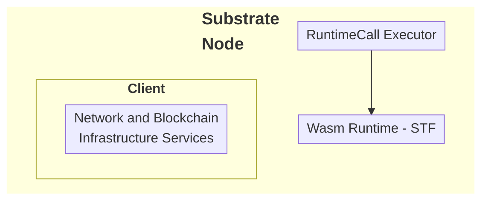

### FRAME

FRAME provides the core modular and extensible components that make the Substrate SDK flexible and adaptable to different use cases. FRAME includes Rust-based libraries that simplify the development of application-specific logic. Most of the functionality that FRAME provides takes the form of plug-in modules called [pallets](/polkadot-protocol/glossary#pallet){target=\_blank} that you can add and configure to suit your requirements for a custom runtime.

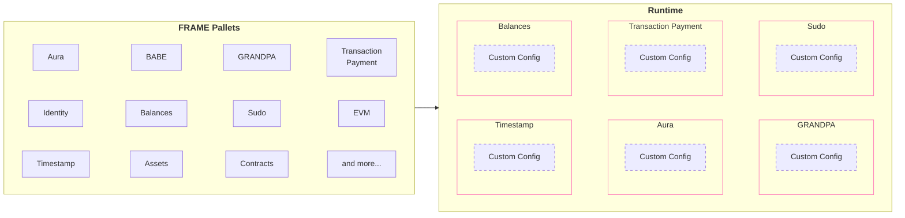

### Cumulus

Cumulus provides utilities and libraries to turn FRAME-based runtimes into runtimes that can be a parachain on Polkadot. Cumulus runtimes are still FRAME runtimes but contain the necessary functionality that allows that runtime to become a parachain on a relay chain.

## Why Use Polkadot SDK?

Using the Polkadot SDK, you can build application-specific blockchains without the complexity of building a blockchain from scratch or the limitations of building on a general-purpose blockchain. You can focus on crafting the business logic that makes your chain unique and innovative with the additional benefits of flexibility, upgradeability, open-source licensing, and cross-consensus interoperability.

## Create a Custom Blockchain Using the SDK

Before starting your blockchain development journey, you'll need to decide whether you want to build a standalone chain or a parachain that connects to the Polkadot network. Each path has its considerations and requirements. Once you've made this decision, follow these development stages:

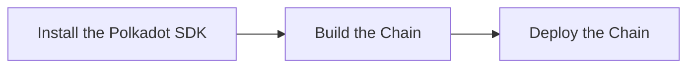

1. **[Install the Polkadot SDK](/develop/parachains/install-polkadot-sdk/)**: Set up your development environment with all necessary dependencies and tools.
2. **[Build the chain](/develop/parachains/customize-parachain)**: Learn how to create and customize your blockchain's runtime, configure pallets, and implement your chain's unique features.
3. **[Deploy the chain](/develop/parachains/deployment)**: Follow the steps to launch your blockchain, whether as a standalone network or as a parachain on Polkadot.

Each stage is covered in detail in its respective guide, walking you through the process from initial setup to final deployment.


---

# Introduction to XCM

> Source (raw): https://raw.githubusercontent.com/polkadot-developers/polkadot-docs/master/.ai/pages/develop-interoperability-intro-to-xcm.md
> Canonical (HTML): https://docs.polkadot.com/develop/interoperability/intro-to-xcm/
> Summary: Unlock blockchain interoperability with XCM — Polkadot's Cross-Consensus Messaging format for cross-chain interactions.

# Introduction to XCM

## Introduction

Polkadot’s unique value lies in its ability to enable interoperability between parachains and other blockchain systems. At the core of this capability is XCM (Cross-Consensus Messaging)—a flexible messaging format that facilitates communication and collaboration between independent consensus systems.

With XCM, one chain can send intents to another one, fostering a more interconnected ecosystem. Although it was developed specifically for Polkadot, XCM is a universal format, usable in any blockchain environment. This guide provides an overview of XCM’s core principles, design, and functionality, alongside practical examples of its implementation.

## Messaging Format

XCM is not a protocol but a standardized [messaging format](https://github.com/polkadot-fellows/xcm-format){target=\_blank}. It defines the structure and behavior of messages but does not handle their delivery. This separation allows developers to focus on crafting instructions for target systems without worrying about transmission mechanics.

XCM messages are intent-driven, outlining desired actions for the receiving blockchain to consider and potentially alter its state. These messages do not directly execute changes; instead, they rely on the host chain's environment to interpret and implement them. By utilizing asynchronous composability, XCM facilitates efficient execution where messages can be processed independently of their original order, similar to how RESTful services handle HTTP requests without requiring sequential processing.

## The Four Principles of XCM

XCM adheres to four guiding principles that ensure robust and reliable communication across consensus systems:

- **Asynchronous**: XCM messages operate independently of sender acknowledgment, avoiding delays due to blocked processes.
- **Absolute**: XCM messages are guaranteed to be delivered and interpreted accurately, in order, and timely. Once a message is sent, one can be sure it will be processed as intended.
- **Asymmetric**: XCM messages follow the 'fire and forget' paradigm meaning no automatic feedback is provided to the sender. Any results must be communicated separately to the sender with an additional message back to the origin.
- **Agnostic**: XCM operates independently of the specific consensus mechanisms, making it compatible across diverse systems.

These principles guarantee that XCM provides a reliable framework for cross-chain communication, even in complex environments.

## The XCM Tech Stack


The XCM tech stack is designed to facilitate seamless interoperable communication between chains that reside within the Polkadot ecosystem. XCM can be used to express the meaning of the messages over each of the communication channels.

## Core Functionalities of XCM

XCM enhances cross-consensus communication by introducing several powerful features:

- **Programmability**: Supports dynamic message handling, allowing for more comprehensive use cases. Includes branching logic, safe dispatches for version checks, and asset operations like NFT management.
- **Functional Multichain Decomposition**: Enables mechanisms such as remote asset locking, asset namespacing, and inter-chain state referencing, with contextual message identification.
- **Bridging**: Establishes a universal reference framework for multi-hop setups, connecting disparate systems like Ethereum and Bitcoin with the Polkadot relay chain acting as a universal location.

The standardized format for messages allows parachains to handle tasks like user balances, governance, and staking, freeing the Polkadot relay chain to focus on shared security. These features make XCM indispensable for implementing scalable and interoperable blockchain applications. 

## XCM Example

The following is a simplified XCM message demonstrating a token transfer from Alice to Bob on the same chain (ParaA).

```rust
let message = Xcm(vec![
    WithdrawAsset((Here, amount).into()),
    BuyExecution { 
        fees: (Here, amount).into(), 
        weight_limit: WeightLimit::Unlimited 
    },
    DepositAsset {
        assets: All.into(),
        beneficiary: MultiLocation {
            parents: 0,
            interior: Junction::AccountId32 {
                network: None,
                id: BOB.clone().into()
            }.into(),
        }.into()
    }
]);
```

The message consists of three instructions described as follows:

- **[WithdrawAsset](https://github.com/polkadot-fellows/xcm-format?tab=readme-ov-file#withdrawasset){target=\_blank}**: Transfers a specified number of tokens from Alice's account to a holding register.

    ```rust
        WithdrawAsset((Here, amount).into()),
    ```

    - **`Here`**: The native parachain token.
    - **`amount`**: The number of tokens that are transferred.

    The first instruction takes as an input the MultiAsset that should be withdrawn. The MultiAsset describes the native parachain token with the `Here` keyword. The `amount` parameter is the number of tokens that are transferred. The withdrawal account depends on the origin of the message. In this example the origin of the message is Alice. The `WithdrawAsset` instruction moves `amount` number of native tokens from Alice's account into the holding register.

- **[BuyExecution](https://github.com/polkadot-fellows/xcm-format?tab=readme-ov-file#buyexecution){target=\_blank}**: Allocates fees to cover the execution [weight](/polkadot-protocol/glossary/#weight){target=\_blank} of the XCM instructions.

    ```rust
        BuyExecution { 
        fees: (Here, amount).into(), 
        weight_limit: WeightLimit::Unlimited 
    },
    ```

    - **`fees`**: Describes the asset in the holding register that should be used to pay for the weight.
    - **`weight_limit`**: Defines the maximum fees that can be used to buy weight.

- **[DepositAsset](https://github.com/polkadot-fellows/xcm-format?tab=readme-ov-file#depositasset){target=\_blank}**: Moves the remaining tokens from the holding register to Bob’s account.

    ```rust
        DepositAsset {
        assets: All.into(),
        beneficiary: MultiLocation {
            parents: 0,
            interior: Junction::AccountId32 {
                network: None,
                id: BOB.clone().into()
            }.into(),
        }.into()
    }
    ```

    - **`All`**: The wildcard for the asset(s) to be deposited. In this case, all assets in the holding register should be deposited.
    
This step-by-step process showcases how XCM enables precise state changes within a blockchain system. You can find a complete XCM message example in the [XCM repository](https://github.com/paritytech/xcm-docs/blob/main/examples/src/0_first_look/mod.rs){target=\_blank}.

## Overview

XCM revolutionizes cross-chain communication by enabling use cases such as:

- Token transfers between blockchains.
- Asset locking for cross-chain smart contract interactions.
- Remote execution of functions on other blockchains.

These functionalities empower developers to build innovative, multi-chain applications, leveraging the strengths of various blockchain networks. To stay updated on XCM’s evolving format or contribute, visit the [XCM repository](https://github.com/paritytech/xcm-docs/blob/main/examples/src/0_first_look/mod.rs){target=\_blank}.


---

# JSON-RPC APIs

> Source (raw): https://raw.githubusercontent.com/polkadot-developers/polkadot-docs/master/.ai/pages/develop-smart-contracts-json-rpc-apis.md
> Canonical (HTML): https://docs.polkadot.com/develop/smart-contracts/json-rpc-apis/
> Summary: JSON-RPC APIs guide for Polkadot Hub, covering supported methods, parameters, and examples for interacting with the chain.

# JSON-RPC APIs

!!! smartcontract "PolkaVM Preview Release"
    PolkaVM smart contracts with Ethereum compatibility are in **early-stage development and may be unstable or incomplete**.

## Introduction

Polkadot Hub provides Ethereum compatibility through its JSON-RPC interface, allowing developers to interact with the chain using familiar Ethereum tooling and methods. This document outlines the supported [Ethereum JSON-RPC methods](https://ethereum.org/en/developers/docs/apis/json-rpc/#json-rpc-methods){target=\_blank} and provides examples of how to use them.

This guide uses the Polkadot Hub TestNet endpoint:

```text
https://testnet-passet-hub-eth-rpc.polkadot.io
```

## Available Methods

### eth_accounts

Returns a list of addresses owned by the client. [Reference](https://ethereum.org/en/developers/docs/apis/json-rpc/#eth_accounts){target=\_blank}.

**Parameters**:

None.

**Example**:

```bash title="eth_accounts"
curl -X POST https://testnet-passet-hub-eth-rpc.polkadot.io \
-H "Content-Type: application/json" \
--data '{
    "jsonrpc":"2.0",
    "method":"eth_accounts",
    "params":[],
    "id":1
}'
```

---

### eth_blockNumber

Returns the number of the most recent block. [Reference](https://ethereum.org/en/developers/docs/apis/json-rpc/#eth_blocknumber){target=\_blank}.

**Parameters**:

None.

**Example**:

```bash title="eth_blockNumber"
curl -X POST https://testnet-passet-hub-eth-rpc.polkadot.io \
-H "Content-Type: application/json" \
--data '{
    "jsonrpc":"2.0",
    "method":"eth_blockNumber",
    "params":[],
    "id":1
}'
```

---

### eth_call

Executes a new message call immediately without creating a transaction. [Reference](https://ethereum.org/en/developers/docs/apis/json-rpc/#eth_call){target=\_blank}.

**Parameters**:

- **`transaction` ++"object"++**: The transaction call object.
    - **`to` ++"string"++**: Recipient address of the call. Must be a [20-byte data](https://ethereum.org/en/developers/docs/apis/json-rpc/#unformatted-data-encoding){target=\_blank} string.
    - **`data` ++"string"++**: Hash of the method signature and encoded parameters. Must be a [data](https://ethereum.org/en/developers/docs/apis/json-rpc/#unformatted-data-encoding){target=\_blank} string.
    - **`from` ++"string"++**: (Optional) Sender's address for the call. Must be a [20-byte data](https://ethereum.org/en/developers/docs/apis/json-rpc/#unformatted-data-encoding){target=\_blank} string.
    - **`gas` ++"string"++**: (Optional) Gas limit to execute the call. Must be a [quantity](https://ethereum.org/en/developers/docs/apis/json-rpc/#quantities-encoding){target=\_blank} string.
    - **`gasPrice` ++"string"++**: (Optional) Gas price per unit of gas. Must be a [quantity](https://ethereum.org/en/developers/docs/apis/json-rpc/#quantities-encoding){target=\_blank} string.
    - **`value` ++"string"++**: (Optional) Value in wei to send with the call. Must be a [quantity](https://ethereum.org/en/developers/docs/apis/json-rpc/#quantities-encoding){target=\_blank} string.
- **`blockValue` ++"string"++**: (Optional) Block tag or block number to execute the call at. Must be a [quantity](https://ethereum.org/en/developers/docs/apis/json-rpc/#quantities-encoding){target=\_blank} string or a [default block parameter](https://ethereum.org/en/developers/docs/apis/json-rpc/#default-block){target=\_blank}.

**Example**:

```bash title="eth_call"
curl -X POST https://testnet-passet-hub-eth-rpc.polkadot.io \
-H "Content-Type: application/json" \
--data '{
    "jsonrpc":"2.0",
    "method":"eth_call",
    "params":[{
        "to": "INSERT_RECIPIENT_ADDRESS",
        "data": "INSERT_ENCODED_CALL"
    }, "INSERT_BLOCK_VALUE"],
    "id":1
}'
```

Ensure to replace the `INSERT_RECIPIENT_ADDRESS`, `INSERT_ENCODED_CALL`, and `INSERT_BLOCK_VALUE` with the proper values.

---

### eth_chainId

Returns the chain ID used for signing transactions. [Reference](https://ethereum.org/en/developers/docs/apis/json-rpc/#eth_chainid){target=\_blank}.

**Parameters**:

None.

**Example**:

```bash title="eth_chainId"
curl -X POST https://testnet-passet-hub-eth-rpc.polkadot.io \
-H "Content-Type: application/json" \
--data '{
    "jsonrpc":"2.0",
    "method":"eth_chainId",
    "params":[],
    "id":1
}'
```

---

### eth_estimateGas

Estimates gas required for a transaction. [Reference](https://ethereum.org/en/developers/docs/apis/json-rpc/#eth_estimategas){target=\_blank}.

**Parameters**:

- **`transaction` ++"object"++**: The transaction call object.
    - **`to` ++"string"++**: Recipient address of the call. Must be a [20-byte data](https://ethereum.org/en/developers/docs/apis/json-rpc/#unformatted-data-encoding){target=\_blank} string.
    - **`data` ++"string"++**: Hash of the method signature and encoded parameters. Must be a [data](https://ethereum.org/en/developers/docs/apis/json-rpc/#unformatted-data-encoding){target=\_blank} string.
    - **`from` ++"string"++**: (Optional) Sender's address for the call. Must be a [20-byte data](https://ethereum.org/en/developers/docs/apis/json-rpc/#unformatted-data-encoding){target=\_blank} string.
    - **`gas` ++"string"++**: (Optional) Gas limit to execute the call. Must be a [quantity](https://ethereum.org/en/developers/docs/apis/json-rpc/#quantities-encoding){target=\_blank} string.
    - **`gasPrice` ++"string"++**: (Optional) Gas price per unit of gas. Must be a [quantity](https://ethereum.org/en/developers/docs/apis/json-rpc/#quantities-encoding){target=\_blank} string.
    - **`value` ++"string"++**: (Optional) Value in wei to send with the call. Must be a [quantity](https://ethereum.org/en/developers/docs/apis/json-rpc/#quantities-encoding){target=\_blank} string.
- **`blockValue` ++"string"++**: (Optional) Block tag or block number to execute the call at. Must be a [quantity](https://ethereum.org/en/developers/docs/apis/json-rpc/#quantities-encoding){target=\_blank} string or a [default block parameter](https://ethereum.org/en/developers/docs/apis/json-rpc/#default-block){target=\_blank}.

**Example**:

```bash title="eth_estimateGas"
curl -X POST https://testnet-passet-hub-eth-rpc.polkadot.io \
-H "Content-Type: application/json" \
--data '{
    "jsonrpc":"2.0",
    "method":"eth_estimateGas",
    "params":[{
        "to": "INSERT_RECIPIENT_ADDRESS",
        "data": "INSERT_ENCODED_FUNCTION_CALL"
    }],
    "id":1
}'
```

Ensure to replace the `INSERT_RECIPIENT_ADDRESS` and `INSERT_ENCODED_CALL` with the proper values.

---

### eth_gasPrice

Returns the current gas price in Wei. [Reference](https://ethereum.org/en/developers/docs/apis/json-rpc/#eth_gasprice){target=\_blank}.

**Parameters**:

None.

**Example**:

```bash title="eth_gasPrice"
curl -X POST https://testnet-passet-hub-eth-rpc.polkadot.io \
-H "Content-Type: application/json" \
--data '{
    "jsonrpc":"2.0",
    "method":"eth_gasPrice",
    "params":[],
    "id":1
}'
```

---

### eth_getBalance

Returns the balance of a given address. [Reference](https://ethereum.org/en/developers/docs/apis/json-rpc/#eth_getbalance){target=\_blank}.

**Parameters**:

- **`address` ++"string"++**: Address to query balance. Must be a [20-byte data](https://ethereum.org/en/developers/docs/apis/json-rpc/#unformatted-data-encoding){target=\_blank} string.
- **`blockValue` ++"string"++**: (Optional) The block value to be fetched. Must be a [quantity](https://ethereum.org/en/developers/docs/apis/json-rpc/#quantities-encoding){target=\_blank} string or a [default block parameter](https://ethereum.org/en/developers/docs/apis/json-rpc/#default-block){target=\_blank}.

**Example**:

```bash title="eth_getBalance"
curl -X POST https://testnet-passet-hub-eth-rpc.polkadot.io \
-H "Content-Type: application/json" \
--data '{
    "jsonrpc":"2.0",
    "method":"eth_getBalance",
    "params":["INSERT_ADDRESS", "INSERT_BLOCK_VALUE"],
    "id":1
}'
```

Ensure to replace the `INSERT_ADDRESS` and `INSERT_BLOCK_VALUE` with the proper values.

---

### eth_getBlockByHash

Returns information about a block by its hash. [Reference](https://ethereum.org/en/developers/docs/apis/json-rpc/#eth_getblockbyhash){target=\_blank}.

**Parameters**:

- **`blockHash` ++"string"++**: The hash of the block to retrieve. Must be a [32 byte data](https://ethereum.org/en/developers/docs/apis/json-rpc/#unformatted-data-encoding){target=\_blank} string.
- **`fullTransactions` ++"boolean"++**: If `true`, returns full transaction details; if `false`, returns only transaction hashes.

**Example**:

```bash title="eth_getBlockByHash"
curl -X POST https://testnet-passet-hub-eth-rpc.polkadot.io \
-H "Content-Type: application/json" \
--data '{
    "jsonrpc":"2.0",
    "method":"eth_getBlockByHash",
    "params":["INSERT_BLOCK_HASH", INSERT_BOOLEAN],
    "id":1
}'
```

Ensure to replace the `INSERT_BLOCK_HASH` and `INSERT_BOOLEAN` with the proper values.

---

### eth_getBlockByNumber

Returns information about a block by its number. [Reference](https://ethereum.org/en/developers/docs/apis/json-rpc/#eth_getblockbynumber){target=\_blank}.

**Parameters**:

- **`blockValue` ++"string"++**: (Optional) The block value to be fetched. Must be a [quantity](https://ethereum.org/en/developers/docs/apis/json-rpc/#quantities-encoding){target=\_blank} string or a [default block parameter](https://ethereum.org/en/developers/docs/apis/json-rpc/#default-block){target=\_blank}.
- **`fullTransactions` ++"boolean"++**: If `true`, returns full transaction details; if `false`, returns only transaction hashes.

**Example**:

```bash title="eth_getBlockByNumber"
curl -X POST https://testnet-passet-hub-eth-rpc.polkadot.io \
-H "Content-Type: application/json" \
--data '{
    "jsonrpc":"2.0",
    "method":"eth_getBlockByNumber",
    "params":["INSERT_BLOCK_VALUE", INSERT_BOOLEAN],
    "id":1
}'
```

Ensure to replace the `INSERT_BLOCK_VALUE` and `INSERT_BOOLEAN` with the proper values.

---

### eth_getBlockTransactionCountByNumber

Returns the number of transactions in a block from a block number. [Reference](https://ethereum.org/en/developers/docs/apis/json-rpc/#eth_getblocktransactioncountbynumber){target=\_blank}.

**Parameters**:

- **`blockValue` ++"string"++**: The block value to be fetched. Must be a [quantity](https://ethereum.org/en/developers/docs/apis/json-rpc/#quantities-encoding){target=\_blank} string or a [default block parameter](https://ethereum.org/en/developers/docs/apis/json-rpc/#default-block){target=\_blank}.

**Example**:

```bash title="eth_getBlockTransactionCountByNumber"
curl -X POST https://testnet-passet-hub-eth-rpc.polkadot.io \
-H "Content-Type: application/json" \
--data '{
    "jsonrpc":"2.0",
    "method":"eth_getBlockTransactionCountByNumber",
    "params":["INSERT_BLOCK_VALUE"],
    "id":1
}'
```

Ensure to replace the `INSERT_BLOCK_VALUE` with the proper values.

---

### eth_getBlockTransactionCountByHash

Returns the number of transactions in a block from a block hash. [Reference](https://ethereum.org/en/developers/docs/apis/json-rpc/#eth_getblocktransactioncountbyhash){target=\_blank}.

**Parameters**:

- **`blockHash` ++"string"++**: The hash of the block to retrieve. Must be a [32 byte data](https://ethereum.org/en/developers/docs/apis/json-rpc/#unformatted-data-encoding){target=\_blank} string.

**Example**:

```bash title="eth_getBlockTransactionCountByHash"
curl -X POST https://testnet-passet-hub-eth-rpc.polkadot.io \
-H "Content-Type: application/json" \
--data '{
    "jsonrpc":"2.0",
    "method":"eth_getBlockTransactionCountByHash",
    "params":["INSERT_BLOCK_HASH"],
    "id":1
}'
```

Ensure to replace the `INSERT_BLOCK_HASH` with the proper values.

---

### eth_getCode

Returns the code at a given address. [Reference](https://ethereum.org/en/developers/docs/apis/json-rpc/#eth_getcode){target=\_blank}.

**Parameters**:

- **`address` ++"string"++**: Contract or account address to query code. Must be a [20-byte data](https://ethereum.org/en/developers/docs/apis/json-rpc/#unformatted-data-encoding){target=\_blank} string.
- **`blockValue` ++"string"++**: (Optional) The block value to be fetched. Must be a [quantity](https://ethereum.org/en/developers/docs/apis/json-rpc/#quantities-encoding){target=\_blank} string or a [default block parameter](https://ethereum.org/en/developers/docs/apis/json-rpc/#default-block).

**Example**:

```bash title="eth_getCode"
curl -X POST https://testnet-passet-hub-eth-rpc.polkadot.io \
-H "Content-Type: application/json" \
--data '{
    "jsonrpc":"2.0",
    "method":"eth_getCode",
    "params":["INSERT_ADDRESS", "INSERT_BLOCK_VALUE"],
    "id":1
}'
```

Ensure to replace the `INSERT_ADDRESS` and `INSERT_BLOCK_VALUE` with the proper values.

---

### eth_getLogs

Returns an array of all logs matching a given filter object. [Reference](https://ethereum.org/en/developers/docs/apis/json-rpc/#eth_getlogs){target=\_blank}.

**Parameters**:

- **`filter` ++"object"++**: The filter object.
    - **`fromBlock` ++"string"++**: (Optional) Block number or tag to start from. Must be a [quantity](https://ethereum.org/en/developers/docs/apis/json-rpc/#quantities-encoding){target=\_blank} string or a [default block parameter](https://ethereum.org/en/developers/docs/apis/json-rpc/#default-block){target=\_blank}.
    - **`toBlock` ++"string"++**: (Optional) Block number or tag to end at. Must be a [quantity](https://ethereum.org/en/developers/docs/apis/json-rpc/#quantities-encoding){target=\_blank} string or a [default block parameter](https://ethereum.org/en/developers/docs/apis/json-rpc/#default-block){target=\_blank}.
    - **`address` ++"string" or "array of strings"++**: (Optional) Contract address or a list of addresses from which to get logs. Must be a [20-byte data](https://ethereum.org/en/developers/docs/apis/json-rpc/#unformatted-data-encoding){target=\_blank} string.
    - **`topics` ++"array of strings"++**: (Optional) Array of topics for filtering logs. Each topic can be a single [32 byte data](https://ethereum.org/en/developers/docs/apis/json-rpc/#unformatted-data-encoding){target=\_blank} string or an array of such strings (meaning OR).
    - **`blockhash` ++"string"++**: (Optional) Hash of a specific block. Cannot be used with `fromBlock` or `toBlock`. Must be a [32 byte data](https://ethereum.org/en/developers/docs/apis/json-rpc/#unformatted-data-encoding){target=\_blank} string.

**Example**:

```bash title="eth_getLogs"
curl -X POST https://testnet-passet-hub-eth-rpc.polkadot.io \
-H "Content-Type: application/json" \
--data '{
    "jsonrpc":"2.0",
    "method":"eth_getLogs",
    "params":[{
        "fromBlock": "latest",
        "toBlock": "latest"
    }],
    "id":1
}'
```

---

### eth_getStorageAt

Returns the value from a storage position at a given address. [Reference](https://ethereum.org/en/developers/docs/apis/json-rpc/#eth_getstorageat){target=\_blank}.

**Parameters**:

- **`address` ++"string"++**: Contract or account address to query code. Must be a [20-byte data](https://ethereum.org/en/developers/docs/apis/json-rpc/#unformatted-data-encoding){target=\_blank} string.
- **`storageKey` ++"string"++**: Position in storage to retrieve data from. Must be a [quantity](https://ethereum.org/en/developers/docs/apis/json-rpc/#quantities-encoding){target=\_blank} string.
- **`blockValue` ++"string"++**: (Optional) The block value to be fetched. Must be a [quantity](https://ethereum.org/en/developers/docs/apis/json-rpc/#quantities-encoding){target=\_blank} string or a [default block parameter](https://ethereum.org/en/developers/docs/apis/json-rpc/#default-block).

**Example**:

```bash title="eth_getStorageAt"
curl -X POST https://testnet-passet-hub-eth-rpc.polkadot.io \
-H "Content-Type: application/json" \
--data '{
    "jsonrpc":"2.0",
    "method":"eth_getStorageAt",
    "params":["INSERT_ADDRESS", "INSERT_STORAGE_KEY", "INSERT_BLOCK_VALUE"],
    "id":1
}'
```

Ensure to replace the `INSERT_ADDRESS`, `INSERT_STORAGE_KEY`, and `INSERT_BLOCK_VALUE` with the proper values.

---

### eth_getTransactionCount

Returns the number of transactions sent from an address (nonce). [Reference](https://ethereum.org/en/developers/docs/apis/json-rpc/#eth_gettransactioncount){target=\_blank}.

**Parameters**:

- **`address` ++"string"++**: Address to query balance. Must be a [20-byte data](https://ethereum.org/en/developers/docs/apis/json-rpc/#unformatted-data-encoding){target=\_blank} string.
- **`blockValue` ++"string"++**: (Optional) The block value to be fetched. Must be a [quantity](https://ethereum.org/en/developers/docs/apis/json-rpc/#quantities-encoding){target=\_blank} string or a [default block parameter](https://ethereum.org/en/developers/docs/apis/json-rpc/#default-block).

**Example**:

```bash title="eth_getTransactionCount"
curl -X POST https://testnet-passet-hub-eth-rpc.polkadot.io \
-H "Content-Type: application/json" \
--data '{
    "jsonrpc":"2.0",
    "method":"eth_getTransactionCount",
    "params":["INSERT_ADDRESS", "INSERT_BLOCK_VALUE"],
    "id":1
}'
```

Ensure to replace the `INSERT_ADDRESS` and `INSERT_BLOCK_VALUE` with the proper values.

---

### eth_getTransactionByHash

Returns information about a transaction by its hash. [Reference](https://ethereum.org/en/developers/docs/apis/json-rpc/#eth_gettransactionbyhash){target=\_blank}.

**Parameters**:

- **`transactionHash` ++"string"++**: The hash of the transaction. Must be a [32 byte data](https://ethereum.org/en/developers/docs/apis/json-rpc/#unformatted-data-encoding){target=\_blank} string.

**Example**:

```bash title="eth_getTransactionByHash"
curl -X POST https://testnet-passet-hub-eth-rpc.polkadot.io \
-H "Content-Type: application/json" \
--data '{
    "jsonrpc":"2.0",
    "method":"eth_getTransactionByHash",
    "params":["INSERT_TRANSACTION_HASH"],
    "id":1
}'
```

Ensure to replace the `INSERT_TRANSACTION_HASH` with the proper values.

---

### eth_getTransactionByBlockNumberAndIndex

Returns information about a transaction by block number and transaction index. [Reference](https://ethereum.org/en/developers/docs/apis/json-rpc/#eth_gettransactionbyblocknumberandindex){target=\_blank}.

**Parameters**:

- **`blockValue` ++"string"++**: The block value to be fetched. Must be a [quantity](https://ethereum.org/en/developers/docs/apis/json-rpc/#quantities-encoding){target=\_blank} string or a [default block parameter](https://ethereum.org/en/developers/docs/apis/json-rpc/#default-block){target=\_blank}.
- **`transactionIndex` ++"string"++**: The index of the transaction in the block. Must be a [quantity](https://ethereum.org/en/developers/docs/apis/json-rpc/#quantities-encoding){target=\_blank} string.

**Example**:

```bash title="eth_getTransactionByBlockNumberAndIndex"
curl -X POST https://testnet-passet-hub-eth-rpc.polkadot.io \
-H "Content-Type: application/json" \
--data '{
    "jsonrpc":"2.0",
    "method":"eth_getTransactionByBlockNumberAndIndex",
    "params":["INSERT_BLOCK_VALUE", "INSERT_TRANSACTION_INDEX"],
    "id":1
}'
```

Ensure to replace the `INSERT_BLOCK_VALUE` and `INSERT_TRANSACTION_INDEX` with the proper values.

---

### eth_getTransactionByBlockHashAndIndex

Returns information about a transaction by block hash and transaction index. [Reference](https://ethereum.org/en/developers/docs/apis/json-rpc/#eth_gettransactionbyblockhashandindex){target=\_blank}.

**Parameters**:

- **`blockHash` ++"string"++**: The hash of the block. Must be a [32 byte data](https://ethereum.org/en/developers/docs/apis/json-rpc/#unformatted-data-encoding){target=\_blank} string.
- **`transactionIndex` ++"string"++**: The index of the transaction in the block. Must be a [quantity](https://ethereum.org/en/developers/docs/apis/json-rpc/#quantities-encoding){target=\_blank} string.

**Example**:

```bash title="eth_getTransactionByBlockHashAndIndex"
curl -X POST https://testnet-passet-hub-eth-rpc.polkadot.io \
-H "Content-Type: application/json" \
--data '{
    "jsonrpc":"2.0",
    "method":"eth_getTransactionByBlockHashAndIndex",
    "params":["INSERT_BLOCK_HASH", "INSERT_TRANSACTION_INDEX"],
    "id":1
}'
```

Ensure to replace the `INSERT_BLOCK_HASH` and `INSERT_TRANSACTION_INDEX` with the proper values.

---

### eth_getTransactionReceipt

Returns the receipt of a transaction by transaction hash. [Reference](https://ethereum.org/en/developers/docs/apis/json-rpc/#eth_gettransactionreceipt){target=\_blank}.

**Parameters**:

- **`transactionHash` ++"string"++**: The hash of the transaction. Must be a [32 byte data](https://ethereum.org/en/developers/docs/apis/json-rpc/#unformatted-data-encoding){target=\_blank} string.

**Example**:

```bash title="eth_getTransactionReceipt"
curl -X POST https://testnet-passet-hub-eth-rpc.polkadot.io \
-H "Content-Type: application/json" \
--data '{
    "jsonrpc":"2.0",
    "method":"eth_getTransactionReceipt",
    "params":["INSERT_TRANSACTION_HASH"],
    "id":1
}'
```

Ensure to replace the `INSERT_TRANSACTION_HASH` with the proper values.

---

### eth_maxPriorityFeePerGas

Returns an estimate of the current priority fee per gas, in Wei, to be included in a block.

**Parameters**:

None.

**Example**:

```bash title="eth_maxPriorityFeePerGas"
curl -X POST https://testnet-passet-hub-eth-rpc.polkadot.io \
-H "Content-Type: application/json" \
--data '{
    "jsonrpc":"2.0",
    "method":"eth_maxPriorityFeePerGas",
    "params":[],
    "id":1
}'
```

---

### eth_sendRawTransaction

Submits a raw transaction. [Reference](https://ethereum.org/en/developers/docs/apis/json-rpc/#eth_sendrawtransaction){target=\_blank}.

**Parameters**:

- **`callData` ++"string"++**: Signed transaction data. Must be a [data](https://ethereum.org/en/developers/docs/apis/json-rpc/#unformatted-data-encoding){target=\_blank} string.

**Example**:

```bash title="eth_sendRawTransaction"
curl -X POST https://testnet-passet-hub-eth-rpc.polkadot.io \
-H "Content-Type: application/json" \
--data '{
    "jsonrpc":"2.0",
    "method":"eth_sendRawTransaction",
    "params":["INSERT_CALL_DATA"],
    "id":1
}'
```

Ensure to replace the `INSERT_CALL_DATA` with the proper values.

---

### eth_sendTransaction

Creates and sends a new transaction. [Reference](https://ethereum.org/en/developers/docs/apis/json-rpc/#eth_sendtransaction){target=\_blank}.

**Parameters**:

- **`transaction` ++"object"++**: The transaction object.
    - **`from` ++"string"++**: Address sending the transaction. Must be a [20-byte data](https://ethereum.org/en/developers/docs/apis/json-rpc/#unformatted-data-encoding){target=\_blank} string.
    - **`to` ++"string"++**: (Optional) Recipient address. No need to provide this value when deploying a contract. Must be a [20-byte data](https://ethereum.org/en/developers/docs/apis/json-rpc/#unformatted-data-encoding){target=\_blank} string.
    - **`gas` ++"string"++**: (optional, default: `90000`) gas limit for execution. Must be a [quantity](https://ethereum.org/en/developers/docs/apis/json-rpc/#quantities-encoding){target=\_blank} string.
    - **`gasPrice` ++"string"++**: (Optional) Gas price per unit. Must be a [quantity](https://ethereum.org/en/developers/docs/apis/json-rpc/#quantities-encoding){target=\_blank} string.
    - **`value` ++"string"++**: (Optional) Amount of Ether to send. Must be a [quantity](https://ethereum.org/en/developers/docs/apis/json-rpc/#quantities-encoding){target=\_blank} string.
    - **`data` ++"string"++**: (Optional) Contract bytecode or encoded method call. Must be a [data](https://ethereum.org/en/developers/docs/apis/json-rpc/#unformatted-data-encoding){target=\_blank} string.
    - **`nonce` ++"string"++**: (Optional) Transaction nonce. Must be a [quantity](https://ethereum.org/en/developers/docs/apis/json-rpc/#quantities-encoding){target=\_blank} string.

**Example**:

```bash title="eth_sendTransaction"
curl -X POST https://testnet-passet-hub-eth-rpc.polkadot.io \
-H "Content-Type: application/json" \
--data '{
    "jsonrpc":"2.0",
    "method":"eth_sendTransaction",
    "params":[{
        "from": "INSERT_SENDER_ADDRESS",
        "to": "INSERT_RECIPIENT_ADDRESS",
        "gas": "INSERT_GAS_LIMIT",
        "gasPrice": "INSERT_GAS_PRICE",
        "value": "INSERT_VALUE",
        "input": "INSERT_INPUT_DATA",
        "nonce": "INSERT_NONCE"
    }],
    "id":1
}'
```

Ensure to replace the `INSERT_SENDER_ADDRESS`, `INSERT_RECIPIENT_ADDRESS`, `INSERT_GAS_LIMIT`, `INSERT_GAS_PRICE`, `INSERT_VALUE`, `INSERT_INPUT_DATA`, and `INSERT_NONCE` with the proper values.

---

### eth_syncing

Returns an object with syncing data or `false` if not syncing. [Reference](https://ethereum.org/en/developers/docs/apis/json-rpc/#eth_syncing){target=\_blank}.

**Parameters**:

None.

**Example**:

```bash title="eth_syncing"
curl -X POST https://testnet-passet-hub-eth-rpc.polkadot.io \
-H "Content-Type: application/json" \
--data '{
    "jsonrpc":"2.0",
    "method":"eth_syncing",
    "params":[],
    "id":1
}'
```

---

### net_listening

Returns `true` if the client is currently listening for network connections, otherwise `false`. [Reference](https://ethereum.org/en/developers/docs/apis/json-rpc/#net_listening){target=\_blank}.

**Parameters**:

None.

**Example**:

```bash title="net_listening"
curl -X POST https://testnet-passet-hub-eth-rpc.polkadot.io \
-H "Content-Type: application/json" \
--data '{
    "jsonrpc":"2.0",
    "method":"net_listening",
    "params":[],
    "id":1
}'
```

---

### net_peerCount

Returns the number of peers currently connected to the client.

**Parameters**:

None.

**Example**:

```bash title="net_peerCount"
curl -X POST https://testnet-passet-hub-eth-rpc.polkadot.io \
-H "Content-Type: application/json" \
--data '{
    "jsonrpc":"2.0",
    "method":"net_peerCount",
    "params":[],
    "id":1
}'
```

---

### net_version

Returns the current network ID as a string. [Reference](https://ethereum.org/en/developers/docs/apis/json-rpc/#net_version){target=\_blank}.

**Parameters**:

None.

**Example**:

```bash title="net_version"
curl -X POST https://testnet-passet-hub-eth-rpc.polkadot.io \
-H "Content-Type: application/json" \
--data '{
    "jsonrpc":"2.0",
    "method":"net_version",
    "params":[],
    "id":1
}'
```

---

### system_health

Returns information about the health of the system.

**Parameters**:

None.

**Example**:

```bash title="system_health"
curl -X POST https://testnet-passet-hub-eth-rpc.polkadot.io \
-H "Content-Type: application/json" \
--data '{
    "jsonrpc":"2.0",
    "method":"system_health",
    "params":[],
    "id":1
}'
```

---

### web3_clientVersion

Returns the current client version. [Reference](https://ethereum.org/en/developers/docs/apis/json-rpc/#web3_clientversion){target=\_blank}.

**Parameters**:

None.

**Example**:

```bash title="web3_clientVersion"
curl -X POST https://testnet-passet-hub-eth-rpc.polkadot.io \
-H "Content-Type: application/json" \
--data '{
    "jsonrpc":"2.0",
    "method":"web3_clientVersion",
    "params":[],
    "id":1
}'
```

---

### debug_traceBlockByNumber 

Traces a block's execution by its number and returns a detailed execution trace for each transaction.

**Parameters**:

- **`blockValue` ++"string"++**: The block number or tag to trace. Must be a [quantity](https://ethereum.org/en/developers/docs/apis/json-rpc/#quantities-encoding){target=\_blank} string or a [default block parameter](https://ethereum.org/en/developers/docs/apis/json-rpc/#default-block){target=\_blank}.
- **`options` ++"object"++**: (Optional) An object containing tracer options.
    - **`tracer` ++"string"++**: The name of the tracer to use (e.g., `"callTracer"`, `"opTracer"`).
    - Other tracer-specific options may be supported.

**Example**:

```bash title="debug_traceBlockByNumber"
curl -X POST https://testnet-passet-hub-eth-rpc.polkadot.io \
-H "Content-Type: application/json" \
--data '{
    "jsonrpc":"2.0",
    "method":"debug_traceBlockByNumber",
    "params":["INSERT_BLOCK_VALUE", {"tracer": "callTracer"}],
    "id":1
}'
```

Ensure to replace `INSERT_BLOCK_VALUE` with a proper block number if needed.

---

### debug_traceTransaction

Traces the execution of a single transaction by its hash and returns a detailed execution trace.

**Parameters**:

- **`transactionHash` ++"string"++**: The hash of the transaction to trace. Must be a [32 byte data](https://ethereum.org/en/developers/docs/apis/json-rpc/#unformatted-data-encoding){target=\_blank} string.
- **`options` ++"object"++**: (Optional) An object containing tracer options (e.g., `tracer: "callTracer"`).

**Example**:

```bash title="debug_traceTransaction"
curl -X POST https://testnet-passet-hub-eth-rpc.polkadot.io \
-H "Content-Type: application/json" \
--data '{
    "jsonrpc":"2.0",
    "method":"debug_traceTransaction",
    "params":["INSERT_TRANSACTION_HASH", {"tracer": "callTracer"}],
    "id":1
}'
```

Ensure to replace the `INSERT_TRANSACTION_HASH` with the proper value.

---

### debug_traceCall

Executes a new message call and returns a detailed execution trace without creating a transaction on the blockchain.

**Parameters**:

- **`transaction` ++"object"++**: The transaction call object, similar to `eth_call` parameters.
    - **`to` ++"string"++**: Recipient address of the call. Must be a [20-byte data](https://ethereum.org/en/developers/docs/apis/json-rpc/#unformatted-data-encoding){target=\_blank} string.
    - **`data` ++"string"++**: Hash of the method signature and encoded parameters. Must be a [data](https://ethereum.org/en/developers/docs/apis/json-rpc/#unformatted-data-encoding){target=\_blank} string.
    - **`from` ++"string"++**: (Optional) Sender's address for the call. Must be a [20-byte data](https://ethereum.org/en/developers/docs/apis/json-rpc/#unformatted-data-encoding){target=\_blank} string.
    - **`gas` ++"string"++**: (Optional) Gas limit to execute the call. Must be a [quantity](https://ethereum.org/en/developers/docs/apis/json-rpc/#quantities-encoding){target=\_blank} string.
    - **`gasPrice` ++"string"++**: (Optional) Gas price per unit of gas. Must be a [quantity](https://ethereum.org/en/developers/docs/apis/json-rpc/#quantities-encoding){target=\_blank} string.
    - **`value` ++"string"++**: (Optional) Value in wei to send with the call. Must be a [quantity](https://ethereum.org/en/developers/docs/apis/json-rpc/#quantities-encoding){target=\_blank} string.
- **`blockValue` ++"string"++**: (Optional) Block tag or block number to execute the call at. Must be a [quantity](https://ethereum.org/en/developers/docs/apis/json-rpc/#quantities-encoding){target=\_blank} string or a [default block parameter](https://ethereum.org/en/developers/docs/apis/json-rpc/#default-block){target=\_blank}.
- **`options` ++"object"++**: (Optional) An object containing tracer options (e.g., `tracer: "callTracer"`).

**Example**:

```bash title="debug_traceCall"
curl -X POST https://testnet-passet-hub-eth-rpc.polkadot.io \
-H "Content-Type: application/json" \
--data '{
    "jsonrpc":"2.0",
    "method":"debug_traceCall",
    "params":[{
        "from": "INSERT_SENDER_ADDRESS",
        "to": "INSERT_RECIPIENT_ADDRESS",
        "data": "INSERT_ENCODED_CALL"
    }, "INSERT_BLOCK_VALUE", {"tracer": "callTracer"}],
    "id":1
}'
```

Ensure to replace the `INSERT_SENDER_ADDRESS`, `INSERT_RECIPIENT_ADDRESS`, `INSERT_ENCODED_CALL`, and `INSERT_BLOCK_VALUE` with the proper value.

---

## Response Format

All responses follow the standard JSON-RPC 2.0 format:

```json
{
    "jsonrpc": "2.0",
    "id": 1,
    "result": ... // The return value varies by method
}
```

## Error Handling

If an error occurs, the response will include an error object:

```json
{
    "jsonrpc": "2.0",
    "id": 1,
    "error": {
        "code": -32000,
        "message": "Error message here"
    }
}
```


---

# Networks

> Source (raw): https://raw.githubusercontent.com/polkadot-developers/polkadot-docs/master/.ai/pages/develop-networks.md
> Canonical (HTML): https://docs.polkadot.com/develop/networks/
> Summary: Explore the Polkadot ecosystem networks and learn the unique purposes of each, tailored for blockchain innovation, testing, and enterprise-grade solutions.

# Networks

## Introduction

The Polkadot ecosystem consists of multiple networks designed to support different stages of blockchain development, from main networks to test networks. Each network serves a unique purpose, providing developers with flexible environments for building, testing, and deploying blockchain applications.

This section includes essential network information such as RPC endpoints, currency symbols and decimals, and how to acquire TestNet tokens for the Polkadot ecosystem of networks.

## Production Networks

### Polkadot

Polkadot is the primary production blockchain network for high-stakes, enterprise-grade applications. Polkadot MainNet has been running since May 2020 and has implementations in various programming languages ranging from Rust to JavaScript.

=== "Network Details"

    **Currency symbol**: `DOT`

    ---
    
    **Currency decimals**: 10

    ---

    **Block explorer**: [Polkadot Subscan](https://polkadot.subscan.io/){target=\_blank}

=== "RPC Endpoints"

    Blockops

    ```
    wss://polkadot-public-rpc.blockops.network/ws
    ```

    ---

    Dwellir

    ```
    wss://polkadot-rpc.dwellir.com
    ```

    ---

    Dwellir Tunisia

    ```
    wss://polkadot-rpc-tn.dwellir.com
    ```

    ---

    IBP1

    ```
    wss://rpc.ibp.network/polkadot
    ```

    ---

    IBP2

    ```
    wss://polkadot.dotters.network
    ```

    ---

    LuckyFriday

    ```
    wss://rpc-polkadot.luckyfriday.io
    ```

    ---

    OnFinality

    ```
    wss://polkadot.api.onfinality.io/public-ws
    ```

    ---

    RadiumBlock

    ```
    wss://polkadot.public.curie.radiumblock.co/ws
    ```

    ---

    RockX

    ```
    wss://rockx-dot.w3node.com/polka-public-dot/ws
    ```

    ---

    Stakeworld

    ```
    wss://dot-rpc.stakeworld.io
    ```

    ---

    SubQuery

    ```
    wss://polkadot.rpc.subquery.network/public/ws
    ```

    ---

    Light client

    ```
    light://substrate-connect/polkadot
    ```

### Kusama

Kusama is a network built as a risk-taking, fast-moving "canary in the coal mine" for its cousin Polkadot. As it is built on top of the same infrastructure, Kusama often acts as a final testing ground for new features before they are launched on Polkadot. Unlike true TestNets, however, the Kusama KSM native token does have economic value. This incentive encourages participants to maintain this robust and performant structure for the benefit of the community.

=== "Network Details"

    **Currency symbol**: `KSM`

    ---

    **Currency decimals**: 12

    ---
    
    **Block explorer**: [Kusama Subscan](https://kusama.subscan.io/){target=\_blank}

=== "RPC Endpoints"

    Dwellir

    ```
    wss://kusama-rpc.dwellir.com
    ```

    ---

    Dwellir Tunisia

    ```
    wss://kusama-rpc-tn.dwellir.com
    ```

    ---

    IBP1

    ```
    wss://rpc.ibp.network/kusama
    ```

    ---

    IBP2

    ```
    wss://kusama.dotters.network
    ```

    ---

    LuckyFriday

    ```
    wss://rpc-kusama.luckyfriday.io
    ```

    ---

    OnFinality

    ```
    wss://kusama.api.onfinality.io/public-ws
    ```

    ---

    RadiumBlock

    ```
    wss://kusama.public.curie.radiumblock.co/ws
    ```

    ---

    RockX

    ```
    wss://rockx-ksm.w3node.com/polka-public-ksm/ws
    ```

    ---

    Stakeworld

    ```
    wss://rockx-ksm.w3node.com/polka-public-ksm/ws
    ```

    ---

    Light client

    ```
    light://substrate-connect/kusama
    ```

## Test Networks

### Westend

Westend is the primary test network that mirrors Polkadot's functionality for protocol-level feature development. As a true TestNet, the WND native token intentionally does not have any economic value. Use the faucet information in the following section to obtain WND tokens.

=== "Network Information"

    **Currency symbol**: `WND`

    ---

    **Currency decimals**: 12

    ---
    
    **Block explorer**: [Westend Subscan](https://westend.subscan.io/){target=\_blank}

    ---

    **Faucet**: [Official Westend faucet](https://faucet.polkadot.io/westend){target=\_blank}


=== "RPC Endpoints"

    Dwellir

    ```
    wss://westend-rpc.dwellir.com
    ```

    ---

    Dwellir Tunisia

    ```
    wss://westend-rpc-tn.dwellir.com
    ```

    ---

    IBP1

    ```
    wss://rpc.ibp.network/westend
    ```

    ---

    IBP2

    ```
    wss://westend.dotters.network
    ```

    ---

    OnFinality

    ```
    wss://westend.api.onfinality.io/public-ws
    ```

    ---

    Parity

    ```
    wss://westend-rpc.polkadot.io
    ```

    ---

    Light client

    ```
    light://substrate-connect/westend
    ```

### Paseo

Paseo is a decentralised, community run, stable testnet for parachain and dapp developers to build and test their applications. Unlike Westend, Paseo is not intended for protocol-level testing. As a true TestNet, the PAS native token intentionally does not have any economic value. Use the faucet information in the following section to obtain PAS tokens.

=== "Network Information"

    **Currency symbol**: `PAS`

    ---

    **Currency decimals**: 10

    ---
    
    **Block explorer**: [Paseo Subscan](https://paseo.subscan.io/){target=\_blank}

    ---

    **Faucet**: [Official Paseo faucet](https://faucet.polkadot.io/){target=\_blank}

=== "RPC Endpoints"

    Amforc
    
    ```
    wss://paseo.rpc.amforc.com
    ```
    
    ---
    
    Dwellir
    
    ```
    wss://paseo-rpc.dwellir.com
    ```
    
    ---
    
    IBP1
    
    ```
    wss://rpc.ibp.network/paseo
    ```
    
    ---
    
    IBP2
    
    ```
    wss://paseo.dotters.network
    ```
    
    ---
    
    StakeWorld
    
    ```
    wss://pas-rpc.stakeworld.io
    ```

## Additional Resources

- [**Polkadot Fellowship runtimes repository**](https://github.com/polkadot-fellows/runtimes){target=\_blank}: Find a collection of runtimes for Polkadot, Kusama, and their system-parachains as maintained by the community via the [Polkadot Technical Fellowship](https://wiki.polkadot.com/learn/learn-polkadot-technical-fellowship/){target=\_blank}.


---

# Networks

> Source (raw): https://raw.githubusercontent.com/polkadot-developers/polkadot-docs/master/.ai/pages/polkadot-protocol-parachain-basics-networks.md
> Canonical (HTML): https://docs.polkadot.com/polkadot-protocol/parachain-basics/networks/
> Summary: Explore Polkadot's testing and production networks, including Westend, Kusama, and Paseo, for efficient development, deployment, and testing.

# Networks

## Introduction

The Polkadot ecosystem is built on a robust set of networks designed to enable secure and scalable development. Whether you are testing new features or deploying to live production, Polkadot offers several layers of networks tailored for each stage of the development process. From local environments to experimental networks like Kusama and community-run TestNets such as Paseo, developers can thoroughly test, iterate, and validate their applications. This guide will introduce you to Polkadot's various networks and explain how they fit into the development workflow.

## Network Overview 

Polkadot's development process is structured to ensure new features and upgrades are rigorously tested before being deployed on live production networks. The progression follows a well-defined path, starting from local environments and advancing through TestNets, ultimately reaching the Polkadot MainNet. The diagram below outlines the typical progression of the Polkadot development cycle:

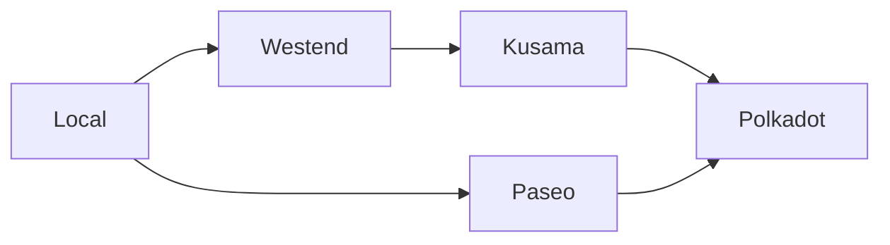
This flow ensures developers can thoroughly test and iterate without risking real tokens or affecting production networks. Testing tools like [Chopsticks](#chopsticks) and various TestNets make it easier to experiment safely before releasing to production.

A typical journey through the Polkadot core protocol development process might look like this:

1. **Local development node**: Development starts in a local environment, where developers can create, test, and iterate on upgrades or new features using a local development node. This stage allows rapid experimentation in an isolated setup without any external dependencies.

2. **Westend**: After testing locally, upgrades are deployed to [Westend](#westend), Polkadot's primary TestNet. Westend simulates real-world conditions without using real tokens, making it the ideal place for rigorous feature testing before moving on to production networks.

3. **Kusama**: Once features have passed extensive testing on Westend, they move to Kusama, Polkadot's experimental and fast-moving "canary" network. Kusama operates as a high-fidelity testing ground with actual economic incentives, giving developers insights into how their features will perform in a real-world environment.

4. **Polkadot**: After passing tests on Westend and Kusama, features are considered ready for deployment to Polkadot, the live production network.

    In addition, parachain developers can leverage local TestNets like [Zombienet](#zombienet) and deploy upgrades on parachain TestNets.

5. **Paseo**: For parachain and dApp developers, Paseo serves as a community-run TestNet that mirrors Polkadot's runtime. Like Westend for core protocol development, Paseo provides a testing ground for parachain development without affecting live networks.

!!!note
    The Rococo TestNet deprecation date was October 14, 2024. Teams should use Westend for Polkadot protocol and feature testing and Paseo for chain development-related testing.

## Polkadot Development Networks

Development and testing are crucial to building robust dApps and parachains and performing network upgrades within the Polkadot ecosystem. To achieve this, developers can leverage various networks and tools that provide a risk-free environment for experimentation and validation before deploying features to live networks. These networks help avoid the costs and risks associated with real tokens, enabling testing for functionalities like governance, cross-chain messaging, and runtime upgrades.

## Kusama Network

Kusama is the experimental version of Polkadot, designed for developers who want to move quickly and test their applications in a real-world environment with economic incentives. Kusama serves as a production-grade testing ground where developers can deploy features and upgrades with the pressure of game theory and economics in mind. It mirrors Polkadot but operates as a more flexible space for innovation.

The native token for Kusama is KSM. For more information about KSM, visit the [Native Assets](https://guide.kusama.network/docs/learn-DOT#kusama-tokens){target=\_blank} page.

## Test Networks

The following test networks provide controlled environments for testing upgrades and new features. TestNet tokens are available from the [Polkadot faucet](https://faucet.polkadot.io/){target=\_blank}.

### Westend

Westend is Polkadot's primary permanent TestNet. Unlike temporary test networks, Westend is not reset to the genesis block, making it an ongoing environment for testing Polkadot core features. Managed by Parity Technologies, Westend ensures that developers can test features in a real-world simulation without using actual tokens.

The native token for Westend is WND. More details about WND can be found on the [Native Assets](https://wiki.polkadot.com/learn/learn-dot/#__tabbed_2_2){target=\_blank} page.

### Paseo

[Paseo](https://github.com/paseo-network){target=\_blank} is a community-managed TestNet designed for parachain and dApp developers. It mirrors Polkadot's runtime and is maintained by Polkadot community members. Paseo provides a dedicated space for parachain developers to test their applications in a Polkadot-like environment without the risks associated with live networks.

The native token for Paseo is PAS. Additional information on PAS is available on the [Native Assets](https://wiki.polkadot.com/learn/learn-dot/#__tabbed_2_1){target=\_blank} page.

## Local Test Networks

Local test networks are an essential part of the development cycle for blockchain developers using the Polkadot SDK. They allow for fast, iterative testing in controlled, private environments without connecting to public TestNets. Developers can quickly spin up local instances to experiment, debug, and validate their code before deploying to larger TestNets like Westend or Paseo. Two key tools for local network testing are Zombienet and Chopsticks.

### Zombienet

[Zombienet](https://github.com/paritytech/zombienet){target=\_blank} is a flexible testing framework for Polkadot SDK-based blockchains. It enables developers to create and manage ephemeral, short-lived networks. This feature makes Zombienet particularly useful for quick iterations, as it allows you to run multiple local networks concurrently, mimicking different runtime conditions. Whether you're developing a parachain or testing your custom blockchain logic, Zombienet gives you the tools to automate local testing.

Key features of Zombienet include:

- Creating dynamic, local networks with different configurations.
- Running parachains and relay chains in a simulated environment.
- Efficient testing of network components like cross-chain messaging and governance.

Zombienet is ideal for developers looking to test quickly and thoroughly before moving to more resource-intensive public TestNets.

### Chopsticks

[Chopsticks](https://github.com/AcalaNetwork/chopsticks){target=\_blank} is a tool designed to create forks of Polkadot SDK-based blockchains, allowing developers to interact with network forks as part of their testing process. This capability makes Chopsticks a powerful option for testing upgrades, runtime changes, or cross-chain applications in a forked network environment.

Key features of Chopsticks include:

- Forking live Polkadot SDK-based blockchains for isolated testing.
- Simulating cross-chain messages in a private, controlled setup.
- Debugging network behavior by interacting with the fork in real-time.

Chopsticks provides a controlled environment for developers to safely explore the effects of runtime changes. It ensures that network behavior is tested and verified before upgrades are deployed to live networks.


---

# Networks for Polkadot Hub Smart Contracts

> Source (raw): https://raw.githubusercontent.com/polkadot-developers/polkadot-docs/master/.ai/pages/polkadot-protocol-smart-contract-basics-networks.md
> Canonical (HTML): https://docs.polkadot.com/polkadot-protocol/smart-contract-basics/networks/
> Summary: Explore the available networks for smart contract development on Polkadot Hub, including Westend Hub, Kusama Hub, and Polkadot Hub.

# Networks

!!! smartcontract "PolkaVM Preview Release"
    PolkaVM smart contracts with Ethereum compatibility are in **early-stage development and may be unstable or incomplete**.

## Introduction

Polkadot Hub provides smart contract functionality across multiple networks to facilitate smart contract development in the Polkadot ecosystem. Whether you're testing new contracts or deploying to production, Polkadot Hub offers several network environments tailored for each stage of development. Developers can thoroughly test, iterate, and validate their smart contracts from local testing environments to production networks like Polkadot Hub.

This guide will introduce you to the current and upcoming networks available for smart contract development and explain how they fit into the development workflow.

## Network Overview

Smart contract development on Polkadot Hub follows a structured process to ensure rigorous testing of new contracts and upgrades before deployment on production networks. Development progresses through a well-defined path, beginning with local environments, advancing through TestNets, and ultimately reaching MainNets. The diagram below illustrates this progression:

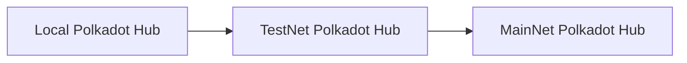

This progression ensures developers can thoroughly test and iterate their smart contracts without risking real tokens or affecting production networks. A typical development journey consists of three main stages:

1. Local development:

    - Developers start in a local environment to create, test, and iterate on smart contracts.
    - Provides rapid experimentation in an isolated setup without external dependencies.

2. TestNet development:

    - Contracts move to TestNets like Westend Hub and Passet Hub.
    - Enables testing in simulated real-world conditions without using real tokens.

3. Production deployment:

    - Final deployment to MainNets like Kusama Hub and Polkadot Hub.
    - Represents the live environment where contracts interact with real economic value.

## Local Development

The local development environment is crucial for smart contract development on Polkadot Hub. It provides developers a controlled space for rapid testing and iteration before moving to public networks. The local setup consists of several key components:

- **[Kitchensink node](https://paritytech.github.io/polkadot-sdk/master/kitchensink_runtime/index.html){target=\_blank}**: A local node that can be run for development and testing. It includes logging capabilities for debugging contract execution and provides a pre-configured development environment with pre-funded accounts for testing purposes.
- **[Ethereum RPC proxy](https://paritytech.github.io/polkadot-sdk/master/pallet_revive_eth_rpc/index.html){target=\_blank}**: Bridges Ethereum-compatible tools with the Polkadot SDK-based network. It enables seamless integration with popular development tools like MetaMask and Remix IDE. The purpose of this component is to translate Ethereum RPC calls into Substrate format.

## Test Networks

The following test networks provide controlled environments for testing smart contracts. TestNet tokens are available from the [Polkadot faucet](https://faucet.polkadot.io/){target=\_blank}. They provide a stable environment for testing your contracts without using real tokens.

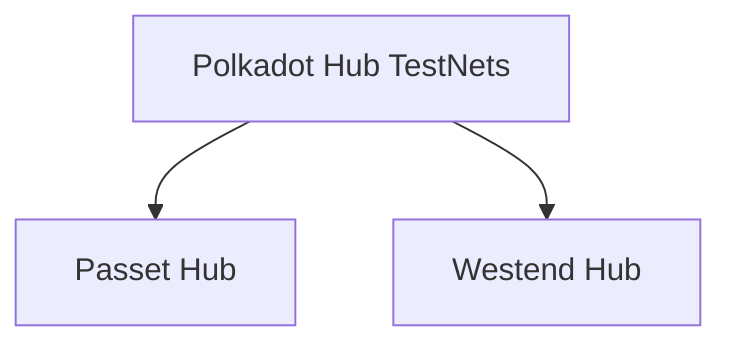

### Passet Hub

The Passet Hub will be a community-managed TestNet designed specifically for smart contract development. It will mirror Asset Hub's runtime and provide developers with an additional environment for testing their contracts before deployment to production networks.

### Westend Hub

Westend Hub is the TestNet for smart contract development and its cutting-edge features. The network maintains the same features and capabilities as the production Polkadot Hub, and also incorporates the latest features developed by core developers.

## Production Networks

The MainNet environments represent the final destination for thoroughly tested and validated smart contracts, where they operate with real economic value and serve actual users.

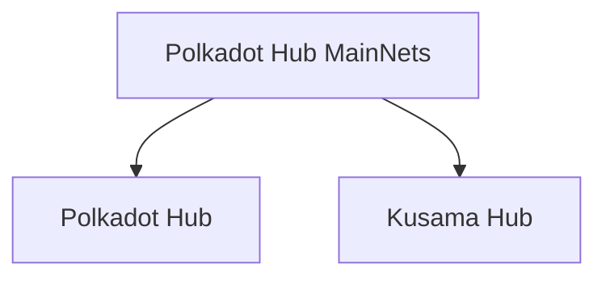

### Polkadot Hub

Polkadot Hub is the primary production network for deploying smart contracts in the Polkadot ecosystem. It provides a secure and stable environment for running smart contracts with real economic value. The network supports PolkaVM-compatible contracts written in Solidity or Rust, maintaining compatibility with Ethereum-based development tools.

### Kusama Hub

Kusama Hub is the canary version of Polkadot Hub. It is designed for developers who want to move quickly and test their smart contracts in a real-world environment with economic incentives. It provides a more flexible space for innovation while maintaining the same core functionality as Polkadot Hub.


---

# Node and Runtime

> Source (raw): https://raw.githubusercontent.com/polkadot-developers/polkadot-docs/master/.ai/pages/polkadot-protocol-parachain-basics-node-and-runtime.md
> Canonical (HTML): https://docs.polkadot.com/polkadot-protocol/parachain-basics/node-and-runtime/
> Summary: Learn how Polkadot SDK-based nodes function, how the client and runtime are separated, and how they communicate using SCALE-encoded data.

# Node and Runtime

## Introduction

Every blockchain platform relies on a decentralized network of computers, called nodes, that communicate with each other about transactions and blocks. In this context, a node refers to the software running on the connected devices rather than the physical or virtual machines in the network.

Polkadot SDK-based nodes consist of two main components, each with distinct responsibilities: the client (also called node) and the runtime.

If the system were a monolithic protocol, any modification would require updating the entire system. Instead, Polkadot achieves true upgradeability by defining an immutable meta-protocol (the client) and a protocol (the runtime) that can be upgraded independently.

This separation gives the [Polkadot Relay Chain](/polkadot-protocol/architecture/polkadot-chain){target=\_blank} and all connected [parachains](/polkadot-protocol/architecture/parachains){target=\_blank} an evolutionary advantage over other blockchain platforms.

## Architectural Principles

The Polkadot SDK-based blockchain architecture is fundamentally built on two distinct yet interconnected components:

- Client (Meta-protocol):
    - Handles the foundational infrastructure of the blockchain.
    - Manages runtime execution, networking, consensus, and other off-chain components.
    - Provides an immutable base layer that ensures network stability.
    - Upgradable only through hard forks.

- Runtime (Protocol):
    - Defines the blockchain's state transition logic.
    - Determines the specific rules and behaviors of the blockchain.
    - Compiled to WebAssembly (Wasm) for platform-independent execution.
    - Capable of being upgraded without network-wide forking.

### Advantages of this Architecture

- **Forkless upgrades**: Runtime can be updated without disrupting the entire network.
- **Modularity**: Clear separation allows independent development of client and runtime.
- **Flexibility**: Enables rapid iteration and evolution of blockchain logic.
- **Performance**: WebAssembly compilation provides efficient, cross-platform execution.

## Node (Client)

The node, also known as the client, is the core component responsible for executing the Wasm runtime and orchestrating various essential blockchain components. It ensures the correct execution of the state transition function and manages multiple critical subsystems, including:

- **Wasm execution**: Runs the blockchain runtime, which defines the state transition rules.
- **Database management**: Stores blockchain data.
- **Networking**: Facilitates peer-to-peer communication, block propagation, and transaction gossiping.
- **Transaction pool (Mempool)**: Manages pending transactions before they are included in a block.
- **Consensus mechanism**: Ensures agreement on the blockchain state across nodes.
- **RPC services**: Provides external interfaces for applications and users to interact with the node.

## Runtime

The runtime is more than just a set of rules. It's the fundamental logic engine that defines a blockchain's entire behavior. In Polkadot SDK-based blockchains, the runtime represents a complete, self-contained description of the blockchain's state transition function.

### Characteristics

The runtime is distinguished by three key characteristics:

- **Business logic**: Defines the complete application-specific blockchain behavior.
- **WebAssembly compilation**: Ensures platform-independent, secure execution.
- **On-chain storage**: Stored within the blockchain's state, allowing dynamic updates.

### Key Functions

The runtime performs several critical functions, such as:

- Define state transition rules.
- Implement blockchain-specific logic.
- Manage account interactions.
- Control transaction processing.
- Define governance mechanisms.
- Handle custom pallets and modules.

## Communication Between Node and Runtime

The client and runtime communicate exclusively using [SCALE-encoded](/polkadot-protocol/parachain-basics/data-encoding){target=\_blank} communication. This ensures efficient and compact data exchange between the two components.

### Runtime APIs

The Runtime API consists of well-defined functions and constants a client assumes are implemented in the Runtime Wasm blob. These APIs enable the client to interact with the runtime to execute blockchain operations and retrieve information. The client invokes these APIs to:

- Build, execute, and finalize blocks.
- Access metadata.
- Access consensus related information.
- Handle transaction execution.

### Host Functions

During execution, the runtime can access certain external client functionalities via host functions. The specific functions the client exposes allow the runtime to perform operations outside the WebAssembly domain. Host functions enable the runtime to:

- Perform cryptographic operations.
- Access the current blockchain state.
- Handle storage modifications.
- Allocate memory.


---

# On-Chain Governance Overview

> Source (raw): https://raw.githubusercontent.com/polkadot-developers/polkadot-docs/master/.ai/pages/polkadot-protocol-onchain-governance-overview.md
> Canonical (HTML): https://docs.polkadot.com/polkadot-protocol/onchain-governance/overview/
> Summary: Discover Polkadot’s cutting-edge OpenGov system, enabling transparent, decentralized decision-making through direct democracy and flexible governance tracks.

# On-Chain Governance 

## Introduction

Polkadot’s governance system exemplifies decentralized decision-making, empowering its community of stakeholders to shape the network’s future through active participation. The latest evolution, OpenGov, builds on Polkadot’s foundation by providing a more inclusive and efficient governance model.

This guide will explain the principles and structure of OpenGov and walk you through its key components, such as Origins, Tracks, and Delegation. You will learn about improvements over earlier governance systems, including streamlined voting processes and enhanced stakeholder participation.

With OpenGov, Polkadot achieves a flexible, scalable, and democratic governance framework that allows multiple proposals to proceed simultaneously, ensuring the network evolves in alignment with its community's needs.

## Governance Evolution

Polkadot’s governance journey began with [Governance V1](https://wiki.polkadot.com/learn/learn-polkadot-opengov/#governance-summary){target=\_blank}, a system that proved effective in managing treasury funds and protocol upgrades. However, it faced limitations, such as:

- Slow voting cycles, causing delays in decision-making.
- Inflexibility in handling multiple referendums, restricting scalability.

To address these challenges, Polkadot introduced OpenGov, a governance model designed for greater inclusivity, efficiency, and scalability. OpenGov replaces the centralized structures of Governance V1, such as the Council and Technical Committee, with a fully decentralized and dynamic framework.

For a full comparison of the historic and current governance models, visit the [Gov1 vs. Polkadot OpenGov](https://wiki.polkadot.com/learn/learn-polkadot-opengov/#gov1-vs-polkadot-opengov){target=\_blank} section of the Polkadot Wiki.

## OpenGov Key Features

OpenGov transforms Polkadot’s governance into a decentralized, stakeholder-driven model, eliminating centralized decision-making bodies like the Council. Key enhancements include:

- **Decentralization**: Shifts all decision-making power to the public, ensuring a more democratic process.
- **Enhanced delegation**: Allows users to delegate their votes to trusted experts across specific governance tracks.
- **Simultaneous referendums**: Multiple proposals can progress at once, enabling faster decision-making.
- **Polkadot Technical Fellowship**: A broad, community-driven group replacing the centralized Technical Committee.

This new system ensures Polkadot governance remains agile and inclusive, even as the ecosystem grows.

## Origins and Tracks

In OpenGov, origins and tracks are central to managing proposals and votes.

- **Origin**: Determines the authority level of a proposal (e.g., Treasury, Root) which decides the track of all referendums from that origin.
- **Track**: Define the procedural flow of a proposal, such as voting duration, approval thresholds, and enactment timelines.

Developers must be aware that referendums from different origins and tracks will take varying amounts of time to reach approval and enactment. The [Polkadot Technical Fellowship](https://wiki.polkadot.com/learn/learn-polkadot-technical-fellowship/){target=\_blank} has the option to shorten this timeline by whitelisting a proposal and allowing it to be enacted through the [Whitelist Caller](https://wiki.polkadot.com/learn/learn-polkadot-opengov-origins/#whitelisted-caller){target=\_blank} origin.

Visit [Origins and Tracks Info](https://wiki.polkadot.com/learn/learn-polkadot-opengov/#origins-and-tracks){target=\_blank} for details on current origins and tracks, associated terminology, and parameters.

## Referendums

In OpenGov, anyone can submit a referendum, fostering an open and participatory system. The timeline for a referendum depends on the privilege level of the origin with more significant changes offering more time for community voting and participation before enactment. 

The timeline for an individual referendum includes four distinct periods:

- **Lead-in**: A minimum amount of time to allow for community participation, available room in the origin, and payment of the decision deposit. Voting is open during this period.
- **Decision**: Voting continues.
- **Confirmation**: Referendum must meet [approval and support](https://wiki.polkadot.com/learn/learn-polkadot-opengov/#approval-and-support){target=\_blank} criteria during entire period to avoid rejection.
- **Enactment**: Changes approved by the referendum are executed.

### Vote on Referendums

Voters can vote with their tokens on each referendum. Polkadot uses a voluntary token locking mechanism, called conviction voting, as a way for voters to increase their voting power. A token holder signals they have a stronger preference for approving a proposal based upon their willingness to lock up tokens. Longer voluntary token locks are seen as a signal of continual approval and translate to increased voting weight.

See [Voting on a Referendum](https://wiki.polkadot.com/learn/learn-polkadot-opengov/#voting-on-a-referendum){target=\_blank} for a deeper look at conviction voting and related token locks.

### Delegate Voting Power

The OpenGov system also supports multi-role delegations, allowing token holders to assign their voting power on different tracks to entities with expertise in those areas. 

For example, if a token holder lacks the technical knowledge to evaluate proposals on the [Root track](https://wiki.polkadot.com/learn/learn-polkadot-opengov-origins/#root){target=\_blank}, they can delegate their voting power for that track to an expert they trust to vote in the best interest of the network. This ensures informed decision-making across tracks while maintaining flexibility for token holders.

Visit [Multirole Delegation](https://wiki.polkadot.com/learn/learn-polkadot-opengov/#multirole-delegation){target=\_blank} for more details on delegating voting power.

### Cancel a Referendum

Polkadot OpenGov has two origins for rejecting ongoing referendums: 

- [**Referendum Canceller**](https://wiki.polkadot.com/learn/learn-polkadot-opengov-origins/#referendum-canceller){target=\_blank}: Cancels an active referendum when non-malicious errors occur and refunds the deposits to the originators.
- [**Referendum Killer**](https://wiki.polkadot.com/learn/learn-polkadot-opengov-origins/#referendum-killer){target=\_blank}: Used for urgent, malicious cases this origin instantly terminates an active referendum and slashes deposits.

See [Cancelling, Killing, and Blacklisting](https://wiki.polkadot.com/learn/learn-polkadot-opengov/#cancelling-killing--blacklisting){target=\_blank} for additional information on rejecting referendums.

## Additional Resources

- **[Democracy pallet](https://github.com/paritytech/polkadot-sdk/tree/polkadot-stable2506/substrate/frame/democracy/src){target=\_blank}**: Handles administration of general stakeholder voting.
- **[Gov2: Polkadot’s Next Generation of Decentralised Governance](https://medium.com/polkadot-network/gov2-polkadots-next-generation-of-decentralised-governance-4d9ef657d11b){target=\_blank}**: Medium article by Gavin Wood.
- **[Polkadot Direction](https://matrix.to/#/#Polkadot-Direction:parity.io){target=\_blank}**: Matrix Element client.
- **[Polkassembly](https://polkadot.polkassembly.io/){target=\_blank}**: OpenGov dashboard and UI.
- **[Polkadot.js Apps Governance](https://polkadot.js.org/apps/#/referenda){target=\_blank}**: Overview of active referendums.


---

# Oracles

> Source (raw): https://raw.githubusercontent.com/polkadot-developers/polkadot-docs/master/.ai/pages/develop-toolkit-integrations-oracles.md
> Canonical (HTML): https://docs.polkadot.com/develop/toolkit/integrations/oracles/
> Summary: Learn about blockchain oracles, the essential bridges connecting blockchains with real-world data for decentralized applications in the Polkadot ecosystem.

# Oracles

## What is a Blockchain Oracle?

Oracles enable blockchains to access external data sources. Since blockchains operate as isolated networks, they cannot natively interact with external systems - this limitation is known as the "blockchain oracle problem." Oracles solves this by extracting data from external sources (like APIs, IoT devices, or other blockchains), validating it, and submitting it on-chain.

While simple oracle implementations may rely on a single trusted provider, more sophisticated solutions use decentralized networks where multiple providers stake assets and reach consensus on data validity. Typical applications include DeFi price feeds, weather data for insurance contracts, and cross-chain asset verification.

## Oracle Implementations

<div class="grid cards" markdown>

-   __Acurast__

    ---

    Acurast is a decentralized, serverless cloud platform that uses a distributed network of mobile devices for oracle services, addressing centralized trust and data ownership issues. In the Polkadot ecosystem, it allows developers to define off-chain data and computation needs, which are processed by these devices acting as decentralized oracle nodes, delivering results to Substrate (Wasm) and EVM environments.

    [:octicons-arrow-right-24: Reference](https://acurast.com/){target=\_blank}

</div>


---

# Overview

> Source (raw): https://raw.githubusercontent.com/polkadot-developers/polkadot-docs/master/.ai/pages/polkadot-protocol-architecture-parachains-overview.md
> Canonical (HTML): https://docs.polkadot.com/polkadot-protocol/architecture/parachains/overview/
> Summary: Learn about the role, functionality, and implementation of parachains as a developer in the wider Polkadot architecture.

## Introduction 

A [_parachain_](/polkadot-protocol/glossary#parachain){target=\_blank} is a coherent, application-specific blockchain that derives security from its respective relay chain. Parachains on Polkadot are each their own separate, fully functioning blockchain. The primary difference between a parachain and a regular, "solo" blockchain is that the relay chain verifies the state of all parachains that are connected to it.  In many ways, parachains can be thought of as a ["cynical" rollup](#cryptoeconomic-security-elves-protocol), as the crypto-economic protocol used (ELVES) assumes the worst-case scenario, rather than the typical optimistic approach that many roll-up mechanisms take. Once enough validators attest that a block is valid, then the probability of that block being valid is high.

As each parachain’s state is validated by the relay chain, the relay chain represents the collective state of all parachains.

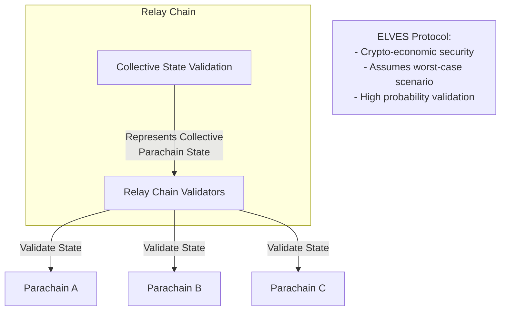

## Coherent Systems
    
Coherency refers to the degree of synchronization, consistency, and interoperability between different components or chains within a system. It encompasses the internal coherence of individual chains and the external coherence between chains regarding how they interact.
    
A single-state machine like Ethereum is very coherent, as all of its components (smart contracts, dApps/applications, staking, consensus) operate within a single environment with the downside of less scalability. Multi-protocol state machines, such as Polkadot, offer less coherency due to their sharded nature but more scalability due to the parallelization of their architecture.

Parachains are coherent, as they are self-contained environments with domain-specific functionality.

## Flexible Ecosystem

Parachains enable parallelization of different services within the same network. However, unlike most layer two rollups, parachains don't suffer the same interoperability pitfalls that most rollups suffer. [Cross-Consensus Messaging (XCM)](/develop/interoperability/intro-to-xcm/){target=\_blank} provides a common communication format for each parachain and can be configured to allow a parachain to communicate with just the relay chain or certain parachains. 

The diagram below highlights the flexibility of the Polkadot ecosystem, where each parachain specializes in a distinct domain. This example illustrates how parachains, like DeFi and GameFi, leverage XCM for cross-chain operations such as asset transfers and credential verification.

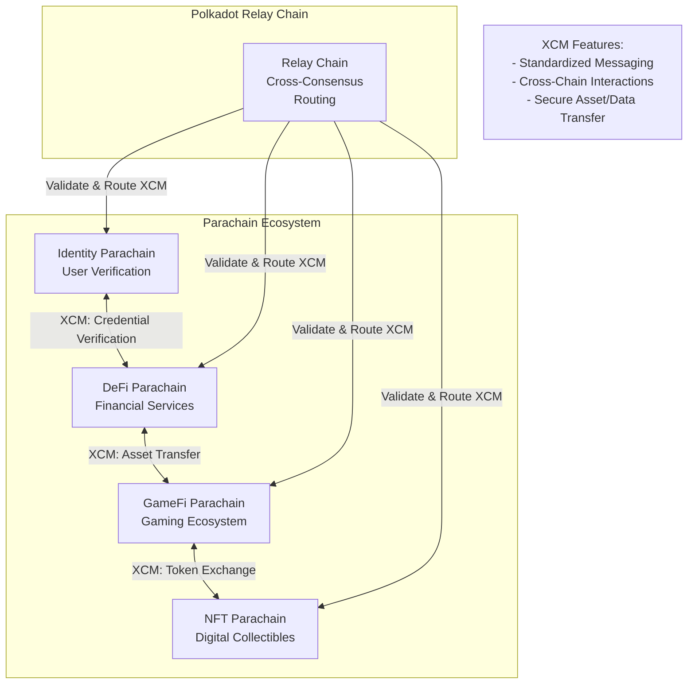

Most parachains are built using the Polkadot SDK, which provides all the tools to create a fully functioning parachain. However, it is possible to construct a parachain that can inherit the security of the relay chain as long as it implements the correct mechanisms expected by the relay chain.

## State Transition Functions (Runtimes)

Determinism is a fundamental property where given the same input, a system will consistently produce identical outputs. In blockchain systems, this predictable behavior is essential for state machines, which are algorithms that transition between different states based on specific inputs to generate a new state.

At their core, parachains, like most blockchains, are deterministic, finite-state machines that are often backed by game theory and economics. The previous state of the parachain, combined with external input in the form of [extrinsics](/polkadot-protocol/glossary#extrinsic){target=\_blank}, allows the state machine to progress forward, one block at a time.

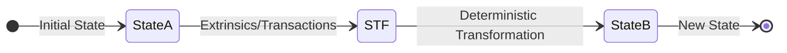

The primary driver of this progression is the state transition function (STF), commonly referred to as a runtime. Each time a block is submitted, it represents the next proposed state for a parachain. By applying the state transition function to the previous state and including a new block that contains the proposed changes in the form of a list of extrinsics/transactions, the runtime defines just exactly how the parachain is to advance from state A to state B.

The STF in a Polkadot SDK-based chain is compiled to Wasm and uploaded on the relay chain. This STF is crucial for the relay chain to validate the state changes coming from the parachain, as it is used to ensure that all proposed state transitions are happening correctly as part of the validation process.

For more information on the Wasm meta protocol that powers runtimes, see the [WASM Meta Protocol](https://paritytech.github.io/polkadot-sdk/master/polkadot_sdk_docs/reference_docs/wasm_meta_protocol/index.html){target=\blank} in the Polkadot SDK Rust Docs.

## Shared Security: Validated by the Relay Chain

The relay chain provides a layer of economic security for its parachains. Parachains submit proof of validation (PoV) data to the relay chain for validation through [collators](/polkadot-protocol/glossary/#collator), upon which the relay chains' validators ensure the validity of this data in accordance with the STF for that particular parachain. In other words, the consensus for a parachain follows the relay chain. While parachains choose how a block is authored, what it contains, and who authors it, the relay chain ultimately provides finality and consensus for those blocks.

For more information about the parachain and relay chain validation process, see the [Parachains' Protocol Overview: Protocols' Summary](https://wiki.polkadot.com/learn/learn-parachains-protocol/#protocols-summary){target=\blank} entry in the Polkadot Wiki.

Parachains need at least one honest collator to submit PoV data to the relay chain. Without this, the parachain can't progress. The mechanisms that facilitate this are found in the Cumulus portion of the Polkadot SDK, some of which are found in the [`cumulus_pallet_parachain_system`](https://paritytech.github.io/polkadot-sdk/master/cumulus_pallet_parachain_system/index.html){target=\blank}

### Cryptoeconomic Security: ELVES Protocol

The [ELVES (Economic Last Validation Enforcement System)](https://eprint.iacr.org/2024/961){target=\_blank} protocol forms the foundation of Polkadot's cryptoeconomic security model. ELVES assumes a worst-case scenario by enforcing strict validation rules before any state transitions are finalized. Unlike optimistic approaches that rely on post-facto dispute resolution, ELVES ensures that validators collectively confirm the validity of a block before it becomes part of the parachain's state.

Validators are incentivized through staking and penalized for malicious or erroneous actions, ensuring adherence to the protocol. This approach minimizes the probability of invalid states being propagated across the network, providing robust security for parachains.

## Interoperability

Polkadot's interoperability framework allows parachains to communicate with each other, fostering a diverse ecosystem of interconnected blockchains. Through [Cross-Consensus Messaging (XCM)](/develop/interoperability/intro-to-xcm/){target=_blank}, parachains can transfer assets, share data, and invoke functionalities on other chains securely. This standardized messaging protocol ensures that parachains can interact with the relay chain and each other, supporting efficient cross-chain operations.

The XCM protocol mitigates common interoperability challenges in isolated blockchain networks, such as fragmented ecosystems and limited collaboration. By enabling decentralized applications to leverage resources and functionality across parachains, Polkadot promotes a scalable, cooperative blockchain environment that benefits all participants.

## Where to Go Next

For further information about the consensus protocol used by parachains, see the [Consensus](/polkadot-protocol/architecture/parachains/consensus/) page.

<div class="grid cards" markdown>

-   <span class="badge learn">Learn</span> __Consensus__

    ---

    Understand how the blocks authored by parachain collators are secured by the relay chain validators and how the parachain transactions achieve finality.

    [:octicons-arrow-right-24: Reference](/polkadot-protocol/architecture/parachains/consensus/)

</div>


---

# Overview of FRAME

> Source (raw): https://raw.githubusercontent.com/polkadot-developers/polkadot-docs/master/.ai/pages/develop-parachains-customize-parachain-overview.md
> Canonical (HTML): https://docs.polkadot.com/develop/parachains/customize-parachain/overview/
> Summary: Learn how Polkadot SDK’s FRAME framework simplifies blockchain development with modular pallets and support libraries for efficient runtime design.

# Overview

## Introduction

The runtime is the heart of any Polkadot SDK-based blockchain, handling the essential logic that governs state changes and transaction processing. With Polkadot SDK’s [FRAME (Framework for Runtime Aggregation of Modularized Entities)](/polkadot-protocol/glossary/#frame-framework-for-runtime-aggregation-of-modularized-entities){target=\_bank}, developers gain access to a powerful suite of tools for building custom blockchain runtimes. FRAME offers a modular architecture, featuring reusable pallets and support libraries, to streamline development.

This guide provides an overview of FRAME, its core components like pallets and system libraries, and demonstrates how to compose a runtime tailored to your specific blockchain use case. Whether you’re integrating pre-built modules or designing custom logic, FRAME equips you with the tools to create scalable, feature-rich blockchains.

## FRAME Runtime Architecture

The following diagram illustrates how FRAME components integrate into the runtime:


All transactions sent to the runtime are handled by the `frame_executive` pallet, which dispatches them to the appropriate pallet for execution. These runtime modules contain the logic for specific blockchain features. The `frame_system` module provides core functions, while `frame_support` libraries offer useful tools to simplify pallet development. Together, these components form the backbone of a FRAME-based blockchain's runtime.

### Pallets

Pallets are modular components within the FRAME ecosystem that encapsulate specific blockchain functionalities. These modules offer customizable business logic for various use cases and features that can be integrated into a runtime.

Developers have the flexibility to implement any desired behavior in the core logic of the blockchain, such as:

- Exposing new transactions.
- Storing information.
- Enforcing business rules.

Pallets also include necessary wiring code to ensure proper integration and functionality within the runtime. FRAME provides a range of [pre-built pallets](https://github.com/paritytech/polkadot-sdk/tree/polkadot-stable2506/substrate/frame){target=\_blank} for standard and common blockchain functionalities, including consensus algorithms, staking mechanisms, governance systems, and more. These pre-existing pallets serve as building blocks or templates, which developers can use as-is, modify, or reference when creating custom functionalities. 

#### Pallet Structure

Polkadot SDK heavily utilizes Rust macros, allowing developers to focus on specific functional requirements when writing pallets instead of dealing with technicalities and scaffolding code.

A typical pallet skeleton looks like this:

```rust
pub use pallet::*;

#[frame_support::pallet]
pub mod pallet {
  use frame_support::pallet_prelude::*;
  use frame_system::pallet_prelude::*;

  #[pallet::pallet]
  #[pallet::generate_store(pub(super) trait Store)]
  pub struct Pallet<T>(_);

  #[pallet::config]  // snip
  #[pallet::event]   // snip
  #[pallet::error]   // snip
  #[pallet::storage] // snip
  #[pallet::call]    // snip
}
```

All pallets, including custom ones, can implement these attribute macros:

- **`#[frame_support::pallet]`**: Marks the module as usable in the runtime.
- **`#[pallet::pallet]`**: Applied to a structure used to retrieve module information easily.
- **`#[pallet::config]`**: Defines the configuration for the pallets's data types.
- **`#[pallet::event]`**: Defines events to provide additional information to users.
- **`#[pallet::error]`**: Lists possible errors in an enum to be returned upon unsuccessful execution.
- **`#[pallet::storage]`**: Defines elements to be persisted in storage.
- **`#[pallet::call]`**: Defines functions exposed as transactions, allowing dispatch to the runtime.

These macros are applied as attributes to Rust modules, functions, structures, enums, and types and serve as the core components of a pallet. They enable the pallet to be built and added to the runtime, exposing the custom logic to the outer world.

For a comprehensive guide on these and additional macros, see the [`pallet_macros`](https://paritytech.github.io/polkadot-sdk/master/frame_support/pallet_macros/index.html){target=\_blank} section in the Polkadot SDK documentation.

### Support Libraries

In addition to purpose-specific pallets, FRAME offers services and core libraries that facilitate composing and interacting with the runtime:

- **[`frame_system` pallet](https://paritytech.github.io/polkadot-sdk/master/frame_system/index.html){target=\_blank}**: Provides low-level types, storage, and functions for the runtime.
- **[`frame_executive` pallet](https://paritytech.github.io/polkadot-sdk/master/frame_executive/index.html){target=\_blank}**: Orchestrates the execution of incoming function calls to the respective pallets in the runtime.
- **[`frame_support` crate](https://paritytech.github.io/polkadot-sdk/master/frame_support/index.html){target=\_blank}**: Is a collection of Rust macros, types, traits, and modules that simplify the development of Substrate pallets.
- **[`frame_benchmarking` crate](https://paritytech.github.io/polkadot-sdk/master/frame_benchmarking/trait.Benchmark.html){target=\_blank}**: Contains common runtime patterns for benchmarking and testing purposes.

## Compose a Runtime with Pallets

The Polkadot SDK allows developers to construct a runtime by combining various pallets, both built-in and custom-made. This modular approach enables the creation of unique blockchain behaviors tailored to specific requirements.

The following diagram illustrates the process of selecting and combining FRAME pallets to compose a runtime:


This modular design allows developers to:

- Rapidly prototype blockchain systems.
- Easily add or remove features by including or excluding pallets.
- Customize blockchain behavior without rebuilding core components.
- Leverage tested and optimized code from built-in pallets.

## Starting from Templates

Using pre-built templates is an efficient way to begin building a custom blockchain. Templates provide a foundational setup with pre-configured modules, letting developers avoid starting from scratch and instead focus on customization. Depending on your project’s goals—whether you want a simple test chain, a standalone chain, or a parachain that integrates with Polkadot’s relay chains—there are templates designed to suit different levels of complexity and scalability.

### Solochain Templates

Solochain templates are designed for developers who want to create standalone blockchains that operate independently without connecting to a relay chain:

- **[`minimal-template`](https://github.com/paritytech/polkadot-sdk/tree/master/templates/minimal){target=\_blank}**: Includes only the essential components necessary for a functioning blockchain. It’s ideal for developers who want to gain familiarity with blockchain basics and test simple customizations before scaling up.

- **[`solochain-template`](https://github.com/paritytech/polkadot-sdk/tree/master/templates/solochain){target=\_blank}**: Provides a foundation for creating standalone blockchains with moderate features, including a simple consensus mechanism and several core FRAME pallets. It’s a solid starting point for developers who want a fully functional chain that doesn’t depend on a relay chain.

### Parachain Templates

Parachain templates are specifically designed for chains that will connect to and interact with relay chains in the Polkadot ecosystem:

- **[`parachain-template`](https://github.com/paritytech/polkadot-sdk/tree/master/templates/parachain){target=\_blank}**: Designed for connecting to relay chains like Polkadot, Kusama, or Paseo, this template enables a chain to operate as a parachain. For projects aiming to integrate with Polkadot’s ecosystem, this template offers a great starting point.

- **[`OpenZeppelin`](https://github.com/OpenZeppelin/polkadot-runtime-templates/tree/main){target=\_blank}**: Offers two flexible starting points.
    - The [`generic-runtime-template`](https://github.com/OpenZeppelin/polkadot-runtime-templates/tree/main/generic-template){target=\_blank} provides a minimal setup with essential pallets and secure defaults, creating a reliable foundation for custom blockchain development.
    - The [`evm-runtime-template`](https://github.com/OpenZeppelin/polkadot-runtime-templates/tree/main/evm-template){target=\_blank} enables EVM compatibility, allowing developers to migrate Solidity contracts and EVM-based dApps. This template is ideal for Ethereum developers looking to leverage Substrate's capabilities.

Choosing a suitable template depends on your project’s unique requirements, level of customization, and integration needs. Starting from a template speeds up development and lets you focus on implementing your chain’s unique features rather than the foundational blockchain setup.

## Where to Go Next

For more detailed information on implementing this process, refer to the following sections:

- [Add a Pallet to Your Runtime](/develop/parachains/customize-parachain/add-existing-pallets/)
- [Create a Custom Pallet](/develop/parachains/customize-parachain/make-custom-pallet/)


---

# Overview of Polkadot's System Chains

> Source (raw): https://raw.githubusercontent.com/polkadot-developers/polkadot-docs/master/.ai/pages/polkadot-protocol-architecture-system-chains-overview.md
> Canonical (HTML): https://docs.polkadot.com/polkadot-protocol/architecture/system-chains/overview/
> Summary: Discover how system parachains enhance Polkadot's scalability and performance by offloading tasks like governance, asset management, and bridging from the relay chain.

## Introduction

Polkadot's relay chain is designed to secure parachains and facilitate seamless inter-chain communication. However, resource-intensive—tasks like governance, asset management, and bridging are more efficiently handled by system parachains. These specialized chains offload functionality from the relay chain, leveraging Polkadot's parallel execution model to improve performance and scalability. By distributing key functionalities across system parachains, Polkadot can maximize its relay chain's blockspace for its core purpose of securing and validating parachains.

This guide will explore how system parachains operate within Polkadot and Kusama, detailing their critical roles in network governance, asset management, and bridging. You'll learn about the currently deployed system parachains, their unique functions, and how they enhance Polkadot's decentralized ecosystem.

## System Chains

System parachains contain core Polkadot protocol features, but in parachains rather than the relay chain. Execution cores for system chains are allocated via network [governance](/polkadot-protocol/onchain-governance/overview/){target=\_blank} rather than purchasing coretime on a marketplace.

System parachains defer to on-chain governance to manage their upgrades and other sensitive actions as they do not have native tokens or governance systems separate from DOT or KSM. It is not uncommon to see a system parachain implemented specifically to manage network governance.

!!!note
    You may see system parachains called common good parachains in articles and discussions. This nomenclature caused confusion as the network evolved, so system parachains is preferred. 
    
    For more details on this evolution, review this [parachains forum discussion](https://forum.polkadot.network/t/polkadot-protocol-and-common-good-parachains/866){target=\_blank}.

## Existing System Chains

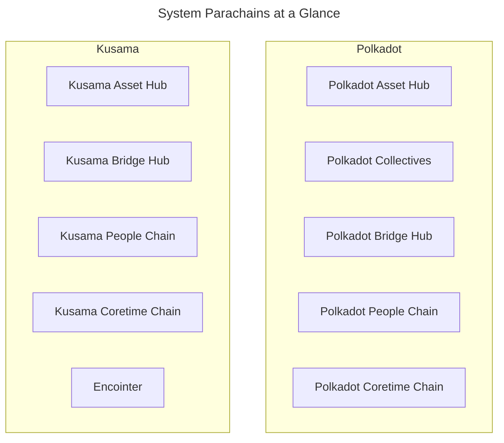

All system parachains are on both Polkadot and Kusama with the following exceptions:

- **[Collectives](#collectives)**: Only on Polkadot
- **[Encointer](#encointer)**: Only on Kusama

### Asset Hub

The [Asset Hub](https://github.com/paritytech/polkadot-sdk/tree/polkadot-stable2506/cumulus#asset-hub-){target=\_blank} is an asset portal for the entire network. It helps asset creators, such as reserve-backed stablecoin issuers, track the total issuance of an asset in the network, including amounts transferred to other parachains. It also serves as the hub where asset creators can perform on-chain operations, such as minting and burning, to manage their assets effectively.

This asset management logic is encoded directly in the runtime of the chain rather than in smart contracts. The efficiency of executing logic in a parachain allows for fees and deposits that are about 1/10th of what is required on the relay chain. These low fees mean that the Asset Hub is well suited for handling the frequent transactions required when managing balances, transfers, and on-chain assets.

The Asset Hub also supports non-fungible assets (NFTs) via the [Uniques pallet](https://polkadot.js.org/docs/substrate/extrinsics#uniques){target=\_blank} and [NFTs pallet](https://polkadot.js.org/docs/substrate/extrinsics#nfts){target=\_blank}. For more information about NFTs, see the Polkadot Wiki section on [NFT Pallets](https://wiki.polkadot.com/learn/learn-nft-pallets/){target=\_blank}.

### Collectives

The Polkadot Collectives parachain was added in [Referendum 81](https://polkadot-old.polkassembly.io/referendum/81){target=\_blank} and exists on Polkadot but not on Kusama. The Collectives chain hosts on-chain collectives that serve the Polkadot network, including the following:

- [**Polkadot Alliance**](https://polkadot-old.polkassembly.io/referendum/94){target=\_blank}: Provides a set of ethics and standards for the community to follow. Includes an on-chain means to call out bad actors.
- [**Polkadot Technical Fellowship**](https://wiki.polkadot.com/learn/learn-polkadot-technical-fellowship/){target=\_blank}: A rules-based social organization to support and incentivize highly-skilled developers to contribute to the technical stability, security, and progress of the network.

These on-chain collectives will play essential roles in the future of network stewardship and decentralized governance. Networks can use a bridge hub to help them act as collectives and express their legislative voices as single opinions within other networks.

### Bridge Hub

Before parachains, the only way to design a bridge was to put the logic onto the relay chain. Since both networks now support parachains and the isolation they provide, each network can have a parachain dedicated to bridges. 

The Bridge Hub system parachain operates on the relay chain, and is responsible for facilitating bridges to the wider Web3 space. It contains the required bridge [pallets](/polkadot-protocol/glossary/#pallet){target=\_blank} in its runtime, which enable trustless bridging with other blockchain networks like Polkadot, Kusama, and Ethereum. The Bridge Hub uses the native token of the relay chain.

See the [Bridge Hub](/polkadot-protocol/architecture/system-chains/bridge-hub/){target=\_blank} documentation for additional information.

### People Chain

The People Chain provides a naming system that allows users to manage and verify their account [identity](https://wiki.polkadot.com/learn/learn-identity/){target=\_blank}.

### Coretime Chain

The Coretime system chain lets users buy coretime to access Polkadot's computation. [Coretime marketplaces](https://wiki.polkadot.com/learn/learn-guides-coretime-marketplaces/){target=\_blank} run on top of the Coretime chain. Kusama does not use the Collectives system chain. Instead, Kusama relies on the Encointer system chain, which provides Sybil resistance as a service to the entire Kusama ecosystem.

Visit [Introduction to Agile Coretime](https://wiki.polkadot.com/learn/learn-agile-coretime/#introduction-to-agile-coretime){target=\_blank} in the Polkadot Wiki for more information.

### Encointer

[Encointer](https://encointer.org/encointer-for-web3/){target=\_blank} is a blockchain platform for self-sovereign ID and a global [universal basic income (UBI)](https://book.encointer.org/economics-ubi.html){target=\_blank}. The Encointer protocol uses a novel Proof of Personhood (PoP) system to create unique identities and resist Sybil attacks. PoP is based on the notion that a person can only be in one place at any given time. Encointer offers a framework that allows for any group of real people to create, distribute, and use their own digital community tokens.

Participants are requested to attend physical key-signing ceremonies with small groups of random people at randomized locations. These local meetings are part of one global signing ceremony occurring at the same time. Participants use the Encointer wallet app to participate in these ceremonies and manage local community currencies. 

To learn more about Encointer, see the official [Encointer book](https://book.encointer.org/introduction.html){target=\_blank} or watch an [Encointer ceremony](https://www.youtube.com/watch?v=tcgpCCYBqko){target=\_blank} in action.


---

# Overview of the Polkadot Relay Chain

> Source (raw): https://raw.githubusercontent.com/polkadot-developers/polkadot-docs/master/.ai/pages/polkadot-protocol-architecture-polkadot-chain-overview.md
> Canonical (HTML): https://docs.polkadot.com/polkadot-protocol/architecture/polkadot-chain/overview/
> Summary: Explore Polkadot's core architecture, including its multi-chain vision, shared security, and the DOT token's governance and staking roles.

# Overview

## Introduction

Polkadot is a next-generation blockchain protocol designed to support a multi-chain future by enabling secure communication and interoperability between different blockchains. Built as a Layer-0 protocol, Polkadot introduces innovations like application-specific Layer-1 chains ([parachains](/polkadot-protocol/architecture/parachains/){targe=\_blank}), shared security through [Nominated Proof of Stake (NPoS)](/polkadot-protocol/glossary/#nominated-proof-of-stake-npos){target=\_blank}, and cross-chain interactions via its native [Cross-Consensus Messaging Format (XCM)](/develop/interoperability/intro-to-xcm/){target=\_blank}.

This guide covers key aspects of Polkadot’s architecture, including its high-level protocol structure, blockspace commoditization, and the role of its native token, DOT, in governance, staking, and resource allocation.

## Polkadot 1.0

Polkadot 1.0 represents the state of Polkadot as of 2023, coinciding with the release of [Polkadot runtime v1.0.0](https://github.com/paritytech/polkadot/releases/tag/v1.0.0){target=\_blank}. This section will focus on Polkadot 1.0, along with philosophical insights into network resilience and blockspace.

As a Layer-0 blockchain, Polkadot contributes to the multi-chain vision through several key innovations and initiatives, including:

- **Application-specific Layer-1 blockchains (parachains)**: Polkadot's sharded network allows for parallel transaction processing, with shards that can have unique state transition functions, enabling custom-built L1 chains optimized for specific applications.

- **Shared security and scalability**: L1 chains connected to Polkadot benefit from its [Nominated Proof of Stake (NPoS)](/polkadot-protocol/architecture/polkadot-chain/pos-consensus/#nominated-proof-of-stake){target=\_blank} system, providing security out-of-the-box without the need to bootstrap their own.

- **Secure interoperability**: Polkadot's native interoperability enables seamless data and value exchange between parachains. This interoperability can also be used outside of the ecosystem for bridging with external networks.

- **Resilient infrastructure**: Decentralized and scalable, Polkadot ensures ongoing support for development and community initiatives via its on-chain [treasury](https://wiki.polkadot.com/learn/learn-polkadot-opengov-treasury/){target=\_blank} and governance.

- **Rapid L1 development**: The [Polkadot SDK](/develop/parachains/intro-polkadot-sdk/){target=\_blank} allows fast, flexible creation and deployment of Layer-1 chains.

- **Cultivating the next generation of Web3 developers**: Polkadot supports the growth of Web3 core developers through initiatives such as.

    - [Polkadot Blockchain Academy](https://polkadot.com/blockchain-academy){target=\_blank}
    - [EdX courses](https://www.edx.org/school/web3x){target=\_blank}
    - Rust and Substrate courses (coming soon)

### High-Level Architecture

Polkadot features a chain that serves as the central component of the system. This chain is depicted as a ring encircled by several parachains that are connected to it.

According to Polkadot's design, any blockchain that can compile to WebAssembly (Wasm) and adheres to the Parachains Protocol becomes a parachain on the Polkadot network.

Here’s a high-level overview of the Polkadot protocol architecture:


Parachains propose blocks to Polkadot validators, who check for availability and validity before finalizing them. With the relay chain providing security, collators—full nodes of parachains—can focus on their tasks without needing strong incentives.

The [Cross-Consensus Messaging Format (XCM)](/develop/interoperability/intro-to-xcm/){target=\_blank} allows parachains to exchange messages freely, leveraging the chain's security for trust-free communication.

In order to interact with chains that want to use their own finalization process (e.g., Bitcoin), Polkadot has [bridges](/polkadot-protocol/parachain-basics/interoperability/#bridges-connecting-external-networks){target=\_blank} that offer two-way compatibility, meaning that transactions can be made between different parachains.

### Polkadot's Additional Functionalities

Historically, obtaining core slots on Polkadot chain relied upon crowdloans and auctions. Chain cores were leased through auctions for three-month periods, up to a maximum of two years. Crowdloans enabled users to securely lend funds to teams for lease deposits in exchange for pre-sale tokens, which is the only way to access slots on Polkadot 1.0. Auctions are now deprecated in favor of [coretime](/polkadot-protocol/architecture/system-chains/coretime/){target=\_blank}.

Additionally, the chain handles [staking](https://wiki.polkadot.com/learn/learn-staking/){target=\_blank}, [accounts](/polkadot-protocol/parachain-basics/accounts/){target=\_blank}, balances, and [governance](/polkadot-protocol/onchain-governance/){target=\_blank}.

#### Agile Coretime

The new and more efficient way of obtaining core on Polkadot is to go through the process of purchasing coretime.

[Agile coretime](/polkadot-protocol/architecture/polkadot-chain/agile-coretime/){target=\_blank} improves the efficient use of Polkadot's network resources and offers economic flexibility for developers, extending Polkadot's capabilities far beyond the original vision outlined in the [whitepaper](https://polkadot.com/papers/Polkadot-whitepaper.pdf){target=\_blank}.

It enables parachains to purchase monthly "bulk" allocations of coretime (the time allocated for utilizing a core, measured in Polkadot relay chain blocks), ensuring heavy-duty parachains that can author a block every six seconds with [Asynchronous Backing](https://wiki.polkadot.com/learn/learn-async-backing/#asynchronous-backing){target=\_blank} can reliably renew their coretime each month. Although six-second block times are now the default, parachains have the option of producing blocks less frequently.

Renewal orders are prioritized over new orders, offering stability against price fluctuations and helping parachains budget more effectively for project costs.

### Polkadot's Resilience

Decentralization is a vital component of blockchain networks, but it comes with trade-offs:

- An overly decentralized network may face challenges in reaching consensus and require significant energy to operate.
- Also, a network that achieves consensus quickly risks centralization, making it easier to manipulate or attack.

A network should be decentralized enough to prevent manipulative or malicious influence. In this sense, decentralization is a tool for achieving resilience.

Polkadot 1.0 currently achieves resilience through several strategies:

- **Nominated Proof of Stake (NPoS)**: Ensures that the stake per validator is maximized and evenly distributed among validators.

- **Decentralized nodes**: Designed to encourage operators to join the network. This program aims to expand and diversify the validators in the ecosystem who aim to become independent of the program during their term. Feel free to explore more about the program on the official [Decentralized Nodes](https://nodes.web3.foundation/){target=\_blank} page.

- **On-chain treasury and governance**: Known as [OpenGov](/polkadot-protocol/onchain-governance/overview/){target=\_blank}, this system allows every decision to be made through public referenda, enabling any token holder to cast a vote.

### Polkadot's Blockspace

Polkadot 1.0’s design allows for the commoditization of blockspace.

Blockspace is a blockchain's capacity to finalize and commit operations, encompassing its security, computing, and storage capabilities. Its characteristics can vary across different blockchains, affecting security, flexibility, and availability.

- **Security**: Measures the robustness of blockspace in Proof of Stake (PoS) networks linked to the stake locked on validator nodes, the variance in stake among validators, and the total number of validators. It also considers social centralization (how many validators are owned by single operators) and physical centralization (how many validators run on the same service provider).

- **Flexibility**: Reflects the functionalities and types of data that can be stored, with high-quality data essential to avoid bottlenecks in critical processes.

- **Availability**: Indicates how easily users can access blockspace. It should be easily accessible, allowing diverse business models to thrive, ideally regulated by a marketplace based on demand and supplemented by options for "second-hand" blockspace.

Polkadot is built on core blockspace principles, but there's room for improvement. Tasks like balance transfers, staking, and governance are managed on the relay chain.

Delegating these responsibilities to [system chains](/polkadot-protocol/architecture/system-chains/){target=\_blank} could enhance flexibility and allow the relay chain to concentrate on providing shared security and interoperability.

For more information about blockspace, watch [Robert Habermeier’s interview](https://www.youtube.com/watch?v=e1vISppPwe4){target=\_blank} or read his [technical blog post](https://www.rob.tech/blog/polkadot-blockspace-over-blockchains/){target=\_blank}.

## DOT Token

DOT is the native token of the Polkadot network, much like BTC for Bitcoin and Ether for the Ethereum blockchain. DOT has 10 decimals, uses the Planck base unit, and has a balance type of `u128`. The same is true for Kusama's KSM token with the exception of having 12 decimals.

### Redenomination of DOT
    
Polkadot conducted a community poll, which ended on 27 July 2020 at block 888,888, to decide whether to redenominate the DOT token. The stakeholders chose to redenominate the token, changing the value of 1 DOT from 1e12 plancks to 1e10 plancks.

Importantly, this did not affect the network's total number of base units (plancks); it only affects how a single DOT is represented. The redenomination became effective 72 hours after transfers were enabled, occurring at block 1,248,328 on 21 August 2020 around 16:50 UTC.

### The Planck Unit

The smallest unit of account balance on Polkadot SDK-based blockchains (such as Polkadot and Kusama) is called _Planck_, named after the Planck length, the smallest measurable distance in the physical universe.

Similar to how BTC's smallest unit is the Satoshi and ETH's is the Wei, Polkadot's native token DOT equals 1e10 Planck, while Kusama's native token KSM equals 1e12 Planck.

### Uses for DOT

DOT serves three primary functions within the Polkadot network:

- **Governance**: It is used to participate in the governance of the network.
- **Staking**: DOT is staked to support the network's operation and security.
- **Buying coretime**: Used to purchase coretime in-bulk or on-demand and access the  chain to benefit from Polkadot's security and interoperability.

Additionally, DOT can serve as a transferable token. For example, DOT, held in the treasury, can be allocated to teams developing projects that benefit the Polkadot ecosystem.

## JAM and the Road Ahead

The Join-Accumulate Machine (JAM) represents a transformative redesign of Polkadot's core architecture, envisioned as the successor to the current relay chain. Unlike traditional blockchain architectures, JAM introduces a unique computational model that processes work through two primary functions:

- **Join**: Handles data integration.
- **Accumulate**: Folds computations into the chain's state.

JAM removes many of the opinions and constraints of the current relay chain while maintaining its core security properties. Expected improvements include:

- **Permissionless code execution**: JAM is designed to be more generic and flexible, allowing for permissionless code execution through services that can be deployed without governance approval.
- **More effective block time utilization**: JAM's efficient pipeline processing model places the prior state root in block headers instead of the posterior state root, enabling more effective utilization of block time for computations.

This architectural evolution promises to enhance Polkadot's scalability and flexibility while maintaining robust security guarantees. JAM is planned to be rolled out to Polkadot as a single, complete upgrade rather than a stream of smaller updates. This approach seeks to minimize the developer overhead required to address any breaking changes.


---

# PAPI Account Watcher Tutorial

> Source (raw): https://raw.githubusercontent.com/polkadot-developers/polkadot-docs/master/.ai/pages/tutorials-dapps-remark-tutorial.md
> Canonical (HTML): https://docs.polkadot.com/tutorials/dapps/remark-tutorial/
> Summary: Build a CLI app that listens to on-chain events using the Polkadot API and responds to specific messages for a given account.

# PAPI Account Watcher 

## Introduction

This tutorial demonstrates how to build a simple command-line interface (CLI) application that monitors a user's account on the relay chain for the [`system.remarkWithEvent`](https://paritytech.github.io/polkadot-sdk/master/frame_system/pallet/struct.Pallet.html#method.remark_with_event){target=\_blank} extrinsic, using the [Polkadot API](/develop/toolkit/api-libraries/papi){target=\_blank}.

The `system.remarkWithEvent` extrinsic enables the submission of arbitrary data on-chain. In this tutorial, the data consists of a hash derived from the combination of an account address and the word "email" (`address+email`). This hash is monitored on-chain, and the application listens for remarks addressed to the specified account. The `system.remarkWithEvent` extrinsic emits an event that can be observed using the Polkadot API (PAPI).

When the application detects a remark addressed to the specified account, it plays the "You've Got Mail!" sound byte.

## Prerequisites

Before starting, ensure the following tools and dependencies are installed:

- Node.js (version 18 or higher).
- A package manager (npm or yarn).
- [Polkadot.js browser extension (wallet)](https://polkadot.js.org/extension/){target=\_blank}.
- An account with [Westend tokens](https://faucet.polkadot.io/westend){target=\_blank}.

## Clone the Repository

To follow this tutorial, you can either run the example directly or use a boilerplate/template. This tutorial uses a template that includes all necessary dependencies for working with the Polkadot API and TypeScript. Clone the `polkadot-api-example-cli` project and checkout to the [`empty-cli`](https://github.com/CrackTheCode016/polkadot-api-example-cli/tree/empty-cli){target=\_blank} as follows:

```bash
git clone https://github.com/polkadot-developers/dapp-examples/tree/v0.0.2
cd polkadot-api-example-cli
git checkout empty-cli
```

After cloning, install the required dependencies by running:

```bash
npm install
```

## Explore the Template (Light Clients)

After opening the repository, you will find the following code (excluding imports):

```typescript title="index.ts"
async function withLightClient(): Promise<PolkadotClient> {
  // Start the light client
  const smoldot = start();
  // The Westend Relay Chain
  const relayChain = await smoldot.addChain({ chainSpec: westEndChainSpec });
  return createClient(getSmProvider(relayChain));
}

async function main() {
  // CLI code goes here...
}

main();

```

The `withLightClient` function is particularly important. It uses the built-in [light client](/develop/toolkit/parachains/light-clients/){target=\_blank} functionality, powered by [`smoldot`](https://github.com/smol-dot/smoldot){target=\_blank}, to create a light client that synchronizes and interacts with Polkadot directly within the application.

## Create the CLI

The CLI functionality is implemented within the `main` function. The CLI includes an option (`-a` / `--account`) to specify the account to monitor for remarks:

```typescript title="index.ts"
const program = new Command();
console.log(chalk.white.dim(figlet.textSync('Web3 Mail Watcher')));
program
  .version('0.0.1')
  .description(
    'Web3 Mail Watcher - A simple CLI tool to watch for remarks on the Polkadot network'
  )
  .option('-a, --account <account>', 'Account to watch')
  .parse(process.argv);

// CLI arguments from commander
const options = program.opts();

```

## Watch for Remarks

The application monitors the Westend network for remarks sent to the specified account. The following code, placed within the `main` function, implements this functionality:

```typescript title="index.ts"
if (options.account) {
  console.log(
    chalk.black.bgRed('Watching account:'),
    chalk.bold.whiteBright(options.account)
  );
  // Create a light client to connect to the Polkadot (Westend) network
  const lightClient = await withLightClient();
  // Get the typed API to interact with the network
  const dotApi = lightClient.getTypedApi(wnd);
  // Subscribe to the System.Remarked event and watch for remarks from the account
  dotApi.event.System.Remarked.watch().subscribe((event) => {
    const { sender, hash } = event.payload;
    const calculatedHash = bytesToHex(
      blake2b(`${options.account}+email`, { dkLen: 32 })
    );
    if (`0x${calculatedHash}` === hash.asHex()) {
      sound.play('youve-got-mail-sound.mp3');
      console.log(chalk.black.bgRed('You got mail!'));
      console.log(
        chalk.black.bgCyan('From:'),
        chalk.bold.whiteBright(sender.toString())
      );
      console.log(
        chalk.black.bgBlue('Hash:'),
        chalk.bold.whiteBright(hash.asHex())
      );
    }
  });
} else {
  console.error('Account is required');
  return;
}

```

## Compile and Run

Compile and execute the application using the following command:

```bash
npm start -- --account <account-address>
```

For example:

```bash
npm start -- --account 5GrwvaEF5zXb26Fz9rcQpDWS57CtERHpNehXCPcNoHGKutQY
```

The output should look like this:

<div id="termynal" data-termynal>
  <span data-ty="input"><span class="file-path"></span>npm start -- --account 5GrwvaEF5zXb26Fz9rcQpDWS57CtERHpNehXCPcNoHGKutQY</span>
  <span data-ty> __ __ _ _____ __ __ _ _ __ __ _ _</span>
  <span data-ty> \ \ / /__| |__|___ / | \/ | __ _(_) | \ \ / /_ _| |_ ___| |__ ___ _ __</span>
  <span data-ty> \ \ /\ / / _ \ '_ \ |_ \ | |\/| |/ _` | | | \ \ /\ / / _` | __/ __| '_ \ / _ \ '__|</span>
  <span data-ty> \ V V / __/ |_) |__) | | | | | (_| | | | \ V V / (_| | || (__| | | | __/ |</span>
  <span data-ty> \_/\_/ \___|_.__/____/ |_| |_|\__,_|_|_| \_/\_/ \__,_|\__\___|_| |_|\___|_|</span>
  <span data-ty> </span>
  <span data-ty>📬 Watching account: 5GrwvaEF5zXb26Fz9rcQpDWS57CtERHpNehXCPcNoHGKutQY</span>
  <span data-ty>⚙️ [smoldot] Smoldot v2.0.34</span>
  <span data-ty>✅ [smoldot] Chain initialization complete for westend2.</span>
  <span data-ty>🔗 Name: "Westend"</span>
  <span data-ty>🧬 Genesis hash: 0xe143…423e</span>
  <span data-ty>⛓️ Chain specification starting at: 0x10cf…b908 (#23920337)</span>
</div>


## Test the CLI

To test the application, navigate to the [**Extrinsics** page of the PAPI Dev Console](https://dev.papi.how/extrinsics#networkId=westend&endpoint=light-client){target=\_blank}. Select the **System** pallet and the **remark_with_event** call. Ensure the input field follows the convention `address+email`. For example, if monitoring `5GrwvaEF5zXb26Fz9rcQpDWS57CtERHpNehXCPcNoHGKutQY`, the input should be:


Submit the extrinsic and sign it using the Polkadot.js browser wallet. The CLI will display the following output and play the "You've Got Mail!" sound:

<div id="termynal" data-termynal>
  <span data-ty="input"><span class="file-path"></span>npm start -- --account 5GrwvaEF5zXb26Fz9rcQpDWS57CtERHpNehXCPcNoHGKutQY</span>
  <span data-ty> __ __ _ _____ __ __ _ _ __ __ _ _</span>
  <span data-ty> \ \ / /__| |__|___ / | \/ | __ _(_) | \ \ / /_ _| |_ ___| |__ ___ _ __</span>
  <span data-ty> \ \ /\ / / _ \ '_ \ |_ \ | |\/| |/ _` | | | \ \ /\ / / _` | __/ __| '_ \ / _ \ '__|</span>
  <span data-ty> \ V V / __/ |_) |__) | | | | | (_| | | | \ V V / (_| | || (__| | | | __/ |</span>
  <span data-ty> \_/\_/ \___|_.__/____/ |_| |_|\__,_|_|_| \_/\_/ \__,_|\__\___|_| |_|\___|_|</span>
  <span data-ty> </span>
  <span data-ty>📬 Watching account: 5Cm8yiG45rqrpyV2zPLrbtr8efksrRuCXcqcB4xj8AejfcTB</span>
  <span data-ty>📥 You've got mail!</span>
  <span data-ty>👤 From: 5Cm8yiG45rqrpyV2zPLrbtr8efksrRuCXcqcB4xj8AejfcTB</span>
  <span data-ty>🔖 Hash: 0xb6999c9082f5b1dede08b387404c9eb4eb2deee4781415dfa7edf08b87472050</span>
</div>


## Next Steps

This application demonstrates how the Polkadot API can be used to build decentralized applications. While this is not a production-grade application, it introduces several key features for developing with the Polkadot API.

To explore more, refer to the [official PAPI documentation](https://papi.how){target=\_blank}.


---

# Polkadot Omni Node

> Source (raw): https://raw.githubusercontent.com/polkadot-developers/polkadot-docs/master/.ai/pages/develop-toolkit-parachains-polkadot-omni-node.md
> Canonical (HTML): https://docs.polkadot.com/develop/toolkit/parachains/polkadot-omni-node/
> Summary: Run parachain nodes easily with the polkadot-omni-node, a white-labeled binary that can run parachain nodes using a single pre-built solution.

# Polkadot Omni Node

## Introduction

The [`polkadot-omni-node`](https://crates.io/crates/polkadot-omni-node/0.7.0){target=\_blank} crate is a versatile, pre-built binary designed to simplify running parachains in the Polkadot ecosystem. Unlike traditional node binaries that are tightly coupled to specific runtime code, the `polkadot-omni-node` operates using an external [chain specification](/polkadot-protocol/glossary#chain-specification){target=\_blank} file, allowing it to adapt dynamically to different parachains.

This approach enables it to act as a white-labeled node binary, capable of running most parachains that do not require custom node-level logic or extensions. Developers can leverage this flexibility to test, deploy, or operate parachain nodes without maintaining a dedicated codebase for each network.

This guide provides step-by-step instructions for installing the `polkadot-omni-node`, obtaining a chain specification, and spinning up a parachain node.

## Prerequisites

Before getting started, ensure you have the following prerequisites:

- **[Rust](https://www.rust-lang.org/tools/install){target=\_blank}**: Required to build and install the `polkadot-omni-node` binary.

Ensure Rust's `cargo` command is available in your terminal by running:

```bash
cargo --version
```

## Install Polkadot Omni Node

To install `polkadot-omni-node` globally using `cargo`, run:

```bash
cargo install --locked polkadot-omni-node@0.7.0
```

This command downloads and installs version 0.7.0 of the binary, making it available system-wide.

To confirm the installation, run:

```bash
polkadot-omni-node --version
```

You should see the installed version number printed to the terminal, confirming a successful installation.

## Obtain Chain Specifications

The `polkadot-omni-node` binary uses a chain specification file to configure and launch a parachain node. This file defines the parachain's genesis state and network settings.

The most common source for official chain specifications is the [`paritytech/chainspecs`](https://github.com/paritytech/chainspecs){target=\_blank} repository. These specifications are also browsable in a user-friendly format via the [Chainspec Collection](https://paritytech.github.io/chainspecs/){target=\_blank} website.

To obtain a chain specification:

1. Visit the [Chainspec Collection](https://paritytech.github.io/chainspecs/){target=\_blank} website.
2. Find the parachain you want to run.
3. Click the chain spec to open it.
4. Copy the JSON content and save it locally as a `.json` file, e.g., `chain_spec.json`.

## Run a Parachain Full Node

Once you've installed `polkadot-omni-node` and saved the appropriate chain specification file, you can start a full node for your chosen parachain.

To see all available flags and configuration options, run:

```bash
polkadot-omni-node --help
```

To launch the node, run the following command, replacing `./INSERT_PARACHAIN_CHAIN_SPEC.json` with the actual path to your saved chain spec file.

This command will:

- Load the chain specification.
- Initialize the node using the provided network configuration.
- Begin syncing with the parachain network.

```bash
polkadot-omni-node --chain ./INSERT_PARACHAIN_CHAIN_SPEC.json --sync warp
```

- The `--chain` flag tells the `polkadot-omni-node` which parachain to run by pointing to its chain specification file.
- The `--sync warp` flag enables warp sync, allowing the node to quickly catch up to the latest finalized state. Historical blocks are fetched in the background as the node continues operating.

Once started, the node will begin connecting to peers and syncing with the network. You’ll see logs in your terminal reflecting its progress.

## Interact with the Node

By default, `polkadot-omni-node` exposes a WebSocket endpoint at `ws://localhost:9944`,  which you can use to interact with the running node. You can connect using:

- **[Polkadot.js Apps](https://polkadot.js.org/apps/#/explorer){target=\_blank}**: A web-based interface for exploring and interacting with Polkadot SDK-based chains.
- Custom scripts using compatible [libraries](/develop/toolkit/api-libraries/){target=\_blank}.

Once connected, you can review blocks, call extrinsics, inspect storage, and interact with the runtime.

## Parachain Compatibility

The `polkadot-omni-node` is designed to work with most parachains out of the box; however, your parachain's runtime must meet specific requirements and follow certain conventions to be compatible. This section outlines what your runtime needs to implement and configure to work seamlessly with the `polkadot-omni-node`:

- Your runtime must implement the required runtime APIs (see below).
- Your runtime must include and configure the required pallets.

The [`parachain-template`](https://github.com/paritytech/polkadot-sdk-parachain-template/tree/v0.0.4){target=_blank} provides a complete reference implementation that is fully compatible with the `polkadot-omni-node`. You can use it as a starting point or reference for ensuring your runtime meets all compatibility requirements.

### Required Runtime APIs

Your parachain runtime must implement the following runtime APIs for the `polkadot-omni-node` to function properly:

- **GetParachainInfo Runtime API**: The omni-node requires the [`GetParachainInfo`](https://paritytech.github.io/polkadot-sdk/master/cumulus_primitives_core/trait.GetParachainInfo.html){target=\_blank} runtime API to identify and configure the parachain correctly. This API provides the parachain ID to the node.

    ```rust title="runtime/src/apis.rs"
    impl cumulus_primitives_core::GetParachainInfo<Block> for Runtime {
        fn parachain_id() -> cumulus_primitives_core::ParaId {
            // Return your parachain ID
            ParachainInfo::parachain_id()
        }
    }
    ```

- **Aura Runtime API**: For consensus, the `polkadot-omni-node` expects the [Aura runtime API](https://paritytech.github.io/polkadot-sdk/master/polkadot_sdk_frame/runtime/apis/trait.AuraApi.html){target=\_blank} to be implemented.

    ```rust title="runtime/src/apis.rs"
    impl sp_consensus_aura::AuraApi<Block, AuraId> for Runtime {
        fn slot_duration() -> sp_consensus_aura::SlotDuration {
            sp_consensus_aura::SlotDuration::from_millis(SLOT_DURATION)
        }

        fn authorities() -> Vec<AuraId> {
            Aura::authorities().into_inner()
        }
    }
    ```

### Required Pallets

Your runtime must include and properly configure the following pallets:

- **System Pallet**: The System pallet ([`frame-system`](https://paritytech.github.io/polkadot-sdk/master/polkadot_sdk_frame/prelude/frame_system/index.html){target=\_blank}) is fundamental and must be configured with appropriate types.

    ```rust title="runtime/src/lib.rs"
    #[frame_support::runtime]
    impl frame_system::Config for Runtime {
        type Block = Block;
        type BlockNumber = BlockNumber;
        // ... other configurations
    }

    // Must be named "System" for omni-node compatibility
    pub type System = frame_system::Pallet<Runtime>;
    ```

- **ParachainSystem Pallet**: This pallet ([`cumulus-pallet-parachain-system`](https://paritytech.github.io/polkadot-sdk/master/cumulus_pallet_parachain_system/index.html){target=\_blank}) enables parachain functionality and handles low-level details of being a parachain.

    ```rust title="runtime/src/lib.rs"
    impl cumulus_pallet_parachain_system::Config for Runtime {
        type RuntimeEvent = RuntimeEvent;
        type OnSystemEvent = ();
        // ... other configurations
    }

    // Must be named "ParachainSystem" for omni-node compatibility  
    pub type ParachainSystem = cumulus_pallet_parachain_system::Pallet<Runtime>;
    ```

- **Aura Pallet**: For block authoring consensus ([`pallet-aura`](https://paritytech.github.io/polkadot-sdk/master/pallet_aura/index.html){target=\_blank}).

    ```rust title="runtime/src/lib.rs"
    impl pallet_aura::Config for Runtime {
        type AuthorityId = AuraId;
        type DisabledValidators = ();
        type MaxAuthorities = MaxAuthorities;
        type AllowMultipleBlocksPerSlot = ConstBool<false>;
    }

    pub type Aura = pallet_aura::Pallet<Runtime>;
    ```

- **ParachainInfo Pallet**: Provides parachain metadata ([`parachain-info`](https://paritytech.github.io/polkadot-sdk/master/staging_parachain_info/index.html){target=\_blank}).

    ```rust title="runtime/src/lib.rs"
    impl parachain_info::Config for Runtime {}

    pub type ParachainInfo = parachain_info::Pallet<Runtime>;
    ```

If you're migrating an existing parachain to use the `polkadot-omni-node`, you may need to perform runtime upgrades to add the required runtime APIs and pallets. Follow the standard parachain [runtime upgrade](/develop/parachains/maintenance/runtime-upgrades/){target=\_blank} procedures to implement these changes on your live network.


---

# Polkadot SDK Accounts

> Source (raw): https://raw.githubusercontent.com/polkadot-developers/polkadot-docs/master/.ai/pages/polkadot-protocol-parachain-basics-accounts.md
> Canonical (HTML): https://docs.polkadot.com/polkadot-protocol/parachain-basics/accounts/
> Summary: Learn about account structures, balances, and address formats in the Polkadot SDK, including how to manage lifecycle, references, and balances.

# Accounts

## Introduction

Accounts are essential for managing identity, transactions, and governance on the network in the Polkadot SDK. Understanding these components is critical for seamless development and operation on the network, whether you're building or interacting with Polkadot-based chains.

This page will guide you through the essential aspects of accounts, including their data structure, balance types, reference counters, and address formats. You’ll learn how accounts are managed within the runtime, how balances are categorized, and how addresses are encoded and validated. 

## Account Data Structure

Accounts are foundational to any blockchain, and the Polkadot SDK provides a flexible management system. This section explains how the Polkadot SDK defines accounts and manages their lifecycle through data structures within the runtime.

### Account

The [`Account` data type](https://paritytech.github.io/polkadot-sdk/master/frame_system/pallet/type.Account.html){target=\_blank} is a storage map within the [System pallet](https://paritytech.github.io/polkadot-sdk/master/src/frame_system/lib.rs.html){target=\_blank} that links an account ID to its corresponding data. This structure is fundamental for mapping account-related information within the chain.

The code snippet below shows how accounts are defined:

```rs
 /// The full account information for a particular account ID.
	#[pallet::storage]
	#[pallet::getter(fn account)]
	pub type Account<T: Config> = StorageMap<
		_,
		Blake2_128Concat,
		T::AccountId,
		AccountInfo<T::Nonce, T::AccountData>,
		ValueQuery,
	>;
```

The preceding code block defines a storage map named `Account`. The `StorageMap` is a type of on-chain storage that maps keys to values. In the `Account` map, the key is an account ID, and the value is the account's information. Here, `T` represents the generic parameter for the runtime configuration, which is defined by the pallet's configuration trait (`Config`).

The `StorageMap` consists of the following parameters:

- **`_`**: Used in macro expansion and acts as a placeholder for the storage prefix type. Tells the macro to insert the default prefix during expansion.
- **`Blake2_128Concat`**: The hashing function applied to keys in the storage map.
- **`T: :AccountId`**: Represents the key type, which corresponds to the account’s unique ID.
- **`AccountInfo<T: :Nonce, T::AccountData>`**: The value type stored in the map. For each account ID, the map stores an `AccountInfo` struct containing:

    - **`T::Nonce`**: A nonce for the account, which is incremented with each transaction to ensure transaction uniqueness.
    - **`T: :AccountData`**: Custom account data defined by the runtime configuration, which could include balances, locked funds, or other relevant information.
    
- **`ValueQuery`**: Defines how queries to the storage map behave when no value is found; returns a default value instead of `None`.

For a detailed explanation of storage maps, see the [`StorageMap`](https://paritytech.github.io/polkadot-sdk/master/frame_support/storage/types/struct.StorageMap.html){target=\_blank} entry in the Rust docs.

### Account Info

The `AccountInfo` structure is another key element within the [System pallet](https://paritytech.github.io/polkadot-sdk/master/src/frame_system/lib.rs.html){target=\_blank}, providing more granular details about each account's state. This structure tracks vital data, such as the number of transactions and the account’s relationships with other modules.

```rs
/// Information of an account.
#[derive(Clone, Eq, PartialEq, Default, RuntimeDebug, Encode, Decode, TypeInfo, MaxEncodedLen)]
pub struct AccountInfo<Nonce, AccountData> {
	/// The number of transactions this account has sent.
	pub nonce: Nonce,
	/// The number of other modules that currently depend on this account's existence. The account
	/// cannot be reaped until this is zero.
	pub consumers: RefCount,
	/// The number of other modules that allow this account to exist. The account may not be reaped
	/// until this and `sufficients` are both zero.
	pub providers: RefCount,
	/// The number of modules that allow this account to exist for their own purposes only. The
	/// account may not be reaped until this and `providers` are both zero.
	pub sufficients: RefCount,
	/// The additional data that belongs to this account. Used to store the balance(s) in a lot of
	/// chains.
	pub data: AccountData,
}
```

The `AccountInfo` structure includes the following components:

- **`nonce`**: Tracks the number of transactions initiated by the account, which ensures transaction uniqueness and prevents replay attacks.
- **`consumers`**: Counts how many other modules or pallets rely on this account’s existence. The account cannot be removed from the chain (reaped) until this count reaches zero.
- **`providers`**: Tracks how many modules permit this account’s existence. An account can only be reaped once both `providers` and `sufficients` are zero.
- **`sufficients`**: Represents the number of modules that allow the account to exist for internal purposes, independent of any other modules.
- **`AccountData`**: A flexible data structure that can be customized in the runtime configuration, usually containing balances or other user-specific data.

This structure helps manage an account's state and prevents its premature removal while it is still referenced by other on-chain data or modules. The [`AccountInfo`](https://paritytech.github.io/polkadot-sdk/master/frame_system/struct.AccountInfo.html){target=\_blank} structure can vary as long as it satisfies the trait bounds defined by the `AccountData` associated type in the [`frame-system::pallet::Config`](https://paritytech.github.io/polkadot-sdk/master/frame_system/pallet/trait.Config.html){target=\_blank} trait.

### Account Reference Counters

Polkadot SDK uses reference counters to track an account’s dependencies across different runtime modules. These counters ensure that accounts remain active while data is associated with them.

The reference counters include:

- **`consumers`**: Prevents account removal while other pallets still rely on the account.
- **`providers`**: Ensures an account is active before other pallets store data related to it.
- **`sufficients`**: Indicates the account’s independence, ensuring it can exist even without a native token balance, such as when holding sufficient alternative assets.

#### Providers Reference Counters

The `providers` counter ensures that an account is ready to be depended upon by other runtime modules. For example, it is incremented when an account has a balance above the existential deposit, which marks the account as active.

The system requires this reference counter to be greater than zero for the `consumers` counter to be incremented, ensuring the account is stable before any dependencies are added.

#### Consumers Reference Counters

The `consumers` counter ensures that the account cannot be reaped until all references to it across the runtime have been removed. This check prevents the accidental deletion of accounts that still have active on-chain data.

It is the user’s responsibility to clear out any data from other runtime modules if they wish to remove their account and reclaim their existential deposit.

#### Sufficients Reference Counter

The `sufficients` counter tracks accounts that can exist independently without relying on a native account balance. This is useful for accounts holding other types of assets, like tokens, without needing a minimum balance in the native token.

For instance, the [Assets pallet](https://paritytech.github.io/polkadot-sdk/master/pallet_assets/index.html){target=\_blank}, may increment this counter for an account holding sufficient tokens.

#### Account Deactivation

In Polkadot SDK-based chains, an account is deactivated when its reference counters (such as `providers`, `consumers`, and `sufficient`) reach zero. These counters ensure the account remains active as long as other runtime modules or pallets reference it.

When all dependencies are cleared and the counters drop to zero, the account becomes deactivated and may be removed from the chain (reaped). This is particularly important in Polkadot SDK-based blockchains, where accounts with balances below the existential deposit threshold are pruned from storage to conserve state resources.

Each pallet that references an account has cleanup functions that decrement these counters when the pallet no longer depends on the account. Once these counters reach zero, the account is marked for deactivation.

#### Updating Counters

The Polkadot SDK provides runtime developers with various methods to manage account lifecycle events, such as deactivation or incrementing reference counters. These methods ensure that accounts cannot be reaped while still in use.

The following helper functions manage these counters:

- **`inc_consumers()`**: Increments the `consumer` reference counter for an account, signaling that another pallet depends on it.
- **`dec_consumers()`**: Decrements the `consumer` reference counter, signaling that a pallet no longer relies on the account.
- **`inc_providers()`**: Increments the `provider` reference counter, ensuring the account remains active.
- **`dec_providers()`**: Decrements the `provider` reference counter, allowing for account deactivation when no longer in use.
- **`inc_sufficients()`**: Increments the `sufficient` reference counter for accounts that hold sufficient assets.
- **`dec_sufficients()`**: Decrements the `sufficient` reference counter.

To ensure proper account cleanup and lifecycle management, a corresponding decrement should be made for each increment action.

The `System` pallet offers three query functions to assist developers in tracking account states:

- **[`can_inc_consumer()`](https://paritytech.github.io/polkadot-sdk/master/frame_system/pallet/struct.Pallet.html#method.can_inc_consumer){target=\_blank}**: Checks if the account can safely increment the consumer reference.
- **[`can_dec_provider()`](https://paritytech.github.io/polkadot-sdk/master/frame_system/pallet/struct.Pallet.html#method.can_dec_provider){target=\_blank}**: Ensures that no consumers exist before allowing the decrement of the provider counter.
- **[`is_provider_required()`](https://paritytech.github.io/polkadot-sdk/master/frame_system/pallet/struct.Pallet.html#method.is_provider_required){target=\_blank}**: Verifies whether the account still has any active consumer references.

This modular and flexible system of reference counters tightly controls the lifecycle of accounts in Polkadot SDK-based blockchains, preventing the accidental removal or retention of unneeded accounts. You can refer to the [System pallet Rust docs](https://paritytech.github.io/polkadot-sdk/master/frame_system/pallet/struct.Pallet.html){target=\_blank} for more details.
    

## Account Balance Types

In the Polkadot ecosystem, account balances are categorized into different types based on how the funds are utilized and their availability. These balance types determine the actions that can be performed, such as transferring tokens, paying transaction fees, or participating in governance activities. Understanding these balance types helps developers manage user accounts and implement balance-dependent logic.

!!! note "A more efficient distribution of account balance types is in development"
    Soon, pallets in the Polkadot SDK will implement the [`Fungible` trait](https://paritytech.github.io/polkadot-sdk/master/frame_support/traits/tokens/fungible/index.html){target=\_blank} (see the [tracking issue](https://github.com/paritytech/polkadot-sdk/issues/226){target=\_blank} for more details). For example, the [`transaction-storage`](https://paritytech.github.io/polkadot-sdk/master/pallet_transaction_storage/index.html){target=\_blank} pallet changed the implementation of the [`Currency`](https://paritytech.github.io/polkadot-sdk/master/frame_support/traits/tokens/currency/index.html){target=\_blank} trait (see the [Refactor transaction storage pallet to use fungible traits](https://github.com/paritytech/polkadot-sdk/pull/1800){target=\_blank} PR for further details):

    ```rust
    type BalanceOf<T> = <<T as Config>::Currency as Currency<<T as frame_system::Config>::AccountId>>::Balance;
    ```
    
    To the [`Fungible`](https://paritytech.github.io/polkadot-sdk/master/frame_support/traits/tokens/fungible/index.html){target=\_blank} trait:

    ```rust
    type BalanceOf<T> = <<T as Config>::Currency as FnInspect<<T as frame_system::Config>::AccountId>>::Balance;
    ```
    
    This update will enable more efficient use of account balances, allowing the free balance to be utilized for on-chain activities such as setting proxies and managing identities.

### Balance Types

The five main balance types are:

- **Free balance**: Represents the total tokens available to the account for any on-chain activity, including staking, governance, and voting. However, it may not be fully spendable or transferrable if portions of it are locked or reserved.
- **Locked balance**: Portions of the free balance that cannot be spent or transferred because they are tied up in specific activities like [staking](https://wiki.polkadot.com/learn/learn-staking/#nominating-validators){target=\_blank}, [vesting](https://wiki.polkadot.com/learn/learn-guides-transfers/#vested-transfers-with-the-polkadot-js-ui){target=\_blank}, or participating in [governance](https://wiki.polkadot.com/learn/learn-polkadot-opengov/#voting-on-a-referendum){target=\_blank}. While the tokens remain part of the free balance, they are non-transferable for the duration of the lock.
- **Reserved balance**: Funds locked by specific system actions, such as setting up an [identity](https://wiki.polkadot.com/learn/learn-identity/){target=\_blank}, creating [proxies](https://wiki.polkadot.com/learn/learn-proxies/){target=\_blank}, or submitting [deposits for governance proposals](https://wiki.polkadot.com/learn/learn-guides-polkadot-opengov/#claiming-opengov-deposits){target=\_blank}. These tokens are not part of the free balance and cannot be spent unless they are unreserved.
- **Spendable balance**: The portion of the free balance that is available for immediate spending or transfers. It is calculated by subtracting the maximum of locked or reserved amounts from the free balance, ensuring that existential deposit limits are met.
- **Untouchable balance**: Funds that cannot be directly spent or transferred but may still be utilized for on-chain activities, such as governance participation or staking. These tokens are typically tied to certain actions or locked for a specific period.

The spendable balance is calculated as follows:

```text
spendable = free - max(locked - reserved, ED)
```

Here, `free`, `locked`, and `reserved` are defined above. The `ED` represents the [existential deposit](https://wiki.polkadot.com/learn/learn-accounts/#existential-deposit-and-reaping){target=\_blank}, the minimum balance required to keep an account active and prevent it from being reaped. You may find you can't see all balance types when looking at your account via a wallet. Wallet providers often display only spendable, locked, and reserved balances.

### Locks

Locks are applied to an account's free balance, preventing that portion from being spent or transferred. Locks are automatically placed when an account participates in specific on-chain activities, such as staking or governance. Although multiple locks may be applied simultaneously, they do not stack. Instead, the largest lock determines the total amount of locked tokens.

Locks follow these basic rules:

- If different locks apply to varying amounts, the largest lock amount takes precedence.
- If multiple locks apply to the same amount, the lock with the longest duration governs when the balance can be unlocked.

#### Locks Example

Consider an example where an account has 80 DOT locked for both staking and governance purposes like so:

- 80 DOT is staked with a 28-day lock period.
- 24 DOT is locked for governance with a 1x conviction and a 7-day lock period.
- 4 DOT is locked for governance with a 6x conviction and a 224-day lock period.

In this case, the total locked amount is 80 DOT because only the largest lock (80 DOT from staking) governs the locked balance. These 80 DOT will be released at different times based on the lock durations. In this example, the 24 DOT locked for governance will be released first since the shortest lock period is seven days. The 80 DOT stake with a 28-day lock period is released next. Now, all that remains locked is the 4 DOT for governance. After 224 days, all 80 DOT (minus the existential deposit) will be free and transferable.


#### Edge Cases for Locks

In scenarios where multiple convictions and lock periods are active, the lock duration and amount are determined by the longest period and largest amount. For example, if you delegate with different convictions and attempt to undelegate during an active lock period, the lock may be extended for the full amount of tokens. For a detailed discussion on edge case lock behavior, see this [Stack Exchange post](https://substrate.stackexchange.com/questions/5067/delegating-and-undelegating-during-the-lock-period-extends-it-for-the-initial-am){target=\_blank}.

### Balance Types on Polkadot.js

Polkadot.js provides a user-friendly interface for managing and visualizing various account balances on Polkadot and Kusama networks. When interacting with Polkadot.js, you will encounter multiple balance types that are critical for understanding how your funds are distributed and restricted. This section explains how different balances are displayed in the Polkadot.js UI and what each type represents.


The most common balance types displayed on Polkadot.js are:

- **Total balance**: The total number of tokens available in the account. This includes all tokens, whether they are transferable, locked, reserved, or vested. However, the total balance does not always reflect what can be spent immediately. In this example, the total balance is 0.6274 KSM.

- **Transferable balance**: Shows how many tokens are immediately available for transfer. It is calculated by subtracting the locked and reserved balances from the total balance. For example, if an account has a total balance of 0.6274 KSM and a transferable balance of 0.0106 KSM, only the latter amount can be sent or spent freely.

- **Vested balance**: Tokens that allocated to the account but released according to a specific schedule. Vested tokens remain locked and cannot be transferred until fully vested. For example, an account with a vested balance of 0.2500 KSM means that this amount is owned but not yet transferable.

- **Locked balance**: Tokens that are temporarily restricted from being transferred or spent. These locks typically result from participating in staking, governance, or vested transfers. In Polkadot.js, locked balances do not stack—only the largest lock is applied. For instance, if an account has 0.5500 KSM locked for governance and staking, the locked balance would display 0.5500 KSM, not the sum of all locked amounts.

- **Reserved balance**: Refers to tokens locked for specific on-chain actions, such as setting an identity, creating a proxy, or making governance deposits. Reserved tokens are not part of the free balance, but can be freed by performing certain actions. For example, removing an identity would unreserve those funds.

- **Bonded balance**: The tokens locked for staking purposes. Bonded tokens are not transferable until they are unbonded after the unbonding period.

- **Redeemable balance**: The number of tokens that have completed the unbonding period and are ready to be unlocked and transferred again. For example, if an account has a redeemable balance of 0.1000 KSM, those tokens are now available for spending.

- **Democracy balance**: Reflects the number of tokens locked for governance activities, such as voting on referenda. These tokens are locked for the duration of the governance action and are only released after the lock period ends.

By understanding these balance types and their implications, developers and users can better manage their funds and engage with on-chain activities more effectively.

## Address Formats

The SS58 address format is a core component of the Polkadot SDK that enables accounts to be uniquely identified across Polkadot-based networks. This format is a modified version of Bitcoin's Base58Check encoding, specifically designed to accommodate the multi-chain nature of the Polkadot ecosystem. SS58 encoding allows each chain to define its own set of addresses while maintaining compatibility and checksum validation for security. 

### Basic Format

SS58 addresses consist of three main components:

```text
base58encode(concat(<address-type>, <address>, <checksum>))
```

- **Address type**: A byte or set of bytes that define the network (or chain) for which the address is intended. This ensures that addresses are unique across different Polkadot SDK-based chains.
- **Address**: The public key of the account encoded as bytes.
- **Checksum**: A hash-based checksum which ensures that addresses are valid and unaltered. The checksum is derived from the concatenated address type and address components, ensuring integrity.

The encoding process transforms the concatenated components into a Base58 string, providing a compact and human-readable format that avoids easily confused characters (e.g., zero '0', capital 'O', lowercase 'l'). This encoding function ([`encode`](https://docs.rs/bs58/latest/bs58/fn.encode.html){target=\_blank}) is implemented exactly as defined in Bitcoin and IPFS specifications, using the same alphabet as both implementations.

For more details about the SS58 address format implementation, see the [`Ss58Codec`](https://paritytech.github.io/polkadot-sdk/master/sp_core/crypto/trait.Ss58Codec.html){target=\_blank} trait in the Rust Docs.

### Address Type

The address type defines how an address is interpreted and to which network it belongs. Polkadot SDK uses different prefixes to distinguish between various chains and address formats:

- **Address types `0-63`**: Simple addresses, commonly used for network identifiers.
- **Address types `64-127`**: Full addresses that support a wider range of network identifiers.
- **Address types `128-255`**: Reserved for future address format extensions.

For example, Polkadot’s main network uses an address type of 0, while Kusama uses 2. This ensures that addresses can be used without confusion between networks.

The address type is always encoded as part of the SS58 address, making it easy to quickly identify the network. Refer to the [SS58 registry](https://github.com/paritytech/ss58-registry){target=\_blank} for the canonical listing of all address type identifiers and how they map to Polkadot SDK-based networks.

### Address Length

SS58 addresses can have different lengths depending on the specific format. Address lengths range from as short as 3 to 35 bytes, depending on the complexity of the address and network requirements. This flexibility allows SS58 addresses to adapt to different chains while providing a secure encoding mechanism.

| Total | Type | Raw account | Checksum |
|-------|------|-------------|----------|
| 3     | 1    | 1           | 1        |
| 4     | 1    | 2           | 1        |
| 5     | 1    | 2           | 2        |
| 6     | 1    | 4           | 1        |
| 7     | 1    | 4           | 2        |
| 8     | 1    | 4           | 3        |
| 9     | 1    | 4           | 4        |
| 10    | 1    | 8           | 1        |
| 11    | 1    | 8           | 2        |
| 12    | 1    | 8           | 3        |
| 13    | 1    | 8           | 4        |
| 14    | 1    | 8           | 5        |
| 15    | 1    | 8           | 6        |
| 16    | 1    | 8           | 7        |
| 17    | 1    | 8           | 8        |
| 35    | 1    | 32          | 2        |

SS58 addresses also support different payload sizes, allowing a flexible range of account identifiers.

### Checksum Types

A checksum is applied to validate SS58 addresses. Polkadot SDK uses a Blake2b-512 hash function to calculate the checksum, which is appended to the address before encoding. The checksum length can vary depending on the address format (e.g., 1-byte, 2-byte, or longer), providing varying levels of validation strength.

The checksum ensures that an address is not modified or corrupted, adding an extra layer of security for account management.

### Validating Addresses

SS58 addresses can be validated using the subkey command-line interface or the Polkadot.js API. These tools help ensure an address is correctly formatted and valid for the intended network. The following sections will provide an overview of how validation works with these tools.

#### Using Subkey

[Subkey](https://paritytech.github.io/polkadot-sdk/master/subkey/index.html){target=\_blank} is a CLI tool provided by Polkadot SDK for generating and managing keys. It can inspect and validate SS58 addresses.

The `inspect` command gets a public key and an SS58 address from the provided secret URI. The basic syntax for the `subkey inspect` command is:

```bash
subkey inspect [flags] [options] uri
```

For the `uri` command-line argument, you can specify the secret seed phrase, a hex-encoded private key, or an SS58 address. If the input is a valid address, the `subkey` program displays the corresponding hex-encoded public key, account identifier, and SS58 addresses.

For example, to inspect the public keys derived from a secret seed phrase, you can run a command similar to the following:

```bash
subkey inspect "caution juice atom organ advance problem want pledge someone senior holiday very"
```

The command displays output similar to the following:

<div id="termynal" data-termynal markdown>
  <span data-ty="input"><span class="file-path"></span>subkey inspect "caution juice atom organ advance problem want pledge someone senior holiday very"</span>
  <span data-ty>Secret phrase `caution juice atom organ advance problem want pledge someone senior holiday very` is account:</span>
  <span data-ty> Secret seed: 0xc8fa03532fb22ee1f7f6908b9c02b4e72483f0dbd66e4cd456b8f34c6230b849</span>
  <span data-ty> Public key (hex): 0xd6a3105d6768e956e9e5d41050ac29843f98561410d3a47f9dd5b3b227ab8746</span>
  <span data-ty> Public key (SS58): 5Gv8YYFu8H1btvmrJy9FjjAWfb99wrhV3uhPFoNEr918utyR</span>
  <span data-ty> Account ID: 0xd6a3105d6768e956e9e5d41050ac29843f98561410d3a47f9dd5b3b227ab8746</span>
  <span data-ty> SS58 Address: 5Gv8YYFu8H1btvmrJy9FjjAWfb99wrhV3uhPFoNEr918utyR</span>
</div>


The `subkey` program assumes an address is based on a public/private key pair. If you inspect an address, the command returns the 32-byte account identifier.

However, not all addresses in Polkadot SDK-based networks are based on keys.

Depending on the command-line options you specify and the input you provided, the command output might also display the network for which the address has been encoded. For example:

```bash
subkey inspect "12bzRJfh7arnnfPPUZHeJUaE62QLEwhK48QnH9LXeK2m1iZU"
```

The command displays output similar to the following:

<div id="termynal" data-termynal markdown>
  <span data-ty="input"><span class="file-path"></span>subkey inspect "12bzRJfh7arnnfPPUZHeJUaE62QLEwhK48QnH9LXeK2m1iZU"</span>
  <span data-ty>Public Key URI `12bzRJfh7arnnfPPUZHeJUaE62QLEwhK48QnH9LXeK2m1iZU` is account:</span>
  <span data-ty> Network ID/Version: polkadot</span>
  <span data-ty> Public key (hex): 0x46ebddef8cd9bb167dc30878d7113b7e168e6f0646beffd77d69d39bad76b47a</span>
  <span data-ty> Account ID: 0x46ebddef8cd9bb167dc30878d7113b7e168e6f0646beffd77d69d39bad76b47a</span>
  <span data-ty> Public key (SS58): 12bzRJfh7arnnfPPUZHeJUaE62QLEwhK48QnH9LXeK2m1iZU</span>
  <span data-ty> SS58 Address: 12bzRJfh7arnnfPPUZHeJUaE62QLEwhK48QnH9LXeK2m1iZU</span>
</div>


#### Using Polkadot.js API

To verify an address in JavaScript or TypeScript projects, you can use the functions built into the [Polkadot.js API](https://polkadot.js.org/docs/){target=\_blank}. For example:

```js
// Import Polkadot.js API dependencies
const { decodeAddress, encodeAddress } = require('@polkadot/keyring');
const { hexToU8a, isHex } = require('@polkadot/util');

// Specify an address to test.
const address = 'INSERT_ADDRESS_TO_TEST';

// Check address
const isValidSubstrateAddress = () => {
  try {
    encodeAddress(isHex(address) ? hexToU8a(address) : decodeAddress(address));

    return true;
  } catch (error) {
    return false;
  }
};

// Query result
const isValid = isValidSubstrateAddress();
console.log(isValid);

```

If the function returns `true`, the specified address is a valid address.

#### Other SS58 Implementations

Support for encoding and decoding Polkadot SDK SS58 addresses has been implemented in several other languages and libraries.

- **Crystal**: [`wyhaines/base58.cr`](https://github.com/wyhaines/base58.cr){target=\_blank}
- **Go**: [`itering/subscan-plugin`](https://github.com/itering/subscan-plugin){target=\_blank}
- **Python**: [`polkascan/py-scale-codec`](https://github.com/polkascan/py-scale-codec){target=\_blank}
- **TypeScript**: [`subsquid/squid-sdk`](https://github.com/subsquid/squid-sdk){target=\_blank}


---

# Polkadot-API

> Source (raw): https://raw.githubusercontent.com/polkadot-developers/polkadot-docs/master/.ai/pages/develop-toolkit-api-libraries-papi.md
> Canonical (HTML): https://docs.polkadot.com/develop/toolkit/api-libraries/papi/
> Summary: Polkadot-API (PAPI) is a modular, composable library set designed for efficient interaction with Polkadot chains, prioritizing a "light-client first" approach.

# Polkadot-API

## Introduction

[Polkadot-API](https://github.com/polkadot-api/polkadot-api){target=\_blank} (PAPI) is a set of libraries built to be modular, composable, and grounded in a “light-client first” approach. Its primary aim is to equip dApp developers with an extensive toolkit for building fully decentralized applications.

PAPI is optimized for light-client functionality, using the new JSON-RPC spec to support decentralized interactions fully. It provides strong TypeScript support with types and documentation generated directly from on-chain metadata, and it offers seamless access to storage reads, constants, transactions, events, and runtime calls. Developers can connect to multiple chains simultaneously and prepare for runtime updates through multi-descriptor generation and compatibility checks. PAPI is lightweight and performant, leveraging native BigInt, dynamic imports, and modular subpaths to avoid bundling unnecessary assets. It supports promise-based and observable-based APIs, integrates easily with Polkadot.js extensions, and offers signing options through browser extensions or private keys.

## Get Started

### API Instantiation

To instantiate the API, you can install the package by using the following command:

=== "npm"

    ```bash
    npm i polkadot-api@1.16.2
    ```

=== "pnpm"

    ```bash
    pnpm add polkadot-api@1.16.2
    ```

=== "yarn"

    ```bash
    yarn add polkadot-api@1.16.2
    ```

Then, obtain the latest metadata from the target chain and generate the necessary types:

```bash
# Add the target chain
npx papi add dot -n polkadot
```

The `papi add` command initializes the library by generating the corresponding types needed for the chain used. It assigns the chain a custom name and specifies downloading metadata from the Polkadot chain. You can replace `dot` with the name you prefer or with another chain if you want to add a different one. Once the latest metadata is downloaded, generate the required types:

```bash
# Generate the necessary types
npx papi
```

You can now set up a [`PolkadotClient`](https://github.com/polkadot-api/polkadot-api/blob/main/packages/client/src/types.ts#L153){target=\_blank} with your chosen provider to begin interacting with the API. Choose from Smoldot via WebWorker, Node.js, or direct usage, or connect through the WSS provider. The examples below show how to configure each option for your setup.

=== "Smoldot (WebWorker)"

    ```typescript
    // `dot` is the identifier assigned during `npx papi add`
import { dot } from '@polkadot-api/descriptors';
import { createClient } from 'polkadot-api';
import { getSmProvider } from 'polkadot-api/sm-provider';
import { chainSpec } from 'polkadot-api/chains/polkadot';
import { startFromWorker } from 'polkadot-api/smoldot/from-worker';
import SmWorker from 'polkadot-api/smoldot/worker?worker';

const worker = new SmWorker();
const smoldot = startFromWorker(worker);
const chain = await smoldot.addChain({ chainSpec });

// Establish connection to the Polkadot relay chain
const client = createClient(getSmProvider(chain));

// To interact with the chain, obtain the `TypedApi`, which provides
// the necessary types for every API call on this chain
const dotApi = client.getTypedApi(dot);

    ```

=== "Smoldot (Node.js)"

    ```typescript
    // `dot` is the alias assigned during `npx papi add`
import { dot } from '@polkadot-api/descriptors';
import { createClient } from 'polkadot-api';
import { getSmProvider } from 'polkadot-api/sm-provider';
import { chainSpec } from 'polkadot-api/chains/polkadot';
import { startFromWorker } from 'polkadot-api/smoldot/from-node-worker';
import { fileURLToPath } from 'url';
import { Worker } from 'worker_threads';

// Get the path for the worker file in ESM
const workerPath = fileURLToPath(
  import.meta.resolve('polkadot-api/smoldot/node-worker'),
);

const worker = new Worker(workerPath);
const smoldot = startFromWorker(worker);
const chain = await smoldot.addChain({ chainSpec });

// Set up a client to connect to the Polkadot relay chain
const client = createClient(getSmProvider(chain));

// To interact with the chain's API, use `TypedApi` for access to
// all the necessary types and calls associated with this chain
const dotApi = client.getTypedApi(dot);

    ```

=== "Smoldot"

    ```typescript
    // `dot` is the alias assigned when running `npx papi add`
import { dot } from '@polkadot-api/descriptors';
import { createClient } from 'polkadot-api';
import { getSmProvider } from 'polkadot-api/sm-provider';
import { chainSpec } from 'polkadot-api/chains/polkadot';
import { start } from 'polkadot-api/smoldot';

// Initialize Smoldot client
const smoldot = start();
const chain = await smoldot.addChain({ chainSpec });

// Set up a client to connect to the Polkadot relay chain
const client = createClient(getSmProvider(chain));

// Access the `TypedApi` to interact with all available chain calls and types
const dotApi = client.getTypedApi(dot);

    ```

=== "WSS"

    ```typescript
    // `dot` is the identifier assigned when executing `npx papi add`
import { dot } from '@polkadot-api/descriptors';
import { createClient } from 'polkadot-api';
// Use this import for Node.js environments
import { getWsProvider } from 'polkadot-api/ws-provider/web';
import { withPolkadotSdkCompat } from 'polkadot-api/polkadot-sdk-compat';

// Establish a connection to the Polkadot relay chain
const client = createClient(
  // The Polkadot SDK nodes may have compatibility issues; using this enhancer is recommended.
  // Refer to the Requirements page for additional details
  withPolkadotSdkCompat(getWsProvider('wss://dot-rpc.stakeworld.io')),
);

// To interact with the chain, obtain the `TypedApi`, which provides
// the types for all available calls in that chain
const dotApi = client.getTypedApi(dot);

    ```

Now that you have set up the client, you can interact with the chain by reading and sending transactions.

### Reading Chain Data

The `TypedApi` provides a streamlined way to read blockchain data through three main interfaces, each designed for specific data access patterns:

- **Constants**: Access fixed values or configurations on the blockchain using the `constants` interface.

    ```typescript
    const version = await typedApi.constants.System.Version();
    ```

- **Storage queries**: Retrieve stored values by querying the blockchain’s storage via the `query` interface.

    ```typescript
    const asset = await api.query.ForeignAssets.Asset.getValue(
      token.location,
      { at: 'best' },
    );
    ```

- **Runtime APIs**: Interact directly with runtime APIs using the `apis` interface.

    ```typescript
    const metadata = await typedApi.apis.Metadata.metadata();
    ```

To learn more about the different actions you can perform with the `TypedApi`, refer to the [TypedApi reference](https://papi.how/typed){target=\_blank}.

### Sending Transactions

In PAPI, the `TypedApi` provides the `tx` and `txFromCallData` methods to send transactions. 

- The `tx` method allows you to directly send a transaction with the specified parameters by using the `typedApi.tx.Pallet.Call` pattern:

    ```typescript
    const tx: Transaction = typedApi.tx.Pallet.Call({arg1, arg2, arg3});
    ``` 

    For instance, to execute the `balances.transferKeepAlive` call, you can use the following snippet:

    ```typescript
    import { MultiAddress } from '@polkadot-api/descriptors';

const tx: Transaction = typedApi.tx.Balances.transfer_keep_alive({
  dest: MultiAddress.Id('INSERT_DESTINATION_ADDRESS'),
  value: BigInt(INSERT_VALUE),
});

    ```

    Ensure you replace `INSERT_DESTINATION_ADDRESS` and `INSERT_VALUE` with the actual destination address and value, respectively.

- The `txFromCallData` method allows you to send a transaction using the call data. This option accepts binary call data and constructs the transaction from it. It validates the input upon creation and will throw an error if invalid data is provided. The pattern is as follows:

    ```typescript
    const callData = Binary.fromHex('0x...');
    const tx: Transaction = typedApi.txFromCallData(callData);
    ``` 

    For instance, to execute a transaction using the call data, you can use the following snippet:

    ```typescript
    const callData = Binary.fromHex('0x00002470617065726d6f6f6e');
    const tx: Transaction = typedApi.txFromCallData(callData);
    ```

For more information about sending transactions, refer to the [Transactions](https://papi.how/typed/tx#transactions){target=\_blank} page.

## Where to Go Next

For an in-depth guide on how to use PAPI, refer to the official [PAPI](https://papi.how/){target=\_blank} documentation.


---

# Polkadot.js API

> Source (raw): https://raw.githubusercontent.com/polkadot-developers/polkadot-docs/master/.ai/pages/develop-toolkit-api-libraries-polkadot-js-api.md
> Canonical (HTML): https://docs.polkadot.com/develop/toolkit/api-libraries/polkadot-js-api/
> Summary: Interact with Polkadot SDK-based chains easily using the Polkadot.js API. Query chain data, submit transactions, and more via JavaScript or Typescript.

# Polkadot.js API

!!! warning "Maintenance Mode Only"
    The Polkadot.js API is now in maintenance mode and is no longer actively developed. New projects should use [Dedot](/develop/toolkit/api-libraries/dedot){target=\_blank} (TypeScript-first API) or [Polkadot API](/develop/toolkit/api-libraries/papi){target=\_blank} (modern, type-safe API) as actively maintained alternatives.

## Introduction

The [Polkadot.js API](https://github.com/polkadot-js/api){target=\_blank} uses JavaScript/TypeScript to interact with Polkadot SDK-based chains. It allows you to query nodes, read chain state, and submit transactions through a dynamic, auto-generated API interface.

### Dynamic API Generation

Unlike traditional static APIs, the Polkadot.js API generates its interfaces automatically when connecting to a node. Here's what happens when you connect:

1. The API connects to your node.
2. It retrieves the chain's metadata.
3. Based on this metadata, it creates specific endpoints in this format: `api.<type>.<module>.<section>`.

### Available API Categories

You can access three main categories of chain interactions:

- **[Runtime constants](https://polkadot.js.org/docs/api/start/api.consts){target=\_blank}** (`api.consts`):

    - Access runtime constants directly.
    - Returns values immediately without function calls.
    - **Example**: `api.consts.balances.existentialDeposit`

- **[State queries](https://polkadot.js.org/docs/api/start/api.query/){target=\_blank}** (`api.query`):

    - Read chain state.
    - **Example**: `api.query.system.account(accountId)`

- **[Transactions](https://polkadot.js.org/docs/api/start/api.tx/){target=\_blank}** (`api.tx`):
    - Submit extrinsics (transactions).
    - **Example**: `api.tx.balances.transfer(accountId, value)`

The available methods and interfaces will automatically reflect what's possible on your connected chain.

## Installation

To add the Polkadot.js API to your project, use the following command to install the version `16.4.5` which supports any Polkadot SDK-based chain:

=== "npm"
    ```bash
    npm i @polkadot/api@16.4.5
    ```

=== "pnpm"
    ```bash
    pnpm add @polkadot/api@16.4.5
    ```

=== "yarn"
    ```bash
    yarn add @polkadot/api@16.4.5
    ```

For more detailed information about installation, see the [Installation](https://polkadot.js.org/docs/api/start/install/){target=\_blank} section in the official Polkadot.js API documentation.

## Get Started

### Creating an API Instance

To interact with a Polkadot SDK-based chain, you must establish a connection through an API instance. The API provides methods for querying chain state, sending transactions, and subscribing to updates.

To create an API connection:

```js
import { ApiPromise, WsProvider } from '@polkadot/api';

// Create a WebSocket provider
const wsProvider = new WsProvider('wss://rpc.polkadot.io');

// Initialize the API
const api = await ApiPromise.create({ provider: wsProvider });

// Verify the connection by getting the chain's genesis hash
console.log('Genesis Hash:', api.genesisHash.toHex());

```

!!!warning
    All `await` operations must be wrapped in an async function or block since the API uses promises for asynchronous operations.

### Reading Chain Data

The API provides several ways to read data from the chain. You can access:

- **Constants**: Values that are fixed in the runtime and don't change without a runtime upgrade.

    ```js
    // Get the minimum balance required for a new account
const minBalance = api.consts.balances.existentialDeposit.toNumber();

    ```

- **State**: Current chain state that updates with each block.

    ```js
    // Example address
const address = '5DTestUPts3kjeXSTMyerHihn1uwMfLj8vU8sqF7qYrFabHE';

// Get current timestamp
const timestamp = await api.query.timestamp.now();

// Get account information
const { nonce, data: balance } = await api.query.system.account(address);

console.log(`
  Timestamp: ${timestamp}
  Free Balance: ${balance.free}
  Nonce: ${nonce}
`);

    ```

### Sending Transactions

Transactions (also called extrinsics) modify the chain state. Before sending a transaction, you need:

- A funded account with sufficient balance to pay transaction fees.
- The account's keypair for signing.

To make a transfer:

```js
// Assuming you have an `alice` keypair from the Keyring
const recipient = 'INSERT_RECIPIENT_ADDRESS';
const amount = 'INSERT_VALUE'; // Amount in the smallest unit (e.g., Planck for DOT)

// Sign and send a transfer
const txHash = await api.tx.balances
  .transfer(recipient, amount)
  .signAndSend(alice);

console.log('Transaction Hash:', txHash);

```

The `alice` keypair in the example comes from a `Keyring` object. For more details about managing keypairs, see the [Keyring documentation](https://polkadot.js.org/docs/keyring){target=\_blank}.

## Where to Go Next

For more detailed information about the Polkadot.js API, check the [official documentation](https://polkadot.js.org/docs/){target=\_blank}.


---

# PolkaVM Design

> Source (raw): https://raw.githubusercontent.com/polkadot-developers/polkadot-docs/master/.ai/pages/polkadot-protocol-smart-contract-basics-polkavm-design.md
> Canonical (HTML): https://docs.polkadot.com/polkadot-protocol/smart-contract-basics/polkavm-design/
> Summary: Discover PolkaVM, a high-performance smart contract VM for Polkadot, enabling Ethereum compatibility via pallet_revive, Solidity support & optimized execution.

# PolkaVM Design

!!! smartcontract "PolkaVM Preview Release"
    PolkaVM smart contracts with Ethereum compatibility are in **early-stage development and may be unstable or incomplete**.

## Introduction

The Asset Hub smart contracts solution includes multiple components to ensure Ethereum compatibility and high performance. Its architecture allows for integration with current Ethereum tools, while its innovative virtual machine design enhances performance characteristics.

## PolkaVM

[**PolkaVM**](https://github.com/paritytech/polkavm){target=\_blank} is a custom virtual machine optimized for performance with [RISC-V-based](https://en.wikipedia.org/wiki/RISC-V){target=\_blank} architecture, supporting Solidity and additional high-performance languages. It serves as the core execution environment, integrated directly within the runtime. It features:

- An efficient interpreter for immediate code execution.
- A planned JIT compiler for optimized performance.
- Dual-mode execution capability, allowing selection of the most appropriate backend for specific workloads.
- Optimized performance for short-running contract calls through the interpreter.

The interpreter remains particularly beneficial for contracts with minimal code execution, as it eliminates JIT compilation overhead and enables immediate code execution through lazy interpretation.

## Architecture

The smart contract solution consists of the following key components that work together to enable Ethereum compatibility on Polkadot-based chains.

### Pallet Revive

[**`pallet_revive`**](https://paritytech.github.io/polkadot-sdk/master/pallet_revive/index.html){target=\_blank} is a runtime module that executes smart contracts by adding extrinsics, runtime APIs, and logic to convert Ethereum-style transactions into formats compatible with Polkadot SDK-based blockchains. It processes Ethereum-style transactions through the following workflow:

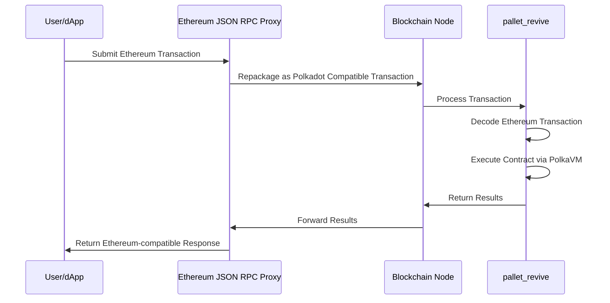

This proxy-based approach eliminates the need for node binary modifications, maintaining compatibility across different client implementations. Preserving the original Ethereum transaction payload simplifies adapting existing tools, which can continue processing familiar transaction formats.

### PolkaVM Design Fundamentals

PolkaVM introduces two fundamental architectural differences compared to the Ethereum Virtual Machine (EVM):

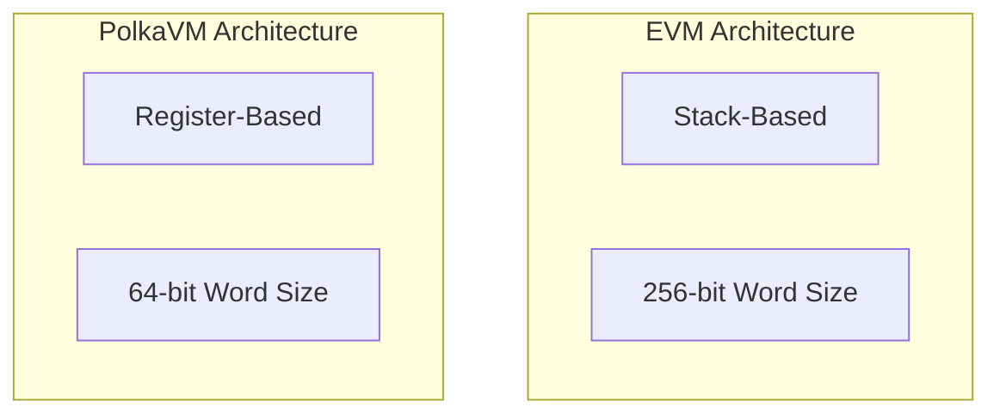

- **Register-based design**: PolkaVM utilizes a RISC-V register-based approach. This design:

    - Employs a finite set of registers for argument passing instead of an infinite stack.
    - Facilitates efficient translation to underlying hardware architectures.
    - Optimizes register allocation through careful register count selection.
    - Enables simple 1:1 mapping to x86-64 instruction sets.
    - Reduces compilation complexity through strategic register limitation.
    - Improves overall execution performance through hardware-aligned design.

- **64-bit word size**: PolkaVM operates with a 64-bit word size. This design:

    - Enables direct hardware-supported arithmetic operations.
    - Maintains compatibility with Solidity's 256-bit operations through YUL translation.
    - Allows integration of performance-critical components written in lower-level languages.
    - Optimizes computation-intensive operations through native word size alignment.
    - Reduces overhead for operations not requiring extended precision.
    - Facilitates efficient integration with modern CPU architectures.

## Compilation Process

When compiling a Solidity smart contract, the code passes through the following stages:

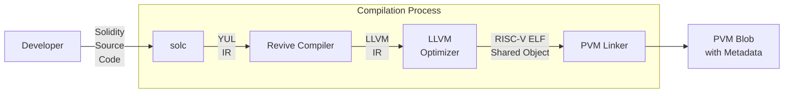

The compilation process integrates several specialized components:

1. **Solc**: The standard Ethereum Solidity compiler that translates Solidity source code to [YUL IR](https://docs.soliditylang.org/en/latest/yul.html){target=\_blank}.
2. **Revive Compiler**: Takes YUL IR and transforms it to [LLVM IR](https://llvm.org/){target=\_blank}.
3. **LLVM**: A compiler infrastructure that optimizes the code and generates RISC-V ELF objects.
4. **PVM linker**: Links the RISC-V ELF object into a final PolkaVM blob with metadata.


---

# Python Substrate Interface

> Source (raw): https://raw.githubusercontent.com/polkadot-developers/polkadot-docs/master/.ai/pages/develop-toolkit-api-libraries-py-substrate-interface.md
> Canonical (HTML): https://docs.polkadot.com/develop/toolkit/api-libraries/py-substrate-interface/
> Summary: Learn how to connect to Polkadot SDK-based nodes, query data, submit transactions, and manage blockchain interactions using the Python Substrate Interface.

# Python Substrate Interface

## Introduction

The [Python Substrate Interface](https://github.com/polkascan/py-substrate-interface){target=\_blank} is a powerful library that enables interaction with Polkadot SDK-based chains. It provides essential functionality for:

- Querying on-chain storage.
- Composing and submitting extrinsics.
- SCALE encoding/decoding.
- Interacting with Substrate runtime metadata.
- Managing blockchain interactions through convenient utility methods.

## Installation

Install the library using `pip`:

```py
pip install substrate-interface
```

For more installation details, see the [Installation](https://jamdottech.github.io/py-polkadot-sdk/getting-started/installation/){target=\_blank} section in the official Python Substrate Interface documentation.

## Get Started

This guide will walk you through the basic operations with the Python Substrate Interface: connecting to a node, reading chain state, and submitting transactions.

### Establishing Connection

The first step is to establish a connection to a Polkadot SDK-based node. You can connect to either a local or remote node:

```py
from substrateinterface import SubstrateInterface

# Connect to a node using websocket
substrate = SubstrateInterface(
    # For local node: "ws://127.0.0.1:9944"
    # For Polkadot: "wss://rpc.polkadot.io"
    # For Kusama: "wss://kusama-rpc.polkadot.io"
    url="INSERT_WS_URL"
)

# Verify connection
print(f"Connected to chain: {substrate.chain}")

```

### Reading Chain State

You can query various on-chain storage items. To retrieve data, you need to specify three key pieces of information:

- **Pallet name**: Module or pallet that contains the storage item you want to access.
- **Storage item**: Specific storage entry you want to query within the pallet.
- **Required parameters**: Any parameters needed to retrieve the desired data.

Here's an example of how to check an account's balance and other details:

```py
# ...

# Query account balance and info
account_info = substrate.query(
    module="System",  # The pallet name
    storage_function="Account",  # The storage item
    params=["INSERT_ADDRESS"],  # Account address in SS58 format
)

# Access account details from the result
free_balance = account_info.value["data"]["free"]
reserved = account_info.value["data"]["reserved"]
nonce = account_info.value["nonce"]

print(
    f"""
    Account Details:
    - Free Balance: {free_balance}
    - Reserved: {reserved} 
    - Nonce: {nonce}
    """
)

```

### Submitting Transactions

To modify the chain state, you need to submit transactions (extrinsics). Before proceeding, ensure you have:

- A funded account with sufficient balance to pay transaction fees.
- Access to the account's keypair.

Here's how to create and submit a balance transfer:

```py
#...

# Compose the transfer call
call = substrate.compose_call(
    call_module="Balances",  # The pallet name
    call_function="transfer_keep_alive",  # The extrinsic function
    call_params={
        'dest': 'INSERT_ADDRESS',  # Recipient's address
        'value': 'INSERT_VALUE'  # Amount in smallest unit (e.g., Planck for DOT)
    }
)

# Create a signed extrinsic
extrinsic = substrate.create_signed_extrinsic(
    call=call, keypair=keypair  # Your keypair for signing
)

# Submit and wait for inclusion
receipt = substrate.submit_extrinsic(
    extrinsic, wait_for_inclusion=True  # Wait until the transaction is in a block
)

if receipt.is_success:
    print(
        f"""
        Transaction successful:
        - Extrinsic Hash: {receipt.extrinsic_hash}
        - Block Hash: {receipt.block_hash}
        """
    )
else:
    print(f"Transaction failed: {receipt.error_message}")

```

The `keypair` object is essential for signing transactions. See the [Keypair](https://jamdottech.github.io/py-polkadot-sdk/reference/keypair/){target=\_blank} documentation for more details.

## Where to Go Next

Now that you understand the basics, you can:

- Explore more complex queries and transactions.
- Learn about batch transactions and utility functions.
- Discover how to work with custom pallets and types.

For comprehensive reference materials and advanced features, see the [Python Substrate Interface](https://jamdottech.github.io/py-polkadot-sdk/){target=\_blank} documentation.


---

# Quickstart Parachain Development with Pop CLI

> Source (raw): https://raw.githubusercontent.com/polkadot-developers/polkadot-docs/master/.ai/pages/develop-toolkit-parachains-quickstart-pop-cli.md
> Canonical (HTML): https://docs.polkadot.com/develop/toolkit/parachains/quickstart/pop-cli/
> Summary: Quickly bootstrap parachain projects, scaffold templates, deploy local networks, and streamline development workflows using Pop CLI.

# Quickstart Parachain Development With Pop CLI

## Introduction

[Pop CLI](https://onpop.io/cli/){target=\_blank} is a powerful command-line tool designed explicitly for rapid parachain development within the Polkadot ecosystem. It addresses essential developer needs by providing streamlined commands to set up development environments, scaffold parachain templates, and manage local blockchain networks.

Pop CLI simplifies parachain development with features like:

- Quick initialization of parachain development environments.
- Project scaffolding from predefined parachain templates.
- Easy deployment and management of local development networks.

Developers can quickly begin coding and testing, significantly reducing setup overhead.

### Install Pop CLI

To install Pop CLI, run the following command:

```bash
cargo install --force --locked pop-cli
```

Confirm that Pop CLI is installed by running `pop --help` in your terminal:

```bash
pop --help
```

### Set Up Your Development Environment

To develop and build Polkadot SDK-based chains, preparing your local environment with the necessary tools and dependencies is essential. The [Install Polkadot SDK Dependencies](/develop/parachains/install-polkadot-sdk/){target=\_blank} guide walks you through this setup step-by-step.

However, you can automate this entire process by running:

```bash
pop install
```

This command provides an interactive experience that checks and installs all necessary dependencies for you. It’s the fastest and easiest way to prepare your development environment for building parachains with Pop CLI.

<div id="termynal" data-termynal>
  <span data-ty="input"><span class="file-path"></span>pop install</span>
  <span data-ty>┌ Pop CLI : Install dependencies for development</span>
  <span data-ty>│ </span>
  <span data-ty></span>
  <span data-ty>⚙ ℹ️ Mac OS (Darwin) detected.</span>
  <span data-ty>│ </span>
  <span data-ty>⚙ More information about the packages to be installed here: https://docs.substrate.io/install/macos/</span>
  <span data-ty>│ </span>
  <span data-ty>◆ 📦 Do you want to proceed with the installation of the following packages: homebrew, protobuf, openssl, rustup and cmake ?</span>
  <span data-ty>│ ● Yes / ○ No </span>
</div>


### Initialize a Project

Start a new project quickly using Pop CLI's `pop new parachain` command:

<div id="termynal" data-termynal>
  
</div>


The command above scaffolds a new parachain project using the default template included with Pop CLI. For more specialized implementations, additional templates are available; you can explore them by running `pop new parachain --help`.

Once the project is generated, move into the new directory and build your parachain:

```
cd my-parachain
pop build --release
```

!!! note
    Under the hood, `pop build --release` runs `cargo build --release`, but `pop build` adds functionality specific to Polkadot SDK projects, such as [deterministic runtime builds](/develop/parachains/deployment/build-deterministic-runtime/){target=\_blank} and automatic management of feature flags like `benchmark` or `try-runtime`.

Pop CLI integrates the [Zombienet SDK](https://github.com/paritytech/zombienet-sdk){target=\_blank} allowing you to easily launch ephemeral local networks for development and testing. To start a network, simply run the following:

```bash
pop up network -f ./network.toml
```

This command will automatically fetch the necessary binaries and spin up a Polkadot network with your configured parachains.

You can also interact with your local network using Pop CLI's `pop call chain` command:

<div id="termynal" data-termynal>
  
</div>


## Where to Go Next

For a comprehensive guide to all Pop CLI features and advanced usage, see the official [Pop CLI](https://learn.onpop.io/appchains) documentation.

!!! tip
    Pop CLI also offers powerful solutions for smart contract developers. If you're interested in that path, check out the [Pop CLI Smart Contracts](https://learn.onpop.io/contracts) documentation.


---

# Randomness

> Source (raw): https://raw.githubusercontent.com/polkadot-developers/polkadot-docs/master/.ai/pages/polkadot-protocol-parachain-basics-randomness.md
> Canonical (HTML): https://docs.polkadot.com/polkadot-protocol/parachain-basics/randomness/
> Summary: Explore the importance of randomness in PoS blockchains, focusing on Polkadot’s VRF-based approach to ensure fairness and security in validator selection.

# Randomness

## Introduction

Randomness is crucial in Proof of Stake (PoS) blockchains to ensure a fair and unpredictable distribution of validator duties. However, computers are inherently deterministic, meaning the same input always produces the same output. What we typically refer to as "random" numbers on a computer are actually pseudo-random. These numbers rely on an initial "seed," which can come from external sources like [atmospheric noise](https://www.random.org/randomness/){target=\_blank}, [heart rates](https://mdpi.altmetric.com/details/47574324){target=\_blank}, or even [lava lamps](https://en.wikipedia.org/wiki/Lavarand){target=\_blank}. While this may seem random, given the same "seed," the same sequence of numbers will always be generated.

In a global blockchain network, relying on real-world entropy for randomness isn’t feasible because these inputs vary by time and location. If nodes use different inputs, blockchains can fork. Hence, real-world randomness isn't suitable for use as a seed in blockchain systems.

Currently, two primary methods for generating randomness in blockchains are used: [`RANDAO`](#randao) and [`VRF`](#vrf) (Verifiable Random Function). Polkadot adopts the `VRF` approach for its randomness.

## VRF

A Verifiable Random Function (VRF) is a cryptographic function that generates a random number and proof that ensures the submitter produced the number. This proof allows anyone to verify the validity of the random number.

Polkadot's VRF is similar to the one used in [**Ouroboros Praos**](https://eprint.iacr.org/2017/573.pdf){target=\_blank}, which secures randomness for block production in systems like [BABE](/polkadot-protocol/architecture/polkadot-chain/pos-consensus/#block-production-babe){target=\_blank} (Polkadot’s block production mechanism). 

The key difference is that Polkadot's VRF doesn’t rely on a central clock—avoiding the issue of whose clock to trust. Instead, it uses its own past results and slot numbers to simulate time and determine future outcomes.

### How VRF Works

Slots on Polkadot are discrete units of time, each lasting six seconds, and can potentially hold a block. Multiple slots form an epoch, with 2400 slots making up one four-hour epoch.

In each slot, validators execute a "die roll" using a VRF. The VRF uses three inputs:

1. A "secret key," unique to each validator, is used for the die roll.
2. An epoch randomness value, derived from the hash of VRF outputs from blocks two epochs ago (N-2), so past randomness influences the current epoch (N).
3. The current slot number.

This process helps maintain fair randomness across the network.

Here is a graphical representation:


The VRF produces two outputs: a result (the random number) and a proof (verifying that the number was generated correctly).

The result is checked by the validator against a protocol threshold. If it's below the threshold, the validator becomes a candidate for block production in that slot. 

The validator then attempts to create a block, submitting it along with the `PROOF` and `RESULT`.

So, VRF can be expressed like:

`(RESULT, PROOF) = VRF(SECRET, EPOCH_RANDOMNESS_VALUE, CURRENT_SLOT_NUMBER)`

Put simply, performing a "VRF roll" generates a random number along with proof that the number was genuinely produced and not arbitrarily chosen.

After executing the VRF, the `RESULT` is compared to a protocol-defined `THRESHOLD`. If the `RESULT` is below the `THRESHOLD`, the validator becomes a valid candidate to propose a block for that slot. Otherwise, the validator skips the slot.

As a result, there may be multiple validators eligible to propose a block for a slot. In this case, the block accepted by other nodes will prevail, provided it is on the chain with the latest finalized block as determined by the GRANDPA finality gadget. It's also possible for no block producers to be available for a slot, in which case the AURA consensus takes over. AURA is a fallback mechanism that randomly selects a validator to produce a block, running in parallel with BABE and only stepping in when no block producers exist for a slot. Otherwise, it remains inactive.

Because validators roll independently, no block candidates may appear in some slots if all roll numbers are above the threshold. 

To verify resolution of this issue and that Polkadot block times remain near constant-time, see the [PoS Consensus](/polkadot-protocol/architecture/polkadot-chain/pos-consensus/){target=\_blank} page of this documentation.

## RANDAO

An alternative on-chain randomness method is Ethereum's RANDAO, where validators perform thousands of hashes on a seed and publish the final hash during a round. The collective input from all validators forms the random number, and as long as one honest validator participates, the randomness is secure.

To enhance security, RANDAO can optionally be combined with a Verifiable Delay Function (VDF), ensuring that randomness can't be predicted or manipulated during computation.

For more information about RANDAO, see the [Randomness - RANDAO](https://eth2book.info/capella/part2/building_blocks/randomness/){target=\_blank} section of the Upgrading Ethereum documentation.

## VDFs

Verifiable Delay Functions (VDFs) are time-bound computations that, even on parallel computers, take a set amount of time to complete. 

They produce a unique result that can be quickly verified publicly. When combined with RANDAO, feeding RANDAO's output into a VDF introduces a delay that nullifies an attacker's chance to influence the randomness.

However, VDF likely requires specialized ASIC devices to run separately from standard nodes.

!!!warning 
    While only one is needed to secure the system, and they will be open-source and inexpensive, running VDF devices involves significant costs without direct incentives, adding friction for blockchain users.

## Additional Resources

For more information about the reasoning for choices made along with proofs, see Polkadot's research on blockchain randomness and sortition in the [Block production](https://research.web3.foundation/Polkadot/protocols/block-production){target=\_blank} entry of the Polkadot Wiki. 

For a discussion with Web3 Foundation researchers about when and under what conditions Polkadot's randomness can be utilized, see the [Discussion on Randomness used in Polkadot](https://github.com/use-ink/ink/issues/57){target=\_blank} issue on GitHub.


---

# Register a Local Asset

> Source (raw): https://raw.githubusercontent.com/polkadot-developers/polkadot-docs/master/.ai/pages/tutorials-polkadot-sdk-system-chains-asset-hub-register-local-asset.md
> Canonical (HTML): https://docs.polkadot.com/tutorials/polkadot-sdk/system-chains/asset-hub/register-local-asset/
> Summary: Comprehensive guide to registering a local asset on the Asset Hub system parachain, including step-by-step instructions.

# Register a Local Asset on Asset Hub

## Introduction

As detailed in the [Asset Hub Overview](/polkadot-protocol/architecture/system-chains/asset-hub){target=\_blank} page, Asset Hub accommodates two types of assets: local and foreign. Local assets are those that were created in Asset Hub and are identifiable by an integer ID. On the other hand, foreign assets originate from a sibling parachain and are identified by a Multilocation.

This guide will take you through the steps of registering a local asset on the Asset Hub parachain.

## Prerequisites

Before you begin, ensure you have access to the [Polkadot.js Apps](https://polkadot.js.org/apps/){target=\_blank} interface and a funded wallet with DOT or KSM.

- For Polkadot Asset Hub, you would need a deposit of 10 DOT and around 0.201 DOT for the metadata.
- For Kusama Asset Hub, the deposit is 0.1 KSM and around 0.000669 KSM for the metadata.

You need to ensure that your Asset Hub account balance is a bit more than the sum of those two deposits, which should seamlessly account for the required deposits and transaction fees.

## Steps to Register a Local Asset

To register a local asset on the Asset Hub parachain, follow these steps:

1. Open the [Polkadot.js Apps](https://polkadot.js.org/apps/){target=\_blank} interface and connect to the Asset Hub parachain using the network selector in the top left corner.

      - You may prefer to test local asset registration on TestNet before registering the asset on a MainNet hub. If you still need to set up a local testing environment, review the [Environment setup](#test-setup-environment) section for instructions. Once the local environment is set up, connect to the Local Node (Chopsticks) available on `ws://127.0.0.1:8000`.
      - For the live network, connect to the **Asset Hub** parachain. Either Polkadot or Kusama Asset Hub can be selected from the dropdown list, choosing the desired RPC provider.

2. Click on the **Network** tab on the top navigation bar and select **Assets** from the dropdown list.

      

3. Now, you need to examine all the registered asset IDs. This step is crucial to ensure that the asset ID you are about to register is unique. Asset IDs are displayed in the **assets** column.

      

4. Once you have confirmed that the asset ID is unique, click on the **Create** button on the top right corner of the page.

      

5. Fill in the required fields in the **Create Asset** form:

    1. **creator account**: The account to be used for creating this asset and setting up the initial metadata.
    2. **asset name**: The descriptive name of the asset you are registering.
    3. **asset symbol**: The symbol that will be used to represent the asset.
    4. **asset decimals**: The number of decimal places for this token, with a maximum of 20 allowed through the user interface.
    5. **minimum balance**: The minimum balance for the asset. This is specified in the units and decimals as requested.
    6. **asset ID**: The selected id for the asset. This should not match an already-existing asset id.
    7. Click on the **Next** button.
 
    

6. Choose the accounts for the roles listed below:

    1. **admin account**: The account designated for continuous administration of the token.
    2. **issuer account**: The account that will be used for issuing this token.
    3. **freezer account**: The account that will be used for performing token freezing operations.
    4. Click on the **Create** button.

    

7. Click on the **Sign and Submit** button to complete the asset registration process.

    

## Verify Asset Registration

After completing these steps, the asset will be successfully registered. You can now view your asset listed on the [**Assets**](https://polkadot.js.org/apps/?rpc=wss%3A%2F%2Fasset-hub-polkadot-rpc.dwellir.com#/assets){target=\_blank} section of the Polkadot.js Apps interface.


!!! tip
    Take into consideration that the **Assets** section’s link may differ depending on the network you are using. For the local environment, enter `ws://127.0.0.1:8000` into the **Custom Endpoint** field.

In this way, you have successfully registered a local asset on the Asset Hub parachain.

For an in-depth explanation about Asset Hub and its features, see the [Asset Hub](/tutorials/polkadot-sdk/system-chains/asset-hub/asset-conversion/){target=\_blank} entry in the Polkadot Wiki.

## Test Setup Environment

You can set up a local parachain environment to test the asset registration process before deploying it on the live network. This guide uses Chopsticks to simulate that process. For further information on chopsticks usage, refer to the [Chopsticks](/develop/toolkit/parachains/fork-chains/chopsticks/get-started){target=\_blank} documentation.

To set up a test environment, execute the following command:

```bash
npx @acala-network/chopsticks \
--config=https://raw.githubusercontent.com/AcalaNetwork/chopsticks/master/configs/polkadot-asset-hub.yml
```

The above command will spawn a lazy fork of Polkadot Asset Hub with the latest block data from the network. If you need to test Kusama Asset Hub, replace `polkadot-asset-hub.yml` with `kusama-asset-hub.yml` in the command.

An Asset Hub instance is now running locally, and you can proceed with the asset registration process. Note that the local registration process does not differ from the live network process. Once you have a successful TestNet transaction, you can use the same steps to register the asset on MainNet.


---

# Send XCM Messages

> Source (raw): https://raw.githubusercontent.com/polkadot-developers/polkadot-docs/master/.ai/pages/develop-interoperability-send-messages.md
> Canonical (HTML): https://docs.polkadot.com/develop/interoperability/send-messages/
> Summary: Send cross-chain messages using XCM, Polkadot's Cross-Consensus Messaging format, designed to support secure communication between chains.

# Send XCM Messages

## Introduction

One of the core FRAME pallets that enables parachains to engage in cross-chain communication using the Cross-Consensus Message (XCM) format is [`pallet-xcm`](https://paritytech.github.io/polkadot-sdk/master/pallet_xcm/pallet/index.html){target=\_blank}. It facilitates the sending, execution, and management of XCM messages, thereby allowing parachains to interact with other chains within the ecosystem. Additionally, `pallet-xcm`, also referred to as the XCM pallet, supports essential operations like asset transfers, version negotiation, and message routing.

This page provides a detailed overview of the XCM pallet's key features, its primary roles in XCM operations, and the main extrinsics it offers. Whether aiming to execute XCM messages locally or send them to external chains, this guide covers the foundational concepts and practical applications you need to know.

## XCM Frame Pallet Overview

The [`pallet-xcm`](https://paritytech.github.io/polkadot-sdk/master/pallet_xcm/pallet/index.html){target=\_blank} provides a set of pre-defined, commonly used [XCVM programs](https://github.com/polkadot-fellows/xcm-format?tab=readme-ov-file#12-the-xcvm){target=\_blank} in the form of a [set of extrinsics](https://paritytech.github.io/polkadot-sdk/master/pallet_xcm/pallet/dispatchables/index.html){target=\blank}. This pallet provides some [default implementations](https://paritytech.github.io/polkadot-sdk/master/pallet_xcm/pallet/struct.Pallet.html#implementations){target=\_blank} for traits required by [`XcmConfig`](https://paritytech.github.io/polkadot-sdk/master/pallet_xcm_benchmarks/trait.Config.html#associatedtype.XcmConfig){target=\_blank}. The [XCM executor](https://paritytech.github.io/polkadot-sdk/master/staging_xcm_executor/struct.XcmExecutor.html){target=\_blank} is also included as an associated type within the pallet's configuration. 

For further details about the XCM configuration, see the [XCM Configuration](/develop/interoperability/xcm-config/){target=\_blank} page.

Where the [XCM format](https://github.com/polkadot-fellows/xcm-format){target=\_blank} defines a set of instructions used to construct XCVM programs, `pallet-xcm` defines a set of extrinsics that can be utilized to build XCVM programs, either to target the local or external chains. The `pallet-xcm` functionality is divided into three categories:

- **Primitive**: Dispatchable functions to execute XCM locally.
- **High-level**: Functions for asset transfers between chains.
- **Version negotiation-specific**: Functions for managing XCM version compatibility.

### Key Roles of the XCM Pallet

The XCM pallet plays a central role in managing cross-chain messages, with its primary responsibilities including:

- **Execute XCM messages**: Interacts with the XCM executor to validate and execute messages, adhering to predefined security and filter criteria.
- **Send messages across chains**: Allows authorized origins to send XCM messages, enabling controlled cross-chain communication.
- **Reserve-based transfers and teleports**: Supports asset movement between chains, governed by filters that restrict operations to authorized origins.
- **XCM version negotiation**: Ensures compatibility by selecting the appropriate XCM version for inter-chain communication.
- **Asset trapping and recovery**: Manages trapped assets, enabling safe reallocation or recovery when issues occur during cross-chain transfers.
- **Support for XCVM operations**: Oversees state and configuration requirements necessary for executing cross-consensus programs within the XCVM framework.

## Primary Extrinsics of the XCM Pallet

This page will highlight the two **Primary Primitive Calls** responsible for sending and executing XCVM programs as dispatchable functions within the pallet.

### Execute

The [`execute`](https://paritytech.github.io/polkadot-sdk/master/pallet_xcm/pallet/enum.Call.html#variant.execute){target=\_blank} call directly interacts with the XCM executor, allowing for the execution of XCM messages originating from a locally signed origin. The executor validates the message, ensuring it complies with any configured barriers or filters before executing.

Once validated, the message is executed locally, and an event is emitted to indicate the result—whether the message was fully executed or only partially completed. Execution is capped by a maximum weight ([`max_weight`](https://paritytech.github.io/polkadot-sdk/master/pallet_xcm/pallet/enum.Call.html#variant.execute.field.max_weight){target=\_blank}); if the required weight exceeds this limit, the message will not be executed.

```rust
pub fn execute<T: Config>(
    message: Box<VersionedXcm<<T as Config>::RuntimeCall>>,
    max_weight: Weight,
)
```

For further details about the `execute` extrinsic, see the [`pallet-xcm` documentation](https://paritytech.github.io/polkadot-sdk/master/pallet_xcm/pallet/struct.Pallet.html){target=\_blank}.

!!!warning
    Partial execution of messages may occur depending on the constraints or barriers applied.


### Send

The [`send`](https://paritytech.github.io/polkadot-sdk/master/pallet_xcm/pallet/enum.Call.html#variant.send){target=\_blank} call enables XCM messages to be sent to a specified destination. This could be a parachain, smart contract, or any external system governed by consensus. Unlike the execute call, the message is not executed locally but is transported to the destination chain for processing.

The destination is defined using a [Location](https://paritytech.github.io/polkadot-sdk/master/xcm_docs/glossary/index.html#location){target=\_blank}, which describes the target chain or system. This ensures precise delivery through the configured XCM transport mechanism.

```rust
pub fn send<T: Config>(
    dest: Box<MultiLocation>,
    message: Box<VersionedXcm<<T as Config>::RuntimeCall>>,
)
```

For further information about the `send` extrinsic, see the [`pallet-xcm` documentation](https://paritytech.github.io/polkadot-sdk/master/pallet_xcm/pallet/struct.Pallet.html){target=\_blank}.


## XCM Router

The [`XcmRouter`](https://paritytech.github.io/polkadot-sdk/master/pallet_xcm/pallet/trait.Config.html#associatedtype.XcmRouter){target=\_blank} is a critical component the XCM pallet requires to facilitate sending XCM messages. It defines where messages can be sent and determines the appropriate XCM transport protocol for the operation.

For instance, the Kusama network employs the [`ChildParachainRouter`](https://paritytech.github.io/polkadot-sdk/master/polkadot_runtime_common/xcm_sender/struct.ChildParachainRouter.html){target=\_blank}, which restricts routing to [Downward Message Passing (DMP)](https://wiki.polkadot.com/learn/learn-xcm-transport/#dmp-downward-message-passing){target=\_blank} from the relay chain to parachains, ensuring secure and controlled communication.

```rust
pub type XcmRouter = WithUniqueTopic<(
	// Only one router so far - use DMP to communicate with child parachains.
	ChildParachainRouter<Runtime, XcmPallet, PriceForChildParachainDelivery>,
)>;
```

For more details about XCM transport protocols, see the [XCM Channels](/develop/interoperability/xcm-channels/){target=\_blank} page.


---

# Set Up a Template

> Source (raw): https://raw.githubusercontent.com/polkadot-developers/polkadot-docs/master/.ai/pages/tutorials-polkadot-sdk-parachains-zero-to-hero-set-up-a-template.md
> Canonical (HTML): https://docs.polkadot.com/tutorials/polkadot-sdk/parachains/zero-to-hero/set-up-a-template/
> Summary: Learn to compile and run a local parachain node using Polkadot SDK. Launch, run, and interact with a pre-configured runtime template.

# Set Up a Template

## Introduction

[Polkadot SDK](https://github.com/paritytech/polkadot-sdk){target=\_blank} offers a versatile and extensible blockchain development framework, enabling you to create custom blockchains tailored to your specific application or business requirements. 

This tutorial guides you through compiling and running a parachain node using the [Polkadot SDK Parachain Template](https://github.com/paritytech/polkadot-sdk/tree/master/templates/parachain){target=\_blank}.

The parachain template provides a pre-configured, functional runtime you can use in your local development environment. It includes several key components, such as user accounts and account balances.

These predefined elements allow you to experiment with common blockchain operations without requiring initial template modifications.
In this tutorial, you will:

- Build and start a local parachain node using the node template.
- Explore how to use a front-end interface to:
    - View information about blockchain activity.
    - Submit a transaction.

By the end of this tutorial, you'll have a working local parachain and understand how to interact with it, setting the foundation for further customization and development.

## Prerequisites

Before getting started, ensure you have done the following:

- Completed the [Install Polkadot SDK Dependencies](/develop/parachains/install-polkadot-sdk/){target=\_blank} guide and successfully installed [Rust](https://www.rust-lang.org/){target=\_blank} and the required packages to set up your development environment.

For this tutorial series, you need to use Rust `1.86`. Newer versions of the compiler may not work with this parachain template version.

Run the following commands to set up the correct Rust version:

```bash
rustup default 1.86
rustup target add wasm32-unknown-unknown --toolchain 1.86-aarch64-apple-darwin
rustup component add rust-src --toolchain 1.86-aarch64-apple-darwin
```

## Utility Tools

This tutorial requires two essential tools:

- [**Chain spec builder**](https://crates.io/crates/staging-chain-spec-builder/10.0.0){target=\_blank}: A Polkadot SDK utility for generating chain specifications. Refer to the [Generate Chain Specs](/develop/parachains/deployment/generate-chain-specs/){target=\_blank} documentation for detailed usage.
    
    Install it by executing the following command:
    
    ```bash
    cargo install --locked staging-chain-spec-builder@10.0.0
    ```

    This installs the `chain-spec-builder` binary.

- [**Polkadot Omni Node**](https://crates.io/crates/polkadot-omni-node/0.5.0){target=\_blank}: A white-labeled binary, released as a part of Polkadot SDK that can act as the collator of a parachain in production, with all the related auxiliary functionalities that a normal collator node has: RPC server, archiving state, etc. Moreover, it can also run the wasm blob of the parachain locally for testing and development.

    To install it, run the following command:

    ```bash
    cargo install --locked polkadot-omni-node@0.5.0
    ```

    This installs the `polkadot-omni-node` binary.

## Compile the Runtime

The [Polkadot SDK Parachain Template](https://github.com/paritytech/polkadot-sdk/tree/master/templates/parachain){target=\_blank} provides a ready-to-use development environment for building using the [Polkadot SDK](https://github.com/paritytech/polkadot-sdk){target=\_blank}. Follow these steps to compile the runtime:

1. Clone the template repository:

    ```bash
    git clone -b v0.0.4 https://github.com/paritytech/polkadot-sdk-parachain-template.git parachain-template
    ```

2. Navigate into the project directory:

    ```bash
    cd parachain-template
    ```

3. Compile the runtime:

    ```bash
    cargo build --release --locked
    ```

    !!!tip
        Initial compilation may take several minutes, depending on your machine specifications. Use the `--release` flag for improved runtime performance compared to the default `--debug` build. If you need to troubleshoot issues, the `--debug` build provides better diagnostics.
        
        For production deployments, consider using a dedicated [`--profile production`](https://github.com/paritytech/polkadot-sdk-parachain-template/blob/v0.0.4/Cargo.toml#L42-L45){target=\_blank} flag - this can provide an additional 15-30% performance improvement over the standard `--release` profile.

4. Upon successful compilation, you should see output similar to:

    <div id="termynal" data-termynal>
  <span data-ty="input"><span class="file-path"></span>cargo build --release --locked</span>
  <span data-ty>...</span>
  <span data-ty>Finished `release` profile [optimized] target(s) in 1.79s</span>
  <span data-ty="input"><span class="file-path"></span></span>
</div>


## Start the Local Chain

After successfully compiling your runtime, you can spin up a local chain and produce blocks. This process will start your local parachain and allow you to interact with it. You'll first need to generate a chain specification that defines your network's identity, initial connections, and genesis state, providing the foundational configuration for how your nodes connect and what initial state they agree upon, and then run the chain. 

Follow these steps to launch your node in development mode:

1. Generate the chain specification file of your parachain:

    ```bash
    chain-spec-builder create -t development \
    --relay-chain paseo \
    --para-id 1000 \
    --runtime ./target/release/wbuild/parachain-template-runtime/parachain_template_runtime.compact.compressed.wasm \
    named-preset development
    ```

2. Start the omni node with the generated chain spec. You'll start it in development mode (without a relay chain config), producing and finalizing blocks:

    ```bash
    polkadot-omni-node --chain ./chain_spec.json --dev
    ```

    The `--dev` option does the following:

    - Deletes all active data (keys, blockchain database, networking information) when stopped.
    - Ensures a clean working state each time you restart the node.

3. Verify that your node is running by reviewing the terminal output. You should see something similar to:

    <div id="termynal" data-termynal>
  <span data-ty="input"><span class="file-path"></span>polkadot-omni-node --chain ./chain_spec.json --dev</span>
  <br />
  <span data-ty>2024-12-12 12:44:02 polkadot-omni-node</span>
  <span data-ty>2024-12-12 12:44:02 ✌️ version 0.1.0-da2dd9b7737</span>
  <span data-ty>2024-12-12 12:44:02 ❤️ by Parity Technologies admin@parity.io, 2017-2024</span>
  <span data-ty>2024-12-12 12:44:02 📋 Chain specification: Custom</span>
  <span data-ty>2024-12-12 12:44:02 🏷 Node name: grieving-drum-1926</span>
  <span data-ty>2024-12-12 12:44:02 👤 Role: AUTHORITY</span>
  <span data-ty>2024-12-12 12:44:02 💾 Database: RocksDb at /var/folders/x0/xl_kjddj3ql3bx7752yr09hc0000gn/T/substrateoUrZMQ/chains/custom/db/full</span>
  <span data-ty>2024-12-12 12:44:03 [Parachain] assembling new collators for new session 0 at #0</span>
  <span data-ty>2024-12-12 12:44:03 [Parachain] assembling new collators for new session 1 at #0</span>
  <span data-ty>2024-12-12 12:44:03 [Parachain] 🔨 Initializing Genesis block/state (state: 0xa6f8…5b46, header-hash: 0x0579…2153)</span>
  <span data-ty>2024-12-12 12:44:03 [Parachain] creating SingleState txpool Limit { count: 8192, total_bytes: 20971520 }/Limit { count: 819, total_bytes: 2097152 }.</span>
  <span data-ty>2024-12-12 12:44:03 [Parachain] Using default protocol ID "sup" because none is configured in the chain specs</span>
  <span data-ty>2024-12-12 12:44:03 [Parachain] 🏷 Local node identity is: 12D3KooWCSXy6rBuJVsn5mx8uyNqkdfNfFzEbToi4hR31v3PwdgX</span>
  <span data-ty>2024-12-12 12:44:03 [Parachain] Running libp2p network backend</span>
  <span data-ty>2024-12-12 12:44:03 [Parachain] 💻 Operating system: macos</span>
  <span data-ty>2024-12-12 12:44:03 [Parachain] 💻 CPU architecture: aarch64</span>
  <span data-ty>2024-12-12 12:44:03 [Parachain] 📦 Highest known block at #0</span>
  <span data-ty>2024-12-12 12:44:03 [Parachain] 〽️ Prometheus exporter started at 127.0.0.1:9615</span>
  <span data-ty>2024-12-12 12:44:03 [Parachain] Running JSON-RPC server: addr=127.0.0.1:9944,[::1]:9944</span>
  <span data-ty>2024-12-12 12:44:06 [Parachain] 🙌 Starting consensus session on top of parent 0x05794f9adcdaa23a5edd335e8310637d3a7e6e9393f2b0794af7d3e219f62153 (#0)</span>
  <span data-ty>2024-12-12 12:44:06 [Parachain] 🎁 Prepared block for proposing at 1 (2 ms) hash: 0x6fbea46711e9b38bab8e7877071423cd03feab03d3f4a0d578a03ab42dcee34b; parent_hash: 0x0579…2153; end: NoMoreTransactions; extrinsics_count: 2</span>
  <span data-ty>2024-12-12 12:44:06 [Parachain] 🏆 Imported #1 (0x0579…2153 → 0x6fbe…e34b)</span>
  <span data-ty>...</span>
</div>


4. Confirm that your blockchain is producing new blocks by checking if the number after `finalized` is increasing.

    <div id="termynal" data-termynal>
  <span data-ty>...</span>
  <span data-ty>2024-12-12 12:49:20 [Parachain] 💤 Idle (0 peers), best: #1 (0x6fbe…e34b), finalized #1 (0x6fbe…e34b), ⬇ 0 ⬆ 0</span>
  <span data-ty>...</span>
  <span data-ty>2024-12-12 12:49:25 [Parachain] 💤 Idle (0 peers), best: #3 (0x7543…bcfc), finalized #3 (0x7543…bcfc), ⬇ 0 ⬆ 0</span>
  <span data-ty>...</span>
  <span data-ty>2024-12-12 12:49:30 [Parachain] 💤 Idle (0 peers), best: #4 (0x0478…8d63), finalized #4 (0x0478…8d63), ⬇ 0 ⬆ 0</span>
  <span data-ty>...</span>
</div>


The details of the log output will be explored in a later tutorial. For now, knowing that your node is running and producing blocks is sufficient.

## Interact with the Node

When running the template node, it's accessible by default at `ws://localhost:9944`. To interact with your node using the [Polkadot.js Apps](https://polkadot.js.org/apps/#/explorer){target=\_blank} interface, follow these steps:

1. Open [Polkadot.js Apps](https://polkadot.js.org/apps/#/explorer){target=\_blank} in your web browser and click the network icon (which should be the Polkadot logo) in the top left corner as shown in the image below:
    
    

2. Connect to your local node:

    1. Scroll to the bottom and select **Development**.
    2. Choose **Custom**.
    3. **Enter `ws**: //localhost:9944` in the input field.
    4. Click the **Switch** button.
    
    

3. Verify connection:

    - Once connected, you should see **parachain-template-runtime** in the top left corner.
    - The interface will display information about your local blockchain.
    
    

You are now connected to your local node and can now interact with it through the Polkadot.js Apps interface. This tool enables you to explore blocks, execute transactions, and interact with your blockchain's features. For in-depth guidance on using the interface effectively, refer to the [Polkadot.js Guides](https://wiki.polkadot.com/general/polkadotjs/){target=\_blank} available on the Polkadot Wiki.

## Stop the Node

When you're done exploring your local node, you can stop it to remove any state changes you've made. Since you started the node with the `--dev` option, stopping the node will purge all persistent block data, allowing you to start fresh the next time.

To stop the local node:

1. Return to the terminal window where the node output is displayed.
2. Press `Control-C` to stop the running process.
3. Verify that your terminal returns to the prompt in the `parachain-template` directory.

## Where to Go Next

<div class="grid cards" markdown>

-   <span class="badge tutorial">Tutorial</span> __Build a Custom Pallet__

    ---

    Build your own custom pallet for Polkadot SDK-based blockchains! Follow this step-by-step guide to create and configure a simple counter pallet from scratch.

    [:octicons-arrow-right-24: Get Started](/tutorials/polkadot-sdk/parachains/zero-to-hero/build-custom-pallet/)

</div>


---

# Sidecar Rest API

> Source (raw): https://raw.githubusercontent.com/polkadot-developers/polkadot-docs/master/.ai/pages/develop-toolkit-api-libraries-sidecar.md
> Canonical (HTML): https://docs.polkadot.com/develop/toolkit/api-libraries/sidecar/
> Summary: Learn about Substrate API Sidecar, a REST service that provides endpoints for interacting with Polkadot SDK-based chains and simplifies blockchain interactions.

# Sidecar API

## Introduction

The [Sidecar Rest API](https://github.com/paritytech/substrate-api-sidecar){target=\_blank} is a service that provides a REST interface for interacting with Polkadot SDK-based blockchains. With this API, developers can easily access a broad range of endpoints for nodes, accounts, transactions, parachains, and more.

Sidecar functions as a caching layer between your application and a Polkadot SDK-based node, offering standardized REST endpoints that simplify interactions without requiring complex, direct RPC calls. This approach is especially valuable for developers who prefer REST APIs or build applications in languages with limited WebSocket support.

Some of the key features of the Sidecar API include:

- **REST API interface**: Provides a familiar REST API interface for interacting with Polkadot SDK-based chains.
- **Standardized endpoints**: Offers consistent endpoint formats across different chain implementations.
- **Caching layer**: Acts as a caching layer to improve performance and reduce direct node requests.
- **Multiple chain support**: Works with any Polkadot SDK-based chain, including Polkadot, Kusama, and custom chains.

## Prerequisites

Sidecar API requires Node.js version 18.14 LTS or higher. Verify your Node.js version:

```bash
node --version
```

If you need to install or update Node.js, visit the [official Node.js website](https://nodejs.org/){target=\_blank} to download and install the latest LTS version.

## Installation

To install Substrate API Sidecar, use one of the following commands:

=== "npm"

    ```bash
    npm install -g @substrate/api-sidecar
    ```

=== "pnpm"

    ```bash
    pnpm install -g @substrate/api-sidecar
    ```

=== "yarn"

    ```bash
    yarn global add @substrate/api-sidecar
    ```

You can confirm the installation by running:

```bash
substrate-api-sidecar --version
```

For more information about the Sidecar API installation, see the [installation and usage](https://github.com/paritytech/substrate-api-sidecar?tab=readme-ov-file#npm-package-installation-and-usage){target=\_blank} section of the Sidecar API README.

## Usage

To use the Sidecar API, you have two options:

- **Local node**: Run a node locally, which Sidecar will connect to by default, requiring no additional configuration. To start, run the following:

    ```bash
    substrate-api-sidecar
    ```

- **Remote node**: Connect Sidecar to a remote node by specifying the RPC endpoint for that chain. For example, to gain access to the Polkadot Asset Hub associated endpoints.

    ```bash
    SAS_SUBSTRATE_URL=wss://polkadot-asset-hub-rpc.polkadot.io substrate-api-sidecar
    ```

    For more configuration details, see the [Configuration](https://github.com/paritytech/substrate-api-sidecar?tab=readme-ov-file#configuration){target=\_blank} section of the Sidecar API documentation.

Once the Sidecar API is running, you’ll see output similar to this:

<div id="termynal" data-termynal>
    <span data-ty='input'><span class='file-path'></span>SAS_SUBSTRATE_URL=wss://polkadot-asset-hub-rpc.polkadot.io substrate-api-sidecar</span>
    <br>
    <span data-ty>SAS:</span>
    <span data-ty>📦 LOG:</span>
    <span data-ty>   ✅ LEVEL: "info"</span>
    <span data-ty>   ✅ JSON: false</span>
    <span data-ty>   ✅ FILTER_RPC: false</span>
    <span data-ty>   ✅ STRIP_ANSI: false</span>
    <span data-ty>   ✅ WRITE: false</span>
    <span data-ty>   ✅ WRITE_PATH: "/opt/homebrew/lib/node_modules/@substrate/api-sidecar/build/src/logs"</span>
    <span data-ty>   ✅ WRITE_MAX_FILE_SIZE: 5242880</span>
    <span data-ty>   ✅ WRITE_MAX_FILES: 5</span>
    <span data-ty>📦 SUBSTRATE:</span>
    <span data-ty>   ✅ URL: "wss://polkadot-asset-hub-rpc.polkadot.io"</span>
    <span data-ty>   ✅ TYPES_BUNDLE: undefined</span>
    <span data-ty>   ✅ TYPES_CHAIN: undefined</span>
    <span data-ty>   ✅ TYPES_SPEC: undefined</span>
    <span data-ty>   ✅ TYPES: undefined</span>
    <span data-ty>   ✅ CACHE_CAPACITY: undefined</span>
    <span data-ty>📦 EXPRESS:</span>
    <span data-ty>   ✅ BIND_HOST: "127.0.0.1"</span>
    <span data-ty>   ✅ PORT: 8080</span>
    <span data-ty>   ✅ KEEP_ALIVE_TIMEOUT: 5000</span>
    <span data-ty>📦 METRICS:</span>
    <span data-ty>   ✅ ENABLED: false</span>
    <span data-ty>   ✅ PROM_HOST: "127.0.0.1"</span>
    <span data-ty>   ✅ PROM_PORT: 9100</span>
    <span data-ty>   ✅ LOKI_HOST: "127.0.0.1"</span>
    <span data-ty>   ✅ LOKI_PORT: 3100</span>
    <span data-ty>   ✅ INCLUDE_QUERYPARAMS: false</span>
    <br>
    <span data-ty>2024-11-06 08:06:01 info: Version: 19.3.0</span>
    <span data-ty>2024-11-06 08:06:02 warn: API/INIT: RPC methods not decorated: chainHead_v1_body, chainHead_v1_call, chainHead_v1_continue, chainHead_v1_follow, chainHead_v1_header, chainHead_v1_stopOperation, chainHead_v1_storage, chainHead_v1_unfollow, chainHead_v1_unpin, chainSpec_v1_chainName, chainSpec_v1_genesisHash, chainSpec_v1_properties, transactionWatch_v1_submitAndWatch, transactionWatch_v1_unwatch, transaction_v1_broadcast, transaction_v1_stop</span>
    <span data-ty>2024-11-06 08:06:02 info: Connected to chain Polkadot Asset Hub on the statemint client at wss://polkadot-asset-hub-rpc.polkadot.io</span>
    <span data-ty>2024-11-06 08:06:02 info: Listening on http://127.0.0.1:8080/</span>
    <span data-ty>2024-11-06 08:06:02 info: Check the root endpoint (http://127.0.0.1:8080/) to see the available endpoints for the current node</span>
</div>

With Sidecar running, you can access the exposed endpoints via a browser, [`Postman`](https://www.postman.com/){target=\_blank}, [`curl`](https://curl.se/){target=\_blank}, or your preferred tool.

### Endpoints

Sidecar API provides a set of REST endpoints that allow you to query different aspects of the chain, including blocks, accounts, and transactions. Each endpoint offers specific insights into the chain’s state and activities.

For example, to retrieve the version of the node, use the `/node/version` endpoint:

```bash
curl -X 'GET' \
  'http://127.0.0.1:8080/node/version' \
  -H 'accept: application/json'
```

Alternatively, you can access `http://127.0.0.1:8080/node/version` directly in a browser since it’s a `GET` request.

In response, you’ll see output similar to this (assuming you’re connected to Polkadot Asset Hub):

<div id="termynal" data-termynal>
    <span data-ty="input"><span class="file-path"></span>curl -X 'GET' 'http://127.0.0.1:8080/node/version' -H 'accept: application/json'</span>
    <br>
    <span data-ty>{</span>
    <span data-ty>    "clientVersion": "1.16.1-835e0767fe8",</span>
    <span data-ty>    "clientImplName": "statemint",</span>
    <span data-ty>    "chain": "Polkadot Asset Hub"</span>
    <span data-ty>}</span>
</div>

For a complete list of available endpoints and their documentation, visit the [Sidecar API list endpoints](https://paritytech.github.io/substrate-api-sidecar/dist/){target=\_blank}. You can learn about the endpoints and how to use them in your applications.

## Where to Go Next

To dive deeper, refer to the [official Sidecar documentation](https://github.com/paritytech/substrate-api-sidecar?tab=readme-ov-file#substrateapi-sidecar){target=\_blank}. This provides a comprehensive guide to the available configurations and advanced usage.


---

# Smart Contracts Basics Overview

> Source (raw): https://raw.githubusercontent.com/polkadot-developers/polkadot-docs/master/.ai/pages/polkadot-protocol-smart-contract-basics-overview.md
> Canonical (HTML): https://docs.polkadot.com/polkadot-protocol/smart-contract-basics/overview/
> Summary: Learn how developers can build smart contracts on Polkadot by leveraging either Wasm/ink! or EVM contracts across many parachains.

# An Overview of the Smart Contract Landscape on Polkadot

!!! smartcontract "PolkaVM Preview Release"
    PolkaVM smart contracts with Ethereum compatibility are in **early-stage development and may be unstable or incomplete**.

## Introduction

Polkadot is designed to support an ecosystem of parachains, rather than hosting smart contracts directly. Developers aiming to build smart contract applications on Polkadot rely on parachains within the ecosystem that provide smart contract functionality.

This guide outlines the primary approaches to developing smart contracts in the Polkadot ecosystem:

- **PolkaVM-compatible contracts**: Support Solidity and any language that compiles down to RISC-V while maintaining compatibility with Ethereum based tools.
- **EVM-compatible contracts**: Support languages like [Solidity](https://soliditylang.org/){target=\_blank} and [Vyper](https://vyperlang.org/){target=\_blank}, offering compatibility with popular Ethereum tools and wallets.
- **Wasm-based smart contracts**: Using [ink!](https://use.ink/){target=\_blank}, a Rust-based embedded domain-specific language (eDSL), enabling developers to leverage Rust’s safety and tooling.

You'll explore the key differences between these development paths, along with considerations for parachain developers integrating smart contract functionality.

!!!note "Parachain Developer?"
    If you are a parachain developer looking to add smart contract functionality to your chain, please refer to the [Add Smart Contract Functionality](/develop/parachains/customize-parachain/add-smart-contract-functionality/){target=\_blank} page, which covers both Wasm and EVM-based contract implementations.

## Smart Contracts Versus Parachains

A smart contract is a program that executes specific logic isolated to the chain on which it is being executed. All the logic executed is bound to the same state transition rules determined by the underlying virtual machine (VM). Consequently, smart contracts are more streamlined to develop, and programs can easily interact with each other through similar interfaces.

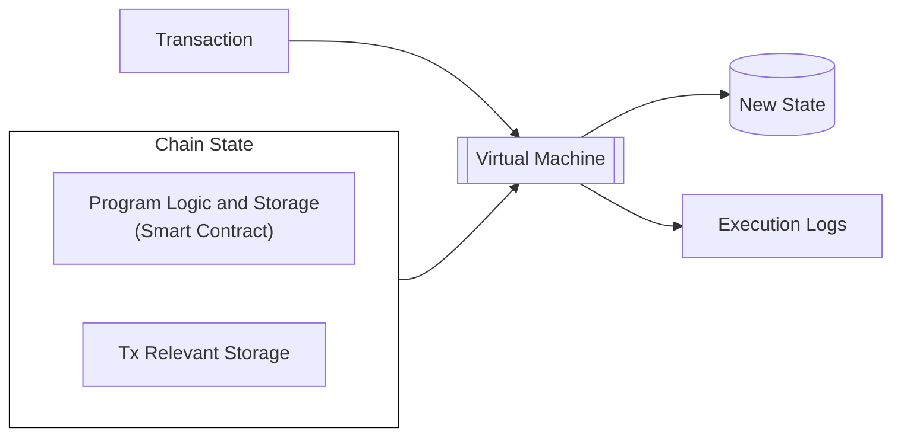

In addition, because smart contracts are programs that execute on top of existing chains, teams don't have to think about the underlying consensus they are built on.

These strengths do come with certain limitations. Some smart contracts environments, like EVM, tend to be immutable by default. Developers have developed different [proxy strategies](https://blog.openzeppelin.com/proxy-patterns){target=\_blank} to be able to upgrade smart contracts over time. The typical pattern relies on a proxy contract which holds the program storage forwarding a call to an implementation contract where the execution logic resides. Smart contract upgrades require changing the implementation contract while retaining the same storage structure, necessitating careful planning.

Another downside is that smart contracts often follow a gas metering model, where program execution is associated with a given unit and a marketplace is set up to pay for such an execution unit. This fee system is often very rigid, and some complex flows, like account abstraction, have been developed to circumvent this problem.

In contrast, parachains can create their own custom logics (known as pallets or modules), and combine them as the state transition function (STF or runtime) thanks to the modularity provided by the [Polkadot-SDK](https://github.com/paritytech/polkadot-sdk/){target=\_blank}. The different pallets within the parachain runtime can give developers a lot of flexibility when building applications on top of it.

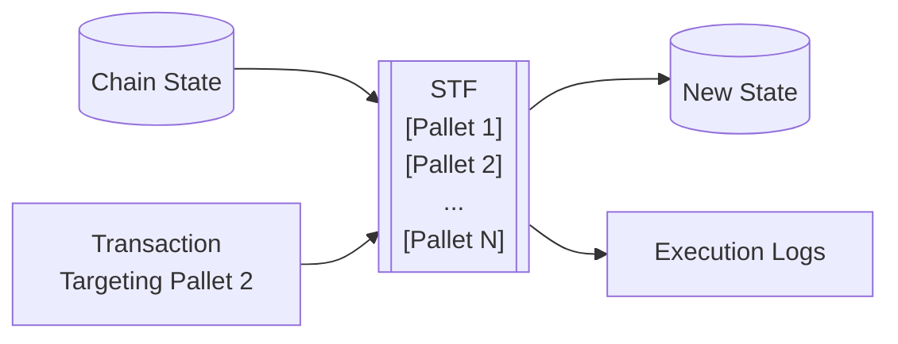

Parachains inherently offer features such as logic upgradeability, flexible transaction fee mechanisms, and chain abstraction logic. More so, by using Polkadot, parachains can benefit from robust consensus guarantees with little engineering overhead.

To read more about the differences between smart contracts and parachain runtimes, see the [Runtime vs. Smart Contracts](https://paritytech.github.io/polkadot-sdk/master/polkadot_sdk_docs/reference_docs/runtime_vs_smart_contract/index.html){target=\_blank} section of the Polkadot SDK Rust docs. For a more in-depth discussion about choosing between runtime development and smart contract development, see the Stack Overflow post on [building a Polkadot SDK runtime versus a smart contract](https://stackoverflow.com/a/56041305){target=\_blank}.

## Building a Smart Contract

The Polkadot SDK supports multiple smart contract execution environments:

- **PolkaVM**: A cutting-edge virtual machine tailored to optimize smart contract execution on Polkadot. Unlike traditional EVMs, PolkaVM is built with a [RISC-V-based register architecture](https://en.wikipedia.org/wiki/RISC-V){target=\_blank} for increased performance and scalability.
- **EVM**: Through [Frontier](https://github.com/polkadot-evm/frontier){target=\_blank}. It consists of a full Ethereum JSON RPC compatible client, an Ethereum emulation layer, and a [Rust-based EVM](https://github.com/rust-ethereum/evm){target=\_blank}. This is used by chains like [Acala](https://acala.network/){target=\_blank}, [Astar](https://astar.network/){target=\_blank}, [Moonbeam](https://moonbeam.network){target=\_blank} and more.
- **Wasm**: [ink!](https://use.ink/){target=\_blank} is a domain-specific language (DSL) for Rust smart contract development that uses the [Contracts pallet](https://github.com/paritytech/polkadot-sdk/blob/master/substrate/frame/contracts/){target=\_blank} with [`cargo-contract`](https://github.com/use-ink/cargo-contract){target=\_blank} serving as the compiler to WebAssembly. Wasm contracts can be used by chains like [Astar](https://astar.network/){target=\_blank}.

### PolkaVM Contracts

A component of the Asset Hub parachain, PolkaVM helps enable the deployment of Solidity-based smart contracts directly on Asset Hub. Learn more about how this cutting edge virtual machine facilitates using familiar Ethereum-compatible contracts and tools with Asset Hub by visiting the [Native Smart Contracts](/develop/smart-contracts/overview#native-smart-contracts){target=\_blank} guide.

### EVM Contracts

The [Frontier](https://github.com/polkadot-evm/frontier){target=\_blank} project provides a set of modules that enables a Polkadot SDK-based chain to run an Ethereum emulation layer that allows the execution of EVM smart contracts natively with the same API/RPC interface.

[Ethereum addresses (ECDSA)](https://ethereum.org/en/glossary/#address){target=\_blank} can also be mapped directly to and from the Polkadot SDK's SS58 scheme from existing accounts. Moreover, you can modify Polkadot SDK to use the ECDSA signature scheme directly to avoid any mapping.

At a high level, [Frontier](https://github.com/polkadot-evm/frontier){target=\_blank} is composed of three main components:

- **[Ethereum Client](https://github.com/polkadot-evm/frontier/tree/master/client){target=\_blank}**: An Ethereum JSON RPC compliant client that allows any request coming from an Ethereum tool, such as [Remix](https://remix.ethereum.org/){target=\_blank}, [Hardhat](https://hardhat.org/){target=\_blank} or [Foundry](https://getfoundry.sh/){target=\_blank}, to be admitted by the network.
- **[Pallet Ethereum](https://docs.rs/pallet-ethereum/latest/pallet_ethereum/){target=\_blank}**: A block emulation and Ethereum transaction validation layer that works jointly with the Ethereum client to ensure compatibility with Ethereum tools.
- **[Pallet EVM](https://docs.rs/pallet-evm/latest/pallet_evm/){target=\_blank}**: Access layer to the [Rust-based EVM](https://github.com/rust-ethereum/evm){target=\_blank}, enabling the execution of EVM smart contract logic natively.

The following diagram illustrates a high-level overview of the path an EVM transaction follows when using this configuration:

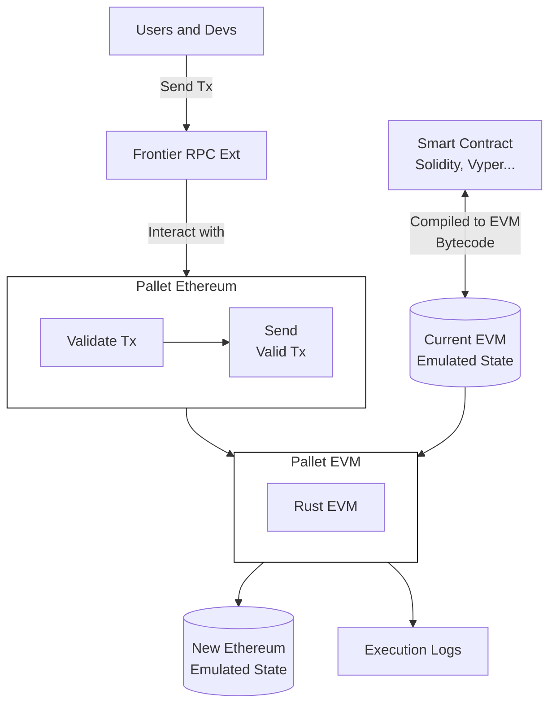

Although it seems complex, users and developers are abstracted of that complexity, and tools can easily interact with the parachain as they would with any other Ethereum-compatible environment.

The Rust EVM is capable of executing regular [EVM bytecode](https://www.ethervm.io/){target=\_blank}. Consequently, any language that compiles to EVM bytecode can be used to create programs that the parachain can execute.

### Wasm Contracts

The [`pallet_contracts`](https://docs.rs/pallet-contracts/latest/pallet_contracts/index.html#contracts-pallet){target=\_blank} provides the execution environment for Wasm-based smart contracts. Consequently, any smart contract language that compiles to Wasm can be executed in a parachain that enables this module.

At the time of writing there are two main languages that can be used for Wasm programs:

- **[ink!](https://use.ink/){target=\_blank}**: A Rust-based language that compiles to Wasm. It allows developers to inherit all its safety guarantees and use normal Rust tooling, being the dedicated domain-specific language.
- **Solidity**: Can be compiled to Wasm via the [Solang](https://github.com/hyperledger-solang/solang/){target=\_blank} compiler. Consequently, developers can write Solidity 0.8 smart contracts that can be executed as Wasm programs in parachains.

The following diagram illustrates a high-level overview of the path a transaction follows when using [`pallet_contracts`](https://docs.rs/pallet-contracts/latest/pallet_contracts/index.html#contracts-pallet){target=\_blank}:

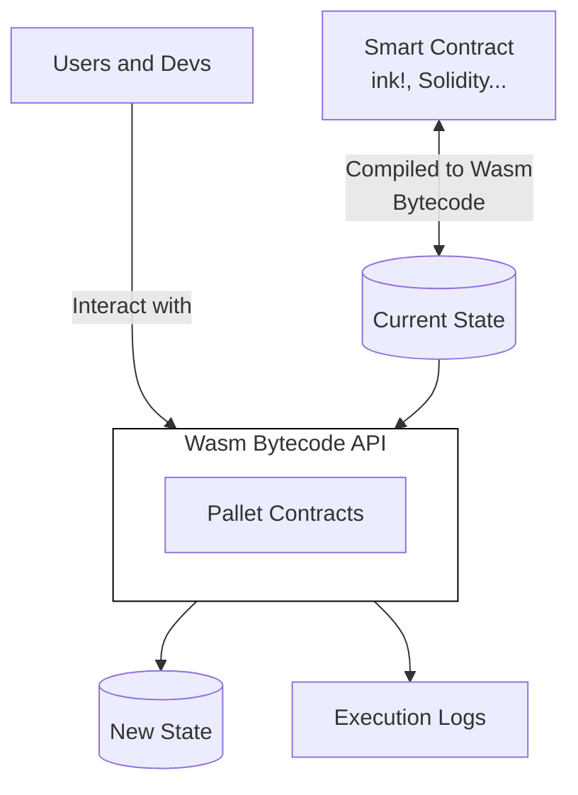


---

# Smart Contracts Overview

> Source (raw): https://raw.githubusercontent.com/polkadot-developers/polkadot-docs/master/.ai/pages/develop-smart-contracts-overview.md
> Canonical (HTML): https://docs.polkadot.com/develop/smart-contracts/overview/
> Summary: Learn about smart contract development capabilities in the Polkadot ecosystem, either by leveraging Polkadot Hub or other alternatives.

# Smart Contracts on Polkadot

!!! smartcontract "PolkaVM Preview Release"
    PolkaVM smart contracts with Ethereum compatibility are in **early-stage development and may be unstable or incomplete**.

## Introduction

Polkadot offers developers multiple approaches to building and deploying smart contracts within its ecosystem. As a multi-chain network designed for interoperability, Polkadot provides various environments optimized for different developer preferences and application requirements. From native smart contract support on Polkadot Hub to specialized parachain environments, developers can choose the platform that best suits their technical needs while benefiting from Polkadot's shared security model and cross-chain messaging capabilities.

Whether you're looking for Ethereum compatibility through EVM-based parachains like [Moonbeam](https://docs.moonbeam.network/){target=\_blank}, [Astar](https://docs.astar.network/){target=\_blank}, and [Acala](https://evmdocs.acala.network/){target=\_blank} or prefer PolkaVM-based development with [ink!](https://use.ink/docs/v6/){target=\_blank}, the Polkadot ecosystem accommodates a range of diverse developers.

These guides explore the diverse smart contract options available in the Polkadot ecosystem, helping developers understand the unique advantages of each approach and make informed decisions about where to deploy their decentralized applications.

## Native Smart Contracts

### Introduction

Polkadot Hub enables smart contract deployment and execution through PolkaVM, a cutting-edge virtual machine designed specifically for the Polkadot ecosystem. This native integration allows developers to deploy smart contracts directly on Polkadot's system chain while maintaining compatibility with Ethereum development tools and workflows.

### Smart Contract Development

The smart contract platform on Polkadot Hub combines _Polkadot's robust security and scalability_ with the extensive Ethereum development ecosystem. Developers can utilize familiar Ethereum libraries for contract interactions and leverage industry-standard development environments for writing and testing smart contracts.

Polkadot Hub provides _full Ethereum JSON-RPC API compatibility_, ensuring seamless integration with existing development tools and services. This compatibility enables developers to maintain their preferred workflows while building on Polkadot's native infrastructure.

### Technical Architecture

PolkaVM, the underlying virtual machine, utilizes a RISC-V-based register architecture _optimized for the Polkadot ecosystem_. This design choice offers several advantages:

- Enhanced performance for smart contract execution.
- Improved gas efficiency for complex operations.
- Native compatibility with Polkadot's runtime environment.
- Optimized storage and state management.

### Development Tools and Resources

Polkadot Hub supports a comprehensive suite of development tools familiar to Ethereum developers. The platform integrates with popular development frameworks, testing environments, and deployment tools. Key features include:

- Contract development in Solidity or Rust.
- Support for standard Ethereum development libraries.
- Integration with widely used development environments.
- Access to blockchain explorers and indexing solutions.
- Compatibility with contract monitoring and management tools.

### Cross-Chain Capabilities

Smart contracts deployed on Polkadot Hub can leverage Polkadot's [cross-consensus messaging (XCM) protocol](/develop/interoperability/intro-to-xcm/){target=\_blank} protocol to seamlessly _transfer tokens and call functions on other blockchain networks_ within the Polkadot ecosystem, all without complex bridging infrastructure or third-party solutions. For further references, check the [Interoperability](/develop/interoperability/){target=\_blank} section.

### Use Cases

Polkadot Hub's smart contract platform is suitable for a wide range of applications:

- DeFi protocols leveraging _cross-chain capabilities_.
- NFT platforms utilizing Polkadot's native token standards.
- Governance systems integrated with Polkadot's democracy mechanisms.
- Cross-chain bridges and asset management solutions.

## Other Smart Contract Environments

Beyond Polkadot Hub's native PolkaVM support, the ecosystem offers two main alternatives for smart contract development:

- **EVM-compatible parachains**: Provide access to Ethereum's extensive developer ecosystem, smart contract portability, and established tooling like Hardhat, Remix, Foundry, and OpenZeppelin. The main options include Moonbeam (the first full Ethereum-compatible parachain serving as an interoperability hub), Astar (featuring dual VM support for both EVM and WebAssembly contracts), and Acala (DeFi-focused with enhanced Acala EVM+ offering advanced DeFi primitives).

- **Rust (ink!)**: ink! is a Rust-based framework that can compile to PolkaVM. It uses [`#[ink(...)]`](https://use.ink/docs/v6/macros-attributes/){target=\_blank} attribute macros to create Polkadot SDK-compatible PolkaVM bytecode, offering strong memory safety from Rust, an advanced type system, high-performance PolkaVM execution, and platform independence with sandboxed security.


Each environment provides unique advantages based on developer preferences and application requirements.

## Where to Go Next

Developers can use their existing Ethereum development tools and connect to Polkadot Hub's RPC endpoints. The platform's Ethereum compatibility layer ensures a smooth transition for teams already building on Ethereum-compatible chains.

Subsequent sections of this guide provide detailed information about specific development tools, advanced features, and best practices for building on Polkadot Hub.

<div class="grid cards" markdown>

-   <span class="badge guide">Guide</span> __Libraries__

    ---

    Explore essential libraries to optimize smart contract development and interaction.

    [:octicons-arrow-right-24: Reference](/develop/smart-contracts/libraries/)

-   <span class="badge guide">Guide</span> __Dev Environments__

    ---

    Set up your development environment for seamless contract deployment and testing.

    [:octicons-arrow-right-24: Reference](/develop/smart-contracts/dev-environments/)

</div>


---

# Spawn a Basic Chain with Zombienet

> Source (raw): https://raw.githubusercontent.com/polkadot-developers/polkadot-docs/master/.ai/pages/tutorials-polkadot-sdk-testing-spawn-basic-chain.md
> Canonical (HTML): https://docs.polkadot.com/tutorials/polkadot-sdk/testing/spawn-basic-chain/
> Summary: Learn to spawn, connect to and monitor a basic blockchain network with Zombienet, using customizable configurations for streamlined development and debugging.

# Spawn a Basic Chain with Zombienet

## Introduction

Zombienet simplifies blockchain development by enabling developers to create temporary, customizable networks for testing and validation. These ephemeral chains are ideal for experimenting with configurations, debugging applications, and validating functionality in a controlled environment.

In this guide, you'll learn how to define a basic network configuration file, spawn a blockchain network using Zombienet's CLI, and interact with nodes and monitor network activity using tools like Polkadot.js Apps and Prometheus

By the end of this tutorial, you'll be equipped to deploy and test your own blockchain networks, paving the way for more advanced setups and use cases.

## Prerequisites

To successfully complete this tutorial, you must ensure you've first:

- [Installed Zombienet](/develop/toolkit/parachains/spawn-chains/zombienet/get-started/#install-zombienet){target=\_blank}. This tutorial requires Zombienet version `v1.3.133`. Verify that you're using the specified version to ensure compatibility with the instructions.
- Reviewed the information in [Configure Zombienet](/develop/toolkit/parachains/spawn-chains/zombienet/get-started/#configure-zombienet){target=\_blank} and understand how to customize a spawned network.

## Set Up Local Provider

In this tutorial, you will use the Zombienet [local provider](/develop/toolkit/parachains/spawn-chains/zombienet/get-started/#local-provider){target=\_blank} (also called native provider) that enables you to run nodes as local processes in your development environment.

You must have the necessary binaries installed (such as `polkadot` and `polkadot-parachain`) to spin up your network successfully.

To install the required binaries, use the following Zombienet CLI command:

```bash
zombienet setup polkadot polkadot-parachain
```

This command downloads the following binaries:

- `polkadot`
- `polkadot-execute-worker`
- `polkadot-parachain`
- `polkadot-prepare-worker`

Finally, add these binaries to your PATH environment variable to ensure Zombienet can locate them when spawning the network.

For example, you can move the binaries to a directory in your PATH, such as `/usr/local/bin`:

```bash
sudo mv ./polkadot ./polkadot-execute-worker ./polkadot-parachain ./polkadot-prepare-worker /usr/local/bin
```

## Define the Network

Zombienet uses a [configuration file](/develop/toolkit/parachains/spawn-chains/zombienet/get-started/#configuration-files){target=\_blank} to define the ephemeral network that will be spawned. Follow these steps to create and define the configuration file:

1. Create a file named `spawn-a-basic-network.toml`:

    ```bash
    touch spawn-a-basic-network.toml
    ```

2. Add the following code to the file you just created:

    ```toml title="spawn-a-basic-network.toml"
    [settings]
timeout = 120

[relaychain]

[[relaychain.nodes]]
name = "alice"
validator = true

[[relaychain.nodes]]
name = "bob"
validator = true

[[parachains]]
id = 100

[parachains.collator]
name = "collator01"

    ```

This configuration file defines a network with the following chains:

- **relaychain**: With two nodes named `alice` and `bob`.
- **parachain**: With a collator named `collator01`.

Settings also defines a timeout of 120 seconds for the network to be ready.

## Spawn the Network

To spawn the network, run the following command:

```bash
zombienet -p native spawn spawn-a-basic-network.toml
```

This command will spawn the network defined in the `spawn-a-basic-network.toml` configuration file. The `-p native` flag specifies that the network will be spawned using the native provider.

If successful, you will see the following output:

<div id="termynal" class="table-termynal" data-termynal>
  <span data-ty="input"><span class="file-path"></span>zombienet -p native spawn spawn-a-basic-network.toml</span>
  <table>
    <thead>
      <tr>
        <th colspan="2" class="center-header">Network launched 🚀🚀</th>
      </tr>
    </thead>
    <tr>
      <th class="left-header">Namespace</th>
      <td>zombie-75a01b93c92d571f6198a67bcb380fcd</td>
    </tr>
    <tr>
      <th class="left-header">Provider</th>
      <td>native</td>
    </tr>
    <tr>
      <th colspan="3" class="center-header">Node Information</th>
    </tr>
    <tr>
      <th class="left-header">Name</th>
      <td>alice</td>
    </tr>
    <tr>
      <th class="left-header">Direct Link</th>
      <td><a href="https://polkadot.js.org/apps/?rpc=ws://127.0.0.1:55308#explorer">https://polkadot.js.org/apps/?rpc=ws://127.0.0.1:55308#explorer</a></td>
    </tr>
    <tr>
      <th class="left-header">Prometheus Link</th>
      <td>http://127.0.0.1:55310/metrics</td>
    </tr>
    <tr>
      <th class="left-header">Log Cmd</th>
      <td>tail -f /tmp/zombie-794af21178672e1ff32c612c3c7408dc_-2397036-6717MXDxcS55/alice.log</td>
    </tr>
    <tr>
      <th colspan="3" class="center-header">Node Information</th>
    </tr>
    <tr>
      <th class="left-header">Name</th>
      <td>bob</td>
    </tr>
    <tr>
      <th class="left-header">Direct Link</th>
      <td><a href="https://polkadot.js.org/apps/?rpc=ws://127.0.0.1:50312#explorer">https://polkadot.js.org/apps/?rpc=ws://127.0.0.1:55312#explorer</a></td>
    </tr>
    <tr>
      <th class="left-header">Prometheus Link</th>
      <td>http://127.0.0.1:50634/metrics</td>
    </tr>
    <tr>
      <th class="left-header">Log Cmd</th>
      <td>tail -f /tmp/zombie-794af21178672e1ff32c612c3c7408dc_-2397036-6717MXDxcS55/bob.log</td>
    </tr>
    <tr>
      <th colspan="3" class="center-header">Node Information</th>
    </tr>
    <tr>
      <th class="left-header">Name</th>
      <td>collator01</td>
    </tr>
    <tr>
      <th class="left-header">Direct Link</th>
      <td><a href="https://polkadot.js.org/apps/?rpc=ws://127.0.0.1:55316#explorer">https://polkadot.js.org/apps/?rpc=ws://127.0.0.1:55316#explorer</a></td>
    </tr>
    <tr>
      <th class="left-header">Prometheus Link</th>
      <td>http://127.0.0.1:55318/metrics</td>
    </tr>
    <tr>
      <th class="left-header">Log Cmd</th>
      <td>tail -f /tmp/zombie-794af21178672e1ff32c612c3c7408dc_-2397036-6717MXDxcS55/collator01.log</td>
    </tr>
    <tr>
      <th class="left-header">Parachain ID</th>
      <td>100</td>
    </tr>
    <tr>
      <th class="left-header">ChainSpec Path</th>
      <td>/tmp/zombie-794af21178672e1ff32c612c3c7408dc_-2397036-6717MXDxcS55/100-rococo-local.json</td>
    </tr>
  </table>
</div>


!!! note 
    If the IPs and ports aren't explicitly defined in the configuration file, they may change each time the network is started, causing the links provided in the output to differ from the example.

## Interact with the Spawned Network

After the network is launched, you can interact with it using [Polkadot.js Apps](https://polkadot.js.org/apps/){target=\_blank}. To do so, open your browser and use the provided links listed by the output as `Direct Link`.

### Connect to the Nodes

Use the [55308 port address](https://polkadot.js.org/apps/?rpc=ws://127.0.0.1:55308#explorer){target=\_blank} to interact with the same `alice` node used for this tutorial. Ports can change from spawn to spawn so be sure to locate the link in the output when spawning your own node to ensure you are accessing the correct port.

If you want to interact with the nodes more programmatically, you can also use the [Polkadot.js API](https://polkadot.js.org/docs/api/){target=\_blank}. For example, the following code snippet shows how to connect to the `alice` node using the Polkadot.js API and log some information about the chain and node:

```typescript
import { ApiPromise, WsProvider } from '@polkadot/api';

async function main() {
  const wsProvider = new WsProvider('ws://127.0.0.1:55308');
  const api = await ApiPromise.create({ provider: wsProvider });

  // Retrieve the chain & node information via rpc calls
  const [chain, nodeName, nodeVersion] = await Promise.all([
    api.rpc.system.chain(),
    api.rpc.system.name(),
    api.rpc.system.version(),
  ]);

  console.log(
    `You are connected to chain ${chain} using ${nodeName} v${nodeVersion}`
  );
}

main()
  .catch(console.error)
  .finally(() => process.exit());

```

Both methods allow you to interact easily with the network and its nodes.

### Check Metrics

You can also check the metrics of the nodes by accessing the links provided in the output as `Prometheus Link`. [Prometheus](https://prometheus.io/){target=\_blank} is a monitoring and alerting toolkit that collects metrics from the nodes. By accessing the provided links, you can see the metrics of the nodes in a web interface. So, for example, the following image shows the Prometheus metrics for Bob's node from the Zombienet test:


### Check Logs

To view individual node logs, locate the `Log Cmd` command in Zombienet's startup output. For example, to see what the alice node is doing, find the log command that references `alice.log` in its file path. Note that Zombienet will show you the correct path for your instance when it starts up, so use that path rather than copying from the below example:

```bash
tail -f  /tmp/zombie-794af21178672e1ff32c612c3c7408dc_-2397036-6717MXDxcS55/alice.log
```

After running this command, you will see the logs of the `alice` node in real-time, which can be useful for debugging purposes. The logs of the `bob` and `collator01` nodes can be checked similarly.


---

# Subxt Rust API

> Source (raw): https://raw.githubusercontent.com/polkadot-developers/polkadot-docs/master/.ai/pages/develop-toolkit-api-libraries-subxt.md
> Canonical (HTML): https://docs.polkadot.com/develop/toolkit/api-libraries/subxt/
> Summary: Subxt is a Rust library for type-safe interaction with Polkadot SDK blockchains, enabling transactions, state queries, runtime API access, and more.

# Subxt Rust API

## Introduction

Subxt is a Rust library designed to interact with Polkadot SDK-based blockchains. It provides a type-safe interface for submitting transactions, querying on-chain state, and performing other blockchain interactions. By leveraging Rust's strong type system, subxt ensures that your code is validated at compile time, reducing runtime errors and improving reliability.

## Prerequisites

Before using subxt, ensure you have the following requirements:

- Rust and Cargo installed on your system. You can install them using [Rustup](https://rustup.rs/){target=\_blank}.
- A Rust project initialized. If you don't have one, create it with:
    ```bash
    cargo new my_project && cd my_project
    ```

## Installation

To use subxt in your project, you must install the necessary dependencies. Each plays a specific role in enabling interaction with the blockchain:

1. **Install the subxt CLI**: [`subxt-cli`](https://crates.io/crates/subxt-cli){target=\_blank} is a command-line tool that provides utilities for working with Polkadot SDK metadata. In the context of subxt, it is essential to download chain metadata, which is required to generate type-safe Rust interfaces for interacting with the blockchain. Install it using the following:

    ```bash
    cargo install subxt-cli@0.43.0
    ```

2. **Add core dependencies**: These dependencies are essential for interacting with the blockchain.

    - **[subxt](https://crates.io/crates/subxt){target=\_blank}**: The main library for communicating with Polkadot SDK nodes. It handles RPC requests, encoding/decoding, and type generation.

        ```bash
        cargo add subxt@0.43.0
        ```

    - **[subxt-signer](https://crates.io/crates/subxt-signer){target=\_blank}**: Provides cryptographic functionality for signing transactions. Without this, you can only read data but cannot submit transactions.

        ```bash
        cargo add subxt-signer@0.43.0
        ```

    - **[tokio](https://crates.io/crates/tokio){target=\_blank}**: An asynchronous runtime for Rust. Since blockchain operations are async, Tokio enables the efficient handling of network requests. The `rt` feature enables Tokio's runtime, including the current-thread single-threaded scheduler, which is necessary for async execution. The `macros` feature provides procedural macros like `#[tokio::main]` to simplify runtime setup.

        ```bash
        cargo add tokio@1.44.2 --features rt,macros
        ```

    After adding the dependencies, your `Cargo.toml` should look like this:

    ```toml
    [package]
name = "my_project"
version = "0.1.0"
edition = "2021"

[dependencies]
subxt = "0.41.0"
subxt-signer = "0.41.0"
tokio = { version = "1.44.2", features = ["rt", "macros"] }

    ```

## Get Started

This guide will walk you through the fundamental operations of subxt, from setting up your environment to executing transactions and querying blockchain state.

### Download Chain Metadata

Before interacting with a blockchain, you need to retrieve its metadata. This metadata defines storage structures, extrinsics, and other runtime details. Use the `subxt-cli` tool to download the metadata, replacing `INSERT_NODE_URL` with the URL of the node you want to interact with:

```bash
subxt metadata --url INSERT_NODE_URL > polkadot_metadata.scale
```

### Generate Type-Safe Interfaces

Use the `#[subxt::subxt]` macro to generate a type-safe Rust interface from the downloaded metadata:

```rust
// Generate an interface that we can use from the node's metadata.
#[subxt::subxt(runtime_metadata_path = "./polkadot_metadata.scale")]
pub mod polkadot {}
```

Once subxt interfaces are generated, you can interact with your node in the following ways. You can use the links below to view the related subxt documentation:

- **[Transactions](https://docs.rs/subxt/latest/subxt/book/usage/transactions/index.html){target=\_blank}**: Builds and submits transactions, monitors their inclusion in blocks, and retrieves associated events.
- **[Storage](https://docs.rs/subxt/latest/subxt/book/usage/storage/index.html){target=\_blank}**: Enables querying of node storage data.
- **[Events](https://docs.rs/subxt/latest/subxt/book/usage/events/index.html){target=\_blank}**: Retrieves events emitted from recent blocks.
- **[Constants](https://docs.rs/subxt/latest/subxt/book/usage/constants/index.html){target=\_blank}**: Accesses constant values stored in nodes that remain unchanged across a specific runtime version.
- **[Blocks](https://docs.rs/subxt/latest/subxt/book/usage/blocks/index.html){target=\_blank}**: Loads recent blocks or subscribes to new/finalized blocks, allowing examination of extrinsics, events, and storage at those blocks.
- **[Runtime APIs](https://docs.rs/subxt/latest/subxt/book/usage/runtime_apis/index.html){target=\_blank}**: Makes calls into pallet runtime APIs to fetch data.
- **[Custom values](https://docs.rs/subxt/latest/subxt/book/usage/custom_values/index.html){target=\_blank}**: Accesses "custom values" contained within metadata.
- **[Raw RPC calls](https://docs.rs/subxt/latest/subxt/book/usage/rpc/index.html){target=\_blank}**: Facilitates raw RPC requests to compatible nodes.

### Initialize the Subxt Client

To interact with a blockchain node using subxt, create an asynchronous main function and initialize the client. Replace `INSERT_NODE_URL` with the URL of your target node:

```rust
use std::str::FromStr;
use subxt::utils::AccountId32;
use subxt::{OnlineClient, PolkadotConfig};
use subxt_signer::{bip39::Mnemonic,sr25519::Keypair};

// Generate an interface that we can use from the node's metadata.
#[subxt::subxt(runtime_metadata_path = "./polkadot_metadata.scale")]
pub mod polkadot {}

#[tokio::main(flavor = "current_thread")]
async fn main() -> Result<(), Box<dyn std::error::Error>> {
    // Define the node URL.
    const NODE_URL: &str = "INSERT_NODE_URL";

    // Initialize the Subxt client to interact with the blockchain.
    let api = OnlineClient::<PolkadotConfig>::from_url(NODE_URL).await?;

    // A query to obtain some constant.
    let constant_query = polkadot::constants().balances().existential_deposit();

    // Obtain the value.
    let value = api.constants().at(&constant_query)?;

    println!("Existential deposit: {:?}", value);

    // Define the target account address.
    const ADDRESS: &str = "INSERT_ADDRESS";
    let account = AccountId32::from_str(ADDRESS).unwrap();

    // Build a storage query to access account information.
    let storage_query = polkadot::storage().system().account(&account.into());

    // Fetch the latest state for the account.
    let result = api
        .storage()
        .at_latest()
        .await?
        .fetch(&storage_query)
        .await?
        .unwrap();

    println!("Account info: {:?}", result);

    // Define the recipient address and transfer amount.
    const DEST_ADDRESS: &str = "INSERT_DEST_ADDRESS";
    const AMOUNT: u128 = INSERT_AMOUNT;

    // Convert the recipient address into an `AccountId32`.
    let dest = AccountId32::from_str(DEST_ADDRESS).unwrap();

    // Build the balance transfer extrinsic.
    let balance_transfer_tx = polkadot::tx()
        .balances()
        .transfer_allow_death(dest.into(), AMOUNT);

    // Load the sender's keypair from a mnemonic phrase.
    const SECRET_PHRASE: &str = "INSERT_SECRET_PHRASE";
    let mnemonic = Mnemonic::parse(SECRET_PHRASE).unwrap();
    let sender_keypair = Keypair::from_phrase(&mnemonic, None).unwrap();

    // Sign and submit the extrinsic, then wait for it to be finalized.
    let events = api
        .tx()
        .sign_and_submit_then_watch_default(&balance_transfer_tx, &sender_keypair)
        .await?
        .wait_for_finalized_success()
        .await?;

    // Check for a successful transfer event.
    if let Some(event) = events.find_first::<polkadot::balances::events::Transfer>()? {
        println!("Balance transfer successful: {:?}", event);
    }

    Ok(())
}
    // Your code here...

    Ok(())
}
```

### Read Chain Data

subxt provides multiple ways to access on-chain data:

- **Constants**: Constants are predefined values in the runtime that remain unchanged unless modified by a runtime upgrade.

    For example, to retrieve the existential deposit, use:
    
    ```rust
        // A query to obtain some constant.
    let constant_query = polkadot::constants().balances().existential_deposit();

    // Obtain the value.
    let value = api.constants().at(&constant_query)?;

    println!("Existential deposit: {:?}", value);
    ```

- **State**: State refers to the current chain data, which updates with each block.

    To fetch account information, replace `INSERT_ADDRESS` with the address you want to fetch data from and use:

    ```rust
        // Define the target account address.
    const ADDRESS: &str = "INSERT_ADDRESS";
    let account = AccountId32::from_str(ADDRESS).unwrap();

    // Build a storage query to access account information.
    let storage_query = polkadot::storage().system().account(&account.into());

    // Fetch the latest state for the account.
    let result = api
        .storage()
        .at_latest()
        .await?
        .fetch(&storage_query)
        .await?
        .unwrap();

    println!("Account info: {:?}", result);
    ```

### Submit Transactions

To submit a transaction, you must construct an extrinsic, sign it with your private key, and send it to the blockchain. Replace `INSERT_DEST_ADDRESS` with the recipient's address, `INSERT_AMOUNT` with the amount to transfer, and `INSERT_SECRET_PHRASE` with the sender's mnemonic phrase:

```rust
    // Define the recipient address and transfer amount.
    const DEST_ADDRESS: &str = "INSERT_DEST_ADDRESS";
    const AMOUNT: u128 = INSERT_AMOUNT;

    // Convert the recipient address into an `AccountId32`.
    let dest = AccountId32::from_str(DEST_ADDRESS).unwrap();

    // Build the balance transfer extrinsic.
    let balance_transfer_tx = polkadot::tx()
        .balances()
        .transfer_allow_death(dest.into(), AMOUNT);

    // Load the sender's keypair from a mnemonic phrase.
    const SECRET_PHRASE: &str = "INSERT_SECRET_PHRASE";
    let mnemonic = Mnemonic::parse(SECRET_PHRASE).unwrap();
    let sender_keypair = Keypair::from_phrase(&mnemonic, None).unwrap();

    // Sign and submit the extrinsic, then wait for it to be finalized.
    let events = api
        .tx()
        .sign_and_submit_then_watch_default(&balance_transfer_tx, &sender_keypair)
        .await?
        .wait_for_finalized_success()
        .await?;

    // Check for a successful transfer event.
    if let Some(event) = events.find_first::<polkadot::balances::events::Transfer>()? {
        println!("Balance transfer successful: {:?}", event);
    }
```

## Where to Go Next

Now that you've covered the basics dive into the official [subxt documentation](https://docs.rs/subxt/latest/subxt/book/index.html){target=\_blank} for comprehensive reference materials and advanced features.


---

# Test and Deploy with Hardhat

> Source (raw): https://raw.githubusercontent.com/polkadot-developers/polkadot-docs/master/.ai/pages/tutorials-smart-contracts-launch-your-first-project-test-and-deploy-with-hardhat.md
> Canonical (HTML): https://docs.polkadot.com/tutorials/smart-contracts/launch-your-first-project/test-and-deploy-with-hardhat/
> Summary: Learn how to set up a Hardhat development environment, write comprehensive tests for Solidity smart contracts, and deploy to local and Polkadot Hub networks.

# Test and Deploy with Hardhat

!!! smartcontract "PolkaVM Preview Release"
    PolkaVM smart contracts with Ethereum compatibility are in **early-stage development and may be unstable or incomplete**.

## Introduction

After creating a smart contract, the next crucial steps are testing and deployment. Proper testing ensures your contract behaves as expected, while deployment makes your contract available on the blockchain. This tutorial will guide you through using Hardhat, a popular development environment, to test and deploy the `Storage.sol` contract you created in the [Create a Smart Contract](/tutorials/smart-contracts/launch-your-first-project/create-contracts/){target=\_blank} tutorial. For more information about Hardhat usage, check the [Hardhat guide](/develop/smart-contracts/dev-environments/hardhat/){target=\_blank}.

## Prerequisites

Before starting, make sure you have:

- The [`Storage.sol` contract](/tutorials/smart-contracts/launch-your-first-project/create-contracts/#create-the-smart-contract){target=\_blank} created in the previous tutorial.
- [Node.js](https://nodejs.org/){target=\_blank} (v16.0.0 or later) and npm installed.
- Basic understanding of JavaScript for writing tests.
- Some PAS test tokens to cover transaction fees (obtained from the [Polkadot faucet](https://faucet.polkadot.io/?parachain=1111){target=\_blank}).

## Setting Up the Development Environment

Let's start by setting up Hardhat for your Storage contract project:

1. Create a new directory for your project and navigate into it:

    ```bash
    mkdir storage-hardhat
    cd storage-hardhat
    ```

2. Initialize a new npm project:

    ```bash
    npm init -y
    ```

3. Install `hardhat-polkadot` and all required plugins:

    ```bash
    npm install --save-dev @parity/hardhat-polkadot@0.1.9 solc@0.8.28
    ```

    For dependencies compatibility, ensure to install the `@nomicfoundation/hardhat-toolbox` dependency with the `--force` flag:

    ```bash
    npm install --force @nomicfoundation/hardhat-toolbox 
    ```

5. Initialize a Hardhat project:

    ```bash
    npx hardhat-polkadot init
    ```

    Select **Create an empty hardhat.config.js** when prompted.

6. Configure Hardhat by updating the `hardhat.config.js` file:

    ```javascript title="hardhat.config.js"
    require("@nomicfoundation/hardhat-toolbox");

require("@parity/hardhat-polkadot");

const { vars } = require("hardhat/config");

/** @type import('hardhat/config').HardhatUserConfig */
module.exports = {
  solidity: "0.8.28",
  resolc: {
    compilerSource: "npm",
  },
  networks: {
    hardhat: {
      polkavm: true,
      nodeConfig: {
        nodeBinaryPath: 'INSERT_PATH_TO_SUBSTRATE_NODE',
        rpcPort: 8000,
        dev: true,
      },
      adapterConfig: {
        adapterBinaryPath: 'INSERT_PATH_TO_ETH_RPC_ADAPTER',
        dev: true,
      },
    },
    localNode: {
      polkavm: true,
      url: `http://127.0.0.1:8545`,
    },
    passetHub: {
      polkavm: true,
      url: 'https://testnet-passet-hub-eth-rpc.polkadot.io',
      accounts: [vars.get("PRIVATE_KEY")],
    },
  },
};
    ```

    Ensure that `INSERT_PATH_TO_SUBSTRATE_NODE` and `INSERT_PATH_TO_ETH_RPC_ADAPTER` are replaced with the proper paths to the compiled binaries. 

    If you need to build these binaries, follow the [Installation](/develop/smart-contracts/local-development-node#install-the-substrate-node-and-eth-rpc-adapter){target=\_blank} section on the Local Development Node page.

    The configuration also defines two network settings: 

    - **`localNode`**: Runs a PolkaVM instance on `http://127.0.0.1:8545` for local development and testing.
    - **`passetHub`**: Connects to the the Polkadot Hub TestNet network using a predefined RPC URL and a private key stored in environment variables.

7. Export your private key and save it in your Hardhat environment:

    ```bash
    npx hardhat vars set PRIVATE_KEY "INSERT_PRIVATE_KEY"
    ```

    Replace `INSERT_PRIVATE_KEY` with your actual private key. 
    
    For further details on private key exportation, refer to the article [How to export an account's private key](https://support.metamask.io/configure/accounts/how-to-export-an-accounts-private-key/){target=\_blank}.

    !!! warning
        Keep your private key safe, and never share it with anyone. If it is compromised, your funds can be stolen.

## Adding the Smart Contract

1. Create a new folder called `contracts` and create a `Storage.sol` file. Add the contract code from the previous tutorial:

    ```solidity title="Storage.sol"
    // SPDX-License-Identifier: MIT
pragma solidity ^0.8.28;

contract Storage {
    // State variable to store our number
    uint256 private number;

    // Event to notify when the number changes
    event NumberChanged(uint256 newNumber);

    // Function to store a new number
    function store(uint256 newNumber) public {
        number = newNumber;
        emit NumberChanged(newNumber);
    }

    // Function to retrieve the stored number
    function retrieve() public view returns (uint256) {
        return number;
    }
}
    ```

2. Compile the contract:

    ```bash
    npx hardhat compile
    ```

3. If successful, you will see the following output in your terminal:

    <div id="termynal" data-termynal>
  <span data-ty="input"><span class="file-path"></span>npx hardhat compile</span>
  <span data-ty>Compiling 1 Solidity file</span>
  <span data-ty>Successfully compiled 1 Solidity file</span>
</div>


After compilation, the `artifacts-pvm` and `cache-pvm` folders, containing the metadata and binary files of your compiled contract, will be created in the root of your project.

## Writing Tests

Testing is a critical part of smart contract development. Hardhat makes it easy to write tests in JavaScript using frameworks like [Mocha](https://mochajs.org/){target=\_blank} and [Chai](https://www.chaijs.com/){target=\_blank}.

1. Create a folder for testing called `test`. Inside that directory, create a file named `Storage.js` and add the following code:

    ```javascript title="Storage.js" 
    
        // Add your logic here
    });
});
    ```

    The `beforeEach` hook ensures stateless contract execution by redeploying a fresh instance of the Storage contract before each test case. This approach guarantees that each test starts with a clean and independent contract state by using `ethers.getSigners()` to obtain test accounts and `ethers.getContractFactory('Storage').deploy()` to create a new contract instance.

    Now, you can add custom unit tests to check your contract functionality. Some example tests are available below:

    1. **Initial state verification**: Ensures that the contract starts with a default value of zero, which is a fundamental expectation for the `Storage.sol` contract.

        ```javascript title="Storage.js"
        it('Should return 0 initially', async function () {
      expect(await storage.retrieve()).to.equal(0);
    });
        ```

        Explanation:

        - Checks the initial state of the contract.
        - Verifies that a newly deployed contract has a default value of 0.
        - Confirms the `retrieve()` method works correctly for a new contract.

    2. **Value storage test**: Validate the core functionality of storing and retrieving a value in the contract.

        ```javascript title="Storage.js"
        it('Should update when store is called', async function () {
      const testValue = 42;
      // Store a value
      await storage.store(testValue);
      // Check if the value was updated
      expect(await storage.retrieve()).to.equal(testValue);
    });
        ```

        Explanation:

        - Demonstrates the ability to store a specific value.
        - Checks that the stored value can be retrieved correctly.
        - Verifies the basic write and read functionality of the contract.

    3. **Event emission verification**: Confirm that the contract emits the correct event when storing a value, which is crucial for off-chain tracking.

        ```javascript title="Storage.js"
        it('Should emit an event when storing a value', async function () {
      const testValue = 100;
      // Check if the NumberChanged event is emitted with the correct value
      await expect(storage.store(testValue))
        .to.emit(storage, 'NumberChanged')
        .withArgs(testValue);
    });
        ```

        Explanation:

        - Ensures the `NumberChanged` event is emitted during storage.
        - Verifies that the event contains the correct stored value.
        - Validates the contract's event logging mechanism.

    4. **Sequential value storage test**: Check the contract's ability to store multiple values sequentially and maintain the most recent value.

        ```javascript title="Storage.js"
        it('Should allow storing sequentially increasing values', async function () {
      const values = [10, 20, 30, 40];

      for (const value of values) {
        await storage.store(value);
        expect(await storage.retrieve()).to.equal(value);
      }
    });
        ```

        Explanation:

        - Verifies that multiple values can be stored in sequence.
        - Confirms that each new store operation updates the contract's state.
        - Demonstrates the contract's ability always to reflect the most recently stored value.

    The complete `test/Storage.js` should look like this:

    ???--- code "View complete script"
        ```javascript title="Storage.js"
        const { expect } = require('chai');
const { ethers } = require('hardhat');

describe('Storage', function () {
  let storage;
  let owner;
  let addr1;

  beforeEach(async function () {
    // Get signers
    [owner, addr1] = await ethers.getSigners();

    // Deploy the Storage contract
    const Storage = await ethers.getContractFactory('Storage');
    storage = await Storage.deploy();
    await storage.waitForDeployment();
  });

  describe('Basic functionality', function () {
    it('Should return 0 initially', async function () {
      expect(await storage.retrieve()).to.equal(0);
    });

    it('Should update when store is called', async function () {
      const testValue = 42;
      // Store a value
      await storage.store(testValue);
      // Check if the value was updated
      expect(await storage.retrieve()).to.equal(testValue);
    });

    it('Should emit an event when storing a value', async function () {
      const testValue = 100;
      // Check if the NumberChanged event is emitted with the correct value
      await expect(storage.store(testValue))
        .to.emit(storage, 'NumberChanged')
        .withArgs(testValue);
    });

    it('Should allow storing sequentially increasing values', async function () {
      const values = [10, 20, 30, 40];

      for (const value of values) {
        await storage.store(value);
        expect(await storage.retrieve()).to.equal(value);
      }
    });
  });
});
        ```

2. Run the tests:

    ```bash
    npx hardhat test
    ```

3. After running the above command, you will see the output showing that all tests have passed:

    <div id="termynal" data-termynal>
  <span data-ty="input"><span class="file-path"></span>npx hardhat test</span>
  <span data-ty>Storage</span>
  <span data-ty>Basic functionality</span>
  <span data-ty> ✔ Should return 0 initially</span>
  <span data-ty> ✔ Should update when store is called (1126ms)</span>
  <span data-ty> ✔ Should emit an event when storing a value (1131ms)</span>
  <span data-ty> ✔ Should allow storing sequentially increasing values (12477ms)</span>
  <span data-ty>4 passing (31s) </span>
</div>


## Deploying with Ignition

[Hardhat's Ignition](https://hardhat.org/ignition/docs/getting-started#overview){target=\_blank} is a deployment system designed to make deployments predictable and manageable. Let's create a deployment script:

1. Create a new folder called`ignition/modules`. Add a new file named `StorageModule.js` with the following logic:

    ```javascript title="StorageModule.js"
    const { buildModule } = require('@nomicfoundation/hardhat-ignition/modules');

module.exports = buildModule('StorageModule', (m) => {
  const storage = m.contract('Storage');

  return { storage };
});
    ```

2. Deploy to the local network:

    1. First, start a local node:

        ```bash
        npx hardhat node
        ```

    2. Then, in a new terminal window, deploy the contract:

        ```bash
        npx hardhat ignition deploy ./ignition/modules/StorageModule.js --network localNode
        ```

    3. If successful, output similar to the following will display in your terminal:

        <div id="termynal" data-termynal>
  <span data-ty="input"><span class="file-path"></span>npx hardhat ignition deploy ./ignition/modules/Storage.js --network localNode</span>
  <span data-ty>✔ Confirm deploy to network localNode (420420422)? … yes</span>
  <span data-ty></span>
  <span data-ty>Hardhat Ignition 🚀</span>
  <span data-ty></span>
  <span data-ty>Deploying [ StorageModule ]</span>
  <span data-ty></span>
  <span data-ty>Batch #1</span>
  <span data-ty> Executed StorageModule#Storage</span>
  <span data-ty></span>
  <span data-ty>[ StorageModule ] successfully deployed 🚀</span>
  <span data-ty></span>
  <span data-ty>Deployed Addresses</span>
  <span data-ty></span>
  <span data-ty>StorageModule#Storage - 0xc01Ee7f10EA4aF4673cFff62710E1D7792aBa8f3</span>
</div>


3. Deploy to the Polkadot Hub TestNet:

    1. Make sure your account has enough PAS tokens for gas fees, then run:

        ```bash
        npx hardhat ignition deploy ./ignition/modules/StorageModule.js --network passetHub
        ```

    2. After deployment, you'll see the contract address in the console output. Save this address for future interactions.

        <div id="termynal" data-termynal>
  <span data-ty="input"><span class="file-path"></span>npx hardhat ignition deploy ./ignition/modules/Storage.js --network passetHub</span>
  <span data-ty>✔ Confirm deploy to network localNode (420420422)? … yes</span>
  <span data-ty></span>
  <span data-ty>Hardhat Ignition 🚀</span>
  <span data-ty></span>
  <span data-ty>Deploying [ StorageModule ]</span>
  <span data-ty></span>
  <span data-ty>Batch #1</span>
  <span data-ty> Executed StorageModule#Storage</span>
  <span data-ty></span>
  <span data-ty>[ StorageModule ] successfully deployed 🚀</span>
  <span data-ty></span>
  <span data-ty>Deployed Addresses</span>
  <span data-ty></span>
  <span data-ty>StorageModule#Storage - 0xE8693cE64b294E26765573398C7Ca5C700E9C85c</span>
</div>


## Interacting with Your Deployed Contract

To interact with your deployed contract:

1. Create a new folder named `scripts` and add the `interact.js` with the following content:

    ```javascript title="interact.js"
    const hre = require('hardhat');

async function main() {
  // Replace with your deployed contract address
  const contractAddress = 'INSERT_DEPLOYED_CONTRACT_ADDRESS';

  // Get the contract instance
  const Storage = await hre.ethers.getContractFactory('Storage');
  const storage = await Storage.attach(contractAddress);

  // Get current value
  const currentValue = await storage.retrieve();
  console.log('Current stored value:', currentValue.toString());

  // Store a new value
  const newValue = 42;
  console.log(`Storing new value: ${newValue}...`);
  const tx = await storage.store(newValue);

  // Wait for transaction to be mined
  await tx.wait();
  console.log('Transaction confirmed');

  // Get updated value
  const updatedValue = await storage.retrieve();
  console.log('Updated stored value:', updatedValue.toString());
}

main()
  .then(() => process.exit(0))
  .catch((error) => {
    console.error(error);
    process.exit(1);
  });
    ```

    Ensure that `INSERT_DEPLOYED_CONTRACT_ADDRESS` is replaced with the value obtained in the previous step.

2. Run the interaction script:

    ```bash
    npx hardhat run scripts/interact.js --network passetHub
    ```

3. If successful, the terminal will show the following output:

    <div id="termynal" data-termynal>
  <span data-ty="input"><span class="file-path"></span>npx hardhat run scripts/interact.js --network passetHub</span>
  <span data-ty>Current stored value: 0</span>
  <span data-ty>Storing new value: 42...</span>
  <span data-ty>Transaction confirmed</span>
  <span data-ty>Updated stored value: 42</span>
</div>


## Conclusion

Congratulations! You've successfully set up a Hardhat development environment, written comprehensive tests for your Storage contract, and deployed it to local and Polkadot Hub TestNet networks. This tutorial covered essential steps in smart contract development, including configuration, testing, deployment, and interaction.

To get started with a working example right away, you can clone the repository and navigate to the project directory:

```bash
git clone https://github.com/polkadot-developers/polkavm-hardhat-examples.git -b v0.0.8
cd polkavm-hardhat-examples/storage-hardhat
```


---

# Testing and Debugging

> Source (raw): https://raw.githubusercontent.com/polkadot-developers/polkadot-docs/master/.ai/pages/develop-interoperability-test-and-debug.md
> Canonical (HTML): https://docs.polkadot.com/develop/interoperability/test-and-debug/
> Summary: Learn how to test and debug cross-chain communication via the XCM Emulator to ensure interoperability and reliable execution.

# Testing and Debugging

## Introduction

Cross-Consensus Messaging (XCM) is a core feature of the Polkadot ecosystem, enabling communication between parachains, relay chains, and system chains. To ensure the reliability of XCM-powered blockchains, thorough testing and debugging are essential before production deployment.

This guide covers the XCM Emulator, a tool designed to facilitate onboarding and testing for developers. Use the emulator if:

- A live runtime is not yet available.
- Extensive configuration adjustments are needed, as emulated chains differ from live networks.
- Rust-based tests are preferred for automation and integration.

For scenarios where real blockchain state is required, [Chopsticks](/tutorials/polkadot-sdk/testing/fork-live-chains/#xcm-testing){target=\_blank} allows testing with any client compatible with Polkadot SDK-based chains.

## XCM Emulator

Setting up a live network with multiple interconnected parachains for XCM testing can be complex and resource-intensive. 

The [`xcm-emulator`](https://github.com/paritytech/polkadot-sdk/tree/polkadot-stable2506/cumulus/xcm/xcm-emulator){target=\_blank} is a tool designed to simulate the execution of XCM programs using predefined runtime configurations. These configurations include those utilized by live networks like Kusama, Polkadot, and Asset Hub.

This tool enables testing of cross-chain message passing, providing a way to verify outcomes, weights, and side effects efficiently. It achieves this by utilizing mocked runtimes for both the relay chain and connected parachains, enabling developers to focus on message logic and configuration without needing a live network.

The `xcm-emulator` relies on transport layer pallets. However, the messages do not leverage the same messaging infrastructure as live networks since the transport mechanism is mocked. Additionally, consensus-related events are not covered, such as disputes and staking events. Parachains should use end-to-end (E2E) tests to validate these events.

### Advantages and Limitations

The XCM Emulator provides both advantages and limitations when testing cross-chain communication in simulated environments.

- **Advantages**:
    - **Interactive debugging**: Offers tracing capabilities similar to EVM, enabling detailed analysis of issues.
    - **Runtime composability**: Facilitates testing and integration of multiple runtime components.
    - **Immediate feedback**: Supports Test-Driven Development (TDD) by providing rapid test results.
    - **Seamless integration testing**: Simplifies the process of testing new runtime versions in an isolated environment.

- **Limitations**:
    - **Simplified emulation**: Always assumes message delivery, which may not mimic real-world network behavior.
    - **Dependency challenges**: Requires careful management of dependency versions and patching. Refer to the [Cargo dependency documentation](https://doc.rust-lang.org/cargo/reference/overriding-dependencies.html){target=\_blank}.
    - **Compilation overhead**: Testing environments can be resource-intensive, requiring frequent compilation updates.

### How Does It Work?

The `xcm-emulator` provides macros for defining a mocked testing environment. Check all the existing macros and functionality in the [XCM Emulator source code](https://github.com/paritytech/polkadot-sdk/blob/polkadot-stable2506/cumulus/xcm/xcm-emulator/src/lib.rs){target=\_blank}. The most important macros are:

- **[`decl_test_relay_chains`](https://github.com/paritytech/polkadot-sdk/blob/polkadot-stable2506/cumulus/xcm/xcm-emulator/src/lib.rs#L361){target=\_blank}**: Defines runtime and configuration for the relay chains. Example:

    ```rust
    decl_test_relay_chains! {
	#[api_version(13)]
	pub struct Westend {
		genesis = genesis::genesis(),
		on_init = (),
		runtime = westend_runtime,
		core = {
			SovereignAccountOf: westend_runtime::xcm_config::LocationConverter,
		},
		pallets = {
			XcmPallet: westend_runtime::XcmPallet,
			Sudo: westend_runtime::Sudo,
			Balances: westend_runtime::Balances,
			Treasury: westend_runtime::Treasury,
			AssetRate: westend_runtime::AssetRate,
			Hrmp: westend_runtime::Hrmp,
			Identity: westend_runtime::Identity,
			IdentityMigrator: westend_runtime::IdentityMigrator,
		}
	},
}
    ```

- **[`decl_test_parachains`](https://github.com/paritytech/polkadot-sdk/blob/polkadot-stable2506/cumulus/xcm/xcm-emulator/src/lib.rs#L596){target=\_blank}**: Defines runtime and configuration for parachains. Example:

    ```rust
    decl_test_parachains! {
	pub struct AssetHubWestend {
		genesis = genesis::genesis(),
		on_init = {
			asset_hub_westend_runtime::AuraExt::on_initialize(1);
		},
		runtime = asset_hub_westend_runtime,
		core = {
			XcmpMessageHandler: asset_hub_westend_runtime::XcmpQueue,
			LocationToAccountId: asset_hub_westend_runtime::xcm_config::LocationToAccountId,
			ParachainInfo: asset_hub_westend_runtime::ParachainInfo,
			MessageOrigin: cumulus_primitives_core::AggregateMessageOrigin,
			DigestProvider: (),
		},
		pallets = {
			PolkadotXcm: asset_hub_westend_runtime::PolkadotXcm,
			Balances: asset_hub_westend_runtime::Balances,
			Assets: asset_hub_westend_runtime::Assets,
			ForeignAssets: asset_hub_westend_runtime::ForeignAssets,
			PoolAssets: asset_hub_westend_runtime::PoolAssets,
			AssetConversion: asset_hub_westend_runtime::AssetConversion,
			SnowbridgeSystemFrontend: asset_hub_westend_runtime::SnowbridgeSystemFrontend,
			Revive: asset_hub_westend_runtime::Revive,
		}
	},
}
    ```

- **[`decl_test_bridges`](https://github.com/paritytech/polkadot-sdk/blob/polkadot-stable2506/cumulus/xcm/xcm-emulator/src/lib.rs#L1221){target=\_blank}**: Creates bridges between chains, specifying the source, target, and message handler. Example:

    ```rust
    decl_test_bridges! {
	pub struct RococoWestendMockBridge {
		source = BridgeHubRococoPara,
		target = BridgeHubWestendPara,
		handler = RococoWestendMessageHandler
	},
	pub struct WestendRococoMockBridge {
		source = BridgeHubWestendPara,
		target = BridgeHubRococoPara,
		handler = WestendRococoMessageHandler
	}
}
    ```

- **[`decl_test_networks`](https://github.com/paritytech/polkadot-sdk/blob/polkadot-stable2506/cumulus/xcm/xcm-emulator/src/lib.rs#L958){target=\_blank}**: Defines a testing network with relay chains, parachains, and bridges, implementing message transport and processing logic. Example:

    ```rust
    decl_test_networks! {
	pub struct WestendMockNet {
		relay_chain = Westend,
		parachains = vec![
			AssetHubWestend,
			BridgeHubWestend,
			CollectivesWestend,
			CoretimeWestend,
			PeopleWestend,
			PenpalA,
			PenpalB,
		],
		bridge = ()
	},
}
    ```

By leveraging these macros, developers can customize their testing networks by defining relay chains and parachains tailored to their needs. For guidance on implementing a mock runtime for a Polkadot SDK-based chain, refer to the [Pallet Testing](/develop/parachains/testing/pallet-testing/){target=\_blank} article. 

This framework enables thorough testing of runtime and cross-chain interactions, enabling developers to effectively design, test, and optimize cross-chain functionality.

To see a complete example of implementing and executing tests, refer to the [integration tests](https://github.com/paritytech/polkadot-sdk/tree/polkadot-stable2506/cumulus/parachains/integration-tests/emulated){target=\_blank} in the Polkadot SDK repository.


---

# Transactions

> Source (raw): https://raw.githubusercontent.com/polkadot-developers/polkadot-docs/master/.ai/pages/polkadot-protocol-parachain-basics-blocks-transactions-fees-transactions.md
> Canonical (HTML): https://docs.polkadot.com/polkadot-protocol/parachain-basics/blocks-transactions-fees/transactions/
> Summary: Learn how to construct, submit, and validate transactions in the Polkadot SDK, covering signed, unsigned, and inherent types of transactions.

# Transactions

## Introduction

Transactions are essential components of blockchain networks, enabling state changes and the execution of key operations. In the Polkadot SDK, transactions, often called extrinsics, come in multiple forms, including signed, unsigned, and inherent transactions.

This guide walks you through the different transaction types and how they're formatted, validated, and processed within the Polkadot ecosystem. You'll also learn how to customize transaction formats and construct transactions for FRAME-based runtimes, ensuring a complete understanding of how transactions are built and executed in Polkadot SDK-based chains.

## What Is a Transaction?

In the Polkadot SDK, transactions represent operations that modify the chain's state, bundled into blocks for execution. The term extrinsic is often used to refer to any data that originates outside the runtime and is included in the chain. While other blockchain systems typically refer to these operations as "transactions," the Polkadot SDK adopts the broader term "extrinsic" to capture the wide variety of data types that can be added to a block.

There are three primary types of transactions (extrinsics) in the Polkadot SDK:

- **Signed transactions**: Signed by the submitting account, often carrying transaction fees.
- **Unsigned transactions**: Submitted without a signature, often requiring custom validation logic.
- **Inherent transactions**: Typically inserted directly into blocks by block authoring nodes, without gossiping between peers.

Each type serves a distinct purpose, and understanding when and how to use each is key to efficiently working with the Polkadot SDK.

### Signed Transactions

Signed transactions require an account's signature and typically involve submitting a request to execute a runtime call. The signature serves as a form of cryptographic proof that the sender has authorized the action, using their private key. These transactions often involve a transaction fee to cover the cost of execution and incentivize block producers.

Signed transactions are the most common type of transaction and are integral to user-driven actions, such as token transfers. For instance, when you transfer tokens from one account to another, the sending account must sign the transaction to authorize the operation.

For example, the [`pallet_balances::Call::transfer_allow_death`](https://paritytech.github.io/polkadot-sdk/master/pallet_balances/pallet/struct.Pallet.html#method.transfer_allow_death){target=\_blank} extrinsic in the Balances pallet allows you to transfer tokens. Since your account initiates this transaction, your account key is used to sign it. You'll also be responsible for paying the associated transaction fee, with the option to include an additional tip to incentivize faster inclusion in the block.

### Unsigned Transactions

Unsigned transactions do not require a signature or account-specific data from the sender. Unlike signed transactions, they do not come with any form of economic deterrent, such as fees, which makes them susceptible to spam or replay attacks. Custom validation logic must be implemented to mitigate these risks and ensure these transactions are secure.

Unsigned transactions typically involve scenarios where including a fee or signature is unnecessary or counterproductive. However, due to the absence of fees, they require careful validation to protect the network. For example, [`pallet_im_online::Call::heartbeat`](https://paritytech.github.io/polkadot-sdk/master/pallet_im_online/pallet/struct.Pallet.html#method.heartbeat){target=\_blank} extrinsic allows validators to send a heartbeat signal, indicating they are active. Since only validators can make this call, the logic embedded in the transaction ensures that the sender is a validator, making the need for a signature or fee redundant.

Unsigned transactions are more resource-intensive than signed ones because custom validation is required, but they play a crucial role in certain operational scenarios, especially when regular user accounts aren't involved.

### Inherent Transactions

Inherent transactions are a specialized type of unsigned transaction that is used primarily for block authoring. Unlike signed or other unsigned transactions, inherent transactions are added directly by block producers and are not broadcasted to the network or stored in the transaction queue. They don't require signatures or the usual validation steps and are generally used to insert system-critical data directly into blocks.

A key example of an inherent transaction is inserting a timestamp into each block. The [`pallet_timestamp::Call::now`](https://paritytech.github.io/polkadot-sdk/master/pallet_timestamp/pallet/struct.Pallet.html#method.now-1){target=\_blank} extrinsic allows block authors to include the current time in the block they are producing. Since the block producer adds this information, there is no need for transaction validation, like signature verification. The validation in this case is done indirectly by the validators, who check whether the timestamp is within an acceptable range before finalizing the block.

Another example is the [`paras_inherent::Call::enter`](https://paritytech.github.io/polkadot-sdk/master/polkadot_runtime_parachains/paras_inherent/pallet/struct.Pallet.html#method.enter){target=\_blank} extrinsic, which enables parachain collator nodes to send validation data to the relay chain. This inherent transaction ensures that the necessary parachain data is included in each block without the overhead of gossiped transactions.

Inherent transactions serve a critical role in block authoring by allowing important operational data to be added directly to the chain without needing the validation processes required for standard transactions.

## Transaction Formats

Understanding the structure of signed and unsigned transactions is crucial for developers building on Polkadot SDK-based chains. Whether you're optimizing transaction processing, customizing formats, or interacting with the transaction pool, knowing the format of extrinsics, Polkadot's term for transactions, is essential.

### Types of Transaction Formats

In Polkadot SDK-based chains, extrinsics can fall into three main categories:

- **Unchecked extrinsics**: Typically used for signed transactions that require validation. They contain a signature and additional data, such as a nonce and information for fee calculation. Unchecked extrinsics are named as such because they require validation checks before being accepted into the transaction pool.
- **Checked extrinsics**: Typically used for inherent extrinsics (unsigned transactions); these don't require signature verification. Instead, they carry information such as where the extrinsic originates and any additional data required for the block authoring process.
- **Opaque extrinsics**: Used when the format of an extrinsic is not yet fully committed or finalized. They are still decodable, but their structure can be flexible depending on the context.

### Signed Transaction Data Structure

A signed transaction typically includes the following components:

- **Signature**: Verifies the authenticity of the transaction sender.
- **Call**: The actual function or method call the transaction is requesting (for example, transferring funds).
- **Nonce**: Tracks the number of prior transactions sent from the account, helping to prevent replay attacks.
- **Tip**: An optional incentive to prioritize the transaction in block inclusion.
- **Additional data**: Includes details such as spec version, block hash, and genesis hash to ensure the transaction is valid within the correct runtime and chain context.

Here's a simplified breakdown of how signed transactions are typically constructed in a Polkadot SDK runtime:

``` code
<signing account ID> + <signature> + <additional data>
```

Each part of the signed transaction has a purpose, ensuring the transaction's authenticity and context within the blockchain.

### Signed Extensions

Polkadot SDK also provides the concept of [signed extensions](https://paritytech.github.io/polkadot-sdk/master/polkadot_sdk_docs/reference_docs/signed_extensions/index.html){target=\_blank}, which allow developers to extend extrinsics with additional data or validation logic before they are included in a block. The [`SignedExtension`](https://paritytech.github.io/try-runtime-cli/sp_runtime/traits/trait.SignedExtension.html){target=\_blank} set helps enforce custom rules or protections, such as ensuring the transaction's validity or calculating priority.

The transaction queue regularly calls signed extensions to verify a transaction's validity before placing it in the ready queue. This safeguard ensures transactions won't fail in a block. Signed extensions are commonly used to enforce validation logic and protect the transaction pool from spam and replay attacks.

In FRAME, a signed extension can hold any of the following types by default:

- **[`AccountId`](https://paritytech.github.io/polkadot-sdk/master/polkadot_sdk_frame/runtime/types_common/type.AccountId.html){target=\_blank}**: To encode the sender's identity.
- **[`Call`](https://paritytech.github.io/polkadot-sdk/master/polkadot_sdk_frame/traits/trait.SignedExtension.html#associatedtype.Call){target=\_blank}**: To encode the pallet call to be dispatched. This data is used to calculate transaction fees.
- **[`AdditionalSigned`](https://paritytech.github.io/polkadot-sdk/master/polkadot_sdk_frame/traits/trait.SignedExtension.html#associatedtype.AdditionalSigned){target=\_blank}**: To handle any additional data to go into the signed payload allowing you to attach any custom logic prior to dispatching a transaction.
- **[`Pre`](https://paritytech.github.io/polkadot-sdk/master/polkadot_sdk_frame/traits/trait.SignedExtension.html#associatedtype.Pre){target=\_blank}**: To encode the information that can be passed from before a call is dispatched to after it gets dispatched.

Signed extensions can enforce checks like:

- **[`CheckSpecVersion`](https://paritytech.github.io/polkadot-sdk/master/src/frame_system/extensions/check_spec_version.rs.html){target=\_blank}**: Ensures the transaction is compatible with the runtime's current version.
- **[`CheckWeight`](https://paritytech.github.io/polkadot-sdk/master/frame_system/struct.CheckWeight.html){target=\_blank}**: Calculates the weight (or computational cost) of the transaction, ensuring the block doesn't exceed the maximum allowed weight.

These extensions are critical in the transaction lifecycle, ensuring that only valid and prioritized transactions are processed.

## Transaction Construction

Building transactions in the Polkadot SDK involves constructing a payload that can be verified, signed, and submitted for inclusion in a block. Each runtime in the Polkadot SDK has its own rules for validating and executing transactions, but there are common patterns for constructing a signed transaction.

### Construct a Signed Transaction

A signed transaction in the Polkadot SDK includes various pieces of data to ensure security, prevent replay attacks, and prioritize processing. Here's an overview of how to construct one:

1. **Construct the unsigned payload**: Gather the necessary information for the call, including:

    - **Pallet index**: Identifies the pallet where the runtime function resides.
    - **Function index**: Specifies the particular function to call in the pallet.
    - **Parameters**: Any additional arguments required by the function call.

2. **Create a signing payload**: Once the unsigned payload is ready, additional data must be included:

    - **Transaction nonce**: Unique identifier to prevent replay attacks.
    - **Era information**: Defines how long the transaction is valid before it's dropped from the pool.
    - **Block hash**: Ensures the transaction doesn't execute on the wrong chain or fork.

3. **Sign the payload**: Using the sender's private key, sign the payload to ensure that the transaction can only be executed by the account holder.
4. **Serialize the signed payload**: Once signed, the transaction must be serialized into a binary format, ensuring the data is compact and easy to transmit over the network.
5. **Submit the serialized transaction**: Finally, submit the serialized transaction to the network, where it will enter the transaction pool and wait for processing by an authoring node.

The following is an example of how a signed transaction might look:

``` rust
node_runtime::UncheckedExtrinsic::new_signed(
    function.clone(),                                      // some call
    sp_runtime::AccountId32::from(sender.public()).into(), // some sending account
    node_runtime::Signature::Sr25519(signature.clone()),   // the account's signature
    extra.clone(),                                         // the signed extensions
)
```

### Transaction Encoding

Before a transaction is sent to the network, it is serialized and encoded using a structured encoding process that ensures consistency and prevents tampering:

- **`[1]`**: Compact encoded length in bytes of the entire transaction.
- **`[2]`**: A u8 containing 1 byte to indicate whether the transaction is signed or unsigned (1 bit) and the encoded transaction version ID (7 bits).
- **`[3]`**: If signed, this field contains an account ID, an SR25519 signature, and some extra data.
- **`[4]`**: Encoded call data, including pallet and function indices and any required arguments.

This encoded format ensures consistency and efficiency in processing transactions across the network. By adhering to this format, applications can construct valid transactions and pass them to the network for execution.

To learn more about how compact encoding works using SCALE, see the [SCALE Codec](https://github.com/paritytech/parity-scale-codec){target=\_blank} README on GitHub.

### Customize Transaction Construction

Although the basic steps for constructing transactions are consistent across Polkadot SDK-based chains, developers can customize transaction formats and validation rules. For example:

- **Custom pallets**: You can define new pallets with custom function calls, each with its own parameters and validation logic.
- **Signed extensions**: Developers can implement custom extensions that modify how transactions are prioritized, validated, or included in blocks.

By leveraging Polkadot SDK's modular design, developers can create highly specialized transaction logic tailored to their chain's needs.

## Lifecycle of a Transaction

In the Polkadot SDK, transactions are often referred to as extrinsics because the data in transactions originates outside of the runtime. These transactions contain data that initiates changes to the chain state. The most common type of extrinsic is a signed transaction, which is cryptographically verified and typically incurs a fee. This section focuses on how signed transactions are processed, validated, and ultimately included in a block.

### Define Transaction Properties

The Polkadot SDK runtime defines key transaction properties, such as:

- **Transaction validity**: Ensures the transaction meets all runtime requirements.
- **Signed or unsigned**: Identifies whether a transaction needs to be signed by an account.
- **State changes**: Determines how the transaction modifies the state of the chain.

Pallets, which compose the runtime's logic, define the specific transactions that your chain supports. When a user submits a transaction, such as a token transfer, it becomes a signed transaction, verified by the user's account signature. If the account has enough funds to cover fees, the transaction is executed, and the chain's state is updated accordingly.

### Process on a Block Authoring Node

In Polkadot SDK-based networks, some nodes are authorized to author blocks. These nodes validate and process transactions. When a transaction is sent to a node that can produce blocks, it undergoes a lifecycle that involves several stages, including validation and execution. Non-authoring nodes gossip the transaction across the network until an authoring node receives it. The following diagram illustrates the lifecycle of a transaction that's submitted to a network and processed by an authoring node.


### Validate and Queue

Once a transaction reaches an authoring node, it undergoes an initial validation process to ensure it meets specific conditions defined in the runtime. This validation includes checks for:

- **Correct nonce**: Ensures the transaction is sequentially valid for the account.
- **Sufficient funds**: Confirms the account can cover any associated transaction fees.
- **Signature validity**: Verifies that the sender's signature matches the transaction data.

After these checks, valid transactions are placed in the transaction pool, where they are queued for inclusion in a block. The transaction pool regularly re-validates queued transactions to ensure they remain valid before being processed. To reach consensus, two-thirds of the nodes must agree on the order of the transactions executed and the resulting state change. Transactions are validated and queued on the local node in a transaction pool to prepare for consensus.

#### Transaction Pool

The transaction pool is responsible for managing valid transactions. It ensures that only transactions that pass initial validity checks are queued. Transactions that fail validation, expire, or become invalid for other reasons are removed from the pool.

The transaction pool organizes transactions into two queues:

- **Ready queue**: Transactions that are valid and ready to be included in a block.
- **Future queue**: Transactions that are not yet valid but could be in the future, such as transactions with a nonce too high for the current state.

Details on how the transaction pool validates transactions, including fee and signature handling, can be found in the [`validate_transaction`](https://paritytech.github.io/polkadot-sdk/master/sp_transaction_pool/runtime_api/trait.TaggedTransactionQueue.html#method.validate_transaction){target=\_blank} method.

#### Invalid Transactions

If a transaction is invalid, for example, due to an invalid signature or insufficient funds, it is rejected and won't be added to the block. Invalid transactions might be rejected for reasons such as:

- The transaction has already been included in a block.
- The transaction's signature does not match the sender.
- The transaction is too large to fit in the current block.

### Transaction Ordering and Priority

When a node is selected as the next block author, it prioritizes transactions based on weight, length, and tip amount. The goal is to fill the block with high-priority transactions without exceeding its maximum size or computational limits. Transactions are ordered as follows:

- **Inherents first**: Inherent transactions, such as block timestamp updates, are always placed first.
- **Nonce-based ordering**: Transactions from the same account are ordered by their nonce.
- **Fee-based ordering**: Among transactions with the same nonce or priority level, those with higher fees are prioritized.

### Transaction Execution

Once a block author selects transactions from the pool, the transactions are executed in priority order. As each transaction is processed, the state changes are written directly to the chain's storage. It's important to note that these changes are not cached, meaning a failed transaction won't revert earlier state changes, which could leave the block in an inconsistent state.

Events are also written to storage. Runtime logic should not emit an event before performing the associated actions. If the associated transaction fails after the event was emitted, the event will not revert.

## Transaction Mortality

Transactions in the network can be configured as either mortal (with expiration) or immortal (without expiration). Every transaction payload contains a block checkpoint (reference block number and hash) and an era/validity period that determines how many blocks after the checkpoint the transaction remains valid.

When a transaction is submitted, the network validates it against these parameters. If the transaction is not included in a block within the specified validity window, it is automatically removed from the transaction queue.

- **Mortal transactions**: Have a finite lifespan and will expire after a specified number of blocks. For example, a transaction with a block checkpoint of 1000 and a validity period of 64 blocks will be valid from blocks 1000 to 1064.

- **Immortal transactions**: Never expire and remain valid indefinitely. To create an immortal transaction, set the block checkpoint to 0 (genesis block), use the genesis hash as a reference, and set the validity period to 0.

However, immortal transactions pose significant security risks through replay attacks. If an account is reaped (balance drops to zero, account removed) and later re-funded, malicious actors can replay old immortal transactions.

The blockchain maintains only a limited number of prior block hashes for reference validation, called `BlockHashCount`. If your validity period exceeds `BlockHashCount`, the effective validity period becomes the minimum of your specified period and the block hash count.

## Unique Identifiers for Extrinsics

Transaction hashes are **not unique identifiers** in Polkadot SDK-based chains.

Key differences from traditional blockchains:

- Transaction hashes serve only as fingerprints of transaction information.
- Multiple valid transactions can share the same hash.
- Hash uniqueness assumptions lead to serious issues.

For example, when an account is reaped (removed due to insufficient balance) and later recreated, it resets to nonce 0, allowing identical transactions to be valid at different points:

| Block | Extrinsic Index | Hash | Origin    | Nonce | Call                | Result                        |
|-------|----------------|------|-----------|-------|---------------------|-------------------------------|
| 100   | 0              | 0x01 | Account A | 0     | Transfer 5 DOT to B | Account A reaped              |
| 150   | 5              | 0x02 | Account B | 4     | Transfer 7 DOT to A | Account A created (nonce = 0) |
| 200   | 2              | 0x01 | Account A | 0     | Transfer 5 DOT to B | Successful transaction        |

Notice that blocks 100 and 200 contain transactions with identical hashes (0x01) but are completely different, valid operations occurring at different times.

Additional complexity comes from Polkadot SDK's origin abstraction. Origins can represent collectives, governance bodies, or other non-account entities that don't maintain nonces like regular accounts and might dispatch identical calls multiple times with the same hash values. Each execution occurs in different chain states with different results.

The correct way to uniquely identify an extrinsic on a Polkadot SDK-based chain is to use the block ID (height or hash) and the extrinsic index. Since the Polkadot SDK defines blocks as headers plus ordered arrays of extrinsics, the index position within a canonical block provides guaranteed uniqueness.

## Additional Resources

For a video overview of the lifecycle of transactions and the types of transactions that exist, see the [Transaction lifecycle](https://www.youtube.com/watch?v=3pfM0GOp02c){target=\_blank} seminar from Parity Tech.


---

# Transactions and Fees on Asset Hub

> Source (raw): https://raw.githubusercontent.com/polkadot-developers/polkadot-docs/master/.ai/pages/polkadot-protocol-smart-contract-basics-blocks-transactions-fees.md
> Canonical (HTML): https://docs.polkadot.com/polkadot-protocol/smart-contract-basics/blocks-transactions-fees/
> Summary: Explore how Asset Hub smart contracts handle blocks, transactions, and fees with EVM compatibility, supporting various Ethereum transaction types.

# Blocks, Transactions, and Fees

!!! smartcontract "PolkaVM Preview Release"
    PolkaVM smart contracts with Ethereum compatibility are in **early-stage development and may be unstable or incomplete**.

## Introduction

Asset Hub smart contracts operate within the Polkadot ecosystem using the [`pallet_revive`](https://paritytech.github.io/polkadot-sdk/master/pallet_revive/){target=\_blank} implementation, which provides EVM compatibility. While many aspects of blocks and transactions are inherited from the underlying parachain architecture, there are specific considerations and mechanisms unique to smart contract operations on Asset Hub.

## Smart Contract Blocks

Smart contract blocks in Asset Hub follow the same fundamental structure as parachain blocks, inheriting all standard parachain block components. The `pallet_revive` implementation maintains this consistency while adding necessary [EVM-specific features](https://paritytech.github.io/polkadot-sdk/master/pallet_revive/evm){target=\_blank}. For detailed implementation specifics, the [`Block`](https://paritytech.github.io/polkadot-sdk/master/pallet_revive/evm/struct.Block.html){target=\_blank} struct in `pallet_revive` demonstrates how parachain and smart contract block implementations align.

## Smart Contract Transactions

Asset Hub implements a sophisticated transaction system that supports various transaction types and formats, encompassing both traditional parachain operations and EVM-specific interactions.

### EVM Transaction Types

The system provides a fundamental [`eth_transact`](https://paritytech.github.io/polkadot-sdk/master/pallet_revive/pallet/dispatchables/fn.eth_transact.html){target=\_blank} interface for processing raw EVM transactions dispatched through [Ethereum JSON-RPC APIs](/develop/smart-contracts/json-rpc-apis/){target=\_blank}. This interface acts as a wrapper for Ethereum transactions, requiring an encoded signed transaction payload, though it cannot be dispatched directly. Building upon this foundation, the system supports multiple transaction formats to accommodate different use cases and optimization needs:

- **[Legacy transactions](https://paritytech.github.io/polkadot-sdk/master/pallet_revive/evm/struct.TransactionLegacyUnsigned.html){target=\_blank}**: The original Ethereum transaction format, providing basic transfer and contract interaction capabilities. These transactions use a simple pricing mechanism and are supported for backward compatibility.

- **[EIP-1559 transactions](https://paritytech.github.io/polkadot-sdk/master/pallet_revive/evm/struct.Transaction1559Unsigned.html){target=\_blank}**: An improved transaction format that introduces a more predictable fee mechanism with base fee and priority fee components. This format helps optimize gas fee estimation and network congestion management.

- **[EIP-2930 transactions](https://paritytech.github.io/polkadot-sdk/master/pallet_revive/evm/struct.Transaction2930Unsigned.html){target=\_blank}**: Introduces access lists to optimize gas costs for contract interactions by pre-declaring accessed addresses and storage slots.

- **[EIP-4844 transactions](https://paritytech.github.io/polkadot-sdk/master/pallet_revive/evm/struct.Transaction4844Unsigned.html){target=\_blank}**: Implements blob-carrying transactions, designed to optimize Layer 2 scaling solutions by providing dedicated space for roll-up data.

Each transaction type can exist in both signed and unsigned states, with appropriate validation and processing mechanisms for each.

## Fees and Gas

Asset Hub implements a sophisticated resource management system that combines parachain transaction fees with EVM gas mechanics, providing both Ethereum compatibility and enhanced features.

### Gas Model Overview

Gas serves as the fundamental unit for measuring computational costs, with each network operation consuming a specified amount. This implementation maintains compatibility with Ethereum's approach while adding parachain-specific optimizations.

- **Dynamic gas scaling**: Asset Hub implements a dynamic pricing mechanism that reflects actual execution performance. This results in:

    - More efficient pricing for computational instructions relative to I/O operations.
    - Better correlation between gas costs and actual resource consumption.
    - Need for developers to implement flexible gas calculation rather than hardcoding values.

- **Multi-dimensional resource metering**: Asset Hub extends beyond the traditional single-metric gas model to track three distinct resources.

    - `ref_time` (computation time):

        - Functions as traditional gas equivalent.
        - Measures actual computational resource usage.
        - Primary metric for basic operation costs.


    - `proof_size` (verification overhead):

        - Tracks state proof size required for validator verification.
        - Helps manage consensus-related resource consumption.
        - Important for cross-chain operations.


    - `storage_deposit` (state management):

        - Manages blockchain state growth.
        - Implements a deposit-based system for long-term storage.
        - Refundable when storage is freed.

These resources can be limited at both transaction and contract levels, similar to Ethereum's gas limits. For more information, check the [Gas Model](/polkadot-protocol/smart-contract-basics/evm-vs-polkavm#gas-model){target=\_blank} section in the [EVM vs PolkaVM](/polkadot-protocol/smart-contract-basics/evm-vs-polkavm/){target=\_blank} article.

### Fee Components

- Base fees:

    - Storage deposit for contract deployment.
    - Minimum transaction fee for network access.
    - Network maintenance costs.

- Execution fees:

    - Computed based on gas consumption.
    - Converted to native currency using network-defined rates.
    - Reflects actual computational resource usage.

- Storage fees:

    - Deposit for long-term storage usage.
    - Refundable when storage is freed.
    - Helps prevent state bloat.

### Gas Calculation and Conversion

The system maintains precise conversion mechanisms between:

- Substrate weights and EVM gas units.
- Native currency and gas costs.
- Different resource metrics within the multi-dimensional model.

This ensures accurate fee calculation while maintaining compatibility with existing Ethereum tools and workflows.


---

# Transactions Weights and Fees

> Source (raw): https://raw.githubusercontent.com/polkadot-developers/polkadot-docs/master/.ai/pages/polkadot-protocol-parachain-basics-blocks-transactions-fees-fees.md
> Canonical (HTML): https://docs.polkadot.com/polkadot-protocol/parachain-basics/blocks-transactions-fees/fees/
> Summary: Overview of transaction weights and fees in Polkadot SDK chains, detailing how fees are calculated using a defined formula and runtime specifics.

# Transactions Weights and Fees

## Introductions

When transactions are executed, or data is stored on-chain, the activity changes the chain's state and consumes blockchain resources. Because the resources available to a blockchain are limited, managing how operations on-chain consume them is important. In addition to being limited in practical terms, such as storage capacity, blockchain resources represent a potential attack vector for malicious users. For example, a malicious user might attempt to overload the network with messages to stop the network from producing new blocks. To protect blockchain resources from being drained or overloaded, you need to manage how they are made available and how they are consumed. The resources to be aware of include:

- Memory usage
- Storage input and output
- Computation
- Transaction and block size
- State database size

The Polkadot SDK provides block authors with several ways to manage access to resources and to prevent individual components of the chain from consuming too much of any single resource. Two of the most important mechanisms available to block authors are weights and transaction fees.

[Weights](/polkadot-protocol/glossary/#weight){target=\_blank} manage the time it takes to validate a block and characterize the time it takes to execute the calls in the block's body. By controlling the execution time a block can consume, weights set limits on storage input, output, and computation.

Some of the weight allowed for a block is consumed as part of the block's initialization and finalization. The weight might also be used to execute mandatory inherent extrinsic calls. To help ensure blocks don’t consume too much execution time and prevent malicious users from overloading the system with unnecessary calls, weights are combined with transaction fees.

[Transaction fees](/polkadot-protocol/parachain-basics/blocks-transactions-fees/transactions/#transaction-fees){target=\_blank} provide an economic incentive to limit execution time, computation, and the number of calls required to perform operations. Transaction fees are also used to make the blockchain economically sustainable because they are typically applied to transactions initiated by users and deducted before a transaction request is executed.

## How Fees are Calculated

The final fee for a transaction is calculated using the following parameters:

- **`base fee`**: This is the minimum amount a user pays for a transaction. It is declared a base weight in the runtime and converted to a fee using the [`WeightToFee`](https://docs.rs/pallet-transaction-payment/latest/pallet_transaction_payment/pallet/trait.Config.html#associatedtype.WeightToFee){target=\_blank} conversion.
- **`weight fee`**: A fee proportional to the execution time (input and output and computation) that a transaction consumes.
- **`length fee`**: A fee proportional to the encoded length of the transaction.
- **`tip`**: An optional tip to increase the transaction’s priority, giving it a higher chance to be included in the transaction queue.

The base fee and proportional weight and length fees constitute the inclusion fee. The inclusion fee is the minimum fee that must be available for a transaction to be included in a block.

```text
inclusion fee = base fee + weight fee + length fee
```

Transaction fees are withdrawn before the transaction is executed. After the transaction is executed, the weight can be adjusted to reflect the resources used. If a transaction uses fewer resources than expected, the transaction fee is corrected, and the adjusted transaction fee is deposited.

## Using the Transaction Payment Pallet

The [Transaction Payment pallet](https://github.com/paritytech/polkadot-sdk/tree/polkadot-stable2506/substrate/frame/transaction-payment){target=\_blank} provides the basic logic for calculating the inclusion fee. You can also use the Transaction Payment pallet to:

- Convert a weight value into a deductible fee based on a currency type using [`Config::WeightToFee`](https://docs.rs/pallet-transaction-payment/latest/pallet_transaction_payment/pallet/trait.Config.html#associatedtype.WeightToFee){target=\_blank}.
- Update the fee for the next block by defining a multiplier based on the chain’s final state at the end of the previous block using [`Config::FeeMultiplierUpdate`](https://docs.rs/pallet-transaction-payment/latest/pallet_transaction_payment/pallet/trait.Config.html#associatedtype.FeeMultiplierUpdate){target=\_blank}.
- Manage the withdrawal, refund, and deposit of transaction fees using [`Config::OnChargeTransaction`](https://docs.rs/pallet-transaction-payment/latest/pallet_transaction_payment/pallet/trait.Config.html#associatedtype.OnChargeTransaction){target=\_blank}.

You can learn more about these configuration traits in the [Transaction Payment documentation](https://paritytech.github.io/polkadot-sdk/master/pallet_transaction_payment/index.html){target=\_blank}.

### Understanding the Inclusion Fee

The formula for calculating the inclusion fee is as follows:

```text
inclusion_fee = base_fee + length_fee + [targeted_fee_adjustment * weight_fee]
```

And then, for calculating the final fee:

```text
final_fee = inclusion_fee + tip
```

In the first formula, the `targeted_fee_adjustment` is a multiplier that can tune the final fee based on the network’s congestion.

- The `base_fee` derived from the base weight covers inclusion overhead like signature verification.
- The `length_fee` is a per-byte fee that is multiplied by the length of the encoded extrinsic.
- The `weight_fee` fee is calculated using two parameters:
  - The `ExtrinsicBaseWeight` that is declared in the runtime and applies to all extrinsics.
  - The `#[pallet::weight]` annotation that accounts for an extrinsic's complexity.

To convert the weight to `Currency`, the runtime must define a `WeightToFee` struct that implements a conversion function, [`Convert<Weight,Balance>`](https://docs.rs/pallet-transaction-payment/latest/pallet_transaction_payment/pallet/struct.Pallet.html#method.weight_to_fee){target=\_blank}.

Note that the extrinsic sender is charged the inclusion fee before the extrinsic is invoked. The fee is deducted from the sender's balance even if the transaction fails upon execution.

### Accounts with an Insufficient Balance

If an account does not have a sufficient balance to pay the inclusion fee and remain alive—that is, enough to pay the inclusion fee and maintain the minimum existential deposit—then you should ensure the transaction is canceled so that no fee is deducted and the transaction does not begin execution.

The Polkadot SDK doesn't enforce this rollback behavior. However, this scenario would be rare because the transaction queue and block-making logic perform checks to prevent it before adding an extrinsic to a block.

### Fee Multipliers

The inclusion fee formula always results in the same fee for the same input. However, weight can be dynamic and—based on how [`WeightToFee`](https://docs.rs/pallet-transaction-payment/latest/pallet_transaction_payment/pallet/trait.Config.html#associatedtype.WeightToFee){target=\_blank} is defined—the final fee can include some degree of variability.
The Transaction Payment pallet provides the [`FeeMultiplierUpdate`](https://docs.rs/pallet-transaction-payment/latest/pallet_transaction_payment/pallet/trait.Config.html#associatedtype.FeeMultiplierUpdate){target=\_blank} configurable parameter to account for this variability.

The Polkadot network inspires the default update function and implements a targeted adjustment in which a target saturation level of block weight is defined. If the previous block is more saturated, the fees increase slightly. Similarly, if the last block has fewer transactions than the target, fees are decreased by a small amount. For more information about fee multiplier adjustments, see the [Web3 Research Page](https://research.web3.foundation/Polkadot/overview/token-economics#relay-chain-transaction-fees-and-per-block-transaction-limits){target=\_blank}.

## Transactions with Special Requirements

Inclusion fees must be computable before execution and can only represent fixed logic. Some transactions warrant limiting resources with other strategies. For example:

- Bonds are a type of fee that might be returned or slashed after some on-chain event. For example, you might want to require users to place a bond to participate in a vote. The bond might then be returned at the end of the referendum or slashed if the voter attempted malicious behavior.
- Deposits are fees that might be returned later. For example, you might require users to pay a deposit to execute an operation that uses storage. The user’s deposit could be returned if a subsequent operation frees up storage.
- Burn operations are used to pay for a transaction based on its internal logic. For example, a transaction might burn funds from the sender if the transaction creates new storage items to pay for the increased state size.
- Limits enable you to enforce constant or configurable limits on specific operations. For example, the default [Staking pallet](https://github.com/paritytech/polkadot-sdk/tree/polkadot-stable2506/substrate/frame/staking){target=\_blank} only allows nominators to nominate 16 validators to limit the complexity of the validator election process.

It is important to note that if you query the chain for a transaction fee, it only returns the inclusion fee.

## Default Weight Annotations

All dispatchable functions in the Polkadot SDK must specify a weight. The way of doing that is using the annotation-based system that lets you combine fixed values for database read/write weight and/or fixed values based on benchmarks. The most basic example would look like this:

```rust
#[pallet::weight(100_000)]
fn my_dispatchable() {
    // ...
}
```

Note that the [`ExtrinsicBaseWeight`](https://crates.parity.io/frame_support/weights/constants/struct.ExtrinsicBaseWeight.html){target=\_blank} is automatically added to the declared weight to account for the costs of simply including an empty extrinsic into a block.

### Weights and Database Read/Write Operations

To make weight annotations independent of the deployed database backend, they are defined as a constant and then used in the annotations when expressing database accesses performed by the dispatchable:

```rust
#[pallet::weight(T::DbWeight::get().reads_writes(1, 2) + 20_000)]
fn my_dispatchable() {
    // ...
}
```

This dispatchable allows one database to read and two to write, in addition to other things that add the additional 20,000. Database access is generally every time a value declared inside the [`#[pallet::storage]`](https://paritytech.github.io/polkadot-sdk/master/frame_support/pallet_macros/attr.storage.html){target=\_blank} block is accessed. However, unique accesses are counted because after a value is accessed, it is cached, and reaccessing it does not result in a database operation. That is:

- Multiple reads of the exact value count as one read.
- Multiple writes of the exact value count as one write.
- Multiple reads of the same value, followed by a write to that value, count as one read and one write.
- A write followed by a read-only counts as one write.

### Dispatch Classes

Dispatches are broken into three classes:

- Normal
- Operational
- Mandatory

If a dispatch is not defined as `Operational` or `Mandatory` in the weight annotation, the dispatch is identified as `Normal` by default. You can specify that the dispatchable uses another class like this:

```rust
#[pallet::dispatch((DispatchClass::Operational))]
fn my_dispatchable() {
    // ...
}
```

This tuple notation also allows you to specify a final argument determining whether the user is charged based on the annotated weight. If you don't specify otherwise, `Pays::Yes` is assumed:

```rust
#[pallet::dispatch(DispatchClass::Normal, Pays::No)]
fn my_dispatchable() {
    // ...
}
```

#### Normal Dispatches

Dispatches in this class represent normal user-triggered transactions. These types of dispatches only consume a portion of a block's total weight limit. For information about the maximum portion of a block that can be consumed for normal dispatches, see [`AvailableBlockRatio`](https://paritytech.github.io/polkadot-sdk/master/frame_system/limits/struct.BlockLength.html){target=\_blank}. Normal dispatches are sent to the transaction pool.

#### Operational Dispatches

Unlike normal dispatches, which represent the usage of network capabilities, operational dispatches are those that provide network capabilities. Operational dispatches can consume the entire weight limit of a block. They are not bound by the [`AvailableBlockRatio`](https://paritytech.github.io/polkadot-sdk/master/frame_system/limits/struct.BlockLength.html){target=\_blank}. Dispatches in this class are given maximum priority and are exempt from paying the [`length_fee`](https://docs.rs/pallet-transaction-payment/latest/pallet_transaction_payment/){target=\_blank}.

#### Mandatory Dispatches

Mandatory dispatches are included in a block even if they cause the block to surpass its weight limit. You can only use the mandatory dispatch class for inherent transactions that the block author submits. This dispatch class is intended to represent functions in the block validation process. Because these dispatches are always included in a block regardless of the function weight, the validation process must prevent malicious nodes from abusing the function to craft valid but impossibly heavy blocks. You can typically accomplish this by ensuring that:

- The operation performed is always light.
- The operation can only be included in a block once.

To make it more difficult for malicious nodes to abuse mandatory dispatches, they cannot be included in blocks that return errors. This dispatch class serves the assumption that it is better to allow an overweight block to be created than not to allow any block to be created at all.

### Dynamic Weights

In addition to purely fixed weights and constants, the weight calculation can consider the input arguments of a dispatchable. The weight should be trivially computable from the input arguments with some basic arithmetic:

```rust
use frame_support:: {
    dispatch:: {
        DispatchClass::Normal,
        Pays::Yes,
    },
   weights::Weight,
};

#[pallet::weight(FunctionOf(
  |args: (&Vec<User>,)| args.0.len().saturating_mul(10_000),
  )
]
fn handle_users(origin, calls: Vec<User>) {
    // Do something per user
}
```

## Post Dispatch Weight Correction

Depending on the execution logic, a dispatchable function might consume less weight than was prescribed pre-dispatch. To correct weight, the function declares a different return type and returns its actual weight:

```rust
#[pallet::weight(10_000 + 500_000_000)]
fn expensive_or_cheap(input: u64) -> DispatchResultWithPostInfo {
    let was_heavy = do_calculation(input);

    if (was_heavy) {
        // None means "no correction" from the weight annotation.
        Ok(None.into())
    } else {
        // Return the actual weight consumed.
        Ok(Some(10_000).into())
    }
}
```

## Custom Fees

You can also define custom fee systems through custom weight functions or inclusion fee functions.

### Custom Weights

Instead of using the default weight annotations, you can create a custom weight calculation type using the weights module. The custom weight calculation type must implement the following traits:

- [`WeighData<T>`](https://crates.parity.io/frame_support/weights/trait.WeighData.html){target=\_blank} to determine the weight of the dispatch.
- [`ClassifyDispatch<T>`](https://crates.parity.io/frame_support/weights/trait.ClassifyDispatch.html){target=\_blank} to determine the class of the dispatch.
- [`PaysFee<T>`](https://crates.parity.io/frame_support/weights/trait.PaysFee.html){target=\_blank} to determine whether the sender of the dispatch pays fees.
 
The Polkadot SDK then bundles the output information of the three traits into the [`DispatchInfo`](https://paritytech.github.io/polkadot-sdk/master/frame_support/dispatch/struct.DispatchInfo.html){target=\_blank} struct and provides it by implementing the [`GetDispatchInfo`](https://docs.rs/frame-support/latest/frame_support/dispatch/trait.GetDispatchInfo.html){target=\_blank} for all `Call` variants and opaque extrinsic types. This is used internally by the System and Executive modules.

`ClassifyDispatch`, `WeighData`, and `PaysFee` are generic over T, which gets resolved into the tuple of all dispatch arguments except for the origin. The following example illustrates a struct that calculates the weight as `m * len(args)`, where `m` is a given multiplier and args is the concatenated tuple of all dispatch arguments. In this example, the dispatch class is `Operational` if the transaction has more than 100 bytes of length in arguments and will pay fees if the encoded length exceeds 10 bytes.

```rust
struct LenWeight(u32);
impl<T> WeighData<T> for LenWeight {
    fn weigh_data(&self, target: T) -> Weight {
        let multiplier = self.0;
        let encoded_len = target.encode().len() as u32;
        multiplier * encoded_len
    }
}

impl<T> ClassifyDispatch<T> for LenWeight {
    fn classify_dispatch(&self, target: T) -> DispatchClass {
        let encoded_len = target.encode().len() as u32;
        if encoded_len > 100 {
            DispatchClass::Operational
        } else {
            DispatchClass::Normal
        }
    }
}

impl<T> PaysFee<T> {
    fn pays_fee(&self, target: T) -> Pays {
        let encoded_len = target.encode().len() as u32;
        if encoded_len > 10 {
            Pays::Yes
        } else {
            Pays::No
        }
    }
}
```

A weight calculator function can also be coerced to the final type of the argument instead of defining it as a vague type that can be encoded. The code would roughly look like this:

```rust
struct CustomWeight;
impl WeighData<(&u32, &u64)> for CustomWeight {
    fn weigh_data(&self, target: (&u32, &u64)) -> Weight {
        ...
    }
}

// given a dispatch:
#[pallet::call]
impl<T: Config<I>, I: 'static> Pallet<T, I> {
    #[pallet::weight(CustomWeight)]
    fn foo(a: u32, b: u64) { ... }
}
```

In this example, the `CustomWeight` can only be used in conjunction with a dispatch with a particular signature `(u32, u64)`, as opposed to `LenWeight`, which can be used with anything because there aren't any assumptions about `<T>`.

#### Custom Inclusion Fee

The following example illustrates how to customize your inclusion fee. You must configure the appropriate associated types in the respective module.

```rust
// Assume this is the balance type
type Balance = u64;

// Assume we want all the weights to have a `100 + 2 * w` conversion to fees
struct CustomWeightToFee;
impl WeightToFee<Weight, Balance> for CustomWeightToFee {
    fn convert(w: Weight) -> Balance {
        let a = Balance::from(100);
        let b = Balance::from(2);
        let w = Balance::from(w);
        a + b * w
    }
}

parameter_types! {
    pub const ExtrinsicBaseWeight: Weight = 10_000_000;
}

impl frame_system::Config for Runtime {
    type ExtrinsicBaseWeight = ExtrinsicBaseWeight;
}

parameter_types! {
    pub const TransactionByteFee: Balance = 10;
}

impl transaction_payment::Config {
    type TransactionByteFee = TransactionByteFee;
    type WeightToFee = CustomWeightToFee;
    type FeeMultiplierUpdate = TargetedFeeAdjustment<TargetBlockFullness>;
}

struct TargetedFeeAdjustment<T>(sp_std::marker::PhantomData<T>);
impl<T: Get<Perquintill>> WeightToFee<Fixed128, Fixed128> for TargetedFeeAdjustment<T> {
    fn convert(multiplier: Fixed128) -> Fixed128 {
        // Don't change anything. Put any fee update info here.
        multiplier
    }
}
```

## Additional Resources

You now know the weight system, how it affects transaction fee computation, and how to specify weights for your dispatchable calls. The next step is determining the correct weight for your dispatchable operations. You can use Substrate benchmarking functions and frame-benchmarking calls to test your functions with different parameters and empirically determine the proper weight in their worst-case scenarios.

- [Benchmark](/develop/parachains/testing/benchmarking/)
- [`SignedExtension`](https://paritytech.github.io/polkadot-sdk/master/sp_runtime/traits/trait.SignedExtension.html){target=\_blank}
- [Custom weights for the Example pallet](https://github.com/paritytech/polkadot-sdk/blob/polkadot-stable2506/substrate/frame/examples/basic/src/weights.rs){target=\_blank}
- [Web3 Foundation Research](https://research.web3.foundation/Polkadot/overview/token-economics#relay-chain-transaction-fees-and-per-block-transaction-limits){target=\_blank}


---

# Use Hardhat with Polkadot Hub

> Source (raw): https://raw.githubusercontent.com/polkadot-developers/polkadot-docs/master/.ai/pages/develop-smart-contracts-dev-environments-hardhat.md
> Canonical (HTML): https://docs.polkadot.com/develop/smart-contracts/dev-environments/hardhat/
> Summary: Learn how to create, compile, test, and deploy smart contracts on Polkadot Hub using Hardhat, a powerful development environment for blockchain developers.

# Hardhat

!!! smartcontract "PolkaVM Preview Release"
    PolkaVM smart contracts with Ethereum compatibility are in **early-stage development and may be unstable or incomplete**.

<div class="grid cards" markdown>
-   :octicons-code-16:{ .lg .middle } __Test and Deploy with Hardhat__

    ---

    Master Solidity smart contract development with Hardhat. Learn testing, deployment, and network interaction in one comprehensive tutorial.

    <br>
    [:octicons-arrow-right-24: Get Started](/tutorials/smart-contracts/launch-your-first-project/test-and-deploy-with-hardhat){target=\_blank}

</div>

!!! note "Contracts Code Blob Size Disclaimer"
    The maximum contract code blob size on Polkadot Hub networks is _100 kilobytes_, significantly larger than Ethereum’s EVM limit of 24 kilobytes.

    For detailed comparisons and migration guidelines, see the [EVM vs. PolkaVM](/polkadot-protocol/smart-contract-basics/evm-vs-polkavm/#current-memory-limits){target=\_blank} documentation page.


## Overview

Hardhat is a robust development environment for Ethereum-compatible chains that makes smart contract development more efficient. This guide walks you through the essentials of using Hardhat to create, compile, test, and deploy smart contracts on Polkadot Hub.

## Prerequisites

Before getting started, ensure you have:

- [Node.js](https://nodejs.org/){target=\_blank} (v16.0.0 or later) and npm installed.
- Basic understanding of Solidity programming.
- Some PAS test tokens to cover transaction fees (easily obtainable from the [Polkadot faucet](https://faucet.polkadot.io/?parachain=1111){target=\_blank}). To learn how to get test tokens, check out the [Test Tokens](/develop/smart-contracts/connect-to-polkadot#test-tokens){target=\_blank} section.

## Set Up Hardhat

1. Create a new directory for your project and navigate into it:

    ```bash
    mkdir hardhat-example
    cd hardhat-example
    ```

2. Initialize a new npm project:

    ```bash
    npm init -y
    ```

3. To interact with Polkadot, Hardhat requires the following plugin to compile contracts to PolkaVM bytecode and to spawn a local node compatible with PolkaVM:

    ```bash
    npm install --save-dev @parity/hardhat-polkadot@0.1.9
    ```

4. Create a Hardhat project:

    ```bash
    npx hardhat-polkadot init
    ```

    Select **Create a JavaScript project** when prompted and follow the instructions. After that, your project will be created with three main folders:

    - **`contracts`**: Where your Solidity smart contracts live.
    - **`test`**: Contains your test files that validate contract functionality.
    - **`ignition`**: Deployment modules for safely deploying your contracts to various networks.

5. Add the following folder to the `.gitignore` file if it is not already there:

    ```bash
    echo '/ignition/deployments/' >> .gitignore
    ```

6. Finish the setup by installing all the dependencies:

    ```bash
    npm install
    ```

    !!! note
        This last step is needed to set up the `hardhat-polkadot` plugin. It will install the `@parity/hardhat-polkadot` package and all its dependencies. In the future, the plugin will handle this automatically.

## Compile Your Contract

The plugin will compile your Solidity contracts for Solidity versions `0.8.0` and higher to be PolkaVM compatible. When compiling your contract, there are two ways to configure your compilation process:

- **npm compiler**: Uses library [@parity/resolc](https://www.npmjs.com/package/@parity/resolc){target=\_blank} for simplicity and ease of use.
- **Binary compiler**: Uses your local `resolc` binary directly for more control and configuration options.

To compile your project, follow these instructions:

1. Modify your Hardhat configuration file to specify which compilation process you will be using and activate the `polkavm` flag in the Hardhat network:

    === "npm Configuration"

        ```javascript title="hardhat.config.js" hl_lines="9-11 14"
        // hardhat.config.js
require('@nomicfoundation/hardhat-toolbox');

require('@parity/hardhat-polkadot');

/** @type import('hardhat/config').HardhatUserConfig */
module.exports = {
  solidity: '0.8.28',
  resolc: {
    compilerSource: 'npm',
  },
  networks: {
    hardhat: {
      polkavm: true,
            },
  },
};
        ```

    === "Binary Configuration"

        ```javascript title="hardhat.config.js" hl_lines="9-14 17"
        // hardhat.config.js
require('@nomicfoundation/hardhat-toolbox');

require('@parity/hardhat-polkadot');

/** @type import('hardhat/config').HardhatUserConfig */
module.exports = {
  solidity: '0.8.28',
  resolc: {
    compilerSource: 'binary',
    settings: {
      compilerPath: 'INSERT_PATH_TO_RESOLC_COMPILER',
    },
  },
  networks: {
    hardhat: {
      polkavm: true,
            },
  },
};
        ```

    For the binary configuration, replace `INSERT_PATH_TO_RESOLC_COMPILER` with the proper path to the binary. To obtain the binary, check the [releases](https://github.com/paritytech/revive/releases){target=\_blank} section of the `resolc` compiler, and download the latest version.

    The default settings used can be found in the [`constants.ts`](https://github.com/paritytech/hardhat-polkadot/blob/v0.1.5/packages/hardhat-polkadot-resolc/src/constants.ts#L8-L23){target=\_blank} file of the `hardhat-polkadot` source code. You can change them according to your project needs. Generally, the recommended settings for optimized outputs are the following:

    ```javascript title="hardhat.config.js" hl_lines="4-10"
    resolc: {
      ...
      settings: {
        optimizer: {
          enabled: true,
          parameters: 'z',
          fallbackOz: true,
          runs: 200,
        },
        standardJson: true,
      },
      ...
    }
    ```

    You can check the [`ResolcConfig`](https://github.com/paritytech/hardhat-polkadot/blob/v0.1.5/packages/hardhat-polkadot-resolc/src/types.ts#L26){target=\_blank} for more information about compilation settings.

2. Compile the contract with Hardhat:

    ```bash
    npx hardhat compile
    ```

3. After successful compilation, you'll see the artifacts generated in the `artifacts-pvm` directory:

    ```bash
    ls artifacts-pvm/contracts/*.sol/
    ```

    You should see JSON files containing the contract ABI and bytecode of the contracts you compiled.

## Set Up a Testing Environment

Hardhat allows you to spin up a local testing environment to test and validate your smart contract functionalities before deploying to live networks. The `hardhat-polkadot` plugin provides the possibility to spin up a local node with an ETH-RPC adapter for running local tests.

For complete isolation and control over the testing environment, you can configure Hardhat to work with a fresh local Substrate node. This approach is ideal when you want to test in a clean environment without any existing state or when you need specific node configurations.

Configure a local node setup by adding the node binary path along with the ETH-RPC adapter path:

```javascript title="hardhat.config.js" hl_lines="12-20"
// hardhat.config.js
require('@nomicfoundation/hardhat-toolbox');

require('@parity/hardhat-polkadot');

/** @type import('hardhat/config').HardhatUserConfig */
module.exports = {
    ...
      networks: {
    hardhat: {
      polkavm: true,
      nodeConfig: {
        nodeBinaryPath: 'INSERT_PATH_TO_SUBSTRATE_NODE',
        rpcPort: 8000,
        dev: true,
      },
      adapterConfig: {
        adapterBinaryPath: 'INSERT_PATH_TO_ETH_RPC_ADAPTER',
        dev: true,
      },
    },
  },
};
```

Replace `INSERT_PATH_TO_SUBSTRATE_NODE` and `INSERT_PATH_TO_ETH_RPC_ADAPTER` with the actual paths to your compiled binaries. The `dev: true` flag configures both the node and adapter for development mode. To obtain these binaries, check the [Installation](/develop/smart-contracts/local-development-node#install-the-substrate-node-and-eth-rpc-adapter){target=\_blank} section on the Local Development Node page.

!!! warning
    If you're using the default `hardhat.config.js` created by the `hardhat-polkadot` plugin, it includes a `forking` section pointing to the Polkadot Hub TestNet. When you run `npx hardhat node`, Hardhat will start a fork of that network. To use your local node instead, comment out the `forking` section; otherwise, `npx hardhat node` will continue to use the forked network even if a local node is defined in the configuration.

Once configured, start your chosen testing environment with:

```bash
npx hardhat node
```

This command will launch either the forked network or local node (depending on your configuration) along with the ETH-RPC adapter, providing you with a complete testing environment ready for contract deployment and interaction. By default, the Substrate node will be running on `localhost:8000` and the ETH-RPC adapter on `localhost:8545`.

The output will be something like this:

<div id="termynal" data-termynal>
  <span data-ty="input"><span class="file-path"></span>npx hardhat node</span>
  <br />
  <span data-ty>Starting server at 127.0.0.1:8000</span>
  <span data-ty>../bin/substrate-node --rpc-port=8000 --dev</span>
  <span data-ty>Starting the Eth RPC Adapter at 127.0.0.1:8545</span>
  <span data-ty>../bin/eth-rpc --node-rpc-url=ws://localhost:8000 --dev</span>
  <span data-ty>2025-05-29 13:00:32 Running in --dev mode, RPC CORS has been disabled.</span>
  <span data-ty>2025-05-29 13:00:32 Running in --dev mode, RPC CORS has been disabled.</span>
  <span data-ty>2025-05-29 13:00:32 🌐 Connecting to node at: ws://localhost:8000 ...</span>
  <span data-ty>2025-05-29 13:00:32 Substrate Node</span>
  <span data-ty>2025-05-29 13:00:32 ✌️ version 3.0.0-dev-f73c228b7a1</span>
  <span data-ty>2025-05-29 13:00:32 ❤️ by Parity Technologies &lt;admin@parity.io&gt;, 2017-2025</span>
  <span data-ty>2025-05-29 13:00:32 📋 Chain specification: Development</span>
  <span data-ty>2025-05-29 13:00:32 🏷 Node name: electric-activity-4221</span>
  <span data-ty>2025-05-29 13:00:32 👤 Role: AUTHORITY</span>
  <span data-ty>2025-05-29 13:00:32 💾 Database: RocksDb at /var/folders/f4/7rdt2m9d7j361dm453cpggbm0000gn/T/substrateOaoecu/chains/dev/db/full</span>
  <span data-ty>2025-05-29 13:00:36 [0] 💸 generated 1 npos voters, 1 from validators and 0 nominators</span>
  <span data-ty>...</span>
</div>


## Test Your Contract

When testing your contract, be aware that [`@nomicfoundation/hardhat-toolbox/network-helpers`](https://hardhat.org/hardhat-network-helpers/docs/overview){target=\_blank} is not fully compatible with Polkadot Hub's available RPCs. Specifically, Hardhat-only helpers like `time` and `loadFixture` may not work due to missing RPC calls in the node. For more details, refer to the [Compatibility](https://github.com/paritytech/hardhat-polkadot/tree/main/packages/hardhat-polkadot-node#compatibility){target=\_blank} section in the `hardhat-revive` docs. You should avoid using helpers like `time` and `loadFixture` when writing tests.

To run your test:

1. Update the `hardhat.config.js` file accordingly to the [Set Up a Testing Environment](#set-up-a-testing-environment) section.

2. Execute the following command to run your tests:

    ```bash
    npx hardhat test
    ```

## Deploy to a Local Node

Before deploying to a live network, you can deploy your contract to a local node using [Ignition](https://hardhat.org/ignition/docs/getting-started#overview){target=\_blank} modules:

1. Update the Hardhat configuration file to add the local network as a target for local deployment:

    ```javascript title="hardhat.config.js" hl_lines="13-16"
    // hardhat.config.js
require('@nomicfoundation/hardhat-toolbox');

require('@parity/hardhat-polkadot');

    /** @type import('hardhat/config').HardhatUserConfig */
module.exports = {
        ...
          networks: {
    hardhat: {
            ...
              },
    localNode: {
      polkavm: true,
      url: `http://127.0.0.1:8545`,
    },
        },
  },
};
    ```

2. Start a local node:

    ```bash
    npx hardhat node
    ```

    This command will spawn a local Substrate node along with the ETH-RPC adapter.

3. In a new terminal window, deploy the contract using Ignition:

    ```bash
    npx hardhat ignition deploy ./ignition/modules/MyToken.js --network localNode
    ```

## Deploying to a Live Network

After testing your contract locally, you can deploy it to a live network. This guide will use the Polkadot Hub TestNet as the target network. Here's how to configure and deploy:

1. Fund your deployment account with enough tokens to cover gas fees. In this case, the needed tokens are PAS (on Polkadot Hub TestNet). You can use the [Polkadot faucet](https://faucet.polkadot.io/?parachain=1111){target=\_blank} to obtain testing tokens.

2. Export your private key and save it in your Hardhat environment:

    ```bash
    npx hardhat vars set PRIVATE_KEY "INSERT_PRIVATE_KEY"
    ```

    Replace `INSERT_PRIVATE_KEY` with your actual private key. For further details on private key exportation, refer to the article [How to export an account's private key](https://support.metamask.io/configure/accounts/how-to-export-an-accounts-private-key/){target=\_blank}.

    !!! warning
        Never reveal your private key, otherwise anyone with access to it can control your wallet and steal your funds. Store it securely and never share it publicly or commit it to version control systems.

3. Check that your private key has been set up successfully by running:

    ```bash
    npx hardhat vars get PRIVATE_KEY
    ```

4. Update your Hardhat configuration file with network settings for the Polkadot network you want to target:

    ```javascript title="hardhat.config.js" hl_lines="18-22"
    // hardhat.config.js
require('@nomicfoundation/hardhat-toolbox');

require('@parity/hardhat-polkadot');

    const { vars } = require('hardhat/config');

    /** @type import('hardhat/config').HardhatUserConfig */
module.exports = {
        ...
          networks: {
    hardhat: {
            ...
              },
              localNode: {
            ...
              },
    polkadotHubTestnet: {
      polkavm: true,
      url: 'https://testnet-passet-hub-eth-rpc.polkadot.io',
      accounts: [vars.get('PRIVATE_KEY')],
    },
        },
  },
};
    ```

6. Deploy your contract using Ignition:

    ```bash
    npx hardhat ignition deploy ./ignition/modules/MyToken.js --network polkadotHubTestnet
    ```

## Interacting with Your Contract

Once deployed, you can create a script to interact with your contract. To do so, create a file called `scripts/interact.js` and add some logic to interact with the contract.

For example, for the default `MyToken.sol` contract, you can use the following file that connects to the contract at its address and retrieves the `unlockTime`, which represents when funds can be withdrawn. The script converts this timestamp into a readable date and logs it. It then checks the contract's balance and displays it. Finally, it attempts to call the withdrawal function on the contract, but it catches and logs the error message if the withdrawal is not yet allowed (e.g., before `unlockTime`).

```javascript title="interact.js"
const hre = require('hardhat');

async function main() {
  // Get the contract factory
  const MyToken = await hre.ethers.getContractFactory('MyToken');

  // Replace with your deployed contract address
  const contractAddress = 'INSERT_CONTRACT_ADDRESS';

  // Attach to existing contract
  const token = await MyToken.attach(contractAddress);

  // Get signers
  const [deployer] = await hre.ethers.getSigners();

  // Read contract state
  const name = await token.name();
  const symbol = await token.symbol();
  const totalSupply = await token.totalSupply();
  const balance = await token.balanceOf(deployer.address);

  console.log(`Token: ${name} (${symbol})`);
  console.log(
    `Total Supply: ${hre.ethers.formatUnits(totalSupply, 18)} tokens`,
  );
  console.log(
    `Deployer Balance: ${hre.ethers.formatUnits(balance, 18)} tokens`,
  );
}

main().catch((error) => {
  console.error(error);
  process.exitCode = 1;
});

```

Run your interaction script:

```bash
npx hardhat run scripts/interact.js --network polkadotHubTestnet
```

## Upgrading the Plugin

If you already have a Hardhat Polkadot project and want to upgrade to a newer version of the plugin, to avoid errors (for example, `Cannot find module 'run-container'`), you can clean your dependencies by running the following commands:

```bash
rm -rf node_modules package-lock.json
```

After that, you can upgrade the plugin to the latest version by running the following commands:

```bash
npm install --save-dev @parity/hardhat-polkadot@latest
npm install
```

Consider using [Node.js](https://nodejs.org/){target=\_blank} 22.18+ and [npm](https://www.npmjs.com/){target=\_blank} version 10.9.0+ to avoid issues with the plugin.

## Where to Go Next

Hardhat provides a powerful environment for developing, testing, and deploying smart contracts on Polkadot Hub. Its plugin architecture allows seamless integration with PolkaVM through the `hardhat-resolc` and `hardhat-revive-node` plugins.

Explore more about smart contracts through these resources:

<div class="grid cards" markdown>

-   <span class="badge guide">Guide</span> __Smart Contracts on Polkadot__

    ---

    Dive into advanced smart contract concepts.

    [:octicons-arrow-right-24: Get Started](/develop/smart-contracts/)

-   <span class="badge external">External</span> __Hardhat Documentation__

    ---

    Learn more about Hardhat's advanced features and best practices.

    [:octicons-arrow-right-24: Get Started](https://hardhat.org/docs){target=\_blank}

-   <span class="badge external">External</span> __OpenZeppelin Contracts__

    ---

    Test your skills by deploying contracts with prebuilt templates.

    [:octicons-arrow-right-24: Get Started](https://www.openzeppelin.com/solidity-contracts){target=\_blank}

</div>


---

# Use the Polkadot Remix IDE

> Source (raw): https://raw.githubusercontent.com/polkadot-developers/polkadot-docs/master/.ai/pages/develop-smart-contracts-dev-environments-remix.md
> Canonical (HTML): https://docs.polkadot.com/develop/smart-contracts/dev-environments/remix/
> Summary: Explore the smart contract development and deployment process on Asset Hub using Remix IDE, a visual IDE for blockchain developers.

# Remix IDE

!!! smartcontract "PolkaVM Preview Release"
    PolkaVM smart contracts with Ethereum compatibility are in **early-stage development and may be unstable or incomplete**.

<div class="grid cards" markdown>
-   :octicons-code-16:{ .lg .middle } __Deploy NFTs Using Remix IDE__

    ---

    Mint your NFT on Polkadot's Asset Hub. Use PolkaVM and OpenZeppelin to bring your digital asset to life with Polkadot Remix IDE.

    <br>
    [:octicons-arrow-right-24: Get Started](/tutorials/smart-contracts/deploy-nft){target=\_blank}

-   :octicons-code-16:{ .lg .middle } __Deploy ERC20s Using Remix IDE__

    ---

    Mint your custom ERC-20 token on Polkadot's Asset Hub. Leverage PolkaVM and Polkadot Remix IDE to bring your blockchain project to life.

    <br>
    [:octicons-arrow-right-24: Get Started](/tutorials/smart-contracts/deploy-erc20){target=\_blank}
</div>

!!! warning
    The Polkadot Remix IDE's contract compilation functionality is currently limited to Google Chrome. Alternative browsers are not recommended for this task.

## Overview

Remix IDE is a robust browser-based development environment for smart contracts. This guide will walk you through the essentials of the [Polkadot Remix IDE](https://remix.polkadot.io/){target=\_blank} to understand the processes of compiling, developing, and deploying smart contracts on Asset Hub.

## Prerequisites

Before getting started, ensure you have:

- A web browser with [Talisman](https://talisman.xyz/){target=\_blank} extension installed.
- Basic understanding of Solidity programming.
- Some WND test tokens to cover transaction fees (easily obtainable from the [Polkadot faucet](https://faucet.polkadot.io/westend?parachain=1000){target=\_blank}).

## Accessing Remix IDE

Navigate to [https://remix.polkadot.io/](https://remix.polkadot.io/){target=\_blank}. The interface will load with a default workspace containing sample contracts.


In this interface, you can access a file explorer, edit your code, interact with various plugins for development, and use a terminal.

## Creating a New Contract

To create a new contract using the Polkadot Remix IDE, you can follow these steps:

1. Select the **Create a new file** button in the `contracts` folder.

    

2. Name your file with a `.sol` extension, in this case, `Counter.sol`.

    

3. Write your Solidity code in the editor.

    You can use the following code as an example:

    ???- "Counter.sol"
        
        ```solidity
        // SPDX-License-Identifier: MIT
pragma solidity ^0.8.0;

contract Counter {
    int256 private count;

    function increment() public {
        count += 1;
    }

    function decrement() public {
        count -= 1;
    }

    function getCount() public view returns (int256) {
        return count;
    }
}
        ```

    


## Compiling Your Contract

1. To compile your contract, you need to:

    1. Navigate to the **Solidity Compiler** tab (third icon in the left sidebar).
    2. Select **Compile** or use `Ctrl+S`.

        
    
        !!! note
            Compilation errors and warnings appear in the terminal panel at the bottom of the screen.

1. After compiling your contract, you can navigate to the **File Explorer** tab (first icon in the left sidebar) and check that:
    1. The `artifact` folder is present.
    2. The `Counter_metadata.json` and the `Counter.json` files have been generated.

        

## Deploying Contracts

1. To deploy your contract, you need to:

    1. Navigate to the **Deploy & Run Transactions** tab (fourth icon in the left sidebar).
    2. Click the **Environment** dropdown.
    3. Select **Customize this list**.

        

2. Enable the **Injected Provider - Talisman** option.

    

4. Click again the **Environment** dropdown and select **Injected Provider - Talisman**.

    

4. Click the **Deploy** button and then click **Approve** in the Talisman wallet popup.

    

5. Once your contract is deployed successfully, you will see the following output in the Remix terminal:

    

## Interacting with Contracts

Once deployed, your contract appears in the **Deployed/Unpinned Contracts** section:

1. Expand the contract to view available methods.

    

    !!! tip
        Pin your frequently used contracts to the **Pinned Contracts** section for easy access.

2. To interact with the contract, you can select any of the exposed methods.

    

    In this way, you can interact with your deployed contract by reading its state or writing to it. The button color indicates the type of interaction available:

    - **Red**: Modifies state and is payable.
    - **Orange**: Modifies state only.
    - **Blue**: Reads state.

## Where to Go Next

The Polkadot Remix IDE offers an environment for developing, compiling, and deploying smart contracts on Asset Hub. Its intuitive interface allows developers to easily write Solidity code, compile contracts, and interact with them directly in the browser.

Explore more about smart contracts through these resources:

<div class="grid cards" markdown>

-   <span class="badge guide">Guide</span> __Smart Contracts on Polkadot__

    ---

    Dive into advanced smart contract concepts.

    [:octicons-arrow-right-24: Get Started](/develop/smart-contracts/)

-   <span class="badge external">External</span> __OpenZeppelin Contracts__

    ---

    Test your skills by deploying a simple contracts with prebuilt templates.

    [:octicons-arrow-right-24: Get Started](https://www.openzeppelin.com/solidity-contracts){target=\_blank}

</div>


---

# viem for Polkadot Hub Smart Contracts

> Source (raw): https://raw.githubusercontent.com/polkadot-developers/polkadot-docs/master/.ai/pages/develop-smart-contracts-libraries-viem.md
> Canonical (HTML): https://docs.polkadot.com/develop/smart-contracts/libraries/viem/
> Summary: This guide covers deploying and interacting with contracts on Polkadot Hub using viem, a TypeScript library for Ethereum-compatible chains.

# viem

!!! smartcontract "PolkaVM Preview Release"
    PolkaVM smart contracts with Ethereum compatibility are in **early-stage development and may be unstable or incomplete**.

## Introduction

[viem](https://viem.sh/){target=\_blank} is a lightweight TypeScript library designed for interacting with Ethereum-compatible blockchains. This comprehensive guide will walk you through using viem to interact with and deploy smart contracts to Polkadot Hub.

## Prerequisites

Before getting started, ensure you have the following installed:

- **Node.js**: v22.13.1 or later, check the [Node.js installation guide](https://nodejs.org/en/download/current/){target=\_blank}.
- **npm**: v6.13.4 or later (comes bundled with Node.js).
- **Solidity**: This guide uses Solidity `^0.8.9` for smart contract development.

## Project Structure

This project organizes contracts, scripts, and compiled artifacts for easy development and deployment.

```text
viem-project/
├── package.json
├── tsconfig.json
├── src/
│   ├── chainConfig.ts
│   ├── createClient.ts
│   ├── createWallet.ts
│   ├── compile.ts
│   ├── deploy.ts
│   └── interact.ts
├── contracts/
│   └── Storage.sol
└── artifacts/
    ├── Storage.json
    └── Storage.polkavm
```

## Set Up the Project

First, create a new folder and initialize your project:

```bash
mkdir viem-project
cd viem-project
npm init -y
```

## Install Dependencies

Install viem along with other necessary dependencies, including [@parity/resolc](https://www.npmjs.com/package/@parity/resolc){target=\_blank}, which enables to compile smart contracts to [PolkaVM](/polkadot-protocol/smart-contract-basics/polkavm-design/#polkavm){target=\_blank} bytecode:

```bash
# Install viem and resolc
npm install viem @parity/resolc

# Install TypeScript and development dependencies
npm install --save-dev typescript ts-node @types/node
```

## Initialize Project

Initialize a TypeScript project by running the following command:

```bash
npx tsc --init
```

Add the following scripts to your `package.json` file to enable running TypeScript files:

```json
{
    "scripts": {
        "client": "ts-node src/createClient.ts",
        "compile": "ts-node src/compile.ts",
        "deploy": "ts-node src/deploy.ts",
        "interact": "ts-node src/interact.ts"
    },
}
```

Create a directory for your TypeScript source files:

```bash
mkdir src
```

## Set Up the Chain Configuration

The first step is to set up the chain configuration. Create a new file at `src/chainConfig.ts`:

```typescript title="src/chainConfig.ts"
import { http } from 'viem';

export const TRANSPORT = http('INSERT_RPC_URL');

// Configure the Polkadot Hub chain
export const POLKADOT_HUB = {
  id: INSERT_CHAIN_ID,
  name: 'INSERT_CHAIN_NAME',
  network: 'INSERT_NETWORK_NAME',
  nativeCurrency: {
    decimals: INSERT_CHAIN_DECIMALS,
    name: 'INSERT_CURRENCY_NAME',
    symbol: 'INSERT_CURRENCY_SYMBOL',
  },
  rpcUrls: {
    default: {
      http: ['INSERT_RPC_URL'],
    },
  },
} as const;
```

Ensure to replace `INSERT_RPC_URL`, `INSERT_CHAIN_ID`, `INSERT_CHAIN_NAME`, `INSERT_NETWORK_NAME`, `INSERT_CHAIN_DECIMALS`, `INSERT_CURRENCY_NAME`, and `INSERT_CURRENCY_SYMBOL` with the proper values. Check the [Connect to Polkadot](/develop/smart-contracts/connect-to-polkadot){target=\_blank} page for more information on the possible values.

## Set Up the viem Client

To interact with the chain, you need to create a client that is used solely for reading data. To accomplish this, create a new file at `src/createClient.ts`:

```typescript title="src/createClient.ts"
import { createPublicClient, createWalletClient, http } from 'viem';

const transport = http('INSERT_RPC_URL');

// Configure the Polkadot Hub chain
const assetHub = {
  id: INSERT_CHAIN_ID,
  name: 'INSERT_CHAIN_NAME',
  network: 'INSERT_NETWORK_NAME',
  nativeCurrency: {
    decimals: INSERT_CHAIN_DECIMALS,
    name: 'INSERT_CURRENCY_NAME',
    symbol: 'INSERT_CURRENCY_SYMBOL',
  },
  rpcUrls: {
    default: {
      http: ['INSERT_RPC_URL'],
    },
  },
} as const;

// Create a public client for reading data
export const publicClient = createPublicClient({
  chain: assetHub,
  transport,
});

```

After setting up the [Public Client](https://viem.sh/docs/clients/public#public-client){target=\_blank}, you can begin querying the blockchain. Here's an example of fetching the latest block number:

??? code "Fetch Last Block code"

    ```js title="src/fetchLastBlock.ts"
    import { createPublicClient, http } from 'viem';

const transport = http('https://testnet-passet-hub-eth-rpc.polkadot.io');

// Configure the Polkadot Hub chain
const polkadotHubTestnet = {
  id: 420420422,
  name: 'Polkadot Hub TestNet',
  network: 'polkadot-hub-testnet',
  nativeCurrency: {
    decimals: 18,
    name: 'PAS',
    symbol: 'PAS',
  },
  rpcUrls: {
    default: {
      http: ['https://testnet-passet-hub-eth-rpc.polkadot.io'],
    },
  },
} as const;

// Create a public client for reading data
export const publicClient = createPublicClient({
  chain: polkadotHubTestnet,
  transport,
});

const main = async () => {
  try {
    const block = await publicClient.getBlock();
    console.log('Last block: ' + block.number.toString());
  } catch (error: unknown) {
    console.error('Error connecting to Polkadot Hub TestNet: ' + error);
  }
};

main();
    ```

## Set Up a Wallet

In case you need to sign transactions, you will need to instantiate a [Wallet Client](https://viem.sh/docs/clients/wallet#wallet-client){target=\_blank} object within your project. To do so, create `src/createWallet.ts`:

```typescript title="src/createWallet.ts"
import { privateKeyToAccount } from 'viem/accounts';
import { createWalletClient, http } from 'viem';

const transport = http('INSERT_RPC_URL');

// Configure the Polkadot Hub chain
const assetHub = {
  id: INSERT_CHAIN_ID,
  name: 'INSERT_CHAIN_NAME',
  network: 'INSERT_NETWORK_NAME',
  nativeCurrency: {
    decimals: INSERT_CHAIN_DECIMALS,
    name: 'INSERT_CURRENCY_NAME',
    symbol: 'INSERT_CURRENCY_SYMBOL',
  },
  rpcUrls: {
    default: {
      http: ['INSERT_RPC_URL'],
    },
    public: {
      http: ['INSERT_RPC_URL'],
    },
  },
} as const;

// Create a wallet client for writing data
export const createWallet = (privateKey: `0x${string}`) => {
  const account = privateKeyToAccount(privateKey);
  return createWalletClient({
    account,
    chain: assetHub,
    transport,
  });
};
```

!!!note
    The wallet you import with your private key must have sufficient funds to pay for transaction fees when deploying contracts or interacting with them. Make sure to fund your wallet with the appropriate native tokens for the network you're connecting to.

## Sample Smart Contract

This example demonstrates compiling a `Storage.sol` Solidity contract for deployment to Polkadot Hub. The contract's functionality stores a number and permits users to update it with a new value.

```bash
mkdir contracts artifacts
```

You can use the following contract to interact with the blockchain. Paste the following contract in `contracts/Storage.sol`:

```solidity title="contracts/Storage.sol"
//SPDX-License-Identifier: MIT

// Solidity files have to start with this pragma.
// It will be used by the Solidity compiler to validate its version.
pragma solidity ^0.8.9;

contract Storage {
    // Public state variable to store a number
    uint256 public storedNumber;

    /**
    * Updates the stored number.
    *
    * The `public` modifier allows anyone to call this function.
    *
    * @param _newNumber - The new value to store.
    */
    function setNumber(uint256 _newNumber) public {
        storedNumber = _newNumber;
    }
}
```

## Compile the Contract

!!! note "Contracts Code Blob Size Disclaimer"
    The maximum contract code blob size on Polkadot Hub networks is _100 kilobytes_, significantly larger than Ethereum’s EVM limit of 24 kilobytes.

    For detailed comparisons and migration guidelines, see the [EVM vs. PolkaVM](/polkadot-protocol/smart-contract-basics/evm-vs-polkavm/#current-memory-limits){target=\_blank} documentation page.


Create a new file at `src/compile.ts` for handling contract compilation:

```typescript title="src/compile.ts"
import { compile } from '@parity/resolc';
import { readFileSync, writeFileSync } from 'fs';
import { basename, join } from 'path';

const compileContract = async (
  solidityFilePath: string,
  outputDir: string
): Promise<void> => {
  try {
    // Read the Solidity file
    const source: string = readFileSync(solidityFilePath, 'utf8');

    // Construct the input object for the compiler
    const input: Record<string, { content: string }> = {
      [basename(solidityFilePath)]: { content: source },
    };

    console.log(`Compiling contract: ${basename(solidityFilePath)}...`);

    // Compile the contract
    const out = await compile(input);

    for (const contracts of Object.values(out.contracts)) {
      for (const [name, contract] of Object.entries(contracts)) {
        console.log(`Compiled contract: ${name}`);

        // Write the ABI
        const abiPath = join(outputDir, `${name}.json`);
        writeFileSync(abiPath, JSON.stringify(contract.abi, null, 2));
        console.log(`ABI saved to ${abiPath}`);

        // Write the bytecode
        if (
          contract.evm &&
          contract.evm.bytecode &&
          contract.evm.bytecode.object
        ) {
          const bytecodePath = join(outputDir, `${name}.polkavm`);
          writeFileSync(
            bytecodePath,
            Buffer.from(contract.evm.bytecode.object, 'hex')
          );
          console.log(`Bytecode saved to ${bytecodePath}`);
        } else {
          console.warn(`No bytecode found for contract: ${name}`);
        }
      }
    }
  } catch (error) {
    console.error('Error compiling contracts:', error);
  }
};

const solidityFilePath: string = './contracts/Storage.sol';
const outputDir: string = './artifacts/';

compileContract(solidityFilePath, outputDir);
```

To compile your contract:

```bash
npm run compile
```

After executing this script, you will see the compilation results including the generated `Storage.json` (containing the contract's ABI) and `Storage.polkavm` (containing the compiled bytecode) files in the `artifacts` folder. These files contain all the necessary information for deploying and interacting with your smart contract on Polkadot Hub.

## Deploy the Contract

Create a new file at `src/deploy.ts` for handling contract deployment:

```typescript title="src/deploy.ts"
import { readFileSync } from 'fs';
import { join } from 'path';
import { createWallet } from './createWallet';
import { publicClient } from './createClient';

const deployContract = async (
  contractName: string,
  privateKey: `0x${string}`
) => {
  try {
    console.log(`Deploying ${contractName}...`);

    // Read contract artifacts
    const abi = JSON.parse(
      readFileSync(
        join(__dirname, '../artifacts', `${contractName}.json`),
        'utf8'
      )
    );
    const bytecode = `0x${readFileSync(
      join(__dirname, '../artifacts', `${contractName}.polkavm`)
    ).toString('hex')}` as `0x${string}`;

    // Create wallet
    const wallet = createWallet(privateKey);

    // Deploy contract
    const hash = await wallet.deployContract({
      abi,
      bytecode,
      args: [], // Add constructor arguments if needed
    });

    // Wait for deployment
    const receipt = await publicClient.waitForTransactionReceipt({ hash });
    const contractAddress = receipt.contractAddress;

    console.log(`Contract deployed at: ${contractAddress}`);
    return contractAddress;
  } catch (error) {
    console.error('Deployment failed:', error);
    throw error;
  }
};

const privateKey = 'INSERT_PRIVATE_KEY';
deployContract('Storage', privateKey);
```

Ensure to replace `INSERT_PRIVATE_KEY` with the proper value. For further details on private key exportation, refer to the article [How to export an account's private key](https://support.metamask.io/configure/accounts/how-to-export-an-accounts-private-key/){target=\_blank}.

!!! warning
    Never commit or share your private key. Exposed keys can lead to immediate theft of all associated funds. Use environment variables instead.

To deploy, run the following command:

```bash
npm run deploy
```

If everything is successful, you will see the address of your deployed contract displayed in the terminal. This address is unique to your contract on the network you defined in the chain configuration, and you'll need it for any future interactions with your contract.

## Interact with the Contract

Create a new file at `src/interact.ts` for interacting with your deployed contract:

```typescript title="src/interact.ts"
import { publicClient } from './createClient';
import { createWallet } from './createWallet';
import { readFileSync } from 'fs';

const STORAGE_ABI = JSON.parse(
  readFileSync('./artifacts/Storage.json', 'utf8')
);

const interactWithStorage = async (
  contractAddress: `0x${string}`,
  privateKey: `0x${string}`
) => {
  try {
    const wallet = createWallet(privateKey);
    const currentNumber = await publicClient.readContract({
      address: contractAddress,
      abi: STORAGE_ABI,
      functionName: 'storedNumber',
      args: [],
    });
    console.log(`Stored number: ${currentNumber}`);

    const newNumber = BigInt(42);
    const { request } = await publicClient.simulateContract({
      address: contractAddress,
      abi: STORAGE_ABI,
      functionName: 'setNumber',
      args: [newNumber],
      account: wallet.account,
    });

    const hash = await wallet.writeContract(request);
    await publicClient.waitForTransactionReceipt({ hash });
    console.log(`Number updated to ${newNumber}`);

    const updatedNumber = await publicClient.readContract({
      address: contractAddress,
      abi: STORAGE_ABI,
      functionName: 'storedNumber',
      args: [],
    });
    console.log('Updated stored number:', updatedNumber);
  } catch (error) {
    console.error('Interaction failed:', error);
  }
};

const PRIVATE_KEY = 'INSERT_PRIVATE_KEY';
const CONTRACT_ADDRESS = 'INSERT_CONTRACT_ADDRESS';

interactWithStorage(CONTRACT_ADDRESS, PRIVATE_KEY);

```

Ensure to replace `INSERT_PRIVATE_KEY` and `INSERT_CONTRACT_ADDRESS` with the proper values.

To interact with the contract:

```bash
npm run interact
```

Following a successful interaction, you will see the stored value before and after the transaction. The output will show the initial stored number (0 if you haven't modified it yet), confirm when the transaction to set the number to 42 is complete, and then display the updated stored number value. This demonstrates both reading from and writing to your smart contract.

## Where to Go Next

Now that you have the foundation for using viem with Polkadot Hub, consider exploring:

<div class="grid cards" markdown>

-   <span class="badge external">External</span> __Advanced viem Features__

    ---
    Explore viem's documentation:
    <ul class="card-list">
    <li>[:octicons-arrow-right-24: Multi call](https://viem.sh/docs/contract/multicall#multicall){target=\_blank}</li>

    <li>[:octicons-arrow-right-24: Batch transactions](https://viem.sh/docs/clients/transports/http#batch-json-rpc){target=\_blank}</li>

    <li>[:octicons-arrow-right-24: Custom actions](https://viem.sh/docs/clients/custom#extending-with-actions-or-configuration){target=\_blank}</li>
    </ul>

-   <span class="badge external">External</span> __Test Frameworks__

    ---

    Integrate viem with the following frameworks for comprehensive testing:
    <ul class="card-list">
    <li>[:octicons-arrow-right-24: Hardhat](https://hardhat.org/){target=\_blank}</li>

    <li>[:octicons-arrow-right-24: Foundry](https://getfoundry.sh/){target=\_blank}</li>
    </ul>

-   <span class="badge external">External</span> __Event Handling__

    ---

    Learn how to subscribe to and process contract events:
    <ul class="card-list">
    <li>[:octicons-arrow-right-24: Event subscription](https://viem.sh/docs/actions/public/watchEvent#watchevent){target=\_blank}</li>
    </ul>

-   <span class="badge external">External</span> __Building dApps__

    ---

    Combine viem the following technologies to create full-stack applications:
    <ul class="card-list">
    <li>[:octicons-arrow-right-24: Next.js](https://nextjs.org/docs){target=\_blank}</li>

    <li>[:octicons-arrow-right-24: Node.js](https://nodejs.org/en){target=\_blank}</li>
    </ul>

</div>


---

# Wagmi for Polkadot Hub Smart Contracts

> Source (raw): https://raw.githubusercontent.com/polkadot-developers/polkadot-docs/master/.ai/pages/develop-smart-contracts-libraries-wagmi.md
> Canonical (HTML): https://docs.polkadot.com/develop/smart-contracts/libraries/wagmi/
> Summary: Learn how to use Wagmi React Hooks to fetch and interact with smart contracts on Polkadot Hub for seamless dApp integration.

# Wagmi

!!! smartcontract "PolkaVM Preview Release"
    PolkaVM smart contracts with Ethereum compatibility are in **early-stage development and may be unstable or incomplete**.

## Introduction

[Wagmi](https://wagmi.sh/){target=\_blank} is a collection of [React Hooks](https://wagmi.sh/react/api/hooks){target=\_blank} for interacting with Ethereum-compatible blockchains, focusing on developer experience, feature richness, and reliability.

This guide demonstrates how to use Wagmi to interact with and deploy smart contracts to Polkadot Hub, providing a seamless frontend integration for your dApps.

## Set Up the Project

To start working with Wagmi, create a new React project and initialize it by running the following commands in your terminal:

```bash
# Create a new React project using Next.js
npx create-next-app@latest wagmi-asset-hub
cd wagmi-asset-hub
```

## Install Dependencies

Install Wagmi and its peer dependencies:

```bash
# Install Wagmi and its dependencies
npm install wagmi viem @tanstack/react-query
```

## Configure Wagmi for Polkadot Hub

Create a configuration file to initialize Wagmi with Polkadot Hub. In your project, create a file named `src/lib/wagmi.ts` and add the code below. Be sure to replace `INSERT_RPC_URL`, `INSERT_CHAIN_ID`, `INSERT_CHAIN_NAME`, `INSERT_NETWORK_NAME`, `INSERT_CHAIN_DECIMALS`, `INSERT_CURRENCY_NAME`, and `INSERT_CURRENCY_SYMBOL` with your specific values.

```typescript title="src/lib/wagmi.ts"
import { http, createConfig } from 'wagmi'

// Configure the Polkadot Hub chain
const assetHub = {
  id: INSERT_CHAIN_ID,
  name: 'INSERT_CHAIN_NAME',
  network: 'INSERT_NETWORK_NAME',
  nativeCurrency: {
    decimals: INSERT_CHAIN_DECIMALS,
    name: 'INSERT_CURRENCY_NAME',
    symbol: 'INSERT_CURRENCY_SYMBOL',
  },
  rpcUrls: {
    default: {
      http: ['INSERT_RPC_URL'],
    },
  },
} as const;

// Create Wagmi config
export const config = createConfig({
  chains: [assetHub],
  transports: {
    [assetHub.id]: http(),
  },
})
```

??? code "Example Polkadot Hub TestNet Configuration"

    ```typescript title="src/lib/wagmi.ts"
    import { http, createConfig } from 'wagmi';

// Configure the Polkadot Hub chain
const assetHub = {
  id: 420420422,
  name: 'polkadot-hub-testnet',
  network: 'polkadot-hub-testnet',
  nativeCurrency: {
    decimals: 18,
    name: 'PAS',
    symbol: 'PAS',
  },
  rpcUrls: {
    default: {
      http: ['https://testnet-passet-hub-eth-rpc.polkadot.io'],
    },
  },
} as const;

// Create wagmi config
export const config = createConfig({
  chains: [assetHub],
  transports: {
    [assetHub.id]: http(),
  },
});
    ```

## Set Up the Wagmi Provider

To enable Wagmi in your React application, you need to wrap your app with the [`WagmiProvider`](https://wagmi.sh/react/api/WagmiProvider#wagmiprovider){target=\_blank}. Update your `app/layout.tsx` file (for Next.js app router) with the following code:

```typescript title="app/layout.tsx"
// For app router (src/app/layout.tsx)
"use client";

import { WagmiProvider } from "wagmi";
import { QueryClient, QueryClientProvider } from "@tanstack/react-query";
import { config } from "./lib/wagmi";

// Create a query client
const queryClient = new QueryClient();

export default function RootLayout({
  children,
}: {
  children: React.ReactNode;
}) {
  return (
    <html lang="en">
      <body>
        <WagmiProvider config={config}>
          <QueryClientProvider client={queryClient}>
            {children}
          </QueryClientProvider>
        </WagmiProvider>
      </body>
    </html>
  );
}

```

!!!note
    If you are using a Next.js pages router, you should modify the `src/pages/_app.tsx` instead.

## Connect a Wallet

Create a component to connect wallets to your dApp. Create a file named `app/components/ConnectWallet.tsx`:

```typescript title="app/components/ConnectWallet.tsx"
"use client";

import React from "react";
import { useConnect, useAccount, useDisconnect } from "wagmi";
import { injected } from "wagmi/connectors";

export function ConnectWallet() {
  const { connect } = useConnect();
  const { address, isConnected } = useAccount();
  const { disconnect } = useDisconnect();

  if (isConnected) {
    return (
      <div>
        <div>Connected to {address}</div>
        <button onClick={() => disconnect()}>Disconnect</button>
      </div>
    );
  }

  return (
    <button onClick={() => connect({ connector: injected() })}>
      Connect Wallet
    </button>
  );
}

```

This component uses the following React hooks:

- **[`useConnect`](https://wagmi.sh/react/api/hooks/useConnect#useconnect){target=\_blank}**: Provides functions and state for connecting the user's wallet to your dApp. The `connect` function initiates the connection flow with the specified connector.
- **[`useDisconnect`](https://wagmi.sh/react/api/hooks/useDisconnect#usedisconnect){target=\_blank}**: Provides a function to disconnect the currently connected wallet.
- **[`useAccount`](https://wagmi.sh/react/api/hooks/useAccount#useaccount){target=\_blank}**: Returns data about the connected account, including the address and connection status.

## Fetch Blockchain Data

Wagmi provides various hooks to fetch blockchain data. Here's an example component that demonstrates some of these hooks:

```typescript title="app/components/BlockchainInfo.tsx"
"use client";

import { useBlockNumber, useBalance, useAccount } from "wagmi";

export function BlockchainInfo() {
  const { address } = useAccount();
  // Get the latest block number
  const { data: blockNumber } = useBlockNumber({ watch: true });

  // Get balance for the connected wallet
  const { data: balance } = useBalance({
    address,
  });

  return (
    <div>
      <h2>Blockchain Information</h2>
      <div>
        <p>Current Block: {blockNumber?.toString() || "Loading..."}</p>

        {address && balance && (
          <p>
            Balance:{" "}
            {(
              BigInt(balance.value) / BigInt(10 ** balance.decimals)
            ).toLocaleString()}{" "}
            {balance.symbol}
          </p>
        )}
      </div>
    </div>
  );
}

```

This component uses the following React hooks:

- **[`useBlockNumber`](https://wagmi.sh/react/api/hooks/useBlockNumber#useBlockNumber){target=\_blank}**: Fetches the current block number of the connected chain. The `watch` parameter enables real-time updates when new blocks are mined.
- **[`useBalance`](https://wagmi.sh/react/api/hooks/useBalance#useBalance){target=\_blank}**: Retrieves the native token balance for a specified address, including value, symbol, and decimals information.

## Interact with Deployed Contract

This guide uses a simple Storage contract already deployed to the Polkadot Hub TestNet (`0x58053f0e8ede1a47a1af53e43368cd04ddcaf66f`). The code of that contract is:

??? code "Storage.sol"

    ```solidity title="Storage.sol"
    //SPDX-License-Identifier: MIT

// Solidity files have to start with this pragma.
// It will be used by the Solidity compiler to validate its version.
pragma solidity ^0.8.9;

contract Storage {
    // Public state variable to store a number
    uint256 public storedNumber;

    /**
    * Updates the stored number.
    *
    * The `public` modifier allows anyone to call this function.
    *
    * @param _newNumber - The new value to store.
    */
    function setNumber(uint256 _newNumber) public {
        storedNumber = _newNumber;
    }
}
    ```

Create a component to interact with your deployed contract. Create a file named `app/components/StorageContract.tsx`:

```typescript title="app/components/StorageContract.tsx"
"use client";

import { useState } from "react";
import {
  useReadContract,
  useWriteContract,
  useWaitForTransactionReceipt,
} from "wagmi";

const CONTRACT_ADDRESS =
  "0xabBd46Ef74b88E8B1CDa49BeFb5057710443Fd29" as `0x${string}`;

export function StorageContract() {
  const [number, setNumber] = useState<string>("42");

  // Contract ABI (should match your compiled contract)
  const abi = [
    {
      inputs: [],
      name: "storedNumber",
      outputs: [{ internalType: "uint256", name: "", type: "uint256" }],
      stateMutability: "view",
      type: "function",
    },
    {
      inputs: [
        { internalType: "uint256", name: "_newNumber", type: "uint256" },
      ],
      name: "setNumber",
      outputs: [],
      stateMutability: "nonpayable",
      type: "function",
    },
  ];

  // Read the current stored number
  const { data: storedNumber, refetch } = useReadContract({
    address: CONTRACT_ADDRESS,
    abi,
    functionName: "storedNumber",
  });

  // Write to the contract
  const { writeContract, data: hash, error, isPending } = useWriteContract();

  // Wait for transaction to be mined
  const { isLoading: isConfirming, isSuccess: isConfirmed } =
    useWaitForTransactionReceipt({
      hash,
    });

  const handleSetNumber = () => {
    writeContract({
      address: CONTRACT_ADDRESS,
      abi,
      functionName: "setNumber",
      args: [BigInt(number)],
    });
  };

  return (
    <div>
      <h2>Storage Contract Interaction</h2>
      <div>
        <p>Contract Address: {CONTRACT_ADDRESS}</p>
        <p>Current Stored Number: {storedNumber?.toString() || "Loading..."}</p>
      </div>

      <div>
        <input
          type="number"
          value={number}
          onChange={(e) => setNumber(e.target.value)}
          disabled={isPending || isConfirming}
        />
        <button onClick={handleSetNumber} disabled={isPending || isConfirming}>
          {isPending
            ? "Waiting for approval..."
            : isConfirming
            ? "Confirming..."
            : "Set Number"}
        </button>
      </div>

      {error && <div className="error-message">Error: {error.message}</div>}

      {isConfirmed && (
        <div className="success-message">
          Successfully updated!{" "}
          <button onClick={() => refetch()}>Refresh</button>
        </div>
      )}
    </div>
  );
}

```

This component demonstrates how to interact with a smart contract using Wagmi's hooks:

- **[`useReadContract`](https://wagmi.sh/react/api/hooks/useReadContract#useReadContract){target=\_blank}**: Calls a read-only function on your smart contract to retrieve data without modifying the blockchain state.
- **[`useWriteContract`](https://wagmi.sh/react/api/hooks/useWriteContract#useWriteContract){target=\_blank}**: Calls a state-modifying function on your smart contract, which requires a transaction to be signed and sent.
- **[`useWaitForTransactionReceipt`](https://wagmi.sh/react/api/hooks/useWaitForTransactionReceipt#useWaitForTransactionReceipt){target=\_blank}**: Tracks the status of a transaction after it's been submitted, allowing you to know when it's been confirmed.

The component also includes proper state handling to:

- Show the current value stored in the contract.
- Allow users to input a new value.
- Display transaction status (pending, confirming, or completed).
- Handle errors.
- Provide feedback when a transaction is successful.

## Integrate Components

Update your main page to combine all the components. Create or update the file `src/app/page.tsx`:

```typescript title="src/app/page.tsx"
"use client";

import { BlockchainInfo } from "./components/BlockchainInfo";
import { ConnectWallet } from "./components/ConnectWallet";
import { StorageContract } from "./components/StorageContract";
import { useAccount } from "wagmi";

export default function Home() {
  const { isConnected } = useAccount();

  return (
    <main>
      <h1>Wagmi - Polkadot Hub Smart Contracts</h1>
      <ConnectWallet />
      {isConnected ? <BlockchainInfo /> : <span>Connect your wallet</span>}
      {isConnected ? <StorageContract /> : <span>Connect your wallet</span>}
    </main>
  );
}

```

## Where to Go Next

Now that you have the foundational knowledge to use Wagmi with Polkadot Hub, consider exploring:

<div class="grid cards" markdown>

-   <span class="badge external">External</span> __Advanced Wagmi__

    ---

    Explore Wagmi's advanced features:

    <ul class="card-list">
    <li>[:octicons-arrow-right-24: Watch Contract Events](https://wagmi.sh/core/api/actions/watchContractEvent#eventname){target=\_blank}</li>
    <li>[:octicons-arrow-right-24: Different Transports](https://wagmi.sh/react/api/transports){target=\_blank}</li>
    <li>[:octicons-arrow-right-24: Actions](https://wagmi.sh/react/api/actions){target=\_blank}</li>
    </ul>

-   <span class="badge external">External</span> __Wallet Integration__

    ---

    Connect your dApp with popular wallet providers:

    <ul class="card-list">
    <li>[:octicons-arrow-right-24: MetaMask](https://wagmi.sh/core/api/connectors/metaMask){target=\_blank}</li>
    <li>[:octicons-arrow-right-24: WalletConnect](https://wagmi.sh/core/api/connectors/walletConnect){target=\_blank}</li>
    <li>[:octicons-arrow-right-24: Coinbase Wallet](https://wagmi.sh/core/api/connectors/coinbaseWallet){target=\_blank}</li>
    </ul>

-   <span class="badge external">External</span> __Testing & Development__

    ---

    Enhance your development workflow:

    <ul class="card-list">
    <li>[:octicons-arrow-right-24: Test Suite](https://wagmi.sh/dev/contributing#_6-running-the-test-suite){target=\_blank}</li>
    <li>[:octicons-arrow-right-24: Dev Playground](https://wagmi.sh/dev/contributing#_5-running-the-dev-playgrounds){target=\_blank}</li>
    </ul>
</div>


---

# Wallets

> Source (raw): https://raw.githubusercontent.com/polkadot-developers/polkadot-docs/master/.ai/pages/develop-toolkit-integrations-wallets.md
> Canonical (HTML): https://docs.polkadot.com/develop/toolkit/integrations/wallets/
> Summary: Explore blockchain wallets. Securely manage digital assets with hot wallets for online access or cold wallets for offline, enhanced security.

# Wallets

## What is a Blockchain Wallet?

A wallet serves as your gateway to interacting with blockchain networks. Rather than storing funds, wallets secure your private keys, controlling access to your blockchain assets. Your private key provides complete control over all permitted transactions on your blockchain account, making it essential to keep it secure.

Wallet types fall into two categories based on their connection to the internet:

- **[Hot wallets](#hot-wallets)**: Online storage through websites, browser extensions or smartphone apps.
- **[Cold wallets](#cold-wallets)**: Offline storage using hardware devices or air-gapped systems.

## Hot Wallets

<div class="grid cards" markdown>

-   __Nova Wallet__

    ---

    A non-custodial, mobile-first wallet for managing assets and interacting with the Polkadot and Kusama ecosystems. It supports staking, governance, cross-chain transfers, and crowdloans. With advanced features, seamless multi-network support, and strong security, Nova Wallet empowers users to explore the full potential of Polkadot parachains on the go.

    [:octicons-arrow-right-24: Reference](https://novawallet.io/){target=\_blank}

-   __Talisman__

    ---

    A non-custodial web browser extension that allows you to manage your portfolio and interact with Polkadot and Ethereum applications. It supports Web3 apps, asset storage, and account management across over 150 Polkadot SDK-based and EVM networks. Features include NFT management, Ledger support, fiat on-ramp, and portfolio tracking.

    [:octicons-arrow-right-24: Reference](https://talisman.xyz/){target=\_blank}

-  __Subwallet__

    ---

    A non-custodial web browser extension and mobile wallet for Polkadot and Ethereum. Track, send, receive, and monitor multi-chain assets on 150+ networks. Import account with seed phrase, private key, QR code, and JSON file. Import token & NFT, attach read-only account. XCM Transfer, NFT Management, Parity Signer & Ledger support, light clients support, EVM dApp support, MetaMask compatibility, custom endpoints, fiat on-ramp, phishing detection, transaction history.

    [:octicons-arrow-right-24: Reference](https://www.subwallet.app/){target=\_blank}

</div>

## Cold Wallets

<div class="grid cards" markdown>

-   __Ledger__

    ---

    A hardware wallet that securely stores cryptocurrency private keys offline, protecting them from online threats. Using a secure chip and the Ledger Live app allows safe transactions and asset management while keeping keys secure.

    [:octicons-arrow-right-24: Reference](https://www.ledger.com/){target=\_blank}

-   __Polkadot Vault__

    ---

    This cold storage solution lets you use a phone in airplane mode as an air-gapped wallet, turning any spare phone, tablet, or iOS/Android device into a hardware wallet.

    [:octicons-arrow-right-24: Reference](https://vault.novasama.io/){target=\_blank}

</div>


---

# Wallets for Polkadot Hub

> Source (raw): https://raw.githubusercontent.com/polkadot-developers/polkadot-docs/master/.ai/pages/develop-smart-contracts-wallets.md
> Canonical (HTML): https://docs.polkadot.com/develop/smart-contracts/wallets/
> Summary: Comprehensive guide to connecting and managing wallets for Polkadot Hub, covering step-by-step instructions for interacting with the ecosystem.

# Wallets for Polkadot Hub

!!! smartcontract "PolkaVM Preview Release"
    PolkaVM smart contracts with Ethereum compatibility are in **early-stage development and may be unstable or incomplete**.

## Introduction

Connecting a compatible wallet is the first essential step for interacting with the Polkadot Hub ecosystem. This guide explores wallet options that support both Substrate and Ethereum compatible layers, enabling transactions and smart contract interactions. Whether you're a developer testing on Polkadot Hub or a user accessing the MainNet, understanding wallet configuration is crucial for accessing the full range of Polkadot Hub's capabilities.

## Connect Your Wallet

### MetaMask

[MetaMask](https://metamask.io/){target=\_blank} is a popular wallet for interacting with Ethereum-compatible chains. It allows users to connect to test networks that support Ethereum-based smart contracts. However, it's important to emphasize that MetaMask primarily facilitates interactions with smart contracts, giving users access to various chain functionalities. 

To get started with MetaMask, you need to install the [MetaMask extension](https://metamask.io/download/){target=\_blank} and add it to the browser. Once you install MetaMask, you can set up a new wallet and securely store your seed phrase. This phrase is crucial for recovery in case you lose access.

For example, to connect to the Polkadot Hub TestNet via MetaMask, you need to follow these steps:

1. Open the MetaMask extension and click on the network icon to switch to the Polkadot Hub TestNet.

    {: .browser-extension}

2. Click on the **Add a custom network** button.

    {: .browser-extension}

3. Complete the necessary fields, then click the **Save** button (refer to the [Networks](/develop/smart-contracts/connect-to-polkadot#networks-details){target=\_blank} section for copy and paste parameters).

    {: .browser-extension}

4. Click on **Polkadot Hub TestNet** to switch the network.

    {: .browser-extension}

The steps in the preceding section can be used to connect to any chain by modifying the network specification and endpoint parameters.

### SubWallet

[SubWallet](https://www.subwallet.app/){target=\_blank} is a popular non-custodial wallet solution for Polkadot and Ethereum ecosystems. It offers seamless integration with Polkadot SDK-based networks while maintaining Ethereum compatibility, making the wallet an ideal choice for users and developers to interact with Polkadot Hub.

SubWallet now fully supports the [Polkadot Hub TestNet](/polkadot-protocol/smart-contract-basics/networks/#test-networks){target=\_blank} where developers can deploy and interact with Ethereum-compatible, Solidity smart contracts.

You can easily view and manage your Paseo native token (PAS) using the Ethereum RPC endpoint (Passet Hub EVM) or the Substrate node RPC endpoint (passet-hub).

??? code "Polkadot Hub TestNet"
    You can see support here for Polkadot Hub's TestNet. The **Passet Hub EVM** network uses an ETH RPC endpoint, and the **passet-hub** uses a Substrate endpoint.
    The ETH RPC endpoint will let you send transactions that follow an ETH format, while the Substrate endpoint will follow a Substrate transaction format.
    Note the PAS token, which is the native token of the Polkadot Hub TestNet.

    {: .browser-extension}

To connect to Polkadot Hub TestNet using SubWallet, follow these steps:

1. Install the [SubWallet browser extension](https://chromewebstore.google.com/detail/subwallet-polkadot-wallet/onhogfjeacnfoofkfgppdlbmlmnplgbn?hl=en){target=\_blank} and set up your wallet by following the on-screen instructions, or refer to our [step-by-step guide](https://docs.subwallet.app/main/extension-user-guide/getting-started/install-subwallet){target=\_blank} for assistance.

2. After setting up your wallet, click the List icon at the top left corner of the extension window to open **Settings**.

    {: .browser-extension}

3. Scroll down and select **Manage networks**.

    {: .browser-extension}

4. In the Manage network screen, either scroll down or type in the search bar to find the networks. Once done, enable the toggle next to the network name.

    {: .browser-extension}

   You are now ready to use SubWallet to interact with [Polkadot Hub TestNet](/develop/smart-contracts/connect-to-polkadot/#networks-details){target=\_blank} seamlessly!

{: .browser-extension}

### Talisman

[Talisman](https://talisman.xyz/){target=\_blank} is a specialized wallet for the Polkadot ecosystem that supports both Substrate and EVM accounts, making it an excellent choice for Polkadot Hub interactions. Talisman offers a more integrated experience for Polkadot-based chains while still providing Ethereum compatibility.

To use Talisman with Polkadot Hub TestNet:

1. Install the [Talisman extension](https://talisman.xyz/download){target=\_blank} and set up your wallet by following the on-screen instructions.

2. Once installed, click on the Talisman icon in your browser extensions and click on the **Settings** button.

    {: .browser-extension}

3. Click the button **All settings**.

    {: .browser-extension}

4. Go to the **Networks & Tokens** section.

    

5. Click the **Manage networks** button.

    

6. Click the **+ Add network** button.

    

7. Fill in the form with the required parameters and click the **Add network** button.

    

8. After that, you can switch to the Polkadot Hub TestNet by clicking on the network icon and selecting **Polkadot Hub TestNet**.

    

After selecting the network, Talisman will automatically configure the necessary RPC URL and chain ID for you. You can now use Talisman to interact with the Polkadot Hub TestNet.


## Conclusion

Choosing the right wallet for Polkadot Hub interactions depends on your specific requirements and familiarity with different interfaces. MetaMask provides a familiar entry point for developers with Ethereum experience, while Talisman offers deeper integration with Polkadot's unique features and native support for both EVM and Substrate accounts. By properly configuring your wallet connection, you gain access to the full spectrum of Polkadot Hub's capabilities.

!!!info
    Remember to always verify network parameters when connecting to ensure a secure and reliable connection to the Polkadot ecosystem.


---

# Web3.js

> Source (raw): https://raw.githubusercontent.com/polkadot-developers/polkadot-docs/master/.ai/pages/develop-smart-contracts-libraries-web3-js.md
> Canonical (HTML): https://docs.polkadot.com/develop/smart-contracts/libraries/web3-js/
> Summary: Learn how to interact with Polkadot Hub using Web3.js, deploying Solidity contracts, and interacting with deployed smart contracts.

# Web3.js

!!! smartcontract "PolkaVM Preview Release"
    PolkaVM smart contracts with Ethereum compatibility are in **early-stage development and may be unstable or incomplete**.

!!! warning
    Web3.js has been [sunset](https://blog.chainsafe.io/web3-js-sunset/){target=\_blank}. You can find guides on using [Ethers.js](/develop/smart-contracts/libraries/ethers-js){target=\_blank} and [viem](/develop/smart-contracts/libraries/viem){target=\_blank} in the [Libraries](/develop/smart-contracts/libraries/){target=\_blank} section. 

## Introduction

Interacting with blockchains typically requires an interface between your application and the network. [Web3.js](https://web3js.readthedocs.io/){target=\_blank} offers this interface through a comprehensive collection of libraries, facilitating seamless interaction with the nodes using HTTP or WebSocket protocols. This guide illustrates how to utilize Web3.js specifically for interactions with Polkadot Hub.

This guide is intended for developers who are familiar with JavaScript and want to interact with the Polkadot Hub using Web3.js.

## Prerequisites

Before getting started, ensure you have the following installed:

- **Node.js**: v22.13.1 or later, check the [Node.js installation guide](https://nodejs.org/en/download/current/){target=\_blank}.
- **npm**: v6.13.4 or later (comes bundled with Node.js).
- **Solidity**: This guide uses Solidity `^0.8.9` for smart contract development.

## Project Structure

This project organizes contracts, scripts, and compiled artifacts for easy development and deployment.

```text title="Web3.js Polkadot Hub"
web3js-project
├── contracts
│   ├── Storage.sol
├── scripts
│   ├── connectToProvider.js
│   ├── fetchLastBlock.js
│   ├── compile.js
│   ├── deploy.js
│   ├── updateStorage.js
├── abis
│   ├── Storage.json
├── artifacts
│   ├── Storage.polkavm
├── node_modules/
├── package.json
├── package-lock.json
└── README.md
```

## Set Up the Project

To start working with Web3.js, begin by initializing your project:

```bash
npm init -y
```

## Install Dependencies

Next, install the Web3.js library:

```bash
npm install web3
```

This guide uses `web3` version `4.16.0`.

## Set Up the Web3 Provider

The provider configuration is the foundation of any Web3.js application. The following example establishes a connection to Polkadot Hub. To use the example script, replace `INSERT_RPC_URL`, `INSERT_CHAIN_ID`, and `INSERT_CHAIN_NAME` with the appropriate values. The provider connection script should look something like this:

```javascript title="scripts/connectToProvider.js"
const { Web3 } = require('web3');

const createProvider = (rpcUrl) => {
  const web3 = new Web3(rpcUrl);
  return web3;
};

const PROVIDER_RPC = {
  rpc: 'INSERT_RPC_URL',
  chainId: 'INSERT_CHAIN_ID',
  name: 'INSERT_CHAIN_NAME',
};

createProvider(PROVIDER_RPC.rpc);

```

For example, for the Polkadot Hub TestNet, use these specific connection parameters:

```js
const PROVIDER_RPC = {
  rpc: 'https://testnet-passet-hub-eth-rpc.polkadot.io',
  chainId: 420420422,
  name: 'polkadot-hub-testnet'
};
```

With the Web3 provider set up, you can start querying the blockchain.

For instance, to fetch the latest block number of the chain, you can use the following code snippet:

???+ code "View complete script"

    ```javascript title="scripts/fetchLastBlock.js"
    const { Web3 } = require('web3');

const createProvider = (rpcUrl) => {
  const web3 = new Web3(rpcUrl);
  return web3;
};

const PROVIDER_RPC = {
  rpc: 'https://testnet-passet-hub-eth-rpc.polkadot.io',
  chainId: 420420422,
  name: 'polkadot-hub-testnet',
};

const main = async () => {
  try {
    const web3 = createProvider(PROVIDER_RPC.rpc);
    const latestBlock = await web3.eth.getBlockNumber();
    console.log('Last block: ' + latestBlock);
  } catch (error) {
    console.error('Error connecting to Polkadot Hub TestNet: ' + error.message);
  }
};

main();

    ```

## Compile Contracts

!!! note "Contracts Code Blob Size Disclaimer"
    The maximum contract code blob size on Polkadot Hub networks is _100 kilobytes_, significantly larger than Ethereum’s EVM limit of 24 kilobytes.

    For detailed comparisons and migration guidelines, see the [EVM vs. PolkaVM](/polkadot-protocol/smart-contract-basics/evm-vs-polkavm/#current-memory-limits){target=\_blank} documentation page.


Polkadot Hub requires contracts to be compiled to [PolkaVM](/polkadot-protocol/smart-contract-basics/polkavm-design/){target=\_blank} bytecode. This is achieved using the [`revive`](https://github.com/paritytech/revive/tree/v0.2.0/js/resolc){target=\_blank} compiler. Install the [`@parity/resolc`](https://github.com/paritytech/revive){target=\_blank} library as a development dependency:

```bash
npm install --save-dev @parity/resolc
```

This guide uses `@parity/resolc` version `0.2.0`.

Here's a simple storage contract that you can use to follow the process:

```solidity title="contracts/Storage.sol"
//SPDX-License-Identifier: MIT
pragma solidity ^0.8.9;

contract Storage {
    // Public state variable to store a number
    uint256 public storedNumber;

    /**
    * Updates the stored number.
    *
    * The `public` modifier allows anyone to call this function.
    *
    * @param _newNumber - The new value to store.
    */
    function setNumber(uint256 _newNumber) public {
        storedNumber = _newNumber;
    }
}
```

With that, you can now create a `compile.js` snippet that transforms your solidity code into PolkaVM bytecode:

```javascript title="scripts/compile.js"
const { compile } = require('@parity/resolc');
const { readFileSync, writeFileSync } = require('fs');
const { basename, join } = require('path');

const compileContract = async (solidityFilePath, outputDir) => {
  try {
    // Read the Solidity file
    const source = readFileSync(solidityFilePath, 'utf8');

    // Construct the input object for the compiler
    const input = {
      [basename(solidityFilePath)]: { content: source },
    };

    console.log(`Compiling contract: ${basename(solidityFilePath)}...`);

    // Compile the contract
    const out = await compile(input);

    for (const contracts of Object.values(out.contracts)) {
      for (const [name, contract] of Object.entries(contracts)) {
        console.log(`Compiled contract: ${name}`);

        // Write the ABI
        const abiPath = join(outputDir, `${name}.json`);
        writeFileSync(abiPath, JSON.stringify(contract.abi, null, 2));
        console.log(`ABI saved to ${abiPath}`);

        // Write the bytecode
        const bytecodePath = join(outputDir, `${name}.polkavm`);
        writeFileSync(
          bytecodePath,
          Buffer.from(contract.evm.bytecode.object, 'hex'),
        );
        console.log(`Bytecode saved to ${bytecodePath}`);
      }
    }
  } catch (error) {
    console.error('Error compiling contracts:', error);
  }
};

const solidityFilePath = './Storage.sol';
const outputDir = '.';

compileContract(solidityFilePath, outputDir);

```

To compile your contract, simply run the following command:

```bash
node compile
```

After compilation, you'll have two key files: an ABI (`.json`) file, which provides a JSON interface describing the contract's functions and how to interact with it, and a bytecode (`.polkavm`) file, which contains the low-level machine code executable on PolkaVM that represents the compiled smart contract ready for blockchain deployment.

## Contract Deployment

To deploy your compiled contract to Polkadot Hub using Web3.js, you'll need an account with a private key to sign the deployment transaction. The deployment process is exactly the same as for any Ethereum-compatible chain, involving creating a contract instance, estimating gas, and sending a deployment transaction. Here's how to deploy the contract, ensure replacing the `INSERT_RPC_URL`, `INSERT_PRIVATE_KEY`, and `INSERT_CONTRACT_NAME` with the appropriate values:

```javascript title="scripts/deploy.js"
import { readFileSync } from 'fs';
import { Web3 } from 'web3';

const getAbi = (contractName) => {
  try {
    return JSON.parse(readFileSync(`${contractName}.json`), 'utf8');
  } catch (error) {
    console.error(
      `❌ Could not find ABI for contract ${contractName}:`,
      error.message
    );
    throw error;
  }
};

const getByteCode = (contractName) => {
  try {
    return `0x${readFileSync(`${contractName}.polkavm`).toString('hex')}`;
  } catch (error) {
    console.error(
      `❌ Could not find bytecode for contract ${contractName}:`,
      error.message
    );
    throw error;
  }
};

export const deploy = async (config) => {
  try {
    // Initialize Web3 with RPC URL
    const web3 = new Web3(config.rpcUrl);

    // Prepare account
    const account = web3.eth.accounts.privateKeyToAccount(config.privateKey);
    web3.eth.accounts.wallet.add(account);

    // Load abi
    const abi = getAbi('Storage');

    // Create contract instance
    const contract = new web3.eth.Contract(abi);

    // Prepare deployment
    const deployTransaction = contract.deploy({
      data: getByteCode('Storage'),
      arguments: [], // Add constructor arguments if needed
    });

    // Estimate gas
    const gasEstimate = await deployTransaction.estimateGas({
      from: account.address,
    });

    // Get current gas price
    const gasPrice = await web3.eth.getGasPrice();

    // Send deployment transaction
    const deployedContract = await deployTransaction.send({
      from: account.address,
      gas: gasEstimate,
      gasPrice: gasPrice,
    });

    // Log and return contract details
    console.log(`Contract deployed at: ${deployedContract.options.address}`);
    return deployedContract;
  } catch (error) {
    console.error('Deployment failed:', error);
    throw error;
  }
};

// Example usage
const deploymentConfig = {
  rpcUrl: 'INSERT_RPC_URL',
  privateKey: 'INSERT_PRIVATE_KEY',
  contractName: 'INSERT_CONTRACT_NAME',
};

deploy(deploymentConfig)
  .then((contract) => console.log('Deployment successful'))
  .catch((error) => console.error('Deployment error'));

```

For further details on private key exportation, refer to the article [How to export an account's private key](https://support.metamask.io/configure/accounts/how-to-export-an-accounts-private-key/){target=\_blank}.

To deploy your contract, run the following command:

```bash
node deploy
```

## Interact with the Contract

Once deployed, you can interact with your contract using Web3.js methods. Here's how to set a number and read it back, ensure replacing `INSERT_RPC_URL`, `INSERT_PRIVATE_KEY`, and `INSERT_CONTRACT_ADDRESS` with the appropriate values:

```javascript title="scripts/updateStorage.js"
import { readFileSync } from 'fs';
import { Web3 } from 'web3';

const getAbi = (contractName) => {
  try {
    return JSON.parse(readFileSync(`${contractName}.json`), 'utf8');
  } catch (error) {
    console.error(
      `❌ Could not find ABI for contract ${contractName}:`,
      error.message
    );
    throw error;
  }
};

const updateStorage = async (config) => {
  try {
    // Initialize Web3 with RPC URL
    const web3 = new Web3(config.rpcUrl);

    // Prepare account
    const account = web3.eth.accounts.privateKeyToAccount(config.privateKey);
    web3.eth.accounts.wallet.add(account);

    // Load abi
    const abi = getAbi('Storage');

    // Create contract instance
    const contract = new web3.eth.Contract(abi, config.contractAddress);

    // Get initial value
    const initialValue = await contract.methods.storedNumber().call();
    console.log('Current stored value:', initialValue);

    // Prepare transaction
    const updateTransaction = contract.methods.setNumber(1);

    // Estimate gas
    const gasEstimate = await updateTransaction.estimateGas({
      from: account.address,
    });

    // Get current gas price
    const gasPrice = await web3.eth.getGasPrice();

    // Send update transaction
    const receipt = await updateTransaction.send({
      from: account.address,
      gas: gasEstimate,
      gasPrice: gasPrice,
    });

    // Log transaction details
    console.log(`Transaction hash: ${receipt.transactionHash}`);

    // Get updated value
    const newValue = await contract.methods.storedNumber().call();
    console.log('New stored value:', newValue);

    return receipt;
  } catch (error) {
    console.error('Update failed:', error);
    throw error;
  }
};

// Example usage
const config = {
  rpcUrl: 'INSERT_RPC_URL',
  privateKey: 'INSERT_PRIVATE_KEY',
  contractAddress: 'INSERT_CONTRACT_ADDRESS',
};

updateStorage(config)
  .then((receipt) => console.log('Update successful'))
  .catch((error) => console.error('Update error'));

```

To execute the logic above, run:

```bash
node updateStorage
```

## Where to Go Next

Now that you’ve learned how to use Web3.js with Polkadot Hub, explore more advanced topics:

- **Utilize Web3.js utilities**: Learn about additional [Web3.js](https://docs.web3js.org/){target=\_blank} features such as signing transactions, managing wallets, and subscribing to events.
- **Build full-stack dApps**: [integrate Web3.js](https://docs.web3js.org/guides/dapps/intermediate-dapp){target=\_blank} with different libraries and frameworks to build decentralized web applications.


---

# Web3.py

> Source (raw): https://raw.githubusercontent.com/polkadot-developers/polkadot-docs/master/.ai/pages/develop-smart-contracts-libraries-web3-py.md
> Canonical (HTML): https://docs.polkadot.com/develop/smart-contracts/libraries/web3-py/
> Summary: Learn how to interact with Polkadot Hub using the Web3 python library, deploying Solidity contracts, and interacting with deployed smart contracts.

# Web3.py

!!! smartcontract "PolkaVM Preview Release"
    PolkaVM smart contracts with Ethereum compatibility are in **early-stage development and may be unstable or incomplete**.

## Introduction

Interacting with blockchains typically requires an interface between your application and the network. [Web3.py](https://web3py.readthedocs.io/en/stable/index.html){target=\_blank} offers this interface through a collection of libraries, facilitating seamless interaction with the nodes using HTTP or WebSocket protocols. 

This guide illustrates how to utilize Web3.py for interactions with Polkadot Hub.

## Set Up the Project

1. To start working with Web3.py, begin by initializing your project:

    ```bash
    mkdir web3py-project
    cd web3py-project
    ```

2. Create and activate a virtual environment for your project:

    ```bash
    python -m venv venv
    source venv/bin/activate
    ```

3. Next, install the Web3.py library:

    ```bash
    pip install web3
    ```

## Set Up the Web3 Provider

The [provider](https://web3py.readthedocs.io/en/stable/providers.html){target=\_blank} configuration is the foundation of any Web3.py application. The following example establishes a connection to Polkadot Hub. Follow these steps to use the provider configuration:

1. Replace `INSERT_RPC_URL` with the appropriate value. For instance, to connect to Polkadot Hub TestNet, use the following parameter:

    ```python
    PROVIDER_RPC = 'https://testnet-passet-hub-eth-rpc.polkadot.io'
    ```

    The provider connection script should look something like this:

    ```python title="connect_to_provider.py"
    from web3 import Web3

def create_provider(rpc_url):
    web3 = Web3(Web3.HTTPProvider(rpc_url))
    return web3

PROVIDER_RPC = 'INSERT_RPC_URL'

create_provider(PROVIDER_RPC)
    ```

1. With the Web3 provider set up, start querying the blockchain. For instance, you can use the following code snippet to fetch the latest block number of the chain:

    ```python title="fetch_last_block.py"
    def main():
    try:
        web3 = create_provider(PROVIDER_RPC)
        latest_block = web3.eth.block_number
        print('Last block: ' + str(latest_block))
    except Exception as error:
        print('Error connecting to Polkadot Hub TestNet: ' + str(error))

if __name__ == "__main__":
    main()
    ```

    ??? code "View complete script"

        ```python title="fetch_last_block.py"
        from web3 import Web3

def create_provider(rpc_url):
    web3 = Web3(Web3.HTTPProvider(rpc_url))
    return web3

PROVIDER_RPC = 'https://testnet-passet-hub-eth-rpc.polkadot.io'

def main():
    try:
        web3 = create_provider(PROVIDER_RPC)
        latest_block = web3.eth.block_number
        print('Last block: ' + str(latest_block))
    except Exception as error:
        print('Error connecting to Polkadot Hub TestNet: ' + str(error))

if __name__ == "__main__":
    main()
        ```

## Contract Deployment

Before deploying your contracts, make sure you've compiled them and obtained two key files:

- An ABI (.json) file, which provides a JSON interface describing the contract's functions and how to interact with it.
- A bytecode (.polkavm) file, which contains the low-level machine code executable on [PolkaVM](/polkadot-protocol/smart-contract-basics/polkavm-design#polkavm){target=\_blank} that represents the compiled smart contract ready for blockchain deployment.

To follow this guide, you can use the following solidity contract as an example:

```solidity title="Storage.sol"
//SPDX-License-Identifier: MIT

// Solidity files have to start with this pragma.
// It will be used by the Solidity compiler to validate its version.
pragma solidity ^0.8.9;

contract Storage {
    // Public state variable to store a number
    uint256 public storedNumber;

    /**
    * Updates the stored number.
    *
    * The `public` modifier allows anyone to call this function.
    *
    * @param _newNumber - The new value to store.
    */
    function setNumber(uint256 _newNumber) public {
        storedNumber = _newNumber;
    }
}
```

To deploy your compiled contract to Polkadot Hub using Web3.py, you'll need an account with a private key to sign the deployment transaction. The deployment process is exactly the same as for any Ethereum-compatible chain, involving creating a contract instance, estimating gas, and sending a deployment transaction. Here's how to deploy the contract. Replace `INSERT_RPC_URL` and `INSERT_PRIVATE_KEY` with the appropriate values:

```python title="deploy.py"
from web3 import Web3
import json

def get_abi(contract_name):
    try:
        with open(f"{contract_name}.json", 'r') as file:
            return json.load(file)
    except Exception as error:
        print(f"❌ Could not find ABI for contract {contract_name}: {error}")
        raise error

def get_bytecode(contract_name):
    try:
        with open(f"{contract_name}.polkavm", 'rb') as file:
            return '0x' + file.read().hex()
    except Exception as error:
        print(f"❌ Could not find bytecode for contract {contract_name}: {error}")
        raise error

async def deploy(config):
    try:
        # Initialize Web3 with RPC URL
        web3 = Web3(Web3.HTTPProvider(config["rpc_url"]))
        
        # Prepare account
        account = web3.eth.account.from_key(config["private_key"])
        print(f"address: {account.address}")
        
        # Load ABI
        abi = get_abi('Storage')
        
        # Create contract instance
        contract = web3.eth.contract(abi=abi, bytecode=get_bytecode('Storage'))
        
        # Get current nonce
        nonce = web3.eth.get_transaction_count(account.address)
        
        # Prepare deployment transaction
        transaction = {
            'from': account.address,
            'nonce': nonce,
        }
        
        # Build and sign transaction
        construct_txn = contract.constructor().build_transaction(transaction)
        signed_txn = web3.eth.account.sign_transaction(construct_txn, private_key=config["private_key"])
        
        # Send transaction
        tx_hash = web3.eth.send_raw_transaction(signed_txn.raw_transaction)
        print(f"Transaction hash: {tx_hash.hex()}")
        
        # Wait for transaction receipt
        tx_receipt = web3.eth.wait_for_transaction_receipt(tx_hash)
        contract_address = tx_receipt.contractAddress
        
        # Log and return contract details
        print(f"Contract deployed at: {contract_address}")
        return web3.eth.contract(address=contract_address, abi=abi)
    
    except Exception as error:
        print('Deployment failed:', error)
        raise error

if __name__ == "__main__":
    # Example usage
    import asyncio
    
    deployment_config = {
        "rpc_url": "INSERT_RPC_URL",
        "private_key": "INSERT_PRIVATE_KEY",
    }
    
    asyncio.run(deploy(deployment_config))
```

!!!warning
    Never commit or share your private key. Exposed keys can lead to immediate theft of all associated funds. Use environment variables instead.

## Interact with the Contract

After deployment, interact with your contract using Web3.py methods. The example below demonstrates how to set and retrieve a number. Be sure to replace the `INSERT_RPC_URL`, `INSERT_PRIVATE_KEY`, and `INSERT_CONTRACT_ADDRESS` placeholders with your specific values:

```python title="update_storage.py"
from web3 import Web3
import json

def get_abi(contract_name):
    try:
        with open(f"{contract_name}.json", 'r') as file:
            return json.load(file)
    except Exception as error:
        print(f"❌ Could not find ABI for contract {contract_name}: {error}")
        raise error

async def update_storage(config):
    try:
        # Initialize Web3 with RPC URL
        web3 = Web3(Web3.HTTPProvider(config["rpc_url"]))
        
        # Prepare account
        account = web3.eth.account.from_key(config["private_key"])
        
        # Load ABI
        abi = get_abi('Storage')
        
        # Create contract instance
        contract = web3.eth.contract(address=config["contract_address"], abi=abi)
        
        # Get initial value
        initial_value = contract.functions.storedNumber().call()
        print('Current stored value:', initial_value)
        
        # Get current nonce
        nonce = web3.eth.get_transaction_count(account.address)
        
        # Prepare transaction
        transaction = contract.functions.setNumber(1).build_transaction({
            'from': account.address,
            'nonce': nonce
        })
        
        # Sign transaction
        signed_txn = web3.eth.account.sign_transaction(transaction, private_key=config["private_key"])
        
        # Send transaction
        tx_hash = web3.eth.send_raw_transaction(signed_txn.raw_transaction)
        print(f"Transaction hash: {tx_hash.hex()}")
        
        # Wait for receipt
        receipt = web3.eth.wait_for_transaction_receipt(tx_hash)
        
        # Get updated value
        new_value = contract.functions.storedNumber().call()
        print('New stored value:', new_value)
        
        return receipt
    
    except Exception as error:
        print('Update failed:', error)
        raise error

if __name__ == "__main__":
    # Example usage
    import asyncio
    
    config = {
        "rpc_url": "INSERT_RPC_URL",
        "private_key": "INSERT_PRIVATE_KEY",
        "contract_address": "INSERT_CONTRACT_ADDRESS",
    }
    
    asyncio.run(update_storage(config))
```

## Where to Go Next

Now that you have the foundation for using Web3.py with Polkadot Hub, consider exploring:

<div class="grid cards" markdown>

-   <span class="badge external">External</span> __Advanced Web3.py Features__
  
    ---
    Explore Web3.py's documentation:
    <ul class="card-list">
    <li>[:octicons-arrow-right-24: Middleware](https://web3py.readthedocs.io/en/stable/middleware.html){target=\_blank}</li>
    <li>[:octicons-arrow-right-24: Filters & Events](https://web3py.readthedocs.io/en/stable/filters.html){target=\_blank}</li>
    <li>[:octicons-arrow-right-24: ENS](https://web3py.readthedocs.io/en/stable/ens_overview.html){target=\_blank}</li>
    </ul>

-   <span class="badge external">External</span> __Testing Frameworks__

    ---
    Integrate Web3.py with Python testing frameworks:

    <ul class="card-list">
    <li>[:octicons-arrow-right-24: Pytest](https://docs.pytest.org/){target=\_blank}</li>
    <li>[:octicons-arrow-right-24: Brownie](https://eth-brownie.readthedocs.io/){target=\_blank}</li>
    </ul>

-   <span class="badge external">External</span> __Transaction Management__

    ---
    Learn advanced transaction handling:

    <ul class="card-list">
    <li>[:octicons-arrow-right-24: Gas Strategies](https://web3py.readthedocs.io/en/stable/gas_price.html){target=\_blank}</li>
    <li>[:octicons-arrow-right-24: Account Management](https://web3py.readthedocs.io/en/stable/web3.eth.account.html){target=\_blank}</li>
    </ul>

-   <span class="badge external">External</span> __Building dApps__

    ---
    Combine Web3.py with these frameworks to create full-stack applications:

    <ul class="card-list">
    <li>[:octicons-arrow-right-24: Flask](https://flask.palletsprojects.com/){target=\_blank}</li>
    <li>[:octicons-arrow-right-24: Django](https://www.djangoproject.com/){target=\_blank}</li>
    <li>[:octicons-arrow-right-24: FastAPI](https://fastapi.tiangolo.com/){target=\_blank}</li>
    </ul>

</div>


---

# Write Tests

> Source (raw): https://raw.githubusercontent.com/polkadot-developers/polkadot-docs/master/.ai/pages/develop-toolkit-parachains-spawn-chains-zombienet-write-tests.md
> Canonical (HTML): https://docs.polkadot.com/develop/toolkit/parachains/spawn-chains/zombienet/write-tests/
> Summary: Write and execute tests for blockchain networks with Zombienet's DSL. Learn to evaluate metrics, logs, events, and more for robust validation.

# Write Tests

## Introduction

Testing is a critical step in blockchain development, ensuring reliability, performance, and security. Zombienet simplifies this process with its intuitive Domain Specific Language (DSL), enabling developers to write natural-language test scripts tailored to their network needs.

This guide provides an in-depth look at how to create and execute test scenarios using Zombienet's flexible testing framework. You’ll learn how to define tests for metrics, logs, events, and more, allowing for comprehensive evaluation of your blockchain network’s behavior and performance.

## Testing DSL

Zombienet provides a Domain Specific Language (DSL) for writing tests. The DSL is designed to be human-readable and allows you to write tests using natural language expressions. You can define assertions and tests against the spawned network using this DSL. This way, users can evaluate different metrics, such as:

- **On-chain storage**: The storage of each of the chains running via Zombienet.
- **Metrics**: The metrics provided by the nodes.
- **Histograms**: Visual representations of metrics data.
- **Logs**: Detailed records of system activities and events.
- **System events**: Notifications of significant occurrences within the network.
- **Tracing**: Detailed analysis of execution paths and operations.
- **Custom API calls (through Polkadot.js)**: Personalized interfaces for interacting with the network.
- **Commands**: Instructions or directives executed by the network.

These abstractions are expressed by sentences defined in a natural language style. Therefore, each test line will be mapped to a test to run. Also, the test file (`*.zndsl`) includes pre-defined header fields used to define information about the suite, such as network configuration and credentials location.

For more details about the Zombienet DSL, see the [Testing DSL](https://paritytech.github.io/zombienet/cli/test-dsl-definition-spec.html){target=\_blank} specification.

## The Test File

The test file is a text file with the extension `.zndsl`. It is divided into two parts: the header and the body. The header contains the network configuration and the credentials to use, while the body contains the tests to run.

The header is defined by the following fields:

- **`description`** ++"string"++: Long description of the test suite (optional).
- **`network`** ++"string"++: Path to the network definition file, supported in both `.json` and `.toml` formats.
- **`creds`** ++"string"++: Credentials filename or path to use (available only with Kubernetes provider). Looks in the current directory or `$HOME/.kube/` if a filename is passed.

The body contains the tests to run. Each test is defined by a sentence in the DSL, which is mapped to a test to run. Each test line defines an assertion or a command to be executed against the spawned network.

### Name

The test name in Zombienet is derived from the filename by removing any leading numeric characters before the first hyphen. For example, a file named `0001-zombienet-test.zndsl` will result in a test name of `zombienet-test`, which will be displayed in the test report output of the runner.

### Assertions

Assertions are defined by sentences in the DSL that evaluate different metrics, such as on-chain storage, metrics, histograms, logs, system events, tracing, and custom API calls. Each assertion is defined by a sentence in the DSL, which is mapped to a test to run.

- **`Well known functions`**: Already mapped test function.

    === "Syntax"

        `node-name well-known_defined_test [within x seconds]`

    === "Examples"

        ```bash
        alice: is up
        alice: parachain 100 is registered within 225 seconds
        alice: parachain 100 block height is at least 10 within 250 seconds
        
        ```

- **`Histogram`**: Get metrics from Prometheus, calculate the histogram, and assert on the target value.

    === "Syntax"

        `node-name reports histogram metric_name has comparator target_value samples in buckets ["bucket","bucket",...] [within x seconds]`

    === "Example"

        ```bash
        alice: reports histogram polkadot_pvf_execution_time has at least 2 samples in buckets ["0.1", "0.25", "0.5", "+Inf"] within 100 seconds
        
        ```

- **`Metric`**: Get metric from Prometheus and assert on the target value.

    === "Syntax"

        `node-name reports metric_name comparator target_value (e.g "is at least x", "is greater than x") [within x seconds]`

    === "Examples"

        ```bash
        alice: reports node_roles is 4
        alice: reports sub_libp2p_is_major_syncing is 0
        
        ```

- **`Log line`**: Get logs from nodes and assert on the matching pattern.

    === "Syntax"

        `node-name log line (contains|matches) (regex|glob) "pattern" [within x seconds]`

    === "Example"

        ```bash
        alice: log line matches glob "rted #1" within 10 seconds
        
        ```

- **`Count of log lines`**: Get logs from nodes and assert on the number of lines matching pattern.

    === "Syntax"

        `node-name count of log lines (containing|matching) (regex|glob) "pattern" [within x seconds]`

    === "Example"

        ```bash
        alice: count of log lines matching glob "rted #1" within 10 seconds
        ```

- **`System events`**: Find a system event from subscription by matching a pattern.

    === "Syntax"

        `node-name system event (contains|matches)(regex| glob) "pattern" [within x seconds]`

    === "Example"

        ```bash
        alice: system event matches ""paraId":[0-9]+" within 10 seconds
        ```

- **`Tracing`**: Match an array of span names from the supplied `traceID`.

    === "Syntax"

        `node-name trace with traceID contains ["name", "name2",...]`

    === "Example"

        ```bash
        alice: trace with traceID 94c1501a78a0d83c498cc92deec264d9 contains ["answer-chunk-request", "answer-chunk-request"]
        ```

- **`Custom JS scripts`**: Run a custom JavaScript script and assert on the return value.

    === "Syntax"

        `node-name js-script script_relative_path [return is comparator target_value] [within x seconds]`

    === "Example"

        ```bash
        alice: js-script ./0008-custom.js return is greater than 1 within 200 seconds
        ```

- **`Custom TS scripts`**: Run a custom TypeScript script and assert on the return value.

    === "Syntax"

        `node-name ts-script script_relative_path [return is comparator target_value] [within x seconds]`

    === "Example"

        ```bash
        alice: ts-script ./0008-custom-ts.ts return is greater than 1 within 200 seconds
        ```

- **`Backchannel`**: Wait for a value and register to use.

    === "Syntax"

        `node-name wait for var name and use as X [within x seconds]`

    === "Example"

        ```bash
        alice: wait for name and use as X within 30 seconds
        ```

### Commands

Commands allow interaction with the nodes and can run pre-defined commands or an arbitrary command in the node. Commonly used commands are as follows:

- **`restart`**: Stop the process and start again after the `X` amount of seconds or immediately.
- **`pause`**: Pause (SIGSTOP) the process.
- **`resume`**: Resume (SIGCONT) the process.
- **`sleep`**: Sleep the test-runner for `x` amount of seconds.

## Running a Test

To run a test against the spawned network, you can use the [Zombienet DSL](#testing-dsl) to define the test scenario. Follow these steps to create an example test:

1. Create a file named `spawn-a-basic-network-test.zndsl`.

    ```bash
    touch spawn-a-basic-network-test.zndsl
    ```

2. Add the following code to the file you just created.

    ```toml title="spawn-a-basic-network-test.zndsl"
    Description = "Test the basic functionality of the network (minimal example)"
Network = "./spawn-a-basic-network.toml"
Creds = "config"

# Alice's tasks
[[tasks]]
name = "alice"
is_up = true
parachain_100_registered = { condition = "within", timeout = 225 }
parachain_100_block_height = { condition = "at least 10", timeout = 250 }

# Bob's tasks
[[tasks]]
name = "bob"
is_up = true
parachain_100_registered = { condition = "within", timeout = 225 }
parachain_100_block_height = { condition = "at least 10", timeout = 250 }

# Metrics
[[metrics]]
name = "alice"
node_roles = 4
sub_libp2p_is_major_syncing = 0

[[metrics]]
name = "bob"
node_roles = 4

[[metrics]]
name = "collator01"
node_roles = 4

    ```

This test scenario checks to verify the following:

- Nodes are running.
- The parachain with ID 100 is registered within a certain timeframe (255 seconds in this example).
- Parachain block height is at least a certain number within a timeframe (in this case, 10 within 255 seconds).
- Nodes are reporting metrics.

You can define any test scenario you need following the Zombienet DSL syntax.

To run the test, execute the following command:

```bash
zombienet -p native test spawn-a-basic-network-test.zndsl
```

This command will execute the test scenario defined in the `spawn-a-basic-network-test.zndsl` file on the network. If successful, the terminal will display the test output, indicating whether the test passed or failed.

## Example Test Files

The following example test files define two tests, a small network test and a big network test. Each test defines a network configuration file and credentials to use.

The tests define assertions to evaluate the network’s metrics and logs. The assertions are defined by sentences in the DSL, which are mapped to tests to run.

```toml title="small-network-test.zndsl"
Description = "Small Network test"
Network = "./0000-test-config-small-network.toml"
Creds = "config"

# Metrics
[[metrics]]
node_roles = 4
sub_libp2p_is_major_syncing = 0

# Logs
[[logs]]
bob_log_line_glob = "*rted #1*"
bob_log_line_regex = "Imported #[0-9]+"

```

And the second test file:

```toml title="big-network-test.zndsl"
Description = "Big Network test"
Network = "./0001-test-config-big-network.toml"
Creds = "config"

# Metrics
[[metrics]]
node_roles = 4
sub_libp2p_is_major_syncing = 0

# Logs
[[logs]]
bob_log_line_glob = "*rted #1*"
bob_log_line_regex = "Imported #[0-9]+"

# Custom JS script
[[custom_scripts]]
alice_js_script = { path = "./0008-custom.js", condition = "return is greater than 1", timeout = 200 }

# Custom TS script
[[custom_scripts]]
alice_ts_script = { path = "./0008-custom-ts.ts", condition = "return is greater than 1", timeout = 200 }

# Backchannel
[[backchannel]]
alice_wait_for_name = { use_as = "X", timeout = 30 }

# Well-known functions
[[functions]]
alice_is_up = true
alice_parachain_100_registered = { condition = "within", timeout = 225 }
alice_parachain_100_block_height = { condition = "at least 10", timeout = 250 }

# Histogram
[[histogram]]
alice_polkadot_pvf_execution_time = { min_samples = 2, buckets = [
  "0.1",
  "0.25",
  "0.5",
  "+Inf",
], timeout = 100 }

# System events
[[system_events]]
alice_system_event_matches = { pattern = "\"paraId\":[0-9]+", timeout = 10 }

# Tracing
[[tracing]]
alice_trace = { traceID = "94c1501a78a0d83c498cc92deec264d9", contains = [
  "answer-chunk-request",
  "answer-chunk-request",
] }

```


---

# XCM Channels

> Source (raw): https://raw.githubusercontent.com/polkadot-developers/polkadot-docs/master/.ai/pages/develop-interoperability-xcm-channels.md
> Canonical (HTML): https://docs.polkadot.com/develop/interoperability/xcm-channels/
> Summary: Learn how Polkadot's cross-consensus messaging (XCM) channels connect parachains, facilitating communication and blockchain interaction.

# XCM Channels

## Introduction

Polkadot is designed to enable interoperability between its connected parachains. At the core of this interoperability is the [Cross-Consensus Message Format (XCM)](/develop/interoperability/intro-to-xcm/){target=\_blank}, a standard language that allows parachains to communicate and interact with each other.

The network-layer protocol responsible for delivering XCM-formatted messages between parachains is the [Cross-Chain Message Passing (XCMP)](https://wiki.polkadot.com/learn/learn-xcm-transport/#xcmp-cross-chain-message-passing){target=\_blank} protocol. XCMP maintains messaging queues on the relay chain, serving as a bridge to facilitate cross-chain interactions.

As XCMP is still under development, Polkadot has implemented a temporary alternative called [Horizontal Relay-routed Message Passing (HRMP)](https://wiki.polkadot.com/learn/learn-xcm-transport/#hrmp-xcmp-lite){target=\_blank}. HRMP offers the same interface and functionality as the planned XCMP but it has a crucial difference, it stores all messages directly in the relay chain's storage, which is more resource-intensive.

Once XCMP is fully implemented, HRMP will be deprecated in favor of the native XCMP protocol. XCMP will offer a more efficient and scalable solution for cross-chain message passing, as it will not require the relay chain to store all the messages.

## Establishing HRMP Channels

To enable communication between parachains using the HRMP protocol, the parachains must explicitly establish communication channels by registering them on the relay chain.

Downward and upward channels from and to the relay chain are implicitly available, meaning they do not need to be explicitly opened.

Opening an HRMP channel requires the parachains involved to make a deposit on the relay chain. This deposit serves a specific purpose, it covers the costs associated with using the relay chain's storage for the message queues linked to the channel. The amount of this deposit varies based on parameters defined by the specific relay chain being used.

### Relay Chain Parameters

Each Polkadot relay chain has a set of configurable parameters that control the behavior of the message channels between parachains. These parameters include [`hrmpSenderDeposit`](https://paritytech.github.io/polkadot-sdk/master/polkadot_runtime_parachains/configuration/struct.HostConfiguration.html#structfield.hrmp_sender_deposit){target=\_blank}, [`hrmpRecipientDeposit`](https://paritytech.github.io/polkadot-sdk/master/polkadot_runtime_parachains/configuration/struct.HostConfiguration.html#structfield.hrmp_recipient_deposit){target=\_blank}, [`hrmpChannelMaxMessageSize`](https://paritytech.github.io/polkadot-sdk/master/polkadot_runtime_parachains/configuration/struct.HostConfiguration.html#structfield.hrmp_channel_max_message_size){target=\_blank}, [`hrmpChannelMaxCapacity`](https://paritytech.github.io/polkadot-sdk/master/polkadot_runtime_parachains/configuration/struct.HostConfiguration.html#structfield.hrmp_channel_max_capacity){target=\_blank}, and more.

When a parachain wants to open a new channel, it must consider these parameter values to ensure the channel is configured correctly.

To view the current values of these parameters in the Polkadot network:

1. Visit [Polkadot.js Apps](https://polkadot.js.org/apps/?rpc=wss%3A%2F%2Fpolkadot.api.onfinality.io%2Fpublic-ws#/explorer), navigate to the **Developer** dropdown and select the **Chain state** option.

    

2. Query the chain configuration parameters. The result will display the current settings for all the Polkadot network parameters, including the HRMP channel settings.

    1. Select **`configuration`**.
    2. Choose the **`activeConfig()`** call.
    3. Click the **+** button to execute the query.
    4. Check the chain configuration.

        

### Dispatching Extrinsics

Establishing new HRMP channels between parachains requires dispatching specific extrinsic calls on the Polkadot Relay Chain from the parachain's origin.

The most straightforward approach is to implement the channel opening logic off-chain, then use the XCM pallet's [`send`](https://paritytech.github.io/polkadot-sdk/master/pallet_xcm/pallet/dispatchables/fn.send.html){target=\_blank} extrinsic to submit the necessary instructions to the relay chain. However, the ability to send arbitrary programs through the [`Transact`](https://github.com/polkadot-fellows/xcm-format?tab=readme-ov-file#transact){target=\_blank} instruction in XCM is typically restricted to privileged origins, such as the [`sudo`](https://paritytech.github.io/polkadot-sdk/master/pallet_sudo/pallet/dispatchables/fn.sudo.html){target=\_blank} pallet or governance mechanisms.

Parachain developers have a few options for triggering the required extrinsic calls from their parachain's origin, depending on the configuration and access controls defined:

- **Sudo**: If the parachain has a `sudo` pallet configured, the sudo key holder can use the sudo extrinsic to dispatch the necessary channel opening calls.
- **Governance**: The parachain's governance system, such as a council or OpenGov, can be used to authorize the channel opening calls.
- **Privileged accounts**: The parachain may have other designated privileged accounts that are allowed to dispatch the HRMP channel opening extrinsics.

## Where to Go Next

Explore the following tutorials for detailed, step-by-step guidance on setting up cross-chain communication channels in Polkadot:

<div class="grid cards" markdown>

-   <span class="badge tutorial">Tutorial</span> __Opening HRMP Channels Between Parachains__

    ---

    Learn how to open HRMP channels between parachains on Polkadot. Discover the step-by-step process for establishing uni- and bidirectional communication.

    [:octicons-arrow-right-24: Reference](/tutorials/interoperability/xcm-channels/para-to-para/)

-   <span class="badge tutorial">Tutorial</span> __Opening HRMP Channels with System Parachains__

    ---

    Learn how to open HRMP channels with Polkadot system parachains. Discover the process for establishing bi-directional communication using a single XCM message.

    [:octicons-arrow-right-24: Reference](/tutorials/interoperability/xcm-channels/para-to-system/)

</div>


---

# XCM Config

> Source (raw): https://raw.githubusercontent.com/polkadot-developers/polkadot-docs/master/.ai/pages/develop-interoperability-xcm-config.md
> Canonical (HTML): https://docs.polkadot.com/develop/interoperability/xcm-config/
> Summary: Learn how the XCM Executor configuration works for your custom Polkadot SDK-based runtime with detailed guidance and references.

# XCM Config

## Introduction

The [XCM executor](https://paritytech.github.io/polkadot-sdk/master/staging_xcm_executor/index.html){target=\_blank} is a crucial component responsible for interpreting and executing XCM messages (XCMs) with Polkadot SDK-based chains. It processes and manages XCM instructions, ensuring they are executed correctly and in sequentially. Adhering to the [Cross-Consensus Virtual Machine (XCVM) specification](https://paritytech.github.io/xcm-docs/overview/xcvm.html#the-xcvm){target=\_blank}, the XCM executor can be customized or replaced with an alternative that also complies with the [XCVM standards](https://github.com/polkadot-fellows/xcm-format?tab=readme-ov-file#12-the-xcvm){target=\_blank}.

The `XcmExecutor` is not a pallet but a struct parameterized by a `Config` trait. The `Config` trait is the inner configuration, parameterizing the outer `XcmExecutor<Config>` struct. Both configurations are set up within the runtime.

The executor is highly configurable, with the [XCM builder](https://paritytech.github.io/polkadot-sdk/master/staging_xcm_builder/index.html){target=\_blank} offering building blocks to tailor the configuration to specific needs. While they serve as a foundation, users can easily create custom blocks to suit unique configurations. Users can also create their building blocks to address unique needs. This article examines the XCM configuration process, explains each configurable item, and provides examples of the tools and types available to help customize these settings.

## XCM Executor Configuration

The `Config` trait defines the XCM executor’s configuration, which requires several associated types. Each type has specific trait bounds that the concrete implementation must fulfill. Some types, such as `RuntimeCall`, come with a default implementation in most cases, while others use the unit type `()` as the default. For many of these types, selecting the appropriate implementation carefully is crucial. Predefined solutions and building blocks can be adapted to your specific needs. These solutions can be found in the [`xcm-builder`](https://github.com/paritytech/polkadot-sdk/tree/polkadot-stable2506/polkadot/xcm/xcm-builder){target=\_blank} folder.

Each type is explained below, along with an overview of some of its implementations:

```rust
pub trait Config {
    type RuntimeCall: Parameter + Dispatchable<PostInfo = PostDispatchInfo> + GetDispatchInfo;
    type XcmSender: SendXcm;
    type AssetTransactor: TransactAsset;
    type OriginConverter: ConvertOrigin<<Self::RuntimeCall as Dispatchable>::RuntimeOrigin>;
    type IsReserve: ContainsPair<MultiAsset, MultiLocation>;
    type IsTeleporter: ContainsPair<MultiAsset, MultiLocation>;
    type Aliasers: ContainsPair<Location, Location>;
    type UniversalLocation: Get<InteriorMultiLocation>;
    type Barrier: ShouldExecute;
    type Weigher: WeightBounds<Self::RuntimeCall>;
    type Trader: WeightTrader;
    type ResponseHandler: OnResponse;
    type AssetTrap: DropAssets;
    type AssetClaims: ClaimAssets;
    type AssetLocker: AssetLock;
    type AssetExchanger: AssetExchange;
    type SubscriptionService: VersionChangeNotifier;
    type PalletInstancesInfo: PalletsInfoAccess;
    type MaxAssetsIntoHolding: Get<u32>;
    type FeeManager: FeeManager;
    type MessageExporter: ExportXcm;
    type UniversalAliases: Contains<(MultiLocation, Junction)>;
    type CallDispatcher: CallDispatcher<Self::RuntimeCall>;
    type SafeCallFilter: Contains<Self::RuntimeCall>;
    type TransactionalProcessor: ProcessTransaction;
    type HrmpNewChannelOpenRequestHandler: HandleHrmpNewChannelOpenRequest;
    type HrmpChannelAcceptedHandler: HandleHrmpChannelAccepted;
    type HrmpChannelClosingHandler: HandleHrmpChannelClosing;
    type XcmRecorder: RecordXcm;
}
```

## Config Items

Each configuration item is explained below, detailing the associated type’s purpose and role in the XCM executor. Many of these types have predefined solutions available in the `xcm-builder`. Therefore, the available configuration items are:

- **[`RuntimeCall`](https://paritytech.github.io/polkadot-sdk/master/staging_xcm_executor/trait.Config.html#associatedtype.RuntimeCall){target=\_blank}**: Defines the runtime's callable functions, created via the [`frame::runtime`](https://paritytech.github.io/polkadot-sdk/master/frame_support/attr.runtime.html){target=\_blank} macro. It represents an enum listing the callable functions of all implemented pallets.

    ```rust
    type RuntimeCall: Parameter + Dispatchable<PostInfo = PostDispatchInfo> + GetDispatchInfo
    ```
   The associated traits signify:

    - **`Parameter`**: Ensures the type is encodable, decodable, and usable as a parameter.
    - **`Dispatchable`**: Indicates it can be executed in the runtime.
    - **`GetDispatchInfo`**: Provides weight details, determining how long execution takes.

- **[`XcmSender`](https://paritytech.github.io/polkadot-sdk/master/staging_xcm_executor/trait.Config.html#associatedtype.XcmSender){target=\_blank}**: Implements the [`SendXcm`](https://paritytech.github.io/polkadot-sdk/master/staging_xcm/v4/trait.SendXcm.html){target=\_blank} trait, specifying how the executor sends XCMs using transport layers (e.g., UMP for relay chains or XCMP for sibling chains). If a runtime lacks certain transport layers, such as [HRMP](https://wiki.polkadot.com/learn/learn-xcm-transport/#hrmp-xcmp-lite){target=\_blank} (or [XCMP](https://wiki.polkadot.com/learn/learn-xcm-transport/#xcmp-cross-consensus-message-passing-design-summary){target=\_blank}).

    ```rust
    type XcmSender: SendXcm;
    ```

- **[`AssetTransactor`](https://paritytech.github.io/polkadot-sdk/master/staging_xcm_executor/trait.Config.html#associatedtype.AssetTransactor){target=\_blank}**: Implements the [`TransactAsset`](https://paritytech.github.io/polkadot-sdk/master/staging_xcm_executor/traits/trait.TransactAsset.html){target=\_blank} trait, handling the conversion and transfer of MultiAssets between accounts or registers. It can be configured to support native tokens, fungibles, and non-fungibles or multiple tokens using pre-defined adapters like [`FungibleAdapter`](https://paritytech.github.io/polkadot-sdk/master/staging_xcm_builder/struct.FungibleAdapter.html){target=\_blank} or custom solutions.

    ```rust
    type AssetTransactor: TransactAsset;
    ```

- **[`OriginConverter`](https://paritytech.github.io/polkadot-sdk/master/staging_xcm_executor/trait.Config.html#associatedtype.OriginConverter){target=\_blank}**: Implements the [`ConvertOrigin`](https://paritytech.github.io/polkadot-sdk/master/staging_xcm_executor/traits/trait.ConvertOrigin.html){target=\_blank} trait to map `MultiLocation` origins to `RuntimeOrigin`. Multiple implementations can be combined, and [`OriginKind`](https://paritytech.github.io/polkadot-sdk/master/staging_xcm_builder/test_utils/enum.OriginKind.html){target=\_blank} is used to resolve conflicts. Pre-defined converters like [`SovereignSignedViaLocation`](https://paritytech.github.io/polkadot-sdk/master/staging_xcm_builder/struct.SovereignSignedViaLocation.html){target=\_blank} and [`SignedAccountId32AsNative`](https://paritytech.github.io/polkadot-sdk/master/staging_xcm_builder/struct.SignedAccountId32AsNative.html){target=\_blank} handle sovereign and local accounts respectively.

    ```rust
    type OriginConverter: ConvertOrigin<<Self::RuntimeCall as Dispatchable>::RuntimeOrigin>;
    ```

- **[`IsReserve`](https://paritytech.github.io/polkadot-sdk/master/staging_xcm_executor/trait.Config.html#associatedtype.IsReserve){target=\_blank}**: Specifies trusted `<MultiAsset, MultiLocation>` pairs for depositing reserve assets. Using the unit type `()` blocks reserve deposits. The [`NativeAsset`](https://paritytech.github.io/polkadot-sdk/master/staging_xcm_builder/struct.NativeAsset.html){target=\_blank} struct is an example of a reserve implementation.

    ```rust
    type IsReserve: ContainsPair<MultiAsset, MultiLocation>;
    ```

- **[`IsTeleporter`](https://paritytech.github.io/polkadot-sdk/master/staging_xcm_executor/trait.Config.html#associatedtype.IsTeleporter){target=\_blank}**: Defines trusted `<MultiAsset, MultiLocation>` pairs for teleporting assets to the chain. Using `()` blocks the [`ReceiveTeleportedAssets`](https://paritytech.github.io/polkadot-sdk/master/staging_xcm_builder/test_utils/enum.Instruction.html#variant.ReceiveTeleportedAsset){target=\_blank} instruction. The [`NativeAsset`](https://paritytech.github.io/polkadot-sdk/master/staging_xcm_builder/struct.NativeAsset.html){target=\_blank} struct can act as an implementation.

    ```rust
    type IsTeleporter: ContainsPair<MultiAsset, MultiLocation>;
    ```

- **[`Aliasers`](https://paritytech.github.io/polkadot-sdk/master/staging_xcm_executor/trait.Config.html#associatedtype.Aliasers){target=\_blank}**: A list of `(Origin, Target)` pairs enabling each `Origin` to be replaced with its corresponding `Target`.

    ```rust
    type Aliasers: ContainsPair<Location, Location>;
    ```

- **[`UniversalLocation`](https://paritytech.github.io/polkadot-sdk/master/staging_xcm_executor/trait.Config.html#associatedtype.UniversalLocation){target=\_blank}**: Specifies the runtime's location in the consensus universe.

    ```rust
    type UniversalLocation: Get<InteriorMultiLocation>;
    ```

    - Some examples are:
        - `X1(GlobalConsensus(NetworkId::Polkadot))` for Polkadot
        - `X1(GlobalConsensus(NetworkId::Kusama))` for Kusama
        - `X2(GlobalConsensus(NetworkId::Polkadot), Parachain(1000))` for Statemint

- **[`Barrier`](https://paritytech.github.io/polkadot-sdk/master/staging_xcm_executor/trait.Config.html#associatedtype.Barrier){target=\_blank}**: Implements the [`ShouldExecute`](https://paritytech.github.io/polkadot-sdk/master/staging_xcm_executor/traits/trait.ShouldExecute.html){target=\_blank} trait, functioning as a firewall for XCM execution. Multiple barriers can be combined in a tuple, where execution halts if one succeeds.

    ```rust
    type Barrier: ShouldExecute;
    ```

- **[`Weigher`](https://paritytech.github.io/polkadot-sdk/master/staging_xcm_executor/trait.Config.html#associatedtype.Weigher){target=\_blank}**: Calculates the weight of XCMs and instructions, enforcing limits and refunding unused weight. Common solutions include [`FixedWeightBounds`](https://paritytech.github.io/polkadot-sdk/master/staging_xcm_builder/struct.FixedWeightBounds.html){target=\_blank}, which uses a base weight and limits on instructions.

    ```rust
    type Weigher: WeightBounds<Self::RuntimeCall>;
    ```

- **[`Trader`](https://paritytech.github.io/polkadot-sdk/master/staging_xcm_executor/trait.Config.html#associatedtype.Trader){target=\_blank}**: Manages asset-based weight purchases and refunds for `BuyExecution` instructions. The [`UsingComponents`](https://paritytech.github.io/polkadot-sdk/master/staging_xcm_builder/struct.UsingComponents.html){target=\_blank} trader is a common implementation.

    ```rust
    type Trader: WeightTrader;
    ```

- **[`ResponseHandler`](https://paritytech.github.io/polkadot-sdk/master/staging_xcm_executor/trait.Config.html#associatedtype.ResponseHandler){target=\_blank}**: Handles `QueryResponse` instructions, implementing the [`OnResponse`](https://paritytech.github.io/polkadot-sdk/master/staging_xcm_executor/traits/trait.OnResponse.html){target=\_blank} trait. FRAME systems typically use the pallet-xcm implementation.

    ```rust
    type ResponseHandler: OnResponse;
    ```

- **[`AssetTrap`](https://paritytech.github.io/polkadot-sdk/master/staging_xcm_executor/trait.Config.html#associatedtype.AssetTrap){target=\_blank}**: Handles leftover assets in the holding register after XCM execution, allowing them to be claimed via `ClaimAsset`. If unsupported, assets are burned.

    ```rust
    type AssetTrap: DropAssets;
    ```

- **[`AssetClaims`](https://paritytech.github.io/polkadot-sdk/master/staging_xcm_executor/trait.Config.html#associatedtype.AssetClaims){target=\_blank}**: Facilitates the claiming of trapped assets during the execution of the `ClaimAsset` instruction. Commonly implemented via pallet-xcm.

    ```rust
    type AssetClaims: ClaimAssets;
    ```

- **[`AssetLocker`](https://paritytech.github.io/polkadot-sdk/master/staging_xcm_executor/trait.Config.html#associatedtype.AssetLocker){target=\_blank}**: Handles the locking and unlocking of assets. Can be omitted using `()` if asset locking is unnecessary.

    ```rust
    type AssetLocker: AssetLock;
    ```

- **[`AssetExchanger`](https://paritytech.github.io/polkadot-sdk/master/staging_xcm_executor/trait.Config.html#associatedtype.AssetExchanger){target=\_blank}**: Implements the [`AssetExchange`](https://paritytech.github.io/polkadot-sdk/master/staging_xcm_executor/traits/trait.AssetExchange.html){target=\_blank} trait to manage asset exchanges during the `ExchangeAsset` instruction. The unit type `()` disables this functionality.

    ```rust
    type AssetExchanger: AssetExchange;
    ```

- **[`SubscriptionService`](https://paritytech.github.io/polkadot-sdk/master/staging_xcm_executor/trait.Config.html#associatedtype.SubscriptionService){target=\_blank}**: Manages `(Un)SubscribeVersion` instructions and returns the XCM version via `QueryResponse`. Typically implemented by pallet-xcm.

    ```rust
    type SubscriptionService: VersionChangeNotifier;
    ```

- **[`PalletInstancesInfo`](https://paritytech.github.io/polkadot-sdk/master/staging_xcm_executor/trait.Config.html#associatedtype.PalletInstancesInfo){target=\_blank}**: Provides runtime pallet information for `QueryPallet` and `ExpectPallet` instructions. FRAME-specific systems often use this, or it can be disabled with `()`.

    ```rust
    type PalletInstancesInfo: PalletsInfoAccess;
    ```

 
- [**`MaxAssetsIntoHolding`**](https://paritytech.github.io/polkadot-sdk/master/staging_xcm_executor/trait.Config.html#associatedtype.MaxAssetsIntoHolding){target=\_blank}: Limits the number of assets in the [Holding register](https://wiki.polkadot.com/learn/learn-xcm/#holding-register){target=\_blank}. At most, twice this limit can be held under worst-case conditions.
    ```rust
    type MaxAssetsIntoHolding: Get<u32>;
    ```

- **[`FeeManager`](https://paritytech.github.io/polkadot-sdk/master/staging_xcm_executor/trait.Config.html#associatedtype.FeeManager){target=\_blank}**: Manages fees for XCM instructions, determining whether fees should be paid, waived, or handled in specific ways. Fees can be waived entirely using `()`.

    ```rust
    type FeeManager: FeeManager;
    ```

- **[`MessageExporter`](https://paritytech.github.io/polkadot-sdk/master/staging_xcm_executor/trait.Config.html#associatedtype.MessageExporter){target=\_blank}**: Implements the [`ExportXcm`](https://paritytech.github.io/polkadot-sdk/master/staging_xcm_executor/traits/trait.ExportXcm.html){target=\_blank} trait, enabling XCMs export to other consensus systems. It can spoof origins for use in bridges. Use `()` to disable exporting.

    ```rust
    type MessageExporter: ExportXcm;
    ```

- **[`UniversalAliases`](https://paritytech.github.io/polkadot-sdk/master/staging_xcm_executor/trait.Config.html#associatedtype.UniversalAliases){target=\_blank}**: Lists origin locations and universal junctions allowed to elevate themselves in the `UniversalOrigin` instruction. Using `Nothing` prevents origin aliasing.

    ```rust
    type UniversalAliases: Contains<(MultiLocation, Junction)>;
    ```

- **[`CallDispatcher`](https://paritytech.github.io/polkadot-sdk/master/staging_xcm_executor/trait.Config.html#associatedtype.CallDispatcher){target=\_blank}**: Dispatches calls from the `Transact` instruction, adapting the origin or modifying the call as needed. Can default to `RuntimeCall`.

    ```rust
    type CallDispatcher: CallDispatcher<Self::RuntimeCall>;
    ```

- **[`SafeCallFilter`](https://paritytech.github.io/polkadot-sdk/master/staging_xcm_executor/trait.Config.html#associatedtype.SafeCallFilter){target=\_blank}**: Whitelists calls permitted in the `Transact` instruction. Using `Everything` allows all calls, though this is temporary until proof size weights are accounted for.

    ```rust
    type SafeCallFilter: Contains<Self::RuntimeCall>;
    ```

- **[`TransactionalProcessor`](https://paritytech.github.io/polkadot-sdk/master/staging_xcm_executor/trait.Config.html#associatedtype.TransactionalProcessor){target=\_blank}**: Implements the [`ProccessTransaction`](https://paritytech.github.io/polkadot-sdk/master/staging_xcm_executor/traits/trait.ProcessTransaction.html){target=\_blank} trait. It ensures that XCM instructions are executed atomically, meaning they either fully succeed or fully fail without any partial effects. This type allows for non-transactional XCM instruction processing by setting the `()` type.

    ```rust
    type TransactionalProcessor: ProcessTransaction;
    ```

- **[`HrmpNewChannelOpenRequestHandler`](https://paritytech.github.io/polkadot-sdk/master/staging_xcm_executor/trait.Config.html#associatedtype.HrmpNewChannelOpenRequestHandler){target=\_blank}**: Enables optional logic execution in response to the `HrmpNewChannelOpenRequest` XCM notification.

    ```rust
    type HrmpNewChannelOpenRequestHandler: HandleHrmpNewChannelOpenRequest;
    ```

- **[`HrmpChannelAcceptedHandler`](https://paritytech.github.io/polkadot-sdk/master/staging_xcm_executor/trait.Config.html#associatedtype.HrmpChannelAcceptedHandler){target=\_blank}**: Enables optional logic execution in response to the `HrmpChannelAccepted` XCM notification.

    ```rust
    type HrmpChannelAcceptedHandler: HandleHrmpChannelAccepted;
    ```

- **[`HrmpChannelClosingHandler`](https://paritytech.github.io/polkadot-sdk/master/staging_xcm_executor/trait.Config.html#associatedtype.HrmpChannelClosingHandler){target=\_blank}**: Enables optional logic execution in response to the `HrmpChannelClosing` XCM notification.

    ```rust
    type HrmpChannelClosingHandler: HandleHrmpChannelClosing;
    ```

- **[`XcmRecorder`](https://paritytech.github.io/polkadot-sdk/master/staging_xcm_executor/trait.Config.html#associatedtype.XcmRecorder){target=\_blank}**: Allows tracking of the most recently executed XCM, primarily for use with dry-run runtime APIs.

    ```rust
    type XcmRecorder: RecordXcm;
    ```

### Inner Config

The `Config` trait underpins the `XcmExecutor`, defining its core behavior through associated types for asset handling, XCM processing, and permission management. These types are categorized as follows:

- **Handlers**: Manage XCMs sending, asset transactions, and special notifications.
- **Filters**: Define trusted combinations, origin substitutions, and execution barriers.
- **Converters**: Handle origin conversion for call execution.
- **Accessors**: Provide weight determination and pallet information.
- **Constants**: Specify universal locations and asset limits.
- **Common Configs**: Include shared settings like `RuntimeCall`.

The following diagram outlines this categorization:

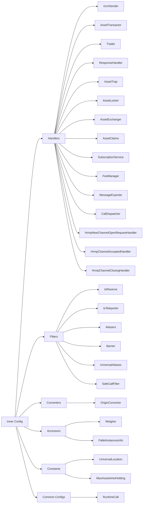

### Outer Config

The `XcmExecutor<Config>` struct extends the functionality of the inner config by introducing fields for execution context, asset handling, error tracking, and operational management. For further details, see the documentation for [`XcmExecutor<Config>`](https://paritytech.github.io/polkadot-sdk/master/staging_xcm_executor/struct.XcmExecutor.html#impl-XcmExecutor%3CConfig%3E){target=\_blank}.

## Multiple Implementations

Some associated types in the `Config` trait are highly configurable and may have multiple implementations (e.g., Barrier). These implementations are organized into a tuple `(impl_1, impl_2, ..., impl_n)`, and the execution follows a sequential order. Each item in the tuple is evaluated individually, each being checked to see if it fails. If an item passes (e.g., returns `Ok` or `true`), the execution stops, and the remaining items are not evaluated. The following example of the `Barrier` type demonstrates how this grouping operates (understanding each item in the tuple is unnecessary for this explanation).

In the following example, the system will first check the `TakeWeightCredit` type when evaluating the barrier. If it fails, it will check `AllowTopLevelPaidExecutionFrom`, and so on, until one of them returns a positive result. If all checks fail, a Barrier error will be triggered.

```rust
pub type Barrier = (
    TakeWeightCredit,
    AllowTopLevelPaidExecutionFrom<Everything>,
    AllowKnownQueryResponses<XcmPallet>,
    AllowSubscriptionsFrom<Everything>,
);

pub struct XcmConfig;
impl xcm_executor::Config for XcmConfig {
    ...
    type Barrier = Barrier;
    ...
}
```


---

# XCM Runtime APIs

> Source (raw): https://raw.githubusercontent.com/polkadot-developers/polkadot-docs/master/.ai/pages/develop-interoperability-xcm-runtime-apis.md
> Canonical (HTML): https://docs.polkadot.com/develop/interoperability/xcm-runtime-apis/
> Summary: Learn about XCM Runtime APIs in Polkadot for cross-chain communication. Explore the APIs to simulate and test XCM messages before execution on the network.

# XCM Runtime APIs

## Introduction

Runtime APIs allow node-side code to extract information from the runtime state. While simple storage access retrieves stored values directly, runtime APIs enable arbitrary computation, making them a powerful tool for interacting with the chain's state.

Unlike direct storage access, runtime APIs can derive values from storage based on arguments or perform computations that don't require storage access. For example, a runtime API might expose a formula for fee calculation, using only the provided arguments as inputs rather than fetching data from storage.

In general, runtime APIs are used for:

- Accessing a storage item.
- Retrieving a bundle of related storage items.
- Deriving a value from storage based on arguments.
- Exposing formulas for complex computational calculations.

This section will teach you about specific runtime APIs that support XCM processing and manipulation.

## Dry Run API

The [Dry-run API](https://paritytech.github.io/polkadot-sdk/master/xcm_runtime_apis/dry_run/trait.DryRunApi.html){target=\_blank}, given an extrinsic, or an XCM program, returns its effects:

- Execution result
- Local XCM (in the case of an extrinsic)
- Forwarded XCMs
- List of events

This API can be used independently for dry-running, double-checking, or testing. However, it mainly shines when used with the [Xcm Payment API](#xcm-payment-api), given that it only estimates fees if you know the specific XCM you want to execute or send.

### Dry Run Call

This API allows a dry-run of any extrinsic and obtaining the outcome if it fails or succeeds, as well as the local xcm and remote xcm messages sent to other chains.

```rust
fn dry_run_call(origin: OriginCaller, call: Call, result_xcms_version: XcmVersion) -> Result<CallDryRunEffects<Event>, Error>;
```

??? interface "Input parameters"

    `origin` ++"OriginCaller"++ <span class="required" markdown>++"required"++</span>
    
    The origin used for executing the transaction.

    ---

    `call` ++"Call"++ <span class="required" markdown>++"required"++</span>

    The extrinsic to be executed.

    ---

??? interface "Output parameters"

    ++"Result<CallDryRunEffects<Event>, Error>"++

    Effects of dry-running an extrinsic. If an error occurs, it is returned instead of the effects.

    ??? child "Type `CallDryRunEffects<Event>`"

        `execution_result` ++"DispatchResultWithPostInfo"++

        The result of executing the extrinsic.

        ---

        `emitted_events` ++"Vec<Event>"++

        The list of events fired by the extrinsic.

        ---

        `local_xcm` ++"Option<VersionedXcm<()>>"++

        The local XCM that was attempted to be executed, if any.

        ---

        `forwarded_xcms` ++"Vec<(VersionedLocation, Vec<VersionedXcm<()>>)>"++

        The list of XCMs that were queued for sending.

    ??? child "Type `Error`"

        Enum:

        - **`Unimplemented`**: An API part is unsupported.
        - **`VersionedConversionFailed`**: Converting a versioned data structure from one version to another failed.

??? interface "Example"

    This example demonstrates how to simulate a cross-chain asset transfer from the Paseo network to the Pop Network using a [reserve transfer](https://wiki.polkadot.com/learn/learn-xcm-usecases/#reserve-asset-transfer){target=\_blank} mechanism. Instead of executing the actual transfer, the code shows how to test and verify the transaction's behavior through a dry run before performing it on the live network.

    Replace `INSERT_USER_ADDRESS` with your SS58 address before running the script.

    ***Usage with PAPI***

    ```js
    import { paseo } from '@polkadot-api/descriptors';
import { createClient } from 'polkadot-api';
import { getWsProvider } from 'polkadot-api/ws-provider/web';
import { withPolkadotSdkCompat } from 'polkadot-api/polkadot-sdk-compat';
import {
  PolkadotRuntimeOriginCaller,
  XcmVersionedLocation,
  XcmVersionedAssets,
  XcmV3Junction,
  XcmV3Junctions,
  XcmV3WeightLimit,
  XcmV3MultiassetFungibility,
  XcmV3MultiassetAssetId,
} from '@polkadot-api/descriptors';
import { DispatchRawOrigin } from '@polkadot-api/descriptors';
import { Binary } from 'polkadot-api';
import { ss58Decode } from '@polkadot-labs/hdkd-helpers';

// Connect to the Paseo relay chain
const client = createClient(
  withPolkadotSdkCompat(getWsProvider('wss://paseo-rpc.dwellir.com')),
);

const paseoApi = client.getTypedApi(paseo);

const popParaID = 4001;
const userAddress = 'INSERT_USER_ADDRESS';
const userPublicKey = ss58Decode(userAddress)[0];
const idBeneficiary = Binary.fromBytes(userPublicKey);

// Define the origin caller
// This is a regular signed account owned by a user
let origin = PolkadotRuntimeOriginCaller.system(
  DispatchRawOrigin.Signed(userAddress),
);

// Define a transaction to transfer assets from Polkadot to Pop Network using a Reserve Transfer
const tx = paseoApi.tx.XcmPallet.limited_reserve_transfer_assets({
  dest: XcmVersionedLocation.V3({
    parents: 0,
    interior: XcmV3Junctions.X1(
      XcmV3Junction.Parachain(popParaID), // Destination is the Pop Network parachain
    ),
  }),
  beneficiary: XcmVersionedLocation.V3({
    parents: 0,
    interior: XcmV3Junctions.X1(
      XcmV3Junction.AccountId32({
        // Beneficiary address on Pop Network
        network: undefined,
        id: idBeneficiary,
      }),
    ),
  }),
  assets: XcmVersionedAssets.V3([
    {
      id: XcmV3MultiassetAssetId.Concrete({
        parents: 0,
        interior: XcmV3Junctions.Here(), // Native asset from the sender. In this case PAS
      }),
      fun: XcmV3MultiassetFungibility.Fungible(120000000000n), // Asset amount to transfer
    },
  ]),
  fee_asset_item: 0, // Asset used to pay transaction fees
  weight_limit: XcmV3WeightLimit.Unlimited(), // No weight limit on transaction
});

// Execute the dry run call to simulate the transaction
const dryRunResult = await paseoApi.apis.DryRunApi.dry_run_call(
  origin,
  tx.decodedCall,
);

// Extract the data from the dry run result
const {
  execution_result: executionResult,
  emitted_events: emmittedEvents,
  local_xcm: localXcm,
  forwarded_xcms: forwardedXcms,
} = dryRunResult.value;

// Extract the XCM generated by this call
const xcmsToPop = forwardedXcms.find(
  ([location, _]) =>
    location.type === 'V4' &&
    location.value.parents === 0 &&
    location.value.interior.type === 'X1' &&
    location.value.interior.value.type === 'Parachain' &&
    location.value.interior.value.value === popParaID, // Pop network's ParaID
);
const destination = xcmsToPop[0];
const remoteXcm = xcmsToPop[1][0];

// Print the results
const resultObject = {
  execution_result: executionResult,
  emitted_events: emmittedEvents,
  local_xcm: localXcm,
  destination: destination,
  remote_xcm: remoteXcm,
};

console.dir(resultObject, { depth: null });

client.destroy();

    ```

    ***Output***

    <div id="termynal" data-termynal>
  <pre>
    {
      execution_result: {
        success: true,
        value: {
          actual_weight: undefined,
          pays_fee: { type: 'Yes', value: undefined }
        }
      },
      emitted_events: [
        {
          type: 'Balances',
          value: {
            type: 'Transfer',
            value: {
              from: '12pGtwHPL4tUAUcyeCoJ783NKRspztpWmXv4uxYRwiEnYNET',
              to: '13YMK2ePPKQeW7ynqLozB65WYjMnNgffQ9uR4AzyGmqnKeLq',
              amount: 120000000000n
            }
          }
        },
        {
          type: 'Balances',
          value: { type: 'Issued', value: { amount: 0n } }
        },
        {
          type: 'XcmPallet',
          value: {
            type: 'Attempted',
            value: {
              outcome: {
                type: 'Complete',
                value: { used: { ref_time: 251861000n, proof_size: 6196n } }
              }
            }
          }
        },
        {
          type: 'Balances',
          value: {
            type: 'Burned',
            value: {
              who: '12pGtwHPL4tUAUcyeCoJ783NKRspztpWmXv4uxYRwiEnYNET',
              amount: 397000000n
            }
          }
        },
        {
          type: 'Balances',
          value: {
            type: 'Minted',
            value: {
              who: '13UVJyLnbVp9RBZYFwFGyDvVd1y27Tt8tkntv6Q7JVPhFsTB',
              amount: 397000000n
            }
          }
        },
        {
          type: 'XcmPallet',
          value: {
            type: 'FeesPaid',
            value: {
              paying: {
                parents: 0,
                interior: {
                  type: 'X1',
                  value: {
                    type: 'AccountId32',
                    value: {
                      network: { type: 'Polkadot', value: undefined },
                      id: FixedSizeBinary {
                        asText: [Function (anonymous)],
                        asHex: [Function (anonymous)],
                        asOpaqueHex: [Function (anonymous)],
                        asBytes: [Function (anonymous)],
                        asOpaqueBytes: [Function (anonymous)]
                      }
                    }
                  }
                }
              },
              fees: [
                {
                  id: {
                    parents: 0,
                    interior: { type: 'Here', value: undefined }
                  },
                  fun: { type: 'Fungible', value: 397000000n }
                }
              ]
            }
          }
        },
        {
          type: 'XcmPallet',
          value: {
            type: 'Sent',
            value: {
              origin: {
                parents: 0,
                interior: {
                  type: 'X1',
                  value: {
                    type: 'AccountId32',
                    value: {
                      network: { type: 'Polkadot', value: undefined },
                      id: FixedSizeBinary {
                        asText: [Function (anonymous)],
                        asHex: [Function (anonymous)],
                        asOpaqueHex: [Function (anonymous)],
                        asBytes: [Function (anonymous)],
                        asOpaqueBytes: [Function (anonymous)]
                      }
                    }
                  }
                }
              },
              destination: {
                parents: 0,
                interior: { type: 'X1', value: { type: 'Parachain', value: 4001 } }
              },
              message: [
                {
                  type: 'ReserveAssetDeposited',
                  value: [
                    {
                      id: {
                        parents: 1,
                        interior: { type: 'Here', value: undefined }
                      },
                      fun: { type: 'Fungible', value: 120000000000n }
                    }
                  ]
                },
                { type: 'ClearOrigin', value: undefined },
                {
                  type: 'BuyExecution',
                  value: {
                    fees: {
                      id: {
                        parents: 1,
                        interior: { type: 'Here', value: undefined }
                      },
                      fun: { type: 'Fungible', value: 120000000000n }
                    },
                    weight_limit: { type: 'Unlimited', value: undefined }
                  }
                },
                {
                  type: 'DepositAsset',
                  value: {
                    assets: {
                      type: 'Wild',
                      value: { type: 'AllCounted', value: 1 }
                    },
                    beneficiary: {
                      parents: 0,
                      interior: {
                        type: 'X1',
                        value: {
                          type: 'AccountId32',
                          value: {
                            network: undefined,
                            id: FixedSizeBinary {
                              asText: [Function (anonymous)],
                              asHex: [Function (anonymous)],
                              asOpaqueHex: [Function (anonymous)],
                              asBytes: [Function (anonymous)],
                              asOpaqueBytes: [Function (anonymous)]
                            }
                          }
                        }
                      }
                    }
                  }
                }
              ],
              message_id: FixedSizeBinary {
                asText: [Function (anonymous)],
                asHex: [Function (anonymous)],
                asOpaqueHex: [Function (anonymous)],
                asBytes: [Function (anonymous)],
                asOpaqueBytes: [Function (anonymous)]
              }
            }
          }
        }
      ],
      local_xcm: undefined,
      destination: {
        type: 'V4',
        value: {
          parents: 0,
          interior: { type: 'X1', value: { type: 'Parachain', value: 4001 } }
        }
      },
      remote_xcm: {
        type: 'V3',
        value: [
          {
            type: 'ReserveAssetDeposited',
            value: [
              {
                id: {
                  type: 'Concrete',
                  value: {
                    parents: 1,
                    interior: { type: 'Here', value: undefined }
                  }
                },
                fun: { type: 'Fungible', value: 120000000000n }
              }
            ]
          },
          { type: 'ClearOrigin', value: undefined },
          {
            type: 'BuyExecution',
            value: {
              fees: {
                id: {
                  type: 'Concrete',
                  value: {
                    parents: 1,
                    interior: { type: 'Here', value: undefined }
                  }
                },
                fun: { type: 'Fungible', value: 120000000000n }
              },
              weight_limit: { type: 'Unlimited', value: undefined }
            }
          },
          {
            type: 'DepositAsset',
            value: {
              assets: { type: 'Wild', value: { type: 'AllCounted', value: 1 } },
              beneficiary: {
                parents: 0,
                interior: {
                  type: 'X1',
                  value: {
                    type: 'AccountId32',
                    value: {
                      network: undefined,
                      id: FixedSizeBinary {
                        asText: [Function (anonymous)],
                        asHex: [Function (anonymous)],
                        asOpaqueHex: [Function (anonymous)],
                        asBytes: [Function (anonymous)],
                        asOpaqueBytes: [Function (anonymous)]
                      }
                    }
                  }
                }
              }
            }
          },
          {
            type: 'SetTopic',
            value: FixedSizeBinary {
              asText: [Function (anonymous)],
              asHex: [Function (anonymous)],
              asOpaqueHex: [Function (anonymous)],
              asBytes: [Function (anonymous)],
              asOpaqueBytes: [Function (anonymous)]
            }
          }
        ]
      }
    }      
  </pre>
</div>

                ...
    <div id="termynal" data-termynal>
  <pre>
    {
      execution_result: {
        success: true,
        value: {
          actual_weight: undefined,
          pays_fee: { type: 'Yes', value: undefined }
        }
      },
      emitted_events: [
        {
          type: 'Balances',
          value: {
            type: 'Transfer',
            value: {
              from: '12pGtwHPL4tUAUcyeCoJ783NKRspztpWmXv4uxYRwiEnYNET',
              to: '13YMK2ePPKQeW7ynqLozB65WYjMnNgffQ9uR4AzyGmqnKeLq',
              amount: 120000000000n
            }
          }
        },
        {
          type: 'Balances',
          value: { type: 'Issued', value: { amount: 0n } }
        },
        {
          type: 'XcmPallet',
          value: {
            type: 'Attempted',
            value: {
              outcome: {
                type: 'Complete',
                value: { used: { ref_time: 251861000n, proof_size: 6196n } }
              }
            }
          }
        },
        {
          type: 'Balances',
          value: {
            type: 'Burned',
            value: {
              who: '12pGtwHPL4tUAUcyeCoJ783NKRspztpWmXv4uxYRwiEnYNET',
              amount: 397000000n
            }
          }
        },
        {
          type: 'Balances',
          value: {
            type: 'Minted',
            value: {
              who: '13UVJyLnbVp9RBZYFwFGyDvVd1y27Tt8tkntv6Q7JVPhFsTB',
              amount: 397000000n
            }
          }
        },
        {
          type: 'XcmPallet',
          value: {
            type: 'FeesPaid',
            value: {
              paying: {
                parents: 0,
                interior: {
                  type: 'X1',
                  value: {
                    type: 'AccountId32',
                    value: {
                      network: { type: 'Polkadot', value: undefined },
                      id: FixedSizeBinary {
                        asText: [Function (anonymous)],
                        asHex: [Function (anonymous)],
                        asOpaqueHex: [Function (anonymous)],
                        asBytes: [Function (anonymous)],
                        asOpaqueBytes: [Function (anonymous)]
                      }
                    }
                  }
                }
              },
              fees: [
                {
                  id: {
                    parents: 0,
                    interior: { type: 'Here', value: undefined }
                  },
                  fun: { type: 'Fungible', value: 397000000n }
                }
              ]
            }
          }
        },
        {
          type: 'XcmPallet',
          value: {
            type: 'Sent',
            value: {
              origin: {
                parents: 0,
                interior: {
                  type: 'X1',
                  value: {
                    type: 'AccountId32',
                    value: {
                      network: { type: 'Polkadot', value: undefined },
                      id: FixedSizeBinary {
                        asText: [Function (anonymous)],
                        asHex: [Function (anonymous)],
                        asOpaqueHex: [Function (anonymous)],
                        asBytes: [Function (anonymous)],
                        asOpaqueBytes: [Function (anonymous)]
                      }
                    }
                  }
                }
              },
              destination: {
                parents: 0,
                interior: { type: 'X1', value: { type: 'Parachain', value: 4001 } }
              },
              message: [
                {
                  type: 'ReserveAssetDeposited',
                  value: [
                    {
                      id: {
                        parents: 1,
                        interior: { type: 'Here', value: undefined }
                      },
                      fun: { type: 'Fungible', value: 120000000000n }
                    }
                  ]
                },
                { type: 'ClearOrigin', value: undefined },
                {
                  type: 'BuyExecution',
                  value: {
                    fees: {
                      id: {
                        parents: 1,
                        interior: { type: 'Here', value: undefined }
                      },
                      fun: { type: 'Fungible', value: 120000000000n }
                    },
                    weight_limit: { type: 'Unlimited', value: undefined }
                  }
                },
                {
                  type: 'DepositAsset',
                  value: {
                    assets: {
                      type: 'Wild',
                      value: { type: 'AllCounted', value: 1 }
                    },
                    beneficiary: {
                      parents: 0,
                      interior: {
                        type: 'X1',
                        value: {
                          type: 'AccountId32',
                          value: {
                            network: undefined,
                            id: FixedSizeBinary {
                              asText: [Function (anonymous)],
                              asHex: [Function (anonymous)],
                              asOpaqueHex: [Function (anonymous)],
                              asBytes: [Function (anonymous)],
                              asOpaqueBytes: [Function (anonymous)]
                            }
                          }
                        }
                      }
                    }
                  }
                }
              ],
              message_id: FixedSizeBinary {
                asText: [Function (anonymous)],
                asHex: [Function (anonymous)],
                asOpaqueHex: [Function (anonymous)],
                asBytes: [Function (anonymous)],
                asOpaqueBytes: [Function (anonymous)]
              }
            }
          }
        }
      ],
      local_xcm: undefined,
      destination: {
        type: 'V4',
        value: {
          parents: 0,
          interior: { type: 'X1', value: { type: 'Parachain', value: 4001 } }
        }
      },
      remote_xcm: {
        type: 'V3',
        value: [
          {
            type: 'ReserveAssetDeposited',
            value: [
              {
                id: {
                  type: 'Concrete',
                  value: {
                    parents: 1,
                    interior: { type: 'Here', value: undefined }
                  }
                },
                fun: { type: 'Fungible', value: 120000000000n }
              }
            ]
          },
          { type: 'ClearOrigin', value: undefined },
          {
            type: 'BuyExecution',
            value: {
              fees: {
                id: {
                  type: 'Concrete',
                  value: {
                    parents: 1,
                    interior: { type: 'Here', value: undefined }
                  }
                },
                fun: { type: 'Fungible', value: 120000000000n }
              },
              weight_limit: { type: 'Unlimited', value: undefined }
            }
          },
          {
            type: 'DepositAsset',
            value: {
              assets: { type: 'Wild', value: { type: 'AllCounted', value: 1 } },
              beneficiary: {
                parents: 0,
                interior: {
                  type: 'X1',
                  value: {
                    type: 'AccountId32',
                    value: {
                      network: undefined,
                      id: FixedSizeBinary {
                        asText: [Function (anonymous)],
                        asHex: [Function (anonymous)],
                        asOpaqueHex: [Function (anonymous)],
                        asBytes: [Function (anonymous)],
                        asOpaqueBytes: [Function (anonymous)]
                      }
                    }
                  }
                }
              }
            }
          },
          {
            type: 'SetTopic',
            value: FixedSizeBinary {
              asText: [Function (anonymous)],
              asHex: [Function (anonymous)],
              asOpaqueHex: [Function (anonymous)],
              asBytes: [Function (anonymous)],
              asOpaqueBytes: [Function (anonymous)]
            }
          }
        ]
      }
    }      
  </pre>
</div>


    ---

### Dry Run XCM

This API allows the direct dry-run of an xcm message instead of an extrinsic one, checks if it will execute successfully, and determines what other xcm messages will be forwarded to other chains.

```rust
fn dry_run_xcm(origin_location: VersionedLocation, xcm: VersionedXcm<Call>) -> Result<XcmDryRunEffects<Event>, Error>;
```

??? interface "Input parameters"

    `origin_location` ++"VersionedLocation"++ <span class="required" markdown>++"required"++</span>

    The location of the origin that will execute the xcm message.

    ---

    `xcm` ++"VersionedXcm<Call>"++ <span class="required" markdown>++"required"++</span>

    A versioned XCM message.

    ---

??? interface "Output parameters"

    ++"Result<XcmDryRunEffects<Event>, Error>"++

    Effects of dry-running an extrinsic. If an error occurs, it is returned instead of the effects.

    ??? child "Type `XcmDryRunEffects<Event>`"

        `execution_result` ++"DispatchResultWithPostInfo"++

        The result of executing the extrinsic.

        ---

        `emitted_events` ++"Vec<Event>"++

        The list of events fired by the extrinsic.

        ---

        `forwarded_xcms` ++"Vec<(VersionedLocation, Vec<VersionedXcm<()>>)>"++

        The list of XCMs that were queued for sending.

    ??? child "Type `Error`"

        Enum:

        - **`Unimplemented`**: An API part is unsupported.
        - **`VersionedConversionFailed`**: Converting a versioned data structure from one version to another failed.

    ---

??? interface "Example"

    This example demonstrates how to simulate a [teleport asset transfer](https://wiki.polkadot.com/learn/learn-xcm-usecases/#asset-teleportation){target=\_blank} from the Paseo network to the Paseo Asset Hub parachain. The code shows how to test and verify the received XCM message's behavior in the destination chain through a dry run on the live network.

    Replace `INSERT_USER_ADDRESS` with your SS58 address before running the script.

     ***Usage with PAPI***

    ```js
    import { createClient } from 'polkadot-api';
import { getWsProvider } from 'polkadot-api/ws-provider/web';
import { withPolkadotSdkCompat } from 'polkadot-api/polkadot-sdk-compat';
import {
  XcmVersionedXcm,
  paseoAssetHub,
  XcmVersionedLocation,
  XcmV3Junction,
  XcmV3Junctions,
  XcmV3WeightLimit,
  XcmV3MultiassetFungibility,
  XcmV3MultiassetAssetId,
  XcmV3Instruction,
  XcmV3MultiassetMultiAssetFilter,
  XcmV3MultiassetWildMultiAsset,
} from '@polkadot-api/descriptors';
import { Binary } from 'polkadot-api';
import { ss58Decode } from '@polkadot-labs/hdkd-helpers';

// Connect to Paseo Asset Hub
const client = createClient(
  withPolkadotSdkCompat(getWsProvider('wss://asset-hub-paseo-rpc.dwellir.com')),
);

const paseoAssetHubApi = client.getTypedApi(paseoAssetHub);

const userAddress = 'INSERT_USER_ADDRESS';
const userPublicKey = ss58Decode(userAddress)[0];
const idBeneficiary = Binary.fromBytes(userPublicKey);

// Define the origin
const origin = XcmVersionedLocation.V3({
  parents: 1,
  interior: XcmV3Junctions.Here(),
});

// Define a xcm message comming from the Paseo relay chain to Asset Hub to Teleport some tokens
const xcm = XcmVersionedXcm.V3([
  XcmV3Instruction.ReceiveTeleportedAsset([
    {
      id: XcmV3MultiassetAssetId.Concrete({
        parents: 1,
        interior: XcmV3Junctions.Here(),
      }),
      fun: XcmV3MultiassetFungibility.Fungible(12000000000n),
    },
  ]),
  XcmV3Instruction.ClearOrigin(),
  XcmV3Instruction.BuyExecution({
    fees: {
      id: XcmV3MultiassetAssetId.Concrete({
        parents: 1,
        interior: XcmV3Junctions.Here(),
      }),
      fun: XcmV3MultiassetFungibility.Fungible(BigInt(12000000000n)),
    },
    weight_limit: XcmV3WeightLimit.Unlimited(),
  }),
  XcmV3Instruction.DepositAsset({
    assets: XcmV3MultiassetMultiAssetFilter.Wild(
      XcmV3MultiassetWildMultiAsset.All(),
    ),
    beneficiary: {
      parents: 0,
      interior: XcmV3Junctions.X1(
        XcmV3Junction.AccountId32({
          network: undefined,
          id: idBeneficiary,
        }),
      ),
    },
  }),
]);

// Execute dry run xcm
const dryRunResult = await paseoAssetHubApi.apis.DryRunApi.dry_run_xcm(
  origin,
  xcm,
);

// Print the results
console.dir(dryRunResult.value, { depth: null });

client.destroy();

    ```

    ***Output***

    <div id="termynal" data-termynal>
  <pre>
    {
      execution_result: {
        type: 'Complete',
        value: { used: { ref_time: 15574200000n, proof_size: 359300n } }
      },
      emitted_events: [
        {
          type: 'System',
          value: {
            type: 'NewAccount',
            value: { account: '12pGtwHPL4tUAUcyeCoJ783NKRspztpWmXv4uxYRwiEnYNET' }
          }
        },
        {
          type: 'Balances',
          value: {
            type: 'Endowed',
            value: {
              account: '12pGtwHPL4tUAUcyeCoJ783NKRspztpWmXv4uxYRwiEnYNET',
              free_balance: 10203500000n
            }
          }
        },
        {
          type: 'Balances',
          value: {
            type: 'Minted',
            value: {
              who: '12pGtwHPL4tUAUcyeCoJ783NKRspztpWmXv4uxYRwiEnYNET',
              amount: 10203500000n
            }
          }
        },
        {
          type: 'Balances',
          value: { type: 'Issued', value: { amount: 1796500000n } }
        },
        {
          type: 'Balances',
          value: {
            type: 'Deposit',
            value: {
              who: '13UVJyLgBASGhE2ok3TvxUfaQBGUt88JCcdYjHvUhvQkFTTx',
              amount: 1796500000n
            }
          }
        }
      ],
      forwarded_xcms: [
        [
          {
            type: 'V4',
            value: { parents: 1, interior: { type: 'Here', value: undefined } }
          },
          []
        ]
      ]
    }
  </pre>
</div>


    ---

## XCM Payment API

The [XCM Payment API](https://paritytech.github.io/polkadot-sdk/master/xcm_runtime_apis/fees/trait.XcmPaymentApi.html){target=\_blank} provides a standardized way to determine the costs and payment options for executing XCM messages. Specifically, it enables clients to:

- Retrieve the [weight](/polkadot-protocol/glossary/#weight) required to execute an XCM message.
- Obtain a list of acceptable `AssetIds` for paying execution fees.
- Calculate the cost of the weight in a specified `AssetId`.
- Estimate the fees for XCM message delivery.

This API eliminates the need for clients to guess execution fees or identify acceptable assets manually. Instead, clients can query the list of supported asset IDs formatted according to the XCM version they understand. With this information, they can weigh the XCM program they intend to execute and convert the computed weight into its cost using one of the acceptable assets.

To use the API effectively, the client must already know the XCM program to be executed and the chains involved in the program's execution.

### Query Acceptable Payment Assets

Retrieves the list of assets that are acceptable for paying fees when using a specific XCM version

```rust
fn query_acceptable_payment_assets(xcm_version: Version) -> Result<Vec<VersionedAssetId>, Error>;
```

??? interface "Input parameters"

    `xcm_version` ++"Version"++ <span class="required" markdown>++"required"++</span>

    Specifies the XCM version that will be used to send the XCM message.

    ---

??? interface "Output parameters"

    ++"Result<Vec<VersionedAssetId>, Error>"++

    A list of acceptable payment assets. Each asset is provided in a versioned format (`VersionedAssetId`) that matches the specified XCM version. If an error occurs, it is returned instead of the asset list.

    ??? child "Type `Error`"

        Enum:

        - **`Unimplemented`**: An API part is unsupported.
        - **`VersionedConversionFailed`**: Converting a versioned data structure from one version to another failed.
        - **`WeightNotComputable`**: XCM message weight calculation failed.
        - **`UnhandledXcmVersion`**: XCM version not able to be handled.
        - **`AssetNotFound`**: The given asset is not handled as a fee asset.
        - **`Unroutable`**: Destination is known to be unroutable.

    ---

??? interface "Example"

    This example demonstrates how to query the acceptable payment assets for executing XCM messages on the Paseo Asset Hub network using XCM version 3.

    ***Usage with PAPI***

    ```js
    import { paseoAssetHub } from '@polkadot-api/descriptors';
import { createClient } from 'polkadot-api';
import { getWsProvider } from 'polkadot-api/ws-provider/web';
import { withPolkadotSdkCompat } from 'polkadot-api/polkadot-sdk-compat';

// Connect to the polkadot relay chain
const client = createClient(
  withPolkadotSdkCompat(getWsProvider('wss://asset-hub-paseo-rpc.dwellir.com')),
);

const paseoAssetHubApi = client.getTypedApi(paseoAssetHub);

// Define the xcm version to use
const xcmVersion = 3;

// Execute the runtime call to query the assets
const result =
  await paseoAssetHubApi.apis.XcmPaymentApi.query_acceptable_payment_assets(
    xcmVersion,
  );

// Print the assets
console.dir(result.value, { depth: null });

client.destroy();

    ```

    ***Output***

    <div id="termynal" data-termynal>
  <pre>
    [
      {
        type: 'V3',
        value: {
          type: 'Concrete',
          value: { parents: 1, interior: { type: 'Here', value: undefined } }
        }
      }
    ]
  </pre>
</div>


    ---

### Query XCM Weight

Calculates the weight required to execute a given XCM message. It is useful for estimating the execution cost of a cross-chain message in the destination chain before sending it.

```rust
fn query_xcm_weight(message: VersionedXcm<()>) -> Result<Weight, Error>;
```

??? interface "Input parameters"

    `message` ++"VersionedXcm<()>"++ <span class="required" markdown>++"required"++</span>
    
    A versioned XCM message whose execution weight is being queried.

    ---

??? interface "Output parameters"

    ++"Result<Weight, Error>"++
    
    The calculated weight required to execute the provided XCM message. If the calculation fails, an error is returned instead.

    ??? child "Type `Weight`"

        `ref_time` ++"u64"++

        The weight of computational time used based on some reference hardware.

        ---

        `proof_size` ++"u64"++

        The weight of storage space used by proof of validity.

        ---

    ??? child "Type `Error`"

        Enum:

        - **`Unimplemented`**: An API part is unsupported.
        - **`VersionedConversionFailed`**: Converting a versioned data structure from one version to another failed.
        - **`WeightNotComputable`**: XCM message weight calculation failed.
        - **`UnhandledXcmVersion`**: XCM version not able to be handled.
        - **`AssetNotFound`**: The given asset is not handled as a fee asset.
        - **`Unroutable`**: Destination is known to be unroutable.

    ---

??? interface "Example"

    This example demonstrates how to calculate the weight needed to execute a [teleport transfer](https://wiki.polkadot.com/learn/learn-xcm-usecases/#asset-teleportation){target=\_blank} from the Paseo network to the Paseo Asset Hub parachain using the XCM Payment API. The result shows the required weight in terms of reference time and proof size needed in the destination chain.

    Replace `INSERT_USER_ADDRESS` with your SS58 address before running the script.

    ***Usage with PAPI***

    ```js
    import { createClient } from 'polkadot-api';
import { getWsProvider } from 'polkadot-api/ws-provider/web';
import { withPolkadotSdkCompat } from 'polkadot-api/polkadot-sdk-compat';
import {
  XcmVersionedXcm,
  paseoAssetHub,
  XcmV3Junction,
  XcmV3Junctions,
  XcmV3WeightLimit,
  XcmV3MultiassetFungibility,
  XcmV3MultiassetAssetId,
  XcmV3Instruction,
  XcmV3MultiassetMultiAssetFilter,
  XcmV3MultiassetWildMultiAsset,
} from '@polkadot-api/descriptors';
import { Binary } from 'polkadot-api';
import { ss58Decode } from '@polkadot-labs/hdkd-helpers';

// Connect to Paseo Asset Hub
const client = createClient(
  withPolkadotSdkCompat(getWsProvider('wss://asset-hub-paseo-rpc.dwellir.com')),
);

const paseoAssetHubApi = client.getTypedApi(paseoAssetHub);

const userAddress = 'INSERT_USER_ADDRESS';
const userPublicKey = ss58Decode(userAddress)[0];
const idBeneficiary = Binary.fromBytes(userPublicKey);

// Define a xcm message comming from the Paseo relay chain to Asset Hub to Teleport some tokens
const xcm = XcmVersionedXcm.V3([
  XcmV3Instruction.ReceiveTeleportedAsset([
    {
      id: XcmV3MultiassetAssetId.Concrete({
        parents: 1,
        interior: XcmV3Junctions.Here(),
      }),
      fun: XcmV3MultiassetFungibility.Fungible(12000000000n),
    },
  ]),
  XcmV3Instruction.ClearOrigin(),
  XcmV3Instruction.BuyExecution({
    fees: {
      id: XcmV3MultiassetAssetId.Concrete({
        parents: 1,
        interior: XcmV3Junctions.Here(),
      }),
      fun: XcmV3MultiassetFungibility.Fungible(BigInt(12000000000n)),
    },
    weight_limit: XcmV3WeightLimit.Unlimited(),
  }),
  XcmV3Instruction.DepositAsset({
    assets: XcmV3MultiassetMultiAssetFilter.Wild(
      XcmV3MultiassetWildMultiAsset.All(),
    ),
    beneficiary: {
      parents: 0,
      interior: XcmV3Junctions.X1(
        XcmV3Junction.AccountId32({
          network: undefined,
          id: idBeneficiary,
        }),
      ),
    },
  }),
]);

// Execute the query weight runtime call
const result = await paseoAssetHubApi.apis.XcmPaymentApi.query_xcm_weight(xcm);

// Print the results
console.dir(result.value, { depth: null });

client.destroy();

    ```

    ***Output***

    <div id="termynal" data-termynal>
  <span data-ty>{ ref_time: 15574200000n, proof_size: 359300n }</span>
</div>


    ---

### Query Weight to Asset Fee

Converts a given weight into the corresponding fee for a specified `AssetId`. It allows clients to determine the cost of execution in terms of the desired asset.

```rust
fn query_weight_to_asset_fee(weight: Weight, asset: VersionedAssetId) -> Result<u128, Error>;
```

??? interface "Input parameters"

    `weight` ++"Weight"++ <span class="required" markdown>++"required"++</span>
    
    The execution weight to be converted into a fee.

    ??? child "Type `Weight`"

        `ref_time` ++"u64"++

        The weight of computational time used based on some reference hardware.

        ---

        `proof_size` ++"u64"++

        The weight of storage space used by proof of validity.

        ---

    ---

    `asset` ++"VersionedAssetId"++ <span class="required" markdown>++"required"++</span>
    
    The asset in which the fee will be calculated. This must be a versioned asset ID compatible with the runtime.

    ---

??? interface "Output parameters"

    ++"Result<u128, Error>"++
    
    The fee needed to pay for the execution for the given `AssetId.`

    ??? child "Type `Error`"

        Enum:

        - **`Unimplemented`**: An API part is unsupported.
        - **`VersionedConversionFailed`**: Converting a versioned data structure from one version to another failed.
        - **`WeightNotComputable`**: XCM message weight calculation failed.
        - **`UnhandledXcmVersion`**: XCM version not able to be handled.
        - **`AssetNotFound`**: The given asset is not handled as a fee asset.
        - **`Unroutable`**: Destination is known to be unroutable.

    ---

??? interface "Example"

    This example demonstrates how to calculate the fee for a given execution weight using a specific versioned asset ID (PAS token) on Paseo Asset Hub.

    ***Usage with PAPI***

    ```js
    import { paseoAssetHub } from '@polkadot-api/descriptors';
import { createClient } from 'polkadot-api';
import { getWsProvider } from 'polkadot-api/ws-provider/web';
import { withPolkadotSdkCompat } from 'polkadot-api/polkadot-sdk-compat';

// Connect to the polkadot relay chain
const client = createClient(
  withPolkadotSdkCompat(getWsProvider('wss://asset-hub-paseo-rpc.dwellir.com')),
);

const paseoAssetHubApi = client.getTypedApi(paseoAssetHub);

// Define the weight to convert to fee
const weight = { ref_time: 15574200000n, proof_size: 359300n };

// Define the versioned asset id
const versionedAssetId = {
  type: 'V4',
  value: { parents: 1, interior: { type: 'Here', value: undefined } },
};

// Execute the runtime call to convert the weight to fee
const result =
  await paseoAssetHubApi.apis.XcmPaymentApi.query_weight_to_asset_fee(
    weight,
    versionedAssetId,
  );

// Print the fee
console.dir(result.value, { depth: null });

client.destroy();

    ```

    ***Output***

    <div id="termynal" data-termynal>
  <span data-ty>1796500000n</span>
</div>

    ---

### Query Delivery Fees

Retrieves the delivery fees for sending a specific XCM message to a designated destination. The fees are always returned in a specific asset defined by the destination chain.

```rust
fn query_delivery_fees(destination: VersionedLocation, message: VersionedXcm<()>) -> Result<VersionedAssets, Error>;
```

??? interface "Input parameters"

    `destination` ++"VersionedLocation"++ <span class="required" markdown>++"required"++</span>
    
    The target location where the message will be sent. Fees may vary depending on the destination, as different destinations often have unique fee structures and sender mechanisms.

    ---

    `message` ++"VersionedXcm<()>"++ <span class="required" markdown>++"required"++</span>
    
    The XCM message to be sent. The delivery fees are calculated based on the message's content and size, which can influence the cost.

    ---

??? interface "Output parameters"

    ++"Result<VersionedAssets, Error>"++
    
    The calculated delivery fees expressed in a specific asset supported by the destination chain. If an error occurs during the query, it returns an error instead.

    ??? child "Type `Error`"

        Enum:

        - **`Unimplemented`**: An API part is unsupported.
        - **`VersionedConversionFailed`**: Converting a versioned data structure from one version to another failed.
        - **`WeightNotComputable`**: XCM message weight calculation failed.
        - **`UnhandledXcmVersion`**: XCM version not able to be handled.
        - **`AssetNotFound`**: The given asset is not handled as a fee asset.
        - **`Unroutable`**: Destination is known to be unroutable.

    ---

??? interface "Example"

    This example demonstrates how to query the delivery fees for sending an XCM message from Paseo to Paseo Asset Hub.

    Replace `INSERT_USER_ADDRESS` with your SS58 address before running the script.

    ***Usage with PAPI***

    ```js
    import { createClient } from 'polkadot-api';
import { getWsProvider } from 'polkadot-api/ws-provider/web';
import { withPolkadotSdkCompat } from 'polkadot-api/polkadot-sdk-compat';
import {
  XcmVersionedXcm,
  paseo,
  XcmVersionedLocation,
  XcmV3Junction,
  XcmV3Junctions,
  XcmV3WeightLimit,
  XcmV3MultiassetFungibility,
  XcmV3MultiassetAssetId,
  XcmV3Instruction,
  XcmV3MultiassetMultiAssetFilter,
  XcmV3MultiassetWildMultiAsset,
} from '@polkadot-api/descriptors';
import { Binary } from 'polkadot-api';
import { ss58Decode } from '@polkadot-labs/hdkd-helpers';

const client = createClient(
  withPolkadotSdkCompat(getWsProvider('wss://paseo-rpc.dwellir.com')),
);

const paseoApi = client.getTypedApi(paseo);

const paseoAssetHubParaID = 1000;
const userAddress = 'INSERT_USER_ADDRESS';
const userPublicKey = ss58Decode(userAddress)[0];
const idBeneficiary = Binary.fromBytes(userPublicKey);

// Define the destination
const destination = XcmVersionedLocation.V3({
  parents: 0,
  interior: XcmV3Junctions.X1(XcmV3Junction.Parachain(paseoAssetHubParaID)),
});

// Define the xcm message that will be sent to the destination
const xcm = XcmVersionedXcm.V3([
  XcmV3Instruction.ReceiveTeleportedAsset([
    {
      id: XcmV3MultiassetAssetId.Concrete({
        parents: 1,
        interior: XcmV3Junctions.Here(),
      }),
      fun: XcmV3MultiassetFungibility.Fungible(12000000000n),
    },
  ]),
  XcmV3Instruction.ClearOrigin(),
  XcmV3Instruction.BuyExecution({
    fees: {
      id: XcmV3MultiassetAssetId.Concrete({
        parents: 1,
        interior: XcmV3Junctions.Here(),
      }),
      fun: XcmV3MultiassetFungibility.Fungible(BigInt(12000000000n)),
    },
    weight_limit: XcmV3WeightLimit.Unlimited(),
  }),
  XcmV3Instruction.DepositAsset({
    assets: XcmV3MultiassetMultiAssetFilter.Wild(
      XcmV3MultiassetWildMultiAsset.All(),
    ),
    beneficiary: {
      parents: 0,
      interior: XcmV3Junctions.X1(
        XcmV3Junction.AccountId32({
          network: undefined,
          id: idBeneficiary,
        }),
      ),
    },
  }),
]);

// Execute the query delivery fees runtime call
const result = await paseoApi.apis.XcmPaymentApi.query_delivery_fees(
  destination,
  xcm,
);

// Print the results
console.dir(result.value, { depth: null });

client.destroy();

    ```

    ***Output***

    <div id="termynal" data-termynal>
  <pre>
    {
      type: 'V3',
      value: [
        {
          id: {
            type: 'Concrete',
            value: { parents: 0, interior: { type: 'Here', value: undefined } }
          },
          fun: { type: 'Fungible', value: 396000000n }
        }
      ]
    }
  </pre>
</div>

    ---


---

# XCM Tools

> Source (raw): https://raw.githubusercontent.com/polkadot-developers/polkadot-docs/master/.ai/pages/develop-toolkit-interoperability-xcm-tools.md
> Canonical (HTML): https://docs.polkadot.com/develop/toolkit/interoperability/xcm-tools/
> Summary: Explore essential XCM tools across Polkadot, crafted to enhance cross-chain functionality and integration within the ecosystem.

# XCM Tools

## Introduction

As described in the [Interoperability](/develop/interoperability){target=\_blank} section, XCM (Cross-Consensus Messaging) is a protocol used in the Polkadot and Kusama ecosystems to enable communication and interaction between chains. It facilitates cross-chain communication, allowing assets, data, and messages to flow seamlessly across the ecosystem.

As XCM is central to enabling communication between blockchains, developers need robust tools to help interact with, build, and test XCM messages. Several XCM tools simplify working with the protocol by providing libraries, frameworks, and utilities that enhance the development process, ensuring that applications built within the Polkadot ecosystem can efficiently use cross-chain functionalities.

## Popular XCM Tools

### Moonsong Labs XCM Tools

[Moonsong Labs XCM Tools](https://github.com/Moonsong-Labs/xcm-tools){target=\_blank} provides a collection of scripts for managing and testing XCM operations between Polkadot SDK-based runtimes. These tools allow performing tasks like asset registration, channel setup, and XCM initialization. Key features include:

- **Asset registration**: Registers assets, setting units per second (up-front fees), and configuring error (revert) codes.
- **XCM initializer**: Initializes XCM, sets default XCM versions, and configures revert codes for XCM-related precompiles.
- **HRMP manipulator**: Manages HRMP channel actions, including opening, accepting, or closing channels.
- **XCM-Transactor-Info-Setter**: Configures transactor information, including extra weight and fee settings.
- **Decode XCM**: Decodes XCM messages on the relay chain or parachains to help interpret cross-chain communication.

To get started, clone the repository and install the required dependencies:

```bash
git clone https://github.com/Moonsong-Labs/xcm-tools && 
cd xcm-tools &&
yarn install
```

For a full overview of each script, visit the [scripts](https://github.com/Moonsong-Labs/xcm-tools/tree/main/scripts){target=\_blank} directory or refer to the [official documentation](https://github.com/Moonsong-Labs/xcm-tools/blob/main/README.md){target=\_blank} on GitHub.

### ParaSpell

[ParaSpell](https://paraspell.xyz/){target=\_blank} is a collection of open-source XCM tools designed to streamline cross-chain asset transfers and interactions within the Polkadot and Kusama ecosystems. It equips developers with an intuitive interface to manage and optimize XCM-based functionalities. Some key points included by ParaSpell are:

- **[XCM SDK](https://paraspell.xyz/#xcm-sdk){target=\_blank}**: Provides a unified layer to incorporate XCM into decentralized applications, simplifying complex cross-chain interactions.
- **[XCM API](https://paraspell.xyz/#xcm-api){target=\_blank}**: Offers an efficient, package-free approach to integrating XCM functionality while offloading heavy computing tasks, minimizing costs and improving application performance.
- **[XCM router](https://paraspell.xyz/#xcm-router){target=\_blank}**: Enables cross-chain asset swaps in a single command, allowing developers to send one asset type (such as DOT on Polkadot) and receive a different asset on another chain (like ASTR on Astar).
- **[XCM analyser](https://paraspell.xyz/#xcm-analyser){target=\_blank}**: Decodes and translates complex XCM multilocation data into readable information, supporting easier troubleshooting and debugging.
- **[XCM visualizator](https://paraspell.xyz/#xcm-visualizator){target=\_blank}**: A tool designed to give developers a clear, interactive view of XCM activity across the Polkadot ecosystem, providing insights into cross-chain communication flow.

ParaSpell's tools make it simple for developers to build, test, and deploy cross-chain solutions without needing extensive knowledge of the XCM protocol. With features like message composition, decoding, and practical utility functions for parachain interactions, ParaSpell is especially useful for debugging and optimizing cross-chain communications.

### Astar XCM Tools

The [Astar parachain](https://github.com/AstarNetwork/Astar/tree/master){target=\_blank} offers a crate with a set of utilities for interacting with the XCM protocol. The [xcm-tools](https://github.com/AstarNetwork/Astar/tree/master/bin/xcm-tools){target=\_blank} crate provides a straightforward method for users to locate a sovereign account or calculate an XC20 asset ID. Some commands included by the xcm-tools crate allow users to perform the following tasks:

- **Sovereign accounts**: Obtain the sovereign account address for any parachain, either on the Relay Chain or for sibling parachains, using a simple command.
- **XC20 EVM addresses**: Generate XC20-compatible Ethereum addresses for assets by entering the asset ID, making it easy to integrate assets across Ethereum-compatible environments.
- **Remote accounts**: Retrieve remote account addresses needed for multi-location compatibility, using flexible options to specify account types and parachain IDs.

To start using these tools, clone the [Astar repository](https://github.com/AstarNetwork/Astar){target=\_blank} and compile the xcm-tools package:

```bash
git clone https://github.com/AstarNetwork/Astar &&
cd Astar &&
cargo build --release -p xcm-tools
```

After compiling, verify the setup with the following command:

```bash
./target/release/xcm-tools --help
```
For more details on using Astar xcm-tools, consult the [official documentation](https://docs.astar.network/docs/learn/interoperability/xcm/integration/tools/){target=\_blank}.

### Chopsticks

The Chopsticks library provides XCM functionality for testing XCM messages across networks, enabling you to fork multiple parachains along with a relay chain. For further details, see the [Chopsticks documentation](/tutorials/polkadot-sdk/testing/fork-live-chains/){target=\_blank} about XCM.

### Moonbeam XCM SDK

The [Moonbeam XCM SDK](https://github.com/moonbeam-foundation/xcm-sdk){target=\_blank} enables developers to easily transfer assets between chains, either between parachains or between a parachain and the relay chain, within the Polkadot/Kusama ecosystem. With the SDK, you don't need to worry about determining the [Multilocation](https://github.com/polkadot-fellows/xcm-format?tab=readme-ov-file#7-universal-consensus-location-identifiers){target=\_blank} of the origin or destination assets or which extrinsics are used on which networks.

The SDK consists of two main packages:

- **[XCM SDK](https://github.com/moonbeam-foundation/xcm-sdk/tree/main/packages/sdk){target=\_blank}**: Core SDK for executing XCM transfers between chains in the Polkadot/Kusama ecosystem.
- **[MRL SDK](https://github.com/moonbeam-foundation/xcm-sdk/tree/main/packages/mrl){target=\_blank}**: Extension of the XCM SDK for transferring liquidity into and across the Polkadot ecosystem from other ecosystems like Ethereum.

Key features include:

- **Simplified asset transfers**: Abstracts away complex multilocation determinations and extrinsic selection.
- **Cross-ecosystem support**: Enables transfers between Polkadot/Kusama chains and external ecosystems.
- **Developer-friendly API**: Provides intuitive interfaces for cross-chain functionality.
- **Comprehensive documentation**: Includes usage guides and API references for both packages.

For detailed usage examples and API documentation, visit the [official Moonbeam XCM SDK documentation](https://moonbeam-foundation.github.io/xcm-sdk/latest/){target=\_blank}.
