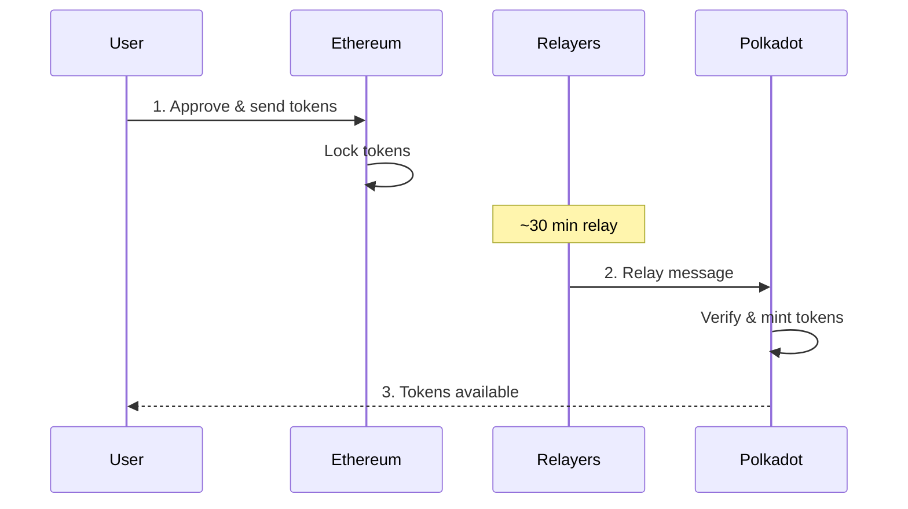

# Transfer Assets from Ethereum into Polkadot

## Introduction

This guide walks you through transferring tokens from Ethereum to Polkadot using the [ParaSpell XCM SDK](/reference/tools/paraspell/){target=\_blank} and [Snowbridge](https://docs.snowbridge.network/){target=\_blank}. Snowbridge is a trustless, decentralized bridge integrated into the Polkadot protocol that enables secure asset transfers between the Ethereum and Polkadot ecosystems.

### How the Bridge Works

The following diagram shows the complete flow when bridging WETH from Ethereum to Polkadot:



In this guide, you will:

- Set up an Ethereum development environment with the ParaSpell SDK
- Approve tokens for the Snowbridge Gateway contract
- Build and execute a bridge transfer from Ethereum to Polkadot Hub
- Monitor the transfer status

## Prerequisites

Before you begin, ensure you have the following:

- A basic understanding of [XCM](/parachains/interoperability/get-started/){target=\_blank}.
- Familiarity with JavaScript/TypeScript and Ethereum development.
- [Node.js](https://nodejs.org/){target=\_blank} v18 or higher and npm installed.
- An Ethereum wallet with WETH tokens. See [Prepare Tokens for Bridging](#prepare-tokens-for-bridging) for instructions to wrap ETH if needed.
- A Polkadot account to receive the bridged assets.

## Prepare Tokens for Bridging

To bridge ETH, you need to wrap it into WETH first. The WETH contract on Ethereum mainnet is:

```
0xC02aaA39b223FE8D0A0e5C4F27eAD9083C756Cc2
```

!!!note "Why WETH instead of ETH?"
    Snowbridge only supports ERC-20 tokens—it cannot bridge native ETH directly. The bridge uses a standardized token interface to lock assets on Ethereum and mint corresponding representations on Polkadot. Since native ETH doesn't conform to the ERC-20 standard, you must first wrap it into WETH (Wrapped ETH), an ERC-20-compliant token pegged 1:1 to ETH.

You can wrap ETH by:

1. Visiting the [WETH contract on Etherscan](https://etherscan.io/address/0xC02aaA39b223FE8D0A0e5C4F27eAD9083C756Cc2#writeContract){target=\_blank}
2. Connecting your wallet
3. Calling the `deposit` function with the amount of ETH you want to wrap

## Initialize Your Project

Follow these steps to setup and initialize your project:
1. Create the project folder using the following commands:

```bash
mkdir eth-to-polkadot-bridge && \
cd eth-to-polkadot-bridge
```

2. Initialize the JavaScript project:

```bash
npm init -y && npm pkg set type=module
```

Install dev dependencies:

```bash
npm install --save-dev @types/node tsx typescript
```

Sending assets from Ethereum to Polkadot requires the PJS version of the ParaSpell SDK. Install the necessary dependencies using the following command:

```bash
npm install @paraspell/sdk-pjs@12.0.2 @polkadot/api@16.5.3 @polkadot/types@16.5.3 ethers@6.15.0
```

Now add the following setup code to `index.ts`:

```ts title="index.ts"
import { EvmBuilder, getTokenBalance, approveToken, getBridgeStatus } from '@paraspell/sdk-pjs';
import { ethers } from 'ethers';

// Ethereum mainnet RPC endpoint (use your own API key)
const ETH_RPC = 'https://eth-mainnet.g.alchemy.com/v2/INSERT_API_KEY';

// WETH contract address on Ethereum mainnet
const WETH_ADDRESS = '0xC02aaA39b223FE8D0A0e5C4F27eAD9083C756Cc2';

// WETH has 18 decimals
const WETH_UNITS = 1_000_000_000_000_000_000n;

// Amount to bridge: 0.001 WETH
const AMOUNT = (WETH_UNITS / 1000n).toString();

// Your Polkadot address to receive the bridged tokens (SS58 format)
const RECIPIENT_ADDRESS = 'INSERT_YOUR_POLKADOT_ADDRESS';

// Connect to Ethereum mainnet
async function getProviderAndSigner() {
  // For browser wallet (MetaMask)
  // const provider = new ethers.BrowserProvider(window.ethereum);

  // For script-based execution with private key
  const provider = new ethers.JsonRpcProvider(ETH_RPC);
  const signer = new ethers.Wallet('INSERT_PRIVATE_KEY', provider);

  return { provider, signer };
}
```

Replace `INSERT_YOUR_POLKADOT_ADDRESS` with your Polkadot account address (SS58 format) that will receive the bridged tokens on Polkadot Hub.

!!!warning "Security Warning"
    Never commit private keys or seed phrases to production code. Use environment variables or secure key management systems.

## Approve Tokens for Bridging

Before bridging ERC-20 tokens, you must approve the Snowbridge Gateway contract to spend your tokens. The ParaSpell SDK provides the following helper functions for approving spending:

```ts title="index.ts"
async function approveTokens() {
  const { signer } = await getProviderAndSigner();

  // Check current WETH balance
  const balance = await getTokenBalance(signer, 'WETH');
  console.log(`Current WETH balance: ${balance}`);

  if (BigInt(balance) === 0n) {
    console.log('No WETH balance. Please wrap some ETH to WETH first.');
    console.log(`WETH contract: ${WETH_ADDRESS}`);
    process.exit(1);
  }

  // Approve the Snowbridge Gateway contract to spend WETH
  const { result: approveTx } = await approveToken(signer, BigInt(AMOUNT), 'WETH');
  console.log(`Approval transaction hash: ${approveTx.hash}`);

  // Wait for confirmation
  await approveTx.wait();
  console.log('Token approval confirmed!');
}
```

Run the approval script:

```bash
npx tsx index.ts
```

You will see output confirming the token balance and approval similar to the following:

<div id="termynal" data-termynal>
  <span data-ty="input"><span class="file-path"></span>npx tsx index.ts</span>
  <span data-ty>Current WETH balance: 0.05</span>
  <span data-ty>Approval transaction hash: 0x1a2b3c4d5e6f7890abcdef1234567890abcdef1234567890abcdef1234567890</span>
  <span data-ty>Token approval confirmed!</span>
  <span data-ty="input"><span class="file-path"></span></span>
</div>

## Build and Execute the Bridge Transfer

Now build and execute the bridge transfer from Ethereum to Polkadot Hub:

```ts title="index.ts"
async function bridgeToPolkadot() {
  const { provider, signer } = await getProviderAndSigner();

  console.log('Building bridge transaction...');
  console.log(`Bridging ${AMOUNT} WETH to Polkadot Hub`);
  console.log(`Recipient: ${RECIPIENT_ADDRESS}`);

  // Build and execute the bridge transfer
  // Note: 'AssetHubPolkadot' is the SDK identifier for Polkadot Hub
  const result = await EvmBuilder(provider)
    .to('AssetHubPolkadot')
    .currency({
      symbol: 'WETH',
      amount: AMOUNT,
    })
    .address(RECIPIENT_ADDRESS)
    .signer(signer)
    .build();

  console.log('Bridge transaction submitted!');
  console.log(`Transaction hash: ${result.response.hash}`);
  console.log('Transfer will arrive in approximately 30 minutes.');

  // Wait for Ethereum confirmation
  await result.response.wait();
  console.log('Ethereum transaction confirmed! Waiting for bridge relay...');
}
```

Comment out the `approveTokens()` function and run the transfer:

```bash
npx tsx index.ts
```

After submitting the transaction, you will see the Ethereum transaction hash included in the terminal output similar to the following:

<div id="termynal" data-termynal>
  <span data-ty="input"><span class="file-path"></span>npx tsx index.ts</span>
  <span data-ty>Building bridge transaction...</span>
  <span data-ty>Bridging 1000000000000000 WETH to Polkadot Hub</span>
  <span data-ty>Recipient: 5GrwvaEF5zXb26Fz9rcQpDWS57CtERHpNehXCPcNoHGKutQY</span>
  <span data-ty>Bridge transaction submitted!</span>
  <span data-ty>Transaction hash: 0xabcdef1234567890abcdef1234567890abcdef1234567890abcdef1234567890</span>
  <span data-ty>Transfer will arrive in approximately 30 minutes.</span>
  <span data-ty>Ethereum transaction confirmed! Waiting for bridge relay...</span>
  <span data-ty="input"><span class="file-path"></span></span>
</div>

## Monitor the Transfer

Bridge transfers from Ethereum to Polkadot take approximately 30 minutes. You can monitor the transfer status in several ways:

- **Snowbridge App** - Visit [app.snowbridge.network](https://app.snowbridge.network/){target=\_blank} to check the transfer history
- **Etherscan** - Track your Ethereum transaction on [etherscan.io](https://etherscan.io/){target=\_blank}
- **Polkadot.js Apps** - Monitor incoming transfers on [Polkadot Hub](https://polkadot.js.org/apps/?rpc=wss%3A%2F%2Fpolkadot-asset-hub-rpc.polkadot.io#/accounts){target=\_blank}

You can also check the bridge status programmatically:

```ts title="index.ts"
async function checkBridgeStatus() {
  // Check the current status of the Snowbridge
  const status = await getBridgeStatus();
  console.log('Bridge Status:', status);
}
```

## Supported Assets and Destinations

Snowbridge can bridge any ERC-20 token from Ethereum, but the destination chain must have that asset registered as a foreign asset to receive it.

!!!warning "Verify Foreign Assets"
    Foreign asset creation on Polkadot Hub is permissionless—anyone can register a foreign asset. Before bridging, verify that the foreign asset registered on Polkadot Hub corresponds to the legitimate token on Ethereum by checking the asset's multilocation and confirming the Ethereum contract address matches the official token contract.

You can query which assets are supported for a specific route using the ParaSpell SDK as follows:

```ts title="index.ts"
import { getSupportedAssets } from '@paraspell/sdk-pjs';

// Get assets supported for Ethereum → Polkadot Hub transfers
const supportedAssets = getSupportedAssets('Ethereum', 'AssetHubPolkadot');
console.log('Supported assets:', supportedAssets.map(a => a.symbol));
```

Running this script will return a list of supported assets in the terminal similar to the following:

<div id="termynal" data-termynal>
  <span data-ty="input"><span class="file-path"></span>npx tsx get-supported-assets.ts</span>
  <span data-ty>Supported assets: [</span>
  <span data-ty>  'WETH',    'WBTC',  'USDC',  'USDT',</span>
  <span data-ty>  'DAI',     'SHIB',  'LINK',  'AAVE',</span>
  <span data-ty>  'wstETH',  'tBTC',  'PEPE',  'EURC',</span>
  <span data-ty>  'MYTH',    'TRAC',  'KILT',  'DOT',</span>
  <span data-ty>  ... and more</span>
  <span data-ty>]</span>
  <span data-ty="input"><span class="file-path"></span></span>
</div>

Common supported tokens on Polkadot Hub include:

| Token | Symbol | Description |
|-------|--------|-------------|
| Wrapped Ether | WETH | Ethereum's native token wrapped as ERC-20 |
| Wrapped Bitcoin | WBTC | Bitcoin wrapped as an ERC-20 token |
| Shiba Inu | SHIB | Popular ERC-20 meme token |

To transfer to a different destination, change the `.to()` parameter and verify the asset is supported using the following code:

```ts title="index.ts"
// Check if WETH is supported on Hydration
const hydrationAssets = getSupportedAssets('Ethereum', 'Hydration');
const wethSupported = hydrationAssets.some(a => a.symbol === 'WETH');

if (wethSupported) {
  await EvmBuilder(provider)
    .to('Hydration')
    .currency({ symbol: 'WETH', amount: amount })
    .address(recipientAddress)
    .signer(signer)
    .build();
}
```

<div id="termynal" data-termynal>
  <span data-ty="input"><span class="file-path"></span>npx tsx bridge-to-hydration.ts</span>
  <span data-ty>WETH supported on Hydration: true</span>
  <span data-ty>Building bridge transaction to Hydration...</span>
  <span data-ty>Bridge transaction submitted!</span>
  <span data-ty>Transaction hash: 0x1234...abcd</span>
  <span data-ty="input"><span class="file-path"></span></span>
</div>

???- code "Complete `index.ts` script"

    ```typescript title="index.ts"
    import { EvmBuilder, getTokenBalance, approveToken, getBridgeStatus } from '@paraspell/sdk-pjs';
    import { ethers } from 'ethers';

    // Ethereum mainnet RPC endpoint (use your own API key)
    const ETH_RPC = 'https://eth-mainnet.g.alchemy.com/v2/INSERT_API_KEY';

    // WETH contract address on Ethereum mainnet
    const WETH_ADDRESS = '0xC02aaA39b223FE8D0A0e5C4F27eAD9083C756Cc2';

    // WETH has 18 decimals
    const WETH_UNITS = 1_000_000_000_000_000_000n;

    // Amount to bridge: 0.001 WETH
    const AMOUNT = (WETH_UNITS / 1000n).toString();

    // Your Polkadot address to receive the bridged tokens (SS58 format)
    const RECIPIENT_ADDRESS = 'INSERT_YOUR_POLKADOT_ADDRESS';

    // Connect to Ethereum mainnet
    async function getProviderAndSigner() {
      // For browser wallet (MetaMask)
      // const provider = new ethers.BrowserProvider(window.ethereum);

      // For script-based execution with private key
      const provider = new ethers.JsonRpcProvider(ETH_RPC);
      const signer = new ethers.Wallet('INSERT_PRIVATE_KEY', provider);

      return { provider, signer };
    }

    async function approveTokens() {
      const { signer } = await getProviderAndSigner();

      // Check current WETH balance
      const balance = await getTokenBalance(signer, 'WETH');
      console.log(`Current WETH balance: ${balance}`);

      if (BigInt(balance) === 0n) {
        console.log('No WETH balance. Please wrap some ETH to WETH first.');
        console.log(`WETH contract: ${WETH_ADDRESS}`);
        process.exit(1);
      }

      // Approve the Snowbridge Gateway contract to spend WETH
      const { result: approveTx } = await approveToken(signer, BigInt(AMOUNT), 'WETH');
      console.log(`Approval transaction hash: ${approveTx.hash}`);

      // Wait for confirmation
      await approveTx.wait();
      console.log('Token approval confirmed!');
    }

    approveTokens();

    async function bridgeToPolkadot() {
      const { provider, signer } = await getProviderAndSigner();

      console.log('Building bridge transaction...');
      console.log(`Bridging ${AMOUNT} WETH to Polkadot Hub`);
      console.log(`Recipient: ${RECIPIENT_ADDRESS}`);

      // Build and execute the bridge transfer
      // Note: 'AssetHubPolkadot' is the SDK identifier for Polkadot Hub
      const result = await EvmBuilder(provider)
        .to('AssetHubPolkadot')
        .currency({
          symbol: 'WETH',
          amount: AMOUNT,
        })
        .address(RECIPIENT_ADDRESS)
        .signer(signer)
        .build();

      console.log('Bridge transaction submitted!');
      console.log(`Transaction hash: ${result.response.hash}`);
      console.log('Transfer will arrive in approximately 30 minutes.');

      // Wait for Ethereum confirmation
      await result.response.wait();
      console.log('Ethereum transaction confirmed! Waiting for bridge relay...');
    }

    bridgeToPolkadot();

    async function checkBridgeStatus() {
      // Check the current status of the Snowbridge
      const status = await getBridgeStatus();
      console.log('Bridge Status:', status);
    }

    checkBridgeStatus();

    ```

!!!info "Transfer Assets Out of Polkadot"

    To transfer assets out of Polkadot, you can use the ParaSpell XCM SDK to build and execute a bridge transfer from Polkadot to Ethereum. Check out the [Polkadot to Ethereum](https://paraspell.github.io/docs/sdk/xcmPallet.html#polkadot-ethereum-transfer){target=\_blank} section of the ParaSpell XCM SDK documentation.


## Where to Go Next

- **External Documentation** - Dive deeper into the [ParaSpell XCM SDK](https://paraspell.github.io/docs/sdk/getting-started.html){target=\_blank} and [Snowbridge](https://docs.snowbridge.network/){target=\_blank} documentation resources.
- **Learn about XCM** - Understand the underlying protocol by visiting the [Get Started with XCM](/parachains/interoperability/get-started/) guide
