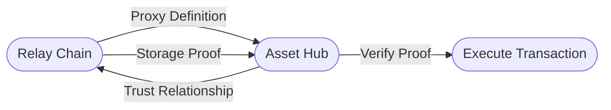

# Remote Proxies

!!!warning "Kusama Implementation Only"
    Remote proxies are currently only available on Kusama and its parachains (such as Kusama Asset Hub). This feature is not yet deployed on Polkadot MainNet. The examples and implementations described in this guide are specific to the Kusama ecosystem.

## Introduction

Remote proxies enable cross-chain proxy functionality within the Polkadot ecosystem, allowing proxy accounts defined on one chain to execute transactions on different chains through cryptographic storage proofs. This functionality extends the traditional [proxy system](https://wiki.polkadot.com/learn/learn-proxies/){target=\_blank} beyond single-chain boundaries.

This guide covers:

- Understanding remote proxy mechanics and architecture.
- Implementation workflow and timing constraints.
- Practical examples using Polkadot.js.
- Advanced use cases and security considerations.

Remote proxies are particularly valuable for maintaining unified security models across multiple parachains while avoiding the complexity of managing separate proxy setups on each chain.

!!!note "Traditional vs Remote Proxies"
    Traditional proxies work within a single chain, where both the proxy and proxied accounts exist on the same blockchain. Remote proxies extend this concept across chains, using cryptographic proofs to verify proxy relationships without requiring account replication.

## Remote Proxy Architecture

Remote proxies operate through a trust and verification model using storage proofs. The target chain verifies the existence of proxy relationships on the source chain without requiring direct replication of proxy data.



In this architecture, Asset Hub trusts proxy definitions from the Relay Chain. When a remote proxy transaction is initiated, Asset Hub verifies the storage proof against its stored block roots from the Relay Chain, ensuring the proxy relationship is authentic and current.

The verification process utilizes [Merkle proofs](/polkadot-protocol/glossary/#trie-patricia-merkle-tree){target=\_blank} to confirm proxy permissions exist on the source chain at a specific block height.

!!!note "What makes remote proxies secure?"
    Remote proxies maintain security through cryptographic storage proofs that cannot be forged. The target chain verifies these proofs against trusted block roots, ensuring proxy relationships are authentic without requiring blind trust in external nodes.

## Implementation Workflow

Remote proxy execution follows a time-constrained workflow requiring coordination between multiple chains. The remote proxy workflow consists of several critical steps that must be completed within a narrow time window.

1. **Block Synchronization**: Query the target chain for recognized source chain blocks.
2. **Storage Proof Creation**: Generate cryptographic proof of proxy relationship. 
3. **Transaction Construction**: Build the wrapped transaction with proof data.
4. **Execution**: Submit the transaction before proof expiration.

Remote proxies operate under strict timing limitations.

- **Proof Validity**: Storage proofs expire after approximately **1 minute**.
- **Block Recognition**: Target chains maintain only recent source chain block roots.
- **Execution Window**: Transactions must be submitted immediately after proof generation.

These constraints exist to prevent replay attacks and ensure proof freshness while maintaining system security.

| Constraint Type | Duration | Purpose |
| :-------------: | :------: | :-----: |
| Proof Validity | ~1 minute | Prevent replay attacks |
| Block Storage | ~10 minutes | Balance security and usability |
| Execution Window | Immediate | Ensure proof freshness |

## Practical Implementation

### Prerequisites

Before implementing remote proxies, ensure you have:

- Active proxy relationship on the source chain (Kusama).
- Access to both source and target chain RPC endpoints.
- Compatible proxy types between chains.
- Node.js environment for script execution.

### Installation and Setup

To implement remote proxies, you need to install the [`@polkadot/api`](/develop/toolkit/api-libraries/polkadot-js-api/){target=\_blank} package and create a script to execute the remote proxy transaction:

```bash
pnpm add @polkadot/api
```

Create your implementation script:

```bash
touch remote-proxy-example.js
```

### Implementation Example

Here is a complete implementation example of a remote proxy transaction:

```javascript title="remote-proxy-example.js"
import { ApiPromise, WsProvider } from '@polkadot/api';

// Account configuration - replace with your addresses
const RECIPIENT_ACCOUNT = 'INSERT_RECIPIENT_ACCOUNT';
const PROXIED_ACCOUNT = 'INSERT_PROXIED_ACCOUNT';

async function executeRemoteProxyTransaction() {
  try {
    // Establish connections to both chains
    console.log('Connecting to Kusama relay chain...');
    const kusamaProvider = new WsProvider(
      'wss://kusama.public.curie.radiumblock.co/ws',
    );
    const kusamaApi = await ApiPromise.create({ provider: kusamaProvider });

    console.log('Connecting to Kusama Asset Hub...');
    const assetHubProvider = new WsProvider(
      'wss://kusama-asset-hub-rpc.polkadot.io',
    );
    const assetHubApi = await ApiPromise.create({ provider: assetHubProvider });

    // Step 1: Generate storage key for proxy definition
    const proxyStorageKey = kusamaApi.query.proxy.proxies.key(PROXIED_ACCOUNT);
    console.log(`Proxy storage key: ${proxyStorageKey}`);

    // Step 2: Identify latest recognized block
    const blockToRootMapping = JSON.parse(
      await assetHubApi.query.remoteProxyRelayChain.blockToRoot(),
    );
    const latestRecognizedBlock =
      blockToRootMapping[blockToRootMapping.length - 1][0];
    const blockHash = await kusamaApi.rpc.chain.getBlockHash(
      latestRecognizedBlock,
    );

    console.log(`Generating proof for block ${latestRecognizedBlock}`);

    // Step 3: Create storage proof
    const storageProof = JSON.parse(
      await kusamaApi.rpc.state.getReadProof([proxyStorageKey], blockHash),
    );

    // Step 4: Define target transaction
    const targetTransaction = assetHubApi.tx.balances.transferAll(
      RECIPIENT_ACCOUNT,
      false,
    );

    // Step 5: Construct remote proxy call
    const remoteProxyCall = assetHubApi.tx.remoteProxyRelayChain.remoteProxy(
      PROXIED_ACCOUNT,
      null, // Proxy type filter (null accepts any compatible type)
      targetTransaction.method,
      {
        RelayChain: {
          proof: storageProof.proof,
          block: latestRecognizedBlock,
        },
      },
    );

    console.log('\n✅ Remote proxy transaction constructed successfully!');
    console.log('\n📋 Next steps:');
    console.log('1. Copy the URL below');
    console.log('2. Open in Polkadot.js Apps');
    console.log('3. Submit the transaction within 1 minute');
    console.log('\n🔗 Polkadot.js Apps URL:');
    console.log(
      `https://polkadot.js.org/apps/?rpc=wss%3A%2F%2Fkusama-asset-hub-rpc.polkadot.io#/extrinsics/decode/${remoteProxyCall.method.toHex()}`,
    );

    // Cleanup connections
    await kusamaApi.disconnect();
    await assetHubApi.disconnect();
  } catch (error) {
    console.error('❌ Remote proxy execution failed:', error.message);
  }
}

// Execute the remote proxy workflow
executeRemoteProxyTransaction();

```

Ensure to replace the `RECIPIENT_ACCOUNT` and `PROXIED_ACCOUNT` with your accounts. For a concrete example, check out the [Sending a remote proxy transaction via Polkadot-JS](https://blog.kchr.de/polkadot/guides/remote-proxies-for-the-braves/#sending-a-remote-proxy-transaction-via-polkadot-js){target=\_blank} section in the Remote Proxies article.

The code snippet above is a complete implementation example of a remote proxy transaction. It demonstrates how to:

- **Storage Key Generation**: The `proxyStorageKey` identifies where proxy relationship data is stored on Kusama. This key is used to create a proof that the relationship exists.
- **Block Synchronization**: Asset Hub maintains a mapping of recent Kusama block numbers to their storage roots to enable proof verification without requiring full blockchain synchronization.
- **Proof Creation**: The `getReadProof` RPC call generates a cryptographic proof that specific data exists in Kusama's state at a given block height.
- **Transaction Wrapping**: The target transaction is wrapped within a `remoteProxy` call that includes both the proof data and the block anchor.

## Resources

- **[Remote Proxies for Braves](https://blog.kchr.de/polkadot/guides/remote-proxies-for-the-braves){target=\_blank}**
- **[Ecosystem Proxy](https://blog.kchr.de/ecosystem-proxy/){target=\_blank}**
- **[RFC: Pure Proxy Replication](https://github.com/polkadot-fellows/RFCs/pull/111){target=\_blank}**
- **[Learn Proxies](https://wiki.polkadot.com/learn/learn-proxies/){target=\_blank}**
