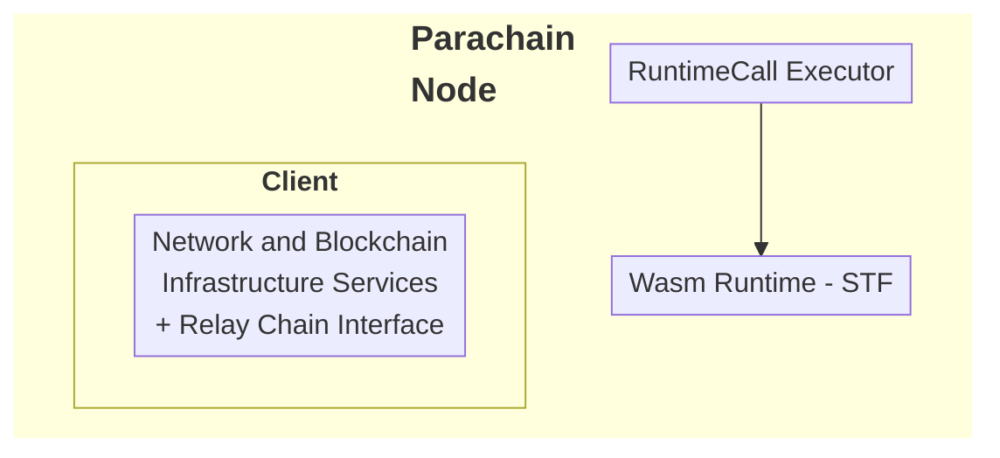
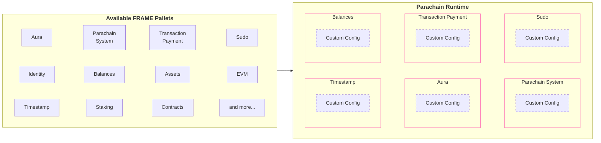

# Parachains Overview

## Introduction

A parachain is a specialized blockchain that connects to the Polkadot relay chain, benefiting from shared security, interoperability, and scalability. Parachains are built using the [Polkadot SDK](https://github.com/paritytech/polkadot-sdk){target=\_blank}, a powerful toolkit written in Rust that provides everything needed to create custom blockchain logic while integrating seamlessly with the Polkadot network.

Unlike standalone blockchains that must bootstrap their own validator sets and security, parachains leverage Polkadot's pooled security model. This allows parachain developers to focus on their application-specific functionality rather than consensus and security infrastructure. Parachains can communicate with each other through Cross-Consensus Messaging (XCM), enabling seamless interoperability across the Polkadot ecosystem.

Key capabilities that parachains provide include:

- **Shared security**: Inherit security from Polkadot's validator set without maintaining your own.
- **Interoperability**: Communicate trustlessly with other parachains via XCM.
- **Scalability**: Process transactions in parallel with other parachains.
- **Customization**: Build application-specific logic tailored to your use case.
- **Upgradeability**: Upgrade runtime logic without hard forks.

## Polkadot SDK: Parachain Architecture

Building a parachain involves understanding and utilizing several key components of the Polkadot SDK:

- **[Substrate](https://paritytech.github.io/polkadot-sdk/master/polkadot_sdk_docs/polkadot_sdk/substrate/index.html){target=\_blank}**: The foundation providing core blockchain primitives and libraries.
- **[FRAME](https://paritytech.github.io/polkadot-sdk/master/polkadot_sdk_docs/polkadot_sdk/frame_runtime/index.html){target=\_blank}**: A modular framework for building your parachain's runtime logic.
- **[Cumulus](https://paritytech.github.io/polkadot-sdk/master/polkadot_sdk_docs/polkadot_sdk/cumulus/index.html){target=\_blank}**: Essential libraries and pallets that enable parachain functionality.
- **[XCM (Cross Consensus Messaging)](https://paritytech.github.io/polkadot-sdk/master/polkadot_sdk_docs/polkadot_sdk/xcm/index.html){target=\_blank}**: The messaging format for communicating with other parachains and the relay chain.
- **[Polkadot](https://paritytech.github.io/polkadot-sdk/master/polkadot_sdk_docs/polkadot_sdk/polkadot/index.html){target=\_blank}**: The relay chain that provides security and coordination.

### Substrate: The Foundation

Substrate provides the core infrastructure that every parachain is built upon. It handles the low-level blockchain functionality, allowing you to focus on your application's unique features. Substrate includes implementations for networking, database management, consensus participation, and the execution environment for your runtime.

Every Polkadot SDK node consists of two main components:

- **Client (Host)**: Handles infrastructure services.

    - Native binary that runs on validator and collator nodes.
    - Executes the Wasm-compiled runtime.
    - Manages networking, database, mempool, and block production.
    - Interfaces with the relay chain for validation.

- **Runtime (State Transition Function)**: Contains your business logic.

    - Defines how your Polkadot SDK node processes transactions.
    - Compiled to [Wasm](https://webassembly.org/){target=\_blank} for deterministic execution.
    - Stored on-chain and upgradeable via governance.

### FRAME: Building Blocks for Your Runtime

FRAME provides modular components called [pallets](/reference/glossary#pallet){target=\_blank} that you can compose to build your parachain's runtime. Each pallet provides specific functionality that you can customize and configure for your needs. This modular approach allows you to quickly assemble complex functionality without writing everything from scratch.

### Cumulus: Parachain-Specific Functionality

Cumulus is what transforms a Polkadot SDK-based runtime into a parachain-capable runtime. It provides the essential components for communicating with the relay chain, participating in Polkadot's consensus, and handling parachain-specific operations like block validation and collation.

Key Cumulus components include:

- **Parachain system pallet**: Core parachain functionality and relay chain communication.
- **Collator consensus**: Block production logic for parachain collators.
- **Relay chain interface**: APIs for interacting with the Polkadot relay chain.
- **Validation data**: Handling proof-of-validity data required by relay chain validators.

## Where to Go Next

Building a parachain requires understanding the relationship between your chain and the Polkadot relay chain. The Polkadot SDK provides all the tools needed to design custom runtime logic, enable cross-chain communication, and deploy your parachain to production.

The following sections provide detailed guidance on each aspect of parachain development, from initial design through deployment and ongoing maintenance.

-   Guide __Customize Your Runtime__

    ---

    Design your parachain's runtime logic and choose appropriate pallets for your use case.

    [:octicons-arrow-right-24: Get Started](/parachains/customize-runtime/)

-   Guide __Interoperability__

    ---

    Implement XCM for trustless cross-chain communication with other parachains.

    [:octicons-arrow-right-24: Learn More](/parachains/interoperability/get-started/)

-   Guide __Nodes & Validators__

    ---

    Deploy your parachain to Polkadot by obtaining coretime and connecting to the relay chain.

    [:octicons-arrow-right-24: Deploy](/parachains/launch-a-parachain/choose-a-template/)

-   Guide __Runtime Upgrades__

    ---

    Upgrade your parachain's runtime without hard forks using forkless upgrade mechanisms.

    [:octicons-arrow-right-24: Maintain](/parachains/runtime-maintenance/runtime-upgrades/)

