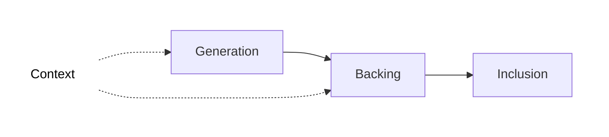

The mulit-step pipeline through which rollup blocks are processed into the Polkadot relay chain:

**Context**: Context of state is provided as input in order for collators and validators to build a rollup block during the generation and backing stages, respectively. This context is provided by two sources:

* **Relay Parent**: The relay chain block which a given rollup block is anchored to. Note that the relay parent of a rollup block and the relay block including that rollup block are always different. This context source lives on the relay chain.

* **Unincluded Segments**: Chains of candidate rollup blocks that have yet to be included in the relay chain, i.e. they can contain blocks at any stage pre-inclusion. The core functionality that asynchronous backing brings is the ability to build on these unincluded segments of block ancestors rather than building only on ancestors included in the relay chain state. This context source lives on the collators.

**Generation**: Collators *execute* their blockchain's core functionality to generate a new block, producing a [candidate receipt](), which is passed to validators selected for backing.

**Backing**: A subset of active validators verify if the rollup block follows the state transition rules of the rollup and sign *Proof of Validity* (PoV) statements that can have a positive or negative outcome. With enough positive statements, the block is backed and included in the relay chain, but is still pending approval.

**Inclusion**: Validators gossip [erasure code chunks]() and put the rollup block through the final [approval process]() before it is considered *included* in the relay chain.
