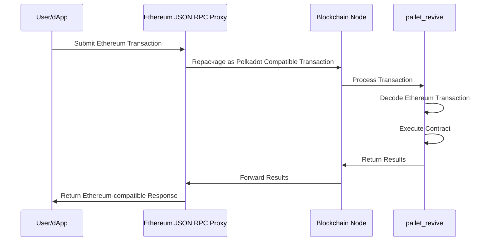

# Ethereum Compatibility

## Introduction

Polkadot Hub provides full Ethereum compatibility through the REVM (Rust Ethereum Virtual Machine) backend. This enables developers to deploy existing Solidity contracts without modifications, use familiar Ethereum tooling, and benefit from Polkadot's cross-chain capabilities.

## REVM Backend

The [REVM backend](https://github.com/bluealloy/revm){target=\_blank} is a complete Rust implementation of the Ethereum Virtual Machine, enabling Solidity contracts to run unchanged on Polkadot Hub.

### Key Benefits

- **Zero modifications required**: Deploy existing Ethereum contracts exactly as they are.
- **Full EVM compatibility**: Exact EVM behavior for audit tools and bytecode inspection.
- **Familiar tooling**: Use Hardhat, Foundry, Remix, and all standard Ethereum development tools.
- **Rapid deployment**: Get your contracts running on Polkadot immediately.
- **Established infrastructure**: Work with the Ethereum tooling ecosystem you already know.

### How It Works

REVM enables Ethereum developers to seamlessly migrate to Polkadot, achieving improved performance and lower fees without modifying their existing contracts or development workflows.

## Architecture

### Revive Pallet

[**`pallet_revive`**](https://paritytech.github.io/polkadot-sdk/master/pallet_revive/index.html){target=\_blank} is the runtime module that executes smart contracts. It processes Ethereum-style transactions through the following workflow:

This proxy-based approach eliminates the need for node binary modifications, maintaining compatibility across different client implementations. Preserving the original Ethereum transaction payload simplifies the adaptation of existing tools, which can continue processing familiar transaction formats.

### Full JSON-RPC Support

Polkadot Hub supports the standard Ethereum JSON-RPC API, ensuring compatibility with:

- **Wallets**: MetaMask, Rainbow, and other Ethereum wallets
- **Development tools**: Hardhat, Foundry, Remix IDE
- **Libraries**: Ethers.js, Web3.js, Viem, Wagmi
- **Infrastructure**: The Graph, Tenderly, and other Ethereum infrastructure

## Alternative: PVM Backend

For advanced use cases requiring maximum performance, Polkadot Hub also supports the [PVM (Polkadot Virtual Machine)](https://github.com/paritytech/polkavm){target=\_blank} backend. PVM uses a RISC-V-based architecture that can provide performance optimizations for computationally intensive workloads. Solidity contracts can be compiled to PVM bytecode using the `resolc` compiler.

Most developers should start with REVM for its simplicity and full Ethereum compatibility. PVM is available for projects with specific performance requirements.

## Where To Go Next

-   Learn __Contract Deployment__

    ---

    Learn how to deploy your Solidity contracts to Polkadot Hub.

    [:octicons-arrow-right-24: Reference](/smart-contracts/for-eth-devs/contract-deployment/)

