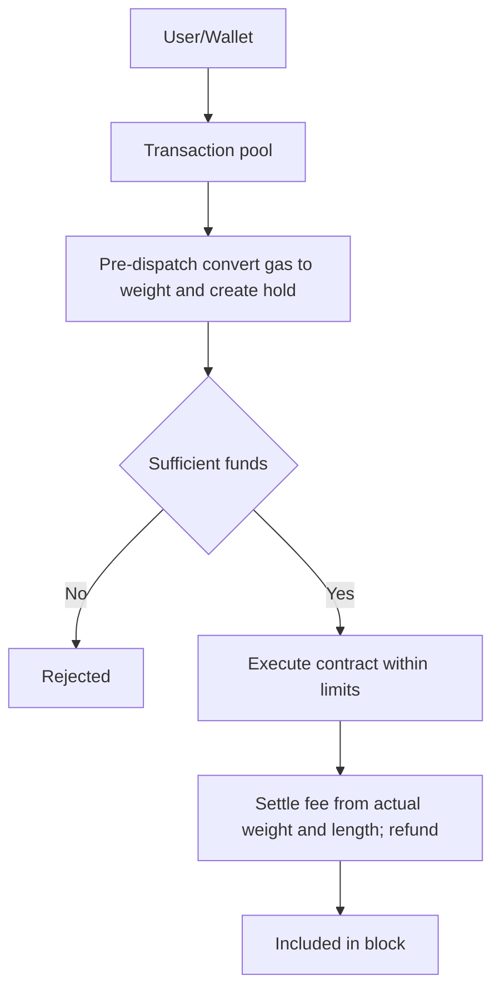

# Gas Model

## Overview

The Polkadot Hub implements a gas model that bridges Ethereum's familiar gas concept with Polkadot's more sophisticated resource metering system. This page explains how gas works in the Polkadot Hub and what developers need to know when building smart contracts.

## Understanding Resources in the Polkadot Hub

Unlike Ethereum, which uses a single gas value to measure everything, the Polkadot Hub tracks three separate resources:

- **`ref_time`**: Measures computational time. It is the closest equivalent to traditional gas and represents the amount of CPU time your contract execution consumes.
- **`proof_size`**: Measures the amount of state data that validators need to verify. When your contract reads from storage or makes state queries, this metric tracks the size of the proofs needed to validate those operations.
- **`storage_deposit`**: Is a native balance that gets temporarily locked when your contract creates new storage entries. This prevents state bloat by requiring contracts to pay for the storage they use. The deposit is returned when the storage is freed.

For Ethereum wallet compatibility, the Polkadot Hub's RPC layer automatically maps these three dimensions into a single gas value that wallets can understand and display to users.

## Gas vs Weight

When you interact with the Polkadot Hub through an Ethereum wallet, you see familiar gas values. Under the hood, the runtime works with `weight` - a two-dimensional metric that combines `ref_time` and `proof_size`.

The system continuously translates between these representations: converting `weight` to gas when estimating costs, and converting gas back to `weight` when executing transactions.

## How Gas Estimation Works

When your wallet requests a gas estimate (`eth_estimateGas`), the Polkadot Hub performs a dry-run of your transaction. This test execution discovers:

- How much computational time the contract will consume (`ref_time`).
- How much state data needs to be verified (`proof_size`).
- Whether any storage deposits are required (`storage_deposit`).

The system then calculates a gas estimate that covers all these costs, including:

- Base transaction overhead (intrinsic costs like signature verification, nonce/account checks, and dispatch setup).
- Transaction length fees (charges for the transaction size in bytes).
- The actual contract execution costs.
- Any storage deposits.

The gas estimate also includes a small safety buffer to account for slight differences between the test run and actual execution.

## Dynamic Gas Pricing

Pallet revive uses dynamic pricing through a "fee multiplier" that adjusts based on network congestion:

- When blocks are full, the multiplier increases, making transactions more expensive.
- When blocks are empty, the multiplier decreases, making transactions cheaper.
- The multiplier updates after every block based on utilization.

This creates a market-based pricing mechanism similar to Ethereum's base fee, helping to manage network resources efficiently.

The gas price returned during estimation is simply the current fee multiplier value.

!!! warning "Important for Users"
    Because the fee multiplier can change between when you estimate gas and when your transaction executes, you can add a safety buffer (10-20%) to both your gas limit and gas price. This ensures your transaction will execute successfully even if network conditions change slightly.

## Transaction Execution Flow

The following diagram illustrates the complete lifecycle of a transaction from submission to settlement:

The transaction execution flow is as follows:

- **Pool and pre-dispatch**: The transaction enters the pool, `gas` is mapped to `weight`, and a temporary hold is created for the maximum fee exposure. Weight is a two-dimensional tuple (`ref_time`, `proof_size`). Each dimension is tracked independently. The [`WeightToFee`](https://docs.rs/pallet-transaction-payment/latest/pallet_transaction_payment/pallet/trait.Config.html#associatedtype.WeightToFee){target=\_blank} conversion takes the maximum of the two dimensions (after applying their respective coefficients) to determine the fee.
- **Funds check**: If the hold is insufficient, the transaction is rejected before any execution.
- **Execution**: If sufficient, the contract runs within the derived weight limits; a `storage_deposit` may be reserved when new storage is created.
- **Settlement**: Fees are charged from the actual `weight` used plus the length fee; any unused hold is refunded.
- **Inclusion**: After settlement, the transaction is included in the block.

## Conclusion

The Polkadot Hub's gas model is designed to be Ethereum-compatible while providing the flexibility and efficiency of Polkadot's resource metering system. Developers can build on Ethereum tooling while leveraging Polkadot's advanced features like multi-dimensional resource tracking.
