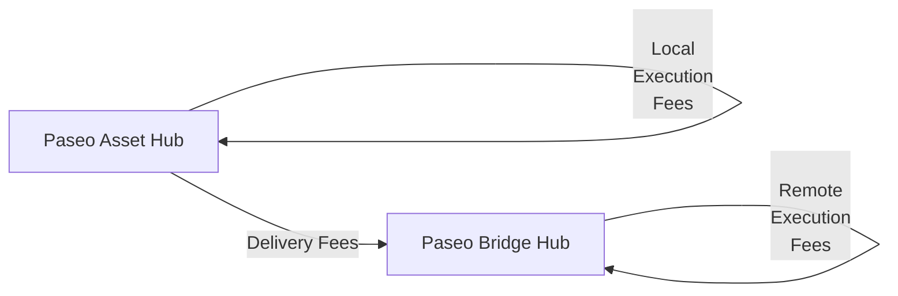

# XCM Fee Estimation

## Introduction

When sending cross-chain messages, ensure that the transaction will be successful not only in the local chain but also in the destination chain and any intermediate chains.

Sending cross-chain messages requires estimating the fees for the operation. 

This tutorial will demonstrate how to dry-run and estimate the fees for teleporting assets from the Paseo Asset Hub parachain to the Paseo Bridge Hub chain.

## Fee Mechanism

There are three types of fees that can be charged when sending a cross-chain message:

- **Local execution fees**: Fees charged in the local chain for executing the message.
- **Delivery fees**: Fees charged for delivering the message to the destination chain.
- **Remote execution fees**: Fees charged in the destination chain for executing the message.

If there are multiple intermediate chains, delivery fees and remote execution fees will be charged for each one.

In this example, you will estimate the fees for teleporting assets from the Paseo Asset Hub parachain to the Paseo Bridge Hub chain. The fee structure will be as follows:



The overall fees are `local_execution_fees` + `delivery_fees` + `remote_execution_fees`.

## Environment Setup

First, you need to set up your environment:

1. Create a new directory and initialize the project:

    ```bash
    mkdir xcm-fee-estimation && \
    cd xcm-fee-estimation
    ```

2. Initialize the project:

    ```bash
    npm init -y
    ```

3. Install dev dependencies:

    ```bash
    npm install --save-dev @types/node@^22.12.0 ts-node@^10.9.2 typescript@^5.7.3
    ```

4. Install dependencies:

    ```bash
    npm install --save @polkadot-labs/hdkd@^0.0.13 @polkadot-labs/hdkd-helpers@^0.0.13 polkadot-api@1.9.5
    ```

5. Create TypeScript configuration:

    ```bash
    npx tsc --init
    ```

6. Generate the types for the Polkadot API for Paseo Bridge Hub and Paseo Asset Hub:

    ```bash
    npx papi add paseoAssetHub -n paseo_asset_hub && \
    npx papi add paseoBridgeHub -w wss://bridge-hub-paseo.dotters.network
    ```

7. Create a new file called `teleport-ah-to-bridge-hub.ts`:

    ```bash
    touch teleport-ah-to-bridge-hub.ts
    ```

8. Import the necessary modules. Add the following code to the `teleport-ah-to-bridge-hub.ts` file:

    ```typescript title="teleport-ah-to-bridge-hub.ts"
    -import { paseoAssetHub, paseoBridgeHub } from '@polkadot-api/descriptors';
import { createClient, FixedSizeBinary, Enum } from 'polkadot-api';
import { getWsProvider } from 'polkadot-api/ws-provider/node';
import { withPolkadotSdkCompat } from 'polkadot-api/polkadot-sdk-compat';
import {
  XcmVersionedLocation,
  XcmVersionedAssetId,
  XcmV3Junctions,
  XcmV3MultiassetFungibility,
  XcmVersionedXcm,
  XcmV5Instruction,
  XcmV5Junctions,
  XcmV5Junction,
  XcmV5AssetFilter,
  XcmV5WildAsset,
} from '@polkadot-api/descriptors';

// 1 PAS = 10^10 units
const PAS_UNITS = 10_000_000_000n; // 1 PAS
const PAS_CENTS = 100_000_000n; // 0.01 PAS

// Paseo Asset Hub constants
const PASEO_ASSET_HUB_RPC_ENDPOINT = 'ws://localhost:8001';
const ASSET_HUB_ACCOUNT = '15oF4uVJwmo4TdGW7VfQxNLavjCXviqxT9S1MgbjMNHr6Sp5'; // Alice (Paseo Asset Hub)

// Bridge Hub destination
const BRIDGE_HUB_RPC_ENDPOINT = 'ws://localhost:8000';
const BRIDGE_HUB_PARA_ID = 1002;
const BRIDGE_HUB_BENEFICIARY =
  '14E5nqKAp3oAJcmzgZhUD2RcptBeUBScxKHgJKU4HPNcKVf3'; // Bob (Bridge Hub)

// Create the XCM message for teleport (Asset Hub → Bridge Hub)
function createTeleportXcmToBridgeHub(paraId: number) {
  return XcmVersionedXcm.V5([
    // Withdraw PAS from Asset Hub (PAS on parachains is parents:1, interior: Here)
    XcmV5Instruction.WithdrawAsset([
      {
        id: { parents: 1, interior: XcmV5Junctions.Here() },
        fun: XcmV3MultiassetFungibility.Fungible(1n * PAS_UNITS), // 1 PAS
      },
    ]),
    // Pay local fees on Asset Hub in PAS
    XcmV5Instruction.PayFees({
      asset: {
        id: { parents: 1, interior: XcmV5Junctions.Here() },
        fun: XcmV3MultiassetFungibility.Fungible(10n * PAS_CENTS), // 0.01 PAS
      },
    }),
    // Send to Bridge Hub parachain (parents:1, interior: X1(Parachain(paraId)))
    XcmV5Instruction.InitiateTransfer({
      destination: {
        parents: 1,
        interior: XcmV5Junctions.X1(XcmV5Junction.Parachain(paraId)),
      },
      remote_fees: Enum(
        'Teleport',
        XcmV5AssetFilter.Definite([
          {
            id: { parents: 1, interior: XcmV5Junctions.Here() },
            fun: XcmV3MultiassetFungibility.Fungible(10n * PAS_CENTS), // 0.01 PAS
          },
        ]),
      ),
      preserve_origin: false,
      remote_xcm: [
        XcmV5Instruction.DepositAsset({
          assets: XcmV5AssetFilter.Wild(XcmV5WildAsset.AllCounted(1)),
          beneficiary: {
            parents: 0,
            interior: XcmV5Junctions.X1(
              XcmV5Junction.AccountId32({
                network: undefined,
                id: FixedSizeBinary.fromAccountId32(BRIDGE_HUB_BENEFICIARY),
              }),
            ),
          },
        }),
      ],
      assets: [
        Enum('Teleport', XcmV5AssetFilter.Wild(XcmV5WildAsset.AllCounted(1))), // Send everything.
      ],
    }),
  ]);
}

async function estimateXcmFeesFromAssetHubToBridgeHub(
  xcm: any,
  assetHubApi: any,
) {
  console.log('=== Fee Estimation Process (Asset Hub → Bridge Hub) ===');

  // 1. LOCAL EXECUTION FEES on Asset Hub
  console.log('1. Calculating local execution fees on Asset Hub...');
  let localExecutionFees = 0n;

  const weightResult =
    await assetHubApi.apis.XcmPaymentApi.query_xcm_weight(xcm);
  if (weightResult.success) {
    console.log('✓ XCM weight (Asset Hub):', weightResult.value);

    // Convert weight to PAS fees from Asset Hub's perspective (parents:1, Here)
    const executionFeesResult =
      await assetHubApi.apis.XcmPaymentApi.query_weight_to_asset_fee(
        weightResult.value,
        XcmVersionedAssetId.V4({
          parents: 1,
          interior: XcmV3Junctions.Here(),
        }),
      );

    if (executionFeesResult.success) {
      localExecutionFees = executionFeesResult.value;
      console.log(
        '✓ Local execution fees (Asset Hub):',
        localExecutionFees.toString(),
        'PAS units',
      );
    } else {
      console.log(
        '✗ Failed to calculate local execution fees:',
        executionFeesResult.value,
      );
    }
  } else {
    console.log(
      '✗ Failed to query XCM weight on Asset Hub:',
      weightResult.value,
    );
  }

  // 2. DELIVERY FEES + REMOTE EXECUTION FEES
  console.log('\n2. Calculating delivery and remote execution fees...');
  let deliveryFees = 0n;
  let remoteExecutionFees = 0n; // Skipped (Bridge Hub descriptor not available)

  // Origin from Asset Hub perspective
  const origin = XcmVersionedLocation.V5({
    parents: 0,
    interior: XcmV5Junctions.X1(
      XcmV5Junction.AccountId32({
        id: FixedSizeBinary.fromAccountId32(ASSET_HUB_ACCOUNT),
        network: undefined,
      }),
    ),
  });

  // Dry run the XCM locally on Asset Hub
  const dryRunResult = await assetHubApi.apis.DryRunApi.dry_run_xcm(
    origin,
    xcm,
  );

  if (
    dryRunResult.success &&
    dryRunResult.value.execution_result.type === 'Complete'
  ) {
    console.log('✓ Local dry run on Asset Hub successful');

    const { forwarded_xcms: forwardedXcms } = dryRunResult.value;

    // Find the XCM message sent to Bridge Hub (parents:1, interior: X1(Parachain(1002)))
    const bridgeHubXcmEntry = forwardedXcms.find(
      ([location, _]: [any, any]) =>
        (location.type === 'V4' || location.type === 'V5') &&
        location.value.parents === 1 &&
        location.value.interior?.type === 'X1' &&
        location.value.interior.value?.type === 'Parachain' &&
        location.value.interior.value.value === BRIDGE_HUB_PARA_ID,
    );

    if (bridgeHubXcmEntry) {
      const [destination, messages] = bridgeHubXcmEntry;
      const remoteXcm = messages[0];

      console.log('✓ Found XCM message to Bridge Hub');

      // Calculate delivery fees from Asset Hub to Bridge Hub
      const deliveryFeesResult =
        await assetHubApi.apis.XcmPaymentApi.query_delivery_fees(
          destination,
          remoteXcm,
        );

      if (
        deliveryFeesResult.success &&
        deliveryFeesResult.value.type === 'V5' &&
        deliveryFeesResult.value.value[0]?.fun?.type === 'Fungible'
      ) {
        deliveryFees = deliveryFeesResult.value.value[0].fun.value;
        console.log('✓ Delivery fees:', deliveryFees.toString(), 'PAS units');
      } else {
        console.log('✗ Failed to calculate delivery fees:', deliveryFeesResult);
      }

      // 3. REMOTE EXECUTION FEES on Bridge Hub
      console.log('\n3. Calculating remote execution fees on Bridge Hub');
      try {
        const bridgeHubClient = createClient(
          withPolkadotSdkCompat(getWsProvider(BRIDGE_HUB_RPC_ENDPOINT)),
        );
        const bridgeHubApi = bridgeHubClient.getTypedApi(paseoBridgeHub);
        const remoteWeightResult =
          await bridgeHubApi.apis.XcmPaymentApi.query_xcm_weight(remoteXcm);
        const remoteFeesResult =
          await bridgeHubApi.apis.XcmPaymentApi.query_weight_to_asset_fee(
            remoteWeightResult.value as {
              ref_time: bigint;
              proof_size: bigint;
            },
            XcmVersionedAssetId.V4({
              parents: 1,
              interior: XcmV3Junctions.Here(),
            }),
          );
        bridgeHubClient.destroy();
        remoteExecutionFees = remoteFeesResult.value as bigint;
        console.log(
          '✓ Remote execution fees:',
          remoteExecutionFees.toString(),
          'PAS units',
        );
      } catch (error) {
        console.error(
          'Error calculating remote execution fees on Bridge Hub:',
          error,
        );
      }
    } else {
      console.log('✗ No XCM message found to Bridge Hub');
    }
  } else {
    console.log('✗ Local dry run failed on Asset Hub:', dryRunResult.value);
  }

  // 4. TOTAL FEES
  const totalFees = localExecutionFees + deliveryFees + remoteExecutionFees;

  console.log('\n=== Fee Summary (Asset Hub → Bridge Hub) ===');
  console.log(
    'Local execution fees:',
    localExecutionFees.toString(),
    'PAS units',
  );
  console.log('Delivery fees:', deliveryFees.toString(), 'PAS units');
  console.log(
    'Remote execution fees:',
    remoteExecutionFees.toString(),
    'PAS units',
  );
  console.log('TOTAL FEES:', totalFees.toString(), 'PAS units');
  console.log(
    'TOTAL FEES:',
    (Number(totalFees) / Number(PAS_UNITS)).toFixed(4),
    'PAS',
  );

  return {
    localExecutionFees,
    deliveryFees,
    remoteExecutionFees,
    totalFees,
  };
}

async function main() {
  // Connect to the Asset Hub parachain
  const assetHubClient = createClient(
    withPolkadotSdkCompat(getWsProvider(PASEO_ASSET_HUB_RPC_ENDPOINT)),
  );

  // Get the typed API for Asset Hub
  const assetHubApi = assetHubClient.getTypedApi(paseoAssetHub);

  try {
    // Create the XCM message for teleport (Asset Hub → Bridge Hub)
    const xcm = createTeleportXcmToBridgeHub(BRIDGE_HUB_PARA_ID);

    console.log('=== XCM Teleport: Paseo Asset Hub → Bridge Hub ===');
    console.log('From:', ASSET_HUB_ACCOUNT, '(Alice on Asset Hub)');
    console.log('To:', BRIDGE_HUB_BENEFICIARY, '(Beneficiary on Bridge Hub)');
    console.log('Amount:', '1 PAS');
    console.log('');

    // Estimate all fees
    const fees = await estimateXcmFeesFromAssetHubToBridgeHub(xcm, assetHubApi);
    void fees; // prevent unused var under isolatedModules

    // Create the execute transaction on Asset Hub
    const tx = assetHubApi.tx.PolkadotXcm.execute({
      message: xcm,
      max_weight: {
        ref_time: 6000000000n,
        proof_size: 65536n,
      },
    });

    console.log('\n=== Transaction Details ===');
    console.log('Transaction hex:', (await tx.getEncodedData()).asHex());
    console.log('Ready to submit!');
  } catch (error) {
    console.log('Error stack:', (error as Error).stack);
    console.error('Error occurred:', (error as Error).message);
    if ((error as Error).cause) {
      console.dir((error as Error).cause, { depth: null });
    }
  } finally {
    // Ensure client is always destroyed
    assetHubClient.destroy();
  }
}

main().catch(console.error);

    ```

9. Define constants and a `main` function where you will implement all the logic:

    ```typescript title="teleport-ah-to-bridge-hub.ts"
    -// 1 PAS = 10^10 units
const PAS_UNITS = 10_000_000_000n; // 1 PAS
const PAS_CENTS = 100_000_000n; // 0.01 PAS

// Paseo Asset Hub constants
const PASEO_ASSET_HUB_RPC_ENDPOINT = 'ws://localhost:8001';
const ASSET_HUB_ACCOUNT = '15oF4uVJwmo4TdGW7VfQxNLavjCXviqxT9S1MgbjMNHr6Sp5'; // Alice (Paseo Asset Hub)

// Bridge Hub destination
const BRIDGE_HUB_RPC_ENDPOINT = 'ws://localhost:8000';
const BRIDGE_HUB_PARA_ID = 1002;
const BRIDGE_HUB_BENEFICIARY =

    async function main() {
      // Code will go here
    }
    ```

All the following code explained in the subsequent sections must be added inside the `main` function.

## Client and API Setup

Now you are ready to start implementing the logic for the fee estimation for the teleport you want to perform. In this step, you will create the client for the Paseo Asset Hub parachain and generate the typed API to interact with the chain. Follow the steps below:

Create the API client. You will need to create a client for the Paseo Asset Hub parachain:

```typescript title="teleport-ah-to-bridge-hub.ts"
-  // Connect to the Asset Hub parachain
  const assetHubClient = createClient(
    withPolkadotSdkCompat(getWsProvider(PASEO_ASSET_HUB_RPC_ENDPOINT)),
  );

  // Get the typed API for Asset Hub
  const assetHubApi = assetHubClient.getTypedApi(paseoAssetHub);
```

Ensure that you replace the endpoint URLs with the actual WebSocket endpoints. This example uses local chopsticks endpoints, but you can use public endpoints or run local nodes.

## Create the XCM Message

Now, you can construct a proper XCM message using the new XCM V5 instructions for teleporting from Asset Hub to the Bridge Hub Chain:

```typescript title="teleport-ah-to-bridge-hub.ts"
-function createTeleportXcmToBridgeHub(paraId: number) {
  return XcmVersionedXcm.V5([
    // Withdraw PAS from Asset Hub (PAS on parachains is parents:1, interior: Here)
    XcmV5Instruction.WithdrawAsset([
      {
        id: { parents: 1, interior: XcmV5Junctions.Here() },
        fun: XcmV3MultiassetFungibility.Fungible(1n * PAS_UNITS), // 1 PAS
      },
    ]),
    // Pay local fees on Asset Hub in PAS
    XcmV5Instruction.PayFees({
      asset: {
        id: { parents: 1, interior: XcmV5Junctions.Here() },
        fun: XcmV3MultiassetFungibility.Fungible(10n * PAS_CENTS), // 0.01 PAS
      },
    }),
    // Send to Bridge Hub parachain (parents:1, interior: X1(Parachain(paraId)))
    XcmV5Instruction.InitiateTransfer({
      destination: {
        parents: 1,
        interior: XcmV5Junctions.X1(XcmV5Junction.Parachain(paraId)),
      },
      remote_fees: Enum(
        'Teleport',
        XcmV5AssetFilter.Definite([
          {
            id: { parents: 1, interior: XcmV5Junctions.Here() },
            fun: XcmV3MultiassetFungibility.Fungible(10n * PAS_CENTS), // 0.01 PAS
          },
        ]),
      ),
      preserve_origin: false,
      remote_xcm: [
        XcmV5Instruction.DepositAsset({
          assets: XcmV5AssetFilter.Wild(XcmV5WildAsset.AllCounted(1)),
          beneficiary: {
            parents: 0,
            interior: XcmV5Junctions.X1(
              XcmV5Junction.AccountId32({
                network: undefined,
                id: FixedSizeBinary.fromAccountId32(BRIDGE_HUB_BENEFICIARY),
              }),
            ),
          },
        }),
      ],
      assets: [
        Enum('Teleport', XcmV5AssetFilter.Wild(XcmV5WildAsset.AllCounted(1))), // Send everything.
      ],
    }),
  ]);
}
```

## Fee Estimation Function

Below is a four-step breakdown of the logic needed to estimate the fees for the teleport.

First, you need to create the function that will estimate the fees for the teleport:

```typescript title="teleport-ah-to-bridge-hub.ts"
-async function estimateXcmFeesFromAssetHubToBridgeHub(
  xcm: any,
  assetHubApi: any,
) {
  // Code will go here
}
```

1. **Local execution fees on Asset Hub**: Compute the XCM weight locally, then convert that weight to PAS using Asset Hub's view of PAS (`parents: 1, interior: Here`). Add the code to the function:

    ```typescript title="teleport-ah-to-bridge-hub.ts"
    -  console.log('=== Fee Estimation Process (Asset Hub → Bridge Hub) ===');

  // 1. LOCAL EXECUTION FEES on Asset Hub
  console.log('1. Calculating local execution fees on Asset Hub...');
  let localExecutionFees = 0n;

  const weightResult =
    await assetHubApi.apis.XcmPaymentApi.query_xcm_weight(xcm);
  if (weightResult.success) {
    console.log('✓ XCM weight (Asset Hub):', weightResult.value);

    // Convert weight to PAS fees from Asset Hub's perspective (parents:1, Here)
    const executionFeesResult =
      await assetHubApi.apis.XcmPaymentApi.query_weight_to_asset_fee(
        weightResult.value,
        XcmVersionedAssetId.V4({
          parents: 1,
          interior: XcmV3Junctions.Here(),
        }),
      );

    if (executionFeesResult.success) {
      localExecutionFees = executionFeesResult.value;
      console.log(
        '✓ Local execution fees (Asset Hub):',
        localExecutionFees.toString(),
        'PAS units',
      );
    } else {
      console.log(
        '✗ Failed to calculate local execution fees:',
        executionFeesResult.value,
      );
    }
  } else {
    console.log(
      '✗ Failed to query XCM weight on Asset Hub:',
      weightResult.value,
    );
  }
    ```

2. **Dry-run and delivery fees to Bridge Hub**: Dry-run the XCM on Asset Hub to capture forwarded messages, locate the one targeting Bridge Hub (`parents: 1, interior: Here`), and ask for delivery fees. Add the code to the function:

    ```typescript title="teleport-ah-to-bridge-hub.ts"
    -  // 2. DELIVERY FEES + REMOTE EXECUTION FEES
  console.log('\n2. Calculating delivery and remote execution fees...');
  let deliveryFees = 0n;
  let remoteExecutionFees = 0n; // Skipped (Bridge Hub descriptor not available)

  // Origin from Asset Hub perspective
  const origin = XcmVersionedLocation.V5({
    parents: 0,
    interior: XcmV5Junctions.X1(
      XcmV5Junction.AccountId32({
        id: FixedSizeBinary.fromAccountId32(ASSET_HUB_ACCOUNT),
        network: undefined,
      }),
    ),
  });

  // Dry run the XCM locally on Asset Hub
  const dryRunResult = await assetHubApi.apis.DryRunApi.dry_run_xcm(
    origin,
    xcm,
  );

  if (
    dryRunResult.success &&
    dryRunResult.value.execution_result.type === 'Complete'
  ) {
    console.log('✓ Local dry run on Asset Hub successful');

    const { forwarded_xcms: forwardedXcms } = dryRunResult.value;

    // Find the XCM message sent to Bridge Hub (parents:1, interior: X1(Parachain(1002)))
    const bridgeHubXcmEntry = forwardedXcms.find(
      ([location, _]: [any, any]) =>
        (location.type === 'V4' || location.type === 'V5') &&
        location.value.parents === 1 &&
        location.value.interior?.type === 'X1' &&
        location.value.interior.value?.type === 'Parachain' &&
        location.value.interior.value.value === BRIDGE_HUB_PARA_ID,
    );

    if (bridgeHubXcmEntry) {
      const [destination, messages] = bridgeHubXcmEntry;
      const remoteXcm = messages[0];

      console.log('✓ Found XCM message to Bridge Hub');

      // Calculate delivery fees from Asset Hub to Bridge Hub
      const deliveryFeesResult =
        await assetHubApi.apis.XcmPaymentApi.query_delivery_fees(
          destination,
          remoteXcm,
        );

      if (
        deliveryFeesResult.success &&
        deliveryFeesResult.value.type === 'V5' &&
        deliveryFeesResult.value.value[0]?.fun?.type === 'Fungible'
      ) {
        deliveryFees = deliveryFeesResult.value.value[0].fun.value;
        console.log('✓ Delivery fees:', deliveryFees.toString(), 'PAS units');
      } else {
        console.log('✗ Failed to calculate delivery fees:', deliveryFeesResult);
      }
    ```

3. **Remote execution fees on Bridge Hub**: Connect to Bridge Hub, recompute the forwarded XCM weight there, and convert weight to PAS (`parents: 0, interior: Here`). Add the code to the function:

    ```typescript title="teleport-ah-to-bridge-hub.ts"
    -      // 3. REMOTE EXECUTION FEES on Bridge Hub
      console.log('\n3. Calculating remote execution fees on Bridge Hub');
      try {
        const bridgeHubClient = createClient(
          withPolkadotSdkCompat(getWsProvider(BRIDGE_HUB_RPC_ENDPOINT)),
        );
        const bridgeHubApi = bridgeHubClient.getTypedApi(paseoBridgeHub);
        const remoteWeightResult =
          await bridgeHubApi.apis.XcmPaymentApi.query_xcm_weight(remoteXcm);
        const remoteFeesResult =
          await bridgeHubApi.apis.XcmPaymentApi.query_weight_to_asset_fee(
            remoteWeightResult.value as {
              ref_time: bigint;
              proof_size: bigint;
            },
            XcmVersionedAssetId.V4({
              parents: 1,
              interior: XcmV3Junctions.Here(),
            }),
          );
        bridgeHubClient.destroy();
        remoteExecutionFees = remoteFeesResult.value as bigint;
        console.log(
          '✓ Remote execution fees:',
          remoteExecutionFees.toString(),
          'PAS units',
        );
      } catch (error) {
        console.error(
          'Error calculating remote execution fees on Bridge Hub:',
          error,
        );
      }
    } else {
      console.log('✗ No XCM message found to Bridge Hub');
    }
  } else {
    console.log('✗ Local dry run failed on Asset Hub:', dryRunResult.value);
  }
    ```

4. **Sum and return totals**: Aggregate all parts, print a short summary, and return a structured result. Add the code to the function:

    ```typescript title="teleport-ah-to-bridge-hub.ts"
    -  // 4. TOTAL FEES
  const totalFees = localExecutionFees + deliveryFees + remoteExecutionFees;

  console.log('\n=== Fee Summary (Asset Hub → Bridge Hub) ===');
  console.log(
    'Local execution fees:',
    localExecutionFees.toString(),
    'PAS units',
  );
  console.log('Delivery fees:', deliveryFees.toString(), 'PAS units');
  console.log(
    'Remote execution fees:',
    remoteExecutionFees.toString(),
    'PAS units',
  );
  console.log('TOTAL FEES:', totalFees.toString(), 'PAS units');
  console.log(
    'TOTAL FEES:',
    (Number(totalFees) / Number(PAS_UNITS)).toFixed(4),
    'PAS',
  );

  return {
    localExecutionFees,
    deliveryFees,
    remoteExecutionFees,
    totalFees,
  };
}
    ```

The full code for the fee estimation function is the following:

??? code "Fee Estimation Function"

    ```typescript title="teleport-ah-to-bridge-hub.ts"
    -async function estimateXcmFeesFromAssetHubToBridgeHub(
  xcm: any,
  assetHubApi: any,
) {
  console.log('=== Fee Estimation Process (Asset Hub → Bridge Hub) ===');

  // 1. LOCAL EXECUTION FEES on Asset Hub
  console.log('1. Calculating local execution fees on Asset Hub...');
  let localExecutionFees = 0n;

  const weightResult =
    await assetHubApi.apis.XcmPaymentApi.query_xcm_weight(xcm);
  if (weightResult.success) {
    console.log('✓ XCM weight (Asset Hub):', weightResult.value);

    // Convert weight to PAS fees from Asset Hub's perspective (parents:1, Here)
    const executionFeesResult =
      await assetHubApi.apis.XcmPaymentApi.query_weight_to_asset_fee(
        weightResult.value,
        XcmVersionedAssetId.V4({
          parents: 1,
          interior: XcmV3Junctions.Here(),
        }),
      );

    if (executionFeesResult.success) {
      localExecutionFees = executionFeesResult.value;
      console.log(
        '✓ Local execution fees (Asset Hub):',
        localExecutionFees.toString(),
        'PAS units',
      );
    } else {
      console.log(
        '✗ Failed to calculate local execution fees:',
        executionFeesResult.value,
      );
    }
  } else {
    console.log(
      '✗ Failed to query XCM weight on Asset Hub:',
      weightResult.value,
    );
  }

  // 2. DELIVERY FEES + REMOTE EXECUTION FEES
  console.log('\n2. Calculating delivery and remote execution fees...');
  let deliveryFees = 0n;
  let remoteExecutionFees = 0n; // Skipped (Bridge Hub descriptor not available)

  // Origin from Asset Hub perspective
  const origin = XcmVersionedLocation.V5({
    parents: 0,
    interior: XcmV5Junctions.X1(
      XcmV5Junction.AccountId32({
        id: FixedSizeBinary.fromAccountId32(ASSET_HUB_ACCOUNT),
        network: undefined,
      }),
    ),
  });

  // Dry run the XCM locally on Asset Hub
  const dryRunResult = await assetHubApi.apis.DryRunApi.dry_run_xcm(
    origin,
    xcm,
  );

  if (
    dryRunResult.success &&
    dryRunResult.value.execution_result.type === 'Complete'
  ) {
    console.log('✓ Local dry run on Asset Hub successful');

    const { forwarded_xcms: forwardedXcms } = dryRunResult.value;

    // Find the XCM message sent to Bridge Hub (parents:1, interior: X1(Parachain(1002)))
    const bridgeHubXcmEntry = forwardedXcms.find(
      ([location, _]: [any, any]) =>
        (location.type === 'V4' || location.type === 'V5') &&
        location.value.parents === 1 &&
        location.value.interior?.type === 'X1' &&
        location.value.interior.value?.type === 'Parachain' &&
        location.value.interior.value.value === BRIDGE_HUB_PARA_ID,
    );

    if (bridgeHubXcmEntry) {
      const [destination, messages] = bridgeHubXcmEntry;
      const remoteXcm = messages[0];

      console.log('✓ Found XCM message to Bridge Hub');

      // Calculate delivery fees from Asset Hub to Bridge Hub
      const deliveryFeesResult =
        await assetHubApi.apis.XcmPaymentApi.query_delivery_fees(
          destination,
          remoteXcm,
        );

      if (
        deliveryFeesResult.success &&
        deliveryFeesResult.value.type === 'V5' &&
        deliveryFeesResult.value.value[0]?.fun?.type === 'Fungible'
      ) {
        deliveryFees = deliveryFeesResult.value.value[0].fun.value;
        console.log('✓ Delivery fees:', deliveryFees.toString(), 'PAS units');
      } else {
        console.log('✗ Failed to calculate delivery fees:', deliveryFeesResult);
      }

      // 3. REMOTE EXECUTION FEES on Bridge Hub
      console.log('\n3. Calculating remote execution fees on Bridge Hub');
      try {
        const bridgeHubClient = createClient(
          withPolkadotSdkCompat(getWsProvider(BRIDGE_HUB_RPC_ENDPOINT)),
        );
        const bridgeHubApi = bridgeHubClient.getTypedApi(paseoBridgeHub);
        const remoteWeightResult =
          await bridgeHubApi.apis.XcmPaymentApi.query_xcm_weight(remoteXcm);
        const remoteFeesResult =
          await bridgeHubApi.apis.XcmPaymentApi.query_weight_to_asset_fee(
            remoteWeightResult.value as {
              ref_time: bigint;
              proof_size: bigint;
            },
            XcmVersionedAssetId.V4({
              parents: 1,
              interior: XcmV3Junctions.Here(),
            }),
          );
        bridgeHubClient.destroy();
        remoteExecutionFees = remoteFeesResult.value as bigint;
        console.log(
          '✓ Remote execution fees:',
          remoteExecutionFees.toString(),
          'PAS units',
        );
      } catch (error) {
        console.error(
          'Error calculating remote execution fees on Bridge Hub:',
          error,
        );
      }
    } else {
      console.log('✗ No XCM message found to Bridge Hub');
    }
  } else {
    console.log('✗ Local dry run failed on Asset Hub:', dryRunResult.value);
  }

  // 4. TOTAL FEES
  const totalFees = localExecutionFees + deliveryFees + remoteExecutionFees;

  console.log('\n=== Fee Summary (Asset Hub → Bridge Hub) ===');
  console.log(
    'Local execution fees:',
    localExecutionFees.toString(),
    'PAS units',
  );
  console.log('Delivery fees:', deliveryFees.toString(), 'PAS units');
  console.log(
    'Remote execution fees:',
    remoteExecutionFees.toString(),
    'PAS units',
  );
  console.log('TOTAL FEES:', totalFees.toString(), 'PAS units');
  console.log(
    'TOTAL FEES:',
    (Number(totalFees) / Number(PAS_UNITS)).toFixed(4),
    'PAS',
  );

  return {
    localExecutionFees,
    deliveryFees,
    remoteExecutionFees,
    totalFees,
  };
}
    ```

## Complete Implementation

Now put it all together in the main function:

```typescript title="teleport-ah-to-bridge-hub.ts"
-async function main() {
  // Connect to the Asset Hub parachain
  const assetHubClient = createClient(
    withPolkadotSdkCompat(getWsProvider(PASEO_ASSET_HUB_RPC_ENDPOINT)),
  );

  // Get the typed API for Asset Hub
  const assetHubApi = assetHubClient.getTypedApi(paseoAssetHub);

  try {
    // Create the XCM message for teleport (Asset Hub → Bridge Hub)
    const xcm = createTeleportXcmToBridgeHub(BRIDGE_HUB_PARA_ID);

    console.log('=== XCM Teleport: Paseo Asset Hub → Bridge Hub ===');
    console.log('From:', ASSET_HUB_ACCOUNT, '(Alice on Asset Hub)');
    console.log('To:', BRIDGE_HUB_BENEFICIARY, '(Beneficiary on Bridge Hub)');
    console.log('Amount:', '1 PAS');
    console.log('');

    // Estimate all fees
    const fees = await estimateXcmFeesFromAssetHubToBridgeHub(xcm, assetHubApi);
    void fees; // prevent unused var under isolatedModules

    // Create the execute transaction on Asset Hub
    const tx = assetHubApi.tx.PolkadotXcm.execute({
      message: xcm,
      max_weight: {
        ref_time: 6000000000n,
        proof_size: 65536n,
      },
    });

    console.log('\n=== Transaction Details ===');
    console.log('Transaction hex:', (await tx.getEncodedData()).asHex());
    console.log('Ready to submit!');
  } catch (error) {
    console.log('Error stack:', (error as Error).stack);
    console.error('Error occurred:', (error as Error).message);
    if ((error as Error).cause) {
      console.dir((error as Error).cause, { depth: null });
    }
  } finally {
    // Ensure client is always destroyed
    assetHubClient.destroy();
  }
}
```

## Full Code

The full code for the complete implementation is the following:

??? code "Teleport from Asset Hub to Bridge Hub"

    ```typescript title="teleport-ah-to-bridge-hub.ts"
    -import { paseoAssetHub, paseoBridgeHub } from '@polkadot-api/descriptors';
import { createClient, FixedSizeBinary, Enum } from 'polkadot-api';
import { getWsProvider } from 'polkadot-api/ws-provider/node';
import { withPolkadotSdkCompat } from 'polkadot-api/polkadot-sdk-compat';
import {
  XcmVersionedLocation,
  XcmVersionedAssetId,
  XcmV3Junctions,
  XcmV3MultiassetFungibility,
  XcmVersionedXcm,
  XcmV5Instruction,
  XcmV5Junctions,
  XcmV5Junction,
  XcmV5AssetFilter,
  XcmV5WildAsset,
} from '@polkadot-api/descriptors';

// 1 PAS = 10^10 units
const PAS_UNITS = 10_000_000_000n; // 1 PAS
const PAS_CENTS = 100_000_000n; // 0.01 PAS

// Paseo Asset Hub constants
const PASEO_ASSET_HUB_RPC_ENDPOINT = 'ws://localhost:8001';
const ASSET_HUB_ACCOUNT = '15oF4uVJwmo4TdGW7VfQxNLavjCXviqxT9S1MgbjMNHr6Sp5'; // Alice (Paseo Asset Hub)

// Bridge Hub destination
const BRIDGE_HUB_RPC_ENDPOINT = 'ws://localhost:8000';
const BRIDGE_HUB_PARA_ID = 1002;
const BRIDGE_HUB_BENEFICIARY =
  '14E5nqKAp3oAJcmzgZhUD2RcptBeUBScxKHgJKU4HPNcKVf3'; // Bob (Bridge Hub)

// Create the XCM message for teleport (Asset Hub → Bridge Hub)
function createTeleportXcmToBridgeHub(paraId: number) {
  return XcmVersionedXcm.V5([
    // Withdraw PAS from Asset Hub (PAS on parachains is parents:1, interior: Here)
    XcmV5Instruction.WithdrawAsset([
      {
        id: { parents: 1, interior: XcmV5Junctions.Here() },
        fun: XcmV3MultiassetFungibility.Fungible(1n * PAS_UNITS), // 1 PAS
      },
    ]),
    // Pay local fees on Asset Hub in PAS
    XcmV5Instruction.PayFees({
      asset: {
        id: { parents: 1, interior: XcmV5Junctions.Here() },
        fun: XcmV3MultiassetFungibility.Fungible(10n * PAS_CENTS), // 0.01 PAS
      },
    }),
    // Send to Bridge Hub parachain (parents:1, interior: X1(Parachain(paraId)))
    XcmV5Instruction.InitiateTransfer({
      destination: {
        parents: 1,
        interior: XcmV5Junctions.X1(XcmV5Junction.Parachain(paraId)),
      },
      remote_fees: Enum(
        'Teleport',
        XcmV5AssetFilter.Definite([
          {
            id: { parents: 1, interior: XcmV5Junctions.Here() },
            fun: XcmV3MultiassetFungibility.Fungible(10n * PAS_CENTS), // 0.01 PAS
          },
        ]),
      ),
      preserve_origin: false,
      remote_xcm: [
        XcmV5Instruction.DepositAsset({
          assets: XcmV5AssetFilter.Wild(XcmV5WildAsset.AllCounted(1)),
          beneficiary: {
            parents: 0,
            interior: XcmV5Junctions.X1(
              XcmV5Junction.AccountId32({
                network: undefined,
                id: FixedSizeBinary.fromAccountId32(BRIDGE_HUB_BENEFICIARY),
              }),
            ),
          },
        }),
      ],
      assets: [
        Enum('Teleport', XcmV5AssetFilter.Wild(XcmV5WildAsset.AllCounted(1))), // Send everything.
      ],
    }),
  ]);
}

async function estimateXcmFeesFromAssetHubToBridgeHub(
  xcm: any,
  assetHubApi: any,
) {
  console.log('=== Fee Estimation Process (Asset Hub → Bridge Hub) ===');

  // 1. LOCAL EXECUTION FEES on Asset Hub
  console.log('1. Calculating local execution fees on Asset Hub...');
  let localExecutionFees = 0n;

  const weightResult =
    await assetHubApi.apis.XcmPaymentApi.query_xcm_weight(xcm);
  if (weightResult.success) {
    console.log('✓ XCM weight (Asset Hub):', weightResult.value);

    // Convert weight to PAS fees from Asset Hub's perspective (parents:1, Here)
    const executionFeesResult =
      await assetHubApi.apis.XcmPaymentApi.query_weight_to_asset_fee(
        weightResult.value,
        XcmVersionedAssetId.V4({
          parents: 1,
          interior: XcmV3Junctions.Here(),
        }),
      );

    if (executionFeesResult.success) {
      localExecutionFees = executionFeesResult.value;
      console.log(
        '✓ Local execution fees (Asset Hub):',
        localExecutionFees.toString(),
        'PAS units',
      );
    } else {
      console.log(
        '✗ Failed to calculate local execution fees:',
        executionFeesResult.value,
      );
    }
  } else {
    console.log(
      '✗ Failed to query XCM weight on Asset Hub:',
      weightResult.value,
    );
  }

  // 2. DELIVERY FEES + REMOTE EXECUTION FEES
  console.log('\n2. Calculating delivery and remote execution fees...');
  let deliveryFees = 0n;
  let remoteExecutionFees = 0n; // Skipped (Bridge Hub descriptor not available)

  // Origin from Asset Hub perspective
  const origin = XcmVersionedLocation.V5({
    parents: 0,
    interior: XcmV5Junctions.X1(
      XcmV5Junction.AccountId32({
        id: FixedSizeBinary.fromAccountId32(ASSET_HUB_ACCOUNT),
        network: undefined,
      }),
    ),
  });

  // Dry run the XCM locally on Asset Hub
  const dryRunResult = await assetHubApi.apis.DryRunApi.dry_run_xcm(
    origin,
    xcm,
  );

  if (
    dryRunResult.success &&
    dryRunResult.value.execution_result.type === 'Complete'
  ) {
    console.log('✓ Local dry run on Asset Hub successful');

    const { forwarded_xcms: forwardedXcms } = dryRunResult.value;

    // Find the XCM message sent to Bridge Hub (parents:1, interior: X1(Parachain(1002)))
    const bridgeHubXcmEntry = forwardedXcms.find(
      ([location, _]: [any, any]) =>
        (location.type === 'V4' || location.type === 'V5') &&
        location.value.parents === 1 &&
        location.value.interior?.type === 'X1' &&
        location.value.interior.value?.type === 'Parachain' &&
        location.value.interior.value.value === BRIDGE_HUB_PARA_ID,
    );

    if (bridgeHubXcmEntry) {
      const [destination, messages] = bridgeHubXcmEntry;
      const remoteXcm = messages[0];

      console.log('✓ Found XCM message to Bridge Hub');

      // Calculate delivery fees from Asset Hub to Bridge Hub
      const deliveryFeesResult =
        await assetHubApi.apis.XcmPaymentApi.query_delivery_fees(
          destination,
          remoteXcm,
        );

      if (
        deliveryFeesResult.success &&
        deliveryFeesResult.value.type === 'V5' &&
        deliveryFeesResult.value.value[0]?.fun?.type === 'Fungible'
      ) {
        deliveryFees = deliveryFeesResult.value.value[0].fun.value;
        console.log('✓ Delivery fees:', deliveryFees.toString(), 'PAS units');
      } else {
        console.log('✗ Failed to calculate delivery fees:', deliveryFeesResult);
      }

      // 3. REMOTE EXECUTION FEES on Bridge Hub
      console.log('\n3. Calculating remote execution fees on Bridge Hub');
      try {
        const bridgeHubClient = createClient(
          withPolkadotSdkCompat(getWsProvider(BRIDGE_HUB_RPC_ENDPOINT)),
        );
        const bridgeHubApi = bridgeHubClient.getTypedApi(paseoBridgeHub);
        const remoteWeightResult =
          await bridgeHubApi.apis.XcmPaymentApi.query_xcm_weight(remoteXcm);
        const remoteFeesResult =
          await bridgeHubApi.apis.XcmPaymentApi.query_weight_to_asset_fee(
            remoteWeightResult.value as {
              ref_time: bigint;
              proof_size: bigint;
            },
            XcmVersionedAssetId.V4({
              parents: 1,
              interior: XcmV3Junctions.Here(),
            }),
          );
        bridgeHubClient.destroy();
        remoteExecutionFees = remoteFeesResult.value as bigint;
        console.log(
          '✓ Remote execution fees:',
          remoteExecutionFees.toString(),
          'PAS units',
        );
      } catch (error) {
        console.error(
          'Error calculating remote execution fees on Bridge Hub:',
          error,
        );
      }
    } else {
      console.log('✗ No XCM message found to Bridge Hub');
    }
  } else {
    console.log('✗ Local dry run failed on Asset Hub:', dryRunResult.value);
  }

  // 4. TOTAL FEES
  const totalFees = localExecutionFees + deliveryFees + remoteExecutionFees;

  console.log('\n=== Fee Summary (Asset Hub → Bridge Hub) ===');
  console.log(
    'Local execution fees:',
    localExecutionFees.toString(),
    'PAS units',
  );
  console.log('Delivery fees:', deliveryFees.toString(), 'PAS units');
  console.log(
    'Remote execution fees:',
    remoteExecutionFees.toString(),
    'PAS units',
  );
  console.log('TOTAL FEES:', totalFees.toString(), 'PAS units');
  console.log(
    'TOTAL FEES:',
    (Number(totalFees) / Number(PAS_UNITS)).toFixed(4),
    'PAS',
  );

  return {
    localExecutionFees,
    deliveryFees,
    remoteExecutionFees,
    totalFees,
  };
}

async function main() {
  // Connect to the Asset Hub parachain
  const assetHubClient = createClient(
    withPolkadotSdkCompat(getWsProvider(PASEO_ASSET_HUB_RPC_ENDPOINT)),
  );

  // Get the typed API for Asset Hub
  const assetHubApi = assetHubClient.getTypedApi(paseoAssetHub);

  try {
    // Create the XCM message for teleport (Asset Hub → Bridge Hub)
    const xcm = createTeleportXcmToBridgeHub(BRIDGE_HUB_PARA_ID);

    console.log('=== XCM Teleport: Paseo Asset Hub → Bridge Hub ===');
    console.log('From:', ASSET_HUB_ACCOUNT, '(Alice on Asset Hub)');
    console.log('To:', BRIDGE_HUB_BENEFICIARY, '(Beneficiary on Bridge Hub)');
    console.log('Amount:', '1 PAS');
    console.log('');

    // Estimate all fees
    const fees = await estimateXcmFeesFromAssetHubToBridgeHub(xcm, assetHubApi);
    void fees; // prevent unused var under isolatedModules

    // Create the execute transaction on Asset Hub
    const tx = assetHubApi.tx.PolkadotXcm.execute({
      message: xcm,
      max_weight: {
        ref_time: 6000000000n,
        proof_size: 65536n,
      },
    });

    console.log('\n=== Transaction Details ===');
    console.log('Transaction hex:', (await tx.getEncodedData()).asHex());
    console.log('Ready to submit!');
  } catch (error) {
    console.log('Error stack:', (error as Error).stack);
    console.error('Error occurred:', (error as Error).message);
    if ((error as Error).cause) {
      console.dir((error as Error).cause, { depth: null });
    }
  } finally {
    // Ensure client is always destroyed
    assetHubClient.destroy();
  }
}

main().catch(console.error);

    ```

## Running the Script

Before running the script, you can use chopsticks to fork the Paseo Asset Hub and Paseo Bridge Hub chains locally. To do so, you can use the following files and commands:

1. Create a new directory called `.chopsticks` and add the files:

    ??? code "paseo-bridge-hub.yml"

        ```yaml title=".chopsticks/paseo-bridge-hub.yml"
        -endpoint: wss://bridge-hub-paseo.dotters.network
mock-signature-host: true
block: ${env.PASEO_BRIDGE_HUB_BLOCK_NUMBER}
db: ./db.sqlite

import-storage:
  Sudo:
    Key: 5GrwvaEF5zXb26Fz9rcQpDWS57CtERHpNehXCPcNoHGKutQY # Alice
  System:
    Account:
      -
        -
          - 5GrwvaEF5zXb26Fz9rcQpDWS57CtERHpNehXCPcNoHGKutQY
        - providers: 1
          data:
            free: '10000000000000000000'
        ```
    
    ??? code "paseo-asset-hub.yml"

        ```yaml title=".chopsticks/paseo-asset-hub.yml"
        -endpoint: wss://asset-hub-paseo-rpc.n.dwellir.com
mock-signature-host: true
block: ${env.PASEO_ASSET_HUB_BLOCK_NUMBER}
db: ./db.sqlite

import-storage:
  Sudo:
    Key: 5GrwvaEF5zXb26Fz9rcQpDWS57CtERHpNehXCPcNoHGKutQY # Alice
  System:
    Account:
      -
        -
          - 5GrwvaEF5zXb26Fz9rcQpDWS57CtERHpNehXCPcNoHGKutQY
        - providers: 1
          data:
            free: '10000000000000000000'
        ```

2. Run the following command to fork the Paseo Bridge Hub chain:

    ```bash
    chopsticks --config=.chopsticks/paseo-bridge-hub.yml
    ```

    After running the command, you will see the following output:

    -<div id="termynal" data-termynal>
  <span data-ty="input"><span class="file-path"></span>chopsticks --config=.chopsticks/paseo-bridge-hub.yml</span>
  <span data-ty="output">[15:55:22.770] INFO: Paseo Bridge Hub RPC listening on http://[::]:8000 and ws://[::]:8000</span>
  <span data-ty="output">app: "chopsticks"</span>
</div>


3. Run the following command to fork the Paseo Asset Hub chain:

    ```bash
    chopsticks --config=.chopsticks/paseo-asset-hub.yml
    ```

    After running the commands, you will see the following output:

    -<div id="termynal" data-termynal>
  <span data-ty="input"><span class="file-path"></span>chopsticks --config=.chopsticks/paseo-asset-hub.yml</span>
  <span data-ty="output">[15:55:22.770] INFO: Paseo Asset Hub Testnet RPC listening on http://[::]:8001 and ws://[::]:8001</span>
  <span data-ty="output">app: "chopsticks"</span>
</div>


4. Run the script:

    ```bash
    npx ts-node teleport-ah-to-bridge-hub.ts
    ```

After running the script, you will see the following output:

-<div id="termynal" data-termynal>
  <span data-ty="input"><span class="file-path"></span>npx ts-node teleport-ah-to-bridge-hub.ts</span>
  <pre>
=== XCM Teleport: Paseo Asset Hub → Bridge Hub ===
From: 15oF4uVJwmo4TdGW7VfQxNLavjCXviqxT9S1MgbjMNHr6Sp5 (Alice on Asset Hub)
To: 14E5nqKAp3oAJcmzgZhUD2RcptBeUBScxKHgJKU4HPNcKVf3 (Beneficiary on Bridge Hub)
Amount: 1 PAS

=== Fee Estimation Process (Asset Hub → Bridge Hub) ===
1. Calculating local execution fees on Asset Hub...
✓ XCM weight (Asset Hub): { ref_time: 1462082000n, proof_size: 19578n }
✓ Local execution fees (Asset Hub): 97890000 PAS units

2. Calculating delivery and remote execution fees...
✓ Local dry run on Asset Hub successful
✓ Found XCM message to Bridge Hub
✓ Delivery fees: 305150000 PAS units

3. Calculating remote execution fees on Bridge Hub
✓ Remote execution fees: 17965000 PAS units

=== Fee Summary (Asset Hub → Bridge Hub) ===
Local execution fees: 97890000 PAS units
Delivery fees: 305150000 PAS units
Remote execution fees: 17965000 PAS units
TOTAL FEES: 421005000 PAS units
TOTAL FEES: 0.0421 PAS

=== Transaction Details ===
Transaction hex: 0x1f03050c00040100000700e40b54023001000002286bee31010100a90f0100000401000002286bee000400010204040d010204000101008eaf04151687736326c9fea17e25fc5287613693c912909cb226aa4794f26a480700bca0650102000400
Ready to submit!

</pre
  >
</div>


## Conclusion

This approach provides accurate fee estimation for XCM teleports from Asset Hub to Bridge Hub Chain by properly simulating execution on both chains and utilizing dedicated runtime APIs for fee calculation. The fee breakdown helps you understand the cost structure of reverse cross-chain operations (parachain → bridge hub chain) and ensures your transactions have sufficient funds to complete successfully.

The key insight is understanding how asset references change based on the perspective of each chain in the XCM ecosystem, which is crucial for proper fee estimation and XCM construction.
