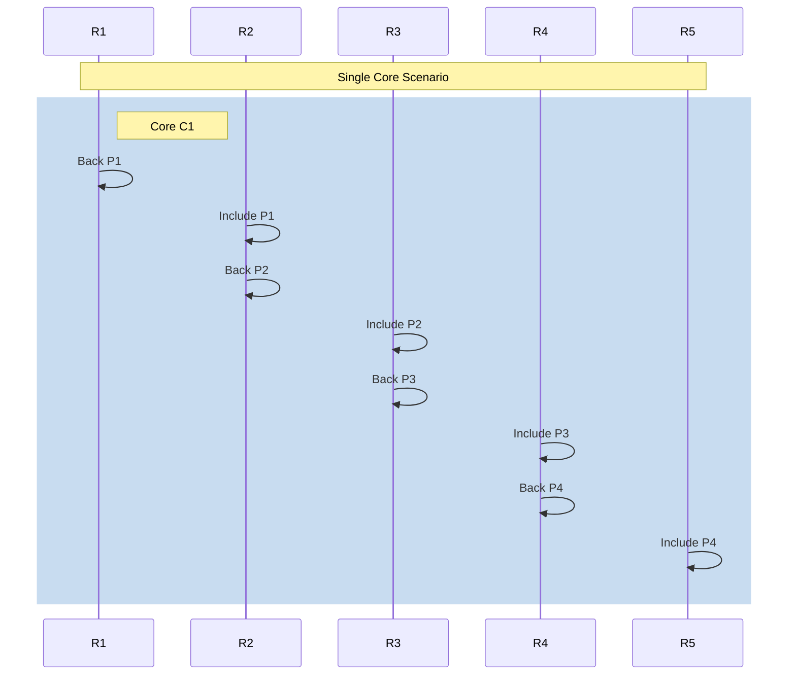
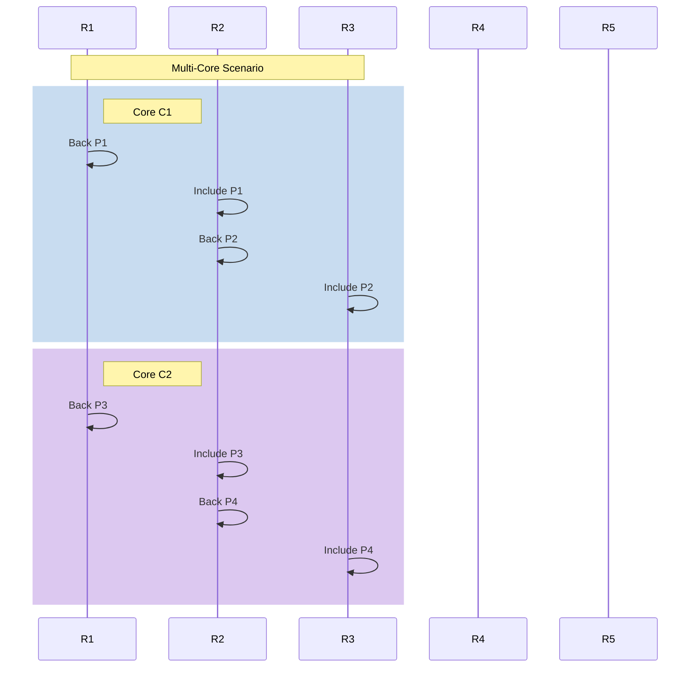

# Elastic Scaling

## Introduction

Polkadot's architecture delivers scalability and security through its shared security model, where the relay chain coordinates and validates multiple parallel chains. 

Elastic scaling enhances this architecture by allowing parachains to utilize multiple computational cores simultaneously, breaking the previous 1:1 relationship between parachain and relay chain blocks.

This technical advancement enables parachains to process multiple blocks within a single relay chain block, significantly increasing throughput capabilities. By leveraging [Agile Coretime](/polkadot-protocol/architecture/polkadot-chain/agile-coretime){target=\_blank}, parachains can dynamically adjust their processing capacity based on demand, creating an efficient and responsive infrastructure for high-throughput applications.

## How Elastic Scaling Works

Elastic scaling enables parachains to process multiple blocks in parallel by utilizing additional cores on the relay chain. This section provides a technical analysis of the performance advantages and details of the implementation.

Consider a parachain that needs to process four consecutive parablocks. With traditional single-core allocation, the validation process follows a strictly sequential pattern. Each parablock undergoes a two-phase process on the relay chain:

1. **Backing phase**: Validators create and distribute validity statements.
2. **Inclusion phase**: The parablock is included in the relay chain after availability verification.

Throughout the following diagrams, specific notation is used to represent different components of the system:

- **R1, R2, ...**: Relay chain blocks (produced at ~6-second intervals).
- **P1, P2, ...**: Parachain blocks that need validation and inclusion.
- **C1, C2, ...**: Cores on the relay chain.

In the single-core scenario (assuming a 6-second relay chain block time), processing four parablocks requires approximately 30 seconds:

With elastic scaling utilizing two cores simultaneously, the same four parablocks can be processed in approximately 18 seconds:

To help interpret the sequence diagrams above, note the following key elements:

- The horizontal axis represents time progression through relay chain blocks (R1-R5).
- Each colored rectangle shows processing on a specific core (C1 or C2).
- In the single-core scenario, all blocks must be processed sequentially on one core.
- In the multi-core scenario, blocks are processed in parallel across multiple cores, reducing total time.

The relay chain processes these multiple parablocks as independent validation units during the backing, availability, and approval phases. However, during inclusion, it verifies that their state roots align properly to maintain chain consistency.

From an implementation perspective:

- **Parachain side**: Collators must increase their block production rate to utilize multiple cores fully.
- **Validation process**: Each core operates independently, but with coordinated state verification.
- **Resource management**: Cores are dynamically allocated based on parachain requirements.
- **State consistency**: While backed and processed in parallel, the parablocks maintain sequential state transitions.

## Benefits of Elastic Scaling

- **Increased throughput**: Multiple concurrent cores enable parachains to process transactions at multiples of their previous capacity. By allowing multiple parachain blocks to be validated within each relay chain block cycle, applications can achieve significantly higher transaction volumes.

- **Lower latency**: Transaction finality improves substantially with multi-core processing. Parachains currently achieve 2-second latency with three cores, with projected improvements to 500ms using 12 cores, enabling near-real-time application responsiveness.

- **Resource efficiency**: Applications acquire computational resources precisely matched to their needs, eliminating wasteful over-provisioning. Coretime can be purchased at granular intervals (blocks, hours, days), creating cost-effective operations, particularly for applications with variable transaction patterns.

- **Scalable growth**: New applications can launch with minimal initial resource commitment and scale dynamically as adoption increases. This eliminates the traditional paradox of either over-allocating resources (increasing costs) or under-allocating (degrading performance) during growth phases.

- **Workload distribution**: Parachains intelligently distribute workloads across cores during peak demand periods and release resources when traffic subsides. Paired with secondary coretime markets, this ensures maximum resource utilization across the entire network ecosystem.

- **Reliable performance**: End-users experience reliable application performance regardless of network congestion levels. Applications maintain responsiveness even during traffic spikes, eliminating performance degradation that commonly impacts blockchain applications during high-demand periods.

## Use Cases

Elastic scaling enables applications to dynamically adjust their resource consumption based on real-time demand. This is especially valuable for decentralized applications where usage patterns can be highly variable. The following examples illustrate common scenarios where elastic scaling delivers significant performance and cost-efficiency benefits.

### Handling Sudden Traffic Spikes

Many decentralized applications experience unpredictable, high-volume traffic bursts, especially in gaming, DeFi protocols, NFT auctions, messaging platforms, and social media. Elastic scaling allows these systems to acquire additional coretime during peak usage and release it during quieter periods, ensuring responsiveness without incurring constant high infrastructure costs.

### Supporting Early-Stage Growth

Startups and new projects often begin with uncertain or volatile demand. With elastic scaling, teams can launch with minimal compute resources (e.g., a single core) and gradually scale as adoption increases. This prevents overprovisioning and enables cost-efficient growth until the application is ready for more permanent or horizontal scaling.

### Scaling Massive IoT Networks

Internet of Things (IoT) applications often involve processing data from millions of devices in real time. Elastic scaling supports this need by enabling high-throughput transaction processing as demand fluctuates. Combined with Polkadot’s shared security model, it provides a reliable and privacy-preserving foundation for large-scale IoT deployments.

### Powering Real-Time, Low-Latency Systems

Applications like payment processors, trading platforms, gaming engines, or real-time data feeds require fast, consistent performance. Elastic scaling can reduce execution latency during demand spikes, helping ensure low-latency, reliable service even under heavy load.