Begin New Bundle: dApps
Includes shared base categories: Basics, Reference


---

Page Title: Accounts in Asset Hub Smart Contracts

- Source (raw): https://raw.githubusercontent.com/polkadot-developers/polkadot-docs/master/ai/pages/polkadot-protocol-smart-contract-basics-accounts.md
- Canonical (HTML): https://docs.polkadot.com/polkadot-protocol/smart-contract-basics/accounts/
- Summary: Bridges Ethereum's 20-byte addresses with Polkadot's 32-byte accounts, enabling seamless interaction while maintaining compatibility with Ethereum tooling.

# Accounts on Asset Hub Smart Contracts

!!! smartcontract "PolkaVM Preview Release"
    PolkaVM smart contracts with Ethereum compatibility are in **early-stage development and may be unstable or incomplete**.
## Introduction

Asset Hub natively utilizes Polkadot's 32-byte account system while providing interoperability with Ethereum's 20-byte addresses through an automatic conversion system. When interacting with smart contracts:

- Ethereum-compatible wallets (like MetaMask) can use their familiar 20-byte addresses.
- Polkadot accounts continue using their native 32-byte format.
- The Asset Hub chain automatically handles conversion between the two formats behind the scenes:

    - 20-byte Ethereum addresses are padded with `0xEE` bytes to create valid 32-byte Polkadot accounts.
    - 32-byte Polkadot accounts can optionally register a mapping to a 20-byte address for Ethereum compatibility.

This dual-format approach enables Asset Hub to maintain compatibility with Ethereum tooling while fully integrating with the Polkadot ecosystem.

## Address Types and Mappings

The platform handles two distinct address formats:

- [Ethereum-style addresses (20 bytes)](https://ethereum.org/en/developers/docs/accounts/#account-creation){target=\_blank}
- [Polkadot native account IDs (32 bytes)](/polkadot-protocol/parachain-basics/accounts/){target=\_blank}

### Ethereum to Polkadot Mapping

The [`AccountId32Mapper`](https://paritytech.github.io/polkadot-sdk/master/pallet_revive/struct.AccountId32Mapper.html){target=\_blank} implementation in [`pallet_revive`](https://paritytech.github.io/polkadot-sdk/master/pallet_revive/index.html){target=\_blank} handles the core address conversion logic. For converting a 20-byte Ethereum address to a 32-byte Polkadot address, the pallet uses a simple concatenation approach:

- [**Core mechanism**](https://paritytech.github.io/polkadot-sdk/master/pallet_revive/trait.AddressMapper.html#tymethod.to_fallback_account_id){target=\_blank}: Takes a 20-byte Ethereum address and extends it to 32 bytes by adding twelve `0xEE` bytes at the end. The key benefits of this approach are:
    - Able to fully revert, allowing a smooth transition back to the Ethereum format.
    - Provides clear identification of Ethereum-controlled accounts through the `0xEE` suffix pattern.
    - Maintains cryptographic security with a `2^96` difficulty for pattern reproduction.

### Polkadot to Ethereum Mapping

The conversion from 32-byte Polkadot accounts to 20-byte Ethereum addresses is more complex than the reverse direction due to the lossy nature of the conversion. The [`AccountId32Mapper`](https://paritytech.github.io/polkadot-sdk/master/pallet_revive/struct.AccountId32Mapper.html){target=\_blank} handles this through two distinct approaches:

- **For Ethereum-derived accounts**: The system uses the [`is_eth_derived`](https://paritytech.github.io/polkadot-sdk/master/pallet_revive/fn.is_eth_derived.html){target=\_blank} function to detect accounts that were originally Ethereum addresses (identified by the `0xEE` suffix pattern). For these accounts, the conversion strips the last 12 bytes to recover the original 20-byte Ethereum address.

- **For native Polkadot accounts**: Since these accounts utilize the whole 32-byte space and weren't derived from Ethereum addresses, direct truncation would result in lost information. Instead, the system:

    1. Hashes the entire 32-byte account using Keccak-256.
    2. Takes the last 20 bytes of the hash to create the Ethereum address.
    3. This ensures a deterministic mapping while avoiding simple truncation.

The conversion process is implemented through the [`to_address`](https://paritytech.github.io/polkadot-sdk/master/pallet_revive/trait.AddressMapper.html#tymethod.to_address){target=\_blank} function, which automatically detects the account type and applies the appropriate conversion method.

**Stateful Mapping for Reversibility** : Since the conversion from 32-byte to 20-byte addresses is inherently lossy, the system provides an optional stateful mapping through the [`OriginalAccount`](https://paritytech.github.io/polkadot-sdk/master/pallet_revive/pallet/storage_types/struct.OriginalAccount.html){target=\_blank} storage. When a Polkadot account registers a mapping (via the [`map`](https://paritytech.github.io/polkadot-sdk/master/pallet_revive/trait.AddressMapper.html#tymethod.map){target=\_blank} function), the system stores the original 32-byte account ID, enabling the [`to_account_id`](https://paritytech.github.io/polkadot-sdk/master/pallet_revive/trait.AddressMapper.html#tymethod.to_account_id){target=\_blank} function to recover the exact original account rather than falling back to a default conversion.


### Account Mapping for Native Polkadot Accounts

If you have a native Polkadot account (32-byte format) that was created with a Polkadot/Substrate keypair (Ed25519/Sr25519) rather than an Ethereum-compatible keypair (secp256k1), you'll need to map your account to enable Ethereum compatibility.

To map your account, call the [`map_account`](https://paritytech.github.io/polkadot-sdk/master/pallet_revive/pallet/dispatchables/fn.map_account.html){target=\_blank} extrinsic of the [`pallet_revive`](https://paritytech.github.io/polkadot-sdk/master/pallet_revive/index.html){target=\_blank} pallet using your original Substrate account. This creates a stateful mapping that allows your 32-byte account to interact with the Ethereum-compatible smart contract system.

Once mapped, you'll be able to:

- Transfer funds between 20-byte format addresses.
- Interact with smart contracts using Ethereum-compatible tools like MetaMask.
- Maintain full reversibility to your original 32-byte account format.

!!! warning "Mapping Requirement"
    Without this mapping, native Polkadot accounts cannot transfer funds or interact with the Ethereum-compatible layer on the Hub.

## Account Registration

The registration process is implemented through the [`map`](https://paritytech.github.io/polkadot-sdk/master/pallet_revive/trait.AddressMapper.html#tymethod.map){target=\_blank} function. This process involves:

- Checking if the account is already mapped.
- Calculating and collecting required deposits based on data size.
- Storing the address suffix for future reference.
- Managing the currency holds for security.

## Fallback Accounts

The fallback mechanism is integrated into the [`to_account_id`](https://paritytech.github.io/polkadot-sdk/master/pallet_revive/trait.AddressMapper.html#tymethod.to_account_id){target=\_blank} function. It provides a safety net for address conversion by:

- First, attempting to retrieve stored mapping data.
- Falling back to the default conversion method if no mapping exists.
- Maintaining consistency in address representation.

## Contract Address Generation

The system supports two methods for generating contract addresses:

- [CREATE1 method](https://paritytech.github.io/polkadot-sdk/master/pallet_revive/fn.create1.html){target=\_blank}:

    - Uses the deployer address and nonce.
    - Generates deterministic addresses for standard contract deployment.

- [CREATE2 method](https://paritytech.github.io/polkadot-sdk/master/pallet_revive/fn.create2.html){target=\_blank}:

    - Uses the deployer address, initialization code, input data, and salt.
    - Enables predictable address generation for advanced use cases.

## Security Considerations

The address mapping system maintains security through several design choices evident in the implementation:

- The stateless mapping requires no privileged operations, as shown in the [`to_fallback_account_id`](https://paritytech.github.io/polkadot-sdk/master/pallet_revive/trait.AddressMapper.html#tymethod.to_fallback_account_id){target=\_blank} implementation.
- The stateful mapping requires a deposit managed through the [`Currency`](https://paritytech.github.io/polkadot-sdk/master/pallet_revive/pallet/trait.Config.html#associatedtype.Currency){target=\_blank} trait.
- Mapping operations are protected against common errors through explicit checks.
- The system prevents double-mapping through the [`ensure!(!Self::is_mapped(account_id))`](https://github.com/paritytech/polkadot-sdk/blob/stable2412/substrate/frame/revive/src/address.rs#L125){target=\_blank} check.

All source code references are from the [`address.rs`](https://github.com/paritytech/polkadot-sdk/blob/stable2412/substrate/frame/revive/src/address.rs){target=\_blank} file in the Revive pallet of the Polkadot SDK repository.


---

Page Title: Create a Smart Contract

- Source (raw): https://raw.githubusercontent.com/polkadot-developers/polkadot-docs/master/ai/pages/tutorials-smart-contracts-launch-your-first-project-create-contracts.md
- Canonical (HTML): https://docs.polkadot.com/tutorials/smart-contracts/launch-your-first-project/create-contracts/
- Summary: Learn how to write a basic smart contract using just a text editor. This guide covers creating and preparing a contract for deployment on Polkadot Hub.

# Create a Smart Contract

!!! smartcontract "PolkaVM Preview Release"
    PolkaVM smart contracts with Ethereum compatibility are in **early-stage development and may be unstable or incomplete**.
## Introduction

Creating [smart contracts](/develop/smart-contracts/overview/){target=\_blank} is fundamental to blockchain development. While many frameworks and tools are available, understanding how to write a contract from scratch with just a text editor is essential knowledge.

This tutorial will guide you through creating a basic smart contract that can be used with other tutorials for deployment and integration on Polkadot Hub. To understand how smart contracts work in Polkadot Hub, check the [Smart Contract Basics](/polkadot-protocol/smart-contract-basics/){target=\_blank} guide for more information.

## Prerequisites

Before starting, make sure you have:

- A text editor of your choice ([VS Code](https://code.visualstudio.com/){target=\_blank}, [Sublime Text](https://www.sublimetext.com/){target=\_blank}, etc.).
- Basic understanding of programming concepts.
- Familiarity with the Solidity programming language syntax. For further references, check the official [Solidity documentation](https://docs.soliditylang.org/en/latest/){target=\_blank}.

## Understanding Smart Contract Structure

Let's explore these components before building the contract:

- **[SPDX license identifier](https://docs.soliditylang.org/en/v0.6.8/layout-of-source-files.html){target=\_blank}**: A standardized way to declare the license under which your code is released. This helps with legal compliance and is required by the Solidity compiler to avoid warnings.
- **Pragma directive**: Specifies which version of Solidity compiler should be used for your contract.
- **Contract declaration**: Similar to a class in object-oriented programming, it defines the boundaries of your smart contract.
- **State variables**: Data stored directly in the contract that persists between function calls. These represent the contract's "state" on the blockchain.
- **Functions**: Executable code that can read or modify the contract's state variables.
- **Events**: Notification mechanisms that applications can subscribe to in order to track blockchain changes.

## Create the Smart Contract

In this section, you'll build a simple storage contract step by step. This basic Storage contract is a great starting point for beginners. It introduces key concepts like state variables, functions, and events in a simple way, demonstrating how data is stored and updated on the blockchain. Later, you'll explore each component in more detail to understand what's happening behind the scenes.

This contract will:

- Store a number.
- Allow updating the stored number.
- Emit an event when the number changes.

To build the smart contract, follow the steps below:

1. Create a new file named `Storage.sol`.

2. Add the SPDX license identifier at the top of the file:

    ```solidity
    // SPDX-License-Identifier: MIT
    ```

    This line tells users and tools which license governs your code. The [MIT license](https://opensource.org/license/mit){target=\_blank} is commonly used for open-source projects. The Solidity compiler requires this line to avoid licensing-related warnings.

3. Specify the Solidity version:

    ```solidity
    pragma solidity ^0.8.28;
    ```

    The caret `^` means "this version or any compatible newer version." This helps ensure your contract compiles correctly with the intended compiler features.

4. Create the contract structure:

    ```solidity
    contract Storage {
        // Contract code will go here
    }
    ```

    This defines a contract named "Storage", similar to how you would define a class in other programming languages.

5. Add the state variables and event:

    ```solidity
    contract Storage {
        // State variable to store a number
        uint256 private number;
        
        // Event to notify when the number changes
        event NumberChanged(uint256 newNumber);
    }
    ```

    Here, you're defining:

    - A state variable named `number` of type `uint256` (unsigned integer with 256 bits), which is marked as `private` so it can only be accessed via functions within this contract.
    - An event named `NumberChanged` that will be triggered whenever the number changes. The event includes the new value as data.

6. Add the getter and setter functions:

    ```solidity
    // SPDX-License-Identifier: MIT
    pragma solidity ^0.8.28;

    contract Storage {
        // State variable to store our number
        uint256 private number;

        // Event to notify when the number changes
        event NumberChanged(uint256 newNumber);

        // Function to store a new number
        function store(uint256 newNumber) public {
            number = newNumber;
            emit NumberChanged(newNumber);
        }

        // Function to retrieve the stored number
        function retrieve() public view returns (uint256) {
            return number;
        }
    }
    ```

??? code "Complete Storage.sol contract"

    ```solidity title="Storage.sol"
    // SPDX-License-Identifier: MIT
    pragma solidity ^0.8.28;

    contract Storage {
        // State variable to store our number
        uint256 private number;

        // Event to notify when the number changes
        event NumberChanged(uint256 newNumber);

        // Function to store a new number
        function store(uint256 newNumber) public {
            number = newNumber;
            emit NumberChanged(newNumber);
        }

        // Function to retrieve the stored number
        function retrieve() public view returns (uint256) {
            return number;
        }
    }
    ```

## Understanding the Code

Let's break down the key components of the contract:

- **State Variable**

    - **`uint256 private number`**: A private variable that can only be accessed through the contract's functions.
    - The `private` keyword prevents direct access from other contracts, but it's important to note that while other contracts cannot read this variable directly, the data itself is still visible on the blockchain and can be read by external tools or applications that interact with the blockchain. "Private" in Solidity doesn't mean the data is encrypted or truly hidden.
    - State variables in Solidity are permanent storage on the blockchain, making them different from variables in traditional programming. Every change to a state variable requires a transaction and costs gas (the fee paid for blockchain operations).

- **Event**

    - **`event NumberChanged(uint256 newNumber)`**: Emitted when the stored number changes.
    - When triggered, events write data to the blockchain's log, which can be efficiently queried by applications.
    - Unlike state variables, events cannot be read by smart contracts, only by external applications.
    - Events are much more gas-efficient than storing data when you only need to notify external systems of changes.

- **Functions**

    - **`store(uint256 newNumber)`**: Updates the stored number and emits an event.
        - This function changes the state of the contract and requires a transaction to execute.
        - The `emit` keyword is used to trigger the defined event.

    - **`retrieve()`**: Returns the current stored number.
        - The `view` keyword indicates that this function only reads data and doesn't modify the contract's state.
        - View functions don't require a transaction and don't cost gas when called externally.

    For those new to Solidity, this naming pattern (getter/setter functions) is a common design pattern. Instead of directly accessing state variables, the convention is to use functions to control access and add additional logic if needed.

This basic contract serves as a foundation for learning smart contract development. Real-world contracts often require additional security considerations, more complex logic, and thorough testing before deployment.

For more detailed information about Solidity types, functions, and best practices, refer to the [Solidity documentation](https://docs.soliditylang.org/en/latest/){target=\_blank} or this [beginner's guide to Solidity](https://www.tutorialspoint.com/solidity/index.htm){target=\_blank}.

## Where to Go Next


<div class="grid cards" markdown>

-   <span class="badge tutorial">Tutorial</span> __Test and Deploy with Hardhat__

    ---

    Learn how to test and deploy the smart contract you created by using Hardhat.

    [:octicons-arrow-right-24: Get Started](/tutorials/smart-contracts/launch-your-first-project/test-and-deploy-with-hardhat/)

</div>


---

Page Title: Dedot

- Source (raw): https://raw.githubusercontent.com/polkadot-developers/polkadot-docs/master/ai/pages/develop-toolkit-api-libraries-dedot.md
- Canonical (HTML): https://docs.polkadot.com/develop/toolkit/api-libraries/dedot/
- Summary: Dedot is a next-gen JavaScript client for Polkadot and Polkadot SDK-based blockchains, offering lightweight, tree-shakable APIs with strong TypeScript support.

# Dedot

## Introduction

[Dedot](https://github.com/dedotdev/dedot){target=\_blank} is a next-generation JavaScript client for Polkadot and Polkadot SDK-based blockchains. Designed to elevate the dApp development experience, Dedot is built and optimized to be lightweight and tree-shakable, offering precise types and APIs suggestions for individual Polkadot SDK-based blockchains and [ink! smart contracts](https://use.ink/){target=\_blank}.

### Key Features

- **Lightweight and tree-shakable**: No more bn.js or WebAssembly blobs, optimized for dapps bundle size.
- **Fully typed API**: Comprehensive TypeScript support for seamless on-chain interaction and ink! smart contract integration.
- **Multi-version JSON-RPC support**: Compatible with both [legacy](https://github.com/w3f/PSPs/blob/master/PSPs/drafts/psp-6.md){target=\_blank} and [new](https://paritytech.github.io/json-rpc-interface-spec/introduction.html){target=\_blank} JSON-RPC APIs for broad ecosystem interoperability.
- **Light client support**: Designed to work with light clients such as [Smoldot](https://github.com/smol-dot/smoldot){target=\_blank}.
- **Native TypeScript for scale codec**: Implements scale codec parsing directly in TypeScript without relying on custom wrappers.
- **Wallet integration**: Works out-of-the-box with [@polkadot/extension-based](https://github.com/polkadot-js/extension?tab=readme-ov-file#api-interface){target=\_blank} wallets.
- **Familiar API design**: Similar API style to Polkadot.js for easy and fast migration.

## Installation

To add Dedot to your project, use the following command:

=== "npm"

    ```bash
    npm i dedot
    ```

=== "pnpm"

    ```bash
    pnpm add dedot
    ```

=== "yarn"

    ```bash
    yarn add dedot
    ```

To enable auto-completion/IntelliSense for individual chains, install the [`@dedot/chaintypes`](https://www.npmjs.com/package/@dedot/chaintypes){target=\_blank} package as a development dependency:

=== "npm"

    ```bash
    npm i -D @dedot/chaintypes
    ```

=== "pnpm"

    ```bash
    pnpm add -D @dedot/chaintypes
    ```

=== "yarn"

    ```bash
    yarn add -D @dedot/chaintypes
    ```

## Get Started

### Initialize a Client Instance

To connect to and interact with different networks, Dedot provides two client options depending on your needs:

- **[`DedotClient`](https://docs.dedot.dev/clients-and-providers/clients#dedotclient){target=\_blank}**: Interacts with chains via the [new JSON-RPC APIs](https://paritytech.github.io/json-rpc-interface-spec/introduction.html){target=\_blank}.
- **[`LegacyClient`](https://docs.dedot.dev/clients-and-providers/clients#legacyclient){target=\_blank}**: Interacts with chains via the [legacy JSON-RPC APIs](https://github.com/w3f/PSPs/blob/master/PSPs/drafts/psp-6.md){target=\_blank}.

Use the following snippets to connect to Polkadot using `DedotClient`:

=== "WebSocket"

    ```typescript
    import { DedotClient, WsProvider } from 'dedot';
    import type { PolkadotApi } from '@dedot/chaintypes';

    // Initialize providers & clients
    const provider = new WsProvider('wss://rpc.polkadot.io');
    const client = await DedotClient.new<PolkadotApi>(provider);

    ```

=== "Light Client (Smoldot)"

    ```typescript
    import { DedotClient, SmoldotProvider } from 'dedot';
    import type { PolkadotApi } from '@dedot/chaintypes';
    import * as smoldot from 'smoldot';

    // import `polkadot` chain spec to connect to Polkadot
    import { polkadot } from '@substrate/connect-known-chains';

    // Start smoldot instance & initialize a chain
    const client = smoldot.start();
    const chain = await client.addChain({ chainSpec: polkadot });

    // Initialize providers & clients
    const provider = new SmoldotProvider(chain);
    const client = await DedotClient.new<PolkadotApi>(provider);

    ```

If the node doesn't support new JSON-RPC APIs yet, you can connect to the network using the `LegacyClient`, which is built on top of the legacy JSON-RPC APIs.

```typescript
import { LegacyClient, WsProvider } from 'dedot';
import type { PolkadotApi } from '@dedot/chaintypes';

const provider = new WsProvider('wss://rpc.polkadot.io');
const client = await LegacyClient.new<PolkadotApi>(provider);

```

### Enable Type and API Suggestions

It is recommended to specify the `ChainApi` interface (e.g., `PolkadotApi` in the example in the previous section) of the chain you want to interact with. This enables type and API suggestions/autocompletion for that particular chain (via IntelliSense). If you don't specify a `ChainApi` interface, a default `SubstrateApi` interface will be used.

```typescript
import { DedotClient, WsProvider } from 'dedot';
import type { PolkadotApi, KusamaApi } from '@dedot/chaintypes';

const polkadotClient = await DedotClient.new<PolkadotApi>(
  new WsProvider('wss://rpc.polkadot.io')
);
const kusamaClient = await DedotClient.new<KusamaApi>(
  new WsProvider('wss://kusama-rpc.polkadot.io')
);
const genericClient = await DedotClient.new(
  new WsProvider('ws://localhost:9944')
);

```

If you don't find the `ChainApi` for the network you're working with in [the list](https://github.com/dedotdev/chaintypes?tab=readme-ov-file#supported-networks){target=\_blank}, you can generate the `ChainApi` (types and APIs) using the built-in [`dedot` cli](https://docs.dedot.dev/cli){target=\_blank}.

```bash
# Generate ChainApi interface for Polkadot network via rpc endpoint: wss://rpc.polkadot.io
npx dedot chaintypes -w wss://rpc.polkadot.io
```

Or open a pull request to add your favorite network to the [`@dedot/chaintypes`](https://github.com/dedotdev/chaintypes){target=\_blank} repo.

### Read On-Chain Data

Dedot provides several ways to read data from the chain:

- **Access runtime constants**: Use the syntax `client.consts.<pallet>.<constantName>` to inspect runtime constants (parameter types).

    ```typescript
    const ss58Prefix = client.consts.system.ss58Prefix;
    console.log('Polkadot ss58Prefix:', ss58Prefix);

    ```

- **Storage queries**: Use the syntax `client.query.<pallet>.<storgeEntry>` to query on-chain storage.

    ```typescript
    const balance = await client.query.system.account('INSERT_ADDRESS');
    console.log('Balance:', balance.data.free);

    ```

- **Subscribe to storage changes**:

    ```typescript
    const unsub = await client.query.system.number((blockNumber) => {
      console.log(`Current block number: ${blockNumber}`);
    });

    ```

- **Call Runtime APIs**: Use the syntax `client.call.<runtimeApi>.<methodName>` to execute Runtime APIs.

    ```typescript
    const metadata = await client.call.metadata.metadataAtVersion(15);
    console.log('Metadata V15', metadata);

    ```

- **Watch on-chain events**: Use the syntax `client.events.<pallet>.<eventName>` to access pallet events.
    
    ```typescript
    const unsub = await client.events.system.NewAccount.watch((events) => {
      console.log('New Account Created', events);
    });

    ```

### Sign and Send Transactions

Sign the transaction using `IKeyringPair` from Keyring ([`@polkadot/keyring`](https://polkadot.js.org/docs/keyring/start/sign-verify/){target=\_blank}) and send the transaction.

```typescript
import { cryptoWaitReady } from '@polkadot/util-crypto';
import { Keyring } from '@polkadot/keyring';
// Setup keyring
await cryptoWaitReady();
const keyring = new Keyring({ type: 'sr25519' });
const alice = keyring.addFromUri('//Alice');
// Send transaction
const unsub = await client.tx.balances
  .transferKeepAlive('INSERT_DEST_ADDRESS', 2_000_000_000_000n)
  .signAndSend(alice, async ({ status }) => {
    console.log('Transaction status', status.type);
    if (status.type === 'BestChainBlockIncluded') {
      console.log(`Transaction is included in best block`);
    }
    if (status.type === 'Finalized') {
      console.log(
        `Transaction completed at block hash ${status.value.blockHash}`
      );
      await unsub();
    }
  });

```

You can also use `Signer` from wallet extensions:

```typescript
const injected = await window.injectedWeb3['polkadot-js'].enable('My dApp');
const account = (await injected.accounts.get())[0];
const signer = injected.signer;
const unsub = await client.tx.balances
  .transferKeepAlive('INSERT_DEST_ADDRESS', 2_000_000_000_000n)
  .signAndSend(account.address, { signer }, async ({ status }) => {
    console.log('Transaction status', status.type);
    if (status.type === 'BestChainBlockIncluded') {
      console.log(`Transaction is included in best block`);
    }
    if (status.type === 'Finalized') {
      console.log(
        `Transaction completed at block hash ${status.value.blockHash}`
      );
      await unsub();
    }
  });

```

## Where to Go Next

For more detailed information about Dedot, check the [official documentation](https://dedot.dev/){target=\_blank}.


---

Page Title: Deploy an ERC-20 to Polkadot Hub

- Source (raw): https://raw.githubusercontent.com/polkadot-developers/polkadot-docs/master/ai/pages/tutorials-smart-contracts-deploy-erc20.md
- Canonical (HTML): https://docs.polkadot.com/tutorials/smart-contracts/deploy-erc20/
- Summary: Deploy an ERC-20 token on Polkadot Hub using PolkaVM. This guide covers contract creation, compilation, deployment, and interaction via Polkadot Remix IDE.

# Deploy an ERC-20 to Polkadot Hub

!!! smartcontract "PolkaVM Preview Release"
    PolkaVM smart contracts with Ethereum compatibility are in **early-stage development and may be unstable or incomplete**.
## Introduction

[ERC-20](https://eips.ethereum.org/EIPS/eip-20){target=\_blank} tokens are fungible tokens commonly used for creating cryptocurrencies, governance tokens, and staking mechanisms. Polkadot Hub enables easy token deployment with Ethereum-compatible smart contracts via PolkaVM.

This tutorial covers deploying an ERC-20 contract on the Polkadot Hub TestNet using [Polkadot Remix IDE](https://remix.polkadot.io){target=\_blank}, a web-based development tool. [OpenZeppelin's ERC-20 contracts](https://github.com/OpenZeppelin/openzeppelin-contracts/tree/v5.4.0/contracts/token/ERC20){target=\_blank} are used for security and compliance.

## Prerequisites

Before starting, make sure you have:

- [MetaMask](https://metamask.io/){target=\_blank} installed and connected to Polkadot Hub. For detailed instructions, see the [Connect Your Wallet](/develop/smart-contracts/wallets){target=\_blank} section.
- A funded account with some PAS tokens (you can get them from the [Polkadot Faucet](https://faucet.polkadot.io/?parachain=1111){target=\_blank}). To learn how to get test tokens, check out the [Test Tokens](/develop/smart-contracts/connect-to-polkadot#test-tokens){target=\_blank} section.
- Basic understanding of Solidity and fungible tokens.

## Create the ERC-20 Contract

To create the ERC-20 contract, you can follow the steps below:

1. Navigate to the [Polkadot Remix IDE](https://remix.polkadot.io){target=\_blank}.
2. Click in the **Create new file** button under the **contracts** folder, and name your contract as `MyToken.sol`.

    

3. Now, paste the following ERC-20 contract code into the editor:

    ```solidity title="MyToken.sol"
    // SPDX-License-Identifier: MIT
    // Compatible with OpenZeppelin Contracts ^5.0.0
    pragma solidity ^0.8.22;

    import {ERC20} from "@openzeppelin/contracts/token/ERC20/ERC20.sol";
    import {Ownable} from "@openzeppelin/contracts/access/Ownable.sol";

    contract MyToken is ERC20, Ownable {
        constructor(address initialOwner)
            ERC20("MyToken", "MTK")
            Ownable(initialOwner)
        {}

        function mint(address to, uint256 amount) public onlyOwner {
            _mint(to, amount);
        }
    }
    ```

    The key components of the code above are:

    - Contract imports:

        - **[`ERC20.sol`](https://github.com/OpenZeppelin/openzeppelin-contracts/tree/v5.4.0/contracts/token/ERC20/ERC20.sol){target=\_blank}**: The base contract for fungible tokens, implementing core functionality like transfers, approvals, and balance tracking.
        - **[`Ownable.sol`](https://github.com/OpenZeppelin/openzeppelin-contracts/tree/v5.4.0/contracts/access/Ownable.sol){target=\_blank}**: Provides basic authorization control, ensuring only the contract owner can mint new tokens.
    
    - Constructor parameters:

        - **`initialOwner`**: Sets the address that will have administrative rights over the contract.
        - **`"MyToken"`**: The full name of your token.
        - **`"MTK"`**: The symbol representing your token in wallets and exchanges.

    - Key functions:

        - **`mint(address to, uint256 amount)`**: Allows the contract owner to create new tokens for any address. The amount should include 18 decimals (e.g., 1 token = 1000000000000000000).
        - Inherited [Standard ERC-20](https://ethereum.org/en/developers/docs/standards/tokens/erc-20/){target=\_blank} functions:
            - **`transfer(address recipient, uint256 amount)`**: Sends a specified amount of tokens to another address.
            - **`approve(address spender, uint256 amount)`**: Grants permission for another address to spend a specific number of tokens on behalf of the token owner.
            - **`transferFrom(address sender, address recipient, uint256 amount)`**: Transfers tokens from one address to another, if previously approved.
            - **`balanceOf(address account)`**: Returns the token balance of a specific address.
            - **`allowance(address owner, address spender)`**: Checks how many tokens an address is allowed to spend on behalf of another address.

    !!! tip
        Use the [OpenZeppelin Contracts Wizard](https://wizard.openzeppelin.com/){target=\_blank} to quickly generate customized smart contracts. Simply configure your contract, copy the generated code, and paste it into Polkadot Remix IDE for deployment. Below is an example of an ERC-20 token contract created with it:

        
        

## Compile the Contract

The compilation transforms your Solidity source code into bytecode that can be deployed on the blockchain. During this process, the compiler checks your contract for syntax errors, ensures type safety, and generates the machine-readable instructions needed for blockchain execution. To compile your contract, follow the instructions below:

1. Select the **Solidity Compiler** plugin from the left panel.

    

2. Click the **Compile MyToken.sol** button.

    

3. If the compilation succeeded, you'll see a green checkmark indicating success in the **Solidity Compiler** icon.

    

## Deploy the Contract

Deployment is the process of publishing your compiled smart contract to the blockchain, making it permanently available for interaction. During deployment, you'll create a new instance of your contract on the blockchain, which involves:

1. Select the **Deploy & Run Transactions** plugin from the left panel.

    

2. Configure the deployment settings.
    1. From the **ENVIRONMENT** dropdown, select **Injected Provider - Talisman** (check the [Deploying Contracts](/develop/smart-contracts/dev-environments/remix/#deploying-contracts){target=\_blank} section of the Remix IDE guide for more details).
    2. From the **ACCOUNT** dropdown, select the account you want to use for the deploy.

    

3. Configure the contract parameters:

    1. Enter the address that will own the deployed token contract.
    2. Click the **Deploy** button to initiate the deployment.

    

4. **Talisman will pop up**: Review the transaction details. Click **Approve** to deploy your contract.

     {: .browser-extension}

    If the deployment process succeeded, you will see the transaction details in the terminal, including the contract address and deployment transaction hash:

    

## Interact with Your ERC-20 Contract

Once deployed, you can interact with your contract through Remix:

1. Find your contract under **Deployed/Unpinned Contracts**, and click it to expand the available methods.

    

2. To mint new tokens:

    1. Click in the contract to expand its associated methods.
    2. Expand the **mint** function.
    3. Enter:
        - The recipient address.
        - The amount (remember to add 18 zeros for 1 whole token).
    4. Click **Transact**.

    

3. Click **Approve** to confirm the transaction in the Talisman popup.

    {: .browser-extension}

    If the transaction succeeds, you will see the following output in the terminal:

    

Other common functions you can use:

- **`balanceOf(address)`**: Check token balance of any address.
- **`transfer(address to, uint256 amount)`**: Send tokens to another address.
- **`approve(address spender, uint256 amount)`**: Allow another address to spend your tokens.

Feel free to explore and interact with the contract's other functions using the same approach - selecting the method, providing any required parameters, and confirming the transaction through Talisman when needed.


---

Page Title: Deploy an NFT to Polkadot Hub

- Source (raw): https://raw.githubusercontent.com/polkadot-developers/polkadot-docs/master/ai/pages/tutorials-smart-contracts-deploy-nft.md
- Canonical (HTML): https://docs.polkadot.com/tutorials/smart-contracts/deploy-nft/
- Summary: Deploy an NFT on Polkadot Hub using PolkaVM and OpenZeppelin. Learn how to compile, deploy, and interact with your contract using Polkadot Remix IDE.

# Deploy an NFT to Polkadot Hub

!!! smartcontract "PolkaVM Preview Release"
    PolkaVM smart contracts with Ethereum compatibility are in **early-stage development and may be unstable or incomplete**.
## Introduction

Non-Fungible Tokens (NFTs) represent unique digital assets commonly used for digital art, collectibles, gaming, and identity verification. Polkadot Hub supports Ethereum-compatible smart contracts through PolkaVM, enabling straightforward NFT deployment.

This tutorial guides you through deploying an [ERC-721](https://eips.ethereum.org/EIPS/eip-721){target=\_blank} NFT contract on the Polkadot Hub TestNet using the [Polkadot Remix IDE](https://remix.polkadot.io){target=\_blank}, a web-based development environment. To ensure security and standard compliance, it uses [OpenZeppelin's NFT contracts](https://github.com/OpenZeppelin/openzeppelin-contracts/tree/v5.4.0){target=\_blank} implementation.

## Prerequisites

Before starting, make sure you have:

- [Talisman](https://talisman.xyz/){target=\_blank} installed and connected to the Polkadot Hub TestNet. Check the [Connect to Polkadot](/develop/smart-contracts/connect-to-polkadot/){target=\_blank} guide for more information.
- A funded account with some PAS tokens (you can get them from the [Faucet](https://faucet.polkadot.io/?parachain=1111){target=\_blank}, noting that the faucet imposes a daily token limit, which may require multiple requests to obtain sufficient funds for testing).
- Basic understanding of Solidity and NFTs, see the [Solidity Basics](https://soliditylang.org/){target=\_blank} and the [NFT Overview](https://ethereum.org/en/nft/){target=\_blank} guides for more details.

## Create the NFT Contract

To create the NFT contract, you can follow the steps below:

1. Navigate to the [Polkadot Remix IDE](https://remix.polkadot.io/){target=\_blank}.
2. Click in the **Create new file** button under the **contracts** folder, and name your contract as `MyNFT.sol`.

    

3. Now, paste the following NFT contract code into the editor.

    ```solidity title="MyNFT.sol"
    // SPDX-License-Identifier: MIT
    // Compatible with OpenZeppelin Contracts ^5.0.0
    pragma solidity ^0.8.22;

    import {ERC721} from "@openzeppelin/contracts/token/ERC721/ERC721.sol";
    import {Ownable} from "@openzeppelin/contracts/access/Ownable.sol";

    contract MyToken is ERC721, Ownable {
        uint256 private _nextTokenId;

        constructor(address initialOwner)
            ERC721("MyToken", "MTK")
            Ownable(initialOwner)
        {}

        function safeMint(address to) public onlyOwner {
            uint256 tokenId = _nextTokenId++;
            _safeMint(to, tokenId);
        }
    }
    ```

    The key components of the code above are:

    - Contract imports:

        - **[`ERC721.sol`](https://github.com/OpenZeppelin/openzeppelin-contracts/blob/v5.4.0/contracts/token/ERC721/ERC721.sol){target=\_blank}**: The base contract for non-fungible tokens, implementing core NFT functionality like transfers and approvals.
        - **[`Ownable.sol`](https://github.com/OpenZeppelin/openzeppelin-contracts/blob/v5.4.0/contracts/access/Ownable.sol){target=\_blank}**: Provides basic authorization control, ensuring only the contract owner can mint new tokens.
    
    - Constructor parameters:

        - **`initialOwner`**: Sets the address that will have administrative rights over the contract.
        - **`"MyToken"`**: The full name of your NFT collection.
        - **`"MTK"`**: The symbol representing your token in wallets and marketplaces.

    - Key functions:

        - **[`_safeMint(to, tokenId)`](https://github.com/OpenZeppelin/openzeppelin-contracts/blob/v5.4.0/contracts/token/ERC721/ERC721.sol#L304){target=\_blank}**: An internal function from `ERC721` that safely mints new tokens. It includes checks to ensure the recipient can handle `ERC721` tokens, with the `_nextTokenId` mechanism automatically generating unique sequential token IDs and the `onlyOwner` modifier restricting minting rights to the contract owner.
        - Inherited [Standard ERC721](https://ethereum.org/en/developers/docs/standards/tokens/erc-721/){target=\_blank} functions provide a standardized set of methods that enable interoperability across different platforms, wallets, and marketplaces, ensuring that your NFT can be easily transferred, traded, and managed by any system that supports the `ERC721` standard:
            - **`transferFrom(address from, address to, uint256 tokenId)`**: Transfers a specific NFT from one address to another.
            - **`safeTransferFrom(address from, address to, uint256 tokenId)`**: Safely transfers an NFT, including additional checks to prevent loss.
            - **`approve(address to, uint256 tokenId)`**: Grants permission for another address to transfer a specific NFT.
            - **`setApprovalForAll(address operator, bool approved)`**: Allows an address to manage all of the owner's NFTs.
            - **`balanceOf(address owner)`**: Returns the number of NFTs owned by a specific address.
            - **`ownerOf(uint256 tokenId)`**: Returns the current owner of a specific NFT.

    !!! tip
        Use the [OpenZeppelin Contracts Wizard](https://wizard.openzeppelin.com/){target=\_blank} to generate customized smart contracts quickly. Simply configure your contract, copy the generated code, and paste it into Polkadot Remix IDE for deployment. Below is an example of an ERC-721 token contract created with it:

        


## Compile the Contract

Compilation is a stage that converts your Solidity source code into bytecode suitable for deployment on the blockchain. Throughout this process, the compiler examines your contract for syntax errors, verifies type safety, and produces machine-readable instructions for execution on the blockchain.

1. Select the **Solidity Compiler** plugin from the left panel.

    

2. Click in the **Compile MyNFT.sol** button.

    

3. If the compilation succeeded, you can see a green checkmark indicating success in the **Solidity Compiler** icon.

    

## Deploy the Contract

Deployment is the process of uploading your compiled smart contract to the blockchain, allowing for interaction. During deployment, you will instantiate your contract on the blockchain, which involves:

1. Select the **Deploy & Run Transactions** plugin from the left panel.

    

2. Configure the deployment settings:

    1. From the **ENVIRONMENT** dropdown, select **Injected Provider - Talisman** (check the [Deploying Contracts](/develop/smart-contracts/dev-environments/remix/#deploying-contracts){target=\_blank} section of the Remix IDE guide for more details).
    2. From the **ACCOUNT** dropdown, select the account you want to use for the deploy.

    

3. Configure the contract parameters:

    1. Enter the address that will own the deployed NFT.
    2. Click the **Deploy** button to initiate the deployment.

    

4. **Talisman will pop up**: Review the transaction details. Click **Approve** to deploy your contract.

    {: .browser-extension}

    Deploying this contract requires paying gas fees in PAS tokens on the Polkadot Hub TestNet. Ensure your Talisman account is funded with sufficient PAS tokens from the faucet before confirming the transaction, check the [Test Tokens](/develop/smart-contracts/connect-to-polkadot/#test-tokens){target=\_blank} section for more information. Gas fees cover the computational resources needed to deploy and execute the smart contract on the blockchain.

    If the deployment process succeeded, you will see the following output in the terminal:

    

## Interact with Your NFT Contract

Once deployed, you can interact with your contract through Remix:

1. Find your contract under **Deployed/Unpinned Contracts**, and click it to expand the available methods for the contract.

    

2. To mint an NFT:

    1. Click on the contract to expand its associated methods.
    2. Expand the **safeMint** function.
    3. Enter the recipient address.
    4. Click **Transact**.

    

3. Click **Approve** to confirm the transaction in the Talisman popup.

    {: .browser-extension}

    If the transaction is successful, the terminal will display the following output, which details the information about the transaction, including the transaction hash, the block number, the associated logs, and so on.

    

Feel free to explore and interact with the contract's other functions using the same approach - selecting the method, providing any required parameters, and confirming the transaction through Talisman when needed.


---

Page Title: Deploying Uniswap V2 on Polkadot

- Source (raw): https://raw.githubusercontent.com/polkadot-developers/polkadot-docs/master/ai/pages/tutorials-smart-contracts-demo-aplications-deploying-uniswap-v2.md
- Canonical (HTML): https://docs.polkadot.com/tutorials/smart-contracts/demo-aplications/deploying-uniswap-v2/
- Summary: Learn how to deploy and test Uniswap V2 on Polkadot Hub using Hardhat, bringing AMM-based token swaps to the Polkadot ecosystem.

# Deploy Uniswap V2

!!! smartcontract "PolkaVM Preview Release"
    PolkaVM smart contracts with Ethereum compatibility are in **early-stage development and may be unstable or incomplete**.
## Introduction

Decentralized exchanges (DEXs) are a cornerstone of the DeFi ecosystem, allowing for permissionless token swaps without intermediaries. [Uniswap V2](https://docs.uniswap.org/contracts/v2/overview){target=\_blank}, with its Automated Market Maker (AMM) model, revolutionized DEXs by enabling liquidity provision for any ERC-20 token pair.

This tutorial will guide you through how Uniswap V2 works so you can take advantage of it in your projects deployed to Polkadot Hub. By understanding these contracts, you'll gain hands-on experience with one of the most influential DeFi protocols and understand how it functions across blockchain ecosystems.

## Prerequisites

Before starting, make sure you have:

- Node.js (v16.0.0 or later) and npm installed.
- Basic understanding of Solidity and JavaScript.
- Familiarity with [`hardhat-polkadot`](/develop/smart-contracts/dev-environments/hardhat){target=\_blank} development environment.
- Some PAS test tokens to cover transaction fees (obtained from the [Polkadot faucet](https://faucet.polkadot.io/?parachain=1111){target=\_blank}).
- Basic understanding of how AMMs and liquidity pools work.

## Set Up the Project

Let's start by cloning the Uniswap V2 project:

1. Clone the Uniswap V2 repository:

    ```
    git clone https://github.com/polkadot-developers/polkavm-hardhat-examples.git -b v0.0.6
    cd polkavm-hardhat-examples/uniswap-v2-polkadot/
    ```

2. Install the required dependencies:

    ```bash
    npm install
    ```

3. Update the `hardhat.config.js` file so the paths for the Substrate node and the ETH-RPC adapter match with the paths on your machine. For more info, check the [Testing your Contract](/develop/smart-contracts/dev-environments/hardhat/#testing-your-contract){target=\_blank} section in the Hardhat guide.

    ```js title="hardhat.config.js"
    hardhat: {
      polkavm: true,
      nodeConfig: {
        nodeBinaryPath: '../bin/substrate-node',
        rpcPort: 8000,
        dev: true,
      },
      adapterConfig: {
        adapterBinaryPath: '../bin/eth-rpc',
        dev: true,
      },
    },
    ```

4. Create a `.env` file in your project root to store your private keys (you can use as an example the `env.example` file):

    ```text title=".env"
    LOCAL_PRIV_KEY="INSERT_LOCAL_PRIVATE_KEY"
    AH_PRIV_KEY="INSERT_AH_PRIVATE_KEY"
    ```

    Ensure to replace `"INSERT_LOCAL_PRIVATE_KEY"` with a private key available in the local environment (you can get them from this [file](https://github.com/paritytech/hardhat-polkadot/blob/main/packages/hardhat-polkadot-node/src/constants.ts#L22){target=\_blank}). And `"INSERT_AH_PRIVATE_KEY"` with the account's private key you want to use to deploy the contracts. You can get this by exporting the private key from your wallet (e.g., MetaMask).

    !!!warning
        Keep your private key safe, and never share it with anyone. If it is compromised, your funds can be stolen.

5. Compile the contracts:

    ```bash
    npx hardhat compile
    ```

If the compilation is successful, you should see the following output:

<div id="termynal" data-termynal>
  <span data-ty="input"><span class="file-path"></span>npx hardhat compile</span>
  <span data-ty>Compiling 12 Solidity files</span>
  <span data-ty>Successfully compiled 12 Solidity files</span>
</div>

After running the above command, you should see the compiled contracts in the `artifacts-pvm` directory. This directory contains the ABI and bytecode of your contracts.

## Understanding Uniswap V2 Architecture

Before interacting with the contracts, it's essential to understand the core architecture that powers Uniswap V2. This model forms the basis of nearly every modern DEX implementation and operates under automated market making, token pair liquidity pools, and deterministic pricing principles.

At the heart of Uniswap V2 lies a simple but powerful system composed of two major smart contracts:

- **Factory contract**: The factory acts as a registry and creator of new trading pairs. When two ERC-20 tokens are to be traded, the Factory contract is responsible for generating a new Pair contract that will manage that specific token pairs liquidity pool. It keeps track of all deployed pairs and ensures uniquenessno duplicate pools can exist for the same token combination.
- **Pair contract**: Each pair contract is a decentralized liquidity pool that holds reserves of two ERC-20 tokens. These contracts implement the core logic of the AMM, maintaining a constant product invariant (x \* y = k) to facilitate swaps and price determination. Users can contribute tokens to these pools in return for LP (liquidity provider) tokens, which represent their proportional share of the reserves.

This minimal architecture enables Uniswap to be highly modular, trustless, and extensible. By distributing responsibilities across these components, developers, and users can engage with the protocol in a composable and predictable manner, making it an ideal foundation for DEX functionality across ecosystems, including Polkadot Hub.

The project scaffolding is as follows:

```bash
uniswap-V2-polkadot
 bin/
 contracts/
    interfaces/
       IERC20.sol
       IUniswapV2Callee.sol
       IUniswapV2ERC20.sol
       IUniswapV2Factory.sol
       IUniswapV2Pair.sol
    libraries/
       Math.sol
       SafeMath.sol
       UQ112x112.sol
    test/
       ERC20.sol
    UniswapV2ERC20.sol
    UniswapV2Factory.sol
    UniswapV2Pair.sol
 ignition/
 scripts/
    deploy.js
 node_modules/
 test/
    shared/
       fixtures.js
       utilities.js
    UniswapV2ERC20.js
    UniswapV2Factory.js
    UniswapV2Pair.js
 .env.example
 .gitignore
 hardhat.config.js
 package.json
 README.md
```

## Test the Contracts

You can run the provided test suite to ensure the contracts are working as expected. The tests cover various scenarios, including creating pairs, adding liquidity, and executing swaps.

To test it locally, you can run the following commands:

1. Spawn a local node for testing:

    ```bash
    npx hardhat node
    ```

    This command will spawn a local Substrate node along with the ETH-RPC adapter. The node will be available at `ws://127.0.0.1:8000` and the ETH-RPC adapter at `http://localhost:8545`.

2. In a new terminal, run the tests:

    ```bash
    npx hardhat test --network localNode
    ```

The result should look like this:

<div id="termynal" data-termynal>
  <span data-ty="input"><span class="file-path"></span>npx hardhat test --network localNode</span>
  <span data-ty>Compiling 12 Solidity files</span>
  <span data-ty>Successfully compiled 12 Solidity files</span>
  <span data-ty></span>
  <span data-ty>UniswapV2ERC20</span>
  <span data-ty>  name, symbol, decimals, totalSupply, balanceOf, DOMAIN_SEPARATOR, PERMIT_TYPEHASH (44ms)</span>
  <span data-ty>  approve (5128ms)</span>
  <span data-ty>  transfer (5133ms)</span>
  <span data-ty>  transfer:fail</span>
  <span data-ty>  transferFrom (6270ms)</span>
  <span data-ty>  transferFrom:max (6306ms)</span>
  <span data-ty></span>
  <span data-ty>UniswapV2Factory</span>
  <span data-ty>  feeTo, feeToSetter, allPairsLength</span>
  <span data-ty>  createPair (176ms)</span>
  <span data-ty>  createPair:reverse (1224ms)</span>
  <span data-ty>  setFeeTo (1138ms)</span>
  <span data-ty>  setFeeToSetter (1125ms)</span>
  <span data-ty></span>
  <span data-ty>UniswapV2Pair</span>
  <span data-ty>  mint (11425ms)</span>
  <span data-ty>  getInputPrice:0 (12590ms)</span>
  <span data-ty>  getInputPrice:1 (17600ms)</span>
  <span data-ty>  getInputPrice:2 (17618ms)</span>
  <span data-ty>  getInputPrice:3 (17704ms)</span>
  <span data-ty>  getInputPrice:4 (17649ms)</span>
  <span data-ty>  getInputPrice:5 (17594ms)</span>
  <span data-ty>  getInputPrice:6 (13643ms)</span>
  <span data-ty>  optimistic:0 (17647ms)</span>
  <span data-ty>  optimistic:1 (17946ms)</span>
  <span data-ty>  optimistic:2 (17657ms)</span>
  <span data-ty>  optimistic:3 (21625ms)</span>
  <span data-ty>  swap:token0 (12665ms)</span>
  <span data-ty>  swap:token1 (17631ms)</span>
  <span data-ty>  burn (17690ms)</span>
  <span data-ty>  feeTo:off (23900ms)</span>
  <span data-ty>  feeTo:on (24991ms)</span>
  <span data-ty></span>
  <span data-ty>28 passing (12m)</span>
</div>

## Deploy the Contracts

After successfully testing the contracts, you can deploy them to the local node or Polkadot Hub. The deployment script is located in the `scripts` directory and is named `deploy.js`. This script deploys the `Factory` and `Pair` contracts to the network.

To deploy the contracts, run the following command:

```bash
npx hardhat run scripts/deploy.js --network localNode
```

This command deploys the contracts to your local blockchain for development and testing. If you want to deploy to Polkadot Hub, you can use the following command:

```bash
npx hardhat run scripts/deploy.js --network passetHub
```

The command above deploys to the actual Polkadot TestNet. It requires PAS test tokens, persists on the network, and operates under real network conditions.

The deployment script will output the addresses of the deployed contracts. Save these addresses, as you will need them to interact with the contracts. For example, the output should look like this:

<div id="termynal" data-termynal>
  <span data-ty="input"><span class="file-path"></span>npx hardhat run scripts/deploy.js --network localNode</span>
  <span data-ty>Successfully compiled 12 Solidity files</span>
  <span data-ty>Deploying contracts using 0xf24FF3a9CF04c71Dbc94D0b566f7A27B94566cac</span>
  <span data-ty>Deploying UniswapV2ERC20...</span>
  <span data-ty>ETH deployed to : 0x7acc1aC65892CF3547b1b0590066FB93199b430D</span>
  <span data-ty>Deploying UniswapV2Factory...</span>
  <span data-ty>Factory deployed to : 0x85b108660f47caDfAB9e0503104C08C1c96e0DA9</span>
  <span data-ty>Deploying UniswapV2Pair with JsonRpcProvider workaround...</span>
  <span data-ty>Pair deployed to : 0xF0e46847c8bFD122C4b5EEE1D4494FF7C5FC5104</span>
</div>

## Conclusion

This tutorial guided you through deploying Uniswap V2 contracts to Polkadot Hub. This implementation brings the powerful AMM architecture to the Polkadot ecosystem, laying the foundation for the decentralized trading of ERC-20 token pairs.

By following this guide, you've gained practical experience with:

- Setting up a Hardhat project for deploying to Polkadot Hub.
- Understanding the Uniswap V2 architecture.
- Testing Uniswap V2 contracts in a local environment.
- Deploying contracts to both local and testnet environments.

To build on this foundation, you could extend this project by implementing functionality to create liquidity pools, execute token swaps, and build a user interface for interacting with your deployment.

This knowledge can be leveraged to build more complex DeFi applications or to integrate Uniswap V2 functionality into your existing projects on Polkadot.


---

Page Title: EVM vs PolkaVM

- Source (raw): https://raw.githubusercontent.com/polkadot-developers/polkadot-docs/master/ai/pages/polkadot-protocol-smart-contract-basics-evm-vs-polkavm.md
- Canonical (HTML): https://docs.polkadot.com/polkadot-protocol/smart-contract-basics/evm-vs-polkavm/
- Summary: Compares EVM and PolkaVM, highlighting key architectural differences, gas models, memory management, and account handling while ensuring Solidity compatibility.

# EVM vs PolkaVM

!!! smartcontract "PolkaVM Preview Release"
    PolkaVM smart contracts with Ethereum compatibility are in **early-stage development and may be unstable or incomplete**.
## Introduction

While [PolkaVM](/polkadot-protocol/smart-contract-basics/polkavm-design/){target=\_blank} strives for maximum Ethereum compatibility, several fundamental design decisions create necessary divergences from the [EVM](https://ethereum.org/en/developers/docs/evm/){target=\_blank}. These differences represent trade-offs that enhance performance and resource management while maintaining accessibility for Solidity developers.

## Core Virtual Machine Architecture

The most significant departure from Ethereum comes from PolkaVM's foundation itself. Rather than implementing the EVM, PolkaVM utilizes a RISC-V instruction set. For most Solidity developers, this architectural change remains transparent thanks to the [Revive compiler's](https://github.com/paritytech/revive){target=\_blank} complete Solidity support, including inline assembler functionality.

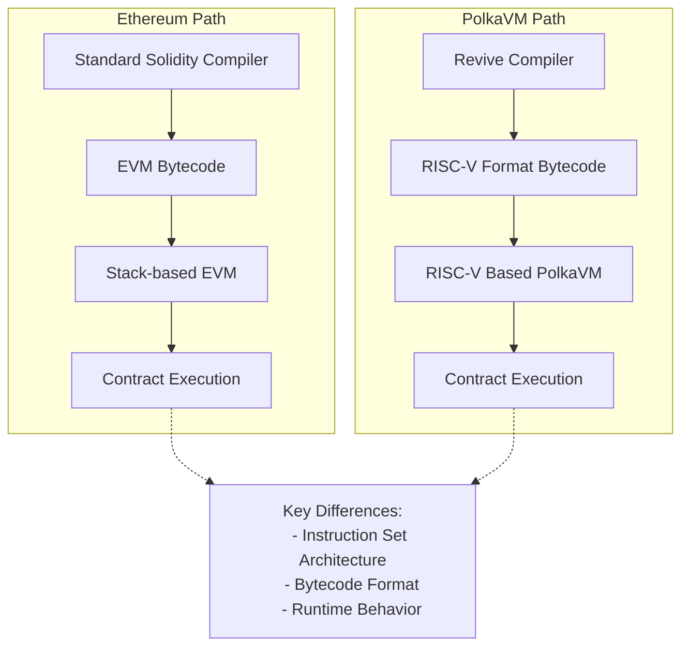

However, this architectural difference becomes relevant in specific scenarios. Tools that attempt to download and inspect contract bytecode will fail, as they expect EVM bytecode rather than PolkaVM's RISC-V format. Most applications typically pass bytecode as an opaque blob, making this a non-issue for standard use cases.

This primarily affects contracts using [`EXTCODECOPY`](https://www.evm.codes/?fork=cancun#3c){target=\_blank} to manipulate code at runtime. A contract encounters problems specifically when it uses `EXTCODECOPY` to copy contract code into memory and then attempts to mutate it. This pattern is not possible in standard Solidity and requires dropping down to YUL assembly. An example would be a factory contract written in assembly that constructs and instantiates new contracts by generating code at runtime. Such contracts are rare in practice.

PolkaVM offers an elegant alternative through its [on-chain constructors](https://paritytech.github.io/polkadot-sdk/master/pallet_revive/pallet/struct.Pallet.html#method.bare_instantiate){target=\_blank}, enabling contract instantiation without runtime code modification, making this pattern unnecessary. This architectural difference also impacts how contract deployment works more broadly, as discussed in the [Contract Deployment](#contract-deployment) section.

### High-Level Architecture Comparison

|            Feature            |                            Ethereum Virtual Machine (EVM)                            |                        PolkaVM                         |
|:-----------------------------:|:------------------------------------------------------------------------------------:|:------------------------------------------------------:|
|      **Instruction Set**      |                               Stack-based architecture                               |                 RISC-V instruction set                 |
|      **Bytecode Format**      |                                     EVM bytecode                                     |                     RISC-V format                      |
|    **Contract Size Limit**    |                                 24KB code size limit                                 |            Contract-specific memory limits             |
|         **Compiler**          |                                  Solidity Compiler                                   |                    Revive Compiler                     |
|      **Inline Assembly**      |                                      Supported                                       |         Supported with the compatibility layer         |
|    **Code Introspection**     | Supported via [`EXTCODECOPY`](https://www.evm.codes/?fork=cancun#3c){target=\_blank} | Limited support, alternative via on-chain constructors |
|     **Resource Metering**     |                                  Single gas metric                                   |                   Multi-dimensional                    |
| **Runtime Code Modification** |                                      Supported                                       |               Limited, with alternatives               |
|  **Contract Instantiation**   |                                 Standard deployment                                  |    On-chain constructors for flexible instantiation    |

## Gas Model

Ethereum's resource model relies on a single metric: [gas](https://ethereum.org/en/developers/docs/gas/#what-is-gas){target=\_blank}, which serves as the universal unit for measuring computational costs. Each operation on the network consumes a specific amount of gas. Most platforms aiming for Ethereum compatibility typically adopt identical gas values to ensure seamless integration.

The significant changes to Ethereum's gas model will be outlined in the following sections.

### Dynamic Gas Value Scaling

Instead of adhering to Ethereum's fixed gas values, PolkaVM implements benchmark-based pricing that better reflects its improved execution performance. This makes instructions cheaper relative to I/O-bound operations but requires developers to avoid hardcoding gas values, particularly in cross-contract calls.

### Multi-Dimensional Resource Metering

Moving beyond Ethereum's single gas metric, PolkaVM meters three distinct resources:

- **`ref_time`**: Equivalent to traditional gas, measuring computation time.
- **`proof_size`**: Tracks state proof size for validator verification.
- **`storage_deposit`**: Manages state bloat through a deposit system.

All three resources can be limited at the transaction level, just like gas on Ethereum. The [Ethereum RPC proxy](https://github.com/paritytech/polkadot-sdk/tree/master/substrate/frame/revive/rpc){target=\_blank} maps all three dimensions into the single gas dimension, ensuring everything behaves as expected for users.

These resources can also be limited when making cross-contract calls, which is essential for security when interacting with untrusted contracts. However, Solidity only allows specifying `gas_limit` for cross-contract calls. The `gas_limit` is most similar to Polkadots `ref_time_limit`, but the Revive compiler doesn't supply any imposed `gas_limit` for cross-contract calls for two key reasons:

- **Semantic differences**: `gas_limit` and `ref_time_limit` are not semantically identical; blindly passing EVM gas as `ref_time_limit` can lead to unexpected behavior.
- **Incomplete protection**: The other two resources (`proof_size` and `storage_deposit`) would remain uncapped anyway, making it insufficient to prevent malicious callees from performing DOS attacks.

When resources are "uncapped" in cross-contract calls, they remain constrained by transaction-specified limits, preventing abuse of the transaction signer.

!!! note
    The runtime will provide a special precompile, allowing cross-contract calls with limits specified for all weight dimensions in the future.

All gas-related opcodes like [`GAS`](https://www.evm.codes/?fork=cancun#5a){target=\_blank} or [`GAS_LIMIT`](https://www.evm.codes/?fork=cancun#45){target=\_blank} return only the `ref_time` value as it's the closest match to traditional gas. Extended APIs will be provided through precompiles to make full use of all resources, including cross-contract calls with all three resources specified.

## Memory Management

The EVM and the PolkaVM take fundamentally different approaches to memory constraints:

|         Feature          |      Ethereum Virtual Machine (EVM)       |                    PolkaVM                     |
|:------------------------:|:-----------------------------------------:|:----------------------------------------------:|
|  **Memory Constraints**  |      Indirect control via gas costs       |        Hard memory limits per contract         |
|      **Cost Model**      | Increasing gas curve with allocation size |    Fixed costs separated from execution gas    |
|    **Memory Limits**     | Soft limits through prohibitive gas costs |         Hard fixed limits per contract         |
|  **Pricing Efficiency**  |     Potential overcharging for memory     | More efficient through separation of concerns  |
|   **Contract Nesting**   |         Limited by available gas          |    Limited by constant memory per contract     |
|   **Memory Metering**    |     Dynamic based on total allocation     |      Static limits per contract instance       |
| **Future Improvements**  |       Incremental gas cost updates        | Potential dynamic metering for deeper nesting  |
| **Cross-Contract Calls** |      Handled through gas forwarding       | Requires careful boundary limit implementation |

The architecture establishes a constant memory limit per contract, which is the basis for calculating maximum contract nesting depth. This calculation assumes worst-case memory usage for each nested contract, resulting in a straightforward but conservative limit that operates independently of actual memory consumption. Future iterations may introduce dynamic memory metering, allowing deeper nesting depths for contracts with smaller memory footprints. However, such an enhancement would require careful implementation of cross-contract boundary limits before API stabilization, as it would introduce an additional resource metric to the system.

### Current Memory Limits

The following table depicts memory-related limits at the time of writing:

|                   Limit                    |     Maximum     |
|:------------------------------------------:|:---------------:|
|              Call stack depth              |        5        |
|                Event topics                |        4        |
| Event data payload size (including topics) |    416 bytes    |
|             Storage value size             |    416 bytes    |
|        Transient storage variables         | 128 uint values |
|            Immutable variables             | 16 uint values  |
|          Contract code blob size           | ~100 kilobytes  |

!!! note
    Limits might be increased in the future. To guarantee existing contracts work as expected, limits will never be decreased.

## Account Management - Existential Deposit

Ethereum and Polkadot handle account persistence differently, affecting state management and contract interactions:

### Account Management Comparison

|          Feature          |                   Ethereum Approach                   |               PolkaVM/Polkadot Approach                |
|:-------------------------:|:-----------------------------------------------------:|:------------------------------------------------------:|
|  **Account Persistence**  | Accounts persist indefinitely, even with zero balance | Requires existential deposit (ED) to maintain account  |
|    **Minimum Balance**    |                         None                          |                      ED required                       |
|   **Account Deletion**    |               Accounts remain in state                |      Accounts below ED are automatically deleted       |
|   **Contract Accounts**   |                  Exist indefinitely                   |                    Must maintain ED                    |
|   **Balance Reporting**   |                 Reports full balance                  |      Reports ED-adjusted balance via Ethereum RPC      |
| **New Account Transfers** |                   Standard transfer                   |     Includes ED automatically with extra fee cost      |
| **Contract-to-Contract**  |                   Direct transfers                    | ED drawn from transaction signer, not sending contract |
|   **State Management**    |      Potential bloat from zero-balance accounts       |     Optimized with auto-deletion of dust accounts      |

This difference introduces potential compatibility challenges for Ethereum-based contracts and tools, particularly wallets. To mitigate this, PolkaVM implements several transparent adjustments:

- Balance queries via Ethereum RPC automatically deduct the ED, ensuring reported balances match spendable amounts.
- Account balance checks through EVM opcodes reflect the ED-adjusted balance.
- Transfers to new accounts automatically include the ED (`x + ED`), with the extra cost incorporated into transaction fees.
- Contract-to-contract transfers handle ED requirements by:
    - Drawing ED from the transaction signer instead of the sending contract.
    - Keeping transfer amounts transparent for contract logic.
    - Treating ED like other storage deposit costs.

This approach ensures that Ethereum contracts work without modifications while maintaining Polkadot's optimized state management.

## Contract Deployment

For most users deploying contracts (like ERC-20 tokens), contract deployment works seamlessly without requiring special steps. However, when using advanced patterns like factory contracts that dynamically create other contracts at runtime, you'll need to understand PolkaVM's unique deployment model.

In the PolkaVM, contract deployment follows a fundamentally different model from EVM. The EVM allows contracts to be deployed with a single transaction, where the contract code is bundled with the deployment transaction. In contrast, PolkaVM has a different process for contract instantiation.

- **Code must be pre-uploaded**: Unlike EVM, where contract code is bundled within the deploying contract, PolkaVM requires all contract bytecode to be uploaded to the chain before instantiation.
- **Factory pattern limitations**: The common EVM pattern, where contracts dynamically create other contracts, will fail with a `CodeNotFound` error unless the dependent contract code was previously uploaded.
- **Separate upload and instantiation**: This creates a two-step process where developers must first upload all contract code, then instantiate relationships between contracts.

This architecture impacts several common EVM patterns and requires developers to adapt their deployment strategies accordingly. _Factory contracts must be modified to work with pre-uploaded code rather than embedding bytecode_, and runtime code generation is not supported due to PolkaVM's RISC-V bytecode format. The specific behavior of contract creation opcodes is detailed in the [YUL IR Translation](#yul-function-translation-differences) section.

When migrating EVM projects to PolkaVM, developers should identify all contracts that will be instantiated at runtime and ensure they are pre-uploaded to the chain before any instantiation attempts.

## Solidity and YUL IR Translation Incompatibilities

While PolkaVM maintains high-level compatibility with Solidity, several low-level differences exist in the translation of YUL IR and specific Solidity constructs. These differences are particularly relevant for developers working with assembly code or utilizing advanced contract patterns.

### Contract Code Structure

PolkaVM's contract runtime does not differentiate between runtime code and deploy (constructor) code. Instead, both are emitted into a single PolkaVM contract code blob and live on-chain. Therefore, in EVM terminology, the deploy code equals the runtime code. For most standard Solidity contracts, this is transparent. However, if you are analyzing raw bytecode or building tools that expect separate deploy and runtime sections, you'll need to adjust for this unified structure.

In the constructor code, the `codesize` instruction returns the call data size instead of the actual code blob size, which differs from standard EVM behavior. Developers might consider that the constructor logic uses `codesize` to inspect the deployed contract's size (e.g., for self-validation or specific deployment patterns); this will return an incorrect value on PolkaVM. Re-evaluate such logic or use alternative methods to achieve your goal.

### Solidity-Specific Differences

Solidity constructs behave differently under PolkaVM:

- **`address.creationCode`**: Returns the bytecode keccak256 hash instead of the actual creation code, reflecting PolkaVM's hash-based code referencing system.
    - If your contract relies on `address.creationCode` to verify or interact with the full raw bytecode of a newly deployed contract, this will not work as expected. You will receive a hash, not the code itself. This typically affects highly specialized factory contracts or introspection tools.

### YUL Function Translation Differences

The following YUL functions exhibit notable behavioral differences in PolkaVM:

- Memory operations:

    - **`mload`, `mstore`, `msize`, `mcopy`**: PolkaVM preserves memory layout but implements several constraints.

        - EVM linear heap memory is emulated using a fixed 64KB byte buffer, limiting maximum contract memory usage.
        - Accessing memory offsets larger than the buffer size traps the contract with an `OutOfBound` error.
        - Compiler optimizations may eliminate unused memory operations, potentially causing `msize` to differ from EVM behavior.

        For Solidity developers, the compiler generally handles memory efficiently within this 64KB limit. However, if you are writing low-level YUL assembly and perform direct memory manipulations, you must respect the 64KB buffer limit. Attempting to access memory outside this range will cause your transaction to revert. Be aware that `msize` might not always reflect the exact EVM behavior if compiler optimizations occur.

- Call data operations:

    - **`calldataload`, `calldatacopy`**: In constructor code, the offset parameter is ignored and these functions always return `0`, diverging from EVM behavior where call data represents constructor arguments.

        - If your constructor logic in YUL assembly attempts to read constructor arguments using `calldataload` or `calldatacopy` with specific offsets, this will not yield the expected constructor arguments. Instead, these functions will return `zeroed` values. Standard Solidity constructors are handled correctly by the compiler, but manual YUL assembly for constructor argument parsing will need adjustment.

- Code operations:

    - **`codecopy`**: Only supported within constructor code, reflecting PolkaVM's different approach to code handling and the unified code blob structure.

        - If your contracts use `codecopy` (e.g., for self-modifying code or inspecting other contract's runtime bytecode) outside of the constructor, this will not be supported and will likely result in a compile-time error or runtime trap. This implies that patterns like dynamically generating or modifying contract code at runtime are not directly feasible with `codecopy` on PolkaVM.

- Control flow:

    - **`invalid`**: Traps the contract execution but does not consume remaining gas, unlike EVM where it consumes all available gas.

        - While `invalid` still reverts the transaction, the difference in gas consumption could subtly affect very specific error handling or gas accounting patterns that rely on `invalid` to consume all remaining gas. For most error scenarios, `revert()` is the standard and recommended practice.

- Cross-contract calls:

    - **`call`, `delegatecall`, `staticall`**: These functions ignore supplied gas limits and forward all remaining resources due to PolkaVM's multi-dimensional resource model. This creates important security implications:

        - Contract authors must implement reentrancy protection since gas stipends don't provide protection.
        - The compiler detects `address payable.{send,transfer}` patterns and disables call reentrancy as a protective heuristic.
        - Using `address payable.{send,transfer}` is already deprecated; PolkaVM will provide dedicated precompiles for safe balance transfers.

        The traditional EVM pattern of limiting gas in cross-contract calls (especially with the 2300 gas stipend for send/transfer) does not provide reentrancy protection on PolkaVM. Developers must explicitly implement reentrancy guards (e.g., using a reentrancy lock mutex) in their Solidity code when making external calls to untrusted contracts. Relying on gas limits alone for reentrancy prevention is unsafe and will lead to vulnerabilities on PolkaVM.

        !!! warning
            The 2300 gas stipend that is provided by solc for address payable.{send, transfer} calls offers no reentrancy protection in PolkaVM. While the compiler attempts to detect and mitigate this pattern, developers should avoid these deprecated functions.

- Contract creation:

    - **`create`, `create2`**: Contract instantiation works fundamentally differently in PolkaVM. Instead of supplying deploy code concatenated with constructor arguments, the runtime expects:

        1. A buffer containing the code hash to deploy.
        2. The constructor arguments buffer.

        PolkaVM translates `dataoffset` and `datasize` instructions to handle contract hashes instead of contract code, enabling seamless use of the `new` keyword in Solidity. However, this translation may fail for contracts creating other contracts within `assembly` blocks.

        If you use the Solidity `new` keyword to deploy contracts, the Revive compiler handles this transparently. However, if you are creating contracts manually in YUL assembly using `create` or `create2` opcodes, you must provide the code hash of the contract to be deployed, not its raw bytecode. Attempting to pass raw bytecode will fail. This fundamentally changes how manual contract creation is performed in assembly.

        !!! warning
            Avoid using `create` family opcodes for manual deployment crafting in `assembly` blocks. This pattern is discouraged due to translation complexity and offers no gas savings benefits in PolkaVM.

- Data operations:

    - **`dataoffset`**: Returns the contract hash instead of code offset, aligning with PolkaVM's hash-based code referencing.
    - **`datasize`**: Returns the constant contract hash size (32 bytes) rather than variable code size.

    These changes are primarily relevant for low-level YUL assembly developers who are trying to inspect or manipulate contract code directly. `dataoffset` will provide a hash, not a memory offset to the code, and `datasize` will always be 32 bytes (the size of a hash). This reinforces that direct manipulation of contract bytecode at runtime, as might be done in some EVM patterns, is not supported.

- Resource queries:

    - **`gas`, `gaslimit`**: Return only the `ref_time` component of PolkaVM's multi-dimensional weight system, providing the closest analog to traditional gas measurements.

        - While `gas` and `gaslimit` still provide a useful metric, consider that they represent `ref_time` (computation time) only. If your contract logic depends on precise knowledge of other resource costs (like `proof_size` or `storage_deposit`), you won't get that information from these opcodes. You'll need to use future precompiles for full multi-dimensional resource queries.

- Blockchain state:

    - **`prevrandao`, `difficulty`**: Both translate to a constant value of `2500000000000000`, as PolkaVM doesn't implement Ethereum's difficulty adjustment or randomness mechanisms.

        - If your Solidity contract relies on `block.difficulty` (or its equivalent YUL opcode `difficulty`) for randomness generation or any logic tied to Ethereum's proof-of-work difficulty, this will not provide true randomness on PolkaVM. The value will always be constant. Developers needing on-chain randomness should utilize Polkadot's native randomness sources or dedicated VRF (Verifiable Random Function) solutions if available. 

### Unsupported Operations

Several EVM operations are not supported in PolkaVM and produce compile-time errors:

- **`pc`, `extcodecopy`**: These operations are EVM-specific and have no equivalent functionality in PolkaVM's RISC-V architecture.

    - Any Solidity contracts that utilize inline assembly to interact with `pc` (program counter) or `extcodecopy` will fail to compile or behave unexpectedly. This means patterns involving introspection of the current execution location or copying external contract bytecode at runtime are not supported.

- **`blobhash`, `blobbasefee`**: Related to Ethereum's rollup model and blob data handling, these operations are unnecessary given Polkadot's superior rollup architecture.

    - If you are porting contracts designed for Ethereum's EIP-4844 (proto-danksharding) and rely on these blob-related opcodes, they will not be available on PolkaVM.

- **`extcodecopy`, `selfdestruct`**: These deprecated operations are not supported and generate compile-time errors.

    - The `selfdestruct` opcode, which allowed contracts to remove themselves from the blockchain, is not supported. Contracts cannot be self-destroyed on PolkaVM. This affects contract upgradeability patterns that rely on self-destruction and redeployment. Similarly, `extcodecopy` is unsupported, impacting contracts that intend to inspect or copy the bytecode of other deployed contracts.

### Compilation Pipeline Considerations

PolkaVM processes YUL IR exclusively, meaning all contracts exhibit behavior consistent with Solidity's `via-ir` compilation mode. Developers familiar with the legacy compilation pipeline should expect [IR-based codegen behavior](https://docs.soliditylang.org/en/latest/ir-breaking-changes.html){target=\_blank} when working with PolkaVM contracts.

If you've previously worked with older Solidity compilers that did not use the `via-ir` pipeline by default, you might observe subtle differences in compiled bytecode size or gas usage. It's recommended to familiarize yourself with Solidity's IR-based codegen behavior, as this is the standard for PolkaVM.

### Memory Pointer Limitations

YUL functions accepting memory buffer offset pointers or size arguments are limited by PolkaVM's 32-bit pointer size. Supplying values above `2^32-1` will trap the contract immediately. The Solidity compiler typically generates valid memory references, making this primarily a concern for low-level assembly code.

For standard Solidity development, this limitation is unlikely to be hit as the compiler handles memory addresses correctly within typical contract sizes. However, if you are writing extremely large contracts using YUL assembly that manually and extensively manipulate memory addresses, ensure that your memory offsets and sizes do not exceed PolkaVM's **fixed 64KB memory limit per contract**. While the YUL functions might accept 32-bit pointers (up to 2^32-1), attempting to access memory beyond the allocated 64KB buffer will trap the contract immediately.

These incompatibilities reflect the fundamental architectural differences between EVM and PolkaVM while maintaining high-level Solidity compatibility. Most developers using standard Solidity patterns will encounter no issues, but those working with assembly code or advanced contract patterns should carefully review these differences during migration.


---

Page Title: Fork a Chain with Chopsticks

- Source (raw): https://raw.githubusercontent.com/polkadot-developers/polkadot-docs/master/ai/pages/tutorials-polkadot-sdk-testing-fork-live-chains.md
- Canonical (HTML): https://docs.polkadot.com/tutorials/polkadot-sdk/testing/fork-live-chains/
- Summary: Learn how to fork live Polkadot SDK chains with Chopsticks. Configure forks, replay blocks, test XCM, and interact programmatically or via UI.

# Fork a Chain with Chopsticks

## Introduction

Chopsticks is an innovative tool that simplifies the process of forking live Polkadot SDK chains. This guide provides step-by-step instructions to configure and fork chains, enabling developers to:

- Replay blocks for state analysis.
- Test cross-chain messaging (XCM).
- Simulate blockchain environments for debugging and experimentation.

With support for both configuration files and CLI commands, Chopsticks offers flexibility for diverse development workflows. Whether you're testing locally or exploring complex blockchain scenarios, Chopsticks empowers developers to gain deeper insights and accelerate application development.

Chopsticks uses the [Smoldot](https://github.com/smol-dot/smoldot){target=\_blank} light client, which does not support calls made through the Ethereum JSON-RPC. As a result, you can't fork your chain using Chopsticks and then interact with it using tools like MetaMask.

For additional support and information, please reach out through [GitHub Issues](https://github.com/AcalaNetwork/chopsticks/issues){target=\_blank}.

## Prerequisites

To follow this tutorial, ensure you have completed the following:

- **Installed Chopsticks**: If you still need to do so, see the [Install Chopsticks](/develop/toolkit/parachains/fork-chains/chopsticks/get-started/#install-chopsticks){target=\_blank} guide for assistance.
- **Reviewed** [Configure Chopsticks](/develop/toolkit/parachains/fork-chains/chopsticks/get-started/#configure-chopsticks){target=\_blank}: And understand how forked chains are configured.

## Configuration File 

To run Chopsticks using a configuration file, utilize the `--config` flag. You can use a raw GitHub URL, a path to a local file, or simply the chain's name. The following commands all look different but they use the `polkadot` configuration in the same way:

=== "GitHub URL"

    ```bash
    npx @acala-network/chopsticks \
    --config=https://raw.githubusercontent.com/AcalaNetwork/chopsticks/master/configs/polkadot.yml
    ```

=== "Local File Path"

    ```bash
    npx @acala-network/chopsticks --config=configs/polkadot.yml
    ```

=== "Chain Name"

    ```bash
    npx @acala-network/chopsticks --config=polkadot
    ```

Regardless of which method you choose from the preceding examples, you'll see an output similar to the following:

<div id="termynal" data-termynal>
  <span data-ty="input"><span class="file-path"></span>npx @acala-network/chopsticks --config=polkadot</span>
  <br />
  <span data-ty>[18:38:26.155] INFO: Loading config file https://raw.githubusercontent.com/AcalaNetwork/chopsticks/master/configs/polkadot.yml</span>
  <span data-ty> app: "chopsticks"</span>
  <span data-ty> chopsticks::executor TRACE: Calling Metadata_metadata</span>
  <span data-ty> chopsticks::executor TRACE: Completed Metadata_metadata</span>
  <span data-ty>[18:38:28.186] INFO: Polkadot RPC listening on port 8000</span>
  <span data-ty> app: "chopsticks"</span>
</div>

If using a file path, make sure you've downloaded the [Polkadot configuration file](https://github.com/AcalaNetwork/chopsticks/blob/master/configs/polkadot.yml){target=\_blank}, or have created your own.

## Create a Fork

Once you've configured Chopsticks, use the following command to fork Polkadot at block 100:

```bash
npx @acala-network/chopsticks \
--endpoint wss://polkadot-rpc.dwellir.com \
--block 100
```

If the fork is successful, you will see output similar to the following:

<div id="termynal" data-termynal>
  <span data-ty="input"><span class="file-path"></span>npx @acala-network/chopsticks \ --endpoint wss://polkadot-rpc.dwellir.com \ --block 100</span>
  <br />
  <span data-ty>[19:12:21.023] INFO: Polkadot RPC listening on port 8000</span>
  <span data-ty> app: "chopsticks"</span>
</div>

Access the running Chopsticks fork using the default address.

```bash
ws://localhost:8000
```

## Interact with a Fork

You can interact with the forked chain using various [libraries](/develop/toolkit/#libraries){target=\_blank} such as [Polkadot.js](https://polkadot.js.org/docs/){target=\_blank} and its user interface, [Polkadot.js Apps](https://polkadot.js.org/apps/#/explorer){target=\_blank}.

### Use Polkadot.js Apps

To interact with Chopsticks via the hosted user interface, visit [Polkadot.js Apps](https://polkadot.js.org/apps/#/explorer){target=\_blank} and follow these steps:

1. Select the network icon in the top left corner.

    

2. Scroll to the bottom and select **Development**.
3. Choose **Custom**.
4. Enter `ws://localhost:8000` in the input field.
5. Select the **Switch** button.

    

You should now be connected to your local fork and can interact with it as you would with a real chain.

### Use Polkadot.js Library

For programmatic interaction, you can use the Polkadot.js library. The following is a basic example:

```js
import { ApiPromise, WsProvider } from '@polkadot/api';

async function connectToFork() {
  const wsProvider = new WsProvider('ws://localhost:8000');
  const api = await ApiPromise.create({ provider: wsProvider });
  await api.isReady;

  // Now you can use 'api' to interact with your fork
  console.log(`Connected to chain: ${await api.rpc.system.chain()}`);
}

connectToFork();

```

## Replay Blocks

Chopsticks allows you to replay specific blocks from a chain, which is useful for debugging and analyzing state changes. You can use the parameters in the [Configuration](/develop/toolkit/parachains/fork-chains/chopsticks/get-started/#configure-chopsticks){target=\_blank} section to set up the chain configuration, and then use the run-block subcommand with the following additional options:

- **`output-path`**: Path to print output.
- **`html`**: Generate HTML with storage diff.
- **`open`**: Open generated HTML.

For example, the command to replay block 1000 from Polkadot and save the output to a JSON file would be as follows:

```bash
npx @acala-network/chopsticks run-block  \
--endpoint wss://polkadot-rpc.dwellir.com  \
--output-path ./polkadot-output.json  \
--block 1000
```

??? code "polkadot-output.json"

    ```json
    {
        "Call": {
            "result": "0xba754e7478944d07a1f7e914422b4d973b0855abeb6f81138fdca35beb474b44a10f6fc59a4d90c3b78e38fac100fc6adc6f9e69a07565ec8abce6165bd0d24078cc7bf34f450a2cc7faacc1fa1e244b959f0ed65437f44208876e1e5eefbf8dd34c040642414245b501030100000083e2cc0f00000000d889565422338aa58c0fd8ebac32234149c7ce1f22ac2447a02ef059b58d4430ca96ba18fbf27d06fe92ec86d8b348ef42f6d34435c791b952018d0a82cae40decfe5faf56203d88fdedee7b25f04b63f41f23da88c76c876db5c264dad2f70c",
            "storageDiff": [
                [
                    "0x0b76934f4cc08dee01012d059e1b83eebbd108c4899964f707fdaffb82636065",
                    "0x00"
                ],
                [
                    "0x1cb6f36e027abb2091cfb5110ab5087f0323475657e0890fbdbf66fb24b4649e",
                    null
                ],
                [
                    "0x1cb6f36e027abb2091cfb5110ab5087f06155b3cd9a8c9e5e9a23fd5dc13a5ed",
                    "0x83e2cc0f00000000"
                ],
                [
                    "0x1cb6f36e027abb2091cfb5110ab5087ffa92de910a7ce2bd58e99729c69727c1",
                    null
                ],
                [
                    "0x26aa394eea5630e07c48ae0c9558cef702a5c1b19ab7a04f536c519aca4983ac",
                    null
                ],
                [
                    "0x26aa394eea5630e07c48ae0c9558cef70a98fdbe9ce6c55837576c60c7af3850",
                    "0x02000000"
                ],
                [
                    "0x26aa394eea5630e07c48ae0c9558cef734abf5cb34d6244378cddbf18e849d96",
                    "0xc03b86ae010000000000000000000000"
                ],
                [
                    "0x26aa394eea5630e07c48ae0c9558cef780d41e5e16056765bc8461851072c9d7",
                    "0x080000000000000080e36a09000000000200000001000000000000ca9a3b00000000020000"
                ],
                [
                    "0x26aa394eea5630e07c48ae0c9558cef78a42f33323cb5ced3b44dd825fda9fcc",
                    null
                ],
                [
                    "0x26aa394eea5630e07c48ae0c9558cef799e7f93fc6a98f0874fd057f111c4d2d",
                    null
                ],
                [
                    "0x26aa394eea5630e07c48ae0c9558cef7a44704b568d21667356a5a050c118746d366e7fe86e06375e7030000",
                    "0xba754e7478944d07a1f7e914422b4d973b0855abeb6f81138fdca35beb474b44"
                ],
                [
                    "0x26aa394eea5630e07c48ae0c9558cef7a86da5a932684f199539836fcb8c886f",
                    null
                ],
                [
                    "0x26aa394eea5630e07c48ae0c9558cef7b06c3320c6ac196d813442e270868d63",
                    null
                ],
                [
                    "0x26aa394eea5630e07c48ae0c9558cef7bdc0bd303e9855813aa8a30d4efc5112",
                    null
                ],
                [
                    "0x26aa394eea5630e07c48ae0c9558cef7df1daeb8986837f21cc5d17596bb78d15153cb1f00942ff401000000",
                    null
                ],
                [
                    "0x26aa394eea5630e07c48ae0c9558cef7df1daeb8986837f21cc5d17596bb78d1b4def25cfda6ef3a00000000",
                    null
                ],
                [
                    "0x26aa394eea5630e07c48ae0c9558cef7ff553b5a9862a516939d82b3d3d8661a",
                    null
                ],
                [
                    "0x2b06af9719ac64d755623cda8ddd9b94b1c371ded9e9c565e89ba783c4d5f5f9b4def25cfda6ef3a000000006f3d6b177c8acbd8dc9974cdb3cebfac4d31333c30865ff66c35c1bf898df5c5dd2924d3280e7201",
                    "0x9b000000"
                ],
                ["0x3a65787472696e7369635f696e646578", null],
                [
                    "0x3f1467a096bcd71a5b6a0c8155e208103f2edf3bdf381debe331ab7446addfdc",
                    "0x550057381efedcffffffffffffffffff"
                ],
                [
                    "0x3fba98689ebed1138735e0e7a5a790ab0f41321f75df7ea5127be2db4983c8b2",
                    "0x00"
                ],
                [
                    "0x3fba98689ebed1138735e0e7a5a790ab21a5051453bd3ae7ed269190f4653f3b",
                    "0x080000"
                ],
                [
                    "0x3fba98689ebed1138735e0e7a5a790abb984cfb497221deefcefb70073dcaac1",
                    "0x00"
                ],
                [
                    "0x5f3e4907f716ac89b6347d15ececedca80cc6574281671b299c1727d7ac68cabb4def25cfda6ef3a00000000",
                    "0x204e0000183887050ecff59f58658b3df63a16d03a00f92890f1517f48c2f6ccd215e5450e380e00005809fd84af6483070acbb92378e3498dbc02fb47f8e97f006bb83f60d7b2b15d980d000082104c22c383925323bf209d771dec6e1388285abe22c22d50de968467e0bb6ce00b000088ee494d719d68a18aade04903839ea37b6be99552ceceb530674b237afa9166480d0000dc9974cdb3cebfac4d31333c30865ff66c35c1bf898df5c5dd2924d3280e72011c0c0000e240d12c7ad07bb0e7785ee6837095ddeebb7aef84d6ed7ea87da197805b343a0c0d0000"
                ],
                [
                    "0xae394d879ddf7f99595bc0dd36e355b5bbd108c4899964f707fdaffb82636065",
                    null
                ],
                [
                    "0xbd2a529379475088d3e29a918cd478721a39ec767bd5269111e6492a1675702a",
                    "0x4501407565175cfbb5dca18a71e2433f838a3d946ef532c7bff041685db1a7c13d74252fffe343a960ef84b15187ea0276687d8cb3168aeea5202ea6d651cb646517102b81ff629ee6122430db98f2cadf09db7f298b49589b265dae833900f24baa8fb358d87e12f3e9f7986a9bf920c2fb48ce29886199646d2d12c6472952519463e80b411adef7e422a1595f1c1af4b5dd9b30996fba31fa6a30bd94d2022d6b35c8bc5a8a51161d47980bf4873e01d15afc364f8939a6ce5a09454ab7f2dd53bf4ee59f2c418e85aa6eb764ad218d0097fb656900c3bdd859771858f87bf7f06fc9b6db154e65d50d28e8b2374898f4f519517cd0bedc05814e0f5297dc04beb307b296a93cc14d53afb122769dfd402166568d8912a4dff9c2b1d4b6b34d811b40e5f3763e5f3ab5cd1da60d75c0ff3c12bcef3639f5f792a85709a29b752ffd1233c2ccae88ed3364843e2fa92bdb49021ee36b36c7cdc91b3e9ad32b9216082b6a2728fccd191a5cd43896f7e98460859ca59afbf7c7d93cd48da96866f983f5ff8e9ace6f47ee3e6c6edb074f578efbfb0907673ebca82a7e1805bc5c01cd2fa5a563777feeb84181654b7b738847c8e48d4f575c435ad798aec01631e03cf30fe94016752b5f087f05adf1713910767b7b0e6521013be5370776471191641c282fdfe7b7ccf3b2b100a83085cd3af2b0ad4ab3479448e71fc44ff987ec3a26be48161974b507fb3bc8ad23838f2d0c54c9685de67dc6256e71e739e9802d0e6e3b456f6dca75600bc04a19b3cc1605784f46595bfb10d5e077ce9602ae3820436166aa1905a7686b31a32d6809686462bc9591c0bc82d9e49825e5c68352d76f1ac6e527d8ac02db3213815080afad4c2ecb95b0386e3e9ab13d4f538771dac70d3059bd75a33d0b9b581ec33bb16d0e944355d4718daccb35553012adfcdacb1c5200a2aec3756f6ad5a2beffd30018c439c1b0c4c0f86dbf19d0ad59b1c9efb7fe90906febdb9001af1e7e15101089c1ab648b199a40794d30fe387894db25e614b23e833291a604d07eec2ade461b9b139d51f9b7e88475f16d6d23de6fe7831cc1dbba0da5efb22e3b26cd2732f45a2f9a5d52b6d6eaa38782357d9ae374132d647ef60816d5c98e6959f8858cfa674c8b0d340a8f607a68398a91b3a965585cc91e46d600b1310b8f59c65b7c19e9d14864a83c4ad6fa4ba1f75bba754e7478944d07a1f7e914422b4d973b0855abeb6f81138fdca35beb474b44c7736fc3ab2969878810153aa3c93fc08c99c478ed1bb57f647d3eb02f25cee122c70424643f4b106a7643acaa630a5c4ac39364c3cb14453055170c01b44e8b1ef007c7727494411958932ae8b3e0f80d67eec8e94dd2ff7bbe8c9e51ba7e27d50bd9f52cbaf9742edecb6c8af1aaf3e7c31542f7d946b52e0c37d194b3dd13c3fddd39db0749755c7044b3db1143a027ad428345d930afcefc0d03c3a0217147900bdea1f5830d826f7e75ecd1c4e2bc8fd7de3b35c6409acae1b2215e9e4fd7e360d6825dc712cbf9d87ae0fd4b349b624d19254e74331d66a39657da81e73d7b13adc1e5efa8efd65aa32c1a0a0315913166a590ae551c395c476116156cf9d872fd863893edb41774f33438161f9b973e3043f819d087ba18a0f1965e189012496b691f342f7618fa9db74e8089d4486c8bd1993efd30ff119976f5cc0558e29b417115f60fd8897e13b6de1a48fbeee38ed812fd267ae25bffea0caa71c09309899b34235676d5573a8c3cf994a3d7f0a5dbd57ab614c6caf2afa2e1a860c6307d6d9341884f1b16ef22945863335bb4af56e5ef5e239a55dbd449a4d4d3555c8a3ec5bd3260f88cabca88385fe57920d2d2dfc5d70812a8934af5691da5b91206e29df60065a94a0a8178d118f1f7baf768d934337f570f5ec68427506391f51ab4802c666cc1749a84b5773b948fcbe460534ed0e8d48a15c149d27d67deb8ea637c4cc28240ee829c386366a0b1d6a275763100da95374e46528a0adefd4510c38c77871e66aeda6b6bfd629d32af9b2fad36d392a1de23a683b7afd13d1e3d45dad97c740106a71ee308d8d0f94f6771164158c6cd3715e72ccfbc49a9cc49f21ead8a3c5795d64e95c15348c6bf8571478650192e52e96dd58f95ec2c0fb4f2ccc05b0ab749197db8d6d1c6de07d6e8cb2620d5c308881d1059b50ffef3947c273eaed7e56c73848e0809c4bd93619edd9fd08c8c5c88d5f230a55d2c6a354e5dd94440e7b5bf99326cf4a112fe843e7efdea56e97af845761d98f40ed2447bd04a424976fcf0fe0a0c72b97619f85cf431fe4c3aa6b3a4f61df8bc1179c11e77783bfedb7d374bd1668d0969333cb518bd20add8329462f2c9a9f04d150d60413fdd27271586405fd85048481fc2ae25b6826cb2c947e4231dc7b9a0d02a9a03f88460bced3fef5d78f732684bd218a1954a4acfc237d79ccf397913ab6864cd8a07e275b82a8a72520624738368d1c5f7e0eaa2b445cf6159f2081d3483618f7fc7b16ec4e6e4d67ab5541bcda0ca1af40efd77ef8653e223191448631a8108c5e50e340cd405767ecf932c1015aa8856b834143dc81fa0e8b9d1d8c32278fca390f2ff08181df0b74e2d13c9b7b1d85543416a0dae3a77530b9cd1366213fcf3cd12a9cd3ae0a006d6b29b5ffc5cdc1ab24343e2ab882abfd719892fca5bf2134731332c5d3bef6c6e4013d84a853cb03d972146b655f0f8541bcd36c3c0c8a775bb606edfe50d07a5047fd0fe01eb125e83673930bc89e91609fd6dfe97132679374d3de4a0b3db8d3f76f31bed53e247da591401d508d65f9ee01d3511ee70e3644f3ab5d333ca7dbf737fe75217b4582d50d98b5d59098ea11627b7ed3e3e6ee3012eadd326cf74ec77192e98619427eb0591e949bf314db0fb932ed8be58258fb4f08e0ccd2cd18b997fb5cf50c90d5df66a9f3bb203bd22061956128b800e0157528d45c7f7208c65d0592ad846a711fa3c5601d81bb318a45cc1313b122d4361a7d7a954645b04667ff3f81d3366109772a41f66ece09eb93130abe04f2a51bb30e767dd37ec6ee6a342a4969b8b342f841193f4f6a9f0fac4611bc31b6cab1d25262feb31db0b8889b6f8d78be23f033994f2d3e18e00f3b0218101e1a7082782aa3680efc8502e1536c30c8c336b06ae936e2bcf9bbfb20dd514ed2867c03d4f44954867c97db35677d30760f37622b85089cc5d182a89e29ab0c6b9ef18138b16ab91d59c2312884172afa4874e6989172014168d3ed8db3d9522d6cbd631d581d166787c93209bec845d112e0cbd825f6df8b64363411270921837cfb2f9e7f2e74cdb9cd0d2b02058e5efd9583e2651239654b887ea36ce9537c392fc5dfca8c5a0facbe95b87dfc4232f229bd12e67937d32b7ffae2e837687d2d292c08ff6194a2256b17254748857c7e3c871c3fff380115e6f7faf435a430edf9f8a589f6711720cfc5cec6c8d0d94886a39bb9ac6c50b2e8ef6cf860415192ca4c1c3aaa97d36394021a62164d5a63975bcd84b8e6d74f361c17101e3808b4d8c31d1ee1a5cf3a2feda1ca2c0fd5a50edc9d95e09fb5158c9f9b0eb5e2c90a47deb0459cea593201ae7597e2e9245aa5848680f546256f3"
                ],
                [
                    "0xd57bce545fb382c34570e5dfbf338f5e326d21bc67a4b34023d577585d72bfd7",
                    null
                ],
                [
                    "0xd57bce545fb382c34570e5dfbf338f5ea36180b5cfb9f6541f8849df92a6ec93",
                    "0x00"
                ],
                [
                    "0xd57bce545fb382c34570e5dfbf338f5ebddf84c5eb23e6f53af725880d8ffe90",
                    null
                ],
                [
                    "0xd5c41b52a371aa36c9254ce34324f2a53b996bb988ea8ee15bad3ffd2f68dbda",
                    "0x00"
                ],
                [
                    "0xf0c365c3cf59d671eb72da0e7a4113c49f1f0515f462cdcf84e0f1d6045dfcbb",
                    "0x50defc5172010000"
                ],
                [
                    "0xf0c365c3cf59d671eb72da0e7a4113c4bbd108c4899964f707fdaffb82636065",
                    null
                ],
                [
                    "0xf68f425cf5645aacb2ae59b51baed90420d49a14a763e1cbc887acd097f92014",
                    "0x9501800300008203000082030000840300008503000086030000870300008703000089030000890300008b0300008b0300008d0300008d0300008f0300008f0300009103000092030000920300009403000094030000960300009603000098030000990300009a0300009b0300009b0300009d0300009d0300009f0300009f030000a1030000a2030000a3030000a4030000a5030000a6030000a6030000a8030000a8030000aa030000ab030000ac030000ad030000ae030000af030000b0030000b1030000b1030000b3030000b3030000b5030000b6030000b7030000b8030000b9030000ba030000ba030000bc030000bc030000be030000be030000c0030000c1030000c2030000c2030000c4030000c5030000c5030000c7030000c7030000c9030000c9030000cb030000cc030000cd030000ce030000cf030000d0030000d0030000d2030000d2030000d4030000d4030000d6030000d7030000d8030000d9030000da030000db030000db030000dd030000dd030000df030000e0030000e1030000e2030000e3030000e4030000e4030000"
                ],
                [
                    "0xf68f425cf5645aacb2ae59b51baed9049b58374218f48eaf5bc23b7b3e7cf08a",
                    "0xb3030000"
                ],
                [
                    "0xf68f425cf5645aacb2ae59b51baed904b97380ce5f4e70fbf9d6b5866eb59527",
                    "0x9501800300008203000082030000840300008503000086030000870300008703000089030000890300008b0300008b0300008d0300008d0300008f0300008f0300009103000092030000920300009403000094030000960300009603000098030000990300009a0300009b0300009b0300009d0300009d0300009f0300009f030000a1030000a2030000a3030000a4030000a5030000a6030000a6030000a8030000a8030000aa030000ab030000ac030000ad030000ae030000af030000b0030000b1030000b1030000b3030000b3030000b5030000b6030000b7030000b8030000b9030000ba030000ba030000bc030000bc030000be030000be030000c0030000c1030000c2030000c2030000c4030000c5030000c5030000c7030000c7030000c9030000c9030000cb030000cc030000cd030000ce030000cf030000d0030000d0030000d2030000d2030000d4030000d4030000d6030000d7030000d8030000d9030000da030000db030000db030000dd030000dd030000df030000e0030000e1030000e2030000e3030000e4030000e4030000"
                ]
            ],
            "offchainStorageDiff": [],
            "runtimeLogs": []
        }
    }

    ```

## XCM Testing

To test XCM (Cross-Consensus Messaging) messages between networks, you can fork multiple parachains and a relay chain locally using Chopsticks.

- **`relaychain`**: Relay chain config file.
- **`parachain`**: Parachain config file.

For example, to fork Moonbeam, Astar, and Polkadot enabling XCM between them, you can use the following command:

```bash
npx @acala-network/chopsticks xcm \
--r polkadot \
--p moonbeam \
--p astar
```

After running it, you should see output similar to the following:

<div id="termynal" data-termynal>
  <span data-ty="input"><span class="file-path"></span>npx @acala-network/chopsticks xcm \</span>
  <span data-ty>--r polkadot \</span>
  <span data-ty>--p moonbeam \</span>
  <span data-ty>--p astar</span>
  <br />
  <span data-ty>[13:46:07.901] INFO: Loading config file https://raw.githubusercontent.com/AcalaNetwork/chopsticks/master/configs/moonbeam.yml</span>
  <span data-ty> app: "chopsticks"</span>
  <span data-ty>[13:46:12.631] INFO: Moonbeam RPC listening on port 8000</span>
  <span data-ty> app: "chopsticks"</span>
  <span data-ty>[13:46:12.632] INFO: Loading config file https://raw.githubusercontent.com/AcalaNetwork/chopsticks/master/configs/astar.yml</span>
  <span data-ty> app: "chopsticks"</span>
  <span data-ty> chopsticks::executor TRACE: Calling Metadata_metadata</span>
  <span data-ty> chopsticks::executor TRACE: Completed Metadata_metadata</span>
  <span data-ty>[13:46:23.669] INFO: Astar RPC listening on port 8001</span>
  <span data-ty> app: "chopsticks"</span>
  <span data-ty>[13:46:25.144] INFO (xcm): Connected parachains [2004,2006]</span>
  <span data-ty> app: "chopsticks"</span>
  <span data-ty>[13:46:25.144] INFO: Loading config file https://raw.githubusercontent.com/AcalaNetwork/chopsticks/master/configs/polkadot.yml</span>
  <span data-ty> app: "chopsticks"</span>
  <span data-ty> chopsticks::executor TRACE: Calling Metadata_metadata</span>
  <span data-ty> chopsticks::executor TRACE: Completed Metadata_metadata</span>
  <span data-ty>[13:46:53.320] INFO: Polkadot RPC listening on port 8002</span>
  <span data-ty> app: "chopsticks"</span>
  <span data-ty>[13:46:54.038] INFO (xcm): Connected relaychain 'Polkadot' with parachain 'Moonbeam'</span>
  <span data-ty> app: "chopsticks"</span>
  <span data-ty>[13:46:55.028] INFO (xcm): Connected relaychain 'Polkadot' with parachain 'Astar'</span>
  <span data-ty> app: "chopsticks"</span>
</div>

Now you can interact with your forked chains using the ports specified in the output.


---

Page Title: Glossary

- Source (raw): https://raw.githubusercontent.com/polkadot-developers/polkadot-docs/master/ai/pages/polkadot-protocol-glossary.md
- Canonical (HTML): https://docs.polkadot.com/polkadot-protocol/glossary/
- Summary: Glossary of terms used within the Polkadot ecosystem, Polkadot SDK, its subsequent libraries, and other relevant Web3 terminology.

# Glossary

Key definitions, concepts, and terminology specific to the Polkadot ecosystem are included here.

Additional glossaries from around the ecosystem you might find helpful:

- [Polkadot Wiki Glossary](https://wiki.polkadot.com/general/glossary){target=\_blank}
- [Polkadot SDK Glossary](https://paritytech.github.io/polkadot-sdk/master/polkadot_sdk_docs/reference_docs/glossary/index.html){target=\_blank}

## Authority

The role in a blockchain that can participate in consensus mechanisms. 

- **[GRANDPA](#grandpa)**: The authorities vote on chains they consider final.
- **[Blind Assignment of Blockchain Extension](#blind-assignment-of-blockchain-extension-babe) (BABE)**: The authorities are also [block authors](#block-author).

Authority sets can be used as a basis for consensus mechanisms such as the [Nominated Proof of Stake (NPoS)](#nominated-proof-of-stake-npos) protocol.

## Authority Round (Aura)

A deterministic [consensus](#consensus) protocol where block production is limited to a rotating list of [authorities](#authority) that take turns creating blocks. In authority round (Aura) consensus, most online authorities are assumed to be honest. It is often used in combination with[GRANDPA](#grandpa)as a[hybrid consensus](#hybrid-consensus)protocol.

Learn more by reading the official [Aura consensus algorithm](https://openethereum.github.io/Aura){target=\_blank} wiki article.

## Blind Assignment of Blockchain Extension (BABE)

A [block authoring](#block-author) protocol similar to [Aura](#authority-round-aura), except [authorities](#authority) win [slots](#slot) based on a Verifiable Random Function (VRF) instead of the round-robin selection method. The winning authority can select a chain and submit a new block.

Learn more by reading the official Web3 Foundation [BABE research document](https://research.web3.foundation/Polkadot/protocols/block-production/Babe){target=\_blank}.

## Block Author

The node responsible for the creation of a block, also called _block producers_. In a Proof of Work (PoW) blockchain, these nodes are called _miners_.

## Byzantine Fault Tolerance (BFT)

The ability of a distributed computer network to remain operational if a certain proportion of its nodes or [authorities](#authority) are defective or behaving maliciously. A distributed network is typically considered Byzantine fault tolerant if it can remain functional, with up to one-third of nodes assumed to be defective, offline, actively malicious, and part of a coordinated attack.

### Byzantine Failure

The loss of a network service due to node failures that exceed the proportion of nodes required to reach consensus.

### Practical Byzantine Fault Tolerance (pBFT)

An early approach to Byzantine fault tolerance (BFT), practical Byzantine fault tolerance (pBFT) systems tolerate Byzantine behavior from up to one-third of participants.

The communication overhead for such systems is `O(n)`, where `n` is the number of nodes (participants) in the system.

### Preimage

A preimage is the data that is input into a hash function to calculate a hash. Since a hash function is a [one-way function](https://en.wikipedia.org/wiki/One-way_function){target=\_blank}, the output, the hash, cannot be used to reveal the input, the preimage.

## Call

In the context of pallets containing functions to be dispatched to the runtime, `Call` is an enumeration data type that describes the functions that can be dispatched with one variant per pallet. A `Call` represents a [dispatch](#dispatchable) data structure object.

## Chain Specification 

A chain specification file defines the properties required to run a node in an active or new Polkadot SDK-built network. It often contains the initial genesis runtime code, network properties (such as the network's name), the initial state for some pallets, and the boot node list. The chain specification file makes it easy to use a single Polkadot SDK codebase as the foundation for multiple independently configured chains.

## Collator

An [author](#block-author) of a [parachain](#parachain) network.
They aren't [authorities](#authority) in themselves, as they require a [relay chain](#relay-chain) to coordinate [consensus](#consensus).

More details are found on the [Polkadot Collator Wiki](https://wiki.polkadot.com/learn/learn-collator/){target=\_blank}.

## Collective

Most often used to refer to an instance of the Collective pallet on Polkadot SDK-based networks such as [Kusama](#kusama) or [Polkadot](#polkadot) if the Collective pallet is part of the FRAME-based runtime for the network.

## Consensus

Consensus is the process blockchain nodes use to agree on a chain's canonical fork. It is composed of [authorship](#block-author), finality, and [fork-choice rule](#fork-choice-rulestrategy). In the Polkadot ecosystem, these three components are usually separate and the term consensus often refers specifically to authorship.

See also [hybrid consensus](#hybrid-consensus).

## Consensus Algorithm

Ensures a set of [actors](#authority)who don't necessarily trust each othercan reach an agreement about the state as the result of some computation. Most consensus algorithms assume that up to one-third of the actors or nodes can be [Byzantine fault tolerant](#byzantine-fault-tolerance-bft).

Consensus algorithms are generally concerned with ensuring two properties:

- **Safety**: Indicating that all honest nodes eventually agreed on the state of the chain.
- **Liveness**: Indicating the ability of the chain to keep progressing.

## Consensus Engine

The node subsystem responsible for consensus tasks.

For detailed information about the consensus strategies of the [Polkadot](#polkadot) network, see the [Polkadot Consensus](/polkadot-protocol/architecture/polkadot-chain/pos-consensus/){target=\_blank} blog series.

See also [hybrid consensus](#hybrid-consensus).

## Coretime

The time allocated for utilizing a core, measured in relay chain blocks. There are two types of coretime: *on-demand* and *bulk*.

On-demand coretime refers to coretime acquired through bidding in near real-time for the validation of a single parachain block on one of the cores reserved specifically for on-demand orders. They are available as an on-demand coretime pool. Set of cores that are available on-demand. Cores reserved through bulk coretime could also be made available in the on-demand coretime pool, in parts or in entirety.

Bulk coretime is a fixed duration of continuous coretime represented by an NFT that can be split, shared, or resold. It is managed by the [Broker pallet](https://paritytech.github.io/polkadot-sdk/master/pallet_broker/index.html){target=\_blank}.

## Development Phrase

A [mnemonic phrase](https://en.wikipedia.org/wiki/Mnemonic#For_numerical_sequences_and_mathematical_operations){target=\_blank} that is intentionally made public.

Well-known development accounts, such as Alice, Bob, Charlie, Dave, Eve, and Ferdie, are generated from the same secret phrase:

```
bottom drive obey lake curtain smoke basket hold race lonely fit walk
```

Many tools in the Polkadot SDK ecosystem, such as [`subkey`](https://github.com/paritytech/polkadot-sdk/tree/polkadot-stable2506-2/substrate/bin/utils/subkey){target=\_blank}, allow you to implicitly specify an account using a derivation path such as `//Alice`.

## Digest

An extensible field of the [block header](#header) that encodes information needed by several actors in a blockchain network, including:

- [Light clients](#light-client) for chain synchronization.
- Consensus engines for block verification.
- The runtime itself, in the case of pre-runtime digests.

## Dispatchable

Function objects that act as the entry points in FRAME [pallets](#pallet). Internal or external entities can call them to interact with the blockchains state. They are a core aspect of the runtime logic, handling [transactions](#transaction) and other state-changing operations.

## Events

A means of recording that some particular [state](#state) transition happened.

In the context of [FRAME](#frame-framework-for-runtime-aggregation-of-modularized-entities), events are composable data types that each [pallet](#pallet) can individually define. Events in FRAME are implemented as a set of transient storage items inspected immediately after a block has been executed and reset during block initialization.

## Executor

A means of executing a function call in a given [runtime](#runtime) with a set of dependencies.
There are two orchestration engines in Polkadot SDK, _WebAssembly_ and _native_.

- The _native executor_ uses a natively compiled runtime embedded in the node to execute calls. This is a performance optimization available to up-to-date nodes.

- The _WebAssembly executor_ uses a [Wasm](#webassembly-wasm) binary and a Wasm interpreter to execute calls. The binary is guaranteed to be up-to-date regardless of the version of the blockchain node because it is persisted in the [state](#state) of the Polkadot SDK-based chain.

## Existential Deposit

The minimum balance an account is allowed to have in the [Balances pallet](https://paritytech.github.io/polkadot-sdk/master/pallet_balances/index.html){target=\_blank}. Accounts cannot be created with a balance less than the existential deposit amount. 

If an account balance drops below this amount, the Balances pallet uses [a FRAME System API](https://paritytech.github.io/substrate/master/frame_system/pallet/struct.Pallet.html#method.dec_ref){target=\_blank} to drop its references to that account.

If the Balances pallet reference to an account is dropped, the account can be [reaped](https://paritytech.github.io/substrate/master/frame_system/pallet/struct.Pallet.html#method.allow_death){target=\_blank}.

## Extrinsic

A general term for data that originates outside the runtime, is included in a block, and leads to some action. This includes user-initiated transactions and inherent transactions placed into the block by the block builder.

It is a SCALE-encoded array typically consisting of a version number, signature, and varying data types indicating the resulting runtime function to be called. Extrinsics can take two forms: [inherents](#inherent-transactions) and [transactions](#transaction). 

For more technical details, see the [Polkadot spec](https://spec.polkadot.network/id-extrinsics){target=\_blank}.

## Fork Choice Rule/Strategy

A fork choice rule or strategy helps determine which chain is valid when reconciling several network forks. A common fork choice rule is the [longest chain](https://paritytech.github.io/polkadot-sdk/master/sc_consensus/struct.LongestChain.html){target=\_blank}, in which the chain with the most blocks is selected.

## FRAME (Framework for Runtime Aggregation of Modularized Entities)

Enables developers to create blockchain [runtime](#runtime) environments from a modular set of components called [pallets](#pallet). It utilizes a set of procedural macros to construct runtimes.

[Visit the Polkadot SDK docs for more details on FRAME.](https://paritytech.github.io/polkadot-sdk/master/polkadot_sdk_docs/polkadot_sdk/frame_runtime/index.html){target=\_blank}

## Full Node

A node that prunes historical states, keeping only recently finalized block states to reduce storage needs. Full nodes provide current chain state access and allow direct submission and validation of [extrinsics](#extrinsic), maintaining network decentralization.

## Genesis Configuration

A mechanism for specifying the initial state of a blockchain. By convention, this initial state or first block is commonly referred to as the genesis state or genesis block. The genesis configuration for Polkadot SDK-based chains is accomplished by way of a [chain specification](#chain-specification) file.

## GRANDPA

A deterministic finality mechanism for blockchains that is implemented in the [Rust](https://www.rust-lang.org/){target=\_blank} programming language.

The [formal specification](https://github.com/w3f/consensus/blob/master/pdf/grandpa-old.pdf){target=\_blank} is maintained by the [Web3 Foundation](https://web3.foundation/){target=\_blank}.

## Header

A structure that aggregates the information used to summarize a block. Primarily, it consists of cryptographic information used by [light clients](#light-client) to get minimally secure but very efficient chain synchronization.

## Hybrid Consensus

A blockchain consensus protocol that consists of independent or loosely coupled mechanisms for [block production](#block-author) and finality.

Hybrid consensus allows the chain to grow as fast as probabilistic consensus protocols, such as [Aura](#authority-round-aura), while maintaining the same level of security as deterministic finality consensus protocols, such as [GRANDPA](#grandpa).

## Inherent Transactions

A special type of unsigned transaction, referred to as _inherents_, that enables a block authoring node to insert information that doesn't require validation directly into a block.

Only the block-authoring node that calls the inherent transaction function can insert data into its block. In general, validators assume the data inserted using an inherent transaction is valid and reasonable even if it can't be deterministically verified.

## JSON-RPC

A stateless, lightweight remote procedure call protocol encoded in JavaScript Object Notation (JSON). JSON-RPC provides a standard way to call functions on a remote system by using JSON.

For Polkadot SDK, this protocol is implemented through the [Parity JSON-RPC](https://github.com/paritytech/jsonrpc){target=\_blank} crate.

## Keystore

A subsystem for managing keys for the purpose of producing new blocks.

## Kusama

[Kusama](https://kusama.network/){target=\_blank} is a Polkadot SDK-based blockchain that implements a design similar to the [Polkadot](#polkadot) network.

Kusama is a [canary](https://en.wiktionary.org/wiki/canary_in_a_coal_mine){target=\_blank} network and is referred to as [Polkadot's "wild cousin."](https://wiki.polkadot.com/learn/learn-comparisons-kusama/){target=\_blank}.

As a canary network, Kusama is expected to be more stable than a test network like [Westend](#westend) but less stable than a production network like [Polkadot](#polkadot). Kusama is controlled by its network participants and is intended to be stable enough to encourage meaningful experimentation.

## libp2p

A peer-to-peer networking stack that allows the use of many transport mechanisms, including WebSockets (usable in a web browser).

Polkadot SDK uses the [Rust implementation](https://github.com/libp2p/rust-libp2p){target=\_blank} of the `libp2p` networking stack.

## Light Client

A type of blockchain node that doesn't store the [chain state](#state) or produce blocks.

A light client can verify cryptographic primitives and provides a [remote procedure call (RPC)](https://en.wikipedia.org/wiki/Remote_procedure_call){target=\_blank} server, enabling blockchain users to interact with the network.

## Metadata

Data that provides information about one or more aspects of a system.
The metadata that exposes information about a Polkadot SDK blockchain enables you to interact with that system.

## Nominated Proof of Stake (NPoS)

A method for determining [validators](#validator) or _[authorities](#authority)_ based on a willingness to commit their stake to the proper functioning of one or more block-producing nodes.

## Oracle

An entity that connects a blockchain to a non-blockchain data source. Oracles enable the blockchain to access and act upon information from existing data sources and incorporate data from non-blockchain systems and services.

## Origin

A [FRAME](#frame-framework-for-runtime-aggregation-of-modularized-entities) primitive that identifies the source of a [dispatched](#dispatchable) function call into the [runtime](#runtime). The FRAME System pallet defines three built-in [origins](#origin). As a [pallet](#pallet) developer, you can also define custom origins, such as those defined by the [Collective pallet](https://paritytech.github.io/substrate/master/pallet_collective/enum.RawOrigin.html){target=\_blank}.

## Pallet

A module that can be used to extend the capabilities of a [FRAME](#frame-framework-for-runtime-aggregation-of-modularized-entities)-based [runtime](#runtime).
Pallets bundle domain-specific logic with runtime primitives like [events](#events) and [storage items](#storage-item).

## Parachain

A parachain is a blockchain that derives shared infrastructure and security from a _[relay chain](#relay-chain)_.
You can learn more about parachains on the [Polkadot Wiki](https://wiki.polkadot.com/learn/learn-parachains/){target=\_blank}.

## Paseo

Paseo TestNet provisions testing on Polkadot's "production" runtime, which means less chance of feature or code mismatch when developing parachain apps. Specifically, after the [Polkadot Technical fellowship](https://wiki.polkadot.com/learn/learn-polkadot-technical-fellowship/){target=\_blank} proposes a runtime upgrade for Polkadot, this TestNet is updated, giving a period where the TestNet will be ahead of Polkadot to allow for testing.

## Polkadot

The [Polkadot network](https://polkadot.com/){target=\_blank} is a blockchain that serves as the central hub of a heterogeneous blockchain network. It serves the role of the [relay chain](#relay-chain) and provides shared infrastructure and security to support [parachains](#parachain).

## Polkadot Cloud

Polkadot Cloud is a platform for deploying resilient, customizable and scalable Web3 applications through Polkadot's functionality. It encompasses the wider Polkadot network infrastructure and security layer where parachains operate. The platform enables users to launch Ethereum-compatible chains, build specialized blockchains, and flexibly manage computing resources through on-demand or bulk coretime purchases. Initially launched with basic parachain functionality, Polkadot Cloud has evolved to offer enhanced flexibility with features like coretime, elastic scaling, and async backing for improved performance.

## Polkadot Hub

Polkadot Hub is a Layer 1 platform that serves as the primary entry point to the Polkadot ecosystem, providing essential functionality without requiring parachain deployment. It offers core services including smart contracts, identity management, staking, governance, and interoperability with other ecosystems, making it simple and fast for both builders and users to get started in Web3.

## PolkaVM

PolkaVM is a custom virtual machine optimized for performance, leveraging a RISC-V-based architecture to support Solidity and any language that compiles to RISC-V. It is specifically designed for the Polkadot ecosystem, enabling smart contract deployment and execution.

## Relay Chain

Relay chains are blockchains that provide shared infrastructure and security to the [parachains](#parachain) in the network. In addition to providing [consensus](#consensus) capabilities, relay chains allow parachains to communicate and exchange digital assets without needing to trust one another.

## Rococo

A [parachain](#parachain) test network for the Polkadot network. The [Rococo](#rococo) network is a Polkadot SDK-based blockchain with an October 14, 2024 deprecation date. Development teams are encouraged to use the Paseo TestNet instead.

## Runtime

The runtime represents the [state transition function](#state-transition-function-stf) for a blockchain. In Polkadot SDK, the runtime is stored as a [Wasm](#webassembly-wasm) binary in the chain state. The Runtime is stored under a unique state key and can be modified during the execution of the state transition function.

## Slot

A fixed, equal interval of time used by consensus engines such as [Aura](#authority-round-aura) and [BABE](#blind-assignment-of-blockchain-extension-babe). In each slot, a subset of [authorities](#authority) is permitted, or obliged, to [author](#block-author) a block.

## Sovereign Account

The unique account identifier for each chain in the relay chain ecosystem. It is often used in cross-consensus (XCM) interactions to sign XCM messages sent to the relay chain or other chains in the ecosystem.

The sovereign account for each chain is a root-level account that can only be accessed using the Sudo pallet or through governance. The account identifier is calculated by concatenating the Blake2 hash of a specific text string and the registered parachain identifier.

## SS58 Address Format

A public key address based on the Bitcoin [`Base-58-check`](https://en.bitcoin.it/wiki/Base58Check_encoding){target=\_blank} encoding. Each Polkadot SDK SS58 address uses a `base-58` encoded value to identify a specific account on a specific Polkadot SDK-based chain

The [canonical `ss58-registry`](https://github.com/paritytech/ss58-registry){target=\_blank} provides additional details about the address format used by different Polkadot SDK-based chains, including the network prefix and website used for different networks

## State Transition Function (STF)

The logic of a blockchain that determines how the state changes when a block is processed. In Polkadot SDK, the state transition function is effectively equivalent to the [runtime](#runtime).

## Storage Item

[FRAME](#frame-framework-for-runtime-aggregation-of-modularized-entities) primitives that provide type-safe data persistence capabilities to the [runtime](#runtime).
Learn more in the [storage items](https://paritytech.github.io/polkadot-sdk/master/frame_support/storage/types/index.html){target=\_blank} reference document in the Polkadot SDK.

## Substrate

A flexible framework for building modular, efficient, and upgradeable blockchains. Substrate is written in the [Rust](https://www.rust-lang.org/){target=\_blank} programming language and is maintained by [Parity Technologies](https://www.parity.io/){target=\_blank}.

## Transaction

An [extrinsic](#extrinsic) that includes a signature that can be used to verify the account authorizing it inherently or via [signed extensions](https://paritytech.github.io/polkadot-sdk/master/polkadot_sdk_docs/reference_docs/signed_extensions/index.html){target=\_blank}.

## Transaction Era

A definable period expressed as a range of block numbers during which a transaction can be included in a block.
Transaction eras are used to protect against transaction replay attacks if an account is reaped and its replay-protecting nonce is reset to zero.

## Trie (Patricia Merkle Tree)

A data structure used to represent sets of key-value pairs and enables the items in the data set to be stored and retrieved using a cryptographic hash. Because incremental changes to the data set result in a new hash, retrieving data is efficient even if the data set is very large. With this data structure, you can also prove whether the data set includes any particular key-value pair without access to the entire data set.

In Polkadot SDK-based blockchains, state is stored in a trie data structure that supports the efficient creation of incremental digests. This trie is exposed to the [runtime](#runtime) as [a simple key/value map](#storage-item) where both keys and values can be arbitrary byte arrays.

## Validator

A validator is a node that participates in the consensus mechanism of the network. Its roles include block production, transaction validation, network integrity, and security maintenance.

## WebAssembly (Wasm)

An execution architecture that allows for the efficient, platform-neutral expression of
deterministic, machine-executable logic.

[Wasm](https://webassembly.org/){target=\_blank} can be compiled from many languages, including
the [Rust](https://www.rust-lang.org/){target=\_blank} programming language. Polkadot SDK-based chains use a Wasm binary to provide portable [runtimes](#runtime) that can be included as part of the chain's state.

## Weight

A convention used in Polkadot SDK-based blockchains to measure and manage the time it takes to validate a block.
Polkadot SDK defines one unit of weight as one picosecond of execution time on reference hardware.

The maximum block weight should be equivalent to one-third of the target block time with an allocation of one-third each for:

- Block construction
- Network propagation
- Import and verification

By defining weights, you can trade-off the number of transactions per second and the hardware required to maintain the target block time appropriate for your use case. Weights are defined in the runtime, meaning you can tune them using runtime updates to keep up with hardware and software improvements.

## Westend

Westend is a Parity-maintained, Polkadot SDK-based blockchain that serves as a test network for the [Polkadot](#polkadot) network.


---

Page Title: Indexers

- Source (raw): https://raw.githubusercontent.com/polkadot-developers/polkadot-docs/master/ai/pages/develop-toolkit-integrations-indexers.md
- Canonical (HTML): https://docs.polkadot.com/develop/toolkit/integrations/indexers/
- Summary: Discover blockchain indexers. Enhance data access, enable fast and complex queries, and optimize blockchain data for seamless app performance.

# Indexers

## The Challenge of Blockchain Data Access

Blockchain data is inherently sequential and distributed, with information stored chronologically across numerous blocks. While retrieving data from a single block through JSON-RPC API calls is straightforward, more complex queries that span multiple blocks present significant challenges:

- Data is scattered and unorganized across the blockchain.
- Retrieving large datasets can take days or weeks to sync.
- Complex operations (like aggregations, averages, or cross-chain queries) require additional processing.
- Direct blockchain queries can impact dApp performance and responsiveness.

## What is a Blockchain Indexer?

A blockchain indexer is a specialized infrastructure tool that processes, organizes, and stores blockchain data in an optimized format for efficient querying. Think of it as a search engine for blockchain data that:

- Continuously monitors the blockchain for new blocks and transactions.
- Processes and categorizes this data according to predefined schemas.
- Stores the processed data in an easily queryable database.
- Provides efficient APIs (typically [GraphQL](https://graphql.org/){target=\_blank}) for data retrieval.

## Indexer Implementations

<div class="grid cards" markdown>

-   __Subsquid__

    ---

    Subsquid is a data network that allows rapid and cost-efficient retrieval of blockchain data from 100+ chains using Subsquid's decentralized data lake and open-source SDK. In simple terms, Subsquid can be considered an ETL (extract, transform, and load) tool with a GraphQL server included. It enables comprehensive filtering, pagination, and even full-text search capabilities. Subsquid has native and full support for EVM and Substrate data, even within the same project.

    [:octicons-arrow-right-24: Reference](https://www.sqd.ai/){target=\_blank}

-   __Subquery__

    ---

    SubQuery is a fast, flexible, and reliable open-source data decentralised infrastructure network that provides both RPC and indexed data to consumers worldwide.
    It provides custom APIs for your web3 project across multiple supported chains.

    [:octicons-arrow-right-24: Reference](https://subquery.network/){target=\_blank}

</div>


---

Page Title: Introduction to XCM

- Source (raw): https://raw.githubusercontent.com/polkadot-developers/polkadot-docs/master/ai/pages/develop-interoperability-intro-to-xcm.md
- Canonical (HTML): https://docs.polkadot.com/develop/interoperability/intro-to-xcm/
- Summary: Unlock blockchain interoperability with XCM  Polkadot's Cross-Consensus Messaging format for cross-chain interactions.

# Introduction to XCM

## Introduction

Polkadots unique value lies in its ability to enable interoperability between parachains and other blockchain systems. At the core of this capability is XCM (Cross-Consensus Messaging)a flexible messaging format that facilitates communication and collaboration between independent consensus systems.

With XCM, one chain can send intents to another one, fostering a more interconnected ecosystem. Although it was developed specifically for Polkadot, XCM is a universal format, usable in any blockchain environment. This guide provides an overview of XCMs core principles, design, and functionality, alongside practical examples of its implementation.

## Messaging Format

XCM is not a protocol but a standardized [messaging format](https://github.com/polkadot-fellows/xcm-format){target=\_blank}. It defines the structure and behavior of messages but does not handle their delivery. This separation allows developers to focus on crafting instructions for target systems without worrying about transmission mechanics.

XCM messages are intent-driven, outlining desired actions for the receiving blockchain to consider and potentially alter its state. These messages do not directly execute changes; instead, they rely on the host chain's environment to interpret and implement them. By utilizing asynchronous composability, XCM facilitates efficient execution where messages can be processed independently of their original order, similar to how RESTful services handle HTTP requests without requiring sequential processing.

## The Four Principles of XCM

XCM adheres to four guiding principles that ensure robust and reliable communication across consensus systems:

- **Asynchronous**: XCM messages operate independently of sender acknowledgment, avoiding delays due to blocked processes.
- **Absolute**: XCM messages are guaranteed to be delivered and interpreted accurately, in order, and timely. Once a message is sent, one can be sure it will be processed as intended.
- **Asymmetric**: XCM messages follow the 'fire and forget' paradigm meaning no automatic feedback is provided to the sender. Any results must be communicated separately to the sender with an additional message back to the origin.
- **Agnostic**: XCM operates independently of the specific consensus mechanisms, making it compatible across diverse systems.

These principles guarantee that XCM provides a reliable framework for cross-chain communication, even in complex environments.

## The XCM Tech Stack


The XCM tech stack is designed to facilitate seamless interoperable communication between chains that reside within the Polkadot ecosystem. XCM can be used to express the meaning of the messages over each of the communication channels.

## Core Functionalities of XCM

XCM enhances cross-consensus communication by introducing several powerful features:

- **Programmability**: Supports dynamic message handling, allowing for more comprehensive use cases. Includes branching logic, safe dispatches for version checks, and asset operations like NFT management.
- **Functional Multichain Decomposition**: Enables mechanisms such as remote asset locking, asset namespacing, and inter-chain state referencing, with contextual message identification.
- **Bridging**: Establishes a universal reference framework for multi-hop setups, connecting disparate systems like Ethereum and Bitcoin with the Polkadot relay chain acting as a universal location.

The standardized format for messages allows parachains to handle tasks like user balances, governance, and staking, freeing the Polkadot relay chain to focus on shared security. These features make XCM indispensable for implementing scalable and interoperable blockchain applications. 

## XCM Example

The following is a simplified XCM message demonstrating a token transfer from Alice to Bob on the same chain (ParaA).

```rust
let message = Xcm(vec![
    WithdrawAsset((Here, amount).into()),
    BuyExecution { 
        fees: (Here, amount).into(), 
        weight_limit: WeightLimit::Unlimited 
    },
    DepositAsset {
        assets: All.into(),
        beneficiary: MultiLocation {
            parents: 0,
            interior: Junction::AccountId32 {
                network: None,
                id: BOB.clone().into()
            }.into(),
        }.into()
    }
]);
```

The message consists of three instructions described as follows:

- **[WithdrawAsset](https://github.com/polkadot-fellows/xcm-format?tab=readme-ov-file#withdrawasset){target=\_blank}**: Transfers a specified number of tokens from Alice's account to a holding register.

    ```rust
        WithdrawAsset((Here, amount).into()),
    ```

    - **`Here`**: The native parachain token.
    - **`amount`**: The number of tokens that are transferred.

    The first instruction takes as an input the MultiAsset that should be withdrawn. The MultiAsset describes the native parachain token with the `Here` keyword. The `amount` parameter is the number of tokens that are transferred. The withdrawal account depends on the origin of the message. In this example the origin of the message is Alice. The `WithdrawAsset` instruction moves `amount` number of native tokens from Alice's account into the holding register.

- **[BuyExecution](https://github.com/polkadot-fellows/xcm-format?tab=readme-ov-file#buyexecution){target=\_blank}**: Allocates fees to cover the execution [weight](/polkadot-protocol/glossary/#weight){target=\_blank} of the XCM instructions.

    ```rust
        BuyExecution { 
            fees: (Here, amount).into(), 
            weight_limit: WeightLimit::Unlimited 
        },
    ```

    - **`fees`**: Describes the asset in the holding register that should be used to pay for the weight.
    - **`weight_limit`**: Defines the maximum fees that can be used to buy weight.

- **[DepositAsset](https://github.com/polkadot-fellows/xcm-format?tab=readme-ov-file#depositasset){target=\_blank}**: Moves the remaining tokens from the holding register to Bobs account.

    ```rust
        DepositAsset {
            assets: All.into(),
            beneficiary: MultiLocation {
                parents: 0,
                interior: Junction::AccountId32 {
                    network: None,
                    id: BOB.clone().into()
                }.into(),
            }.into()
        }
    ```

    - **`All`**: The wildcard for the asset(s) to be deposited. In this case, all assets in the holding register should be deposited.
    
This step-by-step process showcases how XCM enables precise state changes within a blockchain system. You can find a complete XCM message example in the [XCM repository](https://github.com/paritytech/xcm-docs/blob/main/examples/src/0_first_look/mod.rs){target=\_blank}.

## Overview

XCM revolutionizes cross-chain communication by enabling use cases such as:

- Token transfers between blockchains.
- Asset locking for cross-chain smart contract interactions.
- Remote execution of functions on other blockchains.

These functionalities empower developers to build innovative, multi-chain applications, leveraging the strengths of various blockchain networks. To stay updated on XCMs evolving format or contribute, visit the [XCM repository](https://github.com/paritytech/xcm-docs/blob/main/examples/src/0_first_look/mod.rs){target=\_blank}.


---

Page Title: JSON-RPC APIs

- Source (raw): https://raw.githubusercontent.com/polkadot-developers/polkadot-docs/master/ai/pages/develop-smart-contracts-json-rpc-apis.md
- Canonical (HTML): https://docs.polkadot.com/develop/smart-contracts/json-rpc-apis/
- Summary: JSON-RPC APIs guide for Polkadot Hub, covering supported methods, parameters, and examples for interacting with the chain.

# JSON-RPC APIs

!!! smartcontract "PolkaVM Preview Release"
    PolkaVM smart contracts with Ethereum compatibility are in **early-stage development and may be unstable or incomplete**.
## Introduction

Polkadot Hub provides Ethereum compatibility through its JSON-RPC interface, allowing developers to interact with the chain using familiar Ethereum tooling and methods. This document outlines the supported [Ethereum JSON-RPC methods](https://ethereum.org/en/developers/docs/apis/json-rpc/#json-rpc-methods){target=\_blank} and provides examples of how to use them.

This guide uses the Polkadot Hub TestNet endpoint:

```text
https://testnet-passet-hub-eth-rpc.polkadot.io
```

## Available Methods

### eth_accounts

Returns a list of addresses owned by the client. [Reference](https://ethereum.org/en/developers/docs/apis/json-rpc/#eth_accounts){target=\_blank}.

**Parameters**:

None.

**Example**:

```bash title="eth_accounts"
curl -X POST https://testnet-passet-hub-eth-rpc.polkadot.io \
-H "Content-Type: application/json" \
--data '{
    "jsonrpc":"2.0",
    "method":"eth_accounts",
    "params":[],
    "id":1
}'
```

---

### eth_blockNumber

Returns the number of the most recent block. [Reference](https://ethereum.org/en/developers/docs/apis/json-rpc/#eth_blocknumber){target=\_blank}.

**Parameters**:

None.

**Example**:

```bash title="eth_blockNumber"
curl -X POST https://testnet-passet-hub-eth-rpc.polkadot.io \
-H "Content-Type: application/json" \
--data '{
    "jsonrpc":"2.0",
    "method":"eth_blockNumber",
    "params":[],
    "id":1
}'
```

---

### eth_call

Executes a new message call immediately without creating a transaction. [Reference](https://ethereum.org/en/developers/docs/apis/json-rpc/#eth_call){target=\_blank}.

**Parameters**:

- **`transaction` ++"object"++**: The transaction call object.
    - **`to` ++"string"++**: Recipient address of the call. Must be a [20-byte data](https://ethereum.org/en/developers/docs/apis/json-rpc/#unformatted-data-encoding){target=\_blank} string.
    - **`data` ++"string"++**: Hash of the method signature and encoded parameters. Must be a [data](https://ethereum.org/en/developers/docs/apis/json-rpc/#unformatted-data-encoding){target=\_blank} string.
    - **`from` ++"string"++**: (Optional) Sender's address for the call. Must be a [20-byte data](https://ethereum.org/en/developers/docs/apis/json-rpc/#unformatted-data-encoding){target=\_blank} string.
    - **`gas` ++"string"++**: (Optional) Gas limit to execute the call. Must be a [quantity](https://ethereum.org/en/developers/docs/apis/json-rpc/#quantities-encoding){target=\_blank} string.
    - **`gasPrice` ++"string"++**: (Optional) Gas price per unit of gas. Must be a [quantity](https://ethereum.org/en/developers/docs/apis/json-rpc/#quantities-encoding){target=\_blank} string.
    - **`value` ++"string"++**: (Optional) Value in wei to send with the call. Must be a [quantity](https://ethereum.org/en/developers/docs/apis/json-rpc/#quantities-encoding){target=\_blank} string.
- **`blockValue` ++"string"++**: (Optional) Block tag or block number to execute the call at. Must be a [quantity](https://ethereum.org/en/developers/docs/apis/json-rpc/#quantities-encoding){target=\_blank} string or a [default block parameter](https://ethereum.org/en/developers/docs/apis/json-rpc/#default-block){target=\_blank}.

**Example**:

```bash title="eth_call"
curl -X POST https://testnet-passet-hub-eth-rpc.polkadot.io \
-H "Content-Type: application/json" \
--data '{
    "jsonrpc":"2.0",
    "method":"eth_call",
    "params":[{
        "to": "INSERT_RECIPIENT_ADDRESS",
        "data": "INSERT_ENCODED_CALL"
    }, "INSERT_BLOCK_VALUE"],
    "id":1
}'
```

Ensure to replace the `INSERT_RECIPIENT_ADDRESS`, `INSERT_ENCODED_CALL`, and `INSERT_BLOCK_VALUE` with the proper values.

---

### eth_chainId

Returns the chain ID used for signing transactions. [Reference](https://ethereum.org/en/developers/docs/apis/json-rpc/#eth_chainid){target=\_blank}.

**Parameters**:

None.

**Example**:

```bash title="eth_chainId"
curl -X POST https://testnet-passet-hub-eth-rpc.polkadot.io \
-H "Content-Type: application/json" \
--data '{
    "jsonrpc":"2.0",
    "method":"eth_chainId",
    "params":[],
    "id":1
}'
```

---

### eth_estimateGas

Estimates gas required for a transaction. [Reference](https://ethereum.org/en/developers/docs/apis/json-rpc/#eth_estimategas){target=\_blank}.

**Parameters**:

- **`transaction` ++"object"++**: The transaction call object.
    - **`to` ++"string"++**: Recipient address of the call. Must be a [20-byte data](https://ethereum.org/en/developers/docs/apis/json-rpc/#unformatted-data-encoding){target=\_blank} string.
    - **`data` ++"string"++**: Hash of the method signature and encoded parameters. Must be a [data](https://ethereum.org/en/developers/docs/apis/json-rpc/#unformatted-data-encoding){target=\_blank} string.
    - **`from` ++"string"++**: (Optional) Sender's address for the call. Must be a [20-byte data](https://ethereum.org/en/developers/docs/apis/json-rpc/#unformatted-data-encoding){target=\_blank} string.
    - **`gas` ++"string"++**: (Optional) Gas limit to execute the call. Must be a [quantity](https://ethereum.org/en/developers/docs/apis/json-rpc/#quantities-encoding){target=\_blank} string.
    - **`gasPrice` ++"string"++**: (Optional) Gas price per unit of gas. Must be a [quantity](https://ethereum.org/en/developers/docs/apis/json-rpc/#quantities-encoding){target=\_blank} string.
    - **`value` ++"string"++**: (Optional) Value in wei to send with the call. Must be a [quantity](https://ethereum.org/en/developers/docs/apis/json-rpc/#quantities-encoding){target=\_blank} string.
- **`blockValue` ++"string"++**: (Optional) Block tag or block number to execute the call at. Must be a [quantity](https://ethereum.org/en/developers/docs/apis/json-rpc/#quantities-encoding){target=\_blank} string or a [default block parameter](https://ethereum.org/en/developers/docs/apis/json-rpc/#default-block){target=\_blank}.

**Example**:

```bash title="eth_estimateGas"
curl -X POST https://testnet-passet-hub-eth-rpc.polkadot.io \
-H "Content-Type: application/json" \
--data '{
    "jsonrpc":"2.0",
    "method":"eth_estimateGas",
    "params":[{
        "to": "INSERT_RECIPIENT_ADDRESS",
        "data": "INSERT_ENCODED_FUNCTION_CALL"
    }],
    "id":1
}'
```

Ensure to replace the `INSERT_RECIPIENT_ADDRESS` and `INSERT_ENCODED_CALL` with the proper values.

---

### eth_gasPrice

Returns the current gas price in Wei. [Reference](https://ethereum.org/en/developers/docs/apis/json-rpc/#eth_gasprice){target=\_blank}.

**Parameters**:

None.

**Example**:

```bash title="eth_gasPrice"
curl -X POST https://testnet-passet-hub-eth-rpc.polkadot.io \
-H "Content-Type: application/json" \
--data '{
    "jsonrpc":"2.0",
    "method":"eth_gasPrice",
    "params":[],
    "id":1
}'
```

---

### eth_getBalance

Returns the balance of a given address. [Reference](https://ethereum.org/en/developers/docs/apis/json-rpc/#eth_getbalance){target=\_blank}.

**Parameters**:

- **`address` ++"string"++**: Address to query balance. Must be a [20-byte data](https://ethereum.org/en/developers/docs/apis/json-rpc/#unformatted-data-encoding){target=\_blank} string.
- **`blockValue` ++"string"++**: (Optional) The block value to be fetched. Must be a [quantity](https://ethereum.org/en/developers/docs/apis/json-rpc/#quantities-encoding){target=\_blank} string or a [default block parameter](https://ethereum.org/en/developers/docs/apis/json-rpc/#default-block){target=\_blank}.

**Example**:

```bash title="eth_getBalance"
curl -X POST https://testnet-passet-hub-eth-rpc.polkadot.io \
-H "Content-Type: application/json" \
--data '{
    "jsonrpc":"2.0",
    "method":"eth_getBalance",
    "params":["INSERT_ADDRESS", "INSERT_BLOCK_VALUE"],
    "id":1
}'
```

Ensure to replace the `INSERT_ADDRESS` and `INSERT_BLOCK_VALUE` with the proper values.

---

### eth_getBlockByHash

Returns information about a block by its hash. [Reference](https://ethereum.org/en/developers/docs/apis/json-rpc/#eth_getblockbyhash){target=\_blank}.

**Parameters**:

- **`blockHash` ++"string"++**: The hash of the block to retrieve. Must be a [32 byte data](https://ethereum.org/en/developers/docs/apis/json-rpc/#unformatted-data-encoding){target=\_blank} string.
- **`fullTransactions` ++"boolean"++**: If `true`, returns full transaction details; if `false`, returns only transaction hashes.

**Example**:

```bash title="eth_getBlockByHash"
curl -X POST https://testnet-passet-hub-eth-rpc.polkadot.io \
-H "Content-Type: application/json" \
--data '{
    "jsonrpc":"2.0",
    "method":"eth_getBlockByHash",
    "params":["INSERT_BLOCK_HASH", INSERT_BOOLEAN],
    "id":1
}'
```

Ensure to replace the `INSERT_BLOCK_HASH` and `INSERT_BOOLEAN` with the proper values.

---

### eth_getBlockByNumber

Returns information about a block by its number. [Reference](https://ethereum.org/en/developers/docs/apis/json-rpc/#eth_getblockbynumber){target=\_blank}.

**Parameters**:

- **`blockValue` ++"string"++**: (Optional) The block value to be fetched. Must be a [quantity](https://ethereum.org/en/developers/docs/apis/json-rpc/#quantities-encoding){target=\_blank} string or a [default block parameter](https://ethereum.org/en/developers/docs/apis/json-rpc/#default-block){target=\_blank}.
- **`fullTransactions` ++"boolean"++**: If `true`, returns full transaction details; if `false`, returns only transaction hashes.

**Example**:

```bash title="eth_getBlockByNumber"
curl -X POST https://testnet-passet-hub-eth-rpc.polkadot.io \
-H "Content-Type: application/json" \
--data '{
    "jsonrpc":"2.0",
    "method":"eth_getBlockByNumber",
    "params":["INSERT_BLOCK_VALUE", INSERT_BOOLEAN],
    "id":1
}'
```

Ensure to replace the `INSERT_BLOCK_VALUE` and `INSERT_BOOLEAN` with the proper values.

---

### eth_getBlockTransactionCountByNumber

Returns the number of transactions in a block from a block number. [Reference](https://ethereum.org/en/developers/docs/apis/json-rpc/#eth_getblocktransactioncountbynumber){target=\_blank}.

**Parameters**:

- **`blockValue` ++"string"++**: The block value to be fetched. Must be a [quantity](https://ethereum.org/en/developers/docs/apis/json-rpc/#quantities-encoding){target=\_blank} string or a [default block parameter](https://ethereum.org/en/developers/docs/apis/json-rpc/#default-block){target=\_blank}.

**Example**:

```bash title="eth_getBlockTransactionCountByNumber"
curl -X POST https://testnet-passet-hub-eth-rpc.polkadot.io \
-H "Content-Type: application/json" \
--data '{
    "jsonrpc":"2.0",
    "method":"eth_getBlockTransactionCountByNumber",
    "params":["INSERT_BLOCK_VALUE"],
    "id":1
}'
```

Ensure to replace the `INSERT_BLOCK_VALUE` with the proper values.

---

### eth_getBlockTransactionCountByHash

Returns the number of transactions in a block from a block hash. [Reference](https://ethereum.org/en/developers/docs/apis/json-rpc/#eth_getblocktransactioncountbyhash){target=\_blank}.

**Parameters**:

- **`blockHash` ++"string"++**: The hash of the block to retrieve. Must be a [32 byte data](https://ethereum.org/en/developers/docs/apis/json-rpc/#unformatted-data-encoding){target=\_blank} string.

**Example**:

```bash title="eth_getBlockTransactionCountByHash"
curl -X POST https://testnet-passet-hub-eth-rpc.polkadot.io \
-H "Content-Type: application/json" \
--data '{
    "jsonrpc":"2.0",
    "method":"eth_getBlockTransactionCountByHash",
    "params":["INSERT_BLOCK_HASH"],
    "id":1
}'
```

Ensure to replace the `INSERT_BLOCK_HASH` with the proper values.

---

### eth_getCode

Returns the code at a given address. [Reference](https://ethereum.org/en/developers/docs/apis/json-rpc/#eth_getcode){target=\_blank}.

**Parameters**:

- **`address` ++"string"++**: Contract or account address to query code. Must be a [20-byte data](https://ethereum.org/en/developers/docs/apis/json-rpc/#unformatted-data-encoding){target=\_blank} string.
- **`blockValue` ++"string"++**: (Optional) The block value to be fetched. Must be a [quantity](https://ethereum.org/en/developers/docs/apis/json-rpc/#quantities-encoding){target=\_blank} string or a [default block parameter](https://ethereum.org/en/developers/docs/apis/json-rpc/#default-block).

**Example**:

```bash title="eth_getCode"
curl -X POST https://testnet-passet-hub-eth-rpc.polkadot.io \
-H "Content-Type: application/json" \
--data '{
    "jsonrpc":"2.0",
    "method":"eth_getCode",
    "params":["INSERT_ADDRESS", "INSERT_BLOCK_VALUE"],
    "id":1
}'
```

Ensure to replace the `INSERT_ADDRESS` and `INSERT_BLOCK_VALUE` with the proper values.

---

### eth_getLogs

Returns an array of all logs matching a given filter object. [Reference](https://ethereum.org/en/developers/docs/apis/json-rpc/#eth_getlogs){target=\_blank}.

**Parameters**:

- **`filter` ++"object"++**: The filter object.
    - **`fromBlock` ++"string"++**: (Optional) Block number or tag to start from. Must be a [quantity](https://ethereum.org/en/developers/docs/apis/json-rpc/#quantities-encoding){target=\_blank} string or a [default block parameter](https://ethereum.org/en/developers/docs/apis/json-rpc/#default-block){target=\_blank}.
    - **`toBlock` ++"string"++**: (Optional) Block number or tag to end at. Must be a [quantity](https://ethereum.org/en/developers/docs/apis/json-rpc/#quantities-encoding){target=\_blank} string or a [default block parameter](https://ethereum.org/en/developers/docs/apis/json-rpc/#default-block){target=\_blank}.
    - **`address` ++"string" or "array of strings"++**: (Optional) Contract address or a list of addresses from which to get logs. Must be a [20-byte data](https://ethereum.org/en/developers/docs/apis/json-rpc/#unformatted-data-encoding){target=\_blank} string.
    - **`topics` ++"array of strings"++**: (Optional) Array of topics for filtering logs. Each topic can be a single [32 byte data](https://ethereum.org/en/developers/docs/apis/json-rpc/#unformatted-data-encoding){target=\_blank} string or an array of such strings (meaning OR).
    - **`blockhash` ++"string"++**: (Optional) Hash of a specific block. Cannot be used with `fromBlock` or `toBlock`. Must be a [32 byte data](https://ethereum.org/en/developers/docs/apis/json-rpc/#unformatted-data-encoding){target=\_blank} string.

**Example**:

```bash title="eth_getLogs"
curl -X POST https://testnet-passet-hub-eth-rpc.polkadot.io \
-H "Content-Type: application/json" \
--data '{
    "jsonrpc":"2.0",
    "method":"eth_getLogs",
    "params":[{
        "fromBlock": "latest",
        "toBlock": "latest"
    }],
    "id":1
}'
```

---

### eth_getStorageAt

Returns the value from a storage position at a given address. [Reference](https://ethereum.org/en/developers/docs/apis/json-rpc/#eth_getstorageat){target=\_blank}.

**Parameters**:

- **`address` ++"string"++**: Contract or account address to query code. Must be a [20-byte data](https://ethereum.org/en/developers/docs/apis/json-rpc/#unformatted-data-encoding){target=\_blank} string.
- **`storageKey` ++"string"++**: Position in storage to retrieve data from. Must be a [quantity](https://ethereum.org/en/developers/docs/apis/json-rpc/#quantities-encoding){target=\_blank} string.
- **`blockValue` ++"string"++**: (Optional) The block value to be fetched. Must be a [quantity](https://ethereum.org/en/developers/docs/apis/json-rpc/#quantities-encoding){target=\_blank} string or a [default block parameter](https://ethereum.org/en/developers/docs/apis/json-rpc/#default-block).

**Example**:

```bash title="eth_getStorageAt"
curl -X POST https://testnet-passet-hub-eth-rpc.polkadot.io \
-H "Content-Type: application/json" \
--data '{
    "jsonrpc":"2.0",
    "method":"eth_getStorageAt",
    "params":["INSERT_ADDRESS", "INSERT_STORAGE_KEY", "INSERT_BLOCK_VALUE"],
    "id":1
}'
```

Ensure to replace the `INSERT_ADDRESS`, `INSERT_STORAGE_KEY`, and `INSERT_BLOCK_VALUE` with the proper values.

---

### eth_getTransactionCount

Returns the number of transactions sent from an address (nonce). [Reference](https://ethereum.org/en/developers/docs/apis/json-rpc/#eth_gettransactioncount){target=\_blank}.

**Parameters**:

- **`address` ++"string"++**: Address to query balance. Must be a [20-byte data](https://ethereum.org/en/developers/docs/apis/json-rpc/#unformatted-data-encoding){target=\_blank} string.
- **`blockValue` ++"string"++**: (Optional) The block value to be fetched. Must be a [quantity](https://ethereum.org/en/developers/docs/apis/json-rpc/#quantities-encoding){target=\_blank} string or a [default block parameter](https://ethereum.org/en/developers/docs/apis/json-rpc/#default-block).

**Example**:

```bash title="eth_getTransactionCount"
curl -X POST https://testnet-passet-hub-eth-rpc.polkadot.io \
-H "Content-Type: application/json" \
--data '{
    "jsonrpc":"2.0",
    "method":"eth_getTransactionCount",
    "params":["INSERT_ADDRESS", "INSERT_BLOCK_VALUE"],
    "id":1
}'
```

Ensure to replace the `INSERT_ADDRESS` and `INSERT_BLOCK_VALUE` with the proper values.

---

### eth_getTransactionByHash

Returns information about a transaction by its hash. [Reference](https://ethereum.org/en/developers/docs/apis/json-rpc/#eth_gettransactionbyhash){target=\_blank}.

**Parameters**:

- **`transactionHash` ++"string"++**: The hash of the transaction. Must be a [32 byte data](https://ethereum.org/en/developers/docs/apis/json-rpc/#unformatted-data-encoding){target=\_blank} string.

**Example**:

```bash title="eth_getTransactionByHash"
curl -X POST https://testnet-passet-hub-eth-rpc.polkadot.io \
-H "Content-Type: application/json" \
--data '{
    "jsonrpc":"2.0",
    "method":"eth_getTransactionByHash",
    "params":["INSERT_TRANSACTION_HASH"],
    "id":1
}'
```

Ensure to replace the `INSERT_TRANSACTION_HASH` with the proper values.

---

### eth_getTransactionByBlockNumberAndIndex

Returns information about a transaction by block number and transaction index. [Reference](https://ethereum.org/en/developers/docs/apis/json-rpc/#eth_gettransactionbyblocknumberandindex){target=\_blank}.

**Parameters**:

- **`blockValue` ++"string"++**: The block value to be fetched. Must be a [quantity](https://ethereum.org/en/developers/docs/apis/json-rpc/#quantities-encoding){target=\_blank} string or a [default block parameter](https://ethereum.org/en/developers/docs/apis/json-rpc/#default-block){target=\_blank}.
- **`transactionIndex` ++"string"++**: The index of the transaction in the block. Must be a [quantity](https://ethereum.org/en/developers/docs/apis/json-rpc/#quantities-encoding){target=\_blank} string.

**Example**:

```bash title="eth_getTransactionByBlockNumberAndIndex"
curl -X POST https://testnet-passet-hub-eth-rpc.polkadot.io \
-H "Content-Type: application/json" \
--data '{
    "jsonrpc":"2.0",
    "method":"eth_getTransactionByBlockNumberAndIndex",
    "params":["INSERT_BLOCK_VALUE", "INSERT_TRANSACTION_INDEX"],
    "id":1
}'
```

Ensure to replace the `INSERT_BLOCK_VALUE` and `INSERT_TRANSACTION_INDEX` with the proper values.

---

### eth_getTransactionByBlockHashAndIndex

Returns information about a transaction by block hash and transaction index. [Reference](https://ethereum.org/en/developers/docs/apis/json-rpc/#eth_gettransactionbyblockhashandindex){target=\_blank}.

**Parameters**:

- **`blockHash` ++"string"++**: The hash of the block. Must be a [32 byte data](https://ethereum.org/en/developers/docs/apis/json-rpc/#unformatted-data-encoding){target=\_blank} string.
- **`transactionIndex` ++"string"++**: The index of the transaction in the block. Must be a [quantity](https://ethereum.org/en/developers/docs/apis/json-rpc/#quantities-encoding){target=\_blank} string.

**Example**:

```bash title="eth_getTransactionByBlockHashAndIndex"
curl -X POST https://testnet-passet-hub-eth-rpc.polkadot.io \
-H "Content-Type: application/json" \
--data '{
    "jsonrpc":"2.0",
    "method":"eth_getTransactionByBlockHashAndIndex",
    "params":["INSERT_BLOCK_HASH", "INSERT_TRANSACTION_INDEX"],
    "id":1
}'
```

Ensure to replace the `INSERT_BLOCK_HASH` and `INSERT_TRANSACTION_INDEX` with the proper values.

---

### eth_getTransactionReceipt

Returns the receipt of a transaction by transaction hash. [Reference](https://ethereum.org/en/developers/docs/apis/json-rpc/#eth_gettransactionreceipt){target=\_blank}.

**Parameters**:

- **`transactionHash` ++"string"++**: The hash of the transaction. Must be a [32 byte data](https://ethereum.org/en/developers/docs/apis/json-rpc/#unformatted-data-encoding){target=\_blank} string.

**Example**:

```bash title="eth_getTransactionReceipt"
curl -X POST https://testnet-passet-hub-eth-rpc.polkadot.io \
-H "Content-Type: application/json" \
--data '{
    "jsonrpc":"2.0",
    "method":"eth_getTransactionReceipt",
    "params":["INSERT_TRANSACTION_HASH"],
    "id":1
}'
```

Ensure to replace the `INSERT_TRANSACTION_HASH` with the proper values.

---

### eth_maxPriorityFeePerGas

Returns an estimate of the current priority fee per gas, in Wei, to be included in a block.

**Parameters**:

None.

**Example**:

```bash title="eth_maxPriorityFeePerGas"
curl -X POST https://testnet-passet-hub-eth-rpc.polkadot.io \
-H "Content-Type: application/json" \
--data '{
    "jsonrpc":"2.0",
    "method":"eth_maxPriorityFeePerGas",
    "params":[],
    "id":1
}'
```

---

### eth_sendRawTransaction

Submits a raw transaction. [Reference](https://ethereum.org/en/developers/docs/apis/json-rpc/#eth_sendrawtransaction){target=\_blank}.

**Parameters**:

- **`callData` ++"string"++**: Signed transaction data. Must be a [data](https://ethereum.org/en/developers/docs/apis/json-rpc/#unformatted-data-encoding){target=\_blank} string.

**Example**:

```bash title="eth_sendRawTransaction"
curl -X POST https://testnet-passet-hub-eth-rpc.polkadot.io \
-H "Content-Type: application/json" \
--data '{
    "jsonrpc":"2.0",
    "method":"eth_sendRawTransaction",
    "params":["INSERT_CALL_DATA"],
    "id":1
}'
```

Ensure to replace the `INSERT_CALL_DATA` with the proper values.

---

### eth_sendTransaction

Creates and sends a new transaction. [Reference](https://ethereum.org/en/developers/docs/apis/json-rpc/#eth_sendtransaction){target=\_blank}.

**Parameters**:

- **`transaction` ++"object"++**: The transaction object.
    - **`from` ++"string"++**: Address sending the transaction. Must be a [20-byte data](https://ethereum.org/en/developers/docs/apis/json-rpc/#unformatted-data-encoding){target=\_blank} string.
    - **`to` ++"string"++**: (Optional) Recipient address. No need to provide this value when deploying a contract. Must be a [20-byte data](https://ethereum.org/en/developers/docs/apis/json-rpc/#unformatted-data-encoding){target=\_blank} string.
    - **`gas` ++"string"++**: (optional, default: `90000`) gas limit for execution. Must be a [quantity](https://ethereum.org/en/developers/docs/apis/json-rpc/#quantities-encoding){target=\_blank} string.
    - **`gasPrice` ++"string"++**: (Optional) Gas price per unit. Must be a [quantity](https://ethereum.org/en/developers/docs/apis/json-rpc/#quantities-encoding){target=\_blank} string.
    - **`value` ++"string"++**: (Optional) Amount of Ether to send. Must be a [quantity](https://ethereum.org/en/developers/docs/apis/json-rpc/#quantities-encoding){target=\_blank} string.
    - **`data` ++"string"++**: (Optional) Contract bytecode or encoded method call. Must be a [data](https://ethereum.org/en/developers/docs/apis/json-rpc/#unformatted-data-encoding){target=\_blank} string.
    - **`nonce` ++"string"++**: (Optional) Transaction nonce. Must be a [quantity](https://ethereum.org/en/developers/docs/apis/json-rpc/#quantities-encoding){target=\_blank} string.

**Example**:

```bash title="eth_sendTransaction"
curl -X POST https://testnet-passet-hub-eth-rpc.polkadot.io \
-H "Content-Type: application/json" \
--data '{
    "jsonrpc":"2.0",
    "method":"eth_sendTransaction",
    "params":[{
        "from": "INSERT_SENDER_ADDRESS",
        "to": "INSERT_RECIPIENT_ADDRESS",
        "gas": "INSERT_GAS_LIMIT",
        "gasPrice": "INSERT_GAS_PRICE",
        "value": "INSERT_VALUE",
        "input": "INSERT_INPUT_DATA",
        "nonce": "INSERT_NONCE"
    }],
    "id":1
}'
```

Ensure to replace the `INSERT_SENDER_ADDRESS`, `INSERT_RECIPIENT_ADDRESS`, `INSERT_GAS_LIMIT`, `INSERT_GAS_PRICE`, `INSERT_VALUE`, `INSERT_INPUT_DATA`, and `INSERT_NONCE` with the proper values.

---

### eth_syncing

Returns an object with syncing data or `false` if not syncing. [Reference](https://ethereum.org/en/developers/docs/apis/json-rpc/#eth_syncing){target=\_blank}.

**Parameters**:

None.

**Example**:

```bash title="eth_syncing"
curl -X POST https://testnet-passet-hub-eth-rpc.polkadot.io \
-H "Content-Type: application/json" \
--data '{
    "jsonrpc":"2.0",
    "method":"eth_syncing",
    "params":[],
    "id":1
}'
```

---

### net_listening

Returns `true` if the client is currently listening for network connections, otherwise `false`. [Reference](https://ethereum.org/en/developers/docs/apis/json-rpc/#net_listening){target=\_blank}.

**Parameters**:

None.

**Example**:

```bash title="net_listening"
curl -X POST https://testnet-passet-hub-eth-rpc.polkadot.io \
-H "Content-Type: application/json" \
--data '{
    "jsonrpc":"2.0",
    "method":"net_listening",
    "params":[],
    "id":1
}'
```

---

### net_peerCount

Returns the number of peers currently connected to the client.

**Parameters**:

None.

**Example**:

```bash title="net_peerCount"
curl -X POST https://testnet-passet-hub-eth-rpc.polkadot.io \
-H "Content-Type: application/json" \
--data '{
    "jsonrpc":"2.0",
    "method":"net_peerCount",
    "params":[],
    "id":1
}'
```

---

### net_version

Returns the current network ID as a string. [Reference](https://ethereum.org/en/developers/docs/apis/json-rpc/#net_version){target=\_blank}.

**Parameters**:

None.

**Example**:

```bash title="net_version"
curl -X POST https://testnet-passet-hub-eth-rpc.polkadot.io \
-H "Content-Type: application/json" \
--data '{
    "jsonrpc":"2.0",
    "method":"net_version",
    "params":[],
    "id":1
}'
```

---

### system_health

Returns information about the health of the system.

**Parameters**:

None.

**Example**:

```bash title="system_health"
curl -X POST https://testnet-passet-hub-eth-rpc.polkadot.io \
-H "Content-Type: application/json" \
--data '{
    "jsonrpc":"2.0",
    "method":"system_health",
    "params":[],
    "id":1
}'
```

---

### web3_clientVersion

Returns the current client version. [Reference](https://ethereum.org/en/developers/docs/apis/json-rpc/#web3_clientversion){target=\_blank}.

**Parameters**:

None.

**Example**:

```bash title="web3_clientVersion"
curl -X POST https://testnet-passet-hub-eth-rpc.polkadot.io \
-H "Content-Type: application/json" \
--data '{
    "jsonrpc":"2.0",
    "method":"web3_clientVersion",
    "params":[],
    "id":1
}'
```

---

### debug_traceBlockByNumber 

Traces a block's execution by its number and returns a detailed execution trace for each transaction.

**Parameters**:

- **`blockValue` ++"string"++**: The block number or tag to trace. Must be a [quantity](https://ethereum.org/en/developers/docs/apis/json-rpc/#quantities-encoding){target=\_blank} string or a [default block parameter](https://ethereum.org/en/developers/docs/apis/json-rpc/#default-block){target=\_blank}.
- **`options` ++"object"++**: (Optional) An object containing tracer options.
    - **`tracer` ++"string"++**: The name of the tracer to use (e.g., `"callTracer"`, `"opTracer"`).
    - Other tracer-specific options may be supported.

**Example**:

```bash title="debug_traceBlockByNumber"
curl -X POST https://testnet-passet-hub-eth-rpc.polkadot.io \
-H "Content-Type: application/json" \
--data '{
    "jsonrpc":"2.0",
    "method":"debug_traceBlockByNumber",
    "params":["INSERT_BLOCK_VALUE", {"tracer": "callTracer"}],
    "id":1
}'
```

Ensure to replace `INSERT_BLOCK_VALUE` with a proper block number if needed.

---

### debug_traceTransaction

Traces the execution of a single transaction by its hash and returns a detailed execution trace.

**Parameters**:

- **`transactionHash` ++"string"++**: The hash of the transaction to trace. Must be a [32 byte data](https://ethereum.org/en/developers/docs/apis/json-rpc/#unformatted-data-encoding){target=\_blank} string.
- **`options` ++"object"++**: (Optional) An object containing tracer options (e.g., `tracer: "callTracer"`).

**Example**:

```bash title="debug_traceTransaction"
curl -X POST https://testnet-passet-hub-eth-rpc.polkadot.io \
-H "Content-Type: application/json" \
--data '{
    "jsonrpc":"2.0",
    "method":"debug_traceTransaction",
    "params":["INSERT_TRANSACTION_HASH", {"tracer": "callTracer"}],
    "id":1
}'
```

Ensure to replace the `INSERT_TRANSACTION_HASH` with the proper value.

---

### debug_traceCall

Executes a new message call and returns a detailed execution trace without creating a transaction on the blockchain.

**Parameters**:

- **`transaction` ++"object"++**: The transaction call object, similar to `eth_call` parameters.
    - **`to` ++"string"++**: Recipient address of the call. Must be a [20-byte data](https://ethereum.org/en/developers/docs/apis/json-rpc/#unformatted-data-encoding){target=\_blank} string.
    - **`data` ++"string"++**: Hash of the method signature and encoded parameters. Must be a [data](https://ethereum.org/en/developers/docs/apis/json-rpc/#unformatted-data-encoding){target=\_blank} string.
    - **`from` ++"string"++**: (Optional) Sender's address for the call. Must be a [20-byte data](https://ethereum.org/en/developers/docs/apis/json-rpc/#unformatted-data-encoding){target=\_blank} string.
    - **`gas` ++"string"++**: (Optional) Gas limit to execute the call. Must be a [quantity](https://ethereum.org/en/developers/docs/apis/json-rpc/#quantities-encoding){target=\_blank} string.
    - **`gasPrice` ++"string"++**: (Optional) Gas price per unit of gas. Must be a [quantity](https://ethereum.org/en/developers/docs/apis/json-rpc/#quantities-encoding){target=\_blank} string.
    - **`value` ++"string"++**: (Optional) Value in wei to send with the call. Must be a [quantity](https://ethereum.org/en/developers/docs/apis/json-rpc/#quantities-encoding){target=\_blank} string.
- **`blockValue` ++"string"++**: (Optional) Block tag or block number to execute the call at. Must be a [quantity](https://ethereum.org/en/developers/docs/apis/json-rpc/#quantities-encoding){target=\_blank} string or a [default block parameter](https://ethereum.org/en/developers/docs/apis/json-rpc/#default-block){target=\_blank}.
- **`options` ++"object"++**: (Optional) An object containing tracer options (e.g., `tracer: "callTracer"`).

**Example**:

```bash title="debug_traceCall"
curl -X POST https://testnet-passet-hub-eth-rpc.polkadot.io \
-H "Content-Type: application/json" \
--data '{
    "jsonrpc":"2.0",
    "method":"debug_traceCall",
    "params":[{
        "from": "INSERT_SENDER_ADDRESS",
        "to": "INSERT_RECIPIENT_ADDRESS",
        "data": "INSERT_ENCODED_CALL"
    }, "INSERT_BLOCK_VALUE", {"tracer": "callTracer"}],
    "id":1
}'
```

Ensure to replace the `INSERT_SENDER_ADDRESS`, `INSERT_RECIPIENT_ADDRESS`, `INSERT_ENCODED_CALL`, and `INSERT_BLOCK_VALUE` with the proper value.

---

## Response Format

All responses follow the standard JSON-RPC 2.0 format:

```json
{
    "jsonrpc": "2.0",
    "id": 1,
    "result": ... // The return value varies by method
}
```

## Error Handling

If an error occurs, the response will include an error object:

```json
{
    "jsonrpc": "2.0",
    "id": 1,
    "error": {
        "code": -32000,
        "message": "Error message here"
    }
}
```


---

Page Title: Networks

- Source (raw): https://raw.githubusercontent.com/polkadot-developers/polkadot-docs/master/ai/pages/develop-networks.md
- Canonical (HTML): https://docs.polkadot.com/develop/networks/
- Summary: Explore the Polkadot ecosystem networks and learn the unique purposes of each, tailored for blockchain innovation, testing, and enterprise-grade solutions.

# Networks

## Introduction

The Polkadot ecosystem consists of multiple networks designed to support different stages of blockchain development, from main networks to test networks. Each network serves a unique purpose, providing developers with flexible environments for building, testing, and deploying blockchain applications.

This section includes essential network information such as RPC endpoints, currency symbols and decimals, and how to acquire TestNet tokens for the Polkadot ecosystem of networks.

## Production Networks

### Polkadot

Polkadot is the primary production blockchain network for high-stakes, enterprise-grade applications. Polkadot MainNet has been running since May 2020 and has implementations in various programming languages ranging from Rust to JavaScript.

=== "Network Details"

    **Currency symbol**: `DOT`

    ---
    
    **Currency decimals**: 10

    ---

    **Block explorer**: [Polkadot Subscan](https://polkadot.subscan.io/){target=\_blank}

=== "RPC Endpoints"

    Blockops

    ```
    wss://polkadot-public-rpc.blockops.network/ws
    ```

    ---

    Dwellir

    ```
    wss://polkadot-rpc.dwellir.com
    ```

    ---

    Dwellir Tunisia

    ```
    wss://polkadot-rpc-tn.dwellir.com
    ```

    ---

    IBP1

    ```
    wss://rpc.ibp.network/polkadot
    ```

    ---

    IBP2

    ```
    wss://polkadot.dotters.network
    ```

    ---

    LuckyFriday

    ```
    wss://rpc-polkadot.luckyfriday.io
    ```

    ---

    OnFinality

    ```
    wss://polkadot.api.onfinality.io/public-ws
    ```

    ---

    RadiumBlock

    ```
    wss://polkadot.public.curie.radiumblock.co/ws
    ```

    ---

    RockX

    ```
    wss://rockx-dot.w3node.com/polka-public-dot/ws
    ```

    ---

    Stakeworld

    ```
    wss://dot-rpc.stakeworld.io
    ```

    ---

    SubQuery

    ```
    wss://polkadot.rpc.subquery.network/public/ws
    ```

    ---

    Light client

    ```
    light://substrate-connect/polkadot
    ```

### Kusama

Kusama is a network built as a risk-taking, fast-moving "canary in the coal mine" for its cousin Polkadot. As it is built on top of the same infrastructure, Kusama often acts as a final testing ground for new features before they are launched on Polkadot. Unlike true TestNets, however, the Kusama KSM native token does have economic value. This incentive encourages participants to maintain this robust and performant structure for the benefit of the community.

=== "Network Details"

    **Currency symbol**: `KSM`

    ---

    **Currency decimals**: 12

    ---
    
    **Block explorer**: [Kusama Subscan](https://kusama.subscan.io/){target=\_blank}

=== "RPC Endpoints"

    Dwellir

    ```
    wss://kusama-rpc.dwellir.com
    ```

    ---

    Dwellir Tunisia

    ```
    wss://kusama-rpc-tn.dwellir.com
    ```

    ---

    IBP1

    ```
    wss://rpc.ibp.network/kusama
    ```

    ---

    IBP2

    ```
    wss://kusama.dotters.network
    ```

    ---

    LuckyFriday

    ```
    wss://rpc-kusama.luckyfriday.io
    ```

    ---

    OnFinality

    ```
    wss://kusama.api.onfinality.io/public-ws
    ```

    ---

    RadiumBlock

    ```
    wss://kusama.public.curie.radiumblock.co/ws
    ```

    ---

    RockX

    ```
    wss://rockx-ksm.w3node.com/polka-public-ksm/ws
    ```

    ---

    Stakeworld

    ```
    wss://rockx-ksm.w3node.com/polka-public-ksm/ws
    ```

    ---

    Light client

    ```
    light://substrate-connect/kusama
    ```

## Test Networks

### Westend

Westend is the primary test network that mirrors Polkadot's functionality for protocol-level feature development. As a true TestNet, the WND native token intentionally does not have any economic value. Use the faucet information in the following section to obtain WND tokens.

=== "Network Information"

    **Currency symbol**: `WND`

    ---

    **Currency decimals**: 12

    ---
    
    **Block explorer**: [Westend Subscan](https://westend.subscan.io/){target=\_blank}

    ---

    **Faucet**: [Official Westend faucet](https://faucet.polkadot.io/westend){target=\_blank}


=== "RPC Endpoints"

    Dwellir

    ```
    wss://westend-rpc.dwellir.com
    ```

    ---

    Dwellir Tunisia

    ```
    wss://westend-rpc-tn.dwellir.com
    ```

    ---

    IBP1

    ```
    wss://rpc.ibp.network/westend
    ```

    ---

    IBP2

    ```
    wss://westend.dotters.network
    ```

    ---

    OnFinality

    ```
    wss://westend.api.onfinality.io/public-ws
    ```

    ---

    Parity

    ```
    wss://westend-rpc.polkadot.io
    ```

    ---

    Light client

    ```
    light://substrate-connect/westend
    ```

### Paseo

Paseo is a decentralised, community run, stable testnet for parachain and dapp developers to build and test their applications. Unlike Westend, Paseo is not intended for protocol-level testing. As a true TestNet, the PAS native token intentionally does not have any economic value. Use the faucet information in the following section to obtain PAS tokens.

=== "Network Information"

    **Currency symbol**: `PAS`

    ---

    **Currency decimals**: 10

    ---
    
    **Block explorer**: [Paseo Subscan](https://paseo.subscan.io/){target=\_blank}

    ---

    **Faucet**: [Official Paseo faucet](https://faucet.polkadot.io/){target=\_blank}

=== "RPC Endpoints"

    Amforc
    
    ```
    wss://paseo.rpc.amforc.com
    ```
    
    ---
    
    Dwellir
    
    ```
    wss://paseo-rpc.dwellir.com
    ```
    
    ---
    
    IBP1
    
    ```
    wss://rpc.ibp.network/paseo
    ```
    
    ---
    
    IBP2
    
    ```
    wss://paseo.dotters.network
    ```
    
    ---
    
    StakeWorld
    
    ```
    wss://pas-rpc.stakeworld.io
    ```

## Additional Resources

- [**Polkadot Fellowship runtimes repository**](https://github.com/polkadot-fellows/runtimes){target=\_blank}: Find a collection of runtimes for Polkadot, Kusama, and their system-parachains as maintained by the community via the [Polkadot Technical Fellowship](https://wiki.polkadot.com/learn/learn-polkadot-technical-fellowship/){target=\_blank}.


---

Page Title: Networks for Polkadot Hub Smart Contracts

- Source (raw): https://raw.githubusercontent.com/polkadot-developers/polkadot-docs/master/ai/pages/polkadot-protocol-smart-contract-basics-networks.md
- Canonical (HTML): https://docs.polkadot.com/polkadot-protocol/smart-contract-basics/networks/
- Summary: Explore the available networks for smart contract development on Polkadot Hub, including Westend Hub, Kusama Hub, and Polkadot Hub.

# Networks

!!! smartcontract "PolkaVM Preview Release"
    PolkaVM smart contracts with Ethereum compatibility are in **early-stage development and may be unstable or incomplete**.
## Introduction

Polkadot Hub provides smart contract functionality across multiple networks to facilitate smart contract development in the Polkadot ecosystem. Whether you're testing new contracts or deploying to production, Polkadot Hub offers several network environments tailored for each stage of development. Developers can thoroughly test, iterate, and validate their smart contracts from local testing environments to production networks like Polkadot Hub.

This guide will introduce you to the current and upcoming networks available for smart contract development and explain how they fit into the development workflow.

## Network Overview

Smart contract development on Polkadot Hub follows a structured process to ensure rigorous testing of new contracts and upgrades before deployment on production networks. Development progresses through a well-defined path, beginning with local environments, advancing through TestNets, and ultimately reaching MainNets. The diagram below illustrates this progression:

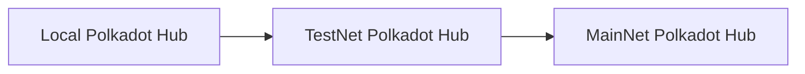

This progression ensures developers can thoroughly test and iterate their smart contracts without risking real tokens or affecting production networks. A typical development journey consists of three main stages:

1. Local development:

    - Developers start in a local environment to create, test, and iterate on smart contracts.
    - Provides rapid experimentation in an isolated setup without external dependencies.

2. TestNet development:

    - Contracts move to TestNets like Westend Hub and Passet Hub.
    - Enables testing in simulated real-world conditions without using real tokens.

3. Production deployment:

    - Final deployment to MainNets like Kusama Hub and Polkadot Hub.
    - Represents the live environment where contracts interact with real economic value.

## Local Development

The local development environment is crucial for smart contract development on Polkadot Hub. It provides developers a controlled space for rapid testing and iteration before moving to public networks. The local setup consists of several key components:

- **[Kitchensink node](https://paritytech.github.io/polkadot-sdk/master/kitchensink_runtime/index.html){target=\_blank}**: A local node that can be run for development and testing. It includes logging capabilities for debugging contract execution and provides a pre-configured development environment with pre-funded accounts for testing purposes.
- **[Ethereum RPC proxy](https://paritytech.github.io/polkadot-sdk/master/pallet_revive_eth_rpc/index.html){target=\_blank}**: Bridges Ethereum-compatible tools with the Polkadot SDK-based network. It enables seamless integration with popular development tools like MetaMask and Remix IDE. The purpose of this component is to translate Ethereum RPC calls into Substrate format.

## Test Networks

The following test networks provide controlled environments for testing smart contracts. TestNet tokens are available from the [Polkadot faucet](https://faucet.polkadot.io/){target=\_blank}. They provide a stable environment for testing your contracts without using real tokens.

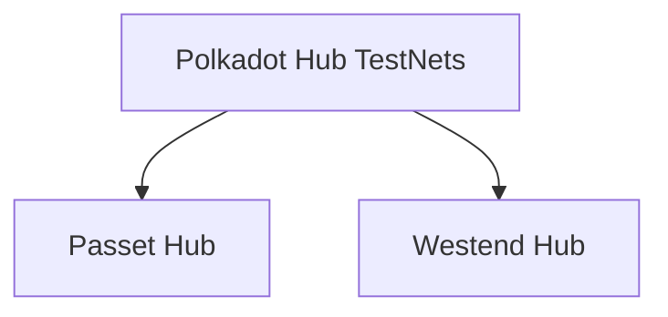

### Passet Hub

The Passet Hub will be a community-managed TestNet designed specifically for smart contract development. It will mirror Asset Hub's runtime and provide developers with an additional environment for testing their contracts before deployment to production networks.

### Westend Hub

Westend Hub is the TestNet for smart contract development and its cutting-edge features. The network maintains the same features and capabilities as the production Polkadot Hub, and also incorporates the latest features developed by core developers.

## Production Networks

The MainNet environments represent the final destination for thoroughly tested and validated smart contracts, where they operate with real economic value and serve actual users.

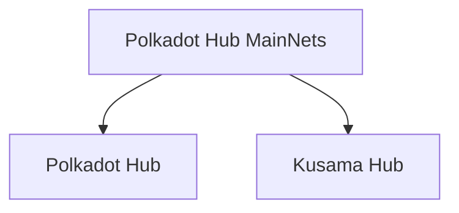

### Polkadot Hub

Polkadot Hub is the primary production network for deploying smart contracts in the Polkadot ecosystem. It provides a secure and stable environment for running smart contracts with real economic value. The network supports PolkaVM-compatible contracts written in Solidity or Rust, maintaining compatibility with Ethereum-based development tools.

### Kusama Hub

Kusama Hub is the canary version of Polkadot Hub. It is designed for developers who want to move quickly and test their smart contracts in a real-world environment with economic incentives. It provides a more flexible space for innovation while maintaining the same core functionality as Polkadot Hub.


---

Page Title: Oracles

- Source (raw): https://raw.githubusercontent.com/polkadot-developers/polkadot-docs/master/ai/pages/develop-toolkit-integrations-oracles.md
- Canonical (HTML): https://docs.polkadot.com/develop/toolkit/integrations/oracles/
- Summary: Learn about blockchain oracles, the essential bridges connecting blockchains with real-world data for decentralized applications in the Polkadot ecosystem.

# Oracles

## What is a Blockchain Oracle?

Oracles enable blockchains to access external data sources. Since blockchains operate as isolated networks, they cannot natively interact with external systems - this limitation is known as the "blockchain oracle problem." Oracles solves this by extracting data from external sources (like APIs, IoT devices, or other blockchains), validating it, and submitting it on-chain.

While simple oracle implementations may rely on a single trusted provider, more sophisticated solutions use decentralized networks where multiple providers stake assets and reach consensus on data validity. Typical applications include DeFi price feeds, weather data for insurance contracts, and cross-chain asset verification.

## Oracle Implementations

<div class="grid cards" markdown>

-   __Acurast__

    ---

    Acurast is a decentralized, serverless cloud platform that uses a distributed network of mobile devices for oracle services, addressing centralized trust and data ownership issues. In the Polkadot ecosystem, it allows developers to define off-chain data and computation needs, which are processed by these devices acting as decentralized oracle nodes, delivering results to Substrate (Wasm) and EVM environments.

    [:octicons-arrow-right-24: Reference](https://acurast.com/){target=\_blank}

</div>


---

Page Title: Polkadart

- Source (raw): https://raw.githubusercontent.com/polkadot-developers/polkadot-docs/master/ai/pages/develop-toolkit-api-libraries-polkadart.md
- Canonical (HTML): https://docs.polkadot.com/develop/toolkit/api-libraries/polkadart/
- Summary: Polkadart is a type-safe, native Dart, SDK for Polkadot and any compatible Polkadot-SDK blockchain network.

# Polkadart

Polkadart is the most comprehensive Dart/Flutter SDK for interacting with Polkadot, Substrate, and other compatible blockchain networks. Designed with a Dart-first approach and type-safe APIs, it provides everything developers need to build powerful decentralized applications.

This page will outline some of the core components of Polkadart. For more details, refer to the [official documentation](https://polkadart.dev){target=\_blank}.

## Installation

Add Polkadart to your `pubspec.yaml`:

=== "All packages"

    ```bash
    dart pub add polkadart polkadart_cli polkadart_keyring polkadart_scale_codec secp256k1_ecdsa sr25519 ss58 substrate_bip39 substrate_metadata
    ```

=== "Core only"

    ```bash
    dart pub add polkadart polkadart_cli polkadart_keyring
    ```

For type-safe API generation, add the following to your `pubspec.yaml`:


```yaml title="pubspec.yaml"
polkadart:
  output_dir: lib/generated
  chains:
    polkadot: wss://rpc.polkadot.io
    kusama: wss://kusama-rpc.polkadot.io
    custom: wss://your-node.example.com
```


## Get Started

### Type Generation

Polkadart provides a CLI tool to generate type definitions from any Polkadot-SDK compatible blockchain network. This allows you to build type-safe Dart applications without dealing with the low-level details of the blockchain.

### Run Generator

```bash
dart run polkadart_cli:generate -v
```

### Use Generated Types

```dart
import 'package:your_app/generated/polkadot/polkadot.dart';
import 'package:polkadart/polkadart.dart';
import 'package:ss58/ss58.dart';

final provider = Provider.fromUri(Uri.parse('wss://rpc.polkadot.io'));
final polkadot = Polkadot(provider);
  
// Account from SS58 address
final account = Address.decode('19t9Q2ay58hMDaeg6eeBhqmHsRnc2jDMV3cYYw9zbc59HLj');

// Retrieve Account Balance
final accountInfo = await polkadot.query.system.account(account.pubkey);
print('Balance: ${accountInfo.data.free}')
```

### Creating an API Instance

An API instance is required to interact with the blockchain. Polkadart provides a `Provider` class that allows you to connect to any network.

```dart
import 'package:demo/generated/polkadot/polkadot.dart';
import 'package:polkadart/provider.dart';

Future<void> main(List<String> arguments) async {
  final provider = Provider.fromUri(Uri.parse('wss://rpc.polkadot.io'));
  final polkadot = Polkadot(provider);
}
```

### Reading Chain Data

Besides querying the data using the `query` from the generated API, you can also use the State API for querying storage data, metadata, runtime information, and other chain information.

```dart
final stateApi = StateApi(provider);

// Get current runtime version
final runtimeVersion = await stateApi.getRuntimeVersion();
print(runtimeVersion.toJson());

// Get metadata
final metadata = await stateApi.getMetadata();
print('Metadata version: ${metadata.version}');
```

### Subscribe to New Blocks

You can subscribe to new blocks on the blockchain using the `subscribe` method.

```dart
final subscription = await provider.subscribe('chain_subscribeNewHeads', []);

subscription.stream.forEach((response) {
  print('New head: ${response.result}');
});
```

### Send a Transaction

Perhaps the most common operation done in any blockchain is transferring funds. Here you can see how that can be done using Polkadart:

```dart
final wallet = await KeyPair.sr25519.fromUri("//Alice");
print('Alice\' wallet: ${wallet.address}');

// Get information necessary to build a proper extrinsic
final runtimeVersion = await polkadot.rpc.state.getRuntimeVersion();
final currentBlockNumber = (await polkadot.query.system.number()) - 1;
final currentBlockHash = await polkadot.query.system.blockHash(currentBlockNumber);
final genesisHash = await polkadot.query.system.blockHash(0);
final nonce = await polkadot.rpc.system.accountNextIndex(wallet.address);

// Make the encoded call
final multiAddress = $MultiAddress().id(wallet.publicKey.bytes);
final transferCall = polkadot.tx.balances.transferKeepAlive(dest: multiAddress, value: BigInt.one).encode();

// Make the payload
final payload = SigningPayload(
    method: transferCall,
    specVersion: runtimeVersion.specVersion,
    transactionVersion: runtimeVersion.transactionVersion,
    genesisHash: encodeHex(genesisHash),
    blockHash: encodeHex(currentBlockHash),
    blockNumber: currentBlockNumber,
    eraPeriod: 64,
    nonce: nonce,
    tip: 0,
).encode(polkadot.registry);

// Sign the payload and build the final extrinsic
final signature = wallet.sign(payload);
final extrinsic = ExtrinsicPayload(
  signer: wallet.bytes(),
  method: transferCall,
  signature: signature,
  eraPeriod: 64,
  blockNumber: currentBlockNumber,
  nonce: nonce,
  tip: 0,
).encode(polkadot.registry, SignatureType.sr25519);

// Send the extrinsic to the blockchain
final author = AuthorApi(provider);
await author.submitAndWatchExtrinsic(extrinsic, (data) {
  print(data);
});
```

## Where to Go Next

To dive deeper into Polkadart, refer to the[official Polkadart documentation](https://polkadart.dev/){target=\_blank}, where you can find comprehensive guides for common use cases and advanced usage.


---

Page Title: Polkadot-API

- Source (raw): https://raw.githubusercontent.com/polkadot-developers/polkadot-docs/master/ai/pages/develop-toolkit-api-libraries-papi.md
- Canonical (HTML): https://docs.polkadot.com/develop/toolkit/api-libraries/papi/
- Summary: Polkadot-API (PAPI) is a modular, composable library set designed for efficient interaction with Polkadot chains, prioritizing a "light-client first" approach.

# Polkadot-API

## Introduction

[Polkadot-API](https://github.com/polkadot-api/polkadot-api){target=\_blank} (PAPI) is a set of libraries built to be modular, composable, and grounded in a light-client first approach. Its primary aim is to equip dApp developers with an extensive toolkit for building fully decentralized applications.

PAPI is optimized for light-client functionality, using the new JSON-RPC spec to support decentralized interactions fully. It provides strong TypeScript support with types and documentation generated directly from on-chain metadata, and it offers seamless access to storage reads, constants, transactions, events, and runtime calls. Developers can connect to multiple chains simultaneously and prepare for runtime updates through multi-descriptor generation and compatibility checks. PAPI is lightweight and performant, leveraging native BigInt, dynamic imports, and modular subpaths to avoid bundling unnecessary assets. It supports promise-based and observable-based APIs, integrates easily with Polkadot.js extensions, and offers signing options through browser extensions or private keys.

## Get Started

### API Instantiation

To instantiate the API, you can install the package by using the following command:

=== "npm"

    ```bash
    npm i polkadot-api@1.17.2
    ```

=== "pnpm"

    ```bash
    pnpm add polkadot-api@1.17.2
    ```

=== "yarn"

    ```bash
    yarn add polkadot-api@1.17.2
    ```

Then, obtain the latest metadata from the target chain and generate the necessary types:

```bash
# Add the target chain
npx papi add dot -n polkadot
```

The `papi add` command initializes the library by generating the corresponding types needed for the chain used. It assigns the chain a custom name and specifies downloading metadata from the Polkadot chain. You can replace `dot` with the name you prefer or with another chain if you want to add a different one. Once the latest metadata is downloaded, generate the required types:

```bash
# Generate the necessary types
npx papi
```

You can now set up a [`PolkadotClient`](https://github.com/polkadot-api/polkadot-api/blob/main/packages/client/src/types.ts#L153){target=\_blank} with your chosen provider to begin interacting with the API. Choose from Smoldot via WebWorker, Node.js, or direct usage, or connect through the WSS provider. The examples below show how to configure each option for your setup.

=== "Smoldot (WebWorker)"

    ```typescript
    // `dot` is the identifier assigned during `npx papi add`
    import { dot } from '@polkadot-api/descriptors';
    import { createClient } from 'polkadot-api';
    import { getSmProvider } from 'polkadot-api/sm-provider';
    import { chainSpec } from 'polkadot-api/chains/polkadot';
    import { startFromWorker } from 'polkadot-api/smoldot/from-worker';
    import SmWorker from 'polkadot-api/smoldot/worker?worker';

    const worker = new SmWorker();
    const smoldot = startFromWorker(worker);
    const chain = await smoldot.addChain({ chainSpec });

    // Establish connection to the Polkadot relay chain
    const client = createClient(getSmProvider(chain));

    // To interact with the chain, obtain the `TypedApi`, which provides
    // the necessary types for every API call on this chain
    const dotApi = client.getTypedApi(dot);

    ```

=== "Smoldot (Node.js)"

    ```typescript
    // `dot` is the alias assigned during `npx papi add`
    import { dot } from '@polkadot-api/descriptors';
    import { createClient } from 'polkadot-api';
    import { getSmProvider } from 'polkadot-api/sm-provider';
    import { chainSpec } from 'polkadot-api/chains/polkadot';
    import { startFromWorker } from 'polkadot-api/smoldot/from-node-worker';
    import { fileURLToPath } from 'url';
    import { Worker } from 'worker_threads';

    // Get the path for the worker file in ESM
    const workerPath = fileURLToPath(
      import.meta.resolve('polkadot-api/smoldot/node-worker'),
    );

    const worker = new Worker(workerPath);
    const smoldot = startFromWorker(worker);
    const chain = await smoldot.addChain({ chainSpec });

    // Set up a client to connect to the Polkadot relay chain
    const client = createClient(getSmProvider(chain));

    // To interact with the chain's API, use `TypedApi` for access to
    // all the necessary types and calls associated with this chain
    const dotApi = client.getTypedApi(dot);

    ```

=== "Smoldot"

    ```typescript
    // `dot` is the alias assigned when running `npx papi add`
    import { dot } from '@polkadot-api/descriptors';
    import { createClient } from 'polkadot-api';
    import { getSmProvider } from 'polkadot-api/sm-provider';
    import { chainSpec } from 'polkadot-api/chains/polkadot';
    import { start } from 'polkadot-api/smoldot';

    // Initialize Smoldot client
    const smoldot = start();
    const chain = await smoldot.addChain({ chainSpec });

    // Set up a client to connect to the Polkadot relay chain
    const client = createClient(getSmProvider(chain));

    // Access the `TypedApi` to interact with all available chain calls and types
    const dotApi = client.getTypedApi(dot);

    ```

=== "WSS"

    ```typescript
    // `dot` is the identifier assigned when executing `npx papi add`
    import { dot } from '@polkadot-api/descriptors';
    import { createClient } from 'polkadot-api';
    // Use this import for Node.js environments
    import { getWsProvider } from 'polkadot-api/ws-provider/web';
    import { withPolkadotSdkCompat } from 'polkadot-api/polkadot-sdk-compat';

    // Establish a connection to the Polkadot relay chain
    const client = createClient(
      // The Polkadot SDK nodes may have compatibility issues; using this enhancer is recommended.
      // Refer to the Requirements page for additional details
      withPolkadotSdkCompat(getWsProvider('wss://dot-rpc.stakeworld.io')),
    );

    // To interact with the chain, obtain the `TypedApi`, which provides
    // the types for all available calls in that chain
    const dotApi = client.getTypedApi(dot);

    ```

Now that you have set up the client, you can interact with the chain by reading and sending transactions.

### Reading Chain Data

The `TypedApi` provides a streamlined way to read blockchain data through three main interfaces, each designed for specific data access patterns:

- **Constants**: Access fixed values or configurations on the blockchain using the `constants` interface.

    ```typescript
    const version = await typedApi.constants.System.Version();
    ```

- **Storage queries**: Retrieve stored values by querying the blockchains storage via the `query` interface.

    ```typescript
    const asset = await api.query.ForeignAssets.Asset.getValue(
      token.location,
      { at: 'best' },
    );
    ```

- **Runtime APIs**: Interact directly with runtime APIs using the `apis` interface.

    ```typescript
    const metadata = await typedApi.apis.Metadata.metadata();
    ```

To learn more about the different actions you can perform with the `TypedApi`, refer to the [TypedApi reference](https://papi.how/typed){target=\_blank}.

### Sending Transactions

In PAPI, the `TypedApi` provides the `tx` and `txFromCallData` methods to send transactions. 

- The `tx` method allows you to directly send a transaction with the specified parameters by using the `typedApi.tx.Pallet.Call` pattern:

    ```typescript
    const tx: Transaction = typedApi.tx.Pallet.Call({arg1, arg2, arg3});
    ``` 

    For instance, to execute the `balances.transferKeepAlive` call, you can use the following snippet:

    ```typescript
    import { MultiAddress } from '@polkadot-api/descriptors';

    const tx: Transaction = typedApi.tx.Balances.transfer_keep_alive({
      dest: MultiAddress.Id('INSERT_DESTINATION_ADDRESS'),
      value: BigInt(INSERT_VALUE),
    });

    ```

    Ensure you replace `INSERT_DESTINATION_ADDRESS` and `INSERT_VALUE` with the actual destination address and value, respectively.

- The `txFromCallData` method allows you to send a transaction using the call data. This option accepts binary call data and constructs the transaction from it. It validates the input upon creation and will throw an error if invalid data is provided. The pattern is as follows:

    ```typescript
    const callData = Binary.fromHex('0x...');
    const tx: Transaction = typedApi.txFromCallData(callData);
    ``` 

    For instance, to execute a transaction using the call data, you can use the following snippet:

    ```typescript
    const callData = Binary.fromHex('0x00002470617065726d6f6f6e');
    const tx: Transaction = typedApi.txFromCallData(callData);
    ```

For more information about sending transactions, refer to the [Transactions](https://papi.how/typed/tx#transactions){target=\_blank} page.

## Where to Go Next

For an in-depth guide on how to use PAPI, refer to the official [PAPI](https://papi.how/){target=\_blank} documentation.


---

Page Title: Polkadot.js API

- Source (raw): https://raw.githubusercontent.com/polkadot-developers/polkadot-docs/master/ai/pages/develop-toolkit-api-libraries-polkadot-js-api.md
- Canonical (HTML): https://docs.polkadot.com/develop/toolkit/api-libraries/polkadot-js-api/
- Summary: Interact with Polkadot SDK-based chains easily using the Polkadot.js API. Query chain data, submit transactions, and more via JavaScript or Typescript.

# Polkadot.js API

!!! warning "Maintenance Mode Only"
    The Polkadot.js API is now in maintenance mode and is no longer actively developed. New projects should use [Dedot](/develop/toolkit/api-libraries/dedot){target=\_blank} (TypeScript-first API) or [Polkadot API](/develop/toolkit/api-libraries/papi){target=\_blank} (modern, type-safe API) as actively maintained alternatives.

## Introduction

The [Polkadot.js API](https://github.com/polkadot-js/api){target=\_blank} uses JavaScript/TypeScript to interact with Polkadot SDK-based chains. It allows you to query nodes, read chain state, and submit transactions through a dynamic, auto-generated API interface.

### Dynamic API Generation

Unlike traditional static APIs, the Polkadot.js API generates its interfaces automatically when connecting to a node. Here's what happens when you connect:

1. The API connects to your node.
2. It retrieves the chain's metadata.
3. Based on this metadata, it creates specific endpoints in this format: `api.<type>.<module>.<section>`.

### Available API Categories

You can access three main categories of chain interactions:

- **[Runtime constants](https://polkadot.js.org/docs/api/start/api.consts){target=\_blank}** (`api.consts`):

    - Access runtime constants directly.
    - Returns values immediately without function calls.
    - **Example**: `api.consts.balances.existentialDeposit`

- **[State queries](https://polkadot.js.org/docs/api/start/api.query/){target=\_blank}** (`api.query`):

    - Read chain state.
    - **Example**: `api.query.system.account(accountId)`

- **[Transactions](https://polkadot.js.org/docs/api/start/api.tx/){target=\_blank}** (`api.tx`):
    - Submit extrinsics (transactions).
    - **Example**: `api.tx.balances.transfer(accountId, value)`

The available methods and interfaces will automatically reflect what's possible on your connected chain.

## Installation

To add the Polkadot.js API to your project, use the following command to install the version `16.4.7` which supports any Polkadot SDK-based chain:

=== "npm"
    ```bash
    npm i @polkadot/api@16.4.7
    ```

=== "pnpm"
    ```bash
    pnpm add @polkadot/api@16.4.7
    ```

=== "yarn"
    ```bash
    yarn add @polkadot/api@16.4.7
    ```

For more detailed information about installation, see the [Installation](https://polkadot.js.org/docs/api/start/install/){target=\_blank} section in the official Polkadot.js API documentation.

## Get Started

### Creating an API Instance

To interact with a Polkadot SDK-based chain, you must establish a connection through an API instance. The API provides methods for querying chain state, sending transactions, and subscribing to updates.

To create an API connection:

```js
import { ApiPromise, WsProvider } from '@polkadot/api';

// Create a WebSocket provider
const wsProvider = new WsProvider('wss://rpc.polkadot.io');

// Initialize the API
const api = await ApiPromise.create({ provider: wsProvider });

// Verify the connection by getting the chain's genesis hash
console.log('Genesis Hash:', api.genesisHash.toHex());

```

!!!warning
    All `await` operations must be wrapped in an async function or block since the API uses promises for asynchronous operations.

### Reading Chain Data

The API provides several ways to read data from the chain. You can access:

- **Constants**: Values that are fixed in the runtime and don't change without a runtime upgrade.

    ```js
    // Get the minimum balance required for a new account
    const minBalance = api.consts.balances.existentialDeposit.toNumber();

    ```

- **State**: Current chain state that updates with each block.

    ```js
    // Example address
    const address = '5DTestUPts3kjeXSTMyerHihn1uwMfLj8vU8sqF7qYrFabHE';

    // Get current timestamp
    const timestamp = await api.query.timestamp.now();

    // Get account information
    const { nonce, data: balance } = await api.query.system.account(address);

    console.log(`
      Timestamp: ${timestamp}
      Free Balance: ${balance.free}
      Nonce: ${nonce}
    `);

    ```

### Sending Transactions

Transactions (also called extrinsics) modify the chain state. Before sending a transaction, you need:

- A funded account with sufficient balance to pay transaction fees.
- The account's keypair for signing.

To make a transfer:

```js
// Assuming you have an `alice` keypair from the Keyring
const recipient = 'INSERT_RECIPIENT_ADDRESS';
const amount = 'INSERT_VALUE'; // Amount in the smallest unit (e.g., Planck for DOT)

// Sign and send a transfer
const txHash = await api.tx.balances
  .transfer(recipient, amount)
  .signAndSend(alice);

console.log('Transaction Hash:', txHash);

```

The `alice` keypair in the example comes from a `Keyring` object. For more details about managing keypairs, see the [Keyring documentation](https://polkadot.js.org/docs/keyring){target=\_blank}.

## Where to Go Next

For more detailed information about the Polkadot.js API, check the [official documentation](https://polkadot.js.org/docs/){target=\_blank}.


---

Page Title: PolkaVM Design

- Source (raw): https://raw.githubusercontent.com/polkadot-developers/polkadot-docs/master/ai/pages/polkadot-protocol-smart-contract-basics-polkavm-design.md
- Canonical (HTML): https://docs.polkadot.com/polkadot-protocol/smart-contract-basics/polkavm-design/
- Summary: Discover PolkaVM, a high-performance smart contract VM for Polkadot, enabling Ethereum compatibility via pallet_revive, Solidity support & optimized execution.

# PolkaVM Design

!!! smartcontract "PolkaVM Preview Release"
    PolkaVM smart contracts with Ethereum compatibility are in **early-stage development and may be unstable or incomplete**.
## Introduction

The Asset Hub smart contracts solution includes multiple components to ensure Ethereum compatibility and high performance. Its architecture allows for integration with current Ethereum tools, while its innovative virtual machine design enhances performance characteristics.

## PolkaVM

[**PolkaVM**](https://github.com/paritytech/polkavm){target=\_blank} is a custom virtual machine optimized for performance with [RISC-V-based](https://en.wikipedia.org/wiki/RISC-V){target=\_blank} architecture, supporting Solidity and additional high-performance languages. It serves as the core execution environment, integrated directly within the runtime. It features:

- An efficient interpreter for immediate code execution.
- A planned JIT compiler for optimized performance.
- Dual-mode execution capability, allowing selection of the most appropriate backend for specific workloads.
- Optimized performance for short-running contract calls through the interpreter.

The interpreter remains particularly beneficial for contracts with minimal code execution, as it eliminates JIT compilation overhead and enables immediate code execution through lazy interpretation.

## Architecture

The smart contract solution consists of the following key components that work together to enable Ethereum compatibility on Polkadot-based chains.

### Pallet Revive

[**`pallet_revive`**](https://paritytech.github.io/polkadot-sdk/master/pallet_revive/index.html){target=\_blank} is a runtime module that executes smart contracts by adding extrinsics, runtime APIs, and logic to convert Ethereum-style transactions into formats compatible with Polkadot SDK-based blockchains. It processes Ethereum-style transactions through the following workflow:

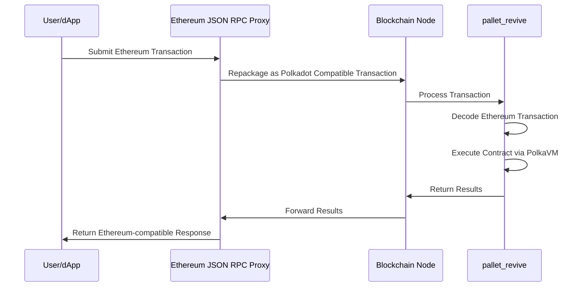

This proxy-based approach eliminates the need for node binary modifications, maintaining compatibility across different client implementations. Preserving the original Ethereum transaction payload simplifies adapting existing tools, which can continue processing familiar transaction formats.

### PolkaVM Design Fundamentals

PolkaVM introduces two fundamental architectural differences compared to the Ethereum Virtual Machine (EVM):

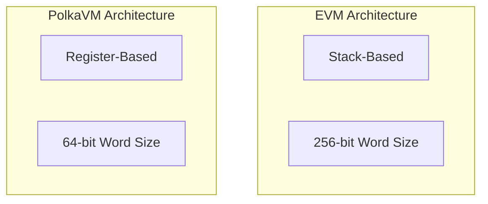

- **Register-based design**: PolkaVM utilizes a RISC-V register-based approach. This design:

    - Employs a finite set of registers for argument passing instead of an infinite stack.
    - Facilitates efficient translation to underlying hardware architectures.
    - Optimizes register allocation through careful register count selection.
    - Enables simple 1:1 mapping to x86-64 instruction sets.
    - Reduces compilation complexity through strategic register limitation.
    - Improves overall execution performance through hardware-aligned design.

- **64-bit word size**: PolkaVM operates with a 64-bit word size. This design:

    - Enables direct hardware-supported arithmetic operations.
    - Maintains compatibility with Solidity's 256-bit operations through YUL translation.
    - Allows integration of performance-critical components written in lower-level languages.
    - Optimizes computation-intensive operations through native word size alignment.
    - Reduces overhead for operations not requiring extended precision.
    - Facilitates efficient integration with modern CPU architectures.

## Compilation Process

When compiling a Solidity smart contract, the code passes through the following stages:

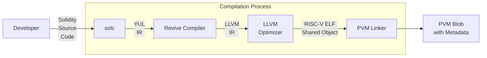

The compilation process integrates several specialized components:

1. **Solc**: The standard Ethereum Solidity compiler that translates Solidity source code to [YUL IR](https://docs.soliditylang.org/en/latest/yul.html){target=\_blank}.
2. **Revive Compiler**: Takes YUL IR and transforms it to [LLVM IR](https://llvm.org/){target=\_blank}.
3. **LLVM**: A compiler infrastructure that optimizes the code and generates RISC-V ELF objects.
4. **PVM linker**: Links the RISC-V ELF object into a final PolkaVM blob with metadata.


---

Page Title: Python Substrate Interface

- Source (raw): https://raw.githubusercontent.com/polkadot-developers/polkadot-docs/master/ai/pages/develop-toolkit-api-libraries-py-substrate-interface.md
- Canonical (HTML): https://docs.polkadot.com/develop/toolkit/api-libraries/py-substrate-interface/
- Summary: Learn how to connect to Polkadot SDK-based nodes, query data, submit transactions, and manage blockchain interactions using the Python Substrate Interface.

# Python Substrate Interface

## Introduction

The [Python Substrate Interface](https://github.com/polkascan/py-substrate-interface){target=\_blank} is a powerful library that enables interaction with Polkadot SDK-based chains. It provides essential functionality for:

- Querying on-chain storage.
- Composing and submitting extrinsics.
- SCALE encoding/decoding.
- Interacting with Substrate runtime metadata.
- Managing blockchain interactions through convenient utility methods.

## Installation

Install the library using `pip`:

```py
pip install substrate-interface
```

For more installation details, see the [Installation](https://jamdottech.github.io/py-polkadot-sdk/getting-started/installation/){target=\_blank} section in the official Python Substrate Interface documentation.

## Get Started

This guide will walk you through the basic operations with the Python Substrate Interface: connecting to a node, reading chain state, and submitting transactions.

### Establishing Connection

The first step is to establish a connection to a Polkadot SDK-based node. You can connect to either a local or remote node:

```py
from substrateinterface import SubstrateInterface

# Connect to a node using websocket
substrate = SubstrateInterface(
    # For local node: "ws://127.0.0.1:9944"
    # For Polkadot: "wss://rpc.polkadot.io"
    # For Kusama: "wss://kusama-rpc.polkadot.io"
    url="INSERT_WS_URL"
)

# Verify connection
print(f"Connected to chain: {substrate.chain}")

```

### Reading Chain State

You can query various on-chain storage items. To retrieve data, you need to specify three key pieces of information:

- **Pallet name**: Module or pallet that contains the storage item you want to access.
- **Storage item**: Specific storage entry you want to query within the pallet.
- **Required parameters**: Any parameters needed to retrieve the desired data.

Here's an example of how to check an account's balance and other details:

```py
# ...

# Query account balance and info
account_info = substrate.query(
    module="System",  # The pallet name
    storage_function="Account",  # The storage item
    params=["INSERT_ADDRESS"],  # Account address in SS58 format
)

# Access account details from the result
free_balance = account_info.value["data"]["free"]
reserved = account_info.value["data"]["reserved"]
nonce = account_info.value["nonce"]

print(
    f"""
    Account Details:
    - Free Balance: {free_balance}
    - Reserved: {reserved} 
    - Nonce: {nonce}
    """
)

```

### Submitting Transactions

To modify the chain state, you need to submit transactions (extrinsics). Before proceeding, ensure you have:

- A funded account with sufficient balance to pay transaction fees.
- Access to the account's keypair.

Here's how to create and submit a balance transfer:

```py
#...

# Compose the transfer call
call = substrate.compose_call(
    call_module="Balances",  # The pallet name
    call_function="transfer_keep_alive",  # The extrinsic function
    call_params={
        'dest': 'INSERT_ADDRESS',  # Recipient's address
        'value': 'INSERT_VALUE'  # Amount in smallest unit (e.g., Planck for DOT)
    }
)

# Create a signed extrinsic
extrinsic = substrate.create_signed_extrinsic(
    call=call, keypair=keypair  # Your keypair for signing
)

# Submit and wait for inclusion
receipt = substrate.submit_extrinsic(
    extrinsic, wait_for_inclusion=True  # Wait until the transaction is in a block
)

if receipt.is_success:
    print(
        f"""
        Transaction successful:
        - Extrinsic Hash: {receipt.extrinsic_hash}
        - Block Hash: {receipt.block_hash}
        """
    )
else:
    print(f"Transaction failed: {receipt.error_message}")

```

The `keypair` object is essential for signing transactions. See the [Keypair](https://jamdottech.github.io/py-polkadot-sdk/reference/keypair/){target=\_blank} documentation for more details.

## Where to Go Next

Now that you understand the basics, you can:

- Explore more complex queries and transactions.
- Learn about batch transactions and utility functions.
- Discover how to work with custom pallets and types.

For comprehensive reference materials and advanced features, see the [Python Substrate Interface](https://jamdottech.github.io/py-polkadot-sdk/){target=\_blank} documentation.


---

Page Title: Send XCM Messages

- Source (raw): https://raw.githubusercontent.com/polkadot-developers/polkadot-docs/master/ai/pages/develop-interoperability-send-messages.md
- Canonical (HTML): https://docs.polkadot.com/develop/interoperability/send-messages/
- Summary: Send cross-chain messages using XCM, Polkadot's Cross-Consensus Messaging format, designed to support secure communication between chains.

# Send XCM Messages

## Introduction

One of the core FRAME pallets that enables parachains to engage in cross-chain communication using the Cross-Consensus Message (XCM) format is [`pallet-xcm`](https://paritytech.github.io/polkadot-sdk/master/pallet_xcm/pallet/index.html){target=\_blank}. It facilitates the sending, execution, and management of XCM messages, thereby allowing parachains to interact with other chains within the ecosystem. Additionally, `pallet-xcm`, also referred to as the XCM pallet, supports essential operations like asset transfers, version negotiation, and message routing.

This page provides a detailed overview of the XCM pallet's key features, its primary roles in XCM operations, and the main extrinsics it offers. Whether aiming to execute XCM messages locally or send them to external chains, this guide covers the foundational concepts and practical applications you need to know.

## XCM Frame Pallet Overview

The [`pallet-xcm`](https://paritytech.github.io/polkadot-sdk/master/pallet_xcm/pallet/index.html){target=\_blank} provides a set of pre-defined, commonly used [XCVM programs](https://github.com/polkadot-fellows/xcm-format?tab=readme-ov-file#12-the-xcvm){target=\_blank} in the form of a [set of extrinsics](https://paritytech.github.io/polkadot-sdk/master/pallet_xcm/pallet/dispatchables/index.html){target=\blank}. This pallet provides some [default implementations](https://paritytech.github.io/polkadot-sdk/master/pallet_xcm/pallet/struct.Pallet.html#implementations){target=\_blank} for traits required by [`XcmConfig`](https://paritytech.github.io/polkadot-sdk/master/pallet_xcm_benchmarks/trait.Config.html#associatedtype.XcmConfig){target=\_blank}. The [XCM executor](https://paritytech.github.io/polkadot-sdk/master/staging_xcm_executor/struct.XcmExecutor.html){target=\_blank} is also included as an associated type within the pallet's configuration. 

For further details about the XCM configuration, see the [XCM Configuration](/develop/interoperability/xcm-config/){target=\_blank} page.

Where the [XCM format](https://github.com/polkadot-fellows/xcm-format){target=\_blank} defines a set of instructions used to construct XCVM programs, `pallet-xcm` defines a set of extrinsics that can be utilized to build XCVM programs, either to target the local or external chains. The `pallet-xcm` functionality is divided into three categories:

- **Primitive**: Dispatchable functions to execute XCM locally.
- **High-level**: Functions for asset transfers between chains.
- **Version negotiation-specific**: Functions for managing XCM version compatibility.

### Key Roles of the XCM Pallet

The XCM pallet plays a central role in managing cross-chain messages, with its primary responsibilities including:

- **Execute XCM messages**: Interacts with the XCM executor to validate and execute messages, adhering to predefined security and filter criteria.
- **Send messages across chains**: Allows authorized origins to send XCM messages, enabling controlled cross-chain communication.
- **Reserve-based transfers and teleports**: Supports asset movement between chains, governed by filters that restrict operations to authorized origins.
- **XCM version negotiation**: Ensures compatibility by selecting the appropriate XCM version for inter-chain communication.
- **Asset trapping and recovery**: Manages trapped assets, enabling safe reallocation or recovery when issues occur during cross-chain transfers.
- **Support for XCVM operations**: Oversees state and configuration requirements necessary for executing cross-consensus programs within the XCVM framework.

## Primary Extrinsics of the XCM Pallet

This page will highlight the two **Primary Primitive Calls** responsible for sending and executing XCVM programs as dispatchable functions within the pallet.

### Execute

The[`execute`](https://paritytech.github.io/polkadot-sdk/master/pallet_xcm/pallet/enum.Call.html#variant.execute){target=\_blank}call directly interacts with the XCM executor, allowing for the execution of XCM messages originating from a locally signed origin. The executor validates the message, ensuring it complies with any configured barriers or filters before executing.

Once validated, the message is executed locally, and an event is emitted to indicate the resultwhether the message was fully executed or only partially completed. Execution is capped by a maximum weight ([`max_weight`](https://paritytech.github.io/polkadot-sdk/master/pallet_xcm/pallet/enum.Call.html#variant.execute.field.max_weight){target=\_blank}); if the required weight exceeds this limit, the message will not be executed.

```rust
pub fn execute<T: Config>(
    message: Box<VersionedXcm<<T as Config>::RuntimeCall>>,
    max_weight: Weight,
)
```

For further details about the `execute` extrinsic, see the [`pallet-xcm` documentation](https://paritytech.github.io/polkadot-sdk/master/pallet_xcm/pallet/struct.Pallet.html){target=\_blank}.

!!!warning
    Partial execution of messages may occur depending on the constraints or barriers applied.


### Send

The[`send`](https://paritytech.github.io/polkadot-sdk/master/pallet_xcm/pallet/enum.Call.html#variant.send){target=\_blank}call enables XCM messages to be sent to a specified destination. This could be a parachain, smart contract, or any external system governed by consensus. Unlike the execute call, the message is not executed locally but is transported to the destination chain for processing.

The destination is defined using a [Location](https://paritytech.github.io/polkadot-sdk/master/xcm_docs/glossary/index.html#location){target=\_blank}, which describes the target chain or system. This ensures precise delivery through the configured XCM transport mechanism.

```rust
pub fn send<T: Config>(
    dest: Box<MultiLocation>,
    message: Box<VersionedXcm<<T as Config>::RuntimeCall>>,
)
```

For further information about the `send` extrinsic, see the [`pallet-xcm` documentation](https://paritytech.github.io/polkadot-sdk/master/pallet_xcm/pallet/struct.Pallet.html){target=\_blank}.


## XCM Router

The [`XcmRouter`](https://paritytech.github.io/polkadot-sdk/master/pallet_xcm/pallet/trait.Config.html#associatedtype.XcmRouter){target=\_blank} is a critical component the XCM pallet requires to facilitate sending XCM messages. It defines where messages can be sent and determines the appropriate XCM transport protocol for the operation.

For instance, the Kusama network employs the [`ChildParachainRouter`](https://paritytech.github.io/polkadot-sdk/master/polkadot_runtime_common/xcm_sender/struct.ChildParachainRouter.html){target=\_blank}, which restricts routing to [Downward Message Passing (DMP)](https://wiki.polkadot.com/learn/learn-xcm-transport/#dmp-downward-message-passing){target=\_blank} from the relay chain to parachains, ensuring secure and controlled communication.

```rust
pub type PriceForChildParachainDelivery =
	ExponentialPrice<FeeAssetId, BaseDeliveryFee, TransactionByteFee, Dmp>;
```

For more details about XCM transport protocols, see the [XCM Channels](/develop/interoperability/xcm-channels/){target=\_blank} page.


---

Page Title: Sidecar Rest API

- Source (raw): https://raw.githubusercontent.com/polkadot-developers/polkadot-docs/master/ai/pages/develop-toolkit-api-libraries-sidecar.md
- Canonical (HTML): https://docs.polkadot.com/develop/toolkit/api-libraries/sidecar/
- Summary: Learn about Substrate API Sidecar, a REST service that provides endpoints for interacting with Polkadot SDK-based chains and simplifies blockchain interactions.

# Sidecar API

## Introduction

The [Sidecar Rest API](https://github.com/paritytech/substrate-api-sidecar){target=\_blank} is a service that provides a REST interface for interacting with Polkadot SDK-based blockchains. With this API, developers can easily access a broad range of endpoints for nodes, accounts, transactions, parachains, and more.

Sidecar functions as a caching layer between your application and a Polkadot SDK-based node, offering standardized REST endpoints that simplify interactions without requiring complex, direct RPC calls. This approach is especially valuable for developers who prefer REST APIs or build applications in languages with limited WebSocket support.

Some of the key features of the Sidecar API include:

- **REST API interface**: Provides a familiar REST API interface for interacting with Polkadot SDK-based chains.
- **Standardized endpoints**: Offers consistent endpoint formats across different chain implementations.
- **Caching layer**: Acts as a caching layer to improve performance and reduce direct node requests.
- **Multiple chain support**: Works with any Polkadot SDK-based chain, including Polkadot, Kusama, and custom chains.

## Prerequisites

Sidecar API requires Node.js version 18.14 LTS or higher. Verify your Node.js version:

```bash
node --version
```

If you need to install or update Node.js, visit the [official Node.js website](https://nodejs.org/){target=\_blank} to download and install the latest LTS version.

## Installation

To install Substrate API Sidecar, use one of the following commands:

=== "npm"

    ```bash
    npm install -g @substrate/api-sidecar
    ```

=== "pnpm"

    ```bash
    pnpm install -g @substrate/api-sidecar
    ```

=== "yarn"

    ```bash
    yarn global add @substrate/api-sidecar
    ```

You can confirm the installation by running:

```bash
substrate-api-sidecar --version
```

For more information about the Sidecar API installation, see the [installation and usage](https://github.com/paritytech/substrate-api-sidecar?tab=readme-ov-file#npm-package-installation-and-usage){target=\_blank} section of the Sidecar API README.

## Usage

To use the Sidecar API, you have two options:

- **Local node**: Run a node locally, which Sidecar will connect to by default, requiring no additional configuration. To start, run the following:

    ```bash
    substrate-api-sidecar
    ```

- **Remote node**: Connect Sidecar to a remote node by specifying the RPC endpoint for that chain. For example, to gain access to the Polkadot Asset Hub associated endpoints.

    ```bash
    SAS_SUBSTRATE_URL=wss://polkadot-asset-hub-rpc.polkadot.io substrate-api-sidecar
    ```

    For more configuration details, see the [Configuration](https://github.com/paritytech/substrate-api-sidecar?tab=readme-ov-file#configuration){target=\_blank} section of the Sidecar API documentation.

Once the Sidecar API is running, youll see output similar to this:

<div id="termynal" data-termynal>
    <span data-ty='input'><span class='file-path'></span>SAS_SUBSTRATE_URL=wss://polkadot-asset-hub-rpc.polkadot.io substrate-api-sidecar</span>
    <br>
    <span data-ty>SAS:</span>
    <span data-ty> LOG:</span>
    <span data-ty>    LEVEL: "info"</span>
    <span data-ty>    JSON: false</span>
    <span data-ty>    FILTER_RPC: false</span>
    <span data-ty>    STRIP_ANSI: false</span>
    <span data-ty>    WRITE: false</span>
    <span data-ty>    WRITE_PATH: "/opt/homebrew/lib/node_modules/@substrate/api-sidecar/build/src/logs"</span>
    <span data-ty>    WRITE_MAX_FILE_SIZE: 5242880</span>
    <span data-ty>    WRITE_MAX_FILES: 5</span>
    <span data-ty> SUBSTRATE:</span>
    <span data-ty>    URL: "wss://polkadot-asset-hub-rpc.polkadot.io"</span>
    <span data-ty>    TYPES_BUNDLE: undefined</span>
    <span data-ty>    TYPES_CHAIN: undefined</span>
    <span data-ty>    TYPES_SPEC: undefined</span>
    <span data-ty>    TYPES: undefined</span>
    <span data-ty>    CACHE_CAPACITY: undefined</span>
    <span data-ty> EXPRESS:</span>
    <span data-ty>    BIND_HOST: "127.0.0.1"</span>
    <span data-ty>    PORT: 8080</span>
    <span data-ty>    KEEP_ALIVE_TIMEOUT: 5000</span>
    <span data-ty> METRICS:</span>
    <span data-ty>    ENABLED: false</span>
    <span data-ty>    PROM_HOST: "127.0.0.1"</span>
    <span data-ty>    PROM_PORT: 9100</span>
    <span data-ty>    LOKI_HOST: "127.0.0.1"</span>
    <span data-ty>    LOKI_PORT: 3100</span>
    <span data-ty>    INCLUDE_QUERYPARAMS: false</span>
    <br>
    <span data-ty>2024-11-06 08:06:01 info: Version: 19.3.0</span>
    <span data-ty>2024-11-06 08:06:02 warn: API/INIT: RPC methods not decorated: chainHead_v1_body, chainHead_v1_call, chainHead_v1_continue, chainHead_v1_follow, chainHead_v1_header, chainHead_v1_stopOperation, chainHead_v1_storage, chainHead_v1_unfollow, chainHead_v1_unpin, chainSpec_v1_chainName, chainSpec_v1_genesisHash, chainSpec_v1_properties, transactionWatch_v1_submitAndWatch, transactionWatch_v1_unwatch, transaction_v1_broadcast, transaction_v1_stop</span>
    <span data-ty>2024-11-06 08:06:02 info: Connected to chain Polkadot Asset Hub on the statemint client at wss://polkadot-asset-hub-rpc.polkadot.io</span>
    <span data-ty>2024-11-06 08:06:02 info: Listening on http://127.0.0.1:8080/</span>
    <span data-ty>2024-11-06 08:06:02 info: Check the root endpoint (http://127.0.0.1:8080/) to see the available endpoints for the current node</span>
</div>
With Sidecar running, you can access the exposed endpoints via a browser, [`Postman`](https://www.postman.com/){target=\_blank}, [`curl`](https://curl.se/){target=\_blank}, or your preferred tool.

### Endpoints

Sidecar API provides a set of REST endpoints that allow you to query different aspects of the chain, including blocks, accounts, and transactions. Each endpoint offers specific insights into the chains state and activities.

For example, to retrieve the version of the node, use the `/node/version` endpoint:

```bash
curl -X 'GET' \
  'http://127.0.0.1:8080/node/version' \
  -H 'accept: application/json'
```

Alternatively, you can access `http://127.0.0.1:8080/node/version` directly in a browser since its a `GET` request.

In response, youll see output similar to this (assuming youre connected to Polkadot Asset Hub):

<div id="termynal" data-termynal>
    <span data-ty="input"><span class="file-path"></span>curl -X 'GET' 'http://127.0.0.1:8080/node/version' -H 'accept: application/json'</span>
    <br>
    <span data-ty>{</span>
    <span data-ty>    "clientVersion": "1.16.1-835e0767fe8",</span>
    <span data-ty>    "clientImplName": "statemint",</span>
    <span data-ty>    "chain": "Polkadot Asset Hub"</span>
    <span data-ty>}</span>
</div>
For a complete list of available endpoints and their documentation, visit the [Sidecar API list endpoints](https://paritytech.github.io/substrate-api-sidecar/dist/){target=\_blank}. You can learn about the endpoints and how to use them in your applications.

## Where to Go Next

To dive deeper, refer to the [official Sidecar documentation](https://github.com/paritytech/substrate-api-sidecar?tab=readme-ov-file#substrateapi-sidecar){target=\_blank}. This provides a comprehensive guide to the available configurations and advanced usage.


---

Page Title: Smart Contracts Basics Overview

- Source (raw): https://raw.githubusercontent.com/polkadot-developers/polkadot-docs/master/ai/pages/polkadot-protocol-smart-contract-basics-overview.md
- Canonical (HTML): https://docs.polkadot.com/polkadot-protocol/smart-contract-basics/overview/
- Summary: Learn how developers can build smart contracts on Polkadot by leveraging either Wasm/ink! or EVM contracts across many parachains.

# An Overview of the Smart Contract Landscape on Polkadot

!!! smartcontract "PolkaVM Preview Release"
    PolkaVM smart contracts with Ethereum compatibility are in **early-stage development and may be unstable or incomplete**.
## Introduction

Polkadot is designed to support an ecosystem of parachains, rather than hosting smart contracts directly. Developers aiming to build smart contract applications on Polkadot rely on parachains within the ecosystem that provide smart contract functionality.

This guide outlines the primary approaches to developing smart contracts in the Polkadot ecosystem:

- **PolkaVM-compatible contracts**: Support Solidity and any language that compiles down to RISC-V while maintaining compatibility with Ethereum based tools.
- **EVM-compatible contracts**: Support languages like [Solidity](https://soliditylang.org/){target=\_blank} and [Vyper](https://vyperlang.org/){target=\_blank}, offering compatibility with popular Ethereum tools and wallets.
- **Wasm-based smart contracts**: Using [ink!](https://use.ink/){target=\_blank}, a Rust-based embedded domain-specific language (eDSL), enabling developers to leverage Rusts safety and tooling.

You'll explore the key differences between these development paths, along with considerations for parachain developers integrating smart contract functionality.

!!!note "Parachain Developer?"
    If you are a parachain developer looking to add smart contract functionality to your chain, please refer to the [Add Smart Contract Functionality](/develop/parachains/customize-parachain/add-smart-contract-functionality/){target=\_blank} page, which covers both Wasm and EVM-based contract implementations.

## Smart Contracts Versus Parachains

A smart contract is a program that executes specific logic isolated to the chain on which it is being executed. All the logic executed is bound to the same state transition rules determined by the underlying virtual machine (VM). Consequently, smart contracts are more streamlined to develop, and programs can easily interact with each other through similar interfaces.

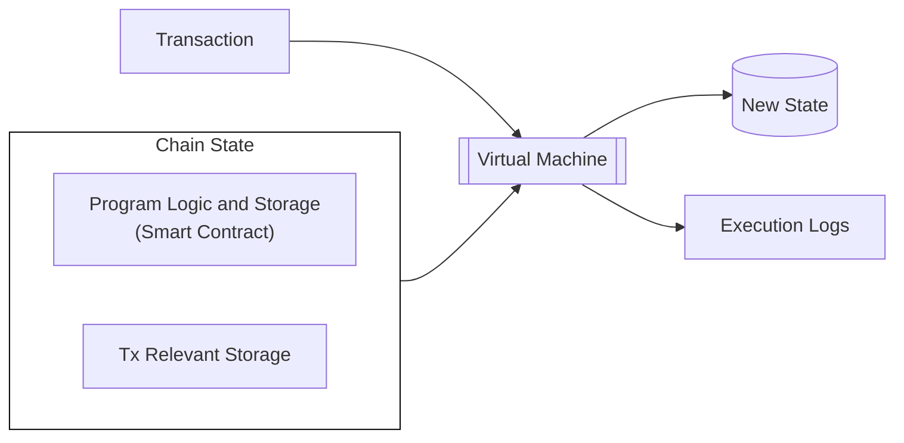

In addition, because smart contracts are programs that execute on top of existing chains, teams don't have to think about the underlying consensus they are built on.

These strengths do come with certain limitations. Some smart contracts environments, like EVM, tend to be immutable by default. Developers have developed different [proxy strategies](https://www.openzeppelin.com/news/proxy-patterns){target=\_blank} to be able to upgrade smart contracts over time. The typical pattern relies on a proxy contract which holds the program storage forwarding a call to an implementation contract where the execution logic resides. Smart contract upgrades require changing the implementation contract while retaining the same storage structure, necessitating careful planning.

Another downside is that smart contracts often follow a gas metering model, where program execution is associated with a given unit and a marketplace is set up to pay for such an execution unit. This fee system is often very rigid, and some complex flows, like account abstraction, have been developed to circumvent this problem.

In contrast, parachains can create their own custom logics (known as pallets or modules), and combine them as the state transition function (STF or runtime) thanks to the modularity provided by the [Polkadot-SDK](https://github.com/paritytech/polkadot-sdk/){target=\_blank}. The different pallets within the parachain runtime can give developers a lot of flexibility when building applications on top of it.

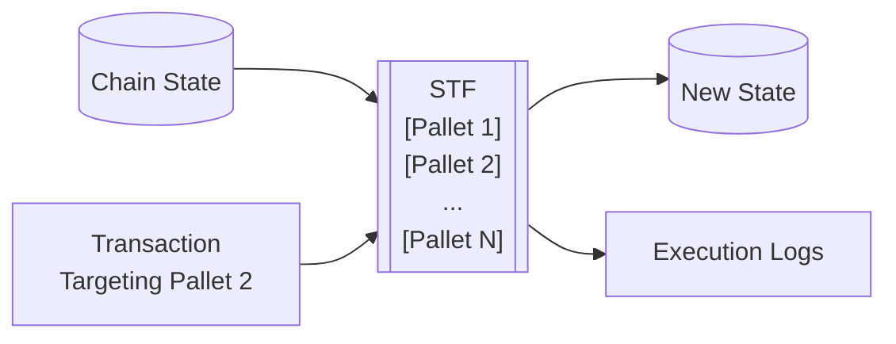

Parachains inherently offer features such as logic upgradeability, flexible transaction fee mechanisms, and chain abstraction logic. More so, by using Polkadot, parachains can benefit from robust consensus guarantees with little engineering overhead.

To read more about the differences between smart contracts and parachain runtimes, see the [Runtime vs. Smart Contracts](https://paritytech.github.io/polkadot-sdk/master/polkadot_sdk_docs/reference_docs/runtime_vs_smart_contract/index.html){target=\_blank} section of the Polkadot SDK Rust docs. For a more in-depth discussion about choosing between runtime development and smart contract development, see the Stack Overflow post on [building a Polkadot SDK runtime versus a smart contract](https://stackoverflow.com/a/56041305){target=\_blank}.

## Building a Smart Contract

The Polkadot SDK supports multiple smart contract execution environments:

- **PolkaVM**: A cutting-edge virtual machine tailored to optimize smart contract execution on Polkadot. Unlike traditional EVMs, PolkaVM is built with a [RISC-V-based register architecture](https://en.wikipedia.org/wiki/RISC-V){target=\_blank} for increased performance and scalability.
- **EVM**: Through [Frontier](https://github.com/polkadot-evm/frontier){target=\_blank}. It consists of a full Ethereum JSON RPC compatible client, an Ethereum emulation layer, and a [Rust-based EVM](https://github.com/rust-ethereum/evm){target=\_blank}. This is used by chains like [Acala](https://acala.network/){target=\_blank}, [Astar](https://astar.network/){target=\_blank}, [Moonbeam](https://moonbeam.network){target=\_blank} and more.
- **Wasm**: [ink!](https://use.ink/){target=\_blank} is a domain-specific language (DSL) for Rust smart contract development that uses the [Contracts pallet](https://github.com/paritytech/polkadot-sdk/blob/master/substrate/frame/contracts/){target=\_blank} with [`cargo-contract`](https://github.com/use-ink/cargo-contract){target=\_blank} serving as the compiler to WebAssembly. Wasm contracts can be used by chains like [Astar](https://astar.network/){target=\_blank}.

### PolkaVM Contracts

A component of the Asset Hub parachain, PolkaVM helps enable the deployment of Solidity-based smart contracts directly on Asset Hub. Learn more about how this cutting edge virtual machine facilitates using familiar Ethereum-compatible contracts and tools with Asset Hub by visiting the [Native Smart Contracts](/develop/smart-contracts/overview#native-smart-contracts){target=\_blank} guide.

### EVM Contracts

The [Frontier](https://github.com/polkadot-evm/frontier){target=\_blank} project provides a set of modules that enables a Polkadot SDK-based chain to run an Ethereum emulation layer that allows the execution of EVM smart contracts natively with the same API/RPC interface.

[Ethereum addresses (ECDSA)](https://ethereum.org/en/glossary/#address){target=\_blank} can also be mapped directly to and from the Polkadot SDK's SS58 scheme from existing accounts. Moreover, you can modify Polkadot SDK to use the ECDSA signature scheme directly to avoid any mapping.

At a high level, [Frontier](https://github.com/polkadot-evm/frontier){target=\_blank} is composed of three main components:

- **[Ethereum Client](https://github.com/polkadot-evm/frontier/tree/master/client){target=\_blank}**: An Ethereum JSON RPC compliant client that allows any request coming from an Ethereum tool, such as [Remix](https://remix.ethereum.org/){target=\_blank}, [Hardhat](https://hardhat.org/){target=\_blank} or [Foundry](https://getfoundry.sh/){target=\_blank}, to be admitted by the network.
- **[Pallet Ethereum](https://docs.rs/pallet-ethereum/latest/pallet_ethereum/){target=\_blank}**: A block emulation and Ethereum transaction validation layer that works jointly with the Ethereum client to ensure compatibility with Ethereum tools.
- **[Pallet EVM](https://docs.rs/pallet-evm/latest/pallet_evm/){target=\_blank}**: Access layer to the [Rust-based EVM](https://github.com/rust-ethereum/evm){target=\_blank}, enabling the execution of EVM smart contract logic natively.

The following diagram illustrates a high-level overview of the path an EVM transaction follows when using this configuration:

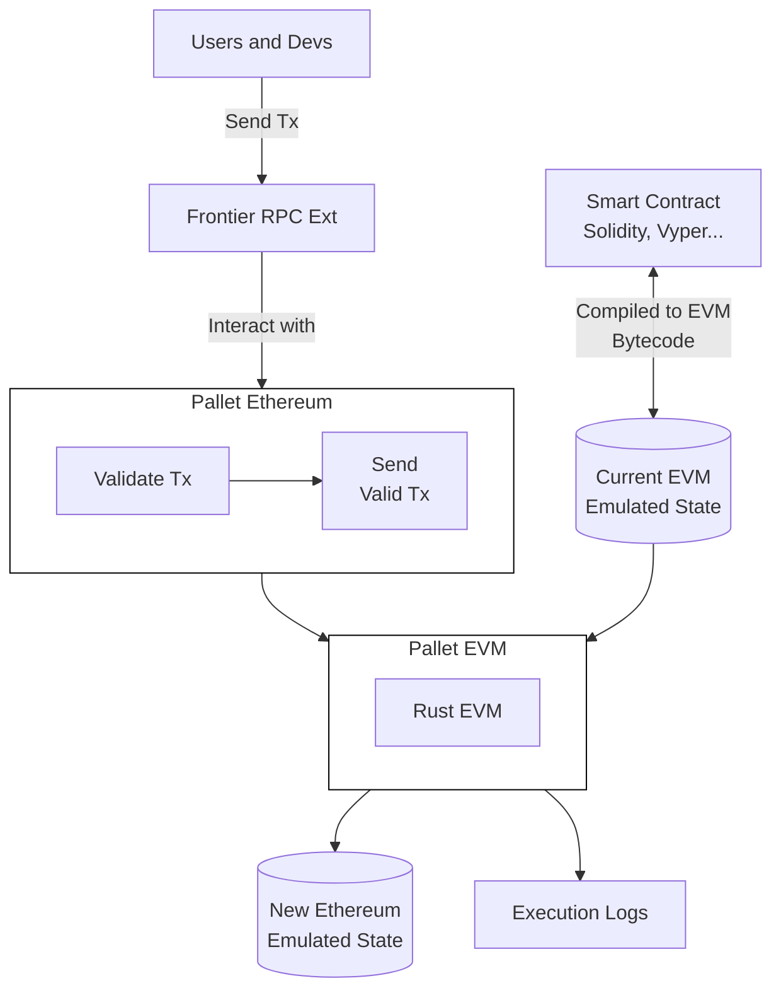

Although it seems complex, users and developers are abstracted of that complexity, and tools can easily interact with the parachain as they would with any other Ethereum-compatible environment.

The Rust EVM is capable of executing regular [EVM bytecode](https://www.ethervm.io/){target=\_blank}. Consequently, any language that compiles to EVM bytecode can be used to create programs that the parachain can execute.

### Wasm Contracts

The [`pallet_contracts`](https://docs.rs/pallet-contracts/latest/pallet_contracts/index.html#contracts-pallet){target=\_blank} provides the execution environment for Wasm-based smart contracts. Consequently, any smart contract language that compiles to Wasm can be executed in a parachain that enables this module.

At the time of writing there are two main languages that can be used for Wasm programs:

- **[ink!](https://use.ink/){target=\_blank}**: A Rust-based language that compiles to Wasm. It allows developers to inherit all its safety guarantees and use normal Rust tooling, being the dedicated domain-specific language.
- **Solidity**: Can be compiled to Wasm via the [Solang](https://github.com/hyperledger-solang/solang/){target=\_blank} compiler. Consequently, developers can write Solidity 0.8 smart contracts that can be executed as Wasm programs in parachains.

The following diagram illustrates a high-level overview of the path a transaction follows when using [`pallet_contracts`](https://docs.rs/pallet-contracts/latest/pallet_contracts/index.html#contracts-pallet){target=\_blank}:

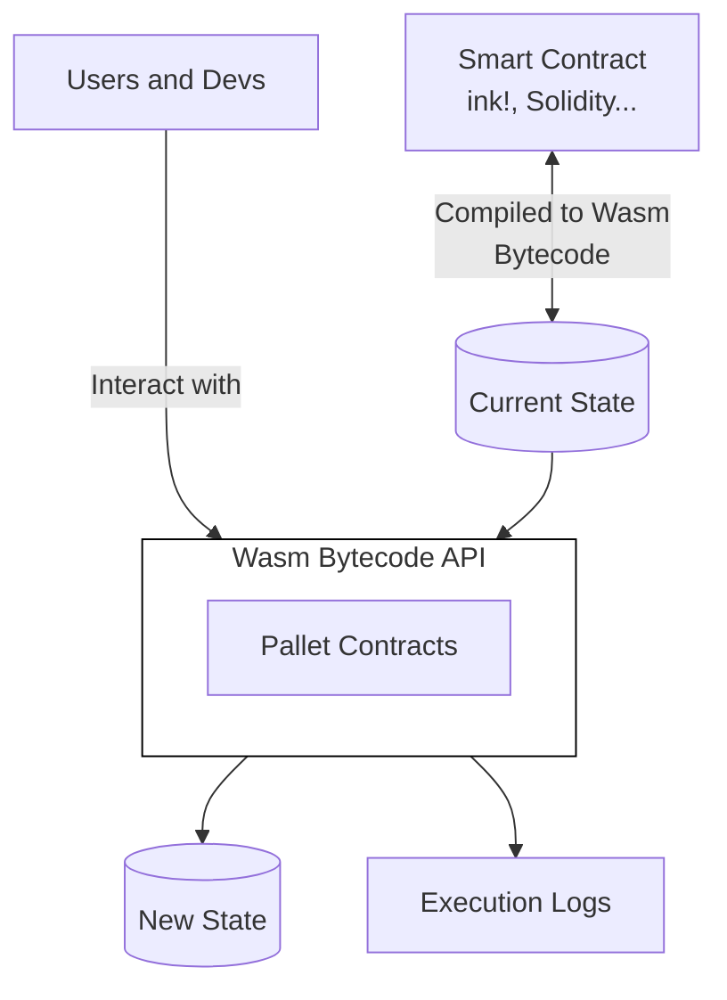


---

Page Title: Smart Contracts Overview

- Source (raw): https://raw.githubusercontent.com/polkadot-developers/polkadot-docs/master/ai/pages/develop-smart-contracts-overview.md
- Canonical (HTML): https://docs.polkadot.com/develop/smart-contracts/overview/
- Summary: Learn about smart contract development capabilities in the Polkadot ecosystem, either by leveraging Polkadot Hub or other alternatives.

# Smart Contracts on Polkadot

!!! smartcontract "PolkaVM Preview Release"
    PolkaVM smart contracts with Ethereum compatibility are in **early-stage development and may be unstable or incomplete**.
## Introduction

Polkadot offers developers multiple approaches to building and deploying smart contracts within its ecosystem. As a multi-chain network designed for interoperability, Polkadot provides various environments optimized for different developer preferences and application requirements. From native smart contract support on Polkadot Hub to specialized parachain environments, developers can choose the platform that best suits their technical needs while benefiting from Polkadot's shared security model and cross-chain messaging capabilities.

Whether you're looking for Ethereum compatibility through EVM-based parachains like [Moonbeam](https://docs.moonbeam.network/){target=\_blank}, [Astar](https://docs.astar.network/){target=\_blank}, and [Acala](https://evmdocs.acala.network/){target=\_blank} or prefer PolkaVM-based development with [ink!](https://use.ink/docs/v6/){target=\_blank}, the Polkadot ecosystem accommodates a range of diverse developers.

These guides explore the diverse smart contract options available in the Polkadot ecosystem, helping developers understand the unique advantages of each approach and make informed decisions about where to deploy their decentralized applications.

## Native Smart Contracts

### Introduction

Polkadot Hub enables smart contract deployment and execution through PolkaVM, a cutting-edge virtual machine designed specifically for the Polkadot ecosystem. This native integration allows developers to deploy smart contracts directly on Polkadot's system chain while maintaining compatibility with Ethereum development tools and workflows.

### Smart Contract Development

The smart contract platform on Polkadot Hub combines _Polkadot's robust security and scalability_ with the extensive Ethereum development ecosystem. Developers can utilize familiar Ethereum libraries for contract interactions and leverage industry-standard development environments for writing and testing smart contracts.

Polkadot Hub provides _full Ethereum JSON-RPC API compatibility_, ensuring seamless integration with existing development tools and services. This compatibility enables developers to maintain their preferred workflows while building on Polkadot's native infrastructure.

### Technical Architecture

PolkaVM, the underlying virtual machine, utilizes a RISC-V-based register architecture _optimized for the Polkadot ecosystem_. This design choice offers several advantages:

- Enhanced performance for smart contract execution.
- Improved gas efficiency for complex operations.
- Native compatibility with Polkadot's runtime environment.
- Optimized storage and state management.

### Development Tools and Resources

Polkadot Hub supports a comprehensive suite of development tools familiar to Ethereum developers. The platform integrates with popular development frameworks, testing environments, and deployment tools. Key features include:

- Contract development in Solidity or Rust.
- Support for standard Ethereum development libraries.
- Integration with widely used development environments.
- Access to blockchain explorers and indexing solutions.
- Compatibility with contract monitoring and management tools.

### Cross-Chain Capabilities

Smart contracts deployed on Polkadot Hub can leverage Polkadot's [cross-consensus messaging (XCM) protocol](/develop/interoperability/intro-to-xcm/){target=\_blank} protocol to seamlessly _transfer tokens and call functions on other blockchain networks_ within the Polkadot ecosystem, all without complex bridging infrastructure or third-party solutions. For further references, check the [Interoperability](/develop/interoperability/){target=\_blank} section.

### Use Cases

Polkadot Hub's smart contract platform is suitable for a wide range of applications:

- DeFi protocols leveraging _cross-chain capabilities_.
- NFT platforms utilizing Polkadot's native token standards.
- Governance systems integrated with Polkadot's democracy mechanisms.
- Cross-chain bridges and asset management solutions.

## Other Smart Contract Environments

Beyond Polkadot Hub's native PolkaVM support, the ecosystem offers two main alternatives for smart contract development:

- **EVM-compatible parachains**: Provide access to Ethereum's extensive developer ecosystem, smart contract portability, and established tooling like Hardhat, Remix, Foundry, and OpenZeppelin. The main options include Moonbeam (the first full Ethereum-compatible parachain serving as an interoperability hub), Astar (featuring dual VM support for both EVM and WebAssembly contracts), and Acala (DeFi-focused with enhanced Acala EVM+ offering advanced DeFi primitives).

- **Rust (ink!)**: ink! is a Rust-based framework that can compile to PolkaVM. It uses [`#[ink(...)]`](https://use.ink/docs/v6/macros-attributes/){target=\_blank} attribute macros to create Polkadot SDK-compatible PolkaVM bytecode, offering strong memory safety from Rust, an advanced type system, high-performance PolkaVM execution, and platform independence with sandboxed security.


Each environment provides unique advantages based on developer preferences and application requirements.

## Where to Go Next

Developers can use their existing Ethereum development tools and connect to Polkadot Hub's RPC endpoints. The platform's Ethereum compatibility layer ensures a smooth transition for teams already building on Ethereum-compatible chains.

Subsequent sections of this guide provide detailed information about specific development tools, advanced features, and best practices for building on Polkadot Hub.

<div class="grid cards" markdown>

-   <span class="badge guide">Guide</span> __Libraries__

    ---

    Explore essential libraries to optimize smart contract development and interaction.

    [:octicons-arrow-right-24: Reference](/develop/smart-contracts/libraries/)

-   <span class="badge guide">Guide</span> __Dev Environments__

    ---

    Set up your development environment for seamless contract deployment and testing.

    [:octicons-arrow-right-24: Reference](/develop/smart-contracts/dev-environments/)

</div>


---

Page Title: Spawn a Basic Chain with Zombienet

- Source (raw): https://raw.githubusercontent.com/polkadot-developers/polkadot-docs/master/ai/pages/tutorials-polkadot-sdk-testing-spawn-basic-chain.md
- Canonical (HTML): https://docs.polkadot.com/tutorials/polkadot-sdk/testing/spawn-basic-chain/
- Summary: Learn to spawn, connect to and monitor a basic blockchain network with Zombienet, using customizable configurations for streamlined development and debugging.

# Spawn a Basic Chain with Zombienet

## Introduction

Zombienet simplifies blockchain development by enabling developers to create temporary, customizable networks for testing and validation. These ephemeral chains are ideal for experimenting with configurations, debugging applications, and validating functionality in a controlled environment.

In this guide, you'll learn how to define a basic network configuration file, spawn a blockchain network using Zombienet's CLI, and interact with nodes and monitor network activity using tools like Polkadot.js Apps and Prometheus

By the end of this tutorial, you'll be equipped to deploy and test your own blockchain networks, paving the way for more advanced setups and use cases.

## Prerequisites

To successfully complete this tutorial, you must ensure you've first:

- [Installed Zombienet](/develop/toolkit/parachains/spawn-chains/zombienet/get-started/#install-zombienet){target=\_blank}. This tutorial requires Zombienet version `v1.3.133`. Verify that you're using the specified version to ensure compatibility with the instructions.
- Reviewed the information in [Configure Zombienet](/develop/toolkit/parachains/spawn-chains/zombienet/get-started/#configure-zombienet){target=\_blank} and understand how to customize a spawned network.

## Set Up Local Provider

In this tutorial, you will use the Zombienet [local provider](/develop/toolkit/parachains/spawn-chains/zombienet/get-started/#local-provider){target=\_blank} (also called native provider) that enables you to run nodes as local processes in your development environment.

You must have the necessary binaries installed (such as `polkadot` and `polkadot-parachain`) to spin up your network successfully.

To install the required binaries, use the following Zombienet CLI command:

```bash
zombienet setup polkadot polkadot-parachain
```

This command downloads the following binaries:

- `polkadot`
- `polkadot-execute-worker`
- `polkadot-parachain`
- `polkadot-prepare-worker`

Finally, add these binaries to your PATH environment variable to ensure Zombienet can locate them when spawning the network.

For example, you can move the binaries to a directory in your PATH, such as `/usr/local/bin`:

```bash
sudo mv ./polkadot ./polkadot-execute-worker ./polkadot-parachain ./polkadot-prepare-worker /usr/local/bin
```

## Define the Network

Zombienet uses a [configuration file](/develop/toolkit/parachains/spawn-chains/zombienet/get-started/#configuration-files){target=\_blank} to define the ephemeral network that will be spawned. Follow these steps to create and define the configuration file:

1. Create a file named `spawn-a-basic-network.toml`:

    ```bash
    touch spawn-a-basic-network.toml
    ```

2. Add the following code to the file you just created:

    ```toml title="spawn-a-basic-network.toml"
    [settings]
    timeout = 120

    [relaychain]

    [[relaychain.nodes]]
    name = "alice"
    validator = true

    [[relaychain.nodes]]
    name = "bob"
    validator = true

    [[parachains]]
    id = 100

    [parachains.collator]
    name = "collator01"

    ```

This configuration file defines a network with the following chains:

- **relaychain**: With two nodes named `alice` and `bob`.
- **parachain**: With a collator named `collator01`.

Settings also defines a timeout of 120 seconds for the network to be ready.

## Spawn the Network

To spawn the network, run the following command:

```bash
zombienet -p native spawn spawn-a-basic-network.toml
```

This command will spawn the network defined in the `spawn-a-basic-network.toml` configuration file. The `-p native` flag specifies that the network will be spawned using the native provider.

If successful, you will see the following output:

<div id="termynal" class="table-termynal" data-termynal>
  <span data-ty="input"><span class="file-path"></span>zombienet -p native spawn spawn-a-basic-network.toml</span>
  <table>
    <thead>
      <tr>
        <th colspan="2" class="center-header">Network launched </th>
      </tr>
    </thead>
    <tr>
      <th class="left-header">Namespace</th>
      <td>zombie-75a01b93c92d571f6198a67bcb380fcd</td>
    </tr>
    <tr>
      <th class="left-header">Provider</th>
      <td>native</td>
    </tr>
    <tr>
      <th colspan="3" class="center-header">Node Information</th>
    </tr>
    <tr>
      <th class="left-header">Name</th>
      <td>alice</td>
    </tr>
    <tr>
      <th class="left-header">Direct Link</th>
      <td><a href="https://polkadot.js.org/apps/?rpc=ws://127.0.0.1:55308#explorer">https://polkadot.js.org/apps/?rpc=ws://127.0.0.1:55308#explorer</a></td>
    </tr>
    <tr>
      <th class="left-header">Prometheus Link</th>
      <td>http://127.0.0.1:55310/metrics</td>
    </tr>
    <tr>
      <th class="left-header">Log Cmd</th>
      <td>tail -f /tmp/zombie-794af21178672e1ff32c612c3c7408dc_-2397036-6717MXDxcS55/alice.log</td>
    </tr>
    <tr>
      <th colspan="3" class="center-header">Node Information</th>
    </tr>
    <tr>
      <th class="left-header">Name</th>
      <td>bob</td>
    </tr>
    <tr>
      <th class="left-header">Direct Link</th>
      <td><a href="https://polkadot.js.org/apps/?rpc=ws://127.0.0.1:50312#explorer">https://polkadot.js.org/apps/?rpc=ws://127.0.0.1:55312#explorer</a></td>
    </tr>
    <tr>
      <th class="left-header">Prometheus Link</th>
      <td>http://127.0.0.1:50634/metrics</td>
    </tr>
    <tr>
      <th class="left-header">Log Cmd</th>
      <td>tail -f /tmp/zombie-794af21178672e1ff32c612c3c7408dc_-2397036-6717MXDxcS55/bob.log</td>
    </tr>
    <tr>
      <th colspan="3" class="center-header">Node Information</th>
    </tr>
    <tr>
      <th class="left-header">Name</th>
      <td>collator01</td>
    </tr>
    <tr>
      <th class="left-header">Direct Link</th>
      <td><a href="https://polkadot.js.org/apps/?rpc=ws://127.0.0.1:55316#explorer">https://polkadot.js.org/apps/?rpc=ws://127.0.0.1:55316#explorer</a></td>
    </tr>
    <tr>
      <th class="left-header">Prometheus Link</th>
      <td>http://127.0.0.1:55318/metrics</td>
    </tr>
    <tr>
      <th class="left-header">Log Cmd</th>
      <td>tail -f /tmp/zombie-794af21178672e1ff32c612c3c7408dc_-2397036-6717MXDxcS55/collator01.log</td>
    </tr>
    <tr>
      <th class="left-header">Parachain ID</th>
      <td>100</td>
    </tr>
    <tr>
      <th class="left-header">ChainSpec Path</th>
      <td>/tmp/zombie-794af21178672e1ff32c612c3c7408dc_-2397036-6717MXDxcS55/100-rococo-local.json</td>
    </tr>
  </table>
</div>

!!! note 
    If the IPs and ports aren't explicitly defined in the configuration file, they may change each time the network is started, causing the links provided in the output to differ from the example.

## Interact with the Spawned Network

After the network is launched, you can interact with it using [Polkadot.js Apps](https://polkadot.js.org/apps/){target=\_blank}. To do so, open your browser and use the provided links listed by the output as `Direct Link`.

### Connect to the Nodes

Use the [55308 port address](https://polkadot.js.org/apps/?rpc=ws://127.0.0.1:55308#explorer){target=\_blank} to interact with the same `alice` node used for this tutorial. Ports can change from spawn to spawn so be sure to locate the link in the output when spawning your own node to ensure you are accessing the correct port.

If you want to interact with the nodes more programmatically, you can also use the [Polkadot.js API](https://polkadot.js.org/docs/api/){target=\_blank}. For example, the following code snippet shows how to connect to the `alice` node using the Polkadot.js API and log some information about the chain and node:

```typescript
import { ApiPromise, WsProvider } from '@polkadot/api';

async function main() {
  const wsProvider = new WsProvider('ws://127.0.0.1:55308');
  const api = await ApiPromise.create({ provider: wsProvider });

  // Retrieve the chain & node information via rpc calls
  const [chain, nodeName, nodeVersion] = await Promise.all([
    api.rpc.system.chain(),
    api.rpc.system.name(),
    api.rpc.system.version(),
  ]);

  console.log(
    `You are connected to chain ${chain} using ${nodeName} v${nodeVersion}`
  );
}

main()
  .catch(console.error)
  .finally(() => process.exit());

```

Both methods allow you to interact easily with the network and its nodes.

### Check Metrics

You can also check the metrics of the nodes by accessing the links provided in the output as `Prometheus Link`. [Prometheus](https://prometheus.io/){target=\_blank} is a monitoring and alerting toolkit that collects metrics from the nodes. By accessing the provided links, you can see the metrics of the nodes in a web interface. So, for example, the following image shows the Prometheus metrics for Bob's node from the Zombienet test:


### Check Logs

To view individual node logs, locate the `Log Cmd` command in Zombienet's startup output. For example, to see what the alice node is doing, find the log command that references `alice.log` in its file path. Note that Zombienet will show you the correct path for your instance when it starts up, so use that path rather than copying from the below example:

```bash
tail -f  /tmp/zombie-794af21178672e1ff32c612c3c7408dc_-2397036-6717MXDxcS55/alice.log
```

After running this command, you will see the logs of the `alice` node in real-time, which can be useful for debugging purposes. The logs of the `bob` and `collator01` nodes can be checked similarly.


---

Page Title: Subxt Rust API

- Source (raw): https://raw.githubusercontent.com/polkadot-developers/polkadot-docs/master/ai/pages/develop-toolkit-api-libraries-subxt.md
- Canonical (HTML): https://docs.polkadot.com/develop/toolkit/api-libraries/subxt/
- Summary: Subxt is a Rust library for type-safe interaction with Polkadot SDK blockchains, enabling transactions, state queries, runtime API access, and more.

# Subxt Rust API

## Introduction

Subxt is a Rust library designed to interact with Polkadot SDK-based blockchains. It provides a type-safe interface for submitting transactions, querying on-chain state, and performing other blockchain interactions. By leveraging Rust's strong type system, subxt ensures that your code is validated at compile time, reducing runtime errors and improving reliability.

## Prerequisites

Before using subxt, ensure you have the following requirements:

- Rust and Cargo installed on your system. You can install them using [Rustup](https://rustup.rs/){target=\_blank}.
- A Rust project initialized. If you don't have one, create it with:
    ```bash
    cargo new my_project && cd my_project
    ```

## Installation

To use subxt in your project, you must install the necessary dependencies. Each plays a specific role in enabling interaction with the blockchain:

1. **Install the subxt CLI**: [`subxt-cli`](https://crates.io/crates/subxt-cli){target=\_blank} is a command-line tool that provides utilities for working with Polkadot SDK metadata. In the context of subxt, it is essential to download chain metadata, which is required to generate type-safe Rust interfaces for interacting with the blockchain. Install it using the following:

    ```bash
    cargo install subxt-cli@0.44.0
    ```

2. **Add core dependencies**: These dependencies are essential for interacting with the blockchain.

    - **[subxt](https://crates.io/crates/subxt){target=\_blank}**: The main library for communicating with Polkadot SDK nodes. It handles RPC requests, encoding/decoding, and type generation.

        ```bash
        cargo add subxt@0.44.0
        ```

    - **[subxt-signer](https://crates.io/crates/subxt-signer){target=\_blank}**: Provides cryptographic functionality for signing transactions. Without this, you can only read data but cannot submit transactions.

        ```bash
        cargo add subxt-signer@0.44.0
        ```

    - **[tokio](https://crates.io/crates/tokio){target=\_blank}**: An asynchronous runtime for Rust. Since blockchain operations are async, Tokio enables the efficient handling of network requests. The `rt` feature enables Tokio's runtime, including the current-thread single-threaded scheduler, which is necessary for async execution. The `macros` feature provides procedural macros like `#[tokio::main]` to simplify runtime setup.

        ```bash
        cargo add tokio@1.44.2 --features rt,macros
        ```

    After adding the dependencies, your `Cargo.toml` should look like this:

    ```toml
    [package]
    name = "my_project"
    version = "0.1.0"
    edition = "2021"

    [dependencies]
    subxt = "0.41.0"
    subxt-signer = "0.41.0"
    tokio = { version = "1.44.2", features = ["rt", "macros"] }

    ```

## Get Started

This guide will walk you through the fundamental operations of subxt, from setting up your environment to executing transactions and querying blockchain state.

### Download Chain Metadata

Before interacting with a blockchain, you need to retrieve its metadata. This metadata defines storage structures, extrinsics, and other runtime details. Use the `subxt-cli` tool to download the metadata, replacing `INSERT_NODE_URL` with the URL of the node you want to interact with:

```bash
subxt metadata --url INSERT_NODE_URL > polkadot_metadata.scale
```

### Generate Type-Safe Interfaces

Use the `#[subxt::subxt]` macro to generate a type-safe Rust interface from the downloaded metadata:

```rust
// Generate an interface that we can use from the node's metadata.
#[subxt::subxt(runtime_metadata_path = "./polkadot_metadata.scale")]
pub mod polkadot {}
```

Once subxt interfaces are generated, you can interact with your node in the following ways. You can use the links below to view the related subxt documentation:

- **[Transactions](https://docs.rs/subxt/latest/subxt/book/usage/transactions/index.html){target=\_blank}**: Builds and submits transactions, monitors their inclusion in blocks, and retrieves associated events.
- **[Storage](https://docs.rs/subxt/latest/subxt/book/usage/storage/index.html){target=\_blank}**: Enables querying of node storage data.
- **[Events](https://docs.rs/subxt/latest/subxt/book/usage/events/index.html){target=\_blank}**: Retrieves events emitted from recent blocks.
- **[Constants](https://docs.rs/subxt/latest/subxt/book/usage/constants/index.html){target=\_blank}**: Accesses constant values stored in nodes that remain unchanged across a specific runtime version.
- **[Blocks](https://docs.rs/subxt/latest/subxt/book/usage/blocks/index.html){target=\_blank}**: Loads recent blocks or subscribes to new/finalized blocks, allowing examination of extrinsics, events, and storage at those blocks.
- **[Runtime APIs](https://docs.rs/subxt/latest/subxt/book/usage/runtime_apis/index.html){target=\_blank}**: Makes calls into pallet runtime APIs to fetch data.
- **[Custom values](https://docs.rs/subxt/latest/subxt/book/usage/custom_values/index.html){target=\_blank}**: Accesses "custom values" contained within metadata.
- **[Raw RPC calls](https://docs.rs/subxt/latest/subxt/book/usage/rpc/index.html){target=\_blank}**: Facilitates raw RPC requests to compatible nodes.

### Initialize the Subxt Client

To interact with a blockchain node using subxt, create an asynchronous main function and initialize the client. Replace `INSERT_NODE_URL` with the URL of your target node:

```rust
use std::str::FromStr;
use subxt::utils::AccountId32;
use subxt::{OnlineClient, PolkadotConfig};
use subxt_signer::{bip39::Mnemonic,sr25519::Keypair};

// Generate an interface that we can use from the node's metadata.
#[subxt::subxt(runtime_metadata_path = "./polkadot_metadata.scale")]
pub mod polkadot {}

#[tokio::main(flavor = "current_thread")]
async fn main() -> Result<(), Box<dyn std::error::Error>> {
    // Define the node URL.
    const NODE_URL: &str = "INSERT_NODE_URL";

    // Initialize the Subxt client to interact with the blockchain.
    let api = OnlineClient::<PolkadotConfig>::from_url(NODE_URL).await?;

    // Your code here...

    Ok(())
}
```

### Read Chain Data

subxt provides multiple ways to access on-chain data:

- **Constants**: Constants are predefined values in the runtime that remain unchanged unless modified by a runtime upgrade.

    For example, to retrieve the existential deposit, use:
    
    ```rust
        // A query to obtain some constant.
        let constant_query = polkadot::constants().balances().existential_deposit();

        // Obtain the value.
        let value = api.constants().at(&constant_query)?;

        println!("Existential deposit: {:?}", value);
    ```

- **State**: State refers to the current chain data, which updates with each block.

    To fetch account information, replace `INSERT_ADDRESS` with the address you want to fetch data from and use:

    ```rust
        // Define the target account address.
        const ADDRESS: &str = "INSERT_ADDRESS";
        let account = AccountId32::from_str(ADDRESS).unwrap();

        // Build a storage query to access account information.
        let storage_query = polkadot::storage().system().account(&account.into());

        // Fetch the latest state for the account.
        let result = api
            .storage()
            .at_latest()
            .await?
            .fetch(&storage_query)
            .await?
            .unwrap();

        println!("Account info: {:?}", result);
    ```

### Submit Transactions

To submit a transaction, you must construct an extrinsic, sign it with your private key, and send it to the blockchain. Replace `INSERT_DEST_ADDRESS` with the recipient's address, `INSERT_AMOUNT` with the amount to transfer, and `INSERT_SECRET_PHRASE` with the sender's mnemonic phrase:

```rust
    // Define the recipient address and transfer amount.
    const DEST_ADDRESS: &str = "INSERT_DEST_ADDRESS";
    const AMOUNT: u128 = INSERT_AMOUNT;

    // Convert the recipient address into an `AccountId32`.
    let dest = AccountId32::from_str(DEST_ADDRESS).unwrap();

    // Build the balance transfer extrinsic.
    let balance_transfer_tx = polkadot::tx()
        .balances()
        .transfer_allow_death(dest.into(), AMOUNT);

    // Load the sender's keypair from a mnemonic phrase.
    const SECRET_PHRASE: &str = "INSERT_SECRET_PHRASE";
    let mnemonic = Mnemonic::parse(SECRET_PHRASE).unwrap();
    let sender_keypair = Keypair::from_phrase(&mnemonic, None).unwrap();

    // Sign and submit the extrinsic, then wait for it to be finalized.
    let events = api
        .tx()
        .sign_and_submit_then_watch_default(&balance_transfer_tx, &sender_keypair)
        .await?
        .wait_for_finalized_success()
        .await?;

    // Check for a successful transfer event.
    if let Some(event) = events.find_first::<polkadot::balances::events::Transfer>()? {
        println!("Balance transfer successful: {:?}", event);
    }
```

## Where to Go Next

Now that you've covered the basics dive into the official [subxt documentation](https://docs.rs/subxt/latest/subxt/book/index.html){target=\_blank} for comprehensive reference materials and advanced features.


---

Page Title: Testing and Debugging

- Source (raw): https://raw.githubusercontent.com/polkadot-developers/polkadot-docs/master/ai/pages/develop-interoperability-test-and-debug.md
- Canonical (HTML): https://docs.polkadot.com/develop/interoperability/test-and-debug/
- Summary: Learn how to test and debug cross-chain communication via the XCM Emulator to ensure interoperability and reliable execution.

# Testing and Debugging

## Introduction

Cross-Consensus Messaging (XCM) is a core feature of the Polkadot ecosystem, enabling communication between parachains, relay chains, and system chains. To ensure the reliability of XCM-powered blockchains, thorough testing and debugging are essential before production deployment.

This guide covers the XCM Emulator, a tool designed to facilitate onboarding and testing for developers. Use the emulator if:

- A live runtime is not yet available.
- Extensive configuration adjustments are needed, as emulated chains differ from live networks.
- Rust-based tests are preferred for automation and integration.

For scenarios where real blockchain state is required, [Chopsticks](/tutorials/polkadot-sdk/testing/fork-live-chains/#xcm-testing){target=\_blank} allows testing with any client compatible with Polkadot SDK-based chains.

## XCM Emulator

Setting up a live network with multiple interconnected parachains for XCM testing can be complex and resource-intensive. 

The [`xcm-emulator`](https://github.com/paritytech/polkadot-sdk/tree/polkadot-stable2506-2/cumulus/xcm/xcm-emulator){target=\_blank} is a tool designed to simulate the execution of XCM programs using predefined runtime configurations. These configurations include those utilized by live networks like Kusama, Polkadot, and Asset Hub.

This tool enables testing of cross-chain message passing, providing a way to verify outcomes, weights, and side effects efficiently. It achieves this by utilizing mocked runtimes for both the relay chain and connected parachains, enabling developers to focus on message logic and configuration without needing a live network.

The `xcm-emulator` relies on transport layer pallets. However, the messages do not leverage the same messaging infrastructure as live networks since the transport mechanism is mocked. Additionally, consensus-related events are not covered, such as disputes and staking events. Parachains should use end-to-end (E2E) tests to validate these events.

### Advantages and Limitations

The XCM Emulator provides both advantages and limitations when testing cross-chain communication in simulated environments.

- **Advantages**:
    - **Interactive debugging**: Offers tracing capabilities similar to EVM, enabling detailed analysis of issues.
    - **Runtime composability**: Facilitates testing and integration of multiple runtime components.
    - **Immediate feedback**: Supports Test-Driven Development (TDD) by providing rapid test results.
    - **Seamless integration testing**: Simplifies the process of testing new runtime versions in an isolated environment.

- **Limitations**:
    - **Simplified emulation**: Always assumes message delivery, which may not mimic real-world network behavior.
    - **Dependency challenges**: Requires careful management of dependency versions and patching. Refer to the [Cargo dependency documentation](https://doc.rust-lang.org/cargo/reference/overriding-dependencies.html){target=\_blank}.
    - **Compilation overhead**: Testing environments can be resource-intensive, requiring frequent compilation updates.

### How Does It Work?

The `xcm-emulator` provides macros for defining a mocked testing environment. Check all the existing macros and functionality in the [XCM Emulator source code](https://github.com/paritytech/polkadot-sdk/blob/polkadot-stable2506-2/cumulus/xcm/xcm-emulator/src/lib.rs){target=\_blank}. The most important macros are:

- **[`decl_test_relay_chains`](https://github.com/paritytech/polkadot-sdk/blob/polkadot-stable2506-2/cumulus/xcm/xcm-emulator/src/lib.rs#L361){target=\_blank}**: Defines runtime and configuration for the relay chains. Example:

    ```rust
    decl_test_relay_chains! {
    	#[api_version(13)]
    	pub struct Westend {
    		genesis = genesis::genesis(),
    		on_init = (),
    		runtime = westend_runtime,
    		core = {
    			SovereignAccountOf: westend_runtime::xcm_config::LocationConverter,
    		},
    		pallets = {
    			XcmPallet: westend_runtime::XcmPallet,
    			Sudo: westend_runtime::Sudo,
    			Balances: westend_runtime::Balances,
    			Treasury: westend_runtime::Treasury,
    			AssetRate: westend_runtime::AssetRate,
    			Hrmp: westend_runtime::Hrmp,
    			Identity: westend_runtime::Identity,
    			IdentityMigrator: westend_runtime::IdentityMigrator,
    		}
    	},
    }
    ```

- **[`decl_test_parachains`](https://github.com/paritytech/polkadot-sdk/blob/polkadot-stable2506-2/cumulus/xcm/xcm-emulator/src/lib.rs#L596){target=\_blank}**: Defines runtime and configuration for parachains. Example:

    ```rust
    decl_test_parachains! {
    	pub struct AssetHubWestend {
    		genesis = genesis::genesis(),
    		on_init = {
    			asset_hub_westend_runtime::AuraExt::on_initialize(1);
    		},
    		runtime = asset_hub_westend_runtime,
    		core = {
    			XcmpMessageHandler: asset_hub_westend_runtime::XcmpQueue,
    			LocationToAccountId: asset_hub_westend_runtime::xcm_config::LocationToAccountId,
    			ParachainInfo: asset_hub_westend_runtime::ParachainInfo,
    			MessageOrigin: cumulus_primitives_core::AggregateMessageOrigin,
    			DigestProvider: (),
    		},
    		pallets = {
    			PolkadotXcm: asset_hub_westend_runtime::PolkadotXcm,
    			Balances: asset_hub_westend_runtime::Balances,
    			Assets: asset_hub_westend_runtime::Assets,
    			ForeignAssets: asset_hub_westend_runtime::ForeignAssets,
    			PoolAssets: asset_hub_westend_runtime::PoolAssets,
    			AssetConversion: asset_hub_westend_runtime::AssetConversion,
    			SnowbridgeSystemFrontend: asset_hub_westend_runtime::SnowbridgeSystemFrontend,
    			Revive: asset_hub_westend_runtime::Revive,
    		}
    	},
    }
    ```

- **[`decl_test_bridges`](https://github.com/paritytech/polkadot-sdk/blob/polkadot-stable2506-2/cumulus/xcm/xcm-emulator/src/lib.rs#L1221){target=\_blank}**: Creates bridges between chains, specifying the source, target, and message handler. Example:

    ```rust
    decl_test_bridges! {
    	pub struct RococoWestendMockBridge {
    		source = BridgeHubRococoPara,
    		target = BridgeHubWestendPara,
    		handler = RococoWestendMessageHandler
    	},
    	pub struct WestendRococoMockBridge {
    		source = BridgeHubWestendPara,
    		target = BridgeHubRococoPara,
    		handler = WestendRococoMessageHandler
    	}
    }
    ```

- **[`decl_test_networks`](https://github.com/paritytech/polkadot-sdk/blob/polkadot-stable2506-2/cumulus/xcm/xcm-emulator/src/lib.rs#L958){target=\_blank}**: Defines a testing network with relay chains, parachains, and bridges, implementing message transport and processing logic. Example:

    ```rust
    decl_test_networks! {
    	pub struct WestendMockNet {
    		relay_chain = Westend,
    		parachains = vec![
    			AssetHubWestend,
    			BridgeHubWestend,
    			CollectivesWestend,
    			CoretimeWestend,
    			PeopleWestend,
    			PenpalA,
    			PenpalB,
    		],
    		bridge = ()
    	},
    }
    ```

By leveraging these macros, developers can customize their testing networks by defining relay chains and parachains tailored to their needs. For guidance on implementing a mock runtime for a Polkadot SDK-based chain, refer to the [Pallet Testing](/develop/parachains/testing/pallet-testing/){target=\_blank} article. 

This framework enables thorough testing of runtime and cross-chain interactions, enabling developers to effectively design, test, and optimize cross-chain functionality.

To see a complete example of implementing and executing tests, refer to the [integration tests](https://github.com/paritytech/polkadot-sdk/tree/polkadot-stable2506-2/cumulus/parachains/integration-tests/emulated){target=\_blank} in the Polkadot SDK repository.


---

Page Title: Transactions and Fees on Asset Hub

- Source (raw): https://raw.githubusercontent.com/polkadot-developers/polkadot-docs/master/ai/pages/polkadot-protocol-smart-contract-basics-blocks-transactions-fees.md
- Canonical (HTML): https://docs.polkadot.com/polkadot-protocol/smart-contract-basics/blocks-transactions-fees/
- Summary: Explore how Asset Hub smart contracts handle blocks, transactions, and fees with EVM compatibility, supporting various Ethereum transaction types.

# Blocks, Transactions, and Fees

!!! smartcontract "PolkaVM Preview Release"
    PolkaVM smart contracts with Ethereum compatibility are in **early-stage development and may be unstable or incomplete**.
## Introduction

Asset Hub smart contracts operate within the Polkadot ecosystem using the [`pallet_revive`](https://paritytech.github.io/polkadot-sdk/master/pallet_revive/){target=\_blank} implementation, which provides EVM compatibility. While many aspects of blocks and transactions are inherited from the underlying parachain architecture, there are specific considerations and mechanisms unique to smart contract operations on Asset Hub.

## Smart Contract Blocks

Smart contract blocks in Asset Hub follow the same fundamental structure as parachain blocks, inheriting all standard parachain block components. The `pallet_revive` implementation maintains this consistency while adding necessary [EVM-specific features](https://paritytech.github.io/polkadot-sdk/master/pallet_revive/evm){target=\_blank}. For detailed implementation specifics, the [`Block`](https://paritytech.github.io/polkadot-sdk/master/pallet_revive/evm/struct.Block.html){target=\_blank} struct in `pallet_revive` demonstrates how parachain and smart contract block implementations align.

## Smart Contract Transactions

Asset Hub implements a sophisticated transaction system that supports various transaction types and formats, encompassing both traditional parachain operations and EVM-specific interactions.

### EVM Transaction Types

The system provides a fundamental [`eth_transact`](https://paritytech.github.io/polkadot-sdk/master/pallet_revive/pallet/dispatchables/fn.eth_transact.html){target=\_blank} interface for processing raw EVM transactions dispatched through [Ethereum JSON-RPC APIs](/develop/smart-contracts/json-rpc-apis/){target=\_blank}. This interface acts as a wrapper for Ethereum transactions, requiring an encoded signed transaction payload, though it cannot be dispatched directly. Building upon this foundation, the system supports multiple transaction formats to accommodate different use cases and optimization needs:

- **[Legacy transactions](https://paritytech.github.io/polkadot-sdk/master/pallet_revive/evm/struct.TransactionLegacyUnsigned.html){target=\_blank}**: The original Ethereum transaction format, providing basic transfer and contract interaction capabilities. These transactions use a simple pricing mechanism and are supported for backward compatibility.

- **[EIP-1559 transactions](https://paritytech.github.io/polkadot-sdk/master/pallet_revive/evm/struct.Transaction1559Unsigned.html){target=\_blank}**: An improved transaction format that introduces a more predictable fee mechanism with base fee and priority fee components. This format helps optimize gas fee estimation and network congestion management.

- **[EIP-2930 transactions](https://paritytech.github.io/polkadot-sdk/master/pallet_revive/evm/struct.Transaction2930Unsigned.html){target=\_blank}**: Introduces access lists to optimize gas costs for contract interactions by pre-declaring accessed addresses and storage slots.

- **[EIP-4844 transactions](https://paritytech.github.io/polkadot-sdk/master/pallet_revive/evm/struct.Transaction4844Unsigned.html){target=\_blank}**: Implements blob-carrying transactions, designed to optimize Layer 2 scaling solutions by providing dedicated space for roll-up data.

Each transaction type can exist in both signed and unsigned states, with appropriate validation and processing mechanisms for each.

## Fees and Gas

Asset Hub implements a sophisticated resource management system that combines parachain transaction fees with EVM gas mechanics, providing both Ethereum compatibility and enhanced features.

### Gas Model Overview

Gas serves as the fundamental unit for measuring computational costs, with each network operation consuming a specified amount. This implementation maintains compatibility with Ethereum's approach while adding parachain-specific optimizations.

- **Dynamic gas scaling**: Asset Hub implements a dynamic pricing mechanism that reflects actual execution performance. This results in:

    - More efficient pricing for computational instructions relative to I/O operations.
    - Better correlation between gas costs and actual resource consumption.
    - Need for developers to implement flexible gas calculation rather than hardcoding values.

- **Multi-dimensional resource metering**: Asset Hub extends beyond the traditional single-metric gas model to track three distinct resources.

    - `ref_time` (computation time):

        - Functions as traditional gas equivalent.
        - Measures actual computational resource usage.
        - Primary metric for basic operation costs.


    - `proof_size` (verification overhead):

        - Tracks state proof size required for validator verification.
        - Helps manage consensus-related resource consumption.
        - Important for cross-chain operations.


    - `storage_deposit` (state management):

        - Manages blockchain state growth.
        - Implements a deposit-based system for long-term storage.
        - Refundable when storage is freed.

These resources can be limited at both transaction and contract levels, similar to Ethereum's gas limits. For more information, check the [Gas Model](/polkadot-protocol/smart-contract-basics/evm-vs-polkavm#gas-model){target=\_blank} section in the [EVM vs PolkaVM](/polkadot-protocol/smart-contract-basics/evm-vs-polkavm/){target=\_blank} article.

### Fee Components

- Base fees:

    - Storage deposit for contract deployment.
    - Minimum transaction fee for network access.
    - Network maintenance costs.

- Execution fees:

    - Computed based on gas consumption.
    - Converted to native currency using network-defined rates.
    - Reflects actual computational resource usage.

- Storage fees:

    - Deposit for long-term storage usage.
    - Refundable when storage is freed.
    - Helps prevent state bloat.

### Gas Calculation and Conversion

The system maintains precise conversion mechanisms between:

- Substrate weights and EVM gas units.
- Native currency and gas costs.
- Different resource metrics within the multi-dimensional model.

This ensures accurate fee calculation while maintaining compatibility with existing Ethereum tools and workflows.


---

Page Title: Wallets

- Source (raw): https://raw.githubusercontent.com/polkadot-developers/polkadot-docs/master/ai/pages/develop-toolkit-integrations-wallets.md
- Canonical (HTML): https://docs.polkadot.com/develop/toolkit/integrations/wallets/
- Summary: Explore blockchain wallets. Securely manage digital assets with hot wallets for online access or cold wallets for offline, enhanced security.

# Wallets

## What is a Blockchain Wallet?

A wallet serves as your gateway to interacting with blockchain networks. Rather than storing funds, wallets secure your private keys, controlling access to your blockchain assets. Your private key provides complete control over all permitted transactions on your blockchain account, making it essential to keep it secure.

Wallet types fall into two categories based on their connection to the internet:

- **[Hot wallets](#hot-wallets)**: Online storage through websites, browser extensions or smartphone apps.
- **[Cold wallets](#cold-wallets)**: Offline storage using hardware devices or air-gapped systems.

## Hot Wallets

<div class="grid cards" markdown>

-   __Nova Wallet__

    ---

    A non-custodial, mobile-first wallet for managing assets and interacting with the Polkadot and Kusama ecosystems. It supports staking, governance, cross-chain transfers, and crowdloans. With advanced features, seamless multi-network support, and strong security, Nova Wallet empowers users to explore the full potential of Polkadot parachains on the go.

    [:octicons-arrow-right-24: Reference](https://novawallet.io/){target=\_blank}

-   __Talisman__

    ---

    A non-custodial web browser extension that allows you to manage your portfolio and interact with Polkadot and Ethereum applications. It supports Web3 apps, asset storage, and account management across over 150 Polkadot SDK-based and EVM networks. Features include NFT management, Ledger support, fiat on-ramp, and portfolio tracking.

    [:octicons-arrow-right-24: Reference](https://talisman.xyz/){target=\_blank}

-  __Subwallet__

    ---

    A non-custodial web browser extension and mobile wallet for Polkadot and Ethereum. Track, send, receive, and monitor multi-chain assets on 150+ networks. Import account with seed phrase, private key, QR code, and JSON file. Import token & NFT, attach read-only account. XCM Transfer, NFT Management, Parity Signer & Ledger support, light clients support, EVM dApp support, MetaMask compatibility, custom endpoints, fiat on-ramp, phishing detection, transaction history.

    [:octicons-arrow-right-24: Reference](https://www.subwallet.app/){target=\_blank}

</div>

## Cold Wallets

<div class="grid cards" markdown>

-   __Ledger__

    ---

    A hardware wallet that securely stores cryptocurrency private keys offline, protecting them from online threats. Using a secure chip and the Ledger Live app allows safe transactions and asset management while keeping keys secure.

    [:octicons-arrow-right-24: Reference](https://www.ledger.com/){target=\_blank}

-   __Polkadot Vault__

    ---

    This cold storage solution lets you use a phone in airplane mode as an air-gapped wallet, turning any spare phone, tablet, or iOS/Android device into a hardware wallet.

    [:octicons-arrow-right-24: Reference](https://vault.novasama.io/){target=\_blank}

</div>


---

Page Title: XCM Channels

- Source (raw): https://raw.githubusercontent.com/polkadot-developers/polkadot-docs/master/ai/pages/develop-interoperability-xcm-channels.md
- Canonical (HTML): https://docs.polkadot.com/develop/interoperability/xcm-channels/
- Summary: Learn how Polkadot's cross-consensus messaging (XCM) channels connect parachains, facilitating communication and blockchain interaction.

# XCM Channels

## Introduction

Polkadot is designed to enable interoperability between its connected parachains. At the core of this interoperability is the [Cross-Consensus Message Format (XCM)](/develop/interoperability/intro-to-xcm/){target=\_blank}, a standard language that allows parachains to communicate and interact with each other.

The network-layer protocol responsible for delivering XCM-formatted messages between parachains is the [Cross-Chain Message Passing (XCMP)](https://wiki.polkadot.com/learn/learn-xcm-transport/#xcmp-cross-chain-message-passing){target=\_blank} protocol. XCMP maintains messaging queues on the relay chain, serving as a bridge to facilitate cross-chain interactions.

As XCMP is still under development, Polkadot has implemented a temporary alternative called [Horizontal Relay-routed Message Passing (HRMP)](https://wiki.polkadot.com/learn/learn-xcm-transport/#hrmp-xcmp-lite){target=\_blank}. HRMP offers the same interface and functionality as the planned XCMP but it has a crucial difference, it stores all messages directly in the relay chain's storage, which is more resource-intensive.

Once XCMP is fully implemented, HRMP will be deprecated in favor of the native XCMP protocol. XCMP will offer a more efficient and scalable solution for cross-chain message passing, as it will not require the relay chain to store all the messages.

## Establishing HRMP Channels

To enable communication between parachains using the HRMP protocol, the parachains must explicitly establish communication channels by registering them on the relay chain.

Downward and upward channels from and to the relay chain are implicitly available, meaning they do not need to be explicitly opened.

Opening an HRMP channel requires the parachains involved to make a deposit on the relay chain. This deposit serves a specific purpose, it covers the costs associated with using the relay chain's storage for the message queues linked to the channel. The amount of this deposit varies based on parameters defined by the specific relay chain being used.

### Relay Chain Parameters

Each Polkadot relay chain has a set of configurable parameters that control the behavior of the message channels between parachains. These parameters include [`hrmpSenderDeposit`](https://paritytech.github.io/polkadot-sdk/master/polkadot_runtime_parachains/configuration/struct.HostConfiguration.html#structfield.hrmp_sender_deposit){target=\_blank}, [`hrmpRecipientDeposit`](https://paritytech.github.io/polkadot-sdk/master/polkadot_runtime_parachains/configuration/struct.HostConfiguration.html#structfield.hrmp_recipient_deposit){target=\_blank}, [`hrmpChannelMaxMessageSize`](https://paritytech.github.io/polkadot-sdk/master/polkadot_runtime_parachains/configuration/struct.HostConfiguration.html#structfield.hrmp_channel_max_message_size){target=\_blank}, [`hrmpChannelMaxCapacity`](https://paritytech.github.io/polkadot-sdk/master/polkadot_runtime_parachains/configuration/struct.HostConfiguration.html#structfield.hrmp_channel_max_capacity){target=\_blank}, and more.

When a parachain wants to open a new channel, it must consider these parameter values to ensure the channel is configured correctly.

To view the current values of these parameters in the Polkadot network:

1. Visit [Polkadot.js Apps](https://polkadot.js.org/apps/?rpc=wss%3A%2F%2Fpolkadot.api.onfinality.io%2Fpublic-ws#/explorer), navigate to the **Developer** dropdown and select the **Chain state** option.

    

2. Query the chain configuration parameters. The result will display the current settings for all the Polkadot network parameters, including the HRMP channel settings.

    1. Select **`configuration`**.
    2. Choose the **`activeConfig()`** call.
    3. Click the **+** button to execute the query.
    4. Check the chain configuration.

        

### Dispatching Extrinsics

Establishing new HRMP channels between parachains requires dispatching specific extrinsic calls on the Polkadot Relay Chain from the parachain's origin.

The most straightforward approach is to implement the channel opening logic off-chain, then use the XCM pallet's [`send`](https://paritytech.github.io/polkadot-sdk/master/pallet_xcm/pallet/dispatchables/fn.send.html){target=\_blank} extrinsic to submit the necessary instructions to the relay chain. However, the ability to send arbitrary programs through the [`Transact`](https://github.com/polkadot-fellows/xcm-format?tab=readme-ov-file#transact){target=\_blank} instruction in XCM is typically restricted to privileged origins, such as the [`sudo`](https://paritytech.github.io/polkadot-sdk/master/pallet_sudo/pallet/dispatchables/fn.sudo.html){target=\_blank} pallet or governance mechanisms.

Parachain developers have a few options for triggering the required extrinsic calls from their parachain's origin, depending on the configuration and access controls defined:

- **Sudo**: If the parachain has a `sudo` pallet configured, the sudo key holder can use the sudo extrinsic to dispatch the necessary channel opening calls.
- **Governance**: The parachain's governance system, such as a council or OpenGov, can be used to authorize the channel opening calls.
- **Privileged accounts**: The parachain may have other designated privileged accounts that are allowed to dispatch the HRMP channel opening extrinsics.

## Where to Go Next

Explore the following tutorials for detailed, step-by-step guidance on setting up cross-chain communication channels in Polkadot:

<div class="grid cards" markdown>

-   <span class="badge tutorial">Tutorial</span> __Opening HRMP Channels Between Parachains__

    ---

    Learn how to open HRMP channels between parachains on Polkadot. Discover the step-by-step process for establishing uni- and bidirectional communication.

    [:octicons-arrow-right-24: Reference](/tutorials/interoperability/xcm-channels/para-to-para/)

-   <span class="badge tutorial">Tutorial</span> __Opening HRMP Channels with System Parachains__

    ---

    Learn how to open HRMP channels with Polkadot system parachains. Discover the process for establishing bi-directional communication using a single XCM message.

    [:octicons-arrow-right-24: Reference](/tutorials/interoperability/xcm-channels/para-to-system/)

</div>


---

Page Title: XCM Config

- Source (raw): https://raw.githubusercontent.com/polkadot-developers/polkadot-docs/master/ai/pages/develop-interoperability-xcm-config.md
- Canonical (HTML): https://docs.polkadot.com/develop/interoperability/xcm-config/
- Summary: Learn how the XCM Executor configuration works for your custom Polkadot SDK-based runtime with detailed guidance and references.

# XCM Config

## Introduction

The [XCM executor](https://paritytech.github.io/polkadot-sdk/master/staging_xcm_executor/index.html){target=\_blank} is a crucial component responsible for interpreting and executing XCM messages (XCMs) with Polkadot SDK-based chains. It processes and manages XCM instructions, ensuring they are executed correctly and in sequentially. Adhering to the [Cross-Consensus Virtual Machine (XCVM) specification](https://paritytech.github.io/xcm-docs/overview/xcvm.html#the-xcvm){target=\_blank}, the XCM executor can be customized or replaced with an alternative that also complies with the [XCVM standards](https://github.com/polkadot-fellows/xcm-format?tab=readme-ov-file#12-the-xcvm){target=\_blank}.

The `XcmExecutor` is not a pallet but a struct parameterized by a `Config` trait. The `Config` trait is the inner configuration, parameterizing the outer `XcmExecutor<Config>` struct. Both configurations are set up within the runtime.

The executor is highly configurable, with the [XCM builder](https://paritytech.github.io/polkadot-sdk/master/staging_xcm_builder/index.html){target=\_blank} offering building blocks to tailor the configuration to specific needs. While they serve as a foundation, users can easily create custom blocks to suit unique configurations. Users can also create their building blocks to address unique needs. This article examines the XCM configuration process, explains each configurable item, and provides examples of the tools and types available to help customize these settings.

## XCM Executor Configuration

The `Config` trait defines the XCM executors configuration, which requires several associated types. Each type has specific trait bounds that the concrete implementation must fulfill. Some types, such as `RuntimeCall`, come with a default implementation in most cases, while others use the unit type `()` as the default. For many of these types, selecting the appropriate implementation carefully is crucial. Predefined solutions and building blocks can be adapted to your specific needs. These solutions can be found in the [`xcm-builder`](https://github.com/paritytech/polkadot-sdk/tree/polkadot-stable2506-2/polkadot/xcm/xcm-builder){target=\_blank} folder.

Each type is explained below, along with an overview of some of its implementations:

```rust
pub trait Config {
    type RuntimeCall: Parameter + Dispatchable<PostInfo = PostDispatchInfo> + GetDispatchInfo;
    type XcmSender: SendXcm;
    type AssetTransactor: TransactAsset;
    type OriginConverter: ConvertOrigin<<Self::RuntimeCall as Dispatchable>::RuntimeOrigin>;
    type IsReserve: ContainsPair<MultiAsset, MultiLocation>;
    type IsTeleporter: ContainsPair<MultiAsset, MultiLocation>;
    type Aliasers: ContainsPair<Location, Location>;
    type UniversalLocation: Get<InteriorMultiLocation>;
    type Barrier: ShouldExecute;
    type Weigher: WeightBounds<Self::RuntimeCall>;
    type Trader: WeightTrader;
    type ResponseHandler: OnResponse;
    type AssetTrap: DropAssets;
    type AssetClaims: ClaimAssets;
    type AssetLocker: AssetLock;
    type AssetExchanger: AssetExchange;
    type SubscriptionService: VersionChangeNotifier;
    type PalletInstancesInfo: PalletsInfoAccess;
    type MaxAssetsIntoHolding: Get<u32>;
    type FeeManager: FeeManager;
    type MessageExporter: ExportXcm;
    type UniversalAliases: Contains<(MultiLocation, Junction)>;
    type CallDispatcher: CallDispatcher<Self::RuntimeCall>;
    type SafeCallFilter: Contains<Self::RuntimeCall>;
    type TransactionalProcessor: ProcessTransaction;
    type HrmpNewChannelOpenRequestHandler: HandleHrmpNewChannelOpenRequest;
    type HrmpChannelAcceptedHandler: HandleHrmpChannelAccepted;
    type HrmpChannelClosingHandler: HandleHrmpChannelClosing;
    type XcmRecorder: RecordXcm;
}
```

## Config Items

Each configuration item is explained below, detailing the associated types purpose and role in the XCM executor. Many of these types have predefined solutions available in the `xcm-builder`. Therefore, the available configuration items are:

- **[`RuntimeCall`](https://paritytech.github.io/polkadot-sdk/master/staging_xcm_executor/trait.Config.html#associatedtype.RuntimeCall){target=\_blank}**: Defines the runtime's callable functions, created via the [`frame::runtime`](https://paritytech.github.io/polkadot-sdk/master/frame_support/attr.runtime.html){target=\_blank} macro. It represents an enum listing the callable functions of all implemented pallets.

    ```rust
    type RuntimeCall: Parameter + Dispatchable<PostInfo = PostDispatchInfo> + GetDispatchInfo
    ```
   The associated traits signify:

    - **`Parameter`**: Ensures the type is encodable, decodable, and usable as a parameter.
    - **`Dispatchable`**: Indicates it can be executed in the runtime.
    - **`GetDispatchInfo`**: Provides weight details, determining how long execution takes.

- **[`XcmSender`](https://paritytech.github.io/polkadot-sdk/master/staging_xcm_executor/trait.Config.html#associatedtype.XcmSender){target=\_blank}**: Implements the [`SendXcm`](https://paritytech.github.io/polkadot-sdk/master/staging_xcm/v4/trait.SendXcm.html){target=\_blank} trait, specifying how the executor sends XCMs using transport layers (e.g., UMP for relay chains or XCMP for sibling chains). If a runtime lacks certain transport layers, such as [HRMP](https://wiki.polkadot.com/learn/learn-xcm-transport/#hrmp-xcmp-lite){target=\_blank} (or [XCMP](https://wiki.polkadot.com/learn/learn-xcm-transport/#xcmp-cross-consensus-message-passing-design-summary){target=\_blank}).

    ```rust
    type XcmSender: SendXcm;
    ```

- **[`AssetTransactor`](https://paritytech.github.io/polkadot-sdk/master/staging_xcm_executor/trait.Config.html#associatedtype.AssetTransactor){target=\_blank}**: Implements the [`TransactAsset`](https://paritytech.github.io/polkadot-sdk/master/staging_xcm_executor/traits/trait.TransactAsset.html){target=\_blank} trait, handling the conversion and transfer of MultiAssets between accounts or registers. It can be configured to support native tokens, fungibles, and non-fungibles or multiple tokens using pre-defined adapters like [`FungibleAdapter`](https://paritytech.github.io/polkadot-sdk/master/staging_xcm_builder/struct.FungibleAdapter.html){target=\_blank} or custom solutions.

    ```rust
    type AssetTransactor: TransactAsset;
    ```

- **[`OriginConverter`](https://paritytech.github.io/polkadot-sdk/master/staging_xcm_executor/trait.Config.html#associatedtype.OriginConverter){target=\_blank}**: Implements the [`ConvertOrigin`](https://paritytech.github.io/polkadot-sdk/master/staging_xcm_executor/traits/trait.ConvertOrigin.html){target=\_blank} trait to map `MultiLocation` origins to `RuntimeOrigin`. Multiple implementations can be combined, and [`OriginKind`](https://paritytech.github.io/polkadot-sdk/master/staging_xcm_builder/test_utils/enum.OriginKind.html){target=\_blank} is used to resolve conflicts. Pre-defined converters like [`SovereignSignedViaLocation`](https://paritytech.github.io/polkadot-sdk/master/staging_xcm_builder/struct.SovereignSignedViaLocation.html){target=\_blank} and [`SignedAccountId32AsNative`](https://paritytech.github.io/polkadot-sdk/master/staging_xcm_builder/struct.SignedAccountId32AsNative.html){target=\_blank} handle sovereign and local accounts respectively.

    ```rust
    type OriginConverter: ConvertOrigin<<Self::RuntimeCall as Dispatchable>::RuntimeOrigin>;
    ```

- **[`IsReserve`](https://paritytech.github.io/polkadot-sdk/master/staging_xcm_executor/trait.Config.html#associatedtype.IsReserve){target=\_blank}**: Specifies trusted `<MultiAsset, MultiLocation>` pairs for depositing reserve assets. Using the unit type `()` blocks reserve deposits. The [`NativeAsset`](https://paritytech.github.io/polkadot-sdk/master/staging_xcm_builder/struct.NativeAsset.html){target=\_blank} struct is an example of a reserve implementation.

    ```rust
    type IsReserve: ContainsPair<MultiAsset, MultiLocation>;
    ```

- **[`IsTeleporter`](https://paritytech.github.io/polkadot-sdk/master/staging_xcm_executor/trait.Config.html#associatedtype.IsTeleporter){target=\_blank}**: Defines trusted `<MultiAsset, MultiLocation>` pairs for teleporting assets to the chain. Using `()` blocks the [`ReceiveTeleportedAssets`](https://paritytech.github.io/polkadot-sdk/master/staging_xcm_builder/test_utils/enum.Instruction.html#variant.ReceiveTeleportedAsset){target=\_blank} instruction. The [`NativeAsset`](https://paritytech.github.io/polkadot-sdk/master/staging_xcm_builder/struct.NativeAsset.html){target=\_blank} struct can act as an implementation.

    ```rust
    type IsTeleporter: ContainsPair<MultiAsset, MultiLocation>;
    ```

- **[`Aliasers`](https://paritytech.github.io/polkadot-sdk/master/staging_xcm_executor/trait.Config.html#associatedtype.Aliasers){target=\_blank}**: A list of `(Origin, Target)` pairs enabling each `Origin` to be replaced with its corresponding `Target`.

    ```rust
    type Aliasers: ContainsPair<Location, Location>;
    ```

- **[`UniversalLocation`](https://paritytech.github.io/polkadot-sdk/master/staging_xcm_executor/trait.Config.html#associatedtype.UniversalLocation){target=\_blank}**: Specifies the runtime's location in the consensus universe.

    ```rust
    type UniversalLocation: Get<InteriorMultiLocation>;
    ```

    - Some examples are:
        - `X1(GlobalConsensus(NetworkId::Polkadot))` for Polkadot
        - `X1(GlobalConsensus(NetworkId::Kusama))` for Kusama
        - `X2(GlobalConsensus(NetworkId::Polkadot), Parachain(1000))` for Statemint

- **[`Barrier`](https://paritytech.github.io/polkadot-sdk/master/staging_xcm_executor/trait.Config.html#associatedtype.Barrier){target=\_blank}**: Implements the [`ShouldExecute`](https://paritytech.github.io/polkadot-sdk/master/staging_xcm_executor/traits/trait.ShouldExecute.html){target=\_blank} trait, functioning as a firewall for XCM execution. Multiple barriers can be combined in a tuple, where execution halts if one succeeds.

    ```rust
    type Barrier: ShouldExecute;
    ```

- **[`Weigher`](https://paritytech.github.io/polkadot-sdk/master/staging_xcm_executor/trait.Config.html#associatedtype.Weigher){target=\_blank}**: Calculates the weight of XCMs and instructions, enforcing limits and refunding unused weight. Common solutions include [`FixedWeightBounds`](https://paritytech.github.io/polkadot-sdk/master/staging_xcm_builder/struct.FixedWeightBounds.html){target=\_blank}, which uses a base weight and limits on instructions.

    ```rust
    type Weigher: WeightBounds<Self::RuntimeCall>;
    ```

- **[`Trader`](https://paritytech.github.io/polkadot-sdk/master/staging_xcm_executor/trait.Config.html#associatedtype.Trader){target=\_blank}**: Manages asset-based weight purchases and refunds for `BuyExecution` instructions. The [`UsingComponents`](https://paritytech.github.io/polkadot-sdk/master/staging_xcm_builder/struct.UsingComponents.html){target=\_blank} trader is a common implementation.

    ```rust
    type Trader: WeightTrader;
    ```

- **[`ResponseHandler`](https://paritytech.github.io/polkadot-sdk/master/staging_xcm_executor/trait.Config.html#associatedtype.ResponseHandler){target=\_blank}**: Handles `QueryResponse` instructions, implementing the [`OnResponse`](https://paritytech.github.io/polkadot-sdk/master/staging_xcm_executor/traits/trait.OnResponse.html){target=\_blank} trait. FRAME systems typically use the pallet-xcm implementation.

    ```rust
    type ResponseHandler: OnResponse;
    ```

- **[`AssetTrap`](https://paritytech.github.io/polkadot-sdk/master/staging_xcm_executor/trait.Config.html#associatedtype.AssetTrap){target=\_blank}**: Handles leftover assets in the holding register after XCM execution, allowing them to be claimed via `ClaimAsset`. If unsupported, assets are burned.

    ```rust
    type AssetTrap: DropAssets;
    ```

- **[`AssetClaims`](https://paritytech.github.io/polkadot-sdk/master/staging_xcm_executor/trait.Config.html#associatedtype.AssetClaims){target=\_blank}**: Facilitates the claiming of trapped assets during the execution of the `ClaimAsset` instruction. Commonly implemented via pallet-xcm.

    ```rust
    type AssetClaims: ClaimAssets;
    ```

- **[`AssetLocker`](https://paritytech.github.io/polkadot-sdk/master/staging_xcm_executor/trait.Config.html#associatedtype.AssetLocker){target=\_blank}**: Handles the locking and unlocking of assets. Can be omitted using `()` if asset locking is unnecessary.

    ```rust
    type AssetLocker: AssetLock;
    ```

- **[`AssetExchanger`](https://paritytech.github.io/polkadot-sdk/master/staging_xcm_executor/trait.Config.html#associatedtype.AssetExchanger){target=\_blank}**: Implements the [`AssetExchange`](https://paritytech.github.io/polkadot-sdk/master/staging_xcm_executor/traits/trait.AssetExchange.html){target=\_blank} trait to manage asset exchanges during the `ExchangeAsset` instruction. The unit type `()` disables this functionality.

    ```rust
    type AssetExchanger: AssetExchange;
    ```

- **[`SubscriptionService`](https://paritytech.github.io/polkadot-sdk/master/staging_xcm_executor/trait.Config.html#associatedtype.SubscriptionService){target=\_blank}**: Manages `(Un)SubscribeVersion` instructions and returns the XCM version via `QueryResponse`. Typically implemented by pallet-xcm.

    ```rust
    type SubscriptionService: VersionChangeNotifier;
    ```

- **[`PalletInstancesInfo`](https://paritytech.github.io/polkadot-sdk/master/staging_xcm_executor/trait.Config.html#associatedtype.PalletInstancesInfo){target=\_blank}**: Provides runtime pallet information for `QueryPallet` and `ExpectPallet` instructions. FRAME-specific systems often use this, or it can be disabled with `()`.

    ```rust
    type PalletInstancesInfo: PalletsInfoAccess;
    ```

 
- [**`MaxAssetsIntoHolding`**](https://paritytech.github.io/polkadot-sdk/master/staging_xcm_executor/trait.Config.html#associatedtype.MaxAssetsIntoHolding){target=\_blank}: Limits the number of assets in the [Holding register](https://wiki.polkadot.com/learn/learn-xcm/#holding-register){target=\_blank}. At most, twice this limit can be held under worst-case conditions.
    ```rust
    type MaxAssetsIntoHolding: Get<u32>;
    ```

- **[`FeeManager`](https://paritytech.github.io/polkadot-sdk/master/staging_xcm_executor/trait.Config.html#associatedtype.FeeManager){target=\_blank}**: Manages fees for XCM instructions, determining whether fees should be paid, waived, or handled in specific ways. Fees can be waived entirely using `()`.

    ```rust
    type FeeManager: FeeManager;
    ```

- **[`MessageExporter`](https://paritytech.github.io/polkadot-sdk/master/staging_xcm_executor/trait.Config.html#associatedtype.MessageExporter){target=\_blank}**: Implements the [`ExportXcm`](https://paritytech.github.io/polkadot-sdk/master/staging_xcm_executor/traits/trait.ExportXcm.html){target=\_blank} trait, enabling XCMs export to other consensus systems. It can spoof origins for use in bridges. Use `()` to disable exporting.

    ```rust
    type MessageExporter: ExportXcm;
    ```

- **[`UniversalAliases`](https://paritytech.github.io/polkadot-sdk/master/staging_xcm_executor/trait.Config.html#associatedtype.UniversalAliases){target=\_blank}**: Lists origin locations and universal junctions allowed to elevate themselves in the `UniversalOrigin` instruction. Using `Nothing` prevents origin aliasing.

    ```rust
    type UniversalAliases: Contains<(MultiLocation, Junction)>;
    ```

- **[`CallDispatcher`](https://paritytech.github.io/polkadot-sdk/master/staging_xcm_executor/trait.Config.html#associatedtype.CallDispatcher){target=\_blank}**: Dispatches calls from the `Transact` instruction, adapting the origin or modifying the call as needed. Can default to `RuntimeCall`.

    ```rust
    type CallDispatcher: CallDispatcher<Self::RuntimeCall>;
    ```

- **[`SafeCallFilter`](https://paritytech.github.io/polkadot-sdk/master/staging_xcm_executor/trait.Config.html#associatedtype.SafeCallFilter){target=\_blank}**: Whitelists calls permitted in the `Transact` instruction. Using `Everything` allows all calls, though this is temporary until proof size weights are accounted for.

    ```rust
    type SafeCallFilter: Contains<Self::RuntimeCall>;
    ```

- **[`TransactionalProcessor`](https://paritytech.github.io/polkadot-sdk/master/staging_xcm_executor/trait.Config.html#associatedtype.TransactionalProcessor){target=\_blank}**: Implements the [`ProccessTransaction`](https://paritytech.github.io/polkadot-sdk/master/staging_xcm_executor/traits/trait.ProcessTransaction.html){target=\_blank} trait. It ensures that XCM instructions are executed atomically, meaning they either fully succeed or fully fail without any partial effects. This type allows for non-transactional XCM instruction processing by setting the `()` type.

    ```rust
    type TransactionalProcessor: ProcessTransaction;
    ```

- **[`HrmpNewChannelOpenRequestHandler`](https://paritytech.github.io/polkadot-sdk/master/staging_xcm_executor/trait.Config.html#associatedtype.HrmpNewChannelOpenRequestHandler){target=\_blank}**: Enables optional logic execution in response to the `HrmpNewChannelOpenRequest` XCM notification.

    ```rust
    type HrmpNewChannelOpenRequestHandler: HandleHrmpNewChannelOpenRequest;
    ```

- **[`HrmpChannelAcceptedHandler`](https://paritytech.github.io/polkadot-sdk/master/staging_xcm_executor/trait.Config.html#associatedtype.HrmpChannelAcceptedHandler){target=\_blank}**: Enables optional logic execution in response to the `HrmpChannelAccepted` XCM notification.

    ```rust
    type HrmpChannelAcceptedHandler: HandleHrmpChannelAccepted;
    ```

- **[`HrmpChannelClosingHandler`](https://paritytech.github.io/polkadot-sdk/master/staging_xcm_executor/trait.Config.html#associatedtype.HrmpChannelClosingHandler){target=\_blank}**: Enables optional logic execution in response to the `HrmpChannelClosing` XCM notification.

    ```rust
    type HrmpChannelClosingHandler: HandleHrmpChannelClosing;
    ```

- **[`XcmRecorder`](https://paritytech.github.io/polkadot-sdk/master/staging_xcm_executor/trait.Config.html#associatedtype.XcmRecorder){target=\_blank}**: Allows tracking of the most recently executed XCM, primarily for use with dry-run runtime APIs.

    ```rust
    type XcmRecorder: RecordXcm;
    ```

### Inner Config

The `Config` trait underpins the `XcmExecutor`, defining its core behavior through associated types for asset handling, XCM processing, and permission management. These types are categorized as follows:

- **Handlers**: Manage XCMs sending, asset transactions, and special notifications.
- **Filters**: Define trusted combinations, origin substitutions, and execution barriers.
- **Converters**: Handle origin conversion for call execution.
- **Accessors**: Provide weight determination and pallet information.
- **Constants**: Specify universal locations and asset limits.
- **Common Configs**: Include shared settings like `RuntimeCall`.

The following diagram outlines this categorization:

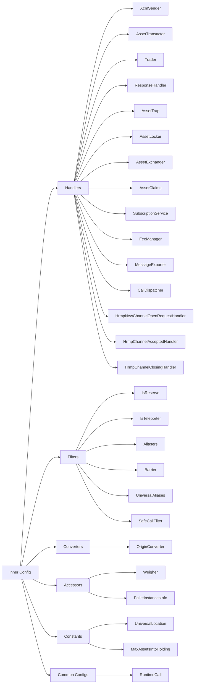

### Outer Config

The `XcmExecutor<Config>` struct extends the functionality of the inner config by introducing fields for execution context, asset handling, error tracking, and operational management. For further details, see the documentation for [`XcmExecutor<Config>`](https://paritytech.github.io/polkadot-sdk/master/staging_xcm_executor/struct.XcmExecutor.html#impl-XcmExecutor%3CConfig%3E){target=\_blank}.

## Multiple Implementations

Some associated types in the `Config` trait are highly configurable and may have multiple implementations (e.g., Barrier). These implementations are organized into a tuple `(impl_1, impl_2, ..., impl_n)`, and the execution follows a sequential order. Each item in the tuple is evaluated individually, each being checked to see if it fails. If an item passes (e.g., returns `Ok` or `true`), the execution stops, and the remaining items are not evaluated. The following example of the `Barrier` type demonstrates how this grouping operates (understanding each item in the tuple is unnecessary for this explanation).

In the following example, the system will first check the `TakeWeightCredit` type when evaluating the barrier. If it fails, it will check `AllowTopLevelPaidExecutionFrom`, and so on, until one of them returns a positive result. If all checks fail, a Barrier error will be triggered.

```rust
pub type Barrier = (
    TakeWeightCredit,
    AllowTopLevelPaidExecutionFrom<Everything>,
    AllowKnownQueryResponses<XcmPallet>,
    AllowSubscriptionsFrom<Everything>,
);

pub struct XcmConfig;
impl xcm_executor::Config for XcmConfig {
    ...
    type Barrier = Barrier;
    ...
}
```


---

Page Title: XCM Runtime APIs

- Source (raw): https://raw.githubusercontent.com/polkadot-developers/polkadot-docs/master/ai/pages/develop-interoperability-xcm-runtime-apis.md
- Canonical (HTML): https://docs.polkadot.com/develop/interoperability/xcm-runtime-apis/
- Summary: Learn about XCM Runtime APIs in Polkadot for cross-chain communication. Explore the APIs to simulate and test XCM messages before execution on the network.

# XCM Runtime APIs

## Introduction

Runtime APIs allow node-side code to extract information from the runtime state. While simple storage access retrieves stored values directly, runtime APIs enable arbitrary computation, making them a powerful tool for interacting with the chain's state.

Unlike direct storage access, runtime APIs can derive values from storage based on arguments or perform computations that don't require storage access. For example, a runtime API might expose a formula for fee calculation, using only the provided arguments as inputs rather than fetching data from storage.

In general, runtime APIs are used for:

- Accessing a storage item.
- Retrieving a bundle of related storage items.
- Deriving a value from storage based on arguments.
- Exposing formulas for complex computational calculations.

This section will teach you about specific runtime APIs that support XCM processing and manipulation.

## Dry Run API

The [Dry-run API](https://paritytech.github.io/polkadot-sdk/master/xcm_runtime_apis/dry_run/trait.DryRunApi.html){target=\_blank}, given an extrinsic, or an XCM program, returns its effects:

- Execution result
- Local XCM (in the case of an extrinsic)
- Forwarded XCMs
- List of events

This API can be used independently for dry-running, double-checking, or testing. However, it mainly shines when used with the [Xcm Payment API](#xcm-payment-api), given that it only estimates fees if you know the specific XCM you want to execute or send.

### Dry Run Call

This API allows a dry-run of any extrinsic and obtaining the outcome if it fails or succeeds, as well as the local xcm and remote xcm messages sent to other chains.

```rust
fn dry_run_call(origin: OriginCaller, call: Call, result_xcms_version: XcmVersion) -> Result<CallDryRunEffects<Event>, Error>;
```

??? interface "Input parameters"

    `origin` ++"OriginCaller"++ <span class="required" markdown>++"required"++</span>
    
    The origin used for executing the transaction.

    ---

    `call` ++"Call"++ <span class="required" markdown>++"required"++</span>

    The extrinsic to be executed.

    ---

??? interface "Output parameters"

    ++"Result<CallDryRunEffects<Event>, Error>"++

    Effects of dry-running an extrinsic. If an error occurs, it is returned instead of the effects.

    ??? child "Type `CallDryRunEffects<Event>`"

        `execution_result` ++"DispatchResultWithPostInfo"++

        The result of executing the extrinsic.

        ---

        `emitted_events` ++"Vec<Event>"++

        The list of events fired by the extrinsic.

        ---

        `local_xcm` ++"Option<VersionedXcm<()>>"++

        The local XCM that was attempted to be executed, if any.

        ---

        `forwarded_xcms` ++"Vec<(VersionedLocation, Vec<VersionedXcm<()>>)>"++

        The list of XCMs that were queued for sending.

    ??? child "Type `Error`"

        Enum:

        - **`Unimplemented`**: An API part is unsupported.
        - **`VersionedConversionFailed`**: Converting a versioned data structure from one version to another failed.

??? interface "Example"

    This example demonstrates how to simulate a cross-chain asset transfer from the Paseo network to the Pop Network using a [reserve transfer](https://wiki.polkadot.com/learn/learn-xcm-usecases/#reserve-asset-transfer){target=\_blank} mechanism. Instead of executing the actual transfer, the code shows how to test and verify the transaction's behavior through a dry run before performing it on the live network.

    Replace `INSERT_USER_ADDRESS` with your SS58 address before running the script.

    ***Usage with PAPI***

    ```js
    import { paseo } from '@polkadot-api/descriptors';
    import { createClient } from 'polkadot-api';
    import { getWsProvider } from 'polkadot-api/ws-provider/web';
    import { withPolkadotSdkCompat } from 'polkadot-api/polkadot-sdk-compat';
    import {
      PolkadotRuntimeOriginCaller,
      XcmVersionedLocation,
      XcmVersionedAssets,
      XcmV3Junction,
      XcmV3Junctions,
      XcmV3WeightLimit,
      XcmV3MultiassetFungibility,
      XcmV3MultiassetAssetId,
    } from '@polkadot-api/descriptors';
    import { DispatchRawOrigin } from '@polkadot-api/descriptors';
    import { Binary } from 'polkadot-api';
    import { ss58Decode } from '@polkadot-labs/hdkd-helpers';

    // Connect to the Paseo relay chain
    const client = createClient(
      withPolkadotSdkCompat(getWsProvider('wss://paseo-rpc.dwellir.com')),
    );

    const paseoApi = client.getTypedApi(paseo);

    const popParaID = 4001;
    const userAddress = 'INSERT_USER_ADDRESS';
    const userPublicKey = ss58Decode(userAddress)[0];
    const idBeneficiary = Binary.fromBytes(userPublicKey);

    // Define the origin caller
    // This is a regular signed account owned by a user
    let origin = PolkadotRuntimeOriginCaller.system(
      DispatchRawOrigin.Signed(userAddress),
    );

    // Define a transaction to transfer assets from Polkadot to Pop Network using a Reserve Transfer
    const tx = paseoApi.tx.XcmPallet.limited_reserve_transfer_assets({
      dest: XcmVersionedLocation.V3({
        parents: 0,
        interior: XcmV3Junctions.X1(
          XcmV3Junction.Parachain(popParaID), // Destination is the Pop Network parachain
        ),
      }),
      beneficiary: XcmVersionedLocation.V3({
        parents: 0,
        interior: XcmV3Junctions.X1(
          XcmV3Junction.AccountId32({
            // Beneficiary address on Pop Network
            network: undefined,
            id: idBeneficiary,
          }),
        ),
      }),
      assets: XcmVersionedAssets.V3([
        {
          id: XcmV3MultiassetAssetId.Concrete({
            parents: 0,
            interior: XcmV3Junctions.Here(), // Native asset from the sender. In this case PAS
          }),
          fun: XcmV3MultiassetFungibility.Fungible(120000000000n), // Asset amount to transfer
        },
      ]),
      fee_asset_item: 0, // Asset used to pay transaction fees
      weight_limit: XcmV3WeightLimit.Unlimited(), // No weight limit on transaction
    });

    // Execute the dry run call to simulate the transaction
    const dryRunResult = await paseoApi.apis.DryRunApi.dry_run_call(
      origin,
      tx.decodedCall,
    );

    // Extract the data from the dry run result
    const {
      execution_result: executionResult,
      emitted_events: emmittedEvents,
      local_xcm: localXcm,
      forwarded_xcms: forwardedXcms,
    } = dryRunResult.value;

    // Extract the XCM generated by this call
    const xcmsToPop = forwardedXcms.find(
      ([location, _]) =>
        location.type === 'V4' &&
        location.value.parents === 0 &&
        location.value.interior.type === 'X1' &&
        location.value.interior.value.type === 'Parachain' &&
        location.value.interior.value.value === popParaID, // Pop network's ParaID
    );
    const destination = xcmsToPop[0];
    const remoteXcm = xcmsToPop[1][0];

    // Print the results
    const resultObject = {
      execution_result: executionResult,
      emitted_events: emmittedEvents,
      local_xcm: localXcm,
      destination: destination,
      remote_xcm: remoteXcm,
    };

    console.dir(resultObject, { depth: null });

    client.destroy();

    ```

    ***Output***

    <div id="termynal" data-termynal>
      <pre>
        {
          execution_result: {
            success: true,
            value: {
              actual_weight: undefined,
              pays_fee: { type: 'Yes', value: undefined }
            }
          },
          emitted_events: [
                ...
          ],
          local_xcm: undefined,
          destination: {
            type: 'V4',
            value: {
              parents: 0,
              interior: { type: 'X1', value: { type: 'Parachain', value: 4001 } }
            }
          },
          remote_xcm: {
            type: 'V3',
            value: [
              {
                type: 'ReserveAssetDeposited',
                value: [
                  {
                    id: {
                      type: 'Concrete',
                      value: {
                        parents: 1,
                        interior: { type: 'Here', value: undefined }
                      }
                    },
                    fun: { type: 'Fungible', value: 120000000000n }
                  }
                ]
              },
              { type: 'ClearOrigin', value: undefined },
              {
                type: 'BuyExecution',
                value: {
                  fees: {
                    id: {
                      type: 'Concrete',
                      value: {
                        parents: 1,
                        interior: { type: 'Here', value: undefined }
                      }
                    },
                    fun: { type: 'Fungible', value: 120000000000n }
                  },
                  weight_limit: { type: 'Unlimited', value: undefined }
                }
              },
              {
                type: 'DepositAsset',
                value: {
                  assets: { type: 'Wild', value: { type: 'AllCounted', value: 1 } },
                  beneficiary: {
                    parents: 0,
                    interior: {
                      type: 'X1',
                      value: {
                        type: 'AccountId32',
                        value: {
                          network: undefined,
                          id: FixedSizeBinary {
                            asText: [Function (anonymous)],
                            asHex: [Function (anonymous)],
                            asOpaqueHex: [Function (anonymous)],
                            asBytes: [Function (anonymous)],
                            asOpaqueBytes: [Function (anonymous)]
                          }
                        }
                      }
                    }
                  }
                }
              },
              {
                type: 'SetTopic',
                value: FixedSizeBinary {
                  asText: [Function (anonymous)],
                  asHex: [Function (anonymous)],
                  asOpaqueHex: [Function (anonymous)],
                  asBytes: [Function (anonymous)],
                  asOpaqueBytes: [Function (anonymous)]
                }
              }
            ]
          }
        }      
      </pre>
    </div>

    ---

### Dry Run XCM

This API allows the direct dry-run of an xcm message instead of an extrinsic one, checks if it will execute successfully, and determines what other xcm messages will be forwarded to other chains.

```rust
fn dry_run_xcm(origin_location: VersionedLocation, xcm: VersionedXcm<Call>) -> Result<XcmDryRunEffects<Event>, Error>;
```

??? interface "Input parameters"

    `origin_location` ++"VersionedLocation"++ <span class="required" markdown>++"required"++</span>

    The location of the origin that will execute the xcm message.

    ---

    `xcm` ++"VersionedXcm<Call>"++ <span class="required" markdown>++"required"++</span>

    A versioned XCM message.

    ---

??? interface "Output parameters"

    ++"Result<XcmDryRunEffects<Event>, Error>"++

    Effects of dry-running an extrinsic. If an error occurs, it is returned instead of the effects.

    ??? child "Type `XcmDryRunEffects<Event>`"

        `execution_result` ++"DispatchResultWithPostInfo"++

        The result of executing the extrinsic.

        ---

        `emitted_events` ++"Vec<Event>"++

        The list of events fired by the extrinsic.

        ---

        `forwarded_xcms` ++"Vec<(VersionedLocation, Vec<VersionedXcm<()>>)>"++

        The list of XCMs that were queued for sending.

    ??? child "Type `Error`"

        Enum:

        - **`Unimplemented`**: An API part is unsupported.
        - **`VersionedConversionFailed`**: Converting a versioned data structure from one version to another failed.

    ---

??? interface "Example"

    This example demonstrates how to simulate a [teleport asset transfer](https://wiki.polkadot.com/learn/learn-xcm-usecases/#asset-teleportation){target=\_blank} from the Paseo network to the Paseo Asset Hub parachain. The code shows how to test and verify the received XCM message's behavior in the destination chain through a dry run on the live network.

    Replace `INSERT_USER_ADDRESS` with your SS58 address before running the script.

     ***Usage with PAPI***

    ```js
    import { createClient } from 'polkadot-api';
    import { getWsProvider } from 'polkadot-api/ws-provider/web';
    import { withPolkadotSdkCompat } from 'polkadot-api/polkadot-sdk-compat';
    import {
      XcmVersionedXcm,
      paseoAssetHub,
      XcmVersionedLocation,
      XcmV3Junction,
      XcmV3Junctions,
      XcmV3WeightLimit,
      XcmV3MultiassetFungibility,
      XcmV3MultiassetAssetId,
      XcmV3Instruction,
      XcmV3MultiassetMultiAssetFilter,
      XcmV3MultiassetWildMultiAsset,
    } from '@polkadot-api/descriptors';
    import { Binary } from 'polkadot-api';
    import { ss58Decode } from '@polkadot-labs/hdkd-helpers';

    // Connect to Paseo Asset Hub
    const client = createClient(
      withPolkadotSdkCompat(getWsProvider('wss://asset-hub-paseo-rpc.dwellir.com')),
    );

    const paseoAssetHubApi = client.getTypedApi(paseoAssetHub);

    const userAddress = 'INSERT_USER_ADDRESS';
    const userPublicKey = ss58Decode(userAddress)[0];
    const idBeneficiary = Binary.fromBytes(userPublicKey);

    // Define the origin
    const origin = XcmVersionedLocation.V3({
      parents: 1,
      interior: XcmV3Junctions.Here(),
    });

    // Define a xcm message comming from the Paseo relay chain to Asset Hub to Teleport some tokens
    const xcm = XcmVersionedXcm.V3([
      XcmV3Instruction.ReceiveTeleportedAsset([
        {
          id: XcmV3MultiassetAssetId.Concrete({
            parents: 1,
            interior: XcmV3Junctions.Here(),
          }),
          fun: XcmV3MultiassetFungibility.Fungible(12000000000n),
        },
      ]),
      XcmV3Instruction.ClearOrigin(),
      XcmV3Instruction.BuyExecution({
        fees: {
          id: XcmV3MultiassetAssetId.Concrete({
            parents: 1,
            interior: XcmV3Junctions.Here(),
          }),
          fun: XcmV3MultiassetFungibility.Fungible(BigInt(12000000000n)),
        },
        weight_limit: XcmV3WeightLimit.Unlimited(),
      }),
      XcmV3Instruction.DepositAsset({
        assets: XcmV3MultiassetMultiAssetFilter.Wild(
          XcmV3MultiassetWildMultiAsset.All(),
        ),
        beneficiary: {
          parents: 0,
          interior: XcmV3Junctions.X1(
            XcmV3Junction.AccountId32({
              network: undefined,
              id: idBeneficiary,
            }),
          ),
        },
      }),
    ]);

    // Execute dry run xcm
    const dryRunResult = await paseoAssetHubApi.apis.DryRunApi.dry_run_xcm(
      origin,
      xcm,
    );

    // Print the results
    console.dir(dryRunResult.value, { depth: null });

    client.destroy();

    ```

    ***Output***

    <div id="termynal" data-termynal>
      <pre>
        {
          execution_result: {
            type: 'Complete',
            value: { used: { ref_time: 15574200000n, proof_size: 359300n } }
          },
          emitted_events: [
            {
              type: 'System',
              value: {
                type: 'NewAccount',
                value: { account: '12pGtwHPL4tUAUcyeCoJ783NKRspztpWmXv4uxYRwiEnYNET' }
              }
            },
            {
              type: 'Balances',
              value: {
                type: 'Endowed',
                value: {
                  account: '12pGtwHPL4tUAUcyeCoJ783NKRspztpWmXv4uxYRwiEnYNET',
                  free_balance: 10203500000n
                }
              }
            },
            {
              type: 'Balances',
              value: {
                type: 'Minted',
                value: {
                  who: '12pGtwHPL4tUAUcyeCoJ783NKRspztpWmXv4uxYRwiEnYNET',
                  amount: 10203500000n
                }
              }
            },
            {
              type: 'Balances',
              value: { type: 'Issued', value: { amount: 1796500000n } }
            },
            {
              type: 'Balances',
              value: {
                type: 'Deposit',
                value: {
                  who: '13UVJyLgBASGhE2ok3TvxUfaQBGUt88JCcdYjHvUhvQkFTTx',
                  amount: 1796500000n
                }
              }
            }
          ],
          forwarded_xcms: [
            [
              {
                type: 'V4',
                value: { parents: 1, interior: { type: 'Here', value: undefined } }
              },
              []
            ]
          ]
        }
      </pre>
    </div>

    ---

## XCM Payment API

The [XCM Payment API](https://paritytech.github.io/polkadot-sdk/master/xcm_runtime_apis/fees/trait.XcmPaymentApi.html){target=\_blank} provides a standardized way to determine the costs and payment options for executing XCM messages. Specifically, it enables clients to:

- Retrieve the [weight](/polkadot-protocol/glossary/#weight) required to execute an XCM message.
- Obtain a list of acceptable `AssetIds` for paying execution fees.
- Calculate the cost of the weight in a specified `AssetId`.
- Estimate the fees for XCM message delivery.

This API eliminates the need for clients to guess execution fees or identify acceptable assets manually. Instead, clients can query the list of supported asset IDs formatted according to the XCM version they understand. With this information, they can weigh the XCM program they intend to execute and convert the computed weight into its cost using one of the acceptable assets.

To use the API effectively, the client must already know the XCM program to be executed and the chains involved in the program's execution.

### Query Acceptable Payment Assets

Retrieves the list of assets that are acceptable for paying fees when using a specific XCM version

```rust
fn query_acceptable_payment_assets(xcm_version: Version) -> Result<Vec<VersionedAssetId>, Error>;
```

??? interface "Input parameters"

    `xcm_version` ++"Version"++ <span class="required" markdown>++"required"++</span>

    Specifies the XCM version that will be used to send the XCM message.

    ---

??? interface "Output parameters"

    ++"Result<Vec<VersionedAssetId>, Error>"++

    A list of acceptable payment assets. Each asset is provided in a versioned format (`VersionedAssetId`) that matches the specified XCM version. If an error occurs, it is returned instead of the asset list.

    ??? child "Type `Error`"

        Enum:

        - **`Unimplemented`**: An API part is unsupported.
        - **`VersionedConversionFailed`**: Converting a versioned data structure from one version to another failed.
        - **`WeightNotComputable`**: XCM message weight calculation failed.
        - **`UnhandledXcmVersion`**: XCM version not able to be handled.
        - **`AssetNotFound`**: The given asset is not handled as a fee asset.
        - **`Unroutable`**: Destination is known to be unroutable.

    ---

??? interface "Example"

    This example demonstrates how to query the acceptable payment assets for executing XCM messages on the Paseo Asset Hub network using XCM version 3.

    ***Usage with PAPI***

    ```js
    import { paseoAssetHub } from '@polkadot-api/descriptors';
    import { createClient } from 'polkadot-api';
    import { getWsProvider } from 'polkadot-api/ws-provider/web';
    import { withPolkadotSdkCompat } from 'polkadot-api/polkadot-sdk-compat';

    // Connect to the polkadot relay chain
    const client = createClient(
      withPolkadotSdkCompat(getWsProvider('wss://asset-hub-paseo-rpc.dwellir.com')),
    );

    const paseoAssetHubApi = client.getTypedApi(paseoAssetHub);

    // Define the xcm version to use
    const xcmVersion = 3;

    // Execute the runtime call to query the assets
    const result =
      await paseoAssetHubApi.apis.XcmPaymentApi.query_acceptable_payment_assets(
        xcmVersion,
      );

    // Print the assets
    console.dir(result.value, { depth: null });

    client.destroy();

    ```

    ***Output***

    <div id="termynal" data-termynal>
      <pre>
        [
          {
            type: 'V3',
            value: {
              type: 'Concrete',
              value: { parents: 1, interior: { type: 'Here', value: undefined } }
            }
          }
        ]
      </pre>
    </div>

    ---

### Query XCM Weight

Calculates the weight required to execute a given XCM message. It is useful for estimating the execution cost of a cross-chain message in the destination chain before sending it.

```rust
fn query_xcm_weight(message: VersionedXcm<()>) -> Result<Weight, Error>;
```

??? interface "Input parameters"

    `message` ++"VersionedXcm<()>"++ <span class="required" markdown>++"required"++</span>
    
    A versioned XCM message whose execution weight is being queried.

    ---

??? interface "Output parameters"

    ++"Result<Weight, Error>"++
    
    The calculated weight required to execute the provided XCM message. If the calculation fails, an error is returned instead.

    ??? child "Type `Weight`"

        `ref_time` ++"u64"++

        The weight of computational time used based on some reference hardware.

        ---

        `proof_size` ++"u64"++

        The weight of storage space used by proof of validity.

        ---

    ??? child "Type `Error`"

        Enum:

        - **`Unimplemented`**: An API part is unsupported.
        - **`VersionedConversionFailed`**: Converting a versioned data structure from one version to another failed.
        - **`WeightNotComputable`**: XCM message weight calculation failed.
        - **`UnhandledXcmVersion`**: XCM version not able to be handled.
        - **`AssetNotFound`**: The given asset is not handled as a fee asset.
        - **`Unroutable`**: Destination is known to be unroutable.

    ---

??? interface "Example"

    This example demonstrates how to calculate the weight needed to execute a [teleport transfer](https://wiki.polkadot.com/learn/learn-xcm-usecases/#asset-teleportation){target=\_blank} from the Paseo network to the Paseo Asset Hub parachain using the XCM Payment API. The result shows the required weight in terms of reference time and proof size needed in the destination chain.

    Replace `INSERT_USER_ADDRESS` with your SS58 address before running the script.

    ***Usage with PAPI***

    ```js
    import { createClient } from 'polkadot-api';
    import { getWsProvider } from 'polkadot-api/ws-provider/web';
    import { withPolkadotSdkCompat } from 'polkadot-api/polkadot-sdk-compat';
    import {
      XcmVersionedXcm,
      paseoAssetHub,
      XcmV3Junction,
      XcmV3Junctions,
      XcmV3WeightLimit,
      XcmV3MultiassetFungibility,
      XcmV3MultiassetAssetId,
      XcmV3Instruction,
      XcmV3MultiassetMultiAssetFilter,
      XcmV3MultiassetWildMultiAsset,
    } from '@polkadot-api/descriptors';
    import { Binary } from 'polkadot-api';
    import { ss58Decode } from '@polkadot-labs/hdkd-helpers';

    // Connect to Paseo Asset Hub
    const client = createClient(
      withPolkadotSdkCompat(getWsProvider('wss://asset-hub-paseo-rpc.dwellir.com')),
    );

    const paseoAssetHubApi = client.getTypedApi(paseoAssetHub);

    const userAddress = 'INSERT_USER_ADDRESS';
    const userPublicKey = ss58Decode(userAddress)[0];
    const idBeneficiary = Binary.fromBytes(userPublicKey);

    // Define a xcm message comming from the Paseo relay chain to Asset Hub to Teleport some tokens
    const xcm = XcmVersionedXcm.V3([
      XcmV3Instruction.ReceiveTeleportedAsset([
        {
          id: XcmV3MultiassetAssetId.Concrete({
            parents: 1,
            interior: XcmV3Junctions.Here(),
          }),
          fun: XcmV3MultiassetFungibility.Fungible(12000000000n),
        },
      ]),
      XcmV3Instruction.ClearOrigin(),
      XcmV3Instruction.BuyExecution({
        fees: {
          id: XcmV3MultiassetAssetId.Concrete({
            parents: 1,
            interior: XcmV3Junctions.Here(),
          }),
          fun: XcmV3MultiassetFungibility.Fungible(BigInt(12000000000n)),
        },
        weight_limit: XcmV3WeightLimit.Unlimited(),
      }),
      XcmV3Instruction.DepositAsset({
        assets: XcmV3MultiassetMultiAssetFilter.Wild(
          XcmV3MultiassetWildMultiAsset.All(),
        ),
        beneficiary: {
          parents: 0,
          interior: XcmV3Junctions.X1(
            XcmV3Junction.AccountId32({
              network: undefined,
              id: idBeneficiary,
            }),
          ),
        },
      }),
    ]);

    // Execute the query weight runtime call
    const result = await paseoAssetHubApi.apis.XcmPaymentApi.query_xcm_weight(xcm);

    // Print the results
    console.dir(result.value, { depth: null });

    client.destroy();

    ```

    ***Output***

    <div id="termynal" data-termynal>
      <span data-ty>{ ref_time: 15574200000n, proof_size: 359300n }</span>
    </div>

    ---

### Query Weight to Asset Fee

Converts a given weight into the corresponding fee for a specified `AssetId`. It allows clients to determine the cost of execution in terms of the desired asset.

```rust
fn query_weight_to_asset_fee(weight: Weight, asset: VersionedAssetId) -> Result<u128, Error>;
```

??? interface "Input parameters"

    `weight` ++"Weight"++ <span class="required" markdown>++"required"++</span>
    
    The execution weight to be converted into a fee.

    ??? child "Type `Weight`"

        `ref_time` ++"u64"++

        The weight of computational time used based on some reference hardware.

        ---

        `proof_size` ++"u64"++

        The weight of storage space used by proof of validity.

        ---

    ---

    `asset` ++"VersionedAssetId"++ <span class="required" markdown>++"required"++</span>
    
    The asset in which the fee will be calculated. This must be a versioned asset ID compatible with the runtime.

    ---

??? interface "Output parameters"

    ++"Result<u128, Error>"++
    
    The fee needed to pay for the execution for the given `AssetId.`

    ??? child "Type `Error`"

        Enum:

        - **`Unimplemented`**: An API part is unsupported.
        - **`VersionedConversionFailed`**: Converting a versioned data structure from one version to another failed.
        - **`WeightNotComputable`**: XCM message weight calculation failed.
        - **`UnhandledXcmVersion`**: XCM version not able to be handled.
        - **`AssetNotFound`**: The given asset is not handled as a fee asset.
        - **`Unroutable`**: Destination is known to be unroutable.

    ---

??? interface "Example"

    This example demonstrates how to calculate the fee for a given execution weight using a specific versioned asset ID (PAS token) on Paseo Asset Hub.

    ***Usage with PAPI***

    ```js
    import { paseoAssetHub } from '@polkadot-api/descriptors';
    import { createClient } from 'polkadot-api';
    import { getWsProvider } from 'polkadot-api/ws-provider/web';
    import { withPolkadotSdkCompat } from 'polkadot-api/polkadot-sdk-compat';

    // Connect to the polkadot relay chain
    const client = createClient(
      withPolkadotSdkCompat(getWsProvider('wss://asset-hub-paseo-rpc.dwellir.com')),
    );

    const paseoAssetHubApi = client.getTypedApi(paseoAssetHub);

    // Define the weight to convert to fee
    const weight = { ref_time: 15574200000n, proof_size: 359300n };

    // Define the versioned asset id
    const versionedAssetId = {
      type: 'V4',
      value: { parents: 1, interior: { type: 'Here', value: undefined } },
    };

    // Execute the runtime call to convert the weight to fee
    const result =
      await paseoAssetHubApi.apis.XcmPaymentApi.query_weight_to_asset_fee(
        weight,
        versionedAssetId,
      );

    // Print the fee
    console.dir(result.value, { depth: null });

    client.destroy();

    ```

    ***Output***

    <div id="termynal" data-termynal>
      <span data-ty>1796500000n</span>
    </div>

    ---

### Query Delivery Fees

Retrieves the delivery fees for sending a specific XCM message to a designated destination. The fees are always returned in a specific asset defined by the destination chain.

```rust
fn query_delivery_fees(destination: VersionedLocation, message: VersionedXcm<()>) -> Result<VersionedAssets, Error>;
```

??? interface "Input parameters"

    `destination` ++"VersionedLocation"++ <span class="required" markdown>++"required"++</span>
    
    The target location where the message will be sent. Fees may vary depending on the destination, as different destinations often have unique fee structures and sender mechanisms.

    ---

    `message` ++"VersionedXcm<()>"++ <span class="required" markdown>++"required"++</span>
    
    The XCM message to be sent. The delivery fees are calculated based on the message's content and size, which can influence the cost.

    ---

??? interface "Output parameters"

    ++"Result<VersionedAssets, Error>"++
    
    The calculated delivery fees expressed in a specific asset supported by the destination chain. If an error occurs during the query, it returns an error instead.

    ??? child "Type `Error`"

        Enum:

        - **`Unimplemented`**: An API part is unsupported.
        - **`VersionedConversionFailed`**: Converting a versioned data structure from one version to another failed.
        - **`WeightNotComputable`**: XCM message weight calculation failed.
        - **`UnhandledXcmVersion`**: XCM version not able to be handled.
        - **`AssetNotFound`**: The given asset is not handled as a fee asset.
        - **`Unroutable`**: Destination is known to be unroutable.

    ---

??? interface "Example"

    This example demonstrates how to query the delivery fees for sending an XCM message from Paseo to Paseo Asset Hub.

    Replace `INSERT_USER_ADDRESS` with your SS58 address before running the script.

    ***Usage with PAPI***

    ```js
    import { createClient } from 'polkadot-api';
    import { getWsProvider } from 'polkadot-api/ws-provider/web';
    import { withPolkadotSdkCompat } from 'polkadot-api/polkadot-sdk-compat';
    import {
      XcmVersionedXcm,
      paseo,
      XcmVersionedLocation,
      XcmV3Junction,
      XcmV3Junctions,
      XcmV3WeightLimit,
      XcmV3MultiassetFungibility,
      XcmV3MultiassetAssetId,
      XcmV3Instruction,
      XcmV3MultiassetMultiAssetFilter,
      XcmV3MultiassetWildMultiAsset,
    } from '@polkadot-api/descriptors';
    import { Binary } from 'polkadot-api';
    import { ss58Decode } from '@polkadot-labs/hdkd-helpers';

    const client = createClient(
      withPolkadotSdkCompat(getWsProvider('wss://paseo-rpc.dwellir.com')),
    );

    const paseoApi = client.getTypedApi(paseo);

    const paseoAssetHubParaID = 1000;
    const userAddress = 'INSERT_USER_ADDRESS';
    const userPublicKey = ss58Decode(userAddress)[0];
    const idBeneficiary = Binary.fromBytes(userPublicKey);

    // Define the destination
    const destination = XcmVersionedLocation.V3({
      parents: 0,
      interior: XcmV3Junctions.X1(XcmV3Junction.Parachain(paseoAssetHubParaID)),
    });

    // Define the xcm message that will be sent to the destination
    const xcm = XcmVersionedXcm.V3([
      XcmV3Instruction.ReceiveTeleportedAsset([
        {
          id: XcmV3MultiassetAssetId.Concrete({
            parents: 1,
            interior: XcmV3Junctions.Here(),
          }),
          fun: XcmV3MultiassetFungibility.Fungible(12000000000n),
        },
      ]),
      XcmV3Instruction.ClearOrigin(),
      XcmV3Instruction.BuyExecution({
        fees: {
          id: XcmV3MultiassetAssetId.Concrete({
            parents: 1,
            interior: XcmV3Junctions.Here(),
          }),
          fun: XcmV3MultiassetFungibility.Fungible(BigInt(12000000000n)),
        },
        weight_limit: XcmV3WeightLimit.Unlimited(),
      }),
      XcmV3Instruction.DepositAsset({
        assets: XcmV3MultiassetMultiAssetFilter.Wild(
          XcmV3MultiassetWildMultiAsset.All(),
        ),
        beneficiary: {
          parents: 0,
          interior: XcmV3Junctions.X1(
            XcmV3Junction.AccountId32({
              network: undefined,
              id: idBeneficiary,
            }),
          ),
        },
      }),
    ]);

    // Execute the query delivery fees runtime call
    const result = await paseoApi.apis.XcmPaymentApi.query_delivery_fees(
      destination,
      xcm,
    );

    // Print the results
    console.dir(result.value, { depth: null });

    client.destroy();

    ```

    ***Output***

    <div id="termynal" data-termynal>
      <pre>
        {
          type: 'V3',
          value: [
            {
              id: {
                type: 'Concrete',
                value: { parents: 0, interior: { type: 'Here', value: undefined } }
              },
              fun: { type: 'Fungible', value: 396000000n }
            }
          ]
        }
      </pre>
    </div>

    ---


---

Page Title: XCM Tools

- Source (raw): https://raw.githubusercontent.com/polkadot-developers/polkadot-docs/master/ai/pages/develop-toolkit-interoperability-xcm-tools.md
- Canonical (HTML): https://docs.polkadot.com/develop/toolkit/interoperability/xcm-tools/
- Summary: Explore essential XCM tools across Polkadot, crafted to enhance cross-chain functionality and integration within the ecosystem.

# XCM Tools

## Introduction

As described in the [Interoperability](/develop/interoperability){target=\_blank} section, XCM (Cross-Consensus Messaging) is a protocol used in the Polkadot and Kusama ecosystems to enable communication and interaction between chains. It facilitates cross-chain communication, allowing assets, data, and messages to flow seamlessly across the ecosystem.

As XCM is central to enabling communication between blockchains, developers need robust tools to help interact with, build, and test XCM messages. Several XCM tools simplify working with the protocol by providing libraries, frameworks, and utilities that enhance the development process, ensuring that applications built within the Polkadot ecosystem can efficiently use cross-chain functionalities.

## Popular XCM Tools

### Moonsong Labs XCM Tools

[Moonsong Labs XCM Tools](https://github.com/Moonsong-Labs/xcm-tools){target=\_blank} provides a collection of scripts for managing and testing XCM operations between Polkadot SDK-based runtimes. These tools allow performing tasks like asset registration, channel setup, and XCM initialization. Key features include:

- **Asset registration**: Registers assets, setting units per second (up-front fees), and configuring error (revert) codes.
- **XCM initializer**: Initializes XCM, sets default XCM versions, and configures revert codes for XCM-related precompiles.
- **HRMP manipulator**: Manages HRMP channel actions, including opening, accepting, or closing channels.
- **XCM-Transactor-Info-Setter**: Configures transactor information, including extra weight and fee settings.
- **Decode XCM**: Decodes XCM messages on the relay chain or parachains to help interpret cross-chain communication.

To get started, clone the repository and install the required dependencies:

```bash
git clone https://github.com/Moonsong-Labs/xcm-tools && 
cd xcm-tools &&
yarn install
```

For a full overview of each script, visit the [scripts](https://github.com/Moonsong-Labs/xcm-tools/tree/main/scripts){target=\_blank} directory or refer to the [official documentation](https://github.com/Moonsong-Labs/xcm-tools/blob/main/README.md){target=\_blank} on GitHub.

### ParaSpell

[ParaSpell](https://paraspell.xyz/){target=\_blank} is a collection of open-source XCM tools designed to streamline cross-chain asset transfers and interactions within the Polkadot and Kusama ecosystems. It equips developers with an intuitive interface to manage and optimize XCM-based functionalities. Some key points included by ParaSpell are:

- **[XCM SDK](https://paraspell.xyz/#xcm-sdk){target=\_blank}**: Provides a unified layer to incorporate XCM into decentralized applications, simplifying complex cross-chain interactions.
- **[XCM API](https://paraspell.xyz/#xcm-api){target=\_blank}**: Offers an efficient, package-free approach to integrating XCM functionality while offloading heavy computing tasks, minimizing costs and improving application performance.
- **[XCM router](https://paraspell.xyz/#xcm-router){target=\_blank}**: Enables cross-chain asset swaps in a single command, allowing developers to send one asset type (such as DOT on Polkadot) and receive a different asset on another chain (like ASTR on Astar).
- **[XCM analyser](https://paraspell.xyz/#xcm-analyser){target=\_blank}**: Decodes and translates complex XCM multilocation data into readable information, supporting easier troubleshooting and debugging.
- **[XCM visualizator](https://paraspell.xyz/#xcm-visualizator){target=\_blank}**: A tool designed to give developers a clear, interactive view of XCM activity across the Polkadot ecosystem, providing insights into cross-chain communication flow.

ParaSpell's tools make it simple for developers to build, test, and deploy cross-chain solutions without needing extensive knowledge of the XCM protocol. With features like message composition, decoding, and practical utility functions for parachain interactions, ParaSpell is especially useful for debugging and optimizing cross-chain communications.

### Astar XCM Tools

The [Astar parachain](https://github.com/AstarNetwork/Astar/tree/master){target=\_blank} offers a crate with a set of utilities for interacting with the XCM protocol. The [xcm-tools](https://github.com/AstarNetwork/Astar/tree/master/bin/xcm-tools){target=\_blank} crate provides a straightforward method for users to locate a sovereign account or calculate an XC20 asset ID. Some commands included by the xcm-tools crate allow users to perform the following tasks:

- **Sovereign accounts**: Obtain the sovereign account address for any parachain, either on the Relay Chain or for sibling parachains, using a simple command.
- **XC20 EVM addresses**: Generate XC20-compatible Ethereum addresses for assets by entering the asset ID, making it easy to integrate assets across Ethereum-compatible environments.
- **Remote accounts**: Retrieve remote account addresses needed for multi-location compatibility, using flexible options to specify account types and parachain IDs.

To start using these tools, clone the [Astar repository](https://github.com/AstarNetwork/Astar){target=\_blank} and compile the xcm-tools package:

```bash
git clone https://github.com/AstarNetwork/Astar &&
cd Astar &&
cargo build --release -p xcm-tools
```

After compiling, verify the setup with the following command:

```bash
./target/release/xcm-tools --help
```
For more details on using Astar xcm-tools, consult the [official documentation](https://docs.astar.network/docs/learn/interoperability/xcm/integration/tools/){target=\_blank}.

### Chopsticks

The Chopsticks library provides XCM functionality for testing XCM messages across networks, enabling you to fork multiple parachains along with a relay chain. For further details, see the [Chopsticks documentation](/tutorials/polkadot-sdk/testing/fork-live-chains/){target=\_blank} about XCM.

### Moonbeam XCM SDK

The [Moonbeam XCM SDK](https://github.com/moonbeam-foundation/xcm-sdk){target=\_blank} enables developers to easily transfer assets between chains, either between parachains or between a parachain and the relay chain, within the Polkadot/Kusama ecosystem. With the SDK, you don't need to worry about determining the [Multilocation](https://github.com/polkadot-fellows/xcm-format?tab=readme-ov-file#7-universal-consensus-location-identifiers){target=\_blank} of the origin or destination assets or which extrinsics are used on which networks.

The SDK consists of two main packages:

- **[XCM SDK](https://github.com/moonbeam-foundation/xcm-sdk/tree/main/packages/sdk){target=\_blank}**: Core SDK for executing XCM transfers between chains in the Polkadot/Kusama ecosystem.
- **[MRL SDK](https://github.com/moonbeam-foundation/xcm-sdk/tree/main/packages/mrl){target=\_blank}**: Extension of the XCM SDK for transferring liquidity into and across the Polkadot ecosystem from other ecosystems like Ethereum.

Key features include:

- **Simplified asset transfers**: Abstracts away complex multilocation determinations and extrinsic selection.
- **Cross-ecosystem support**: Enables transfers between Polkadot/Kusama chains and external ecosystems.
- **Developer-friendly API**: Provides intuitive interfaces for cross-chain functionality.
- **Comprehensive documentation**: Includes usage guides and API references for both packages.

For detailed usage examples and API documentation, visit the [official Moonbeam XCM SDK documentation](https://moonbeam-foundation.github.io/xcm-sdk/latest/){target=\_blank}.
