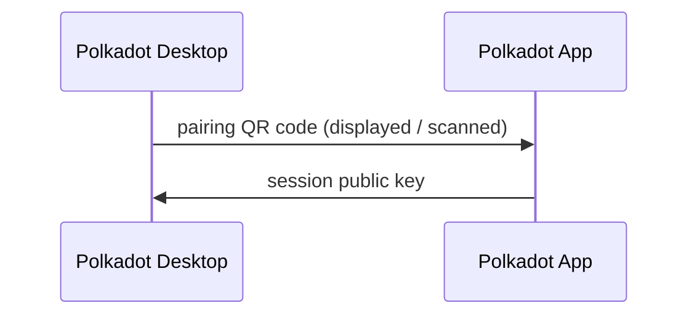

# Install and Pair Polkadot Desktop

*Set-up · Step 1 of 4 — **Install & Pair** → [Choose a Network](/apps/set-up/choose-a-network/) → [Verify Identity](/apps/set-up/verify-your-identity/) → [Get TestNet Funds](/apps/set-up/get-testnet-funds/)*

## Introduction

Before you can build anything, two pieces of the Polkadot Products stack need to be talking to each other: **Polkadot Desktop**, where your Product runs, and the **Polkadot App** on your phone, where signing happens. This page pairs them. By the end, Desktop knows who you are, and every signing request your Product makes routes to your phone for approval.

The setup spans two of the three Triangle Hosts. Polkadot Desktop is a specialized browser that loads Polkadot Products (addressed by `.dot` names) inside a sandbox; the Polkadot App runs on your phone, stores your private key, and approves every transaction. The third Host, Polkadot Web (`dot.li`), is not covered here.

Polkadot Desktop never holds your private key. Your identity lives on the Polkadot People Chain, your private key lives in the Polkadot App, and Polkadot Desktop only ever holds a derived session public key. This is enough to identify you and construct per-Product accounts, but not enough to sign anything on its own.

!!! note
    The session public key referenced here is a dev-pairing artifact, unrelated to validator session keys used for block production and consensus.

## Prerequisites

Before starting, ensure you have:

- A workstation running macOS, Windows, or Linux
- A device with a working camera to run the Polkadot App
- Network connectivity on both devices for the pairing handshake

## Install Polkadot Desktop

Polkadot Desktop is the host application that loads Polkadot Products by their `.dot` domain names. On first launch, it opens directly into the pairing flow. There is no account creation step, no password prompt, and no seed phrase import, because Desktop never holds any of those.

1. Open the development build of Polkadot Desktop at [polkadotbrowser.novasama-technologies.workers.dev](https://polkadotbrowser.novasama-technologies.workers.dev/){target=\_blank} (this is the dev deployment; a production distribution channel will be linked here when available).

2. Install the application using your platform's standard installer.

3. Launch Polkadot Desktop.
    

On first launch, Desktop opens directly into the pairing screen described in the next section.

## Set Up the Polkadot App

1. On a device with a camera, open the Polkadot App.

    {: .browser-extension}

2. Complete onboarding so you have an active account and the camera-scanning view available.

3. Keep the App open while you complete the pairing on Desktop.

## Pair Polkadot Desktop with the Polkadot App

Pairing is a one-time cryptographic handshake. Desktop displays a QR code, the App scans it, and the App returns a session public key that Desktop stores. From that point forward, Desktop knows who you are and can construct per-app sub-accounts, but every signing prompt still routes back to the App for approval.

Follow these steps to complete the pairing:

1. Polkadot Desktop opens to the login screen and displays a QR code alongside the prompt **Use your camera to log in**. Leave this screen open.

    

2. In the Polkadot App, open the camera-scanning view and scan the QR code shown on Desktop.

    {: .browser-extension}

3. Confirm the pairing in the Polkadot App when prompted. The App returns the session public key, and Desktop registers it as the signer for this workstation.

    {: .browser-extension}

4. Desktop transitions from the login screen to the Dashboard.

    

After pairing, your identity on the People Chain is bound to the Polkadot App for this Desktop session. Every subsequent signing request will route to the App, and you approve or reject each one on the signing device.

!!! note "Developer-Only UI Elements"
    The developer build of Polkadot Desktop exposes elements that may not appear, or may behave differently, in production builds.

    The login screen includes a **Skip** button that bypasses the QR pairing step and drops you onto the Dashboard without a paired signer. This is useful for inspecting Polkadot Desktop without signing anything, but most development flows assume a paired signer.

    The login screen also shows a network selector (**Preview** / **Stable** / **Paseo Next**) — see [Choose a Network](/apps/set-up/choose-a-network/) for what each network is for.

    

## Where to Go Next

-   Guide **Choose a Network**

    ---

    Pick the Polkadot Desktop environment your identity, funds, and Product will live on before you go any further.

    [:octicons-arrow-right-24: Get Started](/apps/set-up/choose-a-network/)

