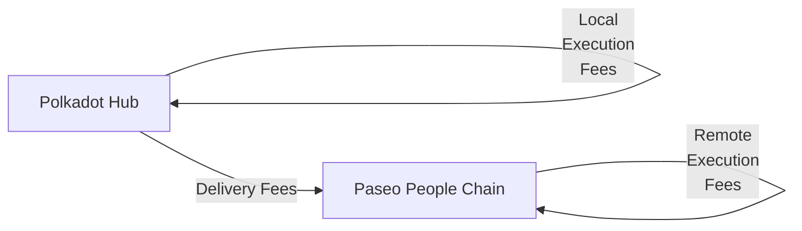

# XCM Fee Estimation

## Introduction

When sending cross-chain messages, ensure that the transaction will be successful not only in the local chain but also in the destination chain and any intermediate chains.

Sending cross-chain messages requires estimating the fees for the operation. 

This tutorial will demonstrate how to dry-run and estimate the fees for teleporting assets from the Polkadot Hub TestNet to the Paseo People Chain.

## Fee Mechanism

There are three types of fees that can be charged when sending a cross-chain message:

- **Local execution fees**: Fees charged in the local chain for executing the message.
- **Delivery fees**: Fees charged for delivering the message to the destination chain.
- **Remote execution fees**: Fees charged in the destination chain for executing the message.

If there are multiple intermediate chains, delivery fees and remote execution fees will be charged for each one.

In this example, you will estimate the fees for teleporting assets from the Polkadot Hub to the Paseo People Chain. The fee structure will be as follows:



The overall fees are `local_execution_fees` + `delivery_fees` + `remote_execution_fees`.

## Environment Setup

First, you need to set up your environment:

1. Create a new directory and initialize the project:

    ```bash
    mkdir xcm-fee-estimation && \
    cd xcm-fee-estimation
    ```

2. Initialize the project:

    ```bash
    npm init -y
    ```

3. Install dev dependencies:

    ```bash
    npm install --save-dev @types/node@^22.12.0 ts-node@^10.9.2 typescript@^5.7.3
    ```

4. Install dependencies:

    ```bash
    npm install --save @polkadot-labs/hdkd@{{dependencies.javascript_packages.hdkd.version}} @polkadot-labs/hdkd-helpers@{{dependencies.javascript_packages.hdkd_helpers.version}} polkadot-api@{{dependencies.javascript_packages.polkadot_api.version}}
    ```

5. Create TypeScript configuration:

    ```bash
    npx tsc --init
    ```

6. Generate the types for the Polkadot API for Paseo People Chain and Polkadot Hub TestNet:

    ```bash
    npx papi add polkadotHub -n paseo_asset_hub && \
    npx papi add paseoPeopleChain -w wss://people-paseo.rpc.amforc.com
    ```

    !!!info "Polkadot Hub"
        The `paseo_asset_hub` is the identifier for the Polkadot Hub TestNet.

7. Create a new file called `teleport-polkadot-hub-to-people-chain.ts`:

    ```bash
    touch teleport-polkadot-hub-to-people-chain.ts
    ```

8. Import the necessary modules. Add the following code to the `teleport-polkadot-hub-to-people-chain.ts` file:

    ```typescript title="teleport-polkadot-hub-to-people-chain.ts"
    --8<-- "code/chain-interactions/send-transactions/interoperability/estimate-xcm-fees/teleport-polkadot-hub-to-people-chain.ts::16"
    ```

9. Define constants and a `main` function where you will implement all the logic:

    ```typescript title="teleport-polkadot-hub-to-people-chain.ts"
    --8<-- "code/chain-interactions/send-transactions/interoperability/estimate-xcm-fees/teleport-polkadot-hub-to-people-chain.ts:18:29"

    async function main() {
      // Code will go here
    }
    ```

All the following code explained in the subsequent sections must be added inside the `main` function.

## Client and API Setup

Now you are ready to start implementing the logic for the fee estimation for the teleport you want to perform. In this step, you will create the client for the Polkadot Hub TestNet and generate the typed API to interact with the chain. Follow the steps below:

Create the API client. You will need to create a client for the Polkadot Hub TestNet:

```typescript title="teleport-polkadot-hub-to-people-chain.ts"
--8<-- "code/chain-interactions/send-transactions/interoperability/estimate-xcm-fees/teleport-polkadot-hub-to-people-chain.ts:266:272"
```

Ensure that you replace the endpoint URLs with the actual WebSocket endpoints. This example uses local chopsticks endpoints, but you can use public endpoints or run local nodes.

## Create the XCM Message

Now, you can construct a proper XCM message using the new XCM V5 instructions for teleporting from Polkadot Hub TestNet to the People Chain:

```typescript title="teleport-polkadot-hub-to-people-chain.ts"
--8<-- "code/chain-interactions/send-transactions/interoperability/estimate-xcm-fees/teleport-polkadot-hub-to-people-chain.ts:33:84"
```

## Fee Estimation Function

Below is a four-step breakdown of the logic needed to estimate the fees for the teleport.

First, you need to create the function that will estimate the fees for the teleport:

```typescript title="teleport-polkadot-hub-to-people-chain.ts"
--8<-- "code/chain-interactions/send-transactions/interoperability/estimate-xcm-fees/teleport-polkadot-hub-to-people-chain.ts:86:89"
  // Code will go here
}
```

1. **Local execution fees on Polkadot Hub**: Compute the XCM weight locally, then convert that weight to PAS using Polkadot Hub's view of PAS (`parents: 1, interior: Here`). Add the code to the function:

    ```typescript title="teleport-polkadot-hub-to-people-chain.ts"
    --8<-- "code/chain-interactions/send-transactions/interoperability/estimate-xcm-fees/teleport-polkadot-hub-to-people-chain.ts:90:129"
    ```

2. **Dry-run and delivery fees to People Chain**: Dry-run the XCM on Polkadot Hub to capture forwarded messages, locate the one targeting People Chain (`parents: 1, interior: Here`), and ask for delivery fees. Add the code to the function:

    ```typescript title="teleport-polkadot-hub-to-people-chain.ts"
    --8<-- "code/chain-interactions/send-transactions/interoperability/estimate-xcm-fees/teleport-polkadot-hub-to-people-chain.ts:131:193"
    ```

3. **Remote execution fees on People Chain**: Connect to People Chain, recompute the forwarded XCM weight there, and convert weight to PAS (`parents: 0, interior: Here`). Add the code to the function:

    ```typescript title="teleport-polkadot-hub-to-people-chain.ts"
    --8<-- "code/chain-interactions/send-transactions/interoperability/estimate-xcm-fees/teleport-polkadot-hub-to-people-chain.ts:195:233"
    ```

4. **Sum and return totals**: Aggregate all parts, print a short summary, and return a structured result. Add the code to the function:

    ```typescript title="teleport-polkadot-hub-to-people-chain.ts"
    --8<-- "code/chain-interactions/send-transactions/interoperability/estimate-xcm-fees/teleport-polkadot-hub-to-people-chain.ts:235:263"
    ```

The full code for the fee estimation function is the following:

??? code "Fee Estimation Function"

    ```typescript title="teleport-polkadot-hub-to-people-chain.ts"
    --8<-- "code/chain-interactions/send-transactions/interoperability/estimate-xcm-fees/teleport-polkadot-hub-to-people-chain.ts:86:263"
    ```

## Complete Implementation

Now put it all together in the main function:

```typescript title="teleport-polkadot-hub-to-people-chain.ts"
--8<-- "code/chain-interactions/send-transactions/interoperability/estimate-xcm-fees/teleport-polkadot-hub-to-people-chain.ts:265:310"
```

## Full Code

The full code for the complete implementation is the following:

??? code "Teleport from Polkadot Hub to People Chain"

    ```typescript title="teleport-polkadot-hub-to-people-chain.ts"
    --8<-- "code/chain-interactions/send-transactions/interoperability/estimate-xcm-fees/teleport-polkadot-hub-to-people-chain.ts"
    ```

## Running the Script

Before running the script, you can use chopsticks to fork the Polkadot Hub TestNet and Paseo People Chain locally. To do so, you can use the following files and commands:

1. Create a new directory called `.chopsticks` and add the files:

    ??? code "paseo-people-chain.yml"

        ```yaml title=".chopsticks/paseo-people-chain.yml"
        --8<-- "code/chain-interactions/send-transactions/interoperability/estimate-xcm-fees/paseo-people-chain.yml"
        ```
    
    ??? code "paseo-asset-hub.yml"

        ```yaml title=".chopsticks/paseo-asset-hub.yml"
        --8<-- "code/chain-interactions/send-transactions/interoperability/estimate-xcm-fees/paseo-asset-hub.yml"
        ```

2. Run the following command to fork the Paseo People Chain:

    ```bash
    chopsticks --config=.chopsticks/paseo-people-chain.yml
    ```

    After running the command, you will see the following output:

    --8<-- "code/chain-interactions/send-transactions/interoperability/estimate-xcm-fees/paseo-people-chain-terminal-output-chopsticks.html"

3. Run the following command to fork the Polkadot Hub TestNet chain:

    ```bash
    chopsticks --config=.chopsticks/paseo-asset-hub.yml
    ```

    After running the commands, you will see the following output:

    --8<-- "code/chain-interactions/send-transactions/interoperability/estimate-xcm-fees/paseo-asset-hub-terminal-output-chopsticks.html"

4. Run the script:

    ```bash
    npx ts-node teleport-polkadot-hub-to-people-chain.ts
    ```

After running the script, you will see the following output:

--8<-- "code/chain-interactions/send-transactions/interoperability/estimate-xcm-fees/teleport-output.html"

## Conclusion

This approach provides accurate fee estimation for XCM teleports from Polkadot Hub TestNet to People Chain by properly simulating execution on both chains and utilizing dedicated runtime APIs for fee calculation. The fee breakdown helps you understand the cost structure of cross-chain operations (asset hub → system parachain) and ensures your transactions have sufficient funds to complete successfully.

The key insight is understanding how asset references change based on the perspective of each chain in the XCM ecosystem, which is crucial for proper fee estimation and XCM construction.