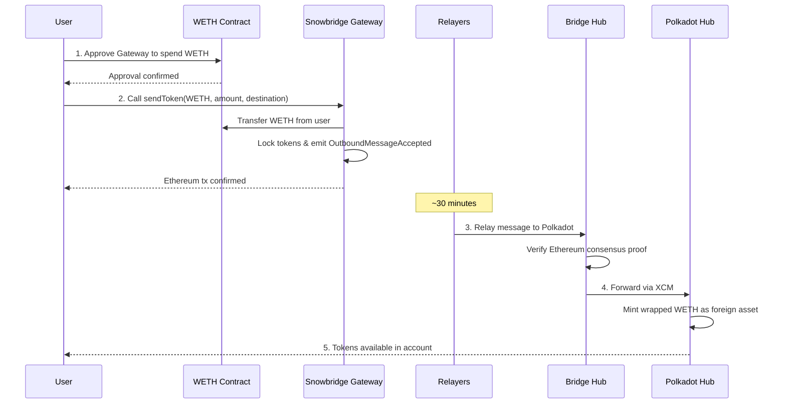

# Transfer Assets from Ethereum into Polkadot

## Introduction

This guide walks you through transferring tokens from Ethereum to Polkadot using the [ParaSpell XCM SDK](/reference/tools/paraspell/){target=\_blank} and [Snowbridge](https://docs.snowbridge.network/){target=\_blank}. Snowbridge is a trustless, decentralized bridge integrated into the Polkadot protocol that enables secure asset transfers between Ethereum and Polkadot ecosystems.

### How the Bridge Works

The following diagram shows the complete flow when bridging WETH from Ethereum to Polkadot:



In this guide, you will:

- Set up an Ethereum development environment with the ParaSpell SDK
- Approve tokens for the Snowbridge Gateway contract
- Build and execute a bridge transfer from Ethereum to Polkadot Hub
- Monitor the transfer status

### Prerequisites

Before you begin, ensure you have the following:

- A basic understanding of [XCM](/parachains/interoperability/get-started/){target=\_blank}
- Familiarity with JavaScript/TypeScript and Ethereum development
- [Node.js](https://nodejs.org/){target=\_blank} v18 or higher and npm installed
- An Ethereum wallet with WETH tokens (see next section to wrap ETH)
- A Polkadot account to receive the bridged assets

## Prepare Tokens for Bridging

To bridge ETH, you need to wrap it into WETH first. The WETH contract on Ethereum mainnet is:

```
0xC02aaA39b223FE8D0A0e5C4F27eAD9083C756Cc2
```

!!!note "Why WETH instead of ETH?"
    Snowbridge only supports ERC-20 tokens—it cannot bridge native ETH directly. The bridge uses a standardized token interface to lock assets on Ethereum and mint corresponding representations on Polkadot. Since native ETH doesn't conform to the ERC-20 standard, you must first wrap it into WETH (Wrapped ETH), which is an ERC-20-compliant token pegged 1:1 with ETH.

You can wrap ETH by:

1. Visiting the [WETH contract on Etherscan](https://etherscan.io/address/0xC02aaA39b223FE8D0A0e5C4F27eAD9083C756Cc2#writeContract){target=\_blank}
2. Connecting your wallet
3. Calling the `deposit` function with the amount of ETH you want to wrap

## Initialize Your Project

Create the project folder:

```bash
mkdir eth-to-polkadot-bridge && \
cd eth-to-polkadot-bridge
```

Initialize the JavaScript project:

```bash
npm init -y && npm pkg set type=module
```

Install dev dependencies:

```bash
npm install --save-dev @types/node tsx typescript
```

Install the required dependencies. The Ethereum to Polkadot direction requires the PJS version of the ParaSpell SDK:

```bash
npm install @paraspell/sdk-pjs@12.0.2 @polkadot/api@16.5.3 @polkadot/types@16.5.3 ethers@6.15.0
```

Now add the following setup code to `index.ts`:

```ts title="index.ts"
--8<-- 'code/chain-interactions/send-transactions/interoperability/transfer-assets-into-polkadot/index.ts:1:29'
```

Replace `INSERT_YOUR_POLKADOT_ADDRESS` with your Polkadot account address (SS58 format) that will receive the bridged tokens on Polkadot Hub.

!!!warning "Security Warning"
    Never commit private keys or seed phrases to production code. Use environment variables or secure key management systems.

## Approve Tokens for Bridging

Before bridging ERC-20 tokens, you must approve the Snowbridge Gateway contract to spend your tokens. The ParaSpell SDK provides helper functions for this:

```ts title="index.ts"
--8<-- 'code/chain-interactions/send-transactions/interoperability/transfer-assets-into-polkadot/index.ts:31:51'
```

Run the approval script:

```bash
npx tsx index.ts
```

You should see output confirming the token balance and approval:

--8<-- 'code/chain-interactions/send-transactions/interoperability/transfer-assets-into-polkadot/approval-output.html'

## Build and Execute the Bridge Transfer

Now build and execute the bridge transfer from Ethereum to Polkadot Hub:

```ts title="index.ts"
--8<-- 'code/chain-interactions/send-transactions/interoperability/transfer-assets-into-polkadot/index.ts:55:81'
```

Comment out the `approveTokens()` function and run the transfer:

```bash
npx tsx index.ts
```

After submitting the transaction, you will see the Ethereum transaction hash:

--8<-- 'code/chain-interactions/send-transactions/interoperability/transfer-assets-into-polkadot/transfer-output.html'

## Monitor the Transfer

Bridge transfers from Ethereum to Polkadot take approximately 30 minutes. You can monitor the transfer status in several ways:

- **Snowbridge App** - Visit [app.snowbridge.network](https://app.snowbridge.network/){target=\_blank} to check the transfer history
- **Etherscan** - Track your Ethereum transaction on [etherscan.io](https://etherscan.io/){target=\_blank}
- **Polkadot.js Apps** - Monitor incoming transfers on [Polkadot Hub](https://polkadot.js.org/apps/?rpc=wss%3A%2F%2Fpolkadot-asset-hub-rpc.polkadot.io#/accounts){target=\_blank}

You can also check the bridge status programmatically:

```ts title="index.ts"
--8<-- 'code/chain-interactions/send-transactions/interoperability/transfer-assets-into-polkadot/index.ts:85:89'
```

## Supported Assets and Destinations

Snowbridge can bridge any ERC-20 token from Ethereum, but the destination chain must have that asset registered as a foreign asset to receive it.

!!!warning "Verify Foreign Assets"
    Foreign asset creation on Polkadot Hub is permissionless—anyone can register a foreign asset. Before bridging, verify that the foreign asset registered on Polkadot Hub corresponds to the legitimate token on Ethereum by checking the asset's multilocation and confirming the Ethereum contract address matches the official token contract.

You can query which assets are supported for a specific route using the ParaSpell SDK:

```ts title="index.ts"
import { getSupportedAssets } from '@paraspell/sdk-pjs';

// Get assets supported for Ethereum → Polkadot Hub transfers
const supportedAssets = getSupportedAssets('Ethereum', 'AssetHubPolkadot');
console.log('Supported assets:', supportedAssets.map(a => a.symbol));
```

--8<-- 'code/chain-interactions/send-transactions/interoperability/transfer-assets-into-polkadot/supported-assets-output.html'

Common supported tokens on Polkadot Hub include:

| Token | Symbol | Description |
|-------|--------|-------------|
| Wrapped Ether | WETH | Ethereum's native token wrapped as ERC-20 |
| Wrapped Bitcoin | WBTC | Bitcoin wrapped as an ERC-20 token |
| Shiba Inu | SHIB | Popular ERC-20 meme token |

To transfer to a different destination, change the `.to()` parameter and verify the asset is supported:

```ts title="index.ts"
// Check if WETH is supported on Hydration
const hydrationAssets = getSupportedAssets('Ethereum', 'Hydration');
const wethSupported = hydrationAssets.some(a => a.symbol === 'WETH');

if (wethSupported) {
  await EvmBuilder(provider)
    .to('Hydration')
    .currency({ symbol: 'WETH', amount: amount })
    .address(recipientAddress)
    .signer(signer)
    .build();
}
```

--8<-- 'code/chain-interactions/send-transactions/interoperability/transfer-assets-into-polkadot/hydration-check-output.html'

???- code "Full Code"

    ```typescript title="index.ts"
    --8<-- 'code/chain-interactions/send-transactions/interoperability/transfer-assets-into-polkadot/index.ts'
    ```

!!!info "Transfer Assets Out of Polkadot"

    To transfer assets out of Polkadot, you can use the ParaSpell XCM SDK to build and execute a bridge transfer from Polkadot to Ethereum. Check out the [Polkadot to Ethereum](https://paraspell.github.io/docs/sdk/xcmPallet.html#polkadot-ethereum-transfer){target=\_blank} section of the ParaSpell XCM SDK documentation.


## Where to Go Next

- **Read the docs** - Dive deeper into the [ParaSpell XCM SDK](https://paraspell.github.io/docs/sdk/getting-started.html){target=\_blank} and [Snowbridge](https://docs.snowbridge.network/){target=\_blank} documentation
- **Learn about XCM** - Understand the underlying protocol by visiting the [Get Started with XCM](/parachains/interoperability/get-started/) guide
