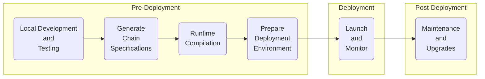

# Deployment Overview

## Introduction

Deploying a blockchain built with the Polkadot SDK is a crucial phase in the development lifecycle, transforming a locally developed network into a fully functioning and secure system ready for public or private use. This section provides a high-level overview of the deployment process, introducing developers to key concepts, tools, and best practices to ensure a smooth transition from development to production.

Deploying a blockchain is more than just launching a runtime; it involves preparing the network configuration, ensuring compatibility with the Polkadot ecosystem, and implementing long-term maintenance and update strategies. Whether deploying a test network for development purposes or launching a mainnet for production, this article covers the essential points required to get your blockchain up and running.

## Key Considerations for Deployment

Before delving into the technical details, it's essential to understand the foundational principles that guide your blockchain deployment. Proper planning and configuration are critical for long-term stability and success. Key considerations include:

- Infrastructure Operations - employ an infrastructure-as-code approach, where all components are defined in code and managed through version control. This practice ensures your infrastructure remains in a known state, enables trackable changes, allows easy rollbacks, and automates redeployment

- Security First - prioritize security in your infrastructure decisions. Start with strict access controls and blocking unnecessary communications, then enhance security through log monitoring, bastion hosts, and two-factor authentication for SSH access

- On-Chain Security - protect your assets and network integrity by securing on-chain operations. Use various key types (cold, warm, hot) to mitigate session key risks. Strategies include utilizing multi-signature accounts for audit trails and implementing proxy accounts to limit permissions on target accounts

## Deployment Process

Taking your Polkadot SDK-based blockchain from a local environment to production involves several critical steps, ensuring your network is stable, secure, and ready for real-world use. The following diagram outlines the process at a high level:

- Local Development and Testing - the process begins with local development and testing. Developers focus on building the runtime by selecting and configuring the necessary pallets while refining network features. In this phase, it's essential to run a local testnet to simulate multi-node interactions, verify transactions, and ensure the blockchain behaves as expected. Thorough testing is conducted, not only for individual components but also for interactions between pallets

- Generate Chain Specifications - the chain spec file defines the structure and configuration of your blockchain. It includes initial node identities, session keys, and other parameters. Defining a precise chain specification ensures that your network will operate smoothly and according to your intended design

- Runtime Compilation - Polkadot SDK-based blockchains are built with Wasm, a highly portable and efficient format. Compiling your blockchain's runtime into Wasm ensures it can be executed reliably across various environments, guaranteeing network-wide compatibility and security. The [srtool](https://github.com/paritytech/srtool){target=\_blank} is helpful for this purpose since it allows you to compile Deterministic Runtimes (for more on this, see the [Building Deterministic Runtimes](TODO:update-path){target=\_blank} guide)

- Deployment Environment - whether launching a local test network or a production-grade blockchain, selecting the proper infrastructure is vital. For further information about these topics, see the [Infrastructure](/infrastructure/){target=\_blank} section

- Launch and Monitor - once everything is configured, you can launch the blockchain, initiating the network with your chain spec and Wasm runtime. Validators or collators will begin producing blocks, and the network will go live. Post-launch, monitoring is vital to ensuring network health—tracking block production, node performance, and overall security

- Maintenance and Upgrade - a blockchain doesn't stop evolving after deployment. As the network grows and changes, upgrades to the runtime, governance, and even the underlying code may be necessary. For an in-depth guide on this topic, see the [Maintenance](/develop/blockchains/maintenance/){target=\_blank} section

## Where to Go Next

Deploying a Polkadot SDK-based blockchain is a multi-step process that requires careful planning, from generating chain specs and compiling the runtime to managing post-launch updates. By understanding the deployment process and utilizing the right tools, developers can confidently take their blockchain from development to production. For more on this topic, check out the following resources:

- [Generate Chain Specifications](/develop/blockchains/deployment/generate-chain-spec/){target=\_blank} - learn how to generate a chain specification for your blockchain
- [Building Deterministic Runtimes](/develop/blockchains/deployment/building-deterministic-runtimes/){target=\_blank} - learn how to build deterministic runtimes for your blockchain
- [Infrastructure](/infrastructure/){target=\_blank} - learn about the different infrastructure options available for your blockchain
- [Maintenance](/develop/blockchains/maintenance/){target=\_blank} - discover how to manage upgrades and updates to your blockchain
