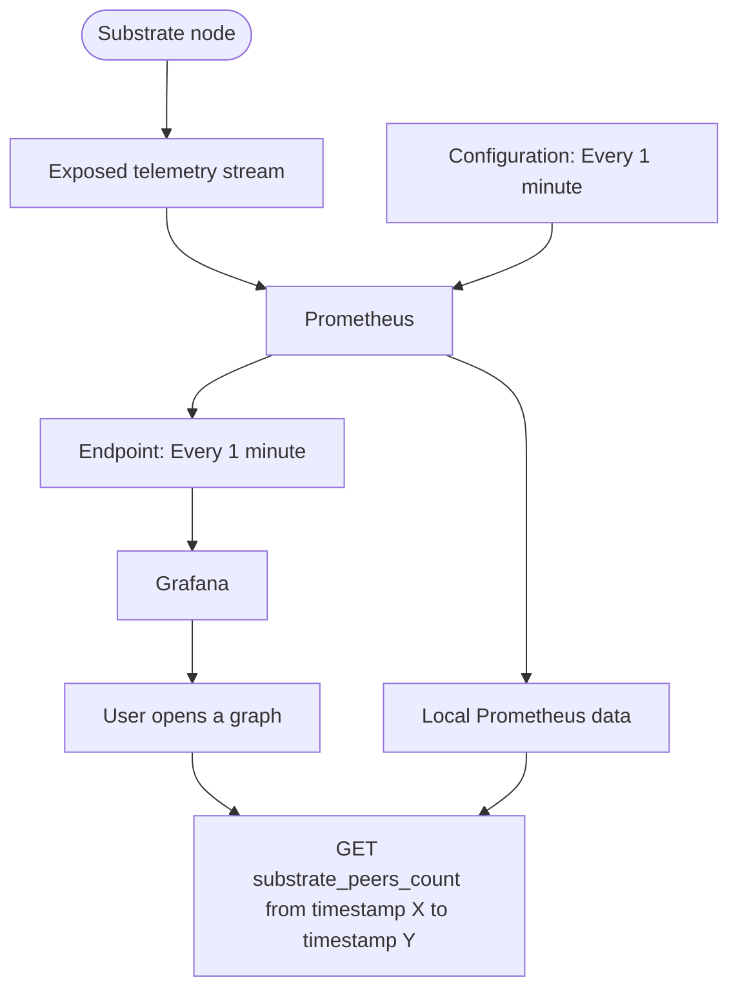

# Runtime Metrics and Monitoring

## Introduction

To maintain a stable, secure, and efficient network, constant monitoring is essential. Polkadot SDK-based nodes are equipped with built-in telemetry components that automatically collect and transmit detailed data about node performance in real time. This telemetry system is an integral part of the Substrate framework, which allows you to monitor and track network health without needing to set up complex tools.

[Substrate's client telemetry](https://paritytech.github.io/polkadot-sdk/master/sc_telemetry/index.html){target=\_blank} enables the ingestion of real-time data into a client—this could be something as simple as a front-end dashboard. The telemetry process uses tracing and logging to gather operational data, which is then captured by a tracing layer. This data is sent asynchronously through a channel to a background task known as the [TelemetryWorker](https://paritytech.github.io/polkadot-sdk/master/sc_telemetry/struct.TelemetryWorker.html){target=\_blank}, which handles sending this information to the configured remote telemetry servers.

When multiple Substrate nodes are running within the same process, the telemetry system uses a `tracing::Span` to identify which node is sending the data. This makes it easy to keep track of data from different nodes that might be running in parallel, with each task spawned by the sc-service's [TaskManager](https://paritytech.github.io/polkadot-sdk/master/sc_service/struct.TaskManager.html){target=\_blank} inheriting the span for consistency.

As a developer or node operator, you don’t need to worry about the technical details of how telemetry data is collected. The system takes care of the heavy lifting, and the collected data is automatically sent to a default telemetry server, where it is aggregated and displayed on a user-friendly dashboard. This makes it easy to monitor your network’s performance, diagnose potential issues, and ensure that everything is running smoothly.

## Runtime Metrics

Substrate exposes a variety of metrics about the operation of your network, such as the number of peer connections, memory usage, and block production. To capture and visualize these metrics, you can configure and use tools like Prometheus and Grafana.
This tutorial demonstrates how to use Prometheus to sample the data exposed by Substrate nodes, and Grafana to create graphs and dashboards to visualize the node metrics using the collected data.
At a high level, Substrate exposes telemetry data that can be consumed by the Prometheus endpoint and then presented as visual information in a Grafana dashboard or graph.
The provided diagram offers a simplified overview of how the interaction between Substrate, Prometheus, and Grafana can be configured to display information about node operations.



The diagram shows the flow of data from the Substrate node to the monitoring and visualization components. The Substrate node exposes a telemetry stream, which is consumed by Prometheus. Prometheus is configured to collect data every minute and store it. Grafana is then used to visualize the data, allowing the user to open graphs and retrieve the substrate_peers_count metric from a specific time range.

## Visual Monitoring

The [Polkadot telemetry](){target=\_blank} dashboard provides a real-time view of how currently online nodes are performing. This dashboard, allows users to select the network you need to check on, and also the information you want to display by turning visible columns on and off from the list of columns available. The monitoring dashboard provides the following indicators and metrics:

- Validator - identifies whether the node is a validator node or not
- Location - displays the geographical location of the node
- Implementation - shows the version of the software running on the node
- Network ID - displays the public network identifier for the node
- Peer count - indicates the number of peers connected to the node
- Transactions in queue - shows the number of transactions waiting in the [Ready queue](https://paritytech.github.io/polkadot-sdk/master/sc_transaction_pool_api/enum.TransactionStatus.html#variant.Ready){target=\_blank} for a block author
- Upload bandwidth - graphs the node's recent upload activity in MB/s
- Download bandwidth - graphs the node's recent download activity in MB/s
- State cache size - graphs the size of the node's state cache in MB
- Block - displays the current best block number to ensure synchronization with peers
- Block hash - shows the block hash for the current best block number
- Finalized block - displays the most recently finalized block number to ensure synchronization with peers
- Finalized block hash - shows the block hash for the most recently finalized block
- Block time - indicates the time between block executions
- Block propagation time - displays the time it took to import the most recent block
- Last block time - shows the time it took to author the most recent block
- Node uptime - indicates the number of days the node has been online without restarting

## Displaying Network-wide Statistics

In addition to the details available for individual nodes, you can view statistics that provide insights into the broader network. The network statistics provide detailed information about the hardware and software configurations of the nodes in the network, including:

- Software version
- Operating system
- CPU architecture and model
- Number of physical CPU cores
- Total memory
- Whether the node is a virtual machine
- Linux distribution and kernel version
- CPU and memory speed
- Disk speed

## Customizing Monitoring Tools

The default telemetry dashboard offers visibility into node and chain operations without the need to set up any backend monitoring or front-end services. However, many projects opt to enhance or replace the default telemetry server with their own custom backend server and front-end dashboards.

Typically, setting up a custom telemetry solution involves establishing monitoring and alerting policies for both on-chain events and individual node operations. This allows for more tailored monitoring and reporting compared to the default telemetry setup.

### On-chain Activity

You can monitor specific on-chain events, such as transactions from a particular address or changes to the validator set. This typically involves connecting to RPC nodes to check for specific values, identify processing delays, or track the timing of events. It's recommended to run your own RPC servers to handle these requests, in case there are issues with the public RPC nodes. Some applications that query on-chain information include polkabot and polkadot-basic-notification.

### Monitoring Node Operations

You should monitor each node for basic operational information, such as the current block height, the number of peer-to-peer connections, CPU usage, and available free memory. By default, Substrate exposes useful metrics on the host:9615/metrics endpoint, which outputs data in a simple key-value format. These metrics can also include descriptive tags, such as the status of the block height (best or finalized).
The metrics endpoint is only exposed on the local network interface by default, but you can make it accessible on all interfaces by using the `--prometheus-external` command-line option when starting a node.

### Configuring Monitoring Tools

To set up monitoring and alerting, you typically configure a set of tools to create your own monitoring stack. For example, the default Substrate metrics endpoint doesn't include host metrics like CPU, memory, and bandwidth usage, so you can complement it by installing the Prometheus node_exporter on each host.
The diagram illustrates an open-source set of tools commonly used for this monitoring stack:

Prometheus is a monitoring engine that collects metrics from specified targets at regular intervals and evaluates the data using predefined rules. Its time series database can store and quickly access large amounts of data.
Grafana is an observability platform that allows you to query, visualize, and analyze the collected data through dashboards and graphs.
Node exporter is a process that listens on a port and reports application-specific metrics to Prometheus.
Alertmanager is a tool that enables you to create and route alerts based on the rules you specify, allowing you to configure how and where to send alerts for different severity levels.
Loki is a scalable log aggregation system that allows you to view and search logs from all components in your infrastructure in one place.

For simple examples of setting up node monitoring using Prometheus, Grafana, and node exporter, as well as a simplified example of using Loki for remote logging, see the provided references.

### Change the telemetry server

After configuring the backend monitoring rules for your nodes, you can use the --telemetry-url command-line option when starting a node to specify the telemetry server you want to send data to. You can provide this option multiple times to specify multiple telemetry endpoints.
When using the --telemetry-url option, you must also specify the verbosity level for the metrics, ranging from 0 (least verbose) to 9 (most verbose).
For example, to set your own telemetry server URL with a verbosity level of 5, you would run a command like:

```bash
./target/release/node-template --dev \
  --telemetry-url "wss://192.168.48.1:9616 5" \
  --prometheus-port 9616 \
  --prometheus-external
```

For more information on the backend components for telemetry or configuring your own server, you can refer to the substrate-telemetry project or the telemetry Helm chart for Kubernetes deployments.