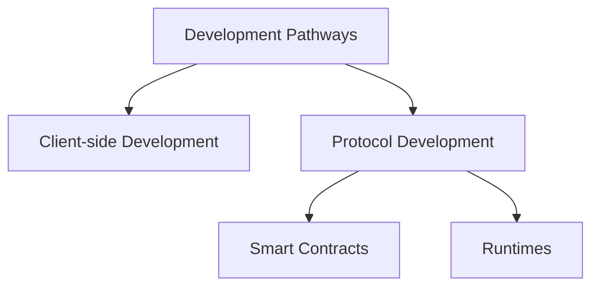

# Development Pathways

## Introduction

Developers can choose from different development pathways to build applications and core blockchain functionality. Each pathway caters to different types of projects and developer skill sets, while complementing one another within the broader network.

The Polkadot ecosystem provides two main development pathways:

- **Protocol development** - focuses on creating core components that define blockchain functionality, including developing runtime modules or implementing smart contracts to handle on-chain logic. This pathway is ideal for developers interested in contributing to the foundational layers of the Polkadot network or creating custom blockchain logic

- **Client-side development** -  centers on building decentralized applications (dApps) that interact with the blockchain. Developers in this pathway create user-facing applications that leverage blockchain data and capabilities, enabling various use cases for end-users

## Protocol Development

The protocol development path encompasses two key areas:

- [Smart contracts](#smart-contracts)
- [Runtimes](#runtimes)

### Smart Contracts

Smart contracts are sandboxed programs that run within a virtual machine on the blockchain. These deterministic pieces of code are deployed at specific blockchain addresses and execute predefined logic when triggered by transactions. Because they run in an isolated environment, they provide enhanced security and predictable execution. Smart contracts can be deployed permissionlessly, allowing any developer to create and launch applications without requiring special access or permissions. They enable developers to create trustless applications by encoding rules, conditions, and state transitions that leverage the security and transparency of the underlying blockchain.

Some key benefits of developing smart contracts include ease of development, faster time to market, and permissionless deployment. Smart contracts allow developers to quickly build and deploy decentralized applications without complex infrastructure or intermediaries. This accelerates the development lifecycle and enables rapid innovation within the Polkadot ecosystem.

For more information on developing smart contracts in the Polkadot ecosystem, check the [Smart Contracts](TODO: update-path){target=\_blank} section.

### Runtimes

Runtimes are the core building blocks that define the logic and functionality of Polkadot SDK-based blockchains. Developers can customize and extend the features of their blockchain, allowing for tighter integration with critical network tasks such as block production, consensus mechanisms, and governance processes.

Runtimes can be upgraded through forkless runtime updates, enabling seamless evolution of the blockchain without disrupting existing functionality.

Developers can define the parameters, rules, and behaviors that shape their blockchain network. This includes token economics, transaction fees, permissions, and more. Using the Polkadot SDK, teams can iterate on their blockchain designs, experiment with new features, and deploy highly specialized networks tailored to their specific use cases.

For those interested in delving deeper into runtime development, explore the dedicated [Custom Blockchains](/develop/blockchains/custom-blockchains){target=\_blank} section.

### Smart Contracts vs Runtimes

When developing a smart contract, you create a sandboxed program that executes specific logic associated with a chain address. Unlike [pallets](/polkadot-protocol/glossary#pallet){target=\_blank}, which integrate directly into a blockchain's runtime and define its core logic, smart contracts operate independently in a more isolated environment. Pallets can manage critical tasks like block production or governance and can be added, modified, or removed through forkless runtime upgrades. Smart contracts, on the other hand, require careful upgrade planning, as their functionality can only be updated with explicit coding mechanisms for future changes. Parachains offer flexibility, allowing developers to define the environment where these contracts run and enabling others to build on it. These two options also differ in how they handle fees. Smart contracts follow a gas metering model for execution costs, while pallets and runtimes offer more flexible options for fee models.

!!!info "Additional information"
    - Refer to the [Runtime vs. Smart Contracts](https://paritytech.github.io/polkadot-sdk/master/polkadot_sdk_docs/reference_docs/runtime_vs_smart_contract/index.html){target=\_blank} section of the Polkadot SDK Rust docs
    - Refer to the [When should one build a Substrate (Polkadot SDK) runtime versus a Substrate (Polkadot SDK) smart contract?](https://stackoverflow.com/a/56041305){target=\_blank} post on Stack Overflow for a technically deeper discussion of when a developer might choose to develop a runtime versus a smart contract

## Client-side Development

The client-side development path is dedicated to building applications that interact with Polkadot SDK-based blockchains and enhance user engagement with the network. While decentralized applications (dApps) are a significant focus, this pathway also includes developing other tools and interfaces that expand users' interactions with blockchain data and services.

Client-side developers can build:

- **Decentralized applications (dApps)** - these applications leverage the blockchain's smart contracts or runtimes to offer a wide range of features, from financial services to gaming and social applications, all accessible directly by end-users

- **Command-line interfaces (CLIs)** - CLI tools empower developers and technical users to interact with the blockchain programmatically. These tools enable tasks like querying the blockchain, deploying smart contracts, managing wallets, and monitoring network status

- **Data analytics and visualization tools** - developers can create tools that aggregate, analyze, and visualize on-chain data to help users and businesses understand trends, track transactions, and gain insights into the network's health and usage

- **Wallets** - securely managing accounts and private keys is crucial for blockchain users. Client-side development includes building user-friendly wallets, account management tools, and extensions that integrate seamlessly with the ecosystem

- **Explorers and dashboards** -  blockchain explorers allow users to view and search on-chain data, including blocks, transactions, and accounts. Dashboards provide a more interactive interface for users to monitor critical metrics, such as staking rewards, governance proposals, and network performance

These applications can leverage the Polkadot blockchain's underlying protocol features to create solutions that allow users to interact with the ecosystem. The Client-side development pathway is ideal for developers interested in enhancing user experiences and building applications that bring the power of decentralized networks to a broader audience.

Check the [API Libraries](TODO: update-path){target=\_blank} section for essential tools to interact with Polkadot SDK-based blockchain data and protocol features.