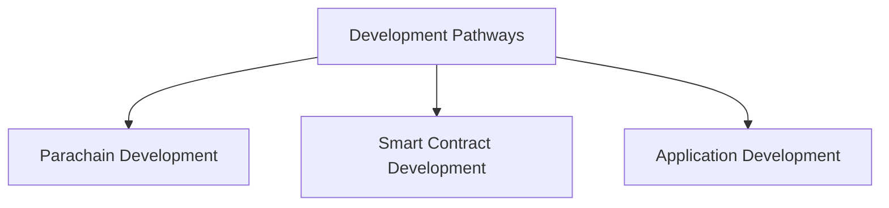

# Develop with Polkadot

## Introduction

This guide is a starting point for developers who wish to build in the Polkadot ecosystem. To get the most from this section:

1. Identify your development pathway:
    - [**Parachain Developers**](#parachain-developers) - build, deploy, and maintain custom parachains with the Polkadot SDK
    - [**Smart Contract Developers**](#smart-contract-developers) - leverage smart contracts and execute custom logic over existing chains to streamline your development process
    - [**Application Developers**](#application-developers) - leverage Polkadot's underlying protocol features to create solutions for your users to interact with the ecosystem
2. Use the sections under your pathway as follows:
    - **Learn** - content to deepen your knowledge and understanding
    - **Build** - connect to goal-oriented guides and step-by-step tutorials
    - **Tools** - tools commonly used in your pathway
    - **Resources** - resources for your pathway, including references, code repositories, and outside documentation

## Development Pathways

Developers can choose from different development pathways to build applications and core blockchain functionality. Each pathway caters to different types of projects and developer skill sets while complementing one another within the broader network.

The Polkadot ecosystem provides multiple development pathways:

All three pathways can leverage Cross-Consensus Messaging (XCM) to create innovative cross-chain workflows and applications. To get started with XCM, see these resources:

- [**Introduction to XCM**](/develop/interoperability/intro-to-xcm/){target=\_blank} - introduces key concepts, core function definitions, and code examples
- [**XCM Tools**](/develop/toolkit/interoperability/xcm-tools/){target=\_blank} - provides an overview of popular XCM tools
- [**Tutorials for Managing XCM Channels**](/tutorials/interoperability/xcm-channels/){target=\_blank} - guides for using [Polkadot.js Apps](https://polkadot.js.org/apps/#/explorer){target=\_blank} UI to establish cross-chain messaging channels 

### Parachain Developers

Build, deploy, and maintain custom parachains with the Polkadot SDK.

- <h3>:octicons-book-16:{ .lg .middle } Learn</h3>
    

    - [Parachains Overview](/polkadot-protocol/architecture/parachains/overview/){target=\_blank}
    - [Introduction to the Polkadot SDK](/develop/parachains/intro-polkadot-sdk/){target=\_blank}
    - [Customize Your Parachain](/develop/parachains/customize-parachain/){target=\_blank}

- <h3>:octicons-rocket-16:{ .lg .middle } Build</h3>
    

    - [Parachain Developer Zero to Hero Guides](/tutorials/polkadot-sdk/parachains/zero-to-hero/){target=\_blank}
    - [Install Polkadot SDK Dependencies](/develop/parachains/install-polkadot-sdk/){target=\_blank}

- <h3>:octicons-tools-16:{.lg .middle} Tools</h3>
    

    - [Parachain Template](https://github.com/paritytech/polkadot-sdk/tree/master/templates/parachain){target=\_blank}
    - [OpenZeppelin Polkadot Runtime Templates](https://github.com/OpenZeppelin/polkadot-runtime-templates/tree/main){target=\_blank}

- <h3>:octicons-code-square-16:{.lg .middle} Resources</h3>
    

    - [Polkadot SDK source code repository](https://github.com/paritytech/polkadot-sdk){target=\_blank}
    - [FRAME source code repository](https://github.com/paritytech/polkadot-sdk/tree/master/substrate/frame){target=\_blank}
    - [Polkadot SDK Best Practices](https://libro.blockdeep.dev/index.html){target=\_blank}

### Smart Contract Developers

Leverage smart contracts and execute custom logic over existing chains to streamline your development process.

The Polkadot smart contract ecosystem is in active development. Please expect frequent changes. To follow progress, or join the discussion, see [Contracts on AssetHub Roadmap](https://forum.polkadot.network/t/contracts-on-assethub-roadmap/9513/57){target=\_blank} on the Polkadot Network Forum.

- <h3>:octicons-book-16:{ .lg .middle } Learn</h3>
    

    - [Overview - Smart Contracts on Polkadot](/develop/smart-contracts/overview/){target=\_blank}
    - [EVM-Compatible Parachains](/develop/smart-contracts/evm/parachain-contracts/#evm-compatible-parachains){target=\_blank}

- <h3>:octicons-rocket-16:{.lg .middle} Build</h3>
    

    - [Deploy a Smart Contract to Asset Hub](/develop/smart-contracts/evm/native-evm-contracts/#deploy-a-smart-contract-to-asset-hub){target=\_blank}
    - [Deploy a Wasm Smart Contract](/develop/smart-contracts/wasm-ink/){target=\_blank}

- <h3>:octicons-tools-16:{.lg .middle} Tools</h3>
    

    - [`cargo-contract` CLI Tool](https://github.com/use-ink/cargo-contract){target=\_blank}
    - [Remix - Ethereum IDE](https://remix.ethereum.org/){target=\_blank}

- <h3>:octicons-code-square-16:{.lg .middle} Resources</h3>
    

    - [Runtime vs Smart Contract - Polkadot SDK Rust docs](https://paritytech.github.io/polkadot-sdk/master/polkadot_sdk_docs/reference_docs/runtime_vs_smart_contract/index.html){target=\_blank}
    - [Pure Rust Implementation of EVM](https://github.com/rust-ethereum/evm){target=\_blank}

### Application Developers

Integrate with the Polkadot blockchain's underlying protocol features to create solutions that allow users to interact with the ecosystem.

- <h3>:octicons-book-16:{ .lg .middle } Learn</h3>
    

    - [Options for Wallet Integration](/develop/toolkit/integrations/wallets/){target=\_blank}
    - [Options for Indexer Integration](/develop/toolkit/integrations/indexers/){target=\_blank}
    - [Options for Oracle Integration](/develop/toolkit/integrations/oracles/){target=\_blank}

- <h3>:octicons-rocket-16:{.lg .middle} Build</h3>
    

    - [Install and Get Started with Polkadot.js API](/develop/toolkit/api-libraries/polkadot-js-api/){target=\_blank}
    - [Install and Get Started with Polkadot-API (PAPI)](/develop/toolkit/api-libraries/papi/){target=\_blank}
    - [Install and Get Started with Python Substrate Interface](/develop/toolkit/api-libraries/py-substrate-interface/){target=\_blank}

- <h3>:octicons-tools-16:{.lg .middle} Tools</h3>
    

    - [Polkadot.js API](https://github.com/polkadot-js/api){target=\_blank}
    - [Polkadot-API (PAPI)](https://github.com/polkadot-api/polkadot-api){target=\_blank}
    - [Sidecar REST API](https://github.com/paritytech/substrate-api-sidecar){target=\_blank}

- <h3>:octicons-code-square-16:{.lg .middle} Resources</h3>
    

    - [RPC Endpoints](/develop/networks/){target=\_blank}
    - [Polkadot Ecosystem Toolkit](/develop/toolkit/){target=\_blank}

## In This Section

:::INSERT_IN_THIS_SECTION:::
