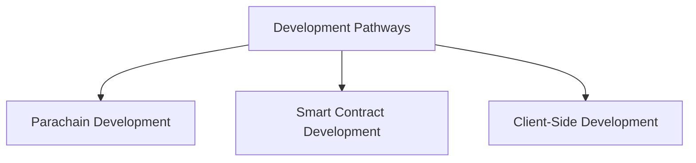

# Develop with Polkadot

## Introduction

## Development Pathways

Developers can choose from different development pathways to build applications and core blockchain functionality. Each pathway caters to different types of projects and developer skill sets, while complementing one another within the broader network.

The Polkadot ecosystem provides multiple development pathways:

!!! tip 
    All three pathways can leverage Cross-Consensus Messaging (XCM) to create innovative cross-chain workflows and applications. Get started with these resources:

    - [**Introduction to XCM**](/develop/interoperability/intro-to-xcm/){target=\_blank} - introduces key concepts, core function definitions, and code examples
    - [**XCM Tools**](/develop/toolkit/interoperability/xcm-tools/){target=\_blank} - provides an overview of popular XCM tools
    - [**Tutorials for Managing XCM Channels**](/tutorials/interoperability/xcm-channels/){target=\_blank} - guides for using [Polkadot.js Apps](https://polkadot.js.org/apps/#/explorer){target=\_blank} UI to establish cross-chain messaging channels 

### Parachain Developers 

Build, deploy, and maintain custom parachains with the Polkadot SDK

- **Where to start** - [Introduction to the Polkadot SDK](/develop/parachains/get-started/intro-polkadot-sdk/){target=\_blank}

### Smart Contract Developers 

Leverage smart contracts and execute custom logic over existing chains to streamline your development process

- **Where to start** - [Overview of the Smart Contract Landscape on Polkadot](/develop/smart-contracts/overview/){target=\_blank}

### Application Developers

Integrate your applications with the Polkadot ecosystem using wallets, oracles, indexers, and more

**Where to start** - [Polkadot Ecosystem Toolkit](/develop/toolkit/){target=\_blank}

## In This Section

:::INSERT_IN_THIS_SECTION:::
