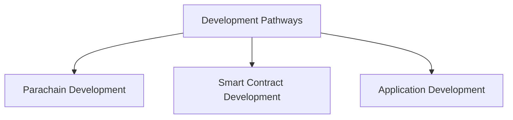

# Develop with Polkadot

## Introduction

This guide is a starting point for developers who wish to build in the Polkadot ecosystem. To get the most from this section: 

1. Identify your development pathway:
    - [**Parachain Developers**](#parachain-developers) - build, deploy, and maintain custom parachains with the Polkadot SDK
    - [**Smart Contract Developers**](#smart-contract-developers) - leverage smart contracts and execute custom logic over existing chains to streamline your development process
    - [**Application Developers**](#application-developers) - leverage Polkadot's underlying protocol features to create solutions for your users to interact with the ecosystem
2. Use the sections under your pathway as follows:
    - **Learn** - links connecting you to content to deepen your knowledge and understanding 
    - **Build** - links connecting you to content to help you build, including goal-oriented guides and step-by-step tutorials
    - **Tools** - links connecting you to tools commonly used in your pathway
    - **Resources** - links connecting you to resources for your pathway, including references, code repositories, and outside documentation

## Development Pathways

Developers can choose from different development pathways to build applications and core blockchain functionality. Each pathway caters to different types of projects and developer skill sets while complementing one another within the broader network.

The Polkadot ecosystem provides multiple development pathways:

!!! tip 
    All three pathways can leverage Cross-Consensus Messaging (XCM) to create innovative cross-chain workflows and applications. Get started with these resources:

    - [**Introduction to XCM**](/develop/interoperability/intro-to-xcm/){target=\_blank} - introduces key concepts, core function definitions, and code examples
    - [**XCM Tools**](/develop/toolkit/interoperability/xcm-tools/){target=\_blank} - provides an overview of popular XCM tools
    - [**Tutorials for Managing XCM Channels**](/tutorials/interoperability/xcm-channels/){target=\_blank} - guides for using [Polkadot.js Apps](https://polkadot.js.org/apps/#/explorer){target=\_blank} UI to establish cross-chain messaging channels 

### Parachain Developers 

Build, deploy, and maintain custom parachains with the Polkadot SDK.

####  Learn

- :octicons-book-16:{ .lg .middle } [Parachains Overview](/polkadot-protocol/architecture/parachains/overview/){target=\_blank}

- :octicons-book-16:{ .lg .middle } [Custom Parachains](/develop/parachains/get-started/build-custom-parachains/){target=\_blank}

- :octicons-book-16:{ .lg .middle } [Introduction to the Polkadot SDK](/develop/parachains/get-started/intro-polkadot-sdk/){target=\_blank}

#### Build

- :octicons-rocket-16:{.lg .middle} [Build and Deploy Your First Parachain](TODO: update-path){target=\_blank}

- :octicons-rocket-16:{.lg .middle} [Install Polkadot SDK Dependencies](/develop/parachains/get-started/install-polkadot-sdk/){target=\_blank}

- :octicons-rocket-16:{.lg .middle} [Spawn a Basic Chain for Testing with Zombienet](/tutorials/polkadot-sdk/testing/spawn-basic-chain/){target=\_blank}

- :octicons-rocket-16:{.lg .middle} [Fork a Chain for Testing with Chopsticks](/tutorials/polkadot-sdk/testing/fork-live-chains/){target=\_blank}

#### Tools

- :octicons-tools-16:{.lg .middle} [Parachain Template](https://github.com/paritytech/polkadot-sdk/tree/master/templates/parachain){target=\_blank}

- :octicons-tools-16:{.lg .middle} [Open Zeppelin Polkadot Runtime Templates](https://github.com/OpenZeppelin/polkadot-runtime-templates/tree/main){target=\_blank}

#### Resources

- :octicons-code-square-16:{.lg .middle} [Polkadot SDK source code repository](https://github.com/paritytech/polkadot-sdk){target=\_blank} 
    
- :octicons-code-square-16:{.lg .middle} [FRAME source code repository](https://github.com/paritytech/polkadot-sdk/tree/master/substrate/frame){target=\_blank}

### Smart Contract Developers 

Leverage smart contracts and execute custom logic over existing chains to streamline your development process.

!!! tip
    The Polkadot smart contract ecosystem is in active development. Please expect frequent changes. You can follow progress, or join the discussion, by visiting this [Contracts on AssetHub Roadmap](https://forum.polkadot.network/t/contracts-on-assethub-roadmap/9513/57){target=\_blank} Polkadot Network Forum post.

#### Learn 

- :octicons-book-16:{ .lg .middle } [Overview - Smart Contracts on Polkadot](/develop/smart-contracts/overview/){target=\_blank}

- :octicons-book-16:{ .lg .middle } [EVM Compatible Parachains](/develop/smart-contracts/evm/parachain-contracts/#evm-compatible-parachains){target=\_blank}

    
#### Build

- :octicons-rocket-16:{.lg .middle} [Deploy a Smart Contract to Asset Hub](/develop/smart-contracts/evm/native-evm-contracts/#deploy-a-smart-contract-to-asset-hub){target=\_blank} 
    
- :octicons-rocket-16:{.lg .middle} [Deploy a Wasm Smart Contract](/develop/smart-contracts/wasm-ink/){target=\_blank}

#### Tools

- :octicons-tools-16:{.lg .middle} [`cargo-contract` CLI Tool](https://github.com/use-ink/cargo-contract){target=\_blank}

- :octicons-tools-16:{.lg .middle} [Remix - Ethereum IDE](https://remix.ethereum.org/){target=\_blank}

#### Resources

- :octicons-code-square-16:{.lg .middle} [Runtime vs Smart Contract - Polkadot SDK Rust docs](https://paritytech.github.io/polkadot-sdk/master/polkadot_sdk_docs/reference_docs/runtime_vs_smart_contract/index.html){target=\_blank} 
    
- :octicons-code-square-16:{.lg .middle} [Pure Rust Implementation of EVM](https://github.com/rust-ethereum/evm){target=\_blank}

### Application Developers

Integrate with the Polkadot blockchain's underlying protocol features to create solutions that allow users to interact with the ecosystem.

#### Learn

- :octicons-book-16:{ .lg .middle } [Options for Wallet Integration](/develop/toolkit/integrations/wallets/){target=\_blank}

- :octicons-book-16:{ .lg .middle } [Options for Indexer Intergration](/develop/toolkit/integrations/indexers/){target=\_blank}

- :octicons-book-16:{ .lg .middle } [Options for Oracle Integration](/develop/toolkit/integrations/oracles/){target=\_blank}

#### Build

- :octicons-rocket-16:{.lg .middle} [Install and Get Started with Polkadot.js API](/develop/toolkit/api-libraries/polkadot-js-api/){target=\_blank}

- :octicons-rocket-16:{.lg .middle} [Install and Get Started with Polkadot-API (PAPI)](/develop/toolkit/api-libraries/papi/){target=\_blank}

- :octicons-rocket-16:{.lg .middle} [Install and Get Started with Python Substrate Interface](/develop/toolkit/api-libraries/py-substrate-interface/){target=\_blank}

#### Tools

- :octicons-tools-16:{.lg .middle} [Polkadot.js API](https://github.com/polkadot-js/api){target=\_blank}

- :octicons-tools-16:{.lg .middle} [Polkadot-API (PAPI)](https://github.com/polkadot-api/polkadot-api){target=\_blank}

- :octicons-tools-16:{.lg .middle} [Sidecar REST API](https://github.com/paritytech/substrate-api-sidecar){target=\_blank}

#### Resources

- :octicons-code-square-16:{.lg .middle} [RPC Endpoints](/develop/networks/){target=\_blank} 
    
- :octicons-code-square-16:{.lg .middle} [Polkadot Ecosystem Toolkit](/develop/toolkit/){target=\_blank}

## In This Section

:::INSERT_IN_THIS_SECTION:::
