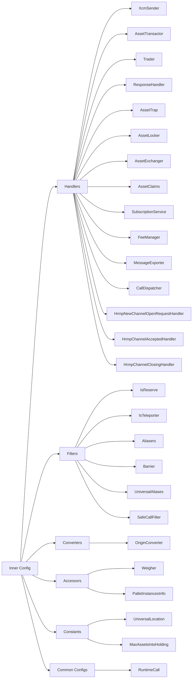

# XCM Config

## Introduction

The [XCM executor](https://paritytech.github.io/polkadot-sdk/master/staging_xcm_executor/index.html) is a crucial component responsible for interpreting and executing XCM messages (XCMs) with Polkadot SDK-based chains. It processes and manages XCM instructions, ensuring they are executed correctly and in sequentially. Adhering to the [Cross-Consensus Virtual Machine (XCVM) specification](https://paritytech.github.io/xcm-docs/overview/xcvm.html#the-xcvm), the XCM executor can be customized or replaced with an alternative that also complies with the [XCVM standards](https://github.com/polkadot-fellows/xcm-format?tab=readme-ov-file#12-the-xcvm).

The `XcmExecutor` is not a pallet but a struct parameterized by a `Config` trait. The `Config` trait is the inner configuration, parameterizing the outer `XcmExecutor<Config>` struct. Both configurations are set up within the runtime.

The executor is highly configurable, with the [XCM builder](https://paritytech.github.io/polkadot-sdk/master/staging_xcm_builder/index.html) offering building blocks to tailor the configuration to specific needs. While they serve as a foundation, users can easily create custom blocks to suit unique configurations. Users can also create their building blocks to address unique needs. This article examines the XCM configuration process, explains each configurable item, and provides examples of the tools and types available to help customize these settings.

## XCM Executor Configuration

The `Config` trait defines the XCM executor’s configuration, which requires several associated types. Each type has specific trait bounds that the concrete implementation must fulfill. Some types, such as `RuntimeCall`, come with a default implementation in most cases, while others use the unit type `()` as the default. For many of these types, selecting the appropriate implementation carefully is crucial. Predefined solutions and building blocks can be adapted to your specific needs. These solutions can be found in the [`xcm-builder`](https://github.com/paritytech/polkadot-sdk/tree/{{dependencies.repositories.polkadot_sdk.version}}/polkadot/xcm/xcm-builder) folder.

Each type is explained below, along with an overview of some of its implementations:

```rust
--8<-- 'code/develop/interoperability/xcm-config/xcm-config-trait.rs'
```

## Config Items

Each configuration item is explained below, detailing the associated type’s purpose and role in the XCM executor. Many of these types have predefined solutions available in the `xcm-builder`. Therefore, the available configuration items are:

- [**`RuntimeCall`**](https://paritytech.github.io/polkadot-sdk/master/staging_xcm_executor/trait.Config.html#associatedtype.RuntimeCall) - defines the runtime's callable functions, created via the [`frame::runtime`](https://paritytech.github.io/polkadot-sdk/master/frame_support/attr.runtime.html) macro. It represents an enum listing the callable functions of all implemented pallets
    ```rust
    type RuntimeCall: Parameter + Dispatchable<PostInfo = PostDispatchInfo> + GetDispatchInfo
    ```
   The associated traits signify:

    - `Parameter` - ensures the type is encodable, decodable, and usable as a parameter
    - `Dispatchable` - indicates it can be executed in the runtime
    - `GetDispatchInfo` - provides weight details, determining how long execution takes

- [**`XcmSender`**](https://paritytech.github.io/polkadot-sdk/master/staging_xcm_executor/trait.Config.html#associatedtype.XcmSender) - implements the [`SendXcm`](https://paritytech.github.io/polkadot-sdk/master/staging_xcm/v4/trait.SendXcm.html) trait, specifying how the executor sends XCMs using transport layers (e.g., UMP for relay chains or XCMP for sibling chains). If a runtime lacks certain transport layers, such as [HRMP](https://wiki.polkadot.network/learn/learn-xcm-transport/#hrmp-xcmp-lite) (or [XCMP](https://wiki.polkadot.network/learn/learn-xcm-transport/#xcmp-cross-consensus-message-passing-design-summary))
    ```rust
    type XcmSender: SendXcm;
    ```
- [**`AssetTransactor`**](https://paritytech.github.io/polkadot-sdk/master/staging_xcm_executor/trait.Config.html#associatedtype.AssetTransactor) - implements the [`TransactAsset`](https://paritytech.github.io/polkadot-sdk/master/staging_xcm_executor/traits/trait.TransactAsset.html) trait, handling the conversion and transfer of MultiAssets between accounts or registers. It can be configured to support native tokens, fungibles, and non-fungibles or multiple tokens using pre-defined adapters like [`FungibleAdapter`](https://paritytech.github.io/polkadot-sdk/master/staging_xcm_builder/struct.FungibleAdapter.html) or custom solutions
    ```rust
    type AssetTransactor: TransactAsset;
    ```

- [**`OriginConverter`**](https://paritytech.github.io/polkadot-sdk/master/staging_xcm_executor/trait.Config.html#associatedtype.OriginConverter) - implements the [`ConvertOrigin`](https://paritytech.github.io/polkadot-sdk/master/staging_xcm_executor/traits/trait.ConvertOrigin.html) trait to map `MultiLocation` origins to `RuntimeOrigin`. Multiple implementations can be combined, and [`OriginKind`](https://paritytech.github.io/polkadot-sdk/master/staging_xcm_builder/test_utils/enum.OriginKind.html) is used to resolve conflicts. Pre-defined converters like [`SovereignSignedViaLocation`](https://paritytech.github.io/polkadot-sdk/master/staging_xcm_builder/struct.SovereignSignedViaLocation.html) and [`SignedAccountId32AsNative`](https://paritytech.github.io/polkadot-sdk/master/staging_xcm_builder/struct.SignedAccountId32AsNative.html) handle sovereign and local accounts respectively
    ```rust
    type OriginConverter: ConvertOrigin<<Self::RuntimeCall as Dispatchable>::RuntimeOrigin>;
    ```

- [**`IsReserve`**](https://paritytech.github.io/polkadot-sdk/master/staging_xcm_executor/trait.Config.html#associatedtype.IsReserve) - specifies trusted `<MultiAsset, MultiLocation>` pairs for depositing reserve assets. Using the unit type `()` blocks reserve deposits. The [`NativeAsset`](https://paritytech.github.io/polkadot-sdk/master/staging_xcm_builder/struct.NativeAsset.html) struct is an example of a reserve implementation
    ```rust
    type IsReserve: ContainsPair<MultiAsset, MultiLocation>;
    ```

- [**`IsTeleporter`**](https://paritytech.github.io/polkadot-sdk/master/staging_xcm_executor/trait.Config.html#associatedtype.IsTeleporter) - defines trusted `<MultiAsset, MultiLocation>` pairs for teleporting assets to the chain. Using `()` blocks the [`ReceiveTeleportedAssets`](https://paritytech.github.io/polkadot-sdk/master/staging_xcm_builder/test_utils/enum.Instruction.html#variant.ReceiveTeleportedAsset) instruction. The [`NativeAsset`](https://paritytech.github.io/polkadot-sdk/master/staging_xcm_builder/struct.NativeAsset.html) struct can act as an implementation
    ```rust
    type IsTeleporter: ContainsPair<MultiAsset, MultiLocation>;
    ```

- [**`Aliasers`**](https://paritytech.github.io/polkadot-sdk/master/staging_xcm_executor/trait.Config.html#associatedtype.Aliasers) - a list of `(Origin, Target)` pairs enabling each `Origin` to be replaced with its corresponding `Target`
    ```rust
    type Aliasers: ContainsPair<Location, Location>;
    ```

- [**`UniversalLocation`**](https://paritytech.github.io/polkadot-sdk/master/staging_xcm_executor/trait.Config.html#associatedtype.UniversalLocation) - specifies the runtime's location in the consensus universe
    ```rust
    type UniversalLocation: Get<InteriorMultiLocation>;
    ```

    - Some examples are:
        - `X1(GlobalConsensus(NetworkId::Polkadot))` for Polkadot
        - `X1(GlobalConsensus(NetworkId::Kusama))` for Kusama
        - `X2(GlobalConsensus(NetworkId::Polkadot), Parachain(1000))` for Statemint

- [**`Barrier`**](https://paritytech.github.io/polkadot-sdk/master/staging_xcm_executor/trait.Config.html#associatedtype.Barrier) - implements the [`ShouldExecute`](https://paritytech.github.io/polkadot-sdk/master/staging_xcm_executor/traits/trait.ShouldExecute.html) trait, functioning as a firewall for XCM execution. Multiple barriers can be combined in a tuple, where execution halts if one succeeds
    ```rust
    type Barrier: ShouldExecute;
    ```

- [**`Weigher`**](https://paritytech.github.io/polkadot-sdk/master/staging_xcm_executor/trait.Config.html#associatedtype.Weigher) - calculates the weight of XCMs and instructions, enforcing limits and refunding unused weight. Common solutions include [`FixedWeightBounds`](https://paritytech.github.io/polkadot-sdk/master/staging_xcm_builder/struct.FixedWeightBounds.html), which uses a base weight and limits on instructions
    ```rust
    type Weigher: WeightBounds<Self::RuntimeCall>;
    ```

- [**`Trader`**](https://paritytech.github.io/polkadot-sdk/master/staging_xcm_executor/trait.Config.html#associatedtype.Trader) - manages asset-based weight purchases and refunds for `BuyExecution` instructions. The [`UsingComponents`](https://paritytech.github.io/polkadot-sdk/master/staging_xcm_builder/struct.UsingComponents.html) trader is a common implementation
    ```rust
    type Trader: WeightTrader;
    ```

- [**`ResponseHandler`**](https://paritytech.github.io/polkadot-sdk/master/staging_xcm_executor/trait.Config.html#associatedtype.ResponseHandler) - handles `QueryResponse` instructions, implementing the [`OnResponse`](https://paritytech.github.io/polkadot-sdk/master/staging_xcm_executor/traits/trait.OnResponse.html) trait. FRAME systems typically use the pallet-xcm implementation
    ```rust
    type ResponseHandler: OnResponse;
    ```

- [**`AssetTrap`**](https://paritytech.github.io/polkadot-sdk/master/staging_xcm_executor/trait.Config.html#associatedtype.AssetTrap) - handles leftover assets in the holding register after XCM execution, allowing them to be claimed via `ClaimAsset`. If unsupported, assets are burned
    ```rust
    type AssetTrap: DropAssets;
    ```

- [**`AssetClaims`**](https://paritytech.github.io/polkadot-sdk/master/staging_xcm_executor/trait.Config.html#associatedtype.AssetClaims) - facilitates the claiming of trapped assets during the execution of the `ClaimAsset` instruction. Commonly implemented via pallet-xcm
    ```rust
    type AssetClaims: ClaimAssets;
    ```

- [**`AssetLocker`**](https://paritytech.github.io/polkadot-sdk/master/staging_xcm_executor/trait.Config.html#associatedtype.AssetLocker) - handles the locking and unlocking of assets. Can be omitted using `()` if asset locking is unnecessary
    ```rust
    type AssetLocker: AssetLock;
    ```

- [**`AssetExchanger`**](https://paritytech.github.io/polkadot-sdk/master/staging_xcm_executor/trait.Config.html#associatedtype.AssetExchanger) - implements the [`AssetExchange`](https://paritytech.github.io/polkadot-sdk/master/staging_xcm_executor/traits/trait.AssetExchange.html) trait to manage asset exchanges during the `ExchangeAsset` instruction. The unit type `()` disables this functionality
    ```rust
    type AssetExchanger: AssetExchange;
    ```

- [**`SubscriptionService`**](https://paritytech.github.io/polkadot-sdk/master/staging_xcm_executor/trait.Config.html#associatedtype.SubscriptionService) - manages `(Un)SubscribeVersion` instructions and returns the XCM version via `QueryResponse`. Typically implemented by pallet-xcm
    ```rust
    type SubscriptionService: VersionChangeNotifier;
    ```

- [**`PalletInstancesInfo`**](https://paritytech.github.io/polkadot-sdk/master/staging_xcm_executor/trait.Config.html#associatedtype.PalletInstancesInfo) - provides runtime pallet information for `QueryPallet` and `ExpectPallet` instructions. FRAME-specific systems often use this, or it can be disabled with `()`
    ```rust
    type PalletInstancesInfo: PalletsInfoAccess;
    ```
 <!-- I think `Holding Register` should be linked to https://wiki.polkadot.network/docs/learn/xcm/reference-glossary#holding-register, but since we will have our own glossary, I’m putting this as a TODO -->
- [**`MaxAssetsIntoHolding`**](https://paritytech.github.io/polkadot-sdk/master/staging_xcm_executor/trait.Config.html#associatedtype.MaxAssetsIntoHolding) - limits the number of assets in the [Holding register](https://wiki.polkadot.network/learn/learn-xcm/#holding-register). At most, twice this limit can be held under worst-case conditions
    ```rust
    type MaxAssetsIntoHolding: Get<u32>;
    ```

- [**`FeeManager`**](https://paritytech.github.io/polkadot-sdk/master/staging_xcm_executor/trait.Config.html#associatedtype.FeeManager) - manages fees for XCM instructions, determining whether fees should be paid, waived, or handled in specific ways. Fees can be waived entirely using `()`
    ```rust
    type FeeManager: FeeManager;
    ```

- [**`MessageExporter`**](https://paritytech.github.io/polkadot-sdk/master/staging_xcm_executor/trait.Config.html#associatedtype.MessageExporter) - implements the [`ExportXcm`](https://paritytech.github.io/polkadot-sdk/master/staging_xcm_executor/traits/trait.ExportXcm.html) trait, enabling XCMs export to other consensus systems. It can spoof origins for use in bridges. Use `()` to disable exporting
    ```rust
    type MessageExporter: ExportXcm;
    ```

- [**`UniversalAliases`**](https://paritytech.github.io/polkadot-sdk/master/staging_xcm_executor/trait.Config.html#associatedtype.UniversalAliases) - lists origin locations and universal junctions allowed to elevate themselves in the `UniversalOrigin` instruction. Using `Nothing` prevents origin aliasing
    ```rust
    type UniversalAliases: Contains<(MultiLocation, Junction)>;
    ```

- [**`CallDispatcher`**](https://paritytech.github.io/polkadot-sdk/master/staging_xcm_executor/trait.Config.html#associatedtype.CallDispatcher) - dispatches calls from the `Transact` instruction, adapting the origin or modifying the call as needed. Can default to `RuntimeCall`
    ```rust
    type CallDispatcher: CallDispatcher<Self::RuntimeCall>;
    ```

- [**`SafeCallFilter`**](https://paritytech.github.io/polkadot-sdk/master/staging_xcm_executor/trait.Config.html#associatedtype.SafeCallFilter) - whitelists calls permitted in the `Transact` instruction. Using `Everything` allows all calls, though this is temporary until proof size weights are accounted for
    ```rust
    type SafeCallFilter: Contains<Self::RuntimeCall>;
    ```

- [**`TransactionalProcessor`**](https://paritytech.github.io/polkadot-sdk/master/staging_xcm_executor/trait.Config.html#associatedtype.TransactionalProcessor) - implements the [`ProccessTransaction`](https://paritytech.github.io/polkadot-sdk/master/staging_xcm_executor/traits/trait.ProcessTransaction.html) trait. It ensures that XCM instructions are executed atomically, meaning they either fully succeed or fully fail without any partial effects. This type allows for non-transactional XCM instruction processing by setting the `()` type
    ```rust
    type TransactionalProcessor: ProcessTransaction;
    ```

- [**`HrmpNewChannelOpenRequestHandler`**](https://paritytech.github.io/polkadot-sdk/master/staging_xcm_executor/trait.Config.html#associatedtype.HrmpNewChannelOpenRequestHandler) - enables optional logic execution in response to the `HrmpNewChannelOpenRequest` XCM notification
    ```rust
    type HrmpNewChannelOpenRequestHandler: HandleHrmpNewChannelOpenRequest;
    ```

- [**`HrmpChannelAcceptedHandler`**](https://paritytech.github.io/polkadot-sdk/master/staging_xcm_executor/trait.Config.html#associatedtype.HrmpChannelAcceptedHandler) - enables optional logic execution in response to the `HrmpChannelAccepted` XCM notification
    ```rust
    type HrmpChannelAcceptedHandler: HandleHrmpChannelAccepted;
    ```
- [**`HrmpChannelClosingHandler`**](https://paritytech.github.io/polkadot-sdk/master/staging_xcm_executor/trait.Config.html#associatedtype.HrmpChannelClosingHandler) - enables optional logic execution in response to the `HrmpChannelClosing` XCM notification
    ```rust
    type HrmpChannelClosingHandler: HandleHrmpChannelClosing;
    ```
- [**`XcmRecorder`**](https://paritytech.github.io/polkadot-sdk/master/staging_xcm_executor/trait.Config.html#associatedtype.XcmRecorder) - allows tracking of the most recently executed XCM, primarily for use with dry-run runtime APIs
    ```rust
    type XcmRecorder: RecordXcm;
    ```

### Inner Config

The `Config` trait underpins the `XcmExecutor`, defining its core behavior through associated types for asset handling, XCM processing, and permission management. These types are categorized as follows:

- **Handlers** - manage XCMs sending, asset transactions, and special notifications
- **Filters** - define trusted combinations, origin substitutions, and execution barriers
- **Converters** - handle origin conversion for call execution
- **Accessors** - provide weight determination and pallet information
- **Constants** - specify universal locations and asset limits
- **Common Configs** - include shared settings like `RuntimeCall`

The following diagram outlines this categorization:



### Outer Config

The `XcmExecutor<Config>` struct extends the functionality of the inner config by introducing fields for execution context, asset handling, error tracking, and operational management. For further details, see the documentation for [`XcmExecutor<Config>`](https://paritytech.github.io/polkadot-sdk/master/staging_xcm_executor/struct.XcmExecutor.html#impl-XcmExecutor%3CConfig%3E).

## Multiple Implementations

Some associated types in the `Config` trait are highly configurable and may have multiple implementations (e.g., Barrier). These implementations are organized into a tuple `(impl_1, impl_2, ..., impl_n)`, and the execution follows a sequential order. Each item in the tuple is evaluated individually, each being checked to see if it fails. If an item passes (e.g., returns `Ok` or `true`), the execution stops, and the remaining items are not evaluated. The following example of the `Barrier` type demonstrates how this grouping operates (understanding each item in the tuple is unnecessary for this explanation).

In the following example, the system will first check the `TakeWeightCredit` type when evaluating the barrier. If it fails, it will check `AllowTopLevelPaidExecutionFrom`, and so on, until one of them returns a positive result. If all checks fail, a Barrier error will be triggered.

```rust
--8<-- 'code/develop/interoperability/xcm-config/barrier-example.rs'
```
