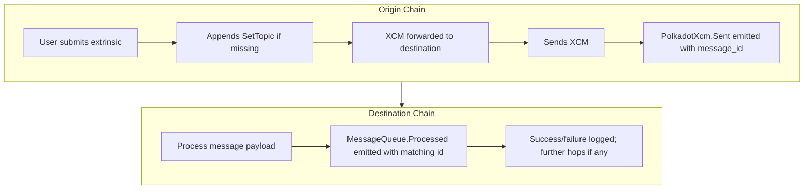

# XCM Observability

## Introduction

Cross-Consensus Messaging (XCM) powers interoperability across the Polkadot ecosystem, but tracing and debugging these flows across multiple chains is challenging.

This guide introduces the observability features in modern Polkadot runtimes and the Polkadot SDK that make XCMs easier to trace and debug.

You'll learn how to:

- Use the [`SetTopic([u8; 32])`](https://github.com/polkadot-fellows/xcm-format#settopic){target=\_blank} instruction and `message_id` to track XCMs across chains
- Correlate messages through [`PolkadotXcm.Sent`](https://paritytech.github.io/polkadot-sdk/master/pallet_xcm/pallet/enum.Event.html#variant.Sent){target=\_blank} and [`MessageQueue.Processed`](https://paritytech.github.io/polkadot-sdk/master/pallet_message_queue/pallet/enum.Event.html#variant.Processed){target=\_blank} events
- Apply derived message ID workarounds for older runtimes
- Diagnose failed or incomplete XCMs with indexers and Chopsticks replay

For a hands-on walkthrough, see the companion tutorial: [XCM Observability in Action](/tutorials/interoperability/xcm-observability-in-action){target=\_blank}.

## Core Concepts

### What is `SetTopic`?

When executing XCMs (via [`limited_reserve_transfer_assets`](https://paritytech.github.io/polkadot-sdk/master/pallet_xcm/pallet/struct.Pallet.html#method.limited_reserve_transfer_assets){target=\_blank}, other extrinsics, or raw calls from the [`PolkadotXcm` pallet](https://paritytech.github.io/polkadot-sdk/master/pallet_xcm/pallet/struct.Pallet.html){target=\_blank}), the runtime automatically appends a [`SetTopic([u8; 32])`](https://github.com/polkadot-fellows/xcm-format#settopic){target=\_blank} instruction if one is missing.

- **[`SetTopic([u8; 32])`](https://github.com/polkadot-fellows/xcm-format#settopic){target=\_blank}** is an XCM instruction that sets a 32-byte topic register inside the message.
- The topic acts as a **logical identifier** (`message_id`) for the XCM, allowing you to group and trace related messages across chains.

⚠️ **Note:** When using [`WithUniqueTopic`](https://paritytech.github.io/polkadot-sdk/master/staging_xcm_builder/struct.WithUniqueTopic.html){target=\_blank}, the topic ID is guaranteed to be unique if `WithUniqueTopic` automatically appends the `SetTopic` instruction. However, if the message already includes a `SetTopic` instruction, the uniqueness of the ID depends on the message creator and is not guaranteed.

### Observability Features

Runtimes built from **`stable2503-5` or later** provide key observability features for tracing and correlating XCMs across chains:

- **[`PolkadotXcm.Sent`](https://paritytech.github.io/polkadot-sdk/master/pallet_xcm/pallet/enum.Event.html#variant.Sent){target=\_blank}** emitted on the origin chain when an XCM is sent.
- **[`MessageQueue.Processed`](https://paritytech.github.io/polkadot-sdk/master/pallet_message_queue/pallet/enum.Event.html#variant.Processed){target=\_blank}** emitted on the destination chain when the XCM is processed.
- The **`message_id` in the `Sent` event matches the `id` in the `Processed` event**, enabling reliable cross-chain correlation. This `message_id` is derived from the `SetTopic` instruction.

| Chain Role        | Event                    | Field        | Purpose                            |
|-------------------|--------------------------|--------------|------------------------------------|
| Origin chain      | `PolkadotXcm.Sent`       | `message_id` | Identifies the sent XCM            |
| Destination chain | `MessageQueue.Processed` | `id`         | Confirms processing of the message |

Matching these IDs lets you **correlate** an origin message with its destination processing.

### Why Not `XcmpQueue.XcmpMessageSent`?

- The event [`XcmpQueue.XcmpMessageSent`](https://paritytech.github.io/polkadot-sdk/master/cumulus_pallet_xcmp_queue/pallet/enum.Event.html#variant.XcmpMessageSent){target=\_blank} contains a `message_hash` unrelated to `SetTopic`.
- It is **not reliable for cross-chain tracing** and should be avoided for observability purposes.

### Automatic vs Manual `SetTopic`

- The runtime **automatically appends a `SetTopic` instruction** if one is missing at the end of an XCM.
- When using high-level extrinsics such as `limited_reserve_transfer_assets`, **you do not need to set a topic manually**; the runtime handles it for you.
- If you **manually craft an XCM** (e.g., via [`execute`](https://paritytech.github.io/polkadot-sdk/master/pallet_xcm/pallet/struct.Pallet.html#method.execute){target=\_blank} or [`send`](https://paritytech.github.io/polkadot-sdk/master/pallet_xcm/pallet/struct.Pallet.html#method.send){target=\_blank}), you **can supply your own `SetTopic`**, but it **must be the final instruction** to be respected.
- In **multi-hop XCM flows**, manually setting the topic ensures **consistent tracing across all hops**. Any **remote XCM calls** embedded inside the XCM must also include a `SetTopic` at the end to preserve the same `message_id` throughout the cross-chain flow.

## Message Lifecycle

Here is a high-level overview of an XCM lifecycle with observability events:



* The `SetTopic` ensures a consistent `message_id` is passed and visible in these events.
* For multi-hop flows, the same `message_id` travels through all chains.

## Workaround for Older Runtimes

* Runtimes prior to **`stable2503-5`** emit a **derived `forwarded_id`** instead of the original topic in downstream `Processed` events.
* The forwarded ID is calculated as:

```rust
fn forward_id_for(original_id: &XcmHash) -> XcmHash { 
    (b"forward_id_for", original_id).using_encoded(sp_io::hashing::blake2_256)
}
```

### Example

| Original `message_id` | Forwarded `message_id`                                        |
|-----------------------|---------------------------------------------------------------|
| `0x5c082b47...`       | `0xb3ae32fd...` == blake2_256("forward_id_for" + original_id) |

Tools and indexers tracing messages across mixed runtime versions should check **both** the original and forwarded IDs.

```ts
--8<-- 'code/develop/interoperability/xcm-observability/forward-id-for.ts'
```

## Failure Event Handling

When an XCM fails, the transaction **rolls back** and no explicit failure event is emitted on-chain.

### How to Detect Failures

1. **View Nested Dispatch Errors via Indexers**

   Most indexers display nested errors indicating why an XCM failed, e.g.:

   --8<-- 'code/develop/interoperability/xcm-observability/execution-with-error.html'

   Common errors include missing assets, exceeded execution limits, or invalid asset locations. This nested error reporting, introduced in runtimes from **`stable2506` onward**, usually suffices to diagnose typical issues.

2. **Replay Using Chopsticks for Full Logs**

   For detailed troubleshooting:

    - Replay the failing extrinsic with logging enabled
    - See exactly which instruction failed and why
    - View complete error chains like `FailedToTransactAsset` or `AssetNotFound`

   This approach is invaluable for multi-hop flows and complex custom XCMs.

### Recommended Debugging Workflow

1. Start with indexer or API error output
2. If unclear, use Chopsticks to replay the exact transaction
3. Inspect logs for the failing XCM instruction and reason
4. Adjust weight limits, asset locations, or message construction as needed

→ See [Replay and Dry Run XCMs Using Chopsticks](/tutorials/interoperability/replay-and-dry-run-xcms/){target=\_blank} for replay instructions.

## Best Practices

- When manually setting `SetTopic`, **always place it as the final instruction** in your XCM to ensure it is respected by the runtime.
- Prefer **automatic topic insertion** via high-level extrinsics for simplicity.
- If your use case involves multi-hop or custom XCMs, **manually set `SetTopic`** (including remote XCM calls) to guarantee consistent tracing.
- Ensure your `message_id` values are unique **if** you require deduplication or strict correlation.
- When supporting legacy runtimes, be aware of the `forward_id_for` pattern.
