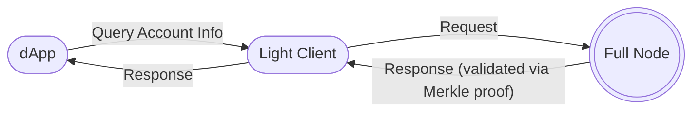

Light clients are a more secure, trust-minimized, efficient way of communicating to a blockchain.  Along with the oft-used JSON remote procedural calls (RPC), they are one of the primary methods for interacting with a blockchain. 

> "Light clients are applications that fetch the required data that they need from a Polkadot node with an associated [cryptographic] proof to validate the data. This makes it possible to interact with the Polkadot network without requiring to run a full node or having to trust the remote peers." - [Polkadot Specification, Light Client Messages](https://spec.polkadot.network/sect-lightclient#sect-light-msg){target=\blank}

Polkadot has first class support for light clients, which are a crucial part of the development of decentralized applications.

!!!info "Light node or light client?"
    The terms 'light node' and 'light client' are interchangeable, both describing a blockchain client that syncs without downloading the entire blockchain state. All nodes in a blockchain network are fundamentally clients, engaging in peer-to-peer communication.

However, unlike interacting with a JSON RPC interface, where an application has to either maintain a list of providers to use, or rely on a single node, **light clients are not limited to nor depend on a single node**. They verify the state of the blockchain using cryptographic proofs, ensuring it has not only the latest but *correct* state. As it just verifies the headers of the blocks, it does not need to sync whole state, making it ideal for resource-constrained environments.

In the above diagram, the decentralized application is able to query the account's on-chain info through the light client. This light client is running as part of the application, takes very little memory and computational overhead, and utilizes Merkle proofs to verify the state from a full node in a trust-minimized manner. Polkadot compatible light clients utilize [warp syncing](https://spec.polkadot.network/sect-lightclient#sect-sync-warp-lightclient){target=\blank}, which only downloads the block headers.

This means that light clients can quickly verify the entire state of the blockchain, including [GRANDPA (finality)](../polkadot-protocol/glossary.md#grandpa) justifications.

!!!info What does it mean to be 'trust-minimized'?
    The term "trust-minimized" refers to the fact that the light client does not have to completely trust the full node before retrieving its state. This is due to the usage of Merkle proofs, where the light client can check the Merkle tree root to ensure the full node it is retrieving from has the correct state.

## JSON RPC and Light Client Comparison

Another common mode of communication between a user interface (UI) and a node is through the JSON RPC
protocol. Generally, the UI will showcase the information that is available on the node, fetch information related to the network and/or its [pallets](../polkadot-protocol/glossary.md#pallet), and overall interact with the network. This is done through two main approaches:

1. **User Controlled Nodes**: The UI connects to a node client that the user has installed on their
   machine.
   - These nodes are secure, but installation and maintenance of these nodes tend to be an
     inconvenience.
2. **Publicly Accessible Nodes**: The UI connects to a third-party-owned publicly-accessible node
   client.
   - While these nodes are more prevalent in their usage as they are convenient to use, they are
     centralized and insecure. Applications would need to maintain a list of backup nodes in case the one in use goes down.

It's important to note that light clients still communicate with [full nodes](../polkadot-protocol/glossary.md#full-node), however in the context of applications, light clients offer benefits for applications that need a secure alternative to running a full node:

| Full Node                                                                                        | Light Client                                                                               |
| ----------------------------------------------------------------------------------------------------------- | ------------------------------------------------------------------------------------------------------------- |
| Full verification of all blocks of the chain                                                                | Only verifies the authenticity of blocks of the chain                                                         |
| Contains the previous block data and the chain's storage in database                                    | No database                                                                                                   |
| Installation, maintenance, and execution tend to be exhaustive and require system administration expertise | No installation; is typically included as part of the application |

## Using Light Clients

[`smoldot`](https://github.com/smol-dot/smoldot){target=\blank} is the cornerstone for light client implementation and usage for Polkadot SDK-based chains. It contains the primitives needed to build clients, or is included in libraries such as [PAPI](#papi-light-client-support).

### PAPI Light Client Support

The [Polkadot API (PAPI)](./toolkit/api-libraries/papi.md){target=\blank} provides native support for a light client configuration (backed by [`smoldot`](https://github.com/smol-dot/smoldot){target=\blank}), allowing a developer to use a light client to connect to multiple chains at the same time. 

<!-- TODO: Add reference to a PAPI tutorial here -->

### Substrate Connect - Browser Extension

The [Substrate Connect browser extension](https://www.npmjs.com/package/@substrate/connect-extension-protocol){target=\blank} allows end-users to interact with applications connected to multiple blockchains or connect their own blockchains to applications that support it.

Establishing a sufficient number of peers is difficult due to browser limitations on WebSockets from HTTPS pages, as many nodes need to be available with TLS. The browser extension provided by Substrate connect helps to overcome this limitation and keeps the chains synced in the background, allowing applications to run faster.

!!!note
    Substrate Connect will auto-detect whether a user is using the extension. If not, the Wasm light client will be created in-page for them.

## Resources

- [What is a light client and why you should care?](https://medium.com/paritytech/what-is-a-light-client-and-why-you-should-care-75f813ae2670){target=\blank}
- [Introducing Substrate Connect: Browser-Based Light Clients for Connecting to Substrate Chains](https://www.parity.io/blog/introducing-substrate-connect){target=\blank}
- [Substrate connect GitHub Repo](https://github.com/paritytech/substrate-connect/tree/master/projects/extension){target=\blank}
- [Light Clients - Polkadot Specification](https://spec.polkadot.network/sect-lightclient){target=\blank}