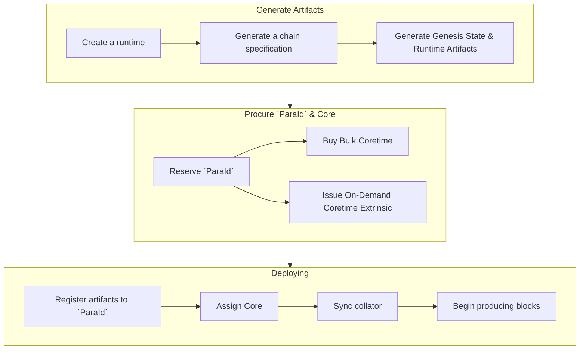

# Get Started with Polkadot SDK

## Introduction

The Polkadot SDK is a powerful toolset designed to facilitate building on the Polkadot network. It provides the necessary components for creating custom parachains, connecting them to Polkadot, and taking advantage of Polkadot's shared security. Whether you're building a standalone chain or deploying a parachain, this SDK equips developers with the libraries and tools needed to manage runtime logic, compile the codebase, and utilize the network's core features like staking, governance, and cross-chain communication.

!!! danger "Not Production Ready"
    This section is under construction. Expect frequent changes.

    Agile coretime is not yet deployed on Polkadot and is only for the Kusama and TestNet networks. These features remain under development.  

## Explore the Polkadot SDK

The Polkadot SDK monorepo combines multiple repositories to provide all the components needed to start building on the Polkadot network:

??? function "[**Polkadot**](https://paritytech.github.io/polkadot-sdk/master/polkadot_sdk_docs/polkadot_sdk/index.html#polkadot){target=\_blank} - implementation of a Polkadot node in Rust"

    === "Key Features"

        - [`core-primitives`](https://github.com/paritytech/polkadot-sdk/blob/master/polkadot/core-primitives/src/lib.rs){target=\_blank} - source file defining types for primitives such as `ChainId`, `Balance`, and `BlockNumber` which are used throughout development
        - [`cli`](https://github.com/paritytech/polkadot-sdk/blob/master/polkadot/cli/src/cli.rs){target=\_blank} - source file defining commands for the Polkadot CLI library
        - [`primitives`](https://github.com/paritytech/polkadot-sdk/blob/master/polkadot/primitives/src/lib.rs){target=\_blank} - source file defining types shared between the runtime and the node services
        - [`rpc`](https://github.com/paritytech/polkadot-sdk/blob/master/polkadot/rpc/src/lib.rs){target=\_blank} - source file containing Polkadot-specific RPC implementation

    === "Resources"

        - [Install the node](https://github.com/paritytech/polkadot-sdk/tree/master/polkadot#installation){target=\_blank} - from pre-compiled binary
        - [Build the client](https://github.com/paritytech/polkadot-sdk/tree/master/polkadot#building){target=\_blank} - build from source with Cargo and Docker
        - [Get TestNet tokens](https://wiki.polkadot.network/docs/learn-DOT#obtaining-testnet-tokens){target=\_blank} - instructions on getting TestNet tokens for Paseo (PAS) and Westend (WND)

??? function "[**Substrate**](https://github.com/paritytech/polkadot-sdk/tree/master/substrate){target=\_blank} - a Rust framework for building blockchains in a modular and extensible way"

    === "Key Features"

        - [`client`](https://github.com/paritytech/polkadot-sdk/tree/master/substrate/client){target=\_blank} - crates that lead to the node software such as notification protocols, syncing algorithms, and discovery mechanisms
        - [`primitives`](https://github.com/paritytech/polkadot-sdk/tree/master/substrate/primitives){target=\_blank} - crates that facilitate both the node and the runtime including host functions for `hashing`, `logging`, and `storage`  
        - [`frame`](https://github.com/paritytech/polkadot-sdk/tree/master/substrate/frame){target=\_blank} - The FRAME development environment provides modules (called "pallets") and support libraries that you can use, modify, and extend to build runtime logic to suit the needs of your blockchain. Includes key pallets like `BABE` and `GRANDPA`

    === "Resources"

        - Read about the [Substrate module](https://paritytech.github.io/polkadot-sdk/master/polkadot_sdk_docs/polkadot_sdk/substrate/index.html#){target=\_blank}
        - [Substrate Stack Exchange](https://substrate.stackexchange.com/){target=\_blank} - ask questions and get answers from other developers

??? function "[**Cumulus**](https://github.com/paritytech/polkadot-sdk/tree/master/cumulus){target=\_blank} - a set of libraries and tools focused on distribution, p2p, database, and synchronization layers for Polkadot parachains"

    === "Key Features"

        - [`parachain-consensus`](https://github.com/paritytech/polkadot-sdk/blob/master/cumulus/client/consensus/common/src/parachain_consensus.rs){target=\_blank} - a consensus engine to run a Polkadot node internally and dictate to the client and synchronization algorithms which chain to follow, finalize, and treat as best
        - [`polkadot-parachain`](https://github.com/paritytech/polkadot-sdk/tree/master/cumulus/polkadot-parachain){target=\_blank} - binary which implements a Polkadot collator for the parachain  
        - [`validate_block`](https://github.com/paritytech/polkadot-sdk/tree/1617852a2f1caec796f2b218aecae2facaeacad6/cumulus/pallets/parachain-system/src/validate_block){target=\_blank} - function that is expected by Polkadot to validate a state transition

    === "Resources"

        - Read the [Cumulus Overview](https://github.com/paritytech/polkadot-sdk/blob/master/cumulus/docs/overview.md){target=\_blank}
        - [Cumulus installation and setup](https://github.com/paritytech/polkadot-sdk/tree/master/cumulus#installation-and-setup){target=\_blank} - instructions to prepare your developer environment and launch a local network

For an in-depth dive into the monorepo, the [Polkadot SDK Rust documentation](https://paritytech.github.io/polkadot-sdk/master/polkadot_sdk_docs/polkadot_sdk/index.html){target=\_blank} is highly recommended

<!-- TODO: Glossary link ParaId -->

## Zero to Hero with The Polkadot SDK

The Polkadot SDK is a versatile tool that can be used to build both standalone blockchains and parachains. For standalone blockchains, developers can leverage the SDK's components to create independent networks with custom functionality. The process for deploying a parachain on a Polkadot [core](https://wiki.polkadot.network/docs/learn-agile-coretime#core){target=\_blank} can be summarized as follows:

1. **Reserve** a `ParaId`, where the runtime and genesis state will be uploaded
2. **Compile** the runtime (written in Rust) to a WebAssembly blob, thereby defining how state transitions from one state to the next. This runtime is created using the Polkadot SDK
3. **Generate** a chain spec that is viable and ready to be deployed as a live, working parachain
4. **Generate** the genesis state and wasm
5. **Obtain** a core through a [Coretime marketplace](https://wiki.polkadot.network/docs/learn-guides-coretime-marketplaces){target=\_blank}
6. **Assign** that core to a `ParaId`
7. **Provision** at least one honest, synced collator is available for the *task* to begin producing blocks

!!!info "What is a task?"
    A [task](https://wiki.polkadot.network/docs/learn-agile-coretime#task){target=\_blank} refers to a process utilizing Polkadot's compute. This could be a parachain or any other computational process, provided that it adheres to the Polkadot protocol.

### Deploying on a Core

After developing the desired runtime and implementing the necessary pallets, the next step is to deploy your parachain on a Polkadot core. This deployment process is crucial as it allows your parachain to leverage the shared security model of the Polkadot network. The deployment process involves several key steps:

<!-- TODO: We should probably have a link to guides or something here, or build some track which has them go from template to core? -->

<!-- TODO: Add a place / page to install the necessary dependencies -->

### Install Dependencies

Ensure all necessary dependencies are installed.

<!-- TODO: Add a place / page to install the necessary dependencies -->

### Deployment Example - Adder Collator

Try out the preceding example by deploying the adder collator, a very simple "counter" parachain implementation.

## OpenZeppelin Templates & Guides

OpenZeppelin offers a [generic parachain template](https://github.com/OpenZeppelin/polkadot-generic-runtime-template){target=\_blank}, which has support for:

- Proxy Pallet
- Multisig Pallet
- Governance support - a treasury, referenda (OpenGov!), and assets configuration
- Collation/Parachain Support
- XCM (Cross Consensus Messaging) Configuration and Support

For more information, check their [Substrate Parachain Runtimes](https://docs.openzeppelin.com/substrate-runtimes/1.0.0/){target=\_blank} guide.

## Polkadot SDK Templates

A full list of Polkadot SDK templates can be found within the [Rust documentation for the Polkadot SDK](https://paritytech.github.io/polkadot-sdk/master/polkadot_sdk_docs/polkadot_sdk/templates/index.html){target=\_blank}.