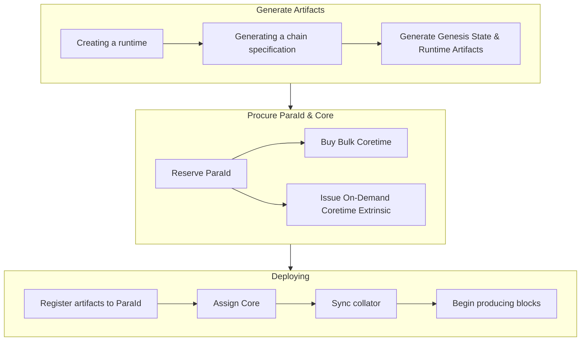

!!! danger "Not a production ready guide."
    This section is under construction and moving!

    Agile coretime is only for the Kusama and testnet networks at the moment, and is not yet deployed on
    Polkadot. These guides are **not** production ready due to the moving nature of these features.

## Using the Polkadot SDK

The Polkadot SDK monorepo is composed of **three** repositories:

- [**Polkadot**](https://paritytech.github.io/polkadot-sdk/master/polkadot_sdk_docs/polkadot_sdk/index.html#polkadot){target=_blank} -
  For a time, this included both the client implementation and runtime, until the runtime was moved
  to the [Polkadot Fellows organization](https://github.com/polkadot-fellows/runtimes){target=_blank}.
- [**Substrate**](https://paritytech.github.io/polkadot-sdk/master/polkadot_sdk_docs/polkadot_sdk/index.html#substrate){target=_blank} -
  The underlying, core primitives and libraries for building blockchains (any blockchain, not just
  one for Polkadot). Polkadot itself is built with Substrate.
- [**Cumulus**](https://paritytech.github.io/polkadot-sdk/master/polkadot_sdk_docs/polkadot_sdk/index.html#cumulus){target=_blank} -
  A set of libraries and tools which pertain specifically with connecting blockchains to Polkadot,
  known as parachains.

For an in-depth dive into the monorepo, the [Polkadot SDK Rust documentation](https://paritytech.github.io/polkadot-sdk/master/polkadot_sdk_docs/polkadot_sdk/index.html){target=_blank} is highly recommended

<!-- TODO: Glossary link ParaId -->

## Zero to Hero with The Polkadot SDK

The process of using the Polkadot SDK to deploying a parachain on a [core](https://wiki.polkadot.network/docs/learn-agile-coretime#core){target=_blank} can be summarized as follows. It is also possible to build standalone blockchains with the Polkadot SDK:

1. **Reserving** a `ParaId`, where you will upload your runtime and genesis state
2. **Compiling** the runtime (written in Rust) to a WebAssembly blob, thereby defining how your state transitions from one state to the next. This runtime is created using the Polkadot SDK
3. **Ensure** your chain spec is viable and ready to be deployed as a live, working parachain
4. **Generating** your genesis state and wasm
5. **Obtaining** a core through a [Coretime marketplace](https://wiki.polkadot.network/docs/learn-guides-coretime-marketplaces){target=_blank}
6. **Assigning** that core to your `ParaId`
7. **Ensuring** you have at least one honest, synced collator for your task

!!!info "What is a task?"
    A task refers to a process utilizing Polkadot's compute. This could be a parachain or any other computational process, provided that it adheres to the Polkadot protocol. The full definition can be found on the [Polkadot Wiki](https://wiki.polkadot.network/docs/learn-agile-coretime#task).

### Deploying on a Core

Once you have your runtime and pallets developed, it will be able to deploy it on a core, which is how one utilizes the shared security of the Polkadot network. One does so by:

<!-- TODO: We should probably have a link to guides or something here, or build some track which has them go from template to core? -->

<!-- TODO: Add a place / page to install the necessary dependencies -->

### Install Dependencies

Ensure all necessary dependencies are installed.

<!-- TODO: Add a place / page to install the necessary dependencies -->

### Deployment Example - Adder Collator

Try out the above by deploying the adder collator, a very simple "counter" parachain implementation.

## OpenZeppelin Templates & Guides

OpenZeppelin offers a [generic parachain template](https://github.com/OpenZeppelin/polkadot-generic-runtime-template){target=_blank}, which has support for:

- Proxy Pallet
- Multisig Pallet
- Governance support - a treasury, referenda (OpenGov!), and assets configuration
- Collation/Parachain Support
- XCM (Cross Consensus Messaging) Configuration and Support

For more information, check their
[Substrate parachain runtime guide.](https://docs.openzeppelin.com/substrate-runtimes/1.0.0/){target=_blank}

## Polkadot SDK Templates

A full list of Polkadot SDK templates can be found within the [Rust documentation for the Polkadot SDK.](https://paritytech.github.io/polkadot-sdk/master/polkadot_sdk_docs/polkadot_sdk/templates/index.html){target=_blank}