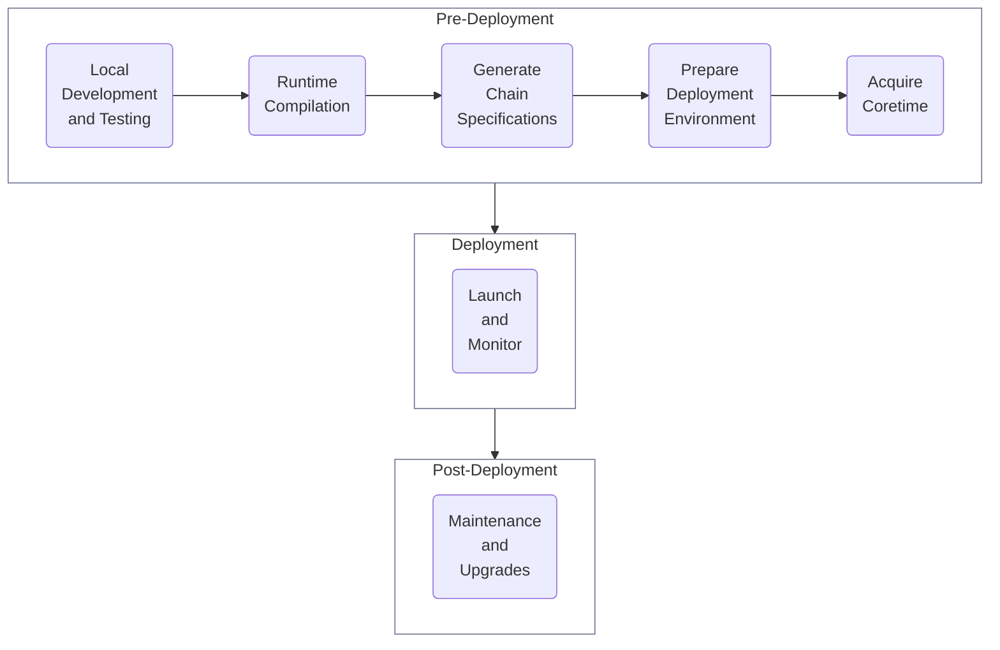

# Deployment

Learn how to prepare your blockchain for deployment using the Polkadot SDK, including building deterministic Wasm runtimes and generating chain specifications.

To better understand the deployment process, check out the following section. If you're ready to start jump to [In This Section](#in-this-section) to begin working through the deployment guides.

## Deployment Process

Taking your Polkadot SDK-based blockchain from a local environment to production involves several steps, ensuring your network is stable, secure, and ready for real-world use. The following diagram outlines the process at a high level:

- **Local development and testing** - the process begins with local development and testing. Developers focus on building the runtime by selecting and configuring the necessary pallets while refining network features. In this phase, running a local TestNet is essential to verify transactions and ensure the blockchain behaves as expected. Unit and integration tests ensure the network works as expected before launch. Thorough testing is conducted, not only for individual components but also for interactions between pallets

- **Runtime compilation** - Polkadot SDK-based blockchains are built with Wasm, a highly portable and efficient format. Compiling your blockchain's runtime into Wasm ensures it can be executed reliably across various environments, guaranteeing network-wide compatibility and security. The [srtool](https://github.com/paritytech/srtool){target=\_blank} is helpful for this purpose since it allows you to compile [deterministic runtimes](/develop/parachains/deployment/build-deterministic-runtime/){target=\_blank}

- **Generate chain specifications** - the chain spec file defines the structure and configuration of your blockchain. It includes initial node identities, session keys, and other parameters. Defining a well-thought-out chain specification ensures that your network will operate smoothly and according to your intended design

- **Deployment environment** - whether launching a local test network or a production-grade blockchain, selecting the proper infrastructure is vital. For further information about these topics, see the [Infrastructure](/infrastructure/){target=\_blank} section

- **Acquire coretime** - to build on top of the Polkadot network, users need to acquire coretime (either on-demand or in bulk) to access the computational resources of the relay chain. This allows for the secure validation of parachain blocks through a randomized selection of relay chain validators

If you’re building a standalone blockchain (solochain) that won’t connect to Polkadot as a parachain, you can skip the preceding step, as there’s no need to acquire coretime or implement [Cumulus](https://wiki.polkadot.network/docs/build-pdk#cumulus){target=\_blank}.

- **Launch and monitor** - once everything is configured, you can launch the blockchain, initiating the network with your chain spec and Wasm runtime. Validators or collators will begin producing blocks, and the network will go live. Post-launch, monitoring is vital to ensuring network health—tracking block production, node performance, and overall security

- **Maintenance and upgrade** - a blockchain continues to evolve post-deployment. As the network expands and adapts, it may require runtime upgrades, governance updates, coretime renewals, and even modifications to the underlying code. For an in-depth guide on this topic, see the [Maintenance](/develop/parachains/maintenance/){target=\_blank} section

## In This Section

:::INSERT_IN_THIS_SECTION:::

## Additional Resources

  

    <a href="https://paritytech.github.io/polkadot-sdk/master/staging_chain_spec_builder/index.html" target="_blank">
      <h2 class="title">Check Out the Chain Spec Builder Docs</h2>
      
Learn about Substrate’s chain spec builder utility.

    </a>
  

