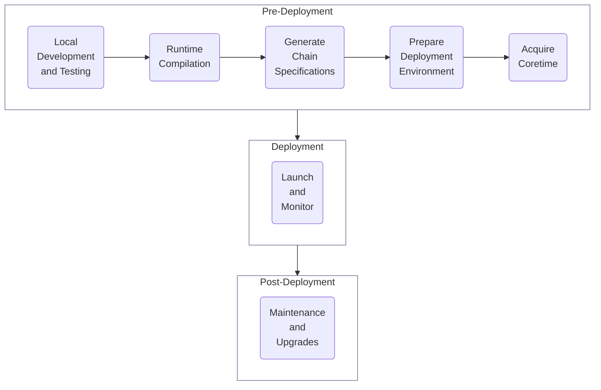

# Deployment

Learn how to prepare your blockchain for deployment using the Polkadot SDK, including building deterministic Wasm runtimes and generating chain specifications.

For a clearer understanding of the deployment process, explore the section below. If you're ready to dive in, head to In This Section to begin working through the deployment guides.

To get a better picture of the deployment process, check out the following section. If you're ready to get started, jump to [In This Section](#in-this-section) to begin working through the deployment guides.

## Deployment Process

Taking your Polkadot SDK-based blockchain from a local environment to production involves several steps, ensuring your network is stable, secure, and ready for real-world use. The following diagram outlines the process at a high level:

For more details, check out the [Deploy a Parachain to Polkadot](/develop/parachains/get-started/deploy-parachain-to-polkadot/) overview.

## In This Section

:::INSERT_IN_THIS_SECTION:::

## Additional Resources

  

    <a href="https://paritytech.github.io/polkadot-sdk/master/staging_chain_spec_builder/index.html" target="_blank">
      <h2 class="title">Check Out the Chain Spec Builder Docs</h2>
      
Learn about Substrate’s chain spec builder utility.

    </a>
  

