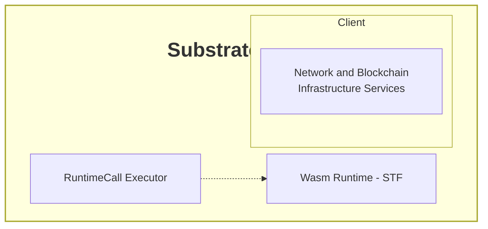
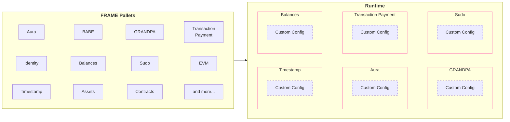
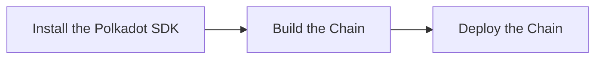

# Introduction to Polkadot SDK

## Introduction

The [Polkadot SDK](https://github.com/paritytech/polkadot-sdk/tree/{{dependencies.repositories.polkadot_sdk.version}}){target=\_blank} is a powerful and versatile developer kit designed to facilitate building on the Polkadot network. It provides the necessary components for creating custom blockchains, parachains, generalized rollups, and more. Written in the Rust programming language, it puts security and robustness at the forefront of its design.

Whether you're building a standalone chain or deploying a parachain on Polkadot, this SDK equips developers with the libraries and tools needed to manage runtime logic, compile the codebase, and utilize core features like staking, governance, and Cross-Consensus Messaging (XCM). It also provides a means for building generalized peer-to-peer systems beyond blockchains. The Polkadot SDK houses the following overall functionality:

- Networking and peer-to-peer communication (powered by [Libp2p](/polkadot-protocol/glossary#libp2p){target=\_blank})
- Consensus protocols, such as [BABE](/polkadot-protocol/glossary#blind-assignment-of-blockchain-extension-babe){target=\_blank}, [GRANDPA](/polkadot-protocol/glossary#grandpa){target=\_blank}, or [Aura](/polkadot-protocol/glossary#authority-round-aura){target=\_blank}
- Cryptography
- The ability to create portable Wasm runtimes
- A selection of pre-built modules, called [pallets](/polkadot-protocol/glossary#pallet){target=\_blank}
- Benchmarking and testing suites

For an in-depth look at the monorepo, see the [Polkadot SDK Rust documentation](https://paritytech.github.io/polkadot-sdk/master/polkadot_sdk_docs/polkadot_sdk/index.html){target=\_blank}.

## Polkadot SDK Overview

The Polkadot SDK is composed of five major components:

- [**Substrate**](https://paritytech.github.io/polkadot-sdk/master/polkadot_sdk_docs/polkadot_sdk/substrate/index.html){target=\_blank} - a set of libraries and primitives for building blockchains
- [**FRAME**](https://paritytech.github.io/polkadot-sdk/master/polkadot_sdk_docs/polkadot_sdk/frame_runtime/index.html){target=\_blank} - a blockchain development framework built on top of Substrate
- [**Cumulus**](https://paritytech.github.io/polkadot-sdk/master/polkadot_sdk_docs/polkadot_sdk/cumulus/index.html){target=\_blank} - a set of libraries and pallets to add parachain capabilities to a Substrate/FRAME runtime
- [**XCM (Cross Consensus Messaging)**](https://paritytech.github.io/polkadot-sdk/master/polkadot_sdk_docs/polkadot_sdk/xcm/index.html){target=\_blank} - the primary format for conveying messages between parachains
- [**Polkadot**](https://paritytech.github.io/polkadot-sdk/master/polkadot_sdk_docs/polkadot_sdk/polkadot/index.html){target=\_blank} - the node implementation for the Polkadot protocol

### Substrate

Substrate is a Software Development Kit (SDK) that uses Rust-based libraries and tools to enable you to build application-specific blockchains from modular and extensible components. Application-specific blockchains built with Substrate can run as standalone services or in parallel with other chains to take advantage of the shared security provided by the Polkadot ecosystem. Substrate includes default implementations of the core components of the blockchain infrastructure to allow you to focus on the application logic.

Every blockchain platform relies on a decentralized network of computers—called nodes—that communicate with each other about transactions and blocks. In general, a node in this context is the software running on the connected devices rather than the physical or virtual machine in the network. As software, Substrate-based nodes consist of two main parts with separate responsibilities:

- **Client** - services to handle network and blockchain infrastructure activity
    - Native binary
    - Executes the Wasm runtime
    - Manages components like database, networking, mempool, consensus, and others
    - Also known as "Host"
- **Runtime** - business logic for state transitions
    - Application logic
    - Compiled to [Wasm](https://webassembly.org/){target=\_blank}
    - Stored as a part of the chain state
    - Also known as State Transition Function (STF)

### FRAME

FRAME provides the core modular and extensible components that make the Substrate SDK flexible and adaptable to different use cases. FRAME includes Rust-based libraries that simplify the development of application-specific logic. Most of the functionality that FRAME provides takes the form of plug-in modules called [pallets](/polkadot-protocol/glossary#pallet){target=\_blank} that you can add and configure to suit your requirements for a custom runtime.

### Cumulus

Cumulus provides utilities and libraries to turn FRAME-based runtimes into runtimes that can be a parachain on Polkadot. Cumulus runtimes are still FRAME runtimes but contain the necessary functionality that allows that runtime to become a parachain on a relay chain.

## Why Use Polkadot SDK?

Using the Polkadot SDK, you can build application-specific blockchains without the complexity of building a blockchain from scratch or the limitations of building on a general-purpose blockchain. You can focus on crafting the business logic that makes your chain unique and innovative with the additional benefits of flexibility, upgradeability, open-source licensing, and cross-consensus interoperability.

## Create a Custom Blockchain Using the SDK

Before starting your blockchain development journey, you'll need to decide whether you want to build a standalone chain or a parachain that connects to the Polkadot network. Each path has its considerations and requirements. Once you've made this decision, follow these development stages:

1. [**Install the Polkadot SDK**](/develop/parachains/install-polkadot-sdk/) - set up your development environment with all necessary dependencies and tools
2. [**Build the chain**](/develop/parachains/customize-parachain) - learn how to create and customize your blockchain's runtime, configure pallets, and implement your chain's unique features
3. [**Deploy the chain**](/develop/parachains/deployment) - follow the steps to launch your blockchain, whether as a standalone network or as a parachain on Polkadot

Each stage is covered in detail in its respective guide, walking you through the process from initial setup to final deployment.
