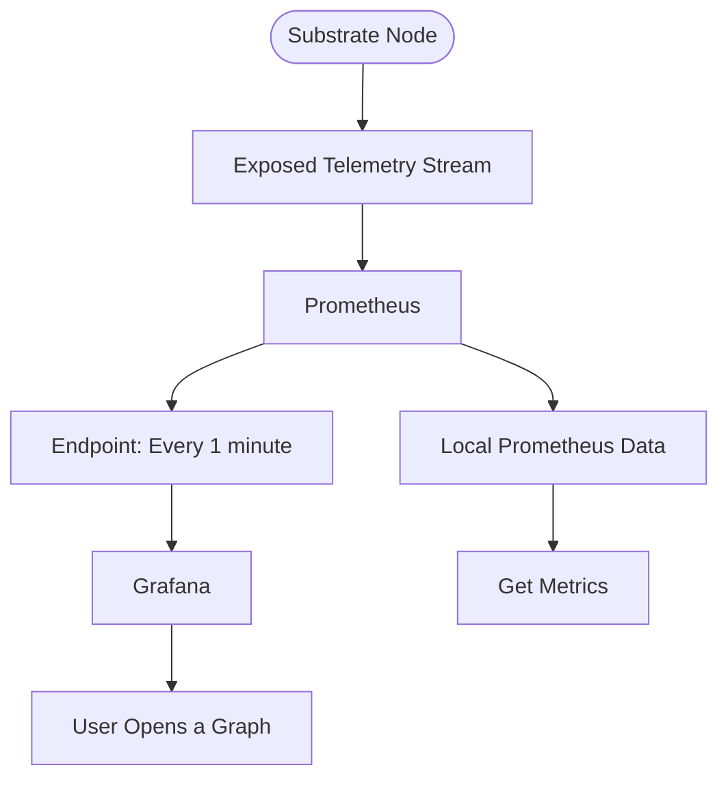

# Runtime Metrics and Monitoring

## Introduction

Maintaining a stable, secure, and efficient network requires continuous monitoring. Polkadot SDK-based nodes are equipped with built-in telemetry components that automatically collect and transmit detailed data about node performance in real-time. This telemetry system is a core feature of the Substrate framework, allowing for easy monitoring of network health without complex setup.

[Substrate's client telemetry](https://paritytech.github.io/polkadot-sdk/master/sc_telemetry/index.html){target=\_blank} enables real-time data ingestion, which can be visualized on a client dashboard. The telemetry process uses tracing and logging to gather operational data. This data is sent through a tracing layer to a background task called the [`TelemetryWorker`](https://paritytech.github.io/polkadot-sdk/master/sc_telemetry/struct.TelemetryWorker.html){target=\_blank}, which then forwards it to configured remote telemetry servers.

If multiple Substrate nodes run within the same process, the telemetry system uses a `tracing::Span` to distinguish data from each node. This ensures that each task, managed by the `sc-service`'s [`TaskManager`](https://paritytech.github.io/polkadot-sdk/master/sc_service/struct.TaskManager.html){target=\_blank}, inherits a span for data consistency, making it easy to track parallel node operations. Each node can be monitored for basic metrics, such as block height, peer connections, CPU usage, and memory. Substrate nodes expose these metrics at the `host:9615/metrics` endpoint, accessible locally by default. To expose metrics on all interfaces, start a node with the `--prometheus-external` flag.

As a developer or node operator, the telemetry system handles most of the technical setup. Collected data is automatically sent to a default telemetry server, where it’s aggregated and displayed on a dashboard, making it easy to monitor network performance and identify issues.

## Runtime Metrics

Substrate exposes a variety of metrics about the operation of your network, such as the number of peer connections, memory usage, and block production. To capture and visualize these metrics, you can configure and use tools like [Prometheus](https://prometheus.io/){target=\_blank} and [Grafana](https://grafana.com/){target=\_blank}. At a high level, Substrate exposes telemetry data that can be consumed by the Prometheus endpoint and then presented as visual information in a Grafana dashboard or graph. The provided diagram offers a simplified overview of how the interaction between Substrate, Prometheus, and Grafana can be configured to display information about node operations.



The diagram shows the flow of data from the Substrate node to the monitoring and visualization components. The Substrate node exposes a telemetry stream, which is consumed by Prometheus. Prometheus is configured to collect data every minute and store it. Grafana is then used to visualize the data, allowing the user to open graphs and retrieve specifc metrics from the telemetry stream.

## Visual Monitoring

The [Polkadot telemetry](https://telemetry.polkadot.io/){target=\_blank} dashboard provides a real-time view of how currently online nodes are performing. This dashboard, allows users to select the network you need to check on, and also the information you want to display by turning visible columns on and off from the list of columns available. The monitoring dashboard provides the following indicators and metrics:

- **Validator** - identifies whether the node is a validator node or not
- **Location** - displays the geographical location of the node
- **Implementation** - shows the version of the software running on the node
- **Network ID** - displays the public network identifier for the node
- **Peer count** - indicates the number of peers connected to the node
- **Transactions in queue** - shows the number of transactions waiting in the [`Ready` queue](https://paritytech.github.io/polkadot-sdk/master/sc_transaction_pool_api/enum.TransactionStatus.html#variant.Ready){target=\_blank} for a block author
- **Upload bandwidth** - graphs the node's recent upload activity in MB/s
- **Download bandwidth** - graphs the node's recent download activity in MB/s
- **State cache size** - graphs the size of the node's state cache in MB
- **Block** - displays the current best block number to ensure synchronization with peers
- **Block hash** - shows the block hash for the current best block number
- **Finalized block** - displays the most recently finalized block number to ensure synchronization with peers
- **Finalized block hash** - shows the block hash for the most recently finalized block
- **Block time** - indicates the time between block executions
- **Block propagation time** - displays the time it took to import the most recent block
- **Last block time** - shows the time it took to author the most recent block
- **Node uptime** - indicates the number of days the node has been online without restarting

## Displaying Network-Wide Statistics

In addition to the details available for individual nodes, you can view statistics that provide insights into the broader network. The network statistics provide detailed information about the hardware and software configurations of the nodes in the network, including:

- Software version
- Operating system
- CPU architecture and model
- Number of physical CPU cores
- Total memory
- Whether the node is a virtual machine
- Linux distribution and kernel version
- CPU and memory speed
- Disk speed

## Customizing Monitoring Tools

The default telemetry dashboard offers core metrics without additional setup. However, many projects prefer custom telemetry setups with more advanced monitoring and alerting policies.

Typically, setting up a custom telemetry solution involves establishing monitoring and alerting policies for both on-chain events and individual node operations. This allows for more tailored monitoring and reporting compared to the default telemetry setup.

### On-Chain Activity

You can monitor specific on-chain events like transactions from certain addresses or changes in the validator set. Connecting to RPC nodes allows tracking for delays or specific event timings. Running your own RPC servers is recommended for reliable queries, as public RPC nodes may occasionally be unreliable.

## Monitoring Tools

To implement customized monitoring and alerting, consider using the following stack:

- [**Prometheus**](https://prometheus.io/){target=\_blank} - collects metrics at intervals, stores data in a time series database, and applies rules for evaluation
- [**Grafana**](https://grafana.com/){target=\_blank} - visualizes collected data through customizable dashboards
- [**Node exporter**](https://github.com/prometheus/node_exporter){target=\_blank} - reports host metrics, including CPU, memory, and bandwidth usage
- [**Alert manager**](https://github.com/prometheus/alertmanager){target=\_blank} - manages alerts, routing them based on defined rules
- [**Loki**](https://github.com/grafana/loki){target=\_blank} - scalable log aggregator for searching and viewing logs across infrastructure

### Change the Telemetry Server

Once backend monitoring is configured, use the `--telemetry-url` flag when starting a node to specify telemetry endpoints and verbosity levels. Multiple telemetry URLs can be provided, and verbosity ranges from 0 (least verbose) to 9 (most verbose).

For instance, setting a custom telemetry server with verbosity level 5 would look like:

```bash
./target/release/node-template --dev \
  --telemetry-url "wss://192.168.48.1:9616 5" \
  --prometheus-port 9616 \
  --prometheus-external
```

For more information on the backend components for telemetry or configuring your own server, you can refer to the [`substrate-telemetry`](https://github.com/paritytech/substrate-telemetry){target=\_blank} project or the [Substrate Telemetry Helm Chart](https://github.com/paritytech/helm-charts/blob/main/charts/substrate-telemetry/README.md){target=\_blank} for Kubernetes deployments.