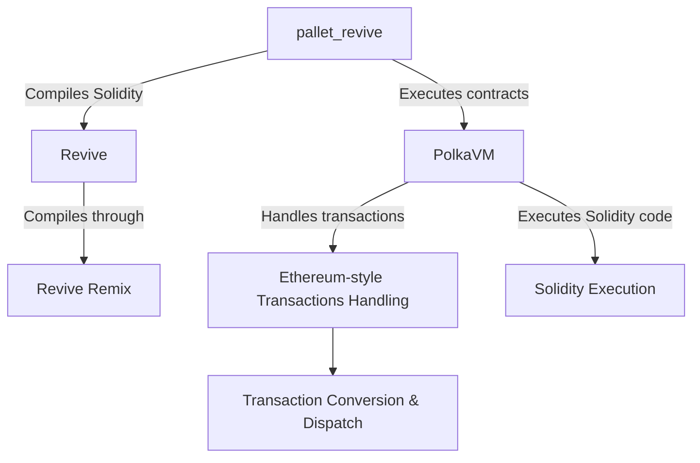

# Native EVM Contracts

## Introduction

The Asset Hub parachain serves as the central repository for assets within the Polkadot ecosystem. Numerous blockchain applications depend on secure and user-friendly access to these assets.

Currently, two permissionless approaches exist for developing and deploying on-chain logic on Polkadot to interact with Asset Hub assets:

- **Polkadot SDK**- functionality can be developed using the Polkadot SDK and deployed as a parachain that interacts with Asset Hub via XCM in an asynchronous manner

- **Smart contracts** - functionality can be developed using Solidity or ink! and deployed on a parachain with a Frontier or pallet-contracts smart contract execution environment (e.g., Moonbeam, Astar). These smart contracts also interact with Asset Hub via XCM asynchronously

In both scenarios, the communication overhead and increased complexity from interacting with assets on another chain are significant to the developers. Also,  the involvement of another token, governance system, or brand when building an application is a factor that might slow down the development process.

To address these challenges, it is proposed to enable direct deployment of smart contracts on Asset Hub, this solution is referred to as native EVM contracts. By making all assets within the `pallet_asset` accessible to contracts, applications can bypass asynchronous operations. Each asset in `pallet_assets` would be represented as an emulated ERC-20 contract, ensuring an ergonomic experience for Solidity developers.

## Components

The native EVM contracts solution is composed of the following components:

- [**`pallet_revive`**](https://paritytech.github.io/polkadot-sdk/master/pallet_revive/index.html){target=\_blank} - executes smart contracts by adding extrinsics, runtime APIs, and logic for processing Ethereum-style transactions. Instead of being submitted directly to the blockchain, these transactions are sent through a proxy server that emulates the Ethereum JSON RPC interface. The proxy converts Ethereum transactions into a special dispatchable, leaving the payload intact. The pallet's logic decodes and transforms these transactions into a format compatible with the blockchain, simplifying tooling integration. Using a proxy avoids modifying the node binary, ensuring compatibility with alternative clients without requiring additional implementation
- [**PolkaVM**](https://github.com/paritytech/polkavm){target=\_blank} - a custom virtual machine replacing EVM, featuring a RISC-V-based register architecture for efficient hardware translation and 64-bit word size for faster arithmetic. Includes an interpreter for lightweight tasks and plans for a JIT compiler, allowing Solidity to interact with high-performance languages
- [**Revive**](https://github.com/paritytech/revive){target=\_blank} - compiles Solidity for PolkaVM by translating [YUL](https://docs.soliditylang.org/en/latest/yul.html){target=\_blank}, the intermediate output from the solc compiler, to RISC-V. This approach simplifies development and ensures full compatibility with all Solidity versions and features
- [**Revive Remix**](https://github.com/paritytech/revive-remix){target=\_blank} - a modified fork of Remix adapted to use a backend compiler instead of an in-browser one, accommodating the LLVM-based Revive compiler's complexity



### PolkaVM: Key Performance and Compatibility Differences

PolkaVM offers significant performance improvements over existing Polkadot smart contract execution environments, such as Frontier, thanks to its custom architecture based on RISC-V and 64-bit word size. This approach enables more efficient hardware translation and faster arithmetic, allowing additional languages like C or Rust to be integrated for further performance optimization. Unlike Ethereum, which uses a stack-based EVM, PolkaVM’s register-based design allows for faster compilation times and better compatibility with modern hardware. However, PolkaVM’s focus on performance means it deviates from Ethereum in key areas, such as gas modeling and contract execution.

PolkaVM introduces a multi-dimensional gas model to address these differences, incorporating resources like computation time, proof size, and storage deposits. This provides a more accurate representation of contract execution costs and reduces overcharging for memory allocations. PolkaVM also avoids Ethereum’s approach of using a single resource for gas, making it possible to meter resources at the transaction level and for cross-contract calls. For compatibility, PolkaVM’s RPC interface closely mirrors Ethereum’s, with minor adjustments needed for some operations. Additionally, PolkaVM hides the existential deposit requirement to ensure smooth operation across networks, ensuring users aren’t surprised by the underlying balance limitations.

## Get Started

### Connect to Asset Hub

Install the MetaMask browser extension and add a custom network using the settings provided below:

- **Network name** - `Asset-Hub Westend Testnet`
- **RPC URL** - `https://westend-asset-hub-eth-rpc.polkadot.io`
- **Chain ID** - `420420421`
- **Currency symbol** - `WND`
- **Block explorer URL** - [`https://assethub-westend.subscan.io`](https://assethub-westend.subscan.io){target=\_blank}

### Deployment

To deploy a contract to the Westend Asset Hub, you need to get WND tokens. To do so, you can use the [Westend Faucet](https://faucet.polkadot.io/westend?parachain=1000){target=\_blank}. You need to specify the address where you want to receive the tokens from the faucet.

For deploying and interacting with contracts in [Revive Remix](https://remix.polkadot.io/){target=\_blank}, you can use the following steps:

1. Open the Remix IDE, select any Solidity contract available and compile it using the **▶️** button or the **Solidity Compiler** tab

    

2. Deploy the contract
    1. Click on the **Deploy & Run** tab
    2. Choose the **Westend TestNet - Metamask** button, your account address and balance will appear in the **ACCOUNT** field
    3. Click on the **Deploy** button to launch the contract

        

After deployment, you can interact with the contract listed in the **Deployed/Unpinned Contracts** section within the **Deploy & Run** tab. You can either call the smart contracts methods or run tests against the contract to see if the contract works as expected.

### Ethers.js Support

Once the contract is deployed, you can also use the [Ethers.js](https://docs.ethers.org/v6/){target=\_blank} library to make your application interact with the contract. This library provides the tools needed to query data, send transactions, and listen to events through a *provider*, which acts as a link between your application and the blockchain.

- In browsers, providers are available through wallets like [MetaMask](https://metamask.io/){target=\_blank}, which inject an `ethereum` object into the `window`. Ensure that Metamask is installed and connected to Westend Asset Hub

    ```js
    --8<-- 'code/develop/smart-contracts/native-evm-contracts/ether-js-browser-connection.js'
    ```

- For server-side applications, `JsonRpcProvider` can connect directly to RPC nodes:

    ```js
    --8<-- 'code/develop/smart-contracts/native-evm-contracts/ether-js-server-connection.js'
    ```

Once your application is connected, you can retrieve network data, access contract methods, and fully interact with the deployed smart contract.

## Where to Go Next

For further information about the Asset Hub smart contracts, please refer to the [official documentation](https://contracts.polkadot.io/){targe=\_blank}.
