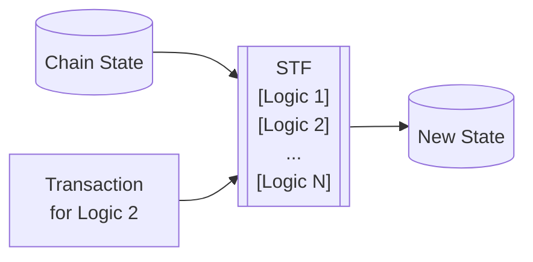

# Native EVM Contracts

## Introduction

The Asset Hub parachain serves as the central repository for assets within the Polkadot ecosystem. Numerous blockchain applications depend on secure and user-friendly access to these assets.

Currently, two permissionless approaches exist for developing and deploying on-chain logic on Polkadot to interact with Asset Hub assets:

Polkadot SDK: Functionality can be developed using the Polkadot SDK and deployed as a parachain that interacts with Asset Hub via XCM in an asynchronous manner.

Smart Contracts: Functionality can be developed using Solidity or ink! and deployed on a parachain with a Frontier or pallet-contracts smart contract execution environment (e.g., Moonbeam, Astar). These smart contracts also interact with Asset Hub via XCM asynchronously.

In both scenarios, the following challenges arise:

Communication overhead and increased complexity from interacting with assets on another chain.
The involvement of another token, governance system, or brand when building an application.
To address these challenges, it is proposed to enable direct deployment of smart contracts on Asset Hub. By making all assets within the pallet_asset accessible to contracts, applications can bypass asynchronous operations. Each asset in pallet_assets would be represented as an emulated ERC20 contract, ensuring an ergonomic experience for Solidity developerso




```mermaid
F@{ shape: procs, label: "Execution Logs"}
```