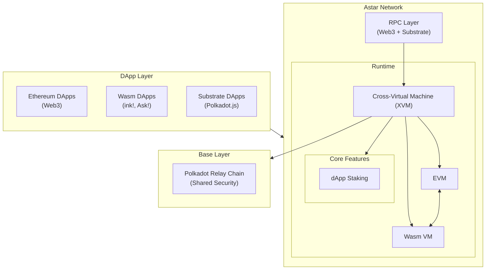
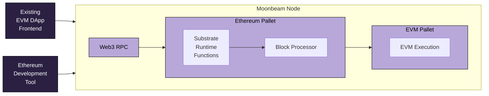
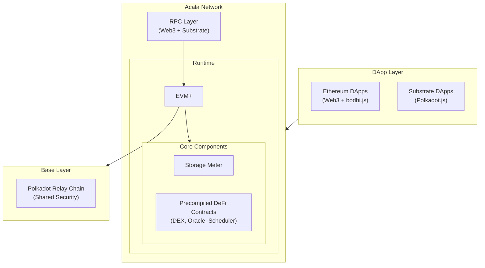

# Parachain Contracts

## Introduction

One key factor underpinning Ethereum's growth is the ease of deploying to the EVM. The EVM, or Ethereum Virtual Machine, provides developers with a consistent and predictable execution environment for smart contracts. While the EVM is not perfect, its popularity and ease of deployment have far outweighed any shortcomings and resulted in the massive growth of EVM-compatible smart contract platforms.

Also integral to the proliferation of EVM-based smart contract networks is smart contract portability. Developers can take their smart contracts that they've deployed to Ethereum, and in many cases, deploy them to other EVM-compatible networks with minimal changes. More than "Copy/Paste" deployments, this enables chains' interoperability. Building a cross-chain application is much easier when both chains offer similar EVM compatibility.

## Why Adopt the EVM as a Polkadot Parachain?

In addition to the developer mindshare of the EVM, Polkadot parachains leveraging the EVM can benefit from the extensive tooling for Ethereum developers that's already been built and battle-tested. This includes wallets, block explorers, developer tools, and more. Beyond just tools, the EVM has had a long headstart regarding smart contract auditors and institutional/custodial asset management. Integrating EVM compatibility can unlock several of these tools by default or allow for relatively easy future integrations.

Polkadot enables parachains to supercharge the capabilities of their parachain beyond just the limitations of the EVM. To that end, many parachains have developed ways to tap into the powerful features offered by Polkadot, such as through precompiles or solidity interfaces that expose Substrate functionality to app developers and users. This guide will cover some of the unique features that each parachain offers. For more information about each parachain, visit the documentation site for the respective parachain.  

## EVM-Compatible Parachains

### Astar

[Astar](https://astar.network/){target=\_blank} emerged as a key smart contract platform on Polkadot, distinguished by its unique multiple virtual machine approach that supports both EVM and WebAssembly (Wasm) smart contracts. This dual VM support allows developers to choose their preferred programming environment while maintaining full Ethereum compatibility. The platform's [runtime](https://github.com/AstarNetwork/Astar){target=\_blank} is built on Substrate using FRAME, incorporating crucial components from Polkadot-SDK alongside custom-built modules for handling its unique features.

Astar has established itself as an innovation hub through initiatives like the zk-rollup development framework and integration with multiple Layer 2 scaling solutions. Astar leverages [XCM](/develop/interoperability/intro-to-xcm/){target=\_blank} for native Polkadot ecosystem interoperability while maintaining connections to external networks through various bridge protocols. Through its support for both EVM and Wasm, along with advanced cross-chain capabilities, Astar serves as a crucial gateway for projects looking to leverage the unique advantages of both Ethereum and Polkadot ecosystems while maintaining seamless interoperability between them.

#### Technical Architecture



The diagram illustrates the layered architecture of Astar Network: at the top, dApps can interact with the Astar network through either Web3, Substrate, or Wasm. These requests flow through Astar's RPC layer into the main runtime, where the magic happens in the virtual machine layer. Here, Astar's unique Cross-Virtual Machine (XVM) coordinates between EVM and Wasm environments, allowing smart contracts from both ecosystems to interact. The Runtime also includes core blockchain functions through various pallets (like system operations and dApps staking), and everything is ultimately secured by connecting to the Polkadot Relay Chain at the bottom layer.

#### Endpoints and Faucet

|    Variable     | Value                                                                                            |
|:---------------:|:-------------------------------------------------------------------------------------------------|
|  Network Name   | Shibuya Testnet                                                                                  |
|  EVM Chain ID   | 81                                                                                               |
| Public RPC URLs | <pre>```https://evm.shibuya.astar.network```</pre>                                               |
| Public WSS URLs | <pre>```wss://evm.shibuya.astar.network```</pre>                                                 |
| Block Explorer  | [Shibuya Blockscout](https://blockscout.com/shibuya){target=\_blank}                             |
|   Faucet Link   | [Faucet - Astar Docs](https://docs.astar.network/docs/build/environment/faucet/){target=\_blank} |

### Moonbeam

[Moonbeam](https://docs.moonbeam.network/){target=\_blank} was the first parachain to bring full Ethereum-compatibility to Polkadot, enabling Ethereum developers to bring their dApps to Polkadot and gain access to the rapidly growing Polkadot user base. [Moonbeam's runtime](https://github.com/moonbeam-foundation/moonbeam){target=\_blank} is built using [FRAME](/develop/parachains/customize-parachain/overview/#frame-runtime-architecture){target=\_blank}, and combines essential components from the Polkadot-SDK, Frontier, and custom pallets. The architecture integrates key Substrate offerings like balance management and transaction processing, while [Frontier's](https://github.com/polkadot-evm/frontier){target=\_blank} pallets enable EVM execution and Ethereum compatibility. Custom pallets handle Moonbeam-specific features such as parachain staking and block author verification. Moonbeam offers a variety of precompiles for dApp developers to access powerful Polkadot features via a Solidity interface, such as governance, randomness, transaction batching, and more.

Additionally, Moonbeam is a hub for interoperability and cross-chain connected contracts. Moonbeam has a variety of integrations with GMP (general message passing) providers, including [Wormhole](https://wormhole.com/){target=\_blank}, [LayerZero](https://layerzero.network/){target=\_blank}, [Axelar](https://www.axelar.network/){target=\_blank}, and more. These integrations make it easy for developers to build cross-chain contracts on Moonbeam, and they also play an integral role in connecting the entire Polkadot ecosystem with other blockchains. Innovations like [Moonbeam Routed Liquidity](https://docs.moonbeam.network/builders/interoperability/mrl/){target=\_blank}, or MRL, enable users to bridge funds between chains like Ethereum and parachains like HydraDX. Through [XCM](/develop/interoperability/intro-to-xcm/){target=\_blank}, other parachains can connect to Moonbeam and access its established bridge connections to Ethereum and other networks, eliminating the need for each parachain to build and maintain their own bridges.

#### Technical Architecture




The diagram above illustrates how transactions are processed on Moonbeam. When a DApp or Ethereum development tool (like Hardhat) sends a Web3 RPC request, it's first received by a Moonbeam node. Moonbeam nodes are versatile - they support both Web3 and Substrate RPCs, giving developers the flexibility to use either Ethereum or Substrate tools. When these RPC calls come in, they're processed by corresponding functions in the Substrate runtime. The runtime verifies signatures and processes any Substrate extrinsics. Finally, if the transaction involves smart contracts, these are forwarded to Moonbeam's EVM for execution and state changes.

#### Endpoints and Faucet

|    Variable     | Value                                                                    |
|:---------------:|:-------------------------------------------------------------------------|
|  Network Name   | Moonbase Alpha Testnet                                                   |
|  EVM Chain ID   | [1287](https://chainlist.org/chain/1287){target=_blank}                  |
| Public RPC URLs | <pre>```https://rpc.api.moonbase.moonbeam.network```</pre>               |
| Public WSS URLs | <pre>```wss://wss.api.moonbase.moonbeam.network```</pre>                 |
| Block Explorer  | [Moonbase Alpha Moonscan](https://moonbase.moonscan.io/){target=\_blank} |
|   Faucet Link   | [Moonbase Faucet](https://faucet.moonbeam.network){target=\_blank}       |

### Acala

[Acala](https://acala.network/){target=\_blank} positioned itself as Polkadot's DeFi hub by introducing the [Acala EVM+](https://evmdocs.acala.network/){target=\_blank} - an enhanced version of the EVM specifically optimized for DeFi operations. This customized EVM implementation enables seamless deployment of Ethereum-based DeFi protocols while offering advanced features like on-chain scheduling, pre-built DeFi primitives, and native multi-token support that aren't available in traditional EVMs.

Acala supports a comprehensive DeFi ecosystem including a decentralized stablecoin (aUSD) and a liquid staking derivative for DOT. The platform's EVM+ innovations extend beyond standard Ethereum compatibility by enabling direct interaction between EVM smart contracts and Substrate pallets, facilitating advanced cross-chain DeFi operations through [XCM](/develop/interoperability/intro-to-xcm/){target=\_blank}, and providing built-in oracle integrations. These enhancements make it possible for DeFi protocols to achieve functionality that would be prohibitively expensive or technically infeasible on traditional EVM chains.

#### Technical Architecture



The diagram illustrates Acala's unique EVM+ architecture, which extends beyond standard EVM compatibility. At the top, DApps can interact with the network using either Ethereum tools (via Web3 and bodhi.js) or Substrate tools. These requests flow through Acala's dual RPC layer into the main Runtime. The key differentiator is the EVM+ environment, which includes special features like the Storage Meter for rent management, and numerous precompiled contracts (like DEX, Oracle, Schedule) that provide native Substrate functionality to EVM contracts. All of this runs on top of Polkadot's shared security as a parachain.

#### Endpoints and Faucet

|    Variable     | Value                                                                                |
|:---------------:|:-------------------------------------------------------------------------------------|
|  Network Name   | Mandala TC7 Testnet                                                                  |
|  EVM Chain ID   | [595](https://chainlist.org/chain/595){target=_blank}                                |
| Public RPC URLs | <pre>```https://eth-rpc-tc9.aca-staging.network```</pre>                             |
| Public WSS URLs | <pre>```wss://tc7-eth.aca-dev.network```</pre>                                       |
| Block Explorer  | [Mandala Blockscout](https://blockscout.mandala.aca-staging.network){target=\_blank} |
|   Faucet Link   | [Mandala Faucet](https://discord.gg/5JJgXKSznc){target=\_blank}                      |

## EVM Developer Tools

One of the key benefits of being an EVM-compatible parachain the ability for developers to use familiar developer tools, like [Hardhat](https://hardhat.org/){target=\_blank}, [Remix](https://remix.ethereum.org/){target=\_blank}, and [Foundry](https://github.com/foundry-rs/foundry){target=\_blank}. Being compatible with the most widely adopted smart contract programming language, Solidity, means that developers can leverage existing smart contract templates and standards, such as the ones built by [OpenZeppelin](https://www.openzeppelin.com/solidity-contracts){target=\_blank}. To learn more, check out the following guides for each parachain:

=== "Astar"
    - [Hardhat](https://docs.astar.network/docs/build/EVM/developer-tooling/hardhat/){target=\_blank}
    - [Thirdweb](https://docs.astar.network/docs/build/EVM/developer-tooling/thirdweb){target=\_blank}
    - [Remix](https://docs.astar.network/docs/build/builder-guides/astar_features/use_remix/){target=\_blank}
    - [Privy embedded wallets](https://docs.astar.network/docs/build/EVM/developer-tooling/privy){target=\_blank}

=== "Moonbeam"
    - [Hardhat](https://docs.moonbeam.network/builders/ethereum/dev-env/hardhat/){target=\_blank}
    - [Thirdweb](https://docs.moonbeam.network/builders/ethereum/dev-env/thirdweb/){target=\_blank}
    - [Remix](https://docs.moonbeam.network/builders/ethereum/dev-env/remix/){target=\_blank}
    - [Tenderly](https://docs.moonbeam.network/builders/ethereum/dev-env/tenderly/){target=\_blank}
    - [Foundry](https://docs.moonbeam.network/builders/ethereum/dev-env/foundry/){target=\_blank}
    - [OpenZeppelin](https://docs.moonbeam.network/builders/ethereum/dev-env/openzeppelin/){target=\_blank}

=== "Acala"
    - [Hardhat](https://wiki.acala.network/build/development-guide/smart-contracts/get-started-evm/use-hardhat){target=\_blank}
    - [Remix](https://wiki.acala.network/build/development-guide/smart-contracts/get-started-evm/use-remix){target=\_blank}
    - [Waffle](https://wiki.acala.network/build/development-guide/smart-contracts/get-started-evm/use-waffle){target=\_blank}

## Reading Contract State on EVM-Compatible Parachains

The following section will dive into a practical demonstration. The following script showcases how to interact with multiple Polkadot parachains using their EVM compatibility. This script will query:

- Moonbeam for its Wormhole USDC total supply
- Acala for its native ACA token supply using a precompile
- Astar for its USDC total supply

What makes this demo particularly powerful is that all three chains—Astar, Moonbeam, and Acala—share EVM compatibility. This means you can use a single, unified script to query token balances across all chains, simply by adjusting the RPC endpoints and token contract addresses. Thanks to EVM-compatibility, there's no need for chain-specific scripts or custom development work.

??? code "Expand to view the complete script"
    ```js
    --8<-- 'code/develop/smart-contracts/parachain-contracts/check-token-supply.js'
    ```

This script demonstrates one of the fundamental ways to interact with blockchain networks - querying on-chain state through smart contract calls.  The standardized ERC20 interface (which most tokens implement) is used to read the total supply of tokens across different EVM networks. This type of interaction is "read-only" or a "view" call, meaning it is simply fetching data from the blockchain without making any transactions or state changes. Therefore, it isn't using any gas. Transactions that attempt to make a state change to the blockchain require gas.  The ability to query state like this is essential for DApps, analytics tools, and monitoring systems that need real-time blockchain data.

## Where to Go Next

Check out the links below for each respective parachain for network endpoints, getting started guides, and more.

=== "Astar"
    - [Astar Docs](https://docs.astar.network/){target=\_blank}
    - [Astar Network Endpoints](https://docs.astar.network/docs/build/environment/endpoints/){target=\_blank}
    - [Build EVM Smart Contracts on Astar](https://docs.astar.network/docs/build/EVM/){target=\_blank}

=== "Moonbeam"
    - [Moonbeam Docs](https://docs.moonbeam.network/){target=\_blank}
    - [Moonbeam Network Endpoints](https://docs.moonbeam.network/builders/get-started/endpoints/){target=\_blank}
    - [Get Started Building on Moonbeam](https://docs.moonbeam.network/builders/get-started/){target=\_blank}

=== "Acala"
    - [Acala Docs](https://evmdocs.acala.network/){target=\_blank}
    - [Acala Network Endpoints](https://wiki.acala.network/integrate/acala/endpoints){target=\_blank}
    - [About the Acala Network](https://wiki.acala.network/learn/acala-introduction){target=\_blank}
