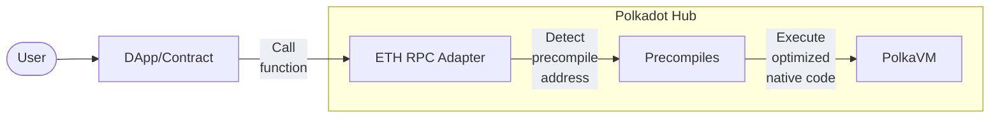

# Advanced Functionalities via Precompiles

## Introduction

Precompiles serve a dual purpose in the Polkadot ecosystem: they not only enable high-performance smart contracts by providing native, optimized implementations of frequently used functions but will also eventually act as critical bridges, allowing contracts to interact with core platform capabilities.

This article explores how Polkadot leverages precompiles within the Revive pallet to enhance efficiency and how they will extend functionality for developers in the future, including planned access to native features like Cross-Consensus Messaging (XCM).

## What are Precompiles?

Precompiles are special contract implementations that run directly at the runtime level rather than as on-chain PolkaVM contracts. In typical EVM environments, precompiles provide essential cryptographic and utility functionality at addresses that start with specific patterns. Revive follows this design pattern but with its own implementation optimized for PolkaVM.

## Standard Precompiles in Polkadot Hub

Revive implements the standard set of Ethereum precompiles:

|                                                                                   Contract Name                                                                                   | Address (Last Byte) |                                           Description                                           |
| :-------------------------------------------------------------------------------------------------------------------------------------------------------------------------------: | :-----------------: | :---------------------------------------------------------------------------------------------: |
|  [ECRecover](https://github.com/paritytech/polkadot-sdk/tree/46a656f82c5494a37567f0f4308d3665c6e480df/substrate/frame/revive/src/pure_precompiles/ecrecover.rs){target=\_blank}   |        0x01         |                       Recovers the public key associated with a signature                       |
|     [Sha256](https://github.com/paritytech/polkadot-sdk/tree/46a656f82c5494a37567f0f4308d3665c6e480df/substrate/frame/revive/src/pure_precompiles/sha256.rs){target=\_blank}      |        0x02         |                              Implements the SHA-256 hash function                               |
|  [Ripemd160](https://github.com/paritytech/polkadot-sdk/tree/46a656f82c5494a37567f0f4308d3665c6e480df/substrate/frame/revive/src/pure_precompiles/ripemd160.rs){target=\_blank}   |        0x03         |                             Implements the RIPEMD-160 hash function                             |
|   [Identity](https://github.com/paritytech/polkadot-sdk/tree/46a656f82c5494a37567f0f4308d3665c6e480df/substrate/frame/revive/src/pure_precompiles/identity.rs){target=\_blank}    |        0x04         |                          Data copy function (returns input as output)                           |
|     [Modexp](https://github.com/paritytech/polkadot-sdk/tree/46a656f82c5494a37567f0f4308d3665c6e480df/substrate/frame/revive/src/pure_precompiles/modexp.rs){target=\_blank}      |        0x05         |                                     Modular exponentiation                                      |
|   [Bn128Add](https://github.com/paritytech/polkadot-sdk/tree/46a656f82c5494a37567f0f4308d3665c6e480df/substrate/frame/revive/src/pure_precompiles/bn128.rs#L27){target=\_blank}   |        0x06         |    Addition on the [alt_bn128 curve](https://eips.ethereum.org/EIPS/eip-196){target=\_blank}    |
|   [Bn128Mul](https://github.com/paritytech/polkadot-sdk/tree/46a656f82c5494a37567f0f4308d3665c6e480df/substrate/frame/revive/src/pure_precompiles/bn128.rs#L48){target=\_blank}   |        0x07         | Multiplication on the [alt_bn128 curve](https://eips.ethereum.org/EIPS/eip-196){target=\_blank} |
| [Bn128Pairing](https://github.com/paritytech/polkadot-sdk/tree/46a656f82c5494a37567f0f4308d3665c6e480df/substrate/frame/revive/src/pure_precompiles/bn128.rs#L69){target=\_blank} |        0x08         |                              Pairing check on the alt_bn128 curve                               |
|    [Blake2F](https://github.com/paritytech/polkadot-sdk/tree/46a656f82c5494a37567f0f4308d3665c6e480df/substrate/frame/revive/src/pure_precompiles/blake2f.rs){target=\_blank}     |        0x09         |                                  Blake2 compression function F                                  |

## Conclusion

For smart contract developers, precompiles offer a powerful way to access both low-level, high-performance operations and core platform capabilities within the smart contract execution context. Through Revive, Polkadot exposes these native functionalities, allowing developers to build faster, more efficient contracts that can take full advantage of the Polkadot ecosystem.

Understanding and utilizing precompiles can unlock advanced functionality and performance gains, making them an essential tool for anyone building on PolkaVM.