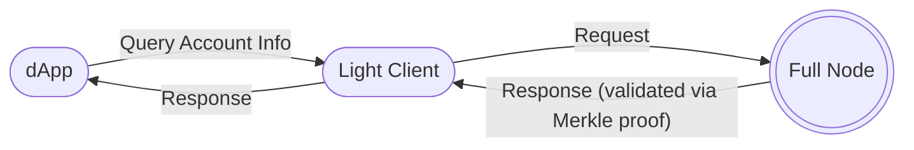

# Light Clients

## Introduction

Light clients provide a secure, trust-minimized, and efficient method of interacting with a blockchain. Alongside the commonly used JSON Remote Procedure Calls (RPC), they are one of the primary mechanisms for blockchain communication. Polkadot offers first-class support for light clients, which play a critical role in the development of decentralized applications.

Light clients are applications that fetch the required data they need from a Polkadot node with an associated cryptographic proof to validate the data. This makes it possible to interact with the Polkadot network without running a full node or having to trust remote peers (for further references, check the [Polkadot Specification, Light Client Messages](https://spec.polkadot.network/sect-lightclient#sect-light-msg){target=\_blank} page).

!!!info "Light node or light client?"
    The terms "light node" and "light client" are interchangeable. Both refer to a blockchain client that syncs without downloading the entire blockchain state. All nodes in a blockchain network are fundamentally clients, engaging in peer-to-peer communication.

Unlike JSON RPC interfaces, where an application must either maintain a list of providers or rely on a single node, light clients are not limited to nor dependent on a single node. They use cryptographic proofs to verify the blockchain's state, ensuring it is both up-to-date and accurate. By verifying only block headers, light clients avoid syncing the entire state, making them ideal for resource-constrained environments.

In the diagram above, the decentralized application queries on-chain account information through the light client. The light client, which runs as part of the application, requires minimal memory and computational resources. It uses Merkle proofs to verify the state retrieved from a full node in a trust-minimized manner. Polkadot-compatible light clients utilize [warp syncing](https://spec.polkadot.network/sect-lightclient#sect-sync-warp-lightclient){target=\_blank}, which downloads only block headers.

Light clients can quickly verify the blockchain's state, including [GRANDPA finality](/polkadot-protocol/glossary#grandpa){target=\_blank} justifications.

!!!info "What does it mean to be 'trust-minimized'?"
    "Trust-minimized" means that the light client does not need to fully trust the full node from which it retrieves state. This is achieved through the use of Merkle proofs, which allow the light client to verify the correctness of the state by checking the Merkle tree root.

## JSON RPC and Light Client Comparison

Another common method of communication between a user interface (UI) and a node is through the JSON RPC protocol. Generally, the UI retrieves information from the node, fetches network or [pallet](/polkadot-protocol/glossary#pallet){target=\_blank} data, and interacts with the blockchain. This is typically done in one of two ways:

1. **User-Controlled Nodes** - the UI connects to a node client installed on the user's machine
    - These nodes are secure, but installation and maintenance can be inconvenient
2. **Publicly Accessible Nodes** - the UI connects to a third-party-owned publicly accessible node client
    - These nodes are convenient but centralized and less secure. Applications must maintain a list of backup nodes in case the primary node becomes unavailable

While light clients still communicate with [full nodes](/polkadot-protocol/glossary#full-node), they offer significant advantages for applications requiring a secure alternative to running a full node:

| Full Node                                                                                       | Light Client                                                   |
| :---------------------------------------------------------------------------------------------: | :------------------------------------------------------------: |
| Fully verifies all blocks of the chain                                                          | Verifies only the authenticity of blocks                       |
| Stores previous block data and the chain's storage in a database                                | Does not require a database                                    |
| Installation, maintenance, and execution are resource-intensive and require technical expertise | No installation; typically included as part of the application |

## Using Light Clients

The [`smoldot`](https://github.com/smol-dot/smoldot){target=\_blank} client is the cornerstone of light client implementation for Polkadot SDK-based chains. It provides the primitives needed to build light clients and is also integrated into libraries such as [PAPI](#papi-light-client-support).

### PAPI Light Client Support

The [Polkadot API (PAPI)](/develop//toolkit/api-libraries/papi){target=\_blank} library natively supports light client configurations, powered by [`smoldot`](https://github.com/smol-dot/smoldot){target=\_blank}. This allows developers to connect to multiple chains simultaneously using a light client.

### Substrate Connect - Browser Extension

The [Substrate Connect browser extension](https://www.npmjs.com/package/@substrate/connect-extension-protocol){target=\_blank} enables end-users to interact with applications connected to multiple blockchains or to connect their own blockchains to supported applications.

Establishing a sufficient number of peers can be challenging due to browser limitations on WebSocket connections from HTTPS pages, as many nodes require TLS. The Substrate Connect browser extension addresses this limitation by keeping chains synced in the background, enabling faster application performance.

Substrate Connect automatically detects whether the user has the extension installed. If not, an in-page Wasm light client is created for them.

## Resources

- [What is a light client and why you should care?](https://medium.com/paritytech/what-is-a-light-client-and-why-you-should-care-75f813ae2670){target=\_blank}
- [Introducing Substrate Connect: Browser-Based Light Clients for Connecting to Substrate Chains](https://www.parity.io/blog/introducing-substrate-connect){target=\_blank}
- [Substrate Connect GitHub Repository](https://github.com/paritytech/substrate-connect/tree/master/projects/extension){target=\_blank}
- [Light Clients - Polkadot Specification](https://spec.polkadot.network/sect-lightclient){target=\_blank}
