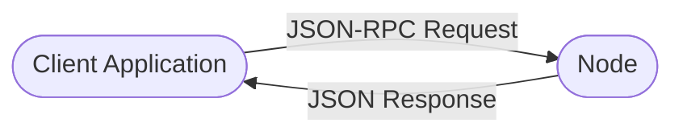

# RPC Calls

## Introduction

[Remote Procedure Call](https://en.wikipedia.org/wiki/Remote_procedure_call){target=\_blank} (RPC) interfaces are the primary way to interact programmatically with Polkadot SDK-based parachains and relay chains. RPC calls allow you to query chain state, submit transactions, and monitor network health from external applications or scripts.

This guide covers:

- What RPC calls are and how they work in the Polkadot SDK
- How to make RPC calls using `curl` or similar tools
- The most useful and commonly used RPC methods

RPC endpoints are available on every node and can be accessed via HTTP and WebSocket. Most developer tools, dashboards, and libraries (like [Polkadot.js](/develop/toolkit/api-libraries/polkadot-js-api){target=\_blank}, [Subxt](/develop/toolkit/api-libraries/subxt){target=\_blank}, and others) utilize these endpoints internally.

## How Do RPC Calls Work?

RPC (Remote Procedure Call) is a protocol that allows you to invoke functions on a remote server (in this case, a blockchain node) as if they were local. Polkadot SDK nodes implement the [JSON-RPC 2.0](https://www.jsonrpc.org/specification){target=\_blank} standard, making it easy to interact with them using standard HTTP requests.



RPC calls are stateless and can be used to:

- Query chain state (e.g., block number, storage values)
- Submit extrinsics (transactions)
- Monitor node and network health
- Retrieve metadata and runtime information

## Making RPC Calls with Curl

You can make RPC calls to a node using [`curl`](https://curl.se/){target=\_blank} or any HTTP client. The general format that the RPC calls stick to is the following:

```bash
curl -H "Content-Type: application/json" \
  -d '{"id":1, "jsonrpc":"2.0", "method": "INSERT_METHOD_NAME", "params": [INSERT_PARAMS]}' \
  NODE_ENDPOINT
```

- `method`: The RPC method you want to call (e.g., `system_health`).
- `params`: Parameters for the method (if any).
- `NODE_ENDPOINT`: The HTTP endpoint of your node (e.g., `http://localhost:9933` or a public endpoint).

Here's a simple example to get the latest block number of the Polkadot Relay chain; you can use the following node endpoint:

```bash
curl -H "Content-Type: application/json" \
  -d '{"id":1, "jsonrpc":"2.0", "method": "chain_getBlock"}' \
  https://rpc.polkadot.io
```

## Essential RPC Methods

Here are some of the most useful and commonly used RPC methods for Polkadot SDK-based chains:

- `system_health`
    - Check the health of your node.
    - Example:
        ```bash
        curl -H "Content-Type: application/json" \
            -d '{"id":1, "jsonrpc":"2.0", "method": "system_health", "params":[]}' \
            http://localhost:9933
        ```
- `chain_getBlock`
    - Get the latest block (or a specific block by hash):
    - Example:
        ```bash
        curl -H "Content-Type: application/json" \
            -d '{"id":1, "jsonrpc":"2.0", "method": "chain_getBlock", "params":[]}' \
            http://localhost:9933
        ```
- `state_getStorage`
    - Query on-chain storage by key (requires [SCALE-encoded](/polkadot-protocol/parachain-basics/data-encoding){target=\_blank} storage key):
    - Example:
        ```bash
        curl -H "Content-Type: application/json" \
            -d '{"id":1, "jsonrpc":"2.0", "method": "state_getStorage", "params":["0x..."]}' \
            http://localhost:9933
        ```
- `author_submitExtrinsic`
    - Submit a signed extrinsic (transaction):
    - Example:
        ```bash
        curl -H "Content-Type: application/json" \
            -d '{"id":1, "jsonrpc":"2.0", "method": "author_submitExtrinsic", "params":["0x..."]}' \
            http://localhost:9933
        ```
- `state_getMetadata`
    - Fetch the runtime metadata (needed for decoding storage and extrinsics):
    - Example:
        ```bash
        curl -H "Content-Type: application/json" \
            -d '{"id":1, "jsonrpc":"2.0", "method": "state_getMetadata", "params":[]}' \
            http://localhost:9933
        ```

## Check Available RPC Calls

To check all the RPC methods exposed by your node, you can use the `rpc_methods` call to get a comprehensive list of available methods. This is particularly useful when working with different chain implementations or custom runtimes that may have additional RPC endpoints.

You can do this in two ways:

### Using curl

To check the available RPC methods using `curl`, you can use the following command:

```bash
curl -H "Content-Type: application/json" \
  -d '{"id":1, "jsonrpc":"2.0", "method": "rpc_methods", "params":[]}' \
  https://rpc.polkadot.io
```

You can replace `https://rpc.polkadot.io` with the node endpoint you need to query.

### Using Polkadot.js Apps

1. Go to the [Polkadot.js Apps UI](https://polkadot.js.org/apps){target=\_blank} and navigate to the RPC calls section

    

2. Select `rpc` from the dropdown menu

    

3. Choose the `methods` method

    

4. Submit the call to get a list of all available RPC methods

    

This will return a JSON response containing all the RPC methods supported by your node.


From this interface, you can also query the RPC methods directly, as you would do with `curl`.

## Resources

- [Polkadot JSON-RPC API Reference](https://polkadot.js.org/docs/substrate/rpc/){target=\_blank}
- [Parity DevOps: Important Flags for Running an RPC Node](https://paritytech.github.io/devops-guide/guides/rpc_index.html?#important-flags-for-running-an-rpc-node){target=\_blank}
- [Polkadot.js Apps RPC Explorer](https://polkadot.js.org/apps/#/rpc){target=\_blank}
