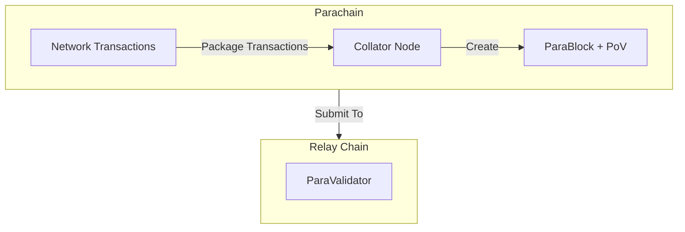
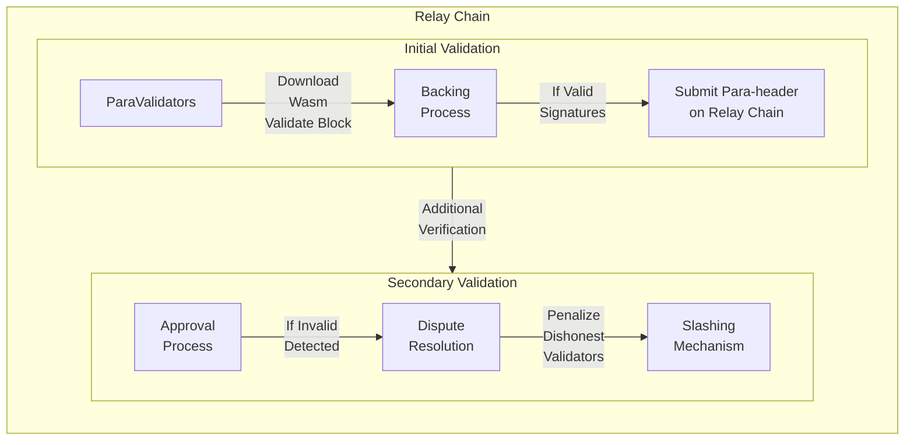

---
title: Parachain Consensus
description: Understand how the blocks authored by parachain collators are secured by the relay chain validators and how the parachain transactions achieve finality.
--- 

# Parachain Consensus

## Introduction

Parachains are independent blockchains built with the Polkadot SDK, designed to leverage Polkadot’s relay chain for shared security and transaction finality. These specialized chains operate as part of Polkadot’s execution sharding model, where each parachain manages its own state and transactions while relying on the relay chain for validation and consensus.

At the core of parachain functionality are collators, specialized nodes that sequence transactions into blocks and maintain the parachain’s state. Collators optimize Polkadot’s architecture by offloading state management from the relay chain, allowing relay chain validators to focus solely on validating parachain blocks.

This guide explores how parachain consensus works, including the roles of collators and validators, and the steps involved in securing parachain blocks within Polkadot’s scalable and decentralized framework.

## The Role of Collators

Collators are responsible for sequencing end-user transactions into blocks and maintaining the current state of their respective parachains. Their role is akin to Ethereum’s sequencers but optimized for Polkadot's architecture.

Key responsibilities include:

- **Transaction sequencing** - organizing transactions into [Proof of Validity (PoV)](https://wiki.polkadot.network/docs/glossary#proof-of-validity){target=\_blank} blocks
- **State management** - maintaining parachain states without burdening the relay chain validators
- **Consensus participation** - sending PoV blocks to relay chain validators for approval

## Consensus and Validation

Parachain consensus operates in tandem with the relay chain, leveraging Nominated Proof of Stake (NPoS) for shared security. The process ensures parachain transactions achieve finality through the following steps:

1. **Packaging transactions** - collators bundle transactions into PoV blocks (parablocks)
2. **Submission to validator** - parablocks are submitted to a randomly selected subset of relay chain validators, known as paravalidators
3. **Validation of PoV Blocks** - paravalidators use the parachain’s state transition function (already available on the relay chain) to verify transaction validity
4. **Backing and inclusion** - if a sufficient number of positive validations are received, the parablock is backed and included via a para-header on the relay chain

The following sections describe the actions taking place during each stage of the process. 

### Path of a Parachain Block

Polkadot achieves scalability through execution sharding, where each parachain operates as an independent shard with its own blockchain and state. Shared security for all parachains is provided by the relay chain, powered by [Nominated Proof of Staking (NPoS)](/polkadot-protocol/glossary/#nominated-proof-of-stake-npos){target=\_blank}. This framework allows parachains to focus on transaction processing and state management, while the relay chain ensures validation and finality.

The journey parachain transactions follow to reach consensus and finality can be described as follows:

- **Collators and parablocks:**

    - Collators, specialized nodes on parachains, package network transactions into Proof of Validity (PoV) blocks, also called parablocks
    - These parablocks are sent to a subset of relay chain validators, known as paravalidators, for validation
    - The parachain's state transition function (Wasm blob) is not re-sent, as it is already stored on the relay chain

- **Validation by paravalidators:**

    - Paravalidators are groups of approximately five relay chain validators, randomly assigned to parachains and shuffled every minute
    - Each paravalidator downloads the parachain's Wasm blob and validates the parablock by ensuring all transactions comply with the parachain’s state transition rules
    - Paravalidators sign positive or negative validation statements based on the block’s validity

- **Backing and approval:**

    - If a parablock receives sufficient positive validation statements, it is backed and included on the relay chain as a para-header
    - An additional approval process resolves disputes. If a parablock contains invalid transactions, additional validators are tasked with verification
    - Validators who back invalid parablocks are penalized through slashing, creating strong incentives for honest behavior

It is important to understand that relay chain blocks do not store full parachain blocks (parablocks). Instead, they include para-headers, which serve as summaries of the backed parablocks. The complete parablock remains within the parachain network, maintaining its autonomy while relying on the relay chain for validation and finality.

## Where to Go Next

For more technical details, refer to the:

- [Parachain Wiki](https://wiki.polkadot.network/docs/learn-parachains){target=\_blank} page