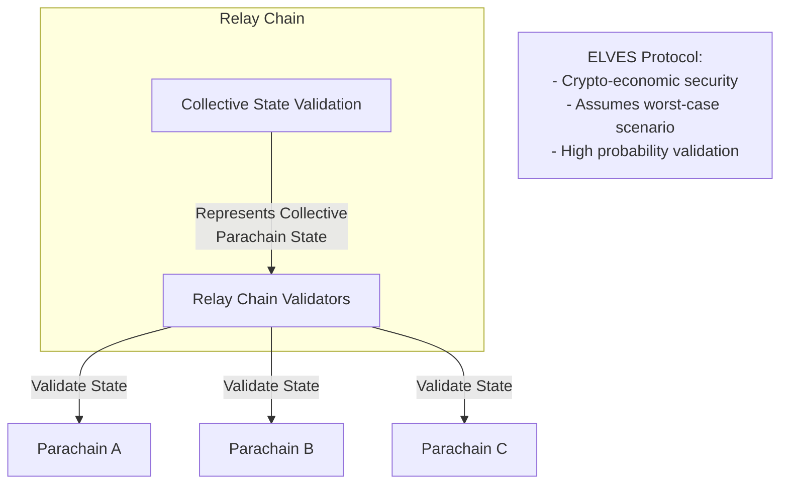

## Introduction 

A [*parachain*](../../glossary.md#parachain) is a coherent, application-specific blockchain which derives security from its respective relay chain. Parachains on Polkadot are each their own, separate, fully functioning blockchain. The primary difference between a parachain and a regular, "solo" blockchain is the relay chain verifies the state of all parachains that are connected to it.  In many ways, parachains can be thought of as a ["cynical" rollup](#cryptoeconomic-security-elves-protocol), as the crypto-economic protocol used (ELVES) assumes the worst case scenario, rather than the typical optimistic approach that many rollup mechanisms take. Once enough validators attest that a block is valid, then the probability for that block being valid is high.

As each parachains' state is validated by the relay chain, the relay chain is a representation of the collective state of all parachains.

!!!tip "Coherent Systems"
    Coherency refers to the degree of synchronization, consistency, and interoperability between different components or chains within a system. It encompasses both the internal coherence of individual chains and the external coherence between chains in terms of how they can interact with one another.
    
    A single state machine like Ethereum is very coherent, as all of its components (smart contracts, dApps/applications staking, consensus) all operate within a single environment with the downside of less scalability. Multi-protocol state machines, such as Polkadot, offer less coherency due to its sharded nature, but more scalability due to the parallelization of its architecture.

    Parachains themselves are coherent, as they are self-contained environments with their own domain-specific functionality.

Parachains enable *para*llelization of different services within the same network. However, unlike most layer two rollups, parachains do not suffer the same interoperability pitfalls that most rollups suffer from. Cross consensus messaging (XCM) provides a common communication format for each parachain and can be configured to allow a parachain to communicate with just the relay chain or certain parachains. 

<!-- TODO: link xcm config stuff here? -->

<!-- TODO: mermaid diagram showing many parachains of different types doing different things, all under the polkadot umbrella -->

Most parachains are built using the Polkadot SDK, which provides all the tools needed to build a fully functioning parachain. However it is possible to build a parachain which can inherit the security of the relay chain as long as it implements the correct mechanisms expected by the relay chain.

## State Transition Functions (Runtimes)

At their core, parachains, like most blockchains, are deterministic, finite state machines that are often backed by game theory and economics. The previous state of the parachain, combined with external input in the form of [extrinsics](../../glossary.md#extrinsic), allow the state machine to progress forward, one block at a time.

!!!info "Deterministic State Machines"
    Determinism refers to the concept that particular input will always produce the same output. State machines are algorithmic machines which state changes based on its inputs to produce a new, updated state.

<!-- TODO: diagram of this happening? -->

The primary driver of this progression is the **state transition function** (STF), commonly referred to as a **runtime**. Each time a block is submitted, it represents the next proposed state for a parachain. By applying the state transition function to the previous state, and including a new block which contains the proposed changes in the form of a list of extrinsics/transactions, the runtime defines just exactly *how* the parachain is to advance from state A to state B.

The STF in a Polkadot SDK-based chain is compiled to Wasm, which is also uploaded on the relay chain. This STF is crucial for the relay chain to validate the state changes coming from the parachain, as it is used to ensure that all proposed state transitions are happening correctly as part of the validaton process.

!!!info "Wasm Runtimes"
    For more information on the Wasm meta protocol that powers runtimes, see the Polkadot SDK Rust Docs: [WASM Meta Protocol](https://paritytech.github.io/polkadot-sdk/master/polkadot_sdk_docs/reference_docs/wasm_meta_protocol/index.html){target=\blank}

## Shared Security: Validated by the Relay Chain

The relay chain provides a layer of economic security for its parachains. Parachains submit proof-of-validation (PoV) data to the relay chain for validation through [**collators**](../../glossary.md#collator), upon which the relay chains' validators ensure the validity of this data in accordance to the STF for that particular parachain. In other words, the **consensus for a parachain follows the relay chain.** While parachains choose how a block is authored, what it contains, and who authors it, the relay chain ultimately provides finality and consensus for those blocks.

!!!tip "The Parachains Protocol"
    For more information regarding the parachain and relay chain validation process, view the Polkadot Wiki: [Parachains' Protocol Overview: Protocols' Summary](https://wiki.polkadot.network/docs/learn-parachains-protocol#protocols-summary){target=\blank}

Parachains need at least one honest collator to submit PoV data to the relay chain. Without this, the parachain cannot progress. The mechanisms that facilitate this are found in the Cumulus portion of the Polkadot SDK, some of which are found in the [`cumulus_pallet_parachain_system`](https://paritytech.github.io/polkadot-sdk/master/cumulus_pallet_parachain_system/index.html){target=\blank}

### Cryptoeconomic Security: ELVES Protocol

## Interoperability

## What's Next

