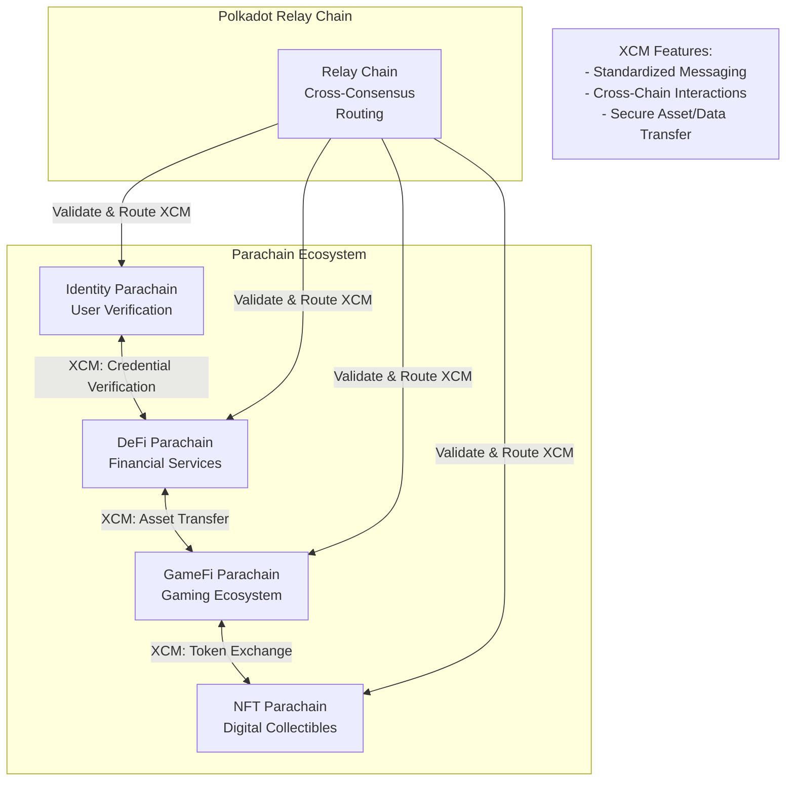
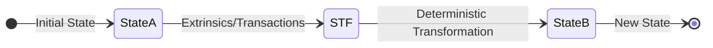

## Introduction 

A [_parachain_](/polkadot-protocol/glossary#parachain){target=\_blank} is a coherent, application-specific blockchain that derives security from its respective relay chain. Parachains on Polkadot are each their own separate, fully functioning blockchain. The primary difference between a parachain and a regular, "solo" blockchain is that the relay chain verifies the state of all parachains that are connected to it.  In many ways, parachains can be thought of as a ["cynical" rollup](#cryptoeconomic-security-elves-protocol), as the crypto-economic protocol used (ELVES) assumes the worst-case scenario, rather than the typical optimistic approach that many roll-up mechanisms take. Once enough validators attest that a block is valid, then the probability of that block being valid is high.

As each parachain’s state is validated by the relay chain, the relay chain represents the collective state of all parachains.

## Coherent Systems
    
Coherency refers to the degree of synchronization, consistency, and interoperability between different components or chains within a system. It encompasses the internal coherence of individual chains and the external coherence between chains regarding how they interact.
    
A single-state machine like Ethereum is very coherent, as all of its components (smart contracts, dApps/applications, staking, consensus) operate within a single environment with the downside of less scalability. Multi-protocol state machines, such as Polkadot, offer less coherency due to their sharded nature but more scalability due to the parallelization of their architecture.

Parachains are coherent, as they are self-contained environments with domain-specific functionality.

## Flexible Ecosystem

Parachains enable parallelization of different services within the same network. However, unlike most layer two rollups, parachains don't suffer the same interoperability pitfalls that most rollups suffer. [Cross-Consensus Messaging (XCM)](/develop/interoperability/intro-to-xcm/){target=\_blank} provides a common communication format for each parachain and can be configured to allow a parachain to communicate with just the relay chain or certain parachains. 

The diagram below highlights the flexibility of the Polkadot ecosystem, where each parachain specializes in a distinct domain. This example illustrates how parachains, like DeFi and GameFi, leverage XCM for cross-chain operations such as asset transfers and credential verification.

Most parachains are built using the Polkadot SDK, which provides all the tools to create a fully functioning parachain. However, it is possible to construct a parachain that can inherit the security of the relay chain as long as it implements the correct mechanisms expected by the relay chain.

## State Transition Functions (Runtimes)

Determinism is a fundamental property where given the same input, a system will consistently produce identical outputs. In blockchain systems, this predictable behavior is essential for state machines, which are algorithms that transition between different states based on specific inputs to generate a new state.

At their core, parachains, like most blockchains, are deterministic, finite-state machines that are often backed by game theory and economics. The previous state of the parachain, combined with external input in the form of [extrinsics](/polkadot-protocol/glossary#extrinsic){target=\_blank}, allows the state machine to progress forward, one block at a time.

The primary driver of this progression is the state transition function (STF), commonly referred to as a runtime. Each time a block is submitted, it represents the next proposed state for a parachain. By applying the state transition function to the previous state and including a new block that contains the proposed changes in the form of a list of extrinsics/transactions, the runtime defines just exactly how the parachain is to advance from state A to state B.

The STF in a Polkadot SDK-based chain is compiled to Wasm and uploaded on the relay chain. This STF is crucial for the relay chain to validate the state changes coming from the parachain, as it is used to ensure that all proposed state transitions are happening correctly as part of the validation process.

For more information on the Wasm meta protocol that powers runtimes, see the [WASM Meta Protocol](https://paritytech.github.io/polkadot-sdk/master/polkadot_sdk_docs/reference_docs/wasm_meta_protocol/index.html){target=\blank} in the Polkadot SDK Rust Docs.

## Shared Security: Validated by the Relay Chain

The relay chain provides a layer of economic security for its parachains. Parachains submit proof of validation (PoV) data to the relay chain for validation through [collators](/polkadot-protocol/glossary/#collator), upon which the relay chains' validators ensure the validity of this data in accordance with the STF for that particular parachain. In other words, the consensus for a parachain follows the relay chain. While parachains choose how a block is authored, what it contains, and who authors it, the relay chain ultimately provides finality and consensus for those blocks.

For more information about the parachain and relay chain validation process, see the [Parachains' Protocol Overview: Protocols' Summary](https://wiki.polkadot.network/docs/learn-parachains-protocol#protocols-summary){target=\blank} entry in the Polkadot Wiki.

Parachains need at least one honest collator to submit PoV data to the relay chain. Without this, the parachain can't progress. The mechanisms that facilitate this are found in the Cumulus portion of the Polkadot SDK, some of which are found in the [`cumulus_pallet_parachain_system`](https://paritytech.github.io/polkadot-sdk/master/cumulus_pallet_parachain_system/index.html){target=\blank}

### Cryptoeconomic Security: ELVES Protocol

The [ELVES (Economic Last Validation Enforcement System)](https://eprint.iacr.org/2024/961){target=\_blank} protocol forms the foundation of Polkadot's cryptoeconomic security model. ELVES assumes a worst-case scenario by enforcing strict validation rules before any state transitions are finalized. Unlike optimistic approaches that rely on post-facto dispute resolution, ELVES ensures that validators collectively confirm the validity of a block before it becomes part of the parachain's state.

Validators are incentivized through staking and penalized for malicious or erroneous actions, ensuring adherence to the protocol. This approach minimizes the probability of invalid states being propagated across the network, providing robust security for parachains.

## Interoperability

Polkadot's interoperability framework allows parachains to communicate with each other, fostering a diverse ecosystem of interconnected blockchains. Through [Cross-Consensus Messaging (XCM)](/develop/interoperability/intro-to-xcm/){target=_blank}, parachains can transfer assets, share data, and invoke functionalities on other chains securely. This standardized messaging protocol ensures that parachains can interact with the relay chain and each other, supporting efficient cross-chain operations.

The XCM protocol mitigates common interoperability challenges in isolated blockchain networks, such as fragmented ecosystems and limited collaboration. By enabling decentralized applications to leverage resources and functionality across parachains, Polkadot promotes a scalable, cooperative blockchain environment that benefits all participants.

## Where to Go Next

For further information about the consensus protocol used by parachains, see the [Consensus](/polkadot-protocol/architecture/parachains/consensus/) page.

-   Learn __Consensus__

    ---

    Understand how the blocks authored by parachain collators are secured by the relay chain validators and how the parachain transactions achieve finality.

    [:octicons-arrow-right-24: Reference](/polkadot-protocol/architecture/parachains/consensus/)

