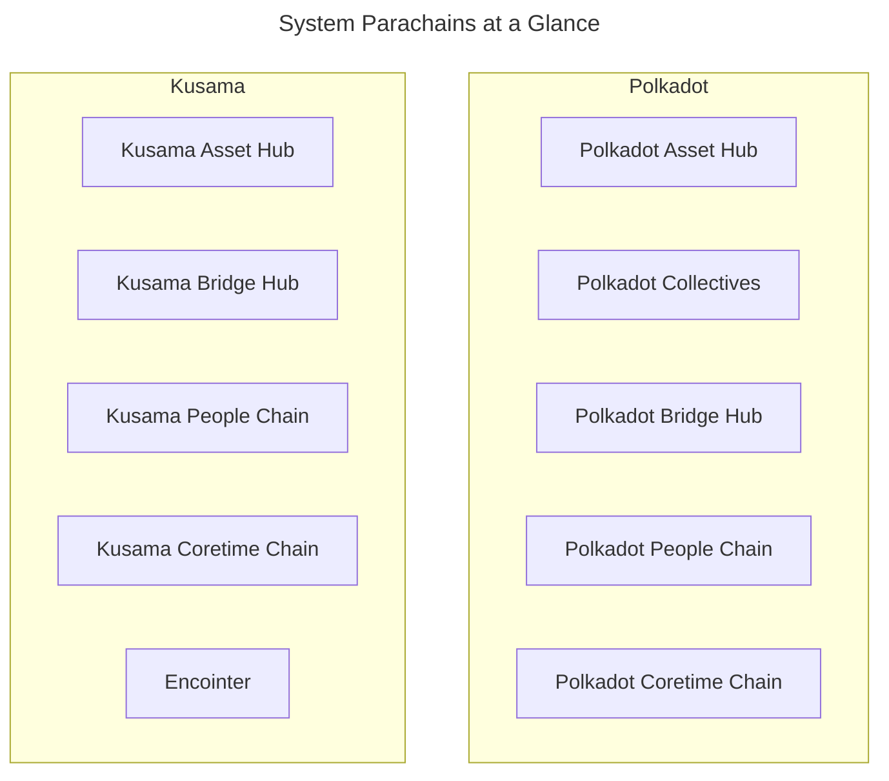

## Introduction

Polkadot's relay chain is designed to secure parachains and facilitate seamless inter-chain communication. However, resource-intensive—tasks like governance, asset management, and bridging are more efficiently handled by system parachains. These specialized chains offload functionality from the relay chain, leveraging Polkadot's parallel execution model to improve performance and scalability. By distributing key functionalities across system parachains, Polkadot can maximize its relay chain's blockspace for its core purpose of securing and validating parachains.

This guide will explore how system parachains operate within Polkadot and Kusama, detailing their critical roles in network governance, asset management, and bridging. You'll learn about the currently deployed system parachains, their unique functions, and how they enhance Polkadot's decentralized ecosystem.

## System Chains

System parachains contain core Polkadot protocol features, but in parachains rather than the relay chain. Execution cores for system chains are allocated via network [governance](/polkadot-protocol/onchain-governance/overview/){target=\_blank} rather than purchasing coretime on a marketplace.

System parachains defer to on-chain governance to manage their upgrades and other sensitive actions as they do not have native tokens or governance systems separate from DOT or KSM. It is not uncommon to see a system parachain implemented specifically to manage network governance.

!!!note
    You may see system parachains called common good parachains in articles and discussions. This nomenclature caused confusion as the network evolved, so system parachains is preferred. 
    
    For more details on this evolution, review this [parachains forum discussion](https://forum.polkadot.network/t/polkadot-protocol-and-common-good-parachains/866){target=\_blank}.

## Existing System Chains

All system parachains are on both Polkadot and Kusama with the following exceptions:

- [**Collectives**](#collectives) - only on Polkadot
- [**Encointer**](#encointer) - only on Kusama

### Asset Hub

The [Asset Hub](https://github.com/paritytech/polkadot-sdk/tree/{{dependencies.repositories.polkadot_sdk.version}}/cumulus#asset-hub-){target=\_blank} is an asset portal for the entire network. It helps asset creators, such as reserve-backed stablecoin issuers, track the total issuance of an asset in the network, including amounts transferred to other parachains. It also serves as the hub where asset creators can perform on-chain operations, such as minting and burning, to manage their assets effectively.

This asset management logic is encoded directly in the runtime of the chain rather than in smart contracts. The efficiency of executing logic in a parachain allows for fees and deposits that are about 1/10th of what is required on the relay chain. These low fees mean that the Asset Hub is well suited for handling the frequent transactions required when managing balances, transfers, and on-chain assets.

The Asset Hub also supports non-fungible assets (NFTs) via the [Uniques pallet](https://polkadot.js.org/docs/substrate/extrinsics#uniques){target=\_blank} and [NFTs pallet](https://polkadot.js.org/docs/substrate/extrinsics#nfts){target=\_blank}. For more information about NFTs, see the Polkadot Wiki section on [NFT Pallets](https://wiki.polkadot.network/docs/learn-nft-pallets){target=\_blank}.

### Collectives

The Polkadot Collectives parachain was added in [Referendum 81](https://polkadot.polkassembly.io/referendum/81){target=\_blank} and exists on Polkadot but not on Kusama. The Collectives chain hosts on-chain collectives that serve the Polkadot network, including the following:

- [**Polkadot Alliance**](https://polkadot.polkassembly.io/referendum/94){target=\_blank} - provides a set of ethics and standards for the community to follow. Includes an on-chain means to call out bad actors
- [**Polkadot Technical Fellowship**](https://wiki.polkadot.network/docs/learn-polkadot-technical-fellowship){target=\_blank} - a rules-based social organization to support and incentivize highly-skilled developers to contribute to the technical stability, security, and progress of the network

These on-chain collectives will play essential roles in the future of network stewardship and decentralized governance. Networks can use a bridge hub to help them act as collectives and express their legislative voices as single opinions within other networks.

### Bridge Hub

Before parachains, the only way to design a bridge was to put the logic onto the relay chain. Since both networks now support parachains and the isolation they provide, each network can have a parachain dedicated to bridges. 

The Bridge Hub system parachain operates on the relay chain, and is responsible for faciliating bridges to the wider Web3 space. It contains the required bridge [pallets](/polkadot-protocol/glossary/#pallet){target=\_blank} in its runtime, which enable trustless bridging with other blockchain networks like Polkadot, Kusama, and Ethereum. The Bridge Hub uses the native token of the relay chain.

See the [Bridge Hub](/polkadot-protocol/architecture/system-chains/bridge-hub/){target=\_blank} documentation for additional information.

### People Chain

The People Chain provides a naming system that allows users to manage and verify their account [identity](https://wiki.polkadot.network/docs/learn-identity){target=\_blank}.

### Coretime Chain

The Coretime system chain lets users buy coretime to access Polkadot's computation. [Coretime marketplaces](https://wiki.polkadot.network/docs/learn-guides-coretime-marketplaces){target=\_blank} run on top of the Coretime chain. Kusama does not use the Collectives system chain. Instead, Kusama relies on the Encointer system chain, which provides Sybil resistance as a service to the entire Kusama ecosystem.

Visit [Introduction to Agile Coretime](https://wiki.polkadot.network/docs/learn-agile-coretime#introduction-to-agile-coretime){target=\_blank} in the Polkadot Wiki for more information.

### Encointer

[Encointer](https://encointer.org/encointer-for-web3/){target=\_blank} is a blockchain platform for self-sovereign ID and a global [universal basic income (UBI)](https://book.encointer.org/economics-ubi.html){target=\_blank}. The Encointer protocol uses a novel Proof of Personhood (PoP) system to create unique identities and resist Sybil attacks. PoP is based on the notion that a person can only be in one place at any given time. Encointer offers a framework that allows for any group of real people to create, distribute, and use their own digital community tokens.

Participants are requested to attend physical key-signing ceremonies with small groups of random people at randomized locations. These local meetings are part of one global signing ceremony occurring at the same time. Participants use the Encointer wallet app to participate in these ceremonies and manage local community currencies. 

Referendums marking key Encointer adoption milestones include: 

- [**Referendum 158 - Register Encointer As a Common Good Chain**](https://kusama.polkassembly.io/referendum/158){target=\_blank} - registered Encointer as the second system parachain on Kusama's network
- [**Referendum 187 - Encointer Runtime Upgrade to Full Functionality**](https://kusama.polkassembly.io/referendum/187){target=\_blank} - introduced a runtime upgrade bringing governance and full functionality for communities to use the protocol

To learn more about Encointer, see the official [Encointer book](https://book.encointer.org/introduction.html){target=\_blank} or watch an [Encointer ceremony](https://www.youtube.com/watch?v=tcgpCCYBqko){target=\_blank} in action.

