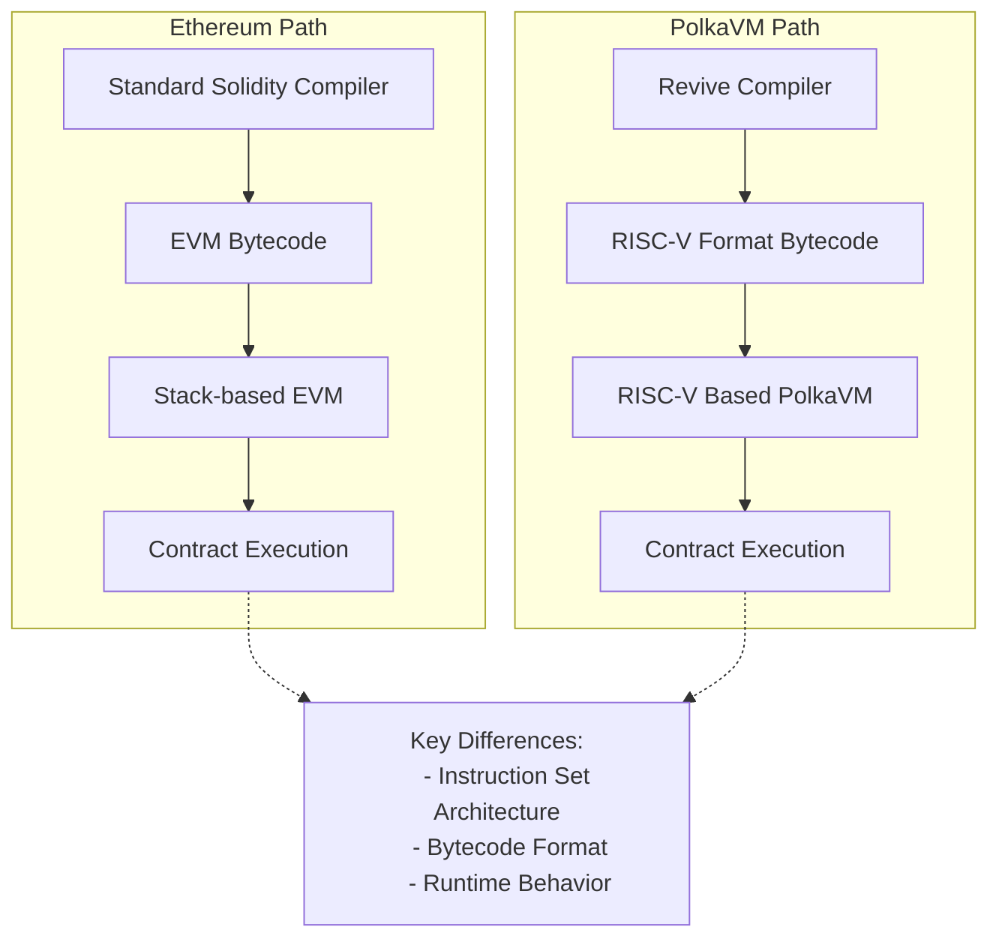

# EVM vs PolkaVM

--8<-- 'text/smart-contracts/polkaVM-warning.md'

## Introduction

While [PolkaVM](/smart-contracts/for-eth-devs/){target=\_blank} strives for maximum Ethereum compatibility, several fundamental design decisions create necessary divergences from the [EVM](https://ethereum.org/en/developers/docs/evm/){target=\_blank}. These differences represent trade-offs that enhance performance and resource management while maintaining accessibility for Solidity developers.

## Core Virtual Machine Architecture

The most significant departure from Ethereum comes from PolkaVM's foundation itself. Rather than implementing the EVM, PolkaVM utilizes a RISC-V instruction set. For most Solidity developers, this architectural change remains transparent thanks to the [Revive compiler's](https://github.com/paritytech/revive){target=\_blank} complete Solidity support, including inline assembler functionality.

However, this architectural difference becomes relevant in specific scenarios. Tools that attempt to download and inspect contract bytecode will fail, as they expect EVM bytecode rather than PolkaVM's RISC-V format. Most applications typically pass bytecode as an opaque blob, making this a non-issue for standard use cases.

This primarily affects contracts using [`EXTCODECOPY`](https://www.evm.codes/?fork=cancun#3c){target=\_blank} to manipulate code at runtime. A contract encounters problems specifically when it uses `EXTCODECOPY` to copy contract code into memory and then attempts to mutate it. This pattern is not possible in standard Solidity and requires dropping down to YUL assembly. An example would be a factory contract written in assembly that constructs and instantiates new contracts by generating code at runtime. Such contracts are rare in practice.

PolkaVM offers an elegant alternative through its [on-chain constructors](https://paritytech.github.io/polkadot-sdk/master/pallet_revive/pallet/struct.Pallet.html#method.bare_instantiate){target=\_blank}, enabling contract instantiation without runtime code modification, making this pattern unnecessary. This architectural difference also impacts how contract deployment works more broadly, as discussed in the [Contract Deployment](#contract-deployment) section.

### High-Level Architecture Comparison

|            Feature            |                            Ethereum Virtual Machine (EVM)                            |                        PolkaVM                         |
|:-----------------------------:|:------------------------------------------------------------------------------------:|:------------------------------------------------------:|
|      **Instruction Set**      |                               Stack-based architecture                               |                 RISC-V instruction set                 |
|      **Bytecode Format**      |                                     EVM bytecode                                     |                     RISC-V format                      |
|    **Contract Size Limit**    |                                 24KB code size limit                                 |            Contract-specific memory limits             |
|         **Compiler**          |                                  Solidity Compiler                                   |                    Revive Compiler                     |
|      **Inline Assembly**      |                                      Supported                                       |         Supported with the compatibility layer         |
|    **Code Introspection**     | Supported via [`EXTCODECOPY`](https://www.evm.codes/?fork=cancun#3c){target=\_blank} | Limited support, alternative via on-chain constructors |
|     **Resource Metering**     |                                  Single gas metric                                   |                   Multi-dimensional                    |
| **Runtime Code Modification** |                                      Supported                                       |               Limited, with alternatives               |
|  **Contract Instantiation**   |                                 Standard deployment                                  |    On-chain constructors for flexible instantiation    |

## Gas Model

Ethereum's resource model relies on a single metric: [gas](https://ethereum.org/en/developers/docs/gas/#what-is-gas){target=\_blank}, which serves as the universal unit for measuring computational costs. Each operation on the network consumes a specific amount of gas. Most platforms aiming for Ethereum compatibility typically adopt identical gas values to ensure seamless integration.

The significant changes to Ethereum's gas model will be outlined in the following sections.

### Dynamic Gas Value Scaling

Instead of adhering to Ethereum's fixed gas values, PolkaVM implements benchmark-based pricing that better reflects its improved execution performance. This makes instructions cheaper relative to I/O-bound operations but requires developers to avoid hardcoding gas values, particularly in cross-contract calls.

### Multi-Dimensional Resource Metering

Moving beyond Ethereum's single gas metric, PolkaVM meters three distinct resources:

- **`ref_time`**: Equivalent to traditional gas, measuring computation time.
- **`proof_size`**: Tracks state proof size for validator verification.
- **`storage_deposit`**: Manages state bloat through a deposit system.

All three resources can be limited at the transaction level, just like gas on Ethereum. The [Ethereum RPC proxy](https://github.com/paritytech/polkadot-sdk/tree/master/substrate/frame/revive/rpc){target=\_blank} maps all three dimensions into the single gas dimension, ensuring everything behaves as expected for users.

These resources can also be limited when making cross-contract calls, which is essential for security when interacting with untrusted contracts. However, Solidity only allows specifying `gas_limit` for cross-contract calls. The `gas_limit` is most similar to Polkadots `ref_time_limit`, but the Revive compiler doesn't supply any imposed `gas_limit` for cross-contract calls for two key reasons:

- **Semantic differences**: `gas_limit` and `ref_time_limit` are not semantically identical; blindly passing EVM gas as `ref_time_limit` can lead to unexpected behavior.
- **Incomplete protection**: The other two resources (`proof_size` and `storage_deposit`) would remain uncapped anyway, making it insufficient to prevent malicious callees from performing DOS attacks.

When resources are "uncapped" in cross-contract calls, they remain constrained by transaction-specified limits, preventing abuse of the transaction signer.

!!! note
    The runtime will provide a special precompile, allowing cross-contract calls with limits specified for all weight dimensions in the future.

All gas-related opcodes like [`GAS`](https://www.evm.codes/?fork=cancun#5a){target=\_blank} or [`GAS_LIMIT`](https://www.evm.codes/?fork=cancun#45){target=\_blank} return only the `ref_time` value as it's the closest match to traditional gas. Extended APIs will be provided through precompiles to make full use of all resources, including cross-contract calls with all three resources specified.

## Memory Management

The EVM and the PolkaVM take fundamentally different approaches to memory constraints:

|         Feature          |      Ethereum Virtual Machine (EVM)       |                    PolkaVM                     |
|:------------------------:|:-----------------------------------------:|:----------------------------------------------:|
|  **Memory Constraints**  |      Indirect control via gas costs       |        Hard memory limits per contract         |
|      **Cost Model**      | Increasing gas curve with allocation size |    Fixed costs separated from execution gas    |
|    **Memory Limits**     | Soft limits through prohibitive gas costs |         Hard fixed limits per contract         |
|  **Pricing Efficiency**  |     Potential overcharging for memory     | More efficient through separation of concerns  |
|   **Contract Nesting**   |         Limited by available gas          |    Limited by constant memory per contract     |
|   **Memory Metering**    |     Dynamic based on total allocation     |      Static limits per contract instance       |
| **Future Improvements**  |       Incremental gas cost updates        | Potential dynamic metering for deeper nesting  |
| **Cross-Contract Calls** |      Handled through gas forwarding       | Requires careful boundary limit implementation |

The architecture establishes a constant memory limit per contract, which is the basis for calculating maximum contract nesting depth. This calculation assumes worst-case memory usage for each nested contract, resulting in a straightforward but conservative limit that operates independently of actual memory consumption. Future iterations may introduce dynamic memory metering, allowing deeper nesting depths for contracts with smaller memory footprints. However, such an enhancement would require careful implementation of cross-contract boundary limits before API stabilization, as it would introduce an additional resource metric to the system.

### Current Memory Limits

The following table depicts memory-related limits at the time of writing:

|                   Limit                    |     Maximum     |
|:------------------------------------------:|:---------------:|
|              Call stack depth              |        5        |
|                Event topics                |        4        |
| Event data payload size (including topics) |    416 bytes    |
|             Storage value size             |    416 bytes    |
|        Transient storage variables         | 128 uint values |
|            Immutable variables             | 16 uint values  |
|          Contract code blob size           | ~100 kilobytes  |

!!! note
    Limits might be increased in the future. To guarantee existing contracts work as expected, limits will never be decreased.

## Account Management - Existential Deposit

Ethereum and Polkadot handle account persistence differently, affecting state management and contract interactions:

### Account Management Comparison

|          Feature          |                   Ethereum Approach                   |               PolkaVM/Polkadot Approach                |
|:-------------------------:|:-----------------------------------------------------:|:------------------------------------------------------:|
|  **Account Persistence**  | Accounts persist indefinitely, even with zero balance | Requires existential deposit (ED) to maintain account  |
|    **Minimum Balance**    |                         None                          |                      ED required                       |
|   **Account Deletion**    |               Accounts remain in state                |      Accounts below ED are automatically deleted       |
|   **Contract Accounts**   |                  Exist indefinitely                   |                    Must maintain ED                    |
|   **Balance Reporting**   |                 Reports full balance                  |      Reports ED-adjusted balance via Ethereum RPC      |
| **New Account Transfers** |                   Standard transfer                   |     Includes ED automatically with extra fee cost      |
| **Contract-to-Contract**  |                   Direct transfers                    | ED drawn from transaction signer, not sending contract |
|   **State Management**    |      Potential bloat from zero-balance accounts       |     Optimized with auto-deletion of dust accounts      |

This difference introduces potential compatibility challenges for Ethereum-based contracts and tools, particularly wallets. To mitigate this, PolkaVM implements several transparent adjustments:

- Balance queries via Ethereum RPC automatically deduct the ED, ensuring reported balances match spendable amounts.
- Account balance checks through EVM opcodes reflect the ED-adjusted balance.
- Transfers to new accounts automatically include the ED (`x + ED`), with the extra cost incorporated into transaction fees.
- Contract-to-contract transfers handle ED requirements by:
    - Drawing ED from the transaction signer instead of the sending contract.
    - Keeping transfer amounts transparent for contract logic.
    - Treating ED like other storage deposit costs.

This approach ensures that Ethereum contracts work without modifications while maintaining Polkadot's optimized state management.

## Contract Deployment

For most users deploying contracts (like ERC-20 tokens), contract deployment works seamlessly without requiring special steps. However, when using advanced patterns like factory contracts that dynamically create other contracts at runtime, you'll need to understand PolkaVM's unique deployment model.

In the PolkaVM, contract deployment follows a fundamentally different model from EVM. The EVM allows contracts to be deployed with a single transaction, where the contract code is bundled with the deployment transaction. In contrast, PolkaVM has a different process for contract instantiation.

- **Code must be pre-uploaded**: Unlike EVM, where contract code is bundled within the deploying contract, PolkaVM requires all contract bytecode to be uploaded to the chain before instantiation.
- **Factory pattern limitations**: The common EVM pattern, where contracts dynamically create other contracts, will fail with a `CodeNotFound` error unless the dependent contract code was previously uploaded.
- **Separate upload and instantiation**: This creates a two-step process where developers must first upload all contract code, then instantiate relationships between contracts.

This architecture impacts several common EVM patterns and requires developers to adapt their deployment strategies accordingly. _Factory contracts must be modified to work with pre-uploaded code rather than embedding bytecode_, and runtime code generation is not supported due to PolkaVM's RISC-V bytecode format. The specific behavior of contract creation opcodes is detailed in the [YUL IR Translation](#yul-function-translation-differences) section.

When migrating EVM projects to PolkaVM, developers should identify all contracts that will be instantiated at runtime and ensure they are pre-uploaded to the chain before any instantiation attempts.

## Solidity and YUL IR Translation Incompatibilities

While PolkaVM maintains high-level compatibility with Solidity, several low-level differences exist in the translation of YUL IR and specific Solidity constructs. These differences are particularly relevant for developers working with assembly code or utilizing advanced contract patterns.

### Contract Code Structure

PolkaVM's contract runtime does not differentiate between runtime code and deploy (constructor) code. Instead, both are emitted into a single PolkaVM contract code blob and live on-chain. Therefore, in EVM terminology, the deploy code equals the runtime code. For most standard Solidity contracts, this is transparent. However, if you are analyzing raw bytecode or building tools that expect separate deploy and runtime sections, you'll need to adjust for this unified structure.

In the constructor code, the `codesize` instruction returns the call data size instead of the actual code blob size, which differs from standard EVM behavior. Developers might consider that the constructor logic uses `codesize` to inspect the deployed contract's size (e.g., for self-validation or specific deployment patterns); this will return an incorrect value on PolkaVM. Re-evaluate such logic or use alternative methods to achieve your goal.

### Solidity-Specific Differences

Solidity constructs behave differently under PolkaVM:

- **`address.creationCode`**: Returns the bytecode keccak256 hash instead of the actual creation code, reflecting PolkaVM's hash-based code referencing system.
    - If your contract relies on `address.creationCode` to verify or interact with the full raw bytecode of a newly deployed contract, this will not work as expected. You will receive a hash, not the code itself. This typically affects highly specialized factory contracts or introspection tools.

### YUL Function Translation Differences

The following YUL functions exhibit notable behavioral differences in PolkaVM:

- Memory operations:

    - **`mload`, `mstore`, `msize`, `mcopy`**: PolkaVM preserves memory layout but implements several constraints.

        - EVM linear heap memory is emulated using a fixed 64KB byte buffer, limiting maximum contract memory usage.
        - Accessing memory offsets larger than the buffer size traps the contract with an `OutOfBound` error.
        - Compiler optimizations may eliminate unused memory operations, potentially causing `msize` to differ from EVM behavior.

        For Solidity developers, the compiler generally handles memory efficiently within this 64KB limit. However, if you are writing low-level YUL assembly and perform direct memory manipulations, you must respect the 64KB buffer limit. Attempting to access memory outside this range will cause your transaction to revert. Be aware that `msize` might not always reflect the exact EVM behavior if compiler optimizations occur.

- Call data operations:

    - **`calldataload`, `calldatacopy`**: In constructor code, the offset parameter is ignored and these functions always return `0`, diverging from EVM behavior where call data represents constructor arguments.

        - If your constructor logic in YUL assembly attempts to read constructor arguments using `calldataload` or `calldatacopy` with specific offsets, this will not yield the expected constructor arguments. Instead, these functions will return `zeroed` values. Standard Solidity constructors are handled correctly by the compiler, but manual YUL assembly for constructor argument parsing will need adjustment.

- Code operations:

    - **`codecopy`**: Only supported within constructor code, reflecting PolkaVM's different approach to code handling and the unified code blob structure.

        - If your contracts use `codecopy` (e.g., for self-modifying code or inspecting other contract's runtime bytecode) outside of the constructor, this will not be supported and will likely result in a compile-time error or runtime trap. This implies that patterns like dynamically generating or modifying contract code at runtime are not directly feasible with `codecopy` on PolkaVM.

- Control flow:

    - **`invalid`**: Traps the contract execution but does not consume remaining gas, unlike EVM where it consumes all available gas.

        - While `invalid` still reverts the transaction, the difference in gas consumption could subtly affect very specific error handling or gas accounting patterns that rely on `invalid` to consume all remaining gas. For most error scenarios, `revert()` is the standard and recommended practice.

- Cross-contract calls:

    - **`call`, `delegatecall`, `staticall`**: These functions ignore supplied gas limits and forward all remaining resources due to PolkaVM's multi-dimensional resource model. This creates important security implications:

        - Contract authors must implement reentrancy protection since gas stipends don't provide protection.
        - The compiler detects `address payable.{send,transfer}` patterns and disables call reentrancy as a protective heuristic.
        - Using `address payable.{send,transfer}` is already deprecated; PolkaVM will provide dedicated precompiles for safe balance transfers.

        The traditional EVM pattern of limiting gas in cross-contract calls (especially with the 2300 gas stipend for send/transfer) does not provide reentrancy protection on PolkaVM. Developers must explicitly implement reentrancy guards (e.g., using a reentrancy lock mutex) in their Solidity code when making external calls to untrusted contracts. Relying on gas limits alone for reentrancy prevention is unsafe and will lead to vulnerabilities on PolkaVM.

        !!! warning
            The 2300 gas stipend that is provided by solc for address payable.{send, transfer} calls offers no reentrancy protection in PolkaVM. While the compiler attempts to detect and mitigate this pattern, developers should avoid these deprecated functions.

- Contract creation:

    - **`create`, `create2`**: Contract instantiation works fundamentally differently in PolkaVM. Instead of supplying deploy code concatenated with constructor arguments, the runtime expects:

        1. A buffer containing the code hash to deploy.
        2. The constructor arguments buffer.

        PolkaVM translates `dataoffset` and `datasize` instructions to handle contract hashes instead of contract code, enabling seamless use of the `new` keyword in Solidity. However, this translation may fail for contracts creating other contracts within `assembly` blocks.

        If you use the Solidity `new` keyword to deploy contracts, the Revive compiler handles this transparently. However, if you are creating contracts manually in YUL assembly using `create` or `create2` opcodes, you must provide the code hash of the contract to be deployed, not its raw bytecode. Attempting to pass raw bytecode will fail. This fundamentally changes how manual contract creation is performed in assembly.

        !!! warning
            Avoid using `create` family opcodes for manual deployment crafting in `assembly` blocks. This pattern is discouraged due to translation complexity and offers no gas savings benefits in PolkaVM.

- Data operations:

    - **`dataoffset`**: Returns the contract hash instead of code offset, aligning with PolkaVM's hash-based code referencing.
    - **`datasize`**: Returns the constant contract hash size (32 bytes) rather than variable code size.

    These changes are primarily relevant for low-level YUL assembly developers who are trying to inspect or manipulate contract code directly. `dataoffset` will provide a hash, not a memory offset to the code, and `datasize` will always be 32 bytes (the size of a hash). This reinforces that direct manipulation of contract bytecode at runtime, as might be done in some EVM patterns, is not supported.

- Resource queries:

    - **`gas`, `gaslimit`**: Return only the `ref_time` component of PolkaVM's multi-dimensional weight system, providing the closest analog to traditional gas measurements.

        - While `gas` and `gaslimit` still provide a useful metric, consider that they represent `ref_time` (computation time) only. If your contract logic depends on precise knowledge of other resource costs (like `proof_size` or `storage_deposit`), you won't get that information from these opcodes. You'll need to use future precompiles for full multi-dimensional resource queries.

- Blockchain state:

    - **`prevrandao`, `difficulty`**: Both translate to a constant value of `2500000000000000`, as PolkaVM doesn't implement Ethereum's difficulty adjustment or randomness mechanisms.

        - If your Solidity contract relies on `block.difficulty` (or its equivalent YUL opcode `difficulty`) for randomness generation or any logic tied to Ethereum's proof-of-work difficulty, this will not provide true randomness on PolkaVM. The value will always be constant. Developers needing on-chain randomness should utilize Polkadot's native randomness sources or dedicated VRF (Verifiable Random Function) solutions if available. 

### Unsupported Operations

Several EVM operations are not supported in PolkaVM and produce compile-time errors:

- **`pc`, `extcodecopy`**: These operations are EVM-specific and have no equivalent functionality in PolkaVM's RISC-V architecture.

    - Any Solidity contracts that utilize inline assembly to interact with `pc` (program counter) or `extcodecopy` will fail to compile or behave unexpectedly. This means patterns involving introspection of the current execution location or copying external contract bytecode at runtime are not supported.

- **`blobhash`, `blobbasefee`**: Related to Ethereum's rollup model and blob data handling, these operations are unnecessary given Polkadot's superior rollup architecture.

    - If you are porting contracts designed for Ethereum's EIP-4844 (proto-danksharding) and rely on these blob-related opcodes, they will not be available on PolkaVM.

- **`extcodecopy`, `selfdestruct`**: These deprecated operations are not supported and generate compile-time errors.

    - The `selfdestruct` opcode, which allowed contracts to remove themselves from the blockchain, is not supported. Contracts cannot be self-destroyed on PolkaVM. This affects contract upgradeability patterns that rely on self-destruction and redeployment. Similarly, `extcodecopy` is unsupported, impacting contracts that intend to inspect or copy the bytecode of other deployed contracts.

### Compilation Pipeline Considerations

PolkaVM processes YUL IR exclusively, meaning all contracts exhibit behavior consistent with Solidity's `via-ir` compilation mode. Developers familiar with the legacy compilation pipeline should expect [IR-based codegen behavior](https://docs.soliditylang.org/en/latest/ir-breaking-changes.html){target=\_blank} when working with PolkaVM contracts.

If you've previously worked with older Solidity compilers that did not use the `via-ir` pipeline by default, you might observe subtle differences in compiled bytecode size or gas usage. It's recommended to familiarize yourself with Solidity's IR-based codegen behavior, as this is the standard for PolkaVM.

### Memory Pointer Limitations

YUL functions accepting memory buffer offset pointers or size arguments are limited by PolkaVM's 32-bit pointer size. Supplying values above `2^32-1` will trap the contract immediately. The Solidity compiler typically generates valid memory references, making this primarily a concern for low-level assembly code.

For standard Solidity development, this limitation is unlikely to be hit as the compiler handles memory addresses correctly within typical contract sizes. However, if you are writing extremely large contracts using YUL assembly that manually and extensively manipulate memory addresses, ensure that your memory offsets and sizes do not exceed PolkaVM's **fixed 64KB memory limit per contract**. While the YUL functions might accept 32-bit pointers (up to 2^32-1), attempting to access memory beyond the allocated 64KB buffer will trap the contract immediately.

These incompatibilities reflect the fundamental architectural differences between EVM and PolkaVM while maintaining high-level Solidity compatibility. Most developers using standard Solidity patterns will encounter no issues, but those working with assembly code or advanced contract patterns should carefully review these differences during migration.
