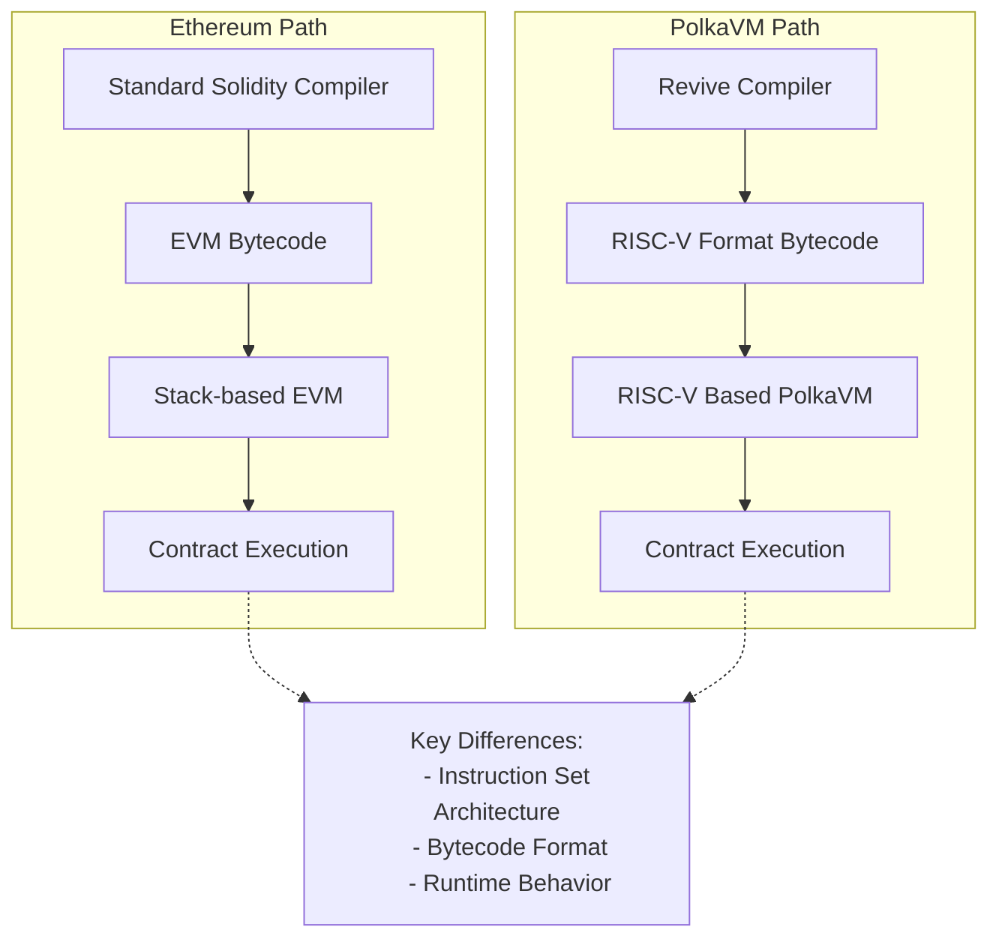

# EVM vs PolkaVM

While [PolkaVM](/polkadot-protocol/smart-contract-basics/polkavm-design/){target=\_blank} strives for maximum Ethereum compatibility, several fundamental design decisions create necessary divergences from the [EVM](https://ethereum.org/en/developers/docs/evm/){target=\_blank}. These differences represent trade-offs that enhance performance and resource management while maintaining accessibility for Solidity developers.

## Core Virtual Machine Architecture

The most significant departure from Ethereum comes from PolkaVM's foundation itself. Rather than implementing the EVM, PolkaVM utilizes a RISC-V instruction set. For most Solidity developers, this architectural change remains transparent thanks to the [Revive compiler's](https://github.com/paritytech/revive){target=\_blank} complete Solidity support, including inline assembler functionality.

However, this architectural difference becomes relevant in specific scenarios. Tools that attempt to download and inspect contract bytecode will fail, as they expect EVM bytecode rather than PolkaVM's RISC-V format. This primarily affects contracts using [`EXTCODECOPY`](https://www.evm.codes/?fork=cancun#3c){target=\_blank} to manipulate code at runtime, though such cases are rare. PolkaVM offers an elegant alternative through its [on-chain constructors](https://paritytech.github.io/polkadot-sdk/master/pallet_revive/pallet/struct.Pallet.html#method.bare_instantiate){target=\_blank}, enabling contract instantiation without runtime code modification.

### High-Level Architecture Comparison

|            Feature            |                            Ethereum Virtual Machine (EVM)                            |                        PolkaVM                         |
| :---------------------------: | :----------------------------------------------------------------------------------: | :----------------------------------------------------: |
|      **Instruction Set**      |                           Stack-based architecture                                   |                 RISC-V instruction set                 |
|      **Bytecode Format**      |                                     EVM bytecode                                     |                     RISC-V format                      |
|    **Contract Size Limit**    |                                 24KB code size limit                                 |            Contract-specific memory limits             |
|         **Compiler**          |                                  Solidity Compiler                                   |                    Revive Compiler                     |
|      **Inline Assembly**      |                                      Supported                                       |           Supported with compatibility layer           |
|    **Code Introspection**     | Supported via [`EXTCODECOPY`](https://www.evm.codes/?fork=cancun#3c){target=\_blank} | Limited support, alternative via on-chain constructors |
|     **Resource Metering**     |                                  Single gas metric                                   |                   Multi-dimensional                    |
| **Runtime Code Modification** |                                      Supported                                       |               Limited, with alternatives               |
|  **Contract Instantiation**   |                                 Standard deployment                                  |    On-chain constructors for flexible instantiation    |

## Gas Model

Ethereum's resource model relies on a single metric: [gas](https://ethereum.org/en/developers/docs/gas/#what-is-gas){target=\_blank}, which serves as the universal unit for measuring computational costs. Each operation on the network consumes a specific amount of gas. Most platforms aiming for Ethereum compatibility typically adopt identical gas values to ensure seamless integration.

The significant changes to Ethereum's gas model will be outlined in the following sections.

### Dynamic Gas Value Scaling

Instead of adhering to Ethereum's fixed gas values, PolkaVM implements benchmark-based pricing that better reflects its improved execution performance. This makes instructions cheaper relative to I/O-bound operations but requires developers to avoid hardcoding gas values, particularly in cross-contract calls.

### Multi-Dimensional Resource Metering

Moving beyond Ethereum's single gas metric, PolkaVM meters three distinct resources:

- **`ref_time`** - equivalent to traditional gas, measuring computation time
- **`proof_size`** - tracks state proof size for validator verification
- **`storage_deposit`** - manages state bloat through a deposit system

These three can be limited at the transaction level, just like gas on Ethereum. The Ethereum RPC proxy maps all three of these into the single dimension gas so that everything behaves as on Ethereum for users. This ensures that the transaction cost displayed in the wallet accurately represents the actual costs, even though it uses these three resources internally.

These resources can also be limited when making a cross-contract call. However, Solidity doesn't allow specifying anything other than `gas_limit` for a cross-contract call. The PolkaVM takes the `gas_limit` the contract supplies and uses that as `ref_time_limit.` The other two resources are just uncapped in this case. Please note that uncapped means the transaction-specified limits still constrain them, so this cannot be used to trick the signer of the transaction.

Resource limiting in cross-contract calls serves a critical security purpose, particularly when interacting with untrusted contracts.

For compatibility, PolkaVM maps traditional gas-related operations to its `ref_time` metric, which is the closest analog to Ethereum's gas system.

## Memory Management

The EVM and the PolkaVM take fundamentally different approaches to memory constraints:

|          Feature         |       Ethereum Virtual Machine (EVM)      |                   PolkaVM                      |
| :----------------------: | :---------------------------------------: | :--------------------------------------------: |
| **Memory Constraints**   | Indirect control via gas costs            | Hard memory limits per contract                |
| **Cost Model**           | Increasing gas curve with allocation size | Fixed costs separated from execution gas       |
| **Memory Limits**        | Soft limits through prohibitive gas costs | Hard fixed limits per contract                 |
| **Pricing Efficiency**   | Potential overcharging for memory         | More efficient through separation of concerns  |
| **Contract Nesting**     | Limited by available gas                  | Limited by constant memory per contract        |
| **Memory Metering**      | Dynamic based on total allocation         | Static limits per contract instance            |
| **Future Improvements**  | Incremental gas cost updates              | Potential dynamic metering for deeper nesting  |
| **Cross-Contract Calls** | Handled through gas forwarding            | Requires careful boundary limit implementation |

The architecture establishes a constant memory limit per contract, which is the basis for calculating maximum contract nesting depth. This calculation assumes worst-case memory usage for each nested contract, resulting in a straightforward but conservative limit that operates independently of actual memory consumption. Future iterations may introduce dynamic memory metering, allowing deeper nesting depths for contracts with smaller memory footprints. However, such an enhancement would require careful implementation of cross-contract boundary limits before API stabilization, as it would introduce an additional resource metric to the system.

## Account Management - Existential Deposit

Ethereum and Polkadot handle account persistence differently, affecting state management and contract interactions:

### Account Management Comparison

|          Feature          |                   Ethereum Approach                   |               PolkaVM/Polkadot Approach                |
| :-----------------------: | :---------------------------------------------------: | :----------------------------------------------------: |
|  **Account Persistence**  | Accounts persist indefinitely, even with zero balance | Requires existential deposit (ED) to maintain account  |
|  **Account Persistence**  |  Accounts exist indefinitely, even with zero balance  | Requires existential deposit (ED) to maintain account  |
|    **Minimum Balance**    |                         None                          |                      ED required                       |
|   **Account Deletion**    |               Accounts remain in state                |      Accounts below ED are automatically deleted       |
|   **Contract Accounts**   |                  Exist indefinitely                   |                    Must maintain ED                    |
|   **Balance Reporting**   |                 Reports full balance                  |      Reports ED-adjusted balance via Ethereum RPC      |
| **New Account Transfers** |                   Standard transfer                   |     Includes ED automatically with extra fee cost      |
| **Contract-to-Contract**  |                   Direct transfers                    | ED drawn from transaction signer, not sending contract |
|   **State Management**    |      Potential bloat from zero-balance accounts       |     Optimized with auto-deletion of dust accounts      |

This difference introduces potential compatibility challenges for Ethereum-based contracts and tools, particularly wallets. To mitigate this, PolkaVM implements several transparent adjustments:

- Balance queries via Ethereum RPC automatically deduct the ED, ensuring reported balances match spendable amounts
- Account balance checks through EVM opcodes reflect the ED-adjusted balance
- Transfers to new accounts automatically include the ED (`x + ED`), with the extra cost incorporated into transaction fees
- Contract-to-contract transfers handle ED requirements by:

  - Drawing ED from the transaction signer instead of the sending contract
  - Keeping transfer amounts transparent for contract logic
  - Treating ED like other storage deposit costs

This approach ensures that Ethereum contracts work without modifications while maintaining Polkadot's optimized state management.

## Contract Deployment

For most users deploying contracts (like ERC-20 tokens), contract deployment works seamlessly without requiring special steps. However, when using advanced patterns like factory contracts that dynamically create other contracts at runtime, you'll need to understand PolkaVM's unique deployment model.

In the PolkaVM, contract deployment follows a fundamentally different model from EVM. The EVM allows contracts to be deployed with a single transaction, where the contract code is bundled with the deployment transaction. In contrast, PolkaVM has a different process for contract instantiation.

- **Code must be pre-uploaded** - unlike EVM, where contract code is bundled within the deploying contract, PolkaVM requires all contract bytecode to be uploaded to the chain before instantiation
- **Factory pattern limitations** - the common EVM pattern, where contracts dynamically create other contracts, will fail with `CodeNotFound` error unless the dependent contract code was previously uploaded
- **Separate upload and instantiation** - this creates a two-step process where developers must first upload all contract code, then instantiate relationships between contracts

This architecture impacts several common EVM patterns:

- Factory contracts must be modified to work with pre-uploaded code rather than embedding bytecode
- [`create`](https://www.evm.codes/?fork=cancun#f0){target=\_blank} and [`create2`](https://www.evm.codes/?fork=cancun#f5){target=\_blank} deployments need adaptation since they can't dynamically generate contract code
- Runtime code generation is not supported due to PolkaVM's RISC-V bytecode format

When migrating EVM projects to PolkaVM, developers should identify all contracts that will be instantiated at runtime and ensure they are pre-uploaded to the chain before any instantiation attempts.
