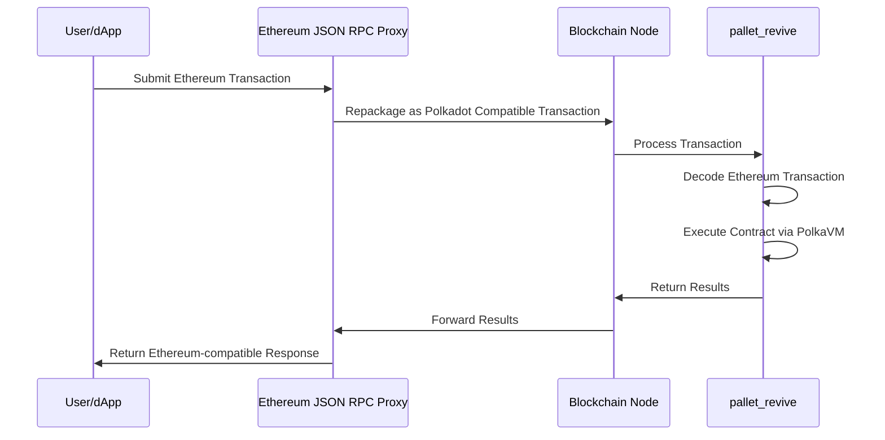
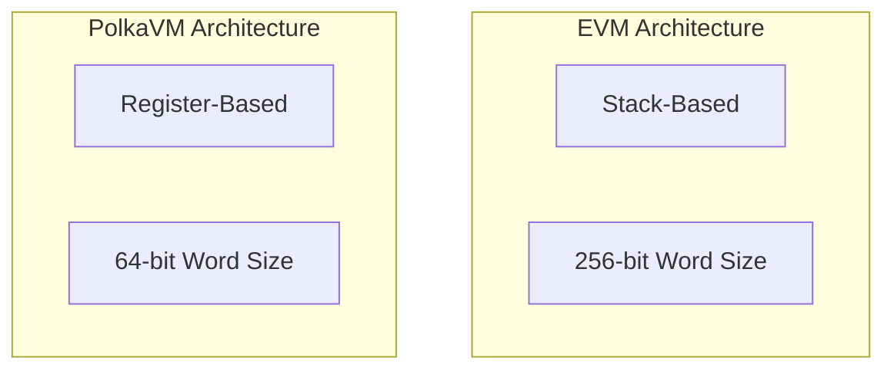
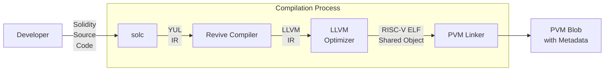

# PolkaVM Design

--8<-- 'text/smart-contracts/polkaVM-warning.md'

## Introduction

The Asset Hub smart contracts solution includes multiple components to ensure Ethereum compatibility and high performance. Its architecture allows for integration with current Ethereum tools, while its innovative virtual machine design enhances performance characteristics.

## PolkaVM

[**PolkaVM**](https://github.com/paritytech/polkavm){target=\_blank} is a custom virtual machine optimized for performance with [RISC-V-based](https://en.wikipedia.org/wiki/RISC-V){target=\_blank} architecture, supporting Solidity and additional high-performance languages. It serves as the core execution environment, integrated directly within the runtime. It features:

- An efficient interpreter for immediate code execution
- A planned JIT compiler for optimized performance
- Dual-mode execution capability, allowing selection of the most appropriate backend for specific workloads
- Optimized performance for short-running contract calls through the interpreter

The interpreter remains particularly beneficial for contracts with minimal code execution, as it eliminates JIT compilation overhead and enables immediate code execution through lazy interpretation.

## Architecture

The smart contract solution consists of the following key components that work together to enable Ethereum compatibility on Polkadot-based chains:

### Pallet Revive

[**`pallet_revive`**](https://paritytech.github.io/polkadot-sdk/master/pallet_revive/index.html){target=\_blank} is a runtime module that executes smart contracts by adding extrinsics, runtime APIs, and logic to convert Ethereum-style transactions into formats compatible with Polkadot SDK-based blockchains. It processes Ethereum-style transactions through the following workflow:

This proxy-based approach eliminates the need for node binary modifications, maintaining compatibility across different client implementations. Preserving the original Ethereum transaction payload simplifies adapting existing tools, which can continue processing familiar transaction formats.

### PolkaVM Design Fundamentals

PolkaVM introduces two fundamental architectural differences compared to the Ethereum Virtual Machine (EVM):

- **Register-based design** - PolkaVM utilizes a RISC-V register-based approach. This design:

    - Employs a finite set of registers for argument passing instead of an infinite stack
    - Facilitates efficient translation to underlying hardware architectures
    - Optimizes register allocation through careful register count selection
    - Enables simple 1:1 mapping to x86-64 instruction sets
    - Reduces compilation complexity through strategic register limitation
    - Improves overall execution performance through hardware-aligned design

- **64-bit word size**  - PolkaVM operates with a 64-bit word size as follows:

    - Enables direct hardware-supported arithmetic operations
    - Maintains compatibility with Solidity's 256-bit operations through YUL translation
    - Allows integration of performance-critical components written in lower-level languages
    - Optimizes computation-intensive operations through native word size alignment
    - Reduces overhead for operations not requiring extended precision
    - Facilitates efficient integration with modern CPU architectures

## Compilation Process

When compiling a Solidity smart contract, the code passes through the following stages:

The compilation process integrates several specialized components:

1. **Solc** - the standard Ethereum Solidity compiler that translates Solidity source code to [YUL IR](https://docs.soliditylang.org/en/latest/yul.html){target=\_blank}
2. **Revive Compiler** - takes YUL IR and transforms it to [LLVM IR](https://llvm.org/){target=\_blank}
3. **LLVM** - a compiler infrastructure that optimizes the code and generates RISC-V ELF objects
4. **PVM linker** - links the RISC-V ELF object into a final PolkaVM blob with metadata