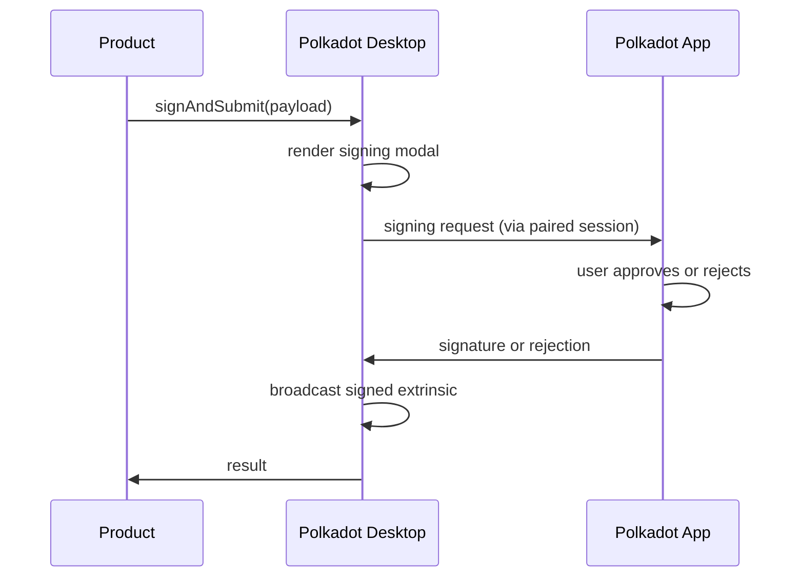

# Signing

## Introduction

Polkadot Desktop is the **mediator** in the signing model; the Polkadot App on the user's phone is the **signer**. Desktop never has the private key, and Desktop cannot sign anything on its own — every transaction a Product submits, no matter how small, completes only after the user explicitly approves it on their phone.

This page is the reference for *how* that mediation actually works. The Product-side how-to lives at [Accounts and Signing](/apps/build/accounts-and-signing/){target=\_blank}; this page documents the part of the flow Desktop owns.

## The Three-Actor Model

A signing operation always involves three actors:

- **Your Product** builds the transaction and calls `signAndSubmit` (through `@parity/product-sdk` or directly through TrUAPI).
- **Polkadot Desktop** receives the encoded payload, renders the signing modal showing the user what they're about to sign, and forwards the request to the paired App.
- **The Polkadot App** receives the request, prompts the user on their phone, signs on approval, and returns the signature.

Your Product code awaits a single promise for this entire round trip.

## `ChainSubmit`: Ability to Request ≠ Auto-Sign

The most common point of confusion in the signing model is what the `ChainSubmit` permission actually grants. It does **not** authorize Desktop to sign on the user's behalf. It authorizes your Product to *request* that a signing prompt be presented to the user.

The distinction matters because it determines what UI you need to build:

- Without `ChainSubmit`, your Product cannot even ask. Desktop blocks the dispatch at the Host-API boundary and returns `PermissionDenied`. The user has to enable the permission in App Settings before your Product can request signing.
- With `ChainSubmit`, your Product can ask — and every individual transaction triggers a fresh per-request prompt on the paired App that the user must approve. There is no "auto-sign for the rest of this session" mode. Two consecutive transactions produce two prompts; ten produce ten.

This is intentional. The key only ever leaves the App as a signature over a specific payload the user just looked at — never as a blanket consent.

## What the User Sees

When your Product calls `signAndSubmit`, Desktop drives the following sequence:

1. **Desktop displays a signing modal.** The modal shows the network name, transaction type (for example, *Balances Transfer*), the call arguments, and an estimated fee. A **More details** toggle reveals the encoded call data for advanced users.
2. **User clicks Continue to Sign.** Desktop transitions to a waiting screen with the message *Open the Polkadot App on your device, then tap Sign or Reject* and a countdown timer indicating the remaining session validity.
3. **User approves or rejects on the App.** The App returns the signature or a rejection.
4. **Desktop receives the result.** If approved, Desktop broadcasts the signed extrinsic and returns the outcome to your Product. If rejected (or if the timer reached zero before the user responded), Desktop returns an error.

## Asynchronous Approval and Timeouts

Because the App is a separate device, signing is inherently asynchronous. Your Product needs to tolerate the round-trip latency between the dispatch and the result.

Two failure modes are first-class and your Product UI should handle both:

- **User-initiated rejection.** The user dismissed the prompt on the App. From your Product's perspective this should be treated like a cancellation — return the user to a stable UI state and let them retry. The Product SDK surfaces this as `HostRejectedError`.
- **Session-timeout.** The countdown reached zero before the user responded. From your Product's perspective this is functionally identical to a rejection — same response: stable UI, retry available. The Product SDK surfaces this as `TimeoutError`.

For the Product-side `try`/`catch` pattern, see [Accounts and Signing](/apps/build/accounts-and-signing/){target=\_blank}.

A practical UI consequence: do not freeze your interface for the duration of a sign request. The user may glance at their phone, get distracted, and only approve a few seconds later — sometimes much later. Show a non-blocking pending state and make sure your retry path is idempotent in case the user attempts the same action twice.

## Where to Go Next

- Guide **Accounts and Signing**

    ---

    The Product-side how-to for building, signing, and submitting transactions, including the `try`/`catch` patterns for the failure modes documented above.

    [:octicons-arrow-right-24: Get Started](/apps/build/accounts-and-signing/){target=\_blank}

- Learn **Permissions**

    ---

    How `ChainSubmit` is declared in your Product manifest and how Desktop enforces it at the Host-API boundary.

    [:octicons-arrow-right-24: Reference](/reference/apps/hosts/polkadot-desktop/permissions/)

